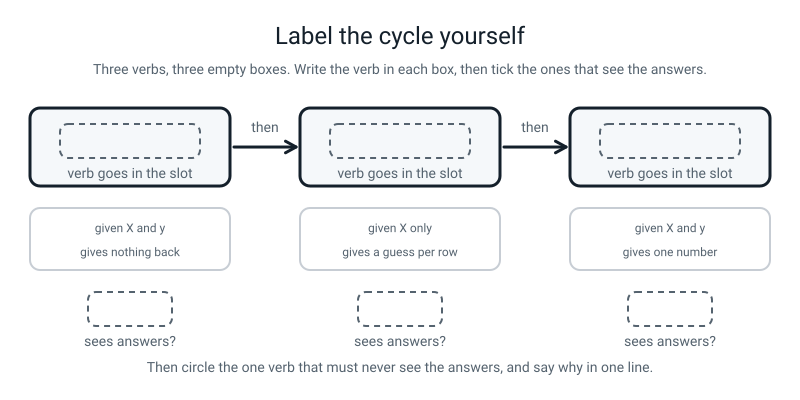
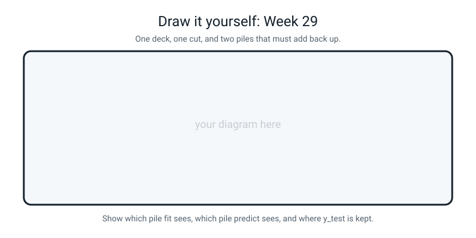

# Workbook — Week 29: Nearest Neighbours, and the 20% You Must Hide

**Name:** ________________________________  **Date:** ______________

[⬅ Week 28](week-28.md) · [📖 Read the chapter first](../student-guide/week-29.md) · [Course Home](../README.md) · [🧑‍🏫 Teacher guide](../teacher-guide/week-29.md) · [Next ➡](week-30.md)

**You will need:** a real deck of cards · one envelope you can sign across the flap · a pen (not a pencil) · a calculator · your `X` and `y` from Week 28

---

## ✅ Warm-Up (5 min)

This warm-up checks what you kept from last week. Answer from memory first, then look back if you need to.

**W1.** `X = playlist[["bpm", "minutes"]]` and `y = playlist["mood"]`. Why does one of those need two sets of brackets?

________________________________________________________________

**W2.** A table has 40 rows and 3 measurement columns. Write both shapes.

`X.shape` = ____________   `y.shape` = ____________

**W3.** Name the four distance steps, in order.

________________________________________________________________

**W4.** `iris = load_iris` — no brackets. What have you actually put in `iris`?

________________________________________________________________

**W5.** In your homework, one column contributed 99.89% of a distance. Which one was it, and what made it win?

________________________________________________________________

---

## 🔎 Predict the Output

This section is for guessing before you run. Write your prediction in the space first, then run the code and write what really printed.

**Write your prediction before you run anything.**

### P1 — the same six songs, three committee sizes

This program fits one model three times with a different `k` each time. Read it, predict, then run it.

```python
import numpy as np
from sklearn.neighbors import KNeighborsClassifier

songs = np.array([[68.0, 4.2], [72.0, 5.1], [76.0, 4.6],
                  [148.0, 3.1], [152.0, 3.4], [160.0, 2.8]])
moods = np.array(["chill", "chill", "chill", "hype", "hype", "hype"])

mystery = [[112.0, 4.0]]
for k in [1, 3, 5]:
    model = KNeighborsClassifier(n_neighbors=k)
    model.fit(songs, moods)
    print(f"k = {k}  ->", model.predict(mystery))
```

**I predict — three lines:**

________________________________________________________________

________________________________________________________________

**It really printed:**

________________________________________________________________

________________________________________________________________

**How many of the three answers are the same?** ______

**Work out the six distances with a calculator and sort them. Then explain the pattern you got.**

| song | bpm | minutes | mood | distance |
|---|---|---|---|---|
| 0 | 68 | 4.2 | chill | |
| 1 | 72 | 5.1 | chill | |
| 2 | 76 | 4.6 | chill | |
| 3 | 148 | 3.1 | hype | |
| 4 | 152 | 3.4 | hype | |
| 5 | 160 | 2.8 | hype | |

________________________________________________________________

________________________________________________________________

### P2 — what does `train_test_split` actually hand back?

This program splits iris and prints how many things come back and the shape of each. Read it, predict, then run it.

```python
from sklearn.datasets import load_iris
from sklearn.model_selection import train_test_split

iris = load_iris()
parts = train_test_split(iris.data, iris.target, test_size=0.2, random_state=42)
print(len(parts))
print(parts[0].shape)
print(parts[1].shape)
print(parts[2].shape)
print(parts[3].shape)
```

**I predict — five lines:**

________________________________________________________________

________________________________________________________________

**It really printed:**

________________________________________________________________

________________________________________________________________

**Line 1 tells you the most important thing about `train_test_split`. What is it?**

________________________________________________________________

**Two of the four shapes have a lonely comma. Which two, and why those two?**

________________________________________________________________

**Name `parts[0]`, `parts[1]`, `parts[2]` and `parts[3]` in the right order:**

________________________________________________________________

### P3 — two scores, one model

This program fits a one-neighbour model and scores it on two different piles of rows. Read it, predict, then run it.

```python
from sklearn.datasets import load_iris
from sklearn.model_selection import train_test_split
from sklearn.neighbors import KNeighborsClassifier

iris = load_iris()
X = iris.data[:, 0:2]                    # the two sepal columns only
X_train, X_test, y_train, y_test = train_test_split(
    X, iris.target, test_size=0.2, random_state=42)

model = KNeighborsClassifier(n_neighbors=1)
model.fit(X_train, y_train)
print(model.score(X_train, y_train))
print(round(model.score(X_test, y_test), 4))
print(len(X_test))
```

**I predict — three lines:**

________________________________________________________________

**It really printed:**

________________________________________________________________

________________________________________________________________

**Which of those two scores would you put in a report?** ____________  **Why?**

________________________________________________________________

**What is the gap?** ____________

**With `k = 1`, line 1 should have been exactly 1.0 and it was not. Have a guess at why.**

________________________________________________________________

________________________________________________________________

### P4 — four names, in the order most brains want

This program catches the four pieces of the split under four names. Read it, predict, then run it.

```python
from sklearn.datasets import load_iris
from sklearn.model_selection import train_test_split

iris = load_iris()
X_train, y_train, X_test, y_test = train_test_split(
    iris.data, iris.target, test_size=0.2, random_state=42)
print("X_train", X_train.shape)
print("y_train", y_train.shape)
print("X_test ", X_test.shape)
print("y_test ", y_test.shape)
```

**Does this crash?** ____________

**I predict — four lines:**

________________________________________________________________

________________________________________________________________

**It really printed:**

________________________________________________________________

________________________________________________________________

**Two of those four shapes are impossible for what their name says they are. Which two, and what is wrong?**

________________________________________________________________

________________________________________________________________

**Why did Python not complain?**

________________________________________________________________

**So what is the one line you add after every `train_test_split`, for the rest of your life?**

________________________________________________________________

**How many of the four predictions did you get right?** ______ / 4

**Which one surprised you most, and why?**

________________________________________________________________

---

## ✍️ Practice Set A — Read It

This set is for reading code, tables and errors and saying what they mean. Write your answers in the tables and on the lines.

**A1. The vote, on paper.** For each list of nearest neighbours (nearest first), give the prediction for `k = 1`, `k = 3` and `k = 5`. Write the tally, not just the answer.

| # | Neighbours, nearest first | k = 1 | k = 3 | k = 5 |
|---|---|---|---|---|
| a | chess, chess, art, chess, art | | | |
| b | art, chess, chess, chess, art | | | |
| c | hype, chill, chill, chill, hype | | | |
| d | setosa, versicolor, versicolor, setosa, setosa | | | |
| e | chill, chill, hype, hype, hype | | | |

**A1(f).** Which rows change their answer as `k` grows? What do those rows have in common?

________________________________________________________________

________________________________________________________________

**A1(g).** In (d), which answer would you actually trust, and why?

________________________________________________________________

________________________________________________________________

**A1(h).** `k = 4`, neighbours: chess, chess, art, art. What happens?

________________________________________________________________

**A2. Four shapes that must add up.** Fill the table in. All of them use `test_size=0.2` unless stated.

| # | The whole table | `X_train.shape` | `X_test.shape` | `y_train.shape` | `y_test.shape` |
|---|---|---|---|---|---|
| a | 150 rows, 4 columns | | | | |
| b | 178 rows, 13 columns | | | | |
| c | 10 rows, 2 columns | | | | |
| d | 569 rows, 30 columns | | | | |
| e | 40 rows, 3 columns, `test_size=0.25` | | | | |

**A2(f).** Which two shapes must always have the same first number, and why?

________________________________________________________________

________________________________________________________________

**A2(g).** Which number never appears in `y`'s shapes at all?

________________________________________________________________

**A2(h).** For row (b), 20% of 178 is 35.6. Sklearn gives 36, not 35. So what should you never trust — your arithmetic, or `len()`?

________________________________________________________________

**A3. Which verb sees the answers?** Tick, then give the reason.

| The call | Sees `y` | Does not | The reason |
|---|---|---|---|
| `model.fit(X_train, y_train)` | ☐ | ☐ | |
| `model.predict(X_test)` | ☐ | ☐ | |
| `model.score(X_test, y_test)` | ☐ | ☐ | |
| `train_test_split(X, y, ...)` | ☐ | ☐ | |

**A3(e).** Only one of those four would be *pointless* if it saw the answers. Which, and why?

________________________________________________________________

**A3(f).** What is `y_test` used for, in one sentence?

________________________________________________________________

**A4. Spot the bug.** Every line is wrong or dangerous. Write the fix.

| # | The line | The fix |
|---|---|---|
| a | `model = KNeighborsClassifier(n_neighbours=5)` | |
| b | `model.predict([3.0, 1.0])` | |
| c | `X_train, X_test = train_test_split(X, y, test_size=0.2)` | |
| d | `model.fit(X_train, y_test)` | |
| e | `from sklearn import KNeighborsClassifier` | |
| f | `from sklearn.datasets import train_test_split` | |
| g | `train_test_split(X, y, test_size=0.2)` — no `random_state` | |
| h | `model.fit(X, y)` then `print(model.score(X, y))` | |

**A4(i).** Two of those eight produce **no error at all.** Which two?

________________________________________________________________

**A4(j).** For each of those two, say what the *symptom* is instead of an error message.

________________________________________________________________

________________________________________________________________

**A5. Label the diagram.** Write the name of each stage in its dashed slot, then answer the question underneath each one.


*Figure W29.1 — Three stages, and only some of them are allowed to see the answers.*

**Box 1** ______________  **Box 2** ______________  **Box 3** ______________

**Does it see the answers?**  1: ______  2: ______  3: ______

**A5(a).** Which order do the three have to happen in, and what error do you get if you swap the first two?

________________________________________________________________

**A5(b).** One of the three does not really "learn" anything for a kNN model. Which one, and what does it do instead?

________________________________________________________________

**A6. Read the traceback.** This is the most-quoted error in the whole level.

```text
Traceback (most recent call last):
  File "/Users/you/project/first_model.py", line 18, in <module>
    guess = model.predict([3.0, 1.0])
  File ".../sklearn/neighbors/_classification.py", line 274, in predict
    neigh_ind = self.kneighbors(X, return_distance=False)
  File ".../sklearn/neighbors/_base.py", line 838, in kneighbors
    X = validate_data(
  File ".../sklearn/utils/validation.py", line 1091, in check_array
    raise ValueError(msg)
ValueError: Expected 2D array, got 1D array instead:
array=[3. 1.].
Reshape your data either using array.reshape(-1, 1) if your data has a single feature or array.reshape(1, -1) if it contains a single sample.
```

**How many lines of the message are one sentence?** ______

**What does "2D" mean, in plain English?** ______________________

**What does "1D" mean?** ______________________

**Which line names *your* mistake?** ______________________

**Why does `predict` insist on a table for a single flower?**

________________________________________________________________

________________________________________________________________

**The message offers you two different `reshape` calls. What does offering you two rather than choosing one tell you?**

________________________________________________________________

**The fix, in full:** ______________________

---

## ✍️ Practice Set B — Write It

This set is for writing short programs yourself. Each task gives the expected output and a "Done looks like" check.

### B1 — one line

**Write the single line that makes a kNN model with a committee of seven. Do not fit it.**

Type your line in the block below.

```python
# your line here:
```

**Done looks like:** the American spelling, and you can say out loud what the model knows at this point. *(Nothing.)*

### B2 — three lines and a guess

Six flowers with petal measurements, three setosa and three versicolor. Make a model with `k = 3`, fit it, and predict the mystery flower at `(3.0, 1.0)`.

The six: `(1.4, 0.2)`, `(1.4, 0.2)`, `(1.3, 0.2)` all setosa; `(4.7, 1.4)`, `(4.5, 1.5)`, `(4.9, 1.5)` all versicolor.

**Expected output:**

```text
the model guesses: ['versicolor']
```

**Done looks like:** `np.array` for both `X` and `y`, exactly three model lines, and **double brackets** in the predict.

### B3 — cut the deck and check the arithmetic

Load iris, split it 80/20 with `random_state=42`, and print all four shapes plus a line proving the row counts add back up.

**Expected output:**

```text
whole table : (150, 4)
train pile  : (120, 4)  answers: (120,)
test pile   : (30, 4)  answers: (30,)

len(X_train) = 120
len(X_test)  = 30
120 + 30 = 150
```

**Done looks like:** four names on the left in the right order, and the last line uses `len(X_train) + len(X_test)` rather than a typed-in 150.

### B4 — the full cycle, both scores

Load iris, split it 80/20 with `random_state=42`, make a kNN with `k = 5`, fit it, and print **both** scores with their row counts and the gap.

**Expected output:**

```text
train score: 0.9667 on 120 rows
test  score: 1.0 on 30 rows
len(X_test) = 30
the gap    : -0.0333
```

**Done looks like:** `fit` called on the training pile only, both scores stored in named variables before printing, and `len(X_test)` printed on its own line as well.

### B5 — every odd `k` from 1 to 25, about 15 lines

Use only the **two sepal columns** of iris, `random_state=42`. For every odd `k` from 1 to 25, print the train score, the test score and the gap. Then print which `k` gave the best held-back score.

**Expected output:**

```text
k =  1   train = 0.9417   test = 0.7333   gap = +0.2083
k =  3   train = 0.8667   test = 0.7667   gap = +0.1000
k =  5   train = 0.8250   test = 0.8000   gap = +0.0250
k =  7   train = 0.8000   test = 0.7667   gap = +0.0333
k =  9   train = 0.8083   test = 0.8000   gap = +0.0083
k = 11   train = 0.8083   test = 0.7667   gap = +0.0417
k = 13   train = 0.7750   test = 0.7667   gap = +0.0083
k = 15   train = 0.7583   test = 0.8333   gap = -0.0750
k = 17   train = 0.7833   test = 0.8333   gap = -0.0500
k = 19   train = 0.7917   test = 0.8667   gap = -0.0750
k = 21   train = 0.7917   test = 0.8667   gap = -0.0750
k = 23   train = 0.7917   test = 0.8333   gap = -0.0417
k = 25   train = 0.8083   test = 0.8667   gap = -0.0583

best k on the held-back rows: 19 at 0.8667
test rows: 30
```

**Done looks like:** `range(1, 26, 2)`, an f-string with `:.4f` and a `+` sign on the gap, and two variables tracking the best score so far.

**And one thing to write underneath your output, in words:** what happens to the **gap** as `k` gets bigger?

________________________________________________________________

---

## 🐞 Fix the Broken Program

This section is for finding bugs one at a time, from the loudest to the quietest. Run the file, read each message, and fix one bug before moving on.

Here is `broken29.py`. It is supposed to run the full cycle on the two sepal columns and report both scores. It has **three** bugs. One stops Python reading the file. One stops it partway through. One produces **no error whatsoever**.

```python
# iris_sepals.py - the full cycle, using only the two sepal columns. THREE BUGS.
from sklearn.datasets import load_iris
from sklearn.model_selection import train_test_split
from sklearn.neighbors import KNeighborsClassifier

iris = load_iris()
X = iris.data[:, 0:2]                    # the two sepal columns only
y = iris.target

X_train, X_test, y_train, y_test = train_test_split(
    X, y, test_size=0.2, random_state=42

model = KNeighborsClassifier(n_neighbours=1)
model.fit(X, y)

train_score = model.score(X_train, y_train)
test_score = model.score(X_test, y_test)

print("train score:", round(train_score, 4), "on", len(X_train), "rows")
print("test  score:", round(test_score, 4), "on", len(X_test), "rows")
print("THE GAP    :", round(train_score - test_score, 4))
```

**Bug 1.** Run it as it is. The real message:

```text
  File "/private/tmp/broken29.py", line 10
    X_train, X_test, y_train, y_test = train_test_split(
                                                       ^
SyntaxError: '(' was never closed
```

**Did any of it run?** ____________  **How do you know?**

________________________________________________________________

**The fix:**

________________________________________________________________

**Bug 2.** Fix bug 1 and run again. The real message:

```text
Traceback (most recent call last):
  File "/private/tmp/broken29.py", line 13, in <module>
    model = KNeighborsClassifier(n_neighbours=1)
TypeError: KNeighborsClassifier.__init__() got an unexpected keyword argument 'n_neighbours'
```

**What does "unexpected keyword argument" mean, in plain words?**

________________________________________________________________

**What is wrong with the spelling, and is it your fault?**

________________________________________________________________

**The fix:**

________________________________________________________________

**Bug 3.** Fix bug 2 and run again. Now there is **no error at all**:

```text
train score: 0.925 on 120 rows
test  score: 0.9 on 30 rows
THE GAP    : 0.025
```

**Those look like good numbers. Small gap, both high. Why is that the problem?**

________________________________________________________________

________________________________________________________________

**Which line caused it?**

________________________________________________________________

**Here is what the correct version prints. Compare the two carefully.**

```text
train score: 0.9417 on 120 rows
test  score: 0.7333 on 30 rows
THE GAP    : 0.2083
```

**Which number moved most, and by how much?**

________________________________________________________________

**Write one sentence explaining what the buggy version was actually measuring.**

________________________________________________________________

________________________________________________________________

**The fix:**

________________________________________________________________

**And the general lesson, which is the whole week:**

________________________________________________________________

---

## 🧩 Puzzle of the Week

This puzzle is for doing a whole kNN vote by hand, then checking it in code. The second part is about ties.

### Part 1 — Twelve flowers and one mystery, all by hand

Twelve real iris rows, petal length and petal width only. One mystery flower: **petal length 5.2, petal width 1.7.**

| row | length | width | species |
|---|---|---|---|
| 0 | 1.4 | 0.2 | setosa |
| 1 | 1.4 | 0.2 | setosa |
| 2 | 1.3 | 0.2 | setosa |
| 3 | 1.5 | 0.2 | setosa |
| 50 | 4.7 | 1.4 | versicolor |
| 51 | 4.5 | 1.5 | versicolor |
| 52 | 4.9 | 1.5 | versicolor |
| 65 | 4.4 | 1.4 | versicolor |
| 100 | 6.0 | 2.5 | virginica |
| 101 | 5.1 | 1.9 | virginica |
| 102 | 5.9 | 2.1 | virginica |
| 103 | 5.6 | 1.8 | virginica |

**(a)** You do **not** need all twelve. Look at the setosa rows first and write one sentence saying why you can skip them.

________________________________________________________________

**(b)** Now compute the eight distances that matter, with a calculator. Two decimal places.

| row | species | gaps | squares | total | distance |
|---|---|---|---|---|---|
| 50 | versicolor | | | | |
| 51 | versicolor | | | | |
| 52 | versicolor | | | | |
| 65 | versicolor | | | | |
| 100 | virginica | | | | |
| 101 | virginica | | | | |
| 102 | virginica | | | | |
| 103 | virginica | | | | |

**(c)** Sort them, nearest first, and write the species next to each.

| position | distance | species |
|---|---|---|
| 1 | | |
| 2 | | |
| 3 | | |
| 4 | | |
| 5 | | |
| 6 | | |
| 7 | | |
| 8 | | |

**(d)** Now vote.

| `k` | Who votes | Tally | Answer |
|---|---|---|---|
| 1 | | | |
| 3 | | | |
| 5 | | | |
| 7 | | | |

**(e)** At which value of `k` does the answer change? ____________

**(f)** Write one honest sentence about how confident this model should be.

________________________________________________________________

________________________________________________________________

**(g)** Now check it in code. Write the three lines that confirm your `k = 5` answer, and say whether they agree.

________________________________________________________________

### Part 2 — Build a tie on purpose

**(h)** You have four neighbours: two chess and two art, all at different distances. `k = 4`. What does scikit-learn do, and is that a *reason* or a *rule*?

________________________________________________________________

________________________________________________________________

**(i)** With **three** possible answers, can `k = 3` still tie? Give the tally if so.

________________________________________________________________

**(j)** Fill in the smallest odd `k` that cannot tie, for each case:

| Number of possible answers | Smallest `k > 1` that cannot tie |
|---|---|
| 2 | |
| 3 | |

**(k)** So is "use an odd `k`" a complete solution, or a partial one? Say which and why.

________________________________________________________________

________________________________________________________________

---

## 🤔 Think Deeper

These two questions are for slow thinking, in a paragraph each. There is no code to run.

**T1.** A kNN model has no rules inside it. When you call `fit`, it copies your training rows and stops. So the trained model **is** your data.

Write a paragraph. Start with the literal consequence: describe exactly what you have handed over if you train a kNN model on 5,000 patients' medical records and email the trained model to a hospital. Then go a step further — somebody who can only *ask questions* of the model, without opening it, can still learn things about the training rows. Describe **how** they would go about it, concretely. Then the hard part: a patient asks you to delete their data. You delete their row from your table. **Is that enough?** Consider that you have already sent the trained model to fifty hospitals. Finish by naming one thing a **decision tree** (Week 31) would do differently, and whether that makes it safer.

________________________________________________________________

________________________________________________________________

________________________________________________________________

________________________________________________________________

________________________________________________________________

________________________________________________________________

**T2.** Same data (iris, two sepal columns), same model, same `k = 5`. Only `random_state` changing:

```text
random_state=0   test score = 0.6667
random_state=4   test score = 0.9000
random_state=7   test score = 0.6333
```

Write a paragraph. First, explain in plain words why one number can move 27 percentage points when nothing about the model or the data changed. Then: somebody runs all ten seeds, publishes 0.9000, and never mentions the other nine. **They did not lie about a single number.** Say precisely what they did wrong — and be careful, because "they lied" is not the right answer. Then the practical half: describe two different things you could do instead that would be honest, and say what each one costs you. Finish with the question that actually catches this in real life: what could you ask them to do that they could not have prepared for?

________________________________________________________________

________________________________________________________________

________________________________________________________________

________________________________________________________________

________________________________________________________________

________________________________________________________________

---

## 🛠️ Build It — The Envelope, the Cycle, and the Gap

This section is for doing the split with real cards first, then in code, then writing about it. Tick each box as you finish it.

### Part 1 — The physical split (do this first, before any code)

- [ ] I counted the deck and wrote the number down: ______ cards
- [ ] I shuffled it properly, and I can say **why** shuffling is necessary and not tidiness
- [ ] I worked out 20% of that number: ______ cards
- [ ] I dealt that many into a small pile, **counting out loud**
- [ ] I counted the big pile: ______ cards
- [ ] The two piles add up to my original number: ______ + ______ = ______
- [ ] I wrote the test count and today's date on the envelope
- [ ] I sealed it and **signed across the flap in pen**
- [ ] It is still sealed

**Why shuffle before cutting? Give the iris-specific reason, not a general one.**

________________________________________________________________

________________________________________________________________

**What is the one thing you are allowed to do with that envelope, and how many times?**

________________________________________________________________

### Part 2 — The full cycle in code (page 29.5)

Start from a **blank file**. Load iris, split it, fit a `k = 5` model, and print both scores.

- [ ] `random_state=42` is in my `train_test_split`
- [ ] I printed all four shapes and checked the row counts add up
- [ ] `fit` was called on `X_train` and `y_train` only
- [ ] I printed the score on the training rows
- [ ] I printed the score on the held-back rows
- [ ] I printed `len(X_test)` next to the second one
- [ ] I printed the gap

| | Value | Row count |
|---|---|---|
| Score on the rows it studied | | |
| Score on the rows it had never seen | | |
| **THE GAP** | | — |
| One test flower is worth… | ______ percentage points | — |

### Part 3 — The two sentences (page 29.6)

**Write two sentences, not four.** One about what the gap means, one about which number you would tell somebody. Rewrite it at least once; the first version is always too long.

**Draft:**

________________________________________________________________

________________________________________________________________

________________________________________________________________

**Final:**

________________________________________________________________

________________________________________________________________

**Now check your final version against these three:**

- Does it name a **number**? ______
- Does it say the **row count**? ______
- Does it avoid the word "accurate" with no denominator after it? ______

### Part 4 — The `random_state=7` extra

Change **one number**. Change nothing else.

| `random_state` | train score | test score | test rows |
|---|---|---|---|
| 42 | | | |
| 7 | | | |

**How many percentage points did the test score move?** ______

**How many flowers is that?** ______

**One line about what that tells you:**

________________________________________________________________

### Part 5 — Short questions

| # | Question | Your answer |
|---|---|---|
| i | What does `fit` do for a kNN model? | |
| ii | What does `predict` get given? | |
| iii | What is `y_test` used for? | |
| iv | What does `random_state` do? | |
| v | Why is a training score of 1.0 with `k = 1` not impressive? | |
| vi | What happens if `k` equals the number of training rows? | |
| vii | Why print `len(X_test)` next to the accuracy? | |
| viii | The four names, in order. | |

### Part 6 — The Bug Log

| What happened | Was there an error message? | What fixed it | What I will check next time |
|---|---|---|---|
| | | | |
| | | | |
| | | | |

---

## 🎨 Draw It

This page is for turning the week into one picture.

Draw one deck being cut into two piles that add back up — and show which pile each of the three verbs is allowed to touch.


*Figure W29.2 — Your page.*

> **What a good answer might look like:** at the top, one wide box labelled **"the whole table: 150 rows"**. A single dashed cut line running down through it, with an arrow labelled *"shuffle first, then cut once"*.
>
> Below it, two boxes of obviously different widths: a wide one labelled **"X_train + y_train — 120 rows — the model studies these"** and a narrow one drawn as a **sealed envelope** labelled **"X_test + y_test — 30 rows — sealed"**. Underneath both, the sum written out: **120 + 30 = 150**.
>
> Three arrows coming off the two piles, each labelled with a verb. **`fit`** points at the wide pile only, with a small tick and the note *"sees the answers"*. **`predict`** points at the envelope but only at the **X** half of it, with a cross over the y half and the note *"no answers go in"*. **`score`** points at both halves of the envelope, with the note *"the only step allowed to open it, and only once"*.
>
> And two annotations that show real understanding. An arrow to the signature across the envelope flap, labelled *"this is me promising myself, not somebody else"*. And a small note beside the 30: *"each of these is worth 3.3 percentage points, so a gap of one flower is noise."*
>
> **What a weak answer looks like:** two piles with no numbers on them, or the three verbs drawn as a row of boxes with no arrows pointing at any particular pile — which means the split was drawn but the point of it was not. **The whole diagram is about which pile each verb may touch. If your arrows do not say that, the drawing has not done its job.**

---

## 📊 Self-Check

This section is for rating yourself honestly and spotting what to ask about. Tick one box on each row.

| I can… | 😀 got it | 🙂 nearly | 😕 not yet |
|---|---|---|---|
| Explain kNN as a majority vote of the `k` nearest rows | ☐ | ☐ | ☐ |
| Do the vote by hand from a sorted list of neighbours | ☐ | ☐ | ☐ |
| Make, fit and use a model in three lines | ☐ | ☐ | ☐ |
| Write the four names from `train_test_split` in the right order | ☐ | ☐ | ☐ |
| Say what `random_state` is for | ☐ | ☐ | ☐ |
| Report both scores with the row count next to each | ☐ | ☐ | ☐ |
| Explain in one sentence why the held-back score is the honest one | ☐ | ☐ | ☐ |
| Read a gap as a diagnosis rather than as two facts | ☐ | ☐ | ☐ |

**True or false?** Circle one on each row.

| Statement | | |
|---|---|---|
| kNN works out rules while it is fitting | TRUE | FALSE |
| For kNN, `fit` is fast and `predict` is slow | TRUE | FALSE |
| Bigger `k` is always better | TRUE | FALSE |
| `model.predict([3.0, 1.0])` works for one flower | TRUE | FALSE |
| `train_test_split` hands back four things | TRUE | FALSE |
| The order is `X_train, y_train, X_test, y_test` | TRUE | FALSE |
| Running the file again makes the model better | TRUE | FALSE |
| A training score of 1.0 means the model is excellent | TRUE | FALSE |
| `predict` is allowed to see `y` | TRUE | FALSE |
| Without `random_state` you get a different score every run | TRUE | FALSE |
| A test score higher than the train score means something is broken | TRUE | FALSE |
| `n_neighbours` is the correct spelling for scikit-learn | TRUE | FALSE |
| The test set is a second thing to train on | TRUE | FALSE |
| Hiding 20% of your rows is wasteful | TRUE | FALSE |

One thing I'd like explained again:

________________________________________________________________

---

## ✅ Answers

This section is for marking your own work, after you have finished every page above. Open it only when you are done.

<details>
<summary>Check your answers</summary>

### Warm-Up

**W1.** Because `X` has to come back as a **table** and `y` as a single **column**. The inner brackets are a **list of names**, and asking a table for a list of names gets you a table back. One name gets you one column.

**W2.** `X.shape` = `(40, 3)` and `y.shape` = `(40,)`. Rows first, columns second, and the lonely comma means "there is no second number".

**W3.** **Subtract, square, add up, square root.**

**W4.** The **function itself** — the machine, not the data. `iris.data` on it gives `AttributeError: 'function' object has no attribute 'data'`. The round brackets are what run it.

**W5.** **`bpm`.** It won because it is written in numbers in the hundreds while `minutes` is written in numbers under six — and squaring turns that gap into an enormous one. **Nothing about the songs made bpm important. The units did.**

---

### Predict the Output

**P1** — real output:

```text
k = 1  -> ['chill']
k = 3  -> ['hype']
k = 5  -> ['chill']
```

**How many are the same?** Two of the three — and the middle one disagrees with both of its neighbours, which is the most interesting possible result.

**The six distances**, mystery song at bpm 112, 4.0 minutes:

| song | bpm | minutes | mood | distance |
|---|---|---|---|---|
| 0 | 68 | 4.2 | chill | **44.00** |
| 1 | 72 | 5.1 | chill | **40.02** |
| 2 | 76 | 4.6 | chill | **36.00** |
| 3 | 148 | 3.1 | hype | **36.01** |
| 4 | 152 | 3.4 | hype | **40.00** |
| 5 | 160 | 2.8 | hype | **48.01** |

Sorted nearest first: **chill (36.00), hype (36.01), hype (40.00), chill (40.02), chill (44.00), hype (48.01).**

- `k = 1`: chill. **1–0.**
- `k = 3`: chill, hype, hype. **2–1 hype.**
- `k = 5`: chill, hype, hype, chill, chill. **3–2 chill.**

**The pattern:** the mystery song sits almost exactly in the middle, so the chill songs and the hype songs are interleaved at nearly identical distances — 36.00 against 36.01, and 40.00 against 40.02. **Every one of those votes is one hundredth of a beat from flipping.** The right answer here is not "chill" or "hype": it is **"this song is between the two and the model cannot tell."**

This script checks the six distances by code:

```python
# check_p1.py
import numpy as np

songs = np.array([[68.0, 4.2], [72.0, 5.1], [76.0, 4.6],
                  [148.0, 3.1], [152.0, 3.4], [160.0, 2.8]])
moods = ["chill", "chill", "chill", "hype", "hype", "hype"]
mystery = np.array([112.0, 4.0])

pairs = []                               # collect (distance, mood) tuples
for i in range(len(songs)):
    distance = np.sqrt(((songs[i] - mystery) ** 2).sum())
    pairs.append((distance, moods[i]))

for distance, mood in sorted(pairs):     # sorted() puts the nearest first
    print(f"{distance:6.2f}  {mood}")
```

```text
 36.00  chill
 36.01  hype
 40.00  hype
 40.02  chill
 44.00  chill
 48.01  hype
```

**P2** — real output:

```text
4
(120, 4)
(30, 4)
(120,)
(30,)
```

**Line 1 tells you `train_test_split` hands back FOUR things**, always, in one fixed order — and it does not matter whether you catch them with four names or one. Catch them with two and you get `ValueError: too many values to unpack (expected 2)`.

**The two lonely commas** are on `parts[2]` and `parts[3]` — the two `y` piles. `y` has no columns; it is a single line of answers. That is what the comma is telling you.

**The four names, in order:** `parts[0]` is `X_train`, `parts[1]` is `X_test`, `parts[2]` is `y_train`, `parts[3]` is `y_test`. **Both X's first, then both y's.**

**P3** — real output:

```text
0.9416666666666667
0.7333
30
```

**Which score goes in a report?** **0.7333, on 30 rows.** Because it is the only one measured on flowers the model had never seen. The other one is a memory test.

**The gap:** 0.9417 − 0.7333 = **0.2083**, or about 21 percentage points.

**Why is line 1 not exactly 1.0?** Because we threw away two columns. **Sixteen of the 120 training flowers share their exact sepal measurements with a flower of a different species** — `(6.3, 2.5)` is both a versicolor and a virginica in this table. For seven of them the nearest neighbour at distance zero that the model picks is the look-alike with a *different* answer, and the model gets those seven wrong. On the full four-column iris, `k = 1` does score exactly 1.0.

This script counts the clashing pairs:

```python
# clashing_sepals.py
# How many pairs of flowers have IDENTICAL sepals but DIFFERENT species?
from sklearn.datasets import load_iris

iris = load_iris()
sepals = iris.data[:, 0:2]               # the two sepal columns
species = iris.target

clashes = 0
for i in range(150):
    for j in range(i + 1, 150):          # every pair, once each
        same_point = sepals[i][0] == sepals[j][0] and sepals[i][1] == sepals[j][1]
        if same_point and species[i] != species[j]:
            clashes += 1

print("pairs of flowers with identical sepals but different species:", clashes)
```

```text
pairs of flowers with identical sepals but different species: 15
```

**Fifteen clashing pairs in the whole table.** Sixteen of the flowers involved landed in the training pile, and for seven of them the zero-distance neighbour the model picks has the wrong species — which is exactly the seven that `k = 1` gets wrong. **Throw away two columns and you throw away the ability to tell some rows apart at all.**

**P4** — real output:

```text
X_train (120, 4)
y_train (30, 4)
X_test  (120,)
y_test  (30,)
```

**Does it crash?** **No.** That is the whole point of the question.

**Which two shapes are impossible?** `y_train` came out `(30, 4)` — a **table**, when `y` should be a single line — and `X_test` came out `(120,)` — a single **line**, when `X` should be a table. And on top of that, the "train" pile now has 120 measurements and 30 answers.

**Why did Python not complain?** Because you gave it the right *number* of names — four — and Python has no idea what you meant them to mean. The names on the left are yours. Python just hands the four things over in its own fixed order and lets you call them whatever you like.

**The line you add for the rest of your life:**

```python
print(X_train.shape, X_test.shape, y_train.shape, y_test.shape)
```

**A wrong order shows up instantly as a shape that makes no sense.**

---

### Practice Set A

**A1.**

| # | Neighbours, nearest first | k = 1 | k = 3 | k = 5 |
|---|---|---|---|---|
| a | chess, chess, art, chess, art | chess | **chess** (2–1) | **chess** (3–2) |
| b | art, chess, chess, chess, art | art | **chess** (2–1) | **chess** (3–2) |
| c | hype, chill, chill, chill, hype | hype | **chill** (2–1) | **chill** (3–2) |
| d | setosa, versicolor, versicolor, setosa, setosa | setosa | **versicolor** (2–1) | **setosa** (3–2) |
| e | chill, chill, hype, hype, hype | chill | **chill** (2–1) | **hype** (3–2) |

**A1(f).** Rows **(b), (c), (d) and (e)**; only (a) stays the same. In (b), (c) and (d) the **closest neighbour is the odd one out** — a single example of one class sitting nearest, with the other class in the majority just behind it. **That is exactly the situation a bigger `k` exists to protect you from:** one strange near neighbour should not decide the answer on its own. Row (e) is the reverse: the two nearest agree, and going from `k = 3` to `k = 5` lets three farther neighbours outvote them — a bigger `k` is not automatically wiser.

**A1(g).** Honest answer: **setosa**, the `k = 5` answer, because three of the five nearest are setosa (including the very closest). But the fuller answer is worth writing down: the 2nd and 3rd nearest are both versicolor, which is why `k = 3` says versicolor, so 3–2 is a genuinely close call, and the right conclusion is **"this one is uncertain"** rather than "this one is setosa". A model that reports a confident answer here is overstating what it knows.

**A1(h).** A **2–2 tie.** Scikit-learn breaks it by picking whichever class name comes first in sorted order — `art` before `chess`, so it says art. **Nothing about the data chose that.** Use an odd `k` with two classes.

**A2.**

| # | `X_train.shape` | `X_test.shape` | `y_train.shape` | `y_test.shape` |
|---|---|---|---|---|
| a | `(120, 4)` | `(30, 4)` | `(120,)` | `(30,)` |
| b | `(142, 13)` | `(36, 13)` | `(142,)` | `(36,)` |
| c | `(8, 2)` | `(2, 2)` | `(8,)` | `(2,)` |
| d | `(455, 30)` | `(114, 30)` | `(455,)` | `(114,)` |
| e | `(30, 3)` | `(10, 3)` | `(30,)` | `(10,)` |

**A2(f).** `X_train` and `y_train` (both 120 in row a), and `X_test` and `y_test` (both 30). **Because every row of measurements needs exactly one answer.** If those numbers ever differ, `fit` refuses with `ValueError: Found input variables with inconsistent numbers of samples`.

**A2(g).** **The number of columns.** `y` has no columns — it is a single line of answers. That is what the lonely comma in `(120,)` is telling you.

**A2(h).** **Never trust your arithmetic. Always check with `len()`.** 20% of 178 is 35.6, and sklearn rounds the test set **up** to 36. Same on row (d): 20% of 569 is 113.8, rounded up to 114. If you computed 35 or 113 you were not wrong about the arithmetic; you were wrong to assume.

**A3.**

| The call | Answer | The reason |
|---|---|---|
| `model.fit(X_train, y_train)` | **sees `y`** | That is how it learns. For kNN, it copies both down. |
| `model.predict(X_test)` | **does not** | If it saw the answers, there would be nothing to predict. |
| `model.score(X_test, y_test)` | **sees `y`** | It has to, in order to mark the guesses. |
| `train_test_split(X, y, ...)` | **sees `y`** | It has to cut `y` into the same two piles as `X`, in the same order. |

**A3(e).** **`predict`.** It is the only one whose whole job disappears if it can see the answer.

**A3(f).** **Marking.** `y_test` is the answer sheet inside the sealed envelope — it is used once, at the end, to check the guesses, and the model itself never sees it.

**A4.**

| # | The fix |
|---|---|
| a | `n_neighbors=5` — American spelling, no `u` |
| b | `model.predict([[3.0, 1.0]])` — double brackets. One row is still a table |
| c | Catch all four: `X_train, X_test, y_train, y_test = ...` |
| d | `model.fit(X_train, y_train)` — the matching `y`, not the other one |
| e | `from sklearn.neighbors import KNeighborsClassifier` — models live in rooms |
| f | `from sklearn.model_selection import train_test_split` — right function, wrong room |
| g | Add `random_state=42`. Any fixed whole number |
| h | Split first, then `fit(X_train, y_train)` and `score(X_test, y_test)` |

**A4(i).** **(g) and (h).**

**A4(j).**

- **(g)** — no error, and **the accuracy changes every single time you run the file.** So you change something, the score moves, and you cannot tell whether your change did it or the shuffle did. Nothing warns you; you just slowly lose the ability to learn anything.
- **(h)** — no error, and the score comes back **suspiciously high**. With `k = 1` it is exactly 1.0, because every flower's nearest neighbour is itself at distance zero. **The symptom of this bug is a perfect result**, which is why it is the dangerous one.

**A5.**

| Slot | Answer |
|---|---|
| **Box 1** | `fit` — given `X` and `y`, gives nothing back |
| **Box 2** | `predict` — given `X` only, gives one guess per row |
| **Box 3** | `score` — given `X` and `y`, gives back one number |
| Sees the answers? | 1: **yes** · 2: **no** · 3: **yes, to mark** |

**A5(a).** **make → fit → then use.** Swap the first two — call `predict` before `fit` — and you get `sklearn.exceptions.NotFittedError: This KNeighborsClassifier instance is not fitted yet.` Which is a fair complaint: with nothing written down, which flower would it measure the distance to?

**A5(b).** **`fit`.** For a kNN model it does not work anything out at all — it **writes the training table down** and stops. All the real work happens later, inside `predict`, which is why `fit` is instant and `predict` is the slow part.

**A6.**

- **How many lines are one sentence?** **Three** — from `ValueError: Expected 2D array` down to the end of the `reshape` advice. Sklearn's messages are unusually chatty and this one wraps.
- **"2D" means** **a table.** Two directions: rows and columns.
- **"1D" means** **a single line** of numbers. One direction.
- **Which line is yours?** `File "/Users/you/project/first_model.py", line 18` — the one with your own filename in it. **One line out of nine.**
- **Why insist on a table?** Because `predict` is built to answer **thousands** of questions in one call, and it has no special mode for one. So one question is a table that happens to have a single row in it. The outer brackets say "here is a table"; the inner ones say "here is the one row".
- **What does offering two `reshape` options tell you?** That **sklearn genuinely does not know what you meant.** `[3.0, 1.0]` could be one row of two measurements, or two rows of one measurement each. Both are real situations. **A library that refuses to guess is doing you a favour** — guessing wrong would hand you a plausible answer that was silently incorrect, which is much worse than an error.
- **The fix:** `guess = model.predict([[3.0, 1.0]])`

---

### Practice Set B

**B1.**

```python
model = KNeighborsClassifier(n_neighbors=7)
```

**What does it know at this point?** **Nothing.** It is an empty machine with a dial set to 7.

**B2.**

```python
# six_flowers.py
# Three lines of scikit-learn, and one mystery flower.

import numpy as np
from sklearn.neighbors import KNeighborsClassifier

six = np.array([[1.4, 0.2],
                [1.4, 0.2],
                [1.3, 0.2],
                [4.7, 1.4],
                [4.5, 1.5],
                [4.9, 1.5]])
names = np.array(["setosa", "setosa", "setosa",
                  "versicolor", "versicolor", "versicolor"])

model = KNeighborsClassifier(n_neighbors=3)   # 1. make it
model.fit(six, names)                         # 2. fit it
guess = model.predict([[3.0, 1.0]])           # 3. predict it

print("the model guesses:", guess)
```

```text
the model guesses: ['versicolor']
```

**Note the square brackets round the answer.** `predict` gives one answer **per row you asked about**, so even one question comes back as a one-item list. `guess[0]` gets the string out on its own.

**B3.**

```python
# split_it.py
# Cut the deck, and prove the row counts add back up.

from sklearn.datasets import load_iris
from sklearn.model_selection import train_test_split

iris = load_iris()
X = iris.data
y = iris.target

X_train, X_test, y_train, y_test = train_test_split(
    X, y, test_size=0.2, random_state=42
)

print("whole table :", X.shape)
print("train pile  :", X_train.shape, " answers:", y_train.shape)
print("test pile   :", X_test.shape, " answers:", y_test.shape)
print()
print("len(X_train) =", len(X_train))
print("len(X_test)  =", len(X_test))
print("120 + 30 =", len(X_train) + len(X_test))
```

```text
whole table : (150, 4)
train pile  : (120, 4)  answers: (120,)
test pile   : (30, 4)  answers: (30,)

len(X_train) = 120
len(X_test)  = 30
120 + 30 = 150
```

**Why compute the last line rather than typing 150?** Because a typed 150 would still say 150 if your split had gone wrong. **A check that cannot fail is not a check.**

**B4.**

```python
# iris_full_cycle.py
# Load it, split it, fit it, and report BOTH scores honestly.

from sklearn.datasets import load_iris
from sklearn.model_selection import train_test_split
from sklearn.neighbors import KNeighborsClassifier

iris = load_iris()
X = iris.data                            # (150, 4)
y = iris.target                          # (150,)

X_train, X_test, y_train, y_test = train_test_split(
    X, y, test_size=0.2, random_state=42
)

model = KNeighborsClassifier(n_neighbors=5)
model.fit(X_train, y_train)              # only the training pile

train_score = model.score(X_train, y_train)
test_score = model.score(X_test, y_test)

print("train score:", round(train_score, 4), "on", len(X_train), "rows")
print("test  score:", round(test_score, 4), "on", len(X_test), "rows")
print("len(X_test) =", len(X_test))
print("the gap    :", round(train_score - test_score, 4))
```

```text
train score: 0.9667 on 120 rows
test  score: 1.0 on 30 rows
len(X_test) = 30
the gap    : -0.0333
```

**The gap is negative**, which means the held-back score came out **higher**. That is real and it is fine. With thirty test flowers each one is worth 3.3 percentage points, so a gap that size is **one flower's worth of luck**, not evidence of anything. If your numbers differ, check `random_state=42` first.

**B5.**

```python
# choose_k.py
# The two sepal columns, every odd k from 1 to 25.

from sklearn.datasets import load_iris
from sklearn.model_selection import train_test_split
from sklearn.neighbors import KNeighborsClassifier

iris = load_iris()
X = iris.data[:, 0:2]                    # sepals only, so the problem is hard
y = iris.target

X_train, X_test, y_train, y_test = train_test_split(
    X, y, test_size=0.2, random_state=42
)

best_k = 0                               # remember the best k so far
best_score = 0.0
for k in range(1, 26, 2):                # 1, 3, 5 ... 25
    model = KNeighborsClassifier(n_neighbors=k)
    model.fit(X_train, y_train)
    train = model.score(X_train, y_train)
    test = model.score(X_test, y_test)
    print(f"k = {k:2d}   train = {train:.4f}   test = {test:.4f}   gap = {train - test:+.4f}")
    if test > best_score:
        best_score = test
        best_k = k

print()
print("best k on the held-back rows:", best_k, "at", round(best_score, 4))
print("test rows:", len(X_test))
```

```text
k =  1   train = 0.9417   test = 0.7333   gap = +0.2083
k =  3   train = 0.8667   test = 0.7667   gap = +0.1000
k =  5   train = 0.8250   test = 0.8000   gap = +0.0250
k =  7   train = 0.8000   test = 0.7667   gap = +0.0333
k =  9   train = 0.8083   test = 0.8000   gap = +0.0083
k = 11   train = 0.8083   test = 0.7667   gap = +0.0417
k = 13   train = 0.7750   test = 0.7667   gap = +0.0083
k = 15   train = 0.7583   test = 0.8333   gap = -0.0750
k = 17   train = 0.7833   test = 0.8333   gap = -0.0500
k = 19   train = 0.7917   test = 0.8667   gap = -0.0750
k = 21   train = 0.7917   test = 0.8667   gap = -0.0750
k = 23   train = 0.7917   test = 0.8333   gap = -0.0417
k = 25   train = 0.8083   test = 0.8667   gap = -0.0583

best k on the held-back rows: 19 at 0.8667
test rows: 30
```

**What happens to the gap as `k` gets bigger?** **It shrinks, then goes negative.** At `k = 1` the gap is +0.2083 — twenty-one points of memory. By `k = 9` it is +0.0083, which is one flower. After that it goes negative, meaning the held-back pile is scoring *better* than the training pile.

**Why?** Bigger committees cannot memorise. At `k = 1` the model copies its single closest neighbour, which on the training rows is mostly itself — so it looks brilliant on rows it has seen and much worse on rows it has not. At `k = 19` nineteen flowers vote on every question, so no individual flower can be memorised, and the two scores end up measuring nearly the same thing.

*(And the negative gaps at the end are still noise: 30 test rows, 3.3 points per flower.)*

---

### Fix the Broken Program

**Bug 1 — the syntax error.**

**Did any of it run?** **No.** Two instant tells: there is **no `Traceback`**, and nothing was printed at all. Python never started the program; it could not finish reading the file.

**The fix** — close the bracket:

```python
X_train, X_test, y_train, y_test = train_test_split(
    X, y, test_size=0.2, random_state=42
)
```

**Bug 2 — the runtime error.**

**"Unexpected keyword argument" means** *"there is no setting by that name."* You handed `KNeighborsClassifier` a named option it has never heard of, so it refused rather than silently ignoring it — which is the right behaviour, because silently ignoring it would leave you with a `k` you did not choose.

**What is wrong with the spelling?** Nothing, in English. `neighbours` is correct English and scikit-learn was written in American English, so it wants `neighbors`. **It is not your fault and it is permanent.**

**The fix:**

```python
model = KNeighborsClassifier(n_neighbors=1)
```

**Bug 3 — the silent one.**

**Why are good-looking numbers the problem?** Because they came from a model that had already seen the test flowers. `model.fit(X, y)` fits on **all 150 rows**, including the 30 in the envelope. So the "test" score is not a test score at all — the model had those flowers in its notes.

**Which line:**

```python
model.fit(X, y)
```

**Which number moved most?** The **test** score: 0.9 in the buggy version, 0.7333 in the correct one. That is **16.7 percentage points**, or five flowers. The train score barely moved (0.925 to 0.9417).

**What was the buggy version measuring?** Something like:

> It was measuring how well the model could look up flowers it had already been given the answers to. Because `fit` saw all 150 rows, the 30 "held-back" flowers were in the model's notes, so scoring on them was a memory test dressed up as an exam — and the 0.9 it produced says nothing at all about a flower that has not happened yet.

**The fix:**

```python
model.fit(X_train, y_train)
```

**The general lesson:** **`fit` gets the training pile and nothing else.** And notice the shape of what went wrong — the bug made the numbers look **better** and the gap look **healthier**. A bug that lowers your score gets found because you go looking. A bug that raises it gets shipped.

---

### Puzzle of the Week

**Part 1 — Twelve flowers and one mystery**

**(a)** The four setosa rows have petal lengths of 1.3 to 1.5 and widths of 0.2, and the mystery flower is at 5.2 and 1.7. **Every setosa is nearly four units away in the length column alone**, so all four will be far and none of them can get into a top-seven of anything. Skipping them is not laziness — it is noticing that the setosa cluster is nowhere near this flower.

**(b)** The eight that matter:

| row | species | gaps | squares | total | distance |
|---|---|---|---|---|---|
| 50 | versicolor | −0.5, −0.3 | 0.25, 0.09 | 0.34 | **0.58** |
| 51 | versicolor | −0.7, −0.2 | 0.49, 0.04 | 0.53 | **0.73** |
| 52 | versicolor | −0.3, −0.2 | 0.09, 0.04 | 0.13 | **0.36** |
| 65 | versicolor | −0.8, −0.3 | 0.64, 0.09 | 0.73 | **0.85** |
| 100 | virginica | +0.8, +0.8 | 0.64, 0.64 | 1.28 | **1.13** |
| 101 | virginica | −0.1, +0.2 | 0.01, 0.04 | 0.05 | **0.22** |
| 102 | virginica | +0.7, +0.4 | 0.49, 0.16 | 0.65 | **0.81** |
| 103 | virginica | +0.4, +0.1 | 0.16, 0.01 | 0.17 | **0.41** |

**(c)** Sorted:

| position | distance | species |
|---|---|---|
| 1 | 0.22 | virginica |
| 2 | 0.36 | versicolor |
| 3 | 0.41 | virginica |
| 4 | 0.58 | versicolor |
| 5 | 0.73 | versicolor |
| 6 | 0.81 | virginica |
| 7 | 0.85 | versicolor |
| 8 | 1.13 | virginica |

**(d)** The votes:

| `k` | Who votes | Tally | Answer |
|---|---|---|---|
| 1 | virginica | 1–0 | **virginica** |
| 3 | virginica, versicolor, virginica | 2–1 | **virginica** |
| 5 | virginica, versicolor, virginica, versicolor, versicolor | 2–3 | **versicolor** |
| 7 | + virginica, versicolor | 3–4 | **versicolor** |

**(e)** At **`k = 5`.**

**(f)** Something like:

> Not confident at all. The nearest neighbour is virginica and the second nearest is versicolor, and they are 0.22 and 0.36 away — barely different. The answer flips as soon as the committee grows past three, and even at `k = 7` the vote is only 4–3. **The honest output here is "versicolor, but only just, and I would not bet on it."**

**(g)** Confirmed:

```python
# puzzle_29.py
import numpy as np
from sklearn.neighbors import KNeighborsClassifier

petals = np.array([[1.4, 0.2], [1.4, 0.2], [1.3, 0.2], [1.5, 0.2],
                   [4.7, 1.4], [4.5, 1.5], [4.9, 1.5], [4.4, 1.4],
                   [6.0, 2.5], [5.1, 1.9], [5.9, 2.1], [5.6, 1.8]])
species = np.array(["setosa"] * 4 + ["versicolor"] * 4 + ["virginica"] * 4)

for k in [1, 3, 5, 7]:
    model = KNeighborsClassifier(n_neighbors=k)
    model.fit(petals, species)
    print(f"k = {k}  ->", model.predict([[5.2, 1.7]]))
```

```text
k = 1  -> ['virginica']
k = 3  -> ['virginica']
k = 5  -> ['versicolor']
k = 7  -> ['versicolor']
```

**All four match the hand vote.** ✅

**Part 2 — Build a tie on purpose**

**(h)** With two chess and two art at `k = 4`, you get a **2–2 tie.** Scikit-learn breaks it by taking whichever class name comes **first in sorted order** — `art` before `chess` — so it says art. **That is a rule, not a reason.** Nothing about your data chose it; if the clubs had been called "zebra" and "art" the answer would still be art, and if they had been called "chess" and "banjo" the answer would flip. **A tied prediction is a coin flip that Python is pretending was a decision.**

**(i)** **Yes.** With three classes, `k = 3` can come out **1–1–1**, and the same arbitrary alphabetical rule applies.

**(j)**

| Number of possible answers | Smallest `k > 1` that cannot tie |
|---|---|
| 2 | **3** — any odd `k` works, because two whole numbers adding to an odd number cannot be equal |
| 3 | **There is no `k` that cannot tie.** `k = 3` gives 1–1–1; `k = 6` gives 2–2–2; `k = 9` gives 3–3–3. Odd `k` rules out only the *two-way* ties — 5 could be 2–2–1, which ties for first place. |

**(k)** **Partial.** Odd `k` completely solves it for two classes and only *reduces* it for three or more. With three classes the honest fixes are different: report how close the vote was, or have the model say "uncertain" when the top two are level. **Which is worth knowing, because "use an odd k" is repeated everywhere as though it were a complete answer, and it is not.**

---

### Think Deeper

**T1.** Model answer:

> *If I train a kNN model on 5,000 patients and email it to a hospital, I have emailed them **the 5,000 records**. Not a summary, not a set of rules — the actual rows. `fit` copies `X_train` and `y_train` into the object and does nothing else, so opening the trained model is opening the table.*
>
> *And it is worse than that, because you do not need to open it. Somebody who can only **ask** the model questions can still work backwards. Feed it a row and see what it says; nudge one measurement and see when the answer flips. Every flip tells you roughly where a training row must be sitting, because the answer only changes when you cross the halfway point between two stored patients. Do that a few thousand times, systematically, and you can reconstruct an approximate map of where the real patients are — and if a patient is unusual, their row is out on its own and very easy to locate.*
>
> *So deleting the row is **not enough.** The row is baked into every copy of the model I have already sent, and I cannot recall fifty hospitals' files. To honour the deletion properly I would have to retrain from the reduced table and get all fifty hospitals to replace what they have, and I have no way to force that. This is a real gap between what the law asks for and what the technology can do, and nobody has a clean answer to it.*
>
> *A decision tree is different: it throws the data away and keeps only a short list of yes/no questions. So sending somebody a tree is sending them rules, not records. **That is safer, but it is not safe** — the questions themselves were chosen by looking at the patients, so an unusual patient can still leave a fingerprint in a very specific threshold. Less exposure, not zero.*

**Marking note:** full marks needs (1) the literal answer stated plainly, (2) a **concrete method** for the query-only attack, not just "they might be able to", (3) an explicit "no, deleting the row is not enough" with the reason, and (4) the tree comparison with the honest caveat.

**T2.** Model answer:

> *The score can move 27 points because `train_test_split` shuffles before it cuts, and with only 30 flowers in the test pile each flower is worth 3.3 percentage points. So a different shuffle puts different flowers in the envelope, and 27 points is only about eight flowers being easier or harder. Nothing about the model changed. **The number was never that precise in the first place; the seed just showed us how imprecise it was.***
>
> *What they did wrong is not lying. Every number they published is a real number that really came out of a real run. **What they did is choose their test after seeing the result.** The score is supposed to be an estimate of how the model behaves on rows nobody has seen — and by picking the friendliest of ten splits, they turned it into "the best case out of ten", which is a different quantity with the same name. The dishonesty is in the **selection**, and it is invisible in the number itself, which is exactly what makes it work.*
>
> *Two honest alternatives. **One: fix the seed before you look, and report that one number.** It costs you nothing except the chance to flatter yourself. **Two: run all ten and report the range — 0.6333 to 0.9000 — or the average.** It costs you a nice headline, because "somewhere between 63% and 90%" is a much weaker claim than "90%". But it is the true claim, and a weak true claim is worth more than a strong false one.*
>
> *And the thing that catches it in real life: **ask them to run it on a fresh split they have never seen** — or better, on data collected after they finished. They cannot have shopped for a seed on data that did not exist yet. That is genuinely how this gets found out.*

**Marking note:** full marks needs (1) the arithmetic of why 30 rows is a short ruler, (2) an explicit rejection of "they lied" with **selection** named as the actual fault, (3) two alternatives **each with its cost stated**, and (4) the fresh-split test.

---

### Build It

**Part 1 — why shuffle, the iris-specific reason.**

Because the iris file is **sorted by species**: the first fifty rows are all setosa, the next fifty all versicolor, the last fifty all virginica. Cut the last 20% off *that* without shuffling and your test pile is **thirty virginica and nothing else** — so your score tells you how the model handles virginica and absolutely nothing about the other two species. **Shuffling is not tidiness. It is what makes the test pile representative.**

**What you are allowed to do with the envelope:** open it **once**, at the very end, and check. Not open it, have a look, change the model, and check again. **Once.** The moment you look twice with a change in between, it stops being data your process has never seen.

**Part 2 — the full cycle.** Model answer is B4 above. The table filled in:

| | Value | Row count |
|---|---|---|
| Score on the rows it studied | 0.9667 | 120 |
| Score on the rows it had never seen | 1.0 | 30 |
| **THE GAP** | −0.0333 | — |
| One test flower is worth… | **3.3** percentage points | — |

**Part 3 — the two sentences.** Full-credit model answer:

> The gap is −0.0333: the model actually scored *higher* on the thirty flowers it had never seen than on the hundred and twenty it studied, which sounds impossible but only means the thirty it was given happened to be easy ones. With only thirty test flowers each one is worth 3.3 percentage points, so a gap this size is one flower's worth of luck rather than evidence of anything.

And for "which number would you tell somebody":

> The test score — 1.0000 on 30 rows — and I would always say "on 30 rows" out loud, because 100% on thirty flowers is a much smaller claim than 100% on thirty thousand.

**Marking note:** mark the **row count** hard. A student who writes "100%" with no denominator has missed the point of the whole week.

**Part 4 — the seed extra.**

```python
# seed_change.py
# The same file, one number changed.

from sklearn.datasets import load_iris
from sklearn.model_selection import train_test_split
from sklearn.neighbors import KNeighborsClassifier

iris = load_iris()
X = iris.data
y = iris.target

for seed in [42, 7]:
    X_train, X_test, y_train, y_test = train_test_split(
        X, y, test_size=0.2, random_state=seed
    )
    model = KNeighborsClassifier(n_neighbors=5)
    model.fit(X_train, y_train)
    print(f"random_state={seed}:  train {model.score(X_train, y_train):.4f}"
          f"   test {model.score(X_test, y_test):.4f}   on {len(X_test)} rows")
```

```text
random_state=42:  train 0.9667   test 1.0000   on 30 rows
random_state=7:  train 0.9833   test 0.9000   on 30 rows
```

| `random_state` | train score | test score | test rows |
|---|---|---|---|
| 42 | 0.9667 | 1.0000 | 30 |
| 7 | 0.9833 | 0.9000 | 30 |

**Points moved:** 10.0 percentage points. **Flowers:** three.

**One line:**

> Changing nothing except where the deck was cut moved the test score from 1.0000 to 0.9000 — ten percentage points, which is three flowers — so a single accuracy from a single split is a much shakier number than it looks.

**Part 5 — short questions.**

| # | Answer |
|---|---|
| i | Writes the training table down. That is genuinely all — there is nothing else inside a fitted kNN |
| ii | An `X` only. **No answers** |
| iii | Marking the guesses. The model never sees it |
| iv | Fixes the shuffle, so the same cut happens every run and your result is reproducible |
| v | Every training row's nearest neighbour is itself, at distance zero. It is arithmetic, not skill |
| vi | Every row votes on every prediction, so the model always says the commonest class and has stopped looking at its input. On iris that scores about 0.30 |
| vii | Because 100% on 30 rows and 100% on 30,000 rows are different claims wearing the same clothes |
| viii | `X_train, X_test, y_train, y_test`. Both X's, then both y's |

---

### Draw It

There is no single right drawing. A good one has **numbers on both piles that add back up to the whole**, and **three labelled arrows** saying which pile each verb may touch.

The tell that it is right: the `predict` arrow points at the test pile's **X** and has something crossing out its **y**. If all three arrows point at the same place, the diagram has drawn the split without drawing the point of it.

The tell that it is *good* rather than merely correct: a note about the 30 — that each of those thirty rows is worth 3.3 percentage points. That is the sentence that turns a picture of a procedure into an understanding of a measurement.

---

### Self-Check answers

| Statement | Answer | Why |
|---|---|---|
| kNN works out rules while it is fitting | **FALSE** | `fit` writes the table down and stops. There are no rules inside it |
| For kNN, `fit` is fast and `predict` is slow | **TRUE** | The opposite of most models. `predict` measures the distance to every stored row |
| Bigger `k` is always better | **FALSE** | At `k` = the number of training rows it always says the commonest class and scores about 0.30 |
| `model.predict([3.0, 1.0])` works for one flower | **FALSE** | `ValueError: Expected 2D array, got 1D array instead`. One row is still a table |
| `train_test_split` hands back four things | **TRUE** | Always four, always in the same order |
| The order is `X_train, y_train, X_test, y_test` | **FALSE** | Both X's first: `X_train, X_test, y_train, y_test` |
| Running the file again makes the model better | **FALSE** | Same arithmetic, same model. If the score changes, `random_state` is missing |
| A training score of 1.0 means the model is excellent | **FALSE** | With `k = 1` it means nothing at all — every row is its own nearest neighbour |
| `predict` is allowed to see `y` | **FALSE** | If it could, there would be nothing to predict |
| Without `random_state` you get a different score every run | **TRUE** | Different shuffle, different cut, different score |
| A test score higher than the train score means something is broken | **FALSE** | On 30 test rows it is one flower's worth of luck. It happens |
| `n_neighbours` is the correct spelling for scikit-learn | **FALSE** | It wants `n_neighbors`. Correct English, wrong library |
| The test set is a second thing to train on | **FALSE** | `X_train` and `y_train` go into `fit`. `X_test` goes into `predict`. `y_test` only ever marks |
| Hiding 20% of your rows is wasteful | **FALSE** | 120 rows and 150 rows make nearly identical models — and a model whose accuracy you cannot honestly measure is worth nothing however well it was trained |

</details>

---

[⬅ Week 28 Workbook](week-28.md) · [📖 Week 29 Chapter](../student-guide/week-29.md) · [Course Home](../README.md) · [Week 30 Workbook ➡](week-30.md)
