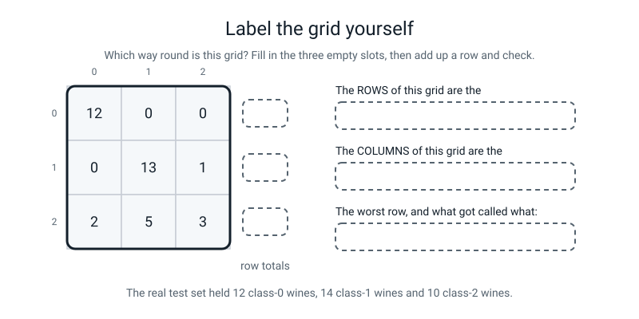
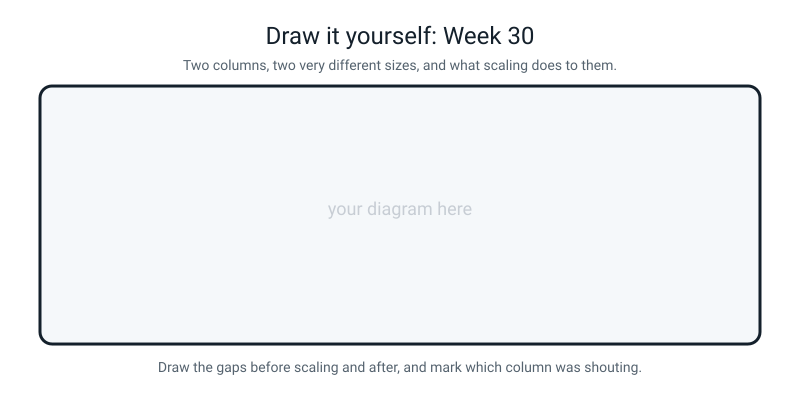

# Workbook — Week 30: Classifier Lab: Scaling, k, and the Confusion Matrix

**Name:** ________________________________  **Date:** ______________

[⬅ Week 29](week-29.md) · [📖 Read the chapter first](../student-guide/week-30.md) · [Course Home](../README.md) · [🧑‍🏫 Teacher guide](../teacher-guide/week-30.md) · [Next ➡](week-31.md)

**You will need:** a calculator · a highlighter · graph paper (as a backup for the chart) · a pencil · **THE GAP still written up from Week 29**

---

## ✅ Warm-Up (5 min)

Five quick questions about **last week**.

**W1.** Write the four names `train_test_split` hands back, in order.

________________________________________________________________

**W2.** What does `random_state=42` actually do, and does the number 42 matter?

________________________________________________________________

**W3.** Which of `fit`, `predict` and `score` is **not** allowed to see the answers?

________________________________________________________________

**W4.** A model scores 0.9417 on the rows it studied and 0.7333 on 30 rows it never saw. Which number goes in the report, and what is the gap?

________________________________________________________________

**W5.** `model.predict([3.0, 1.0])` — one flower, single brackets. What happens?

________________________________________________________________

---

## 🔎 Predict the Output

**Write your prediction before you run anything.**

### P1 — swap the two arguments and see what survives

```python
from sklearn.metrics import accuracy_score, confusion_matrix

truth  = [0, 0, 0, 1, 1, 1, 2, 2]
guess  = [0, 0, 1, 1, 1, 2, 1, 2]

print(round(accuracy_score(truth, guess), 4))
print(round(accuracy_score(guess, truth), 4))
print(confusion_matrix(truth, guess))
print(confusion_matrix(guess, truth))
```

**I predict — two numbers and two grids:**

________________________________________________________________

________________________________________________________________

**It really printed:**

________________________________________________________________

________________________________________________________________

________________________________________________________________

**Are the two accuracies the same?** ____________

**Are the two grids the same?** ____________

**Add up row 1 of each grid. Which one matches how many things really were class 1?**

Grid A row 1 total: ______   Grid B row 1 total: ______   Real class-1 count: ______

**So which grid is the right way round, and how would you have known without being told?**

________________________________________________________________

### P2 — marks out of 100 and money in the thousands

```python
import numpy as np
from sklearn.preprocessing import StandardScaler

marks = np.array([[40.0, 2000.0],
                  [50.0, 2500.0],
                  [60.0, 3000.0],
                  [70.0, 3500.0],
                  [80.0, 4000.0]])

scaler = StandardScaler()
scaler.fit(marks)
scaled = scaler.transform(marks)

print(np.round(scaler.mean_, 2))
print(np.round(scaled[:, 0], 2))
print(np.round(scaled[:, 1], 2))
print(marks[0])
```

**I predict — four lines:**

________________________________________________________________

________________________________________________________________

**It really printed:**

________________________________________________________________

________________________________________________________________

**Lines 2 and 3 came from columns whose numbers are fifty times apart. What do you notice about them?**

________________________________________________________________

**Half of the scaled numbers are negative. Is that a bug?** ____________  **Why?**

________________________________________________________________

**Line 4 is the surprise. What did `transform` do to `marks`?**

________________________________________________________________

**Why is that the right design decision, rather than a nuisance?**

________________________________________________________________

### P3 — one keyword, two very different test piles

```python
import numpy as np
from sklearn.datasets import load_wine
from sklearn.model_selection import train_test_split

wine = load_wine()
print(np.bincount(wine.target))

a, b, c, no_strat = train_test_split(
    wine.data, wine.target, test_size=0.2, random_state=31)
a, b, c, with_strat = train_test_split(
    wine.data, wine.target, test_size=0.2, random_state=31, stratify=wine.target)

print(np.bincount(no_strat))
print(np.bincount(with_strat))
print(len(no_strat), len(with_strat))
```

**I predict — four lines:**

________________________________________________________________

________________________________________________________________

**It really printed:**

________________________________________________________________

________________________________________________________________

**Line 4 shows both test piles are the same size. So what exactly did `stratify` change?**

________________________________________________________________

**In the un-stratified pile, what fraction of the test wines are class 1?** ______

**And in the whole table?** ______

**Why does that matter for the number you report?**

________________________________________________________________

### P4 — two squares that should not be in the same sum

```python
import numpy as np

gaps_raw = np.array([-0.01, 15.0])
squares = gaps_raw ** 2
print(squares)
print(round(float(squares.sum()), 4))
print(round(float(100 * squares[0] / squares.sum()), 6))
print(round(float(np.sqrt(squares.sum())), 4))
```

**I predict — four lines:**

________________________________________________________________

________________________________________________________________

**It really printed:**

________________________________________________________________

________________________________________________________________

**Line 1 is not written the way you expected. What notation is numpy using, and why here?**

________________________________________________________________

**Line 3 is also in that notation. Write it out as an ordinary decimal:** ______________________

**Line 4 is 15.0, and one of the two gaps was 15.0. What does that tell you about the other column's contribution?**

________________________________________________________________

**How many of the four predictions did you get right?** ______ / 4

**Which one surprised you most, and why?**

________________________________________________________________

---

## ✍️ Practice Set A — Read It

**A1. Baselines.** Work out each baseline, then say whether the accuracy is any good.

| # | Class counts | Baseline | An accuracy of… | Any good? Why? |
|---|---|---|---|---|
| a | wine: 59 / 71 / 48 | | 0.7778 | |
| b | iris: 50 / 50 / 50 | | 0.9667 | |
| c | spam: 5 spam, 95 not | | 0.9400 | |
| d | breast cancer: 212 / 357 | | 0.9561 | |
| e | 10 pass, 10 fail | | 0.5000 | |

**A1(f).** Why compute the baseline **before** you train anything, rather than after?

________________________________________________________________

________________________________________________________________

**A1(g).** Row (c) has the highest baseline of the five. Which is the *hardest* problem to look good at, and which is the easiest to look good at dishonestly?

________________________________________________________________

**A2. The arithmetic that proves scaling matters.** Wine 0 is `hue 1.04, proline 1065.0`. Wine 1 is `hue 1.05, proline 1050.0`.

**A2(a).** The four steps, with the raw numbers. Use a calculator.

| | gap | squared |
|---|---|---|
| hue | | |
| proline | | |
| | total: | distance: |

**A2(b).** Each column's share of the total.

hue: ______________ %   proline: ______________ %

**A2(c).** Now divide each gap by its column's spread — `hue` 0.2279, `proline` 314.0217 — and redo it.

| | gap ÷ spread | squared |
|---|---|---|
| hue | | |
| proline | | |
| | total: | |

hue's share: ______ %   proline's share: ______ %

**A2(d).** One sentence on what changed. Be careful to say what did **not** change too.

________________________________________________________________

________________________________________________________________

**A2(e).** `proline` runs 278 to 1680; `hue` runs 0.48 to 1.71. Which column will dominate every raw distance, and how could you know **without** doing any arithmetic at all?

________________________________________________________________

________________________________________________________________

**A2(f).** Would scaling help a model that never measures a distance?

________________________________________________________________

**A3. Read both grids out loud.** Write one full sentence per row. Not "row 2 is worst" — a sentence with a direction in it.

**The raw model, `k = 5`:**

```text
[[12  0  0]
 [ 0 13  1]
 [ 2  5  3]]
```

| Row | Your sentence |
|---|---|
| 0 | |
| 1 | |
| 2 | |

**A3(a).** Which is the worst row, and why?

________________________________________________________________

**A3(b).** Compute the accuracy **from the grid**, by hand. Show the two numbers you divided.

______ ÷ ______ = ______   Errors: ______

**A3(c).** What does **column 1** add up to, and what is that number?

________________________________________________________________

**The scaled model, `k = 5`:**

```text
[[12  0  0]
 [ 1 12  1]
 [ 0  0 10]]
```

| Row | Your sentence |
|---|---|
| 0 | |
| 1 | |
| 2 | |

**A3(d).** What happened to row 2?

________________________________________________________________

**A3(e).** Accuracy from this grid: ______ ÷ ______ = ______   Errors: ______

**A3(f).** Which kind of mistake is left, and is it a forgivable one?

________________________________________________________________

________________________________________________________________

**A4. Spot the bug.** Every line is wrong or dangerous. Write the fix.

| # | The line | The fix |
|---|---|---|
| a | `from sklearn.preprocessing import StandardScalar` | |
| b | `scaler = StandardScaler()` then straight to `scaler.transform(X_train)` | |
| c | `scaler.fit(X)` before the split | |
| d | `predictions = model.predict(X_test)` after fitting on `X_train_scaled` | |
| e | `accuracy_score(model, y_test)` | |
| f | `confusion_matrix(predictions, y_test)` | |
| g | `train_test_split(X, y, test_size=0.2, stratify=X)` | |
| h | `ax.set_ylim(0.9, 1.0)` on the accuracy-vs-`k` chart | |

**A4(i).** Three of those eight produce **no error at all.** Which three?

________________________________________________________________

**A4(j).** For each of the three, write down the symptom you would use to catch it.

1. ________________________________________________________________
2. ________________________________________________________________
3. ________________________________________________________________

**A4(k).** One of the three makes the score go **up**. Which, and why is that worse than the ones that make it go down?

________________________________________________________________

________________________________________________________________

**A5. Label the grid.** Fill in the three slots on the right, and the three row totals.


*Figure W30.1 — Rows or columns? Add one up and find out.*

**Are the rows the truth or the guess?** ______________________

**Are the columns the truth or the guess?** ______________________

**Which row is worst, and what got called what?**

________________________________________________________________

**Row totals:**  row 0: ______   row 1: ______   row 2: ______

**A5(a).** The real class counts in the test set are 12, 14 and 10. Do your row totals match? ____________

**A5(b).** So how do you *check* which way round a confusion matrix is, without having to remember the convention?

________________________________________________________________

**A5(c).** Add up **column 1**. ______  What is that number, in words?

________________________________________________________________

**A6. Read the traceback.** This message is genuinely confusing until you see what happened.

```text
Traceback (most recent call last):
  File "/Users/you/project/wine_lab.py", line 12, in <module>
    train_test_split(wine.data, wine.target, test_size=0.2,
  ...
  File ".../sklearn/model_selection/_split.py", line 2342, in _iter_indices
    raise ValueError(
ValueError: The least populated class in y has only 1 member, which is too few. The minimum number of groups for any class cannot be less than 2.
```

**Which line do you read first?** ______________________

**The message talks about "classes in y". How many classes does the wine table actually have?** ______

**So why is it complaining about a class with only one member?**

________________________________________________________________

________________________________________________________________

**How many "classes" did sklearn think there were?** ______

**The one-character fix:** ______________________

**Write the sentence you would say to somebody else who hit this:**

________________________________________________________________

---

## ✍️ Practice Set B — Write It

### B1 — one line

Write the **single line** that prints the wine table's baseline, rounded to four decimal places. `wine` is already loaded.

```python
# your line here:
```

**Expected output:**

```text
0.3989
```

**Done looks like:** `np.bincount` and `.max()`, and you can say out loud what the laziest possible model actually does.

### B2 — mark twelve guesses

Twelve guesses have already been made. Write a program that prints the accuracy and the confusion matrix.

```
truth = [0, 0, 0, 0, 1, 1, 1, 1, 1, 2, 2, 2]
guess = [0, 0, 0, 1, 1, 1, 1, 2, 0, 1, 1, 2]
```

**Expected output:**

```text
accuracy: 0.5833
[[3 1 0]
 [1 3 1]
 [0 2 1]]
```

**Done looks like:** truth first in both calls, and you can read row 2 out loud with a direction in the sentence.

### B3 — what the scaler learned

Split wine 80/20 with `random_state=31` and `stratify=y`. Fit a scaler on the training rows only. Then, for **`hue`** (column 10) and **`proline`** (column 12), print the mean learned, the spread learned, and the first four values before and after. Finish by printing the first row of `X_train` to prove it was not changed.

**Expected output:**

```text
hue
   mean learned  : 0.9553
   spread learned: 0.2153
   before, first 4: [0.96 1.05 0.7  0.94]
   after , first 4: [ 0.022  0.44  -1.186 -0.071]
proline
   mean learned  : 744.169
   spread learned: 307.0284
   before, first 4: [680. 450. 615. 415.]
   after , first 4: [-0.209 -0.958 -0.421 -1.072]

X_train is untouched, first row: [  0.96 680.  ]
```

**Done looks like:** `scaler.mean_` and `scaler.scale_` used rather than computed by hand, a loop over the two columns, and the last line proving `transform` handed back a copy.

### B4 — the comparison table

Split wine 80/20 with `random_state=31` and `stratify=y`. Print the baseline, then a two-row table comparing `k=5` on raw columns against `k=5` on scaled columns: train accuracy, test accuracy, and how many of the 36 it got wrong.

**Expected output:**

```text
baseline: 0.3989

model            train     test    errors of 36
k=5 raw          0.7817   0.7778   8
k=5 scaled       0.9859   0.9444   2
```

**Done looks like:** the error count computed with a boolean mask — `(pred != y_test).sum()` — not by multiplying the accuracy by 36 in your head.

### B5 — the sweep and the chart, about 20 lines

Every `k` from 1 to 25, twice — raw and scaled. Print all twenty-five lines, then save a chart with two labelled lines, a legend, both axis labels, and the y-axis starting at **zero**.

**Expected output (first and last few lines shown):**

```text
k =  1   raw = 0.7500   scaled = 0.9167
k =  2   raw = 0.7778   scaled = 0.9167
...
k = 24   raw = 0.7500   scaled = 0.9722
k = 25   raw = 0.7500   scaled = 0.9722

saved wine_accuracy_vs_k.png
```

**Done looks like:** the scaler fitted **once**, before the loop, on the training rows only · `matplotlib.use("Agg")` above the `pyplot` import · `ax.set_ylim(0, 1.05)` · a legend · and you have **opened the PNG and looked at it**.

**Now answer two things from your own chart:**

**Is the scaled line ever below the raw line?** ____________

**How many percentage points is one wine worth on this test set?** ____________

---

## 🐞 Fix the Broken Program

Here is `broken30.py`. It is supposed to run kNN on the wine table with the columns scaled. It has **three** bugs: one that stops Python reading the file, one that stops it partway through, and one that produces **no error whatsoever**.

```python
# wine_lab.py - kNN on wine with the columns put on the same footing. THREE BUGS.
import numpy as np
from sklearn.datasets import load_wine
from sklearn.model_selection import train_test_split
from sklearn.neighbors import KNeighborsClassifier
from sklearn.preprocessing import StandardScaler
from sklearn.metrics import accuracy_score, confusion_matrix

wine = load_wine()
X = wine.data
y = wine.target

baseline = np.bincount(y).max() / len(y)
print("baseline:", round(baseline, 4)

X_train, X_test, y_train, y_test = train_test_split(
    X, y, test_size=0.2, random_state=31, stratify=y
)

scaler = StandardScaler()
X_train_scaled = scaler.transform(X_train)
X_test_scaled = scaler.transform(X_test)

model = KNeighborsClassifier(n_neighbors=5)
model.fit(X_train_scaled, y_train)
predictions = model.predict(X_test)

print("test accuracy:", round(accuracy_score(y_test, predictions), 4))
print("confusion matrix:")
print(confusion_matrix(y_test, predictions))
```

**Bug 1.** Run it as it is. The real message:

```text
  File "/private/tmp/broken30.py", line 14
    print("baseline:", round(baseline, 4)
         ^
SyntaxError: '(' was never closed
```

**Did any of it run?** ____________  **How do you know?**

________________________________________________________________

**There are two `(` on that line. Which one is unclosed, and which one is Python pointing at?**

________________________________________________________________

**The fix:**

________________________________________________________________

**Bug 2.** Fix bug 1 and run again. The real message, trimmed:

```text
baseline: 0.3989
Traceback (most recent call last):
  File "/private/tmp/broken30.py", line 21, in <module>
    X_train_scaled = scaler.transform(X_train)
  File ".../sklearn/preprocessing/_data.py", line 1072, in transform
    check_is_fitted(self)
  ...
sklearn.exceptions.NotFittedError: This StandardScaler instance is not fitted yet. Call 'fit' with appropriate arguments before using this estimator.
```

**This time something printed before the traceback. What does that tell you about how far Python got?**

________________________________________________________________

**Where have you seen this error before, with a different word in it?**

________________________________________________________________

**What could `transform` not possibly do without `fit`? Be specific.**

________________________________________________________________

**The fix — and say which line it goes on:**

________________________________________________________________

**Bug 3.** Fix bug 2 and run again. Now there is **no error at all**:

```text
baseline: 0.3989
test accuracy: 0.3333
confusion matrix:
[[12  0  0]
 [14  0  0]
 [10  0  0]]
```

**Compare the accuracy to the baseline. What does that comparison tell you?**

________________________________________________________________

**Read the confusion matrix. What did the model say about every single wine?**

________________________________________________________________

**How can you tell that from the grid alone? Name the specific feature of it.**

________________________________________________________________

**Which line caused it?**

________________________________________________________________

**Why did Python not complain? What would it have needed to know?**

________________________________________________________________

________________________________________________________________

**The fix:**

________________________________________________________________

**And the habit that prevents this whole family, in one line:**

________________________________________________________________

**Here is what the fixed version prints. Check yours matches.**

```text
baseline: 0.3989
test accuracy: 0.9444
confusion matrix:
[[12  0  0]
 [ 1 12  1]
 [ 0  0 10]]
```

---

## 🧩 Puzzle of the Week

### Part 1 — Choose your own shouty column

Two people. Person A is **1700 mm** tall and **12** years old. Person B is **1750 mm** tall and **40** years old.

**(a)** Fill in the table three times — the same two people, the height written in three different units.

| height in… | height gap | squared | age gap | squared | total | distance | height's share |
|---|---|---|---|---|---|---|---|
| millimetres | | | 28 | 784 | | | |
| centimetres | | | 28 | 784 | | | |
| metres | | | 28 | 784 | | | |

**(b)** How many people changed? ______  How many were re-measured? ______

**(c)** In which unit does height run the show, and in which unit does age?

________________________________________________________________

**(d)** There is a unit somewhere between millimetres and metres where the two columns would matter about equally. Have a go at finding it — you want the squared height gap to be about 784.

Height gap needs to be about ______   so the unit would be about ______

**(e)** Write the sentence this puzzle exists to make you write.

________________________________________________________________

________________________________________________________________

### Part 2 — Spot the Shouty Column

For each pair, circle which column will dominate a raw distance, and write roughly how badly.

| # | The two columns | Which shouts | Roughly how badly |
|---|---|---|---|
| a | height in mm · age in years | | |
| b | height in metres · age in years | | |
| c | salary in rupees · years of experience | | |
| d | exam mark out of 100 · hours revised | | |
| e | exam mark out of 100 · **minutes** revised | | |
| f | steps per day · hours of sleep | | |
| g | price in pence · the same price in pounds, both in the table | | |
| h | distance in km · rating out of 5 | | |

**(i)** One of those eight is a genuine argument rather than a calculation. Which, and what is the honest answer?

________________________________________________________________

**(j)** Row (g) is not just a scaling problem. What else is wrong with it?

________________________________________________________________

### Part 3 — The column that stopped shouting

Here is a real experiment. Take the scaled wine model at `k = 9` (which scores **0.9722**), remove **one** column, retrain, and see what it costs.

```text
all 13 columns: 0.9722
  without color_intensity                0.9167   (-0.0556)
  without hue                            0.9167   (-0.0556)
  without malic_acid                     0.9167   (-0.0556)
  without od280/od315_of_diluted_wines   0.9167   (-0.0556)
  without alcalinity_of_ash              0.9444   (-0.0278)
  without alcohol                        0.9444   (-0.0278)
  without magnesium                      0.9444   (-0.0278)
  without proline                        0.9444   (-0.0278)
  without ash                            0.9722   (+0.0000)
  without flavanoids                     0.9722   (+0.0000)
  without nonflavanoid_phenols           0.9722   (+0.0000)
  without proanthocyanins                0.9722   (+0.0000)
  without total_phenols                  0.9722   (+0.0000)
```

**(k)** In the **raw** table, `proline` was 99.999956% of the distance and `hue` was 0.000044%. Which of the two turns out to be more useful once the columns are scaled?

________________________________________________________________

**(l)** Write down what that means about the raw model, in one sentence.

________________________________________________________________

________________________________________________________________

**(m)** Five columns can be removed with **no cost at all**. Does that mean they are useless? Think carefully before you answer.

________________________________________________________________

________________________________________________________________

**(n)** One wine out of 36 is 2.8 percentage points. So how much of that ranking would you actually bet on?

________________________________________________________________

---

## 🤔 Think Deeper

**T1.** You have introduced a bug and your accuracy went **up**, from 0.9444 to 0.9722.

Write a paragraph. Start by saying what the number 0.9722 is supposed to be an **estimate of** — be precise, because the whole answer hangs on it. Then explain exactly how fitting the scaler on all 178 wines broke that estimate, using the fact that the proline mean shifted by only 2.72 out of 744. Then the harder half: on eight of ten random seeds the leak makes **no difference at all**, and on one it makes the score **worse**. So you cannot detect it by running it both ways. **What does that tell you about how you have to defend yourself against this kind of bug?** Finish by explaining why a bug that raises your score is more dangerous than one that lowers it — and say something about who finds each kind.

________________________________________________________________

________________________________________________________________

________________________________________________________________

________________________________________________________________

________________________________________________________________

________________________________________________________________

**T2.** Same confusion matrix, different job. Class 0 is "healthy", class 1 is "mild condition", class 2 is "serious condition".

```text
[[12  0  0]
 [ 0 13  1]
 [ 2  5  3]]
```

Write a paragraph. First, describe **where the errors landed** — how many, in which rows, and in which direction. Then answer the question honestly: is a **78%** model with all its errors in row 2 worse than a **90%** model with its errors spread evenly across all three rows? Say which you would use and why, and be specific about who is harmed in each case. Then the part with no clean answer: **who gets to decide which mistakes are acceptable?** Consider the person who builds the model, the organisation that buys it, and the person the mistake lands on — and say something honest about which of those three usually has the least say. Finish by naming one thing you would insist was printed alongside the accuracy before anybody was allowed to use a model like this.

________________________________________________________________

________________________________________________________________

________________________________________________________________

________________________________________________________________

________________________________________________________________

________________________________________________________________

---

## 🛠️ Build It — The Classifier Lab

**Five things to hand in.** All of them use `test_size=0.2, random_state=31, stratify=y`.

### Piece 1 — The chart

- [ ] `k` from 1 to 25, both raw and scaled
- [ ] Two lines, with **different markers** as well as different colours
- [ ] A legend naming both lines
- [ ] An x label that says what `k` is
- [ ] A y label that says **what** the accuracy is measured on, including the row count
- [ ] `ax.set_ylim(0, 1.05)` — the y-axis starts at **zero**
- [ ] A title that states the **finding**, not the topic
- [ ] Saved with `savefig`, and I opened it and looked at it

**My chart's title:**

________________________________________________________________

**Why the y-axis must start at zero here — and this is a Week 27 answer:**

________________________________________________________________

________________________________________________________________

### Piece 2 — The comparison table

> **My baseline: ______** — always shout class ______ and you get ______ of 178 right.

| Model | Train accuracy | Test accuracy | Errors of 36 |
|---|---|---|---|
| kNN `k=5`, raw columns | | | |
| kNN `k=5`, scaled columns | | | |
| kNN `k=___`, scaled *(my chosen k)* | | | |

**How many accuracy points did scaling buy me?** ______

**What did I add to get them? Name every single thing:**

________________________________________________________________

### Piece 3 — My chosen `k`, with three sentences

**Chosen `k`:** ______   **Test accuracy:** ______ on ______ rows   **Baseline:** ______

**Sentence 1 — which `k` values tie for the best score, and how many there are:**

________________________________________________________________

**Sentence 2 — where the plateau is, and why a plateau is more trustworthy than a spike:**

________________________________________________________________

________________________________________________________________

**Sentence 3 — why I picked *this* one from inside the plateau:**

________________________________________________________________

### Piece 4 — The honesty sentence

Copy it out, word for word, in ink.

________________________________________________________________

________________________________________________________________

**Now say why it is there, in your own words. Not "because I was told to".**

________________________________________________________________

________________________________________________________________

### Piece 5 — The confusion matrix, with its worst row named

**My best model's grid:**

```
[[ ___  ___  ___ ]
 [ ___  ___  ___ ]
 [ ___  ___  ___ ]]
```

**Row totals:** ______ , ______ , ______   **Do they match the real class counts 12, 14, 10?** ______

**The worst row, named in a full sentence with a direction in it:**

________________________________________________________________

________________________________________________________________

**Total errors out of 36:** ______   **Accuracy from the grid:** ______ ÷ ______ = ______

### Piece 6 — Short questions

| # | Question | Your answer |
|---|---|---|
| i | What is the baseline for the wine table? | |
| ii | In `confusion_matrix(y_test, pred)`, are rows the truth or the guess? | |
| iii | Which rows does the scaler learn from? | |
| iv | What does `stratify=y` do? | |
| v | Why `stratify=y` and not `stratify=X`? | |
| vi | You forget to scale `X_test`. What is the symptom? | |
| vii | You fit the scaler on all the data before splitting. What is the symptom? | |
| viii | Why is a leak that raises your score worse than a bug that lowers it? | |
| ix | Two models score 0.9444 and 0.9722 on 36 test rows. Is the second better? | |
| x | Why does `transform` hand back a new array? | |
| xi | Name one situation where you should **not** scale. | |
| xii | The sentence you write next to every `k` you chose from test scores. | |

### Piece 7 — The Bug Log

| What happened | Was there an error message? | What fixed it | What I will check next time |
|---|---|---|---|
| | | | |
| | | | |
| | | | |

---

## 🎨 Draw It

Draw two columns of very different sizes, the gaps before and after scaling, and mark which column was shouting.


*Figure W30.2 — Your page.*

> **What a good answer might look like:** the page split down the middle. On the **left**, headed **RAW**, two vertical bars drawn to scale: one labelled `proline gap² = 225.0000` drawn about 60 mm tall, and one labelled `hue gap² = 0.0001` which is **not a bar at all** — it is a pencil line with an arrow pointing at it and the note *"this is 0.000044% of the total. I cannot draw it any smaller."*
>
> On the **right**, headed **SCALED**, the same two bars redrawn from `0.0019` and `0.0023` — and now they are **nearly the same height**, about 40 mm and 48 mm, with the two shares written underneath: **45.76%** and **54.24%**.
>
> A double-headed arrow across the middle labelled *"divide each gap by its own column's spread"*, and underneath it the two spreads: `hue 0.2279` and `proline 314.02`.
>
> And three annotations that show real understanding. A note on the RAW side: *"the model is using ONE measurement and pretending to use thirteen."* A note on the SCALED side: *"nothing about the wine changed."* And a small speech bubble coming off the proline bar on the left, saying *"I'm only loud because a chemist wrote me in hundreds."*
>
> **What a weak answer looks like:** two bars on the left that are only *slightly* different heights — which means the 225-against-0.0001 ratio was written down but never actually drawn. If your left-hand pair looks like a normal bar chart, you have drawn a lean when the truth is a wipe-out. **The whole point is that one of those two bars is unmeasurable on the page, and that is what "99.999956%" looks like.**

---

## 📊 Self-Check

| I can… | 😀 got it | 🙂 nearly | 😕 not yet |
|---|---|---|---|
| Compute an accuracy and say the baseline next to it | ☐ | ☐ | ☐ |
| Read a confusion matrix out loud, row by row, with a direction | ☐ | ☐ | ☐ |
| Name the worst row of a grid and say what got called what | ☐ | ☐ | ☐ |
| Explain the drowning effect using the **squares** | ☐ | ☐ | ☐ |
| Scale by fitting on the training rows only, and say why | ☐ | ☐ | ☐ |
| Plot accuracy against `k` with the y-axis starting at zero | ☐ | ☐ | ☐ |
| Choose a `k` from a plateau and write three sentences of reason | ☐ | ☐ | ☐ |
| Write the honesty sentence and explain why it is there | ☐ | ☐ | ☐ |
| Use `stratify=y`, and say why not `stratify=X` | ☐ | ☐ | ☐ |
| Spot a bug that has no error message, using the baseline | ☐ | ☐ | ☐ |

**True or false?** Circle one on each row.

| Statement | | |
|---|---|---|
| A higher accuracy always means a better model | TRUE | FALSE |
| Scaling adds information to your data | TRUE | FALSE |
| The scaler learns from the training rows only | TRUE | FALSE |
| `transform` changes `X_train` in place | TRUE | FALSE |
| Half the scaled numbers being negative means something broke | TRUE | FALSE |
| `confusion_matrix` gives the same grid whichever way round you pass the arguments | TRUE | FALSE |
| Accuracy gives the same number whichever way round you pass the arguments | TRUE | FALSE |
| Rows of a confusion matrix add up to the real class counts | TRUE | FALSE |
| Columns add up to the real class counts | TRUE | FALSE |
| `stratify=X` balances your features | TRUE | FALSE |
| You should always scale, on every dataset | TRUE | FALSE |
| A decision tree needs its columns scaled | TRUE | FALSE |
| Forgetting to scale `X_test` raises an error | TRUE | FALSE |
| A leak that leaves the score unchanged on your split was harmless | TRUE | FALSE |
| Choosing `k` from test scores costs you nothing | TRUE | FALSE |

One thing I'd like explained again:

________________________________________________________________

---

## ✅ Answers

<details>
<summary>Check your answers</summary>

### Warm-Up

**W1.** `X_train, X_test, y_train, y_test`. **Both X's first, then both y's.**

**W2.** It **fixes the shuffle**, so the same cut happens every run and any change you see was caused by your change and nothing else. **The number does not matter** — 0, 7, 31 and 42 are all equally good. Fixing it does.

**W3.** **`predict`.** If it could see the answers there would be nothing to predict. `fit` sees them to learn; `score` sees them to mark.

**W4.** Report **0.7333, on 30 rows.** The gap is **0.2083**, about 21 percentage points — and that gap says a lot of the 0.9417 was memory rather than skill.

**W5.** `ValueError: Expected 2D array, got 1D array instead`. `predict` wants a **table**, and one row is still a table: `model.predict([[3.0, 1.0]])`.

---

### Predict the Output

**P1** — real output:

```text
0.625
0.625
[[2 1 0]
 [0 2 1]
 [0 1 1]]
[[2 0 0]
 [1 2 1]
 [0 1 1]]
```

**Are the two accuracies the same?** **Yes** — 0.625 both ways. Counting matching pairs does not care which list you call which.

**Are the two grids the same?** **No.** The second is the first **flipped along the diagonal** — its transpose. The diagonal is unchanged, which is exactly why the accuracy is unchanged, and exactly why nothing warns you.

**Row 1 totals:** Grid A row 1 = 0 + 2 + 1 = **3.** Grid B row 1 = 1 + 2 + 1 = **4.** Real class-1 count in `truth` = **3.**

**Which grid is right way round?** **Grid A**, `confusion_matrix(truth, guess)`. And you would have known **by adding up a row and comparing it to the real class counts** — three things really were class 1, and only Grid A's row 1 adds to 3. **That check works every time and needs no memory.**

**P2** — real output:

```text
[  60. 3000.]
[-1.41 -0.71  0.    0.71  1.41]
[-1.41 -0.71  0.    0.71  1.41]
[  40. 2000.]
```

**Lines 2 and 3 are identical.** One column runs 40 to 80 and the other runs 2000 to 4000 — fifty times apart — and after scaling they are the **same five numbers.** That is what "putting every column on the same footing" means, made completely literal: both columns now say *"how many spreads from typical am I?"*, and both answer −1.41, −0.71, 0, 0.71, 1.41.

**Negative numbers a bug?** **No.** Half of anything is below average, and below average is a negative number of spreads. The middle value is exactly 0 because it *is* the mean.

**Line 4 — what did `transform` do to `marks`?** **Nothing.** `marks[0]` is still `[40, 2000]`. `transform` hands back a **new** array and leaves your original alone.

**Why is that right?** Because a machine that quietly rewrites your data is a machine you cannot debug. You could never print before and after side by side, you could never safely re-run a line, and you would have no way of noticing when something got scaled **twice** — which produces no error and a silently broken model. Same design decision as `sorted()` in Week 12: **the tools that leave your original alone are the ones you can trust.**

**P3** — real output:

```text
[59 71 48]
[ 9 18  9]
[12 14 10]
36 36
```

**What did `stratify` change?** Not the **size** — both test piles have 36 wines. It changed **which** wines. `stratify` forces each class to keep the same share in both halves.

**Class 1's share of the un-stratified test pile:** 18 ÷ 36 = **50%.**
**Class 1's share of the whole table:** 71 ÷ 178 = **39.9%.**

**Why it matters:** the un-stratified test pile is 25% / 50% / 25% when the real world is 33% / 40% / 27%. So your estimate of how the model handles class 0 now rests on **nine** wines, and each of those nine is worth eleven percentage points of "class 0 accuracy". You are measuring a lopsided sample and calling it an estimate of the whole.

**P4** — real output:

```text
[1.00e-04 2.25e+02]
225.0001
4.4e-05
15.0
```

**What notation?** **Scientific notation.** `1.00e-04` means 1.00 × 10⁻⁴, which is 0.0001. `2.25e+02` means 2.25 × 10², which is 225. Numpy switches to it when the numbers in one array are **very** far apart in size — it cannot print 0.0001 and 225 in the same fixed-width format without wasting the whole line, so it gives up and uses powers of ten. **The notation itself is a warning sign: numpy is telling you these two numbers do not belong in the same array.**

**Line 3 written out:** `4.4e-05` = **0.000044**.

**Line 4 is 15.0**, and the proline gap was 15.0. So the square root of the total is *exactly* the proline gap to four decimal places — which means **hue contributed nothing measurable at all.** The distance between those two wines is the proline gap, and nothing else.

---

### Practice Set A

**A1.**

| # | Baseline | Any good? |
|---|---|---|
| a | 71/178 = **0.3989** | **Yes** — nearly twice the baseline |
| b | 50/150 = **0.3333** | **Yes**, comfortably — nearly three times |
| c | 95/100 = **0.9500** | **No.** Worse than a machine that says "not spam" to everything and has never read an email |
| d | 357/569 = **0.6274** | **Yes** |
| e | 10/20 = **0.5000** | **No.** That is exactly a coin |

**A1(f).** Because once you have seen 94% you will feel good about it, and **the feeling arrives before the comparison.** The baseline is the ruler, and you build a ruler before you measure with it. Compute it afterwards and you will be quietly grading your own homework.

**A1(g).** Row (c), the spam one, is **the hardest to look good at honestly** — you have to beat 95% before you have done anything at all. And it is **the easiest to look good at dishonestly**, because "94% accurate!" sounds excellent to anybody who has not asked what the baseline is. **The two go together: the more lopsided the classes, the more a bare accuracy flatters you.**

**A2(a).**

| | gap | squared |
|---|---|---|
| hue | −0.01 | 0.0001 |
| proline | 15.00 | 225.0000 |
| | total: **225.0001** | distance: **15.0000** |

**A2(b).** hue: 0.0001 ÷ 225.0001 × 100 = **0.000044 %.** proline: **99.999956 %.**

**A2(c).**

| | gap ÷ spread | squared |
|---|---|---|
| hue | 0.01 ÷ 0.2279 = 0.0439 | 0.0019 |
| proline | 15 ÷ 314.0217 = 0.0478 | 0.0023 |
| | total: **0.0042** | |

hue's share: **45.76 %**   proline's share: **54.24 %**

Confirmed by a real run:

```python
# why_scaling.py
import numpy as np
import pandas as pd
from sklearn.datasets import load_wine

wine = load_wine()
grapes = pd.DataFrame(wine.data, columns=wine.feature_names)

hue_gap = 1.04 - 1.05
proline_gap = 1065.0 - 1050.0
total = hue_gap ** 2 + proline_gap ** 2
print("--- raw ---")
print(f"hue     squared {hue_gap ** 2:.4f}   share {100 * hue_gap ** 2 / total:.6f} %")
print(f"proline squared {proline_gap ** 2:.4f}   share {100 * proline_gap ** 2 / total:.6f} %")
print(f"total {total:.4f}   distance {np.sqrt(total):.4f}")

hue_spread = np.std(grapes["hue"])
proline_spread = np.std(grapes["proline"])
hue_fair = hue_gap / hue_spread
proline_fair = proline_gap / proline_spread
total_fair = hue_fair ** 2 + proline_fair ** 2
print("--- after dividing by each column's spread ---")
print(f"hue spread {hue_spread:.4f}   proline spread {proline_spread:.4f}")
print(f"hue     squared {hue_fair ** 2:.4f}   share {100 * hue_fair ** 2 / total_fair:.2f} %")
print(f"proline squared {proline_fair ** 2:.4f}   share {100 * proline_fair ** 2 / total_fair:.2f} %")
```

```text
--- raw ---
hue     squared 0.0001   share 0.000044 %
proline squared 225.0000   share 99.999956 %
total 225.0001   distance 15.0000
--- after dividing by each column's spread ---
hue spread 0.2279   proline spread 314.0217
hue     squared 0.0019   share 45.76 %
proline squared 0.0023   share 54.24 %
```

**A2(d).**

> Nothing about the wines changed and nothing about the model changed; dividing each gap by how much its own column normally varies took `hue` from contributing forty-four millionths of one percent to contributing nearly half.

**Marking note:** the "nothing changed" half is the half that matters. A sentence that only says "hue's share went up" has described the arithmetic without saying what it means.

**A2(e).** `proline`, and you can tell from the **ranges alone**: proline's gaps are measured in hundreds while hue's are in hundredths. That is a factor of about ten thousand *before* squaring, and squaring makes it a hundred million. **Looking at min, max and spread for every column before you model anything is a habit worth having for life.**

**A2(f).** **No.** A decision tree asks *"is proline above 755?"*, and scaling changes only the number in the question, never the answer. Scaling matters for models that **add up squared differences** — kNN today, and a few others later.

**A3 — the raw grid.**

| Row | Sentence |
|---|---|
| 0 | Twelve wines really were class 0, and all twelve were called class 0. |
| 1 | Fourteen really were class 1: thirteen were called class 1, and one was called class 2. |
| 2 | **Ten really were class 2: only three were called class 2. Five were called class 1 and two were called class 0.** |

**A3(a).** **Row 2.** It gets 3 out of 10 right — worse than a coin — and **seven of the eight total errors live in it.**

**A3(b).** Diagonal: 12 + 13 + 3 = **28.** Total: **36.** 28 ÷ 36 = **0.7778.** Errors: **8.**

**A3(c).** Column 1 = 0 + 13 + 5 = **18.** That is **the number of times the model said "class 1"** — eighteen guesses, of which thirteen were right. Compare it with the fourteen wines that really were class 1. **Rows are truths; columns are guesses**, and that asymmetry is what makes the grid informative.

**A3 — the scaled grid.**

| Row | Sentence |
|---|---|
| 0 | All twelve class-0 wines were called class 0. |
| 1 | Fourteen really were class 1: twelve correct, one called class 0, one called class 2. |
| 2 | All ten class-2 wines were called class 2. |

**A3(d).** Row 2 went from **3 out of 10 to 10 out of 10.** The grape the raw model was nearly blind to, the scaled model gets **perfectly** — and not one new measurement was taken.

**A3(e).** 12 + 12 + 10 = **34** ÷ **36** = **0.9444.** Errors: **2.**

**A3(f).** Both remaining errors are in **row 1** — one class-1 wine called class 0 and one called class 2. They are **boundary mistakes, one in each direction**, which is the shape of an honest model working on a genuinely hard edge. That is a much more comfortable pattern than "all my errors are in one class", because it means the model is confused rather than blind.

**A4.**

| # | The fix |
|---|---|
| a | `StandardScaler` — a *scaler* scales; a *scalar* is a single number |
| b | Add `scaler.fit(X_train)` above the `transform` |
| c | Split first, then `scaler.fit(X_train)`. Never `fit(X)` |
| d | `model.predict(X_test_scaled)` — whatever you did to `X_train`, do to `X_test` |
| e | `accuracy_score(y_test, model.predict(X_test))` — pass the guesses, not the model |
| f | `confusion_matrix(y_test, predictions)` — **truth first** |
| g | `stratify=y` — you balance the answers, not the measurements |
| h | `ax.set_ylim(0, 1.05)` — the axis starts at zero |

**A4(i).** **(c), (d) and (h).**

**A4(j).**

1. **(c)** — the score goes **up**, 0.9444 to 0.9722. Nothing warns you. Only the habit protects you.
2. **(d)** — the accuracy is **0.3333, below the baseline of 0.3989.** Anything below the baseline means something is broken, whether or not Python complained.
3. **(h)** — no error and a saved PNG, but a 5-point wiggle now looks as dramatic as the 17-point finding. **You catch it by opening the picture and asking "is that the chart I meant?"**

*(For completeness: (a), (b), (e), (f) and (g) all raise real tracebacks.)*

**A4(k).** **(c), the leak.** It is worse because **a bug that lowers your score gets found** — you go looking for it, because you wanted a better number. **A bug that raises your score gets kept.** Nobody investigates good news. And the number it produces is no longer an estimate of unseen-data performance, which is the only thing the number was ever for.

**A5.**

| Slot | Answer |
|---|---|
| Rows | **the truth** — what the thing really was |
| Columns | **the guess** — what the model said |
| Worst row | **Row 2.** Ten wines really were class 2; only three were called class 2, five were called class 1 and two were called class 0 |
| Row totals | row 0: **12** · row 1: **14** · row 2: **10** |

**A5(a).** **Yes** — 12, 14, 10, exactly the real class counts. That confirms rows are truths.

**A5(b).** **Add up a row and compare it to the real class counts.** If they match, rows are truth. It takes four seconds, it needs no memory, and it is the only thing standing between you and reading every mistake backwards.

**A5(c).** Column 1 = 0 + 13 + 5 = **18.** In words: **the number of times the model said "class 1"** — which is four more than the number of wines that actually were class 1.

**A6.**

- **Which line first?** The **last** one, always.
- **How many classes does wine have?** **Three.**
- **So why is it complaining about a class with one member?** Because you wrote `stratify=X`, so sklearn treated **each whole row of thirteen measurements as a class label.** It went looking for the class shares, found that every "class" happened exactly once, and refused — because you cannot keep a class's share even across two piles when there is only one of it.
- **How many "classes" did it think there were?** **178** — one per wine.
- **The fix:** `stratify=y`.
- **The sentence:** *"You stratified on the measurements instead of the answers. Sklearn treated every unique row as its own class, so it found 178 classes with one member each. Change `stratify=X` to `stratify=y`."*

---

### Practice Set B

**B1.**

```python
print(round(np.bincount(wine.target).max() / len(wine.target), 4))
```

```text
0.3989
```

**What the laziest model does:** shouts "class 1" at every single wine, without looking at any of them, and is right 71 times out of 178.

**B2.**

```python
# mark_twelve.py
# Twelve guesses that have already been made.

from sklearn.metrics import accuracy_score, confusion_matrix

truth = [0, 0, 0, 0, 1, 1, 1, 1, 1, 2, 2, 2]
guess = [0, 0, 0, 1, 1, 1, 1, 2, 0, 1, 1, 2]

print("accuracy:", round(accuracy_score(truth, guess), 4))
print(confusion_matrix(truth, guess))
```

```text
accuracy: 0.5833
[[3 1 0]
 [1 3 1]
 [0 2 1]]
```

**Row 2, out loud:** *"Three things really were class 2. Only one was called class 2, and **two were called class 1**."* Row 2 is the worst row: one out of three.

**And a check:** the rows add to 4, 5 and 3, which is exactly how many 0s, 1s and 2s are in `truth`. **Rows are truths.** ✅

**B3.**

```python
# what_the_scaler_learned.py
# Two columns, before and after, and proof the original is untouched.

import numpy as np
from sklearn.datasets import load_wine
from sklearn.model_selection import train_test_split
from sklearn.preprocessing import StandardScaler

wine = load_wine()
X_train, X_test, y_train, y_test = train_test_split(
    wine.data, wine.target, test_size=0.2, random_state=31, stratify=wine.target)

scaler = StandardScaler()
scaler.fit(X_train)                          # training rows only
X_train_scaled = scaler.transform(X_train)
X_test_scaled = scaler.transform(X_test)

for name, i in [("hue", 10), ("proline", 12)]:
    print(name)
    print("   mean learned  :", round(scaler.mean_[i], 4))
    print("   spread learned:", round(scaler.scale_[i], 4))
    print("   before, first 4:", np.round(X_train[:4, i], 3))
    print("   after , first 4:", np.round(X_train_scaled[:4, i], 3))
print()
print("X_train is untouched, first row:", np.round(X_train[0, [10, 12]], 3))
```

```text
hue
   mean learned  : 0.9553
   spread learned: 0.2153
   before, first 4: [0.96 1.05 0.7  0.94]
   after , first 4: [ 0.022  0.44  -1.186 -0.071]
proline
   mean learned  : 744.169
   spread learned: 307.0284
   before, first 4: [680. 450. 615. 415.]
   after , first 4: [-0.209 -0.958 -0.421 -1.072]

X_train is untouched, first row: [  0.96 680.  ]
```

**Check one by hand:** `(680 − 744.169) ÷ 307.0284 = −0.209`. ✅ And notice `hue` 0.96 became 0.022 — almost exactly typical. **The scaled numbers say something; the raw ones only say something if you happen to know what proline usually is.**

**B4.**

```python
# comparison_table.py
# Raw against scaled, with the baseline above it.

import numpy as np
from sklearn.datasets import load_wine
from sklearn.model_selection import train_test_split
from sklearn.neighbors import KNeighborsClassifier
from sklearn.preprocessing import StandardScaler
from sklearn.metrics import accuracy_score

wine = load_wine()
X, y = wine.data, wine.target
print("baseline:", round(np.bincount(y).max() / len(y), 4))

X_train, X_test, y_train, y_test = train_test_split(
    X, y, test_size=0.2, random_state=31, stratify=y)
scaler = StandardScaler().fit(X_train)
X_train_s = scaler.transform(X_train)
X_test_s = scaler.transform(X_test)

print()
print("model            train     test    errors of 36")
for label, a, b in [("k=5 raw    ", X_train, X_test),
                    ("k=5 scaled ", X_train_s, X_test_s)]:
    model = KNeighborsClassifier(n_neighbors=5).fit(a, y_train)
    pred = model.predict(b)
    acc = accuracy_score(y_test, pred)
    print(f"{label}      {model.score(a, y_train):.4f}   {acc:.4f}   {(pred != y_test).sum()}")
```

```text
baseline: 0.3989

model            train     test    errors of 36
k=5 raw          0.7817   0.7778   8
k=5 scaled       0.9859   0.9444   2
```

**Why count errors with a mask rather than arithmetic?** Because `(pred != y_test).sum()` is exact and `36 × 0.7778` is not — try it and you get 27.9998, which you then have to round and hope. **Week 20's boolean mask, doing real work.**

**B5.**

```python
# wine_choose_k.py
# Every k from 1 to 25, twice, and one honest chart.

import matplotlib
matplotlib.use("Agg")                    # must come BEFORE the pyplot import
import matplotlib.pyplot as plt
from sklearn.datasets import load_wine
from sklearn.model_selection import train_test_split
from sklearn.neighbors import KNeighborsClassifier
from sklearn.preprocessing import StandardScaler

wine = load_wine()
X = wine.data
y = wine.target

X_train, X_test, y_train, y_test = train_test_split(
    X, y, test_size=0.2, random_state=31, stratify=y
)

scaler = StandardScaler()
scaler.fit(X_train)                      # once, before the loop, train rows only
X_train_scaled = scaler.transform(X_train)
X_test_scaled = scaler.transform(X_test)

ks, raw_scores, scaled_scores = [], [], []
for k in range(1, 26):
    ks.append(k)
    raw_model = KNeighborsClassifier(n_neighbors=k).fit(X_train, y_train)
    raw_scores.append(raw_model.score(X_test, y_test))
    scaled_model = KNeighborsClassifier(n_neighbors=k).fit(X_train_scaled, y_train)
    scaled_scores.append(scaled_model.score(X_test_scaled, y_test))
    print(f"k = {k:2d}   raw = {raw_scores[-1]:.4f}   scaled = {scaled_scores[-1]:.4f}")

fig, ax = plt.subplots(figsize=(8, 5))
ax.plot(ks, scaled_scores, marker="o", label="scaled columns")
ax.plot(ks, raw_scores, marker="s", label="raw columns")
ax.set_title("Scaling is worth about 17 accuracy points on the wine table")
ax.set_xlabel("k (how many neighbours vote)")
ax.set_ylabel("accuracy on the 36 held-back wines")
ax.set_ylim(0, 1.05)
ax.legend()
fig.savefig("wine_accuracy_vs_k.png", dpi=120, bbox_inches="tight")
print()
print("saved wine_accuracy_vs_k.png")
```

```text
k =  1   raw = 0.7500   scaled = 0.9167
k =  2   raw = 0.7778   scaled = 0.9167
k =  3   raw = 0.7778   scaled = 0.9167
k =  4   raw = 0.7778   scaled = 0.9167
k =  5   raw = 0.7778   scaled = 0.9444
k =  6   raw = 0.7500   scaled = 0.9167
k =  7   raw = 0.7222   scaled = 0.9722
k =  8   raw = 0.7222   scaled = 0.9722
k =  9   raw = 0.7778   scaled = 0.9722
k = 10   raw = 0.7500   scaled = 0.9722
k = 11   raw = 0.7500   scaled = 0.9444
k = 12   raw = 0.7778   scaled = 0.9167
k = 13   raw = 0.7500   scaled = 0.9444
k = 14   raw = 0.7778   scaled = 0.9444
k = 15   raw = 0.7500   scaled = 0.9444
k = 16   raw = 0.7500   scaled = 0.9444
k = 17   raw = 0.7778   scaled = 0.9444
k = 18   raw = 0.7778   scaled = 0.9722
k = 19   raw = 0.7500   scaled = 0.9444
k = 20   raw = 0.7778   scaled = 0.9444
k = 21   raw = 0.7778   scaled = 0.9444
k = 22   raw = 0.7778   scaled = 0.9722
k = 23   raw = 0.7778   scaled = 0.9722
k = 24   raw = 0.7500   scaled = 0.9722
k = 25   raw = 0.7500   scaled = 0.9722

saved wine_accuracy_vs_k.png
```

**Is the scaled line ever below the raw line?** **No. Not at any of the twenty-five values.** That is unusually clear-cut, and it is why wine is the dataset for this lesson.

**How many percentage points is one wine worth?** 1 ÷ 36 = **2.8 percentage points.** So 0.9167 is 33 right, 0.9444 is 34, and 0.9722 is 35 — **the entire wiggle in that scaled line is two wines changing their minds.** Do not read meaning into small differences on a small test set.

**Why fit the scaler once, before the loop?** Because the scaling has nothing to do with `k`. Fitting it inside the loop would give the same answer twenty-five times and take twenty-five times as long — and it would make it much easier to accidentally fit it on the wrong pile.

---

### Fix the Broken Program

**Bug 1 — the syntax error.**

**Did any of it run?** **No.** No `Traceback`, and nothing printed at all — not even the imports' side effects. Python could not finish reading the file, so it never started it.

**Which `(` is unclosed?** The one after **`print`**. The `round(baseline, 4)` bracket is closed correctly. Python points at the **outer** one because that is the last opening bracket it was still waiting on when it ran out of file.

**The fix:**

```python
print("baseline:", round(baseline, 4))
```

**Bug 2 — the runtime error.**

**Something printed before the traceback.** `baseline: 0.3989` appeared. **So Python read the whole file successfully this time and got as far as line 21 before failing.** A syntax error prints nothing; a runtime error prints everything up to the point it broke. **That difference tells you which kind you are looking at before you read a word of the message.**

**Where have you seen it before?** **Last week**, with one word changed: `This KNeighborsClassifier instance is not fitted yet`. **Everything in this library follows make → fit → use**, model or not.

**What could `transform` not possibly do?** **Subtract a mean it does not know.** The scaler has to learn one mean and one spread per column, and it has never been shown any data.

**The fix** — a new line, **above** the transform:

```python
scaler = StandardScaler()
scaler.fit(X_train)                      # <-- the missing line
X_train_scaled = scaler.transform(X_train)
```

**Bug 3 — the silent one.**

**Accuracy against baseline:** 0.3333 is **below** 0.3989. So the model is worse than shouting one word at every bottle without looking at it. **Something is broken even though nothing complained.**

**What did the model say about every wine?** **Class 0.** All thirty-six.

**How can you tell from the grid alone?** **Columns 1 and 2 are entirely zero, and column 0 holds all 36 guesses.** A column that adds to zero means the model never once said that class. Two empty columns out of three means it only ever gave one answer.

```text
[[12  0  0]
 [14  0  0]
 [10  0  0]]
```

**Which line:**

```python
predictions = model.predict(X_test)      # should be X_test_scaled
```

**Why no complaint?** Because **680 is a perfectly valid number.** Python would have to understand *units* to spot that a proline of 680 makes no sense to a model trained on numbers between about −2 and +2 — and it does not. To the model, every test wine looks like it is two hundred spreads from typical, so every one of them ends up nearest to whichever training wine happens to be closest to the edge, and they all get the same answer.

**The fix:**

```python
predictions = model.predict(X_test_scaled)
```

**The habit:** **whatever you do to `X_train`, do to `X_test`, on the very next line.** Keep the two `transform` calls physically next to each other so a missing one is visible.

---

### Puzzle of the Week

**Part 1 — Choose your own shouty column**

**(a)**

| height in… | height gap | squared | age gap | squared | total | distance | height's share |
|---|---|---|---|---|---|---|---|
| millimetres | 50 | 2500 | 28 | 784 | 3284 | **57.31** | **76.13 %** |
| centimetres | 5 | 25 | 28 | 784 | 809 | **28.44** | **3.09 %** |
| metres | 0.05 | 0.0025 | 28 | 784 | 784.0025 | **28.00** | **0.0003 %** |

Confirmed:

```python
# units_puzzle.py
import numpy as np

for unit, hgap in [("millimetres", 50.0), ("centimetres", 5.0), ("metres", 0.05)]:
    agap = 28.0
    hs, as_ = hgap ** 2, agap ** 2
    total = hs + as_
    print(f"{unit:12s} height gap {hgap:>6}  squared {hs:>9.4f}"
          f"   age squared {as_:.0f}   total {total:.4f}"
          f"   distance {np.sqrt(total):.2f}"
          f"   height share {100 * hs / total:.4f} %")
```

```text
millimetres  height gap   50.0  squared 2500.0000   age squared 784   total 3284.0000   distance 57.31   height share 76.1267 %
centimetres  height gap    5.0  squared   25.0000   age squared 784   total 809.0000   distance 28.44   height share 3.0902 %
metres       height gap   0.05  squared    0.0025   age squared 784   total 784.0025   distance 28.00   height share 0.0003 %
```

**(b)** **Zero people changed. Zero were re-measured.**

**(c)** In **millimetres**, height runs the show — 76% of the distance. In **metres**, age runs it completely — height is three ten-thousandths of one percent.

**(d)** You want the squared height gap to be about 784, so the height gap needs to be about **28**. The real height difference is 5 cm, so the unit would have to be about **1.8 mm** — roughly "sixths of a centimetre", which nobody uses for anything.

**Which is the actual point of the question:** the unit that makes the two columns fair is an absurd made-up one. **There is no natural unit that balances two different kinds of measurement.** That is why you have to rescale rather than hunt for the right unit.

**(e)**

> Nothing about the two people changed — only the word at the top of a column — and the model's opinion about which of them is "more different" flipped from being about height to being about age. **So a distance is never a fact about the things you measured. It is a fact about the things you measured *and* the units somebody happened to choose.**

**Part 2 — Spot the Shouty Column**

| # | Which shouts | Roughly how badly |
|---|---|---|
| a | **height in mm** | By a mile. Squared, about 3× the age contribution |
| b | **age in years** | Enormously — height is a rounding error in metres |
| c | **salary in rupees** | Overwhelmingly. Tens of thousands against single digits, then squared |
| d | **exam mark out of 100** | Marks run to 100, revision hours maybe to 10. About 100× before squaring |
| e | **revision minutes** | Now the other way — 600 minutes beats 60 marks |
| f | **steps per day** | By thousands. Steps run to 20,000; sleep to about 10 |
| g | **price in pence** | 100× the pounds column, so about 10,000× after squaring |
| h | **it depends** | This is the arguable one |

**(i)** **(h), km against a rating out of 5.** If the distances are a few kilometres, the two columns are comparable and either could dominate. If they are hundreds of kilometres, distance wins easily. **The honest answer is "measure it, do not guess"** — print the min, max and spread of both columns and look.

**(j)** Row (g) is not only a scaling problem: **the two columns are the same information twice.** One is 100 times the other, so the second adds nothing at all except extra weight to a thing you already had. That is a **duplicated feature**, and it quietly doubles how much price counts. The fix is not to scale it; the fix is to **delete one of the two columns.**

**Part 3 — The column that stopped shouting**

**(k)** **`hue`.** Removing `hue` costs 5.6 percentage points; removing `proline` costs only 2.8. **The column that was 0.000044% of the raw distance turns out to be twice as useful as the column that was 99.999956% of it.**

**(l)**

> The raw model was spending almost all of its attention on a column that is only moderately useful, while completely ignoring one that is more useful — **not because proline was more informative, but because it was written in bigger numbers.** Scaling did not add information. It stopped the model from throwing information away.

**(m)** **No, not necessarily.** Removing a column with no cost usually means **another column carries the same information**, so you can lose either one and still be fine. Wine has several chemical measurements that move together — `total_phenols` and `flavanoids` are closely related — so dropping one leaves the other doing the job. **"Costs nothing to remove" and "contains nothing" are different claims**, and only the first one has been tested here.

**(n)** **Almost none of it.** One wine is 2.8 percentage points, so the entire spread of that table — 0.9722 down to 0.9167 — is **two wines.** The only thing worth saying from it is the general shape: *"no single column is critical, and the columns are quite interchangeable."* Claiming `hue` is definitely more useful than `proline` on the strength of one wine would be exactly the mistake this week keeps warning about.

---

### Think Deeper

**T1.** Model answer:

> *0.9722 is supposed to be **an estimate of how the model will do on wines that nobody has ever seen** — bottles that will arrive tomorrow, next month, next year. That is the only reason the number exists.*
>
> *Fitting the scaler on all 178 wines broke that, and it did not take much. The proline mean moved from 744.17 to 746.89 — 2.72, which is a third of one percent. But the 36 test wines contributed to that 2.72, which means they had a hand in preparing the 142 training wines. So the test wines were not unseen: they influenced the model, faintly, before the model was scored on them. **A brand-new bottle tomorrow cannot possibly have helped work out my mean.** So tomorrow's bottle will do worse than 0.9722, and I do not know by how much. The number went up and got less true.*
>
> *And I cannot catch it by experiment. On eight of ten seeds the leak makes no difference at all, and on one it makes the score worse. So running it both ways proves nothing: an identical pair of scores is what "got away with it" looks like, not what "safe" looks like. **That means the only defence is the habit, not the checking.** Split first, fit the scaler on the training rows, every single time, whether or not it seems to matter today — because on the day it matters you will have no way of knowing.*
>
> *And that is why an upward bug is worse than a downward one. A bug that lowers your score gets found by **you**, because you are unhappy and you go looking. A bug that raises it gets found by **somebody else, later, in public** — usually the person who tried to use your model and got 78% instead of 97%. Nobody investigates good news, which is exactly why good news needs the most discipline.*

**Marking note:** full marks needs (1) "an estimate of performance on unseen rows" stated precisely, (2) the 2.72 used as evidence that a tiny leak is enough, (3) the "habit not vigilance" conclusion drawn from the eight-of-ten result, and (4) the who-finds-it observation.

**T2.** Model answer:

> *There are eight errors and **seven of them are in row 2.** Ten people really had the serious condition; three were correctly identified, five were called "mild" and two were called "healthy". Row 0 is perfect and row 1 has a single error. So the errors are not spread out at all — they are concentrated almost entirely on the people with the most to lose, and **every single one of them is in the direction of saying somebody is less ill than they are.***
>
> *So yes: the 78% model is worse than the 90% one, and by a long way. A 90% model with errors spread evenly across three rows would misclassify about four people, roughly one or two per group, in both directions. This model misses **seven out of ten** serious cases. The people harmed by the 78% model are the seriously ill; the people harmed by the even 90% model include some healthy people who get told to come back for a second test, which is an inconvenience rather than a catastrophe. **A higher overall accuracy bought by getting the easy group perfect is not a better model. It is a model that has learnt to look good.***
>
> *Who decides which mistakes are acceptable? In practice, the person who builds the model decides by default — often without noticing they are deciding, because they only ever look at the single accuracy. Then the organisation buying it decides, usually on cost and on the same single number. **And the person the mistake lands on has almost no say at all**, because they are not in the room, they were not asked, and in most cases they will never be told a model was involved. That is not a technical problem and it will not be fixed by better arithmetic.*
>
> *The one thing I would insist on being printed next to the accuracy is **the full confusion matrix, with each row's success rate written beside it as a fraction** — "class 2: 3 of 10". A single number can hide a model that is blind to a whole group. A grid cannot.*

**Marking note:** full marks needs (1) the error distribution described with the **direction** named, (2) a clear verdict on 78 versus 90 with **who is harmed** in each case, (3) all three decision-makers considered and the last one identified as having least say, and (4) a specific, concrete disclosure requirement.

---

### Build It

**Piece 1 — the chart.** Model title: *"Scaling is worth about 17 accuracy points on the wine table"* — it states the finding, not the topic.

**Why the y-axis must start at zero:** because the gap **between** the two lines is about 17 points and the wiggle **within** each line is about 5. Start the axis at 0.7 and the wiggle looks as dramatic as the real finding, so a reader glancing at it for a quarter of a second gets the wrong story. **Week 27 taught exactly this: an axis that does not start at zero can make a small difference look enormous without changing a single number.**

**Piece 2 — the comparison table.**

> **Baseline: 0.3989** — always shout **class 1** and you get **71** of 178 right.

| Model | Train accuracy | Test accuracy | Errors of 36 |
|---|---|---|---|
| kNN `k=5`, raw columns | 0.7817 | 0.7778 | 8 |
| kNN `k=5`, scaled columns | 0.9859 | 0.9444 | 2 |
| kNN `k=9`, scaled *(chosen)* | 0.9789 | **0.9722** | **1** |

**Points scaling bought:** 0.9444 − 0.7778 = **16.7 percentage points.**

**What was added to get them:** **nothing.** No new measurements. No new wines. `k` unchanged at 5. The same 178 bottles, the same thirteen columns, the same model. **The only change was that `proline` stopped shouting over the other twelve.**

**Piece 3 — the chosen `k`.** Full-credit write-up:

> I chose **k = 9**, which scores **0.9722 on 36 held-back wines**, against a baseline of 0.3989.
>
> **Sentence 1:** Nine different values of `k` reach 0.9722 — 7, 8, 9, 10, 18, 22, 23, 24 and 25 — so "the one with the highest score" does not pick a single answer.
>
> **Sentence 2:** `k = 7, 8, 9, 10` are four consecutive values all at 0.9722, which is a plateau rather than a lonely spike, and a plateau is more trustworthy because the score does not depend on me getting `k` exactly right.
>
> **Sentence 3:** Inside that plateau I took the largest odd value, because a larger `k` is less sensitive to one strange neighbour and an odd `k` cannot produce a tied vote between two classes.
>
> *(And a fourth sentence, not required, that earns full marks on its own: 0.9722 is 35 wines out of 36, so the difference between `k = 9` and `k = 5` is exactly one wine, and I would not claim `k = 9` is definitely better on the strength of one wine.)*

**Piece 4 — the honesty sentence.**

> **I chose this k by looking at test scores, which makes this estimate slightly optimistic.**

**Why it is there, in the student's own words** — something like:

> Because I looked at the sealed envelope twenty-five times to decide something. Every one of those looks let the test set help me make a choice, and something that helps you choose has taught you — so the 0.9722 is a bit flattering, and I cannot measure how much. There is a proper fix, which is a third pile of data I never tune against, and I do not have enough wines to afford one. **So the honest thing left is to say so.**

**Piece 5 — the confusion matrix.** For `k = 9`, scaled:

```text
[[12  0  0]
 [ 0 13  1]
 [ 0  0 10]]
```

**Row totals:** 12, 14, 10. **They match the real class counts 12, 14, 10.** ✅ So rows are truths.

**The worst row, named with a direction:**

> Row 1 is the worst row: fourteen wines really were class 1, thirteen were called class 1, and **one was called class 2**. Rows 0 and 2 are perfect.

**Total errors:** **1** out of 36. **Accuracy from the grid:** (12 + 13 + 10) = 35 ÷ 36 = **0.9722.**

**Piece 6 — short questions.**

| # | Answer |
|---|---|
| i | 71/178 = 0.3989. Always shout the commonest class |
| ii | The **truth**. Columns are the guess. Check it by adding a row up and matching the real class counts |
| iii | The **training rows only**, and only after the split |
| iv | Keeps each class's share the same in both halves of the split |
| v | You balance the **answers**, not the measurements. Every feature row is unique, so `stratify=X` gives "the least populated class has only 1 member" |
| vi | **No error at all**, and an accuracy of 0.3333 — below the baseline. The model learnt in scaled world and got handed raw numbers |
| vii | **No error**, and the score goes **up** — 0.9444 becomes 0.9722. A better number that is less true |
| viii | A bug that lowers your score gets found, because you go looking. A leak that raises it gets kept. And the number it produces is no longer an estimate of unseen-data performance, which is the only thing it was for |
| ix | It is **one wine** better, and one wine out of 36 is 2.8 percentage points. Not enough to claim anything. Report both, and say the test set is small |
| x | So you can print before and after, re-run a line safely, and never accidentally scale the same data twice — which produces no error and a broken model |
| xi | **Iris** (all four columns are already comparable centimetres, and scaling makes kNN slightly worse), or **any decision tree** (it never measures distance, so scaling changes only the number in the question, never the answer) |
| xii | "I chose this k by looking at test scores, which makes this estimate slightly optimistic." |

---

### Draw It

There is no single right drawing. A good one has the RAW pair drawn to a **true** scale — one bar visible and the other genuinely unmeasurable — and the SCALED pair drawn nearly equal, with both percentage shares written underneath.

The tell that it is right: **on the left, one of the two bars cannot be drawn.** If both are drawn as bars of comparable height, the ratio was written down but never illustrated, and 225-against-0.0001 has been quietly turned into something reasonable.

The tell that it is *good* rather than merely correct: an annotation somewhere saying that **nothing about the wine changed.** The arithmetic is the easy half. Saying what it means about units is the half worth the marks.

---

### Self-Check answers

| Statement | Answer | Why |
|---|---|---|
| A higher accuracy always means a better model | **FALSE** | The leaky version scored higher and was the only one that was a lie |
| Scaling adds information to your data | **FALSE** | It adds nothing. It stops one column throwing the others' information away |
| The scaler learns from the training rows only | **TRUE** | And only after the split. Anything else is leakage |
| `transform` changes `X_train` in place | **FALSE** | It hands back a new array. `marks[0]` was still `[40, 2000]` |
| Half the scaled numbers being negative means something broke | **FALSE** | Half of anything is below average, and below average is a negative number of spreads |
| `confusion_matrix` gives the same grid whichever way round | **FALSE** | You get the transpose, and every mistake reads backwards |
| Accuracy gives the same number whichever way round | **TRUE** | 0.625 either way — which is exactly why the grid catches what accuracy cannot |
| Rows of a confusion matrix add up to the real class counts | **TRUE** | 12, 14, 10 — and that is how you check which way round it is |
| Columns add up to the real class counts | **FALSE** | Columns add up to the **guessed** counts. Column 1 was 18 against 14 real |
| `stratify=X` balances your features | **FALSE** | It treats every unique row as its own class and errors out |
| You should always scale, on every dataset | **FALSE** | On iris it makes kNN slightly worse. Check, do not assume |
| A decision tree needs its columns scaled | **FALSE** | "Is proline above 755?" gives the same answer in any unit |
| Forgetting to scale `X_test` raises an error | **FALSE** | No error at all, and 0.3333 — below the baseline. **680 is a perfectly valid number** |
| A leak that leaves the score unchanged on your split was harmless | **FALSE** | It means you got away with it, and you cannot tell in advance which kind you have |
| Choosing `k` from test scores costs you nothing | **FALSE** | Twenty-five peeks at the envelope. Your estimate is optimistic by an amount you cannot measure — hence the honesty sentence |

</details>

---

[⬅ Week 29 Workbook](week-29.md) · [📖 Week 30 Chapter](../student-guide/week-30.md) · [Course Home](../README.md) · [Week 31 Workbook ➡](week-31.md)
