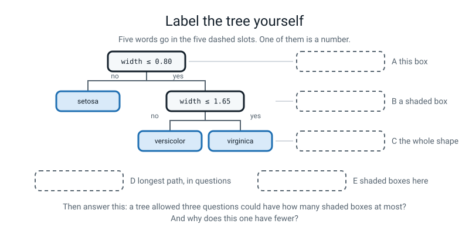
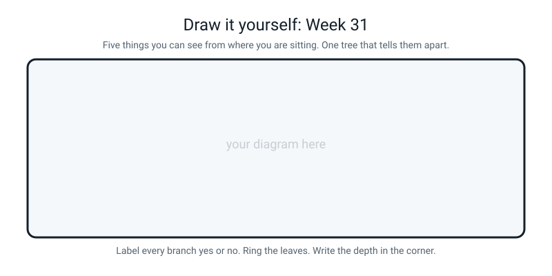

# Workbook — Week 31: Trees You Can Read Out Loud

**Name:** ________________________________  **Date:** ______________

[⬅ Week 30](week-30.md) · [📖 Read the chapter first](../student-guide/week-31.md) · [Course Home](../README.md) · [🧑‍🏫 Teacher guide](../teacher-guide/week-31.md) · [Next ➡](week-32.md)

**You will need:** a pencil · a printer (or a screen you can point at) · the `export_text` printout from class · last week's Python file · the Bug Log

---

## ✅ Warm-Up (5 min)

Five quick questions about **last week**.

**W1.** Why does kNN need `StandardScaler` when one column is measured in thousands and another in single units?

________________________________________________________________

________________________________________________________________

**W2.** In `confusion_matrix(y_test, predictions)`, which argument goes first, and what happens to the grid if you swap them?

________________________________________________________________

________________________________________________________________

**W3.** Last week the scaled model scored **0.9444** with the scaler fitted on the training rows only, and **0.9722** with the scaler fitted on everything. Which number are you allowed to quote, and what is the higher one called?

________________________________________________________________

**W4.** What does `stratify=y` do, and why is `stratify=X` wrong?

________________________________________________________________

**W5.** Four values of `k` in a row all gave 0.9722. What is that called, and why is it more trustworthy than a single lonely spike?

________________________________________________________________

---

## 🔎 Predict the Output

**Write your prediction before you run anything.** This is the highest-value exercise on the page — the point is to be surprised on paper, where it is free.

### P1 — a ceiling, not a target

```python
from sklearn.datasets import load_iris
from sklearn.tree import DecisionTreeClassifier

iris = load_iris()
tree = DecisionTreeClassifier(max_depth=5, random_state=0)
tree.fit(iris.data, iris.target)
print(tree.get_depth())
print(tree.get_n_leaves())
print(2 ** 5)
```

**I predict — three numbers:** ______  ______  ______

**It really printed:**

________________________________________________________________

**Line 2 is smaller than line 3. Explain the difference between those two numbers in one sentence.**

________________________________________________________________

________________________________________________________________

**Would line 1 change if you set `max_depth=20`?** ____________  **Why?**

________________________________________________________________

### P2 — the shares always add up

```python
from sklearn.datasets import load_iris
from sklearn.tree import DecisionTreeClassifier

iris = load_iris()
tree = DecisionTreeClassifier(max_depth=2, random_state=0)
tree.fit(iris.data, iris.target)
print(len(tree.feature_importances_))
print(round(tree.feature_importances_.sum(), 4))
print(tree.feature_importances_.round(3))
```

**I predict — three lines:**

________________________________________________________________

________________________________________________________________

**It really printed:**

________________________________________________________________

________________________________________________________________

**Line 1 is 4. Where does the 4 come from?**

________________________________________________________________

**In the chapter, `petal length` scored 0.061. Here it scores something different. What is different about this run?**

________________________________________________________________

________________________________________________________________

### P3 — name-tags, not amounts

```python
from sklearn.datasets import load_iris

iris = load_iris()
print(iris.target[0], iris.target[50], iris.target[100])
print(iris.target_names[iris.target[100]])
print(iris.target[100] > iris.target[50])
print(iris.target_names[1] > iris.target_names[2])
```

**I predict — four lines:**

________________________________________________________________

________________________________________________________________

**It really printed:**

________________________________________________________________

________________________________________________________________

**Line 3 says one thing and line 4 says the opposite. Both are correct. Explain.**

________________________________________________________________

________________________________________________________________

**Line 3 is `True`. Does that mean a virginica is "more" than a versicolor?**

________________________________________________________________

### P4 — right on the line

```python
from sklearn.tree import DecisionTreeClassifier, export_text

hours = [[1], [2], [3], [8], [9], [10]]
passed = ["no", "no", "no", "yes", "yes", "yes"]

tree = DecisionTreeClassifier(max_depth=1, random_state=0)
tree.fit(hours, passed)
print(export_text(tree, feature_names=["hours"]))
print(tree.predict([[5]]))
print(tree.predict([[5.5]]))
print(tree.predict([[100]]))
```

**I predict — what number will the cut-off be?** ____________

**And the three predictions:** ______________  ______________  ______________

**It really printed:**

________________________________________________________________

________________________________________________________________

________________________________________________________________

**Where did the cut-off number come from? Show the arithmetic.**

________________________________________________________________

**`predict([[5.5]])` sits exactly on the cut-off. Which way did it go, and which symbol in the printout tells you?**

________________________________________________________________

**100 hours is ten times anything in the data. Did the tree object?** ____________

**Should it have?**

________________________________________________________________

**How many of the four predictions did you get right?** ______ / 4

**Which one surprised you most, and why?**

________________________________________________________________

---

## ✍️ Practice Set A — Read It

**A1. Sort every line into a pile.** Here is the printout from class. Write **Q** next to every question and **A** next to every answer.

| Line | Q or A? |
|---|---|
| `\|--- petal width (cm) <= 0.80` | |
| `\|   \|--- class: 0` | |
| `\|--- petal width (cm) >  0.80` | |
| `\|   \|--- petal width (cm) <= 1.65` | |
| `\|   \|   \|--- petal length (cm) <= 4.95` | |
| `\|   \|   \|   \|--- class: 1` | |
| `\|   \|   \|--- petal length (cm) >  4.95` | |
| `\|   \|   \|   \|--- class: 2` | |
| `\|   \|--- petal width (cm) >  1.65` | |
| `\|   \|   \|--- petal length (cm) <= 4.85` | |
| `\|   \|   \|   \|--- class: 2` | |
| `\|   \|   \|--- petal length (cm) >  4.85` | |
| `\|   \|   \|   \|--- class: 2` | |

**A1(a).** How many **A** lines are there? ____________

**A1(b).** Which one-word method call would confirm that number without counting?

________________________________________________________________

**A1(c).** What single thing in a line tells you it is a question rather than an answer?

________________________________________________________________

**A2. Trace three flowers by hand.** Laptop shut, pencil only. For each flower write **every** question you hit, the yes/no answer, and the final species name.

| Flower | sepal length | sepal width | petal length | petal width |
|---|---|---|---|---|
| P | 4.9 | 3.1 | 1.5 | 0.1 |
| Q | 5.7 | 2.8 | 4.1 | 1.3 |
| R | 6.3 | 2.9 | 5.6 | 1.8 |

**Flower P**

```
question 1: ______________________________  answer: ______   ->
                                                    species: ______________
```

**Flower Q**

```
question 1: ______________________________  answer: ______   ->
question 2: ______________________________  answer: ______   ->
question 3: ______________________________  answer: ______   ->
                                                    species: ______________
```

**Flower R**

```
question 1: ______________________________  answer: ______   ->
question 2: ______________________________  answer: ______   ->
question 3: ______________________________  answer: ______   ->
                                                    species: ______________
```

**A2(a).** Which flower needed the fewest questions, and why?

________________________________________________________________

**A2(b).** For flower R, the third question changed nothing. How can you tell just by looking at the printout?

________________________________________________________________

**A3. Trace a variable's value.** Fill in the third column for each line, in order.

```python
iris = load_iris()
model = DecisionTreeClassifier(max_depth=3, random_state=0)
model.fit(X_train, y_train)
guesses = model.predict(X_test)
```

| After this line | What does `model` hold? | What can you ask it for yet? |
|---|---|---|
| `model = DecisionTreeClassifier(max_depth=3, random_state=0)` | | |
| `model.fit(X_train, y_train)` | | |
| `guesses = model.predict(X_test)` | | |

**A3(a).** At which of the three lines does `model.feature_importances_` start working, and what error do you get before that?

________________________________________________________________

________________________________________________________________

**A4. Spot the bug.** Each line is wrong or dangerous. Write the fix.

| # | The line | The fix |
|---|---|---|
| a | `model = DecisionTreeClassifier(depth=3)` | |
| b | `from sklearn.trees import DecisionTreeClassifier` | |
| c | `print(model.feature_importances)` | |
| d | `print(export_text(model, feature_names=["petal length", "petal width"]))` | |
| e | `print(model.predict([5.9, 3.0, 5.1, 1.8]))` | |
| f | `print(export_text(model))` — before `model.fit(...)` | |
| g | `scaler = StandardScaler().fit(X_train)` — before fitting a tree | |
| h | `print("the tree says class 2, so it's twice class 1")` | |

**A4(i).** One of those eight produces **no error whatsoever**. Which, and what is wrong with it?

________________________________________________________________

________________________________________________________________

**A5. Match the code to the output.** Draw a line from each left-hand box to its right-hand output.

| # | The call |
|---|---|
| 1 | `model.get_n_leaves()` |
| 2 | `model.get_depth()` |
| 3 | `len(model.feature_importances_)` |
| 4 | `round(model.feature_importances_.sum(), 3)` |
| 5 | `iris.target_names[2]` |
| 6 | `iris.data.shape` |

| Letter | Output |
|---|---|
| A | `(150, 4)` |
| B | `'virginica'` |
| C | `5` |
| D | `1.0` |
| E | `3` |
| F | `4` |

**Answers:** 1 → ____  2 → ____  3 → ____  4 → ____  5 → ____  6 → ____

**A5(a).** Two of those outputs are about the **size** of the tree and mean completely different things. Which two, and what does each one count?

________________________________________________________________

**A6. Label the diagram.** Write one short phrase in each of the five dashed slots.


*Figure W31.1 — Five slots, five names. One of them is a number.*

The five words, in the wrong order: **leaf · split · 2 · decision tree · 3**

**A** ______________________  **B** ______________________

**C** ______________________  **D** ______________________

**E** ______________________

**A6(f).** A tree allowed three questions could have how many shaded boxes at most? ____________

**A6(g).** This one has fewer. Why?

________________________________________________________________

---

## ✍️ Practice Set B — Write It

### B1 — one line

You have the depth-3 iris tree fitted as `tree`. Write the **single line** that prints how many answers it has.

```python
# your line here:
```

**Expected output:**

```text
leaves: 5
```

**Done looks like:** one line, and you can say out loud why the answer is not 8.

### B2 — the smallest tree there is

Write a complete program that trains a **depth-1** tree on the iris flowers, using the same split as in class, and prints the test accuracy, the number of leaves, and the rules.

**Expected output:**

```text
test accuracy: 0.6667
leaves       : 2
|--- petal width (cm) <= 0.80
|   |--- class: 0
|--- petal width (cm) >  0.80
|   |--- class: 1
```

**Done looks like:** you can explain, in one sentence, why a depth-1 tree can never score much above 0.6667 on three species — and your explanation mentions the number **two**.

### B3 — the importances, lined up

Write the loop that prints all four importances in a neat column, name padded to 20 characters, number to three decimal places.

```python
# your loop here (2 lines):
```

**Expected output:**

```text
  sepal length (cm)    0.000
  sepal width (cm)     0.000
  petal length (cm)    0.061
  petal width (cm)     0.939
```

**Done looks like:** you used `zip` and an f-string, the numbers line up in a column you could rule a pencil down, and you have checked they add to 1.000.

### B4 — your own tree, about 15 lines

Eight snacks. Two measurements each — grams of sugar and grams of salt — and whether each one is sweet or savoury. Type the table out literally, train a depth-2 tree, print the rules and the importances and the leaf count, and then ask it about a snack with **12 g of sugar and 2 g of salt**.

Use these numbers so your output matches:

| snack | sugar_g | salt_g | kind |
|---|---|---|---|
| 1 | 22 | 0 | sweet |
| 2 | 18 | 1 | sweet |
| 3 | 25 | 0 | sweet |
| 4 | 30 | 1 | sweet |
| 5 | 2 | 4 | savoury |
| 6 | 1 | 6 | savoury |
| 7 | 3 | 5 | savoury |
| 8 | 0 | 7 | savoury |

**Expected output:**

```text
|--- salt_g <= 2.50
|   |--- class: sweet
|--- salt_g >  2.50
|   |--- class: savoury

leaves: 2  depth: 1
  sugar_g   0.000
  salt_g    1.000
a snack with 12 g sugar and 2 g salt -> ['sweet']
```

**Done looks like:** you allowed the tree **two** questions and it used **one**, you can say why, and you can explain why `sugar_g` scored 0.000 **without** saying the word "useless".

### B5 — the depth sweep, about 12 lines

Write a program that loops `max_depth` from 1 to 5 on the iris split from class, and prints a table of the depth limit, the leaves, the *real* depth reached, the train score and the test score.

**Expected output:**

```text
max_depth  leaves  real_depth   train    test
        1       2           1  0.6667  0.6667
        2       3           2  0.9667  0.9333
        3       5           3  0.9833  0.9667
        4       7           4  0.9917  0.9333
        5       8           5  1.0000  0.9667
```

**Done looks like:** the columns line up, the model is built **inside** the loop, and you have written one sentence underneath about what the `train` column does at every single step.

---

## 🐞 Fix the Broken Program

Here is `flowers.py`. It is supposed to train a depth-2 tree, print its **test** accuracy, print the rules, and print the importances. It has **three** bugs: one that stops Python reading the file at all, one that stops it partway through, and one that produces **no error whatsoever**.

```python
# flowers.py - a depth-2 tree on the iris flowers. Three bugs.
from sklearn.datasets import load_iris
from sklearn.model_selection import train_test_split
from sklearn.tree import DecisionTreeClassifier

iris = load_iris()

X_train, X_test, y_train, y_test = train_test_split(
    iris.data, iris.target, test_size=0.2, random_state=42, stratify=iris.target

tree = DecisionTreeClassifier(max_depth=2, random_state=0)
tree.fit(X_train, y_train)

print("test accuracy:", round(tree.score(X_train, y_train), 4))
print(export_text(tree, feature_names=list(iris.feature_names)))
print("importances:")
for i, name in enumerate(iris.feature_names):
    share = tree.feature_importances_[i]
    print(" ", name, round(share, 3))
```

**Bug 1.** Run it as it is. The real message:

```text
  File "flowers.py", line 8
    X_train, X_test, y_train, y_test = train_test_split(
                                                       ^
SyntaxError: '(' was never closed
```

**Did any of the program run? How can you tell in one second?**

________________________________________________________________

**Python points at line 8, but the missing character belongs on a different line. Which one, and why did Python complain about line 8?**

________________________________________________________________

________________________________________________________________

**The fix:**

________________________________________________________________

**Bug 2.** Fix bug 1 and run again. The real message:

```text
test accuracy: 0.9667
Traceback (most recent call last):
  File "flowers.py", line 15, in <module>
    print(export_text(tree, feature_names=list(iris.feature_names)))
NameError: name 'export_text' is not defined
```

**One line of output appeared before the crash. What does that tell you about how Python runs a file?**

________________________________________________________________

**What does `NameError` always mean, in eight words or fewer?**

________________________________________________________________

**The fix — and note that you change an existing line rather than adding a new one:**

________________________________________________________________

**Bug 3.** Fix bug 2 and run again. Now there is **no error at all**:

```text
test accuracy: 0.9667
|--- petal width (cm) <= 0.80
|   |--- class: 0
|--- petal width (cm) >  0.80
|   |--- petal width (cm) <= 1.65
|   |   |--- class: 1
|   |--- petal width (cm) >  1.65
|   |   |--- class: 2

importances:
  sepal length (cm) 0.0
  sepal width (cm) 0.0
  petal length (cm) 0.0
  petal width (cm) 1.0
```

**Look very carefully at the first line of output. Compare it with the label printed next to it.**

**What is the bug?**

________________________________________________________________

________________________________________________________________

**The fix:**

________________________________________________________________

**Run the fix. What does the first line say now?** ____________

**Which of the two numbers is the honest one, and why?**

________________________________________________________________

________________________________________________________________

**And the check that catches this whole family of bug, in one sentence:**

________________________________________________________________

---

## 🧩 Puzzle of the Week

### Part 1 — Eight snacks, three questions

You have eight snacks and you are allowed **three** yes/no questions. Your job is to design questions that tell all eight apart — so every snack ends up at its own leaf.

The three questions are: **is it sweet?** · **is it crunchy?** · **does it come in a wrapper?**

**(a)** Fill in the table with 1 for yes and 0 for no, so that **no two rows are identical**.

| snack | sweet? | crunchy? | wrapper? |
|---|---|---|---|
| chocolate biscuit | | | |
| apple | | | |
| toffee | | | |
| banana | | | |
| crisps | | | |
| carrot stick | | | |
| cheese slice | | | |
| boiled egg | | | |

**(b)** How many different combinations of three yes/no answers exist? Show the arithmetic.

________________________________________________________________

**(c)** So what is the **largest** number of things three yes/no questions could ever separate?

________________________________________________________________

**(d)** Type your table into a `DecisionTreeClassifier(max_depth=3, random_state=0)` and print the rules. How many leaves? ____________  What score on the rows it learned from? ____________

**(e)** Now add a **ninth** snack — a pear — with **exactly the same three answers as the apple**. Refit. What happens to the leaves and the score?

leaves: ____________   score: ____________

**(f)** Write one sentence explaining why. Then write a second sentence saying what you would have to do to fix it — and notice that the fix is **not** about the tree.

________________________________________________________________

________________________________________________________________

### Part 2 — How deep for ten?

**(g)** Fill in the table.

| Questions allowed | Most possible answers |
|---|---|
| 1 | |
| 2 | |
| 3 | |
| 4 | |
| 5 | |

**(h)** What is the fewest questions you need to separate **ten** things? ____________  **Why not three?**

________________________________________________________________

**(i)** And the fewest to separate **one hundred** things? ____________ *(Hint: keep doubling.)*

---

## 🤔 Think Deeper

**T1. The tree scored 0.9667 and last week's kNN scored well too. Write a paragraph arguing that the tree is the better model *without mentioning the score once*.**

________________________________________________________________

________________________________________________________________

________________________________________________________________

________________________________________________________________

________________________________________________________________

**T2. In the school example, Ines and Jai had identical measurements — 45 minutes revised, 5 hours slept — and opposite outcomes. Write a paragraph about what that means for *any* model, and what you would do about it if this were your own project.**

________________________________________________________________

________________________________________________________________

________________________________________________________________

________________________________________________________________

________________________________________________________________

---

## 🛠️ Build It — Read the Model Out Loud

### Part 1 — Predict before you run (page 31.4)

**Before you write any code**, write down which of the four measurements you think the tree will lean on most, and why.

**My prediction:** ______________________________

**Because:**

________________________________________________________________

*(Do not change this later. Being wrong here and saying so is worth more than being right.)*

### Part 2 — Train it and print the rules

Step checklist:

- [ ] Open a new file, `week31_hw_rules.py`
- [ ] Load the iris flowers
- [ ] Split with `test_size=0.2, random_state=42, stratify=y`
- [ ] Train `DecisionTreeClassifier(max_depth=3, random_state=0)`
- [ ] Print the train score, the test score, the leaf count and `target_names`
- [ ] Print the rules with `export_text` and real feature names

**Fill in what you got:**

| | value |
|---|---|
| train accuracy | |
| test accuracy | |
| leaves | |
| the three species names, in order | |

### Part 3 — The four sentences

Write out **every** rule as one English sentence a person who has never seen a computer could follow. Species **names**, not `class: 2`. **Units** on every number.

**Rule 1:** ______________________________________________________

________________________________________________________________

**Rule 2:** ______________________________________________________

________________________________________________________________

**Rule 3:** ______________________________________________________

________________________________________________________________

**Rule 4:** ______________________________________________________

________________________________________________________________

**Read all four out loud to somebody in the house.** Who did you read them to? ______________

**Did they understand all four?** ____________  **If not, which one, and how did you rewrite it?**

________________________________________________________________

### Part 4 — Find the row it gets wrong (page 31.5)

- [ ] Add the loop that prints only the misses
- [ ] Fill in the table below
- [ ] Walk the flower's petal width down the printed rules with your finger

| | value |
|---|---|
| how many wrong, out of 30 | |
| hidden flower number | |
| its petal length | |
| its petal width | |
| the tree said | |
| the truth was | |

**The rule that caught it:**

________________________________________________________________

**By how much did it miss the cut-off?** ____________

**Now try to fix it.** Change the cut-off in your head from 1.65 to 1.75. What happens to this flower, and what happens to a genuine virginica with a 1.7 cm petal?

________________________________________________________________

________________________________________________________________

**So did you remove the mistake, or move it?** ______________________

### Part 5 — The importances (page 31.6)

| measurement | importance |
|---|---|
| sepal length (cm) | |
| sepal width (cm) | |
| petal length (cm) | |
| petal width (cm) | |
| **total** | |

**Was your Part 1 prediction right?** ____________

**Two of them are 0.000. Does that mean those two measurements are useless? Two sentences.**

________________________________________________________________

________________________________________________________________

**Now test it.** Train a depth-3 tree on **only** the two sepal columns — `X = iris.data[:, [0, 1]]` — and write down both scores.

train: ____________   test: ____________

**Does that support "useless" or "not needed here"?** ______________________

### Part 6 — The Bug Log

| What happened | The real message (copy it exactly) | What fixed it | What I will check next time |
|---|---|---|---|
| | | | |
| | | | |

---

## 🎨 Draw It

Draw **your own** question tree, for five things you can see from where you are sitting.


*Figure W31.2 — Your page.*

**Rules:** every box is a question you could answer yes or no · every line is labelled **yes** or **no** · ring the leaves · write the depth in the corner.

> **What a good answer might look like:** the five things are **a window, a chair, a mug, a phone and a shoe.**
>
> The top box reads **"can you carry it in one hand?"** — because that splits five into two and three, which is the best available cut. The **no** branch goes to a single box reading **"can you see through it?"**, with leaves **window** and **chair**. The **yes** branch goes to a box reading **"does it have a screen?"**, whose yes-leaf is **phone** and whose no-branch goes to one more box, **"do you wear it?"**, with leaves **shoe** and **mug**.
>
> In the corner: **depth = 3**, and underneath, **leaves = 5**.
>
> And two annotations that show real understanding. An arrow to the top box labelled *"I picked this first because it splits 5 into 2 and 3 — 'is it the mug?' would have split it 1 and 4."* And a note beside the window/chair pair: *"this branch needed only two questions, so the depth budget was not all spent."*
>
> **What a weak answer looks like:** a first question of "is it the phone?" (which makes progress only if you are lucky), branches with no yes/no labels, or a question that cannot be answered yes or no — "what colour is it?" is not a split.

---

## 📊 Self-Check

| I can… | 😀 got it | 🙂 nearly | 😕 not yet |
|---|---|---|---|
| Explain a decision tree as a stack of yes/no questions with a depth limit | ☐ | ☐ | ☐ |
| Change one line of last week's file and get a tree instead of a kNN | ☐ | ☐ | ☐ |
| Sort the lines of an `export_text` printout into questions and answers | ☐ | ☐ | ☐ |
| Read a rule out loud as an English sentence, with units and a species name | ☐ | ☐ | ☐ |
| Trace an unseen flower down the printed rules with a pencil | ☐ | ☐ | ☐ |
| Say which measurements the tree used and which it ignored | ☐ | ☐ | ☐ |
| Explain why `0.000` importance is not the same as "useless" | ☐ | ☐ | ☐ |
| Find the row the tree gets wrong and name the rule that caught it | ☐ | ☐ | ☐ |
| Say why a tree does not need `StandardScaler` | ☐ | ☐ | ☐ |

**True or false?** Circle one on each row.

| Statement | | |
|---|---|---|
| `max_depth=3` means the tree asks exactly three questions | TRUE | FALSE |
| A depth-3 tree can have at most 8 leaves | TRUE | FALSE |
| `class: 0` means none of them | TRUE | FALSE |
| The number 0.80 appears somewhere in our code | TRUE | FALSE |
| A split can ask about two measurements at once | TRUE | FALSE |
| Every line of an `export_text` printout is a question | TRUE | FALSE |
| The four feature importances add up to 1 | TRUE | FALSE |
| Importance 0.000 proves a measurement is worthless | TRUE | FALSE |
| A tree needs `StandardScaler` just like kNN does | TRUE | FALSE |
| A tree can ask a question whose two answers are the same | TRUE | FALSE |
| `feature_importances` works before you call `fit` | TRUE | FALSE |
| `from sklearn.trees import ...` is the correct import | TRUE | FALSE |
| Moving a cut-off can remove a mistake completely | TRUE | FALSE |
| You can write a tree's rules on a card and use them with no computer | TRUE | FALSE |

One thing I'd like explained again:

________________________________________________________________

---

## ✅ Answers

<details>
<summary>Check your answers</summary>

### Warm-Up

**W1.** Because kNN works out **distances across all the columns at once**. A column measured in thousands contributes thousands to every distance while a column measured in single units contributes almost nothing, so the big column decides every answer on its own. Scaling puts every column on the same footing first.

**W2.** **Truth first**, guesses second — `confusion_matrix(y_test, predictions)`. Swap them and you get the grid **flipped along the diagonal**: rows become guesses and columns become truths. The diagonal is unchanged, so the accuracy looks identical, and **every mistake reads backwards.**

**W3.** You may quote **0.9444** — the one where the scaler saw only the training rows. The higher number, 0.9722, came from **leakage**: the scaler was allowed to look at the test rows while working out its averages, so a little information about the answers leaked into the training. A leak always flatters you.

**W4.** `stratify=y` forces each class to keep the **same share in both halves** of the split. It is `stratify=y` — the **labels** — because it is the class mix you are protecting. `stratify=X` asks it to keep the mix of the measurements, which is not a mix of anything, and gives a confusing error.

**W5.** A **plateau**, and it is more trustworthy because it says the answer does not depend on getting `k` exactly right. A lonely spike at one value with dips either side is usually luck, and if you ship it you have shipped the luck.

---

### Predict the Output

### P1

```text
5
9
32
```

**Why.** Trained on all 150 flowers with no split, a depth-5 tree reaches a real depth of 5 and grows 9 leaves.

**Line 2 vs line 3.** **9 is how many leaves the tree actually grew. 32 is the most it could possibly have had** — 2 × 2 × 2 × 2 × 2. The tree stopped early on most branches because their piles were already all one kind.

**Would line 1 change with `max_depth=20`?** **No.** Run it and you get `20 -> depth 5 leaves 9`, exactly the same as `max_depth=5` and exactly the same as no limit at all. **`max_depth` is a ceiling, so once the tree has run out of impure leaves to split, raising the ceiling changes nothing whatsoever.** This tree finished on its own at depth 5, so 5, 20 and "no limit" are the same instruction here.

### P2

```text
4
1.0
[0. 0. 0. 1.]
```

**Line 1 is 4** because there is **one importance per column**, and iris has four columns. It is 4 whether the tree used them or not.

**Line 2 is 1.0** because importances are **shares** of the work, so they always total 1 exactly.

**Why is `petal length` 0.000 here and 0.061 in the chapter?** Two things are different: this tree has **`max_depth=2`** (not 3) and it was fitted on **all 150 flowers** (not the 120 training ones). At depth 2, two questions about petal width alone are enough, so petal length never gets asked. **The importances are a report on one particular tree on one particular pile of rows — not a fact about irises.**

### P3

```text
0 1 2
virginica
True
False
```

**Line 3 and line 4 disagree, and both are right.** Line 3 compares the **numbers** `2 > 1`, which is `True` — because `iris.target` holds integers, and 2 really is bigger than 1. Line 4 compares the **words** `'versicolor' > 'virginica'`, which is `False` — because Python compares strings alphabetically, and `'e'` comes before `'i'`.

**Does `True` mean a virginica is "more" than a versicolor?** **No.** The numbers are **name-tags**. Python will happily compare them because they are stored as integers, and the comparison is arithmetically correct and completely meaningless. Bus number 8 is not twice bus number 4.

### P4

```text
|--- hours <= 5.50
|   |--- class: no
|--- hours >  5.50
|   |--- class: yes

['no']
['no']
['yes']
```

**Where 5.50 came from.** The two neighbouring values either side of the gap are **3** and **8**. `(3 + 8) ÷ 2 = 5.5`. A tree always puts a cut-off **halfway between the two nearest values it can see**, which is why cut-offs so often end in `.5` or `.05`.

**`predict([[5.5]])` sits exactly on the cut-off and goes LEFT — to `no`.** The symbol that tells you is the **`<=`**: less than **or equal to**. Equal goes with the left branch, always.

**Did the tree object to 100 hours?** No. **Should it have?** Arguably yes. Nobody in the training data revised more than 10 hours, so 100 is far outside the evidence, and the tree hands over `yes` with total confidence. A tree does not extrapolate the way a line does — every leaf is a flat answer, so it cannot promise 121 marks — but it **will** confidently apply a rule to a row from a world it has never seen. Write down the range your model was built from.

---

### Practice Set A

**A1.** Q, A, Q, Q, Q, A, Q, A, Q, Q, A, Q, A.

**A1(a).** **Five** A lines.

**A1(b).** `model.get_n_leaves()` — it prints `5`.

**A1(c).** The presence of a **`<=` or `>` with a number after it**. Questions compare a measurement with a number. Answers say `class:` and stop.

**A2. The three traces.**

**Flower P** — petal width 0.1

```
petal width <= 0.80?   0.1 <= 0.80?   YES  -> class 0
                                            -> SETOSA
```

One question. Correct — a real setosa.

**Flower Q** — petal width 1.3, petal length 4.1

```
petal width  <= 0.80?  1.3 <= 0.80?   NO   -> go right
petal width  <= 1.65?  1.3 <= 1.65?   YES  -> go left
petal length <= 4.95?  4.1 <= 4.95?   YES  -> class 1
                                            -> VERSICOLOR
```

**Flower R** — petal width 1.8, petal length 5.6

```
petal width  <= 0.80?  1.8 <= 0.80?   NO   -> go right
petal width  <= 1.65?  1.8 <= 1.65?   NO   -> go right
petal length <= 4.85?  5.6 <= 4.85?   NO   -> class 2
                                            -> VIRGINICA
```

**A2(a).** **Flower P**, one question. Setosas have very narrow petals — under 0.8 cm — and nothing else does, so a single question settles it every time. That is exactly why the tree spent its very first question there.

**A2(b).** Because **both branches of `petal length <= 4.85` say `class: 2`.** Whichever way flower R went at that question, the answer was already going to be virginica. Its fate was sealed by the second question.

**A3.**

| After this line | What does `model` hold? | What can you ask it for yet? |
|---|---|---|
| `model = DecisionTreeClassifier(...)` | An **empty, untrained** tree. It knows its settings (`max_depth=3`) and nothing else. | Its settings only. Not the rules, not the importances, not a prediction. |
| `model.fit(X_train, y_train)` | A **trained** tree, with the questions and the cut-off numbers found from 120 flowers. | Everything: `export_text`, `feature_importances_`, `get_n_leaves()`, `predict`, `score`. |
| `guesses = model.predict(X_test)` | Unchanged — `fit` trained it, `predict` only asks it. | The same as before. **`predict` does not change the model.** |

**A3(a).** It starts working at the **second** line, `model.fit(...)`. Before that you get:

```text
sklearn.exceptions.NotFittedError: This DecisionTreeClassifier instance is not fitted yet. Call 'fit' with appropriate arguments before using this estimator.
```

That is what the trailing underscore in `feature_importances_` is warning you about.

**A4.**

| # | The fix |
|---|---|
| a | `DecisionTreeClassifier(max_depth=3)` — **max**_depth. `TypeError: ... unexpected keyword argument 'depth'` |
| b | `from sklearn.tree import ...` — **singular**. Plural gives `ModuleNotFoundError`. |
| c | `model.feature_importances_` — trailing underscore. Python even suggests it. |
| d | Give **one name per column** — four of them, in column order. Or `feature_names=list(iris.feature_names)`. Two names gives `ValueError: feature_names must contain 4 elements, got 2`. |
| e | `model.predict([[5.9, 3.0, 5.1, 1.8]])` — **two** sets of brackets. Outer = the table, inner = the one row. |
| f | Move `model.fit(X_train, y_train)` **above** it. An untrained tree has no rules to print. |
| g | Delete it. A tree never needs scaling: a split compares one column with one number, so rescaling the column just rescales the cut-off. |
| h | Delete the claim. `0`, `1` and `2` are **name-tags**, not amounts. Print `iris.target_names` and use the names. |

**A4(i).** **(g)** — fitting a `StandardScaler` before a tree runs perfectly happily and produces no error. What is wrong with it is that it is **pointless**, it makes the file longer and harder to read, and it teaches you a habit you will then apply where it does harm. *(Also arguable: **(h)** produces no error either, because it is only a print. It is the worse of the two, because it is a false sentence going into a report.)*

**A5.** 1 → **C** · 2 → **E** · 3 → **F** · 4 → **D** · 5 → **B** · 6 → **A**

**A5(a).** `get_depth()` gives **3** and `get_n_leaves()` gives **5** — and those are the two that get muddled, because both feel like "how big is the tree". **`get_depth()` counts questions on the longest path. `get_n_leaves()` counts answers.** The third easy confusion is `len(feature_importances_)` = **4**, which counts **columns** and has nothing to do with either. Four different things, four different meanings, and none of them is interchangeable.

**A6.** **A** = split · **B** = leaf · **C** = decision tree · **D** = 2 · **E** = 3

*(A is the top question box — a split. B is a shaded end box — a leaf. C names the whole shape. D is the longest path in questions: width ≤ 0.80, then width ≤ 1.65 — two questions. E is the number of shaded boxes: setosa, versicolor, virginica — three.)*

**A6(f).** **Eight.** 2 × 2 × 2.

**A6(g).** Because the setosa branch **stopped after one question** — its pile was already all one kind, so there was nothing left to split. Depth is a ceiling, not an order, so unspent budget just stays unspent.

---

### Practice Set B

**B1.**

```python
# b1_leaves.py  -  the depth-3 tree from the lesson, re-made so this stands alone
from sklearn.datasets import load_iris
from sklearn.model_selection import train_test_split
from sklearn.tree import DecisionTreeClassifier

iris = load_iris()
X_train, X_test, y_train, y_test = train_test_split(
    iris.data, iris.target, test_size=0.2, random_state=42, stratify=iris.target)

tree = DecisionTreeClassifier(max_depth=3, random_state=0)
tree.fit(X_train, y_train)

print("leaves:", tree.get_n_leaves())
```

```text
leaves: 5
```

**Why not 8?** Because two branches settled after fewer than three questions. Eight is the maximum, not the promise.

**B2.**

```python
# b2_depth1.py  -  the smallest tree there is
from sklearn.datasets import load_iris
from sklearn.model_selection import train_test_split
from sklearn.tree import DecisionTreeClassifier, export_text

iris = load_iris()
X_train, X_test, y_train, y_test = train_test_split(
    iris.data, iris.target, test_size=0.2, random_state=42, stratify=iris.target)

tree = DecisionTreeClassifier(max_depth=1, random_state=0)
tree.fit(X_train, y_train)

print("test accuracy:", round(tree.score(X_test, y_test), 4))
print("leaves       :", tree.get_n_leaves())
print(export_text(tree, feature_names=list(iris.feature_names)))
```

```text
test accuracy: 0.6667
leaves       : 2
|--- petal width (cm) <= 0.80
|   |--- class: 0
|--- petal width (cm) >  0.80
|   |--- class: 1
```

**The sentence.** One question gives exactly **two** possible answers, and there are **three** species. So whatever the question is, two species have to share an answer, and one of them is wrong every time. Two thirds is the ceiling. The confusion matrix shows exactly what happens: the tree gets all **10** setosas right and all **10** versicolors right, and calls all **10** virginicas versicolor. 20 out of 30 is 0.6667.

```text
[[10  0  0]
 [ 0 10  0]
 [ 0 10  0]]
```

**B3.**

```python
# b3_importances.py  -  back to the DEPTH-3 tree, not B2's depth-1 one
from sklearn.datasets import load_iris
from sklearn.model_selection import train_test_split
from sklearn.tree import DecisionTreeClassifier

iris = load_iris()
X_train, X_test, y_train, y_test = train_test_split(
    iris.data, iris.target, test_size=0.2, random_state=42, stratify=iris.target)

tree = DecisionTreeClassifier(max_depth=3, random_state=0)
tree.fit(X_train, y_train)

for i, name in enumerate(iris.feature_names):      # enumerate, from Week 14
    importance = tree.feature_importances_[i]
    print(f"  {name:20s} {importance:.3f}")
```

```text
  sepal length (cm)    0.000
  sepal width (cm)     0.000
  petal length (cm)    0.061
  petal width (cm)     0.939
```

`0.000 + 0.000 + 0.061 + 0.939 = 1.000`. ✓

**B4.**

```python
# b4_snacks.py  -  eight snacks. Sweet or savoury?
from sklearn.tree import DecisionTreeClassifier, export_text

# [grams of sugar, grams of salt]
snacks = [
    [22, 0], [18, 1], [25, 0], [30, 1],
    [2, 4], [1, 6], [3, 5], [0, 7],
]
kind = ["sweet", "sweet", "sweet", "sweet",
        "savoury", "savoury", "savoury", "savoury"]

tree = DecisionTreeClassifier(max_depth=2, random_state=0)
tree.fit(snacks, kind)

print(export_text(tree, feature_names=["sugar_g", "salt_g"]))
print("leaves:", tree.get_n_leaves(), " depth:", tree.get_depth())
for i, name in enumerate(["sugar_g", "salt_g"]):
    share = tree.feature_importances_[i]
    print(f"  {name:9s} {share:.3f}")
print("a snack with 12 g sugar and 2 g salt ->", tree.predict([[12, 2]]))
```

```text
|--- salt_g <= 2.50
|   |--- class: sweet
|--- salt_g >  2.50
|   |--- class: savoury

leaves: 2  depth: 1
  sugar_g   0.000
  salt_g    1.000
a snack with 12 g sugar and 2 g salt -> ['sweet']
```

**Why did it use one question when it was allowed two?** Because after the single question `salt_g <= 2.50`, both piles were **already all one kind**. There was nothing impure left to split, so it stopped. **Depth is a ceiling, not an order.**

**Why did `sugar_g` score 0.000, without saying "useless"?** Because **salt did the whole job on its own**, so there was no work left over for sugar. Sugar is obviously a real and relevant thing about a snack — you would guess sweet-or-savoury from sugar alone quite happily. It was not **needed here**, by this tree, on these eight rows. The cut-off `2.50` is halfway between the salt values **1** and **4**.

**B5.**

```python
# b5_sweep.py  -  turn the depth dial and write down what happens
from sklearn.datasets import load_iris
from sklearn.model_selection import train_test_split
from sklearn.tree import DecisionTreeClassifier

iris = load_iris()
X_train, X_test, y_train, y_test = train_test_split(
    iris.data, iris.target, test_size=0.2, random_state=42, stratify=iris.target)

print(f"{'max_depth':>9} {'leaves':>7} {'real_depth':>11} {'train':>7} {'test':>7}")
for limit in range(1, 6):
    tree = DecisionTreeClassifier(max_depth=limit, random_state=0)
    tree.fit(X_train, y_train)
    print(f"{limit:9d} {tree.get_n_leaves():7d} {tree.get_depth():11d} "
          f"{tree.score(X_train, y_train):7.4f} {tree.score(X_test, y_test):7.4f}")
```

```text
max_depth  leaves  real_depth   train    test
        1       2           1  0.6667  0.6667
        2       3           2  0.9667  0.9333
        3       5           3  0.9833  0.9667
        4       7           4  0.9917  0.9333
        5       8           5  1.0000  0.9667
```

**The sentence about the `train` column:** *"It goes up at every single step — 0.6667, 0.9667, 0.9833, 0.9917, 1.0000 — and never once down. More questions is always better on the flowers the tree learned from."*

*(And if you noticed that `test` went **down** at depth 4 and that bothers you: good. Hold it. That is Week 33's entire lesson and you have arrived at it two weeks early.)*

---

### Fix the Broken Program

**Bug 1 — the unclosed bracket.**

**Did any of it run?** **No — not one line.** You can tell in one second because **there is no output at all** above the message, and because the message says `SyntaxError` rather than `Traceback`. A `SyntaxError` happens while Python is still *reading* the file, before it runs anything.

**Where the fix goes.** The missing `)` belongs at the **end of line 9**, after `stratify=iris.target`. Python complained about **line 8** because that is where the bracket was **opened** — it read on past line 9, past the blank line, and eventually gave up, then reported where the trouble started.

> This is the general shape of an unclosed-bracket error: **Python names the line where the bracket opened, and the character you need is further down.**

**The fix:**

```python
X_train, X_test, y_train, y_test = train_test_split(
    iris.data, iris.target, test_size=0.2, random_state=42, stratify=iris.target)
```

**Bug 2 — `export_text` never imported.**

**One line ran first. What that tells you.** Python runs a file **top to bottom, one line at a time**, and only stops when it hits the trouble. So everything above the crash really happened — which is why you must always read the output *above* a traceback as well as the traceback itself.

**What `NameError` always means:** *"you used a name Python was never given."*

**The fix — change the existing import line:**

```python
from sklearn.tree import DecisionTreeClassifier, export_text
```

**Bug 3 — the silent one.**

**The bug:** the line is labelled **`"test accuracy:"`** but it computes `tree.score(X_train, y_train)` — the score on the rows the tree **learned from**. Wrong number, under the right-sounding label, with no error of any kind.

**The fix:**

```python
print("test accuracy:", round(tree.score(X_test, y_test), 4))
```

**What the first line says now:** `test accuracy: 0.9333`

**Which is honest?** **0.9333.** The 0.9667 was measured on the 120 flowers the tree had already been shown, with the answers. That is a memory test. **0.9333 is the only number that says anything about a flower that has not happened yet.**

**The check that catches this whole family:** **look at what is inside the brackets, not at the label outside them.** A print label is a promise you made; the arguments are what actually happened. When a number looks better than you expected, check the arguments first.

---

### Puzzle of the Week

**(a)** All eight combinations, one per row:

| snack | sweet? | crunchy? | wrapper? |
|---|---|---|---|
| chocolate biscuit | 1 | 1 | 1 |
| apple | 1 | 1 | 0 |
| toffee | 1 | 0 | 1 |
| banana | 1 | 0 | 0 |
| crisps | 0 | 1 | 1 |
| carrot stick | 0 | 1 | 0 |
| cheese slice | 0 | 0 | 1 |
| boiled egg | 0 | 0 | 0 |

*(Any assignment works as long as **no two rows are identical**. Argue about whether a toffee is crunchy all you like — the puzzle is about the table having eight different rows.)*

**(b)** `2 × 2 × 2 = 8`. Each question doubles the number of possible answer-patterns.

**(c)** **Eight.** Three yes/no questions can never separate nine things.

**(d)** Typed in:

```python
from sklearn.tree import DecisionTreeClassifier, export_text
snacks = ["chocolate biscuit", "apple", "toffee", "banana",
          "crisps", "carrot stick", "cheese slice", "boiled egg"]
# [sweet, crunchy, wrapper]
props = [
    [1, 1, 1], [1, 1, 0], [1, 0, 1], [1, 0, 0],
    [0, 1, 1], [0, 1, 0], [0, 0, 1], [0, 0, 0],
]
tree = DecisionTreeClassifier(max_depth=3, random_state=0)
tree.fit(props, snacks)
print(export_text(tree, feature_names=["sweet", "crunchy", "wrapper"]))
print("leaves:", tree.get_n_leaves(), "depth:", tree.get_depth(),
      "score:", tree.score(props, snacks))
```

```text
|--- crunchy <= 0.50
|   |--- wrapper <= 0.50
|   |   |--- sweet <= 0.50
|   |   |   |--- class: boiled egg
|   |   |--- sweet >  0.50
|   |   |   |--- class: banana
|   |--- wrapper >  0.50
|   |   |--- sweet <= 0.50
|   |   |   |--- class: cheese slice
|   |   |--- sweet >  0.50
|   |   |   |--- class: toffee
|--- crunchy >  0.50
|   |--- wrapper <= 0.50
|   |   |--- sweet <= 0.50
|   |   |   |--- class: carrot stick
|   |   |--- sweet >  0.50
|   |   |   |--- class: apple
|   |--- wrapper >  0.50
|   |   |--- sweet <= 0.50
|   |   |   |--- class: crisps
|   |   |--- sweet >  0.50
|   |   |   |--- class: chocolate biscuit
```

**leaves: 8 · depth: 3 · score: 1.0** — every snack at its own leaf, all eight separated, exactly as the arithmetic promised. *(Note that the tree chose to ask `crunchy` first. With eight perfectly balanced rows, all three questions are equally good, and `random_state=0` settles the tie.)*

**(e)** Add a pear with the apple's answers — `[1, 1, 0]`:

```text
leaves: 8   score: 0.8889
predicted for the apple's answers: ['apple']
```

**leaves: 8** (unchanged) and **score: 0.8889** — eight right out of nine.

**(f)** **Why:** the pear and the apple have **identical answers to all three questions**, so no tree that only asks those three questions can ever tell them apart. They arrive at the same leaf and the leaf can only hold one name. Eight out of nine is the **best any model could possibly do**, and the tree achieved it.

**What would fix it:** a **fourth question** that distinguishes them — *"is it green?"*, *"does it have a core you throw away?"* — which means going back and **measuring something new**. The fix is not in the tree, the depth or the code. **It is in the table.** When two rows look the same and behave differently, you have a measuring problem, not a modelling problem.

**(g)**

| Questions allowed | Most possible answers |
|---|---|
| 1 | 2 |
| 2 | 4 |
| 3 | 8 |
| 4 | 16 |
| 5 | 32 |

**(h)** **Four.** Not three, because three questions give only **8** possible endings and you need at least **10**.

**(i)** **Seven.** 2, 4, 8, 16, 32, 64, **128**. Six questions give 64 endings, which is not enough for a hundred; seven give 128, which is. *(Notice how slowly that grows: doubling seven times to reach a hundred. That is why a depth-15 tree can have thousands of possible endings — and why Week 33 is going to be interesting.)*

---

### Think Deeper

**T1 — the tree is better, without mentioning the score.**

> A model is not only a thing that produces answers; it is a thing somebody has to trust, check and argue with. The tree hands me **four sentences**. I can copy them onto a card, take them into a garden with a ruler, and identify a flower with no computer at all — and so can anybody else, including somebody who has never programmed. That means the model can be **checked** by a person who is not me: a botanist could read rule 4 and say "hold on, 1.65 is too low, I'd put it at 1.75", and we could have a real argument about irises rather than about code.
>
> It also means the model can be **audited**. If it started making decisions that mattered — who gets a loan, who gets seen first at a clinic — I could point at the exact line responsible and ask whether that line is fair. Last week's kNN cannot do any of this. Its reasoning *is* 120 flowers, so the only honest explanation it can offer is "because of those, over there". You cannot print it, read it, or disagree with it.
>
> And the tree told me something I was not looking for: it never once asked about the sepals. That is a finding about the world, handed over free, and it only arrived because the model was readable.

**T2 — Ines and Jai.**

> Ines and Jai have exactly the same measurements — 45 minutes revised, 5 hours slept — and opposite results. **As far as the table is concerned they are the same pupil.** So no model that has ever been built or ever will be built can get both of them right: a tree sends identical rows down identical paths to the same leaf, and a leaf can only hold one answer. The very best possible score on this table is eleven out of twelve, and the tree achieved it. **The mistake is in the table, not in the code**, and if I went hunting for a better model I would be looking in entirely the wrong place.
>
> If this were my own project I would treat it as a signal that I have not measured enough. Something real separated Ines from Jai — she may already have known the topic, or the questions may have suited her, or she may simply have had a good day — and none of those things is in my two columns. So the fix is to **go and add a column**: a score from a previous test, how confident each pupil felt beforehand, how many of the practice questions they had done. Then I would re-run the tree and see whether the new column earns a non-zero importance. And I would write the limitation down next to my result, because "one pupil is unpredictable from these two measurements" is a genuine finding, not a failure.

---

### Build It

**Part 2 — the numbers.**

The complete working file:

```python
# week31_hw_rules.py
from sklearn.datasets import load_iris
from sklearn.model_selection import train_test_split
from sklearn.tree import DecisionTreeClassifier, export_text

iris = load_iris()
X = iris.data
y = iris.target

X_train, X_test, y_train, y_test = train_test_split(
    X, y, test_size=0.2, random_state=42, stratify=y)

tree = DecisionTreeClassifier(max_depth=3, random_state=0)
tree.fit(X_train, y_train)

print("train accuracy:", round(tree.score(X_train, y_train), 4))
print("test  accuracy:", round(tree.score(X_test, y_test), 4))
print("leaves         :", tree.get_n_leaves())
print("names          :", iris.target_names)
print()
print(export_text(tree, feature_names=list(iris.feature_names)))
```

```text
train accuracy: 0.9833
test  accuracy: 0.9667
leaves         : 5
names          : ['setosa' 'versicolor' 'virginica']

|--- petal width (cm) <= 0.80
|   |--- class: 0
|--- petal width (cm) >  0.80
|   |--- petal width (cm) <= 1.65
|   |   |--- petal length (cm) <= 4.95
|   |   |   |--- class: 1
|   |   |--- petal length (cm) >  4.95
|   |   |   |--- class: 2
|   |--- petal width (cm) >  1.65
|   |   |--- petal length (cm) <= 4.85
|   |   |   |--- class: 2
|   |   |--- petal length (cm) >  4.85
|   |   |   |--- class: 2
```

| | value |
|---|---|
| train accuracy | **0.9833** |
| test accuracy | **0.9667** |
| leaves | **5** |
| the three species names, in order | **setosa, versicolor, virginica** |

**Part 3 — the four sentences.**

1. *"If the petal is **0.80 centimetres** wide or narrower, it is a **setosa**."*
2. *"Otherwise, if the petal is **1.65 cm** wide or narrower **and 4.95 cm** long or shorter, it is a **versicolor**."*
3. *"Otherwise, if the petal is **1.65 cm** wide or narrower but **longer than 4.95 cm**, it is a **virginica**."*
4. *"If the petal is **wider than 1.65 cm**, it is a **virginica**, whatever its length."*

**Marking, one mark each:** the numbers · the **units** · the **species name** instead of the class number · keeping the **order** (rule 2 only applies once rule 1 has failed). A sentence saying "class 2" scores one out of four however confidently it is written, because the whole point of the exercise is that a non-programmer could use it.

**Part 4 — the row it gets wrong.**

```python
# week31_hw_wrong.py
from sklearn.datasets import load_iris
from sklearn.model_selection import train_test_split
from sklearn.tree import DecisionTreeClassifier

iris = load_iris()
X_train, X_test, y_train, y_test = train_test_split(
    iris.data, iris.target, test_size=0.2, random_state=42, stratify=iris.target)

tree = DecisionTreeClassifier(max_depth=3, random_state=0)
tree.fit(X_train, y_train)
guesses = tree.predict(X_test)

print("wrong out of", len(y_test), ":", (guesses != y_test).sum())
for i in range(len(y_test)):
    if guesses[i] != y_test[i]:
        print("flower", i, "measurements:", X_test[i])
        print("  tree said:", iris.target_names[guesses[i]],
              " truth:", iris.target_names[y_test[i]])
```

```text
wrong out of 30 : 1
flower 25 measurements: [6.7 3.  5.  1.7]
  tree said: virginica  truth: versicolor
```

| | value |
|---|---|
| how many wrong, out of 30 | **1** |
| hidden flower number | **25** |
| its petal length | **5.0 cm** |
| its petal width | **1.7 cm** |
| the tree said | **virginica** |
| the truth was | **versicolor** |

**The rule that caught it:** **rule four** — *"if the petal is wider than 1.65 cm, it is a virginica."*

**By how much did it miss?** **0.05 cm** — half a millimetre.

**Moving the cut-off to 1.75.** Flower 25 now comes out **versicolor**, which is correct. But any genuine **virginica** with a petal between 1.66 and 1.75 cm wide now comes out versicolor, which is wrong. **You have not removed the mistake. You have moved it.** Real versicolors and real virginicas genuinely overlap around 1.7 cm, and no single number can separate things that overlap. That is not a flaw in the code; it is a fact about irises.

**Part 5 — the importances.**

| measurement | importance |
|---|---|
| sepal length (cm) | **0.000** |
| sepal width (cm) | **0.000** |
| petal length (cm) | **0.061** |
| petal width (cm) | **0.939** |
| **total** | **1.000** |

**Was your prediction right?** Most people predict **petal length**, because it is the measurement that looks most obviously different between the species. It is **petal width**, at 0.939. **Mark the honesty, not the accuracy** — writing down a wrong prediction and saying so is the point of the exercise.

**Two sentences on the 0.000s:**

> No. It means *this* tree, at depth 3, on *these* 120 training flowers, never needed those two — petal width alone already separates the species so well that there was no job left over. "Not needed by this model" and "useless" are different claims, and a 0.000 only supports the first one.

**Testing it** — sepals only:

```python
X = iris.data[:, [0, 1]]        # sepal length and sepal width only
```

```text
train: 0.8583  test: 0.6667
```

**train 0.8583, test 0.6667.** Two flowers out of three, from the two "useless" columns alone. That is far better than nothing and it settles the question: **"not needed here"**, not "useless".

**Part 6 — the Bug Log.**

| What happened | The real message | What fixed it | What I will check next time |
|---|---|---|---|
| Typed `depth=3` on the tree | `TypeError: DecisionTreeClassifier.__init__() got an unexpected keyword argument 'depth'` | Renamed it `max_depth=3`. The setting exists; I called it the wrong thing. It is **max** because depth is a ceiling. | Say "max" out loud while typing it. |
| Used `export_text` without importing it | `NameError: name 'export_text' is not defined` | Added it to the import: `from sklearn.tree import DecisionTreeClassifier, export_text`. One import line can fetch several tools, comma-separated. | When I see `NameError`, scroll to the imports **first**. |

---

### Draw It

Marked on four things, not on artistic quality:

1. **Every box is a genuine yes/no question.** "What colour is it?" is not a split.
2. **Every branch is labelled yes or no.** This is the part people leave out, and without it the drawing cannot be read by anybody else.
3. **The leaves are rung**, and there are as many of them as there are objects (or you can explain why not).
4. **There is a reason written down for the first question.** A first question that halves the pile is a good one; one that names a single object is a gamble.

*(A depth of 3 for five objects is normal. A depth of 4 is fine. If your first question was "is it the mug?" and it took you four more questions, write that down too — a bad first question is worth recording, because it is exactly what the computer is avoiding when it tries every cut-off and keeps the tidiest.)*

---

### Self-Check answers

**True or false:**

| Statement | Answer | Why |
|---|---|---|
| `max_depth=3` means the tree asks exactly three questions | **FALSE** | A ceiling, not an order. Our setosa branch stops after one. |
| A depth-3 tree can have at most 8 leaves | **TRUE** | 2 × 2 × 2. Ours has 5. |
| `class: 0` means none of them | **FALSE** | It is a name-tag. Position 0 is setosa. |
| The number 0.80 appears somewhere in our code | **FALSE** | `.fit()` found it. Search the file. |
| A split can ask about two measurements at once | **FALSE** | One column, one number, one comparison. Always. |
| Every line of an `export_text` printout is a question | **FALSE** | Five of our twelve lines are answers. |
| The four feature importances add up to 1 | **TRUE** | They are shares of the work. |
| Importance 0.000 proves a measurement is worthless | **FALSE** | Sepals alone still score 0.6667. "Not needed here." |
| A tree needs `StandardScaler` just like kNN does | **FALSE** | A split compares one column with one number. Rescaling just rescales the cut-off. |
| A tree can ask a question whose two answers are the same | **TRUE** | `petal length <= 4.85` — both branches say virginica. |
| `feature_importances` works before you call `fit` | **FALSE** | Two things wrong: the missing underscore, and no `fit`. |
| `from sklearn.trees import ...` is the correct import | **FALSE** | `sklearn.tree`, singular. |
| Moving a cut-off can remove a mistake completely | **FALSE** | It relocates it. Overlapping species cannot be separated by one number. |
| You can write a tree's rules on a card and use them with no computer | **TRUE** | Four sentences, a ruler, and you agree with the computer 29 times out of 30. |

</details>
