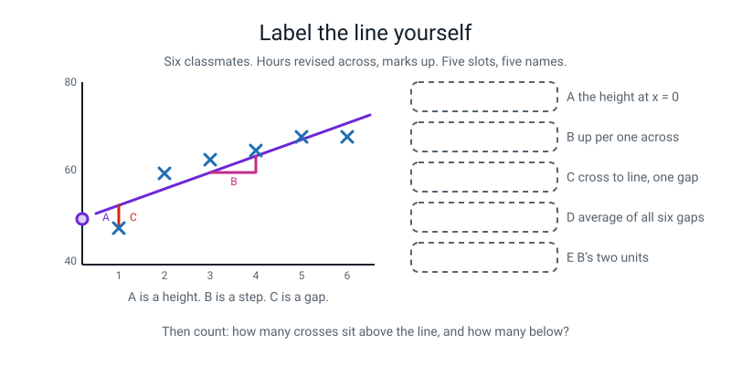
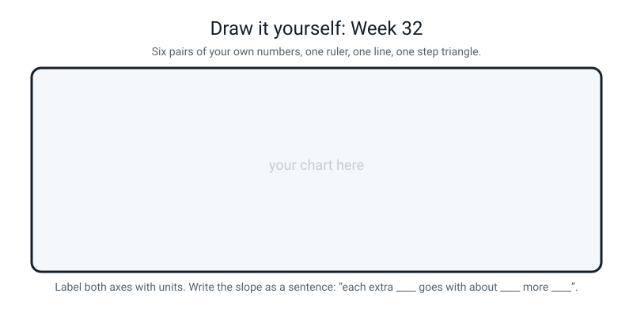

# Workbook — Week 32: Predicting a Number: Lines, MAE, and R²

**Name:** ________________________________  **Date:** ______________

[⬅ Week 31](week-31.md) · [📖 Read the chapter first](../student-guide/week-32.md) · [Course Home](../README.md) · [🧑‍🏫 Teacher guide](../teacher-guide/week-32.md) · [Next ➡](week-33.md)

**You will need:** **graph paper (5 mm squares), two sheets** · **a ruler with millimetres** · a sharp pencil · an eraser · a calculator · the Bug Log

---

## ✅ Warm-Up (5 min)

Five quick questions about **last week**.

**W1.** `max_depth=3` and the tree came out with 5 leaves, not 8. Why?

________________________________________________________________

**W2.** In an `export_text` printout, how do you tell a question from an answer?

________________________________________________________________

**W3.** Sepal width scored an importance of `0.000`. Write the sentence you are allowed to say about it, and the sentence you are not.

Allowed: ________________________________________________________

Not allowed: ____________________________________________________

**W4.** Hidden flower 25 had a petal 1.7 cm wide and the tree called it virginica. Which rule caught it, and by how much did it miss?

________________________________________________________________

**W5.** Why does a tree never need `StandardScaler`?

________________________________________________________________

---

## 🔎 Predict the Output

This section is for guessing what code will print before you run it. Then you compare the real output with your guess.

**Write your prediction before you run anything.**

### P1 — four shapes, one array

```python
import numpy as np

hours = np.array([1, 2, 3, 4, 5, 6])
print(hours.shape)
print(hours.reshape(-1, 1).shape)
print(hours.reshape(1, -1).shape)
print(hours.reshape(-1, 2).shape)
```

**I predict — four lines:** ____________  ____________  ____________  ____________

**It really printed:**

________________________________________________________________

________________________________________________________________

**Which one of the four is the shape `fit` wants for `X`?** ____________

**What does the `-1` actually mean?**

________________________________________________________________

**Line 4 gave a shape you may not have expected. Multiply its two numbers together. What do you notice?**

________________________________________________________________

### P2 — the same number, printed twice

```python
import numpy as np
from sklearn.linear_model import LinearRegression

hours = np.array([1, 2, 3, 4, 5, 6]).reshape(-1, 1)
marks = np.array([48, 60, 63, 65, 68, 68])
model = LinearRegression().fit(hours, marks)

print(model.coef_)
print(model.coef_[0])
print(model.intercept_)
print(round(model.intercept_, 2))
print(model.coef_[0] * 6 + model.intercept_)
```

**I predict — five lines:**

________________________________________________________________

________________________________________________________________

**It really printed:**

________________________________________________________________

________________________________________________________________

________________________________________________________________

**Lines 1 and 2 are the same number and they look different. Why?**

________________________________________________________________

________________________________________________________________

**Line 5 came out clean even though two of its ingredients were dusty. Is that luck?**

________________________________________________________________

### P3 — negative zero

```python
import numpy as np
from sklearn.linear_model import LinearRegression

hours = np.array([1, 2, 3, 4, 5, 6]).reshape(-1, 1)
marks = np.array([48, 60, 63, 65, 68, 68])
model = LinearRegression().fit(hours, marks)
guesses = model.predict(hours)

misses = marks - guesses
print(np.round(misses, 2))
print(round(misses.sum(), 10))
print(round(misses.mean(), 10))
print(round(np.abs(misses).mean(), 4))
```

**I predict — four lines:**

________________________________________________________________

________________________________________________________________

**It really printed:**

________________________________________________________________

________________________________________________________________

**Line 2 is a strange-looking zero. What is it, and why is it not exactly `0`?**

________________________________________________________________

**Lines 3 and 4 are both averages of the same six numbers, and they are wildly different. What is the one difference in the code?**

________________________________________________________________

**Which of lines 3 and 4 is a useful score, and why is the other one useless *no matter how bad the model is*?**

________________________________________________________________

________________________________________________________________

### P4 — four R² values

```python
import numpy as np
from sklearn.metrics import r2_score

truth = np.array([48, 60, 63, 65, 68, 68])
lazy = np.zeros(6) + truth.mean()
print(round(r2_score(truth, lazy), 4))
print(round(r2_score(truth, truth), 4))
print(round(r2_score(truth, lazy + 1), 4))
silly = np.array([100, 0, 100, 0, 100, 0])
print(round(r2_score(truth, silly), 4))
```

**I predict — four numbers:** ______  ______  ______  ______

**It really printed:**

________________________________________________________________

________________________________________________________________

**Line 1 is exactly one particular number. Which, and what does that tell you R² is measured against?**

________________________________________________________________

**Line 3 is slightly below line 1. What did adding 1 to every guess do?**

________________________________________________________________

**Line 4 is a long way below zero. Is that a bug?** ____________  **What does it mean?**

________________________________________________________________

**How many of the four predictions did you get right?** ______ / 4

**Which one surprised you most, and why?**

________________________________________________________________

---

## ✍️ Practice Set A — Read It

This set is for reading code, numbers and a diagram. You do not write a program here.

**A1. Classification or regression?** Tick one, then give the reason in the last column.

| # | The question | Classify | Regress | Why — describe the answer column |
|---|---|---|---|---|
| a | Which species is this flower? | ☐ | ☐ | |
| b | How many marks will she get out of 100? | ☐ | ☐ | |
| c | Will this pupil pass? | ☐ | ☐ | |
| d | How many minutes will the delivery take? | ☐ | ☐ | |
| e | Which of my three friends sent this? | ☐ | ☐ | |
| f | What will this house sell for? | ☐ | ☐ | |
| g | How many runs will she score? | ☐ | ☐ | |
| h | Did she get out or not? | ☐ | ☐ | |

**A1(i).** Two pairs above are the **same situation asked two ways**. Find both pairs and say what changed.

________________________________________________________________

________________________________________________________________

**A1(j).** Which scikit-learn tool would you reach for, for (b)? And for (a)?

(b) ______________________  (a) ______________________

**A1(k).** What exactly goes wrong if you call `accuracy_score` on (b)?

________________________________________________________________

________________________________________________________________

**A2. Say the slope.** Each row gives a slope from a real fitted line. Write the full sentence, with **both** units and the words "goes with".

| # | What was fitted | slope | Your sentence |
|---|---|---|---|
| a | revision hours → marks | 3.6 | |
| b | temperature °C → cups sold | 3.34 | |
| c | balls faced → runs scored | 1.094 | |
| d | lessons missed → marks | −4.35 | |
| e | kilometres → taxi fare in rupees | 18 | |
| f | pizzas in an order → delivery minutes | 2.55 | |

**A2(g).** One of those slopes is negative. Which word changes in the sentence?

________________________________________________________________

**A2(h).** Which single word must **not** appear in any of your six sentences, and why?

________________________________________________________________

**A3. Trace the value.** Fill in the third column, in order.

```python
model = LinearRegression()
model.fit(hours, marks)
guesses = model.predict(hours)
```

| After this line | What is `model.coef_`? | What is `guesses`? |
|---|---|---|
| `model = LinearRegression()` | | |
| `model.fit(hours, marks)` | | |
| `guesses = model.predict(hours)` | | |

**A3(a).** What is the exact error you get if you ask for `model.coef_` after the **first** line only?

________________________________________________________________

**A4. Spot the bug.** Each line is wrong or dangerous. Write the fix.

| # | The line | The fix |
|---|---|---|
| a | `hours = np.array([1, 2, 3, 4, 5, 6])` then `model.fit(hours, marks)` | |
| b | `print(model.coef)` | |
| c | `print(accuracy_score(marks, guesses))` | |
| d | `print(model.predict(7))` | |
| e | `print(r2_score(marks))` | |
| f | `LinearRegression.fit(hours, marks)` | |
| g | `print("MAE:", round(mean_absolute_error(marks, guesses), 2))` | |
| h | `print("R2 is 80%, so we're 80% accurate")` | |
| i | `print("average miss:", (marks - guesses).mean())` | |

**A4(j).** Three of those nine produce **no error at all**. Which three?

________________________________________________________________

**A4(k).** So what is the first question you ask when a number looks better than you expected?

________________________________________________________________

**A5. Match the code to the output.**

| # | The call |
|---|---|
| 1 | `model.coef_` |
| 2 | `model.intercept_` |
| 3 | `hours.shape` |
| 4 | `marks.shape` |
| 5 | `round(mean_absolute_error(marks, guesses), 2)` |
| 6 | `round(r2_score(marks, guesses), 3)` |
| 7 | `model.predict([[20]])` |

| Letter | Output |
|---|---|
| A | `(6,)` |
| B | `[121.4]` |
| C | `2.67` |
| D | `[3.6]` |
| E | `0.804` |
| F | `49.400000000000006` |
| G | `(6, 1)` |

**Answers:** 1 → ____  2 → ____  3 → ____  4 → ____  5 → ____  6 → ____  7 → ____

**A5(a).** Two of those seven outputs have **square brackets** round them. Why?

________________________________________________________________

**A5(b).** Two of them are numbers with no units attached. Which, and which of those two is dangerous to quote on its own?

________________________________________________________________

**A6. Label the diagram.** Write one short phrase in each of the five dashed slots.


*Figure W32.1 — Five slots. Two of them are the model and two of them are the score.*

The five answers, in the wrong order: **the miss (residual) · marks per hour · MAE · slope · intercept**

**A** ______________________  **B** ______________________

**C** ______________________  **D** ______________________

**E** ______________________

**A6(f).** Count the crosses above the drawn line and below it.

above: ______   below: ______

**A6(g).** If all six had been on the same side of your line, what would that tell you?

________________________________________________________________

---

## ✍️ Practice Set B — Write It

This set is for writing code yourself, from one line up to a whole file. Compare your output with the expected output in each box.

### B1 — one line

`model` is fitted to the six classmates. Write the **single line** that prints the slope to two decimal places **with its unit written out.**

```python
# your line here:
```

**Expected output:**

```text
slope: 3.6 marks per extra hour of revision
```

**Done looks like:** the unit is in the printed string, not just in your head.

### B2 — the laziest model there is

Write **three lines** that build the always-guess-the-average model for the six marks and print its MAE with the unit.

```python
# your three lines here:
```

**Expected output:**

```text
always-guess-the-average MAE: 5.33 marks
```

**Done looks like:** you used `np.zeros(...)` plus the mean, and you can say why this number is what makes 2.67 mean something.

### B3 — one new person

Write the line that asks the fitted line about somebody who revises **2.5 hours** a week, rounded to two decimal places.

```python
# your line here:
```

**Expected output:**

```text
2.5 hours -> [58.4] marks
```

**Done looks like:** **two** sets of square brackets inside `predict`, and you can say what each pair is for.

### B4 — your own data, about 15 lines

Seven bus journeys. `x` = how many stops you travelled, `y` = how many minutes it took. Type the numbers out literally, print both shapes, fit the line, and print the slope, the intercept, the MAE, the R², and a prediction for a 9-stop journey.

| stops | 2 | 4 | 6 | 8 | 10 | 12 | 14 |
|---|---|---|---|---|---|---|---|
| minutes | 7 | 11 | 16 | 19 | 25 | 28 | 34 |

**Expected output:**

```text
stops   shape: (7, 1)
minutes shape: (7,)
slope    : 2.21 minutes per extra stop
intercept: 2.29 minutes
MAE      : 0.57 minutes
R2       : 0.9948
9 stops  : [22.21] minutes
```

**Done looks like:** every printed number carries its unit, and you can say the slope as a sentence out loud **and** explain what the 2.29 intercept probably is in real life.

### B5 — the whole week in one file, about 20 lines

Write a program that fits the six classmates, builds the lazy baseline as well, and prints: the model as a formula, the line's MAE and R², the baseline's MAE and R², and how many times less wrong the line is than the baseline.

**Expected output:**

```text
the model : marks = 3.6 x hours + 49.4
my line   : MAE 2.67 marks   R2 0.804
guess mean: MAE 5.33 marks   R2 0.0
the line is 2.0 times less wrong than not bothering
```

**Done looks like:** the baseline's R² comes out at exactly `0.0` and **you can say why that is not a coincidence.**

---

## 🐞 Fix the Broken Program

This page is for practising how to read an error message and how to check a result that Python does not complain about.

Here is `study.py`. It is supposed to fit a line through the six classmates and report the slope, the MAE, and how wrong it is on average. It has **three** bugs: one that stops Python reading the file, one that stops it partway through, and one that produces **no error whatsoever**.

```python
# study.py - fit a line through six classmates. Three bugs.
import numpy as np
from sklearn.linear_model import LinearRegression
from sklearn.metrics import mean_absolute_error

hours = np.array([1, 2, 3, 4, 5, 6])
marks = np.array([48, 60, 63, 65, 68, 68])

model = LinearRegression(
model.fit(hours, marks)

guesses = model.predict(hours)
print("slope:", round(model.coef_[0], 2), "marks per hour")
print("MAE  :", round(mean_absolute_error(marks, guesses), 2), "marks")
print("how wrong am I on average:", round((marks - guesses).mean(), 2), "marks")
```

**Bug 1.** Run it as it is. The real message:

```text
  File "study.py", line 9
    model = LinearRegression(
                            ^
SyntaxError: '(' was never closed
```

**Was there any output before the message?** ____________  **What does that tell you?**

________________________________________________________________

**The fix:**

________________________________________________________________

**Bug 2.** Fix bug 1 and run again. The real message:

```text
Traceback (most recent call last):
  File "study.py", line 10, in <module>
    model.fit(hours, marks)
  ...
ValueError: Expected 2D array, got 1D array instead:
array=[1 2 3 4 5 6].
Reshape your data either using array.reshape(-1, 1) if your data has a single feature or array.reshape(1, -1) if it contains a single sample.
```

**In plain words, what is the difference between a 1-D array and a 2-D array?**

________________________________________________________________

**This message does something unusual and helpful. What?**

________________________________________________________________

**The fix — and it goes on a line Python did not name:**

________________________________________________________________

**Two lines you should add to catch this in future:**

________________________________________________________________

**Bug 3.** Fix bug 2 and run again. Now there is **no error at all**:

```text
slope: 3.6 marks per hour
MAE  : 2.67 marks
how wrong am I on average: -0.0 marks
```

**Line 3 claims the model is never wrong. Line 2 says it is off by 2.67 marks. Both came from the same six misses. What is the bug?**

________________________________________________________________

________________________________________________________________

**Why is the answer `-0.0` and not, say, `1.4` or `-3.2`? What is special about a best-fit line?**

________________________________________________________________

**The fix:**

________________________________________________________________

**Run it. What does line 3 say now?** ____________

**Which line of the three was lying, and would Python ever have told you?**

________________________________________________________________

---

## 🧩 Puzzle of the Week

This puzzle is for testing our fitted line on some awkward numbers, then for building your own set of marks.

### Part 1 — Solve for the impossible

Our line is `marks = 3.6 × hours + 49.4`.

**(a)** Solve `3.6h + 49.4 = 100` for `h`. Show your working.

________________________________________________________________

________________________________________________________________

**(b)** What does that answer *claim*, in a sentence? And is the claim believable?

________________________________________________________________

**(c)** Now solve `3.6h + 49.4 = 0`.

________________________________________________________________

**(d)** What does *that* answer claim? Write it as a sentence and then say what is wrong with it.

________________________________________________________________

________________________________________________________________

**(e)** Fill in the table. The two right-hand columns are yes/no.

| hours | line says | inside our data (1–6)? | possible in real life? |
|---|---|---|---|
| 2 | | | |
| 6 | | | |
| 7 | | | |
| 14.06 | | | |
| 20 | | | |
| −13.72 | | | |

**(f)** Write the one-sentence rule about when you are allowed to trust a line.

________________________________________________________________

### Part 2 — Break R² on purpose

Your job is to invent six marks for the same six pupils that give the line a **tiny MAE** and a **terrible R²**. It can be done, and working out how is the deepest idea in the week.

**(g)** First, a hint in the form of a table. Run the code for these three sets of marks and fill it in.

| marks | spread (max − min) | MAE | lazy MAE | R² |
|---|---|---|---|---|
| A: 48, 60, 63, 65, 68, 68 | | | | |
| B: 55, 61, 62, 64, 65, 65 | | | | |
| C: 62, 62, 63, 62, 63, 62 | | | | |

**(h)** Going down the table, the MAE gets **smaller** every row. Does R² follow it? ____________

**(i)** Look at the **lazy MAE** column. What is happening to it, and why does that explain the R²?

________________________________________________________________

________________________________________________________________

**(j)** So write the trick in one sentence: to get a small MAE and a terrible R², make the answers…

________________________________________________________________

**(k)** Set C has the best MAE in the table. Would you be pleased with that model? Explain in two sentences.

________________________________________________________________

________________________________________________________________

---

## 🤔 Think Deeper

These two questions are for explaining the week's ideas in your own words. Write full sentences.

**T1. Write a paragraph explaining, to somebody who has never coded, what "my model's MAE is 2.67 marks" means — and then what "my model's R² is 0.804" means. Two different explanations, no jargon in either.**

________________________________________________________________

________________________________________________________________

________________________________________________________________

________________________________________________________________

________________________________________________________________

**T2. The lemonade line's intercept was −54.93 cups and the lessons-missed line's intercept was 88.64 marks. One is nonsense and one is defensible. Write a paragraph about what makes the difference, and then say what you will check about the intercept of every line you ever fit.**

________________________________________________________________

________________________________________________________________

________________________________________________________________

________________________________________________________________

________________________________________________________________

---

## 🛠️ Build It — Hand Versus Machine

This section is for finding the same line three ways: by ruler, by arithmetic and by scikit-learn. Work through the parts in order.

### Part 1 — The hand fit (page 32.4). Laptop closed.

Step checklist:

- [ ] Draw axes on graph paper: **hours 0–7** across, one big square per hour; **marks 40–80** up, one big square per 5 marks
- [ ] Label **both** axes, including the units, **before** plotting anything
- [ ] Plot the six points as small **crosses**: (1, 48) (2, 60) (3, 63) (4, 65) (5, 68) (6, 68)
- [ ] Lay the ruler through the **middle of the cloud** — some crosses above, some below
- [ ] Draw the line edge to edge
- [ ] Pick two **grid crossings on your line** and count squares

**My slope, read off the paper:** about ____________ marks per extra hour of revision

> **⚠️ Do not change that number after you run the code.** If the computer disagrees with you by a couple of tenths, that is a **success**.

**Crosses above my line:** ______   **below:** ______

### Part 2 — The arithmetic version (page 32.3)

**The two means:**

```text
x̄ = (1 + 2 + 3 + 4 + 5 + 6) ÷ 6 = ______ ÷ 6 = ______
ȳ = (48 + 60 + 63 + 65 + 68 + 68) ÷ 6 = ______ ÷ 6 = ______
```

**The deviation table:**

| x | y | dx = x − x̄ | dy = y − ȳ | dx × dy | dx² |
|---|---|---|---|---|---|
| 1 | 48 | | | | |
| 2 | 60 | | | | |
| 3 | 63 | | | | |
| 4 | 65 | | | | |
| 5 | 68 | | | | |
| 6 | 68 | | | | |
| | | **Σ =** | **Σ =** | **Σ =** | **Σ =** |

**The check:** the `dx` and `dy` columns must each total ______. If they do not, go back — your ______ is wrong.

```text
slope     = ______ ÷ ______ = ______
intercept = ______ − ______ × ______ = ______
```

**The model:** marks = ______ × hours + ______

### Part 3 — Now the machine

- [ ] Type `week32_study_line.py` from the chapter and run it
- [ ] Fill in all three slopes below

| | slope |
|---|---|
| my ruler, by eye | |
| my arithmetic | |
| scikit-learn | |

**Which two agree exactly, and why must they?**

________________________________________________________________

**The slope as a full sentence, with both units:**

________________________________________________________________

### Part 4 — MAE in real units (page 32.5)

| hours | actual | predicted | miss | \|miss\| |
|---|---|---|---|---|
| 1 | 48 | | | |
| 2 | 60 | | | |
| 3 | 63 | | | |
| 4 | 65 | | | |
| 5 | 68 | | | |
| 6 | 68 | | | |
| | | | **Σ =** | **Σ =** |

```text
MAE = ______ ÷ 6 = ______ marks
```

**The sentence:** *"On average my line is off by about ______ marks."*

**And the comparison:** always guessing the average of 62 would be off by ______ marks. So my line is ______ times less wrong than not bothering.

### Part 5 — The same skill, different units: the pizza numbers

| pizzas (x) | 2 | 4 | 6 | 8 | 10 |
|---|---|---|---|---|---|
| minutes (y) | 16 | 20 | 27 | 31 | 36 |

- [ ] Do the deviation table by hand
- [ ] Then run the same code with these numbers

```text
x̄ = ______     ȳ = ______
Σ(dx × dy) = ______     Σ(dx²) = ______
slope = ______     intercept = ______
```

**The model:** minutes = ______ × pizzas + ______

| | value |
|---|---|
| MAE | |
| R² | |
| prediction for 7 pizzas | |

**The slope as a sentence:**

________________________________________________________________

**This intercept means something sensible, unlike the revision one. What?**

________________________________________________________________

**Is the 7-pizza prediction inside or outside the data range?** ______________  **Why does that matter?**

________________________________________________________________

### Part 6 — What the line cannot explain (page 32.6)

**One thing that affects somebody's marks and is not on our chart:**

________________________________________________________________

**Why the line has no way to know about it — one sentence:**

________________________________________________________________

________________________________________________________________

**Our MAE is 2.67 marks. Where does that 2.67 come from?**

________________________________________________________________

________________________________________________________________

**Our R² is 0.804. Does that mean the model is good enough to use? Two sentences.**

________________________________________________________________

________________________________________________________________

### Part 7 — The Bug Log

| What happened | The real message (copy it exactly) | What fixed it | What I will check next time |
|---|---|---|---|
| | | | |
| | | | |

---

## 🎨 Draw It

This page is for fitting a line by hand to data you choose yourself.

Plot **six pairs of your own numbers** and fit a line by hand. Anything you can measure: minutes of homework against number of questions, steps walked against minutes out, money spent against days of the week.


*Figure W32.2 — Your page.*

**Rules:** both axes labelled **with units** · six crosses, not blobs · one straight line through the **middle** · a step triangle drawn on the line · the slope written as a **sentence**.

> **What a good answer might look like:** across the bottom, **"number of questions set for homework"**, 0 to 12. Up the side, **"minutes it actually took"**, 0 to 60. Six crosses at (2, 12), (3, 22), (5, 28), (7, 41), (9, 46), (11, 58).
>
> One line drawn through the middle, with **three crosses above and three below** — and a small note beside it: *"I moved the ruler four times. My first go joined the first and last cross and then I counted four above it, so I moved it."*
>
> A step triangle drawn on the line from x = 4 to x = 6, going up about 10 squares, labelled **"2 questions across, 10 minutes up"**.
>
> And underneath, in words: **"each extra question set goes with about 5 more minutes of homework."** Then a second sentence: **"the line says 12 minutes for zero questions, which is about how long it takes me to find my pencil case, so that intercept is actually believable."**
>
> Best of all, a third annotation: **"my biggest miss is the 5-question night — 28 minutes when the line said 32. That was the night the questions were easy."**
>
> **What a weak answer looks like:** axes with no units ("questions" and "time" are not units), a line joining the first and last cross, or a slope written as a bare number with no "per". A slope with only one unit on it is half an answer.

---

## 📊 Self-Check

This section is for checking honestly what you can do and what you need explained again.

| I can… | 😀 got it | 🙂 nearly | 😕 not yet |
|---|---|---|---|
| Look at an answer column and say classification or regression | ☐ | ☐ | ☐ |
| Say why `X` needs `.reshape(-1, 1)` and `y` does not | ☐ | ☐ | ☐ |
| Fit a line and read `coef_` and `intercept_` out of it | ☐ | ☐ | ☐ |
| State a slope as a sentence with **both** units and "goes with" | ☐ | ☐ | ☐ |
| Explain why the misses cannot be averaged with their signs | ☐ | ☐ | ☐ |
| Compute MAE and say what it means in the units of the thing | ☐ | ☐ | ☐ |
| Explain R² as "how much better than guessing the average" | ☐ | ☐ | ☐ |
| Say why a high R² alone can still mislead somebody | ☐ | ☐ | ☐ |
| Spot an extrapolation and say what range the model is entitled to | ☐ | ☐ | ☐ |
| Read the intercept as machinery rather than as a fact | ☐ | ☐ | ☐ |

**True or false?** Circle one on each row.

| Statement | | |
|---|---|---|
| `accuracy_score` works fine on number predictions | TRUE | FALSE |
| `y` needs `.reshape(-1, 1)` just like `X` does | TRUE | FALSE |
| `model.coef_` prints as a list even with one feature | TRUE | FALSE |
| R² of 0.804 means the model is 80% accurate | TRUE | FALSE |
| MAE is in the same units as the thing you predict | TRUE | FALSE |
| R² has no units | TRUE | FALSE |
| A best-fit line's signed misses add to about zero | TRUE | FALSE |
| A negative R² is impossible | TRUE | FALSE |
| A negative slope means the model is broken | TRUE | FALSE |
| `49.400000000000006` means the model is imprecise | TRUE | FALSE |
| The intercept is always a real, measured fact | TRUE | FALSE |
| Predicting 121 marks out of 100 is a bug you should fix | TRUE | FALSE |
| A line that went through all six dots would be a better model | TRUE | FALSE |
| "The slope is 3.6" is a finished answer | TRUE | FALSE |

One thing I'd like explained again:

________________________________________________________________

---

## ✅ Answers

Finish the workbook before you open this. Open the box below to check your work.

<details>
<summary>Check your answers</summary>

### Warm-Up

**W1.** Because **`max_depth` is a ceiling, not an order.** Eight is the maximum a depth-3 tree could have. Two of our branches reached a pile that was already all one kind after fewer than three questions, so they stopped, and the unspent budget stayed unspent.

**W2.** A **question** has a `<=` or `>` and a number in it. An **answer** starts with `class:` and has nothing after it. `get_n_leaves()` tells you how many answers there are without counting.

**W3. Allowed:** *"This tree, at depth 3, on these 120 training flowers, did not need sepal width."* **Not allowed:** *"Sepal width is useless."* A tree given only the two sepal columns still scores 0.6667 on the hidden flowers, so the information is real — it just was not needed here.

**W4.** **Rule four** — *"petal wider than 1.65 cm → virginica."* Its petal was **1.7 cm**, so it missed the cut-off by **0.05 cm**, half a millimetre.

**W5.** Because a split compares **one column against one number** — `petal width <= 1.65`. Multiply that column by a thousand and the tree learns `<= 1650` instead; nothing about the model changes. kNN needs scaling because it measures distances across **all** the columns at once.

---

### Predict the Output

### P1

```text
(6,)
(6, 1)
(1, 6)
(3, 2)
```

**Which one `fit` wants for `X`:** **`(6, 1)`** — six rows, one column. A table.

**What `-1` means:** *"work this number out for yourself from how many items there are."* You give the shape you care about and numpy fills in the rest.

**Line 4:** `(3, 2)` — and 3 × 2 = **6**, the number of items you started with. **`reshape` never adds or removes a single number; it only rearranges them.** That is also why `reshape(-1, 4)` on six items would fail: nothing times 4 makes 6.

### P2

```text
[3.6]
3.5999999999999996
49.400000000000006
49.4
71.0
```

**Lines 1 and 2 are the same number and look different** because they are printed by **two different things**. Line 1 prints a **numpy array**, and numpy tidies its display for you — by default it prints at most 8 decimal places, so `3.5999999999999996` shows as `[3.6]`. Line 2 pulls the plain Python float out of the array and prints it raw, dust and all. **The value never changed. Only who was doing the printing.**

**Is line 5 clean by luck?** Partly, and it is worth knowing it is not something you can rely on. `3.5999999999999996 × 6` is `21.599999999999998`, and adding `49.400000000000006` happens to land back on exactly `71.0`. The two crumbs cancelled. **Do not count on that** — always `round(...)` before you print a result somebody will read.

### P3

```text
[-5.   3.4  2.8  1.2  0.6 -3. ]
-0.0
-0.0
2.6667
```

**Line 2 is `-0.0`** — **negative zero**. The six misses added to something like `-0.0000000000000018`, and rounding a tiny negative number to ten decimal places gives you a zero that has kept its minus sign. It is not a different number from `0.0`; it is a zero that remembers which side it came from.

**Lines 3 and 4** are averages of the same six numbers, and the one difference in the code is **`np.abs(...)`**. Line 3 averages the misses **with their signs**; line 4 drops the signs first.

**Which is useful.** **Line 4 (2.6667) is MAE, and it is the useful one.** Line 3 is useless *no matter how bad the model is*, because a best-fit line **always** balances with as much above as below, so the signed misses always cancel to zero. A score that says "perfect" for every possible line is not a score.

### P4

```text
0.0
1.0
-0.0213
-61.2199
```

**Line 1 is exactly `0.0`**, and that is the definition: **R² measures you against always guessing the average.** Guessing the average scores exactly zero, by construction. Every R² is really the sentence *"how much better than that am I?"*

**Line 3:** adding 1 to every guess made the model slightly **worse** than guessing the average, so R² went **just below zero**. It shows there is nothing magic about zero — you can walk straight past it.

**Line 4 is not a bug.** `-61.2199` means this model's squared errors are about sixty-two times bigger than the average-guesser's. The "silly" predictions are wildly wrong on purpose. **Zero is not a floor for R².**

---

### Practice Set A

**A1.**

| # | Which | Why |
|---|---|---|
| a | **Classification** | Three fixed choices |
| b | **Regression** | Any number on a scale |
| c | **Classification** | Two choices, pass or fail |
| d | **Regression** | A number of minutes |
| e | **Classification** | A short fixed list of three |
| f | **Regression** | A price, any number |
| g | **Regression** | A count, any number |
| h | **Classification** | Two choices |

**A1(i).** **(b) and (c)** are the same pupils — the actual mark versus pass/fail. **(g) and (h)** are the same batter — how many runs versus out or not. **Nothing about the world or the measurements changed. Only the column you cover up.** That is the entire distinction.

**A1(j).** (b) → something ending in **`Regressor`**, or `LinearRegression`. (a) → something ending in **`Classifier`**.

**A1(k).** It refuses to run:

```text
ValueError: Classification metrics can't handle a mix of multiclass and continuous targets
```

And the refusal is a kindness. If it *did* run, it would ask "is 63.9 exactly equal to 64?", answer no, and score an excellent prediction as a total failure.

**A2.**

| # | Sentence |
|---|---|
| a | "Each extra hour of revision a week **goes with** about **3.6 more marks** out of 100." |
| b | "Each extra degree of temperature goes with about **3.3 more cups** sold." |
| c | "Each extra ball faced goes with about **1.09 more runs**." |
| d | "Each extra lesson missed goes with about **4.4 fewer marks**." |
| e | "Each extra kilometre goes with about **18 more rupees** on the fare." |
| f | "Each extra pizza in the order goes with about **2.55 more minutes** of delivery time." |

**A2(g).** (d) is negative, and the word that changes is **"more" → "fewer"** (or "less"). The sentence works identically otherwise; a negative slope is a downhill line, not a broken model.

**A2(h).** **"causes."** The data shows that these things *went together* in the rows we happened to collect. It cannot rule out a third thing causing both — confident pupils may revise more **and** score more anyway. "Goes with" is a claim you can defend.

**A3.**

| After this line | `model.coef_` | `guesses` |
|---|---|---|
| `model = LinearRegression()` | **Does not exist yet.** No line has been fitted. | Does not exist — the name has not been created. |
| `model.fit(hours, marks)` | **`[3.6]`** — a one-item array, because there is one feature. | Still does not exist. |
| `guesses = model.predict(hours)` | Unchanged, `[3.6]`. **`predict` does not alter the model.** | `[53. 56.6 60.2 63.8 67.4 71.]` — six numbers. |

**A3(a).**

```text
AttributeError: 'LinearRegression' object has no attribute 'coef_'
```

The trailing underscore is a promise that it appears **after `fit`**, and this is that promise being kept.

**A4.**

| # | The fix |
|---|---|
| a | `np.array([1, 2, 3, 4, 5, 6]).reshape(-1, 1)` — `X` must be a table. |
| b | `model.coef_` — trailing underscore. |
| c | `mean_absolute_error(marks, guesses)` and `r2_score(...)`. Accuracy is for categories only. |
| d | `model.predict([[7]])` — two sets of brackets: outer table, inner row. |
| e | `r2_score(marks, guesses)` — truth first, guesses second. Both are needed. |
| f | `LinearRegression().fit(...)` — the `()` makes a thing from the recipe. |
| g | Add the unit: `..., 2), "marks")`. An MAE without a unit is not a result. |
| h | Delete it. R² is not a percentage of right answers; **none** of the six was exactly right. Quote the MAE — 2.67 marks — instead. |
| i | Use `np.abs(marks - guesses).mean()`. The signed misses always cancel to zero. |

**A4(j).** **(g), (h) and (i)** produce no error at all. (g) prints a number with no unit; (h) prints a false sentence; (i) prints `-0.0` and calls it an average miss. **All three are worse than the ones that crash**, because a crash stops you and a wrong number does not.

**A4(k).** *"What exactly did I put inside the brackets?"* — because a print label is a promise you made, and the arguments are what actually happened. When a number looks better than you expected, check the arguments before you celebrate.

**A5.** 1 → **D** · 2 → **F** · 3 → **G** · 4 → **A** · 5 → **C** · 6 → **E** · 7 → **B**

**A5(a).** `model.coef_` is `[3.6]` and `model.predict([[20]])` is `[121.4]` — both have brackets because they are **arrays with one item in them**, not plain numbers. `coef_` is a list because in general there is one slope per feature; `predict` returns a list because in general you ask about several rows at once. Use `[0]` to pull the number out when you want to round it.

**A5(b).** `2.67` and `0.804` both look unitless as printed. **`0.804` (R²) genuinely has no units and is the dangerous one to quote alone**, because it says nothing about whether your predictions are good enough for anything. `2.67` **does** have a unit — marks — and the danger is only that somebody forgot to print it.

**A6.** **A** = intercept · **B** = slope · **C** = the miss (residual) · **D** = MAE · **E** = marks per hour

**A6(f).** Against the exact line: the misses are −5.0, +3.4, +2.8, +1.2, +0.6, −3.0, so **four above and two below**. A hand-drawn line should give something like 3-and-3 or 4-and-2.

**A6(g).** That the line is **in the wrong place** — too low if all six are above it, too high if all six are below. A best-fit line balances, so all six on one side means you have not laid the ruler through the middle of the cloud. It is the tell-tale sign that you joined the first and last point.

---

### Practice Set B

**B1.**

```python
print("slope:", round(model.coef_[0], 2), "marks per extra hour of revision")
```

```text
slope: 3.6 marks per extra hour of revision
```

**B2.**

```python
lazy = np.zeros(len(marks)) + marks.mean()
print("always-guess-the-average MAE:",
      round(mean_absolute_error(marks, lazy), 2), "marks")
```

```text
always-guess-the-average MAE: 5.33 marks
```

**Why it matters:** 2.67 marks means nothing on its own. Next to 5.33 it becomes *"half as wrong as not bothering at all"*, which is a sentence somebody can act on.

**B3.**

```python
print("2.5 hours ->", np.round(model.predict([[2.5]]), 2), "marks")
```

```text
2.5 hours -> [58.4] marks
```

**The two pairs of brackets:** the **outer** pair is the table — "here is a set of rows to predict for". The **inner** pair is **one row** — "and this row has one measurement in it, 2.5". Drop the inner pair and you get the scalar-array error.

**B4.**

```python
# wb4_bus.py  -  seven journeys. Stops travelled -> minutes taken.
import numpy as np
from sklearn.linear_model import LinearRegression
from sklearn.metrics import mean_absolute_error, r2_score

stops = np.array([2, 4, 6, 8, 10, 12, 14]).reshape(-1, 1)
minutes = np.array([7, 11, 16, 19, 25, 28, 34])

print("stops   shape:", stops.shape)
print("minutes shape:", minutes.shape)

model = LinearRegression()
model.fit(stops, minutes)
guesses = model.predict(stops)

print("slope    :", round(model.coef_[0], 2), "minutes per extra stop")
print("intercept:", round(model.intercept_, 2), "minutes")
print("MAE      :", round(mean_absolute_error(minutes, guesses), 2), "minutes")
print("R2       :", round(r2_score(minutes, guesses), 4))
print("9 stops  :", np.round(model.predict([[9]]), 2), "minutes")
```

```text
stops   shape: (7, 1)
minutes shape: (7,)
slope    : 2.21 minutes per extra stop
intercept: 2.29 minutes
MAE      : 0.57 minutes
R2       : 0.9948
9 stops  : [22.21] minutes
```

**The slope as a sentence:** *"Each extra stop goes with about **2.2 more minutes** on the journey."*

**The intercept, 2.29 minutes:** this one is believable. It is roughly the **fixed part** of any journey — waiting for the doors, pulling away, the walk to your seat — which genuinely exists whether you travel one stop or fourteen. It is still an extrapolation (nobody travelled zero stops), so treat it as plausible rather than measured. Compare it with the lemonade stall's **−54.93 cups**, which is not plausible at all.

**B5.**

```python
# wb5_full.py  -  the whole week in one file, with a baseline to compare against
import numpy as np
from sklearn.linear_model import LinearRegression
from sklearn.metrics import mean_absolute_error, r2_score

hours = np.array([1, 2, 3, 4, 5, 6]).reshape(-1, 1)
marks = np.array([48, 60, 63, 65, 68, 68])

model = LinearRegression()
model.fit(hours, marks)
guesses = model.predict(hours)

lazy = np.zeros(len(marks)) + marks.mean()

line_mae = mean_absolute_error(marks, guesses)
lazy_mae = mean_absolute_error(marks, lazy)

print("the model : marks =", round(model.coef_[0], 2), "x hours +",
      round(model.intercept_, 2))
print("my line   : MAE", round(line_mae, 2), "marks   R2",
      round(r2_score(marks, guesses), 3))
print("guess mean: MAE", round(lazy_mae, 2), "marks   R2",
      round(r2_score(marks, lazy), 3))
print("the line is", round(lazy_mae / line_mae, 2),
      "times less wrong than not bothering")
```

```text
the model : marks = 3.6 x hours + 49.4
my line   : MAE 2.67 marks   R2 0.804
guess mean: MAE 5.33 marks   R2 0.0
the line is 2.0 times less wrong than not bothering
```

**Why the baseline's R² is exactly 0.0 and not a coincidence:** because **R² is defined as a comparison against guessing the average.** Ask R² to score the average-guesser and you are asking "how much better than itself is it?" — and the answer has to be *not at all*. Zero. Every time, on every dataset.

---

### Fix the Broken Program

**Bug 1 — the unclosed bracket.**

**Was there any output?** **No, none.** And that tells you Python **never ran a single line**: a `SyntaxError` happens while Python is still *reading* the file. The word `Traceback` is missing too, which is the other tell — a traceback means the program was running when it went wrong.

**The fix:**

```python
model = LinearRegression()
```

**Bug 2 — the 1-D array.**

**1-D vs 2-D in plain words.** **1-D is a single row of numbers.** **2-D is a table — rows *and* columns.** scikit-learn always wants `X` as a table, one row per thing and one column per measurement, even when there is only one measurement. It refuses to guess which you meant.

**What the message does that is unusual:** **it tells you the fix.** It prints `array.reshape(-1, 1)` in the message. A lot of readers skip that line because the block looks like noise — **finish the message.**

**The fix, on a line Python did not name (line 6):**

```python
hours = np.array([1, 2, 3, 4, 5, 6]).reshape(-1, 1)
```

**The two lines to add:**

```python
print("hours shape:", hours.shape)     # want (6, 1)
print("marks shape:", marks.shape)     # want (6,)
```

**Bug 3 — the silent one.**

**The bug:** the last line computes `(marks - guesses).mean()` — the average of the misses **with their signs still on**. Plus and minus cancel, so it reports −0.0 and claims the model is never wrong.

**Why exactly zero?** Because a **best-fit line always balances**: it passes through the point (x̄, ȳ) and leaves as much above it as below. That is not a property of our six numbers, it is a property of *every* least-squares line. So this "score" would print zero for a good model, a bad model and a terrible model. It cannot fail, which means it cannot tell you anything.

**The fix — drop the signs:**

```python
print("how wrong am I on average:",
      round(np.abs(marks - guesses).mean(), 2), "marks")
```

```text
slope: 3.6 marks per hour
MAE  : 2.67 marks
how wrong am I on average: 2.67 marks
```

**Which line was lying, and would Python ever have told you?** **Line 3**, and **no — never.** It is arithmetically valid code producing a correct average of the wrong quantity. `-0.0` is not an error and Python has no way to know you meant something else. Only reading it and thinking about it catches this, which is why "does this number make sense?" is a step, not a nicety.

---

### Puzzle of the Week

**Part 1.**

**(a)**

```text
3.6h + 49.4 = 100
3.6h        = 100 − 49.4 = 50.6
h           = 50.6 ÷ 3.6 = 14.06
```

**(b)** It claims *"somebody who revised about 14.1 hours a week would score exactly 100."* **Not believable as a fact.** The most anybody in our data revised was **6** hours, so 14.06 comes from more than twice as far along as the evidence reaches. And past 14.06 the line keeps climbing past 100, which is impossible.

**(c)**

```text
3.6h + 49.4 = 0
3.6h        = −49.4
h           = −49.4 ÷ 3.6 = −13.72
```

**(d)** It claims *"somebody who revised minus 13.7 hours a week would score zero."* What is wrong with it: **you cannot revise a negative number of hours.** The line has walked off the other edge of reality. Both ends do this, and for the same reason — a straight line has no idea where the world stops.

**(e)**

| hours | line says | inside our data (1–6)? | possible in real life? |
|---|---|---|---|
| 2 | 56.6 | **yes** | yes |
| 6 | 71.0 | **yes** (just) | yes |
| 7 | 74.6 | no | yes — a reasonable stretch |
| 14.06 | 100.0 | no | just about, but no evidence for it |
| 20 | 121.4 | no | **no — over 100** |
| −13.72 | 0.0 | no | **no — negative hours** |

**(f)** **"A line is only entitled to answer inside the range of x it was fitted from — so write that range down and say so whenever you show somebody the model."**

**Part 2.**

**(g)**

| marks | spread | MAE | lazy MAE | R² |
|---|---|---|---|---|
| A: 48, 60, 63, 65, 68, 68 | 20 | **2.667** | **5.333** | **0.804** |
| B: 55, 61, 62, 64, 65, 65 | 10 | **1.333** | **2.667** | **0.813** |
| C: 62, 62, 63, 62, 63, 62 | 1 | **0.425** | **0.444** | **0.043** |

Confirmed in code:

```python
import numpy as np
from sklearn.linear_model import LinearRegression
from sklearn.metrics import mean_absolute_error, r2_score

hours = np.array([1, 2, 3, 4, 5, 6]).reshape(-1, 1)
sets = {
    "A  wide spread":  [48, 60, 63, 65, 68, 68],
    "B  half spread":  [55, 61, 62, 64, 65, 65],
    "C  nearly flat":  [62, 62, 63, 62, 63, 62],
}
print(f"{'marks':16s} {'spread':>7s} {'MAE':>7s} {'lazyMAE':>8s} {'R2':>8s}")
for name, m in sets.items():
    m = np.array(m)
    model = LinearRegression().fit(hours, m)
    g = model.predict(hours)
    lazy = np.zeros(6) + m.mean()
    print(f"{name:16s} {m.max()-m.min():7d} "
          f"{mean_absolute_error(m, g):7.3f} {mean_absolute_error(m, lazy):8.3f} "
          f"{r2_score(m, g):8.3f}")
```

```text
marks             spread     MAE  lazyMAE       R2
A  wide spread        20   2.667    5.333    0.804
B  half spread        10   1.333    2.667    0.813
C  nearly flat         1   0.425    0.444    0.043
```

**(h)** **No.** MAE goes 2.667 → 1.333 → 0.425, getting better every row. R² goes 0.804 → 0.813 → **0.043**, and falls off a cliff at the bottom.

**(i)** The **lazy MAE** is shrinking too — 5.333 → 2.667 → 0.444. In row B it halved at the same time as the line's MAE halved, so the *ratio* between them barely moved and R² stayed put. In row C the lazy model is **already** almost perfect (0.444), because the marks hardly vary, so there is essentially nothing left for the line to explain. **R² is a ratio, and both halves of it moved.**

**(j)** **"…make the answers barely vary at all."** If everybody scores about 62, guessing 62 is already an excellent model, and however small your MAE gets you cannot be much better than that.

**(k)** No, and this is the whole point.

> Set C has the smallest MAE in the table — off by less than half a mark — and the model is worth **nothing**, because I could have got almost the same result by ignoring revision hours completely and writing "62" six times. The slope is 0.057 marks per hour, which is not a relationship, it is a rounding error. **A small MAE tells me my predictions are close. It does not tell me my model did any of the work.**

---

### Think Deeper

**T1 — the two explanations.**

> **MAE 2.67 marks.** "I built something that guesses your test mark from how many hours you revise. When I check it against six people whose real marks I know, it is off by about two and a half marks on average — sometimes it guesses a bit high, sometimes a bit low, and the typical size of the mistake is two and a half marks out of a hundred. So if it says you will get 65, you should probably read that as 'somewhere around 62 to 68'."
>
> **R² 0.804.** "That is a different question. It asks: how much better is my guessing than the laziest possible approach, which is to ignore revision hours entirely and just say the class average every single time? The lazy way is off by about five and a third marks. Mine is off by two and two thirds. So I have explained roughly 80% of the variation between these six people — I have accounted for most of why some scored 48 and others scored 68. It is **not** a percentage of predictions I got right; I did not get any of them exactly right. It is a measure of how far I am above 'not bothering'."

**T2 — the two intercepts.**

> The difference is **whether anybody in the data actually had x = 0.** The lemonade stall's coldest day was **22 °C**, so its intercept — the number the line gives at 0 °C — is a prediction from twenty-two degrees off the edge of every measurement I took. Naturally it comes out as nonsense: **minus fifty-five cups.** The lessons-missed line is different: one of the nine pupils genuinely **did** miss zero lessons, so 88.64 marks sits *inside* the evidence and is a claim I could actually check.
>
> An intercept is always the same thing arithmetically — the height of the line where x is 0 — and whether it means anything depends entirely on whether that place is somewhere your data has ever been. It is a piece of **machinery** you need in order to compute predictions inside the range, and it is only a **fact** when x = 0 is inside the range.
>
> So from now on, before I say a single word about an intercept, I will check one thing: **what is the smallest x in my data?** If it is not zero, I will describe the intercept as part of the formula and refuse to describe it as a person, a day or a journey. And if the intercept comes out impossible — negative cups, negative marks — I will treat that as useful evidence that x = 0 is a long way outside my range, rather than as a bug.

---

### Build It

**Part 1 — the hand fit.** There is no single right answer for the drawn line, and that is deliberate. Mark four things:

| What to look for | Full credit |
|---|---|
| Axes labelled with units | "hours of revision per week" and "marks out of 100" both written |
| Points plotted | all six, as crosses, at (1,48) (2,60) (3,63) (4,65) (5,68) (6,68) |
| Line placed sensibly | some crosses above and some below; **not** joining A to F |
| Slope read by counting squares | a number between **3.0 and 4.2**, written with both units |

**Why joining the first and last point is a bad fit:** it uses two of your six pieces of evidence and throws four away. Joining (1, 48) to (6, 68) gives a slope of exactly **4.0**, and it puts all four middle points **above** the line — so the line is systematically too low for most of the class.

**Part 2 — the arithmetic.**

```text
x̄ = (1 + 2 + 3 + 4 + 5 + 6) ÷ 6 = 21 ÷ 6 = 3.5
ȳ = (48 + 60 + 63 + 65 + 68 + 68) ÷ 6 = 372 ÷ 6 = 62
```

| x | y | dx = x − 3.5 | dy = y − 62 | dx × dy | dx² |
|---|---|---|---|---|---|
| 1 | 48 | −2.5 | −14 | 35.0 | 6.25 |
| 2 | 60 | −1.5 | −2 | 3.0 | 2.25 |
| 3 | 63 | −0.5 | 1 | −0.5 | 0.25 |
| 4 | 65 | 0.5 | 3 | 1.5 | 0.25 |
| 5 | 68 | 1.5 | 6 | 9.0 | 2.25 |
| 6 | 68 | 2.5 | 6 | 15.0 | 6.25 |
| | | **Σ = 0** | **Σ = 0** | **Σ = 63.0** | **Σ = 17.5** |

**The check:** both must total **zero**. If either does not, your **mean** is wrong — a mean is the balance point, so the amounts above and below it are equal by definition. Go back before doing anything else.

```text
slope     = 63.0 ÷ 17.5 = 3.6
intercept = 62 − 3.6 × 3.5 = 62 − 12.6 = 49.4
```

**The model:** marks = **3.6** × hours + **49.4**

*(One row contributes a negative number to `dx × dy` — row C, at 3 hours and 63 marks. Its `dx` is −0.5 and its `dy` is +1. That classmate is on the **low** side for hours and the **high** side for marks, so she pushes against the uphill trend. Every other row agrees with it.)*

**Part 3 — all three slopes.**

| | slope |
|---|---|
| my ruler, by eye | *your number, 3.0–4.2* |
| my arithmetic | **3.6** |
| scikit-learn | **3.6** |

**Which two must agree exactly, and why:** the **arithmetic** and **scikit-learn**. They are the same calculation — `Σ(dx × dy) ÷ Σ(dx²)` — done by a pencil and by a chip. Your eye should be within a few tenths, and that is a success rather than a near miss.

**The sentence:** *"Each extra hour of revision per week goes with about **3.6 more marks** out of 100."*

**Marking:** one mark for the number, one for the unit of y (marks), one for the unit of x (per hour per week), one for **"goes with"** rather than "causes". *"The slope is 3.6"* scores one out of four, however confidently it is written.

**Part 4 — MAE.**

| hours | actual | predicted | miss | \|miss\| |
|---|---|---|---|---|
| 1 | 48 | **53.0** | −5.0 | 5.0 |
| 2 | 60 | **56.6** | +3.4 | 3.4 |
| 3 | 63 | **60.2** | +2.8 | 2.8 |
| 4 | 65 | **63.8** | +1.2 | 1.2 |
| 5 | 68 | **67.4** | +0.6 | 0.6 |
| 6 | 68 | **71.0** | −3.0 | 3.0 |
| | | | **Σ = 0.0** | **Σ = 16.0** |

```text
MAE = 16.0 ÷ 6 = 2.6666... = 2.67 marks
```

**The sentence:** *"On average my line is off by about **2.67 marks** — call it under 3 marks."*

**The comparison:** always guessing 62 would be off by

| y | miss from 62 | \|miss\| |
|---|---|---|
| 48 | −14 | 14 |
| 60 | −2 | 2 |
| 63 | +1 | 1 |
| 65 | +3 | 3 |
| 68 | +6 | 6 |
| 68 | +6 | 6 |
| | | **Σ = 32** |

`32 ÷ 6 = 5.33 marks`. So the line is **2.0 times less wrong** than not bothering at all.

**Part 5 — the pizza numbers.**

```text
x̄ = 6     ȳ = 26
```

| x | y | dx | dy | dx·dy | dx² |
|---|---|---|---|---|---|
| 2 | 16 | −4 | −10 | 40 | 16 |
| 4 | 20 | −2 | −6 | 12 | 4 |
| 6 | 27 | 0 | 1 | 0 | 0 |
| 8 | 31 | 2 | 5 | 10 | 4 |
| 10 | 36 | 4 | 10 | 40 | 16 |
| | | | | **Σ = 102** | **Σ = 40** |

```text
slope     = 102 ÷ 40 = 2.55
intercept = 26 − 2.55 × 6 = 26 − 15.3 = 10.7
```

**The model:** minutes = **2.55** × pizzas + **10.7**

Confirmed in code:

```python
import numpy as np
from sklearn.linear_model import LinearRegression
from sklearn.metrics import mean_absolute_error, r2_score

pizzas = np.array([2, 4, 6, 8, 10]).reshape(-1, 1)
minutes = np.array([16, 20, 27, 31, 36])

model = LinearRegression().fit(pizzas, minutes)
guesses = model.predict(pizzas)
print("slope    :", round(model.coef_[0], 2), "minutes per pizza")
print("intercept:", round(model.intercept_, 2), "minutes")
print("guesses  :", np.round(guesses, 2))
print("misses   :", np.round(minutes - guesses, 2))
print("MAE      :", round(mean_absolute_error(minutes, guesses), 2), "minutes")
print("R2       :", round(r2_score(minutes, guesses), 4))
print("7 pizzas :", model.predict([[7]]))
```

```text
slope    : 2.55 minutes per pizza
intercept: 10.7 minutes
guesses  : [15.8 20.9 26.  31.1 36.2]
misses   : [ 0.2 -0.9  1.  -0.1 -0.2]
MAE      : 0.48 minutes
R2       : 0.9927
7 pizzas : [28.55]
```

| | value |
|---|---|
| MAE | **0.48 minutes** |
| R² | **0.9927** |
| prediction for 7 pizzas | **28.55 minutes** |

**The slope as a sentence:** *"Each extra pizza in the order goes with about **2.55 more minutes** of delivery time."*

**This intercept means something sensible:** **10.7 minutes** is what an order of *zero* pizzas would take — which is roughly the driving and waiting time before any pizza is loaded. **The fixed part of the journey genuinely exists**, so unlike the revision line's 49.4 marks, this intercept has a real-world reading. It is still an extrapolation (nobody ordered zero), so treat it as plausible rather than measured.

**Inside or outside?** **Inside.** 7 sits between 2 and 10, so this is **interpolation** — predicting inside the range you have evidence for — and it is far more defensible than the 20-hour revision prediction of 121.4 marks.

**Part 6 — what the line cannot explain.**

Any of these earns full credit **provided the second sentence is there**: how much sleep they had · whether they revised the right chapter · whether the teacher explained it well · how much they already knew before revising · whether they were ill on the day · whether the questions happened to suit them.

The required second sentence is the **reason**:

> *"The line only has one column to look at — hours revised. It has no way even to represent sleep, because we never measured it. Anything I did not put in the table simply does not exist as far as the model is concerned, and it turns up in the misses instead."*

**Where does the 2.67 come from?** From **everything about these six people that is not "hours revised"**. If revision were the only thing that mattered, all six would sit exactly on the line and the MAE would be zero. So the size of the misses is a measure of how much else is going on — which makes the MAE not just a score but a **hint about the features you are missing**.

**Is R² 0.804 good enough to use?**

> Not on its own. R² 0.804 says the line explains about 80% of the up-and-down in these six marks, which is much better than guessing the average. It says nothing about whether being off by **2.67 marks** is acceptable, and that depends entirely on the decision. For a rough guess between friends, fine. For anything that mattered to somebody — a set, a scholarship — no, and I would go and find better features. **Always print the MAE next to the R², with its units.**

**Part 7 — the Bug Log.**

| What happened | The real message | What fixed it | What I will check next time |
|---|---|---|---|
| Forgot `.reshape(-1, 1)` on `hours` | `ValueError: Expected 2D array, got 1D array instead: array=[1 2 3 4 5 6].` | Added `.reshape(-1, 1)`. `X` must be a table with rows and columns; `y` stays flat. **The message printed the fix and I nearly skipped it.** | Print `X.shape` and `y.shape` before `fit`, every time. Want `(6, 1)` and `(6,)`. |
| Used `accuracy_score` on number predictions | `ValueError: Classification metrics can't handle a mix of multiclass and continuous targets` | Used `mean_absolute_error` and `r2_score`. Accuracy asks "exactly equal?", which is the wrong question for a number. | Look at the answer column first: a short fixed list or any number? That decides the score. |

---

### Draw It

Marked on four things:

1. **Both axes labelled with units.** "questions" is not a unit; "number of questions set" is.
2. **Six crosses, and a line through the middle of them** — with points above *and* below.
3. **A step triangle drawn on the line**, with both of its sides labelled. This is the evidence you read the slope rather than guessed it.
4. **The slope written as a sentence with both units and "goes with".**

The best answers add one more thing: **a note about the biggest miss, naming a real reason for it.** That is the moment a chart stops being an exercise and starts being a piece of thinking.

---

### Self-Check answers

**True or false:**

| Statement | Answer | Why |
|---|---|---|
| `accuracy_score` works fine on number predictions | **FALSE** | It refuses, and the refusal is a kindness. |
| `y` needs `.reshape(-1, 1)` just like `X` does | **FALSE** | `X` is a table `(6, 1)`; `y` is a flat column `(6,)`. |
| `model.coef_` prints as a list even with one feature | **TRUE** | `[3.6]` — one slope per feature, and there is one feature. |
| R² of 0.804 means the model is 80% accurate | **FALSE** | None of the six was exactly right. R² is variation explained. |
| MAE is in the same units as the thing you predict | **TRUE** | Marks, minutes, cups, rupees. That is its whole advantage. |
| R² has no units | **TRUE** | Which is why it is for comparing and not for reporting. |
| A best-fit line's signed misses add to about zero | **TRUE** | Exactly zero, in fact. It is why MAE drops the signs. |
| A negative R² is impossible | **FALSE** | −61.22 in P4. It means worse than guessing the average. |
| A negative slope means the model is broken | **FALSE** | It means a downhill line. The sentence just says "fewer". |
| `49.400000000000006` means the model is imprecise | **FALSE** | Floating-point dust. `round(..., 2)` sweeps it up. |
| The intercept is always a real, measured fact | **FALSE** | Only if x = 0 is inside your data. Otherwise it is machinery. |
| Predicting 121 marks out of 100 is a bug you should fix | **FALSE** | It is a limit you state: the model was built on 1–6 hours. |
| A line that went through all six dots would be a better model | **FALSE** | It would not be a line, and a model that hits every training point exactly is a reason to worry. *(Next week.)* |
| "The slope is 3.6" is a finished answer | **FALSE** | 3.6 what, per what? |

</details>
