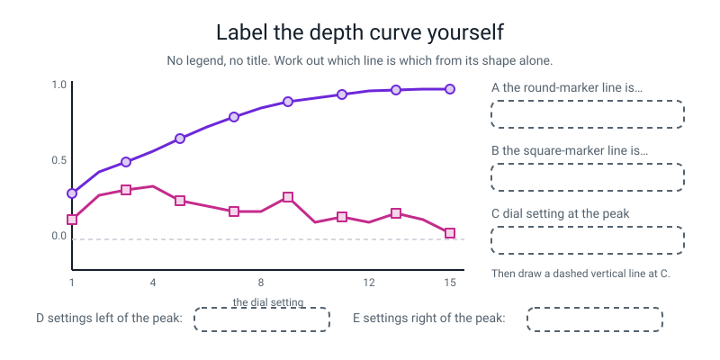

# Workbook — Week 33: Model Bake-Off and the Overfitting Cliff

**Name:** ________________________________  **Date:** ______________

[⬅ Week 32](week-32.md) · [📖 Read the chapter first](../student-guide/week-33.md) · [Course Home](../README.md) · [🧑‍🏫 Teacher guide](../teacher-guide/week-33.md) · [Next ➡](week-34.md)

**You will need:** graph paper · a ruler · **four coloured pens or highlighters** · a calculator · **whatever you wrote down in Week 29 about your two scores** · the Bug Log

---

## ✅ Warm-Up (5 min)

Five quick questions about **last week**.

**W1.** How do you tell classification from regression in one glance?

________________________________________________________________

**W2.** The slope came out at 3.6. Write the full sentence, with both units and without the banned word.

________________________________________________________________

**W3.** Why can you not average the six misses as they stand?

________________________________________________________________

**W4.** MAE 2.67 marks and R² 0.804. Which one do you say to a person who does not code, and which one is for comparing models?

________________________________________________________________

**W5.** The line predicted 121.4 marks out of 100 for somebody revising 20 hours. Is that a bug? What is it called?

________________________________________________________________

---

## 🔎 Predict the Output

This section is for guessing first and checking second. There are four short programs.

**Write your prediction before you run anything.**

### P1 — three numbers from four misses

This program measures four misses in three ways. Read it, then predict.

```python
import numpy as np
from sklearn.metrics import mean_absolute_error, mean_squared_error

truth = np.array([10, 10, 10, 10])
guess = np.array([12, 8, 10, 10])
print(np.abs(truth - guess))
print(round(mean_absolute_error(truth, guess), 4))
print(round(mean_squared_error(truth, guess), 4))
print(round(np.sqrt(mean_squared_error(truth, guess)), 4))
```

**I predict — four lines:**

________________________________________________________________

________________________________________________________________

**It really printed:**

________________________________________________________________

________________________________________________________________

**Do the MAE by hand here:**

________________________________________________________________

**Do the MSE by hand here:**

________________________________________________________________

**Line 4 is bigger than line 2. Under what circumstances would they have been equal?**

________________________________________________________________

**Line 3 has a unit problem. If `truth` and `guess` were in minutes, what unit is line 3 in?**

________________________________________________________________

### P2 — a ceiling nobody reaches

This program fits a decision tree with a large depth limit and prints five facts about it.

```python
from sklearn.datasets import load_diabetes
from sklearn.model_selection import train_test_split
from sklearn.tree import DecisionTreeRegressor

data = load_diabetes()
X_train, X_test, y_train, y_test = train_test_split(
    data.data, data.target, test_size=0.2, random_state=42)

tree = DecisionTreeRegressor(max_depth=25, random_state=0)
tree.fit(X_train, y_train)
print(tree.get_depth())
print(tree.get_n_leaves())
print(len(X_train))
print(round(tree.score(X_train, y_train), 4))
print(round(tree.score(X_test, y_test), 4))
```

**I predict — five lines:**

________________________________________________________________

________________________________________________________________

**It really printed:**

________________________________________________________________

________________________________________________________________

**We asked for 25 and got something smaller. Why?**

________________________________________________________________

**Compare lines 2 and 3. Write down what that comparison tells you, in one sentence.**

________________________________________________________________

________________________________________________________________

**Line 4 and line 5, side by side: which row of the four-row diagnosis table is this?**

________________________________________________________________

### P3 — truth first, guess second

This program scores the same lists four ways with one scoring function.

```python
import numpy as np
from sklearn.metrics import r2_score

y_true = np.array([100, 150, 200, 250])
guess = np.array([120, 140, 210, 240])
print(round(r2_score(y_true, guess), 4))
print(round(r2_score(guess, y_true), 4))
lazy = np.zeros(4) + y_true.mean()
print(round(r2_score(y_true, lazy), 4))
print(round(r2_score(y_true, np.array([250, 200, 150, 100])), 4))
```

**I predict — four numbers:** ______  ______  ______  ______

**It really printed:**

________________________________________________________________

________________________________________________________________

**Lines 1 and 2 use exactly the same two lists. Why are they different?**

________________________________________________________________

**Would `mean_absolute_error` have changed if you swapped its arguments?** ____________

**So which habit does that tell you to build, and why build it where it is free?**

________________________________________________________________

**Line 4 predicted the four true values in exactly the wrong order. What does the score say about that?**

________________________________________________________________

### P4 — the flattest curve you will ever draw

This program loops over four depths and prints a score and a leaf count for each.

```python
from sklearn.datasets import load_diabetes
from sklearn.model_selection import train_test_split
from sklearn.tree import DecisionTreeRegressor

data = load_diabetes()
X_train, X_test, y_train, y_test = train_test_split(
    data.data, data.target, test_size=0.2, random_state=42)

tree = DecisionTreeRegressor(max_depth=2, random_state=0)   # built ONCE, outside
for depth in range(1, 5):
    tree.fit(X_train, y_train)
    print(depth, round(tree.score(X_test, y_test), 3), tree.get_n_leaves())
```

**I predict — four lines:**

________________________________________________________________

________________________________________________________________

**It really printed:**

________________________________________________________________

________________________________________________________________

**Did Python raise an error?** ____________

**The first column changes and the other two do not. Explain in one sentence.**

________________________________________________________________

________________________________________________________________

**What one word in the code has to move, and where to?**

________________________________________________________________

**If you plotted this, what shape would the curve be?**

________________________________________________________________

**How many of the four predictions did you get right?** ______ / 4

**Which one surprised you most, and why?**

________________________________________________________________

---

## ✍️ Practice Set A — Read It

This set is for reading tables, code and a diagram. Write your answers in the spaces.

**A1. Diagnose from two numbers.** Write **underfitting**, **just right**, **overfitting** or **something's broken** in each row, and give the reason.

| # | train | test | gap | Diagnosis | Reason |
|---|---|---|---|---|---|
| a | 0.98 | 0.61 | | | |
| b | 0.30 | 0.28 | | | |
| c | 0.55 | 0.52 | | | |
| d | 1.000 | −0.003 | | | |
| e | 0.48 | 0.61 | | | |
| f | 0.304 | 0.131 | | | |
| g | 0.585 | 0.352 | | | |

**A1(h).** Which one of those seven is the row people get wrong most often, and what do they call it instead?

________________________________________________________________

**A1(i).** Row (e) is not a model problem. Name **two** things that could produce it.

________________________________________________________________

**A2. Read the bake-off table.** This is the real output from class.

```text
model                      MAE    RMSE   test R2   train R2
always guess the mean    64.01   73.22    -0.012      0.000
kNN, k = 5               42.77   54.95     0.430      0.584
tree, max_depth=5        48.15   62.60     0.260      0.669
tree, no limit           56.57   72.90    -0.003      1.000
linear regression        42.79   53.85     0.453      0.528
```

**A2(a).** Which row has a perfect training score, and what is its test score?

________________________________________________________________

**A2(b).** Why is the baseline row in the table at all? What does it do for every other number?

________________________________________________________________

**A2(c).** kNN and the line have almost the same MAE. Which is better on this table, and which column tells you?

________________________________________________________________

**A2(d).** Compute the gap for every row and fill this in.

| model | gap (train − test) |
|---|---|
| always guess the mean | |
| kNN, k = 5 | |
| tree, max_depth=5 | |
| tree, no limit | |
| linear regression | |

**A2(e).** Rank the five rows by gap, smallest first. What does the ranking tell you that the test-R² ranking does not?

________________________________________________________________

________________________________________________________________

**A2(f).** The two trees differ by one setting. Write one sentence about what turning that setting up did to each of the two score columns.

________________________________________________________________

________________________________________________________________

**A3. MAE, RMSE, or neither?** Tick the metric that would tell these two apart, then say which model you would want.

| # | The situation | MAE | RMSE | Which model, and why |
|---|---|---|---|---|
| a | Two models, identical MAE, one has a single huge miss | ☐ | ☐ | |
| b | A medicine-dose calculator | ☐ | ☐ | |
| c | A weekly grocery-bill estimate | ☐ | ☐ | |
| d | A bus arrival time, where being 30 min late once loses your exam | ☐ | ☐ | |
| e | You want a number you can say out loud to a non-programmer | ☐ | ☐ | |

**A3(f).** Complete the only sentence you are allowed to say about RMSE:

*"RMSE goes up faster than MAE when ________________________________."*

**A3(g).** Write the sentence you must **not** say about RMSE, and then the real numbers from class that disprove it.

Must not say: __________________________________________________

Disproved by: __________________________________________________

**A4. Spot the bug.** Each line is wrong or dangerous. Write the fix.

| # | The line | The fix |
|---|---|---|
| a | `mean_squared_error(y_test, guesses, squared=False)` | |
| b | `tree = DecisionTreeRegressor(max_depth=d)` inside `for depth in range(1, 16):` | |
| c | `ax = plt.subplots(figsize=(8, 5))` | |
| d | `ax.axvline(4, linestyle="dashed--")` | |
| e | `train_test_split(X, y, test_size=0.2)` written **inside** the loop | |
| f | `r2_score(guesses, y_train)` | |
| g | `lazy = np.zeros(len(y_test)) + y_test.mean()` | |
| h | `from sklearn.tree import DecisionTreeClassifier` then `DecisionTreeRegressor(...)` | |
| i | The plot with no `ax.set_ylim(...)` at all | |

**A4(j).** Four of those nine produce **no error whatsoever**. Which four?

________________________________________________________________

**A4(k).** For (e), what is the counting check that catches it?

________________________________________________________________

**A4(l).** For (g), what is the name for the mistake being made?

________________________________________________________________

**A5. Match the code to the output.** Every one of these is from this week's real runs.

| # | The call |
|---|---|
| 1 | `load_diabetes().data.shape` |
| 2 | `len(X_train), len(X_test)` |
| 3 | `DecisionTreeRegressor(random_state=0).fit(X_train, y_train).get_n_leaves()` |
| 4 | `round(np.sqrt(mean_squared_error(y_test, guesses)), 2)` for the line |
| 5 | `depths[int(np.argmax(test_scores))]` |
| 6 | `y.min(), y.max()` |
| 7 | `round(r2_score(y_test, lazy), 3)` |

| Letter | Output |
|---|---|
| A | `(353, 89)` |
| B | `4` |
| C | `346` |
| D | `-0.012` |
| E | `(442, 10)` |
| F | `(25.0, 346.0)` |
| G | `53.85` |

**Answers:** 1 → ____  2 → ____  3 → ____  4 → ____  5 → ____  6 → ____  7 → ____

**A5(a).** Item 5 uses `argmax`. What does `argmax` give you, and why is the answer 4 when the position it found was 3?

________________________________________________________________

________________________________________________________________

**A6. Label the diagram.** No legend, no title. Work out which line is which from its **shape**.


*Figure W33.1 — Five slots. One of them is a number.*

The five answers, in the wrong order: **overfitting · train R² (rows it studied) · 4 · test R² (rows it never saw) · underfitting**

**A** ______________________  **B** ______________________

**C** ______________________  **D** ______________________

**E** ______________________

**A6(f).** How did you know which line was which, without a legend? Give the one property that gives it away.

________________________________________________________________

**A6(g).** Draw the dashed vertical line at C, then write the sentence next to it:

________________________________________________________________

---

## ✍️ Practice Set B — Write It

This set is for writing short programs. Each task shows the output to match.

### B1 — one line

You have `y_test` and `guesses` from a fitted `LinearRegression` on the diabetes split. Write the **single line** that prints the RMSE to two decimal places, using the version that will always work.

Type your line in the box below.

```python
# your line here:
```

**Expected output:**

```text
RMSE: 53.85
```

**Done looks like:** no `squared=False` anywhere, and you can say why in one sentence.

### B2 — the laziest model, scored three ways

Write **four lines** that build the always-guess-the-training-mean baseline and print its MAE, its RMSE and its R².

Type your four lines in the box below.

```python
# your four lines here:
```

**Expected output:**

```text
baseline MAE : 64.01
baseline RMSE: 73.22
baseline R2  : -0.012
```

**Done looks like:** you used `y_train.mean()` and **not** `y_test.mean()`, and you can say what the R² of −0.012 means. *(Hint: it is not exactly 0.000, and there is a reason.)*

### B3 — the worst single miss

Write a short loop that prints, for kNN with `k = 5` and for linear regression, the **worst single miss** and how many misses are **over 100**.

**Expected output:**

```text
kNN, k = 5           worst  138.80   over 100: 9
linear regression    worst  154.49   over 100: 5
```

**Done looks like:** you used `np.abs(...)` and `.max()`, and you can explain how the line manages a **worse** worst miss and a **better** RMSE.

### B4 — turn kNN's dial instead, about 18 lines

Write a program that loops `n_neighbors` over `[1, 2, 3, 5, 8, 12, 20, 30, 50]` on the **same** diabetes split, printing train R², test R² and the gap for each, and then names the best `k`.

**Expected output:**

```text
  k  train R2  test R2     gap
  1     1.000    0.020   0.980
  2     0.744    0.332   0.411
  3     0.636    0.365   0.271
  5     0.584    0.430   0.154
  8     0.540    0.439   0.101
 12     0.516    0.427   0.089
 20     0.489    0.424   0.065
 30     0.470    0.411   0.059
 50     0.447    0.430   0.017

best test R2 0.439 at k = 8
```

**Done looks like:** the split is made **once, above** the loop, and you have written one sentence about what `k = 1` did and why it did it.

### B5 — the bake-off, with two extra columns, about 25 lines

Extend the bake-off so the table also shows the **worst single miss** and **how many misses are over 100**. Use `max_depth=4` for the limited tree this time, because that is the depth the curve chose.

**Expected output:**

```text
train rows: 353  test rows: 89

model                      MAE    RMSE   worst  over 100   test R2
always guess the mean    64.01   73.22  156.26        15    -0.012
kNN, k = 5               42.77   54.95  138.80         9     0.430
tree, max_depth=4        46.44   58.60  147.50         8     0.352
tree, no limit           56.57   72.90  201.00        14    -0.003
linear regression        42.79   53.85  154.49         5     0.453
```

**Done looks like:** **one** `report` function used for every model, the split made once at the top, and a written sentence naming which model you would ship and citing two numbers.

---

## 🐞 Fix the Broken Program

This section is for finding bugs in a program, one error message at a time.

Here is `curve.py`. It is supposed to plot the depth curve from 1 to 8. It has **three** bugs: one that stops Python reading the file at all, one that stops it partway through, and one that produces **no error whatsoever** and a completely misleading chart.

Type or copy the program below into a file called `curve.py`.

```python
# curve.py - the depth curve from 1 to 8. Three bugs.
import matplotlib.pyplot as plt
from sklearn.datasets import load_diabetes
from sklearn.model_selection import train_test_split
from sklearn.tree import DecisionTreeRegressor

data = load_diabetes()
X, y = data.data, data.target

depths = []
train_scores = []
test_scores = []

for depth in range(1, 9)
    X_train, X_test, y_train, y_test = train_test_split(X, y, test_size=0.2)
    tree = DecisionTreeRegressor(max_depth=depth, random_state=0)
    tree.fit(X_train, y_train)
    depths.append(depth)
    train_scores.append(tree.score(X_train, y_train))
    test_scores.append(tree.score(X_test, y_test))

fig, ax = plt.subplots(figsize=(8, 5))
ax.plot(depths, train_scores, marker="o", label="train R2")
ax.plot(depths, test_scores, marker="s", label="test R2")
ax.legend()
fig.savefig("curve.png", dpi=120, bbox_inches="tight")
print("saved curve.png")
for i in range(len(depths)):
    print(depths[i], round(train_scores[i], 3), round(test_scores[i], 3))
```

**Bug 1.** Run it as it is. The real message:

```text
  File "curve.py", line 14
    for depth in range(1, 9)
                            ^
SyntaxError: expected ':'
```

**This is the friendliest error message in the whole year. Why?**

________________________________________________________________

**The fix:**

________________________________________________________________

**Bug 2.** Fix bug 1. Now suppose the `fig, ` at the start of line 22 has been lost, so the line reads `ax = plt.subplots(figsize=(8, 5))`. Run it. The real message:

```text
Traceback (most recent call last):
  File "curve.py", line 23, in <module>
    ax.plot(depths, train_scores, marker="o", label="train R2")
AttributeError: 'tuple' object has no attribute 'plot'
```

**What is a tuple, in plain words? (You have met one every time you printed a `.shape`.)**

________________________________________________________________

**How many things does `plt.subplots(...)` hand back, and what are they?**

________________________________________________________________

**The fix:**

________________________________________________________________

**Bug 3 — the one with no error.** Put the `fig, ` back. Now it runs cleanly and prints a table. Here are two runs, one after the other, on the **same** machine with the **same** file:

```text
saved curve.png
1 0.282 0.169
2 0.458 0.237
3 0.536 0.269
4 0.591 0.343
5 0.716 -0.009
6 0.766 0.139
7 0.808 0.269
8 0.899 -0.165
```

```text
saved curve.png
1 0.311 0.152
2 0.456 0.306
3 0.512 0.416
4 0.59 0.386
5 0.656 0.352
6 0.803 0.087
7 0.824 -0.007
8 0.888 -0.098
```

**Nothing changed between those two runs. Every number did. What is the bug?**

________________________________________________________________

________________________________________________________________

**Which line is responsible, and where should it be instead?**

________________________________________________________________

**What is this chart actually measuring, as it stands?**

________________________________________________________________

**The fix — write out both changed lines:**

________________________________________________________________

________________________________________________________________

**Run the fix twice. Fill in the table, and confirm the two runs match.**

| depth | train R² | test R² |
|---|---|---|
| 1 | | |
| 2 | | |
| 3 | | |
| 4 | | |
| 5 | | |
| 6 | | |
| 7 | | |
| 8 | | |

**Did the two runs match this time?** ____________  **Which one word in the code guarantees that?**

________________________________________________________________

**And the counting check that catches this whole family of bug:**

________________________________________________________________

---

## 🧩 Puzzle of the Week

This puzzle has two parts. The first needs a calculator and the second needs a pencil.

### Part 1 — Five misses, one MAE, many RMSEs

Five predictions. The sizes of the five misses must **average to exactly 4**, so they must add to 20. Your job is to find out how much the RMSE can move while the MAE stays pinned at 4.

**(a)** Fill in the table with a calculator. *(MSE = the average of the squares. RMSE = the square root of that.)*

| the five misses | MAE | MSE | RMSE |
|---|---|---|---|
| 4, 4, 4, 4, 4 | | | |
| 2, 3, 4, 5, 6 | | | |
| 0, 2, 4, 6, 8 | | | |
| 0, 0, 5, 5, 10 | | | |
| 0, 0, 0, 5, 15 | | | |
| 0, 0, 0, 0, 20 | | | |

**(b)** Every MAE in that column is the same. Is every RMSE? ____________

**(c)** Which arrangement gives the **smallest** possible RMSE, and what is special about it?

________________________________________________________________

**(d)** Which gives the **largest**, and what is special about it?

________________________________________________________________

**(e)** So write the rule, filling both blanks:

*"For a fixed MAE, RMSE is smallest when the misses are all ____________ and largest when the misses are all ____________ in one place."*

**(f)** Can RMSE ever be **smaller** than MAE? Have a go at making it happen, then explain your answer.

________________________________________________________________

________________________________________________________________

**(g)** Two delivery firms both have an MAE of 4 minutes. Firm A's misses look like row 1; firm B's look like row 6. **Which would you order from, and which would you never let deliver a birthday cake?** One sentence each.

________________________________________________________________

________________________________________________________________

### Part 2 — When does a tree run out of room?

**(h)** Fill in the doubling table.

| depth | most leaves possible (2ᵈ) |
|---|---|
| 1 | |
| 2 | |
| 4 | |
| 8 | |
| 9 | |
| 10 | |

**(i)** We have **353** training patients. What is the shallowest depth at which a tree *could* give every single patient their own leaf?

________________________________________________________________

**(j)** At depth 9 our real tree has **176** leaves — far fewer than the maximum. Why?

________________________________________________________________

________________________________________________________________

**(k)** The unlimited tree stopped at a real depth of **19** with **346** leaves, out of 353 training rows. So **7** rows did not get their own leaf. Suggest a reason.

________________________________________________________________

________________________________________________________________

**(l)** Setting `max_depth=25` on the same data gives depth 19 and 346 leaves — identical. Write the one-sentence rule this proves.

________________________________________________________________

---

## 🤔 Think Deeper

These two questions ask for a paragraph in your own words.

**T1. Write a paragraph explaining to a friend who has not done this course why "my model scored 1.000" is not good news — and then explain what number you would ask them for instead, and why.**

________________________________________________________________

________________________________________________________________

________________________________________________________________

________________________________________________________________

________________________________________________________________

**T2. We picked depth 4 by looking at the test scores fifteen times. Write a paragraph about what that cost us, why we did it anyway, and exactly what you will write down next to the number as a result.**

________________________________________________________________

________________________________________________________________

________________________________________________________________

________________________________________________________________

________________________________________________________________

---

## 🛠️ Build It — The Bake-Off and the Cliff

This section takes you through two programs and the write-up that goes with them, one part at a time.

### Part 1 — The bake-off (page 33.4)

Step checklist:

- [ ] New file, `week33_bakeoff.py`
- [ ] Load `load_diabetes()`, print `X.shape` and the range of `y`
- [ ] **ONE** `train_test_split` with `test_size=0.2, random_state=42`, above everything else
- [ ] Print the row counts
- [ ] Write **one** `report(name, model)` function
- [ ] Add the lazy always-guess-the-training-mean baseline as the first row
- [ ] Run kNN (k=5), a depth-5 tree, an unlimited tree, and linear regression

**Write the row counts at the top. This is a marked item.**

**Training rows:** ____________   **Test rows:** ____________

**The results table:**

| model | MAE | RMSE | test R² | train R² | gap |
|---|---|---|---|---|---|
| always guess the mean | | | | | |
| kNN, k = 5 | | | | | |
| tree, max_depth=5 | | | | | |
| tree, no limit | | | | | |
| linear regression | | | | | |

**Circle the `tree, no limit` row and mark both of its scores.**

**Write the two numbers out here and say what each one means:**

train R² ____________ means ____________________________________

test R² ____________ means ______________________________________

### Part 2 — The depth curve (page 33.5)

- [ ] New file, `week33_depth_curve.py`
- [ ] ONE split, **above** the loop
- [ ] `for depth in range(1, 16):` with a **fresh** tree and a **fresh** fit inside
- [ ] Collect depth, train R², test R² and leaves
- [ ] Print the table with a `gap` column
- [ ] Find the peak with `argmax` and print it

| depth | leaves | train R² | test R² | gap |
|---|---|---|---|---|
| 1 | | | | |
| 2 | | | | |
| 3 | | | | |
| 4 | | | | |
| 5 | | | | |
| 6 | | | | |
| 7 | | | | |
| 8 | | | | |
| 9 | | | | |
| 10 | | | | |
| 11 | | | | |
| 12 | | | | |
| 13 | | | | |
| 14 | | | | |
| 15 | | | | |

**best test R² was** ____________ **at max_depth =** ____________

**training rows** ____________  **leaves at depth 15** ____________

### Part 3 — Four coloured pens

- [ ] **Pen 1** — the whole `train R2` column, top to bottom
- [ ] **Pen 2** — the single biggest number in `test R2`
- [ ] **Pen 3** — the first and last numbers in `gap`
- [ ] **Pen 4** — the last number in `leaves`, and the printed `training rows`

Now say all four out loud, and write what you said:

Pen 1: ________________________________________________________

Pen 2: ________________________________________________________

Pen 3: ________________________________________________________

Pen 4: ________________________________________________________

### Part 4 — The chart, twice

- [ ] Plot both series with different markers, a title, both axis labels, a legend, and `set_ylim(-0.2, 1.05)`
- [ ] `ax.axvline(best_depth, linestyle="--", color="green")`
- [ ] `fig.savefig(...)` and open the PNG
- [ ] **Then plot it again by hand on graph paper**, fifteen points in each of two colours
- [ ] Rule a vertical line at the peak and write the sentence beside it **in your own handwriting**

**The sentence:** ______________________________________________

**Say it out loud, pointing at the line.** Did you? ☐

**Try taking `set_ylim` out and re-saving. What happens to the picture, and why does it matter?**

________________________________________________________________

________________________________________________________________

### Part 5 — The three sentences (page 33.5)

**Sentence one — the train line.** What does it do, and why can it only go up?

________________________________________________________________

________________________________________________________________

**Sentence two — the test peak.** Where does it peak, and how many leaves does the tree have there?

________________________________________________________________

________________________________________________________________

**Sentence three — the gap.** What is it measuring, in plain words, and what does it do from depth 1 to depth 15?

________________________________________________________________

________________________________________________________________

### Part 6 — The decision and the honesty (page 33.6)

**The model I would ship:** ______________________________

**Two numbers from my table that defend it:**

1. ____________________________________________________________
2. ____________________________________________________________

**And what my choice costs, if anything:**

________________________________________________________________

**The three honesty bullets:**

- **My test set is** ____________ **rows, so one row is worth about** ____________ **of R², which means any difference smaller than about** ____________ **is inside the noise.**
- **The sentence:** ______________________________________________
- **One thing that makes this dataset easier than real life:**

________________________________________________________________

### Part 7 — Back to Week 29

**Go and find what you wrote four weeks ago.**

**My Week 29 training score:** ____________   **test score:** ____________   **gap:** ____________

**Today's date:** ____________

**One sentence about what I now know that I did not then:**

________________________________________________________________

________________________________________________________________

### Part 8 — The Bug Log

| What happened | The real message (copy it exactly) | What fixed it | What I will check next time |
|---|---|---|---|
| | | | |
| | | | |

**And one silent bug from this week — one that produced no error at all:**

| What it looked like | Why nothing errored | How I would catch it |
|---|---|---|
| | | |

---

## 🎨 Draw It

Draw the depth curve **by hand**, from your own printed table.


*Figure W33.2 — Your page.*

**Rules:** both axes labelled · **two colours**, fifteen points each · the y axis running from **−0.2 to 1.05** so the gap is visible · a **dashed** vertical line at the peak of the unseen-rows line · the sentence in your own handwriting.

> **What a good answer might look like:** across the bottom, **"max_depth — how many questions the tree may ask"**, 1 to 15. Up the side, **"R² (1.0 = perfect, 0.0 = no better than the average)"**, from −0.2 to 1.05, with a faint horizontal line ruled across at **0.0** and labelled *"guessing the average"*.
>
> Fifteen blue circles climbing from 0.304 to 0.999 and never once dipping. Fifteen pink squares rising to 0.352 at depth 4 and then sagging all the way to 0.044.
>
> A **dashed** vertical line at depth 4, with **"after here it is memorising"** written beside it in handwriting, and — this is the part that shows real understanding — a **double-headed arrow** drawn between the two lines at depth 15, labelled **"gap = 0.955"**, with a note: *"this is how much of the top line is memorising."*
>
> Two more annotations that earn extra credit. A bracket over depths 1–3 labelled **"underfitting — both scores low"**. And a small circle round the pink point at depth 9, with **"this bump is about ten patients, not a discovery — I'd re-run with a different split to check"**.
>
> **What a weak answer looks like:** one colour, so the two series cannot be told apart · a y axis that starts at the lowest test value, so the gap is squashed flat and invisible · a **solid** vertical line, which reads as a third series of data · or the sentence copied out in typed capitals rather than written. **The handwriting is part of the exercise.**

---

## 📊 Self-Check

Use the first table to rate yourself and the second to test what you remember.

| I can… | 😀 got it | 🙂 nearly | 😕 not yet |
|---|---|---|---|
| Run three models on one fixed split, changing one line each time | ☐ | ☐ | ☐ |
| Compute RMSE with `np.sqrt(mean_squared_error(...))` | ☐ | ☐ | ☐ |
| Explain why RMSE punishes big misses harder than MAE | ☐ | ☐ | ☐ |
| Diagnose a model from its two scores, using the four-row table | ☐ | ☐ | ☐ |
| Plot train and test against depth 1 to 15 on one pair of axes | ☐ | ☐ | ☐ |
| Mark the peak with `axvline` and say the sentence out loud | ☐ | ☐ | ☐ |
| Explain why the train score *must* rise, so it is not evidence | ☐ | ☐ | ☐ |
| Say why depth 1 and depth 15 are wrong for opposite reasons | ☐ | ☐ | ☐ |
| Name the model I would ship and defend it with two numbers | ☐ | ☐ | ☐ |
| Spot the silent bug of splitting inside the loop | ☐ | ☐ | ☐ |
| Write the honesty sentence without being reminded | ☐ | ☐ | ☐ |

**True or false?** Circle one on each row.

| Statement | | |
|---|---|---|
| A train R² of 1.000 is good news | TRUE | FALSE |
| The train score can go down when you increase `max_depth` | TRUE | FALSE |
| A test R² below zero is impossible | TRUE | FALSE |
| RMSE tells you your single worst miss | TRUE | FALSE |
| RMSE is always greater than or equal to MAE | TRUE | FALSE |
| MAE and RMSE are two names for the same thing | TRUE | FALSE |
| `mean_squared_error(..., squared=False)` still works | TRUE | FALSE |
| Both ends of the complexity dial are wrong | TRUE | FALSE |
| For kNN, `k = 1` is the simplest setting | TRUE | FALSE |
| Re-splitting inside the loop raises an error | TRUE | FALSE |
| The baseline should use `y_train.mean()`, not `y_test.mean()` | TRUE | FALSE |
| Depth 4 is the right answer for every tree on every dataset | TRUE | FALSE |
| The highest-scoring model is always the one you ship | TRUE | FALSE |
| `max_depth` is a target the tree tries to reach | TRUE | FALSE |
| Choosing the depth from the test curve costs you nothing | TRUE | FALSE |

One thing I'd like explained again:

________________________________________________________________

---

## ✅ Answers

Check your work here only after you have finished every other page.

<details>
<summary>Check your answers</summary>

### Warm-Up

**W1.** **Look at the answer column.** A short fixed list → classification. Any number → regression. And scikit-learn names its tools after it: `Classifier` versus `Regressor`.

**W2.** *"Each extra hour of revision a week **goes with** about **3.6 more marks** out of 100."* The banned word is **"causes"**.

**W3.** Because a best-fit line always **balances** — as much above as below — so the signed misses add to zero. Averaging them would say the model was perfect no matter how bad it was. Dropping the signs is what makes MAE mean something.

**W4.** **MAE (2.67 marks) is the one for a person**, because it is in the units of the thing itself. **R² (0.804) is for comparing models**, because it has no units at all.

**W5.** **Not a bug.** It is **extrapolation** — predicting outside the range of x you have data for. Nobody in the six revised more than 6 hours, and a straight line has never heard of a maximum mark.

---

### Predict the Output

### P1

The real output:

```text
[2 2 0 0]
1.0
2.0
1.4142
```

**MAE by hand:** `(2 + 2 + 0 + 0) ÷ 4 = 4 ÷ 4 = 1.0`

**MSE by hand:** squares are 4, 4, 0, 0. `(4 + 4 + 0 + 0) ÷ 4 = 8 ÷ 4 = 2.0`. Then `RMSE = √2 = 1.4142`.

**When would lines 2 and 4 have been equal?** **When every miss is exactly the same size.** Squaring only pulls the average up when the sizes differ, so RMSE equals MAE only for perfectly even errors — like Model A in the chapter, off by exactly 1 every time.

**The unit problem.** If truth and guess are in **minutes**, then MSE is in **minutes squared**, which is not a thing anybody can picture. **That is exactly why RMSE takes the square root** — to get back into minutes. Never report an MSE to a person.

### P2

The real output:

```text
19
346
353
1.0
-0.003
```

**We asked for 25 and got 19.** Because **`max_depth` is a ceiling, not a target.** By depth 19 there was nothing impure left to split — every remaining leaf already held rows that agreed with each other — so the tree stopped on its own and the ceiling was never touched.

**Lines 2 and 3 compared:** **346 leaves for 353 training rows.** Nearly every patient has their own private leaf with their own private answer. **The tree has not learned anything about the illness; it has written down a lookup table of these 353 people.**

**Which row of the diagnosis table?** **Overfitting.** Train perfect (1.000), test no better than guessing the average (−0.003, level with the baseline's −0.012), gap **1.003**. This is Sam.

### P3

The real output:

```text
0.944
0.9276
0.0
-3.0
```

**Lines 1 and 2 differ because R² is not symmetrical.** It divides by *"how much the first argument varies around its own mean"*, and the two lists do not vary by the same amount. So which one you call "the truth" changes the denominator, and therefore the answer.

**Would `mean_absolute_error` have changed if you swapped its arguments?** **No** — it averages the sizes of the differences, and `|a − b|` is the same as `|b − a|`.

**The habit, and why build it where it is free.** **Truth first, guess second, in every metric, every time.** MAE forgives you and `r2_score` does not, so you build the habit on the forgiving one — because you will not remember to be careful only on the days it matters.

**Line 4 — the four true values in exactly the wrong order — scores −3.0.** Every value present, every value in the wrong place, and R² says *"four times the squared error of not bothering"* (R² = 1 − 4 = −3). Getting the *set* of answers right counts for nothing; R² only cares whether the right answer went to the right row.

### P4

The real output:

```text
1 0.295 4
2 0.295 4
3 0.295 4
4 0.295 4
```

**Did Python raise an error?** **No.** This is a silent bug.

**Why only the first column changes.** Because the tree was built **once, above the loop**, with `max_depth=2` baked into it. The loop variable `depth` is printed, and it is never used for anything else — so all four rows are the *same depth-2 tree*, refitted four times to the same data.

**What has to move, and where:** the whole `tree = DecisionTreeRegressor(...)` line must move **inside** the loop, and `max_depth=2` must become `max_depth=depth`.

**What shape would the curve be?** **Perfectly flat** — a horizontal line at 0.295, with a confident-looking title on it. Which is the danger: nothing errored, and the chart looks respectable.

---

### Practice Set A

**A1.**

| # | train | test | gap | Diagnosis | Reason |
|---|---|---|---|---|---|
| a | 0.98 | 0.61 | 0.37 | **Overfitting** | Train high, test much lower — a big gap |
| b | 0.30 | 0.28 | 0.02 | **Underfitting** | **Nothing is high**, and the gap is tiny |
| c | 0.55 | 0.52 | 0.03 | **Just right** | Both reasonable, gap small |
| d | 1.000 | −0.003 | 1.003 | **Overfitting** | Perfect on studied rows, no better than the average-guesser on new ones |
| e | 0.48 | 0.61 | −0.13 | **Something's broken** | Better on rows it never saw than on rows it studied |
| f | 0.304 | 0.131 | 0.174 | **Underfitting** | Depth 1 — both low |
| g | 0.585 | 0.352 | 0.233 | **Just right** *(the best available on this data)* | Highest test score; the gap is real but not runaway |

**A1(h).** Row **(b)**, and people call it **overfitting**. The question that fixes it: **"which number is high?"** Neither. Underfitting is the only row where *nothing* is high.

**A1(i).** Two things that produce row (e): **a bug** — most often the arguments swapped somewhere, or the two scores computed on the wrong piles — or **a tiny test set** where a handful of easy rows happened to land. Our own Worked Example 2 produced a negative gap on a five-row test set, and nothing was broken; the test pile was simply too small to trust.

**A2(a).** `tree, no limit`. Train R² **1.000**, test R² **−0.003** — perfect on the 353 it learned from, no better than guessing the average on the 89 it had not seen.

**A2(b).** Because **without it, no other number means anything.** MAE 42.77 sounds like nothing until you know that ignoring all ten measurements and guessing the average is off by **64.01**. Then 42.77 becomes *"a third less wrong than not bothering"*. It is the ruler you measure the other numbers against.

**A2(c).** **The line.** MAE is a dead heat — 42.77 against 42.79, two hundredths apart on a scale running to 346 — and the column that separates them is **RMSE**: 53.85 against 54.95. A lower RMSE at equal MAE means fewer or smaller **big** misses. Counting confirms it: kNN has nine misses over 100, the line has five.

**A2(d).**

| model | gap |
|---|---|
| always guess the mean | 0.000 − (−0.012) = **0.012** |
| kNN, k = 5 | 0.584 − 0.430 = **0.154** |
| tree, max_depth=5 | 0.669 − 0.260 = **0.409** |
| tree, no limit | 1.000 − (−0.003) = **1.003** |
| linear regression | 0.528 − 0.453 = **0.075** |

**A2(e).** Ranked smallest gap first: baseline (0.012), linear (0.075), kNN (0.154), depth-5 tree (0.409), unlimited tree (1.003).

The gap ranking tells you **how much of each model's apparent skill is memorising**, which the test-R² ranking does not. Linear regression wins on *both* — best test score **and** almost no gap — which is a much stronger case than winning on the score alone. And notice the baseline has the smallest gap of all: it memorises nothing, because it does not look at anything. **A small gap on its own is not a virtue.** You need a good test score *and* a small gap.

**A2(f).** Turning `max_depth` from 5 to unlimited pushed **train** from 0.669 up to **1.000** — an apparent triumph — and pushed **test** from 0.260 down to **−0.003** — an actual disaster. **We made the training score better and the model worse**, which is the single clearest reason a training score is not evidence.

**A3.**

| # | Metric that separates them | Which model, and why |
|---|---|---|
| a | **RMSE** | Whichever you prefer — but only RMSE can *see* the difference, so compute it. |
| b | **RMSE** | Model A, small consistent errors. One huge dose error can be dangerous; ten small ones get noticed and corrected. |
| c | **MAE** | Model B. Nine right weeks out of ten feels trustworthy; the birthday-party week explains itself. |
| d | **RMSE** | Model A. A single 30-minute failure costs you the exam; being three minutes out every day does not. |
| e | **MAE** | It is in the units of the thing itself — minutes, marks, rupees — so you can say it out loud. |

**A3(f).** *"RMSE goes up faster than MAE when **there are big misses**."*

**A3(g).** **Must not say:** *"RMSE tells you the worst miss."*

**Disproved by:** linear regression has a **worse** single worst miss than kNN — **154.49 against 138.80** — and yet a **lower** RMSE, **53.85 against 54.95**. RMSE is about the whole **tail** of big misses (kNN nine over 100, the line five), not one champion.

**A4.**

| # | The fix |
|---|---|
| a | `np.sqrt(mean_squared_error(y_test, guesses))`. `squared=False` was removed from modern scikit-learn. |
| b | `max_depth=depth` — match the loop variable. Otherwise `NameError: name 'd' is not defined`. |
| c | `fig, ax = plt.subplots(...)`. `subplots` always hands back **two** things. |
| d | `linestyle="--"` **or** `linestyle="dashed"`. Not both spellings mashed together. |
| e | Move it **above** the loop, and give it `random_state=42`. |
| f | `r2_score(y_train, guesses)` — **truth first**. |
| g | `y_train.mean()`. Using the test mean is peeking at the answers. |
| h | `from sklearn.tree import DecisionTreeRegressor` — or list both, comma-separated. |
| i | Add `ax.set_ylim(-0.2, 1.05)`, or matplotlib zooms to fit and the gap between the two lines stops being visible. |

**A4(j).** **(e), (f), (g) and (i)** produce no error at all. (e) gives a shapeless curve, (f) gives a plausible wrong number — 0.504 instead of 0.669 on our depth-5 tree — (g) quietly peeks at the test answers, and (i) gives a chart that hides the very thing it was drawn to show. **All four are worse than the ones that crash.**

**A4(k).** **Count the `train_test_split` lines in the file.** There must be exactly **one**, and it must be **above** the `for`.

**A4(l).** **Leakage** — letting information from the test rows into something that was supposed to be built from the training rows only. Same family as Week 30's scaler fitted on everything.

**A5.** 1 → **E** · 2 → **A** · 3 → **C** · 4 → **G** · 5 → **B** · 6 → **F** · 7 → **D**

**A5(a).** `argmax` gives you the **position** of the biggest number in a list, not the number itself. The biggest test score sits at **position 3**, and `depths[3]` is **4**, because positions start at 0 and our depths start at 1. If you print `np.argmax(test_scores)` you get 3; if you print `depths[3]` you get 4. **Never quote the position as if it were the depth.**

**A6.** **A** = train R² (rows it studied) · **B** = test R² (rows it never saw) · **C** = 4 · **D** = underfitting · **E** = overfitting

**A6(f).** **The round-marker line never once goes down.** That is the give-away, and it is not a coincidence — a training score *cannot* fall as you give the model more room, because a more complex model has every option the simpler one had plus more. **Any line that rises monotonically for fifteen steps is the training score.**

**A6(g).** *"After here it is memorising."*

---

### Practice Set B

**B1.**

One way to write it:

```python
print("RMSE:", round(np.sqrt(mean_squared_error(y_test, guesses)), 2))
```

```text
RMSE: 53.85
```

**Why no `squared=False`:** it was removed from scikit-learn. Roughly a thousand tutorials still show it and they are all out of date. **The error message is more current than the tutorial.**

**B2.**

One way to write it:

```python
lazy = np.zeros(len(y_test)) + y_train.mean()
print("baseline MAE :", round(mean_absolute_error(y_test, lazy), 2))
print("baseline RMSE:", round(np.sqrt(mean_squared_error(y_test, lazy)), 2))
print("baseline R2  :", round(r2_score(y_test, lazy), 3))
```

```text
baseline MAE : 64.01
baseline RMSE: 73.22
baseline R2  : -0.012
```

**Why `y_train.mean()` and not `y_test.mean()`:** using the test mean would mean the baseline had **looked at the answers it was about to be tested on**. That is leakage, and it would make the baseline unfairly good.

**Why R² is −0.012 and not exactly 0.000:** because R² is defined against the **test set's own** mean, and we guessed the **training** mean instead. The two means are close but not identical, so our honest baseline lands a whisker below zero. If you had cheated and used `y_test.mean()`, you would get exactly 0.000 — **and that exact zero would be the tell-tale sign of the cheat.**

**B3.**

One way to write it:

```python
for name, model in [("kNN, k = 5", KNeighborsRegressor(n_neighbors=5)),
                    ("linear regression", LinearRegression())]:
    model.fit(X_train, y_train)
    errors = np.abs(y_test - model.predict(X_test))
    print(f"{name:20s} worst {errors.max():7.2f}   over 100: {(errors > 100).sum()}")
```

```text
kNN, k = 5           worst  138.80   over 100: 9
linear regression    worst  154.49   over 100: 5
```

**How the line manages a worse worst miss and a better RMSE:** because RMSE averages **all** the squared misses, not just the biggest one. The line has one spectacular failure at 154.49 and then only four more over 100. kNN's biggest is smaller, but it has **nine** over 100. Nine large squares outweigh five slightly larger ones. **RMSE is about the whole tail, not the champion.**

**B4.**

One way to write it:

```python
# wb4_k_dial.py  -  turn kNN's dial. It runs BACKWARDS.
import numpy as np
from sklearn.datasets import load_diabetes
from sklearn.model_selection import train_test_split
from sklearn.neighbors import KNeighborsRegressor

data = load_diabetes()
X_train, X_test, y_train, y_test = train_test_split(
    data.data, data.target, test_size=0.2, random_state=42)

print(f"{'k':>3} {'train R2':>9} {'test R2':>8} {'gap':>7}")
best_k, best_score = 0, -99
for k in [1, 2, 3, 5, 8, 12, 20, 30, 50]:
    knn = KNeighborsRegressor(n_neighbors=k)
    knn.fit(X_train, y_train)
    train_r2 = knn.score(X_train, y_train)
    test_r2 = knn.score(X_test, y_test)
    print(f"{k:3d} {train_r2:9.3f} {test_r2:8.3f} {train_r2 - test_r2:7.3f}")
    if test_r2 > best_score:
        best_k, best_score = k, test_r2
print()
print("best test R2", round(best_score, 3), "at k =", best_k)
```

```text
  k  train R2  test R2     gap
  1     1.000    0.020   0.980
  2     0.744    0.332   0.411
  3     0.636    0.365   0.271
  5     0.584    0.430   0.154
  8     0.540    0.439   0.101
 12     0.516    0.427   0.089
 20     0.489    0.424   0.065
 30     0.470    0.411   0.059
 50     0.447    0.430   0.017

best test R2 0.439 at k = 8
```

**The sentence about `k = 1`:** *"With `k = 1` the train R² is a perfect 1.000 and the test R² is 0.020 — a gap of 0.980 — because every training patient is **its own nearest neighbour**, so asked about a row it has already seen the model finds that exact row at distance zero and reports its answer back. It is a lookup table with extra steps. **That is Sam, in a completely different model.**"*

**And notice the dial runs backwards.** For a tree, small `max_depth` is simple. For kNN, **large `k` is simple** and `k = 1` is the most complex setting there is. The gap column shrinks steadily as `k` grows, which is exactly what "less room to bend" looks like.

**B5.**

One way to write it:

```python
# wb5_bakeoff_plus.py  -  the bake-off with the worst single miss added
import numpy as np
from sklearn.datasets import load_diabetes
from sklearn.model_selection import train_test_split
from sklearn.neighbors import KNeighborsRegressor
from sklearn.tree import DecisionTreeRegressor
from sklearn.linear_model import LinearRegression
from sklearn.metrics import mean_absolute_error, mean_squared_error, r2_score

data = load_diabetes()
X_train, X_test, y_train, y_test = train_test_split(
    data.data, data.target, test_size=0.2, random_state=42)
print("train rows:", len(X_train), " test rows:", len(X_test))
print()


def report(name, model):
    model.fit(X_train, y_train)
    guesses = model.predict(X_test)
    errors = np.abs(y_test - guesses)
    print(f"{name:22s} {mean_absolute_error(y_test, guesses):7.2f} "
          f"{np.sqrt(mean_squared_error(y_test, guesses)):7.2f} "
          f"{errors.max():7.2f} {(errors > 100).sum():9d} "
          f"{r2_score(y_test, guesses):9.3f}")


print(f"{'model':22s} {'MAE':>7s} {'RMSE':>7s} {'worst':>7s} {'over 100':>9s} {'test R2':>9s}")
lazy = np.zeros(len(y_test)) + y_train.mean()
lazy_err = np.abs(y_test - lazy)
print(f"{'always guess the mean':22s} {mean_absolute_error(y_test, lazy):7.2f} "
      f"{np.sqrt(mean_squared_error(y_test, lazy)):7.2f} {lazy_err.max():7.2f} "
      f"{(lazy_err > 100).sum():9d} {r2_score(y_test, lazy):9.3f}")
report("kNN, k = 5", KNeighborsRegressor(n_neighbors=5))
report("tree, max_depth=4", DecisionTreeRegressor(max_depth=4, random_state=0))
report("tree, no limit", DecisionTreeRegressor(random_state=0))
report("linear regression", LinearRegression())
```

```text
train rows: 353  test rows: 89

model                      MAE    RMSE   worst  over 100   test R2
always guess the mean    64.01   73.22  156.26        15    -0.012
kNN, k = 5               42.77   54.95  138.80         9     0.430
tree, max_depth=4        46.44   58.60  147.50         8     0.352
tree, no limit           56.57   72.90  201.00        14    -0.003
linear regression        42.79   53.85  154.49         5     0.453
```

**Which model I would ship, with two numbers:**

> **Linear regression.** Best test R² in the table (**0.453**, against 0.430 for kNN and 0.352 for the best tree), best RMSE (**53.85**), and only **five** misses over 100 where kNN has nine and the unlimited tree has fourteen. Its train R² is 0.528 against a test of 0.453, so the gap is only **0.075** and it is clearly not memorising.

*(Note the depth-4 tree has fewer misses over 100 than kNN — eight against nine — even though its MAE and RMSE are worse, a point in its favour that MAE and RMSE both hide. Real tables have arguments in them, and pointing that out is worth marks.)*

---

### Fix the Broken Program

**Bug 1 — the missing colon.**

**Why it is the friendliest error in the year:** because it says **exactly what is missing** — `expected ':'` — and points a caret at **exactly where it goes.** Most errors describe a symptom; this one names the character. There is nothing to work out.

**The fix:**

```python
for depth in range(1, 9):
```

**Bug 2 — the tuple.**

**What a tuple is, in plain words:** **several things wrapped up as one**, and it cannot be changed afterwards. You have printed one every time you printed a `.shape` — `(6, 1)` is a tuple of two numbers. The round brackets and comma are the give-away.

**How many things `plt.subplots(...)` hands back:** **two.** The **figure** (the whole sheet of paper you save) and the **axes** (the frame you draw inside). Assigning both of them to a single name gives you the pair, and a pair has no `.plot`.

**The fix:**

```python
fig, ax = plt.subplots(figsize=(8, 5))
```

**Bug 3 — the silent one.**

**The bug:** `train_test_split` is **inside** the loop, with no `random_state`. So every depth is trained and tested on a **different random split** of the patients.

**Which line, and where it should be:** line 15. It must move **above** the `for`, and it needs `random_state=42` so it is repeatable.

**What the chart is actually measuring, as it stands:** **how lucky each shuffle happened to be.** The depth is changing at the same time as the split is changing, so you cannot tell which of the two caused any difference — and the biggest changes are coming from the shuffle. Nothing errors, and the chart looks perfectly respectable.

**The fix — both changed lines:**

```python
# ONE split, made BEFORE the loop, with a fixed random_state.
X_train, X_test, y_train, y_test = train_test_split(
    X, y, test_size=0.2, random_state=42)

for depth in range(1, 9):
    tree = DecisionTreeRegressor(max_depth=depth, random_state=0)
```

**The fixed output, and it is identical every run:**

| depth | train R² | test R² |
|---|---|---|
| 1 | 0.304 | 0.131 |
| 2 | 0.447 | 0.295 |
| 3 | 0.517 | 0.329 |
| 4 | 0.585 | 0.352 |
| 5 | 0.669 | 0.26 |
| 6 | 0.747 | 0.221 |
| 7 | 0.813 | 0.188 |
| 8 | 0.873 | 0.186 |

**Did the two runs match?** **Yes.** The word that guarantees it is **`random_state`** — a fixed seed makes the shuffle identical every time. Without it, `train_test_split` uses a fresh random shuffle on every run.

**The counting check:** **there must be exactly one `train_test_split` in the whole file, and it must be above the loop.** Count them with your finger. For silent bugs, counting beats reading.

---

### Puzzle of the Week

**Part 1.**

**(a)**

| the five misses | MAE | MSE | RMSE |
|---|---|---|---|
| 4, 4, 4, 4, 4 | 4.00 | 16.00 | **4.000** |
| 2, 3, 4, 5, 6 | 4.00 | 18.00 | **4.243** |
| 0, 2, 4, 6, 8 | 4.00 | 24.00 | **4.899** |
| 0, 0, 5, 5, 10 | 4.00 | 30.00 | **5.477** |
| 0, 0, 0, 5, 15 | 4.00 | 50.00 | **7.071** |
| 0, 0, 0, 0, 20 | 4.00 | 80.00 | **8.944** |

Confirmed in code:

```python
import numpy as np
arrangements = {
    "4 4 4 4 4":  [4, 4, 4, 4, 4],
    "2 3 4 5 6":  [2, 3, 4, 5, 6],
    "0 2 4 6 8":  [0, 2, 4, 6, 8],
    "0 0 5 5 10": [0, 0, 5, 5, 10],
    "0 0 0 5 15": [0, 0, 0, 5, 15],
    "0 0 0 0 20": [0, 0, 0, 0, 20],
}
print(f"{'misses':14s} {'MAE':>6s} {'MSE':>8s} {'RMSE':>7s}")
for name, m in arrangements.items():
    m = np.array(m, dtype=float)
    print(f"{name:14s} {m.mean():6.2f} {(m ** 2).mean():8.2f} "
          f"{np.sqrt((m ** 2).mean()):7.3f}")
```

```text
misses            MAE      MSE    RMSE
4 4 4 4 4        4.00    16.00   4.000
2 3 4 5 6        4.00    18.00   4.243
0 2 4 6 8        4.00    24.00   4.899
0 0 5 5 10       4.00    30.00   5.477
0 0 0 5 15       4.00    50.00   7.071
0 0 0 0 20       4.00    80.00   8.944
```

**(b)** Every MAE is 4.00. **The RMSE more than doubles**, from 4.000 to 8.944.

**(c)** **4, 4, 4, 4, 4** gives the smallest RMSE — exactly **4.000**, equal to the MAE. What is special: **every miss is the same size**, so squaring cannot favour any of them.

**(d)** **0, 0, 0, 0, 20** gives the largest, **8.944**. What is special: **the entire error is concentrated in one prediction.** 20 squared is 400, and 400 dwarfs anything you could get by spreading the same total across five slots.

**(e)** *"For a fixed MAE, RMSE is smallest when the misses are all **the same size**, and largest when the misses are all **piled up** in one place."*

**(f)** **No — RMSE can never be smaller than MAE.** The best you can do is make them equal, which happens exactly when every miss is identical. Squaring stretches anything above the average size more than it shrinks anything below it, so the average of the squares is always pulled up, and taking the root afterwards never quite undoes that pull. **RMSE ≥ MAE, always.** That is why "RMSE is bigger than MAE" tells you nothing on its own — the useful question is **how much** bigger.

**(g)** **Order from firm A** — every delivery is four minutes out, which is annoying and completely predictable, and you can plan round it. **Never let firm B deliver a birthday cake** — four times out of five it is exactly on time, and the fifth time it is **twenty minutes late**, which is the one occasion where the timing was the entire point.

**Part 2.**

**(h)**

| depth | most leaves possible |
|---|---|
| 1 | 2 |
| 2 | 4 |
| 4 | 16 |
| 8 | 256 |
| 9 | 512 |
| 10 | 1024 |

**(i)** **Depth 9.** Depth 8 gives at most 256 leaves and we have 353 patients, so 8 is not enough. Depth 9 gives 512, which is more than enough.

**(j)** Because **most branches run out of work long before they run out of depth.** A branch stops the moment its pile of patients all agree closely enough, and there is nothing left to split. The maximum assumes every branch splits every time, all the way down, which never happens on real data. 176 out of a possible 512 is normal.

**(k)** Because a branch stops as soon as every patient in it has the **same answer**, not only when they have the same measurements. All 353 training patients have different measurements, but some pairs happen to share the same progression number (for example two patients both at 178), so they can sit together in one pure leaf and there is nothing left to split. *(That is different from Ines and Jai in Week 31, who looked identical to the model but had different answers.)*

**(l)** **"`max_depth` is a ceiling, not a target — once a tree has run out of impure leaves to split, raising the ceiling changes nothing at all."**

---

### Think Deeper

**T1 — why 1.000 is not good news.**

> Imagine somebody hands you a booklet of 200 practice questions with the answers printed in the back, and you memorise all 200 question-answer pairs word for word. On the practice booklet you score 200 out of 200. That number is completely true — you did not cheat, you really did get every one right. But it tells nobody anything about Friday's test, because Friday's test has different numbers in it.
>
> A model that scores 1.000 on the rows it was trained on has done exactly that. Our unlimited tree grew **346 leaves for 353 training patients**, which means it gave nearly every patient a private answer. It did not learn anything about the illness; it wrote down a phone book. And when we showed it 89 patients it had never seen, it scored **−0.003** — which is no better than a machine that ignores all ten measurements and says the average every single time.
>
> So the number I would ask for is **the score on rows the model has never seen**, and I would want to know **how many rows that was**. Then I would ask for both numbers together, because train and test *together* are a diagnosis and neither alone is anything. If both are low, it is too simple. If train is high and test is low, it memorised. The difference between the two has a name — the **train/test gap** — and it is the size of the memorising.

**T2 — what choosing depth 4 cost us.**

> We ran the loop fifteen times, looked at the test score each time, and picked the best-looking one. That means **the 89 test patients influenced a decision**, and once they have influenced a decision they are no longer completely fresh. Some of the 0.352 at depth 4 is real signal, and some of it is us having got lucky on those particular 89 people. So the number is a little **optimistic** — if we found another 89 patients tomorrow, we would probably score slightly worse.
>
> We did it anyway because with 442 rows it is the best method available. We cannot afford to carve off a third pile of patients to make the choice with and still have a test set worth having, and choosing a depth *without* looking at any unseen score would be pure guesswork. The proper fix is called **cross-validation**, which reuses the training rows cleverly instead of spending fresh ones, and that is next year.
>
> So the fix this year is writing it down. Next to the number I will write, word for word: **"I chose the depth by looking at the test curve, so this estimate is slightly optimistic."** And I will add the size of the test set — **89 rows, so one row is worth about 0.01 of R²** — because that tells the reader that any difference smaller than about 0.03 between two models is inside the noise and should not be claimed as a win. That sentence is a **finding**, not an apology.

---

### Build It

**Part 1 — the bake-off.** Training rows **353**, test rows **89**.

```text
model                      MAE    RMSE   test R2   train R2
always guess the mean    64.01   73.22    -0.012      0.000
kNN, k = 5               42.77   54.95     0.430      0.584
tree, max_depth=5        48.15   62.60     0.260      0.669
tree, no limit           56.57   72.90    -0.003      1.000
linear regression        42.79   53.85     0.453      0.528
```

The gaps:

- baseline 0.012
- kNN 0.154
- depth-5 tree 0.409
- unlimited tree **1.003**
- linear **0.075**

> **train R² 1.000** means: on the 353 patients it learned from, this tree is **never wrong. Not once.**
>
> **test R² −0.003** means: on the 89 patients it had never seen, it is **no better than a machine that ignores all ten measurements and guesses the average** (that machine scores −0.012).

**Part 2 — the depth curve.**

```text
depth  leaves  train R2  test R2     gap
    1       2     0.304    0.131   0.174
    2       4     0.447    0.295   0.152
    3       8     0.517    0.329   0.188
    4      16     0.585    0.352   0.233
    5      31     0.669    0.260   0.408
    6      55     0.747    0.221   0.526
    7      91     0.813    0.188   0.624
    8     128     0.873    0.186   0.688
    9     176     0.914    0.283   0.631
   10     221     0.938    0.117   0.821
   11     255     0.961    0.151   0.810
   12     280     0.982    0.115   0.866
   13     298     0.992    0.176   0.816
   14     314     0.996    0.132   0.864
   15     329     0.999    0.044   0.955

best test R2 was 0.352 at max_depth = 4
training rows: 353  leaves at depth 15: 329
```

**Part 3 — the four pens.**

- **Pen 1:** *"It never goes down. Not once, in fifteen steps — 0.304 up to 0.999."*
- **Pen 2:** *"0.352, at depth 4."*
- **Pen 3:** *"0.174 at depth 1, up to 0.955 at depth 15."*
- **Pen 4:** *"329 leaves for 353 patients."*

**Part 4 — taking `set_ylim` out.** Matplotlib zooms to fit whatever it is given. Without the fixed limits, the axis shrinks to roughly the range of the data, the test line fills the frame and looks dramatic, and **the vertical distance between the two lines stops being visible.** The gap is the entire story of the chart, so hiding it is not a cosmetic problem — **it is the chart failing to say the thing it was drawn to say.** Week 27's lesson, in a new costume.

**Part 5 — the three sentences.**

> **Sentence one — the train line.** The train R² rises at every single depth, from 0.304 to 0.999, and it **can only** go up: a deeper tree has every question a shallower one had plus more, so it can never do worse on the rows it learned from. That makes the train column arithmetic, not evidence.
>
> **Sentence two — the test peak.** The test R² peaks at **0.352 at max_depth 4**, where the tree has **16 leaves**, and then falls all the way to 0.044 by depth 15, where it has **329 leaves for 353 training patients** — almost one private leaf per person.
>
> **Sentence three — the gap.** The gap is train minus test, and it measures **how much of the model's apparent skill is really just memorising these particular 353 patients**; it grows from 0.174 at depth 1 to 0.955 at depth 15, which means that by the end almost all of that perfect-looking training score is memorisation and none of it carries over.

**Marking, one mark each:** the direction of the train line · the reason it cannot fall · the peak depth · the leaf count at the peak · the leaf count at the end against the row count · a plain-words definition of the gap. **Six marks.** Saying "the gap is the difference between the scores" without saying what it *measures* scores five.

**Part 6 — the decision and the honesty.**

A full-credit answer names one model and cites at least two numbers. The strongest case:

> I would ship **linear regression**. It has the best test R² in the table (**0.453**, against 0.430 for kNN and 0.352 for the best tree), the best RMSE (**53.85**), and an MAE of 42.79 — a third better than the **64.01** you get from ignoring every measurement and guessing the average. Its train R² is 0.528 against a test of 0.453, so the gap is only **0.075** and it is clearly not memorising. It also has the fewest big surprises: **five** misses over 100 points where kNN has nine.

An answer arguing the other way is worth **just as much** if the numbers are there:

> I would ship the **depth-4 tree**, even though it scores lower (0.352 against 0.453), because its answer is **16 rules** I can print on one page and read out to a doctor, and a prediction about somebody's illness that nobody can explain is not much use however accurate it is. I am giving up about **0.1 of R²** to get an explanation, and I would report both scores side by side so that cost is written down.

**Not creditable:** naming a model with no numbers, or naming the unlimited tree because it scored 1.000.

**The three honesty bullets:**

> - **My test set is 89 rows**, so one row is worth roughly **0.01** of R², which means any difference smaller than about **0.03** between two models is inside the noise and I should not claim it. The 0.023 between kNN (0.430) and the line (0.453) sits right on that boundary — so *"the line is better"* is a weak claim on test R² alone, and it is the RMSE and the big-miss count that make it strong.
> - **"I chose the depth by looking at the test curve, so this estimate is optimistic."** I looked at those 89 patients fifteen times and picked the best-looking answer. The proper fix is cross-validation, next year.
> - **One thing that makes this easier than real life:** the dataset arrived clean, complete and already scaled. Nothing missing, nothing misspelled, no duplicates, no units to reconcile. Real data would have cost me most of a week before any of this started — as Weeks 23 and 24 showed.

**Part 7 — back to Week 29.** This is your own record, so what is marked is the **reflection**, not the numbers. A full-credit sentence names the phenomenon and the fix:

> In Week 29 I wrote down that my model got more right on the flowers it had learned from than on the flowers I hid, and I did not know why. Now I know that difference is called the **train/test gap**, that it measures how much the model is memorising rather than learning, and that the way to shrink it is to give the model **less room** — a smaller `max_depth`, or a bigger `k`.

**Part 8 — the Bug Log.**

| What happened | The real message | What fixed it | What I will check next time |
|---|---|---|---|
| Copied `squared=False` from a tutorial | `TypeError: got an unexpected keyword argument 'squared'` | Did the root myself: `np.sqrt(mean_squared_error(y_true, y_pred))`. That setting has been removed. **The error is more up to date than the tutorial.** | Trust the error over the web page. |
| Left `fit` out of the loop | `sklearn.exceptions.NotFittedError: This DecisionTreeRegressor instance is not fitted yet. Call 'fit' with appropriate arguments before using this estimator.` | Put `tree.fit(X_train, y_train)` inside the loop, above both `.score()` calls. A fresh model each time round needs a fresh fit each time round. | If I build a model inside a loop, the fit goes inside too. |

**The silent bug:**

| What it looked like | Why nothing errored | How I would catch it |
|---|---|---|
| `train_test_split` inside the loop, with no `random_state`. The curve came out as a jagged mess with no shape, and two runs of the same file gave completely different numbers. | It is perfectly valid Python and perfectly valid scikit-learn. Every line does exactly what it says. It just measures **shuffle luck** instead of depth. | **Count the `train_test_split` lines.** There must be exactly **one**, and it must be **above** the loop. And run the file twice: if the numbers change, something is unseeded. |

*(A second silent bug worth logging: swapping the arguments in `r2_score`. The right way round our depth-5 tree scores **0.669** on its training rows; the wrong way round it prints **0.504**. Both look believable. Truth first, guesses second, always.)*

---

### Draw It

Marked on five things:

1. **Two colours or two clearly different marker shapes**, so the series can be told apart.
2. **A y axis running from about −0.2 to 1.05**, so the vertical distance between the lines is visible. This is the one that separates a good answer from a weak one.
3. **A dashed vertical line at the peak of the unseen-rows line** — dashed, so it does not read as data.
4. **The sentence in the student's own handwriting**, next to the line.
5. **At least one annotation of their own**: the gap arrowed and labelled, the underfitting region bracketed, or the depth-9 bump circled with a note that it is probably noise.

The best answers treat the depth-9 bump honestly rather than ignoring it or panicking about it: *"about ten patients, not a discovery — I'd re-run with a different split to check."*

---

### Self-Check answers

**True or false:**

| Statement | Answer | Why |
|---|---|---|
| A train R² of 1.000 is good news | **FALSE** | It is not news at all. Ask what it scored on unseen rows. |
| The train score can go down when you increase `max_depth` | **FALSE** | It cannot. A deeper tree has every option the shallower one had, plus more. |
| A test R² below zero is impossible | **FALSE** | −0.003 for the unlimited tree. Zero is not a floor. |
| RMSE tells you your single worst miss | **FALSE** | The line has a worse worst miss (154.49 vs 138.80) and a **lower** RMSE. |
| RMSE is always greater than or equal to MAE | **TRUE** | Equal only when every miss is exactly the same size. |
| MAE and RMSE are two names for the same thing | **FALSE** | Model A and Model B: identical MAE, RMSE three times apart. |
| `mean_squared_error(..., squared=False)` still works | **FALSE** | Removed. Use `np.sqrt(...)`. |
| Both ends of the complexity dial are wrong | **TRUE** | Depth 1 test 0.131; depth 15 test 0.044. Opposite reasons. |
| For kNN, `k = 1` is the simplest setting | **FALSE** | It is the **most complex**. kNN's dial runs backwards. |
| Re-splitting inside the loop raises an error | **FALSE** | It runs cleanly and produces a confident, meaningless chart. |
| The baseline should use `y_train.mean()`, not `y_test.mean()` | **TRUE** | Using the test mean is peeking at the answers. |
| Depth 4 is the right answer for every tree on every dataset | **FALSE** | It is the answer for *this* dataset on *this* split. The transferable thing is the method. |
| The highest-scoring model is always the one you ship | **FALSE** | Readability, speed and who has to explain it all count too. |
| `max_depth` is a target the tree tries to reach | **FALSE** | A ceiling. `max_depth=25` still gave depth 19. |
| Choosing the depth from the test curve costs you nothing | **FALSE** | It makes the score slightly optimistic. Write the sentence. |

</details>
