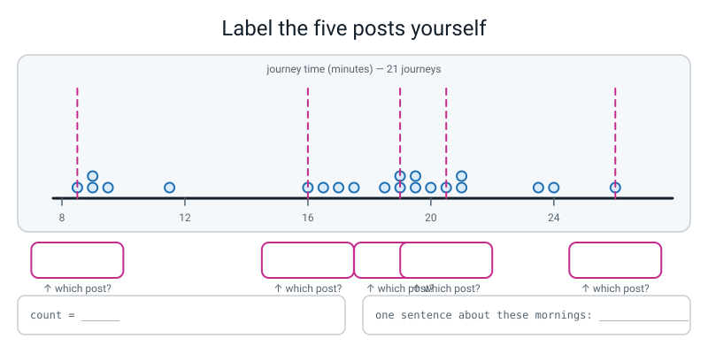
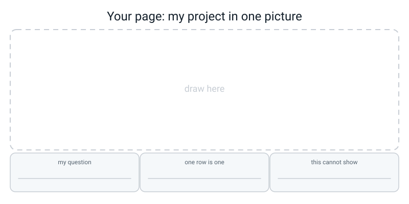

# Workbook — Week 34: Data Detective, Part 1: Your Question and Your 100 Rows

**Name:** ________________________________  **Date:** ______________

[⬅ Week 33](week-33.md) · [📖 Read the chapter first](../student-guide/week-34.md) · [Course Home](../README.md) · [🧑‍🏫 Teacher guide](../teacher-guide/week-34.md) · [Next ➡](week-35.md)

**You will need:** a **pen** (not a pencil — you are going to sign something) · a laptop with pandas · a terminal · a folder you can create files in · about seven days, because the collecting does not fit in one evening

---

## ✅ Warm-Up (5 min)

Five quick questions about **last week** — the bake-off and the overfitting cliff.

**W1.** As you turn `max_depth` up from 1 to 12, what does the **training** score do? One word, and then say why in one sentence.

________________________________________________________________

________________________________________________________________

**W2.** Two models have the same MAE of 4.0 minutes. One has RMSE 4.2 and the other RMSE 9.5. Which one occasionally goes badly wrong, and how do you know?

________________________________________________________________

**W3.** What does `ax.axvline(6, linestyle="--")` draw on a chart, and why did you use it last week?

________________________________________________________________

**W4.** A tree scores R² 1.000 on train and 0.71 on test. Name that in one word, and give the size of the gap.

________________________________________________________________

**W5.** Why did all three models last week have to be scored on the **same** split? One sentence.

________________________________________________________________

---

## 🔎 Predict the Output

**Write your prediction before you run anything.** This is the highest-value page in the workbook — the point is to catch yourself being wrong while it is still cheap.

### P1 — how many columns comes back?

```python
import pandas as pd

marks = pd.DataFrame({
    "pupil":  ["Asha", "Ben", "Cara", "Dev"],
    "score":  [8, 9, 7, 10],
    "note":   ["", "late", "", ""],
})
print(marks.describe())
print(len(marks.describe().columns))
```

**I predict — how many columns will the summary have?** ____________

**And the last line prints:** ____________

**It really printed:**

________________________________________________________________

________________________________________________________________

**The table has three columns. Name the two that `describe()` left out, and say why each was left out.**

________________________________________________________________

________________________________________________________________

### P2 — duplicates that were not duplicates yet

```python
import pandas as pd

trips = pd.DataFrame({
    "day":  ["Mon", "Mon", "Tue", "Tue"],
    "mode": ["walk", "Walk", "bus", "bus"],
    "mins": [17, 17, 20, 20],
})
print(trips.duplicated().sum())
trips["mode"] = trips["mode"].str.lower()
print(trips.duplicated().sum())
print(trips.drop_duplicates().shape)
```

**I predict — three lines:** ______  ______  ______

**It really printed:**

________________________________________________________________

________________________________________________________________

**The number changed and nobody added a row. What happened?**

________________________________________________________________

**So: does the ORDER of your cleaning steps change your answers?** ____________

**Write the log line you would use for step one, with a reason in it:**

________________________________________________________________

### P3 — what `errors="coerce"` actually does

```python
import pandas as pd

mins = pd.Series(["12", "about 9", "15", ""])
print(mins.dtype)
numbers = pd.to_numeric(mins, errors="coerce")
print(numbers.dtype)
print(numbers.isna().sum())
print(numbers.mean())
```

**I predict — four lines:**

________________________________________________________________

**It really printed:**

________________________________________________________________

________________________________________________________________

**The mean is computed from how many of the four values?** ____________

**`"about 9"` was a real journey that really happened. It is now empty. Is that dishonest? Answer in one sentence.**

________________________________________________________________

### P4 — mean, median and one enormous innings

```python
import pandas as pd

runs = pd.Series([2, 3, 4, 5, 6, 7, 80])
print(runs.mean())
print(runs.median())
print(runs.describe()["50%"])
print(runs.describe()["count"])
```

**I predict — four numbers:** ______ ______ ______ ______

**It really printed:**

________________________________________________________________

________________________________________________________________

**Lines 2 and 3 are the same number. What does that tell you `50%` is?**

________________________________________________________________

**The mean is bigger than the median. Which end of the data is stretched, and which single value did it?**

________________________________________________________________

**Which of the two numbers would you print if you were describing a typical innings? Why?**

________________________________________________________________

**How many of the four predictions did you get right?** ______ / 4

**Which one surprised you most, and why?**

________________________________________________________________

---

## ✍️ Practice Set A — Read It

**A1. Question or topic?** Tick one column, then write the reason.

| # | The sentence | ✅ question | ❌ topic | Why |
|---|---|:--:|:--:|---|
| (a) | "Stuff about how long homework takes." | ☐ | ☐ | |
| (b) | "Do longer videos get fewer views than shorter ones?" | ☐ | ☐ | |
| (c) | "An investigation into my sleep." | ☐ | ☐ | |
| (d) | "How many runs will an innings score, given the batting position?" | ☐ | ☐ | |
| (e) | "Which of my two walking routes is faster?" | ☐ | ☐ | |
| (f) | "Who in my class is best at maths?" | ☐ | ☐ | |

**A1(g).** One of those six is not a topic *or* a question — it breaks a rule. Which one, and which rule?

________________________________________________________________

________________________________________________________________

**A2. Trace the log numbers.** This runs without error. Write down what gets printed, line by line.

```python
CLEANING_LOG = []

def log(action, reason):
    number = len(CLEANING_LOG) + 1
    CLEANING_LOG.append(f"{number}. {action}  -  {reason}")

log("Dropped 2 rows", "no answer")
log("Lower-cased 'mode'", "three spellings, one thing")
print(len(CLEANING_LOG))
log("Filled 1 distance", "median, one row only")
for line in CLEANING_LOG:
    print(line)
```

Line 1: ____________

Line 2: ________________________________________________________

Line 3: ________________________________________________________

Line 4: ________________________________________________________

**A2(a).** Where does the `3.` in the last line come from? Nobody typed a 3.

________________________________________________________________

**A2(b).** One of those three log lines is a receipt, not a reason. Which one, and rewrite it.

________________________________________________________________

________________________________________________________________

**A3. Spot the bug.** Each of these three lines is wrong. Say what Python (or pandas) will do, and fix it.

| # | The line | What goes wrong | The fix |
|---|---|---|---|
| (a) | `df["mode"] = df["mode"].strip().lower()` | | |
| (b) | `df["minutes"] = int(df["minutes"])` | | |
| (c) | `df = df.drop_duplicates()` then `dupes = df.duplicated().sum()` | | |

**A4. Match the code to the output.** Draw a line from each snippet to the block it produced. All three ran on the same 26-row raw journey table.

| # | Code |
|---|---|
| 1 | `print(df.shape)` |
| 2 | `print(df["mode"].value_counts())` |
| 3 | `print(df.describe().columns)` |

| Letter | Output |
|---|---|
| A | `Index(['distance_km', 'rain'], dtype='object')` |
| B | `(26, 5)` |
| C | `bus 13 / walk 6 / cycle 5 / Walk 1 / walk 1` |

1 → ______   2 → ______   3 → ______

**A4(a).** Output C has five groups. How many modes did the person actually use, and which two lines look identical on screen (hint: they are not next to each other)?

________________________________________________________________

**A5. Label the diagram.** This is `describe()` drawn as five fence posts. Fill in the five empty labels from the real output printed underneath it.


*Figure W34.1 — Write the name of each post, and the value that goes on it.*

```text
count    21.000000
mean     17.428571
std       5.160634
min       8.500000
25%      16.000000
50%      19.000000
75%      20.500000
max      26.000000
Name: minutes, dtype: float64
```

**A5(a).** Roughly how many of the 21 journeys sit between the 25% post and the 75% post?

____________

**A5(b).** Write the whole thing as one sentence about a real morning, with no more than four numbers in it.

________________________________________________________________

________________________________________________________________

**A6. The silent one.** Here is `describe()` on somebody's raw reading log. Their question was *"does the book change how many minutes I read for?"*

```text
         pages
count  4.000000
mean  21.250000
std    7.889867
min   12.000000
25%   16.500000
50%   21.500000
75%   26.250000
max   30.000000
```

**A6(a).** Their table has three columns: `pages`, `book`, `minutes`. Which column is missing that *should* be there?

____________

**A6(b).** Which one line of Python would tell them why?

____________

**A6(c).** Did Python print an error? What is the only thing that catches this bug?

________________________________________________________________

---

## ✍️ Practice Set B — Write It

### B1 — one line

Print the full summary of these seven step counts.

```python
import pandas as pd
steps = pd.Series([6200, 8100, 4500, 11000, 7300, 9400, 5100])
# your one line here
```

**Expected output:** a summary block with `count 7.000000` at the top and `max 11000.000000` at the bottom.

**Done looks like:** you can read the `50%` line out loud as a sentence about a week of walking.

________________________________________________________________

### B2 — the log machinery, from memory

Write the `CLEANING_LOG` list and the `log()` function from scratch — no looking at the chapter — then call it twice.

**Expected output:**

```text
1. Dropped 3 rows with no wait time  -  <your reason>
2. Lower-cased 'shop'  -  <your reason>
```

**Done looks like:** the numbers `1.` and `2.` appear without you typing either of them, and both reasons could be argued with.

### B3 — the check that catches the expensive bug

Given this table, write code that prints `OK` if the target column appears in `describe()`, and otherwise prints `STOP` **and** the dtypes.

```python
import pandas as pd

reading = pd.DataFrame({
    "pages":   [12, 30, 18, 25],
    "book":    ["Holes", "Wonder", "Holes", "Coraline"],
    "minutes": [15, "about 40", 22, 31],
})

TARGET = "minutes"
# your code here
```

**Expected output:** the `STOP` branch, followed by three dtype lines.

**Done looks like:** you could paste this block into any project of yours and it would still work, because the only thing you would change is the value of `TARGET`.

### B4 — clean eight chore rows, two log lines

Type this table out literally, then convert `minutes` to numbers and drop the rows with no answer. One log line each, both with reasons. Print the before and after shape, the log, and `describe()`.

```python
chores = pd.DataFrame({
    "chore":   ["dishes", "Dishes", "bins", "hoover", "dishes", "bins", "hoover", "dishes"],
    "helpers": [0, 0, 1, 0, 1, 0, 1, 0],
    "minutes": [12, 12, 4, "about 20", 8, 5, 18, ""],
})
```

**Expected output starts:** `shape before: (8, 3)   after: (6, 3)`

**Done looks like:** two rows are gone, both are counted, and each log line says *why* rather than *what*.

### B5 — the whole thing, about 25 lines

Ten pocket-money shop trips, typed out literally. Five repairs, five numbered log lines, every one with a reason. Print the before/after shape, the log, `value_counts()` of `shop`, and `describe()` of `rupees`.

```python
spend = pd.DataFrame({
    "shop":   ["corner", "Corner", "market", "corner ", "market",
               "corner", "market", "Market", "corner", "market"],
    "items":  [3, 3, 7, 2, 9, 4, 6, 5, 3, 8],
    "rupees": [95, 95, 210, 60, "about 300", 120, 0, 150, 95, 240],
})
```

The five repairs, in this order — and the order matters:

1. strip and lower-case `shop`
2. drop exact duplicates (count them **first**)
3. `to_numeric` on `rupees`
4. mark any trip costing 0 rupees as empty
5. drop the rows with no `rupees` value

**Expected output starts:** `shape before: (10, 3)   after: (6, 3)`

**Done looks like:** `value_counts()` shows **two** shops, not five; and if you swap steps 1 and 2 the duplicate count changes, which you can explain out loud.

---

## 🐞 Fix the Broken Program

This should clean four homework rows and print a three-line log. It has **three** bugs: one syntax, one runtime, one logic.

```python
# broken.py - clean four homework rows and log every change.
import pandas as pd

homework = pd.DataFrame({
    "subject":   ["maths", "Maths", "english", "maths"],
    "questions": [12, 12, 5, 8],
    "minutes":   [38, 38, 22, "about 25"],
})

CLEANING_LOG = []

def log(action, reason)
    number = len(CLEANING_LOG) + 1
    CLEANING_LOG.append(f"{number}. {action}  -  {reason}")

homework["subject"] = homework["subject"].str.lower()
log("Lower-cased 'subject'", "'Maths' and 'maths' are one subject.")

homework = homework.drop_duplicates()
dupes = homework.duplicated().sum()
log(f"Dropped {dupes} duplicate row(s)", "I typed Monday's maths line in twice.")

homework["minutes"] = pd.to_numeric(homework["Minutes"], errors="coerce")
log("Converted 'minutes' to numbers", "One row said 'about 25', which is a feeling.")

print(homework.shape)
for line in CLEANING_LOG:
    print(line)
```

**Bug 1 — what you actually see when you run it:**

```text
  File "/private/tmp/wb34/broken.py", line 12
    def log(action, reason)
                           ^
SyntaxError: expected ':'
```

**Which line?** ______  **What is missing?** ____________________

**Bug 2 — after fixing bug 1, you get this:**

```text
Traceback (most recent call last):
  File "/private/tmp/wb34/broken3.py", line 23, in <module>
    homework["minutes"] = pd.to_numeric(homework["Minutes"], errors="coerce")
  File "/Library/Frameworks/Python.framework/Versions/3.10/lib/python3.10/site-packages/pandas/core/frame.py", line 3807, in __getitem__
    indexer = self.columns.get_loc(key)
  File "/Library/Frameworks/Python.framework/Versions/3.10/lib/python3.10/site-packages/pandas/core/indexes/base.py", line 3804, in get_loc
    raise KeyError(key) from err
KeyError: 'Minutes'
```

**Which line?** ______  **What is wrong with it?** ____________________

**Which one line of Python would have told you the right spelling?**

________________________________________________________________

**Bug 3 — after fixing bugs 1 and 2 it runs, and prints this:**

```text
(3, 3)
1. Lower-cased 'subject'  -  'Maths' and 'maths' are one subject.
2. Dropped 0 duplicate row(s)  -  I typed Monday's maths line in twice.
3. Converted 'minutes' to numbers  -  One row said 'about 25', which is a feeling.
```

**Look at line 2 of the log, then look at the shape. What is wrong?**

________________________________________________________________

**Which line caused it, and what is the fix?**

________________________________________________________________

**Which of the three bugs would you never have found from an error message? Why does that make it the dangerous one?**

________________________________________________________________

**Now write the whole fixed program out** (or type it and paste the output here):

________________________________________________________________

________________________________________________________________

________________________________________________________________

---

## 🧩 Puzzle of the Week

### The Quartile Detective

A sports club prints only this, for nine matches:

```text
count     9.000000
mean     13.111111
min       4.000000
25%       7.000000
50%      12.000000
75%      15.000000
max      31.000000
```

For exactly nine sorted values, pandas puts `25%` on the **3rd** value, `50%` on the **5th**, and `75%` on the **7th**. So five of the nine numbers are already on the page.

**Part 1.** Fill in the five you already know.

```text
position:   1st   2nd   3rd   4th   5th   6th   7th   8th   9th
value:     ____   ??   ____   ??   ____   ??   ____   ??   ____
```

**Part 2.** Find any four numbers for the `??` slots that make the whole thing consistent — the values must stay in sorted order, and the mean must come out at 13.111111 (which means the nine must add up to ____________).

________________________________________________________________

**Part 3 — the real question.** Somebody else solves it and gets a **different** set of nine numbers whose mean is 12.333333. Both of them match the five posts. **What does that prove about `describe()`?**

________________________________________________________________

________________________________________________________________

**Part 4.** One of the nine numbers is doing something to the mean. Which one, and what?

________________________________________________________________

---

## 🤔 Think Deeper

**1.** The basketball project in the chapter did not fake a single number, and its write-up was still dishonest. Write a paragraph explaining exactly what was dishonest about it, and then describe one thing you will do this week that would have stopped it happening to you.

________________________________________________________________

________________________________________________________________

________________________________________________________________

________________________________________________________________

**2.** "Missing is better than made up." You are collecting your 100 rows and on Thursday you forget to time one journey. You are fairly sure it was about 18 minutes. Write a paragraph arguing for leaving that cell **empty**, and be specific about what goes wrong later if you fill it in with 18.

________________________________________________________________

________________________________________________________________

________________________________________________________________

________________________________________________________________

---

## 🛠️ Build It — Milestones 1, 2 and 3

This is the biggest homework of the year. **It does not fit in one sitting.** Three jobs, about 2 h 55 min total, spread across seven days.

### Step checklist

**Milestone 1 — lock the question (15 min, tonight)**

- [ ] All four gates answered **in writing**: care · 100 rows · one named target · every feature known before the target
- [ ] The question written as one sentence with a `?` at the end
- [ ] "One row is one ______" finished
- [ ] Five or more columns, each with a type, units, and *how I will measure it*
- [ ] The target named, and marked number or category
- [ ] A prediction with a **number and units** in it
- [ ] The data card: who, when, how, who is in it, permission, what is NOT in it
- [ ] One thing this data cannot show
- [ ] **Signed and dated, in pen**, before you have any data
- [ ] Typed up as `notes/plan.md`

**Milestone 2 — collect 100+ rows (120 min, across the week)**

- [ ] Folders made: `data/`, `notes/`
- [ ] `notes/collection-diary.md` created, with the header in it
- [ ] Rows written down **as they happen**, not from memory on Sunday
- [ ] Aim 120, floor 100
- [ ] Every category value appears at least **10** times
- [ ] Number columns genuinely spread out
- [ ] No invented rows. Not one.
- [ ] Written into `data/raw.csv` with `csv.DictWriter`
- [ ] `chmod 444 data/raw.csv` — and then never touched again

**Milestone 3 — clean it, with reasons (40 min)**

- [ ] `look.py` run on your own file: `shape`, `head()`, `info()`, `describe()`
- [ ] **The check:** your target column appears in `describe()`. If not, that is log line 1.
- [ ] `clean.py` written: duplicates, spellings, wrong types, impossible values, missing rows
- [ ] Every repair has a numbered log line **with a reason**
- [ ] Before and after shape printed
- [ ] `data/clean.csv` saved

### Fill this in as you go

| | Write it here |
|---|---|
| My question | ______________________________________________ ? |
| One row is one | ____________________ |
| My target column | ____________________ (number / category) |
| My prediction | I expect ____________ to matter most |
| How wrong I think the model will be | about ______ ____________ (units!) |
| One thing this data cannot show | ______________________________________ |
| Signed | ____________________  Date ____________ |

**The collection tally — fill in as the rows arrive.**

| Day | Rows added | Running total | Anything go wrong? |
|---|---|---|---|
| 1 | | | |
| 2 | | | |
| 3 | | | |
| 4 | | | |
| 5 | | | |
| 6 | | | |
| 7 | | | |

**The variety check — run it before you stop collecting.**

| Category column | Value | How many times | 10 or more? |
|---|---|---|---|
| | | | ☐ |
| | | | ☐ |
| | | | ☐ |
| | | | ☐ |

| Number column | min | max | Does it genuinely spread? |
|---|---|---|---|
| | | | ☐ |
| | | | ☐ |
| | | | ☐ |

**The cleaning results table.**

| | Value |
|---|---|
| `shape` before | ( ______ , ______ ) |
| `shape` after | ( ______ , ______ ) |
| Rows lost | ______ |
| Log lines written | ______ |
| Is my target column in `describe()`? | ☐ yes  ☐ no — and log line ______ says why |

**My cleaning log, copied out.**

```text
1. ____________________________________  -  ____________________________________

2. ____________________________________  -  ____________________________________

3. ____________________________________  -  ____________________________________

4. ____________________________________  -  ____________________________________

5. ____________________________________  -  ____________________________________

6. ____________________________________  -  ____________________________________
```

**And read my own `describe()` out loud.** Write the sentence here, in words, about the real world:

________________________________________________________________

________________________________________________________________

---

## 🎨 Draw It

Draw your own project as a **pipeline you cannot run backwards** — paper log, `raw.csv`, the lock, `clean.py`, `clean.csv` — and put your own numbers on it.


*Figure W34.2 — Your page.*

> **What a good answer might look like:** across the top, five boxes joined by arrows that all point right: **paper sheet on the fridge** → **`data/raw.csv` (126 rows)** → a **padlock** labelled `chmod 444` → **`clean.py`** → **`data/clean.csv` (121 rows)**.
>
> Under the padlock, a small crossed-out arrow pointing *backwards* from `clean.py` to `raw.csv`, labelled *"PermissionError — and that is the point"*.
>
> Hanging off `clean.py`, six sticky notes, each with a number and a reason on it, not only an action: *"3. `about 20` → empty, because a guess is not a measurement."*
>
> And the three caption boxes filled in with real numbers: **126 rows in** · **121 rows out** · **5 lost, all counted**.
>
> **What a weak answer looks like:** a picture with only one file box on it, so there is nothing that could point backwards; or six sticky notes that all say what happened and none of them say why. If a stranger could not redo your cleaning from the notes, the drawing is only decoration.

---

## 📊 Self-Check

| I can… | 😀 got it | 🙂 nearly | 😕 not yet |
|---|---|---|---|
| Write a question that data could answer and that I could be wrong about | ☐ | ☐ | ☐ |
| Name exactly one target column and say if it is a number or a category | ☐ | ☐ | ☐ |
| Apply the honest-feature test to every column and reject a leaky one | ☐ | ☐ | ☐ |
| Write a prediction with a number and units in it, before collecting | ☐ | ☐ | ☐ |
| Save a raw file and make it read-only, and say why | ☐ | ☐ | ☐ |
| Read `describe()` out loud as a sentence about the real world | ☐ | ☐ | ☐ |
| Check that my target column appears in `describe()`, every time | ☐ | ☐ | ☐ |
| Write a numbered log line that contains a reason, not just an action | ☐ | ☐ | ☐ |
| Say in writing one thing my data cannot show | ☐ | ☐ | ☐ |

**True or false?** Circle one on each row.

| Statement | | |
|---|---|---|
| A topic can turn out to be wrong | TRUE | FALSE |
| `describe()` summarises every column in the table | TRUE | FALSE |
| `50%` means "half the time it takes this long" | TRUE | FALSE |
| `chmod 444` makes a file read-only | TRUE | FALSE |
| A `PermissionError` on `raw.csv` means something has gone wrong | TRUE | FALSE |
| Fixing a typo in the spreadsheet is faster and therefore fine | TRUE | FALSE |
| The order of your cleaning steps can change your numbers | TRUE | FALSE |
| "Dropped 3 rows because they were empty" contains a reason | TRUE | FALSE |
| 100 identical rows are as useful as 100 varied ones | TRUE | FALSE |
| A guessed target value is better than an empty one | TRUE | FALSE |
| `df["mode"].strip()` cleans a whole column | TRUE | FALSE |
| A prediction written after you looked is still a prediction | TRUE | FALSE |
| `pd.to_numeric(..., errors="coerce")` crashes on bad values | TRUE | FALSE |
| Mean and median disagreeing tells you the shape is lopsided | TRUE | FALSE |

One thing I'd like explained again:

________________________________________________________________

---

## ✅ Answers

<details>
<summary>Check your answers</summary>

### Warm-Up

**W1.** It **rises** — always, and never falls. A deeper tree can carve the training rows into finer and finer boxes until nearly every leaf holds one row, and a model that has memorised the answer key scores perfectly on the answer key.

**W2.** The one with **RMSE 9.5**. MAE averages the *sizes* of the errors; RMSE squares them first, so a few enormous misses inflate it hugely. Same average miss, wildly different behaviour: errors of `1,1,1,1` give MAE 1.0 and RMSE 1.00, while errors of `0,0,0,4` give MAE 1.0 and RMSE 2.00.

**W3.** A **vertical dashed line** at x = 6. Last week it marked the depth where the test score peaked — the point where the tree stops learning rules and starts memorising rows.

**W4.** **Overfitting.** The gap is 1.000 − 0.71 = **0.29**.

**W5.** So the comparison is fair. Two models scored on two different splits are sitting two different exams, and the two numbers cannot be put next to each other at all.

---

### Predict the Output

**P1** — real output:

```text
           score
count   4.000000
mean    8.500000
std     1.290994
min     7.000000
25%     7.750000
50%     8.500000
75%     9.250000
max    10.000000
1
```

**One column.** `describe()` summarises only the columns pandas believes hold numbers.

The two it left out:

- **`pupil`** — names. There is nothing to average, and that is fine. `describe()` leaving out a genuinely-text column is correct behaviour, not a bug.
- **`note`** — also text (`""` and `"late"`). Also correct.

The trap is what happens when the missing column is one you *needed*. Here it is not. In P3 it is.

**P2** — real output:

```text
1
2
(2, 3)
```

**The first count is 1**: rows 2 and 3 (`Tue / bus / 20`) are identical, so one of them is a duplicate. Rows 0 and 1 are **not** identical yet, because `"walk"` and `"Walk"` are different strings.

**Then `.str.lower()` runs, and the count becomes 2.** Nobody added a row. Lower-casing *created* a duplicate that was always the same journey but had never looked like one.

**So yes — the order of your cleaning steps changes your answers.** Clean the spellings first and you drop 2 rows; drop duplicates first and you drop 1, and the messy pair survives forever. Neither order is "wrong", but you have to know which one you did, which is exactly why the log is numbered.

A log line for step one with a reason in it:

```text
1. Lower-cased 'mode'  -  'walk' and 'Walk' are one mode, and leaving them
   apart would have hidden a duplicate journey from step 2.
```

**P3** — real output:

```text
object
float64
2
13.5
```

`object` means text. After `to_numeric` the column is `float64` — numbers — and the two values that could not be converted (`"about 9"` and `""`) became empty. So `isna().sum()` is **2**, and the mean is computed from **two** values only: (12 + 15) ÷ 2 = 13.5.

**Is that dishonest?** No — the opposite. `"about 9"` is a memory, not a measurement, and treating it as the number 9 would quietly turn a guess into evidence. What *would* be dishonest is doing this silently. It becomes honest the moment a log line says: *"one row said 'about 9' and became empty, because I cannot use a guess as a measurement."*

**P4** — real output:

```text
15.285714285714286
5.0
5.0
7.0
```

**Lines 2 and 3 are identical**, which tells you `50%` **is** the median — the middle value when you sort them. Not "half the time", not "the average". The middle row.

Sorted, the seven innings are `2, 3, 4, 5, 6, 7, 80`. The middle one is the 4th: **5**.

**The mean is 15.29 and the median is 5.0.** The mean is much bigger, so the **high end is stretched** — and one value did all of it: the **80**. Six innings under 8 runs and one of 80.

**Which would you print?** The **median**. "A typical innings is about 5 runs" is true of six of the seven. "A typical innings is 15.3 runs" is true of none of them — no innings was anywhere near 15. When the mean and the median disagree this badly, the mean is describing the outlier, not the typical case.

---

### Practice Set A

**A1.**

| # | Verdict | Why |
|---|---|---|
| (a) | ❌ topic | No question mark, no target column, and no result could prove it wrong. |
| (b) | ✅ question | Target `views`; "no difference" would prove it wrong. |
| (c) | ❌ topic | Becomes whatever the data says. Fix: *"Does screen-off time change how many hours I sleep?"* |
| (d) | ✅ question | Target `runs`, a number, and the features are known before the innings ends. |
| (e) | ✅ question | Target `minutes`; two clear outcomes, one of which would surprise you. |
| (f) | ❌ **not allowed** | See A1(g). |

**A1(g).** **(f)** — *"Who in my class is best at maths?"* It is a **rule break**, not a topic. Three reasons, all from Level 1: you cannot collect a fair sample of humans; "best at maths" is an opinion dressed as a measurement; and when the model is wrong, a real classmate carries the cost. Predict *things*, *events*, and *your own behaviour*.

**A2** — real output:

```text
2
1. Dropped 2 rows  -  no answer
2. Lower-cased 'mode'  -  three spellings, one thing
3. Filled 1 distance  -  median, one row only
```

**A2(a).** The `3.` comes from `len(CLEANING_LOG) + 1`. When the third call happens there are already two lines in the list, so `2 + 1 = 3`. **The function counts for you**, which is why you can never accidentally number two lines `4.`.

**A2(b).** Line **1** — *"Dropped 2 rows — no answer"* — is a receipt. Read it aloud with "because" in the middle: *"Dropped 2 rows, because no answer."* That is the action twice. A rewrite:

```text
1. Dropped 2 rows with no minutes value  -  You cannot learn from a row whose
   answer is unknown, and inventing one would be making data up.
```

**A3.**

| # | What goes wrong | The fix |
|---|---|---|
| (a) | `AttributeError: 'Series' object has no attribute 'strip'`. A whole column does not have text methods; individual strings do. | `df["mode"].str.strip().str.lower()` — `.str` means "do this to every value". |
| (b) | `TypeError` — and if you tried `int()` on the values one at a time you would get `ValueError: invalid literal for int() with base 10: 'about 20'`. The right *kind* of conversion, an impossible *value*. | `pd.to_numeric(df["minutes"], errors="coerce")`, which turns the unconvertible into empty instead of crashing — then log that you did. |
| (c) | **No error at all**, and `dupes` comes out **0**. You counted the duplicates *after* removing them. The log line then claims you dropped nothing. | Swap the two lines: `dupes = df.duplicated().sum()` **first**, then `df = df.drop_duplicates()`. Count before you destroy. |

**A4.** 1 → **B** · 2 → **C** · 3 → **A**

**A4(a).** They used **three** modes: walk, cycle, bus. The two lines that look identical on screen are the second line (`walk`, 6) and the last line (`walk `, 1). The only difference is a **trailing space**, which is invisible. That is why you count a text column instead of looking at it.

**A5.** The five posts, left to right:

| Post | Name | Value |
|---|---|---|
| 1 | `min` | 8.5 |
| 2 | `25%` | 16.0 |
| 3 | `50%` (the median) | 19.0 |
| 4 | `75%` | 20.5 |
| 5 | `max` | 26.0 |

**A5(a).** **About half of them — roughly 10 or 11.** The gap from the 25% post to the 75% post holds half the rows by definition.

**A5(b).** Model answer: *"Twenty-one journeys. The quickest took 8.5 minutes and the slowest 26. Half of them were under 19 minutes."* Four numbers, and it is a description of a real morning rather than a table.

**A6(a).** **`minutes`** — the target, the whole point of the project.

**A6(b).** `print(reading.dtypes)` (or `reading.info()`). It reports:

```text
pages       int64
book       object
minutes    object
```

`minutes` is `object`, which in pandas means text. One value says `"about 40"`, and a column can only be one type, so that single value turned the whole column into text.

**A6(c).** **No error at all.** `describe()` ran perfectly and printed a plausible-looking block. The only thing that catches it is the habit: **run `describe()`, then check your target column is in the output.** A silent wrong answer is more dangerous than any traceback, because a traceback at least tells you to stop.

---

### Practice Set B

**B1.**

```python
import pandas as pd
steps = pd.Series([6200, 8100, 4500, 11000, 7300, 9400, 5100])
print(steps.describe())
```

Real output:

```text
count        7.000000
mean      7371.428571
std       2330.746866
min       4500.000000
25%       5650.000000
50%       7300.000000
75%       8750.000000
max      11000.000000
dtype: float64
```

Read aloud: *"Seven days. My quietest was 4,500 steps and my busiest 11,000. Half the days were under 7,300."*

**B2.**

```python
CLEANING_LOG = []

def log(action, reason):
    """Add one numbered line to the cleaning log."""
    number = len(CLEANING_LOG) + 1
    CLEANING_LOG.append(f"{number}. {action}  -  {reason}")

log("Dropped 3 rows with no wait time",
    "The wait is the answer I am predicting, and inventing one would be making data up.")
log("Lower-cased 'shop'",
    "'Corner' and 'corner' are one shop, and value_counts() showed them as two.")

for line in CLEANING_LOG:
    print(line)
```

Real output:

```text
1. Dropped 3 rows with no wait time  -  The wait is the answer I am predicting, and inventing one would be making data up.
2. Lower-cased 'shop'  -  'Corner' and 'corner' are one shop, and value_counts() showed them as two.
```

**Why it is a function and not two typed-out strings:** the numbering is computed, so it cannot drift. Renumbering a hand-typed log after you insert a step in the middle is exactly the kind of small job nobody does.

**B3.**

```python
import pandas as pd

reading = pd.DataFrame({
    "pages":   [12, 30, 18, 25],
    "book":    ["Holes", "Wonder", "Holes", "Coraline"],
    "minutes": [15, "about 40", 22, 31],
})

TARGET = "minutes"
summary = reading.describe()

if TARGET in summary.columns:
    print(f"OK - '{TARGET}' is in describe()")
else:
    print(f"STOP - '{TARGET}' is missing from describe(). Here is why:")
    print(reading.dtypes)
```

Real output:

```text
STOP - 'minutes' is missing from describe(). Here is why:
pages       int64
book       object
minutes    object
dtype: object
```

`summary.columns` is the list of columns that survived into the summary, and `in` is the Week 14 membership test. Six lines, and it catches the most expensive bug in the capstone.

**B4.**

```python
import pandas as pd

chores = pd.DataFrame({
    "chore":   ["dishes", "Dishes", "bins", "hoover", "dishes", "bins", "hoover", "dishes"],
    "helpers": [0, 0, 1, 0, 1, 0, 1, 0],
    "minutes": [12, 12, 4, "about 20", 8, 5, 18, ""],
})

CLEANING_LOG = []

def log(action, reason):
    number = len(CLEANING_LOG) + 1
    CLEANING_LOG.append(f"{number}. {action}  -  {reason}")

before = chores.shape

chores["minutes"] = pd.to_numeric(chores["minutes"], errors="coerce")
log("Converted 'minutes' to numbers; 'about 20' and the blank became empty",
    "A guess and a blank are both 'I did not measure it', and I will not invent a target.")

lost = chores["minutes"].isna().sum()
chores = chores.dropna(subset=["minutes"])
log(f"Dropped {lost} row(s) with no minutes value",
    "You cannot learn from a row whose answer is unknown.")

print(f"shape before: {before}   after: {chores.shape}")
for line in CLEANING_LOG:
    print(line)
print(chores["minutes"].describe())
```

Real output:

```text
shape before: (8, 3)   after: (6, 3)
1. Converted 'minutes' to numbers; 'about 20' and the blank became empty  -  A guess and a blank are both 'I did not measure it', and I will not invent a target.
2. Dropped 2 row(s) with no minutes value  -  You cannot learn from a row whose answer is unknown.
count     6.000000
mean      9.833333
std       5.231316
min       4.000000
25%       5.750000
50%      10.000000
75%      12.000000
max      18.000000
Name: minutes, dtype: float64
```

Note what this version does **not** do: it never touches `Dishes` with a capital D, and it never drops the duplicate pair. That is the point of B5.

**B5.**

```python
# b5_clean.py - clean ten pocket-money rows, with a reason on every line.
import pandas as pd

spend = pd.DataFrame({
    "shop":   ["corner", "Corner", "market", "corner ", "market",
               "corner", "market", "Market", "corner", "market"],
    "items":  [3, 3, 7, 2, 9, 4, 6, 5, 3, 8],
    "rupees": [95, 95, 210, 60, "about 300", 120, 0, 150, 95, 240],
})

CLEANING_LOG = []

def log(action, reason):
    number = len(CLEANING_LOG) + 1
    CLEANING_LOG.append(f"{number}. {action}  -  {reason}")

before = spend.shape

spend["shop"] = spend["shop"].str.strip().str.lower()
log("Stripped spaces and lower-cased 'shop'",
    "'Corner', 'corner ' and 'corner' are one shop; value_counts() showed five shops when I only use two.")

dupes = spend.duplicated().sum()
spend = spend.drop_duplicates()
log(f"Dropped {dupes} exact duplicate row(s)",
    "I copied the 95-rupee corner-shop trip into the sheet twice.")

spend["rupees"] = pd.to_numeric(spend["rupees"], errors="coerce")
log("Converted 'rupees' to numbers; 'about 300' became empty",
    "'About' is a memory, not a receipt, and I will not treat it as a measurement.")

impossible = spend["rupees"] <= 0
spend.loc[impossible, "rupees"] = None
log(f"Marked {impossible.sum()} row(s) costing 0 rupees as empty",
    "A trip that bought 6 items and cost nothing is a missed entry, not a free shop.")

lost = spend["rupees"].isna().sum()
spend = spend.dropna(subset=["rupees"])
log(f"Dropped {lost} row(s) with no rupees value",
    "Rupees is the answer I am predicting, and a row with no answer teaches nothing.")

print(f"shape before: {before}   after: {spend.shape}")
print()
for line in CLEANING_LOG:
    print(line)
print()
print(spend["shop"].value_counts())
print()
print(spend["rupees"].describe())
```

Real output:

```text
shape before: (10, 3)   after: (6, 3)

1. Stripped spaces and lower-cased 'shop'  -  'Corner', 'corner ' and 'corner' are one shop; value_counts() showed five shops when I only use two.
2. Dropped 2 exact duplicate row(s)  -  I copied the 95-rupee corner-shop trip into the sheet twice.
3. Converted 'rupees' to numbers; 'about 300' became empty  -  'About' is a memory, not a receipt, and I will not treat it as a measurement.
4. Marked 1 row(s) costing 0 rupees as empty  -  A trip that bought 6 items and cost nothing is a missed entry, not a free shop.
5. Dropped 2 row(s) with no rupees value  -  Rupees is the answer I am predicting, and a row with no answer teaches nothing.

corner    3
market    3
Name: shop, dtype: int64

count      6.000000
mean     145.833333
std       68.732574
min       60.000000
25%      101.250000
50%      135.000000
75%      195.000000
max      240.000000
Name: rupees, dtype: float64
```

**Where the four lost rows went**, because you should be able to account for every one:

| Row | What it was | Which step took it |
|---|---|---|
| `Corner, 3, 95` | the same trip typed twice | step 2 |
| `corner, 3, 95` | the same trip typed a third time | step 2 |
| `market, 9, about 300` | a memory, not a receipt | steps 3 and 5 |
| `market, 6, 0` | six items and no money | steps 4 and 5 |

**And the thing to notice:** swap steps 1 and 2 and `dupes` comes out **1**, not 2, because `"Corner"` and `"corner"` do not look like duplicates until one of them is lower-cased. Two different, defensible answers from the same data and the same five repairs. The numbering of the log is what makes your version checkable.

---

### Fix the Broken Program

**Bug 1 — syntax, line 12.** `def log(action, reason)` is missing its **colon**. Python read the whole line, reached the end, and said what it wanted:

```text
SyntaxError: expected ':'
```

The caret `^` sits at the exact character where the colon should be. Syntax errors are the friendliest kind: nothing ran at all, so nothing is half-done.

**Bug 2 — runtime, line 23.** `homework["Minutes"]` with a capital **M**. There is no column with that exact name, so pandas raises:

```text
KeyError: 'Minutes'
```

Column names are **case-sensitive**, always. The one line that would have told you:

```python
print(homework.columns)
```

```text
Index(['subject', 'questions', 'minutes'], dtype='object')
```

Then copy the name character for character. Do not guess, and do not retype from memory — look.

> **Worth knowing:** on the *left* of an `=`, a wrong name is far worse. `homework["Minutes"] = ...` would not crash at all — it would quietly **create a brand-new column** called `Minutes`, leave the real `minutes` untouched as text, and give you a four-column table you did not ask for. Same typo, no error, much harder to find.

**Bug 3 — logic, lines 20–21.** This one runs perfectly and lies:

```text
2. Dropped 0 duplicate row(s)  -  I typed Monday's maths line in twice.
```

The shape says `(3, 3)` — a row *did* go. But the log says 0, because `drop_duplicates()` ran **before** `duplicated().sum()` counted. By the time the count happened there was nothing left to count.

The fix is to swap two lines: **count before you destroy.**

```python
dupes = homework.duplicated().sum()      # count FIRST
homework = homework.drop_duplicates()    # then drop
```

**Which bug would you never have found from an error message?** **Bug 3.** Bugs 1 and 2 stopped the program and told you the line number. Bug 3 produced a complete, tidy, confident, wrong log — and it would have printed that same wrong log every day for a year. **A silent wrong answer is more dangerous than a traceback**, because a traceback is the computer helping you.

**The fixed program:**

```python
# fixed.py - clean four homework rows and log every change. All three bugs repaired.
import pandas as pd

homework = pd.DataFrame({
    "subject":   ["maths", "Maths", "english", "maths"],
    "questions": [12, 12, 5, 8],
    "minutes":   [38, 38, 22, "about 25"],
})

CLEANING_LOG = []

def log(action, reason):                      # FIX 1: the colon
    number = len(CLEANING_LOG) + 1
    CLEANING_LOG.append(f"{number}. {action}  -  {reason}")

homework["subject"] = homework["subject"].str.lower()
log("Lower-cased 'subject'", "'Maths' and 'maths' are one subject, and value_counts() would show two.")

dupes = homework.duplicated().sum()           # FIX 3: count BEFORE dropping
homework = homework.drop_duplicates()
log(f"Dropped {dupes} duplicate row(s)", "I typed Monday's maths line in twice; two identical rows are one piece of evidence.")

homework["minutes"] = pd.to_numeric(homework["minutes"], errors="coerce")   # FIX 2: lower-case m
log("Converted 'minutes' to numbers, bad values became empty", "One row said 'about 25', which is a feeling, not a measurement.")

print(homework.shape)
for line in CLEANING_LOG:
    print(line)
print(homework["minutes"].describe())
```

Real output:

```text
(3, 3)
1. Lower-cased 'subject'  -  'Maths' and 'maths' are one subject, and value_counts() would show two.
2. Dropped 1 duplicate row(s)  -  I typed Monday's maths line in twice; two identical rows are one piece of evidence.
3. Converted 'minutes' to numbers, bad values became empty  -  One row said 'about 25', which is a feeling, not a measurement.
count     2.000000
mean     30.000000
std      11.313708
min      22.000000
25%      26.000000
50%      30.000000
75%      34.000000
max      38.000000
Name: minutes, dtype: float64
```

**And notice the honest problem this fixed table still has.** `count` is **2**. Four rows went in, one was a duplicate, one was `"about 25"`, and two survived. Two rows is not a dataset — it is an anecdote with a decimal point. That is exactly why the capstone floor is 100 rows and not 4.

---

### Puzzle of the Week

**Part 1.** For nine sorted values, pandas puts the quartiles on actual data values: `25%` on the 3rd, `50%` on the 5th, `75%` on the 7th. So:

```text
position:   1st   2nd   3rd   4th   5th   6th   7th   8th   9th
value:       4     ??    7     ??   12     ??   15     ??   31
```

**Part 2.** The mean is 13.111111, and 13.111111 × 9 = **118**. The five known values add up to 4 + 7 + 12 + 15 + 31 = 69, so the four `??` slots must add up to **118 − 69 = 49**, while staying in sorted order.

One solution:

```text
4, 6, 7, 9, 12, 14, 15, 20, 31
    ↑     ↑      ↑      ↑
    6  +  9  +  14  +  20  =  49   ✅
```

Check it:

```python
import pandas as pd
print(pd.Series([4, 6, 7, 9, 12, 14, 15, 20, 31]).describe())
```

```text
count     9.000000
mean     13.111111
std       8.373238
min       4.000000
25%       7.000000
50%      12.000000
75%      15.000000
max      31.000000
dtype: float64
```

Every posted number matches. Any four values summing to 49 that keep the order sorted are equally correct — for example `5, 8, 13, 23`.

**Part 3.** Here is the other person's answer:

```python
print(pd.Series([4, 5, 7, 8, 12, 13, 15, 16, 31]).describe())
```

```text
count     9.000000
mean     12.333333
std       8.215838
min       4.000000
25%       7.000000
50%      12.000000
75%      15.000000
max      31.000000
dtype: float64
```

**Identical five posts. Different mean, different std, different data.**

So `describe()` does **not** pin down your data. It is a summary, and a summary is a thing you can build many different tables from. That is why `describe()` is where you *start* looking and never where you stop — and it is exactly why next week has five charts in it. A chart shows you the nine numbers; `describe()` shows you five signposts and hopes.

**Part 4.** The **31**. Take it out and the remaining eight run 4 to 20 with a mean of about 10.9. It on its own pulls the mean of all nine up to 13.1, past the median of 12. **Whenever the mean sits above the median, look for the value at the top end that is doing it** — and then decide, with a reason, whether it is a real measurement or a typo. In a sports table, 31 is a great innings. In a table of journey times to a school 1 km away, 31 minutes needs explaining.

---

### Think Deeper

**1 — model answer.**

Nothing in the basketball project was faked. Every practice minute was really counted and every free throw was really taken. The dishonesty was in the **order**: they set out to test one thing, that thing failed, and then they went hunting through the same data for something that *had* worked and reported it as though it had been the plan all along.

The reason that is not a small thing is that "what looks interesting in this data?" always gets a yes. In sixty rows of anything, something correlates with something. If you are allowed to pick which comparison to report after you have seen all of them, you will always find a finding, and it means nothing — because you would have found a finding in random numbers too.

The thing I am doing this week that would have stopped it: I wrote my question in pen, wrote down which feature I think will win and how wrong I expect the model to be, and **signed and dated it before collecting a single row.** If mode turns out to matter and distance turns out to be flat, my signed page will say I predicted distance — and I will report that I was wrong, which is a result. What I cannot now do is quietly rewrite the question into whatever my data happened to say.

**2 — model answer.**

Leave it empty, for three reasons, and the third one is the one that matters.

First, 18 minutes is not a measurement, it is a memory, and memories are biased in a direction: I remember the journeys that felt normal and I round towards what I expect. So the guess is not only imprecise, it is **imprecise in a way that agrees with my prediction** — which is the worst possible kind of error to add to a project designed to test that prediction.

Second, in the CSV file a guessed 18 looks *exactly* like a measured 18. There is no column for "I made this one up". So once I type it, the information that it was a guess is gone forever, including from me. In three weeks I will look at that row and believe it.

Third, and this is the real cost: the whole point of the model is to predict `minutes` from the features. If I invent a target value using my own idea of how long that journey takes, then I have partly trained the model on **my own beliefs** rather than on the world. The model will agree with me, and I will not be able to tell whether it agreed because it learned something or because I told it what to say.

Empty is honest, and pandas is built for it: `dropna(subset=["minutes"])` removes the row, `isna().sum()` counts it, and one log line says *"dropped 1 row for Thursday where I forgot to time the journey — a guessed target is fabrication, not data."* One lost row out of 120 costs me almost nothing. One invented row costs me the ability to trust the whole table.

---

### Self-Check answers

**True or false:**

| Statement | Answer | Why |
|---|:--:|---|
| A topic can turn out to be wrong | **FALSE** | That is precisely what makes it a topic. |
| `describe()` summarises every column in the table | **FALSE** | Only the ones pandas believes hold numbers. |
| `50%` means "half the time it takes this long" | **FALSE** | It means half the rows are **below** it. |
| `chmod 444` makes a file read-only | **TRUE** | Everyone may read, nobody may write. |
| A `PermissionError` on `raw.csv` means something has gone wrong | **FALSE** | It means the rule you switched on is working. |
| Fixing a typo in the spreadsheet is faster and therefore fine | **FALSE** | It is faster, and it destroys reproducibility silently. |
| The order of your cleaning steps can change your numbers | **TRUE** | See P2 and B5 — the duplicate count moves. |
| "Dropped 3 rows because they were empty" contains a reason | **FALSE** | That is the action twice. Why does empty mean drop? |
| 100 identical rows are as useful as 100 varied ones | **FALSE** | A column that never varies can explain nothing. |
| A guessed target value is better than an empty one | **FALSE** | Missing is better than made up, always. |
| `df["mode"].strip()` cleans a whole column | **FALSE** | `AttributeError`. You need `.str.strip()`. |
| A prediction written after you looked is still a prediction | **FALSE** | It is a memory of a prediction, which is a different thing. |
| `pd.to_numeric(..., errors="coerce")` crashes on bad values | **FALSE** | That is what `coerce` prevents; they become empty. |
| Mean and median disagreeing tells you the shape is lopsided | **TRUE** | And the size of the gap tells you how lopsided. |

</details>

---

[⬅ Week 33 Workbook](week-33.md) · [📖 Week 34 Chapter](../student-guide/week-34.md) · [Course Home](../README.md) · [Week 35 Workbook ➡](week-35.md) · [Glossary](../../glossary.md)
