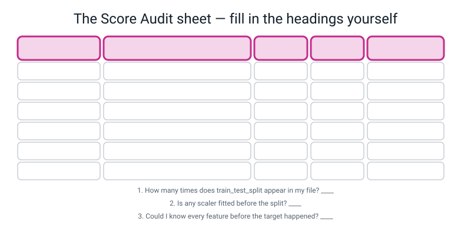
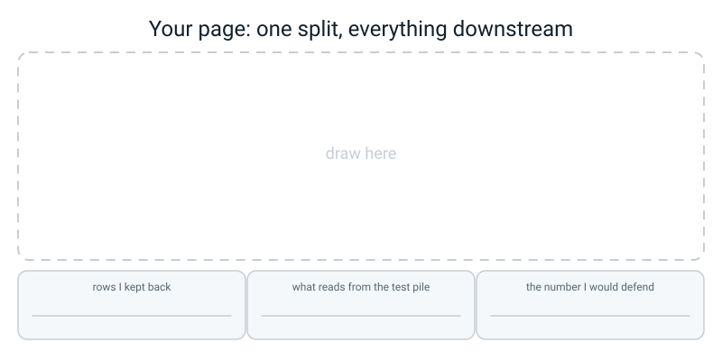

# Workbook — Week 35: Data Detective, Part 2: Charts, Models, and What I Got Wrong

**Name:** ________________________________  **Date:** ______________

[⬅ Week 34](week-34.md) · [📖 Read the chapter first](../student-guide/week-35.md) · [Course Home](../README.md) · [🧑‍🏫 Teacher guide](../teacher-guide/week-35.md) · [Next ➡](week-36.md)

**You will need:** a **red pen** (the Score Audit does not work in pencil) · your `data/clean.csv` from Week 34 · a laptop with pandas, matplotlib and scikit-learn · a calculator · a real human to read your notebook to

---

## ✅ Warm-Up (5 min)

Five quick questions about **last week** — the question, the raw file and the cleaning log.

**W1.** What makes a sentence a research question rather than a topic? One clause.

________________________________________________________________

**W2.** You run `describe()` and your target column is not in the output. What is the one line you run next, and what are you looking for?

________________________________________________________________

**W3.** Why do you `chmod 444 data/raw.csv`, and what error does it produce when the rule works?

________________________________________________________________

**W4.** Turn this into a log line with a reason: *"Dropped 4 rows."*

________________________________________________________________

________________________________________________________________

**W5.** `50%` in your `describe()` output is 19.0. Write the sentence that says what that means, correctly.

________________________________________________________________

---

## 🔎 Predict the Output

**Write your prediction before you run anything.**

### P1 — a baseline in three lines

```python
import numpy as np

answers = np.array([12.0, 19.5, 8.0, 26.0, 17.0])
guess = answers.mean()
baseline = np.zeros(len(answers)) + guess
print(guess)
print(baseline)
print(baseline.shape)
print(np.abs(answers - baseline).mean())
```

**I predict — four lines:**

________________________________________________________________

________________________________________________________________

**It really printed:**

________________________________________________________________

________________________________________________________________

**Line 2 is five copies of one number. Which Week 18 idea made that happen from `np.zeros(5) + 16.5`?**

________________________________________________________________

**The last number is the baseline's MAE. Write it as a sentence with units in it.**

________________________________________________________________

### P2 — the same 26 rows, or different ones?

*(This one reads `data/clean.csv`, so run it in the project folder you built in the chapter.)*

```python
import pandas as pd
from sklearn.model_selection import train_test_split

df = pd.read_csv("data/clean.csv")
X = df[["distance_km", "rain"]]
y = df["minutes"]

a_train, a_test, b_train, b_test = train_test_split(X, y, test_size=0.2, random_state=42)
c_train, c_test, d_train, d_test = train_test_split(X, y, test_size=0.2, random_state=42)
e_train, e_test, f_train, f_test = train_test_split(X, y, test_size=0.2, random_state=7)

print(len(b_test), len(d_test), len(f_test))
print(list(a_test.index[:4]))
print(list(c_test.index[:4]))
print(list(e_test.index[:4]))
```

**I predict — will lines 3 and 4 be the same? Will line 5?**

________________________________________________________________

**It really printed:**

________________________________________________________________

________________________________________________________________

**All three test sets are the same SIZE. Are they the same ROWS?**

________________________________________________________________

**So what exactly does `random_state` fix, and what does it not fix?**

________________________________________________________________

**This file calls `train_test_split` three times. Why is that a bug in a real project, even though nothing crashed?**

________________________________________________________________

### P3 — the same MAE, two different models

```python
import numpy as np
from sklearn.metrics import mean_absolute_error, mean_squared_error

actual  = np.array([10.0, 10.0, 10.0, 10.0])
model_a = np.array([11.0, 11.0,  9.0,  9.0])
model_b = np.array([10.0, 10.0, 10.0,  6.0])

for name, pred in [("A", model_a), ("B", model_b)]:
    mae  = mean_absolute_error(actual, pred)
    rmse = np.sqrt(mean_squared_error(actual, pred))
    print(name, "MAE", round(mae, 2), " RMSE", round(rmse, 2))
```

**I predict — two lines:**

________________________________________________________________

**It really printed:**

________________________________________________________________

________________________________________________________________

**Both MAEs are identical. Which model would you rather rely on, and why?**

________________________________________________________________

**What is RMSE doing that MAE is not?**

________________________________________________________________

**Can RMSE ever be SMALLER than MAE?** ____________ **Why?**

________________________________________________________________

### P4 — how R² goes negative

```python
import numpy as np
from sklearn.metrics import r2_score

y_test = np.array([12.0, 19.5, 8.0, 26.0, 17.0])
train_mean = 21.3
always_train_mean = np.zeros(len(y_test)) + train_mean
always_test_mean  = np.zeros(len(y_test)) + y_test.mean()

print(round(r2_score(y_test, always_test_mean), 3))
print(round(r2_score(y_test, always_train_mean), 3))
```

**I predict — two numbers:** ______ ______

**It really printed:**

________________________________________________________________

**One is exactly 0.0. What is R² = 0 measuring against?**

________________________________________________________________

**The other is below zero. In plain English, what does a negative R² mean?**

________________________________________________________________

**Your baseline uses the TRAIN mean, not the test mean. So which of the two numbers will your baseline row show?**

________________________________________________________________

**How many of the four predictions did you get right?** ______ / 4

**Which one surprised you most, and why?**

________________________________________________________________

---

## ✍️ Practice Set A — Read It

**A1. Which split did it come from, and is it a result?** Fill in both columns.

| # | The line | Split | Is it a result? |
|---|---|---|---|
| (a) | `model.fit(X_train, y_train)` | | |
| (b) | `model.score(X_train, y_train)` | | |
| (c) | `mean_absolute_error(y_test, model.predict(X_test))` | | |
| (d) | `scaler.fit(X)` | | |
| (e) | `y_train.mean()` | | |
| (f) | `r2_score(y_train, train_guess)` | | |
| (g) | `df["minutes"].median()` used as a fill value, before the split | | |
| (h) | `mean_absolute_error(y_test, model.predict(X_train))` | | |

**A1(i).** What do **(d)** and **(g)** have in common? Name the bug.

________________________________________________________________

**A1(j).** One of those eight does not run at all. Which one, and what does it say?

________________________________________________________________

**A2. Put the five captions in narrative order.** Write the letters in the boxes, then read your paragraph aloud.

```text
A. Walking averages 31.9 min against cycling's 12.6.
B. Two slopes: a walked km costs 11.8 min, a wheeled km 3.9.
C. Half the journeys are under 17 min, but the tail reaches 58.6.
D. Longer journeys take longer (r = 0.64), but the dots fan out.
E. Walk runs 6.3 to 58.6 min; cycle only 4.0 to 22.6.
```

Order: ______ → ______ → ______ → ______ → ______

**A2(a).** Which caption could **not** possibly go first, and why?

________________________________________________________________

**A2(b).** Rewrite caption A as a **topic** caption, then say exactly what a reader loses.

________________________________________________________________

________________________________________________________________

**A3. Trace the table.** This results table came from a real run. Answer without a computer.

```text
                           model  MAE (min)  RMSE (min)  train R2  test R2  test rows
                    tree depth=4       2.35        2.82     0.974    0.879         26
                kNN k=5 (scaled)       2.70        3.91     0.938    0.769         26
               linear regression       5.00        5.82     0.884    0.487         26
baseline (always guess the mean)       7.98        9.53     0.000   -0.375         26
```

(a) What is one test row worth, as a percentage? ____________

(b) How many minutes of accuracy does the best model buy you over the baseline? ____________

(c) Which model has the biggest train-to-test gap, and how big is it? ____________

(d) Are you allowed to say the tree beat the kNN? ____________  Why? ____________

(e) Which column would you point at first if somebody asked "is 2.35 good?" ____________

(f) The kNN's RMSE (3.91) is much further above its MAE (2.70) than the tree's is. What does that tell you about the kNN's mistakes?

________________________________________________________________

**A4. Spot the bug.** Three lines, all of which run. Say what is wrong and fix each.

| # | The line | What is wrong | The fix |
|---|---|---|---|
| (a) | `scaler = StandardScaler().fit(X)` above the split | | |
| (b) | `"test R2": round(r2_score(y_train, train_guess), 3)` | | |
| (c) | `guess = y.mean()` used to build the baseline | | |

**A5. Match the code to the output.** All three ran on the 126-row journeys table.

| # | Code |
|---|---|
| 1 | `print(df.groupby("mode")["minutes"].mean().round(1))` |
| 2 | `print(df["mode"].value_counts())` |
| 3 | `print(round(df["distance_km"].corr(df["minutes"]), 3))` |

| Letter | Output |
|---|---|
| A | `0.642` |
| B | `bus 16.3 / cycle 12.6 / walk 31.9` |
| C | `walk 42 / cycle 42 / bus 42` |

1 → ______   2 → ______   3 → ______

**A5(a).** Output B is the bar chart. Output C is the thing you must print **next to** it. Why?

________________________________________________________________

**A6. Label the audit sheet.** Fill in the five column headings and the three check questions from memory, then complete the first row for the number `MAE 1.71 min`.


*Figure W35.1 — Your audit sheet. Five columns, three questions.*

The five headings: ______________ | ______________ | ______________ | ______________ | ______________

The three questions:

1. ________________________________________________________________
2. ________________________________________________________________
3. ________________________________________________________________

---

## ✍️ Practice Set B — Write It

### B1 — one line

Your test set has 18 rows. Print what one row is worth, to one decimal place.

**Expected output:**

```text
one test row is worth 5.6% of an accuracy score
```

**Done looks like:** an f-string with `:.1f` in it, and no calculator involved.

### B2 — the baseline, from memory

Given the two arrays below, build the baseline the honest way and print its MAE with units and the row count.

```python
import numpy as np
from sklearn.metrics import mean_absolute_error

y_train = np.array([22, 31, 18, 27, 40, 25, 19, 33])
y_test  = np.array([24, 36, 20, 29])
# your code here
```

**Expected output:**

```text
the baseline always guesses 26.9 minutes
baseline MAE: 5.25 minutes on 4 held-out rows
```

**Done looks like:** the mean comes from `y_train`, not from `y_test` and not from all twelve. If you used `y_test.mean()`, you have written a cheat, not a baseline.

### B3 — the `report()` function, from memory

Write the `report()` function with all six keys, then call it once on the arrays below and print what comes back.

```python
y_train     = np.array([22, 31, 18, 27, 40, 25, 19, 33])
y_test      = np.array([24, 36, 20, 29])
train_guess = np.array([23, 30, 19, 26, 38, 26, 20, 32])
test_guess  = np.array([26, 33, 22, 28])
```

**Expected output:** one dictionary on one line, starting `{'model': 'my only model', 'MAE (min)': 2.0, ...`

**Done looks like:** every metric column header carries its units, `train R2` reads from `y_train`, `test R2` reads from `y_test`, and `test rows` is computed rather than typed.

### B4 — one chart whose title states a finding

Twelve lunch queues, typed out literally. Print the mean wait per queue and the count per queue, then draw a bar chart. The title must contain **two real numbers, computed by the f-string, not typed by you.** Bars start at zero. Axis labels carry units.

```python
lunch = pd.DataFrame({
    "queue":   ["hot", "sandwich", "hot", "packed", "sandwich", "hot",
                "packed", "sandwich", "hot", "packed", "hot", "sandwich"],
    "wait_min": [9.5, 4.0, 11.0, 1.5, 5.5, 8.0, 2.0, 3.5, 12.5, 1.0, 10.0, 4.5],
})
```

**Expected printed output starts:**

```text
queue
hot         10.2
packed       1.5
sandwich     4.4
```

**Done looks like:** you open the PNG and the title tells you the finding without you having to look at the bars.

### B5 — one split, a baseline and a tree, about 25 lines

Thirty reading sessions, typed out literally. One split with `random_state=42`. A `report()` function. A baseline and a depth-3 tree. Print the row counts, what one row is worth, and the results table sorted by MAE.

```python
reading = pd.DataFrame({
    "pages":   [12, 30, 18, 25, 40, 8, 33, 21, 45, 16,
                28, 36, 10, 42, 24, 19, 31, 14, 38, 26,
                22, 35, 11, 44, 17, 29, 39, 15, 47, 20],
    "at_night": [1, 0, 1, 0, 0, 1, 0, 1, 0, 1,
                 0, 1, 1, 0, 0, 1, 1, 0, 0, 1,
                 0, 1, 1, 0, 1, 0, 0, 1, 0, 1],
    "minutes": [21, 44, 30, 37, 58, 16, 48, 34, 65, 27,
                41, 55, 20, 61, 36, 31, 47, 23, 55, 40,
                33, 53, 21, 63, 29, 42, 56, 26, 68, 32],
})
```

**Expected output starts:**

```text
train rows: 24   test rows: 6
one test row is worth 16.7% of an accuracy score
```

**Done looks like:** exactly one `train_test_split` in the file, the baseline row present, and you can say out loud why a 6-row test set means you would not rank two close models — even though this table only has two rows in it.

---

## 🐞 Fix the Broken Program

This is meant to run two models on one split and print an honest results table. It has **three** bugs: one syntax, one runtime, one logic — plus one bonus problem for extra marks.

```python
# bakeoff.py - two models on one split, with a results table.
import numpy as np
import pandas as pd
from sklearn.model_selection import train_test_split
from sklearn.preprocessing import StandardScaler
from sklearn.neighbors import KNeighborsRegressor
from sklearn.tree import DecisionTreeRegressor
from sklearn.metrics import mean_absolute_error, r2_score

steps = pd.DataFrame({
    "minutes_walked": [12, 25, 40, 18, 33, 8, 51, 22, 37, 15,
                       44, 29, 10, 48, 20, 35, 26, 42, 14, 31,
                       23, 38, 17, 45, 11, 28, 36, 19, 47, 24],
    "hilly":         [0, 1, 0, 1, 0, 0, 1, 0, 1, 1,
                      0, 1, 0, 0, 1, 0, 1, 1, 0, 0,
                      1, 0, 1, 1, 0, 0, 1, 0, 1, 0],
    "steps":         [1480, 3010, 4900, 2100, 4020, 980, 6050, 2660, 4350, 1790,
                      5380, 3400, 1230, 5810, 2340, 4260, 3060, 4950, 1700, 3760,
                      2700, 4610, 2010, 5300, 1340, 3390, 4230, 2290, 5520, 2900],
})

X = steps[["minutes_walked", "hilly"]]
y = steps["steps"]

scaler = StandardScaler().fit(X)
X_scaled = scaler.transform(X)

X_train, X_test, y_train, y_test = train_test_split(
    X_scaled, y, test_size=0.2, random_state=42

knn  = KNeighborsRegressor(n_neighbors=3).fit(X_train, y_train)
tree = DecisionTreeRegressor(max_depth=3, random_state=0).fit(X_train, y_train)

rows = [
    {"model": "kNN k=3",      "MAE (steps)": round(mean_absolute_error(y_test, knn.predict(X_test)), 1),
     "test R2": round(r2_score(y_train, knn.predict(X_train)), 3)},
    {"model": "tree depth=3", "MAE (steps)": round(mean_absolute_error(y_test, tree.predict(X_train)), 1),
     "test R2": round(r2_score(y_test, tree.predict(X_test)), 3)},
]
print(pd.DataFrame(rows).to_string(index=False))
```

**Bug 1 — what you actually see:**

```text
  File "/private/tmp/wb35/broken.py", line 28
    X_train, X_test, y_train, y_test = train_test_split(
                                                       ^
SyntaxError: '(' was never closed
```

**Which line?** ______  **What is missing?** ____________________

**Bug 2 — after fixing bug 1:**

```text
  File "/Library/Frameworks/Python.framework/Versions/3.10/lib/python3.10/site-packages/sklearn/metrics/_regression.py", line 114, in _check_reg_targets
    check_consistent_length(y_true, y_pred, sample_weight)
  File "/Library/Frameworks/Python.framework/Versions/3.10/lib/python3.10/site-packages/sklearn/utils/validation.py", line 473, in check_consistent_length
    raise ValueError(
ValueError: Found input variables with inconsistent numbers of samples: [6, 24]
```

**Read the two numbers in the message. Which is `y_test` and which is the prediction?**

________________________________________________________________

**Which line, and what is the fix?**

________________________________________________________________

**Bug 3 — after fixing bugs 1 and 2, it runs and prints this:**

```text
       model  MAE (steps)  test R2
     kNN k=3        167.2    0.969
tree depth=3        241.4    0.962
```

**Look hard at the two `test R2` numbers and find the line that produced each. One of them is not a test score. Which?**

________________________________________________________________

**What is the fix, and what does the number become?**

________________________________________________________________

**Bonus — one more problem, and no error message will ever mention it.**

**Which line is it, what is the bug called, and which direction does it move the score?**

________________________________________________________________

________________________________________________________________

**Now write the whole fixed program**, adding a baseline row and a `train R2` column while you are in there:

________________________________________________________________

________________________________________________________________

________________________________________________________________

---

## 🧩 Puzzle of the Week

### The Split Detective

Somebody hands you this and says *"all three models were scored on the same split of my 126 rows, 20% held out."*

```text
model             accuracy
kNN k=5             0.923
decision tree       0.885
linear + threshold  0.900
```

**Part 1.** How many rows are in the test set? ____________

**Part 2.** On that many test rows, an accuracy has to be a **whole number of rows divided by the test-set size.** Fill in the ladder:

| rows correct | accuracy |
|---|---|
| 21 | |
| 22 | |
| 23 | |
| 24 | |
| 25 | |
| 26 | |

**Part 3.** Two of the three reported accuracies appear in your ladder. Which two, and how many rows did each model get right?

________________________________________________________________

**Part 4 — the accusation.** One of the three **cannot** have come from that test set. Which one, and prove it with arithmetic.

________________________________________________________________

________________________________________________________________

**Part 5.** Suggest a test-set size that *would* make the odd one out possible, and say what that means the person actually did.

________________________________________________________________

**Part 6 — the real point.** Look again at the two accuracies that *are* possible. How many test rows separate them, and what are you allowed to say about which model is better?

________________________________________________________________

________________________________________________________________

---

## 🤔 Think Deeper

**1.** The broken score in the chapter printed `MAE: 1.71 minutes` and nothing warned anybody. Write a paragraph on why silent bugs are worse than crashes, then describe the one habit you are going to keep for the rest of your life to catch them.

________________________________________________________________

________________________________________________________________

________________________________________________________________

________________________________________________________________

**2.** Your tree scores MAE 2.35 minutes and your kNN scores 2.70, on 26 test rows. You have to hand *one* model to somebody who will actually use it. Write a paragraph choosing one — and your reason is **not allowed to be the score.** Say what your reason is instead, and why it survives one test row moving.

________________________________________________________________

________________________________________________________________

________________________________________________________________

________________________________________________________________

---

## 🛠️ Build It — Milestones 4, 5 and 6

About three hours, across the week. Do not do it in one sitting.

### Step checklist

**Milestone 4 — five charts in narrative order (60 min)**

- [ ] Chart 1: histogram of the target
- [ ] Chart 2: scatter of the target against your strongest number
- [ ] Chart 3: bar chart of the mean per category, **`set_ylim(0, ...)`**
- [ ] Chart 4: two histograms side by side, **same `set_xlim` on both**
- [ ] Chart 5: your own choice, answering whatever charts 2–4 raised
- [ ] Every title states a **finding**, with a number in it
- [ ] Every axis label carries **units**
- [ ] Every chart has a one-sentence caption underneath
- [ ] **The five-caption test:** captions copied into a plain text file, read aloud, and it is a paragraph
- [ ] Group counts printed next to every set of group means

**Milestone 5 — one split, four models, one table (60 min)**

- [ ] Text columns turned into 0/1 columns by hand
- [ ] `FEATURES` defined **once** and used everywhere
- [ ] Exactly **one** `train_test_split`, with `random_state` set
- [ ] `print(f"one test row is worth {100 / len(y_test):.1f}% of an accuracy score")`
- [ ] Any scaler fitted on `X_train` **only**, then `transform` on both
- [ ] **One** `report()` function, used by all four models
- [ ] Baseline · kNN · tree · linear regression
- [ ] Units in every metric header
- [ ] Train score **and** test score for every model
- [ ] `test rows` as a column

**Milestone 6 — the audit and the honesty (40 min)**

- [ ] Score Audit sheet completed for **every** number in the table
- [ ] At least one number traced, questioned, and either confirmed or corrected in red
- [ ] The three check questions answered in writing
- [ ] Five worst predictions printed, with actual, predicted and error
- [ ] Three admissions, **each with a number in it**
- [ ] Hunted for a physically impossible prediction
- [ ] The "I tuned it" honesty sentence, if you tuned anything
- [ ] Whose data this is, and what a wrong answer would cost — a person, by role
- [ ] Restart, run everything top to bottom, then write *"Ran clean, top to bottom, on ______."*

### My five charts

| # | Chart type | The question it answers | My caption (state the finding) |
|---|---|---|---|
| 1 | | | |
| 2 | | | |
| 3 | | | |
| 4 | | | |
| 5 | | | |

**Read the five captions aloud, in order. Is it a paragraph?** ☐ yes  ☐ no — reordered to: ______ ______ ______ ______ ______

### My split

| | Value |
|---|---|
| Total rows | ______ |
| Train rows | ______ |
| Test rows | ______ |
| One test row is worth | ______ % |
| `random_state` | ______ |
| Times `train_test_split` appears in my file | ______ (must be 1) |
| Is any scaler fitted before the split? | ☐ no  ☐ yes → **fix it now** |

### My results table

| model | MAE ( ______ ) | RMSE ( ______ ) | train R² | test R² | test rows |
|---|---|---|---|---|---|
| baseline (always guess the mean) | | | 0.000 | | |
| | | | | | |
| | | | | | |
| | | | | | |

**The baseline always guesses ______ ____________ , and is off by ______ ____________ .**

**My best model is off by ______ ____________ , so the model buys me ______ ____________ of accuracy.**

**The biggest train-to-test gap is ______ , on the ____________ model.**

### My Score Audit

| the number | the line that made it | which split? | honest? | corrected |
|---|---|---|---|---|
| | | | | |
| | | | | |
| | | | | |
| | | | | |
| | | | | |
| | | | | |
| | | | | |
| | | | | |

**Numbers audited:** ______  **Numbers crossed out in red:** ______

The three questions:

1. How many times does `train_test_split` appear in my file? ______
2. Is any scaler fitted before the split? ______
3. Could I know every feature before the target happened? ______ — and if not, which one? ____________

### My five worst predictions

| row | actual | predicted | error | why I think it missed this one |
|---|---|---|---|---|
| | | | | |
| | | | | |
| | | | | |
| | | | | |
| | | | | |

**Is any one of these predictions physically impossible?** ☐ no  ☐ yes — which, and why:

________________________________________________________________

### My three admissions (each one needs a number)

**1.** ________________________________________________________________

________________________________________________________________

**2.** ________________________________________________________________

________________________________________________________________

**3.** ________________________________________________________________

________________________________________________________________

**The honesty sentence, if I tuned anything:**

________________________________________________________________

### Whose data, and what it costs

| Question | My answer |
|---|---|
| Whose data is this? | |
| Did they know, and can I remove their rows? | |
| What is the **worst single** error in my test set? | ______ ____________ |
| Who pays for that mistake — by role, not "users"? | |
| Would I let somebody decide something with this? | ☐ yes ☐ no, because: |

**Ran clean, top to bottom, on** ____________  **Things that broke on the fresh run:** ______

---

## 🎨 Draw It

Draw your own split, and everything that drinks from it — with your own row counts on it.


*Figure W35.2 — Your page.*

> **What a good answer might look like:** one stack of cards on the left labelled **126 rows**, cut once by a fat dashed line into **100 (train)** and **26 (test)**.
>
> From the train pile, four arrows go right into four boxes: **baseline**, **kNN k=5**, **tree depth 4**, **line**. Every arrow is labelled `.fit(X_train, y_train)`.
>
> From the test pile, **one** arrow goes the long way round the outside, past all four boxes without touching them, and arrives at a single box on the right labelled **results table**. That arrow is labelled *"scored once, at the very end"*.
>
> Then the details that show real understanding. A small padlock on the test pile with *"nothing fits on these"* next to it. A crossed-out arrow from the test pile to the scaler, labelled *"leakage"*. And the number **3.8%** written on the test pile, because 1 ÷ 26 is what one card is worth.
>
> The three caption boxes filled in: **26 rows kept back** · **only the results table reads from the test pile** · **MAE 2.35 minutes, against a baseline of 7.98, on 26 held-out rows**.
>
> **What a weak answer looks like:** four separate cuts, one per model — which is exactly the bug the drawing is supposed to make impossible to draw. Or a test pile with arrows going *into* the model boxes, which is the same bug wearing a different hat. If your picture would let a model see the test rows, redraw it until it cannot.

---

## 📊 Self-Check

| I can… | 😀 got it | 🙂 nearly | 😕 not yet |
|---|---|---|---|
| Put five captioned charts in narrative order and read them as a paragraph | ☐ | ☐ | ☐ |
| Write a caption that states a finding rather than a topic | ☐ | ☐ | ☐ |
| Make one split, once, with `random_state` set | ☐ | ☐ | ☐ |
| Say what one test row is worth, without being asked | ☐ | ☐ | ☐ |
| Build a baseline in two lines and say why every table needs one | ☐ | ☐ | ☐ |
| Fit a scaler on `X_train` only, and explain what happens if I don't | ☐ | ☐ | ☐ |
| Use one `report()` function for every model | ☐ | ☐ | ☐ |
| Trace any number in my table back to the exact line that made it | ☐ | ☐ | ☐ |
| Refuse to rank two models whose gap is smaller than one test row | ☐ | ☐ | ☐ |
| Write an admission with two numbers in it | ☐ | ☐ | ☐ |

**True or false?** Circle one on each row.

| Statement | | |
|---|---|---|
| A caption should describe what the chart shows | TRUE | FALSE |
| `random_state=42` makes the model more accurate | TRUE | FALSE |
| `train_test_split` should appear once per model | TRUE | FALSE |
| The honest score is usually worse than the dishonest one | TRUE | FALSE |
| R² can be negative | TRUE | FALSE |
| RMSE can be smaller than MAE | TRUE | FALSE |
| A baseline is optional if your model is good | TRUE | FALSE |
| Reporting a train score in a column labelled `train R2` is dishonest | TRUE | FALSE |
| Fitting a scaler before the split raises an error | TRUE | FALSE |
| A test R² of 0.99 on data you collected is good news | TRUE | FALSE |
| "More data would help" is a limitation | TRUE | FALSE |
| The model with the lowest MAE is the one you should ship | TRUE | FALSE |
| A bar chart of group means should always print the group counts too | TRUE | FALSE |
| Two histograms can be compared by eye on different x ranges | TRUE | FALSE |

One thing I'd like explained again:

________________________________________________________________

---

## ✅ Answers

<details>
<summary>Check your answers</summary>

### Warm-Up

**W1.** **You could turn out to be wrong about it.** A topic cannot be wrong, so no data can ever settle it, and it quietly becomes whatever the data happened to say.

**W2.** `df.info()` (or `df.dtypes`). You are looking for a column that says **`object`** where it should say `float64` or `int64` — because a column pandas thinks is text cannot be averaged, plotted or predicted.

**W3.** So that the computer, not your willpower, enforces "every repair happens in Python with a log line". When it works you get `PermissionError: [Errno 13] Permission denied: 'data/raw.csv'` — **which is the feature, not a fault.**

**W4.** Anything with a checkable reason, for example: `4. Dropped 4 rows with no minutes value — you cannot learn from a row whose answer is unknown, and inventing one would be making data up.` A reason somebody could *disagree* with is the test.

**W5.** *"Half the journeys took **less than** 19 minutes."* Not "it takes 19 minutes half the time".

---

### Predict the Output

**P1** — real output:

```text
16.5
[16.5 16.5 16.5 16.5 16.5]
(5,)
5.2
```

`np.zeros(5)` makes five zeros; adding a single number to an array adds it to **every slot**. That is **broadcasting**, from Week 18 — the small thing is stretched to fit the big thing.

The last number as a sentence: *"Always guessing 16.5 minutes is off by **5.2 minutes** on average, on these 5 rows."*

**And that is the entire baseline.** Two lines, no library, and it is what makes every other number in your table mean something.

**P2** — real output:

```text
26 26 26
[73, 19, 116, 67]
[73, 19, 116, 67]
[111, 101, 76, 79]
```

All three test sets are the same **size** — 26 rows, because `test_size=0.2` of 126 rounds up.

Lines 3 and 4 are **identical**: same `random_state`, same shuffle, same 26 rows. Line 5 is **different**: `random_state=7` is a different shuffle, so a different 26 rows.

**So `random_state` fixes *which* rows land in each pile.** It does not make the model better, it does not make the score higher, and it does not make the split "correct" — it makes it **repeatable**, which is what lets you compare two models, or today's answer with tomorrow's.

**Why three splits is a bug in a real project:** each model would be judged on a different exam paper. Two scores from two different test sets cannot be put in the same table at all — the comparison is meaningless, and nothing crashes to tell you.

**P3** — real output:

```text
A MAE 1.0  RMSE 1.0
B MAE 1.0  RMSE 2.0
```

Model A is wrong by 1 four times: `1, 1, 1, 1`. Model B is exactly right three times and wrong by 4 once: `0, 0, 0, 4`. **Same MAE, 1.0.**

MAE averages the *sizes* of the errors, so it cannot tell them apart. RMSE squares first — 16 is a lot bigger than 4 × 1 — so it punishes the single big miss much harder.

**Which would you rather rely on?** Almost always **A**, and it depends on what the number is for. A bus that is always 1 minute late is easier to live with than one that is usually perfect and occasionally 4 minutes out, because you can plan around a steady error and you cannot plan around a surprise.

**Can RMSE be smaller than MAE?** **No, never.** RMSE ≥ MAE always, and they are equal only when every single error is exactly the same size. So **the gap between MAE and RMSE is a measure of how uneven your mistakes are** — which is why a good results table prints both.

**P4** — real output:

```text
0.0
-0.6
```

**R² = 0 means "exactly as good as always guessing the mean of these rows."** That is the zero point of the scale — it is not "no relationship" and it is certainly not "nothing happened". It is the score of the laziest possible model.

**A negative R² means worse than that laziest model.** Here, always guessing 21.3 is worse on these five rows than always guessing their own mean of 16.5 — so it lands below zero.

**Your baseline row will show the negative one**, because a baseline must be built from `y_train.mean()`. It is not allowed to peek at the test rows to work out its guess. So a slightly negative baseline R² is normal and correct. **A negative R² on one of your real models is not**, and means you should stop and look.

---

### Practice Set A

**A1.**

| # | Split | Is it a result? |
|---|---|---|
| (a) | train | Not a score at all — this is learning. Correct. |
| (b) | train | Only if the column is labelled `train R2`. Never as *the* result. |
| (c) | test | **Yes.** This is the honest one. |
| (d) | **both** | No — this is leakage. Fit on `X_train`. |
| (e) | train | Yes, and correct: a baseline must be built from the training answers only. |
| (f) | train | Yes, in the `train R2` column. The gap to `test R2` is the finding. |
| (g) | **both** | No — the median was computed using the test rows. Leakage, subtle version. |
| (h) | mismatched | Neither — it crashes. |

**A1(i).** Both compute a **statistic from all the rows** — a mean, a standard deviation, a median — *before* the split. So the test rows helped shape how the training data was prepared, the test set is no longer unseen, and the reported score can come out **too high** (or just different) without any warning. The word is **leakage**, from Week 30.

**A1(j).** **(h)**. It raises `ValueError: Found input variables with inconsistent numbers of samples: [26, 100]` — 26 real answers against 100 guesses.

**A2. Correct order: C, D, A, E, B.**

Read aloud: *"Half the journeys are under 17 minutes, but the tail reaches 58.6. Longer journeys take longer, but the dots fan out. Walking averages 31.9 minutes against cycling's 12.6. Walk runs 6.3 to 58.6 minutes; cycle only 4.0 to 22.6. Two slopes: a walked kilometre costs 11.8 minutes, a wheeled one 3.9."*

**Why that order and no other.** C establishes the thing being explained. D tries the obvious explanation and it half works — that "fan out" is the question the rest of the paragraph answers. A offers a better explanation. E shows that A is not the whole story either, because walking varies enormously. B resolves it: there are two different slopes, which is why one straight line could never work. **Every sentence answers the one before it.**

**A2(a).** **B.** It is a conclusion. "Two slopes" only means anything once the reader knows there was a fan-out that needed explaining. A conclusion put first is just an assertion.

**A2(b).** Topic version: *"Journey times by mode."* What a reader loses: the finding, both numbers, and the setup for E. They now have to reach a conclusion themselves from a picture, and they will reach a different one from yours — usually a stronger one, because pictures always look more certain than they are.

**A3.**

(a) **3.8%.** 1 ÷ 26 = 0.0385.

(b) **5.63 minutes.** 7.98 − 2.35.

(c) The **linear regression**: 0.884 − 0.487 = **0.397**. (The tree's is 0.095 and the kNN's 0.169.) Worth noticing: the biggest gap here belongs to the *worst* model, which is not what you would guess. The line is not memorising — it is the wrong shape for this data, and it is bad on both halves.

(d) **No.** The gap is 0.35 minutes on 26 rows, where one journey 9 minutes out would cause the whole gap (0.35 × 26 = 9.1). Move one test journey and the ranking could flip. What you may say is *"indistinguishable, and I would pick the tree because I can read its rules out loud."*

(e) The **baseline row**. "Is 2.35 good?" is a question about *compared to what*, and the answer is 7.98.

(f) The kNN's RMSE sits 1.21 above its MAE, against the tree's 0.47. So **the kNN's mistakes are more uneven** — it is fine most of the time and occasionally badly wrong, while the tree's errors are more consistent in size. If a big miss costs you much more than a small one, that difference matters more than the MAE ranking does.

**A4.**

| # | What is wrong | The fix |
|---|---|---|
| (a) | The scaler learned each column's mean and standard deviation **using the test rows too**. Leakage. No error, and the score can be flattered. | Move it below the split: `StandardScaler().fit(X_train)`, then `transform` both halves. |
| (b) | The **label lies**. The number is a train score sitting in a column that says `test R2`. Nothing about the arithmetic is wrong — the mislabelling is the whole bug, and it is exactly what the audit catches. | `round(r2_score(y_test, test_guess), 3)`. |
| (c) | `y.mean()` is the mean of **all** the rows, including the 26 you are about to be tested on. Your baseline is peeking. | `guess = y_train.mean()`. |

**A5.** 1 → **B** · 2 → **C** · 3 → **A**

**A5(a).** Because a bar chart of means shows **one number per group and hides how many rows made it.** A mean of 31.9 over 42 journeys and a mean of 31.9 over 2 journeys look identical on the chart and mean completely different things. Here all three groups happen to be 42, which is good news — and you only know that because you printed it.

**A6.** The five headings:

**the number** | **the line that made it** | **which split?** | **honest?** | **corrected**

The three questions:

1. How many times does `train_test_split` appear in my file? *(Must be 1.)*
2. Is any scaler fitted before the split? *(Must be no.)*
3. Could I know every feature before the target happened? *(Must be yes, for every one.)*

The first row, filled in:

```text
| the number   | the line that made it                               | split | honest? | corrected |
|--------------|-----------------------------------------------------|-------|---------|-----------|
| MAE 1.71 min | mean_absolute_error(y_train, tree.predict(X_train)) | train | NO      | 2.35 min  |
```

---

### Practice Set B

**B1.**

```python
n_test = 18
print(f"one test row is worth {100 / n_test:.1f}% of an accuracy score")
```

```text
one test row is worth 5.6% of an accuracy score
```

**B2.**

```python
import numpy as np
from sklearn.metrics import mean_absolute_error

y_train = np.array([22, 31, 18, 27, 40, 25, 19, 33])
y_test  = np.array([24, 36, 20, 29])

guess = y_train.mean()
baseline_test = np.zeros(len(y_test)) + guess
print(f"the baseline always guesses {guess:.1f} minutes")
print("baseline MAE:", round(mean_absolute_error(y_test, baseline_test), 2), "minutes on",
      len(y_test), "held-out rows")
```

```text
the baseline always guesses 26.9 minutes
baseline MAE: 5.25 minutes on 4 held-out rows
```

**Why `y_train.mean()` and not `y_test.mean()`:** the baseline is a *model*, and models are only allowed to learn from the training answers. A baseline built from `y_test.mean()` has looked at the exam paper — it would score better, and the number would be worthless. This is the same rule as the scaler, applied to the simplest model there is.

**B3.**

```python
import numpy as np
from sklearn.metrics import mean_absolute_error, mean_squared_error, r2_score

y_train     = np.array([22, 31, 18, 27, 40, 25, 19, 33])
y_test      = np.array([24, 36, 20, 29])
train_guess = np.array([23, 30, 19, 26, 38, 26, 20, 32])
test_guess  = np.array([26, 33, 22, 28])

def report(name, train_guess, test_guess):
    """Turn one model's guesses into one row of the results table."""
    return {
        "model": name,
        "MAE (min)":  round(mean_absolute_error(y_test, test_guess), 2),
        "RMSE (min)": round(np.sqrt(mean_squared_error(y_test, test_guess)), 2),
        "train R2":   round(r2_score(y_train, train_guess), 3),
        "test R2":    round(r2_score(y_test, test_guess), 3),
        "test rows":  len(y_test),
    }

print(report("my only model", train_guess, test_guess))
```

Real output:

```text
{'model': 'my only model', 'MAE (min)': 2.0, 'RMSE (min)': 2.12, 'train R2': 0.972, 'test R2': 0.874, 'test rows': 4}
```

Hand-check the MAE: the test errors are 2, 3, 2, 1 — average 2.0. ✅

And look at the train/test gap: 0.972 against 0.874. Even on four rows, that gap is the Week 33 story.

**B4.**

```python
import pandas as pd
import matplotlib.pyplot as plt

lunch = pd.DataFrame({
    "queue":   ["hot", "sandwich", "hot", "packed", "sandwich", "hot",
                "packed", "sandwich", "hot", "packed", "hot", "sandwich"],
    "wait_min": [9.5, 4.0, 11.0, 1.5, 5.5, 8.0, 2.0, 3.5, 12.5, 1.0, 10.0, 4.5],
})

means  = lunch.groupby("queue")["wait_min"].mean()
counts = lunch["queue"].value_counts()
print(means.round(1).to_string())
print()
print(counts.to_string())

fig, ax = plt.subplots(figsize=(6, 4))
ax.bar(means.index, means.values)
ax.set_ylim(0, 14)
ax.set_title(f"The hot queue averages {means['hot']:.1f} min against packed lunch's {means['packed']:.1f}")
ax.set_xlabel("lunch queue")
ax.set_ylabel("mean wait (minutes)")
fig.savefig("figures/lunch_by_queue.png", dpi=120, bbox_inches="tight")
print()
print("saved figures/lunch_by_queue.png")
```

Real output:

```text
queue
hot         10.2
packed       1.5
sandwich     4.4

hot         5
sandwich    4
packed      3

saved figures/lunch_by_queue.png
```

The title comes out as: **"The hot queue averages 10.2 min against packed lunch's 1.5"**.

**Two things to notice.** The numbers in the title are computed by the f-string, so if you add three more lunches tomorrow the title updates itself — a hand-typed number in a title goes stale silently and is one of the commonest small dishonesties in a notebook.

And the honest caveat: `packed` has **3** rows. A mean over three lunches is not a fact about packed lunches. That belongs in the caption: *"packed lunch averages 1.5 minutes, but only 3 of the 12 lunches were packed."*

**B5.**

```python
# b5_bakeoff.py - one split, a baseline and a tree, one results table.
import numpy as np
import pandas as pd
from sklearn.model_selection import train_test_split
from sklearn.tree import DecisionTreeRegressor
from sklearn.metrics import mean_absolute_error, r2_score

reading = pd.DataFrame({
    "pages":   [12, 30, 18, 25, 40, 8, 33, 21, 45, 16,
                28, 36, 10, 42, 24, 19, 31, 14, 38, 26,
                22, 35, 11, 44, 17, 29, 39, 15, 47, 20],
    "at_night": [1, 0, 1, 0, 0, 1, 0, 1, 0, 1,
                 0, 1, 1, 0, 0, 1, 1, 0, 0, 1,
                 0, 1, 1, 0, 1, 0, 0, 1, 0, 1],
    "minutes": [21, 44, 30, 37, 58, 16, 48, 34, 65, 27,
                41, 55, 20, 61, 36, 31, 47, 23, 55, 40,
                33, 53, 21, 63, 29, 42, 56, 26, 68, 32],
})

X = reading[["pages", "at_night"]]
y = reading["minutes"]

X_train, X_test, y_train, y_test = train_test_split(
    X, y, test_size=0.2, random_state=42)
print("train rows:", len(y_train), "  test rows:", len(y_test))
print(f"one test row is worth {100 / len(y_test):.1f}% of an accuracy score")

def report(name, train_guess, test_guess):
    return {
        "model": name,
        "MAE (min)": round(mean_absolute_error(y_test, test_guess), 2),
        "train R2":  round(r2_score(y_train, train_guess), 3),
        "test R2":   round(r2_score(y_test, test_guess), 3),
        "test rows": len(y_test),
    }

rows = []
guess = y_train.mean()
rows.append(report("baseline (always guess the mean)",
                   np.zeros(len(y_train)) + guess,
                   np.zeros(len(y_test)) + guess))
print(f"the baseline always guesses {guess:.1f} minutes")

tree = DecisionTreeRegressor(max_depth=3, random_state=0).fit(X_train, y_train)
rows.append(report("tree depth=3", tree.predict(X_train), tree.predict(X_test)))

print()
print(pd.DataFrame(rows).sort_values("MAE (min)").to_string(index=False))
```

Real output:

```text
train rows: 24   test rows: 6
one test row is worth 16.7% of an accuracy score
the baseline always guesses 40.7 minutes

                           model  MAE (min)  train R2  test R2  test rows
                    tree depth=3       2.52     0.982    0.968          6
baseline (always guess the mean)      17.07     0.000   -0.008          6
```

**Say the result honestly:** *"Guessing 40.7 minutes is off by 17.07 minutes. The depth-3 tree gets that to 2.52 minutes, on 6 sessions it had never seen."*

**And then say the limitation, unprompted:** **six** test rows. One row is worth **16.7%**. So this table can tell you the tree is enormously better than guessing — a gap of 14 and a half minutes is far too big to be one row — and it could not possibly tell you that this tree is better than some *other* tree. That is why the capstone floor is 100 rows.

---

### Fix the Broken Program

**Bug 1 — syntax, line 28.** The `train_test_split(` call is missing its **closing bracket**. Python read to the end of the file looking for it:

```text
SyntaxError: '(' was never closed
```

Note where the caret points: at the **opening** bracket, not at the end of the file. Python is telling you where the unfinished thing *started*, which is much more useful.

**Bug 2 — runtime.** `mean_absolute_error(y_test, tree.predict(X_train))`.

```text
ValueError: Found input variables with inconsistent numbers of samples: [6, 24]
```

**6 is `y_test`** — six real answers. **24 is the prediction**, which means it came from `X_train`, the 24 training rows. The two numbers in the message tell you exactly which side is which.

The fix: `tree.predict(X_test)`. And notice this is the **lucky** version of the Hook's bug — mix up one half and it crashes; mix up both and it prints a lovely number.

**Bug 3 — logic, silent.** The kNN's `test R2` came from this:

```python
"test R2": round(r2_score(y_train, knn.predict(X_train)), 3)
```

`y_train` and `X_train`. **That is a train score sitting in a column labelled `test R2`.** The arithmetic is perfect. The label is a lie, and no error message will ever mention a label.

The fix: `round(r2_score(y_test, knn.predict(X_test)), 3)`, and the number changes from `0.969` to **`0.974`**.

**Bonus — the fourth problem.** Line 25:

```python
scaler = StandardScaler().fit(X)
```

That is **above** the split, so the scaler computed each column's mean and standard deviation using all 30 rows — including the 6 test rows. The bug is called **leakage** (Week 30), and it can **flatter** the reported score, which is exactly what makes it dangerous.

> **And here is the honest part.** On this particular table, fixing the leakage barely moved the kNN's test R² at all — it was 0.974 before and after, to three decimal places. **That is not a reason to leave it in.** You cannot know in advance which way a leak will push, or how far, because if you could know that you would not need the test set. Fix it because the rule is checkable and the size of the damage is not.

**The fixed program**, with a baseline and a `train R2` column added:

```python
# bakeoff.py - two models plus a baseline on ONE split, with an honest results table.
import numpy as np
import pandas as pd
from sklearn.model_selection import train_test_split
from sklearn.preprocessing import StandardScaler
from sklearn.neighbors import KNeighborsRegressor
from sklearn.tree import DecisionTreeRegressor
from sklearn.metrics import mean_absolute_error, r2_score

steps = pd.DataFrame({
    "minutes_walked": [12, 25, 40, 18, 33, 8, 51, 22, 37, 15,
                       44, 29, 10, 48, 20, 35, 26, 42, 14, 31,
                       23, 38, 17, 45, 11, 28, 36, 19, 47, 24],
    "hilly":         [0, 1, 0, 1, 0, 0, 1, 0, 1, 1,
                      0, 1, 0, 0, 1, 0, 1, 1, 0, 0,
                      1, 0, 1, 1, 0, 0, 1, 0, 1, 0],
    "steps":         [1480, 3010, 4900, 2100, 4020, 980, 6050, 2660, 4350, 1790,
                      5380, 3400, 1230, 5810, 2340, 4260, 3060, 4950, 1700, 3760,
                      2700, 4610, 2010, 5300, 1340, 3390, 4230, 2290, 5520, 2900],
})

X = steps[["minutes_walked", "hilly"]]
y = steps["steps"]

# FIX 3: split FIRST, then fit the scaler on the training rows only
X_train, X_test, y_train, y_test = train_test_split(
    X, y, test_size=0.2, random_state=42)          # FIX 1: the closing bracket

scaler = StandardScaler().fit(X_train)
X_train_scaled = scaler.transform(X_train)
X_test_scaled  = scaler.transform(X_test)

print("train rows:", len(y_train), "  test rows:", len(y_test))
print(f"one test row is worth {100 / len(y_test):.1f}% of an accuracy score")

def report(name, train_guess, test_guess):
    return {
        "model": name,
        "MAE (steps)": round(mean_absolute_error(y_test, test_guess), 1),
        "train R2":    round(r2_score(y_train, train_guess), 3),
        "test R2":     round(r2_score(y_test, test_guess), 3),
        "test rows":   len(y_test),
    }

rows = []

guess = y_train.mean()
rows.append(report("baseline (always guess the mean)",
                   np.zeros(len(y_train)) + guess,
                   np.zeros(len(y_test)) + guess))
print(f"the baseline always guesses {guess:.0f} steps")

knn = KNeighborsRegressor(n_neighbors=3).fit(X_train_scaled, y_train)
rows.append(report("kNN k=3 (scaled)",
                   knn.predict(X_train_scaled), knn.predict(X_test_scaled)))

tree = DecisionTreeRegressor(max_depth=3, random_state=0).fit(X_train, y_train)
rows.append(report("tree depth=3",                 # FIX 2: X_test on both sides
                   tree.predict(X_train), tree.predict(X_test)))

print()
print(pd.DataFrame(rows).sort_values("MAE (steps)").to_string(index=False))
```

Real output:

```text
train rows: 24   test rows: 6
one test row is worth 16.7% of an accuracy score
the baseline always guesses 3274 steps

                           model  MAE (steps)  train R2  test R2  test rows
                kNN k=3 (scaled)        167.2     0.967    0.974          6
                    tree depth=3        241.4     0.987    0.962          6
baseline (always guess the mean)       1371.9     0.000   -0.174          6
```

**One last honest observation, and it is the best thing on the page.** Look at the kNN row: `train R2 0.967` and `test R2 0.974`. **The test score is HIGHER than the train score.** Everything you have been told says that is the surprising direction.

It is not a bug. It is **six test rows.** With a test set that small, which six rows you happen to get moves the number around far more than any real difference in the model does. This is exactly the thing the `test rows` column exists to warn you about, and the honest sentence to write is: *"my test R² came out above my train R² — on 6 test rows that tells me the test set is too small to read closely, not that the model is unusually good."*

---

### Puzzle of the Week

**Part 1.** 126 × 0.2 = 25.2, and scikit-learn rounds the test set **up**. So **26 test rows.**

**Part 2.** The ladder:

| rows correct | accuracy |
|---|---|
| 21 | 0.8077 |
| 22 | 0.8462 |
| 23 | 0.8846 |
| 24 | 0.9231 |
| 25 | 0.9615 |
| 26 | 1.0000 |

**Part 3.** **0.885** is 23 ÷ 26 = 0.8846, rounded — the **decision tree got 23 rows right.** **0.923** is 24 ÷ 26 = 0.9231, rounded — the **kNN got 24 rows right.**

**Part 4 — the accusation.** **0.900 cannot have come from a 26-row test set.**

```text
0.900 × 26 = 23.4 rows
```

You cannot get 23.4 rows right. There is no such thing as four-tenths of a correct answer. Accuracy on 26 rows is always one of the 27 values `0/26, 1/26, … 26/26`, and 0.900 is not one of them — the two nearest are 0.8846 and 0.9231.

**Part 5.** **20 test rows** would do it: 18 ÷ 20 = 0.900 exactly. So the person almost certainly ran a **second `train_test_split`** somewhere in the file, or changed `test_size` partway through, and that third model sat a different exam from the other two. Its score cannot be put in the same table as the other two at all.

*(Other sizes work too — 10 rows with 9 right, 30 with 27 — but the point is the same: it is not 26.)*

**Part 6 — the real point.** 24 correct against 23 correct. **The entire difference between the kNN and the tree is one single test row.** One row is worth 3.8 percentage points, and the gap between them is 3.85 points — which is one row, exactly.

So you are allowed to say: *"both models are far above the baseline, and they are indistinguishable on 26 test rows — the whole gap is one journey. Change `random_state` and it may well flip. I would choose between them on grounds other than the score."*

You are **not** allowed to say "kNN is better". And notice how you proved that with nothing but arithmetic and the test-set size, which is why the `test rows` column exists.

---

### Think Deeper

**1 — model answer.**

A crash is the computer helping you. It stops the program, prints the line number, names the error type, and refuses to go on until you have understood something. It is annoying and it is on your side. Bugs 1 and 2 in this workbook took about fifteen seconds each, because the message said what was missing and where.

A silent bug does the opposite. `MAE: 1.71 minutes` is a complete sentence, in a nice font, with a plausible number in it, and it is wrong. Nothing about the output looks any different from the output of a correct program — and so it does not get investigated, because there is nothing to investigate. It would have printed the same number every day for a year, and I would have told people my model was accurate to within about a minute and three quarters, and I would have believed it myself.

That is why it is worse: **the damage is proportional to how much you trust it, and a plausible number is trusted completely.** The broken one even *feels* better than the honest one, because 1.71 is a nicer number than 2.35. So the bug is not just invisible, it is rewarding.

The habit I am keeping: **for every number I report, I say out loud which split it came from, and I trace it to the line that made it.** It takes about four seconds per number and it is the only thing that catches this class of bug, because there is no error message to read.

**2 — model answer.**

I would hand over the **tree**, and my reason is that I can read it out loud.

The depth-4 tree prints as a short list of if-then questions: *is it a walk? if so, is it further than 2.5 km? then expect more than half an hour.* I can read those rules to my mum, and she can tell me if one of them is silly — and she would, because she knows things about our journeys that are not in my table. The kNN cannot say anything except *"the five most similar journeys took about this long"*, which is true and completely unarguable-with. **A model somebody can disagree with gets corrected. A model nobody can inspect gets believed or ignored, and neither of those is a check.**

The score does not come into it, and it must not, because it cannot. The tree is 0.35 minutes ahead on a 26-row test set where one journey 9 minutes out moves the MAE by 0.35 by itself. That gap is about one journey's worth of error. If a single test row swapped sides the ordering might reverse, so a decision built on "2.35 is less than 2.70" is a decision built on which rows `random_state=42` happened to deal me — which is not a fact about the models at all.

**And that is exactly why my reason survives.** Interpretability does not move when one row moves. It is a property of the model's shape, not of the sample I tested it on. If I collect thirty more journeys next month and the kNN comes out ahead by half a minute, I will still hand over the tree, and I will still be able to say why.

---

### Self-Check answers

**True or false:**

| Statement | Answer | Why |
|---|:--:|---|
| A caption should describe what the chart shows | **FALSE** | The axis labels do that. A caption states the finding. |
| `random_state=42` makes the model more accurate | **FALSE** | It makes the split **repeatable**. Nothing else. |
| `train_test_split` should appear once per model | **FALSE** | Once per project. Two splits, two exam papers. |
| The honest score is usually worse than the dishonest one | **TRUE** | And if yours is better, look again. |
| R² can be negative | **TRUE** | Worse than always guessing the mean of the test rows. |
| RMSE can be smaller than MAE | **FALSE** | RMSE ≥ MAE always; equal only if every error is the same size. |
| A baseline is optional if your model is good | **FALSE** | Without it you cannot know whether your model is good. |
| Reporting a train score in a column labelled `train R2` is dishonest | **FALSE** | That is exactly the honest place for it. The gap is a finding. |
| Fitting a scaler before the split raises an error | **FALSE** | It runs perfectly. That is what makes leakage dangerous. |
| A test R² of 0.99 on data you collected is good news | **FALSE** | It is a warning light. Hunt for the leaky feature. |
| "More data would help" is a limitation | **FALSE** | It is true of every project ever, so it says nothing. |
| The model with the lowest MAE is the one you should ship | **FALSE** | Not if the gap is small enough that one unlucky journey could cause it. Choose on other grounds and say so. |
| A bar chart of group means should always print the group counts too | **TRUE** | A mean over 2 rows and a mean over 42 look identical. |
| Two histograms can be compared by eye on different x ranges | **FALSE** | And your reader will not notice, which is worse. |

</details>

---

[⬅ Week 34 Workbook](week-34.md) · [📖 Week 35 Chapter](../student-guide/week-35.md) · [Course Home](../README.md) · [Week 36 Workbook ➡](week-36.md) · [Glossary](../../glossary.md)
