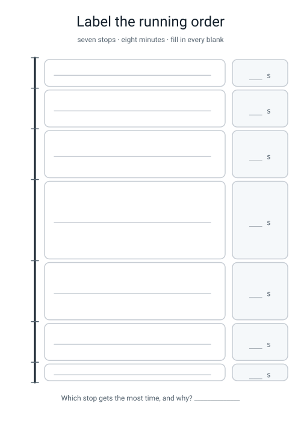
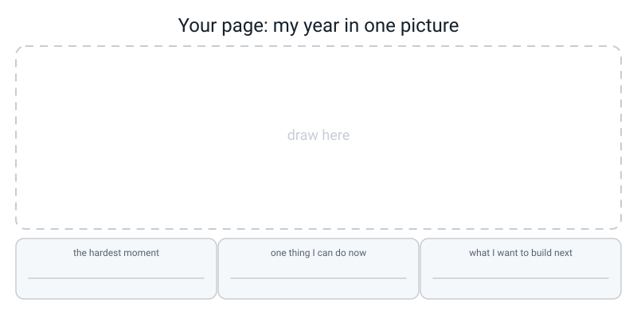

# Workbook — Week 36: Showcase Day: Read Your Notebook Out Loud

**Name:** ________________________________  **Date:** ______________

[⬅ Week 35](week-35.md) · [📖 Read the chapter first](../student-guide/week-36.md) · [Course Home](../README.md) · [🧑‍🏫 Teacher guide](../teacher-guide/week-36.md)

**You will need:** a pen · a red pen · paper for working out · the glossary · **a real adult who does not code** · a timer · a laptop for the debug round only — **the written paper is closed book and there is no laptop for it**

---

## ✅ Warm-Up (5 min)

Five quick questions about **last week** — charts, one split, and the audit.

**W1.** What is the five-caption test, and what do you do if your captions fail it?

________________________________________________________________

**W2.** How many times should `train_test_split` appear in your whole file, and what goes wrong if it appears twice?

________________________________________________________________

________________________________________________________________

**W3.** Your table says MAE 2.35 minutes. What two other things must be next to that number before it means anything?

________________________________________________________________

**W4.** In the Score Audit, which single word on the right-hand side of a scoring line makes you reach for the red pen?

____________

**W5.** Turn this into a real admission: *"My dataset was quite small."*

________________________________________________________________

________________________________________________________________

---

## 🔎 Predict the Output

**Write your prediction before you run anything.** These four span the whole year — they are the last four of Level 2.

### P1 — division, and what type comes back

```python
print(type(7 / 2))
print(7 // 2, 7 % 2)
print(6 / 2)
print(int("12") + 1, "12" * 2)
```

**I predict — four lines:**

________________________________________________________________

________________________________________________________________

**It really printed:**

________________________________________________________________

________________________________________________________________

**Line 3 is not `3`. Why not?**

________________________________________________________________

**Line 4 has two answers on it. Explain why `+` and `*` behave so differently here.**

________________________________________________________________

### P2 — asking a dictionary politely

```python
player = {"name": "Anu", "runs": 40}
print(player.get("wickets", 0) + 5)
print(player.get("wickets"))
print("runs" in player, "Runs" in player)
print(len(player.items()))
```

**I predict — four lines:**

________________________________________________________________

**It really printed:**

________________________________________________________________

________________________________________________________________

**Line 2 is not a number. What would `player.get("wickets") + 5` do?**

________________________________________________________________

**Line 3 has a True and a False in it. What is the one-word reason?**

________________________________________________________________

### P3 — five captions, and the index that is not there

```python
captions = ["shape", "driver", "categories", "spread", "my choice"]
print(len(captions))
print(captions[1:4])
print(captions[-1])
print(captions[len(captions) - 1] == captions[-1])
```

**I predict — four lines:**

________________________________________________________________

**It really printed:**

________________________________________________________________

________________________________________________________________

**Line 2 has three items, not four. Why?**

________________________________________________________________

**What would `captions[5]` do, and what is the exact message?**

________________________________________________________________

### P4 — the last numpy question of the year

```python
import numpy as np

marks = np.array([[8, 7, 9, 6],
                  [4, 5, 3, 6],
                  [10, 9, 10, 9]])
bonus = np.array([0, 1, 0, 2])

print(marks.shape, bonus.shape)
print(marks + bonus)
print(marks.mean(axis=1).round(2))
print((marks > 8).sum())
```

**I predict — the two shapes, then the grid, then three averages, then one count:**

________________________________________________________________

________________________________________________________________

**It really printed:**

________________________________________________________________

________________________________________________________________

**`bonus` has four numbers and `marks` has twelve. Which Week 18 idea made the addition work?**

________________________________________________________________

**Line 3 gave THREE numbers. What would `axis=0` have given, and how many?**

________________________________________________________________

**Line 4 is one number, not a grid of True and False. What did `.sum()` do to the mask?**

________________________________________________________________

**How many of the four predictions did you get right?** ______ / 4

**Which one surprised you most, and why?**

________________________________________________________________

---

## ✍️ Practice Set A — Read It

**A1. What kind of problem is it?** For each symptom, write **crash** or **silent**, and name the thing you would look at first.

| # | The symptom | crash / silent | Look at first |
|---|---|---|---|
| (a) | `NameError: name 'df' is not defined` | | |
| (b) | An average of 17.8 when the five numbers add up to 313 | | |
| (c) | `ValueError: could not convert string to float: 'walk'` | | |
| (d) | Divya scored 100 and appears last in the sorted list | | |
| (e) | A bar chart where Green looks like a stump | | |
| (f) | `R2: 0.93`, and a different number every time you run it | | |

**A1(g).** How many of those six are silent? What is the general lesson?

________________________________________________________________

**A2. Trace it.** What is `total` after this runs, and what gets printed?

```python
scores = [45, 0, 112, 67, 89]

total = 0
for i in range(1, len(scores)):
    total = scores[i]

print("Average:", total / len(scores))
```

`total` after the loop: ____________

Printed: ____________

**A2(a).** Which index is never visited, and what value lives there?

________________________________________________________________

**A2(b).** Fix **only** the `=` and leave the range alone. What does it print then, and why is that *more* dangerous than the first answer?

________________________________________________________________

________________________________________________________________

**A3. Spot the bug.** Three lines. All three run. Say what is wrong.

| # | The line | What is wrong |
|---|---|---|
| (a) | `percent = late // total * 100` | |
| (b) | `if runs >= 10: ... elif runs >= 50: ...` | |
| (c) | `print("Off by {mae} minutes")` | |

**A4. Match the code to the output.**

| # | Code |
|---|---|
| 1 | `print(marks.mean(axis=0).round(2))` on a `(4, 5)` array |
| 2 | `print(marks.mean(axis=1).round(2))` on the same array |
| 3 | `print(marks.shape)` |

| Letter | Output |
|---|---|
| A | `[7.6 4.4 9.6 6.6]` |
| B | `(4, 5)` |
| C | `[7.   7.   6.75 7.25 7.25]` |

1 → ______   2 → ______   3 → ______

**A4(a).** There are four pupils. Which output is the pupils' averages, and how did you know **without doing any arithmetic**?

________________________________________________________________

**A5. Label the showcase timeline.** Fill in the seven section names and the seven durations from memory.


*Figure W36.1 — Seven stops, eight minutes. Fill in both columns.*

**A5(a).** Which section gets the most time, and why?

________________________________________________________________

**A5(b).** Which section does nobody expect to be good, and why does that make it land?

________________________________________________________________

**A6. Grade the answer.** An audience member asks *"isn't 126 rows really quite small?"* Mark each answer ✅ or ❌ and say why in one clause.

| # | The answer given | ✅/❌ | Why |
|---|---|:--:|---|
| (a) | "No, that's loads actually." | | |
| (b) | "Yes, a bit. More data would help." | | |
| (c) | "Yes. 26 in the test set, so one row is 3.8% of the test set and one bad journey could make the whole gap, which is why I'm not ranking my top two." | | |
| (d) | "I don't know." | | |
| (e) | "I don't know whether it generalises. I know it was off by 2.35 minutes on 26 rows it had never seen, against 7.98 for guessing." | | |

---

## ✍️ Practice Set B — Write It

### B1 — one line

Print the showcase sentence, using an f-string, from these three variables.

```python
mae = 2.35
baseline = 7.98
n_test = 26
# your one line here
```

**Expected output:**

```text
Off by 2.35 minutes, against a baseline of 7.98 minutes, on 26 unseen rows.
```

**Done looks like:** all three numbers come from the variables, not typed into the string. Change `n_test` to 40 and the sentence updates itself.

### B2 — Gate 3, from a blank file

**This is Level 3 gate number three, so do it properly: blank file, no notes, timer on, five minutes.**

Write a function `count_late(waits, limit)` — a loop and an `if` inside it — that returns how many waits are above the limit. Then call it twice.

```python
deliveries = [28, 34, 19, 41, 22, 47, 31, 26, 44, 18, 29, 36]
```

**Expected output:**

```text
6 of 12 were late (50.0%)
0
```

**Done looks like:** it `return`s a value (it does not `print` one), the percentage uses `/` and not `//`, and the second call proves the `limit` parameter is really being used.

**How long did it take you?** ______ minutes  **Did you look anything up?** ☐ no ☐ yes → **gate 3 stays blank**

### B3 — will these two shapes broadcast?

Write `will_broadcast(shape_a, shape_b)` that returns True or False using the right-to-left rule: pad the shorter shape with 1s on the left, then every pair must either match or contain a 1. Test it on four pairs.

```python
pairs = [((3, 4), (4,)), ((3, 4), (3,)), ((3, 4), (3, 1)), ((2, 3), (2, 3))]
```

**Expected output:**

```text
(3, 4) and (4,) -> True
(3, 4) and (3,) -> False
(3, 4) and (3, 1) -> True
(2, 3) and (2, 3) -> True
```

**Done looks like:** your function agrees with numpy on all four, and you can say out loud why the second one fails while the third one passes.

### B4 — the honest bar chart, all four fixes

Three after-school clubs. Draw the bar chart with **all four** of D4's repairs: bars from zero, both axis labels with units, a title stating a finding, and the group size printed on every bar.

```python
clubs  = ["Chess", "Choir", "Coding"]
means  = [8.4, 8.1, 7.6]
counts = [9, 21, 4]
```

**Expected printed output:**

```text
saved figures/clubs_honest.png
real gap: 0.8 points out of 10
smallest group: 4 pupils
```

**Done looks like:** you open the PNG and the three bars look almost the same height, because they are — and the `(n=4)` on the Coding bar stops anybody over-reading it.

### B5 — the audit function, about 25 lines

Write one function `audit(name, model, X_train, y_train, X_test, y_test, units)` that prints the train MAE, the test MAE, both row counts, and what one test row is worth. Then run it on two models fitted to the twenty sleep rows below.

```python
sleep = pd.DataFrame({
    "screen_off_hour": [21, 22, 23, 21, 22, 20, 23, 22, 21, 23,
                        20, 22, 21, 23, 22, 20, 21, 23, 22, 21],
    "exercise_min":    [30, 0, 15, 45, 0, 60, 10, 25, 40, 0,
                        50, 20, 35, 5, 30, 55, 45, 0, 15, 40],
    "hours_slept":     [8.6, 7.9, 7.1, 8.9, 8.0, 9.2, 6.8, 8.1, 8.7, 6.9,
                        9.3, 8.0, 8.6, 6.7, 8.2, 9.1, 8.8, 6.8, 7.9, 8.5],
})
```

**Expected output starts:**

```text
tree depth=2
   train MAE: 0.14 hours on 16 rows it learned from  <- NOT a result
   test  MAE: 0.16 hours on 4 unseen rows            <- this one
   one test row is worth 25.0% of an accuracy score
```

**Done looks like:** the function makes the silent bug structurally impossible, because it always prints both numbers with their row counts. And you can say, out loud, why **nothing** in this output supports ranking the two models.

---

## 🐞 Fix the Broken Program

This should print the paragraph you read out at the showcase. It has **three** bugs — one syntax, one runtime, one logic — plus one bonus.

```python
# summary.py - print the one-paragraph summary I will read out at the showcase.
results = [
    {"model": "baseline", "test_mae": 7.98},
    {"model": "kNN k=5",  "test_mae": 2.70},
    {"model": "tree d=4", "test_mae": 2.35},
]
test_rows = 26

best = results[0]
for row in results
    if row["test_mae"] < best["test_mae"]:
        best = row

baseline_mae = 0
for row in results:
    if row["model"] == "baseline":
        baseline_mae = row["test_MAE"]

bought = baseline_mae - best["test_mae"]
row_worth = 100 // test_rows

print("My best model is", best["model"])
print("Off by {best['test_mae']} minutes, against a baseline of {baseline_mae} minutes,")
print(f"on {test_rows} unseen rows. The model buys me {bought:.2f} minutes of accuracy.")
print(f"One test row is worth {row_worth}% of an accuracy score.")
```

**Bug 1 — what you actually see:**

```text
  File "/private/tmp/wb36/broken1.py", line 10
    for row in results
                      ^
SyntaxError: expected ':'
```

**Which line?** ______  **What is missing?** ____________________

**Bug 2 — after fixing bug 1:**

```text
Traceback (most recent call last):
  File "/private/tmp/wb36/broken2.py", line 17, in <module>
    baseline_mae = row["test_MAE"]
KeyError: 'test_MAE'
```

**Which line, and what is wrong?** ____________________

**Which one line of Python would have told you the right spelling?**

________________________________________________________________

**Bug 3 — after fixing bugs 1 and 2 it runs and prints this:**

```text
My best model is tree d=4
Off by {best['test_mae']} minutes, against a baseline of {baseline_mae} minutes,
on 26 unseen rows. The model buys me 5.63 minutes of accuracy.
One test row is worth 3% of an accuracy score.
```

**Look at line 2 of the output. What is missing from the code that produced it?**

________________________________________________________________

**Bonus — look at the last line. One test row on 26 rows is not 3%. Which operator did it, and what should it be?**

________________________________________________________________

**Which of the three bugs would have survived into your actual showcase, and why is that the worst one?**

________________________________________________________________

**Now write the whole fixed program:**

________________________________________________________________

________________________________________________________________

________________________________________________________________

---

# 📝 The Written Assessment

> **Pages 36.1, 36.2 and 36.3. Closed book. Separate sitting. About 90 minutes.**

```text
RULES OF ENGAGEMENT
  ✅  Paper and pen for working out.
  ✅  The glossary, if a word blanks on you.
  ❌  No running the code. Predicting the output in your head
      IS the skill being tested.
  ❌  No looking at the answers until you have written something
      for EVERY item, including the guesses. A wrong written
      answer teaches more than a blank.

  Afterwards: run the four debug problems. Watching your own
  fix work is half the point.
```

**Timing:** Part A 25 min · Part B 35 min · Part C 30 min.

Every item carries a **week tag** like `[W6]`, so a wrong answer tells you exactly which chapter to reread.

---

## Page 36.1 — Part A: Multiple Choice (20 × 1 point)

Circle **one** answer per question.

**A1. `[W3]`** What does this print?

```python
print(type(7 / 2))
```

- **A.** `<class 'int'>`  · **B.** `<class 'float'>`  · **C.** `<class 'str'>`  · **D.** `3.5`

**A2. `[W2]`** Exactly one of these runs without raising an error. Which?

- **A.** `age = "12";  print(age + 1)`
- **B.** `age = "12";  print(int(age) + 1)`
- **C.** `age = "twelve";  print(int(age) + 1)`
- **D.** `age = 12;  print(age + "1")`

**A3. `[W7]`** How many numbers does `range(1, 10, 2)` produce?

- **A.** 4  · **B.** 5  · **C.** 9  · **D.** 10

**A4. `[W6]`** What is `grade` after this runs?

```python
mark = 92

if mark >= 35:
    grade = "Pass"
elif mark >= 90:
    grade = "Distinction"
else:
    grade = "Fail"
```

- **A.** `"Distinction"`  · **B.** `"Pass"`  · **C.** `"Fail"`  · **D.** An error, because two conditions are true

**A5. `[W10]`** What does this print?

```python
def double(n):
    print(n * 2)

result = double(5)
print(result)
```

- **A.** `10` then `10`  · **B.** `10` then `None`  · **C.** `None` then `10`  · **D.** A `TypeError`

**A6. `[W12]`** Given `scores = [10, 20, 30, 40, 50]`, what is `scores[1:4]`?

- **A.** `[10, 20, 30]`  · **B.** `[20, 30, 40]`  · **C.** `[20, 30, 40, 50]`  · **D.** `[10, 20, 30, 40]`

**A7. `[W13]`** `player = {"name": "Anu", "runs": 40}`. Which gives you `0` instead of crashing?

- **A.** `player["wickets"]`  · **B.** `player.get("wickets")`  · **C.** `player.get("wickets", 0)`  · **D.** `player.wickets`

**A8. `[W16]`** You write `{"title": "Blue Lights", "plays": 120}` with `csv.DictWriter`, then read it back with `csv.DictReader`. What is `row["plays"]`?

- **A.** `120` — an `int`
- **B.** `'120'` — a `str`
- **C.** `120.0` — a `float`
- **D.** `None`, because numbers can't be stored in CSV

**A9. `[W18]`** What does this print?

```python
import numpy as np

a = np.array([[1, 2, 3],
              [4, 5, 6]])
b = np.array([10, 20, 30])
print(a + b)
```

- **A.** An error — `(2, 3)` and `(3,)` don't match
- **B.** `[[11 22 33]` / ` [14 25 36]]`
- **C.** `[[11 12 13]` / ` [24 25 26]]`
- **D.** `[[11 22 33]]`

**A10. `[W19]`** `scores` has shape `(10, 5)` — 10 students down, 5 tests across. Which gives **each student's average**?

- **A.** `scores.mean(axis=0)`  · **B.** `scores.mean(axis=1)`  · **C.** `scores.mean()`  · **D.** `scores.mean(axis=2)`

**A11. `[W20]`** What does this print?

```python
import numpy as np

temps = np.array([28, 33, 30, 35, 27])
print(temps[temps > 30])
```

- **A.** `[False  True False  True False]`  · **B.** `[33 35]`  · **C.** `[1 3]`  · **D.** `[28 30 27]`

**A12. `[W22]`** A DataFrame has the index `["a", "b", "c"]`. Which statement is **true**?

- **A.** `df.loc["b"]` and `df.iloc[1]` return the same row
- **B.** `df.loc["b"]` raises an error, because `loc` only takes numbers
- **C.** `df.iloc[1]` raises an error, because the index is text
- **D.** `df.loc[1]` returns the second row

**A13. `[W23]`** `df.info()` says your `score` column is dtype `object`, even though every value looks like a number. Most likely cause?

- **A.** Too many rows for pandas to store as numbers
- **B.** At least one value is text — `"unknown"`, `"12 "` or an empty string
- **C.** pandas always uses `object` for numeric columns
- **D.** The column contains negative numbers

**A14. `[W24]`** What does `df.groupby("house")["score"].mean()` return?

- **A.** A DataFrame with all the original columns, sorted by house
- **B.** One mean score per house
- **C.** The overall mean score across the whole table
- **D.** The number of students in each house

**A15. `[W26]`** *"How are my 120 journey times spread out — what's typical, is there a long tail?"* Which chart?

- **A.** Line chart  · **B.** Bar chart  · **C.** Histogram  · **D.** Scatter plot

**A16. `[W27]`** A bar chart of 72.4, 71.9 and 65.1 is drawn with `ax.set_ylim(64, 73)`. What does this do?

- **A.** Makes it more accurate, by zooming in on the real range
- **B.** Exaggerates the differences — Green's bar looks nearly empty
- **C.** Nothing; bar heights come from the data, not the axis
- **D.** It is required, because all the values are above 60

**A17. `[W30]`** Why must features usually be scaled before kNN?

- **A.** scikit-learn refuses to fit on unscaled numbers
- **B.** A feature with a large numeric range dominates the distance calculation, so small-range features are effectively ignored
- **C.** Scaling makes training run faster
- **D.** Scaling removes outliers

**A18. `[W30]`** Which of these is **leakage**?

- **A.** `train_test_split` first, then fitting the scaler on `X_train` only
- **B.** `scaler.fit_transform(X)` on all the data, and *then* splitting
- **C.** Fitting the scaler on `X_train` and transforming both halves
- **D.** Setting `random_state=42` on the split

**A19. `[W33]`** A tree scores **R² = 1.000** on train and **0.71** on test. This is:

- **A.** Underfitting — too simple
- **B.** Overfitting — it has memorised the training rows
- **C.** A good model; 1.000 means it learned perfectly
- **D.** Leakage — the test set got into training

**A20. `[W33]`** Two models have the **same MAE of 4.0 minutes**. A has RMSE 4.2; B has RMSE 9.5. What does that tell you?

- **A.** B is more accurate on average
- **B.** B makes a few very large errors, while A's are all about the same size
- **C.** A is overfitting and B is not
- **D.** Nothing — RMSE and MAE always agree, so one was computed wrong

**Part A score:** ______ / 20

---

## Page 36.2 — Part B: Short Answer (8 × 3 points)

Two to four sentences each. Marks are for **precision and numbers**, not length.

**B1. `[W10]`** Explain the difference between `print` and `return` inside a function. Then say why a function that only prints cannot be used inside another calculation.

________________________________________________________________

________________________________________________________________

________________________________________________________________

**B2. `[W32]`** Your model reports **MAE = 2.35**. Write the single sentence you would say to an adult who has never heard of machine learning. It must include the units and a comparison to a baseline.

________________________________________________________________

________________________________________________________________

**B3. `[W24]`** What is a **cleaning log**? Explain why the *reason* matters more than the *action*, and give one example line.

________________________________________________________________

________________________________________________________________

________________________________________________________________

**B4. `[W18]`** Explain **broadcasting** using a numeric example with real numbers. Then give one pair of shapes that will **not** broadcast, and say why.

________________________________________________________________

________________________________________________________________

________________________________________________________________

**B5. `[W30]`** Explain **leakage** using a specific example involving `StandardScaler`. Say what leakage does to the score you report, and in which direction.

________________________________________________________________

________________________________________________________________

________________________________________________________________

**B6. `[W27]`** You are shown a bar chart of exam pass rates where the y-axis starts at 92%. Name the trick and describe two specific repairs.

________________________________________________________________

________________________________________________________________

________________________________________________________________

**B7. `[W33]`** Describe what happens to the **training score** and the **test score** as a tree's `max_depth` goes from 1 to 15. Say what the widening gap measures, and what you do at the point where the test score peaks.

________________________________________________________________

________________________________________________________________

________________________________________________________________

**B8. `[W29]` `[W35]`** You collected 126 rows and used `test_size=0.2`. Your kNN scores **0.923** accuracy and your decision tree scores **0.885**. Can you say kNN is better? Answer with a number in it.

________________________________________________________________

________________________________________________________________

________________________________________________________________

**Part B score:** ______ / 24

---

## Page 36.3 — Part C: Debug (4 × 4 points)

For each: **(a)** what is wrong, **(b)** what the broken code prints, **(c)** the fixed code, **(d)** what the fixed code prints.

**C1. `[W7]` `[W11]`** — *The average that isn't.* This should print the average of five scores. There are **two** bugs.

```python
scores = [45, 0, 112, 67, 89]

total = 0
for i in range(1, len(scores)):
    total = scores[i]

print("Average:", total / len(scores))
```

(a) ________________________________________________________________

(b) ____________  (c) *(write it out)*  (d) ____________

**C2. `[W23]`** — *The top scorer who isn't.* All three lines give a wrong or nonsensical answer, and **none of them raises an error.** Find the single root cause.

```python
import pandas as pd

df = pd.DataFrame({
    "name":  ["Aarav", "Bela", "Chen", "Divya"],
    "score": ["90", "85", "78", "100"],
})

print("Top score:", df["score"].max())
print("Average:  ", df["score"].mean())
print(df.sort_values("score", ascending=False))
```

(a) ________________________________________________________________

(b) ________________________________________________________________

**C3. `[W30]` `[W33]`** — *The score that lies.* It runs, prints a lovely number, and that number should not be believed. There are **three** separate problems. Find all three and rank them worst first.

```python
import pandas as pd
from sklearn.preprocessing import StandardScaler
from sklearn.neighbors import KNeighborsRegressor
from sklearn.model_selection import train_test_split

df = pd.read_csv("data/clean.csv")
df["is_walk"]  = (df["mode"] == "walk").astype(int)
df["is_cycle"] = (df["mode"] == "cycle").astype(int)
X = df[["distance_km", "rain", "depart_hour", "is_walk", "is_cycle"]]
y = df["minutes"]

scaler = StandardScaler()                                   # line 12
X_scaled = scaler.fit_transform(X)                          # line 13

X_train, X_test, y_train, y_test = train_test_split(        # line 15
    X_scaled, y, test_size=0.2)                             # line 16

knn = KNeighborsRegressor(n_neighbors=5)                    # line 18
knn.fit(X_train, y_train)                                   # line 19

print("R2:", knn.score(X_train, y_train))                   # line 21
```

Worst: line ______ — ________________________________________________

Second: line ______ — ________________________________________________

Third: line ______ — ________________________________________________

**C4. `[W25]` `[W26]` `[W27]`** — *The chart that argues dishonestly.* It runs and produces a picture. List **four** things wrong with it, then rewrite it properly.

```python
import matplotlib.pyplot as plt

houses = ["Red", "Blue", "Green"]
means  = [72.4, 71.9, 65.1]

plt.bar(houses, means)
plt.ylim(64, 73)
plt.title("Chart")
plt.savefig("houses.png")
```

1. ________________________________________________________________
2. ________________________________________________________________
3. ________________________________________________________________
4. ________________________________________________________________

**Part C score:** ______ / 16

---

## 📊 Score Yourself

| Part | Your score | Out of |
|---|:--:|:--:|
| A — Multiple choice | ______ | 20 |
| B — Short answer | ______ | 24 |
| C — Debug | ______ | 16 |
| **Total** | **______** | **60** |

| Band | Score | What it means | What to do |
|---|:--:|---|---|
| 🔴 Rebuild | 0–29 | The vocabulary is there, the mechanics are not | Redo the Week 4, 8 and 16 projects from a blank file, without looking. Then re-sit. |
| 🟠 Patch | 30–41 | Solid in places, two or three real gaps | Use the week tags on the items you missed. Reread just those weeks. Re-sit those items. |
| 🟡 Ready | 42–52 | Ready for Level 3 | Reread the one week your wrong answers cluster in. Go. |
| 🟢 Fluent | 53–60 | Could teach Weeks 1–27 | Go, and take one of the capstone's stretch directions with you. |

### The by-week table — this matters more than the total

Put a tick in the row for **every** item you got wrong.

| Week | Items I got wrong | How many |
|---|---|---|
| W2–W3 | | |
| W6–W7 | | |
| W10–W12 | | |
| W13 | | |
| W16 | | |
| W18–W20 | | |
| W22–W24 | | |
| W25–W27 | | |
| W29–W30 | | |
| W32–W33 | | |
| W35 | | |

**Any week with 4 or more is a real gap.** Four spread across eight weeks is a tired afternoon.

**My worst week is** ____________ **and I am going to** ____________________________________

---

## 🧩 Puzzle of the Week

### The Ladder Scramble

Fifteen snippets. **Twelve** of them are rungs of this year's ladder. **Three were never taught in Level 2 at all.**

```text
 1.  df.groupby("house")["score"].mean()
 2.  try:  /  except ValueError:
 3.  X_train, X_test, y_train, y_test = train_test_split(X, y, test_size=0.2)
 4.  print(f"{total:.2f}")
 5.  arr.mean(axis=0)
 6.  class Dog:
 7.  player.get("wickets", 0)
 8.  for i in range(10):
 9.  fig, ax = plt.subplots(figsize=(6, 4))
10.  import torch
11.  with open("data/raw.csv", "w", newline="") as f:
12.  df.describe()
13.  DecisionTreeRegressor(max_depth=4)
14.  scores.append(7)
15.  if mark >= 90:
```

**Part 1 — find the three impostors.** Which three were never taught, and what does each one do?

______  ______  ______

________________________________________________________________

________________________________________________________________

**Part 2 — put the other twelve on the ladder.** One per rung, in the order they were introduced.

| Rung | Weeks | Snippet # | One thing I can do with it |
|---|---|:--:|---|
| 1 | W1–3 | | |
| 2 | W4–6 | | |
| 3 | W7–9 | | |
| 4 | W10–12 | | |
| 5 | W13–15 | | |
| 6 | W16–18 | | |
| 7 | W19–21 | | |
| 8 | W22–24 | | |
| 9 | W25–27 | | |
| 10 | W28–30 | | |
| 11 | W31–33 | | |
| 12 | W34–36 | | |

**Part 3.** One of the three impostors is the first thing Level 3 opens up, and one of them is a whole way of organising code you have not needed yet. Which is which, and which one is neither?

________________________________________________________________

________________________________________________________________

**Part 4 — the real question.** Look down your "one thing I can do with it" column. **Which rung was the hardest for you, and which one do you use most?** They are almost never the same rung.

________________________________________________________________

---

## 🤔 Think Deeper

**1.** All four debug problems in Part C are silent — none of them raises an error. Write a paragraph on why that is not a coincidence, and then name the **one** habit from this year you would keep if you could only keep one. Say what it costs you per number and what it buys you.

________________________________________________________________

________________________________________________________________

________________________________________________________________

________________________________________________________________

**2.** *"When am I allowed to say a model works?"* Nobody agrees, and pretending otherwise would be lying to you. Write a paragraph on what **everybody** agrees on, what is **genuinely argued about**, and why the answer depends on what the model is going to be used for. Give two examples where the same score means completely different things.

________________________________________________________________

________________________________________________________________

________________________________________________________________

________________________________________________________________

---

## 🛠️ Build It — Pages 36.4, 36.5 and 36.6

### Page 36.4 — The showcase self-record

Fill this in **immediately after presenting.** Mark the honesty, not the performance.

| Box | Write it here |
|---|---|
| How long I actually took | ______ min ______ s (target 8:00) |
| Banned words I said (be honest — it should match the tally) | ______ |
| Which one I said most | ____________ |
| Where my audience looked confused (quote them) | |
| The question I answered worst | |
| What I will say next time instead | |
| My biggest limitation, in my own words | |
| What I would do differently in **Week 34** | |

**The banned-word tally, kept by somebody else:**

| Word | Marks |
|---|---|
| magic | |
| the AI figured it out | |
| pretty accurate | |
| it's smart | |
| basically perfect | |
| the data speaks for itself | |
| obviously | |
| just | |

**And the box that matters most — filled in by your AUDIENCE, not by you:**

> *"In one sentence: what did this project find, and how sure should I be about it?"*

________________________________________________________________

________________________________________________________________

**If they can answer that, the showcase worked**, whatever the tally says.

**The six questions I was asked, and whether my answer had a number in it:**

| # | The question | Number in my answer? |
|---|---|:--:|
| 1 | | ☐ |
| 2 | | ☐ |
| 3 | | ☐ |
| 4 | *(hard)* Isn't 126 rows really quite small? | ☐ |
| 5 | | ☐ |
| 6 | *(hard)* Should anyone actually decide anything with this? | ☐ |

### Page 36.5 — The Level 3 gate self-check

> **This sheet is marked on its HONESTY, not on the number of ticks.** A blank with a plan beside it is a better answer than a tick you argued yourself into, because Level 3 will not slow down for a tick that is not true — and nobody but you can possibly know which ones are.

| # | The gate | Tick only if TRUE | My evidence, or my plan |
|:--:|---|:--:|---|
| 1 | **42 or more** on the written assessment, with no single week holding 4 of my mistakes | ☐ | score ______ , worst week ______ |
| 2 | The capstone **finished** — log, five charts, three models on one split, numeric admissions | ☐ | |
| 3 | A working function with a loop and an `if` inside it, from memory, from a blank file, under five minutes, no copying | ☐ | took ______ min · looked up? ______ |
| 4 | Given a numpy shape error, I can name **both** shapes and the fix **without running it** | ☐ | |
| 5 | I can explain leakage using `StandardScaler`, out loud, in under a minute, including the direction it moves the score | ☐ | explained it to ____________ |
| 6 | I can draw the overfitting graph on a napkin — both lines, both axes labelled — and say what the gap means | ☐ | |

**Gates I could NOT tick:** ______  **And here is the cheapest fix for each:**

| Missing gate | The fix | When I will do it |
|---|---|---|
| | | |
| | | |

**The fixes, for reference:**

| Missing | The cheapest fix |
|---|---|
| Gate 1 (score) | Reread the week your wrong answers cluster in, redo its practice, re-sit those items. Half a day. |
| Gate 2 (capstone) | No shortcut exists. Level 3 assumes you have suffered through one end-to-end project by hand. |
| Gate 3 (fluency) | Ten days, one 15-minute exercise each: fizzbuzz, a temperature converter, a list-max function, a word counter. Each from nothing. |
| Gate 4 (shapes) | Redo Week 19's practice, and print `.shape` after **every** array operation for a week. |
| Gate 5 (leakage) | Reread Week 30 and explain it out loud to a person. The question they ask that you cannot answer is the hole. |
| Gate 6 (the graph) | Rerun Week 33's depth curve on `load_diabetes()` and draw the result by hand *before* plotting it. |

**Pick the gate you least believe about yourself. Test it now, with a timer. What happened?**

________________________________________________________________

### Page 36.6 — A letter to yourself

Not to your teacher. Nobody marks this. Seal it if you like.

**One — the hardest MOMENT of this year.** Not the hardest topic. The hardest *moment*: the evening something would not run.

________________________________________________________________

________________________________________________________________

________________________________________________________________

**What I did about it:**

________________________________________________________________

________________________________________________________________

**Two — one thing I can do now that I genuinely could not do in September.** Be specific enough that September-you would not believe it.

________________________________________________________________

________________________________________________________________

________________________________________________________________

**Three — what I want to BUILD next, and why.** Not what I want to learn. What I want to **build** — something that does not exist yet and that I would like to exist.

________________________________________________________________

________________________________________________________________

________________________________________________________________

________________________________________________________________

*(Stuck? Try one of these: what is annoying in your house that a table of numbers could settle? · what would you like to know about something you do every day? · what does a program you use every day get wrong about you?)*

**Signed** ____________________  **Date** ____________

**I will open this again at the end of** ____________________

---

## 🎨 Draw It

Draw your year in one picture. Not a timeline of topics — a picture of what you can **do** now.


*Figure W36.2 — Your page. The last one.*

> **What a good answer might look like:** in the middle, a table of numbers with a question mark hanging over it, and an arrow coming out of the bottom into a single sentence in a box: *"off by 2.35 minutes, against 7.98 for guessing, on 26 rows it had never seen."*
>
> Round the edges, five things feeding into the table, each drawn rather than named: a **paper sheet on the fridge** (the collecting), a **padlock** on a file called `raw.csv`, a **sticky note with a reason on it** (the log), a **deck of cards cut once** with 100 and 26 written on the two piles, and a **red pen** with one crossed-out number under it.
>
> And somewhere in the corner, small, a **traceback with a tick next to it** — because that is the thing that changed. In September a traceback was frightening. Now it is a sentence you can read.
>
> The three caption boxes filled in honestly: **the hardest moment** — *"the Thursday in Week 23 when `describe()` would not show my target column and I did not know that `object` meant text"*; **one thing I can do now** — *"open a blank file and turn 120 rows of my own handwriting into a chart nobody can argue with"*; **what I want to build next** — something real, something that does not exist.
>
> **What a weak answer looks like:** a list of topic names — "loops, lists, pandas, models" — in twelve boxes. That is the contents page, not the year. **Nothing on your page should be the name of a feature; everything should be a thing you can do.** If a box could be swapped for a chapter heading, redraw it.

---

## 📊 Self-Check

| I can… | 😀 got it | 🙂 nearly | 😕 not yet |
|---|---|---|---|
| Read my notebook aloud in eight minutes without saying a banned word | ☐ | ☐ | ☐ |
| Say every number with its units and a comparison | ☐ | ☐ | ☐ |
| Answer "isn't that a small sample?" by agreeing and then being more precise | ☐ | ☐ | ☐ |
| Say "I don't know" and then say what I do know | ☐ | ☐ | ☐ |
| Name the single biggest limitation of my own project, unprompted | ☐ | ☐ | ☐ |
| Tell a crash from a silent wrong answer, and say which is worse | ☐ | ☐ | ☐ |
| Diagnose a bug with three questions before touching the keyboard | ☐ | ☐ | ☐ |
| Hand-check a printed number instead of trusting it | ☐ | ☐ | ☐ |
| Say what one test row is worth, and refuse to rank inside that margin | ☐ | ☐ | ☐ |
| Fill in the Level 3 gate honestly, including the blanks | ☐ | ☐ | ☐ |

**True or false?** Circle one on each row.

| Statement | | |
|---|---|---|
| A traceback means you have done something terrible | TRUE | FALSE |
| All four Part C debug problems raise an error | TRUE | FALSE |
| "I don't know" loses you marks in the question bank | TRUE | FALSE |
| The written assessment is a test you can fail | TRUE | FALSE |
| The total score matters more than which weeks the mistakes are in | TRUE | FALSE |
| `just` is banned because it is informal | TRUE | FALSE |
| "The model scored well" is one of the eight rubric rows | TRUE | FALSE |
| A model that cannot beat the baseline still works if the score looks high | TRUE | FALSE |
| Fixing one of two bugs makes the wrong answer more believable | TRUE | FALSE |
| Four pupils' averages should come back as four numbers | TRUE | FALSE |
| `6 // 12 * 100` is 50 | TRUE | FALSE |
| An `if / elif` chain checks every condition | TRUE | FALSE |
| A tick you argued yourself into is better than an honest blank | TRUE | FALSE |
| Level 3 adds a tenth tool | TRUE | FALSE |

One thing I'd like explained again:

________________________________________________________________

---

## ✅ Answers

<details>
<summary>Check your answers</summary>

### Warm-Up

**W1.** Copy your five captions into a plain text file with nothing else in it and **read it aloud**. If it is a paragraph that answers your question, the order is right. If it reads as five unrelated sentences, **reorder the charts** — a five-minute fix, not a five-hour one.

**W2.** **Exactly once.** If it appears twice, two of your models were judged on two different test sets — two different exam papers — so the two scores cannot go in the same table at all. And nothing crashes to tell you.

**W3.** Its **units** ("minutes") and a **baseline** ("against 7.98 minutes for guessing the average"). Full marks also mentions the **test-set size**. A metric with none of those is a rumour.

**W4.** **`_train`.** If it is on the right-hand side of a scoring line and you are calling the result a result, cross the number out.

**W5.** Something like: *"126 rows, 26 held out. One journey 9 minutes out would move my MAE by 0.35, so the 0.35-minute gap between my tree and my kNN is too small to trust — I am not ranking them."* Two numbers minimum, and a consequence.

---

### Predict the Output

**P1** — real output:

```text
<class 'float'>
3 1
3.0
13 1212
```

**Line 3 is `3.0`, not `3`.** In Python 3, `/` is **true division** and *always* hands back a float, even when it divides exactly. `//` is the one that gives you an int.

**Line 4.** `int("12") + 1` converts the text to the number 12 and adds 1, giving **13**. But `"12" * 2` does not multiply anything — `*` on a string **repeats** it, so you get `"1212"`. `+` and `*` both have two jobs, and which job they do depends entirely on the **types** on either side. That has been true since Week 2 and it is still the commonest source of surprise in the language.

**P2** — real output:

```text
5
None
True False
2
```

`player.get("wickets", 0)` hands back the fallback `0`, and `0 + 5` is 5. Nothing crashes.

`player.get("wickets")` with **no** fallback hands back `None`. So `player.get("wickets") + 5` would raise `TypeError: unsupported operand type(s) for +: 'NoneType' and 'int'` — and note **where** that error appears: not on the `.get()` line, but three lines later when you try to do arithmetic. **That is why `.get(key, 0)` with a fallback is the habit.**

Line 3: `True False`. The one-word reason is **case**. `"runs"` is a key; `"Runs"` is not. Dictionary keys are case-sensitive, exactly like column names.

Line 4: `2`, because there are two key–value pairs.

**P3** — real output:

```text
5
['driver', 'categories', 'spread']
my choice
True
```

`captions[1:4]` gives **three** items, not four: a slice **includes `start` and excludes `stop`**. The shortcut is that the length of a slice is `stop − start` = 4 − 1 = 3.

`captions[5]` would raise `IndexError: list index out of range`. Five items live at indices **0 to 4**. And the last line proves the useful thing: `captions[-1]` and `captions[len(captions) - 1]` are the same slot, which is why `[-1]` exists.

**P4** — real output:

```text
(3, 4) (4,)
[[ 8  8  9  8]
 [ 4  6  3  8]
 [10 10 10 11]]
[7.5 4.5 9.5]
5
```

**Broadcasting** (Week 18) made the addition work. Compare shapes right to left: `(3, 4)` and `(4,)`. The last dimensions match — 4 and 4 — and the missing one is stretched, so `bonus` is treated as if it were repeated down all three rows. Check row 2: `4+0, 5+1, 3+0, 6+2` = `4, 6, 3, 8`. ✅

Line 3 gave **three** numbers because `axis=1` collapses the four columns. `axis=0` would have collapsed the three rows and given **four** numbers, one per test.

Line 4: `(marks > 8)` builds a grid of True and False, and `.sum()` **counts the Trues** — because True counts as 1. The five values above 8 are the 9, the 10, the 9, the 10 and the 9. ✅

---

### Practice Set A

**A1.**

| # | crash / silent | Look at first |
|---|---|---|
| (a) | **crash** | Whether the cell that creates `df` has run. Restart and Run All. |
| (b) | **silent** | The loop body — `=` versus `+=` — and where `range` starts. |
| (c) | **crash** | The `FEATURES` list: a text column is still in it. |
| (d) | **silent** | `df.dtypes`. The column is text, so it sorts alphabetically. |
| (e) | **silent** | `set_ylim`. The numbers are fine; the axis is the lie. |
| (f) | **silent** | The split: no `random_state`. |

**A1(g).** **Four of the six are silent.** The lesson: **the errors that stop your program are the easy ones.** A crash names the error type and the line number and refuses to continue. A silent bug finishes, prints a plausible number, and gets believed.

**A2.** `total` after the loop is **89**, and it prints:

```text
Average: 17.8
```

`89 / 5` = 17.8.

**A2(a).** Index **0** is never visited, and the value there is **45**. `range(1, len(scores))` starts at 1.

**A2(b).** Fixing only the `=` gives:

```text
Average: 53.6
```

268 ÷ 5 — the 45 is still missing. **That is more dangerous than 17.8** because 17.8 is obviously silly next to five numbers that include a 112, and 53.6 is not. **A partly-fixed bug produces a more believable wrong answer than the original**, which is exactly why you hand-check the answer instead of eyeballing the code.

**A3.**

| # | What is wrong |
|---|---|
| (a) | `//` is floor division. `6 // 12` is **0**, so the percentage is 0 for every case except "all deliveries late" (`total // total` is 1). Use `/`. |
| (b) | The **order**. Every value of 50 or more also satisfies `>= 10`, so the chain stops at the first branch and `"fifty!"` never fires. Put the narrowest condition first. |
| (c) | The **`f` is missing**. Without it, Python prints the braces and the words inside them, literally. No error, and the output looks like a template somebody forgot to fill in — which is what it is. |

**A4.** 1 → **C** · 2 → **A** · 3 → **B**

**A4(a).** **A** is the pupils' averages, and you knew it because **there are four pupils and A has four numbers in it.** C has five. That is the whole diagnosis, and it needs no arithmetic — which is why "count what came back" is one of the four habits.

**A5.** The timeline:

| Time | Section | Length |
|---|---|---|
| 0:00 | The question | 45 s |
| 0:45 | The data | 60 s |
| 1:45 | The cleaning | 75 s |
| 3:00 | The charts | 2 min |
| 5:00 | The models | 90 s |
| 6:30 | What I got wrong | 60 s |
| 7:30 | Whose data, what it costs | 30 s |

**A5(a).** **The charts**, two whole minutes — a quarter of the showcase. Not because they take long to explain, but because the five captions read in order **are your argument.**

**A5(b).** **The cleaning.** Nobody expects it to be good, so reading three log lines out loud with the reasons in them — *"131 rows in, 126 out, here is every row I lost and why"* — is genuinely startling to an adult. They have never seen anyone do it.

**A6.**

| # | ✅/❌ | Why |
|---|:--:|---|
| (a) | ❌ | Defensive, and it tells the asker you have not thought about it. |
| (b) | ❌ | Agrees, then adds nothing. "More data would help" is true of every project ever. |
| (c) | ✅ | Agrees, then is **more precise than the question was** — and draws a consequence. |
| (d) | ❌ | Only half an answer. "I don't know" needs "and here is what I do know" behind it. |
| (e) | ✅ | Admits the limit of what is knowable, then gives three numbers. This is the strongest of the five. |

---

### Practice Set B

**B1.**

```python
mae = 2.35
baseline = 7.98
n_test = 26
print(f"Off by {mae} minutes, against a baseline of {baseline} minutes, on {n_test} unseen rows.")
```

```text
Off by 2.35 minutes, against a baseline of 7.98 minutes, on 26 unseen rows.
```

**B2.**

```python
def count_late(waits, limit):
    """How many waits were longer than the limit?"""
    late = 0
    for wait in waits:
        if wait > limit:
            late += 1
    return late

deliveries = [28, 34, 19, 41, 22, 47, 31, 26, 44, 18, 29, 36]
n_late = count_late(deliveries, 30)
print(f"{n_late} of {len(deliveries)} were late ({n_late / len(deliveries) * 100:.1f}%)")
print(count_late(deliveries, 100))
```

```text
6 of 12 were late (50.0%)
0
```

**Hand-check:** the waits over 30 are 34, 41, 47, 31, 44, 36 — six of twelve. ✅

**Why the second call matters.** `count_late(deliveries, 100)` returns `0`, which proves the `limit` **parameter** is really being used rather than a 30 hard-coded inside the function. A function that ignores one of its own parameters is a very quiet bug.

**And note `return`, not `print`.** With `print` inside instead, `n_late` would be `None` and the f-string on the next line would say `None of 12 were late` — or crash on the division. That is question B1 of the written paper, arriving in real life.

**B3.**

```python
def will_broadcast(shape_a, shape_b):
    """Check two shapes right to left. Each pair must match or one must be 1."""
    a = list(shape_a)
    b = list(shape_b)
    while len(a) < len(b):          # pad the shorter shape with 1s on the LEFT
        a = [1] + a
    while len(b) < len(a):
        b = [1] + b
    for i in range(len(a)):
        if a[i] != b[i] and a[i] != 1 and b[i] != 1:
            return False
    return True

pairs = [((3, 4), (4,)), ((3, 4), (3,)), ((3, 4), (3, 1)), ((2, 3), (2, 3))]
for shape_a, shape_b in pairs:
    print(shape_a, "and", shape_b, "->", will_broadcast(shape_a, shape_b))
```

```text
(3, 4) and (4,) -> True
(3, 4) and (3,) -> False
(3, 4) and (3, 1) -> True
(2, 3) and (2, 3) -> True
```

All four agree with numpy — which raises `ValueError: operands could not be broadcast together with shapes (3,4) (3,)` on the second pair and is happy with the other three.

**Why the second fails and the third passes.** Both involve a 3 against a `(3, 4)`. But the rule works **right to left**: `(3,)` gets padded to `(1, 3)`, so the rightmost pair is 3 against 4 — neither equal nor 1 — and it fails. `(3, 1)` puts the 3 on the **left**, where it matches the 3 rows, and the 1 on the right, where it stretches to 4 columns. **To add one value per row you must reshape to `(3, 1)`.** That is the whole of numpy's shape confusion in one sentence, and it is Level 3 gate number four.

**B4.**

```python
import matplotlib.pyplot as plt

clubs  = ["Chess", "Choir", "Coding"]
means  = [8.4, 8.1, 7.6]
counts = [9, 21, 4]

fig, ax = plt.subplots(figsize=(6, 4))
bars = ax.bar(clubs, means)

ax.set_ylim(0, 10)                                                     # FIX 1
ax.set_title("Chess averages 0.8 points above Coding - the clubs are close")   # FIX 3
ax.set_xlabel("after-school club")                                     # FIX 2
ax.set_ylabel("mean enjoyment score (points out of 10)")                # FIX 2, with units

for i, bar in enumerate(bars):
    mean = means[i]
    n = counts[i]
    ax.text(bar.get_x() + bar.get_width() / 2, mean + 0.3,
            f"{mean:.1f} (n={n})", ha="center", fontsize=9)             # FIX 4

fig.savefig("figures/clubs_honest.png", dpi=120, bbox_inches="tight")
print("saved figures/clubs_honest.png")
print("real gap:", round(means[0] - means[2], 1), "points out of 10")
print("smallest group:", min(counts), "pupils")
```

```text
saved figures/clubs_honest.png
real gap: 0.8 points out of 10
smallest group: 4 pupils
```

**And now the caption**, which is where the honesty actually lives: *"All three clubs score between 7.6 and 8.4 out of 10 — a gap of 0.8 points. Coding's average comes from only 4 pupils, so it is the least reliable of the three."*

**Try the dishonest version once**, for the feeling: swap in `ax.set_ylim(7.4, 8.6)` and look at what happens. Chess's visible bar becomes 1.0 units and Coding's becomes 0.2 — Coding looks **80% smaller** when it is really 10% lower. Same numbers, entirely different claim.

**B5.**

```python
# b5_audit.py - one function that makes a silent evaluation bug impossible.
import pandas as pd
from sklearn.model_selection import train_test_split
from sklearn.tree import DecisionTreeRegressor
from sklearn.linear_model import LinearRegression
from sklearn.metrics import mean_absolute_error

def audit(name, model, X_train, y_train, X_test, y_test, units):
    """Print both scores, both row counts, and what one test row is worth."""
    train_mae = mean_absolute_error(y_train, model.predict(X_train))
    test_mae  = mean_absolute_error(y_test,  model.predict(X_test))
    print(f"{name}")
    print(f"   train MAE: {train_mae:.2f} {units} on {len(y_train)} rows it learned from  <- NOT a result")
    print(f"   test  MAE: {test_mae:.2f} {units} on {len(y_test)} unseen rows            <- this one")
    print(f"   one test row is worth {100 / len(y_test):.1f}% of an accuracy score")

sleep = pd.DataFrame({
    "screen_off_hour": [21, 22, 23, 21, 22, 20, 23, 22, 21, 23,
                        20, 22, 21, 23, 22, 20, 21, 23, 22, 21],
    "exercise_min":    [30, 0, 15, 45, 0, 60, 10, 25, 40, 0,
                        50, 20, 35, 5, 30, 55, 45, 0, 15, 40],
    "hours_slept":     [8.6, 7.9, 7.1, 8.9, 8.0, 9.2, 6.8, 8.1, 8.7, 6.9,
                        9.3, 8.0, 8.6, 6.7, 8.2, 9.1, 8.8, 6.8, 7.9, 8.5],
})

X = sleep[["screen_off_hour", "exercise_min"]]
y = sleep["hours_slept"]

X_train, X_test, y_train, y_test = train_test_split(
    X, y, test_size=0.2, random_state=42)

tree = DecisionTreeRegressor(max_depth=2, random_state=0).fit(X_train, y_train)
line = LinearRegression().fit(X_train, y_train)

audit("tree depth=2",      tree, X_train, y_train, X_test, y_test, "hours")
audit("linear regression", line, X_train, y_train, X_test, y_test, "hours")
```

Real output:

```text
tree depth=2
   train MAE: 0.14 hours on 16 rows it learned from  <- NOT a result
   test  MAE: 0.16 hours on 4 unseen rows            <- this one
   one test row is worth 25.0% of an accuracy score
linear regression
   train MAE: 0.17 hours on 16 rows it learned from  <- NOT a result
   test  MAE: 0.19 hours on 4 unseen rows            <- this one
   one test row is worth 25.0% of an accuracy score
```

**Why the function makes the bug structurally impossible.** There is nowhere in it to accidentally report a train score as a result, because it always prints **both**, always labels them, and always says how many rows each came from. You cannot forget, because forgetting would mean deleting a line.

**And now say what this output does NOT support.** **Four test rows.** One row is worth **25%**. The gap between the tree at 0.16 hours and the line at 0.19 hours is three hundredths of an hour — under two minutes — on four nights. **You can conclude absolutely nothing about which model is better**, and the honest sentence is: *"with 4 test rows I cannot compare these two at all; what I can say is that both are within about ten minutes on nights they had never seen."*

Twenty rows was never going to be enough. That is why the capstone floor is 100.

---

### Fix the Broken Program

**Bug 1 — syntax, line 10.** `for row in results` is missing its **colon**. The caret sits at exactly the character where it should be.

**Bug 2 — runtime, line 17.** `row["test_MAE"]` with a capital **MAE**. The dictionary keys are `"model"` and `"test_mae"`, lower case. Dictionary keys are case-sensitive, just like column names.

The line that would have told you:

```python
print(results[0].keys())
```

```text
dict_keys(['model', 'test_mae'])
```

**Bug 3 — logic, silent.** The second `print` is missing its **`f`**:

```python
print("Off by {best['test_mae']} minutes, against a baseline of {baseline_mae} minutes,")   # no f
```

So Python prints the braces and their contents literally:

```text
Off by {best['test_mae']} minutes, against a baseline of {baseline_mae} minutes,
```

**No error.** The line below it, which *does* have its `f`, works perfectly — so the output is half-filled-in, which is a very odd thing to notice at speed and an extremely obvious thing to hear when read aloud.

**Bonus.** `row_worth = 100 // test_rows` gives **3**, because `100 // 26` throws the remainder away. It should be `100 / test_rows`, which is **3.846...**, printed with `:.1f` as **3.8%**. Reporting 3% when it is 3.8% is small — and it is exactly the sort of small that turns "these two models are indistinguishable" into "these two models differ by more than one row".

**Which bug would have survived into the showcase?** **Bug 3, and the bonus with it.** Bugs 1 and 2 stop the program dead; you cannot present a program that will not run. Bug 3 produces output, and you would have stood up and read *"off by curly-bracket-best-square-bracket-test-underscore-mae"* out loud to a real adult. **The bugs that survive to the audience are always the silent ones.**

**The fixed program:**

```python
# summary.py - print the one-paragraph summary I will read out at the showcase.
results = [
    {"model": "baseline", "test_mae": 7.98},
    {"model": "kNN k=5",  "test_mae": 2.70},
    {"model": "tree d=4", "test_mae": 2.35},
]
test_rows = 26

best = results[0]
for row in results:                        # FIX 1: the colon
    if row["test_mae"] < best["test_mae"]:
        best = row

baseline_mae = 0
for row in results:
    if row["model"] == "baseline":
        baseline_mae = row["test_mae"]     # FIX 2: lower-case mae

bought = baseline_mae - best["test_mae"]
row_worth = 100 / test_rows                # BONUS FIX: / not //

print("My best model is", best["model"])
print(f"Off by {best['test_mae']} minutes, against a baseline of {baseline_mae} minutes,")   # FIX 3: the f
print(f"on {test_rows} unseen rows. The model buys me {bought:.2f} minutes of accuracy.")
print(f"One test row is worth {row_worth:.1f}% of an accuracy score.")
```

```text
My best model is tree d=4
Off by 2.35 minutes, against a baseline of 7.98 minutes,
on 26 unseen rows. The model buys me 5.63 minutes of accuracy.
One test row is worth 3.8% of an accuracy score.
```

Hand-check: 7.98 − 2.35 = 5.63. ✅ And 100 ÷ 26 = 3.846, so 3.8%. ✅

---

### Part A — Multiple Choice

**A1 `[W3]` — B. `<class 'float'>`.** In Python 3, `/` is **true division** and always returns a float, even when it divides evenly: `6 / 2` is `3.0`. `//` gives an int. `3.5` is the *value*; `type()` reports the *category*, so the printed thing is `<class 'float'>`. Reading the question carefully is half of this one.

**A2 `[W2]` — B**, printing `13`. **A** raises `TypeError: can only concatenate str (not "int") to str` — Python will not guess whether you meant glue or add. **C** raises `ValueError: invalid literal for int() with base 10: 'twelve'` — the right *kind* of operation on an impossible *value*, and that TypeError/ValueError distinction is worth learning cold. **D** is the same refusal in the other order.

**A3 `[W7]` — B. 5.** `range(start, stop, step)` begins at `start`, adds `step`, and stops *before* `stop`: 1, 3, 5, 7, 9. Nine is included because 9 < 10. (A is the classic off-by-one; C is `range(1, 10)`; D is `range(10)`.)

**A4 `[W6]` — B. `"Pass"`.** The chain checks **top to bottom and stops at the first true condition.** `92 >= 35` is true, so the `elif` is never even looked at. **Two true conditions is perfectly legal**, which is exactly why this bug is so quiet. The fix is to put the narrowest condition first.

**A5 `[W10]` — B. `10` then `None`.** The `print` happens as a side effect. With no `return`, the function hands back `None`, which lands in `result`. Nothing illegal happened — which is the danger. **The rule: functions that compute should `return`; functions that display should `print`.**

**A6 `[W12]` — B. `[20, 30, 40]`.** A slice includes `start` and excludes `stop`. Positions 1, 2, 3. The length of a slice is `stop − start` = 3.

**A7 `[W13]` — C. `player.get("wickets", 0)`.** Square brackets on a missing key raise `KeyError`. `.get()` with no fallback returns `None`, and `None + 5` is a `TypeError` waiting three lines downstream. Dot access on a dict raises `AttributeError`.

**A8 `[W16]` — B. `'120'`, a `str`.** A CSV is plain text; there is nowhere in the file to record that 120 was a number. Convert on load, from a written-down schema. This is the assumption that breaks a round-trip check and costs twenty confused minutes.

**A9 `[W18]` — B. `[[11 22 33]` / ` [14 25 36]]`.** Broadcasting: compare shapes right to left, `(2, 3)` and `(3,)`. The last dimensions match and the missing one is stretched, so `b` is treated as if repeated down both rows. (C would need `b` reshaped to `(2, 1)`.)

**A10 `[W19]` — B. `scores.mean(axis=1)`.** **`axis` names the direction you collapse.** `axis=1` collapses the 5 columns and leaves 10 numbers, one per student: `(10, 5)` → `(10,)`. `axis=0` gives 5 numbers, one per test — the right answer to a different question. `axis=2` raises an `AxisError`.

**A11 `[W20]` — B. `[33 35]`.** Two steps: `temps > 30` builds the boolean mask `[False True False True False]`, then the mask selects the True positions. A is the mask itself; C is what `np.where` gives.

**A12 `[W22]` — A.** `.loc` selects by **label**, `.iloc` by **position** from 0. Here `"b"` is the label of the row at position 1, so both land on the same row — **by coincidence of this index, not by rule**, which is exactly why mixing them up is dangerous. `df.loc[1]` raises `KeyError: 1`, because no row is *labelled* 1.

**A13 `[W23]` — B. At least one value is text.** A column has **one** dtype for all its values, so one `"unknown"` or one `"12 "` with a trailing space demotes the whole column to `object`. Diagnose with `df.dtypes`; fix with `pd.to_numeric(df["score"], errors="coerce")` and then count the NaNs.

**A14 `[W24]` — B. One mean score per house**, as a Series indexed by house name. Split, apply, combine. And the hidden danger: that tidy three-row output says nothing about whether one house has 40 students or 2, so **always print the counts alongside.**

**A15 `[W26]` — C. Histogram.** One number column, and the question is about its **shape** — typical value, spread, tail. A line chart is for a value moving over time; bars compare categories; a scatter needs two numbers.

**A16 `[W27]` — B. Exaggerates the differences.** Red's bar is 72.4 − 64 = **8.4** units tall and Green's is 65.1 − 64 = **1.1**, so Green looks about **87% smaller** when the real gap is 7.3 points out of about 72 — roughly a tenth. Zooming is sometimes acceptable on a line chart; it is never acceptable on bars, because a bar's meaning **is** its height from zero.

**A17 `[W30]` — B.** kNN's only idea is "which rows are closest?", and closeness is squared differences added up. If one column runs 200–1700 and another runs 0.5–1.7, a typical difference of 500 squared is 250,000 against 0.16 — the small column might as well not exist. sklearn will happily fit unscaled data; it just gives you a worse model, **silently**.

**A18 `[W30]` — B.** `fit` computes each column's mean and standard deviation. Computing them from all the rows means the test rows helped decide the centring, so the test set is no longer unseen and the score comes out **too high**. A is the correct order; C is correct too; D is the opposite of a problem.

**A19 `[W33]` — B. Overfitting.** A perfect training score with a much lower test score is the definition: the tree has grown enough freedom to make a leaf for nearly every training row. The gap is 1.000 − 0.71 = **0.29**. Leakage usually makes the **test** score suspiciously high, not low.

**A20 `[W33]` — B.** MAE averages the sizes of the errors; RMSE squares first, punishing big misses far harder. **RMSE is always ≥ MAE**, and the gap between them measures how uneven your errors are. Errors of `1,1,1,1` give MAE 1.0 and RMSE 1.00; errors of `0,0,0,4` give MAE 1.0 and RMSE 2.00. Same average miss, completely different behaviour.

---

### Part B — Short Answer

Award **3** for a full answer, **2** for correct but missing a number or an example, **1** for a partly-right idea, **0** for blank or wrong.

**B1 `[W10]` — print versus return.**
`print` sends text to the screen for a human; `return` hands a **value** back to the code that called the function. A function with no `return` gives back `None`. So `total = show_mean(scores)` puts `None` into `total` if `show_mean` only prints, and `None * 2` raises a `TypeError`. You cannot store, test, chain or do arithmetic with something that was printed, because printing produces no value — only pixels.
*Full marks needs:* the word `None`, and a concrete example of the breakage further down.

**B2 `[W32]` — explaining MAE.**
Model sentence: *"On the 26 journeys the model had never seen, its guesses were off by about **2.35 minutes** on average — compared with **7.98 minutes** if you just always guessed the overall average time."*
*Full marks needs three things:* the **units** ("minutes"), the **baseline** ("7.98 if you just guessed the mean"), and **unseen data** ("had never seen"). Bonus for the test-set size. **Zero** for "it's 97% accurate" — MAE is not a percentage and accuracy is not a regression metric.

**B3 `[W24]` — the cleaning log.**
A cleaning log is a numbered list of every change made to the raw data, each with a reason, kept in the code so it ships with the results. The *action* alone ("dropped 3 rows") is a receipt: it says what happened but gives a reader nothing to agree or disagree with. The *reason* turns it into an argument that can be checked, challenged and improved.
Example: `5. Dropped 3 rows with no minutes value — you cannot learn from a row whose answer is unknown, and inventing one would be making data up.`
*Full marks needs:* a real example line with a real reason, and the point that reasons are checkable while actions are not.

**B4 `[W18]` — broadcasting.**
Broadcasting is numpy stretching a smaller array to fit a bigger one without copying memory. Compare shapes **right to left**; each pair must either match or be 1.

```text
scores.shape = (3, 4)        bonus.shape = (4,)
[[80 60 90 70]               [0 5 0 10]  stretched to all 3 rows
 [45 75 55 65]
 [90 88 92 79]]

result:
[[80 65 90 80]
 [45 80 55 75]
 [90 93 92 89]]
row 1 becomes 80+0=80, 60+5=65, 90+0=90, 70+10=80
```

A pair that will **not** broadcast: `(3, 4)` and `(3,)`. Right to left, 4 against 3 — neither matches nor is 1 — so numpy raises `ValueError: operands could not be broadcast together with shapes (3,4) (3,)`. To add one value per **row** you must reshape to `(3, 1)`.
*Full marks needs:* real arithmetic on real numbers, plus a failing pair with the reason.

**B5 `[W30]` — leakage.**
Leakage is information from the test set reaching the model during training, so the reported score is better than the model's real ability.
Specific example: you call `scaler.fit_transform(X)` on all 126 rows and *then* split. `fit` computed each column's mean and standard deviation using all 126 — including the 26 test rows. Those rows have now influenced how the training data was rescaled, so the test set is not unseen.
Direction: it makes the reported score **too high**. The model looks better in your notebook than it will ever be in the world, which is the most expensive kind of wrong.
Fix: split first, then `StandardScaler().fit(X_train)`, then `transform` both halves with those training statistics.
*Full marks needs:* the direction of the bias (too high) and a concrete fix.

**B6 `[W27]` — the truncated axis.**
The trick is a **truncated y-axis** — starting at 92% instead of 0, so a tiny real difference fills the picture. If the bars are 94%, 96% and 98%, the real spread is 4 percentage points, but on a 92–100 axis the tallest bar is three times the height of the shortest.
Two repairs: (1) `ax.set_ylim(0, 100)` — bars must start at zero, because a bar's meaning is carried by its height from the baseline; (2) add a caption stating the real difference in its own units: *"Pass rates differ by 4 percentage points (94% to 98%)."*
A good third: if the zoom is genuinely needed, switch to a dot plot, or a line chart with the break clearly marked and labelled.

**B7 `[W33]` — the complexity curve.**
As `max_depth` rises from 1 to 15: the **training score rises, always**, and eventually reaches 1.000, because a deeper tree can carve the training rows into ever-finer boxes until each leaf holds one row. The **test score rises, peaks, then falls or flattens** — early depth buys real structure, and past the peak the extra depth is fitting the noise in *these particular* rows, which does not transfer.
The **widening gap** measures how much of the model's performance is memorisation rather than learning.
At the peak: stop, set `max_depth` to that value, refit — then add the honesty sentence: *"I chose this depth by looking at the test curve, so my reported test score is slightly optimistic."*
*Full marks needs:* "training score can only go up", the peak-then-fall shape, and the gap-as-memorisation reading.

**B8 `[W29]` `[W35]` — is kNN better?**
**No.** 126 × 0.2 = 25.2, and sklearn rounds the test set **up**, so the test set holds **26 rows**. One row is therefore worth 1 ÷ 26 = **3.8 percentage points**.
Now the arithmetic: 0.923 × 26 = **24 rows correct**. 0.885 × 26 = **23 rows correct**. The entire difference between the two models is **one single test journey.** Change `random_state` and that one row can move, and the ranking can easily flip.
What you *can* honestly say: both are far above the baseline, they are indistinguishable at this sample size, so choose between them on other grounds — interpretability, speed, robustness — and say so out loud.
*Full marks needs:* the test-set size (26), the value of one row (3.8 points), and the conclusion that a one-row gap is not a ranking.

---

### Part C — Debug

**C1 `[W7]` `[W11]` — the average that isn't. Two bugs.**

**(a)**

| # | Line | Bug | Why it happens |
|:--:|---|---|---|
| 1 | `for i in range(1, len(scores))` | Starts at **1**, so `scores[0]` — the 45 — is never visited | People count from 1 in real life; Python indexes from 0 |
| 2 | `total = scores[i]` | Plain assignment **replaces** `total` each pass instead of adding to it | `=` and `+=` look almost identical at speed |

Bug 2 is the fatal one: after the loop `total` holds only `scores[4]`, i.e. `89`. Bug 1 is invisible while bug 2 exists.

**(b)**

```text
Average: 17.8
```

(`89 / 5` = 17.8.)

**(c)**

```python
scores = [45, 0, 112, 67, 89]

total = 0
for score in scores:          # loop over the VALUES - no index, no off-by-one
    total += score            # += accumulates instead of replacing

print("Average:", total / len(scores))
```

**(d)**

```text
Average: 62.6
```

Hand-check: 45 + 0 + 112 + 67 + 89 = 313, and 313 ÷ 5 = 62.6. ✅

**Worth seeing: the half-fix.** Change `total =` to `total +=` and leave the range alone:

```text
Average: 53.6
```

268 ÷ 5 — the 45 is still missing. **A partly-fixed bug gives a more believable wrong answer than the original**, which is exactly why you hand-check the number instead of eyeballing the code. And once you trust it: `print("Average:", sum(scores) / len(scores))`.

---

**C2 `[W23]` — the top scorer who isn't. One root cause, three wrong answers.**

**(a)** The `score` column is **text, not numbers** — the quotes make the dtype `object`. Every operation then does the *string* version of what was meant:

- `.max()` compares strings **alphabetically**, character by character. `'9'` comes after `'1'`, so `"90"` beats `"100"` — it compares the first characters and stops.
- `.mean()` on object dtype glues the strings together — `"90"+"85"+"78"+"100"` = `"908578100"` — and divides that by 4.
- `.sort_values()` sorts alphabetically too, so `"100"` sinks to the bottom.

The one-line diagnosis to run after every `read_csv`:

```python
print(df.dtypes)
```
```text
name     object
score    object
dtype: object
```

**`score` says `object`, and that is the bug** — a column of numbers that pandas is holding as text.

**(b)**

```text
Top score: 90
Average:   227144525.0
    name score
0  Aarav    90
1   Bela    85
2   Chen    78
3  Divya   100
```

`227144525.0` is `908578100 / 4`. And Divya, the actual top scorer with 100, is sorted **last**.

> **Version note:** on some newer pandas versions the `.mean()` line raises `TypeError` instead of returning nonsense. The silent-wrong-answer version is the more dangerous one, which is why it is the version shown.

**(c)**

```python
import pandas as pd

df = pd.DataFrame({
    "name":  ["Aarav", "Bela", "Chen", "Divya"],
    "score": ["90", "85", "78", "100"],
})

# Convert once, as early as possible. errors="coerce" turns anything
# unconvertible (like "tbd") into NaN instead of crashing the whole script.
df["score"] = pd.to_numeric(df["score"], errors="coerce")

print(df.dtypes)                      # verify BEFORE trusting any number
print("Top score:", df["score"].max())
print("Average:  ", df["score"].mean())
print(df.sort_values("score", ascending=False).to_string(index=False))
```

**(d)**

```text
name     object
score     int64
dtype: object
Top score: 100
Average:   88.25
 name  score
Divya    100
Aarav     90
 Bela     85
 Chen     78
```

Hand-check: (90 + 85 + 78 + 100) ÷ 4 = 353 ÷ 4 = 88.25. ✅

**The habit this teaches:** run `df.info()` or `df.dtypes` immediately after every `read_csv`, before computing anything. Week 16 warned that CSV gives everything back as text; this is that warning arriving with consequences.

---

**C3 `[W30]` `[W33]` — the score that lies. Three problems, ranked worst first.**

**(a)**

| Rank | Line | Problem | Effect |
|:--:|:--:|---|---|
| **1** | 21 | **Scored on the training data.** `knn.score(X_train, y_train)` measures how well the model does on rows it learned from. A memory test, not a result. | The reported number is meaningless. Worst, because it invalidates the entire output. |
| **2** | 13 | **Leakage.** `fit_transform(X)` runs before the split, so the column means and standard deviations were computed using the test rows too. | Even after fixing problem 1, the test score is inflated. |
| **3** | 16 | **No `random_state`.** Every run produces a different split and a different score. | Not reproducible. You cannot compare two models, or today's result with tomorrow's. |

**(b)** Three consecutive real runs of the same unchanged file:

```text
R2: 0.9279865978428445
R2: 0.9352927574986454
R2: 0.9386630917616082
```

High, plausible, and different every time. **None of the three bugs raises an error.** Broken evaluation code is silent, which is why it is the most dangerous kind. *(Your three numbers will differ from these — that is the bug.)*

**(c)**

```python
# d3_fixed.py - the honest version. Same model, same data, three repairs.
import pandas as pd
from sklearn.preprocessing import StandardScaler
from sklearn.neighbors import KNeighborsRegressor
from sklearn.model_selection import train_test_split

df = pd.read_csv("data/clean.csv")
df["is_walk"]  = (df["mode"] == "walk").astype(int)
df["is_cycle"] = (df["mode"] == "cycle").astype(int)
X = df[["distance_km", "rain", "depart_hour", "is_walk", "is_cycle"]]
y = df["minutes"]

# 1. SPLIT FIRST. Nothing has touched the data yet.
X_train, X_test, y_train, y_test = train_test_split(
    X, y, test_size=0.2, random_state=42)      # fix 3: the same split every run

# 2. Fit the scaler on the TRAINING rows only, then apply it to both. (fix 2)
scaler = StandardScaler().fit(X_train)
X_train_scaled = scaler.transform(X_train)
X_test_scaled  = scaler.transform(X_test)

knn = KNeighborsRegressor(n_neighbors=5).fit(X_train_scaled, y_train)

# 3. Report BOTH scores. The gap between them is the story. (fix 1)
print(f"train R2: {knn.score(X_train_scaled, y_train):.3f}")
print(f"test  R2: {knn.score(X_test_scaled,  y_test):.3f}")
print(f"test rows: {len(y_test)}  ·  one row is worth {100 / len(y_test):.1f}%")
```

**(d)** On the Week 35 journeys table, 126 rows:

```text
train R2: 0.938
test  R2: 0.769
test rows: 26  ·  one row is worth 3.8%
```

**Identical on every run.** The honest number, 0.769, is **lower** than the broken one — the normal, healthy direction. If a score goes *up* after you fix an evaluation bug, look again.

> **The rule of thumb:** if a scoring line has `_train` on the right-hand side and you are calling the result a result, stop. Report both, always, and treat the gap as data.

---

**C4 `[W25]` `[W26]` `[W27]` — the chart that argues dishonestly. Four faults.**

**(a)**

| # | Problem | Why it matters |
|:--:|---|---|
| 1 | **`plt.ylim(64, 73)` truncates the y-axis** | Green's real score is 65.1 against Red's 72.4 — about a tenth lower. On this axis Red's bar is 8.4 units tall and Green's is 1.1, so Green *looks* 87% smaller. Roughly an eight-times exaggeration. |
| 2 | **No axis labels** | A reader cannot tell whether these are marks out of 100, percentages, or points. Units are not optional. |
| 3 | **The title is a topic, not a finding** | `"Chart"` tells nobody anything. A title should state the takeaway. |
| 4 | **No caption and no `n` per house** | Green might be 40 students or 2. A mean over 2 students is not a fact about a house. |

Two more for extra credit: `savefig` without `bbox_inches="tight"` will clip long labels, and using the `plt.` interface instead of `fig, ax` makes the figure hard to reuse or place in a grid.

**(b)** A PNG in which Blue and Red look roughly level and Green looks like a stump — visually implying Green scored close to nothing, when it actually scored 65.1 out of about 72. Checked numerically: Red's bar is 72.4 − 64 = **8.4** units above the axis floor and Green's is 65.1 − 64 = **1.1**, so Green renders **87% shorter** while the true gap is **7.3 points out of 100**.

**(c)**

```python
import matplotlib.pyplot as plt

houses = ["Red", "Blue", "Green"]
means  = [72.4, 71.9, 65.1]
counts = [14, 13, 11]                       # never plot a mean without its n

fig, ax = plt.subplots(figsize=(6, 4))      # explicit figure and axes
bars = ax.bar(houses, means)

ax.set_ylim(0, 100)                         # FIX 1: bars start at zero
ax.set_title("Green averages 7.3 points below Red - the houses are close")  # FIX 3
ax.set_xlabel("house")                                                      # FIX 2
ax.set_ylabel("mean end-of-term score (points out of 100)")                  # FIX 2, with units

# print the value and the group size on each bar
for i, bar in enumerate(bars):
    mean = means[i]
    n = counts[i]
    ax.text(bar.get_x() + bar.get_width() / 2, mean + 2,
            f"{mean:.1f} (n={n})", ha="center", fontsize=9)                  # FIX 4

fig.savefig("houses_fixed.png", dpi=120, bbox_inches="tight")
```

**(d)** Three bars of almost the same height — because that is the truth. The gap between Red (72.4) and Green (65.1) is **7.3 points out of 100**: visible but modest. Each bar prints its own value and its group size.

Caption to go under it:

> *"Red and Blue are effectively tied (72.4 and 71.9); Green sits 7.3 points lower. With 11–14 students per house, a gap this size is worth noticing but not worth acting on yet."*

**The lesson:** the dishonest chart and the honest chart are drawn from **identical data.** Nothing was faked. The lie lived entirely in `set_ylim`.

---

### Puzzle of the Week

**Part 1 — the three impostors: 2, 6 and 10.**

| # | What it is | Where it lives |
|---|---|---|
| **2** | `try: / except ValueError:` — running code that might fail and catching the failure instead of crashing | A real and useful thing, and **not** in Level 2. This year you have read tracebacks and fixed the cause instead, which is the right order to learn them in. |
| **6** | `class Dog:` — defining your own kind of object | A whole way of organising code. You have not needed it yet, because functions and dictionaries have carried everything. |
| **10** | `import torch` — the deep-learning library | **Level 3.** It is on the other side of the gate. |

**Part 2 — the twelve rungs:**

| Rung | Weeks | Snippet | One thing you can do with it |
|---|---|:--:|---|
| 1 | W1–3 | **4** `print(f"{total:.2f}")` | Print a sentence with a number worked out inside it, to two decimal places |
| 2 | W4–6 | **15** `if mark >= 90:` | Make the program do different things on different days |
| 3 | W7–9 | **8** `for i in range(10):` | Do something ten times without typing it ten times |
| 4 | W10–12 | **14** `scores.append(7)` | Keep a growing list of things and add up all of them |
| 5 | W13–15 | **7** `player.get("wickets", 0)` | Look something up by name and not crash when it is missing |
| 6 | W16–18 | **11** `with open(...) as f:` | Save a table to a file and get it back tomorrow |
| 7 | W19–21 | **5** `arr.mean(axis=0)` | Average a whole grid in one direction with no loop at all |
| 8 | W22–24 | **1** `df.groupby(...)` | Answer "what is the average per group?" in one line |
| 9 | W25–27 | **9** `fig, ax = plt.subplots(...)` | Draw a chart nobody can accuse me of faking |
| 10 | W28–30 | **3** `train_test_split(...)` | Hide 20% of my rows so my score means something |
| 11 | W31–33 | **13** `DecisionTreeRegressor(max_depth=4)` | Predict a number, and turn the complexity dial to watch it overfit |
| 12 | W34–36 | **12** `df.describe()` | Read a whole table out loud as a sentence about the real world |

*(Two of these could look interchangeable at a glance — `groupby` and `describe` are both "ask the table a question". Check the week numbers: `groupby` is Week 24 and `describe` is Week 34, ten weeks apart, so they belong on rungs 8 and 12. When two snippets feel like the same rung, the week number is the tie-breaker.)*

**Part 3.** **10 (`import torch`) is the one Level 3 opens up** — it is where the neural networks live, after you have written the maths by hand in numpy first. **6 (`class Dog:`) is the whole way of organising code** you have not needed yet. **2 (`try / except`) is neither** — it is an ordinary, useful piece of Python that was not this year's business, because this year the job was to read the traceback and fix the cause rather than to catch the error and carry on.

**Part 4.** No right answer, and that is the point. Most people find rung 7 (`axis`) or rung 10 (the split) the hardest, and use rung 1 (f-strings) or rung 3 (`for`) most. **The hardest rung and the most-used rung are almost never the same one** — which tells you something useful: difficulty is a bad guide to importance.

---

### Think Deeper

**1 — model answer.**

It is not a coincidence, because the four problems were chosen to make one point: **a program that crashes has already told you most of what you need.** A traceback names the error type, gives the line number, and refuses to continue until something has been understood. It is annoying, it is on your side, and it is fast — bugs 1 and 2 in this workbook took about fifteen seconds each.

A silent bug does the opposite of all three. `Average: 17.8` is a complete sentence with a plausible number in it. `Top score: 90` is not obviously wrong until you notice Divya scored 100. `R2: 0.93` looks *better* than the honest 0.769. And the bar chart is a valid picture drawn from real numbers where nothing was faked at all.

So the damage is proportional to trust, and a plausible number is trusted completely. Worse, the most important of the four — `R2: 0.93` against an honest 0.769 — makes things look **better** than they are, which means that bug is not merely invisible, it is **rewarding** — there is a small pull towards not investigating.

The one habit I would keep: **hand-check one value.** Add the five numbers up on paper. Count how many numbers came back and compare it with how many things you asked about. It costs about ten seconds per number, and it is the only check that works when there is no error message to read — because it does not trust the program at all. Every one of the four problems in Part C, and all three worked examples, are caught by that one habit.

**2 — model answer.**

Everybody agrees on the **floor**: a model that cannot beat the baseline does not work. If always guessing the average is off by 7.98 minutes and your model is off by 8.5, there is nothing to discuss. That is not a matter of opinion, and it is why every results table needs a baseline row.

Past the floor, people genuinely disagree, and they disagree for a reason that is not about statistics at all: **"works" is not a property of the model.** It is a property of the model *plus what you are going to do with it.* Some people argue you need a proper statistical test before claiming any difference. Some argue you need cross-validation so that every row gets a turn at being a test row — which is right, and is the first thing Level 3 teaches. Some argue that for a decision with money attached you need a fresh dataset collected *after* you finished choosing. All three are defensible, they answer slightly different questions, and which one you need depends on the consequences.

Two examples where the same score means completely different things. A model that suggests which song to play next can be barely better than guessing and still be genuinely useful, because the cost of a wrong suggestion is that you press skip — so a 60% hit rate is a good product. A model that helps decide whether somebody gets a loan at exactly 60% is a disaster, because the cost of being wrong is carried by a person who did nothing wrong, and it is not carried equally by everybody.

So the honest position is: **"works" is a judgement about consequences, not a fact about mathematics.** What I can always do, and what today assessed, is state the number, its units, the baseline, how many rows it was measured on, and who would pay if it were wrong. Those five things are everything that is actually knowable. The judgement after that belongs to whoever carries the cost.

---

### Self-Check answers

**True or false:**

| Statement | Answer | Why |
|---|:--:|---|
| A traceback means you have done something terrible | **FALSE** | It is the computer helping you, with a line number attached. |
| All four Part C debug problems raise an error | **FALSE** | **None** of them do. That is the whole point. |
| "I don't know" loses you marks in the question bank | **FALSE** | It is one of the strongest answers — followed by what you do know. |
| The written assessment is a test you can fail | **FALSE** | It is a map of your holes. Holes are cheaper to find now. |
| The total score matters more than which weeks the mistakes are in | **FALSE** | Four wrong in one week is a gap; four spread out is a tired afternoon. |
| `just` is banned because it is informal | **FALSE** | Because every "just" hides a decision you skipped explaining. |
| "The model scored well" is one of the eight rubric rows | **FALSE** | It is not on the list at all. Honesty is. |
| A model that cannot beat the baseline still works if the score looks high | **FALSE** | That is the one thing everybody agrees on. |
| Fixing one of two bugs makes the wrong answer more believable | **TRUE** | 17.8 is obviously silly; 53.6 is not. |
| Four pupils' averages should come back as four numbers | **TRUE** | And counting them is a free bug check. |
| `6 // 12 * 100` is 50 | **FALSE** | It is **0**. `6 // 12` is 0, then 0 × 100. |
| An `if / elif` chain checks every condition | **FALSE** | It stops at the first true one. |
| A tick you argued yourself into is better than an honest blank | **FALSE** | Level 3 will not slow down for a tick that is not true. |
| Level 3 adds a tenth tool | **FALSE** | It goes **downwards** — it opens the boxes you have been using. |

</details>

---

## 🎓 That Is the End of Level 2

Thirty-six weeks ago you could not print "hello".

Now you can open a blank file and write a program. You can take a pile of messy rows and turn them into a table you would defend. You can make a chart that argues honestly, and spot the one that does not. You can train three models, put them in a table, and — the rare part — **say out loud which number in that table you do not believe, and why.**

Next comes **[Level 3 — Engineer](../../../level-3-engineer/)**, and it does not add a tenth tool. It goes downwards, and opens the boxes you have been using. `LinearRegression()` becomes **gradient descent**, written by hand and watched converging on a plot. `fit()` becomes a loop over a **loss function**. The train/test gap becomes **cross-validation** — the proper answer to "26 test rows is not many". And a tree of if-then questions becomes **layers of neurons doing the same job with numbers instead of questions**, first in raw numpy so every multiplication is visible, then in PyTorch so it can be made big.

None of it will feel like magic, because you built the floor it stands on.

**Do not delete this folder.** Keep `raw.csv`, `clean.csv`, the cleaning log, the five charts and the results table. Level 3 rebuilds this year's capstone as a reusable pipeline, and it is far more satisfying with the original notebook open beside it.

And keep the letter somewhere you will find it.

---

[⬅ Week 35 Workbook](week-35.md) · [📖 Week 36 Chapter](../student-guide/week-36.md) · [Course Home](../README.md) · [Glossary](../../glossary.md) · [Level 3 — Engineer ➡](../../../level-3-engineer/)
