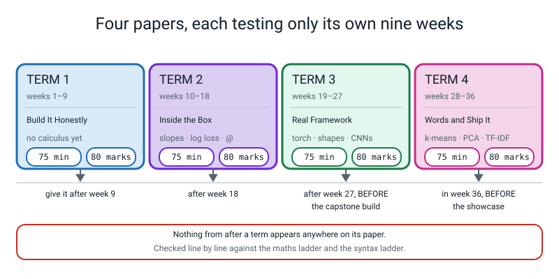
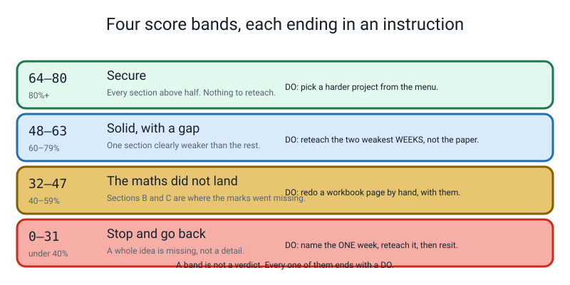

# ✅ Assessments — How To Use The Four Term Tests

[⬅ Course home](../README.md) · [Term 1](term-1-test.md) · [Term 2](term-2-test.md) · [Term 3](term-3-test.md) · [Term 4](term-4-test.md) · [Projects](../projects/project-ideas.md) · [Worked example](../projects/worked-example-project.md) · [Capstone](../projects/capstone.md)

---

> ### In one sentence
>
> **These four papers are mirrors, not verdicts — their whole job is to show you which week did not
> stick, in time to do something about it.**

---

## 🧑‍🏫 For the teacher, in two minutes

**You do not need to know Python, PyTorch or calculus to run or mark these tests.** That is not a
slogan; it is a design constraint, and here is how it is met.

1. There are **four papers**, one per nine-week term. Each is **75 minutes** and **80 marks**.
2. Each paper tests **only its own nine weeks**. Term 3 never asks about Week 6, and nothing from after
   the term appears anywhere. This has been checked line by line against both the
   [maths ladder](../README.md#-the-maths-ladder) and the
   [syntax ladder](../README.md#-the-syntax-ladder).
3. Every paper has the same six sections:

   | | Section | Marks | What it is really testing |
   |---|---|:--:|---|
   | 🅰️ | 12 multiple choice | 12 | Do they know what the words mean |
   | 🅱️ | 5 **do the maths by hand** | 20 | **Can they do the arithmetic that the library hides** |
   | 🅲 | 5 "what does this print?" | 15 | **Can they run code in their head** |
   | 🅳 | 4 "find and fix the bug" | 12 | **Can they read an error, and spot a silent one** |
   | 🅴 | 3 "write the code" | 13 | Can they produce working Python from a spec |
   | 🅵 | 1 extended question | 8 | Can they read a result honestly, or spot a harm |

4. **Every code block on every paper, and in every answer key, was actually run** on Python 3.10.10 with
   numpy 1.26.4, pandas 1.5.3, scikit-learn 1.7.1 and torch 2.2.1, and the real output pasted in
   unedited. Nothing is estimated. So when a student says *"but it prints `6.0`!"* you can say, with
   total confidence, *"no — it prints `12.0`, and here is the run."*
5. **Every division in every Section B answer is written out in longhand.** You will never have to work
   out an answer; you only ever have to compare.
6. Every paper carries its own **marking scheme** and a **full answer key** in collapsible `<details>`
   blocks. The key explains **why each wrong option was tempting** and **decodes every error message
   into plain English**.
7. Section 🅵 is marked with a **4-level rubric**, and every paper includes a **model level-4 answer** so
   you can see the ceiling.

> **⚠️ Watch out — read this before the first paper.** These are **practice** tests. Nothing is gated on
> them. A student who scores 44 out of 80 and then goes back and redoes Week 12 has had a better term
> than one who scores 70 and closes the folder. Say that out loud before you hand the first one out, and
> mean it.

---

## ⛔ Why there is no computer allowed

This is the one instruction students argue about, so here is the answer to give them.

**A programmer who can only find out what code does by running it cannot debug.** Debugging *is*
predicting: you look at a line, you say "this should give me `(32, 64)`", you run it, you get `(32, 256)`,
and the gap between those two numbers is the bug. If you have no prediction, there is no gap, and you are
reduced to changing numbers at random until the error goes away — which is how people spend four hours on
a five-minute problem.

Level 3 sharpens this enormously, because **the defining bug of this level does not produce an error at
all.** A missing `optimizer.zero_grad()`, a `softmax` before a `CrossEntropyLoss`, a scaler fitted before
the split, `argmax(dim=0)` instead of `dim=1` — every one of those runs perfectly and prints a plausible
number. The only defence is having predicted the number first. **That is what Sections B, C and D
between them are for, and all three collapse the moment there is a keyboard in the room.**

## ✅ Why a calculator IS allowed

Because the arithmetic is not the point, and pretending it is would make the paper measure the wrong
thing.

Level 3 is the year the student stops being handed numbers and starts producing them. There are
exponentials, natural logarithms, square roots and squared distances on these papers. **What is being
measured is whether they know which division to do** — and whether they can say what the answer means
once they have it. A student who sets up `40 ÷ (40 + 20)` correctly and then fumbles the division has
demonstrated the skill. A student who writes `0.6667` with nothing above it has not.

So: **any calculator that divides.** For Terms 2 and 4 it must have an `e^x` key and an `ln` key, and
Term 4 needs a `√` as well. **Check this before the paper starts.** It takes thirty seconds and a missing
button costs real marks.

**Two practical consequences:**

- **Set a real timer and let it be quiet.** These papers are demanding to read. Seventy-five minutes with
  no interruption is the whole design.
- **Working on the rough paper EARNS MARKS.** That is written into every marking scheme: correct working
  with a wrong final answer is worth 3 marks of the 4 in Section B, and a correct shape trace is worth 1
  of the 3 in Section C **even when the final answer is wrong**. Tell them before they start. It changes
  how they behave for the whole 75 minutes.

---

## 📅 When to give each one



*Figure A.1 — Four papers, each testing only its own nine weeks. Give each one in the first lesson after its term ends, and note the two "BEFORE"s — they are not decoration.*

| Test | Covers | Give it | Why then |
|---|---|---|---|
| [**Term 1**](term-1-test.md) | Weeks 1–9 | The lesson after Week 9 | Week 9 is already a checkpoint week, so the paper lands on a review rather than cold. And there is no calculus on it at all, which makes it the gentlest of the four — a good place to teach the *format* while the content is easy |
| [**Term 2**](term-2-test.md) | Weeks 10–18 | The lesson after Week 18 | **This is the most important of the four.** Week 18 is the proudest moment of the year (four gradient arrays by hand) and Weeks 19–27 all stand on it. If Term 2's paper reveals a hole, you want to know before Week 19, not in March |
| [**Term 3**](term-3-test.md) | Weeks 19–27 | The lesson after Week 27, **before** any project build | Term 3's paper is shapes and parameter counts, and Section D is literally the four bugs a Level 3 project produces. Sitting it before a build saves hours |
| [**Term 4**](term-4-test.md) | Weeks 28–36 | Any time in Week 36, **before** the showcase | Week 36 already schedules an assessment slot |

**Four scheduling notes that matter more than they look:**

- **The paper always comes before the applause.** In Week 36, sit the paper *before* the showcase. A
  student who has just been clapped at by two adults will not mark themselves honestly. That is not a
  character flaw, it is just how people work, so design around it.
- **Do not give a test in the same sitting as a lab.** These weeks already run 60–75 minutes. A
  75-minute paper needs a slot with nothing else in it.
- **Do not sit Term 2's paper in the same week as Week 19.** Week 19 is NumPy Brain, the week the network
  exists with nothing underneath it, and it needs the student arriving confident. Sit the paper, mark it,
  *then* start Week 19.
- **If Term 2's paper goes badly, delay Week 19 rather than pressing on.** This is the single most useful
  piece of scheduling advice on this page. Term 3 is unforgiving of a shaky Term 2, and a fortnight spent
  re-teaching Weeks 12 and 15 is cheaper than eight weeks of a student copying incantations.

---

## 🕐 Running the test — the whole procedure

**The day before:**

1. Print the paper **up to and including Section 🅵**, and **stop there.** The Marking Scheme and the
   Answer Key are in the same file, below the `---` `---` divider. Do not photocopy past it.
2. Print **four blank sheets per student** (five for Term 4). Actual blank paper, not lined. Shape traces
   and 2×2 squares want space.
3. **Check the calculators.** Terms 2 and 4 need `e^x` and `ln`; Term 4 also needs `√`. Press the buttons
   yourself.
4. Read the paper through with the answer key open. Twenty-five minutes. You are not learning PyTorch;
   you are finding out which two questions your student will complain about, so you can be ready to say
   *"answer the part you do understand and move on"* instead of improvising.

**On the day:**

1. Read the "what is allowed" box out loud. All of it, including the reason for the no-computer rule and
   the reason the calculator is allowed. Thirty seconds, and it removes every argument.
2. Say the three sentences that change behaviour:
   - *"Write the division above the answer. A bare number scores 1 of 4 even when it is right."*
   - *"If a question crashes, say which line crashes and what the error means. That is the answer."*
   - *"If you guess, write 'not sure' beside it. It costs nothing and it tells me where to teach."*
3. Set the timer for 75 minutes. Then **say nothing.** No hints, no "look at that one again", no reading
   over shoulders. It is very hard and it is the job.
4. At 60 minutes, one sentence: *"fifteen minutes — if Section F is blank, go there now."* Section 🅵 is
   8 marks and it is the section students run out of time on.

**Straight after, before you mark anything:**

Ask three questions and write the answers on the front of the paper. They take two minutes and they are
often more useful than the score.

1. *"Which question did you find hardest?"*
2. *"Which one did you get wrong and then realise?"*
3. *"Was there anything you had never seen before?"* — if the honest answer is yes, check it against the
   ladders, because a paper should contain nothing new.

---

## 🧮 How to mark it

### The one rule that governs all of it

> **Mark the process, not the number.**

A student who sets up `recall = 44 ÷ (44 + 40)` and then divides it wrong has done the hard part. A
student who writes `0.5238` with nothing above it has either done the hard part invisibly or copied it
from memory, and there is no way to tell which. So the marks follow the working, everywhere, and you must
say so out loud before the paper starts or it feels like a trick.

### Section 🅰️ — 12 marks

One mark per question. **No half marks.** Two letters circled scores 0. There is nothing to interpret.

The *pattern* is worth more than the total: each answer is week-tagged, so twelve right/wrong marks are a
map of which weeks landed. Every paper's marking scheme names the two or three questions that matter most
— read that note before you look at anything else.

### Section 🅱️ — 20 marks · do the maths by hand

**4 marks per question, on this ladder. It is the same on all four papers.**

| | Marks |
|---|:--:|
| Every part correct **with the division or sum written above each answer** | **4** |
| All the working correct, **one arithmetic slip** carried through | **3** |
| The right divisions set up, **two or more** arithmetic slips | **2** |
| Correct final numbers with **no working shown at all** | **1** |
| Nothing usable | 0 |

**Three rulings you will need, and they come up every time:**

1. **One arithmetic slip carried through costs one mark, not the question.** If a student computes
   `sd = 4` correctly, then writes `z(26) = (26 − 20) ÷ 4 = 1.4` (a division slip), and then uses `1.4`
   consistently in part (d), that is **3 of 4**. They made one mistake. Charging them for it three times
   measures their luck, not their understanding.
2. **A correct method with the wrong *starting* number is also 3 of 4** — as long as they did not choose
   the wrong number to make the arithmetic easier. Using `(40 + 60)` where the question needs `(40 + 20)`
   is not a slip, it is the mistake the question exists to catch, and that is a 2.
3. **A bare correct number is 1 of 4, and you must hold this line.** It looks harsh. It is the whole
   design. Say it out loud before the paper and nobody feels cheated.

### Section 🅲 — 15 marks · what does this print?

**3 marks per question, on this ladder:**

| | Marks |
|---|:--:|
| Every line correct, in the right order, with the right brackets and decimal places | **3** |
| One line wrong, everything else right | **2** |
| Two lines wrong, **or** the right values in the wrong order | **1** |
| A visible shape trace or 2×2 square with correct intermediate values, even if the final answer is wrong | **1, always** |
| Nothing usable | 0 |

**Four rulings:**

1. **Brackets are information; spacing is not.** `[5.]` and `5.0` are different answers, because the
   brackets say "this is an array, one number per column" — be strict. But `4 2 2 2` with two spaces
   instead of one is the answer — give the mark.
2. **A tensor shape must have all its numbers.** `(32, 16, 2, 2)` is right; `(16, 2, 2)` is not, because
   the batch size is the thing that must never move. Costs the line.
3. **Right values, wrong order, is 1 mark.** Most often this is `.ravel()`, which gives **TN, FP, FN,
   TP** and which everybody gets backwards once. Write the order on the paper and move on.
4. **Floating-point noise in the last decimal place is not an error.** If the key says `0.346841` by hand
   and `0.346831` from the library, accept either — the answer keys flag every case where this happens
   and explain why.

### Section 🅳 — 12 marks · find and fix the bug

**3 marks per bug, and the three are independent:**

| | | Marks |
|---|---|:--:|
| **1** | **The meaning** — what the machine *did*, in their own words | 1 |
| **2** | **The line** — its number | 1 |
| **3** | **The fix** — the corrected line in full, or one sentence where there is no error message | 1 |

A student can explain the error beautifully, point at the wrong line, and still score 2. That is correct
and intended.

**Four rulings, and the first two carry the most weight on the whole paper:**

1. **"It's a typo" or "there's a shape error" scores 0 for the meaning mark.** The mark is for the
   mechanism: *"the flatten gives 64 numbers per picture and the layer was told to expect 256"*, or *"it
   divided by 2 and then multiplied by h, because `/ 2 * h` runs left to right"*.
2. **Withhold the fix mark for any fix that makes the number look better by hiding information.**
   Deleting the leaky column is a fix; keeping it and lowering the threshold is not. Clipping a `nan` away
   is a fix; deleting the row that caused it is not.
3. **On a silent bug, "the number is wrong" is not enough; they must say *which* number and *which way*.**
   *"The loss is climbing, 0.693147 to 9.100543"* earns the meaning mark. *"It didn't work"* does not.
4. **On a crash, distinguish where it crashed from where it is wrong.** Term 1's D1 crashes on line 10
   and is wrong on lines 5–9. The mark is for the cause. If a student names the crash line, ask them one
   question — *"is that line doing anything unreasonable?"* — and mark what they say next.

### Section 🅴 — 13 marks · write the code

**Marked against named rows, listed per question in each paper's marking scheme. Award each row on its
own merits. Do not run the code — you do not need to, and the model answer is printed with its real
output.**

**This is where "partial credit for code that nearly works" lives, and here is the rule:**

> **A row is earned by the *intent being visibly correct*, not by the code being runnable.**

So:

| What the student did | Ruling |
|---|---|
| Right construct, one missing bracket or colon | **Award the row.** Syntax is not the skill being measured in Section E |
| Right construct, wrong keyword — `OneHotEncoder()` where `handle_unknown="ignore"` was required | **Withhold that row only.** The keyword *was* the row |
| Indentation missing or wrong on a `def` or a `for` | **Withhold one row across the whole question**, once, and write `four spaces` on the paper. Do not charge it per line |
| A loop where the question said "no `for`" | **Withhold the named row.** The instruction was the point |
| Code that would run and does something different from what was asked | **Withhold the rows it misses.** It running is not the same as it being right |
| Variables named differently from the model answer | **No effect at all.** Never take a mark for a name |
| The answer is shorter than the model answer and does everything asked | **Full marks, and write "good" on it.** The model answers are deliberately verbose |

### Section 🅵 — 8 marks · the extended question

Award **one level for the whole answer**, using that paper's 5-row rubric, then convert:

| Level | Marks |
|---|:--:|
| 4 · Exceptional | 8 |
| 3 · Proficient | 6–7 |
| 2 · Developing | 3–5 |
| 1 · Beginning | 1–2 |
| Nothing usable | 0 |

**A level 3 does not require all five rows at level 3.** Take the best overall fit. A student who nails
the mechanism and forgets the model-card heading is still a 3.

**Two rulings:**

1. **A number with no division shown cannot reach level 3 on the arithmetic row.** This is the same rule
   as Section B and it applies here too.
2. **"The model is biased" scores 0 until a column is named.** Ask one question: *"biased how — name the
   column."* Once a column is named it stops being a feeling and becomes an engineering problem with a
   fix, and the fix goes in the model card.

---

## 📊 What the scores mean



*Figure A.2 — Four score bands, each ending in an instruction. A band is not a verdict; every one of them ends in a DO.*

| Marks | % | What it means | **What to do about it** |
|:--:|:--:|---|---|
| **64–80** | 80%+ | **Secure.** Every section above half, and Sections B and D both strong. The maths landed and the silent bugs are visible to them | **DO:** open [project-ideas.md](../projects/project-ideas.md) and pick a ⭐⭐⭐ from a category they have not touched. Do **not** re-teach anything. A secure student who is given revision instead of a harder problem gets bored, and bored is worse than stuck |
| **48–63** | 60–79% | **Solid, with a gap.** One section is clearly weaker than the rest — and it is almost always B or D | **DO:** find the **two weakest weeks** from the remediation table below and re-teach *those*, not the paper. Then set the workbook page for one of them again, and mark it with them in the room. Do not resit the paper; it measures the same nine weeks and they have now seen it |
| **32–47** | 40–59% | **The maths did not land.** Section A is usually fine and Sections B and C are where the marks went missing. The student knows the vocabulary and cannot yet do the arithmetic under it | **DO:** pick the single week the remediation table points at most often, and **redo its workbook page by hand, sitting next to them, with the calculator out.** One week, done properly, beats four weeks skimmed. Then resit **only Section B** of the paper, two weeks later |
| **0–31** | under 40% | **Stop and go back.** A whole idea is missing, not a detail. Look at Section A first: if A is also below half, the vocabulary never landed and no amount of arithmetic practice will help | **DO:** name the **one** week. For Term 2 it is nearly always Week 12; for Term 3, Week 25; for Term 4, Week 32. Re-teach that single week from the teacher guide, from the top, with the student typing. Then resit the whole paper a fortnight later. **And do not move on in the meantime** — Level 3 is a ladder and a missing rung does not get better with distance |

> **🧑‍🏫 One number to watch that is not the total.** Compare **Section A** with **Section B**.
>
> - **A high, B low** is the commonest Level 3 profile and it is good news: they know what the words mean
>   and they have not yet done enough arithmetic. That is fixable in one week with a pencil.
> - **A low, B high** is rare and it means they can compute and cannot explain. Give them the glossary
>   and ask them to say each definition out loud with the number that proves it.
> - **Both low** is the one that needs the whole week re-taught, and it is the only profile where
>   pressing on is genuinely harmful.

---

## 🔧 The remediation table

**Every question on all four papers, mapped to the week that teaches it.** Use it two ways: a wrong
answer tells you which week to re-teach, and a week with several wrong answers against it is the week to
re-teach *first*.

### Term 1 — Weeks 1–9

| Week | Title | Questions that test it | If they got these wrong, do this |
|:--:|---|---|---|
| **1** | The One Line That Hid Five Decisions | A1 · A2 · B4 · C1 · F1 | Re-do the prediction contract for a **different** table — `load_wine` works — out loud, in five sentences, with no code at all. Unit of prediction, X, y, the metric, the audit numbers |
| **2** | Practice, Mock Exam, Final Exam | A3 · A4 · B4 · C5 · E1 | Three physical piles of paper on the table, labelled. Then ask the only question that matters: *"which pile may I use to choose the threshold, and which one may I open once?"* |
| **3** | The Artifact Is the Deliverable | A5 · A6 · B5 · C3 · D1 · E2 · F1 | Have them delete `predict.py`, write it again from a blank file, and run the grep. `grep -rnE "\.fit\(" predict.py` printing nothing is the pass |
| **4** | Same Number, Different Ruler | A7 · A8 · B1 · C2 · D2 | The ten by-hand scaling drills from the Week 4 workbook, with the sklearn check beside each. This is a pencil problem and it takes twenty minutes |
| **5** | Columns You Invent Yourself | A9 · B5 · C3 | Build **one** derived feature and run the ablation on it. One row of the table, with the ΔAUC to 4 dp. The discipline, not the quantity |
| **6** | The Answer Was in the Features 🔑 | A10 · D3 · E2 · F1 | Re-run the 2,000-column pure-noise experiment. Leaky, then honest: `0.75` then `0.50`. **This one is worth doing again even if they got it right** |
| **7** | Beat the Baseline | F1 · B5 (column counting) | Hand them `leaky_features.py` again and time how long the planted leak takes to find. If it is over ten minutes, do Week 6 first |
| **8** | Four Numbers That Tell You What Kind of Wrong | A11 · B2 · C4 · D4 · E3 | Build the 2×2 by hand from 30 given predictions, then describe one false positive and one false negative **in the language of the application**. Not "an FP" — *"a driver got a warning letter for a storm"* |
| **9** | Term 1 Checkpoint — One Number Is Never Enough | A12 · B3 · E3 | Compute F1 for four lopsided pairs and watch it get dragged towards the smaller number every time. `p=1.0, r=0.02` giving `0.04` is the one that makes it stick |

### Term 2 — Weeks 10–18

| Week | Title | Questions that test it | If they got these wrong, do this |
|:--:|---|---|---|
| **10** | The Threshold Dial, and the Curve It Draws | A1 · A2 · B1 · C1 · E1 · F1 | The nine-threshold sweep again, by hand, from ten probabilities on paper. Then the one-line rule: **a curve wants probabilities; a count of cells wants predictions** |
| **11** | Fraud Bench: What Does a Mistake Cost? | A3 · A4 · B1(d) · E1 · F1 | Write the cost table for three thresholds at three different price lists and watch a different row win each time. `10:1`, `1:1`, `3:1` |
| **12** | 📐 How Steep Is the Hill Right Here? | A5 · A6 · B2 · C2 · D1 · E2 | **This is the week to re-teach if you only re-teach one in the whole year.** Nine numeric slopes with a pencil, `h = 0.001`, with the shortcut rule written beside each. Do not move on until the two agree three times |
| **13** | From a Score to a Chance | A7 · B3 · C3 | Eight sigmoid conversions on the calculator, three stages each: `e^(−z)`, `+1`, then `1 ÷`. Then four backwards through the odds |
| **14** | Measuring How Wrong You Are | A8 · B3 · C3 · D2 · F1 | `−ln(p)` for `0.9, 0.5, 0.1, 0.02`, with the squared error beside each. The point is the **ceiling**: squared error stops at 1 and log loss does not stop |
| **15** | Rolling Downhill: Descent From Scratch | A9 · B4 · D4 · E2 | The first four losses, by hand, on paper: `0.693147 → 0.581375 → 0.504824 → 0.448421`. If those four do not come out, the bug is in the sign or in the averaging |
| **16** | One Neuron, By Hand | A10 · B5 · C4 · C5 · E3 | Eighteen neuron outputs by hand for ReLU, sigmoid and tanh, then check all eighteen in numpy. And state the shape of eight arrays **before** running anything |
| **17** | A Layer Is a Grid Times a Grid | A11 · B5 · C5 · D3 · E3 | Three cells of a `(3,2) @ (2,4)` by hand, then the five deliberate shape mismatches with the real error pasted for each. **Say the sentence out loud every time** |
| **18** | 🔑 Term 2 Checkpoint — How Much Did Each Knob Contribute? | A12 · B5(d) · C5 · E3 | All four gradient arrays for a 2→2→1 network, by hand, then gradient-checked below `1e-6`. It is hard and it is the proudest hour of the year |

### Term 3 — Weeks 19–27

| Week | Title | Questions that test it | If they got these wrong, do this |
|:--:|---|---|---|
| **19** | NumPy Brain | A1 · E1 (the `65`) | Count the knobs of a 2→16→1 network by hand — `2 × 16 + 16 + 16 × 1 + 1 = 65` — then make torch print the same number. Two routes, one answer |
| **20** | A Machine That Does the Slopes For You | A2 · B4 · C1 | The ten autograd exercises with the hand answer beside each. Then the accumulation demo: `backward()` twice, `6 + 6 = 12`, and why `None` is not `0.0` |
| **21** | The Five-Line Loop | A3 · A4 · B4 · C2 · D3 | Delete each of the five lines in turn and fill in the five-row table of what happened. **Three of the five give no error at all**, and that table is the lesson |
| **22** | Layers, Losses, and Watching It Overfit | A5 · A6 · C3 · E1 | Print `named_parameters()` for a 2→16→1 `nn.Sequential` and check the count is 65. Then plot two loss curves and mark the epoch validation stopped improving |
| **23** | Same Brain, Real Framework | A7 · A8 · E3 · F1 | Count the optimizer steps in one epoch three different ways and make the arithmetic agree. Then the `model.eval()` experiment: same input, five predictions, before and after |
| **24** | Why Flattening a Picture Throws Away the Picture | A9 · B3 · D2 | One 3×3 kernel over one 5×5 picture, all nine cells by hand, then checked in `nn.Conv2d(..., bias=False)`. And the parameter comparison: 10 numbers against 1,040 |
| **25** | Work Out the Size Before You Run It | A10 · B1 · C4 · D1 · E2 | **This is Term 3's week to re-teach if you only re-teach one.** Twelve output-size calculations by hand with the printed shape beside each. Then deliberately mis-size the `Linear` and read the two numbers in the error |
| **26** | A Network That Reads Digits | A11 · B2 · B5 · C5 · D4 · E2 · F1 | Count all 1,898 parameters by hand — `80 + 1168 + 650` — then make torch agree. And check the first loss is near `2.3026`, because `−ln(0.1) = 2.3026` |
| **27** | Term 3 Checkpoint — See It | A12 · B5 · C5 · F1 | The augmentation results table with the wrap left in (`+0.00`) and blanked (`+1.30`). Then name the worst confusion pair and give a **physical** reason at 8×8 |

### Term 4 — Weeks 28–36

| Week | Title | Questions that test it | If they got these wrong, do this |
|:--:|---|---|---|
| **28** | Sorting With No Answer Key | A1 · A2 · B1 · C1 · D3 · E1 | Two iterations by hand on the six points, all sixteen squared distances shown. Then the scaling experiment on `load_wine`: unscaled ARI `0.3711`, scaled `0.8975` |
| **29** | A New Pair of Axes | A3 · A4 · B2 · C2 · E2 | Variance of five numbers in four steps, then the observation that the deviations add to **exactly zero**. Then explained variance beside reconstruction error, both reported |
| **30** | Cluster Cartography | A5 · A6 · D3 · E1 | One point's silhouette by hand — two averages and a subtraction — then the elbow and the silhouette agreeing on `k = 3`, plus the pure-noise negative control at `0.0776` |
| **31** | Words Into Columns | A7 · A8 · B3 · C3 · D4 | Tokenize six sentences by hand and by regex and list every disagreement. Then build the count matrix for five reviews by hand: 32 cells, 32 ticks, row totals checked |
| **32** | Rare Words Matter More | A9 · A10 · B3 · B4 · C4 | **This is Term 4's week to re-teach if you only re-teach one.** Four TF-IDF weights by hand matching sklearn to 4 dp, and three cosine similarities by hand read as **angles** |
| **33** | Sentiment Engine | A11 · B5 · C5 · D1 · D2 · E3 · F1 | Run the twelve negation traps again and get `0 of 12`. Then the post-mortem: the review, what the model said, the arithmetic token by token, and the **mechanism** |
| **34** | Ship It, Part 1 | E3 · F1 | Write the contract for a model they already have, in five boxes, and make box 5 a **sum**. Then the grep that proves Rule 1 |
| **35** | Ship It, Part 2 | A12 · B5(c) · F1 | Send the service all four malformed requests and check it survives every one with a `400` that says what to send instead. Then p95 **and** max, printed together |
| **36** | Showcase Day and the Final Paper | Section 🅵 on **all four** papers | The three questions from memory — baseline, class balance, was anything fitted before the split — and the five-line loop from a blank file in under three minutes |

---

## 🪞 A one-page record sheet

Print one per student and keep all four terms on the same sheet. The **trend** across the four columns
tells you more than any single total, and a student seeing their own Section B climb from 8 to 17 over a
year is the most motivating thing on this page.

```
   ┌──────────────────────────────────────────────────────────────────────────┐
   │  LEVEL 3 ENGINEER · TERM TEST RECORD                                     │
   │                                                                          │
   │  Student ______________________________   Year ________________          │
   │                                                                          │
   │  ┌──────────────────────────┬────────┬────────┬────────┬────────┐        │
   │  │ Section                  │ TERM 1 │ TERM 2 │ TERM 3 │ TERM 4 │        │
   │  ├──────────────────────────┼────────┼────────┼────────┼────────┤        │
   │  │ 🅰️  multiple choice /12   │        │        │        │        │        │
   │  │ 🅱️  maths by hand   /20   │        │        │        │        │        │
   │  │ 🅲  what prints     /15   │        │        │        │        │        │
   │  │ 🅳  find the bug    /12   │        │        │        │        │        │
   │  │ 🅴  write the code  /13   │        │        │        │        │        │
   │  │ 🅵  extended (level)  /8  │        │        │        │        │        │
   │  ├──────────────────────────┼────────┼────────┼────────┼────────┤        │
   │  │ TOTAL               /80   │        │        │        │        │        │
   │  │ BAND                      │        │        │        │        │        │
   │  ├──────────────────────────┼────────┼────────┼────────┼────────┤        │
   │  │ Date sat                  │        │        │        │        │        │
   │  │ "Hardest question"        │        │        │        │        │        │
   │  │ "Got it, then realised"   │        │        │        │        │        │
   │  │ Weeks re-taught after     │        │        │        │        │        │
   │  │ Re-sat? (which section)   │        │        │        │        │        │
   │  └──────────────────────────┴────────┴────────┴────────┴────────┘        │
   │                                                                          │
   │  THE ONE NUMBER TO WATCH                                                 │
   │  Section 🅱️ out of 20, across the four terms:  ___  ___  ___  ___         │
   │  This is the arithmetic-under-the-library score. It should climb.         │
   │  If it does not, the maths did not land, whatever the total says.         │
   │                                                                          │
   │  GUESSES MARKED "not sure" THAT TURNED OUT RIGHT                         │
   │  Term 1 ____   Term 2 ____   Term 3 ____   Term 4 ____                   │
   │  These are the questions to re-teach FIRST. A lucky right answer          │
   │  is a wrong answer that has not happened yet.                            │
   │                                                                          │
   │  NOTES — one line per term, written the day you marked it                │
   │  T1 ____________________________________________________________         │
   │  T2 ____________________________________________________________         │
   │  T3 ____________________________________________________________         │
   │  T4 ____________________________________________________________         │
   │                                                                          │
   └──────────────────────────────────────────────────────────────────────────┘
```

> **💡 Try this:** at the end of Week 36, hand the student their own record sheet and ask them to write
> one sentence at the bottom about what changed. They usually point at Section 🅱️ themselves, and they are
> usually right.

---

## ⚠️ Six mistakes teachers make with these papers

**1. Marking the number instead of the working.**
This is the big one, and it is easy to slip into when you are tired. A right answer with no division
above it is **1 of 4**, and a wrong answer with the right division above it is **3 of 4**. Those two
rulings are what make the paper measure understanding instead of recall. If you soften either of them,
the paper stops being a mirror.

**2. Treating a silent bug like a crash.**
In Sections 🅳 the questions marked ⚠️ have **no error message**, and students often write "there's no
error" and stop. That is not an answer and it is also not their fault — it is a habit that has to be
taught. When you hand the paper back, say the sentence: **"in Level 3 the dangerous bug is the one that
prints a number you are pleased with."** Then show them D3 of Term 2, where the loss climbs politely from
`0.693147` to `9.100543` and nothing goes red.

**3. Giving the paper and then moving straight on.**
A paper you do not act on is worse than no paper, because it costs 75 minutes and teaches the student
that assessment is a ritual. **The remediation table is the point of this page.** Mark the paper, name
one week, re-teach it. If you have no time to re-teach, you had no time to test.

**4. Helping during the paper.**
You will want to. A student will be stuck on B2 and you will know exactly which bracket is wrong, and
saying so converts a diagnosis into a lesson you then cannot diagnose. Set the timer, sit somewhere you
cannot read over a shoulder, and mark a book. The one thing you may say, once, at 60 minutes, is *"if
Section F is blank, go there now."*

**5. Letting the calculator become the argument.**
Every year somebody decides the calculator makes it too easy, or that it should be banned to "test the
maths". It does not test the maths; it tests arithmetic speed, which is not on any ladder in this course.
**Check the calculators before the paper and then never mention them again.** What is being measured is
which division to do, and a calculator cannot tell them that.

**6. Reading the total instead of the profile.**
Two students both score 52. One got 11/12 on A and 9/20 on B; the other got 6/12 on A and 17/20 on B.
They need completely different fortnights. **The total is the least informative number on the page** —
compare Section A with Section B first, every time, before you look at anything else.

---

## ❓ Questions a teacher actually asks

<details>
<summary><b>"I don't know PyTorch. Can I really mark Term 3?"</b></summary>

Yes, and here is why, precisely.

Term 3's Section 🅱️ is **two pieces of arithmetic**, repeated:

```
the output-size rule :  (n + 2p − k) ÷ s + 1,  rounded down
a conv layer's cost  :  (in × k × k × out) + out
a linear layer's cost:  (in × out) + out
```

Every Section B answer on that paper is one of those three, and the answer key writes out each sum in
longhand. You compare; you do not compute.

Section 🅲 is shapes, and a shape is four numbers in brackets. The answer key prints every one.

Section 🅳 is four error messages, each decoded into plain English in the key, each with the fixed line
written out in full.

Section 🅴 has a model answer with its **real output** pasted underneath, so you can see what the code
was supposed to produce.

The only section that needs judgement is 🅵, and that has a five-row rubric and a model level-4 answer.

**The one thing you should do is read the paper through with the key open before you hand it out.**
Twenty-five minutes. That is the whole preparation.
</details>

<details>
<summary><b>"My student says the test is unfair because they never saw that."</b></summary>

Check it, properly, because if they are right it is important.

Take the thing they say they never saw and look it up in the [maths ladder](../README.md#-the-maths-ladder)
or the [syntax ladder](../README.md#-the-syntax-ladder). Both tables give the week each idea first
appears. Then:

- **If the week is inside the term:** show them the ladder row and the week's student guide page. Then ask
  the useful question — *"what do you remember about that week?"* — because "I never saw it" and "I saw it
  and it did not stick" feel identical from the inside and need different fortnights.
- **If the week is after the term:** they are right, it is a defect, and you should skip the question and
  scale the total. Every question on every paper has been checked against both ladders, but "has been
  checked" is not "is perfect".
- **If it is not on either ladder at all:** it will be something from Levels 1 or 2 that this level
  assumes — `train_test_split`, `groupby`, an f-string. Those are listed at the top of the syntax ladder
  as assumed and never re-taught.
</details>

<details>
<summary><b>"Can I let them use their notes? It feels harsh."</b></summary>

No for Sections 🅱️, 🅲 and 🅳, and here is the reason in one line: **the whole skill is predicting an
output before you have it**, and a note that contains the answer removes the prediction.

But there is a much better thing you can do, and it is not a compromise. Give the paper closed. Mark it.
Then hand it back **with** the student guide and the glossary and say: *"go and find the page that answers
the ones you got wrong, and write the answer in the margin."* Twenty minutes, and it does far more than
an open-book sitting would have, because now they know which pages they needed.

If a student is genuinely distressed about a closed paper, the concession to make is **time**, not notes.
Ninety minutes instead of seventy-five costs nothing and measures the same thing.
</details>

<details>
<summary><b>"They wrote `0.6667` and it's right. Do I really only give 1 mark?"</b></summary>

Yes. And say why out loud, because the reason is convincing.

In Level 3 the answer is never the skill. **Knowing which division to do is the skill**, and the only
evidence of it is on the page. There are exactly two students who write a bare `0.6667`: one who divided
`40 ÷ 60` in their head, and one who remembered that this question's answer was `0.6667`. They look
identical and they need different fortnights, and the working is what tells them apart.

There is also a selfish reason, and students find it more persuasive than the fair one: **the working is
what lets them find their own slip.** A student who writes `precision = 40 ÷ (40 + 20) = 40 ÷ 60 = 0.6` can
look at it and see that `0.6` is wrong. A student who writes `0.6` cannot.

Say this before the paper starts, not after you have marked it.
</details>

<details>
<summary><b>"Which paper matters most? I can only run two this year."</b></summary>

**Term 2 and Term 4**, and it is not a close call.

**Term 2** is the diagnostic that changes what you do next. Weeks 19 to 27 all stand on the slope, the
gradient and the matrix multiply, and a hole in any of those turns Term 3 into memorised incantations.
Term 2's paper finds the hole while there is still time to fill it.

**Term 4** is the one that tells you whether the *point* landed — whether the student can be handed a
confident number and say whether to believe it. Section 🅵 of Term 4 is the closest thing in this course
to a final exam of judgement rather than knowledge.

If you can run three, add **Term 3**, because its Section 🅳 is exactly the four bugs a Level 3 project
produces and sitting it before a build saves hours.
</details>

<details>
<summary><b>"My student ran out of time and left Section F blank."</b></summary>

Very common, and there are three things to do, in this order.

1. **Mark what is there and note the blank.** Do not guess a level.
2. **Give them Section 🅵 as homework, that evening, with a 20-minute timer**, and mark it separately.
   It is 8 marks and it is the section the whole year is aimed at; losing it to a clock tells you nothing.
3. **Next time, say the 60-minute sentence.** *"Fifteen minutes — if Section F is blank, go there now."*
   That single sentence is the fix, and it is in the procedure above for this reason.

A pattern worth noticing: students who run out of time usually over-invest in Section 🅲, writing out
enormous trace tables for 3 marks. Tell them the ladder — *one visible trace is worth 1 mark, always, so
do it quickly and move on.*
</details>

<details>
<summary><b>"Should I let them resit?"</b></summary>

Yes, with two conditions.

**Condition one: re-teach first.** A resit with no teaching in between measures how much they remember of
the paper, which is a number nobody needs.

**Condition two: resit the section, not the paper** — unless they were in the bottom band. If Section 🅱️
was 8 of 20, re-teach the two weeks the remediation table names and then resit **only Section 🅱️**, two
weeks later. It takes twenty minutes and it measures the thing you actually changed.

Record both scores on the record sheet. The gap between them is the most useful number the sheet will
ever hold, and a student who sees `9 → 17` written in their own row has learned something about
themselves that no first attempt could have taught them.
</details>

<details>
<summary><b>"They got a question right by guessing and admitted it. What now?"</b></summary>

**Give the mark, and then treat it as a wrong answer.** Both of those, and neither one instead of the
other.

Give the mark because the instruction said a guess costs nothing, and going back on that is how you never
get an honest "not sure" again.

Treat it as wrong because it is. The record sheet has a line for exactly this — *"guesses marked 'not
sure' that turned out right"* — and those are the questions to re-teach **first**, before the ones they
got wrong, because a lucky right answer is a wrong answer that has not happened yet. A student who is
honest enough to write "not sure" beside a correct answer has given you the single most useful piece of
data on the whole paper, and they should be told so.
</details>

<details>
<summary><b>"Can I use these as end-of-year exams and give a grade?"</b></summary>

You can, and this course would rather you did not.

The papers are built as **mirrors**. Every design decision — the answer key that explains why a wrong
option was tempting, the remediation table, the bands that all end in a DO — is aimed at *what to do
next*, not at *what to record*. Turn them into a grade and the student's incentive shifts from "find out
what I do not know" to "protect my number", and the paper stops working.

If you need a summative judgement, use the [capstone rubric](../projects/capstone.md) — an 8×4 rubric on
a thing they built, defended in front of a room. That is a far better measure of Level 3 than any 75
minutes with a pencil, and it is designed for the job.
</details>

<details>
<summary><b>"The answer key's number differs from mine in the last decimal place."</b></summary>

That is almost always **floating-point rounding**, and it is not an error in either of you.

It happens for one specific reason: adding four numbers that you rounded to six decimal places gives a
slightly different total from adding four full-precision numbers. Term 2's B3 is the documented case —
the by-hand total is `2.854234` and Python's is `2.854233`, and both round to `0.713558`.

**The rule for marking: accept anything that agrees to four decimal places**, and the answer keys flag
every place this happens and say so. If a student's answer differs in the *second* decimal place, that is
a real slip and the ladder handles it: one slip is 3 of 4.

If the key differs from **your** calculator in the second decimal place, check the order of operations
first — nine times out of ten it is a bracket, and Term 2's D1 exists because that is the most expensive
bracket in the level.
</details>

---

## 🔑 The seven things this page is really saying

1. **These are mirrors, not verdicts.** Every band ends in an instruction because the score is only
   useful for deciding what to do on Monday.
2. **Mark the process, not the number.** One arithmetic slip costs one mark. A bare right answer costs
   three.
3. **No computer, yes calculator.** The first because predicting is debugging. The second because
   arithmetic speed is not on any ladder in this course.
4. **Compare Section A with Section B before you look at the total.** Words-without-arithmetic and
   arithmetic-without-words need completely different fortnights.
5. **The dangerous bug prints a number you are pleased with.** Half of Section 🅳 on every paper has no
   error message, and that is the defining skill of Level 3.
6. **Term 2 is the paper that changes what you do next.** Weeks 19 to 27 stand on it. If it goes badly,
   delay Week 19.
7. **A paper you do not act on is worse than no paper.** Mark it, name one week, re-teach that week. The
   remediation table is the point of this page.

---

[⬅ Course home](../README.md) · [Term 1](term-1-test.md) · [Term 2](term-2-test.md) · [Term 3](term-3-test.md) · [Term 4](term-4-test.md) · [Projects](../projects/project-ideas.md) · [Capstone](../projects/capstone.md)
