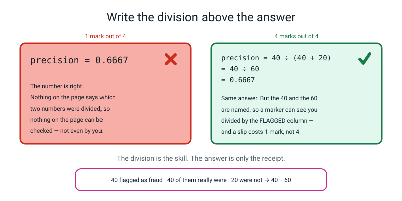
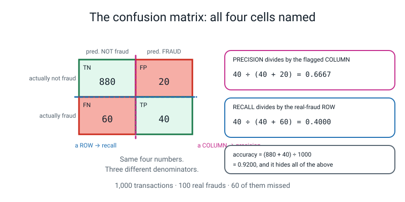

# 📝 Term 1 Practice Test — Weeks 1–9

[⬅ Assessments home](README.md) · [Course home](../README.md) · [Term 2 test ➡](term-2-test.md)

---

```
   ┌──────────────────────────────────────────────────────────────────────┐
   │                                                                      │
   │   AI ACADEMY · LEVEL 3 ENGINEER                                      │
   │   TERM 1 PRACTICE TEST — Build It Honestly                           │
   │   Covers Weeks 1–9. Nothing later appears anywhere on this paper.    │
   │                                                                      │
   │   TIME ALLOWED   75 minutes                                          │
   │   TOTAL MARKS    80                                                  │
   │                                                                      │
   │   Section A   12 multiple choice         1 mark each     12 marks    │
   │   Section B    5 do-the-maths-by-hand    4 marks each    20 marks    │
   │   Section C    5 "what does this print"  3 marks each    15 marks    │
   │   Section D    4 find-and-fix-the-bug    3 marks each    12 marks    │
   │   Section E    3 write-the-code        4 + 4 + 5 marks    13 marks    │
   │   Section F    1 extended question       8 marks          8 marks    │
   │                                                                      │
   │   ⛔  NO COMPUTER.                                                   │
   │   ✅  A CALCULATOR, YES — AND YOU WILL NEED IT.                      │
   │                                                                      │
   │      Level 3 is the year the arithmetic became yours. So the         │
   │      calculator is allowed, expected, and not the point. What is     │
   │      being measured is whether you know WHICH division to do.        │
   │      A programmer who can only find out what code does by running   │
   │      it cannot debug. Today you run it in your head, like a person.  │
   │                                                                      │
   │   INSTRUCTIONS                                                       │
   │   · Write in pencil. Answer every question.                          │
   │   · Section A: circle ONE letter. A guess costs nothing.             │
   │   · If you guess, write "not sure" beside it. This matters even      │
   │     when the guess turns out right.                                  │
   │   · Section B: WRITE THE DIVISION ABOVE THE ANSWER. Every time.      │
   │     A bare number scores 1 of 4 even when it is correct.             │
   │   · Section C: write EVERY line of output, on separate lines, in     │
   │     order. Shapes are written with brackets: (4, 5).                 │
   │   · Section D: you must do THREE things — say what Python is         │
   │     telling you, point at the line, and write the fixed line.        │
   │   · Section E: indentation counts. Four spaces. Every time.          │
   │   · Section F: a paragraph, not a list, and the arithmetic goes in   │
   │     the paragraph.                                                   │
   │                                                                      │
   │   WHAT IS ALLOWED                                                    │
   │   ✅  Pencil, pen, eraser, ruler                                     │
   │   ✅  A calculator — any calculator that divides                     │
   │   ✅  Three blank sheets of rough paper. Your working earns marks    │
   │   ❌  A COMPUTER. No Python, no phone, no editor, no terminal        │
   │   ❌  The student guide, the workbook, the glossary, your notes      │
   │   ❌  Your own week-1-to-9 .py files                                 │
   │   ❌  A search engine, a chatbot, another person                     │
   │                                                                      │
   └──────────────────────────────────────────────────────────────────────┘
```

> **🧑‍🏫 Teacher, read this once before you hand the paper out.** You do not need to know any Python,
> any statistics or any machine learning to run this test. Set a timer for 75 minutes. Read the "what
> is allowed" box out loud — especially the **no computer** line and the **calculator yes** line, and
> the reason for each. Then say nothing until the timer goes. The full answer key at the bottom of this
> file contains **the real output of every code block on this paper**, run on Python 3.10.10 with
> numpy 1.26.4, pandas 1.5.3 and scikit-learn 1.7.1, plus **every division written out in longhand**.
> Students must not see that page. Marking guidance is in [assessments/README.md](README.md).

---

## 📐 The two skills this paper is really testing

Before you start, look at these two pictures. They are worth more marks than anything you can memorise.



*Figure T1.1 — How to answer a Section B question. The number on its own is worth 1 mark. The division above it is worth the other 3, and it is what lets you find your own slip.*



*Figure T1.2 — The four counts, named, with precision and recall shown as two different regions of the same square. Precision divides by a **column**. Recall divides by a **row**. Copy this square onto your rough paper before you start Section B.*

---

# 🅰️ Section A — Multiple Choice

*12 questions · 1 mark each · circle ONE letter · the week each question comes from is in brackets*

---

**A1.** [W1] A pizza chain hands you a file and says "our deliveries are bad, can AI fix it?" What is the **first** decision you have to write down?

- (a) Which model to use — a tree or a logistic regression
- (b) The unit of prediction: what one row of your table stands for
- (c) The train/test split fraction
- (d) Whether to scale the columns

---

**A2.** [W1] A column has 2,000 different values in a table of 2,020 rows. What is it, and what do you do with it?

- (a) The most informative feature you have — put it in X first
- (b) An ID-like column — never a feature, because it identifies rows rather than describing them
- (c) A target, because it has so much variety
- (d) A broken column — delete the whole table and start again

---

**A3.** [W2] You have three piles: train, validation, test. What is the **validation** pile for?

- (a) Training the model a second time, to be sure
- (b) Choosing between things — features, thresholds, settings — so that the test pile stays unopened
- (c) Reporting the final number you put in the model card
- (d) Nothing; it exists so the numbers divide neatly

---

**A4.** [W2] `roc_auc_score(y_val, prob)` comes back as `0.5013`. What does that tell you?

- (a) The model is right about half the time
- (b) The model ranks a random positive above a random negative about as often as a coin flip — it has learned nothing useful
- (c) Half of the columns are useful and half are not
- (d) The threshold needs moving to 0.5013

---

**A5.** [W3] What must `predict.py` — the clean process that loads your saved model — **never** contain?

- (a) An `import` line
- (b) A `print`
- (c) Any training code: no `.fit()`, no `train_test_split`, no scaler being taught anything
- (d) A file path

---

**A6.** [W3] `joblib.dump(pipe, "late.joblib")` writes what to disk?

- (a) The score the model got
- (b) The fitted `Pipeline` — the preprocessing **and** the model, with every number they learned
- (c) The training rows
- (d) A text description of the model you can read in a text editor

---

**A7.** [W4] A column has mean 20 and standard deviation 4. One row has the value 26. What is its z-score, and what does it mean?

- (a) `6` — it is 6 above the mean
- (b) `1.5` — it sits one and a half typical distances above the mean
- (c) `0.65` — it is 65% of the way up the column
- (d) `26 ÷ 20 = 1.3` — it is 1.3 times the average

---

**A8.** [W4] You encode `weather` with `OrdinalEncoder` so that `clear = 0`, `rain = 1`, `storm = 2`. What does the model now wrongly believe?

- (a) That storm is impossible
- (b) That the three weathers are all the same
- (c) That storm is *twice as much weather* as rain, and that rain sits exactly halfway between clear and storm
- (d) Nothing — this encoding is always safe

---

**A9.** [W5] You invent four new columns and your validation AUC goes from `0.7712` to `0.7715`. What does the ablation table tell you to do?

- (a) Keep all four — every improvement counts
- (b) Delete the ones that bought nothing, and write down the number that made you delete them
- (c) Invent four more
- (d) Move to the test set to check

---

**A10.** [W6] Which of these columns is a **leak** in a model that predicts, at the moment of ordering, whether a pizza delivery will be late?

- (a) `distance_km`
- (b) `order_hour`
- (c) `refund_issued` — a refund is only ever issued *after* a delivery has gone wrong
- (d) `restaurant`

---

**A11.** [W8] A fraud model has precision `0.90` and recall `0.20`. In plain words, what kind of wrong is it?

- (a) It cries wolf constantly, but it catches nearly everything
- (b) When it does raise an alarm it is nearly always right, but it stays silent for four out of every five real frauds
- (c) It is wrong 90% of the time
- (d) It is 20% accurate

---

**A12.** [W9] A model predicts "yes" exactly once, on one row, and it is right. So precision is `1.0` and recall is `0.02`. What is its F1?

- (a) `0.51`, the ordinary average
- (b) About `0.04`, because the harmonic mean is dragged down towards the smaller number
- (c) `1.0`, because precision is perfect
- (d) `0.02`, the same as recall

---

# 🅱️ Section B — Do the Maths By Hand

*5 questions · 4 marks each · 20 marks · NO COMPUTER · a calculator is allowed and expected*

**Write the division above the answer, every time.** A bare correct number scores 1 mark out of 4.
The other 3 are for the working, and the working is what lets you find your own slip.

---

**B1.** [W4] Five `prep_minutes` values from the delivery table:

```
   14      18      20      22      26
```

**(a)** Work out the **mean**.

```
   working: ______________________________________   mean = __________
```

**(b)** Work out the **standard deviation**. Use the recipe from Week 4: subtract the mean from each
value, square each answer, take the mean of those squares, then square-root it. *(These five numbers
were chosen so the answer is a whole number.)*

```
   deviations:  ______  ______  ______  ______  ______

   squares:     ______  ______  ______  ______  ______

   mean of the squares: ____________________   sd = __________
```

**(c)** Work out the **z-score** of the value `26`, and of the value `18`.

```
   z(26) = ______________________ = __________

   z(18) = ______________________ = __________
```

**(d)** One sentence: a second column, `distance_km`, has mean 3.5 and sd 2.4. A row has
`prep_minutes = 26` and `distance_km = 8.3`. **Which of the two is the more unusual value for its own
column**, and how do you know?

```
   ____________________________________________________________________
```

---

**B2.** [W8] A fraud model was run on **1,000** transactions. Here are the four counts:

```
                        predicted NOT fraud      predicted FRAUD
   actually not fraud           880                     20
   actually fraud                60                     40
```

Compute all four of these. **Show the division each time.**

```
   (a) accuracy     = ______________________ = __________

   (b) precision    = ______________________ = __________

   (c) recall       = ______________________ = __________

   (d) specificity  = ______________________ = __________
```

*Reminder of the shape: precision divides by a **column** of that square. Recall divides by a **row**.*

---

**B3.** [W9] Two models were measured on the same validation rows.

| | precision | recall |
|---|:--:|:--:|
| **Model A** | 0.90 | 0.30 |
| **Model B** | 0.60 | 0.60 |

**(a)** Compute the ordinary average of precision and recall for both models.

```
   Model A: ______________________ = __________

   Model B: ______________________ = __________
```

**(b)** Now compute **F1** for both, using the harmonic mean `F1 = 2 × p × r ÷ (p + r)`.

```
   Model A: ______________________ = __________

   Model B: ______________________ = __________
```

**(c)** Write one sentence saying **what F1 did to Model A that the ordinary average did not**, using
your four numbers.

```
   ____________________________________________________________________
```

---

**B4.** [W1, W2] Your audit of the delivery table prints these real numbers:

```
   rows                    2020
   late = 1                 582
   late = 0                1438
```

**(a)** What fraction of orders were late? Give it to 4 decimal places.

```
   ______________________ = __________
```

**(b)** A `DummyClassifier(strategy="most_frequent")` is fitted on this table. Which class does it
always predict, and what accuracy does it get?

```
   class predicted: __________

   accuracy = ______________________ = __________
```

**(c)** Somebody shows you a model that is **71% accurate** on this table and calls it good. Write the
one sentence that takes the wind out of it, with a number in it.

```
   ____________________________________________________________________
```

**(d)** The audit also reports **20 duplicate rows** and **108 missing** values in
`driver_experience_months`. Which of those two do you fix by *deleting* something, and which one do
you fix by *learning a number from the training rows only*?

```
   delete: ____________________   learn a number: ____________________
```

---

**B5.** [W3, W4, W5] You build this `ColumnTransformer` on the delivery table:

```python
NUM = ["distance_km", "items", "prep_minutes", "order_hour",
       "driver_experience_months"]
CAT = ["restaurant", "day_of_week", "weather"]

prep = ColumnTransformer([
    ("num", StandardScaler(), NUM),
    ("cat", OneHotEncoder(handle_unknown="ignore"), CAT),
])
```

The three categorical columns have these numbers of different values:

```
   restaurant      5 different values
   day_of_week     7 different values
   weather         3 different values
```

**(a)** How many columns come **out** of the `num` route?

```
   __________
```

**(b)** How many columns come **out** of the `cat` route? Show the addition.

```
   ______________________ = __________
```

**(c)** So how many columns does the model actually see? Show the addition.

```
   ______________________ = __________
```

**(d)** You went in with **8** columns and came out with the number in (c). One sentence: why is this
**not** a problem, but a `driver_id` column with 2,000 different values put through the same
`OneHotEncoder` **would** be?

```
   ____________________________________________________________________
```

---

# 🅲 Section C — What Does This Print?

*5 questions · 3 marks each · 15 marks*

**Write every line of output, on its own line, in the right order.** If a program produces no output,
write **"no output"**. If it crashes, write the **name of the error** and say which line crashes.

Shapes are written the way Python writes them, with brackets and a comma: `(4, 5)`.

---

**C1.** [W1, W2]

```python
import pandas as pd
df = pd.DataFrame({
    "order_id": [11, 12, 13, 14, 15, 13],
    "shop":     ["A", "B", "A", "C", "B", "A"],
    "late":     [0, 1, 0, 0, 1, 0],
})
print(df.shape)
print(df.duplicated().sum())
print(df["shop"].nunique())
print(round(df["late"].value_counts(normalize=True)[1], 4))
```

*Four lines of output. Line 2 is the one people get wrong — look at the LAST row carefully.*

```
   1. ________________________________
   2. ________________________________
   3. ________________________________
   4. ________________________________
```

---

**C2.** [W4]

```python
import numpy as np
from sklearn.preprocessing import StandardScaler
X = np.array([[2.0], [4.0], [4.0], [4.0], [5.0], [5.0], [7.0], [9.0]])
sc = StandardScaler().fit(X)
print(sc.mean_)
print(sc.scale_)
print(np.round(sc.transform([[9.0]]), 4))
```

*Three lines of output. Note the brackets: `mean_` and `scale_` are arrays, one number per column.*

```
   1. ________________________________
   2. ________________________________
   3. ________________________________
```

---

**C3.** [W3, W5] **This is a shape question.**

```python
import pandas as pd
from sklearn.compose import ColumnTransformer
from sklearn.preprocessing import OneHotEncoder, StandardScaler
df = pd.DataFrame({
    "distance_km": [1.0, 2.0, 3.0, 4.0],
    "items":       [1, 2, 3, 4],
    "weather":     ["clear", "rain", "storm", "clear"],
})
prep = ColumnTransformer([
    ("num", StandardScaler(), ["distance_km", "items"]),
    ("cat", OneHotEncoder(handle_unknown="ignore"), ["weather"]),
])
out = prep.fit_transform(df)
print(df.shape)
print(out.shape)
```

*Two lines of output. Then answer the extra question.*

```
   1. ________________________________
   2. ________________________________
```

**The third line of the program was going to be `print(prep.get_feature_names_out())`. Write out the
five names it would print, in order.**

```
   ____________________________________________________________________
```

---

**C4.** [W8]

```python
import numpy as np
from sklearn.metrics import confusion_matrix, precision_score, recall_score
y    = np.array([0, 0, 0, 0, 0, 0, 1, 1, 1, 1])
pred = np.array([0, 0, 0, 1, 1, 0, 1, 1, 0, 0])
tn, fp, fn, tp = confusion_matrix(y, pred).ravel()
print(tn, fp, fn, tp)
print(round(precision_score(y, pred), 4))
print(round(recall_score(y, pred), 4))
```

*Three lines of output. The first line is four numbers on one line, separated by spaces. Build the 2×2
on your rough paper first — that drawing is worth marks.*

```
   1. ________________________________
   2. ________________________________
   3. ________________________________
```

---

**C5.** [W2] **This is a shape question.**

```python
import numpy as np
from sklearn.model_selection import train_test_split
X = np.arange(200).reshape(100, 2)
y = np.array([0] * 80 + [1] * 20)
X_tr, X_tmp, y_tr, y_tmp = train_test_split(
    X, y, test_size=0.40, stratify=y, random_state=0)
X_val, X_te, y_val, y_te = train_test_split(
    X_tmp, y_tmp, test_size=0.50, stratify=y_tmp, random_state=0)
print(X_tr.shape, X_val.shape, X_te.shape)
print(y_tr.sum(), y_val.sum(), y_te.sum())
print(round(y_tr.mean(), 4), round(y_val.mean(), 4), round(y_te.mean(), 4))
```

*Three lines of output. Every line has three things on it.*

```
   1. ________________________________
   2. ________________________________
   3. ________________________________
```

---

# 🅳 Section D — Find and Fix the Bug

*4 questions · 3 marks each · 12 marks*

For every one of these you must do **three** things:

| | | Marks |
|---|---|:--:|
| **1** | **Say what Python is telling you**, in your own words. Not the error's name copied out — what it *means*. | 1 |
| **2** | **Point at the line** that has to change. Give its number. | 1 |
| **3** | **Write the fixed line out in full**, or — where the bug has no error message — write the fix in one sentence. | 1 |

> **⚠️ Watch out.** Two of these four have **no error message at all**. The program runs, prints a
> number, and the number is a lie. Those are the expensive ones.

*In the tracebacks below, long library paths have been shortened to `…/sklearn/…`. Nothing else is
edited — every message is copied from a real run.*

---

**D1.** [W3] `predict.py` is supposed to load the saved model and score one new order.

```python
1  import joblib
2  import pandas as pd
3
4  pipe = joblib.load("late_model.joblib")
5  new_order = pd.DataFrame([{
6      "distance_km": 4.2,
7      "items": 3,
8      "weather": "rain",
9  }])
10 print(pipe.predict_proba(new_order)[:, 1])
```

```text
Traceback (most recent call last):
  File "predict.py", line 10, in <module>
    print(pipe.predict_proba(new_order)[:, 1])
  File "…/sklearn/pipeline.py", line 904, in predict_proba
    Xt = transform.transform(Xt)
  File "…/sklearn/compose/_column_transformer.py", line 1085, in transform
    raise ValueError(f"columns are missing: {diff}")
ValueError: columns are missing: {'prep_minutes'}
```

**1. What is Python telling you?** ______________________________________________

**2. Line number:** ______

**3. The fix, in full:** ______________________________________________

---

**D2.** [W4] This program encodes the weather column for some live orders.

```python
1  import pandas as pd
2  from sklearn.preprocessing import OneHotEncoder
3
4  train = pd.DataFrame({"weather": ["clear", "rain", "storm", "clear"]})
5  live  = pd.DataFrame({"weather": ["clear", "hail"]})
6
7  enc = OneHotEncoder()
8  enc.fit(train[["weather"]])
9  print(enc.transform(live[["weather"]]).toarray())
```

```text
Traceback (most recent call last):
  File "encode.py", line 9, in <module>
    print(enc.transform(live[["weather"]]).toarray())
  File "…/sklearn/preprocessing/_encoders.py", line 1043, in transform
    X_int, X_mask = self._transform(
  File "…/sklearn/preprocessing/_encoders.py", line 218, in _transform
    raise ValueError(msg)
ValueError: Found unknown categories ['hail'] in column 0 during transform
```

**1. What is Python telling you?** ______________________________________________

**2. Line number:** ______

**3. The fixed line:** ______________________________________________

---

**D3.** [W6] ⚠️ **No error message.** This program prints a number that is not true.

```python
1  NUM = ["distance_km", "items", "prep_minutes", "order_hour",
2         "driver_experience_months", "refund_issued"]
3  CAT = ["restaurant", "day_of_week", "weather"]
4
5  X = df[NUM + CAT]
6  y = df["late"]
7  X_tr, X_te, y_tr, y_te = train_test_split(
8      X, y, test_size=0.25, stratify=y, random_state=0)
9
10 pipe.fit(X_tr, y_tr)
11 prob = pipe.predict_proba(X_te)[:, 1]
12 print("validation AUC : %.4f" % roc_auc_score(y_te, prob))
```

```text
columns used   : 9
test rows      : 474
validation AUC : 0.9600
```

With one change, the same program prints `validation AUC : 0.7714`.

**1. What is the program telling you that is not true?** ______________________________________

**2. Line number:** ______

**3. The fix:** ______________________________________________

**Bonus (0 marks, but answer it): which of the two numbers goes in the model card?** ______

---

**D4.** [W8] ⚠️ **No traceback, but there is a warning, and the warning is the lesson.**

```python
1  import numpy as np
2  from sklearn.metrics import accuracy_score, precision_score, recall_score
3
4  y    = np.array([0] * 98 + [1, 1])
5  pred = np.zeros(100, dtype=int)
6
7  print("accuracy :", accuracy_score(y, pred))
8  print("precision:", precision_score(y, pred))
9  print("recall   :", recall_score(y, pred))
```

```text
…/sklearn/metrics/_classification.py:1731: UndefinedMetricWarning: Precision is
ill-defined and being set to 0.0 due to no predicted samples. Use `zero_division`
parameter to control this behavior.
accuracy : 0.98
precision: 0.0
recall   : 0.0
```

**1. What is Python telling you?** ______________________________________________

**2. Which line produced the warning?** ______

**3. The real bug is not in this file.** In one sentence, say what is actually wrong — with the
**model**, not with the metrics code — and how the number `0.98` hid it.

```
   ____________________________________________________________________
```

---

# 🅴 Section E — Write the Code

*3 questions · 4 + 4 + 5 marks · 13 marks*

Write real Python. **Indentation counts** — four spaces, every time. You may not use anything from
after Week 9 (so: no thresholds other than 0.5, no `roc_curve`, no cross-validation).

Assume these have already been imported for you where you need them: `pandas as pd`, `numpy as np`,
and the sklearn names you were taught in Weeks 1–9.

---

**E1.** [W2] **(4 marks)** You have `X` and `y`. Write the code that:

- splits them into **three** piles — train, validation, test — in the proportions **60 / 20 / 20**,
  keeping the class balance in all three
- prints the three row counts
- prints the fraction of positives in each pile, to 3 decimal places, so a reader can see the balance survived
- fits **both** dummy baselines and prints each one's accuracy on the validation pile

```
   ________________________________________________________

   ________________________________________________________

   ________________________________________________________

   ________________________________________________________

   ________________________________________________________

   ________________________________________________________

   ________________________________________________________

   ________________________________________________________

   ________________________________________________________

   ________________________________________________________
```

---

**E2.** [W3, W4, W6] **(4 marks)** `NUM` is a list of five numeric column names and `CAT` is a list of
three text column names. Write the code that builds **one** object which:

- fills missing numbers with a **median learned from the training rows only**
- puts every numeric column on the same ruler
- one-hot encodes the text columns, and **does not crash** on a category it has never seen
- has the model welded on the end, so nothing can be fitted separately
- and then saves the fitted thing to `late.joblib`

```
   ________________________________________________________

   ________________________________________________________

   ________________________________________________________

   ________________________________________________________

   ________________________________________________________

   ________________________________________________________

   ________________________________________________________

   ________________________________________________________

   ________________________________________________________

   ________________________________________________________

   ________________________________________________________

   ________________________________________________________
```

---

**E3.** [W8, W9] **(5 marks)** Write a **function** called `report` that takes three arguments —
`y_true`, `y_pred` and `name` — and prints:

- the name, and how many rows it was measured on
- the four counts laid out as a 2×2 square, with `TN`, `FP`, `FN` and `TP` labelled
- precision, recall and F1, each to 4 decimal places

Then call it once on a list of true labels and a list of predictions of your own invention.

**The word `accuracy` must not appear anywhere in your answer.** That is deliberate.

```
   ________________________________________________________

   ________________________________________________________

   ________________________________________________________

   ________________________________________________________

   ________________________________________________________

   ________________________________________________________

   ________________________________________________________

   ________________________________________________________

   ________________________________________________________

   ________________________________________________________

   ________________________________________________________

   ________________________________________________________

   ________________________________________________________

   ________________________________________________________
```

---

# 🅵 Section F — The Extended Question

*1 question · 8 marks · about 15 minutes · a paragraph, not a list · the arithmetic goes in the paragraph*

---

**F1.** [W1, W3, W6, W8, W9] **PizzaCo ships your model.**

You finish Week 7 and hand over one file, `late.joblib`, and a model card. Here is the honest results
table from your held-out test rows, exactly as you wrote it:

```
   MODEL CARD — extract
   Unit of prediction : one pizza order, scored at the moment the customer taps "order"
   Test rows          : 505
   AUC                : 0.7754
   At threshold 0.50:
                          predicted on time    predicted LATE
        actually on time         340                 19
        actually LATE             89                 57

        accuracy 0.7861    precision 0.7500    recall 0.3904    F1 0.5135
```

Three weeks later the operations director emails you. She is delighted:

> *"We've plugged it in. Every driver whose orders come up LATE more than 20% of the time this month
> gets a formal warning letter. Two went out yesterday. Brilliant work — and it's a computer, so
> nobody can say we're picking on anyone."*

Write a paragraph answering **all four** of these. Every number you use must be one you can point at
in the table above, or one you compute from it and show.

1. **The unit of prediction has been changed.** Say what it was, what she has silently made it, and
   why the numbers in your table no longer apply to what she is doing.
2. **Use the table.** Compute recall from the four counts, show the division, and then say what
   `0.3904` means **in the language of warning letters** — what is happening to the 89?
3. **Name one column in the model that is not the driver's fault**, and explain how a warning letter
   based on it is unfair. Use the words *feature* and *stand-in*.
4. **The model card has seven headings.** Name the heading that should have stopped this, and write
   out the one sentence that belongs under it — the sentence you wish you had written in Week 3.

```
   ______________________________________________________________________

   ______________________________________________________________________

   ______________________________________________________________________

   ______________________________________________________________________

   ______________________________________________________________________

   ______________________________________________________________________

   ______________________________________________________________________

   ______________________________________________________________________

   ______________________________________________________________________

   ______________________________________________________________________

   ______________________________________________________________________

   ______________________________________________________________________

   ______________________________________________________________________

   ______________________________________________________________________
```

---

---
---

# 📊 Marking Scheme

**Total: 80 marks.** Mark Section A first — it is fast, and the pattern of wrong answers tells you
exactly where to look in Sections B–F.

## Section A — 12 marks

| Q | Answer | Mark | Week |
|:--:|:--:|:--:|:--:|
| A1 | **(b)** | 1 | W1 |
| A2 | **(b)** | 1 | W1 |
| A3 | **(b)** | 1 | W2 |
| A4 | **(b)** | 1 | W2 |
| A5 | **(c)** | 1 | W3 |
| A6 | **(b)** | 1 | W3 |
| A7 | **(b)** | 1 | W4 |
| A8 | **(c)** | 1 | W4 |
| A9 | **(b)** | 1 | W5 |
| A10 | **(c)** | 1 | W6 |
| A11 | **(b)** | 1 | W8 |
| A12 | **(b)** | 1 | W9 |

No half marks. Two letters circled scores 0.

## Section B — 20 marks · do the maths by hand

**4 marks per question. The ladder below is the same for all five, and it is the most important
marking rule on this paper:**

| | Marks |
|---|:--:|
| Every part correct **with the division written above each answer** | **4** |
| All the working correct, one arithmetic slip carried through | **3** |
| The right divisions set up, two or more arithmetic slips | **2** |
| Correct final numbers with **no working shown at all** | **1** |
| Nothing usable | 0 |

> **🧑‍🏫 Read that fourth row twice.** A student who writes `0.6667` with nothing above it gets **1 of
> 4**, even though the number is right. That looks harsh and it is the whole design. In Level 3 the
> answer is never the skill — *knowing which division to do* is the skill, and the only evidence of it
> is on the page. Say this out loud before the paper starts and nobody will feel cheated.

**Per question:**

| Q | The answers | Marks | The trap |
|:--:|---|:--:|---|
| **B1** | mean **20** · sd **4** · z(26) = **1.5** · z(18) = **−0.5** · (d) distance_km | 4 | (b): dividing the squares by 4 instead of 5. (c): forgetting z can be negative. |
| **B2** | acc **0.92** · prec **0.6667** · rec **0.40** · spec **0.9778** | 4 | Precision and recall swapped. Precision divides by the **column** (40 + 20), recall by the **row** (40 + 60). |
| **B3** | averages **0.60** and **0.60** · F1 **0.45** and **0.60** | 4 | Writing F1 as `(p + r) ÷ 2`. The whole question is that the two models have the *same* ordinary average. |
| **B4** | **0.2881** · predicts **0** (not late), accuracy **0.7119** · (d) delete duplicates, learn the median | 4 | (b): predicting class 1 because "late is the interesting one". `most_frequent` means most frequent. |
| **B5** | num **5** · cat **15** · total **20** | 4 | (b): answering 3 because there are three columns. Each column becomes *one per category*. |

**B1(d) — 1 of the 4 marks.** Accept any answer that compares the two z-scores:
`z(prep) = 1.5` against `z(distance) = (8.3 − 3.5) ÷ 2.4 = 2.0`, so **`distance_km` is the more
unusual value**. "Distance, because 8.3 is bigger than 26 is" scores 0 — that is comparing across two
different rulers, which is the exact mistake Week 4 exists to kill.

**B3(c) — 1 of the 4 marks.** The mark is for a sentence containing the arithmetic: *"the ordinary
average called both models 0.60, but F1 dragged Model A down to 0.45 because it was lopsided —
it misses 70% of the positives and one number has to say so."* "F1 is better" scores 0.

**B4(c) — 1 of the 4 marks.** Must contain the number: *"a model that says 'never late' to every
single order is already 71.19% accurate, so 71% is not a result, it is the floor."*

## Section C — 15 marks · what does this print?

**3 marks per question, on this ladder:**

| | Marks |
|---|:--:|
| Every line correct, in the right order, with the right brackets and decimal places | **3** |
| One line wrong, everything else right | **2** |
| Two lines wrong, or right values in the wrong order | **1** |
| A visible 2×2 square or shape sketch with correct intermediate values, even if the final answer is wrong | **1, always** |
| Nothing usable | 0 |

| Q | The real output | Marks | The trap |
|:--:|---|:--:|---|
| **C1** | `(6, 3)` / `1` / `3` / `0.3333` | 3 | Line 2. Row 5 is an exact copy of row 2, so `duplicated().sum()` is **1**, not 0 and not 2 — the first occurrence is not counted as a duplicate. |
| **C2** | `[5.]` / `[2.]` / `[[2.]]` | 3 | The brackets. These are arrays, so `5.0` alone loses the line; `[5.]` is what numpy prints. Nested brackets on the third. |
| **C3** | `(4, 3)` / `(4, 5)` + the five names | 3 | `(4, 5)`: two scaled numbers plus **three** one-hot columns. Answering `(4, 3)` twice is the common miss. |
| **C4** | `4 2 2 2` / `0.5` / `0.5` | 3 | The **order** out of `.ravel()` is TN, FP, FN, TP. Getting the four counts right but in the wrong order costs the line. |
| **C5** | `(60, 2) (20, 2) (20, 2)` / `12 4 4` / `0.2 0.2 0.2` | 3 | Line 1: the *second* split takes 50% of the 40 left over, so 20 and 20 — not 40 and 40, and not 50 and 30. |

**C3's extra question (part of the 3 marks, worth the third one):**
`['num__distance_km' 'num__items' 'cat__weather_clear' 'cat__weather_rain' 'cat__weather_storm']` —
accept the five names in the right order in any punctuation. The mark is for the **route prefix** and
the **three separate weather columns**.

> **🧑‍🏫 Be strict about `[5.]` versus `5.0` in C2, and generous about numpy's spacing in C4.** The
> brackets are information: they say "this is an array with one number per column", which is why
> `scaler.mean_` looks like that at all. But if a student writes `4 2 2 2` with different spacing,
> that is the answer. Give the mark.

## Section D — 12 marks · find and fix the bug

**3 marks per bug: 1 for the meaning, 1 for the line, 1 for the fix.** The three are independent — a
student can explain the error beautifully, point at the wrong line, and still get 2.

| Q | 1 · Meaning (1 mark) | 2 · Line (1 mark) | 3 · Fix (1 mark) |
|:--:|---|:--:|---|
| **D1** | The saved pipeline was fitted on a table that had a `prep_minutes` column, so it is *looking for it by name* and it is not there. The `ColumnTransformer` selects columns by name, not by position. | **5–9** (the dictionary). Accept 10 for 0 of this mark — see the note below. | Add `"prep_minutes": <any number>` to the dictionary, e.g. `"prep_minutes": 15.0,` |
| **D2** | The encoder learned exactly three weathers during `fit`. `hail` was not one of them, and by default it refuses to guess rather than silently inventing a column. | **7** | `enc = OneHotEncoder(handle_unknown="ignore")` |
| **D3** | It says the model can rank late deliveries at 0.96 when it can really only do 0.77. `refund_issued` will not exist at the moment you have to predict — a refund happens *after* a late delivery. | **2** (the line that puts `refund_issued` in `NUM`) | Delete `"refund_issued"` from `NUM`. |
| **D4** | The model predicted class 1 for **nobody**, so precision's division is `0 ÷ 0`, and sklearn is telling you it filled the hole with 0.0 rather than crashing. | **8** | Not a code fix. The honest answer: `precision_score(y, pred, zero_division=0)` silences the message but does not fix anything. |

**D1's line mark, and it matters.** Line 10 is where it *crashes*; lines 5–9 are where it is *wrong*.
Award the mark for 5, 6, 7, 8, 9 or "the dictionary". A student who writes 10 has named the crash, not
the cause. Ask them one question — *"is line 10 doing anything unreasonable?"* — and mark what they say
next.

**D3's bonus:** `0.7714`. The honest one. Always the honest one.

**D4 part 3 (the 1 fix mark) — the whole point of the question.** The mark is for naming the model's
problem, not the metric's: *"the model has learned to say 'not fraud' to everything, which is 98%
accurate on a table that is 98% not-fraud, and accuracy cannot tell the difference between that and a
working model."* Accept any wording with the 98-and-98 comparison in it. "Use `zero_division=0`" alone
scores **0** for this mark — it hides the message and changes nothing.

**Two marking rules that carry the most weight on this paper:**

1. **Withhold the fix mark for any fix that makes the number go up by inventing or deleting
   information.** D1 "fixed" by removing `prep_minutes` from the pipeline is not a fix — it is a
   different, worse model. D3 "fixed" by keeping `refund_issued` and lowering the threshold is not a
   fix either.
2. **"It's a typo" or "the column name is wrong" scores 0 for a meaning mark.** The mark is for saying
   what the library *did*: went looking for a column by name, did not find it, refused to guess.

## Section E — 13 marks · write the code

**Marked against named rows. Award each row on its own merits. Do not run the code — you do not need to.**

### E1 — 4 marks

| Row | Mark for | Marks |
|---|---|:--:|
| Two splits | `train_test_split` called **twice**, with `test_size=0.40` then `test_size=0.50` (or any pair giving 60/20/20) | 1 |
| `stratify` on both | `stratify=y` on the first and `stratify=y_tmp` on the **second** | 1 |
| The proof | Three counts **and** three positive-fractions printed, `:.3f` or `round(..., 3)` | 1 |
| Both baselines | `DummyClassifier(strategy="most_frequent")` **and** `strategy="stratified"`, each scored on **validation** | 1 |

**A model answer, run on the real delivery table:**

```python
"""e1.py -- three piles, proved balanced, with both baselines."""
import pandas as pd
from sklearn.dummy import DummyClassifier
from sklearn.model_selection import train_test_split
from make_data import make_deliveries

df = make_deliveries(n=2000, seed=0)
X = df.drop(columns=["late", "order_id"])   # order_id is an ID, never a feature
y = df["late"]

X_tr, X_tmp, y_tr, y_tmp = train_test_split(
    X, y, test_size=0.40, stratify=y, random_state=0)      # 60% out, 40% left
X_val, X_te, y_val, y_te = train_test_split(
    X_tmp, y_tmp, test_size=0.50, stratify=y_tmp, random_state=0)   # halve the 40%

print("train %d  val %d  test %d" % (len(y_tr), len(y_val), len(y_te)))
print("late fraction: train %.3f  val %.3f  test %.3f"
      % (y_tr.mean(), y_val.mean(), y_te.mean()))

for strategy in ["most_frequent", "stratified"]:
    d = DummyClassifier(strategy=strategy, random_state=0).fit(X_tr, y_tr)
    print("baseline %-13s val accuracy %.4f" % (strategy, d.score(X_val, y_val)))
```

```text
train 1212  val 404  test 404
late fraction: train 0.288  val 0.287  test 0.290
baseline most_frequent val accuracy 0.7129
baseline stratified    val accuracy 0.6163
```

> **🧑‍🏫 The commonest E1 answer forgets `stratify` on the second split.** It runs, it looks fine, and
> the class balance quietly drifts in the pile you are going to choose your threshold with. Award rows
> 1, 3 and 4; withhold row 2; and write on the paper: *"the second split needs stratifying too — and
> it needs `y_tmp`, not `y`."*

### E2 — 4 marks

| Row | Mark for | Marks |
|---|---|:--:|
| The numeric route | `SimpleImputer(strategy="median")` **and** a scaler, in that order, inside their own `Pipeline` | 1 |
| The categorical route | `OneHotEncoder(handle_unknown="ignore")` — the keyword is the mark | 1 |
| Welded together | A `ColumnTransformer` selecting `NUM` and `CAT` **by name**, inside a `Pipeline` with the model as the last step | 1 |
| Fitted, then saved | `.fit(X_tr, y_tr)` **before** `joblib.dump(pipe, "late.joblib")` | 1 |

**A model answer, run:**

```python
"""e2.py -- one sealed Pipeline, fitted, saved, reloaded, used."""
import joblib
from sklearn.compose import ColumnTransformer
from sklearn.impute import SimpleImputer
from sklearn.linear_model import LogisticRegression
from sklearn.metrics import roc_auc_score
from sklearn.model_selection import train_test_split
from sklearn.pipeline import Pipeline
from sklearn.preprocessing import OneHotEncoder, StandardScaler
from make_data import make_deliveries

NUM = ["distance_km", "items", "prep_minutes", "order_hour",
       "driver_experience_months"]
CAT = ["restaurant", "day_of_week", "weather"]

df = make_deliveries(n=2000, seed=0)
X = df[NUM + CAT]
y = df["late"]
X_tr, X_te, y_tr, y_te = train_test_split(
    X, y, test_size=0.25, stratify=y, random_state=0)

num_steps = Pipeline(steps=[
    ("fill", SimpleImputer(strategy="median")),   # median learned from TRAIN only
    ("scale", StandardScaler()),                  # so does the mean and the sd
])
prep = ColumnTransformer([
    ("num", num_steps, NUM),
    ("cat", OneHotEncoder(handle_unknown="ignore"), CAT),
])
pipe = Pipeline(steps=[("prep", prep),
                       ("model", LogisticRegression(max_iter=1000))])
pipe.fit(X_tr, y_tr)

print("columns out of prep:", len(pipe.named_steps["prep"].get_feature_names_out()))
print("test AUC: %.4f" % roc_auc_score(y_te, pipe.predict_proba(X_te)[:, 1]))

joblib.dump(pipe, "late.joblib")
reloaded = joblib.load("late.joblib")
print("reloaded AUC: %.4f"
      % roc_auc_score(y_te, reloaded.predict_proba(X_te)[:, 1]))
```

```text
columns out of prep: 20
test AUC: 0.7754
reloaded AUC: 0.7754
```

**Note the 20.** That is B5's answer, arriving from the other direction. And the two identical AUCs are
the only proof that exists that the file on disk is the model you tested.

### E3 — 5 marks

| Row | Mark for | Marks |
|---|---|:--:|
| `def` and call | `def report(y_true, y_pred, name):` with an indented body, called **outside** it | 1 |
| The four counts | `confusion_matrix(y_true, y_pred).ravel()` unpacked into four names in the order TN, FP, FN, TP | 1 |
| Laid out as a square | Two printed rows with the four labels visible, so a reader can see which cell is which | 1 |
| The three fractions | precision, recall **and** F1, each to 4 dp | 1 |
| `name` and `n` | The name printed, and the number of rows it was measured on | 1 |

**A model answer, run:**

```python
"""e3.py -- one function that prints the four counts and the three fractions."""
from sklearn.metrics import confusion_matrix, f1_score, precision_score, recall_score


def report(y_true, y_pred, name):
    tn, fp, fn, tp = confusion_matrix(y_true, y_pred).ravel()
    print("--- %s  (n=%d) ---" % (name, len(y_true)))
    print("                 predicted 0   predicted 1")
    print("  actually 0     TN %5d     FP %5d" % (tn, fp))
    print("  actually 1     FN %5d     TP %5d" % (fn, tp))
    print("  precision %.4f   recall %.4f   F1 %.4f"
          % (precision_score(y_true, y_pred, zero_division=0),
             recall_score(y_true, y_pred, zero_division=0),
             f1_score(y_true, y_pred, zero_division=0)))


y    = [0, 0, 0, 0, 0, 0, 0, 1, 1, 1, 1, 1]
pred = [0, 0, 0, 0, 0, 0, 1, 1, 1, 1, 0, 0]
report(y, pred, "my model on the validation rows")
```

```text
--- my model on the validation rows  (n=12) ---
                 predicted 0   predicted 1
  actually 0     TN     6     FP     1
  actually 1     FN     2     TP     3
  precision 0.7500   recall 0.6000   F1 0.6667
```

> **🧑‍🏫 If the word `accuracy` appears, withhold one row and write why.** Not because accuracy is
> forbidden forever — because the instruction said not to, and the reason it said not to is Week 8's
> whole lesson. A student who notices that this function *deliberately refuses* to print the number
> everybody asks for has understood the term.

## Section F — 8 marks, marked with the rubric below

Award a level for the whole answer, then convert:

| Level | Marks |
|---|:--:|
| 4 · Exceptional | 8 |
| 3 · Proficient | 6–7 |
| 2 · Developing | 3–5 |
| 1 · Beginning | 1–2 |
| Nothing usable | 0 |

### F1 rubric

| | **1 · Beginning** | **2 · Developing** | **3 · Proficient** | **4 · Exceptional** |
|---|---|---|---|---|
| **The unit of prediction** | Does not mention it | Says the unit "changed" with no detail | Names both: it *was* **one order**, she has made it **one driver-month**, and says the table's numbers were never measured on driver-months | Also notes that a driver with 40 orders and a driver with 6 are being compared with the same 20% rule, so the rule itself is noisier for the driver with fewer orders |
| **The arithmetic** | No numbers, or numbers copied without a division | One correct division, unexplained | `recall = 57 ÷ (57 + 89) = 57 ÷ 146 = 0.3904`, and says the 89 are **real late deliveries the model called on time** | Also computes the other side — `precision = 57 ÷ 76 = 0.75`, so a quarter of the LATE flags are on-time orders — and says which of the two errors the letters are made of |
| **The unfair column** | "It's unfair" with no column named | Names a column, no mechanism | Names `weather`, `restaurant` or `distance_km`, and explains that it is a **feature** of the *order*, not of the driver — a storm is not the driver's fault | Uses **stand-in** properly: `restaurant` is a stand-in for kitchen speed, so a warning letter based on it punishes the driver for somebody else's kitchen |
| **The model card** | No heading named | Names a heading, no sentence | Names the **out-of-scope uses** heading (accept "known failure modes" / "intended use") and writes a usable sentence | The sentence is one you could paste into the card unchanged, and it names the mechanism: *"this model scores orders, not people; it must never be aggregated to judge a driver, because its features include weather, distance and restaurant, which the driver does not choose."* |
| **Writing** | One fragment | A list of bullet points | A paragraph the director could follow | A paragraph you could send to the director unchanged, that does not accuse her of anything |

A level 3 does **not** require all five rows at level 3. Take the best overall fit. A student who nails
the stand-in idea and forgets the model-card heading is still a 3.

### A model level-4 answer (about 280 words)

> The card says it in the first line: **the unit of prediction is one pizza order**, scored at the
> moment the customer taps order. Everything in the table under it — the 505, the 0.7754, all four
> counts — was measured on orders. What she has built instead is a model of **one driver-month**, and
> not one number in my table was ever measured on a driver-month, so none of them tells her how well
> her rule works. Two letters have gone out on a score that has never been tested for the thing it is
> being used for.
>
> Then look at what kind of wrong it is. Recall is `57 ÷ (57 + 89) = 57 ÷ 146 = 0.3904`. So of the 146
> genuinely late deliveries in the test rows, the model called **89 of them on time** — it misses about
> three out of every five. The letters are not even built out of the model's strength. And precision is
> `57 ÷ (57 + 19) = 57 ÷ 76 = 0.75`, so a quarter of everything it flags as LATE was actually on time;
> in a warning letter, that quarter is somebody being accused of something that did not happen.
>
> The deepest problem is which columns it uses. `weather` is a **feature** of the order, not of the
> driver. A storm is not the driver's fault, and `restaurant` is worse — it is a **stand-in** for how
> fast somebody else's kitchen works. A driver assigned to CrustyBros in a wet month is being sent a
> letter about a kitchen.
>
> The heading that should have stopped this is **out-of-scope uses**, and here is the sentence I should
> have written in Week 3: *"This model scores orders, not people. It must never be aggregated to judge
> a driver, because its features include weather, distance and restaurant, none of which the driver
> chooses."*

---

# ✅ Full Answer Key

> **🧑‍🏫 Do not photocopy this page for students until after the test is marked.** Every distractor is
> explained, because "why the wrong answer was tempting" is where the learning lives. **Every code
> block in this key was run on Python 3.10.10 with numpy 1.26.4, pandas 1.5.3 and scikit-learn 1.7.1,
> and the real output pasted in unedited. Every division is written out in longhand.**

<details>
<summary><b>A1 — (b) · W1</b></summary>

**(b) The unit of prediction is right.** "Our deliveries are bad" is a mood, not a machine-learning
problem. Until you say what one row stands for you do not even know how many rows you have: for this
one file, "one order" gives 2,020 rows, "one restaurant-day" gives about 35, and "one restaurant"
gives 5. You cannot split, scale, or score a table whose row count is still undecided.

- **(a) is wrong** and it is the tempting one, because choosing the model feels like the real work. It
  is the *last* decision, and in this course it is about eight lines of code.
- **(c) is wrong** — you cannot split rows before you know what a row is.
- **(d) is wrong** for the same reason, and scaling is Week 4, three decisions later.
</details>

<details>
<summary><b>A2 — (b) · W1</b></summary>

**(b) An ID-like column.** The test is a division: `2000 ÷ 2020 = 0.9901`. When a column has nearly as
many different values as there are rows, it is *naming* rows rather than *describing* them.

Why it must never be a feature: a tree can memorise "order 100955 was late" perfectly, which scores
beautifully on rows it has already seen and is worth exactly nothing on the next order, whose ID it has
never seen.

- **(a) is wrong** and it is the expensive mistake. High variety looks like high information. It is the
  opposite: an ID has no *pattern*, only labels.
- **(c) is wrong** — a target is the thing you want to predict, chosen by you, not the column with the
  most variety.
- **(d) is wrong** — nothing is broken. You drop the column from `X` and keep it for looking rows up.
</details>

<details>
<summary><b>A3 — (b) · W2</b></summary>

**(b) Choosing between things.** Two piles was training wheels. Every time you *choose* with a number —
which features, which threshold, which model — you use that number up, because you have started fitting
yourself to those rows. The validation pile exists to be used up. The test pile exists to be opened
once, at the end, and the only way to keep it honest is to never make a decision with it.

- **(a) is wrong** — training twice on different rows is just training on more rows.
- **(c) is wrong**, and this is the near-miss that costs the mark. The number you report comes from the
  **test** pile. If you report the validation number you are reporting the score of the pile you
  optimised against, which is always a little too kind.
- **(d) is wrong.** The proportions are a consequence, not the point.
</details>

<details>
<summary><b>A4 — (b) · W2</b></summary>

**(b) It has learned nothing useful.** AUC asks a ranking question: pick one real positive and one real
negative at random; how often does the model give the positive the higher probability? `0.5` is what
you get by guessing. `1.0` is perfect ranking.

`0.5013` is the sound of a model that has found nothing — and it is a much more useful thing to see
than 0.5013 accuracy, because accuracy would have said something quite different on an unbalanced table.

- **(a) is wrong** — that describes *accuracy*, and the two numbers are not the same thing. A model can
  be 71% accurate on this table with an AUC of 0.5, by always saying "not late".
- **(c) is wrong** — AUC says nothing about columns.
- **(d) is wrong** — AUC is measured across **all** thresholds at once. That is the point of it.
</details>

<details>
<summary><b>A5 — (c) · W3</b></summary>

**(c) Any training code.** `predict.py` is the clean process. It loads a finished object and asks it a
question. The moment a `.fit()` appears in it, two things can be true at once: the model on disk and
the model in memory can disagree, and nobody will ever know which one produced the number.

The check is a real one you can run in a terminal, and it is on this course's Week 34 checklist:

```
grep -rnE "\.fit\(|train_test_split|DummyClassifier" predict.py
```

Nothing printed is the evidence.

- **(a), (b), (d) are all wrong** — imports, prints and file paths are exactly what a clean process is
  made of.
</details>

<details>
<summary><b>A6 — (b) · W3</b></summary>

**(b) The fitted `Pipeline`, preprocessing and model together.** That is the whole reason a `Pipeline`
exists as one object: the scaler's mean, the scaler's sd, the imputer's median, the encoder's list of
categories and the model's coefficients are all *learned numbers*, and they all have to travel
together or the artifact is a trap.

- **(a) is wrong** — the score is not in the file. You write it in the model card, by hand, because
  *you* decided which rows it was measured on.
- **(c) is wrong** — the rows are not saved, and it matters: that is why an artifact is 10 KB and not
  10 MB.
- **(d) is wrong** — it is a binary file. Opening it in a text editor shows you nothing useful, which is
  exactly why the model card has to exist as a separate, readable file.
</details>

<details>
<summary><b>A7 — (b) · W4</b></summary>

**(b) 1.5, one and a half typical distances above the mean.** Longhand:

```
z = (26 − 20) ÷ 4
  =    6      ÷ 4
  = 1.5
```

The z-score's whole job is to make two columns comparable. "6 above the mean" means nothing until you
know whether 6 is a lot for that column, and the sd is the answer to "what is a lot here".

- **(a) is wrong** — that is the raw gap, before dividing by the ruler.
- **(c) is wrong** — that is a *min-max* idea, and it needs the smallest and largest value, not the mean
  and the sd.
- **(d) is wrong** — dividing by the mean is a tempting-looking division that answers no question.
</details>

<details>
<summary><b>A8 — (c) · W4</b></summary>

**(c) That storm is twice as much weather as rain.** An ordinal encoding does not just label the three
weathers; it puts them on a **number line**, with distances. The model now believes that
`storm − rain = rain − clear`, and that `storm = 2 × rain`, because those are facts about the numbers
0, 1 and 2, and numbers are all it ever sees.

Sometimes that is exactly right — `small`, `medium`, `large` genuinely is a ladder, which is why
`OrdinalEncoder(categories=[...])` exists at all. Weather is not a ladder.

- **(a) and (b) are wrong** — nothing is impossible and nothing is identical; the three values are
  distinct.
- **(d) is wrong** in the most expensive way, because the code runs perfectly and the mistake is silent.
</details>

<details>
<summary><b>A9 — (b) · W5</b></summary>

**(b) Delete the ones that bought nothing, and write down the number.** The change is
`0.7715 − 0.7712 = 0.0003`, which is three ten-thousandths, on one split, with no repeat runs. That is
noise, and four extra columns' worth of complexity for noise is a bad trade: more code to maintain,
more things that can be missing at prediction time, more ways to leak.

- **(a) is wrong** — "every improvement counts" is how a model ends up with 40 columns nobody can
  explain.
- **(c) is wrong** — inventing more columns without a measurement is not engineering.
- **(d) is dangerously wrong.** Touching the test set to settle an argument spends the one thing you
  were saving.
</details>

<details>
<summary><b>A10 — (c) · W6</b></summary>

**(c) `refund_issued`.** The test for a leak has nothing to do with statistics. Ask: **at the moment I
have to predict, does this column exist yet?** The customer has just tapped "order". No refund has been
issued, because nothing has gone wrong yet. The column will be empty, or worse, filled with a zero that
means "not yet" instead of "no".

The real cost, from the real numbers in D3: `0.9600` with the leak, `0.7714` without it. Six weeks of
somebody's work can sit on that gap.

- **(a), (b), (d) are all wrong** — distance, hour and restaurant are all known *before* the delivery
  starts, so all three are legitimate features.
</details>

<details>
<summary><b>A11 — (b) · W8</b></summary>

**(b) Nearly always right when it speaks, silent four times out of five.** Both halves matter:

```
precision 0.90  →  of every 10 alarms it raises, 9 are real fraud
recall    0.20  →  of every 10 real frauds, it catches 2 and misses 8
```

That is a model that is *trustworthy and useless* — the worst combination to have in production,
because everyone believes it.

- **(a) is wrong** — it is the exact mirror image: high recall, low precision.
- **(c) is wrong** — precision 0.90 means right 90% of the time *when it says yes*.
- **(d) is wrong** — recall is not accuracy. On a 1%-fraud table this model's accuracy would be about
  99%, which is why the question never asks for accuracy alone.
</details>

<details>
<summary><b>A12 — (b) · W9</b></summary>

**(b) About 0.04.** Longhand, with `p = 1.0` and `r = 0.02`:

```
F1 = 2 × 1.0 × 0.02 ÷ (1.0 + 0.02)
   = 0.04 ÷ 1.02
   = 0.0392
```

The ordinary average would have said `(1.0 + 0.02) ÷ 2 = 0.51` and made a useless model look like a
coin flip's big brother. The harmonic mean drags the pair down towards the **smaller** number, which is
exactly the behaviour you want from a single score that has to respect both.

- **(a) is wrong** — that is the arithmetic mean, and it is the mistake F1 exists to prevent.
- **(c) and (d) are wrong** — F1 is not either input; it is always between them, and always closer to
  the smaller.
</details>

<details>
<summary><b>B1 — full working · W4</b></summary>

The five values: `14, 18, 20, 22, 26`.

**(a) The mean.**

```
mean = (14 + 18 + 20 + 22 + 26) ÷ 5
     =              100         ÷ 5
     = 20
```

**(b) The standard deviation.** Four steps, in order.

```
deviations:   14 − 20 = −6
              18 − 20 = −2
              20 − 20 =  0
              22 − 20 =  2
              26 − 20 =  6

squares:      (−6)² = 36
              (−2)² =  4
                0²  =  0
                2²  =  4
                6²  = 36

mean of the squares = (36 + 4 + 0 + 4 + 36) ÷ 5
                    =           80          ÷ 5
                    = 16

sd = √16 = 4
```

**(c) The two z-scores.**

```
z(26) = (26 − 20) ÷ 4 =  6 ÷ 4 =  1.5
z(18) = (18 − 20) ÷ 4 = −2 ÷ 4 = −0.5
```

**(d)** `distance_km`:

```
z(8.3) = (8.3 − 3.5) ÷ 2.4 = 4.8 ÷ 2.4 = 2.0
```

`2.0` is further from 0 than `1.5`, so **`distance_km = 8.3` is the more unusual value**. And notice
what made the comparison possible: the two raw numbers, 26 and 8.3, live on completely different
rulers, so comparing them directly is meaningless. That is Week 4 in one line.

**The sklearn check, run:**

```python
import numpy as np
x = np.array([14.0, 18.0, 20.0, 22.0, 26.0])
print("mean", x.mean())
print("sd  ", x.std())            # numpy's default is the /n version, the one we want
print("z(26)", (26 - x.mean()) / x.std())
print("z(18)", (18 - x.mean()) / x.std())
print("z(8.3) in the other column", (8.3 - 3.5) / 2.4)
```

```text
mean 20.0
sd   4.0
z(26) 1.5
z(18) -0.5
z(8.3) in the other column 2.0000000000000004
```

> **🧑‍🏫 That last line is not a mistake, and it is worth thirty seconds out loud.** `4.8 ÷ 2.4` is
> exactly 2, and the computer printed `2.0000000000000004`. Computers store decimals in binary, and
> some perfectly ordinary decimals — like 2.4 — have no exact binary form, the way `1/3` has no exact
> decimal form. So tiny crumbs are left over. This is why every number in this course gets rounded
> before it is printed, and why "the same number" always means "the same to 4 decimal places".
> **The answer to B1(d) is 2.0.**

> **🧑‍🏫 If a student asks** *"why divide the squares by 5 and not by 4?"* — because that is the version
> `StandardScaler` uses, and this course's whole standard-deviation story is "the number sklearn
> learned, which I can check by hand". There is a `÷ (n − 1)` version used elsewhere in statistics. It
> is not wrong; it is a different question. Not this year. `numpy`'s `.std()` divides by `n`, which is
> why the check above matches the hand working exactly.
</details>

<details>
<summary><b>B2 — full working · W8</b></summary>

First, name the four cells. This is the drawing that earns marks:

```
                       predicted NOT fraud    predicted FRAUD
   actually not fraud       TN = 880              FP =  20        ← 900 real negatives
   actually fraud           FN =  60              TP =  40        ← 100 real positives
                                ↑                     ↑
                           940 "no" calls        60 "yes" calls
```

**(a) Accuracy** — everything it got right, over everything:

```
accuracy = (TN + TP) ÷ 1000
         = (880 + 40) ÷ 1000
         =    920     ÷ 1000
         = 0.92
```

**(b) Precision** — of the alarms it raised, how many were real. Divide by the **column**:

```
precision = TP ÷ (TP + FP)
          = 40 ÷ (40 + 20)
          = 40 ÷ 60
          = 0.6667
```

**(c) Recall** — of the real frauds, how many it caught. Divide by the **row**:

```
recall = TP ÷ (TP + FN)
       = 40 ÷ (40 + 60)
       = 40 ÷ 100
       = 0.40
```

**(d) Specificity** — of the innocent transactions, how many it left alone. The other row:

```
specificity = TN ÷ (TN + FP)
            = 880 ÷ (880 + 20)
            = 880 ÷ 900
            = 0.9778
```

**The sklearn check, run:**

```python
import numpy as np
from sklearn.metrics import (accuracy_score, confusion_matrix,
                             precision_score, recall_score)

y    = np.array([0] * 900 + [1] * 100)
pred = np.array([0] * 880 + [1] * 20 + [0] * 60 + [1] * 40)

tn, fp, fn, tp = confusion_matrix(y, pred).ravel()
print("tn fp fn tp :", tn, fp, fn, tp)
print("accuracy    : %.4f" % accuracy_score(y, pred))
print("precision   : %.4f" % precision_score(y, pred))
print("recall      : %.4f" % recall_score(y, pred))
print("specificity : %.4f" % (tn / (tn + fp)))
```

```text
tn fp fn tp : 880 20 60 40
accuracy    : 0.9200
precision   : 0.6667
recall      : 0.4000
specificity : 0.9778
```

**Read the four together, out loud, because that is the skill:** this model is 92% accurate and misses
**60 of the 100 frauds**. A model that said "not fraud" to all 1,000 would have been 90% accurate. So
the entire value of six weeks of work, measured in accuracy, is two percentage points — and measured in
frauds caught, it is 40.
</details>

<details>
<summary><b>B3 — full working · W9</b></summary>

**(a) The ordinary average.**

```
Model A: (0.90 + 0.30) ÷ 2 = 1.20 ÷ 2 = 0.60
Model B: (0.60 + 0.60) ÷ 2 = 1.20 ÷ 2 = 0.60
```

**Both 0.60.** The ordinary average cannot tell these two models apart at all.

**(b) F1, the harmonic mean.**

```
Model A: F1 = 2 × 0.90 × 0.30 ÷ (0.90 + 0.30)
            = 2 × 0.27        ÷  1.20
            = 0.54            ÷  1.20
            = 0.45

Model B: F1 = 2 × 0.60 × 0.60 ÷ (0.60 + 0.60)
            = 2 × 0.36        ÷  1.20
            = 0.72            ÷  1.20
            = 0.60
```

**(c)** The sentence: *the ordinary average scored both models 0.60, but F1 pulled Model A down to 0.45
because its pair is lopsided — a recall of 0.30 means it misses 70% of the positives, and F1 drags the
score towards the smaller of the two numbers so that one score cannot hide it. Model B, whose pair is
balanced, keeps 0.60.*

**The sklearn check, run — built so the two models have exactly these precisions and recalls:**

```python
import numpy as np
from sklearn.metrics import f1_score, precision_score, recall_score

# Model A: 30 positives, catches 9 (recall 0.30); 10 alarms total, 9 right (precision 0.90)
yA    = np.array([1] * 30 + [0] * 70)
predA = np.array([1] * 9 + [0] * 21 + [1] * 1 + [0] * 69)

# Model B: 30 positives, catches 18 (recall 0.60); 30 alarms total, 18 right (precision 0.60)
yB    = np.array([1] * 30 + [0] * 70)
predB = np.array([1] * 18 + [0] * 12 + [1] * 12 + [0] * 58)

for name, y, pred in [("A", yA, predA), ("B", yB, predB)]:
    p = precision_score(y, pred)
    r = recall_score(y, pred)
    print("Model %s  precision %.2f  recall %.2f  mean %.2f  F1 %.4f"
          % (name, p, r, (p + r) / 2, f1_score(y, pred)))
```

```text
Model A  precision 0.90  recall 0.30  mean 0.60  F1 0.4500
Model B  precision 0.60  recall 0.60  mean 0.60  F1 0.6000
```

> **🧑‍🏫 If a student asks** *"why does the harmonic mean do that?"* — here is the one-line intuition,
> no algebra. The harmonic mean is built on the **reciprocals** — the upside-down versions. Model A's
> recall of 0.30 turns upside down into `1 ÷ 0.30 = 3.33`, which is a big number and dominates the sum.
> Small inputs become huge upside down, and huge inputs dominate. So the smallest number in the pair
> gets the loudest voice. That is exactly the behaviour you want from a score that is supposed to catch
> a model cheating on one side.
</details>

<details>
<summary><b>B4 — full working · W1, W2</b></summary>

**(a) The fraction late.**

```
582 ÷ 2020 = 0.2881   (0.288118... to 4 dp)
```

**(b) The dummy.** `most_frequent` means exactly what it says: find the commonest class in the training
rows and answer it every single time, forever. `late = 0` appears 1,438 times and `late = 1` appears
582 times, so it always predicts **0 — not late**. Its accuracy is however often that happens to be
right:

```
accuracy = 1438 ÷ 2020 = 0.7119   (0.711881... to 4 dp)
```

**(c)** The sentence: *a model that ignores every column and says "not late" to every single order is
already 71.19% accurate on this table, so 71% is not a result — it is the floor, and you have not
cleared it.*

**(d)** Delete the **duplicates**; learn a number for the **missing values**.

- The 20 duplicate rows are the *same order counted twice*. There is no information in the copy, and
  leaving it in means one order gets two votes — and worse, the same order can land in train *and* in
  test, which quietly inflates the score. Drop them, and **write the count in the cleaning log**.
- The 108 missing `driver_experience_months` are rows where something is genuinely unknown. Deleting
  them throws away 108 real orders and their 107 other perfectly good numbers. Instead you learn a
  median **from the training rows only** and fill with that — `SimpleImputer(strategy="median")` — and
  because you might want the model to know it was a guess, `add_indicator=True`.

**The check, run on the real table:**

```python
from make_data import make_deliveries

df = make_deliveries(n=2000, seed=0)
n = len(df)
late = int(df["late"].sum())
print("rows          :", n)
print("late = 1      :", late)
print("late = 0      :", n - late)
print("fraction late : %.4f" % (late / n))
print("dummy accuracy: %.4f" % ((n - late) / n))
print("duplicates    :", int(df.duplicated().sum()))
print("missing exp   :", int(df["driver_experience_months"].isna().sum()))
```

```text
rows          : 2020
late = 1      : 582
late = 0      : 1438
fraction late : 0.2881
dummy accuracy: 0.7119
duplicates    : 20
missing exp   : 108
```
</details>

<details>
<summary><b>B5 — full working · W3, W4, W5</b></summary>

**(a) The `num` route: 5 columns.** A scaler changes the *numbers* in a column, never the number *of*
columns. Five go in, five come out.

**(b) The `cat` route: 15 columns.** A one-hot encoder replaces one text column with **one yes/no
column per category it saw during `fit`**:

```
restaurant    →  5 columns
day_of_week   →  7 columns
weather       →  3 columns
                ──────────
                 5 + 7 + 3 = 15
```

**(c) The total.**

```
5 + 15 = 20
```

**(d)** Twenty columns from eight is fine, and 2,000 from one is not, and the difference is not the
number — it is **how many rows share each column**.

`weather_storm` is 1 for about 6% of 2,020 rows, which is over a hundred rows. The model can learn
something about storms. A one-hot of `driver_id` gives you 2,000 columns each of which is 1 for exactly
**one row** — and a column that is 1 for exactly one row is that row's name. It cannot generalise,
because the next order will have a driver ID the model has never seen, so every single one of those
2,000 columns will be 0. You have built 2,000 opportunities to memorise and zero opportunities to
learn. That is the same `nunique() ÷ len(df)` test from A2, arriving from a different direction.

**The check, run:**

```python
from sklearn.compose import ColumnTransformer
from sklearn.preprocessing import OneHotEncoder, StandardScaler
from make_data import make_deliveries

NUM = ["distance_km", "items", "prep_minutes", "order_hour",
       "driver_experience_months"]
CAT = ["restaurant", "day_of_week", "weather"]

df = make_deliveries(n=2000, seed=0).fillna(0)     # fillna only so this snippet stands alone
prep = ColumnTransformer([
    ("num", StandardScaler(), NUM),
    ("cat", OneHotEncoder(handle_unknown="ignore"), CAT),
])
out = prep.fit_transform(df[NUM + CAT])
names = prep.get_feature_names_out()
print("in  :", len(NUM + CAT), "columns")
print("out :", out.shape[1], "columns")
print("num route:", sum(1 for nm in names if nm.startswith("num__")))
print("cat route:", sum(1 for nm in names if nm.startswith("cat__")))
```

```text
in  : 8 columns
out : 20 columns
num route: 5
cat route: 15
```
</details>

<details>
<summary><b>C1 — the real run · W1, W2</b></summary>

```python
import pandas as pd
df = pd.DataFrame({
    "order_id": [11, 12, 13, 14, 15, 13],
    "shop":     ["A", "B", "A", "C", "B", "A"],
    "late":     [0, 1, 0, 0, 1, 0],
})
print(df.shape)
print(df.duplicated().sum())
print(df["shop"].nunique())
print(round(df["late"].value_counts(normalize=True)[1], 4))
```

```text
(6, 3)
1
3
0.3333
```

**Line by line.**

- `(6, 3)` — six rows, three columns. Always `(rows, columns)`, in that order, always with a comma.
- `1` — the trap. Look at the last row: `13, "A", 0`. Row index 2 is `13, "A", 0`. They are identical
  in **all three columns**, so the later one is a duplicate. `duplicated()` marks the **second and
  subsequent** copies only, never the first, so the answer is 1 rather than 2. A student writing 2 has
  understood the idea and not the convention; a student writing 0 has not compared the rows.
- `3` — `shop` holds A, B, A, C, B, A. Three *different* values: A, B, C. Not six.
- `0.3333` — `late` is 1 in two of the six rows: `2 ÷ 6 = 0.333333…`, rounded to 4 dp is `0.3333`.

> **🧑‍🏫 Why the square brackets on the end?** `value_counts(normalize=True)` hands back a small table
> of every class and its fraction. `[1]` picks the row labelled `1` — the late one. The `round(..., 4)`
> is there so this question has one right answer rather than fifteen decimal places of one.
</details>

<details>
<summary><b>C2 — the real run · W4</b></summary>

```python
import numpy as np
from sklearn.preprocessing import StandardScaler
X = np.array([[2.0], [4.0], [4.0], [4.0], [5.0], [5.0], [7.0], [9.0]])
sc = StandardScaler().fit(X)
print(sc.mean_)
print(sc.scale_)
print(np.round(sc.transform([[9.0]]), 4))
```

```text
[5.]
[2.]
[[2.]]
```

**Do it by hand and watch it agree.** Eight numbers: 2, 4, 4, 4, 5, 5, 7, 9.

```
mean = (2 + 4 + 4 + 4 + 5 + 5 + 7 + 9) ÷ 8
     =                40                ÷ 8
     = 5

deviations: −3, −1, −1, −1, 0, 0, 2, 4
squares:     9,  1,  1,  1, 0, 0, 4, 16

mean of the squares = (9 + 1 + 1 + 1 + 0 + 0 + 4 + 16) ÷ 8
                    =                32                ÷ 8
                    = 4

sd = √4 = 2

z(9) = (9 − 5) ÷ 2 = 4 ÷ 2 = 2
```

**Why the brackets are part of the answer.** `sc.mean_` is an array with **one number per column**.
This table has one column, so it prints `[5.]` — square brackets, and a trailing dot because it is a
float. `5.0` on its own is the wrong shape of answer, and the shape is the information: had there been
three columns you would have seen three numbers in there.

The third line is doubly nested — `[[2.]]` — because `transform` always hands back a **table**: one row
per row you gave it, one column per column. One row, one column, two sets of brackets.

- **`sc.scale_` is the standard deviation**, and `sc.mean_` is the mean. They are the *only two numbers
  the scaler learned*, they came from the eight training values, and they are what gets frozen into the
  artifact so that a new row can be put on the same ruler six months later.
</details>

<details>
<summary><b>C3 — the real run · W3, W5</b></summary>

```python
import pandas as pd
from sklearn.compose import ColumnTransformer
from sklearn.preprocessing import OneHotEncoder, StandardScaler
df = pd.DataFrame({
    "distance_km": [1.0, 2.0, 3.0, 4.0],
    "items":       [1, 2, 3, 4],
    "weather":     ["clear", "rain", "storm", "clear"],
})
prep = ColumnTransformer([
    ("num", StandardScaler(), ["distance_km", "items"]),
    ("cat", OneHotEncoder(handle_unknown="ignore"), ["weather"]),
])
out = prep.fit_transform(df)
print(df.shape)
print(out.shape)
print(prep.get_feature_names_out())
```

```text
(4, 3)
(4, 5)
['num__distance_km' 'num__items' 'cat__weather_clear' 'cat__weather_rain'
 'cat__weather_storm']
```

**The arithmetic of the shape, which is the whole question:**

```
rows     : 4 in, 4 out.   A ColumnTransformer never changes the number of rows.
columns  : distance_km  →  1   (scaled)
           items        →  1   (scaled)
           weather      →  3   (clear, rain, storm — one column each)
                          ───
                           5
```

So `(4, 3)` goes in and `(4, 5)` comes out.

**The five names.** The `num__` and `cat__` prefixes are the route the column came through, and they
exist so that `pipe.set_params(prep__num__scaler=...)` can reach one specific thing later. The three
weather names are in **alphabetical order** — `clear`, `rain`, `storm` — because that is the order
`OneHotEncoder` sorted the categories it found.

> **🧑‍🏫 The habit this question is training.** Print the shape before and after every preparation step.
> It costs one line and it is the only way to notice that your eight-column table became a 2,008-column
> table because somebody one-hot encoded an ID.
</details>

<details>
<summary><b>C4 — the real run · W8</b></summary>

```python
import numpy as np
from sklearn.metrics import confusion_matrix, precision_score, recall_score
y    = np.array([0, 0, 0, 0, 0, 0, 1, 1, 1, 1])
pred = np.array([0, 0, 0, 1, 1, 0, 1, 1, 0, 0])
tn, fp, fn, tp = confusion_matrix(y, pred).ravel()
print(tn, fp, fn, tp)
print(round(precision_score(y, pred), 4))
print(round(recall_score(y, pred), 4))
```

```text
4 2 2 2
0.5
0.5
```

**Build the square by hand. Ten rows, one at a time:**

| row | `y` | `pred` | which cell |
|:--:|:--:|:--:|---|
| 0 | 0 | 0 | TN |
| 1 | 0 | 0 | TN |
| 2 | 0 | 0 | TN |
| 3 | 0 | 1 | **FP** — a false alarm |
| 4 | 0 | 1 | **FP** |
| 5 | 0 | 0 | TN |
| 6 | 1 | 1 | **TP** — caught |
| 7 | 1 | 1 | **TP** |
| 8 | 1 | 0 | **FN** — a miss |
| 9 | 1 | 0 | **FN** |

```
   TN = 4     FP = 2
   FN = 2     TP = 2
```

**The order out of `.ravel()` is `TN, FP, FN, TP`** — reading the 2×2 square left to right, top row
first. Memorise that order; getting the four counts right and the order wrong is the commonest way to
lose this line.

```
precision = 2 ÷ (2 + 2) = 2 ÷ 4 = 0.5
recall    = 2 ÷ (2 + 2) = 2 ÷ 4 = 0.5
```

Here precision and recall happen to be equal, because `FP` and `FN` happen to be equal. That is a
coincidence of this little example, not a rule — and it is worth saying to the class, because a student
who sees them equal once can come away believing they are the same number.

**Why the third line prints `0.5` and not `0.5000`:** `round(0.5, 4)` gives the float `0.5`, and Python
prints a float with no trailing zeros. `"%.4f" % 0.5` would have printed `0.5000`. Both are correct;
they are different instructions.
</details>

<details>
<summary><b>C5 — the real run · W2</b></summary>

```python
import numpy as np
from sklearn.model_selection import train_test_split
X = np.arange(200).reshape(100, 2)
y = np.array([0] * 80 + [1] * 20)
X_tr, X_tmp, y_tr, y_tmp = train_test_split(
    X, y, test_size=0.40, stratify=y, random_state=0)
X_val, X_te, y_val, y_te = train_test_split(
    X_tmp, y_tmp, test_size=0.50, stratify=y_tmp, random_state=0)
print(X_tr.shape, X_val.shape, X_te.shape)
print(y_tr.sum(), y_val.sum(), y_te.sum())
print(round(y_tr.mean(), 4), round(y_val.mean(), 4), round(y_te.mean(), 4))
```

```text
(60, 2) (20, 2) (20, 2)
12 4 4
0.2 0.2 0.2
```

**The arithmetic of the two splits, which is the whole question:**

```
split 1:  100 rows, test_size 0.40
          →  train 60 rows,  "tmp" 40 rows

split 2:  the 40 rows of "tmp", test_size 0.50
          →  val 20 rows,   test 20 rows

so:  60 / 20 / 20, which is 60% / 20% / 20% of the original 100.
```

The near-miss is reading the second `0.50` as "half of the original 100" and answering 20 and 30, or
50 and 50. It is half of **what is left**, because `train_test_split` only ever sees the table you
hand it.

**Line 2 — the positive counts.** `y` has 20 ones out of 100, so 20% positive. `stratify` promises
each pile keeps that proportion:

```
train: 20% of 60 = 12
val  : 20% of 20 =  4
test : 20% of 20 =  4
                   ──
                   20  ✓ all accounted for
```

**Line 3 — the proof.** `12 ÷ 60 = 0.2`, `4 ÷ 20 = 0.2`, `4 ÷ 20 = 0.2`. Three identical numbers, which
is what a working `stratify` looks like. **This is the line to print in real work**, because without it
"I stratified" is a claim rather than a fact — and on the real delivery table it comes out as
`0.288 0.287 0.290`, which is what "the same to 3 dp" honestly looks like when the counts do not divide
perfectly.
</details>

<details>
<summary><b>D1 — the real traceback · W3</b></summary>

**1 · What Python is telling you.** The pipeline on disk was fitted on a table that had a
`prep_minutes` column, so its `ColumnTransformer` is looking for that column **by name**, and the
dictionary you handed it does not contain it. sklearn refuses to invent a value, which is the correct
and helpful behaviour: guessing here would produce a confident, wrong probability.

**2 · The line.** The dictionary, **lines 5–9**. Line 10 is where it crashes; lines 5–9 are where it is
wrong. That distinction is the whole skill this question tests.

**3 · The fix.** Put the missing column in:

```python
new_order = pd.DataFrame([{
    "distance_km": 4.2,
    "items": 3,
    "prep_minutes": 15.0,      # ← the pipeline was fitted with this column
    "weather": "rain",
}])
```

**The real run of the fixed version:**

```python
import joblib
import pandas as pd

pipe = joblib.load("late_model.joblib")
new_order = pd.DataFrame([{
    "distance_km": 4.2,
    "items": 3,
    "prep_minutes": 15.0,
    "weather": "rain",
}])
print(pipe.predict_proba(new_order)[:, 1])
```

```text
[0.42280431]
```

**The wrong fix, and why it costs the mark.** Deleting `"prep_minutes"` from the `ColumnTransformer`
makes the error go away. It also makes this a **different model** — one that has never been fitted,
never been measured, and whose AUC nobody knows. The error message was not the problem; it was the
alarm.

> **🧑‍🏫 The deeper lesson, worth saying out loud.** This error is *good news*. Selecting columns by
> name is what makes it possible. If the pipeline had selected columns by position, the three numbers
> you handed it would have been silently fed into the wrong three slots and you would have got a
> probability back, and it would have been nonsense, and nothing would ever have told you.
</details>

<details>
<summary><b>D2 — the real traceback · W4</b></summary>

**1 · What Python is telling you.** `fit` is where an encoder *learns*, and what it learned here was a
list of exactly three weathers: `clear`, `rain`, `storm`. At `transform` time it met `hail`, which is
not on the list. There is no column for it, so the encoder stops rather than silently producing a row
of all zeros you did not ask for.

**2 · The line.** **7** — `enc = OneHotEncoder()`. Not line 9, where it crashes, and not line 8. The
decision that caused the crash was made when the encoder was **constructed with its default
behaviour**.

**3 · The fixed line.**

```python
enc = OneHotEncoder(handle_unknown="ignore")
```

**The real run of the fixed version:**

```python
import pandas as pd
from sklearn.preprocessing import OneHotEncoder

train = pd.DataFrame({"weather": ["clear", "rain", "storm", "clear"]})
live  = pd.DataFrame({"weather": ["clear", "hail"]})

enc = OneHotEncoder(handle_unknown="ignore")
enc.fit(train[["weather"]])
print(enc.get_feature_names_out())
print(enc.transform(live[["weather"]]).toarray())
```

```text
['weather_clear' 'weather_rain' 'weather_storm']
[[1. 0. 0.]
 [0. 0. 0.]]
```

**Read the second row of that output carefully: `[0. 0. 0.]`.** `hail` became *all zeros* — "none of the
weathers I know about". That is a real and reasonable answer, and it is also information you have
thrown away. So `handle_unknown="ignore"` is the fix **and** a thing to write in the model card, under
known failure modes: *"a weather this model has never seen scores as if the weather column were blank."*

- **The other legitimate answer:** if `hail` is a real category that simply did not appear in the
  training sample, the better fix is to go and get rows with hail in them. Accept that for the mark if
  the student also says why `handle_unknown="ignore"` is the short-term move.
</details>

<details>
<summary><b>D3 — the leak, both numbers · W6</b></summary>

**1 · What the program is telling you that is not true.** It reports `validation AUC : 0.9600` — a model
that can nearly perfectly rank late deliveries. It cannot. What it has actually learned is to read
`refund_issued`, and **a refund is only ever issued after a delivery has already gone wrong.** At the
moment you have to predict — the customer has just tapped "order" — that column does not exist yet.

**2 · The line.** **2** — the line that puts `"refund_issued"` into `NUM`. (Accept "line 1–2, the `NUM`
list".) Not line 12, which merely prints the lie.

**3 · The fix.** Remove `"refund_issued"` from `NUM`. Not "scale it differently", not "give it a smaller
weight" — remove it, because the problem is not its size, it is that **it will not be there.**

**Both runs, real, with the only change being that one column:**

```text
LEAKY -- refund_issued in NUM
columns used   : 9
test rows      : 474
validation AUC : 0.9600

HONEST -- refund_issued removed
columns used   : 8
test rows      : 474
validation AUC : 0.7714
```

```
the price of the lie = 0.9600 − 0.7714 = 0.1886 of AUC
```

**Bonus: which number goes in the model card?** `0.7714`. The honest one. It is always the honest one,
and the reason is not morality, it is arithmetic: `0.96` is a measurement of a model that cannot be
deployed, so it is a measurement of nothing.

**The test for a leak, and it is not a statistical test.** Take the column and ask one question out
loud: *"at the moment I have to make this prediction, does this value exist yet?"*

| Column | Exists when the customer taps order? | Verdict |
|---|:--:|---|
| `distance_km` | yes | fine |
| `order_hour` | yes | fine |
| `weather` | yes | fine |
| `prep_minutes` | ⚠️ *partly* — you know the restaurant's average, not this order's actual | borderline; say so in the card |
| `refund_issued` | **no** | **leak** |

> **🧑‍🏫 Why this question is worth more than its three marks.** The story in Week 1 is real: a team
> spent six weeks on a 94%-accurate model that had learned to read a refund column. Nobody was
> careless. The number went up, everybody was pleased, and going up is exactly what a leak looks like
> from the inside. **A suspiciously good number is a thing to investigate, not to celebrate.**
</details>

<details>
<summary><b>D4 — the warning, and the real bug · W8</b></summary>

**1 · What Python is telling you.** Precision is `TP ÷ (TP + FP)`. This model predicted class 1 for
**nobody at all**, so both `TP` and `FP` are zero and the division is `0 ÷ 0`, which has no answer.
sklearn is telling you it put a `0.0` there so your program could continue, and warning you that the
`0.0` is a placeholder rather than a measurement.

**2 · The line.** **8** — `precision_score(y, pred)`. (Line 9, `recall_score`, is a real `0 ÷ 2` and
needs no warning: recall genuinely is 0.0.)

**3 · The real bug, which is not in this file.** The model has learned to answer "not fraud" to every
single row. On a table that is 98 out of 100 not-fraud, that strategy is **98% accurate** — so
`accuracy : 0.98` is not evidence of a working model, it is evidence of the class balance. The 0.98
hid a model that catches zero frauds out of two.

**The full real run, warning included:**

```text
…/sklearn/metrics/_classification.py:1731: UndefinedMetricWarning: Precision is
ill-defined and being set to 0.0 due to no predicted samples. Use `zero_division`
parameter to control this behavior.
accuracy : 0.98
precision: 0.0
recall   : 0.0
```

**The four counts, by hand:**

```
   TN = 98    FP = 0
   FN =  2    TP = 0

accuracy    = (98 + 0) ÷ 100 = 0.98
precision   =    0     ÷  0  = undefined  ← the warning
recall      =    0     ÷  2  = 0.0
```

**What `zero_division=0` does and does not do.** It silences the message. The model still catches
nothing. Passing it is reasonable **inside a reporting function** where you do not want a wall of
warnings — that is exactly why the model answer to E3 uses it — but a student who offers it as *the
fix* has fixed the smoke alarm.

**The actual fixes, any of which earns full credit if named with a reason:**

| Fix | Why |
|---|---|
| Report precision and recall **instead of** accuracy, and the four counts beside them | Week 8's whole lesson: accuracy cannot tell "working model" from "says no to everything" |
| Compare against `DummyClassifier(strategy="most_frequent")` | It would also have scored 0.98, which makes the point unanswerable |
| Move the threshold below 0.5 and look at what happens | The model may well be ranking fine and simply never crossing 0.5 — but that is Week 10 |
</details>

<details>
<summary><b>E1 — the model answer, run · W2</b></summary>

See the marking scheme above for the four rows and the run. The three things students lose rows for, in
order of frequency:

1. **`stratify` missing on the second split.** No error, quiet drift.
2. **Only one baseline.** `most_frequent` is the one everybody remembers; `stratified` is the one that
   tells you whether your model beats *guessing in proportion*, which is a different and sometimes
   higher bar.
3. **Baselines scored on the training pile.** A dummy cannot overfit, so it rarely changes the number
   much — but it is the wrong pile and the habit matters.

**A full alternative that also earns 4 of 4** — using fractions of the original rather than of what is
left, which some students find clearer:

```python
X_tr, X_rest, y_tr, y_rest = train_test_split(
    X, y, train_size=0.60, stratify=y, random_state=0)
X_val, X_te, y_val, y_te = train_test_split(
    X_rest, y_rest, train_size=0.50, stratify=y_rest, random_state=0)
```

```text
train 1212  val 404  test 404
late fraction: train 0.288  val 0.287  test 0.290
```

Identical piles, and arguably more readable. Say so out loud.
</details>

<details>
<summary><b>E2 — the model answer, run · W3, W4, W6</b></summary>

See the marking scheme above for the four rows and the run. Three notes for marking:

**The order inside the numeric route is not optional.** `SimpleImputer` first, `StandardScaler` second.
A scaler cannot compute a mean from a column with holes in it, so the other order fails. Accept a
student who writes them the wrong way round with a comment saying they know the order matters, and
withhold the row.

**Why `handle_unknown="ignore"` is one of only four marks.** Because D2 is what happens without it, and
because the failure lands *in production*, six months later, in a file nobody is watching. It is the
single cheapest line of defensive code in Term 1.

**The two AUCs printing identically is the point of the question.** If `reloaded AUC` differs from
`test AUC` by so much as a digit, the file on disk is not the model you measured, and everything in the
model card is fiction. One line, and it is the only proof that exists:

```text
test AUC: 0.7754
reloaded AUC: 0.7754
```

**Common wrong answer worth 3 of 4:** scaling `X` *before* the split.

```python
X_scaled = StandardScaler().fit_transform(X)        # ← the scaler has now seen the test rows
X_tr, X_te, y_tr, y_te = train_test_split(X_scaled, y, ...)
```

It runs. The AUC goes up a little. The mean and sd were learned from rows the model is about to be
tested on, so the number is no longer a measurement of anything. Award the other three rows and write
**"the scaler saw the test set"** in the margin — this exact bug is Week 6's second leak and it will
reappear in the capstone.
</details>

<details>
<summary><b>E3 — the model answer, run · W8, W9</b></summary>

See the marking scheme above for the five rows and the run. Two marking notes:

**Any layout that shows which cell is which earns the third row.** This is fine:

```python
print("TN=%d  FP=%d" % (tn, fp))
print("FN=%d  TP=%d" % (fn, tp))
```

What does not earn it is `print(tn, fp, fn, tp)` — four bare numbers, which is exactly the thing the 2×2
square exists to stop being.

**The `zero_division=0` in the model answer is worth pointing out to a strong student.** It is there
because a `report` function is going to get called on a model that predicts nothing at least once, and
when that happens you want the table, not three warnings. That is the honest use of the flag: inside a
reporting function that is *already showing you the four counts*, so the placeholder cannot hide
anything. Compare with D4, where it was offered as a fix and hid everything.

**An alternative full-marks answer** using `precision_recall_fscore_support`, which Week 9 introduced:

```python
from sklearn.metrics import confusion_matrix, precision_recall_fscore_support


def report(y_true, y_pred, name):
    tn, fp, fn, tp = confusion_matrix(y_true, y_pred).ravel()
    p, r, f, support = precision_recall_fscore_support(
        y_true, y_pred, zero_division=0)
    print("--- %s  (n=%d) ---" % (name, len(y_true)))
    print("  TN %3d   FP %3d" % (tn, fp))
    print("  FN %3d   TP %3d" % (fn, tp))
    print("  class 1: precision %.4f  recall %.4f  F1 %.4f  support %d"
          % (p[1], r[1], f[1], support[1]))


y    = [0, 0, 0, 0, 0, 0, 0, 1, 1, 1, 1, 1]
pred = [0, 0, 0, 0, 0, 0, 1, 1, 1, 1, 0, 0]
report(y, pred, "my model on the validation rows")
```

```text
--- my model on the validation rows  (n=12) ---
  TN   6   FP   1
  FN   2   TP   3
  class 1: precision 0.7500  recall 0.6000  F1 0.6667  support 5
```

Note the `[1]` on each array: `precision_recall_fscore_support` gives you **one number per class**, and
the interesting class here is 1. A student who forgets the `[1]` and prints the whole array has still
understood it — give the row and show them the difference.
</details>

<details>
<summary><b>F1 — the rubric, the model answer, and the arithmetic · W1, W3, W6, W8, W9</b></summary>

The rubric and the model level-4 answer are above. Here is the arithmetic a marker needs at their
elbow, all of it from the four counts `TN=340, FP=19, FN=89, TP=57` on `n=505`:

```
recall      = TP ÷ (TP + FN) =  57 ÷ (57 + 89) =  57 ÷ 146 = 0.3904
precision   = TP ÷ (TP + FP) =  57 ÷ (57 + 19) =  57 ÷  76 = 0.7500
accuracy    = (TN + TP) ÷ n  = (340 + 57) ÷ 505 = 397 ÷ 505 = 0.7861
specificity = TN ÷ (TN + FP) = 340 ÷ (340 + 19) = 340 ÷ 359 = 0.9471
F1          = 2 × 0.75 × 0.3904 ÷ (0.75 + 0.3904)
            = 0.5856 ÷ 1.1404
            = 0.5135
real late deliveries in the test rows = FN + TP = 89 + 57 = 146
the dummy's accuracy on these rows    = 359 ÷ 505 = 0.7109
```

**The check, run:**

```python
from sklearn.metrics import (accuracy_score, f1_score, precision_score,
                             recall_score)
import numpy as np

# rebuild the exact 2x2 from the model card: TN=340 FP=19 FN=89 TP=57
y    = np.array([0] * 359 + [1] * 146)
pred = np.array([0] * 340 + [1] * 19 + [0] * 89 + [1] * 57)

print("n           :", len(y))
print("accuracy    : %.4f" % accuracy_score(y, pred))
print("precision   : %.4f" % precision_score(y, pred))
print("recall      : %.4f" % recall_score(y, pred))
print("F1          : %.4f" % f1_score(y, pred))
print("dummy acc   : %.4f" % (359 / 505))
```

```text
n           : 505
accuracy    : 0.7861
precision   : 0.7500
recall      : 0.3904
F1          : 0.5135
dummy acc   : 0.7109
```

**Three things a marker should look for that the rubric words do not spell out:**

1. **The `0.7861` next to the `0.7109`.** A strong answer notices that the model's accuracy is seven and
   a half percentage points above "say on time to everything", which is a much less impressive framing
   than "78.6% accurate" and is the honest one.
2. **Who bears the error.** Precision 0.75 means one in four LATE flags was actually an on-time order.
   In a letter, that error is *carried by a person*, and the person cannot see the model, the
   threshold or the four counts. A level-4 answer says so.
3. **The fix that is not "improve the model".** The best answers usually land somewhere like: *don't
   send letters at all; use the score to route a manager's attention, and let the manager look at the
   orders.* That is a genuinely good engineering answer — the model's precision of 0.75 is fine for
   **ranking what to look at** and nowhere near good enough for **deciding what to do**. If a student
   gets there, they have understood something most adults with this table would not.

> **🧑‍🏫 If a student writes "the model is biased", ask one question.** *"Biased how — name the column."*
> The answer you are hoping for is `restaurant` or `weather`, plus the sentence that makes it real: a
> driver does not choose the weather, does not choose the kitchen, and does not choose the distance of
> the order dispatch handed them. Until a column is named, "biased" is a feeling. Once it is named, it
> is an engineering problem with a fix, and the fix is in the model card.
</details>

---

[⬅ Assessments home](README.md) · [Course home](../README.md) · [Term 2 test ➡](term-2-test.md)
</content>
</invoke>
