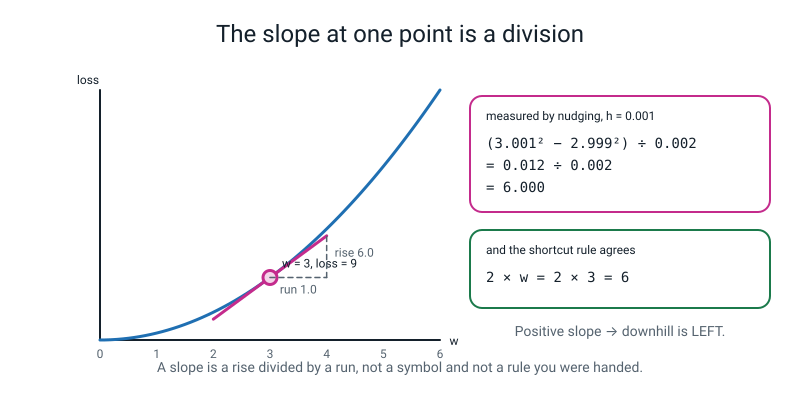
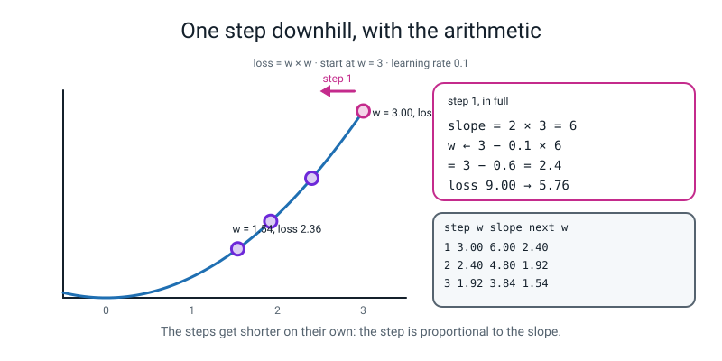
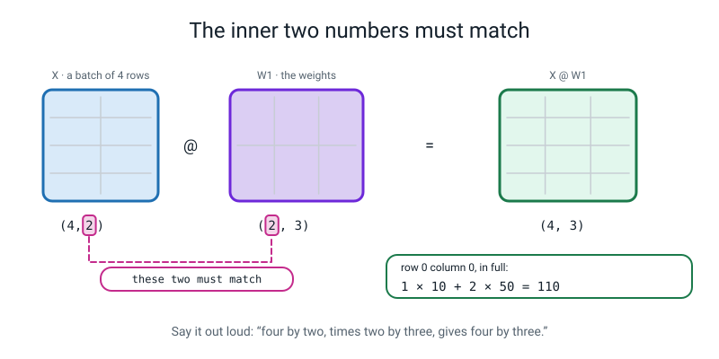

# 📝 Term 2 Practice Test — Weeks 10–18

[⬅ Assessments home](README.md) · [⬅ Term 1 test](term-1-test.md) · [Course home](../README.md) · [Term 3 test ➡](term-3-test.md)

---

```
   ┌──────────────────────────────────────────────────────────────────────┐
   │                                                                      │
   │   AI ACADEMY · LEVEL 3 ENGINEER                                      │
   │   TERM 2 PRACTICE TEST — Inside the Box                              │
   │   Covers Weeks 10–18. Nothing later appears anywhere on this paper.  │
   │   No PyTorch. No tensors. Nothing with a .grad on it. That is        │
   │   Week 20, and it is deliberately not here.                          │
   │                                                                      │
   │   TIME ALLOWED   75 minutes                                          │
   │   TOTAL MARKS    80                                                  │
   │                                                                      │
   │   Section A   12 multiple choice         1 mark each     12 marks    │
   │   Section B    5 do-the-maths-by-hand    4 marks each    20 marks    │
   │   Section C    5 "what does this print"  3 marks each    15 marks    │
   │   Section D    4 find-and-fix-the-bug    3 marks each    12 marks    │
   │   Section E    3 write-the-code        4 + 4 + 5 marks    13 marks   │
   │   Section F    1 extended question       8 marks          8 marks    │
   │                                                                      │
   │   ⛔  NO COMPUTER.                                                   │
   │   ✅  A CALCULATOR, YES — AND THIS TERM YOU REALLY WILL NEED IT.     │
   │                                                                      │
   │      This is the arithmetic term. There are exponentials,            │
   │      logarithms, slopes and a grid multiply on this paper, and       │
   │      every single one of them is a division or a multiplication      │
   │      you can do on a £3 calculator. What is being measured is        │
   │      whether you know WHICH one to do, and in which order.           │
   │                                                                      │
   │   INSTRUCTIONS                                                       │
   │   · Write in pencil. Answer every question.                          │
   │   · Section A: circle ONE letter. A guess costs nothing.             │
   │   · If you guess, write "not sure" beside it.                        │
   │   · Section B: WRITE THE DIVISION ABOVE THE ANSWER. Every time.      │
   │     A bare number scores 1 of 4 even when it is correct.             │
   │   · Carry SIX decimal places through a chain and round only at       │
   │     the end. Rounding in the middle is where marks go.               │
   │   · Section C: write EVERY line of output, on separate lines, in     │
   │     order. Shapes are written with brackets: (4, 3).                 │
   │   · Section D: you must do THREE things — say what Python is         │
   │     telling you, point at the line, and write the fixed line.        │
   │   · Section E: indentation counts. Four spaces. Every time.          │
   │   · Section F: a paragraph, not a list, and the arithmetic goes in   │
   │     the paragraph.                                                   │
   │                                                                      │
   │   WHAT IS ALLOWED                                                    │
   │   ✅  Pencil, pen, eraser, ruler                                     │
   │   ✅  A calculator with e^x and ln on it. Check it has both, NOW     │
   │   ✅  Four blank sheets of rough paper. Your working earns marks     │
   │   ❌  A COMPUTER. No Python, no phone, no editor, no terminal        │
   │   ❌  The student guide, the workbook, the glossary, your notes      │
   │   ❌  Your own week-10-to-18 .py files                              │
   │   ❌  A search engine, a chatbot, another person                     │
   │                                                                      │
   └──────────────────────────────────────────────────────────────────────┘
```

> **🧑‍🏫 Teacher, read this once before you hand the paper out.** You do not need to know any calculus
> to run this test, and you do not need to know any to mark it either — every slope on this paper is a
> subtraction followed by a division, and the answer key does all of them in longhand. Set a timer for
> 75 minutes. **Check the calculators have an `e^x` key and an `ln` key before you start** — this is the
> one paper of the four where a missing button costs real marks, and it takes thirty seconds to check.
> Read the "what is allowed" box out loud. Then say nothing until the timer goes. Every code block in
> the answer key was run on Python 3.10.10 with numpy 1.26.4 and scikit-learn 1.7.1, and the real output
> pasted in unedited. Students must not see that page. Marking guidance is in
> [assessments/README.md](README.md).

---

## 📐 The three pictures this paper is really about

Before you start, look at these three. Copy the first one onto your rough paper. It is worth more
marks than anything you can memorise.



*Figure T2.1 — The slope at one point is a division. Rise over run, measured by nudging, and only then checked against a rule. Every Section B slope on this paper is this picture with different numbers.*



*Figure T2.2 — One step downhill, with the arithmetic. `w ← w − lr × slope`, done three times, with the loss printed before and after. The steps get shorter on their own.*



*Figure T2.3 — The inner two numbers must match. Say the shapes out loud before you write the line. Then work one output cell in full: `1 × 10 + 2 × 50 = 110`.*

---

# 🅰️ Section A — Multiple Choice

*12 questions · 1 mark each · circle ONE letter · the week each question comes from is in brackets*

---

**A1.** [W10] `model.predict(X)` gives you 0s and 1s. Where did the cut between them come from?

- (a) The model learned the best cut during `fit()`
- (b) It is a default — `predict_proba` gives a number between 0 and 1, and `predict` compares it to `0.5`, which nobody chose for your problem
- (c) It is the average of the probabilities
- (d) It is the class balance of the training rows

---

**A2.** [W10] You have `prob`, the model's probabilities, and `pred`, its 0/1 answers. Which of these
needs `prob` rather than `pred`?

- (a) `confusion_matrix`
- (b) `precision_score`
- (c) `roc_curve` — a curve needs every possible threshold, so it needs the numbers you would threshold
- (d) `recall_score`

---

**A3.** [W11] What is the area under an ROC curve, actually?

- (a) A number the library computes by a method you cannot check
- (b) The space under the curve, chopped into trapezoid strips and added up — `(left height + right height) ÷ 2 × width`, once per strip
- (c) The accuracy at the best threshold
- (d) The height of the curve at `0.5`

---

**A4.** [W11] Five-fold cross-validation gives you `0.628 ± 0.087`. Somebody else's model scores
`0.65`. What are you allowed to say?

- (a) Their model is better, because 0.65 is bigger than 0.628
- (b) Nothing yet — `0.65` sits inside your band of `0.541` to `0.715`, so you cannot claim a difference
- (c) Your model is better, because it has a `±` and theirs does not
- (d) The two models are identical

---

**A5.** [W12] Which of these measures the slope of `f` at the single point `w`?

- (a) `(f(w + h) − f(w)) ÷ h` with `h = 1`
- (b) `(f(w + h) − f(w − h)) ÷ (2 × h)` with `h = 0.001`
- (c) `f(w) ÷ w`
- (d) `f(w + 1) − f(w − 1)`

---

**A6.** [W12] You measure the slope of a loss at your current `w` and get `+7.2`. Which way is downhill?

- (a) Right — increase `w`
- (b) Left — decrease `w`, because a positive slope means the loss climbs as `w` grows
- (c) Neither; a positive slope means you have arrived
- (d) You cannot tell from the sign

---

**A7.** [W13] `sigmoid(0)` is:

- (a) `0`
- (b) `1`
- (c) exactly `0.5`, because `e^0 = 1` and `1 ÷ (1 + 1) = 0.5`
- (d) about `0.4621`

---

**A8.** [W14] A model answers `0.5` to every single row of a balanced dataset. What is its log loss?

- (a) `0.5`
- (b) `0.6931`, which is `ln(2)`, and it does not depend on the data at all
- (c) `0.0`
- (d) It depends on how many rows there are

---

**A9.** [W15] The gradient of a model with three knobs is:

- (a) One number saying how wrong the model is
- (b) Three numbers — one slope per knob, kept together in a list
- (c) The learning rate
- (d) The loss, divided by the number of rows

---

**A10.** [W16] Two `nn`-free layers with **no squash between them** — a weighted sum, then another
weighted sum. What have you built?

- (a) A deeper, more powerful model
- (b) One single weighted sum with different numbers in it — the algebra collapses, so it can still only draw a straight line
- (c) Something that crashes
- (d) A model that is exactly twice as slow and twice as good

---

**A11.** [W17] You write `A @ B` where `A` is `(4, 2)` and `B` is `(4, 2)`. What happens?

- (a) You get a `(4, 2)` back, multiplied cell by cell
- (b) You get a `ValueError`, because the inner two numbers — `A`'s `2` and `B`'s `4` — do not match
- (c) You get an `(8, 4)`
- (d) It works and gives one number

---

**A12.** [W18] `W2` has shape `(3, 1)`. What shape must `dW2` have, and how do you know?

- (a) `(1, 3)`, because a gradient is the transpose of its weight
- (b) `(3, 1)` — a gradient always has exactly the same shape as the thing it is the gradient of, because there is one slope per knob
- (c) `(4, 1)`, because the batch has four rows
- (d) It is a single number

---

# 🅱️ Section B — Do the Maths By Hand

*5 questions · 4 marks each · 20 marks · NO COMPUTER · a calculator is allowed and expected*

**Write the division above the answer, every time.** A bare correct number scores 1 mark out of 4.
The other 3 are for the working, and the working is what lets you find your own slip.

**Carry six decimal places through a chain.** Round only on the last line.

---

**B1.** [W10, W11] Ten validation rows, sorted by the model's probability. `1` means it really was
fraud.

```
   truth :   1     0     1     1     0     0     1     0     0     0
   prob  : 0.91  0.72  0.65  0.58  0.51  0.44  0.38  0.30  0.22  0.09
```

**(a)** At threshold `0.50`, fill in the four counts, then compute the three fractions. Show each
division.

```
   TP = ____   FP = ____   FN = ____   TN = ____

   precision = ______________________ = __________

   recall    = ______________________ = __________

   false positive rate = ______________________ = __________
```

**(b)** Now drop the threshold to `0.30` and do it again.

```
   TP = ____   FP = ____   FN = ____   TN = ____

   precision = ______________________ = __________

   recall    = ______________________ = __________
```

**(c)** One sentence: **what did you buy and what did you pay for it** between those two thresholds?
Use both pairs of numbers.

```
   ____________________________________________________________________
```

**(d)** Those two thresholds plus the two corners give you a three-point ROC curve through
`(0, 0)`, `(0.3333, 0.75)` and `(1, 1)`. Work out the area by trapezoid strips.
*Reminder: one strip is `(left height + right height) ÷ 2 × width`.*

```
   strip 1 = ______________________ = __________

   strip 2 = ______________________ = __________

   total   = ______________________ = __________
```

---

**B2.** [W12] The loss is `f(w) = (w − 4)²`. This is the whole of Week 12 on one page.

**(a)** Measure the slope at `w = 1` by nudging, with `h = 0.001`. *Reminder:
`slope = (f(w + h) − f(w − h)) ÷ (2 × h)`. Watch the brackets on the bottom.*

```
   f(1.001) = ______________   f(0.999) = ______________

   slope = ______________________ = __________
```

**(b)** The shortcut rule for `(w − 4)²` is `2 × (w − 4)`. Fill in this table and confirm the rule
agrees with the nudge at all three points.

| `w` | slope by the rule `2(w − 4)` | which way is downhill? |
|:--:|:--:|:--:|
| 1 | ______ | ______ |
| 2.5 | ______ | ______ |
| 6 | ______ | ______ |

**(c)** Start at `w = 1` with a learning rate of `0.3` and take **three** steps of
`w ← w − lr × slope`. Use the rule to get each slope. Fill in every cell.

| step | `w` before | slope | `lr × slope` | `w` after | loss at `w` after |
|:--:|:--:|:--:|:--:|:--:|:--:|
| 1 | 1.0000 | ______ | ______ | ______ | ______ |
| 2 | ______ | ______ | ______ | ______ | ______ |
| 3 | ______ | ______ | ______ | ______ | ______ |

**(d)** One sentence: **why did the steps get shorter** without you changing the learning rate?

```
   ____________________________________________________________________
```

---

**B3.** [W13, W14] Four things the exponential and the logarithm are for.

**(a)** Convert these three raw scores to probabilities with the sigmoid. Show all three stages:
`e^(−z)`, then `1 + e^(−z)`, then `1 ÷ that`. Six decimal places.

| `z` | `e^(−z)` | `1 + e^(−z)` | `sigmoid(z)` |
|:--:|:--:|:--:|:--:|
| −2.0 | ______ | ______ | ______ |
| 0.0 | ______ | ______ | ______ |
| +1.4 | ______ | ______ | ______ |

**(b)** Go backwards. A model says `p = 0.90`. Find the raw score `z` that produced it, via the odds.

```
   odds = ______________________ = __________

   z = ln( __________ ) = __________
```

**(c)** Four predictions. For each one work out the **surprise**, which is `−ln(p)` if the thing
happened and `−ln(1 − p)` if it did not. Then average the four.

| truth | `p` | which log? | surprise |
|:--:|:--:|:--:|:--:|
| 1 | 0.9 | ______ | ______ |
| 0 | 0.2 | ______ | ______ |
| 1 | 0.4 | ______ | ______ |
| 0 | 0.8 | ______ | ______ |

```
   log loss = ______________________ = __________
```

**(d)** One sentence: row 4 is the worst of the four. Say **why log loss punishes it so much harder
than squared error would** — squared error for row 4 is `(0 − 0.8)² = 0.64`.

```
   ____________________________________________________________________
```

---

**B4.** [W15] Three rows, two features, and the very first step of a training loop. All the knobs
start at zero.

```
   row   feature1   feature2   truth
    1      2.0        1.0        1
    2      0.0        3.0        0
    3      4.0        2.0        0
```

Weights `w1 = 0.0`, `w2 = 0.0`, bias `b = 0.0`. Learning rate `0.6`.

**(a)** Work out the raw score `z` and the probability `p` for all three rows. *(This is easier than it
looks. Look at the weights.)*

```
   row 1: z = ______  p = ______      row 2: z = ______  p = ______

   row 3: z = ______  p = ______
```

**(b)** Work out the error `p − truth` for each row.

```
   row 1: ______      row 2: ______      row 3: ______
```

**(c)** The slope for a weight is **error times that feature, averaged over the rows**. The slope for
the bias is the error averaged with no feature to multiply by. Compute all three.

```
   slope for w1 = ______________________________ = __________

   slope for w2 = ______________________________ = __________

   slope for b  = ______________________________ = __________
```

**(d)** Take one step of `knob ← knob − 0.6 × slope` on all three knobs.

```
   new w1 = ______________________ = __________

   new w2 = ______________________ = __________

   new b  = ______________________ = __________
```

---

**B5.** [W16, W17, W18] Shapes, one cell, and the chain.

```python
A = [[ 1,  2],          B = [[10,  0.5],
     [ 3,  0],               [50, -1.0]]
     [-1,  4]]
```

**(a)** State the shape of `A` and of `B`, then the shape of `A @ B`. Then say which two numbers had
to match.

```
   A is __________   B is __________   A @ B is __________

   the two that had to match: __________
```

**(b)** Work out **two** cells of `A @ B` in full.

```
   row 0, column 0 = ______________________ = __________

   row 2, column 1 = ______________________ = __________
```

**(c)** `B @ A` — does it work? If it does, give its shape. If it does not, say which two numbers
disagree.

```
   ____________________________________________________________________
```

**(d)** Nudging `w` moves `z` **3 times** as much. Nudging `z` moves the loss `L` **14 times** as
much. How much does nudging `w` move `L`? Show it, and then say in one sentence what this has to do
with backpropagation.

```
   ______________________ = __________

   ____________________________________________________________________
```

---

# 🅲 Section C — What Does This Print?

*5 questions · 3 marks each · 15 marks*

**Write every line of output, on its own line, in the right order.** If a program produces no output,
write **"no output"**. If it crashes, write the **name of the error** and say which line crashes.

Shapes are written the way Python writes them, with brackets and a comma: `(4, 3)`.

---

**C1.** [W10]

```python
import numpy as np
from sklearn.metrics import confusion_matrix
y    = np.array([1, 0, 1, 1, 0, 0, 1, 0, 0, 0])
prob = np.array([0.91, 0.72, 0.65, 0.58, 0.51, 0.44, 0.38, 0.30, 0.22, 0.09])
for t in [0.60, 0.40]:
    pred = (prob >= t).astype(int)
    tn, fp, fn, tp = confusion_matrix(y, pred).ravel()
    print(t, tn, fp, fn, tp)
print(prob.mean().round(4))
```

*Three lines. Each of the first two has five things on it. Remember the order that comes out of
`.ravel()`.*

```
   1. ________________________________
   2. ________________________________
   3. ________________________________
```

---

**C2.** [W12]

```python
import numpy as np
def loss(w):
    return (w - 4) ** 2
grid = np.linspace(0, 8, 5)
print(grid)
vals = loss(grid)
print(vals)
print(np.argmin(vals), grid[np.argmin(vals)])
h = 0.001
print(round((loss(6 + h) - loss(6 - h)) / (2 * h), 6))
```

*Four lines. Line 3 has two things on it, and one of them is a position, not a value.*

```
   1. ________________________________
   2. ________________________________
   3. ________________________________
   4. ________________________________
```

---

**C3.** [W13, W14]

```python
import numpy as np
from sklearn.metrics import log_loss
z = np.array([-2.0, 0.0, 1.4])
p = 1 / (1 + np.exp(-z))
print(np.round(p, 4))
print(np.round(-np.log(p), 4))
print(np.where(p >= 0.5, 1, 0))
print(round(log_loss([0, 0, 1], p), 6))
```

*Four lines. The first three are arrays, so keep the brackets. Line 4 needs the **if-statement** in
front of the surprise meter, so read the truth labels carefully.*

```
   1. ________________________________
   2. ________________________________
   3. ________________________________
   4. ________________________________
```

---

**C4.** [W16] **This is a shape question.**

```python
import numpy as np
a = np.arange(6)
b = a.reshape(3, 2)
print(a.shape, b.shape, b.T.shape)
print(b.sum(axis=1).shape, b.sum(axis=1, keepdims=True).shape)
print(np.maximum(0, b - 3))
```

*Five lines of output in total — the last `print` produces a three-row grid, and each row of it counts
as a line.*

```
   1. ________________________________
   2. ________________________________
   3. ________________________________
   4. ________________________________
   5. ________________________________
```

---

**C5.** [W16, W17, W18] **This is a shape question.**

```python
import numpy as np
np.random.seed(0)
X  = np.array([[1.0, 2.0], [0.0, 1.0], [3.0, 1.0], [2.0, 2.0]])
W1 = np.array([[0.5, -1.0, 2.0], [1.0, 0.5, -0.5]])
b1 = np.array([[0.0, 1.0, -1.0]])
W2 = np.array([[1.0], [2.0], [-1.0]])
b2 = np.array([[0.5]])
Z1 = X @ W1 + b1
A1 = np.maximum(0, Z1)
Z2 = A1 @ W2 + b2
print(Z1.shape, A1.shape, Z2.shape)
dZ2 = np.ones_like(Z2) / X.shape[0]
print((A1.T @ dZ2).shape, (dZ2 @ W2.T).shape)
print(np.round(Z2.ravel(), 4))
```

*Three lines. Line 2 is the backward pass: `A1.T @ dZ2` must come out the shape of `W2`, and
`dZ2 @ W2.T` must come out the shape of `A1`. Line 3 needs you to do the actual arithmetic for four
rows — do the ReLU carefully.*

```
   1. ________________________________
   2. ________________________________
   3. ________________________________
```

---

# 🅳 Section D — Find and Fix the Bug

*4 questions · 3 marks each · 12 marks*

For every one of these you must do **three** things:

| | | Marks |
|---|---|:--:|
| **1** | **Say what Python is telling you**, in your own words. Not the error's name copied out — what it *means*. | 1 |
| **2** | **Point at the line** that has to change. Give its number. | 1 |
| **3** | **Write the fixed line out in full**, or — where the bug has no error message — write the fix in one sentence. | 1 |

> **⚠️ Watch out.** Two of these four produce **no error at all**. The program runs, prints numbers,
> and the numbers are wrong. Those are the expensive ones, and in Level 3 they are most of what goes
> wrong.

*Every message below is copied from a real run. The only edits are cosmetic: long file paths
have been shortened to just the filename, and one very long `ValueError` has been wrapped onto
two lines so it fits the page. No number, name or word is changed.*

---

**D1.** [W12] ⚠️ **No error message.** `slope.py` is supposed to measure the slope of the loss.

```python
1  import numpy as np
2
3  hours = np.array([1, 2, 3, 4, 5, 6, 7, 8, 9, 10])
4  marks = np.array([14, 20, 26, 32, 38, 44, 50, 56, 62, 68])
5
6  def loss(w):
7      return ((w * hours + 12 - marks) ** 2).mean()
8
9  h = 0.001
10 w = 5.0
11 slope = (loss(w + h) - loss(w - h)) / 2 * h
12 print("loss at w = 5.0  :", round(loss(w), 4))
13 print("slope at w = 5.0 :", slope)
14 print("one step, lr=0.01:", w - 0.01 * slope)
```

```text
loss at w = 5.0  : 10.5
slope at w = 5.0 : -3.300000000001013e-05
one step, lr=0.01: 5.00000033
```

With one change the same program prints `slope at w = 5.0 : -33.00000000001013` and
`one step, lr=0.01: 5.330000000000101`.

**1. What is the program telling you that is not true?** ______________________________________

**2. Line number:** ______

**3. The fixed line, in full:** ______________________________________

**Bonus (0 marks, but answer it): the wrong answer is out by a factor of what?** ______

---

**D2.** [W14] ⚠️ **Not a traceback, but a warning — and the warning is the lesson.**

```python
1  import numpy as np
2
3  y    = np.array([1, 0, 1, 0, 1])
4  prob = np.array([0.90, 0.20, 0.40, 1.00, 0.70])
5
6  surprise = np.where(y == 1, -np.log(prob), -np.log(1 - prob))
7  print(surprise)
8  print("log loss :", surprise.mean())
```

```text
logloss.py:6: RuntimeWarning: divide by zero encountered in log
  surprise = np.where(y == 1, -np.log(prob), -np.log(1 - prob))
[0.10536052 0.22314355 0.91629073        inf 0.35667494]
log loss : inf
```

**1. What is Python telling you?** ______________________________________________

**2. Line number:** ______

**3. The fixed line, in full:** ______________________________________________

**Then one sentence: which row caused it, and what did the model claim about that row?**

```
   ____________________________________________________________________
```

---

**D3.** [W17] `forward.py` is a forward pass through a 2 → 3 → 1 network.

```python
1  import numpy as np
2
3  X  = np.array([[1.0, 2.0], [0.0, 1.0], [3.0, 1.0], [2.0, 2.0]])
4  W1 = np.array([[0.5, -1.0, 2.0], [1.0, 0.5, -0.5]])
5  W2 = np.array([[1.0], [2.0], [-1.0]])
6
7  A1 = np.maximum(0, X @ W1)
8  out = W2 @ A1
9  print(out)
```

```text
Traceback (most recent call last):
  File "forward.py", line 8, in <module>
    out = W2 @ A1
ValueError: matmul: Input operand 1 has a mismatch in its core dimension 0, with
gufunc signature (n?,k),(k,m?)->(n?,m?) (size 4 is different from 1)
```

**1. What is Python telling you?** ______________________________________________

**2. Line number:** ______

**3. The fixed line, in full:** ______________________________________________

**And state the shape `out` has once it is fixed:** ______

---

**D4.** [W15] ⚠️ **No error message.** `descent.py` is a training loop.

```python
1  import numpy as np
2
3  X = np.array([[2.0, 1.0], [0.0, 3.0], [4.0, 2.0]])
4  y = np.array([1.0, 0.0, 0.0])
5  w = np.array([0.0, 0.0])
6  b = 0.0
7  lr = 0.6
8
9  for epoch in range(5):
10     z = (X * w).sum(axis=1) + b
11     p = 1 / (1 + np.exp(-z))
12     loss = -(y * np.log(p) + (1 - y) * np.log(1 - p)).mean()
13     print(epoch, round(loss, 6))
14     gw = (X * (p - y)[:, None]).mean(axis=0)
15     gb = (p - y).mean()
16     w = w + lr * gw
17     b = b + lr * gb
```

```text
0 0.693147
1 1.249983
2 3.203736
3 6.105106
4 9.100543
```

**1. What is the program telling you that is not true?** ______________________________________

**2. Line numbers (there are two):** ______ and ______

**3. The fix:** ______________________________________________

**And one sentence: name the FIRST thing you check when a loss goes up, and the second.**

```
   ____________________________________________________________________
```

---

# 🅴 Section E — Write the Code

*3 questions · 4 + 4 + 5 marks · 13 marks*

Write real Python. **Indentation counts** — four spaces, every time. You may not use anything from
after Week 18 (so: no `torch`, no `nn.Linear`, no `.backward()`, no `optimizer`).

Assume `numpy as np` is imported, and the sklearn names you were taught in Weeks 1–18.

---

**E1.** [W10, W11] **(4 marks)** Write a **function** called `sweep` that takes `y_true`, `prob` and a
list of thresholds, and for each threshold prints, on one line:

- the threshold
- `TP`, `FP` and `FN`
- precision and recall, each to 4 decimal places
- the number of false alarms

Then, underneath, write the two or three lines that report a **five-fold** ROC-AUC as
`mean ± standard deviation`, keeping the class proportions in every fold.

```
   ________________________________________________________

   ________________________________________________________

   ________________________________________________________

   ________________________________________________________

   ________________________________________________________

   ________________________________________________________

   ________________________________________________________

   ________________________________________________________

   ________________________________________________________

   ________________________________________________________

   ________________________________________________________

   ________________________________________________________
```

---

**E2.** [W12, W15] **(4 marks)** Write:

- a function `loss(w)` for `(w − 4)²`
- a function `slope_at(f, w, h=0.001)` that measures the slope of **any** function `f` at `w` by
  nudging both ways
- a loop of **nine** steps of `w ← w − lr × slope`, starting at `w = 1.0` with `lr = 0.3`, printing
  the step number, `w`, the slope and the loss on **every second step**
- and, after the loop, one line that checks your measured slope against the shortcut rule `2(w − 4)`

```
   ________________________________________________________

   ________________________________________________________

   ________________________________________________________

   ________________________________________________________

   ________________________________________________________

   ________________________________________________________

   ________________________________________________________

   ________________________________________________________

   ________________________________________________________

   ________________________________________________________

   ________________________________________________________

   ________________________________________________________
```

---

**E3.** [W16, W17, W18] **(5 marks)** You are given `X` with shape `(4, 2)`. Write the code that:

- makes `W1`, `b1`, `W2`, `b2` for a **2 → 3 → 1** network, with the **right shapes**, typed out by
  hand as real numbers (any numbers you like)
- does the full forward pass: weighted sum, ReLU, weighted sum, sigmoid
- prints the shape at **every** stage, with a note saying what each one is
- and proves one row of `Z1` correct by computing it by hand into a separate array and comparing with
  `np.allclose`

**The word `for` must not appear anywhere in your answer.** The whole batch goes through at once.

```
   ________________________________________________________

   ________________________________________________________

   ________________________________________________________

   ________________________________________________________

   ________________________________________________________

   ________________________________________________________

   ________________________________________________________

   ________________________________________________________

   ________________________________________________________

   ________________________________________________________

   ________________________________________________________

   ________________________________________________________

   ________________________________________________________

   ________________________________________________________

   ________________________________________________________
```

---

# 🅵 Section F — The Extended Question

*1 question · 8 marks · about 15 minutes · a paragraph, not a list · the arithmetic goes in the paragraph*

---

**F1.** [W10, W11, W14] **Riverside School wants to put children in a club.**

You build a model that predicts, in October, whether a student will fail the end-of-year maths exam.
Here is your honest results page, exactly as you wrote it:

```
   RESULTS — maths-exam-risk model, October
   Unit of prediction : one student, scored once, in October
   Held-out test rows : 420 students    (84 of them really did fail — 20.0%)
   Five-fold AUC      : 0.72 ± 0.09
   Baseline           : "nobody will fail" is 0.8000 accurate on these rows

   Threshold sweep, on the held-out 420:

     thresh    TN    FP    FN    TP    accuracy
       0.50   300    36    40    44     0.8190
       0.30   258    78    22    62     0.7619
       0.15   180   156     8    76     0.6095
```

The head of year reads it and emails you:

> *"Perfect. We'll run it at 0.5 — that's the standard, and 82% accurate is better than any teacher's
> guess. Anyone the computer flags goes into mandatory after-school maths club three days a week from
> November, and we'll tell their parents it's because the data says they're going to fail."*

Write a paragraph answering **all four** of these. Every number you use must be one you can point at
in the table above, or one you compute from it and show.

1. **The baseline.** She said 82% accurate. Compare it with the number in your own results page and
   say, with the arithmetic, how impressed she should actually be.
2. **Use the sweep.** Compute recall at `0.50` from the four counts, show the division, and then say
   what that number means **in the language of club places** — what is happening to the 40?
3. **Write the price list.** A miss costs the school ten times what a false alarm costs. Compute
   `cost = 10 × FN + 1 × FP` for all three rows, show the arithmetic, and say which threshold the
   price list chooses. Then say what changes if a false alarm costs the *same* as a miss.
4. **The `±`.** Your AUC is `0.72 ± 0.09`. Say what that band means for a decision that is about to be
   taken about individual children, and name the one sentence you would put at the top of the results
   page that you did not write.

```
   ______________________________________________________________________

   ______________________________________________________________________

   ______________________________________________________________________

   ______________________________________________________________________

   ______________________________________________________________________

   ______________________________________________________________________

   ______________________________________________________________________

   ______________________________________________________________________

   ______________________________________________________________________

   ______________________________________________________________________

   ______________________________________________________________________

   ______________________________________________________________________

   ______________________________________________________________________

   ______________________________________________________________________
```

---

---
---

# 📊 Marking Scheme

**Total: 80 marks.** Mark Section A first — it is fast, and the pattern of wrong answers tells you
exactly where to look in Sections B–F.

## Section A — 12 marks

| Q | Answer | Mark | Week |
|:--:|:--:|:--:|:--:|
| A1 | **(b)** | 1 | W10 |
| A2 | **(c)** | 1 | W10 |
| A3 | **(b)** | 1 | W11 |
| A4 | **(b)** | 1 | W11 |
| A5 | **(b)** | 1 | W12 |
| A6 | **(b)** | 1 | W12 |
| A7 | **(c)** | 1 | W13 |
| A8 | **(b)** | 1 | W14 |
| A9 | **(b)** | 1 | W15 |
| A10 | **(b)** | 1 | W16 |
| A11 | **(b)** | 1 | W17 |
| A12 | **(b)** | 1 | W18 |

No half marks. Two letters circled scores 0.

> **🧑‍🏫 If a student gets A5, A6 and A9 wrong, stop marking and go to the remediation table.** Those
> three are the spine of the term: what a slope is, which way is downhill, and that a gradient is a
> *list*. Everything from Week 15 onwards rests on them, and Term 3 rests on Term 2.

## Section B — 20 marks · do the maths by hand

**4 marks per question, on the same ladder as Term 1, and it is the most important marking rule on
this paper:**

| | Marks |
|---|:--:|
| Every part correct **with the division written above each answer** | **4** |
| All the working correct, one arithmetic slip carried through | **3** |
| The right divisions set up, two or more arithmetic slips | **2** |
| Correct final numbers with **no working shown at all** | **1** |
| Nothing usable | 0 |

**Per question:**

| Q | The answers | Marks | The trap |
|:--:|---|:--:|---|
| **B1** | (a) TP 3 FP 2 FN 1 TN 4 · prec **0.6000** · rec **0.7500** · fpr **0.3333** · (b) TP 4 FP 4 FN 0 TN 2 · prec **0.5000** · rec **1.0000** · (d) strips **0.1250** and **0.5833**, total **0.7083** | 4 | (a) counting `prob >= 0.50` as four rows — `0.51` is included and `0.44` is not. (d) forgetting the strip width, or using the *height* twice. |
| **B2** | (a) slope **−6.000000** · (b) −6, −3, +4, downhill right/right/left · (c) w goes 1.0000 → **2.8000** → **3.5200** → **3.8080**, losses 1.4400, 0.2304, 0.0369 | 4 | (a) dividing by `2 * h` without the brackets. (c) subtracting a negative and getting a smaller `w`. |
| **B3** | (a) sigmoids **0.119203**, **0.500000**, **0.802184** · (b) odds **9**, z **2.197225** · (c) surprises **0.105361**, **0.223144**, **0.916291**, **1.609438**, log loss **0.713558** | 4 | (c) using `−ln(p)` on row 2 and row 4, where the thing did **not** happen. That is the whole question. |
| **B4** | (a) all z **0**, all p **0.5** · (b) errors **−0.5, +0.5, +0.5** · (c) slopes **0.333333**, **0.666667**, **0.166667** · (d) new knobs **−0.2**, **−0.4**, **−0.1** | 4 | (b) writing `truth − p` instead of `p − truth`, which flips every sign and sends every knob the wrong way. |
| **B5** | (a) `(3,2)`, `(2,2)`, `(3,2)`, the two **2s** · (b) **110** and **−4.5** · (c) `B @ A` fails: B's 2 against A's 3 · (d) **42** | 4 | (c) answering "yes, `(2,2)`" because both are small. Read the inner numbers. |

**B1(c) — 1 of the 4 marks.** Must contain both pairs: *"I went from catching 3 of the 4 frauds to
catching all 4 — recall 0.7500 to 1.0000 — and I paid for it with false alarms, which doubled from 2
to 4, so precision fell from 0.6000 to 0.5000."* "It got better" scores 0.

**B2(d) — 1 of the 4 marks.** *"The step is `lr × slope`, and the slope shrinks as `w` approaches 4, so
the step shrinks with it — nothing about the learning rate changed."* Accept any wording with
"proportional" or "the slope got smaller" in it.

**B3(d) — 1 of the 4 marks.** Must compare two numbers: *"squared error charges 0.64 and can never
charge more than 1, but log loss charges 1.609438 and has no ceiling at all, so being confidently
wrong is what gets punished."*

## Section C — 15 marks · what does this print?

**3 marks per question, on this ladder:**

| | Marks |
|---|:--:|
| Every line correct, in the right order, with the right brackets and decimal places | **3** |
| One line wrong, everything else right | **2** |
| Two lines wrong, or right values in the wrong order | **1** |
| A visible shape trace or 2×2 square with correct intermediate values, even if the final answer is wrong | **1, always** |
| Nothing usable | 0 |

| Q | The real output | Marks | The trap |
|:--:|---|:--:|---|
| **C1** | `0.6 5 1 2 2` / `0.4 3 3 1 3` / `0.48` | 3 | The `.ravel()` order is **TN, FP, FN, TP**, and the loop prints the threshold first, so there are five things on the line, not four. |
| **C2** | `[0. 2. 4. 6. 8.]` / `[16.  4.  0.  4. 16.]` / `2 4.0` / `4.0` | 3 | Line 3: `argmin` gives the **position** `2`, then `grid[2]` gives the value `4.0`. Writing `0.0 4.0` loses the line. |
| **C3** | `[0.1192 0.5    0.8022]` / `[2.1269 0.6931 0.2204]` / `[0 1 1]` / `0.346831` | 3 | Line 3: `p >= 0.5` is **True** for the middle one, because `sigmoid(0)` is exactly 0.5. Line 4 needs the `if` — rows 1 and 2 are class 0. |
| **C4** | `(6,) (3, 2) (2, 3)` / `(3,) (3, 1)` / `[[0 0]` / ` [0 0]` / ` [1 2]]` | 3 | Line 2: without `keepdims` you get `(3,)`, a flat thing, and with it you get `(3, 1)`, a column. That difference is a real bug generator. |
| **C5** | `(4, 3) (4, 3) (4, 1)` / `(3, 1) (4, 3)` / `[ 5.   4.5 -1.5  1.5]` | 3 | Line 2: `A1.T @ dZ2` gives `W2`'s shape and `dZ2 @ W2.T` gives `A1`'s shape. Line 3 needs the ReLU done **before** the second multiply. |

> **🧑‍🏫 Be generous about numpy's spacing and strict about its brackets.** `[0.1192 0.5 0.8022]` with
> one space instead of four is the answer — give the mark. `0.1192 0.5 0.8022` with no brackets at all
> is not, because the brackets are the thing that says "this is an array, one number per row".

**C5's third line, in case a student asks how it is even possible by hand.** It is, and here is the
whole of it — this is worth reading out when you hand the papers back:

```
Z1 row 0 = [1, 2] @ W1 + b1
         = [1(0.5) + 2(1.0),  1(-1.0) + 2(0.5),  1(2.0) + 2(-0.5)] + [0, 1, -1]
         = [2.5, 0.0, 1.0] + [0, 1, -1]  =  [2.5, 1.0, 0.0]
A1 row 0 = [2.5, 1.0, 0.0]                        (nothing negative to flatten)
Z2 row 0 = 2.5(1.0) + 1.0(2.0) + 0.0(-1.0) + 0.5  =  2.5 + 2.0 + 0.0 + 0.5  =  5.0
```

## Section D — 12 marks · find and fix the bug

**3 marks per bug: 1 for the meaning, 1 for the line, 1 for the fix.** The three are independent.

| Q | 1 · Meaning (1 mark) | 2 · Line (1 mark) | 3 · Fix (1 mark) |
|:--:|---|:--:|---|
| **D1** | It claims the slope is about three hundred-thousandths when it is really −33. Python divided by `2` and then **multiplied** by `h`, because `/ 2 * h` runs left to right. So the answer is out by `h²` — a factor of a million. | **11** | `slope = (loss(w + h) - loss(w - h)) / (2 * h)` |
| **D2** | Row 4 says the probability is exactly `1.00`, so `1 − p` is `0`, and `ln(0)` has no value — numpy filled it with `inf` and warned instead of crashing. One `inf` makes the average `inf`. | **6** | `surprise = np.where(y == 1, -np.log(np.clip(prob, 1e-12, 1 - 1e-12)), -np.log(1 - np.clip(prob, 1e-12, 1 - 1e-12)))` — or clip `prob` on its own line first, which is tidier and scores the same |
| **D3** | `A1` is `(4, 3)` and `W2` is `(3, 1)`. Written as `W2 @ A1` the inner numbers are W2's `1` and A1's `4`, which do not match. The operands are the right way round in the wrong order. | **8** | `out = A1 @ W2` |
| **D4** | The loss is **climbing**, 0.693147 → 9.100543. The gradient points **uphill**, so adding it walks away from the answer. Nothing errored because both signs are legal arithmetic. | **16** and **17** | `w = w - lr * gw` and `b = b - lr * gb` |

**D1's bonus:** a factor of `h² = 0.000001`, one million. Accept "a million" or "`h` squared".

**D3's extra:** `out` is `(4, 1)` once fixed — one number per row of the batch.

**D4's extra sentence — the 1 mark inside the fix mark, and be strict here.** The order is what is
being tested: **first the sign, then the learning rate.** *"If the loss goes up, check the minus sign
before you touch the learning rate, because a wrong sign looks exactly like a learning rate that is
too big for the first two epochs and then stops looking like anything at all."* A student who says
"lower the learning rate" and nothing else scores **0** for that sentence — lowering the learning rate
on this program makes it climb more slowly, which is worse, because now it looks like it might be
working.

**Two marking rules that carry the most weight on this paper:**

1. **Withhold the fix mark for any fix that hides a number instead of correcting it.** D2 "fixed" by
   deleting row 4 is not a fix. D1 "fixed" by using a bigger `h` until the number looks plausible is
   not a fix.
2. **"It's a typo" scores 0 for a meaning mark.** The mark is for saying what the machine *did*:
   divided then multiplied; took the log of zero; lined up a 1 against a 4; walked uphill.

## Section E — 13 marks · write the code

**Marked against named rows. Award each row on its own merits. Do not run the code — you do not need to.**

### E1 — 4 marks

| Row | Mark for | Marks |
|---|---|:--:|
| A real function | `def sweep(y_true, prob, thresholds):` with an indented body and a loop over the thresholds | 1 |
| The threshold applied | `(prob >= t).astype(int)` — **not** `predict()`, and **not** `> t` | 1 |
| The four counts and two fractions | `confusion_matrix(...).ravel()` unpacked in the order TN, FP, FN, TP, and precision and recall to 4 dp | 1 |
| The band | `StratifiedKFold(n_splits=5, shuffle=True, random_state=0)` **and** `cross_val_score(..., scoring="roc_auc")`, with `.mean()` **and** `.std()` both printed | 1 |

**A model answer, run:**

```python
"""e1.py -- one function that sweeps the threshold, and the 5-fold band."""
import numpy as np
from sklearn.datasets import make_classification
from sklearn.linear_model import LogisticRegression
from sklearn.metrics import confusion_matrix
from sklearn.model_selection import StratifiedKFold, cross_val_score, train_test_split
from sklearn.pipeline import make_pipeline
from sklearn.preprocessing import StandardScaler


def sweep(y_true, prob, thresholds):
    print("thresh  TP  FP  FN   precision  recall  false alarms")
    for t in thresholds:
        pred = (prob >= t).astype(int)
        tn, fp, fn, tp = confusion_matrix(y_true, pred).ravel()
        prec = tp / (tp + fp) if (tp + fp) else 0.0
        rec = tp / (tp + fn) if (tp + fn) else 0.0
        print("  %.2f  %3d %3d %3d     %.4f  %.4f  %6d"
              % (t, tp, fp, fn, prec, rec, fp))


X, y = make_classification(n_samples=3000, weights=[0.90, 0.10],
                           n_informative=8, n_redundant=2, random_state=0)
X_tr, X_val, y_tr, y_val = train_test_split(X, y, test_size=0.25,
                                            stratify=y, random_state=0)
pipe = make_pipeline(StandardScaler(), LogisticRegression(max_iter=1000))
pipe.fit(X_tr, y_tr)
prob = pipe.predict_proba(X_val)[:, 1]

sweep(y_val, prob, [0.80, 0.50, 0.30, 0.10])

skf = StratifiedKFold(n_splits=5, shuffle=True, random_state=0)
scores = cross_val_score(pipe, X, y, cv=skf, scoring="roc_auc")
print("five fold AUC : %.4f +/- %.4f" % (scores.mean(), scores.std()))
print("the five      :", np.round(scores, 4))
```

```text
thresh  TP  FP  FN   precision  recall  false alarms
  0.80   45   2  34     0.9574  0.5696       2
  0.50   58   8  21     0.8788  0.7342       8
  0.30   62  16  17     0.7949  0.7848      16
  0.10   72  62   7     0.5373  0.9114      62
five fold AUC : 0.9544 +/- 0.0133
the five      : [0.9605 0.9757 0.9495 0.9356 0.9505]
```

> **🧑‍🏫 Read the recall column out loud when you hand this back.** `0.5696 → 0.7342 → 0.7848 → 0.9114`.
> The model never changed. Only the cut moved. That is Week 10 in four numbers, and a student who can
> point at that column and say so has the term.

### E2 — 4 marks

| Row | Mark for | Marks |
|---|---|:--:|
| Two functions | `loss(w)` and `slope_at(f, w, h=0.001)`, and `slope_at` takes the **function** as an argument | 1 |
| The nudge | `(f(w + h) - f(w - h)) / (2 * h)` — the brackets on the bottom are the mark | 1 |
| The loop | Nine iterations, `w = w - lr * s` inside, and printing on every second step (`if step % 2 == 0`) | 1 |
| The check | The measured slope compared with `2 * (w - 4)` after the loop | 1 |

**A model answer, run:**

```python
"""e2.py -- measure the slope by nudging, then walk downhill with it."""
import numpy as np


def loss(w):
    return (w - 4) ** 2


def slope_at(f, w, h=0.001):
    return (f(w + h) - f(w - h)) / (2 * h)


w = 1.0
lr = 0.3
print("step        w      slope       loss")
for step in range(9):
    s = slope_at(loss, w)
    if step % 2 == 0:
        print("  %2d   %7.4f  %+8.4f   %8.6f" % (step, w, s, loss(w)))
    w = w - lr * s
print("finished at w = %.6f  (the true bottom is 4)" % w)
print("slope there  = %+.6f" % slope_at(loss, w))
print("check against the rule 2(w - 4): %+.6f" % (2 * (w - 4)))
```

```text
step        w      slope       loss
   0    1.0000   -6.0000   9.000000
   2    3.5200   -0.9600   0.230400
   4    3.9232   -0.1536   0.005898
   6    3.9877   -0.0246   0.000151
   8    3.9980   -0.0039   0.000004
finished at w = 3.999214  (the true bottom is 4)
slope there  = -0.001573
check against the rule 2(w - 4): -0.001573
```

**Note the last two lines are identical.** That is the whole point of the question: the number you
measured by nudging and the number a rule gives you are the same number.

### E3 — 5 marks

| Row | Mark for | Marks |
|---|---|:--:|
| The shapes are right | `W1` is `(2, 3)`, `b1` is `(1, 3)`, `W2` is `(3, 1)`, `b2` is `(1, 1)` | 1 |
| The forward pass | `X @ W1 + b1`, then `np.maximum(0, ...)`, then `@ W2 + b2`, then the sigmoid | 1 |
| Every stage printed | At least four shapes printed, with a word each saying what they are | 1 |
| No `for` | The whole batch goes through at once. A loop over rows withholds this row | 1 |
| The hand check | One row of `Z1` computed into a separate array and compared with `np.allclose` | 1 |

**A model answer, run:**

```python
"""e3.py -- one forward pass, 2 -> 3 -> 1, with every shape printed."""
import numpy as np

np.random.seed(0)
X  = np.array([[1.0, 2.0], [0.0, 1.0], [3.0, 1.0], [2.0, 2.0]])
W1 = np.array([[0.5, -1.0, 2.0],
               [1.0,  0.5, -0.5]])
b1 = np.array([[0.0, 1.0, -1.0]])
W2 = np.array([[1.0], [2.0], [-1.0]])
b2 = np.array([[0.5]])

print("X  %s  @  W1 %s" % (X.shape, W1.shape))
Z1 = X @ W1 + b1
print("Z1 %s   (+ b1 %s broadcast down)" % (Z1.shape, b1.shape))
A1 = np.maximum(0, Z1)
print("A1 %s   ReLU never changes a shape" % (A1.shape,))
Z2 = A1 @ W2 + b2
print("Z2 %s" % (Z2.shape,))
A2 = 1 / (1 + np.exp(-Z2))
print("A2 %s   one probability per row" % (A2.shape,))
print(np.round(A2.ravel(), 4))

by_hand_row0 = np.array([1.0 * 0.5 + 2.0 * 1.0 + 0.0,
                         1.0 * -1.0 + 2.0 * 0.5 + 1.0,
                         1.0 * 2.0 + 2.0 * -0.5 + -1.0])
print("row 0 by hand:", by_hand_row0)
print("agrees?", np.allclose(Z1[0], by_hand_row0))
```

```text
X  (4, 2)  @  W1 (2, 3)
Z1 (4, 3)   (+ b1 (1, 3) broadcast down)
A1 (4, 3)   ReLU never changes a shape
Z2 (4, 1)
A2 (4, 1)   one probability per row
[0.9933 0.989  0.1824 0.8176]
row 0 by hand: [2.5 1.  0. ]
agrees? True
```

> **🧑‍🏫 The commonest E3 answer writes `W1` as `(3, 2)`.** It is `(inputs, units)`, not
> `(units, inputs)` — the numpy convention this course uses, and the opposite of the one
> `nn.Linear` will print in Week 22. Both are correct in their own world and the student needs to know
> that now. Withhold the shapes row, award the rest, and write on the paper: *"say the sentence — four
> by two, times two by three, gives four by three. Which of your two arrangements does that?"*

## Section F — 8 marks, marked with the rubric below

Award a level for the whole answer, then convert:

| Level | Marks |
|---|:--:|
| 4 · Exceptional | 8 |
| 3 · Proficient | 6–7 |
| 2 · Developing | 3–5 |
| 1 · Beginning | 1–2 |
| Nothing usable | 0 |

### F1 rubric

| | **1 · Beginning** | **2 · Developing** | **3 · Proficient** | **4 · Exceptional** |
|---|---|---|---|---|
| **The baseline** | Does not mention it | Says "you need a baseline" with no number | Names both numbers — the model's `0.8190` against "nobody will fail" at `0.8000` — and says the model buys **1.9 percentage points**, which is about **8 students in 420** | Also notes that a rule which says *nobody* will fail hands out **zero** club places, so 82% accurate and 80% accurate are not just close, they are doing *completely different things*, and accuracy cannot see the difference |
| **The arithmetic** | No division shown | One correct division, unexplained | `recall = 44 ÷ (44 + 40) = 44 ÷ 84 = 0.5238`, and says the 40 are **real future failures who get no club place at all** | Also computes precision — `44 ÷ 80 = 0.5500` — and says that of the 80 children marched into the club, **36 were never going to fail**, and names which of the two errors a letter home is made of |
| **The price list** | No costs computed | One row computed | All three rows: `10(40) + 36 = 436` · `10(22) + 78 = 298` · `10(8) + 156 = 236`, so the price list picks **0.15**, not 0.50 | Also does the 1:1 column — `76`, `100`, `164` — and states the lesson in one line: **the same model, with a different price list, chooses a different threshold**, so "0.5 is the standard" is not an argument about anything |
| **The `±`** | Not mentioned | Repeats `± 0.09` without saying what it does | Says the band runs `0.63` to `0.81`, so on a different five hundred children the model might rank barely better than a coin, and one sentence like *"this model has not been shown to be reliable enough to make a decision about an individual child"* | The sentence is one you could paste at the top of the page unchanged, and it separates the two uses cleanly: the model is good enough to **decide where a teacher looks first**, and nowhere near good enough to **decide what happens to a child**, and it says which of the two the head of year is doing |
| **Writing** | One fragment | A list of bullet points | A paragraph the head of year could follow | A paragraph you could send to the head of year unchanged, that does not accuse her of anything and gives her something she can actually do on Monday |

A level 3 does **not** require all five rows at level 3. Take the best overall fit.

### A model level-4 answer (about 330 words)

> Start with the number she liked. `0.8190` accuracy sounds strong until you put it next to the line in
> my own results page: a rule that says **"nobody will fail"** is already `0.8000` accurate on these
> same 420 students, because only 84 of them failed. So the model buys about **1.9 percentage points**,
> which is `0.019 × 420 ≈ 8` students. It is not nothing — but it is not "better than any teacher's
> guess" either, and the honest comparison is the one with the dumb rule in it.
>
> Then look at what kind of wrong it is at `0.50`. Recall is `44 ÷ (44 + 40) = 44 ÷ 84 = 0.5238`. So of
> the 84 students who really did go on to fail, the model spotted 44 and **missed 40** — nearly half of
> exactly the children the club is for get no place in it. And precision is `44 ÷ (44 + 36) = 44 ÷ 80 =
> 0.5500`, so of the 80 children who *do* get marched into three afternoons a week and a letter home,
> **36 were never going to fail at all.** That error is not a number in a table; it is a child sitting
> in a club they did not need and a parent told the data says they are going to fail.
>
> `0.50` is also not the threshold her own priorities choose. If a miss costs ten times a false alarm,
> then `cost = 10 × FN + FP` gives `10(40) + 36 = 436` at 0.50, `10(22) + 78 = 298` at 0.30, and
> `10(8) + 156 = 236` at 0.15 — so the price list picks **0.15**. If a false alarm costs the same as a
> miss, the numbers are `76`, `100` and `164`, and `0.50` wins after all. Same model, different price
> list, different answer. "It's the standard" is not an argument.
>
> And the `±` is the sentence I should have put at the top and did not: `0.72 ± 0.09` means the band
> runs `0.63` to `0.81`, and `0.63` is not far off a coin. **"This model is accurate enough to decide
> where a teacher looks first. It is not accurate enough to decide what happens to a child, and it must
> not be quoted to a parent as a prediction about their child."**

---

# ✅ Full Answer Key

> **🧑‍🏫 Do not photocopy this page for students until after the test is marked.** Every distractor is
> explained, because "why the wrong answer was tempting" is where the learning lives. **Every code
> block in this key was run on Python 3.10.10 with numpy 1.26.4 and scikit-learn 1.7.1, and the real
> output pasted in unedited. Every division is written out in longhand.**

<details>
<summary><b>A1 — (b) · W10</b></summary>

**(b) It is a default.** `predict_proba` hands back a number between 0 and 1. `predict` does one more
thing to it, and that thing is `prob >= 0.5`. Nobody chose `0.5` for your fraud problem, your
exam-risk problem or your late-pizza problem. It is what the library does when you have not said
otherwise.

This matters because the *whole* of Week 10 and Week 11 is the discovery that `0.5` is a dial you are
allowed to turn, and that turning it trades misses for false alarms without changing the model at all.

- **(a) is wrong** and it is the tempting one, because `fit()` does learn a lot of things. It learns
  the weights. It does not learn the cut, because the cut depends on what a mistake costs *you*, and
  nothing in `X` or `y` tells it that.
- **(c) is wrong** — the average of the probabilities is a property of your data, not a decision rule,
  and using it would move your predictions around every time your data changed.
- **(d) is wrong.** Setting the threshold to the class balance is actually a *reasonable heuristic* and
  people do it — but it is not what `predict` does, and this question asks what `predict` does.
</details>

<details>
<summary><b>A2 — (c) · W10</b></summary>

**(c) `roc_curve`.** Here is the rule in one line, and it is worth memorising: **if a metric draws a
curve it wants probabilities; if it counts cells it wants predictions.**

`roc_curve` has to try *every* threshold, so it needs the numbers you would be thresholding. Hand it
0s and 1s and you get a curve with three points in it and an AUC that is quietly wrong.

- **(a), (b) and (d) are all wrong** in exactly the same way: a confusion matrix, a precision and a
  recall are all counts of cells in a 2×2 square, and you cannot put a probability in a cell. All
  three need `pred`.
- **The cruel part:** handing `prob` to `precision_score` *does* give you an error, so you find out.
  Handing `pred` to `roc_curve` gives you no error at all, so you do not.
</details>

<details>
<summary><b>A3 — (b) · W11</b></summary>

**(b) Trapezoid strips, added up.** `np.trapz` is not magic and `roc_auc_score` is not magic either.
One strip is `(left height + right height) ÷ 2 × width`. You did five of them by hand in Week 11.

Here is the whole of B1(d) as the proof, done in longhand:

```
strip 1: (0 + 0.75) ÷ 2 × 0.3333 = 0.375 × 0.3333 = 0.1250
strip 2: (0.75 + 1) ÷ 2 × 0.6667 = 0.875 × 0.6667 = 0.5833
total  :                            0.1250 + 0.5833 = 0.7083
```

And a coin gets `0.5` because a coin's curve is the diagonal, the shape under a diagonal is a
triangle, and a triangle is half its square.

- **(a) is wrong**, and refusing it is most of what this course is for.
- **(c) is wrong** — the AUC deliberately does not depend on any one threshold. That is the point of
  it.
- **(d) is wrong** — the height at a point is one number on the curve, not the area under all of it.
</details>

<details>
<summary><b>A4 — (b) · W11</b></summary>

**(b) Nothing yet.** `0.628 ± 0.087` means the band is

```
0.628 − 0.087 = 0.541
0.628 + 0.087 = 0.715
```

`0.65` is inside `0.541` to `0.715`. The honest sentence is *"I cannot tell these apart with the data I
have."*

This is the single most useful thing the `±` does: **it tells you which differences you are allowed to
believe.** `0.85` would be outside the band, and you could say something about that.

- **(a) is wrong** and it is the most common real-world mistake on this page. Two numbers being
  different is not the same as two models being different.
- **(c) is wrong** — reporting a `±` makes you more honest, not better.
- **(d) is wrong** — "I cannot tell them apart" is not "they are identical". Those are different
  claims, and only the first one is supported.
</details>

<details>
<summary><b>A5 — (b) · W12</b></summary>

**(b) `(f(w + h) − f(w − h)) ÷ (2 × h)` with `h = 0.001`.** Nudge both ways, see how far the output
moved, divide by how far you travelled — and you travelled `2h`, not `h`, because you went from
`w − h` all the way to `w + h`.

Proof on `f(x) = x²` at `x = 3`, in longhand:

```
f(3.001) = 3.001 × 3.001 = 9.006001
f(2.999) = 2.999 × 2.999 = 8.994001
difference               = 0.012000
2h                       = 0.002
0.012 ÷ 0.002            = 6.000
```

And the shortcut rule says `2 × x = 2 × 3 = 6`. Same number.

- **(a) is wrong** on two counts. `h = 1` is not a nudge, it is a stride, and one-sided nudging is less
  accurate: on `x²` at 3 it gives `6.001` instead of `6.000` for the same amount of work.
- **(c) is wrong** — `f(w) ÷ w` is the average gradient from the origin, which answers nothing you
  asked.
- **(d) is wrong** because it never divides. `f(4) − f(2) = 16 − 4 = 12`, which is twice the slope,
  because it forgot that it travelled two units.
</details>

<details>
<summary><b>A6 — (b) · W12</b></summary>

**(b) Left.** A positive slope means the loss is **rising** as `w` increases, so to make the loss fall
you must make `w` smaller.

You never have to reason about this in code, and that is the beauty of it:

```
w = w − lr × slope
w = w − 0.1 × (+7.2) = w − 0.72     ← positive slope, w goes DOWN
w = w − 0.1 × (−7.2) = w + 0.72     ← negative slope, w goes UP
```

One line, both directions, no `if`. The minus sign in the update rule is the *entire* mechanism.

- **(a) is wrong** and it is the sign error that Week 15's D4 bug is made of. It runs. The loss
  climbs.
- **(c) is wrong** — a slope of **zero** means you have arrived. `+7.2` is steep.
- **(d) is wrong** — the sign is *exactly* what tells you, and it is the only thing that does.
</details>

<details>
<summary><b>A7 — (c) · W13</b></summary>

**(c) Exactly `0.5`.** Three steps on a calculator, and `e^0` is the easy one:

```
e^(−0) = 1
1 + 1  = 2
1 ÷ 2  = 0.5
```

**Exactly**, not approximately. This is the one value of the sigmoid you should be able to produce with
no calculator at all, and it is why `0.5` is the default threshold in the first place — it is the raw
score of zero, the point where the model has no opinion either way.

- **(a) and (b) are wrong** and are the two things the sigmoid can never do: it approaches 0 and 1 but
  never reaches either, because `e^(−z)` is never zero.
- **(d) is wrong** — `0.4621` is `sigmoid(−0.152)`, near enough, and a plausible-looking wrong number
  is the most dangerous kind.
</details>

<details>
<summary><b>A8 — (b) · W14</b></summary>

**(b) `0.6931`, which is `ln(2)`, and it does not depend on the data.** Every single row contributes
the same surprise, because the model said the same thing to all of them:

```
−ln(0.5) = −(−0.693147) = 0.693147
```

The average of any number of copies of `0.693147` is `0.693147`. Balanced data: `0.693147`. Data that
is 90% one class: still `0.693147`. **This is the single most useful number in Level 3**, because it is
the score of a model that has learned nothing at all, and if a training run parks there and will not
move, you know to print the weights rather than wait.

- **(a) is wrong** — `0.5` is the probability, not the loss. They are different kinds of thing.
- **(c) is wrong** — `0.0` is a *perfect* model. A permanent shrug is not perfect.
- **(d) is wrong** and this is the interesting one to explain. Log loss is an **average**, so the row
  count divides out. Ten rows of `0.693147` average to `0.693147` and so do ten thousand.
</details>

<details>
<summary><b>A9 — (b) · W15</b></summary>

**(b) Three numbers — one slope per knob.** This is the mental shift of Week 15 and it is worth saying
slowly: the **loss** is one number; the **gradient** is a *list*, one entry per thing you can turn.
Three knobs, three slopes, e.g. `[−0.375, +0.125, 0.000]`.

Then the update happens to all of them at once, each with its own slope:

```
w1 ← w1 − lr × (−0.375)
w2 ← w2 − lr × (+0.125)
b  ← b  − lr × ( 0.000)      ← this one does not move at all
```

- **(a) is wrong** — that is the **loss**. Confusing the loss with the gradient is the single most
  common wobble in Term 2, and the cure is to say "the loss is one number, the gradient is a list"
  out loud until it is boring.
- **(c) is wrong** — the learning rate is a number *you* chose. Nothing measured it.
- **(d) is wrong** — dividing the loss by the row count gives you a smaller loss, not a direction.
</details>

<details>
<summary><b>A10 — (b) · W16</b></summary>

**(b) One single weighted sum with different numbers in it.** Here is the algebra, on one input, and it
is three lines:

```
layer 1:   h = 2x + 1
layer 2:   out = 3h − 4
           out = 3(2x + 1) − 4  =  6x + 3 − 4  =  6x − 1
```

`6x − 1` is a straight line. You added a whole layer and got a straight line. **The squash is the only
reason depth is interesting**, and the number that made this real in Week 16 was `2.10` against `0.60`:
the same two layers with a ReLU in between, and without.

- **(a) is wrong** and it is the intuition nearly everybody has first. Depth without a squash is not
  depth, it is arithmetic you did in a longer way.
- **(c) is wrong** — nothing crashes. It runs beautifully and learns a line.
- **(d) is wrong** — it *is* slower, and it is not better at all.
</details>

<details>
<summary><b>A11 — (b) · W17</b></summary>

**(b) A `ValueError`.** For `A @ B`, read the two shapes side by side and look at the **inner** pair:

```
(4, 2) @ (4, 2)
    ^     ^
    2  vs  4        ← these must match. They do not.
```

You will read the resulting message more times this year than any other sentence in English, so learn
its shape: **last line, last bracket, two numbers.**

- **(a) is wrong**, and it is wrong in the most expensive way, because `A * B` — one star — **does**
  exactly that, cell by cell, with no adding and no error. Two symbols, two completely different
  operations, one of which silently gives you the wrong answer.
- **(c) is wrong** — nothing in a matrix multiply ever adds shapes together.
- **(d) is wrong** — one number comes out of `(1, n) @ (n, 1)`, which is a different pair of shapes.
</details>

<details>
<summary><b>A12 — (b) · W18</b></summary>

**(b) `(3, 1)` — the same shape as `W2`.** One sentence, and it places every transpose in the level for
ever: **a gradient has exactly the same shape as the thing it is the gradient of.** `W2` holds three
knobs, so there must be three slopes, arranged the same way.

And that is how you *derive* the transpose instead of memorising it. `dW2` must be `(3, 1)`. You have
`A1`, which is `(4, 3)`, and `dZ2`, which is `(4, 1)`. There is exactly one arrangement that gives
`(3, 1)`:

```
A1.T @ dZ2  =  (3, 4) @ (4, 1)  ->  (3, 1)      ✅
A1   @ dZ2  =  (4, 3) @ (4, 1)  ->  ValueError  ❌
dZ2.T @ A1  =  (1, 4) @ (4, 3)  ->  (1, 3)      ❌ right numbers, wrong shape
```

- **(a) is wrong** and it is a rumour that spreads because transposes appear all over the backward
  pass. They appear to make the *multiply* work, not because gradients are transposed.
- **(c) is wrong** — the batch size never survives into a weight gradient. If it did, your gradient
  would change shape when you changed the batch size, and nothing would work.
- **(d) is wrong** — one number would tell you how to move all three knobs together, which is not what
  you want.
</details>

<details>
<summary><b>B1 — the threshold sweep and the area · W10, W11 · 4 marks</b></summary>

**(a) At threshold `0.50`.** Five rows have `prob >= 0.50`: `0.91, 0.72, 0.65, 0.58, 0.51`. Look at
their truths: `1, 0, 1, 1, 0`.

```
TP = 3     (0.91, 0.65, 0.58 — flagged and really fraud)
FP = 2     (0.72, 0.51 — flagged and not fraud)
FN = 1     (0.38 — really fraud, not flagged)
TN = 4     (0.44, 0.30, 0.22, 0.09)
                                        check: 3 + 2 + 1 + 4 = 10 ✅

precision = 3 ÷ (3 + 2) = 3 ÷ 5 = 0.6000
recall    = 3 ÷ (3 + 1) = 3 ÷ 4 = 0.7500
fpr       = 2 ÷ (2 + 4) = 2 ÷ 6 = 0.3333
```

**(b) At threshold `0.30`.** Eight rows have `prob >= 0.30`. Truths: `1, 0, 1, 1, 0, 0, 1, 0`.

```
TP = 4     FP = 4     FN = 0     TN = 2
                                        check: 4 + 4 + 0 + 2 = 10 ✅

precision = 4 ÷ (4 + 4) = 4 ÷ 8 = 0.5000
recall    = 4 ÷ (4 + 0) = 4 ÷ 4 = 1.0000
```

**(c)** *"I bought recall — it went from `0.7500` to `1.0000`, so I now catch all four frauds instead of
three — and I paid in false alarms, which doubled from 2 to 4, dropping precision from `0.6000` to
`0.5000`."*

**(d) The three-point curve, strip by strip.**

```
strip 1, from x = 0 to x = 0.3333:
   (0 + 0.75) ÷ 2 × 0.3333  =  0.375 × 0.3333  =  0.1250

strip 2, from x = 0.3333 to x = 1:
   (0.75 + 1) ÷ 2 × 0.6667  =  0.875 × 0.6667  =  0.5833

total = 0.1250 + 0.5833 = 0.7083
```

**The check, run:**

```python
import numpy as np
from sklearn.metrics import roc_auc_score, roc_curve
y = np.array([1, 0, 1, 1, 0, 0, 1, 0, 0, 0])
p = np.array([0.91, 0.72, 0.65, 0.58, 0.51, 0.44, 0.38, 0.30, 0.22, 0.09])
print("three-point trapezoid :", round(np.trapz([0, 0.75, 1.0], [0, 1/3, 1.0]), 4))
fpr, tpr, thr = roc_curve(y, p)
print("every corner of the real curve:")
print("  fpr", np.round(fpr, 4))
print("  tpr", np.round(tpr, 4))
print("real AUC, all seven corners :", round(roc_auc_score(y, p), 4))
```

```text
three-point trapezoid : 0.7083
every corner of the real curve:
  fpr [0.     0.     0.1667 0.1667 0.5    0.5    1.    ]
  tpr [0.   0.25 0.25 0.75 0.75 1.   1.  ]
real AUC, all seven corners : 0.7917
```

> **🧑‍🏫 Worth pointing out when you hand this back, and worth no marks.** Three points gave `0.7083`;
> the real curve has **seven** corners and gives `0.7917`. Three strips under-counted the area by
> `0.0834`, because a curve that bulges upwards loses area every time you cut a corner off it. More
> points, more area, closer to the truth. That is *all* `roc_auc_score` is doing differently.
</details>

<details>
<summary><b>B2 — slopes and three steps downhill · W12 · 4 marks</b></summary>

**(a) The nudge at `w = 1`, in longhand.**

```
f(1.001) = (1.001 − 4)² = (−2.999)² = 8.994001
f(0.999) = (0.999 − 4)² = (−3.001)² = 9.006001

difference = 8.994001 − 9.006001 = −0.012000
2h         = 2 × 0.001 = 0.002

slope = −0.012 ÷ 0.002 = −6.000000
```

Notice the difference is **negative**, because stepping right made the loss go *down*. That minus sign
is the answer to "which way is downhill".

**(b) The table.**

| `w` | slope by the rule `2(w − 4)` | which way is downhill? |
|:--:|:--:|:--:|
| 1 | `2 × (1 − 4) = 2 × (−3) = ` **−6** | **right** (increase `w`) |
| 2.5 | `2 × (2.5 − 4) = 2 × (−1.5) = ` **−3** | **right** |
| 6 | `2 × (6 − 4) = 2 × (+2) = ` **+4** | **left** (decrease `w`) |

**(c) Three steps at `lr = 0.3`.**

| step | `w` before | slope | `lr × slope` | `w` after | loss at `w` after |
|:--:|:--:|:--:|:--:|:--:|:--:|
| 1 | 1.0000 | −6.0000 | `0.3 × (−6) = −1.8000` | `1.0 − (−1.8) = ` **2.8000** | `(2.8 − 4)² = ` **1.4400** |
| 2 | 2.8000 | `2(2.8 − 4) = −2.4000` | `−0.7200` | `2.8 + 0.72 = ` **3.5200** | `(−0.48)² = ` **0.2304** |
| 3 | 3.5200 | `2(3.52 − 4) = −0.9600` | `−0.2880` | `3.52 + 0.288 = ` **3.8080** | `(−0.192)² = ` **0.0369** |

The loss went `9.0000 → 1.4400 → 0.2304 → 0.0369`. Four numbers, and every one of them smaller than
the last.

**(d)** *"The step is `lr × slope`, and the slope shrinks as `w` gets closer to 4 — from −6 to −2.4 to
−0.96 — so the step shrinks with it. I never touched the learning rate; the arithmetic slows itself
down."*

**The check, run:**

```python
def f(w):
    return (w - 4) ** 2

h = 0.001
for w in (1.0, 2.5, 6.0):
    print("w=%.1f  nudged %.6f   rule 2(w-4) = %+.1f"
          % (w, (f(w + h) - f(w - h)) / (2 * h), 2 * (w - 4)))

w, lr = 1.0, 0.3
print("step        w      slope       loss")
for i in range(4):
    print("  %2d   %7.4f  %+8.4f   %8.4f" % (i, w, 2 * (w - 4), f(w)))
    w = w - lr * 2 * (w - 4)
```

```text
w=1.0  nudged -6.000000   rule 2(w-4) = -6.0
w=2.5  nudged -3.000000   rule 2(w-4) = -3.0
w=6.0  nudged 4.000000   rule 2(w-4) = +4.0
step        w      slope       loss
   0    1.0000   -6.0000     9.0000
   1    2.8000   -2.4000     1.4400
   2    3.5200   -0.9600     0.2304
   3    3.8080   -0.3840     0.0369
```
</details>

<details>
<summary><b>B3 — the sigmoid and the surprise meter · W13, W14 · 4 marks</b></summary>

**(a) Three sigmoids, three stages each.**

| `z` | `e^(−z)` | `1 + e^(−z)` | `sigmoid(z)` |
|:--:|:--:|:--:|:--:|
| −2.0 | `e^(+2) = ` **7.389056** | **8.389056** | `1 ÷ 8.389056 = ` **0.119203** |
| 0.0 | `e^0 = ` **1.000000** | **2.000000** | `1 ÷ 2 = ` **0.500000** |
| +1.4 | `e^(−1.4) = ` **0.246597** | **1.246597** | `1 ÷ 1.246597 = ` **0.802184** |

The `−2.0` row is the one people get wrong: `e^(−z)` where `z = −2` is `e^(+2)`, which is **bigger**
than 1, which is why the answer comes out below 0.5.

**(b) Backwards through the odds.**

```
p = 0.90
odds = 0.90 ÷ (1 − 0.90) = 0.90 ÷ 0.10 = 9
z = ln(9) = 2.197225
```

And forwards again to prove it: `e^(−2.197225) = 0.111111`, `1 + 0.111111 = 1.111111`,
`1 ÷ 1.111111 = 0.900000`. **That is why `z` is called the logit — it is the log of the odds.**

**(c) Four surprises. The whole question is picking the right log.**

| truth | `p` | which log? | surprise |
|:--:|:--:|:--:|:--:|
| 1 | 0.9 | `−ln(p)` — it happened, and the model gave it 0.9 | `−ln(0.9) = ` **0.105361** |
| 0 | 0.2 | `−ln(1 − p)` — it did **not** happen, so the model gave the truth 0.8 | `−ln(0.8) = ` **0.223144** |
| 1 | 0.4 | `−ln(p)` | `−ln(0.4) = ` **0.916291** |
| 0 | 0.8 | `−ln(1 − p)` — the model gave the truth only 0.2 | `−ln(0.2) = ` **1.609438** |

```
log loss = (0.105361 + 0.223144 + 0.916291 + 1.609438) ÷ 4
         = 2.854234 ÷ 4
         = 0.713558
```

**(d)** *"Squared error charges `(0 − 0.8)² = 0.64` and can never charge more than 1, no matter how
badly wrong the model is. Log loss charges `1.609438` for the same row and has no ceiling at all —
predict `0.9999999` for something that does not happen and it charges 16. That is why classifiers are
trained on log loss: it is the only one of the two that keeps caring."*

**The check, run:**

```python
import numpy as np
from sklearn.metrics import log_loss

for z in (-2.0, 0.0, 1.4):
    print("z=%+.1f  e^-z=%.6f  1+e^-z=%.6f  sigmoid=%.6f"
          % (z, np.exp(-z), 1 + np.exp(-z), 1 / (1 + np.exp(-z))))
print("ln(9) =", round(np.log(9), 6),
      " and back again:", round(1 / (1 + np.exp(-np.log(9))), 6))
rows = [(1, 0.9), (0, 0.2), (1, 0.4), (0, 0.8)]
tot = 0.0
for yy, pp in rows:
    s = -np.log(pp) if yy == 1 else -np.log(1 - pp)
    tot += s
    print("y=%d p=%.1f  surprise %.6f   squared error %.6f" % (yy, pp, s, (yy - pp) ** 2))
print("mean = %.6f / 4 = %.6f" % (tot, tot / 4))
print("sklearn log_loss :", round(log_loss([1, 0, 1, 0], [0.9, 0.2, 0.4, 0.8]), 6))
```

```text
z=-2.0  e^-z=7.389056  1+e^-z=8.389056  sigmoid=0.119203
z=+0.0  e^-z=1.000000  1+e^-z=2.000000  sigmoid=0.500000
z=+1.4  e^-z=0.246597  1+e^-z=1.246597  sigmoid=0.802184
ln(9) = 2.197225  and back again: 0.9
y=1 p=0.9  surprise 0.105361   squared error 0.010000
y=0 p=0.2  surprise 0.223144   squared error 0.040000
y=1 p=0.4  surprise 0.916291   squared error 0.360000
y=0 p=0.8  surprise 1.609438   squared error 0.640000
mean = 2.854233 / 4 = 0.713558
sklearn log_loss : 0.713558
```

> **🧑‍🏫 The `2.854233` against the paper's `2.854234` is floating point, not an error.** Adding four
> six-decimal numbers by hand rounds differently from adding four full-precision ones. Both round to
> `0.713558`. If a student's total differs in the sixth decimal place, that is not a slip.
</details>

<details>
<summary><b>B4 — the gradient and one step · W15 · 4 marks</b></summary>

**(a) All the weights are zero, which makes this easy.**

```
row 1: z = 0.0 × 2.0 + 0.0 × 1.0 + 0.0 = 0     p = sigmoid(0) = 0.5
row 2: z = 0.0 × 0.0 + 0.0 × 3.0 + 0.0 = 0     p = 0.5
row 3: z = 0.0 × 4.0 + 0.0 × 2.0 + 0.0 = 0     p = 0.5
```

A model with all its knobs at zero says `0.5` to everything, whatever the features are. Its log loss
is `0.693147`, and that is where every training run in this course starts.

**(b) The errors, `p − truth`.** The order matters — `p` first.

```
row 1: 0.5 − 1 = −0.5
row 2: 0.5 − 0 = +0.5
row 3: 0.5 − 0 = +0.5
```

**(c) The three slopes: error times feature, averaged.**

```
slope for w1 = (2.0 × (−0.5) + 0.0 × (+0.5) + 4.0 × (+0.5)) ÷ 3
             = (−1.0        +  0.0         +  2.0        ) ÷ 3
             = 1.0 ÷ 3
             = 0.333333

slope for w2 = (1.0 × (−0.5) + 3.0 × (+0.5) + 2.0 × (+0.5)) ÷ 3
             = (−0.5        +  1.5         +  1.0        ) ÷ 3
             = 2.0 ÷ 3
             = 0.666667

slope for b  = ((−0.5) + (+0.5) + (+0.5)) ÷ 3
             = 0.5 ÷ 3
             = 0.166667
```

**(d) One step of `knob ← knob − 0.6 × slope`.**

```
new w1 = 0.0 − 0.6 × 0.333333 = 0.0 − 0.2 = −0.2
new w2 = 0.0 − 0.6 × 0.666667 = 0.0 − 0.4 = −0.4
new b  = 0.0 − 0.6 × 0.166667 = 0.0 − 0.1 = −0.1
```

All three slopes were **positive**, so all three knobs went **down**. That is the minus sign doing its
job.

**The check, run — including the loss before and after, which is the only thing that proves the step
was in the right direction:**

```python
import numpy as np

X = np.array([[2.0, 1.0], [0.0, 3.0], [4.0, 2.0]])
y = np.array([1.0, 0.0, 0.0])


def report(w, b, tag):
    z = (X * w).sum(axis=1) + b
    p = 1 / (1 + np.exp(-z))
    loss = -(y * np.log(p) + (1 - y) * np.log(1 - p)).mean()
    print("%-7s w %s  b %+.4f   p %s   loss %.6f"
          % (tag, np.round(w, 4), b, np.round(p, 4), loss))
    return p


w = np.array([0.0, 0.0])
b = 0.0
p = report(w, b, "before")
err = p - y
print("errors      :", np.round(err, 4))
gw = (X * err[:, None]).mean(axis=0)
gb = err.mean()
print("gradient    :", np.round(gw, 6), " bias slope %.6f" % gb)
report(w - 0.6 * gw, b - 0.6 * gb, "after")
```

```text
before  w [0. 0.]  b +0.0000   p [0.5 0.5 0.5]   loss 0.693147
errors      : [-0.5  0.5  0.5]
gradient    : [0.333333 0.666667]  bias slope 0.166667
after   w [-0.2 -0.4]  b -0.1000   p [0.2891 0.2142 0.1545]   loss 0.549983
```

The loss went `0.693147 → 0.549983`, and look at the probabilities: the model now says a low chance for
all three rows, which is right for rows 2 and 3 and wrong for row 1. One step is one step.
</details>

<details>
<summary><b>B5 — shapes, one cell, and the chain · W16, W17, W18 · 4 marks</b></summary>

**(a) The shapes.**

```
A is (3, 2)       three rows, two columns
B is (2, 2)       two rows, two columns

(3, 2) @ (2, 2)
     ^    ^
     2 vs 2       ← these had to match, and they do

A @ B is (3, 2)   the outer two survive
```

**(b) Two cells in full.** A cell of `A @ B` is *row of the left, column of the right, multiplied
position by position, added.*

```
row 0, column 0:
   row 0 of A is [1, 2]      column 0 of B is [10, 50]
   1 × 10 + 2 × 50 = 10 + 100 = 110

row 2, column 1:
   row 2 of A is [−1, 4]     column 1 of B is [0.5, −1.0]
   (−1) × 0.5 + 4 × (−1.0) = −0.5 + (−4.0) = −4.5
```

**(c) `B @ A`.**

```
(2, 2) @ (3, 2)
     ^    ^
     2 vs 3       ← B's columns against A's rows. They disagree.
```

**It fails.** `A @ B` and `B @ A` are different operations, and one of them working tells you nothing
about the other.

**(d) The chain.**

```
3 × 14 = 42
```

*"Slopes multiply along a chain, so I can find out how much a weight buried three layers back
contributed to the error by multiplying the slopes along the path from it to the loss — and that is all
backpropagation is. It is not a new kind of maths; it is one multiplication per stage, done backwards."*

**The check, run:**

```python
import numpy as np

A = np.array([[1.0, 2.0], [3.0, 0.0], [-1.0, 4.0]])
B = np.array([[10.0, 0.5], [50.0, -1.0]])
print("A", A.shape, " B", B.shape, " A @ B", (A @ B).shape)
print(A @ B)
print("cell [0,0] by hand: 1*10 + 2*50     =", 1 * 10 + 2 * 50)
print("cell [2,1] by hand: -1*0.5 + 4*-1.0 =", -1 * 0.5 + 4 * -1.0)
try:
    B @ A
except ValueError as e:
    print("B @ A ->", type(e).__name__ + ":", e)
print("the chain: 3 * 14 =", 3 * 14, " and 0.084 / 0.002 =", 0.084 / 0.002)
```

```text
A (3, 2)  B (2, 2)  A @ B (3, 2)
[[110.   -1.5]
 [ 30.    1.5]
 [190.   -4.5]]
cell [0,0] by hand: 1*10 + 2*50     = 110
cell [2,1] by hand: -1*0.5 + 4*-1.0 = -4.5
B @ A -> ValueError: matmul: Input operand 1 has a mismatch in its core dimension 0, with gufunc signature (n?,k),(k,m?)->(n?,m?) (size 3 is different from 2)
the chain: 3 * 14 = 42  and 0.084 / 0.002 = 42.0
```

**Two routes to 42.** `3 × 14` is the slopes multiplied stage by stage. `0.084 ÷ 0.002` is the slope
measured straight through, by nudging `w` and seeing how far `L` moved. They agree, and that agreement
is the whole of Week 18.
</details>

<details>
<summary><b>C1 — the real output · W10</b></summary>

```text
0.6 5 1 2 2
0.4 3 3 1 3
0.48
```

**Line 1, worked.** First, which rows pass `prob >= 0.60`? Read them off: `0.91`, `0.72` and
`0.65`. **Three**, not two — `0.65` is above `0.60`, and missing that is the trap.

The four frauds sit at `0.91`, `0.65`, `0.58` and `0.38`. So:

```
TP = 2   (0.91, 0.65 — flagged and really fraud)
FP = 1   (0.72 — flagged and not fraud)
FN = 2   (0.58, 0.38 — really fraud, under the cut)
TN = 5   (0.51, 0.44, 0.30, 0.22, 0.09)
                                        check: 2 + 1 + 2 + 5 = 10 ✅
                                        frauds: 2 + 2 = 4 ✅
```

`.ravel()` hands them back in the order **TN, FP, FN, TP**, and the loop prints the threshold first, so
the line is `0.6 5 1 2 2`.

**Line 2, at `t = 0.40`.** Six rows pass: `0.91, 0.72, 0.65, 0.58, 0.51, 0.44`. Truths
`1, 0, 1, 1, 0, 0`. So `TP = 3`, `FP = 3`, `FN = 1` (`0.38`), `TN = 3`. Printed as `3 3 1 3`.

**Line 3.**

```
(0.91 + 0.72 + 0.65 + 0.58 + 0.51 + 0.44 + 0.38 + 0.30 + 0.22 + 0.09) ÷ 10
= 4.80 ÷ 10
= 0.48
```

`0.48`, not `0.4800` — `round()` on a numpy float drops trailing zeros when it prints.

**Run:**

```python
import numpy as np
from sklearn.metrics import confusion_matrix
y    = np.array([1, 0, 1, 1, 0, 0, 1, 0, 0, 0])
prob = np.array([0.91, 0.72, 0.65, 0.58, 0.51, 0.44, 0.38, 0.30, 0.22, 0.09])
for t in [0.60, 0.40]:
    pred = (prob >= t).astype(int)
    tn, fp, fn, tp = confusion_matrix(y, pred).ravel()
    print(t, tn, fp, fn, tp)
print(prob.mean().round(4))
```

```text
0.6 5 1 2 2
0.4 3 3 1 3
0.48
```

> **🧑‍🏫 Mark this one on the last two numbers of each line.** A student who writes the four counts in
> the order TP, FP, FN, TN has understood everything and remembered the wrong order; give 2 of 3 and
> write `ravel() = TN, FP, FN, TP` on the paper. A student who has `0.65` below the cut has made a
> comparison error, which is a different and smaller problem.
</details>

<details>
<summary><b>C2 — the real output · W12</b></summary>

```text
[0. 2. 4. 6. 8.]
[16.  4.  0.  4. 16.]
2 4.0
4.0
```

**Line 1.** `np.linspace(0, 8, 5)` is **five** numbers evenly spaced from 0 to 8 **inclusive at both
ends**: `0, 2, 4, 6, 8`. They print with a trailing dot because they are floats.

**Line 2.** `(w − 4)²` for each:

```
(0 − 4)² = 16     (2 − 4)² = 4      (4 − 4)² = 0
(6 − 4)² = 4      (8 − 4)² = 16
```

Note the spacing numpy chooses: `[16.  4.  0.  4. 16.]`, padded so the column of numbers lines up.

**Line 3 is the trap.** `np.argmin(vals)` is the **position** of the smallest value, which is `2`.
`grid[2]` is the **value** at that position, which is `4.0`. Two different things on one line, and
mixing them up is the commonest `argmin` bug there is.

**Line 4.** The nudge at `w = 6`, with the brackets in the right place:

```
loss(6.001) = (6.001 − 4)² = 2.001² = 4.004001
loss(5.999) = (5.999 − 4)² = 1.999² = 3.996001
difference                          = 0.008000
2h                                  = 0.002
0.008 ÷ 0.002                       = 4.0
```

And the rule agrees: `2 × (6 − 4) = 4`. `round(4.000000000..., 6)` prints `4.0`.

**Run:**

```python
import numpy as np
def loss(w):
    return (w - 4) ** 2
grid = np.linspace(0, 8, 5)
print(grid)
vals = loss(grid)
print(vals)
print(np.argmin(vals), grid[np.argmin(vals)])
h = 0.001
print(round((loss(6 + h) - loss(6 - h)) / (2 * h), 6))
```

```text
[0. 2. 4. 6. 8.]
[16.  4.  0.  4. 16.]
2 4.0
4.0
```
</details>

<details>
<summary><b>C3 — the real output · W13, W14</b></summary>

```text
[0.1192 0.5    0.8022]
[2.1269 0.6931 0.2204]
[0 1 1]
0.346831
```

**Line 1.** The three sigmoids from B3, rounded to 4 dp: `0.119203 → 0.1192`, `0.5 → 0.5`,
`0.802184 → 0.8022`. numpy pads `0.5` out to `0.5   ` so the column lines up.

**Line 2.** `−ln(p)` for each — the surprise **if the thing happened**:

```
−ln(0.119203) = 2.126928  →  2.1269
−ln(0.500000) = 0.693147  →  0.6931
−ln(0.802184) = 0.220449  →  0.2204
```

**Line 3.** `p >= 0.5` for `[0.1192, 0.5, 0.8022]` is `[False, True, True]`, so `np.where` gives
`[0 1 1]`. **The middle one is the mark**: `sigmoid(0)` is exactly `0.5`, and `0.5 >= 0.5` is `True`.

**Line 4 needs the if-statement.** The truths are `[0, 0, 1]`, so:

```
row 1, truth 0, p 0.119203 → −ln(1 − 0.119203) = −ln(0.880797) = 0.126928
row 2, truth 0, p 0.500000 → −ln(1 − 0.500000) = −ln(0.500000) = 0.693147
row 3, truth 1, p 0.802184 → −ln(0.802184)                     = 0.220449

log loss = (0.126928 + 0.693147 + 0.220449) ÷ 3 = 1.040524 ÷ 3 = 0.346841
```

Printed: `0.346831`. The last digit differs because the answer above rounds each surprise to six places
before adding; `log_loss` carries full precision throughout. **Accept `0.3468` or anything that rounds
to it.**

**Run:**

```python
import numpy as np
from sklearn.metrics import log_loss
z = np.array([-2.0, 0.0, 1.4])
p = 1 / (1 + np.exp(-z))
print(np.round(p, 4))
print(np.round(-np.log(p), 4))
print(np.where(p >= 0.5, 1, 0))
print(round(log_loss([0, 0, 1], p), 6))
```

```text
[0.1192 0.5    0.8022]
[2.1269 0.6931 0.2204]
[0 1 1]
0.346831
```
</details>

<details>
<summary><b>C4 — the real output · W16</b></summary>

```text
(6,) (3, 2) (2, 3)
(3,) (3, 1)
[[0 0]
 [0 0]
 [1 2]]
```

**Line 1.** `np.arange(6)` is `[0 1 2 3 4 5]` — a flat thing, shape `(6,)` with a comma and nothing
after it, because it has one dimension. `.reshape(3, 2)` re-brackets the same six numbers as

```
[[0 1]
 [2 3]
 [4 5]]
```

which is `(3, 2)`. `.T` flips it on its diagonal, giving `(2, 3)`.

**Line 2 is the important one.** `b.sum(axis=1)` adds across each row: `0+1=1`, `2+3=5`, `4+5=9`, giving
`[1 5 9]` — shape `(3,)`, **flat**. With `keepdims=True` you get

```
[[1]
 [5]
 [9]]
```

shape `(3, 1)`, **a column**. Same three numbers, different shape, and the difference decides whether
the next broadcast lines up the way you meant. This is not pedantry; it is Week 17's silent bug.

**Lines 3–5.** `b − 3` is

```
[[-3 -2]
 [-1  0]
 [ 1  2]]
```

and `np.maximum(0, ...)` flattens every negative to zero, keeping the positives:

```
[[0 0]
 [0 0]
 [1 2]]
```

That is ReLU, and note the shape did not change. It never does.

**Run:**

```python
import numpy as np
a = np.arange(6)
b = a.reshape(3, 2)
print(a.shape, b.shape, b.T.shape)
print(b.sum(axis=1).shape, b.sum(axis=1, keepdims=True).shape)
print(np.maximum(0, b - 3))
```

```text
(6,) (3, 2) (2, 3)
(3,) (3, 1)
[[0 0]
 [0 0]
 [1 2]]
```
</details>

<details>
<summary><b>C5 — the real output · W16, W17, W18</b></summary>

```text
(4, 3) (4, 3) (4, 1)
(3, 1) (4, 3)
[ 5.   4.5 -1.5  1.5]
```

**Line 1 — the forward shapes.**

```
X  (4, 2) @ W1 (2, 3)  ->  (4, 3)      the 2s cancel
 + b1 (1, 3)           ->  (4, 3)      broadcast down all four rows
Z1 is (4, 3)
A1 is (4, 3)                           ReLU never changes a shape
A1 (4, 3) @ W2 (3, 1)  ->  (4, 1)      the 3s cancel
 + b2 (1, 1)           ->  (4, 1)
Z2 is (4, 1)                           one number per row of the batch
```

**Line 2 — the backward shapes, derived not memorised.**

```
A1.T @ dZ2  =  (3, 4) @ (4, 1)  ->  (3, 1)   = W2's shape  ✅
dZ2 @ W2.T  =  (4, 1) @ (1, 3)  ->  (4, 3)   = A1's shape  ✅
```

Both are exactly what the Week 18 rule demands: *a gradient has the same shape as the thing it is the
gradient of.*

**Line 3 — the arithmetic, all four rows.** Do `Z1`, then the ReLU, then `Z2`.

```
row 0, X = [1, 2]
   Z1 = [1(0.5)+2(1.0), 1(−1.0)+2(0.5), 1(2.0)+2(−0.5)] + [0, 1, −1]
      = [2.5, 0.0, 1.0] + [0, 1, −1] = [2.5, 1.0, 0.0]
   A1 = [2.5, 1.0, 0.0]
   Z2 = 2.5(1.0) + 1.0(2.0) + 0.0(−1.0) + 0.5 = 2.5 + 2.0 + 0.0 + 0.5 = 5.0

row 1, X = [0, 1]
   Z1 = [0+1.0, 0+0.5, 0−0.5] + [0, 1, −1] = [1.0, 1.5, −1.5]
   A1 = [1.0, 1.5, 0.0]                        ← the −1.5 is flattened
   Z2 = 1.0 + 3.0 + 0.0 + 0.5 = 4.5

row 2, X = [3, 1]
   Z1 = [1.5+1.0, −3.0+0.5, 6.0−0.5] + [0, 1, −1] = [2.5, −1.5, 4.5]
   A1 = [2.5, 0.0, 4.5]                        ← the −1.5 is flattened
   Z2 = 2.5 + 0.0 − 4.5 + 0.5 = −1.5

row 3, X = [2, 2]
   Z1 = [1.0+2.0, −2.0+1.0, 4.0−1.0] + [0, 1, −1] = [3.0, 0.0, 2.0]
   A1 = [3.0, 0.0, 2.0]
   Z2 = 3.0 + 0.0 − 2.0 + 0.5 = 1.5
```

So `[5.0, 4.5, −1.5, 1.5]`, printed as `[ 5.   4.5 -1.5  1.5]` with numpy's alignment padding.

**Note `np.random.seed(0)` does nothing here** — there is no randomness in the program. It is on the
paper because the house rule is that every printed block sets a seed, and a student who says "the seed
is not used" in the margin has read the code properly and should be told so.

**Run:**

```python
import numpy as np
np.random.seed(0)
X  = np.array([[1.0, 2.0], [0.0, 1.0], [3.0, 1.0], [2.0, 2.0]])
W1 = np.array([[0.5, -1.0, 2.0], [1.0, 0.5, -0.5]])
b1 = np.array([[0.0, 1.0, -1.0]])
W2 = np.array([[1.0], [2.0], [-1.0]])
b2 = np.array([[0.5]])
Z1 = X @ W1 + b1
A1 = np.maximum(0, Z1)
Z2 = A1 @ W2 + b2
print(Z1.shape, A1.shape, Z2.shape)
dZ2 = np.ones_like(Z2) / X.shape[0]
print((A1.T @ dZ2).shape, (dZ2 @ W2.T).shape)
print(np.round(Z2.ravel(), 4))
```

```text
(4, 3) (4, 3) (4, 1)
(3, 1) (4, 3)
[ 5.   4.5 -1.5  1.5]
```
</details>

<details>
<summary><b>D1 — the bracket that costs a factor of a million · W12</b></summary>

**1 · What it is telling you.** It says the slope of the loss at `w = 5` is
`−0.000033`, which would mean the loss is almost perfectly flat there and training has essentially
finished. The real slope is `−33.0`. Python read `/ 2 * h` **left to right**: it divided by 2, and then
**multiplied** by `h`. So the answer is the truth `× h ÷ 2 ÷ 2`… no — let us do it properly, because
this is the sort of thing you should be able to check:

```
what you wanted:   difference ÷ (2 × h)   =  difference ÷ 0.002    = ×500
what you wrote:    difference ÷ 2 × h     =  difference × 0.0005   = ×0.0005

ratio: 500 ÷ 0.0005 = 1,000,000
```

**Out by a factor of a million**, which is `1 ÷ h²`. And the step it takes is `5.00000033` instead of
`5 − 0.01 × (−33) = 5.33`, so training would appear to be stuck for ever — the weight would move by
three ten-millionths per epoch, and after a thousand epochs it would still be at `5.0003`.

**2 · Line 11.**

**3 · The fix.**

```python
slope = (loss(w + h) - loss(w - h)) / (2 * h)
```

**Bonus:** a factor of **one million**, `h²`.

**Both versions, run:**

```python
import numpy as np

hours = np.array([1, 2, 3, 4, 5, 6, 7, 8, 9, 10])
marks = np.array([14, 20, 26, 32, 38, 44, 50, 56, 62, 68])


def loss(w):
    return ((w * hours + 12 - marks) ** 2).mean()


h = 0.001
w = 5.0
print("wrong:", (loss(w + h) - loss(w - h)) / 2 * h)
print("right:", (loss(w + h) - loss(w - h)) / (2 * h))
print("ratio:", ((loss(w + h) - loss(w - h)) / (2 * h))
      / ((loss(w + h) - loss(w - h)) / 2 * h))
print("step with lr=0.01, wrong:", w - 0.01 * ((loss(w + h) - loss(w - h)) / 2 * h))
print("step with lr=0.01, right:", w - 0.01 * ((loss(w + h) - loss(w - h)) / (2 * h)))
```

```text
wrong: -3.300000000001013e-05
right: -33.00000000001013
ratio: 1000000.0
step with lr=0.01, wrong: 5.00000033
step with lr=0.01, right: 5.330000000000101
```

> **🐞 If you see this error:** a slope with an `e-05` on the end when you expected a whole number, look
> at the brackets on the **bottom** of the division. There is no error message and there never will be.
> The number `1000000.0` on the third line is the entire lesson.
</details>

<details>
<summary><b>D2 — the logarithm of zero · W14</b></summary>

**1 · What it is telling you.** Row 4 of `prob` is exactly `1.00`, so `1 − prob` is exactly `0`, and
`ln(0)` has no value at all — the logarithm goes down for ever as its input approaches zero. numpy did
not crash; it filled the slot with `inf` and warned you. Then `surprise.mean()` averaged four ordinary
numbers with one infinity and got `inf`, because anything plus infinity is infinity.

**The deeper point: `np.where` evaluates BOTH branches.** Even if row 4 had been a class-1 row, where
you only wanted `−ln(prob)`, numpy would still have computed `−np.log(1 - prob)` for every row before
choosing. So you cannot dodge this by arranging the labels.

**2 · Line 6.**

**3 · The fix** — clip on its own line first, which is tidier and easier to read:

```python
prob = np.clip(prob, 1e-12, 1 - 1e-12)
surprise = np.where(y == 1, -np.log(prob), -np.log(1 - prob))
```

**The sentence:** *"Row 4 is the one. The model claimed a probability of exactly `1.00` — total,
unshakeable certainty — and the truth was `0`. Log loss has no ceiling, so it charged an infinite
price, which is arguably correct and definitely useless."*

**Both versions, run:**

```python
import numpy as np

y    = np.array([1, 0, 1, 0, 1])
prob = np.array([0.90, 0.20, 0.40, 1.00, 0.70])
safe = np.clip(prob, 1e-12, 1 - 1e-12)
print("clipped row 4 :", safe[3])
print("with the clip :", np.round(np.where(y == 1, -np.log(safe), -np.log(1 - safe)), 6))
print("log loss      :", np.where(y == 1, -np.log(safe), -np.log(1 - safe)).mean())
from sklearn.metrics import log_loss
print("sklearn log_loss, same fix inside:", round(log_loss(y, prob), 6))
```

```text
clipped row 4 : 0.999999999999
with the clip : [ 0.105361  0.223144  0.916291 27.631043  0.356675]
log loss      : 5.846502596135656
sklearn log_loss, same fix inside: 7.529025
```

`27.631043` is what "certain and wrong" costs once it is finite: `−ln(1e-12) = 27.631021`, plus a hair,
because the clip leaves `1 − 1e-12` rather than exactly 1.

**And look at the last line — this is the part worth a minute of class time.** `log_loss` does the same
*kind* of fix, but it clips much closer to the edge than we did, so it charges about `36.04` for row 4
instead of `27.63`, and gets `7.529025` instead of `5.846503`. **Two sensible people clipping at
different places get two different "log losses" for the same predictions.** Neither is wrong. Both are
arbitrary. That is what a clip *is* — a decision, made by somebody, to stop an infinity, and it belongs
in your notes rather than hidden in a library.

> **⚠️ Watch out:** the fixed number, `5.85`, is **terrible**. Fixing a `nan` or an `inf` does not fix
> your model. It just lets you see how bad it is.
</details>

<details>
<summary><b>D3 — the operands in the wrong order · W17</b></summary>

**1 · What it is telling you.** `A1` came out `(4, 3)` — four rows of the batch, three hidden units.
`W2` is `(3, 1)`. Written as `W2 @ A1`, the inner pair is W2's `1` against A1's `4`, and they do not
match. The error message's `(size 4 is different from 1)` is literally those two numbers.

Both operands are right. Only the **order** is wrong, and matrix multiply is not commutative — `A @ B`
and `B @ A` are different operations, and one working tells you nothing about the other.

**The reading habit that makes this ten seconds instead of ten minutes:** put a
`print(A1.shape, W2.shape)` on the line **above** the one that broke. Every time.

**2 · Line 8.**

**3 · The fix.**

```python
out = A1 @ W2
```

**And the shape of `out`:** `(4, 1)`. One number per row of the batch, which is exactly what a
network with one output unit should give you.

**Run:**

```python
import numpy as np

X  = np.array([[1.0, 2.0], [0.0, 1.0], [3.0, 1.0], [2.0, 2.0]])
W1 = np.array([[0.5, -1.0, 2.0], [1.0, 0.5, -0.5]])
W2 = np.array([[1.0], [2.0], [-1.0]])
A1 = np.maximum(0, X @ W1)
print("A1", A1.shape, " W2", W2.shape)
try:
    W2 @ A1
except ValueError as e:
    print("W2 @ A1 ->", type(e).__name__)
print("A1 @ W2 ->", (A1 @ W2).shape)
print(A1 @ W2)
```

```text
A1 (4, 3)  W2 (3, 1)
W2 @ A1 -> ValueError
A1 @ W2 -> (4, 1)
[[ 1.5]
 [ 2. ]
 [-3. ]
 [ 0. ]]
```
</details>

<details>
<summary><b>D4 — the plus sign that walks uphill · W15</b></summary>

**1 · What it is telling you.** Nothing is telling you anything, and that is the problem. There is no
error, no warning, and five perfectly formatted numbers. But read them: `0.693147 → 1.249983 →
3.203736 → 6.105106 → 9.100543`. **The loss is climbing, and it is accelerating.**

The gradient points **uphill** — that is what a gradient is. Subtracting it walks down; adding it walks
up, faster every step, because the further you get from the answer the steeper the hill becomes.

`0.693147` on line 0 is the giveaway that everything *started* correctly: that is `−ln(0.5)`, the loss
of a model with all its knobs at zero. So the setup was fine and the loop is wrong.

**2 · Lines 16 and 17.** Both. Fixing only one gives you a weight going the right way and a bias going
the wrong way, which is worse than either, because now the loss falls a bit and looks plausible.

**3 · The fix.**

```python
w = w - lr * gw
b = b - lr * gb
```

**The sentence — and the order is what is being marked.** *"When a loss goes up, check the **sign**
first and the **learning rate** second. A wrong sign and a learning rate ten times too big look
identical for two epochs; after that a wrong sign keeps accelerating and a big learning rate starts
bouncing. And lowering the learning rate on this program would be the worst possible move, because it
would climb more slowly and start to look like it might be working."*

**Both versions, run:**

```python
import numpy as np

X = np.array([[2.0, 1.0], [0.0, 3.0], [4.0, 2.0]])
y = np.array([1.0, 0.0, 0.0])


def run(sign, tag):
    w = np.array([0.0, 0.0])
    b = 0.0
    lr = 0.6
    out = []
    for epoch in range(5):
        z = (X * w).sum(axis=1) + b
        p = 1 / (1 + np.exp(-z))
        out.append(round(float(-(y * np.log(p) + (1 - y) * np.log(1 - p)).mean()), 6))
        gw = (X * (p - y)[:, None]).mean(axis=0)
        gb = (p - y).mean()
        w = w + sign * lr * gw
        b = b + sign * lr * gb
    print("%-9s %s" % (tag, out))


run(+1, "PLUS  :")
run(-1, "MINUS :")
```

```text
PLUS  :   [0.693147, 1.249983, 3.203736, 6.105106, 9.100543]
MINUS :   [0.693147, 0.549983, 0.50902, 0.489018, 0.474379]
```

Same program, one character different in two places, and the two columns go in opposite directions
from the same starting number.
</details>

<details>
<summary><b>F1 — the extended question · the three things a marker should look for</b></summary>

The rubric and the model answer are in the marking scheme above. Three things a marker should look for
that the rubric words do not spell out:

**1. The `0.8190` next to the `0.8000`.** Everything else in the answer is downstream of noticing that
the head of year's headline number is **1.9 percentage points** above a rule that involves no data, no
model and no October. A student who spots that first has understood Term 1 as well as Term 2.

Here is the whole scenario's arithmetic, run, so you can check any number a student quotes:

```python
rows = [(0.50, 300, 36, 40, 44), (0.30, 258, 78, 22, 62), (0.15, 180, 156, 8, 76)]
print("thresh  TN   FP   FN  TP    prec     rec      acc     10:1   1:1   3:1")
for t, tn, fp, fn, tp in rows:
    n = tn + fp + fn + tp
    print("  %.2f %4d %4d %4d %3d   %.4f   %.4f   %.4f   %4d  %4d  %4d"
          % (t, tn, fp, fn, tp, tp / (tp + fp), tp / (tp + fn), (tn + tp) / n,
             10 * fn + fp, fn + fp, 3 * fn + fp))
print("baseline 'nobody fails' :", round(336 / 420, 4))
print("the model buys          :", round(0.8190 - 0.8000, 4),
      "= about", round((0.8190 - 0.8000) * 420, 1), "students of 420")
print("the AUC band            :", 0.72 - 0.09, "to", round(0.72 + 0.09, 2))
```

```text
thresh  TN   FP   FN  TP    prec     rec      acc     10:1   1:1   3:1
  0.50  300   36   40  44   0.5500   0.5238   0.8190    436    76   156
  0.30  258   78   22  62   0.4429   0.7381   0.7619    298   100   144
  0.15  180  156    8  76   0.3276   0.9048   0.6095    236   164   180
baseline 'nobody fails' : 0.8
the model buys          : 0.019 = about 8.0 students of 420
the AUC band            : 0.63 to 0.81
```

**Note the third cost column.** At 3:1 the winner is `0.30`, with `144`. Three price lists, three
different winners, one unchanged model. If a student notices that on their own, they are a level 4 on
the price-list row whatever else they write.

**2. Who carries the error.** Precision at `0.50` is `0.5500`, so **36 of the 80** children sent to the
club were never going to fail. That error is not a number in a table. It is three afternoons a week,
for a year, for a child who did not need them, and a letter to their parents saying the data predicts
they will fail. A level-4 answer says *who bears the cost*, not just what it is.

**3. The fix that is not "improve the model".** The strongest answers land somewhere like: *don't send
a letter at all; use the score to decide which thirty students a maths teacher looks at properly in
the first week of November, and let the teacher decide.* That is a genuinely good engineering answer.
A model with precision `0.55` and an AUC band that reaches down to `0.63` is **fine for ranking who to
look at first** and nowhere near good enough for **deciding what happens to somebody**. A student who
gets there has understood something most adults with this table would not.

> **🧑‍🏫 If a student writes "the model needs more data", ask one question.** *"More data would move
> which number, and how would you know?"* The answer you are hoping for involves the `±`: more data
> shrinks the band, so you would know because `0.09` would get smaller. Until a student can name the
> number that would move, "more data" is a wish.
</details>

---

[⬅ Assessments home](README.md) · [⬅ Term 1 test](term-1-test.md) · [Course home](../README.md) · [Term 3 test ➡](term-3-test.md)
