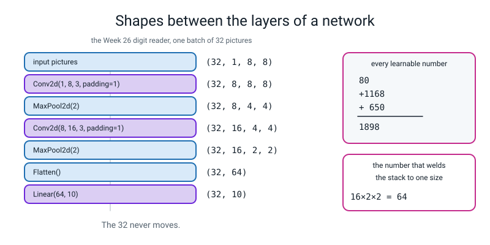
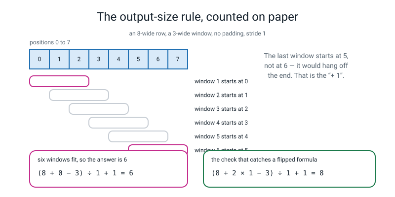

# 📝 Term 3 Practice Test — Weeks 19–27

[⬅ Assessments home](README.md) · [⬅ Term 2 test](term-2-test.md) · [Course home](../README.md) · [Term 4 test ➡](term-4-test.md)

---

```
   ┌──────────────────────────────────────────────────────────────────────┐
   │                                                                      │
   │   AI ACADEMY · LEVEL 3 ENGINEER                                      │
   │   TERM 3 PRACTICE TEST — Real Networks, Real Framework               │
   │   Covers Weeks 19–27. Nothing later appears anywhere on this paper.  │
   │   No k-means, no PCA, no words-into-columns. That is Term 4.          │
   │                                                                      │
   │   TIME ALLOWED   75 minutes                                          │
   │   TOTAL MARKS    80                                                  │
   │                                                                      │
   │   Section A   12 multiple choice         1 mark each     12 marks    │
   │   Section B    5 do-the-maths-by-hand    4 marks each    20 marks    │
   │   Section C    5 "what does this print"  3 marks each    15 marks    │
   │   Section D    4 find-and-fix-the-bug    3 marks each    12 marks    │
   │   Section E    3 write-the-code        4 + 4 + 5 marks    13 marks   │
   │   Section F    1 extended question       8 marks          8 marks    │
   │                                                                      │
   │   ⛔  NO COMPUTER.                                                   │
   │   ✅  A CALCULATOR, YES.                                             │
   │                                                                      │
   │      This is the shapes term. Nearly every mark on this paper         │
   │      comes down to one of two questions: WHAT SHAPE IS IT, and        │
   │      HOW MANY LEARNABLE NUMBERS ARE IN IT. Both are arithmetic        │
   │      you can do on paper, and an engineer who can do them on          │
   │      paper does not need to run the program to know it is wrong.      │
   │                                                                      │
   │   INSTRUCTIONS                                                       │
   │   · Write in pencil. Answer every question.                          │
   │   · Section A: circle ONE letter. A guess costs nothing.             │
   │   · Section B: WRITE THE SUM ABOVE THE ANSWER. Every time.           │
   │     A bare number scores 1 of 4 even when it is correct.             │
   │   · Section C: write EVERY line of output, on separate lines, in     │
   │     order. A tensor shape is written (32, 16, 2, 2) — four numbers,  │
   │     brackets, commas. Getting the brackets wrong costs the line.     │
   │   · Section D: you must do THREE things — say what PyTorch is        │
   │     telling you, point at the line, and write the fixed line.        │
   │   · Section E: indentation counts. Four spaces. Every time.          │
   │   · Section F: a paragraph, not a list, and the arithmetic goes in   │
   │     the paragraph.                                                   │
   │                                                                      │
   │   WHAT IS ALLOWED                                                    │
   │   ✅  Pencil, pen, eraser, ruler                                     │
   │   ✅  A calculator                                                   │
   │   ✅  Four blank sheets of rough paper. Your working earns marks     │
   │   ❌  A COMPUTER. No Python, no phone, no editor, no terminal        │
   │   ❌  The student guide, the workbook, the glossary, your notes      │
   │   ❌  Your own week-19-to-27 .py files                              │
   │   ❌  A search engine, a chatbot, another person                     │
   │                                                                      │
   └──────────────────────────────────────────────────────────────────────┘
```

> **🧑‍🏫 Teacher, read this once before you hand the paper out.** You do not need to know PyTorch to run
> this test and you do not need to know it to mark it either. The two things this paper measures are
> both arithmetic: **the output-size rule** `(n + 2p − k) ÷ s + 1` rounded down, and **the
> parameter count** of a layer. Both are in the answer key with every sum written out. Set a timer for
> 75 minutes. Read the "what is allowed" box out loud. Then say nothing until the timer goes. Every code
> block in the answer key was run on Python 3.10.10 with numpy 1.26.4, scikit-learn 1.7.1 and
> **torch 2.2.1**, and the real output pasted in unedited. Students must not see that page. Marking
> guidance is in [assessments/README.md](README.md).

---

## 📐 The two pictures this paper is really about

Copy both of these onto your rough paper before you start. Between them they are worth more marks than
anything you can memorise.



*Figure T3.1 — Shapes between the layers of a network. Every Section C shape question is this picture with different numbers, and the `16 × 2 × 2 = 64` at the bottom right is Section D's first bug.*



*Figure T3.2 — The output-size rule, counted on paper. Six windows fit, not seven, and the `+ 1` is the fence post. When you doubt the formula, check it on `k=3, p=1, s=1`: it must give 8 back from 8.*

---

# 🅰️ Section A — Multiple Choice

*12 questions · 1 mark each · circle ONE letter · the week each question comes from is in brackets*

---

**A1.** [W19] A hidden unit in your numpy network has been dead since epoch 30 — its output is zero for
every single row. Why can no learning rate ever bring it back?

- (a) Because its weight is exactly zero
- (b) Because ReLU's slope is exactly `0` wherever it did not fire, so the unit's gradient is `0`, and `w − lr × 0` is `w` for any `lr` at all
- (c) Because numpy has run out of precision
- (d) Because dead units are removed from the network

---

**A2.** [W20] You print `w.grad` before calling `backward()` and get `None`. After `backward()` you get
`6.0`. You call `backward()` again without clearing anything. What does `w.grad` say now?

- (a) `6.0` — it is recomputed each time
- (b) `12.0` — `.grad` **adds**, it does not replace
- (c) `None` — the graph was used up
- (d) `0.0`

---

**A3.** [W21] Here are the five lines of a training loop, shuffled. Which order is right?

```
   P  loss.backward()
   Q  optimizer.zero_grad()
   R  optimizer.step()
   S  loss = loss_fn(pred, y)
   T  pred = model(x)
```

- (a) T, S, P, R, Q
- (b) Q, T, S, P, R
- (c) Q, P, T, S, R
- (d) T, S, Q, P, R

---

**A4.** [W21] What is `with torch.no_grad():` for?

- (a) Making training faster by skipping the backward pass
- (b) Measuring, not learning — nothing inside it gets recorded, so you get the same numbers with far less stored and no risk of accidentally training
- (c) Freezing the weights permanently
- (d) Stopping the loss from becoming `nan`

---

**A5.** [W22] You build `nn.Linear(2, 16)` and print the shape of its weight. What does it say, and is
it a bug?

- (a) `(2, 16)`, and that is correct
- (b) `(16, 2)` — outputs first, inputs second. It is not a bug and it does not need fixing; it is just the opposite arrangement from the numpy one you wrote in Week 17
- (c) `(16,)`, because a layer has one weight per unit
- (d) `(2,)`

---

**A6.** [W22] You plot the training loss and the validation loss. Which one tells you something about
the future, and how do you use it?

- (a) The training loss — it is measured on more rows
- (b) The **validation** loss, and the epoch you want is its **lowest point**; the training loss only tells you what the model has memorised
- (c) Both, equally
- (d) Neither; use the test loss

---

**A7.** [W23] You have 1,347 training rows and `batch_size=32`. How many optimizer steps happen in one
epoch?

- (a) 1,347
- (b) 32
- (c) `ceil(1347 ÷ 32) = 43` — forty-two full batches of 32 and one last short batch of 3
- (d) 42, dropping the leftovers

---

**A8.** [W23] You load a `state_dict` into a fresh model and score five predictions on the same
picture. You get five different answers. What did you forget?

- (a) `torch.no_grad()`
- (b) `model.eval()` — the model is still in training behaviour, so its dropout is still randomly switching units off
- (c) `optimizer.zero_grad()`
- (d) The seed

---

**A9.** [W24] What is the evidence that a dense layer on an 8×8 picture was **never using the
arrangement** of the pixels?

- (a) The parameter count
- (b) Shuffle the 64 columns into a fixed random order and retrain: the same model still scores about the same — `0.9704` against `0.9667` — because it never knew which pixel was next to which
- (c) The training time does not change
- (d) There is no such evidence

---

**A10.** [W25] An 8×8 picture goes through `nn.Conv2d(1, 8, 3, stride=2, padding=1)`. How big does it
come out?

- (a) 8×8
- (b) 4×4, from `(8 + 2 − 3) ÷ 2 + 1 = 3.5 + 1 = 4.5`, rounded **down** to 4
- (c) 3×3
- (d) 6×6

---

**A11.** [W26] What must you hand to `nn.CrossEntropyLoss()`?

- (a) Probabilities that add up to 1, and one-hot labels
- (b) **Raw logits** and **whole-number** labels — it does the softmax itself, and squashing first is a silent bug that makes training crawl
- (c) Probabilities and whole-number labels
- (d) Logits and float labels

---

**A12.** [W27] You augment your data and your test accuracy comes out **higher than your training
accuracy** — `train 0.5968, test 0.8574`. What is it?

- (a) A lucky run; report it
- (b) Evidence that augmentation worked extremely well
- (c) A bug in the **training labels** — almost certainly the augmented pictures got shuffled away from their labels. It is never a lucky run
- (d) Evidence that the test set is too small

---

# 🅱️ Section B — Do the Maths By Hand

*5 questions · 4 marks each · 20 marks · NO COMPUTER · a calculator is allowed*

**Write the sum above the answer, every time.** A bare correct number scores 1 mark out of 4.

---

**B1.** [W25] The output-size rule is `out = (n + 2p − k) ÷ s + 1`, **rounded down**, applied to height
and width separately.

**(a)** Fill in all eight rows. Show the sum for at least four of them.

| `n` | `p` | `k` | `s` | working | `out` |
|:--:|:--:|:--:|:--:|---|:--:|
| 8 | 1 | 3 | 1 | | |
| 8 | 0 | 3 | 1 | | |
| 8 | 0 | 2 | 2 | | |
| 6 | 0 | 3 | 1 | | |
| 4 | 1 | 3 | 2 | | |
| 8 | 1 | 3 | 2 | | |
| 4 | 0 | 2 | 2 | | |
| 2 | 0 | 2 | 2 | | |

**(b)** Which of those eight rows is the one nearly every real network uses, and **why**?

```
   row: __________   because: _______________________________________
```

**(c)** A batch of 32 pictures, each 1 channel by 8 by 8, goes through this stack. Write the shape
after **every** layer. All four numbers, every time.

```
   input                                (32, 1, 8, 8)

   nn.Conv2d(1, 8, 3, padding=1)        ____________________

   nn.MaxPool2d(2)                      ____________________

   nn.Conv2d(8, 16, 3, padding=1)       ____________________

   nn.MaxPool2d(2)                      ____________________

   nn.Flatten()                         ____________________
```

**(d)** So what number goes inside `nn.Linear( ____ , 10)`, and show the multiplication.

```
   ______________________ = __________
```

---

**B2.** [W26] A convolution layer costs `(in × k × k × out) + out` learnable numbers. The `+ out` is
one bias per filter, and it is the bit everybody forgets. A linear layer costs `(in × out) + out`.

**(a)** Count the three layers of the Week 26 digit reader. Show every multiplication.

```
   Conv2d(1, 8, 3, padding=1)   : ______________________________ = __________

   Conv2d(8, 16, 3, padding=1)  : ______________________________ = __________

   Linear(64, 10)               : ______________________________ = __________

   TOTAL                        : ______________________________ = __________
```

**(b)** A `nn.Linear(64, 16)` on the same flattened 8×8 picture costs how many? Show it.

```
   ______________________ = __________
```

**(c)** Compare (b) with the **first** conv layer from (a). Then answer the question that matters: if
you moved to 200×200 photographs instead of 8×8 digits, which of those two counts would change, and
which would not?

```
   changes: ____________________   stays the same: ____________________

   because: ____________________________________________________________
```

**(d)** One sentence: which **single** layer in the stack from (a) is welded to one picture size, and
what would you have to change to use 16×16 pictures?

```
   ____________________________________________________________________
```

---

**B3.** [W24] Here is a 5×5 picture with a bright vertical bar in it, and a 3×3 kernel.

```
   picture                         kernel
   0   0  10  10   0               1   0  -1
   0   0  10  10   0               1   0  -1
   0   0  10  10   0               1   0  -1
   0   0  10  10   0
   0   0  10  10   0
```

**(a)** How big is the feature map, and why? *(No padding, stride 1.)*

```
   ______________________ = __________ by __________

   why: ________________________________________________________________
```

**(b)** Compute the cell at **row 0, column 0** in full. The window is the top-left 3×3 of the
picture. Nine multiplications, then one addition.

```
   window:  ______  ______  ______
            ______  ______  ______
            ______  ______  ______

   ______________________________________________ = __________
```

**(c)** Compute the cell at **row 0, column 2** — the window has slid two steps right.

```
   ______________________________________________ = __________
```

**(d)** Your two answers have **opposite signs**. One sentence: what does the sign of a cell in this
feature map tell you about the picture underneath it?

```
   ____________________________________________________________________
```

---

**B4.** [W20, W21] Autograd arithmetic, with no computer.

**(a)** `w` starts at `3.0`. The loss is `L = w × w`. What is `w.grad` after one `backward()`? Use the
rule you checked in Week 12.

```
   ______________________ = __________
```

**(b)** You call `backward()` a **second** time without calling `optimizer.zero_grad()`. What does
`w.grad` say now, and why?

```
   w.grad = __________   because: ______________________________________
```

**(c)** Now with `optimizer.zero_grad()` in the right place and `lr = 0.1`, take one step. Show it.

```
   w &#8592; ______________________ = __________
```

**(d)** A different run: `w` starts at `0.0`, the first loss is `1786.6666`, and after `backward()`
`w.grad` is `−326.6667`. With `lr = 0.05`, where does `w` land after one `optimizer.step()`? Show the
arithmetic, then say in one sentence why a **negative** slope made the weight go **up**.

```
   w &#8592; ______________________ = __________

   ____________________________________________________________________
```

---

**B5.** [W26, W27] A network was trained to tell apart just three digits — `1`, `7` and `8` — and
tested on **161** held-out pictures. Here is the real confusion matrix. Rows are the truth, columns are
what the model said.

```
                      said 1    said 7    said 8
       really a 1        54         0         1
       really a 7         0        54         0
       really an 8        4         0        48
```

**(a)** How many pictures were there in total, and what is the accuracy? Show both sums.

```
   total     = ______________________ = __________

   accuracy  = ______________________ = __________
```

**(b)** Compute the **recall** of each of the three digits. Show each division.

```
   recall(1) = ______________________ = __________

   recall(7) = ______________________ = __________

   recall(8) = ______________________ = __________
```

**(c)** Compute the **precision** of the class `1`. Careful: this one divides down a **column**.

```
   precision(1) = ______________________ = __________
```

**(d)** Name the **confusion pair** — the two cells that face each other across the diagonal — and
then give a *physical* reason for it, about the pictures, not about the maths. *(The pictures are
8 pixels by 8 pixels.)*

```
   the pair: __________ and __________ , _____ + _____ = _____ of the _____ mistakes

   the physical reason: _________________________________________________
```

---

# 🅲 Section C — What Does This Print?

*5 questions · 3 marks each · 15 marks*

**Write every line of output, on its own line, in the right order.** If a program produces no output,
write **"no output"**. If it crashes, write the **name of the error** and say which line crashes.

A tensor shape is written `(32, 16, 2, 2)` — brackets, commas, all the numbers.

---

**C1.** [W20]

```python
import torch
torch.manual_seed(0)
w = torch.tensor([2.0], requires_grad=True)
b = torch.tensor([1.0], requires_grad=True)
print(w.grad, b.grad)
y = w * w * 3 + b
y.backward()
print(w.grad.item(), b.grad.item())
y2 = w * w * 3 + b
y2.backward()
print(w.grad.item(), b.grad.item())
print(type(y.item()).__name__, tuple(y.shape))
```

*Four lines. Line 1 is the one people get wrong, and the answer is not a number. Line 3 is the one the
whole question is about.*

```
   1. ________________________________
   2. ________________________________
   3. ________________________________
   4. ________________________________
```

---

**C2.** [W21]

```python
import torch
torch.manual_seed(0)
x = torch.tensor([[1.0], [2.0], [3.0], [4.0]])
t = torch.tensor([[5.0], [8.0], [11.0], [14.0]])
w = torch.tensor([[0.0]], requires_grad=True)
b = torch.tensor([0.0], requires_grad=True)
opt = torch.optim.SGD([w, b], lr=0.05)
for step in range(3):
    opt.zero_grad()
    loss = ((x @ w + b - t) ** 2).mean()
    loss.backward()
    print(step, round(loss.item(), 4), round(w.grad.item(), 4), round(w.item(), 4))
    opt.step()
print(round(w.item(), 4), round(b.item(), 4))
```

*Four lines. The first three have four things on them. **You only need to compute the first line by
hand** — the other two are given to you in the answer key, and a marker will accept "step 0" correct
plus the right *shape* of answer for the rest. The first line is the mark.*

```
   1. ________________________________
   2. ________________________________
   3. ________________________________
   4. ________________________________
```

---

**C3.** [W22]

```python
import torch
import torch.nn as nn
torch.manual_seed(0)
model = nn.Sequential(nn.Linear(2, 16), nn.ReLU(), nn.Linear(16, 1))
for name, p in model.named_parameters():
    print(name, tuple(p.shape), p.numel())
print(sum(p.numel() for p in model.parameters()))
x = torch.zeros(7, 2)
print(tuple(model(x).shape))
```

*Six lines. The names are position numbers, and `nn.ReLU()` has no numbers in it at all — so think
about which positions appear.*

```
   1. ________________________________
   2. ________________________________
   3. ________________________________
   4. ________________________________
   5. ________________________________
   6. ________________________________
```

---

**C4.** [W25] **This is a tensor-shape question.**

```python
import torch
import torch.nn as nn
torch.manual_seed(0)
x = torch.zeros(32, 1, 8, 8)
c1 = nn.Conv2d(1, 8, 3, padding=1)
p1 = nn.MaxPool2d(2)
c2 = nn.Conv2d(8, 16, 3, padding=1)
p2 = nn.MaxPool2d(2)
fl = nn.Flatten()
h = c1(x); print(tuple(h.shape))
h = p1(h); print(tuple(h.shape))
h = c2(h); print(tuple(h.shape))
h = p2(h); print(tuple(h.shape))
h = fl(h); print(tuple(h.shape))
```

*Five lines. Four numbers on each of the first four, two on the last.*

```
   1. ________________________________
   2. ________________________________
   3. ________________________________
   4. ________________________________
   5. ________________________________
```

---

**C5.** [W26, W27] **This is a tensor-shape question.**

```python
import numpy as np
import torch
torch.manual_seed(0)
logits = torch.tensor([[1.0, 5.0, 2.0],
                       [7.0, 0.0, 3.0],
                       [0.0, 1.0, 9.0],
                       [4.0, 4.5, 1.0]])
print(tuple(logits.argmax(dim=1).shape), logits.argmax(dim=1).tolist())
print(tuple(logits.argmax(dim=0).shape), logits.argmax(dim=0).tolist())
img = np.array([[1, 2, 3], [4, 5, 6], [7, 8, 9]])
print(np.roll(img, 1, axis=0))
```

*Five lines — the last `print` produces a three-row grid, and each row of it counts as a line. Lines 1
and 2 are the same call with one number changed, and only one of them is what you wanted.*

```
   1. ________________________________
   2. ________________________________
   3. ________________________________
   4. ________________________________
   5. ________________________________
```

---

# 🅳 Section D — Find and Fix the Bug

*4 questions · 3 marks each · 12 marks*

For every one of these you must do **three** things:

| | | Marks |
|---|---|:--:|
| **1** | **Say what PyTorch is telling you**, in your own words. Not the error's name copied out — what it *means*. | 1 |
| **2** | **Point at the line** that has to change. Give its number. | 1 |
| **3** | **Write the fixed line out in full**, or — where the bug has no error message — write the fix in one sentence. | 1 |

> **⚠️ Watch out.** Two of these four produce **no error at all.** One of them prints a loss that is
> **too small**, which is the most dangerous kind of wrong there is.

*Every message below is copied from a real run on torch 2.2.1. The only edits are cosmetic: the long
`torch/nn/modules/...` paths have been shortened to `…/torch/…` and the repeated wrapper frames have
been cut, so the traceback fits the page. No number, name or word is changed.*

---

**D1.** [W25] `shape.py` builds a digit reader.

```python
1  import torch
2  import torch.nn as nn
3  from sklearn.datasets import load_digits
4
5  d = load_digits()
6  x = torch.from_numpy(d.images[:32]).float().unsqueeze(1)
7
8  model = nn.Sequential(
9      nn.Conv2d(1, 8, 3, padding=1), nn.ReLU(), nn.MaxPool2d(2),
10     nn.Conv2d(8, 16, 3, padding=1), nn.ReLU(), nn.MaxPool2d(2),
11     nn.Flatten(),
12     nn.Linear(16 * 4 * 4, 10),
13 )
14 print("input :", tuple(x.shape))
15 print("output:", tuple(model(x).shape))
```

```text
input : (32, 1, 8, 8)
Traceback (most recent call last):
  File "shape.py", line 15, in <module>
    print("output:", tuple(model(x).shape))
  File "…/torch/nn/modules/container.py", line 217, in forward
    input = module(input)
  File "…/torch/nn/modules/linear.py", line 116, in forward
    return F.linear(input, self.weight, self.bias)
RuntimeError: mat1 and mat2 shapes cannot be multiplied (32x64 and 256x10)
```

**1. What is PyTorch telling you?** ______________________________________________

**2. Line number:** ______

**3. The fixed line, in full:** ______________________________________________

**And: which of the two numbers in the error message is YOURS?** ______

---

**D2.** [W24] `dtype.py` pushes four digit pictures through one conv layer.

```python
1  import torch
2  import torch.nn as nn
3  from sklearn.datasets import load_digits
4
5  d = load_digits()
6  x = torch.from_numpy(d.images[:4]).unsqueeze(1)
7  print("dtype :", x.dtype)
8  conv = nn.Conv2d(1, 8, 3, padding=1)
9  print("output:", tuple(conv(x).shape))
```

```text
dtype : torch.float64
Traceback (most recent call last):
  File "dtype.py", line 9, in <module>
    print("output:", tuple(conv(x).shape))
  File "…/torch/nn/modules/conv.py", line 456, in _conv_forward
    return F.conv2d(input, weight, bias, self.stride,
RuntimeError: Input type (double) and bias type (float) should be the same
```

**1. What is PyTorch telling you?** ______________________________________________

**2. Line number:** ______

**3. The fixed line, in full:** ______________________________________________

**And: why is line 7's output the clue?** ______________________________________

---

**D3.** [W21] ⚠️ **No error message.** `pile.py` is a training loop.

```python
1  import torch
2
3  torch.manual_seed(0)
4  hours = torch.tensor([[1.], [2.], [3.], [4.], [5.], [6.]])
5  marks = torch.tensor([[20.], [28.], [36.], [44.], [52.], [60.]])
6
7  w = torch.tensor([[0.0]], requires_grad=True)
8  b = torch.tensor([0.0], requires_grad=True)
9  opt = torch.optim.SGD([w, b], lr=0.05)
10
11 print("step      loss       w.grad          w")
12 for step in range(6):
13     pred = hours @ w + b
14     loss = ((pred - marks) ** 2).mean()
15     loss.backward()
16     opt.step()
17     print("  %d  %10.4f  %12.4f  %9.4f"
18           % (step, loss.item(), w.grad.item(), w.item()))
```

```text
step      loss       w.grad          w
  0   1786.6666     -326.6667    16.3333
  1    650.5742     -129.8889    22.8278
  2   2737.1262      277.0704     8.9743
  3     31.9444      244.9432    -3.2729
  4   2912.9336     -173.7632     5.4153
  5    312.7519     -308.7159    20.8511
```

**1. What is the program telling you that is not true?** ______________________________________

**2. Which line is MISSING, and where does it go?** ______________________________________

**3. The fix, written as the line plus where it belongs:** ______________________________________

**And: which column in the printout is the giveaway, and what is it doing?**

```
   ____________________________________________________________________
```

---

**D4.** [W26] ⚠️ **No error message, and the loss looks BETTER than it should.** `squash.py` checks a
loss on one nearly-perfect prediction.

```python
1  import torch
2  import torch.nn as nn
3
4  torch.manual_seed(0)
5  logits = torch.tensor([[0.2, 9.0, 0.1, 0.0, 0.0, 0.0, 0.0, 0.0, 0.0, 0.0]])
6  target = torch.tensor([1])
7
8  loss_fn = nn.CrossEntropyLoss()
9  chances = torch.softmax(logits, dim=1)
10 print("chances    :", torch.round(chances * 10000).int().tolist())
11 print("loss on the softmax :", round(loss_fn(chances, target).item(), 4))
12 print("loss on the logits  :", round(loss_fn(logits, target).item(), 4))
```

```text
chances    : [[2, 9989, 1, 1, 1, 1, 1, 1, 1, 1]]
loss on the softmax : 1.4621
loss on the logits  : 0.0012
```

**1. Which of the two printed losses is the right one, and what is wrong with the other?**

```
   ____________________________________________________________________
```

**2. Line number of the mistake:** ______

**3. In one sentence: what should `chances` be used for instead?**

```
   ____________________________________________________________________
```

**And: the model answered class 1 with a chance of 0.9989 and the truth WAS class 1. Which of the two
numbers, `1.4621` or `0.0012`, is the honest description of that?** ______

---

# 🅴 Section E — Write the Code

*3 questions · 4 + 4 + 5 marks · 13 marks*

Write real Python. **Indentation counts** — four spaces, every time. You may not use anything from
after Week 27 (so: no `KMeans`, no `PCA`, no `CountVectorizer`). And **never** `import torchvision` —
it is not installed and nothing on this course needs it.

Assume `torch`, `torch.nn as nn` and `numpy as np` are imported.

---

**E1.** [W21, W22] **(4 marks)** Write a complete training script that:

- loads `make_moons(n_samples=400, noise=0.25, random_state=0)` and splits it, keeping the class balance
- builds a **2 → 16 → 1** network with `nn.Sequential`, and prints how many learnable numbers it has
- trains it for 400 epochs with **the five lines, in the right order**
- prints the loss every 100 epochs
- and reports the test accuracy with the **number of held-out rows** beside it

**The last part of the model must be a bare `nn.Linear`.** Say in a comment why.

```
   ________________________________________________________

   ________________________________________________________

   ________________________________________________________

   ________________________________________________________

   ________________________________________________________

   ________________________________________________________

   ________________________________________________________

   ________________________________________________________

   ________________________________________________________

   ________________________________________________________

   ________________________________________________________

   ________________________________________________________
```

---

**E2.** [W25, W26] **(4 marks)** Write the `nn.Sequential` for a digit reader that takes
`(32, 1, 8, 8)` and gives `(32, 10)`, using two conv layers and two pools. Then:

- put the output size **in a comment beside every layer**, worked out with the rule
- push a batch of zeros through it and print the shape in and the shape out
- print the parameter count of each of the three layers **that have parameters**, as a multiplication
- and print the total, counted by torch, so the two agree

```
   ________________________________________________________

   ________________________________________________________

   ________________________________________________________

   ________________________________________________________

   ________________________________________________________

   ________________________________________________________

   ________________________________________________________

   ________________________________________________________

   ________________________________________________________

   ________________________________________________________

   ________________________________________________________

   ________________________________________________________
```

---

**E3.** [W23] **(5 marks)** Write a script that proves a saved model is the model you tested. It must:

- define the architecture as a **class** with `__init__` and `forward`, for a 2 → 16 → 1 network
- make one, score one input, and remember the answer
- save its `state_dict` to a file
- build a **brand-new, differently-seeded** model of the same class and pour the saved numbers into it
- put it in the right mode for measuring
- and print the two answers and whether they are **identical**

**The word `fit` must not appear anywhere. `super().__init__()` must.**

```
   ________________________________________________________

   ________________________________________________________

   ________________________________________________________

   ________________________________________________________

   ________________________________________________________

   ________________________________________________________

   ________________________________________________________

   ________________________________________________________

   ________________________________________________________

   ________________________________________________________

   ________________________________________________________

   ________________________________________________________

   ________________________________________________________

   ________________________________________________________

   ________________________________________________________
```

---

# 🅵 Section F — The Extended Question

*1 question · 8 marks · about 15 minutes · a paragraph, not a list · the arithmetic goes in the paragraph*

---

**F1.** [W23, W26, W27] **The donation envelopes.**

A small charity gets about 400 donation envelopes a week. Volunteers open them and type in the
handwritten amount. You build a digit reader — the Week 26 CNN, trained on `load_digits()` — and hand
it over with this results page:

```
   RESULTS — handwritten digit reader, version 1
   Unit of prediction : ONE handwritten digit, 8 x 8 pixels, greyscale
   Training rows      : 1,347       Held-out test rows : 450
   Learnable numbers  : 1,898       Training time      : 0.8 s
   Baseline           : most_frequent scores 0.1022 on the 450

   Test accuracy      : 0.9689      (436 correct of 450)

   Per-digit recall on the 450 held-out pictures:

     digit    n   right   recall          digit    n   right   recall
       0     45     45    1.0000            5     46     46    1.0000
       1     46     45    0.9783            6     45     45    1.0000
       2     44     43    0.9773            7     45     44    0.9778
       3     46     45    0.9783            8     43     37    0.8605
       4     45     41    0.9111            9     45     45    1.0000

   Every mistake it made, worst first:
     a real 8 called a 1 : 3 times
     a real 8 called a 9, a 7, a 5 : 1 each
     a real 4 called a 9, a 7, a 6, a 1 : 1 each
     a real 7 called a 9 : 1    a real 3 called a 7 : 1
     a real 2 called a 1 : 1    a real 1 called a 3 : 1
                                              14 mistakes in total
```

A volunteer then runs your augmentation experiment — the one where you shift every training picture by
one pixel four ways — and emails the trustees:

> *"Great news, the shifted version gets 0.9889 instead of 0.9689. That's a 2% improvement. Can we
> switch to it today and start processing envelopes automatically? At 97% accurate we'd save eight
> volunteer hours a week."*

Write a paragraph answering **all four** of these. Every number you use must be one you can point at
above, or one you compute and show.

1. **The unit of prediction.** The card says one prediction is **one digit**. An amount like `£18` has
   two digits and `£125` has three. Compute the chance of getting a **three-digit** amount completely
   right if each digit is right with probability `0.9689`, show the multiplication, and say what that
   does to "97% accurate".
2. **Use the per-digit table.** Name the worst digit, give its recall with the division, and say what
   the `8 → 1` confusion does to a donation of `£8`. Then give a *physical* reason why an 8 is the hard
   one at this picture size.
3. **The volunteer's 2%.** You ran the augmentation over five seeds and got `plain 0.9613 ± 0.0094`
   (range `0.9511` to `0.9733`) and `augmented 0.9813 ± 0.0073` (range `0.9733` to `0.9889`). Say
   exactly what you can and cannot claim from that, with the numbers, and name the **one** thing you
   would say to the volunteer about where their `0.9889` came from.
4. **The deployment.** Say what you would actually build instead of "automatic", name the number that
   would trigger a human looking at an envelope, and name the model-card heading that should carry all
   of this.

```
   ______________________________________________________________________

   ______________________________________________________________________

   ______________________________________________________________________

   ______________________________________________________________________

   ______________________________________________________________________

   ______________________________________________________________________

   ______________________________________________________________________

   ______________________________________________________________________

   ______________________________________________________________________

   ______________________________________________________________________

   ______________________________________________________________________

   ______________________________________________________________________

   ______________________________________________________________________

   ______________________________________________________________________
```

---

---
---

# 📊 Marking Scheme

**Total: 80 marks.** Mark Section A first.

## Section A — 12 marks

| Q | Answer | Mark | Week |
|:--:|:--:|:--:|:--:|
| A1 | **(b)** | 1 | W19 |
| A2 | **(b)** | 1 | W20 |
| A3 | **(b)** | 1 | W21 |
| A4 | **(b)** | 1 | W21 |
| A5 | **(b)** | 1 | W22 |
| A6 | **(b)** | 1 | W22 |
| A7 | **(c)** | 1 | W23 |
| A8 | **(b)** | 1 | W23 |
| A9 | **(b)** | 1 | W24 |
| A10 | **(b)** | 1 | W25 |
| A11 | **(b)** | 1 | W26 |
| A12 | **(c)** | 1 | W27 |

No half marks. Two letters circled scores 0.

> **🧑‍🏫 A10 and A11 are the two that matter most.** A10 is the output-size rule and A11 is the
> double-squash. If a student misses both, Section B and Section D will be hard for them and the
> remediation table's Week 25 and Week 26 rows are where to go.

## Section B — 20 marks · do the maths by hand

**4 marks per question, on the same ladder as Terms 1 and 2:**

| | Marks |
|---|:--:|
| Every part correct **with the sum written above each answer** | **4** |
| All the working correct, one arithmetic slip carried through | **3** |
| The right sums set up, two or more arithmetic slips | **2** |
| Correct final numbers with **no working shown at all** | **1** |
| Nothing usable | 0 |

**Per question:**

| Q | The answers | Marks | The trap |
|:--:|---|:--:|---|
| **B1** | (a) **8, 6, 4, 4, 2, 4, 2, 1** · (b) row 1, `k=3 p=1 s=1` keeps the size · (c) `(32,8,8,8)`, `(32,8,4,4)`, `(32,16,4,4)`, `(32,16,2,2)`, `(32,64)` · (d) `16 × 2 × 2 = ` **64** | 4 | Row 5 and row 6 both have `s=2` and both need rounding **down**: `(4+2−3)÷2+1 = 1.5+1 = 2.5 → 2` and `(8+2−3)÷2+1 = 3.5+1 = 4.5 → 4`. |
| **B2** | (a) **80**, **1168**, **650**, total **1898** · (b) **1040** · (c) the dense count changes, the conv count does not · (d) the `Linear` | 4 | Forgetting the `+ out` bias on the convs. `1×3×3×8 = 72`, and the answer is **80**. |
| **B3** | (a) `5 − 3 + 1 = 3` by `3` · (b) **−30** · (c) **+30** · (d) the sign says which side of the edge is bright | 4 | (b): forgetting that the middle column of the kernel is all zeros, so only six of the nine multiplications matter. |
| **B4** | (a) **6.0** · (b) **12.0**, because `.grad` adds · (c) `3 − 0.1 × 6 = ` **2.4** · (d) `0 − 0.05 × (−326.6667) = ` **16.3333** | 4 | (b): answering `6.0` again. `backward()` **adds** to whatever is already in `.grad`. |
| **B5** | (a) total **161**, accuracy `156 ÷ 161 = ` **0.9689** · (b) **0.9818**, **1.0000**, **0.9231** · (c) `54 ÷ 58 = ` **0.9310** · (d) 8 and 1, `4 + 1 = 5` of the 5 mistakes | 4 | (c): dividing by 55 (the row) instead of 58 (the column). Precision divides by the column, every time. |

**B1(b) — 1 of the 4 marks.** *"Row 1, `n=8 p=1 k=3 s=1`, because it gives 8 back out of 8 — the size
does not change. That is why nearly every real network uses `kernel_size=3, padding=1`, and it is also
the quickest check that you have the formula the right way round."*

**B2(c) — 1 of the 4 marks.** *"The dense count changes and the conv count does not. A conv layer's
weight count is `in × k × k × out + out` — the picture size is not in that formula anywhere — so the
same 80 weights work on an 8×8 digit and a 200×200 photo. A dense layer's `in` **is** the picture, so
`64 × 16` becomes `40000 × 16`."*

**B3(d) — 1 of the 4 marks.** *"The sign says which way round the edge is. This kernel has `+1` on the
left and `−1` on the right, so a cell is negative where the bright side is on the **right** of the
window and positive where the bright side is on the **left**. Flip the kernel and every sign flips, with
no error message."*

**B5(d) — 1 of the 4 marks.** The pair is `8` and `1`: `4 + 1 = 5` of the 5 mistakes, leaning heavily
one way (four 8s called 1, one 1 called 8). The *physical* reason must be about pixels:
*"at 8 by 8, an 8's two loops are only about three pixels tall, which is too small to hold a hole, so
they fill in with ink and what is left is a bar down the middle columns — which is what a 1 is."*
"They look similar" scores 0. "The model is confused" scores 0.

## Section C — 15 marks · what does this print?

**3 marks per question, on this ladder:**

| | Marks |
|---|:--:|
| Every line correct, in the right order, with the right brackets | **3** |
| One line wrong, everything else right | **2** |
| Two lines wrong, or right values in the wrong order | **1** |
| A visible shape trace with correct intermediate values, even if the final answer is wrong | **1, always** |
| Nothing usable | 0 |

| Q | The real output | Marks | The trap |
|:--:|---|:--:|---|
| **C1** | `None None` / `12.0 1.0` / `24.0 2.0` / `float (1,)` | 3 | Line 1 is **`None None`**, not `0.0 0.0`. Line 3 is the doubling. Line 4: `.item()` gives a plain `float`, and `y`'s shape is `(1,)`. |
| **C2** | `0 101.5 -55.0 0.0` / `1 2.8838 -9.0 2.75` / `2 0.1963 -1.4125 3.2` / `3.2706 1.1558` | 3 | The `w` printed is the value **before** the step, because `print` comes before `opt.step()`. |
| **C3** | `0.weight (16, 2) 32` / `0.bias (16,) 16` / `2.weight (1, 16) 16` / `2.bias (1,) 1` / `65` / `(7, 1)` | 3 | The names skip `1` — `nn.ReLU()` is position 1 and has no parameters at all, so it never appears. |
| **C4** | `(32, 8, 8, 8)` / `(32, 8, 4, 4)` / `(32, 16, 4, 4)` / `(32, 16, 2, 2)` / `(32, 64)` | 3 | The `32` never moves. If a student's first number changes, that is the error to name. |
| **C5** | `(4,) [1, 0, 2, 1]` / `(3,) [1, 0, 2]` / `[[7 8 9]` / ` [1 2 3]` / ` [4 5 6]]` | 3 | Line 2 gives **three** answers for **four** pictures, and no error. Count the answers, always. Line 3: `np.roll(..., 1, axis=0)` moves rows **down**, and the bottom row wraps to the top. |

**C2's first line, worked in full** — this is the only one a student has to do by hand, and it is the
mark:

```
w = 0 and b = 0, so every prediction is 0.
errors = 0 − 5, 0 − 8, 0 − 11, 0 − 14 = −5, −8, −11, −14
loss   = (25 + 64 + 121 + 196) ÷ 4 = 406 ÷ 4 = 101.5
w.grad = 2 × (−5(1) + −8(2) + −11(3) + −14(4)) ÷ 4
       = 2 × (−5 − 16 − 33 − 56) ÷ 4
       = 2 × (−110) ÷ 4
       = −220 ÷ 4
       = −55.0
w printed = 0.0        ← printed BEFORE opt.step() runs
```

## Section D — 12 marks · find and fix the bug

**3 marks per bug: 1 for the meaning, 1 for the line, 1 for the fix.**

| Q | 1 · Meaning (1 mark) | 2 · Line (1 mark) | 3 · Fix (1 mark) |
|:--:|---|:--:|---|
| **D1** | After two pools an 8×8 picture is 2×2, and with 16 channels the flatten gives `16 × 2 × 2 = 64` numbers per picture. The `Linear` was told to expect `16 × 4 × 4 = 256`. The `32x64` is what arrived; the `256x10` is what was asked for. | **12** | `nn.Linear(16 * 2 * 2, 10),` |
| **D2** | `load_digits().images` is float64, which torch calls `double`. Every layer's weights and biases are float32. torch refuses to mix them rather than silently converting, because a silent conversion would cost memory and speed with no warning. | **6** | `x = torch.from_numpy(d.images[:4]).float().unsqueeze(1)` |
| **D3** | The loss is not falling, it is **bouncing**: 1786 → 650 → 2737 → 31 → 2912 → 312. The gradients from every step are piling up on top of each other, so by step 3 the "slope" being used is the sum of four different slopes measured at four different places. | **missing**, and it goes at the **top of the loop body**, before line 13 | `opt.zero_grad()` as the first line inside the `for` |
| **D4** | `1.4621` is wrong. `CrossEntropyLoss` applies the softmax **itself**, so line 11 squashes an already-squashed thing: the ten probabilities get treated as raw scores and squashed again, which flattens them towards `0.1` each and produces a loss of a model that is barely sure of anything. `0.0012` is the truth. | **11** | Delete line 11, or change it to `round(loss_fn(logits, target).item(), 4)` |

**D1's extra:** the `256` is yours. `32x64` is what the data actually is; `256x10` is the shape of the
weight matrix *you* typed.

**D2's extra:** *"Line 7 printed `torch.float64`, and every weight in a torch layer is `float32`. The
clue was on the line before the crash, which is where you should print a shape or a dtype every single
time you are stuck."*

**D3's extra — the giveaway column.** The **`w.grad`** column. Read it: `−326.6667`, `−129.8889`,
`+277.0704`, `+244.9432`, `−173.7632`, `−308.7159`. It never settles and it changes sign, because each
value is a *sum* of every slope so far rather than this step's slope. *(Contrast with a healthy run,
where the gradient shrinks towards zero.)*

**D4's extra:** `0.0012` is the honest one. The model gave the right class a chance of `0.9989`, and
`−ln(0.9989) = 0.0011` — near enough zero surprise. A loss of `1.4621` would describe a model that was
guessing.

**Two marking rules that carry the most weight on this paper:**

1. **Withhold the fix mark for "I changed the numbers until it ran".** D1 "fixed" by changing
   `nn.Linear(256, 10)` to `nn.Linear(64, 10)` **after** reading `32x64` off the error message is
   right, and it earns the mark — but if the student cannot then say where the `64` comes from, it is a
   guess that happened to be correct, and the answer key's `16 × 2 × 2` is what you should write on the
   paper.
2. **Give the meaning mark for the mechanism, not the noun.** "It's a shape error" scores 0. "The
   flatten gives 64 and the layer wanted 256" scores 1.

## Section E — 13 marks · write the code

### E1 — 4 marks

| Row | Mark for | Marks |
|---|---|:--:|
| The data | `make_moons(..., random_state=0)` and a split with `stratify=` | 1 |
| The model | `nn.Sequential(nn.Linear(2, 16), nn.ReLU(), nn.Linear(16, 1))` ending in a **bare** `Linear`, plus the parameter count printed | 1 |
| The five lines, in order | `zero_grad` · forward · loss · `backward` · `step`, in that order, with `nn.BCEWithLogitsLoss()` | 1 |
| The honest report | Test accuracy printed **with the number of held-out rows**, inside `torch.no_grad()`, after `model.eval()` | 1 |

**A model answer, run — about 2 seconds:**

```python
"""e1.py -- the five-line loop, on nn.Sequential, over make_moons."""
import torch
import torch.nn as nn
from sklearn.datasets import make_moons
from sklearn.model_selection import train_test_split

torch.manual_seed(0)
X, y = make_moons(n_samples=400, noise=0.25, random_state=0)
X_tr, X_te, y_tr, y_te = train_test_split(X, y, test_size=0.25,
                                          stratify=y, random_state=0)
xt = torch.from_numpy(X_tr).float()
yt = torch.from_numpy(y_tr).float().unsqueeze(1)
xe = torch.from_numpy(X_te).float()
ye = torch.from_numpy(y_te).float().unsqueeze(1)

model = nn.Sequential(nn.Linear(2, 16), nn.ReLU(), nn.Linear(16, 1))
print("knobs:", sum(p.numel() for p in model.parameters()))
opt = torch.optim.SGD(model.parameters(), lr=0.1)
loss_fn = nn.BCEWithLogitsLoss()

for epoch in range(400):
    opt.zero_grad()
    logits = model(xt)
    loss = loss_fn(logits, yt)
    loss.backward()
    opt.step()
    if epoch % 100 == 0:
        print("epoch %3d  train loss %.4f" % (epoch, loss.item()))

model.eval()
with torch.no_grad():
    acc = ((torch.sigmoid(model(xe)) >= 0.5).float() == ye).float().mean()
print("test accuracy %.4f on %d held-out rows" % (acc.item(), len(ye)))
```

```text
knobs: 65
epoch   0  train loss 0.6813
epoch 100  train loss 0.3996
epoch 200  train loss 0.3618
epoch 300  train loss 0.3491
test accuracy 0.9300 on 100 held-out rows
```

**`65` is the number from Week 19** — `2 × 16 + 16 + 16 × 1 + 1`. A student whose count is 65 has
rebuilt their own numpy network in a framework and can prove it.

### E2 — 4 marks

| Row | Mark for | Marks |
|---|---|:--:|
| The stack | Two `Conv2d` with `padding=1`, two `MaxPool2d(2)`, a `Flatten`, and `nn.Linear(64, 10)` | 1 |
| The comments | The output size beside **every** layer, worked out with the rule, not just asserted | 1 |
| In and out printed | `(32, 1, 8, 8)` in and `(32, 10)` out | 1 |
| The counts agree | The three multiplications printed **and** the torch total, and they add up | 1 |

**A model answer, run:**

```python
"""e2.py -- a CNN for 8x8 digits, shapes worked out before it runs."""
import torch
import torch.nn as nn

torch.manual_seed(0)
model = nn.Sequential(
    nn.Conv2d(1, 8, 3, padding=1),      # 8 -> (8 + 2 - 3) / 1 + 1 = 8
    nn.ReLU(),
    nn.MaxPool2d(2),                    # 8 -> (8 + 0 - 2) / 2 + 1 = 4
    nn.Conv2d(8, 16, 3, padding=1),     # 4 -> 4
    nn.ReLU(),
    nn.MaxPool2d(2),                    # 4 -> 2
    nn.Flatten(),                       # 16 x 2 x 2 = 64
    nn.Linear(64, 10),
)
x = torch.zeros(32, 1, 8, 8)
print("in ", tuple(x.shape))
print("out", tuple(model(x).shape))
print("conv1  (1 x 3 x 3 x 8) + 8   =", 1 * 3 * 3 * 8 + 8)
print("conv2  (8 x 3 x 3 x 16) + 16 =", 8 * 3 * 3 * 16 + 16)
print("linear (64 x 10) + 10        =", 64 * 10 + 10)
print("total counted by torch       =", sum(p.numel() for p in model.parameters()))
```

```text
in  (32, 1, 8, 8)
out (32, 10)
conv1  (1 x 3 x 3 x 8) + 8   = 80
conv2  (8 x 3 x 3 x 16) + 16 = 1168
linear (64 x 10) + 10        = 650
total counted by torch       = 1898
```

`80 + 1168 + 650 = 1898`, and torch says `1898`. **Two independent routes to the same number is what a
check is.**

### E3 — 5 marks

| Row | Mark for | Marks |
|---|---|:--:|
| A real class | `class Net(nn.Module):` with `super().__init__()` as the first line of `__init__`, and a `forward` | 1 |
| Save | `torch.save(model.state_dict(), path)` — the **state_dict**, not the model | 1 |
| Rebuild then pour | A **new** `Net()` constructed first, then `load_state_dict(torch.load(path))` | 1 |
| The right mode | `.eval()` on the reloaded model, and `torch.no_grad()` around the scoring | 1 |
| The proof | Both numbers printed **and** a comparison — `before == after` — so the claim is checkable | 1 |

**A model answer, run:**

```python
"""e3.py -- weights out to a file, and back into a rebuilt architecture."""
import torch
import torch.nn as nn


class Net(nn.Module):
    def __init__(self):
        super().__init__()
        self.hidden = nn.Linear(2, 16)
        self.relu = nn.ReLU()
        self.out = nn.Linear(16, 1)

    def forward(self, x):
        return self.out(self.relu(self.hidden(x)))


torch.manual_seed(0)
trained = Net()
x = torch.tensor([[0.5, -1.2]])
trained.eval()
with torch.no_grad():
    before = trained(x).item()
torch.save(trained.state_dict(), "/tmp/l3t3/net.pt")
print("saved. keys:", list(trained.state_dict().keys()))

fresh = Net()
fresh.load_state_dict(torch.load("/tmp/l3t3/net.pt"))
fresh.eval()
with torch.no_grad():
    after = fresh(x).item()
print("before %.6f  after %.6f  identical? %s" % (before, after, before == after))
```

```text
saved. keys: ['hidden.weight', 'hidden.bias', 'out.weight', 'out.bias']
before 0.235583  after 0.235583  identical? True
```

> **🧑‍🏫 `identical? True` is the whole question.** Not "close". Not "about the same". A `state_dict` is
> a dictionary of names and numbers, so a correct reload gives you the **same** numbers and therefore
> the **same** answer, to every decimal place. If a student's answer prints `True`, they have built the
> only proof that exists that the file on disk is the model they measured.
>
> **The commonest E3 answer does `torch.save(model, path)`** — the whole object rather than the
> `state_dict`. It works, and it is the wrong habit, because the file then contains a reference to
> *your class definition*, and it will break the day you rename the file it lives in. Withhold the save
> row and write: *"save the numbers, keep the shape in code that both scripts import."*

## Section F — 8 marks, marked with the rubric below

| Level | Marks |
|---|:--:|
| 4 · Exceptional | 8 |
| 3 · Proficient | 6–7 |
| 2 · Developing | 3–5 |
| 1 · Beginning | 1–2 |
| Nothing usable | 0 |

### F1 rubric

| | **1 · Beginning** | **2 · Developing** | **3 · Proficient** | **4 · Exceptional** |
|---|---|---|---|---|
| **The unit of prediction** | Does not mention it | Says an amount has several digits | Computes it: `0.9689 × 0.9689 × 0.9689 = 0.9096`, so **about 1 in 11 three-digit amounts** is wrong somewhere, and says 97% per digit is **not** 97% per envelope | Also does the two-digit case — `0.9689² = 0.9388`, about 1 in 16 — and notes that the charity cares about **amounts**, so the whole results page measures the wrong unit and a new one would have to be built |
| **The worst digit** | No digit named | Names 8 with no number | `recall(8) = 37 ÷ 43 = 0.8605`, names the `8 → 1` confusion, and says a `£8` donation is read as `£1` — **seven pounds lost, silently, and the log would look fine** | Also gives the physical reason: at 8 by 8 an 8's loops are about three pixels tall, too small to hold a hole, so they fill in and leave a bar down the middle columns, which is a 1. And notes the error is **one-directional** — four 8s became 1s, only one 1 became an 8 |
| **The five seeds** | Not mentioned | Repeats the means | Says the means differ by `0.9813 − 0.9613 = 0.0200`, about **9 pictures in 450**, but the two ranges **touch** at `0.9733`, so the difference is suggestive and not proved; and names that `0.9889` was the **best of five seeds**, not the typical one | Also notes that `0.9889` is the *maximum* of the augmented runs and `0.9613` is the *mean* of the plain runs, so the volunteer's "2%" compares a best against an average — and says the honest headline is `0.9813 ± 0.0073` against `0.9613 ± 0.0094`, plus: **every one of the five seeds improved**, which is the strongest thing that can honestly be said |
| **The deployment** | "It should be checked" | Says a human should check, no number | Proposes a **confidence threshold**: read the softmax probability, and send any digit under some value — say `0.90` — to a volunteer; names the **known failure modes** heading of the model card | Names the heading **and** writes the sentence, **and** says what to measure afterwards: the fraction of digits routed to a human, and whether the digit-8 recall in real envelopes matches the `0.8605` measured on `load_digits()` — because real handwriting is not this dataset, and nothing on the results page is evidence about real envelopes at all |
| **Writing** | One fragment | Bullet points | A paragraph the trustees could follow | A paragraph you could send to the trustees unchanged, which says yes to something rather than only no |

### A model level-4 answer (about 360 words)

> The card is honest about one thing that makes the volunteer's email impossible: **the unit of
> prediction is one digit**, not one amount. A three-digit donation is right only if all three digits
> are right, which is `0.9689 × 0.9689 × 0.9689 = 0.9096` — so **about one in eleven** three-figure
> amounts would come out wrong somewhere. Two-digit amounts are `0.9689² = 0.9388`, about one in
> sixteen. The charity does not care about digits; it cares about amounts, so the number on my own
> results page is measuring the wrong thing for the decision being made.
>
> And the mistakes are not spread evenly. The worst digit by a long way is **8**, with
> `recall = 37 ÷ 43 = 0.8605`, and its commonest mistake is calling an 8 a **1** — three times out of
> the fourteen errors in the whole test. So a donation of `£8` gets entered as `£1`: seven pounds
> vanish, no error is raised, and the log looks perfect. There is a physical reason, too. These pictures
> are 8 pixels by 8 pixels, so an 8's two loops are only about three pixels tall — too small to hold a
> hole. They fill in with ink, and what survives is a bar down the middle columns, which is a 1. Notice
> also that it is one-directional: four 8s became 1s and only one 1 became an 8.
>
> On the augmentation, I ran five seeds. The means are `0.9813` against `0.9613`, a gap of `0.0200`,
> which is about **nine pictures in 450**. But the two ranges *touch* at `0.9733`, so I cannot claim
> the difference is real from five runs — and the `0.9889` in the email is the **best** of the five
> augmented seeds compared against the plain version's average, which is not a fair comparison. The
> strongest honest sentence is: *every one of the five seeds improved, by about two points, and the
> bands are close enough that I would want ten seeds before promising it.*
>
> So: not automatic. Build it as an **assistant**. Read the softmax probability for each digit and send
> any digit below about `0.90` to a volunteer to confirm — that threshold is the number that triggers a
> human. Then measure two things in the first month: the fraction of digits routed to a person, and
> whether real envelopes show the same 8-recall as `load_digits()` did, because **nothing on this page
> is evidence about real handwriting.** All of that belongs under the model card's **known failure
> modes** heading, and the sentence is: *"this model scores one 8×8 digit at a time, it reads 8s worst
> at 0.8605 recall and usually mistakes them for 1s, and it has never been tested on a real envelope."*

---

# ✅ Full Answer Key

> **🧑‍🏫 Do not photocopy this page for students until after the test is marked.** Every distractor is
> explained. **Every code block in this key was run on Python 3.10.10 with numpy 1.26.4, scikit-learn
> 1.7.1 and torch 2.2.1, and the real output pasted in unedited.**

<details>
<summary><b>A1 — (b) · W19</b></summary>

**(b) ReLU's slope is exactly `0` where it did not fire.** Follow the arithmetic all the way through and
you can see the trap close:

```
the unit's output is 0 for every row
ReLU's slope is 1 where z > 0 and 0 where z <= 0
so the mask is 0 for every row
so dZ for that unit is 0 for every row
so the gradient of every weight feeding it is 0
so w ← w − lr × 0 = w,        for lr = 0.001 or lr = 1000
```

It is not stuck because the step is small. It is stuck because the step is **exactly zero**, and no
multiplier fixes a zero. In Week 19, 13 of 16 units died at `lr = 20`, and 2,000 gentle epochs could
not bring one of them back.

- **(a) is wrong** and it is close enough to be tempting. A weight of zero is fine — it will get a
  gradient next step and move. It is a zero **gradient** that is fatal.
- **(c) is wrong** — nothing about precision is involved; the zero is exact, not rounded.
- **(d) is wrong** — nothing is removed. The unit sits there, costing memory and compute, contributing
  nothing. That is why you count dead units.
</details>

<details>
<summary><b>A2 — (b) · W20</b></summary>

**(b) `12.0` — `.grad` adds.** This is the single most surprising thing about autograd and it is the
reason `optimizer.zero_grad()` exists at all.

```
before any backward():   .grad is None      nobody has written there
first  backward():       .grad = 6.0        written
second backward():       .grad = 6 + 6 = 12.0     ADDED, not replaced
```

`backward()` does not set `.grad`; it **accumulates into** it. So if a gradient ever looks exactly twice
as big as you expected, count your `backward()` calls. (There is a good reason for this behaviour —
it lets you accumulate over several small batches before stepping — and the price is that you must
clear the slot yourself, every single time.)

- **(a) is wrong**, and it is what everybody assumes, because every other function in Python replaces
  its output rather than adding to it.
- **(c) is wrong** — the *graph* is used up (a second `backward()` on the *same* loss raises
  `RuntimeError: Trying to backward through the graph a second time`), but here a **new** loss was
  built, so there is a fresh graph and the `.grad` slot is the old one.
- **(d) is wrong.** And `None` and `0.0` are not the same thing either: `None` means nobody has written
  there yet; `0.0` means the slope really is flat. They send you to different bugs.
</details>

<details>
<summary><b>A3 — (b) · W21</b></summary>

**(b) Q, T, S, P, R.** In words: `zero_grad`, forward, loss, `backward`, `step`.

The order is not a convention — it is **forced**, and each link is worth saying out loud:

```
P (backward) needs S, because you cannot get the slope of a loss you have not computed
S (loss)     needs T, because you cannot score a prediction you have not made
R (step)     needs P, because there is nothing in .grad until backward() fills it
Q (zero_grad) goes FIRST, because P ADDS to whatever is already there
```

- **(a) is wrong** and it is the commonest wrong answer: it does everything right and puts
  `zero_grad()` at the end. That version actually works for the *first* epoch and then starts piling
  up — no, worse: it wipes the gradients *after* stepping, which happens to be fine. Put it at the end
  of the body and the loop is correct but fragile, because anything you add after it breaks silently.
  The paper asks for the order taught, and the taught order is the safe one.
- **(c) is wrong** — it calls `backward()` before there is a loss, which raises immediately.
- **(d) is wrong** — it wipes the gradients after the forward pass, which is harmless, and then
  computes them, which is fine, so this one also runs. It is still not the order, and the reason to
  care is that `zero_grad` at the top of the body is the only position that is *obviously* right at a
  glance.
</details>

<details>
<summary><b>A4 — (b) · W21</b></summary>

**(b) Measuring, not learning.** Inside `with torch.no_grad():` nothing gets a `grad_fn`, so nothing is
recorded. You get **the same numbers** — the arithmetic is identical — with far less memory used, and
with no possibility of accidentally training on your test set.

The rule: **if you are not going to call `backward()`, wrap it in `no_grad()`.**

- **(a) is nearly right and still wrong.** It does make things faster, but "skipping the backward pass"
  is not what it does — you skip that by not calling `backward()`. What `no_grad()` skips is the
  *recording*.
- **(c) is wrong** — that is `p.requires_grad = False`, which is Week 27's freeze, and it is permanent
  rather than scoped to a block.
- **(d) is wrong** — `nan` comes from arithmetic, usually a learning rate that is too large, and
  `no_grad()` has no opinion about it.
</details>

<details>
<summary><b>A5 — (b) · W22</b></summary>

**(b) `(16, 2)` — outputs first, inputs second, and it is not a bug.**

```
your numpy version, Week 17:      W1 is (inputs, units)  = (2, 16)
nn.Linear(2, 16).weight:                                   (16, 2)
```

Both are correct in their own world. `nn.Linear` computes `x @ W.T + b`, so its weight is stored
transposed relative to yours, and the transpose is inside the layer where you never see it. The reason
to know this **now** is that the day you compare your Week 19 network with your Week 22 rebuild, the
shapes will look wrong and they are not.

- **(a) is wrong** — that is your numpy arrangement, not `nn.Linear`'s.
- **(c) and (d) are wrong** — those are the shapes of the **bias**, which is `(16,)`. Confusing the
  weight with the bias is a real slip, and the cure is `for name, p in model.named_parameters():`,
  which prints both.
</details>

<details>
<summary><b>A6 — (b) · W22</b></summary>

**(b) The validation loss, and you want its lowest point.**

Two curves, two completely different jobs:

| Curve | What it tells you |
|---|---|
| **Training** loss | How well the model fits rows it has already seen. It nearly always keeps falling, right past the point where the model stopped being useful |
| **Validation** loss | How well it does on rows it has not seen. This is the only one that is about the future |

The epoch where the validation curve turns and starts rising is where memorising took over from
learning, and the model you want is the one from just before it.

- **(a) is wrong** — more rows does not mean more honest. The training rows are exactly the rows the
  model was allowed to fit.
- **(c) is wrong** — they are not interchangeable, and "both, equally" is the answer that means "I
  plot two curves and read one".
- **(d) is wrong**, and dangerously so. Using the **test** loss to pick an epoch is choosing with the
  pile you promised to open once. That is Week 2's rule and Week 6's leak wearing a new hat.
</details>

<details>
<summary><b>A7 — (c) · W23</b></summary>

**(c) 43.** An epoch is a lap; a step is a nudge.

```
1347 ÷ 32 = 42.09375
ceil(42.09375) = 43

check by adding the batch sizes:  42 × 32 + 3 = 1344 + 3 = 1347 ✅
```

Forty-two full batches of 32, and one last short batch of 3. **By default `DataLoader` keeps the short
one**, so the count rounds *up*.

- **(a) is wrong** — that would be `batch_size=1`, which is a legal and very slow choice.
- **(b) is wrong** — 32 is how many rows per step, not how many steps.
- **(d) is wrong** — dropping the leftovers is a real option (`drop_last=True`) and it is not the
  default. The three rows would simply never be trained on, which is a quiet way to throw data away.
</details>

<details>
<summary><b>A8 — (b) · W23</b></summary>

**(b) `model.eval()`.** With dropout in the model and the model in training mode, a different random
selection of units is switched off on every forward pass — so the same picture gets a different answer
each time, and **no error appears**.

Two lines, two different jobs, and you want both:

| Line | What it does |
|---|---|
| `model.eval()` | Switches layers whose *behaviour* differs between training and measuring — dropout off, batch-norm to its running averages |
| `with torch.no_grad():` | Stops the *recording*. Nothing to do with layer behaviour |

`model.eval()` right after `load_state_dict`, every time. It is one line and the bug it prevents is
invisible.

- **(a) is wrong** — `no_grad()` would save memory and change not one digit of the five answers.
- **(c) is wrong** — `zero_grad()` is about gradients during training; you are not training.
- **(d) is wrong** — a seed would make the five answers *repeatably* different, which is worse, because
  now the bug is reproducible and still wrong.
</details>

<details>
<summary><b>A9 — (b) · W24</b></summary>

**(b) Shuffle the 64 columns and retrain.** This is the experiment, and it is the whole argument of
Week 24 in one number. Scramble which pixel sits in which column — the *same* scramble for every row —
retrain the dense model, and it scores `0.9704` against `0.9667`. **Within noise. Sometimes higher.**

A model that does not notice you rearranged the pixels was never using the arrangement. And the
arrangement is most of what a picture *is*.

- **(a) is wrong** — the parameter count is an argument that conv layers are *cheap* (10 numbers
  against 592), which is a different and also true point.
- **(c) is wrong** — training time tells you about the size of the matrices, not about what they mean.
- **(d) is wrong** — there is evidence, it takes eleven lines, and running it yourself is much more
  convincing than being told.
</details>

<details>
<summary><b>A10 — (b) · W25</b></summary>

**(b) 4×4.** Straight into the rule, and **round down** at the end:

```
out = (n + 2p − k) ÷ s + 1
    = (8 + 2(1) − 3) ÷ 2 + 1
    = (8 + 2 − 3) ÷ 2 + 1
    = 7 ÷ 2 + 1
    = 3.5 + 1
    = 4.5
    → 4                    (rounded down: you cannot have half a window)
```

Or count it: with one ring of zeros the row is 10 wide, a 3-wide window jumping 2 at a time starts at
0, 2, 4, 6 — four positions, and a fifth start at 8 would need positions 8, 9, 10 and there is no 10.

- **(a) is wrong** — `stride=1, padding=1, k=3` keeps the size. Stride 2 halves it.
- **(c) is wrong** — `3` is what you get by rounding at the wrong moment, e.g. `(8+2−3)÷2 = 3.5 → 3`,
  then `+1` would give 4 anyway; `3` comes from forgetting the `+ 1` entirely.
- **(d) is wrong** — `6` is `stride=1, padding=0`, which is a different layer.
</details>

<details>
<summary><b>A11 — (b) · W26</b></summary>

**(b) Raw logits and whole-number labels.** `nn.CrossEntropyLoss()` is softmax **and** log loss welded
together, for the same reason `BCEWithLogitsLoss` welds the sigmoid on: doing it in one step is
numerically safe, and doing it in two is not.

Two consequences you will meet:

```
labels as float  ->  RuntimeError: expected scalar type Long but found Float
a softmax first  ->  NO ERROR AT ALL. The loss comes out wrong and training crawls.
```

The second is the one to fear. In D4 on this paper the correct loss is `0.0012` and the double-squashed
one is `1.4621` — a thousand times bigger, on a prediction that was nearly perfect.

- **(a) is wrong** on both halves: not probabilities, and not one-hot. PyTorch's version wants the
  class *number*, so for ten classes a label is an integer from 0 to 9.
- **(c) is wrong** on the probabilities half — that is exactly the D4 bug.
- **(d) is wrong** on the labels half — float labels raise immediately, which at least is honest.
</details>

<details>
<summary><b>A12 — (c) · W27</b></summary>

**(c) A bug in the training labels.** Here is why it cannot be luck. The test rows were never trained
on, so a model's test score is essentially always **lower** than its training score, sometimes much
lower. For test to beat train by twenty-six points, the training rows must be *harder than they should
be* — and the usual cause is that the augmented pictures got shuffled away from their labels, so the
model was being told that a shifted 3 was a 7.

The fix is `axis`. On a stack of pictures `axis=0` is *which picture*, `axis=1` is rows and `axis=2` is
columns. Rolling along `axis=0` shuffles **pictures**, not pixels, and produces exactly this symptom
with no error message at all.

- **(a) is wrong**, and reporting it would be the worst outcome of the week: a number you cannot explain
  is not a result.
- **(b) is wrong** — augmentation makes training *harder* (more varied rows), so it pushes the training
  score **down** a little, not the test score up by twenty-six points.
- **(d) is wrong** — a small test set makes a score *noisy*, and noise is symmetric. This is not noise;
  it is a one-directional 26-point gap.
</details>

<details>
<summary><b>B1 — the output-size rule · W25 · 4 marks</b></summary>

**(a) All eight rows, with the sum.**

| `n` | `p` | `k` | `s` | working | `out` |
|:--:|:--:|:--:|:--:|---|:--:|
| 8 | 1 | 3 | 1 | `(8 + 2 − 3) ÷ 1 + 1 = 7 + 1` | **8** |
| 8 | 0 | 3 | 1 | `(8 + 0 − 3) ÷ 1 + 1 = 5 + 1` | **6** |
| 8 | 0 | 2 | 2 | `(8 + 0 − 2) ÷ 2 + 1 = 3 + 1` | **4** |
| 6 | 0 | 3 | 1 | `(6 + 0 − 3) ÷ 1 + 1 = 3 + 1` | **4** |
| 4 | 1 | 3 | 2 | `(4 + 2 − 3) ÷ 2 + 1 = 1.5 + 1 = 2.5 → ` | **2** |
| 8 | 1 | 3 | 2 | `(8 + 2 − 3) ÷ 2 + 1 = 3.5 + 1 = 4.5 → ` | **4** |
| 4 | 0 | 2 | 2 | `(4 + 0 − 2) ÷ 2 + 1 = 1 + 1` | **2** |
| 2 | 0 | 2 | 2 | `(2 + 0 − 2) ÷ 2 + 1 = 0 + 1` | **1** |

**(b)** **Row 1.** `k=3, p=1, s=1` gives 8 back out of 8 — the size does not change. That is why nearly
every real network is built out of it, and it is also your fastest sanity check: if your version of the
formula does not give 8 from 8 on those settings, your version is wrong.

**(c) The shape after every layer.**

```
input                            (32, 1, 8, 8)
nn.Conv2d(1, 8, 3, padding=1)    (32, 8, 8, 8)     8 channels now; 8 -> 8
nn.MaxPool2d(2)                  (32, 8, 4, 4)     8 -> 4
nn.Conv2d(8, 16, 3, padding=1)   (32, 16, 4, 4)    16 channels; 4 -> 4
nn.MaxPool2d(2)                  (32, 16, 2, 2)    4 -> 2
nn.Flatten()                     (32, 64)
```

**(d)**

```
16 × 2 × 2 = 64        so it is nn.Linear(64, 10)
```

**Run:**

```python
def out(n, p, k, s):
    return (n + 2 * p - k) // s + 1


for n, p, k, s in [(8, 1, 3, 1), (8, 0, 3, 1), (8, 0, 2, 2), (6, 0, 3, 1),
                   (4, 1, 3, 2), (8, 1, 3, 2), (4, 0, 2, 2), (2, 0, 2, 2)]:
    print("n=%d p=%d k=%d s=%d  ->  %d" % (n, p, k, s, out(n, p, k, s)))
print("flatten 16 x 2 x 2 =", 16 * 2 * 2)
print("flatten  8 x 4 x 4 =", 8 * 4 * 4)
```

```text
n=8 p=1 k=3 s=1  ->  8
n=8 p=0 k=3 s=1  ->  6
n=8 p=0 k=2 s=2  ->  4
n=6 p=0 k=3 s=1  ->  4
n=4 p=1 k=3 s=2  ->  2
n=8 p=1 k=3 s=2  ->  4
n=4 p=0 k=2 s=2  ->  2
n=2 p=0 k=2 s=2  ->  1
flatten 16 x 2 x 2 = 64
flatten  8 x 4 x 4 = 128
```

Note that `//` in Python is integer division, which rounds **down** — the same rounding the rule uses,
which is not a coincidence.
</details>

<details>
<summary><b>B2 — counting the learnable numbers · W26 · 4 marks</b></summary>

**(a) All three layers, and the total.**

```
Conv2d(1, 8, 3, padding=1)
   (in × k × k × out) + out
   = (1 × 3 × 3 × 8) + 8
   = 72 + 8
   = 80

Conv2d(8, 16, 3, padding=1)
   = (8 × 3 × 3 × 16) + 16
   = 1152 + 16
   = 1168

Linear(64, 10)
   (in × out) + out
   = (64 × 10) + 10
   = 640 + 10
   = 650

TOTAL = 80 + 1168 + 650 = 1898
```

**(b)**

```
Linear(64, 16) = (64 × 16) + 16 = 1024 + 16 = 1040
```

**(c)** The **dense** count changes; the **conv** count stays the same.

A conv layer's cost is `in × k × k × out + out`, and **the picture size is not in that formula
anywhere**. The same 80 first-layer weights work on an 8×8 digit and a 200×200 photograph — the kernel
slides further, but there are no more numbers to learn. A dense layer's `in` **is** the picture, so
`64 × 16 = 1024` becomes `40,000 × 16 = 640,000`.

**(d)** The **`Linear`**. It is the only layer welded to one input size, because the flatten length
depends on the picture. For 16×16 pictures the trace becomes `16 → 8 → 4`, so the flatten is
`16 × 4 × 4 = 256`, and you would change `nn.Linear(64, 10)` to `nn.Linear(256, 10)` — and **nothing
else in the stack**.

**Run, including torch's own count of every block:**

```python
import torch.nn as nn

model = nn.Sequential(
    nn.Conv2d(1, 8, 3, padding=1), nn.ReLU(), nn.MaxPool2d(2),
    nn.Conv2d(8, 16, 3, padding=1), nn.ReLU(), nn.MaxPool2d(2),
    nn.Flatten(), nn.Linear(16 * 2 * 2, 10),
)
for name, p in model.named_parameters():
    print("%-12s %-16s %d" % (name, tuple(p.shape), p.numel()))
print("conv1  (1 x 3 x 3 x 8) + 8   =", 1 * 3 * 3 * 8 + 8)
print("conv2  (8 x 3 x 3 x 16) + 16 =", 8 * 3 * 3 * 16 + 16)
print("linear (64 x 10) + 10        =", 64 * 10 + 10)
print("total                        =", sum(p.numel() for p in model.parameters()))
print("a dense Linear(64, 16)       =", 64 * 16 + 16)
```

```text
0.weight     (8, 1, 3, 3)     72
0.bias       (8,)             8
3.weight     (16, 8, 3, 3)    1152
3.bias       (16,)            16
7.weight     (10, 64)         640
7.bias       (10,)            10
conv1  (1 x 3 x 3 x 8) + 8   = 80
conv2  (8 x 3 x 3 x 16) + 16 = 1168
linear (64 x 10) + 10        = 650
total                        = 1898
a dense Linear(64, 16)       = 1040
```

**Read the first six lines next to the sums.** `72 + 8 = 80`. `1152 + 16 = 1168`. `640 + 10 = 650`.
Torch stores the weights and the biases as separate blocks, which is exactly the structure of the
formula, and seeing them side by side is why the `+ out` stops being a thing you forget.
</details>

<details>
<summary><b>B3 — one convolution, by hand · W24 · 4 marks</b></summary>

**(a)** No padding, stride 1, so `out = (5 + 0 − 3) ÷ 1 + 1 = 2 + 1 = 3`, applied to height **and**
width: **3 by 3**. The window cannot hang off the edge, so it fits in three positions across and three
down.

**(b) Row 0, column 0.** The window is the top-left 3×3:

```
window            kernel
 0   0  10         1   0  -1
 0   0  10         1   0  -1
 0   0  10         1   0  -1

0(1) + 0(0) + 10(−1)   = 0 + 0 − 10 = −10
0(1) + 0(0) + 10(−1)   = −10
0(1) + 0(0) + 10(−1)   = −10

total = −10 + −10 + −10 = −30
```

**Notice the middle column of the kernel is all zeros**, so only six of the nine multiplications can
contribute anything. That is why this is quicker than it looks.

**(c) Row 0, column 2.** The window has slid two steps right, so it is columns 2, 3, 4:

```
window            kernel
10  10   0         1   0  -1
10  10   0         1   0  -1
10  10   0         1   0  -1

10(1) + 10(0) + 0(−1) = 10 + 0 + 0 = 10, three times

total = +30
```

**(d)** *"The sign says which way round the edge is. This kernel is `+1` on the left and `−1` on the
right, so a cell is **negative** where the bright side is on the right of the window and **positive**
where the bright side is on the left. Mirror the kernel left-to-right and every cell in the feature map
flips sign, with no error message anywhere — which is exactly why a wrong-signed feature map is one of
the two silent conv failures."*

**Run — by hand in numpy, then checked against `nn.Conv2d`:**

```python
import numpy as np
import torch
import torch.nn as nn

img = np.array([[0, 0, 10, 10, 0]] * 5, dtype=float)
ker = np.array([[1, 0, -1]] * 3, dtype=float)
fm = np.zeros((3, 3))
for r in range(3):
    for c in range(3):
        fm[r, c] = (img[r:r + 3, c:c + 3] * ker).sum()
print("by hand:")
print(fm.astype(int))
conv = nn.Conv2d(1, 1, 3, bias=False)
conv.weight.data = torch.from_numpy(ker).float().unsqueeze(0).unsqueeze(0)
t = torch.from_numpy(img).float().unsqueeze(0).unsqueeze(0)
print("nn.Conv2d:")
print(conv(t).detach().numpy()[0, 0].astype(int))
print("cell [0,0] =", int(fm[0, 0]), " cell [0,2] =", int(fm[0, 2]))
```

```text
by hand:
[[-30 -30  30]
 [-30 -30  30]
 [-30 -30  30]]
nn.Conv2d:
[[-30 -30  30]
 [-30 -30  30]
 [-30 -30  30]]
cell [0,0] = -30  cell [0,2] = 30
```

Every row of the feature map is identical, because the bar runs straight down and the kernel has no
opinion about up and down. And `bias=False` matters: leave the bias in and every cell is off by the
same amount, which is the *other* silent conv failure.
</details>

<details>
<summary><b>B4 — autograd arithmetic · W20, W21 · 4 marks</b></summary>

**(a)**

```
L = w × w,  so the slope is 2w
at w = 3:   2 × 3 = 6.0
```

**(b)**

```
w.grad = 6 + 6 = 12.0
```

*"Because `.grad` **adds**. `backward()` does not replace what is in the slot; it accumulates into it.
That is why `optimizer.zero_grad()` has to exist, and why a gradient that looks exactly twice too big
means you called `backward()` twice."*

**(c)**

```
w ← w − lr × slope
  = 3 − 0.1 × 6
  = 3 − 0.6
  = 2.4
```

**(d)**

```
w ← 0 − 0.05 × (−326.6667)
  = 0 + 16.33333...
  = 16.3333
```

*"The slope is negative, which means the loss falls as `w` grows — so downhill is to the right.
Subtracting a negative number adds, and `w` goes up. The minus sign in the update rule handles both
directions with no `if` statement, which is the whole reason it is written that way."*

**Run:**

```python
import torch

w = torch.tensor([3.0], requires_grad=True)
L = w * w
L.backward()
print("(a) after one backward :", w.grad.item())
L2 = w * w
L2.backward()
print("(b) a second backward  :", w.grad.item())
opt = torch.optim.SGD([w], lr=0.1)
opt.zero_grad()
(w * w).backward()
print("(c) after zero_grad    :", w.grad.item())
opt.step()
print("(c) w after step       :", round(w.item(), 4), "  longhand 3 - 0.1 * 6 =", 3 - 0.1 * 6)
print("(d) 0 - 0.05 * -326.6667 =", round(0 - 0.05 * -326.6667, 4))
```

```text
(a) after one backward : 6.0
(b) a second backward  : 12.0
(c) after zero_grad    : 6.0
(c) w after step       : 2.4   longhand 3 - 0.1 * 6 = 2.4
(d) 0 - 0.05 * -326.6667 = 16.3333
```

And here is where (d)'s numbers came from — the Week 21 homework, checked end to end:

```python
import torch

torch.manual_seed(0)
hours = torch.tensor([[1.], [2.], [3.], [4.], [5.], [6.]])
marks = torch.tensor([[20.], [28.], [36.], [44.], [52.], [60.]])
w = torch.tensor([[0.0]], requires_grad=True)
b = torch.tensor([0.0], requires_grad=True)
opt = torch.optim.SGD([w, b], lr=0.05)
opt.zero_grad()
loss = ((hours @ w + b - marks) ** 2).mean()
loss.backward()
print("first loss %.4f   w.grad %.4f" % (loss.item(), w.grad.item()))
opt.step()
print("w after one step %.4f" % w.item())
```

```text
first loss 1786.6666   w.grad -326.6667
w after one step 16.3333
```
</details>

<details>
<summary><b>B5 — a three-class confusion matrix · W26, W27 · 4 marks</b></summary>

**(a)**

```
total    = (54 + 0 + 1) + (0 + 54 + 0) + (4 + 0 + 48)
         = 55 + 54 + 52
         = 161

accuracy = (54 + 54 + 48) ÷ 161
         = 156 ÷ 161
         = 0.9689
```

**(b) Recall divides along a ROW** — of the pictures that really were this digit, how many did we get?

```
recall(1) = 54 ÷ (54 + 0 + 1) = 54 ÷ 55 = 0.9818
recall(7) = 54 ÷ (0 + 54 + 0) = 54 ÷ 54 = 1.0000
recall(8) = 48 ÷ (4 + 0 + 48) = 48 ÷ 52 = 0.9231
```

**(c) Precision divides down a COLUMN** — of the pictures we *called* a 1, how many really were?

```
precision(1) = 54 ÷ (54 + 0 + 4) = 54 ÷ 58 = 0.9310
```

The `4` at the bottom of that column is four 8s that got called 1. They belong to `1`'s precision and
to `8`'s recall, and they are the same four pictures seen from two directions.

**(d)** The pair is **8 and 1**. `4 + 1 = 5` of the 5 mistakes — every single error in the whole test is
in that pair, and it leans hard one way: four 8s became 1s, one 1 became an 8.

The physical reason: *"these pictures are 8 pixels by 8 pixels, so an 8's two loops are only about
three pixels tall — too small to hold a hole. They fill in with ink, and what is left is a bar down the
middle columns, which is what a 1 is. It leans one way because filling in a hole is easy and inventing
one is not."*

**Run — and this is the real model that produced the matrix on the paper, in under two seconds:**

```python
import numpy as np
import torch
import torch.nn as nn
from sklearn.datasets import load_digits
from sklearn.metrics import confusion_matrix
from sklearn.model_selection import train_test_split
from torch.utils.data import DataLoader, TensorDataset

d = load_digits()
keep = np.isin(d.target, [1, 7, 8])
imgs = d.images[keep]
y3 = np.array([{1: 0, 7: 1, 8: 2}[v] for v in d.target[keep]])
Itr, Ite, ytr, yte = train_test_split(imgs, y3, test_size=0.30,
                                      stratify=y3, random_state=0)
torch.manual_seed(0)
model = nn.Sequential(
    nn.Conv2d(1, 8, 3, padding=1), nn.ReLU(), nn.MaxPool2d(2),
    nn.Conv2d(8, 16, 3, padding=1), nn.ReLU(), nn.MaxPool2d(2),
    nn.Flatten(), nn.Linear(64, 3))
opt = torch.optim.Adam(model.parameters(), lr=1e-3)
fn = nn.CrossEntropyLoss()
xt = torch.from_numpy(Itr).float().unsqueeze(1)
yt = torch.from_numpy(ytr).long()
dl = DataLoader(TensorDataset(xt, yt), batch_size=32, shuffle=True)
for _ in range(8):
    model.train()
    for xb, yb in dl:
        opt.zero_grad()
        fn(model(xb), yb).backward()
        opt.step()
model.eval()
with torch.no_grad():
    pred = model(torch.from_numpy(Ite).float().unsqueeze(1)).argmax(dim=1).numpy()
cm = confusion_matrix(yte, pred)
print("train %d  test %d" % (len(ytr), len(yte)))
print(cm)
print("accuracy = %d / %d = %.4f" % (np.trace(cm), cm.sum(), np.trace(cm) / cm.sum()))
for i, name in enumerate(["1", "7", "8"]):
    print("digit %s: recall %d/%d = %.4f   precision %d/%d = %.4f"
          % (name, cm[i, i], cm[i].sum(), cm[i, i] / cm[i].sum(),
             cm[i, i], cm[:, i].sum(), cm[i, i] / cm[:, i].sum()))
```

```text
train 374  test 161
[[54  0  1]
 [ 0 54  0]
 [ 4  0 48]]
accuracy = 156 / 161 = 0.9689
digit 1: recall 54/55 = 0.9818   precision 54/58 = 0.9310
digit 7: recall 54/54 = 1.0000   precision 54/54 = 1.0000
digit 8: recall 48/52 = 0.9231   precision 48/49 = 0.9796
```
</details>

<details>
<summary><b>C1 — the real output · W20</b></summary>

```text
None None
12.0 1.0
24.0 2.0
float (1,)
```

**Line 1: `None None`, not `0.0 0.0`.** Before any `backward()` has run, nobody has written into the
`.grad` slot, so it holds `None`. That is a different thing from a slope of zero, and the difference
matters: `None` sends you to look for a missing `backward()`, `0.0` sends you to look for a dead unit.

**Line 2.** `y = w × w × 3 + b`, so:

```
slope with respect to w  = 3 × 2w = 6w = 6 × 2 = 12.0
slope with respect to b  = 1                    (b is added once, plainly)
```

**Line 3 is the whole question.** A **new** `y2` is built, so there is a fresh graph and no
`RuntimeError`. But the `.grad` slots are the same ones, and `backward()` **adds**:

```
w.grad = 12 + 12 = 24.0
b.grad =  1 +  1 =  2.0
```

**Line 4.** `y.item()` pulls a plain Python `float` out, so `type(...).__name__` is `float`. And `y`
itself has shape `(1,)` — one number, in a one-element tensor, because `w` was `[2.0]` rather than
`2.0`.

**Run:**

```python
import torch
torch.manual_seed(0)
w = torch.tensor([2.0], requires_grad=True)
b = torch.tensor([1.0], requires_grad=True)
print(w.grad, b.grad)
y = w * w * 3 + b
y.backward()
print(w.grad.item(), b.grad.item())
y2 = w * w * 3 + b
y2.backward()
print(w.grad.item(), b.grad.item())
print(type(y.item()).__name__, tuple(y.shape))
```

```text
None None
12.0 1.0
24.0 2.0
float (1,)
```
</details>

<details>
<summary><b>C2 — the real output · W21</b></summary>

```text
0 101.5 -55.0 0.0
1 2.8838 -9.0 2.75
2 0.1963 -1.4125 3.2
3.2706 1.1558
```

**Line 1, worked in full — this is the mark.** `w = 0` and `b = 0`, so every prediction is `0`. The
targets are `5, 8, 11, 14`, which is `3x + 2`.

```
errors = 0 − 5, 0 − 8, 0 − 11, 0 − 14 = −5, −8, −11, −14

loss = (25 + 64 + 121 + 196) ÷ 4
     = 406 ÷ 4
     = 101.5

w.grad: the slope of (pred − t)² with respect to w is 2(pred − t) × x, averaged
      = 2 × ( −5(1) + −8(2) + −11(3) + −14(4) ) ÷ 4
      = 2 × ( −5 − 16 − 33 − 56 ) ÷ 4
      = 2 × (−110) ÷ 4
      = −220 ÷ 4
      = −55.0

w printed = 0.0     ← print comes BEFORE opt.step(), so this is w as it was used
```

**Lines 2 and 3.** `w` after the first step is `0 − 0.05 × (−55) = 2.75` — which is the third number on
**line 2**, exactly as the printing order predicts. Then `0.05 × 9 = 0.45`, so `2.75 + 0.45 = 3.2`, the
third number on line 3.

**Line 4.** After the third step, `w = 3.2 + 0.05 × 1.4125 = 3.2706` and `b = 1.1558`. The true answer
is `w = 3, b = 2`, and three steps have got `w` almost there while `b` lags — which is normal, because
the bias's slope is smaller.

**Run:**

```python
import torch
torch.manual_seed(0)
x = torch.tensor([[1.0], [2.0], [3.0], [4.0]])
t = torch.tensor([[5.0], [8.0], [11.0], [14.0]])
w = torch.tensor([[0.0]], requires_grad=True)
b = torch.tensor([0.0], requires_grad=True)
opt = torch.optim.SGD([w, b], lr=0.05)
for step in range(3):
    opt.zero_grad()
    loss = ((x @ w + b - t) ** 2).mean()
    loss.backward()
    print(step, round(loss.item(), 4), round(w.grad.item(), 4), round(w.item(), 4))
    opt.step()
print(round(w.item(), 4), round(b.item(), 4))
```

```text
0 101.5 -55.0 0.0
1 2.8838 -9.0 2.75
2 0.1963 -1.4125 3.2
3.2706 1.1558
```

**The loss column is the thing to read out loud:** `101.5 → 2.88 → 0.20`. Three steps.
</details>

<details>
<summary><b>C3 — the real output · W22</b></summary>

```text
0.weight (16, 2) 32
0.bias (16,) 16
2.weight (1, 16) 16
2.bias (1,) 1
65
(7, 1)
```

**The names are position numbers, and `1` is missing.** `nn.Sequential` numbers its parts 0, 1, 2 — and
position 1 is `nn.ReLU()`, which has **no numbers in it at all**, so it never appears in
`named_parameters()`. A student who lists a `1.weight` has assumed every layer has weights, and the
cure is: **a ReLU is a shape, not a thing that learns.**

**The shapes.** `nn.Linear(2, 16)` stores its weight as `(outputs, inputs)` = `(16, 2)`, and its bias
as `(16,)`. Then `nn.Linear(16, 1)` gives `(1, 16)` and `(1,)`.

**The count.**

```
32 + 16 + 16 + 1 = 65
```

**`65` is the Week 19 number.** `2 × 16 + 16 + 16 × 1 + 1`. The numpy network you wrote by hand and this
`nn.Sequential` have the same number of knobs, because they are the same model.

**The last line.** Seven rows in, seven rows out, one number each: `(7, 1)`.

**Run:**

```python
import torch
import torch.nn as nn
torch.manual_seed(0)
model = nn.Sequential(nn.Linear(2, 16), nn.ReLU(), nn.Linear(16, 1))
for name, p in model.named_parameters():
    print(name, tuple(p.shape), p.numel())
print(sum(p.numel() for p in model.parameters()))
x = torch.zeros(7, 2)
print(tuple(model(x).shape))
```

```text
0.weight (16, 2) 32
0.bias (16,) 16
2.weight (1, 16) 16
2.bias (1,) 1
65
(7, 1)
```
</details>

<details>
<summary><b>C4 — the real output · W25</b></summary>

```text
(32, 8, 8, 8)
(32, 8, 4, 4)
(32, 16, 4, 4)
(32, 16, 2, 2)
(32, 64)
```

Line by line, with the rule doing the work:

```
in                          (32,  1, 8, 8)
Conv2d(1, 8, 3, padding=1)  (32,  8, 8, 8)    channels 1 -> 8; (8+2-3)/1+1 = 8
MaxPool2d(2)                (32,  8, 4, 4)    channels unchanged; (8+0-2)/2+1 = 4
Conv2d(8, 16, 3, padding=1) (32, 16, 4, 4)    channels 8 -> 16; (4+2-3)/1+1 = 4
MaxPool2d(2)                (32, 16, 2, 2)    (4+0-2)/2+1 = 2
Flatten()                   (32, 64)          16 x 2 x 2 = 64
```

**Three habits this question is drilling:**

1. **A conv changes the channel count** — that is the first argument pair — **and the height and width**
   by the rule.
2. **A pool changes only height and width.** It has no weights and it never touches the channel count.
3. **The 32 never moves.** If the first number of a shape changes, something is badly wrong and you
   should stop and find it rather than adjusting the next layer to match.

**Run:**

```python
import torch
import torch.nn as nn
torch.manual_seed(0)
x = torch.zeros(32, 1, 8, 8)
c1 = nn.Conv2d(1, 8, 3, padding=1)
p1 = nn.MaxPool2d(2)
c2 = nn.Conv2d(8, 16, 3, padding=1)
p2 = nn.MaxPool2d(2)
fl = nn.Flatten()
h = c1(x); print(tuple(h.shape))
h = p1(h); print(tuple(h.shape))
h = c2(h); print(tuple(h.shape))
h = p2(h); print(tuple(h.shape))
h = fl(h); print(tuple(h.shape))
```

```text
(32, 8, 8, 8)
(32, 8, 4, 4)
(32, 16, 4, 4)
(32, 16, 2, 2)
(32, 64)
```
</details>

<details>
<summary><b>C5 — the real output · W26, W27</b></summary>

```text
(4,) [1, 0, 2, 1]
(3,) [1, 0, 2]
[[7 8 9]
 [1 2 3]
 [4 5 6]]
```

**Line 1 — `dim=1` is the one you wanted.** It looks **across** each row and gives the position of the
biggest score in that row: one answer per picture.

```
row 0: [1.0, 5.0, 2.0]  -> biggest is 5.0 at position 1
row 1: [7.0, 0.0, 3.0]  -> position 0
row 2: [0.0, 1.0, 9.0]  -> position 2
row 3: [4.0, 4.5, 1.0]  -> position 1      (4.5 beats 4.0 — read it carefully)
```

Shape `(4,)`: four pictures, four answers.

**Line 2 — `dim=0` runs the wrong way and does not complain.** It looks **down** each column and gives
the position of the biggest value in that column: one answer per *class*.

```
column 0: [1.0, 7.0, 0.0, 4.0] -> biggest at row 1
column 1: [5.0, 0.0, 1.0, 4.5] -> row 0
column 2: [2.0, 3.0, 9.0, 1.0] -> row 2
```

Shape `(3,)`: **three** answers for **four** pictures, and no error message anywhere. **Count the
answers.** The rule is: one prediction per row of the batch, so the shape must start with the batch
size.

**Lines 3–5.** `np.roll(img, 1, axis=0)` shifts the rows **down** by one, and the bottom row wraps
around to the top:

```
before        after
1 2 3         7 8 9      <- was the bottom row
4 5 6         1 2 3
7 8 9         4 5 6
```

**That wrap is Week 27's augmentation trap.** On a digit, ink that falls off one edge reappears on the
other, which makes a picture that is not a shifted digit at all — and blanking the wrapped edge is
worth `+1.30` accuracy points while leaving it in is worth `+0.00`.

**Run:**

```python
import numpy as np
import torch
torch.manual_seed(0)
logits = torch.tensor([[1.0, 5.0, 2.0],
                       [7.0, 0.0, 3.0],
                       [0.0, 1.0, 9.0],
                       [4.0, 4.5, 1.0]])
print(tuple(logits.argmax(dim=1).shape), logits.argmax(dim=1).tolist())
print(tuple(logits.argmax(dim=0).shape), logits.argmax(dim=0).tolist())
img = np.array([[1, 2, 3], [4, 5, 6], [7, 8, 9]])
print(np.roll(img, 1, axis=0))
```

```text
(4,) [1, 0, 2, 1]
(3,) [1, 0, 2]
[[7 8 9]
 [1 2 3]
 [4 5 6]]
```
</details>

<details>
<summary><b>D1 — the flatten length · W25</b></summary>

**1 · What PyTorch is telling you.** After the flatten, each picture is `16 × 2 × 2 = 64` numbers, so a
batch of 32 arrives as a `32 × 64` grid. The `Linear` layer was built with `16 * 4 * 4 = 256` inputs, so
its weight matrix is `256 × 10`. To multiply `32 × 64` by `256 × 10` the inner numbers would have to
match — `64` against `256` — and they do not.

**The two numbers in the message are not the same kind of thing.** `32x64` is what the *data actually
is*. `256x10` is the shape of the weight matrix *you typed*. So the one to change is always the second.

**2 · Line 12.**

**3 · The fix.**

```python
    nn.Linear(16 * 2 * 2, 10),
```

**Which number is yours:** the **256**.

**The trace, done on paper before running anything:**

```
8  --Conv2d(k=3, p=1, s=1)-->  (8 + 2 - 3) / 1 + 1 = 8
8  --MaxPool2d(2)-->           (8 + 0 - 2) / 2 + 1 = 4
4  --Conv2d(k=3, p=1, s=1)-->  4
4  --MaxPool2d(2)-->           2

16 channels x 2 x 2 = 64
```

**Run, with the fix in and the shape printed at every stage so the 64 is visible:**

```python
import torch
import torch.nn as nn
from sklearn.datasets import load_digits

torch.manual_seed(0)
d = load_digits()
x = torch.from_numpy(d.images[:32]).float().unsqueeze(1)
parts = [nn.Conv2d(1, 8, 3, padding=1), nn.ReLU(), nn.MaxPool2d(2),
         nn.Conv2d(8, 16, 3, padding=1), nn.ReLU(), nn.MaxPool2d(2),
         nn.Flatten(), nn.Linear(16 * 2 * 2, 10)]
h = x
print("input          ", tuple(h.shape))
for p in parts:
    h = p(h)
    print("%-15s" % type(p).__name__, tuple(h.shape))
```

```text
input           (32, 1, 8, 8)
Conv2d          (32, 8, 8, 8)
ReLU            (32, 8, 8, 8)
MaxPool2d       (32, 8, 4, 4)
Conv2d          (32, 16, 4, 4)
ReLU            (32, 16, 4, 4)
MaxPool2d       (32, 16, 2, 2)
Flatten         (32, 64)
Linear          (32, 10)
```

> **🐞 If you see this error:** `mat1 and mat2 shapes cannot be multiplied (AxB and CxD)`. Read it as
> *"I had B numbers per row and you asked for C."* Then print the shape on the line **above** the crash,
> and the correct value of `C` is the `B` you just printed.
</details>

<details>
<summary><b>D2 — the dtype · W24</b></summary>

**1 · What PyTorch is telling you.** `load_digits().images` is a numpy `float64` array, and
`torch.from_numpy` keeps that, so the tensor is `torch.float64` — which torch calls `double`. Every
weight and bias inside `nn.Conv2d` is `float32`. Torch refuses to mix the two rather than silently
promoting one, because a silent promotion would double your memory and halve your speed with no
warning at all.

**2 · Line 6.**

**3 · The fix.**

```python
x = torch.from_numpy(d.images[:4]).float().unsqueeze(1)
```

**Why line 7 is the clue:** it printed `torch.float64`, and every layer in torch is `float32`. The
mismatch was on the screen one line before the crash. **Printing a shape or a dtype on the line above
the one you do not trust is the single most useful debugging habit in this term** — and it is why line 7
is in the program at all.

**Run, with the fix:**

```python
import torch
import torch.nn as nn
from sklearn.datasets import load_digits

torch.manual_seed(0)
d = load_digits()
raw = torch.from_numpy(d.images[:4]).unsqueeze(1)
fixed = torch.from_numpy(d.images[:4]).float().unsqueeze(1)
print("without .float() :", raw.dtype, tuple(raw.shape))
print("with    .float() :", fixed.dtype, tuple(fixed.shape))
conv = nn.Conv2d(1, 8, 3, padding=1)
print("conv weight dtype:", conv.weight.dtype)
print("output           :", tuple(conv(fixed).shape))
```

```text
without .float() : torch.float64 (4, 1, 8, 8)
with    .float() : torch.float32 (4, 1, 8, 8)
conv weight dtype: torch.float32
output           : (4, 8, 8, 8)
```

**Note that the shape was never the problem.** Both versions are `(4, 1, 8, 8)` — four pictures, one
channel, 8 by 8 — which is exactly what `Conv2d` wants. Only the *dtype* differed, and `.float()`
changes nothing else. Two different kinds of bug live in the same neighbourhood here and it is worth
being able to tell them apart: **a shape bug is about how many numbers; a dtype bug is about what kind
of number.** The error messages are completely different and neither one mentions the other.
</details>

<details>
<summary><b>D3 — the gradients piling up · W21</b></summary>

**1 · What it is telling you.** The loss is not falling, it is **bouncing**:
`1786 → 650 → 2737 → 31 → 2912 → 312`. Nothing errored. Every gradient computed since the program
started is still sitting in `.grad`, being added to, so by step 3 the "slope" the optimizer uses is the
**sum of four different slopes measured at four different places**, which points nowhere in
particular.

**2 · The missing line is `opt.zero_grad()`**, and it goes at the **top of the loop body**, immediately
before line 13.

**3 · The fix.**

```python
for step in range(6):
    opt.zero_grad()          # <-- the missing line, first thing inside the loop
    pred = hours @ w + b
```

**The giveaway column is `w.grad`.** Read it: `−326.6667`, `−129.8889`, `+277.0704`, `+244.9432`,
`−173.7632`, `−308.7159`. It never settles and it **changes sign twice**. In a healthy run the gradient
shrinks steadily towards zero as you approach the answer, because that is what "arriving" means.

**Both versions, run:**

```python
import torch


def run(zero, lr, tag):
    torch.manual_seed(0)
    hours = torch.tensor([[1.], [2.], [3.], [4.], [5.], [6.]])
    marks = torch.tensor([[20.], [28.], [36.], [44.], [52.], [60.]])
    w = torch.tensor([[0.0]], requires_grad=True)
    b = torch.tensor([0.0], requires_grad=True)
    opt = torch.optim.SGD([w, b], lr=lr)
    print(tag)
    print("step      loss       w.grad          w")
    for step in range(6):
        if zero:
            opt.zero_grad()
        loss = ((hours @ w + b - marks) ** 2).mean()
        loss.backward()
        opt.step()
        print("  %d  %10.4f  %12.4f  %9.4f"
              % (step, loss.item(), w.grad.item(), w.item()))


run(False, 0.05, "NO zero_grad, lr = 0.05  (the paper's program)")
print()
run(True, 0.05, "WITH zero_grad, lr = 0.05  (still too big a step)")
print()
run(True, 0.01, "WITH zero_grad, lr = 0.01  (what healthy looks like)")
```

```text
NO zero_grad, lr = 0.05  (the paper's program)
step      loss       w.grad          w
  0   1786.6666     -326.6667    16.3333
  1    650.5742     -129.8889    22.8278
  2   2737.1262      277.0704     8.9743
  3     31.9444      244.9432    -3.2729
  4   2912.9336     -173.7632     5.4153
  5    312.7519     -308.7159    20.8511

WITH zero_grad, lr = 0.05  (still too big a step)
step      loss       w.grad          w
  0   1786.6666     -326.6667    16.3333
  1    650.5742      196.7778     6.4944
  2    243.3437     -116.4852    12.3187
  3     97.1371       70.9543     8.7710
  4     44.4182      -41.2359    10.8328
  5     25.1909       25.8786     9.5389

WITH zero_grad, lr = 0.01  (what healthy looks like)
step      loss       w.grad          w
  0   1786.6666     -326.6667     3.2667
  1    836.3340     -221.9778     5.4864
  2    396.4231     -150.7572     6.9940
  3    192.7510     -102.3056     8.0171
  4     98.4179      -69.3441     8.7105
  5     54.6906      -46.9209     9.1797
```

**There are TWO bugs in that program, and the answer key would be dishonest if it pretended otherwise.**

- **Read the middle block.** `zero_grad()` is now there, and the loss *does* fall overall —
  `1786 → 650 → 243 → 97 → 44 → 25` — but the gradient column still changes sign every step:
  `−326, +196, −116, +70, −41, +25`. That is not gradient piling; that is a **learning rate too big**,
  stepping past the bottom and back again, with the overshoot getting smaller each time. Week 15's
  diagnosis: *if it wobbles, divide the learning rate by ten.*
- **Read the bottom block.** At `lr = 0.01` the gradient never changes sign at all:
  `−326, −221, −150, −102, −69, −46`. It shrinks steadily towards zero, the loss falls every single
  step, and `w` climbs smoothly towards its answer. **That is the shape of a healthy run**, and it is
  what you are comparing the top block against.

**The two symptoms, side by side, so you can tell them apart:**

| Symptom in the `w.grad` column | Diagnosis |
|---|---|
| Never settles, changes sign **and** grows in size; loss jumps up above where it started | Gradients are **piling up** — no `zero_grad()` |
| Changes sign but **shrinks** each time; loss falls overall, in a zigzag | Learning rate **too big** — divide it by ten |
| Shrinks steadily, keeps its sign; loss falls every step | Healthy |

**And notice step 0 is identical in the top two blocks.** There is nothing in `.grad` yet on the first
pass, so the missing-`zero_grad` bug **cannot** show up until step 1. Any bug that hides on the first
iteration is worth being frightened of.
</details>

<details>
<summary><b>D4 — squashing twice · W26</b></summary>

**1 · Which is right.** `0.0012` is right. `1.4621` is the bug.

`nn.CrossEntropyLoss()` **applies the softmax itself.** Line 11 hands it `chances`, which has already
been softmaxed, so the loss squashes an already-squashed thing. The ten probabilities — which are
`0.0002, 0.9989, 0.0001, …` — get treated as raw scores. Raw scores that close together produce, after
a second softmax, ten nearly-equal chances of about `0.1` each, and `−ln(0.1) ≈ 2.30`. The result,
`1.4621`, is the loss of a model that is barely sure of anything, reported for a prediction that was
nearly perfect.

**2 · Line 11.**

**3 · What `chances` is for.** *"Showing a human. After training, not before the loss — a person can
read `0.9989` and a logit of `9.0` means nothing to them. Softmax is for the report, never for the loss
function."*

**And the honest number:** `0.0012`. The model gave the true class a chance of `0.9989`, and
`−ln(0.9989) = 0.0011`, which is as close to "no surprise at all" as a real number gets.

**Run — the whole mechanism, with the second softmax made visible:**

```python
import torch
import torch.nn as nn

torch.manual_seed(0)
logits = torch.tensor([[0.2, 9.0, 0.1, 0.0, 0.0, 0.0, 0.0, 0.0, 0.0, 0.0]])
target = torch.tensor([1])
loss_fn = nn.CrossEntropyLoss()
chances = torch.softmax(logits, dim=1)
print("softmax once :", [round(v, 4) for v in chances[0].tolist()])
print("softmax TWICE:", [round(v, 4) for v in torch.softmax(chances, dim=1)[0].tolist()])
print("loss on the logits  :", round(loss_fn(logits, target).item(), 4))
print("loss on the softmax :", round(loss_fn(chances, target).item(), 4))
print("-ln(0.9989)         :", round(-torch.log(chances[0, 1]).item(), 4))
print("-ln(0.2317)         :", round(-torch.log(torch.softmax(chances, dim=1)[0, 1]).item(), 4))
```

```text
softmax once : [0.0002, 0.9989, 0.0001, 0.0001, 0.0001, 0.0001, 0.0001, 0.0001, 0.0001, 0.0001]
softmax TWICE: [0.0854, 0.2317, 0.0854, 0.0854, 0.0854, 0.0854, 0.0854, 0.0854, 0.0854, 0.0854]
loss on the logits  : 0.0012
loss on the softmax : 1.4621
-ln(0.9989)         : 0.0012
-ln(0.2317)         : 1.4621
```

**Look at the `softmax TWICE` line, then at the last two lines.** A confident `0.9989` has become a
shrugging `0.2317`, and nine near-zeros have become `0.0854` each. And `−ln(0.2317)` is **exactly**
`1.4621`, the buggy loss — which proves the mechanism rather than asserting it. Nothing went red.
Nothing warned. The only symptom is a loss that will not fall as far as it should.

> **⚠️ Watch out:** the same bug in its other costume is putting `nn.Sigmoid()` on the end of a model
> and then using `nn.BCEWithLogitsLoss()`. Same cause, same silence. **The last part of your model is a
> bare `nn.Linear`.**
</details>

<details>
<summary><b>F1 — the extended question · the four things a marker should look for</b></summary>

The rubric and the model answer are in the marking scheme above. Four things a marker should look for
that the rubric words do not spell out:

**1. The multiplication.** `0.9689³` is the whole first answer, and a student who writes it has noticed
that a per-digit accuracy is not a per-amount accuracy. Here is the arithmetic and a bit more, run:

```python
p = 0.9689
for n in (1, 2, 3):
    print("%d digits: %.4f ** %d = %.4f   so about 1 in %.1f amounts is wrong"
          % (n, p, n, p ** n, 1 / (1 - p ** n)))
print()
print("recall of digit 8 : 37 / 43 = %.4f" % (37 / 43))
print("the 8 -> 1 cases  : 3 of the 14 mistakes = %.4f of them" % (3 / 14))
print("plain     mean 0.9613  range 0.9511 to 0.9733")
print("augmented mean 0.9813  range 0.9733 to 0.9889")
print("gap in means      : %.4f = %.1f pictures of 450" % (0.9813 - 0.9613,
                                                           (0.9813 - 0.9613) * 450))
print("do the ranges overlap? 0.9733 vs 0.9733 ->", 0.9733 >= 0.9733)
print("the volunteer compared %.4f (best augmented) with %.4f (mean plain)"
      % (0.9889, 0.9613))
```

```text
1 digits: 0.9689 ** 1 = 0.9689   so about 1 in 32.2 amounts is wrong
2 digits: 0.9689 ** 2 = 0.9388   so about 1 in 16.3 amounts is wrong
3 digits: 0.9689 ** 3 = 0.9096   so about 1 in 11.1 amounts is wrong

recall of digit 8 : 37 / 43 = 0.8605
the 8 -> 1 cases  : 3 of the 14 mistakes = 0.2143 of them
plain     mean 0.9613  range 0.9511 to 0.9733
augmented mean 0.9813  range 0.9733 to 0.9889
gap in means      : 0.0200 = 9.0 pictures of 450
do the ranges overlap? 0.9733 vs 0.9733 -> True
the volunteer compared 0.9889 (best augmented) with 0.9613 (mean plain)
```

**2. The ranges touching is the subtle one.** `0.9733` is both the plain runs' **maximum** and the
augmented runs' **minimum**. So they touch, exactly, which means five seeds is not enough to claim the
difference — and yet **every single seed improved**, which is real evidence of a different kind. A level-4
answer holds both of those at once instead of choosing whichever is more convenient.

**3. Where the `0.9889` came from.** It is the *best* of five augmented seeds, compared against a
*single* plain run. That is the oldest bad comparison there is, and it has a name a 14-year-old already
knows from Week 2: **best of twenty coin flips.** If a student names it, that is a level 4 on that row
by itself.

**4. The sentence nobody expects and everybody should write.** *Nothing on this results page is
evidence about real envelopes.* `load_digits()` is 1,797 pictures written by a small number of people
onto a form, downsampled to 8×8. Real envelopes are ballpoint on cheap paper written by six hundred
different donors. Every number on the page is honest and every one of them is about a different
population. A student who volunteers that caveat, unasked, has understood the most important thing in
this level.

> **🧑‍🏫 If a student writes "we should get more data", ask the same question as always.** *"More data
> would move which number, and how would you know?"* Here there are two good answers and both are
> excellent: more **seeds** would shrink the `± 0.0073` and settle the augmentation question; more
> **real envelopes** would replace `load_digits()` with the population that actually matters. Those are
> different projects with different costs, and a student who separates them is doing engineering.
</details>

---

[⬅ Assessments home](README.md) · [⬅ Term 2 test](term-2-test.md) · [Course home](../README.md) · [Term 4 test ➡](term-4-test.md)
