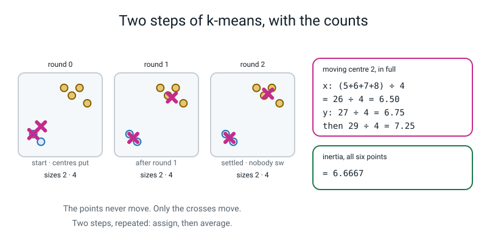
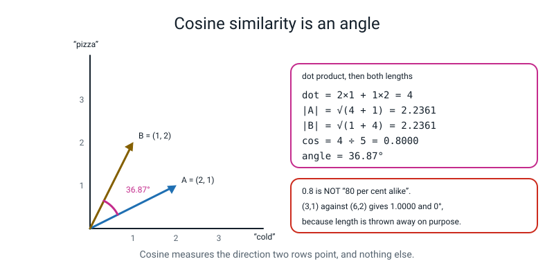

# 📝 Term 4 Practice Test — Weeks 28–36

[⬅ Assessments home](README.md) · [⬅ Term 3 test](term-3-test.md) · [Course home](../README.md)

---

```
   ┌──────────────────────────────────────────────────────────────────────┐
   │                                                                      │
   │   AI ACADEMY · LEVEL 3 ENGINEER                                      │
   │   TERM 4 PRACTICE TEST — No Labels, Words, and Ship It               │
   │   Covers Weeks 28–36. This is the last paper of Level 3.             │
   │   It may draw on ANY earlier week where it says so, because          │
   │   shipping a model means defending every number in it.               │
   │                                                                      │
   │   TIME ALLOWED   75 minutes                                          │
   │   TOTAL MARKS    80                                                  │
   │                                                                      │
   │   Section A   12 multiple choice         1 mark each     12 marks    │
   │   Section B    5 do-the-maths-by-hand    4 marks each    20 marks    │
   │   Section C    5 "what does this print"  3 marks each    15 marks    │
   │   Section D    4 find-and-fix-the-bug    3 marks each    12 marks    │
   │   Section E    3 write-the-code        4 + 4 + 5 marks    13 marks   │
   │   Section F    1 extended question       8 marks          8 marks    │
   │                                                                      │
   │   ⛔  NO COMPUTER.                                                   │
   │   ✅  A CALCULATOR WITH ln AND A SQUARE ROOT. Check it, NOW.         │
   │                                                                      │
   │      This paper has more arithmetic on it than any of the other      │
   │      three, and all of it is arithmetic you have already done         │
   │      with a pencil in class: squared distances, an average, a         │
   │      natural logarithm, a square root, and a division.                │
   │                                                                      │
   │   INSTRUCTIONS                                                       │
   │   · Write in pencil. Answer every question.                          │
   │   · Section A: circle ONE letter. A guess costs nothing.             │
   │   · Section B: WRITE THE SUM ABOVE THE ANSWER. Every time.           │
   │     A bare number scores 1 of 4 even when it is correct.             │
   │   · CARRY SIX DECIMAL PLACES and round only on the last line.        │
   │     The TF-IDF question is designed so rounding early is visible.     │
   │   · Where you see Σ, it means "add up all of these" — and you may    │
   │     write the sum out in full instead. You will not lose a mark.     │
   │   · Section C: write EVERY line of output, in order, with brackets.  │
   │   · Section D: say what Python is telling you, point at the line,    │
   │     and write the fixed line.                                        │
   │   · Section E: indentation counts. Four spaces. Every time.          │
   │   · Section F: a paragraph, not a list, and the arithmetic goes in   │
   │     the paragraph.                                                   │
   │                                                                      │
   │   WHAT IS ALLOWED                                                    │
   │   ✅  Pencil, pen, eraser, ruler                                     │
   │   ✅  A calculator with ln and √                                     │
   │   ✅  Five blank sheets of rough paper. Your working earns marks     │
   │   ❌  A COMPUTER. No Python, no phone, no editor, no terminal        │
   │   ❌  The student guide, the workbook, the glossary, your notes      │
   │   ❌  Your own week-28-to-36 .py files, and your capstone folder    │
   │   ❌  A search engine, a chatbot, another person                     │
   │                                                                      │
   └──────────────────────────────────────────────────────────────────────┘
```

> **🧑‍🏫 Teacher, read this once before you hand the paper out.** This is the hardest of the four papers
> and it is also the most satisfying to mark, because Section F is where you find out whether a whole
> year landed. **Check every calculator has an `ln` key and a `√` key before you start.** Set a timer for
> 75 minutes. Read the "what is allowed" box out loud, including the Σ line — a student who writes
> `2 + 4 + 6 + 8 + 10` instead of `Σ` loses nothing, and saying so out loud removes a whole category of
> panic. Every code block in the answer key was run on Python 3.10.10 with numpy 1.26.4 and
> scikit-learn 1.7.1, and the real output pasted in unedited. Students must not see that page. Marking
> guidance is in [assessments/README.md](README.md).

---

## 📐 The two pictures this paper is really about



*Figure T4.1 — Two steps of k-means, with the counts. The points never move; only the crosses move. Section B1 is this picture with the arithmetic left blank.*



*Figure T4.2 — Cosine similarity is an angle. Dot product, divided by both lengths. `0.8` is 36.87°, not "80% alike".*

---

# 🅰️ Section A — Multiple Choice

*12 questions · 1 mark each · circle ONE letter · the week each question comes from is in brackets*

---

**A1.** [W28] In k-means, what moves?

- (a) The points move towards their nearest centre
- (b) Only the **centres** move — every point stays exactly where it was, and all that changes is which centre it is assigned to
- (c) Both the points and the centres
- (d) Nothing moves; the algorithm just counts

---

**A2.** [W28] Why can inertia never be used on its own to choose `k`?

- (a) Because it is hard to compute
- (b) Because it **always** falls as `k` grows — at `k` equal to the number of rows it is exactly `0.0000`, so "smallest inertia" would always pick "one cluster per row"
- (c) Because it depends on the random seed
- (d) Because it is measured in the wrong units

---

**A3.** [W29] PCA keeps two components out of thirteen. What has it done?

- (a) Deleted eleven columns
- (b) Drawn a new pair of axes along the directions the data is most spread out, and measured every row against those instead — **every** original column contributes to both
- (c) Picked the two most useful original columns
- (d) Averaged the thirteen columns in pairs

---

**A4.** [W29] Your two PCA components keep `0.5541` of the spread, and the typical row is rebuilt
`2.2550` away from where it started, against a typical distance from the centre of `3.5180`. Which of
those numbers is the one you must report alongside the `0.5541`?

- (a) Neither; `0.5541` is enough
- (b) The `2.2550` — explained variance is the brochure and reconstruction error is the invoice, and `2.2550 ÷ 3.5180 = 0.6410` says you are still missing about two thirds of a typical wine
- (c) Only the `3.5180`
- (d) The number of components

---

**A5.** [W30] One row in your clustering has a silhouette of `−0.8163`. What does that mean?

- (a) That row is an outlier and should be deleted
- (b) That row is **closer to another cluster than to its own**, so it is probably in the wrong one — and nobody told the machine it was wrong
- (c) The clustering has failed completely
- (d) The row has missing values

---

**A6.** [W30] Unscaled, your wine clustering scores a silhouette of `0.5711`. Scaled, it scores
`0.2849`. Against the real grape varieties, the unscaled one gets an ARI of `0.3711` and the scaled one
`0.8975`. What does that tell you?

- (a) Use the unscaled one; `0.5711` is higher
- (b) A higher silhouette is **not** a better clustering — the scaled version agrees far better with reality, and the unscaled one scored well by finding three tidy bands of one loud column
- (c) The silhouette is broken
- (d) ARI and the silhouette always agree

---

**A7.** [W31] `dog bit man` and `man bit dog` go through a `CountVectorizer`. What comes out?

- (a) Two different rows, because the order differs
- (b) **Two identical rows** — bag-of-words throws word order away, and that is the price of the method, not a bug
- (c) An error
- (d) One row, because they are the same sentence

---

**A8.** [W31] Which pile of documents may a `CountVectorizer` be fitted on?

- (a) All of them, because it only counts words
- (b) The **training** documents only — the vocabulary is a thing it *learns*, so fitting on everything is Week 6's leak in a new costume
- (c) The test documents, so the vocabulary covers them
- (d) It does not matter for text

---

**A9.** [W32] In `idf(t) = ln((1 + n) ÷ (1 + df(t))) + 1`, what exactly does `df` count?

- (a) How many times the word appears in total
- (b) How many **documents** contain the word at least once — so a word appearing three times in two documents has `df = 2`
- (c) How many words are in the document
- (d) How many documents there are

---

**A10.** [W32] `(3, 1)` and `(6, 2)` have a cosine similarity of exactly `1.0000`. Why?

- (a) Because the numbers are all small
- (b) Because they point in exactly the **same direction** — cosine throws length away on purpose, so "twice as much of the same thing" is the same thing
- (c) Because there is a rounding error
- (d) Because the dot product is 1

---

**A11.** [W33] Your sentiment classifier scores `1.0000` on 20 held-out reviews. What is the honest
reading?

- (a) It is perfect; ship it
- (b) *"It gets 100% on reviews that look like its training reviews"* — the score cannot even move in steps smaller than 5 points, and not one of the 20 is hard
- (c) There is a bug, because 1.0 is impossible
- (d) It has overfitted, so the training accuracy must be lower

---

**A12.** [W35] Your prediction log has 111 lines and your service handled 134 requests. Is something
wrong?

- (a) Yes, 23 predictions were lost
- (b) No — the log counts **predictions**, and 23 of the requests were rejected with a `400` before the model was ever touched. That is the log doing its job
- (c) Yes, the log should count requests
- (d) You cannot tell without the p95

---

# 🅱️ Section B — Do the Maths By Hand

*5 questions · 4 marks each · 20 marks · NO COMPUTER · a calculator with `ln` and `√` is expected*

**Write the sum above the answer, every time.** A bare correct number scores 1 mark out of 4.
**Carry six decimal places** through a chain and round only at the end.

---

**B1.** [W28] Six points, two clusters, and a deliberately terrible start.

```
   A (1, 2)    B (2, 1)    C (5, 8)    D (6, 7)    E (7, 8)    F (8, 6)

   starting centres:   c0 = (1, 2)      c1 = (2, 3)
```

**(a)** Work out the **squared** distance from every point to both centres. *(Squared, so no square
roots — that is why this is quicker than it looks.)*

| point | squared distance to c0 | squared distance to c1 | nearer |
|:--:|:--:|:--:|:--:|
| A (1, 2) | | | |
| B (2, 1) | | | |
| C (5, 8) | | | |
| D (6, 7) | | | |
| E (7, 8) | | | |
| F (8, 6) | | | |

**(b)** Write down the **inertia** with these starting centres. Inertia is
`Σ (squared distance from each point to its OWN centre)` — which written out in full is
`(A's + B's + C's + D's + E's + F's)`.

```
   ______________________________________________ = __________
```

**(c)** Now move each centre to the **average** of the points it collected. Show both divisions for
each.

```
   new c0 : x = ______________ = ______    y = ______________ = ______

   new c1 : x = ______________ = ______    y = ______________ = ______
```

**(d)** With the new centres, the inertia is `8.7500`. Compare it with your answer to (b) and answer
this: **nobody switched cluster between the two rounds. So where did the improvement come from?**

```
   ____________________________________________________________________
```

---

**B2.** [W29] Variance, and one projection.

**(a)** Five values: `2, 4, 6, 8, 10`. Work out the mean, then the variance **as the average squared
distance from the mean**, in four steps.

```
   mean = ______________________ = __________

   deviations :  ______  ______  ______  ______  ______

   squares    :  ______  ______  ______  ______  ______

   total      = ______________________ = __________

   variance   = ______________________ = __________
```

**(b)** One sentence: **why do you square the deviations** rather than just adding them up? Use your own
five deviations as the evidence.

```
   ____________________________________________________________________
```

**(c)** A point sits at `(4, 4)`. A new axis points at **30 degrees** above horizontal, which as a pair
of numbers is `(cos 30°, sin 30°) = (0.8660, 0.5000)`. Project the point onto that axis. *(Projecting is
one multiply-and-add per coordinate.)*

```
   ______________________________________ = __________
```

**(d)** PCA on the wine data reports that PC1 and PC2 together hold `0.3620 + 0.1921` of the spread.
Work that out, then say in one sentence what number you would write in the **axis labels** of the
scatter plot and why.

```
   ______________________ = __________

   ____________________________________________________________________
```

---

**B3.** [W31, W32] TF-IDF for one word in one document, all the way through. **Six decimal places.**

Four reviews:

```
   d1 : the pizza was cold
   d2 : the pizza was cold and the chips were cold
   d3 : the pizza was hot
   d4 : the service was rude
```

**(a)** For the word `cold`, write down its **tf** in `d2` — how many times it appears in `d2` — and its
**df** across the four documents. *(Careful: df counts documents, not appearances.)*

```
   tf in d2 = __________      df = __________
```

**(b)** Compute `idf(cold)` using the exact formula scikit-learn uses:
`idf = ln((1 + n) ÷ (1 + df)) + 1`, where `n` is the number of documents. **Use `ln`, not `log`.**

```
   ______________________________________ = __________
```

**(c)** `d2`'s finished row has to have length exactly `1`, so every `tf × idf` gets divided by the row's
length. You are given the row's length: **`5.161683`**. Compute the finished weight for `cold`.

```
   tf x idf = ______________________ = __________

   weight   = ______________________ = __________
```

**(d)** The word `the` has `df = 4`, so `idf(the) = ln(5 ÷ 5) + 1`. Work that out, and then answer this
in one sentence: **what is the trailing `+ 1` in the formula for, and what would happen without it?**

```
   idf(the) = ______________________ = __________

   ____________________________________________________________________
```

---

**B4.** [W32] Cosine similarity, twice.

Two reviews, counted over the three words `pizza`, `cold`, `service`:

```
   review P = (3, 1, 0)        review Q = (1, 2, 2)
```

**(a)** Compute the dot product.

```
   ______________________________________ = __________
```

**(b)** Compute both lengths. *(A length is `√(sum of the squares)`.)*

```
   |P| = ______________________ = __________

   |Q| = ______________________ = __________
```

**(c)** Compute the cosine similarity, to six decimal places.

```
   ______________________________________ = __________
```

**(d)** Now two different rows: `(3, 1)` and `(6, 2)`. Their cosine similarity is exactly `1.0000`.
Show why in one line of arithmetic, and then write one sentence saying what cosine similarity **refuses
to look at**, and why that is deliberate for text.

```
   ______________________________________ = __________

   ____________________________________________________________________
```

---

**B5.** [W33, W35] Two numbers you have to be able to produce for a model you have shipped.

A sentiment classifier was run on **80** held-out reviews. Here are the four counts:

```
                        said NEGATIVE      said POSITIVE
   really negative            34                  6
   really positive             9                 31
```

**(a)** Compute accuracy, and then **precision and recall for the POSITIVE class**. Show each division.

```
   accuracy            = ______________________ = __________

   precision(positive) = ______________________ = __________

   recall(positive)    = ______________________ = __________
```

**(b)** Now compute precision and recall for the **NEGATIVE** class. *(Same four numbers, different
denominators. This is the part people skip.)*

```
   precision(negative) = ______________________ = __________

   recall(negative)    = ______________________ = __________
```

**(c)** Here are the response times of your service, in milliseconds, for 20 requests, already sorted:

```
   0.21  0.22  0.22  0.22  0.22  0.23  0.23  0.23  0.24  0.24
   0.24  0.25  0.25  0.26  0.26  0.27  0.28  0.29  0.31  1.06
```

Write down the **median** and the **maximum**, and then say which single number you would report
*alongside* the p95 and why.

```
   median = __________     max = __________

   report alongside: __________  because: _______________________________
```

**(d)** One sentence: your subgroup table says `accuracy 0.9000` on long reviews and `accuracy 1.0000`
on short ones. What **must** appear on both rows before either number means anything?

```
   ____________________________________________________________________
```

---

# 🅲 Section C — What Does This Print?

*5 questions · 3 marks each · 15 marks*

**Write every line of output, on its own line, in the right order.** If a program produces no output,
write **"no output"**. If it crashes, write the **name of the error** and say which line crashes.

---

**C1.** [W28]

```python
import numpy as np
from sklearn.cluster import KMeans
X = np.array([[1., 2.], [2., 1.], [5., 8.], [6., 7.], [7., 8.], [8., 6.]])
km = KMeans(n_clusters=2, n_init=10, random_state=0).fit(X)
print(km.labels_)
print(np.round(km.cluster_centers_, 4))
print(round(km.inertia_, 4))
print(np.bincount(km.labels_))
```

*Five lines — `cluster_centers_` prints as a two-row grid, and each row counts as a line. **The cluster
numbers themselves are arbitrary**, so a marker will accept the two groups either way round as long as
you are consistent across all four prints.*

```
   1. ________________________________
   2. ________________________________
   3. ________________________________
   4. ________________________________
   5. ________________________________
```

---

**C2.** [W29] **This is a shape question.**

```python
import numpy as np
from sklearn.decomposition import PCA
from sklearn.preprocessing import StandardScaler
from sklearn.datasets import load_wine
X = StandardScaler().fit_transform(load_wine().data)
print(X.shape)
pca = PCA(n_components=2).fit(X)
print(np.round(pca.explained_variance_ratio_, 4))
print(round(pca.explained_variance_ratio_.sum(), 4))
print(pca.components_.shape, pca.transform(X).shape)
```

*Four lines. Line 4 has two shapes on it, and neither of them is `(178, 13)`. Think about what
`components_` holds — one row per what?*

```
   1. ________________________________
   2. ________________________________
   3. ________________________________
   4. ________________________________
```

---

**C3.** [W31]

```python
from sklearn.feature_extraction.text import CountVectorizer
docs = ["the pizza was cold",
        "the pizza was hot",
        "the service was rude"]
cv = CountVectorizer().fit(docs)
print(cv.get_feature_names_out())
print(cv.transform(docs).toarray())
print(cv.transform(["cold cold pizza"]).toarray())
print(cv.transform(["the soup was freezing"]).toarray())
```

*Six lines — the second `print` gives a three-row grid. The vocabulary comes out in a particular order
that the library chose, and the last line is the one worth thinking hardest about.*

```
   1. ________________________________
   2. ________________________________
   3. ________________________________
   4. ________________________________
   5. ________________________________
   6. ________________________________
```

---

**C4.** [W32] **This is a shape question.**

```python
import numpy as np
from sklearn.feature_extraction.text import TfidfVectorizer
docs = ["the pizza was cold",
        "the pizza was hot",
        "the service was rude"]
tv = TfidfVectorizer().fit(docs)
X = tv.transform(docs)
print(X.shape, type(X).__name__)
print(np.round(tv.idf_, 4))
print(np.round(np.sqrt((X.toarray() ** 2).sum(axis=1)), 4))
print(np.round(X.toarray()[0], 4))
```

*Four lines. Line 1's second item is not `ndarray`. Line 3 is the same on every row and the reason is
the last step of TF-IDF.*

```
   1. ________________________________
   2. ________________________________
   3. ________________________________
   4. ________________________________
```

---

**C5.** [W33]

```python
import numpy as np
from sklearn.feature_extraction.text import TfidfVectorizer
from sklearn.linear_model import LogisticRegression
from sklearn.pipeline import make_pipeline
docs = ["the pizza was cold", "the pizza was hot",
        "the service was rude", "the service was lovely"]
y = [0, 1, 0, 1]
pipe = make_pipeline(TfidfVectorizer(), LogisticRegression())
pipe.fit(docs, y)
print(list(pipe.named_steps.keys()))
clf = pipe.named_steps["logisticregression"]
print(clf.coef_.shape, clf.coef_[0].shape)
names = pipe.named_steps["tfidfvectorizer"].get_feature_names_out()
print(names[np.argsort(clf.coef_[0])[:3]])
print(names[np.argsort(clf.coef_[0])[-3:]])
```

*Four lines. Line 1 is the one that trips everybody. Line 2 has two shapes and they are not the same
shape.*

```
   1. ________________________________
   2. ________________________________
   3. ________________________________
   4. ________________________________
```

---

# 🅳 Section D — Find and Fix the Bug

*4 questions · 3 marks each · 12 marks*

For every one of these you must do **three** things:

| | | Marks |
|---|---|:--:|
| **1** | **Say what Python is telling you**, in your own words. Not the error's name copied out — what it *means*. | 1 |
| **2** | **Point at the line** that has to change. Give its number. | 1 |
| **3** | **Write the fixed line out in full**, or — where the bug has no error message — write the fix in one sentence. | 1 |

> **⚠️ Watch out.** Two of these four produce **no error at all**, and one of those two produces an
> **empty list**, which is the quietest possible way for a program to be completely broken.

*Every message below is copied from a real run. The only edits are cosmetic: long library paths have
been shortened. No number, name or word is changed.*

---

**D1.** [W33] `names.py` wants the vocabulary out of a fitted pipeline.

```python
1  from sklearn.feature_extraction.text import TfidfVectorizer
2  from sklearn.linear_model import LogisticRegression
3  from sklearn.pipeline import make_pipeline
4
5  docs = ["the pizza was cold", "the pizza was hot",
6          "the service was rude", "the service was lovely"]
7  y = [0, 1, 0, 1]
8
9  pipe = make_pipeline(TfidfVectorizer(), LogisticRegression())
10 pipe.fit(docs, y)
11 print("steps:", list(pipe.named_steps.keys()))
12 vec = pipe.named_steps["tfidf"]
13 print(vec.get_feature_names_out())
```

```text
steps: ['tfidfvectorizer', 'logisticregression']
Traceback (most recent call last):
  File "names.py", line 12, in <module>
    vec = pipe.named_steps["tfidf"]
  File "…/sklearn/utils/_bunch.py", line 42, in __getitem__
    return super().__getitem__(key)
KeyError: 'tfidf'
```

**1. What is Python telling you?** ______________________________________________

**2. Line number:** ______

**3. The fixed line, in full:** ______________________________________________

**And: which line of the program already contained the answer?** ______

---

**D2.** [W33] `coefs.py` wants the three words the model trusts least.

```python
1  import numpy as np
2  from sklearn.feature_extraction.text import TfidfVectorizer
3  from sklearn.linear_model import LogisticRegression
4  from sklearn.pipeline import make_pipeline
5
6  docs = ["the pizza was cold", "the pizza was hot",
7          "the service was rude", "the service was lovely"]
8  y = [0, 1, 0, 1]
9  pipe = make_pipeline(TfidfVectorizer(), LogisticRegression())
10 pipe.fit(docs, y)
11 clf = pipe.named_steps["logisticregression"]
12 names = pipe.named_steps["tfidfvectorizer"].get_feature_names_out()
13 print("coef_ shape:", clf.coef_.shape)
14 for i in np.argsort(clf.coef_)[:3]:
15     print(names[i], clf.coef_[i])
```

```text
coef_ shape: (1, 8)
Traceback (most recent call last):
  File "coefs.py", line 15, in <module>
    print(names[i], clf.coef_[i])
IndexError: index 4 is out of bounds for axis 0 with size 1
```

**1. What is Python telling you?** ______________________________________________

**2. Line numbers (there are two):** ______ and ______

**3. The fixed lines, in full:** ______________________________________________

---

**D3.** [W28, W30] ⚠️ **No error message.** `unscaled.py` clusters the wine data.

```python
1  import numpy as np
2  import pandas as pd
3  from sklearn.cluster import KMeans
4  from sklearn.datasets import load_wine
5
6  wine = load_wine()
7  X = wine.data
8  km = KMeans(n_clusters=3, n_init=10, random_state=0).fit(X)
9  print("cluster sizes          :", np.bincount(km.labels_))
10 df = pd.DataFrame(X, columns=wine.feature_names)
11 df["cluster"] = km.labels_
12 print("proline per cluster    :", np.round(df.groupby("cluster")["proline"].mean().values, 1))
13 print("flavanoids per cluster :", np.round(df.groupby("cluster")["flavanoids"].mean().values, 2))
```

```text
cluster sizes          : [69 47 62]
proline per cluster    : [ 458.2 1195.1  728.3]
flavanoids per cluster : [1.76 3.01 1.58]
```

With one line added, the same program finds clusters that agree with the real grape varieties at an
ARI of `0.8975` instead of `0.3711`.

**1. What is the program telling you that is not true?** ______________________________________

**2. Where does the missing line go?** ______

**3. The fix, written as the line:** ______________________________________________

**And: the spread of `proline` is `314.91` and the spread of `flavanoids` is `1.00`. Use those two
numbers in one sentence to explain the mechanism.**

```
   ____________________________________________________________________
```

---

**D4.** [W31] ⚠️ **No error message, and the output is an empty list.** `tokens.py` chops a review into
words.

```python
1  import re
2
3  text = "The PIZZA was COLD -- wasn't great!!"
4  tokens = re.findall("\b\w\w+\b", text.lower())
5  print("tokens:", tokens)
6  print("how many:", len(tokens))
```

```text
tokens: []
how many: 0
```

**1. What is Python telling you?** ______________________________________________

**2. Line number:** ______

**3. The fixed line, in full:** ______________________________________________

**And: once it is fixed, the regex turns `wasn't` into one token. Write that token, and say in one
sentence why it matters for a sentiment model.**

```
   token: __________   why it matters: ___________________________________
```

---

# 🅴 Section E — Write the Code

*3 questions · 4 + 4 + 5 marks · 13 marks*

Write real Python. **Indentation counts** — four spaces, every time. You may use anything from Weeks
1–36. You may **not** use `torchvision`, a download, or any dataset that is not `load_digits`,
`load_wine`, `load_iris`, `load_breast_cancer`, `make_moons`, `make_blobs`, `make_classification`,
`make_regression`, or something you typed out yourself.

---

**E1.** [W28, W30] **(4 marks)** Write the code that chooses `k` for the wine data with **two
independent pieces of evidence**. It must:

- scale first, and print the shape so a reader knows what was clustered
- sweep `k` from **2** to 7, printing for each `k`: the inertia, the **drop** from the previous `k`, and
  the silhouette score
- and run a **negative control**: the same sweep's `k = 3` on a table of pure numpy noise of the same
  shape, printing its cluster sizes and its silhouette

Say in a comment why the sweep starts at 2 and not 1.

```
   ________________________________________________________

   ________________________________________________________

   ________________________________________________________

   ________________________________________________________

   ________________________________________________________

   ________________________________________________________

   ________________________________________________________

   ________________________________________________________

   ________________________________________________________

   ________________________________________________________

   ________________________________________________________

   ________________________________________________________
```

---

**E2.** [W29] **(4 marks)** Write the code that reports PCA on the wine data **honestly**. It must print:

- every component's share of the spread **and** the running total
- how many components are needed to reach 80%
- for `k = 2` and `k = 6`: the share kept, the typical reconstruction miss, and that miss as a fraction
  of a typical distance from the centre
- and the three biggest loadings of PC1, **with the column names**

```
   ________________________________________________________

   ________________________________________________________

   ________________________________________________________

   ________________________________________________________

   ________________________________________________________

   ________________________________________________________

   ________________________________________________________

   ________________________________________________________

   ________________________________________________________

   ________________________________________________________

   ________________________________________________________

   ________________________________________________________
```

---

**E3.** [W33, W34] **(5 marks)** Write a sentiment engine and the function that serves it. You must:

- type out at least **ten** positive and **ten** negative short reviews of your own
- split them, keeping the class balance
- weld the vectorizer and the classifier into **one** object, so the vocabulary can only come from
  training rows
- print a per-class precision and recall report, with the number of rows
- print the five words the model trusts most in each direction, **with their weights**
- and define a function `predict_one(text)` that returns a label and a probability, with **no training
  code inside it**

Then call it on **one review that contains the word `not`**, and be ready to explain the answer.

```
   ________________________________________________________

   ________________________________________________________

   ________________________________________________________

   ________________________________________________________

   ________________________________________________________

   ________________________________________________________

   ________________________________________________________

   ________________________________________________________

   ________________________________________________________

   ________________________________________________________

   ________________________________________________________

   ________________________________________________________

   ________________________________________________________

   ________________________________________________________

   ________________________________________________________
```

---

# 🅵 Section F — The Extended Question

*1 question · 8 marks · about 15 minutes · a paragraph, not a list · the arithmetic goes in the paragraph*

---

**F1.** [W31, W33, W34, W35] **The school forum.**

Your school runs a small online forum. A teacher asks you to plug in your sentiment engine so that any
comment it calls **negative** is hidden from the forum automatically until a prefect reviews it.

Here is the page you handed over:

```
   MODEL CARD — comment sentiment, version 1
   Unit of prediction : ONE comment, scored once, at the moment it is posted
   Trained on         : 28 short restaurant reviews that I typed myself
   Vocabulary         : 48 words, learned from the 28 training reviews only
   Held-out test      : 12 reviews.   TN 6   FP 0   FN 1   TP 5
                        accuracy 0.9167

   The five words it trusts most in each direction:
      negative : cold -0.7100   rude -0.6231   slow -0.5266
                 stale -0.5095  burnt -0.4164
      positive : warm +0.5838   lovely +0.5431  fresh +0.5143
                 friendly +0.4762  early +0.4440

   THE NEGATION TEST — 12 sentences I wrote on purpose:

      "the pizza was not cold"          truth positive   said NEGATIVE at 0.3895
      "the pizza was not hot"           truth negative   said POSITIVE at 0.5720
      "not a stale crust anywhere"      truth positive   said NEGATIVE at 0.4307
      "not fresh at all"                truth negative   said POSITIVE at 0.6353
      "i would not call this awful"     truth positive   said NEGATIVE at 0.4549
      "i would not call this lovely"    truth negative   said POSITIVE at 0.6419
      "never rude never slow"           truth positive   said NEGATIVE at 0.3167
      "never warm never friendly"       truth negative   said POSITIVE at 0.6871
      "the crust was hardly burnt"      truth positive   said NEGATIVE at 0.4574
      "the crust was hardly crisp"      truth negative   said POSITIVE at 0.5693
      "nothing greasy about it"         truth positive   said NEGATIVE at 0.4768
      "nothing tasty about it"          truth negative   said POSITIVE at 0.6010

                                        SCORE ON THE TRAPS : 0 of 12

   Latency, 120 predictions : median 0.115 ms   p95 0.122 ms   max 0.175 ms
```

The teacher replies:

> *"92% is good enough for me, and 0.1 milliseconds means it'll keep up with anything. Let's switch it
> on for the whole school on Monday. The prefects can unhide anything it gets wrong."*

Write a paragraph answering **all four** of these. Every number you use must be one you can point at
above, or one you compute and show.

1. **The training data.** Say what the model was actually trained on, how many rows and how many words,
   and why a comment on a school forum is not that. Name the number on the card that is the smallest
   and most alarming.
2. **The traps.** `0 of 12` is worse than a coin, which would get `6 of 12`. Explain **the mechanism** —
   not "it's confused" — using one of the twelve sentences and the word weights on the card. Then say
   what feature the model does **not** have.
3. **Read the held-out score honestly.** `TN 6, FP 0, FN 1, TP 5` on 12 rows. Compute what **one** extra
   mistake would do to the accuracy, show the division, and say how many decimal places of `0.9167`
   are real.
4. **The deployment, and who carries the error.** A comment is hidden *before* a human sees it. Say who
   bears the cost of a false positive here, propose a design that is not "switch it on", and name the
   model-card heading that should have stopped this — and write the sentence that belongs under it.

```
   ______________________________________________________________________

   ______________________________________________________________________

   ______________________________________________________________________

   ______________________________________________________________________

   ______________________________________________________________________

   ______________________________________________________________________

   ______________________________________________________________________

   ______________________________________________________________________

   ______________________________________________________________________

   ______________________________________________________________________

   ______________________________________________________________________

   ______________________________________________________________________

   ______________________________________________________________________

   ______________________________________________________________________
```

---

---
---

# 📊 Marking Scheme

**Total: 80 marks.** Mark Section A first.

## Section A — 12 marks

| Q | Answer | Mark | Week |
|:--:|:--:|:--:|:--:|
| A1 | **(b)** | 1 | W28 |
| A2 | **(b)** | 1 | W28 |
| A3 | **(b)** | 1 | W29 |
| A4 | **(b)** | 1 | W29 |
| A5 | **(b)** | 1 | W30 |
| A6 | **(b)** | 1 | W30 |
| A7 | **(b)** | 1 | W31 |
| A8 | **(b)** | 1 | W31 |
| A9 | **(b)** | 1 | W32 |
| A10 | **(b)** | 1 | W32 |
| A11 | **(b)** | 1 | W33 |
| A12 | **(b)** | 1 | W35 |

No half marks. Two letters circled scores 0.

> **🧑‍🏫 A6 and A11 are the two that matter most on this paper**, and they are the same lesson in two
> costumes: **a number going up is not evidence that something got better.** If a student gets both, the
> year has landed. If they get neither, go to the Week 30 and Week 33 rows of the remediation table
> before you look at anything else.

## Section B — 20 marks · do the maths by hand

**4 marks per question, on the same ladder as the other three papers:**

| | Marks |
|---|:--:|
| Every part correct **with the sum written above each answer** | **4** |
| All the working correct, one arithmetic slip carried through | **3** |
| The right sums set up, two or more arithmetic slips | **2** |
| Correct final numbers with **no working shown at all** | **1** |
| Nothing usable | 0 |

**Per question:**

| Q | The answers | Marks | The trap |
|:--:|---|:--:|---|
| **B1** | (a) A `0`/`2`, B `2`/`4`, C `52`/`34`, D `50`/`32`, E `72`/`50`, F `65`/`45`; split **AB** and **CDEF** · (b) **163.0000** · (c) c0 `(1.5, 1.5)`, c1 `(6.5, 7.25)` · (d) the centres moved | 4 | (a) taking square roots. The question says **squared** distance, and squaring is the whole reason this is doable by hand. |
| **B2** | (a) mean **6**, total **40**, variance **8.0** · (c) **5.4641** · (d) `0.5541` | 4 | (a) dividing 40 by 4 instead of 5. The question says *average* squared distance, and there are five values. |
| **B3** | (a) tf **2**, df **2** · (b) **1.510826** · (c) `2 × 1.510826 = 3.021651`, then `÷ 5.161683 = ` **0.585400** · (d) `idf(the) = ln(1) + 1 = ` **1.0** | 4 | (b) using `log₁₀`, which gives `0.221849` instead of `0.510826`. **If every idf is wrong by a factor of 2.302585, it is the log base.** |
| **B4** | (a) **5** · (b) `|P| = ` **3.162278**, `|Q| = ` **3.000000** · (c) **0.527046** · (d) `20 ÷ (3.162278 × 6.324555) = 1.0` | 4 | (b) forgetting the square root, or squaring the sum instead of summing the squares. |
| **B5** | (a) accuracy **0.8125**, precision **0.8378**, recall **0.7750** · (b) precision **0.7907**, recall **0.8500** · (c) median **0.2400**, max **1.0600** | 4 | (b) reusing the positive class's denominators. The negative class divides by *its* column and *its* row. |

**B1(d) — 1 of the 4 marks.** *"Nobody switched, so the improvement came entirely from **moving the
centres**. Round 0's inertia of 163 was measured against two centres that were both sitting in the
bottom-left corner; once c1 moved to `(6.5, 7.25)`, the same four points were suddenly close to their
own centre, and the inertia fell to 8.75. Assigning and moving are two separate steps and either one on
its own can improve the answer."*

**B2(b) — 1 of the 4 marks.** Must use their own deviations: *"my five deviations are `−4, −2, 0, +2,
+4`, and they add up to exactly **zero** — they always do, because the mean is the balance point. So
adding them measures nothing. Squaring makes every one positive, so distance in either direction
counts."*

**B2(d) — 1 of the 4 marks.** `0.3620 + 0.1921 = 0.5541`. The sentence: *"I would write `PC1 (36.2%)`
and `PC2 (19.2%)` in the axis labels, because 44.6% of the spread is not on the page, and two bottles
that look adjacent on the plot may be far apart in the eleven directions I threw away."*

**B3(d) — 1 of the 4 marks.** `ln(5 ÷ 5) + 1 = ln(1) + 1 = 0 + 1 = 1.0`. The sentence: *"Without the
trailing `+ 1`, a word that appears in every document would get an idf of exactly `ln(1) = 0`, and
`tf × 0 = 0` — so the word would be deleted from the matrix entirely rather than just weighted down.
The `+ 1` means no word's weight can ever reach zero."*

**B4(d) — 1 of the 4 marks.** `dot = 18 + 2 = 20`, `|(3,1)| = √10 = 3.162278`,
`|(6,2)| = √40 = 6.324555`, and `20 ÷ (3.162278 × 6.324555) = 20 ÷ 20 = 1.0`. The sentence: *"Cosine
refuses to look at **length**, and for text that is exactly what you want — a 500-word review and a
50-word review about the same thing point the same way, and raw counts would have scored the long one
higher just for being long."*

**B5(c) — 1 of the 4 marks.** Report the **max** alongside the p95. *"With only 20 requests the p95
falls between the 19th and 20th value, so it cannot see the `1.06` — it reports `0.3475`. The max is the
only number that tells you somebody waited four times as long as everybody else, and that somebody is
the person who complains."*

**B5(d) — 1 of the 4 marks.** The **`n`**. *"Both rows need their row count. `1.0000` on two reviews and
`0.9000` on ten are not comparable numbers, and `1.0000` on `n = 2` is not evidence of anything at
all."*

## Section C — 15 marks · what does this print?

**3 marks per question, on this ladder:**

| | Marks |
|---|:--:|
| Every line correct, in the right order, with the right brackets | **3** |
| One line wrong, everything else right | **2** |
| Two lines wrong, or right values in the wrong order | **1** |
| Correct intermediate working visible, even if the final answer is wrong | **1, always** |
| Nothing usable | 0 |

| Q | The real output | Marks | The trap |
|:--:|---|:--:|---|
| **C1** | `[1 1 0 0 0 0]` / `[[6.5  7.25]` / ` [1.5  1.5 ]]` / `8.75` / `[4 2]` | 3 | The cluster **numbers** are arbitrary — accept `[0 0 1 1 1 1]` with the centres and the `bincount` swapped to match. What is not arbitrary is the `8.75`. |
| **C2** | `(178, 13)` / `[0.362  0.1921]` / `0.5541` / `(2, 13) (178, 2)` | 3 | Line 4. `components_` is `(components, original columns)` = `(2, 13)`; `transform` output is `(rows, components)` = `(178, 2)`. Swapping them is the whole question. |
| **C3** | `['cold' 'hot' 'pizza' 'rude' 'service' 'the' 'was']` / `[[1 0 1 0 0 1 1]` / ` [0 1 1 0 0 1 1]` / ` [0 0 0 1 1 1 1]]` / `[[2 0 1 0 0 0 0]]` / `[[0 0 0 0 0 1 1]]` | 3 | The vocabulary is **alphabetical**, chosen by the library. And the last line: `soup` and `freezing` are not in the vocabulary, so they contribute **nothing** — only `the` and `was` survive. |
| **C4** | `(3, 7) csr_matrix` / `[1.6931 1.6931 1.2877 1.6931 1.6931 1.     1.    ]` / `[1. 1. 1.]` / `[0.6628 0.     0.5041 0.     0.     0.3915 0.3915]` | 3 | Line 1's second item is `csr_matrix`, not `ndarray` — text matrices are sparse. Line 3 is all ones because the **last step of TF-IDF is dividing every row by its own length**. |
| **C5** | `['tfidfvectorizer', 'logisticregression']` / `(1, 8) (8,)` / `['cold' 'rude' 'service']` / `['was' 'hot' 'lovely']` | 3 | Line 1: `make_pipeline` names steps after their **classes, in lowercase**. Line 2: `coef_` is a grid with one row per class, so it is `(1, 8)`, and `coef_[0]` is the flat `(8,)`. |

> **🧑‍🏫 On C1, do not penalise the cluster numbering, and do penalise an inconsistent one.** k-means
> labels are names, not measurements, and which group gets called `0` depends on the random restarts. A
> student who writes `[0 0 1 1 1 1]`, then puts `[1.5 1.5]` first and `[2 4]` as the bincount, has
> understood the output better than one who copied a remembered answer.

**C4's second line, worked, so you can check any of the seven:**

```
n = 3 documents.   idf = ln((1 + 3) ÷ (1 + df)) + 1 = ln(4 ÷ (1 + df)) + 1

cold    : in 1 document  -> ln(4 ÷ 2) + 1 = ln(2) + 1 = 0.693147 + 1 = 1.693147 -> 1.6931
pizza   : in 2 documents -> ln(4 ÷ 3) + 1 = 0.287682 + 1 = 1.287682            -> 1.2877
the     : in 3 documents -> ln(4 ÷ 4) + 1 = ln(1) + 1 = 0 + 1 = 1.0            -> 1.
```

## Section D — 12 marks · find and fix the bug

| Q | 1 · Meaning (1 mark) | 2 · Line (1 mark) | 3 · Fix (1 mark) |
|:--:|---|:--:|---|
| **D1** | There is no step called `tfidf`. `make_pipeline` names each step after its **class, in lowercase**, so the name is `tfidfvectorizer`. A `KeyError` means the dictionary does not have that key — not that the object is broken. | **12** | `vec = pipe.named_steps["tfidfvectorizer"]` |
| **D2** | `coef_` is a **grid** with one row per class, so for a two-class problem it is `(1, 8)` — not a flat list of 8. `np.argsort` on it sorts inside that single row and hands back positions, and then `clf.coef_[4]` asks for row 4 of a thing with one row. | **14** and **15** | `for i in np.argsort(clf.coef_[0])[:3]:` and `print(names[i], clf.coef_[0][i])` |
| **D3** | The three "clusters" are three non-overlapping bands of **one column**. The `proline` means are 458, 1195 and 728 — completely separated — while the `flavanoids` means, 1.76, 3.01 and 1.58, are not even in order. Twelve of the thirteen columns were effectively never consulted, and nothing errored. | Between lines **7 and 8** | `X = StandardScaler().fit_transform(X)` (plus the import) |
| **D4** | The regex found nothing at all, and there is no error because "found nothing" is a legal answer. The string is missing its `r` prefix, so Python turned `\b` into a **backspace character** before the regex engine ever saw it — and the pattern then looks for a literal backspace, which is not in the text. | **4** | `tokens = re.findall(r"\b\w\w+\b", text.lower())` |

**D1's extra:** **line 11**. It printed `steps: ['tfidfvectorizer', 'logisticregression']` one line before
the crash. The habit this drills: *ask the object rather than guessing the name.*

**D3's extra sentence.** *"`proline`'s spread is `314.91` and `flavanoids`' is `1.00` — 315 times bigger
— and k-means adds up squared differences across all thirteen columns, so a 300-unit gap in proline
contributes about 90,000 while a whole-range swing in flavanoids contributes about 1. Proline is not
more important; it is just measured in bigger units."*

**D4's extra.** The token is **`wasn`**, which is not a word, and the `'t` is gone. It matters because
`wasn't` was **carrying the negation** — the model now sees a fragment with no negative meaning at all,
and this is exactly the mechanism behind Section F's `0 of 12`.

**Two marking rules that carry the most weight on this paper:**

1. **On D3, withhold the fix mark for anything that is not scaling.** Answers like "use more clusters",
   "drop the proline column" or "use a different `random_state`" are all things that change the output
   without addressing the cause. Dropping proline is the most tempting and the most wrong: you would
   then discover that `magnesium` takes over.
2. **On D4, a student who says "add the r" gets the mark; a student who says "the `\b` became a
   backspace" gets the mark and a tick in the margin.** Both are correct. Only one of them will ever
   debug this again without help.

## Section E — 13 marks · write the code

### E1 — 4 marks

| Row | Mark for | Marks |
|---|---|:--:|
| Scale first | `StandardScaler().fit_transform(...)` before any clustering, and the shape printed | 1 |
| The sweep | `k` from **2** to 7, with `n_init=10, random_state=0`, printing inertia | 1 |
| Two kinds of evidence | The **drop** from the previous `k` **and** `silhouette_score` on the same rows | 1 |
| The negative control | The same `k = 3` on numpy noise of the same shape, with its sizes and its silhouette printed | 1 |

**A model answer, run — about 3 seconds:**

```python
"""e1.py -- choose k with two independent pieces of evidence, plus a control."""
import numpy as np
from sklearn.cluster import KMeans
from sklearn.datasets import load_wine
from sklearn.metrics import silhouette_score
from sklearn.preprocessing import StandardScaler

X = StandardScaler().fit_transform(load_wine().data)
print("rows %d  columns %d" % X.shape)
print(" k   inertia     drop   silhouette")
prev = KMeans(n_clusters=1, n_init=10, random_state=0).fit(X).inertia_
# the sweep starts at 2: a silhouette needs a SECOND cluster to measure b against
for k in range(2, 8):
    km = KMeans(n_clusters=k, n_init=10, random_state=0).fit(X)
    sil = silhouette_score(X, km.labels_)
    print(" %d  %8.1f  %7.1f     %.4f" % (k, km.inertia_, prev - km.inertia_, sil))
    prev = km.inertia_

rng = np.random.default_rng(0)
noise = rng.normal(size=X.shape)
km_n = KMeans(n_clusters=3, n_init=10, random_state=0).fit(noise)
print("NEGATIVE CONTROL, pure noise, k=3:")
print("  sizes %s  silhouette %.4f"
      % (np.bincount(km_n.labels_), silhouette_score(noise, km_n.labels_)))
```

```text
rows 178  columns 13
 k   inertia     drop   silhouette
 2    1659.0    655.0     0.2683
 3    1277.9    381.1     0.2849
 4    1180.7     97.2     0.2457
 5    1110.4     70.4     0.2026
 6    1044.5     65.9     0.1960
 7     996.0     48.5     0.1386
NEGATIVE CONTROL, pure noise, k=3:
  sizes [62 44 72]  silhouette 0.0776
```

**Read the two columns together and `k = 3` announces itself twice.** The drop column falls off a cliff
after `k = 3` — `381.1` then `97.2`, a ratio of `381.1 ÷ 97.2 = 3.9` — and the silhouette **peaks** at
`k = 3` with `0.2849`. Two independent pieces of evidence, one answer.

**And read the control.** Pure noise, asked for three clusters, cheerfully produces three of sizes
`[62 44 72]` with a silhouette of `0.0776`. **Getting clusters is not evidence that there are
clusters** — and `0.2849 ÷ 0.0776 = 3.7` is what makes the wine's number mean something.

### E2 — 4 marks

| Row | Mark for | Marks |
|---|---|:--:|
| Every share and the running total | `PCA()` with no `n_components`, `explained_variance_ratio_` and a `cumsum` | 1 |
| The 80% answer as an integer | Not "about five or six" — the integer, read off the running total | 1 |
| The invoice | `inverse_transform`, the typical miss, **and** the miss as a fraction of a typical distance | 1 |
| PC1 named | The three biggest loadings with **column names**, and the sign kept | 1 |

**A model answer, run:**

```python
"""e2.py -- PCA on the wine: the brochure and the invoice."""
import numpy as np
from sklearn.datasets import load_wine
from sklearn.decomposition import PCA
from sklearn.preprocessing import StandardScaler

wine = load_wine()
X = StandardScaler().fit_transform(wine.data)
full = PCA().fit(X)
running = np.cumsum(full.explained_variance_ratio_)
for i, (r, c) in enumerate(zip(full.explained_variance_ratio_, running), start=1):
    print("PC%-2d  share %.4f   running total %.4f" % (i, r, c))
print("components needed for 80 per cent:", int(np.searchsorted(running, 0.80) + 1))

for k in (2, 6):
    p = PCA(n_components=k).fit(X)
    back = p.inverse_transform(p.transform(X))
    miss = np.sqrt(((X - back) ** 2).sum(axis=1)).mean()
    yard = np.sqrt((X ** 2).sum(axis=1)).mean()
    print("k=%d  kept %.4f   typical miss %.4f of a typical %.4f  = %.4f"
          % (k, p.explained_variance_ratio_.sum(), miss, yard, miss / yard))

p2 = PCA(n_components=2).fit(X)
for i in np.argsort(-np.abs(p2.components_[0]))[:3]:
    print("PC1 loading  %-30s %+.4f" % (wine.feature_names[i], p2.components_[0][i]))
```

```text
PC1   share 0.3620   running total 0.3620
PC2   share 0.1921   running total 0.5541
PC3   share 0.1112   running total 0.6653
PC4   share 0.0707   running total 0.7360
PC5   share 0.0656   running total 0.8016
PC6   share 0.0494   running total 0.8510
PC7   share 0.0424   running total 0.8934
PC8   share 0.0268   running total 0.9202
PC9   share 0.0222   running total 0.9424
PC10  share 0.0193   running total 0.9617
PC11  share 0.0174   running total 0.9791
PC12  share 0.0130   running total 0.9920
PC13  share 0.0080   running total 1.0000
components needed for 80 per cent: 5
k=2  kept 0.5541   typical miss 2.2550 of a typical 3.5180  = 0.6410
k=6  kept 0.8510   typical miss 1.3258 of a typical 3.5180  = 0.3769
PC1 loading  flavanoids                     +0.4229
PC1 loading  total_phenols                  +0.3947
PC1 loading  od280/od315_of_diluted_wines   +0.3762
```

**Three things worth reading out loud.** The running total reaches `0.8016` at **PC5**, so the answer is
the integer `5`. Two components keep `0.5541` of the spread and still miss a typical wine by `2.2550`
out of `3.5180`, which is `0.6410` — **so "we kept 55% of the variance" and "we are still 64% of a wine
out" are both true, and only the second one is an invoice.** And PC1's three biggest loadings are all
phenol-ish chemistry pointing the same way, which is what lets you give the axis a **human name**
instead of calling it PC1.

### E3 — 5 marks

| Row | Mark for | Marks |
|---|---|:--:|
| Their own reviews | At least 10 positive and 10 negative, typed out, not generated | 1 |
| Split, then weld | `train_test_split(..., stratify=y)` **and** `make_pipeline(TfidfVectorizer(), LogisticRegression(...))` so the vocabulary cannot see the test rows | 1 |
| The honest report | `classification_report` (or precision and recall per class by hand) **with** the number of rows | 1 |
| The words, with weights | Five each way from `clf.coef_[0]`, with the numbers, using `np.argsort` | 1 |
| `predict_one` with no training in it | A function returning a label **and** a probability, containing no `.fit(` | 1 |

**A model answer, run — about 1 second:**

```python
"""e3.py -- a sentiment pipeline, and a predict function with no training code."""
import numpy as np
from sklearn.feature_extraction.text import TfidfVectorizer
from sklearn.linear_model import LogisticRegression
from sklearn.metrics import classification_report
from sklearn.model_selection import train_test_split
from sklearn.pipeline import make_pipeline

POS = [
    "the pizza was hot and the crust was crisp",
    "the service was lovely and the staff were kind",
    "the chips were fresh and the pizza was tasty",
    "it arrived early and the food was warm",
    "the staff were friendly and the service was quick",
    "delicious pizza and generous portions",
    "great value and the crust was lovely",
    "the pizza was fresh and the chips were hot",
    "lovely staff and a warm welcome",
    "the food was tasty and the service was fast",
    "hot pizza delivered early by a friendly driver",
    "the crust was perfect and the cheese was fresh",
    "quick delivery and the food was delicious",
    "kind staff generous portions and great value",
    "the chips were crisp and the pizza was hot",
    "warm friendly service and tasty food",
    "the pizza was delicious and arrived early",
    "fresh ingredients and a lovely crust",
    "the driver was polite and the food was warm",
    "excellent value and the service was kind",
]
NEG = [
    "the pizza was cold and the crust was soggy",
    "the service was rude and the staff were slow",
    "the chips were stale and the pizza was greasy",
    "it arrived late and the food was cold",
    "the staff were unfriendly and the service was slow",
    "awful pizza and tiny portions",
    "poor value and the crust was burnt",
    "the pizza was stale and the chips were cold",
    "rude staff and a cold welcome",
    "the food was greasy and the service was late",
    "cold pizza delivered late by a rude driver",
    "the crust was burnt and the cheese was stale",
    "slow delivery and the food was awful",
    "unfriendly staff tiny portions and poor value",
    "the chips were soggy and the pizza was cold",
    "cold unfriendly service and greasy food",
    "the pizza was awful and arrived late",
    "stale ingredients and a burnt crust",
    "the driver was rude and the food was cold",
    "terrible value and the service was slow",
]
docs = POS + NEG
y = [1] * len(POS) + [0] * len(NEG)

d_tr, d_te, y_tr, y_te = train_test_split(docs, y, test_size=0.30,
                                          stratify=y, random_state=0)
pipe = make_pipeline(TfidfVectorizer(), LogisticRegression(max_iter=1000))
pipe.fit(d_tr, y_tr)
vec = pipe.named_steps["tfidfvectorizer"]
print("trained on %d reviews, vocabulary %d words"
      % (len(d_tr), len(vec.get_feature_names_out())))
print(classification_report(y_te, pipe.predict(d_te),
                            target_names=["negative", "positive"], zero_division=0))
clf = pipe.named_steps["logisticregression"]
names = vec.get_feature_names_out()
coefs = clf.coef_[0]
print("five most negative:", [(names[i], round(coefs[i], 4)) for i in np.argsort(coefs)[:5]])
print("five most positive:", [(names[i], round(coefs[i], 4)) for i in np.argsort(coefs)[-5:]])


def predict_one(text):
    """No .fit() anywhere in here. That is the whole point."""
    prob = float(pipe.predict_proba([text])[0, 1])
    return ("positive" if prob >= 0.5 else "negative"), round(prob, 4)


for t in ["the crust was lovely", "the pizza was not hot", "the pizza was not cold"]:
    print("%-26s -> %s" % (t, predict_one(t)))
```

```text
trained on 28 reviews, vocabulary 48 words
              precision    recall  f1-score   support

    negative       0.86      1.00      0.92         6
    positive       1.00      0.83      0.91         6

    accuracy                           0.92        12
   macro avg       0.93      0.92      0.92        12
weighted avg       0.93      0.92      0.92        12

five most negative: [('cold', -0.71), ('rude', -0.6231), ('slow', -0.5266), ('stale', -0.5095), ('burnt', -0.4164)]
five most positive: [('early', 0.444), ('friendly', 0.4762), ('fresh', 0.5143), ('lovely', 0.5431), ('warm', 0.5838)]
the crust was lovely       -> ('positive', 0.622)
the pizza was not hot      -> ('positive', 0.572)
the pizza was not cold     -> ('negative', 0.3895)
```

> **🧑‍🏫 Look at the last two lines and read them out loud when you hand this back.** *"The pizza was not
> hot"* → **positive**. *"The pizza was not cold"* → **negative**. Both wrong, both confidently, and both
> for the same reason: the word `not` is not in the vocabulary, so it contributes exactly nothing, and
> the only word the model can see is `hot` or `cold`. **This is not a bug.** It is the price of Week
> 31's decision to count words and throw order away, and a student who can say that sentence has
> finished Level 3.

## Section F — 8 marks, marked with the rubric below

| Level | Marks |
|---|:--:|
| 4 · Exceptional | 8 |
| 3 · Proficient | 6–7 |
| 2 · Developing | 3–5 |
| 1 · Beginning | 1–2 |
| Nothing usable | 0 |

### F1 rubric

| | **1 · Beginning** | **2 · Developing** | **3 · Proficient** | **4 · Exceptional** |
|---|---|---|---|---|
| **The training data** | Not mentioned | Says there is not much data | Names it: **28 restaurant reviews, 48 words**, typed by one person; and says a school forum is not restaurants — the vocabulary will miss almost every word a student actually types | Names the smallest number on the card as the alarming one — **12 held-out rows** — and says one row is worth `1 ÷ 12 = 0.0833`, so the score cannot even move in steps smaller than **8.3 percentage points** |
| **The mechanism of the traps** | "It's confused" | Says it cannot handle negation | Uses one sentence and the weights: *"the pizza was not hot"* contains `hot`, which has a weight of `+0.5838`… (or `not cold` containing `cold` at `−0.7100`), and says the model has **no feature for `not` at all** — `not` was not in the 28 training reviews, so it has no column and contributes exactly `0` | Also notes the failure is **systematic, not random**: every one of the twelve is wrong, and each is wrong in the direction of the single strong word it contains. A coin would score `6 of 12`; scoring `0 of 12` means the model is reliably wrong, which is a different and more useful fact |
| **Reading 0.9167** | Accepts it | Says the test set is small | `11 ÷ 12 = 0.9167` and `10 ÷ 12 = 0.8333`, so **one** more mistake costs **8.3 points**; says only the first decimal place is real and `0.9167` should be written `about 0.9` | Also notes `FP 0` on **six** negative rows tells you almost nothing — you cannot measure a false-positive rate from zero events — and that the honest headline is *"11 of 12, on reviews that look like the training reviews"* |
| **Deployment and who carries it** | "It might be wrong" | Says a human should check | Says the **student who wrote the comment** carries a false positive: their comment disappears before anybody reads it, and they are not told why. Proposes flagging for review instead of hiding, or a much lower threshold; names the **out-of-scope uses** (or *known failure modes*) heading | Names the heading **and** writes a paste-able sentence, **and** separates the two uses cleanly: the model is fit to **order a prefect's reading queue** and unfit to **hide anything automatically**, because hiding is an action taken against a person by something with a 48-word vocabulary. Also notes the latency argument is irrelevant — `0.115 ms` is fast and being fast is not being right |
| **Writing** | One fragment | Bullet points | A paragraph the teacher could follow | A paragraph you could send the teacher unchanged, which offers something that can be switched on on Monday |

### A model level-4 answer (about 370 words)

> Start with what the model actually knows. It was trained on **28 short restaurant reviews that I typed
> myself**, and its whole world is **48 words**. A school forum is not restaurants: almost every word a
> student types — names, subjects, slang, `homework`, `unfair`, `teacher` — is not in those 48 and will
> contribute exactly nothing. And the number on that card that worries me most is the smallest one:
> **the held-out test was 12 rows.** One row is worth `1 ÷ 12 = 0.0833`, so the score cannot move in
> steps smaller than **8.3 percentage points**. `11 ÷ 12 = 0.9167` and `10 ÷ 12 = 0.8333` — one extra
> mistake and "92%" becomes "83%". Only the first decimal place of `0.9167` is real, and honestly it
> should be written as *11 of 12, on reviews that look like its training reviews*. The `FP 0` is not
> reassuring either: you cannot measure a false-alarm rate from six rows and zero events.
>
> Then the traps, because they are the real result on that page. `0 of 12`, where a coin gets `6 of 12`.
> The mechanism is not confusion — it is an **absence**. Take *"the pizza was not hot"*: the model sees
> `hot`, which carries `+0.5838`, and it does not see `not` at all, because `not` never appeared in the
> 28 training reviews and therefore has **no column** in the matrix. Its contribution is not small; it is
> zero. So the sentence scores `0.5720` and is called positive. Every one of the twelve fails the same
> way, each in the direction of its one strong word, which means the model is not unreliable — it is
> **reliably wrong** about negation.
>
> So: not automatic, and the latency argument does not help. `0.115 ms` means it is fast, and fast is
> not right. Here is what I would switch on instead: the model **orders a prefect's reading queue**,
> most-negative first, and hides nothing. Nothing disappears without a human. That is a use its 48 words
> are genuinely good enough for, it saves the prefects real time, and the cost of being wrong is that
> somebody reads a comment slightly earlier than they otherwise would.
>
> Because look at who carries a false positive under the teacher's plan: the **student who wrote the
> comment**. Their post vanishes before anyone reads it, they are not told why, and they cannot appeal
> to a 48-word vocabulary. That belongs under the card's **out-of-scope uses** heading, and the sentence
> is: *"This model must never hide, delete or block anything automatically. It scores sentiment in
> restaurant-review language, has no feature for negation, and scores 0 of 12 on sentences containing
> `not`. Its only sanctioned use is ordering a queue that a person then reads."*

---

# ✅ Full Answer Key

> **🧑‍🏫 Do not photocopy this page for students until after the test is marked.** Every distractor is
> explained. **Every code block in this key was run on Python 3.10.10 with numpy 1.26.4 and
> scikit-learn 1.7.1, and the real output pasted in unedited.**

<details>
<summary><b>A1 — (b) · W28</b></summary>

**(b) Only the centres move.** Every confusion about k-means starts with forgetting this. The two steps
are:

1. **Assign.** Each point looks at every centre and joins the nearest. The point does not move; a label
   next to it changes.
2. **Move.** Each centre goes to the **average** of the points that joined it. The points still do not
   move.

Repeat until nobody switches. That is the whole algorithm, and on six points it settles in two rounds.

- **(a) is wrong** and it is the intuition the word "clustering" encourages. Points are data. You do not
  get to move data.
- **(c) is wrong** for the same reason.
- **(d) is wrong** — something does move, and it is exactly two things in this example.
</details>

<details>
<summary><b>A2 — (b) · W28</b></summary>

**(b) It always falls.** Inertia is the total squared distance from every point to its own centre. Add
a cluster and every point is at least as close to *some* centre as it was, so the total can only go down
— and at `k` equal to the number of rows, every point **is** its own centre and the inertia is exactly
`0.0000`.

So "pick the `k` with the smallest inertia" always answers "one cluster per row", which is not a
clustering. What you do instead is read the **drops**:

```
k=2 -> k=3 : the inertia fell by 381.1
k=3 -> k=4 : the inertia fell by  97.2

381.1 ÷ 97.2 = 3.9        <- the cliff, and that ratio is the number you report
```

- **(a) is wrong** — it is one subtraction and one square per point.
- **(c) is wrong** — it does wobble with the seed a little, which is why `n_init=10` exists, but that is
  not the reason it cannot choose `k`.
- **(d) is wrong** — the units are whatever your (scaled) columns are in, which is fine.
</details>

<details>
<summary><b>A3 — (b) · W29</b></summary>

**(b) Drawn a new pair of axes.** PCA is a **rotation**, not a deletion. It looks for the direction the
cloud is most spread out along, calls that PC1, then the widest direction at right angles to it, calls
that PC2, and measures every row against the new axes instead of the old ones.

The evidence that nothing was deleted: `pca.components_[0]` on the wine data has **thirteen non-zero
loadings**, and one of them pulls the other way. Every original column contributes to every component.

And the evidence that it is a rotation: on two columns with spreads 10.0 and 8.5, PCA gives spreads
`18.2812` and `0.2188` — and `18.2812 + 0.2188 = 18.5 = 10.0 + 8.5`. **The total spread is conserved and
redistributed.**

- **(a) is wrong** and it is the commonest wrong model of PCA. Nothing is deleted. What you lose is the
  components you *chose not to keep*, which is a different thing.
- **(c) is wrong** — that is feature *selection*, a real technique, and not this one.
- **(d) is wrong** — no averaging of pairs happens anywhere.
</details>

<details>
<summary><b>A4 — (b) · W29</b></summary>

**(b) The `2.2550`.** Explained variance is the brochure and reconstruction error is the invoice, and a
report with only one of them is a sales pitch.

```
typical reconstruction miss  : 2.2550
typical distance from centre : 3.5180
2.2550 ÷ 3.5180              = 0.6410
```

So having kept "55% of the variance", you are still **64% of a typical wine away** from where you
started. Both sentences are true. Only one of them is uncomfortable, and it is the one that belongs in
the report.

- **(a) is wrong** — `0.5541` on its own routinely gets read as "we only lost 45%", which is not what it
  means.
- **(c) is wrong** — the `3.5180` alone is just a scale; it is the ratio that carries the meaning.
- **(d) is wrong** — the count is a setting, not a measurement.
</details>

<details>
<summary><b>A5 — (b) · W30</b></summary>

**(b) It is probably in the wrong cluster.** A silhouette for one point is two averages and a
subtraction:

```
a = average distance to the OTHER points in its own cluster
b = average distance to the points in the NEAREST other cluster
silhouette = (b − a) ÷ b          ... using b as the divisor when b is larger
```

If `a` is bigger than `b`, the point is on average **closer to a cluster it does not belong to**, and the
number goes negative. `−0.8163` is not a rounding wobble; it is a point in the wrong home — and the
striking thing is that **nobody told the machine it was wrong.** There were no labels. The geometry said
so.

- **(a) is wrong** — outliers usually score near zero, not strongly negative, and "delete it" is almost
  never the right first move.
- **(c) is wrong** — one bad point does not condemn a clustering. Count how many are below zero, and in
  which cluster.
- **(d) is wrong** — missing values would have stopped `fit` long before this.
</details>

<details>
<summary><b>A6 — (b) · W30</b></summary>

**(b) A higher silhouette is not a better clustering.** This is the most important sentence in Week 30
and one of the two most important on this paper.

| | silhouette | ARI against the real varieties |
|---|:--:|:--:|
| **unscaled** | **0.5711** | 0.3711 |
| **scaled** | 0.2849 | **0.8975** |

The unscaled version scores beautifully on the silhouette because it found three **tidy, well-separated
bands** — of one loud column. `proline` has a spread of `314.91` and `flavanoids` has `1.00`, so squared
distances are almost entirely proline, and three non-overlapping proline bands are geometrically
gorgeous and biologically close to meaningless.

The silhouette measures **tidiness**. ARI measures **agreement with something true**. They are different
questions and this is the case where they disagree loudly.

- **(a) is wrong**, and it is the whole trap. Choosing by the higher number here costs you 0.53 of ARI.
- **(c) is wrong** — the silhouette is behaving exactly as designed.
- **(d) is wrong** — they often agree, which is precisely why the case where they do not is worth
  memorising.
</details>

<details>
<summary><b>A7 — (b) · W31</b></summary>

**(b) Two identical rows.** Over the vocabulary `bit, dog, man`:

```
"dog bit man" -> bit 1, dog 1, man 1
"man bit dog" -> bit 1, dog 1, man 1
are the two rows identical?  True
```

Word order is gone. So is negation scope, and so is what-modifies-what. **This is not a bug** — it is
the price of the method, and the skill is knowing exactly what you paid. Section F of this paper is that
price arriving with an invoice.

- **(a) is wrong** — nothing in a count of words can record order.
- **(c) is wrong** — nothing errors; that is the problem.
- **(d) is wrong** — they are different sentences that happen to produce the same row.
</details>

<details>
<summary><b>A8 — (b) · W31</b></summary>

**(b) The training documents only.** A `CountVectorizer` is a transformer exactly like a
`StandardScaler`, and the thing it **learns** during `fit` is the **vocabulary**. Fit it on everything
and your model's columns were chosen with knowledge of the test rows — which is Week 6's leak wearing a
new costume.

It is also a leak that is hard to catch by looking at the score, which is why `make_pipeline` matters:
put the vectorizer inside the pipeline, and `cross_val_score` cannot leak even if you want it to.

- **(a) is wrong** — "it only counts" is the excuse. Counting *what* is the learned part.
- **(c) is wrong** — and note that the *symptom* of doing it right is a word like `not` having a
  coefficient of exactly `0.0000`, because zero training documents used it. That zero is honest.
- **(d) is wrong** — it matters more for text than for numbers, because a vocabulary can leak a
  surprising amount.
</details>

<details>
<summary><b>A9 — (b) · W32</b></summary>

**(b) Documents, not appearances.** Say the word "documents" out loud every time you write `df`.

```
d2 = "the pizza was cold and the chips were cold"
cold appears 3 times in the corpus, across 2 documents

so for cold:  tf in d2 = 2      df = 2
```

Those two numbers do different jobs: `tf` is how much this document is about the word, and `df` is how
common the word is everywhere. Multiplying one by the (log of the inverse of the) other is the whole
idea.

- **(a) is wrong**, and it is the single commonest TF-IDF error there is. It gives you a bigger number
  and a wrong one.
- **(c) is wrong** — that is the document's length, which shows up later, in the L2 normalisation.
- **(d) is wrong** — that is `n`, the other number in the formula.
</details>

<details>
<summary><b>A10 — (b) · W32</b></summary>

**(b) They point in the same direction.** In longhand:

```
dot   = 3 × 6 + 1 × 2 = 18 + 2 = 20
|a|   = √(9 + 1)   = √10 = 3.162278
|b|   = √(36 + 4)  = √40 = 6.324555
cos   = 20 ÷ (3.162278 × 6.324555) = 20 ÷ 20 = 1.0
angle = 0 degrees
```

`(6, 2)` is exactly twice `(3, 1)`, so dividing by both lengths cancels the doubling completely. For
text that is precisely what you want: a 500-word review and a 50-word review about the same thing should
score as similar, and the raw dot product would have rated the long one higher just for being long.

- **(a) is wrong** — size has nothing to do with it.
- **(c) is wrong** — the `1.0` is exact, not rounded.
- **(d) is wrong** — the dot product is 20. It is the division that makes it 1.
</details>

<details>
<summary><b>A11 — (b) · W33</b></summary>

**(b) "It gets 100% on reviews that look like its training reviews."** Three separate reasons, and all
three are on the card:

1. **The score cannot move in small steps.** 20 rows means one row is `1 ÷ 20 = 0.05`, so the only
   possible scores near the top are `1.00`, `0.95`, `0.90`. There is no `0.97`.
2. **The test reviews came out of the same word pool** as the training reviews, written by the same
   person on the same afternoon.
3. **Not one of them is hard.** Every one has an obvious positive or negative word in it.

The proof is one line away: give it twelve sentences containing `not` and it scores `0 of 12`.

- **(a) is wrong**, and "ship it" on the back of a 20-row test is the mistake this whole course exists
  to prevent.
- **(c) is wrong** — `1.0` is entirely possible on an easy test set, and it is not evidence of a bug.
- **(d) is wrong** — overfitting means the training score is *higher* than the held-out score. Here the
  held-out score is perfect, which is a different problem: the held-out set is too easy.
</details>

<details>
<summary><b>A12 — (b) · W35</b></summary>

**(b) No — the log counts predictions.** 134 requests, 111 predictions, 23 rejections. Every one of
those 23 was caught by one of the four checks *before* the model was touched: no body, not JSON, the
wrong field name, or a field of the wrong type.

```
134 requests
−23 rejected with a 400, model never called
=111 predictions logged
```

That is the log doing exactly what it is for. If the numbers were *equal*, you would want to know why
nothing was ever rejected — because somebody is always sending you malformed input.

- **(a) is wrong** — nothing was lost. Twenty-three things were **refused**, on purpose, with a clear
  message saying what to send instead.
- **(c) is wrong** — logging requests is also useful and it is a **different** log. Mixing them means you
  can never answer "how many predictions have we made?"
- **(d) is wrong** — the p95 is a latency number and has no bearing on counting.
</details>

<details>
<summary><b>B1 — k-means by hand · W28 · 4 marks</b></summary>

**(a) Every squared distance.** No square roots needed — that is why the question says *squared*.

| point | to c0 = (1, 2) | to c1 = (2, 3) | nearer |
|:--:|---|---|:--:|
| A (1, 2) | `0² + 0² = ` **0** | `1² + 1² = ` **2** | **c0** |
| B (2, 1) | `1² + 1² = ` **2** | `0² + 2² = ` **4** | **c0** |
| C (5, 8) | `4² + 6² = 16 + 36 = ` **52** | `3² + 5² = 9 + 25 = ` **34** | **c1** |
| D (6, 7) | `5² + 5² = 25 + 25 = ` **50** | `4² + 4² = 16 + 16 = ` **32** | **c1** |
| E (7, 8) | `6² + 6² = 36 + 36 = ` **72** | `5² + 5² = 25 + 25 = ` **50** | **c1** |
| F (8, 6) | `7² + 4² = 49 + 16 = ` **65** | `6² + 3² = 36 + 9 = ` **45** | **c1** |

So `c0` gets **A, B** and `c1` gets **C, D, E, F** — sizes 2 and 4.

**(b) The inertia with these centres.** Each point's distance to **its own** centre:

```
Σ = A's + B's + C's + D's + E's + F's
  = 0 + 2 + 34 + 32 + 50 + 45
  = 163.0000
```

**(c) Move each centre to the average of what it collected.**

```
new c0 (from A and B):
   x = (1 + 2) ÷ 2 = 3 ÷ 2 = 1.5
   y = (2 + 1) ÷ 2 = 3 ÷ 2 = 1.5

new c1 (from C, D, E, F):
   x = (5 + 6 + 7 + 8) ÷ 4 = 26 ÷ 4 = 6.5
   y = (8 + 7 + 8 + 6) ÷ 4 = 29 ÷ 4 = 7.25
```

**(d)** *"Nobody switched, so the whole improvement — `163.0000` down to `8.7500` — came from **moving
the centres**. Round 0's inertia was measured against two centres that were both sitting in the
bottom-left corner, so C, D, E and F were each 30 to 50 units away from a centre that was nowhere near
them. Once c1 moved to `(6.5, 7.25)` those four points were suddenly close to their own centre.
Assigning and moving are two separate steps, and either one on its own can lower the inertia."*

**Run — every squared distance, both rounds, and sklearn's own answer as the check:**

```python
import numpy as np
from sklearn.cluster import KMeans

P = np.array([[1., 2.], [2., 1.], [5., 8.], [6., 7.], [7., 8.], [8., 6.]])
C = np.array([[1., 2.], [2., 3.]])
for rnd in range(2):
    d2 = ((P[:, None, :] - C[None, :, :]) ** 2).sum(axis=2)
    a = d2.argmin(axis=1)
    own = d2[np.arange(6), a]
    print("round %d  assignment %s  sizes %s"
          % (rnd, "".join(str(v) for v in a), np.bincount(a, minlength=2)))
    print("   squared distances to c0 :", own.round(4).tolist() if False else d2[:, 0].tolist())
    print("   squared distances to c1 :", d2[:, 1].tolist())
    print("   inertia = %s = %.4f" % (" + ".join("%g" % v for v in own), own.sum()))
    C = np.array([P[a == k].mean(axis=0) for k in range(2)])
    print("   centres move to", C.tolist())
km = KMeans(n_clusters=2, init=np.array([[1., 2.], [2., 3.]]),
            n_init=1, random_state=0).fit(P)
print("sklearn: inertia_ %.4f  n_iter %d  centres %s"
      % (km.inertia_, km.n_iter_, km.cluster_centers_.tolist()))
```

```text
round 0  assignment 001111  sizes [2 4]
   squared distances to c0 : [0.0, 2.0, 52.0, 50.0, 72.0, 65.0]
   squared distances to c1 : [2.0, 4.0, 34.0, 32.0, 50.0, 45.0]
   inertia = 0 + 2 + 34 + 32 + 50 + 45 = 163.0000
   centres move to [[1.5, 1.5], [6.5, 7.25]]
round 1  assignment 001111  sizes [2 4]
   squared distances to c0 : [0.5, 0.5, 54.5, 50.5, 72.5, 62.5]
   squared distances to c1 : [57.8125, 59.3125, 2.8125, 0.3125, 0.8125, 3.8125]
   inertia = 0.5 + 0.5 + 2.8125 + 0.3125 + 0.8125 + 3.8125 = 8.7500
   centres move to [[1.5, 1.5], [6.5, 7.25]]
sklearn: inertia_ 8.7500  n_iter 2  centres [[1.5, 1.5], [6.5, 7.25]]
```

**Read the last line of round 1.** The centres moved to exactly where they already were, so **nobody
switched and nothing moved** — that is the stopping rule, and `n_iter 2` is sklearn agreeing that it
took two rounds.
</details>

<details>
<summary><b>B2 — variance and a projection · W29 · 4 marks</b></summary>

**(a) Four steps, and the fourth is the one people get wrong.**

```
mean = (2 + 4 + 6 + 8 + 10) ÷ 5 = 30 ÷ 5 = 6

deviations : 2−6 = −4    4−6 = −2    6−6 = 0    8−6 = +2    10−6 = +4

squares    : 16    4    0    4    16

total      = 16 + 4 + 0 + 4 + 16 = 40

variance   = 40 ÷ 5 = 8.0
```

**(b)** *"My five deviations are `−4, −2, 0, +2, +4`, and they add up to **exactly zero** — they always
do, because the mean is the balance point of the values. So adding the deviations measures nothing at
all, for any column, ever. Squaring makes every one positive, so a distance counts the same whichever
side of the mean it is on."*

**(c) The projection.** One multiply-and-add per coordinate:

```
4 × 0.8660 + 4 × 0.5000
= 3.4640 + 2.0000
= 5.4640           (5.4641 with more decimal places in cos 30°)
```

Two numbers became one. That is all "projecting onto a direction" is.

**(d)**

```
0.3620 + 0.1921 = 0.5541
```

*"I would write `PC1 (36.2%)` and `PC2 (19.2%)` in the axis labels, because `1 − 0.5541 = 0.4459` —
**44.6% of the spread is not on the page.** Two bottles that look next to each other on the plot may be
a long way apart in the eleven directions I threw away, and putting the percentage in the label is the
only thing that stops a reader forgetting it."*

**Run:**

```python
import math

import numpy as np

v = np.array([2., 4., 6., 8., 10.])
dev = v - v.mean()
print("mean      :", v.mean())
print("deviations:", dev, " they add to", dev.sum())
print("squares   :", dev ** 2, " total", (dev ** 2).sum())
print("variance  : 40 / 5 =", (dev ** 2).sum() / len(v))
c, s = math.cos(math.radians(30)), math.sin(math.radians(30))
print("cos30 %.4f  sin30 %.4f" % (c, s))
print("4 x %.4f + 4 x %.4f = %.4f" % (c, s, 4 * c + 4 * s))
print("0.3620 + 0.1921 =", round(0.3620 + 0.1921, 4),
      " so off the page:", round(1 - (0.3620 + 0.1921), 4))
```

```text
mean      : 6.0
deviations: [-4. -2.  0.  2.  4.]  they add to 0.0
squares   : [16.  4.  0.  4. 16.]  total 40.0
variance  : 40 / 5 = 8.0
cos30 0.8660  sin30 0.5000
4 x 0.8660 + 4 x 0.5000 = 5.4641
0.3620 + 0.1921 = 0.5541  so off the page: 0.4459
```

**`they add to 0.0` is the evidence for part (b)**, printed rather than asserted.
</details>

<details>
<summary><b>B3 — TF-IDF for one word · W31, W32 · 4 marks</b></summary>

**(a)**

```
tf in d2 = 2        cold appears twice in d2
df       = 2        cold appears in d1 and d2 -- TWO DOCUMENTS
```

Note carefully: `cold` appears **three** times across the corpus (once in d1, twice in d2) and `df` is
still **2**, because `df` counts documents.

**(b)** `n = 4` documents.

```
idf(cold) = ln((1 + 4) ÷ (1 + 2)) + 1
          = ln(5 ÷ 3) + 1
          = ln(1.666667) + 1
          = 0.510826 + 1
          = 1.510826
```

**It must be `ln`.** `log₁₀(5 ÷ 3) = 0.221849`, which would give `1.221849` — wrong by a factor of
`2.302585` on the logarithm part, and wrong in the same way for every single word. **If all your idfs
are wrong by the same factor, it is the log base. If one is wrong, you miscounted.**

**(c)**

```
tf × idf = 2 × 1.510826 = 3.021651

weight   = 3.021651 ÷ 5.161683 = 0.585400
```

**(d)**

```
idf(the) = ln(5 ÷ 5) + 1 = ln(1) + 1 = 0 + 1 = 1.0
```

*"Without the trailing `+ 1`, a word that appears in **every** document gets `ln(1) = 0`, and
`tf × 0 = 0` — so the word would vanish from the matrix entirely rather than merely being weighted down
to the least important thing in it. The `+ 1` guarantees no word's weight can ever reach zero, which
keeps the difference between *'this document does not contain the word'* and *'this word has no column'*
— and those are different situations."*

**Run — all four stages, checked against sklearn to six decimal places:**

```python
import numpy as np
from sklearn.feature_extraction.text import CountVectorizer, TfidfVectorizer

docs = ["the pizza was cold",
        "the pizza was cold and the chips were cold",
        "the pizza was hot",
        "the service was rude"]
cv = CountVectorizer().fit(docs)
C = cv.transform(docs).toarray()
vocab = cv.get_feature_names_out()
df = (C > 0).sum(axis=0)
n = len(docs)
idf = np.log((1 + n) / (1 + df)) + 1
print("word     df   my idf     sklearn idf_")
tv = TfidfVectorizer().fit(docs)
for w, d, mine, theirs in zip(vocab, df, idf, tv.idf_):
    print("%-8s  %d   %.6f   %.6f" % (w, d, mine, theirs))
row = C[1]
parts = row * idf
L = np.sqrt((parts ** 2).sum())
print()
print("d2's tf x idf values:", np.round(parts[parts > 0], 6).tolist())
print("d2's row length     : %.6f" % L)
i = list(vocab).index("cold")
print("cold: tf %d  idf %.6f  tf*idf %.6f  / %.6f = %.6f"
      % (row[i], idf[i], parts[i], L, parts[i] / L))
print("sklearn's value for cold in d2: %.6f" % tv.transform(docs).toarray()[1, i])
print("every finished row's length:",
      np.round(np.sqrt((tv.transform(docs).toarray() ** 2).sum(axis=1)), 6).tolist())
```

```text
word     df   my idf     sklearn idf_
and       1   1.916291   1.916291
chips     1   1.916291   1.916291
cold      2   1.510826   1.510826
hot       1   1.916291   1.916291
pizza     3   1.223144   1.223144
rude      1   1.916291   1.916291
service   1   1.916291   1.916291
the       4   1.000000   1.000000
was       4   1.000000   1.000000
were      1   1.916291   1.916291

d2's tf x idf values: [1.916291, 1.916291, 3.021651, 1.223144, 2.0, 1.0, 1.916291]
d2's row length     : 5.161683
cold: tf 2  idf 1.510826  tf*idf 3.021651  / 5.161683 = 0.585400
sklearn's value for cold in d2: 0.585400
every finished row's length: [1.0, 1.0, 1.0, 1.0]
```

**Three things to point at.** `the` and `was` both have `idf` exactly `1.000000`, because they are in all
four documents — the floor the `+ 1` creates. The hand answer and sklearn's agree to **six** decimal
places. And every finished row has length exactly `1.0`, which is the step everybody forgets.
</details>

<details>
<summary><b>B4 — cosine similarity · W32 · 4 marks</b></summary>

**(a)**

```
dot = 3 × 1 + 1 × 2 + 0 × 2
    = 3 + 2 + 0
    = 5
```

**(b)**

```
|P| = √(3² + 1² + 0²) = √(9 + 1 + 0) = √10 = 3.162278
|Q| = √(1² + 2² + 2²) = √(1 + 4 + 4) = √9  = 3.000000
```

**(c)**

```
cos = 5 ÷ (3.162278 × 3.000000)
    = 5 ÷ 9.486833
    = 0.527046
```

And as an angle that is `58.19` degrees — the two reviews point in noticeably different directions.
**It is not "52.7% alike."**

**(d)**

```
dot = 3 × 6 + 1 × 2 = 18 + 2 = 20
|(3,1)| = √10 = 3.162278
|(6,2)| = √40 = 6.324555
cos = 20 ÷ (3.162278 × 6.324555) = 20 ÷ 20 = 1.0
```

*"Cosine refuses to look at **length**. `(6, 2)` is exactly twice `(3, 1)`, and dividing by both lengths
cancels the doubling entirely. For text that is deliberate and it is the whole point: a 500-word review
and a 50-word review about the same thing should score as similar, and the raw dot product would have
ranked the long one higher just for being long."*

**Run:**

```python
import math

import numpy as np
from sklearn.metrics.pairwise import cosine_similarity

P = np.array([3., 1., 0.])
Q = np.array([1., 2., 2.])
dot = (P * Q).sum()
lp, lq = np.sqrt((P ** 2).sum()), np.sqrt((Q ** 2).sum())
print("dot = 3*1 + 1*2 + 0*2 =", dot)
print("|P| = sqrt(9 + 1 + 0) = %.6f" % lp)
print("|Q| = sqrt(1 + 4 + 4) = %.6f" % lq)
print("cos = %g / (%.6f x %.6f) = %.6f" % (dot, lp, lq, dot / (lp * lq)))
print("angle = %.2f degrees" % math.degrees(math.acos(dot / (lp * lq))))
print("sklearn agrees:", round(float(cosine_similarity([P], [Q])[0, 0]), 6))
print()
for u, w in [((3., 1.), (6., 2.)), ((2., 1.), (1., 2.))]:
    u, w = np.array(u), np.array(w)
    cs = (u * w).sum() / (np.sqrt((u ** 2).sum()) * np.sqrt((w ** 2).sum()))
    print("%s vs %s -> cos %.4f  = %.2f degrees"
          % (u.tolist(), w.tolist(), cs, math.degrees(math.acos(min(1.0, cs)))))
```

```text
dot = 3*1 + 1*2 + 0*2 = 5.0
|P| = sqrt(9 + 1 + 0) = 3.162278
|Q| = sqrt(1 + 4 + 4) = 3.000000
cos = 5 / (3.162278 x 3.000000) = 0.527046
angle = 58.19 degrees
sklearn agrees: 0.527046

[3.0, 1.0] vs [6.0, 2.0] -> cos 1.0000  = 0.00 degrees
[2.0, 1.0] vs [1.0, 2.0] -> cos 0.8000  = 36.87 degrees
```
</details>

<details>
<summary><b>B5 — a shipped model's two numbers · W33, W35 · 4 marks</b></summary>

**(a) The positive class.**

```
accuracy            = (34 + 31) ÷ 80 = 65 ÷ 80 = 0.8125
precision(positive) = 31 ÷ (31 + 6)  = 31 ÷ 37 = 0.8378
recall(positive)    = 31 ÷ (31 + 9)  = 31 ÷ 40 = 0.7750
```

**(b) The negative class. Same four numbers, different denominators.**

```
precision(negative) = 34 ÷ (34 + 9) = 34 ÷ 43 = 0.7907
recall(negative)    = 34 ÷ (34 + 6) = 34 ÷ 40 = 0.8500
```

Precision for the negative class divides down the **"said NEGATIVE" column** — of everything we called
negative, how much really was? Recall divides across the **"really negative" row**. The four cells stay
still; only the denominators move.

**(c)**

```
median = the average of the 10th and 11th of 20 = (0.24 + 0.24) ÷ 2 = 0.2400
max    = 1.0600
```

Report the **max** alongside the p95. *"With only 20 requests the p95 lands between the 19th and 20th
values, so it reports `0.3475` and **cannot see** the `1.06`. The max is the only number that says
somebody waited four times as long as everybody else — and that somebody is the person who complains."*

**(d)** The **`n`**. *"`1.0000` on two reviews and `0.9000` on ten are not comparable numbers, and
`1.0000` on `n = 2` is not evidence of anything at all. Every subgroup row carries its row count, or the
table is decoration."*

**Run:**

```python
import numpy as np

tn, fp, fn, tp = 34, 6, 9, 31
n = tn + fp + fn + tp
print("accuracy            = (%d + %d) / %d = %.4f" % (tn, tp, n, (tn + tp) / n))
print("precision(positive) = %d / %d = %.4f" % (tp, tp + fp, tp / (tp + fp)))
print("recall(positive)    = %d / %d = %.4f" % (tp, tp + fn, tp / (tp + fn)))
print("precision(negative) = %d / %d = %.4f" % (tn, tn + fn, tn / (tn + fn)))
print("recall(negative)    = %d / %d = %.4f" % (tn, tn + fp, tn / (tn + fp)))
lat = np.array([0.21, 0.22, 0.22, 0.22, 0.22, 0.23, 0.23, 0.23, 0.24, 0.24,
                0.24, 0.25, 0.25, 0.26, 0.26, 0.27, 0.28, 0.29, 0.31, 1.06])
print("p95 and friends: n %d  median %.4f  mean %.4f  p95 %.4f  max %.4f"
      % (len(lat), np.median(lat), lat.mean(), np.percentile(lat, 95), lat.max()))
```

```text
accuracy            = (34 + 31) / 80 = 0.8125
precision(positive) = 31 / 37 = 0.8378
recall(positive)    = 31 / 40 = 0.7750
precision(negative) = 34 / 43 = 0.7907
recall(negative)    = 34 / 40 = 0.8500
p95 and friends: n 20  median 0.2400  mean 0.2865  p95 0.3475  max 1.0600
```

**Look at the mean against the median.** `0.2865` against `0.2400` — the mean has been dragged up by a
single slow request, which is exactly why latency is reported as percentiles and a maximum, and never as
an average.
</details>

<details>
<summary><b>C1 — the real output · W28</b></summary>

```text
[1 1 0 0 0 0]
[[6.5  7.25]
 [1.5  1.5 ]]
8.75
[4 2]
```

The two groups are `{A, B}` and `{C, D, E, F}`, exactly as B1 worked out by hand — but with `n_init=10`
and no fixed starting centres, sklearn happened to call the four-point group `0` and the two-point group
`1`. **That numbering is arbitrary and carries no meaning.** An answer of `[0 0 1 1 1 1]` with
`[[1.5 1.5]` first and `[2 4]` as the bincount is equally correct, and a student who says so in the
margin has understood more than one who did not.

What is **not** arbitrary:

- the **centres**, `(1.5, 1.5)` and `(6.5, 7.25)`
- the **inertia**, `8.75`
- the **sizes**, 2 and 4

**Run:**

```python
import numpy as np
from sklearn.cluster import KMeans
X = np.array([[1., 2.], [2., 1.], [5., 8.], [6., 7.], [7., 8.], [8., 6.]])
km = KMeans(n_clusters=2, n_init=10, random_state=0).fit(X)
print(km.labels_)
print(np.round(km.cluster_centers_, 4))
print(round(km.inertia_, 4))
print(np.bincount(km.labels_))
```

```text
[1 1 0 0 0 0]
[[6.5  7.25]
 [1.5  1.5 ]]
8.75
[4 2]
```

> **🧑‍🏫 If a student asks why the numbering flipped**, the honest answer is the useful one: k-means runs
> ten times from ten random starts and keeps the best, and which group ends up called `0` depends on the
> restart that won. **Cluster numbers are names, not measurements.** Never do arithmetic on them, and
> never assume cluster 0 in one run is cluster 0 in the next.
</details>

<details>
<summary><b>C2 — the real output · W29</b></summary>

```text
(178, 13)
[0.362  0.1921]
0.5541
(2, 13) (178, 2)
```

**Line 1.** 178 wines, 13 chemical measurements. Scaling never changes a shape.

**Line 2.** `0.3620` and `0.1921` — note numpy prints `0.362` rather than `0.3620`, dropping the
trailing zero, and pads it out so the column lines up.

**Line 3.** `0.3620 + 0.1921 = 0.5541`.

**Line 4 is the question.** Two shapes, and neither is `(178, 13)`:

| | shape | one row is… |
|---|:--:|---|
| `pca.components_` | `(2, 13)` | one **component**, with a loading for each of the 13 original columns |
| `pca.transform(X)` | `(178, 2)` | one **wine**, with its position on each of the 2 new axes |

Getting these the wrong way round is the commonest PCA shape error, and the cure is to ask *"one row is
one what?"* before you write the shape down.

**Run:**

```python
import numpy as np
from sklearn.decomposition import PCA
from sklearn.preprocessing import StandardScaler
from sklearn.datasets import load_wine
X = StandardScaler().fit_transform(load_wine().data)
print(X.shape)
pca = PCA(n_components=2).fit(X)
print(np.round(pca.explained_variance_ratio_, 4))
print(round(pca.explained_variance_ratio_.sum(), 4))
print(pca.components_.shape, pca.transform(X).shape)
```

```text
(178, 13)
[0.362  0.1921]
0.5541
(2, 13) (178, 2)
```
</details>

<details>
<summary><b>C3 — the real output · W31</b></summary>

```text
['cold' 'hot' 'pizza' 'rude' 'service' 'the' 'was']
[[1 0 1 0 0 1 1]
 [0 1 1 0 0 1 1]
 [0 0 0 1 1 1 1]]
[[2 0 1 0 0 0 0]]
[[0 0 0 0 0 1 1]]
```

**Line 1.** Seven words, **alphabetical**. That order was chosen by the library, not by you, and it is
why you call `get_feature_names_out()` rather than assuming column 3 is whatever you typed third.

**Lines 2–4, the count matrix.** Read the columns against line 1:

```
             cold  hot  pizza  rude  service  the  was
"the pizza was cold"   1    0     1     0       0     1    1
"the pizza was hot"    0    1     1     0       0     1    1
"the service was rude" 0    0     0     1       1     1    1
```

Every row totals 4, which is the number of words in each review. That check takes two seconds and
catches a lot.

**Line 5.** `"cold cold pizza"` → `cold` **twice**, `pizza` once, and `the` and `was` are absent, so
`[[2 0 1 0 0 0 0]]`. Note the double bracket: `transform` always returns a matrix of rows, even for one
document.

**Line 6 is the one worth thinking about.** `"the soup was freezing"` →
`[[0 0 0 0 0 1 1]]`. **`soup` and `freezing` are not in the vocabulary, so they contribute nothing at
all.** They are not errors, they are not warnings, they are not "unknown word" columns — they are
silently dropped, and the review becomes `the was`. That is the mechanism behind Section F's `0 of 12`,
arriving three weeks early.

**Run:**

```python
from sklearn.feature_extraction.text import CountVectorizer
docs = ["the pizza was cold",
        "the pizza was hot",
        "the service was rude"]
cv = CountVectorizer().fit(docs)
print(cv.get_feature_names_out())
print(cv.transform(docs).toarray())
print(cv.transform(["cold cold pizza"]).toarray())
print(cv.transform(["the soup was freezing"]).toarray())
```

```text
['cold' 'hot' 'pizza' 'rude' 'service' 'the' 'was']
[[1 0 1 0 0 1 1]
 [0 1 1 0 0 1 1]
 [0 0 0 1 1 1 1]]
[[2 0 1 0 0 0 0]]
[[0 0 0 0 0 1 1]]
```
</details>

<details>
<summary><b>C4 — the real output · W32</b></summary>

```text
(3, 7) csr_matrix
[1.6931 1.6931 1.2877 1.6931 1.6931 1.     1.    ]
[1. 1. 1.]
[0.6628 0.     0.5041 0.     0.     0.3915 0.3915]
```

**Line 1.** `(3, 7)` — three documents, seven words — and the type is **`csr_matrix`**, not `ndarray`.
Text matrices are **sparse**: they store only the non-zero cells, because a real corpus is over 90%
zeros. That is why `.toarray()` exists and why you must never call it on a real corpus.

**Line 2, the seven idfs.** `n = 3`, so `idf = ln(4 ÷ (1 + df)) + 1`:

```
cold    df 1  ->  ln(4 ÷ 2) + 1 = ln(2) + 1 = 0.693147 + 1 = 1.693147  -> 1.6931
hot     df 1  ->  1.693147                                             -> 1.6931
pizza   df 2  ->  ln(4 ÷ 3) + 1 = 0.287682 + 1 = 1.287682              -> 1.2877
rude    df 1  ->  1.693147                                             -> 1.6931
service df 1  ->  1.693147                                             -> 1.6931
the     df 3  ->  ln(4 ÷ 4) + 1 = ln(1) + 1 = 0 + 1 = 1.0              -> 1.
was     df 3  ->  1.0                                                  -> 1.
```

`the` and `was` are in all three documents, so they sit on the floor the `+ 1` creates.

**Line 3: `[1. 1. 1.]`.** Every finished row has length exactly 1, because **the last step of TF-IDF is
dividing each row by its own length.** Not "about 1". Exactly 1, and printing this is the cheapest check
there is.

**Line 4, document 1's row.** `the pizza was cold`:

```
tf x idf : cold 1 × 1.693147 = 1.693147
           pizza 1 × 1.287682 = 1.287682
           the 1 × 1.0 = 1.0
           was 1 × 1.0 = 1.0
length   : √(1.693147² + 1.287682² + 1² + 1²) = √(2.8667 + 1.6581 + 1 + 1) = 2.5543
cold     : 1.693147 ÷ 2.5543 = 0.6628
pizza    : 1.287682 ÷ 2.5543 = 0.5041
the, was : 1.0 ÷ 2.5543 = 0.3915
```

And the zeros sit where `hot`, `rude` and `service` are, because this document does not use them.
**A column with a zero in it is not the same as no column at all** — and both print as `0.`

**Run:**

```python
import numpy as np
from sklearn.feature_extraction.text import TfidfVectorizer
docs = ["the pizza was cold",
        "the pizza was hot",
        "the service was rude"]
tv = TfidfVectorizer().fit(docs)
X = tv.transform(docs)
print(X.shape, type(X).__name__)
print(np.round(tv.idf_, 4))
print(np.round(np.sqrt((X.toarray() ** 2).sum(axis=1)), 4))
print(np.round(X.toarray()[0], 4))
```

```text
(3, 7) csr_matrix
[1.6931 1.6931 1.2877 1.6931 1.6931 1.     1.    ]
[1. 1. 1.]
[0.6628 0.     0.5041 0.     0.     0.3915 0.3915]
```
</details>

<details>
<summary><b>C5 — the real output · W33</b></summary>

```text
['tfidfvectorizer', 'logisticregression']
(1, 8) (8,)
['cold' 'rude' 'service']
['was' 'hot' 'lovely']
```

**Line 1 trips everybody once.** `make_pipeline` does not ask you for names — it invents them from the
**class name, lowercased**. So it is `tfidfvectorizer`, not `tfidf`, and `logisticregression`, not
`clf`. Asking `pipe.named_steps.keys()` costs nothing and guessing costs ten minutes; D1 on this paper
is that ten minutes.

**Line 2.** `coef_` is a **grid with one row per class**, and for a two-class problem there is one row,
so it is `(1, 8)`. `coef_[0]` pulls that row out as a flat `(8,)`. Forget the `[0]` and you get
`IndexError: index 4 is out of bounds for axis 0 with size 1` — which sounds like a completely different
problem, and is D2 on this paper.

**Lines 3 and 4.** The vocabulary is
`['cold' 'hot' 'lovely' 'pizza' 'rude' 'service' 'the' 'was']`, eight words, alphabetical.
`np.argsort` sorts smallest first, so `[:3]` is the three **most negative** and `[-3:]` is the three
**most positive**, in ascending order — so `lovely` comes last because it is the largest.

**`service` in the negative three and `was` in the positive three are both coincidences**, and saying so
matters: each appears in **two** of the four training reviews, one positive and one negative, and with
four documents there is not enough evidence for any word to mean anything. **A weight learned from four
reviews is a coincidence with a decimal point.**

**Run:**

```python
import numpy as np
from sklearn.feature_extraction.text import TfidfVectorizer
from sklearn.linear_model import LogisticRegression
from sklearn.pipeline import make_pipeline
docs = ["the pizza was cold", "the pizza was hot",
        "the service was rude", "the service was lovely"]
y = [0, 1, 0, 1]
pipe = make_pipeline(TfidfVectorizer(), LogisticRegression())
pipe.fit(docs, y)
print(list(pipe.named_steps.keys()))
clf = pipe.named_steps["logisticregression"]
print(clf.coef_.shape, clf.coef_[0].shape)
names = pipe.named_steps["tfidfvectorizer"].get_feature_names_out()
print(names[np.argsort(clf.coef_[0])[:3]])
print(names[np.argsort(clf.coef_[0])[-3:]])
```

```text
['tfidfvectorizer', 'logisticregression']
(1, 8) (8,)
['cold' 'rude' 'service']
['was' 'hot' 'lovely']
```
</details>

<details>
<summary><b>D1 — the step name · W33</b></summary>

**1 · What Python is telling you.** A `KeyError` means the dictionary does not contain that key. There
is no step called `tfidf`, because `make_pipeline` names each step after its **class, in lowercase** —
so the name is `tfidfvectorizer`. Nothing is broken; you asked for something that does not exist.

**2 · Line 12.**

**3 · The fix.**

```python
vec = pipe.named_steps["tfidfvectorizer"]
```

**The line that already contained the answer: line 11.** It printed
`steps: ['tfidfvectorizer', 'logisticregression']` one line before the crash. **Ask the object; do not
guess the name.**

**Run, with the fix:**

```python
from sklearn.feature_extraction.text import TfidfVectorizer
from sklearn.linear_model import LogisticRegression
from sklearn.pipeline import Pipeline, make_pipeline

docs = ["the pizza was cold", "the pizza was hot",
        "the service was rude", "the service was lovely"]
y = [0, 1, 0, 1]
auto = make_pipeline(TfidfVectorizer(), LogisticRegression()).fit(docs, y)
print("make_pipeline names them:", list(auto.named_steps.keys()))
print("the vocabulary:", auto.named_steps["tfidfvectorizer"].get_feature_names_out())

named = Pipeline([("tfidf", TfidfVectorizer()),
                  ("clf", LogisticRegression())]).fit(docs, y)
print("Pipeline lets YOU name them:", list(named.named_steps.keys()))
print("so this now works:", named.named_steps["tfidf"].get_feature_names_out()[:3])
```

```text
make_pipeline names them: ['tfidfvectorizer', 'logisticregression']
the vocabulary: ['cold' 'hot' 'lovely' 'pizza' 'rude' 'service' 'the' 'was']
Pipeline lets YOU name them: ['tfidf', 'clf']
so this now works: ['cold' 'hot' 'lovely']
```

**Note the second half.** If you want the step to be called `tfidf`, use `Pipeline` and say so.
`make_pipeline` is the convenience version and the price of the convenience is that it picks the names.
</details>

<details>
<summary><b>D2 — the missing [0] · W33</b></summary>

**1 · What Python is telling you.** `IndexError: index 4 is out of bounds for axis 0 with size 1` means
you asked for row 4 of something with **one** row. And line 13 already told you why: `coef_` is `(1, 8)`
— a **grid with one row per class**, not a flat list of eight numbers.

`np.argsort(clf.coef_)` on a `(1, 8)` grid sorts **within** the row and hands back a `(1, 8)` grid of
positions; `[:3]` then takes the first three **rows** of that, of which there is one. So the loop
variable `i` ends up being a whole array of positions, and `clf.coef_[i]` tries to index rows.

**2 · Lines 14 and 15.** Both.

**3 · The fix.**

```python
for i in np.argsort(clf.coef_[0])[:3]:
    print(names[i], clf.coef_[0][i])
```

**Run, wrong and right side by side:**

```python
import numpy as np
from sklearn.feature_extraction.text import TfidfVectorizer
from sklearn.linear_model import LogisticRegression
from sklearn.pipeline import make_pipeline

docs = ["the pizza was cold", "the pizza was hot",
        "the service was rude", "the service was lovely"]
y = [0, 1, 0, 1]
pipe = make_pipeline(TfidfVectorizer(), LogisticRegression()).fit(docs, y)
clf = pipe.named_steps["logisticregression"]
names = pipe.named_steps["tfidfvectorizer"].get_feature_names_out()
print("coef_          shape:", clf.coef_.shape)
print("coef_[0]       shape:", clf.coef_[0].shape)
print("argsort(coef_) shape:", np.argsort(clf.coef_).shape, "  <- still a grid")
print("argsort(coef_[0])   :", np.argsort(clf.coef_[0]))
for i in np.argsort(clf.coef_[0])[:3]:
    print("  %-8s %+.4f" % (names[i], clf.coef_[0][i]))
print("intercept:", np.round(clf.intercept_, 4))
```

```text
coef_          shape: (1, 8)
coef_[0]       shape: (8,)
argsort(coef_) shape: (1, 8)   <- still a grid
argsort(coef_[0])   : [0 4 5 3 6 7 1 2]
  cold     -0.3049
  rude     -0.3049
  service  +0.0000
intercept: [0.]
```

**`argsort(coef_) shape: (1, 8)` is the whole bug in one line of output**, and printing a shape is how
you find it.

Two other things in that output are worth thirty seconds of class time. `cold` and `rude` have
**identical** weights of `−0.3049`: with four documents there is not enough evidence to tell them apart.
And `service` has a weight of **exactly `+0.0000`** — it appears in one positive and one negative
review, so the two cancel perfectly and the model has learned literally nothing about it. **A
coefficient from a four-document corpus is a coincidence with a decimal point.**
</details>

<details>
<summary><b>D3 — clustering on the wrong ruler · W28, W30</b></summary>

**1 · What it is telling you that is not true.** It presents three clusters as if they were three kinds
of wine. They are three **non-overlapping bands of one column**. Read the two printed rows against each
other:

```
proline    : 458.2   1195.1   728.3     <- completely separated, and in order
flavanoids :   1.76     3.01     1.58   <- overlapping, and NOT in order
```

Twelve of the thirteen columns were effectively never consulted. And nothing errored, nothing warned,
and the output looks like a result.

**2 · The missing line goes between lines 7 and 8** — after `X` is fetched and **before** `KMeans` sees
it.

**3 · The fix.**

```python
from sklearn.preprocessing import StandardScaler
X = StandardScaler().fit_transform(X)
```

**The mechanism, in one sentence.** *"`proline`'s spread is `314.91` and `flavanoids`' is `1.00` — about
315 times bigger — and k-means adds up **squared** differences across all thirteen columns, so a
300-unit gap in proline contributes about 90,000 to the total while a whole-range swing in flavanoids
contributes about 1. Proline is not more important; it is just measured in bigger units, and k-means
cannot tell the difference between importance and units."*

**Run — both versions, with the ARI as the judge:**

```python
import numpy as np
import pandas as pd
from sklearn.cluster import KMeans
from sklearn.datasets import load_wine
from sklearn.metrics import adjusted_rand_score, silhouette_score
from sklearn.preprocessing import StandardScaler

wine = load_wine()
for tag, X in [("RAW   ", wine.data),
               ("SCALED", StandardScaler().fit_transform(wine.data))]:
    km = KMeans(n_clusters=3, n_init=10, random_state=0).fit(X)
    df = pd.DataFrame(wine.data, columns=wine.feature_names)
    df["c"] = km.labels_
    print("%s sizes %s  silhouette %.4f  ARI vs the real varieties %.4f"
          % (tag, np.bincount(km.labels_), silhouette_score(X, km.labels_),
             adjusted_rand_score(wine.target, km.labels_)))
    print("        proline means    ", np.round(df.groupby("c")["proline"].mean().values, 1))
    print("        flavanoids means ", np.round(df.groupby("c")["flavanoids"].mean().values, 2))
print("spread of proline    : %.2f" % wine.data[:, 12].std(ddof=1))
print("spread of flavanoids : %.2f" % wine.data[:, 6].std(ddof=1))
```

```text
RAW    sizes [69 47 62]  silhouette 0.5711  ARI vs the real varieties 0.3711
        proline means     [ 458.2 1195.1  728.3]
        flavanoids means  [1.76 3.01 1.58]
SCALED sizes [65 51 62]  silhouette 0.2849  ARI vs the real varieties 0.8975
        proline means     [ 510.2  619.1 1100.2]
        flavanoids means  [2.05 0.82 3.  ]
spread of proline    : 314.91
spread of flavanoids : 1.00
```

**This is the most important pair of numbers on the paper.** The raw clustering scores a **higher**
silhouette — `0.5711` against `0.2849` — and a **much worse** ARI — `0.3711` against `0.8975`. If you
had chosen by the silhouette you would have shipped the wrong answer and felt good about it.
</details>

<details>
<summary><b>D4 — the missing r · W31</b></summary>

**1 · What Python is telling you.** Nothing. `re.findall` found no matches, and "no matches" is a
perfectly legal answer, so there is no error and no warning — just `[]`.

The cause is the missing `r`. In a plain Python string, `\b` is not "a word boundary"; it is the
**backspace character**, `chr(8)`. So Python converted the pattern to *backspace, then two word
characters, then backspace* before the regex engine ever saw it — and there is no backspace character in
`"the pizza was cold"`. The regex was looking for something that cannot be there.

**2 · Line 4.**

**3 · The fix.**

```python
tokens = re.findall(r"\b\w\w+\b", text.lower())
```

**The token, and why it matters.** `wasn't` becomes **`wasn`** — which is not a word — and the `'t` is
gone. It matters because **`wasn't` was carrying the negation.** The model is now handed a meaningless
fragment with no negative sense in it at all, and the sentence *"wasn't great"* survives as
`['wasn', 'great']`, in which the only word with any weight is `great`. **This is the same mechanism as
Section F's `0 of 12`, three weeks early.**

**Run — all four stages of tokenizing the same sentence, so the trade-offs are visible:**

```python
import re

text = "The PIZZA was COLD -- wasn't great!!"
print("1. .split()          :", text.split())
print("2. .lower().split()  :", text.lower().split())
print("3. no r prefix       :", re.findall("\b\w\w+\b", text.lower()))
print("4. with the r prefix :", re.findall(r"\b\w\w+\b", text.lower()))
print()
print("what \\b is without the r:", repr("\b"), " which is chr(%d)" % ord("\b"))
print("is 'wasn' a word?     no. and the negation is gone.")
print("one-letter words die too:", re.findall(r"\b\w\w+\b", "i am a fan of it"))
```

```text
1. .split()          : ['The', 'PIZZA', 'was', 'COLD', '--', "wasn't", 'great!!']
2. .lower().split()  : ['the', 'pizza', 'was', 'cold', '--', "wasn't", 'great!!']
3. no r prefix       : []
4. with the r prefix : ['the', 'pizza', 'was', 'cold', 'wasn', 'great']

what \b is without the r: '\x08'  which is chr(8)
is 'wasn' a word?     no. and the negation is gone.
one-letter words die too: ['am', 'fan', 'of', 'it']
```

**Read stages 1 to 4 as a ladder of decisions, each of which fixes something and breaks something
else.** `.split()` keeps `--` and `great!!` and treats `The` and `the` as different words. `.lower()`
fixes the case and leaves the punctuation. The regex fixes the punctuation and **destroys `wasn't`**.
And the last line shows the other cost: `\w\w+` means two or more characters, so every one-letter word
— `i`, `a` — is deleted. Four choices, four prices. **Tokenizing is a decision, not a step.**
</details>

<details>
<summary><b>F1 — the extended question · the four things a marker should look for</b></summary>

The rubric and the model answer are in the marking scheme above. Four things a marker should look for
that the rubric words do not spell out:

**1. The `1 ÷ 12` division.** Everything honest in this answer comes downstream of noticing that the
held-out set has twelve rows in it. Here is the arithmetic, run:

```python
print("one held-out row is worth 1 / 12 =", round(1 / 12, 4))
for right in (12, 11, 10, 9):
    print("  %2d of 12 = %.4f" % (right, right / 12))
print()
print("traps: model 0 of 12, a coin 6 of 12, so the model is %+d worse than a coin" % (0 - 6))
print("vocabulary 48 words, trained on 28 reviews")
print("words per review, roughly:", round(48 / 28, 2), "new words each")
print()
print("the model's own weights on one trap sentence, 'the pizza was not hot':")
for w, c in [("the", 0.0), ("pizza", 0.0), ("was", 0.0), ("not", 0.0), ("hot", 0.5838)]:
    print("   %-6s %+.4f %s" % (w, c, "<- not in the vocabulary at all" if w == "not" else ""))
print("   so the only evidence the model has is 'hot', and it said POSITIVE at 0.5720")
```

```text
one held-out row is worth 1 / 12 = 0.0833
  12 of 12 = 1.0000
  11 of 12 = 0.9167
  10 of 12 = 0.8333
   9 of 12 = 0.7500

traps: model 0 of 12, a coin 6 of 12, so the model is -6 worse than a coin
vocabulary 48 words, trained on 28 reviews
words per review, roughly: 1.71 new words each

the model's own weights on one trap sentence, 'the pizza was not hot':
   the    +0.0000 
   pizza  +0.0000 
   was    +0.0000 
   not    +0.0000 <- not in the vocabulary at all
   hot    +0.5838 
   so the only evidence the model has is 'hot', and it said POSITIVE at 0.5720
```

**2. "It has no column for `not`" is the mark, and "it can't handle negation" is not.** The first names a
mechanism you could fix (get forty reviews that use `not`, so the word earns a column). The second is a
description of the symptom. Push for the first: *"what would you have to do to give it a column for
`not`?"*

**3. `0 of 12` is more useful than `6 of 12` would be, and the best answers say so.** A model that scores
**zero** on a category is not noisy — it is **reliably wrong**, every single time, in the direction of
the one strong word in the sentence. That is a mechanism you can describe, predict and route around. A
model scoring 6 of 12 would be genuinely harder to reason about.

**4. The direction of the safeguard.** Watch out for an answer that says *"a prefect should check
afterwards"* and stops, because that is what the teacher already proposed. The distinction that earns
level 4 is the one between **ordering a queue** (nothing happens to anybody until a human reads it) and
**taking an action** (a comment disappears before anybody reads it). A model with a 48-word vocabulary
can honestly do the first. Nothing about the second is defensible, and the latency is beside the point:
`0.115 ms` proves it is fast, and **being fast is not being right.**

> **🧑‍🏫 If a student writes "we should train it on forum comments instead", that is a good answer and it
> deserves one more question.** *"Who labels them, and what would you do about the ones you cannot
> label?"* A student who gets to *"I would label a few hundred myself, keep a held-out set I never look
> at, and report the score with its `n`"* has just described the whole of Level 3 unprompted, and you
> should tell them so.
</details>

---

[⬅ Assessments home](README.md) · [⬅ Term 3 test](term-3-test.md) · [Course home](../README.md)

---

### 🎓 That was the last paper of Level 3.

Thirty-six weeks ago the student opened a file with one line of code in it. Today they can be handed an
unfamiliar model and a confident number, and say whether to believe it — with a division written above
the answer.
