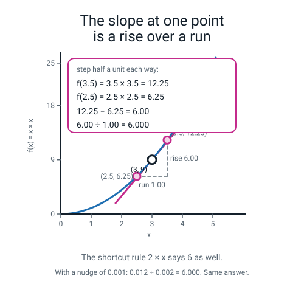

# Figure style system &mdash; AI Academy, Level 3 &ldquo;Engineer&rdquo; (36-week course)

**Audience: the authors drawing the SVG figures for Level 3.**
This file is the contract. If your figure disagrees with this file, this file wins.

**Level 3 is a faithful extension of Level 2, which was a faithful extension of Level 1.** A parent
flipping between the three years should not be able to tell where one ends and the next begins. Same
palette, same stroke widths, same type scale, same accessibility rules. Everything inherited is
copied out in full below, with the actual values, so **this file stands alone** &mdash; you never
need to open Level 1's or Level 2's `STYLE.md` to draw a Level 3 figure.

What is genuinely new is the *subject matter*. Level 3 has **maths, tensors and measurement** on the
screen: slopes, a loss surface, matrix shapes, backpropagation, a confusion matrix, an ROC curve, a
convolution. So there are new motifs for all of those, and the one rule that matters more than any
other has grown a second half &mdash; **&sect;3: a figure is not a picture of code, and it is not a
picture of a formula either.**

**The learner is one 14-year-old who finished Levels 1 and 2. They can write Python and have trained
scikit-learn models, but they have never seen calculus, linear-algebra notation or the inside of a
neural network. The teacher knows neither AI nor Python nor calculus, and opened this week's file 20
minutes ago.** A figure has to land in about four seconds with no caption, and it has to teach the
adult as well as the child. That is the bar, and it is harder than Level 2's bar.

---

## 0. The 30-second version

1. Copy a **composition pattern** (&sect;6) that matches your diagram type.
2. Drop in **motifs** (&sect;4, &sect;5) &mdash; do not redraw the confusion matrix.
3. Use only the eight **palette** colours (&sect;1.1), by *role*, never by taste.
4. **Do not draw the code, and do not draw the formula.** Draw what the formula does to numbers (&sect;3).
5. **Print the arithmetic.** If your figure claims a number, show the sum that produced it (&sect;2.1).
6. Start every file with `role="img"`, then `<title>`, then `<desc>` (&sect;1.5).
7. Name it `fig-wNN-<n>-<slug>.svg` (&sect;7).
8. Run the pre-flight check (&sect;9) before you commit. It must print `--- 0 finding(s)`.

---

## 1. Inherited verbatim from Levels 1 and 2

Nothing in this section may be changed. The values are reproduced, not summarised.

### 1.1 Palette &mdash; eight colours, used by role

Each role has a **stroke** (outlines, text, marks) and most have a **fill** (the pale tint inside a
shape). This two-tier split is deliberate and load-bearing &mdash; see &sect;1.2.

| Role | Stroke | Fill | Contrast on white | Greyscale (stroke) | Greyscale (fill) | Use it for |
|---|---|---|---|---|---|---|
| **data** | `#1F6FB2` | `#D9EAF9` | 5.28:1 | 108 | **232** | Data, values, tables, arrays, tensors, activations, inputs, anything measured |
| **model** | `#6D28D9` | `#DBCEF3` | 7.10:1 | 88 | **212** | The model: weights, biases, layers, kernels, the fitted estimator |
| **human** | `#845F00` | `#E8C671` | 5.80:1 | 101 | **202** | People, choices a person made, notes, the validation set, model-card entries |
| **correct** | `#1B7A4B` | `#E2F7ED` | 5.34:1 | 107 | **242** | It ran, it passed, after the fix, TN and TP cells, good outcomes |
| **wrong** | `#CC2B1D` | `#F6AEA6` | 5.34:1 | 107 | **192** | Errors, tracebacks, before the fix, FP and FN cells, divergence |
| **accent** | `#C42B8C` | `#F4D5E9` | 5.16:1 | 109 | **222** | Callout numbers, the current item, the held-out test set, the gradient step, the one thing to look at first |
| **ink** | `#14202B` | &mdash; | 16.52:1 | 31 | &mdash; | All body text, neutral outlines, arrows |
| **paper** | `#FFFFFF` | &mdash; | &mdash; | 255 | &mdash; | Nothing. It is the background you never draw. |

Three supporting neutrals (not &ldquo;colours&rdquo;, they carry no meaning):

| Name | Hex | Contrast on white | Greyscale | Use it for |
|---|---|---|---|---|
| **muted** | `#55636F` | 6.18:1 | 97 | Captions, axis numbers, secondary labels |
| **grid** | `#C7CDD4` | 1.60:1 | 204 | Grid lines, dashed dividers, contour rings, panel outlines |
| **panel** | `#F5F8FA` | 1.07:1 | 248 | A tinted background panel behind a scene, and neutral boxes |

&ldquo;Greyscale&rdquo; = the 0&ndash;255 grey value the colour becomes when the page is printed
black-and-white (sRGB luminance, re-encoded). **This is the verifiable print check**: convert your
figure to greyscale and the numbers above are what you should measure.

**Every stroke passes WCAG AA on white.** All six role strokes sit between **5.16:1 and 7.10:1**,
clearing the AA 4.5:1 threshold *for text*, not merely the 3:1 threshold for shapes. So you may set
a label in any role colour. Ink on any role fill also clears AA (worst case `ink` on `wrong` fill =
**9.06:1**), so text is always legible inside a tinted box.

### 1.2 Why strokes and fills are split (read this once)

The two requirements &mdash; *AA-legible on white* and *distinguishable in greyscale* &mdash; pull in
opposite directions. Any colour dark enough to pass AA on white lands in a narrow luminance band, so
**all six strokes print as virtually the same grey (88&ndash;109)**.

That is not a bug; it is the design. In print all outlines read as one consistent ink weight, which
is what makes line art look clean. **Hue therefore never carries meaning on its own.** The meaning is
carried by the *fill luminance ladder*, which was deliberately spread:

```
wrong 192  <  human 202  <  model 212  <  accent 222  <  data 232  <  correct 242
```

Even steps of 10 grey levels, with the pairs that matter most spread furthest apart:

- **correct (242) vs wrong (192) &mdash; 50 levels.** Unmistakable in print, on top of the tick/cross shapes.
- **data (232) vs accent (222)** is only 10 levels apart. In Level 2 that pair was train vs test. In
  Level 3 it is also *the value* vs *the thing to look at* &mdash; a cell versus the highlighted
  cell, a curve versus the marked point. So the highlighted thing must ALWAYS also differ by
  stroke width, position, a ring, or a printed number. Never rely on blue-vs-pink alone.
- **human (202) vs model (212)** is the new Level 3 near-pair: the validation set versus the weights.
  Ten levels. They almost never appear in the same figure; if they do, label both.

Fills are pale on purpose and **never define an edge** &mdash; the 3px stroke does. So a fill being
close to white costs you nothing.

### 1.3 Which colour pairs are safe together

Measured as OKLab &Delta;E&times;100, under normal vision and under simulated red/green colour
blindness (protanopia and deuteranopia, Machado 2009 at full severity). A pair passes when
normal &ge; 15 **and** colour-blind &ge; 8. **12 of the 15 pairs pass both gates.**

| Pair | Normal | Colour-blind | |
|---|---|---|---|
| model / human | 33.7 | 31.2 | pass |
| model / wrong | 33.7 | 29.7 | pass |
| model / correct | 33.4 | 24.9 | pass |
| data / human | 23.3 | 22.1 | pass |
| data / wrong | 31.0 | 21.9 | pass |
| data / correct | 17.6 | 16.7 | pass |
| human / accent | 24.6 | 14.3 | pass |
| model / accent | 22.0 | 13.1 | pass |
| **correct / wrong** | **28.4** | **9.1** | **pass** &mdash; the safety-critical pair, and the one the confusion matrix leans on |
| correct / accent | 32.3 | 8.7 | pass |
| **data / model** | **17.7** | **8.4** | **pass** &mdash; the pipeline pair, and Level 3's activations-vs-weights pair |
| **data / accent** | **26.2** | **8.3** | **pass** &mdash; the value-vs-highlight pair, and the weakest passing one |
| wrong / accent | 14.8 | 14.1 | **needs shape + label** |
| human / correct | 13.2 | 6.7 | **needs shape + label** |
| human / wrong | 16.3 | 4.7 | **needs shape + label** |

**Charts: at most three role colours.** For any chart where marks are compared all against all,
pick one of these validated triples: `data + correct + wrong` (the usual choice), `model + correct +
wrong`, `data + model + human`, or `model + human + accent`. Need a fourth category? Fold it into
&ldquo;Other&rdquo;, or split into two charts. Do not invent a seventh colour.

### 1.4 Canvas rules

**No new canvas sizes in Level 3.** These four cover every figure in this level.

| Name | viewBox | Use for |
|---|---|---|
| **wide** | `0 0 800 400` | Pipelines, before/after, three-panel progressions, shape traces, matrix diagrams, error-and-fix pairs |
| **square** | `0 0 500 500` | Charts, a chart plus its tables, single-idea diagrams, close-ups |
| **tall** | `0 0 500 700` | Step-by-step stacks, layer-by-layer network traces, long tables |
| **strip** | `0 0 800 260` | A single shape annotation with a callout, one terminal panel, one before/after row |

- **Never set `width` or `height` on the root `<svg>`.** viewBox only, so the figure scales to
  whatever column it lands in, in print or on screen.
- **20px of internal padding.** Nothing except a deliberate full-bleed background touches the edge.
  On a wide canvas your live area is x 20&ndash;780, y 20&ndash;380.
- **Transparent background.** Do not paint a white rect over the canvas &mdash; it breaks dark mode
  and wastes ink. If you want a tinted panel, use `panel` `#F5F8FA` on a rounded rect *inside* the
  padding.
- **No external references of any kind.** No `<image href>`, no PNG or JPEG, no `<link>`, no
  `href="http..."`, no webfont. Every figure is self-contained vector.
- Root element, always exactly this shape:

```svg
<svg xmlns="http://www.w3.org/2000/svg" viewBox="0 0 800 400" role="img">
  <title>...</title>
  <desc>...</desc>
  <!-- figure goes here -->
</svg>
```

### 1.5 Line, shape, type and accessibility

| Thing | Value |
|---|---|
| Primary stroke (the subject) | `stroke-width="3"` |
| Secondary stroke (supporting parts) | `stroke-width="2"` |
| Grid lines, dividers, leader lines, contour rings | `stroke-width="1.5"` |
| Emphasis marks (tick, cross) | `stroke-width="6"` |
| Line caps | `stroke-linecap="round"` on every open path |
| Line joins | `stroke-linejoin="round"` on every stroked polygon or rounded rect |
| Box corners | `rx="8"` small boxes, `rx="10"` standard, `rx="12"` large panels |
| Grid **cells** | square corners, no `rx` &mdash; cells butt against each other |

The **soft hand-drawn feel** comes from round caps, round joins and generous corner radii &mdash;
**not** from wobble, texture or filters. Keep geometry exact; the roundness does the warmth.

- **Draw connectors first, boxes second.** Then wires tuck under nodes instead of crossing them.
  Level 3 leans on this hard: a network has twenty edges and eight nodes.
- **A stroke's job is the edge; a fill's job is the tint.** Every meaningful shape gets both.

**System fonts only. Never a webfont, never `@font-face`, never Google Fonts.**

```
font-family="ui-sans-serif, system-ui, -apple-system, 'Segoe UI', Roboto, sans-serif"
```

| Level | Size | Colour | Use |
|---|---|---|---|
| Title | `24` | `ink` | One per figure, top-centre |
| Label | `18` | `ink` | Names of boxes, stages, panel headings |
| Caption | `14` | `muted` | The one-line takeaway at the bottom; also cell values in a small grid |
| Tiny | `12` | `muted` | Axis numbers, cell values, index labels, shape annotations, legend text |

**Never go below 12.** At print scale, 12 is already small.

- **Horizontal anchoring:** use `text-anchor` &mdash; `middle` for centred, `start` (default) for
  left-aligned, `end` for right-aligned numbers such as a y-axis. Never fake centring with a guessed
  x offset.
- **Vertical:** `y` is the *baseline*, not the middle. To centre text in a box use
  `dominant-baseline="central"` and set `y` to the box's centre. Print fallback: a few older print
  renderers ignore `dominant-baseline`, so for print-critical figures drop it and set the baseline
  manually with `y = centre + fontSize * 0.35`.
- Rotate axis titles with `transform="rotate(-90 x y)"` about the text's own anchor point.
- **Never** rely on text wrapping &mdash; SVG has none. Break lines yourself with separate `<text>`
  elements about `fontSize * 1.35` apart.

**Every figure carries `role="img"` and starts with `<title>` then `<desc>`.** No exceptions.

- **`<title>`** = the figure's name. Short. Matches the caption in the teacher file.
- **`<desc>`** = what a person who cannot see it would need told. Describe the *content and the
  point*, not the shapes. **In Level 3 that means the `<desc>` must contain the numbers.** Not
  &ldquo;a curve with a tangent line&rdquo; but &ldquo;at the point where w is 3 and the loss is 9, a
  straight line just touches the curve, and a callout says 3.0 divided by 0.5 gives a slope of
  6&rdquo;. A blind reader must be able to check the arithmetic too.
- **The alt text and `<title>` play different roles.** The markdown alt text describes what a
  sighted reader *sees*; `<title>` states what the figure *means*. They may differ, and usefully
  differing is better for screen-reader users than repeating the same sentence twice. Both must be
  accurate and non-empty. Every markdown file in
  `teacher-guide/`, `student-guide/` and `workbook/` sits one directory below `figures/`, so the link
  always starts `../figures/`, and every embed gets an italic caption line numbered
  `Figure <week>.<n>`:

```markdown

*Figure 12.2 — The slope at one point on a curve. The slope is a division, not a symbol.*
```

  If a teacher reads the alt text aloud, the class should still follow.
- Decorative motifs *inside* a figure need nothing extra &mdash; the parent `<desc>` covers them.
- If you `<use>` a motif standalone, label it:
  `<use href="_motifs.svg#motif-confusion" aria-label="The confusion matrix: all four numbers named"/>`.

### 1.6 The monospace stack, for numbers-in-a-grid and program artefacts only

Inherited from Level 2 and it matters more here, because Level 3 sets **shapes** like `(750, 16)`
where the digits and commas have to line up.

```
font-family="ui-monospace, SFMono-Regular, Menlo, Consolas, monospace"
```

It is still **system fonts only**, so nothing about &sect;1.5 is waived. Use it **only** for: a shape
annotation, a code token in a callout, a line inside a terminal or traceback panel, and a filename.
Never for a title, a label, a caption or an axis.

- **The 12px floor still applies**, and mono runs wider than sans at the same size, so budget
  `chars &times; fontSize &times; 0.6` for the width and check it fits. At 14px one character
  advances **8.4px**, which is the number you use when you place fixed-x runs (&sect;2.3).
- Program output is 14px; traceback lines are 12px; shape annotations are 12px in a chip and 14px
  when written on a block.

### 1.7 `font-weight="600"` is allowed, in exactly two places

A DataFrame's header row must read as a header, and the last line of a traceback is the line you
want read first. `font-weight="600"` is permitted on **table and DataFrame header cells, and on the
error lines of a traceback**. Nowhere else &mdash; not for emphasis, not for titles. Titles are
already 24px; that is the emphasis.

### 1.8 The scaling rule: `scale()` scales the type too

`<g transform="scale(0.5)">` around a motif whose labels are 12px produces **6px type**, which
violates the floor and cannot be photocopied.

> **Never place a text-bearing motif at `scale()` below 1.0.**

If the box is too small for the motif at 1.0, you have two legal moves:

1. **Use a text-free glyph** and put the words in the surrounding 18px stage label. This is what
   `pattern-pipeline` (&sect;6.1) does, and why its four stage glyphs carry no text of their own.
2. **Make the box bigger**, or split the figure in two.

Text-free motifs (`motif-arrow`, `motif-arrow-curved`, `motif-badge-check`, `motif-badge-cross`,
`motif-table`, `motif-note`) may be scaled freely. Scale **uniformly** &mdash; never stretch one axis.
Scaling *up* is always safe: `pattern-progression` places its learning-rate panels at `scale(1.2)`.

### 1.9 The sanctioned exception: when the artefact *is* the lesson

**A traceback and a program's output are artefacts the learner must learn to read.** You cannot teach
&ldquo;the last line names two shapes, compare them&rdquo; without showing the lines.

So `motif-terminal`, `motif-traceback`, `motif-traceback-shape` and `pattern-error-fix` may contain
verbatim monospace text. **This is the complete list of places where literal code or output may
appear.** Rules that still apply inside the exception:

- The figure's *work* is the annotation &mdash; the highlight bar, the arrow, the label. A terminal
  panel with no annotation is not a figure, it is a screenshot, and it is a defect.
- Keep it to **five lines or fewer**. If your traceback needs six lines, you are showing the program,
  not the error.
- Everything *around* the text stays on the &sect;1.1 palette: ink frames, muted captions, accent pins.
- This exception does **not** license &sect;3.

---

## 2. Level 3 extensions to the system

Six additions. That is the complete list; do not invent a seventh.

### 2.1 The arithmetic rule: if the figure claims a number, show the sum

This is the single most important *new* rule, and it is what makes a Level 3 figure teach the
teacher. Level 3's subjects are all calculations. A figure that shows the *shape* of a calculation
without its numbers has drawn a diagram of a thing the reader still cannot do.

> **Every Level 3 figure that involves a calculation must print at least one instance of that
> calculation, worked out, in numbers a reader can check on paper.**

| The figure is about&hellip; | So it must print&hellip; |
|---|---|
| a slope | the rise, the run, and the division: `3.0 &#247; 0.5 = 6` |
| a gradient-descent step | `3 &#8722; 0.1 &#215; 6 = 2.4`, and the loss before and after |
| a matrix multiply | one output cell in full: `1.0 &#215; 0.5 + 2.0 &#215; 0.8 + 0.1 = 2.20` |
| a neuron | the same, on the neuron |
| precision | `16 &#247; 21 = 0.7619`, and where the 16 and the 21 came from |
| a convolution | one output cell: `(1 &#215; 10) + (0 &#215; 10) + (&#8722;1 &#215; 2) = 8`, then `8 + 8 + 8 = 24` |
| k-means | the counts in each cluster, in every panel |
| a split | the three counts, and they must add up to the printed total |

And the numbers must be **real**. Every number in this file's motifs was taken from the worked
examples in `module-01` &hellip; `module-09` and can be reproduced with a calculator. Inventing a
plausible-looking number is the defect class that has bitten this repository hardest.

### 2.2 Every tensor block carries its shape

A shape is not optional decoration in Level 3; it is the thing being taught, because shape bugs are
most of what goes wrong. So:

- Any block standing for a tensor gets a **mono shape annotation**, either in a `chip` pinned to its
  corner (`shape (3, 4)`) or written across its middle (`(750, 16)`).
- Any bundle of wires between two layers gets a **weight chip** (`W1 (2, 16)`).
- Say it out loud as you draw it: *&ldquo;seven-fifty by two, times two by sixteen, gives seven-fifty
  by sixteen.&rdquo;* If that sentence is not readable off the figure, the figure is not finished.

### 2.3 Highlighting one digit: fixed-x mono runs

To box the `2` in `(750, 2)` you cannot draw one `<text>` and guess where the digit sits &mdash; the
advance width is font-dependent and the box will land in the wrong place. **Split the annotation into
separate `<text>` runs at fixed x**, one per part, and put the highlight rect under the run you want:

```svg
<!-- "(750, 2)" with the inner 2 boxed.  Mono 14px advances 8.4px per character. -->
<rect x="83" y="68" width="14" height="22" rx="4" fill="#F4D5E9" stroke="#C42B8C" stroke-width="2" stroke-linejoin="round"/>
<text x="40" y="84" font-family="ui-monospace, SFMono-Regular, Menlo, Consolas, monospace" font-size="14" fill="#14202B">(750,</text>
<text x="86" y="84" font-family="ui-monospace, SFMono-Regular, Menlo, Consolas, monospace" font-size="14" fill="#14202B">2</text>
<text x="98" y="84" font-family="ui-monospace, SFMono-Regular, Menlo, Consolas, monospace" font-size="14" fill="#14202B">)</text>
```

Leave a 4px gap between runs so the audit's label-collision check stays quiet and the eye reads the
parts as one string. `motif-matmul`, `motif-shape-mismatch` and `pattern-structure` all do this.

### 2.4 Minus signs, times signs and arrows are entities, never keyboard characters

Level 3 figures are full of negative numbers and mappings, and a hyphen standing in for a minus sign
looks like a typo at 12px. Use these, and only these:

| Meaning | Entity | Renders |
|---|---|---|
| minus / negative | `&#8722;` | &#8722;0.3 |
| times | `&#215;` | 3 &#215; 4 |
| divided by | `&#247;` | 16 &#247; 21 |
| becomes / maps to | `&#8594;` | 9.00 &#8594; 5.76 |
| en dash in a range | `&#8211;` | 0&#8211;1 |
| em dash in prose | `&#8212;` | like &#8212; this |
| middle dot separator | `&#183;` | rows &#183; columns |

Never `->` in a figure. Never `-` for a negative number. `<` and `>` and `&` inside a terminal or
traceback panel must be escaped as `&lt;` `&gt;` `&amp;`, or the file will not parse as XML.

### 2.5 New role assignments

The eight roles of &sect;1.1 do not change, but Level 3 introduces things that need a home. These
assignments are fixed; do not improvise:

| Level 3 thing | Role | Why |
|---|---|---|
| activations, batches, feature maps, any tensor of values | **data** | it is measured data flowing through |
| weights, biases, kernels, layers, principal components | **model** | it is the learned thing |
| the validation set | **human** | it is where a *person* makes choices, over and over |
| the test set | **accent** | inherited from Level 2: the pile you must not touch |
| the gradient step, the marked point, the highlighted cell/row/column | **accent** | the one thing to look at first |
| the backward pass | **accent**, dashed | it is the annotation on a forward network, not a second network |
| TN and TP cells; a monotone loss curve; the fixed pipeline | **correct** | good outcomes |
| FP and FN cells; divergence; the leaking pipeline; a shape mismatch | **wrong** | failures |
| contour rings, receding copies in a 3-D stack, wires in a network | **grid** | supporting structure, no meaning |

### 2.6 Composed figures match by number, not by leader line

Level 3 constantly pairs a chart with a table: an ROC curve with three confusion matrices, a loss
curve with three learning rates. Three leader lines drawn across a chart cross the data and each
other. So:

> **When two parts of a figure refer to the same thing, give both parts the same NUMBER in a badge.**

A ringed `1` on the curve and a ringed `1` on its table. That survives greyscale, survives
photocopying, and survives the reader looking at the parts in either order. `motif-roc` and
`pattern-annotated-chart` are the reference implementation.

---

## 3. The hard rule: a figure is not a picture of code, and not a picture of a formula

> **A figure must never be a picture of code. It must never be a picture of a formula either.
> It shows what the formula DOES to numbers.**

Both halves are the same mistake: transcribing a notation the reader cannot yet read, and calling it
a diagram. The code is already on the page, in a fenced block, in a font the reader can copy from.
The formula, if it is needed at all, belongs in the prose where it can be explained a symbol at a
time. A figure that repeats either one adds nothing, costs a page, and &mdash; worse &mdash; teaches
the learner that maths is a shape to memorise rather than a thing to picture.

**Remember who is reading. The teacher does not know calculus.** `dL/dw = 2w` is not information to
them; it is wallpaper. `9.006001 &#8722; 8.994001 = 0.012`, then `0.012 &#247; 0.002 = 6.000`, is
something they can do, check, and teach.

Ask this before you draw: **&ldquo;What would the learner have to imagine, or work out, to predict
what this does?&rdquo;** Draw that.

| Instead of drawing&hellip; | Draw&hellip; |
|---|---|
| the symbols `dL/dw = 2w` | a curve, a tangent at a marked point, and `3.0 &#247; 0.5 = 6` (`motif-tangent`) |
| the symbols `w := w &#8722; &#945;&#8711;L` | a bowl with four numbered steps, each labelled with its own `(w, loss)` (`motif-loss-bowl`) |
| the line `for epoch in range(500):` | one step's arithmetic, and the dot moving down the wall (&sect;3.1) |
| the symbols `&#963;(z) = 1/(1+e^&#8722;z)` | the neuron: inputs, weights, the sum, the squash, the output number (`motif-neuron`) |
| the symbols `Z = A @ W` | two blocks, the inner numbers boxed, the answer's shape annotated (`motif-matmul`) |
| the line `X_train.shape` | a labelled block with `shape (750, 2)` written on it (`motif-tensor-2d`) |
| the traceback in prose | the traceback panel, with the offending line highlighted and arrowed (`motif-traceback-shape`) |
| the symbols `P = TP/(TP+FP)` | the matrix with the predicted-positive column outlined, and `16 &#247; 21 = 0.7619` (`motif-precision-overlay`) |
| the line `KMeans(n_clusters=2).fit(X)` | three panels of the same six points recolouring around moving centroids (`motif-kmeans-1..3`) |
| the symbols for a convolution sum | the window, the kernel, and one output cell multiplied out in full (`motif-conv`) |
| the line `train_test_split(...)` twice | three proportioned bars with `1200 / 400 / 400` printed on them (`motif-split-three`) |

### 3.1 Worked example one: not a picture of code

The lesson is *&ldquo;one gradient-descent step moves you downhill by the learning rate times the
slope&rdquo;*.

**Wrong.** This is a screenshot with a border. Everything in it is already in the code block above
it; the reader's eye has nowhere to go, and the *step* &mdash; the entire point &mdash; is invisible.

```svg
<svg xmlns="http://www.w3.org/2000/svg" viewBox="0 0 500 300" role="img">
  <title>Wrong: a figure that is only a picture of code</title>
  <desc>A grey panel containing four lines of Python about a gradient-descent loop, with no diagram, no arrows and no annotation.</desc>
  <rect x="20" y="20" width="460" height="40" rx="10" fill="#F6AEA6" stroke="#CC2B1D" stroke-width="3" stroke-linejoin="round"/>
  <g transform="translate(28,24) scale(0.3)">
  <circle cx="50" cy="50" r="34" fill="#F6AEA6" stroke="#CC2B1D" stroke-width="3"/>
  <g stroke="#CC2B1D" stroke-width="6" stroke-linecap="round">
    <line x1="38" y1="38" x2="62" y2="62" stroke="#CC2B1D" stroke-width="6" stroke-linecap="round"/>
    <line x1="62" y1="38" x2="38" y2="62" stroke="#CC2B1D" stroke-width="6" stroke-linecap="round"/>
  </g>
  </g>
  <text x="74" y="46" font-family="ui-sans-serif, system-ui, -apple-system, 'Segoe UI', Roboto, sans-serif" font-size="14" fill="#14202B">Do not do this &#8212; it is a picture of code</text>
  <rect x="20" y="80" width="460" height="170" rx="10" fill="#F5F8FA" stroke="#C7CDD4" stroke-width="1.5" stroke-linejoin="round"/>
  <text x="40" y="114" font-family="ui-monospace, SFMono-Regular, Menlo, Consolas, monospace" font-size="14" fill="#14202B">for epoch in range(500):</text>
  <text x="40" y="144" font-family="ui-monospace, SFMono-Regular, Menlo, Consolas, monospace" font-size="14" fill="#14202B">    grad = X.T @ (p - y) / n</text>
  <text x="40" y="174" font-family="ui-monospace, SFMono-Regular, Menlo, Consolas, monospace" font-size="14" fill="#14202B">    w -= lr * grad</text>
  <text x="40" y="204" font-family="ui-monospace, SFMono-Regular, Menlo, Consolas, monospace" font-size="14" fill="#14202B">    history.append(loss(w))</text>
  <text x="250" y="276" font-family="ui-sans-serif, system-ui, -apple-system, 'Segoe UI', Roboto, sans-serif" font-size="12" fill="#55636F" text-anchor="middle">The reader learns nothing the code block did not already say.</text>
</svg>
```

**Right.** No code on the canvas. The dot moves, the arrow shows which way, and the four lines of
arithmetic let a teacher who has never seen calculus reproduce the step with a calculator and then
predict the next one.

```svg
<svg xmlns="http://www.w3.org/2000/svg" viewBox="0 0 500 300" role="img">
  <title>Right: a figure that shows what one step does to the numbers</title>
  <desc>A bowl-shaped curve with two dots on its right wall joined by an arrow, beside four lines of arithmetic: the slope at w equals 3 is 6, the step is 0.1 times 6 which is 0.6, 3 minus 0.6 is 2.4, and the loss falls from 9.00 to 5.76.</desc>
  <rect x="20" y="20" width="460" height="40" rx="10" fill="#E2F7ED" stroke="#1B7A4B" stroke-width="3" stroke-linejoin="round"/>
  <g transform="translate(28,24) scale(0.3)">
  <circle cx="50" cy="50" r="34" fill="#E2F7ED" stroke="#1B7A4B" stroke-width="3"/>
  <polyline points="34,52 45,64 68,38" fill="none" stroke="#1B7A4B" stroke-width="6" stroke-linecap="round" stroke-linejoin="round"/>
  </g>
  <text x="74" y="46" font-family="ui-sans-serif, system-ui, -apple-system, 'Segoe UI', Roboto, sans-serif" font-size="14" fill="#14202B">Do this instead &#8212; it shows what the step DOES</text>
  <rect x="20" y="76" width="460" height="180" rx="12" fill="#F5F8FA" stroke="#C7CDD4" stroke-width="1.5" stroke-linejoin="round"/>
  <line x1="236" y1="104" x2="236" y2="214" stroke="#14202B" stroke-width="2"/>
  <line x1="236" y1="214" x2="420" y2="214" stroke="#14202B" stroke-width="2"/>
  <polyline points="245.2,111.7 254.6,134.8 263.9,154.7 273.2,171.6 282.6,185.4 291.9,196.2 301.3,203.9 310.6,208.5 320.0,210.0 329.4,208.5 338.7,203.9 348.1,196.2 357.4,185.4 366.8,171.6 376.1,154.7 385.4,134.8 394.8,111.7" fill="none" stroke="#1F6FB2" stroke-width="3" stroke-linecap="round" stroke-linejoin="round"/>
  <line x1="386" y1="133.5" x2="372.8" y2="161" stroke="#C42B8C" stroke-width="2.5" stroke-linecap="round"/>
  <polyline points="-13,-8 0,0 -13,8" fill="none" stroke="#C42B8C" stroke-width="2.5" stroke-linecap="round" stroke-linejoin="round" transform="translate(372.8 161) rotate(115.6)"/>
  <circle cx="386" cy="133.5" r="6" fill="#C42B8C" stroke="#FFFFFF" stroke-width="1.5"/>
  <circle cx="372.8" cy="161" r="6" fill="#C42B8C" stroke="#FFFFFF" stroke-width="1.5"/>
  <text x="40" y="120" font-family="ui-sans-serif, system-ui, -apple-system, 'Segoe UI', Roboto, sans-serif" font-size="12" fill="#14202B">at w = 3 the slope is 6</text>
  <text x="40" y="144" font-family="ui-sans-serif, system-ui, -apple-system, 'Segoe UI', Roboto, sans-serif" font-size="12" fill="#14202B">step = 0.1 &#215; 6 = 0.6</text>
  <text x="40" y="168" font-family="ui-sans-serif, system-ui, -apple-system, 'Segoe UI', Roboto, sans-serif" font-size="12" fill="#14202B">3 &#8722; 0.6 = 2.4</text>
  <text x="40" y="192" font-family="ui-sans-serif, system-ui, -apple-system, 'Segoe UI', Roboto, sans-serif" font-size="12" fill="#1B7A4B">loss 9.00 &#8594; 5.76</text>
  <text x="250" y="276" font-family="ui-sans-serif, system-ui, -apple-system, 'Segoe UI', Roboto, sans-serif" font-size="12" fill="#55636F" text-anchor="middle">Same lesson, no code &#8212; and the arithmetic is checkable.</text>
</svg>
```

Note what the good figure keeps from the bad one: the numbers `0.1`, `3` and `6`. **Values are not
code.** What it drops is the *syntax* &mdash; the `for`, the `range(500)`, the `-=`.

### 3.2 Worked example two: not a picture of a formula

The lesson is *&ldquo;the slope of `w &#215; w` at `w = 3` is 6, and you can check that by nudging&rdquo;*.

**Wrong.** A beautifully set formula that a 14-year-old and their teacher cannot read. There is
nothing to look at, nothing to check, and nothing to do. Setting it larger does not help.

```svg
<svg xmlns="http://www.w3.org/2000/svg" viewBox="0 0 500 300" role="img">
  <title>Wrong: a figure that is only a picture of a formula</title>
  <desc>A grey panel containing the symbols d L over d w equals 2 w, set large, with no numbers, no curve and no annotation.</desc>
  <rect x="20" y="20" width="460" height="40" rx="10" fill="#F6AEA6" stroke="#CC2B1D" stroke-width="3" stroke-linejoin="round"/>
  <g transform="translate(28,24) scale(0.3)">
  <circle cx="50" cy="50" r="34" fill="#F6AEA6" stroke="#CC2B1D" stroke-width="3"/>
  <g stroke="#CC2B1D" stroke-width="6" stroke-linecap="round">
    <line x1="38" y1="38" x2="62" y2="62" stroke="#CC2B1D" stroke-width="6" stroke-linecap="round"/>
    <line x1="62" y1="38" x2="38" y2="62" stroke="#CC2B1D" stroke-width="6" stroke-linecap="round"/>
  </g>
  </g>
  <text x="74" y="46" font-family="ui-sans-serif, system-ui, -apple-system, 'Segoe UI', Roboto, sans-serif" font-size="14" fill="#14202B">Do not do this &#8212; it is a picture of a formula</text>
  <rect x="20" y="80" width="460" height="170" rx="10" fill="#F5F8FA" stroke="#C7CDD4" stroke-width="1.5" stroke-linejoin="round"/>
  <text x="180" y="150" font-family="ui-sans-serif, system-ui, -apple-system, 'Segoe UI', Roboto, sans-serif" font-size="24" fill="#14202B" text-anchor="middle">dL</text>
  <line x1="158" y1="162" x2="202" y2="162" stroke="#14202B" stroke-width="2"/>
  <text x="180" y="186" font-family="ui-sans-serif, system-ui, -apple-system, 'Segoe UI', Roboto, sans-serif" font-size="24" fill="#14202B" text-anchor="middle">dw</text>
  <text x="228" y="170" font-family="ui-sans-serif, system-ui, -apple-system, 'Segoe UI', Roboto, sans-serif" font-size="24" fill="#14202B" text-anchor="middle">=</text>
  <text x="268" y="170" font-family="ui-sans-serif, system-ui, -apple-system, 'Segoe UI', Roboto, sans-serif" font-size="24" fill="#14202B" text-anchor="middle">2w</text>
  <text x="250" y="230" font-family="ui-sans-serif, system-ui, -apple-system, 'Segoe UI', Roboto, sans-serif" font-size="12" fill="#55636F" text-anchor="middle">no numbers, nothing to check, nothing to do</text>
  <text x="250" y="276" font-family="ui-sans-serif, system-ui, -apple-system, 'Segoe UI', Roboto, sans-serif" font-size="12" fill="#55636F" text-anchor="middle">A reader who cannot already read this learns nothing from it.</text>
</svg>
```

**Right.** The same fact, done to numbers. Two nudged values of the loss, one subtraction, one
division, and the answer &mdash; beside a curve with the line whose steepness that answer *is*.

```svg
<svg xmlns="http://www.w3.org/2000/svg" viewBox="0 0 500 300" role="img">
  <title>Right: a figure that shows what the formula does to numbers</title>
  <desc>A bowl-shaped curve with a straight line just touching it at the point where w is 3, beside the arithmetic: the loss at 3.001 is 9.006001, the loss at 2.999 is 8.994001, and 0.012 divided by 0.002 is 6.000.</desc>
  <rect x="20" y="20" width="460" height="40" rx="10" fill="#E2F7ED" stroke="#1B7A4B" stroke-width="3" stroke-linejoin="round"/>
  <g transform="translate(28,24) scale(0.3)">
  <circle cx="50" cy="50" r="34" fill="#E2F7ED" stroke="#1B7A4B" stroke-width="3"/>
  <polyline points="34,52 45,64 68,38" fill="none" stroke="#1B7A4B" stroke-width="6" stroke-linecap="round" stroke-linejoin="round"/>
  </g>
  <text x="74" y="46" font-family="ui-sans-serif, system-ui, -apple-system, 'Segoe UI', Roboto, sans-serif" font-size="14" fill="#14202B">Do this instead &#8212; it shows what the formula DOES</text>
  <rect x="20" y="76" width="460" height="180" rx="12" fill="#F5F8FA" stroke="#C7CDD4" stroke-width="1.5" stroke-linejoin="round"/>
  <line x1="236" y1="104" x2="236" y2="214" stroke="#14202B" stroke-width="2"/>
  <line x1="236" y1="214" x2="420" y2="214" stroke="#14202B" stroke-width="2"/>
  <line x1="368.4" y1="174.3" x2="394.8" y2="113.1" stroke="#C42B8C" stroke-width="3" stroke-linecap="round"/>
  <polyline points="245.2,111.7 254.6,134.8 263.9,154.7 273.2,171.6 282.6,185.4 291.9,196.2 301.3,203.9 310.6,208.5 320.0,210.0 329.4,208.5 338.7,203.9 348.1,196.2 357.4,185.4 366.8,171.6 376.1,154.7 385.4,134.8 394.8,111.7" fill="none" stroke="#1F6FB2" stroke-width="3" stroke-linecap="round" stroke-linejoin="round"/>
  <circle cx="386" cy="133.5" r="6" fill="#F4D5E9" stroke="#C42B8C" stroke-width="3"/>
  <text x="378" y="120" font-family="ui-sans-serif, system-ui, -apple-system, 'Segoe UI', Roboto, sans-serif" font-size="12" fill="#14202B" text-anchor="end">w = 3</text>
  <text x="40" y="112" font-family="ui-sans-serif, system-ui, -apple-system, 'Segoe UI', Roboto, sans-serif" font-size="12" fill="#14202B">nudge w either side of 3:</text>
  <text x="40" y="136" font-family="ui-sans-serif, system-ui, -apple-system, 'Segoe UI', Roboto, sans-serif" font-size="12" fill="#14202B">loss(3.001) = 9.006001</text>
  <text x="40" y="158" font-family="ui-sans-serif, system-ui, -apple-system, 'Segoe UI', Roboto, sans-serif" font-size="12" fill="#14202B">loss(2.999) = 8.994001</text>
  <line x1="38" y1="172" x2="196" y2="172" stroke="#C7CDD4" stroke-width="1.5"/>
  <text x="40" y="190" font-family="ui-sans-serif, system-ui, -apple-system, 'Segoe UI', Roboto, sans-serif" font-size="12" fill="#14202B">0.012 &#247; 0.002 = 6.000</text>
  <text x="40" y="214" font-family="ui-sans-serif, system-ui, -apple-system, 'Segoe UI', Roboto, sans-serif" font-size="12" fill="#1B7A4B">that division IS the slope</text>
  <text x="250" y="276" font-family="ui-sans-serif, system-ui, -apple-system, 'Segoe UI', Roboto, sans-serif" font-size="12" fill="#55636F" text-anchor="middle">Now the reader can check it, and see it is only a division.</text>
</svg>
```

**Where symbols ARE allowed.** A symbol may appear as a *label* on a thing, never as the figure's
content: `w` on an x axis, `loss` on a y axis, `W1` over a bundle of wires, `sum` inside a node,
`ReLU` on a box, `t = 0.50` beside a marked point. The test is whether removing the symbol would
leave the figure meaningless (fine, it is a label) or leave it unchanged (then it was the content,
and the figure has failed).

### 3.3 The four-question test

Before you commit a figure, answer all four. Any &ldquo;no&rdquo; means redraw.

1. **Cover the code block. Does the figure still teach something?** If the figure only makes sense
   next to the code, it is decoration.
2. **Cover the figure. Does the code block lose anything?** If not, the figure is redundant &mdash;
   delete it, and spend the page on the thing the reader *cannot* see.
3. **Is there at least one sum on the canvas that a reader could check with a calculator?** (&sect;2.1)
4. **Could the teacher &mdash; no AI, no Python, no calculus &mdash; explain this figure aloud after
   twenty seconds of looking at it?** They are the reader who decides whether the lesson lands.

---

## 4. Motif library &mdash; Level 3 (29)

**Do not redraw these.** Consistency across the whole three years is the point. Two ways to use them:

```svg
<!-- A) reference the sprite sheet -->
<use href="_motifs.svg#motif-confusion" x="40" y="40" width="380" height="260"/>

<!-- B) copy the <g> inline (below) and position it -->
<g transform="translate(600,150)">...</g>
```

Every motif is drawn to its own viewBox with **the origin at the top-left**, so `translate(x,y)` puts
its top-left corner at exactly `(x,y)`. Remember &sect;1.8 before you scale one.

Two of the motifs the level needs are inherited unchanged and live in &sect;5, with their snippets:
**`motif-terminal`** (a terminal panel) and **`motif-traceback`** (a red-outlined traceback with an
arrow at the offending line, for the Level 2 error types). Level 3's own traceback &mdash; the shape
error &mdash; is below.

### Maths &mdash; slope, descent, learning rate

#### `motif-tangent` &mdash; The slope at one point on a curve

viewBox `0 0 320 240` (320&times;240). A curve rising to the right. At the point where w is 3 and the loss is 9, a straight line just touches the curve. A small step of plus 0.5 across and plus 3.0 up is marked on that line, and a callout says 3.0 divided by 0.5 gives a slope of 6.

**Use it for:** The slope is not a symbol, it is a division: rise over run, both printed. Draw the tangent BEFORE the curve so the curve stays on top. Mark the point, print its coordinates.

```svg
<g transform="translate(0,0)">
  <line x1="40" y1="36" x2="40" y2="196" stroke="#14202B" stroke-width="2"/>
  <line x1="40" y1="196" x2="286" y2="196" stroke="#14202B" stroke-width="2"/>
  <line x1="167.6" y1="155.7" x2="260.4" y2="63.5" stroke="#C42B8C" stroke-width="3" stroke-linecap="round"/>
  <polyline points="40.0,196.0 69.0,193.6 98.0,186.4 127.0,174.4 156.0,157.6 185.0,136.0 214.0,109.6 243.0,78.4 272.0,42.4" fill="none" stroke="#1F6FB2" stroke-width="3" stroke-linecap="round" stroke-linejoin="round"/>
  <line x1="214" y1="109.6" x2="243" y2="109.6" stroke="#55636F" stroke-width="1.5" stroke-dasharray="5 4"/>
  <line x1="243" y1="109.6" x2="243" y2="80.8" stroke="#55636F" stroke-width="1.5" stroke-dasharray="5 4"/>
  <text x="228.5" y="124" font-family="ui-sans-serif, system-ui, -apple-system, 'Segoe UI', Roboto, sans-serif" font-size="12" fill="#55636F" text-anchor="middle">+0.5</text>
  <text x="249" y="94" font-family="ui-sans-serif, system-ui, -apple-system, 'Segoe UI', Roboto, sans-serif" font-size="12" fill="#55636F">+3.0</text>
  <circle cx="214" cy="109.6" r="6" fill="#F4D5E9" stroke="#C42B8C" stroke-width="3"/>
  <text x="206" y="134" font-family="ui-sans-serif, system-ui, -apple-system, 'Segoe UI', Roboto, sans-serif" font-size="12" fill="#14202B" text-anchor="end">(3, 9)</text>
  <rect x="46" y="40" width="150" height="44" rx="10" fill="#FFFFFF" stroke="#C42B8C" stroke-width="2" stroke-linejoin="round"/>
  <text x="121" y="58" font-family="ui-sans-serif, system-ui, -apple-system, 'Segoe UI', Roboto, sans-serif" font-size="14" fill="#14202B" text-anchor="middle">3.0 &#247; 0.5 = 6</text>
  <text x="121" y="74" font-family="ui-sans-serif, system-ui, -apple-system, 'Segoe UI', Roboto, sans-serif" font-size="12" fill="#55636F" text-anchor="middle">so the slope here is 6</text>
  <line x1="196" y1="66" x2="206" y2="100" stroke="#C42B8C" stroke-width="2" stroke-linecap="round"/>
  <polyline points="-13,-8 0,0 -13,8" fill="none" stroke="#C42B8C" stroke-width="2" stroke-linecap="round" stroke-linejoin="round" transform="translate(206 100) rotate(73.6)"/>
  <line x1="214" y1="196" x2="214" y2="202" stroke="#55636F" stroke-width="1.5"/>
  <text x="214" y="216" font-family="ui-sans-serif, system-ui, -apple-system, 'Segoe UI', Roboto, sans-serif" font-size="12" fill="#55636F" text-anchor="middle">w = 3</text>
  <text x="96" y="216" font-family="ui-sans-serif, system-ui, -apple-system, 'Segoe UI', Roboto, sans-serif" font-size="12" fill="#55636F" text-anchor="middle">w (the weight)</text>
  <text x="24" y="116" font-family="ui-sans-serif, system-ui, -apple-system, 'Segoe UI', Roboto, sans-serif" font-size="12" fill="#55636F" text-anchor="middle" transform="rotate(-90 24 116)">loss</text>
  <text x="300" y="34" font-family="ui-sans-serif, system-ui, -apple-system, 'Segoe UI', Roboto, sans-serif" font-size="12" fill="#55636F" text-anchor="end">loss = w &#215; w</text>
</g>
```

#### `motif-loss-bowl` &mdash; Four steps down the loss bowl

viewBox `0 0 420 250` (420&times;250). A bowl-shaped curve. Four numbered points walk down the right-hand wall towards the bottom, each one labelled with its own w and loss: 3.00 and 9.00, then 2.40 and 5.76, then 1.92 and 3.69, then 1.54 and 2.36. The bottom of the bowl is marked as the place where the slope is zero.

**Use it for:** Number every step and print BOTH its coordinates. The steps must get shorter as the wall flattens &mdash; that is the whole behaviour, and a reader can check it against the printed numbers.

```svg
<g transform="translate(0,0)">
  <line x1="24" y1="200" x2="296" y2="200" stroke="#C7CDD4" stroke-width="1.5"/>
  <polyline points="24.0,40.5 40.0,75.8 56.0,106.7 72.0,133.2 88.0,155.3 104.0,173.0 120.0,186.2 136.0,195.0 152.0,199.4 168.0,199.4 184.0,195.0 200.0,186.2 216.0,173.0 232.0,155.3 248.0,133.2 264.0,106.7 280.0,75.8 296.0,40.5" fill="none" stroke="#1F6FB2" stroke-width="3" stroke-linecap="round" stroke-linejoin="round"/>
  <text x="210" y="24" font-family="ui-sans-serif, system-ui, -apple-system, 'Segoe UI', Roboto, sans-serif" font-size="12" fill="#55636F" text-anchor="middle">each step moves 0.1 &#215; slope downhill</text>
  <line x1="277.0" y1="79.8" x2="261.0" y2="117.5" stroke="#C42B8C" stroke-width="2.5" stroke-linecap="round"/>
  <polyline points="-13,-8 0,0 -13,8" fill="none" stroke="#C42B8C" stroke-width="2.5" stroke-linecap="round" stroke-linejoin="round" transform="translate(261.0 117.5) rotate(113)"/>
  <line x1="253.0" y1="124.5" x2="241.8" y2="146.1" stroke="#C42B8C" stroke-width="2.5" stroke-linecap="round"/>
  <polyline points="-13,-8 0,0 -13,8" fill="none" stroke="#C42B8C" stroke-width="2.5" stroke-linecap="round" stroke-linejoin="round" transform="translate(241.8 146.1) rotate(117.4)"/>
  <line x1="233.8" y1="153.1" x2="226.6" y2="164.4" stroke="#C42B8C" stroke-width="2.5" stroke-linecap="round"/>
  <polyline points="-13,-8 0,0 -13,8" fill="none" stroke="#C42B8C" stroke-width="2.5" stroke-linecap="round" stroke-linejoin="round" transform="translate(226.6 164.4) rotate(122.5)"/>
  <line x1="290.0" y1="75.8" x2="302" y2="80" stroke="#C7CDD4" stroke-width="1.5"/>
  <circle cx="280.0" cy="75.8" r="9" fill="#F4D5E9" stroke="#C42B8C" stroke-width="3"/>
  <text x="280.0" y="75.8" font-family="ui-sans-serif, system-ui, -apple-system, 'Segoe UI', Roboto, sans-serif" font-size="12" fill="#14202B" text-anchor="middle" dominant-baseline="central">1</text>
  <text x="306" y="84" font-family="ui-sans-serif, system-ui, -apple-system, 'Segoe UI', Roboto, sans-serif" font-size="12" fill="#14202B">(3.00, 9.00)</text>
  <line x1="266.0" y1="120.5" x2="302" y2="116" stroke="#C7CDD4" stroke-width="1.5"/>
  <circle cx="256.0" cy="120.5" r="9" fill="#F4D5E9" stroke="#C42B8C" stroke-width="3"/>
  <text x="256.0" y="120.5" font-family="ui-sans-serif, system-ui, -apple-system, 'Segoe UI', Roboto, sans-serif" font-size="12" fill="#14202B" text-anchor="middle" dominant-baseline="central">2</text>
  <text x="306" y="120" font-family="ui-sans-serif, system-ui, -apple-system, 'Segoe UI', Roboto, sans-serif" font-size="12" fill="#14202B">(2.40, 5.76)</text>
  <line x1="246.8" y1="149.1" x2="302" y2="152" stroke="#C7CDD4" stroke-width="1.5"/>
  <circle cx="236.8" cy="149.1" r="9" fill="#F4D5E9" stroke="#C42B8C" stroke-width="3"/>
  <text x="236.8" y="149.1" font-family="ui-sans-serif, system-ui, -apple-system, 'Segoe UI', Roboto, sans-serif" font-size="12" fill="#14202B" text-anchor="middle" dominant-baseline="central">3</text>
  <text x="306" y="156" font-family="ui-sans-serif, system-ui, -apple-system, 'Segoe UI', Roboto, sans-serif" font-size="12" fill="#14202B">(1.92, 3.69)</text>
  <line x1="231.6" y1="167.4" x2="302" y2="188" stroke="#C7CDD4" stroke-width="1.5"/>
  <circle cx="221.6" cy="167.4" r="9" fill="#F4D5E9" stroke="#C42B8C" stroke-width="3"/>
  <text x="221.6" y="167.4" font-family="ui-sans-serif, system-ui, -apple-system, 'Segoe UI', Roboto, sans-serif" font-size="12" fill="#14202B" text-anchor="middle" dominant-baseline="central">4</text>
  <text x="306" y="192" font-family="ui-sans-serif, system-ui, -apple-system, 'Segoe UI', Roboto, sans-serif" font-size="12" fill="#14202B">(1.54, 2.36)</text>
  <text x="160" y="216" font-family="ui-sans-serif, system-ui, -apple-system, 'Segoe UI', Roboto, sans-serif" font-size="12" fill="#55636F" text-anchor="middle">w = 0</text>
  <text x="160" y="232" font-family="ui-sans-serif, system-ui, -apple-system, 'Segoe UI', Roboto, sans-serif" font-size="12" fill="#55636F" text-anchor="middle">the bottom: slope 0, nowhere left to go</text>
</g>
```

#### `motif-lr-too-small` &mdash; A learning rate that is too small

viewBox `0 0 180 175` (180&times;175). The same bowl-shaped curve. Four dots sit almost on top of each other high on the right-hand wall, joined by arrows so short they are hard to see. The caption reads lr = 0.01, barely moves.

**Use it for:** Panel 1 of 3. The bowl is IDENTICAL in all three panels and drawn in grid grey &mdash; only the walk changes. Four steps that barely separate is the picture of a learning rate too small.

```svg
<g transform="translate(0,0)">
  <line x1="20" y1="36" x2="20" y2="130" stroke="#14202B" stroke-width="2"/>
  <line x1="20" y1="130" x2="160" y2="130" stroke="#14202B" stroke-width="2"/>
  <polyline points="20.1,43.2 37.6,81.2 55.0,108.3 72.5,124.6 90.0,130.0 107.5,124.6 125.0,108.3 142.4,81.2 159.9,43.2" fill="none" stroke="#C7CDD4" stroke-width="3" stroke-linecap="round" stroke-linejoin="round"/>
  <text x="12" y="84" font-family="ui-sans-serif, system-ui, -apple-system, 'Segoe UI', Roboto, sans-serif" font-size="12" fill="#55636F" text-anchor="middle" transform="rotate(-90 12 84)">loss</text>
  <text x="155" y="126" font-family="ui-sans-serif, system-ui, -apple-system, 'Segoe UI', Roboto, sans-serif" font-size="12" fill="#55636F" text-anchor="end">w</text>
  <line x1="135.6" y1="93.1" x2="134.7" y2="94.6" stroke="#1F6FB2" stroke-width="2.5" stroke-linecap="round"/>
  <polyline points="-13,-8 0,0 -13,8" fill="none" stroke="#1F6FB2" stroke-width="2.5" stroke-linecap="round" stroke-linejoin="round" transform="translate(134.7 94.6) rotate(121)"/>
  <line x1="134.7" y1="94.6" x2="133.8" y2="96.0" stroke="#1F6FB2" stroke-width="2.5" stroke-linecap="round"/>
  <polyline points="-13,-8 0,0 -13,8" fill="none" stroke="#1F6FB2" stroke-width="2.5" stroke-linecap="round" stroke-linejoin="round" transform="translate(133.8 96.0) rotate(122.7)"/>
  <line x1="133.8" y1="96.0" x2="132.9" y2="97.3" stroke="#1F6FB2" stroke-width="2.5" stroke-linecap="round"/>
  <polyline points="-13,-8 0,0 -13,8" fill="none" stroke="#1F6FB2" stroke-width="2.5" stroke-linecap="round" stroke-linejoin="round" transform="translate(132.9 97.3) rotate(124.7)"/>
  <circle cx="135.6" cy="93.1" r="5" fill="#1F6FB2" stroke="#FFFFFF" stroke-width="1.5"/>
  <circle cx="134.7" cy="94.6" r="5" fill="#1F6FB2" stroke="#FFFFFF" stroke-width="1.5"/>
  <circle cx="133.8" cy="96.0" r="5" fill="#1F6FB2" stroke="#FFFFFF" stroke-width="1.5"/>
  <circle cx="132.9" cy="97.3" r="5" fill="#1F6FB2" stroke="#FFFFFF" stroke-width="1.5"/>
  <text x="90" y="148" font-family="ui-sans-serif, system-ui, -apple-system, 'Segoe UI', Roboto, sans-serif" font-size="14" fill="#14202B" text-anchor="middle">lr = 0.01</text>
  <text x="90" y="162" font-family="ui-sans-serif, system-ui, -apple-system, 'Segoe UI', Roboto, sans-serif" font-size="12" fill="#55636F" text-anchor="middle">barely moves</text>
</g>
```

#### `motif-lr-right` &mdash; A learning rate that works

viewBox `0 0 180 175` (180&times;175). The same bowl-shaped curve. Five dots step steadily down the right-hand wall towards the bottom, each step a little shorter than the last. The caption reads lr = 0.1, walks down.

**Use it for:** Panel 2 of 3. Steps shorten as the wall flattens. This is the only one of the three whose dots are monotone &mdash; every dot lower than the one before.

```svg
<g transform="translate(0,0)">
  <line x1="20" y1="36" x2="20" y2="130" stroke="#14202B" stroke-width="2"/>
  <line x1="20" y1="130" x2="160" y2="130" stroke="#14202B" stroke-width="2"/>
  <polyline points="20.1,43.2 37.6,81.2 55.0,108.3 72.5,124.6 90.0,130.0 107.5,124.6 125.0,108.3 142.4,81.2 159.9,43.2" fill="none" stroke="#C7CDD4" stroke-width="3" stroke-linecap="round" stroke-linejoin="round"/>
  <text x="12" y="84" font-family="ui-sans-serif, system-ui, -apple-system, 'Segoe UI', Roboto, sans-serif" font-size="12" fill="#55636F" text-anchor="middle" transform="rotate(-90 12 84)">loss</text>
  <text x="155" y="126" font-family="ui-sans-serif, system-ui, -apple-system, 'Segoe UI', Roboto, sans-serif" font-size="12" fill="#55636F" text-anchor="end">w</text>
  <line x1="135.6" y1="93.1" x2="126.5" y2="106.4" stroke="#1B7A4B" stroke-width="2.5" stroke-linecap="round"/>
  <polyline points="-13,-8 0,0 -13,8" fill="none" stroke="#1B7A4B" stroke-width="2.5" stroke-linecap="round" stroke-linejoin="round" transform="translate(126.5 106.4) rotate(124.4)"/>
  <line x1="126.5" y1="106.4" x2="119.2" y2="114.9" stroke="#1B7A4B" stroke-width="2.5" stroke-linecap="round"/>
  <polyline points="-13,-8 0,0 -13,8" fill="none" stroke="#1B7A4B" stroke-width="2.5" stroke-linecap="round" stroke-linejoin="round" transform="translate(119.2 114.9) rotate(130.7)"/>
  <line x1="119.2" y1="114.9" x2="113.3" y2="120.3" stroke="#1B7A4B" stroke-width="2.5" stroke-linecap="round"/>
  <polyline points="-13,-8 0,0 -13,8" fill="none" stroke="#1B7A4B" stroke-width="2.5" stroke-linecap="round" stroke-linejoin="round" transform="translate(113.3 120.3) rotate(137.5)"/>
  <line x1="113.3" y1="120.3" x2="108.7" y2="123.8" stroke="#1B7A4B" stroke-width="2.5" stroke-linecap="round"/>
  <polyline points="-13,-8 0,0 -13,8" fill="none" stroke="#1B7A4B" stroke-width="2.5" stroke-linecap="round" stroke-linejoin="round" transform="translate(108.7 123.8) rotate(142.7)"/>
  <circle cx="135.6" cy="93.1" r="5" fill="#1B7A4B" stroke="#FFFFFF" stroke-width="1.5"/>
  <circle cx="126.5" cy="106.4" r="5" fill="#1B7A4B" stroke="#FFFFFF" stroke-width="1.5"/>
  <circle cx="119.2" cy="114.9" r="5" fill="#1B7A4B" stroke="#FFFFFF" stroke-width="1.5"/>
  <circle cx="113.3" cy="120.3" r="5" fill="#1B7A4B" stroke="#FFFFFF" stroke-width="1.5"/>
  <circle cx="108.7" cy="123.8" r="5" fill="#1B7A4B" stroke="#FFFFFF" stroke-width="1.5"/>
  <text x="90" y="148" font-family="ui-sans-serif, system-ui, -apple-system, 'Segoe UI', Roboto, sans-serif" font-size="14" fill="#14202B" text-anchor="middle">lr = 0.1</text>
  <text x="90" y="162" font-family="ui-sans-serif, system-ui, -apple-system, 'Segoe UI', Roboto, sans-serif" font-size="12" fill="#55636F" text-anchor="middle">walks down</text>
</g>
```

#### `motif-lr-diverging` &mdash; A learning rate that diverges

viewBox `0 0 180 175` (180&times;175). The same bowl-shaped curve. A dot high on the right wall leaps across the bowl to the far wall, then leaps back even higher, each jump landing further up than the last. The caption reads lr = 1.1, leaps and climbs.

**Use it for:** Panel 3 of 3. The step must visibly cross the bottom and land HIGHER. Too-small and diverging are told apart by the shape of the walk, not only by colour.

```svg
<g transform="translate(0,0)">
  <line x1="20" y1="36" x2="20" y2="130" stroke="#14202B" stroke-width="2"/>
  <line x1="20" y1="130" x2="160" y2="130" stroke="#14202B" stroke-width="2"/>
  <polyline points="20.1,43.2 37.6,81.2 55.0,108.3 72.5,124.6 90.0,130.0 107.5,124.6 125.0,108.3 142.4,81.2 159.9,43.2" fill="none" stroke="#C7CDD4" stroke-width="3" stroke-linecap="round" stroke-linejoin="round"/>
  <text x="12" y="84" font-family="ui-sans-serif, system-ui, -apple-system, 'Segoe UI', Roboto, sans-serif" font-size="12" fill="#55636F" text-anchor="middle" transform="rotate(-90 12 84)">loss</text>
  <text x="155" y="126" font-family="ui-sans-serif, system-ui, -apple-system, 'Segoe UI', Roboto, sans-serif" font-size="12" fill="#55636F" text-anchor="end">w</text>
  <line x1="135.6" y1="93.1" x2="35.3" y2="76.9" stroke="#CC2B1D" stroke-width="2.5" stroke-linecap="round"/>
  <polyline points="-13,-8 0,0 -13,8" fill="none" stroke="#CC2B1D" stroke-width="2.5" stroke-linecap="round" stroke-linejoin="round" transform="translate(35.3 76.9) rotate(-170.8)"/>
  <line x1="35.3" y1="76.9" x2="155.7" y2="53.5" stroke="#CC2B1D" stroke-width="2.5" stroke-linecap="round"/>
  <polyline points="-13,-8 0,0 -13,8" fill="none" stroke="#CC2B1D" stroke-width="2.5" stroke-linecap="round" stroke-linejoin="round" transform="translate(155.7 53.5) rotate(-11)"/>
  <circle cx="135.6" cy="93.1" r="5" fill="#CC2B1D" stroke="#FFFFFF" stroke-width="1.5"/>
  <circle cx="35.3" cy="76.9" r="5" fill="#CC2B1D" stroke="#FFFFFF" stroke-width="1.5"/>
  <circle cx="155.7" cy="53.5" r="5" fill="#CC2B1D" stroke="#FFFFFF" stroke-width="1.5"/>
  <text x="90" y="148" font-family="ui-sans-serif, system-ui, -apple-system, 'Segoe UI', Roboto, sans-serif" font-size="14" fill="#14202B" text-anchor="middle">lr = 1.1</text>
  <text x="90" y="162" font-family="ui-sans-serif, system-ui, -apple-system, 'Segoe UI', Roboto, sans-serif" font-size="12" fill="#55636F" text-anchor="middle">leaps and climbs</text>
</g>
```

### Tensors and shapes

#### `motif-tensor-1d` &mdash; A 1-D tensor is one row of numbers

viewBox `0 0 300 160` (300&times;160). A single wide bar divided into five equal cells, with a mono label reading shape open bracket 5 comma close bracket pinned to its top-right corner, and a bracket underneath labelled 5 numbers.

**Use it for:** One number in the shape, so one bracket and one comma. The trailing comma in (5,) is not a typo and learners will ask: it is how a shape with one entry is written.

```svg
<g transform="translate(0,0)">
  <text x="20" y="26" font-family="ui-sans-serif, system-ui, -apple-system, 'Segoe UI', Roboto, sans-serif" font-size="14" fill="#14202B">1-D &#8212; a vector</text>
  <rect x="20" y="58" width="200" height="44" rx="8" fill="#D9EAF9" stroke="#1F6FB2" stroke-width="3" stroke-linejoin="round"/>
  <line x1="60" y1="58" x2="60" y2="102" stroke="#C7CDD4" stroke-width="1.5"/>
  <line x1="100" y1="58" x2="100" y2="102" stroke="#C7CDD4" stroke-width="1.5"/>
  <line x1="140" y1="58" x2="140" y2="102" stroke="#C7CDD4" stroke-width="1.5"/>
  <line x1="180" y1="58" x2="180" y2="102" stroke="#C7CDD4" stroke-width="1.5"/>
  <rect x="150" y="44" width="110" height="26" rx="6" fill="#FFFFFF" stroke="#1F6FB2" stroke-width="2" stroke-linejoin="round"/>
  <text x="205.0" y="57.0" font-family="ui-monospace, SFMono-Regular, Menlo, Consolas, monospace" font-size="12" fill="#14202B" text-anchor="middle" dominant-baseline="central">shape (5,)</text>
  <path d="M20 110 V118 H220 V110" fill="none" stroke="#55636F" stroke-width="1.5" stroke-linecap="round" stroke-linejoin="round"/>
  <text x="120" y="136" font-family="ui-sans-serif, system-ui, -apple-system, 'Segoe UI', Roboto, sans-serif" font-size="12" fill="#55636F" text-anchor="middle">5 numbers</text>
  <text x="20" y="152" font-family="ui-sans-serif, system-ui, -apple-system, 'Segoe UI', Roboto, sans-serif" font-size="12" fill="#55636F">one row: 5 features for one delivery</text>
</g>
```

#### `motif-tensor-2d` &mdash; A 2-D tensor is rows and columns

viewBox `0 0 300 200` (300&times;200). A block divided into three rows and four columns, with a mono label reading shape 3 comma 4 pinned to its top-right corner. The left edge is labelled 3 rows and the bottom edge 4 columns.

**Use it for:** Rows first, columns second, always. Say the shape out loud as 'three by four' and point at the rows as you say three.

```svg
<g transform="translate(0,0)">
  <text x="20" y="26" font-family="ui-sans-serif, system-ui, -apple-system, 'Segoe UI', Roboto, sans-serif" font-size="14" fill="#14202B">2-D &#8212; rows and columns</text>
  <rect x="20" y="58" width="200" height="96" rx="8" fill="#D9EAF9" stroke="#1F6FB2" stroke-width="3" stroke-linejoin="round"/>
  <line x1="20" y1="90" x2="220" y2="90" stroke="#C7CDD4" stroke-width="1.5"/>
  <line x1="20" y1="122" x2="220" y2="122" stroke="#C7CDD4" stroke-width="1.5"/>
  <line x1="70" y1="58" x2="70" y2="154" stroke="#C7CDD4" stroke-width="1.5"/>
  <line x1="120" y1="58" x2="120" y2="154" stroke="#C7CDD4" stroke-width="1.5"/>
  <line x1="170" y1="58" x2="170" y2="154" stroke="#C7CDD4" stroke-width="1.5"/>
  <rect x="150" y="44" width="120" height="26" rx="6" fill="#FFFFFF" stroke="#1F6FB2" stroke-width="2" stroke-linejoin="round"/>
  <text x="210.0" y="57.0" font-family="ui-monospace, SFMono-Regular, Menlo, Consolas, monospace" font-size="12" fill="#14202B" text-anchor="middle" dominant-baseline="central">shape (3, 4)</text>
  <text x="14" y="106" font-family="ui-sans-serif, system-ui, -apple-system, 'Segoe UI', Roboto, sans-serif" font-size="12" fill="#55636F" text-anchor="middle" transform="rotate(-90 14 106)">3 rows</text>
  <text x="120" y="172" font-family="ui-sans-serif, system-ui, -apple-system, 'Segoe UI', Roboto, sans-serif" font-size="12" fill="#55636F" text-anchor="middle">4 columns</text>
  <text x="150" y="192" font-family="ui-sans-serif, system-ui, -apple-system, 'Segoe UI', Roboto, sans-serif" font-size="12" fill="#55636F" text-anchor="middle">rows are examples &#183; columns are features</text>
</g>
```

#### `motif-tensor-3d` &mdash; A 3-D tensor is a stack of tables

viewBox `0 0 320 210` (320&times;210). A shallow three-dimensional box drawn with a front face, a top face and a right face. A mono label reads shape 3 comma 32 comma 32. The depth is labelled 3 channels, the width 32 wide and the height 32 high.

**Use it for:** Depth is drawn, not implied. Three numbers in the shape means three labelled edges &mdash; if you cannot label an edge, you have drawn the wrong number of dimensions.

```svg
<g transform="translate(0,0)">
  <text x="20" y="26" font-family="ui-sans-serif, system-ui, -apple-system, 'Segoe UI', Roboto, sans-serif" font-size="14" fill="#14202B">3-D &#8212; a stack of tables</text>
  <path d="M30 70 L58 46 H238 L210 70 Z" fill="#F5F8FA" stroke="#1F6FB2" stroke-width="3" stroke-linecap="round" stroke-linejoin="round"/>
  <path d="M210 70 L238 46 V136 L210 160 Z" fill="#F5F8FA" stroke="#1F6FB2" stroke-width="3" stroke-linecap="round" stroke-linejoin="round"/>
  <rect x="30" y="70" width="180" height="90" fill="#D9EAF9" stroke="#1F6FB2" stroke-width="3"/>
  <line x1="30" y1="100" x2="210" y2="100" stroke="#C7CDD4" stroke-width="1.5"/>
  <line x1="30" y1="130" x2="210" y2="130" stroke="#C7CDD4" stroke-width="1.5"/>
  <line x1="90" y1="70" x2="90" y2="160" stroke="#C7CDD4" stroke-width="1.5"/>
  <line x1="150" y1="70" x2="150" y2="160" stroke="#C7CDD4" stroke-width="1.5"/>
  <line x1="236" y1="52" x2="246" y2="45" stroke="#55636F" stroke-width="1.5"/>
  <text x="310" y="44" font-family="ui-sans-serif, system-ui, -apple-system, 'Segoe UI', Roboto, sans-serif" font-size="12" fill="#55636F" text-anchor="end">3 channels</text>
  <text x="120" y="176" font-family="ui-sans-serif, system-ui, -apple-system, 'Segoe UI', Roboto, sans-serif" font-size="12" fill="#55636F" text-anchor="middle">32 wide</text>
  <text x="18" y="115" font-family="ui-sans-serif, system-ui, -apple-system, 'Segoe UI', Roboto, sans-serif" font-size="12" fill="#55636F" text-anchor="middle" transform="rotate(-90 18 115)">32 high</text>
  <rect x="160" y="168" width="140" height="26" rx="6" fill="#FFFFFF" stroke="#1F6FB2" stroke-width="2" stroke-linejoin="round"/>
  <text x="230.0" y="181.0" font-family="ui-monospace, SFMono-Regular, Menlo, Consolas, monospace" font-size="12" fill="#14202B" text-anchor="middle" dominant-baseline="central">shape (3, 32, 32)</text>
  <text x="160" y="202" font-family="ui-sans-serif, system-ui, -apple-system, 'Segoe UI', Roboto, sans-serif" font-size="12" fill="#55636F" text-anchor="middle">one colour image: 3 channels of 32 by 32</text>
</g>
```

#### `motif-tensor-4d` &mdash; A 4-D tensor is a batch of 3-D tensors

viewBox `0 0 360 230` (360&times;230). Three shallow three-dimensional boxes stacked one behind the other going up and to the right. A mono label reads shape 64 comma 3 comma 32 comma 32, the depth of the stack is labelled 64 images, and a note says the first number is always the batch size.

**Use it for:** The batch axis goes first because that is the one you slice when you take a mini-batch. Draw the back copies in grid grey at 2px so the front one still reads as the subject.

```svg
<g transform="translate(0,0)">
  <text x="20" y="24" font-family="ui-sans-serif, system-ui, -apple-system, 'Segoe UI', Roboto, sans-serif" font-size="14" fill="#14202B">4-D &#8212; a batch of 3-D tensors</text>
  <path d="M62 74 L86 52 H236 52 L212 74 Z" fill="#F5F8FA" stroke="#C7CDD4" stroke-width="2" stroke-linecap="round" stroke-linejoin="round"/>
  <path d="M212 74 L236 52 V126 L212 148 Z" fill="#F5F8FA" stroke="#C7CDD4" stroke-width="2" stroke-linecap="round" stroke-linejoin="round"/>
  <rect x="62" y="74" width="150" height="74" fill="#F5F8FA" stroke="#C7CDD4" stroke-width="2"/>
  <path d="M46 87 L70 65 H220 65 L196 87 Z" fill="#F5F8FA" stroke="#C7CDD4" stroke-width="2" stroke-linecap="round" stroke-linejoin="round"/>
  <path d="M196 87 L220 65 V139 L196 161 Z" fill="#F5F8FA" stroke="#C7CDD4" stroke-width="2" stroke-linecap="round" stroke-linejoin="round"/>
  <rect x="46" y="87" width="150" height="74" fill="#F5F8FA" stroke="#C7CDD4" stroke-width="2"/>
  <path d="M30 100 L54 78 H204 78 L180 100 Z" fill="#F5F8FA" stroke="#1F6FB2" stroke-width="3" stroke-linecap="round" stroke-linejoin="round"/>
  <path d="M180 100 L204 78 V152 L180 174 Z" fill="#F5F8FA" stroke="#1F6FB2" stroke-width="3" stroke-linecap="round" stroke-linejoin="round"/>
  <rect x="30" y="100" width="150" height="74" fill="#D9EAF9" stroke="#1F6FB2" stroke-width="3"/>
  <line x1="240" y1="54" x2="276" y2="53" stroke="#55636F" stroke-width="1.5"/>
  <text x="344" y="52" font-family="ui-sans-serif, system-ui, -apple-system, 'Segoe UI', Roboto, sans-serif" font-size="12" fill="#55636F" text-anchor="end">64 images</text>
  <text x="88" y="190" font-family="ui-sans-serif, system-ui, -apple-system, 'Segoe UI', Roboto, sans-serif" font-size="12" fill="#55636F" text-anchor="middle">each image: 3 &#215; 32 &#215; 32</text>
  <rect x="170" y="176" width="170" height="26" rx="6" fill="#FFFFFF" stroke="#1F6FB2" stroke-width="2" stroke-linejoin="round"/>
  <text x="255.0" y="189.0" font-family="ui-monospace, SFMono-Regular, Menlo, Consolas, monospace" font-size="12" fill="#14202B" text-anchor="middle" dominant-baseline="central">shape (64, 3, 32, 32)</text>
  <text x="180" y="220" font-family="ui-sans-serif, system-ui, -apple-system, 'Segoe UI', Roboto, sans-serif" font-size="12" fill="#55636F" text-anchor="middle">the first number is always the batch size</text>
</g>
```

#### `motif-matmul` &mdash; A matrix multiply cancels the inner numbers

viewBox `0 0 420 220` (420&times;220). Two blocks side by side with a multiplication sign between them and an equals sign after. The first is labelled 750 by 2, the second 2 by 16, and the two 2s are boxed in pink and joined to a callout reading the inner numbers must match. The answer block is labelled 750 by 16.

**Use it for:** Highlight the two inner numbers and NOTHING else. Split the shape into fixed-x mono runs so the highlight box lands exactly on the digit instead of trusting the font's advance width.

```svg
<g transform="translate(0,0)">
  <text x="79" y="48" font-family="ui-sans-serif, system-ui, -apple-system, 'Segoe UI', Roboto, sans-serif" font-size="12" fill="#55636F" text-anchor="middle">X</text>
  <text x="225" y="48" font-family="ui-sans-serif, system-ui, -apple-system, 'Segoe UI', Roboto, sans-serif" font-size="12" fill="#55636F" text-anchor="middle">W1</text>
  <text x="358" y="48" font-family="ui-sans-serif, system-ui, -apple-system, 'Segoe UI', Roboto, sans-serif" font-size="12" fill="#55636F" text-anchor="middle">Z1</text>
  <rect x="24" y="56" width="110" height="120" rx="8" fill="#D9EAF9" stroke="#1F6FB2" stroke-width="3" stroke-linejoin="round"/>
  <line x1="32" y1="112" x2="126" y2="112" stroke="#C7CDD4" stroke-width="1.5"/>
  <line x1="32" y1="136" x2="126" y2="136" stroke="#C7CDD4" stroke-width="1.5"/>
  <line x1="32" y1="160" x2="126" y2="160" stroke="#C7CDD4" stroke-width="1.5"/>
  <rect x="170" y="56" width="110" height="120" rx="8" fill="#DBCEF3" stroke="#6D28D9" stroke-width="3" stroke-linejoin="round"/>
  <line x1="178" y1="112" x2="272" y2="112" stroke="#C7CDD4" stroke-width="1.5"/>
  <line x1="178" y1="136" x2="272" y2="136" stroke="#C7CDD4" stroke-width="1.5"/>
  <line x1="178" y1="160" x2="272" y2="160" stroke="#C7CDD4" stroke-width="1.5"/>
  <rect x="310" y="56" width="96" height="120" rx="8" fill="#E2F7ED" stroke="#1B7A4B" stroke-width="3" stroke-linejoin="round"/>
  <line x1="318" y1="112" x2="398" y2="112" stroke="#C7CDD4" stroke-width="1.5"/>
  <line x1="318" y1="136" x2="398" y2="136" stroke="#C7CDD4" stroke-width="1.5"/>
  <line x1="318" y1="160" x2="398" y2="160" stroke="#C7CDD4" stroke-width="1.5"/>
  <text x="40" y="84" font-family="ui-monospace, SFMono-Regular, Menlo, Consolas, monospace" font-size="14" fill="#14202B">(750,</text>
  <rect x="83.0" y="68" width="14.4" height="22" rx="4" fill="#F4D5E9" stroke="#C42B8C" stroke-width="2" stroke-linejoin="round"/>
  <text x="86.0" y="84" font-family="ui-monospace, SFMono-Regular, Menlo, Consolas, monospace" font-size="14" fill="#14202B">2</text>
  <text x="98.4" y="84" font-family="ui-monospace, SFMono-Regular, Menlo, Consolas, monospace" font-size="14" fill="#14202B">)</text>
  <text x="186" y="84" font-family="ui-monospace, SFMono-Regular, Menlo, Consolas, monospace" font-size="14" fill="#14202B">(</text>
  <rect x="195.4" y="68" width="14.4" height="22" rx="4" fill="#F4D5E9" stroke="#C42B8C" stroke-width="2" stroke-linejoin="round"/>
  <text x="198.4" y="84" font-family="ui-monospace, SFMono-Regular, Menlo, Consolas, monospace" font-size="14" fill="#14202B">2</text>
  <text x="210.8" y="84" font-family="ui-monospace, SFMono-Regular, Menlo, Consolas, monospace" font-size="14" fill="#14202B">, 16)</text>
  <text x="318" y="84" font-family="ui-monospace, SFMono-Regular, Menlo, Consolas, monospace" font-size="14" fill="#14202B">(750, 16)</text>
  <text x="152" y="88" font-family="ui-sans-serif, system-ui, -apple-system, 'Segoe UI', Roboto, sans-serif" font-size="18" fill="#14202B" text-anchor="middle">&#215;</text>
  <text x="300" y="88" font-family="ui-sans-serif, system-ui, -apple-system, 'Segoe UI', Roboto, sans-serif" font-size="18" fill="#14202B" text-anchor="middle">=</text>
  <line x1="90" y1="90" x2="90" y2="96" stroke="#C42B8C" stroke-width="2"/>
  <line x1="202" y1="90" x2="202" y2="96" stroke="#C42B8C" stroke-width="2"/>
  <rect x="46" y="96" width="196" height="24" rx="12" fill="#FFFFFF" stroke="#C42B8C" stroke-width="2" stroke-linejoin="round"/>
  <text x="144" y="108" font-family="ui-sans-serif, system-ui, -apple-system, 'Segoe UI', Roboto, sans-serif" font-size="12" fill="#14202B" text-anchor="middle" dominant-baseline="central">the inner numbers must match</text>
  <text x="210" y="192" font-family="ui-sans-serif, system-ui, -apple-system, 'Segoe UI', Roboto, sans-serif" font-size="12" fill="#55636F" text-anchor="middle">the two 2s must match, and then they vanish</text>
  <text x="210" y="208" font-family="ui-sans-serif, system-ui, -apple-system, 'Segoe UI', Roboto, sans-serif" font-size="12" fill="#55636F" text-anchor="middle">what is left is (750, 16): X's rows, W1's columns</text>
</g>
```

#### `motif-shape-mismatch` &mdash; A shape mismatch, and where to look

viewBox `0 0 420 240` (420&times;240). The same two blocks with a multiplication sign, but the second is labelled 16 by 2. The inner numbers, 2 and 16, are boxed in red and joined to a callout reading 2 and 16 do not match. Where the answer should be there is a red box with a cross in it and the words no result.

**Use it for:** Mirror motif-matmul EXACTLY and change only the second shape, the highlight colour and the answer. The reader should find the one difference in under two seconds.

```svg
<g transform="translate(0,0)">
  <text x="79" y="48" font-family="ui-sans-serif, system-ui, -apple-system, 'Segoe UI', Roboto, sans-serif" font-size="12" fill="#55636F" text-anchor="middle">X</text>
  <text x="225" y="48" font-family="ui-sans-serif, system-ui, -apple-system, 'Segoe UI', Roboto, sans-serif" font-size="12" fill="#55636F" text-anchor="middle">W1</text>
  <rect x="24" y="56" width="110" height="120" rx="8" fill="#D9EAF9" stroke="#1F6FB2" stroke-width="3" stroke-linejoin="round"/>
  <line x1="32" y1="112" x2="126" y2="112" stroke="#C7CDD4" stroke-width="1.5"/>
  <line x1="32" y1="136" x2="126" y2="136" stroke="#C7CDD4" stroke-width="1.5"/>
  <line x1="32" y1="160" x2="126" y2="160" stroke="#C7CDD4" stroke-width="1.5"/>
  <rect x="170" y="56" width="110" height="120" rx="8" fill="#DBCEF3" stroke="#6D28D9" stroke-width="3" stroke-linejoin="round"/>
  <line x1="178" y1="112" x2="272" y2="112" stroke="#C7CDD4" stroke-width="1.5"/>
  <line x1="178" y1="136" x2="272" y2="136" stroke="#C7CDD4" stroke-width="1.5"/>
  <line x1="178" y1="160" x2="272" y2="160" stroke="#C7CDD4" stroke-width="1.5"/>
  <rect x="310" y="56" width="96" height="120" rx="8" fill="#F6AEA6" stroke="#CC2B1D" stroke-width="3" stroke-linejoin="round"/>
  <text x="40" y="84" font-family="ui-monospace, SFMono-Regular, Menlo, Consolas, monospace" font-size="14" fill="#14202B">(750,</text>
  <rect x="83.0" y="68" width="14.4" height="22" rx="4" fill="#F6AEA6" stroke="#CC2B1D" stroke-width="2" stroke-linejoin="round"/>
  <text x="86.0" y="84" font-family="ui-monospace, SFMono-Regular, Menlo, Consolas, monospace" font-size="14" fill="#14202B">2</text>
  <text x="98.4" y="84" font-family="ui-monospace, SFMono-Regular, Menlo, Consolas, monospace" font-size="14" fill="#14202B">)</text>
  <text x="186" y="84" font-family="ui-monospace, SFMono-Regular, Menlo, Consolas, monospace" font-size="14" fill="#14202B">(</text>
  <rect x="195.4" y="68" width="22.8" height="22" rx="4" fill="#F6AEA6" stroke="#CC2B1D" stroke-width="2" stroke-linejoin="round"/>
  <text x="198.4" y="84" font-family="ui-monospace, SFMono-Regular, Menlo, Consolas, monospace" font-size="14" fill="#14202B">16</text>
  <text x="219.20000000000002" y="84" font-family="ui-monospace, SFMono-Regular, Menlo, Consolas, monospace" font-size="14" fill="#14202B">, 2)</text>
  <text x="358" y="84" font-family="ui-sans-serif, system-ui, -apple-system, 'Segoe UI', Roboto, sans-serif" font-size="12" fill="#14202B" text-anchor="middle">no result</text>
  <text x="152" y="88" font-family="ui-sans-serif, system-ui, -apple-system, 'Segoe UI', Roboto, sans-serif" font-size="18" fill="#14202B" text-anchor="middle">&#215;</text>
  <text x="300" y="88" font-family="ui-sans-serif, system-ui, -apple-system, 'Segoe UI', Roboto, sans-serif" font-size="18" fill="#14202B" text-anchor="middle">=</text>
  <g transform="translate(338,100) scale(0.4)">
  <circle cx="50" cy="50" r="34" fill="#F6AEA6" stroke="#CC2B1D" stroke-width="3"/>
  <g stroke="#CC2B1D" stroke-width="6" stroke-linecap="round">
    <line x1="38" y1="38" x2="62" y2="62" stroke="#CC2B1D" stroke-width="6" stroke-linecap="round"/>
    <line x1="62" y1="38" x2="38" y2="62" stroke="#CC2B1D" stroke-width="6" stroke-linecap="round"/>
  </g>
  </g>
  <line x1="90" y1="90" x2="90" y2="96" stroke="#CC2B1D" stroke-width="2"/>
  <line x1="206" y1="90" x2="206" y2="96" stroke="#CC2B1D" stroke-width="2"/>
  <rect x="46" y="96" width="200" height="26" rx="12" fill="#FFFFFF" stroke="#CC2B1D" stroke-width="2" stroke-linejoin="round"/>
  <text x="146" y="109" font-family="ui-sans-serif, system-ui, -apple-system, 'Segoe UI', Roboto, sans-serif" font-size="12" fill="#14202B" text-anchor="middle" dominant-baseline="central">2 and 16 do not match</text>
  <text x="210" y="196" font-family="ui-sans-serif, system-ui, -apple-system, 'Segoe UI', Roboto, sans-serif" font-size="12" fill="#55636F" text-anchor="middle">a shape error is a wiring error, not a maths error</text>
  <text x="210" y="214" font-family="ui-sans-serif, system-ui, -apple-system, 'Segoe UI', Roboto, sans-serif" font-size="12" fill="#55636F" text-anchor="middle">the fix: build W1 as (2, 16), or transpose it</text>
  <text x="210" y="230" font-family="ui-sans-serif, system-ui, -apple-system, 'Segoe UI', Roboto, sans-serif" font-size="12" fill="#55636F" text-anchor="middle">print every shape before you multiply</text>
</g>
```

### Networks

#### `motif-neuron` &mdash; One neuron: multiply, add, squash

viewBox `0 0 360 200` (360&times;200). Two input circles holding 1.0 and 2.0 feed into a circle labelled sum, along wires labelled times 0.5 and times 0.8. A third wire brings in a bias of 0.1. The sum, 2.20, passes into a box labelled ReLU and out to an output circle holding 2.20. Underneath, the whole calculation is written out as 1.0 times 0.5 plus 2.0 times 0.8 plus 0.1 equals 2.20.

**Use it for:** The figure's work is the bottom line: the numbers actually being multiplied and added. Without it this is a flow chart; with it, a reader can check the neuron by hand.

```svg
<g transform="translate(0,0)">
  <line x1="52" y1="60" x2="126" y2="84" stroke="#14202B" stroke-width="2" stroke-linecap="round"/>
  <line x1="52" y1="120" x2="126" y2="96" stroke="#14202B" stroke-width="2" stroke-linecap="round"/>
  <text x="34" y="32" font-family="ui-sans-serif, system-ui, -apple-system, 'Segoe UI', Roboto, sans-serif" font-size="12" fill="#55636F" text-anchor="middle">inputs</text>
  <circle cx="34" cy="60" r="18" fill="#D9EAF9" stroke="#1F6FB2" stroke-width="3"/>
  <text x="34" y="60" font-family="ui-sans-serif, system-ui, -apple-system, 'Segoe UI', Roboto, sans-serif" font-size="12" fill="#14202B" text-anchor="middle" dominant-baseline="central">1.0</text>
  <circle cx="34" cy="120" r="18" fill="#D9EAF9" stroke="#1F6FB2" stroke-width="3"/>
  <text x="34" y="120" font-family="ui-sans-serif, system-ui, -apple-system, 'Segoe UI', Roboto, sans-serif" font-size="12" fill="#14202B" text-anchor="middle" dominant-baseline="central">2.0</text>
  <text x="84" y="62" font-family="ui-sans-serif, system-ui, -apple-system, 'Segoe UI', Roboto, sans-serif" font-size="12" fill="#14202B" text-anchor="middle">&#215; 0.5</text>
  <text x="88" y="124" font-family="ui-sans-serif, system-ui, -apple-system, 'Segoe UI', Roboto, sans-serif" font-size="12" fill="#14202B" text-anchor="middle">&#215; 0.8</text>
  <text x="146" y="44" font-family="ui-sans-serif, system-ui, -apple-system, 'Segoe UI', Roboto, sans-serif" font-size="12" fill="#55636F" text-anchor="middle">weighted sum</text>
  <circle cx="146" cy="90" r="26" fill="#F5F8FA" stroke="#14202B" stroke-width="3"/>
  <text x="146" y="90" font-family="ui-sans-serif, system-ui, -apple-system, 'Segoe UI', Roboto, sans-serif" font-size="14" fill="#14202B" text-anchor="middle" dominant-baseline="central">sum</text>
  <line x1="146" y1="146" x2="146" y2="120" stroke="#6D28D9" stroke-width="2.5" stroke-linecap="round"/>
  <polyline points="-13,-8 0,0 -13,8" fill="none" stroke="#6D28D9" stroke-width="2.5" stroke-linecap="round" stroke-linejoin="round" transform="translate(146 120) rotate(-90)"/>
  <text x="146" y="164" font-family="ui-sans-serif, system-ui, -apple-system, 'Segoe UI', Roboto, sans-serif" font-size="12" fill="#14202B" text-anchor="middle">bias 0.1</text>
  <line x1="174" y1="90" x2="206" y2="90" stroke="#14202B" stroke-width="2.5" stroke-linecap="round"/>
  <polyline points="-13,-8 0,0 -13,8" fill="none" stroke="#14202B" stroke-width="2.5" stroke-linecap="round" stroke-linejoin="round" transform="translate(206 90) rotate(0)"/>
  <text x="190" y="78" font-family="ui-sans-serif, system-ui, -apple-system, 'Segoe UI', Roboto, sans-serif" font-size="12" fill="#14202B" text-anchor="middle">2.20</text>
  <text x="245" y="50" font-family="ui-sans-serif, system-ui, -apple-system, 'Segoe UI', Roboto, sans-serif" font-size="12" fill="#55636F" text-anchor="middle">activation</text>
  <rect x="208" y="64" width="74" height="52" rx="10" fill="#DBCEF3" stroke="#6D28D9" stroke-width="3" stroke-linejoin="round"/>
  <text x="245" y="90" font-family="ui-sans-serif, system-ui, -apple-system, 'Segoe UI', Roboto, sans-serif" font-size="14" fill="#14202B" text-anchor="middle" dominant-baseline="central">ReLU</text>
  <line x1="284" y1="90" x2="304" y2="90" stroke="#1B7A4B" stroke-width="2.5" stroke-linecap="round"/>
  <polyline points="-13,-8 0,0 -13,8" fill="none" stroke="#1B7A4B" stroke-width="2.5" stroke-linecap="round" stroke-linejoin="round" transform="translate(304 90) rotate(0)"/>
  <text x="324" y="50" font-family="ui-sans-serif, system-ui, -apple-system, 'Segoe UI', Roboto, sans-serif" font-size="12" fill="#55636F" text-anchor="middle">output</text>
  <circle cx="324" cy="90" r="20" fill="#E2F7ED" stroke="#1B7A4B" stroke-width="3"/>
  <text x="324" y="90" font-family="ui-sans-serif, system-ui, -apple-system, 'Segoe UI', Roboto, sans-serif" font-size="12" fill="#14202B" text-anchor="middle" dominant-baseline="central">2.20</text>
  <text x="180" y="186" font-family="ui-sans-serif, system-ui, -apple-system, 'Segoe UI', Roboto, sans-serif" font-size="12" fill="#55636F" text-anchor="middle">1.0 &#215; 0.5  +  2.0 &#215; 0.8  +  0.1  =  2.20</text>
</g>
```

#### `motif-network-shapes` &mdash; A network with the shapes written between the layers

viewBox `0 0 420 270` (420&times;270). Two input circles on the left connect to five hidden circles in the middle, which connect to one output circle on the right. Above the wires, mono labels read W1 2 by 16 and W2 16 by 1. Below each column, mono labels read 750 by 2, then 750 by 16, then 750 by 1.

**Use it for:** A shape chip under EVERY column, a weight chip over EVERY bundle of wires. If a learner cannot read the shape off the picture they cannot debug the code. Draw the wires first.

```svg
<g transform="translate(0,0)">
  <text x="210" y="18" font-family="ui-sans-serif, system-ui, -apple-system, 'Segoe UI', Roboto, sans-serif" font-size="12" fill="#55636F" text-anchor="middle">the batch size 750 never changes; the last number does</text>
  <rect x="75" y="30" width="90" height="26" rx="6" fill="#DBCEF3" stroke="#6D28D9" stroke-width="2" stroke-linejoin="round"/>
  <text x="120.0" y="43.0" font-family="ui-monospace, SFMono-Regular, Menlo, Consolas, monospace" font-size="12" fill="#14202B" text-anchor="middle" dominant-baseline="central">W1 (2, 16)</text>
  <rect x="215" y="30" width="90" height="26" rx="6" fill="#DBCEF3" stroke="#6D28D9" stroke-width="2" stroke-linejoin="round"/>
  <text x="260.0" y="43.0" font-family="ui-monospace, SFMono-Regular, Menlo, Consolas, monospace" font-size="12" fill="#14202B" text-anchor="middle" dominant-baseline="central">W2 (16, 1)</text>
  <line x1="66" y1="110" x2="177" y2="70" stroke="#C7CDD4" stroke-width="1.5"/>
  <line x1="66" y1="110" x2="177" y2="100" stroke="#C7CDD4" stroke-width="1.5"/>
  <line x1="66" y1="110" x2="177" y2="130" stroke="#C7CDD4" stroke-width="1.5"/>
  <line x1="66" y1="110" x2="177" y2="160" stroke="#C7CDD4" stroke-width="1.5"/>
  <line x1="66" y1="110" x2="177" y2="190" stroke="#C7CDD4" stroke-width="1.5"/>
  <line x1="66" y1="150" x2="177" y2="70" stroke="#C7CDD4" stroke-width="1.5"/>
  <line x1="66" y1="150" x2="177" y2="100" stroke="#C7CDD4" stroke-width="1.5"/>
  <line x1="66" y1="150" x2="177" y2="130" stroke="#C7CDD4" stroke-width="1.5"/>
  <line x1="66" y1="150" x2="177" y2="160" stroke="#C7CDD4" stroke-width="1.5"/>
  <line x1="66" y1="150" x2="177" y2="190" stroke="#C7CDD4" stroke-width="1.5"/>
  <line x1="203" y1="70" x2="312" y2="130" stroke="#C7CDD4" stroke-width="1.5"/>
  <line x1="203" y1="100" x2="312" y2="130" stroke="#C7CDD4" stroke-width="1.5"/>
  <line x1="203" y1="130" x2="312" y2="130" stroke="#C7CDD4" stroke-width="1.5"/>
  <line x1="203" y1="160" x2="312" y2="130" stroke="#C7CDD4" stroke-width="1.5"/>
  <line x1="203" y1="190" x2="312" y2="130" stroke="#C7CDD4" stroke-width="1.5"/>
  <circle cx="50" cy="110" r="16" fill="#D9EAF9" stroke="#1F6FB2" stroke-width="3"/>
  <circle cx="50" cy="150" r="16" fill="#D9EAF9" stroke="#1F6FB2" stroke-width="3"/>
  <circle cx="190" cy="70" r="13" fill="#DBCEF3" stroke="#6D28D9" stroke-width="3"/>
  <circle cx="190" cy="100" r="13" fill="#DBCEF3" stroke="#6D28D9" stroke-width="3"/>
  <circle cx="190" cy="130" r="13" fill="#DBCEF3" stroke="#6D28D9" stroke-width="3"/>
  <circle cx="190" cy="160" r="13" fill="#DBCEF3" stroke="#6D28D9" stroke-width="3"/>
  <circle cx="190" cy="190" r="13" fill="#DBCEF3" stroke="#6D28D9" stroke-width="3"/>
  <circle cx="330" cy="130" r="18" fill="#E2F7ED" stroke="#1B7A4B" stroke-width="3"/>
  <text x="240" y="196" font-family="ui-sans-serif, system-ui, -apple-system, 'Segoe UI', Roboto, sans-serif" font-size="12" fill="#55636F">5 of the 16 drawn</text>
  <rect x="13" y="214" width="74" height="26" rx="6" fill="#FFFFFF" stroke="#1F6FB2" stroke-width="2" stroke-linejoin="round"/>
  <text x="50.0" y="227.0" font-family="ui-monospace, SFMono-Regular, Menlo, Consolas, monospace" font-size="12" fill="#14202B" text-anchor="middle" dominant-baseline="central">(750, 2)</text>
  <rect x="149" y="214" width="82" height="26" rx="6" fill="#FFFFFF" stroke="#1F6FB2" stroke-width="2" stroke-linejoin="round"/>
  <text x="190.0" y="227.0" font-family="ui-monospace, SFMono-Regular, Menlo, Consolas, monospace" font-size="12" fill="#14202B" text-anchor="middle" dominant-baseline="central">(750, 16)</text>
  <rect x="293" y="214" width="74" height="26" rx="6" fill="#FFFFFF" stroke="#1F6FB2" stroke-width="2" stroke-linejoin="round"/>
  <text x="330.0" y="227.0" font-family="ui-monospace, SFMono-Regular, Menlo, Consolas, monospace" font-size="12" fill="#14202B" text-anchor="middle" dominant-baseline="central">(750, 1)</text>
  <text x="50" y="258" font-family="ui-sans-serif, system-ui, -apple-system, 'Segoe UI', Roboto, sans-serif" font-size="12" fill="#55636F" text-anchor="middle">2 inputs</text>
  <text x="190" y="258" font-family="ui-sans-serif, system-ui, -apple-system, 'Segoe UI', Roboto, sans-serif" font-size="12" fill="#55636F" text-anchor="middle">16 hidden units</text>
  <text x="330" y="258" font-family="ui-sans-serif, system-ui, -apple-system, 'Segoe UI', Roboto, sans-serif" font-size="12" fill="#55636F" text-anchor="middle">1 output</text>
</g>
```

#### `motif-forward-backward` &mdash; Forward and backward over the same wires

viewBox `0 0 420 240` (420&times;240). A small network with two inputs, four hidden units and one output. A solid blue arrow runs left to right above it, labelled forward, numbers flow right, ending at the word output. A dashed pink arrow runs right to left below it, labelled backward, blame flows left, ending at the word blame.

**Use it for:** Three cues separate the passes, not one: direction of the arrowhead, solid versus dashed, and the words FORWARD and BACKWARD. Colour is the fourth cue and is never allowed to be the only one.

```svg
<g transform="translate(0,0)">
  <text x="200" y="24" font-family="ui-sans-serif, system-ui, -apple-system, 'Segoe UI', Roboto, sans-serif" font-size="12" fill="#1F6FB2" text-anchor="middle">FORWARD &#8212; numbers flow right</text>
  <line x1="60" y1="42" x2="340" y2="42" stroke="#1F6FB2" stroke-width="3" stroke-linecap="round"/>
  <polyline points="-13,-8 0,0 -13,8" fill="none" stroke="#1F6FB2" stroke-width="3" stroke-linecap="round" stroke-linejoin="round" transform="translate(340 42) rotate(0)"/>
  <text x="348" y="46" font-family="ui-sans-serif, system-ui, -apple-system, 'Segoe UI', Roboto, sans-serif" font-size="12" fill="#1F6FB2">output</text>
  <line x1="76" y1="102" x2="188" y2="72" stroke="#C7CDD4" stroke-width="1.5"/>
  <line x1="76" y1="102" x2="188" y2="106" stroke="#C7CDD4" stroke-width="1.5"/>
  <line x1="76" y1="102" x2="188" y2="140" stroke="#C7CDD4" stroke-width="1.5"/>
  <line x1="76" y1="102" x2="188" y2="174" stroke="#C7CDD4" stroke-width="1.5"/>
  <line x1="76" y1="142" x2="188" y2="72" stroke="#C7CDD4" stroke-width="1.5"/>
  <line x1="76" y1="142" x2="188" y2="106" stroke="#C7CDD4" stroke-width="1.5"/>
  <line x1="76" y1="142" x2="188" y2="140" stroke="#C7CDD4" stroke-width="1.5"/>
  <line x1="76" y1="142" x2="188" y2="174" stroke="#C7CDD4" stroke-width="1.5"/>
  <line x1="212" y1="72" x2="322" y2="122" stroke="#C7CDD4" stroke-width="1.5"/>
  <line x1="212" y1="106" x2="322" y2="122" stroke="#C7CDD4" stroke-width="1.5"/>
  <line x1="212" y1="140" x2="322" y2="122" stroke="#C7CDD4" stroke-width="1.5"/>
  <line x1="212" y1="174" x2="322" y2="122" stroke="#C7CDD4" stroke-width="1.5"/>
  <circle cx="60" cy="102" r="16" fill="#D9EAF9" stroke="#1F6FB2" stroke-width="3"/>
  <circle cx="60" cy="142" r="16" fill="#D9EAF9" stroke="#1F6FB2" stroke-width="3"/>
  <circle cx="200" cy="72" r="12" fill="#DBCEF3" stroke="#6D28D9" stroke-width="3"/>
  <circle cx="200" cy="106" r="12" fill="#DBCEF3" stroke="#6D28D9" stroke-width="3"/>
  <circle cx="200" cy="140" r="12" fill="#DBCEF3" stroke="#6D28D9" stroke-width="3"/>
  <circle cx="200" cy="174" r="12" fill="#DBCEF3" stroke="#6D28D9" stroke-width="3"/>
  <circle cx="340" cy="122" r="18" fill="#E2F7ED" stroke="#1B7A4B" stroke-width="3"/>
  <line x1="340" y1="196" x2="60" y2="196" stroke="#C42B8C" stroke-width="3" stroke-linecap="round" stroke-dasharray="8 5"/>
  <polyline points="-13,-8 0,0 -13,8" fill="none" stroke="#C42B8C" stroke-width="3" stroke-linecap="round" stroke-linejoin="round" transform="translate(60 196) rotate(180)"/>
  <text x="50" y="200" font-family="ui-sans-serif, system-ui, -apple-system, 'Segoe UI', Roboto, sans-serif" font-size="12" fill="#C42B8C" text-anchor="end">blame</text>
  <text x="200" y="214" font-family="ui-sans-serif, system-ui, -apple-system, 'Segoe UI', Roboto, sans-serif" font-size="12" fill="#C42B8C" text-anchor="middle">BACKWARD &#8212; blame flows left</text>
  <text x="200" y="230" font-family="ui-sans-serif, system-ui, -apple-system, 'Segoe UI', Roboto, sans-serif" font-size="12" fill="#55636F" text-anchor="middle">the same weights, used twice: forwards, then backwards</text>
</g>
```

### Model evaluation

#### `motif-confusion` &mdash; The confusion matrix: all four numbers named

viewBox `0 0 380 260` (380&times;260). A two by two table. Rows are what actually happened, columns are what the model said. Top left, True Negative, 75, with a tick. Top right, False Positive, 5, with a cross. Bottom left, False Negative, 4, with a cross. Bottom right, True Positive, 16, with a tick.

**Use it for:** Name all four cells in words and put a tick or a cross in each &mdash; the diagonal is not obvious to a beginner. Rows are ACTUAL, columns are PREDICTED, class 0 first, which is sklearn's order.

```svg
<g transform="translate(0,0)">
  <text x="240" y="44" font-family="ui-sans-serif, system-ui, -apple-system, 'Segoe UI', Roboto, sans-serif" font-size="12" fill="#55636F" text-anchor="middle">100 emails: 80 ham, 20 spam</text>
  <text x="180" y="84" font-family="ui-sans-serif, system-ui, -apple-system, 'Segoe UI', Roboto, sans-serif" font-size="12" fill="#55636F" text-anchor="middle">predicted ham</text>
  <text x="300" y="84" font-family="ui-sans-serif, system-ui, -apple-system, 'Segoe UI', Roboto, sans-serif" font-size="12" fill="#55636F" text-anchor="middle">predicted spam</text>
  <text x="114" y="128" font-family="ui-sans-serif, system-ui, -apple-system, 'Segoe UI', Roboto, sans-serif" font-size="12" fill="#55636F" text-anchor="end">actual ham</text>
  <text x="114" y="192" font-family="ui-sans-serif, system-ui, -apple-system, 'Segoe UI', Roboto, sans-serif" font-size="12" fill="#55636F" text-anchor="end">actual spam</text>
  <rect x="120" y="96" width="120" height="64" fill="#E2F7ED" stroke="#14202B" stroke-width="2"/>
  <rect x="240" y="96" width="120" height="64" fill="#F6AEA6" stroke="#14202B" stroke-width="2"/>
  <rect x="120" y="160" width="120" height="64" fill="#F6AEA6" stroke="#14202B" stroke-width="2"/>
  <rect x="240" y="160" width="120" height="64" fill="#E2F7ED" stroke="#14202B" stroke-width="2"/>
  <polyline points="128,110 134,116 146,104" fill="none" stroke="#1B7A4B" stroke-width="3" stroke-linecap="round" stroke-linejoin="round"/>
  <g stroke="#CC2B1D" stroke-width="3" stroke-linecap="round">
  <line x1="248" y1="104" x2="262" y2="116" stroke="#CC2B1D" stroke-width="3" stroke-linecap="round"/>
  <line x1="262" y1="104" x2="248" y2="116" stroke="#CC2B1D" stroke-width="3" stroke-linecap="round"/>
  </g>
  <g stroke="#CC2B1D" stroke-width="3" stroke-linecap="round">
  <line x1="128" y1="168" x2="142" y2="180" stroke="#CC2B1D" stroke-width="3" stroke-linecap="round"/>
  <line x1="142" y1="168" x2="128" y2="180" stroke="#CC2B1D" stroke-width="3" stroke-linecap="round"/>
  </g>
  <polyline points="248,174 254,180 266,168" fill="none" stroke="#1B7A4B" stroke-width="3" stroke-linecap="round" stroke-linejoin="round"/>
  <text x="180" y="124" font-family="ui-sans-serif, system-ui, -apple-system, 'Segoe UI', Roboto, sans-serif" font-size="12" fill="#14202B" text-anchor="middle">True Negative</text>
  <text x="300" y="124" font-family="ui-sans-serif, system-ui, -apple-system, 'Segoe UI', Roboto, sans-serif" font-size="12" fill="#14202B" text-anchor="middle">False Positive</text>
  <text x="180" y="188" font-family="ui-sans-serif, system-ui, -apple-system, 'Segoe UI', Roboto, sans-serif" font-size="12" fill="#14202B" text-anchor="middle">False Negative</text>
  <text x="300" y="188" font-family="ui-sans-serif, system-ui, -apple-system, 'Segoe UI', Roboto, sans-serif" font-size="12" fill="#14202B" text-anchor="middle">True Positive</text>
  <text x="180" y="150" font-family="ui-sans-serif, system-ui, -apple-system, 'Segoe UI', Roboto, sans-serif" font-size="24" fill="#14202B" text-anchor="middle">75</text>
  <text x="300" y="150" font-family="ui-sans-serif, system-ui, -apple-system, 'Segoe UI', Roboto, sans-serif" font-size="24" fill="#14202B" text-anchor="middle">5</text>
  <text x="180" y="214" font-family="ui-sans-serif, system-ui, -apple-system, 'Segoe UI', Roboto, sans-serif" font-size="24" fill="#14202B" text-anchor="middle">4</text>
  <text x="300" y="214" font-family="ui-sans-serif, system-ui, -apple-system, 'Segoe UI', Roboto, sans-serif" font-size="24" fill="#14202B" text-anchor="middle">16</text>
  <rect x="120" y="96" width="240" height="128" rx="0" fill="none" stroke="#14202B" stroke-width="3" stroke-linejoin="round"/>
  <text x="190" y="246" font-family="ui-sans-serif, system-ui, -apple-system, 'Segoe UI', Roboto, sans-serif" font-size="12" fill="#55636F" text-anchor="middle">one accuracy number hides three of these</text>
</g>
```

#### `motif-precision-overlay` &mdash; Precision reads down the predicted-spam column

viewBox `0 0 380 280` (380&times;280). The same two by two table of 75, 5, 4 and 16. A pink outline surrounds the whole predicted-spam column, whose header now reads predicted spam, 21. Underneath: of the 21 I flagged, 16 were spam, and 16 divided by 21 equals 0.7619.

**Use it for:** Precision and recall are the SAME four numbers read in two directions. Keep the table identical between the two overlays so only the outlined region moves.

```svg
<g transform="translate(0,0)">
  <text x="240" y="44" font-family="ui-sans-serif, system-ui, -apple-system, 'Segoe UI', Roboto, sans-serif" font-size="12" fill="#55636F" text-anchor="middle">100 emails &#183; threshold 0.50</text>
  <text x="180" y="84" font-family="ui-sans-serif, system-ui, -apple-system, 'Segoe UI', Roboto, sans-serif" font-size="12" fill="#55636F" text-anchor="middle">predicted ham</text>
  <text x="300" y="84" font-family="ui-sans-serif, system-ui, -apple-system, 'Segoe UI', Roboto, sans-serif" font-size="12" fill="#C42B8C" text-anchor="middle">predicted spam (21)</text>
  <text x="114" y="128" font-family="ui-sans-serif, system-ui, -apple-system, 'Segoe UI', Roboto, sans-serif" font-size="12" fill="#55636F" text-anchor="end">actual ham</text>
  <text x="114" y="192" font-family="ui-sans-serif, system-ui, -apple-system, 'Segoe UI', Roboto, sans-serif" font-size="12" fill="#55636F" text-anchor="end">actual spam</text>
  <rect x="120" y="96" width="120" height="64" fill="#E2F7ED" stroke="#14202B" stroke-width="2"/>
  <rect x="240" y="96" width="120" height="64" fill="#F6AEA6" stroke="#14202B" stroke-width="2"/>
  <rect x="120" y="160" width="120" height="64" fill="#F6AEA6" stroke="#14202B" stroke-width="2"/>
  <rect x="240" y="160" width="120" height="64" fill="#E2F7ED" stroke="#14202B" stroke-width="2"/>
  <polyline points="128,110 134,116 146,104" fill="none" stroke="#1B7A4B" stroke-width="3" stroke-linecap="round" stroke-linejoin="round"/>
  <g stroke="#CC2B1D" stroke-width="3" stroke-linecap="round">
  <line x1="248" y1="104" x2="262" y2="116" stroke="#CC2B1D" stroke-width="3" stroke-linecap="round"/>
  <line x1="262" y1="104" x2="248" y2="116" stroke="#CC2B1D" stroke-width="3" stroke-linecap="round"/>
  </g>
  <g stroke="#CC2B1D" stroke-width="3" stroke-linecap="round">
  <line x1="128" y1="168" x2="142" y2="180" stroke="#CC2B1D" stroke-width="3" stroke-linecap="round"/>
  <line x1="142" y1="168" x2="128" y2="180" stroke="#CC2B1D" stroke-width="3" stroke-linecap="round"/>
  </g>
  <polyline points="248,174 254,180 266,168" fill="none" stroke="#1B7A4B" stroke-width="3" stroke-linecap="round" stroke-linejoin="round"/>
  <text x="180" y="124" font-family="ui-sans-serif, system-ui, -apple-system, 'Segoe UI', Roboto, sans-serif" font-size="12" fill="#14202B" text-anchor="middle">TN</text>
  <text x="300" y="124" font-family="ui-sans-serif, system-ui, -apple-system, 'Segoe UI', Roboto, sans-serif" font-size="12" fill="#14202B" text-anchor="middle">FP</text>
  <text x="180" y="188" font-family="ui-sans-serif, system-ui, -apple-system, 'Segoe UI', Roboto, sans-serif" font-size="12" fill="#14202B" text-anchor="middle">FN</text>
  <text x="300" y="188" font-family="ui-sans-serif, system-ui, -apple-system, 'Segoe UI', Roboto, sans-serif" font-size="12" fill="#14202B" text-anchor="middle">TP</text>
  <text x="180" y="152" font-family="ui-sans-serif, system-ui, -apple-system, 'Segoe UI', Roboto, sans-serif" font-size="24" fill="#14202B" text-anchor="middle">75</text>
  <text x="300" y="152" font-family="ui-sans-serif, system-ui, -apple-system, 'Segoe UI', Roboto, sans-serif" font-size="24" fill="#14202B" text-anchor="middle">5</text>
  <text x="180" y="216" font-family="ui-sans-serif, system-ui, -apple-system, 'Segoe UI', Roboto, sans-serif" font-size="24" fill="#14202B" text-anchor="middle">4</text>
  <text x="300" y="216" font-family="ui-sans-serif, system-ui, -apple-system, 'Segoe UI', Roboto, sans-serif" font-size="24" fill="#14202B" text-anchor="middle">16</text>
  <rect x="120" y="96" width="240" height="128" rx="0" fill="none" stroke="#14202B" stroke-width="3" stroke-linejoin="round"/>
  <rect x="240" y="96" width="120" height="128" rx="0" fill="none" stroke="#C42B8C" stroke-width="3" stroke-linejoin="round"/>
  <text x="190" y="246" font-family="ui-sans-serif, system-ui, -apple-system, 'Segoe UI', Roboto, sans-serif" font-size="12" fill="#55636F" text-anchor="middle">precision: of the 21 I flagged, 16 were spam</text>
  <text x="190" y="268" font-family="ui-sans-serif, system-ui, -apple-system, 'Segoe UI', Roboto, sans-serif" font-size="14" fill="#14202B" text-anchor="middle">16 &#247; 21 = 0.7619</text>
</g>
```

#### `motif-recall-overlay` &mdash; Recall reads across the actual-spam row

viewBox `0 0 380 280` (380&times;280). The same two by two table of 75, 5, 4 and 16. A pink outline surrounds the whole actual-spam row, whose label now reads actual spam, 20. Underneath: of the 20 real spam, I caught 16, and 16 divided by 20 equals 0.8000.

**Use it for:** The outlined ROW, against precision's outlined COLUMN. Show the pair together or neither: the lesson is the contrast.

```svg
<g transform="translate(0,0)">
  <text x="240" y="44" font-family="ui-sans-serif, system-ui, -apple-system, 'Segoe UI', Roboto, sans-serif" font-size="12" fill="#55636F" text-anchor="middle">100 emails &#183; threshold 0.50</text>
  <text x="180" y="84" font-family="ui-sans-serif, system-ui, -apple-system, 'Segoe UI', Roboto, sans-serif" font-size="12" fill="#55636F" text-anchor="middle">predicted ham</text>
  <text x="300" y="84" font-family="ui-sans-serif, system-ui, -apple-system, 'Segoe UI', Roboto, sans-serif" font-size="12" fill="#55636F" text-anchor="middle">predicted spam</text>
  <text x="114" y="128" font-family="ui-sans-serif, system-ui, -apple-system, 'Segoe UI', Roboto, sans-serif" font-size="12" fill="#55636F" text-anchor="end">actual ham</text>
  <text x="114" y="192" font-family="ui-sans-serif, system-ui, -apple-system, 'Segoe UI', Roboto, sans-serif" font-size="12" fill="#C42B8C" text-anchor="end">actual spam (20)</text>
  <rect x="120" y="96" width="120" height="64" fill="#E2F7ED" stroke="#14202B" stroke-width="2"/>
  <rect x="240" y="96" width="120" height="64" fill="#F6AEA6" stroke="#14202B" stroke-width="2"/>
  <rect x="120" y="160" width="120" height="64" fill="#F6AEA6" stroke="#14202B" stroke-width="2"/>
  <rect x="240" y="160" width="120" height="64" fill="#E2F7ED" stroke="#14202B" stroke-width="2"/>
  <polyline points="128,110 134,116 146,104" fill="none" stroke="#1B7A4B" stroke-width="3" stroke-linecap="round" stroke-linejoin="round"/>
  <g stroke="#CC2B1D" stroke-width="3" stroke-linecap="round">
  <line x1="248" y1="104" x2="262" y2="116" stroke="#CC2B1D" stroke-width="3" stroke-linecap="round"/>
  <line x1="262" y1="104" x2="248" y2="116" stroke="#CC2B1D" stroke-width="3" stroke-linecap="round"/>
  </g>
  <g stroke="#CC2B1D" stroke-width="3" stroke-linecap="round">
  <line x1="128" y1="168" x2="142" y2="180" stroke="#CC2B1D" stroke-width="3" stroke-linecap="round"/>
  <line x1="142" y1="168" x2="128" y2="180" stroke="#CC2B1D" stroke-width="3" stroke-linecap="round"/>
  </g>
  <polyline points="248,174 254,180 266,168" fill="none" stroke="#1B7A4B" stroke-width="3" stroke-linecap="round" stroke-linejoin="round"/>
  <text x="180" y="124" font-family="ui-sans-serif, system-ui, -apple-system, 'Segoe UI', Roboto, sans-serif" font-size="12" fill="#14202B" text-anchor="middle">TN</text>
  <text x="300" y="124" font-family="ui-sans-serif, system-ui, -apple-system, 'Segoe UI', Roboto, sans-serif" font-size="12" fill="#14202B" text-anchor="middle">FP</text>
  <text x="180" y="188" font-family="ui-sans-serif, system-ui, -apple-system, 'Segoe UI', Roboto, sans-serif" font-size="12" fill="#14202B" text-anchor="middle">FN</text>
  <text x="300" y="188" font-family="ui-sans-serif, system-ui, -apple-system, 'Segoe UI', Roboto, sans-serif" font-size="12" fill="#14202B" text-anchor="middle">TP</text>
  <text x="180" y="152" font-family="ui-sans-serif, system-ui, -apple-system, 'Segoe UI', Roboto, sans-serif" font-size="24" fill="#14202B" text-anchor="middle">75</text>
  <text x="300" y="152" font-family="ui-sans-serif, system-ui, -apple-system, 'Segoe UI', Roboto, sans-serif" font-size="24" fill="#14202B" text-anchor="middle">5</text>
  <text x="180" y="216" font-family="ui-sans-serif, system-ui, -apple-system, 'Segoe UI', Roboto, sans-serif" font-size="24" fill="#14202B" text-anchor="middle">4</text>
  <text x="300" y="216" font-family="ui-sans-serif, system-ui, -apple-system, 'Segoe UI', Roboto, sans-serif" font-size="24" fill="#14202B" text-anchor="middle">16</text>
  <rect x="120" y="96" width="240" height="128" rx="0" fill="none" stroke="#14202B" stroke-width="3" stroke-linejoin="round"/>
  <rect x="120" y="160" width="240" height="64" rx="0" fill="none" stroke="#C42B8C" stroke-width="3" stroke-linejoin="round"/>
  <text x="190" y="246" font-family="ui-sans-serif, system-ui, -apple-system, 'Segoe UI', Roboto, sans-serif" font-size="12" fill="#55636F" text-anchor="middle">recall: of the 20 real spam, I caught 16</text>
  <text x="190" y="268" font-family="ui-sans-serif, system-ui, -apple-system, 'Segoe UI', Roboto, sans-serif" font-size="14" fill="#14202B" text-anchor="middle">16 &#247; 20 = 0.8000</text>
</g>
```

#### `motif-roc` &mdash; One ROC curve, three thresholds marked

viewBox `0 0 300 300` (300&times;300). A staircase curve climbing from the bottom-left corner to the top-right of a square, well above the dashed diagonal marked chance. Three points on it are ringed and numbered 1, 2 and 3, labelled t = 0.90, t = 0.50 and t = 0.20. The axes are false positive rate and true positive rate.

**Use it for:** The curve is one model; each dot is one THRESHOLD on that model. Number the dots so they can be matched to the confusion matrices printed beside them (see pattern-annotated-chart).

```svg
<g transform="translate(0,0)">
  <line x1="60" y1="250" x2="260" y2="50" stroke="#C7CDD4" stroke-width="1.5" stroke-dasharray="6 5"/>
  <text x="206" y="116" font-family="ui-sans-serif, system-ui, -apple-system, 'Segoe UI', Roboto, sans-serif" font-size="12" fill="#55636F">chance</text>
  <polyline points="60.0,250.0 60.0,210.0 60.0,170.0 100.0,170.0 100.0,130.0 100.0,90.0 140.0,90.0 140.0,50.0 180.0,50.0 220.0,50.0 260.0,50.0" fill="none" stroke="#1F6FB2" stroke-width="3" stroke-linecap="round" stroke-linejoin="round"/>
  <line x1="60" y1="40" x2="60" y2="250" stroke="#14202B" stroke-width="2"/>
  <line x1="60" y1="250" x2="270" y2="250" stroke="#14202B" stroke-width="2"/>
  <text x="52" y="254" font-family="ui-sans-serif, system-ui, -apple-system, 'Segoe UI', Roboto, sans-serif" font-size="12" fill="#55636F" text-anchor="end">0</text>
  <text x="52" y="154" font-family="ui-sans-serif, system-ui, -apple-system, 'Segoe UI', Roboto, sans-serif" font-size="12" fill="#55636F" text-anchor="end">0.5</text>
  <text x="52" y="54" font-family="ui-sans-serif, system-ui, -apple-system, 'Segoe UI', Roboto, sans-serif" font-size="12" fill="#55636F" text-anchor="end">1</text>
  <text x="60" y="268" font-family="ui-sans-serif, system-ui, -apple-system, 'Segoe UI', Roboto, sans-serif" font-size="12" fill="#55636F" text-anchor="middle">0</text>
  <text x="160" y="268" font-family="ui-sans-serif, system-ui, -apple-system, 'Segoe UI', Roboto, sans-serif" font-size="12" fill="#55636F" text-anchor="middle">0.5</text>
  <text x="260" y="268" font-family="ui-sans-serif, system-ui, -apple-system, 'Segoe UI', Roboto, sans-serif" font-size="12" fill="#55636F" text-anchor="middle">1</text>
  <circle cx="60.0" cy="170.0" r="9" fill="#F4D5E9" stroke="#C42B8C" stroke-width="3"/>
  <circle cx="100.0" cy="90.0" r="9" fill="#F4D5E9" stroke="#C42B8C" stroke-width="3"/>
  <circle cx="220.0" cy="50.0" r="9" fill="#F4D5E9" stroke="#C42B8C" stroke-width="3"/>
  <text x="60.0" y="170.0" font-family="ui-sans-serif, system-ui, -apple-system, 'Segoe UI', Roboto, sans-serif" font-size="12" fill="#14202B" text-anchor="middle" dominant-baseline="central">1</text>
  <text x="100.0" y="90.0" font-family="ui-sans-serif, system-ui, -apple-system, 'Segoe UI', Roboto, sans-serif" font-size="12" fill="#14202B" text-anchor="middle" dominant-baseline="central">2</text>
  <text x="220.0" y="50.0" font-family="ui-sans-serif, system-ui, -apple-system, 'Segoe UI', Roboto, sans-serif" font-size="12" fill="#14202B" text-anchor="middle" dominant-baseline="central">3</text>
  <text x="76" y="166" font-family="ui-sans-serif, system-ui, -apple-system, 'Segoe UI', Roboto, sans-serif" font-size="12" fill="#14202B">t = 0.90</text>
  <text x="116" y="86" font-family="ui-sans-serif, system-ui, -apple-system, 'Segoe UI', Roboto, sans-serif" font-size="12" fill="#14202B">t = 0.50</text>
  <text x="232" y="68" font-family="ui-sans-serif, system-ui, -apple-system, 'Segoe UI', Roboto, sans-serif" font-size="12" fill="#14202B">t = 0.20</text>
  <text x="165" y="286" font-family="ui-sans-serif, system-ui, -apple-system, 'Segoe UI', Roboto, sans-serif" font-size="12" fill="#55636F" text-anchor="middle">false positive rate</text>
  <text x="26" y="145" font-family="ui-sans-serif, system-ui, -apple-system, 'Segoe UI', Roboto, sans-serif" font-size="12" fill="#55636F" text-anchor="middle" transform="rotate(-90 26 145)">true positive rate</text>
</g>
```

#### `motif-split-three` &mdash; One split, three piles, three jobs

viewBox `0 0 400 240` (400&times;240). A single wide bar cut into three: a large train segment holding 1200, then a validation segment holding 400, then a test segment holding 400, labelled 60 percent, 20 percent and 20 percent. Below, three colour-keyed lines give each pile its one job.

**Use it for:** Segment widths must be to scale and the counts must add up to the printed total &mdash; a learner will check. Validation is amber because it is where a PERSON makes choices; test is accent pink because it is the pile you must not touch.

```svg
<g transform="translate(0,0)">
  <text x="132" y="42" font-family="ui-sans-serif, system-ui, -apple-system, 'Segoe UI', Roboto, sans-serif" font-size="14" fill="#14202B" text-anchor="middle">train</text>
  <text x="268" y="42" font-family="ui-sans-serif, system-ui, -apple-system, 'Segoe UI', Roboto, sans-serif" font-size="14" fill="#14202B" text-anchor="middle">validation</text>
  <text x="336" y="42" font-family="ui-sans-serif, system-ui, -apple-system, 'Segoe UI', Roboto, sans-serif" font-size="14" fill="#14202B" text-anchor="middle">test</text>
  <line x1="132" y1="46" x2="132" y2="58" stroke="#55636F" stroke-width="1.5"/>
  <line x1="268" y1="46" x2="268" y2="58" stroke="#55636F" stroke-width="1.5"/>
  <line x1="336" y1="46" x2="336" y2="58" stroke="#55636F" stroke-width="1.5"/>
  <rect x="30" y="60" width="204" height="44" fill="#D9EAF9" stroke="#14202B" stroke-width="2"/>
  <rect x="234" y="60" width="68" height="44" fill="#E8C671" stroke="#14202B" stroke-width="2"/>
  <rect x="302" y="60" width="68" height="44" fill="#F4D5E9" stroke="#14202B" stroke-width="2"/>
  <rect x="30" y="60" width="340" height="44" rx="8" fill="none" stroke="#14202B" stroke-width="3" stroke-linejoin="round"/>
  <text x="132" y="82" font-family="ui-sans-serif, system-ui, -apple-system, 'Segoe UI', Roboto, sans-serif" font-size="18" fill="#14202B" text-anchor="middle" dominant-baseline="central">1200</text>
  <text x="268" y="82" font-family="ui-sans-serif, system-ui, -apple-system, 'Segoe UI', Roboto, sans-serif" font-size="18" fill="#14202B" text-anchor="middle" dominant-baseline="central">400</text>
  <text x="336" y="82" font-family="ui-sans-serif, system-ui, -apple-system, 'Segoe UI', Roboto, sans-serif" font-size="18" fill="#14202B" text-anchor="middle" dominant-baseline="central">400</text>
  <text x="132" y="124" font-family="ui-sans-serif, system-ui, -apple-system, 'Segoe UI', Roboto, sans-serif" font-size="12" fill="#55636F" text-anchor="middle">60%</text>
  <text x="268" y="124" font-family="ui-sans-serif, system-ui, -apple-system, 'Segoe UI', Roboto, sans-serif" font-size="12" fill="#55636F" text-anchor="middle">20%</text>
  <text x="336" y="124" font-family="ui-sans-serif, system-ui, -apple-system, 'Segoe UI', Roboto, sans-serif" font-size="12" fill="#55636F" text-anchor="middle">20%</text>
  <path d="M30 136 V144 H370 V136" fill="none" stroke="#55636F" stroke-width="1.5" stroke-linecap="round" stroke-linejoin="round"/>
  <text x="200" y="162" font-family="ui-sans-serif, system-ui, -apple-system, 'Segoe UI', Roboto, sans-serif" font-size="12" fill="#55636F" text-anchor="middle">2000 rows in all</text>
  <rect x="30" y="176" width="12" height="12" rx="3" fill="#D9EAF9" stroke="#1F6FB2" stroke-width="2" stroke-linejoin="round"/>
  <text x="48" y="186" font-family="ui-sans-serif, system-ui, -apple-system, 'Segoe UI', Roboto, sans-serif" font-size="12" fill="#14202B">train &#8212; fit the model on this</text>
  <rect x="30" y="194" width="12" height="12" rx="3" fill="#E8C671" stroke="#845F00" stroke-width="2" stroke-linejoin="round"/>
  <text x="48" y="204" font-family="ui-sans-serif, system-ui, -apple-system, 'Segoe UI', Roboto, sans-serif" font-size="12" fill="#14202B">validation &#8212; choose options, again and again</text>
  <rect x="30" y="212" width="12" height="12" rx="3" fill="#F4D5E9" stroke="#C42B8C" stroke-width="2" stroke-linejoin="round"/>
  <text x="48" y="222" font-family="ui-sans-serif, system-ui, -apple-system, 'Segoe UI', Roboto, sans-serif" font-size="12" fill="#14202B">test &#8212; open once, at the very end</text>
</g>
```

#### `motif-leakage-wrong` &mdash; The leaking pipeline: scale first, split second

viewBox `0 0 300 250` (300&times;250). A column of three boxes. All 2000 rows flow into a red box reading fit the scaler on all 2000 rows, and split afterwards, which then flows into a train pile of 1600 and a test pile of 400. The note underneath reads the mean has already seen the test rows.

**Use it for:** Half of a pair; never publish it without motif-leakage-right beside it. The arrow ORDER is the whole lesson, so keep the boxes in a vertical column where order is unmissable.

```svg
<g transform="translate(0,0)">
  <g transform="translate(20,14) scale(0.28)">
  <circle cx="50" cy="50" r="34" fill="#F6AEA6" stroke="#CC2B1D" stroke-width="3"/>
  <g stroke="#CC2B1D" stroke-width="6" stroke-linecap="round">
    <line x1="38" y1="38" x2="62" y2="62" stroke="#CC2B1D" stroke-width="6" stroke-linecap="round"/>
    <line x1="62" y1="38" x2="38" y2="62" stroke="#CC2B1D" stroke-width="6" stroke-linecap="round"/>
  </g>
  </g>
  <text x="56" y="32" font-family="ui-sans-serif, system-ui, -apple-system, 'Segoe UI', Roboto, sans-serif" font-size="14" fill="#14202B">the wrong order</text>
  <rect x="40" y="52" width="220" height="34" rx="8" fill="#FFFFFF" stroke="#14202B" stroke-width="2" stroke-linejoin="round"/>
  <text x="150" y="69" font-family="ui-sans-serif, system-ui, -apple-system, 'Segoe UI', Roboto, sans-serif" font-size="12" fill="#14202B" text-anchor="middle" dominant-baseline="central">all 2000 rows</text>
  <line x1="150" y1="86" x2="150" y2="106" stroke="#14202B" stroke-width="2.5" stroke-linecap="round"/>
  <polyline points="-13,-8 0,0 -13,8" fill="none" stroke="#14202B" stroke-width="2.5" stroke-linecap="round" stroke-linejoin="round" transform="translate(150 106) rotate(90)"/>
  <rect x="40" y="110" width="220" height="52" rx="10" fill="#F6AEA6" stroke="#CC2B1D" stroke-width="3" stroke-linejoin="round"/>
  <text x="150" y="130" font-family="ui-sans-serif, system-ui, -apple-system, 'Segoe UI', Roboto, sans-serif" font-size="12" fill="#14202B" text-anchor="middle">fit the scaler on all 2000</text>
  <text x="150" y="148" font-family="ui-sans-serif, system-ui, -apple-system, 'Segoe UI', Roboto, sans-serif" font-size="12" fill="#14202B" text-anchor="middle">rows, and split afterwards</text>
  <line x1="150" y1="162" x2="150" y2="182" stroke="#14202B" stroke-width="2.5" stroke-linecap="round"/>
  <polyline points="-13,-8 0,0 -13,8" fill="none" stroke="#14202B" stroke-width="2.5" stroke-linecap="round" stroke-linejoin="round" transform="translate(150 182) rotate(90)"/>
  <rect x="40" y="186" width="130" height="34" rx="8" fill="#D9EAF9" stroke="#1F6FB2" stroke-width="3" stroke-linejoin="round"/>
  <text x="105" y="203" font-family="ui-sans-serif, system-ui, -apple-system, 'Segoe UI', Roboto, sans-serif" font-size="12" fill="#14202B" text-anchor="middle" dominant-baseline="central">train 1600</text>
  <rect x="180" y="186" width="80" height="34" rx="8" fill="#F4D5E9" stroke="#C42B8C" stroke-width="3" stroke-linejoin="round"/>
  <text x="220" y="203" font-family="ui-sans-serif, system-ui, -apple-system, 'Segoe UI', Roboto, sans-serif" font-size="12" fill="#14202B" text-anchor="middle" dominant-baseline="central">test 400</text>
  <text x="150" y="242" font-family="ui-sans-serif, system-ui, -apple-system, 'Segoe UI', Roboto, sans-serif" font-size="12" fill="#55636F" text-anchor="middle">the mean has already seen the test rows</text>
</g>
```

#### `motif-leakage-right` &mdash; The clean pipeline: split first, fit second

viewBox `0 0 300 250` (300&times;250). The same column of three boxes. All 2000 rows flow into a green box reading split first, then fit the scaler on the train rows only, which then flows into a train pile of 1600 and a test pile of 400. The note underneath reads the test rows never touched the mean.

**Use it for:** Geometry identical to motif-leakage-wrong, down to the pixel. Only the middle box's words and colour change, so the eye lands on the one thing that differs.

```svg
<g transform="translate(0,0)">
  <g transform="translate(20,14) scale(0.28)">
  <circle cx="50" cy="50" r="34" fill="#E2F7ED" stroke="#1B7A4B" stroke-width="3"/>
  <polyline points="34,52 45,64 68,38" fill="none" stroke="#1B7A4B" stroke-width="6" stroke-linecap="round" stroke-linejoin="round"/>
  </g>
  <text x="56" y="32" font-family="ui-sans-serif, system-ui, -apple-system, 'Segoe UI', Roboto, sans-serif" font-size="14" fill="#14202B">the right order</text>
  <rect x="40" y="52" width="220" height="34" rx="8" fill="#FFFFFF" stroke="#14202B" stroke-width="2" stroke-linejoin="round"/>
  <text x="150" y="69" font-family="ui-sans-serif, system-ui, -apple-system, 'Segoe UI', Roboto, sans-serif" font-size="12" fill="#14202B" text-anchor="middle" dominant-baseline="central">all 2000 rows</text>
  <line x1="150" y1="86" x2="150" y2="106" stroke="#14202B" stroke-width="2.5" stroke-linecap="round"/>
  <polyline points="-13,-8 0,0 -13,8" fill="none" stroke="#14202B" stroke-width="2.5" stroke-linecap="round" stroke-linejoin="round" transform="translate(150 106) rotate(90)"/>
  <rect x="40" y="110" width="220" height="52" rx="10" fill="#E2F7ED" stroke="#1B7A4B" stroke-width="3" stroke-linejoin="round"/>
  <text x="150" y="130" font-family="ui-sans-serif, system-ui, -apple-system, 'Segoe UI', Roboto, sans-serif" font-size="12" fill="#14202B" text-anchor="middle">split first, then fit the scaler</text>
  <text x="150" y="148" font-family="ui-sans-serif, system-ui, -apple-system, 'Segoe UI', Roboto, sans-serif" font-size="12" fill="#14202B" text-anchor="middle">on the train rows only</text>
  <line x1="150" y1="162" x2="150" y2="182" stroke="#14202B" stroke-width="2.5" stroke-linecap="round"/>
  <polyline points="-13,-8 0,0 -13,8" fill="none" stroke="#14202B" stroke-width="2.5" stroke-linecap="round" stroke-linejoin="round" transform="translate(150 182) rotate(90)"/>
  <rect x="40" y="186" width="130" height="34" rx="8" fill="#D9EAF9" stroke="#1F6FB2" stroke-width="3" stroke-linejoin="round"/>
  <text x="105" y="203" font-family="ui-sans-serif, system-ui, -apple-system, 'Segoe UI', Roboto, sans-serif" font-size="12" fill="#14202B" text-anchor="middle" dominant-baseline="central">train 1600</text>
  <rect x="180" y="186" width="80" height="34" rx="8" fill="#F4D5E9" stroke="#C42B8C" stroke-width="3" stroke-linejoin="round"/>
  <text x="220" y="203" font-family="ui-sans-serif, system-ui, -apple-system, 'Segoe UI', Roboto, sans-serif" font-size="12" fill="#14202B" text-anchor="middle" dominant-baseline="central">test 400</text>
  <text x="150" y="242" font-family="ui-sans-serif, system-ui, -apple-system, 'Segoe UI', Roboto, sans-serif" font-size="12" fill="#55636F" text-anchor="middle">the test rows never touched the mean</text>
</g>
```

### Images, clusters and text

#### `motif-conv` &mdash; One cell of a feature map, worked out in full

viewBox `0 0 440 260` (440&times;260). A six by six grid of pixels, bright 10s on the left and dark 2s on the right, with a pink outline round the top-left three by three window. A multiplication sign, then the three by three kernel of 1, 0 and minus 1. An arrow points to a four by four feature map whose second cell, outlined in pink, holds 24. A callout shows one row giving 1 times 10 plus 0 times 10 plus minus 1 times 2 equals 8, and three rows giving 8 plus 8 plus 8 equals 24.

**Use it for:** ONE output cell, all of its arithmetic, nothing else. A figure that shows the kernel sliding but never multiplies anything has taught nobody what convolution is.

```svg
<g transform="translate(0,0)">
  <text x="92" y="44" font-family="ui-sans-serif, system-ui, -apple-system, 'Segoe UI', Roboto, sans-serif" font-size="12" fill="#55636F" text-anchor="middle">image (6 &#215; 6)</text>
  <rect x="20" y="56" width="24" height="24" fill="#D9EAF9" stroke="#1F6FB2" stroke-width="2"/>
  <rect x="44" y="56" width="24" height="24" fill="#D9EAF9" stroke="#1F6FB2" stroke-width="2"/>
  <rect x="68" y="56" width="24" height="24" fill="#D9EAF9" stroke="#1F6FB2" stroke-width="2"/>
  <rect x="92" y="56" width="24" height="24" fill="#D9EAF9" stroke="#1F6FB2" stroke-width="2"/>
  <rect x="116" y="56" width="24" height="24" fill="#D9EAF9" stroke="#1F6FB2" stroke-width="2"/>
  <rect x="140" y="56" width="24" height="24" fill="#D9EAF9" stroke="#1F6FB2" stroke-width="2"/>
  <rect x="20" y="80" width="24" height="24" fill="#D9EAF9" stroke="#1F6FB2" stroke-width="2"/>
  <rect x="44" y="80" width="24" height="24" fill="#D9EAF9" stroke="#1F6FB2" stroke-width="2"/>
  <rect x="68" y="80" width="24" height="24" fill="#D9EAF9" stroke="#1F6FB2" stroke-width="2"/>
  <rect x="92" y="80" width="24" height="24" fill="#D9EAF9" stroke="#1F6FB2" stroke-width="2"/>
  <rect x="116" y="80" width="24" height="24" fill="#D9EAF9" stroke="#1F6FB2" stroke-width="2"/>
  <rect x="140" y="80" width="24" height="24" fill="#D9EAF9" stroke="#1F6FB2" stroke-width="2"/>
  <rect x="20" y="104" width="24" height="24" fill="#D9EAF9" stroke="#1F6FB2" stroke-width="2"/>
  <rect x="44" y="104" width="24" height="24" fill="#D9EAF9" stroke="#1F6FB2" stroke-width="2"/>
  <rect x="68" y="104" width="24" height="24" fill="#D9EAF9" stroke="#1F6FB2" stroke-width="2"/>
  <rect x="92" y="104" width="24" height="24" fill="#D9EAF9" stroke="#1F6FB2" stroke-width="2"/>
  <rect x="116" y="104" width="24" height="24" fill="#D9EAF9" stroke="#1F6FB2" stroke-width="2"/>
  <rect x="140" y="104" width="24" height="24" fill="#D9EAF9" stroke="#1F6FB2" stroke-width="2"/>
  <rect x="20" y="128" width="24" height="24" fill="#D9EAF9" stroke="#1F6FB2" stroke-width="2"/>
  <rect x="44" y="128" width="24" height="24" fill="#D9EAF9" stroke="#1F6FB2" stroke-width="2"/>
  <rect x="68" y="128" width="24" height="24" fill="#D9EAF9" stroke="#1F6FB2" stroke-width="2"/>
  <rect x="92" y="128" width="24" height="24" fill="#D9EAF9" stroke="#1F6FB2" stroke-width="2"/>
  <rect x="116" y="128" width="24" height="24" fill="#D9EAF9" stroke="#1F6FB2" stroke-width="2"/>
  <rect x="140" y="128" width="24" height="24" fill="#D9EAF9" stroke="#1F6FB2" stroke-width="2"/>
  <rect x="20" y="152" width="24" height="24" fill="#D9EAF9" stroke="#1F6FB2" stroke-width="2"/>
  <rect x="44" y="152" width="24" height="24" fill="#D9EAF9" stroke="#1F6FB2" stroke-width="2"/>
  <rect x="68" y="152" width="24" height="24" fill="#D9EAF9" stroke="#1F6FB2" stroke-width="2"/>
  <rect x="92" y="152" width="24" height="24" fill="#D9EAF9" stroke="#1F6FB2" stroke-width="2"/>
  <rect x="116" y="152" width="24" height="24" fill="#D9EAF9" stroke="#1F6FB2" stroke-width="2"/>
  <rect x="140" y="152" width="24" height="24" fill="#D9EAF9" stroke="#1F6FB2" stroke-width="2"/>
  <rect x="20" y="176" width="24" height="24" fill="#D9EAF9" stroke="#1F6FB2" stroke-width="2"/>
  <rect x="44" y="176" width="24" height="24" fill="#D9EAF9" stroke="#1F6FB2" stroke-width="2"/>
  <rect x="68" y="176" width="24" height="24" fill="#D9EAF9" stroke="#1F6FB2" stroke-width="2"/>
  <rect x="92" y="176" width="24" height="24" fill="#D9EAF9" stroke="#1F6FB2" stroke-width="2"/>
  <rect x="116" y="176" width="24" height="24" fill="#D9EAF9" stroke="#1F6FB2" stroke-width="2"/>
  <rect x="140" y="176" width="24" height="24" fill="#D9EAF9" stroke="#1F6FB2" stroke-width="2"/>
  <text x="32.0" y="68.0" font-family="ui-sans-serif, system-ui, -apple-system, 'Segoe UI', Roboto, sans-serif" font-size="12" fill="#14202B" text-anchor="middle" dominant-baseline="central">10</text>
  <text x="56.0" y="68.0" font-family="ui-sans-serif, system-ui, -apple-system, 'Segoe UI', Roboto, sans-serif" font-size="12" fill="#14202B" text-anchor="middle" dominant-baseline="central">10</text>
  <text x="80.0" y="68.0" font-family="ui-sans-serif, system-ui, -apple-system, 'Segoe UI', Roboto, sans-serif" font-size="12" fill="#14202B" text-anchor="middle" dominant-baseline="central">10</text>
  <text x="104.0" y="68.0" font-family="ui-sans-serif, system-ui, -apple-system, 'Segoe UI', Roboto, sans-serif" font-size="12" fill="#14202B" text-anchor="middle" dominant-baseline="central">2</text>
  <text x="128.0" y="68.0" font-family="ui-sans-serif, system-ui, -apple-system, 'Segoe UI', Roboto, sans-serif" font-size="12" fill="#14202B" text-anchor="middle" dominant-baseline="central">2</text>
  <text x="152.0" y="68.0" font-family="ui-sans-serif, system-ui, -apple-system, 'Segoe UI', Roboto, sans-serif" font-size="12" fill="#14202B" text-anchor="middle" dominant-baseline="central">2</text>
  <text x="32.0" y="92.0" font-family="ui-sans-serif, system-ui, -apple-system, 'Segoe UI', Roboto, sans-serif" font-size="12" fill="#14202B" text-anchor="middle" dominant-baseline="central">10</text>
  <text x="56.0" y="92.0" font-family="ui-sans-serif, system-ui, -apple-system, 'Segoe UI', Roboto, sans-serif" font-size="12" fill="#14202B" text-anchor="middle" dominant-baseline="central">10</text>
  <text x="80.0" y="92.0" font-family="ui-sans-serif, system-ui, -apple-system, 'Segoe UI', Roboto, sans-serif" font-size="12" fill="#14202B" text-anchor="middle" dominant-baseline="central">10</text>
  <text x="104.0" y="92.0" font-family="ui-sans-serif, system-ui, -apple-system, 'Segoe UI', Roboto, sans-serif" font-size="12" fill="#14202B" text-anchor="middle" dominant-baseline="central">2</text>
  <text x="128.0" y="92.0" font-family="ui-sans-serif, system-ui, -apple-system, 'Segoe UI', Roboto, sans-serif" font-size="12" fill="#14202B" text-anchor="middle" dominant-baseline="central">2</text>
  <text x="152.0" y="92.0" font-family="ui-sans-serif, system-ui, -apple-system, 'Segoe UI', Roboto, sans-serif" font-size="12" fill="#14202B" text-anchor="middle" dominant-baseline="central">2</text>
  <text x="32.0" y="116.0" font-family="ui-sans-serif, system-ui, -apple-system, 'Segoe UI', Roboto, sans-serif" font-size="12" fill="#14202B" text-anchor="middle" dominant-baseline="central">10</text>
  <text x="56.0" y="116.0" font-family="ui-sans-serif, system-ui, -apple-system, 'Segoe UI', Roboto, sans-serif" font-size="12" fill="#14202B" text-anchor="middle" dominant-baseline="central">10</text>
  <text x="80.0" y="116.0" font-family="ui-sans-serif, system-ui, -apple-system, 'Segoe UI', Roboto, sans-serif" font-size="12" fill="#14202B" text-anchor="middle" dominant-baseline="central">10</text>
  <text x="104.0" y="116.0" font-family="ui-sans-serif, system-ui, -apple-system, 'Segoe UI', Roboto, sans-serif" font-size="12" fill="#14202B" text-anchor="middle" dominant-baseline="central">2</text>
  <text x="128.0" y="116.0" font-family="ui-sans-serif, system-ui, -apple-system, 'Segoe UI', Roboto, sans-serif" font-size="12" fill="#14202B" text-anchor="middle" dominant-baseline="central">2</text>
  <text x="152.0" y="116.0" font-family="ui-sans-serif, system-ui, -apple-system, 'Segoe UI', Roboto, sans-serif" font-size="12" fill="#14202B" text-anchor="middle" dominant-baseline="central">2</text>
  <text x="32.0" y="140.0" font-family="ui-sans-serif, system-ui, -apple-system, 'Segoe UI', Roboto, sans-serif" font-size="12" fill="#14202B" text-anchor="middle" dominant-baseline="central">10</text>
  <text x="56.0" y="140.0" font-family="ui-sans-serif, system-ui, -apple-system, 'Segoe UI', Roboto, sans-serif" font-size="12" fill="#14202B" text-anchor="middle" dominant-baseline="central">10</text>
  <text x="80.0" y="140.0" font-family="ui-sans-serif, system-ui, -apple-system, 'Segoe UI', Roboto, sans-serif" font-size="12" fill="#14202B" text-anchor="middle" dominant-baseline="central">10</text>
  <text x="104.0" y="140.0" font-family="ui-sans-serif, system-ui, -apple-system, 'Segoe UI', Roboto, sans-serif" font-size="12" fill="#14202B" text-anchor="middle" dominant-baseline="central">2</text>
  <text x="128.0" y="140.0" font-family="ui-sans-serif, system-ui, -apple-system, 'Segoe UI', Roboto, sans-serif" font-size="12" fill="#14202B" text-anchor="middle" dominant-baseline="central">2</text>
  <text x="152.0" y="140.0" font-family="ui-sans-serif, system-ui, -apple-system, 'Segoe UI', Roboto, sans-serif" font-size="12" fill="#14202B" text-anchor="middle" dominant-baseline="central">2</text>
  <text x="32.0" y="164.0" font-family="ui-sans-serif, system-ui, -apple-system, 'Segoe UI', Roboto, sans-serif" font-size="12" fill="#14202B" text-anchor="middle" dominant-baseline="central">10</text>
  <text x="56.0" y="164.0" font-family="ui-sans-serif, system-ui, -apple-system, 'Segoe UI', Roboto, sans-serif" font-size="12" fill="#14202B" text-anchor="middle" dominant-baseline="central">10</text>
  <text x="80.0" y="164.0" font-family="ui-sans-serif, system-ui, -apple-system, 'Segoe UI', Roboto, sans-serif" font-size="12" fill="#14202B" text-anchor="middle" dominant-baseline="central">10</text>
  <text x="104.0" y="164.0" font-family="ui-sans-serif, system-ui, -apple-system, 'Segoe UI', Roboto, sans-serif" font-size="12" fill="#14202B" text-anchor="middle" dominant-baseline="central">2</text>
  <text x="128.0" y="164.0" font-family="ui-sans-serif, system-ui, -apple-system, 'Segoe UI', Roboto, sans-serif" font-size="12" fill="#14202B" text-anchor="middle" dominant-baseline="central">2</text>
  <text x="152.0" y="164.0" font-family="ui-sans-serif, system-ui, -apple-system, 'Segoe UI', Roboto, sans-serif" font-size="12" fill="#14202B" text-anchor="middle" dominant-baseline="central">2</text>
  <text x="32.0" y="188.0" font-family="ui-sans-serif, system-ui, -apple-system, 'Segoe UI', Roboto, sans-serif" font-size="12" fill="#14202B" text-anchor="middle" dominant-baseline="central">10</text>
  <text x="56.0" y="188.0" font-family="ui-sans-serif, system-ui, -apple-system, 'Segoe UI', Roboto, sans-serif" font-size="12" fill="#14202B" text-anchor="middle" dominant-baseline="central">10</text>
  <text x="80.0" y="188.0" font-family="ui-sans-serif, system-ui, -apple-system, 'Segoe UI', Roboto, sans-serif" font-size="12" fill="#14202B" text-anchor="middle" dominant-baseline="central">10</text>
  <text x="104.0" y="188.0" font-family="ui-sans-serif, system-ui, -apple-system, 'Segoe UI', Roboto, sans-serif" font-size="12" fill="#14202B" text-anchor="middle" dominant-baseline="central">2</text>
  <text x="128.0" y="188.0" font-family="ui-sans-serif, system-ui, -apple-system, 'Segoe UI', Roboto, sans-serif" font-size="12" fill="#14202B" text-anchor="middle" dominant-baseline="central">2</text>
  <text x="152.0" y="188.0" font-family="ui-sans-serif, system-ui, -apple-system, 'Segoe UI', Roboto, sans-serif" font-size="12" fill="#14202B" text-anchor="middle" dominant-baseline="central">2</text>
  <rect x="44" y="56" width="72" height="72" rx="0" fill="none" stroke="#C42B8C" stroke-width="3" stroke-linejoin="round"/>
  <text x="182" y="116" font-family="ui-sans-serif, system-ui, -apple-system, 'Segoe UI', Roboto, sans-serif" font-size="18" fill="#14202B" text-anchor="middle">&#215;</text>
  <text x="236" y="68" font-family="ui-sans-serif, system-ui, -apple-system, 'Segoe UI', Roboto, sans-serif" font-size="12" fill="#55636F" text-anchor="middle">kernel (3 &#215; 3)</text>
  <rect x="200" y="80" width="24" height="24" fill="#DBCEF3" stroke="#6D28D9" stroke-width="2"/>
  <rect x="224" y="80" width="24" height="24" fill="#DBCEF3" stroke="#6D28D9" stroke-width="2"/>
  <rect x="248" y="80" width="24" height="24" fill="#DBCEF3" stroke="#6D28D9" stroke-width="2"/>
  <rect x="200" y="104" width="24" height="24" fill="#DBCEF3" stroke="#6D28D9" stroke-width="2"/>
  <rect x="224" y="104" width="24" height="24" fill="#DBCEF3" stroke="#6D28D9" stroke-width="2"/>
  <rect x="248" y="104" width="24" height="24" fill="#DBCEF3" stroke="#6D28D9" stroke-width="2"/>
  <rect x="200" y="128" width="24" height="24" fill="#DBCEF3" stroke="#6D28D9" stroke-width="2"/>
  <rect x="224" y="128" width="24" height="24" fill="#DBCEF3" stroke="#6D28D9" stroke-width="2"/>
  <rect x="248" y="128" width="24" height="24" fill="#DBCEF3" stroke="#6D28D9" stroke-width="2"/>
  <text x="212.0" y="92.0" font-family="ui-sans-serif, system-ui, -apple-system, 'Segoe UI', Roboto, sans-serif" font-size="12" fill="#14202B" text-anchor="middle" dominant-baseline="central">1</text>
  <text x="236.0" y="92.0" font-family="ui-sans-serif, system-ui, -apple-system, 'Segoe UI', Roboto, sans-serif" font-size="12" fill="#14202B" text-anchor="middle" dominant-baseline="central">0</text>
  <text x="260.0" y="92.0" font-family="ui-sans-serif, system-ui, -apple-system, 'Segoe UI', Roboto, sans-serif" font-size="12" fill="#14202B" text-anchor="middle" dominant-baseline="central">&#8722;1</text>
  <text x="212.0" y="116.0" font-family="ui-sans-serif, system-ui, -apple-system, 'Segoe UI', Roboto, sans-serif" font-size="12" fill="#14202B" text-anchor="middle" dominant-baseline="central">1</text>
  <text x="236.0" y="116.0" font-family="ui-sans-serif, system-ui, -apple-system, 'Segoe UI', Roboto, sans-serif" font-size="12" fill="#14202B" text-anchor="middle" dominant-baseline="central">0</text>
  <text x="260.0" y="116.0" font-family="ui-sans-serif, system-ui, -apple-system, 'Segoe UI', Roboto, sans-serif" font-size="12" fill="#14202B" text-anchor="middle" dominant-baseline="central">&#8722;1</text>
  <text x="212.0" y="140.0" font-family="ui-sans-serif, system-ui, -apple-system, 'Segoe UI', Roboto, sans-serif" font-size="12" fill="#14202B" text-anchor="middle" dominant-baseline="central">1</text>
  <text x="236.0" y="140.0" font-family="ui-sans-serif, system-ui, -apple-system, 'Segoe UI', Roboto, sans-serif" font-size="12" fill="#14202B" text-anchor="middle" dominant-baseline="central">0</text>
  <text x="260.0" y="140.0" font-family="ui-sans-serif, system-ui, -apple-system, 'Segoe UI', Roboto, sans-serif" font-size="12" fill="#14202B" text-anchor="middle" dominant-baseline="central">&#8722;1</text>
  <line x1="276" y1="116" x2="306" y2="102" stroke="#14202B" stroke-width="2.5" stroke-linecap="round"/>
  <polyline points="-13,-8 0,0 -13,8" fill="none" stroke="#14202B" stroke-width="2.5" stroke-linecap="round" stroke-linejoin="round" transform="translate(306 102) rotate(-25)"/>
  <text x="358" y="68" font-family="ui-sans-serif, system-ui, -apple-system, 'Segoe UI', Roboto, sans-serif" font-size="12" fill="#55636F" text-anchor="middle">feature map (4 &#215; 4)</text>
  <rect x="310" y="80" width="24" height="24" fill="#E2F7ED" stroke="#1B7A4B" stroke-width="2"/>
  <rect x="334" y="80" width="24" height="24" fill="#E2F7ED" stroke="#1B7A4B" stroke-width="2"/>
  <rect x="358" y="80" width="24" height="24" fill="#E2F7ED" stroke="#1B7A4B" stroke-width="2"/>
  <rect x="382" y="80" width="24" height="24" fill="#E2F7ED" stroke="#1B7A4B" stroke-width="2"/>
  <rect x="310" y="104" width="24" height="24" fill="#E2F7ED" stroke="#1B7A4B" stroke-width="2"/>
  <rect x="334" y="104" width="24" height="24" fill="#E2F7ED" stroke="#1B7A4B" stroke-width="2"/>
  <rect x="358" y="104" width="24" height="24" fill="#E2F7ED" stroke="#1B7A4B" stroke-width="2"/>
  <rect x="382" y="104" width="24" height="24" fill="#E2F7ED" stroke="#1B7A4B" stroke-width="2"/>
  <rect x="310" y="128" width="24" height="24" fill="#E2F7ED" stroke="#1B7A4B" stroke-width="2"/>
  <rect x="334" y="128" width="24" height="24" fill="#E2F7ED" stroke="#1B7A4B" stroke-width="2"/>
  <rect x="358" y="128" width="24" height="24" fill="#E2F7ED" stroke="#1B7A4B" stroke-width="2"/>
  <rect x="382" y="128" width="24" height="24" fill="#E2F7ED" stroke="#1B7A4B" stroke-width="2"/>
  <rect x="310" y="152" width="24" height="24" fill="#E2F7ED" stroke="#1B7A4B" stroke-width="2"/>
  <rect x="334" y="152" width="24" height="24" fill="#E2F7ED" stroke="#1B7A4B" stroke-width="2"/>
  <rect x="358" y="152" width="24" height="24" fill="#E2F7ED" stroke="#1B7A4B" stroke-width="2"/>
  <rect x="382" y="152" width="24" height="24" fill="#E2F7ED" stroke="#1B7A4B" stroke-width="2"/>
  <text x="322.0" y="92.0" font-family="ui-sans-serif, system-ui, -apple-system, 'Segoe UI', Roboto, sans-serif" font-size="12" fill="#14202B" text-anchor="middle" dominant-baseline="central">0</text>
  <text x="346.0" y="92.0" font-family="ui-sans-serif, system-ui, -apple-system, 'Segoe UI', Roboto, sans-serif" font-size="12" fill="#14202B" text-anchor="middle" dominant-baseline="central">24</text>
  <text x="370.0" y="92.0" font-family="ui-sans-serif, system-ui, -apple-system, 'Segoe UI', Roboto, sans-serif" font-size="12" fill="#14202B" text-anchor="middle" dominant-baseline="central">24</text>
  <text x="394.0" y="92.0" font-family="ui-sans-serif, system-ui, -apple-system, 'Segoe UI', Roboto, sans-serif" font-size="12" fill="#14202B" text-anchor="middle" dominant-baseline="central">0</text>
  <text x="322.0" y="116.0" font-family="ui-sans-serif, system-ui, -apple-system, 'Segoe UI', Roboto, sans-serif" font-size="12" fill="#14202B" text-anchor="middle" dominant-baseline="central">0</text>
  <text x="346.0" y="116.0" font-family="ui-sans-serif, system-ui, -apple-system, 'Segoe UI', Roboto, sans-serif" font-size="12" fill="#14202B" text-anchor="middle" dominant-baseline="central">24</text>
  <text x="370.0" y="116.0" font-family="ui-sans-serif, system-ui, -apple-system, 'Segoe UI', Roboto, sans-serif" font-size="12" fill="#14202B" text-anchor="middle" dominant-baseline="central">24</text>
  <text x="394.0" y="116.0" font-family="ui-sans-serif, system-ui, -apple-system, 'Segoe UI', Roboto, sans-serif" font-size="12" fill="#14202B" text-anchor="middle" dominant-baseline="central">0</text>
  <text x="322.0" y="140.0" font-family="ui-sans-serif, system-ui, -apple-system, 'Segoe UI', Roboto, sans-serif" font-size="12" fill="#14202B" text-anchor="middle" dominant-baseline="central">0</text>
  <text x="346.0" y="140.0" font-family="ui-sans-serif, system-ui, -apple-system, 'Segoe UI', Roboto, sans-serif" font-size="12" fill="#14202B" text-anchor="middle" dominant-baseline="central">24</text>
  <text x="370.0" y="140.0" font-family="ui-sans-serif, system-ui, -apple-system, 'Segoe UI', Roboto, sans-serif" font-size="12" fill="#14202B" text-anchor="middle" dominant-baseline="central">24</text>
  <text x="394.0" y="140.0" font-family="ui-sans-serif, system-ui, -apple-system, 'Segoe UI', Roboto, sans-serif" font-size="12" fill="#14202B" text-anchor="middle" dominant-baseline="central">0</text>
  <text x="322.0" y="164.0" font-family="ui-sans-serif, system-ui, -apple-system, 'Segoe UI', Roboto, sans-serif" font-size="12" fill="#14202B" text-anchor="middle" dominant-baseline="central">0</text>
  <text x="346.0" y="164.0" font-family="ui-sans-serif, system-ui, -apple-system, 'Segoe UI', Roboto, sans-serif" font-size="12" fill="#14202B" text-anchor="middle" dominant-baseline="central">24</text>
  <text x="370.0" y="164.0" font-family="ui-sans-serif, system-ui, -apple-system, 'Segoe UI', Roboto, sans-serif" font-size="12" fill="#14202B" text-anchor="middle" dominant-baseline="central">24</text>
  <text x="394.0" y="164.0" font-family="ui-sans-serif, system-ui, -apple-system, 'Segoe UI', Roboto, sans-serif" font-size="12" fill="#14202B" text-anchor="middle" dominant-baseline="central">0</text>
  <rect x="334" y="80" width="24" height="24" rx="0" fill="none" stroke="#C42B8C" stroke-width="3" stroke-linejoin="round"/>
  <rect x="20" y="212" width="400" height="40" rx="10" fill="#FFFFFF" stroke="#C42B8C" stroke-width="2" stroke-linejoin="round"/>
  <text x="220" y="228" font-family="ui-sans-serif, system-ui, -apple-system, 'Segoe UI', Roboto, sans-serif" font-size="12" fill="#14202B" text-anchor="middle">one row: (1 &#215; 10) + (0 &#215; 10) + (&#8722;1 &#215; 2) = 8</text>
  <text x="220" y="246" font-family="ui-sans-serif, system-ui, -apple-system, 'Segoe UI', Roboto, sans-serif" font-size="12" fill="#55636F" text-anchor="middle">three rows: 8 + 8 + 8 = 24, so this output cell is 24</text>
</g>
```

#### `motif-featuremap-stack` &mdash; A feature-map stack is one map per filter

viewBox `0 0 320 220` (320&times;220). Four square maps drawn one behind the other, going up and to the right, so they read as a shallow three-dimensional block. The depth is labelled 32 channels, a mono label reads shape 32 comma 32 comma 32, and a note says each map is 32 by 32.

**Use it for:** Depth means CHANNELS, never batch. One filter, one map, and the count of maps equals the count of filters &mdash; say that out loud while pointing at the stack.

```svg
<g transform="translate(0,0)">
  <text x="20" y="28" font-family="ui-sans-serif, system-ui, -apple-system, 'Segoe UI', Roboto, sans-serif" font-size="12" fill="#55636F">a feature-map stack: one map per filter</text>
  <rect x="78" y="44" width="110" height="110" fill="#F5F8FA" stroke="#C7CDD4" stroke-width="2"/>
  <rect x="62" y="58" width="110" height="110" fill="#F5F8FA" stroke="#C7CDD4" stroke-width="2"/>
  <rect x="46" y="72" width="110" height="110" fill="#F5F8FA" stroke="#C7CDD4" stroke-width="2"/>
  <line x1="30" y1="86" x2="78" y2="44" stroke="#C7CDD4" stroke-width="1.5"/>
  <line x1="140" y1="196" x2="188" y2="154" stroke="#C7CDD4" stroke-width="1.5"/>
  <rect x="30" y="86" width="110" height="110" fill="#D9EAF9" stroke="#1F6FB2" stroke-width="3"/>
  <line x1="30" y1="122" x2="140" y2="122" stroke="#C7CDD4" stroke-width="1.5"/>
  <line x1="30" y1="158" x2="140" y2="158" stroke="#C7CDD4" stroke-width="1.5"/>
  <line x1="66" y1="86" x2="66" y2="196" stroke="#C7CDD4" stroke-width="1.5"/>
  <line x1="102" y1="86" x2="102" y2="196" stroke="#C7CDD4" stroke-width="1.5"/>
  <line x1="190" y1="46" x2="206" y2="42" stroke="#55636F" stroke-width="1.5"/>
  <text x="210" y="44" font-family="ui-sans-serif, system-ui, -apple-system, 'Segoe UI', Roboto, sans-serif" font-size="12" fill="#55636F">32 channels</text>
  <rect x="170" y="168" width="140" height="26" rx="6" fill="#FFFFFF" stroke="#1F6FB2" stroke-width="2" stroke-linejoin="round"/>
  <text x="240.0" y="181.0" font-family="ui-monospace, SFMono-Regular, Menlo, Consolas, monospace" font-size="12" fill="#14202B" text-anchor="middle" dominant-baseline="central">shape (32, 32, 32)</text>
  <text x="85" y="212" font-family="ui-sans-serif, system-ui, -apple-system, 'Segoe UI', Roboto, sans-serif" font-size="12" fill="#55636F" text-anchor="middle">each map is 32 &#215; 32</text>
</g>
```

#### `motif-kmeans-1` &mdash; k-means, the start: two centroids in one blob

viewBox `0 0 190 210` (190&times;210). Six hollow points, three bunched at the bottom left and three at the top right. Two ringed cross-hair centroid markers both sit inside the bottom-left bunch, one of them right on top of a point. The caption reads Start, both centroids sit left.

**Use it for:** Panel 1 of 3. Points are HOLLOW because nothing has been assigned yet. Starting both centroids in one blob is deliberate: it is how a learner sees that where you start matters.

```svg
<g transform="translate(0,0)">
  <line x1="24" y1="20" x2="24" y2="166" stroke="#14202B" stroke-width="2"/>
  <line x1="24" y1="166" x2="179" y2="166" stroke="#14202B" stroke-width="2"/>
  <circle cx="34" cy="28" r="6" fill="#FFFFFF" stroke="#C42B8C" stroke-width="3"/>
  <line x1="29" y1="28" x2="39" y2="28" stroke="#C42B8C" stroke-width="2" stroke-linecap="round"/>
  <line x1="34" y1="23" x2="34" y2="33" stroke="#C42B8C" stroke-width="2" stroke-linecap="round"/>
  <text x="46" y="32" font-family="ui-sans-serif, system-ui, -apple-system, 'Segoe UI', Roboto, sans-serif" font-size="12" fill="#55636F">= centroid</text>
  <circle cx="39.5" cy="136.8" r="5" fill="#FFFFFF" stroke="#14202B" stroke-width="2"/>
  <circle cx="55.0" cy="151.4" r="5" fill="#FFFFFF" stroke="#14202B" stroke-width="2"/>
  <circle cx="55.0" cy="122.2" r="5" fill="#FFFFFF" stroke="#14202B" stroke-width="2"/>
  <circle cx="148.0" cy="49.2" r="5" fill="#FFFFFF" stroke="#14202B" stroke-width="2"/>
  <circle cx="163.5" cy="63.8" r="5" fill="#FFFFFF" stroke="#14202B" stroke-width="2"/>
  <circle cx="132.5" cy="34.6" r="5" fill="#FFFFFF" stroke="#14202B" stroke-width="2"/>
  <circle cx="39.5" cy="136.8" r="8" fill="#FFFFFF" stroke="#C42B8C" stroke-width="3"/>
  <line x1="32.5" y1="136.8" x2="46.5" y2="136.8" stroke="#C42B8C" stroke-width="2" stroke-linecap="round"/>
  <line x1="39.5" y1="129.8" x2="39.5" y2="143.8" stroke="#C42B8C" stroke-width="2" stroke-linecap="round"/>
  <circle cx="55.0" cy="122.2" r="8" fill="#FFFFFF" stroke="#C42B8C" stroke-width="3"/>
  <line x1="48.0" y1="122.2" x2="62.0" y2="122.2" stroke="#C42B8C" stroke-width="2" stroke-linecap="round"/>
  <line x1="55.0" y1="115.2" x2="55.0" y2="129.2" stroke="#C42B8C" stroke-width="2" stroke-linecap="round"/>
  <text x="95" y="186" font-family="ui-sans-serif, system-ui, -apple-system, 'Segoe UI', Roboto, sans-serif" font-size="14" fill="#14202B" text-anchor="middle">Start</text>
  <text x="95" y="204" font-family="ui-sans-serif, system-ui, -apple-system, 'Segoe UI', Roboto, sans-serif" font-size="12" fill="#55636F" text-anchor="middle">both centroids sit left</text>
</g>
```

#### `motif-kmeans-2` &mdash; k-means, after one round: one point in the wrong cluster

viewBox `0 0 190 210` (190&times;210). The same six points. Two at the bottom left are now filled circles; the other four, including the third bottom-left point, are triangles. The two centroid markers have moved apart. The caption reads After iteration 1, 2 and 4, C went right.

**Use it for:** Panel 2 of 3. Cluster membership is a SHAPE, circle versus triangle &mdash; never two colours only. The obviously-wrong assignment is the point of this panel; do not tidy it up.

```svg
<g transform="translate(0,0)">
  <line x1="24" y1="20" x2="24" y2="166" stroke="#14202B" stroke-width="2"/>
  <line x1="24" y1="166" x2="179" y2="166" stroke="#14202B" stroke-width="2"/>
  <circle cx="34" cy="28" r="6" fill="#FFFFFF" stroke="#C42B8C" stroke-width="3"/>
  <line x1="29" y1="28" x2="39" y2="28" stroke="#C42B8C" stroke-width="2" stroke-linecap="round"/>
  <line x1="34" y1="23" x2="34" y2="33" stroke="#C42B8C" stroke-width="2" stroke-linecap="round"/>
  <text x="46" y="32" font-family="ui-sans-serif, system-ui, -apple-system, 'Segoe UI', Roboto, sans-serif" font-size="12" fill="#55636F">= centroid</text>
  <circle cx="39.5" cy="136.8" r="5" fill="#1F6FB2" stroke="#FFFFFF" stroke-width="1.5"/>
  <circle cx="55.0" cy="151.4" r="5" fill="#1F6FB2" stroke="#FFFFFF" stroke-width="1.5"/>
  <path d="M55.0 116.2 L61.0 127.60000000000001 L49.0 127.60000000000001 Z" fill="#1B7A4B" stroke="#FFFFFF" stroke-width="1.5" stroke-linejoin="round"/>
  <path d="M148.0 43.2 L154.0 54.6 L142.0 54.6 Z" fill="#1B7A4B" stroke="#FFFFFF" stroke-width="1.5" stroke-linejoin="round"/>
  <path d="M163.5 57.8 L169.5 69.2 L157.5 69.2 Z" fill="#1B7A4B" stroke="#FFFFFF" stroke-width="1.5" stroke-linejoin="round"/>
  <path d="M132.5 28.6 L138.5 40.0 L126.5 40.0 Z" fill="#1B7A4B" stroke="#FFFFFF" stroke-width="1.5" stroke-linejoin="round"/>
  <circle cx="47.2" cy="144.1" r="8" fill="#FFFFFF" stroke="#C42B8C" stroke-width="3"/>
  <line x1="40.2" y1="144.1" x2="54.2" y2="144.1" stroke="#C42B8C" stroke-width="2" stroke-linecap="round"/>
  <line x1="47.2" y1="137.1" x2="47.2" y2="151.1" stroke="#C42B8C" stroke-width="2" stroke-linecap="round"/>
  <circle cx="124.8" cy="67.5" r="8" fill="#FFFFFF" stroke="#C42B8C" stroke-width="3"/>
  <line x1="117.8" y1="67.5" x2="131.8" y2="67.5" stroke="#C42B8C" stroke-width="2" stroke-linecap="round"/>
  <line x1="124.8" y1="60.5" x2="124.8" y2="74.5" stroke="#C42B8C" stroke-width="2" stroke-linecap="round"/>
  <text x="95" y="186" font-family="ui-sans-serif, system-ui, -apple-system, 'Segoe UI', Roboto, sans-serif" font-size="14" fill="#14202B" text-anchor="middle">After iteration 1</text>
  <text x="95" y="204" font-family="ui-sans-serif, system-ui, -apple-system, 'Segoe UI', Roboto, sans-serif" font-size="12" fill="#55636F" text-anchor="middle">2 and 4 &#8212; C went right</text>
</g>
```

#### `motif-kmeans-3` &mdash; k-means, settled: three and three

viewBox `0 0 190 210` (190&times;210). The same six points. All three bottom-left points are now filled circles and all three top-right points are triangles. Each centroid marker sits in the middle of its own group. The caption reads After iteration 2, 3 and 3, settled.

**Use it for:** Panel 3 of 3. The points NEVER move between panels; only their shape and the centroids do. Print the counts in every caption so the reader can check the arithmetic.

```svg
<g transform="translate(0,0)">
  <line x1="24" y1="20" x2="24" y2="166" stroke="#14202B" stroke-width="2"/>
  <line x1="24" y1="166" x2="179" y2="166" stroke="#14202B" stroke-width="2"/>
  <circle cx="34" cy="28" r="6" fill="#FFFFFF" stroke="#C42B8C" stroke-width="3"/>
  <line x1="29" y1="28" x2="39" y2="28" stroke="#C42B8C" stroke-width="2" stroke-linecap="round"/>
  <line x1="34" y1="23" x2="34" y2="33" stroke="#C42B8C" stroke-width="2" stroke-linecap="round"/>
  <text x="46" y="32" font-family="ui-sans-serif, system-ui, -apple-system, 'Segoe UI', Roboto, sans-serif" font-size="12" fill="#55636F">= centroid</text>
  <circle cx="39.5" cy="136.8" r="5" fill="#1F6FB2" stroke="#FFFFFF" stroke-width="1.5"/>
  <circle cx="55.0" cy="151.4" r="5" fill="#1F6FB2" stroke="#FFFFFF" stroke-width="1.5"/>
  <circle cx="55.0" cy="122.2" r="5" fill="#1F6FB2" stroke="#FFFFFF" stroke-width="1.5"/>
  <path d="M148.0 43.2 L154.0 54.6 L142.0 54.6 Z" fill="#1B7A4B" stroke="#FFFFFF" stroke-width="1.5" stroke-linejoin="round"/>
  <path d="M163.5 57.8 L169.5 69.2 L157.5 69.2 Z" fill="#1B7A4B" stroke="#FFFFFF" stroke-width="1.5" stroke-linejoin="round"/>
  <path d="M132.5 28.6 L138.5 40.0 L126.5 40.0 Z" fill="#1B7A4B" stroke="#FFFFFF" stroke-width="1.5" stroke-linejoin="round"/>
  <circle cx="49.8" cy="136.8" r="8" fill="#FFFFFF" stroke="#C42B8C" stroke-width="3"/>
  <line x1="42.8" y1="136.8" x2="56.8" y2="136.8" stroke="#C42B8C" stroke-width="2" stroke-linecap="round"/>
  <line x1="49.8" y1="129.8" x2="49.8" y2="143.8" stroke="#C42B8C" stroke-width="2" stroke-linecap="round"/>
  <circle cx="148.0" cy="49.2" r="8" fill="#FFFFFF" stroke="#C42B8C" stroke-width="3"/>
  <line x1="141.0" y1="49.2" x2="155.0" y2="49.2" stroke="#C42B8C" stroke-width="2" stroke-linecap="round"/>
  <line x1="148.0" y1="42.2" x2="148.0" y2="56.2" stroke="#C42B8C" stroke-width="2" stroke-linecap="round"/>
  <text x="95" y="186" font-family="ui-sans-serif, system-ui, -apple-system, 'Segoe UI', Roboto, sans-serif" font-size="14" fill="#14202B" text-anchor="middle">After iteration 2</text>
  <text x="95" y="204" font-family="ui-sans-serif, system-ui, -apple-system, 'Segoe UI', Roboto, sans-serif" font-size="12" fill="#55636F" text-anchor="middle">3 and 3 &#8212; settled</text>
</g>
```

#### `motif-pca` &mdash; PCA draws new axes along the spread

viewBox `0 0 320 270` (320&times;270). A long thin cloud of twelve points leaning up to the right. Two straight purple lines cross at the middle of the cloud: a long one along the cloud's length labelled PC1, the direction of most spread, and a short one across it labelled PC2, what is left over. One point has a short dashed line dropped onto the long axis, and the place it lands is ringed and labelled its PC1 value.

**Use it for:** The old axes stay on the page in grid grey. Without them 'new axes' means nothing. Project exactly ONE point, at right angles, and ring where it lands.

```svg
<g transform="translate(0,0)">
  <line x1="40" y1="40" x2="40" y2="220" stroke="#C7CDD4" stroke-width="1.5"/>
  <line x1="40" y1="220" x2="280" y2="220" stroke="#C7CDD4" stroke-width="1.5"/>
  <text x="20" y="26" font-family="ui-sans-serif, system-ui, -apple-system, 'Segoe UI', Roboto, sans-serif" font-size="12" fill="#55636F">PCA: new axes, chosen by spread</text>
  <line x1="75" y1="190" x2="235" y2="70" stroke="#6D28D9" stroke-width="3" stroke-linecap="round"/>
  <line x1="128" y1="94" x2="182" y2="166" stroke="#6D28D9" stroke-width="3" stroke-linecap="round"/>
  <circle cx="91.4" cy="195.2" r="5" fill="#1F6FB2" stroke="#FFFFFF" stroke-width="1.5"/>
  <circle cx="91.4" cy="165.2" r="5" fill="#1F6FB2" stroke="#FFFFFF" stroke-width="1.5"/>
  <circle cx="112.2" cy="169.6" r="5" fill="#1F6FB2" stroke="#FFFFFF" stroke-width="1.5"/>
  <circle cx="112.2" cy="139.6" r="5" fill="#1F6FB2" stroke="#FFFFFF" stroke-width="1.5"/>
  <circle cx="138.6" cy="154.8" r="5" fill="#1F6FB2" stroke="#FFFFFF" stroke-width="1.5"/>
  <circle cx="144.6" cy="132.8" r="5" fill="#1F6FB2" stroke="#FFFFFF" stroke-width="1.5"/>
  <circle cx="168.6" cy="139.8" r="5" fill="#1F6FB2" stroke="#FFFFFF" stroke-width="1.5"/>
  <circle cx="163.8" cy="108.4" r="5" fill="#1F6FB2" stroke="#FFFFFF" stroke-width="1.5"/>
  <circle cx="190.2" cy="113.6" r="5" fill="#1F6FB2" stroke="#FFFFFF" stroke-width="1.5"/>
  <circle cx="187" cy="86" r="5" fill="#1F6FB2" stroke="#FFFFFF" stroke-width="1.5"/>
  <circle cx="213.4" cy="91.2" r="5" fill="#1F6FB2" stroke="#FFFFFF" stroke-width="1.5"/>
  <circle cx="231.4" cy="85.2" r="5" fill="#1F6FB2" stroke="#FFFFFF" stroke-width="1.5"/>
  <line x1="187" y1="86" x2="196.6" y2="98.8" stroke="#C42B8C" stroke-width="2" stroke-dasharray="4 3" stroke-linecap="round"/>
  <circle cx="196.6" cy="98.8" r="7" fill="#FFFFFF" stroke="#C42B8C" stroke-width="3"/>
  <text x="250" y="64" font-family="ui-sans-serif, system-ui, -apple-system, 'Segoe UI', Roboto, sans-serif" font-size="12" fill="#6D28D9" text-anchor="end">PC1 &#8212; the direction of most spread</text>
  <text x="296" y="182" font-family="ui-sans-serif, system-ui, -apple-system, 'Segoe UI', Roboto, sans-serif" font-size="12" fill="#6D28D9" text-anchor="end">PC2 &#8212; what is left over</text>
  <text x="172" y="82" font-family="ui-sans-serif, system-ui, -apple-system, 'Segoe UI', Roboto, sans-serif" font-size="12" fill="#14202B" text-anchor="end">one point</text>
  <line x1="226" y1="128" x2="204" y2="106" stroke="#C42B8C" stroke-width="1.5" stroke-linecap="round"/>
  <polyline points="-13,-8 0,0 -13,8" fill="none" stroke="#C42B8C" stroke-width="1.5" stroke-linecap="round" stroke-linejoin="round" transform="translate(204 106) rotate(-135)"/>
  <text x="290" y="140" font-family="ui-sans-serif, system-ui, -apple-system, 'Segoe UI', Roboto, sans-serif" font-size="12" fill="#C42B8C" text-anchor="end">its PC1 value</text>
  <text x="160" y="236" font-family="ui-sans-serif, system-ui, -apple-system, 'Segoe UI', Roboto, sans-serif" font-size="12" fill="#55636F" text-anchor="middle">feature 1</text>
  <text x="26" y="130" font-family="ui-sans-serif, system-ui, -apple-system, 'Segoe UI', Roboto, sans-serif" font-size="12" fill="#55636F" text-anchor="middle" transform="rotate(-90 26 130)">feature 2</text>
  <text x="160" y="256" font-family="ui-sans-serif, system-ui, -apple-system, 'Segoe UI', Roboto, sans-serif" font-size="12" fill="#55636F" text-anchor="middle">every point gets a PC1 value and a PC2 value</text>
</g>
```

#### `motif-bow-vector` &mdash; One sentence becomes one sparse row

viewBox `0 0 420 200` (420&times;200). A box holding the sentence Great pizza, great service. An arrow labelled count leads to a row of eight narrow cells, one per vocabulary word, with the words written vertically above them. Five cells hold 0 in grey; the great cell holds 2 and the pizza and service cells hold 1, all outlined in pink. A note says five of eight cells are zero, so we store only the other three.

**Use it for:** The vocabulary words must be ON the cells &mdash; a row of bare numbers is not a lesson. Show the zeros: sparsity is the property that makes text different from a spreadsheet.

```svg
<g transform="translate(0,0)">
  <rect x="14" y="80" width="200" height="36" rx="8" fill="#F5F8FA" stroke="#14202B" stroke-width="2" stroke-linejoin="round"/>
  <text x="114" y="98" font-family="ui-sans-serif, system-ui, -apple-system, 'Segoe UI', Roboto, sans-serif" font-size="12" fill="#14202B" text-anchor="middle" dominant-baseline="central">Great pizza, great service.</text>
  <line x1="222" y1="98" x2="254" y2="98" stroke="#14202B" stroke-width="2.5" stroke-linecap="round"/>
  <polyline points="-13,-8 0,0 -13,8" fill="none" stroke="#14202B" stroke-width="2.5" stroke-linecap="round" stroke-linejoin="round" transform="translate(254 98) rotate(0)"/>
  <text x="238" y="86" font-family="ui-sans-serif, system-ui, -apple-system, 'Segoe UI', Roboto, sans-serif" font-size="12" fill="#55636F" text-anchor="middle">count</text>
  <rect x="266" y="80" width="18" height="36" fill="#FFFFFF" stroke="#C7CDD4" stroke-width="1.5"/>
  <text x="275" y="98" font-family="ui-sans-serif, system-ui, -apple-system, 'Segoe UI', Roboto, sans-serif" font-size="12" fill="#55636F" text-anchor="middle" dominant-baseline="central">0</text>
  <text x="275" y="74" font-family="ui-sans-serif, system-ui, -apple-system, 'Segoe UI', Roboto, sans-serif" font-size="12" fill="#55636F" text-anchor="end" transform="rotate(-90 275 74)">and</text>
  <rect x="284" y="80" width="18" height="36" fill="#FFFFFF" stroke="#C7CDD4" stroke-width="1.5"/>
  <text x="293" y="98" font-family="ui-sans-serif, system-ui, -apple-system, 'Segoe UI', Roboto, sans-serif" font-size="12" fill="#55636F" text-anchor="middle" dominant-baseline="central">0</text>
  <text x="293" y="74" font-family="ui-sans-serif, system-ui, -apple-system, 'Segoe UI', Roboto, sans-serif" font-size="12" fill="#55636F" text-anchor="end" transform="rotate(-90 293 74)">cold</text>
  <rect x="302" y="80" width="18" height="36" fill="#FFFFFF" stroke="#C7CDD4" stroke-width="1.5"/>
  <text x="311" y="98" font-family="ui-sans-serif, system-ui, -apple-system, 'Segoe UI', Roboto, sans-serif" font-size="12" fill="#55636F" text-anchor="middle" dominant-baseline="central">0</text>
  <text x="311" y="74" font-family="ui-sans-serif, system-ui, -apple-system, 'Segoe UI', Roboto, sans-serif" font-size="12" fill="#55636F" text-anchor="end" transform="rotate(-90 311 74)">food</text>
  <rect x="320" y="80" width="18" height="36" fill="#F4D5E9" stroke="#C42B8C" stroke-width="3"/>
  <text x="329" y="98" font-family="ui-sans-serif, system-ui, -apple-system, 'Segoe UI', Roboto, sans-serif" font-size="12" fill="#14202B" text-anchor="middle" dominant-baseline="central">2</text>
  <text x="329" y="74" font-family="ui-sans-serif, system-ui, -apple-system, 'Segoe UI', Roboto, sans-serif" font-size="12" fill="#55636F" text-anchor="end" transform="rotate(-90 329 74)">great</text>
  <rect x="338" y="80" width="18" height="36" fill="#F4D5E9" stroke="#C42B8C" stroke-width="3"/>
  <text x="347" y="98" font-family="ui-sans-serif, system-ui, -apple-system, 'Segoe UI', Roboto, sans-serif" font-size="12" fill="#14202B" text-anchor="middle" dominant-baseline="central">1</text>
  <text x="347" y="74" font-family="ui-sans-serif, system-ui, -apple-system, 'Segoe UI', Roboto, sans-serif" font-size="12" fill="#55636F" text-anchor="end" transform="rotate(-90 347 74)">pizza</text>
  <rect x="356" y="80" width="18" height="36" fill="#F4D5E9" stroke="#C42B8C" stroke-width="3"/>
  <text x="365" y="98" font-family="ui-sans-serif, system-ui, -apple-system, 'Segoe UI', Roboto, sans-serif" font-size="12" fill="#14202B" text-anchor="middle" dominant-baseline="central">1</text>
  <text x="365" y="74" font-family="ui-sans-serif, system-ui, -apple-system, 'Segoe UI', Roboto, sans-serif" font-size="12" fill="#55636F" text-anchor="end" transform="rotate(-90 365 74)">service</text>
  <rect x="374" y="80" width="18" height="36" fill="#FFFFFF" stroke="#C7CDD4" stroke-width="1.5"/>
  <text x="383" y="98" font-family="ui-sans-serif, system-ui, -apple-system, 'Segoe UI', Roboto, sans-serif" font-size="12" fill="#55636F" text-anchor="middle" dominant-baseline="central">0</text>
  <text x="383" y="74" font-family="ui-sans-serif, system-ui, -apple-system, 'Segoe UI', Roboto, sans-serif" font-size="12" fill="#55636F" text-anchor="end" transform="rotate(-90 383 74)">the</text>
  <rect x="392" y="80" width="18" height="36" fill="#FFFFFF" stroke="#C7CDD4" stroke-width="1.5"/>
  <text x="401" y="98" font-family="ui-sans-serif, system-ui, -apple-system, 'Segoe UI', Roboto, sans-serif" font-size="12" fill="#55636F" text-anchor="middle" dominant-baseline="central">0</text>
  <text x="401" y="74" font-family="ui-sans-serif, system-ui, -apple-system, 'Segoe UI', Roboto, sans-serif" font-size="12" fill="#55636F" text-anchor="end" transform="rotate(-90 401 74)">was</text>
  <text x="410" y="132" font-family="ui-sans-serif, system-ui, -apple-system, 'Segoe UI', Roboto, sans-serif" font-size="12" fill="#55636F" text-anchor="end">8 words in the vocabulary</text>
  <line x1="329" y1="118" x2="329" y2="132" stroke="#C42B8C" stroke-width="1.5"/>
  <text x="329" y="148" font-family="ui-sans-serif, system-ui, -apple-system, 'Segoe UI', Roboto, sans-serif" font-size="12" fill="#C42B8C" text-anchor="middle">great: 2</text>
  <text x="210" y="176" font-family="ui-sans-serif, system-ui, -apple-system, 'Segoe UI', Roboto, sans-serif" font-size="12" fill="#55636F" text-anchor="middle">5 of 8 cells are zero, so we store only the other 3</text>
  <text x="210" y="194" font-family="ui-sans-serif, system-ui, -apple-system, 'Segoe UI', Roboto, sans-serif" font-size="12" fill="#55636F" text-anchor="middle">TF-IDF replaces each count with count &#215; rarity</text>
</g>
```

### Errors

#### `motif-traceback-shape` &mdash; A shape error, with the offending line marked

viewBox `0 0 400 205` (400&times;205). A console panel outlined in red shows a five-line Python traceback. The line that failed, Z1 equals X at W1, is highlighted and an arrow points at it from the right. The last two lines, printed in red, are a ValueError naming the two shapes 750 by 2 and 16 by 2 as not aligned.

**Use it for:** THE SANCTIONED EXCEPTION: an error message is an artefact the learner must read, so it is shown verbatim. The figure's work is the highlight and the arrow. Level 3's commonest traceback is a shape error, so the last line names TWO shapes &mdash; teach the reader to compare them.

```svg
<g transform="translate(0,0)">
  <path d="M14 26 A10 10 0 0 1 24 16 H296 A10 10 0 0 1 306 26 V46 H14 Z" fill="#F6AEA6"/>
  <g stroke="#CC2B1D" stroke-width="2.5" stroke-linecap="round">
    <line x1="26" y1="26" x2="36" y2="36"/>
    <line x1="36" y1="26" x2="26" y2="36"/>
  </g>
  <text x="46" y="35" font-family="ui-sans-serif, system-ui, -apple-system, 'Segoe UI', Roboto, sans-serif" font-size="12" fill="#14202B">Traceback</text>
  <line x1="14" y1="46" x2="306" y2="46" stroke="#14202B" stroke-width="2"/>
  <rect x="22" y="98" width="272" height="22" rx="4" fill="#F6AEA6"/>
  <text x="26" y="68" font-family="ui-monospace, SFMono-Regular, Menlo, Consolas, monospace" font-size="12" fill="#55636F">Traceback (most recent call last):</text>
  <text x="26" y="90" font-family="ui-monospace, SFMono-Regular, Menlo, Consolas, monospace" font-size="12" fill="#55636F">  File "net.py", line 12, in forward</text>
  <text x="26" y="112" font-family="ui-monospace, SFMono-Regular, Menlo, Consolas, monospace" font-size="12" fill="#14202B">    Z1 = X @ W1</text>
  <text x="26" y="140" font-family="ui-monospace, SFMono-Regular, Menlo, Consolas, monospace" font-size="12" fill="#CC2B1D" font-weight="600">ValueError: matmul: shapes</text>
  <text x="26" y="158" font-family="ui-monospace, SFMono-Regular, Menlo, Consolas, monospace" font-size="12" fill="#CC2B1D" font-weight="600">(750,2) and (16,2) not aligned</text>
  <rect x="14" y="16" width="292" height="160" rx="10" fill="none" stroke="#CC2B1D" stroke-width="3"/>
  <line x1="390" y1="109" x2="314" y2="109" stroke="#CC2B1D" stroke-width="3" stroke-linecap="round"/>
  <polyline points="-13,-8 0,0 -13,8" fill="none" stroke="#CC2B1D" stroke-width="3" stroke-linecap="round" stroke-linejoin="round" transform="translate(314 109) rotate(180)"/>
  <text x="312" y="92" font-family="ui-sans-serif, system-ui, -apple-system, 'Segoe UI', Roboto, sans-serif" font-size="12" fill="#14202B">this line</text>
  <text x="160" y="196" font-family="ui-sans-serif, system-ui, -apple-system, 'Segoe UI', Roboto, sans-serif" font-size="12" fill="#55636F" text-anchor="middle">Two shapes are printed. Compare them.</text>
</g>
```


---

## 5. Motifs inherited from Level 2 (12)

Copied byte-for-byte from Level 2's sprite sheet so the years match. Reproduced here in full so this
folder is self-contained. Level 2's other motifs (`motif-variable`, `motif-rebind`, `motif-list`,
`motif-dict`, `motif-loop`, `motif-if-else`, `motif-function`, `motif-callstack`, `motif-array-1d`,
`motif-chart-scatter`, `motif-chart-bar`, `motif-chart-line`, `motif-knn`, `motif-tree`,
`motif-fit-underfit`, `motif-fit-good`, `motif-fit-overfit`, `motif-code-callout`) all still exist
and may be pulled across from `../../level-2-builder/36-week-course/figures/_motifs.svg` if a week
needs them &mdash; a Level 3 week that revisits overfitting should reuse Level 2's three-panel fit
trio rather than draw a new one.

### `motif-terminal` &mdash; A terminal window frame

viewBox `0 0 300 176` (300&times;176). A console window with a title bar reading Terminal. Inside, a prompt runs python hello.py, the output line reads hello, world, and a fresh prompt waits with a block cursor.

**Use it for:** Inherited verbatim from Level 2. The window frame is ink; the title bar is panel grey. Output text is the MONO stack at 14px. Draw the frame LAST so it caps the fill.

```svg
<g transform="translate(0,0)">
  <path d="M14 26 A10 10 0 0 1 24 16 H276 A10 10 0 0 1 286 26 V46 H14 Z" fill="#F5F8FA"/>
  <g fill="none" stroke="#55636F" stroke-width="2">
    <circle cx="32" cy="31" r="4"/>
    <circle cx="48" cy="31" r="4"/>
    <circle cx="64" cy="31" r="4"/>
  </g>
  <text x="84" y="35" font-family="ui-sans-serif, system-ui, -apple-system, 'Segoe UI', Roboto, sans-serif" font-size="12" fill="#55636F">Terminal</text>
  <line x1="14" y1="46" x2="286" y2="46" stroke="#14202B" stroke-width="2"/>
  <text x="30" y="72" font-family="ui-monospace, SFMono-Regular, Menlo, Consolas, monospace" font-size="14" fill="#55636F">&gt;</text>
  <text x="44" y="72" font-family="ui-monospace, SFMono-Regular, Menlo, Consolas, monospace" font-size="14" fill="#14202B">python hello.py</text>
  <text x="30" y="100" font-family="ui-monospace, SFMono-Regular, Menlo, Consolas, monospace" font-size="14" fill="#14202B">hello, world</text>
  <text x="30" y="130" font-family="ui-monospace, SFMono-Regular, Menlo, Consolas, monospace" font-size="14" fill="#55636F">&gt;</text>
  <rect x="44" y="118" width="9" height="14" fill="#14202B"/>
  <rect x="14" y="16" width="272" height="148" rx="10" fill="none" stroke="#14202B" stroke-width="3"/>
</g>
```

### `motif-traceback` &mdash; A traceback, with the offending line marked

viewBox `0 0 400 205` (400&times;205). A console panel outlined in red shows a four-line Python traceback. The line that failed is highlighted and an arrow points at it from the right. The last line, a NameError, is printed in red.

**Use it for:** Inherited verbatim from Level 2. Use it for the errors Level 2 taught (NameError, KeyError). For Level 3's own commonest failure use motif-traceback-shape.

```svg
<g transform="translate(0,0)">
  <path d="M14 26 A10 10 0 0 1 24 16 H296 A10 10 0 0 1 306 26 V46 H14 Z" fill="#F6AEA6"/>
  <g stroke="#CC2B1D" stroke-width="2.5" stroke-linecap="round">
    <line x1="26" y1="26" x2="36" y2="36"/>
    <line x1="36" y1="26" x2="26" y2="36"/>
  </g>
  <text x="46" y="35" font-family="ui-sans-serif, system-ui, -apple-system, 'Segoe UI', Roboto, sans-serif" font-size="12" fill="#14202B">Traceback</text>
  <line x1="14" y1="46" x2="306" y2="46" stroke="#14202B" stroke-width="2"/>
  <rect x="22" y="98" width="272" height="22" rx="4" fill="#F6AEA6"/>
  <text x="26" y="68" font-family="ui-monospace, SFMono-Regular, Menlo, Consolas, monospace" font-size="12" fill="#55636F">Traceback (most recent call last):</text>
  <text x="26" y="90" font-family="ui-monospace, SFMono-Regular, Menlo, Consolas, monospace" font-size="12" fill="#55636F">  File "pay.py", line 4, in &lt;module&gt;</text>
  <text x="26" y="112" font-family="ui-monospace, SFMono-Regular, Menlo, Consolas, monospace" font-size="12" fill="#14202B">    total = price * quantity</text>
  <text x="26" y="140" font-family="ui-monospace, SFMono-Regular, Menlo, Consolas, monospace" font-size="12" fill="#CC2B1D" font-weight="600">NameError: name 'quantity'</text>
  <text x="26" y="158" font-family="ui-monospace, SFMono-Regular, Menlo, Consolas, monospace" font-size="12" fill="#CC2B1D" font-weight="600">is not defined</text>
  <rect x="14" y="16" width="292" height="160" rx="10" fill="none" stroke="#CC2B1D" stroke-width="3"/>
  <line x1="390" y1="109" x2="314" y2="109" stroke="#CC2B1D" stroke-width="3" stroke-linecap="round"/>
  <polyline points="-13,-8 0,0 -13,8" fill="none" stroke="#CC2B1D" stroke-width="3" stroke-linecap="round" stroke-linejoin="round" transform="translate(314 109) rotate(180)"/>
  <text x="312" y="92" font-family="ui-sans-serif, system-ui, -apple-system, 'Segoe UI', Roboto, sans-serif" font-size="12" fill="#14202B">this line</text>
  <text x="160" y="196" font-family="ui-sans-serif, system-ui, -apple-system, 'Segoe UI', Roboto, sans-serif" font-size="12" fill="#55636F" text-anchor="middle">Read the last line first.</text>
</g>
```

### `motif-arrow` &mdash; Arrow pointing right

viewBox `0 0 100 40` (100&times;40). A straight arrow pointing to the right.

**Use it for:** Inherited verbatim from Level 1 and 2. Every pipeline gap. Text-free, so it may be scaled freely.

```svg
<g transform="translate(0,0)">
  <line x1="6" y1="20" x2="84" y2="20" stroke="#14202B" stroke-width="3" stroke-linecap="round"/>
  <polyline points="76,10 92,20 76,30" fill="none" stroke="#14202B" stroke-width="3" stroke-linecap="round" stroke-linejoin="round"/>
</g>
```

### `motif-arrow-curved` &mdash; Curved arrow

viewBox `0 0 100 60` (100&times;60). A curved arrow that loops up and over to the right.

**Use it for:** Inherited verbatim from Level 1 and 2. Going back round a loop, or one epoch returning to the top of the training loop.

```svg
<g transform="translate(0,0)">
  <path d="M8 48 Q48 2 84 34" fill="none" stroke="#14202B" stroke-width="3" stroke-linecap="round"/>
  <polyline points="-13,-8 0,0 -13,8" fill="none" stroke="#14202B" stroke-width="3" stroke-linecap="round" stroke-linejoin="round" transform="translate(84 34) rotate(41)"/>
</g>
```

### `motif-badge-check` &mdash; Correct badge

viewBox `0 0 100 100` (100&times;100). A round badge with a tick inside, meaning correct.

**Use it for:** Inherited verbatim from Level 1 and 2. It ran / it passed / after the fix. Text-free, scale freely.

```svg
<g transform="translate(0,0)">
  <circle cx="50" cy="50" r="34" fill="#E2F7ED" stroke="#1B7A4B" stroke-width="3"/>
  <polyline points="34,52 45,64 68,38" fill="none" stroke="#1B7A4B" stroke-width="6" stroke-linecap="round" stroke-linejoin="round"/>
</g>
```

### `motif-badge-cross` &mdash; Wrong badge

viewBox `0 0 100 100` (100&times;100). A round badge with a cross inside, meaning wrong.

**Use it for:** Inherited verbatim from Level 1 and 2. It crashed / it failed / before the fix. Text-free, scale freely.

```svg
<g transform="translate(0,0)">
  <circle cx="50" cy="50" r="34" fill="#F6AEA6" stroke="#CC2B1D" stroke-width="3"/>
  <g stroke="#CC2B1D" stroke-width="6" stroke-linecap="round">
    <line x1="38" y1="38" x2="62" y2="62"/>
    <line x1="62" y1="38" x2="38" y2="62"/>
  </g>
</g>
```

### `motif-box` &mdash; Labelled box

viewBox `0 0 120 80` (120&times;80). A rounded box with a label inside.

**Use it for:** Inherited verbatim from Level 1 and 2. A neutral stage in a pipeline.

```svg
<g transform="translate(0,0)">
  <rect x="6" y="10" width="108" height="60" rx="10" fill="#F5F8FA" stroke="#14202B" stroke-width="3" stroke-linejoin="round"/>
  <text x="60" y="40" font-family="ui-sans-serif, system-ui, -apple-system, 'Segoe UI', Roboto, sans-serif" font-size="18" fill="#14202B" text-anchor="middle" dominant-baseline="central">Label</text>
</g>
```

### `motif-note` &mdash; Sticky note

viewBox `0 0 100 100` (100&times;100). A sticky note with a folded corner and three lines of writing.

**Use it for:** Inherited verbatim from Level 1 and 2. A human decision: a model-card entry, a threshold you chose, a row in the cleaning log.

```svg
<g transform="translate(0,0)">
  <path d="M12 12 H88 V68 L68 88 H12 Z" fill="#E8C671" stroke="#845F00" stroke-width="3" stroke-linejoin="round"/>
  <path d="M68 88 V68 H88 Z" fill="#FFFFFF" stroke="#845F00" stroke-width="3" stroke-linejoin="round"/>
  <g stroke="#55636F" stroke-width="3" stroke-linecap="round">
    <line x1="24" y1="30" x2="76" y2="30"/>
    <line x1="24" y1="43" x2="76" y2="43"/>
    <line x1="24" y1="56" x2="60" y2="56"/>
  </g>
</g>
```

### `motif-table` &mdash; Data table

viewBox `0 0 100 100` (100&times;100). A small data table with a shaded header row and six cells.

**Use it for:** Inherited verbatim from Level 1 and 2. A table as an ICON, at small size. Text-free, scale freely.

```svg
<g transform="translate(0,0)">
  <rect x="8" y="16" width="84" height="68" rx="8" fill="#FFFFFF" stroke="#1F6FB2" stroke-width="3" stroke-linejoin="round"/>
  <path d="M8 24 A8 8 0 0 1 16 16 H84 A8 8 0 0 1 92 24 V38 H8 Z" fill="#D9EAF9" stroke="none"/>
  <g stroke="#C7CDD4" stroke-width="1.5">
    <line x1="8" y1="61" x2="92" y2="61"/>
    <line x1="36" y1="38" x2="36" y2="84"/>
    <line x1="64" y1="38" x2="64" y2="84"/>
  </g>
  <line x1="8" y1="38" x2="92" y2="38" stroke="#1F6FB2" stroke-width="3"/>
  <rect x="8" y="16" width="84" height="68" rx="8" fill="none" stroke="#1F6FB2" stroke-width="3" stroke-linejoin="round"/>
  <g fill="#55636F">
    <rect x="15" y="24" width="14" height="5" rx="2.5"/>
    <rect x="43" y="24" width="14" height="5" rx="2.5"/>
    <rect x="71" y="24" width="14" height="5" rx="2.5"/>
    <rect x="15" y="47" width="14" height="5" rx="2.5"/>
    <rect x="43" y="47" width="14" height="5" rx="2.5"/>
    <rect x="71" y="47" width="14" height="5" rx="2.5"/>
    <rect x="15" y="70" width="14" height="5" rx="2.5"/>
    <rect x="43" y="70" width="14" height="5" rx="2.5"/>
    <rect x="71" y="70" width="14" height="5" rx="2.5"/>
  </g>
</g>
```

### `motif-dataframe` &mdash; A DataFrame as a grid with a header row and an index

viewBox `0 0 272 180` (272&times;180). A three-row table with a bold header row reading player, runs, over, a grey index column numbered 0 to 2, and the runs column outlined and tinted as the current selection.

**Use it for:** Inherited verbatim from Level 2. Header row = data fill + weight 600. A selection is an accent OUTLINE plus an accent tint, and it must cover the header too.

```svg
<g transform="translate(0,0)">
  <rect x="22" y="26" width="36" height="32" fill="#F5F8FA"/>
  <rect x="58" y="26" width="64" height="32" fill="#D9EAF9"/>
  <rect x="122" y="26" width="64" height="32" fill="#D9EAF9"/>
  <rect x="186" y="26" width="64" height="32" fill="#D9EAF9"/>
  <rect x="22" y="58" width="36" height="32" fill="#F5F8FA"/>
  <rect x="122" y="58" width="64" height="32" fill="#F4D5E9"/>
  <rect x="22" y="90" width="36" height="32" fill="#F5F8FA"/>
  <rect x="122" y="90" width="64" height="32" fill="#F4D5E9"/>
  <rect x="22" y="122" width="36" height="32" fill="#F5F8FA"/>
  <rect x="122" y="122" width="64" height="32" fill="#F4D5E9"/>
  <g stroke="#C7CDD4" stroke-width="1.5">
    <line x1="58" y1="26" x2="58" y2="154"/>
    <line x1="122" y1="26" x2="122" y2="154"/>
    <line x1="186" y1="26" x2="186" y2="154"/>
    <line x1="22" y1="90" x2="250" y2="90"/>
    <line x1="22" y1="122" x2="250" y2="122"/>
  </g>
  <line x1="22" y1="58" x2="250" y2="58" stroke="#14202B" stroke-width="2"/>
  <text x="90" y="42" font-family="ui-sans-serif, system-ui, -apple-system, 'Segoe UI', Roboto, sans-serif" font-size="12" fill="#14202B" text-anchor="middle" dominant-baseline="central" font-weight="600">player</text>
  <text x="154" y="42" font-family="ui-sans-serif, system-ui, -apple-system, 'Segoe UI', Roboto, sans-serif" font-size="12" fill="#14202B" text-anchor="middle" dominant-baseline="central" font-weight="600">runs</text>
  <text x="218" y="42" font-family="ui-sans-serif, system-ui, -apple-system, 'Segoe UI', Roboto, sans-serif" font-size="12" fill="#14202B" text-anchor="middle" dominant-baseline="central" font-weight="600">over</text>
  <text x="40" y="74" font-family="ui-sans-serif, system-ui, -apple-system, 'Segoe UI', Roboto, sans-serif" font-size="12" fill="#55636F" text-anchor="middle" dominant-baseline="central">0</text>
  <text x="90" y="74" font-family="ui-sans-serif, system-ui, -apple-system, 'Segoe UI', Roboto, sans-serif" font-size="12" fill="#14202B" text-anchor="middle" dominant-baseline="central">Meera</text>
  <text x="154" y="74" font-family="ui-sans-serif, system-ui, -apple-system, 'Segoe UI', Roboto, sans-serif" font-size="12" fill="#14202B" text-anchor="middle" dominant-baseline="central">48</text>
  <text x="218" y="74" font-family="ui-sans-serif, system-ui, -apple-system, 'Segoe UI', Roboto, sans-serif" font-size="12" fill="#14202B" text-anchor="middle" dominant-baseline="central">12</text>
  <text x="40" y="106" font-family="ui-sans-serif, system-ui, -apple-system, 'Segoe UI', Roboto, sans-serif" font-size="12" fill="#55636F" text-anchor="middle" dominant-baseline="central">1</text>
  <text x="90" y="106" font-family="ui-sans-serif, system-ui, -apple-system, 'Segoe UI', Roboto, sans-serif" font-size="12" fill="#14202B" text-anchor="middle" dominant-baseline="central">Kabir</text>
  <text x="154" y="106" font-family="ui-sans-serif, system-ui, -apple-system, 'Segoe UI', Roboto, sans-serif" font-size="12" fill="#14202B" text-anchor="middle" dominant-baseline="central">31</text>
  <text x="218" y="106" font-family="ui-sans-serif, system-ui, -apple-system, 'Segoe UI', Roboto, sans-serif" font-size="12" fill="#14202B" text-anchor="middle" dominant-baseline="central">9</text>
  <text x="40" y="138" font-family="ui-sans-serif, system-ui, -apple-system, 'Segoe UI', Roboto, sans-serif" font-size="12" fill="#55636F" text-anchor="middle" dominant-baseline="central">2</text>
  <text x="90" y="138" font-family="ui-sans-serif, system-ui, -apple-system, 'Segoe UI', Roboto, sans-serif" font-size="12" fill="#14202B" text-anchor="middle" dominant-baseline="central">Nova</text>
  <text x="154" y="138" font-family="ui-sans-serif, system-ui, -apple-system, 'Segoe UI', Roboto, sans-serif" font-size="12" fill="#14202B" text-anchor="middle" dominant-baseline="central">57</text>
  <text x="218" y="138" font-family="ui-sans-serif, system-ui, -apple-system, 'Segoe UI', Roboto, sans-serif" font-size="12" fill="#14202B" text-anchor="middle" dominant-baseline="central">15</text>
  <rect x="122" y="26" width="64" height="128" fill="none" stroke="#C42B8C" stroke-width="3"/>
  <rect x="22" y="26" width="228" height="128" fill="none" stroke="#14202B" stroke-width="3"/>
  <text x="154" y="18" font-family="ui-sans-serif, system-ui, -apple-system, 'Segoe UI', Roboto, sans-serif" font-size="12" fill="#55636F" text-anchor="middle">selected</text>
  <text x="40" y="170" font-family="ui-sans-serif, system-ui, -apple-system, 'Segoe UI', Roboto, sans-serif" font-size="12" fill="#55636F" text-anchor="middle">index</text>
</g>
```

### `motif-array-2d` &mdash; A 2-D numpy array as a shaped block

viewBox `0 0 240 172` (240&times;172). A block of three rows by four columns of numbers, with axis 0 arrowed downwards, axis 1 arrowed across, and the annotation shape 3 comma 4 below.

**Use it for:** Inherited verbatim from Level 2. axis 0 runs DOWN the rows, axis 1 runs ACROSS the columns. Use this one whenever the lesson is about axis=0 versus axis=1; use motif-tensor-2d when it is about SHAPE.

```svg
<g transform="translate(0,0)">
  <line x1="32" y1="34" x2="32" y2="126" stroke="#55636F" stroke-width="2" stroke-linecap="round"/>
  <polyline points="-13,-8 0,0 -13,8" fill="none" stroke="#55636F" stroke-width="2" stroke-linecap="round" stroke-linejoin="round" transform="translate(32 132) rotate(90)"/>
  <line x1="50" y1="20" x2="204" y2="20" stroke="#55636F" stroke-width="2" stroke-linecap="round"/>
  <polyline points="-13,-8 0,0 -13,8" fill="none" stroke="#55636F" stroke-width="2" stroke-linecap="round" stroke-linejoin="round" transform="translate(210 20) rotate(0)"/>
  <text x="130" y="12" font-family="ui-sans-serif, system-ui, -apple-system, 'Segoe UI', Roboto, sans-serif" font-size="12" fill="#55636F" text-anchor="middle">axis 1</text>
  <text x="16" y="84" font-family="ui-sans-serif, system-ui, -apple-system, 'Segoe UI', Roboto, sans-serif" font-size="12" fill="#55636F" text-anchor="middle" transform="rotate(-90 16 84)">axis 0</text>
  <rect x="48" y="30" width="42" height="36" fill="#D9EAF9" stroke="#1F6FB2" stroke-width="2"/>
  <text x="69" y="48" font-family="ui-sans-serif, system-ui, -apple-system, 'Segoe UI', Roboto, sans-serif" font-size="12" fill="#14202B" text-anchor="middle" dominant-baseline="central">1</text>
  <rect x="90" y="30" width="42" height="36" fill="#D9EAF9" stroke="#1F6FB2" stroke-width="2"/>
  <text x="111" y="48" font-family="ui-sans-serif, system-ui, -apple-system, 'Segoe UI', Roboto, sans-serif" font-size="12" fill="#14202B" text-anchor="middle" dominant-baseline="central">2</text>
  <rect x="132" y="30" width="42" height="36" fill="#D9EAF9" stroke="#1F6FB2" stroke-width="2"/>
  <text x="153" y="48" font-family="ui-sans-serif, system-ui, -apple-system, 'Segoe UI', Roboto, sans-serif" font-size="12" fill="#14202B" text-anchor="middle" dominant-baseline="central">3</text>
  <rect x="174" y="30" width="42" height="36" fill="#D9EAF9" stroke="#1F6FB2" stroke-width="2"/>
  <text x="195" y="48" font-family="ui-sans-serif, system-ui, -apple-system, 'Segoe UI', Roboto, sans-serif" font-size="12" fill="#14202B" text-anchor="middle" dominant-baseline="central">4</text>
  <rect x="48" y="66" width="42" height="36" fill="#D9EAF9" stroke="#1F6FB2" stroke-width="2"/>
  <text x="69" y="84" font-family="ui-sans-serif, system-ui, -apple-system, 'Segoe UI', Roboto, sans-serif" font-size="12" fill="#14202B" text-anchor="middle" dominant-baseline="central">5</text>
  <rect x="90" y="66" width="42" height="36" fill="#D9EAF9" stroke="#1F6FB2" stroke-width="2"/>
  <text x="111" y="84" font-family="ui-sans-serif, system-ui, -apple-system, 'Segoe UI', Roboto, sans-serif" font-size="12" fill="#14202B" text-anchor="middle" dominant-baseline="central">6</text>
  <rect x="132" y="66" width="42" height="36" fill="#D9EAF9" stroke="#1F6FB2" stroke-width="2"/>
  <text x="153" y="84" font-family="ui-sans-serif, system-ui, -apple-system, 'Segoe UI', Roboto, sans-serif" font-size="12" fill="#14202B" text-anchor="middle" dominant-baseline="central">7</text>
  <rect x="174" y="66" width="42" height="36" fill="#D9EAF9" stroke="#1F6FB2" stroke-width="2"/>
  <text x="195" y="84" font-family="ui-sans-serif, system-ui, -apple-system, 'Segoe UI', Roboto, sans-serif" font-size="12" fill="#14202B" text-anchor="middle" dominant-baseline="central">8</text>
  <rect x="48" y="102" width="42" height="36" fill="#D9EAF9" stroke="#1F6FB2" stroke-width="2"/>
  <text x="69" y="120" font-family="ui-sans-serif, system-ui, -apple-system, 'Segoe UI', Roboto, sans-serif" font-size="12" fill="#14202B" text-anchor="middle" dominant-baseline="central">9</text>
  <rect x="90" y="102" width="42" height="36" fill="#D9EAF9" stroke="#1F6FB2" stroke-width="2"/>
  <text x="111" y="120" font-family="ui-sans-serif, system-ui, -apple-system, 'Segoe UI', Roboto, sans-serif" font-size="12" fill="#14202B" text-anchor="middle" dominant-baseline="central">0</text>
  <rect x="132" y="102" width="42" height="36" fill="#D9EAF9" stroke="#1F6FB2" stroke-width="2"/>
  <text x="153" y="120" font-family="ui-sans-serif, system-ui, -apple-system, 'Segoe UI', Roboto, sans-serif" font-size="12" fill="#14202B" text-anchor="middle" dominant-baseline="central">1</text>
  <rect x="174" y="102" width="42" height="36" fill="#D9EAF9" stroke="#1F6FB2" stroke-width="2"/>
  <text x="195" y="120" font-family="ui-sans-serif, system-ui, -apple-system, 'Segoe UI', Roboto, sans-serif" font-size="12" fill="#14202B" text-anchor="middle" dominant-baseline="central">2</text>
  <rect x="48" y="30" width="168" height="108" fill="none" stroke="#1F6FB2" stroke-width="3"/>
  <text x="132" y="158" font-family="ui-sans-serif, system-ui, -apple-system, 'Segoe UI', Roboto, sans-serif" font-size="12" fill="#55636F" text-anchor="middle">shape (3, 4)</text>
</g>
```

### `motif-split` &mdash; A train/test split as one cut of the deck

viewBox `0 0 290 175` (290&times;175). A deck of 100 rows is cut by a dashed line into a train pile of 80 rows and a test pile of 20 rows.

**Use it for:** Inherited verbatim from Level 2. Use it for a TWO-way split; Level 3 splits three ways, so reach for motif-split-three unless the week genuinely has no validation set.

```svg
<g transform="translate(0,0)">
  <rect x="24" y="30" width="76" height="110" rx="8" fill="#FFFFFF" stroke="#14202B" stroke-width="3" stroke-linejoin="round"/>
  <g stroke="#C7CDD4" stroke-width="1.5">
    <line x1="24" y1="46" x2="100" y2="46"/>
    <line x1="24" y1="62" x2="100" y2="62"/>
    <line x1="24" y1="78" x2="100" y2="78"/>
    <line x1="24" y1="94" x2="100" y2="94"/>
    <line x1="24" y1="110" x2="100" y2="110"/>
    <line x1="24" y1="126" x2="100" y2="126"/>
  </g>
  <text x="62" y="74" font-family="ui-sans-serif, system-ui, -apple-system, 'Segoe UI', Roboto, sans-serif" font-size="24" fill="#14202B" text-anchor="middle" dominant-baseline="central">80</text>
  <text x="62" y="130" font-family="ui-sans-serif, system-ui, -apple-system, 'Segoe UI', Roboto, sans-serif" font-size="18" fill="#14202B" text-anchor="middle" dominant-baseline="central">20</text>
  <line x1="14" y1="118" x2="110" y2="118" stroke="#C42B8C" stroke-width="2" stroke-dasharray="6 4"/>
  <line x1="104" y1="74" x2="150" y2="60" stroke="#14202B" stroke-width="3" stroke-linecap="round"/>
  <polyline points="-13,-8 0,0 -13,8" fill="none" stroke="#14202B" stroke-width="3" stroke-linecap="round" stroke-linejoin="round" transform="translate(150 60) rotate(-16.9)"/>
  <line x1="104" y1="128" x2="150" y2="124" stroke="#14202B" stroke-width="3" stroke-linecap="round"/>
  <polyline points="-13,-8 0,0 -13,8" fill="none" stroke="#14202B" stroke-width="3" stroke-linecap="round" stroke-linejoin="round" transform="translate(150 124) rotate(-5)"/>
  <rect x="154" y="34" width="124" height="54" rx="10" fill="#D9EAF9" stroke="#1F6FB2" stroke-width="3" stroke-linejoin="round"/>
  <text x="216" y="56" font-family="ui-sans-serif, system-ui, -apple-system, 'Segoe UI', Roboto, sans-serif" font-size="14" fill="#14202B" text-anchor="middle" dominant-baseline="central">train</text>
  <text x="216" y="76" font-family="ui-sans-serif, system-ui, -apple-system, 'Segoe UI', Roboto, sans-serif" font-size="12" fill="#55636F" text-anchor="middle">80 rows</text>
  <rect x="154" y="102" width="124" height="46" rx="10" fill="#F4D5E9" stroke="#C42B8C" stroke-width="3" stroke-linejoin="round"/>
  <text x="216" y="120" font-family="ui-sans-serif, system-ui, -apple-system, 'Segoe UI', Roboto, sans-serif" font-size="14" fill="#14202B" text-anchor="middle" dominant-baseline="central">test</text>
  <text x="216" y="140" font-family="ui-sans-serif, system-ui, -apple-system, 'Segoe UI', Roboto, sans-serif" font-size="12" fill="#55636F" text-anchor="middle">20 rows</text>
  <text x="150" y="166" font-family="ui-sans-serif, system-ui, -apple-system, 'Segoe UI', Roboto, sans-serif" font-size="12" fill="#55636F" text-anchor="middle">one cut, then never mix them</text>
</g>
```


---

## 6. Composition patterns

Seven diagram types cover essentially every figure in this level. Start from the matching skeleton and
swap the content. Each one below is a complete, valid SVG that passes &sect;9.

| Pattern | Reach for it when |
|---|---|
| `pattern-pipeline` | Something flows through ordered stages |
| `pattern-before-after` | One thing changed and you want the reader to find it |
| `pattern-progression` | A dial was turned through three settings |
| `pattern-annotated-chart` | A chart where particular marks are the story, each with its own numbers |
| `pattern-structure` | A tensor/shape diagram: shapes changing along a chain |
| `pattern-matrix` | A matrix diagram: one cell of a product, multiplied out |
| `pattern-error-fix` | Something broke and then it did not |

### `pattern-pipeline` &mdash; The Level 3 pipeline: split, engineer, fit, measure

**Canvas** `0 0 800 400`. Four equal boxes, arrows in the gaps, a NUMBER on every stage so the order survives greyscale. Stage colours run data &rarr; accent &rarr; model &rarr; correct: the data, the danger, the learned thing, the verdict. The stage glyphs carry NO text, because a motif's own 12px labels would fall under the floor at this size &mdash; the words live in the 18px stage label.

```svg
<svg xmlns="http://www.w3.org/2000/svg" viewBox="0 0 800 400" role="img">
  <title>The Level 3 pipeline: split, engineer, fit, measure</title>
  <desc>Four numbered stages left to right: cut the data three ways into train, validation and test; build features fitting only on the train rows; train while the loss curve falls; and measure with a two by two matrix of ticks and crosses.</desc>
  <text x="400" y="46" font-family="ui-sans-serif, system-ui, -apple-system, 'Segoe UI', Roboto, sans-serif" font-size="24" fill="#14202B" text-anchor="middle">The Level 3 pipeline: split, engineer, fit, measure</text>
  <rect x="30" y="96" width="152" height="190" rx="12" fill="#FFFFFF" stroke="#1F6FB2" stroke-width="3" stroke-linejoin="round"/>
  <rect x="222" y="96" width="152" height="190" rx="12" fill="#FFFFFF" stroke="#C42B8C" stroke-width="3" stroke-linejoin="round"/>
  <rect x="414" y="96" width="152" height="190" rx="12" fill="#FFFFFF" stroke="#6D28D9" stroke-width="3" stroke-linejoin="round"/>
  <rect x="606" y="96" width="152" height="190" rx="12" fill="#FFFFFF" stroke="#1B7A4B" stroke-width="3" stroke-linejoin="round"/>
  <g transform="translate(183,182) scale(0.4)">
  <line x1="6" y1="20" x2="84" y2="20" stroke="#14202B" stroke-width="3" stroke-linecap="round"/>
  <polyline points="76,10 92,20 76,30" fill="none" stroke="#14202B" stroke-width="3" stroke-linecap="round" stroke-linejoin="round"/>
  </g>
  <g transform="translate(375,182) scale(0.4)">
  <line x1="6" y1="20" x2="84" y2="20" stroke="#14202B" stroke-width="3" stroke-linecap="round"/>
  <polyline points="76,10 92,20 76,30" fill="none" stroke="#14202B" stroke-width="3" stroke-linecap="round" stroke-linejoin="round"/>
  </g>
  <g transform="translate(567,182) scale(0.4)">
  <line x1="6" y1="20" x2="84" y2="20" stroke="#14202B" stroke-width="3" stroke-linecap="round"/>
  <polyline points="76,10 92,20 76,30" fill="none" stroke="#14202B" stroke-width="3" stroke-linecap="round" stroke-linejoin="round"/>
  </g>
  <g transform="translate(40,130)">
    <rect x="6" y="40" width="72" height="34" fill="#D9EAF9" stroke="#14202B" stroke-width="2"/>
    <rect x="78" y="40" width="24" height="34" fill="#E8C671" stroke="#14202B" stroke-width="2"/>
    <rect x="102" y="40" width="24" height="34" fill="#F4D5E9" stroke="#14202B" stroke-width="2"/>
    <rect x="6" y="40" width="120" height="34" rx="6" fill="none" stroke="#14202B" stroke-width="3" stroke-linejoin="round"/>
    <line x1="78" y1="28" x2="78" y2="86" stroke="#C42B8C" stroke-width="2" stroke-dasharray="5 4"/>
    <line x1="102" y1="28" x2="102" y2="86" stroke="#C42B8C" stroke-width="2" stroke-dasharray="5 4"/>
  </g>
  <g transform="translate(232,130)">
    <rect x="4" y="30" width="44" height="60" fill="#FFFFFF" stroke="#14202B" stroke-width="2"/>
    <line x1="4" y1="50" x2="48" y2="50" stroke="#C7CDD4" stroke-width="1.5"/>
    <line x1="4" y1="70" x2="48" y2="70" stroke="#C7CDD4" stroke-width="1.5"/>
    <line x1="54" y1="60" x2="74" y2="60" stroke="#14202B" stroke-width="2.5" stroke-linecap="round"/>
  <polyline points="-13,-8 0,0 -13,8" fill="none" stroke="#14202B" stroke-width="2.5" stroke-linecap="round" stroke-linejoin="round" transform="translate(74 60) rotate(0)"/>
    <rect x="80" y="30" width="48" height="60" fill="#D9EAF9" stroke="#1F6FB2" stroke-width="3"/>
    <rect x="112" y="30" width="16" height="60" fill="#F4D5E9" stroke="#C42B8C" stroke-width="2"/>
    <line x1="80" y1="50" x2="128" y2="50" stroke="#C7CDD4" stroke-width="1.5"/>
    <line x1="80" y1="70" x2="128" y2="70" stroke="#C7CDD4" stroke-width="1.5"/>
  </g>
  <g transform="translate(424,130)">
    <line x1="14" y1="14" x2="14" y2="96" stroke="#14202B" stroke-width="2"/>
    <line x1="14" y1="96" x2="124" y2="96" stroke="#14202B" stroke-width="2"/>
    <polyline points="20,24 34,50 48,66 62,76 78,83 94,87 110,89" fill="none" stroke="#6D28D9" stroke-width="3" stroke-linecap="round" stroke-linejoin="round"/>
    <circle cx="20" cy="24" r="4" fill="#6D28D9" stroke="#FFFFFF" stroke-width="1.5"/>
    <circle cx="34" cy="50" r="4" fill="#6D28D9" stroke="#FFFFFF" stroke-width="1.5"/>
    <circle cx="48" cy="66" r="4" fill="#6D28D9" stroke="#FFFFFF" stroke-width="1.5"/>
    <circle cx="62" cy="76" r="4" fill="#6D28D9" stroke="#FFFFFF" stroke-width="1.5"/>
    <circle cx="78" cy="83" r="4" fill="#6D28D9" stroke="#FFFFFF" stroke-width="1.5"/>
    <circle cx="94" cy="87" r="4" fill="#6D28D9" stroke="#FFFFFF" stroke-width="1.5"/>
    <circle cx="110" cy="89" r="4" fill="#6D28D9" stroke="#FFFFFF" stroke-width="1.5"/>
  </g>
  <g transform="translate(616,130)">
    <rect x="16" y="20" width="50" height="40" fill="#E2F7ED" stroke="#14202B" stroke-width="2"/>
    <rect x="66" y="20" width="50" height="40" fill="#F6AEA6" stroke="#14202B" stroke-width="2"/>
    <rect x="16" y="60" width="50" height="40" fill="#F6AEA6" stroke="#14202B" stroke-width="2"/>
    <rect x="66" y="60" width="50" height="40" fill="#E2F7ED" stroke="#14202B" stroke-width="2"/>
    <polyline points="28,38 34,44 50,28" fill="none" stroke="#1B7A4B" stroke-width="4" stroke-linecap="round" stroke-linejoin="round"/>
    <polyline points="78,30 96,48" fill="none" stroke="#CC2B1D" stroke-width="4" stroke-linecap="round" stroke-linejoin="round"/>
    <polyline points="96,30 78,48" fill="none" stroke="#CC2B1D" stroke-width="4" stroke-linecap="round" stroke-linejoin="round"/>
    <polyline points="28,70 46,88" fill="none" stroke="#CC2B1D" stroke-width="4" stroke-linecap="round" stroke-linejoin="round"/>
    <polyline points="46,70 28,88" fill="none" stroke="#CC2B1D" stroke-width="4" stroke-linecap="round" stroke-linejoin="round"/>
    <polyline points="78,78 84,84 100,68" fill="none" stroke="#1B7A4B" stroke-width="4" stroke-linecap="round" stroke-linejoin="round"/>
    <rect x="16" y="20" width="100" height="80" rx="0" fill="none" stroke="#14202B" stroke-width="3" stroke-linejoin="round"/>
  </g>
  <text x="106" y="312" font-family="ui-sans-serif, system-ui, -apple-system, 'Segoe UI', Roboto, sans-serif" font-size="18" fill="#14202B" text-anchor="middle">1. Split</text>
  <text x="106" y="332" font-family="ui-sans-serif, system-ui, -apple-system, 'Segoe UI', Roboto, sans-serif" font-size="12" fill="#55636F" text-anchor="middle">three ways, first of all</text>
  <text x="298" y="312" font-family="ui-sans-serif, system-ui, -apple-system, 'Segoe UI', Roboto, sans-serif" font-size="18" fill="#14202B" text-anchor="middle">2. Engineer</text>
  <text x="298" y="332" font-family="ui-sans-serif, system-ui, -apple-system, 'Segoe UI', Roboto, sans-serif" font-size="12" fill="#55636F" text-anchor="middle">fit on train rows only</text>
  <text x="490" y="312" font-family="ui-sans-serif, system-ui, -apple-system, 'Segoe UI', Roboto, sans-serif" font-size="18" fill="#14202B" text-anchor="middle">3. Fit</text>
  <text x="490" y="332" font-family="ui-sans-serif, system-ui, -apple-system, 'Segoe UI', Roboto, sans-serif" font-size="12" fill="#55636F" text-anchor="middle">watch the loss fall</text>
  <text x="682" y="312" font-family="ui-sans-serif, system-ui, -apple-system, 'Segoe UI', Roboto, sans-serif" font-size="18" fill="#14202B" text-anchor="middle">4. Measure</text>
  <text x="682" y="332" font-family="ui-sans-serif, system-ui, -apple-system, 'Segoe UI', Roboto, sans-serif" font-size="12" fill="#55636F" text-anchor="middle">four numbers, not one</text>
  <text x="400" y="372" font-family="ui-sans-serif, system-ui, -apple-system, 'Segoe UI', Roboto, sans-serif" font-size="14" fill="#55636F" text-anchor="middle">Stage 2 is where leakage happens. Stage 4 is where you find out.</text>
</svg>
```

### `pattern-before-after` &mdash; The same descent, before and after scaling

**Canvas** `0 0 800 400`. Mirror the geometry EXACTLY so the eye only has to find the one difference. The tick and cross badges, not the panel colour, say which side is which. One change per figure &mdash; if you changed two things, draw two figures.

```svg
<svg xmlns="http://www.w3.org/2000/svg" viewBox="0 0 800 400" role="img">
  <title>The same descent, before and after scaling</title>
  <desc>Two mirrored panels. The left panel is marked wrong: the contour rings are stretched into a long thin canyon and the descent path bounces from wall to wall. The right panel is marked correct: the same contours are round and the descent path runs straight to the middle.</desc>
  <text x="400" y="46" font-family="ui-sans-serif, system-ui, -apple-system, 'Segoe UI', Roboto, sans-serif" font-size="24" fill="#14202B" text-anchor="middle">The same descent, before and after scaling</text>
  <line x1="400" y1="80" x2="400" y2="336" stroke="#C7CDD4" stroke-width="1.5" stroke-dasharray="6 6"/>
  <rect x="30" y="80" width="360" height="240" rx="12" fill="#F6AEA6" stroke="#CC2B1D" stroke-width="3" stroke-linejoin="round"/>
  <rect x="410" y="80" width="360" height="240" rx="12" fill="#E2F7ED" stroke="#1B7A4B" stroke-width="3" stroke-linejoin="round"/>
  <g transform="translate(48,94) scale(0.42)">
  <circle cx="50" cy="50" r="34" fill="#F6AEA6" stroke="#CC2B1D" stroke-width="3"/>
  <g stroke="#CC2B1D" stroke-width="6" stroke-linecap="round">
    <line x1="38" y1="38" x2="62" y2="62" stroke="#CC2B1D" stroke-width="6" stroke-linecap="round"/>
    <line x1="62" y1="38" x2="38" y2="62" stroke="#CC2B1D" stroke-width="6" stroke-linecap="round"/>
  </g>
  </g>
  <g transform="translate(428,94) scale(0.42)">
  <circle cx="50" cy="50" r="34" fill="#E2F7ED" stroke="#1B7A4B" stroke-width="3"/>
  <polyline points="34,52 45,64 68,38" fill="none" stroke="#1B7A4B" stroke-width="6" stroke-linecap="round" stroke-linejoin="round"/>
  </g>
  <text x="104" y="128" font-family="ui-sans-serif, system-ui, -apple-system, 'Segoe UI', Roboto, sans-serif" font-size="18" fill="#14202B">Before</text>
  <text x="484" y="128" font-family="ui-sans-serif, system-ui, -apple-system, 'Segoe UI', Roboto, sans-serif" font-size="18" fill="#14202B">After</text>
  <polygon points="360.0,200.0 357.7,205.9 351.0,211.6 339.9,217.0 324.9,221.9 306.4,226.0 285.0,229.4 261.3,231.9 236.0,233.5 210.0,234.0 184.0,233.5 158.7,231.9 135.0,229.4 113.6,226.0 95.1,221.9 80.1,217.0 69.0,211.6 62.3,205.9 60.0,200.0 62.3,194.1 69.0,188.4 80.1,183.0 95.1,178.1 113.6,174.0 135.0,170.6 158.7,168.1 184.0,166.5 210.0,166.0 236.0,166.5 261.3,168.1 285.0,170.6 306.4,174.0 324.9,178.1 339.9,183.0 351.0,188.4 357.7,194.1" fill="none" stroke="#C7CDD4" stroke-width="1.5" stroke-linejoin="round"/>
  <polygon points="320.0,200.0 318.3,204.3 313.4,208.6 305.3,212.5 294.3,216.1 280.7,219.2 265.0,221.7 247.6,223.5 229.1,224.6 210.0,225.0 190.9,224.6 172.4,223.5 155.0,221.7 139.3,219.2 125.7,216.1 114.7,212.5 106.6,208.6 101.7,204.3 100.0,200.0 101.7,195.7 106.6,191.4 114.7,187.5 125.7,183.9 139.3,180.8 155.0,178.3 172.4,176.5 190.9,175.4 210.0,175.0 229.1,175.4 247.6,176.5 265.0,178.3 280.7,180.8 294.3,183.9 305.3,187.5 313.4,191.4 318.3,195.7" fill="none" stroke="#C7CDD4" stroke-width="1.5" stroke-linejoin="round"/>
  <polygon points="280.0,200.0 278.9,202.8 275.8,205.5 270.6,208.0 263.6,210.3 255.0,212.3 245.0,213.9 233.9,215.0 222.2,215.8 210.0,216.0 197.8,215.8 186.1,215.0 175.0,213.9 165.0,212.3 156.4,210.3 149.4,208.0 144.2,205.5 141.1,202.8 140.0,200.0 141.1,197.2 144.2,194.5 149.4,192.0 156.4,189.7 165.0,187.7 175.0,186.1 186.1,185.0 197.8,184.2 210.0,184.0 222.2,184.2 233.9,185.0 245.0,186.1 255.0,187.7 263.6,189.7 270.6,192.0 275.8,194.5 278.9,197.2" fill="none" stroke="#C7CDD4" stroke-width="1.5" stroke-linejoin="round"/>
  <line x1="100" y1="158" x2="128" y2="238" stroke="#CC2B1D" stroke-width="2.5" stroke-linecap="round"/>
  <polyline points="-13,-8 0,0 -13,8" fill="none" stroke="#CC2B1D" stroke-width="2.5" stroke-linecap="round" stroke-linejoin="round" transform="translate(128 238) rotate(70.7)"/>
  <line x1="128" y1="238" x2="156" y2="166" stroke="#CC2B1D" stroke-width="2.5" stroke-linecap="round"/>
  <polyline points="-13,-8 0,0 -13,8" fill="none" stroke="#CC2B1D" stroke-width="2.5" stroke-linecap="round" stroke-linejoin="round" transform="translate(156 166) rotate(-68.7)"/>
  <line x1="156" y1="166" x2="180" y2="232" stroke="#CC2B1D" stroke-width="2.5" stroke-linecap="round"/>
  <polyline points="-13,-8 0,0 -13,8" fill="none" stroke="#CC2B1D" stroke-width="2.5" stroke-linecap="round" stroke-linejoin="round" transform="translate(180 232) rotate(70)"/>
  <line x1="180" y1="232" x2="198" y2="186" stroke="#CC2B1D" stroke-width="2.5" stroke-linecap="round"/>
  <polyline points="-13,-8 0,0 -13,8" fill="none" stroke="#CC2B1D" stroke-width="2.5" stroke-linecap="round" stroke-linejoin="round" transform="translate(198 186) rotate(-68.6)"/>
  <line x1="198" y1="186" x2="210" y2="204" stroke="#CC2B1D" stroke-width="2.5" stroke-linecap="round"/>
  <polyline points="-13,-8 0,0 -13,8" fill="none" stroke="#CC2B1D" stroke-width="2.5" stroke-linecap="round" stroke-linejoin="round" transform="translate(210 204) rotate(56.3)"/>
  <circle cx="100" cy="158" r="5" fill="#CC2B1D" stroke="#FFFFFF" stroke-width="1.5"/>
  <circle cx="128" cy="238" r="5" fill="#CC2B1D" stroke="#FFFFFF" stroke-width="1.5"/>
  <circle cx="156" cy="166" r="5" fill="#CC2B1D" stroke="#FFFFFF" stroke-width="1.5"/>
  <circle cx="180" cy="232" r="5" fill="#CC2B1D" stroke="#FFFFFF" stroke-width="1.5"/>
  <circle cx="198" cy="186" r="5" fill="#CC2B1D" stroke="#FFFFFF" stroke-width="1.5"/>
  <circle cx="210" cy="204" r="5" fill="#CC2B1D" stroke="#FFFFFF" stroke-width="1.5"/>
  <polygon points="690.0,200.0 688.5,215.6 684.0,230.8 676.6,245.0 666.6,257.9 654.3,268.9 640.0,277.9 624.2,284.6 607.4,288.6 590.0,290.0 572.6,288.6 555.8,284.6 540.0,277.9 525.7,268.9 513.4,257.9 503.4,245.0 496.0,230.8 491.5,215.6 490.0,200.0 491.5,184.4 496.0,169.2 503.4,155.0 513.4,142.1 525.7,131.1 540.0,122.1 555.8,115.4 572.6,111.4 590.0,110.0 607.4,111.4 624.2,115.4 640.0,122.1 654.3,131.1 666.6,142.1 676.6,155.0 684.0,169.2 688.5,184.4" fill="none" stroke="#C7CDD4" stroke-width="1.5" stroke-linejoin="round"/>
  <polygon points="660.0,200.0 658.9,210.9 655.8,221.5 650.6,231.5 643.6,240.5 635.0,248.3 625.0,254.6 613.9,259.2 602.2,262.0 590.0,263.0 577.8,262.0 566.1,259.2 555.0,254.6 545.0,248.3 536.4,240.5 529.4,231.5 524.2,221.5 521.1,210.9 520.0,200.0 521.1,189.1 524.2,178.5 529.4,168.5 536.4,159.5 545.0,151.7 555.0,145.4 566.1,140.8 577.8,138.0 590.0,137.0 602.2,138.0 613.9,140.8 625.0,145.4 635.0,151.7 643.6,159.5 650.6,168.5 655.8,178.5 658.9,189.1" fill="none" stroke="#C7CDD4" stroke-width="1.5" stroke-linejoin="round"/>
  <polygon points="628.0,200.0 627.4,205.9 625.7,211.6 622.9,217.0 619.1,221.9 614.4,226.0 609.0,229.4 603.0,231.9 596.6,233.5 590.0,234.0 583.4,233.5 577.0,231.9 571.0,229.4 565.6,226.0 560.9,221.9 557.1,217.0 554.3,211.6 552.6,205.9 552.0,200.0 552.6,194.1 554.3,188.4 557.1,183.0 560.9,178.1 565.6,174.0 571.0,170.6 577.0,168.1 583.4,166.5 590.0,166.0 596.6,166.5 603.0,168.1 609.0,170.6 614.4,174.0 619.1,178.1 622.9,183.0 625.7,188.4 627.4,194.1" fill="none" stroke="#C7CDD4" stroke-width="1.5" stroke-linejoin="round"/>
  <line x1="510" y1="130" x2="546" y2="158" stroke="#1B7A4B" stroke-width="2.5" stroke-linecap="round"/>
  <polyline points="-13,-8 0,0 -13,8" fill="none" stroke="#1B7A4B" stroke-width="2.5" stroke-linecap="round" stroke-linejoin="round" transform="translate(546 158) rotate(37.9)"/>
  <line x1="546" y1="158" x2="568" y2="178" stroke="#1B7A4B" stroke-width="2.5" stroke-linecap="round"/>
  <polyline points="-13,-8 0,0 -13,8" fill="none" stroke="#1B7A4B" stroke-width="2.5" stroke-linecap="round" stroke-linejoin="round" transform="translate(568 178) rotate(42.3)"/>
  <line x1="568" y1="178" x2="581" y2="191" stroke="#1B7A4B" stroke-width="2.5" stroke-linecap="round"/>
  <polyline points="-13,-8 0,0 -13,8" fill="none" stroke="#1B7A4B" stroke-width="2.5" stroke-linecap="round" stroke-linejoin="round" transform="translate(581 191) rotate(45)"/>
  <line x1="581" y1="191" x2="590" y2="200" stroke="#1B7A4B" stroke-width="2.5" stroke-linecap="round"/>
  <polyline points="-13,-8 0,0 -13,8" fill="none" stroke="#1B7A4B" stroke-width="2.5" stroke-linecap="round" stroke-linejoin="round" transform="translate(590 200) rotate(45)"/>
  <circle cx="510" cy="130" r="5" fill="#1B7A4B" stroke="#FFFFFF" stroke-width="1.5"/>
  <circle cx="546" cy="158" r="5" fill="#1B7A4B" stroke="#FFFFFF" stroke-width="1.5"/>
  <circle cx="568" cy="178" r="5" fill="#1B7A4B" stroke="#FFFFFF" stroke-width="1.5"/>
  <circle cx="581" cy="191" r="5" fill="#1B7A4B" stroke="#FFFFFF" stroke-width="1.5"/>
  <circle cx="590" cy="200" r="5" fill="#1B7A4B" stroke="#FFFFFF" stroke-width="1.5"/>
  <text x="210" y="268" font-family="ui-sans-serif, system-ui, -apple-system, 'Segoe UI', Roboto, sans-serif" font-size="12" fill="#55636F" text-anchor="middle">the steps bounce across the canyon</text>
  <text x="590" y="268" font-family="ui-sans-serif, system-ui, -apple-system, 'Segoe UI', Roboto, sans-serif" font-size="12" fill="#55636F" text-anchor="middle">the steps go straight to the bottom</text>
  <text x="210" y="300" font-family="ui-sans-serif, system-ui, -apple-system, 'Segoe UI', Roboto, sans-serif" font-size="12" fill="#55636F" text-anchor="middle">one feature 0&#8211;1, another 0&#8211;100000</text>
  <text x="590" y="300" font-family="ui-sans-serif, system-ui, -apple-system, 'Segoe UI', Roboto, sans-serif" font-size="12" fill="#55636F" text-anchor="middle">both features scaled to about the same size</text>
  <text x="400" y="360" font-family="ui-sans-serif, system-ui, -apple-system, 'Segoe UI', Roboto, sans-serif" font-size="14" fill="#55636F" text-anchor="middle">Scaling does not change the model. It changes the shape of the hill.</text>
</svg>
```

### `pattern-progression` &mdash; Same bowl, three learning rates

**Canvas** `0 0 800 400`. Three equal panels, numbered, with IDENTICAL data in each. The numbers carry the progression; the panel colour only says good or bad. Too-small and diverging are both wrong-red, told apart by the SHAPE of the walk. The embedded motifs sit at scale 1.2, never below 1.0.

```svg
<svg xmlns="http://www.w3.org/2000/svg" viewBox="0 0 800 400" role="img">
  <title>Same bowl, three learning rates</title>
  <desc>Three panels side by side over the identical bowl-shaped curve. Panel 1's four dots barely separate. Panel 2's five dots walk steadily to the bottom. Panel 3's dots leap across the bowl and land higher each time.</desc>
  <text x="400" y="42" font-family="ui-sans-serif, system-ui, -apple-system, 'Segoe UI', Roboto, sans-serif" font-size="24" fill="#14202B" text-anchor="middle">Same bowl. Three learning rates.</text>
  <text x="149" y="68" font-family="ui-sans-serif, system-ui, -apple-system, 'Segoe UI', Roboto, sans-serif" font-size="18" fill="#14202B" text-anchor="middle">1. Too small</text>
  <rect x="32" y="76" width="234" height="240" rx="12" fill="#FFFFFF" stroke="#CC2B1D" stroke-width="3" stroke-linejoin="round"/>
  <g transform="translate(41,86) scale(1.2)">
  <line x1="20" y1="36" x2="20" y2="130" stroke="#14202B" stroke-width="2"/>
  <line x1="20" y1="130" x2="160" y2="130" stroke="#14202B" stroke-width="2"/>
  <polyline points="20.1,43.2 37.6,81.2 55.0,108.3 72.5,124.6 90.0,130.0 107.5,124.6 125.0,108.3 142.4,81.2 159.9,43.2" fill="none" stroke="#C7CDD4" stroke-width="3" stroke-linecap="round" stroke-linejoin="round"/>
  <text x="12" y="84" font-family="ui-sans-serif, system-ui, -apple-system, 'Segoe UI', Roboto, sans-serif" font-size="12" fill="#55636F" text-anchor="middle" transform="rotate(-90 12 84)">loss</text>
  <text x="155" y="126" font-family="ui-sans-serif, system-ui, -apple-system, 'Segoe UI', Roboto, sans-serif" font-size="12" fill="#55636F" text-anchor="end">w</text>
  <line x1="135.6" y1="93.1" x2="134.7" y2="94.6" stroke="#1F6FB2" stroke-width="2.5" stroke-linecap="round"/>
  <polyline points="-13,-8 0,0 -13,8" fill="none" stroke="#1F6FB2" stroke-width="2.5" stroke-linecap="round" stroke-linejoin="round" transform="translate(134.7 94.6) rotate(121)"/>
  <line x1="134.7" y1="94.6" x2="133.8" y2="96.0" stroke="#1F6FB2" stroke-width="2.5" stroke-linecap="round"/>
  <polyline points="-13,-8 0,0 -13,8" fill="none" stroke="#1F6FB2" stroke-width="2.5" stroke-linecap="round" stroke-linejoin="round" transform="translate(133.8 96.0) rotate(122.7)"/>
  <line x1="133.8" y1="96.0" x2="132.9" y2="97.3" stroke="#1F6FB2" stroke-width="2.5" stroke-linecap="round"/>
  <polyline points="-13,-8 0,0 -13,8" fill="none" stroke="#1F6FB2" stroke-width="2.5" stroke-linecap="round" stroke-linejoin="round" transform="translate(132.9 97.3) rotate(124.7)"/>
  <circle cx="135.6" cy="93.1" r="5" fill="#1F6FB2" stroke="#FFFFFF" stroke-width="1.5"/>
  <circle cx="134.7" cy="94.6" r="5" fill="#1F6FB2" stroke="#FFFFFF" stroke-width="1.5"/>
  <circle cx="133.8" cy="96.0" r="5" fill="#1F6FB2" stroke="#FFFFFF" stroke-width="1.5"/>
  <circle cx="132.9" cy="97.3" r="5" fill="#1F6FB2" stroke="#FFFFFF" stroke-width="1.5"/>
  <text x="90" y="148" font-family="ui-sans-serif, system-ui, -apple-system, 'Segoe UI', Roboto, sans-serif" font-size="14" fill="#14202B" text-anchor="middle">lr = 0.01</text>
  <text x="90" y="162" font-family="ui-sans-serif, system-ui, -apple-system, 'Segoe UI', Roboto, sans-serif" font-size="12" fill="#55636F" text-anchor="middle">barely moves</text>
  </g>
  <text x="149" y="336" font-family="ui-sans-serif, system-ui, -apple-system, 'Segoe UI', Roboto, sans-serif" font-size="12" fill="#55636F" text-anchor="middle">loss 9.00 &#8594; 7.97 in 3 steps</text>
  <text x="400" y="68" font-family="ui-sans-serif, system-ui, -apple-system, 'Segoe UI', Roboto, sans-serif" font-size="18" fill="#14202B" text-anchor="middle">2. Just right</text>
  <rect x="283" y="76" width="234" height="240" rx="12" fill="#FFFFFF" stroke="#1B7A4B" stroke-width="3" stroke-linejoin="round"/>
  <g transform="translate(292,86) scale(1.2)">
  <line x1="20" y1="36" x2="20" y2="130" stroke="#14202B" stroke-width="2"/>
  <line x1="20" y1="130" x2="160" y2="130" stroke="#14202B" stroke-width="2"/>
  <polyline points="20.1,43.2 37.6,81.2 55.0,108.3 72.5,124.6 90.0,130.0 107.5,124.6 125.0,108.3 142.4,81.2 159.9,43.2" fill="none" stroke="#C7CDD4" stroke-width="3" stroke-linecap="round" stroke-linejoin="round"/>
  <text x="12" y="84" font-family="ui-sans-serif, system-ui, -apple-system, 'Segoe UI', Roboto, sans-serif" font-size="12" fill="#55636F" text-anchor="middle" transform="rotate(-90 12 84)">loss</text>
  <text x="155" y="126" font-family="ui-sans-serif, system-ui, -apple-system, 'Segoe UI', Roboto, sans-serif" font-size="12" fill="#55636F" text-anchor="end">w</text>
  <line x1="135.6" y1="93.1" x2="126.5" y2="106.4" stroke="#1B7A4B" stroke-width="2.5" stroke-linecap="round"/>
  <polyline points="-13,-8 0,0 -13,8" fill="none" stroke="#1B7A4B" stroke-width="2.5" stroke-linecap="round" stroke-linejoin="round" transform="translate(126.5 106.4) rotate(124.4)"/>
  <line x1="126.5" y1="106.4" x2="119.2" y2="114.9" stroke="#1B7A4B" stroke-width="2.5" stroke-linecap="round"/>
  <polyline points="-13,-8 0,0 -13,8" fill="none" stroke="#1B7A4B" stroke-width="2.5" stroke-linecap="round" stroke-linejoin="round" transform="translate(119.2 114.9) rotate(130.7)"/>
  <line x1="119.2" y1="114.9" x2="113.3" y2="120.3" stroke="#1B7A4B" stroke-width="2.5" stroke-linecap="round"/>
  <polyline points="-13,-8 0,0 -13,8" fill="none" stroke="#1B7A4B" stroke-width="2.5" stroke-linecap="round" stroke-linejoin="round" transform="translate(113.3 120.3) rotate(137.5)"/>
  <line x1="113.3" y1="120.3" x2="108.7" y2="123.8" stroke="#1B7A4B" stroke-width="2.5" stroke-linecap="round"/>
  <polyline points="-13,-8 0,0 -13,8" fill="none" stroke="#1B7A4B" stroke-width="2.5" stroke-linecap="round" stroke-linejoin="round" transform="translate(108.7 123.8) rotate(142.7)"/>
  <circle cx="135.6" cy="93.1" r="5" fill="#1B7A4B" stroke="#FFFFFF" stroke-width="1.5"/>
  <circle cx="126.5" cy="106.4" r="5" fill="#1B7A4B" stroke="#FFFFFF" stroke-width="1.5"/>
  <circle cx="119.2" cy="114.9" r="5" fill="#1B7A4B" stroke="#FFFFFF" stroke-width="1.5"/>
  <circle cx="113.3" cy="120.3" r="5" fill="#1B7A4B" stroke="#FFFFFF" stroke-width="1.5"/>
  <circle cx="108.7" cy="123.8" r="5" fill="#1B7A4B" stroke="#FFFFFF" stroke-width="1.5"/>
  <text x="90" y="148" font-family="ui-sans-serif, system-ui, -apple-system, 'Segoe UI', Roboto, sans-serif" font-size="14" fill="#14202B" text-anchor="middle">lr = 0.1</text>
  <text x="90" y="162" font-family="ui-sans-serif, system-ui, -apple-system, 'Segoe UI', Roboto, sans-serif" font-size="12" fill="#55636F" text-anchor="middle">walks down</text>
  </g>
  <text x="400" y="336" font-family="ui-sans-serif, system-ui, -apple-system, 'Segoe UI', Roboto, sans-serif" font-size="12" fill="#55636F" text-anchor="middle">loss 9.00 &#8594; 1.51 in 4 steps</text>
  <text x="651" y="68" font-family="ui-sans-serif, system-ui, -apple-system, 'Segoe UI', Roboto, sans-serif" font-size="18" fill="#14202B" text-anchor="middle">3. Diverging</text>
  <rect x="534" y="76" width="234" height="240" rx="12" fill="#FFFFFF" stroke="#CC2B1D" stroke-width="3" stroke-linejoin="round"/>
  <g transform="translate(543,86) scale(1.2)">
  <line x1="20" y1="36" x2="20" y2="130" stroke="#14202B" stroke-width="2"/>
  <line x1="20" y1="130" x2="160" y2="130" stroke="#14202B" stroke-width="2"/>
  <polyline points="20.1,43.2 37.6,81.2 55.0,108.3 72.5,124.6 90.0,130.0 107.5,124.6 125.0,108.3 142.4,81.2 159.9,43.2" fill="none" stroke="#C7CDD4" stroke-width="3" stroke-linecap="round" stroke-linejoin="round"/>
  <text x="12" y="84" font-family="ui-sans-serif, system-ui, -apple-system, 'Segoe UI', Roboto, sans-serif" font-size="12" fill="#55636F" text-anchor="middle" transform="rotate(-90 12 84)">loss</text>
  <text x="155" y="126" font-family="ui-sans-serif, system-ui, -apple-system, 'Segoe UI', Roboto, sans-serif" font-size="12" fill="#55636F" text-anchor="end">w</text>
  <line x1="135.6" y1="93.1" x2="35.3" y2="76.9" stroke="#CC2B1D" stroke-width="2.5" stroke-linecap="round"/>
  <polyline points="-13,-8 0,0 -13,8" fill="none" stroke="#CC2B1D" stroke-width="2.5" stroke-linecap="round" stroke-linejoin="round" transform="translate(35.3 76.9) rotate(-170.8)"/>
  <line x1="35.3" y1="76.9" x2="155.7" y2="53.5" stroke="#CC2B1D" stroke-width="2.5" stroke-linecap="round"/>
  <polyline points="-13,-8 0,0 -13,8" fill="none" stroke="#CC2B1D" stroke-width="2.5" stroke-linecap="round" stroke-linejoin="round" transform="translate(155.7 53.5) rotate(-11)"/>
  <circle cx="135.6" cy="93.1" r="5" fill="#CC2B1D" stroke="#FFFFFF" stroke-width="1.5"/>
  <circle cx="35.3" cy="76.9" r="5" fill="#CC2B1D" stroke="#FFFFFF" stroke-width="1.5"/>
  <circle cx="155.7" cy="53.5" r="5" fill="#CC2B1D" stroke="#FFFFFF" stroke-width="1.5"/>
  <text x="90" y="148" font-family="ui-sans-serif, system-ui, -apple-system, 'Segoe UI', Roboto, sans-serif" font-size="14" fill="#14202B" text-anchor="middle">lr = 1.1</text>
  <text x="90" y="162" font-family="ui-sans-serif, system-ui, -apple-system, 'Segoe UI', Roboto, sans-serif" font-size="12" fill="#55636F" text-anchor="middle">leaps and climbs</text>
  </g>
  <text x="651" y="336" font-family="ui-sans-serif, system-ui, -apple-system, 'Segoe UI', Roboto, sans-serif" font-size="12" fill="#55636F" text-anchor="middle">loss 9.00 &#8594; 18.66 and rising</text>
  <text x="400" y="372" font-family="ui-sans-serif, system-ui, -apple-system, 'Segoe UI', Roboto, sans-serif" font-size="14" fill="#55636F" text-anchor="middle">The bowl never changes. Only your stride length does.</text>
</svg>
```

### `pattern-annotated-chart` &mdash; One model, three thresholds

**Canvas** `0 0 500 500`. The chart and the tables are matched by NUMBER, not by a leader line &mdash; three leaders across a chart would cross the curve. Every mark on the curve that you name must have its numbers printed somewhere on the same page, or the reader cannot check you.

```svg
<svg xmlns="http://www.w3.org/2000/svg" viewBox="0 0 500 500" role="img">
  <title>One model, three thresholds</title>
  <desc>An ROC curve with three points ringed and numbered 1, 2 and 3, labelled t = 0.90, t = 0.50 and t = 0.20. Beneath it, three matching numbered two by two matrices give the four counts at each of those thresholds.</desc>
  <text x="250" y="40" font-family="ui-sans-serif, system-ui, -apple-system, 'Segoe UI', Roboto, sans-serif" font-size="24" fill="#14202B" text-anchor="middle">One model, three thresholds</text>
  <g transform="translate(100,56)">
  <line x1="60" y1="250" x2="260" y2="50" stroke="#C7CDD4" stroke-width="1.5" stroke-dasharray="6 5"/>
  <text x="206" y="116" font-family="ui-sans-serif, system-ui, -apple-system, 'Segoe UI', Roboto, sans-serif" font-size="12" fill="#55636F">chance</text>
  <polyline points="60.0,250.0 60.0,210.0 60.0,170.0 100.0,170.0 100.0,130.0 100.0,90.0 140.0,90.0 140.0,50.0 180.0,50.0 220.0,50.0 260.0,50.0" fill="none" stroke="#1F6FB2" stroke-width="3" stroke-linecap="round" stroke-linejoin="round"/>
  <line x1="60" y1="40" x2="60" y2="250" stroke="#14202B" stroke-width="2"/>
  <line x1="60" y1="250" x2="270" y2="250" stroke="#14202B" stroke-width="2"/>
  <text x="52" y="254" font-family="ui-sans-serif, system-ui, -apple-system, 'Segoe UI', Roboto, sans-serif" font-size="12" fill="#55636F" text-anchor="end">0</text>
  <text x="52" y="154" font-family="ui-sans-serif, system-ui, -apple-system, 'Segoe UI', Roboto, sans-serif" font-size="12" fill="#55636F" text-anchor="end">0.5</text>
  <text x="52" y="54" font-family="ui-sans-serif, system-ui, -apple-system, 'Segoe UI', Roboto, sans-serif" font-size="12" fill="#55636F" text-anchor="end">1</text>
  <text x="60" y="268" font-family="ui-sans-serif, system-ui, -apple-system, 'Segoe UI', Roboto, sans-serif" font-size="12" fill="#55636F" text-anchor="middle">0</text>
  <text x="160" y="268" font-family="ui-sans-serif, system-ui, -apple-system, 'Segoe UI', Roboto, sans-serif" font-size="12" fill="#55636F" text-anchor="middle">0.5</text>
  <text x="260" y="268" font-family="ui-sans-serif, system-ui, -apple-system, 'Segoe UI', Roboto, sans-serif" font-size="12" fill="#55636F" text-anchor="middle">1</text>
  <circle cx="60.0" cy="170.0" r="9" fill="#F4D5E9" stroke="#C42B8C" stroke-width="3"/>
  <circle cx="100.0" cy="90.0" r="9" fill="#F4D5E9" stroke="#C42B8C" stroke-width="3"/>
  <circle cx="220.0" cy="50.0" r="9" fill="#F4D5E9" stroke="#C42B8C" stroke-width="3"/>
  <text x="60.0" y="170.0" font-family="ui-sans-serif, system-ui, -apple-system, 'Segoe UI', Roboto, sans-serif" font-size="12" fill="#14202B" text-anchor="middle" dominant-baseline="central">1</text>
  <text x="100.0" y="90.0" font-family="ui-sans-serif, system-ui, -apple-system, 'Segoe UI', Roboto, sans-serif" font-size="12" fill="#14202B" text-anchor="middle" dominant-baseline="central">2</text>
  <text x="220.0" y="50.0" font-family="ui-sans-serif, system-ui, -apple-system, 'Segoe UI', Roboto, sans-serif" font-size="12" fill="#14202B" text-anchor="middle" dominant-baseline="central">3</text>
  <text x="76" y="166" font-family="ui-sans-serif, system-ui, -apple-system, 'Segoe UI', Roboto, sans-serif" font-size="12" fill="#14202B">t = 0.90</text>
  <text x="116" y="86" font-family="ui-sans-serif, system-ui, -apple-system, 'Segoe UI', Roboto, sans-serif" font-size="12" fill="#14202B">t = 0.50</text>
  <text x="232" y="68" font-family="ui-sans-serif, system-ui, -apple-system, 'Segoe UI', Roboto, sans-serif" font-size="12" fill="#14202B">t = 0.20</text>
  <text x="165" y="286" font-family="ui-sans-serif, system-ui, -apple-system, 'Segoe UI', Roboto, sans-serif" font-size="12" fill="#55636F" text-anchor="middle">false positive rate</text>
  <text x="26" y="145" font-family="ui-sans-serif, system-ui, -apple-system, 'Segoe UI', Roboto, sans-serif" font-size="12" fill="#55636F" text-anchor="middle" transform="rotate(-90 26 145)">true positive rate</text>
  </g>
  <circle cx="52" cy="412" r="11" fill="#F4D5E9" stroke="#C42B8C" stroke-width="3"/>
  <text x="52" y="412" font-family="ui-sans-serif, system-ui, -apple-system, 'Segoe UI', Roboto, sans-serif" font-size="12" fill="#14202B" text-anchor="middle" dominant-baseline="central">1</text>
  <text x="72" y="368" font-family="ui-sans-serif, system-ui, -apple-system, 'Segoe UI', Roboto, sans-serif" font-size="12" fill="#14202B">t = 0.90</text>
  <rect x="72" y="376" width="40" height="34" fill="#E2F7ED" stroke="#14202B" stroke-width="2"/>
  <text x="92" y="389" font-family="ui-sans-serif, system-ui, -apple-system, 'Segoe UI', Roboto, sans-serif" font-size="12" fill="#55636F" text-anchor="middle">TN</text>
  <text x="92" y="405" font-family="ui-sans-serif, system-ui, -apple-system, 'Segoe UI', Roboto, sans-serif" font-size="14" fill="#14202B" text-anchor="middle">5</text>
  <rect x="112" y="376" width="40" height="34" fill="#F6AEA6" stroke="#14202B" stroke-width="2"/>
  <text x="132" y="389" font-family="ui-sans-serif, system-ui, -apple-system, 'Segoe UI', Roboto, sans-serif" font-size="12" fill="#55636F" text-anchor="middle">FP</text>
  <text x="132" y="405" font-family="ui-sans-serif, system-ui, -apple-system, 'Segoe UI', Roboto, sans-serif" font-size="14" fill="#14202B" text-anchor="middle">0</text>
  <rect x="72" y="410" width="40" height="34" fill="#F6AEA6" stroke="#14202B" stroke-width="2"/>
  <text x="92" y="423" font-family="ui-sans-serif, system-ui, -apple-system, 'Segoe UI', Roboto, sans-serif" font-size="12" fill="#55636F" text-anchor="middle">FN</text>
  <text x="92" y="439" font-family="ui-sans-serif, system-ui, -apple-system, 'Segoe UI', Roboto, sans-serif" font-size="14" fill="#14202B" text-anchor="middle">3</text>
  <rect x="112" y="410" width="40" height="34" fill="#E2F7ED" stroke="#14202B" stroke-width="2"/>
  <text x="132" y="423" font-family="ui-sans-serif, system-ui, -apple-system, 'Segoe UI', Roboto, sans-serif" font-size="12" fill="#55636F" text-anchor="middle">TP</text>
  <text x="132" y="439" font-family="ui-sans-serif, system-ui, -apple-system, 'Segoe UI', Roboto, sans-serif" font-size="14" fill="#14202B" text-anchor="middle">2</text>
  <rect x="72" y="376" width="80" height="68" rx="0" fill="none" stroke="#14202B" stroke-width="3" stroke-linejoin="round"/>
  <circle cx="204" cy="412" r="11" fill="#F4D5E9" stroke="#C42B8C" stroke-width="3"/>
  <text x="204" y="412" font-family="ui-sans-serif, system-ui, -apple-system, 'Segoe UI', Roboto, sans-serif" font-size="12" fill="#14202B" text-anchor="middle" dominant-baseline="central">2</text>
  <text x="224" y="368" font-family="ui-sans-serif, system-ui, -apple-system, 'Segoe UI', Roboto, sans-serif" font-size="12" fill="#14202B">t = 0.50</text>
  <rect x="224" y="376" width="40" height="34" fill="#E2F7ED" stroke="#14202B" stroke-width="2"/>
  <text x="244" y="389" font-family="ui-sans-serif, system-ui, -apple-system, 'Segoe UI', Roboto, sans-serif" font-size="12" fill="#55636F" text-anchor="middle">TN</text>
  <text x="244" y="405" font-family="ui-sans-serif, system-ui, -apple-system, 'Segoe UI', Roboto, sans-serif" font-size="14" fill="#14202B" text-anchor="middle">4</text>
  <rect x="264" y="376" width="40" height="34" fill="#F6AEA6" stroke="#14202B" stroke-width="2"/>
  <text x="284" y="389" font-family="ui-sans-serif, system-ui, -apple-system, 'Segoe UI', Roboto, sans-serif" font-size="12" fill="#55636F" text-anchor="middle">FP</text>
  <text x="284" y="405" font-family="ui-sans-serif, system-ui, -apple-system, 'Segoe UI', Roboto, sans-serif" font-size="14" fill="#14202B" text-anchor="middle">1</text>
  <rect x="224" y="410" width="40" height="34" fill="#F6AEA6" stroke="#14202B" stroke-width="2"/>
  <text x="244" y="423" font-family="ui-sans-serif, system-ui, -apple-system, 'Segoe UI', Roboto, sans-serif" font-size="12" fill="#55636F" text-anchor="middle">FN</text>
  <text x="244" y="439" font-family="ui-sans-serif, system-ui, -apple-system, 'Segoe UI', Roboto, sans-serif" font-size="14" fill="#14202B" text-anchor="middle">1</text>
  <rect x="264" y="410" width="40" height="34" fill="#E2F7ED" stroke="#14202B" stroke-width="2"/>
  <text x="284" y="423" font-family="ui-sans-serif, system-ui, -apple-system, 'Segoe UI', Roboto, sans-serif" font-size="12" fill="#55636F" text-anchor="middle">TP</text>
  <text x="284" y="439" font-family="ui-sans-serif, system-ui, -apple-system, 'Segoe UI', Roboto, sans-serif" font-size="14" fill="#14202B" text-anchor="middle">4</text>
  <rect x="224" y="376" width="80" height="68" rx="0" fill="none" stroke="#14202B" stroke-width="3" stroke-linejoin="round"/>
  <circle cx="356" cy="412" r="11" fill="#F4D5E9" stroke="#C42B8C" stroke-width="3"/>
  <text x="356" y="412" font-family="ui-sans-serif, system-ui, -apple-system, 'Segoe UI', Roboto, sans-serif" font-size="12" fill="#14202B" text-anchor="middle" dominant-baseline="central">3</text>
  <text x="376" y="368" font-family="ui-sans-serif, system-ui, -apple-system, 'Segoe UI', Roboto, sans-serif" font-size="12" fill="#14202B">t = 0.20</text>
  <rect x="376" y="376" width="40" height="34" fill="#E2F7ED" stroke="#14202B" stroke-width="2"/>
  <text x="396" y="389" font-family="ui-sans-serif, system-ui, -apple-system, 'Segoe UI', Roboto, sans-serif" font-size="12" fill="#55636F" text-anchor="middle">TN</text>
  <text x="396" y="405" font-family="ui-sans-serif, system-ui, -apple-system, 'Segoe UI', Roboto, sans-serif" font-size="14" fill="#14202B" text-anchor="middle">1</text>
  <rect x="416" y="376" width="40" height="34" fill="#F6AEA6" stroke="#14202B" stroke-width="2"/>
  <text x="436" y="389" font-family="ui-sans-serif, system-ui, -apple-system, 'Segoe UI', Roboto, sans-serif" font-size="12" fill="#55636F" text-anchor="middle">FP</text>
  <text x="436" y="405" font-family="ui-sans-serif, system-ui, -apple-system, 'Segoe UI', Roboto, sans-serif" font-size="14" fill="#14202B" text-anchor="middle">4</text>
  <rect x="376" y="410" width="40" height="34" fill="#F6AEA6" stroke="#14202B" stroke-width="2"/>
  <text x="396" y="423" font-family="ui-sans-serif, system-ui, -apple-system, 'Segoe UI', Roboto, sans-serif" font-size="12" fill="#55636F" text-anchor="middle">FN</text>
  <text x="396" y="439" font-family="ui-sans-serif, system-ui, -apple-system, 'Segoe UI', Roboto, sans-serif" font-size="14" fill="#14202B" text-anchor="middle">0</text>
  <rect x="416" y="410" width="40" height="34" fill="#E2F7ED" stroke="#14202B" stroke-width="2"/>
  <text x="436" y="423" font-family="ui-sans-serif, system-ui, -apple-system, 'Segoe UI', Roboto, sans-serif" font-size="12" fill="#55636F" text-anchor="middle">TP</text>
  <text x="436" y="439" font-family="ui-sans-serif, system-ui, -apple-system, 'Segoe UI', Roboto, sans-serif" font-size="14" fill="#14202B" text-anchor="middle">5</text>
  <rect x="376" y="376" width="80" height="68" rx="0" fill="none" stroke="#14202B" stroke-width="3" stroke-linejoin="round"/>
  <text x="250" y="458" font-family="ui-sans-serif, system-ui, -apple-system, 'Segoe UI', Roboto, sans-serif" font-size="12" fill="#55636F" text-anchor="middle">rows: actual &#183; columns: predicted</text>
  <text x="250" y="476" font-family="ui-sans-serif, system-ui, -apple-system, 'Segoe UI', Roboto, sans-serif" font-size="14" fill="#55636F" text-anchor="middle">The threshold decides which mistakes you make.</text>
</svg>
```

### `pattern-structure` &mdash; Follow the shapes through one forward pass

**Canvas** `0 0 800 400`. One block per tensor, one shape per block, and the pairs that must agree boxed and joined. The vertical legs of the join run over a pale block fill, which is legal and reads cleanly at 2px dashed. Print the shapes in MONO so the digits line up; everything else stays sans.

```svg
<svg xmlns="http://www.w3.org/2000/svg" viewBox="0 0 800 400" role="img">
  <title>Follow the shapes through one forward pass</title>
  <desc>Five blocks in a row joined by multiplication and equals signs: 750 by 2, times W1 which is 2 by 16, equals 750 by 16, times W2 which is 16 by 1, equals 750 by 1. The pairs of inner numbers that have to agree are boxed in pink and joined underneath by dashed brackets.</desc>
  <text x="400" y="46" font-family="ui-sans-serif, system-ui, -apple-system, 'Segoe UI', Roboto, sans-serif" font-size="24" fill="#14202B" text-anchor="middle">Follow the shapes through one forward pass</text>
  <path d="M106 206 V262 H244 V206" fill="none" stroke="#C42B8C" stroke-width="2" stroke-dasharray="6 4" stroke-linecap="round" stroke-linejoin="round"/>
  <path d="M424 206 V262 H558 V206" fill="none" stroke="#C42B8C" stroke-width="2" stroke-dasharray="6 4" stroke-linecap="round" stroke-linejoin="round"/>
  <rect x="25" y="130" width="130" height="120" rx="10" fill="#D9EAF9" stroke="#1F6FB2" stroke-width="3" stroke-linejoin="round"/>
  <rect x="185" y="155" width="120" height="70" rx="10" fill="#DBCEF3" stroke="#6D28D9" stroke-width="3" stroke-linejoin="round"/>
  <rect x="335" y="130" width="130" height="120" rx="10" fill="#D9EAF9" stroke="#1F6FB2" stroke-width="3" stroke-linejoin="round"/>
  <rect x="495" y="155" width="120" height="70" rx="10" fill="#DBCEF3" stroke="#6D28D9" stroke-width="3" stroke-linejoin="round"/>
  <rect x="645" y="130" width="130" height="120" rx="10" fill="#E2F7ED" stroke="#1B7A4B" stroke-width="3" stroke-linejoin="round"/>
  <text x="56" y="196" font-family="ui-monospace, SFMono-Regular, Menlo, Consolas, monospace" font-size="14" fill="#14202B">(750,</text>
  <rect x="99.0" y="180" width="14.4" height="22" rx="4" fill="#F4D5E9" stroke="#C42B8C" stroke-width="2" stroke-linejoin="round"/>
  <text x="102.0" y="196" font-family="ui-monospace, SFMono-Regular, Menlo, Consolas, monospace" font-size="14" fill="#14202B">2</text>
  <text x="114.4" y="196" font-family="ui-monospace, SFMono-Regular, Menlo, Consolas, monospace" font-size="14" fill="#14202B">)</text>
  <text x="203" y="196" font-family="ui-monospace, SFMono-Regular, Menlo, Consolas, monospace" font-size="14" fill="#14202B">W1 (</text>
  <rect x="237.6" y="180" width="14.4" height="22" rx="4" fill="#F4D5E9" stroke="#C42B8C" stroke-width="2" stroke-linejoin="round"/>
  <text x="240.6" y="196" font-family="ui-monospace, SFMono-Regular, Menlo, Consolas, monospace" font-size="14" fill="#14202B">2</text>
  <text x="253.0" y="196" font-family="ui-monospace, SFMono-Regular, Menlo, Consolas, monospace" font-size="14" fill="#14202B">, 16)</text>
  <text x="362" y="196" font-family="ui-monospace, SFMono-Regular, Menlo, Consolas, monospace" font-size="14" fill="#14202B">(750, </text>
  <rect x="413.4" y="180" width="22.8" height="22" rx="4" fill="#F4D5E9" stroke="#C42B8C" stroke-width="2" stroke-linejoin="round"/>
  <text x="416.4" y="196" font-family="ui-monospace, SFMono-Regular, Menlo, Consolas, monospace" font-size="14" fill="#14202B">16</text>
  <text x="437.2" y="196" font-family="ui-monospace, SFMono-Regular, Menlo, Consolas, monospace" font-size="14" fill="#14202B">)</text>
  <text x="513" y="196" font-family="ui-monospace, SFMono-Regular, Menlo, Consolas, monospace" font-size="14" fill="#14202B">W2 (</text>
  <rect x="547.6" y="180" width="22.8" height="22" rx="4" fill="#F4D5E9" stroke="#C42B8C" stroke-width="2" stroke-linejoin="round"/>
  <text x="550.6" y="196" font-family="ui-monospace, SFMono-Regular, Menlo, Consolas, monospace" font-size="14" fill="#14202B">16</text>
  <text x="571.4" y="196" font-family="ui-monospace, SFMono-Regular, Menlo, Consolas, monospace" font-size="14" fill="#14202B">, 1)</text>
  <text x="710" y="196" font-family="ui-monospace, SFMono-Regular, Menlo, Consolas, monospace" font-size="14" fill="#14202B" text-anchor="middle">(750, 1)</text>
  <text x="170" y="201" font-family="ui-sans-serif, system-ui, -apple-system, 'Segoe UI', Roboto, sans-serif" font-size="18" fill="#14202B" text-anchor="middle">&#215;</text>
  <text x="320" y="201" font-family="ui-sans-serif, system-ui, -apple-system, 'Segoe UI', Roboto, sans-serif" font-size="18" fill="#14202B" text-anchor="middle">=</text>
  <text x="480" y="201" font-family="ui-sans-serif, system-ui, -apple-system, 'Segoe UI', Roboto, sans-serif" font-size="18" fill="#14202B" text-anchor="middle">&#215;</text>
  <text x="630" y="201" font-family="ui-sans-serif, system-ui, -apple-system, 'Segoe UI', Roboto, sans-serif" font-size="18" fill="#14202B" text-anchor="middle">=</text>
  <text x="90" y="110" font-family="ui-sans-serif, system-ui, -apple-system, 'Segoe UI', Roboto, sans-serif" font-size="12" fill="#55636F" text-anchor="middle">one batch of rows</text>
  <text x="245" y="110" font-family="ui-sans-serif, system-ui, -apple-system, 'Segoe UI', Roboto, sans-serif" font-size="12" fill="#55636F" text-anchor="middle">layer 1 weights</text>
  <text x="400" y="110" font-family="ui-sans-serif, system-ui, -apple-system, 'Segoe UI', Roboto, sans-serif" font-size="12" fill="#55636F" text-anchor="middle">hidden activations</text>
  <text x="555" y="110" font-family="ui-sans-serif, system-ui, -apple-system, 'Segoe UI', Roboto, sans-serif" font-size="12" fill="#55636F" text-anchor="middle">layer 2 weights</text>
  <text x="710" y="110" font-family="ui-sans-serif, system-ui, -apple-system, 'Segoe UI', Roboto, sans-serif" font-size="12" fill="#55636F" text-anchor="middle">one number per row</text>
  <text x="175" y="282" font-family="ui-sans-serif, system-ui, -apple-system, 'Segoe UI', Roboto, sans-serif" font-size="12" fill="#C42B8C" text-anchor="middle">these must match</text>
  <text x="491" y="282" font-family="ui-sans-serif, system-ui, -apple-system, 'Segoe UI', Roboto, sans-serif" font-size="12" fill="#C42B8C" text-anchor="middle">and these</text>
  <text x="400" y="332" font-family="ui-sans-serif, system-ui, -apple-system, 'Segoe UI', Roboto, sans-serif" font-size="14" fill="#55636F" text-anchor="middle">The batch size 750 rides along unchanged.</text>
  <text x="400" y="372" font-family="ui-sans-serif, system-ui, -apple-system, 'Segoe UI', Roboto, sans-serif" font-size="14" fill="#55636F" text-anchor="middle">Read it out loud: 750 by 2, times 2 by 16, gives 750 by 16.</text>
</svg>
```

### `pattern-matrix` &mdash; One output cell, multiplied out in full

**Canvas** `0 0 800 400`. Outline the ROW you used, the COLUMN you used and the CELL you got, in the same accent, and print every multiplication. A matrix figure without arithmetic in it has taught nobody anything &mdash; see &sect;3.2.

```svg
<svg xmlns="http://www.w3.org/2000/svg" viewBox="0 0 800 400" role="img">
  <title>One output cell, multiplied out in full</title>
  <desc>A one by two row of 1.0 and 2.0, a multiplication sign, a two by two block of 0.5, minus 0.3, 0.8 and 0.2, an equals sign, and a one by two answer of 2.20 and 0.15. The row, the first column and the first answer cell are outlined in pink, and a callout beside them works the cell out: 1.0 times 0.5 is 0.50, 2.0 times 0.8 is 1.60, plus the bias 0.10, giving 2.20.</desc>
  <text x="400" y="46" font-family="ui-sans-serif, system-ui, -apple-system, 'Segoe UI', Roboto, sans-serif" font-size="24" fill="#14202B" text-anchor="middle">One output cell, multiplied out in full</text>
  <text x="120" y="138" font-family="ui-sans-serif, system-ui, -apple-system, 'Segoe UI', Roboto, sans-serif" font-size="12" fill="#55636F" text-anchor="middle">one row of X</text>
  <text x="288" y="118" font-family="ui-sans-serif, system-ui, -apple-system, 'Segoe UI', Roboto, sans-serif" font-size="12" fill="#55636F" text-anchor="middle">W1</text>
  <text x="456" y="138" font-family="ui-sans-serif, system-ui, -apple-system, 'Segoe UI', Roboto, sans-serif" font-size="12" fill="#55636F" text-anchor="middle">one row of Z1</text>
  <rect x="60" y="150" width="60" height="44" fill="#D9EAF9" stroke="#14202B" stroke-width="2"/>
  <rect x="120" y="150" width="60" height="44" fill="#D9EAF9" stroke="#14202B" stroke-width="2"/>
  <text x="90" y="172" font-family="ui-sans-serif, system-ui, -apple-system, 'Segoe UI', Roboto, sans-serif" font-size="14" fill="#14202B" text-anchor="middle" dominant-baseline="central">1.0</text>
  <text x="150" y="172" font-family="ui-sans-serif, system-ui, -apple-system, 'Segoe UI', Roboto, sans-serif" font-size="14" fill="#14202B" text-anchor="middle" dominant-baseline="central">2.0</text>
  <text x="204" y="178" font-family="ui-sans-serif, system-ui, -apple-system, 'Segoe UI', Roboto, sans-serif" font-size="18" fill="#14202B" text-anchor="middle">&#215;</text>
  <rect x="228" y="128" width="60" height="44" fill="#DBCEF3" stroke="#14202B" stroke-width="2"/>
  <rect x="288" y="128" width="60" height="44" fill="#DBCEF3" stroke="#14202B" stroke-width="2"/>
  <rect x="228" y="172" width="60" height="44" fill="#DBCEF3" stroke="#14202B" stroke-width="2"/>
  <rect x="288" y="172" width="60" height="44" fill="#DBCEF3" stroke="#14202B" stroke-width="2"/>
  <text x="258" y="150" font-family="ui-sans-serif, system-ui, -apple-system, 'Segoe UI', Roboto, sans-serif" font-size="14" fill="#14202B" text-anchor="middle" dominant-baseline="central">0.5</text>
  <text x="318" y="150" font-family="ui-sans-serif, system-ui, -apple-system, 'Segoe UI', Roboto, sans-serif" font-size="14" fill="#14202B" text-anchor="middle" dominant-baseline="central">&#8722;0.3</text>
  <text x="258" y="194" font-family="ui-sans-serif, system-ui, -apple-system, 'Segoe UI', Roboto, sans-serif" font-size="14" fill="#14202B" text-anchor="middle" dominant-baseline="central">0.8</text>
  <text x="318" y="194" font-family="ui-sans-serif, system-ui, -apple-system, 'Segoe UI', Roboto, sans-serif" font-size="14" fill="#14202B" text-anchor="middle" dominant-baseline="central">0.2</text>
  <text x="372" y="178" font-family="ui-sans-serif, system-ui, -apple-system, 'Segoe UI', Roboto, sans-serif" font-size="18" fill="#14202B" text-anchor="middle">=</text>
  <rect x="396" y="150" width="60" height="44" fill="#E2F7ED" stroke="#14202B" stroke-width="2"/>
  <rect x="456" y="150" width="60" height="44" fill="#E2F7ED" stroke="#14202B" stroke-width="2"/>
  <text x="426" y="172" font-family="ui-sans-serif, system-ui, -apple-system, 'Segoe UI', Roboto, sans-serif" font-size="14" fill="#14202B" text-anchor="middle" dominant-baseline="central">2.20</text>
  <text x="486" y="172" font-family="ui-sans-serif, system-ui, -apple-system, 'Segoe UI', Roboto, sans-serif" font-size="14" fill="#14202B" text-anchor="middle" dominant-baseline="central">0.15</text>
  <rect x="60" y="150" width="120" height="44" rx="0" fill="none" stroke="#C42B8C" stroke-width="3" stroke-linejoin="round"/>
  <rect x="228" y="128" width="60" height="88" rx="0" fill="none" stroke="#C42B8C" stroke-width="3" stroke-linejoin="round"/>
  <rect x="396" y="150" width="60" height="44" rx="0" fill="none" stroke="#C42B8C" stroke-width="3" stroke-linejoin="round"/>
  <rect x="84" y="210" width="72" height="26" rx="6" fill="#FFFFFF" stroke="#1F6FB2" stroke-width="2" stroke-linejoin="round"/>
  <text x="120.0" y="223.0" font-family="ui-monospace, SFMono-Regular, Menlo, Consolas, monospace" font-size="12" fill="#14202B" text-anchor="middle" dominant-baseline="central">(1, 2)</text>
  <rect x="252" y="230" width="72" height="26" rx="6" fill="#FFFFFF" stroke="#6D28D9" stroke-width="2" stroke-linejoin="round"/>
  <text x="288.0" y="243.0" font-family="ui-monospace, SFMono-Regular, Menlo, Consolas, monospace" font-size="12" fill="#14202B" text-anchor="middle" dominant-baseline="central">(2, 2)</text>
  <rect x="420" y="210" width="72" height="26" rx="6" fill="#FFFFFF" stroke="#1B7A4B" stroke-width="2" stroke-linejoin="round"/>
  <text x="456.0" y="223.0" font-family="ui-monospace, SFMono-Regular, Menlo, Consolas, monospace" font-size="12" fill="#14202B" text-anchor="middle" dominant-baseline="central">(1, 2)</text>
  <rect x="224" y="262" width="128" height="30" rx="8" fill="#DBCEF3" stroke="#6D28D9" stroke-width="2" stroke-linejoin="round"/>
  <text x="288" y="277" font-family="ui-sans-serif, system-ui, -apple-system, 'Segoe UI', Roboto, sans-serif" font-size="12" fill="#14202B" text-anchor="middle" dominant-baseline="central">bias 0.10 and 0.05</text>
  <rect x="548" y="120" width="232" height="140" rx="12" fill="#FFFFFF" stroke="#C42B8C" stroke-width="2" stroke-linejoin="round"/>
  <text x="664" y="148" font-family="ui-sans-serif, system-ui, -apple-system, 'Segoe UI', Roboto, sans-serif" font-size="12" fill="#14202B" text-anchor="middle">row &#215; column, term by term</text>
  <text x="664" y="172" font-family="ui-sans-serif, system-ui, -apple-system, 'Segoe UI', Roboto, sans-serif" font-size="12" fill="#14202B" text-anchor="middle">1.0 &#215; 0.5 = 0.50</text>
  <text x="664" y="192" font-family="ui-sans-serif, system-ui, -apple-system, 'Segoe UI', Roboto, sans-serif" font-size="12" fill="#14202B" text-anchor="middle">2.0 &#215; 0.8 = 1.60</text>
  <text x="664" y="212" font-family="ui-sans-serif, system-ui, -apple-system, 'Segoe UI', Roboto, sans-serif" font-size="12" fill="#14202B" text-anchor="middle">plus the bias 0.10</text>
  <text x="664" y="236" font-family="ui-sans-serif, system-ui, -apple-system, 'Segoe UI', Roboto, sans-serif" font-size="12" fill="#14202B" text-anchor="middle">0.50 + 1.60 + 0.10 = 2.20</text>
  <line x1="544" y1="176" x2="462" y2="174" stroke="#C42B8C" stroke-width="2" stroke-linecap="round"/>
  <polyline points="-13,-8 0,0 -13,8" fill="none" stroke="#C42B8C" stroke-width="2" stroke-linecap="round" stroke-linejoin="round" transform="translate(462 174) rotate(-178.6)"/>
  <text x="400" y="332" font-family="ui-sans-serif, system-ui, -apple-system, 'Segoe UI', Roboto, sans-serif" font-size="14" fill="#55636F" text-anchor="middle">The pink row times the pink column lands in the pink cell.</text>
  <text x="400" y="372" font-family="ui-sans-serif, system-ui, -apple-system, 'Segoe UI', Roboto, sans-serif" font-size="14" fill="#55636F" text-anchor="middle">A matrix multiply is just this, repeated for every row and column.</text>
</svg>
```

### `pattern-error-fix` &mdash; Read the shapes, fix the wiring, run again

**Canvas** `0 0 800 400`. The failing artefact on the left, the working one on the right, an arrow between, a one-line diagnosis under each. Both panels sit at scale 1.0 &mdash; shrinking a terminal would drop its 12px mono text below the floor. The right panel must be the SAME program, so only one thing changed.

```svg
<svg xmlns="http://www.w3.org/2000/svg" viewBox="0 0 800 400" role="img">
  <title>Read the shapes, fix the wiring, run again</title>
  <desc>On the left, a red-outlined traceback panel with the failing line highlighted and arrowed, ending in a ValueError that names the shapes 750 by 2 and 16 by 2. On the right, a green-outlined terminal running the same program and printing Z1 shape 750 by 16 and a loss falling from 0.6931 to 0.2417.</desc>
  <text x="400" y="42" font-family="ui-sans-serif, system-ui, -apple-system, 'Segoe UI', Roboto, sans-serif" font-size="24" fill="#14202B" text-anchor="middle">Read the shapes, fix the wiring, run again</text>
  <g transform="translate(16,80)">
  <path d="M14 26 A10 10 0 0 1 24 16 H296 A10 10 0 0 1 306 26 V46 H14 Z" fill="#F6AEA6"/>
  <g stroke="#CC2B1D" stroke-width="2.5" stroke-linecap="round">
    <line x1="26" y1="26" x2="36" y2="36"/>
    <line x1="36" y1="26" x2="26" y2="36"/>
  </g>
  <text x="46" y="35" font-family="ui-sans-serif, system-ui, -apple-system, 'Segoe UI', Roboto, sans-serif" font-size="12" fill="#14202B">Traceback</text>
  <line x1="14" y1="46" x2="306" y2="46" stroke="#14202B" stroke-width="2"/>
  <rect x="22" y="98" width="272" height="22" rx="4" fill="#F6AEA6"/>
  <text x="26" y="68" font-family="ui-monospace, SFMono-Regular, Menlo, Consolas, monospace" font-size="12" fill="#55636F">Traceback (most recent call last):</text>
  <text x="26" y="90" font-family="ui-monospace, SFMono-Regular, Menlo, Consolas, monospace" font-size="12" fill="#55636F">  File "net.py", line 12, in forward</text>
  <text x="26" y="112" font-family="ui-monospace, SFMono-Regular, Menlo, Consolas, monospace" font-size="12" fill="#14202B">    Z1 = X @ W1</text>
  <text x="26" y="140" font-family="ui-monospace, SFMono-Regular, Menlo, Consolas, monospace" font-size="12" fill="#CC2B1D" font-weight="600">ValueError: matmul: shapes</text>
  <text x="26" y="158" font-family="ui-monospace, SFMono-Regular, Menlo, Consolas, monospace" font-size="12" fill="#CC2B1D" font-weight="600">(750,2) and (16,2) not aligned</text>
  <rect x="14" y="16" width="292" height="160" rx="10" fill="none" stroke="#CC2B1D" stroke-width="3"/>
  <line x1="390" y1="109" x2="314" y2="109" stroke="#CC2B1D" stroke-width="3" stroke-linecap="round"/>
  <polyline points="-13,-8 0,0 -13,8" fill="none" stroke="#CC2B1D" stroke-width="3" stroke-linecap="round" stroke-linejoin="round" transform="translate(314 109) rotate(180)"/>
  <text x="312" y="92" font-family="ui-sans-serif, system-ui, -apple-system, 'Segoe UI', Roboto, sans-serif" font-size="12" fill="#14202B">this line</text>
  <text x="160" y="196" font-family="ui-sans-serif, system-ui, -apple-system, 'Segoe UI', Roboto, sans-serif" font-size="12" fill="#55636F" text-anchor="middle">Two shapes are printed. Compare them.</text>
  </g>
  <g transform="translate(424,172) scale(0.5)">
  <line x1="6" y1="20" x2="84" y2="20" stroke="#14202B" stroke-width="3" stroke-linecap="round"/>
  <polyline points="76,10 92,20 76,30" fill="none" stroke="#14202B" stroke-width="3" stroke-linecap="round" stroke-linejoin="round"/>
  </g>
  <rect x="478" y="96" width="292" height="176" rx="10" fill="#FFFFFF" stroke="#1B7A4B" stroke-width="3" stroke-linejoin="round"/>
  <path d="M478 106 A10 10 0 0 1 488 96 H760 A10 10 0 0 1 770 106 V126 H478 Z" fill="#E2F7ED" stroke="none" stroke-width="0" stroke-linecap="round" stroke-linejoin="round"/>
  <polyline points="492,112 498,118 510,104" fill="none" stroke="#1B7A4B" stroke-width="3" stroke-linecap="round" stroke-linejoin="round"/>
  <line x1="478" y1="126" x2="770" y2="126" stroke="#14202B" stroke-width="2"/>
  <text x="520" y="116" font-family="ui-sans-serif, system-ui, -apple-system, 'Segoe UI', Roboto, sans-serif" font-size="12" fill="#14202B">Terminal</text>
  <text x="494" y="158" font-family="ui-monospace, SFMono-Regular, Menlo, Consolas, monospace" font-size="14" fill="#55636F">&gt;</text>
  <text x="508" y="158" font-family="ui-monospace, SFMono-Regular, Menlo, Consolas, monospace" font-size="14" fill="#14202B">python train.py</text>
  <text x="494" y="186" font-family="ui-monospace, SFMono-Regular, Menlo, Consolas, monospace" font-size="14" fill="#14202B">Z1 shape: (750, 16)</text>
  <text x="494" y="210" font-family="ui-monospace, SFMono-Regular, Menlo, Consolas, monospace" font-size="14" fill="#14202B">loss 0.6931 -&gt; 0.2417</text>
  <text x="494" y="238" font-family="ui-monospace, SFMono-Regular, Menlo, Consolas, monospace" font-size="14" fill="#55636F">&gt;</text>
  <rect x="508" y="226" width="9" height="14" fill="#14202B"/>
  <rect x="478" y="96" width="292" height="176" rx="10" fill="none" stroke="#1B7A4B" stroke-width="3" stroke-linejoin="round"/>
  <text x="216" y="320" font-family="ui-sans-serif, system-ui, -apple-system, 'Segoe UI', Roboto, sans-serif" font-size="18" fill="#14202B" text-anchor="middle">Before: it stopped</text>
  <text x="624" y="320" font-family="ui-sans-serif, system-ui, -apple-system, 'Segoe UI', Roboto, sans-serif" font-size="18" fill="#14202B" text-anchor="middle">After: it ran</text>
  <text x="216" y="342" font-family="ui-sans-serif, system-ui, -apple-system, 'Segoe UI', Roboto, sans-serif" font-size="12" fill="#55636F" text-anchor="middle">W1 was built as (16, 2), the wrong way round</text>
  <text x="624" y="342" font-family="ui-sans-serif, system-ui, -apple-system, 'Segoe UI', Roboto, sans-serif" font-size="12" fill="#55636F" text-anchor="middle">one shape fixed &#8212; and the loss falls</text>
  <text x="400" y="374" font-family="ui-sans-serif, system-ui, -apple-system, 'Segoe UI', Roboto, sans-serif" font-size="14" fill="#55636F" text-anchor="middle">The error names two shapes. Your job is to make them agree.</text>
</svg>
```


---

## 7. Naming

```
fig-wNN-<n>-<slug>.svg
```

- `wNN` &mdash; the week, always two digits: `w01` &hellip; `w36`.
- `<n>` &mdash; the figure's sequence **within that week**, starting at 1.
- `<slug>` &mdash; two to four lowercase words, hyphenated, describing the content.

```
fig-w11-1-slope-as-a-division.svg
fig-w13-2-loss-bowl-four-steps.svg
fig-w18-3-shape-mismatch-flagged.svg
fig-w22-1-confusion-four-cells.svg
fig-w27-2-conv-one-output-cell.svg
```

Lowercase only, hyphens only, no spaces, no underscores, no dates, no version suffixes.
Files beginning with `_` are shared infrastructure (`_motifs.svg`, `_preview.html`), not figures.

**Slugs name the idea, not the notation.** `fig-w11-1-slope-as-a-division.svg`, never
`fig-w11-1-dl-dw-equals-2w.svg`. `fig-w18-3-shape-mismatch-flagged.svg`, never
`fig-w18-3-valueerror-not-aligned.svg`. The filename is the first place &sect;3 gets broken.

### 7.1 The filename number and the caption number are different numbers

| | What it counts | Example |
|---|---|---|
| **Filename `<n>`** | The order the figure was **drawn**, within its week. It never changes once assigned. | `fig-w22-4-roc-three-thresholds.svg` was the 4th figure drawn for Week 22. |
| **Caption `<n>`** | The order the figure is **read**, within *one markdown file*. | That same figure may be `*Figure 22.2*` in the student guide and `*Figure 22.5*` in the teacher guide. |

**These two numbers usually do not match, and that is correct.** Number captions by reading order in
the file you are editing, and never renumber a file.

- **Workbook captions carry a `W`:** `*Figure W22.1*`, so a workbook figure can never be confused
  with a chapter figure of the same number.
- **When you cite a figure that lives in a different book, say which book.** Not *&ldquo;see Figure
  22.4&rdquo;* but *&ldquo;see **Figure 22.4 in the Week 22 chapter**&rdquo;*.

---

## 8. Don'ts

Everything Levels 1 and 2 banned is still banned, plus five Level 3 items.

- **No pictures of code.** &sect;3. This is the one that will get a figure rejected.
- **No pictures of formulae.** &sect;3.2. New in Level 3, and it will get a figure rejected just as fast.
  Symbols are labels only.
- **No number on the canvas that you have not checked.** &sect;2.1. If it is not from a module's worked
  example or reproducible with a calculator, it does not go on the page.
- **No tensor block without its shape.** &sect;2.2.
- **No `->` and no hyphen-as-minus.** &sect;2.4.
- **No matching by leader line where a number would do.** &sect;2.6.
- **No text-bearing motif below `scale(1.0)`.** &sect;1.8.
- **No monospace outside &sect;1.6's list.** Titles, labels, captions and axes are sans, always.
- **No literal code or output outside the four exceptions in &sect;1.9**, and never without an annotation.
- **No external images.** No `<image href>`, no PNG, no JPEG, no tracing a screenshot. Vector only.
- **No webfonts.** No `@font-face`, no `<link>` to a font. The two stacks in &sect;1.5 and &sect;1.6, or nothing.
- **No filters that fail in print.** No `<filter>`, no `feGaussianBlur`, no `feDropShadow`, no CSS
  `filter`, no `opacity` below 1 to fake a tint (use the pale fill instead).
- **No colour as the only carrier of meaning.** Ever. Every meaningful distinction needs a **second**
  cue: a shape, a label, a number, or a position. Cluster membership is circle-vs-triangle. The
  backward pass is dashed AND reversed AND labelled. Train/validation/test carry printed counts.
- **No gradients.** Flat fills only.
- **No `width`/`height` on the root `<svg>`.** viewBox only.
- **No white background rect.**
- **No text below 12px**, and no text you expect to wrap.
- **No new colours.** If you think you need a seventh, you need a different diagram (&sect;1.3).
- **No `<foreignObject>`**, no embedded HTML, no `<script>`.
- **No `<ellipse>`.** Not banned for taste &mdash; the audit's bounds checker does not understand it,
  so an ellipse can silently break the 20px padding. Approximate it with a `<polygon>`; see
  `pattern-before-after`.

---

## 9. Pre-flight check

```bash
# 1. It must parse as XML.
python3 -c "import xml.dom.minidom,sys; xml.dom.minidom.parse(sys.argv[1])" fig-w13-2-loss-bowl-four-steps.svg

# 2. It must not contain anything banned.
grep -nE '<image|href="http|@font-face|<filter|feGaussianBlur|feDropShadow|<foreignObject|<script|Gradient|<ellipse' \
  fig-w13-2-loss-bowl-four-steps.svg && echo "BANNED CONSTRUCT" || echo "clean"

# 3. It must declare accessibility and no fixed size.
f=fig-w13-2-loss-bowl-four-steps.svg
grep -q 'role="img"' $f && grep -q '<title>' $f && grep -q '<desc>' $f && echo "a11y ok"
grep -nE '<svg[^>]+(width|height)=' $f && echo "REMOVE width/height" || echo "scales ok"

# 4. No type under the floor, and nothing shrunk under scale().
grep -oE 'font-size="[0-9.]+"' $f | sort -u          # nothing below 12
grep -oE 'scale\([0-9.]+' $f | sort -u               # any value < 1 on a group containing <text> is a defect

# 5. Only palette colours, only the two font stacks.
grep -oE '(fill|stroke)="#[0-9A-Fa-f]+"' $f | sort -u
```

Or run the whole audit over every motif, pattern, worked example and finished figure at once. It
checks bounds against the 20px padding, effective font size after every `scale()`, banned constructs,
overlapping labels, off-palette colours, unsanctioned font stacks, and the
`role="img"` + `<title>` + `<desc>` contract:

```bash
cd _generator && python3 _gen_audit.py     # must print "--- 0 finding(s)"
```

Then, by eye:

- [ ] **It is not a picture of code, and not a picture of a formula.** All four questions in &sect;3.3
      answered yes.
- [ ] **There is a sum on the canvas, and you have checked it against the module.** (&sect;2.1)
- [ ] Every tensor block carries its shape; every wire bundle carries its weight shape. (&sect;2.2)
- [ ] `<title>` states the takeaway, the alt text describes what is drawn, and `<desc>` the *idea* **and
      contains the numbers**.
- [ ] Every colour is from &sect;1.1, used in its role (&sect;2.5).
- [ ] Nothing within 20px of the canvas edge &mdash; including the far end of a long caption.
- [ ] Every meaningful distinction has a shape, label or number as well as a colour.
- [ ] Every leader line and callout routed through empty space; nothing overlaps a data point.
- [ ] Minus signs, times signs and arrows are entities, not keyboard characters. (&sect;2.4)
- [ ] Opened `_preview.html`, ticked **Greyscale**, and the figure still reads.
- [ ] A 14-year-old gets the point in four seconds with the caption covered.
- [ ] A teacher who has never seen calculus gets it too, and could teach it.

---

## 10. Files in this folder

| File | What it is |
|---|---|
| `STYLE.md` | This contract. |
| `_motifs.svg` | Sprite sheet: all 41 motifs as `<symbol>`. Reference with `<use>` or copy inline. |
| `_preview.html` | Open in any browser. Renders the palette, every motif grouped by subject, both &sect;3 pairs and every pattern, with greyscale and dark-page toggles. |
| `_generator/` | The source of truth. `STYLE.md`, `_motifs.svg` and `_preview.html` are all generated from it, so a motif can never disagree with its own snippet. Edit a motif here, then re-run the three commands below. |
| `fig-wNN-*.svg` | The week figures. |

```bash
cd _generator
python3 _gen_emit.py     # rewrites _motifs.svg and _preview.html
python3 _gen_style.py    # rewrites STYLE.md
python3 _gen_audit.py    # bounds, 12px floor, scale(), banned constructs, collisions, palette, a11y
```

Generator layout, in dependency order &mdash; each module imports the one before it, so importing
`_gen_term` registers every motif:

| Module | Holds |
|---|---|
| `_gen_core.py` | palette, helpers, the `MOTIFS` registry |
| `_gen_math.py` | tangent, loss bowl, the three learning rates |
| `_gen_tensor.py` | 1-D to 4-D tensors, matrix multiply, shape mismatch |
| `_gen_net.py` | neuron, network with shapes, forward vs backward |
| `_gen_eval.py` | confusion matrix and overlays, ROC, three-way split, leakage pair |
| `_gen_vision.py` | convolution, feature-map stack, k-means trio, PCA, bag of words |
| `_gen_term.py` | shape traceback, and the 12 motifs inherited from Level 2 |
| `_gen_pat.py` | the 7 composition patterns, the 4 hard-rule examples |
| `_gen_emit.py` | writes `_motifs.svg` and `_preview.html` |
| `_gen_style.py` | writes this file |
| `_gen_audit.py` | the check that must print `--- 0 finding(s)` |

---

## The Growing Map — `fig-wNN-0-where-this-fits.svg`

Every week carries **one** figure that is not about this week's content. It shows the shape of the whole
level with one more piece filled in, and appears in **both** books — student guide
(`## 🧭 Where This Fits`) and teacher guide (`### N. 🧭 The Growing Map`).

**Reference: `fig-w01-0-where-this-fits.svg`.** Open it before drawing another. Levels 1 and 2 carry
the same device; L2 uses the identical coordinate grid, so a learner moving up a level sees the same
geometry with a different spine.

### Index `0`

Content figures number from 1; the map is always `-0-`, so it sorts first and reads as structural
rather than topical. Caption is `Figure <week>.0`.

### Fixed zones — canvas `0 0 800 400`

| Zone | y | Holds |
|---|---|---|
| Banner | 42–62 | `A TABLE → A MODEL SOMEBODY ELSE CAN TRUST` + subtitle |
| Pipeline | 82–134 | Five stage boxes, `140 × 52`, at x **26 · 178 · 330 · 482 · 634** |
| Tiles | 146–292 | Row A `140 × 58` at y 146; row B `140 × 48` at y 244 |
| Flow note | 312 | One line, 12px, `muted` |
| Thread strip | 336–360 | **Six** pills, `118 × 24`, at x **26 · 152 · 278 · 404 · 530 · 656** |
| Footer | 378 | One sentence, 13px, `muted`, centred |

**Never move a box between weeks.** Week 4 and week 33 must put every box at the same coordinates.

### The L3 spine — five stages, ten tiles, fixed forever

| Stage | x | Tile A (y 146) | Tile B (y 244) |
|---|--:|---|---|
| **SPLIT HONESTLY** | 26 | decisions · the split — wk 1–3 | scaling · features — wk 4–6 |
| **MEASURE IT** | 178 | baseline · four numbers — wk 7–9 | threshold · cost — wk 10–11 |
| **INSIDE THE LOOP** ↻ | 330 | slope · chance · loss — wk 12–14 | descent · neuron · layer — wk 15–18 |
| **REAL NETWORKS** | 482 | numpy brain · PyTorch — wk 19–23 | images · CNNs — wk 24–27 |
| **NEW SHAPES & SHIP** | 634 | no labels · words — wk 28–33 | ship it · showcase — wk 34–36 |

**The loop glyph.** Stage 3 carries a small cycle arrow at (411–424, 96–125), because the training loop
is what gets opened up there. It is `grid` `#C7CDD4` while the stage is dashed and switches to `ink`
`#14202B` from **week 12**, when the loop is first entered. That is the only element in the set whose
colour changes for a reason other than state — say so in the `<desc>`.

### State vocabulary — progress readable from shape alone

| State | Stroke | Fill | Dash | Badge |
|---|---|---|---|---|
| **This week** | `#845F00` w3 | `#E8C671` | solid | white pill, `#1B7A4B` border, tick + `YOU ARE HERE` |
| **Already done** | `#14202B` w2 | white | solid | small `wk N–M` in `muted` |
| **Not yet** | `#C7CDD4` w3 | none | `stroke-dasharray="10 8"` | `wk N–M` in `muted` |
| **Stage holding this week** | `#14202B` w3 | white | solid | — badge lives on the tile |

1. **Dashed means "not yet" and nothing else, ever.**
2. **Exactly one `YOU ARE HERE`**, belonging to the current tile, in that row's **fixed badge slot**:
   row A at `y=212` (immediately beneath the tile), row B at `y=266` (inside it). Both sit inside the
   146–292 tile zone. The difference is forced by geometry — row-A labels need two lines, and two
   lines plus a 22px badge do not fit in 58px. A badge must never appear at any other y.
3. **Done tiles are never re-tinted.** Done is done; only the current week is gold.
4. A stage box goes solid once any of its tiles is reached, and stays solid.

### Threads — six, as in Level 1

Level 2 adds a seventh (`toolcraft`) because its first nine weeks are pure craft. **Level 3 does not** —
the learner can already program, so every week here genuinely advances an AI idea.

- **At most two lit per week.** A week claiming three has not decided what it is about.
- Every thread lit at least twice across the 36 weeks. `learning signal` should be well represented in
  weeks 12–23; if it is thin, the state table is wrong.

### Accessibility

- `<title>`: what is filled in this week. Use the voice **"The Level 3 pipeline in Week N: …"** — one
  voice across all 36, no "after Week N" variants.
- `<desc>`: describe **every** zone including which threads are lit and the state of the loop glyph, so
  a screen-reader user gets the same progress information the dashes give a sighted reader.
- Markdown alt text **byte-identical** to `<title>`, in both books.

### Checklist before shipping one

- [ ] `viewBox="0 0 800 400"`, no `width`/`height`, transparent background
- [ ] Nothing outside x 20–780, y 20–380
- [ ] All `font-size` ≥ 12
- [ ] Only §1.1 palette hexes
- [ ] Exactly one `YOU ARE HERE`, in its row's badge slot
- [ ] Dashed only on not-yet boxes
- [ ] ≤ 2 threads lit
- [ ] Loop glyph `ink` from week 12, `grid` before
- [ ] Every box at its spine coordinates, unmoved — **and every label baseline unmoved too**
- [ ] Parses as XML

> **⚠️ Do not run `_generator/_gen_audit.py` against these files.** It reports false positives on the map
> (and on the reference) because it does not inherit `font-size`/`text-anchor` from a parent `<g>`, and
> reads relative `l dx dy` path commands as absolute. Work the checklist by hand.

### Thread icons — canonical, identical in all three levels

One icon per thread, never shared. Normalised across all 108 student sections on 2026-09-26; a
collision (`📊` served both `data` and `evaluation`) was resolved in favour of each thread's own
dominant form.

| Thread | Icon |
|---|:--:|
| data | 📊 |
| representation | 🏷️ |
| model | 📦 |
| learning signal | 🎯 |
| evaluation | ⚖️ |
| impact | 🌍 |
| toolcraft *(Level 2 only)* | 🧰 |

Use these in the student guide's **Spiral thread** row and nowhere else. If you add a thread, give it a
new icon and check it against this table first — two threads sharing an icon defeats the point of
having them.
