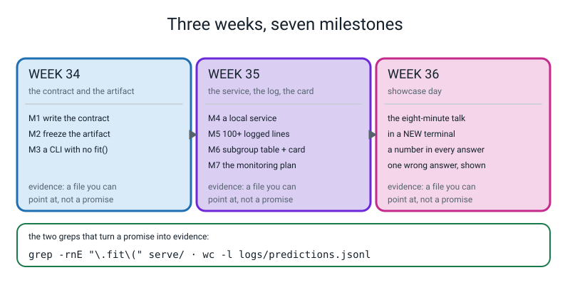
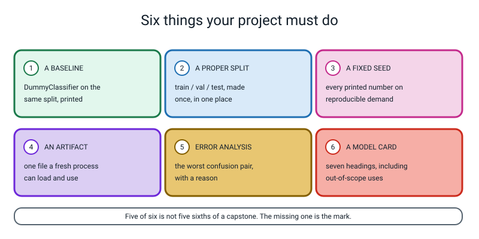
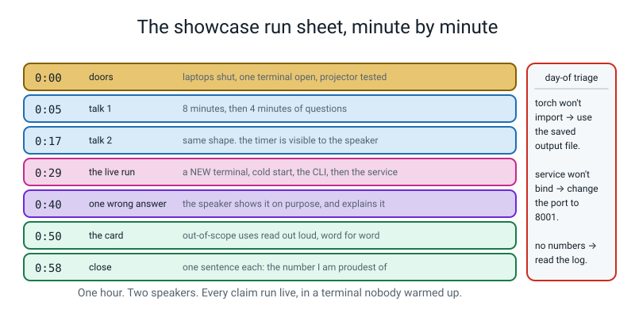

# 🎪 The Level 3 Capstone — Ship It

### *Weeks 34, 35 and 36. Three weeks. One model that already works, turned into something a stranger can run, trust and monitor — without ever speaking to you.*

[⬅ Fifty project ideas](project-ideas.md) · [⬅ The worked example](worked-example-project.md) · [Course home](../README.md) · [Assessments](../assessments/README.md) · [The reference module](../../capstone.md)

---

> ### In one sentence
>
> **The capstone is not "build a model". You already built one. The capstone is the last mile: an artifact,
> a contract, a service, a log, a card, and a number you can defend in front of a room.**

---

## 🧑‍🏫 Teacher: what you actually have to do

**You do not need to know Python, HTTP or PyTorch to run these three weeks.** Here is your whole job.

| Week | Your job, in one line | Time it costs you |
|:--:|---|---|
| **34** | Hand out the scaffold. Run the timer. **Do not touch their keyboard.** | 15 min prep |
| **35** | Same, plus: be the person who sends their service rubbish | 20 min prep |
| **36** | Ask the eight questions in a flat voice, in the same order, to everybody | 45 min prep, spread over the week before |

**Three things that matter more than anything technical:**

1. **The milestones are gates, not suggestions.** A student who starts the service in Week 35 without a
   working `predict.py` from Week 34 will lose the whole of Week 35 to plumbing. If Milestone 3 is not
   done, do Milestone 3.
2. **Everything is evidence, not a promise.** *"My serving code has no training in it"* is a promise.
   `grep -rnE "\.fit\(" serve/` printing nothing is evidence. Every milestone below ends in something you
   can point at.
3. **The showcase is a cross-examination, not applause.** It is the most valuable twenty minutes of the
   year and it only works if you ask the questions flatly and **do not rescue anybody.** More on that in
   the run sheet.



*Figure C.1 — Three weeks, seven milestones. Milestones 1–3 in Week 34, 4–7 in Week 35, and Week 36 is the showcase. Each week ends in files you can point at, and the two greps at the bottom are what turn a promise into evidence.*

---

# 🪝 The Brief

```
   ┌─────────────────────────────────────────────────────────────────────┐
   │                                                                     │
   │   THE ONE-SENTENCE BRIEF                                            │
   │                                                                     │
   │   Take the best model you already have and turn it into something    │
   │   a stranger can run, trust and monitor — without ever speaking      │
   │   to you.                                                           │
   │                                                                     │
   └─────────────────────────────────────────────────────────────────────┘
```

Here is the moment this capstone is about. It is nine o'clock at night. Your thing has been running for
three weeks. Somebody messages you:

> *"It said this comment was positive and it obviously isn't."*

**Can you answer them?** Only if you can say:

- **which version** of your model produced that answer,
- **exactly what** was sent in,
- **what probability** came back, and against **which threshold**,
- **how long** it took,
- and whether that input **looks like the data you trained on**.

Every one of those five is a decision you make *before* the message arrives. That is the whole capstone,
and none of it is about making the model better.

## 🚦 Choosing what to ship

You have two candidates. **Pick one. You are not shipping both.**

| | **Path A — the text classifier (Week 33)** | **Path B — the image classifier (Week 26)** |
|---|---|---|
| The artifact | one `.joblib` holding `TfidfVectorizer` → `LogisticRegression` | a `.pt` `state_dict` **plus** a shared `model_def.py` |
| Input over HTTP | a JSON string. Trivial | an image. You must decide how to encode it |
| Artifact size | about **3 KB** | about 10 KB for the Week 26 CNN |
| Cold start | under a second | 1–2 seconds, mostly importing torch |
| Per prediction | well under a millisecond | a few milliseconds on CPU |
| Subgroups are easy on | review length, negation present, topic | per-digit recall, ink total, which pair |
| The hardest part | **nothing technical.** The discipline is the work | encoding images in JSON, which teaches you nothing about shipping |
| **Recommended for** | **most people** ✅ | you, if Week 26 was your favourite week of the year |

> **🔑 Strong recommendation: Path A.** Not because it scores better — the rubric is identical — but
> because the **engineering is the lesson**, and Path B spends two of your hours on image-encoding
> plumbing. Path A lets you spend those two hours on the monitoring plan, which is the part nobody ever
> does.
>
> Everything below works for both. Where they differ there is a **🅑 Path B** note.

## The four rules that apply to both paths

```
   RULE 1 — THE FRESH PROCESS RULE
   Your serving code imports NOTHING from your training code.
   Evidence:  grep -rnE "\.fit\(|train_test_split|optimizer" serve/ predict.py
              must print NOTHING AT ALL.

   RULE 2 — THE ONE-PREDICTOR RULE
   There is exactly ONE place in the folder where a prediction happens.
   The CLI calls it. The service calls it. Nothing else may.

   RULE 3 — THE VERSION RULE
   Every artifact has a version in its filename, and every prediction you
   return OR log carries that version string.

   RULE 4 — THE NO-SILENT-CRASH RULE
   Send your service garbage — empty body, wrong field, invalid JSON, a
   number where a string belongs — and it must return a clear 400, stay
   alive, and answer the next request.
```

---

# ✅ Your Project Must Do These Six Things



*Figure C.2 — Six things your project must do. Five of six is not five sixths of a capstone; the missing one is the mark.*

| # | It must have | What "done" looks like, exactly |
|:--:|---|---|
| **1** | **A baseline** | `DummyClassifier(strategy="most_frequent")` — or whatever the equivalent dumb rule is — **fitted on your training rows and scored on your held-out rows**, with the number printed in the same run as your model's number. `0.5000` next to `0.8125` |
| **2** | **A proper split** | Three piles — train, validation, test — made **once**, in **one place**, with `stratify=`. The validation pile chooses your threshold. The test pile is opened **once**, at the end, and never again |
| **3** | **A reproducible seed** | `SEED = 0` at the top, used in every split, every shuffle and every model. `python3 run.py` twice into two folders gives byte-identical output files |
| **4** | **One artifact a fresh process can load** | Three files — the model, a `VERSION`, and a `.json` of metadata — and a `predict.py` in a **cold terminal** that loads them and answers. Rule 1's grep prints nothing |
| **5** | **An honest error analysis** | The worst **subgroup** with its `n`, the worst **confusion** with its counts, and a **mechanism** — not "it gets confused". Plus a set of hard cases you wrote **on purpose** and the score on them |
| **6** | **A model card** | Seven headings, all filled. **Out-of-scope uses** names a misuse somebody would actually attempt, and says plainly why the model must not be used that way |

> **⚠️ Watch out — the two that get skipped.** Almost everybody does 2, 3, 4 and 6, because they are
> mechanical. **1 and 5 are the ones that get left out**, and they are the two the rubric weights most
> heavily. Write the baseline number down on day one, before you write any serving code, and you cannot
> forget it.

---

# 📝 The Planning Worksheet

**Print this. Fill it in with a pen, in Week 34, before you type anything.** Twenty minutes. It is the
single highest-value twenty minutes of the three weeks, and the students who skip it lose the time back
twice over in Week 35.

```
   ┌──────────────────────────────────────────────────────────────────────────┐
   │  CAPSTONE PLANNING WORKSHEET · fill this in with a PEN                    │
   │                                                                          │
   │  Name ____________________________   Date ____________                    │
   │                                                                          │
   │  ── WHAT I AM SHIPPING ─────────────────────────────────────────────────  │
   │  Path (circle one):     A  text        B  images                          │
   │  Which model:  __________________________________________________         │
   │  Which week it came from:  ______                                         │
   │  Where its training code lives:  _______________________________          │
   │                                                                          │
   │  ── BOX 1 · WHAT ONE PREDICTION IS ABOUT ───────────────────────────────  │
   │  One prediction is about ONE ______________________________________       │
   │  It is NOT about one ______________________, because ______________       │
   │  ______________________________________________________________           │
   │                                                                          │
   │  ── BOX 2 · INPUT ──────────────────────────────────────────────────────  │
   │  Field name: __________   Type: __________   Limit: __________            │
   │  What happens if it is empty: ____________________________________        │
   │                                                                          │
   │  ── BOX 3 · OUTPUT · five fields, and the SAME five everywhere ─────────  │
   │  ____________  ____________  ____________  ____________  ____________     │
   │  (the tool prints these, the service returns these, the log records       │
   │   these. ONE list, or you will never be able to join them up.)            │
   │                                                                          │
   │  ── BOX 4 · THE TWO ERRORS, IN THE LANGUAGE OF THE APPLICATION ─────────  │
   │  A FALSE POSITIVE is: ____________________________________________        │
   │     and what actually happens is: ________________________________        │
   │  A FALSE NEGATIVE is: ____________________________________________        │
   │     and what actually happens is: ________________________________        │
   │  Relative prices (one of them is 1):  FN = ______   FP = ______           │
   │  I chose those prices by  ☐ measurement   ☐ judgement  ← be honest        │
   │                                                                          │
   │  ── BOX 5 · THE THRESHOLD, AS A SUM ────────────────────────────────────  │
   │  cost = ______ x FN  +  ______ x FP                                       │
   │  Sweep it on the VALIDATION pile. Fill this in AFTER you have run it:     │
   │     t = ______  cost = ______      t = ______  cost = ______              │
   │     t = ______  cost = ______      t = ______  cost = ______              │
   │  THE WINNER: t = ______ , at a cost of ______                             │
   │  Its accuracy: ______   and the accuracy at 0.50: ______                  │
   │  If those two differ, write the sentence: ________________________        │
   │  ______________________________________________________________           │
   │                                                                          │
   │  ── BOX 6 · NEVER USED FOR ─────────────────────────────────────────────  │
   │  ✗ ______________________________________________________________         │
   │  ✗ ______________________________________________________________         │
   │  The sentence that goes in the card: ______________________________       │
   │  ______________________________________________________________           │
   │                                                                          │
   │  ── THE BASELINE, WRITTEN DOWN ON DAY ONE ──────────────────────────────  │
   │  The dumb rule is: ______________________________________________         │
   │  It scores ______ on ______ held-out rows.                                │
   │  One held-out row is worth 1 / ______ = ______                             │
   │  So my score cannot move in steps smaller than ______                      │
   │                                                                          │
   │  ── THE MONITORING NUMBER · computable with NO LABELS ──────────────────  │
   │  The number: ____________________________________________________         │
   │  How I measure it: ______________________________________________         │
   │  Its baseline on my own traffic: ______                                   │
   │  The alarm level: ______   What I would DO: ______________________        │
   │                                                                          │
   └──────────────────────────────────────────────────────────────────────────┘
```

> **🧑‍🏫 The two lines on this sheet that do the most work.** *"I chose those prices by judgement"* — a
> student who ticks that box honestly has understood something most adults would fudge. And *"my score
> cannot move in steps smaller than ______"* — once that number is written down, nobody in the room
> quotes four decimal places again.

---

# 📁 The Scaffold

Build this in Milestone 1. **Every file has exactly one job**, and the two folders are what make Rule 1
checkable with a grep.

```
   ship/
   ├── README.md                    ← how to run it. Milestone 7
   ├── MODEL_CARD.md                ← seven headings. Milestone 6
   ├── MONITORING.md                ← one page. Milestone 7
   ├── CONTRACT.md                  ← the six boxes. Milestone 1
   │
   ├── model/                       ← TRAINING LIVES HERE AND NOWHERE ELSE
   │   ├── reviews.py               ← the corpus, typed by hand
   │   └── train.py                 ← fits, prices the threshold, freezes
   │
   ├── artifacts/                   ← the output of training. Never edited by hand
   │   ├── sentiment_v1.joblib      ← ~3 KB
   │   ├── sentiment_v1.json        ← the metadata, including the threshold
   │   └── VERSION                  ← 3 bytes. Says "v1"
   │
   ├── serve/                       ← NO TRAINING CODE. EVER. The grep proves it
   │   ├── predictor.py             ← THE one place a prediction happens
   │   └── service.py               ← HTTP, four checks, standard library only
   │
   ├── logs/
   │   └── predictions.jsonl        ← one JSON object per PREDICTION
   │
   ├── predict.py                   ← the CLI
   ├── tests.py                     ← three golden cases
   ├── break_it.py                  ← sends the four malformed requests
   ├── load.py                      ← sends 100+ good ones so there is a log
   ├── read_logs.py                 ← reads the log as a data file
   └── subgroup_report.py           ← the table with n on every row
```

**🅑 Path B:** add `model/model_def.py` holding the `nn.Module` class, and have **both** `train.py` and
`serve/predictor.py` import it. The class definition lives in one file; the weights live in
`artifacts/digits_v1.pt`. Do not `torch.save(model, ...)` — save the `state_dict`, or your artifact
contains a reference to your file layout and breaks the day you rename something.

---

# 📅 WEEK 34 — The Contract and the Artifact

*Three milestones. By the end of this week a stranger can score one comment from a cold terminal.*

## ☐ Milestone 1 — The contract, in silence (45 min, in class)

Fill in the planning worksheet, then copy it into `CONTRACT.md`. **Template:**

```markdown
# Prediction contract — comment sentiment

## 1. What one prediction is about
One prediction is about **one comment, written by one person, at one time.**
It is **not** about one person — the moment I say that, I have promised the model
is consistent about people, and it has never seen a person. It has seen strings.

## 2. Input
| field | type | limit |
|---|---|---|
| `text` | a non-empty string | 100,000 bytes |

Empty, missing, or not a string → `400`, with an example of what to send instead.

## 3. Output — five fields, and the SAME five everywhere
`label` · `probability` · `threshold` · `model_version` · `latency_ms`

The CLI prints these five. The service returns these five. The log records these five.
One vocabulary. If the tool says `POSITIVE` and the log says `1`, they cannot be joined up.

## 4. The two errors, in the language of the application
- **False positive** — a genuinely nasty comment called positive. *Nobody reads it.*
- **False negative** — a perfectly fine comment called negative. *A prefect reads it
  for nothing, about ten seconds.*

Relative prices: **FN = 10, FP = 1.** I chose those by **judgement, not measurement**,
and that sentence belongs in the card.

## 5. The threshold
`cost = 10 × FN + 1 × FP`, swept on the **validation** pile. See `model/train.py`.
The winner is **t = 0.45**, at a cost of **1**.

## 6. This model must NEVER be used for
- ✗ deciding who gets banned or muted
- ✗ marking anybody's schoolwork

**This model outputs a suggestion, not a decision.**
```

**Evidence this milestone is done:** `CONTRACT.md` exists, all six boxes are filled, and box 5's winner
came out of a **sum you can point at** rather than a number you liked.

---

## ☐ Milestone 2 — Freeze the artifact (75 min)

`model/train.py` does four things and then stops: split three ways, fit, **price the threshold on the
validation pile**, and write three files.

**Template — this one runs as written, in about one second:**

```python
"""train.py -- fit, price the threshold, freeze the artifact. Nothing else."""
import argparse, json, sys
from pathlib import Path

import joblib
import numpy as np
from sklearn.feature_extraction.text import TfidfVectorizer
from sklearn.linear_model import LogisticRegression
from sklearn.metrics import confusion_matrix
from sklearn.model_selection import train_test_split
from sklearn.pipeline import make_pipeline

sys.path.insert(0, str(Path(__file__).resolve().parent))
from reviews import DOCS, LABELS

SEED = 0
COST_FN = 10      # a real complaint called positive: nobody reads it
COST_FP = 1       # a fine comment called negative: a prefect reads it for nothing

ap = argparse.ArgumentParser()
ap.add_argument("--version", default="1")
args = ap.parse_args()

d_tr, d_hold, y_tr, y_hold = train_test_split(DOCS, LABELS, test_size=0.40,
                                              stratify=LABELS, random_state=SEED)
d_val, d_te, y_val, y_te = train_test_split(d_hold, y_hold, test_size=0.50,
                                            stratify=y_hold, random_state=SEED)
print("train %d   validation %d   test %d" % (len(y_tr), len(y_val), len(y_te)))

pipe = make_pipeline(TfidfVectorizer(), LogisticRegression(max_iter=1000))
pipe.fit(d_tr, y_tr)
vocab = pipe.named_steps["tfidfvectorizer"].get_feature_names_out()
print("vocabulary learned from the %d training reviews: %d words" % (len(d_tr), len(vocab)))

# ---- BOX 5: the threshold is a COST SUM on the VALIDATION rows ------------
prob_val = pipe.predict_proba(d_val)[:, 1]
print()
print("  t     FN   FP   cost = %d x FN + %d x FP    accuracy" % (COST_FN, COST_FP))
best = None
for t in [0.35, 0.45, 0.50, 0.55, 0.65, 0.75]:
    pred = (prob_val >= t).astype(int)
    tn, fp, fn, tp = confusion_matrix(y_val, pred, labels=[0, 1]).ravel()
    cost = COST_FN * fn + COST_FP * fp
    acc = (tn + tp) / len(y_val)
    print("%.2f   %3d  %3d   %4d                       %.4f" % (t, fn, fp, cost, acc))
    if best is None or cost < best[1]:
        best = (t, cost)
THRESHOLD = best[0]
print("the price list chooses t = %.2f, at a cost of %d" % best)

# ---- the held-out number, opened once ------------------------------------
prob_te = pipe.predict_proba(d_te)[:, 1]
pred_te = (prob_te >= THRESHOLD).astype(int)
tn, fp, fn, tp = confusion_matrix(y_te, pred_te, labels=[0, 1]).ravel()
print()
print("HELD-OUT TEST, opened once, n = %d" % len(y_te))
print("  TN %d  FP %d  FN %d  TP %d   accuracy %.4f"
      % (tn, fp, fn, tp, (tn + tp) / len(y_te)))
print("  baseline, always the most frequent class: %.4f"
      % (max(np.bincount(y_te)) / len(y_te)))
print("  one held-out row is worth 1 / %d = %.4f" % (len(y_te), 1 / len(y_te)))

# ---- freeze: three files, one of them tiny -------------------------------
out = Path(__file__).resolve().parent.parent / "artifacts"
out.mkdir(parents=True, exist_ok=True)
joblib.dump(pipe, out / ("sentiment_v%s.joblib" % args.version))
(out / "VERSION").write_text("v%s\n" % args.version)
meta = {"version": "v%s" % args.version, "threshold": THRESHOLD, "seed": SEED,
        "train_rows": len(y_tr), "val_rows": len(y_val), "test_rows": len(y_te),
        "vocabulary": int(len(vocab)), "cost_fn": COST_FN, "cost_fp": COST_FP,
        "test_accuracy": round((tn + tp) / len(y_te), 4)}
(out / ("sentiment_v%s.json" % args.version)).write_text(json.dumps(meta, indent=2) + "\n")
print()
print("wrote:", sorted(p.name for p in out.iterdir()))
print("VERSION file is %d bytes" % (out / "VERSION").stat().st_size)
```

**The real output, from the reference build — 80 hand-typed reviews, seed 0:**

```text
train 48   validation 16   test 16
vocabulary learned from the 48 training reviews: 66 words

  t     FN   FP   cost = 10 x FN + 1 x FP    accuracy
0.35     0    5      5                       0.6875
0.45     0    1      1                       0.9375
0.50     1    0     10                       0.9375
0.55     3    0     30                       0.8125
0.65     8    0     80                       0.5000
0.75     8    0     80                       0.5000
the price list chooses t = 0.45, at a cost of 1

HELD-OUT TEST, opened once, n = 16
  TN 5  FP 3  FN 0  TP 8   accuracy 0.8125
  baseline, always the most frequent class: 0.5000
  one held-out row is worth 1 / 16 = 0.0625

wrote: ['VERSION', 'sentiment_v1.joblib', 'sentiment_v1.json']
VERSION file is 3 bytes
```

> **🔢 The maths, slowly:** look at the two rows `0.45` and `0.50`. **They have the same accuracy,
> `0.9375`** — and one of them costs **1** and the other costs **10**.
>
> ```
> at t = 0.45 :  cost = 10 × 0 + 1 × 1 = 0 + 1 = 1
> at t = 0.50 :  cost = 10 × 1 + 1 × 0 = 10 + 0 = 10
> ```
>
> Accuracy cannot tell those two apart, because accuracy prices both errors at 1. **You wrote down that
> they are not both worth 1.** So use the number that knows that. This is Week 11's whole lesson arriving
> in a real decision, and it is worth saying out loud in the showcase.

**And the honesty on the last three lines.** The held-out accuracy is `0.8125` against a baseline of
`0.5000` — so the model buys **31 percentage points**, which on 16 rows is **5 reviews**. And one row is
worth `0.0625`, so `0.8125` should be spoken as *"13 of 16"*, not as *"81.25%"*.

**Evidence this milestone is done:** `artifacts/` contains three files, the threshold came out of the cost
table, and the baseline is printed in the same run.

**🅑 Path B:** save `model.state_dict()` to `artifacts/digits_v1.pt`, keep the class in
`model/model_def.py`, and put the epochs, batch size and steps-per-epoch in the `.json`.

---

## ☐ Milestone 3 — One predictor, one CLI, three golden tests (75 min)

**`serve/predictor.py` — the one place a prediction happens.** Rule 2 in one file.

```python
"""predictor.py -- THE ONE PLACE A PREDICTION HAPPENS.
The CLI calls this. The service calls this. Nothing else may.
Nothing is ever fitted in this file, and the grep in the checklist proves it.
"""
import json
import re
import time
from pathlib import Path

import joblib

ART = Path(__file__).resolve().parent.parent / "artifacts"


class Predictor:
    def __init__(self, version=None):
        t0 = time.perf_counter()
        self.version = version or ART.joinpath("VERSION").read_text().strip()
        meta = json.loads(ART.joinpath("sentiment_%s.json" % self.version).read_text())
        self.threshold = meta["threshold"]
        self.pipe = joblib.load(ART / ("sentiment_%s.joblib" % self.version))
        self.vocab = set(self.pipe.named_steps["tfidfvectorizer"].get_feature_names_out())
        self.load_ms = (time.perf_counter() - t0) * 1000

    def oov_rate(self, text):
        """The share of an input's tokens the vectorizer has never seen."""
        toks = re.findall(r"\b\w\w+\b", text.lower())
        if not toks:
            return 1.0
        return sum(t not in self.vocab for t in toks) / len(toks)

    def predict(self, text):
        t0 = time.perf_counter()
        prob = float(self.pipe.predict_proba([text])[0, 1])
        return {
            "label": "positive" if prob >= self.threshold else "negative",
            "probability": round(prob, 4),
            "threshold": self.threshold,
            "model_version": self.version,
            "oov_rate": round(self.oov_rate(text), 4),
            "latency_ms": round((time.perf_counter() - t0) * 1000, 3),
        }
```

**`predict.py` — the CLI. Two stopwatches, never added together.**

```python
"""predict.py -- the CLI. Zero training code. Run it from a cold terminal."""
import argparse
import json
import sys
from pathlib import Path

sys.path.insert(0, str(Path(__file__).resolve().parent / "serve"))
from predictor import Predictor

ap = argparse.ArgumentParser(description="Score one comment.")
ap.add_argument("text", help="the comment, in quotes")
ap.add_argument("--json", action="store_true", help="print raw JSON")
args = ap.parse_args()

p = Predictor()
out = p.predict(args.text)
if args.json:
    print(json.dumps(out))
else:
    print("model      : %s   threshold %.2f" % (out["model_version"], out["threshold"]))
    print("cold start : %.1f ms  (once)" % p.load_ms)
    print("prediction : %-8s  probability %.4f  (%.3f ms)"
          % (out["label"], out["probability"], out["latency_ms"]))
    print("unseen words: %.4f of the tokens" % out["oov_rate"])
```

```text
model      : v1   threshold 0.45
cold start : 645.1 ms  (once)
prediction : negative  probability 0.2918  (0.444 ms)
unseen words: 0.0000 of the tokens
```

> **⚠️ Watch out — the two timings are different kinds of thing and must never be added.** `645.1 ms` is
> the cost of loading the model, paid **once**, at start-up. `0.444 ms` is the cost of one prediction,
> paid **every time**. Anybody who reports a single number has hidden one of them. *(Your `645.1` will be
> different from mine — it depends on the machine, and saying so out loud is worth a mark in the
> showcase.)*

**`tests.py` — three golden cases, chosen by their DISTANCE from the threshold.**

```python
"""tests.py -- three golden cases. Chosen by their DISTANCE from the threshold."""
import sys
from pathlib import Path

sys.path.insert(0, str(Path(__file__).resolve().parent / "serve"))
from predictor import Predictor

CASES = [
    ("the pizza was hot and the staff were lovely", "positive"),
    ("cold food and a rude driver",                 "negative"),
    ("stale greasy and awful",                      "negative"),
]

p = Predictor()
fails = 0
print("threshold %.2f" % p.threshold)
for text, want in CASES:
    got = p.predict(text)
    margin = abs(got["probability"] - p.threshold)
    ok = got["label"] == want
    fails += not ok
    print("%-4s  %-8s want %-8s  p=%.4f  margin %.4f  %s"
          % ("PASS" if ok else "FAIL", got["label"], want,
             got["probability"], margin, text))
print("%d of %d passed" % (len(CASES) - fails, len(CASES)))
sys.exit(1 if fails else 0)
```

```text
threshold 0.45
PASS  positive want positive  p=0.6305  margin 0.1805  the pizza was hot and the staff were lovely
PASS  negative want negative  p=0.2918  margin 0.1582  cold food and a rude driver
PASS  negative want negative  p=0.2532  margin 0.1968  stale greasy and awful
3 of 3 passed
```

> **💡 Why the `margin` column is there, and it is the point of the whole file.** A golden test is only
> useful if it will **stay** passing. `0.2532` against a threshold of `0.45` has a margin of `0.1968` —
> comfortably clear, so it tells you something real if it ever fails. A case at `0.4501` against `0.45`
> has a margin of `0.0001`, and it will flip on the next retrain for no reason at all. **Pick golden
> tests by their distance from the fence, not by how interesting the sentence is.**

**Evidence Week 34 is done — three things you can point at:**

```bash
grep -rnE "\.fit\(|train_test_split|optimizer" serve/ predict.py tests.py    # prints NOTHING
python3 tests.py ; echo $?                                                    # "3 of 3 passed", then 0
python3 predict.py "cold food and a rude driver"                              # works in a NEW terminal
```

> **🐞 If the grep finds something and you cannot see why**, check your **comments**. The reference
> `predictor.py` originally had the words "there is no `.fit(` in this file" in its docstring, and the
> grep dutifully found them. That is the checker doing its job on the letter rather than the spirit, and
> the fix is to reword the comment, not to weaken the grep.

---

# 📅 WEEK 35 — The Service, the Log, and the Card

*Four milestones. By the end of this week somebody else can send your model rubbish, it survives, and you
can read the log afterwards and say what is going wrong.*

## ☐ Milestone 4 — ⚠️ The service, with four checks in order (90 min) — *the hardest milestone*

**The design is one sentence: the model is not touched until all four checks pass.**

| # | Check | Why it must come first | What you return |
|:--:|---|---|---|
| **1** | Is there a body, and is its length sane? | You cannot read a body without knowing how many bytes | `400 empty body` · `413 body too large` |
| **2** | Is it valid JSON? | You cannot look for a field inside something that is not an object | `400` + the parser's own message |
| **3** | Is it an object with a `text` field? | You cannot check a field's type before knowing it exists | `400` + **a worked example** |
| **4** | Is `text` a non-empty string? | The model will do something strange with a number, silently | `400` naming the type it got |

**Template — standard library only, no `flask`, nothing to install:**

```python
"""service.py -- standard library only. 127.0.0.1 because there is no auth.
FOUR CHECKS, IN ORDER. The model is not touched until all four pass.
"""
import json
import logging
import sys
from http.server import BaseHTTPRequestHandler, HTTPServer
from pathlib import Path

sys.path.insert(0, str(Path(__file__).resolve().parent))
from predictor import Predictor

MAX_BYTES = 100_000
LOGDIR = Path(__file__).resolve().parent.parent / "logs"
LOGDIR.mkdir(parents=True, exist_ok=True)
logging.basicConfig(filename=LOGDIR / "predictions.jsonl",
                    level=logging.INFO, format="%(message)s")

PRED = Predictor()
EXAMPLE = {"text": "the pizza was hot"}


class Handler(BaseHTTPRequestHandler):
    def _send(self, code, payload):
        body = json.dumps(payload).encode()
        self.send_response(code)
        self.send_header("Content-Type", "application/json")
        self.send_header("Content-Length", str(len(body)))
        self.end_headers()
        self.wfile.write(body)

    def log_message(self, *a):
        pass                            # keep the terminal clean

    def do_GET(self):
        if self.path == "/health":
            self._send(200, {"ok": True, "model_version": PRED.version,
                             "threshold": PRED.threshold})
        else:
            self._send(404, {"error": "try GET /health or POST /predict"})

    def do_POST(self):
        if self.path != "/predict":
            return self._send(404, {"error": "try POST /predict"})

        # CHECK 1 -- is there a body, and is its length sane?
        n = int(self.headers.get("Content-Length") or 0)
        if n == 0:
            return self._send(400, {"error": "empty body", "example": EXAMPLE})
        if n > MAX_BYTES:
            return self._send(413, {"error": "body too large",
                                    "limit_bytes": MAX_BYTES, "got_bytes": n})
        raw = self.rfile.read(n)

        # CHECK 2 -- is it valid JSON?
        try:
            data = json.loads(raw)
        except json.JSONDecodeError as e:
            return self._send(400, {"error": "invalid JSON: %s" % e.msg,
                                    "example": EXAMPLE})

        # CHECK 3 -- is it an object with a text field?
        if not isinstance(data, dict) or "text" not in data:
            return self._send(400, {"error": "expected a JSON object with a 'text' field",
                                    "example": EXAMPLE})

        # CHECK 4 -- is text a non-empty string?
        if not isinstance(data["text"], str) or not data["text"].strip():
            return self._send(400, {"error": "'text' must be a non-empty string",
                                    "got_type": type(data["text"]).__name__,
                                    "example": EXAMPLE})

        # ONLY NOW is the model touched.
        out = PRED.predict(data["text"])
        logging.info(json.dumps({"text": data["text"], **out}))
        self._send(200, out)


if __name__ == "__main__":
    print("model %s loaded in %.1f ms, threshold %.2f"
          % (PRED.version, PRED.load_ms, PRED.threshold))
    print("listening on http://127.0.0.1:8000  (127.0.0.1: no auth, no rate limit)")
    HTTPServer(("127.0.0.1", 8000), Handler).serve_forever()
```

**`break_it.py` — the four attacks, then the fifth request that is the actual test:**

```python
"""break_it.py -- four kinds of rubbish, then check it is still alive."""
import json
import urllib.error
import urllib.request

URL = "http://127.0.0.1:8000/predict"
ATTACKS = [
    ("empty body",          b""),
    ("not JSON",            b"{oops"),
    ("no text field",       json.dumps({"txt": "hello"}).encode()),
    ("text is a number",    json.dumps({"text": 42}).encode()),
]
for name, body in ATTACKS:
    req = urllib.request.Request(URL, data=body, method="POST",
                                 headers={"Content-Type": "application/json"})
    try:
        with urllib.request.urlopen(req) as r:
            print("%-18s %d  %s" % (name, r.status, r.read().decode()))
    except urllib.error.HTTPError as e:
        print("%-18s %d  %s" % (name, e.code, e.read().decode()))

with urllib.request.urlopen("http://127.0.0.1:8000/health") as r:
    print("%-18s %d  %s" % ("GET /health after", r.status, r.read().decode()))
```

**The real output, from the reference build:**

```text
empty body         400  {"error": "empty body", "example": {"text": "the pizza was hot"}}
not JSON           400  {"error": "invalid JSON: Expecting property name enclosed in double quotes", "example": {"text": "the pizza was hot"}}
no text field      400  {"error": "expected a JSON object with a 'text' field", "example": {"text": "the pizza was hot"}}
text is a number   400  {"error": "'text' must be a non-empty string", "got_type": "int", "example": {"text": "the pizza was hot"}}
GET /health after  200  {"ok": true, "model_version": "v1", "threshold": 0.45}
```

**Four refusals, zero crashes, and the service answered a fifth time.** That last line is the whole test —
anybody can return a `400`; the thing being measured is that the process is **still there**.

> **💡 Try this — the easiest marks in the whole capstone, and almost nobody takes them.** Look at every
> error message above: each one contains `"example"`. `{"error": "bad input"}` is useless to the person on
> the other end. `{"error": "expected a JSON object with a 'text' field", "example": {"text": "the pizza
> was hot"}}` can be acted on **without asking you anything.** That is one extra key in a dict.

> **🧑‍🏫 If a student asks why `127.0.0.1` and not `0.0.0.0`** — because there is **no authentication and
> no rate limit**. `0.0.0.0` means "anyone on this network may send me anything as often as they like",
> and this service has nothing whatsoever to stop them. The string is not the answer; the reason is.

---

## ☐ Milestone 5 — Generate a log, then read it as data (60 min)

**`load.py` — send 100+ real requests, plus four deliberately strange ones:**

```python
"""load.py -- send 120 real comments so there is a log to read."""
import json
import sys
import urllib.request
from pathlib import Path

sys.path.insert(0, str(Path(__file__).resolve().parent / "model"))
from reviews import DOCS

URL = "http://127.0.0.1:8000/predict"
EXTRA = ["the biryani was absolutely banging fam no cap",
         "lorem ipsum dolor sit amet",
         "it was fine i suppose",
         "not cold not rude"]
sent = 0
for text in (DOCS + EXTRA + DOCS[:36]):
    req = urllib.request.Request(URL, data=json.dumps({"text": text}).encode(),
                                 method="POST",
                                 headers={"Content-Type": "application/json"})
    with urllib.request.urlopen(req) as r:
        r.read()
    sent += 1
print("sent %d good requests" % sent)
```

**One log line looks like this** — six fields, because the contract promised five outputs plus the input.
*(This is the slowest request of the 120, which is why its `latency_ms` is the `max` that
`read_logs.py` reports below.)*

```text
{"text": "the pizza was hot and the crust was crisp", "label": "positive", "probability": 0.5987, "threshold": 0.45, "model_version": "v1", "oov_rate": 0.0, "latency_ms": 0.49}
```

**`read_logs.py` — the log is a DATA FILE. Read it like one.**

```python
"""read_logs.py -- the log is a DATA FILE. Read it like one."""
import json
from collections import Counter
from pathlib import Path

import numpy as np

lines = [json.loads(l) for l in
         open(Path(__file__).resolve().parent / "logs" / "predictions.jsonl")]
lat = np.array([r["latency_ms"] for r in lines])
prob = np.array([r["probability"] for r in lines])
oov = np.array([r["oov_rate"] for r in lines])

print("log lines (= PREDICTIONS, not requests) :", len(lines))
print("model versions seen                     :", dict(Counter(r["model_version"] for r in lines)))
print("labels                                  :", dict(Counter(r["label"] for r in lines)))
print()
print("LATENCY, per request, in milliseconds")
print("  median %.3f   mean %.3f   p95 %.3f   max %.3f"
      % (np.median(lat), lat.mean(), np.percentile(lat, 95), lat.max()))
print("  (the p95 is over %d requests, so it cannot see the max. Print both.)" % len(lat))
print()
print("THE MONITORING NUMBER -- computable with NO LABELS")
band = ((prob >= 0.35) & (prob <= 0.55)).sum()
print("  uncertainty band 0.35-0.55 : %d of %d = %.1f%%"
      % (band, len(prob), 100 * band / len(prob)))
print("  out-of-vocabulary rate     : mean %.4f   max %.4f" % (oov.mean(), oov.max()))
print()
print("the three inputs with the most unseen words:")
for r in sorted(lines, key=lambda r: -r["oov_rate"])[:3]:
    print("  %.4f  %s" % (r["oov_rate"], r["text"]))
```

**The real output from the reference build's log** *(your latencies will differ — they belong to your
machine, not to your code):*

```text
log lines (= PREDICTIONS, not requests) : 120
model versions seen                     : {'v1': 120}
labels                                  : {'positive': 83, 'negative': 37}

LATENCY, per request, in milliseconds
  median 0.158   mean 0.167   p95 0.214   max 0.490
  (the p95 is over 120 requests, so it cannot see the max. Print both.)

THE MONITORING NUMBER -- computable with NO LABELS
  uncertainty band 0.35-0.55 : 32 of 120 = 26.7%
  out-of-vocabulary rate     : mean 0.0474   max 1.0000

the three inputs with the most unseen words:
  1.0000  lorem ipsum dolor sit amet
  0.7500  the biryani was absolutely banging fam no cap
  0.5000  it was fine i suppose
```

**Four things in that output you must be able to say out loud in the showcase:**

1. **`120` log lines, and `125` requests were sent** — 120 good ones, plus `break_it.py`'s four refusals
   and one `/health`. **The log counts predictions, not requests**, and the gap is the four malformed ones
   that never reached the model. Nothing was lost; four things were **refused**.
2. **`median 0.158` against `mean 0.167`** — the mean is higher because one request took `0.490`. That is
   why latency is reported as percentiles and a maximum, and never as an average.
3. **`p95 0.214` with a `max 0.490`.** With 120 requests the p95 lands between the 114th and 115th value,
   so it **cannot see** the slowest one. The max is the number that describes the person who complains.
4. **`oov_rate 1.0000` for `lorem ipsum dolor sit amet`** — every single token is one the vectorizer has
   never seen, so the model saw an **empty row** and answered from its bias alone. That is the monitoring
   number earning its place, on real traffic, with no labels anywhere.

---

## ☐ Milestone 6 — Subgroup metrics and the model card (75 min)

**One number hides two. Every row carries its `n`.**

```python
"""subgroup_report.py -- one number hides two. Every row carries its n."""
import sys
from pathlib import Path

import numpy as np
from sklearn.metrics import confusion_matrix
from sklearn.model_selection import train_test_split

sys.path.insert(0, str(Path(__file__).resolve().parent / "model"))
sys.path.insert(0, str(Path(__file__).resolve().parent / "serve"))
from predictor import Predictor
from reviews import DOCS, LABELS

SEED = 0
d_tr, d_hold, y_tr, y_hold = train_test_split(DOCS, LABELS, test_size=0.40,
                                              stratify=LABELS, random_state=SEED)
d_val, d_te, y_val, y_te = train_test_split(d_hold, y_hold, test_size=0.50,
                                            stratify=y_hold, random_state=SEED)
p = Predictor()
pred = np.array([1 if p.predict(t)["label"] == "positive" else 0 for t in d_te])
y_te = np.array(y_te)
lens = np.array([len(t.split()) for t in d_te])


def row(name, mask):
    if mask.sum() == 0:
        print("%-22s n =  0   --      --      --" % name)
        return
    tn, fp, fn, tp = confusion_matrix(y_te[mask], pred[mask], labels=[0, 1]).ravel()
    acc = (tn + tp) / mask.sum()
    rec = "%d of %d" % (tp, tp + fn) if (tp + fn) else "  n/a  "
    prc = "%.3f" % (tp / (tp + fp)) if (tp + fp) else " n/a "
    print("%-22s n = %2d   acc %.3f   recall(pos) %-8s precision(pos) %s"
          % (name, mask.sum(), acc, rec, prc))


print("subgroup metrics on the %d held-out reviews, threshold %.2f" % (len(y_te), p.threshold))
row("ALL", np.ones(len(y_te), dtype=bool))
row("short (<= 6 words)", lens <= 6)
row("long (7+ words)", lens >= 7)
row("really positive", y_te == 1)
row("really negative", y_te == 0)
print()
print("THE NEGATION TEST -- 12 sentences written on purpose to be hard")
TRAPS = [("the pizza was not cold", 1), ("the pizza was not hot", 0),
         ("not a stale crust anywhere", 1), ("not fresh at all", 0),
         ("i would not call this awful", 1), ("i would not call this lovely", 0),
         ("never rude never slow", 1), ("never warm never friendly", 0),
         ("the crust was hardly burnt", 1), ("the crust was hardly crisp", 0),
         ("nothing greasy about it", 1), ("nothing tasty about it", 0)]
right = 0
for text, truth in TRAPS:
    out = p.predict(text)
    got = 1 if out["label"] == "positive" else 0
    right += got == truth
    print("  truth %d  said %d at %.4f  %-6s %s"
          % (truth, got, out["probability"], "ok" if got == truth else "WRONG", text))
print("  score on the traps: %d of %d.  A coin would get %d."
      % (right, len(TRAPS), len(TRAPS) // 2))
```

```text
subgroup metrics on the 16 held-out reviews, threshold 0.45
ALL                    n = 16   acc 0.812   recall(pos) 8 of 8   precision(pos) 0.727
short (<= 6 words)     n =  4   acc 1.000   recall(pos) 4 of 4   precision(pos) 1.000
long (7+ words)        n = 12   acc 0.750   recall(pos) 4 of 4   precision(pos) 0.571
really positive        n =  8   acc 1.000   recall(pos) 8 of 8   precision(pos) 1.000
really negative        n =  8   acc 0.625   recall(pos)   n/a    precision(pos) 0.000

THE NEGATION TEST -- 12 sentences written on purpose to be hard
  truth 1  said 0 at 0.3782  WRONG  the pizza was not cold
  truth 0  said 1 at 0.6211  WRONG  the pizza was not hot
  truth 1  said 0 at 0.2919  WRONG  not a stale crust anywhere
  truth 0  said 1 at 0.6758  WRONG  not fresh at all
  truth 1  said 0 at 0.3894  WRONG  i would not call this awful
  truth 0  said 1 at 0.5795  WRONG  i would not call this lovely
  truth 1  said 0 at 0.2819  WRONG  never rude never slow
  truth 0  said 1 at 0.6484  WRONG  never warm never friendly
  truth 1  said 0 at 0.3859  WRONG  the crust was hardly burnt
  truth 0  said 1 at 0.5370  WRONG  the crust was hardly crisp
  truth 1  said 0 at 0.4257  WRONG  nothing greasy about it
  truth 0  said 1 at 0.6343  WRONG  nothing tasty about it
  score on the traps: 0 of 12.  A coin would get 6.
```

**Read that table with three things in mind, and every one of them is a mark:**

1. **`n = 4` on the short reviews.** `acc 1.000` on four rows is **not** evidence that it is better at
   short reviews. One row there is worth 25 percentage points. Say the `n` out loud or say nothing.
2. **`acc 0.625` on the really-negative subgroup against `1.000` on the really-positive one.** That is the
   real finding: **the model leans positive.** All three of its mistakes are calling a negative review
   positive, which is exactly the expensive error your price list charged 10 for. *(And the
   `precision(pos) 0.000` on that row is a definitional artefact — inside a subgroup with no true
   positives in it, every positive call is wrong by construction. The number to read on that row is the
   accuracy.)*
3. **`0 of 12` on the traps, where a coin gets `6`.** The model is not noisy; it is **reliably wrong**
   about negation, always in the direction of the one strong word in the sentence. Because `not` was never
   in the 48 training reviews, it has **no column at all** — its contribution is not small, it is exactly
   zero.

**`MODEL_CARD.md` — seven headings, and the last one is the one that matters:**

```markdown
# Model card — comment sentiment, v1

## 1. Intended use
Ordering a prefect's reading queue, most-negative first. Nothing is hidden, blocked
or deleted by this model.

## 2. Unit of prediction
One comment, scored once, at the moment it is posted.

## 3. Training data
80 short restaurant reviews I typed myself. Split 48 train / 16 validation / 16 test
with `stratify`, seed 0. Vocabulary: 66 words, learned from the 48 training reviews only.
Python 3.10.10, scikit-learn 1.7.1.

## 4. Metrics
`13 of 16 = 0.8125` accuracy on the held-out 16, against a most-frequent baseline of
`0.5000`. One held-out row is worth `1 / 16 = 0.0625`, so only the first decimal place
of that number is real. Threshold `0.45`, chosen by a cost sum with FN priced at 10 and
FP at 1 — prices I chose by **judgement, not measurement**.

## 5. Metrics by subgroup — every row with its n
| subgroup | n | accuracy |
|---|:--:|:--:|
| all | 16 | 0.812 |
| short, ≤ 6 words | 4 | 1.000 |
| long, 7+ words | 12 | 0.750 |
| really positive | 8 | 1.000 |
| really negative | 8 | **0.625** |

The `n = 4` row is too small to conclude anything from. The finding that matters is the
last row: **this model leans positive**, and all three of its mistakes are the expensive
kind.

## 6. Known failure modes
**Negation. `0 of 12` on sentences containing `not`, `never`, `hardly` or `nothing`,
where a coin would get 6.** The mechanism: `not` never appeared in the 48 training
reviews, so it has no column in the matrix and contributes exactly zero. The model sees
only `hot` or `cold` and answers accordingly. The smallest fix is forty more reviews
that use `not` — not a neural network.

Also: an input made entirely of words it has never seen scores `oov_rate 1.0000`, and
the model answers from its bias alone. `lorem ipsum dolor sit amet` is in the log.

## 7. Out-of-scope uses
- ✗ Deciding who gets banned, muted or reported.
- ✗ Marking anybody's schoolwork.
- ✗ Anything that happens to a comment **before a human reads it.**

**This model must never hide, delete or block anything automatically. It scores
sentiment in restaurant-review language, it has no feature for negation, and it scores
0 of 12 on sentences containing `not`. Its only sanctioned use is ordering a queue that
a person then reads.**
```

---

## ☐ Milestone 7 — The monitoring plan and the README (60 min)

**`MONITORING.md` — one page, and the rule that makes it hard:**

> **In production, nobody tells you the right answer.** A comment goes through, gets a label, and no truth
> ever arrives. **So a monitoring plan built on accuracy is a plan you can never run.**

```markdown
# Monitoring plan — comment sentiment v1

## The number I would watch
The **out-of-vocabulary rate**: the share of an input's tokens that my vectorizer has
never seen. Computable from the input alone. No labels, ever.

## How I measure it
It is already in every log line as `oov_rate`. `read_logs.py` prints the mean and the max.

## The baseline, from MY OWN traffic
Over 120 logged predictions: **mean 0.0474, max 1.0000.**
I could not have written this number before logging real requests, and I am not going
to pretend I could.

## The alarm level
A weekly mean above **0.15**, or more than **5%** of requests above `0.50`.

## Why this number degrades for THIS model, specifically
It is TF-IDF. A word the vectorizer has never seen contributes **exactly nothing** — it
is silently dropped. So a rising OOV rate means a rising share of every input is
invisible to the model, and the probability drifts towards the middle. That is a
mechanism, not a feeling.

## The second number, as a cross-check
The **uncertainty-band rate**: predictions with a probability between 0.35 and 0.55.
Baseline on my traffic: **32 of 120 = 26.7%.** Alarm at 40%.

## What I would DO when it fires
Stop trusting the queue order, pull the 50 highest-OOV inputs out of the log, read them
myself, and decide whether they are a new topic (retrain with them) or nonsense (a spam
filter, not a model problem).

## What I would NOT do
Retrain on the logged predictions. **Those are the model's own opinions, not labels.**
Training on them is a feedback loop: it learns its own mistakes and gets more confident
about them.
```

---

**Evidence Week 35 is done:** `break_it.py` gets four `400`s and a `200`, `logs/predictions.jsonl` has
100+ lines, `read_logs.py` prints four latency numbers, the subgroup table has an `n` on every row, and
`MODEL_CARD.md` and `MONITORING.md` are both complete.

---

# 📅 WEEK 36 — Showcase Day

*No new milestones. Everything is built. This week is the eight minutes in which you hand it to a
stranger — and the four minutes in which they take it apart.*

## 🎤 Presenting It — how a 14-year-old talks to a room about a measured result

**Eight minutes. Then four minutes of questions. The timer is visible to you.**

### The route, and it never changes

| Minute | What you do | The thing that must happen |
|:--:|---|---|
| **0:00** | **Open a NEW terminal.** Say so out loud: *"this terminal is cold — nothing is loaded."* | The audience sees you start from nothing |
| **0:30** | `python3 tests.py` | `3 of 3 passed`. Twelve seconds, and it buys the room's trust for the other seven minutes |
| **1:00** | One sentence on what one prediction is about | *"one comment, scored once, when it is posted"* |
| **1:30** | `python3 predict.py "..."` on something obviously positive, then obviously negative | Two right answers, with probabilities |
| **2:30** | Start the service. **Then run `break_it.py`** | Four `400`s, then a `200` on `/health`. **Do not describe this. Run it.** |
| **4:00** | `python3 read_logs.py` | The numbers: log lines, p95, max, the band rate |
| **5:00** | **One wrong answer, on purpose.** A negation trap | *"it says positive at `0.6211`, and here is why"* |
| **6:00** | The subgroup table, and the row with the small `n` | *"`n = 4`, so I am not concluding anything from that row"* |
| **7:00** | **Read out-of-scope uses out loud, word for word, from the card** | The room hears you refuse a use of your own model |
| **7:45** | One sentence: the number you are proudest of, with the arithmetic | *"`13 of 16` against a baseline of `8 of 16`"* |

### Three ways every demo dies, and the fix

| It dies like this | The fix, which you do **before** you present |
|---|---|
| **The warm terminal.** You demo in the terminal you have been working in, so half the audience assumes it only works there | New terminal, every time. Say the word "cold" out loud |
| **The number with no `n`.** *"It's 81% accurate"* → *"out of how many?"* → silence | Write `13 of 16` on your hand. Really |
| **The thing you did not rehearse.** The service was already running on port 8000 from an hour ago, so it looks like it started and it is the old version | Before you present: kill it, start it, watch the version line print |

### The eight questions you will be asked

**Everybody gets the same eight, in the same order.** Rehearse all of them out loud — not in your head,
out loud, to a wall. **An answer with no number in it is not an answer.**

| # | The question | What your answer must contain |
|---:|---|---|
| **1** | *"What happens if I send it something weird?"* | **Do not answer in words — run `break_it.py`.** Then a number: the body limit is 100,000 bytes, and why |
| **2** | *"How fast is it?"* | **Two numbers, kept apart.** The cold start, once, and the p95 per request. One number is a fail |
| **3** | *"How do you know it still works next month?"* | The monitoring number, computable with **no labels**, its baseline on your traffic, the alarm level, and what you would do |
| **4** | *"Somebody says it got their comment wrong. What do you do?"* | **Walk to the log.** N lines, each carrying the input, the probability, the threshold and the version |
| **5** | *"Why `127.0.0.1` and not `0.0.0.0`?"* | **No authentication and no rate limit.** The reason, not the string |
| **6** | *"Is it any good?"* | The score, its `n`, **and the baseline**. Plus what one row is worth |
| **7** | *"Who should not use this?"* | The out-of-scope line, **with a number** — `0 of 12` on negation |
| **8** | *"Could you just retrain it on what it has seen?"* | **No.** Those log lines are the model's own opinions, not labels. It is a feedback loop |

### The banned words

Put this on the wall where you can see it while you talk.

```
       ✗  production-ready        ✗  robust
       ✗  scalable                ✗  real-time
       ✗  it just works           ✗  seamless
       ✗  99% accurate
```

**Every one of those is a number-shaped hole.** "Robust" means *"it did not crash on the four things I
thought of"* — so say **four**. "Real-time" means *"the p95 is 0.214 milliseconds"* — so say **0.214**.
And "99% accurate" should make you wince, because you spent Week 8 learning that 99% accuracy on a
1%-positive table is what you get for answering "no" every time.

**The mechanic:** when somebody says a banned word, one person **taps the table once**. The speaker says
the number instead and carries on. Four seconds, and by the third demo nobody says them any more.

---

# 🧑‍🏫 The Teacher's Showcase Run Sheet



*Figure C.3 — The showcase run sheet, minute by minute. One hour, two speakers, every claim run live in a terminal nobody warmed up — plus the day-of triage panel.*

## The week before

| When | Do this | Why |
|---|---|---|
| **7 days before** | Tell them the eight questions and the banned words. In writing | The questions are not a trap. They are the spec |
| **4 days before** | Each student does a **full dry run** to one other person, timed | Finds the warm-terminal problem while there is time to fix it |
| **2 days before** | Check every project passes the three greps and `tests.py` | A project that cannot run cannot be presented |
| **1 day before** | Print the run sheet, the eight questions, the banned-words poster and one rubric per student | Twenty minutes, and it removes every scramble on the day |

## The hour itself

| Time | What happens | Your job |
|:--:|---|---|
| **0:00** | **Doors.** Laptops shut. One terminal open, nothing running. Projector tested with something boring | Test the projector **with a file you know works**, before anybody is watching |
| **0:05** | **Talk 1** — 8 minutes, timed out loud at 4 and 7 | Say "four minutes" and "one minute". Nothing else |
| **0:13** | **Questions 1** — 4 minutes, the eight questions, flat voice, same order | **Do not rescue anybody.** If there is no number, ask once: *"with a number?"* Then move on |
| **0:17** | **Talk 2** — same shape | Reset the projector and the terminal between speakers. Ninety seconds |
| **0:29** | **The live run** — every presenter, in turn, in a NEW terminal: `tests.py`, `predict.py`, the service, `break_it.py` | Watch for the version line printing. That is the evidence the artifact is the one they tested |
| **0:40** | **One wrong answer each**, shown on purpose, with the mechanism | This is the highest-value ten minutes of the year. Praise it loudly |
| **0:50** | **The card** — out-of-scope uses read out loud, word for word | Ask one follow-up: *"who would try that, and what would happen to them?"* |
| **0:58** | **Close** — one sentence each: the number I am proudest of, with the arithmetic | Write each one down. They are your best assessment evidence |

## ⚠️ Day-of triage — six things that go wrong, and what to do in the next sixty seconds

| It went wrong | Do this, now |
|---|---|
| **`torch` will not import / the laptop is broken** | Present from the **saved output files**. Every milestone in this document ends in a pasted real output; a student who can read their own `read_logs.py` output and explain every number scores almost full marks. **Do not cancel the demo** |
| **The service will not bind — "address already in use"** | An old one is still running. `pkill -f service.py`, or just change the port to `8001` and say out loud why you changed it. Ten seconds, and explaining it is worth a mark |
| **`predict.py` cannot find the artifact** | They are in the wrong directory. `cd` to `ship/` and re-run. This happens to everybody once |
| **The answer has no number in it** | Ask exactly once: *"with a number?"* Then "thank you", write it down, move on. **The room learning the difference between an answer and a vibe is the point** |
| **A student freezes** | Move to the **live run** immediately, out of order. Typing is easier than talking, and the terminal does the talking for two minutes. Then go back to the questions |
| **A demo overruns badly** | Stop it at 10 minutes, mid-sentence, kindly, and go to questions. The eight questions matter more than the second half of any talk |

> **🧑‍🏫 The one instruction to give yourself before the hour starts.** *Ask the eight questions in a flat
> voice and do not help.* You will want to help — you will know exactly which number they are reaching
> for, and saying it converts a diagnosis into a hint you then cannot diagnose. The whole value of the
> showcase is that the room hears the difference between an answer and a vibe, and a rescued answer
> teaches nobody anything.

---

# 📊 The Rubric — 8 rows × 4 levels

**Award a level per row. Total out of 32.** No row is worth more than another, and there is no weighting —
a project that is 4 on everything technical and 1 on the card is not a good project.

| Row | **1 · Beginning** | **2 · Developing** | **3 · Proficient** | **4 · Exceptional** |
|---|---|---|---|---|
| **1 · The contract** | No contract, or one box | Three or four boxes, vaguely | **All six boxes**, and box 5's threshold came out of a **cost sum you can point at** | Box 1 also says what a prediction is **not** about and why, and box 4 admits the prices were **judgement, not measurement** |
| **2 · The artifact** | Not saved, or saved as a whole pickled model | Saved, no version in the filename | **Three files** — model, `VERSION`, metadata `.json` — with the version in the filename and the threshold frozen in | Two versions exist, and there is a **written decision** to keep the old one, with the numbers |
| **3 · Rule 1, the fresh process** | Serving code imports from training code | Separate files, but the grep finds something | `grep -rnE "\.fit\(\|train_test_split\|optimizer" serve/ predict.py` prints **nothing**, and `predict.py` runs in a **cold** terminal | Also explains a grep **false positive** they hit and fixed — and did so by rewording the comment, not by weakening the grep |
| **4 · The service** | Crashes on bad input, or returns `500` | Some checks, out of order, or one error message says "bad input" | **Four checks, in order**, four clear `400`s, a `200` on `/health` afterwards, and **every message contains a worked example** | Also handles the body-size limit with a `413` and can say **why that number** |
| **5 · The log, read as data** | No log, or a log of labels only | A log, never read | **100+ lines**, one JSON object each carrying input, output, probability, threshold, version and latency — **and** four latency numbers reported together | Explains why the log count is **smaller** than the request count, and why the p95 cannot see the max |
| **6 · Honest metrics** | A bare score | A score with its `n` | Score with its `n`, **its baseline**, what one row is worth, **and** a subgroup table with `n` on every row | Names the subgroup row that is **too small to conclude from**, and names the leaning the table reveals — with the counts |
| **7 · The card and the failure mode** | No card | Card with the easy headings filled | Seven headings, all filled; **known failure modes** names a real one **with a number**; out-of-scope names a misuse somebody would attempt | The failure mode comes with a **mechanism** (a missing column, word order thrown away) and the **smallest fix** — and the smallest fix is *more data*, not *a bigger model* |
| **8 · The showcase** | Read from notes, warm terminal | Demo works, answers have no numbers in them | **Cold terminal**, live run, a number in every one of the eight answers, out-of-scope read aloud | Volunteers a caveat **nobody asked for** — e.g. *"the traps were written on purpose to be hard, so `0 of 12` shows a mechanism, not a rate"* — and says their latency **will not match anybody else's** |

## Converting to a grade, if you must

| Total | Meaning |
|:--:|---|
| **29–32** | Shipped. A stranger could use this and would know where it breaks |
| **24–28** | Shipped, with one gap. Name the row and say what the 4 would have been |
| **17–23** | Submitted rather than shipped. Usually rows 5, 6 and 7 — the ones that need writing rather than coding |
| **under 17** | Not finished. Go back to the **six things** and find the missing one |

> **🧑‍🏫 The two rows that separate everybody.** **Row 6** and **Row 7**. Rows 1 to 5 are mechanical and
> almost everybody who follows the milestones gets a 3. Rows 6 and 7 need a student to be honest about
> their own work in writing, and that is the thing this level has actually been teaching for 36 weeks.

---

# ✅ The Build Checklist

**Print this. Tick it in order. Do not tick a box you cannot demonstrate in under a minute.**

```
   WEEK 34 — THE CONTRACT AND THE ARTIFACT
   ☐  CONTRACT.md exists and all six boxes are filled
   ☐  Box 5's threshold came out of a cost table I can point at
   ☐  The baseline number is written down, with its n
   ☐  I know what one held-out row is worth  (1 / n = ______)
   ☐  train.py splits THREE ways with stratify, seed 0
   ☐  artifacts/ has three files, one with a version in its name
   ☐  serve/predictor.py exists and is the ONLY place a prediction happens
   ☐  predict.py runs in a NEW terminal and prints a probability
   ☐  tests.py prints "3 of 3 passed" and exits 0
   ☐  Each golden test's margin from the threshold is above 0.10
   ☐  grep -rnE "\.fit\(|train_test_split|optimizer" serve/ predict.py  → nothing

   WEEK 35 — THE SERVICE, THE LOG, AND THE CARD
   ☐  service.py has FOUR checks, in order, before the model is touched
   ☐  Every error message contains a worked example of what to send
   ☐  break_it.py gets four 400s and then a 200 on /health
   ☐  The service is still alive after all four attacks
   ☐  127.0.0.1, and I can say WHY in one sentence
   ☐  logs/predictions.jsonl has 100+ lines
   ☐  One log line carries input, output, probability, threshold, version, latency
   ☐  I can explain why the log count is smaller than the request count
   ☐  read_logs.py prints median, mean, p95 AND max
   ☐  The subgroup table has n on EVERY row
   ☐  I have named the subgroup row that is too small to conclude from
   ☐  I have a hard-case set I wrote on purpose, and its score
   ☐  MODEL_CARD.md has all seven headings filled
   ☐  Out-of-scope uses names a misuse somebody would actually try
   ☐  MONITORING.md names ONE number computable with NO labels
   ☐  ...with a baseline measured from MY OWN traffic
   ☐  ...an alarm level, and what I would DO
   ☐  ...and why I would NOT retrain on the logged predictions
   ☐  README.md says exactly what to type, and it works from a fresh clone

   WEEK 36 — SHOWCASE
   ☐  I have rehearsed all EIGHT questions out loud, to a wall
   ☐  Every answer has a number in it
   ☐  I have picked the ONE wrong answer I will show on purpose
   ☐  I have run the whole demo once in a COLD terminal, timed
   ☐  Two versions? Then I have written down which I kept and why
```

---

## ⚠️ Eight mistakes that cost the most marks

**1. A score with no baseline.** `0.8125` means nothing until `0.5000` is next to it. This is the single
commonest lost mark and it takes two lines to fix.

**2. Reporting one timing number.** Cold start and per-request latency are different kinds of thing.
Anybody who says *"about a second"* has hidden one of them, even when it is true.

**3. Four decimal places on 16 rows.** One row is `0.0625`. Say `13 of 16`.

**4. A subgroup table with no `n`.** `acc 1.000` on four rows is not a finding. It is four rows.

**5. Training code in `serve/`.** Usually an innocent `from train import something`. The grep exists
because promising is not proving.

**6. `0.0.0.0` because a tutorial said so.** With no auth and no rate limit that is genuinely
irresponsible, and being able to say why is worth more than the line of code.

**7. Claiming the model is "robust".** It survived the **four** things you thought of. Say *four*.

**8. Planning to retrain on the log.** The log holds the model's own opinions. Training on them is a
feedback loop, and noticing that unprompted is a level-4 answer in row 7.

---

## 🚀 Three stretch directions — only after every box above is ticked

| | What to do | Why it is worth it |
|---|---|---|
| **A second version** | Retrain with 40 more reviews that use `not`, ship it as `v2`, and write the **decision** about which to keep, with both numbers | This is the only one of the three that changes the failure mode rather than decorating around it |
| **A drift detector that fires** | Feed your service 20 inputs from a genuinely different topic and watch the OOV rate climb past your alarm level | A monitoring plan you have never seen fire is a plan you do not know works |
| **A second predictor, disagreement-logged** | Run `v1` and `v2` on every request, return `v1`'s answer, and **log both**. Then count the disagreements | This is what real teams actually do, it costs about fifteen lines, and the disagreement count is the most interesting number in the folder |

---

## 🔑 The Seven Things This Capstone Is Really About

1. **The notebook is where a model is born; the artifact is where it lives.** The gap between them has a
   name — the last mile — and it is where most projects quietly die.
2. **Evidence, not promises.** A grep that prints nothing. A log with 120 lines in it. A `VERSION` file
   three bytes long.
3. **A threshold is a sum, not a default.** `10 × 0 + 1 × 1 = 1` against `10 × 1 + 1 × 0 = 10`, at the
   same accuracy.
4. **One number hides two.** `0.812` overall hides `0.625` on the reviews that were really negative.
5. **Monitoring means finding out with no labels**, because in production nobody ever tells you the right
   answer.
6. **The card's hardest heading is the one nobody asked for.** Out-of-scope uses is where you refuse a use
   of your own work, in writing, before anyone tries it.
7. **Every number you say has a sum behind it.** `10 × 0 + 1 × 1 = 1` chose your threshold. `1 ÷ 16 =
   0.0625` is what one row is worth. `0 of 12` against a coin's `6` is your failure mode. **That is the
   whole of Level 3, and you can now say it to a stranger in eight minutes.**

---

# 🎓 You Have Finished Level 3

Thirty-six weeks ago you opened a file with one line of code in it and five hidden decisions. Today you
can hand a stranger a working service, a card that says exactly where it breaks, and a log that proves it
ran — and defend every number in all three.

**You can be handed an unfamiliar model and a confident number, and say whether to believe it.** Very few
adults can do that.

---

[⬅ Fifty project ideas](project-ideas.md) · [⬅ The worked example](worked-example-project.md) · [Course home](../README.md) · [Assessments](../assessments/README.md) · [Level 4 — Innovator ➡](../../../level-4-innovator/)
