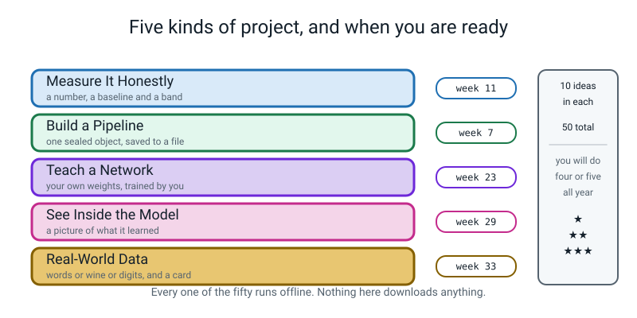
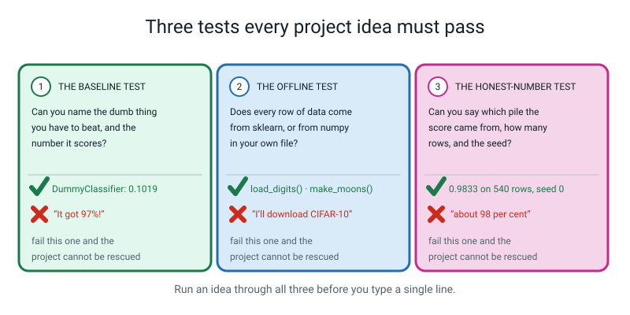

# 🛠️ Fifty Project Ideas — Level 3 Engineer

[⬅ Course home](../README.md) · [The worked example ➡](worked-example-project.md) · [The capstone ➡](capstone.md) · [Assessments](../assessments/README.md)

---

> ### In one sentence
>
> **Fifty things you could actually build this year, on your own laptop, with no internet — pick one, and
> pick it because you genuinely want to know the answer.**

---

## 🪝 How to use this page

This is a **menu**, not a list of homework. Nothing here is compulsory. You will do maybe four or five of
these across the whole year, plus the [capstone](capstone.md) in Weeks 34–36.

The projects are sorted into five kinds:

| | Category | What you do | Earliest week it makes sense |
|---|---|---|---|
| 📏 | [**Measure It Honestly**](#-measure-it-honestly) | Produce a number, a baseline and a band — and withdraw a claim | After **Week 11** |
| 🔧 | [**Build a Pipeline**](#-build-a-pipeline) | One sealed object, saved to a file, that a stranger can load | After **Week 7** |
| 🧠 | [**Teach a Network**](#-teach-a-network) | Your own weights, trained by you, in a loop you wrote | After **Week 23** |
| 🔍 | [**See Inside the Model**](#-see-inside-the-model) | A picture of what it actually learned | After **Week 29** |
| 🌍 | [**Real-World Data**](#-real-world-data) | Words, wine or digits — plus a card that says where it breaks | After **Week 33** |



*Figure P.1 — Five kinds of project, and when you are ready for each. Every one of the fifty runs offline.*

**The difficulty stars mean exactly this:**

| | Meaning |
|---|---|
| ⭐ | One sitting. Under 120 lines. Nothing in it will surprise you |
| ⭐⭐ | Two or three sittings, and **one thing in it will go wrong the first time** — usually a shape |
| ⭐⭐⭐ | Needs a plan on paper before you type. More than one day. Expect a real bug that costs you an hour, and expect it to be silent |

**The "syntax it uses" line is a promise.** Every project on this page can be built with nothing but the
constructs already on the [syntax ladder](../README.md#-the-syntax-ladder) by the week named, and nothing
but the maths on the [maths ladder](../README.md#-the-maths-ladder) by that week. You are never being
asked to go and find something on the internet — and you could not, because there is no internet.

---

## 🔌 Every one of these runs offline. Here is the whole dataset list.

| Dataset | How to get it | What it is |
|---|---|---|
| `load_digits()` | `from sklearn.datasets import load_digits` | **1,797 handwritten digits**, 8×8 greyscale. The image dataset of this level. Trains a CNN in under ten seconds |
| `load_wine()` | ditto | 178 wines, 13 chemical measurements, 3 real varieties |
| `load_breast_cancer()` | ditto | 569 rows, 30 measurements, 2 classes |
| `load_iris()` | ditto | 150 flowers, 4 measurements, 3 species. Tiny and famous |
| `load_diabetes()` | ditto | 442 rows, a **number** to predict rather than a class |
| `make_moons()` | `from sklearn.datasets import make_moons` | Two interleaving crescents. Not separable by a straight line, on purpose |
| `make_blobs()` | ditto | Round clusters, however many you ask for. The honest test for k-means |
| `make_classification()` | ditto | A table to order: any number of rows, columns, informative columns and class imbalance |
| `make_regression()` | ditto | The same, for predicting a number |
| **anything numpy makes** | `np.random.default_rng(0)` | Bars, edges, crosses, noise, your own pictures. **You can see exactly what went in** |
| **anything you type** | a `.py` file with a list of strings in it | Your own 80 reviews. Your own words, your own labels |

> **🚫 Three things no project on this page ever does.** It never imports `torchvision`. It never uses
> MNIST, CIFAR-10 or `fetch_openml`. And it never needs a GPU — every training run here is under about
> thirty seconds on a laptop CPU.

> **💡 When you have internet:** `pip install torchvision` opens up CIFAR-10 and pretrained weights, and
> they are genuinely worth exploring on an unblocked network. **No project on this page needs them**, and
> a student who never once has internet can build all fifty.

---

## ⚠️ Four rules, and they are rules, not preferences

> **1. Never build anything that classifies a person.** Their mood, their age, how clever or trustworthy
> or attractive they look, whether they are likely to fail an exam. You cannot collect a fair sample, the
> labels are not real things, and somebody gets hurt. Digits, wines, flowers, your own sentences, pictures
> you generated: yes. Judgements about people: no.
>
> **2. Nothing medical.** `load_breast_cancer` is on this page as a **table of 30 numbers**, and it is a
> good one for measurement practice. It is not a diagnostic tool, you must never describe your model as
> one, and if a project's write-up contains the word "diagnose" it needs rewriting.
>
> **3. Every score gets its pile and its `n`.** Not "98% accurate". *"0.9796 on 540 held-out rows,
> trained on 1,257."* Every time, in every README, in every sentence you say out loud. This is the single
> habit that separates Level 3 from Level 2.
>
> **4. Every printed number gets a seed.** `torch.manual_seed(0)`, `np.random.seed(0)`,
> `random_state=0`. **A number you cannot reproduce is not a result**, and a project whose numbers change
> when you re-run it is not finished, however good they are.

---

## 💡 Before you pick: the three tests



*Figure P.2 — Three tests every project idea must pass. Run any idea through all three before you type a line. A project that fails one of these cannot be rescued by working harder later.*

```
   TEST 1 — THE BASELINE TEST
   Can you name the dumb thing you have to beat, and the
   number it scores?
        ✅ "DummyClassifier(most_frequent) gets 0.1019 on digits,
            so anything near 0.10 is nothing at all."
        ❌ "It got 97%!"

   TEST 2 — THE OFFLINE TEST
   Does every row of data come from sklearn, from numpy, or
   from a file you typed yourself?
        ✅ load_digits()  ·  make_moons(random_state=0)
        ✅ 80 reviews in reviews.py that you wrote
        ❌ "I'll download CIFAR-10"   ← there is no internet

   TEST 3 — THE PREDICTION TEST
   Before you run it: write down the number you EXPECT, on
   paper, with a reason.
        ✅ "About 0.97, because the Week 26 CNN got 0.9796 and
            mine has fewer filters."
        ❌ "Let's see what happens."
```

> **💡 Try this if you are stuck choosing.** Write down the **last three things you did not believe**
> this year — a score that looked too good, a number somebody quoted with no `n`, a claim in a Week 30
> results table. Then read this page looking only for those three. It works far better than reading all
> fifty and picking the one that sounds most impressive.

---

# 📏 Measure It Honestly

*Ten projects that produce a number you are willing to defend — and at least one claim you have to
withdraw. **Best after Week 11**, when you have cross-validation and the `±`. Nothing here needs a
network.*

---

### 1. The Best of Twenty

> *How good a score can you get by doing absolutely nothing but rolling the dice twenty times?*

| | |
|---|---|
| **Difficulty** | ⭐ |
| **Time** | 90 minutes |
| **Best after** | Week 11 |
| **Dataset** | `make_classification(n_samples=300, n_informative=3, random_state=0)` |
| **Syntax it uses** | `train_test_split(..., random_state=s)` in a loop · `roc_auc_score` · `scores.mean()` / `scores.std()` · `np.argmax` |
| **Maths it uses** | mean and standard deviation (W4) · the `±` band (W11) |

**You will learn:** why a single held-out split is a lottery ticket, what "best of twenty" does to a
number, and the sentence that makes a score honest.

**Steps:**

1. Build one model — a `LogisticRegression` inside a `Pipeline` with a scaler. Do not touch it again.
2. Loop `random_state` from 0 to 19 on `train_test_split`, fit, and record the test AUC. Twenty numbers.
3. Print the **mean**, the **standard deviation**, the **minimum** and the **maximum**, and the seed that
   produced the maximum.
4. Now write the same result four ways: the max on its own, the mean on its own, `mean ± sd`, and
   `mean ± sd` with the number of test rows named. Put all four in a table.
5. Run a 5-fold `cross_val_score` for comparison and add it as a fifth row.

**Done well looks like:** a table of five ways to report the same experiment, and a paragraph that says
which one you would put in a README and why. The best answers notice that the gap between the min and the
max is bigger than most of the "improvements" they have celebrated this year.

---

### 2. Threshold Dial

> *Build a physical dial for one model: fifteen thresholds, three price lists, and one you will defend.*

| | |
|---|---|
| **Difficulty** | ⭐⭐ |
| **Time** | 2 hours |
| **Best after** | Week 11 |
| **Dataset** | `make_classification(n_samples=3000, weights=[0.97, 0.03], n_informative=6, random_state=0)` |
| **Syntax it uses** | `predict_proba(X)[:, 1]` · `(prob >= t).astype(int)` · `confusion_matrix(...).ravel()` · `precision_recall_curve` · `np.trapz` |
| **Maths it uses** | precision, recall, specificity (W8) · area under a curve as trapezoid strips (W11) |

**You will learn:** that a model has no opinion about thresholds, that a price list picks one for you, and
that changing the price list picks a different one with no retraining.

**Steps:**

1. Fit one model. Get `prob` on the validation rows. Never fit again.
2. Sweep fifteen thresholds from `0.95` down to `0.05`, printing TP, FP, FN, TN, precision, recall and the
   false-positive count in one row each.
3. Write **three** price lists in a dict: `{"fn": 10, "fp": 1}`, `{"fn": 1, "fp": 1}`, `{"fn": 1, "fp": 5}`.
   Add three cost columns to the table with `cost = fn_cost × FN + fp_cost × FP`.
4. Circle the winning row for each price list. They will be three different rows.
5. Plot the precision-recall curve, mark your three winners on it with badges 1, 2, 3, and compute the
   area two ways: `average_precision_score` and your own `np.trapz`.

**Done well looks like:** three circled rows, three numbers, and a paragraph that begins *"if a miss costs
ten times a false alarm then..."*. A project that reports one threshold with no price list has not done
the work.

---

### 3. How Many Rows Do You Need?

> *Train on 20 rows. Then 40. Then 80. Find the point where more data stops buying anything.*

| | |
|---|---|
| **Difficulty** | ⭐⭐ |
| **Time** | 2 hours |
| **Best after** | Week 11 |
| **Dataset** | `load_breast_cancer()` |
| **Syntax it uses** | `train_test_split` twice · a loop over training-set sizes · `StratifiedKFold` · `ax.errorbar(...)` or two `ax.plot` calls |
| **Maths it uses** | mean and sd (W4) · the `±` band (W11) |

**You will learn:** what a learning curve is, why the error bars matter more than the line, and what "we
need more data" actually costs.

**Steps:**

1. Hold out a **fixed** test set once, and never touch it until step 5.
2. For each training size in `[20, 40, 80, 160, 320, 400]`: take that many rows from the training pile
   **five different times** with five different seeds, fit, and score on a validation pile.
3. Plot the mean with a `±` band. Two lines: training score and validation score.
4. Find the smallest size whose band **overlaps** the band of the largest size. That is your answer to
   "how many rows do we need".
5. Only now, open the test set — once — and report the final number with its `n`.

**Done well looks like:** a chart where the two bands get closer as the size grows, and a sentence with an
integer in it: *"past about 160 training rows the validation band stops moving, so the next 240 rows
bought `0.004` of AUC."*

---

### 4. The Noise Detector

> *Add columns of pure random noise to a real table, one at a time, until the model starts believing them.*

| | |
|---|---|
| **Difficulty** | ⭐⭐ |
| **Time** | 2 hours |
| **Best after** | Week 11 |
| **Dataset** | `load_wine()` plus columns from `np.random.default_rng(0).normal(...)` |
| **Syntax it uses** | `np.hstack` · `np.random.default_rng(0)` · `cross_val_score(..., cv=skf)` · a loop over column counts |
| **Maths it uses** | the `±` band (W11) |

**You will learn:** the most important thing about columns you did not need — that they do not cost you
nothing, they cost you exactly as much as they let the model memorise.

**Steps:**

1. Score `load_wine` honestly with 5-fold cross-validation. Write the number down; it is your ceiling.
2. Glue on 5 noise columns. Re-score. Then 20. Then 100. Then 500. Then 2,000.
3. Plot the cross-validated score against the number of noise columns, with the `±` band.
4. Then the experiment that makes it real: keep **only** the 2,000 noise columns, throw the real ones
   away, and score it on a **single** split rather than five folds. Write down what you get.
5. Re-score that same noise-only table with 5-fold cross-validation and compare.

**Done well looks like:** two numbers next to each other — a single lucky split on pure noise, and five
folds of the same thing — and a sentence explaining why one of them was ever above `0.50`.

---

### 5. Five Folds Against One Lucky Split

> *Prove, with your own numbers, that a single split can be a tenth of an AUC away from the truth.*

| | |
|---|---|
| **Difficulty** | ⭐ |
| **Time** | 75 minutes |
| **Best after** | Week 11 |
| **Dataset** | `load_breast_cancer()` and `make_classification(n_samples=200, weights=[0.9, 0.1], random_state=0)` |
| **Syntax it uses** | `StratifiedKFold(n_splits=5, shuffle=True, random_state=0)` · `cross_val_score` · `train_test_split` in a loop |
| **Maths it uses** | mean and sd (W4) · the `±` band (W11) |

**You will learn:** that the size of the `±` is mostly about the size of your held-out chunks, not the
quality of your model.

**Steps:**

1. On the **big** dataset: 20 single splits, then 5-fold. Report both as `mean ± sd`.
2. On the **small, imbalanced** dataset: the same thing.
3. Put the four results in one table with the number of positives in each held-out chunk written beside
   each.
4. For the small dataset, count the positives in one fold. If it is under 15, say so out loud: *"14
   positives is 14."*
5. Write the one sentence that explains why the small dataset's `±` is four times bigger.

**Done well looks like:** a four-row table where the `±` column is the interesting one, and an explanation
that talks about **how many positives are in a chunk** rather than about how good the models are.

---

### 6. The Accuracy Paradox Museum

> *Build three models that all score 98% and do completely different things. Then label the exhibits.*

| | |
|---|---|
| **Difficulty** | ⭐⭐ |
| **Time** | 2 hours |
| **Best after** | Week 11 |
| **Dataset** | `make_classification(n_samples=5000, weights=[0.98, 0.02], n_informative=5, random_state=0)` |
| **Syntax it uses** | `DummyClassifier(strategy="most_frequent")` · `classification_report` · `confusion_matrix(...).ravel()` · `roc_auc_score` · `average_precision_score` |
| **Maths it uses** | precision, recall, F1 as the harmonic mean (W8, W9) |

**You will learn:** exactly how much accuracy hides on an unbalanced table, and which four numbers to
print instead.

**Steps:**

1. Exhibit A: `DummyClassifier(strategy="most_frequent")`. Report accuracy, precision, recall, F1, AUC.
2. Exhibit B: a real model at threshold `0.5`. Same five numbers.
3. Exhibit C: the same real model at a threshold you tuned for recall. Same five numbers.
4. Build the museum table: three rows, five columns, plus the four confusion counts for each.
5. Write a one-paragraph label for each exhibit, in the language of an application you choose — *"this one
   catches 2 frauds of 100 and raises no false alarms at all"*.

**Done well looks like:** three rows whose accuracy column is nearly identical and whose recall column is
`0.0000`, `0.31` and `0.84`. And a closing sentence: *"accuracy could not tell these three apart."*

---

### 7. A Cost Table for a Real Decision

> *Pick a decision somebody in your house actually makes. Write the price list. Let the arithmetic choose.*

| | |
|---|---|
| **Difficulty** | ⭐⭐ |
| **Time** | 2 hours, plus a conversation |
| **Best after** | Week 11 |
| **Dataset** | `make_classification` shaped to match your decision — choose `weights` to match how often the thing actually happens |
| **Syntax it uses** | `(prob >= t).astype(int)` · `confusion_matrix(...).ravel()` · `df.to_string(index=False)` |
| **Maths it uses** | precision and recall (W8) · the cost formula `COST_FN × FN + COST_FP × FP` (W11) |

**You will learn:** that a threshold is an opinion until somebody writes down what a mistake costs, and
that the conversation about the price list is the actual engineering.

**Steps:**

1. Pick a real decision: *should I take an umbrella? should we leave for the station early? is this
   parcel going to be late?* Write down, in words, what a miss costs and what a false alarm costs.
2. **Ask somebody else** what they think those costs are. Write both answers down. They will differ.
3. Build a `make_classification` table whose positive rate matches how often the thing really happens —
   guess it, and write the guess down as an assumption.
4. Sweep nine thresholds, compute the cost under **your** price list and under **theirs**, and circle both
   winners.
5. Write the paragraph you would say to the other person, with both numbers in it.

**Done well looks like:** two circled rows, a named disagreement, and a sentence of the form *"we chose
0.35 rather than 0.5 because you said a miss costs about six times a false alarm, and at 0.35 the total
cost is 148 against 231."*

---

### 8. The Leak Hunt

> *Plant three leaks in your own pipeline, hand it to somebody, and time how long each one survives.*

| | |
|---|---|
| **Difficulty** | ⭐⭐⭐ |
| **Time** | 3 hours, plus 30 minutes of somebody else's time |
| **Best after** | Week 11 |
| **Dataset** | Your Week 1–7 pizza table from `make_data.py`, or `load_breast_cancer()` |
| **Syntax it uses** | `Pipeline` · `SimpleImputer` · `StandardScaler().fit(X)` before the split (the leak) · `cross_val_score` · `X.drop(columns=[c])` |
| **Maths it uses** | the `±` band (W11) |

**You will learn:** the three flavours of leakage, from the attacker's side, which is the only way to get
fast at spotting them.

**Steps:**

1. Build one honest pipeline and record its cross-validated score. This is the truth.
2. Plant leak 1: **fit the scaler on everything** before splitting. Record the fake score and the gap.
3. Plant leak 2: **a derived column made from the target** — something innocent-looking like
   `is_above_average`, computed with the whole column's mean.
4. Plant leak 3: **a temporal leak** — a column that could only be known after the thing you are
   predicting. Say in one line why it could not exist at prediction time.
5. Hand all three to somebody with the honest number **hidden**, and time them. Then write the four
   audits you would run to catch each.

**Done well looks like:** a table with four rows — honest, leak 1, leak 2, leak 3 — each with its score,
its gap from honest, and **the audit that catches it**. The best versions find that leak 1 is worth almost
nothing on this data and say so, because a leak that does not move the number is the dangerous kind.

---

### 9. Does Scaling Actually Matter?

> *Three models, scaled and unscaled. Two of them do not care at all. Explain which and why.*

| | |
|---|---|
| **Difficulty** | ⭐ |
| **Time** | 90 minutes |
| **Best after** | Week 11 |
| **Dataset** | `load_wine()` — because its `proline` column has a spread of `314.91` and its `flavanoids` has `1.00` |
| **Syntax it uses** | `Pipeline` with and without `StandardScaler` · `KNeighborsClassifier` · `DecisionTreeClassifier` · `LogisticRegression` · `cross_val_score` |
| **Maths it uses** | standard deviation and the z-score (W4) |

**You will learn:** that "always scale" is a slogan, and the reason underneath it is about **which models
compare column sizes**.

**Steps:**

1. Print the standard deviation of all 13 wine columns, sorted. Note the biggest and the smallest.
2. Score kNN, a decision tree and logistic regression, all with 5-fold cross-validation, **unscaled**.
3. Score all three again **scaled**. Six numbers.
4. Build the table: model, unscaled, scaled, the difference, and the `±` on each.
5. Write one sentence per model saying **why** it moved or did not, naming the mechanism — distance,
   threshold-per-column, or weighted sum.

**Done well looks like:** a table where the tree's two numbers are inside each other's `±` and kNN's are
not, plus three mechanism sentences. The best versions add a fourth row: kNN on **only** `proline` and
`flavanoids`, unscaled, to show the effect in isolation.

---

### 10. The ± Audit

> *Go back through your own folder, put a `±` on every score you ever claimed, and withdraw one claim.*

| | |
|---|---|
| **Difficulty** | ⭐⭐ |
| **Time** | 2–3 hours |
| **Best after** | Week 11 |
| **Dataset** | Whatever you have already used this year |
| **Syntax it uses** | `StratifiedKFold` · `cross_val_score` · `scores.mean()` / `scores.std()` |
| **Maths it uses** | mean and sd (W4) · the `±` band (W11) |

**You will learn:** the most uncomfortable and most useful thing in Term 2 — that some of the
improvements you were pleased with were inside the noise.

**Steps:**

1. Find every score you have written down since Week 1. Your ablation table from Week 7 is the richest
   source.
2. Re-measure each one with 5-fold cross-validation, and record `mean ± sd`.
3. For every **pair** of scores where you claimed one was better, check whether the bands overlap.
4. Make a list headed **"claims I have to withdraw"**, with the two bands printed beside each.
5. Write one paragraph on the claim that surprised you most.

**Done well looks like:** a withdrawal list with at least one entry on it. **A project that finds nothing
to withdraw has almost certainly not used enough folds** — and saying that in the write-up is itself a
good answer.

---

# 🔧 Build a Pipeline

*Ten projects that end with a **file**, not a score. **Best after Week 7.** The deliverable is something
somebody else can load and use without talking to you.*

---

### 11. One File, One Model

> *Hand a friend a single `.joblib` and a `predict.py`, and watch them score a new row without asking you anything.*

| | |
|---|---|
| **Difficulty** | ⭐ |
| **Time** | 2 hours |
| **Best after** | Week 7 |
| **Dataset** | `load_wine()` or your Week 1–7 pizza table |
| **Syntax it uses** | `Pipeline(steps=[...])` · `ColumnTransformer` · `joblib.dump` / `joblib.load` · `pipe.predict_proba(X)[:, 1]` |
| **Maths it uses** | *(none)* |

**You will learn:** that the deliverable of a machine-learning project is an artifact plus a card, and that
the only proof it works is a **fresh process** with no training code in it.

**Steps:**

1. Build and fit one `Pipeline` with all preprocessing inside it. Print the AUC on a held-out pile.
2. `joblib.dump` it. Then in a **separate file**, load it and score the same held-out pile. The two AUCs
   must be identical to every decimal place.
3. Write `predict.py` that takes one new row as a dict, builds a one-row DataFrame, and prints a
   probability.
4. Run `grep -rnE "\.fit\(|train_test_split" predict.py`. It must print nothing.
5. Delete a required column from the input on purpose, paste the real error, and add one line to
   `predict.py` that gives a better message.

**Done well looks like:** two identical AUCs printed from two different files, a passing grep, and a
handwritten note saying which column the model will refuse to work without.

---

### 12. The Column Audit Robot

> *One script that you point at any table and it tells you what is wrong with it.*

| | |
|---|---|
| **Difficulty** | ⭐⭐ |
| **Time** | 2–3 hours |
| **Best after** | Week 7 |
| **Dataset** | `load_wine()`, `load_breast_cancer()`, your pizza table — the point is that it works on all of them |
| **Syntax it uses** | `df.duplicated().sum()` · `df["c"].nunique()` · `df["y"].value_counts(normalize=True)` · `df.isna().sum()` · `df.to_string(index=False)` |
| **Maths it uses** | *(none)* |

**You will learn:** that an audit is a **reusable program**, and which four numbers you should print before
you fit anything, ever.

**Steps:**

1. Write `audit(df, target)` that prints: rows, columns, duplicate rows, missing per column, class
   balance to 4 dp, and `nunique` per column.
2. Add the flags. A column with `nunique / rows > 0.9` gets `⚠ ID-LIKE`. A column with more than 40%
   missing gets `⚠ MOSTLY EMPTY`. A column whose name contains `refund`, `after`, `final`, `result` or
   `outcome` gets `⚠ CHECK FOR A LEAK`.
3. Add a **correlation-with-target** column and flag anything above `0.95` as `⚠ SUSPICIOUSLY PERFECT`.
4. Run it on three different tables and read the output out loud. Fix every false alarm your flags
   produce.
5. Save the report to `audit_report.txt` so it can be diffed after a data change.

**Done well looks like:** one file you actually use in the next four projects, and a note listing the two
flags that fired on something innocent — because a checker that cries wolf gets ignored.

---

### 13. Invent Five Columns

> *The biggest score jumps come from a column that was not in the file. Invent five, and delete the ones that bought nothing.*

| | |
|---|---|
| **Difficulty** | ⭐⭐ |
| **Time** | 3 hours |
| **Best after** | Week 7 |
| **Dataset** | Your pizza table, or `load_diabetes()` if you want to predict a number |
| **Syntax it uses** | `FunctionTransformer(add_features)` · `pd.cut(s, bins=[...], labels=[...])` · `df.assign(new=...)` · `pipe.get_feature_names_out()` · `X.drop(columns=[c])` |
| **Maths it uses** | *(none)* |

**You will learn:** the discipline that makes feature engineering a science rather than a hobby — **one
change, one measurement, one row in the table**.

**Steps:**

1. Write down five ideas on paper **before** you code, each with a one-line reason why it should help.
2. Build them all inside a `FunctionTransformer` so they live inside the pipeline and cannot leak.
3. Run the ablation: with all five, then with each one removed in turn. Six rows, ΔAUC to **4** decimal
   places, and the `±` from 5 folds on every row.
4. Delete the ones whose Δ is inside the `±`. Write down the number that made you delete each.
5. Print `pipe.get_feature_names_out()` before and after, so the column count is evidence rather than a
   claim.

**Done well looks like:** a six-row table, two or three deletions, and a sentence for each deletion with a
number in it. **A project that keeps all five has not run the ablation properly.**

---

### 14. The Model Card Generator

> *A script that reads a fitted pipeline and writes most of its own model card.*

| | |
|---|---|
| **Difficulty** | ⭐⭐ |
| **Time** | 3 hours |
| **Best after** | Week 8 |
| **Dataset** | Any of them — the point is that it works for more than one |
| **Syntax it uses** | `joblib.load` · `pipe.named_steps["prep"]` · `pipe.get_feature_names_out()` · `classification_report` · writing a file with `open(..., "w")` |
| **Maths it uses** | precision, recall, F1 (W8, W9) |

**You will learn:** which parts of a model card a program can fill in and which parts **only a person can
write** — and that the second list is the important one.

**Steps:**

1. Write the seven headings: intended use, unit of prediction, training data, metrics, subgroup metrics,
   known failure modes, out-of-scope uses.
2. Make the script fill in everything it can from the artifact: the column names, the column count, the
   pipeline steps, the metrics on a held-out pile, the row counts, the seed.
3. For the three headings a program **cannot** write, have it emit `TODO — a human must write this` and
   **refuse to finish** if those markers are still there when you run a checker.
4. Generate cards for two different models and diff them.
5. Write the three human sections for one model, properly, in your own words.

**Done well looks like:** a generated card where the machine-written parts are correct and the
human-written parts are the best writing in the project. The out-of-scope-uses section should name a real
misuse somebody might actually attempt.

---

### 15. Two Rulers, One Table

> *Route numbers one way and text the other, and prove the column count with `get_feature_names_out`.*

| | |
|---|---|
| **Difficulty** | ⭐ |
| **Time** | 90 minutes |
| **Best after** | Week 7 |
| **Dataset** | Your pizza table (it has both kinds of column) |
| **Syntax it uses** | `ColumnTransformer([...])` · `MinMaxScaler` · `OneHotEncoder(handle_unknown="ignore")` · `OrdinalEncoder(categories=[...])` · `pipe.get_feature_names_out()` |
| **Maths it uses** | standard deviation and the z-score (W4) |

**You will learn:** that a `ColumnTransformer` selects **by name**, that one text column becomes as many
columns as it has categories, and exactly what an ordinal encoding makes a model believe.

**Steps:**

1. Count, on paper first, how many columns come out of your `ColumnTransformer`. Write the sum down.
2. Build it, fit it, and print `get_feature_names_out()`. Compare the count with your paper answer.
3. Encode one genuinely ordered column with `OrdinalEncoder(categories=[...])` and one unordered column
   with `OneHotEncoder`. Then **swap them** and score both ways.
4. Write two sentences saying what the model wrongly believes in the swapped version — with the arithmetic,
   e.g. *"it now believes storm = 2 × rain"*.
5. Feed it a category it has never seen, once with `handle_unknown="ignore"` and once without. Paste both
   outcomes.

**Done well looks like:** your paper column count matching the printed one, and a pasted `ValueError` next
to a row of zeros, with one sentence on which of the two you would rather have in production.

---

### 16. The Missing-Value Lab

> *Three ways to fill a hole. Measure all three, and keep the indicator column.*

| | |
|---|---|
| **Difficulty** | ⭐⭐ |
| **Time** | 2 hours |
| **Best after** | Week 7 |
| **Dataset** | `load_wine()` with holes you punch yourself using `rng.random(...) < 0.15`, plus your pizza table's real holes |
| **Syntax it uses** | `SimpleImputer(strategy="median")` · `strategy="mean"` · `add_indicator=True` · `pipe.named_steps["prep"]` · `cross_val_score` |
| **Maths it uses** | mean and median (assumed) · the `±` band (W11) |

**You will learn:** that filling a hole is a **decision with a number attached**, and that sometimes the
most useful column is the one that says "this one was blank".

**Steps:**

1. Punch holes into a clean table on purpose, with a seed, so you know where every one is.
2. Score three strategies: median, mean, and median plus `add_indicator=True`. All with 5-fold CV and the
   `±`.
3. Punch the holes a second way — **not at random**, but only into rows of one class — and re-score all
   three.
4. Write down what changed between steps 2 and 3, and why the indicator column helped in one and not the
   other.
5. Prove the imputer learned from training rows only: print `imputer.statistics_` after fitting on the
   training pile and again after fitting on everything, and show the two numbers differ.

**Done well looks like:** a six-row table (three strategies × two ways of punching holes) and a paragraph
explaining why `add_indicator` earns its column in exactly one of the two.

---

### 17. Break It On Purpose

> *Six kinds of bad input. Your `predict.py` survives all six and says something useful about each.*

| | |
|---|---|
| **Difficulty** | ⭐⭐ |
| **Time** | 2–3 hours |
| **Best after** | Week 7 |
| **Dataset** | Any fitted pipeline you already have |
| **Syntax it uses** | `joblib.load` · `try` / `except ValueError as e` · `if col not in df.columns` · `df.dtypes` |
| **Maths it uses** | *(none)* |

**You will learn:** that the interesting part of shipping is what happens when the input is wrong, and that
a good error message contains a **worked example**.

**Steps:**

1. List the six: a missing column, an extra column, a category never seen in training, a number where text
   was expected, a `None`, and a value far outside the training range.
2. Feed each one to your `predict.py` as it stands and paste all six real outcomes. Some will crash, some
   will silently produce a number, and **the silent ones are the problem**.
3. Add a `check_input(df)` function that catches all six **before** the model is touched, and returns a
   message naming the field and giving an example of what to send instead.
4. Re-run all six and paste the six new outcomes.
5. Add the out-of-range case as a **warning, not a refusal** — and write one sentence on why those two are
   different.

**Done well looks like:** a before-and-after table with six rows, where the "before" column contains at
least one number produced from nonsense, and the "after" column contains six messages a stranger could
act on.

---

### 18. The Reproducibility Box

> *One command. Every number in your report, regenerated from nothing, in under a minute.*

| | |
|---|---|
| **Difficulty** | ⭐⭐ |
| **Time** | 2–3 hours |
| **Best after** | Week 7 |
| **Dataset** | Whichever you used for a project you have already finished |
| **Syntax it uses** | `joblib.dump` / `load` · `np.random.default_rng(0)` · `random_state=0` everywhere · writing files · `df.to_string(index=False)` |
| **Maths it uses** | *(none)* |

**You will learn:** the hardest habit in this whole level — **a number you cannot reproduce is not a
result** — and how few lines it takes to make that true.

**Steps:**

1. Take a project you have already written up. Delete every output file, every `.joblib`, every chart.
2. Write `run.py` that regenerates **all** of them, in order, from a clean folder.
3. Hunt every unseeded random thing. `train_test_split` without `random_state`, `KMeans` without one,
   `np.random` without `default_rng(0)`, a `set` you iterate over. There will be more than you expect.
4. Run `run.py` twice into two different folders and **diff every file**. Any file that differs is a bug.
5. Print the library versions at the top of the run, into a `versions.txt`, because the numbers belong to
   them too.

**Done well looks like:** a folder where `rm -rf out/ && python3 run.py` reproduces every figure and every
number, and a list of the unseeded things you found. The best versions find at least three.

---

### 19. Ablation Bench

> *A reusable script: hand it a list of columns, get back the ΔAUC of dropping each one.*

| | |
|---|---|
| **Difficulty** | ⭐⭐ |
| **Time** | 2 hours |
| **Best after** | Week 11 |
| **Dataset** | `load_breast_cancer()` (30 columns is a good number for this) |
| **Syntax it uses** | `X.drop(columns=[c])` in a loop · `pipe.set_params(...)` · `cross_val_score` · `df.to_string(index=False)` · `np.argsort` |
| **Maths it uses** | the `±` band (W11) |

**You will learn:** which of your thirty columns are actually doing anything, and that most of them are
not.

**Steps:**

1. Score the full table with 5-fold CV. That is your reference, with its `±`.
2. Loop over all 30 columns: drop one, re-score, record the Δ and the `±`.
3. Sort by Δ and print the table. Mark every row whose Δ is inside the `±` as `NOT PROVEN`.
4. Now the interesting run: keep **only** the five columns with the biggest Δ and score that. Compare with
   the full table.
5. Then drop the five **least** useful and score that, and say in one sentence which of those two
   experiments was more informative.

**Done well looks like:** a 31-row table you can read, a five-column model whose band overlaps the
30-column model's band, and a sentence about what that means for the other 25.

---

### 20. The Artifact Diff

> *Two saved models. Find the exact rows they disagree about, and look at them.*

| | |
|---|---|
| **Difficulty** | ⭐⭐ |
| **Time** | 2 hours |
| **Best after** | Week 8 |
| **Dataset** | `load_digits()` flattened, or `load_breast_cancer()` |
| **Syntax it uses** | `joblib.dump` / `load` twice · `np.where(a != b)` · `confusion_matrix` · `predict_proba` |
| **Maths it uses** | precision and recall (W8) |

**You will learn:** that "model B is 1% better" is a claim about **specific rows**, and that looking at
those rows tells you more than the percentage does.

**Steps:**

1. Train two genuinely different models on the same split. Save both with versions in the filenames.
2. Load both in a fresh file. Score both. Note the difference, and whether it is inside the `±`.
3. Find the rows where they disagree with `np.where(pred_a != pred_b)`. Count them.
4. For each disagreement, print the true label and **both probabilities**. Sort by how confident the
   disagreement was.
5. Look at the five most confident disagreements by hand, and write one sentence about what they have in
   common.

**Done well looks like:** a count of disagreements, a table of the five worst, and a sentence like
*"they disagree on 14 of 143 rows, model B is right on 9 of them, and 11 of the 14 are the rows where both
models are between 0.4 and 0.6."*

---

# 🧠 Teach a Network

*Ten projects where you train weights yourself, in a loop you wrote. **Best after Week 23**, when you have
`nn.Module`, `DataLoader` and `state_dict`. A few are possible from Week 21.*

---

### 21. NumPy Brain Against Torch Brain

> *Build the same network twice — forty lines of numpy, then eight lines of torch — and prove they are the same to six decimal places.*

| | |
|---|---|
| **Difficulty** | ⭐⭐⭐ |
| **Time** | 4 hours |
| **Best after** | Week 22 |
| **Dataset** | `make_moons(n_samples=400, noise=0.25, random_state=0)` |
| **Syntax it uses** | `A @ B` · `np.maximum(0, z)` · `nn.Linear` · `nn.Sequential` · `nn.BCEWithLogitsLoss` · `torch.from_numpy(a).float()` · `w.grad` |
| **Maths it uses** | matrix shapes (W16, W17) · slopes multiplying along a chain (W18) |

**You will learn:** the thing that makes `loss.backward()` mean something for the rest of your life — that
it is doing exactly the eight lines you wrote, and nothing else.

**Steps:**

1. Take your Week 19 numpy network. Print its four weight shapes and its knob count: `65`.
2. Build the same thing in `nn.Sequential`. Print `named_parameters()` and check the count is also `65`.
3. **Copy your numpy weights into the torch model** with `layer.weight.data = torch.from_numpy(W1.T).float()`
   — note the transpose, and say in a comment why it is needed.
4. Push the same batch through both and compare with `np.allclose`. Then compare the **gradients** after
   one backward pass, all four arrays.
5. Print the worst absolute difference across all four gradient arrays. It should be about `1e-8`.

**Done well looks like:** a printed number below `1e-6` and one comment explaining the transpose. This is
the project that turns PyTorch from magic into a labour-saving device.

---

### 22. The Learning-Rate Museum

> *Five learning rates, five loss curves, one named diagnosis each. Frame them.*

| | |
|---|---|
| **Difficulty** | ⭐⭐ |
| **Time** | 2 hours |
| **Best after** | Week 21 |
| **Dataset** | `make_moons(random_state=0)` |
| **Syntax it uses** | `torch.optim.SGD([...], lr=...)` · the five-line loop · `ax.set_yscale("log")` · `loss.item()` · `plt.savefig` |
| **Maths it uses** | the gradient and `w ← w − lr × slope` (W15) |

**You will learn:** to diagnose a training run from its loss curve alone, by name, in three seconds.

**Steps:**

1. Fix the seed and the architecture. The **only** thing you change is `lr`.
2. Run five learning rates spanning six orders of magnitude — e.g. `1e-5, 1e-3, 0.1, 5, 500` — recording
   the loss every epoch.
3. Plot all five on one chart with a **log** y-axis, because a loss falling from 800 to 0.4 is unreadable
   otherwise.
4. Give each curve a one-word diagnosis: *too small, working, wobbling, diverging, `nan`*. And measure
   monotonicity rather than eyeballing it: count the epochs where the loss went **up**.
5. For the `nan` run, print the **first four** epochs, not the last, and say what you see.

**Done well looks like:** five named curves and the sentence that goes with the `nan` one: *"`nan` is
contagious and never recovers, so look at the beginning of the run, not the end."*

---

### 23. The Dead Unit Counter

> *How many of your sixteen hidden units are dead? Plot it against the learning rate.*

| | |
|---|---|
| **Difficulty** | ⭐⭐ |
| **Time** | 2–3 hours |
| **Best after** | Week 22 |
| **Dataset** | `make_moons(random_state=0)` |
| **Syntax it uses** | `(z > 0).astype(float)` or `(h > 0).float()` · a forward hook, or just re-running the first layer by hand · `torch.no_grad()` |
| **Maths it uses** | ReLU's slope is 1 where it fired and 0 where it did not (W18) |

**You will learn:** why a dead unit can never come back, and that capacity you paid for can quietly stop
existing.

**Steps:**

1. Write `count_dead(model, X)`: push `X` through the first layer and the ReLU, and count the units whose
   output is zero for **every single row**.
2. Check it on an untrained model. The answer should be 0 or close to it.
3. Train at six learning rates and count the dead units after each run, plus the final accuracy.
4. For the worst run, take the dead model and train it for 2,000 more epochs at a gentle learning rate.
   Count again. Nothing will come back.
5. Write the three-line explanation, with the arithmetic: `slope = 0`, so `w − lr × 0 = w`, for any `lr`.

**Done well looks like:** a table of learning rate against dead units against accuracy, and a resurrection
attempt that failed, with the arithmetic explaining why it was always going to.

---

### 24. Hinge Hunter

> *How many hidden units does a curved boundary actually need? One, two, four, eight, sixteen.*

| | |
|---|---|
| **Difficulty** | ⭐⭐ |
| **Time** | 3 hours |
| **Best after** | Week 22 |
| **Dataset** | `make_moons(n_samples=400, noise=0.25, random_state=0)` |
| **Syntax it uses** | `nn.Sequential` with a varying hidden size · `np.meshgrid` · `np.c_[a.ravel(), b.ravel()]` · `ax.contourf` · `plt.savefig` |
| **Maths it uses** | one hinge per hidden unit (W19) · counting parameters (W22) |

**You will learn:** the most satisfying idea in Term 3 — **one hinge per hidden unit** — by watching a
straight line bend one more time per unit you add.

**Steps:**

1. Train 2→1→1, 2→2→1, 2→4→1, 2→8→1 and 2→16→1, same seed, same epochs, same learning rate.
2. Plot each decision boundary with `contourf` and save five PNGs.
3. Count the visible **bends** in each boundary by eye and put the count next to the unit count.
4. Print the parameter count and the test accuracy for each, with the `±` from five seeds.
5. Find the smallest network whose band overlaps the 16-unit network's band, and say what the other 12
   units bought.

**Done well looks like:** five pictures in a row, a bend count that tracks the unit count, and a sentence
with the word **permission** in it: *"capacity is permission to bend, not an instruction to."*

---

### 25. The Overfitting Film

> *Save the decision boundary every 25 epochs and flip through them. Watch it stop learning and start memorising.*

| | |
|---|---|
| **Difficulty** | ⭐⭐ |
| **Time** | 3 hours |
| **Best after** | Week 22 |
| **Dataset** | `make_moons(n_samples=120, noise=0.35, random_state=0)` — **deliberately small and noisy** |
| **Syntax it uses** | `np.meshgrid` · `ax.contourf` · `plt.savefig("frame_%03d.png" % epoch)` · two loss lists · `model.eval()` / `model.train()` |
| **Maths it uses** | *(none)* |

**You will learn:** what overfitting **looks like**, which is far more memorable than what it means.

**Steps:**

1. Use a small noisy dataset and a network with far too much capacity — 2→64→64→1.
2. Train for 2,000 epochs, saving a boundary frame every 25 epochs and recording both losses every epoch.
3. Plot the two loss curves and mark the epoch where the validation loss reached its **minimum**.
4. Put the frame from that epoch next to the frame from epoch 2,000, side by side, and describe the
   difference in one sentence each.
5. Add dropout and repeat. Report the best validation loss and the **final** validation loss for both runs
   — they tell different stories.

**Done well looks like:** two boundary pictures — one sensible, one with little islands drawn around
individual noisy points — and four numbers: best and final validation loss, with and without dropout.

---

### 26. Deeper or Wider?

> *Spend the same parameter budget two ways and find out which shape wins.*

| | |
|---|---|
| **Difficulty** | ⭐⭐⭐ |
| **Time** | 3–4 hours |
| **Best after** | Week 23 |
| **Dataset** | `load_digits()` flattened to `(n, 64)` |
| **Syntax it uses** | `nn.Sequential` with varying depth · `sum(p.numel() for p in model.parameters())` · `TensorDataset` + `DataLoader` · `torch.optim.Adam` |
| **Maths it uses** | a layer costs `(in × out) + out` (W22) |

**You will learn:** that "make it bigger" is two different decisions, and how to compare them fairly by
holding the budget fixed.

**Steps:**

1. Pick a budget, say about 6,000 parameters. Now design **four** networks that all cost within 5% of it:
   one hidden layer, two, three, four. Work the sizes out **on paper** with `(in × out) + out`.
2. Print each one's real parameter count and check your paper answers.
3. Train all four with the same seed, epochs, batch size and optimizer. Five seeds each.
4. Report `mean ± sd` test accuracy for all four, with the held-out row count.
5. Add wall-clock time, and then answer the question that decides it: **do any of the four bands not
   overlap?**

**Done well looks like:** four networks whose parameter counts agree with your paper arithmetic, four
bands, and an honest conclusion — which is very often *"I cannot tell these apart with five seeds on 540
rows."*

---

### 27. Activation Bake-Off

> *ReLU against tanh against sigmoid. Same seeds. And count the dead units.*

| | |
|---|---|
| **Difficulty** | ⭐⭐ |
| **Time** | 2–3 hours |
| **Best after** | Week 22 |
| **Dataset** | `make_moons(random_state=0)` and `load_digits()` |
| **Syntax it uses** | `nn.ReLU()` · `nn.Tanh()` · `nn.Sigmoid()` · `np.maximum(0, z)` and `np.tanh(z)` for the by-hand check · five seeds |
| **Maths it uses** | ReLU's slope is 1 where it fires; sigmoid's steepest is 0.25 (W16) |

**You will learn:** the arithmetic reason ReLU is the default, which is much more convincing than being
told.

**Steps:**

1. Compute, by hand, `0.25⁵` — what fraction of a signal survives five sigmoid layers. Write it down
   before you code.
2. Train a **deep** network (five hidden layers) with each activation, same seed, and plot the three loss
   curves.
3. For the sigmoid run, print the size of the gradient in the **first** layer and in the **last**. Compare
   them with your `0.25⁵`.
4. Count dead units in the ReLU run, and note that the other two cannot have any.
5. Report five-seed accuracy bands for all three on both datasets, and name the one thing tanh can do that
   the other two cannot.

**Done well looks like:** your hand-computed `0.0009765625` sitting next to a measured ratio of first-layer
to last-layer gradient, in the same order of magnitude. That is the whole project.

---

### 28. Batch Size Bench

> *Batch size changes four things at once. Measure all four.*

| | |
|---|---|
| **Difficulty** | ⭐⭐ |
| **Time** | 2–3 hours |
| **Best after** | Week 23 |
| **Dataset** | `load_digits()` |
| **Syntax it uses** | `DataLoader(ds, batch_size=..., shuffle=True)` · `time.perf_counter()` · `len(dataloader)` · `math.ceil` |
| **Maths it uses** | `ceil(rows ÷ batch)` steps per epoch (W23) |

**You will learn:** why "15 epochs" is a meaningless claim without the batch size, and how to report a
training run so somebody else could repeat it.

**Steps:**

1. For each batch size in `[1, 8, 32, 128, 1257]`, compute `ceil(1257 ÷ b)` **on paper** first.
2. Check every one three ways: your division, `len(dataloader)`, and counting the loop. Make all three
   agree.
3. Train for a fixed number of **epochs** with each batch size. Record steps, wall-clock seconds and final
   accuracy.
4. Now train for a fixed number of **steps** instead, and record the same three. The two tables tell
   opposite stories.
5. Write the sentence that reports a run properly, with all of: epochs, batch size, steps, seed, rows, and
   accuracy with its `n`.

**Done well looks like:** two tables that disagree, three agreeing step counts, and one sentence that a
stranger could use to reproduce your best run exactly.

---

### 29. The Five-Line Speedrun

> *From a blank file to a training loop, from memory, in under three minutes. Then break it five ways.*

| | |
|---|---|
| **Difficulty** | ⭐ |
| **Time** | 90 minutes |
| **Best after** | Week 21 |
| **Dataset** | Six rows you type by hand — `hours` and `marks` |
| **Syntax it uses** | `torch.tensor(..., requires_grad=True)` · `torch.optim.SGD` · `optimizer.zero_grad()` · `loss.backward()` · `optimizer.step()` · `t.item()` |
| **Maths it uses** | `w ← w − lr × slope` (W15) · one step by hand (W21) |

**You will learn:** the loop that every framework in the world is a wrapper around, well enough to write
it with nothing open.

**Steps:**

1. Close every file. Set a timer. Write the whole thing from a blank editor: data, knobs, optimizer, the
   five lines, and one printed number per 50 steps.
2. Before you run it, predict the **first** loss and the **first** gradient on paper. Then check.
3. Now delete each of the five lines in turn and fill in a five-row table: what happened, what the error
   said (if any), and what `w.grad` was.
4. **Three of the five give no error at all.** Work out how to tell those three apart — and the answer is
   the `.grad` column.
5. Do the whole thing again a week later and time yourself. Write both times down.

**Done well looks like:** a five-row failure table, a correct hand prediction of the first loss, and two
timings a week apart. The second one should be under three minutes.

---

### 30. Digits MLP, Shipped

> *A digit reader in a file, plus a `predict.py` a stranger can run in a fresh terminal.*

| | |
|---|---|
| **Difficulty** | ⭐⭐ |
| **Time** | 3–4 hours |
| **Best after** | Week 23 |
| **Dataset** | `load_digits()` |
| **Syntax it uses** | `class Net(nn.Module)` + `super().__init__()` + `forward` · `TensorDataset` + `DataLoader` · `torch.save(model.state_dict(), p)` · `model.eval()` |
| **Maths it uses** | parameter counts (W22) · steps per epoch (W23) |

**You will learn:** the difference between a model that works in your notebook and a model that exists as a
file, which is the whole point of Term 3.

**Steps:**

1. Put the architecture in `model_def.py`. **Both** other scripts import it and neither defines it.
2. `train.py` trains, prints train and test accuracy with the row counts, and saves `state_dict` to
   `digits_v1.pt`.
3. `predict.py` imports the class, loads the weights, calls `model.eval()`, and prints a prediction plus a
   probability for one image passed on the command line.
4. Run `grep -rnE "\.fit\(|train_test_split|DataLoader|optimizer" predict.py`. Nothing printed is the
   pass.
5. The `model.eval()` experiment: score the same image five times with and without it, and paste both
   sets of five numbers.

**Done well looks like:** a passing grep, five identical predictions with `eval()` and five different ones
without, and a one-line `README` that says what to type.

---

# 🔍 See Inside the Model

*Ten projects that produce a **picture of what the model learned**. **Best after Week 29**, when you have
PCA; several are possible from Week 26.*

---

### 31. Filter Gallery

> *Your CNN's eight first-layer filters, printed big. Two of them are edge detectors and you can prove it with a number.*

| | |
|---|---|
| **Difficulty** | ⭐⭐ |
| **Time** | 2–3 hours |
| **Best after** | Week 26 |
| **Dataset** | `load_digits()`, plus 6×6 bars and edges you generate with numpy |
| **Syntax it uses** | `model[0].weight.detach().numpy()` · `conv.weight.data = ...` · `ax.imshow(...)` · `plt.savefig` |
| **Maths it uses** | one convolution cell in full (W24) |

**You will learn:** that the first layer of a CNN learns things you can look at and name — and that some of
them cannot be named, which is worth saying out loud.

**Steps:**

1. Train the Week 26 CNN. Pull out the eight 3×3 first-layer kernels with `.detach().numpy()`.
2. Draw all eight as a grid of 3×3 images, with the nine numbers printed inside the cells.
3. Now the proof: generate a clean vertical edge and a clean horizontal edge with numpy, push both through
   each filter, and record the **response size** for each.
4. Label the two filters whose vertical response is much larger than their horizontal one (or the reverse)
   as edge detectors, **with both numbers**.
5. For the filters you cannot describe, say so in one sentence each. Do not invent a story.

**Done well looks like:** eight labelled tiles where two labels are backed by a pair of numbers and three
say *"I cannot describe this one."* The honesty is the mark of quality here.

---

### 32. Feature Map Zoo

> *One digit, eight feature maps, one sentence each about what survived.*

| | |
|---|---|
| **Difficulty** | ⭐⭐ |
| **Time** | 2 hours |
| **Best after** | Week 26 |
| **Dataset** | `load_digits()` |
| **Syntax it uses** | `t.unsqueeze(0)` · running layers one at a time · `ax.imshow` · `plt.subplots(2, 4)` · `torch.no_grad()` |
| **Maths it uses** | the output-size rule (W25) |

**You will learn:** what "a stack of feature maps" actually is, and that pooling keeps *that* there was a
response and throws away *where*.

**Steps:**

1. Pick one clear digit. Print its shape at every stage of the network, on paper first, then for real.
2. Save the eight first-layer feature maps as a 2×4 grid of images, with the shape in each title.
3. Do the same for the sixteen maps after the second conv, and note how much smaller they are.
4. Then the pooling demo: show one 4×4 map and its 2×2 pooled version side by side, with the four maximums
   circled in the original.
5. Write one sentence per first-layer map. Some will be *"the left-hand edges of the stroke"*. Some will be
   *"I do not know."*

**Done well looks like:** a figure with the shapes in the titles, and a pooling picture where a reader can
check the four maximums by eye.

---

### 33. The Confusion Pair Detective

> *Find the two digits your model muddles most, and give a reason about pixels, not about maths.*

| | |
|---|---|
| **Difficulty** | ⭐⭐ |
| **Time** | 2–3 hours |
| **Best after** | Week 27 |
| **Dataset** | `load_digits()` |
| **Syntax it uses** | `ConfusionMatrixDisplay.from_predictions` · `logits.argmax(dim=1)` · `np.argsort` · `ax.imshow` |
| **Maths it uses** | per-class recall and precision from a confusion matrix (W8, W26) |

**You will learn:** that "the model is confused" is not a diagnosis, and what one looks like.

**Steps:**

1. Train, predict, and draw the 10×10 confusion matrix. Print per-class recall with the `n` on every row.
2. Find the **pair** — the two cells facing each other across the diagonal with the biggest total — and say
   which way it leans.
3. Pull out and display every single misclassified image in that pair, as a grid, with the true and
   predicted labels in the titles.
4. Look at them. Write the **physical** reason, about 8×8 pixels and ink. Not "they look similar."
5. Test your reason: generate or find three images that your explanation predicts will be misclassified,
   and check.

**Done well looks like:** a prediction that came true. If your explanation is *"at 8×8 an 8's loops fill
in"*, then a deliberately thick-stroked 8 should be misread, and you should show it.

---

### 34. Which Pixels Mattered?

> *Blank out one 2×2 patch at a time and measure how much the answer moves.*

| | |
|---|---|
| **Difficulty** | ⭐⭐⭐ |
| **Time** | 3–4 hours |
| **Best after** | Week 26 |
| **Dataset** | `load_digits()` |
| **Syntax it uses** | `img.copy()` · slicing to blank a patch · `torch.softmax(logits, dim=1)` · `torch.no_grad()` · `ax.imshow` for a heat map |
| **Maths it uses** | the output-size rule for counting patches (W25) |

**You will learn:** the simplest honest way to ask a model *"which part of this did you use?"* — and its
limits.

**Steps:**

1. Pick one image the model gets right, confidently. Record the probability it gives the true class.
2. Loop over every 2×2 patch position. For each, copy the image, set that patch to zero, re-predict, and
   record the **drop** in the true-class probability.
3. Draw the drops as a heat map the same size as the image, side by side with the digit.
4. Repeat for one image the model gets **wrong**, and compare the two heat maps.
5. Write the caveat, because it matters: blanking a patch makes an image the model has never seen, so a big
   drop might mean "this patch was important" **or** "this image is now weird". Say which you think and
   why.

**Done well looks like:** two heat maps, one for a right answer and one for a wrong one, and a written
caveat that a reader would not have thought of.

---

### 35. PCA Map of the Digits

> *Sixty-four dimensions down to two, coloured by digit, with the percentage in the axis labels.*

| | |
|---|---|
| **Difficulty** | ⭐⭐ |
| **Time** | 2 hours |
| **Best after** | Week 29 |
| **Dataset** | `load_digits()` |
| **Syntax it uses** | `StandardScaler` · `PCA(n_components=2)` · `pca.explained_variance_ratio_` · `ax.scatter(..., c=y)` · `pca.inverse_transform` |
| **Maths it uses** | variance (W29) · explained variance against reconstruction error (W29) |

**You will learn:** how to read a 2-D map of high-dimensional data **without believing too much of it**.

**Steps:**

1. Scale first. Fit `PCA(n_components=2)`. Print both shares and their total.
2. Scatter all 1,797 points, coloured by digit, with the percentage **in each axis label**.
3. Find two digits whose blobs overlap on the map and two that are well apart. Check your reading against
   the confusion matrix from project 33 — do the overlapping pairs actually get confused?
4. Compute the reconstruction error at 2 components as a fraction of a typical distance, and put it in the
   figure caption.
5. Add a second panel at 10 components, showing the reconstruction of four digits next to the originals.

**Done well looks like:** a scatter plot whose axis labels carry the percentages, and a sentence that
resists the obvious conclusion: *"1 and 8 overlap on this shadow, and they also confuse — but 3 and 9
overlap and do not, so a mixed shadow is not evidence of a confusable pair."*

---

### 36. Cluster Cartography

> *Find three clusters with no labels, then name them from a feature-means table and defend the names.*

| | |
|---|---|
| **Difficulty** | ⭐⭐⭐ |
| **Time** | 4 hours |
| **Best after** | Week 30 |
| **Dataset** | `load_wine()` |
| **Syntax it uses** | `KMeans(n_clusters=k, n_init=10, random_state=0)` · `km.inertia_` · `silhouette_score` · `silhouette_samples` · `adjusted_rand_score` · `groupby(...).mean()` |
| **Maths it uses** | Σ as "add up all of these" (W28) · variance (W29) |

**You will learn:** that a cluster is not a result until it has a **human name** backed by a table, and
that two independent pieces of evidence are needed for `k`.

**Steps:**

1. Scale. Sweep `k` from 2 to 8, printing inertia, the **drop**, and the silhouette. Choose `k` and cite
   both numbers.
2. Run the negative control: the same sweep on pure numpy noise of the same shape. Report its best
   silhouette and divide yours by it.
3. Build the feature-means table in the **original units**, with an overall column so each mean has
   something to be compared against.
4. Give each cluster a name. Defend each with two columns from the table, and name your **weakest**
   cluster out loud, with its own silhouette.
5. Check stability: five seeds, then five 80% subsamples, reporting ARI each time. Below about `0.7` means
   fragile and you must say so.

**Done well looks like:** three named clusters, each defended with two numbers against the overall column,
one cluster admitted to be weak, and an ARI stability number. The names are the deliverable, not the plot.

---

### 37. The Loading Reader

> *Give PC1 and PC2 of the wine data human names, and prove the names from the loadings.*

| | |
|---|---|
| **Difficulty** | ⭐⭐ |
| **Time** | 2 hours |
| **Best after** | Week 29 |
| **Dataset** | `load_wine()` |
| **Syntax it uses** | `PCA(n_components=2)` · `pca.components_` · `np.argsort(-np.abs(...))` · `wine.feature_names` · a horizontal bar chart |
| **Maths it uses** | variance (W29) · projecting is one multiply-and-add per coordinate (W29) |

**You will learn:** that a principal component is a **mixture with a meaning**, and that reading it is a
skill rather than a formula.

**Steps:**

1. Fit PCA on the scaled wine data. Print all 13 loadings of PC1, sorted by absolute size, with the column
   names.
2. Note that **none of them is zero** and at least one pulls the other way. Say what that means.
3. Name PC1 from its top three or four loadings. Then do the same for PC2.
4. Draw two horizontal bar charts of the loadings, with the names on the axis, so a reader can check you.
5. Test your name: find the two wines at the extreme ends of PC1, print their original 13 values, and
   check that your name describes the difference.

**Done well looks like:** two axis names you would defend out loud, two bar charts, and two extreme wines
whose raw numbers agree with your names.

---

### 38. Reconstruction Gallery

> *Rebuild digits from 2, 5, 10 and 20 components and find out where the information lives.*

| | |
|---|---|
| **Difficulty** | ⭐⭐ |
| **Time** | 2–3 hours |
| **Best after** | Week 29 |
| **Dataset** | `load_digits()` |
| **Syntax it uses** | `PCA(n_components=k)` in a loop · `pca.inverse_transform(Z)` · `ax.imshow` in a grid · `np.sqrt(((X - back) ** 2).sum(axis=1)).mean()` |
| **Maths it uses** | variance and the reconstruction-error invoice (W29) |

**You will learn:** the difference between the brochure and the invoice, in pictures.

**Steps:**

1. Pick five digits. For each `k` in `[2, 5, 10, 20, 64]`, reconstruct all five and save them as a grid.
2. Above each column write the share of variance kept; below each write the typical reconstruction miss.
3. Find the smallest `k` where **you** can identify all five digits by eye. Then find the smallest `k`
   where a **classifier** trained on `k` components gets within the `±` of a classifier on all 64.
4. Those two numbers will not be the same. Say which is bigger and what that tells you.
5. Plot the running total of explained variance and mark both of your `k` values on it.

**Done well looks like:** a picture grid with two numbers per column, and two different answers to "how
many components do you need" — one for a human eye and one for a model — with an explanation of the gap.

---

### 39. Read the Coefficients

> *A linear model on digit pixels. Which pixels does it use to tell a 1 from a 7?*

| | |
|---|---|
| **Difficulty** | ⭐⭐ |
| **Time** | 2–3 hours |
| **Best after** | Week 29 |
| **Dataset** | `load_digits()`, restricted to two classes |
| **Syntax it uses** | `LogisticRegression` · `clf.coef_[0]` · `arr.reshape(8, 8)` · `ax.imshow(..., cmap="coolwarm")` · `np.argsort` |
| **Maths it uses** | a weighted sum is multiply-and-add (W16) · the sigmoid (W13) |

**You will learn:** the thing a CNN cannot do for you — **a linear model will tell you its mind**, pixel by
pixel, and you can draw it.

**Steps:**

1. Keep only 1s and 7s. Fit a scaled logistic regression. Report accuracy with the `n`.
2. Reshape `clf.coef_[0]` into 8×8 and draw it with a diverging colour map. Red means "evidence for 7",
   blue means "evidence for 1".
3. Print the five most positive and five most negative pixel positions with their weights, as
   `(row, column)` pairs.
4. Check it by hand on **one** image: multiply the pixels by the weights, add the bias, and put it through
   the sigmoid. Compare with `predict_proba`.
5. Repeat for a genuinely hard pair, like 3 against 8, and describe how the picture differs.

**Done well looks like:** a hand-computed probability that matches `predict_proba` to four decimal places,
and a weight picture in which you can see the top bar of a 7.

---

### 40. The Silhouette Map

> *Plot every point's silhouette, circle the negative ones, and go and look at them.*

| | |
|---|---|
| **Difficulty** | ⭐⭐ |
| **Time** | 3 hours |
| **Best after** | Week 30 |
| **Dataset** | `load_wine()` or `make_blobs(random_state=0)` with deliberately overlapping blobs |
| **Syntax it uses** | `silhouette_samples(X, labels)` · `silhouette_score` · `km.transform(X)` · `ax.barh` · `np.argsort` |
| **Maths it uses** | two averages and a subtraction, per point (W30) |

**You will learn:** that a clustering score is an **average over points**, and that the points at the
bottom of the distribution are the interesting ones.

**Steps:**

1. Cluster, then compute `silhouette_samples`. Check one point's value by hand — two averages and a
   subtraction — and confirm it matches.
2. Draw the classic silhouette plot: points sorted within each cluster, as horizontal bars, with the
   overall score as a vertical line.
3. Count the points below zero, per cluster. Name the worst cluster and its own average.
4. For the five worst points, print their distance to **every** centre with `km.transform(X)` and their
   original feature values.
5. Decide, in writing, whether those five say "`k` is wrong", "these are outliers", or "these clusters
   genuinely touch" — and give your reason.

**Done well looks like:** a hand-checked silhouette for one point, a silhouette plot with the negatives
visible, and a written decision about the five worst points that a reader could disagree with.

---

# 🌍 Real-World Data

*Ten projects on words, wine and shipping. **Best after Week 33.** These are the closest to the capstone,
and two of them are good practice runs for it.*

---

### 41. Your Own Sentiment Engine

> *Eighty reviews you typed yourself, a classifier that tells you the fifteen words it trusts, and twelve sentences it gets wrong on purpose.*

| | |
|---|---|
| **Difficulty** | ⭐⭐⭐ |
| **Time** | 5 hours, including an hour of typing |
| **Best after** | Week 33 |
| **Dataset** | **80 short reviews you write**, 40 positive and 40 negative, in `reviews.py` |
| **Syntax it uses** | `TfidfVectorizer()` · `make_pipeline(vec, clf)` · `clf.coef_[0]` · `np.argsort(coefs)[:15]` · `classification_report` |
| **Maths it uses** | TF-IDF (W32) · cosine similarity (W32) · precision and recall (W8) |

**You will learn:** the whole Term 4 arc in one project — words into columns, a readable model, and the
exact price of throwing word order away.

**Steps:**

1. Type 80 reviews about something you actually care about. Use a **shared vocabulary** on purpose, so the
   words repeat — otherwise the model has nothing to learn.
2. Split, keeping the balance. Weld the vectorizer and classifier with `make_pipeline` so the vocabulary
   can only come from training rows.
3. Report per-class precision and recall **with the `n`**, and print the fifteen most trusted words in each
   direction **with their document frequencies beside them**.
4. Write twelve **trap** sentences containing `not`, `never`, `hardly` or `nothing`, with the truth you
   intend. Score them. Expect close to `0 of 12`.
5. Write the post-mortem of one trap: the sentence, what the model said and how sure, the arithmetic token
   by token, and the **mechanism**.

**Done well looks like:** a trap score near zero, a word list where every weight has a document frequency
beside it, and a post-mortem that names *word order* or *a missing column* rather than saying "the model
was confused".

---

### 42. The Negation Trap Set

> *Four attempted repairs for negation. Three of them do nothing. Measure all four.*

| | |
|---|---|
| **Difficulty** | ⭐⭐⭐ |
| **Time** | 5 hours |
| **Best after** | Week 33 |
| **Dataset** | Your own 80 reviews plus 20 traps you write |
| **Syntax it uses** | `TfidfVectorizer(ngram_range=(1, 2))` · `vec.get_feature_names_out()` · custom preprocessing with `re.sub` · `clf.coef_[0]` |
| **Maths it uses** | TF-IDF (W32) |

**You will learn:** the lesson of Week 33 the hard way — **a number going up is not evidence that
something got better** — and what an abstention looks like.

**Steps:**

1. Baseline: score your 20 traps with a plain unigram model. Record the number and every probability.
2. **Repair 1 — bigrams.** `ngram_range=(1, 2)`. Count how many new columns you bought and how many traps
   changed answer. Then count the bigrams that **begin with a negator** — the answer is usually zero, and
   that is the explanation.
3. **Repair 2 — negation marking.** Rewrite `not good` as `NOT_good` before vectorizing. Re-score. Watch a
   group of traps land on **exactly the same probability** and work out why.
4. **Repair 3 — forty more reviews that use `not`.** Type them. Re-score. This is the one that works, and
   it required no new technique at all.
5. Report all four versions on the traps **and** on the easy held-out reviews, because every repair costs
   something on the easy cases. Name the trade.

**Done well looks like:** a four-row table with two score columns, a count of negator-initial bigrams
(probably `0`), and the sentence: *"adding a feature type does not add features; adding data does."*

---

### 43. Who Wrote This?

> *Two writers, two hundred sentences, and the words that give each of them away.*

| | |
|---|---|
| **Difficulty** | ⭐⭐ |
| **Time** | 4 hours |
| **Best after** | Week 33 |
| **Dataset** | Sentences from two **out-of-copyright or self-written** sources you type in — your own two writing styles work well, or two characters you invent |
| **Syntax it uses** | `TfidfVectorizer` · `cosine_similarity` · `LogisticRegression` · `clf.coef_[0]` · `classification_report` |
| **Maths it uses** | TF-IDF (W32) · cosine similarity as an angle (W32) |

**You will learn:** that the words that identify an author are usually the **boring** ones, which is
counter-intuitive and true.

**Steps:**

1. Collect 100 sentences per writer, at least eight words each. Type them into two lists.
2. Split, fit `TfidfVectorizer` + `LogisticRegression`, report per-class precision and recall with the `n`.
3. Print the fifteen most identifying words per author, with document frequencies. Notice how many are
   function words — `the`, `and`, `but`, `just`.
4. Now with **cosine similarity**: compute the average within-author similarity and the average
   cross-author similarity, and say what the gap means as an angle.
5. Test the limits: write five sentences yourself deliberately in each style and see if it is fooled.

**Done well looks like:** two average cosine similarities with the gap named in degrees, an identifying-word
list with function words in it, and five deliberate imitations with the model's verdict on each.

---

### 44. The Nearest Review

> *A search engine for your own corpus. Type a phrase, get the three closest reviews, and the angle to each.*

| | |
|---|---|
| **Difficulty** | ⭐⭐ |
| **Time** | 3 hours |
| **Best after** | Week 32 |
| **Dataset** | Your own 80 reviews |
| **Syntax it uses** | `TfidfVectorizer` · `cosine_similarity(A, B)` · `np.argsort` · `X.toarray()` · `normalize(v)` |
| **Maths it uses** | cosine similarity as an angle (W32) · TF-IDF (W32) |

**You will learn:** why cosine and not raw counts, by finding a case where raw counts rank the wrong
document first.

**Steps:**

1. Fit `TfidfVectorizer` on your 80 reviews. Write `search(query, k=3)` returning the top `k` with their
   similarities **and** the angle in degrees.
2. Search for five phrases. For each, print the three matches and say whether you agree.
3. Now the comparison: rank the same queries by **raw count** overlap instead. Find one query where the
   two rankings disagree, and explain it with the long document's row length.
4. Find the **closest pair** in your whole corpus. If it is a positive review and a negative one that share
   five words, say so — that is TF-IDF measuring *aboutness*, not feeling.
5. Print the 15 words with the highest idf and count how many appear in exactly one review.

**Done well looks like:** a disagreement between count-ranking and cosine-ranking, with the row lengths
printed, and an observation about the closest pair that explains why "similar" is not "same sentiment".

---

### 45. Spam Texts You Wrote

> *Sixty messages, three thresholds, and a decision about which mistake you would rather make.*

| | |
|---|---|
| **Difficulty** | ⭐⭐ |
| **Time** | 4 hours |
| **Best after** | Week 33 |
| **Dataset** | **60 short messages you write**, 20 spam and 40 not — deliberately imbalanced |
| **Syntax it uses** | `TfidfVectorizer` · `predict_proba(X)[:, 1]` · `(prob >= t).astype(int)` · `precision_recall_fscore_support` · `average_precision_score` |
| **Maths it uses** | precision, recall, F1 (W8, W9) · the cost formula (W11) · TF-IDF (W32) |

**You will learn:** that spam filtering is a threshold problem before it is a modelling problem, and that
the two errors are not remotely equal.

**Steps:**

1. Write the messages. Make the spam varied — prizes, links, urgency — and make at least three of the
   non-spam ones **look** spammy.
2. Baseline first: `DummyClassifier(most_frequent)` on your imbalanced set. Note that it scores `0.667` and
   catches nothing.
3. Fit the model. Report precision, recall and F1 at thresholds `0.3`, `0.5` and `0.7`, each with the four
   counts.
4. Write the price list. A real message sent to the spam folder is much worse than a spam message that gets
   through — put numbers on it and let the arithmetic choose.
5. Inspect the three deliberately-spammy real messages. Which threshold saves them? Say what that costs.

**Done well looks like:** a chosen threshold with a price list behind it, and the three tricky real messages
each accounted for by name.

---

### 46. Genre From One Line of Lyrics

> *Forty lines you typed, two genres, and an honest admission about how easy your test set is.*

| | |
|---|---|
| **Difficulty** | ⭐⭐ |
| **Time** | 3 hours |
| **Best after** | Week 33 |
| **Dataset** | **40 short lines you write yourself** in two invented genres, 20 each |
| **Syntax it uses** | `CountVectorizer` · `TfidfVectorizer` · `make_pipeline` · `classification_report` · `clf.coef_[0]` |
| **Maths it uses** | TF-IDF (W32) · precision and recall (W8) |

**You will learn:** the most important thing about a small test set — that its **step size** limits what you
can claim.

**Steps:**

1. Write 20 lines per genre, using a shared vocabulary so there is something to learn.
2. Split 70/30. Report accuracy and the per-class report with the `n`.
3. Compute the **step size**: `1 ÷ n_test`. Write the sentence *"my score cannot move in steps smaller
   than X"*, and round your headline number accordingly.
4. Now make the test set harder: write five lines that deliberately use the other genre's vocabulary.
   Score them separately.
5. Compare `CountVectorizer` with `TfidfVectorizer` on both sets, and say whether the difference is
   bigger than your step size.

**Done well looks like:** a headline score reported to **one** decimal place with the step size given as the
reason, and a hard-case set scored separately. The best versions conclude *"I cannot tell my two
vectorizers apart with twelve test rows."*

---

### 47. The Wine Sommelier Card

> *A complete, honest model card for a small classifier — including subgroup metrics and a misuse you refuse.*

| | |
|---|---|
| **Difficulty** | ⭐⭐ |
| **Time** | 4 hours |
| **Best after** | Week 33 |
| **Dataset** | `load_wine()` |
| **Syntax it uses** | `Pipeline` · `classification_report` · `groupby` for subgroups · `joblib.dump` · writing markdown from Python |
| **Maths it uses** | precision, recall, F1 (W8, W9) · the `±` band (W11) |

**You will learn:** that the model card is the deliverable, and that its hardest section is the one nobody
asks for.

**Steps:**

1. Build and fit the classifier. Report overall precision, recall and F1 per class, with `n` on every row.
2. Invent **three subgroups** by splitting on a feature — high vs low alcohol, for instance — and report
   the metrics for each, with the `n` on every row. Some `n` will be small; say so.
3. Write the seven headings and fill all of them. Include the seed, the library versions and the split
   sizes under *training data*.
4. Under **known failure modes**, name the worst confusing pair and the subgroup with the worst recall,
   with numbers.
5. Under **out-of-scope uses**, write at least two sentences describing a misuse somebody might actually
   attempt, and say plainly why the model must not be used that way.

**Done well looks like:** a subgroup table where at least one row has an `n` small enough that you refuse
to draw a conclusion from it, and an out-of-scope section a stranger would find useful.

---

### 48. Serve It

> *A tiny local service, four malformed requests it survives, and a log you can read afterwards.*

| | |
|---|---|
| **Difficulty** | ⭐⭐⭐ |
| **Time** | 5 hours |
| **Best after** | Week 35 |
| **Dataset** | Any artifact you already have |
| **Syntax it uses** | `http.server.BaseHTTPRequestHandler` · `HTTPServer(("127.0.0.1", 8000), H)` · `json.dump` / `json.load` · `logging.basicConfig(filename=...)` · `time.perf_counter()` · `np.percentile` |
| **Maths it uses** | percentiles (W35) |

**You will learn:** that the interesting part of shipping happens **after** the prediction.

**Steps:**

1. Write the service with the four checks in order — a body exists, it is valid JSON, the required fields
   are present, the types are right — and **do not touch the model until all four pass**.
2. Make every error message say what to send instead, with a worked example. One line each.
3. Log every prediction as one JSON line: timestamp, model version, inputs, output, probability,
   threshold, latency in milliseconds.
4. Send it 100+ requests including all four kinds of malformed one. Count log lines and count requests, and
   explain the difference.
5. Report four latency numbers — median, mean, p95 and max — and say why the p95 cannot see the max with
   only 111 requests.

**Done well looks like:** a service that never returns a `500`, a log line count that is **smaller** than
the request count with the difference explained, and four latency numbers reported together.

---

### 49. The Drift Detector

> *Find a number that tells you your model has gone stale — and that you can compute with no labels at all.*

| | |
|---|---|
| **Difficulty** | ⭐⭐⭐ |
| **Time** | 4–5 hours |
| **Best after** | Week 35 |
| **Dataset** | `load_wine()` or `load_digits()`, with a shift you introduce yourself |
| **Syntax it uses** | `PCA` · `KMeans` + `km.transform(X)` · `np.percentile` · `np.mean` · reading your own log file back with `json.load` |
| **Maths it uses** | variance (W29) · Σ as "add up all of these" (W28) · percentiles (W35) |

**You will learn:** the hardest idea in shipping — how to notice a problem **before** anybody tells you
about it.

**Steps:**

1. Pick your number. Good candidates: the average distance from each incoming row to its nearest training
   cluster centre; the average reconstruction error under a PCA fitted on training data; or the fraction of
   predictions falling within `0.05` of the threshold.
2. Measure it on your **training** rows. That is your baseline, and it needs a `±`.
3. Now introduce drift deliberately: shift one column, or feed only one class, or add noise. Measure again.
4. Find the smallest amount of drift your number can detect **outside the `±`**. That sensitivity is the
   real result.
5. Write the monitoring plan: the number, the baseline, the threshold that triggers an alert, how often you
   would compute it, and what you would **do** when it fires.

**Done well looks like:** a sensitivity number — *"this detects a shift of about 0.4 standard deviations in
one column, and misses anything smaller"* — and a one-page plan with an action in it.

---

### 50. The Honest README

> *Take a finished project — yours from October — and write the README that tells the truth about it.*

| | |
|---|---|
| **Difficulty** | ⭐⭐ |
| **Time** | 3 hours, and it is all writing |
| **Best after** | Week 34 |
| **Dataset** | Whatever that project used |
| **Syntax it uses** | `StratifiedKFold` and `cross_val_score` to re-measure · `DummyClassifier` for the baseline it probably lacks · `joblib` to check the artifact still loads |
| **Maths it uses** | the `±` band (W11) · precision and recall (W8) |

**You will learn:** the skill this whole level is aimed at, applied to the person hardest to be honest
about.

**Steps:**

1. Find the oldest project in your folder with a score in it. Re-run it. Note anything that does not
   reproduce.
2. Add the three things it is probably missing: a baseline, a `±`, and the `n` on every score.
3. Write the README with exactly these headings: **what it does · one prediction is · the number, with its
   pile and its `n` · the baseline it beats · what I got wrong · where it breaks · how to run it.**
4. Under *what I got wrong*, list at least two real things, with the numbers before and after.
5. Then the hardest paragraph in the level: *"if I did this again I would..."* — and make it **structural**
   rather than about effort.

**Done well looks like:** a README whose *number* section is less impressive than the original write-up's
and much more useful, and a "what I got wrong" section that a stranger would find genuinely interesting.
**"I would work harder" is a blank.**

---

## 🎒 Picking one, and finishing it

**Three ways this goes wrong, and the fix for each.**

| It goes wrong like this | The fix |
|---|---|
| You pick something with no baseline, and at the end you have a number and no idea whether it is good | **Test 1.** Write the dummy's score down on day one, before you fit anything real |
| You pick something that needs a download, discover it on day three, and quietly abandon it | **Test 2.** The dataset table above is the whole world. Pick from it |
| You finish, the number is great, and you cannot reproduce it a week later | **Rule 4.** A seed on every run, from the very first line you type |

**And the one thing that makes a Level 3 project good rather than finished:**

> **Predict the number before you run it.** On paper, with a reason. Then check.
>
> That single habit turns every project on this page into an experiment, and it is the whole difference
> between *"let's see what happens"* and engineering. It is also the only reliable defence against the
> defining bug of this level — **the one that prints a number you are pleased with.**

---

[⬅ Course home](../README.md) · [The worked example ➡](worked-example-project.md) · [The capstone ➡](capstone.md) · [Assessments](../assessments/README.md)
