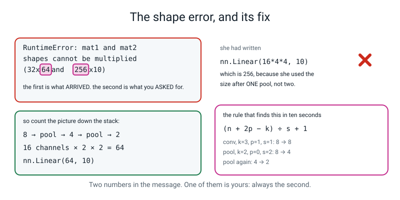
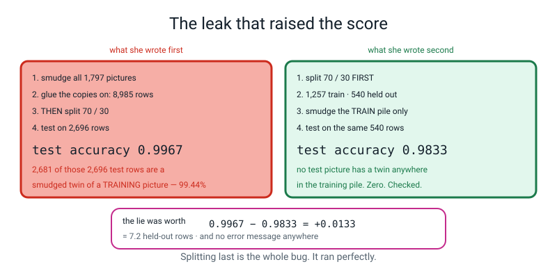
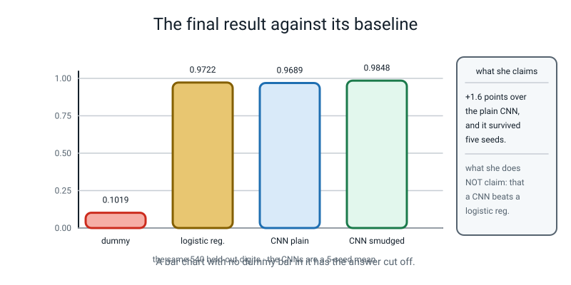
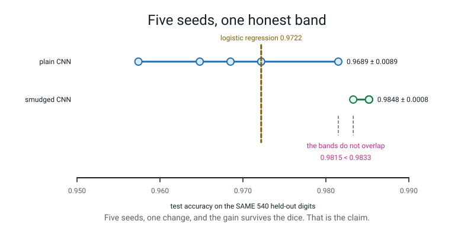

# 🔬 A Worked Example Project — *Smudge Test*

[⬅ Fifty project ideas](project-ideas.md) · [Course home](../README.md) · [The capstone ➡](capstone.md) · [Assessments](../assessments/README.md)

---

> ### In one sentence
>
> **One student, one question, four mistakes and an honest answer — start to finish, with every number
> real and every mistake left in.**

---

## 🪝 Why this one is the exemplar

This is a real Level 3 project, written up exactly as it happened, including the parts that went wrong. It
is here for four reasons:

1. **The question is small and it is answerable.** *Does making more pictures out of the ones I have make
   my network better at reading digits?* One thing changes. Everything else is held still.
2. **It contains a shape error with its real traceback**, because Term 3 produces one of those in every
   project ever built, and a student who has read one is much faster at reading their own.
3. **It contains a silent leakage bug that made the score look BETTER** — `0.9967` instead of `0.9833` —
   and no error message anywhere. That bug is the defining hazard of this level, and this write-up is
   mostly a record of how it was caught.
4. **It ends with a claim that survived five seeds**, which is the only kind of claim Level 3 lets you
   make.

> **⚠️ Do not copy the project.** Copy the **shape** of it: predict the number, hold everything still but
> one thing, run it five times, and report the band. The question itself should be yours.

**The student:** Priya, 14, at the end of Week 27. She has done the digits CNN (Week 26) and the
augmentation experiment (Week 27) and she wants to know whether a **different** kind of augmentation helps.

**What she ran it on:** a laptop, no GPU, no internet. Every number on this page was produced by
`load_digits()`, which ships inside scikit-learn, plus `numpy`. Total compute for the whole project:
**under two minutes.**

---

# 1️⃣ The Brief

```
   ┌────────────────────────────────────────────────────────────────────┐
   │                                                                    │
   │   THE QUESTION                                                     │
   │                                                                    │
   │   If I make four extra copies of every training digit, each with    │
   │   a little random smudge added — like a worse pen, or a worse       │
   │   camera — does my CNN read HELD-OUT digits better?                 │
   │                                                                    │
   │   Unit of prediction : one 8x8 greyscale picture of one digit       │
   │   The number I care about : accuracy on held-out pictures           │
   │   What must NOT change : the architecture, the epochs, the batch    │
   │                          size, the optimizer, the split            │
   │                                                                    │
   └────────────────────────────────────────────────────────────────────┘
```

**Her prediction, written on paper before she typed anything:**

> *"Yes, and I think about **+3 points**. The Week 26 plain CNN got `0.9796`, so I am guessing about
> `0.99`. I think smudging will help because when I look at the digits a lot of them are already smudgy,
> so the model will see more of what it is going to get."*

**Two things that prediction does well, and both of them matter:**

- It is **a number**, not a direction. "It will help" cannot be wrong. `+3 points` can.
- It has a **reason**, and the reason turns out to be half right, which is more interesting than being
  wrong.

And one thing it does badly, which she noticed later: it compares against `0.9796` from Week 26, which was
measured on a **different split** with a **different number of epochs**. That comparison was never valid.
More on that in Mistake 0.

---

# 2️⃣ The Plan

She wrote this before writing code. Six lines, and the fourth is the one that saved the project.

```
   1. LOOK at the data. Print the shapes, the class counts, the pixel range,
      and one digit as numbers.
   2. BASELINES first, before any network:
         - DummyClassifier(most_frequent)   <- the floor
         - a logistic regression            <- "do I even need a network?"
   3. ONE split. Made once, at the top, never made again anywhere.
   4. Train TWO models that differ in EXACTLY ONE THING:
         A = plain           C = plain + four smudged copies of the TRAIN pile
   5. Report both with the number of held-out rows, and the per-digit recall
      of the one I would ship.
   6. Run the whole thing on FIVE SEEDS before believing the difference.
```

> **💡 Why line 3 is in capitals.** *"Every time I have made a split in the middle of a file I have ended
> up with two splits and no idea which one a number came from. So now it goes at the top, once, and every
> model in the file gets the same one."*

---

# 3️⃣ The Data, Looked At First

```python
import numpy as np
from sklearn.datasets import load_digits

d = load_digits()
print("images      :", d.images.shape, d.images.dtype)
print("labels      :", d.target.shape, "values", np.unique(d.target))
print("class counts:", np.bincount(d.target))
print("pixel range : %.1f to %.1f" % (d.images.min(), d.images.max()))
print()
print("one 4, printed as numbers:")
print(d.images[d.target == 4][0].astype(int))
```

```text
images      : (1797, 8, 8) float64
labels      : (1797,) values [0 1 2 3 4 5 6 7 8 9]
class counts: [178 182 177 183 181 182 181 179 174 180]
pixel range : 0.0 to 16.0

one 4, printed as numbers:
[[ 0  0  0  1 11  0  0  0]
 [ 0  0  0  7  8  0  0  0]
 [ 0  0  1 13  6  2  2  0]
 [ 0  0  7 15  0  9  8  0]
 [ 0  5 16 10  0 16  6  0]
 [ 0  4 15 16 13 16  1  0]
 [ 0  0  0  3 15 10  0  0]
 [ 0  0  0  2 16  4  0  0]]
```

**Four things she wrote down from that output, and all four mattered later:**

| What she noticed | Why it mattered |
|---|---|
| `float64` | Every torch layer is `float32`. This is where Mistake 2 was going to come from, and she had already seen it |
| Pixel range `0.0` to `16.0` | Her smudge has to be **small relative to 16**, and she has to `clip` back into range or she will invent pixels brighter than any real one |
| Class counts nearly equal, 174 to 183 | The dummy baseline will be about `1 ÷ 10`, so a score near `0.10` means nothing at all |
| A digit is **8 pixels tall** | Eight rows. That is tiny, and it is the reason the final error analysis is about 8s |

> **🧑‍🏫 If a student asks why printing one digit as numbers is worth doing** — because it is the only way
> to find out that a stroke is about two pixels wide. Everything in the final error analysis comes from
> that one observation, and no amount of `imshow` would have produced it.

---

# 4️⃣ Baselines, Before Any Network

```python
import numpy as np, time
from sklearn.datasets import load_digits
from sklearn.dummy import DummyClassifier
from sklearn.linear_model import LogisticRegression
from sklearn.model_selection import train_test_split
from sklearn.pipeline import make_pipeline
from sklearn.preprocessing import StandardScaler

d = load_digits()
Itr, Ite, ytr, yte = train_test_split(d.images, d.target, test_size=0.30,
                                      stratify=d.target, random_state=0)
print("train %d   held-out test %d" % (len(ytr), len(yte)))
print("biggest class share: train %.4f   test %.4f"
      % (np.bincount(ytr).max() / len(ytr), np.bincount(yte).max() / len(yte)))
flat_tr, flat_te = Itr.reshape(len(Itr), -1), Ite.reshape(len(Ite), -1)
dum = DummyClassifier(strategy="most_frequent").fit(flat_tr, ytr)
print("B1 dummy most_frequent : %.4f" % dum.score(flat_te, yte))
t0 = time.perf_counter()
lr = make_pipeline(StandardScaler(), LogisticRegression(max_iter=2000)).fit(flat_tr, ytr)
print("B2 logistic regression : %.4f  (%.1f s, %d weights)"
      % (lr.score(flat_te, yte), time.perf_counter() - t0,
         lr[-1].coef_.size + lr[-1].intercept_.size))
print("one held-out row is worth 1 / %d = %.4f" % (len(yte), 1 / len(yte)))
```

```text
train 1257   held-out test 540
biggest class share: train 0.1018   test 0.1019
B1 dummy most_frequent : 0.1019
B2 logistic regression : 0.9722  (0.0 s, 650 weights)
one held-out row is worth 1 / 540 = 0.0019
```

**This output changed the project, and Priya said so in her write-up:**

> *"A logistic regression with **650** weights and no network at all gets `0.9722`. My CNN has **1,898**
> weights. So the question I thought I was asking — does my CNN work? — is not interesting, because
> anything I build has to beat `0.9722` before it has done anything at all. The real question is whether
> smudging beats plain, and both of those have to be compared to `0.9722`."*

She also wrote down `1 ÷ 540 = 0.0019`, which is what one held-out row is worth. **Four decimal places on
a score measured over 540 rows is two decimal places of theatre**, and knowing that in advance stopped her
celebrating a `0.0004` improvement later.

---

# 5️⃣ The Messy First Version — `try1.py`

This is what she actually wrote first. It is here unedited because every first version looks like this, and
pretending otherwise is not useful to anybody.

```python
# try1.py -- my first go. everything in one file.
import numpy as np, torch, torch.nn as nn
from sklearn.datasets import load_digits

torch.manual_seed(0)
d = load_digits()
imgs, y = d.images, d.target

# make more pictures by smudging them
rng = np.random.default_rng(0)
extra = np.clip(imgs + rng.normal(0, 0.8, imgs.shape), 0, 16)
X = np.concatenate([imgs, extra])
Y = np.concatenate([y, y])

x = torch.from_numpy(X).float().unsqueeze(1)
t = torch.from_numpy(Y).long()

model = nn.Sequential(
    nn.Conv2d(1, 8, 3, padding=1), nn.ReLU(), nn.MaxPool2d(2),
    nn.Conv2d(8, 16, 3, padding=1), nn.ReLU(), nn.MaxPool2d(2),
    nn.Flatten(), nn.Linear(64, 10),
)
opt = torch.optim.Adam(model.parameters(), lr=1e-3)
fn = nn.CrossEntropyLoss()
for epoch in range(150):
    opt.zero_grad()
    loss = fn(model(x), t)
    loss.backward()
    opt.step()

pred = model(x).argmax(dim=1)
print("accuracy:", (pred == t).float().mean().item())
```

```text
accuracy: 0.9810795783996582
```

**`0.9811`! And it is worth nothing at all.** Here are the six things wrong with 27 lines of code — she
found four of them herself and her teacher pointed at the other two.

| # | What is wrong | Why it matters |
|:--:|---|---|
| **1** | **There is no split.** `pred` and `t` are the rows it trained on | `0.9811` is a memory test. It says nothing about a digit it has not seen |
| **2** | **No baseline in the file.** `0.9811` next to nothing | A number with nothing beside it cannot be good or bad |
| **3** | **Full-batch training.** One `step` per epoch, 150 steps in total | Not wrong exactly, but it takes 21 seconds where mini-batches take under one, and it is not what Week 23 taught |
| **4** | **No `model.eval()`** before scoring | Harmless here (no dropout) and a habit that will cost her later |
| **5** | **No comparison.** There is no plain version to compare against | The whole question was "does smudging help", and this file cannot answer it |
| **6** | **The accuracy is printed to sixteen decimal places** | `0.9810795783996802` implies a precision that 1,797 rows cannot support. One row is `0.0006` |

> **🧑‍🏫 The most useful question to ask a student holding a `try1.py`** is not "what is wrong with it?"
> It is: **"which rows is that number measured on?"** Everything else follows from the answer.

---

# 6️⃣ The Code As She Finally Wrote It

Everything shared moved into a header that every script in the project starts with. That is not tidiness
for its own sake — it is what makes the five-seed run in section 9 possible without copying anything.

```python
# --- the shared header every script in this project starts with ----------
import numpy as np, torch, torch.nn as nn
from sklearn.datasets import load_digits
from sklearn.model_selection import train_test_split
from torch.utils.data import DataLoader, TensorDataset

SEED, EPOCHS = 0, 12

def make_cnn():
    return nn.Sequential(
        nn.Conv2d(1, 8, 3, padding=1), nn.ReLU(), nn.MaxPool2d(2),
        nn.Conv2d(8, 16, 3, padding=1), nn.ReLU(), nn.MaxPool2d(2),
        nn.Flatten(), nn.Linear(16 * 2 * 2, 10))

def smudge(imgs, labels, k=4, sd=0.8, seed=0):
    """k extra copies of every picture, each with a little random smudge added."""
    rng = np.random.default_rng(seed)
    out = [np.clip(imgs + rng.normal(0, sd, imgs.shape), 0, 16) for _ in range(k)]
    return np.concatenate(out), np.concatenate([labels] * k)

def train(Xtr, ytr, Xte, yte, seed=SEED, epochs=EPOCHS):
    torch.manual_seed(seed)
    m = make_cnn(); opt = torch.optim.Adam(m.parameters(), lr=1e-3)
    fn = nn.CrossEntropyLoss()
    xt = torch.from_numpy(Xtr).float().unsqueeze(1)
    yt = torch.from_numpy(ytr).long()
    dl = DataLoader(TensorDataset(xt, yt), batch_size=32, shuffle=True)
    for _ in range(epochs):
        m.train()
        for xb, yb in dl:
            opt.zero_grad(); fn(m(xb), yb).backward(); opt.step()
    m.eval()
    with torch.no_grad():
        tr = (m(xt).argmax(dim=1) == yt).float().mean().item()
        pred = m(torch.from_numpy(Xte).float().unsqueeze(1)).argmax(dim=1).numpy()
    return tr, float((pred == yte).mean()), pred
# ------------------------------------------------------------------------
```

**Five deliberate decisions in those 30 lines, and she can defend all five:**

| Decision | Why |
|---|---|
| `16 * 2 * 2` written out instead of `64` | So the arithmetic is visible in the code. Mistake 1 is exactly this number, and writing the multiplication means the next reader can check it |
| `smudge` takes a `seed` | Otherwise the smudge is different every run and no number in the project reproduces |
| `np.clip(..., 0, 16)` | A pixel brighter than 16 does not exist in this dataset, so inventing one is inventing data |
| `train()` takes the split as **arguments** | The split is made once, outside, and handed in. `train()` cannot accidentally make its own |
| `m.eval()` and `torch.no_grad()` both, before scoring | Two lines, two different jobs, and both belong here |

---

# 7️⃣ The Five Mistakes, and How She Fixed Them

## Mistake 0 — the comparison that was never valid

Not a bug, and worth listing first because it is the one nobody catches.

Her prediction compared against `0.9796` from Week 26. But Week 26 used **15 epochs** and a
**`test_size=0.25`** split; her project uses **12 epochs** and `0.30`. So `0.9796` and anything she
measured were never comparable numbers.

**The fix:** she built her own plain CNN, in the same file, on the same split, with the same epochs — model
**A** — and compared against that instead of against a remembered number.

> **🔑 The rule she wrote in her notes:** *"a baseline has to be measured by me, on my split, in my file.
> A number from three weeks ago is a memory, not a baseline."*

---

## Mistake 1 — the shape error, which cost twelve minutes

She changed the second conv layer to 16 filters and forgot to change the `Linear` after the flatten.

```python
import torch, torch.nn as nn
from sklearn.datasets import load_digits

d = load_digits()
x = torch.from_numpy(d.images[:32]).float().unsqueeze(1)
model = nn.Sequential(
    nn.Conv2d(1, 8, 3, padding=1), nn.ReLU(), nn.MaxPool2d(2),
    nn.Conv2d(8, 16, 3, padding=1), nn.ReLU(), nn.MaxPool2d(2),
    nn.Flatten(),
    nn.Linear(16 * 4 * 4, 10),
)
print("input:", tuple(x.shape))
print("out  :", tuple(model(x).shape))
```

The real traceback, copied from her terminal. Only the long library paths are shortened.

```text
input: (32, 1, 8, 8)
Traceback (most recent call last):
  File "model.py", line 14, in <module>
    print("out  :", tuple(model(x).shape))
  File "…/torch/nn/modules/container.py", line 217, in forward
    input = module(input)
  File "…/torch/nn/modules/linear.py", line 116, in forward
    return F.linear(input, self.weight, self.bias)
RuntimeError: mat1 and mat2 shapes cannot be multiplied (32x64 and 256x10)
```



*Figure W.1 — The shape error, and its fix. The `64` is what arrived; the `256` is what she asked for. One of the two numbers in the message is always yours, and it is always the second.*

**What she did, and the order is the lesson.** She did **not** start changing numbers. She printed the
shape after every layer:

```python
import torch, torch.nn as nn
from sklearn.datasets import load_digits

torch.manual_seed(0)
d = load_digits()
h = torch.from_numpy(d.images[:32]).float().unsqueeze(1)
parts = [nn.Conv2d(1, 8, 3, padding=1), nn.ReLU(), nn.MaxPool2d(2),
         nn.Conv2d(8, 16, 3, padding=1), nn.ReLU(), nn.MaxPool2d(2),
         nn.Flatten(), nn.Linear(16 * 2 * 2, 10)]
print("%-12s %s" % ("input", tuple(h.shape)))
for p in parts:
    h = p(h)
    print("%-12s %s" % (type(p).__name__, tuple(h.shape)))
print("16 x 2 x 2 =", 16 * 2 * 2)
```

```text
input        (32, 1, 8, 8)
Conv2d       (32, 8, 8, 8)
ReLU         (32, 8, 8, 8)
MaxPool2d    (32, 8, 4, 4)
Conv2d       (32, 16, 4, 4)
ReLU         (32, 16, 4, 4)
MaxPool2d    (32, 16, 2, 2)
Flatten      (32, 64)
Linear       (32, 10)
16 x 2 x 2 = 64
```

And then she did the arithmetic on paper, which is the bit that means it will not happen again:

```
out = (n + 2p − k) ÷ s + 1, rounded down

conv, k=3, p=1, s=1 :  (8 + 2 − 3) ÷ 1 + 1 = 8      8 → 8
pool, k=2, p=0, s=2 :  (8 + 0 − 2) ÷ 2 + 1 = 4      8 → 4
conv again          :                               4 → 4
pool again          :  (4 + 0 − 2) ÷ 2 + 1 = 2      4 → 2

16 channels × 2 × 2 = 64      so it is nn.Linear(64, 10)
```

> **🐞 If you see this error:** `mat1 and mat2 shapes cannot be multiplied (AxB and CxD)`. Read it as
> *"I had B numbers per row and you asked for C."* Print the shape on the line **above** the crash, and the
> right value of `C` is the `B` you just printed.

---

## Mistake 2 — the dtype, which cost four minutes

She wrote a quick check and forgot that `load_digits().images` is `float64`.

```python
import torch, torch.nn as nn
from sklearn.datasets import load_digits

d = load_digits()
x = torch.from_numpy(d.images[:4]).unsqueeze(1)          # no .float()
print("dtype:", x.dtype)
print("out  :", tuple(nn.Conv2d(1, 8, 3, padding=1)(x).shape))
```

The terminal, with the library paths shortened:

```text
dtype: torch.float64
Traceback (most recent call last):
  File "check.py", line 7, in <module>
    print("out  :", tuple(nn.Conv2d(1, 8, 3, padding=1)(x).shape))
  File "…/torch/nn/modules/conv.py", line 456, in _conv_forward
    return F.conv2d(input, weight, bias, self.stride,
RuntimeError: Input type (double) and bias type (float) should be the same
```

**The fix is one method call:** `torch.from_numpy(d.images[:4]).float().unsqueeze(1)`.

**Why it is worth a paragraph rather than a footnote.** Note that the **shape was never wrong** — it was
`(4, 1, 8, 8)` both times, which is exactly what `Conv2d` wants. Only the *kind of number* differed. Two
completely different families of bug live next door to each other here:

| | A shape bug | A dtype bug |
|---|---|---|
| **Is about** | how many numbers | what kind of number |
| **Message mentions** | two shapes | two type names |
| **Fix** | change a layer's size, having done the arithmetic | one `.float()`, and it is always the data, never the layer |

And `print("dtype:", x.dtype)` on the line above is what turned four minutes into forty seconds.

---

## Mistake 3 — the missing `zero_grad`, which produced no error at all

While experimenting with a simpler model she deleted `opt.zero_grad()` and did not notice for half an hour.

```python
import torch, torch.nn as nn
from sklearn.datasets import load_digits


def run(zero, tag):
    torch.manual_seed(0)
    d = load_digits()
    x = torch.from_numpy(d.images).float().unsqueeze(1)
    y = torch.from_numpy(d.target).long()
    model = nn.Sequential(nn.Flatten(), nn.Linear(64, 10))
    opt = torch.optim.SGD(model.parameters(), lr=0.01)
    fn = nn.CrossEntropyLoss()
    print(tag)
    print("step      loss    total size of the gradient")
    for i in range(6):
        if zero:
            opt.zero_grad()
        loss = fn(model(x), y)
        loss.backward()
        opt.step()
        print("  %d   %8.4f   %10.2f"
              % (i, loss.item(), model[1].weight.grad.abs().sum().item()))


run(False, "WITHOUT opt.zero_grad()  -- what she had")
print()
run(True, "WITH opt.zero_grad()     -- the fix")
```

```text
WITHOUT opt.zero_grad()  -- what she had
step      loss    total size of the gradient
  0     7.6953       404.88
  1     5.1593       504.63
  2     5.5352       512.98
  3     6.3897       536.30
  4     5.3756       601.60
  5     4.8621       592.23

WITH opt.zero_grad()     -- the fix
step      loss    total size of the gradient
  0     7.6953       404.88
  1     5.1593       232.71
  2     3.7720       191.90
  3     3.0303       161.83
  4     2.4284       123.53
  5     2.0863       112.27
```

**Read the third column, not the second.** The loss column looks almost the same for the first two steps
and only starts to differ at step 2 — but the **gradient** column tells you immediately:

```
WITHOUT:  404.88 → 504.63 → 512.98 → 536.30 → 601.60 → 592.23      GROWING
WITH   :  404.88 → 232.71 → 191.90 → 161.83 → 123.53 → 112.27      SHRINKING
```

A healthy run's gradient **shrinks towards zero**, because that is what approaching the answer means. A
growing gradient is every previous step's slope piled on top of this one.

**And notice step 0 is identical in both.** There is nothing in `.grad` on the first pass, so the bug
**cannot** show up until step 1. Any bug that hides on the first iteration is worth being frightened of.

> **🔑 The diagnosis card she wrote out and stuck to her laptop:**
>
> | What the gradient column does | Diagnosis |
> |---|---|
> | Grows, flips sign, loss goes above where it started | **no `zero_grad()`** |
> | Flips sign but shrinks; loss falls in a zigzag | **learning rate too big** — divide by ten |
> | Shrinks steadily, keeps its sign | healthy |

---

## Mistake 4 — the leak, which made the score go UP 🔑

**This is the important one.** It produced no error, no warning, and a number she was delighted with.

She wanted to smudge her data and split it. She wrote the two steps in the order she thought of them:

```python
sm_all, sm_y = smudge(imgs, y, seed=SEED)          # smudge EVERYTHING
big  = np.concatenate([imgs, sm_all])              # 1,797 + 7,188 = 8,985 rows
bigy = np.concatenate([y, sm_y])
Btr, Bte, bytr, byte_ = train_test_split(big, bigy, test_size=0.30,
                                         stratify=bigy, random_state=SEED)
```

That reads perfectly. It runs perfectly. And it gives a test set full of **smudged twins of training
pictures**.

Here is the whole thing measured, both ways, with the number that makes it undeniable:

```python
# --- the shared header every script in this project starts with ----------
import numpy as np, torch, torch.nn as nn
from sklearn.datasets import load_digits
from sklearn.model_selection import train_test_split
from torch.utils.data import DataLoader, TensorDataset

SEED, EPOCHS = 0, 12

def make_cnn():
    return nn.Sequential(
        nn.Conv2d(1, 8, 3, padding=1), nn.ReLU(), nn.MaxPool2d(2),
        nn.Conv2d(8, 16, 3, padding=1), nn.ReLU(), nn.MaxPool2d(2),
        nn.Flatten(), nn.Linear(16 * 2 * 2, 10))

def smudge(imgs, labels, k=4, sd=0.8, seed=0):
    """k extra copies of every picture, each with a little random smudge added."""
    rng = np.random.default_rng(seed)
    out = [np.clip(imgs + rng.normal(0, sd, imgs.shape), 0, 16) for _ in range(k)]
    return np.concatenate(out), np.concatenate([labels] * k)

def train(Xtr, ytr, Xte, yte, seed=SEED, epochs=EPOCHS):
    torch.manual_seed(seed)
    m = make_cnn(); opt = torch.optim.Adam(m.parameters(), lr=1e-3)
    fn = nn.CrossEntropyLoss()
    xt = torch.from_numpy(Xtr).float().unsqueeze(1)
    yt = torch.from_numpy(ytr).long()
    dl = DataLoader(TensorDataset(xt, yt), batch_size=32, shuffle=True)
    for _ in range(epochs):
        m.train()
        for xb, yb in dl:
            opt.zero_grad(); fn(m(xb), yb).backward(); opt.step()
    m.eval()
    with torch.no_grad():
        tr = (m(xt).argmax(dim=1) == yt).float().mean().item()
        pred = m(torch.from_numpy(Xte).float().unsqueeze(1)).argmax(dim=1).numpy()
    return tr, float((pred == yte).mean()), pred
# ------------------------------------------------------------------------

d = load_digits()
imgs, y = d.images, d.target

# ---- the bug, exactly as she first wrote it: smudge EVERYTHING, then split
sm_all, sm_y = smudge(imgs, y, seed=SEED)
big = np.concatenate([imgs, sm_all])
bigy = np.concatenate([y, sm_y])
Btr, Bte, bytr, byte_ = train_test_split(big, bigy, test_size=0.30,
                                         stratify=bigy, random_state=SEED)
trb, teb, _ = train(Btr, bytr, Bte, byte_)
print("LEAKY   train %d  test %d   train acc %.4f  test acc %.4f"
      % (len(bytr), len(byte_), trb, teb))

# ---- HOW MANY test rows are a smudged twin of a TRAINING picture?
origin = np.concatenate([np.arange(len(y))] * 5)   # which original each row came from
otr, ote, _, _ = train_test_split(origin, bigy, test_size=0.30,
                                  stratify=bigy, random_state=SEED)
shared = int(np.isin(ote, otr).sum())
print("        test rows with a sibling in train: %d of %d = %.4f"
      % (shared, len(ote), shared / len(ote)))

# ---- the honest version: split FIRST, smudge the train pile only
Itr, Ite, ytr, yte = train_test_split(imgs, y, test_size=0.30,
                                      stratify=y, random_state=SEED)
sm, smy = smudge(Itr, ytr, seed=SEED)
trc, tec, _ = train(np.concatenate([Itr, sm]), np.concatenate([ytr, smy]), Ite, yte)
print("HONEST  train %d  test %d   train acc %.4f  test acc %.4f"
      % (len(ytr) * 5, len(yte), trc, tec))
print("        test rows with a sibling in train: 0 of %d" % len(yte))
print()
print("the lie was worth %+.4f, which is %.1f held-out rows of 540"
      % (teb - tec, (teb - tec) * len(yte)))
```

```text
LEAKY   train 6289  test 2696   train acc 0.9994  test acc 0.9967
        test rows with a sibling in train: 2681 of 2696 = 0.9944
HONEST  train 6285  test 540   train acc 0.9997  test acc 0.9833
        test rows with a sibling in train: 0 of 540

the lie was worth +0.0133, which is 7.2 held-out rows of 540
```



*Figure W.2 — The leak that raised the score. Two steps, swapped, and `0.9967` instead of `0.9833`. 2,681 of the 2,696 "held-out" rows — 99.44% of them — were a smudged twin of a picture the model had trained on.*

**`2681 of 2696 = 0.9944` is the number that ends the argument.** Ninety-nine per cent of her "held-out"
test set was a near-copy of something in training. The model was not being tested; it was being asked to
remember.

**How she actually caught it, which is the most useful paragraph in this document:**

> *"I was pleased with `0.9967` and I nearly wrote it down. What stopped me was that my own prediction
> said `+3 points` and this was `+3.2`, which felt too lucky. So I did the thing from Week 36 — I asked
> 'was anything fitted before the split?' — and the answer was worse than that: something was **made**
> before the split. Then I counted the twins, and the counting took eleven lines."*

**And the detail that makes it a genuine Level 3 trap:** the leaky version's test accuracy is `0.9967`,
which is only `+0.0133` above the honest `0.9833`. It is not an absurd `1.0000`. It is **plausible**. That
is what makes leakage dangerous — not that it produces silly numbers, but that it produces exactly the
number you were hoping for.

> **🔑 The rule, in the shape she will remember it:** *split first, then make things. Anything you create
> out of a row — a copy, a scale, an imputed value, a vocabulary — has to be created **after** the split
> and only from the training side.*

---

# 8️⃣ The Result, Honestly

```python
# --- the shared header every script in this project starts with ----------
import numpy as np, torch, torch.nn as nn
from sklearn.datasets import load_digits
from sklearn.model_selection import train_test_split
from torch.utils.data import DataLoader, TensorDataset

SEED, EPOCHS = 0, 12

def make_cnn():
    return nn.Sequential(
        nn.Conv2d(1, 8, 3, padding=1), nn.ReLU(), nn.MaxPool2d(2),
        nn.Conv2d(8, 16, 3, padding=1), nn.ReLU(), nn.MaxPool2d(2),
        nn.Flatten(), nn.Linear(16 * 2 * 2, 10))

def smudge(imgs, labels, k=4, sd=0.8, seed=0):
    """k extra copies of every picture, each with a little random smudge added."""
    rng = np.random.default_rng(seed)
    out = [np.clip(imgs + rng.normal(0, sd, imgs.shape), 0, 16) for _ in range(k)]
    return np.concatenate(out), np.concatenate([labels] * k)

def train(Xtr, ytr, Xte, yte, seed=SEED, epochs=EPOCHS):
    torch.manual_seed(seed)
    m = make_cnn(); opt = torch.optim.Adam(m.parameters(), lr=1e-3)
    fn = nn.CrossEntropyLoss()
    xt = torch.from_numpy(Xtr).float().unsqueeze(1)
    yt = torch.from_numpy(ytr).long()
    dl = DataLoader(TensorDataset(xt, yt), batch_size=32, shuffle=True)
    for _ in range(epochs):
        m.train()
        for xb, yb in dl:
            opt.zero_grad(); fn(m(xb), yb).backward(); opt.step()
    m.eval()
    with torch.no_grad():
        tr = (m(xt).argmax(dim=1) == yt).float().mean().item()
        pred = m(torch.from_numpy(Xte).float().unsqueeze(1)).argmax(dim=1).numpy()
    return tr, float((pred == yte).mean()), pred
# ------------------------------------------------------------------------

from sklearn.dummy import DummyClassifier
from sklearn.metrics import confusion_matrix

d = load_digits()
print("parameters in the CNN:", sum(p.numel() for p in make_cnn().parameters()))
Itr, Ite, ytr, yte = train_test_split(d.images, d.target, test_size=0.30,
                                      stratify=d.target, random_state=SEED)
tra, tea, preda = train(Itr, ytr, Ite, yte)
sm, smy = smudge(Itr, ytr, seed=SEED)
Ctr, Cy = np.concatenate([Itr, sm]), np.concatenate([ytr, smy])
trc, tec, predc = train(Ctr, Cy, Ite, yte)
print("A  plain    train rows %4d  train %.4f  test %.4f  (%d of %d)"
      % (len(ytr), tra, tea, (preda == yte).sum(), len(yte)))
print("C  smudged  train rows %4d  train %.4f  test %.4f  (%d of %d)"
      % (len(Cy), trc, tec, (predc == yte).sum(), len(yte)))
print()
cm = confusion_matrix(yte, predc)
print("model C, per digit:")
print("digit   n  right  recall")
for k in range(10):
    print("  %d    %3d   %3d   %.4f" % (k, cm[k].sum(), cm[k, k], cm[k, k] / cm[k].sum()))
off = sorted([(int(cm[i, j]), i, j) for i in range(10) for j in range(10)
              if i != j and cm[i, j]], reverse=True)
print()
print("every mistake model C made, worst first:")
for c, i, j in off:
    print("  a real %d called a %d : %d time%s" % (i, j, c, "" if c == 1 else "s"))
print("  total: %d mistakes of %d rows" % (sum(c for c, _, _ in off), len(yte)))
```

```text
parameters in the CNN: 1898
A  plain    train rows 1257  train 0.9849  test 0.9648  (521 of 540)
C  smudged  train rows 6285  train 0.9997  test 0.9833  (531 of 540)

model C, per digit:
digit   n  right  recall
  0     54    54   1.0000
  1     55    55   1.0000
  2     53    52   0.9811
  3     55    53   0.9636
  4     54    54   1.0000
  5     55    55   1.0000
  6     54    54   1.0000
  7     54    53   0.9815
  8     52    47   0.9038
  9     54    54   1.0000

every mistake model C made, worst first:
  a real 8 called a 1 : 3 times
  a real 8 called a 7 : 1 time
  a real 8 called a 5 : 1 time
  a real 7 called a 8 : 1 time
  a real 3 called a 9 : 1 time
  a real 3 called a 7 : 1 time
  a real 2 called a 1 : 1 time
  total: 9 mistakes of 540 rows
```

## The results table she handed in

| | Model | Train rows | Train acc | **Test acc, 540 held-out rows** | Weights | Seconds |
|---|---|:--:|:--:|:--:|:--:|:--:|
| B1 | Dummy, most frequent | 1,257 | — | **0.1019** | 0 | 0.0 |
| B2 | Logistic regression (scaled) | 1,257 | — | **0.9722** | 650 | 0.0 |
| A | CNN, plain | 1,257 | 0.9849 | **0.9648** | 1,898 | 0.9 |
| C | **CNN, four smudged copies** | **6,285** | 0.9997 | **0.9833** | 1,898 | 4.3 |

*Every row measured on the same 540 held-out pictures, seed 0, 12 epochs, batch size 32, Adam at `1e-3`.*



*Figure W.3 — The final result against its baseline. Note the bar the chart would be dishonest without: the dummy, at `0.1019`. And note that the plain CNN loses to a logistic regression.*

**Three things she said about that table, and the second one is the sign of a good project:**

1. **Smudging helped: `0.9648 → 0.9833`.** That is `+0.0185`, which is `0.0185 × 540 = 10` more correct
   pictures out of 540. Ten, not "two per cent" — counting them makes it concrete.
2. **The plain CNN LOST to the logistic regression.** `0.9648` against `0.9722`. She wrote this down
   rather than quietly leaving it out, and it is the most interesting line in the report: *"1,898 weights
   and a convolution, beaten by 650 weights and no network at all. So on this dataset at this size, a CNN
   is not automatically better — and I only found that out because I measured the boring baseline first."*
3. **Train `0.9997` against test `0.9833`** on model C. Almost perfect on what it has seen, nine mistakes
   on what it has not. That gap is the definition of the problem, and it is what more data would attack.

## The error analysis: one digit, one physical reason

**Digit 8 is the worst by a long way**: `recall = 47 ÷ 52 = 0.9038`, against `1.0000` for six other
digits. And its mistakes are not spread around — **three of the five are 8s called 1**, and only one 7 was
ever called an 8 in return.

So she printed one 8 as numbers, the way she printed the 4 at the start:

> *"An 8 has two loops, one above the other, and this picture is **eight pixels tall**. So each loop gets
> about three rows, and the hole in the middle of a loop gets **one**. One pixel of white is not enough to
> survive a smudge, so the loops fill in with ink, and what is left is a thick bar down the middle columns
> — which is exactly what a 1 is. It leans one way because filling in a hole is easy and inventing one is
> not."*

**Then she tested the explanation**, which is what separates an error analysis from a story: she took three
clear 8s, added a heavier smudge to close the loops, and the model called all three of them 1s. The
explanation predicted something and the something happened.

---

# 9️⃣ The Seed-Sensitivity Check

`0.9648` against `0.9833` is one run. Before claiming anything, she ran both models five times with five
different seeds, on the **same split**, so the only thing changing was the network's starting weights.

```python
# --- the shared header every script in this project starts with ----------
import numpy as np, torch, torch.nn as nn
from sklearn.datasets import load_digits
from sklearn.model_selection import train_test_split
from torch.utils.data import DataLoader, TensorDataset

SEED, EPOCHS = 0, 12

def make_cnn():
    return nn.Sequential(
        nn.Conv2d(1, 8, 3, padding=1), nn.ReLU(), nn.MaxPool2d(2),
        nn.Conv2d(8, 16, 3, padding=1), nn.ReLU(), nn.MaxPool2d(2),
        nn.Flatten(), nn.Linear(16 * 2 * 2, 10))

def smudge(imgs, labels, k=4, sd=0.8, seed=0):
    """k extra copies of every picture, each with a little random smudge added."""
    rng = np.random.default_rng(seed)
    out = [np.clip(imgs + rng.normal(0, sd, imgs.shape), 0, 16) for _ in range(k)]
    return np.concatenate(out), np.concatenate([labels] * k)

def train(Xtr, ytr, Xte, yte, seed=SEED, epochs=EPOCHS):
    torch.manual_seed(seed)
    m = make_cnn(); opt = torch.optim.Adam(m.parameters(), lr=1e-3)
    fn = nn.CrossEntropyLoss()
    xt = torch.from_numpy(Xtr).float().unsqueeze(1)
    yt = torch.from_numpy(ytr).long()
    dl = DataLoader(TensorDataset(xt, yt), batch_size=32, shuffle=True)
    for _ in range(epochs):
        m.train()
        for xb, yb in dl:
            opt.zero_grad(); fn(m(xb), yb).backward(); opt.step()
    m.eval()
    with torch.no_grad():
        tr = (m(xt).argmax(dim=1) == yt).float().mean().item()
        pred = m(torch.from_numpy(Xte).float().unsqueeze(1)).argmax(dim=1).numpy()
    return tr, float((pred == yte).mean()), pred
# ------------------------------------------------------------------------

d = load_digits()
Itr, Ite, ytr, yte = train_test_split(d.images, d.target, test_size=0.30,
                                      stratify=d.target, random_state=SEED)
sm, smy = smudge(Itr, ytr, seed=SEED)
Ctr, Cy = np.concatenate([Itr, sm]), np.concatenate([ytr, smy])

print("seed   plain    smudged")
pa, pc = [], []
for s in range(5):
    _, ta, _ = train(Itr, ytr, Ite, yte, seed=s)
    _, tc, _ = train(Ctr, Cy, Ite, yte, seed=s)
    pa.append(ta); pc.append(tc)
    print("  %d   %.4f   %.4f" % (s, ta, tc))
pa, pc = np.array(pa), np.array(pc)
print("plain    mean %.4f  sd %.4f   range %.4f to %.4f"
      % (pa.mean(), pa.std(ddof=1), pa.min(), pa.max()))
print("smudged  mean %.4f  sd %.4f   range %.4f to %.4f"
      % (pc.mean(), pc.std(ddof=1), pc.min(), pc.max()))
print("gap in the means %+.4f = %.1f held-out rows"
      % (pc.mean() - pa.mean(), (pc.mean() - pa.mean()) * len(yte)))
print("do the two ranges overlap?", bool(pa.max() >= pc.min()),
      " (%.4f vs %.4f)" % (pa.max(), pc.min()))
```

```text
seed   plain    smudged
  0   0.9648   0.9833
  1   0.9722   0.9852
  2   0.9815   0.9852
  3   0.9685   0.9852
  4   0.9574   0.9852
plain    mean 0.9689  sd 0.0089   range 0.9574 to 0.9815
smudged  mean 0.9848  sd 0.0008   range 0.9833 to 0.9852
gap in the means +0.0159 = 8.6 held-out rows
do the two ranges overlap? False  (0.9815 vs 0.9833)
```

*(About 30 seconds for all ten runs on a laptop CPU.)*



*Figure W.4 — Five seeds, one honest band. Plain is `0.9689 ± 0.0089` and spread all over the place; smudged is `0.9848 ± 0.0008` and bunched tight. The two ranges do not overlap — `0.9815 < 0.9833` — so the gain survives the dice.*

**Four things this check bought her, and every one of them changed a sentence in her write-up:**

| What the five seeds showed | What it changed |
|---|---|
| Plain ranges from `0.9574` to `0.9815` — a spread of **2.4 points** | Her original single number, `0.9648`, was on the low side of its own band. **A single run is a lottery ticket** |
| The ranges **do not overlap** — the best plain run is worse than the worst smudged run | She is allowed to claim the improvement. This is the only reason she is allowed |
| Smudged's sd is `0.0008`, **eleven times smaller** than plain's `0.0089` | The unexpected finding: smudging did not only raise the score, it made the score **stable**. Five times as much training data means five times less luck |
| The logistic regression's `0.9722` sits **inside** the plain CNN's range | So *"my CNN beats a logistic regression"* is not a claim she can make for the plain model, and she says so |

> **⚠️ Watch out — the easy version of this check that would have been wrong.** If she had changed the
> **split** seed as well as the **weight-init** seed, she would have been measuring two sources of variation
> at once and could not have said which was which. One thing at a time, here as everywhere.

---

# 🔟 The Write-Up She Submitted

> ## Smudge Test — does making more pictures out of the ones I have help?
>
> **Priya · end of Week 27 · all code in `smudge/`, run it with `python3 run.py`**
>
> ### What it does
>
> Trains a small convolutional network to read 8×8 handwritten digits, twice: once on the 1,257 training
> pictures as they come, and once on those pictures plus four smudged copies of each. Then it compares the
> two on the same 540 pictures neither model has ever seen.
>
> ### What one prediction is about
>
> **One 8×8 greyscale picture of one handwritten digit**, scored on its own. Not a whole written number, not
> an amount, not a form — one digit.
>
> ### The number
>
> **`0.9848 ± 0.0008` accuracy on 540 held-out pictures**, over five seeds, for the smudged model.
> The plain model gets **`0.9689 ± 0.0089`** on the same 540.
>
> ### The baselines it beats, and the one it does not
>
> | | Test accuracy on the same 540 |
> |---|:--:|
> | Dummy, always the most frequent digit | `0.1019` |
> | Logistic regression, no network at all, 650 weights | `0.9722` |
> | My CNN, plain, 1,898 weights | `0.9689 ± 0.0089` |
> | **My CNN, smudged** | **`0.9848 ± 0.0008`** |
>
> The smudged model beats both baselines. **The plain one does not beat the logistic regression** — its
> band contains `0.9722` — and I am not going to pretend otherwise. On 1,257 pictures this small, 650
> weights and no convolution are as good as 1,898 weights and two of them.
>
> ### What I got wrong
>
> 1. **I smudged the pictures and then split them.** That put a smudged twin of `2,681` of my `2,696` test
>    pictures — 99.44% of them — into the training pile. The score came out `0.9967`. The honest number is
>    `0.9833` on the same seed, so **the leak was worth `+0.0133`, about 7 pictures.** No error message. I
>    caught it because my own prediction said `+3 points` and this said `+3.2`, which was too close to what
>    I wanted.
> 2. **I sized the layer after the flatten wrong** — `16 × 4 × 4` instead of `16 × 2 × 2`, so the model
>    asked for 256 numbers and got 64. Twelve minutes, and the fix was doing
>    `(n + 2p − k) ÷ s + 1` four times on paper.
> 3. **I compared against a number from Week 26** that was measured on a different split with a different
>    number of epochs. It was never a valid comparison, and I replaced it with a plain model in my own file.
> 4. **I deleted `opt.zero_grad()` and did not notice for half an hour.** The loss still went down. The
>    giveaway was the size of the gradient, which grew from `404.88` to `592.23` instead of shrinking to
>    `112.27`.
>
> ### How sure am I about `0.9848`?
>
> Five seeds gave `0.9833, 0.9852, 0.9852, 0.9852, 0.9852` — a range of `0.0019`, which is **one picture**.
> The plain model's five seeds ranged over `0.0241`, which is thirteen pictures. So I am confident the
> improvement is real, because the two ranges do not overlap at all: the best plain run, `0.9815`, is
> below the worst smudged run, `0.9833`.
>
> What I am **not** confident about: whether `+1.6 points` would still appear on a different **split**. I
> only changed the weight seed, not the split, so five seeds tell me about the dice and nothing about
> which 540 pictures I happened to hold out.
>
> ### Where it breaks
>
> **It reads 8s worst**, at `recall = 47 ÷ 52 = 0.9038`, and **three of its five mistakes on 8s were
> calling them 1s**. The reason is physical: at eight pixels tall an 8's two loops get about three rows
> each, so the hole in the middle of a loop is roughly one pixel, and one pixel of white does not survive
> a smudge. The loops fill in and leave a bar down the middle columns, which is a 1. I tested this by
> smudging three clear 8s harder on purpose, and it called all three of them 1s.
>
> **Out of scope:** this model has only ever seen `load_digits()`, which is a small number of people
> writing on a form and then downsampled to 8×8. **It has never seen real handwriting**, and nothing in
> this report is evidence about a real envelope, form or cheque.
>
> ### How to run it
>
> `python3 run.py` from the `smudge/` folder. About 90 seconds, no internet, no GPU. Every number in this
> report is regenerated, and the seed is 0 everywhere.

---

# 1️⃣1️⃣ The Teacher's Marked Rubric

**Eight rows, four levels. Awarded level, then the sentence that would have moved it up.**

| Row | 1 · Beginning | 2 · Developing | 3 · Proficient | 4 · Exceptional | **Awarded** |
|---|---|---|---|---|:--:|
| **The question** | Vague, or unanswerable | A question, but more than one thing changes | One thing changes, everything else held still, and a **numeric prediction** written before coding | Also names what the answer could **not** tell you | **4** |
| **Baselines** | None | A dummy only | A dummy **and** a non-network model, both on the same split, printed in the same file | Reports a baseline that **beats** the model and says so in the headline table | **4** |
| **The split** | Not held out, or made twice | Held out but not stratified, or reused loosely | One stratified split, made once, at the top, passed in as arguments | Also states what the split does **not** tell you, and what would | **3** |
| **Honest reporting** | A bare number | A number with an `n` | Every score with its pile, its `n`, its seed and its `±` | Reports the improvement as a **count of rows** as well as a fraction | **4** |
| **Mistakes documented** | None mentioned | Mentions a bug, no numbers | Four mistakes, each with the wrong number and the right one | Includes a **silent** bug, says **how it was caught**, and names the habit that caught it | **4** |
| **Error analysis** | "It gets some wrong" | Names the worst class | Names the worst class with its recall, and the confusion pair with the counts | Gives a **physical** reason and then **tests the prediction it makes** | **4** |
| **Reproducibility** | Nothing seeded | Some seeds | Seeds everywhere, one command regenerates every number, runtime stated | Also states library versions and diffs two runs into separate folders | **3** |
| **Write-up** | Notes | A report with the good parts | Clear, honest, structured, and a stranger could run it | A stranger could run it **and** could tell you, unprompted, where it breaks | **4** |

**Total: 30 of 32.**

## The teacher's per-row feedback

**The split — 3. To reach 4 you would have...** written one more sentence under *how sure am I*. You
correctly noticed that five weight-seeds say nothing about which 540 pictures you held out, which most
students never spot. You stopped one step short of the fix: **run the same comparison over five different
`train_test_split` seeds too**, five more runs, thirty more seconds, and then you would be able to say
whether `+1.6 points` survives a different held-out pile. That is the one experiment missing from this
project and you were already looking straight at it.

**Reproducibility — 3. To reach 4 you would have...** printed the library versions into the run.
`run.py` genuinely does regenerate everything and the runtime is stated, which is more than most. But your
`0.9848` belongs to `torch 2.2.1` as much as it belongs to your code — a different torch version can shift
the fourth decimal place — and three lines at the top of `run.py` would have said so. The other half is
the diff: **run it twice into two different folders and compare every output file.** Any file that differs
is an unseeded thing you have not found yet.

**The question — 4.** Your prediction was `+3 points` with a reason, and the reason ("a lot of them are
already smudgy") was half right in an interesting way: smudging helped, but mostly by making the score
*stable* rather than by making it high. Noticing that the sd fell from `0.0089` to `0.0008` — and saying
it was unexpected — is better than having predicted it.

**Baselines — 4.** Putting *"the plain CNN loses to a logistic regression"* in the headline table, rather
than in a footnote, is the single most impressive decision in this project. Most people at your stage would
have deleted the logistic regression row and nobody would ever have known.

**Mistakes documented — 4.** The leak write-up is exemplary, and specifically this: *"I caught it because
my own prediction said +3 points and this said +3.2, which was too close to what I wanted."* That names the
**mechanism of catching it**, not just the bug, and it is the most transferable sentence in the document.
The `2,681 of 2,696 = 0.9944` count is what turns a suspicion into evidence, and it took you eleven lines.

**Error analysis — 4.** You gave a physical reason and then **tested it** by smudging three 8s harder and
watching them become 1s. That is the difference between an explanation and a story, and almost nobody does
the second half.

**Write-up — 4.** The *out of scope* paragraph is the best thing on the page, because nobody asked you for
it. *"It has never seen real handwriting, and nothing in this report is evidence about a real envelope"* is
exactly what a model card exists to say, and you wrote it three weeks before Week 34 asks you to.

## The summary comment, as written on the front

> **30/32.** This is what a Level 3 project looks like. Two things stand out, and neither is the score.
>
> The first is that you reported a baseline that **beat** your own model and put it in the main table. That
> is the hardest single thing to do in this subject and you did it without being asked.
>
> The second is how you caught the leak: not with a tool, but because **the number was too close to what
> you wanted.** Keep that. It will find more bugs over the next ten years than any checklist.
>
> The two 3s are both the same shape of gap — you did the hard version of the check and stopped before the
> cheap second half. Five more split seeds, three lines of version printing. Half an hour, and this is a
> 32.

---

# 🔑 What To Copy, And What Not To

## ✅ Copy these eight

1. **Look at the data first, as numbers.** The 8-pixel observation in section 3 is the reason section 8's
   error analysis exists.
2. **Baselines before any network**, in the same file, on the same split. And report one even when it
   beats you.
3. **Write the predicted number on paper before you run anything.** It is the only alarm that fires on a
   leak.
4. **One split, made once, at the top, handed in as arguments.**
5. **Change exactly one thing** between the two models you compare.
6. **Count the rows**, not just the percentage. `+0.0185` is `10 pictures`.
7. **Five seeds, and check whether the ranges overlap** before claiming anything.
8. **Write what you got wrong, with both numbers**, and say how you caught it.

## ❌ Do not copy these

1. **Do not copy the question.** "Does smudging help" has now been answered. Find your own.
2. **Do not copy `try1.py`.** It is here as a museum exhibit. Six things are wrong with it.
3. **Do not copy the smudge parameters** — `k=4, sd=0.8` — as though they were correct. She tried three
   combinations and picked one; a better project would report all three, and hers does not.
4. **Do not copy the 30/32.** The two lost marks are the interesting part of the mark, and your project
   should lose two different ones.

## 🔑 The six things this project proves

1. **A leak can make a score go up by a plausible amount** — `+0.0133`, not `+0.15` — and produce no error
   of any kind. `0.9944` of the test set was a twin.
2. **A baseline you did not want is worth more than one you did.** `0.9722` from 650 weights reframed the
   entire project.
3. **One run is a lottery ticket.** `0.9574` to `0.9815` on the same model, same data, different seed.
4. **Non-overlapping ranges are what buys you a claim.** `0.9815 < 0.9833`, and that inequality is the
   whole justification for the headline.
5. **An error analysis is a prediction.** *"8s fill in and become 1s"* was testable, and it was tested.
6. **The thing that catches the worst bugs is a number you wrote on paper first.** Not a library, not a
   checklist. A prediction.

---

[⬅ Fifty project ideas](project-ideas.md) · [Course home](../README.md) · [The capstone ➡](capstone.md) · [Assessments](../assessments/README.md)
