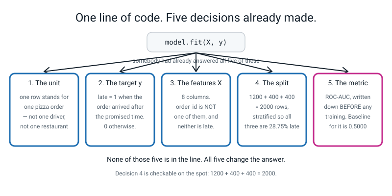
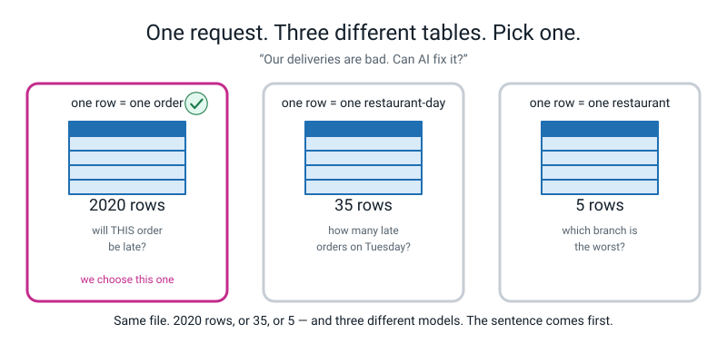
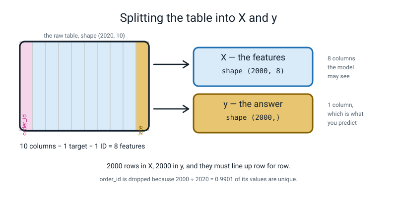
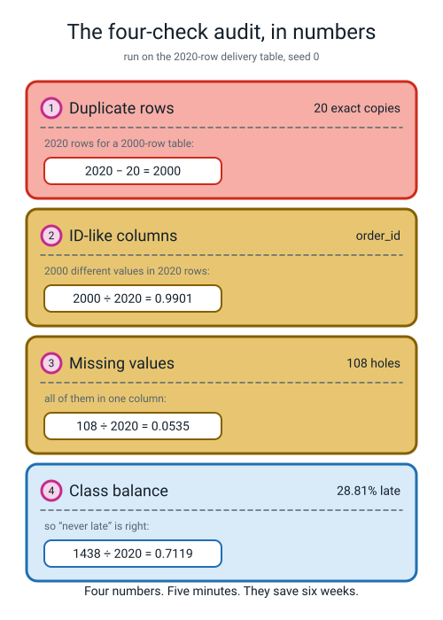
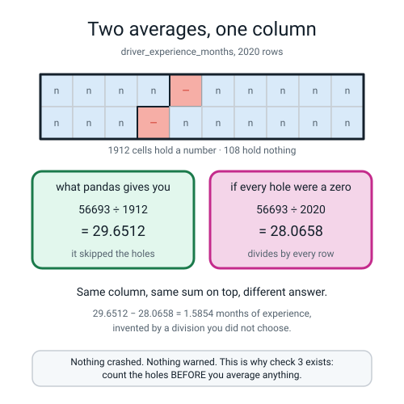
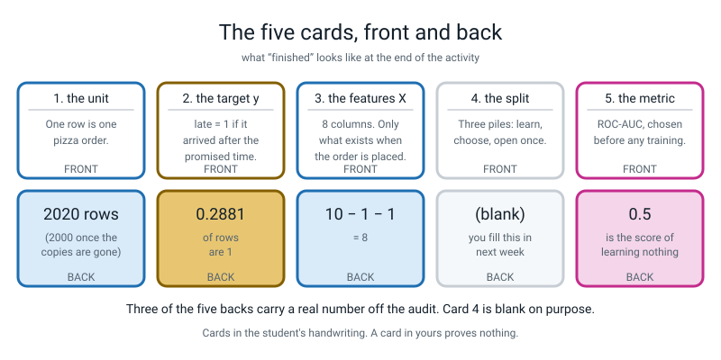
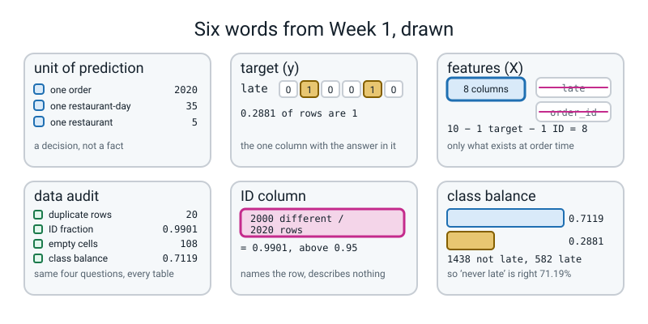

# Week 1 — The One Line That Hid Five Decisions

[⬅ Start Here](../README.md) · [Course Home](../README.md) · [Next ➡](week-02.md) · [Workbook](../workbook/week-01.md)

---

> ### This week in one sentence
> **`model.fit(X, y)` was one line hiding five decisions somebody had to make — and this year you make them yourself, on purpose, in writing.**
>
> **By the end of this chapter you will be able to:**
> - **Name the five decisions** hidden inside a single `fit()` call — the unit of prediction, X, y, the split, and the one metric you commit to — without looking at a list
> - **State the unit of prediction as a sentence** ("one row is one pizza order") and say why that sentence has to come first
> - **Run a four-check audit** on a 2,020-row table and report **20 · 0.9901 · 108 · 0.7119** as real numbers, not as adjectives
> - **Commit one metric to writing before anything is trained**, and say what would count as failure
>
> **New maths:** **none.** Two divisions and a fraction read as a percentage — arithmetic you already have. We use it harder than last year.
>
> **New syntax:** `np.random.default_rng(0)` · `df.duplicated().sum()` · `df["col"].nunique()` · `df["late"].value_counts(normalize=True)`
>
> **Reading time:** about 35 minutes. **Homework:** about 60 minutes.

---

## 🪝 Start Here

Last year you wrote this line, or something very like it, about twenty times:

```python
model.fit(X_train, y_train)
```

It worked. A number came out. The number was usually decent, and that was exactly the right thing to be doing last year.

Here is the only question of this whole chapter: **what does that line not tell you?**

Not what it does — you know what it does. What does it *leave out*?

Write your answers down before you read on. Really. Three or four is plenty.

Now here is a true story about a company that also thought that line was the hard part.

> A team spent **six weeks** building a model to predict late deliveries. It scored **94% accurate**. Everyone was delighted. Then somebody asked what the wrong 6% looked like — and it turned out the model had learned to read one column. The column was called `refund_issued`.
>
> When does a company issue a refund? **After** something has gone wrong.
>
> So the model was 94% accurate at predicting the past. At the moment you actually need the prediction — the customer has just tapped "order" — that column is empty. Nothing in it. The model was worth exactly nothing.

Six weeks. One column. And the clever algorithm was never the problem.


*Figure 1.1 — One line of code. Five decisions already made. Not one of the five is written anywhere in the line.*

**Five decisions get made before `fit` can run.** Last year the person who wrote your worksheet made them for you, which is why you could not get them wrong. This year you make them, and you write them down where somebody else can read them.

There is no model in this chapter. That is the message: **the modelling was never the hard part.**

---

## 🧠 The Big Idea

### 1. The unit of prediction: what is one row?

> **Unit of prediction** — what one row of your table stands for, and therefore what one prediction is *about*.

This is the decision that gets skipped, and skipping it is the most expensive mistake of the week.

The pizza manager says *"our deliveries are bad, can AI fix it?"* That sentence contains no machine learning problem. **It contains a mood.** Here are four completely reasonable readings of it:

| Unit of prediction | One row is… | The question you would answer |
|---|---|---|
| **one order** | a single delivery | will *this* order be late? |
| one restaurant-day | Napoli on Tuesday | how many late orders today? |
| one driver-month | Ravi in March | will this driver quit? |
| one customer | a person | will they ever order again? |

All four are legitimate. All four need **a completely different table**. And here is the part to feel in your stomach — run against the same file, unchanged, the first three give:

```text
one row is ONE ORDER            -> 2020 rows
one row is ONE RESTAURANT-DAY   -> 35 rows
one row is ONE RESTAURANT       -> 5 rows
```

**2020, or 35, or 5.** Same file. You do not even know how many rows you have until you have chosen.


*Figure 1.2 — One request. Three different tables. Pick one. Same file, and the row count changes by a factor of four hundred.*

We choose **one order**, and we write it as a full sentence:

> *"One row is one pizza order."*

**Why a sentence and not the word "order"?** Because everything else you write today is *"per what?"* — per order. If you do not fix the "what", nothing after it means anything. "An order" is a label. "One row is one pizza order" is a decision.

### 2. y is the answer, X is what you are allowed to look at

> **Target (y)** — the single column holding the answer you want the model to produce.

And here is the trap: **"late" is not a definition.** These three are definitions, and they are different:

- `late = 1` if the order arrived **after the promised time**
- `late = 1` if the order arrived **more than 5 minutes** after the promised time
- `late = 1` if the **customer complained**

Three definitions, three different tables, three different models, three different scores. We choose the first, and we write it down in those words. Notice the third one is sneaky: *"the customer complained"* measures the customer's mood at least as much as it measures the pizza.

> **Features (X)** — every column the model is allowed to look at.

There is exactly one rule that decides what goes in, and the story at the top of the chapter was about it:

> **A column may only be in X if it will exist, filled in, at the moment you need the prediction.**

Our moment is **when the order is placed**. So `refund_issued` is out. So is "how long it actually took", and "did the driver phone ahead". Every one of those is tempting, because every one of them predicts brilliantly — and every one of them is reading the answer.

For our table, ten columns become eight:


*Figure 1.3 — Splitting the table into X and y. Ten columns minus one target minus one ID leaves eight features.*

Ten columns, minus one target (`late`), minus one ID (`order_id`), leaves **eight features**. The ID column is the subject of check 2 below, and it is the thing you will argue about most this week.

### 3. The audit: four checks, five minutes, and they save six weeks

> **Data audit** — a short fixed list of questions you ask a table before you do anything else with it. The same questions, in the same order, whatever the data is.

The audit is not "having a look". It is a checklist, and it produces **numbers you write down**. Here are the four, with what they caught in our real table.


*Figure 1.4 — The four-check audit, in numbers. Every one of these four checks caught something real in our table.*

**Check 1 — duplicate rows.** `df.duplicated().sum()` gives **20**.

Twenty rows are exact copies of other rows. Why it matters: if a copy lands in your training pile **and** its twin lands in your test pile, the model gets to memorise the answer and then be tested on it. Next week 20% of rows go to the test pile, so do the arithmetic — **20 × 0.2 = 4.** About four free marks. Four *fake* marks.

And there was a tell before we counted anything. We asked for 2,000 rows and `shape` said **2020**. 2020 − 20 = 2000.

**Check 2 — ID-like columns.** `df["order_id"].nunique()` gives **2000**, out of 2020 rows.

> **ID column** — a column whose values are (nearly) all different, because its job is to *name* the row rather than *describe* it.

The test is a division: different values ÷ rows. **2000 ÷ 2020 = 0.9901.** Anything above about 0.95 is an ID.

Here is every column of our table put through that division — you can see instantly which one is the odd one out:

```text
  order_id                    2000  0.9901
  restaurant                     5  0.0025
  distance_km                  718  0.3554
  items                          6  0.0030
  prep_minutes                 199  0.0985
  order_hour                    14  0.0069
  day_of_week                    7  0.0035
  weather                        3  0.0015
  driver_experience_months      60  0.0297
  late                           2  0.0010
```

**Why must an ID never be a feature?** Because `order_id` carries **no information about the world**. Order 100955 is not late *because* it is order 100955. A flexible model will happily memorise "ID 100955 → not late, ID 100215 → late", score perfectly on rows it has already seen, and then meet order 102000 tomorrow with **nothing at all to go on.**

That difference — **memorising** versus **generalising** — is the whole subject of this year, and it starts by dropping one column.

> **🧑‍🏫 If a student asks:** *why isn't it exactly 1.0000?* Because of the twenty duplicates from check 1. Twenty rows repeat, so twenty `order_id` values repeat too. 2020 − 2000 = 20. **Check 1 and check 2 just agreed with each other**, and that agreement is itself a check.

**Check 3 — missing values.** `df.isna().sum()` shows **108**, all of them in `driver_experience_months`.

108 ÷ 2020 = **0.0535**, about 5.3% of that one column. Every other column is complete.

Two things about that. First, **a hole is not a zero** — a driver with no recorded experience is not a driver with zero months of experience. Second, and this is the one that bites: **the average of a column with holes in it is not the average you think it is.** That is section 5, and it is the most important thing in the chapter.

**Check 4 — class balance.** `df["late"].value_counts(normalize=True)` gives **0.7119** and **0.2881**.

> **Class balance** — the fraction of rows in each answer class. For a 0/1 target it is one number: how often is it 1?

582 rows are late; 1438 are not. **1438 ÷ 2020 = 0.7119.** That single number tells you two things at once:

- the dumbest possible model — "never late" about everything — is **71.19% accurate**
- so **any metric on which 71% sounds impressive is a bad metric for this problem**

### 4. The metric, and *when* you pick it

**Before training. Always before.** Here is the reason, and it is about honesty rather than maths:

> **If you pick the metric after you see the scores, you will pick the metric that flatters you. That is not evaluation, it is marketing.**

We commit to **ROC-AUC** as the headline number. You do not need to know what it *is* yet — that is Weeks 8 to 11, properly, with the curve drawn. Today you need three facts, and you should write them on a card:

```text
ROC-AUC:   0.5 = learned nothing (a coin flip)
           1.0 = perfect
           and it does NOT get fooled by lopsided data
```

That last fact is why we picked it. 28.81% of our orders are late. Accuracy would call "never late" a 71% success. **AUC calls it 0.5000.** Next week you will build that useless model on purpose and watch it score both numbers at the same time.

Write the metric in **pen**. Here is why, said now rather than in Week 7 when the score disappoints you: *if you are allowed to rub it out when you do not like the answer, it was never a commitment.*

### 5. The bug with no error message

This one produces no error, no warning, and a completely plausible number. Slow down here.

Ask pandas for the average driver experience:

```python
print(df["driver_experience_months"].mean())
```

```text
29.651150627615063
```

Fine. Twenty-nine point six five. Now check it by hand, which is what we do all year. The column adds up to 56693, and there are 2020 rows:

**56693 ÷ 2020 = 28.0658.**

Those are not the same number. Same column. Same sum on the top. So what is different underneath?

**Pandas divided by 1912, not 2020.** It skipped the 108 holes, silently, and did not mention it:

**56693 ÷ 1912 = 29.6512.** ← pandas's answer exactly.

Which of the two is right? **Both. And neither.** They answer different questions — *"the average of the experience we know about"* versus *"the average experience per order"*. Both are legitimate.

**The bug is that nobody chose.** You asked for an average, you got one, it looked fine, and a decision got made for you by a library. 29.6512 − 28.0658 = **1.5854** months of driver experience, invented by a division you did not know you were making.

No error. No warning. A perfectly plausible number. **This is the shape of every serious mistake in this subject**, and it is why check 3 exists.

> **⚠️ Watch out:** say this one out loud until it is a reflex — **count the holes before you average anything.**

---

## 🔁 The Idea From Last Week, Used Harder

There is **no new maths this week.** There is one old idea used much harder than last year: **a count on its own means nothing; a count divided by its total means something.**

Every single number in the audit is a division. Do all five by hand now, with a calculator, and check them against the printout. This is five minutes and it is the whole skill.

| What you are asking | The division | Answer | Read it as |
|---|---|---|---|
| how ID-like is `order_id`? | 2000 ÷ 2020 | **0.9901** | 99% of rows have their own value |
| how holey is one column? | 108 ÷ 2020 | **0.0535** | 5.3% of that column is empty |
| how lopsided is the answer? | 1438 ÷ 2020 | **0.7119** | 71% of orders are not late |
| how many are late? | 582 ÷ 2020 | **0.2881** | 29% of orders are late |
| how many fake marks would the copies buy? | 20 × 0.2 | **4** | about four free correct answers |

Two of those deserve a longer look.

**0.9901, worked slowly.** 2000 ÷ 2020. Both numbers are near each other, so the answer is near 1. 2020 × 0.99 = 1999.8, which is nearly 2000 — so 0.99 is very close, and the exact value is 0.990099… which rounds to **0.9901**. The rule *"above 0.95 is an ID"* is not magic; it is somebody's judgement about how close to 1 counts as "one value per row". You can disagree with 0.95 and pick 0.98. What you cannot do is skip the division.

**Now the division that hides.** Look at these two, one above the other:

```text
    pandas says     29.6512
    56693 / 2020 =  28.0658
```


*Figure 1.5 — Two averages, one column. Same sum on top, two different numbers underneath, and no warning either way.*

The top of both fractions is 56693. Only the bottom changed: **1912 against 2020.** 1912 is *the values that exist*; 2020 is *the rows*.

> **💡 Try this on a calculator, right now.** 56693 ÷ 1912 = 29.65115… and 56693 ÷ 2020 = 28.06584… Subtract them: **1.5854.** That is how much driver experience a silent division invented.

**The habit to build:** whenever a printed number surprises you, do the division by hand. Two lines of arithmetic beat an afternoon of confusion, every time.

---

## 💻 Type This

Two files. `make_data.py` stands in for the pizza chain's database — you **read** it rather than write it. `audit.py` you type yourself.

### Step 1 — the seed, and why it is the most important line in the file

Before anything else, one experiment in a scratch file. Two lines twice:

```python
import numpy as np

rng_a = np.random.default_rng(0)
print(rng_a.random(3))

rng_b = np.random.default_rng(0)
print(rng_b.random(3))
```

```text
[0.63696169 0.26978671 0.04097352]
[0.63696169 0.26978671 0.04097352]
```

**Identical.** `rng` stands for *random number generator*. `np.random.default_rng(0)` builds one that has been **seeded** with the number 0, and a seeded generator produces random-*looking* numbers that are exactly the same every time, on any machine on Earth.

Now take the `0` out — `np.random.default_rng()`, empty brackets — and run it twice. **You will get two different rows of three numbers**, and this book cannot print them, which is exactly the point.

> **🔑 A rule for the whole year:** **a number you cannot reproduce is not a result.** If you wrote your homework with an unseeded generator and I asked how you got 0.83, you could not show me. Not because you did anything wrong. Because the number is gone.

### Step 2 — read `make_data.py`, and find the two lines that made the mess

You do not need to understand the maths inside `make_data.py`. Its job is to be a database. But four lines are worth finding with your finger:

```python
    rng = np.random.default_rng(seed)          # one seed, one table, every time
```

The seed. Everything else in the file hangs off this.

```python
    driver_exp = rng.integers(0, 60, size=n).astype(float)
```

2000 whole numbers from 0 to 59 — months of driver experience.

```python
    miss = rng.random(n) < 0.06
    df.loc[miss, "driver_experience_months"] = np.nan
```

**This is the line that made the holes.** `rng.random(n)` makes 2000 numbers between 0 and 1; asking `< 0.06` turns each into True or False, and about 6% come out True; then `np.nan` — "not a number" — gets written into those rows.

```python
    dup_idx = rng.choice(n, size=max(1, n // 100), replace=False)
    df = pd.concat([df, df.iloc[dup_idx]], ignore_index=True)
```

**This is the line that made the duplicates.** Pick `2000 // 100` = 20 row numbers, then glue those 20 rows onto the bottom. That is why the table is 2020 rows.

Run it:

```python
python3 make_data.py
```

```text
shape: (2020, 10)
 order_id restaurant  distance_km  items  prep_minutes  order_hour day_of_week weather  driver_experience_months  late
   100955     Napoli         2.78      3          15.0          12         Mon   clear                       5.0     0
   101493 CrustyBros         3.09      5          12.9          22         Mon    rain                       0.0     0
   101857 CrustyBros         2.65      2          14.2          16         Mon    rain                      33.0     0
   100215     Napoli         9.60      2           4.9          13         Tue   clear                      27.0     1
   100506 CrustyBros         2.33      5          19.6          20         Thu   clear                      35.0     0
```

**Check your first `order_id` against mine: 100955.** If yours is different, your seed is different, and every number in Weeks 1 to 7 will disagree with this book. Fix that before you go on.

### Step 3 — `audit.py`, check 0: what am I even holding?

New file. Three lines of setup, then the first two questions:

```python
"""audit.py - the four checks you run on every new table, before anything else."""
import pandas as pd
from make_data import make_deliveries

df = make_deliveries(n=2000, seed=0)

print("=== check 0: what am I even holding? ===")
print("shape:", df.shape)
print()
df.info()
```

- `from make_data import make_deliveries` — out of the file `make_data.py`, fetch the one recipe called `make_deliveries`.
- `df.shape` is a **fact**, not an action, so **no brackets**. It gives (rows, columns).
- `df.info()` is a **verb**, so brackets — and **do not wrap it in `print()`**. It prints for itself, and handing its result to `print` gets you the report and then the word `None` underneath, which looks broken and is not.

**Predict before you run: you asked for `n=2000`. What will `shape` say?**

```text
=== check 0: what am I even holding? ===
shape: (2020, 10)

<class 'pandas.core.frame.DataFrame'>
RangeIndex: 2020 entries, 0 to 2019
Data columns (total 10 columns):
 #   Column                    Non-Null Count  Dtype  
---  ------                    --------------  -----  
 0   order_id                  2020 non-null   int64  
 1   restaurant                2020 non-null   object 
 2   distance_km               2020 non-null   float64
 3   items                     2020 non-null   int64  
 4   prep_minutes              2020 non-null   float64
 5   order_hour                2020 non-null   int64  
 6   day_of_week               2020 non-null   object 
 7   weather                   2020 non-null   object 
 8   driver_experience_months  1912 non-null   float64
 9   late                      2020 non-null   int64  
dtypes: float64(3), int64(4), object(3)
memory usage: 157.9+ KB
```

**Two thousand and twenty.** You asked for two thousand. The very first number the table printed disagreed with what you asked for — **that is why check 0 exists.**

Then find the one line in `info()` that is different from all the others:

```text
 8   driver_experience_months  1912 non-null   float64
```

Every column says 2020 non-null except this one. **1912.** "Non-null" means "has something in it". So 2020 − 1912 = **108 holes**, and you have found them before you have done anything with them.

### Step 4 — check 1: duplicate rows

```python
print()
print("=== check 1: duplicate rows ===")
print("exact duplicate rows:", df.duplicated().sum())
```

Read it right to left. `df.duplicated()` walks down the table and asks each row *"have I seen you before, exactly?"*, giving back one True or False per row. Then `.sum()` adds them up, counting each True as 1. **Both are verbs, so both need brackets.**

```text
=== check 1: duplicate rows ===
exact duplicate rows: 20
```

**Twenty.** There is your twenty. 2020 − 20 = 2000, which is what you asked for.

### Step 5 — checks 2 and 3

```python
print()
print("=== check 2: ID-like columns ===")
for col in df.columns:
    fraction = df[col].nunique() / len(df)
    if fraction > 0.95:
        print(col, "->", df[col].nunique(), "different values in", len(df),
              "rows = ", round(fraction, 4), " <-- ID column, never a feature")

print()
print("=== check 3: missing values ===")
print(df.isna().sum().to_string())
```

A **loop**: do the indented thing once for every column name. `df[col].nunique()` counts how many *different* values that column holds; `len(df)` is the number of rows; divide, and if the answer is above 0.95, say so out loud.

```text
=== check 2: ID-like columns ===
order_id -> 2000 different values in 2020 rows =  0.9901  <-- ID column, never a feature

=== check 3: missing values ===
order_id                      0
restaurant                    0
distance_km                   0
items                         0
prep_minutes                  0
order_hour                    0
day_of_week                   0
weather                       0
driver_experience_months    108
late                          0
```

One column got flagged, and it is the one whose job is to name rather than describe. And 108 holes, all in one column, with every other column completely full.

### Step 6 — the surprise, on purpose

Now do the thing that has no error message. Add these five lines:

```python
print()
print("mean driver experience:", df["driver_experience_months"].mean())
print("rows in the table      :", len(df))
print("values actually added  :", df["driver_experience_months"].count())
print("sum of the column      :", df["driver_experience_months"].sum())
print("sum / 2020             :", df["driver_experience_months"].sum() / 2020)
```

```text
mean driver experience: 29.651150627615063
rows in the table      : 2020
values actually added  : 1912
sum of the column      : 56693.0
sum / 2020             : 28.065841584158417
```

**Sit with that for ten seconds.** `.mean()` divided by **1912**. You divided by **2020**. Nobody was told.

### Step 7 — check 4, and the number that changes everything

```python
print()
print("=== check 4: class balance ===")
print(df["late"].value_counts(normalize=True).round(4).to_string())
```

- `value_counts()` counts how many times each different value appears.
- **`normalize=True` turns those counts into fractions of the total** — which is what you want, because "582" means nothing until you know it is 582 out of 2020.
- `.round(4)` trims to four decimal places and `.to_string()` prints it without pandas's extra footer line.

```text
=== check 4: class balance ===
0    0.7119
1    0.2881
```

**71.19% not late, 28.81% late.** A model that says "never late" about every single order is right 71.19% of the time and has learned absolutely nothing.

### The whole file

Here is `audit.py` as it should end up. **The five diagnostic lines from Step 6 are not in it** — they were a detour to prove a point, and the audit itself is four checks and nothing else. Keep them in a scratch file if you liked them.

```python
"""audit.py - the four checks you run on every new table, before anything else."""
import pandas as pd
from make_data import make_deliveries

df = make_deliveries(n=2000, seed=0)

print("=== check 0: what am I even holding? ===")
print("shape:", df.shape)
print()
df.info()

print()
print("=== check 1: duplicate rows ===")
print("exact duplicate rows:", df.duplicated().sum())

print()
print("=== check 2: ID-like columns ===")
for col in df.columns:
    fraction = df[col].nunique() / len(df)
    if fraction > 0.95:
        print(col, "->", df[col].nunique(), "different values in", len(df),
              "rows = ", round(fraction, 4), " <-- ID column, never a feature")

print()
print("=== check 3: missing values ===")
print(df.isna().sum().to_string())

print()
print("=== check 4: class balance ===")
print(df["late"].value_counts(normalize=True).round(4).to_string())
```

**Runtime: about 0.3 seconds.** Nothing trains, nothing waits, nothing downloads. Four numbers — **20, 0.9901, 108, 0.7119** — and every one of them found something real.

---

## 🔍 Worked Examples

### Worked Example 1 — the same four checks on twelve rows you can see all of

2,020 rows is too many to check by eye, which is the whole reason for the audit. So here is a table small enough that you can verify every number with a pencil.

```python
"""we1.py - the four checks on a twelve-row table you can see all of."""
import pandas as pd

small = pd.DataFrame({
    "order_id":    [1,   2,   3,   4,   5,   6,   7,   8,   9,   10,  11,  12],
    "distance_km": [1.0, 2.0, 8.0, 1.5, 6.0, 2.5, 7.0, 3.0, 1.0, 2.0, 9.0, 2.0],
    "weather":     ["clear","clear","storm","clear","rain","clear",
                    "storm","rain","clear","clear","storm","clear"],
    "late":        [0,   0,   1,   0,   1,   0,   1,   0,   0,   0,   1,   0],
})

print("shape:", small.shape)
print("check 1  duplicate rows, whole table :", small.duplicated().sum())
print("check 1b duplicate rows, no order_id :",
      small.drop(columns=["order_id"]).duplicated().sum())
print("check 2  order_id different values   :", small["order_id"].nunique(),
      "of", len(small), "=", round(small["order_id"].nunique() / len(small), 4))
print("check 2b weather different values    :", small["weather"].nunique(),
      "of", len(small), "=", round(small["weather"].nunique() / len(small), 4))
print("check 3  empty cells                 :", small.isna().sum().sum())
print("check 4  class balance:")
print(small["late"].value_counts(normalize=True).round(4).to_string())
```

```text
shape: (12, 4)
check 1  duplicate rows, whole table : 0
check 1b duplicate rows, no order_id : 3
check 2  order_id different values   : 12 of 12 = 1.0
check 2b weather different values    : 3 of 12 = 0.25
check 3  empty cells                 : 0
check 4  class balance:
0    0.6667
1    0.3333
```

**Now the interesting bit, and it is worth more than the rest of the example put together.** Look at the two duplicate counts: **0** and **3**.

With `order_id` included, no two rows are identical — of course not, every `order_id` is different. Take `order_id` away and three rows are copies of an earlier row:

- row 9 (`1.0 / clear / 0`) repeats row 1
- row 10 (`2.0 / clear / 0`) repeats row 2
- row 12 (`2.0 / clear / 0`) repeats row 2 as well

So which is the true number of duplicates? **Neither.** *"Duplicate" is a decision about which columns count* — and that is a genuinely deep answer for week one. In our big table the answer happened to be the same both ways, because the duplicated rows were copied whole, `order_id` and all.

The rest checks out by eye: 12 different `order_id`s in 12 rows is exactly 1.00 (the most ID-like a column can be); `weather` has 3 different values in 12 rows, 0.25, nowhere near ID territory; no holes; and 4 late out of 12, which is **4 ÷ 12 = 0.3333**, so "never late" would be right 8 times out of 12 — **0.6667** — while learning nothing.

### Worked Example 2 — the same audit on a table that has nothing to do with pizza

The audit is a checklist, not a pizza tool. Here it is on 569 cell measurements that ship inside scikit-learn — nothing downloads.

```python
"""we2.py - the same four checks on a table that has nothing to do with pizza."""
import pandas as pd
from sklearn.datasets import load_breast_cancer

data = load_breast_cancer(as_frame=True)
df = data.frame
print("shape:", df.shape)
print("check 1  duplicate rows :", df.duplicated().sum())
print("check 2  ID-like columns:")
for col in df.columns:
    fraction = df[col].nunique() / len(df)
    if fraction > 0.95:
        print("   ", col, "->", df[col].nunique(), "of", len(df),
              "=", round(fraction, 4))
print("check 3  empty cells    :", df.isna().sum().sum())
print("check 4  class balance:")
print(df["target"].value_counts(normalize=True).round(4).to_string())
```

```text
shape: (569, 31)
check 1  duplicate rows : 0
check 2  ID-like columns:
    mean concave points -> 542 of 569 = 0.9525
    smoothness error -> 547 of 569 = 0.9613
    compactness error -> 541 of 569 = 0.9508
    fractal dimension error -> 545 of 569 = 0.9578
    worst area -> 544 of 569 = 0.9561
check 3  empty cells    : 0
check 4  class balance:
1    0.6274
0    0.3726
```

**Five columns got flagged, and not one of them is an ID.** They are real measurements, recorded to several decimal places — so of course almost every row has its own value. `smoothness error` is 0.9613 ID-like by the arithmetic and 0% ID-like in reality.

That is not the check failing. **That is what a check is: a screen, not a verdict.** It hands you five columns and asks you to look at them. Thirty seconds of looking says "these are measured quantities, and a measured quantity has lots of different values." Then you move on.

The rule to take away, and it applies to all four checks: **the number tells you where to look. You decide what it means.**

Meanwhile: 569 rows, no duplicates, no holes, and the answer is 62.74% one class — so a "always say 1" model would be **62.74% accurate here** and, again, would have learned nothing.

### Worked Example 3 — one table, two units of prediction

Somebody hands you ten text messages and says "find the spammers". Watch what happens to the *table* when you change what one row means.

```python
"""we3.py - one table, two units of prediction."""
import pandas as pd

msgs = pd.DataFrame({
    "message_id": [1, 2, 3, 4, 5, 6, 7, 8, 9, 10],
    "sender":     ["A", "B", "A", "C", "B", "A", "D", "C", "A", "B"],
    "words":      [12, 4, 9, 31, 5, 11, 27, 18, 8, 6],
    "has_link":   [0, 1, 0, 1, 1, 0, 1, 0, 0, 1],
    "spam":       [0, 1, 0, 1, 1, 0, 1, 0, 0, 1],
})

print("UNIT A: one row is one message")
print("  rows:", len(msgs))
print("  senders:", msgs["sender"].nunique(), "different values in",
      len(msgs), "rows =", round(msgs["sender"].nunique() / len(msgs), 4))
print("  spam rate:")
print(msgs["spam"].value_counts(normalize=True).round(4).to_string())

print()
print("UNIT B: one row is one sender")
print("  messages per sender:")
print(msgs.groupby("sender")["message_id"].count().to_string())
print("  average words per sender:")
print(msgs.groupby("sender")["words"].mean().to_string())
print("  did this sender ever send spam:")
print(msgs.groupby("sender")["spam"].max().to_string())
print("  rows:", msgs["sender"].nunique())
print("  bot rate:")
print(msgs.groupby("sender")["spam"].max().value_counts(normalize=True).round(4).to_string())
```

```text
UNIT A: one row is one message
  rows: 10
  senders: 4 different values in 10 rows = 0.4
  spam rate:
0    0.5
1    0.5

UNIT B: one row is one sender
  messages per sender:
sender
A    4
B    3
C    2
D    1
  average words per sender:
sender
A    10.0
B     5.0
C    24.5
D    27.0
  did this sender ever send spam:
sender
A    0
B    1
C    1
D    1
  rows: 4
  bot rate:
1    0.75
0    0.25
```

**Look at what changed, and it is nearly everything.**

| | Unit A: one message | Unit B: one sender |
|---|---|---|
| rows | **10** | **4** |
| y | `spam` — did *this message* get labelled spam | `is_bot` — did this sender *ever* send spam |
| class balance | 0.5000 | 0.7500 |
| a feature you can have | `has_link` | `average words`, `messages sent` |
| `sender` | 4 of 10 = 0.4, an ordinary feature | it is the row's **name** now — an ID |

Same file. Two different problems. Two different class balances, so **two different baselines to beat**. And notice `sender` changed jobs completely: it was a perfectly good feature under Unit A, and under Unit B it became the ID column you must never use.

Nothing in the phrase *"find the spammers"* tells you which one was meant. **Somebody has to decide, and write it down.** That is the whole of decision 1.

---

## 🐞 When It Breaks

Every message below came from really running a broken version of this week's code. Errors are how you find out what you believed. Start a **Bug Log** today — a notebook with four columns: *What I saw · What it means · Cause · Fix.* You will fill forty pages by June.

### Break 1 — the brackets left off

```python
print("dupes again:", df.duplicated.sum())
```

```text
Traceback (most recent call last):
  File "/Users/rkamma/level3/term1/broken1.py", line 7, in <module>
    print("dupes again:", df.duplicated.sum())
AttributeError: 'function' object has no attribute 'sum'
```

*(Your path and line number will be your own.)*

Three lines — that is a polite error by pandas standards. **Read the last line.** *"'function' object has no attribute 'sum'"* translates as: **"you handed me a function, and functions do not have a `.sum()`."**

Which bit was the function? `df.duplicated`, with no brackets. Without brackets it is the **recipe**; with brackets, `df.duplicated()`, it is the recipe **run**, and an answer comes out.

**The fix:** `df.duplicated().sum()`. And the rule, which you will use every week for the rest of the year: **a verb takes brackets, a fact doesn't.** `df.shape` is a fact. `df.duplicated()` is a verb.

### Break 2 — one capital letter, nineteen lines

```python
print(df["Late"].value_counts(normalize=True))
```

```text
Traceback (most recent call last):
  File ".../pandas/core/indexes/base.py", line 3802, in get_loc
    return self._engine.get_loc(casted_key)
  File "pandas/_libs/index.pyx", line 138, in pandas._libs.index.IndexEngine.get_loc
  File "pandas/_libs/index.pyx", line 165, in pandas._libs.index.IndexEngine.get_loc
  File "pandas/_libs/hashtable_class_helper.pxi", line 5745, in pandas._libs.hashtable.PyObjectHashTable.get_item
  File "pandas/_libs/hashtable_class_helper.pxi", line 5753, in pandas._libs.hashtable.PyObjectHashTable.get_item
KeyError: 'Late'

The above exception was the direct cause of the following exception:

Traceback (most recent call last):
  File "/Users/rkamma/level3/term1/broken2.py", line 7, in <module>
    print(df["Late"].value_counts(normalize=True))
  File ".../pandas/core/frame.py", line 3807, in __getitem__
    indexer = self.columns.get_loc(key)
  File ".../pandas/core/indexes/base.py", line 3804, in get_loc
    raise KeyError(key) from err
KeyError: 'Late'
```

**Nineteen lines for one capital letter.** Naming that out loud is half the cure: this is normal, it is not a sign that anything is deeply wrong, and almost none of it is about your code.

**The rule for every long traceback this year:** read the **last line**, then find the `File` line with **your own filename** in it. Everything in between is inside pandas and there is nothing you can do about it.

Last line: `KeyError: 'Late'` — *"there is no column with that name."* Column names are text, and text is fussy. **The fix:** `df["late"]`. The message quotes back exactly what you asked for, so compare it character by character with `df.columns`.

### Break 3 — British spelling

```python
print(df["late"].value_counts(normalise=True))
```

```text
Traceback (most recent call last):
  File "<string>", line 4, in <module>
TypeError: IndexOpsMixin.value_counts() got an unexpected keyword argument 'normalise'
```

*"There is no setting called `normalise`."* Every setting in pandas and scikit-learn is American: `normalize`, `color`, `center`. This trap comes back in Week 4 with `normalize` and Week 12 with `color`, so it is worth a Bug Log line now.

### Break 4 — no error at all, which is worse

```python
print(df["late"].nunique)
```

```text
2018    1
2019    1
Name: late, Length: 2020, dtype: int64>
```

**Nothing crashed.** Missing brackets again — but this time Python could print the recipe, so it did, and you get a wall of nonsense ending in a stray `>`. It is the same bug as Break 1 wearing a friendlier face, and it is scarier precisely because there is no traceback to read.

And the fourth silent one you already met:

| What happened | Why nothing complained | The fix |
|---|---|---|
| `.mean()` said 29.6512, `56693 ÷ 2020` said 28.0658 | pandas divided by 1912 and skipped the 108 holes | run check 3 **first**, then **choose** which division you meant, and write down which |
| `print(df.info())` printed the report and then `None` | `info()` prints for itself and hands back nothing | `df.info()` on its own line, no `print` |
| `ModuleNotFoundError: No module named 'make_data'` | your terminal is in a different folder from the file | `cd` to the folder holding `make_data.py`, and prove it with `ls` |

> **🐞 If you see this error:** `AttributeError: module 'pandas' has no attribute '__version__'` — you have a file called `pandas.py` in your folder, and Python imported *yours*. Rename it. **Standing rule all year: never name a file after a library.**

---

## 🎲 What We Did In Class

If you missed it, here is the whole lesson. You need a laptop, a pen and five index cards.

**The hook.** A sheet of A4 with `model.fit(X_train, y_train)` written on it, face down, then turned over. One question: *"what does this line not tell you?"* Everything anybody said went on the board. Then the `refund_issued` story, then `hook.py` — 2020 rows, 35 rows, 5 rows out of one unchanged file.

**Five cards, in your own handwriting.** Front is the decision and our answer; back is the real number from the table.


*Figure 1.6 — The five cards, front and back. This is what "done" looks like at the end of the lesson.*

| Card | Front | Back |
|---|---|---|
| 1 | unit of prediction: **"One row is one pizza order."** | 2020 rows (2000 once the copies go) |
| 2 | the target y: **`late = 1` if the order arrived after the promised time** | 0.2881 of rows are 1 |
| 3 | the features X: **8 columns, only what exists when the order is placed** | 10 − 1 target − 1 ID = 8 |
| 4 | the split: **three piles — one to learn from, one to choose with, one opened exactly once** | *deliberately blank until next week* |
| 5 | the metric: **ROC-AUC, chosen before any training** | 0.5 is the score of learning nothing |

Card 4 is blank on purpose. Card 5 is in pen on purpose.

**Guesses in pen, before any code ran.** Four questions about a table nobody had seen: how many rows, how many duplicate rows, how many empty cells, what fraction late. **Almost everybody guessed a clean table** — zero duplicates, zero holes. It took half a second to find 20 copies, an ID column and 108 holes. That is the entire argument for the audit: not that you are careless, but that **data is messy and you cannot tell by looking.**

**`audit.py`, built one check at a time**, with two mistakes made on purpose: the missing brackets (loud, three lines) and the two-averages one (silent, no message at all). Both went straight into the Bug Log.

**The four numbers, said out loud:**

```text
20        exact duplicate rows
0.9901    how ID-like order_id is
108       empty cells, all in one column
0.7119    the fraction that is NOT late
```

**The last five minutes, in writing:** which single column must never be a feature, and why — in two sentences, one about what is in the column and one about what happens tomorrow.

---

## 💬 Talk About It

**1. Who decides the unit of prediction in real life? Isn't it just obvious?**

*Hint:* it is genuinely not, and there are two good answers that disagree. The **engineering** answer: the unit is whatever you can *act on* — if a dispatcher can only intervene on one order at a time, one row must be one order, or the output is unusable. The **measurement** answer: the unit is whatever is *independently sampled* — two orders from the same kitchen on the same bad evening are not two independent facts, so counting them as two rows quietly overstates how much data you have. Both arguments are strong. Both are usually right. They conflict in real projects and no formula settles it. What experienced people actually do: **pick one, write down which and why, and check whether the answer changes if you pick the other.**

**2. Is 108 missing values a lot?**

*Hint:* start by turning it into a fraction — 108 ÷ 2020 = 0.0535, so 5.3% of *one* column, with the other nine complete. That is mild and normal; real tables are much worse. Then argue about the rules of thumb, and notice that people disagree about the exact numbers: below about 5% most people fill the holes and move on; at 20–40% you fill them in **and add a second column recording that they were missing**, because *"we did not know this driver's experience"* might itself be informative; above about 60% the column is usually more trouble than it is worth. Week 6 does all three properly. The thing that matters today is that you **counted**: the number 108 is worth more than any adjective.

**3. `order_id` predicts `late` perfectly on the rows we already have. So why is throwing it away not just throwing information away?**

*Hint:* take the objection seriously, because it is half right. Each ID appears once and you already know its answer, so a lookup table from ID to answer scores 100% — on those rows. Now ask the only question that matters: **what is the `order_id` of tomorrow's order, and what does the model do with a number it has never seen?** Nothing. It has no entry. Then compare with `distance_km`: 7.4 km may never have appeared exactly either, but the model has seen 7.3 and 7.5 and knows longer means later. **The first is memorising, the second is generalising**, and only one of them survives contact with tomorrow.

---

## ⚠️ Don't Get Tricked

### Trick 1 — "the average is the average"


*Figure 1.7 — Two averages, one column, again. Look at the bottom of each fraction, not the top.*

| ❌ Wrong | ✅ Right |
|---|---|
| "`.mean()` gave me 29.6512, so the average driver has 29.65 months of experience." | 29.6512 is **the average of the values that exist** (56693 ÷ 1912). The average **per order** is 28.0658 (56693 ÷ 2020). Both are legitimate; the bug is that **nobody chose**, and 1.5854 months appeared out of a division you did not make on purpose. |

### Trick 2 — "the audit is having a look at the data"

| ❌ Wrong | ✅ Right |
|---|---|
| "I looked at the table and the data looks fine." | *"Looks fine"* is not an audit result. **20, 0.9901, 108, 0.7119** is an audit result. If you cannot say the four numbers out loud, the audit did not happen. |

### Trick 3 — "the unit of prediction is obvious from the file"

| ❌ Wrong | ✅ Right |
|---|---|
| "One row is one order, obviously — that's how the file is laid out." | The same file gives **2020 rows, 35 rows or 5 rows** depending on what you decide one row means, and **nothing in the file says which.** A file's layout is one person's earlier decision, not the truth. |

### Trick 4 — "71% accurate is a good start"

| ❌ Wrong | ✅ Right |
|---|---|
| "Even a rough model gets 71%, so we're most of the way there." | 71.19% is the score of the sentence *"never late"*, which contains no thinking whatsoever. It is not a floor you build on; it is a **ruler with no zero marked on it.** Next week you build the zero. |

---

## 🌍 Where You've Seen This

1. **The "recommended for you" row on any streaming app.** Its unit of prediction is not a video — it is a **(viewer, video) pair at one moment**, because a recommendation is always *for somebody*. Getting that unit wrong is the classic beginner's mistake, and it makes a model nobody can use.
2. **Your bank's fraud alert.** One row is one transaction, and the class balance is brutal — well under 1% are fraud. Which is exactly why nobody there reports accuracy. You will build this table in Week 8.
3. **A spam filter.** y is not "is this message spam" but "**did a human reviewer label it spam**" — so you are predicting the reviewer, not the truth. That distinction goes in writing, every time.
4. **School reports that flag students "at risk".** The tempting feature is *"was referred to support"* — and a referral only happens after somebody already noticed. Same shape as `refund_issued`. Same six wasted weeks.
5. **Every dataset anybody ever emails you.** It will have duplicate rows, an ID column and holes, and nobody will mention any of them. The four checks take five minutes and they are the difference between finding out now and finding out in week six.
6. **`random_state=0`, in every tutorial you have ever read.** That is the same seed you set today, for the same reason: without it, nobody — including the author — can ever check the number.

---

## 🔑 Remember This

- **`model.fit(X, y)` hides five decisions:** the unit of prediction · y · X · the split · the metric. None of the five is visible in the line, and every one of them changes the answer.
- **The unit of prediction is a sentence, not a word.** "One row is one pizza order." Everything after it is *per what?*, and the unit is the answer.
- **A column may only be in X if it will exist, filled in, at the moment you need the prediction.** That one rule is what the `refund_issued` story cost six weeks to learn.
- **The audit is four numbers you write down**, not an impression: **20 duplicate rows · 0.9901 ID-ness · 108 holes · 0.7119 not late.**
- **Count the holes before you average anything.** 56693 ÷ 1912 = 29.6512, 56693 ÷ 2020 = 28.0658, and no warning is printed either way.
- **A number you cannot reproduce is not a result.** Seed everything, every time.
- **Pick the metric before you see any scores**, and write it in pen. Afterwards you would pick the flattering one, and that is marketing, not measurement.

### Syntax reminder card

```python
import numpy as np
import pandas as pd

# ---- the seed: the same "random" numbers every time, on any machine ---------
rng = np.random.default_rng(0)       # 0 in the brackets. Empty brackets = unrepeatable
print(rng.random(3))                 # [0.63696169 0.26978671 0.04097352]

# ---- check 0: what am I holding? -------------------------------------------
print(df.shape)                      # a FACT, no brackets -> (2020, 10)
df.info()                            # a VERB, brackets - and never inside print()

# ---- check 1: copies -------------------------------------------------------
print(df.duplicated().sum())         # 20   <- both are verbs, both need brackets

# ---- check 2: is this column just a name? ----------------------------------
print(df["order_id"].nunique() / len(df))   # 0.9901  -> above 0.95 means ID

# ---- check 3: holes --------------------------------------------------------
print(df.isna().sum().to_string())   # 108, all in driver_experience_months

# ---- check 4: how lopsided is the answer? ---------------------------------
print(df["late"].value_counts(normalize=True).round(4).to_string())
# 0    0.7119     <- normalize=True turns counts into fractions. Always ask for it.
# 1    0.2881

# ---- the one-line reminder -------------------------------------------------
# 56693 / 1912 = 29.6512   but   56693 / 2020 = 28.0658
```

---

## 📓 New Words


*Figure 1.8 — Six words from Week 1, drawn.*

| Word | What it means | Example |
|---|---|---|
| **unit of prediction** | What one row of the table stands for, and therefore what one prediction is about. A decision, not a fact about the file | "One row is one pizza order" → 2020 rows. "One row is one restaurant" → 5 rows |
| **target (y)** | The single column holding the answer you want the model to produce | `late`, defined as 1 if the order arrived after the promised time |
| **features (X)** | Every column the model is allowed to look at — and only ones that exist, filled in, at prediction time | 8 columns: 10 − 1 target − 1 ID |
| **data audit** | A short fixed list of questions asked of every table before anything else, producing numbers you write down | 20 · 0.9901 · 108 · 0.7119 |
| **ID column** | A column whose values are nearly all different, because its job is to name the row rather than describe it | `order_id`: 2000 different values in 2020 rows = 0.9901 |
| **class balance** | The fraction of rows in each answer class. For a 0/1 target, one number: how often is it 1? | 0.2881 late, so "never late" is right 71.19% of the time |

---

## 📤 Your Homework

Go to **[the Week 1 workbook](../workbook/week-01.md)**. About **60 minutes** in total, and it is a piece of **writing** — there is no model in it.

| Section | What to do | Time |
|---|---|---|
| **Page 1.4** | The four audit numbers, with your pen guesses beside them, plus one line on which guess was furthest out | 10 min |
| **Page 1.5** | The **prediction contract**: unit of prediction, y, X column by column, the split, the metric | 30 min |
| **Page 1.6** | The one column that must never be a feature, and why — in two sentences | 15 min |
| **Bug Log** | Two entries from today: the missing brackets, and the two-averages one that never raised an error | 5 min |

**Three things are being marked, and the second is the real one.**

**Are the four numbers actually there, as numbers?** "A few duplicates" earns nothing. Write **20**, **0.9901**, **108**, **0.7119**.

**Is X listed column by column?** All eight, named individually: `restaurant` · `distance_km` · `items` · `prep_minutes` · `order_hour` · `day_of_week` · `weather` · `driver_experience_months`. *"The useful columns"* is not a contract, it is a mood, and it is the failure mode you are most likely to fall into.

**Does your `order_id` answer contain the future?** One sentence about what is in the column, and one about what happens when order 102000 arrives tomorrow. A sentence that only says "it's an ID" has named the category and missed the reason.

> **⚠️ Watch out:** fill in your **guesses in pen before you run anything.** A prediction you can revise is not a prediction, and the entire value of page 1.3 is finding out what you actually believed about a table you had never seen.

> **💡 Try this:** run `make_deliveries` with `seed=1` and `seed=2` as well as `seed=0`, and print the late rate, the duplicate count and the missing count each time. The duplicate count stays at **20** every single time; the missing count does not — it comes out 108, 127, 122. **One of those two numbers is a decision and the other is a measurement.** Work out which is which, and how the printout told you.

---

[⬅ Start Here](../README.md) · [Course Home](../README.md) · [Week 2 ➡](week-02.md) · [📓 Workbook — Week 1](../workbook/week-01.md) · [Glossary](../../glossary.md)
