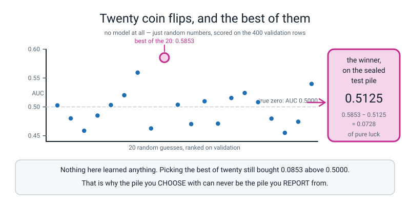
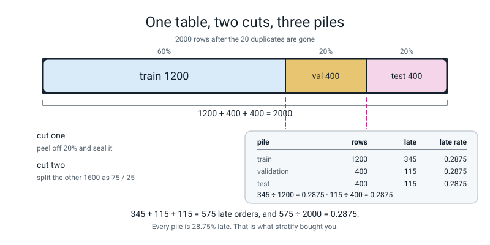
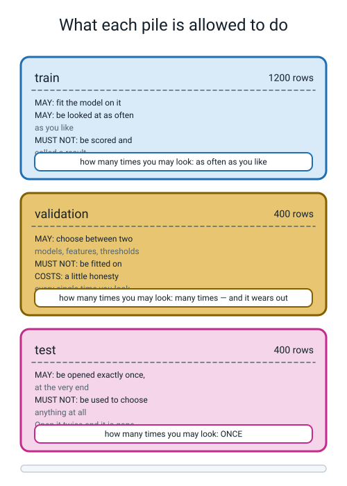
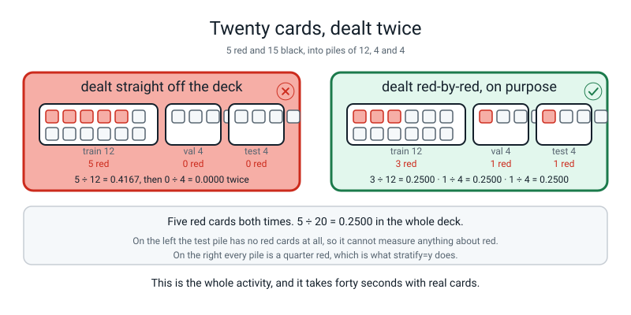
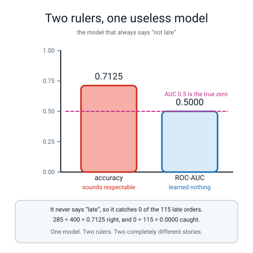
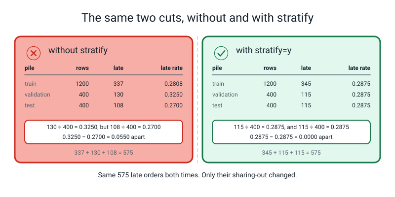
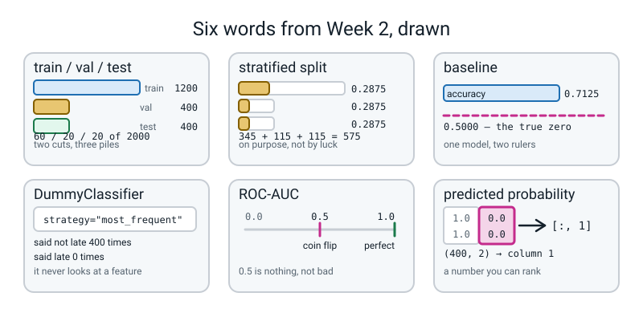

# Week 2 — Practice, Mock Exam, Final Exam

[⬅ Week 1](week-01.md) · [Course Home](../README.md) · [Next ➡](week-03.md) · [Workbook](../workbook/week-02.md)

---

> ### This week in one sentence
> **Two piles was training wheels: real work needs three — one to learn from, one to choose with, and one you open exactly once.**
>
> **By the end of this chapter you will be able to:**
> - **Split a table three ways** by calling `train_test_split` twice, and say out loud what each pile is legally allowed to be used for
> - **Explain why choosing a model on the test set is itself a kind of fitting**, and therefore why a third pile has to exist
> - **Prove a stratified split kept the proportions** by printing them for all three piles: **0.287, 0.287, 0.287**
> - **Build two dummy baselines** and write down, as a number, what a real model has to beat: **ROC-AUC 0.5000**
>
> **New maths:** **none.** More division, and one subtraction of two fractions. The arithmetic of Week 1 on new numbers.
>
> **New syntax:** `train_test_split` called **twice** · `DummyClassifier(strategy="most_frequent")` · `model.predict_proba(X)[:, 1]` · `roc_auc_score(y_val, prob)`
>
> **Reading time:** about 35 minutes. **Homework:** about 60 minutes.

---

## 🪝 Start Here

Imagine you spend a month on the delivery problem.

You try a decision tree. Then a deeper one. Then a shallower one. Then kNN with three neighbours, then five, then eleven. You add a column, take a column away, change how you handle the missing values. **Forty different attempts.** Every single time you check the score on your test set, and at the end you keep whichever one scored highest.

**What is wrong with that final number?**

Most people get somewhere near *"you looked at the test set too much"* and cannot say why that is a problem. That is exactly the right place to be. So here is a measurement instead of an argument, and it takes eight seconds to run.

**Twenty models get built. Not one of them is a model.** Each is 400 random numbers between 0 and 1 — one per validation row — which we pretend is its prediction. Nothing is fitted. None of them looks at a single column. Then all twenty are scored, and the best is kept, exactly as you would with twenty real models.

```text
random model  0   validation AUC 0.5026
random model  1   validation AUC 0.4800
random model  2   validation AUC 0.4586
random model  3   validation AUC 0.4849
random model  4   validation AUC 0.5032
random model  5   validation AUC 0.5202
random model  6   validation AUC 0.5594
random model  7   validation AUC 0.4626
random model  8   validation AUC 0.5853
random model  9   validation AUC 0.5036
random model 10   validation AUC 0.4701
random model 11   validation AUC 0.5097
random model 12   validation AUC 0.4709
random model 13   validation AUC 0.5154
random model 14   validation AUC 0.5241
random model 15   validation AUC 0.5082
random model 16   validation AUC 0.4796
random model 17   validation AUC 0.4549
random model 18   validation AUC 0.4742
random model 19   validation AUC 0.5398

winner: random model 8
its validation AUC : 0.5853
its TEST AUC       : 0.5125
difference         : 0.0728 of pure luck
above the true zero: 0.0853
```

Remember card five from last week: **0.5 means learned nothing, 1.0 means perfect.** So **0.5853** is above a coin flip. If somebody handed you that number you would believe they had something.

Then that exact same winner was scored on the pile that had been sealed and never looked at: **0.5125.** Basically a coin flip, which is what it always was.


*Figure 2.1 — Twenty coin flips, and the best of them. Nothing here learned anything; picking the best of twenty still bought 0.0853 above 0.5000.*

**Nothing learned anything. The 0.0853 was bought by looking at twenty numbers and keeping the biggest one.** That is the entire cause.

Now scale it up in your head. You did not try twenty things this term. You will try a hundred and forty, and each time you will keep the better one.

> ### CHOOSING IS A KIND OF FITTING

Fitting means adjusting something until the numbers on a pile look good. Usually it is the model's insides being adjusted. But when **you** try forty things and keep the best, **you** are the thing being fitted, and you are fitted to that pile.

So: last year two piles. This year three.

---

## 🧠 The Big Idea

### 1. Three piles, and they are three kinds of exam you already know

| Pile | The exam it is | What you may do with it |
|---|---|---|
| **train** | practice questions, with the answers in the back | learn from it, as much as you like |
| **validation** | the mock exam | choose between things — models, columns, settings |
| **test** | the final exam | open **once**, report the number, stop |

**And the analogy is exact in the way that matters.** If you sat the same past paper twenty times you would end up with a brilliant score on that paper and no more knowledge than you started with. A mock exam is not for the grade — it is for **deciding what to do next**. And if you sat the *real* final exam twenty times and kept your best score, that score would measure your persistence, not your knowledge.

That is precisely what happens to a test pile you keep peeking at.

### 2. Two cuts, three piles, and the 0.25 that catches everybody

`train_test_split` makes **two** piles. It has no setting for three. So you call it twice: cut once, then cut one of the pieces again.


*Figure 2.2 — One table, two cuts, three piles. Cut one seals the test pile; cut two divides what is left.*

Do the arithmetic before you write any code:

- 2000 rows. 20% off the top → **400 test.** 2000 − 400 = **1600 left.**
- 1600, split 75 / 25 → 1600 × 0.75 = **1200 train**, 1600 × 0.25 = **400 validation.**
- Check: 1200 + 400 + 400 = **2000.** ✓
- As percentages of the whole table: 1200 ÷ 2000 = **60%**, 400 ÷ 2000 = **20%**, 400 ÷ 2000 = **20%.**

> **⚠️ Watch out:** the second `test_size` is **0.25, not 0.2.** This is the most common wrong answer of the week, and it is arithmetic rather than a rule to memorise. You want 400 rows out of 1600, and **400 ÷ 1600 = 0.25.** Write `0.2` and you get 1600 × 0.2 = 320, so your piles come out **1280 / 320 / 400** — which is not what your model card says. **Order matters too:** peel the test pile off *first*, from the whole table, so its size is a fraction of 2000.

And notice where the 2000 came from. Last week's table had **2020** rows, 20 of which were exact copies. This week those copies go, in one line, before anything else happens:

```python
df = df.drop_duplicates().reset_index(drop=True)
```

Last week you **counted** them: 20 duplicates, 20% going to test, **20 × 0.2 = 4** free fake marks. This week you **remove** them. That is what counting first is for.

### 3. What each pile is allowed to do — and the one that wears out


*Figure 2.3 — What each pile is allowed to do. The third rule is the one people get wrong.*

Three rules, and the middle one is the interesting one.

**Train — look as often as you like.** Fit on it, plot it, stare at it. It is yours. Its score means almost nothing (of course you do well on the questions you revised from), so nobody is even tempted to report it.

**Validation — you may look many times, and it wears out.** This is the sentence to get right, because it is *not* "validation is safe". Every time you look at the validation score and change your mind because of what you saw, you spend a little of its honesty. After forty decisions the validation score is slightly too good — not because anyone cheated, but because you **kept the winner.** You have just watched exactly how much that costs: twenty looks bought 0.0853.

**Test — once. At the very end. Then stop.** Not "once a week". Not "once, and then again after one more idea". Once. And the reason is mechanical, not moral: **the moment a test score changes a decision, it has become a validation pile**, and you no longer have a test pile at all.

> **🧑‍🏫 If a student asks:** *"how would anyone know if I peeked?"* Nobody would. There is no locked box and no referee. The only thing standing between you and a meaningless number is that you wrote down what you were going to do and then did it. **Next week's model card has a line saying whether the test pile was opened** — because the honesty has to live somewhere you can point at.

### 4. Stratifying: sharing out the rare thing on purpose

Week 1 found that 28.75% of the de-duplicated orders are late. Cut that table into three piles at random and ask: will each pile be 28.75% late?

Roughly. Not exactly. And the wobble matters.

Here are the real numbers. **Without** `stratify`:

| pile | rows | late | late rate |
|---|---|---|---|
| train | 1200 | 337 | 337 ÷ 1200 = **0.2808** |
| validation | 400 | 130 | 130 ÷ 400 = **0.3250** |
| test | 400 | 108 | 108 ÷ 400 = **0.2700** |

**With** `stratify=y`:

| pile | rows | late | late rate |
|---|---|---|---|
| train | 1200 | 345 | 345 ÷ 1200 = **0.2875** |
| validation | 400 | 115 | 115 ÷ 400 = **0.2875** |
| test | 400 | 115 | 115 ÷ 400 = **0.2875** |

Both share out **exactly 575 late orders**: 337 + 130 + 108 = 575, and 345 + 115 + 115 = 575. **Nothing was created and nothing was destroyed. Only the sharing-out changed.**

Why the first version is a real problem, in one sentence: your validation pile is 32.5% late and your test pile is 27% late, so the two piles are asking your model slightly **different questions** — and when the number moves between them at the end of term, **you will not know whether your model changed or your piles did.**

> **Stratified split** — a split that shares out each answer class in the same proportion as the whole table, on purpose, instead of leaving it to chance.

It is one keyword: `stratify=y`. On the second cut it becomes `stratify=y_rest`, because by then you are cutting the 1600-row pile, not the 2000-row one.

**Here is the mental picture, and it is worth doing with real cards.** Twenty playing cards, five of them red — so the deck is 5 ÷ 20 = **0.25** red. Deal them 12 / 4 / 4 off a shuffled deck and it is entirely possible that all five reds land in the first pile, which means the last two piles contain **no red cards at all** and therefore cannot measure anything whatsoever about red. Not badly — **at all.** There is nothing there to measure.

Now deal again, placing the reds deliberately 3 / 1 / 1: 3 ÷ 12 = 0.25, 1 ÷ 4 = 0.25, 1 ÷ 4 = 0.25. Every pile is a quarter red, and so is the whole deck.


*Figure 2.4 — Twenty cards, dealt twice. On the left the test pile has no red cards at all, so it cannot measure anything about red.*

Same five cards. Same three piles. **`stratify=y` is the second deal.**

### 5. Baselines: the zero on your ruler

Here is a number that means nothing on its own: **71%.**

Is 71% good? You cannot possibly say, and Week 1 already showed why: 28.75% of orders are late, so a model that says *"not late"* about every single order — with no thinking of any kind — is right about 71% of the time.

> **Baseline** — the score of a model so stupid it cannot possibly have learned anything. It is the zero on your ruler, and every real number gets reported as a distance from it.

> **DummyClassifier** — a model that ignores the features completely and answers by a fixed rule you choose.

- `strategy="most_frequent"` — always answers whichever label was commonest in training. Here: always "not late".
- `strategy="stratified"` — guesses at random, matching the training proportions. About 28.75% of the time it says "late", for no reason at all.

Run both on validation:

| baseline | accuracy | ROC-AUC | times it said "late" |
|---|---|---|---|
| `most_frequent` | **0.7125** | **0.5000** | **0** |
| `stratified` | 0.5850 | 0.4857 | 109 |


*Figure 2.5 — Two rulers, one useless model. One model, two metrics, two completely different stories.*

**Stop on the first row and let it be uncomfortable. One model. Two rulers. 0.7125 and 0.5000 at the same time.**

The arithmetic behind both numbers, by hand:

- 115 of the 400 validation rows are late, so 400 − 115 = **285 are not.**
- It says "not late" 400 times, so it is right 285 times. **285 ÷ 400 = 0.7125.** That is the accuracy.
- It says "late" **zero** times, so of the 115 late orders it catches **0. 0 ÷ 115 = 0.0000.**

**The whole business is in those two lines.** 0.7125 sounds like a working system. It catches nothing. A dispatcher using it would **never once** be warned about a late delivery.

> **ROC-AUC** — a score between 0 and 1. 0.5 means "no better than a coin flip", 1.0 means perfect, and it cannot be fooled by a lopsided table the way accuracy can.

One sentence about what it measures, which is true and will not need un-teaching later: *take one late order and one on-time order at random; ROC-AUC is the chance the model gives the late one the higher score.* A model with no opinion gets that right half the time. Hence 0.5. Weeks 8 to 11 build it properly; today it is a ruler with an honest zero on it.

**And that is why Week 1 committed to AUC in pen, before any of this was visible.** Card five was written on day one for exactly this moment. If you had picked your metric *today*, after seeing 0.7125 and 0.5000, which would you have picked? The flattering one. Of course. And that is marketing, not measurement.

**The number in the box, and it stays on your wall until Week 7:**

```text
   +------------------------------------------+
   |  BASELINE, validation pile, 400 rows     |
   |                                          |
   |     accuracy   0.7125                    |
   |     ROC-AUC    0.5000   <- the real zero |
   |                                          |
   |  Anything at or below 0.5000 AUC has     |
   |  learned nothing.                        |
   +------------------------------------------+
```

### 6. `predict_proba`, and the `[:, 1]` everybody forgets

To score with AUC you need a **number**, not a yes/no, because a yes/no cannot be ranked.

> **Predicted probability** — the model's number between 0 and 1 saying how sure it is that the answer is 1.

```python
prob = model.predict_proba(X_val)[:, 1]
```

Read it in three pieces:

1. `model.predict_proba(X_val)` gives a grid with **one row per order and two columns**: the chance of 0, then the chance of 1. Its shape here is **(400, 2)**.
2. `[:, 1]` means *"every row, column number 1"*. The colon means "all of them", and columns are counted from 0, so column 1 is the **second** one: the chance of "late".
3. What comes out is 400 numbers, shape **(400,)**, which is what `roc_auc_score` wants.

Leave off the `[:, 1]` and you get a real error whose message does all the work for you — **both shapes are printed in it.** That is Break 1 below, and getting into the habit of *looking for two shapes in the message* now, on a `(400, 2)`, is what makes Week 17's matrix errors survivable.

---

## 🔁 The Idea From Last Week, Used Harder

**No new maths.** One old skill, used harder: **turn every count into a fraction, then compare the fractions.**

Six divisions carry this entire chapter. Do them all with a calculator and check them against the printouts.

| What you are asking | The division | Answer |
|---|---|---|
| what fraction of 1600 is 400? | 400 ÷ 1600 | **0.25** ← the trap |
| and what fraction of the whole table is that? | 400 ÷ 2000 | **0.20** |
| how late is the train pile? | 345 ÷ 1200 | **0.2875** |
| how late is the validation pile? | 115 ÷ 400 | **0.2875** |
| how accurate is "never late"? | 285 ÷ 400 | **0.7125** |
| how many late orders does it catch? | 0 ÷ 115 | **0.0000** |

Two of them deserve a slower look.

**0.25 and 0.20 are the same 400 rows.** 400 ÷ 1600 = 0.25 because 1600 ÷ 4 = 400. 400 ÷ 2000 = 0.20 because 2000 ÷ 5 = 400. **Both are right and they describe different things** — a fraction of the leftovers, and a fraction of the whole table. That is Week 1's two-averages lesson wearing a new costume: *the top of the fraction was never the problem, the bottom was.*

**115 ÷ 400 without a calculator.** 115 ÷ 4 = 28.75, and dividing by 400 instead of 4 moves the decimal point two places: **0.2875.** Same trick for 130 ÷ 400: 130 ÷ 4 = 32.5, so **0.325.** And 108 ÷ 400: 108 ÷ 4 = 27, so **0.27.**

Now the subtraction that is the argument of section 4:

**0.3250 − 0.2700 = 0.0550.**

Five and a half percentage points between the pile you would choose with and the pile you would report from. With `stratify` the same subtraction is **0.2875 − 0.2875 = 0.0000.**

> **💡 Try this:** add up the late counts from the unstratified split — 337 + 130 + 108. You get **575**. Now the stratified one — 345 + 115 + 115. Also **575**. Whatever else changed, the number of late orders in the world did not. Only who got them.

---

## 💻 Type This

Three small files. `make_data.py` from Week 1 is imported unchanged — **do not edit it.** If its first `order_id` is not **100955**, stop and fix that first, because every number below depends on it.

### Step 1 — the top of `split_three.py`, and the copies go

```python
"""split_three.py - one table, two cuts, three piles."""
from sklearn.model_selection import train_test_split
from make_data import make_deliveries

df = make_deliveries(n=2000, seed=0)
print("rows as generated:", len(df))
df = df.drop_duplicates().reset_index(drop=True)
print("rows after dropping the 20 copies:", len(df))
```

`from sklearn.model_selection import train_test_split` reads as: out of the scikit-learn toolbox, out of its model-selection drawer, fetch the one tool called `train_test_split`. First use of scikit-learn this year.

`reset_index(drop=True)` renumbers the rows from zero afterwards, so the numbering is not full of gaps where the copies were.

```text
rows as generated: 2020
rows after dropping the 20 copies: 2000
```

### Step 2 — X, y, and the two cuts

```python
y = df["late"]
X = df.drop(columns=["late", "order_id"])
print("X shape:", X.shape, " y shape:", y.shape)

# CUT ONE - peel off 20% and seal it. Not opened again this term.
X_rest, X_test, y_rest, y_test = train_test_split(
    X, y, test_size=0.2, stratify=y, random_state=0)

# CUT TWO - split the other 1600 as 75 / 25.
X_train, X_val, y_train, y_val = train_test_split(
    X_rest, y_rest, test_size=0.25, stratify=y_rest, random_state=0)
```

`X = df.drop(columns=["late", "order_id"])` is **cards two and three from last week, in one line.** Drop the target, drop the ID. Eight columns left.

Four names come out of each call, **always in this order: X first pile, X second pile, y first pile, y second pile.** Get that order wrong and nothing errors — you just have your labels attached to the wrong rows, which is a genuinely horrible afternoon.

Look at cut two carefully. It cuts `X_rest` and `y_rest`, **not** `X` and `y`. And it says `stratify=y_rest`, **not** `stratify=y`, because `stratify` needs one label per row of the thing you are cutting, and you are cutting 1600 rows now.

```text
X shape: (2000, 8)  y shape: (2000,)
```

### Step 3 — the proof, in four lines

**Predict first: the whole table is 28.75% late. Will all three piles be exactly 0.2875, or roughly?**

```python
print()
print("pile         rows   late   rate (3 dp)   rate (4 dp)")
for name, yy in [("train", y_train), ("validation", y_val), ("test", y_test)]:
    print(f"{name:11s} {len(yy):5d} {int(yy.sum()):6d}        {yy.mean():.3f}        {yy.mean():.4f}")
```

```text
pile         rows   late   rate (3 dp)   rate (4 dp)
train        1200    345        0.287        0.2875
validation    400    115        0.287        0.2875
test          400    115        0.287        0.2875
```

**0.287, 0.287, 0.287.** Not roughly. Identical — and it is not luck, you asked for it. Check by hand: 345 ÷ 1200 = 0.2875, and 115 ÷ 400 = 0.2875. Same number.

### Step 4 — the mistake that does not crash

This is the more important of this chapter's two mistakes, so make it on purpose while you are paying attention. Delete `stratify=y_rest` from **cut two only.** Leave cut one alone.

```python
X_train, X_val, y_train, y_val = train_test_split(
    X_rest, y_rest, test_size=0.25, random_state=0)
```

```text
pile         rows   late   rate (3 dp)   rate (4 dp)
train        1200    355        0.296        0.2958
validation    400    105        0.263        0.2625
test          400    115        0.287        0.2875
```

**No error. No warning.** Three piles, correct sizes, all 2000 rows accounted for. Everything looks fine.

But look: the test pile is 28.75% late and the validation pile is **26.25%** late. **0.2875 − 0.2625 = 0.0250.** Two and a half percentage points apart. So all term you would be choosing your model on a pile with slightly less lateness in it than the pile you finally report from — and when the number moves at the end of term, you would not know why.

Notice which pile is still perfect: **test, at 0.2875**, because cut one still had `stratify`. **One broken line, one damaged pile, quietly.** That is the shape of most real bugs in this subject.

**Bug Log this now**, under *errors with no error message*. Then put it back and check all three read 0.2875 again.

### Step 5 — `baselines.py`, the first one

New file. The first eleven lines are copied from `split_three.py` — this is the **last** week you will ever have to do that, because next week the whole thing becomes one object.

```python
"""baselines.py - the number a real model has to beat."""
from sklearn.dummy import DummyClassifier
from sklearn.metrics import accuracy_score, roc_auc_score
from sklearn.model_selection import train_test_split
from make_data import make_deliveries

df = make_deliveries(n=2000, seed=0).drop_duplicates().reset_index(drop=True)
y = df["late"]
X = df.drop(columns=["late", "order_id"])
X_rest, X_test, y_rest, y_test = train_test_split(
    X, y, test_size=0.2, stratify=y, random_state=0)
X_train, X_val, y_train, y_val = train_test_split(
    X_rest, y_rest, test_size=0.25, stratify=y_rest, random_state=0)

dummy = DummyClassifier(strategy="most_frequent")
dummy.fit(X_train, y_train)
pred = dummy.predict(X_val)
print("accuracy:", accuracy_score(y_val, pred))
print("it said 'late' this many times:", int((pred == 1).sum()))
```

`strategy="most_frequent"` means: look at the training labels, find whichever answer was commonest, and say that. Every time. Forever. It never looks at a single feature.

**What was commonest in training?** Not late — **855 of the 1200.** So this model will say "not late" 400 times out of 400. **Predict the accuracy before you run it.**

```text
accuracy: 0.7125
it said 'late' this many times: 0
```

**0.7125, and it said "late" zero times.** So of the 115 late orders in that pile it caught **none. 0 ÷ 115 = 0.0000.**

### Step 6 — the loud mistake: `[:, 1]` left off

```python
prob = dummy.predict_proba(X_val)
print(roc_auc_score(y_val, prob))
```

```text
Traceback (most recent call last):
  ...
  File ".../sklearn/metrics/_ranking.py", line 867, in _binary_clf_curve
    y_score = column_or_1d(y_score)
  File ".../sklearn/utils/validation.py", line 1483, in column_or_1d
    raise ValueError(
ValueError: y should be a 1d array, got an array of shape (400, 2) instead.
```

Long traceback, same rule as last week: **read the last line, then find the `File` line with your own filename in it.** Everything else is inside scikit-learn.

Last line: `y should be a 1d array, got an array of shape (400, 2) instead`. **Both shapes are in the message.** It wanted one column; you gave it two.

So what *are* those two columns? Look:

```python
print(prob.shape)
print(prob[:3])
```

```text
(400, 2)
[[1. 0.]
 [1. 0.]
 [1. 0.]]
```

400 rows, 2 columns. Column 0 is "chance it is not late"; column 1 is "chance it IS late". And this model is completely certain every single time: one and zero, one and zero, one and zero.

Fix it:

```python
prob = dummy.predict_proba(X_val)[:, 1]
print("ROC-AUC:", roc_auc_score(y_val, prob))
```

```text
ROC-AUC: 0.5
```

**Same model. Same pile. Same 400 orders.**

```text
    accuracy   0.7125
    ROC-AUC    0.5000
```

Nothing changed except which ruler you picked up. Which is right? **Both.** Accuracy asks *"how often were you right"*, and on a pile that is 71% one answer you can score 71% without thinking. AUC asks *"can you tell the two apart"* and the answer is no — it gives every single order the identical score of zero.

### Step 7 — the second baseline, and the whole file

```python
dummy2 = DummyClassifier(strategy="stratified", random_state=0)
dummy2.fit(X_train, y_train)
pred2 = dummy2.predict(X_val)
prob2 = dummy2.predict_proba(X_val)[:, 1]
print("stratified accuracy:", accuracy_score(y_val, pred2))
print("stratified ROC-AUC :", round(roc_auc_score(y_val, prob2), 4))
print("it said 'late' this many times:", int((pred2 == 1).sum()))
```

```text
stratified accuracy: 0.585
stratified ROC-AUC : 0.4857
it said 'late' this many times: 109
```

This one guesses at random, matching the proportions — it said "late" 109 times out of 400, for no reason at all. Its accuracy is **worse** (0.585 against 0.7125), because guessing "late" sometimes means being wrong sometimes. And its AUC is **0.4857**, just under 0.5, which is exactly the wobble you would expect from 400 coin flips.

**Two useless models. The best AUC either managed is 0.5000. That is the zero on the ruler.**

Here is the whole of `baselines.py`, tidied into a loop:

```python
"""baselines.py - the number a real model has to beat."""
from sklearn.dummy import DummyClassifier
from sklearn.metrics import accuracy_score, roc_auc_score
from sklearn.model_selection import train_test_split
from make_data import make_deliveries

df = make_deliveries(n=2000, seed=0).drop_duplicates().reset_index(drop=True)
y = df["late"]
X = df.drop(columns=["late", "order_id"])
X_rest, X_test, y_rest, y_test = train_test_split(
    X, y, test_size=0.2, stratify=y, random_state=0)
X_train, X_val, y_train, y_val = train_test_split(
    X_rest, y_rest, test_size=0.25, stratify=y_rest, random_state=0)

print("baseline        accuracy   ROC-AUC   times it said 'late'")
for strategy in ["most_frequent", "stratified"]:
    dummy = DummyClassifier(strategy=strategy, random_state=0)
    dummy.fit(X_train, y_train)
    pred = dummy.predict(X_val)
    prob = dummy.predict_proba(X_val)[:, 1]
    print(f"{strategy:14s}   {accuracy_score(y_val, pred):.4f}    "
          f"{roc_auc_score(y_val, prob):.4f}    {int((pred == 1).sum())}")

print()
print("115 of the 400 validation rows are late, so 285 are not.")
print("285 / 400 =", round(285 / 400, 4))
print("A model that never says 'late' catches 0 of 115:", round(0 / 115, 4))
```

```text
baseline        accuracy   ROC-AUC   times it said 'late'
most_frequent    0.7125    0.5000    0
stratified       0.5850    0.4857    109

115 of the 400 validation rows are late, so 285 are not.
285 / 400 = 0.7125
A model that never says 'late' catches 0 of 115: 0.0
```

**Runtime: about 0.7 seconds**, nearly all of it importing scikit-learn. Nothing trains.

### Step 8 — the twenty coin flips, for yourself

```python
"""best_of_twenty.py - twenty models made of nothing but random numbers."""
import numpy as np
from sklearn.metrics import roc_auc_score
from sklearn.model_selection import train_test_split
from make_data import make_deliveries

df = make_deliveries(n=2000, seed=0).drop_duplicates().reset_index(drop=True)
y = df["late"]
X = df.drop(columns=["late", "order_id"])
X_rest, X_test, y_rest, y_test = train_test_split(
    X, y, test_size=0.2, stratify=y, random_state=0)
X_train, X_val, y_train, y_val = train_test_split(
    X_rest, y_rest, test_size=0.25, stratify=y_rest, random_state=0)

rng = np.random.default_rng(0)
best_auc = -1
best_i = -1
best_test_auc = None
for i in range(20):
    guess_val = rng.random(len(y_val))     # 400 random numbers. No model. No fitting.
    guess_test = rng.random(len(y_test))   # 400 more, for the same "model"
    auc = roc_auc_score(y_val, guess_val)
    print(f"random model {i:2d}   validation AUC {auc:.4f}")
    if auc > best_auc:
        best_auc = auc
        best_i = i
        best_test_auc = roc_auc_score(y_test, guess_test)

print()
print("winner: random model", best_i)
print("its validation AUC :", round(best_auc, 4))
print("its TEST AUC       :", round(best_test_auc, 4))
print("difference         :", round(best_auc - best_test_auc, 4), "of pure luck")
print("above the true zero:", round(best_auc - 0.5, 4))
```

**Runtime: about 0.7 seconds.** The output is the twenty lines from the top of this chapter, exactly, because `np.random.default_rng(0)` gives the same "random" numbers every time — which is the only reason you and this book can compare notes about a pile of dice rolls.

---

## 🔍 Worked Examples

### Worked Example 1 — three piles from a table with only 569 rows

Everything above worked out suspiciously neatly: 1200, 400, 400 and three identical rates. That is because 2000 divides beautifully. Here is what happens when it does not — 569 cell measurements that ship inside scikit-learn.

```python
"""w2we1.py - three piles out of a table that is not about pizza."""
from sklearn.datasets import load_breast_cancer
from sklearn.model_selection import train_test_split

data = load_breast_cancer(as_frame=True)
X = data.data
y = data.target
print("rows:", len(y), " columns:", X.shape[1])
print("whole table, class 1 rate:", round(y.mean(), 4))

X_rest, X_test, y_rest, y_test = train_test_split(
    X, y, test_size=0.2, stratify=y, random_state=0)
X_train, X_val, y_train, y_val = train_test_split(
    X_rest, y_rest, test_size=0.25, stratify=y_rest, random_state=0)

print()
print("pile         rows   class1   rate (3 dp)   rate (4 dp)")
for name, yy in [("train", y_train), ("validation", y_val), ("test", y_test)]:
    print(f"{name:11s} {len(yy):5d} {int(yy.sum()):7d}        {yy.mean():.3f}        {yy.mean():.4f}")
print("rows:", len(y_train), "+", len(y_val), "+", len(y_test),
      "=", len(y_train) + len(y_val) + len(y_test))
```

```text
rows: 569  columns: 30
whole table, class 1 rate: 0.6274

pile         rows   class1   rate (3 dp)   rate (4 dp)
train         341     214        0.628        0.6276
validation    114      71        0.623        0.6228
test          114      72        0.632        0.6316
rows: 341 + 114 + 114 = 569
```

**The three rates are not identical this time**, and that is not a bug. 0.6276, 0.6228, 0.6316. You cannot put 71.4 rows of class 1 into a pile; **rows are whole things.** With 114-row piles the finest adjustment `stratify` can make is one row, and one row out of 114 is 0.0088.

Which is exactly the widest gap here:

```text
WITH stratify
  train         341   214   0.6276
  validation    114    71   0.6228
  test          114    72   0.6316
  widest gap: 0.0088
WITHOUT stratify
  train         341   221   0.6481
  validation    114    69   0.6053
  test          114    67   0.5877
  widest gap: 0.0604
```

**0.0088 against 0.0604.** `stratify` did not make the piles identical — it got them as close as whole rows allow, and that is **seven times closer** than chance managed.

**The lesson to carry:** `stratify=y` does not promise identical rates. It promises the closest sharing-out that whole rows permit. On 2000 rows that happened to be exact; on 569 it is not, and you should print the numbers rather than assume.

### Worked Example 2 — how much does the prize grow when you try more things?

The best of twenty coin flips scored 0.5853. What about the best of 5? Of 100? And what if the validation pile were smaller?

```python
"""w2we2.py - how much does the prize grow when you try more things?"""
import numpy as np
from sklearn.metrics import roc_auc_score
from sklearn.model_selection import train_test_split
from make_data import make_deliveries

df = make_deliveries(n=2000, seed=0).drop_duplicates().reset_index(drop=True)
y = df["late"]
X = df.drop(columns=["late", "order_id"])
X_rest, X_test, y_rest, y_test = train_test_split(
    X, y, test_size=0.2, stratify=y, random_state=0)
X_train, X_val, y_train, y_val = train_test_split(
    X_rest, y_rest, test_size=0.25, stratify=y_rest, random_state=0)

print("how many tried   best validation AUC   above 0.5000")
for n_tries in [1, 5, 20, 100, 500]:
    rng = np.random.default_rng(0)
    best = -1
    for i in range(n_tries):
        best = max(best, roc_auc_score(y_val, rng.random(len(y_val))))
    print(f"{n_tries:14d}   {best:.4f}                {best - 0.5:.4f}")

print()
print("the same experiment on a SMALL validation pile (40 rows)")
y_small = y_val.iloc[:40]
print("its class balance:", round(y_small.mean(), 4))
print("how many tried   best validation AUC   above 0.5000")
for n_tries in [1, 20, 100]:
    rng = np.random.default_rng(0)
    best = -1
    for i in range(n_tries):
        best = max(best, roc_auc_score(y_small, rng.random(len(y_small))))
    print(f"{n_tries:14d}   {best:.4f}                {best - 0.5:.4f}")
```

```text
how many tried   best validation AUC   above 0.5000
             1   0.5026                0.0026
             5   0.5257                0.0257
            20   0.5853                0.0853
           100   0.5853                0.0853
           500   0.5853                0.0853

the same experiment on a SMALL validation pile (40 rows)
its class balance: 0.35
how many tried   best validation AUC   above 0.5000
             1   0.5604                0.0604
            20   0.7198                0.2198
           100   0.7747                0.2747
```

**Read the top block first.** One try buys you 0.0026 of fake score — nothing. Five tries buy 0.0257. Twenty buy 0.0853. Then 100 and 500 buy… still 0.0853, because none of the later 480 draws happened to beat the lucky sixteenth one. **The prize grows fast at first and then very slowly**, because each extra bit of fake score needs a rarer and rarer fluke. It never shrinks, though — the best of 500 can never be worse than the best of 20.

**Now the bottom block, which is the frightening one.** Same experiment, same dice, on a validation pile of **40 rows instead of 400**. The best of twenty coin flips scores **0.7198**, and the best of a hundred scores **0.7747**.

**0.7747.** With no model. With nothing. That is a number most people would call a good result and put in a report.

> **🔑 The rule that falls out of this:** **the smaller your validation pile, the more that best-of-N prize is worth — and the more it lies to you.** 400 rows wobble by a few hundredths. 40 rows wobble by a quarter. This is exactly why the delivery table's 400-row piles are on the small side of comfortable, and it is why Week 11 exists.

### Worked Example 3 — the twenty cards, in numpy

The card deal is worth doing with actual cards. But here it is in five lines, so you can deal it a hundred times.

```python
"""w2we3.py - twenty cards, dealt twice, in Python."""
import numpy as np

# 1 means a red card. Five reds, fifteen blacks.
cards = np.array([1, 1, 1, 1, 1, 0, 0, 0, 0, 0, 0, 0, 0, 0, 0, 0, 0, 0, 0, 0])
print("whole deck:", cards.sum(), "reds out of", len(cards),
      "=", round(cards.sum() / len(cards), 4))

rng = np.random.default_rng(0)
shuffled = rng.permutation(cards)
print()
print("DEAL 1 - straight off a shuffled deck")
print("shuffled deck:", shuffled)
train, val, test = shuffled[:12], shuffled[12:16], shuffled[16:20]
for name, pile in [("train  12", train), ("val     4", val), ("test    4", test)]:
    print(f"  {name}: reds = {pile.sum()},  {pile.sum()} / {len(pile)} =",
          round(pile.sum() / len(pile), 4))

print()
print("DEAL 2 - the reds placed on purpose, 3 / 1 / 1")
train2 = np.array([1, 1, 1, 0, 0, 0, 0, 0, 0, 0, 0, 0])
val2 = np.array([1, 0, 0, 0])
test2 = np.array([1, 0, 0, 0])
for name, pile in [("train  12", train2), ("val     4", val2), ("test    4", test2)]:
    print(f"  {name}: reds = {pile.sum()},  {pile.sum()} / {len(pile)} =",
          round(pile.sum() / len(pile), 4))
```

```text
whole deck: 5 reds out of 20 = 0.25

DEAL 1 - straight off a shuffled deck
shuffled deck: [1 0 0 1 0 0 1 0 0 0 1 0 0 0 0 0 0 0 1 0]
  train  12: reds = 4,  4 / 12 = 0.3333
  val     4: reds = 0,  0 / 4 = 0.0
  test    4: reds = 1,  1 / 4 = 0.25

DEAL 2 - the reds placed on purpose, 3 / 1 / 1
  train  12: reds = 3,  3 / 12 = 0.25
  val     4: reds = 1,  1 / 4 = 0.25
  test    4: reds = 1,  1 / 4 = 0.25
```

You can check deal 1 by eye: the shuffled deck is printed, and the reds (the 1s) sit at positions 0, 3, 6, 10 and 18. Four of them land in the first twelve; the thirteenth-to-sixteenth cards contain **no reds at all**; the last four contain one.

**So the validation pile got 0.0000 red.** Ask the only question that matters: *what can that pile tell you about red?* **Nothing whatsoever.** Not "it does badly on red" — there is no red in it to be bad at. Widest gap between the piles: 0.3333 − 0.0000 = **0.3333**.

Deal 2 is 0.25, 0.25, 0.25, and the whole deck is 0.25. Same five cards. **That second deal is `stratify=y`.**

---

## 🐞 When It Breaks

scikit-learn tracebacks are much longer than pandas ones — twenty lines is ordinary. **The rule never changes: read the last line, then find the `File` line with your own filename in it.** And add one question this week, which you will ask for the next thirty-four weeks:

> **"What shape did it want, and what shape did I give it?"**

### Break 1 — the missing `[:, 1]`

```text
ValueError: y should be a 1d array, got an array of shape (400, 2) instead.
```

*"You gave me two columns of numbers. I can only rank one."* **Both shapes are in the message** — one column wanted, two columns given.

**The fix:** `dummy.predict_proba(X_val)[:, 1]`. Column 1 is the chance of "late".

### Break 2 — cut two handed the wrong labels

```python
X_train, X_val, y_train, y_val = train_test_split(
    X_rest, y, test_size=0.25, random_state=0)      # y, not y_rest
```

```text
  File ".../sklearn/utils/validation.py", line 473, in check_consistent_length
    raise ValueError(
ValueError: Found input variables with inconsistent numbers of samples: [1600, 2000]
```

*"You handed me 1600 rows of X and 2000 labels."* **The two numbers in the brackets tell you which pile you meant.** 1600 is `X_rest`; 2000 is the whole `y`.

**The fix:** `train_test_split(X_rest, y_rest, ...)` — and `stratify=y_rest` for the same reason.

### Break 3 — quote marks that turn a column into a word

```python
X_rest, X_test, y_rest, y_test = train_test_split(
    X, y, test_size=0.2, stratify="y", random_state=0)
```

```text
sklearn.utils._param_validation.InvalidParameterError: The 'stratify' parameter of train_test_split must be an array-like or None. Got 'y' instead.
```

*"You gave me the **word** y, in quotes, not the column."* Notice the message quotes it back: `Got 'y' instead` — with the quote marks still on.

**The fix:** `stratify=y`, no quotes. **Quotes make it writing; no quotes make it the thing.**

### Break 4 — three names on the left

```python
X_rest, X_test, y_rest = train_test_split(X, y, test_size=0.2, random_state=0)
```

```text
ValueError: too many values to unpack (expected 3)
```

*"I handed you four things and you gave me three names."* **Four names, always**, in this order: X first pile, X second pile, y first pile, y second pile.

### And two with no error message at all

| What you see | Why nothing complained | The fix |
|---|---|---|
| the piles come out **1280 / 320 / 400** | nothing is broken — you asked for a *fifth* of 1600 | `test_size=0.25` on cut two. **400 ÷ 1600 = 0.25.** Do the division out loud |
| the late rates come out **0.2958 / 0.2625 / 0.2875** | nothing is broken as far as scikit-learn knows; your piles are simply asking slightly different questions | `stratify=y_rest`. **Print all three rates, every single time — it is the only way you would ever notice** |

> **🐞 If you see this error:** `NotFittedError: This DummyClassifier instance is not fitted yet. Call 'fit' with appropriate arguments before using this estimator.` — you asked it to predict before it learned anything. Add `dummy.fit(X_train, y_train)` above. Unusually kind error: it tells you the fix.

---

## 🎲 What We Did In Class

If you missed it, here is the whole lesson. You need a laptop, a pen, and twenty playing cards with exactly five red ones.

**The hook.** The five Week 1 index cards on the table, card four face up and blank. Then the forty-models question, and then `best_of_twenty.py` on screen: **0.5853 on validation, 0.5125 on the sealed pile, 0.0728 of pure luck.** Then one sentence on the board, left up all lesson: **CHOOSING IS A KIND OF FITTING.**

**Card four got filled in.** Back: **1200 / 400 / 400.** Front, underneath last week's sentence, the three rules — *train: look as often as you like · validation: look many times, and it wears out · test: once, at the very end, then stop.* Then the question with an uncomfortable answer: *"who checks that you only opened it once?"* **Nobody.**

**The card deal, twice.** Twenty cards, five red, dealt 12 / 4 / 4 off a genuine shuffle, then dealt again with the reds placed 3 / 1 / 1 on purpose. Six divisions written down, plus the whole deck: 5 ÷ 20 = 0.25. Then one sentence in writing: **which deal was fair, and how did you know?** — and the answer had to contain a number, not a feeling.

**`split_three.py`, built in three steps**, with the stratify line deleted on purpose in the middle. The output that nothing complained about:

```text
    validation   0.2625
    test         0.2875
```

**`baselines.py`, and the moment the week is built around.** Two numbers on the board, one above the other, for the same model on the same 400 rows:

```text
    accuracy   0.7125
    ROC-AUC    0.5000
```

**The box on the wall.** Filled in at minute 63 and left up until Week 7:

```text
   BASELINE, validation pile, 400 rows
       accuracy   0.7125
       ROC-AUC    0.5000   <- the real zero
```

**The last four minutes, in writing:** *you have now seen twenty models scored on a validation pile, and the best was worth nothing. So what is a validation score actually worth, and what would you have to do to get a number you could report?*

---

## 💬 Talk About It

**1. Where did 60 / 20 / 20 come from? Is it a rule?**

*Hint:* there are two pulls and they point opposite ways. **Bigger held-out piles:** 400 rows with 115 positives gives an AUC you can roughly trust to within a couple of hundredths; cut it to 40 rows and Worked Example 2 shows coin flips scoring 0.7747. **Smaller held-out piles:** every held-out row is a row your model never learns from, and with only 2000 rows, moving from 60% to 80% training is 400 extra examples. So 60/20/20 is a **convention that lands in a sensible place for a few thousand rows.** People with ten million rows use 98/1/1, because 1% of ten million is a hundred thousand and that is plenty. People with two hundred rows abandon the scheme entirely and use cross-validation, which is Week 11. **There isn't a right answer, so there has to be a written answer.**

**2. Can I look at the test set just once in the middle, to see how I am doing?**

*Hint:* suppose you look and it says 0.68. What do you do next? **Either** you change something — in which case that number just chose your model, and it is now a validation pile — **or** you change nothing, in which case looking bought you nothing at all. There is no third option: the number cannot inform you without also contaminating you. Then find the version that *is* allowed, because professionals do use it: **look at the test pile's size, shape and class balance, but never at a score on it.** We did exactly that — 400 rows, 115 late. That tells you nothing about your model, so it costs nothing.

**3. If none of the twenty random models learned anything, why did they get different scores?**

*Hint:* start with the mechanism. Each one hands out 400 random numbers; purely by chance some of the higher numbers land on late orders, and AUC rewards that. Roll again and the pattern is somewhere else. So the twenty scores scatter around 0.5 — ours ran from **0.4549 to 0.5853** — and the width of that scatter is about **one thing only: how many rows are in the pile.** Then push it: what would the twenty scores look like on 4,000 validation rows? Much tighter. On 40? Look at Worked Example 2. Finally, the honest closer: this is why a validation score is the right tool for *comparing* and the wrong tool for *reporting*. Comparing and reporting are different jobs, and this is the week they got different piles.

---

## ⚠️ Don't Get Tricked

### Trick 1 — "the test set is just a bigger validation set"


*Figure 2.6 — The same two cuts, without and with `stratify`. The same 575 late orders both times; only their sharing-out changed.*

| ❌ Wrong | ✅ Right |
|---|---|
| "Validation and test are both held-out piles of 400 rows, so they're the same thing." | They answer **different kinds of question.** Validation answers *"which of these two should I pick?"* — asked over and over. Test answers *"what will this actually do?"* — asked **once**, because asking twice changes the answer. Measured: the same non-model scores **0.5853** on the pile it was chosen with and **0.5125** on the pile that had no say. |

### Trick 2 — "71% baseline means our data is fine, we just need a better model"

| ❌ Wrong | ✅ Right |
|---|---|
| "Even the dummy gets 71%, so we're most of the way there." | 71% is not a floor you build on; it is a **ruler with no zero marked.** The *same object* scores 0.7125 and 0.5000 depending on which ruler you pick up — and it catches **0 of the 115** late orders. The number that does the work in that sentence is the zero. |

### Trick 3 — "`stratify` is a safety setting, so put it on everything"

| ❌ Wrong | ✅ Right |
|---|---|
| "`stratify=y` makes the piles the same, so nothing can be lopsided." | `stratify` shares out **one specific column** — the one you hand it. Your validation pile can still be short of storms, or short of GreenLeaf, or short of Fridays. And on 569 rows it does not even make the rates identical: 0.6276 / 0.6228 / 0.6316. It is **the closest whole rows allow**, on **one** column. Almost always right, never magic, and never a substitute for printing the numbers. |

### Trick 4 — "a validation score is a lie"

| ❌ Wrong | ✅ Right |
|---|---|
| "So validation scores are wrong and I should ignore them." | They are not wrong, they are **optimistic** — and the more things you tried, the more optimistic. That is still exactly the right tool for **comparing two options**, and exactly the wrong tool for **reporting a result.** If validation scores were worthless we would not have built a validation pile at all. |

---

## 🌍 Where You've Seen This

1. **Every Kaggle-style competition you have read about.** There is a public leaderboard you can submit to hundreds of times and a private one revealed at the end. People who tune against the public board tumble down the private one — that is 0.5853 becoming 0.5125, in public, with money attached.
2. **A/B tests in any app you use.** The team ships two versions of a button, measures, and keeps the winner. If they test forty things and keep the best, some of what they "found" is the best of forty coin flips — which is why serious teams fix in advance how many tests they will run.
3. **Medical trials.** The plan — which measure, how many patients, when to stop — is registered **before** the trial starts, in public, precisely so nobody can pick the flattering metric afterwards. That is card five, with lives attached.
4. **Sports statistics.** "Best month of his career" is usually the best of a hundred and twenty months. Somebody looked at a hundred and twenty numbers and kept the biggest one.
5. **Any model in production that "worked in testing".** Someone chose it on the pile they measured on, and the real world became the first pile that had no say.
6. **`random_state=0` in every tutorial you have read.** Same reason as last week's seed: the split has to be the same split, or your numbers and mine cannot be compared at all.

---

## 🔑 Remember This

- **Choosing is a kind of fitting.** Twenty models that were pure dice rolls; the best scored **0.5853** on the pile it was chosen with, **0.5125** on the pile that had no say. **0.0853 of fake score, bought by looking.**
- **Two cuts, three piles: 1200 / 400 / 400.** Test comes off first, off the whole table. Then the leftovers split 75 / 25 — and **the second `test_size` is 0.25, because 400 ÷ 1600 = 0.25.**
- **Train: look as often as you like. Validation: look many times, and it wears out. Test: once, at the very end, then stop.**
- **`stratify=y` shares out the rare answer on purpose.** With it, 0.2875 in all three piles. Without it, 0.3250 in validation and 0.2700 in test — **0.0550 apart, with no error message.** Print all three rates, every time.
- **A baseline is the zero on your ruler.** `most_frequent` scores **0.7125 accuracy and 0.5000 AUC at the same time**, and catches **0 of 115** late orders.
- **`predict_proba(X)[:, 1]`** — every row, column 1, the chance of the answer being 1. Leave off the `[:, 1]` and the error prints both shapes for you.
- **AUC 0.5 is not "bad", it is "nothing".** 0.0 would mean perfect knowledge with the sign flipped.

### Syntax reminder card

```python
from sklearn.model_selection import train_test_split
from sklearn.dummy import DummyClassifier
from sklearn.metrics import accuracy_score, roc_auc_score

# ---- two cuts, three piles. FOUR names out of each call, in this order ------
X_rest, X_test, y_rest, y_test = train_test_split(
    X, y, test_size=0.2, stratify=y, random_state=0)          # cut 1: seal 400
X_train, X_val, y_train, y_val = train_test_split(
    X_rest, y_rest, test_size=0.25, stratify=y_rest, random_state=0)   # cut 2: 0.25!
# stratify=y_rest, not y - you are cutting 1600 rows now, so you need 1600 labels

# ---- the one line that catches the silent bug -------------------------------
for name, yy in [("train", y_train), ("validation", y_val), ("test", y_test)]:
    print(name, len(yy), int(yy.sum()), round(yy.mean(), 4))   # 0.2875 three times

# ---- the zero on the ruler -------------------------------------------------
dummy = DummyClassifier(strategy="most_frequent")   # ignores every feature
dummy.fit(X_train, y_train)
pred = dummy.predict(X_val)                         # 400 zeros
prob = dummy.predict_proba(X_val)[:, 1]             # (400, 2) -> (400,). ALWAYS [:, 1]
print(accuracy_score(y_val, pred))                  # 0.7125
print(roc_auc_score(y_val, prob))                   # 0.5

# ---- the arithmetic reminder ----------------------------------------------
# 400 / 1600 = 0.25   but   400 / 2000 = 0.20   <- same 400 rows, two questions
# 285 / 400  = 0.7125 accuracy, and 0 / 115 = 0.0000 late orders caught
```

---

## 📓 New Words


*Figure 2.7 — Six words from Week 2, drawn.*

| Word | What it means | Example |
|---|---|---|
| **train / validation / test** | Three piles: one to learn from, one to choose with, one opened exactly once | 1200 / 400 / 400 — practice questions, mock exam, final exam |
| **stratified split** | A split that shares out each answer class in the same proportion as the whole table, on purpose | `stratify=y` gives 0.2875 in all three piles; without it, 0.3250 and 0.2700 |
| **baseline** | The score of a model so stupid it cannot have learned anything — the zero on your ruler | ROC-AUC **0.5000**; every real score is reported as a distance from it |
| **DummyClassifier** | A model that ignores the features and answers by a fixed rule you choose | `strategy="most_frequent"` said "not late" 400 times out of 400 |
| **ROC-AUC** | A score from 0 to 1: the chance a late order is ranked above an on-time one. 0.5 is a coin flip | 0.5000 for the dummy, and it is not fooled by 71% "not late" |
| **predicted probability** | The model's number between 0 and 1 saying how sure it is that the answer is 1 | `predict_proba(X_val)[:, 1]` — shape (400, 2) becomes (400,) |

---

## 📤 Your Homework

Go to **[the Week 2 workbook](../workbook/week-02.md)**. About **60 minutes**.

| Section | What to do | Time |
|---|---|---|
| **Page 2.3** | The card deal, twice, with all six divisions plus 5 ÷ 20 — and one sentence naming a number | 10 min |
| **Page 2.4** | Your own three-way split: the sizes, the counts, and the rates to **4 dp** in all three piles | 15 min |
| **Page 2.5** | Both baselines, and **the number in a box** you can point at all term | 20 min |
| **Page 2.6** | The best-of-twenty experiment, run yourself, with both numbers and the subtraction | 10 min |
| **Bug Log** | Two entries: the `(400, 2)` shape error, and the silent missing `stratify` | 5 min |

**Three things are being marked, and the third is the real one.**

**Are all three rates printed, to four decimal places?** `0.2875 / 0.2875 / 0.2875`. A page with the pile *sizes* and no *rates* has skipped the only proof in the week — objective 3 is the printout, not the split.

**Is the baseline number in a box, with both metrics?** `accuracy 0.7125` and `ROC-AUC 0.5000`, on the **validation** pile, 400 rows. A score with no pile named is half an answer.

**Does your "what is a validation score worth" answer have both halves?** One half: it is useful for **comparing** options and it is **optimistic** — the more you tried, the more optimistic. The other half: to report a number you need a pile that **had no say** in which model you picked, opened once. *"Validation scores are wrong"* misses it completely — they are the right tool for the wrong job.

> **⚠️ Watch out:** predict the three red-card counts **in pen before you deal.** Most people write 3 / 1 / 1, which is the *stratified* answer — and finding out that a real shuffle does not do that is the entire point of the exercise.

> **💡 Try this:** run the best-of-twenty experiment again with `np.random.default_rng(1)` instead of `0`. The winner will be a different model with a different score, and the gap between validation and test will be a different size. Then say what stayed the same. *(The shape of the story: the pile you chose with flatters the winner, and the pile that had no say does not.)*

---

[⬅ Week 1](week-01.md) · [Course Home](../README.md) · [Week 3 ➡](week-03.md) · [📓 Workbook — Week 2](../workbook/week-02.md) · [Glossary](../../glossary.md)
