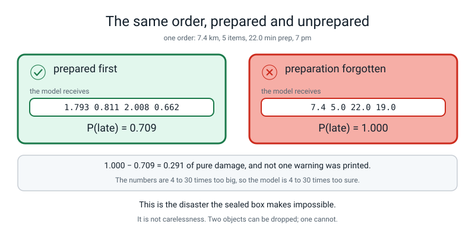
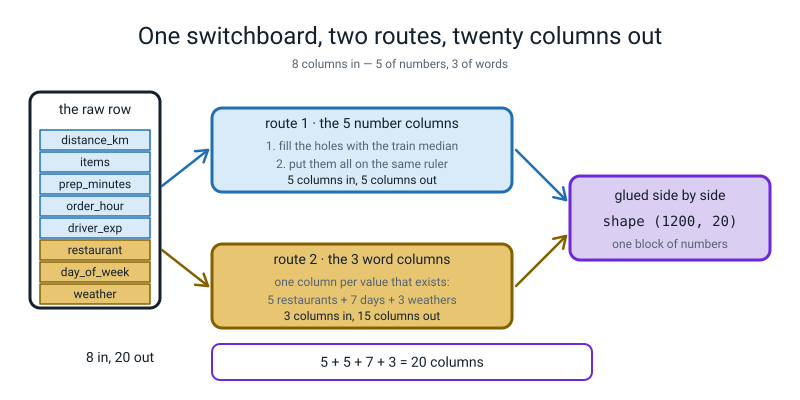
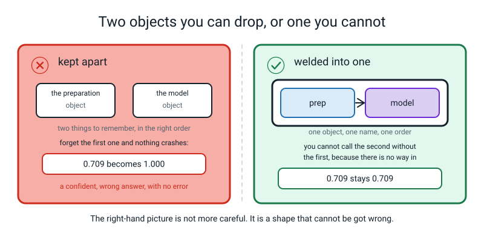
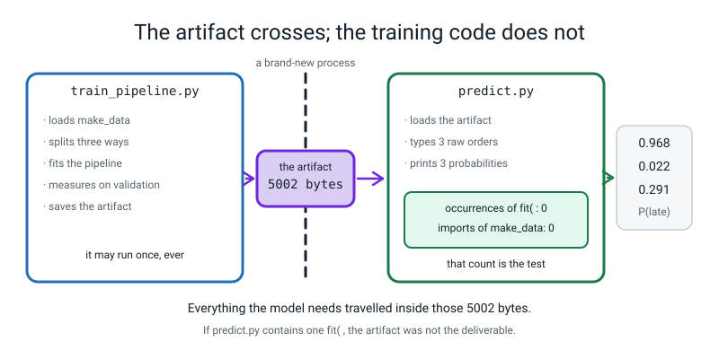
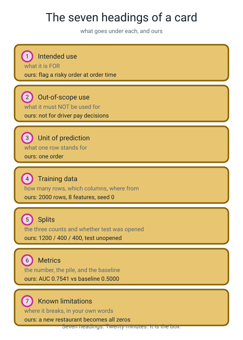
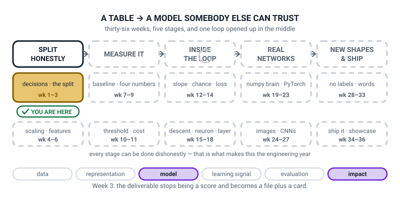
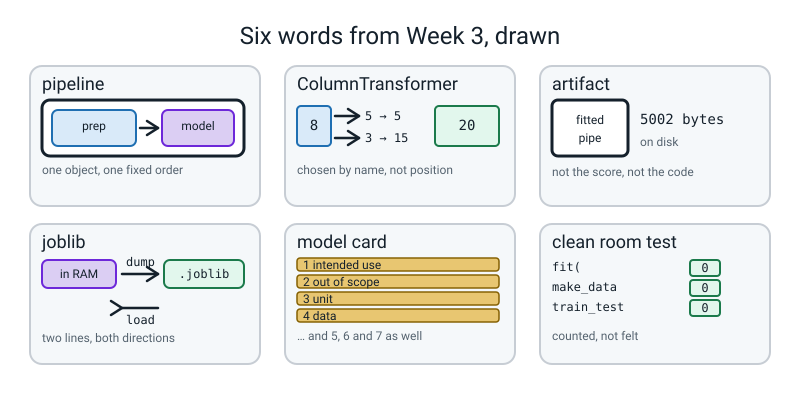

# Week 3 — The Artifact Is the Deliverable

[⬅ Week 2](week-02.md) · [Course Home](../README.md) · [Next ➡](week-04.md) · [Workbook](../workbook/week-03.md)

---

> ### This week in one sentence
> **What you hand over is not a score, it is a file: a fitted `Pipeline` on disk, plus a card saying what it is and where it breaks.**
>
> **By the end of this chapter you will be able to:**
> - **Assemble a `ColumnTransformer`** that sends number columns one way and word columns the other, **selected by name**, and say how many columns come out: **(1200, 8) → (1200, 20)**
> - **Weld the preparation and the model into one `Pipeline`**, and explain why that makes forgetting the preparation *structurally impossible* rather than merely unlikely
> - **Save the fitted pipeline with `joblib`** and reload it in a brand-new file containing **zero** training code — and prove that file is clean by counting
> - **Write a model card** under seven headings: intended use, out-of-scope use, unit of prediction, training data, splits, metrics, known limitations
>
> **New maths:** **none.** One piece of counting, done on paper before the code runs: **5 + 5 + 7 + 3 = 20.**
>
> **New syntax:** `Pipeline(steps=[...])` · `ColumnTransformer([...])` · `joblib.dump(pipe, "m.joblib")` · `joblib.load("m.joblib")`
>
> **Reading time:** about 40 minutes. **Homework:** about 60 minutes.

---

## 🪝 Start Here

Two weeks of writing, and today you build a model. It is **three lines**:

```python
model = LogisticRegression(max_iter=1000, random_state=0)
model.fit(prepared_training_rows, y_train)
prob = model.predict_proba(prepared_validation_rows)[:, 1]
```

Three lines, and the validation AUC comes out at **0.7541** against last week's baseline of **0.5000**. That is **0.2541 above the zero on the ruler**, and it is a genuinely decent first attempt.

**And now the awkward question: what do you actually hand to somebody?**

The score? A score is a **claim**, and nobody can use a claim. The code? Then they need your libraries, your data, your Python and some luck. What they need is **the fitted model itself, as a file** — something that already contains the learned numbers, loads in a fresh program on a different day, and turns a raw order into a probability with no training happening anywhere.

Now hold two envelopes in your head.

One is called **the preparation.** It knows how to turn a raw order — words, holes, numbers on wildly different scales — into something a model can add up. The other is called **the model.** It knows how to turn that into a probability.

**Two things. Used in the right order, every single time, forever, by anybody who ever touches this system** — including you, in eight months, on a Friday afternoon, in a different file.

What happens if somebody forgets the first one? Most people say "it'll crash". Sometimes it does — hand the whole raw table over, words and holes included, and it stops with an error about the words. But that is the hopeful answer, and the dangerous case is the one that does *not* crash: numbers that look like numbers, just on the wrong scale. Here is what happens then, on one real order — GreenLeaf, 7.4 km, 5 items, 22 minutes of prep, 7 pm on a Thursday, raining, driver with 59 months' experience:

```text
the four typed numbers, raw     : [7.4, 5.0, 22.0, 19.0]
the same four, after preparation: [1.793 0.811 2.008 0.662]

prepared   P(late) = 0.709
unprepared P(late) = 1.000
damage             = 0.291
```


*Figure 3.1 — The same order, prepared and unprepared. 1.000 − 0.709 = 0.291 of pure damage, and not one warning was printed.*

**1.000.** Total, absolute certainty. **And no error. No warning. No red text.** A number a dashboard would print and a dispatcher would believe.

Why so *sure* rather than merely wrong? Because the model learned its numbers in a world where `distance_km` sits around 0 and rarely leaves −2 to +5. You just handed it 7.4 — not 7.4 kilometres, 7.4 *on the prepared scale* — and 22.0 for prep minutes, which is off the end of the end. The numbers are **4 to 30 times too big**, so the sum the model adds up is thrown far off the end of its scale — and because all four of these numbers carry a positive weight (further, more items, longer prep, later hour all push towards *late*), it is thrown towards 1.000. A number with a negative weight, such as driver experience, would be thrown the other way, towards 0.000: being huge is what makes the answer extreme, and the weights decide which extreme.

(To isolate the damage, this demonstration pastes the four raw numbers into the prepared row and leaves everything else alone. Forgetting the preparation on the real table would more likely stop with an error about the words.)

It is not confused. It answered exactly the question it was asked, and the question was nonsense.

**So here is today's move: instead of being careful, change the shape.** Slide one envelope inside the other. How many things must you now remember? **One.** And how do you get to the model without going through the preparation? **You can't. There is no way in.**

> **The pipeline is not more careful than you. It is a shape that cannot be got wrong.**

---

## 🧠 The Big Idea

This section explains what a `ColumnTransformer`, a `Pipeline` and `joblib` are, and why the deliverable is a file with a card beside it.

### 1. Eight columns the model cannot read

Here is X, and here is why you cannot hand it straight to a model.

| Column | What is in it | Can a model add it up? |
|---|---|---|
| `distance_km` | 7.4 | yes |
| `items` | 5 | yes |
| `prep_minutes` | 22.0 | yes |
| `order_hour` | 19 | yes |
| `driver_experience_months` | 59.0, or **nothing at all** in 108 rows | not when it is nothing |
| `restaurant` | `"GreenLeaf"` | **no** |
| `day_of_week` | `"Thu"` | **no** |
| `weather` | `"rain"` | **no** |

Three problems, and they need three different treatments:

- **The word columns are words.** A model does arithmetic, and you cannot multiply `"rain"` by anything. So each word column becomes **one new column per value that exists**, each holding a 0 or a 1.
- **The number columns have holes.** Week 1 counted them: 108 empty cells in `driver_experience_months`. You cannot multiply by nothing either. So each hole gets filled with the **median** — the middle value — learned from the training rows.
- **The number columns are on wildly different rulers.** `distance_km` runs about 0.3 to 15; `driver_experience_months` runs 0 to 59. Left alone, **the big-numbered column shouts.** So all five get put on the same ruler.

**And here is the honest bit.** All of those tools get taught properly later: rulers and word-splitting are **Week 4**, filling holes is **Week 6**, and what logistic regression actually *does* is **Weeks 13 to 15**. This week they are four named parts that you **wire together**, and the wiring is the subject. You do not need to know how a fuse works to know it must be upstream of the socket.

### 2. `ColumnTransformer`: one switchboard, two routes

> **ColumnTransformer** — a switchboard. You give it a list of routes; each route is a name, a treatment, and the list of columns it applies to. It runs each route on its own columns and glues the results side by side.


*Figure 3.2 — One switchboard, two routes, twenty columns out. 8 columns go in; the arithmetic on the right is the whole diagram.*

**Count the output columns on paper before you ever run this.** It is the one piece of arithmetic in the week and it is the habit that catches shape bugs for the next thirty-three weeks.

**Route 1 — the five number columns.** Fill the holes; put them on one ruler. Neither of those changes how many columns there are. **5 in, 5 out.**

**Route 2 — the three word columns.** Each becomes one column per value that exists in the training data:

- `restaurant` has **5** different values (Napoli, SliceHouse, CrustyBros, TandooriPizza, GreenLeaf) → 5 columns
- `day_of_week` has **7** → 7 columns
- `weather` has **3** (clear, rain, storm) → 3 columns
- **3 columns in, 5 + 7 + 3 = 15 columns out.**

Glue the two routes side by side: **5 + 15 = 20.**

So **8 columns in, 20 columns out**, written the way you will write it all year:

```text
(1200, 8)  ->  (1200, 20)
```

**The 1200 never moves.** You are not adding or removing rows, only **re-describing** each one using more columns.

> **🔢 The arithmetic, slowly:** 5 numbers stay 5. Then 5 restaurants + 7 days + 3 weathers = 15. And 5 + 15 = **20.** If you print the shape and it says 20, your counting was right. If it says 19 or 22, one of your three counts is wrong — and finding that out now costs thirty seconds, while finding it out in Week 17 costs an afternoon.

**Where did the 5, the 7 and the 3 come from?** From Week 1's tool: `nunique()`. The same command that caught `order_id`.

And here is the sentence that makes `ColumnTransformer` worth its long name: **the columns are chosen by name, not by position.** You wrote `["distance_km", "items", ...]`, so a spreadsheet with its columns in a completely different order still works. You will prove that yourself later in the chapter.

### 3. `Pipeline`: two objects you can drop, or one you cannot

This is the heart of the week.

> **Pipeline** — a single object holding several steps in a fixed order. Calling `fit` on it fits every step in order. Calling `predict_proba` on it runs every step in order. **It has one name.**


*Figure 3.3 — Two objects you can drop, or one you cannot. The right-hand picture is not more careful; it is a shape that cannot be got wrong.*

With two objects, *"remember to prepare first"* is a thing a human has to remember. With one object there is **no way in** — the only door into the model goes through the preparation. **You cannot forget a step you cannot reach.**

And notice the thing that removes any suspicion of magic: the two-loose-objects version and the pipeline version score **exactly the same validation AUC, 0.7541.**

> **The sealed box is not a better model. It is the same model with no way to reach it wrongly.**

### 4. The second reason for the weld, and it is invisible

Week 2's whole argument was that the validation pile must not influence the training. But **the preparation learns things too** — the median it uses to fill holes, the centre of each ruler. If you prepare all 2000 rows and *then* split, those learned numbers have already seen your validation and test rows.

Here is exactly what changes:

```text
the hole-filling value the pipeline learns
  median driver experience, 1200 TRAIN rows : 30.0
  median driver experience, all 2000 rows   : 29.0

the centre of the ruler the pipeline learns
  mean distance_km, 1200 TRAIN rows : 3.4591
  mean distance_km, all 2000 rows   : 3.5193
```

**Two different medians. Two different centres.**

Now the part you must not be told gently: on this data, doing it the wrong way changes the AUC by about **one ten-thousandth.** You would never notice. Worked Example 3 measures it exactly.

**That is precisely why it is dangerous.** It does not announce itself, it is invisible in the score, and on somebody else's data it could be worth 0.05 or more (we have not measured one, but nothing stops it) and nobody ever finds out. So we do not *remember* to avoid it. We build a shape where it cannot happen: `pipe.fit(X_train, y_train)` fits the preparation on the training rows and **could not reach the others if it wanted to.**

*(There is a proper name for this whole class of mistake, and three named kinds of it. That is **Week 6.**)*

### 5. `joblib`: the artifact crosses, the code does not

> **joblib** — a tool that writes a fitted Python object to a file and reads it back. Two lines: `joblib.dump(thing, "name.joblib")` and `thing = joblib.load("name.joblib")`.

> **Artifact** — the fitted thing, saved to disk as a file. Not the code that made it, and not the score it got. **The file.**

```python
joblib.dump(pipe, "delivery_pipeline.joblib")
```

That writes **5002 bytes.** Five kilobytes — smaller than a photograph. And inside those five kilobytes are: the median it will use to fill holes, the centre and width of the ruler for all five number columns, the list of every restaurant, day and weather it knows about, and the twenty-one numbers logistic regression learned. **Everything the model needs, and nothing else.** (One safety rule comes with the file: a `.joblib` is not a plain document, and loading one can run code that is hidden inside it. Only load files from people and places you trust, and never one that arrived from a stranger.)


*Figure 3.4 — The artifact crosses; the training code does not. If `predict.py` contains one `fit(`, the artifact was not the deliverable.*

> **Clean room test** — close the training file completely. Open a brand-new file containing **no training code at all** — no `fit`, no split, no import of the data — load the artifact, and predict.

And you do not *feel* whether a file is clean. **You count:**

```text
occurrences of  fit(        : 0
occurrences of  make_data   : 0
occurrences of  train_test  : 0
lines in predict.py         : 24
```

**Those three zeros are the test.** Because think about what a `fit(` in that file would mean: the person you hand it to would need your data before they could use your model — and if they had your data, they would not need your model.

### 6. The model card: seven headings, twenty minutes

Here is the part nobody teaches and everybody needs.

A 5,002-byte file is completely **silent**. It does not know what it is for. It does not know what it must never be used for. It does not know that its test pile was never opened. **A number and a file with no writing beside them are a liability**, and the fix is a page of writing.

> **Model card** — a short document that travels with the artifact, under fixed headings, saying what it is for and where it breaks.


*Figure 3.5 — The seven headings of a card, with ours filled in. Seven headings, twenty minutes.*

| # | Heading | What goes under it | Ours |
|---|---|---|---|
| 1 | **Intended use** | what it is FOR, in one sentence | Flag a risky order at order time, so a dispatcher can act |
| 2 | **Out-of-scope use** | what it must NOT be used for | Not for driver pay, ratings or discipline decisions |
| 3 | **Unit of prediction** | what one row stands for | One order |
| 4 | **Training data** | how many rows, which columns, where from | 2000 rows (after 20 duplicates removed), 8 features, `make_data.py` seed 0 |
| 5 | **Splits** | the three counts, and whether test was opened | 1200 / 400 / 400, stratified. **Test pile not opened.** |
| 6 | **Metrics** | the number, the pile it came from, and the baseline | Validation ROC-AUC **0.7541** against a baseline of **0.5000** |
| 7 | **Known limitations** | where it breaks, in your own words | A restaurant it has never seen becomes five zeros and it answers anyway, with no warning |

**Heading 2 is the one people skip and the one that matters most.** "Not for driver pay decisions" is not legal boilerplate. It is the sentence that stops somebody, in eight months, using a lateness model to decide who gets fewer shifts — a use it was never measured for, on people who never agreed to it, from data that mostly measures distance and weather.

**And notice that three of the seven were written two weeks ago**, in your own handwriting, on Week 1's index cards: heading 3 is card 1, the feature list in heading 4 is card 3, and the metric in heading 6 is card 5. **The card is not a report. It is the contract, updated.**

Heading 7 has a real, measurable entry, and you will run it yourself:

```text
SliceHouse (in the training data) P(late) = 0.291
PizzaNova  (never seen before)    P(late) = 0.308
no error, no warning, difference = 0.017
```

`PizzaNova` was never in the training data, so **all five restaurant columns come out 0** — as if the order came from no restaurant at all — and the model answers 0.308 with total composure. Is that a bug? **No.** That is `handle_unknown="ignore"` doing exactly what we asked, and the alternative is a system that crashes the first time a new branch opens. **It is a limitation, and limitations go in writing.**

---

## 🔁 The Idea From Last Week, Used Harder

**No new maths.** One old skill — counting — used with much more care than feels necessary.

**The count that matters:**

```text
   ROUTE 1  the 5 number columns
            fill the holes  -> still 5
            one ruler       -> still 5
                                     5 out

   ROUTE 2  the 3 word columns
            restaurant   how many different?  5   -> 5 columns
            day_of_week  how many different?  7   -> 7 columns
            weather      how many different?  3   -> 3 columns
                                     5 + 7 + 3 = 15 out

   GLUED    5 + 15 = 20
```

Do it in your head three ways, so it sticks:

- **Forwards:** 5 + 5 + 7 + 3 = 20.
- **Backwards:** 20 − 15 = 5, which had better be the number of number columns. It is.
- **What if a sixth restaurant opened?** 6 + 7 + 3 = 16, and 5 + 16 = **21.** The shape would print `(1200, 21)` and your artifact would have to be rebuilt.

**And the subtraction that makes the score mean something:**

```text
   validation ROC-AUC   0.7541
   baseline             0.5000
   ------------------------------
   above the zero       0.2541
```

Without last week, `0.7541` is a number that sounds all right. With last week, it is **0.2541 above the score of learning nothing** — and that is the whole reason you spent a lesson building two useless models.

> **💡 Try this:** work out what fraction of the way to perfect that is. Perfect is 1.0000, the zero is 0.5000, so the room available is 0.5000 — and you have taken 0.2541 of it, which is **0.2541 ÷ 0.5000 = 0.5082**, about half the distance from useless to perfect. That is a more honest way to read an AUC than "75%".

---

## 💻 Type This

Two files matter: `train_pipeline.py`, which runs **once**, and `predict.py`, which is what you hand over. `make_data.py` from Week 1 is imported unchanged.

### Step 1 — imports, and last week's split

```python
"""train_pipeline.py - fit one sealed pipeline, measure it, save it. Runs once."""
import joblib
from sklearn.compose import ColumnTransformer
from sklearn.dummy import DummyClassifier
from sklearn.impute import SimpleImputer
from sklearn.linear_model import LogisticRegression
from sklearn.metrics import roc_auc_score
from sklearn.model_selection import train_test_split
from sklearn.pipeline import Pipeline
from sklearn.preprocessing import OneHotEncoder, StandardScaler

from make_data import make_deliveries

NUMBER_COLUMNS = ["distance_km", "items", "prep_minutes",
                  "order_hour", "driver_experience_months"]
WORD_COLUMNS = ["restaurant", "day_of_week", "weather"]

df = make_deliveries(n=2000, seed=0).drop_duplicates().reset_index(drop=True)
y = df["late"]
X = df.drop(columns=["late", "order_id"])

X_rest, X_test, y_rest, y_test = train_test_split(
    X, y, test_size=0.2, stratify=y, random_state=0)
X_train, X_val, y_train, y_val = train_test_split(
    X_rest, y_rest, test_size=0.25, stratify=y_rest, random_state=0)
print("piles:", len(y_train), len(y_val), len(y_test))
```

Ten imports — the most you will ever type in one go in this course. Read them as a shopping list: the welding tool, the switchboard, last week's dummy, the hole-filler, the model, the metric, the splitter, the pipeline, the two preparers.

**`import joblib` on its own line, with no `from`**, because we want the whole toolbox rather than one tool out of it.

The two lists are in **CAPITALS** because that is Python's convention for *"a fixed setting, decided once, not something the program changes as it runs"*. And notice what they actually are: **Week 1's index card three, in code.** Eight features, split into two kinds.

```text
piles: 1200 400 400
```

### Step 2 — the two routes and the switchboard

```python
# ROUTE 1 - the five number columns: fill the holes, then one ruler for all.
number_route = Pipeline(steps=[
    ("fill_holes", SimpleImputer(strategy="median")),
    ("same_ruler", StandardScaler()),
])

# THE SWITCHBOARD - route 1 for numbers, route 2 for words, selected by name.
prep = ColumnTransformer([
    ("num", number_route, NUMBER_COLUMNS),
    ("cat", OneHotEncoder(handle_unknown="ignore"), WORD_COLUMNS),
])
```

`Pipeline(steps=[...])` takes a **list**, and each item is a **pair in round brackets: a name you invent, then the tool.** The name is genuinely yours — `"fill_holes"` could be `"bob"` — and its only job is to let you refer to that step later.

**The order is the order they run in.** Fill the holes **first**, then the ruler, because we want the ruler to be measured on complete columns, with every row counted. (Swap them and nothing crashes — the ruler quietly measures only the rows that have a value, and the numbers come out a little different. That is the kind of silent difference this chapter is about.)

Then the switchboard. Each route is a **triple: a name, a treatment, and the list of columns it applies to.** Route `"num"` sends `number_route` at the five number columns; route `"cat"` sends the word-splitter at the three word columns.

`SimpleImputer(strategy="median")` fills each missing value with the middle value of its own column. `OneHotEncoder` turns a column of words into one on-or-off column per word.

`handle_unknown="ignore"` means: **if you meet a restaurant you have never seen, put zeros instead of crashing.** Remember that setting — it comes back at the end of the chapter and it goes on the card.

### Step 3 — the weld, the fit, and the shape check

```python
# THE SEALED BOX - preparation and model, welded, one name.
pipe = Pipeline(steps=[
    ("prep", prep),
    ("model", LogisticRegression(max_iter=1000, random_state=0)),
])

pipe.fit(X_train, y_train)

print("columns in :", X_train.shape)
print("columns out:", prep.transform(X_train).shape)
print("restaurants:", X_train["restaurant"].nunique(),
      " days:", X_train["day_of_week"].nunique(),
      " weathers:", X_train["weather"].nunique())
```

**`pipe.fit(X_train, y_train)` is one line and it does everything in order.** Fill the holes using the training median. Learn the ruler from the training rows. Learn which restaurants exist. Then fit the model on the result. Every one of those learns from `X_train` **and only** `X_train`, and there is no way to ask it for anything else.

`max_iter=1000` means "you may take up to a thousand goes at finding your numbers"; the default of 100 is not always enough and warns you when it runs out. `random_state=0` for the usual reason: **a number you cannot reproduce is not a result.**

`prep` is still a name you can use, and after `pipe.fit` it is **fitted** — a `Pipeline` fits the objects you handed it, not copies of them. So `prep.transform(X_train).shape` asks the switchboard alone: *"show me what you turn 1200 rows of 8 columns into."*

**Before you run it: what number did you write on paper?**

```text
columns in : (1200, 8)
columns out: (1200, 20)
restaurants: 5  days: 7  weathers: 3
```

**Five, seven, three** — and five number columns. 5 + 5 + 7 + 3 = 20. **Your paper arithmetic and the computer's shape agree**, and that agreement is what you will check every week for the rest of the year.

### Step 4 — the loud mistake: model first

Swap the two lines in the outer pipeline. **Predict first: does it complain when you build it, or when you fit it?** Save the broken version as `train_pipeline_bad.py` so you keep your working copy.

```python
pipe = Pipeline(steps=[
    ("model", LogisticRegression(max_iter=1000, random_state=0)),
    ("prep", prep),
])
```

```text
piles: 1200 400 400
Traceback (most recent call last):
  File "/Users/rkamma/level3/term1/train_pipeline_bad.py", line 46, in <module>
    pipe.fit(X_train, y_train)
  File ".../sklearn/base.py", line 1365, in wrapper
    return fit_method(estimator, *args, **kwargs)
  File ".../sklearn/pipeline.py", line 655, in fit
    Xt = self._fit(X, y, routed_params, raw_params=params)
  File ".../sklearn/pipeline.py", line 563, in _fit
    self._validate_steps()
  File ".../sklearn/pipeline.py", line 340, in _validate_steps
    raise TypeError(
TypeError: All intermediate steps should be transformers and implement fit and transform or be the string 'passthrough' 'LogisticRegression(max_iter=1000, random_state=0)' (type <class 'sklearn.linear_model._logistic.LogisticRegression'>) doesn't
```

*(Your path will be your own folder. The four `...` paths are inside scikit-learn's own files and there is nothing in them for you.)*

Look at **which line** it points at, and notice what got printed first: `piles: 1200 400 400`. The split ran fine. It did not complain when you **built** the pipeline — only when you **fitted** it. **Building a wrong pipeline is silent; using one is not.**

And the message does real work if you slow down. *"All intermediate steps should be transformers"* — **intermediate** means every step except the last. A transformer changes data and passes it on. A model *ends* the line: it produces answers, not data. **So a model can only ever be last.**

That is a nice, honest constraint: **a pipeline is a queue with a worker at the end.**

### Step 5 — measure it, against last week's box

```python
prob_val = pipe.predict_proba(X_val)[:, 1]
auc = roc_auc_score(y_val, prob_val)

dummy = DummyClassifier(strategy="most_frequent").fit(X_train, y_train)
base = roc_auc_score(y_val, dummy.predict_proba(X_val)[:, 1])

print(f"validation ROC-AUC  : {auc:.4f}")
print(f"baseline ROC-AUC    : {base:.4f}")
print(f"beat the baseline by: {auc - base:.4f}")
```

`predict_proba(X_val)[:, 1]` is last week's tool, unchanged: every row, column 1, the chance of "late".

And notice the dummy is rebuilt **in the same script**. **Never report a number without its baseline in the same printout.** If they live in two different files, sooner or later somebody quotes one without the other.

```text
validation ROC-AUC  : 0.7541
baseline ROC-AUC    : 0.5000
beat the baseline by: 0.2541
```

### Step 6 — save it. This is the deliverable

```python
joblib.dump(pipe, "delivery_pipeline.joblib")
print("saved delivery_pipeline.joblib")
```

Then, in the terminal:

```bash
ls -l delivery_pipeline.joblib
```

```text
-rw-r--r--  1 rkamma  staff  5002 Sep 17 06:54 delivery_pipeline.joblib
```

**5002 bytes.** *(The number in the middle is the size in bytes; the rest of the line is permissions and dates and will look different on your machine.)*

Here is the complete `train_pipeline.py`:

```python
"""train_pipeline.py - fit one sealed pipeline, measure it, save it. Runs once."""
import joblib
from sklearn.compose import ColumnTransformer
from sklearn.dummy import DummyClassifier
from sklearn.impute import SimpleImputer
from sklearn.linear_model import LogisticRegression
from sklearn.metrics import roc_auc_score
from sklearn.model_selection import train_test_split
from sklearn.pipeline import Pipeline
from sklearn.preprocessing import OneHotEncoder, StandardScaler

from make_data import make_deliveries

NUMBER_COLUMNS = ["distance_km", "items", "prep_minutes",
                  "order_hour", "driver_experience_months"]
WORD_COLUMNS = ["restaurant", "day_of_week", "weather"]

df = make_deliveries(n=2000, seed=0).drop_duplicates().reset_index(drop=True)
y = df["late"]
X = df.drop(columns=["late", "order_id"])

X_rest, X_test, y_rest, y_test = train_test_split(
    X, y, test_size=0.2, stratify=y, random_state=0)
X_train, X_val, y_train, y_val = train_test_split(
    X_rest, y_rest, test_size=0.25, stratify=y_rest, random_state=0)
print("piles:", len(y_train), len(y_val), len(y_test))

# ROUTE 1 - the five number columns: fill the holes, then one ruler for all.
number_route = Pipeline(steps=[
    ("fill_holes", SimpleImputer(strategy="median")),
    ("same_ruler", StandardScaler()),
])

# THE SWITCHBOARD - route 1 for numbers, route 2 for words, selected by name.
prep = ColumnTransformer([
    ("num", number_route, NUMBER_COLUMNS),
    ("cat", OneHotEncoder(handle_unknown="ignore"), WORD_COLUMNS),
])

# THE SEALED BOX - preparation and model, welded, one name.
pipe = Pipeline(steps=[
    ("prep", prep),
    ("model", LogisticRegression(max_iter=1000, random_state=0)),
])

pipe.fit(X_train, y_train)

print("columns in :", X_train.shape)
print("columns out:", prep.transform(X_train).shape)
print("restaurants:", X_train["restaurant"].nunique(),
      " days:", X_train["day_of_week"].nunique(),
      " weathers:", X_train["weather"].nunique())

prob_val = pipe.predict_proba(X_val)[:, 1]
auc = roc_auc_score(y_val, prob_val)

dummy = DummyClassifier(strategy="most_frequent").fit(X_train, y_train)
base = roc_auc_score(y_val, dummy.predict_proba(X_val)[:, 1])

print(f"validation ROC-AUC  : {auc:.4f}")
print(f"baseline ROC-AUC    : {base:.4f}")
print(f"beat the baseline by: {auc - base:.4f}")

joblib.dump(pipe, "delivery_pipeline.joblib")
print("saved delivery_pipeline.joblib")
```

```text
piles: 1200 400 400
columns in : (1200, 8)
columns out: (1200, 20)
restaurants: 5  days: 7  weathers: 3
validation ROC-AUC  : 0.7541
baseline ROC-AUC    : 0.5000
beat the baseline by: 0.2541
saved delivery_pipeline.joblib
```

**Runtime: about 1 second.** Nothing waits, nothing downloads.

### Step 7 — the clean room: a brand-new file

**Close `train_pipeline.py`. Actually close the tab.** New file, completely empty. Two imports, one load, three orders, one print — and type the eight column names from your own Week 1 card, not from the training file.

```python
"""predict.py - loads the artifact and predicts. Contains no training code at all."""
import joblib
import pandas as pd

pipe = joblib.load("delivery_pipeline.joblib")

orders = pd.DataFrame([
    {"restaurant": "CrustyBros", "distance_km": 8.5, "items": 4, "prep_minutes": 22.0,
     "order_hour": 19, "day_of_week": "Fri", "weather": "storm",
     "driver_experience_months": 12.0},
    {"restaurant": "Napoli", "distance_km": 1.2, "items": 1, "prep_minutes": 8.0,
     "order_hour": 12, "day_of_week": "Tue", "weather": "clear",
     "driver_experience_months": 42.0},
    {"restaurant": "SliceHouse", "distance_km": 4.2, "items": 3, "prep_minutes": 14.0,
     "order_hour": 18, "day_of_week": "Sat", "weather": "rain",
     "driver_experience_months": 42.0},
])

prob = pipe.predict_proba(orders)[:, 1]

for i in range(len(orders)):
    row = orders.iloc[i]
    print(f"{row['restaurant']:13s} {row['distance_km']:4.1f} km  {row['weather']:6s} "
          f"{row['order_hour']:2d}:00   P(late) = {prob[i]:.3f}")
```

`pd.DataFrame([{...}, {...}, {...}])` builds a table from a **list of dictionaries** — one dictionary per order, each key a column name. **The keys have to match the eight column names exactly**, because the switchboard looks columns up by name.

```text
CrustyBros     8.5 km  storm  19:00   P(late) = 0.968
Napoli         1.2 km  clear  12:00   P(late) = 0.022
SliceHouse     4.2 km  rain   18:00   P(late) = 0.291
```

**Runtime: about 0.7 seconds**, nearly all of it importing scikit-learn. **There is no training in this file at all.**

Now the five-second test almost nobody does: **do those three numbers tell a sensible story?**

- **0.968** — 8.5 km in a storm at seven in the evening from the slowest restaurant, driver of twelve months. Everything is against it.
- **0.022** — 1.2 km, one item, lunchtime, clear, experienced driver. Nothing is against it.
- **0.291** — middling distance, rain, six in the evening. Genuinely could go either way — and notice it lands very close to the base rate of **0.2875**, which is the honest answer for an order with nothing remarkable about it.

If your three numbers are all similar, or the wrong way round, **that is a finding and not a failure**: something is wrong, usually a column name that does not match, so a value quietly became zeros.

### Step 8 — prove it is clean, by counting

```python
"""clean_room_check.py - is predict.py really a clean room?"""
text = open("predict.py").read()
print("occurrences of  fit(        :", text.count("fit("))
print("occurrences of  make_data   :", text.count("make_data"))
print("occurrences of  train_test  :", text.count("train_test"))
print("lines in predict.py         :", len(text.splitlines()))
```

```text
occurrences of  fit(        : 0
occurrences of  make_data   : 0
occurrences of  train_test  : 0
lines in predict.py         : 24
```

`open("predict.py").read()` reads the file as text, and `.count("fit(")` counts how many times a bit of text appears. **Your program is reading your other program** — the same tool you would use to count how many times "the" appears in a book.

**Three zeros. That is the test. Not a feeling — a count.**

### Step 9 — two experiments, and heading 7 of the card

**Experiment one: retype one order with its eight keys in a completely different order.**

```python
scrambled = pd.DataFrame([{"weather": "rain", "day_of_week": "Sat",
                           "restaurant": "SliceHouse",
                           "driver_experience_months": 42.0, "order_hour": 18,
                           "prep_minutes": 14.0, "items": 3, "distance_km": 4.2}])
print(round(pipe.predict_proba(scrambled)[0, 1], 3), "<- columns in a totally different order")
```

```text
0.291 <- columns in a totally different order
```

**Identical.** 0.291 either way, because the switchboard looks columns up **by name** and never counts from the left. That is worth knowing, because a spreadsheet somebody emails you will have its columns in whatever order they felt like.

**Experiment two: a restaurant that does not exist.**

```python
order = {"restaurant": "SliceHouse", "distance_km": 4.2, "items": 3,
         "prep_minutes": 14.0, "order_hour": 18, "day_of_week": "Sat",
         "weather": "rain", "driver_experience_months": 42.0}

known = pd.DataFrame([order])
new = pd.DataFrame([{**order, "restaurant": "PizzaNova"}])

print("SliceHouse (in the training data) P(late) =",
      round(pipe.predict_proba(known)[0, 1], 3))
print("PizzaNova  (never seen before)    P(late) =",
      round(pipe.predict_proba(new)[0, 1], 3))
print("no error, no warning, difference =",
      round(pipe.predict_proba(new)[0, 1] - pipe.predict_proba(known)[0, 1], 3))
```

`{**order, "restaurant": "PizzaNova"}` means *"the same eight keys, but with that one replaced"* — a copy with exactly one change, so nothing else can differ.

```text
SliceHouse (in the training data) P(late) = 0.291
PizzaNova  (never seen before)    P(late) = 0.308
no error, no warning, difference = 0.017
```

Write that into heading 7 of your card, in your own words: *"a restaurant the model has never seen becomes five zeros, and it answers anyway."*

---

## 🔍 Worked Examples

These three examples show the week's ideas on a table small enough to count by eye, on a different subject, and as a measurement.

### Worked Example 1 — six rows you can count by eye: 2 columns in, 4 columns out

`(1200, 8) → (1200, 20)` is too big to check by hand, which is exactly why you should first do it on a table you can see all of. Six school buses, one number column and one word column.

```python
"""w3we1.py - six rows you can count by eye: 2 columns in, 4 columns out."""
import pandas as pd
from sklearn.compose import ColumnTransformer
from sklearn.impute import SimpleImputer
from sklearn.pipeline import Pipeline
from sklearn.preprocessing import OneHotEncoder, StandardScaler

buses = pd.DataFrame({
    "minutes_late": [2.0, 8.0, 0.0, None, 12.0, 4.0],
    "route":        ["red", "blue", "red", "green", "blue", "red"],
})
print(buses.to_string(index=False))
print("shape in:", buses.shape)
print("different routes:", buses["route"].nunique())

number_route = Pipeline(steps=[
    ("fill_holes", SimpleImputer(strategy="median")),
    ("same_ruler", StandardScaler()),
])
prep = ColumnTransformer([
    ("num", number_route, ["minutes_late"]),
    ("cat", OneHotEncoder(handle_unknown="ignore"), ["route"]),
])

prep.fit(buses)
out = prep.transform(buses)
print("shape out:", out.shape)
print("the hole was filled with the median:", buses["minutes_late"].median())
print(out.round(3))
```

```text
 minutes_late route
          2.0   red
          8.0  blue
          0.0   red
          NaN green
         12.0  blue
          4.0   red
shape in: (6, 2)
different routes: 3
shape out: (6, 4)
the hole was filled with the median: 4.0
[[-0.758  0.     0.     1.   ]
 [ 0.758  1.     0.     0.   ]
 [-1.263  0.     0.     1.   ]
 [-0.253  0.     1.     0.   ]
 [ 1.769  1.     0.     0.   ]
 [-0.253  0.     0.     1.   ]]
```

**Do the count first: 1 number column stays 1, and `route` has 3 different values, so 3 out. 1 + 3 = 4.** The printout says `(6, 4)`. Agreed.

Now read the grid, because everything in the week is visible in six rows and four columns:

- **Column 0** is `minutes_late` on its new ruler. The raw numbers were 2, 8, 0, ?, 12, 4 — and the new ones are negative for the small ones and positive for the big ones, because the ruler is centred on the mean (the average) of the column. (Exactly *how* is Week 4.)
- **Columns 1, 2, 3** are `route`, one column per value. Reading across row 0: `0 0 1`. Reading row 1: `1 0 0`. The words come out **in alphabetical order — blue, green, red** — so column 1 is blue, column 2 is green, column 3 is red. Check row 0: it was red, and the 1 is in the last column. ✓
- **Row 3 had a hole.** The median of 2, 8, 0, 12, 4 is **4.0**, so the hole became 4.0 — which is why row 3 and row 5 have the identical value `-0.253`: row 5 really *was* 4.0. **A filled hole is indistinguishable from a real value afterwards**, and that is a limitation for heading 7. (Week 6 shows you how to keep a record of which was which.)

### Worked Example 2 — the same shape of artifact, in a completely different subject

The pipeline-plus-card idea is not a pizza tool. Here it is on 569 cell measurements that ship inside scikit-learn, using four of the thirty columns so the hand-typed rows stay short.

```python
"""w3we2.py - the same shape of artifact, on a table that is not about pizza."""
import joblib
import pandas as pd
from sklearn.compose import ColumnTransformer
from sklearn.datasets import load_breast_cancer
from sklearn.dummy import DummyClassifier
from sklearn.impute import SimpleImputer
from sklearn.linear_model import LogisticRegression
from sklearn.metrics import roc_auc_score
from sklearn.model_selection import train_test_split
from sklearn.pipeline import Pipeline
from sklearn.preprocessing import StandardScaler

FOUR = ["mean radius", "mean texture", "mean smoothness", "mean concavity"]

data = load_breast_cancer(as_frame=True)
X = data.data[FOUR]
y = data.target

X_rest, X_test, y_rest, y_test = train_test_split(
    X, y, test_size=0.2, stratify=y, random_state=0)
X_train, X_val, y_train, y_val = train_test_split(
    X_rest, y_rest, test_size=0.25, stratify=y_rest, random_state=0)
print("piles:", len(y_train), len(y_val), len(y_test))

number_route = Pipeline(steps=[
    ("fill_holes", SimpleImputer(strategy="median")),
    ("same_ruler", StandardScaler()),
])
prep = ColumnTransformer([("num", number_route, FOUR)])
pipe = Pipeline(steps=[
    ("prep", prep),
    ("model", LogisticRegression(max_iter=1000, random_state=0)),
])
pipe.fit(X_train, y_train)

print("columns in :", X_train.shape)
print("columns out:", prep.transform(X_train).shape)

auc = roc_auc_score(y_val, pipe.predict_proba(X_val)[:, 1])
dummy = DummyClassifier(strategy="most_frequent").fit(X_train, y_train)
base = roc_auc_score(y_val, dummy.predict_proba(X_val)[:, 1])
print(f"validation ROC-AUC  : {auc:.4f}")
print(f"baseline ROC-AUC    : {base:.4f}")
print(f"beat the baseline by: {auc - base:.4f}")

joblib.dump(pipe, "cells_pipeline.joblib")
print("saved cells_pipeline.joblib")
```

```text
piles: 341 114 114
columns in : (341, 4)
columns out: (341, 4)
validation ROC-AUC  : 0.9892
baseline ROC-AUC    : 0.5000
beat the baseline by: 0.4892
```

**4 columns in, 4 columns out** — no word columns, so nothing widened. And the artifact on disk is **3114 bytes**, smaller than the delivery one because there are no fifteen category names inside it.

Now the clean room, in its own file:

```python
"""w3we2b.py - the clean room for the cell artifact. No training code at all."""
import joblib
import pandas as pd

pipe = joblib.load("cells_pipeline.joblib")

cells = pd.DataFrame([
    {"mean radius": 12.0, "mean texture": 15.0,
     "mean smoothness": 0.09, "mean concavity": 0.03},
    {"mean radius": 17.0, "mean texture": 20.0,
     "mean smoothness": 0.105, "mean concavity": 0.12},
    {"mean radius": 20.0, "mean texture": 25.0,
     "mean smoothness": 0.12, "mean concavity": 0.25},
])
prob = pipe.predict_proba(cells)[:, 1]
for i in range(len(cells)):
    print(f"radius {cells.iloc[i]['mean radius']:5.1f}   P(class 1) = {prob[i]:.4f}")
```

```text
radius  12.0   P(class 1) = 0.9950
radius  17.0   P(class 1) = 0.0308
radius  20.0   P(class 1) = 0.0000
```

Seventeen lines, no `fit(`, no `load_breast_cancer`, no `train_test_split` — **all three counts are zero.**

**And now look at that last number, because it is exactly the kind of thing this week teaches you to distrust: 0.0000.** Last week's rule said a 1.000 or a 0.000 is an alarm, so check it. Here it survives the check: this model scores **0.9892 AUC**, the four measurements in that row are all large, and large-everything really is a confident answer in this dataset. **The rule is not "certainty is a bug", it is "certainty is a thing you look into."** Ninety seconds of looking, and then you write what you found on the card.

### Worked Example 3 — what preparing before splitting actually costs, measured

Section 4 claimed the wrong way is invisible. Do not take that on trust — measure it, to six decimal places.

```python
"""w3we3.py - what preparing before splitting actually costs, measured."""
from sklearn.compose import ColumnTransformer
from sklearn.impute import SimpleImputer
from sklearn.linear_model import LogisticRegression
from sklearn.metrics import roc_auc_score
from sklearn.model_selection import train_test_split
from sklearn.pipeline import Pipeline
from sklearn.preprocessing import OneHotEncoder, StandardScaler

from make_data import make_deliveries

NUMBER_COLUMNS = ["distance_km", "items", "prep_minutes",
                  "order_hour", "driver_experience_months"]
WORD_COLUMNS = ["restaurant", "day_of_week", "weather"]


def new_prep():
    number_route = Pipeline(steps=[("fill_holes", SimpleImputer(strategy="median")),
                                   ("same_ruler", StandardScaler())])
    return ColumnTransformer([("num", number_route, NUMBER_COLUMNS),
                              ("cat", OneHotEncoder(handle_unknown="ignore"), WORD_COLUMNS)])


df = make_deliveries(n=2000, seed=0).drop_duplicates().reset_index(drop=True)
y = df["late"]
X = df.drop(columns=["late", "order_id"])
X_rest, X_test, y_rest, y_test = train_test_split(
    X, y, test_size=0.2, stratify=y, random_state=0)
X_train, X_val, y_train, y_val = train_test_split(
    X_rest, y_rest, test_size=0.25, stratify=y_rest, random_state=0)

# THE RIGHT WAY - the preparation is inside the pipeline, so it only ever
# sees X_train.
right = Pipeline(steps=[("prep", new_prep()),
                        ("model", LogisticRegression(max_iter=1000, random_state=0))])
right.fit(X_train, y_train)
auc_right = roc_auc_score(y_val, right.predict_proba(X_val)[:, 1])

# THE WRONG WAY - prepare all 2000 rows first, then split them up.
prep_all = new_prep()
prep_all.fit(X)                                   # <- has seen validation and test
model = LogisticRegression(max_iter=1000, random_state=0)
model.fit(prep_all.transform(X_train), y_train)
auc_wrong = roc_auc_score(y_val, model.predict_proba(prep_all.transform(X_val))[:, 1])

print(f"prepared inside the pipeline (right): {auc_right:.6f}")
print(f"prepared before the split   (wrong): {auc_wrong:.6f}")
print(f"difference                         : {auc_wrong - auc_right:.6f}")
```

```text
prepared inside the pipeline (right): 0.754111
prepared before the split   (wrong): 0.754020
difference                         : -0.000092
```

**Ninety-two millionths.** And look at the sign: the wrong way came out very slightly **worse**.

Sit with how uncomfortable that is. The wrong way is not punished. It is not rewarded either. It is simply **not visible** — and it would not be visible on your next dataset either, until one day it could be worth 0.05 or more and you have no way of telling which day that was.

> **🔑 That is the whole argument for the weld, in one sentence:** we do not build the pipeline because doing it wrong is *obviously* bad. We build it because doing it wrong is **undetectable**, and the only defence against an undetectable mistake is a shape that cannot make it.

*(`def new_prep():` is there so that each version gets its own fresh, unfitted switchboard. Reusing one fitted object for both would have quietly mixed the two experiments — which is, pleasingly, the same class of mistake the example is about.)*

---

## 🐞 When It Breaks

Tracebacks are longer again this week — ten lines for a missing column, thirteen for a wrong-order pipeline — because a `Pipeline` error travels up through every layer it passed on the way in. **The rule never changes: read the last line, then find the `File` line with your own filename in it.** And add one habit this week:

> **"The error named something. Find that exact name in your own file."**

### Break 1 — a column left out of a hand-typed order

```text
Traceback (most recent call last):
  File "/Users/rkamma/level3/term1/p_bad.py", line 16, in <module>
    prob = pipe.predict_proba(orders)[:, 1]
  File ".../sklearn/pipeline.py", line 904, in predict_proba
    Xt = transform.transform(Xt)
  File ".../sklearn/utils/_set_output.py", line 316, in wrapped
    data_to_wrap = f(self, X, *args, **kwargs)
  File ".../sklearn/compose/_column_transformer.py", line 1085, in transform
    raise ValueError(f"columns are missing: {diff}")
ValueError: columns are missing: {'weather'}
```

**It names the column. By name.** That is what a name-based switchboard buys you — search your file for that exact word.

And think about what the error **did**: it stopped at the door and named the missing column, instead of guessing or answering anyway. (A missing *column* cannot slip through as zeros here — the switchboard looks it up by name and complains. The genuinely silent case is a missing *value* inside a column that exists: that is Break 4.) **That error is a friend. It refused to guess.** Write that in the Bug Log with the word *protected* in it.

**The fix:** add the key. All eight are required, and the switchboard does not care which kind of column it is — delete `driver_experience_months` instead and you get `ValueError: columns are missing: {'driver_experience_months'}`.

### Break 2 — the model put first

```text
TypeError: All intermediate steps should be transformers and implement fit and transform or be the string 'passthrough' 'LogisticRegression(max_iter=1000, random_state=0)' (type <class 'sklearn.linear_model._logistic.LogisticRegression'>) doesn't
```

*"Every step except the last has to change data and pass it on. Your model doesn't."* **A model can only ever be the last step.** And note **it did not complain when you built the pipeline — only when you fitted it.**

### Break 3 — the hole-filler left out

Take `SimpleImputer` out of the number route and run it:

```text
  File ".../sklearn/utils/validation.py", line 169, in _assert_all_finite_element_wise
    raise ValueError(msg_err)
ValueError: Input X contains NaN.
LogisticRegression does not accept missing values encoded as NaN natively. For supervised learning, you might want to consider sklearn.ensemble.HistGradientBoostingClassifier and Regressor which accept missing values encoded as NaNs natively. Alternatively, it is possible to preprocess the data, for instance by using an imputer transformer in a pipeline or drop samples with missing values. See https://scikit-learn.org/stable/modules/impute.html You can find a list of all estimators that handle NaN values at the following page: https://scikit-learn.org/stable/modules/impute.html#estimators-that-handle-nan-values
```

**The message runs to several sentences of advice, and the first ten words are the whole story:** *"Input X contains NaN"* — there are holes in what reached me and I cannot multiply by nothing. Those are Week 1's 108 holes, arriving to be dealt with. **Put `SimpleImputer` back**, or check that all five number columns are actually listed in `NUMBER_COLUMNS`.

### Break 4 — no error at all, and this is the best accident of the week

Delete `weather` from **one** of the three orders instead of all three:

```text
CrustyBros    weather=storm  P(late) = 0.968
Napoli        weather=nan    P(late) = 0.039
SliceHouse    weather=rain   P(late) = 0.291
```

**Nothing complained.** `pd.DataFrame` built the `weather` column anyway — because two of the three orders had one — and filled the gap with `nan`. Then `OneHotEncoder` turned `nan` into three zeros, exactly as it does for a restaurant it has never seen. **Napoli moved from 0.022 to 0.039 and the program ran happily.**

The switchboard checks that a column **exists**, not that it has anything **in** it. So:

> **A missing column shouts. A missing value whispers.**

**How to catch it:** print `orders` and look for `NaN`.

| Other silent ones | Why nothing complained | The fix |
|---|---|---|
| all three probabilities are almost the same | your three orders probably differ in ways the model does not care about | change **distance, weather and hour** — those are what move the answer |
| a probability comes out `1.000` or `0.000` | nothing is broken as far as scikit-learn knows | **treat it as an alarm and check what reached the model.** Go through the sealed pipeline, never the model directly |

> **🐞 If you see this error:** `FileNotFoundError: [Errno 2] No such file or directory: 'deliverypipeline.joblib'` — the underscore is missing, or you are running `predict.py` from a different folder from the artifact. Match the name exactly, and `ls` to check the file is in the folder you are standing in.

---

## 🎲 What We Did In Class

If you missed it, here is the whole lesson. You need a laptop, a pen, and two envelopes — one that fits inside the other.

**The hook.** Two envelopes side by side: *the preparation* and *the model*. **"What happens if somebody forgets the first one?"** Everyone said "it'll crash". Then `kept_apart.py` on screen: **0.709 becomes 1.000, and the damage is 0.291, with no error message of any kind.** Then one envelope slid inside the other: *"how many things do you have to remember now?"* One. *"And how do you get to the model without going through the preparation?"* You can't.

**The count, in pen, before any code.** Eight columns in — how many out? Two minutes of struggling, then on the board:

```text
   5 number columns -> 5
   restaurant 5, day_of_week 7, weather 3  ->  5 + 7 + 3 = 15
   5 + 15 = 20        (1200, 8) -> (1200, 20)
```

**The two medians.** `leak_demo.py`: the hole-filling value is **30.0** learned from the 1200 training rows and **29.0** learned from all 2000; the centre of the distance ruler is **3.4591** or **3.5193**. Then the uncomfortable sentence: doing it wrong changes the AUC by about one ten-thousandth, **and that is exactly why it is dangerous.**

**`train_pipeline.py`, built in six steps**, with the model put first on purpose — and the discovery that a wrong pipeline is silent when you *build* it and loud when you *fit* it.

**The number under last week's box:**

```text
   validation ROC-AUC   0.7541
   baseline             0.5000
   ------------------------------
   above the zero       0.2541
```

**`ls -l delivery_pipeline.joblib` → 5002 bytes.** Five kilobytes containing a whole working model: one median, five rulers, fifteen category names, twenty-one learned numbers.

**The clean room test**, twenty minutes of it: a **brand-new** `predict.py` — not a copy of the training file with the top deleted — three orders typed by hand, three probabilities checked for whether they told a sensible story, and then the count that has to be three zeros. Then the two experiments: **columns in a scrambled order** (0.291, identical) and **`PizzaNova`** (0.308, no warning), which became heading 7 of the card.

**And the sentence for the week:** *a probability of 1.000 is not a good result, it is an alarm.*

---

## 💬 Talk About It

These three questions are for discussion with a partner or your teacher. Each has a hint to use after you have tried it yourself.

**1. Why can't I just save the model, and prepare the data myself in the other file?**

*Hint:* you can, and it works, and it is exactly the bug from the first seven minutes of the lesson. Then get concrete about what "prepare it myself" requires: the median that filled the holes, the centre **and** width of five rulers, and the list of fifteen categories **in the right order**. All of those are *learned* numbers that live inside the fitted preparation. So either you save them too — which is what saving the whole pipeline does, in one line — or you recompute them, and recomputing them from a different set of rows gives different numbers and a quietly wrong answer. Finish with the version of the question that has a real answer: *what would you have to do to keep the hand-written version correct for the next three years?* (Keep it in step with the training code forever, by remembering.)

**2. `PizzaNova` got a confident 0.308 for a restaurant that does not exist. Should the pipeline have crashed instead?**

*Hint:* argue both sides properly. **For crashing:** an answer built from "no restaurant at all" is not an answer, and silently pretending otherwise is how nonsense gets into dashboards. **Against crashing:** the first time a new branch opens, your entire ordering system stops working — and that is a much bigger failure than a slightly-off probability. Then find the third option, which is what real systems do: **answer, and also report that you had to.** Nothing in this week does that, which is why it goes under heading 7 instead. Finally, the honest closer: `handle_unknown="ignore"` is the right default *and* a permanent liability, and the only thing that makes it safe is a person having written it down.

**3. Our model card has seven headings. Name something a real one should have that ours does not.**

*Hint:* try to think of at least four before reading on — **a date**, **a version number**, **who to contact**, **when it should be retrained**, **who is accountable if it is wrong**, **what data it must never be run on**. All are real and all are Week 34's subject. Then the best one, which is worth arriving at yourselves: **"when should this file be thrown away?"** A 5,002-byte file will still load and still answer in four years, long after the restaurants have changed, and nothing inside it will mention that.

---

## ⚠️ Don't Get Tricked

This section names four claims that sound reasonable, so you can recognise them when someone makes them.

### Trick 1 — "the pipeline is just tidier"


*Figure 3.6 — Two objects you can drop, or one you cannot, again. The right-hand shape is not more careful — it has no way in.*

| ❌ Wrong | ✅ Right |
|---|---|
| "A `Pipeline` is a neatness thing. I could keep the two objects and be careful." | Two objects can be **dropped**; one cannot. Measured: forgetting the preparation on the four numbers turns **0.709 into 1.000**, with **no error message of any kind.** And the pipeline is not a better model — identical AUC, **0.7541 either way.** It is a shape that cannot be got wrong. |

### Trick 2 — "the artifact is the code"

| ❌ Wrong | ✅ Right |
|---|---|
| "I wrote a file called `predict.py`, so I've done the clean room test." | **Count.** `fit(` must appear **zero** times, and so must `make_data` and `train_test`. The commonest version of this mistake is a `predict.py` that imports the data, splits it, fits, and *then* predicts — with "predict" in the name. Counting cannot be fooled by good intentions. |

### Trick 3 — "the model card is paperwork for the end, if there's time"

| ❌ Wrong | ✅ Right |
|---|---|
| "I'll write the card once I know my final score." | **Half of it cannot be written at the end.** Heading 5 says whether the test pile was opened — write that after five weeks of poking about and you will write what you wish were true. Headings 3, 4 (the feature list) and 6 (the metric) were written **two weeks ago**, on index cards, in your own handwriting. **The card is the contract, updated.** |

### Trick 4 — "a probability of 1.000 means the model is very good"

| ❌ Wrong | ✅ Right |
|---|---|
| "P(late) = 1.000, so it's completely sure — great." | **Real data almost never justifies certainty about a pizza.** 1.000 is an **alarm**: check what actually reached the model. In our case it meant the preparation had been skipped and numbers 4 to 30 times too big had gone straight in. A model given numbers 30 times too big is not sure, it is being asked nonsense. |

---

## 🌍 Where You've Seen This

The same idea, a fitted file plus a page of writing, appears in everyday technology.

1. **Your phone's keyboard predicting the next word offline.** There is a fitted file on the device, not a training script. Whoever built it did exactly today's thing: train once, ship the artifact.
2. **Any "export model" button** in a tool like Teachable Machine (which you used back in Level 1). What comes out is a file containing the learned numbers *and* the preparation, for exactly the reason you saw today.
3. **The `.joblib` and `.pkl` files inside almost every real Python project that predicts anything.** Now you know what is in one: learned constants, category lists and coefficients — no data, no training.
4. **Model cards published by real labs**, for real systems, under headings very like these seven. The one everybody skips is "out-of-scope use", and it is the one that gets systems misused.
5. **The "this decision was made automatically" note some banks and councils have to send you.** That sentence exists because somebody had to write down what a model was for and where it breaks — heading 1 and heading 7, with legal weight.
6. **Every bug report that says "it works on my machine".** The clean room test is the cure: if the receiving file needs your data or your training code, you did not ship a model, you shipped a promise.

---

## 🧭 Where This Fits

Level 3 is one pipeline: a table goes in, and a model **somebody else can trust** comes out. This is the
third and last week inside that first gold tile, and it is the week the tile earns its name. You trained a
real model today — and the thing you are handing over is **not the score it got.** It is a file.



*Figure 3.0 — The pipeline in Week 3. Last week in the gold tile: weeks 1, 2 and 3 were one job, and it
finishes with something on disk. The ↻ on stage three is the training loop, still grey — you open it in
Week 12.*

| | |
|---|---|
| **The mental model you now own** | **A result is not a score, it is an artifact.** Fit one `Pipeline`, `joblib.dump` it, load it in a process that contains **zero training code**, and hand it over with a card that says what it is and where it breaks. If the second process needs anything you did not put in the file, the file was not finished. |
| **The one question it answers** | *"Could somebody else run this without me in the room?"* — the clean room test, and it is a yes-or-no question, not an opinion. |
| **What it plugs into** | Week 1's written contract, which becomes headings on the card, and Week 2's three piles. The `Pipeline` is fitted on **train only** — that is the entire reason for welding the steps together instead of carrying two objects around. |
| **What carries forward** | Week 5 drops your own invented function **inside** this `Pipeline`. Week 7 tunes it from the outside through `set_params`. Week 23 does exactly this job for a neural network. Week 34 freezes it, versions it and ships it. |
| **Spiral thread** | 📦 **Model** and 🌍 **Impact**, lit together. Model, because a fitted estimator has stopped being a variable in your session and become a 5,002-byte object with a life of its own. Impact, because the card is written for the person who has to decide whether to trust it — and heading seven is where you tell them what it gets wrong. |

> **💡 Try this:** email yourself the `.joblib` file and the card, and nothing else. In a month, download
> them into an empty folder and try to make a prediction. Whatever you find yourself wishing you had also
> sent is a missing heading on your model card.

---

## 🔑 Remember This

The week's takeaways, followed by a syntax card to keep beside you.

- **The deliverable is a file and a page, not a number.** A score is a claim; **5002 bytes** of fitted pipeline is a thing somebody can use.
- **Count the columns on paper, then print the shape.** `5 + 5 + 7 + 3 = 20`, and `(1200, 8) → (1200, 20)`. The row count never changes — you are re-describing rows, not adding them.
- **Columns are chosen by name, never by position.** A scrambled order still gives **0.291**.
- **`Pipeline` is not more careful than you; it is a shape that cannot be got wrong.** Forgetting the preparation on the four numbers turns 0.709 into 1.000 with no error. Identical AUC either way — **0.7541** — so nothing is being bought except safety.
- **A model can only ever be the last step.** Everything before it must change data and pass it on. And a wrong pipeline is silent when built, loud when fitted.
- **The preparation learns things too:** the median (30.0 on train, 29.0 on all 2000) and the ruler's centre (3.4591 against 3.5193). Preparing before splitting cost **0.000092** here — invisible, which is exactly why it is dangerous.
- **The clean room test is a count, not a feeling:** `fit(` → 0, `make_data` → 0, `train_test` → 0.
- **A probability of 1.000 is an alarm.** Check what reached the model.

### Syntax reminder card

```python
import joblib
from sklearn.compose import ColumnTransformer
from sklearn.impute import SimpleImputer
from sklearn.pipeline import Pipeline
from sklearn.preprocessing import OneHotEncoder, StandardScaler

# ---- one route: a LIST of (name you invent, tool) pairs, in running order ---
number_route = Pipeline(steps=[
    ("fill_holes", SimpleImputer(strategy="median")),   # holes first...
    ("same_ruler", StandardScaler()),                   # ...ruler second
])

# ---- the switchboard: (name, treatment, columns) triples, columns BY NAME ---
prep = ColumnTransformer([
    ("num", number_route, NUMBER_COLUMNS),                        # 5 in  -> 5 out
    ("cat", OneHotEncoder(handle_unknown="ignore"), WORD_COLUMNS) # 3 in  -> 15 out
])                                                                # glued -> 20

# ---- the weld: model LAST, always -----------------------------------------
pipe = Pipeline(steps=[("prep", prep),
                       ("model", LogisticRegression(max_iter=1000, random_state=0))])
pipe.fit(X_train, y_train)          # fits every step, in order, on X_train only
print(prep.transform(X_train).shape)  # (1200, 20)  <- check your paper count

# ---- the artifact: two lines, and the second one is in another file --------
joblib.dump(pipe, "delivery_pipeline.joblib")     # 5002 bytes
pipe = joblib.load("delivery_pipeline.joblib")    # fully fitted, no training

# ---- predicting from a hand-typed order: a LIST of dictionaries ------------
orders = pd.DataFrame([{"restaurant": "Napoli", "distance_km": 1.2, ...}])
prob = pipe.predict_proba(orders)[:, 1]           # all eight keys, exact names

# ---- the clean room test: three counts, all zero --------------------------
text = open("predict.py").read()
print(text.count("fit("), text.count("make_data"), text.count("train_test"))
```

---

## 📓 New Words

The six words introduced this week, with an example of each.


*Figure 3.7 — Six words from Week 3, drawn.*

| Word | What it means | Example |
|---|---|---|
| **pipeline** | One object holding several steps in a fixed order. `fit` fits them all in order; `predict_proba` runs them all in order | `Pipeline(steps=[("prep", prep), ("model", LogisticRegression(...))])` — and the model must be last |
| **ColumnTransformer** | A switchboard: a list of routes, each a name, a treatment and the columns it applies to, glued side by side | 5 number columns → 5, 3 word columns → 15, total **20** |
| **artifact** | The fitted thing, saved to disk as a file. Not the code, not the score | `delivery_pipeline.joblib`, **5002 bytes** |
| **joblib** | The tool that writes a fitted object to a file and reads it back | `joblib.dump(pipe, "m.joblib")` and `joblib.load("m.joblib")` |
| **model card** | A short document travelling with the artifact under fixed headings, saying what it is for and where it breaks | Seven headings; heading 5 says **"test pile not opened"** |
| **clean room test** | Loading the artifact in a brand-new file with no training code at all, and proving it by counting | `fit(` → 0, `make_data` → 0, `train_test` → 0 |

---

## 📤 Your Homework

Go to **[the Week 3 workbook](../workbook/week-03.md)**. About **60 minutes**.

| Section | What to do | Time |
|---|---|---|
| **Page 3.2** | The column count in **pen** before running: 8 in, and the 5 / 7 / 3 that make 20 | 5 min |
| **Page 3.4** | Finish `predict.py` so it runs from a cold start with **no training code in it**, and run the count | 20 min |
| **Page 3.5** | `model_card.md`, seven headings, with our real numbers in it | 20 min |
| **Page 3.6** | Delete a required column from the input, paste the **real** error, and say in one line what it protected you from | 10 min |
| **Bug Log** | Two entries: the wrong-order `TypeError` and `columns are missing: {'weather'}` | 5 min |

**Three things are being marked, and the second is the real one.**

**Do the three counts come out zero?** `predict.py` must be a **new, empty file** — not a copy of `train_pipeline.py` with the top deleted, because deleting is exactly how a `fit(` survives. Type the eight column names from your Week 1 card.

**Does the card contain real numbers?** 2000 rows · 8 features · 1200 / 400 / 400 · 0.2875 · validation AUC **0.7541** · baseline **0.5000**. **A card with no numbers is a mood.** And heading 6 must name the **pile** as well as the score: "AUC 0.7541" is half an answer.

**Does your "what did the error protect me from" line say what it did *instead of guessing*?** *"It stopped my program"* is the wrong shape of answer. The right shape names what the error did **instead of guessing**: it stopped the program and named `weather`, rather than letting an order through with a column it never received.

> **⚠️ Watch out:** heading 5 says **"the test pile has not been opened"**, and it has to stay true — for the whole term. Not opened in Week 4. Not "just a peek" in Week 7. That line is the only reason anybody should believe anything else on the card.

> **💡 Try this:** delete `weather` from **one** of your three orders instead of all three, and run it. **Nothing will complain**, and that order's probability will quietly move. Then write down, in one sentence, why a missing *value* is more dangerous than a missing *column* — and put it in the Bug Log under *errors with no error message*.

---

[⬅ Week 2](week-02.md) · [Course Home](../README.md) · [Week 4 ➡](week-04.md) · [📓 Workbook — Week 3](../workbook/week-03.md) · [Glossary](../../glossary.md)
