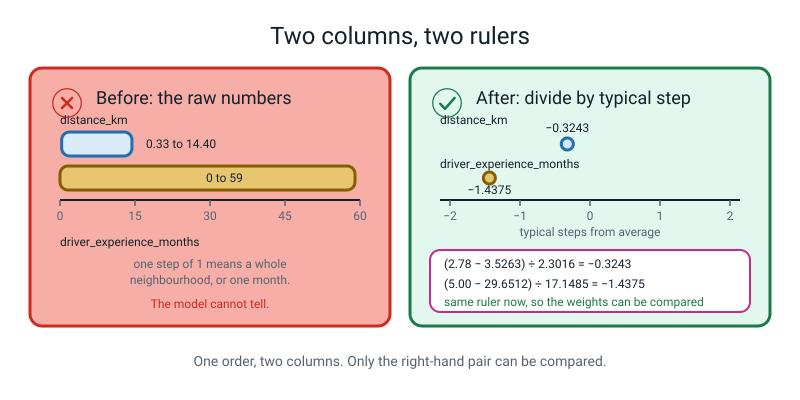
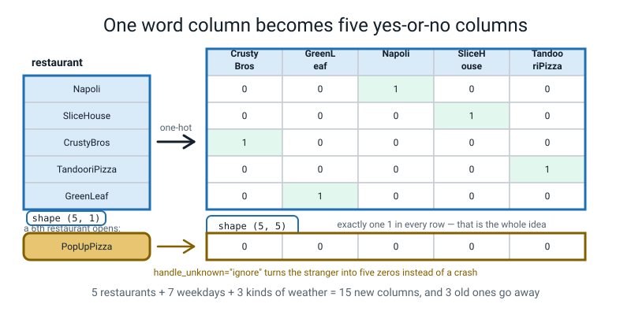
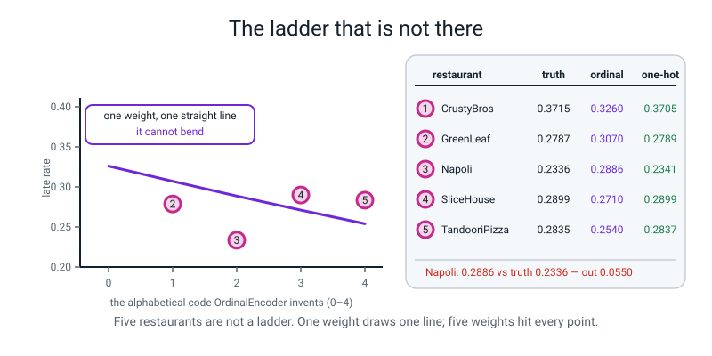
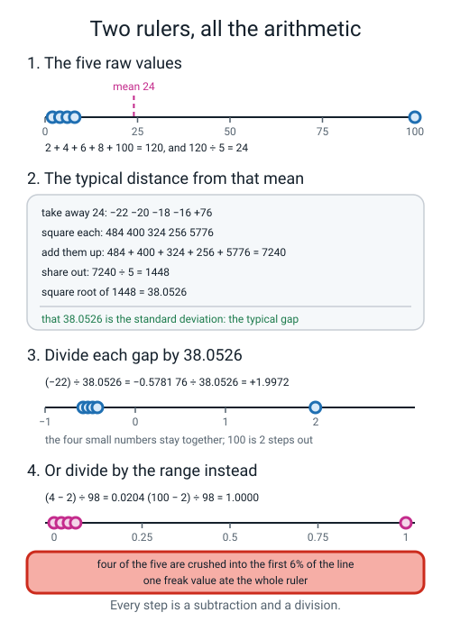
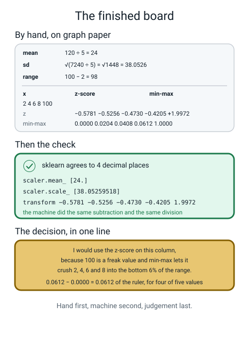
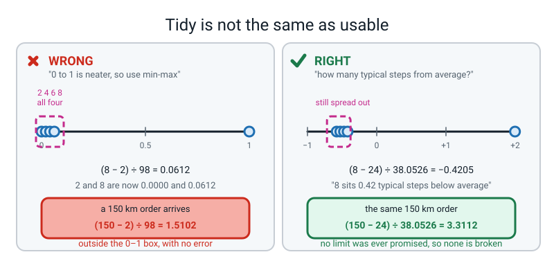
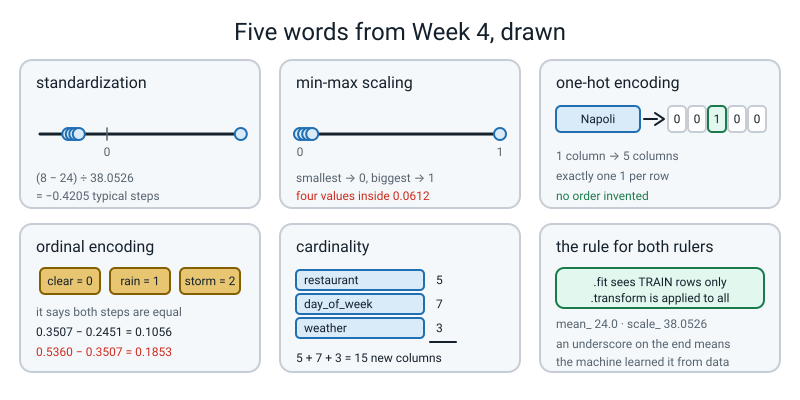

# Week 4 — Same Number, Different Ruler

[⬅ Week 3](week-03.md) · [Course Home](../README.md) · [Next ➡](week-05.md) · [Workbook](../workbook/week-04.md)

---

> ### This week in one sentence
> **A model compares your columns by size, so a column measured in thousands shouts over a column measured in units — until you put both of them on the same ruler, which costs you one subtraction and one division.**
>
> **By the end of this chapter you will be able to:**
> - **Work out the standard deviation of five numbers by hand** — subtract, square, add, divide, square-root — and check your answer against `scaler.scale_` to four decimal places
> - **Standardize and min-max scale the same column by hand**, and then say **which of the two you would use on that data and why**, naming the value that decided it
> - **One-hot encode a five-category column by hand**, count the columns you created, and explain what `handle_unknown="ignore"` saves you from **in the real world**, not just in Python
> - **Show, with real numbers, the false ordering that ordinal encoding invents** when the categories are not really a ladder
>
> **New maths:** the **standard deviation** — the typical distance of a value from the mean — and then the **z-score**, (value − mean) ÷ standard deviation. Both worked by hand on the five numbers **2, 4, 6, 8, 100**. Five operations, no symbols you have not met: subtract, square, add, divide, square-root.
>
> **New syntax:** `MinMaxScaler()` · `scaler.mean_` / `scaler.scale_` · `OneHotEncoder(handle_unknown="ignore")` · `OrdinalEncoder(categories=[...])`
>
> **Reading time:** about 45 minutes. **Homework:** about 60 minutes. **You will need a calculator and graph paper.** This is the first week of the year with real arithmetic in it, and the arithmetic is the point.

---

## 🪝 Start Here

Two columns out of the pizza-delivery table you have been working on for three weeks. Nothing else on the page:

```text
distance_km                0.33  ...  14.40
driver_experience_months      0  ...  59
```

The top one is how far the pizza had to travel, in kilometres. The bottom one is how long the driver has been doing the job, in months.

Last week you fed both of them to a model. **Here is the only thing you need to know about that model today:** it picks one number for each column — call it a **weight** — multiplies the column by its weight, and adds everything up. One weight per column.

> **weight** — the one number a model multiplies a column by. Bigger weight, more influence.

**Now the question. Does the model know that one extra kilometre is a big deal and one extra month on the job is almost nothing?**

No. It has never been outside. It has never eaten a pizza. All it can see is that the bottom column's numbers run up to 59 and the top column's numbers stop at 14.40. **Four times bigger.**

And that matters, because there is a whole family of methods that work by measuring **how far apart two rows are** — nearest neighbours, which you built two years ago, and the model you used last week. If one column's numbers are four times bigger than another's, that column does four times as much of the shouting.

**Not because it matters more. Because somebody chose to write it down in months instead of years.**


*Figure 4.1 — Two columns, two rulers. On the left, "one step" means two completely different things. On the right, after one subtraction and one division, both columns say the same thing: how many typical steps from average this value is.*

🍕 **The analogy.** Two people describe the same walk to school. One says *"it's 1,200 metres."* The other says *"it's 1.2 kilometres."* Identical walk. But if you fed both numbers into something that just compares sizes, the first person's walk would look a thousand times more important — and nothing about the walk changed. **Only the ruler changed.**

**So today's job is one subtraction and one division per column.** That is genuinely the whole technical content of the first half. But we are going to do it by hand first, on five numbers small enough to argue about, because *what you divide by* turns out to matter a great deal.

---

## 🧠 The Big Idea

> **📌 About the code in this section.** The blocks below are **illustrations, not files**. Each carries on from the one above. **The complete runnable files are in 💻 Type This.**

### 1. A model multiplies each column by one number, so the size of the numbers is not neutral

Here is what the model does with one row, in plain arithmetic. It has learnt one weight per column, and it does this:

```text
score = w1 × distance_km + w2 × items + w3 × prep_minutes + w4 × driver_experience_months + ...
```

Look at that and ask: what happens if `driver_experience_months` runs 0 to 59 and `distance_km` runs 0.33 to 14.40? The experience column arrives already four times bigger. So to give the two columns *equal* influence, the model would have to learn a weight on experience about four times *smaller* — and it can only do that if it has enough data to find it.

Worse, the default `LogisticRegression` you have been using is **penalised for having large weights**. It is nudged towards keeping its weights small. So it is being pushed in one direction by the maths and pulled in another by the units, and the column with the bigger raw numbers usually wins.

**The fix is not to be cleverer about weights. The fix is to make the columns arrive on the same ruler.**

> **⚠️ Watch out:** this does **not** matter for a decision tree. A tree only ever asks *"is this column above or below some cut-off?"*, and it does not care what units the cut-off is in. Scale anyway — one line inside a `Pipeline` removes an entire category of bug, and it makes the weights readable, which is worth having on its own.

### 2. Two rulers, and they disagree about which one is nicer

There are exactly two recipes you need this year.

> **standardization (z-score)** — take away the mean, then divide by the standard deviation. The column ends up centred on 0 with a typical step of 1.

> **min-max scaling** — take away the smallest value, then divide by the range (biggest minus smallest). The smallest becomes 0, the biggest becomes 1.

Both are one subtraction and one division. The difference is **what you divide by**, and on our five test numbers `2, 4, 6, 8, 100` it changes everything:

| x | z-score | min-max |
|---|---|---|
| 2 | −0.5781 | **0.0000** |
| 4 | −0.5256 | **0.0204** |
| 6 | −0.4730 | **0.0408** |
| 8 | −0.4205 | **0.0612** |
| 100 | +1.9972 | 1.0000 |

**Read the min-max column and find the problem.** Four of the five values are now inside the bottom **6%** of the ruler. `2` and `8` — one is four times the other — have become 0.0000 and 0.0612, which is very nearly the same number. **The single freak value ate the whole scale.**

The z-scores kept them apart, and gave the 100 a big value of +2.0, which is honest: it *is* out there.

Here is the whole comparison, and it is worth learning:

| | Standardization (z-score) | Min-max scaling |
|---|---|---|
| What it subtracts | the mean | the smallest value |
| What it divides by | the typical distance from the mean | the total range |
| Where the output lands | centred on 0, no fixed limits | between 0 and 1 — **on the training data** |
| One freak value | gets a big z; everybody else barely moves | **crushes everybody else towards 0** |
| A new value bigger than anything in training | fine, just a bigger z | **escapes the 0-to-1 box**, silently |
| Reach for it when | almost always | the input genuinely has hard limits (pixel brightness is 0–255) |
| Our `distance_km` | ✅ this one | ❌ long tail out to 14.40 |

**The default is standardization. Min-max needs a reason.**

> **💡 Try this:** the honest reasons for min-max are *"my numbers already have hard limits"* and *"something later in the program demands 0 to 1"*. If you cannot say one of those two sentences out loud about your column, use the z-score.

### 3. A model cannot multiply the word "Napoli", so words have to become numbers

The delivery table has three columns of words: `restaurant`, `day_of_week`, `weather`. A model multiplies and adds. There is no number you can multiply `"Napoli"` by.

So words become numbers, and there are exactly two ways to do it.

> **one-hot encoding** — one yes-or-no column per category, with exactly one 1 in every row. No order is invented.

```text
restaurant = "Napoli"   →   restaurant_CrustyBros    = 0
                            restaurant_GreenLeaf     = 0
                            restaurant_Napoli        = 1
                            restaurant_SliceHouse    = 0
                            restaurant_TandooriPizza = 0
```

One column of words became **five columns of 0s and 1s.** The model now gets five separate weights, so it can put each restaurant exactly where the data says it belongs — independently, with no assumption that one is "above" another.


*Figure 4.2 — One word column becomes five yes-or-no columns. Exactly one 1 per row, five separate weights, and no order invented.*

> **cardinality** — how many different values a column has.

`restaurant` has cardinality 5. `day_of_week` has 7. `weather` has 3. One-hot all three and you get **5 + 7 + 3 = 15** new columns, replacing 3 old ones. That is completely fine.

The word exists because of what happens at cardinality **41,000** — a column of postcodes. One-hot gives you 41,000 columns, nearly all zero, most of them seen once or twice. The short answer, for now: *don't one-hot 41,000 things; build a column that says something useful about the postcode instead.* That is next week's business.

**And the one setting you must always type.** In training you saw five restaurants. Next month a sixth opens. Without `handle_unknown="ignore"`, your saved artifact **throws an exception on a live order, at dinner time, because a business opened a shop.** With it, the unseen name becomes five zeros, the model falls back on distance and weather and the rest, gives a slightly worse but sane answer, and **stays alive.**

### 4. Ordinal encoding invents a ladder, and sometimes the ladder is not there

> **ordinal encoding** — each category becomes a single whole number on a ladder. One column in, one column out.

```text
clear → 0        rain → 1        storm → 2
```

🍕 **The analogy that does all the work.** Ordinal encoding says *"these things are rungs on a ladder — each one is above the one below it."* T-shirt sizes really are a ladder: large is above medium is above small. **Restaurants are not.** Code them `CrustyBros 0, GreenLeaf 1, Napoli 2, SliceHouse 3, TandooriPizza 4` and you have told the model that Napoli is *twice* GreenLeaf, and that CrustyBros plus TandooriPizza is *twice* Napoli. **The model will believe you. It will be wrong.**

And here is the false ladder measured on our own data. These are real lateness rates, and the last two columns are what each encoding can actually predict:

| restaurant | code | how often late | what one weight on the code says | what one-hot says |
|---|---|---|---|---|
| CrustyBros | 0 | 0.3715 | 0.3260 | 0.3705 |
| GreenLeaf | 1 | 0.2787 | 0.3070 | 0.2789 |
| Napoli | 2 | **0.2336** | **0.2886** | 0.2341 |
| SliceHouse | 3 | 0.2899 | 0.2710 | 0.2899 |
| TandooriPizza | 4 | 0.2835 | 0.2540 | 0.2837 |

**Read the "how often late" column: 0.3715, down, down, then back UP to 0.2899, then down a bit. It zig-zags.**

Now read the ordinal column: 0.3260, 0.3070, 0.2886, 0.2710, 0.2540. **A perfectly straight, steadily falling line.** One weight multiplied by a code from 0 to 4 can only draw a straight line through those five positions. It cannot bend. So for Napoli it says 0.2886 when the truth is 0.2336 — **out by 0.0550, and there is nothing the model can do about it.**

The one-hot column: 0.3705, 0.2789, 0.2341, 0.2899, 0.2837. Five weights, five values, each landing on its own truth.


*Figure 4.3 — The ladder that is not there. The five real rates zig-zag; one weight on a code can only draw the straight line. For Napoli that costs 0.0550.*

**And now the hard case, which is the best question in the week.** Weather *is* a ladder — clear, then rain, then storm. Nobody would argue. But look at the gaps:

```text
clear  0.2451
rain   0.3507
storm  0.5360

rain  − clear = 0.3507 − 0.2451 = 0.1056
storm − rain  = 0.5360 − 0.3507 = 0.1853

0.1853 ÷ 0.1056 = 1.75
```

**The second step is 1.75 times the first.** So coding them 0, 1, 2 tells the model the two steps are the same size, and they are not. The *order* is right. The *spacing* is wrong.

> **🧑‍🏫 If a student asks:** *"so is ordinal encoding bad?"* No — it is right whenever you can write the chain out with less-than signs without wincing. `XS < S < M < L < XL`. `none < primary < secondary < bachelor < master`. `1 star < 2 stars < 3 stars`. **If you cannot write the chain, it is not a ladder.**

---

## 🔢 The Maths, Slowly

There is one new piece of maths this week and you already have every operation it needs. **Forget the word "standard deviation" for a minute.** Here is the question it answers:

> **"On this list of numbers, how far from the average is a typical value?"**

That is all it is. It is an average distance. And we are going to compute one, by hand, on five numbers.

**The five numbers, all week: 2, 4, 6, 8 and 100.** Four small ones and a monster.

### Step 1 — the mean. Add them up, divide by how many there are.

```text
2 + 4 + 6 + 8 + 100 = 120
120 ÷ 5 = 24
```

The mean is **24**. And stop for a second, because something is already odd: **four of the five numbers are 8 or less, and the "average" is 24.** One value dragged it. Remember that.

### Step 2 — how far is each number from 24? Subtract.

```text
  2 − 24 = −22
  4 − 24 = −20
  6 − 24 = −18
  8 − 24 = −16
100 − 24 = +76
```

### Step 3 — get rid of the minus signs by squaring. Here is why, and it is not arbitrary.

**Try averaging those five distances as they are:**

```text
−22 − 20 − 18 − 16 + 76 = 0
```

**Exactly zero.** And that is not bad luck — it happens *every single time, for every list of numbers there has ever been*, because the mean is precisely the place where the pluses and the minuses balance out. That is what a mean **is**. So averaging the distances straight is useless.

There are two obvious ways to kill the minus signs: throw them away, or **square everything**, because a negative times a negative is positive. Squaring is what everybody uses and what the computer will use, so square.

```text
(−22) × (−22) =  484
(−20) × (−20) =  400
(−18) × (−18) =  324
(−16) × (−16) =  256
(+76) × (+76) = 5776
```

### Step 4 — average those. Add them up, divide by 5.

```text
484 + 400 + 324 + 256 + 5776 = 7240
7240 ÷ 5 = 1448
```

### Step 5 — undo the squaring. Take the square root.

You squared everything in step 3, so 1448 is in "squared" units — far too big to be a distance. Undo it.

```text
√1448 = 38.0526
```

> **💡 Check this yourself with a calculator, right now.** Type `1448`, press the `√` button. You should see `38.05259518...`. **That is the number the machine is going to print in fifteen minutes, and you just got it first.**

**38.0526 is the standard deviation.** It is the typical distance from 24. It looks far too big next to 2, 4, 6 and 8 — and it should, because the 100 really is out there.

> **🔢 The maths, slowly:** five operations, in this order, and no others. **Subtract** the mean from each value. **Square** each answer. **Add** them up. **Divide** by how many values there are. **Square-root** it. Write those five words down the side of your page and point at the one you are on.

### Now the payoff: the z-score

You have two numbers on the page: the average, **24**, and the typical gap, **38.0526**. The recipe is:

> **Take away the average. Divide by the typical gap.**

```text
(  2 − 24) ÷ 38.0526 = −0.5781
(  4 − 24) ÷ 38.0526 = −0.5256
(  6 − 24) ÷ 38.0526 = −0.4730
(  8 − 24) ÷ 38.0526 = −0.4205
(100 − 24) ÷ 38.0526 = +1.9972
```

**Now say them out loud in English, because that is where the meaning lives.** *"2 sits about half a typical step below average. 100 sits two typical steps above average."*

And notice what that sentence does **not** mention: kilometres, months, rupees, pizzas. **The answer is in typical steps, and every column in the world can be put in typical steps.** Same ruler. That is the whole trick.

### The other ruler, for comparison

Min-max: take away the *smallest*, divide by the *range*. Smallest 2, biggest 100, so the range is `100 − 2 = 98`.

```text
(  2 − 2) ÷ 98 =  0 ÷ 98 = 0.0000
(  4 − 2) ÷ 98 =  2 ÷ 98 = 0.0204
(  6 − 2) ÷ 98 =  4 ÷ 98 = 0.0408
(  8 − 2) ÷ 98 =  6 ÷ 98 = 0.0612
(100 − 2) ÷ 98 = 98 ÷ 98 = 1.0000
```

> **💡 Check `2 ÷ 98` on your calculator.** `0.020408163...`, which rounds to `0.0204`. Every number in this section is checkable and you should check at least three of them.


*Figure 4.4 — Five numbers, two rulers, all the arithmetic. Every step is a subtraction, a squaring, an addition, a division or a square root. Nothing else is happening.*

**One last thing, and it is the reason the whole recipe is worth learning.** After you standardize a column, its mean is 0 and its standard deviation is 1 — **always, for every column, forever.** That is not a coincidence; it is forced by the arithmetic. You subtracted the mean, so the new mean has to be 0. You divided by the typical gap, so the new typical gap has to be 1. **Two columns that both have mean 0 and typical step 1 are on the same ruler by construction.**

---

## 💻 Type This

Two small files. **Together they run in under 2 seconds. Nothing downloads.**

### Step 1 — the five numbers, and the two things a scaler learns

Create `rulers.py`:

```python
"""rulers.py - the five numbers, checked by machine."""
import numpy as np
from sklearn.preprocessing import MinMaxScaler, StandardScaler

x = np.array([2, 4, 6, 8, 100], dtype=float)
X = x.reshape(-1, 1)

ss = StandardScaler().fit(X)
print("scaler.mean_ :", ss.mean_)
print("scaler.scale_:", ss.scale_)
```

Line by line:

| Line | What it does |
|---|---|
| `x = np.array([...], dtype=float)` | make a flat row of five numbers. `dtype=float` says "treat these as decimals", which matters because the answers are decimals |
| `X = x.reshape(-1, 1)` | turn the flat row into a **table with one column**. `-1` means "work the number of rows out yourself". scikit-learn always wants rows-are-examples, columns-are-features |
| `StandardScaler()` | build an empty scaler. It knows the recipe and **no numbers yet** |
| `.fit(X)` | look at `X` and **remember two things**: the mean and the standard deviation. Nothing is returned or changed; it has simply learned |
| `ss.mean_` / `ss.scale_` | the two numbers it learned. **The trailing underscore is a scikit-learn promise: "I got this from your data."** Nothing ending in `_` exists before you call `.fit` |

**Predict the two numbers before you run it. They are both on your page.**

```text
scaler.mean_ : [24.]
scaler.scale_: [38.05259518]
```

**24 and 38.05259518.** Your page says 24 and 38.0526. **You did, by hand, exactly what a machine-learning library does — and you got it right.**

> **⚠️ Watch out:** `scale_` is a slightly annoying name for the standard deviation. It is called that because `MinMaxScaler` also has a `scale_` and it means something different there. Read it as *"the thing I divide by"*.

### Step 2 — apply the recipe

```python
print("z-scores     :", np.round(ss.transform(X).ravel(), 4))
```

`ss.transform(X)` applies the recipe — subtract the remembered mean, divide by the remembered standard deviation — and hands back a **new** set of numbers. It does not change `X`. `.ravel()` flattens the one-column answer back to a flat row so it prints on one line. `np.round(..., 4)` rounds to four decimal places.

**Read your five z-scores out loud before running.**

```text
z-scores     : [-0.5781 -0.5256 -0.473  -0.4205  1.9972]
```

Five for five. Now look hard at the third one. It says `-0.473`. Your page says `−0.4730`. **Is the machine wrong?**

No. **It is the same number.** `np.round` rounded to four places and Python printed the result without a pointless trailing zero. **This will happen to you all year and it is never a bug.** 0.473 and 0.4730 are the same number.

### Step 3 — 🐞 the first mistake, on purpose

Add the min-max version, but pass the **flat row** instead of the table — small `x`, not capital `X`:

```python
mm = MinMaxScaler().fit(x)
```

```text
Traceback (most recent call last):
  File "/private/tmp/w456/rulers.py", line 12, in <module>
    mm = MinMaxScaler().fit(x)
  File ".../sklearn/preprocessing/_data.py", line 454, in fit
    return self.partial_fit(X, y)
  File ".../sklearn/utils/validation.py", line 1091, in check_array
    raise ValueError(msg)
ValueError: Expected 2D array, got 1D array instead:
array=[  2.   4.   6.   8. 100.].
Reshape your data either using array.reshape(-1, 1) if your data has a single feature or array.reshape(1, -1) if it contains a single sample.
```

**Read the last line all the way to the end.** *"I wanted a table and you gave me a row"* — and then it **tells you the fix**: `array.reshape(-1, 1) if your data has a single feature`.

Why does it care? Because `[2, 4, 6, 8, 100]` is genuinely ambiguous. Is that five examples of one thing, or one example of five things? **scikit-learn refuses to guess.** That is why line 6 exists.

> **🐞 If you see this error:** you handed a flat row to something that wanted a table. `X = x.reshape(-1, 1)`, then `.fit(X)`.

### Step 4 — fix it, and watch min-max break its own promise

```python
mm = MinMaxScaler().fit(X)
print("data_min_    :", mm.data_min_, " data_max_:", mm.data_max_)
print("min-max      :", np.round(mm.transform(X).ravel(), 4))
print("\na new value of 150 turns up at prediction time:")
print("  z      :", np.round(ss.transform([[150.0]]).ravel(), 4))
print("  min-max:", np.round(mm.transform([[150.0]]).ravel(), 4))
```

`MinMaxScaler` remembers the **smallest and biggest** instead of the mean and the standard deviation, and it puts them in `data_min_` and `data_max_` — trailing underscores again.

**Before you run it: a value of 150 arrives next month. What does min-max give it? Write your guess down.** Most people write `1`.

```text
data_min_    : [2.]  data_max_: [100.]
min-max      : [0.     0.0204 0.0408 0.0612 1.    ]

a new value of 150 turns up at prediction time:
  z      : [3.3112]
  min-max: [1.5102]
```

**1.5102.** Min-max promised you a number between 0 and 1, and **the very first time a bigger value walks in the door, it breaks that promise without a word of complaint.** No error. No warning. Just 1.5102 sitting in a box that was supposed to stop at 1.

The z-score's answer is 3.3112, and that is not a broken promise — it never promised a limit. It says *"150 sits three and a third typical steps above average"*, which is true, useful, and slightly alarming, which is exactly what you should feel about a value like that.

### The complete `rulers.py`

```python
"""rulers.py - the five numbers, then a value nobody trained on."""
import numpy as np
from sklearn.preprocessing import MinMaxScaler, StandardScaler

x = np.array([2, 4, 6, 8, 100], dtype=float)
X = x.reshape(-1, 1)

ss = StandardScaler().fit(X)
print("scaler.mean_ :", ss.mean_)
print("scaler.scale_:", ss.scale_)
print("z-scores     :", np.round(ss.transform(X).ravel(), 4))

mm = MinMaxScaler().fit(X)
print("data_min_    :", mm.data_min_, " data_max_:", mm.data_max_)
print("min-max      :", np.round(mm.transform(X).ravel(), 4))

print("\na new value of 150 turns up at prediction time:")
print("  z      :", np.round(ss.transform([[150.0]]).ravel(), 4))
print("  min-max:", np.round(mm.transform([[150.0]]).ravel(), 4))
```

**Real output. Runtime under 1 second.**

```text
scaler.mean_ : [24.]
scaler.scale_: [38.05259518]
z-scores     : [-0.5781 -0.5256 -0.473  -0.4205  1.9972]
data_min_    : [2.]  data_max_: [100.]
min-max      : [0.     0.0204 0.0408 0.0612 1.    ]

a new value of 150 turns up at prediction time:
  z      : [3.3112]
  min-max: [1.5102]
```


*Figure 4.5 — The finished board. Five operations in order: subtract, square, add, divide, square-root. Then the machine's answer beside it, agreeing to four decimal places. Then the sentence of judgement, which is the part that gets marked.*

### Step 5 — words into numbers

New file, `encode.py`:

```python
"""encode.py - words into numbers."""
import pandas as pd
from sklearn.preprocessing import OneHotEncoder, OrdinalEncoder

small = pd.DataFrame({"restaurant": ["Napoli", "SliceHouse", "CrustyBros",
                                     "TandooriPizza", "GreenLeaf"]})
ohe = OneHotEncoder(handle_unknown="ignore", sparse_output=False)
out = ohe.fit_transform(small)
print("columns created:", ohe.get_feature_names_out())
print("in shape:", small.shape, " out shape:", out.shape)
```

`sparse_output=False` asks for a plain grid of numbers you can look at. Without it you get a memory-saving format that prints as a list of coordinates, which is fine inside a real pipeline and useless while you are learning.

**Five restaurants in one column. How many columns come out?**

```text
columns created: ['restaurant_CrustyBros' 'restaurant_GreenLeaf' 'restaurant_Napoli'
 'restaurant_SliceHouse' 'restaurant_TandooriPizza']
in shape: (5, 1)  out shape: (5, 5)
```

**Five in, five out.** And look at the names: it stuck the old column name on the front of each value. `restaurant_Napoli`. **You will be reading names shaped like that for the rest of the year.**

One thing that confuses everybody exactly once: **they came out in alphabetical order**, not the order you typed them. CrustyBros first. The encoder sorts the categories it finds — it has to pick some order, and alphabetical is the one it picked.

### Step 6 — 🐞 the second mistake, on purpose, and it is the important one

Take `handle_unknown="ignore"` out, and then try to encode a restaurant that opened last week:

```python
ohe = OneHotEncoder(sparse_output=False)
out = ohe.fit_transform(small)
print(ohe.transform(pd.DataFrame({"restaurant": ["PopUpPizza"]})))
```

```text
Traceback (most recent call last):
  File "/private/tmp/w456/encode.py", line 12, in <module>
    print(ohe.transform(pd.DataFrame({"restaurant": ["PopUpPizza"]})))
  File ".../sklearn/preprocessing/_encoders.py", line 218, in _transform
    raise ValueError(msg)
ValueError: Found unknown categories ['PopUpPizza'] in column 0 during transform
```

**Now stop and think about where this happens in real life.**

This is not a bug in your code. Your code is fine. **A new pizza place opened.** That is a thing the world does. And your saved artifact — the one you shipped last week, the one answering live orders — has just crashed on a real customer's dinner because a business opened a shop.

Put the setting back:

```python
ohe = OneHotEncoder(handle_unknown="ignore", sparse_output=False)
out = ohe.fit_transform(small)
print("PopUpPizza ->", ohe.transform(pd.DataFrame({"restaurant": ["PopUpPizza"]})).astype(int))
```

```text
PopUpPizza -> [[0 0 0 0 0]]
```

**Five zeros.** Not a crash — and, importantly, not a fake category either. It says *"this is none of the five I know"*, and the model shrugs and uses distance, weather, prep time and the rest instead. The answer will be a bit worse. **The service stays up.**

**Always set it.** And write down what it does in your model card from Week 3, under known limitations, because a prediction for an unknown restaurant is a slightly different product from a prediction for a known one, and whoever reads your output deserves to be told.

### Step 7 — the ordinal encoder, and the question it raises

```python
oe = OrdinalEncoder(categories=[["clear", "rain", "storm"]])
w = pd.DataFrame({"weather": ["clear", "rain", "storm", "rain", "clear"]})
print("\nweather codes:", oe.fit_transform(w).ravel().astype(int))
```

```text
weather codes: [0 1 2 1 0]
```

One column in, one column out. `clear` is 0, `rain` is 1, `storm` is 2.

**Notice that I told it the order:** `categories=[["clear", "rain", "storm"]]` — a list, inside a list. **Always tell it.** If you don't, it sorts alphabetically, which for weather gives clear, rain, storm by pure luck, and for `["small", "medium", "large"]` gives **large, medium, small** — backwards, and completely silent about it. You will see that happen for real in Worked Example 3.

**And now the question that is the whole second half of this week: is it true that a storm is two rains?**

### The complete `encode.py`

```python
"""encode.py - words into numbers."""
import pandas as pd
from sklearn.preprocessing import OneHotEncoder, OrdinalEncoder

small = pd.DataFrame({"restaurant": ["Napoli", "SliceHouse", "CrustyBros",
                                     "TandooriPizza", "GreenLeaf"]})
ohe = OneHotEncoder(handle_unknown="ignore", sparse_output=False)
out = ohe.fit_transform(small)
print("columns created:", ohe.get_feature_names_out())
print("in shape:", small.shape, " out shape:", out.shape)
print(pd.DataFrame(out.astype(int), columns=ohe.get_feature_names_out(),
                   index=small["restaurant"]).to_string())

print("\na sixth restaurant opens:")
print("PopUpPizza ->", ohe.transform(pd.DataFrame({"restaurant": ["PopUpPizza"]})).astype(int))

oe = OrdinalEncoder(categories=[["clear", "rain", "storm"]])
w = pd.DataFrame({"weather": ["clear", "rain", "storm", "rain", "clear"]})
print("\nweather codes:", oe.fit_transform(w).ravel().astype(int))
```

**Real output. Runtime about 1 second.**

```text
columns created: ['restaurant_CrustyBros' 'restaurant_GreenLeaf' 'restaurant_Napoli'
 'restaurant_SliceHouse' 'restaurant_TandooriPizza']
in shape: (5, 1)  out shape: (5, 5)
               restaurant_CrustyBros  restaurant_GreenLeaf  restaurant_Napoli  restaurant_SliceHouse  restaurant_TandooriPizza
restaurant                                                                                                                    
Napoli                             0                     0                  1                      0                         0
SliceHouse                         0                     0                  0                      1                         0
CrustyBros                         1                     0                  0                      0                         0
TandooriPizza                      0                     0                  0                      0                         1
GreenLeaf                          0                     1                  0                      0                         0

a sixth restaurant opens:
PopUpPizza -> [[0 0 0 0 0]]

weather codes: [0 1 2 1 0]
```

**Look at the grid and check the rule: exactly one 1 in every row.** Five rows, five 1s, twenty 0s.

---

## 🔍 Worked Examples

### Worked Example 1 — Five numbers on graph paper (the class activity)

No computer at all for the first ten minutes. One sheet of graph paper, one calculator, one pencil.

**Draw first, compute second.** Rule a number line across the page from 0 to 100 and mark the five values.

```text
0        20        40        60        80       100
|----|----|----|----|----|----|----|----|----|----|
 ●●●●                                            ●
 2 4 6 8                                        100
```

**Four dots bunched at the left and one out on the right.** That picture is the whole lesson and you should have it on the page before you do any arithmetic.

**Now the mean.** `2 + 4 + 6 + 8 + 100 = 120`, and `120 ÷ 5 = 24`. **Mark 24 on your line.** It sits to the *right* of four of the five dots, which is surprising and correct.

**Now the standard deviation, showing all five steps:**

```text
1  subtract 24:   −22    −20    −18    −16    +76
2  square:        484    400    324    256    5776
3  add:           484 + 400 + 324 + 256 + 5776 = 7240
4  divide by 5:   7240 ÷ 5 = 1448
5  square root:   √1448 = 38.0526
```

**Now z-score all five and write them in a row under the raw numbers:**

| x | arithmetic | z |
|---|---|---|
| 2 | (2 − 24) ÷ 38.0526 | **−0.5781** |
| 4 | (4 − 24) ÷ 38.0526 | **−0.5256** |
| 6 | (6 − 24) ÷ 38.0526 | **−0.4730** |
| 8 | (8 − 24) ÷ 38.0526 | **−0.4205** |
| 100 | (100 − 24) ÷ 38.0526 | **+1.9972** |

**Now min-max all five.** Min 2, max 100, range 98.

| x | arithmetic | value |
|---|---|---|
| 2 | 0 ÷ 98 | **0.0000** |
| 4 | 2 ÷ 98 | **0.0204** |
| 6 | 4 ÷ 98 | **0.0408** |
| 8 | 6 ÷ 98 | **0.0612** |
| 100 | 98 ÷ 98 | **1.0000** |

**Draw two more number lines:** one from −1 to +2 with your z-scores on it, one from 0 to 1 with your min-max values on it. On the second line, four of your five dots will be touching each other at the left-hand end.

**Then run `rulers.py` and write the machine's numbers directly beside your own.** Four decimal places. Every one.

```text
scaler.mean_ : [24.]
scaler.scale_: [38.05259518]
z-scores     : [-0.5781 -0.5256 -0.473  -0.4205  1.9972]
data_min_    : [2.]  data_max_: [100.]
min-max      : [0.     0.0204 0.0408 0.0612 1.    ]
```

> **⚠️ Watch out:** if one of your numbers disagrees in the fourth decimal place, **do not quietly cross it out.** Almost always you rounded 38.0526 to 38.05 before dividing. Redo one value with the full number. There are only five steps and one of them is guilty — finding out which is part of the job.

**And the last line on the page, which is the part that gets marked. One sentence:**

> *"I would standardize this column. The 100 is a freak value, and min-max divides by a range of 98 that only exists because of it, so 2, 4, 6 and 8 all land inside the first 6% of the ruler (0.0000 to 0.0612) and become nearly indistinguishable. The z-score keeps them spread out and gives the 100 a big value of +2.0, which is honest."*

### Worked Example 2 — The same two rulers, on a real column

Now the identical arithmetic on 2,000 real rows instead of five typed numbers.

```python
"""w4we2.py - the same two rulers, on a real column of the delivery table."""
import numpy as np
import pandas as pd
from sklearn.preprocessing import MinMaxScaler, StandardScaler
from make_data import make_deliveries

df = make_deliveries(n=2000, seed=0).drop_duplicates().reset_index(drop=True)
d = df[["distance_km"]]
print("rows:", d.shape[0])
print("smallest:", d["distance_km"].min(), " biggest:", d["distance_km"].max())

ss = StandardScaler().fit(d)
mm = MinMaxScaler().fit(d)
print("scaler.mean_ :", np.round(ss.mean_, 4))
print("scaler.scale_:", np.round(ss.scale_, 4))
print("data_min_    :", mm.data_min_, " data_max_:", mm.data_max_)

print()
for km in [0.33, 2.78, 5.00, 14.40, 20.00]:
    one = pd.DataFrame({"distance_km": [km]})
    z = ss.transform(one).ravel()[0]
    m = mm.transform(one).ravel()[0]
    print("%6.2f km  ->  z %+.4f   min-max %.4f" % (km, z, m))

z_all = ss.transform(d)
print()
print("after standardizing the whole column:")
print("  mean of the z column:", round(float(z_all.mean()), 10))
print("  sd   of the z column:", round(float(z_all.std()), 10))
```

Note `df[["distance_km"]]` with **double** brackets. Single brackets give you one column on its own; double brackets give a one-column **table**, which is what a scaler wants. Same rule as `reshape(-1, 1)`, different notation.

**Real output. Runtime about 1 second.**

```text
rows: 2000
smallest: 0.33  biggest: 14.4

scaler.mean_ : [3.5193]
scaler.scale_: [2.2938]
data_min_    : [0.33]  data_max_: [14.4]

  0.33 km  ->  z -1.3904   min-max 0.0000
  2.78 km  ->  z -0.3223   min-max 0.1741
  5.00 km  ->  z +0.6455   min-max 0.3319
 14.40 km  ->  z +4.7435   min-max 1.0000
 20.00 km  ->  z +7.1849   min-max 1.3980

after standardizing the whole column:
  mean of the z column: -0.0
  sd   of the z column: 1.0
```

**Check the arithmetic yourself.** The average distance is 3.5193 km and the typical gap is 2.2938 km. So for a 5 km order:

```text
(5.00 − 3.5193) ÷ 2.2938 = 1.4807 ÷ 2.2938 = 0.6455
```

**Matches, to four decimal places, on a calculator.** And for min-max, the range is `14.40 − 0.33 = 14.07`:

```text
(5.00 − 0.33) ÷ 14.07 = 4.67 ÷ 14.07 = 0.3319
```

**Also matches.** These are not different kinds of maths from the five numbers. They are the same two lines of arithmetic with different numbers in.

**Three things worth noticing in that output:**

1. **`14.40 km` gets a z of +4.7435.** Nearly five typical steps above average. That is the machine telling you, in one number, *"this order is extraordinary"* — and it says it in a language that any other column can also speak.
2. **`20.00 km` gets a min-max of 1.3980.** Outside the box again, silently. Same failure as the five numbers, on real data.
3. **The bottom two lines are the promise, kept.** `mean = -0.0` and `sd = 1.0`, exactly, after standardizing. (`-0.0` is Python's way of writing a zero that arrived from subtracting nearly-equal numbers. It is zero.)

### Worked Example 3 — Six students, two kinds of category

A completely different table, and the point is that **one of these two columns is a ladder and the other is not.**

```python
"""w4we3.py - one-hot and ordinal, on six students."""
import pandas as pd
from sklearn.preprocessing import OneHotEncoder, OrdinalEncoder

students = pd.DataFrame({
    "name":      ["Ada", "Ben", "Cleo", "Dev",  "Eli",  "Fay"],
    "year":      ["Y8",  "Y9",  "Y10",  "Y9",   "Y8",   "Y10"],
    "subject":   ["art", "maths", "music", "art", "PE",  "maths"],
    "hours":     [4.0,   9.0,   2.0,    6.0,    3.0,   11.0],
})
print(students.to_string(index=False))

print("\n--- subject is NOT a ladder, so one-hot it ---")
ohe = OneHotEncoder(handle_unknown="ignore", sparse_output=False)
S = ohe.fit_transform(students[["subject"]])
print("columns created:", ohe.get_feature_names_out())
print("in shape:", students[["subject"]].shape, " out shape:", S.shape)
print(pd.DataFrame(S.astype(int), columns=ohe.get_feature_names_out(),
                   index=students["name"]).to_string())

print("\n--- year IS a ladder, so ordinal-encode it, and TELL it the order ---")
oe = OrdinalEncoder(categories=[["Y8", "Y9", "Y10"]])
codes = oe.fit_transform(students[["year"]]).ravel().astype(int)
print(pd.DataFrame({"name": students["name"], "year": students["year"],
                    "code": codes}).to_string(index=False))

print("\n--- what happens if you DON'T tell it the order ---")
oe_bad = OrdinalEncoder()
bad = oe_bad.fit_transform(students[["year"]]).ravel().astype(int)
print("categories it chose:", oe_bad.categories_)
print(pd.DataFrame({"name": students["name"], "year": students["year"],
                    "code": bad}).to_string(index=False))

print("\n--- a new pupil arrives from another school ---")
print("subject 'drama' ->", ohe.transform(pd.DataFrame({"subject": ["drama"]})).astype(int))
```

**Real output. Runtime under 1 second.**

```text
name year subject  hours
 Ada   Y8     art    4.0
 Ben   Y9   maths    9.0
Cleo  Y10   music    2.0
 Dev   Y9     art    6.0
 Eli   Y8      PE    3.0
 Fay  Y10   maths   11.0

--- subject is NOT a ladder, so one-hot it ---
columns created: ['subject_PE' 'subject_art' 'subject_maths' 'subject_music']
in shape: (6, 1)  out shape: (6, 4)
      subject_PE  subject_art  subject_maths  subject_music
name                                                       
Ada            0            1              0              0
Ben            0            0              1              0
Cleo           0            0              0              1
Dev            0            1              0              0
Eli            1            0              0              0
Fay            0            0              1              0

--- year IS a ladder, so ordinal-encode it, and TELL it the order ---
name year  code
 Ada   Y8     0
 Ben   Y9     1
Cleo  Y10     2
 Dev   Y9     1
 Eli   Y8     0
 Fay  Y10     2

--- what happens if you DON'T tell it the order ---
categories it chose: [array(['Y10', 'Y8', 'Y9'], dtype=object)]
name year  code
 Ada   Y8     1
 Ben   Y9     2
Cleo  Y10     0
 Dev   Y9     2
 Eli   Y8     1
 Fay  Y10     0

--- a new pupil arrives from another school ---
subject 'drama' -> [[0 0 0 0]]
```

**Work through the four things that happened.**

**One — four categories, four columns.** `subject` has cardinality 4 (PE, art, maths, music), so `(6, 1)` in and `(6, 4)` out. Alphabetical again, and notice that capital `PE` sorted before lowercase `art` — sorting puts capitals first. Six rows, exactly one 1 in each.

**Two — `year` is a genuine ladder** and you can write the chain without wincing: `Y8 < Y9 < Y10`. So one column of codes 0, 1, 2 is honest and cheap. Three columns would be wasteful here.

**Three — and this is the one to remember. Look at what happened when I did NOT tell it the order.** It sorted alphabetically, and alphabetically **`"Y10"` comes before `"Y8"`**, because it compares character by character and `1` is less than `8`. So Y10 became **0**, Y8 became **1**, and Y9 became **2**. **The youngest pupils are now coded as being above the oldest.** No error. No warning. A model trained on that would learn something exactly backwards, and nothing on your screen would tell you.

> **⚠️ Watch out:** `OrdinalEncoder(categories=[[...]])` is not optional politeness. **It is the difference between a correct ladder and a silently reversed one.** Write out the order every single time.

**Four — the new pupil.** `drama` was never in the training data, and with `handle_unknown="ignore"` it comes back as four zeros instead of a crash. Same mercy as `PopUpPizza`, in a school.

---

## 🐞 When It Breaks

Every message below came from actually running a broken version of this week's code. **Errors are how the library talks to you.** scikit-learn's messages are unusually good — they often contain the fix.

### Break 1 — "I wanted a table and you gave me a row"

```python
x = np.array([2, 4, 6, 8, 100], dtype=float)
MinMaxScaler().fit(x)
```

```text
ValueError: Expected 2D array, got 1D array instead:
array=[  2.   4.   6.   8. 100.].
Reshape your data either using array.reshape(-1, 1) if your data has a single feature or array.reshape(1, -1) if it contains a single sample.
```

**What it means.** scikit-learn always wants rows-are-examples, columns-are-features. A flat row of five numbers is ambiguous and it will not guess.

**The fix, which the message hands you.** `X = x.reshape(-1, 1)`, then `.fit(X)`. If you are working with a DataFrame, the same idea is **double brackets**: `df[["distance_km"]]`, not `df["distance_km"]`.

### Break 2 — a new restaurant opened

```python
ohe = OneHotEncoder(sparse_output=False).fit(small)
ohe.transform(pd.DataFrame({"restaurant": ["PopUpPizza"]}))
```

```text
ValueError: Found unknown categories ['PopUpPizza'] in column 0 during transform
```

**What it means.** *"You are asking me to encode a value I never saw when I was fitted."* And notice it says **during transform**, not during fit — the training data was fine; the problem arrived later, which is exactly what makes it a production outage rather than a bug you catch at your desk.

**The fix.** `OneHotEncoder(handle_unknown="ignore", sparse_output=False)`. The unseen value becomes all zeros. **This is the single most important setting in the week.**

> **🐞 If you see this error with a category you *do* recognise** — say `GreenLeaf` — then your training rows simply did not happen to contain it. Same fix, and it is a good reminder that `train_test_split` can hand a rare category entirely to the validation pile.

### Break 3 — asking for something the machine has not learned yet

```python
ss = StandardScaler()
print("scaler.mean_ :", ss.mean_)
```

```text
Traceback (most recent call last):
  File "/private/tmp/w456/w4err3.py", line 5, in <module>
    print("scaler.mean_ :", ss.mean_)
AttributeError: 'StandardScaler' object has no attribute 'mean_'
```

**What it means.** *"I have not looked at any data, so I have no mean to give you."* You built the scaler but never called `.fit`.

**The fix.** `ss = StandardScaler().fit(X)` first.

> **🐞 The rule that covers this forever:** **an underscore at the end means the machine learned it.** `mean_`, `scale_`, `data_min_`, `categories_`, `statistics_`. If you get an `AttributeError` on something ending in an underscore, **you forgot to `.fit`.**

### Break 4 — arithmetic on a word

```python
w = pd.DataFrame({"weather": ["clear", "rain", "storm"]})
StandardScaler().fit(w)
```

```text
ValueError: could not convert string to float: 'clear'
```

**What it means.** You asked something numeric to do arithmetic on a word. Almost always a text column has gone down the **numeric** branch of your `ColumnTransformer`.

**The fix.** Numbers to the numeric branch, words to the categorical branch. Check the two lists in your `ColumnTransformer` against `df.dtypes`.

### The whole clinic, for reference

| Message | Cause | Fix |
|---|---|---|
| `ValueError: Expected 2D array, got 1D array instead` | a flat row where a table was wanted | `x.reshape(-1, 1)`, or `df[["col"]]` with double brackets |
| `ValueError: Found unknown categories ['PopUpPizza'] ... during transform` | a category the encoder never saw | `handle_unknown="ignore"` |
| `ValueError: Found unknown categories ['storm'] ... during fit` | your `categories=[...]` list is **incomplete** | list every category. Check with `df["weather"].nunique()` first |
| `AttributeError: 'StandardScaler' object has no attribute 'mean_'` | you asked before fitting | `.fit(X)` first. **The underscore is the clue** |
| `ValueError: could not convert string to float: 'clear'` | a word column reached a scaler | send words to the categorical branch |
| `ValueError: Expected a 2-dimensional container but got <class 'pandas.core.series.Series'>` | single brackets on a DataFrame column | double brackets: `df[["restaurant"]]` |
| **no error**, one-hot prints as `(0, 1) 1.0` on separate lines | you got a *sparse* matrix, which only lists the non-zero cells | add `sparse_output=False` while you are learning |
| **no error**, a blank sails through the scaler as `nan` | there is a hole in the column and no imputer in front | **Week 6.** Today: notice it. `df.isna().sum()` shows you where |
| **no error**, min-max gives 1.5102 | a value bigger than anything in training | not a bug — it is the argument against min-max |
| **no error**, your answer differs in the 4th decimal | you rounded 38.0526 to 38.05 before dividing | divide by the full number |
| **no error**, ordinal codes look backwards | `OrdinalEncoder()` sorted alphabetically: `Y10 < Y8 < Y9` | **always** pass `categories=[[...]]` in the order you mean |

---

## 🎲 What We Did In Class

### The two ranges on the board

Nothing on the screen. Just `distance_km 0.33 … 14.40` and `driver_experience_months 0 … 59`, and the question *"does the model know one kilometre matters more than one month?"* — followed by a long silence that nobody filled. Then: *"how would you make the two bars the same length?"* Every suggestion went on the board and stayed there. Two of them turned out to be today's lesson.

### Five numbers, and nobody wrote a number the class had not said first

`2  4  6  8  100`, very large, with space underneath. Then, one step at a time, with us calling out every answer:

```text
sum 120        mean 24
distances  −22  −20  −18  −16  +76      and their sum is ZERO
squares    484  400  324  256  5776     sum 7240,  ÷ 5 = 1448
square root of 1448 = 38.0526
```

**The moment worth remembering:** we averaged the five raw distances and got exactly zero, and were told that this happens for every list of numbers there has ever been. *That* is why you square.

Then the z-scores, said out loud in English rather than read as decimals: *"2 sits about half a typical step below average. 100 sits two typical steps above average."*

Then min-max on a third row, and the four questions:

```text
raw       2         4         6         8        100
z      −0.5781   −0.5256   −0.4730   −0.4205   +1.9972
min-max 0.0000    0.0204    0.0408    0.0612    1.0000
```

*"Which four min-max numbers are nearly the same number?"* (The first four.) *"Was 2 nearly the same as 8 in the original list?"* (No — 8 is four times 2.) *"Does either ruler reorder the numbers?"* (No. 2 is smallest and 100 is biggest on all three rows.)

### `rulers.py`, with one mistake on purpose

We predicted `[24.]` and `[38.05259518]` before running, and got them. We argued for thirty seconds about whether `-0.473` was wrong (it is not; it is −0.4730). Then `MinMaxScaler().fit(x)` with a small `x`, which failed with `Expected 2D array, got 1D array`, and we read the whole last line and found the fix inside the error message.

Then the guesses for 150 went on the board — most of us wrote `1` — and the machine said **1.5102**.

### `encode.py`, and the sixth index card

Five index cards on the table with the restaurant names on them, sorted alphabetically because that is what sklearn does. We wrote `0 0 1 0 0` under them for Napoli, then did CrustyBros and SliceHouse. **One column became five, and there was exactly one 1 in every row.**

Then `5 + 7 + 3 = 15` for `restaurant`, `day_of_week` and `weather`.

Then a sixth card came out of a pocket: **`PopUpPizza`**. *"A new pizza place opened this morning. Write me its row."* There was no card for it. Some of us invented a sixth column, which is the wrong answer and a good instinct — your model was trained with five weights and a sixth column has no weight to be multiplied by. **The answer is `0 0 0 0 0`.** Then we saw the crash you get without `handle_unknown="ignore"`.

### The wrap, and next week's door

Four sentences, and then the question that was left hanging: **"is it true that a storm is two rains?"** The two subtractions — 0.1056 and 0.1853 — are the homework.

And the door into Week 5: today you put the columns you were *given* onto a sensible ruler. Next week you stop accepting the columns you were given, and **invent new ones**.

---

## 💬 Talk About It

**1. Somebody records driver experience in *years* instead of months. Does the model get better?**

Work out what happens to the two ranges first: 0–59 months becomes 0–4.9 years.

> **Hint:** the column stops shouting, so on an unscaled model the prediction really would change — which tells you something uncomfortable: **the model's answer depended on a unit somebody chose arbitrarily.** After standardizing, both versions give *identical* z-scores, because dividing by 12 and then subtracting the mean and dividing by the typical gap cancels the 12 out. **Scaling makes the model immune to that choice**, and that is a much better reason to scale than any score.

**2. Why is 0.0000 to 0.0612 worse than −0.5781 to −0.4205, when the second range is smaller?**

Compare each range to the ruler it lives on, not to the other range.

> **Hint:** min-max gave those four values **6% of its ruler** (0 to 1). The z-score gave them **about 5% of a ruler that runs from −0.58 to +2.00, a span of 2.58** — so about 6% again. It is not the size of the gap; it is that **min-max spent its whole 0-to-1 budget getting one value to 1.0**, and everybody else had to share what was left. Removing the 100 makes min-max the *nicer*-looking ruler: `2, 4, 6, 8` becomes `0, 0.3333, 0.6667, 1`. **Nothing about the recipes changed. Only the data did.**

**3. Ordinal encoding of `weather` gets the order right and the spacing wrong. Is that ever an acceptable trade?**

Think about how many rows you have and how many columns each choice costs.

> **Hint:** yes, sometimes, and **nobody fully agrees where the line is.** One camp says: use ordinal, it costs one column instead of three, and with a genuine ordering you still capture most of the value. The other says: use one-hot, two extra columns is cheap and it lets the data speak. It depends on how many rows you have — **fewer rows favours ordinal, because three columns is three weights to estimate.** The answer in this course is: **try both and let the ablation table decide.** That is next week, and this is exactly the question to bring to it.

---

## ⚠️ Don't Get Tricked

### Trick 1 — "0 to 1 is neater, so min-max is better"


*Figure 4.6 — Tidy is not the same as usable. The same five numbers on both rulers, with the arithmetic printed and the new value of 150 on both.*

**Wrong:** *"Min-max gives you 0.0000 to 1.0000. That looks like a proper answer. Use it."*
**Right:** *"Min-max gave 2, 4, 6 and 8 the values 0.0000, 0.0204, 0.0408 and 0.0612 — the whole bottom 6% of the ruler — so four genuinely different numbers now look like the same number. Tidy is not the goal; usable is."*

**Say the four numbers out loud: "zero, nought point oh two, nought point oh four, nought point oh six."** Then ask yourself whether 2 and 8 are nearly the same number. The comparison wins where the argument does not.

### Trick 2 — "scaling changes the data, so it changes the answer"

**Wrong:** *"If I move all the numbers, the model will decide different things."*
**Right:** *"Scaling does not change any ordering and it does not change which rows are alike. 2 is still smallest and 100 still biggest, on both rulers. What changes is the size of the numbers the weights get multiplied by."*

Look at the three rows on the board. All three are in the same order, left to right. **Scaling is a change of units, not a change of facts.**

### Trick 3 — "one-hot with five columns is wasteful, just number them"

**Wrong:** *"Five columns for one thing? Just use 0, 1, 2, 3, 4 — same information, one-fifth of the space."*
**Right:** *"Numbering them invents a ladder. One weight on a code from 0 to 4 can only draw a straight line through the five restaurants, and the truth zig-zags: 0.3715, 0.2787, 0.2336, 0.2899, 0.2835. For Napoli the straight line says 0.2886 when the truth is 0.2336 — out by 0.0550, permanently."*

It is not the same information. **The code carries an extra claim — that the categories are in order and evenly spaced — and you did not mean to make it.**

### Trick 4 — "ordinal encoding is bad"

**Wrong:** *"Rule learned: never use `OrdinalEncoder`."*
**Right:** *"Ordinal encoding invents an order. Use it exactly when the order is real and you can write the chain out with less-than signs: `XS < S < M < L < XL`."*

A rule is easier to remember than an idea, which is why this one is so tempting. **The test is whether you can write the chain.** If you can produce a column where ordinal encoding is *correct*, you have understood the week. If all you have is "ordinal bad, one-hot good", you have memorised something instead.

---

## 🌍 Where You've Seen This

1. **Every exam mark you have ever been given as a grade boundary.** *"Two marks above the class average"* is a raw distance; *"in the top 5%"* is a z-score in a costume. Standardized test scores — the ones that let you compare a paper sat this year with one sat last year — are literally this arithmetic, and the "typical gap" is why a mark of 62 can be a good year or a bad one.
2. **A phone's screen brightness slider.** Genuinely 0 to 1 with hard limits at both ends: min-max is the right ruler and nothing can escape the box. **This is the honest use case**, and it is why min-max exists at all.
3. **Photo editing.** Pixel brightness runs 0 to 255 by definition, so every image tool min-maxes into 0-to-1 without a second thought. When you drag "exposure" past the end and the sky goes flat white, you have just watched a value get clipped at the top of a min-max box.
4. **Any "compare these two players" statistic in sport.** Goals per game and pass accuracy live on wildly different rulers, so every comparison chart you have seen standardizes first, whether or not it says so.
5. **A shopping site's filter checkboxes.** Brand, colour and size arrive as words. Brand and colour are one-hot — there is no order — and size is ordinal, because `S < M < L` is real. **Somebody made exactly today's decision, per column, before that page could exist.**
6. **The "we don't recognise this option" fallback in any app you use.** Every time a form quietly accepts something unexpected instead of crashing, somebody wrote the equivalent of `handle_unknown="ignore"` and thought about what a sensible worse answer looks like.

---

## 🔑 Remember This

- **A model multiplies each column by one weight and adds up, so the size of your numbers is not neutral.** A column measured in months shouts over a column measured in kilometres for no better reason than the unit somebody picked.
- **A standard deviation is an average distance from the average.** Five operations in this order: **subtract, square, add, divide, square-root.** And you square because averaging the raw distances gives exactly zero, every time, for every list — that is what a mean is.
- **A z-score is (value − mean) ÷ standard deviation**, and it turns any column into *"how many typical steps from average"*. After standardizing, every column has mean 0 and typical step 1, which is what "same ruler" means. `(8 − 24) ÷ 38.0526 = −0.4205`.
- **Min-max squashes into 0 to 1 — and one freak value squashes everybody else with it.** `2, 4, 6, 8` became `0.0000, 0.0204, 0.0408, 0.0612`. And a new bigger value breaks straight out of the box: `150 → 1.5102`, with no error and no warning. **Default to the z-score; min-max needs a reason you can say out loud.**
- **One-hot for categories, ordinal only for real ladders.** One-hot makes one yes-or-no column per value and invents no order. Ordinal makes one integer column and **does** invent an order — use it only when you can write the chain with less-than signs.
- **`handle_unknown="ignore"` is not a nicety, it is an outage you are preventing.** A restaurant opens; without it your live artifact raises `ValueError` on a real customer's order. With it, five zeros and a slightly worse answer.
- **A trailing underscore means the machine learned it from your data.** `mean_`, `scale_`, `data_min_`, `categories_`. `AttributeError` on one of those means you forgot to `.fit`.
- **`.fit` may only ever see the training rows. `.transform` is applied to everything.** The `Pipeline` from Week 3 does that bookkeeping for you — and Week 6 will show you what happens when it does not.

### Syntax reminder card

```python
import numpy as np
import pandas as pd
from sklearn.preprocessing import (MinMaxScaler, OneHotEncoder,
                                   OrdinalEncoder, StandardScaler)

# ---- scikit-learn wants a TABLE, not a row ---------------------------------
x = np.array([2, 4, 6, 8, 100], dtype=float)
X = x.reshape(-1, 1)            # 5 rows, 1 column.  -1 = "work it out"
#   .fit(x) on the flat row -> ValueError: Expected 2D array, got 1D array
#   same idea for a DataFrame: df[["distance_km"]]   <- DOUBLE brackets

# ---- ruler 1: the z-score.  THE DEFAULT. ----------------------------------
ss = StandardScaler().fit(X)    # learns TWO numbers from the TRAIN rows only
print(ss.mean_)                 # [24.]           <- the mean
print(ss.scale_)                # [38.05259518]   <- the standard deviation
print(ss.transform(X))          # (value - 24) / 38.0526, per value
#   a trailing _ means LEARNED FROM DATA. No .fit yet -> AttributeError.
#   a new value of 150 -> 3.3112.  Big, honest, no promise broken.

# ---- ruler 2: min-max.  NEEDS A REASON. -----------------------------------
mm = MinMaxScaler().fit(X)
print(mm.data_min_, mm.data_max_)   # [2.] [100.]  -> range 98
print(mm.transform(X))              # (value - 2) / 98
#   2,4,6,8 -> 0.0000 0.0204 0.0408 0.0612   <- all four inside 6%
#   a new value of 150 -> 1.5102  OUTSIDE THE BOX, no error, no warning

# ---- words, when there is NO order: one column becomes N ------------------
ohe = OneHotEncoder(handle_unknown="ignore", sparse_output=False)
#                   ^^^^^^^^^^^^^^^^^^^^^^^  ALWAYS. a new shop opens and
#                   without it your live artifact raises ValueError.
#                   with it, an unseen value -> [[0 0 0 0 0]]
print(ohe.fit_transform(df[["restaurant"]]).shape)   # (5, 1) in -> (5, 5) out
print(ohe.get_feature_names_out())   # restaurant_CrustyBros ... ALPHABETICAL

# ---- words, when the order is REAL: one column stays one ------------------
oe = OrdinalEncoder(categories=[["clear", "rain", "storm"]])
#                   ^^^^^^^^^^ a list INSIDE a list, in the order you MEAN.
#   leave it out and it sorts alphabetically: "Y10" < "Y8" < "Y9".  Silently.
#   use it only if you can write the chain:  XS < S < M < L < XL
```

### One-line maths reminder

> **Subtract, square, add, divide, square-root gives you the typical gap. Then (value − mean) ÷ typical gap puts every column on the same ruler.**

---

## 📓 New Words


*Figure 4.7 — Five words from Week 4, drawn. Every tile carries a number from your own `rulers.py` and `encode.py` runs.*

| Word | What it means | Example |
|---|---|---|
| **standard deviation** | The typical distance of a value from the mean. Subtract, square, add, divide, square-root | `2, 4, 6, 8, 100` → **38.0526** |
| **z-score** | How many standard deviations a value sits from the mean: (value − mean) ÷ sd | (8 − 24) ÷ 38.0526 = **−0.4205** |
| **standardization** | Doing that to a whole column. The column ends up with **mean 0 and typical step 1**, always | `distance_km`: mean_ **3.5193**, scale_ **2.2938** |
| **min-max scaling** | Subtract the smallest, divide by the range. Smallest → 0, biggest → 1, **on the training data** | `8 → (8 − 2) ÷ 98 =` **0.0612** |
| **one-hot encoding** | One yes-or-no column per category, exactly one 1 per row, **no order invented** | `Napoli →` **0 0 1 0 0**; `(5, 1)` in, `(5, 5)` out |
| **ordinal encoding** | Each category becomes one integer on a ladder. One column out — **and an order that may not be real** | `clear 0, rain 1, storm 2`, but the two real gaps are 0.1056 and 0.1853 |
| **cardinality** | How many different values a column has | `restaurant` **5** · `day_of_week` **7** · `weather` **3** · a postcode column **41,000** |
| **weight** | The one number a model multiplies a column by | `distance_km` gets one weight; five one-hot restaurant columns get five |

---

## 📤 Your Homework

Go to **[the Week 4 workbook](../workbook/week-04.md)**. About **60 minutes** in total.

| Section | What to do | Time |
|---|---|---|
| **Warm-Up** | Five quick questions from Week 3 on the `Pipeline` and the artifact | 5 min |
| **Ten scaling drills** | Two short columns, by hand, **all five steps shown**, with the sklearn answer written beside each one | 25 min |
| **The sklearn check** | Run `StandardScaler` and `MinMaxScaler` on the same numbers and write what the machine said **next to** what you said | 10 min |
| **One-hot by hand** | Three rows of five restaurants on paper, then count the columns for `restaurant`, `day_of_week` and `weather` | 10 min |
| **The ordinal trap** | Encode `weather` as clear=0, rain=1, storm=2, then two sentences on what the model now wrongly believes | 15 min |

**Three things are being marked, and the third is the real one.**

**One — are the five steps shown, or only the answers?** A page that says `sd = 36.0056` and nothing else has not done the homework, however right the number is. **I want to see the subtracting, the squaring, the adding, the dividing and the square root.**

**Two — is the machine's answer written *beside* your own, or on a separate page?** Beside. **The comparison is the whole point.** And if one of them disagrees in the fourth decimal place, do not cross yours out — **write down which of the five steps went wrong.** (It is almost always that you rounded before dividing.)

**Three, and this is the marked one — do your two sentences about the ordinal trap talk about the *spacing* of the codes, or only the *order*?**

The order is fine. Ordinal encoding gets weather's order right: clear, then rain, then storm. **The wrong belief is about the spacing.** Do these two subtractions before you write a word:

```text
rain  − clear = 0.3507 − 0.2451 = 0.1056
storm − rain  = 0.5360 − 0.3507 = 0.1853
```

A sentence about the order only has spotted the easy half and missed the lesson. A sentence with `0.1056`, `0.1853` and the words *"the same size"* in it is full marks.

**And one thing I am *not* looking for: "ordinal encoding is bad."** It isn't. **Name one column where ordinal encoding is the right answer, and write the ladder out with less-than signs** — because if you cannot write the chain, it is not a ladder.
