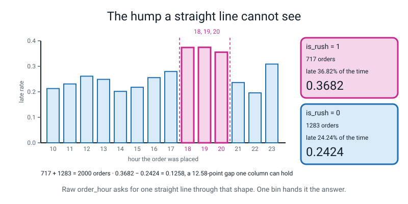
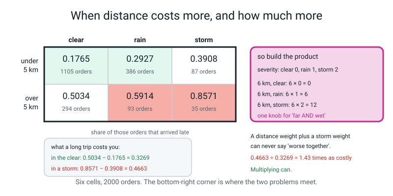
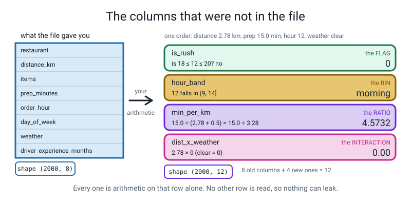
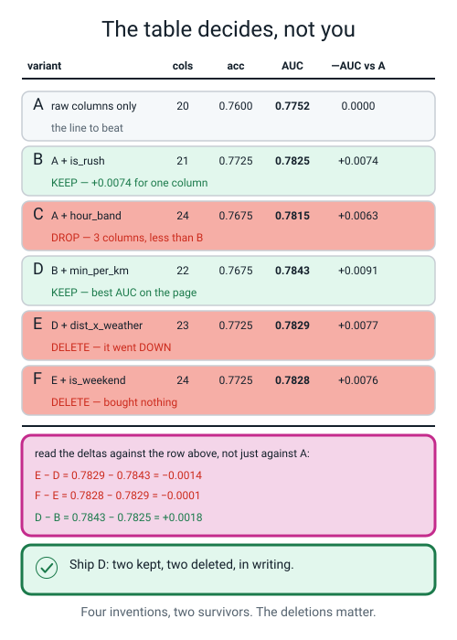
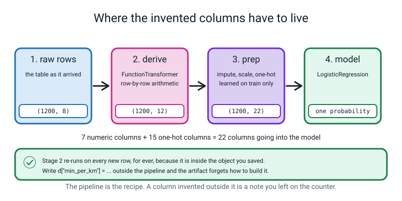
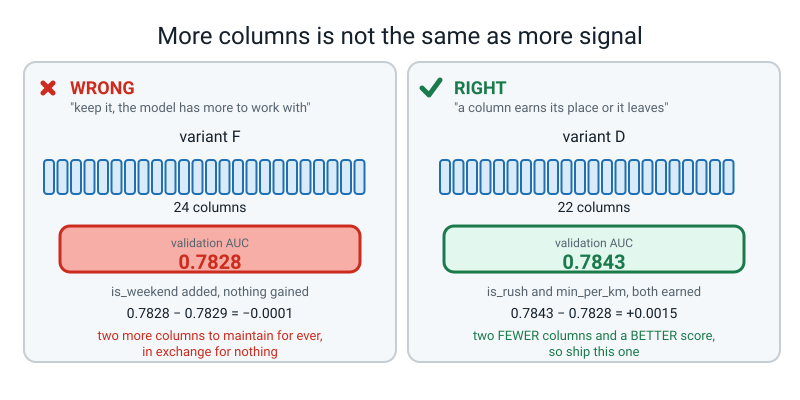
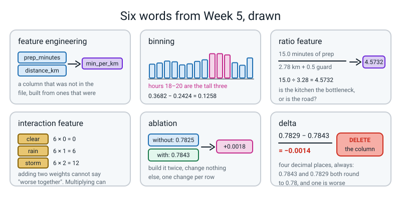

# Week 5 — Columns You Invent Yourself

[⬅ Week 4](week-04.md) · [Course Home](../README.md) · [Next ➡](week-06.md) · [Workbook](../workbook/week-05.md)

---

> ### This week in one sentence
> **The biggest jumps in score usually come from a column that was not in the file — a ratio, a bin, or two columns multiplied together — and the only honest way to know whether your invention was worth anything is to build the model twice and subtract.**
>
> **By the end of this chapter you will be able to:**
> - **Derive four new features** from a table you already have: one **ratio**, one **bin**, one **interaction** and one **flag**
> - **Wrap your own feature function so it lives inside the `Pipeline`** and re-runs automatically on every new row that ever arrives
> - **Run an ablation** — build with the feature, build without it, change nothing else — and read the delta **to four decimal places**
> - **Delete a feature you invented**, because the ablation says it bought nothing, and **write down the number that justified the deletion**
>
> **New maths:** none. Today re-uses the mean, the subtraction and the division from Week 4, plus one habit that turns out to be the whole week: **reading the fourth decimal place honestly.**
>
> **New syntax:** `FunctionTransformer(add_features)` · `pd.cut(s, bins=[...], labels=[...])` · `df.assign(new=...)` · `pipe.get_feature_names_out()`
>
> **Reading time:** about 45 minutes. **Homework:** about 60 minutes. **The hardest thing this week is not the code. It is deleting a column you were proud of.**

---

## 🪝 Start Here

Two numbers on the board. Nothing else:

```text
Team A:  0.781
Team B:  0.785
```

Two teams. **Same 2,000 rows of delivery data** — your table. **Same 24 hours.**

**Team A** downloaded the most powerful model library they could find. Hundreds of settings, run overnight on a rented computer. It cost them about forty pounds in cloud time. They report **0.781**.

**Team B** used the same plain `LogisticRegression` you have been using for four weeks. Same settings. **They tuned nothing.** They spent the whole day *looking at the data*. They noticed two things, added two columns, four lines of code — and they report **0.785**.

**Team B won.**

Now, 0.785 against 0.781 is four thousandths. That is nothing, and it could easily be luck — by Week 11 you will know how to check. **So Team B did not really win because their score was higher.**

**Here is why Team B actually won.** Team B can walk into the pizza place and say: *"orders placed between six and eight in the evening are late 37% of the time instead of 24%, and long trips in storms are much worse than long trips or storms on their own."* Team A can say *"the computer found it."*

And Team B could do it again tomorrow, on a different problem, without renting a computer.

**These were Team B's two columns:**

```text
is_rush          = 1 if the order was placed between 18:00 and 20:00
dist_x_weather   = distance × how bad the weather is
```

**Neither of them is in the file.** Nobody logged `is_rush`. Somebody logged the hour, and Team B built the rest.

That is today. You are going to invent columns that do not exist. And then — this is the harder half — you are going to **measure whether each one was worth anything, and delete the ones that were not.** Including the ones you liked.

🍕 **The analogy.** Raw features are ingredients as they arrive: a whole onion, an unopened tin, a block of cheese. **Feature engineering is the chopping, the grating and the mixing.** The oven is the same either way — but nobody ever made a good pizza by throwing an unpeeled onion on top.

---

## 🧠 The Big Idea

> **📌 About the code in this section.** The blocks below are **illustrations, not files**. Each carries on from the one above. **The complete runnable files are in 💻 Type This.**

> **feature engineering** — building new columns out of the ones you already have, so the pattern becomes something a simple model can see.

There are only **four shapes** of invented column worth knowing, and today's four features are one of each.

### 1. The FLAG and the BIN — because `order_hour` is a number that does not behave like a number

Your table has `order_hour`, a number from 10 to 23. Your model has **one weight** for it. One number, multiplied by the hour.

So whatever the model does with `order_hour`, **it has to be a straight line**: bigger hour, bigger effect, or bigger hour, smaller effect. It has no way of saying *"up in the middle."*

Now look at the actual lateness rate, hour by hour:

| hour | 10 | 11 | 12 | 13 | 14 | 15 | 16 | 17 | **18** | **19** | **20** | 21 | 22 | 23 |
|---|---|---|---|---|---|---|---|---|---|---|---|---|---|---|
| late rate | .213 | .231 | .261 | .249 | .202 | .218 | .256 | .280 | **.374** | **.375** | **.355** | .237 | .196 | .309 |

**That is a hump. It is not a slope.** Low in the afternoon, jumps hard at six in the evening, stays high for three hours, drops again at nine.

**What is the best straight line through a hump?** An almost flat one. And that is exactly what happened — in the fitted model, `order_hour`'s weight is **−0.121**, next to `distance_km`'s **1.128**. Effectively nothing. **The information was sitting right there in the table and the model could not reach it.**

So cut the hours into ranges instead.

> **binning** — chopping a continuous column into ranges and treating each range as a category.

```text
morning   (hours 10-14)   684 orders   late 0.2383
afternoon (hours 15-17)   286 orders   late 0.2552
rush      (hours 18-20)   717 orders   late 0.3682
night     (hours 21-23)   313 orders   late 0.2396
```

**Check the counts: 684 + 286 + 717 + 313 = 2000.** ✅ Do that addition every single time you cut a column.

And the crudest possible version of the same idea — cut it into exactly **two** ranges — gets its own name:

```text
              orders   late rate
not rush       1283     0.2424
rush (18-20)    717     0.3682
              -----------------
              subtract  0.1258
```

**Twelve and a half points, in one yes-or-no column.** When you cut a number into ranges you call it a **bin**. When you cut it into exactly two you usually just call it a **flag**.


*Figure 5.1 — The hump a straight line cannot see. 0.3682 − 0.2424 = 0.1258: a twelve-and-a-half-point gap that one yes-or-no column can hold and one weight on `order_hour` cannot.*

### 2. The RATIO — because two columns often only matter in relation to each other

> **ratio feature** — one column divided by another.

```python
d["min_per_km"] = d["prep_minutes"] / (d["distance_km"] + 0.5)
```

`prep_minutes` on its own is a weak column. `distance_km` on its own is the strongest column in the table. But **minutes of prep per kilometre** asks a completely different question: **is the kitchen the bottleneck, or is the road?**

```text
12 minutes of prep on a 2 km run:   12 ÷ 2.5 = 4.80
12 minutes of prep on a 9 km run:   12 ÷ 9.5 = 1.26
```

**Same prep time. Completely different situation.** Neither original column could say that.

**And what is the `+ 0.5` doing?** `distance_km` could in principle be zero, and dividing by zero gives `inf`, and `inf` makes `LogisticRegression` stop with an error you will meet in 🐞 When It Breaks. The `+ 0.5` is a **guard**. Any small constant does — **pick one and write down that you did**, because in six months you will wonder where the 0.5 came from.

### 3. The INTERACTION — because "worse together" is a thing adding cannot say

> **interaction feature** — a new column built by combining two others, usually by multiplying, so the model can express *"A matters more when B is true"*.

Here is the evidence first, which is the right order. Real lateness rates from our table, split by distance and weather:

| | clear | rain | storm |
|---|---|---|---|
| **under 5 km** | 0.1765 (1105 orders) | 0.2927 (386) | 0.3908 (87) |
| **over 5 km** | 0.5034 (294) | 0.5914 (93) | 0.8571 (35) |

Now work out what a **long trip costs you**, in each kind of weather:

```text
in the clear:   0.5034 − 0.1765 = 0.3269
in a storm:     0.8571 − 0.3908 = 0.4663

0.4663 ÷ 0.3269 = 1.43
```

**Distance is 1.43 times as costly in a storm as it is in the clear.** Distance and weather do not just both matter — **they make each other worse.**

And here is the thing: a model with one weight on `distance` and a separate weight on `storm` can only **add** those two effects together. **Adding cannot say "worse together." Multiplying can.**

```python
severity = d["weather"].map({"clear": 0.0, "rain": 1.0, "storm": 2.0})
d["dist_x_weather"] = d["distance_km"] * severity
```

```text
a 6 km trip, clear:  6 × 0 =  0
a 6 km trip, rain:   6 × 1 =  6
a 6 km trip, storm:  6 × 2 = 12
```

The model now has a knob for *"long trip **and** bad weather"* that is separate from either one on its own.


*Figure 5.2 — When distance costs more, and how much more. Six cells, 2000 orders. The bottom-right corner is where the two problems meet, and 0.4663 against 0.3269 is the size of the meeting.*

**All four shapes at once, worked out for one real row:**


*Figure 5.3 — The columns that were not in the file, worked out for one order: distance 2.78 km, prep 15.0 minutes, hour 12, weather clear. Every one is arithmetic on that row alone, which is why none of them can leak.*

### 4. Every derived feature is a hypothesis, not a gift — so you ablate it

You thought of it. **That is not evidence.**

> **ablation** — measuring a feature's worth by building the model **with** it and **without** it, changing nothing else, and comparing on the validation set.
>
> **delta** — the difference between two scores. Written to **four** decimal places, because the differences are small.

Three rules, and the third is the one people break:

1. **One change per row.** If you add two features in one row you have learned nothing about either.
2. **Four decimal places.** `0.7843` and `0.7829` both round to `0.78`. One is better and one is worse and rounding to two places **erases the answer.**
3. **Read the delta against the row above**, not always against the baseline — and say which you did.

**Here is the table you are going to produce, and it teaches four separate lessons.**

```text
              variant  cols  accuracy  roc_auc  d_auc
  A  raw columns only    20    0.7600   0.7752 0.0000
       B  A + is_rush    21    0.7725   0.7825 0.0074
     C  A + hour_band    24    0.7675   0.7815 0.0063
    D  B + min_per_km    22    0.7675   0.7843 0.0091
E  D + dist_x_weather    23    0.7725   0.7829 0.0077
    F  E + is_weekend    24    0.7725   0.7828 0.0076
```

**Lesson 1 — `is_rush` earned its place.** +0.0074 of AUC for one binary column. That is the 18:00–20:00 hump that raw `order_hour` could not express.

**Lesson 2 — the crude flag beat the clever bin.** Row C is the four-band `pd.cut` version. It costs **three extra columns** and delivers **less** (+0.0063 against +0.0074). *The fancier tool lost.* Why? Look back at the four band rates: morning 0.2383, afternoon 0.2552, rush 0.3682, night 0.2396. **Three of those four are within 0.017 of each other.** The only real distinction in the data is *rush against everything else* — and `is_rush` is exactly that shape, while four bands spend two of their columns describing differences that are barely there.

> **🧑‍🏫 If a student asks:** *"so more information lost to less information?"* Yes, and the general rule is worth writing down: **a feature's cost is a column; its benefit is whatever real distinction it captures. Four columns capturing one distinction is a bad trade.**

**Lesson 3 — two of the four inventions bought nothing, and one made things worse.** Read the deltas **against the row above**:

```text
D − B  =  0.7843 − 0.7825  =  +0.0018    keep   min_per_km
E − D  =  0.7829 − 0.7843  =  −0.0014    DELETE dist_x_weather
F − E  =  0.7828 − 0.7829  =  −0.0001    DELETE is_weekend
```

**`dist_x_weather` has the best story in the whole lesson — and it still lost 0.0014 of AUC.** Sit with that for a second. You *saw* the amplification: 0.4663 against 0.3269. It is real. It is genuinely in the data. **And the column still was not worth its place**, because `distance_km` and the three one-hot weather columns were already carrying most of it between them, and the new column is one more weight to estimate from the same 1,200 rows.

**"Real" and "worth a column" are different tests.** That sentence is the week.

And `is_weekend` is the one that hurts, because it sounds so obviously right. Here is why it isn't:

```text
weekend  556 orders   late 0.2752
weekday 1444 orders   late 0.2922
```

**Weekends are slightly *less* late than weekdays.** There was never any signal to find. Delete it — and **keep the row in the table**, so that future-you knows it was tested.

**Lesson 4 — your metric decides the winner, and you chose it in Week 1.** On AUC, **D wins** with 0.7843. Look at the accuracy column instead: B, E and F all tie at 0.7725 and **D is the worst of the four at 0.7675.** If you had not fixed the metric in advance, you would now be quietly picking whichever column made you look best. You fixed AUC in Week 1. **Ship D.**


*Figure 5.4 — The ablation table decides, not you. Two inventions kept, two deleted, and the subtraction that justified each deletion printed beside it.*

---

## 🔁 The Idea From Last Week, Used Harder

There is no new maths this week. Instead, the habit you built last week gets pointed at a much harder target.

**Last week you learned to read a fourth decimal place** — because rounding 38.0526 to 38.05 before dividing made your z-score disagree with sklearn's. That was annoying. **This week the fourth decimal place is the entire deliverable.**

Look at these two numbers:

```text
0.7843
0.7829
```

Round both to two decimal places, the way school maths teaches you to:

```text
0.78
0.78
```

**You have just erased the answer.** One of those variants is better and one is worse, and after rounding they are the same number. There is no way back.

And it is worse than that, because the *sign* matters more than the size:

| delta | rounded to 2 dp | what it actually means |
|---|---|---|
| +0.0018 | 0.00 | **keep it** — a small, real gain |
| −0.0014 | 0.00 | **delete it** — it made the model worse |
| −0.0001 | 0.00 | **delete it** — it bought nothing at all |

**Three completely different decisions. One rounded number.**

> **🔢 The maths, slowly:** there is no clever trick here, just arithmetic done honestly. `0.7829 − 0.7843`. Line the decimal points up. 0.7829 is smaller than 0.7843, so the answer is negative. `0.7843 − 0.7829 = 0.0014`, so the answer is **−0.0014**. Check it on a calculator; you will see `-0.0014000000000000567` or something like it, because computers store decimals approximately. **Round the printed result to four places, never the inputs.**

**And here is the honest weakness you should know about, because a good engineer says it out loud.** Every number in that table came from **one pile of 400 validation rows**. A delta of −0.0014 measured on 400 rows is small enough that a different random split might flip its sign. So the professional way to write the deletion note is:

> *"Deleted `dist_x_weather`, ΔAUC −0.0014, which is small enough that I would retest it with cross-validation before calling it settled."*

**Cross-validation is Week 11, and this is exactly why it is coming.** For now: report four decimal places, and be honest about how much you trust the last one.

---

## 💻 Type This

Two files. `features.py` looks at what the new columns actually contain. `ablation.py` fits **six** models — and **it finishes in about one second**, which is worth saying out loud before you run it, because six models sounds slow and is not.

### Step 1 — one function, five switches

Create `features.py`:

```python
"""features.py - four invented columns, one row at a time."""
import pandas as pd
from make_data import make_deliveries

df = make_deliveries(n=2000, seed=0).drop_duplicates().reset_index(drop=True)


def add_features(d, rush=False, band=False, ratio=False, inter=False, weekend=False):
    """One row in, the same row plus new columns out."""
    d = d.copy()
    if rush:
        d["is_rush"] = d["order_hour"].between(18, 20).astype(int)
    if band:
        d["hour_band"] = pd.cut(d["order_hour"],
                                bins=[9, 14, 17, 20, 23],
                                labels=["morning", "afternoon", "rush", "night"])
    if ratio:
        d["min_per_km"] = d["prep_minutes"] / (d["distance_km"] + 0.5)
    if inter:
        sev = d["weather"].map({"clear": 0.0, "rain": 1.0, "storm": 2.0})
        d["dist_x_weather"] = d["distance_km"] * sev
    if weekend:
        d["is_weekend"] = d["day_of_week"].isin(["Sat", "Sun"]).astype(int)
    return d
```

**This is the only genuinely new *structure* this week, so read it slowly.**

| Piece | What it does |
|---|---|
| `def add_features(d, ...)` | *"I am defining a new instruction called `add_features`."* `d` is the table you hand it |
| `rush=False, band=False, ...` | **five switches**, each off unless you say otherwise. So `add_features(X, rush=True)` adds only `is_rush`, and `add_features(X)` adds nothing at all |
| `d = d.copy()` | make a **private copy** before touching anything, so the original table is untouched |
| `.between(18, 20)` | gives `True`/`False`. **Inclusive at both ends** — 18, 19 and 20 all count |
| `.astype(int)` | turns `True`/`False` into 1/0, because a model multiplies and cannot multiply by `True` |
| `.isin(["Sat", "Sun"])` | `True` if the value is either of those two |
| `.map({...})` | look each value up in a dictionary and swap it for the number |
| `return d` | hand the table back |

**The five switches are what makes an ablation possible in one function** instead of six copies of a file. That is the whole reason the function is shaped this way.

> **⚠️ Watch out:** `d = d.copy()` is not optional. Without it, this function would quietly add columns to your *original* table every time you called it, and by the fourth call your ablation would be comparing nonsense. **One line, and it is the difference between a measurement and a mess.**

### Step 2 — look at one row, by hand, before you trust the code

```python
out = add_features(df.head(5), rush=True, band=True, ratio=True, inter=True)
print(out[["order_hour", "is_rush", "hour_band", "prep_minutes",
           "distance_km", "min_per_km", "weather", "dist_x_weather"]].round(4).to_string(index=False))
print("\ncolumns before:", df.shape[1], " after:", out.shape[1])
```

**Row one is hour 12, prep 15.0, distance 2.78, weather clear. Work out all four new values before running.**

- `is_rush`: is 12 between 18 and 20? No → **0**
- `hour_band`: 12 is in the range `(9, 14]` → **morning**
- `min_per_km`: `15.0 ÷ (2.78 + 0.5) = 15.0 ÷ 3.28 =` **4.5732**
- `dist_x_weather`: clear maps to 0, so `2.78 × 0 =` **0.00**

```text
 order_hour  is_rush hour_band  prep_minutes  distance_km  min_per_km weather  dist_x_weather
         12        0   morning          15.0         2.78      4.5732   clear            0.00
         22        0     night          12.9         3.09      3.5933    rain            3.09
         16        0 afternoon          14.2         2.65      4.5079    rain            2.65
         13        0   morning           4.9         9.60      0.4851   clear            0.00
         20        1      rush          19.6         2.33      6.9258   clear            0.00

columns before: 10  after: 14
```

**Four for four.** Ten columns in, fourteen out.

Now look at **row five**: hour 20, `is_rush` is 1, and `hour_band` is `rush`. **Those two columns are saying the same thing in two different ways**, and in about ten minutes the ablation is going to tell you which way is better. Write your prediction down now.

And look at **row four**: prep 4.9 minutes on a 9.60 km trip gives `min_per_km` of 0.4851 — the smallest in the batch. That is an order where the kitchen was fast and the road was long. **Neither `prep_minutes` nor `distance_km` alone says that.**

### Step 3 — 🐞 the first mistake, and it shouts

Try three bands instead of four, leaving the bins alone:

```python
d["hour_band"] = pd.cut(d["order_hour"],
                        bins=[9, 14, 17, 20, 23],
                        labels=["morning", "afternoon", "rush"])
```

```text
Traceback (most recent call last):
  File "/private/tmp/w456/w5err1.py", line 3, in <module>
    out = pd.cut(s, bins=[9, 14, 17, 20, 23], labels=["morning", "afternoon", "rush"])
  File ".../pandas/core/reshape/tile.py", line 293, in cut
    fac, bins = _bins_to_cuts(
  File ".../pandas/core/reshape/tile.py", line 454, in _bins_to_cuts
    raise ValueError(
ValueError: Bin labels must be one fewer than the number of bin edges
```

**Count the edges: 9, 14, 17, 20, 23. Five. Count the labels: three. It wanted four.**

**Why one fewer?** Because the edges are **fences** and the labels name the **fields between them**. Five fence posts make four fields. Draw it if it helps; people get this wrong for years.

**Good error, by the way.** It caught the problem immediately and told you the rule.

### Step 4 — 🐞 the second mistake, and it says nothing at all

Now a change that looks *tidier*. Our hours start at 10, so having the first bin edge at 9 looks sloppy. Change it to 10:

```python
d["hour_band"] = pd.cut(d["order_hour"],
                        bins=[10, 14, 17, 20, 23],
                        labels=["morning", "afternoon", "rush", "night"])
```

**Will that break? Write your answer down.**

```text
 order_hour  is_rush hour_band  prep_minutes  distance_km  min_per_km weather  dist_x_weather
         12        0   morning          15.0         2.78      4.5732   clear            0.00
         22        0     night          12.9         3.09      3.5933    rain            3.09
         16        0 afternoon          14.2         2.65      4.5079    rain            2.65
         13        0   morning           4.9         9.60      0.4851   clear            0.00
         20        1      rush          19.6         2.33      6.9258   clear            0.00

columns before: 10  after: 14
```

**No error. Identical output.** So it is fine, yes?

Add one line and check the **whole table** instead of five rows:

```python
band = add_features(df, band=True)["hour_band"]
print("blank hour_band values:", int(band.isna().sum()), "out of", len(band))
```

```text
blank hour_band values: 47 out of 2000
```

**Forty-seven blanks. Where did they come from?**

`pd.cut` reads its ranges as *"bigger than the left edge, up to and including the right edge"* — written `(10, 14]`, with a round bracket for excluded and a square bracket for included. So `(10, 14]` means **bigger than** 10. And hour 10 **is not bigger than 10.** Every one of the 47 orders placed at ten in the morning fell out of the bottom of your bins and became a blank.

**No error. No warning. Just 47 rows quietly missing a value in a column you invented** — which will then get filled in with something by an imputer next week, and nobody will ever know.

Put the edge back to 9 and check again:

```text
blank hour_band values: 0 out of 2000
```

> **🐞 If you see this error:** you won't. That is the point. **Make `print(int(s.isna().sum()))` a reflex after every single `pd.cut`, for the rest of the year.** And always start your first edge *below* your smallest value.

**Compare the two mistakes.** The first one shouted at you and told you the rule. The second one printed a perfectly normal-looking table. **The second kind is the shape of bug that actually costs people money.**

### Step 5 — where the invented columns have to live

Now the important structural bit. Here is the middle of `ablation.py`:

```python
    pipe = Pipeline([
        ("derive", FunctionTransformer(add_features, kw_args=kw)),
        ("prep", pre),
        ("model", LogisticRegression(max_iter=2000, random_state=RS)),
    ])
```

**Three stages.**

`FunctionTransformer` is a **wrapper**. A `Pipeline` will only talk to things that have a `.fit` and a `.transform`, and your plain function has neither — so `FunctionTransformer` dresses it up so the pipeline will accept it. `kw_args={"rush": True}` is how you set the switches through the wrapper.

Stage two is Week 3 and 4's imputing, scaling and one-hot encoding. Stage three is the model.

**And here is why this matters far more than it looks. Stage one is now inside the saved object.** When a real order arrives next Tuesday, this pipeline works out its `is_rush` **for itself**. If you had written `df["is_rush"] = ...` at the top of your script instead, your saved artifact would have no idea that column was ever supposed to exist — and it would fail on the first live row. You will see that exact error in 🐞 When It Breaks.


*Figure 5.5 — Where the invented columns have to live. 7 numeric columns + 15 one-hot columns = 22 going into the model, and stage 2 re-runs for ever because it is inside the object you saved.*

> **⚠️ Watch out:** `add_features` looks at **one row at a time.** It never computes an average, a total, or anything else that needs to see other rows. **That is the only reason it is allowed inside a `FunctionTransformer` at all.** If you ever write a "feature function" that computes a column mean, it is no longer safe there — it belongs in the `prep` stage where it will be fitted on training rows only. **That distinction is next week's entire subject.**

### Step 6 — what the columns are actually called now

```python
print(pipe.named_steps["prep"].get_feature_names_out())
```

After all that imputing, scaling and one-hot encoding, the thing going into the model is a wide block of numbers with no names on it. `get_feature_names_out()` gives you the names back, in order — and `named_steps["prep"]` is how you reach into a named stage of a pipeline and get the fitted object out.

```text
22 columns:
num__distance_km, num__items, num__prep_minutes, num__order_hour, num__driver_experience_months, num__is_rush, num__min_per_km, cat__restaurant_CrustyBros, cat__restaurant_GreenLeaf, cat__restaurant_Napoli, cat__restaurant_SliceHouse, cat__restaurant_TandooriPizza, cat__day_of_week_Fri, cat__day_of_week_Mon, cat__day_of_week_Sat, cat__day_of_week_Sun, cat__day_of_week_Thu, cat__day_of_week_Tue, cat__day_of_week_Wed, cat__weather_clear, cat__weather_rain, cat__weather_storm
```

**Check the count yourself, because you can:** 5 base numeric columns + `is_rush` + `min_per_km` = **7 numeric**. Then 5 restaurants + 7 weekdays + 3 weathers = **15 one-hot**. And `7 + 15 = 22`. ✅

The `num__` and `cat__` prefixes say which branch of the `ColumnTransformer` each column came out of. **You need this list to read the model's weights, and you will use it every week from here to the end of the year.**

> **💡 Try this:** when a feature you built makes **no difference at all** to the score, print this list first, before anything else. Nine times out of ten your new column is not in it — which means the model never saw it. It takes four seconds and turns a mystery into a fact.

### The complete `ablation.py`

```python
"""ablation.py - does each invented column actually pay?"""
import pandas as pd
from sklearn.compose import ColumnTransformer
from sklearn.impute import SimpleImputer
from sklearn.linear_model import LogisticRegression
from sklearn.metrics import accuracy_score, roc_auc_score
from sklearn.model_selection import train_test_split
from sklearn.pipeline import Pipeline
from sklearn.preprocessing import FunctionTransformer, OneHotEncoder, StandardScaler

from make_data import make_deliveries

RS = 42
BASE_NUM = ["distance_km", "items", "prep_minutes", "order_hour",
            "driver_experience_months"]
BASE_CAT = ["restaurant", "day_of_week", "weather"]

df = make_deliveries(n=2000, seed=0).drop_duplicates().reset_index(drop=True)
y = df["late"]
X = df.drop(columns=["late", "order_id"])
X_tmp, X_te, y_tmp, y_te = train_test_split(
    X, y, test_size=.20, random_state=RS, stratify=y)
X_tr, X_va, y_tr, y_va = train_test_split(
    X_tmp, y_tmp, test_size=.25, random_state=RS, stratify=y_tmp)


def add_features(d, rush=False, band=False, ratio=False, inter=False, weekend=False):
    """One row in, the same row plus new columns out. Nothing crosses between rows."""
    d = d.copy()
    if rush:
        d["is_rush"] = d["order_hour"].between(18, 20).astype(int)
    if band:
        d["hour_band"] = pd.cut(d["order_hour"],
                                bins=[9, 14, 17, 20, 23],
                                labels=["morning", "afternoon", "rush", "night"])
    if ratio:
        d["min_per_km"] = d["prep_minutes"] / (d["distance_km"] + 0.5)
    if inter:
        sev = d["weather"].map({"clear": 0.0, "rain": 1.0, "storm": 2.0})
        d["dist_x_weather"] = d["distance_km"] * sev
    if weekend:
        d["is_weekend"] = d["day_of_week"].isin(["Sat", "Sun"]).astype(int)
    return d


def evaluate(label, **kw):
    made = add_features(X_tr.head(3), **kw)
    new = [c for c in made.columns if c not in X_tr.columns]
    num = BASE_NUM + [c for c in new if made[c].dtype.name != "category"]
    cat = BASE_CAT + [c for c in new if made[c].dtype.name == "category"]
    pre = ColumnTransformer([
        ("num", Pipeline([("impute", SimpleImputer(strategy="median")),
                          ("scale", StandardScaler())]), num),
        ("cat", OneHotEncoder(handle_unknown="ignore", sparse_output=False), cat),
    ])
    pipe = Pipeline([
        ("derive", FunctionTransformer(add_features, kw_args=kw)),
        ("prep", pre),
        ("model", LogisticRegression(max_iter=2000, random_state=RS)),
    ])
    pipe.fit(X_tr, y_tr)
    prob = pipe.predict_proba(X_va)[:, 1]
    return {"variant": label,
            "cols": pipe.named_steps["prep"].get_feature_names_out().shape[0],
            "accuracy": accuracy_score(y_va, (prob >= .5).astype(int)),
            "roc_auc": roc_auc_score(y_va, prob)}, pipe


PLAN = [("A  raw columns only", {}),
        ("B  A + is_rush", dict(rush=True)),
        ("C  A + hour_band", dict(band=True)),
        ("D  B + min_per_km", dict(rush=True, ratio=True)),
        ("E  D + dist_x_weather", dict(rush=True, ratio=True, inter=True)),
        ("F  E + is_weekend", dict(rush=True, ratio=True, inter=True, weekend=True))]

rows, pipes = [], {}
for label, kw in PLAN:
    r, p = evaluate(label, **kw)
    rows.append(r)
    pipes[label] = p

tbl = pd.DataFrame(rows)
tbl["d_auc"] = tbl["roc_auc"] - tbl.loc[0, "roc_auc"]
print(tbl.round(4).to_string(index=False))

print("\n--- what the winner's columns are called ---")
names = pipes["D  B + min_per_km"].named_steps["prep"].get_feature_names_out()
print(len(names), "columns:")
print(", ".join(names))
```

The `evaluate` function does one small clever thing worth noticing: it calls `add_features` on **three rows** first, just to find out what the new columns are called and whether each one is a number or a category. Numbers go to the `num` branch and get scaled; categories go to the `cat` branch and get one-hot encoded. **A binned column is a category, however numeric the thing it came from was.**

**Real output. Runtime about 1 second for all six fits.**

```text
              variant  cols  accuracy  roc_auc  d_auc
  A  raw columns only    20    0.7600   0.7752 0.0000
       B  A + is_rush    21    0.7725   0.7825 0.0074
     C  A + hour_band    24    0.7675   0.7815 0.0063
    D  B + min_per_km    22    0.7675   0.7843 0.0091
E  D + dist_x_weather    23    0.7725   0.7829 0.0077
    F  E + is_weekend    24    0.7725   0.7828 0.0076

--- what the winner's columns are called ---
22 columns:
num__distance_km, num__items, num__prep_minutes, num__order_hour, num__driver_experience_months, num__is_rush, num__min_per_km, cat__restaurant_CrustyBros, cat__restaurant_GreenLeaf, cat__restaurant_Napoli, cat__restaurant_SliceHouse, cat__restaurant_TandooriPizza, cat__day_of_week_Fri, cat__day_of_week_Mon, cat__day_of_week_Sat, cat__day_of_week_Sun, cat__day_of_week_Thu, cat__day_of_week_Tue, cat__day_of_week_Wed, cat__weather_clear, cat__weather_rain, cat__weather_storm
```

**Row A must be 0.7600 and 0.7752.** Those are Week 1's numbers, exactly, because row A **is** Week 1's model. **If row A does not reproduce, stop.** Every delta below it is measured from that number, so if A is wrong the whole table is fiction.

**About a second, for six models.** Get used to that — most machine learning on data this size is fast, and the slow part is you thinking.

### Reading the weights, which is now possible

```python
names = pipe.named_steps["prep"].get_feature_names_out()
co = pd.Series(pipe.named_steps["model"].coef_[0], index=names)
print(co.reindex(co.abs().sort_values(ascending=False).index).round(3).head(8).to_string())
```

Real output, for variant D:

```text
num__distance_km                 1.128
cat__weather_storm               0.732
cat__weather_clear              -0.669
cat__restaurant_CrustyBros       0.634
cat__restaurant_Napoli          -0.474
cat__day_of_week_Mon             0.441
num__is_rush                     0.436
num__driver_experience_months   -0.392
```

**`num__is_rush` has a weight of 0.436, and it is a column you invented an hour ago.** Meanwhile, further down that list, `num__order_hour` sits at **−0.121** — nearly nothing, exactly as predicted, because one weight cannot draw a hump.

**Read those two lines together and you have understood binning completely.** The hour matters enormously. The hour *as a number* does not.

---

## 🔍 Worked Examples

### Worked Example 1 — Two more inventions, ablated (the class activity)

In class everybody spent eight silent minutes inventing five columns that could exist but don't, then voted for the best four and built them live. Here are two of the winners, put through **exactly the same machinery**: take `ablation.py`, swap in the `add_features` and `PLAN` below, and change nothing else.

```python
def add_features(d, rush=False, ratio=False, items_ratio=False, late_night=False):
    d = d.copy()
    if rush:
        d["is_rush"] = d["order_hour"].between(18, 20).astype(int)
    if ratio:
        d["min_per_km"] = d["prep_minutes"] / (d["distance_km"] + 0.5)
    if items_ratio:
        d["items_per_km"] = d["items"] / (d["distance_km"] + 0.5)
    if late_night:
        d["is_late_night"] = (d["order_hour"] >= 22).astype(int)
    return d


PLAN = [("D  is_rush + min_per_km", dict(rush=True, ratio=True)),
        ("G  D + items_per_km", dict(rush=True, ratio=True, items_ratio=True)),
        ("H  D + is_late_night", dict(rush=True, ratio=True, late_night=True))]
```

`items_per_km` is a **second ratio sharing the same denominator** as `min_per_km`. `is_late_night` is a **flag** for orders placed at 22:00 or later.

**Real output. Runtime about 1 second.**

```text
                variant  cols  accuracy  roc_auc   d_auc
D  is_rush + min_per_km    22    0.7675   0.7843  0.0000
    G  D + items_per_km    23    0.7650   0.7853  0.0010
   H  D + is_late_night    23    0.7700   0.7828 -0.0015

--- the evidence I should have looked at first ---
            size    mean
order_hour              
0           1835  0.2916
1            165  0.2424
```

**Two verdicts, and one of them is a lesson about the order you do things in.**

**`items_per_km` earns a KEEP, barely.**

```text
0.7853 − 0.7843 = +0.0010
```

Small, real, positive. Notice that the accuracy went *down* (0.7650 against 0.7675) while the AUC went up. **AUC is our metric. Keep it, and write down that accuracy disagreed** — an honest table records the disagreement rather than hiding it.

**`is_late_night` earns a DELETE.**

```text
0.7828 − 0.7843 = −0.0015
```

**And look at the bottom of that output: the evidence I should have looked at *before* building it.** Orders at 22:00 or later are late **0.2424** of the time; everything else is **0.2916**. Late-night orders are *less* late, and the gap is only 0.0492 — less than half the rush-hour gap of 0.1258.

**Two lines of `groupby` would have predicted the delete.** That is the habit: look at the two rates first, and you can guess the verdict before you fit anything. **Building the feature and then finding out is doing the work in the wrong order.**

**The deletion note, written properly:**

> **Feature:** `is_late_night` — 1 if `order_hour` is 22 or later.
> **What I thought it would do:** fewer drivers on shift late at night, so more deliveries late.
> **AUC without it (row D):** 0.7843 · **AUC with it (row H):** 0.7828
> **The delta:** 0.7828 − 0.7843 = **−0.0015**
> **Why I am deleting it:** it made the model worse, and the evidence was against it before I started — late-night orders are late 0.2424 of the time against 0.2916 for everything else, so if anything they are *safer*. 165 orders is a small group and that gap is probably noise.

### Worked Example 2 — A ratio in a completely different table

Twelve pieces of homework. Two columns: how many **pages** the student wrote, and how many **hours** they spent. The label is whether it got a good grade. Small enough to check every row on paper.

```python
"""w5we2.py - a ratio that neither original column could say."""
import pandas as pd
from sklearn.linear_model import LogisticRegression
from sklearn.metrics import roc_auc_score
from sklearn.pipeline import Pipeline
from sklearn.preprocessing import StandardScaler

hw = pd.DataFrame({
    "name":  ["Ada","Ben","Cleo","Dev","Eli","Fay","Gus","Hana","Ivo","Jo","Kit","Lena"],
    "pages": [ 4,   10,    3,    12,   6,    9,    2,    14,    5,   8,    7,   11],
    "hours": [ 4,    3,    2,     4,   6,    3,    1,     7,    5,   2,    7,    4],
    "good":  [ 0,    1,    0,     1,   0,    1,    1,     1,    0,   1,    0,    1],
})
hw["pages_per_hour"] = (hw["pages"] / hw["hours"]).round(4)
print(hw.to_string(index=False))

print("\n--- what each column can say, on these same 12 rows ---")
for cols in [["pages"], ["hours"], ["pages", "hours"], ["pages_per_hour"]]:
    m = Pipeline([("scale", StandardScaler()),
                  ("model", LogisticRegression(max_iter=2000, random_state=0))])
    m.fit(hw[cols], hw["good"])
    auc = roc_auc_score(hw["good"], m.predict_proba(hw[cols])[:, 1])
    print("%-28s AUC %.4f" % (" + ".join(cols), auc))
```

**Real output. Runtime under 1 second.**

```text
name  pages  hours  good  pages_per_hour
 Ada      4      4     0          1.0000
 Ben     10      3     1          3.3333
Cleo      3      2     0          1.5000
 Dev     12      4     1          3.0000
 Eli      6      6     0          1.0000
 Fay      9      3     1          3.0000
 Gus      2      1     1          2.0000
Hana     14      7     1          2.0000
 Ivo      5      5     0          1.0000
  Jo      8      2     1          4.0000
 Kit      7      7     0          1.0000
Lena     11      4     1          2.7500

--- what each column can say, on these same 12 rows ---
pages                        AUC 0.8571
hours                        AUC 0.7143
pages + hours                AUC 1.0000
pages_per_hour               AUC 1.0000
```

> **⚠️ Watch out:** those AUCs were measured on **the same twelve rows the model was fitted on.** That is deliberate here — this is a demonstration of *what each column can express*, not a score you would ever report. Never do this to claim a result.

**Work through the table by hand first.** Look at `pages` on its own. Good grades: 10, 12, 9, 2, 14, 8, 11. Bad grades: 4, 3, 6, 5, 7. **They overlap** — Gus wrote 2 pages and got a good grade, Kit wrote 7 and did not. So `pages` alone cannot separate them, and it scores 0.8571 rather than 1.

Same with `hours`. Good: 3, 4, 3, 1, 7, 2, 4. Bad: 4, 2, 6, 5, 7. **Overlapping again**, and it does worse: 0.7143.

**Now `pages_per_hour`.** Good grades: 3.3333, 3.0000, 3.0000, 2.0000, 2.0000, 4.0000, 2.7500. Bad grades: 1.0000, 1.5000, 1.0000, 1.0000, 1.0000. **Every good grade is 2.0 or above and every bad one is 1.5 or below.** One column, perfectly separated, and you can see it by eye.

**And now the honest part, which is the actual lesson.** `pages + hours` **also** got 1.0000. Two columns, same power. Why? Because *"pages per hour is at least 2"* is the same thing as *"pages is at least 2 × hours"*, and that boundary is a **straight line** — which a straight-line model with both columns can find on its own.

**So what did the ratio actually buy?**

| | columns | can it separate? | can you say it out loud? |
|---|---|---|---|
| `pages` alone | 1 | no (0.8571) | "wrote a lot" |
| `hours` alone | 1 | no (0.7143) | "worked a long time" |
| `pages + hours` | **2** | yes | "some combination of both" |
| `pages_per_hour` | **1** | yes | **"two pages an hour"** |

**It bought the same power in one column instead of two, and a name you can say.** On twelve rows that matters a lot — every column is one more weight to estimate. And *"two pages an hour"* is a sentence you can take to a teacher; *"0.8 × pages minus 1.6 × hours"* is not.

**This is also exactly why `min_per_km` only earned +0.0018 in the ablation** and not +0.05. The information was already reachable; the ratio just made it cheaper and sayable. **A ratio does not always buy new power. Sometimes it buys fewer columns and a name — and the ablation table is what tells you which.**

### Worked Example 3 — A hump in a completely different world

The `order_hour` hump is not a quirk of pizza. Here is the same shape somewhere else, generated inline with numpy so you can see exactly what went in.

Six hundred house plants. One column: how much water they got per week, in millilitres, anywhere from 0 to 100. Too little kills them. **So does too much.**

```python
"""w5we3.py - a hump a straight line cannot see, in a different world."""
import numpy as np
import pandas as pd
from sklearn.linear_model import LogisticRegression
from sklearn.metrics import roc_auc_score
from sklearn.model_selection import train_test_split
from sklearn.pipeline import Pipeline
from sklearn.preprocessing import OneHotEncoder, StandardScaler

rng = np.random.default_rng(0)
n = 600
water = np.round(rng.uniform(0, 100, size=n), 1)      # ml of water per week
too_dry = water < 25
too_wet = water > 70
risk = np.where(too_dry | too_wet, 0.85, 0.12)
died = (rng.random(n) < risk).astype(int)
plants = pd.DataFrame({"water_ml": water, "died": died})

print("rows:", len(plants), " died:", int(plants["died"].sum()))
band = pd.cut(plants["water_ml"], bins=[-1, 25, 70, 101],
              labels=["too dry", "about right", "too wet"])
print("\n--- the death rate, cut into three bands ---")
print(plants.groupby(band, observed=True)["died"].agg(["size", "mean"]).round(4).to_string())
print("blank band values:", int(band.isna().sum()))

plants["band"] = band
tr, te = train_test_split(plants, test_size=.25, random_state=0, stratify=plants["died"])

raw = Pipeline([("scale", StandardScaler()),
                ("model", LogisticRegression(max_iter=2000, random_state=0))])
raw.fit(tr[["water_ml"]], tr["died"])
auc_raw = roc_auc_score(te["died"], raw.predict_proba(te[["water_ml"]])[:, 1])

binned = Pipeline([("enc", OneHotEncoder(handle_unknown="ignore", sparse_output=False)),
                   ("model", LogisticRegression(max_iter=2000, random_state=0))])
binned.fit(tr[["band"]], tr["died"])
auc_bin = roc_auc_score(te["died"], binned.predict_proba(te[["band"]])[:, 1])

print("\nraw water_ml, one weight   : AUC %.4f" % auc_raw)
print("the same column, binned    : AUC %.4f" % auc_bin)
print("the delta                  : %+.4f" % (auc_bin - auc_raw))
print("\nthe weight the raw model gave water_ml: %.4f"
      % raw.named_steps["model"].coef_[0][0])
```

Notice `bins=[-1, 25, 70, 101]` — the first edge is **−1, below the smallest possible value**, and the last is **101, above the biggest**. That is the Step 4 lesson applied on purpose, and the blank check is right there in the output to prove it worked.

**Real output. Runtime about 1 second.**

```text
rows: 600  died: 314

--- the death rate, cut into three bands ---
             size    mean
water_ml                 
too dry       135  0.8593
about right   267  0.0974
too wet       198  0.8687
blank band values: 0

raw water_ml, one weight   : AUC 0.6550
the same column, binned    : AUC 0.8846
the delta                  : +0.2296

the weight the raw model gave water_ml: 0.1441
```

**Check the counts: 135 + 267 + 198 = 600.** ✅ And **zero blanks**, because the first edge was below the minimum.

**Read the three death rates: 0.8593, 0.0974, 0.8687.** High, low, high. **That is a U, not a slope** — and it is even more hostile to a straight line than the pizza hump was, because both ends are bad.

Look at the weight the raw model gave: **0.1441.** Nearly nothing, exactly like `order_hour`'s −0.121. And the score reflects it: **0.6550 raw against 0.8846 binned. A delta of +0.2296** — about twenty-five times the entire honest gain in the pizza ablation table, which was +0.0091 for four features.

> **🧑‍🏫 If a student asks:** *"why is the raw AUC 0.6550 and not 0.5000, if a straight line is useless here?"* Because the U is **lopsided**. "Too dry" is 25 units wide and "too wet" is 30, so slightly more of the deaths sit at the wet end, and a gently rising straight line picks up a little of that. **A useless feature scores 0.5. This one scores 0.655, which is the sound of a model getting a small amount of accidental credit for a shape it cannot see.**

**The moral, in one line:** when a column's effect goes up and then down, **the number is not the useful thing — the range it falls in is.** Bin it.

---

## 🐞 When It Breaks

Every message below came from actually running a broken version of this week's code.

### Break 1 — fence posts and fields

```python
pd.cut(s, bins=[9, 14, 17, 20, 23], labels=["morning", "afternoon", "rush"])
```

```text
ValueError: Bin labels must be one fewer than the number of bin edges
```

**What it means.** *"Your fence posts and your fields don't match."* Five edges make four ranges, so you need four labels.

**The fix.** Count the edges, subtract one, that is how many labels. **Good error** — it caught the problem immediately and told you the rule.

### Break 2 — the one with no message at all

```python
d["hour_band"] = pd.cut(d["order_hour"], bins=[10, 14, 17, 20, 23],
                        labels=["morning", "afternoon", "rush", "night"])
```

```text
blank hour_band values: 47 out of 2000
```

**No error. No warning. `head()` looked perfect.**

**What happened.** `pd.cut` reads `(10, 14]` as *"bigger than 10, up to and including 14."* Hour 10 is not bigger than 10, so all 47 orders placed at 10:00 fell out of the bottom and became `NaN`.

**The fix.** Start the first edge *below* your minimum: `bins=[9, ...]`. **And then check, every single time:**

```python
print("blank values:", int(s.isna().sum()))
```

> **🐞 If you see this error:** you won't see it. That is the whole problem. **Two questions, in this order: did you check the whole table, or just the first five rows? And did you count the blanks after every `pd.cut`?** A bug that hides in row 6 is still a bug.

### Break 3 — the feature that was built in the wrong place

```python
df["min_per_km"] = df["prep_minutes"] / (df["distance_km"] + 0.5)   # OUTSIDE the pipeline
pipe.fit(X, y)                                                       # trains fine, good score
new_order = pd.DataFrame({"distance_km": [4.2]})                      # a fresh row, as it arrives
pipe.predict_proba(new_order)
```

```text
Traceback (most recent call last):
  ...
  File ".../sklearn/compose/_column_transformer.py", line 1085, in transform
    raise ValueError(f"columns are missing: {diff}")
ValueError: columns are missing: {'min_per_km'}
```

**What it means.** *"The table you just gave me is missing a column I was fitted with."*

**And notice when it happened.** Training was fine. The score was fine. **The error arrived the first time a real row turned up** — because a real row has `distance_km` and `prep_minutes` on it and nothing has computed `min_per_km`.

**The fix.** Move the arithmetic inside `add_features` and wrap it in a `FunctionTransformer`. **This error is the whole argument for stage 1 living inside the pipeline**, and it is the difference between a script that works on your laptop and a thing that works on Tuesday.

### Break 4 — arithmetic on a word

```python
d = pd.DataFrame({"hour_band": pd.cut(pd.Series([12, 19, 22]), bins=[9, 14, 17, 20, 23],
                                      labels=["morning", "afternoon", "rush", "night"])})
StandardScaler().fit(d)
```

```text
ValueError: could not convert string to float: 'morning'
```

**What it means.** `hour_band` is a **category**, not a number, and it went down the *numeric* branch of the `ColumnTransformer`.

**The fix.** Send it down the categorical branch so it gets one-hot encoded. **A binned column is a category, however numeric the thing it came from was.** That is exactly why `evaluate()` checks `made[c].dtype.name == "category"` before deciding which list to put each new column in.

### The whole clinic, for reference

| Message | Cause | Fix |
|---|---|---|
| `ValueError: Bin labels must be one fewer than the number of bin edges` | five edges, three labels | count the edges, subtract one |
| **no error**, some binned rows are blank | the first bin edge is **at or above** your smallest value | `bins=[9, ...]`, then `print(int(s.isna().sum()))`. **Every time.** |
| `ValueError: Input X contains infinity or a value too large for dtype('float64')` | a ratio divided by zero | guard the bottom: `/ (d["distance_km"] + 0.5)`. Write down which constant you chose |
| `InvalidParameterError: The 'func' parameter of FunctionTransformer must be a callable or None. Got    order_hour  is_rush ... instead.` | `FunctionTransformer(add_features(d, rush=True))` — the brackets **called** the function and handed in its answer | pass the function itself, unbracketed: `FunctionTransformer(add_features, kw_args={"rush": True})` |
| `NotFittedError: This ColumnTransformer instance is not fitted yet` | `get_feature_names_out()` before `.fit` | fit first. The names depend on the data — how many restaurants there were — so they cannot exist beforehand |
| `ValueError: columns are missing: {'min_per_km'}` | the feature was built **outside** the pipeline | move it inside `add_features` + `FunctionTransformer` |
| `ValueError: could not convert string to float: 'morning'` | a binned column went down the numeric branch | send it to the categorical branch |
| `KeyError: 'pre'` | you wrote `named_steps["pre"]` and the stage is called `"prep"` | use the exact name. `print(pipe.named_steps.keys())` lists them |
| **no error**, every row of the ablation is identical | the new column was never added to the `ColumnTransformer`'s list, so it was **silently dropped** | `print(pipe.named_steps["prep"].get_feature_names_out())` and count |
| **no error**, the ΔAUC column is all zeros | you rounded to 2 places | `.round(4)`. Always |
| **no error**, but row A is not 0.7600 / 0.7752 | a missing `drop_duplicates()`, or `random_state` not 42 | fix row A **before** anything else. Every delta is measured from it |

---

## 🎲 What We Did In Class

### Two numbers, and one uncomfortable question

`Team A: 0.781` and `Team B: 0.785` went on the board and stayed there all lesson. Then the story, then: *"which team would you rather be?"* Then the harder one, which has no right answer and we were told so: **"how many days of work is 0.004 of score worth?"** Most people never ask that question at all.

### Four shapes, built out of evidence rather than vibes

The `look.py` output went on screen — fourteen hourly lateness rates, the weekend table, the distance-by-weather crosstab — and nobody explained it. We read it.

*"Read me the biggest three hours."* (18, 19, 20 — about 0.374.) *"And the smallest?"* (22, at 0.196.) *"What's the best straight line through a hump?"* (An almost flat one.) Then the fitted weight: **−0.121 for `order_hour`, against 1.128 for `distance_km`.**

Then the two-bucket table, and one subtraction:

```text
not rush      1283     0.2424
rush (18-20)   717     0.3682
                    -> 0.1258
```

Then the four shapes went on the board as a list, and each got filled in as we met it:

```text
1. FLAG          a yes-or-no question about the row
2. BIN           a number chopped into ranges
3. RATIO         one column divided by another
4. INTERACTION   two columns multiplied
```

Then the ratio, said as a sentence rather than a formula: *"twelve minutes of prep on a two-kilometre run is 4.80; twelve minutes on a nine-kilometre run is 1.26. Same prep. Is the kitchen the bottleneck, or is the road?"*

Then the crosstab, and two more subtractions: **0.3269 in the clear, 0.4663 in a storm**, and `0.4663 ÷ 0.3269 = 1.43`.

### `features.py`, with two mistakes on purpose

We predicted all four new values for row one before running — `0`, `morning`, `4.5732`, `0.00` — and got all four.

Then three labels instead of four, which **shouted** at us: `Bin labels must be one fewer than the number of bin edges`.

Then the tidy-looking change from `bins=[9, ...]` to `bins=[10, ...]`. Most of us said it would be fine. `head()` was identical. Then one extra line, and **47 silent blanks out of 2000.** Nobody spoke for a few seconds. Both bugs went in the Bug Log, and the second one got the sentence *"an error that shouts is a good day"* written next to it.

### The Invention Round

**Eight silent minutes**, one sheet of paper each, timer running. The instruction, given once: *"write down five columns that could exist in this table but don't. Not five ideas — five columns, with a name and how you'd compute it."*

Rules: it must be computable **from one row** using columns that exist. It must have a name you would actually type. Five is hard, and three good ones is a fine outcome.

Then every idea went on the board, duplicates grouped, and we each got four ticks. The winners were built live and ablated while we watched.

**One idea got a star instead of a tick:** somebody proposed `was_it_late_last_time`. It was not shut down. It was written up with a star and the words *"hold that one — it's next week's whole lesson."*

### The table, and the deletions

Six models, about a second. Row A reproduced 0.7600 / 0.7752 exactly. Then every subtraction was written out, against the row above:

```text
B − A  =  0.7825 − 0.7752  =  +0.0074     is_rush        KEEP
C − A  =  0.7815 − 0.7752  =  +0.0063     hour_band      drop, B is better with 3 fewer columns
D − B  =  0.7843 − 0.7825  =  +0.0018     min_per_km     KEEP
E − D  =  0.7829 − 0.7843  =  −0.0014     dist_x_weather DELETE
F − E  =  0.7828 − 0.7829  =  −0.0001     is_weekend     DELETE
```

**The argument.** Somebody did not want to delete `dist_x_weather`, and that was reasonable — it had the best story in the lesson and we had all seen the amplification with our own eyes. The reply was not *"you're wrong."* It was: **"what number would change your mind?"** And then: *"it's −0.0014, which is small enough that Week 11 might overturn it — so write **retest in Week 11** next to the deletion."*

**That is a professional outcome, not a compromise.**

---

## 💬 Talk About It

**1. Isn't inventing `is_rush` cheating? You looked at the answer and then built a column that matches it.**

**This is the sharpest question of the week and it is half right.** Separate the two piles before you answer.

> **Hint:** you looked at the **training** rows to decide that 18:00–20:00 matters. That is allowed; it is what training rows are *for*. You then measured the feature on the **validation** rows, which you did not look at — so the measurement is honest. **Where it becomes cheating is if you keep going:** try 40 different hour ranges, keep whichever scores best on validation, and report that score. Then you have fitted your *choices* to the validation pile. The honest rule: **look at the training rows all you like. Every time you look at the validation rows, you spend a decision** — and nobody can tell you exactly how many you have.

**2. Could you just build fifty features and let the model sort it out?**

Look at row F of the table before you answer.

> **Hint:** row F has the **most** columns of any row and is **not** the best. Every column is one more weight to estimate from the same 1,200 rows, and a weight estimated from not-quite-enough data is noise that costs you score. **And there is a second cost that matters more at work: fifty features is fifty things that can break.** `is_rush` hard-codes 18-to-20. If the city's rush hour shifts, that column silently goes stale — and **a retrain cannot fix it**, because the weights update and the `18, 20` does not.

**3. Is `is_rush` part of the features, or part of the model? You wrote the 18-to-20 by hand.**

**Nobody fully agrees on this**, and it is a real question rather than a puzzle with an answer.

> **Hint:** the useful test is **what updates automatically when you retrain, and what needs a human to notice and edit a file.** The weights update. The `18, 20` does not. So `is_rush` is a piece of *your* knowledge, hard-coded, sitting inside a pipeline that otherwise learns for itself. Push it far enough and the boundary dissolves entirely: if you write forty hand-crafted rules and the "model" just adds them up, where does the knowledge live? **What matters is that you know which parts of your system a retrain can fix. Write the hard-coded ones in your model card.**

---

## ⚠️ Don't Get Tricked

### Trick 1 — "more columns must be better, the model has more to work with"


*Figure 5.6 — More columns is not the same as more signal. Row F has 24 columns and scores 0.7828; row D has 22 and scores 0.7843.*

**Wrong:** *"F has four more columns than D, so F knows more."*
**Right:** *"F has four more columns than D and scores 0.0015 **lower**. Every extra column is one more weight to estimate from the same 1,200 rows, and a badly estimated weight costs you."*

**Say the numbers, not the principle.** `0.7843 − 0.7828 = +0.0015`, in favour of the *smaller* model. That is the sentence that ends the argument.

### Trick 2 — "the delta is only 0.0018, that's basically nothing"

**Wrong:** *"0.0018 and −0.0014 are both about zero, so it doesn't matter which."*
**Right:** *"They are different **signs**. One means keep and one means delete. Telling those two apart is the entire skill this week."*

This is last week's rounding habit coming back to bite. **Four decimal places, written out in full, every single time.** `0.7843` and `0.7829` are both `0.78` and one of them is worse.

### Trick 3 — "if the feature makes sense, keep it even though the number says no"

**Wrong:** *"I can see the amplification in the crosstab — 0.4663 against 0.3269. The story is right, so the column stays."*
**Right:** *"The story **is** right. And 'real' and 'worth a column' are different tests. `dist_x_weather` cost 0.0014 of AUC because distance and the three weather columns were already carrying most of that pattern between them."*

This is the one that costs professionals real money, and it is persuasive precisely because the story usually *is* true. **The reply is never "your story is wrong."** It is: *"the column has to earn its place, and this one didn't. Keep the row in the table so we know we tried."*

### Trick 4 — "my feature made no difference, so it must not matter"

**Wrong:** *"I added `items_per_km` and the score didn't move at all. Useless feature."*
**Right:** *"Before I conclude anything, I print `get_feature_names_out()` and count. If my new column is not in that list, **the model never saw it** — unlisted columns are discarded by default."*

A delta of **exactly** 0.0000 is almost never a feature that does nothing. **It is a feature that never arrived.** Four seconds of checking turns a wrong conclusion into a fact.

---

## 🌍 Where You've Seen This

1. **Every "per" number you have ever met.** Miles per gallon. Goals per game. Price per 100 grams on a supermarket shelf label. **Those are all ratio features**, and the reason the shelf prints them is exactly why `min_per_km` exists: the raw numbers are not comparable and the ratio is.
2. **Age brackets on any form you have filled in.** `18–24`, `25–34`, `35–49`. Somebody binned a continuous column, because the effect of age on whatever they are measuring goes up and then down, and one weight on the raw number could not say it.
3. **"Peak" and "off-peak" train fares.** That is `is_rush` with a price attached. Nobody charges you a smoothly increasing amount as the clock advances — they cut the day into ranges, because the truth is a step, not a slope.
4. **Weather warnings that combine two things.** *"Ice risk: cold **and** wet."* Cold on its own is fine, wet on its own is fine, and together they close roads. **That is an interaction feature**, and a system that just added a cold score and a wet score would miss it.
5. **A game's difficulty settings.** Enemy health and enemy count are two dials, but what actually makes a level hard is roughly their **product** — and every game designer knows it, which is why they tune the pair together rather than separately.
6. **Any A/B test you have unknowingly been part of.** *"Build it with the new button, build it without, change nothing else, compare."* **That is an ablation**, on a website instead of a table, and the discipline is identical: one change per test, or you have learned nothing about either.

---

## 🔑 Remember This

- **Four shapes cover nearly every column you will ever invent: a FLAG, a BIN, a RATIO and an INTERACTION.** A flag answers one yes-or-no question about the row. A bin chops a number into ranges. A ratio divides one column by another. An interaction multiplies two.
- **A number that behaves like a hump needs binning, not a weight.** `order_hour` runs 10 to 23 with a spike at 18–20, and its fitted weight is **−0.121** — nearly nothing — while `is_rush` gets **0.436**. The hour matters enormously; the hour *as a number* does not.
- **Build features out of evidence, not out of vibes.** `is_rush` came from fourteen hourly lateness rates. `dist_x_weather` came from a six-cell crosstab: 0.3269 in the clear against 0.4663 in a storm, which is 1.43 times. **Two lines of `groupby` before you write any code.**
- **Guard every ratio's denominator.** `/ (d["distance_km"] + 0.5)`, because a zero gives `inf` and `inf` stops the model. **Pick a constant and write down that you picked it.**
- **The invented columns go INSIDE the pipeline**, wrapped in a `FunctionTransformer`, so they re-run for ever on every new row. Build them outside and your artifact fails with `columns are missing` the first time a real order arrives.
- **Check the blanks after every `pd.cut`.** `bins=[10, ...]` on hours starting at 10 gives **47 silent blanks** out of 2000, with no error and no warning. Start the first edge *below* your minimum, and `print(int(s.isna().sum()))` every single time.
- **Every derived feature is a hypothesis, and the ablation is the referee.** One change per row. Four decimal places. Read the delta against the row above. `0.7843` and `0.7829` both round to `0.78`, and rounding destroys the answer.
- **"Real" and "worth a column" are different tests.** `dist_x_weather`'s story was right and it still lost 0.0014. **Deleting your own idea because the number says so is the job** — and the deleted row stays in the table with the number that killed it, so nobody spends an afternoon re-arguing it in six months.
- **An error that shouts is a good day. The bugs that cost money print a perfectly normal-looking table.**

### Syntax reminder card

```python
import pandas as pd
from sklearn.pipeline import Pipeline
from sklearn.preprocessing import FunctionTransformer

# ---- ONE function, N switches. This is what makes an ablation possible. -----
def add_features(d, rush=False, band=False, ratio=False, inter=False):
    d = d.copy()                 # NOT OPTIONAL. without it you corrupt your
    #                              own table a little more on every call.
    if rush:                                              # the FLAG
        d["is_rush"] = d["order_hour"].between(18, 20).astype(int)
        #                              ^^^^^^^^^^^^^^^ INCLUSIVE both ends
        #                                              .astype(int) -> 1/0,
        #                                              a model can't x True
    if band:                                              # the BIN
        d["hour_band"] = pd.cut(d["order_hour"],
                                bins=[9, 14, 17, 20, 23],     # 5 FENCE POSTS
                                labels=["morning", "afternoon",
                                        "rush", "night"])     # 4 FIELDS
        #  3 labels for 5 edges -> ValueError: Bin labels must be one fewer...
        #  bins=[10, ...] with hours starting at 10 -> 47 SILENT BLANKS.
        #  (10, 14] means "bigger than 10". 10 is not bigger than 10.
        #  ALWAYS: print(int(d["hour_band"].isna().sum()))
    if ratio:                                             # the RATIO
        d["min_per_km"] = d["prep_minutes"] / (d["distance_km"] + 0.5)
        #                                                        ^^^^^ guard.
        #  no guard + a zero -> ValueError: Input X contains infinity
    if inter:                                             # the INTERACTION
        sev = d["weather"].map({"clear": 0.0, "rain": 1.0, "storm": 2.0})
        d["dist_x_weather"] = d["distance_km"] * sev
    return d

# ---- try an idea WITHOUT damaging the table you started from ---------------
d2 = df.assign(min_per_km=df["prep_minutes"] / (df["distance_km"] + 0.5))
#    df still has 10 columns.  d2 has 11.  assign returns a NEW table.

# ---- the function has to live INSIDE the pipeline --------------------------
pipe = Pipeline([
    ("derive", FunctionTransformer(add_features, kw_args={"rush": True})),
    #                              ^^^^^^^^^^^^  the function, UNBRACKETED.
    #   add_features(d, rush=True) here -> InvalidParameterError: 'func' must
    #                                      be a callable. Got   order_hour...
    ("prep", pre),                 # week 3+4: impute, scale, one-hot
    ("model", LogisticRegression(max_iter=2000, random_state=42)),
])
#   built outside instead -> ValueError: columns are missing: {'min_per_km'}
#   ...and NOT at training time. At PREDICTION time, on a real order.

# ---- what the model actually receives. PRINT THIS WHEN A DELTA IS ZERO. ----
print(pipe.named_steps["prep"].get_feature_names_out())
#           ^^^^^^^^^^^^^^^^^^ exact stage name. "pre" -> KeyError: 'pre'
#   -> num__distance_km ... num__is_rush ... cat__weather_storm   (22 of them)
#   7 numeric + 15 one-hot = 22.  If your column isn't there, it never arrived.
#   before .fit -> NotFittedError

# ---- the deltas. FOUR DECIMAL PLACES, AGAINST THE ROW ABOVE. --------------
tbl["d_auc"] = tbl["roc_auc"] - tbl.loc[0, "roc_auc"]
print(tbl.round(4).to_string(index=False))     # .round(2) ERASES THE ANSWER
#   +0.0018 keep  ·  -0.0014 delete  ·  -0.0001 delete
#   all three are "0.00" at two decimal places
```

### One-line reminder

> **Build it out of evidence, put it inside the pipeline, then build the model twice and subtract — and if the subtraction says no, delete your own idea and write the number down.**

---

## 📓 New Words


*Figure 5.7 — Six words from Week 5, drawn. Every tile carries a number from your own `look.py` and `ablation.py` runs.*

| Word | What it means | Example |
|---|---|---|
| **feature engineering** | Building new columns out of the ones you already have, so the pattern becomes something a simple model can see | `is_rush` from `order_hour`; `min_per_km` from two columns |
| **binning** | Chopping a continuous column into ranges and treating each range as a category | hours → `morning 684 · afternoon 286 · rush 717 · night 313` (= **2000** ✅) |
| **flag** | A bin with exactly two ranges: a yes-or-no column | `is_rush`: 0.3682 against 0.2424, a gap of **0.1258** |
| **ratio feature** | One column divided by another, with a small guard on the bottom so you never divide by zero | `15.0 ÷ (2.78 + 0.5) =` **4.5732** minutes per km |
| **interaction feature** | Two columns multiplied, so the model can say *"A matters more when B is true"* | `6 km × storm(2) = 12`; distance costs **1.43×** as much in a storm |
| **ablation** | Build the model **with** the feature, build it **without**, change nothing else, compare on validation | with `min_per_km` 0.7843, without 0.7825 |
| **delta** | The difference between two scores. Four decimal places, because that is where the difference lives | `0.7829 − 0.7843 =` **−0.0014** → delete |

---

## 📤 Your Homework

Go to **[the Week 5 workbook](../workbook/week-05.md)**. About **60 minutes** in total.

| Section | What to do | Time |
|---|---|---|
| **Warm-Up** | Five quick questions from Week 4 on the two rulers and the two encoders | 5 min |
| **Build four derived features** | One ratio, one bin, one interaction, one flag — **not the four we built in class** — each with a sentence of evidence | 20 min |
| **The blank check** | After every `pd.cut`, print `isna().sum()` and write the answer down | included above |
| **The ablation table** | One row per feature, with ΔAUC **to four decimal places** | 15 min |
| **The deletion notes** | For every feature that bought nothing: the name, the two AUCs, **the subtraction written out**, and one sentence | 15 min |
| **The evidence sentences** | Which numbers made you think of each feature in the first place | 10 min |

**Four things are being marked, and the fourth is the real one.**

**One — does row A reproduce 0.7600 and 0.7752 exactly?** If not, **stop and fix that before anything else.** Every other number on your page is measured from row A, so if A is wrong the whole table is fiction.

**Two — is it one change per row?** A row that adds two features at once is the commonest failure and **it invalidates both of them**, because you cannot tell which one moved the number.

**Three — are the deltas to four decimal places, and did you say whether you measured against row A or against the row above?** Either is acceptable. **A page that silently mixes the two is the real problem.**

**Four, and this is the objective — does each deletion note contain an actual subtraction?**

*"I deleted `is_weekend` because it didn't help"* is **not** the answer.

***"0.7828 − 0.7829 = −0.0001, so I deleted it"*** is.

**The number is the deliverable, not the decision.**

**And I want at least one deletion.** If all four of your features paid off, either you got lucky or something is wrong with your table — so in that case, **delete the weakest one anyway and write down exactly what it bought.** A feature that buys +0.0002 is a column somebody has to maintain for ever in exchange for nothing.

> **💡 Try this for full marks and then some.** Add the honest caveat to your smallest deletion, unprompted: *"−0.0014 measured on 400 validation rows is small enough that a different split might flip the sign — retest with cross-validation in Week 11."* Almost nobody arrives with that habit, and it is the difference between reporting a number and understanding one.
