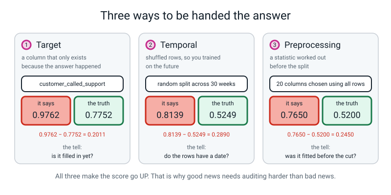
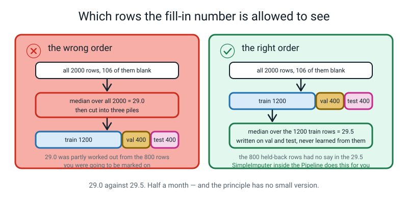
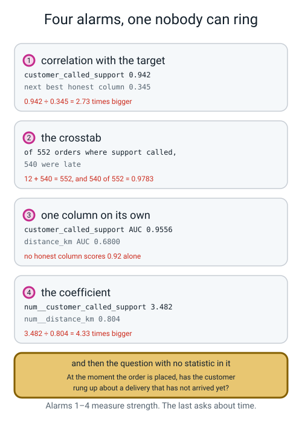
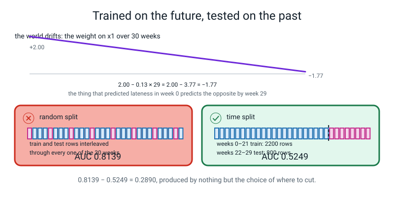
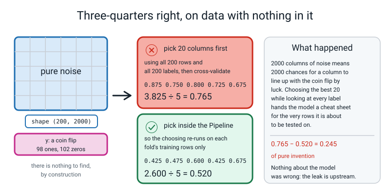
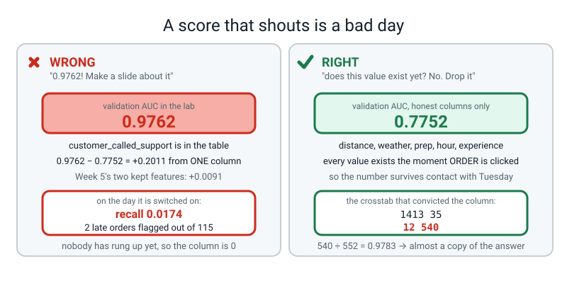
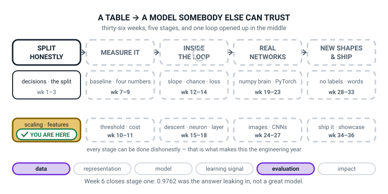
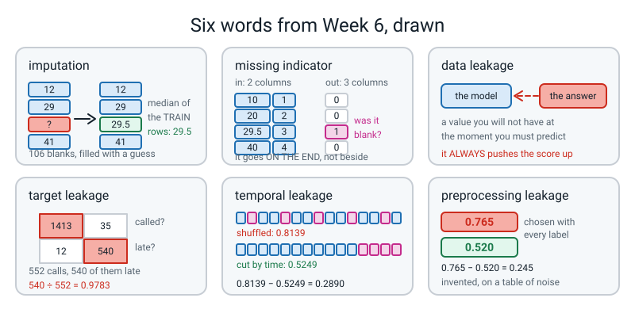

# Week 6 — The Answer Was in the Features

[⬅ Week 5](week-05.md) · [Course Home](../README.md) · [Next ➡](week-07.md) · [Workbook](../workbook/week-06.md)

---

> ### This week in one sentence
> **A suspiciously perfect score is almost never a great model — it is information leaking in that will not exist at the moment you actually have to predict — and because leakage always makes the number go *up*, it is the only kind of bug that gets applauded.**
>
> **By the end of this chapter you will be able to:**
> - **Impute missing values with a statistic learned from the training rows only**, and add an indicator column marking where the blank was
> - **Name the three flavours of leakage** — target, temporal, preprocessing — and **give the tell for each**
> - **Produce a 76.5% accuracy score on data that is literally random noise**, and explain in your own words how it happened
> - **Fix all three leaks and report the honest number beside the fake one** for each
>
> **New maths:** none new. Today re-uses the **median** you met in Level 2 and the subtraction of two scores from Week 5. One median gets worked out by hand on 1,140 numbers, by counting to the middle.
>
> **New syntax:** `SimpleImputer(strategy="median")` · `add_indicator=True` · `pipe.named_steps["prep"]`
>
> **Reading time:** about 45 minutes. **Homework:** about 60 minutes. **This is the week you learn to distrust a good number, and it is genuinely harder than it sounds.**

---

## 🪝 Start Here

Two numbers on the board, and nothing else:

```text
Week 5's best honest score:   0.7843
This week's model:            0.9762
```

**Nineteen points better than everything you did last week put together.** Feel pleased for a moment. It is a real number, from a real model, fitted on your delivery table.

Now a story.

**A hospital built a model to predict which patients would end up needing intensive care.** It scored brilliantly. Better than the doctors. Everybody was delighted and somebody made a slide about it.

Then one person asked a boring question: **which column is the model leaning on hardest?** And the answer was a column recording **which ward the patient had been moved to.** Patients who were moved to the intensive-care ward needed intensive care.

**The model had not learnt medicine. It had learnt to read a form that only gets filled in *after* the decision has already been made.**

That failure has a name.

> **data leakage** — when a column contains information that would not be available at the moment you actually have to make the prediction.

**And here is the property that makes leakage genuinely dangerous: it always makes your score go up.**

Always. Which makes it **the only kind of bug that gets applauded.** A bug that makes your number worse gets fixed on Tuesday afternoon, because somebody is annoyed about it. **A bug that makes your number better gets a presentation and six months in production being wrong.**


*Figure 6.1 — Three ways to be handed the answer. Three different bugs, three different tells, and all three push the number in the same flattering direction.*

**So from today the rule changes.**

> **Good news gets audited harder than bad news.**

🍕 **The analogy.** You are given a test paper and told to predict the answers. Somebody has helpfully written the answers in pencil at the bottom of the page. You score 100%. **You did not learn the subject and you will find that out in the exam hall**, where the pencil marks are not there. The hospital's ward column was pencil marks. So is the column hiding in that 0.9762.

**Nobody in the hospital story cheated.** Somebody joined two tables, the join was correct, the column was real, every value in it was true, and the whole thing was reasonable at every single step. **Leakage is a design accident, not dishonesty** — which is exactly why you need audits that run whether or not you suspect anything.

---

## 🧠 The Big Idea

> **📌 About the code in this section.** The blocks below are **illustrations, not files**. Each carries on from the one above. **The complete runnable files are in 💻 Type This.**

### 1. First, a small job you have been ignoring for five weeks: the 106 blanks

The `driver_experience_months` column has holes in it — **106 of them, out of 2,000 rows.** You have never done anything about that, because a machine has been quietly patching them inside your `Pipeline` since Week 3. **Today you look at what it actually put there.**

> **imputation** — filling a blank with a number worked out from the rows you are allowed to look at.

You have three options and only one of them is good.

| Option | What it does | Why not |
|---|---|---|
| Delete the rows with blanks | 2,000 rows becomes 1,894 | You threw away 106 rows of evidence to fix one column. **And if blanks are commoner among brand-new drivers, you have just deleted all the new drivers**, and your model has never met one |
| Fill with **0** | *"this driver has zero months of experience"* | **That is a lie the model will believe.** Zero is not "unknown", it is "brand new", and it is the worst possible guess |
| Fill with the **median** of the training rows | *"assume they are a typical driver until told otherwise"* | ✅ **This one.** It is still a guess, but it is the least wrong guess and it does not invent an extreme |

**Why the median and not the mean?** Because the median cannot be dragged by one silly value. **You proved this to yourself in Week 4** on the list `2, 4, 6, 8, 100`: the mean is 24, the median is 6, and 6 is the honest description of that list. Same reasoning here.

> **🔢 The maths, slowly:** the median is *the middle number when you line them all up.* In the 1,200 training rows, 60 are blank, so **1,140 have a value.** 1,140 is an even number, so there is no single middle one — the two middle ones are number **570** and number **571** in the sorted line. Number 570 is **29**. Number 571 is **30**. Halfway between them is **(29 + 30) ÷ 2 = 29.5**. That is where the 29.5 comes from, and you can say every step of that out loud without a calculator.

**And now the question that matters, which is Week 2's rule wearing a new hat: which rows is the imputer allowed to look at?**

```text
median of ALL 2,000 rows   (1,894 have a value) : 29.0
median of the 1,200 TRAIN rows (1,140 have one) : 29.5
```

**They are different numbers.** And if you use 29.0, then the number written into your training data was **partly worked out from the 800 rows you were about to be marked on.** That is a leak. It is a very small leak, and this week you will measure exactly how small — **but it is the same shape of mistake as the huge ones.**


*Figure 6.2 — Which rows the fill-in number is allowed to see. Same 106 blanks, same median, two different answers — 29.0 and 29.5 — depending only on when you cut.*

**And the bonus column.** Sometimes *being blank is itself a fact about the row.* If the paperwork is worse for brand-new drivers, then "this field is empty" is a clue — and filling in 29.5 destroys it. So you keep the clue:

> **missing indicator** — an extra 0/1 column recording *"the original value here was blank"*, kept alongside the filled-in value.

`add_indicator=True` builds it for you. **But it is a hypothesis, not a gift** — and Week 5 taught you exactly what to do with a hypothesis. **Ablate it.**

```text
add_indicator=False cols= 20  accuracy=0.7600  roc_auc=0.7752
add_indicator=True  cols= 21  accuracy=0.7550  roc_auc=0.7723
```

```text
0.7723 − 0.7752 = −0.0029
```

**Worse. So it goes.** Last week's rule survives contact with a new tool: **a column earns its place or it leaves, and a shiny new setting does not get an exemption.**

Why didn't it pay? Because `make_data.py` chose the blanks with a coin flip — **you can read the line that does it.** There is no hidden story about rookie drivers to find. The 60 blank training rows *do* look less late (0.15 against 0.2947), but 60 rows is nine late deliveries. **That gap is noise wearing a costume.**

### 2. Flavour 1 — target leakage, the loud one

> **target leakage** — a column that only exists, or only gets filled in, *because* the outcome already happened.

Our poisoned column is `customer_called_support`: **did this customer ring up to complain?**

It arrives from another database, joined on by order ID, and it looks exactly like a normal column. **It is not.** A customer rings up to complain *after* the pizza turns up late. **At the moment you need the prediction — the moment somebody clicks ORDER — that column is empty for every row, for ever.**

Here is what it does to the score:

```text
with customer_called_support     accuracy=0.9700  roc_auc=0.9762
without it                       accuracy=0.7600  roc_auc=0.7752
the jump one column bought       +0.2011
```

**+0.2011 of AUC from one column.** Last week's two surviving features (`is_rush` and `min_per_km`) bought **+0.0091** between them. **That ratio — twenty-two to one — is the alarm.** Real features arrive in units of 0.005. **A single column worth 0.2 is not a discovery.**

**Four audits catch it, each louder than the last** — and then a fifth thing which is not an audit at all.


*Figure 6.3 — Four alarms, and the one no computer can ring. The first four are arithmetic. The fifth is a question about the world, and it is the one that actually settles it.*

**Audit 1 — how strongly does each column move with the answer?** `customer_called_support` scores **0.942**. The best honest column, `distance_km`, scores **0.345**.

```text
0.942 ÷ 0.345 = 2.73 times bigger
```

**Nothing honest in a real table moves 0.94 with the thing you are trying to predict.** If it did, nobody would need a model.

**Audit 2 — count it against the answer.** One line of code, four seconds, and it is the fastest audit there is:

```text
late                        0    1
customer_called_support           
0                        1413   35
1                          12  540
```

**Read the bottom row: 552 orders had a support call, and 540 of them were late.**

```text
12 + 540 = 552
540 ÷ 552 = 0.9783
```

**The table is nearly diagonal. The column is almost a photocopy of the answer.**

**Audit 3 — how well does the column do all on its own?** Rank the validation rows by that one column's raw values alone, with no model at all, and measure the AUC of that ranking:

```text
customer_called_support    AUC 0.9556
distance_km                AUC 0.6800
prep_minutes               AUC 0.5739
```

**One column reaching 0.9556 by itself is not a feature. It is a label with a different name on it.**

**Audit 4 — which knob is the model actually turning?**

```text
num__customer_called_support    3.482
num__distance_km                0.804
```

```text
3.482 ÷ 0.804 = 4.33 times bigger than the next thing
```

**The model has stopped modelling and started reading.**

**And then the fifth thing, which is not a statistic:**

> **🧑‍🏫 The one question to keep asking all year:** ***"At the moment I need the prediction, does this value exist?"***

For `customer_called_support` the answer is **no**, and that single question is worth more than all four audits together. **It needs no data, no code and no maths.**

**Want to see what the 0.9762 was actually worth? Watch the model on the day it is switched on**, when its column is 0 for every new order because nobody has rung up yet:

```text
--- in the lab, where the column is filled in ---
accuracy 0.9700   recall 0.9217   roc_auc 0.9762

--- in production, where nobody has rung up yet, so it is always 0 ---
accuracy 0.7175   recall 0.0174   roc_auc 0.7924
late orders in these 400 rows: 115    late orders it flagged: 2
```

**In the lab it catches 92% of the late deliveries. In production it catches 2 out of 115.**

*(`recall` here just means "the fraction of the late ones it caught". It gets a proper name and a proper lesson next week.)*

### 3. Flavour 2 — temporal leakage, the sneaky one

> **temporal leakage** — shuffling rows across a time boundary, so the model trains on the future and is tested on the past.

**Here is what makes this one different from flavour 1: there is no bad column anywhere.** Every column is honest, every value is true. **The bug is a single call to `train_test_split` that looks exactly like the right thing to do.**

`train_test_split` shuffles. That is normally a good thing — Week 2 spent a whole lesson on why. **But if your rows have a *time* in them, and you will use the model *forward* in time, shuffling puts next month's rows into the training pile and the model gets to see the future.**

To make this visible we build a small world where the rules **drift**. Thirty weeks, 100 orders a week, two features. Feature `x1` starts out mattering enormously and slowly stops mattering:

```text
how much x1 matters, week by week:
  week  0 : 2.0
  week 15 : 0.05
  week 29 : -1.77
```

That is `2.0 − 0.13 × week`, and you can check any row of it on paper:

```text
2.0 − 0.13 × 0  = 2.0
2.0 − 0.13 × 15 = 2.0 − 1.95 = 0.05
2.0 − 0.13 × 29 = 2.0 − 3.77 = −1.77
```

**By week 29 the feature has not merely stopped mattering — it has reversed**, and a model trained on a shuffled mixture of all thirty weeks has no way to express that.

Now split the same 3,000 rows two ways:

```text
rows in the random split : 2250 train, 750 test
rows in the time split   : 2200 train, 800 test

RANDOM split AUC  0.8139   <- what you would report
TIME   split AUC  0.5249   <- what production will give you
the gap           0.2890
```

**0.2890 of AUC, produced by nothing except where you put the scissors.** Same rows. Same features. Same model. **The random split reports a good model. The time split reports a coin flip** — and the time split is the one that matches how the thing will actually be used: **trained on the past, run on the future.**


*Figure 6.4 — Trained on the future, tested on the past. The random split's train and test rows are interleaved through all 30 weeks, so the model has already seen the weeks it is marked on.*

**The tell:** *do the rows have a date, an order number, or anything else that says when they happened?* If yes, **and** you will deploy forward in time, **split by time.**

> **⚠️ Watch out:** the delivery table does **not** drift. `make_data.py` uses the same rule for row 1 and row 2000, so a random split is genuinely fine there. **This flavour needed its own little dataset**, and that is not a cheat — it is the only way to show a bug our main table cannot have. **Real tables usually can.**

### 4. Flavour 3 — preprocessing leakage, the quiet one

> **preprocessing leakage** — any statistic worked out over all the data *before* the split: a scaler's mean, an imputer's median, a feature selector's ranking.

**This is the one that sounds harmless. Surely a median is just a median?** So here are two demonstrations, and **the contrast between them is the lesson.**

**Demonstration A — on our delivery table, it is worth nothing measurable.**

```text
median used by the wrong version : 29.0
WRONG - filled in before splitting           roc_auc=0.7751
RIGHT - imputer inside the Pipeline          roc_auc=0.7752
difference                                   -0.0000
```

**One ten-thousandth, in the wrong direction.** You could never find this bug by looking at your score. **Which is exactly why it survives in real code for years.**

**Demonstration B — the identical bug, at full strength, on data with nothing in it at all.**

Generate **200 rows and 2,000 columns of pure random noise**, and a label that is a coin flip. **There is no relationship between X and y, by construction** — both were built out of a random number generator and never allowed to meet. **Any honest method must score about 50%.**

Then commit the bug: **pick the 20 columns that look most related to the answer, using all 200 rows and all 200 labels**, and only *then* measure.

```text
WRONG - 20 columns chosen while looking at every label
  five scores: [0.875 0.75  0.8   0.725 0.675]
  their total: 3.825   divided by 5: 0.765

RIGHT - the choosing is inside the Pipeline
  five scores: [0.425 0.475 0.6   0.425 0.675]
  their total: 2.600   divided by 5: 0.520   <- the truth
```

**76.5% accuracy on a table containing no information whatsoever.**

**Here is why, and it is the most important paragraph in the chapter.** 2,000 columns of noise means **2,000 chances for a column to line up with a coin flip by luck.** Some of them will, beautifully — **that is what 2,000 tries buys you**, and it has nothing to do with the data meaning anything. Choosing the best 20 *while looking at every single label* hands the model **a cheat sheet for the very rows it is about to be marked on.**

**Nothing about the model was wrong. The leak was upstream of it.**


*Figure 6.5 — Three-quarters right, on data with nothing in it. 0.765 − 0.520 = 0.245 of pure invention, and there was nothing in the table to find.*

**And now look at what fixes it, because this is the deepest point of Term 1.** One line moved. The choosing goes **inside** the `Pipeline`, so it only ever sees the training rows of each fold.

**Not "be more careful." Move the line, and the bug becomes impossible to write.**

> **That is what a `Pipeline` is actually for, and it took you six weeks to find out.** You do not defend against this class of bug by having a watchful eye. You defend against it by **using a structure in which the bug cannot be expressed.**

### 5. Three flavours, three tells — the summary to memorise

| Flavour | What goes wrong | Where the bug is | The tell |
|---|---|---|---|
| **target** | a column that only exists because the outcome happened | **in a column** | *"Is it filled in yet?"* |
| **temporal** | shuffling rows across a time boundary | **in how you cut** | *"Do the rows have a date?"* |
| **preprocessing** | a statistic worked out before the split | **in how you cut** | *"Was it fitted before the cut?"* |

**And the property all three share, which is the reason this chapter exists: every one of them makes your score go up.**

---

## 🔁 The Idea From Last Week, Used Harder

There is no new maths this week. Instead, **the ablation from Week 5 gets pointed at a completely different kind of question.**

Last week an ablation answered *"is this feature worth a column?"* — and the deltas were tiny: +0.0074, +0.0018, −0.0014. This week the same two-line habit answers *"is this number a lie?"* — and the deltas are enormous.

**Put all six numbers of this week side by side and the whole chapter fits on one page:**

| Flavour | fake score | honest score | the subtraction |
|---|---|---|---|
| **target** | **0.9762** | **0.7752** | 0.9762 − 0.7752 = **0.2011** |
| **temporal** | **0.8139** | **0.5249** | 0.8139 − 0.5249 = **0.2890** |
| **preprocessing** | **0.765** | **0.520** | 0.765 − 0.520 = **0.245** |

**Three subtractions. Three lies, each about a fifth to a third of a whole score.** And here is the number to put beside them, from last week's honest work:

```text
the two honest features that survived last week, together:      +0.0091
one leaky column:                                                +0.2011
```

**Twenty-two times as much, from one column, in four seconds.**

> **⚠️ Watch out:** this is now a *number* you can use as an alarm, and you should. **When a single change moves your score by more than about 0.05, stop and audit before you celebrate.** Real features do not do that. Real features arrive in units of 0.005, and you spent last week learning to be pleased about 0.0018.

**One more piece of last week's habit gets re-used, and this is the bit that shows you understood it.** The missing indicator is a **new tool**. It came with a shiny setting. It sounded obviously sensible — *"surely knowing the value was blank tells you something?"* And the ablation said:

```text
0.7723 − 0.7752 = −0.0029
```

**Delete it.** Write the number down. **The rule does not have an exception for tools you just learned.**

> **🔢 The maths, slowly:** `0.7723 − 0.7752`. Line the decimals up. 0.7723 is the smaller number, so the answer is negative. `0.7752 − 0.7723 = 0.0029`, so the delta is **−0.0029**. And the honest caveat, exactly as you learned to write it last week: −0.0029 measured on 400 validation rows is inside the wobble of a 400-row measurement, so **retest with cross-validation in Week 11 before calling it settled.**

---

## 💻 Type This

Five short scripts. **Every one of them runs in about one second.** If anything runs for a minute, something else is wrong. **Nothing downloads.**

You will need `make_data.py` from Week 1, unchanged, and one supplied file called `support_calls.py`. **Do not open `support_calls.py` until after the Crime Scene** — three lines of it give the whole thing away.

### Step 1 — count the holes, and find the two candidate numbers

Create `fill_blanks.py`:

```python
"""fill_blanks.py - filling in the 106 holes, and marking where they were."""
import pandas as pd
from sklearn.impute import SimpleImputer
from sklearn.model_selection import train_test_split
from make_data import make_deliveries

RS = 42
NUM = ["distance_km", "items", "prep_minutes", "order_hour",
       "driver_experience_months"]

df = make_deliveries(n=2000, seed=0).drop_duplicates().reset_index(drop=True)
y = df["late"]
X = df.drop(columns=["late", "order_id"])
X_tmp, X_te, y_tmp, y_te = train_test_split(
    X, y, test_size=.20, random_state=RS, stratify=y)
X_tr, X_va, y_tr, y_va = train_test_split(
    X_tmp, y_tmp, test_size=.25, random_state=RS, stratify=y_tmp)

print("blanks in the whole table :", int(X["driver_experience_months"].isna().sum()))
print("blanks in the 1200 train  :", int(X_tr["driver_experience_months"].isna().sum()))
print("blanks in the  400 val    :", int(X_va["driver_experience_months"].isna().sum()))
print("blanks in the  400 test   :", int(X_te["driver_experience_months"].isna().sum()))
print("median of the WHOLE table :", X["driver_experience_months"].median())
print("median of the TRAIN rows  :", X_tr["driver_experience_months"].median())
```

**Before running: 106 blanks altogether. Roughly how many land in the 1,200 training rows?** (1,200 is 60% of 2,000, so about 60.)

```text
blanks in the whole table : 106
blanks in the 1200 train  : 60
blanks in the  400 val    : 25
blanks in the  400 test   : 21
median of the WHOLE table : 29.0
median of the TRAIN rows  : 29.5
```

**Check the arithmetic: 60 + 25 + 21 = 106.** ✅ Every blank accounted for.

**And there are your two candidate numbers — 29.0 and 29.5 — and you already know which one you are allowed.**

### Step 2 — 🐞 the first mistake, and it shouts

Skip the imputer entirely. Hand the raw columns straight to the model — it is a computer, surely it can cope with a blank:

```python
from sklearn.linear_model import LogisticRegression
LogisticRegression(max_iter=2000).fit(df[NUM], df["late"])
```

```text
ValueError: Input X contains NaN.
LogisticRegression does not accept missing values encoded as NaN natively. For supervised learning, you might want to consider sklearn.ensemble.HistGradientBoostingClassifier and Regressor which accept missing values encoded as NaNs natively. Alternatively, it is possible to preprocess the data, for instance by using an imputer transformer in a pipeline or drop samples with missing values. See https://scikit-learn.org/stable/modules/impute.html You can find a list of all estimators that handle NaN values at the following page: https://scikit-learn.org/stable/modules/impute.html#estimators-that-handle-nan-values
```

**`NaN`** is how a computer writes *"not a number"* — it is what a blank looks like from the inside.

**And read to the end of that message, because it is unusually generous:** *"it is possible to preprocess the data, for instance by using an imputer transformer in a pipeline."* **The error message contains the fix.** That happens more often than people expect, and most people never read far enough to find out.

### Step 3 — the imputer, and the five numbers it learns

```python
imp = SimpleImputer(strategy="median")
imp.fit(X_tr[NUM])
print("statistics_ :", imp.statistics_)
```

`SimpleImputer` is a small machine with two buttons. `.fit` looks at each column and works out **one number** for it — with `strategy="median"`, the middle value — and remembers it. `.transform` writes that remembered number into every blank.

```text
statistics_ : [ 2.91  4.   14.   18.   29.5 ]
```

**Five numbers, one per column, in the order you listed them.** Distance 2.91 km. Items 4. Prep 14.0 minutes. Hour 18. Experience **29.5** — the training median, and nothing else.

**And the trailing underscore on `statistics_` means the same thing it meant last week: I learnt this from data.** Nothing in scikit-learn ending in `_` exists before you call `.fit`.

> **💡 Try this:** ask for `imp.statistics_` *before* you call `.fit`. You get `AttributeError: 'SimpleImputer' object has no attribute 'statistics_'`, which is the library telling you, precisely, *"I have not looked at any data yet."*

### Step 4 — is being blank itself a signal? Ablate it and find out

```python
blank = X_tr["driver_experience_months"].isna()
print("late rate, rows with a value :", round(y_tr[~blank].mean(), 4))
print("late rate, rows that are blank:", round(y_tr[blank].mean(), 4))
```

The `~` means **not** — so `y_tr[~blank]` is "the labels for the rows that were *not* blank".

```text
late rate, rows with a value : 0.2947
late rate, rows that are blank: 0.15
```

**A gap of 0.1447, which looks big.** So build the indicator and ablate it, exactly the way you learned last week:

```python
def build(indicator):
    pre = ColumnTransformer([
        ("num", Pipeline([("impute", SimpleImputer(strategy="median",
                                                   add_indicator=indicator)),
                          ("scale", StandardScaler())]), NUM),
        ("cat", OneHotEncoder(handle_unknown="ignore", sparse_output=False), CAT)])
    return Pipeline([("prep", pre),
                     ("model", LogisticRegression(max_iter=2000, random_state=RS))])
```

```text
add_indicator=False cols= 20  accuracy=0.7600  roc_auc=0.7752
add_indicator=True  cols= 21  accuracy=0.7550  roc_auc=0.7723
```

**Subtract.** `0.7723 − 0.7752 = −0.0029`. **Worse. So it goes.**

Five numeric columns in, six out — one indicator for the one column that had blanks, and it goes **on the end**, after all the original ones, not next to the column it describes. That surprises people and it matters when you are counting columns: **5 numeric + 15 one-hot = 20 without it, 21 with.**

```python
names = pipe.named_steps["prep"].get_feature_names_out()
print("the new column is called:", names[5])
co = pd.Series(pipe.named_steps["model"].coef_[0], index=names)
print("its weight:", round(co[names[5]], 4))
```

```text
the new column is called: num__missingindicator_driver_experience_months
its weight: -0.1609
```

**So why didn't it pay, when the two lateness rates looked so different?** Because 60 rows is nine late deliveries. **The gap of 0.1447 came from nine events.** And because `make_data.py` chose the blanks with a coin flip — you can read the line. **There is no story about rookie drivers hiding in there to find.**

### Step 5 — reaching inside a pipeline, which is a chain of names

```python
prep = pipe.named_steps["prep"]
print("its branches:", list(prep.named_transformers_.keys()))
imp = prep.named_transformers_["num"].named_steps["impute"]
print("what the imputer learned:", imp.statistics_)
```

```text
its branches: ['num', 'cat']
what the imputer learned: [ 2.91  4.   14.   18.   29.5 ]
```

A `Pipeline` is a list of **named** stages. `named_steps` is the way in: hand it the name you gave a stage and it hands back the actual fitted object, so you can interrogate it. **The name must match exactly** — `"pre"` when you wrote `"prep"` gives `KeyError: 'pre'`.

**And here is the warning that saves ten minutes.** `named_steps["prep"]` is a `ColumnTransformer`, not an imputer — it is the thing that *contains* the imputer. So it has no `.statistics_` of its own. To reach the imputer you go one more step in.

**Read that chain out loud as an address:** *the pipeline's `prep` stage, its `num` branch, that branch's `impute` step, and what it learned.* It is long, and it is just a path through a nest of boxes.

### Step 6 — 🐞 the second mistake, and it says nothing at all

Now let us be helpful and tidy. **Fill the blanks in properly at the top of the script, before we split, so the data is clean before anything touches it.** That is how you would do it by hand.

New file, `silent.py`. It has a `score(df, label)` function in it that does the whole three-pile split, the `ColumnTransformer` and the fit — exactly the pipeline you already have — and prints one AUC. Then it calls that function twice, on two versions of the table:

```python
raw = make_deliveries(n=2000, seed=0).drop_duplicates().reset_index(drop=True)

# WRONG: fill the blanks with the median of the WHOLE table, before splitting
pre_filled = raw.copy()
whole_median = pre_filled["driver_experience_months"].median()
pre_filled["driver_experience_months"] = \
    pre_filled["driver_experience_months"].fillna(whole_median)
print("median used by the wrong version :", whole_median)
bad = score(pre_filled, "WRONG - filled in before splitting")

# RIGHT: the imputer lives inside the Pipeline and is fitted on train rows only
good = score(raw, "RIGHT - imputer inside the Pipeline")
print(f"{'difference':<44s} {bad - good:+.4f}")
```

`.fillna(n)` writes `n` into every blank in a column, straight away, with no learning and no remembering. **That is the whole bug: it is doing by hand, before the split, what the imputer does inside the pipeline, after it.**

**What breaks? Write your answer down.** Most people write "nothing".

```text
median used by the wrong version : 29.0
WRONG - filled in before splitting           roc_auc=0.7751
RIGHT - imputer inside the Pipeline          roc_auc=0.7752
difference                                   -0.0000
```

**No error. No warning. And the score is the same to three decimal places.**

So it is fine? **No.** It is a leak — the 29.0 was partly worked out from the 800 rows you were going to be marked on — and it happens to be worth almost nothing on this table.

**Which is the worst possible combination.** A bug that shouts is a good day. A bug that changes your score by **minus nought-point-nought-nought-nought-nought** is a bug that lives in your code for three years.

> **⚠️ Watch out:** **you cannot catch this one by looking at your score.** You catch it by looking at *where the statistic was computed.* And in about five minutes you will see the identical mistake being worth twenty-four percentage points.

### Step 7 — the four audits, on the mystery model

`leak_hunt.py` fits the same pipeline twice — once with `customer_called_support` in the column list, once without — and then runs the four audits.

**Before running: which of the twenty-one columns do you think is the problem? Write it down.**

```text
--- the two scores ---
with customer_called_support     accuracy=0.9700  roc_auc=0.9762
without it                       accuracy=0.7600  roc_auc=0.7752
the jump one column bought       +0.2011

--- audit 1: how strongly does each number move with late? ---
customer_called_support     0.942
distance_km                 0.345
driver_experience_months   -0.123
items                       0.106
prep_minutes                0.066
order_hour                  0.064

--- audit 2: the suspect, counted against the answer ---
late                        0    1
customer_called_support           
0                        1413   35
1                          12  540

--- audit 3: how well does each column do ON ITS OWN? ---
  customer_called_support    AUC 0.9556
  distance_km                AUC 0.6800
  prep_minutes               AUC 0.5739

--- audit 4: which knob is the model actually turning? ---
num__customer_called_support    3.482
num__distance_km                0.804
cat__restaurant_GreenLeaf      -0.744
cat__weather_clear             -0.679

--- the question no statistic can answer ---
At the moment the order is PLACED, has the customer already rung up
to complain about a delivery that has not arrived yet?   No.
VERDICT: target leakage. Drop the column.
```

**Read it one audit at a time, not all at once.**

**The jump: +0.2011 from one column**, against +0.0091 for last week's two surviving features together. **That ratio is the alarm.**

**Audit 1: 0.942 against 0.345.** Two point seven times the best honest column.

**Audit 2, the crosstab.** 552 calls, 540 of them late, `540 ÷ 552 = 0.9783`. **Nearly a photocopy of the answer.**

**Audit 3: 0.9556 alone.** One column, no help from anything else. `distance_km` alone gets 0.6800.

**Audit 4: 3.482 against 0.804.** `3.482 ÷ 0.804 = 4.33`. **The model has stopped modelling and started reading.**

**Now forget every one of those numbers and ask the question at the bottom.** *At the moment a customer places an order, has that customer already rung up to complain about a delivery that has not arrived yet?* **No.** That question needed no data, no code and no maths, and **it is worth more than all four audits together.**

### Step 8 — 76.5% on nothing at all

`noise_leak.py` is a **supplied file**. You run it, and then you change exactly one thing in it.

```python
"""noise_leak.py - three-quarters right, on data with nothing in it.

SUPPLIED FILE. You will change exactly one thing in it.
"""
import numpy as np
from sklearn.feature_selection import SelectKBest, f_classif
from sklearn.linear_model import LogisticRegression
from sklearn.model_selection import StratifiedKFold, cross_val_score
from sklearn.pipeline import Pipeline

rng = np.random.default_rng(0)
X = rng.normal(size=(200, 2000))     # 200 rows, 2000 columns of pure noise
y = rng.integers(0, 2, size=200)     # a coin flip. Nothing to do with X at all.

print("X shape:", X.shape)
print("y:", int(y.sum()), "ones and", int((y == 0).sum()), "zeros")
print("There is no relationship between X and y. There cannot be one.")

cv = StratifiedKFold(5, shuffle=True, random_state=0)

# WRONG: choose the 20 best-looking columns using ALL 200 rows and ALL 200 labels
X20 = SelectKBest(f_classif, k=20).fit_transform(X, y)
wrong = cross_val_score(LogisticRegression(max_iter=1000), X20, y, cv=cv)

# RIGHT: the choosing lives inside the Pipeline, so it re-runs on training rows only
pipe = Pipeline([("select", SelectKBest(f_classif, k=20)),
                 ("model", LogisticRegression(max_iter=1000))])
right = cross_val_score(pipe, X, y, cv=cv)

print()
print("WRONG - 20 columns chosen while looking at every label")
print("  five scores:", np.round(wrong, 3))
print(f"  their total: {wrong.sum():.3f}   divided by 5: {wrong.mean():.3f}")
print()
print("RIGHT - the choosing is inside the Pipeline")
print("  five scores:", np.round(right, 3))
print(f"  their total: {right.sum():.3f}   divided by 5: {right.mean():.3f}   <- the truth")
```

> **📌 Two things in that file are not on your ladder yet, and that is on purpose.** `SelectKBest` picks the columns that look most related to the answer — **and it appears here only as the thing that committed the crime, never as a tool.** `cross_val_score` splits the rows into five piles and scores five times instead of once, because a single score on 40 rows is not worth much. **That is genuinely all you need today. Week 11 is entirely about it.**

**Before running, answer this and mean it: there is nothing in that table. There cannot be anything in that table. So what should an honest method score?** (50%.)

**Real output. Runtime about 0.8 seconds.**

```text
X shape: (200, 2000)
y: 98 ones and 102 zeros
There is no relationship between X and y. There cannot be one.

WRONG - 20 columns chosen while looking at every label
  five scores: [0.875 0.75  0.8   0.725 0.675]
  their total: 3.825   divided by 5: 0.765

RIGHT - the choosing is inside the Pipeline
  five scores: [0.425 0.475 0.6   0.425 0.675]
  their total: 2.600   divided by 5: 0.520   <- the truth
```

**Sit with 0.765 for thirty seconds before you read on.**

**Check every number.**

```text
0.875 + 0.750 + 0.800 + 0.725 + 0.675 = 3.825      3.825 ÷ 5 = 0.765
0.425 + 0.475 + 0.600 + 0.425 + 0.675 = 2.600      2.600 ÷ 5 = 0.520
0.765 − 0.520 = 0.245 of pure invention
98 + 102 = 200                                     ✅ the label really is a coin flip
```

**Seventy-six and a half per cent, on a table with nothing in it.**

**And the fix is one line moved.** The `SelectKBest` goes **inside** the `Pipeline`, so it only ever sees the training rows of each fold. **Not "be more careful." Move the line, and the bug becomes impossible to write.**

> **💡 Try this:** change `rng = np.random.default_rng(0)` to `default_rng(1)` and run it again. You get a **different** impossible number. Then change 2,000 columns to 50 and watch the fake score shrink — **fewer columns, fewer lucky coincidences.** Belief in this result has to be earned, and those two experiments are how you earn it.

### The complete `fill_blanks.py`

```python
"""fill_blanks.py - filling in the 106 holes, and marking where they were."""
import pandas as pd
from sklearn.compose import ColumnTransformer
from sklearn.impute import SimpleImputer
from sklearn.linear_model import LogisticRegression
from sklearn.metrics import accuracy_score, roc_auc_score
from sklearn.model_selection import train_test_split
from sklearn.pipeline import Pipeline
from sklearn.preprocessing import OneHotEncoder, StandardScaler

from make_data import make_deliveries

RS = 42
NUM = ["distance_km", "items", "prep_minutes", "order_hour",
       "driver_experience_months"]
CAT = ["restaurant", "day_of_week", "weather"]

df = make_deliveries(n=2000, seed=0).drop_duplicates().reset_index(drop=True)
y = df["late"]
X = df.drop(columns=["late", "order_id"])
X_tmp, X_te, y_tmp, y_te = train_test_split(
    X, y, test_size=.20, random_state=RS, stratify=y)
X_tr, X_va, y_tr, y_va = train_test_split(
    X_tmp, y_tmp, test_size=.25, random_state=RS, stratify=y_tmp)

print("--- where the holes are ---")
print("blanks in the whole table :", int(X["driver_experience_months"].isna().sum()))
print("blanks in the 1200 train  :", int(X_tr["driver_experience_months"].isna().sum()))
print("blanks in the  400 val    :", int(X_va["driver_experience_months"].isna().sum()))
print("blanks in the  400 test   :", int(X_te["driver_experience_months"].isna().sum()))

print("\n--- two candidate fill-in numbers ---")
print("median of the WHOLE table :", X["driver_experience_months"].median())
print("median of the TRAIN rows  :", X_tr["driver_experience_months"].median())

print("\n--- what the imputer actually learned ---")
imp = SimpleImputer(strategy="median")
imp.fit(X_tr[NUM])
print("statistics_ :", imp.statistics_)

print("\n--- is being blank itself a signal? ---")
blank = X_tr["driver_experience_months"].isna()
print("late rate, rows with a value :", round(y_tr[~blank].mean(), 4))
print("late rate, rows that are blank:", round(y_tr[blank].mean(), 4))


def build(indicator):
    pre = ColumnTransformer([
        ("num", Pipeline([("impute", SimpleImputer(strategy="median",
                                                   add_indicator=indicator)),
                          ("scale", StandardScaler())]), NUM),
        ("cat", OneHotEncoder(handle_unknown="ignore", sparse_output=False), CAT)])
    return Pipeline([("prep", pre),
                     ("model", LogisticRegression(max_iter=2000, random_state=RS))])


print("\n--- with the indicator column, and without ---")
for indicator in (False, True):
    pipe = build(indicator).fit(X_tr, y_tr)
    prob = pipe.predict_proba(X_va)[:, 1]
    n_cols = len(pipe.named_steps["prep"].get_feature_names_out())
    print(f"add_indicator={str(indicator):<5s} cols={n_cols:>3d}"
          f"  accuracy={accuracy_score(y_va, (prob >= .5).astype(int)):.4f}"
          f"  roc_auc={roc_auc_score(y_va, prob):.4f}")

pipe = build(True).fit(X_tr, y_tr)
names = pipe.named_steps["prep"].get_feature_names_out()
print("\nthe new column is called:", names[5])
co = pd.Series(pipe.named_steps["model"].coef_[0], index=names)
print("its weight:", round(co[names[5]], 4))
```

**Real output. Runtime about 0.8 seconds.**

```text
--- where the holes are ---
blanks in the whole table : 106
blanks in the 1200 train  : 60
blanks in the  400 val    : 25
blanks in the  400 test   : 21

--- two candidate fill-in numbers ---
median of the WHOLE table : 29.0
median of the TRAIN rows  : 29.5

--- what the imputer actually learned ---
statistics_ : [ 2.91  4.   14.   18.   29.5 ]

--- is being blank itself a signal? ---
late rate, rows with a value : 0.2947
late rate, rows that are blank: 0.15

--- with the indicator column, and without ---
add_indicator=False cols= 20  accuracy=0.7600  roc_auc=0.7752
add_indicator=True  cols= 21  accuracy=0.7550  roc_auc=0.7723

the new column is called: num__missingindicator_driver_experience_months
its weight: -0.1609
```

---

## 🔍 Worked Examples

### Worked Example 1 — The 0.9762 Crime Scene (the class activity)

You are handed four lines of output and twelve minutes. **No hints.**

```text
columns going into the model: 21
validation accuracy : 0.9700
validation roc_auc  : 0.9762
Week 5's best honest score was 0.7843.  Congratulations?
```

**Write down every check you run, including the ones that lead nowhere.** The sheet is the deliverable, not the answer.

**Here is the route that works, in seven steps you can follow yourself.**

**Step 1 — print the twenty-one column names and read every one out loud.** That is it. That is the fastest audit there is and it needs no maths. One of the names is `customer_called_support`, and if you spot it here you have a **suspect**. You do not have a **conviction** — for that you need a number.

**Step 2 — the crosstab.** One line:

```python
print(pd.crosstab(df["customer_called_support"], df["late"]))
```

```text
late                        0    1
customer_called_support           
0                        1413   35
1                          12  540
```

**Read the bottom row and do the arithmetic:** `12 + 540 = 552` orders had a support call, and `540 ÷ 552 = 0.9783` of them were late. **The two big numbers sit on one diagonal and the other two are tiny. That is what "nearly the same column" looks like.**

**Step 3 — check the top row too**, because it is just as damning: 1,413 orders had no call and were not late, and only 35 orders were late without a call. **The column agrees with the answer 1,953 times out of 2,000.**

**Step 4 — the ablation, which is Week 5's tool pointed at a new question.** Fit twice, with and without:

```text
with it     roc_auc=0.9762
without it  roc_auc=0.7752
            +0.2011
```

**Step 5 — put that delta next to last week's.** Two surviving honest features, +0.0091 between them. One column, +0.2011. **Twenty-two times as much.**

**Step 6 — the coefficients.** `3.482` for the suspect, `0.804` for the next biggest. `3.482 ÷ 0.804 = 4.33`.

**Step 7 — and the step that actually settles it. Ask when the value appears.**

```text
the moment I need the prediction : a customer has just clicked ORDER
the moment the column gets a value : the pizza has arrived late AND the
                                     customer has rung up to complain
```

**Those two moments are an hour apart, and the model is being trained as though they were the same moment.**

**VERDICT: target leakage. Drop the column.**

> **🧑‍🏫 If a student asks:** *"couldn't we keep it and just use it for the orders where somebody has called?"* This is a genuinely good idea and the reasoning kills it cleanly: **by the time somebody has rung up to complain, you no longer need a prediction. You know.** The whole point of the model is to warn the kitchen *before* the delivery is late. **A feature that only exists afterwards is a very expensive `if` statement that reads the answer.**

**Dead ends that should go on your sheet and earn credit:** blaming `max_iter`; blaming the scaler; suspecting `order_hour`; checking for duplicate rows (there are none after `drop_duplicates()`); checking whether the split was stratified (it was). **A sheet with three dead ends and one hit is a better sheet than one with a lucky guess.**

### Worked Example 2 — The same leak, in a hospital

Same four audits, completely different stakes. `load_breast_cancer` ships inside scikit-learn — 569 tumour scans, 30 measurements each — and **nothing downloads.** We flip the label so `1 = malignant`, the thing we are hunting.

Then we poison it, the way real tables get poisoned: **a column joined on from the scheduling system, recording whether a biopsy has been booked.**

```python
"""w6we2.py - the same leak, in a hospital."""
import numpy as np
import pandas as pd
from sklearn.datasets import load_breast_cancer
from sklearn.linear_model import LogisticRegression
from sklearn.metrics import recall_score, roc_auc_score
from sklearn.model_selection import train_test_split
from sklearn.pipeline import Pipeline
from sklearn.preprocessing import StandardScaler

data = load_breast_cancer(as_frame=True)
df = data.frame.copy()
df["malignant"] = 1 - df["target"]
df = df.drop(columns=["target"])

# The poisoned column, joined on from the scheduling system.
rng = np.random.default_rng(0)
u = rng.random(len(df))
df["biopsy_booked"] = np.where(df["malignant"] == 1, u < 0.92, u < 0.03).astype(int)

# recall_score is two weeks early on purpose: it is "of the people who really
# were ill, what fraction did we catch?" — one division, and Week 8 does it properly.
GOOD = ["mean texture", "mean smoothness", "mean symmetry"]
POISONED = GOOD + ["biopsy_booked"]
print("rows:", len(df), " malignant:", int(df["malignant"].sum()))

X_tr, X_va, y_tr, y_va = train_test_split(
    df, df["malignant"], test_size=.30, random_state=0, stratify=df["malignant"])
print("train", len(X_tr), " val", len(X_va), " malignant in val:", int(y_va.sum()))


def run(cols, label):
    pipe = Pipeline([("scale", StandardScaler()),
                     ("model", LogisticRegression(max_iter=5000, random_state=0))])
    pipe.fit(X_tr[cols], y_tr)
    prob = pipe.predict_proba(X_va[cols])[:, 1]
    pred = (prob >= .5).astype(int)
    print(f"{label:<28s} roc_auc={roc_auc_score(y_va, prob):.4f}"
          f"  recall={recall_score(y_va, pred):.4f}")
    return pipe, roc_auc_score(y_va, prob)

print("\n--- the two scores ---")
bad, bad_auc = run(POISONED, "with biopsy_booked")
good, good_auc = run(GOOD, "without it")
print(f"{'the jump one column bought':<28s} {bad_auc - good_auc:+.4f}")

print("\n--- audit 1: correlation with the answer ---")
corr = df[POISONED + ["malignant"]].corr()["malignant"].drop("malignant")
print(corr.reindex(corr.abs().sort_values(ascending=False).index).round(3).to_string())

print("\n--- audit 2: the crosstab ---")
print(pd.crosstab(df["biopsy_booked"], df["malignant"]).to_string())

print("\n--- audit 3: the column on its own, on the validation rows ---")
print("biopsy_booked alone   AUC %.4f" % roc_auc_score(y_va, X_va["biopsy_booked"]))
print("mean texture alone    AUC %.4f" % roc_auc_score(y_va, X_va["mean texture"]))

print("\n--- audit 4: the weights ---")
co = pd.Series(bad.named_steps["model"].coef_[0], index=POISONED)
print(co.reindex(co.abs().sort_values(ascending=False).index).round(3).to_string())

print("\n--- and the day it is switched on: nobody has booked a biopsy yet ---")
live = X_va.copy()
live["biopsy_booked"] = 0
prob = bad.predict_proba(live[POISONED])[:, 1]
pred = (prob >= .5).astype(int)
print("roc_auc %.4f   recall %.4f" % (roc_auc_score(y_va, prob), recall_score(y_va, pred)))
print("malignant tumours in these", len(y_va), "scans:", int(y_va.sum()),
      "  flagged:", int(((pred == 1) & (y_va == 1)).sum()))
```

Three things to notice about how the poison was made, because it is deliberately realistic. `1 - df["target"]` flips the label so `1 = malignant`, the thing we are hunting. `np.where(condition, a, b)` means *"a where the condition is true, b where it is false"* — so a malignant scan gets a biopsy booked 92% of the time and a benign one 3% of the time. **And `GOOD` deliberately uses three of the *weakest* measurements in the dataset**, because a hospital does not usually have four perfect columns lying around, and the leak has to have room to look impressive.

**Real output. Runtime about 1 second.**

```text
rows: 569  malignant: 212
train 398  val 171  malignant in val: 64

--- the two scores ---
with biopsy_booked           roc_auc=0.9537  recall=0.8750
without it                   roc_auc=0.7887  recall=0.5156
the jump one column bought   +0.1650

--- audit 1: correlation with the answer ---
biopsy_booked      0.864
mean texture       0.415
mean smoothness    0.359
mean symmetry      0.330

--- audit 2: the crosstab ---
malignant        0    1
biopsy_booked          
0              346   25
1               11  187

--- audit 3: the column on its own, on the validation rows ---
biopsy_booked alone   AUC 0.9235
mean texture alone    AUC 0.8104

--- audit 4: the weights ---
biopsy_booked      2.369
mean texture       1.097
mean smoothness    0.810
mean symmetry      0.118

--- and the day it is switched on: nobody has booked a biopsy yet ---
roc_auc 0.8064   recall 0.0625
malignant tumours in these 171 scans: 64   flagged: 4
```

**Work through all four audits and check the arithmetic yourself.**

**The jump:** `0.9537 − 0.7887 = 0.1650`. **A sixth of a whole score, from one column.**

**Audit 1:** `0.864 ÷ 0.415 = 2.08` times the best honest column.

**Audit 2, the crosstab:** `11 + 187 = 198` biopsies booked, and `187 ÷ 198 = 0.9444` of those patients had a malignant tumour. Nearly diagonal again.

**Audit 3:** the poisoned column alone gets **0.9235**, which is *better than the three honest columns put together* (0.7887).

**Audit 4:** `2.369 ÷ 1.097 = 2.16` times the next biggest weight.

**And then the question, in a hospital: at the moment the scan comes out of the machine, has a biopsy already been booked?** **No.** A biopsy gets booked *because* somebody read the scan and was worried.

**Now read the last two lines of that output and stop.**

```text
in the lab:        recall 0.8750
in production:     recall 0.0625
malignant tumours: 64        flagged: 4
```

**In the lab it flags 87.5% of the malignant tumours. On the day it is switched on it flags 4 out of 64.** Sixty women with a malignant tumour walk out of the clinic having been told, by a model with a validation AUC of 0.9537, that they are fine.

**That is what the 0.9537 was worth.** And notice which number told you the truth: not the AUC, which only fell to 0.8064, but the **recall**, which collapsed from 0.8750 to 0.0625. **A leaky column can go on looking respectable in one metric while being catastrophic in another** — which is a very good reason to keep more than one number, and it is next week's whole subject.

### Worked Example 3 — Eight pupils, two blanks, and two different fill-in numbers

The 1,140-number median is unpleasant to picture. Here is the identical arithmetic on **eight** numbers, small enough to do entirely in your head.

Eight pupils and how many hours of sleep they got. Two of them did not fill the form in. **The first five rows are the training pile; the last three are the validation pile.**

```python
"""w6we3.py - eight pupils, two blanks, and two different fill-in numbers."""
import numpy as np
import pandas as pd
from sklearn.impute import SimpleImputer

pupils = pd.DataFrame({
    "name":        ["Ada", "Ben", "Cleo", "Dev", "Eli", "Fay", "Gus", "Hana"],
    "sleep_hours": [5.0,   6.0,   np.nan, 7.0,  9.0,   np.nan, 12.0, 10.0],
    "pile":        ["train"] * 5 + ["val"] * 3,
})
print(pupils.to_string(index=False))

train = pupils[pupils["pile"] == "train"]
print("\n--- the number I am ALLOWED to learn: the train median ---")
present = sorted(train["sleep_hours"].dropna())
print("values present in train:", present, " that is", len(present), "numbers")
print("4 is even, so the two middles are number 2 and number 3:", present[1], "and", present[2])
print("(", present[1], "+", present[2], ") / 2 =", (present[1] + present[2]) / 2)

print("\n--- the number I am NOT allowed to learn: the whole-table median ---")
allp = sorted(pupils["sleep_hours"].dropna())
print("values present in the whole table:", allp, " that is", len(allp), "numbers")
print("6 is even, so the two middles are number 3 and number 4:", allp[2], "and", allp[3])
print("(", allp[2], "+", allp[3], ") / 2 =", (allp[2] + allp[3]) / 2)

print("\n--- what SimpleImputer learns from the train rows only ---")
imp = SimpleImputer(strategy="median")
imp.fit(train[["sleep_hours"]])
print("statistics_ :", imp.statistics_)
print("train rows, filled in :", imp.transform(train[["sleep_hours"]]).ravel())
val = pupils[pupils["pile"] == "val"]
print("val rows, filled in   :", imp.transform(val[["sleep_hours"]]).ravel())

print("\n--- and with the indicator column kept ---")
imp2 = SimpleImputer(strategy="median", add_indicator=True)
out = imp2.fit_transform(train[["sleep_hours"]])
print(out)
print("shape in:", train[["sleep_hours"]].shape, " shape out:", out.shape)
```

**Real output. Runtime instant.**

```text
name  sleep_hours  pile
 Ada          5.0 train
 Ben          6.0 train
Cleo          NaN train
 Dev          7.0 train
 Eli          9.0 train
 Fay          NaN   val
 Gus         12.0   val
Hana         10.0   val

--- the number I am ALLOWED to learn: the train median ---
values present in train: [5.0, 6.0, 7.0, 9.0]  that is 4 numbers
4 is even, so the two middles are number 2 and number 3: 6.0 and 7.0
( 6.0 + 7.0 ) / 2 = 6.5

--- the number I am NOT allowed to learn: the whole-table median ---
values present in the whole table: [5.0, 6.0, 7.0, 9.0, 10.0, 12.0]  that is 6 numbers
6 is even, so the two middles are number 3 and number 4: 7.0 and 9.0
( 7.0 + 9.0 ) / 2 = 8.0

--- what SimpleImputer learns from the train rows only ---
statistics_ : [6.5]
train rows, filled in : [5.  6.  6.5 7.  9. ]
val rows, filled in   : [ 6.5 12.  10. ]

--- and with the indicator column kept ---
[[5.  0. ]
 [6.  0. ]
 [6.5 1. ]
 [7.  0. ]
 [9.  0. ]]
shape in: (5, 1)  shape out: (5, 2)
```

**Do all of this in your head before you look at the output.**

**The train median.** Present values: 5, 6, 7, 9. Four numbers, so two middles: the 2nd and the 3rd, which are **6 and 7**. `(6 + 7) ÷ 2 =` **6.5.**

**The whole-table median.** Present values: 5, 6, 7, 9, 10, 12. Six numbers, so two middles: the 3rd and the 4th, which are **7 and 9**. `(7 + 9) ÷ 2 =` **8.0.**

**6.5 and 8.0. Those are different numbers, and the difference came entirely from Gus's 12 and Hana's 10 — two rows in the validation pile.**

**This is exactly the 29.5-against-29.0 situation from the delivery table, at a size where you can see the whole thing.** Use 8.0 and you have written a number into Cleo's row that was **partly computed from Gus and Hana** — two pupils you are about to be marked on. Use 6.5 and you have not.

**And look at the last two blocks.** Cleo's blank got **6.5**, the train median. Then Fay, in the *validation* pile, also got **6.5** — the imputer does not re-learn on new rows; **it applies the number it already remembers.** That is the whole point: `.fit` on train, `.transform` on everything.

Finally the indicator: **one column in, two columns out**, with a `1` on Cleo's row — the only row that was blank. **Same shape change as `20 → 21` on the delivery table**, just small enough to read.

---

## 🐞 When It Breaks

Every message below came from actually running a broken version of this week's code.

### Break 1 — "I cannot multiply by a blank"

```python
LogisticRegression(max_iter=2000).fit(df[NUM], df["late"])
```

```text
ValueError: Input X contains NaN.
LogisticRegression does not accept missing values encoded as NaN natively. For supervised learning, you might want to consider sklearn.ensemble.HistGradientBoostingClassifier and Regressor which accept missing values encoded as NaNs natively. Alternatively, it is possible to preprocess the data, for instance by using an imputer transformer in a pipeline or drop samples with missing values. See https://scikit-learn.org/stable/modules/impute.html
```

**What it means.** One of your numbers is a blank and the model cannot multiply by a blank.

**The fix, which is written inside the error message.** Put `SimpleImputer(strategy="median")` in the numeric branch of your `ColumnTransformer`. **Read to the end of the paragraph** — most people stop at the red word and miss the answer.

### Break 2 — asking the box instead of the thing inside the box

```python
print(pipe.named_steps["prep"].statistics_)
```

```text
Traceback (most recent call last):
  File "/private/tmp/w456/w6err2.py", line 13, in <module>
    print(pipe.named_steps["prep"].statistics_)
AttributeError: 'ColumnTransformer' object has no attribute 'statistics_'
```

**What it means.** The `prep` stage is a `ColumnTransformer` — it is the box that *contains* the imputer. It has no `statistics_` of its own.

**The fix.** Go one level deeper, following the whole address:

```python
pipe.named_steps["prep"].named_transformers_["num"].named_steps["impute"].statistics_
```

> **🐞 If you see this error with `KeyError: 'pre'` instead**, you wrote `"pre"` and the stage is called `"prep"`. `print(pipe.named_steps.keys())` lists every name.

### Break 3 — the error that IS the lesson

```python
pipe.fit(df, df["late"])                              # fitted WITH the leaky column
new_order = X_va.drop(columns=["customer_called_support"]).head(1)   # a real order, as it arrives: no support call yet
pipe.predict_proba(new_order)
```

```text
Traceback (most recent call last):
  ...
  File ".../sklearn/compose/_column_transformer.py", line 1085, in transform
    raise ValueError(f"columns are missing: {diff}")
ValueError: columns are missing: {'customer_called_support'}
```

**What it means.** *"The table you just gave me is missing a column I was fitted with."*

**And this error is the whole chapter in one line.** The pipeline is telling you, in Python, exactly what the timing question tells you in English: **that column cannot exist at prediction time.** Training was fine. The score was fine. **The truth arrived with the first real row.**

**The fix.** Drop the column from your feature list and refit. **Not "supply a zero for it"** — a model whose most important knob is always zero is a model with one arm.

### Break 4 — the median of a list of words

```python
d = pd.DataFrame({"weather": ["clear", "rain", None, "storm"]})
SimpleImputer(strategy="median").fit(d)
```

```text
ValueError: Cannot use median strategy with non-numeric data:
could not convert string to float: 'clear'
```

**What it means.** You asked for the middle number of a list of words. A text column has gone down the **numeric** branch.

**The fix.** Send it down the categorical branch. If you genuinely need to fill blanks in a word column, `strategy="most_frequent"`.

### The whole clinic, for reference

| Message | Cause | Fix |
|---|---|---|
| `ValueError: Input X contains NaN.` + a long paragraph | the model is being fitted on a column with holes and no imputer in front | `SimpleImputer(strategy="median")` in the numeric branch. **The fix is in the message** |
| `ValueError: Cannot use median strategy with non-numeric data` | a word column went down the numeric branch | send it to the categorical branch, or `strategy="most_frequent"` |
| `AttributeError: 'SimpleImputer' object has no attribute 'statistics_'` | you asked before `.fit` | fit first. **The trailing underscore means "learnt from data"** |
| `AttributeError: 'ColumnTransformer' object has no attribute 'statistics_'` | you asked the box, not the thing inside it | `...named_transformers_["num"].named_steps["impute"].statistics_` |
| `KeyError: 'pre'` | the stage is called `"prep"` | use the exact name. `print(pipe.named_steps.keys())` |
| `ValueError: columns are missing: {'customer_called_support'}` | the pipeline was fitted with a column that does not exist at prediction time | **this error IS the lesson.** Drop the column and refit |
| `ValueError: X has 2000 features, but LogisticRegression is expecting 70 features as input.` | the selector ran on train but not on test | put the selector **inside** a `Pipeline` so it can never be forgotten |
| `UserWarning: Skipping features without any observed values: ['b']` | a column that is blank all the way down | drop it, it contains nothing. **And note it is a WARNING** — your script carried on with fewer columns than you thought |
| `UserWarning: k=70 is greater than n_features=50` | `SelectKBest(k=70)` on a 50-column table | not fatal, but you got no selection at all, which is probably not what you meant |
| **no error**, and the score barely changes | a statistic computed before the split. Ours cost **−0.0000** | look at *where* the statistic was computed, not at the score. **You cannot detect this one by measurement** |
| **no error**, and the score is wonderful | **a leak.** | run the four audits, then ask whether the value exists at prediction time |

**And the sentence for this week, which you should write in your Bug Log:**

> **An error that shouts is a good day. A score that shouts is a bad one.**

---

## 🎲 What We Did In Class

### Two numbers and a hospital

`Week 5's best honest score: 0.7843` and `This week's model: 0.9762` went on the board. We were pleased for about ten seconds. Then the hospital story, then the definition, then the sentence that runs the whole lesson: **leakage always makes your score go up, which makes it the only kind of bug that gets applauded.**

Then four questions, and the third one is the one to remember:

- *"The hospital model was right about who needed intensive care. So what exactly was wrong with it?"* (It could only be right **after** the answer was already known.)
- *"Name a column in our table that would be a leak."* (`refund_issued`, `actual_delivery_time`, `driver_arrived_at`, `customer_complained`.)
- *"Why is a bug that raises your score worse than one that lowers it?"* **(Because nobody goes looking for it.)**
- *"How suspicious should 0.9762 make you, out of ten?"* (Ten.)

### The 106 blanks, and the two medians

Three choices on the board — delete the rows, write in 0, write in the median — and what is wrong with the first two. Then the median worked out on the board by counting:

```text
1140 training rows have a value.  1140 is even.
the two middle ones are number 570 and number 571:

        570th = 29        571st = 30

        (29 + 30) / 2  =  29.5
```

Then: *"the median of all 2,000 rows is 29.0 and the median of the 1,200 training rows is 29.5. Which one may I use, and why?"* And then: **"hold on to how small that difference feels, because in twenty minutes I am going to show you the exact same mistake being worth twenty-four percentage points."**

### Three flavours, three columns on the board

The board was divided into three columns headed `target`, `temporal`, `preprocessing`, each with three empty rows underneath: *what it is · fake score · honest score.* **It stayed visibly empty for the first half of the lesson**, and by the end all nine cells were full.

For temporal we drew two strips of thirty blocks. In the first, train and test marks scribbled all the way along, interleaved. In the second, the first twenty-two marked train and the last eight test. **Same rows. Same model. 0.8139 and 0.5249.** Then: *"subtract."* (0.2890.) Then: *"which of those two is the lie?"* (0.8139.)

### `fill_blanks.py`, with two mistakes on purpose

We predicted about 60 blanks in the training pile and got exactly 60. Then we skipped the imputer, got `Input X contains NaN`, **and read the whole paragraph out loud until we found the fix inside it.**

Then the indicator ablation, and the subtraction: `0.7723 − 0.7752 = −0.0029`. **Worse, so it goes** — and somebody pointed out that the two lateness rates (0.2947 and 0.15) had looked convincing, which is exactly why you ablate instead of guessing.

Then the tidy-looking change: fill the blanks at the top of the script, before splitting. Most of us said nothing would break. **No error, no warning, and a difference of −0.0000.** That silence is the point, and it went in the Bug Log with the words *"you cannot catch this one by looking at your score."*

### The four audits, then the question that beats all four

`leak_hunt.py`, read one audit at a time. `+0.2011`. `0.942 against 0.345`. The crosstab: *"read me the bottom row"* (12 and 540). `0.9556` on its own. `3.482 against 0.804`.

Then the laptop lid came half down and we were asked: **"at the moment a customer places an order, has that customer already rung up to complain about a delivery that hasn't arrived yet?"** No. *"That question needed no data, no code and no maths, and it is worth more than all four audits together. I want to hear you say it in June."*

Then `deploy.py`, and the room went quiet: **recall 0.9217 in the lab, 0.0174 in production, 2 late orders flagged out of 115.**

### The Crime Scene, twelve minutes, no help

Everybody got four printed lines and a laptop. **No talking for the first eight minutes**, pairs allowed for the last four, and the instruction: *"write down what you tried, including the things that led nowhere."* Nobody was told whether they were warm.

Then twenty seconds each, out loud, and every finding went in the `target` column of the board.

### 76.5% on nothing at all

Everybody ran `noise_leak.py` at the same time. **Before running:** *"there is nothing in that table. There cannot be anything in that table. So what should an honest method score?"* (50%.)

Then `0.765`. **And then thirty seconds of nobody saying anything.**

Then the explanation — **2,000 columns is 2,000 chances to match a coin flip by luck** — and then the part that matters: *"look at what fixes it. One line moved. Not 'be more careful'. Move the line and the bug becomes impossible to write. That is what a `Pipeline` is actually for, and it took you six weeks to find out."*

Somebody did not believe it, which is the correct first reaction, so we opened the file together and read the two lines that make the data: `rng.normal` for X, `rng.integers` for y, **drawn separately, never compared.** Then somebody changed the seed and got a different impossible number.

---

## 💬 Talk About It

**1. If the column is real and every value in it is true, how is using it cheating?**

Line up two moments before you answer.

> **Hint:** **it is not cheating and nobody lied.** Every value in `customer_called_support` is accurate. The problem is not truth, it is **timing.** The moment you need the prediction: a customer has just clicked *order*. The moment the column gets a value: the pizza has already arrived late and the customer has already rung up. **Those moments are an hour apart.** So the useful question is never *"is this column allowed?"* — which invites a guess — but ***"when does this value appear?"***, which has a factual answer and settles every case.

**2. What if the leaky feature is the only thing that works? Do you just ship a worse model?**

Two answers, and the second one is the interesting one.

> **Hint:** first, **you ship the honest one and you say what it is worth.** 0.7752 that works is worth infinitely more than 0.9762 that does not, and you have `deploy.py` to prove it: recall 0.9217 in the lab, **0.0174** in production. But second — and this is the engineering answer — **ask what the leaky column is a proxy for.** People ring up when a delivery is late; deliveries are late when the route is long or the weather is bad. So the honest columns are distance and weather, **and you already have them.** A leak is often a *shadow cast by something legitimate*, and chasing the shadow back to the object is how real features get found.

**3. Which of the three flavours would be hardest to spot at a real job, and why?**

**There is no single right answer and you will be marked on the reason, not the choice.**

> **Hint:** three defensible cases. **Preprocessing** — it produces no error and no measurable score change (ours cost −0.0000), and **you cannot find by measurement a bug that does not move the measurement.** You can only find it by reading where the statistic was computed. **Temporal** — it needs no bad column at all; every value is honest and the bug is one call to `train_test_split` that looks exactly like the right thing to do. **Target** is defensible *only* with the right reasoning: real tables have hundreds of undocumented columns and nobody knows when each one gets filled in. **"Because it's the biggest" misses the question — the loud one is the easy one.**

---

## ⚠️ Don't Get Tricked

### Trick 1 — "but the score really did go up, surely that's good?"


*Figure 6.6 — A score that shouts is a bad day. 0.9762 in the lab against 0.7752 honestly, and what the lab number was actually worth on the day it was switched on.*

**Wrong:** *"0.9762! Nineteen points better than last week. Make a slide about it."*
**Right:** *"0.9762 − 0.7752 = +0.2011 from one column, when two honest features bought +0.0091 between them. That ratio is an alarm, not an achievement."*

**Arguing about this in the abstract never works.** Run `deploy.py`. In the lab, recall 0.9217. In production, recall 0.0174 — **two late deliveries caught out of 115.** The score went up and the model got worse. Let the numbers do it.

### Trick 2 — "a median is just a median, how can one number leak?"

**Wrong:** *"It's one number out of 2,000 rows. It can't possibly matter."*
**Right:** *"29.0 and 29.5 are different numbers, and 29.0 was partly worked out from rows I was about to be marked on. And on the noise table the 'statistic worked out too early' was *which columns to keep*, and it bought 24.5 percentage points of pure fiction. **Same bug, two sizes** — and you cannot tell in advance which size you have."*

Which is exactly why the rule is **structural rather than judgemental**: everything that learns from data goes inside the `Pipeline`. **Then you never have to decide.**

### Trick 3 — "the model overfitted"

**Wrong:** *"76.5% on noise? The model memorised the training data."*
**Right:** *"The model never saw 2,000 columns. It only ever saw 20. **Who chose the twenty?** The selection did, while looking at every single label — and it handed the model a cheat sheet for the exact rows it was about to be marked on."*

**This is the commonest wrong answer in the week and it misses the entire point.** The model was innocent. **The leak was upstream of it.** Ask *who chose the columns*, and the answer arrives on its own.

### Trick 4 — "leakage means somebody cheated"

**Wrong:** *"Whoever built that hospital model was being dishonest."*
**Right:** *"Somebody joined a table. The join was correct. The column was real. Every value in it was true. Every step was reasonable. **Leakage is a design accident, not dishonesty.**"*

This matters for the tone of the whole week, and it matters practically: **if you think leakage is a character flaw, you will only look for it when you suspect somebody.** It is not. Which is why you need audits that **run whether or not you suspect anything** — and one habit that nobody does: **for every column, write one sentence saying when its value appears.** That sentence set is the data-provenance section of the model card you wrote in Week 3, finally filled in for real.

---

## 🌍 Where You've Seen This

1. **Exam revision that goes well and then doesn't.** You practise with the answers visible in the margin and feel excellent. **The practice score was leaky.** The exam hall has no margin, and the gap between those two numbers is exactly `0.9762` against `0.7752`.
2. **A weather app that is brilliant at telling you it rained.** Anything reporting "our model is 99% accurate at detecting X" is worth one question: **when does the input arrive relative to X?** Detecting a thunderstorm from a photo of a flooded street is not a forecast.
3. **Medical AI headlines, and why so many of them quietly disappear.** A famous class of failure: models that "detected disease" from scans, having actually learned to read the **hospital's** identifying marks on the image — because sicker patients were scanned at the specialist hospital. Real column, true values, useless model. **Exactly the ward column.**
4. **Any recommendation system evaluated on shuffled history.** Shuffle a year of viewing data and your model gets to know what you watched in December while being tested on July. **Temporal leakage**, and it is why every serious recommender is evaluated with a time-based split.
5. **Credit scoring, and why banks document every input.** Banks are expected to document the data behind a scoring model and to have it checked by someone independent, and "we used a column that only exists after the loan went bad" is exactly the kind of easy accident that process exists to catch. **Writing down when each input becomes known is the same habit as the timing question.**
6. **Every "we retrained the model and it got worse in production" post-mortem you will ever read.** Very often the old numbers were leaky and the new ones are honest. **The model did not get worse. The measurement got better.**

---

## 🧭 Where This Fits

This is the last week of the gold tile, and the last week of the **whole first stage**. Six weeks on one
question — how do you cut a table up honestly — and today you found out why it took six. Next week the gold
moves to a new stage for the first time all year.



*Figure 6.0 — The pipeline in Week 6. Both tiles of stage one are accounted for and the stage closes here.
The ↻ on stage three is the training loop, still grey — you open it in Week 12.*

| | |
|---|---|
| **The mental model you now own** | Ask of **every** feature: *will this value exist, filled in, at the moment I have to predict?* If not, it is leakage. And the symptom is not an error message — it is a **suspiciously good score.** Leakage is the only bug that gets applauded, which is why you have to go looking for it on the days things go well. |
| **The one question it answers** | *"Will I really have this column when I need to predict?"* — asked of every column, out loud, before you are pleased about anything. |
| **What it plugs into** | Week 5's invented columns, which is exactly where leakage sneaks in, because a column you built yourself has no history to warn you. And Week 3's fit-on-train-only `Pipeline`, which prevents one of the three kinds by construction — that is the one you never have to remember. |
| **What carries forward** | Week 7 hides a planted leak in an ablation table for you to find. Week 11's five folds each have to stay honest on their own. Week 27's validation set must never be augmented. Week 35 watches for leakage on a live system, where it arrives as a score that quietly decays. |
| **Spiral thread** | 📊 **Data** and ⚖️ **Evaluation**, lit together. Data, because target, temporal and preprocessing leakage are all facts about **where a number came from**, not about the model. Evaluation, because `0.9762` against `0.7752` is the entire lesson: **+0.2011 from one column, when two honest features bought +0.0091 between them.** That ratio is an alarm. |

> **💡 Try this:** rule a line under stage one in your notebook and write the six week titles above it.
> Then write one sentence underneath: *"none of this was about models."* Everything from Week 7 onwards is
> measuring, and you cannot measure honestly on a table you cut dishonestly.

---

## 🔑 Remember This

- **Leakage is a value that will not exist at the moment you have to predict — and it always makes your score go up.** That makes it the only kind of bug that gets applauded, and it is why **good news gets audited harder than bad news.**
- **Blanks get filled with a statistic learned from the training rows only.** 29.5, not 29.0. `1,140` values, two middles at positions 570 and 571, which are 29 and 30, so `(29 + 30) ÷ 2 = 29.5`. **The median, not the mean, because one silly value cannot drag a median.**
- **The missing indicator is a hypothesis, not a gift.** `0.7723 − 0.7752 = −0.0029`, so ours went. **A new tool does not get an exemption from last week's rule.**
- **Three flavours, three tells.** **Target:** is the value filled in yet? **Temporal:** do the rows have a date? **Preprocessing:** was the statistic worked out before the cut? Target is a bug in a *column*; the other two are bugs in *how you cut*.
- **Six numbers hold the whole week.** Target: 0.9762 fake, 0.7752 honest, gap **0.2011**. Temporal: 0.8139 fake, 0.5249 honest, gap **0.2890**. Preprocessing: 0.765 fake, 0.520 honest, gap **0.245**. **Compare all three with last week's +0.0091 for two honest features.**
- **Four audits, all cheap:** how strongly does the column move with the answer (0.942 against 0.345); the crosstab (540 of 552 calls were late, 0.9783); the column on its own (AUC 0.9556); and the size of its weight (3.482 against 0.804). **Run them on good news.**
- **And then the question no computer can answer: "at the moment I need the prediction, does this value exist?"** It needs no data, no code and no maths, and it is worth more than all four audits together. **The support-call model scored 0.9762 in the lab and caught 2 late deliveries out of 115 in production. One sentence would have saved it.**
- **The fix for two of the three flavours is structural, not moral.** Put everything that learns from data inside the `Pipeline` and **the bug becomes impossible to write.** That is what a `Pipeline` is actually for.
- **A statistic worth −0.0000 is more dangerous than one worth +0.2011, not less**, because you can never find it by looking at your score.

### Syntax reminder card

```python
import pandas as pd
from sklearn.compose import ColumnTransformer
from sklearn.impute import SimpleImputer
from sklearn.pipeline import Pipeline

# ---- fill the blanks. MEDIAN, and learned from TRAIN ROWS ONLY. ------------
imp = SimpleImputer(strategy="median")     # "mean" / "most_frequent" also exist
imp.fit(X_tr[NUM])                         # <- TRAIN. never the whole table.
print(imp.statistics_)                     # [ 2.91  4.  14.  18.  29.5 ]
#     ^^^^^^^^^^^^^^^ one number per column, in the order you listed them.
#     trailing _ = LEARNED FROM DATA. before .fit -> AttributeError.
#   whole-table median here is 29.0.  THAT is the number you may NOT learn.
#   no imputer at all -> ValueError: Input X contains NaN.  (fix is IN the msg)
#   a word column -> ValueError: Cannot use median strategy with non-numeric data

# ---- keep the clue that the value WAS blank -------------------------------
SimpleImputer(strategy="median", add_indicator=True)
#                                ^^^^^^^^^^^^^^^^^^ one extra 0/1 column per column that had blanks (ours: 5 in -> 6 out).
#   the new column goes ON THE END, not beside the one it describes.
#   it is called num__missingindicator_driver_experience_months
#   ABLATE IT LIKE ANY OTHER COLUMN: 0.7723 - 0.7752 = -0.0029  -> delete

# ---- reach inside a fitted pipeline. The name must match EXACTLY. ---------
prep = pipe.named_steps["prep"]            # "pre" -> KeyError: 'pre'
print(list(prep.named_transformers_.keys()))          # ['num', 'cat']
prep.named_transformers_["num"].named_steps["impute"].statistics_
#   prep.statistics_ -> AttributeError: 'ColumnTransformer' has no attribute
#   ...because prep is the BOX that CONTAINS the imputer.

# ---- the fastest leak audit there is. ONE LINE. ---------------------------
print(pd.crosstab(df["customer_called_support"], df["late"]))
#   1413   35        two big numbers on one diagonal, two tiny ones
#     12  540   <-   552 calls, 540 late, 540 / 552 = 0.9783
#                    = the column is nearly a photocopy of the answer

# ---- and the four numbers that convict a column --------------------------
df[NUM + ["late"]].corr()["late"]     # 0.942 vs 0.345 for the best honest one
roc_auc_score(y_va, X_va[col])        # 0.9556 ON ITS OWN. not a feature.
# fit with and without the column     # 0.9762 vs 0.7752 -> +0.2011 from ONE col
model.coef_[0]                        # 3.482 vs 0.804 -> 4.33x the next knob

# ---- the leak that ships anyway ------------------------------------------
pipe.predict_proba(one_real_order)
#   -> ValueError: columns are missing: {'customer_called_support'}
#   THIS ERROR IS THE LESSON. the column cannot exist at prediction time.
```

### One-line reminder

> **When the number jumps, the first feeling is suspicion, not pride — and the question that settles it is "at the moment I need the prediction, does this value exist?"**

---

## 📓 New Words


*Figure 6.7 — Six words from Week 6, drawn. Every tile carries a number from your own `fill_blanks.py`, `leak_hunt.py` and `noise_leak.py` runs.*

| Word | What it means | Example |
|---|---|---|
| **imputation** | Filling a blank with a number worked out from the rows you are **allowed** to look at | 106 blanks filled with **29.5**, the training median — never 29.0 |
| **missing indicator** | An extra 0/1 column recording *"the original value here was blank"*, kept beside the filled-in value | `add_indicator=True`: 20 columns → **21**, and ours lost by **−0.0029** |
| **data leakage** | When a column contains information that would not be available at the moment you actually have to predict | `customer_called_support`: worth **+0.2011**, and empty for every real order |
| **target leakage** | A column that only exists, or only gets filled in, **because the outcome already happened** | 552 calls, 540 of them late → `540 ÷ 552 =` **0.9783** |
| **temporal leakage** | Shuffling rows across a time boundary, so the model **trains on the future** and is tested on the past | random split **0.8139**, time split **0.5249**, gap **0.2890** |
| **preprocessing leakage** | Any statistic worked out over all the data **before** the split — a mean, a median, a choice of which columns to keep | 20 of 2,000 noise columns chosen with every label: **0.765** against the honest **0.520** |
| **NaN** | How a computer writes "not a number". It is what a blank looks like from the inside | `ValueError: Input X contains NaN.` |

---

## 📤 Your Homework

Go to **[the Week 6 workbook](../workbook/week-06.md)**. About **60 minutes** in total.

| Section | What to do | Time |
|---|---|---|
| **Warm-Up** | Five quick questions from Week 5 on the ablation table and the four shapes | 5 min |
| **The imputation** | Fill the 106 blanks with a **training** median, print `statistics_` to prove which number it learned, then ablate the indicator | 15 min |
| **Three leakage repairs** | One row per flavour, each with **the fake number and the honest number side by side** and the subtraction written out | 20 min |
| **The noise experiment** | Run `noise_leak.py`, paste **both halves and all ten fold scores**, then run it again with the leaky half commented out | 15 min |
| **Two paragraphs** | How can a table with nothing in it score 76.5%? And which flavour would be hardest to spot at a real job? | 10 min |

**Four things are being marked, and the fourth is the real one.**

**One — are there *two* numbers on every row of the repairs page?** A repair with only the honest number is not a repair, **it is a claim.** The fake number is the evidence that there was something to fix. Three rows, six numbers, three subtractions:

```text
target         0.9762  and  0.7752   ->  0.9762 − 0.7752 = 0.2011
temporal       0.8139  and  0.5249   ->  0.8139 − 0.5249 = 0.2890
preprocessing  0.765   and  0.520    ->  0.765  − 0.520  = 0.245
```

**Two — is the subtraction written out?** Same rule as last week. **The number is the deliverable, not the decision.**

**Three — does your noise paragraph blame the *selection* rather than the *model*?** *"The model overfitted"* is the commonest wrong answer and it misses the whole point: **the model never saw 2,000 columns.** A full-marks answer sounds like this:

> *"There are 2,000 columns, so there are 2,000 chances for a column of noise to line up with the coin flip by luck. Some of them do, very well — that is what 2,000 tries buys you, and it has nothing to do with the data meaning anything. When the best 20 are chosen while looking at all 200 labels, the model is handed the columns that happen to match the exact rows it is about to be marked on. The model did nothing wrong; the choosing did. Moving the selection inside the `Pipeline` means it only ever sees the training rows of each fold, and the score falls to 0.520 — which is what 'nothing there' looks like."*

**Four, and this is the one I am really marking: which flavour would be hardest to spot at a real job, and why?**

**This question has no single right answer and you will be marked on the reason, not the choice.**

- Pick **preprocessing** and argue that a leak worth −0.0000 **can never be found by measurement**, only by reading where the statistic was computed — that is the best answer available.
- Pick **temporal** and argue that it needs **no bad column at all**, just a shuffle that looks exactly like the right thing to do — equally strong.
- Pick **target** and argue that real tables have hundreds of undocumented columns and nobody knows when each one gets filled in — defensible, **with that reasoning.**
- Pick **target** because *"it's the biggest"* and you have missed the question. **The loud one is the easy one.**

> **💡 Try this for the best answer in the class.** Invent a leak of your own: add a column to the delivery table that leaks, get it past all four statistical audits, **and then kill it with the timing question.** A good attempt is `25 * df["late"] + rng.normal(0, 12, len(df))`, called `driver_shift_overtime_minutes` — it looks like an ordinary operational number, **it correlates 0.689 with `late` rather than 0.942**, so it survives a casual glance at audit 1, **and it dies instantly to "at the moment the order is placed, does this value exist?"**
