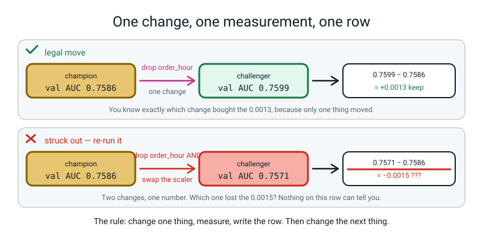
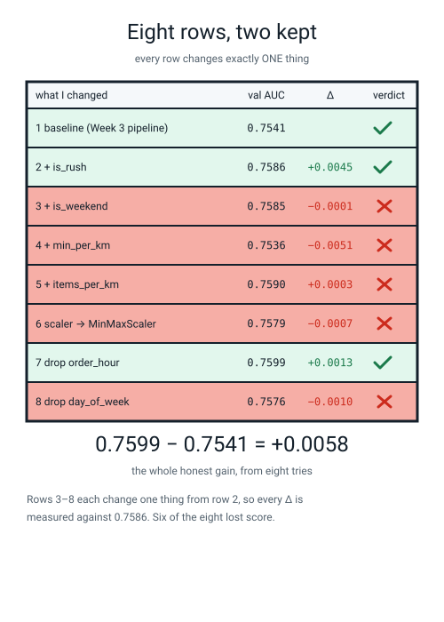
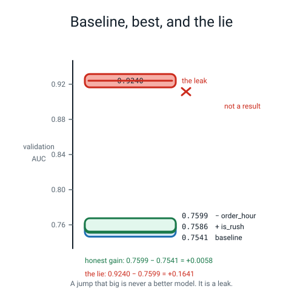
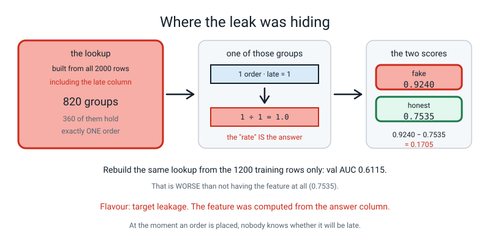
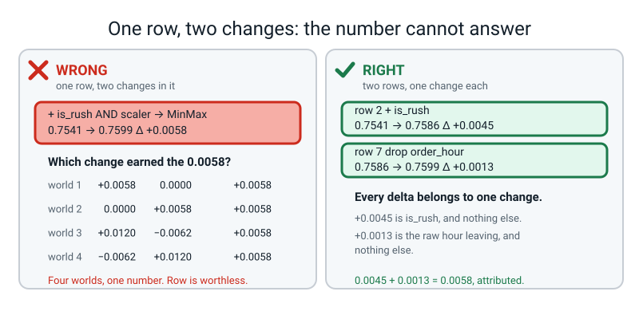
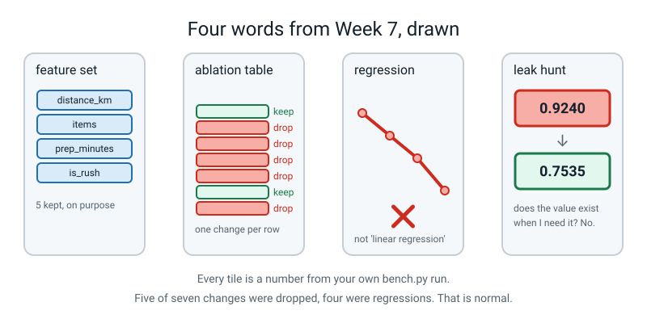

# Week 7 — Beat the Baseline

[⬅ Week 6](week-06.md) · [Course Home](../README.md) · [Next ➡](week-08.md) · [Workbook](../workbook/week-07.md)

---

> ### This week in one sentence
> **Improving a model by changing only the features is a discipline: one change, one measurement, one row in the table, no exceptions — and this week you find out that a good afternoon's honest work is worth 0.0058.**
>
> **By the end of this chapter you will be able to:**
> - **Improve Week 3's validation score using only feature changes** — same `LogisticRegression`, same settings, only the columns going in
> - **Keep an ablation table of at least six rows** where every row records exactly one change and the delta it earned
> - **Find the planted leak in `leaky_features.py`**, name which flavour it is, and report the fake score and the honest score
> - **Defend your final feature set** with a number from your own table beside every column you kept
>
> **New maths:** none. Every number on the page is one AUC subtracted from another, to four decimal places.
>
> **New syntax:** `pipe.set_params(prep__num__scaler=MinMaxScaler())` · `X.drop(columns=[c])` · `df.to_string(index=False)`
>
> **Reading time:** about 35 minutes. **Homework:** about 60 minutes. **You will need a big sheet of paper or a wall you are allowed to write on, and a pen you cannot rub out.**

---

## 🪝 Start Here

Somebody has been busy with your delivery model.

Three weeks ago you built it and it scored **0.7541** — a validation AUC, on the 400 rows you set aside in Week 2. Same table, same `LogisticRegression`, same everything.

This morning the number on the board is:

```text
val AUC 0.9240
```

**Before you read on: how do you feel about that?**

If your honest answer is "brilliant, what did they do", that is a completely normal reaction and it is the one this week exists to change. Here is why. In a minute you are going to spend half an hour trying to improve that 0.7541 by changing the features. **I will tell you now what you will get, so it does not disappoint you later: 0.7599.**

```text
0.7599  -  0.7541  =  +0.0058     <- an afternoon of honest work
0.9240  -  0.7599  =  +0.1641     <- whatever THAT was
```

Fifty-eight ten-thousandths against one thousand six hundred and forty-one. **One of those is twenty-eight times the size of the other.**

So the question that runs the whole week is: **when you see 0.9240, is the right reaction to be pleased, or to be worried?**

Last week gave you the rule. **A suspiciously good score is a bug, not a model.** By the end of today you will have found where the 0.9240 came from, you will be able to name the flavour of the bug, and — this is the part that matters more — you will have a piece of paper that makes this kind of thing *findable*. Because the reason nobody catches a leak in real life is almost never that it was clever. It is that **nobody wrote down what they changed.**

> **ablation table** — the log of your experiments. One row per change: what you changed, the score you got, the difference from the row before, and whether you kept it.

That table is the deliverable this week. Not the code. Not the score. **The table.**

---

## 🧠 The Big Idea

> **📌 About the code in this section.** The blocks below are **illustrations, not files**. Each one carries on from the one above. **The complete runnable files are in 💻 Type This.** If you copy one of these on its own and Python says `NameError`, that is why, and nothing is broken.

### 1. Why "one at a time" is not fussiness

You have already met this argument, in science.

If you are testing whether a plant grows faster in sunlight, you do not move it to the windowsill **and** start watering it twice as much. Because when it grows, you have learnt nothing.

Here is the same thing with numbers. Suppose you change two things at once — you add a new column *and* you swap the scaler — and your score goes up by 0.004. What have you learnt?

**Almost nothing.** There are four completely different worlds and your one number cannot tell them apart:

| World | change A did | change B did | total |
|---|---|---|---|
| 1 | +0.004 | 0.000 | **+0.004** |
| 2 | 0.000 | +0.004 | **+0.004** |
| 3 | +0.010 | −0.006 | **+0.004** |
| 4 | −0.006 | +0.010 | **+0.004** |

Look at world 3. **Change B is losing you 0.006 and you have just shipped it**, because A was carrying it. Six months from now somebody deletes A for a completely unrelated reason and the model mysteriously gets worse, and nobody will ever work out why, because nobody wrote a row.


*Figure 7.1 — One change, one measurement, one row. The bottom lane is struck out because nothing on that row says which of the two changes lost the 0.0015.*

🍕 **The analogy.** It is a recipe. You bake a cake, and it is slightly better than last time. You changed the oven temperature, the flour and the eggs. **Which one was it?** You will have to bake three more cakes to find out — and if you had changed one thing per cake, you would already know.

> **This week's one sentence:** "One change, one measurement, one row. If a row has two changes in it, throw the row away — it cannot tell you anything."

### 2. The word "regression" means something else today

Thirty seconds of confusion, and then it will be fine.

> **regression** — a change that made things **worse**. Nothing whatsoever to do with `LinearRegression`. It is the ordinary software-engineering word: programmers say *"that update had a regression in it"* and they mean something used to work better than this.

Two different meanings, same word, and unfortunately both are standard. You will hear both for the rest of your life.

And here is the number that matters: **six of the eight rows you write today are regressions.** That is not failure. **That is what the table is for.** A table of eight successes would mean you were not trying anything risky.

### 3. The table, with the real numbers

This is what a real run produces. Read it slowly, because it teaches five separate things and four of them are uncomfortable.

```text
               what I changed  val_auc   delta verdict
1  baseline (Week 3 pipeline)   0.7541     NaN    keep
                 2  + is_rush   0.7586  0.0045    keep
              3  + is_weekend   0.7585 -0.0001    drop
              4  + min_per_km   0.7536 -0.0051    drop
            5  + items_per_km   0.7590  0.0003    drop
    6  scaler -> MinMaxScaler   0.7579 -0.0007    drop
           7  drop order_hour   0.7599  0.0013    keep
          8  drop day_of_week   0.7576 -0.0010    drop
```


*Figure 7.2 — Eight rows, two kept. Every row changes exactly one thing, so every delta is attributable.*

**One — `is_rush` earned its place.** +0.0045 for one column of 0s and 1s. Why does a 0/1 flag beat `order_hour`, which was already in the model and contains strictly more information? Because `LogisticRegression` fits a **straight line** in each input. With the hour as a number it can only say "later is more late" or "later is less late". The truth is a **hump** over 18:00–20:00 — busy at dinner, quiet either side. A straight line cannot express a hump. A 0/1 flag can. **That is the entire craft of feature engineering in one example.**

**Two — `is_weekend` bought nothing.** −0.0001. That is not "slightly bad". That is **the same number**, arriving with a different amount of rounding noise. There was no weekend signal in the table to find. So delete the feature — because a feature that buys nothing still costs you maintenance, one more thing to explain, and one more thing to break.

**Three — row 7 is the surprise, and it is the best moment of the week.** Dropping `order_hour` — a real column, out of the actual file — makes the model **better**. Because row 2 already took the useful part out of it. What was left was a straight-line story that is not true, and the model was spending a weight on it. **Once you have the good version of a column, the raw version can actively cost you.**

**Four — row 5 is where you have to be honest.** `items_per_km` gained +0.0003. Is that real? **Almost certainly not.** The validation pile is 400 rows. Shuffle it differently and a difference that small could easily flip sign. You do not yet have the tool to say how big a difference has to be before it counts — that is **Week 11**. Until then, use a working rule and write it on your table: **on 400 validation rows, treat anything under about 0.005 as "no evidence".** Which, awkwardly, also puts a question mark over row 7's +0.0013. If you spotted that, you have understood more than the exercise asked for.

**Five — the total honest gain is +0.0058.** Eight experiments, two kept, six thrown away, and the reward is half a percentage point.


*Figure 7.3 — Baseline, best, and the lie. The honest afternoon's work is the small step at the bottom.*

**Say 0.0058 out loud without flinching.** Feature engineering is not magic; it is a grind of small defensible gains. It is still usually a better use of an afternoon than fiddling with the model, and here is the reason: **you can explain every one of those 0.0058.** You also know something about pizza you did not know at breakfast — that lateness humps at the dinner rush, and that the day of the week barely matters. **That knowledge outlives the model.**

### 4. The leak, and why it is a nastier flavour than last week's

Last week the poisoned column was handed to you with a label on it: `customer_called_support`, a column that only gets filled in *after* the delivery is already late. This week the poison is **inside a feature function**, which is much more realistic and much harder to spot, because feature functions look like harmless arithmetic.

Here is the crime, and it is three lines:

```python
_FULL = make_deliveries(n=2000, seed=0).drop_duplicates().reset_index(drop=True)
_KEY = ["restaurant", "day_of_week", "weather", "order_hour"]
_LATE_RATE = _FULL.groupby(_KEY)["late"].mean().to_dict()
```

In English: *"take all 2,000 rows. Group them by restaurant, day, weather and hour. For each group, work out what fraction of those orders were late. Remember it in a lookup table."* Then each row gets handed its own group's late rate, under the entirely reasonable-sounding name `similar_orders_late_rate`.

**Why is that fatal?** Because of one count:

```text
rows in the table        : 2000
groups                   : 820
groups holding 1 order   : 360
groups holding 2 orders  : 189
rates that are exactly 0.0 or 1.0: 562
```

**360 of the 820 groups contain exactly one order.** For those rows, "the fraction of orders in this group that were late" is the fraction of *one* order that was late — which is `1.0` if that order was late and `0.0` if it was not. Here are five of them:

```text
five groups of exactly one order, with their 'rate':
  ('CrustyBros', 'Fri', 'clear', 16) n=1  rate=1.0
  ('CrustyBros', 'Fri', 'clear', 17) n=1  rate=1.0
  ('CrustyBros', 'Fri', 'rain', 10) n=1  rate=0.0
  ('CrustyBros', 'Fri', 'rain', 11) n=1  rate=0.0
  ('CrustyBros', 'Fri', 'rain', 12) n=1  rate=0.0
```

**The feature is the answer with a statistic's name on it.**


*Figure 7.4 — Where the leak was hiding. For a group of one, "the late rate of similar orders" is just that order's own label.*

And here is the payoff, three real numbers:

| What you did | Validation AUC |
|---|---|
| With `similar_orders_late_rate`, lookup built from all 2,000 rows | **0.9240** ← the fake score |
| Same feature set, that one column removed | **0.7535** ← the honest score |
| Same idea, lookup rebuilt from the 1,200 **training** rows only | **0.6115** ← worse than nothing |

**That third row is the one to sit with.** Your instinct will be "fine, so compute it properly and keep it". So we did — and it scores 0.6115, which is *worse than not having the feature at all*, because computed honestly the column is mostly the memorised label of a single unrelated training row. That is noise wearing a confident name. **The feature was never good. It was only ever the answer.**

> **The flavour is target leakage**, because the poisoned quantity was computed from the `late` column — the answer itself. (Computing a *scaler's mean* over all the rows would be preprocessing leakage, which is a real bug and a much milder one. Week 6 covered both. Today's is squarely the first.)

**And the decisive test is not a number at all.** Ask this:

> **At the moment a customer places the order, does this value exist?**

**No.** Nobody knows yet whether it will be late. The lookup could only have been built by somebody who already had all the answers. That one question is worth more than all four statistical audits put together, and it is the sentence you want to be saying in your sleep by June.

---

## 🔁 The Idea From Last Week, Used Harder

There is no new maths this week. Instead, the **four audits** from Week 6 get pointed at a real suspect and you watch each one fire.

Last week you learnt that a leak is caught by asking four questions. This week you run all four on `similar_orders_late_rate` and see how loud each alarm is — because they are not equally loud, and knowing the order to try them in is the skill.

**Audit 0 — score with it and without it.** The difference is the whole story.

```text
with similar_orders_late_rate : val AUC 0.9240
without it                      : val AUC 0.7535
jump                            : +0.1705
```

**One column moved the score by 0.1705.** Every honest change all lesson moved it by less than 0.005. **That is a factor of thirty-four.** Write the rule down: *a sudden jump of more than about 0.1 AUC from one column is not a discovery, it is a bug.*

**Audit 1 — how strongly does each number column line up with the answer?**

```text
similar_orders_late_rate    0.676
distance_km                 0.345
min_per_km                 -0.186
is_rush                     0.133
driver_experience_months   -0.123
items                       0.106
prep_minutes                0.066
```

Your best *honest* feature manages 0.345. The suspect manages **0.676** — nearly double. On real data, one column being twice as informative as everything else is not usually good news.

**Audit 2 — give the model that one column and nothing else.**

```text
model with ONLY similar_orders_late_rate : val AUC 0.8916
```

**0.8916 from one column, when all the honest columns together manage 0.7535.** A single column that beats your whole feature set is not a feature. It is a copy of the answer.

**Audit 3 — which weights did the model learn?**

```text
num__similar_orders_late_rate    2.071
num__distance_km                 0.971
num__driver_experience_months   -0.411
cat__day_of_week_Sat            -0.269
```

Its weight is **2.071**, more than twice the next one. The model has bet almost everything on it.

**Audit 4 — the question no number can answer.** Does the value exist when you need it? No. **Stop.**

> **💡 Try this:** run the audits in order 0, 4, 1, 2, 3. Audit 0 takes two seconds and tells you *whether* to worry. Audit 4 takes no computer at all and tells you *for certain*. Audits 1, 2 and 3 are for writing the report afterwards. Most people run them in exactly the wrong order.

---

## 💻 Type This

Two files. `bench.py` builds your ablation table; `leak_hunt.py` runs the four audits. **Both run in under 2 seconds.** You also need `make_data.py` from Week 1 and the supplied `leaky_features.py`, in the same folder.

### Step 1 — the three piles, and nothing else

New file, `bench.py`.

```python
"""bench.py - one change, one measurement, one row.  Week 7."""
import numpy as np
import pandas as pd
from sklearn.compose import ColumnTransformer
from sklearn.impute import SimpleImputer
from sklearn.linear_model import LogisticRegression
from sklearn.metrics import roc_auc_score
from sklearn.model_selection import train_test_split
from sklearn.pipeline import Pipeline
from sklearn.preprocessing import (FunctionTransformer, MinMaxScaler,
                                   OneHotEncoder, StandardScaler)

from make_data import make_deliveries

BASE_NUM = ["distance_km", "items", "prep_minutes", "order_hour",
            "driver_experience_months"]
CAT = ["restaurant", "day_of_week", "weather"]

df = make_deliveries(n=2000, seed=0).drop_duplicates().reset_index(drop=True)
y = df["late"]
X = df.drop(columns=["late", "order_id"])
X_tmp, X_test, y_tmp, y_test = train_test_split(
    X, y, test_size=0.20, random_state=0, stratify=y)
X_train, X_val, y_train, y_val = train_test_split(
    X_tmp, y_tmp, test_size=0.25, random_state=0, stratify=y_tmp)
print("train %d   val %d   test %d" % (len(X_train), len(X_val), len(X_test)))
```

**Predict the three numbers before you run it.**

```text
train 1200   val 400   test 400
```

Nothing new in any of that — it is Week 2 and Week 3, retyped. `drop_duplicates()` because the file has 20 duplicated rows in it and a duplicate that lands in both piles is a row the model has already seen. `stratify=y` so all three piles have the same late rate. `random_state=0` everywhere, so that when your number differs from mine it is a **real** difference and not the shuffle.

And `X_test` — 400 rows — now sits there, untouched, for twenty-nine weeks.

### Step 2 — the measuring machine

Two functions. This is the only part of the file that fits a model.

```python
def add_features(d, rush=False, weekend=False, ratio=False, items_ratio=False,
                 inter=False):
    """Row-wise arithmetic only.  Nothing here looks across rows, so nothing can leak."""
    d = d.copy()
    if rush:
        d["is_rush"] = d["order_hour"].between(18, 20).astype(int)
    if weekend:
        d["is_weekend"] = d["day_of_week"].isin(["Sat", "Sun"]).astype(int)
    if ratio:
        d["min_per_km"] = d["prep_minutes"] / (d["distance_km"] + 0.5)
    if items_ratio:
        d["items_per_km"] = d["items"] / (d["distance_km"] + 0.5)
    if inter:
        severity = d["weather"].map({"clear": 0.0, "rain": 1.0, "storm": 2.0})
        d["dist_x_weather"] = d["distance_km"] * severity
    return d


def measure(num, cat, kw, drop=(), minmax=False):
    """Fit on train, score on val.  Returns one number."""
    tr = X_train.drop(columns=list(drop))
    va = X_val.drop(columns=list(drop))
    prep = ColumnTransformer([
        ("num", Pipeline([("imputer", SimpleImputer(strategy="median")),
                          ("scaler", StandardScaler())]), num),
        ("cat", OneHotEncoder(handle_unknown="ignore"), cat),
    ])
    pipe = Pipeline([("derive", FunctionTransformer(add_features, kw_args=kw)),
                     ("prep", prep),
                     ("model", LogisticRegression(max_iter=2000, random_state=0))])
    if minmax:
        pipe.set_params(prep__num__scaler=MinMaxScaler())
    pipe.fit(tr, y_train)
    return roc_auc_score(y_val, pipe.predict_proba(va)[:, 1])
```

**Three new things in there.**

`X_train.drop(columns=list(drop))` — `.drop` gives you a **copy** with something taken out. `columns=` says you mean a column and not a row, and the square brackets are because it takes a *list* of names, even a list of one. **The original `X_train` is untouched**, which is what lets you drop a column, measure, and still have the full table for the next experiment.

`pipe.set_params(prep__num__scaler=MinMaxScaler())` — those are **double** underscores, twice, and the whole thing is an **address, not a word**:

```text
pipe
 └── "prep"           the ColumnTransformer that handles the columns
      └── "num"       the branch inside it that handles number columns
           └── "scaler"   the step inside THAT branch that does the scaling
```

Every one of those names is a label *you* typed in Week 3. They are not magic words. The alternative to `set_params` is retyping the whole twelve-line pipeline to change one scaler — and when you retype twelve lines you change something you did not mean to.

And the docstring on `add_features` is load-bearing: **row-wise arithmetic only.** Every line in there looks at one row and does sums with that row's own numbers. Nothing averages across rows. Nothing touches `y`. **That is why this function is safe.** Hold on to that, because the file you get later breaks exactly this rule.

`measure` is the referee. You hand it a feature set, it hands you back one number, and it is the only place that fits a model — which means **every row in your table was produced by the identical procedure.** That is not tidiness. It is what makes the rows comparable.

### Step 3 — the first two rows. 🐞 One mistake, from two directions.

Add this, **with the mistake in it**:

```python
RUSH = {"rush": True}
CHAMP = BASE_NUM + ["is_rush"]

base = measure(BASE_NUM, CAT, {})
print("baseline        : %.4f" % base)
champ = measure(CHAMP, CAT, {})           # <-- the mistake
print("+ is_rush       : %.4f" % champ)
```

Run it:

```text
baseline        : 0.7541
Traceback (most recent call last):
  ...
  File ".../sklearn/utils/_indexing.py", line 451, in _get_column_indices
    raise ValueError("A given column is not a column of the dataframe") from e
ValueError: A given column is not a column of the dataframe
```

Read the second call. It passes `CHAMP`, which **lists** `is_rush`… and it passes `{}` as the settings, which tells `add_features` to build **nothing**. So the column is in the list and not in the table, and `ColumnTransformer` went looking for a name that was never made.

**That was the loud direction. Now try the same bug the other way round**, because this is the version that will actually hurt you:

```python
oops = measure(BASE_NUM, CAT, RUSH)     # is_rush BUILT, but never listed
print("baseline                    : %.4f" % base)
print("+ is_rush (built, not shown): %.4f" % oops)
print("delta                       : %+.4f" % (oops - base))
print()
print("columns the derive step makes:")
print(sorted(add_features(X_train.head(2), **RUSH).columns))
print("columns the model is actually shown:", BASE_NUM)
```

```text
baseline                    : 0.7541
+ is_rush (built, not shown): 0.7541
delta                       : +0.0000

columns the derive step makes:
['day_of_week', 'distance_km', 'driver_experience_months', 'is_rush', 'items', 'order_hour', 'prep_minutes', 'restaurant', 'weather']
columns the model is actually shown: ['distance_km', 'items', 'prep_minutes', 'order_hour', 'driver_experience_months']
```

**No error. Two identical scores to four decimal places.** `is_rush` was built beautifully and then never shown to the model, because it is not in the `num` list.

**This is the most dangerous kind of bug in the whole of this term: the one that gives you a plausible number.** Either the column is worth *exactly* nothing to four decimal places — which would be a remarkable coincidence — or **the change you thought you made never happened.** The two lists have to agree. Print them if you are not sure.

Now fix it properly and get the real row 2:

```python
champ = measure(CHAMP, CAT, RUSH)
print("+ is_rush       : %.4f" % champ)
```

```text
+ is_rush       : 0.7586
```

**0.7586 minus 0.7541 is 0.0045.** That is the first honest row of the day.

### Step 4 — 🐞 the good `KeyError`

Row 7 on the list is "drop `order_hour`". Try the obvious thing:

```python
print("drop order_hour : %.4f" % measure(CHAMP, CAT, RUSH, drop=("order_hour",)))
```

```text
Traceback (most recent call last):
  ...
  File ".../sklearn/preprocessing/_function_transformer.py", line 387, in _transform
    return func(X, **(kw_args if kw_args else {}))
  File "bench.py", line 34, in add_features
    d["is_rush"] = d["order_hour"].between(18, 20).astype(int)
  ...
KeyError: 'order_hour'
```

**Read the last line, then find which file it happened in.** `KeyError: 'order_hour'`, raised inside `add_features`, in **your own file.**

So: you threw `order_hour` out of the *table*, and then `add_features` went looking for it to build `is_rush` — because **`is_rush` is made out of `order_hour`.** You cannot throw away the ingredient and keep the cake.

What you actually meant was: *build `is_rush` from the hour, then don't show the model the raw hour.* That is a different thing, and it is done by taking the name out of the **number list**, not out of the table:

```python
LEAN = [c for c in CHAMP if c != "order_hour"]
print("drop order_hour : %.4f" % measure(LEAN, CAT, RUSH))
```

```text
drop order_hour : 0.7599
```

**You removed a real column that came out of the actual file, and the model got better.**

### Step 5 — all eight rows, printed as a table

```python
rows = []
base = measure(BASE_NUM, CAT, {})
rows.append(["1  baseline (Week 3 pipeline)", base, np.nan, "keep"])

champ = measure(CHAMP, CAT, RUSH)
rows.append(["2  + is_rush", champ, champ - base, "keep"])

for label, num, cat, kw, drop, mm in [
    ("3  + is_weekend",            CHAMP + ["is_weekend"],   CAT, {**RUSH, "weekend": True},      (), False),
    ("4  + min_per_km",            CHAMP + ["min_per_km"],   CAT, {**RUSH, "ratio": True},        (), False),
    ("5  + items_per_km",          CHAMP + ["items_per_km"], CAT, {**RUSH, "items_ratio": True},  (), False),
    ("6  scaler -> MinMaxScaler",  CHAMP,                    CAT, RUSH,                           (), True),
    ("7  drop order_hour",         [c for c in CHAMP if c != "order_hour"], CAT, RUSH,            (), False),
    ("8  drop day_of_week",        CHAMP, [c for c in CAT if c != "day_of_week"], RUSH, ("day_of_week",), False),
]:
    auc = measure(num, cat, kw, drop, mm)
    delta = auc - champ
    rows.append([label, auc, delta, "keep" if delta > 0.0010 else "drop"])

table = pd.DataFrame(rows, columns=["what I changed", "val_auc", "delta", "verdict"])
print()
print(table.round(4).to_string(index=False))
print()
print("best honest val AUC : %.4f" % table["val_auc"].max())
print("total honest gain   : %.4f" % (table["val_auc"].max() - base))
```

The last printing line has three parts, left to right. `table` is a DataFrame. `.round(4)` rounds every number to four decimal places, because `0.7585749463...` is not something anybody can compare by eye. `.to_string(index=False)` turns it into neat text **without the row numbers down the left**, which are pure noise on a table whose rows are already labelled 1 to 8.

**Why four decimals and not two?** Because the whole week's honest gain is 0.0058. Round to two and the entire table reads `0.75, 0.76, 0.76, 0.75, 0.76…` and the lesson vanishes.

### The complete `bench.py`

```python
"""bench.py - one change, one measurement, one row.  Week 7."""
import numpy as np
import pandas as pd
from sklearn.compose import ColumnTransformer
from sklearn.impute import SimpleImputer
from sklearn.linear_model import LogisticRegression
from sklearn.metrics import roc_auc_score
from sklearn.model_selection import train_test_split
from sklearn.pipeline import Pipeline
from sklearn.preprocessing import (FunctionTransformer, MinMaxScaler,
                                   OneHotEncoder, StandardScaler)

from make_data import make_deliveries

BASE_NUM = ["distance_km", "items", "prep_minutes", "order_hour",
            "driver_experience_months"]
CAT = ["restaurant", "day_of_week", "weather"]

df = make_deliveries(n=2000, seed=0).drop_duplicates().reset_index(drop=True)
y = df["late"]
X = df.drop(columns=["late", "order_id"])
X_tmp, X_test, y_tmp, y_test = train_test_split(
    X, y, test_size=0.20, random_state=0, stratify=y)
X_train, X_val, y_train, y_val = train_test_split(
    X_tmp, y_tmp, test_size=0.25, random_state=0, stratify=y_tmp)
print("train %d   val %d   test %d" % (len(X_train), len(X_val), len(X_test)))


def add_features(d, rush=False, weekend=False, ratio=False, items_ratio=False,
                 inter=False):
    """Row-wise arithmetic only.  Nothing here looks across rows, so nothing can leak."""
    d = d.copy()
    if rush:
        d["is_rush"] = d["order_hour"].between(18, 20).astype(int)
    if weekend:
        d["is_weekend"] = d["day_of_week"].isin(["Sat", "Sun"]).astype(int)
    if ratio:
        d["min_per_km"] = d["prep_minutes"] / (d["distance_km"] + 0.5)
    if items_ratio:
        d["items_per_km"] = d["items"] / (d["distance_km"] + 0.5)
    if inter:
        severity = d["weather"].map({"clear": 0.0, "rain": 1.0, "storm": 2.0})
        d["dist_x_weather"] = d["distance_km"] * severity
    return d


def measure(num, cat, kw, drop=(), minmax=False):
    """Fit on train, score on val.  Returns one number."""
    tr = X_train.drop(columns=list(drop))
    va = X_val.drop(columns=list(drop))
    prep = ColumnTransformer([
        ("num", Pipeline([("imputer", SimpleImputer(strategy="median")),
                          ("scaler", StandardScaler())]), num),
        ("cat", OneHotEncoder(handle_unknown="ignore"), cat),
    ])
    pipe = Pipeline([("derive", FunctionTransformer(add_features, kw_args=kw)),
                     ("prep", prep),
                     ("model", LogisticRegression(max_iter=2000, random_state=0))])
    if minmax:
        pipe.set_params(prep__num__scaler=MinMaxScaler())
    pipe.fit(tr, y_train)
    return roc_auc_score(y_val, pipe.predict_proba(va)[:, 1])


RUSH = {"rush": True}
CHAMP = BASE_NUM + ["is_rush"]

rows = []
base = measure(BASE_NUM, CAT, {})
rows.append(["1  baseline (Week 3 pipeline)", base, np.nan, "keep"])

champ = measure(CHAMP, CAT, RUSH)
rows.append(["2  + is_rush", champ, champ - base, "keep"])

for label, num, cat, kw, drop, mm in [
    ("3  + is_weekend",            CHAMP + ["is_weekend"],   CAT, {**RUSH, "weekend": True},      (), False),
    ("4  + min_per_km",            CHAMP + ["min_per_km"],   CAT, {**RUSH, "ratio": True},        (), False),
    ("5  + items_per_km",          CHAMP + ["items_per_km"], CAT, {**RUSH, "items_ratio": True},  (), False),
    ("6  scaler -> MinMaxScaler",  CHAMP,                    CAT, RUSH,                           (), True),
    ("7  drop order_hour",         [c for c in CHAMP if c != "order_hour"], CAT, RUSH,            (), False),
    ("8  drop day_of_week",        CHAMP, [c for c in CAT if c != "day_of_week"], RUSH, ("day_of_week",), False),
]:
    auc = measure(num, cat, kw, drop, mm)
    delta = auc - champ
    rows.append([label, auc, delta, "keep" if delta > 0.0010 else "drop"])

table = pd.DataFrame(rows, columns=["what I changed", "val_auc", "delta", "verdict"])
print()
print(table.round(4).to_string(index=False))
print()
print("best honest val AUC : %.4f" % table["val_auc"].max())
print("total honest gain   : %.4f" % (table["val_auc"].max() - base))
```

**Real output. Runtime under 2 seconds.**

```text
train 1200   val 400   test 400

               what I changed  val_auc   delta verdict
1  baseline (Week 3 pipeline)   0.7541     NaN    keep
                 2  + is_rush   0.7586  0.0045    keep
              3  + is_weekend   0.7585 -0.0001    drop
              4  + min_per_km   0.7536 -0.0051    drop
            5  + items_per_km   0.7590  0.0003    drop
    6  scaler -> MinMaxScaler   0.7579 -0.0007    drop
           7  drop order_hour   0.7599  0.0013    keep
          8  drop day_of_week   0.7576 -0.0010    drop

best honest val AUC : 0.7599
total honest gain   : 0.0058
```

> **⚠️ Watch out:** rows 3 to 8 are each **one change from row 2**, so every delta on those rows is measured against 0.7586. Only row 2's delta is measured against row 1. **Write that note on your own table** — it is the difference between a table somebody can read in six months and a table nobody can.

---

## 🔍 Worked Examples

### Worked Example 1 — Ablation on a hospital scanner (medicine)

Different problem, same discipline. `load_breast_cancer` ships inside scikit-learn: 569 tumour scans, 30 measurements each, and the label is whether the tumour was benign. We take five of the thirty columns to keep the table small enough to reason about.

```python
"""we1.py - an ablation table on a different problem: tumour screening."""
import numpy as np
import pandas as pd
from sklearn.datasets import load_breast_cancer
from sklearn.linear_model import LogisticRegression
from sklearn.metrics import roc_auc_score
from sklearn.model_selection import train_test_split
from sklearn.pipeline import Pipeline
from sklearn.preprocessing import MinMaxScaler, StandardScaler

data = load_breast_cancer(as_frame=True)
X = data.data[["mean radius", "mean texture", "mean smoothness",
               "worst radius", "worst texture"]]
y = data.target          # 1 = benign, 0 = malignant
X_tmp, X_test, y_tmp, y_test = train_test_split(
    X, y, test_size=0.20, random_state=0, stratify=y)
X_train, X_val, y_train, y_val = train_test_split(
    X_tmp, y_tmp, test_size=0.25, random_state=0, stratify=y_tmp)
print("train %d   val %d   test %d" % (len(X_train), len(X_val), len(X_test)))


def measure(cols, minmax=False, ratio=False):
    tr, va = X_train[cols].copy(), X_val[cols].copy()
    if ratio:
        tr["r_ratio"] = X_train["worst radius"] / X_train["mean radius"]
        va["r_ratio"] = X_val["worst radius"] / X_val["mean radius"]
    pipe = Pipeline([("scaler", StandardScaler()),
                     ("model", LogisticRegression(max_iter=2000, random_state=0))])
    if minmax:
        pipe.set_params(scaler=MinMaxScaler())
    pipe.fit(tr, y_train)
    return roc_auc_score(y_val, pipe.predict_proba(va)[:, 1])


ALL = list(X.columns)
rows = []
base = measure(ALL)
rows.append(["1  baseline (5 columns)", base, np.nan, "keep"])
for label, cols, mm, ra in [
    ("2  + worst/mean radius ratio", ALL,                                    False, True),
    ("3  scaler -> MinMaxScaler",    ALL,                                    True,  False),
    ("4  drop mean smoothness",      [c for c in ALL if c != "mean smoothness"], False, False),
    ("5  drop mean radius",          [c for c in ALL if c != "mean radius"],     False, False),
    ("6  drop worst radius",         [c for c in ALL if c != "worst radius"],    False, False),
]:
    auc = measure(cols, mm, ra)
    rows.append([label, auc, auc - base, "keep" if auc - base > 0.0010 else "drop"])

table = pd.DataFrame(rows, columns=["what I changed", "val_auc", "delta", "verdict"])
print()
print(table.round(4).to_string(index=False))
print()
print("best val AUC : %.4f" % table["val_auc"].max())
```

**Real output. Runtime under 1 second.**

```text
train 341   val 114   test 114

              what I changed  val_auc   delta verdict
     1  baseline (5 columns)   0.9957     NaN    keep
2  + worst/mean radius ratio   0.9971  0.0013    keep
   3  scaler -> MinMaxScaler   0.9925 -0.0033    drop
     4  drop mean smoothness   0.9892 -0.0066    drop
         5  drop mean radius   0.9964  0.0007    drop
        6  drop worst radius   0.9902 -0.0056    drop

best val AUC : 0.9971
```

**Three things worth noticing, and the first is the big one.**

**The baseline is already 0.9957.** There is almost nothing left to win — the ceiling is 0.0043 and you are never getting all of it. **A good ablation table tells you when to stop.** If the delivery table's ceiling had been this small you would not have spent thirty minutes on it.

**Row 5 says dropping `mean radius` *gains* 0.0007.** Same shape as the delivery table's row 7: `worst radius` already carries most of what `mean radius` knows, so the raw one adds very little and costs a weight. But **+0.0007 on 114 validation rows is far inside the noise** — the pile is 114 rows, and one row changing its mind moves the AUC by more than that. Correct verdict: `drop`, with the honest note *"untested at this precision"*.

**Row 3 is not a feature change at all.** Swapping the ruler cost 0.0033 here, and cost 0.0007 on the delivery table. **The ruler is a choice too**, and it deserves a row.

### Worked Example 2 — Twelve songs, one poisoned column (music)

You do not always need 2,000 rows to spot a leak. Sometimes twelve are enough, if you look at the right column.

A streaming app wants to predict whether you will **skip** a song. Here are twelve plays.

```python
"""we2.py - a leak hunt on twelve rows you can read with your own eyes."""
import pandas as pd

plays = pd.DataFrame({
    "song":            ["A", "B", "C", "D", "E", "F", "G", "H", "I", "J", "K", "L"],
    "song_length_s":   [210, 185, 240, 195, 320, 175, 260, 205, 300, 190, 230, 215],
    "times_played_before": [12, 0, 3, 8, 1, 20, 0, 5, 2, 14, 1, 9],
    "seconds_listened":[210, 11, 240, 195,  9, 175,  7, 205, 14, 190,  8, 215],
    "skipped":         [  0,  1,   0,   0,  1,   0,  1,   0,  1,   0,  1,   0],
})
print(plays.to_string(index=False))
print()
print("--- audit 1: correlation of every number column with skipped ---")
num = ["song_length_s", "times_played_before", "seconds_listened"]
corr = plays[num + ["skipped"]].corr()["skipped"].drop("skipped")
print(corr.reindex(corr.abs().sort_values(ascending=False).index).round(3).to_string())
print()
print("--- the two groups, averaged ---")
print(plays.groupby("skipped")[num].mean().round(1).to_string())
```

**Real output. Runtime instant.**

```text
song  song_length_s  times_played_before  seconds_listened  skipped
   A            210                   12               210        0
   B            185                    0                11        1
   C            240                    3               240        0
   D            195                    8               195        0
   E            320                    1                 9        1
   F            175                   20               175        0
   G            260                    0                 7        1
   H            205                    5               205        0
   I            300                    2                14        1
   J            190                   14               190        0
   K            230                    1                 8        1
   L            215                    9               215        0

--- audit 1: correlation of every number column with skipped ---
seconds_listened      -0.988
times_played_before   -0.747
song_length_s          0.616

--- the two groups, averaged ---
         song_length_s  times_played_before  seconds_listened
skipped                                                      
0                204.3                 10.1             204.3
1                259.0                  0.8               9.8
```

**Now find the leak by eye, before any statistics.** Look at rows A, C, D, F, H, J, L — every row where `skipped` is 0. In every single one, `seconds_listened` is **exactly equal to** `song_length_s`. 210 and 210. 240 and 240. 175 and 175.

Of course it is. **If you did not skip the song, you listened to all of it.** `seconds_listened` is not a fact about your taste; it is a re-description of the label.

**The four audits, on twelve rows:**

| Audit | What it says |
|---|---|
| **1 — correlation** | `seconds_listened` at **−0.988**. Nothing honest in the real world sits at 0.99. |
| **2 — that column alone** | It would score essentially perfectly, because it *is* the answer. |
| **3 — the weight** | It would take almost all of it. |
| **4 — does it exist yet?** | **No.** At the moment the song starts, you have listened to zero seconds. |

**The honest columns are `song_length_s` and `times_played_before`**, and they are genuinely informative: skipped songs average 259 seconds against 204, and skipped songs had been played 0.8 times before against 10.1. Both of those values exist **before** the song plays. Both are keepable.

> **🧑‍🏫 If a student asks:** *"could you fix `seconds_listened` by using the PREVIOUS play's value?"* **Yes, and that is a real and good feature** — "how much of this song did you listen to last time" exists at the moment the song starts. It is a completely different column that happens to be made of the same raw data. **The rule is never "this data is banned"; it is "this value must exist at the moment I need the prediction".**

### Worked Example 3 — Do two deltas add up? (pizza again)

Here is the honest reason "one at a time" is a *discipline* and not a *proof*.

Take two changes that both helped. **A** is `+ items_per_km` (+0.0003). **B** is `drop order_hour` (+0.0013). Run each alone, then run both together.

```python
"""inter.py - do two deltas add up?"""
RUSH = {"rush": True}
CHAMP = BASE_NUM + ["is_rush"]
champ = measure(CHAMP, CAT, RUSH)
A = measure(CHAMP + ["items_per_km"], CAT, {**RUSH, "items_ratio": True})
B = measure([c for c in CHAMP if c != "order_hour"], CAT, RUSH)
AB = measure([c for c in CHAMP if c != "order_hour"] + ["items_per_km"],
             CAT, {**RUSH, "items_ratio": True})
print("champion (row 2)        : %.4f" % champ)
print("A alone  + items_per_km : %.4f   delta %+.4f" % (A, A - champ))
print("B alone  drop order_hour: %.4f   delta %+.4f" % (B, B - champ))
print("A and B together        : %.4f   delta %+.4f" % (AB, AB - champ))
print("sum of the two deltas   : %+.4f" % ((A - champ) + (B - champ)))
```

**Real output. Runtime under 2 seconds.**

```text
champion (row 2)        : 0.7586
A alone  + items_per_km : 0.7590   delta +0.0003
B alone  drop order_hour: 0.7599   delta +0.0013
A and B together        : 0.7604   delta +0.0018
sum of the two deltas   : +0.0016
```

**+0.0018 together, but +0.0016 if you add the two separate deltas.** They do not match, and they were never going to.

**Why?** Because features **overlap in what they explain.** `items_per_km` and `order_hour` both carry a little information about the same underlying thing (how busy the shop is). When you remove one, the other becomes slightly more valuable, so its measured contribution changes. That overlap has a name — **interaction** — and it means the numbers in your table are not building blocks you can stack.

**So what is the table actually for?** It tells you what one change was worth **from a stated starting point.** That is genuinely useful and it is much less than "these deltas add up". Write the starting point on your table — *"all deltas measured from row 2, 0.7586"* — and your table is honest. Leave it off and it looks like arithmetic you can do, which it is not.

---

## 🐞 When It Breaks

Four real messages from four real broken runs.

> **The recipe for every one of these, and it does not change:** *what does the last line say?* Then: *which `File` line has my own filename in it?* Everything between those two is inside somebody else's library.

### Break 1 — the address with a level missing

```python
pipe.set_params(prep__scaler=MinMaxScaler())     # should be prep__num__scaler
```

```text
  File ".../sklearn/base.py", line 345, in set_params
    raise ValueError(
ValueError: Invalid parameter 'scaler' for estimator ColumnTransformer(transformers=[('num',
                                 Pipeline(steps=[('imputer',
                                                  SimpleImputer(strategy='median')),
                                                 ('scaler', StandardScaler())]),
                                 ['distance_km']),
                                ('cat', OneHotEncoder(handle_unknown='ignore'),
                                 ['weather'])]). Valid parameters are: ['force_int_remainder_cols', 'n_jobs', 'remainder', 'sparse_threshold', 'transformer_weights', 'transformers', 'verbose', 'verbose_feature_names_out'].
```

**What it means.** "There is nothing called `scaler` at that address."

**The fix.** `prep__num__scaler`, with the middle level put back.

> **🐞 If you see this error:** **read the list at the end.** Those are the names it *would* have accepted, and `transformers` being in the list is the hint — it is telling you the `ColumnTransformer` holds transformers, so you need to go one level deeper and name the one you want.

### Break 2 — `.drop` without `columns=`

```python
lean = X.drop("day_of_week")
```

```text
  File ".../pandas/core/indexes/base.py", line 6934, in drop
    raise KeyError(f"{list(labels[mask])} not found in axis")
KeyError: "['day_of_week'] not found in axis"
```

**What it means.** "I looked for a **row** called `day_of_week` and there isn't one."

**The fix.** `X.drop(columns=["day_of_week"])`. Both the `columns=` **and** the square brackets. `.drop` defaults to rows, because pandas was written by people who dropped rows more often than columns.

### Break 3 — the wrong folder

```text
Traceback (most recent call last):
  File "/tmp/sg7/e2.py", line 1, in <module>
    from make_data import make_deliveries
ModuleNotFoundError: No module named 'make_data'
```

**What it means.** "There is no file called `make_data.py` where I am standing."

**The fix.** `cd` into the folder that holds `make_data.py`. Nothing is broken, nothing is corrupted, and this error will happen to you approximately once a fortnight for the rest of your life. **Learn to recognise it in one second so it costs you one second.**

### Break 4 — the one with no message at all

```python
champ = measure(CHAMP, CAT, {})     # is_rush listed, RUSH not passed
```

Two possible endings, depending on which direction you got it wrong:

```text
baseline                    : 0.7541
+ is_rush (built, not shown): 0.7541
delta                       : +0.0000
```

**Nothing crashed. Nothing was highlighted. Your ablation table now has a row in it that is a lie.**

**How to catch it.** One question, asked before anything else: **did the number change at all?** Two identical scores to four decimal places is the loudest signal in the room and the easiest to miss, because nothing goes red.

**How to prove it.** Print the columns the model is actually shown, next to the columns your feature function actually made:

```python
print(sorted(add_features(X_train.head(2), **kw).columns))
print(num)
```

If your new name is not in both lists, it was never in the model.

### The whole clinic, for reference

| Message | Cause | Fix |
|---|---|---|
| `ValueError: Invalid parameter 'scaler' for estimator ColumnTransformer(...)` | a level missing from the address | `prep__num__scaler`, and read the list of valid names |
| `KeyError: "['day_of_week'] not found in axis"` | `columns=` left out of `.drop` | `X.drop(columns=["day_of_week"])` |
| `KeyError: 'order_hour'` ending inside `add_features` | the raw column was dropped but a derived feature still needs it | take the name out of the `num` list instead, not out of the table |
| `ValueError: A given column is not a column of the dataframe` | a derived feature is listed in `num` but was never built | pass the switches: `measure(CHAMP, CAT, RUSH)`, not `{}` |
| `ValueError: columns are missing: {'weather'}` | a column dropped from one frame and not the other | drop it in **both**, which is what `measure`'s `drop=` argument is for |
| `ValueError: y should be a 1d array, got an array of shape (400, 2) instead.` | `predict_proba` without `[:, 1]` | `pipe.predict_proba(va)[:, 1]` — column 1 is the positive class |
| `ModuleNotFoundError: No module named 'make_data'` | wrong folder | `cd` to the folder holding `make_data.py` |
| **no error, two identical scores** | the change never happened | print both column lists and compare |
| **no error, a score of 0.92 or higher** | something is leaking | **on this table, honest lives between 0.74 and 0.77. Above 0.80 is a bug until proven otherwise.** |
| **no error, `to_string` printed nothing** | you built the text and threw it away | `print(table.to_string(index=False))` |

---

## 🎲 What We Did In Class

### The suspiciously good score

`val AUC 0.9240` was on the board when we walked in, with nothing else. We were asked how we felt about it before we were told anything about where it came from. Then the two subtractions went up: +0.0058 for an honest afternoon, +0.1641 for whatever the 0.9240 was.

### The wall table got its header

Four columns, written in front of us:

| what I changed | val AUC | Δ | keep or drop |
|---|---|---|---|

Then the rule, once: **one row per change, and one change per row.**

### The four worlds

The +0.004-from-two-changes table, drawn on the board, and the question *"which of those four worlds am I in?"* Answer: you cannot tell. Then the enforcement was announced — **a round with two changes in it gets struck out in red and re-run** — and the red pen was put on the table where everybody could see it.

### `bench.py`, with two mistakes on purpose

Step 1, the three piles: 1200 / 400 / 400, predicted before running. Step 2, the two functions, with the docstring *"row-wise arithmetic only"* read out loud. Step 3, the mistake where the column is listed but never built. Step 4, the `KeyError: 'order_hour'` — the good mistake, where you throw away the ingredient and try to keep the cake. **Both went in the Bug Log before either was fixed.**

Then rows 1, 2 and 7 got written on the wall, by us, in our own handwriting.

### The Beat The Baseline Tournament

Five rounds, six minutes each, on a timer. One change per round. **Predicted sign written in the margin in pen, before pressing run.** Row on the wall before the next round started, no exceptions, even mid-idea.

| Round | The change | Real answer |
|---|---|---|
| **1** | `+ is_weekend` | 0.7585, Δ −0.0001, **drop** |
| **2** | `+ min_per_km` (a ratio) | 0.7536, Δ −0.0051, **drop** |
| **3** | your own invented column | `items_per_km`: 0.7590, Δ +0.0003, **drop** |
| **4** | `scaler → MinMaxScaler` | 0.7579, Δ −0.0007, **drop** |
| **5** | `drop day_of_week` | 0.7576, Δ −0.0010, **drop** |

**All five rounds were regressions.** Round 3's +0.0003 caused the best argument of the lesson — is it real? — and the honest answer was *"you cannot tell yet, and that is Week 11's entire job."*

### The wrap

The whole table read out loud, row by row, deltas included. Eight rows, two kept, six regressions, **best honest score 0.7599 on the 400 validation rows** — said with the pile named, out loud, deliberately. Then `leaky_features.py` was handed out on paper with the three scores read aloud: 0.9240, 0.7535, 0.6115.

---

## 💬 Talk About It

**1. Somebody says: "why not just change the model? A decision tree would probably beat 0.7599."**

It might! And the moment they do, every row on the wall stops meaning anything, because each one says *"with this model, this feature change was worth this much"*. But there is a harder reason too. **When two things can change, people quietly change both and report the good number.** Freezing the model for a whole session is a discipline that keeps you honest with yourself, not just with other people.

> **Hint:** ask what they would have to do to their table if they swapped the model in round 3. (Answer: re-run rounds 1 and 2 as well, because those rows are now about a machine that does not exist.)

**2. Is it ever right to keep a feature with a delta of +0.0003?**

Argue both sides. **For:** the delta is positive, it is cheap row-wise arithmetic with no leakage risk, it is easy to explain ("items per kilometre the driver is carrying"), and 0.7590 is genuinely the second-best honest score on the table. **Against:** +0.0003 is a fifteenth of the smallest gain you were prepared to call real, it is measured on 400 rows with no estimate of the wobble, and every column you keep is one more weight fitted from the same 1,200 rows plus one more thing to maintain.

> **Hint:** the deciding sentence is *"if reshuffling the validation rows would flip the sign, it is not evidence."* Which side does that land on?

**3. Is there a right answer to which features to use?**

**No, and this is one of the genuinely unsettled arguments in applied machine learning.** Everybody agrees a leak must go and that you must know where every feature came from. Then it splits. One camp says **keep it lean** — fewer columns, every one justified by a number, because a lean model is cheaper, easier to explain, and less likely to break at 3am when one input source goes wrong. The other camp says **keep almost everything and let the model sort it out** — and on big datasets this camp frequently wins on score.

> **Hint:** the third and probably most honest position is that "better" is not one thing. Two models can score identically and be wildly different products: one you can debug at 3am, one you cannot. **Which you should prefer depends on what happens when it is wrong** — and that is not a question about data at all.

---

## ⚠️ Don't Get Tricked

### Trick 1 — "more features is better"


*Figure 7.5 — One row, two changes: the number cannot answer. Two rows, one change each, and every delta belongs to something.*

**Wrong:** *"I'll add all five of my ideas and see what happens."*
**Right:** *"Rows 3, 4, 5 and 6 all ADD something and three of them made it worse. The best model on my table has FEWER columns than the baseline."*

Every extra column is another weight the model has to estimate from the same 1,200 training rows. Estimating more things from the same evidence means estimating each of them worse.

### Trick 2 — "a bigger number means a better model"

**Wrong:** *"0.9240 beats 0.7599, so that model is better."*
**Right:** *"0.9240 is bigger and belongs to a model that will be useless the moment it is switched on. A jump of more than about 0.1 AUC from one column is not a discovery, it is a bug. Real features arrive in units of 0.005."*

### Trick 3 — "if a feature makes it worse, the model is just bad at ignoring it"

**Wrong:** *"A good model would give a useless column a weight of zero."*
**Right:** *"The model does not KNOW the column is useless. It sees 1,200 rows, and in 1,200 rows a useless column will by pure chance line up slightly with the answer — so the model gives it a small non-zero weight, fitted to a coincidence that will not repeat on the validation rows."*

The cost of a useless feature is not that the model is stupid. It is that **the model has to spend some of its limited evidence deciding the column is useless, and it never quite finishes.**

### Trick 4 — "the validation score is the truth"

**Wrong:** *"+0.0003, kept."*
**Right:** *"+0.0003, which is probably nothing on 400 rows. Dropped, and I have written why."*

It is a measurement on 400 particular rows, taken with one particular shuffle. It has wobble in it, and you do not yet have the machinery to say how much. **A student who writes "probably nothing" has done better work than one who writes "kept".**

---

## 🌍 Where You've Seen This

1. **Every A/B test you have ever been part of.** When an app shows half its users a green button and half a blue one, that is one change, one measurement, one row. The reason they do not also move the button *and* change the text is exactly the four-worlds problem.
2. **Drug trials.** One variable, held against a control, written down before you start. The whole apparatus of a clinical trial is an ablation table with lawyers attached.
3. **`git bisect`.** When software breaks and nobody knows which of 200 commits did it, programmers do a binary search across the commits — because each commit is *one change*, and that is the only reason the search works at all.
4. **A car diagnostic.** A mechanic swaps one part, drives it, swaps the next. Nobody replaces four parts and hands you a bill saying "it's fixed".
5. **Any leaderboard scandal you will ever read about.** The recurring story is a team scoring impossibly well and someone later finding a column that quietly contained the answer — a filename, a row order, a timestamp. **They almost never cheated on purpose.** They had no ablation table.
6. **Your own revision.** If you change your bedtime, your revision method and your phone habits in the same week and your marks go up, you have learnt nothing about any of the three.

---

## 🔑 Remember This

- **One change, one measurement, one row.** If a row has two changes in it, throw the row away — it cannot tell you which change did what. There are four worlds and your one number cannot tell them apart.
- **A good afternoon on the features is worth 0.0058.** From 0.7541 to 0.7599. Eight experiments, two kept, six regressions. **Say the number without flinching**, because you can explain every ten-thousandth of it.
- **"Regression" today means "a change that made it worse."** Six of eight rows were regressions and that is healthy. A table of eight successes means you were not trying anything risky.
- **Removing a real column can make the model better.** Row 7: drop `order_hour`, gain +0.0013, because `is_rush` already took the useful part and the raw hour was a straight-line story that is not true. **Once you have the good version of a column, the raw version can cost you.**
- **On 400 validation rows, treat anything under about 0.005 as no evidence.** Write that rule on your table so future-you knows what past-you believed. The actual instrument is Week 11.
- **On this table, honest lives between 0.74 and 0.77.** Above 0.80 is a bug until proven otherwise. Real features arrive in units of 0.005; a jump of 0.17 from one column is a leak.
- **The one question worth more than all four audits:** *at the moment I need the prediction, does this value exist?* If no, the feature is poison however good the score looks.
- **A line with no number is not a defence.** "Distance obviously matters" is worth zero. "Correlation 0.345, weight 0.971" is a defence. And **"untested" is an honest and acceptable entry** — it is better than an invented reason.

### Syntax reminder card

```python
# ---- swap ONE part of an assembled machine, and prove the rest is untouched ----
pipe.set_params(prep__num__scaler=MinMaxScaler())
#               ^^^^  ^^^  ^^^^^^
#               |     |    the step called "scaler"
#               |     the branch called "num"  (numbers)
#               the ColumnTransformer called "prep"
# DOUBLE underscores, twice. It is an ADDRESS, not a word.
# prep__scaler -> ValueError: Invalid parameter 'scaler' ... Valid parameters are: [...]
#                 READ THAT LIST. It is scikit-learn handing you the answer.

# ---- throw a column away, and keep the original ------------------------------
X_lean = X.drop(columns=["day_of_week"])   # columns=  AND  square brackets
# X.drop("day_of_week") -> KeyError: "['day_of_week'] not found in axis"
#                          because .drop means ROWS unless you say otherwise
# X = X.drop(...)  <- DON'T. You have now lost the column for every later row.

# ---- print a table a human can read -----------------------------------------
print(table.round(4).to_string(index=False))
#            ^^^^^^^^  ^^^^^^^^^^^^^^^^^^^
#            4 dp, because   no row numbers down the left:
#            the gain is     the rows are already labelled 1..8
#            0.0058
# no print() round it -> nothing appears. to_string MAKES text; print SHOWS it.

# ---- the two lists that must always agree -----------------------------------
CHAMP = BASE_NUM + ["is_rush"]     # what the model is SHOWN
RUSH  = {"rush": True}             # what the derive step BUILDS
measure(CHAMP, CAT, RUSH)          # both -> 0.7586, a real row
measure(CHAMP, CAT, {})            # listed, not built -> ValueError
measure(BASE_NUM, CAT, RUSH)       # built, not listed -> 0.7541, SILENTLY WRONG
# if you are unsure, print both:
#   print(sorted(add_features(X_train.head(2), **kw).columns))
#   print(num)
```

### One-line reminder

> **One change, one measurement, one row — and write the starting point on the table, because the deltas do not add up.**

---

## 📓 New Words


*Figure 7.6 — Four words from Week 7, drawn. Every tile is a number from your own `bench.py` run.*

| Word | What it means | Example |
|---|---|---|
| **feature set** | The exact written list of columns you decided to feed the model. Not "the data" — a list somebody else could reproduce | `distance_km, items, prep_minutes, driver_experience_months, is_rush` + three one-hot word columns |
| **ablation table** | The log of your experiments: what you changed, what you got, the difference, keep or drop. One row per change | Eight rows, two kept, best 0.7599 on the 400 validation rows |
| **regression** | A change that made things **worse**. Nothing to do with `LinearRegression` — it is the software word for "it used to be better than this" | Row 4, `+ min_per_km`, **−0.0051** — the worst change of the day |
| **leak hunt** | The deliberate audit you run on a suspiciously good score, to find out whether the model is clever or the data is poisoned | Four audits found 0.1705, correlation 0.676, 0.8916 alone, weight 2.071 |
| **target leakage** *(from Week 6, met again)* | A feature computed from the answer column, so it contains information nobody could have at prediction time | `similar_orders_late_rate`: fake **0.9240**, honest **0.7535**, honestly-computed **0.6115** |

---

## 📤 Your Homework

Go to **[the Week 7 workbook](../workbook/week-07.md)**. About **60 minutes** in total.

| Section | What to do | Time |
|---|---|---|
| **Warm-Up** | Five quick questions from Week 6 on the three flavours of leak | 5 min |
| **One change or more?** | Six described experiments — mark each, and rewrite the bad ones as separate rows | 8 min |
| **Predict the sign** | Four candidate changes, sign predicted **in pen** before running | 5 min |
| **Finish the ablation table** | Six rows minimum, every delta by subtraction, verdict on each | 20 min |
| **The leak hunt** | Run the four audits on `leaky_features.py` and name the flavour | 15 min |
| **Defend your final feature set** | Every kept column with the number that justifies it | 12 min |

**Three things are being marked, and the first is the real one.**

**Does every row on your table have exactly one change in it, and a delta to four decimal places?** A row with two changes scores nothing, however good the number. And **six rows minimum** — a table of three is not evidence of anything.

**Is your best score stated with the pile named?** *"My best validation AUC is 0.7599"* loses a mark. *"My best validation AUC is 0.7599, on the 400 validation rows"* is the answer. **Every week, all year.**

**On the leak hunt: did you name the flavour, the fake score AND the honest score?** *"There's a leak in `similar_orders_late_rate`"* is a third of the answer. **Target leakage · fake 0.9240 · honest 0.7535 · and one sentence on why the honestly-computed version (0.6115) is still worse than nothing** is the whole answer.

**And on the defence page, one specific thing:** a line with no number on it is not a defence. If you have not tested a column individually, **write "untested"** — that is honest and it earns marks. An invented reason does not.
