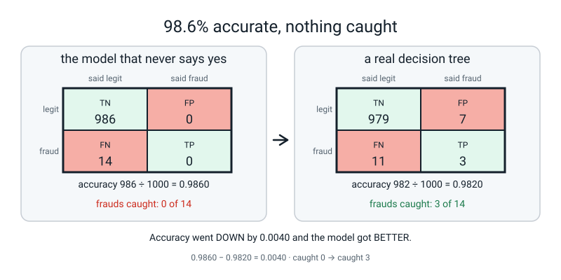
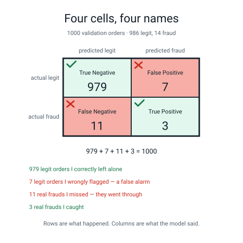
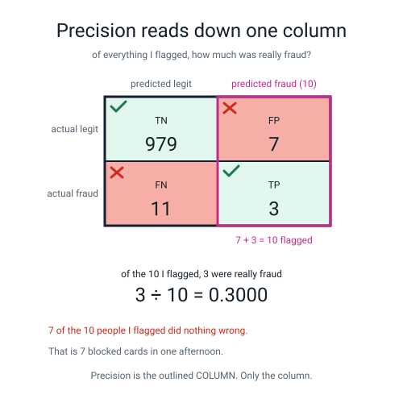
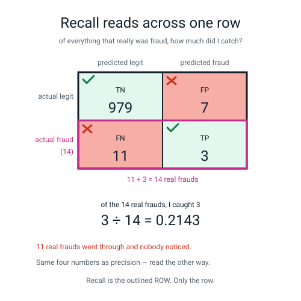
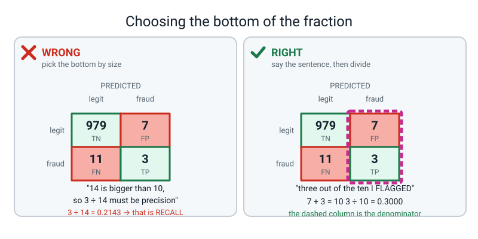
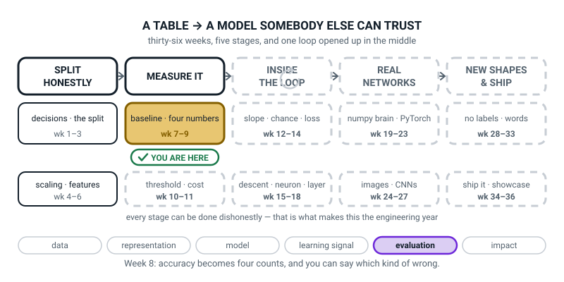
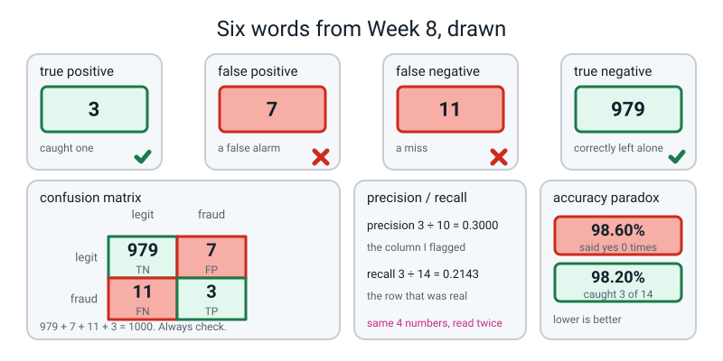

# Week 8 — Four Numbers That Tell You What Kind of Wrong

[⬅ Week 7](week-07.md) · [Course Home](../README.md) · [Next ➡](week-09.md) · [Workbook](../workbook/week-08.md)

---

> ### This week in one sentence
> **Accuracy hides *which* mistakes you made — so you keep four counts instead: caught, false alarm, miss, correctly left alone — and from those four you can build a model that scores 98.6% and has never once said yes.**
>
> **By the end of this chapter you will be able to:**
> - **Build a confusion matrix by hand** from a list of predictions, and name all four cells **in the language of the application** — not "FP", but "a real customer's card was declined"
> - **Compute precision, recall and specificity** from those four counts, showing **which count went on the bottom** of each fraction
> - **Demonstrate the accuracy paradox**: build a model that scores 98.6% and has caught nothing at all
> - **Say which of a false positive and a false negative costs more** for a stated application, and why
>
> **New maths:** none. Two fractions with whole numbers above and below the line, all done by hand before any code runs.
>
> **New syntax:** `make_classification(weights=[0.99, 0.01], random_state=0)` · `confusion_matrix(y, pred).ravel()` · `precision_score(y, pred)` / `recall_score(y, pred)` · `classification_report(y, pred)`
>
> **Reading time:** about 40 minutes. **Homework:** about 60 minutes. **You will need paper you are happy to draw a 2×2 grid on, about eight times.**

---

## 🪝 Start Here

Here is a model. This is the whole thing:

```text
    NOT FRAUD
```

It is a piece of paper. It says "not fraud" to every transaction that arrives. It does not look at the transaction. **It does not know what a transaction is.**

Now the data. Five thousand card transactions, and **72 of them are fraud** — about one in seventy. Of those, 1,000 are in the validation pile, and 14 of *those* are fraud.

**Work out the piece of paper's accuracy before you read on.** There are 1,000 transactions and it says "not fraud" to all of them.

```text
986 ÷ 1000 = 0.9860
```

**98.6% accurate.** Last week you worked for half an hour to move a score by 0.0058. This piece of paper took four seconds.

**Now the question that makes the week: how many frauds did it catch?**

None. Zero out of fourteen. Fourteen people had money taken and the 98.6%-accurate model noticed nothing.

And here is the part that should genuinely annoy you. In twenty minutes you are going to build a real model on this data — a proper decision tree, the kind you built in Level 2. **It will score 98.20%.** Lower. Worse accuracy than the piece of paper.

**And it catches three of the fourteen.**

```text
piece of paper   accuracy 0.9860    caught 0 of 14
real model       accuracy 0.9820    caught 3 of 14
```

Which of those two would you rather have running on your card?

**So accuracy went down, and the model got better.** Read that twice, because it should feel wrong. And if a number is not measuring the thing you care about, **it does not matter how big it is.**


*Figure 8.1 — 98.6% accurate, nothing caught. Higher accuracy, zero frauds found.*

> **accuracy paradox** — when the thing you are looking for is rare, a model that never predicts it can score very high accuracy, and a genuinely useful model can score lower. Accuracy simply does not have the resolution to tell them apart.

🍕 **The analogy.** A smoke alarm that never goes off is **correct** on every single day your kitchen does not catch fire. That is thousands of days. Its accuracy is magnificent. It is wrong exactly once — **on the one day anybody cares about.**

---

## 🧠 The Big Idea

> **📌 About the code in this section.** The blocks below are **illustrations, not files**. Each carries on from the one above. **The complete runnable file is in 💻 Type This.**

### 1. Accuracy adds up things that should not be added up

Accuracy takes **two completely different kinds of correct** — "you spotted a fraud" and "you left an ordinary shopping trip alone" — and adds them together. Then it takes **two completely different kinds of wrong** — "you blocked an innocent person's card" and "you let a theft through" — and adds those together too.

Then it hands you one number. **And the one number cannot be taken apart again.**

So we are going to stop adding them up. **Keep all four.**

### 2. Four counts, and the trick for reading their names

Every single prediction lands in exactly one of four boxes. **There is no fifth box.**

> **True Positive (TP)** — it was fraud, you said fraud. **You caught one.**
>
> **True Negative (TN)** — it was legitimate, you said legitimate. **You correctly left it alone.**
>
> **False Positive (FP)** — it was legitimate, you said fraud. **A false alarm.**
>
> **False Negative (FN)** — it was fraud, you said legitimate. **A miss.**

> **confusion matrix** — the 2×2 table holding those four counts.

**Here is the trick nobody guesses, so you are just going to be told it. Read the two words backwards.**

- **The SECOND word is what YOU predicted.** "Positive" means you said yes.
- **The FIRST word is whether you were RIGHT.** "False" means you were wrong about it.

So a **false positive** is: *you predicted positive, and that was false.* You cried wolf.
A **false negative** is: *you predicted negative, and that was false.* The wolf walked past.

> **💡 Try this:** test the trick three times right now, out loud. *"The card was stolen and the model let it through"* — which cell? *(You said negative; you were wrong. **False negative.**)* *"A tourist's perfectly good card gets blocked in Rome"* — *(You said positive; you were wrong. **False positive.**)* *"An ordinary weekly shop, nothing flagged"* — *(You said negative; you were right. **True negative.**)* Three of those and the trick sticks for good.

Here are the real numbers, from a decision tree on 1,000 validation rows:


*Figure 8.2 — Four cells, four names. Rows are what happened; columns are what the model said.*

```text
                       PREDICTED
                 legit          fraud
ACTUAL  legit  │   979    │      7    │  = 986 real legit
        fraud  │    11    │      3    │  =  14 real fraud
               └──────────┴───────────┘
                   990          10
```

**Rows are what actually happened. Columns are what the model said.** Say it back to yourself. It is the single most-confused thing in the week.

**And now the check that must always pass:**

```text
979 + 7 + 11 + 3 = 1000
```

One thousand, which is the number of validation rows. **Do that addition every single time you draw one of these.** It takes five seconds and it catches every counting mistake you will ever make.

> **⚠️ Watch out:** `sklearn.metrics.confusion_matrix` puts **rows = what actually happened, columns = what the model said, class 0 first**. Plenty of textbooks put positives first, or transpose the whole thing. **Never index into it blindly.** Always unpack it into four named variables and then use the names:
>
> ```python
> tn, fp, fn, tp = confusion_matrix(y_true, y_pred).ravel()
> ```
>
> `.ravel()` means "flatten this 2×2 grid into a list of four, reading left-to-right, top-to-bottom".

### 3. Two fractions, the same four numbers, read once down and once across

This is the heart of the week and the place to slow right down.

**Precision and recall are not two measurements. They are the same four numbers read twice.**

> **precision** = TP ÷ (TP + FP) — *"of everything I flagged, how much was really fraud?"* **Read down the predicted-fraud column.**

You flagged the whole right-hand column. How many is that? `7 + 3 = 10`. And how many of the ten were really fraud? Three.

**Say the sentence first: "three out of the ten I flagged."** Then write the fraction.

```text
precision  =  3 ÷ 10  =  0.3000
```


*Figure 8.3 — Precision reads down one column. Of the 10 flagged, 3 were really fraud.*

> **recall** = TP ÷ (TP + FN) — *"of everything that really was fraud, how much did I catch?"* **Read across the actual-fraud row.**

That row: `11 + 3 = 14`. And you caught three.

**"Three out of the fourteen that really were fraud."**

```text
recall  =  3 ÷ 14  =  0.2143
```


*Figure 8.4 — Recall reads across one row. Of the 14 real frauds, 3 were caught.*

**Now look at what just happened. The four numbers did not move.** 979, 7, 11, 3. Draw a box round a column, you get 0.30. Draw a box round a row, you get 0.21. **Only the outline moved.**

One more, to close the set:

> **specificity** = TN ÷ (TN + FP) — *"of everything that really was legitimate, how much did I correctly leave alone?"*

```text
specificity  =  979 ÷ 986  =  0.9929
```

0.9929 is the only respectable-looking number here, and it is respectable because there were **986 easy rows** and the model got nearly all of them. **That is what accuracy was mostly measuring all along.**

**And here is the single most important thing about all three fractions:**

| Metric | On top | On the bottom | Which region of the table |
|---|---|---|---|
| **precision** | TP = 3 | TP + FP = **10** | the **column** you predicted positive |
| **recall** | TP = 3 | TP + FN = **14** | the **row** that really was positive |
| **specificity** | TN = 979 | TN + FP = **986** | the **row** that really was negative |
| accuracy | TP + TN = 982 | all four = **1000** | the **whole table** |

**The top of all three is easy. The whole difficulty of this week is the bottom.** Every one has a `TP` or a `TN` above the line. What changes is what you divide by — and choosing that is the skill.

> **🧑‍🏫 If a student asks:** *"where is `specificity_score`?"* **There isn't one in scikit-learn.** You compute it yourself: `tn / (tn + fp)`. People look for it and worry that they have installed something wrong. They have not.

🍕 **The analogy, and it is the best one in the whole subject.** You are fishing with a net.

- **Precision:** of everything in your net, what fraction is actually fish? *(The rest is boots and seaweed.)*
- **Recall:** of all the fish in the lake, what fraction ended up in your net?
- Throw a tiny net over one fish you can already see: **precision 100%, recall 1%.**
- Drain the entire lake: **recall 100%, precision terrible.**

**You can always max out one by wrecking the other.** That is why nobody ever reports just one — and it is why next week exists.

### 4. The question that is not a maths question

Once you have precision and recall, somebody has to decide which one matters. **That is not a decision the data can make.**

| Application | A false positive means… | A false negative means… | Which hurts more |
|---|---|---|---|
| **Spam filter** | your bank's one-time passcode goes to the junk folder | one junk email in your inbox | **the false positive** |
| **Cancer screening** | an anxious week and one extra scan | an undetected tumour | **the false negative** |
| **Fraud detection** | a real card declined at a petrol pump, 200 miles from home | money stolen | usually the false negative — **but ask the person at the pump** |
| **Deciding who gets bail** | a low-risk person held in a cell | a high-risk person released | **contested, and it is not a maths question at all** |

**Write these as sentences about a person's afternoon, not as abbreviations.** "FP" is a label. *"A nurse's card was declined at the supermarket at 6pm with three children in the trolley"* is a consequence — and it is the only version anybody will ever argue with you about.

That difference is the whole reason this week exists. **A metric you can only say in abbreviations is a metric nobody will ever argue with, and metrics that nobody argues with are how bad systems get shipped.**

---

## 🔁 The Idea From Last Week, Used Harder

There is no new maths this week. Instead, one habit you already have gets pointed at a much bigger target.

Since Week 2 you have built a `DummyClassifier` before building anything real, and you have known why: **the baseline is the number to beat.** In Week 7 you used it as a floor. This week it becomes an **alarm**.

Here is the rule in its grown-up form:

> **Always print the majority-class rate next to the accuracy.**

```text
majority rate on val : 0.9860
accuracy of the tree : 0.9820
```

**Read those two lines together and the paradox is not mysterious any more — it is obvious.** The tree is *below* the number you would get by doing nothing. Reported on its own, `0.9820` sounds like an achievement. Reported next to `0.9860`, it is clearly a problem, and you have known how to compute that second number for six weeks.

**And here is the arithmetic that finishes the argument.** Accuracy is not an independent measurement at all — it is a **weighted average of recall and specificity**, weighted by how many rows are in each class:

```text
recall      x share of fraud  = 0.2143 x 0.014 = 0.0030
specificity x share of legit  = 0.9929 x 0.986 = 0.9790
                        total = 0.9820
```

**0.9820. Exactly the accuracy.**

So accuracy on this data is **98.6% a statement about "did you leave the easy ones alone"** and **1.4% a statement about "did you catch the hard ones."** That is the paradox in arithmetic, and it is the clearest explanation of it there is: accuracy was never hiding anything from you. **You just did not ask what it was made of.**

> **🔢 The maths, slowly:** 0.014 is 14 ÷ 1000, the share of rows that are fraud. 0.986 is 986 ÷ 1000, the share that are legit. Multiply each metric by its share and add — that is what a weighted average is. Check it on a calculator: `0.2143 × 0.014 = 0.0030002`, `0.9929 × 0.986 = 0.97900`, and `0.0030 + 0.9790 = 0.9820`. **Every digit is checkable.**

---

## 💻 Type This

One file, `fraud.py`. **The whole thing runs in under 2 seconds**, including generating 5,000 rows and fitting two models. **Nothing downloads.**

### Step 1 — make a rare-event table on purpose

Type this first block into `fraud.py`. It builds the table and prints its size and fraud count.

```python
"""fraud.py - four numbers, and what accuracy hides."""
from sklearn.datasets import make_classification
from sklearn.dummy import DummyClassifier
from sklearn.metrics import (accuracy_score, classification_report,
                             confusion_matrix, precision_score, recall_score)
from sklearn.model_selection import train_test_split
from sklearn.tree import DecisionTreeClassifier

X, y = make_classification(n_samples=5000, n_features=8, n_informative=4,
                           n_redundant=0, weights=[0.99, 0.01], random_state=0)
print("rows:", X.shape[0], " columns:", X.shape[1])
print("fraud rows:", int(y.sum()), " fraud rate: %.4f" % y.mean())
```

`make_classification` invents a table for you. **It does not download anything** — it makes numbers up with a random-number generator. Reading the settings:

| Setting | What it does |
|---|---|
| `n_samples=5000` | make 5,000 rows |
| `n_features=8` | eight columns of numbers |
| `n_informative=4` | four of those eight genuinely relate to the answer; the other four are decoration |
| `n_redundant=0` | do not add columns that are copies of other columns |
| `weights=[0.99, 0.01]` | **the important one.** Aim for 99% class 0 and 1% class 1 |
| `random_state=0` | the seed. **Same seed, same table, on every machine** |

It hands back **two** things: `X`, the table of eight columns, and `y`, the answer column of 0s and 1s. Two names on the left of one `=` is how Python receives two things at once.

**Predict the fraud count before running.** We asked for 1% of 5,000.

```text
rows: 5000  columns: 8
fraud rows: 72  fraud rate: 0.0144
```

**Seventy-two, not fifty.** `weights` is a **target, not a promise** — the generator aims at 1% and lands at 1.44%. Which is a habit worth having on its own: **you asked for something, and then you checked what you got.** Never assume the data is what you ordered.

> **Why generated data this week, when we have a delivery table?** Because the delivery table is 28.75% late — nicely balanced — and **the accuracy paradox needs a rare event to bite.** We need 1%, and we can make 1% to order.

### Step 2 — three piles, and count the frauds in each

Add this block. It splits the rows into train, validation and test piles and prints each pile's fraud count.

```python
X_tmp, X_test, y_tmp, y_test = train_test_split(
    X, y, test_size=0.20, random_state=0, stratify=y)
X_train, X_val, y_train, y_val = train_test_split(
    X_tmp, y_tmp, test_size=0.25, random_state=0, stratify=y_tmp)
print("train %d rows, %d fraud" % (len(X_train), int(y_train.sum())))
print("val   %d rows, %d fraud" % (len(X_val), int(y_val.sum())))
print("test  %d rows, %d fraud" % (len(X_test), int(y_test.sum())))
```

```text
train 3000 rows, 44 fraud
val   1000 rows, 14 fraud
test  1000 rows, 14 fraud
```

Week 2's three piles, unchanged. And look what `stratify=y` bought: **44 + 14 + 14 = 72.** Every fraud accounted for, and each pile got its fair share. Without `stratify` the validation pile could easily have had 8 frauds or 22 by luck, and **every number in this chapter would move.**

**Fourteen.** That is how many frauds you get to be judged on. **Fourteen is a very small number and you should be uneasy about it.** Every fraction today has a 14 or a 10 on the bottom, and small denominators wobble. Week 11 fixes it. Today, just notice.

### Step 3 — the piece of paper, in code

Add this block. It builds the model that never says yes and prints its four counts.

```python
print()
print("--- the model that never says yes ---")
lazy = DummyClassifier(strategy="most_frequent").fit(X_train, y_train)
pred_lazy = lazy.predict(X_val)
print("accuracy on val : %.4f" % accuracy_score(y_val, pred_lazy))
print("times it said 1 :", int(pred_lazy.sum()))
tn, fp, fn, tp = confusion_matrix(y_val, pred_lazy).ravel()
print("tn %d  fp %d  fn %d  tp %d" % (tn, fp, fn, tp))
```

**Predict all four counts, in pen, before running. Two of them are zero — which two?**

```text
--- the model that never says yes ---
accuracy on val : 0.9860
times it said 1 : 0
tn 986  fp 0  fn 14  tp 0
```

0.9860, exactly as you calculated on paper. And `times it said 1: 0` — it never once predicted fraud, in a thousand tries.

**Look at the four counts. `fp 0` and `tp 0`. The entire right-hand column of the table is zero.** That is the fingerprint of a model that has given up: it never says yes, so it never raises a false alarm — **and it never catches anything either.**

`DummyClassifier(strategy="most_frequent")` is from Week 2, and now you know what it was for. **It is not a joke model. It is the number you have to beat, and today it is beating you.**

### Step 4 — 🐞 ask the lazy model for its precision

Add this line, then run the file.

```python
print("precision       : %.4f" % precision_score(y_val, pred_lazy))
```

```text
/Library/Frameworks/Python.framework/Versions/3.10/lib/python3.10/site-packages/sklearn/metrics/_classification.py:1731: UndefinedMetricWarning: Precision is ill-defined and being set to 0.0 due to no predicted samples. Use `zero_division` parameter to control this behavior.
  _warn_prf(average, modifier, f"{metric.capitalize()} is", result.shape[0])
precision       : 0.0000
```

**Is that an error or a warning?** A **warning**. The program did not stop; it printed 0.0000 and carried on.

Now read what it actually says: **"no predicted samples."** Precision is *"of everything I flagged, how much was fraud"* — and it flagged **nothing**. Zero divided by zero is not a number. So scikit-learn shrugged, printed 0.0000, and told you why in a sentence.

**This is one of the friendliest messages you will get all year.** It is not saying you did something wrong. **It is describing your model.**

And the honest answer is not "zero". It is **"undefined"** — because the fraction has nothing on the bottom.

### Step 5 — the real model, and 🐞 the silent one

Add this block. It fits a decision tree and prints its four counts.

```python
print()
print("--- a real model ---")
tree = DecisionTreeClassifier(random_state=0).fit(X_train, y_train)
pred = tree.predict(X_val)
tn, fp, fn, tp = confusion_matrix(pred, y_val).ravel()     # <-- the mistake
print("tn %d  fp %d  fn %d  tp %d" % (tn, fp, fn, tp))
```

```text
--- a real model ---
tn 979  fp 11  fn 7  tp 3
```

**Compare that with the table in section 2. Which two numbers moved — and did the program complain?**

The **7 and the 11** — false positives and false negatives — have changed places. **And nothing went red.** No error, no warning, no hint at all.

Look at the call: `confusion_matrix(pred, y_val)`. **Truth goes first.** The predictions were put first, so scikit-learn thought the predictions *were* the truth and the truth was the prediction — and it obligingly turned the whole table on its side.

**Why does this matter more than any typo you have made this term?** Because the two numbers that swapped are **the two errors**. Get them the wrong way round and you will tell somebody *"we blocked 11 innocent cards and missed 7 frauds"* when the truth is *"we blocked 7 innocent cards and missed 11 frauds"*. Those are different afternoons for different people, and **both sentences sound equally confident.**

```text
counts right   : [979   7  11   3]
counts swapped : [979  11   7   3]
```

Fix it:

```python
tn, fp, fn, tp = confusion_matrix(y_val, pred).ravel()
```

```text
tn 979  fp 7  fn 11  tp 3
```

> **⚠️ Watch out:** the sanity check is not the numbers, it is the *meaning*. FN is "frauds I missed", and on this data that is **11**, not 7. If your FN is smaller than your FP on a model that barely catches anything, look at your argument order.

### Step 6 — check your paper arithmetic

Add this block. It prints the metrics you worked out on paper, then the full report.

```python
print("accuracy    : %.4f" % accuracy_score(y_val, pred))
print("precision   : %.4f" % precision_score(y_val, pred))
print("recall      : %.4f" % recall_score(y_val, pred))
print("specificity : %.4f" % (tn / (tn + fp)))
print()
print(classification_report(y_val, pred, digits=4))
```

**You computed three of those four on paper. Read them out first.**

```text
accuracy    : 0.9820
precision   : 0.3000
recall      : 0.2143
specificity : 0.9929

              precision    recall  f1-score   support

           0     0.9889    0.9929    0.9909       986
           1     0.3000    0.2143    0.2500        14

    accuracy                         0.9820      1000
   macro avg     0.6444    0.6036    0.6204      1000
weighted avg     0.9792    0.9820    0.9805      1000
```

**All three match your paper, to four decimal places. That is the point of running it.** The computer is not the authority here — **you did the maths and the computer agreed with you.**

Now `classification_report`. There is a lot in there and **today you read exactly two rows.**

**Row `1`.** That is your fraud class. `0.3000`, `0.2143` — your two numbers — and `support 14`.

> **support** — how many rows of that class there really were. Nothing more. **It is a count, not a score.**

**The `accuracy` row.** `0.9820`. That is the number that would have made you feel fine about a model that misses eleven frauds out of fourteen.

`f1-score`, `macro avg`, `weighted avg` — **next week.** Do not read them today; they need a new kind of average and it takes a whole lesson.

`digits=4` asks for four decimal places instead of the default two, for the same reason you rounded to four last week: **our numbers are small and two decimals throws them away.**

### The complete `fraud.py`

```python
"""fraud.py - four numbers, and what accuracy hides."""
from sklearn.datasets import make_classification
from sklearn.dummy import DummyClassifier
from sklearn.metrics import (accuracy_score, classification_report,
                             confusion_matrix, precision_score, recall_score)
from sklearn.model_selection import train_test_split
from sklearn.tree import DecisionTreeClassifier

X, y = make_classification(n_samples=5000, n_features=8, n_informative=4,
                           n_redundant=0, weights=[0.99, 0.01], random_state=0)
print("rows:", X.shape[0], " columns:", X.shape[1])
print("fraud rows:", int(y.sum()), " fraud rate: %.4f" % y.mean())

X_tmp, X_test, y_tmp, y_test = train_test_split(
    X, y, test_size=0.20, random_state=0, stratify=y)
X_train, X_val, y_train, y_val = train_test_split(
    X_tmp, y_tmp, test_size=0.25, random_state=0, stratify=y_tmp)
print("train %d rows, %d fraud" % (len(X_train), int(y_train.sum())))
print("val   %d rows, %d fraud" % (len(X_val), int(y_val.sum())))
print("test  %d rows, %d fraud" % (len(X_test), int(y_test.sum())))

print()
print("--- the model that never says yes ---")
lazy = DummyClassifier(strategy="most_frequent").fit(X_train, y_train)
pred_lazy = lazy.predict(X_val)
print("accuracy on val : %.4f" % accuracy_score(y_val, pred_lazy))
print("times it said 1 :", int(pred_lazy.sum()))
tn, fp, fn, tp = confusion_matrix(y_val, pred_lazy).ravel()
print("tn %d  fp %d  fn %d  tp %d" % (tn, fp, fn, tp))

print()
print("--- a real model ---")
tree = DecisionTreeClassifier(random_state=0).fit(X_train, y_train)
pred = tree.predict(X_val)
tn, fp, fn, tp = confusion_matrix(y_val, pred).ravel()
print("tn %d  fp %d  fn %d  tp %d" % (tn, fp, fn, tp))
print("accuracy    : %.4f" % accuracy_score(y_val, pred))
print("precision   : %.4f" % precision_score(y_val, pred))
print("recall      : %.4f" % recall_score(y_val, pred))
print("specificity : %.4f" % (tn / (tn + fp)))

print()
print(classification_report(y_val, pred, digits=4))
```

**Real output. Runtime under 2 seconds.**

```text
rows: 5000  columns: 8
fraud rows: 72  fraud rate: 0.0144
train 3000 rows, 44 fraud
val   1000 rows, 14 fraud
test  1000 rows, 14 fraud

--- the model that never says yes ---
accuracy on val : 0.9860
times it said 1 : 0
tn 986  fp 0  fn 14  tp 0

--- a real model ---
tn 979  fp 7  fn 11  tp 3
accuracy    : 0.9820
precision   : 0.3000
recall      : 0.2143
specificity : 0.9929

              precision    recall  f1-score   support

           0     0.9889    0.9929    0.9909       986
           1     0.3000    0.2143    0.2500        14

    accuracy                         0.9820      1000
   macro avg     0.6444    0.6036    0.6204      1000
weighted avg     0.9792    0.9820    0.9805      1000
```

**Accuracy 0.9820 for the tree, 0.9860 for the piece of paper. Which is better, and how do you know?** The tree — it caught 3 of 14, the paper caught 0.

**And notice you did not use accuracy to answer that.** You used the four counts. **Accuracy could not tell you, and the four counts could. That is the whole lesson.**

---

## 🔍 Worked Examples

These three examples use the same four cells in three settings: index cards, a hospital and a school. Each one is for practising the habit of naming the cells in the language of the application.

### Worked Example 1 — Forty index cards, on a table (the class activity)

No computer at all. Forty cards, each with two lines on it — `actual:` and `predicted:` — shuffled and face down. Four labelled piles:

```text
CAUGHT (TP)   ·   FALSE ALARM (FP)   ·   MISS (FN)   ·   LEFT ALONE (TN)
```

Turn over one card at a time. Read both lines. Put it on the pile it belongs to. **Every card belongs to exactly one pile.**

**The four piles come out at:**

| | predicted legit | predicted fraud | row total |
|---|---|---|---|
| **actual legit** | **22** left alone | **6** false alarm | 28 |
| **actual fraud** | **3** missed | **9** caught | 12 |
| column total | 25 | 15 | **40** |

**The check: 22 + 6 + 3 + 9 = 40.** ✅ If it does not come to 40, a card is on the floor or on the wrong pile. **Find it before going on** — letting a wrong 2×2 through here poisons everything after it.

**Now both fractions, from the piles, by putting your hands on them.**

**Precision.** Put your hand on the two piles you **flagged** — `CAUGHT` and `FALSE ALARM`. How many cards is that? `9 + 6 = 15`. And how many of those fifteen were really fraud? Nine.

```text
precision  =  9 ÷ 15  =  0.6000
```

**Recall.** Now put your hands on the two piles that really **were** fraud — `CAUGHT` and `MISS`. `9 + 3 = 12`. And you caught nine.

```text
recall  =  9 ÷ 12  =  0.7500
```

And for completeness:

```text
specificity  =  22 ÷ 28       =  0.7857
accuracy     =  (9 + 22) ÷ 40 =  31 ÷ 40  =  0.7750
```

**Checked against scikit-learn:**

```text
four piles: tn 22 fp 6 fn 3 tp 9   total 40
precision   0.6000  (9/15)
recall      0.7500  (9/12)
specificity 0.7857  (22/28)
accuracy    0.7750  (31/40)
```

**The moment to notice: you moved your hands twice, over the same forty cards, and got 0.6000 and 0.7500. Nothing about the model changed between those two numbers.**

> **🧑‍🏫 If a student asks:** *"why did the piece of paper look brilliant on the fraud data and obviously useless here?"* Put every card on `LEFT ALONE` and `MISS`: TN 28, FN 12, both other piles empty. Accuracy `28 ÷ 40 = 0.7000` and recall `0 ÷ 12 = 0`. **On this data the useless model looks useless.** It looked brilliant on the fraud data because 14 in 1,000 is far rarer than 12 in 40. **The paradox is caused by rarity, not by accuracy being a stupid idea.**

### Worked Example 2 — The same four cells, in a hospital (medicine)

Same four cells, completely different stakes. `load_breast_cancer` ships inside scikit-learn: 569 tumour scans, 30 measurements each. We flip the label so that **1 = malignant** — the thing we are hunting.

```python
"""w8we2.py - the same four cells, in a hospital."""
from sklearn.datasets import load_breast_cancer
from sklearn.metrics import (accuracy_score, confusion_matrix,
                             precision_score, recall_score)
from sklearn.model_selection import train_test_split
from sklearn.tree import DecisionTreeClassifier

data = load_breast_cancer()
X = data.data
y = 1 - data.target          # 1 = malignant (the thing we are hunting)
print("rows:", X.shape[0], " columns:", X.shape[1])
print("malignant rows:", int(y.sum()), " rate: %.4f" % y.mean())

X_tmp, X_test, y_tmp, y_test = train_test_split(
    X, y, test_size=0.20, random_state=0, stratify=y)
X_train, X_val, y_train, y_val = train_test_split(
    X_tmp, y_tmp, test_size=0.25, random_state=0, stratify=y_tmp)
print("train %d rows, %d malignant" % (len(X_train), int(y_train.sum())))
print("val   %d rows, %d malignant" % (len(X_val), int(y_val.sum())))

tree = DecisionTreeClassifier(random_state=0).fit(X_train, y_train)
pred = tree.predict(X_val)
tn, fp, fn, tp = confusion_matrix(y_val, pred).ravel()
print()
print("tn %d  fp %d  fn %d  tp %d" % (tn, fp, fn, tp))
print("check: %d + %d + %d + %d = %d" % (tn, fp, fn, tp, tn+fp+fn+tp))
print("accuracy    : %.4f  = (%d + %d) / %d" % (accuracy_score(y_val, pred), tp, tn, len(y_val)))
print("precision   : %.4f  = %d / %d" % (precision_score(y_val, pred), tp, tp+fp))
print("recall      : %.4f  = %d / %d" % (recall_score(y_val, pred), tp, tp+fn))
print("specificity : %.4f  = %d / %d" % (tn/(tn+fp), tn, tn+fp))
```

**Real output. Runtime under 1 second.**

```text
rows: 569  columns: 30
malignant rows: 212  rate: 0.3726
train 341 rows, 127 malignant
val   114 rows, 43 malignant

tn 69  fp 2  fn 8  tp 35
check: 69 + 2 + 8 + 35 = 114
accuracy    : 0.9123  = (35 + 69) / 114
precision   : 0.9459  = 35 / 37
recall      : 0.8140  = 35 / 43
specificity : 0.9718  = 69 / 71
```

**Now name the four cells in the language of the application, which is the whole point:**

| Count | In this hospital, this is… |
|---|---|
| **TP 35** | 35 women whose malignant tumour was flagged and who got treated |
| **TN 69** | 69 women with a benign lump who were correctly reassured and went home |
| **FP 2** | **2 women told there might be cancer when there was not.** An anxious fortnight, an extra biopsy, and a scar |
| **FN 8** | **8 women with a malignant tumour who were told it was benign.** They went home and nothing happened next |

**Read the two error cells again and then look at the accuracy: 0.9123.** Ninety-one per cent. It sounds fine. **It is not fine, and the number that says so is recall 0.8140 — eight women out of forty-three.**

**Notice the shape is the mirror image of the fraud data.** Here precision (0.9459) is *higher* than recall (0.8140): the model is cautious, it flags rarely, and it is usually right when it does. **For a fraud model that is fine. For cancer screening it is exactly backwards** — a false positive costs a fortnight of worry, a false negative can cost a life. **You would want recall pushed up even at the cost of many more false positives.** Which you cannot do yet. That dial is Week 10.

### Worked Example 3 — Twenty pieces of homework (school)

Small enough to check on paper, line by line. A school builds a flagger: *"is this student going to miss the deadline?"* Twenty students. `1` means "missed it" / "was flagged".

```python
"""w8we3.py - twenty pieces of homework, one flagger, four cells."""
import numpy as np
from sklearn.metrics import (accuracy_score, confusion_matrix,
                             precision_score, recall_score)

names = ["Ada","Ben","Cleo","Dev","Eli","Fay","Gus","Hana","Ivo","Jo",
         "Kit","Lena","Mo","Nia","Ola","Pip","Quin","Rae","Sam","Tao"]
#          did they actually miss the deadline?
actual  = [1,   0,   0,    1,   0,   0,   1,   0,     0,   1,
           0,   0,     0,   1,   0,    0,    0,    0,   1,   0]
#          did the flagger say "at risk"?
flagged = [1,   0,   1,    1,   0,   1,   0,   0,     0,   1,
           0,   1,     0,   1,   0,    0,    0,    0,   0,   0]
a = np.array(actual); p = np.array(flagged)
print("%-6s %8s %8s   cell" % ("name", "missed?", "flagged?"))
for n, x, q in zip(names, actual, flagged):
    cell = {(1,1): "TP  caught", (0,1): "FP  false alarm",
            (1,0): "FN  a miss", (0,0): "TN  left alone"}[(x, q)]
    print("%-6s %8d %8d   %s" % (n, x, q, cell))
tn, fp, fn, tp = confusion_matrix(a, p).ravel()
print()
print("tn %d  fp %d  fn %d  tp %d" % (tn, fp, fn, tp))
print("check: %d + %d + %d + %d = %d" % (tn, fp, fn, tp, tn+fp+fn+tp))
print("accuracy    %.4f  = (%d + %d) / %d" % (accuracy_score(a,p), tp, tn, len(a)))
print("precision   %.4f  = %d / %d" % (precision_score(a,p), tp, tp+fp))
print("recall      %.4f  = %d / %d" % (recall_score(a,p), tp, tp+fn))
print("specificity %.4f  = %d / %d" % (tn/(tn+fp), tn, tn+fp))
```

**Real output. Runtime instant.**

```text
name    missed? flagged?   cell
Ada           1        1   TP  caught
Ben           0        0   TN  left alone
Cleo          0        1   FP  false alarm
Dev           1        1   TP  caught
Eli           0        0   TN  left alone
Fay           0        1   FP  false alarm
Gus           1        0   FN  a miss
Hana          0        0   TN  left alone
Ivo           0        0   TN  left alone
Jo            1        1   TP  caught
Kit           0        0   TN  left alone
Lena          0        1   FP  false alarm
Mo            0        0   TN  left alone
Nia           1        1   TP  caught
Ola           0        0   TN  left alone
Pip           0        0   TN  left alone
Quin          0        0   TN  left alone
Rae           0        0   TN  left alone
Sam           1        0   FN  a miss
Tao           0        0   TN  left alone

tn 11  fp 3  fn 2  tp 4
check: 11 + 3 + 2 + 4 = 20
accuracy    0.7500  = (4 + 11) / 20
precision   0.5714  = 4 / 7
recall      0.6667  = 4 / 6
specificity 0.7857  = 11 / 14
```

**Do the whole thing on paper first and then check against that output.** Count the TP rows: Ada, Dev, Jo, Nia — **four**. FP: Cleo, Fay, Lena — **three**. FN: Gus, Sam — **two**. TN: everybody else — **eleven**. `11 + 3 + 2 + 4 = 20`. ✅

**Now name the errors as things that happened to a person:**

> **The three false alarms.** Cleo, Fay and Lena all got an email home saying they were at risk of missing the deadline. All three handed the work in on time. Lena's parents grounded her for a weekend over it.
>
> **The two misses.** Gus and Sam were not flagged, so nobody checked on them, and both missed the deadline. Gus had not started. Sam had started and got stuck on question 3 and did not know he was allowed to ask.

**And here is why this example matters: the majority-class rate is 14 ÷ 20 = 0.7000, and the accuracy is 0.7500.** So the flagger beats "assume nobody will miss it" by **0.05** — real, but not enormous. Applying last week's rule to a *balanced-ish* table like this is exactly the habit to keep.

---

## 🐞 When It Breaks

This section is for reading this week's error messages and warnings, and for knowing what each one means. It covers four real messages from four real broken runs.

### Break 1 — a warning that is describing your model, not your code

```python
print("precision : %.4f" % precision_score(y_val, pred_lazy))
```

```text
UndefinedMetricWarning: Precision is ill-defined and being set to 0.0 due to no predicted samples. Use `zero_division` parameter to control this behavior.
precision : 0.0000
```

**What it means.** "You asked 'of what I flagged, how much was right' — and you flagged nothing."

**The fix.** **There isn't one, in the code.** It is a fact about the model: TP + FP = 0, so precision's denominator is zero and the quantity is genuinely undefined. If you want to silence it, `precision_score(y, pred, zero_division=0)` — but **read the message first**, because it is telling you your model has given up.

### Break 2 — four names for one number

```python
tn, fp, fn, tp = confusion_matrix([0,0,0,0,0], [0,0,0,0,0]).ravel()
```

```text
UserWarning: A single label was found in 'y_true' and 'y_pred'. For the confusion matrix to have the correct shape, use the 'labels' parameter to pass all known labels.
Traceback (most recent call last):
  File "w8err2.py", line 4, in <module>
    tn, fp, fn, tp = confusion_matrix(y, pred).ravel()
ValueError: not enough values to unpack (expected 4, got 1)
```

**What it means.** "I asked for four numbers and got one."

**Why.** Only **one class** appears in both lists, so the matrix is 1×1 rather than 2×2 and `.ravel()` gives you a list of one.

**The fix.** Make sure both lists contain some 0s **and** some 1s. On a hand-made example, include at least one fraud and at least one flag. Or pass `labels=[0, 1]` so the matrix is always 2×2 whatever is in the data.

### Break 3 — probabilities where predictions were wanted

```python
prob = model.predict_proba(X_val)[:, 1]
print(precision_score(y_val, prob))
```

```text
  File ".../sklearn/metrics/_classification.py", line 106, in _check_targets
    raise ValueError(
ValueError: Classification metrics can't handle a mix of binary and continuous targets
```

**What it means.** "One of those lists is 0s and 1s and the other is decimals."

**The fix.** These four counts need **hard 0/1 predictions**: `pred = model.predict(X_val)`. Turning probabilities into predictions by choosing a threshold is **Week 10** — and the fact that this errors *loudly* is a small mercy, because it is the only one of this week's confusions that does.

### Break 4 — the one with no message at all

```python
tn, fp, fn, tp = confusion_matrix(pred, y_val).ravel()     # truth SECOND
```

```text
tn 979  fp 11  fn 7  tp 3
```

**Nothing crashed. There is no warning. Every downstream number about your two errors is wrong.**

```text
counts right   : [979   7  11   3]
counts swapped : [979  11   7   3]
```

**How to catch it.** Two questions, in this order.

1. **Do the four numbers add up to how many rows you have?** They do — 1000 both ways. **This check does not catch a swap**, which is worth knowing, because it catches almost everything else.
2. **Is my FN the number of frauds I missed?** The model caught 3 of 14, so it missed **11**. If your FN says 7, your arguments are the wrong way round.

**The fix.** `confusion_matrix(y_val, pred)`. **Truth first, always.** Every metric in scikit-learn takes truth first, and every single one of them will quietly do something plausible if you get it backwards.

### The whole clinic, for reference

| Message | Cause | Fix |
|---|---|---|
| `UndefinedMetricWarning: Precision is ill-defined ... no predicted samples` | the model never predicts the positive class | nothing to fix in the code — **read it, it is describing the model** |
| `ValueError: not enough values to unpack (expected 4, got 1)` | only one class present, so the matrix is 1×1 | include both classes, or pass `labels=[0, 1]` |
| `ValueError: Classification metrics can't handle a mix of binary and continuous targets` | probabilities passed where predictions were wanted | `pred = model.predict(X)`. Thresholds are Week 10 |
| `ValueError: Number of informative, redundant and repeated features must sum to less than the number of total features` | `n_informative` bigger than `n_features` | `n_informative` must be smaller. Ours is 4 out of 8 |
| `TypeError: only length-1 arrays can be converted to Python scalars` | `"%.4f" % precision_score(..., average=None)` — one number per class | drop `average=None`, or `print()` the array without `%` formatting |
| **no error, FP and FN swapped** | `confusion_matrix(pred, y)` | **truth first.** Sanity check: FN is frauds missed, which is 11 here |
| **no error, accuracy 0.99 and you are pleased** | the positive class is rare | print `1 - y_val.mean()` beside it, every time |
| **no error, precision 1.0000 and recall tiny** | the model flags 2 things and happens to be right about both | look at `tp + fp`. **A ratio with no counts next to it is a rumour** |
| **no error, the report looks like rows of identical numbers** | default is `digits=2` | `classification_report(y, pred, digits=4)` |
| **no error, but the fraud count is not 72** | `random_state` missing or not `0` (an unseeded run gives a different count each time, somewhere around 70) | `random_state=0`. **A printed number from an unseeded run is not a result** |

---

## 🎲 What We Did In Class

This section is a record of the lesson, so you can compare it with your own notes.

### The 98.6% model

Nothing on the screen. `5000 transactions, 72 fraud` on the board, and then a piece of paper held up with `NOT FRAUD` written on it. We did the division ourselves: 986 ÷ 1000 = 0.9860. **Then the question — "how many frauds did it catch?" — and the silence afterwards, which nobody filled.**

Both models went on the board and stayed there all lesson:

```text
piece of paper   accuracy 0.9860    caught 0 of 14
real model       accuracy 0.9820    caught 3 of 14
```

### The 2×2 on the wall, drawn rows first

Rows are what actually happened. Columns are what the model said. **We had to say it back twice.** Then the four names went in the cells with the plain-English version under each, then the naming trick — *second word is what you predicted, first word is whether you were right* — then three fast questions to test it.

Then the real numbers, and the addition: **979 + 7 + 11 + 3 = 1000.**

### One coloured box, moved twice

A box was drawn round the **predicted-fraud column**: 7 + 3 = 10, of which 3 were fraud, so **precision = 3 ÷ 10 = 0.3000**. Then the box was rubbed out and drawn round the **actual-fraud row**: 11 + 3 = 14, of which 3 were caught, so **recall = 3 ÷ 14 = 0.2143**. Then the actual-legit row: **specificity = 979 ÷ 986 = 0.9929**.

**The four numbers never moved. Only the box moved.** That was the moment.

### `fraud.py`, with two mistakes on purpose

We predicted 50 fraud rows and got **72**. We predicted the lazy model's four counts in pen before running and most of us got the two zeros right. Then the `UndefinedMetricWarning` — read out loud, and identified as a *warning describing the model*, not an error. Then `confusion_matrix(pred, y_val)`, which produced `979 11 7 3` and **no complaint of any kind.** Both went in the Bug Log. The second one got the words *"truth first"* written in it.

### The forty cards

Forty cards, shuffled, face down. Four labelled piles. We turned them over one at a time and sorted them, and then counted:

```text
CAUGHT 9   ·   FALSE ALARM 6   ·   MISS 3   ·   LEFT ALONE 22
9 + 6 + 3 + 22 = 40   ✅
```

Then both fractions **from the piles**, hands physically on them: precision `9 ÷ 15 = 0.6000`, recall `9 ÷ 12 = 0.7500`. Then specificity `22 ÷ 28 = 0.7857` and accuracy `31 ÷ 40 = 0.7750`.

Then one card from the `FALSE ALARM` pile and one from the `MISS` pile, and **one sentence each about what happened to that person this afternoon.** Not "FP". A sentence.

### The wrap, and next week's door

All four counts read out, then all three fractions. Then: *"one number I do not want you to report on its own again this year — accuracy 0.9820, from a model that missed eleven frauds out of fourteen."*

And then the thing that opens Week 9: **recall 0.2143 is bad, so flag more transactions.** True — you can push recall up whenever you like. **But most of the extra things you flag come out of the huge legit column, so precision usually falls.** They sit on opposite ends of a see-saw.

---

## 💬 Talk About It

These three questions are for discussing with a partner or a parent. Try each one before you read its hint.

**1. A smoke alarm has never gone off in your house. What are its four counts, and which one can you not see?**

TP = 0 and FP = 0 — the whole "alarm sounded" column is empty. TN is every quiet day. **And FN is the one you cannot see from the alarm itself: how many fires there were.** Zero fires and it has made no mistakes yet (though it has never been tested either, so recall is 0 ÷ 0). One fire and it failed at the only job it had.

> **Hint:** notice that its **specificity is a perfect 1.0000** and its **precision is undefined**. Two of the four cells are empty and the two that matter are the two you cannot read off the device.

**2. Which is worse for a fraud model — blocking 200 transactions to catch 6 frauds, or blocking 6 to catch 1?**

Work out both precisions first (`6 ÷ 200 = 0.0300` and `1 ÷ 6 = 0.1667`) and then ask what you still do not know.

> **Hint:** you cannot answer it. **You do not know how many real frauds there were**, so you have no recall for either — and without recall, "blocked 6" might mean "caught the only one there was" or "missed ninety-nine". **The cell tells you what kind of wrong; only the counts tell you how bad.**

**3. Can too many false positives *cause* false negatives?**

Yes, and this is the best idea in the week. Think about the smoke alarm that goes off every time somebody makes toast.

> **Hint:** somebody takes the battery out. Now it has FP = 0 and it will also have FN = 1 the night there is a real fire. **The false positives caused the false negative.** Fraud has the same shape: decline enough honest cards and customers stop using the card, so nobody is protected at all. **Which means "I don't care about false alarms, safety first" is not actually a safe position.**

---

## ⚠️ Don't Get Tricked

This section is for spotting four wrong ideas that sound reasonable. Each trick shows the wrong thought and the right one.

### Trick 1 — "3 ÷ 14 is precision because 14 is bigger"


*Figure 8.5 — Choosing the bottom of the fraction. Say the sentence, then divide — never the other way round.*

**Wrong:** *"There's a 10 and a 14. Precision is the important one so it gets the big number."*
**Right:** *"Three out of the ten I FLAGGED — that's precision. Three out of the fourteen that really WERE fraud — that's recall."*

**Say the sentence out loud, then write the fraction. Never the other way round.** The whole difficulty of this week is the denominator, and the sentence chooses it for you.

### Trick 2 — "98.6% is a good score"

**Wrong:** *"98.6% accurate! That's nearly perfect."*
**Right:** *"98.6% accurate, and the majority-class rate is also 98.6%, so my model has added exactly nothing."*

It is a **high number**. It is not a good score, because a piece of paper with "no" written on it achieves it. **Always report the majority-class rate next to the accuracy** — `print(1 - y_val.mean())` — and you can never be fooled by this again.

### Trick 3 — "precision and recall are basically the same thing"

**Wrong:** *"They both measure how good it is at finding fraud."*
**Right:** *"They share a numerator — the 3 — which is exactly why they feel similar. Their denominators are completely different regions of the same table: one is a column, one is a row."*

The cure is physical. Put figures 8.3 and 8.4 side by side and trace the outlined **column** with one finger and the outlined **row** with the other. **The four numbers do not move. Only the outline moves.**

### Trick 4 — "precision 1.0 means it's a great model"

**Wrong:** *"Precision 1.0000. Perfect."*
**Right:** *"Precision 1.0000 out of how many guesses? If TP + FP is 2, that means 'I was right about both of the two guesses I made', and I missed twelve frauds."*

**A ratio with no counts next to it is a rumour.** Precision 1.0 out of two guesses is not the same thing as precision 1.0 out of two hundred, and the ratio cannot tell them apart. **Report the counts next to every fraction, every time.**

---

## 🌍 Where You've Seen This

This section is for connecting the four cells to things you already meet in daily life.

1. **Your spam folder.** Every email service in the world is tuned to protect **precision** — they would much rather let one piece of junk into your inbox (a false negative) than send your bank's passcode to spam (a false positive). Which is exactly the opposite of how cancer screening is tuned, on the same maths.
2. **Airport security.** The metal detector is deliberately set to enormous recall and terrible precision: it goes off for belt buckles constantly, because a miss is unthinkable. Every false alarm costs 30 seconds and a pat-down, and they have decided that is a price worth paying.
3. **Covid tests, and the two words you heard on the news for two years.** "Sensitivity" is another name for **recall** and "specificity" is the one you learnt today. Every argument about testing policy was an argument about those two numbers.
4. **Your phone unlocking with your face.** A false positive lets somebody else into your phone. A false negative makes you type your passcode. Apple and Google publish both rates, and they are not remotely equal — because the two errors are not remotely equal.
5. **Autocorrect.** Every time it changes a word you spelled correctly, that is a false positive. Every typo it leaves alone is a false negative. The fact that autocorrect is *infuriating* rather than *useless* tells you which one they optimised.
6. **A school's "students at risk" dashboard.** Exactly Worked Example 3, on thousands of rows — and the false positives are real emails to real parents about children who were fine.

---

## 🧭 Where This Fits

Nothing moves on the map this week, and that is on purpose. Week 8 lives in the **same gold box** as
Week 7 — the tile is labelled *wk 7–9*, so it is three weeks wide. Last week you learned to measure one
number honestly. This week you found out that the one number was hiding three.



*Figure 8.0 — The pipeline in Week 8. The same gold tile as last week: baseline · four numbers runs
Weeks 7 to 9. The ↻ on stage three is the training loop, still grey until Week 12.*

| | |
|---|---|
| **The mental model you now own** | Every single prediction lands in **one of four cells**: caught, false alarm, miss, correctly left alone. Precision and recall are two different fractions built from those same four counts — read once down a column, once across a row. Accuracy adds all four together and quietly averages both of them away. |
| **The one question it answers** | *"What kind of wrong was it?"* — because "it was 98.6% right" does not answer it, and today you proved that. |
| **What it plugs into** | Week 2's `predict_proba` and Week 7's best model: the four cells are built out of that model's own predictions. And the 99/1 table you generated today is the proof that an accuracy of 0.99 can mean absolutely nothing. |
| **What carries forward** | Week 9 folds precision and recall into one number. Week 10 slides the threshold that moves all four counts at once. Week 27 reads a ten-class version of this grid for handwritten digits. Week 35 reports it separately for each subgroup — which is where it stops being arithmetic and starts being fairness. |
| **Spiral thread** | ⚖️ **Evaluation** — lit alone. You did not improve a model today; the model you spent the lesson on was deliberately useless and you never touched it. The entire week is about how you **look** at a result. |

> **💡 Try this:** pick one automatic yes/no decision that happens to you — spam filtering, autocorrect,
> your phone unlocking with your face — and write two sentences: what its false alarm feels like, and
> what its miss feels like. Then say which one the people who built it clearly decided to tolerate. You
> can now read their priorities straight off your own experience.

---

## 🔑 Remember This

These are the points to keep from the week, followed by a syntax card you can copy from.

- **Accuracy adds together two kinds of correct and two kinds of wrong, and the result cannot be taken apart again.** So keep all four counts instead. There is no fifth box.
- **The naming trick: the SECOND word is what you predicted, the FIRST word is whether you were right.** A false positive is "I said positive and that was false" — you cried wolf. A false negative is "I said negative and that was false" — the wolf walked past.
- **979 + 7 + 11 + 3 = 1000.** Add the four cells up every single time you draw a 2×2. Five seconds, and it catches every counting mistake — **but it will not catch a swap.**
- **Precision reads down the column you flagged. Recall reads across the row that was really positive.** Same four numbers, one down, one across. The top of both is easy; the whole skill is the bottom.
- **Say the sentence before you write the fraction.** *"Three out of the ten I flagged"* is precision. *"Three out of the fourteen that really were fraud"* is recall. The sentence chooses the denominator for you.
- **The accuracy paradox: 0.9860 with nothing caught beats 0.9820 with 3 caught.** Always print the majority-class rate beside the accuracy. And accuracy is really `recall × 0.014 + specificity × 0.986` — 98.6% a statement about the easy rows.
- **Truth first, always.** `confusion_matrix(y_val, pred)`. Swap them and FP and FN change places, silently, and you will confidently tell somebody the wrong story about which people you hurt.
- **A ratio with no counts next to it is a rumour.** Precision 1.0 out of 2 guesses is not precision 1.0 out of 200.
- **Which error costs more is not a maths question.** Write both as sentences about a real person's afternoon, and then argue. "FP" is a label nobody can argue with, and that is exactly the problem.

### Syntax reminder card

```python
from sklearn.datasets import make_classification
from sklearn.dummy import DummyClassifier
from sklearn.metrics import (accuracy_score, classification_report,
                             confusion_matrix, precision_score, recall_score)

# ---- make a RARE-event table on purpose. Nothing downloads. -----------------
X, y = make_classification(n_samples=5000, n_features=8, n_informative=4,
                           n_redundant=0, weights=[0.99, 0.01], random_state=0)
#                                          ^^^^^^^^^^^^^^^^^^^  ^^^^^^^^^^^^^^
#                                          aim for 1% class 1   same table
#                                          -> ACTUALLY 72 rows, 1.44%
#                                             a target, not a promise: CHECK IT
# n_informative >= n_features -> ValueError: Number of informative, redundant and
#                                repeated features must sum to less than ...

# ---- the four counts. TRUTH FIRST. -----------------------------------------
tn, fp, fn, tp = confusion_matrix(y_val, pred).ravel()      #  [[TN, FP],
#                                 ^^^^^  ^^^^                #   [FN, TP]]
#                                 truth  prediction
# .ravel() = flatten the 2x2 into four, left-to-right, top-to-bottom
# swapped -> tn 979 fp 11 fn 7 tp 3, NO ERROR, and both errors are now lies
# one class only -> ValueError: not enough values to unpack (expected 4, got 1)
#                   fix with labels=[0, 1]
print(tn + fp + fn + tp)        # == number of rows.  CHECK THIS EVERY TIME.

# ---- the three fractions, and the one that does not exist ------------------
precision_score(y_val, pred)    # TP / (TP + FP)   the COLUMN you flagged
recall_score(y_val, pred)       # TP / (TP + FN)   the ROW that was real
tn / (tn + fp)                  # specificity - there is NO specificity_score
accuracy_score(y_val, pred)     # (TP + TN) / everything
print(1 - y_val.mean())         # <- the majority rate. PRINT IT NEXT TO ACCURACY.
# probabilities instead of predictions -> ValueError: ... mix of binary and
#                                         continuous targets
# a model that never says yes -> UndefinedMetricWarning: no predicted samples
#                                (a WARNING about your MODEL, not your code)

# ---- everything at once, four decimals ------------------------------------
print(classification_report(y_val, pred, digits=4))
#                                        ^^^^^^^^ default is 2, which hides it
# read exactly TWO rows today: the "1" row, and the "accuracy" row.
# f1-score / macro avg / weighted avg  ->  NEXT WEEK.
```

### One-line reminder

> **Four counts, two fractions with the same number on top, and the whole skill is choosing the bottom — so say the sentence before you divide.**

---

## 📓 New Words

This section lists the words from this week, each with its meaning and an example from your own `fraud.py` run.


*Figure 8.6 — Six words from Week 8, drawn. Every tile is a number from your own `fraud.py` run.*

| Word | What it means | Example |
|---|---|---|
| **true positive (TP)** | It was fraud, you said fraud. **You caught one** | **3** of the 14 real frauds |
| **false positive (FP)** | It was legitimate, you said fraud. **A false alarm** | **7** innocent cards blocked |
| **false negative (FN)** | It was fraud, you said legitimate. **A miss** | **11** thefts that went straight through |
| **true negative (TN)** | It was legitimate, you said legitimate. **Correctly left alone** | **979** ordinary shopping trips, untouched |
| **confusion matrix** | The 2×2 table of those four counts. Rows = what happened, columns = what the model said | `979  7  /  11  3`, and they add to **1000** |
| **precision** | Of everything you flagged, how much was really positive. **The column you flagged** | 3 ÷ 10 = **0.3000** |
| **recall** | Of everything that really was positive, how much you caught. **The row that was real** | 3 ÷ 14 = **0.2143** |
| **specificity** | Of everything that really was negative, how much you correctly left alone | 979 ÷ 986 = **0.9929** |
| **accuracy paradox** | When the positive class is rare, a model that never predicts it scores high accuracy, and a useful model can score lower | **0.9860** caught nothing; **0.9820** caught 3 of 14 |
| **support** | How many rows of that class there really were. **A count, not a score** | `support 986` legit, `support 14` fraud |

---

## 📤 Your Homework

Go to **[the Week 8 workbook](../workbook/week-08.md)**. About **60 minutes** in total.

| Section | What to do | Time |
|---|---|---|
| **Warm-Up** | Five quick questions from Week 7 on the ablation table | 5 min |
| **Name the cell** | Ten scenarios, name the cell for each. Two are traps | 8 min |
| **Predict the lazy model** | Its four counts and its accuracy, **in pen**, before any code | 4 min |
| **The 2×2 by hand from 30 predictions** | Count them into four cells, then check the four cells add to 30 | 20 min |
| **Precision, recall and specificity, working shown** | Three fractions, each with the denominator named in a sentence | 15 min |
| **One false positive, one false negative** | In the language of the actual application | 15 min |

**Three things are being marked, and the third is the real one.**

**Do your four cells add up to 30?** If your page has no addition check written on it, the habit is not installed yet. **17 + 4 + 3 + 6 = 30** is not decoration; it is the check that catches every miscount, and if you do not get 30 the first time, finding the missing row is part of the job.

**Is there a sentence naming the denominator beside every fraction?** Not `0.6000`. ***"Of the 10 I flagged, 6 were really fraud, so 6 ÷ 10 = 0.6000."*** **The sentence is the answer; the decimal is just the arithmetic.** Three correct decimals with no sentences has done the sums and missed the lesson.

**And the page that matters most: are your two application sentences about a person?** Pick your application — fraud, spam, a smoke alarm, a metal detector, marking homework — and write **two sentences about a real person's real afternoon.** A person, a place, a time, and what went wrong for them.

*"A negative instance was misclassified"* scores **zero**, however accurate it is. *"Mrs Okafor's card was declined at the supermarket checkout on Saturday afternoon with a full trolley, two children and eleven people in the queue behind her, and she had to leave the shopping at the till"* is full marks.

Then one more sentence: **which of the two would you rather cause, and why.** The best answers add *"and it depends on how often"* — because the cell tells you what kind of wrong you are, and only the count tells you how bad.
