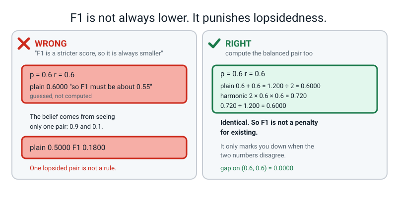
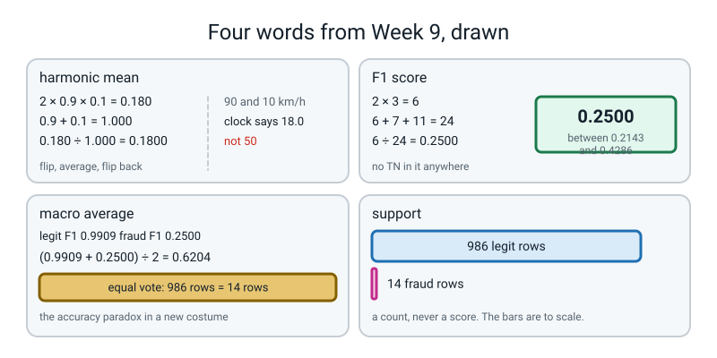

# Week 9 — Term 1 Checkpoint: One Number Is Never Enough

[⬅ Week 8](week-08.md) · [Course Home](../README.md) · [Next ➡](week-10.md) · [Workbook](../workbook/week-09.md)

---

> ### This week in one sentence
> **Precision and recall pull against each other, so any single score that respects both must punish a lopsided pair — and that punishment is exactly what the harmonic mean does.**
>
> **By the end of this chapter you will be able to:**
> - **Compute a harmonic mean by hand** for the pair (0.9, 0.1) and show it lands near **0.18**, not near 0.5 as a plain average would
> - **Explain in one sentence** why F1 is the right summary when precision and recall both matter and the classes are imbalanced
> - **Re-run the whole of Term 1 from raw table to saved artifact from memory**, at five stations, in under 45 minutes
> - **Produce a full metrics report** for your own Week 7 model, **with the split named beside every single number**
>
> **New maths:** the **harmonic mean** — `2 × p × r ÷ (p + r)` — worked by hand on three pairs, and the reason it drags a lopsided pair down towards the smaller of the two.
>
> **New syntax:** `f1_score(y, pred)` · `precision_recall_fscore_support(y, pred)`
>
> **Reading time:** about 40 minutes. **Homework:** about 60 minutes. **You will need a calculator for the checking step and a piece of paper divided down the middle.**

---

## 🪝 Start Here

Last week you finished with two numbers.

**Precision 0.3000** — of the ten transactions we flagged, three were really fraud. **Recall 0.2143** — of the fourteen real frauds, we caught three.

Now imagine the form.

```text
   model performance:  [            ]
```

**One box.** That is what a report looks like. That is what the comparison table in a paper looks like, and the summary line in an email, and the one slide anybody actually reads.

You have two numbers. **Which one goes in the box?**

Whatever you just picked, here is why it does not work.

**Suppose the answer is precision.** Can you get a precision of 1.0000 by lunchtime? **Yes.** Flag exactly **one** transaction — the single most obviously stolen card in the file — and be right about it. Precision: one out of one. **1.0000. Perfect.** You have caught one fraud out of fourteen and your number is flawless.

**Fine, report recall instead.** Can you get a recall of 1.0000 by lunchtime? **Yes.** Flag all one thousand. Every fraud is now inside your flagged pile, because *everything* is inside your flagged pile. Recall: fourteen out of fourteen. **1.0000. Perfect.** You have also blocked nine hundred and eighty-six innocent people's cards.

```text
flag ONE thing      ->  precision 1.0000   (caught 1 of 14)
flag EVERYTHING     ->  recall    1.0000   (blocked 986 innocent cards)
```

**Both stunts take one line of code and both produce a flawless score.** So whichever of the two numbers you are asked to report, **you can cheat, and the cheat is easy.**

Today's whole job is to find a number that **neither stunt can fool.** It exists. It has a slightly silly name — **F1** — and getting to it takes one new piece of arithmetic.

Then, in the second half, you rebuild the whole of Term 1 from memory in forty minutes.

---

## 🧠 The Big Idea

### 1. Averaging them is the obvious idea, and it is a cover-up

Precision 0.9, recall 0.1. Add them, halve them:

```text
(0.9 + 0.1) ÷ 2  =  1.0 ÷ 2  =  0.5000
```

**0.5000.** Which sounds like a middling, unremarkable model.

**It is not.** A model with recall 0.1 has found **one tenth** of the frauds. It has missed nine out of every ten. Calling that "0.5" is not a summary. **It is a cover-up.**

### 2. The drive to your grandmother's house

Put the metrics down for a minute. This is a story about a car, and it proves the whole thing.

You drive to your grandmother's house. It is **120 kilometres**. The first 60 km is motorway and you do **90 km/h**. Then you come off, and the second 60 km is a single-track road behind a tractor, and you do **10 km/h**.

**What was your average speed for the journey?**

Almost everybody says 50. Ninety plus ten, halved. **It is wrong, and you can prove it with a clock**, which cannot be argued with:

```text
first  60 km at 90 km/h  ->  60 ÷ 90  =  0.6667 hours
second 60 km at 10 km/h  ->  60 ÷ 10  =  6.0000 hours
                                          ------
                            total time  =  6.6667 hours
```

You covered 120 km in 6.6667 hours:

```text
120 ÷ 6.6667  =  18.0 km/h
```

**Eighteen. Not fifty.**

And the reason is one sentence: **you spent nearly all of your time crawling.** Six hours of the six and two-thirds were behind the tractor. The plain average gave the motorway and the tractor an equal vote, **and they did not deserve an equal vote.**

> **💡 Try this:** if you had really averaged 50 km/h, 120 km would have taken 2.4 hours — two hours twenty-four minutes. You were in the car for six hours forty. **The clock settles it.**

**That is exactly what happened to precision 0.9 and recall 0.1.** The plain average gave the good number and the terrible number an equal vote.

Now watch what a different kind of average says about 90 and 10:

```text
2 × 90 × 10  =  1800
90 + 10      =  100
1800 ÷ 100   =  18.0
```

**Eighteen. Exactly.**

> **harmonic mean** — the average you use when you are averaging **rates over the same fixed amount of work**. It is what "average" actually means for a journey with two equal legs at two different speeds.

**This is not a fudge somebody invented to be strict about F1.** Precision and recall are rates over the same fixed pile of transactions. **That is why they get this average and not the other one.**


*Figure 9.1 — The plain mean is too kind. The harmonic mean always lands near the smaller of the two numbers, and that is the entire point of F1.*

### 3. F1, named, and where the "1" comes from

> **F1 score** — the harmonic mean of precision and recall. One number that respects both, and lands near the smaller of the two whenever they disagree.

The letter F is historical and stands for nothing useful. **The "1" is the interesting part: it means precision and recall count equally.**

There are other members of the family — F2 counts recall twice as much as precision, F0.5 the other way round — and **they are not in this course.** Here is the honest reason: choosing that number is choosing an **exchange rate between two kinds of harm to two different sets of people** — how many wrongly-declined cards equal one theft. **That is not a maths decision, and putting a number on it does not make it one.** F1 says "equal", which is at least a decision you can see and argue with.

### 4. The see-saw, and F1 refusing to be fooled

Same 1,000 validation transactions. Same 14 frauds. **Three models.**


*Figure 9.2 — Precision and recall pull against each other. You can max out either one by wrecking the other, and F1 refuses to be fooled by both stunts.*

| Model | TN | FP | FN | TP | Precision | Recall | **F1** |
|---|---|---|---|---|---|---|---|
| **Never says yes** (Week 2's dummy) | 986 | 0 | 14 | 0 | undefined | 0.0000 | **0.0000** |
| **The decision tree** | 979 | 7 | 11 | 3 | 0.3000 | 0.2143 | **0.2500** |
| **Flags everything** | 0 | 986 | 0 | 14 | 0.0140 | 1.0000 | **0.0276** |

**Read the bottom row twice.** The "flag everything" model has a **perfect recall of 1.0000** — it caught every single fraud there was. And its F1 is **0.0276**, barely above the model that does nothing at all.

**The stunt did not work.** Recall 1.0 bought it nothing, because precision collapsed to 0.0140 and the harmonic mean went with the smaller number, as it always does.

**And the top row.** The dummy flagged nothing, so its precision is `0 ÷ 0` — **genuinely undefined**, not zero. But its F1 is honestly and unambiguously **0.0000**, because `2 × 0 ÷ 14` involves no division by zero at all. **F1 is the one number of the three that is well-defined for all three models**, which is a quietly excellent reason to report it.

> **The one sentence to memorise:** *"F1 is the right summary when both errors matter and the classes are imbalanced, because it cannot be faked by flagging almost nothing or by flagging almost everything."*

### 5. `macro average` and `support`, the two words on last week's screen

Last week `classification_report` printed two things you were told to skip. Here they are.

> **support** — how many rows of that class there really were. Nothing more. **It is a count, not a score.**

> **macro average** — average the per-class scores treating **each class as equally important**, whatever its support.

scikit-learn gives an F1 for **each class separately**:

| | legit (class 0) | fraud (class 1) |
|---|---|---|
| precision | 0.9889 | 0.3000 |
| recall | 0.9929 | 0.2143 |
| **F1** | **0.9909** | **0.2500** |
| **support** | **986** | **14** |

```text
macro average F1     :  (0.9909 + 0.2500) ÷ 2  =  1.2409 ÷ 2  =  0.6204
weighted average F1  :  (0.9909 × 986 + 0.2500 × 14) ÷ 1000
                     :  (977.0274 + 3.5) ÷ 1000  =  980.5274 ÷ 1000  =  0.9805
```

**Now look at three numbers side by side: 0.2500, 0.6204, 0.9805.**

**They are all "the F1 of this model". They are all correct. They differ by a factor of nearly four.**

- **0.2500** is the F1 of the class you care about. **This is the number to report.**
- **0.6204** is the macro average — it gave the **986 easy rows the same vote as the 14 hard ones.**
- **0.9805** is the weighted average — it is the majority class again, wearing a different hat. **It is 98% a statement about the 986 legitimate transactions.**

**This is last week's accuracy paradox coming back through a side door.** A student who reports 0.6204 has done exactly the same thing as a student who reported 98.6% accuracy.

> **⚠️ Watch out:** `average="macro"` produces **no error and no warning** and a perfectly plausible number two and a half times bigger than the right one. **The rule for the rest of the year: when a number surprises you upwards, find out which rows it was measured on.**

---

## 🔢 The Maths, Slowly

There is no algebra here, no rearranging, and no proof. There are three routes to one number and they all agree.

### Route one — flip, average, flip back

**This is the definition, and it is the one that explains everything.**

Take precision 0.9 and recall 0.1. **Turn each one upside down:**

```text
1 ÷ 0.9  =  1.11111
1 ÷ 0.1  =  10.00000
```

**Look at what just happened. 0.1, flipped over, becomes 10.** A small number, flipped, becomes an enormous number.

Now take the **plain average** of the two flipped numbers:

```text
(1.11111 + 10.00000) ÷ 2  =  11.11111 ÷ 2  =  5.55556
```

And flip that back the right way up:

```text
1 ÷ 5.55556  =  0.18000
```

**0.1800.**

**That is the whole mechanism, and there is your answer to "but why is it so harsh?"** — **because flipping a small number makes it huge, and a huge number bullies an average.** Recall 0.1 became a 10, the 10 dragged the average up to 5.56, and flipping 5.56 back gave a tiny answer.

**The harmonic mean is a plain average done in a mirror where small numbers are giants.**

### Route two — the same thing, written shorter

Instead of "average the flipped ones, then flip back", write it as one division. **Two**, divided by the sum of the flips:

```text
1 ÷ 0.9 = 1.11111
1 ÷ 0.1 = 10.00000
sum     = 11.11111

2 ÷ 11.11111  =  0.18000
```

Same answer. **0.1800.**

### Route three — the version everybody prints

Tidy route two up and the flips cancel out, leaving this:

```text
2 × p × r  ÷  (p + r)
```

**And now do it on the same numbers, in three separate lines, never in one:**

```text
2 × 0.9 × 0.1  =  0.180
0.9 + 0.1      =  1.000
0.180 ÷ 1.000  =  0.1800
```

**0.1800 again, from all three routes.**

> **🔢 The maths, slowly:** `2 × p × r ÷ (p + r)` looks like a rule you have to trust. **It is not.** It is *"flip both numbers over, average them, flip the answer back"*, with the flipping already cancelled out. You do not need algebra to check that the tidy-up is honest — **just compute both ways on any pair and see the same number come out.**

> **💡 Try this on a calculator, right now.** Type `1 ÷ 0.6 =` (you get 1.6667). Type `1 ÷ 0.6 =` again. Add them: 3.3333. Divide by 2: 1.6667. Now `1 ÷ 1.6667 =` and you get **0.59999** — which is 0.6, and the last two nines are only there because you rounded 1.66666… to four places on the way. **The harmonic mean of 0.6 and 0.6 is 0.6.** Which is the next section, and it is the most important pair in the week.

### The three pairs, all the way through

**Pair one — precision 0.900, recall 0.100. The lopsided pair.**

```text
plain mean   :  (0.9 + 0.1) ÷ 2      =  1.000 ÷ 2      =  0.5000
harmonic     :   2 × 0.9 × 0.1       =  0.180
                 0.9 + 0.1           =  1.000
                 0.180 ÷ 1.000       =  0.1800
```

**0.5000 against 0.1800.** The plain mean is nearly three times kinder.

**Pair two — precision 0.600, recall 0.600. The balanced pair.**

```text
plain mean   :  (0.6 + 0.6) ÷ 2      =  1.200 ÷ 2      =  0.6000
harmonic     :   2 × 0.6 × 0.6       =  0.720
                 0.6 + 0.6           =  1.200
                 0.720 ÷ 1.200       =  0.6000
```

**Identical. 0.6000 both ways.**

**This pair matters enormously and it is the one everybody skips.** When the two numbers agree, **the harmonic mean agrees with the plain mean exactly.** So F1 is not a permanently pessimistic score that always marks you down — **it only punishes you for being lopsided.** If you think "F1 is just a smaller number", you have not done pair two.

**Pair three — precision 0.667, recall 0.070. A real one.**

A bank has **200 real frauds** in a month. The model flags **21 transactions**, and **14 of them really are fraud**:

```text
precision  =  14 ÷ 21   =  0.6667   ->  rounded, 0.667
recall     =  14 ÷ 200  =  0.0700   ->  0.070
```

Precision 0.667 sounds respectable — two thirds of what it flags is genuinely fraud. Now the two averages:

```text
plain mean   :  (0.667 + 0.070) ÷ 2  =  0.737 ÷ 2      =  0.3685
harmonic     :   2 × 0.667 × 0.070   =  0.0934
                 0.667 + 0.070       =  0.737
                 0.0934 ÷ 0.737      =  0.1267
```

**0.3685 against 0.1267.** The plain mean says *"about a third — needs work"*. The harmonic mean says *"this is close to useless"* — **which is the truth: 186 frauds went through untouched.**

### The check that needs no formula at all

Here is the single most useful thing you can carry away, and it needs no rearranging of anything:

> **The harmonic mean always lands between the smaller number and twice the smaller number.**

```python
"""race.py - six pairs, two averages each, and the range check."""
pairs = [("0.900 / 0.100", 0.9, 0.1),
         ("0.600 / 0.600", 0.6, 0.6),
         ("0.667 / 0.070", 0.667, 0.070),
         ("0.300 / 0.2143", 0.3, 3 / 14),
         ("1.000 / 0.010", 1.0, 0.01),
         ("0.014 / 1.000", 0.014, 1.0)]

print("pair             plain    harmonic   smaller  2x smaller  in range?")
for label, p, r in pairs:
    plain = (p + r) / 2
    harm = 2 * p * r / (p + r)
    small = min(p, r)
    ok = small <= harm <= 2 * small
    print("%-15s  %.4f   %.4f    %.4f   %.4f      %s"
          % (label, plain, harm, small, 2 * small, ok))
```

**Real output. Runtime instant.**

```text
pair             plain    harmonic   smaller  2x smaller  in range?
0.900 / 0.100    0.5000   0.1800    0.1000   0.2000      True
0.600 / 0.600    0.6000   0.6000    0.6000   1.2000      True
0.667 / 0.070    0.3685   0.1267    0.0700   0.1400      True
0.300 / 0.2143   0.2571   0.2500    0.2143   0.4286      True
1.000 / 0.010    0.5050   0.0198    0.0100   0.0200      True
0.014 / 1.000    0.5070   0.0276    0.0140   0.0280      True
```

**Six for six.** The last column is the machine doing the same check you can do in your head in four seconds.

**So if you ever compute an F1 of 0.62 from a precision of 0.99 and a recall of 0.05, you do not need anybody to tell you it is wrong.** Is 0.62 between 0.05 and 0.10? **No. Do it again.**

**And say the consequence out loud, because it is the answer to "why should I care":** **your F1 can never be much better than your worst number.** You cannot hide a bad recall behind a good precision. **That is the property the report form needed.**

### F1 straight from the four counts

You do not need precision and recall at all. F1 comes out of the four counts with one multiplication and two additions:

```text
F1  =  2 × TP  ÷  (2 × TP + FP + FN)
```

On last week's tree — TP 3, FP 7, FN 11:

```text
2 × 3            =  6
2 × 3 + 7 + 11   =  6 + 7 + 11  =  24
6 ÷ 24           =  0.2500
```

**0.2500.** And through precision and recall the long way:

```text
precision  =  3 ÷ 10  =  0.3000
recall     =  3 ÷ 14  =  0.2143
2 × 0.3000 × 0.2143  =  0.12858
0.3000 + 0.2143      =  0.5143
0.12858 ÷ 0.5143     =  0.2500
```

**The same 0.2500. Two routes, one answer, both on paper.**

**And notice what is missing from `2 × TP ÷ (2 × TP + FP + FN)`. There is no TN in it.** None. **F1 never looks at the "correctly left alone" cell at all.** Watch what that means — same 14 frauds, same 3 caught, same 7 false alarms, same 11 misses, but the bank keeps growing:

```text
rows     1000   TN      979   F1 0.2500   accuracy 0.982000
rows    10000   TN     9979   F1 0.2500   accuracy 0.998200
rows  1000000   TN   999979   F1 0.2500   accuracy 0.999982
```

**F1 does not move. Accuracy sails up to 99.9982%.**

That immovability is **exactly why F1 survives imbalance** and accuracy does not — you cannot inflate F1 by adding easy rows. It is also **exactly its blind spot**: seven false alarms out of 986 honest customers is a completely different business from seven out of a million, and F1 reports both as 0.2500. If what you care about is *"what fraction of my honest customers get wrongly blocked"*, **that is specificity, and F1 will never tell you.**

> **🧑‍🏫 If a student asks:** *"so is F1 the right answer or not?"* The honest position: **"F1 is a good single number when you have to pick one. There is no single number that is good for everything, and the four counts are the only thing that never lies to you."**

---

## 💻 Type This

One file, `f1.py`. **Runs in under 2 seconds.** Same 5,000-row fraud table as last week, same seed, same 72 frauds.

### Step 1 — the two averages, side by side

```python
"""f1.py - one number that respects both.  Week 9."""
import numpy as np
from sklearn.datasets import make_classification
from sklearn.dummy import DummyClassifier
from sklearn.metrics import (confusion_matrix, f1_score,
                             precision_recall_fscore_support, precision_score,
                             recall_score)
from sklearn.model_selection import train_test_split
from sklearn.tree import DecisionTreeClassifier

X, y = make_classification(n_samples=5000, n_features=8, n_informative=4,
                           n_redundant=0, weights=[0.99, 0.01], random_state=0)
X_tmp, X_test, y_tmp, y_test = train_test_split(
    X, y, test_size=0.20, random_state=0, stratify=y)
X_train, X_val, y_train, y_val = train_test_split(
    X_tmp, y_tmp, test_size=0.25, random_state=0, stratify=y_tmp)

tree = DecisionTreeClassifier(random_state=0).fit(X_train, y_train)
pred = tree.predict(X_val)
tn, fp, fn, tp = confusion_matrix(y_val, pred).ravel()
print("tn %d  fp %d  fn %d  tp %d" % (tn, fp, fn, tp))

p = precision_score(y_val, pred)
r = recall_score(y_val, pred)
print("precision %.4f   recall %.4f" % (p, r))
print()
print("plain mean      (p + r) / 2      : %.4f" % ((p + r) / 2))
print("harmonic  2 * p * r / (p + r)    : %.4f" % (2 * p * r / (p + r)))
print("f1_score(y_val, pred)            : %.4f" % f1_score(y_val, pred))
print("straight from the counts         : 2 x %d / (%d + %d + %d) = %d / %d = %.4f"
      % (tp, 2 * tp, fp, fn, 2 * tp, 2 * tp + fp + fn,
         2 * tp / (2 * tp + fp + fn)))
```

**Four lines are about to print numbers. Which of them will be the same?**

```text
tn 979  fp 7  fn 11  tp 3
precision 0.3000   recall 0.2143

plain mean      (p + r) / 2      : 0.2571
harmonic  2 * p * r / (p + r)    : 0.2500
f1_score(y_val, pred)            : 0.2500
straight from the counts         : 2 x 3 / (6 + 7 + 11) = 6 / 24 = 0.2500
```

**Three routes, one number.** Your hand-written formula, scikit-learn's `f1_score`, and the version straight from the four counts — 6 divided by 24. **All 0.2500.** That is the point of running it: **you did the maths and the computer agreed with you.**

`f1_score` takes **the truth first, the predictions second**, exactly like `confusion_matrix`. Internally it does precisely the arithmetic you did on paper: it counts the four cells, then computes `2 × TP ÷ (2 × TP + FP + FN)`.

And look at the plain mean: **0.2571. Barely different.** Why is F1 not dramatic here? **Because 0.3000 and 0.2143 are not very lopsided.** F1 only bites when the pair disagrees badly, which is why (0.9, 0.1) came first.

> **⚠️ Watch out — and this is genuinely surprising.** Get the two arguments the wrong way round and **F1 does not change.** Swapping truth and predictions swaps FP and FN, and F1's denominator **adds** them, so `6 + 7 + 11` and `6 + 11 + 7` are the same 24. Precision and recall *do* swap places (0.3000 and 0.2143 trade), but F1 sits there at 0.2500 looking innocent.
>
> ```text
> right way round: f1 0.2500  precision 0.3000  recall 0.2143
> swapped        : f1 0.2500  precision 0.2143  recall 0.3000
> ```
>
> **So F1 cannot warn you about the swap. Only the four counts can.** That is a real reason to keep printing them.

### Step 2 — 🐞 three names for four things

```python
prec, rec, f1 = precision_recall_fscore_support(y_val, pred)
```

```text
Traceback (most recent call last):
  File "f1.py", line 34, in <module>
    prec, rec, f1 = precision_recall_fscore_support(y_val, pred)
ValueError: too many values to unpack (expected 3)
```

**Read the last line, then read the name of the function slowly.**

`precision_recall_fscore_support`. **Count them: four things.** You asked for three, so Python stopped.

**The answer is in the name of the function.** This is one of the friendliest errors you will ever get: it tells you the number it wanted, and the number it wanted is printed on the label.

Fix it, and print the table:

```python
prec, rec, f1, sup = precision_recall_fscore_support(y_val, pred)
print("               legit     fraud")
print("precision    %.4f    %.4f" % (prec[0], prec[1]))
print("recall       %.4f    %.4f" % (rec[0], rec[1]))
print("f1           %.4f    %.4f" % (f1[0], f1[1]))
print("support        %4d      %4d" % (sup[0], sup[1]))
```

```text
               legit     fraud
precision    0.9889    0.3000
recall       0.9929    0.2143
f1           0.9909    0.2500
support         986        14
```

**Each of those four things is a list, one entry per class.** `prec[0]` is the legit class, `prec[1]` is fraud.

And **`support` is not a score at all** — it is a count. 986 legit rows, 14 fraud rows. **It is the smallest number on the screen and it is the reason every other number is shaky.**

> **Why use this at all when `classification_report` prints a nicer table?** Because `classification_report` gives you **text**, and text cannot be put in a variable and compared. `precision_recall_fscore_support` gives you **numbers you can do arithmetic with** — which is how you check scikit-learn's macro average against your own in the next step.

### Step 3 — 🐞 the mistake with no error message

```python
print("f1 : %.4f" % f1_score(y_val, pred, average="macro"))
```

```text
f1 : 0.6204
```

**Was that an error?** No. **Is 0.6204 better than 0.2500?**

**No error. No warning. A perfectly plausible number, two and a half times bigger than the right one, and it would go straight into your report.**

Here is what `average="macro"` did. Look at the table you just printed. F1 for legit is 0.9909. F1 for fraud is 0.2500. **`macro` averaged them, giving each class an equal vote:**

```text
(0.9909 + 0.2500) ÷ 2  =  1.2409 ÷ 2  =  0.6204
```

**And how many rows are in each of those two classes? 986 and 14.**

So `macro` gave the 986 easy rows exactly the same weight as the 14 hard ones. **That is last week's accuracy paradox wearing a different hat.** 98.6% accurate and nothing caught; 0.6204 macro F1 and eleven frauds missed. **Same trick, new costume.**

And there is a third one:

```python
print("macro average f1 : (%.4f + %.4f) / 2 = %.4f"
      % (f1[0], f1[1], (f1[0] + f1[1]) / 2))
print("f1_score(average='macro')    : %.4f" % f1_score(y_val, pred, average="macro"))
print("f1_score(average='weighted') : %.4f" % f1_score(y_val, pred, average="weighted"))
```

```text
macro average f1 : (0.9909 + 0.2500) / 2 = 0.6204
f1_score(average='macro')    : 0.6204
f1_score(average='weighted') : 0.9805
```

**Three numbers. All called "the F1 of this model". All correct. 0.6204, 0.9805, 0.2500.**

`weighted` is 0.9805, which is basically a statement about the 986 legitimate transactions and almost nothing to do with fraud. **The one you report is 0.2500 — the F1 of the class you actually care about**, which is what you get when you leave `average` alone on a two-class problem.

### Step 4 — the three models, from their counts

```python
print()
print("--- three models, same 1000 validation orders, same 14 frauds ---")
never = DummyClassifier(strategy="most_frequent").fit(X_train, y_train).predict(X_val)
always = np.ones(len(y_val), dtype=int)
for name, q in [("never says yes", never), ("the tree", pred), ("flags everything", always)]:
    a, b, c, d = confusion_matrix(y_val, q, labels=[0, 1]).ravel()
    top, bot = 2 * d, 2 * d + b + c
    print("%-17s tn %3d fp %3d fn %2d tp %2d   F1 = %d / %d = %.4f"
          % (name, a, b, c, d, top, bot, top / bot))
```

`labels=[0, 1]` is there because the dummy only ever predicts one class, and without it the matrix would come back 1×1 and `.ravel()` would give you one number instead of four — exactly the error from last week.

```text
--- three models, same 1000 validation orders, same 14 frauds ---
never says yes    tn 986 fp   0 fn 14 tp  0   F1 = 0 / 14 = 0.0000
the tree          tn 979 fp   7 fn 11 tp  3   F1 = 6 / 24 = 0.2500
flags everything  tn   0 fp 986 fn  0 tp 14   F1 = 28 / 1014 = 0.0276
```

**Every one of those three divisions you can do on paper.** `0 ÷ 14`, `6 ÷ 24`, `28 ÷ 1014`. And the middle one is the only model anybody would ship.

### The complete `f1.py`

```python
"""f1.py - one number that respects both.  Week 9."""
import numpy as np
from sklearn.datasets import make_classification
from sklearn.dummy import DummyClassifier
from sklearn.metrics import (confusion_matrix, f1_score,
                             precision_recall_fscore_support, precision_score,
                             recall_score)
from sklearn.model_selection import train_test_split
from sklearn.tree import DecisionTreeClassifier

X, y = make_classification(n_samples=5000, n_features=8, n_informative=4,
                           n_redundant=0, weights=[0.99, 0.01], random_state=0)
X_tmp, X_test, y_tmp, y_test = train_test_split(
    X, y, test_size=0.20, random_state=0, stratify=y)
X_train, X_val, y_train, y_val = train_test_split(
    X_tmp, y_tmp, test_size=0.25, random_state=0, stratify=y_tmp)

tree = DecisionTreeClassifier(random_state=0).fit(X_train, y_train)
pred = tree.predict(X_val)
tn, fp, fn, tp = confusion_matrix(y_val, pred).ravel()
print("tn %d  fp %d  fn %d  tp %d" % (tn, fp, fn, tp))

p = precision_score(y_val, pred)
r = recall_score(y_val, pred)
print("precision %.4f   recall %.4f" % (p, r))
print()
print("plain mean      (p + r) / 2      : %.4f" % ((p + r) / 2))
print("harmonic  2 * p * r / (p + r)    : %.4f" % (2 * p * r / (p + r)))
print("f1_score(y_val, pred)            : %.4f" % f1_score(y_val, pred))
print("straight from the counts         : 2 x %d / (%d + %d + %d) = %d / %d = %.4f"
      % (tp, 2 * tp, fp, fn, 2 * tp, 2 * tp + fp + fn,
         2 * tp / (2 * tp + fp + fn)))

print()
prec, rec, f1, sup = precision_recall_fscore_support(y_val, pred)
print("               legit     fraud")
print("precision    %.4f    %.4f" % (prec[0], prec[1]))
print("recall       %.4f    %.4f" % (rec[0], rec[1]))
print("f1           %.4f    %.4f" % (f1[0], f1[1]))
print("support        %4d      %4d" % (sup[0], sup[1]))
print()
print("macro average f1 : (%.4f + %.4f) / 2 = %.4f"
      % (f1[0], f1[1], (f1[0] + f1[1]) / 2))
print("f1_score(average='macro')    : %.4f" % f1_score(y_val, pred, average="macro"))
print("f1_score(average='weighted') : %.4f" % f1_score(y_val, pred, average="weighted"))

print()
print("--- three models, same 1000 validation orders, same 14 frauds ---")
never = DummyClassifier(strategy="most_frequent").fit(X_train, y_train).predict(X_val)
always = np.ones(len(y_val), dtype=int)
for name, q in [("never says yes", never), ("the tree", pred), ("flags everything", always)]:
    a, b, c, d = confusion_matrix(y_val, q, labels=[0, 1]).ravel()
    top, bot = 2 * d, 2 * d + b + c
    print("%-17s tn %3d fp %3d fn %2d tp %2d   F1 = %d / %d = %.4f"
          % (name, a, b, c, d, top, bot, top / bot))
```

**Real output. Runtime under 2 seconds.**

```text
tn 979  fp 7  fn 11  tp 3
precision 0.3000   recall 0.2143

plain mean      (p + r) / 2      : 0.2571
harmonic  2 * p * r / (p + r)    : 0.2500
f1_score(y_val, pred)            : 0.2500
straight from the counts         : 2 x 3 / (6 + 7 + 11) = 6 / 24 = 0.2500

               legit     fraud
precision    0.9889    0.3000
recall       0.9929    0.2143
f1           0.9909    0.2500
support         986        14

macro average f1 : (0.9909 + 0.2500) / 2 = 0.6204
f1_score(average='macro')    : 0.6204
f1_score(average='weighted') : 0.9805

--- three models, same 1000 validation orders, same 14 frauds ---
never says yes    tn 986 fp   0 fn 14 tp  0   F1 = 0 / 14 = 0.0000
the tree          tn 979 fp   7 fn 11 tp  3   F1 = 6 / 24 = 0.2500
flags everything  tn   0 fp 986 fn  0 tp 14   F1 = 28 / 1014 = 0.0276
```

---

## 🔍 Worked Examples

### Worked Example 1 — Two spam filters, and F1 choosing between them (email)

500 emails arrive this week. **40 of them are spam.** Two filters, and the boss wants one number for each.

**Filter A is bold.** It flags 30 emails, and 24 of them really are spam.
**Filter B is cautious.** It flags 8 emails, and every single one is spam.

**Do both by hand first.**

```text
FILTER A
  flagged 30, right about 24     ->  TP 24,  FP 6
  40 real spam, caught 24        ->  FN 16
  500 - 24 - 6 - 16              ->  TN 454
  check: 24 + 6 + 16 + 454 = 500   ✅

  precision  =  24 ÷ 30   =  0.8000
  recall     =  24 ÷ 40   =  0.6000
  F1         =  2 × 24 ÷ (48 + 6 + 16)  =  48 ÷ 70  =  0.6857
  range check:  smaller 0.6000, twice it 1.2000, and 0.6857 is between.  ✅

FILTER B
  flagged 8, right about 8       ->  TP 8,  FP 0
  40 real spam, caught 8         ->  FN 32
  500 - 8 - 0 - 32               ->  TN 460
  check: 8 + 0 + 32 + 460 = 500     ✅

  precision  =  8 ÷ 8    =  1.0000
  recall     =  8 ÷ 40   =  0.2000
  F1         =  2 × 8 ÷ (16 + 0 + 32)  =  16 ÷ 48  =  0.3333
  range check:  smaller 0.2000, twice it 0.4000, and 0.3333 is between.  ✅
```

**Checked against scikit-learn:**

```text
Filter A (bold)      tn 454 fp  6 fn 16 tp 24   total 500
   precision 0.8000 (24/30)   recall 0.6000 (24/40)   F1 0.6857 (48/70)   accuracy 0.9560
Filter B (cautious)  tn 460 fp  0 fn 32 tp  8   total 500
   precision 1.0000 (8/8)   recall 0.2000 (8/40)   F1 0.3333 (16/48)   accuracy 0.9360
```

**Now read the three summaries and watch them disagree.**

| | Filter A | Filter B | Winner |
|---|---|---|---|
| **precision** | 0.8000 | **1.0000** | **B**, perfectly |
| **accuracy** | **0.9560** | 0.9360 | A, barely |
| **F1** | **0.6857** | 0.3333 | **A, by miles** |

**Filter B has a flawless precision of 1.0000 and it is a bad filter.** It flagged eight emails out of five hundred and was right about all eight, and it left **thirty-two pieces of spam in your inbox**. Precision could not see that. **F1 could: 0.3333 against 0.6857, which is less than half.**

**And notice the plain mean would have been fooled too.** Filter B's plain mean is `(1.0000 + 0.2000) ÷ 2 = 0.6000`, and Filter A's is `(0.8000 + 0.6000) ÷ 2 = 0.7000`. It gets the ranking right, but it says B is 86% as good as A, when F1 says 49%. **The plain mean saw a lopsided pair and shrugged.**

### Worked Example 2 — The full Term 1 report, on your own model (pizza)

This is what your Week 7 model looks like when you report it properly. **Every number carries its pile.**

```python
"""station5.py - STATION 5, METRICS.  The 2x2, four fractions, one saved file."""
import joblib
from sklearn.compose import ColumnTransformer
from sklearn.impute import SimpleImputer
from sklearn.linear_model import LogisticRegression
from sklearn.metrics import (accuracy_score, confusion_matrix, f1_score,
                             precision_score, recall_score, roc_auc_score)
from sklearn.model_selection import train_test_split
from sklearn.pipeline import Pipeline
from sklearn.preprocessing import FunctionTransformer, OneHotEncoder, StandardScaler

from features import add_features
from make_data import make_deliveries

NUM = ["distance_km", "items", "prep_minutes", "driver_experience_months", "is_rush"]
CAT = ["restaurant", "day_of_week", "weather"]

df = make_deliveries(n=2000, seed=0).drop_duplicates().reset_index(drop=True)
y = df["late"]
X = df.drop(columns=["late", "order_id"])
X_tmp, X_test, y_tmp, y_test = train_test_split(
    X, y, test_size=0.20, random_state=0, stratify=y)
X_train, X_val, y_train, y_val = train_test_split(
    X_tmp, y_tmp, test_size=0.25, random_state=0, stratify=y_tmp)

prep = ColumnTransformer([
    ("num", Pipeline([("imputer", SimpleImputer(strategy="median")),
                      ("scaler", StandardScaler())]), NUM),
    ("cat", OneHotEncoder(handle_unknown="ignore"), CAT),
])
pipe = Pipeline([("derive", FunctionTransformer(add_features)),
                 ("prep", prep),
                 ("model", LogisticRegression(max_iter=2000, random_state=0))])
pipe.fit(X_train, y_train)

pred = pipe.predict(X_val)
prob = pipe.predict_proba(X_val)[:, 1]
tn, fp, fn, tp = confusion_matrix(y_val, pred).ravel()

print("ALL NUMBERS BELOW: the 400 VALIDATION rows, 115 of them late.")
print()
print("                    PREDICTED")
print("                on time     late")
print("ACTUAL on time  %7d  %7d   = %d really on time" % (tn, fp, tn + fp))
print("       late     %7d  %7d   = %d really late" % (fn, tp, fn + tp))
print("check: %d + %d + %d + %d = %d" % (tn, fp, fn, tp, tn + fp + fn + tp))
print()
print("accuracy    %.4f  = (%d + %d) / %d" % (accuracy_score(y_val, pred), tp, tn, len(y_val)))
print("precision   %.4f  = %d / %d" % (precision_score(y_val, pred), tp, tp + fp))
print("recall      %.4f  = %d / %d" % (recall_score(y_val, pred), tp, tp + fn))
print("specificity %.4f  = %d / %d" % (tn / (tn + fp), tn, tn + fp))
print("F1          %.4f  = %d / %d" % (f1_score(y_val, pred), 2 * tp, 2 * tp + fp + fn))
print("ROC AUC     %.4f  over all %d probabilities" % (roc_auc_score(y_val, prob), len(y_val)))

joblib.dump(pipe, "term1_model.joblib")
print()
print("saved: term1_model.joblib")
```

**Real output. Runtime under 2 seconds.**

```text
ALL NUMBERS BELOW: the 400 VALIDATION rows, 115 of them late.

                    PREDICTED
                on time     late
ACTUAL on time      246       39   = 285 really on time
       late          64       51   = 115 really late
check: 246 + 39 + 64 + 51 = 400

accuracy    0.7425  = (51 + 246) / 400
precision   0.5667  = 51 / 90
recall      0.4435  = 51 / 115
specificity 0.8632  = 246 / 285
F1          0.4976  = 102 / 205
ROC AUC     0.7599  over all 400 probabilities

saved: term1_model.joblib
```


*Figure 9.3 — Every number wears its split. Nine weeks of work, and not one number on the card without the pile it came from.*

**Check the F1 the other way, by hand:**

```text
2 × 0.5667 × 0.4435  =  0.50266
0.5667 + 0.4435      =  1.01020
0.50266 ÷ 1.01020    =  0.4976        ✅ same answer
range check          :  smaller 0.4435, twice it 0.8870, and 0.4976 is between.  ✅
```

**Two things worth spotting in that report, and both are the habits of this term:**

**One — accuracy 0.7425 against a majority-class rate of 285 ÷ 400 = 0.7125.** Applying last week's rule unprompted: the model beats "say on time to everything" by **0.0300**. Real, but not enormous.

**Two — recall 0.4435 is much worse than specificity 0.8632.** The model is far better at recognising an on-time order than a late one, **because 285 of the 400 rows are on time and it has simply seen far more of them.** Same imbalance story as the fraud data, at a gentler ratio.

> **⚠️ Watch out:** the delivery model's F1 is **0.4976** and the fraud model's was **0.2500**. **Is the delivery model twice as good?** No. Different data, different base rate, different difficulty — 28.75% of deliveries are late, 1.4% of transactions are fraud, and rare things are harder. **F1 compares models on the same data. Comparing F1 across datasets is comparing a maths mark with a history mark.**

### Worked Example 3 — Working backwards from the score you want

Somebody says: *"I want precision 0.5 and recall 0.5, and there are 12 real frauds in my 40 cards. What are the four counts?"*

**Do it in this order, and it is easy.**

**Start with recall, because you know the whole row.** Recall is `TP ÷ 12` and you want 0.5:

```text
TP ÷ 12  =  0.5     ->     TP  =  0.5 × 12  =  6
```

**So TP = 6. And the actual-fraud row must add to 12**, so:

```text
FN  =  12 − 6  =  6
```

**Now precision.** Precision is `TP ÷ (TP + FP)` and you want 0.5. **When a fraction equals a half, the bottom is twice the top:**

```text
TP + FP  =  2 × 6  =  12     ->     FP  =  12 − 6  =  6
```

**And TN is whatever is left of the forty cards:**

```text
TN  =  40 − 6 − 6 − 6  =  22
check: 6 + 6 + 6 + 22 = 40     ✅
```

**Now check every number against what was asked for:**

```text
precision  =  6 ÷ (6 + 6)   =   6 ÷ 12  =  0.5000   ✅
recall     =  6 ÷ (6 + 6)   =   6 ÷ 12  =  0.5000   ✅
F1         =  2 × 6 ÷ (12 + 6 + 6)  =  12 ÷ 24  =  0.5000
```

**And here is the payoff, and it is the whole lesson in one line.** When precision and recall are **equal**, the F1 is **that same number**. Compare with pair two from the maths section: 0.6 and 0.6 gave 0.6000, both ways. **F1 only diverges from the plain mean when the pair is lopsided — and a pair that is not lopsided at all gets no punishment whatsoever.**

> **💡 Try this:** now make it lopsided while keeping the same TP. Move six of the false positives to true negatives, so FP = 0: precision becomes `6 ÷ 6 = 1.0000`, recall stays `0.5000`, and F1 becomes `12 ÷ (12 + 0 + 6) = 12 ÷ 18 = 0.6667`. **Precision doubled from 0.5 to 1.0, and F1 only moved from 0.5000 to 0.6667.** That is F1 refusing to be impressed by one number when the other one has not moved.

---

## 🐞 When It Breaks

Four real messages from four real broken runs.

### Break 1 — three names for four things

```python
prec, rec, f1 = precision_recall_fscore_support(y_val, pred)
```

```text
Traceback (most recent call last):
  File "f1.py", line 4, in <module>
ValueError: too many values to unpack (expected 3)
```

**What it means.** "This function hands back four things and you asked for three."

**The fix.** Four names: `prec, rec, f1, sup = ...`. **Count the words in the function's own name** — pre**cision**, **recall**, **f**score, **sup**port.

### Break 2 — a whole list printed as one number

```python
prec, rec, f1, sup = precision_recall_fscore_support(y_val, pred)
print("%.4f" % prec)
```

```text
Traceback (most recent call last):
  File "f1.py", line 5, in <module>
TypeError: only length-1 arrays can be converted to Python scalars
```

**What it means.** "You tried to print a whole list as if it were one number."

**Why.** `prec` is a **list with one entry per class** — `[0.9889, 0.3000]`. `%.4f` wants exactly one number.

**The fix.** Say which class you mean: `"%.4f" % prec[1]` for the fraud class.

### Break 3 — a warning about a slice with no positives in it

```python
print("f1 = %.4f" % f1_score([0,0,0,0,0], [0,0,0,0,0]))
```

```text
UndefinedMetricWarning: F-score is ill-defined and being set to 0.0 due to no true nor predicted samples. Use `zero_division` parameter to control this behavior.
f1 = 0.0000
```

**What it means.** "There were **no real positives and none predicted**, so the fraction has nothing above or below the line."

**Why it happens for real.** A validation slice with zero frauds in it — usually because `stratify=` went missing from a split, or because you built a small hand-made example and forgot to include a positive.

**The fix.** Check `y_val.sum()`. If it is 0, the split is wrong: put `stratify=y` back. **And read the message — it is a warning, not an error, and it is telling you something true about your data.**

### Break 4 — the one with no message at all

```python
print("f1 : %.4f" % f1_score(y_val, pred, average="macro"))
```

```text
f1 : 0.6204
```

**Nothing crashed. No warning. A plausible number, two and a half times too big, on its way into your report.**

`average="macro"` gave the **986 legit rows the same vote as the 14 fraud rows**:

```text
(0.9909 + 0.2500) ÷ 2 = 0.6204
```

**How to catch it.** Two checks, and both take four seconds.

1. **Is my F1 between my recall and twice my recall?** Recall is 0.2143, so F1 must be between 0.2143 and 0.4286. **0.6204 is not.** Caught.
2. **Which rows was that number measured on?** Ask it of every number that surprises you upwards. Last week it caught 98.6% accuracy. This week it catches 0.6204 and 0.9805.

**The fix.** Drop `average=` entirely on a two-class problem.

> **🐞 If you see this error:** there is a cousin of it worth knowing. `f1_score(y_val, pred, pos_label=0)` gives **0.9909** — also no error, also plausible, and it is the F1 of the class you do not care about. **Same check catches it:** is 0.9909 between 0.2143 and 0.4286? No.

### The whole clinic, for reference

| Message | Cause | Fix |
|---|---|---|
| `ValueError: too many values to unpack (expected 3)` | four results, three names | `prec, rec, f1, sup = ...`. Count the words in the name |
| `TypeError: only length-1 arrays can be converted to Python scalars` | `"%.4f" % prec` on a per-class list | say the class: `prec[1]` |
| `ValueError: Classification metrics can't handle a mix of binary and continuous targets` | probabilities where predictions were wanted | `pred = model.predict(X)`. Thresholds are Week 10 |
| `NameError: name 'f1_score' is not defined` | not in the import line | add it. **Import errors are always the import line, never the code below it** |
| `UndefinedMetricWarning: F-score is ill-defined ... no true nor predicted samples` | a slice with zero positives | check `y_val.sum()`; put `stratify=y` back |
| `ValueError: A given column is not a column of the dataframe` | `derive` missing from the pipeline, so `is_rush` was never built | `("derive", FunctionTransformer(add_features))` must be **first** |
| `ModuleNotFoundError: No module named 'features'` when **loading** the artifact | the `.joblib` stores a *reference* to `add_features`, not its code | run from the folder holding `features.py`. **The artifact and its feature file travel together, always** |
| **no error, F1 is 0.6204 not 0.2500** | `average="macro"` | drop it. **When a number surprises you upwards, ask which rows** |
| **no error, F1 is 0.9909** | `pos_label=0` — you measured the easy class | drop it. Range check: F1 sits between recall and twice recall |
| **no error, F1 unchanged after swapping arguments** | F1 genuinely cannot detect a swap: its denominator **adds** FP and FN | `f1_score(y_val, pred)`. **Keep printing the four counts — they are the only thing that notices** |
| **no error, AUC dropped from 0.7599 to 0.6533** | `roc_auc_score(y_val, pred)` instead of `prob` — hard 0/1 predictions carry no ranking | **AUC needs probabilities; F1 needs predictions.** Different inputs, and only one of them errors |
| **no error, the four cells add to 401** | a row counted twice | **add the four cells up before you divide anything** |

---

## 🎲 What We Did In Class

### One box on the form

Last week's 2×2 was still on the wall. The four numbers were read out — 979, 7, 11, 3 — and then one empty box was drawn on the board:

```text
   model performance:  [            ]
```

Then the two stunts, and both went on the board and stayed up all lesson:

```text
flag ONE thing      ->  precision 1.0000   (caught 1 of 14)
flag EVERYTHING     ->  recall    1.0000   (blocked 986 innocent cards)
```

### The drive, with a clock

Ninety on the motorway, ten behind the tractor, sixty kilometres each. Most of the room said fifty. **Then the clock arithmetic went up line by line and the answer was eighteen.** Then the harmonic mean of 90 and 10 — `1800 ÷ 100 = 18.0` — **exactly the same eighteen.**

### The Arithmetic Race

The board was divided down the middle before we came in: `PLAIN MEAN` on the left, `HARMONIC MEAN` on the right. Two teams, same pair of numbers, go.

**Round one — 0.9 and 0.1:**

| PLAIN MEAN | HARMONIC MEAN |
|---|---|
| `0.9 + 0.1 = 1.000` | `2 × 0.9 × 0.1 = 0.180` |
| `1.000 ÷ 2 = 0.5000` | `0.9 + 0.1 = 1.000` |
| | `0.180 ÷ 1.000 = 0.1800` |

**Round two — 0.6 and 0.6:**

| PLAIN MEAN | HARMONIC MEAN |
|---|---|
| `0.6 + 0.6 = 1.200` | `2 × 0.6 × 0.6 = 0.720` |
| `1.200 ÷ 2 = 0.6000` | `0.6 + 0.6 = 1.200` |
| | `0.720 ÷ 1.200 = 0.6000` |

**"What happened?"** — and it took a few seconds for somebody to say *"they're the same"*. **That was the moment of the lesson.** The harmonic mean is not a grumpy average that always marks you down. **It only punishes you for being lopsided.**

Then the range rule went on the board to stay: **the harmonic mean always lands between the smaller number and twice the smaller number.** Then pair three — 0.667 and 0.070 — in pen, three lines each side, with the range check written beside the answer.

### `f1.py`, with two mistakes on purpose

We predicted which of the four printed numbers would match, then ran it: **three routes, one number, 0.2500.** Then `prec, rec, f1 = ...` → `ValueError: too many values to unpack (expected 3)`, and the answer read straight off the function's own name.

Then `average="macro"` → **0.6204, no error, no warning.** The arithmetic `(0.9909 + 0.2500) ÷ 2` went on the board, then the question *"how many rows are in each of those two classes?"* — 986 and 14. **Bug Log entry, with the words "which rows was it measured on" in it.**

### The Term 1 Relay

Five stations, eight minutes each, on a timer everybody could hear. **When the timer went we moved whether we were finished or not, and the handover line got written first.** `DON'T KNOW` was an allowed answer and not a failure.


*Figure 9.4 — Term 1 in five stations. Eight minutes each, one handover per station, and one joblib file on disk at the end.*

| Station | 8 minutes on | Weeks | What we handed over |
|---|---|---|---|
| **1 Audit** | rows, duplicates, missing, class rate | 1, 6 | **2020 × 10 · 20 duplicates · 108 missing · late rate 0.2881** (0.2875 after `drop_duplicates()`) |
| **2 Split** | three piles, stratified, seeded | 2 | **1200 / 400 / 400**, all three at **0.2875** late |
| **3 Baseline** | `DummyClassifier(strategy="most_frequent")` | 2 | **accuracy 0.7125, ROC AUC 0.5000** — the AUC is the number to beat |
| **4 Pipeline** | `derive → prep → model`, fitted | 3, 4, 5, 7 | **8 columns in, 20 out, val ROC AUC 0.7599** |
| **5 Metrics** | the 2×2, four fractions, one saved file | 8, 9 | **246 / 39 / 64 / 51 = 400**, and `term1_model.joblib` |

**Station 3's surprise:** accuracy **0.7125** and AUC **0.5000**, about the same model. Accuracy is high because 71.25% of orders really are on time and the dummy says "on time" to everything. **AUC is 0.5 because every prediction has the identical probability, so it cannot rank anything at all** — and AUC measures ranking. **0.5 is the AUC of a coin.**

**Station 4's checkable arithmetic:** 8 columns in, 20 out.

```text
5 number columns                                     =  5
restaurant, one-hot: 5 restaurants                   =  5
day_of_week, one-hot: Mon Tue Wed Thu Fri Sat Sun    =  7
weather, one-hot: clear, rain, storm                 =  3
                                                       --
                                                       20
```

And **0.7599 is Week 7's best honest score, rebuilt from memory.**

### The handover review

All five handover lines read out loud, in order, as one sentence:

> *"2,020 rows with 20 duplicates, 108 missing driver-experience values and a 28.8% late rate. Twelve hundred, four hundred, four hundred, all at 28.75% late. The number to beat is 0.5000 AUC. One fitted pipeline at 0.7599. And 246, 39, 64, 51 — which add to 400 — giving precision 0.5667, recall 0.4435 and F1 0.4976, all on the 400 validation rows, saved as term1_model.joblib."*

**That paragraph is Term 1.**

### Next week's door

*"All term, every time you called `predict`, the model produced a number between 0 and 1 — how sure it was — and then something compared that number to **0.5** and turned it into a yes or a no. Nobody chose 0.5. It came in the box.*

*Next week you get the dial."*

---

## 💬 Talk About It

**1. Why does the harmonic mean deserve to be called an "average" at all?**

Because for the thing it is averaging, it gives the answer a clock gives. Sixty kilometres at 90 and sixty at 10 really did average 18 km/h — you can time it.

> **Hint:** the test is whether the "average" reproduces the total. If you drive 120 km at a genuine 18 km/h you take 6.6667 hours, which is what actually happened. If you drive 120 km at 50 km/h you take 2.4 hours, which did not. **The plain mean of two speeds is not a speed the journey ever had.**

**2. F1 completely ignores TN. Is that a feature or a bug?**

Both, and being able to say why is the level-4 answer.

> **Hint:** it is a **feature** because it means you cannot inflate F1 by adding a million easy rows — which is exactly the trick that broke accuracy. It is a **bug** because "7 false alarms out of 986 honest customers" and "7 out of a million" are wildly different businesses and F1 calls them both 0.2500. If you need to know what fraction of honest customers get wrongly blocked, that is **specificity**, and F1 will never tell you.

**3. Somebody reports macro F1 0.6204 for the fraud model. They have not lied. What have they done?**

They have answered a different question from the one they were asked, and it is a much more comfortable question.

> **Hint:** 0.6204 is a true statement about a model that treats "spot fraud" and "leave ordinary shopping alone" as equally important jobs. **Nobody thinks those two jobs are equally important.** So the number is correct and the framing is wrong — which is exactly the shape of last week's 98.6%, and it is the reason *"which rows was that measured on?"* is the most useful question in this course.

---

## ⚠️ Don't Get Tricked

### Trick 1 — "F1 is a stricter score, so it is always lower"


*Figure 9.5 — F1 is not always lower. It punishes lopsidedness — and a balanced pair gets no punishment at all.*

**Wrong:** *"F1 is the harsh one, so it will be a bit below the plain mean."*
**Right:** *"On (0.6, 0.6) both averages give exactly 0.6000. On (0.9, 0.1) they give 0.5000 and 0.1800. F1 only marks you down for being LOPSIDED."*

If you think F1 is just a smaller number, **you have only ever seen one pair.** Do pair two.

### Trick 2 — "the F1 in `classification_report` is the F1"

**Wrong:** *"The report says F1, so I'll write down the F1."*
**Right:** *"There are THREE F1s on that screen — 0.2500, 0.6204 and 0.9805 — and only one of them is about the class I care about."*

`0.2500` is the fraud class. `0.6204` gave 986 easy rows the same vote as 14 hard ones. `0.9805` is 98% a statement about legitimate transactions. **All three are correct and only the first one answers the question you asked.**

### Trick 3 — "recall 1.0 means the model works"

**Wrong:** *"Perfect recall! It caught every single fraud."*
**Right:** *"Recall 1.0000 and F1 0.0276. It caught every fraud by blocking every card in the country. The stunt did not work."*

**Recall on its own is a stunt exactly like accuracy was.** The moment you can say *"so recall can be gamed too, in the opposite direction"*, you have understood the see-saw in both directions.

### Trick 4 — "F1 0.4976 beats F1 0.2500, so the delivery model is twice as good"

**Wrong:** *"0.4976 against 0.2500 — my pizza model is nearly twice as good as the fraud model."*
**Right:** *"Different data, different base rate, different difficulty. 28.75% of deliveries are late; 1.4% of transactions are fraud. Rare things are harder. F1 compares models on the SAME data."*

Comparing F1 across two datasets is comparing a maths mark with a history mark. **They are both out of a hundred and that is all they have in common.**

---

## 🌍 Where You've Seen This

1. **Every search-engine paper you will ever read.** F1 came out of document-retrieval research in the 1970s, where the two questions were exactly "how much of what I returned was relevant" and "how much of what was relevant did I return". **It has been the standard single number in that field for fifty years.**
2. **Kaggle and every other leaderboard.** Competitions on imbalanced data are almost always scored on F1 or something like it, precisely because accuracy would let a one-line model win.
3. **Your car's fuel economy.** Combining "litres per 100 km in town" and "litres per 100 km on the motorway" into one figure is the same harmonic-mean problem as the drive to your grandmother's house — and it is why the combined figure is always closer to the bad one.
4. **A cricket or baseball batting average.** Not the harmonic mean, but the same trap: an average that gives every innings an equal vote when they were not equal-sized events. Arguments about "the right average" in sport are exactly this argument.
5. **Covid testing policy, in every country.** "Sensitivity" is recall, "specificity" is last week's word, and every single argument about testing strategy was an argument about how to combine them into one decision.
6. **Any medical screening leaflet.** The reason they quote two numbers and not one is that they know somebody will game whichever single number they publish. **Now you know exactly how.**

---

## 🧭 Where This Fits

Third week in the same box, and the last one. The tile marked *baseline · four numbers* covers Weeks 7
to 9, and today closes it: one honest score, then four counts, and now a single number that refuses to
be fooled by either of them. Next week the gold moves down to the box underneath.


*Figure 9.0 — The pipeline in Week 9. The last week in this gold tile; from Week 10 the box beneath it
lights up. The ↻ on stage three is still grey — the training loop opens in Week 12.*

| | |
|---|---|
| **The mental model you now own** | When two numbers pull against each other, do not average them the friendly way. Average them the way that **punishes a lopsided pair**: `2pr ÷ (p + r)` always lands nearer the **smaller** of the two. That is why you cannot buy a good F1 by abandoning precision or by abandoning recall — the arithmetic simply will not let you. |
| **The one question it answers** | *"Is one number ever enough?"* — and the honest answer is: sometimes, if you named it before you trained anything and you can say out loud what it ignores. |
| **What it plugs into** | Week 8's precision and recall, which are the two numbers going in. And Week 1's promise to name one metric in advance and then live with it — this is the week you finally have a metric worth naming. |
| **What carries forward** | Week 10 picks the threshold that F1 prefers. Week 11 prices the alternatives in pounds. Week 33 reports per-class precision and recall on text. Week 35 puts the whole report into a model card that a stranger will read without you in the room. |
| **Spiral thread** | ⚖️ **Evaluation** and 🌍 **Impact** — evaluation because F1 is a measurement, impact because *choosing which number to publish* is a decision about whose bad day counts. That is why Term 1 closes here and not on a leaderboard. |

> **💡 Try this:** count the tiles. Nine weeks in, three of the ten boxes are filled and everything
> black on that map is work you can now do **from memory** — you proved exactly that at five stations
> today. Write the five station names in the margin beside stage one and stage two. That is your Term 1
> in ten words.

---

## 🔑 Remember This

- **One box on the form, and both single numbers can be faked.** Flag one thing: precision 1.0000. Flag everything: recall 1.0000. **Both stunts are one line of code.** F1 is the number neither stunt fools.
- **The harmonic mean is a plain average done in a mirror where small numbers are giants.** Flip both, average, flip back. 0.1 flipped becomes 10, and a 10 bullies an average. `2 × p × r ÷ (p + r)` is that, with the flipping cancelled out.
- **Eighteen, not fifty.** Sixty kilometres at 90 and sixty at 10 averages 18 km/h, because you spent nearly all your time crawling. **The clock cannot be argued with, and the harmonic mean already knew about the tractor.**
- **On (0.6, 0.6) both averages give 0.6000.** F1 is not permanently pessimistic. **It only punishes you for being lopsided** — and if you have not done this pair, you do not believe it yet.
- **The check that needs no formula: the harmonic mean always lands between the smaller number and twice the smaller number.** F1 0.62 from recall 0.05 is an arithmetic mistake and you can catch it yourself in four seconds.
- **F1 straight from the counts: `2 × TP ÷ (2 × TP + FP + FN)`.** For last week's tree: `6 ÷ 24 = 0.2500`. **And there is no TN in it anywhere** — which is why F1 survives imbalance, and why it can never tell you what fraction of honest customers you wrongly blocked.
- **Three F1s on one screen: 0.2500, 0.6204, 0.9805.** All correct. Report the first. `macro` gives 986 easy rows the same vote as 14 hard ones. **When a number surprises you upwards, ask which rows it was measured on.**
- **F1 cannot detect a swapped argument order**, because its denominator adds FP and FN. **Only the four counts notice.** Keep printing them.
- **Never say a number without naming its pile.** *"F1 0.4976 on the 400 validation rows."* Every week, all year, and it is the habit that stops somebody reporting a training score as a test score in Week 36.

### Syntax reminder card

```python
from sklearn.metrics import f1_score, precision_recall_fscore_support

# ---- the harmonic mean, three ways, all the same answer ---------------------
# 1) flip, average, flip back      (this is the DEFINITION)
#    1/0.9 = 1.11111   1/0.1 = 10.0   avg = 5.55556   1/5.55556 = 0.1800
# 2) two over the sum of the flips
#    2 / (1.11111 + 10.0) = 2 / 11.11111 = 0.1800
# 3) the printed version, in THREE separate lines, never one
#    2 * 0.9 * 0.1 = 0.180      0.9 + 0.1 = 1.000      0.180 / 1.000 = 0.1800
# CHECK, every time: is the answer between the smaller and twice the smaller?
#    smaller 0.1, twice it 0.2, answer 0.1800   -> in range.  Good.

# ---- F1 straight from the four counts: NO TN IN IT -------------------------
#    F1 = 2*TP / (2*TP + FP + FN)
#       = 2*3  / (6 + 7 + 11)  =  6 / 24  =  0.2500

# ---- F1 from scikit-learn. TRUTH FIRST. -----------------------------------
f1_score(y_val, pred)                      # 0.2500  <- the class you care about
f1_score(y_val, pred, average="macro")     # 0.6204  <- 986 rows = 14 rows. NO ERROR.
f1_score(y_val, pred, average="weighted")  # 0.9805  <- the majority class again
f1_score(y_val, pred, pos_label=0)         # 0.9909  <- the EASY class. NO ERROR.
f1_score(pred, y_val)                      # 0.2500  <- swapped, and F1 CANNOT TELL
# on a two-class problem, leave `average` alone.

# ---- everything, per class, as NUMBERS you can do arithmetic with ---------
prec, rec, f1, sup = precision_recall_fscore_support(y_val, pred)
#    ^^^^  ^^^  ^^  ^^^   four names, because the FUNCTION NAME has four words
# three names -> ValueError: too many values to unpack (expected 3)
print("%.4f" % prec[1])          # class 1 = fraud.  prec[0] would be legit.
# "%.4f" % prec -> TypeError: only length-1 arrays can be converted to ...
print(sup[0], sup[1])            # 986  14   <- COUNTS, not scores

# ---- macro, by hand, to prove where 0.6204 comes from --------------------
print((f1[0] + f1[1]) / 2)       # (0.9909 + 0.2500) / 2 = 0.6204

# ---- a matrix that is always 2x2, even for a one-class model -------------
tn, fp, fn, tp = confusion_matrix(y_val, pred, labels=[0, 1]).ravel()
# without labels= on the dummy -> ValueError: not enough values to unpack
```

### One-line reminder

> **F1 is the harmonic mean of precision and recall, so it lands between the smaller number and twice the smaller number — which is exactly why neither stunt can fool it.**

---

## 📓 New Words


*Figure 9.6 — Four words from Week 9, drawn. Every tile is a number you computed by hand first.*

| Word | What it means | Example |
|---|---|---|
| **harmonic mean** | The average for rates over the same fixed amount of work. Flip both, average, flip back | 90 and 10 km/h over 60 km each → **18.0**, not 50 |
| **F1 score** | The harmonic mean of precision and recall. One number that lands near the smaller of the two whenever they disagree | `2 × 3 ÷ (6 + 7 + 11)` = **6 ÷ 24 = 0.2500** |
| **macro average** | Average the per-class scores giving **each class an equal vote**, whatever its support | `(0.9909 + 0.2500) ÷ 2` = **0.6204** — and one class has 14 rows in it |
| **support** | How many rows of that class there really were. **A count, never a score** | `support 986` legit, `support 14` fraud |
| **weighted average** *(met in passing)* | Average the per-class scores weighted by support — so the majority class wins | `(0.9909 × 986 + 0.2500 × 14) ÷ 1000` = **0.9805** |

---

## 📤 Your Homework

Go to **[the Week 9 workbook](../workbook/week-09.md)**. About **60 minutes** in total.

| Section | What to do | Time |
|---|---|---|
| **The Arithmetic Race** | Six pairs, plain mean and harmonic mean, **three lines each** plus the range check | 15 min |
| **Three models, one score** | F1 for all three straight from the four counts, and three questions | 10 min |
| **The relay handover record** | Five rows — what you handed over at each station | 5 min |
| **The Term 1 reflection sheet** | Nine questions, one per week. **Numbers, not adjectives** | 15 min |
| **Your own metrics report** | The 2×2, precision, recall, F1, with the split named beside every number | 10 min |
| **Which error should your application fear more** | One paragraph: a person, a consequence, and one concrete change | 10 min |

**Four things are being marked.**

**On the Arithmetic Race: three separate lines for every harmonic mean.** The multiply, the add, the divide. Not one line with everything crammed in — because the commonest mistake in the world is dividing by 2 **as well as** by (p + r), and the three-line habit makes that impossible. **And the range check on every single row.** A student who does the check and catches their own mistake has done better work than one who was right first time.

**On the reflection sheet: every answer needs at least one number in it.** *"The audit found some problems"* is worth nothing. *"20 duplicates and 108 missing driver-experience values in 2,020 rows"* is worth full marks. And the leak question is marked hardest: quote **both** AUCs *and* the question *"at the moment an order is placed, does this value exist?"*

**On the metrics report: the words "on the 400 validation rows" beside every number.** Not once at the top. **Beside every number.** A page without it loses a mark, this week and every week until June.

**On the last page: a person, a place, a time, and what they lost.** Anything beginning *"we should minimise false negatives because…"* is a sentence about a metric and scores **zero**, however correct it is. And **the concrete change must be a change, not a wish** — "improve the model" is not a change; "lower the threshold" or "add a weather-times-restaurant feature" is.

**Two things that earn extra credit if you spot them unprompted.** One: that **your change will make the other error worse**, and saying so. Two: that **one error can cause the other** — a driver dispatched early to an order that was fine is a driver taken off an order that was not, exactly as too many smoke-alarm false alarms get the battery removed. Anything that claims a change with no cost has not understood the see-saw.
