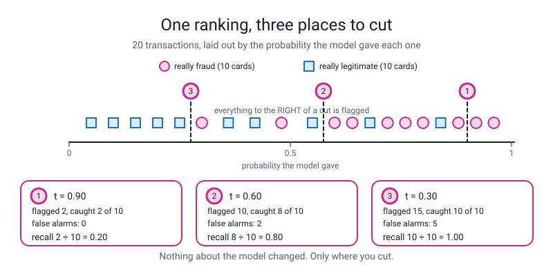
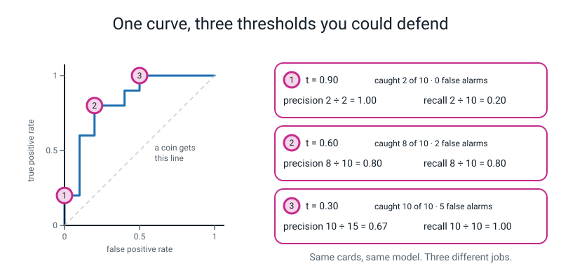
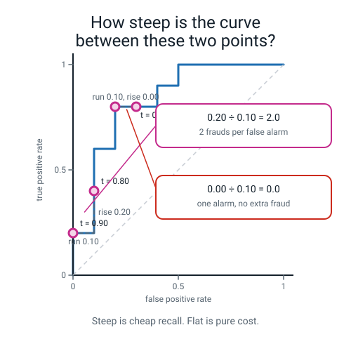
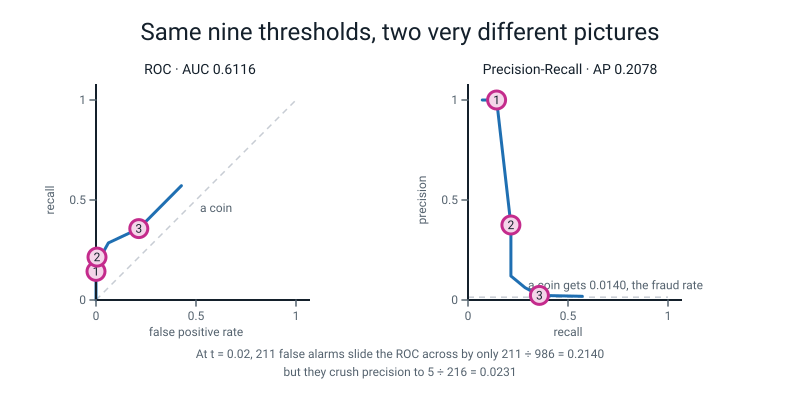
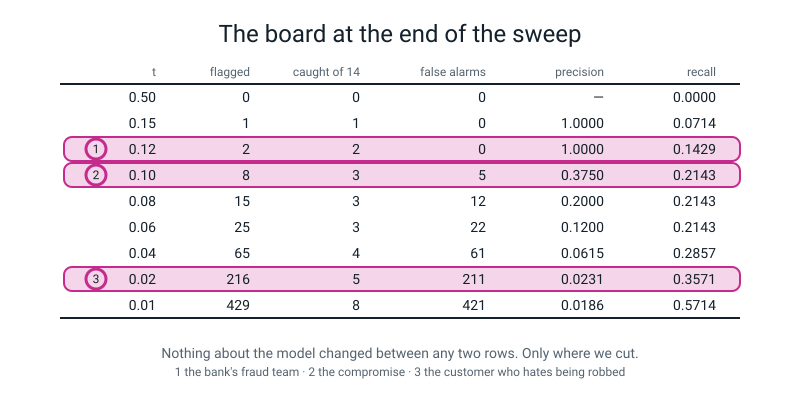
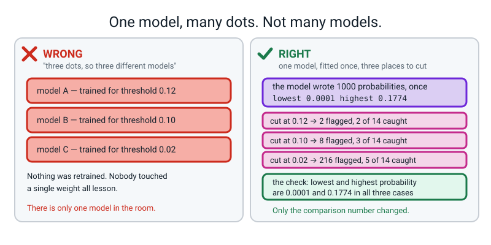
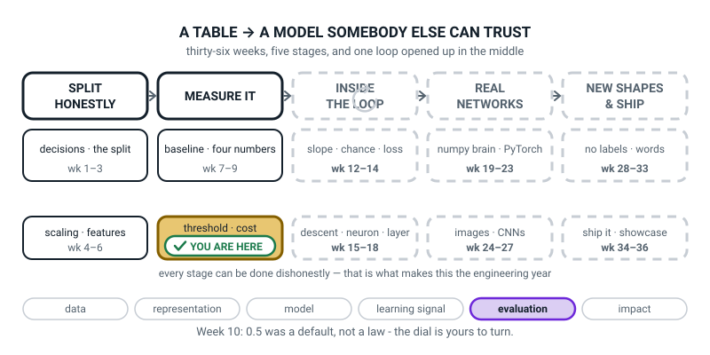
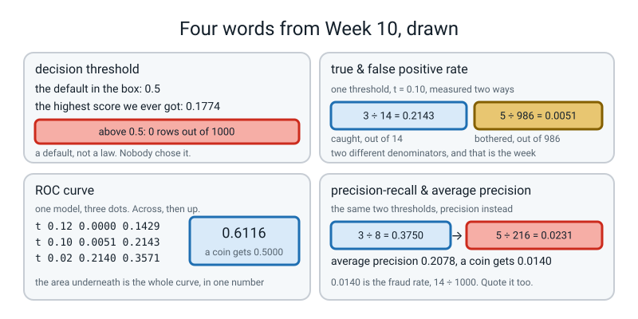

# Week 10 — The Threshold Dial, and the Curve It Draws

[⬅ Week 9](week-09.md) · [Course Home](../README.md) · [Next ➡](week-11.md) · [Workbook](../workbook/week-10.md)

---

> ### This week in one sentence
> **Your classifier never said "fraud" — it said `0.1774`, and something else compared that to `0.5` and decided for you. This week you take the dial off the library and put it in your own hand.**
>
> **By the end of this chapter you will be able to:**
> - **Turn probabilities into yes/no answers at nine different thresholds** and tabulate precision, recall and the false-alarm count at every one of them
> - **Measure the steepness of your own ROC curve between two of its own points**, using rise over run, and read the answer out loud as *"how much recall I bought per false alarm"*
> - **Read an ROC curve and a precision-recall curve** and say which one to trust when positives are rare, with a reason that names the denominator
> - **Mark three thresholds you would defend out loud**, and say which person each one is right for
>
> **New maths:** the steepness of a curve **between two points** — rise over run, two subtractions and a division, on numbers you read off your own graph paper. No calculus. (The steepness at **one** point is Week 12.)
>
> **New syntax:** `(prob >= t).astype(int)` · `roc_curve(y, prob)` · `precision_recall_curve(y, prob)` · `average_precision_score(y, prob)`
>
> **Reading time:** about 40 minutes. **Homework:** about 60 minutes. **You will need squared graph paper** — at least two sheets, ten squares by ten squares.

---

## 🪝 Start Here

Type these two lines. They use the fraud model you built in Week 8 — the same 1,000 validation transactions, 14 of them real fraud.

```python
prob = model.predict_proba(X_val)[:, 1]
print("lowest  %.4f    highest  %.4f" % (prob.min(), prob.max()))
print("above 0.5:", int((prob >= 0.5).sum()))
```

Real output:

```text
lowest  0.0001    highest  0.1774
above 0.5: 0
```

Read that last line again. **Zero.**

Your model looked at a thousand transactions and gave every single one a score between 0 and 1 — how suspicious it thinks that transaction is. The least suspicious thing in the file got **0.0001**. And the *most* suspicious thing — the one single transaction your model is most convinced about — got **0.1774**.

Nothing is above 0.5. So when you type `model.predict(X_val)`, it says "not fraud" to all thousand rows. It catches **none** of the 14 frauds. And it is **98.6% accurate**, which is the trick you met in Week 8.

**So whose fault is that?**

Not the model's. Here is what has actually been happening every time you typed `predict`, for nine weeks:

```text
      predict()   =   predict_proba()   then   >=  0.5
                                               ^^^^^^^
                                       who chose this number?
```

**Nobody chose it.** It is a default. It came in the box with scikit-learn. Some sensible person decided long ago that if you know nothing else, half is the least stupid place to cut — and that number has been making decisions on your behalf since Week 3 and has never once asked your opinion.

You can prove it in two lines:

```python
pred_from_predict = model.predict(X_val)
pred_from_prob = (prob >= 0.5).astype(int)
print((pred_from_predict == pred_from_prob).all())
```

```text
True
```

**`predict` is `predict_proba` followed by `>= 0.5`. That is all it is.**

This week nothing about the model changes. The thousand numbers stay exactly where they are. All you change is **the number you compare them to** — and by the end of the chapter you will have caught **eight of the fourteen** frauds with the model that currently catches none, and you will be able to say exactly what that cost.


*Figure 10.1 — One ranking, three places to cut. Twenty transactions laid out by the probability the model gave them, and three places you could put the knife. Nothing about the model changes between the panels.*

> **decision threshold** — the probability above which you call something positive. `0.5` is a default that shipped with a library, not a law of nature.

🍕 **The analogy.** A metal detector at an airport has a sensitivity knob. Turn it up and you catch every belt buckle and every pen, and the queue takes four hours. Turn it down and the queue flies through and somebody gets a knife past you. **The detector is the same machine at every setting.** The knob is not part of the machine; it is a decision about what kind of day you want to have.

---

## 🧠 The Big Idea

> **📌 About the code in this section.** These blocks are **illustrations, not files**. Each one carries on from the one above. **The complete runnable program is in 💻 Type This.**

### 1. Why our model's numbers are all so small

Only **1%** of the training rows were fraud. So the model saw about 3,000 transactions of which roughly 30 were theft, and it learned something completely correct: **fraud is rare.**

That means even for a genuinely suspicious row, its honest answer is *"probably still not fraud — but this one is a hundred times more suspicious than average."* Which comes out as **0.1774**, not 0.9.

Two different things are hiding in those thousand numbers, and separating them is the whole intellectual content of this week:

| | What it means | Is ours good? |
|---|---|---|
| **the ranking** | which rows are more suspicious than which | **Yes.** Of the 8 most suspicious rows, 3 are real fraud |
| **the absolute number** | "is this a 17.74% chance?" | **No.** They are all squashed towards zero |

Think about what that ranking is worth. The bank handed you 1,000 rows that are **1.4% fraud**. You hand back a pile of 8 rows that is **37.5% fraud**. You have not caught anything yet, but you have concentrated the needles in the haystack by a factor of twenty-seven.

**What is broken is not the model. It is the 0.5.**

### 2. Turn the dial and watch the trade

This is the table the whole week stands on. Same model. Same 1,000 rows. **Same thousand probabilities.** The only thing that changes going down the page is the number in the comparison.

```text
   t   flagged  tp  fp  fn   tn  precision  recall     fpr
 0.50       0   0   0  14  986     0.0000  0.0000  0.000000
 0.15       1   1   0  13  986     1.0000  0.0714  0.000000
 0.12       2   2   0  12  986     1.0000  0.1429  0.000000
 0.10       8   3   5  11  981     0.3750  0.2143  0.005071
 0.08      15   3  12  11  974     0.2000  0.2143  0.012170
 0.06      25   3  22  11  964     0.1200  0.2143  0.022312
 0.04      65   4  61  10  925     0.0615  0.2857  0.061866
 0.02     216   5 211   9  775     0.0231  0.3571  0.213996
 0.01     429   8 421   6  565     0.0186  0.5714  0.426978
```

**Four things to see in it.**

**One — recall can never go down as the threshold drops.** Read the recall column downwards: 0.0000, 0.0714, 0.1429, 0.2143, 0.2143, 0.2143, 0.2857, 0.3571, 0.5714. It only ever climbs or stays flat, and there is a one-sentence reason: **lowering the bar can only *add* rows to the flagged pile, never remove them.** A fraud you have already caught cannot escape.

**Two — precision has no such promise, and here it collapses.** 0.0000, then 1.0000, then 1.0000, then 0.3750, then 0.2000, 0.1200, 0.0615, 0.0231, 0.0186. Every row you add might be innocent.

**Three — look at the rows for `t = 0.10`, `0.08` and `0.06`.** Put your finger on the `tp` column. It says **3, 3, 3.** Now look at `fp` in the same three rows: **5, 12, 22.**

You lowered the bar twice. You added **seventeen** innocent customers to the flagged pile. And you caught **not one extra fraud.** Seventeen real people, each getting a phone call, for nothing.

**Four — the four counts always add to 1,000.** Check the `t = 0.02` row: `5 + 211 + 9 + 775 = 1000`. ✅ Do this every single time. It catches nearly every counting mistake you will ever make.

### 3. Two new fractions, and the denominator is the whole story

Week 8 gave you two fractions built from the same four counts. This week adds a third, and it behaves very strangely for one reason: **its denominator is enormous.**

> **true positive rate (TPR)** — of everything that really was positive, the fraction you caught. `TP ÷ (TP + FN)`. **This is exactly recall, under an older name.** It is one number with two names, and you will meet both for the rest of your life.

> **false positive rate (FPR)** — of everything that really was negative, the fraction you wrongly flagged. `FP ÷ (FP + TN)`.

Why does recall have two names? Historical accident. *True positive rate* and *false positive rate* come from radar operators in the 1940s, deciding whether a blip on a screen was an aeroplane or a goose. *Recall* comes from search engines — "how many of the relevant documents did it recall?" Two fields, the same fraction, both names stuck.

Now the contrast that explains everything else in this chapter. Take the `t = 0.10` row: 8 rows flagged, 3 of them really fraud, 5 false alarms.

```text
precision = 3 ÷ 8   = 0.3750     "of the 8 I flagged, 3 were fraud"
recall    = 3 ÷ 14  = 0.2143     "of the 14 real frauds, I caught 3"
fpr       = 5 ÷ 986 = 0.005071   "of the 986 innocent rows, I bothered 5"
```

**Three different denominators: 8, 14 and 986.** That is the entire skill of this week — not the division, the choosing of what goes on the bottom.

| | Its denominator | On our data | So one extra false alarm moves it by |
|---|---|---|---|
| **precision** | how many I flagged | 8, or 216, or 429 | **a lot** — the denominator is tiny |
| **false positive rate** | how many were really innocent | **always 986** | `1 ÷ 986 = 0.001` — almost nothing |

**Precision and false positive rate are both asking "how bad are my false alarms?" — measured against two completely different backgrounds.** When the innocent pile is huge, FPR barely notices a flood of false alarms, and precision drowns in it. Hold on to that; in two sections it explains why the two charts you draw will disagree violently.

### 4. One model, many dots

> **ROC curve** — the picture you get by plotting true positive rate up the side against false positive rate along the bottom, **one dot per threshold**, from a threshold of 1 all the way down to 0.

That is the whole definition. And here is the sentence to say three times, out loud, because it is the thing almost everybody gets wrong:

**Each dot is not a different model. It is the same model with a different comparison number.**


*Figure 10.2 — One curve, three thresholds you could defend. The ringed number on the curve matches the ringed number on its panel; that is how you read a chart with three annotations on it without drawing three lines across the data.*

Three landmarks are worth naming:

- **Bottom-left corner (0, 0)** — a threshold so high you flag nothing. Zero false alarms, zero frauds caught. **This is our model at 0.5.**
- **Top-right corner (1, 1)** — a threshold so low you flag everything. Every fraud caught, every innocent customer bothered.
- **Top-left corner (0, 1)** — the impossible dream: all the frauds, none of the innocents.

And the dashed diagonal across the middle **is what a coin gets.** If you flag rows completely at random, then whatever fraction of the innocent pile you happen to flag, you will flag about the same fraction of the fraud pile — so TPR ≈ FPR and you sit on the line.

| Where your curve sits | What it means |
|---|---|
| **above** the diagonal | your ranking carries real information |
| **on** the diagonal | your ranking is worthless |
| **below** the diagonal | your model is right and your **labels are swapped** — a real bug, and a funny one |

**The gap between your curve and that diagonal is the only thing your model actually contributed.**

---

## 🔢 The Maths, Slowly

**One new idea, and it is a division.** If you can work out that a hill climbing 20 cm over a run of 10 cm is twice as steep as one climbing 10 cm over 10 cm, you already have it.

### Step 1 — two points, two questions

Take **any two dots** on your ROC curve. Ask:

- **How much did it climb?** That is the **rise** — the change in true positive rate.
- **How far along did it go?** That is the **run** — the change in false positive rate.

Then divide. That is it.

> **🔢 The maths, slowly:** steepness between two points = **rise ÷ run**. Nothing else is involved.

### Step 2 — do it on the twenty cards, where the numbers are clean

These are the twenty index cards from class — ten fraud, ten legitimate, probabilities spread from 0.05 to 0.96. Both denominators are **10**, so every answer comes out in tidy tenths.

Here are the first four dots off that curve:

| threshold | flagged | caught | false alarms | dot (fpr, tpr) |
|---|---|---|---|---|
| 0.90 | 2 | 2 | 0 | **(0.00, 0.20)** |
| 0.80 | 5 | 4 | 1 | **(0.10, 0.40)** |
| 0.70 | 7 | 6 | 1 | **(0.10, 0.60)** |
| 0.60 | 10 | 8 | 2 | **(0.20, 0.80)** |

**The steep pair.** From the dot at threshold 0.90 to the dot at threshold 0.80:

```text
rise  =  0.40 − 0.20  =  0.20        (true positive rate went UP by 0.20)
run   =  0.10 − 0.00  =  0.10        (false positive rate went ACROSS by 0.10)

steepness  =  0.20 ÷ 0.10  =  2.0
```

**Now say it in English, because the sentence is the answer and the decimal is just arithmetic:**

> *"For every one unit of false-alarm rate I spent, I bought **two** units of recall."*

**That is a bargain. You can hear that it is a bargain.**

**The flat pair.** Now the next dot along — threshold 0.50, which sits at (0.30, 0.80):

```text
rise  =  0.80 − 0.80  =  0.00
run   =  0.30 − 0.20  =  0.10

steepness  =  0.00 ÷ 0.10  =  0.0
```

**Zero.** One more innocent card blocked, and **zero** extra frauds caught. Not a bargain. A pure loss.


*Figure 10.3 — How steep is the curve between these two points? Both divisions written out. The steep bit on the left is cheap recall; the flat bit is money spent for nothing.*

> **💡 Try this with a calculator, now.** `0.4 − 0.2 = 0.2`. `0.1 − 0 = 0.1`. `0.2 ÷ 0.1 = 2`. Then the flat one: `0.8 − 0.8 = 0`, `0.3 − 0.2 = 0.1`, `0 ÷ 0.1 = 0`. Four subtractions and two divisions. **You have now done all of this week's new maths.**

### Step 3 — the same trick on the real data, where the numbers are ugly

Real output from this week's program:

```text
t 0.12 -> 0.10   rise 0.071429  run 0.005071  rise/run = 14.0857
t 0.10 -> 0.08   rise 0.000000  run 0.007099  rise/run = 0.0000
t 0.02 -> 0.01   rise 0.214286  run 0.212982  rise/run = 1.0061
```

Three numbers, three completely different pieces of advice:

| steepness | what it means | what to do |
|---|---|---|
| **14.0857** | fourteen units of recall per unit of false-alarm rate | **Take it.** |
| **0.0000** | seventeen more people bothered, no extra frauds | **Don't.** |
| **1.0061** | about one for one — which is exactly a coin's exchange rate | **The model has stopped helping down here.** |

### Step 4 — why 14 and not 2?

Because the real denominators are **14** and **986**, not 10 and 10.

```text
one extra fraud caught  moves the rise by   1 ÷ 14  = 0.0714
one extra false alarm   moves the run  by   1 ÷ 986 = 0.0010
```

`0.0714 ÷ 0.0010` is about 70. So a single trade of one fraud for one false alarm looks *enormously* steep. **The steepness of an ROC curve depends on how lopsided your classes are.** That is honest and it matters, and it is next week's problem.

> **⚠️ Watch out:** if your steepness comes out as a number you cannot say a sentence about, you probably divided **run by rise**. Check: is your answer bigger or smaller than 1? Bigger than 1 means recall was cheap. Smaller than 1 means it was expensive. If you cannot finish the sentence *"I bought ___ units of recall per unit of false alarm"*, flip your fraction.

---

## 💻 Type This

One file, `dial.py`, built in five steps. **Expected runtime for the finished file: under 2 seconds**, including saving the picture.

### Step 1 — the data, and the model that flags nothing

```python
"""dial.py - 0.5 is a default, not a law.  Week 10."""
import matplotlib
matplotlib.use("Agg")
import matplotlib.pyplot as plt
import numpy as np
from sklearn.datasets import make_classification
from sklearn.linear_model import LogisticRegression
from sklearn.metrics import (average_precision_score, confusion_matrix,
                             precision_recall_curve, precision_score,
                             recall_score, roc_auc_score, roc_curve)
from sklearn.model_selection import train_test_split

X, y = make_classification(n_samples=5000, n_features=8, n_informative=4,
                           n_redundant=0, weights=[0.99, 0.01], random_state=0)
X_tmp, X_test, y_tmp, y_test = train_test_split(
    X, y, test_size=0.20, random_state=0, stratify=y)
X_train, X_val, y_train, y_val = train_test_split(
    X_tmp, y_tmp, test_size=0.25, random_state=0, stratify=y_tmp)
print("val rows %d   real frauds %d   real legit %d"
      % (len(y_val), y_val.sum(), len(y_val) - y_val.sum()))

model = LogisticRegression(max_iter=2000, random_state=0).fit(X_train, y_train)
prob = model.predict_proba(X_val)[:, 1]
print("lowest probability %.4f    highest probability %.4f"
      % (prob.min(), prob.max()))
print("how many are above 0.5?", int((prob >= 0.50).sum()))
```

- `matplotlib.use("Agg")` — **before** importing `pyplot`. It tells matplotlib to write pictures to files instead of trying to open a window. On a machine with no screen, `plt.show()` hangs forever; this line means it never comes up.
- `train_test_split` twice — the three piles from Week 2. Train, validate, and a test pile still sealed.
- `[:, 1]` — `predict_proba` hands back **two** columns: column 0 is "probability legit", column 1 is "probability fraud". The two always add to 1 for each row, so column 0 carries no extra news. We take the one we care about.

Real output:

```text
val rows 1000   real frauds 14   real legit 986
lowest probability 0.0001    highest probability 0.1774
how many are above 0.5? 0
```

### Step 2 — the sweep, which is the heart of the week

```python
print()
print("   t   flagged  tp  fp  fn   tn  precision  recall     fpr")
for t in [0.50, 0.15, 0.12, 0.10, 0.08, 0.06, 0.04, 0.02, 0.01]:
    pred = (prob >= t).astype(int)
    tn, fp, fn, tp = confusion_matrix(y_val, pred, labels=[0, 1]).ravel()
    print("%5.2f  %6d %3d %3d %3d %4d     %.4f  %.4f  %.6f"
          % (t, pred.sum(), tp, fp, fn, tn,
             precision_score(y_val, pred, zero_division=0),
             recall_score(y_val, pred, zero_division=0), fp / (fp + tn)))
```

**`(prob >= t).astype(int)` is this week's most important line and it is worth reading in three pieces:**

| Piece | What it does |
|---|---|
| `prob >= t` | compares **all 1,000 numbers at once** to `t`, handing back 1,000 `True`/`False` answers |
| `.astype(int)` | turns every `True` into `1` and every `False` into `0`, because the metric functions want 0s and 1s |
| the whole line | *"flag every row whose probability is at least `t`"* |

> **💡 Try this in a terminal — sixty seconds, and you will never fumble that line.** `import numpy as np`, then `a = np.array([0.9, 0.4, 0.6])`, then `print(a >= 0.5)`, then `print((a >= 0.5).astype(int))`. You get `[ True False  True]` and then `[1 0 1]`.

Two other things in there:

- `labels=[0, 1]` is **new, and it is not optional in a threshold sweep.** At `t = 0.50` nothing gets flagged, so the predictions contain only one class, and without this argument scikit-learn builds a 1×1 table and `.ravel()` cannot fill four names. You get a crash. `labels=[0, 1]` says *"there are two classes even if one of them is empty today."*
- `zero_division=0` says *"if you have to divide by zero, give me 0 and no warning."* At `t = 0.50` precision is `0 ÷ 0`, which has no answer.

Real output:

```text
   t   flagged  tp  fp  fn   tn  precision  recall     fpr
 0.50       0   0   0  14  986     0.0000  0.0000  0.000000
 0.15       1   1   0  13  986     1.0000  0.0714  0.000000
 0.12       2   2   0  12  986     1.0000  0.1429  0.000000
 0.10       8   3   5  11  981     0.3750  0.2143  0.005071
 0.08      15   3  12  11  974     0.2000  0.2143  0.012170
 0.06      25   3  22  11  964     0.1200  0.2143  0.022312
 0.04      65   4  61  10  925     0.0615  0.2857  0.061866
 0.02     216   5 211   9  775     0.0231  0.3571  0.213996
 0.01     429   8 421   6  565     0.0186  0.5714  0.426978
```

**Bottom row.** Threshold 0.01, and you catch **eight of the fourteen** — with the model that caught zero at the top of the page. It cost **421 false alarms.** Four hundred and twenty-one phone calls.

### Step 3 — rise over run, in code

```python
print()
pos = y_val.sum()
neg = len(y_val) - pos


def point(t):
    pred = (prob >= t).astype(int)
    tn, fp, fn, tp = confusion_matrix(y_val, pred, labels=[0, 1]).ravel()
    return tp / pos, fp / neg


for t1, t2 in [(0.12, 0.10), (0.10, 0.08), (0.02, 0.01)]:
    tpr1, fpr1 = point(t1)
    tpr2, fpr2 = point(t2)
    rise = tpr2 - tpr1
    run = fpr2 - fpr1
    print("t %.2f -> %.2f   rise %.6f  run %.6f  rise/run = %.4f"
          % (t1, t2, rise, run, rise / run))
```

`point(t)` is a small named recipe: give it a threshold, get back the dot `(tpr, fpr)` for that threshold. Writing it once means the rest of the file never repeats those three lines.

Real output:

```text
t 0.12 -> 0.10   rise 0.071429  run 0.005071  rise/run = 14.0857
t 0.10 -> 0.08   rise 0.000000  run 0.007099  rise/run = 0.0000
t 0.02 -> 0.01   rise 0.214286  run 0.212982  rise/run = 1.0061
```

### Step 4 — both curves, and the two summary numbers

```python
print()
fpr, tpr, thr = roc_curve(y_val, prob)
prec, rec, pthr = precision_recall_curve(y_val, prob)
print("roc_curve              -> %d fprs, %d tprs, %d thresholds"
      % (len(fpr), len(tpr), len(thr)))
print("precision_recall_curve -> %d precisions, %d recalls, %d thresholds"
      % (len(prec), len(rec), len(pthr)))
print("roc_auc_score           %.4f   (a coin gets 0.5000)"
      % roc_auc_score(y_val, prob))
print("average_precision_score %.4f   (a coin gets %.4f, the fraud rate)"
      % (average_precision_score(y_val, prob), y_val.mean()))
```

- `roc_curve` hands back **three** lists, all the same length: every false positive rate, every true positive rate, and the threshold that produced each pair. **It takes `prob`, not `pred`** — its whole job is to try every threshold, so it needs the raw numbers.
- `precision_recall_curve` has one trap: `prec` and `rec` have **one more entry** than `pthr`, because scikit-learn tacks the point (recall 0, precision 1) on the end so the curve reaches the axis. Plot `rec` against `prec` and you are fine.

> **precision-recall curve** — the same sweep plotted differently: precision up the side, recall along the bottom. One dot per threshold, again.

> **average precision (AP)** — one number summarising the whole precision-recall curve, roughly *"the average precision you get across all the recall levels"*.

Real output:

```text
roc_curve              -> 28 fprs, 28 tprs, 28 thresholds
precision_recall_curve -> 1001 precisions, 1001 recalls, 1000 thresholds
roc_auc_score           0.6116   (a coin gets 0.5000)
average_precision_score 0.2078   (a coin gets 0.0140, the fraud rate)
```

**Read those two scores together and you get the whole nuance of the week:**

| | Our model | A coin gets | So how good is our model? |
|---|---|---|---|
| **ROC AUC** | 0.6116 | 0.5000 | a bit better than a coin — **unimpressive** |
| **Average precision** | 0.2078 | **0.0140** | about **fifteen times** better than a coin — **genuinely useful** |

Both numbers describe the same nine rows. ROC AUC's baseline is **always 0.5**, whatever the data looks like. Average precision's baseline is **the positive class rate** — `14 ÷ 1000 = 0.0140` — because a coin flagging at random gets a precision equal to the fraud rate at every threshold.

So a bare AP of 0.21 *sounds* terrible and is in fact fifteen-fold better than nothing, and a bare AUC of 0.61 sounds mediocre and is. **The professional answer is to report both, with the class balance printed beside them.**

### Step 5 — the picture

```python
fig, axes = plt.subplots(1, 2, figsize=(11, 5))
axes[0].plot(fpr, tpr, color="tab:blue")
axes[0].plot([0, 1], [0, 1], "--", color="grey")
for t in [0.12, 0.10, 0.02]:
    a, b = point(t)
    axes[0].scatter([b], [a], s=90, color="crimson", zorder=3)
axes[0].set_xlabel("false positive rate")
axes[0].set_ylabel("true positive rate (recall)")
axes[0].set_title("ROC - AUC %.4f" % roc_auc_score(y_val, prob))
axes[1].plot(rec, prec, color="tab:blue")
axes[1].plot([0, 1], [y_val.mean(), y_val.mean()], "--", color="grey")
axes[1].set_xlabel("recall")
axes[1].set_ylabel("precision")
axes[1].set_title("Precision-Recall - AP %.4f"
                  % average_precision_score(y_val, prob))
plt.tight_layout()
plt.savefig("dial.png")
print()
print("saved dial.png")
```

```text
saved dial.png
```

`plt.subplots(1, 2, ...)` makes one figure with **two** panels side by side, and `axes[0]` and `axes[1]` are the left and right. The grey dashed lines are the two baselines: the diagonal for ROC, and the flat 0.0140 line for precision-recall.

**Open `dial.png` and look at it.** The left panel climbs raggedly above the diagonal. The right panel **falls off a cliff in the first fifth of the chart** and then crawls along just above the dashed line.


*Figure 10.4 — Same nine thresholds, two very different pictures. 211 false alarms slide the ROC across by 0.2140 and crush precision to 0.0231. Both charts are true; only one of them is going to be shouted at by the operations team.*

Here is exactly why they disagree. Between the `t = 0.10` row and the `t = 0.02` row, false alarms went from **5 to 211**:

```text
on the ROC:  the x-axis moved from 5 ÷ 986 = 0.0051  to  211 ÷ 986 = 0.2140
             — a fifth of the way across.  Looks survivable.

on the PR :  precision went from  3 ÷ 8 = 0.3750    to    5 ÷ 216 = 0.0231
             — it fell to about a fortieth of what it was.  Looks like a disaster.
```

**It is a disaster, and the PR curve is the one telling the truth about the day's work.** 216 flagged transactions with 5 real frauds in them means an analyst looks at forty-three innocent people for every thief.

> **🧑‍🏫 So which curve do you trust?** When positives are rare, **trust the curve whose denominator is the pile you actually have to review.** That is precision. AUC is still worth reporting, because its baseline never moves, so it is the only one of the two you can compare across different datasets.

### The complete `dial.py`

```python
"""dial.py - 0.5 is a default, not a law.  Week 10."""
import matplotlib
matplotlib.use("Agg")
import matplotlib.pyplot as plt
import numpy as np
from sklearn.datasets import make_classification
from sklearn.linear_model import LogisticRegression
from sklearn.metrics import (average_precision_score, confusion_matrix,
                             precision_recall_curve, precision_score,
                             recall_score, roc_auc_score, roc_curve)
from sklearn.model_selection import train_test_split

# ------------------------------------------------------------- 1. THE DATA
X, y = make_classification(n_samples=5000, n_features=8, n_informative=4,
                           n_redundant=0, weights=[0.99, 0.01], random_state=0)
X_tmp, X_test, y_tmp, y_test = train_test_split(
    X, y, test_size=0.20, random_state=0, stratify=y)
X_train, X_val, y_train, y_val = train_test_split(
    X_tmp, y_tmp, test_size=0.25, random_state=0, stratify=y_tmp)
print("val rows %d   real frauds %d   real legit %d"
      % (len(y_val), y_val.sum(), len(y_val) - y_val.sum()))

# ---------------------------------------------------- 2. ONE FROZEN MODEL
model = LogisticRegression(max_iter=2000, random_state=0).fit(X_train, y_train)
prob = model.predict_proba(X_val)[:, 1]
print("lowest probability %.4f    highest probability %.4f"
      % (prob.min(), prob.max()))
print("how many are above 0.5?", int((prob >= 0.50).sum()))

# ---------------------------------------------------------- 3. THE SWEEP
print()
print("   t   flagged  tp  fp  fn   tn  precision  recall     fpr")
for t in [0.50, 0.15, 0.12, 0.10, 0.08, 0.06, 0.04, 0.02, 0.01]:
    pred = (prob >= t).astype(int)
    tn, fp, fn, tp = confusion_matrix(y_val, pred, labels=[0, 1]).ravel()
    print("%5.2f  %6d %3d %3d %3d %4d     %.4f  %.4f  %.6f"
          % (t, pred.sum(), tp, fp, fn, tn,
             precision_score(y_val, pred, zero_division=0),
             recall_score(y_val, pred, zero_division=0), fp / (fp + tn)))

# ------------------------------------------- 4. STEEPNESS: RISE OVER RUN
print()
pos = y_val.sum()
neg = len(y_val) - pos


def point(t):
    pred = (prob >= t).astype(int)
    tn, fp, fn, tp = confusion_matrix(y_val, pred, labels=[0, 1]).ravel()
    return tp / pos, fp / neg


for t1, t2 in [(0.12, 0.10), (0.10, 0.08), (0.02, 0.01)]:
    tpr1, fpr1 = point(t1)
    tpr2, fpr2 = point(t2)
    rise = tpr2 - tpr1
    run = fpr2 - fpr1
    print("t %.2f -> %.2f   rise %.6f  run %.6f  rise/run = %.4f"
          % (t1, t2, rise, run, rise / run))

# -------------------------------------------------------- 5. THE CURVES
print()
fpr, tpr, thr = roc_curve(y_val, prob)
prec, rec, pthr = precision_recall_curve(y_val, prob)
print("roc_curve              -> %d fprs, %d tprs, %d thresholds"
      % (len(fpr), len(tpr), len(thr)))
print("precision_recall_curve -> %d precisions, %d recalls, %d thresholds"
      % (len(prec), len(rec), len(pthr)))
print("roc_auc_score           %.4f   (a coin gets 0.5000)"
      % roc_auc_score(y_val, prob))
print("average_precision_score %.4f   (a coin gets %.4f, the fraud rate)"
      % (average_precision_score(y_val, prob), y_val.mean()))

# ------------------------------------------------------- 6. THE PICTURE
fig, axes = plt.subplots(1, 2, figsize=(11, 5))
axes[0].plot(fpr, tpr, color="tab:blue")
axes[0].plot([0, 1], [0, 1], "--", color="grey")
for t in [0.12, 0.10, 0.02]:
    a, b = point(t)
    axes[0].scatter([b], [a], s=90, color="crimson", zorder=3)
axes[0].set_xlabel("false positive rate")
axes[0].set_ylabel("true positive rate (recall)")
axes[0].set_title("ROC - AUC %.4f" % roc_auc_score(y_val, prob))
axes[1].plot(rec, prec, color="tab:blue")
axes[1].plot([0, 1], [y_val.mean(), y_val.mean()], "--", color="grey")
axes[1].set_xlabel("recall")
axes[1].set_ylabel("precision")
axes[1].set_title("Precision-Recall - AP %.4f"
                  % average_precision_score(y_val, prob))
plt.tight_layout()
plt.savefig("dial.png")
print()
print("saved dial.png")
```

**Runtime: under 2 seconds.** If `highest probability` is not `0.1774`, a `random_state=0` is missing somewhere — check both `train_test_split` calls first, then the `LogisticRegression`.

---

## 🔍 Worked Examples

### Worked Example 1 — The twenty index cards (the class activity, checked by machine)

This is the activity from class, done by a computer so you can mark your own graph paper against it. Ten fraud cards, ten legitimate, probabilities from 0.05 to 0.96.

| prob | 0.96 | 0.92 | 0.88 | 0.84 | 0.80 | 0.76 | 0.72 | 0.68 | 0.64 | 0.60 |
|---|---|---|---|---|---|---|---|---|---|---|
| truth | F | F | F | legit | F | F | F | legit | F | F |

| prob | 0.55 | 0.48 | 0.42 | 0.36 | 0.30 | 0.25 | 0.20 | 0.15 | 0.10 | 0.05 |
|---|---|---|---|---|---|---|---|---|---|---|
| truth | legit | F | legit | legit | F | legit | legit | legit | legit | legit |

```python
"""cards.py - the twenty index cards, checked by machine.  Week 10."""
import numpy as np
from sklearn.metrics import (average_precision_score, precision_score,
                             recall_score, roc_auc_score)

prob = np.array([0.96, 0.92, 0.88, 0.84, 0.80, 0.76, 0.72, 0.68, 0.64, 0.60,
                 0.55, 0.48, 0.42, 0.36, 0.30, 0.25, 0.20, 0.15, 0.10, 0.05])
truth = np.array([1, 1, 1, 0, 1, 1, 1, 0, 1, 1,
                  0, 1, 0, 0, 1, 0, 0, 0, 0, 0])
print("frauds %d   legit %d" % (truth.sum(), len(truth) - truth.sum()))
print("   t   flagged  caught  false alarms   tpr    fpr   precision  recall")
rows = []
for t in [0.90, 0.80, 0.70, 0.60, 0.50, 0.40, 0.30, 0.20, 0.10, 0.05]:
    pred = (prob >= t).astype(int)
    tp = int(((pred == 1) & (truth == 1)).sum())
    fp = int(((pred == 1) & (truth == 0)).sum())
    rows.append((t, tp / 10.0, fp / 10.0))
    print("%5.2f   %6d  %6d  %12d   %.2f   %.2f     %.4f  %.4f"
          % (t, pred.sum(), tp, fp, tp / 10.0, fp / 10.0,
             precision_score(truth, pred, zero_division=0),
             recall_score(truth, pred, zero_division=0)))
print()
print("roc_auc_score            %.4f" % roc_auc_score(truth, prob))
print("average_precision_score  %.4f" % average_precision_score(truth, prob))
print()
for a, c in [(0, 1), (3, 4), (6, 9)]:
    t1, tpr1, fpr1 = rows[a]
    t2, tpr2, fpr2 = rows[c]
    rise = tpr2 - tpr1
    run = fpr2 - fpr1
    print("t %.2f -> t %.2f :  rise %.2f  run %.2f  rise/run %.4f"
          % (t1, t2, rise, run, rise / run))
```

`(pred == 1) & (truth == 1)` asks both questions of every card at once and hands back twenty `True`/`False` answers; `.sum()` counts the `True`s. That is a true-positive count written out longhand, so you can see exactly what `confusion_matrix` does for you.

Real output — **runtime under 1 second:**

```text
frauds 10   legit 10
   t   flagged  caught  false alarms   tpr    fpr   precision  recall
 0.90        2       2             0   0.20   0.00     1.0000  0.2000
 0.80        5       4             1   0.40   0.10     0.8000  0.4000
 0.70        7       6             1   0.60   0.10     0.8571  0.6000
 0.60       10       8             2   0.80   0.20     0.8000  0.8000
 0.50       11       8             3   0.80   0.30     0.7273  0.8000
 0.40       13       9             4   0.90   0.40     0.6923  0.9000
 0.30       15      10             5   1.00   0.50     0.6667  1.0000
 0.20       17      10             7   1.00   0.70     0.5882  1.0000
 0.10       19      10             9   1.00   0.90     0.5263  1.0000
 0.05       20      10            10   1.00   1.00     0.5000  1.0000

roc_auc_score            0.8500
average_precision_score  0.8485

t 0.90 -> t 0.80 :  rise 0.20  run 0.10  rise/run 2.0000
t 0.60 -> t 0.50 :  rise 0.00  run 0.10  rise/run 0.0000
t 0.30 -> t 0.05 :  rise 0.00  run 0.50  rise/run 0.0000
```

**Three things to notice.**

At `t = 0.30` you have caught **all ten** frauds. Recall is 1.0000 and it can never improve. Every threshold below that is pure cost — look at the last row: five more innocent cards blocked (`rise 0.00, run 0.50, steepness 0.0`) to catch nothing at all.

At `t = 0.60` the flagged pile is exactly ten cards, and eight of them are fraud. **Precision and recall are both 0.8000 there**, which is a coincidence of this dataset and not a rule.

And `t = 0.60` gives flagged **10**, not 9 — because `>=` includes the card sitting exactly on 0.60. *"At least 0.60"* includes 0.60.

### Worked Example 2 — Twelve pieces of homework (school)

Different problem, identical machinery. A model looks at twelve pieces of homework and scores each one "how likely is this to be handed in late". Five of the twelve really were late.

```python
"""flagger.py - twelve pieces of homework, one dial.  Week 10."""
import numpy as np
from sklearn.metrics import (average_precision_score, confusion_matrix,
                             precision_score, recall_score, roc_auc_score)

prob = np.array([0.91, 0.84, 0.77, 0.66, 0.58, 0.51,
                 0.44, 0.37, 0.29, 0.18, 0.11, 0.04])
late = np.array([1, 1, 0, 1, 0, 1, 0, 1, 0, 0, 0, 0])
print("twelve pieces of homework.  really late: %d   on time: %d"
      % (late.sum(), len(late) - late.sum()))
print("   t   flagged  tp  fp  fn  tn  precision  recall     fpr")
for t in [0.90, 0.60, 0.40, 0.10]:
    pred = (prob >= t).astype(int)
    tn, fp, fn, tp = confusion_matrix(late, pred, labels=[0, 1]).ravel()
    print("%5.2f  %6d %3d %3d %3d %3d     %.4f  %.4f  %.4f"
          % (t, pred.sum(), tp, fp, fn, tn,
             precision_score(late, pred, zero_division=0),
             recall_score(late, pred, zero_division=0), fp / (fp + tn)))
print("roc_auc_score           %.4f" % roc_auc_score(late, prob))
print("average_precision_score %.4f" % average_precision_score(late, prob))
print("a coin's AP here        %.4f   (the late rate)" % late.mean())
```

Real output:

```text
twelve pieces of homework.  really late: 5   on time: 7
   t   flagged  tp  fp  fn  tn  precision  recall     fpr
 0.90       1   1   0   4   7     1.0000  0.2000  0.0000
 0.60       4   3   1   2   6     0.7500  0.6000  0.1429
 0.40       7   4   3   1   4     0.5714  0.8000  0.4286
 0.10      11   5   6   0   1     0.4545  1.0000  0.8571
```

```text
roc_auc_score           0.8286
average_precision_score 0.8083
a coin's AP here        0.4167   (the late rate)
```

**The steepness between the first two rows**, by hand:

```text
rise  =  0.6000 − 0.2000  =  0.4000
run   =  0.1429 − 0.0000  =  0.1429

steepness  =  0.4000 ÷ 0.1429  =  2.80
```

> *"Between 0.90 and 0.60 I bought nearly three units of recall per unit of false alarm."* Worth doing.

**And the thing worth noticing most:** a coin's AP here is **0.4167**, not 0.0140, because 5 of 12 pieces of homework really were late. This class is not rare. **The AP baseline moves with the data, so an AP of 0.81 here and an AP of 0.21 on the fraud data cannot be compared to each other** — but their AUCs, 0.8286 and 0.6116, can, because a coin always gets 0.5.

At `t = 0.10` recall is a perfect 1.0000 and precision is 0.4545. You caught every late student **and** accused six people who handed in on time. Decide out loud whether you would send those six an email.

### Worked Example 3 — The same model twice, two class balances

This is the clearest proof that the two curves disagree **because of the data, not because of the model.** We build the same eight-feature problem twice — once with a 50/50 split of classes, once with 99/1 — and fit the same logistic regression to both.

```python
"""balance.py - the same model twice, two class balances.  Week 10."""
import numpy as np
from sklearn.datasets import make_classification
from sklearn.linear_model import LogisticRegression
from sklearn.metrics import (average_precision_score, confusion_matrix,
                             precision_score, roc_auc_score)
from sklearn.model_selection import train_test_split

for name, w in [("balanced  50/50", [0.50, 0.50]),
                ("rare      99/1 ", [0.99, 0.01])]:
    X, y = make_classification(n_samples=5000, n_features=8, n_informative=4,
                               n_redundant=0, weights=w, random_state=0)
    X_tr, X_va, y_tr, y_va = train_test_split(
        X, y, test_size=0.20, random_state=0, stratify=y)
    m = LogisticRegression(max_iter=2000, random_state=0).fit(X_tr, y_tr)
    prob = m.predict_proba(X_va)[:, 1]
    pred = (prob >= 0.50).astype(int)
    tn, fp, fn, tp = confusion_matrix(y_va, pred, labels=[0, 1]).ravel()
    print("%s  positives %4d of %d" % (name, int(y_va.sum()), len(y_va)))
    print("   at t = 0.50:  tp %3d  fp %3d  precision %.4f"
          % (tp, fp, precision_score(y_va, pred, zero_division=0)))
    print("   ROC AUC %.4f  (a coin gets 0.5000)" % roc_auc_score(y_va, prob))
    print("   AP      %.4f  (a coin gets %.4f)"
          % (average_precision_score(y_va, prob), y_va.mean()))
    print()
```

Real output:

```text
balanced  50/50  positives  500 of 1000
   at t = 0.50:  tp 349  fp 136  precision 0.7196
   ROC AUC 0.7788  (a coin gets 0.5000)
   AP      0.7986  (a coin gets 0.5000)

rare      99/1   positives   14 of 1000
   at t = 0.50:  tp   0  fp   0  precision 0.0000
   ROC AUC 0.6831  (a coin gets 0.5000)
   AP      0.1877  (a coin gets 0.0140)
```

> **⚠️ Watch out:** the rare model's AUC here is `0.6831`, not the `0.6116` from `dial.py`. That is not a contradiction — this file uses **one 80/20 split**, and `dial.py` uses the **three-pile split** from Week 2, so it is scoring a model trained on fewer rows. Different experiment, different number. Say which experiment you ran, always.

**What the four numbers say.**

On the balanced problem, a coin's AP is **0.5000** — because if half the rows are positive, flagging at random gives you a pile that is half positive. On the rare problem a coin's AP is **0.0140**. The *same* AP number means two completely different things in the two experiments.

And look at the threshold. At `t = 0.50` the balanced model flags 485 rows and catches 349 positives; the rare model flags **nothing at all.** **0.5 is a sensible default when the classes are roughly even. It is a catastrophe when they are not.**

---

## 🐞 When It Breaks

Every message below came from really running a broken version of this week's code. Errors here are not failure — **three of the four worst bugs in this chapter produce no error at all**, which is exactly why you have to look for them on purpose.

### Break 1 — the confusion matrix that came back too small

```python
import numpy as np
from sklearn.metrics import confusion_matrix
truth = np.array([0, 0, 0, 0, 0])
pred = np.array([0, 0, 0, 0, 0])
tn, fp, fn, tp = confusion_matrix(truth, pred).ravel()
```

```text
/…/sklearn/metrics/_classification.py:534: UserWarning: A single label was found in 'y_true' and 'y_pred'. For the confusion matrix to have the correct shape, use the 'labels' parameter to pass all known labels.
  warnings.warn(
Traceback (most recent call last):
  File "…", line 5, in <module>
    tn, fp, fn, tp = confusion_matrix(truth, pred).ravel()
ValueError: not enough values to unpack (expected 4, got 1)
```

**What it means.** "Your predictions only contain one class, so I built a 1×1 table, and one number cannot fill four names."

**Why it happens to you.** A high threshold flags nothing, so `pred` is all zeros.

**The fix is printed in the warning, one line above the traceback:** `confusion_matrix(y_val, pred, labels=[0, 1]).ravel()`.

> **🐞 If you see this error:** read **the whole thing**, starting at the top, not just the last line. This week's headline crash tells you its own fix in the sentence above the traceback, and a student who has learned to jump to the bottom line scrolls straight past it.

### Break 2 — the one with no error message, and a wrong AUC

```python
pred = (prob >= 0.10).astype(int)
fpr, tpr, thr = roc_curve(y_val, pred)
print("points on the curve :", len(fpr))
print("thresholds it found :", thr)
print("AUC %.4f" % roc_auc_score(y_val, pred))
print("AP  %.4f" % average_precision_score(y_val, pred))
```

```text
points on the curve : 3
thresholds it found : [inf  1.  0.]
AUC 0.6046
AP  0.0914
```

**Nothing crashed. Nothing warned.** And both numbers are wrong: the AUC should be 0.6116 and the AP should be 0.2078.

**What happened.** You handed `roc_curve` a column of 0s and 1s. There are only two different values in it, so there are only two places to cut, so there are three points on the curve — and `inf` is a sentinel scikit-learn puts at the front so the curve starts at the origin.

**The rule to keep for the rest of the course:**

| Kind of function | What it wants |
|---|---|
| **draws a curve** — `roc_curve`, `precision_recall_curve`, `roc_auc_score`, `average_precision_score` | **probabilities** |
| **counts cells** — `confusion_matrix`, `precision_score`, `recall_score`, `f1_score` | **predictions** |

**You cannot un-decide a decision.** Hard predictions have already had the threshold applied and thrown the confidence away.

### Break 3 — the arguments in the wrong order

```python
roc_curve(prob, y_val)
```

```text
ValueError: continuous format is not supported
```

**What it means.** "The first thing you gave me is full of decimals, and the first thing has to be the truth."

**The fix.** `roc_curve(y_val, prob)`. **Truth first, always** — in every scikit-learn metric, without exception.

### Break 4 — two lists that are not the same length

```python
prec, rec, pthr = precision_recall_curve(y, p)
plt.plot(pthr, prec)
```

```text
ValueError: x and y must have same first dimension, but have shapes (1000,) and (1001,)
```

**What it means.** Exactly what it says. `prec` and `rec` have **one more** entry than `pthr`, because scikit-learn adds the point (recall 0, precision 1) on the end so the curve reaches the axis.

**The fix.** Plot `rec` against `prec` — that is the curve you actually want. If you really do want precision against threshold, use `prec[:-1]`, which means "everything except the last one".

### Break 5 — a warning that is about your model, not your code

```python
precision_score(y, pred)     # at t = 0.50, where nothing is flagged
```

```text
/…/sklearn/metrics/_classification.py:1731: UndefinedMetricWarning: Precision is ill-defined and being set to 0.0 due to no predicted samples. Use `zero_division` parameter to control this behavior.
0.0
```

**This is not an error.** scikit-learn is being honest: you flagged nothing, so precision is `0 ÷ 0`, which has no answer, and it gave you 0 instead.

**Read it before you silence it.** Then silence it on purpose with `precision_score(y, pred, zero_division=0)`.

### The whole clinic, for reference

| What you see | What it means | The fix |
|---|---|---|
| `ValueError: not enough values to unpack (expected 4, got 1)` | a threshold flagged nothing, so the matrix is 1×1 | `labels=[0, 1]` |
| `ValueError: continuous format is not supported` | arguments swapped | truth first |
| `ValueError: too many values to unpack (expected 2)` | `roc_curve` returns **three** things | `fpr, tpr, thr = ...` |
| `ValueError: x and y must have same first dimension … (1000,) and (1001,)` | PR thresholds are one shorter | plot `rec` against `prec` |
| `ValueError: … a mix of binary and multilabel-indicator targets` | `[:, 1]` was left off `predict_proba` | take column 1 **first**, then threshold |
| `UndefinedMetricWarning: Precision is ill-defined…` | nothing flagged, `0 ÷ 0` | `zero_division=0` |
| **no error**, curve has 3 points, AUC 0.6046 | `pred` passed where `prob` was wanted | pass `prob` |
| **no error**, the four counts add to 999 | a row went missing | **add the four cells up before you divide anything** |
| **no error**, recall goes **down** as the threshold drops | impossible — you have a bug | check the `tn, fp, fn, tp` order in `.ravel()` |

---

## 🎲 What We Did In Class

**The Dial, Physically.** If you missed it, you can do the whole thing at home with twenty pieces of paper and one sheet of graph paper. There is no computer in it.

**What you need.** Twenty cards. On the front of each, write a probability, big. On the back, write the truth, small. Use exactly these:

| Probability (front) | Truth (back) | | Probability (front) | Truth (back) |
|---|---|---|---|---|
| 0.96 | FRAUD | | 0.55 | legit |
| 0.92 | FRAUD | | 0.48 | FRAUD |
| 0.88 | FRAUD | | 0.42 | legit |
| 0.84 | legit | | 0.36 | legit |
| 0.80 | FRAUD | | 0.30 | FRAUD |
| 0.76 | FRAUD | | 0.25 | legit |
| 0.72 | FRAUD | | 0.20 | legit |
| 0.68 | legit | | 0.15 | legit |
| 0.64 | FRAUD | | 0.10 | legit |
| 0.60 | FRAUD | | 0.05 | legit |

**Ten FRAUD, ten legit.** Count them twice. Then shuffle.

**Step 1 — the probability line.** Draw one long horizontal line with `0` at the left end, `0.5` in the middle and `1` at the right. Lay the twenty cards along it, in the right place, **face up with the probability showing.** Do not turn any over yet.

Look at what you have made. **That line is everything the model knows.** It knows the *order*. It does not know where to cut.

**Step 2 — three jobs, ten rounds.** In class one person was the **Caller**, one the **Counter** and one the **Plotter**. Doing it alone, do all three jobs, out loud:

- **Caller:** say the threshold. Then say *"everything at or above this is flagged."*
- **Counter:** count the cards to the right of it, turn over any still face-down, and fill in the four boxes — caught (TP), false alarms (FP), missed (FN), correctly let through (TN). **Say the two divisions out loud:** *"caught four of ten, so recall is four over ten, nought point four."*
- **Plotter:** false alarms ÷ 10 across, caught ÷ 10 up. One dot. Write the threshold beside it, small.

Work down this list, in this order, and do not skip any:

```text
0.90   0.80   0.70   0.60   0.50   0.40   0.30   0.20   0.10   0.05
```

The full ten-row answer is in **Worked Example 1** above. Check yourself against it, row by row.

**Step 3 — join the dots.** Ten dots, left to right, with a ruler. Then draw the dashed diagonal corner to corner.

**Ask yourself the three questions the class was asked:**

1. **Where is the curve steep, and where is it flat?** Steep between 0.90 and 0.70 — the frauds are stacked at the top of the ranking. Flat from 0.30 down to 0.05, where every card you add is legitimate.
2. **Pick the steepest pair and do the division.** `t = 0.90 → 0.80`: rise 0.20, run 0.10, **steepness 2.0.**
3. **Pick the flattest pair and do the division.** `t = 0.30 → 0.05`: rise 0.00, run 0.50, **steepness 0.0.** Five innocent people blocked, zero extra frauds.

**Step 4 — the three sticky notes.** The lesson ended with three thresholds on three sticky notes, each with a *person* on it, not a reason:

```text
t = 0.12   for the fraud team's two-person review desk:
           2 cases a day, both of them real.  Nothing wasted.

t = 0.10   for the manager who has to justify the queue:
           8 flagged, 3 real.  A third of the pile is worth looking at.

t = 0.02   for the customer whose money is actually gone:
           5 of 14 frauds caught instead of 3.  I do not care about the queue.
```


*Figure 10.5 — The board at the end of the sweep. This is what should be written up when the lesson ends, with three rows highlighted and a person's name beside each.*

**And the door to next week, which was the last thing said:** all three of those sticky notes are **arguments**. Good arguments. And an argument is what you have when you do not have a **price**. Next week somebody from the bank tells you that a missed fraud costs £500 and a false alarm costs £10, and the moment that sentence exists the argument is over — because you can multiply.

---

## 💬 Talk About It

**1. A supermarket's self-checkout decides whether to call a member of staff over to check your bag. Where would you put the threshold, and who loses if you get it wrong?**

*Hint:* name the two mistakes as things that happen to a **person on a Saturday afternoon**, not as cells of a table. Then ask how often each one happens — a false alarm that happens once a year and a false alarm that happens twice a shop are the same cell and completely different problems.

**2. Our model's AUC is 0.6116, barely better than a coin. Its average precision is 0.2078, fifteen times better than a coin. Somebody says "so it's a bad model" and somebody else says "so it's a useful model". Can they both be right?**

*Hint:* they are answering two different questions. One is *"does it rank well overall?"* The other is *"if I use it, will my review queue be worth opening?"* Look at `t = 0.10`: 8 rows flagged, 3 real, against a background rate of 1.4%. Which question does that number answer?

**3. Could we ever reach the top-left corner — every fraud caught, no false alarms at all?**

*Hint:* look at the probability line from the activity. The card at 0.84 is legit and the card at 0.80 is fraud. **Ask what that means for any threshold you could put between them.** Then ask what you would have to change to fix it — and notice that it is not the threshold.

---

## ⚠️ Don't Get Tricked

### Trick 1 — "each dot on the ROC curve is a different model"

❌ **Wrong.** *"So the curve shows me twenty-eight models and I pick the best one."*

✅ **Right.** One model. It wrote 1,000 numbers on 1,000 rows, **once**, and went home. Every dot on that curve is the same thousand numbers with the knife in a different place. Proof: run the sweep twice and print `prob.min()` and `prob.max()` — identical, every time, because nothing about the model changed.


*Figure 10.6 — One model, many dots. Not many models. The same thousand probabilities on both sides; only the place you cut has moved.*

### Trick 2 — "recall went up, so the model got better"

❌ **Wrong.** *"At t = 0.01 recall is 0.5714 instead of 0.2143, so lowering the threshold improved the model."*

✅ **Right.** The model did not change. **Every row of that sweep is a trade**, and there is no row where you got something for nothing. Recall went from 0.2143 to 0.5714 and precision went from 0.3750 to 0.0186. Whenever somebody tells you recall improved, ask the follow-up question: *"and what happened to precision?"*

### Trick 3 — "an AP of 0.2078 is terrible"

❌ **Wrong.** *"0.21 out of 1. Barely a fifth. Rubbish."*

✅ **Right.** **Average precision has no fixed baseline.** Its baseline is the positive class rate, which here is `14 ÷ 1000 = 0.0140`. So 0.2078 is about **fifteen times** better than a coin. An AP of 0.21 on 1.4% positives is a much stronger result than an AP of 0.40 on 10% positives. **Never quote an AP without the class balance beside it.** (ROC AUC *is* comparable across datasets, because its baseline is always 0.5. That is precisely why people keep reporting it.)

### Trick 4 — "0.5 is the threshold, so I'll leave it"

❌ **Wrong.** *"The library chose 0.5, so 0.5 must be correct."*

✅ **Right.** On this model, 0.5 flags **nothing at all** — it is the one factually indefensible choice available. 0.5 is a fine placeholder and an indefensible final answer. And once you have chosen, **write it down**: *"threshold 0.10, chosen on the validation set, because the review desk can clear eight cases a day."* Naming the threshold and where you picked it is the whole ethical difference between tuning and lying.

---

## 🌍 Where You've Seen This

- **Your phone's face unlock.** There is a similarity score and a cut-off. Set it strict and it refuses you when you have just woken up; set it loose and your sibling gets in. The "require attention" setting is literally a threshold dial with a nicer name.
- **Email spam folders.** A message with a score of 0.51 goes to spam; 0.49 goes to your inbox. When your school emails you a letter and it lands in spam, you have personally met a false positive on the wrong side of somebody's threshold.
- **Airport security scanners.** Operators talk about it exactly the way this chapter does: catch more weapons, search more grandmothers. The setting is chosen by policy and reviewed after incidents. This is where the phrase *receiver operating characteristic* comes from — 1940s radar.
- **Medical screening programmes.** Which blood-test result counts as "abnormal enough to call the patient back". Committees argue about that number for years, and they argue with ROC curves in the room.
- **Content moderation on social apps.** The same classifier runs with a strict threshold for content aimed at children and a looser one elsewhere. **One model, two dials**, chosen per audience.
- **Credit card declines.** The next time a card gets declined for a perfectly normal purchase, you are looking at somebody's `t`. Somebody decided that blocking that transaction was worth it, and there is a row in a table like yours that proves they thought about it.

---

## 🧭 Where This Fits

The box moves. The tile marked *baseline · four numbers* is plain white and solid now — three weeks of
work, finished — and the tile underneath it has gone gold: *threshold · cost*, Weeks 10 and 11. Stage
two has exactly one box left in it.



*Figure 10.0 — The pipeline in Week 10. The top tile of MEASURE IT is done; the bottom one,
threshold · cost, is where you are. The ↻ on stage three is the training loop, still grey — it opens in
Week 12.*

| | |
|---|---|
| **The mental model you now own** | The model hands you a **ranking**; the threshold turns that ranking into a **decision**. Slide the threshold and you trade misses for false alarms, one for the other, all the way along. The curve that trade traces out is the model's whole personality — and 0.5 was never a law, only a default somebody picked for you. |
| **The one question it answers** | *"Why is 0.5 the cutoff?"* — and your model, whose largest probability all day was 0.1774, is the reason that question has teeth. |
| **What it plugs into** | Week 8's four counts, which every threshold rearranges, and Week 2's `predict_proba` — the only reason you have a dial to turn at all. Take that hidden number away and there is no lesson this week. |
| **What carries forward** | Week 11 puts a price on each threshold so the arithmetic can choose for you. Week 12 takes today's rise over run, shrinks the gap between the two points to a hair, and calls what is left a **derivative**. Week 34 writes the threshold you chose into the contract you ship. |
| **Spiral thread** | ⚖️ **Evaluation** — lit alone again. You did not fit a single new model today. The one you already had turned out to know considerably more than it had been telling you. |

> **💡 Try this:** the next time something automatic says no to you — a card declined, an email in spam,
> a form rejected — say to yourself *"somebody chose that threshold"*. Then guess which way they leaned
> and why. You are now one of the very few people who knows there was a dial at all.

---

## 🔑 Remember This

- **`predict()` is `predict_proba()` followed by `>= 0.5`.** The model produces a number between 0 and 1. The yes/no comes from a comparison that nobody chose.
- **One model, many dots.** Sweeping the threshold changes nothing about the model. It only changes where you cut the ranking.
- **Recall can only rise as the threshold falls; precision has no such promise.** Every row of a sweep is a trade, never a free gift.
- **Three denominators, and the whole skill is choosing:** precision's is *how many I flagged*, recall's is *how many were really positive*, false positive rate's is *how many were really negative* (986 for us, which is why it barely moves).
- **Steepness = rise ÷ run**, and the answer is a sentence: *"I bought ___ units of recall per unit of false alarm."* Steep means cheap recall; flat means people bothered for nothing.
- **If a metric draws a curve it wants probabilities; if it counts cells it wants predictions.** Only one of those two mistakes gives you an error message.
- **AUC's baseline is always 0.5. AP's baseline is the positive rate.** Report both, with the class balance written next to them.

### Syntax reminder card

```python
# ---- the hidden number, and the proof that predict() is just a comparison ----
prob = model.predict_proba(X_val)[:, 1]
#                                 ^^^^ column 1 = "probability of the positive class"
#      left off -> ValueError: ... a mix of binary and multilabel-indicator targets
print((model.predict(X_val) == (prob >= 0.5).astype(int)).all())    # True

# ---- the dial. One line, three pieces. --------------------------------------
pred = (prob >= t).astype(int)
#       ^^^^^^^^^  1000 True/False answers at once
#                  ^^^^^^^^^^^^  True -> 1, False -> 0, because metrics want 0s and 1s

# ---- the four counts, with the argument you cannot skip in a sweep ----------
tn, fp, fn, tp = confusion_matrix(y_val, pred, labels=[0, 1]).ravel()
#                                               ^^^^^^^^^^^^
#                       "there are two classes even if one is empty today"
#      left off, at a threshold that flags nothing ->
#      ValueError: not enough values to unpack (expected 4, got 1)
#      ...and the fix is printed in the UserWarning ABOVE the traceback

precision_score(y_val, pred, zero_division=0)   # 0/0 -> 0, no warning
fp / (fp + tn)                                  # false positive rate, denominator 986

# ---- the curves. THESE TAKE prob, NOT pred. --------------------------------
fpr, tpr, thr = roc_curve(y_val, prob)              # THREE things back
prec, rec, pthr = precision_recall_curve(y_val, prob)
# len(prec) == len(rec) == len(pthr) + 1   <- plot rec against prec
roc_auc_score(y_val, prob)             # 0.6116   a coin gets 0.5000, always
average_precision_score(y_val, prob)   # 0.2078   a coin gets the POSITIVE RATE

# pred instead of prob -> NO ERROR. 3 points, AUC 0.6046, AP 0.0914. All wrong.

# ---- write the picture to a file, never to a window -------------------------
plt.savefig("dial.png")
```

### One-line maths reminder

> **Steepness between two dots = rise ÷ run** — the change in recall divided by the change in false-alarm rate. Read it as *"recall bought per false alarm"*, and if you cannot say that sentence, you divided the wrong way round.

---

## 📓 New Words


*Figure 10.7 — Four words from Week 10, drawn. Every number on a tile came out of your own `dial.py` run.*

| Word | What it means | Example |
|---|---|---|
| **decision threshold** | the probability above which you call something positive. A default, not a law | `t = 0.10` flags 8 rows; `t = 0.50` flags **0** |
| **true positive rate (TPR)** | of everything that really was positive, the fraction you caught. **Recall's other name** | `3 ÷ 14 = 0.2143` |
| **false positive rate (FPR)** | of everything that really was negative, the fraction you wrongly flagged | `5 ÷ 986 = 0.005071` |
| **ROC curve** | one dot per threshold: TPR up, FPR across. **One model, many dots** | 28 points on ours; the diagonal is what a coin gets |
| **precision-recall curve** | the same sweep: precision up, recall across. Trust it when positives are rare | falls from 0.3750 to 0.0231 as false alarms go 5 → 211 |
| **average precision (AP)** | one number for the whole PR curve. Its baseline is **the positive rate** | **0.2078**, against a coin's **0.0140** |
| **steepness (rise over run)** | change in TPR ÷ change in FPR between two dots. *"Recall bought per false alarm"* | `0.071429 ÷ 0.005071 = 14.0857` |
| **AUC** | how much of the square sits under the ROC curve. A coin gets exactly 0.5 | **0.6116** (and next week you compute one by hand) |

---

## 📤 Your Homework

Go to **[the Week 10 workbook](../workbook/week-10.md)**. About **60 minutes** in total. **You will need squared graph paper.**

| Section | What to do | Time |
|---|---|---|
| **Warm-Up** | Five quick questions from Week 9 on precision, recall and F1 | 5 min |
| **The ten-threshold sweep, by hand** | The twenty cards, ten thresholds, four counts at each, every division written out | 20 min |
| **The nine-row sweep in code** | Run `dial.py` and check your four key numbers against the real output | 10 min |
| **Two rise-over-run divisions** | One steep pair, one flat pair, each read out as a sentence | 10 min |
| **Both curves, plotted** | `dial.png`, two panels, saved to a file | 5 min |
| **Three thresholds you would defend** | Three numbers, three people, one sentence each | 10 min |

**Three things are being marked, and the third is the real one.**

**Do your four counts add up to 20?** Every single row. `2 + 0 + 8 + 10 = 20`. If your page has no addition check written on it, the habit is not installed yet, and it is the check that catches every miscount you will ever make. If a row does not come to 20, finding the dropped card is part of the job.

**Is there a sentence beside every rise-over-run division?** Not `14.0857`. ***"Between 0.12 and 0.10 I bought fourteen units of recall per unit of false-alarm rate, so I would take that trade."*** **The sentence is the answer; the decimal is just the arithmetic.** Three correct decimals with no sentences has done the sums and missed the week.

**And the page that matters most: do your three thresholds have a *person* on them?** Not "0.10 because it's best". *"0.10, defended to the manager who signs off the review queue: eight cases a day, three of them real, so a third of the pile is worth opening — and it is the last threshold where lowering the bar still buys me frauds. Below it I pay in people and get nothing back."*

Three numbers with no people scores **zero**, however sensible the numbers are. And pick three thresholds that are **different kinds of decision** — three numbers within 0.01 of each other is one decision written three times.

One last line to finish on, and it sets up next week: beside your three defended thresholds, write **what you would need to know to choose between them.** If your answer is anything like *"how much each kind of mistake actually costs"*, you have just worked out what Week 11 is for.
