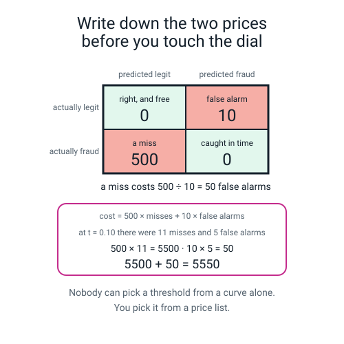
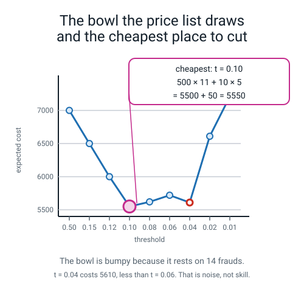
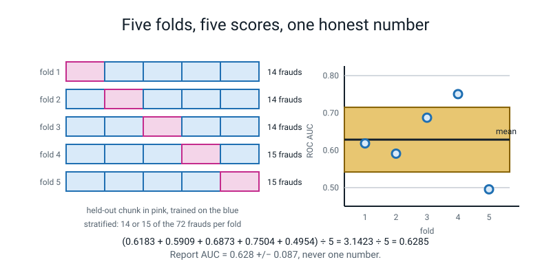
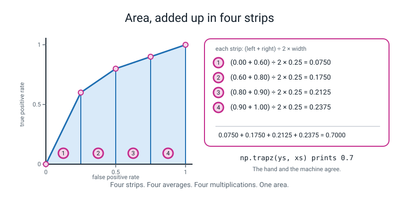
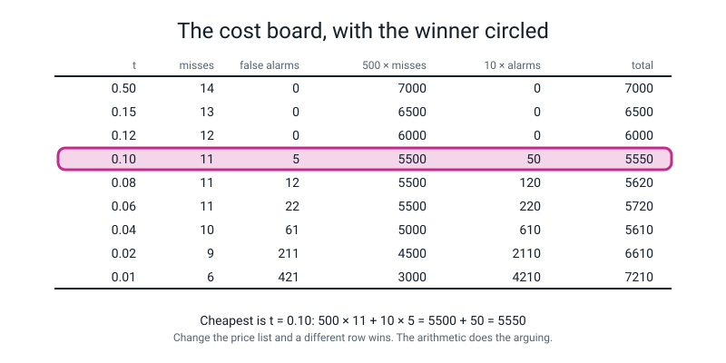
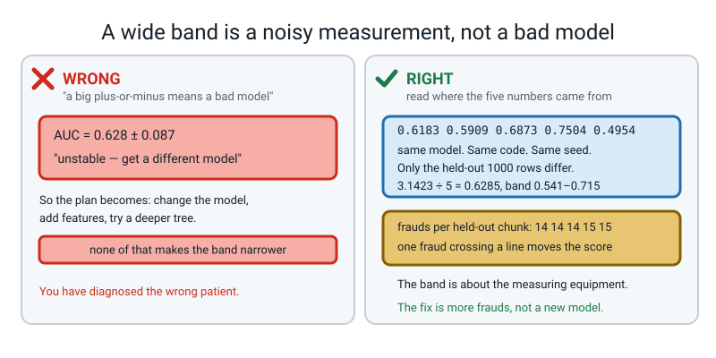
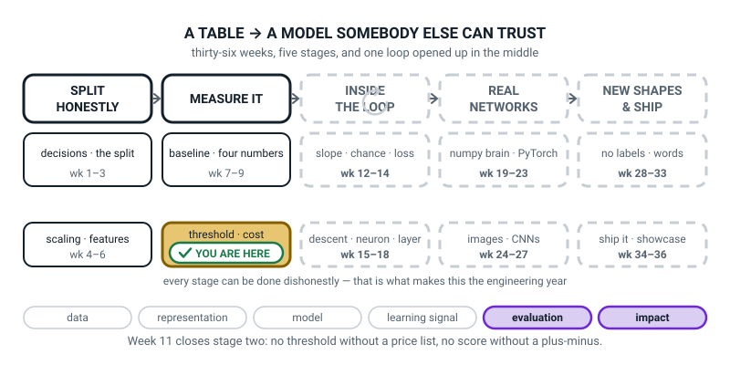
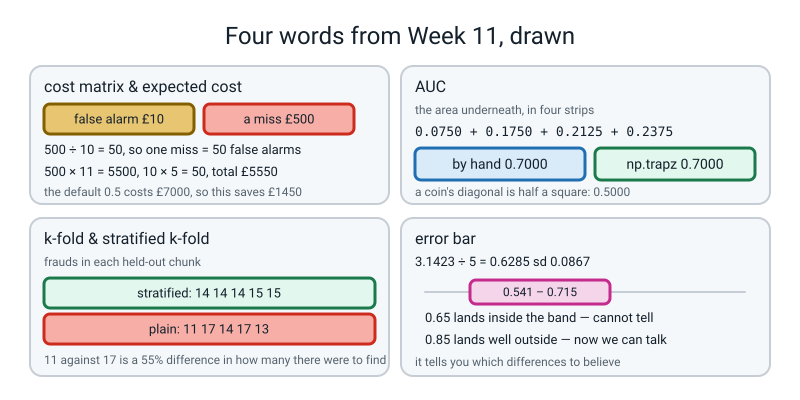

# Week 11 — Fraud Bench: What Does a Mistake Cost?

[⬅ Week 10](week-10.md) · [Course Home](../README.md) · [Next ➡](week-12.md) · [Workbook](../workbook/week-11.md)

---

> ### This week in one sentence
> **You cannot pick a threshold without a price list — write down what a miss costs and what a false alarm costs, and the arithmetic picks the threshold for you, with nobody left to argue.**
>
> **By the end of this chapter you will be able to:**
> - **Write an explicit cost matrix** for a stated application and compute the expected cost at nine thresholds, showing the arithmetic in full for one of them
> - **Estimate the area under a five-point curve** by adding trapezoid strips by hand, then match `np.trapz` to three decimal places
> - **Run stratified 5-fold cross-validation** and report `mean ± sd` instead of one lucky number
> - **Say what the `±` is for**, and what a large one tells you about your data
>
> **New maths:** the **area under a curve**, added up as trapezoid strips. Average the two heights, times the width, four times, add them up. You learned the trapezoid in about Year 7 — this week you find out that it is what `roc_auc_score` has been doing all along.
>
> **New syntax:** `StratifiedKFold(n_splits=5, shuffle=True, random_state=0)` · `cross_val_score(pipe, X, y, cv=skf, scoring="roc_auc")` · `np.trapz(tpr, fpr)` · `scores.mean()` / `scores.std()`
>
> **Reading time:** about 40 minutes. **Homework:** about 60 minutes. **You will need two sheets of squared graph paper and a calculator.**

---

## 🪝 Start Here

Last week ended beautifully and uselessly. Three sticky notes on the wall:

```text
t = 0.12   right for the two-person review desk
t = 0.10   right for the manager who signs off the queue
t = 0.02   right for the customer whose money is gone
```

Three good arguments. And **you cannot ship three thresholds.** On Monday morning somebody has to type one number into a live system, and *"it depends who you ask"* does not deploy.

So how do you get out of an argument like that? Not with a better argument. **With a price.**

This morning the bank sent over a card. Two numbers on it. Somebody who is not a machine-learning person sat down and worked out what each kind of mistake actually costs them — the money gone, the chargeback and the investigation on one side; an analyst's ten minutes and a mildly annoyed customer on the other:

```text
   a missed fraud  ...........  £500
   a false alarm   ...........   £10
```

**The moment those two numbers exist, the argument is over.** Not because anybody won it. Because there is nothing left to argue about — you can multiply.

**Work this out before you read on: how many false alarms is one missed fraud worth?**

```text
500 ÷ 10  =  50
```

**Fifty.** So you should be willing to block fifty innocent cards to stop one theft. Fifty. **And not fifty-one.** That is not an opinion any more, that is arithmetic.


*Figure 11.1 — Write down the two prices before you touch the dial. Two of the four cells are free; the two mistakes have prices, and the whole lesson is that one price is fifty times the other.*

**One prediction before you start, and write your answer down.** A miss costs fifty times more than a false alarm. So will the cheapest threshold be **the lowest one on the table, 0.01**, or **somewhere in the middle**?

Most people say 0.01. **Most people are wrong**, and finding out why is worth ten minutes of your life.

🍕 **The analogy, and everybody in the room has already lived it.** Deciding how early to leave for the airport. Leaving too early costs you an hour of boredom in a departure lounge. Leaving too late costs you the flight, the hotel and the wedding you were flying to. **Nobody splits the difference at "a fifty-fifty chance of making it."** You weigh the two costs, notice that one is about a hundred times worse, and leave absurdly early. That is threshold tuning, and you already do it several times a year without arithmetic.

---

## 🧠 The Big Idea

> **📌 About the code in this section.** These blocks are **illustrations, not files**. Each one carries on from the one above. **The complete runnable program is in 💻 Type This.**

### 1. The cost matrix is the confusion matrix with money in it

> **cost matrix** — the confusion matrix with a price written in each cell instead of a count.

| | Predicted legit | Predicted fraud |
|---|---|---|
| **Actually legit** | **£0** — right, and free | **£10** — an analyst reviews it, the customer is mildly annoyed |
| **Actually fraud** | **£500** — the money is gone, plus the chargeback and the investigation | **£0** — caught in time |

**The two diagonal cells cost nothing.** Getting it right is free. So the whole cost of running your model at a given threshold is two multiplications and one addition:

```text
cost  =  500 × (number of misses)  +  10 × (number of false alarms)
```

> **expected cost** — the total price of all the mistakes a model makes at a given threshold.

**And here is the part that is not maths at all.** Somebody decided that a stolen paycheque is worth fifty inconvenienced customers. That person might be wrong. **The arithmetic will faithfully implement whatever value judgement you feed it**, and being explicit about the judgement is the entire ethical content of this chapter.

Compare it to last week, where the decision was being made by the number `0.5` sitting in a library's default arguments, and **there was nobody to ask.** Writing the price list down does not make it right. **It makes it arguable.** That is a much bigger improvement than it sounds.

### 2. Nine rows, costed, and a bowl with a bump in it

Take last week's nine-row sweep table. It already has `fn` and `fp` in it. Multiply and add:

```text
--- the price list: a miss costs 500, a false alarm costs 10 ---
   t   fn   fp   500 x fn   10 x fp   total cost
 0.50   14    0       7000         0         7000
 0.15   13    0       6500         0         6500
 0.12   12    0       6000         0         6000
 0.10   11    5       5500        50         5550
 0.08   11   12       5500       120         5620
 0.06   11   22       5500       220         5720
 0.04   10   61       5000       610         5610
 0.02    9  211       4500      2110         6610
 0.01    6  421       3000      4210         7210
cheapest of the nine: t = 0.10 at 5550
```

**The winner's arithmetic, longhand, because you should do at least one row with a pen:**

```text
t = 0.10   →   11 misses, 5 false alarms

  500 × 11  =  5500
   10 ×  5  =    50
                ----
                5550
```

**Three things to see.**

**One — there is a bottom, and you can see it.** 7000, 6500, 6000, **5550**, 5620, 5720, 5610, 6610, 7210. Down, down, down, then up, up, then down a bit, then up, up. **It is a bowl.** The default threshold costs the bank **£7,000** on a thousand transactions; the cheapest of the nine costs **£5,550**.

```text
7000 − 5550  =  1450
```

**One thousand four hundred and fifty pounds**, on a thousand transactions, saved by changing one number in a comparison. No retraining. No new data. No new features. Nobody touched the model.

**Two — the winner is not at the bottom of the table, and this is where most people's prediction goes wrong.** At `t = 0.01` you catch eight frauds instead of three — five more, worth £2,500 saved. And you buy **421 false alarms** to do it, at £10 each, which is **£4,210.**

```text
you spent £4,210 to save £2,500
```

**A miss being fifty times worse than a false alarm does not help you when there are eighty times as many false alarms.** That is the whole answer to the hook's question.

**Three — the bowl is bumpy, and that matters more than the winner.** Look at `t = 0.04`: **£5,610**, which is *cheaper* than `t = 0.06` at £5,720. The bowl is not smooth. **That bump is not a discovery, it is noise** — the entire table rests on **fourteen** frauds, so one fraud crossing a line moves £500, which is more than the gap between several neighbouring rows.


*Figure 11.2 — The bowl the price list draws and the cheapest place to cut. The ringed point is the winner. The red-outlined point is the bump, and the bump is what fourteen frauds look like.*

**Hold on to that bump.** It is the reason the second half of this chapter exists.

### 3. Change the price list and a different row wins

This is the most important experiment in the lab, and it takes one line to run. Change `COST_FN` and everything moves:

| a miss costs | a false alarm costs | winner | its cost |
|---|---|---|---|
| £50 | £10 | **t = 0.12** | £600 (and 0.10 ties exactly) |
| £200 | £10 | **t = 0.10** | £2,250 |
| £500 | £10 | **t = 0.10** | £5,550 |
| £5,000 | £10 | **t = 0.01** | £34,210 |

**Make a miss ten times more expensive again (£500 to £5,000) and the winner slides from 0.10 all the way to 0.01** — flag 429 rows out of 1,000 and catch 8 of the 14. That is what *"we will accept any amount of hassle to stop this"* looks like written as arithmetic.

**And the sentence this is all for:**

> **A threshold is not a property of your model. It is a property of your model and somebody's value judgement, together.**

The only professional thing you can do is write the value judgement down where a person can argue with it.

> **🧑‍🏫 If two thresholds tie**, as 0.10 and 0.12 do on the £50 price list, **take the higher one** — it bothers fewer people for exactly the same money.

### 4. One number is not a measurement

Last week produced `roc_auc_score = 0.6116`. **How much should anybody trust that?**

Here is the test that settles it. Change nothing about the model, nothing about the features, nothing about the code — **just chop the data into five pieces a different way**, and watch what the number does.

> **k-fold cross-validation** — chop the data into *k* equal chunks. Train on *k*−1 of them and score on the one you left out. Repeat *k* times, so every row is held out exactly once. Report the mean of the *k* scores **and how much they wobble.**

> **stratified k-fold** — the same thing, but each chunk is built to hold the same proportion of the rare class as the whole dataset. **Not optional when the positive class is rare.**

Why stratification is not optional here — real output:

```text
frauds per test fold, StratifiedKFold : [14, 14, 14, 15, 15]
frauds per test fold, plain KFold     : [11, 17, 14, 17, 13]
```

Both lists add to **72**, which is every fraud in the 5,000-row table. ✅ But look at the plain version: one chunk got **11** frauds and another got **17**. That is a **55% difference in how many frauds there were to find.** So if the five scores come out different from each other, you have no way of knowing whether that is the model being unstable or one chunk simply having had an easier job.

**Stratification removes one of the two explanations**, and when you are trying to diagnose something, removing an explanation is the whole game.

And now the five scores. **This is the most important block of output in the week:**

```text
the five AUCs : [0.6183 0.5909 0.6873 0.7504 0.4954]
mean 0.6285   sd 0.0867
report it as  : AUC = 0.628 +/- 0.087 (5-fold stratified CV)
```

**Read those five numbers slowly.** One fold said **0.7504** — a decent model. Another said **0.4954** — worse than a coin.

**Same model. Same code. Same seed. The only difference is which 1,000 rows it was scored on.**

> **error bar** — the `±` you print beside a mean. It says how much the number moves when you measure the same thing again a slightly different way.


*Figure 11.3 — Five folds, five scores, one honest number. Five held-out chunks on the left, the five scores they produced on the right, and the mean worked out underneath.*

**What the `±` is actually for, in one sentence:** *it is a rule of thumb for how big a difference between two models to trust: a difference smaller than the spread is unproven, and a difference well outside it is worth taking seriously.* (It is the spread of single-fold scores; the sharper test is to score both models on the same folds.)

- Our band is **0.628 ± 0.087**, so roughly **0.54 to 0.72**.
- Somebody hands you a new model scoring **0.65**. Is it better? **You cannot tell from this.** 0.65 is inside your band; it might be your own model on a luckier split.
- Somebody hands you a model scoring **0.85**. **Now you can talk**, because 0.85 is well outside the band.

🍕 **The analogy.** Weighing yourself. If the scale reads 60 kg ± 0.2 kg, you can detect a 1 kg change, and a claim about 1 kg is checkable. If it reads 60 kg ± 3 kg, a 1 kg change is invisible and **any claim about 1 kg is unmeasurable with that equipment.** The equipment did not lie to you. You just cannot ask it that question.

**And what a large `±` tells you about your data** — three possibilities, in the order they are usually the answer:

1. **The held-out chunks are too small for the thing you are measuring.** 14 positives is 14. Every score is coarse. *(For us this is overwhelmingly the answer.)*
2. **The model is genuinely unstable** — small changes in the training rows move it a lot.
3. **The data is not homogeneous** — some chunks contain a genuinely different kind of row.

> **⚠️ Watch out:** cross-validation **replaces the validation set, not the test set.** The test pile is still sealed and still gets opened exactly once, at the very end, exactly as in Week 2. If you cross-validate over everything including the test rows and then report the mean as a test score, that is leakage with extra steps — and it is very hard to spot when reading code.

---

## 🔢 The Maths, Slowly

**One new idea, and it is a shape you learned to find the area of in about Year 7.**

### Step 1 — the problem

Draw a curve on graph paper. You want the area of the space underneath it. The curve is curved, so you cannot use a rectangle.

But you *can* chop that space into vertical strips, and each strip is very nearly a **trapezoid** — a rectangle with a sloping top.

> **🔢 The maths, slowly:** the area of one strip is **(the left-hand height + the right-hand height) ÷ 2, times the width.** You average the two heights to get *"the average height of this strip"*, then multiply by how wide it is, exactly as you would for a rectangle.

And because the top of each strip is a **straight line**, averaging the two heights is not a shortcut or an approximation. **For that strip, it is exactly right.**

### Step 2 — do all four strips by hand

Here are five points. Plot them on squared paper and join them with straight lines:

```text
(0.00, 0.00)   (0.25, 0.60)   (0.50, 0.80)   (0.75, 0.90)   (1.00, 1.00)
```

Draw vertical lines at 0.25, 0.50 and 0.75. That gives four strips, each **0.25 wide.**

```text
strip 1:  left height 0.00, right height 0.60, width 0.25
          (0.00 + 0.60) ÷ 2  =  0.30      0.30 × 0.25  =  0.0750

strip 2:  (0.60 + 0.80) ÷ 2  =  0.70      0.70 × 0.25  =  0.1750

strip 3:  (0.80 + 0.90) ÷ 2  =  0.85      0.85 × 0.25  =  0.2125

strip 4:  (0.90 + 1.00) ÷ 2  =  0.95      0.95 × 0.25  =  0.2375
                                                          ------
                                          total        =  0.7000
```


*Figure 11.4 — Area, added up in four strips. Each strip's arithmetic printed beside it, and the four answers added up.*

> **💡 Try this with a calculator, right now.** Four additions, four divisions by 2, four multiplications by 0.25, then add up. `0.0750 + 0.1750 + 0.2125 + 0.2375 = 0.7000`. **You have now done all of this week's new maths.**

And the machine's answer, real output:

```text
by hand   : 0.7000
np.trapz  : 0.7000
```

**0.7000 both ways. Exactly, not approximately.**

### Step 3 — the reveal, which is why this is worth teaching at all

```text
np.trapz(tpr, fpr)  : 0.6116
roc_auc_score       : 0.6116
```

> **AUC (area under the ROC curve)** — one number summarising a whole ROC curve: the area of the space underneath it. A coin's curve is the diagonal, whose area is exactly 0.5. A perfect curve goes through the top-left corner and has area 1.

**`roc_auc_score`, which you have been typing since Week 2 and trusting completely, is trapezoid strips.** It always was. Twenty-seven of them instead of four, on our curve. **There is nothing else inside it.**

And now you know where "a coin gets 0.5" came from, which last week just asserted. **It is not a convention. It is the area of a triangle.** The diagonal splits a 1-by-1 square in half, and `½ × 1 × 1 = 0.5`.

### Step 4 — two ways to get it wrong with no error message

**`np.trapz(y, x)` takes the heights first and the positions second** — the opposite order from how you say it out loud. Get it backwards:

```text
right way   np.trapz(ys, xs) : 0.7000
wrong way   np.trapz(xs, ys) : 0.3000
```

**0.3000, which is `1 − 0.7000`.** You measured the area to the *left* of the curve instead of underneath it, and together those two areas fill the square.

> **💡 The check that catches it instantly:** add your two answers up. `0.7 + 0.3 = 1`, the whole square. **If your two answers make something you recognise, you measured the wrong side.** No documentation required.

And `np.trapz` assumes your x values go **in increasing order.** It walks the list in the order you give it and does not check. Swap 0.25 and 0.50 on our five points and you get **0.6375** instead of 0.7000 — no warning, no crash.

---

## 💻 Type This

One file, `fraud_bench.py`, in five steps. **Expected runtime for the finished file: about 1 second**, and that includes fitting the model six times.

### Step 1 — the price list, in capital letters, at the top

```python
"""fraud_bench.py - a price list picks the threshold.  Week 11."""
import numpy as np
from sklearn.datasets import make_classification
from sklearn.linear_model import LogisticRegression
from sklearn.metrics import confusion_matrix, roc_auc_score, roc_curve
from sklearn.model_selection import (KFold, StratifiedKFold, cross_val_score,
                                    train_test_split)
from sklearn.pipeline import Pipeline
from sklearn.preprocessing import StandardScaler

COST_FN = 500          # a missed fraud
COST_FP = 10           # a false alarm

X, y = make_classification(n_samples=5000, n_features=8, n_informative=4,
                           n_redundant=0, weights=[0.99, 0.01], random_state=0)
X_tmp, X_test, y_tmp, y_test = train_test_split(
    X, y, test_size=0.20, random_state=0, stratify=y)
X_train, X_val, y_train, y_val = train_test_split(
    X_tmp, y_tmp, test_size=0.25, random_state=0, stratify=y_tmp)
model = LogisticRegression(max_iter=2000, random_state=0).fit(X_train, y_train)
prob = model.predict_proba(X_val)[:, 1]
```

**`COST_FN` and `COST_FP` in capitals, on lines 2 and 3 of the program, is not decoration.** Capitals mean *"this is a setting, not a working variable"*, and putting them at the top means that in a year somebody reading your code can find the value judgement buried inside it in four seconds instead of never.

### Step 2 — nine rows, costed

```python
print("--- the price list: a miss costs %d, a false alarm costs %d ---"
      % (COST_FN, COST_FP))
print("   t   fn   fp   500 x fn   10 x fp   total cost")
best_t = None
best_cost = None
for t in [0.50, 0.15, 0.12, 0.10, 0.08, 0.06, 0.04, 0.02, 0.01]:
    pred = (prob >= t).astype(int)
    tn, fp, fn, tp = confusion_matrix(y_val, pred, labels=[0, 1]).ravel()
    cost = COST_FN * fn + COST_FP * fp
    if best_cost is None or cost < best_cost:
        best_t = t
        best_cost = cost
    print("%5.2f %4d %4d %10d %9d %12d"
          % (t, fn, fp, COST_FN * fn, COST_FP * fp, cost))
print("cheapest of the nine: t = %.2f at %d" % (best_t, best_cost))
```

`if best_cost is None or cost < best_cost:` reads as *"if I have not seen any cost yet, **or** this one is cheaper than the cheapest so far, remember it."* `None` is Python's word for "nothing here yet". **This is how you find a minimum without sorting anything**, and you will write this shape of `if` for the rest of your life.

Real output:

```text
--- the price list: a miss costs 500, a false alarm costs 10 ---
   t   fn   fp   500 x fn   10 x fp   total cost
 0.50   14    0       7000         0         7000
 0.15   13    0       6500         0         6500
 0.12   12    0       6000         0         6000
 0.10   11    5       5500        50         5550
 0.08   11   12       5500       120         5620
 0.06   11   22       5500       220         5720
 0.04   10   61       5000       610         5610
 0.02    9  211       4500      2110         6610
 0.01    6  421       3000      4210         7210
cheapest of the nine: t = 0.10 at 5550
```

**Check three of those rows against your own handwriting before you go any further.** That agreement is worth thirty seconds of silence.

### Step 3 — ninety-nine thresholds, and a formula that disagrees

```python
print()
print("--- a finer sweep: 99 thresholds, every 0.002 ---")
fine_t = None
fine_cost = None
for t in np.arange(0.002, 0.200, 0.002):
    pred = (prob >= t).astype(int)
    tn, fp, fn, tp = confusion_matrix(y_val, pred, labels=[0, 1]).ravel()
    cost = COST_FN * fn + COST_FP * fp
    if fine_cost is None or cost < fine_cost:
        fine_t = t
        fine_cost = cost
print("cheapest of the 99 : t = %.3f at %d" % (fine_t, fine_cost))
print("the formula says   : t = %d / (%d + %d) = %.4f"
      % (COST_FP, COST_FP, COST_FN, COST_FP / (COST_FP + COST_FN)))
```

`np.arange(start, stop, step)` makes a list of numbers from `start` up to **but not including** `stop`, going up in jumps of `step`. So this is 0.002, 0.004, 0.006, … 0.198 — **99 thresholds instead of nine.**

And **there is a formula for the best threshold**, which you can reason out in three lines without algebra. Flagging a transaction is worth doing exactly when the expected cost of flagging drops below the expected cost of not flagging, and that crossover sits at:

```text
t*  =  cost of a false alarm  ÷  (cost of a false alarm + cost of a miss)

    =  10 ÷ (10 + 500)  =  10 ÷ 510  =  0.0196
```

Real output:

```text
--- a finer sweep: 99 thresholds, every 0.002 ---
cheapest of the 99 : t = 0.032 at 5420
the formula says   : t = 10 / (10 + 500) = 0.0196
```

**0.032 against 0.0196. They disagree by about half again.** Which one is wrong?

**Neither**, and this is the most professionally useful paragraph in the chapter. There are two honest explanations, and with this little data you cannot fully separate them:

**One — the formula assumes the probabilities are honest.** It only works if a row the model scores 0.02 really does turn out to be fraud about 2% of the time. A model whose probabilities can be read as real chances is called **calibrated**. Ours top out at 0.1774, but that alone proves nothing: fraud is only 1.4% of the rows, so small scores are what an honest model *should* print. In fact the 1,000 validation scores add up to 14.1 and there were 14 frauds, so on average the model is about right. Whether each individual score is honest, 14 frauds cannot tell us, and repairing a model that is not is a Level 4 topic.

**Two — the measurement rests on fourteen frauds.** One fraud landing on the other side of a line moves the cost by £500, which is more than the gap between several neighbouring rows. **The minimum of a bumpy curve measured on 14 events is not a precise quantity.**

> **🧑‍🏫 So which one do you use?** Both, and you say so out loud in your report. **When the formula and the sweep agree, that is mild evidence your probabilities can be trusted. When they disagree, that is a prompt to go and check them** — but with only 14 frauds the gap can easily be noise (here it probably mostly is), so it is a question raised, not a diagnosis proved. The disagreement is itself the interesting result.

### Step 4 — the area, in strips, then the reveal

```python
print()
print("--- area under a five-point curve ---")
xs = np.array([0.00, 0.25, 0.50, 0.75, 1.00])
ys = np.array([0.00, 0.60, 0.80, 0.90, 1.00])
total = 0.0
for i in range(4):
    strip = (ys[i] + ys[i + 1]) / 2 * (xs[i + 1] - xs[i])
    total = total + strip
    print("strip %d: (%.2f + %.2f) / 2 x %.2f = %.4f"
          % (i + 1, ys[i], ys[i + 1], xs[i + 1] - xs[i], strip))
print("by hand   : %.4f" % total)
print("np.trapz  : %.4f" % np.trapz(ys, xs))

print()
print("--- the same trick on our own ROC curve ---")
fpr, tpr, thr = roc_curve(y_val, prob)
print("np.trapz(tpr, fpr)  : %.4f" % np.trapz(tpr, fpr))
print("roc_auc_score       : %.4f" % roc_auc_score(y_val, prob))
```

`ys[i]` is *"the i-th height"* and `xs[i + 1] - xs[i]` is *"the width of this strip"*, worked out rather than assumed — which matters, because in the homework the widths are **not** all the same.

Real output:

```text
--- area under a five-point curve ---
strip 1: (0.00 + 0.60) / 2 x 0.25 = 0.0750
strip 2: (0.60 + 0.80) / 2 x 0.25 = 0.1750
strip 3: (0.80 + 0.90) / 2 x 0.25 = 0.2125
strip 4: (0.90 + 1.00) / 2 x 0.25 = 0.2375
by hand   : 0.7000
np.trapz  : 0.7000

--- the same trick on our own ROC curve ---
np.trapz(tpr, fpr)  : 0.6116
roc_auc_score       : 0.6116
```

**Those last two are the same number because they are the same calculation.** Twenty-seven strips instead of four. You have been able to compute `roc_auc_score` by hand since Year 7 and nobody told you.

### Step 5 — five folds instead of one lucky split

```python
print()
print("--- five folds instead of one lucky split ---")
pipe = Pipeline([("scaler", StandardScaler()),
                 ("model", LogisticRegression(max_iter=2000, random_state=0))])
skf = StratifiedKFold(n_splits=5, shuffle=True, random_state=0)
kf = KFold(n_splits=5, shuffle=True, random_state=0)
print("frauds per test fold, StratifiedKFold :",
      [int(y[te].sum()) for tr, te in skf.split(X, y)])
print("frauds per test fold, plain KFold     :",
      [int(y[te].sum()) for tr, te in kf.split(X, y)])
scores = cross_val_score(pipe, X, y, cv=skf, scoring="roc_auc")
print("the five AUCs :", np.round(scores, 4))
print("mean %.4f   sd %.4f" % (scores.mean(), scores.std()))
print("report it as  : AUC = %.3f +/- %.3f (5-fold stratified CV)"
      % (scores.mean(), scores.std()))
```

Line by line, for the four things that are new:

- **`StratifiedKFold(n_splits=5, shuffle=True, random_state=0)`** builds the chopping machine. `shuffle=True` mixes the rows before chopping — **leave it out and you cut the data in whatever order it happens to be stored in, which is a real bug on any dataset that was sorted by anything.** `random_state=0` makes the shuffle reproducible.
- **`skf.split(X, y)`** hands back five pairs of row numbers: the rows to train on (`tr`) and the rows to score on (`te`). `y[te]` picks out just the held-out labels and `.sum()` counts the 1s in them — that is *"how many frauds are in this chunk."*
- **`cross_val_score(pipe, X, y, cv=skf, scoring="roc_auc")`** is the whole of cross-validation in one line. It **refits the pipeline from scratch inside every fold**, which is the entire reason the scaler has to live *inside* a `Pipeline` and not be applied earlier. **Leave `scoring` out and you get accuracy**, which on 1.4% fraud prints five 0.98s and tells you nothing.
- **`scores.std()`** on a numpy array gives the *population* standard deviation — it divides by 5, not by 4. If your maths class taught you to divide by *n*−1, that is `scores.std(ddof=1)` and gives **0.0969** instead of 0.0867. Both conventions are standard, no conclusion changes, say which one you used.

Real output:

```text
--- five folds instead of one lucky split ---
frauds per test fold, StratifiedKFold : [14, 14, 14, 15, 15]
frauds per test fold, plain KFold     : [11, 17, 14, 17, 13]
the five AUCs : [0.6183 0.5909 0.6873 0.7504 0.4954]
mean 0.6285   sd 0.0867
report it as  : AUC = 0.628 +/- 0.087 (5-fold stratified CV)
```

**The mean, longhand, because you should be able to check the computer:**

```text
0.6183 + 0.5909  =  1.2092
1.2092 + 0.6873  =  1.8965
1.8965 + 0.7504  =  2.6469
2.6469 + 0.4954  =  3.1423

3.1423 ÷ 5  =  0.62846   →   0.6285
```

**And the fold counts add up:** `14 + 14 + 14 + 15 + 15 = 72`. ✅ Every fraud in the table, held out exactly once.

### The complete `fraud_bench.py`

```python
"""fraud_bench.py - a price list picks the threshold.  Week 11."""
import numpy as np
from sklearn.datasets import make_classification
from sklearn.linear_model import LogisticRegression
from sklearn.metrics import confusion_matrix, roc_auc_score, roc_curve
from sklearn.model_selection import (KFold, StratifiedKFold, cross_val_score,
                                    train_test_split)
from sklearn.pipeline import Pipeline
from sklearn.preprocessing import StandardScaler

COST_FN = 500          # a missed fraud
COST_FP = 10           # a false alarm

# ------------------------------------------------------------- 1. THE DATA
X, y = make_classification(n_samples=5000, n_features=8, n_informative=4,
                           n_redundant=0, weights=[0.99, 0.01], random_state=0)
X_tmp, X_test, y_tmp, y_test = train_test_split(
    X, y, test_size=0.20, random_state=0, stratify=y)
X_train, X_val, y_train, y_val = train_test_split(
    X_tmp, y_tmp, test_size=0.25, random_state=0, stratify=y_tmp)
model = LogisticRegression(max_iter=2000, random_state=0).fit(X_train, y_train)
prob = model.predict_proba(X_val)[:, 1]

# ----------------------------------------------------- 2. THE PRICE LIST
print("--- the price list: a miss costs %d, a false alarm costs %d ---"
      % (COST_FN, COST_FP))
print("   t   fn   fp   500 x fn   10 x fp   total cost")
best_t = None
best_cost = None
for t in [0.50, 0.15, 0.12, 0.10, 0.08, 0.06, 0.04, 0.02, 0.01]:
    pred = (prob >= t).astype(int)
    tn, fp, fn, tp = confusion_matrix(y_val, pred, labels=[0, 1]).ravel()
    cost = COST_FN * fn + COST_FP * fp
    if best_cost is None or cost < best_cost:
        best_t = t
        best_cost = cost
    print("%5.2f %4d %4d %10d %9d %12d"
          % (t, fn, fp, COST_FN * fn, COST_FP * fp, cost))
print("cheapest of the nine: t = %.2f at %d" % (best_t, best_cost))

# ------------------------------------------------------ 3. A FINER SWEEP
print()
print("--- a finer sweep: 99 thresholds, every 0.002 ---")
fine_t = None
fine_cost = None
for t in np.arange(0.002, 0.200, 0.002):
    pred = (prob >= t).astype(int)
    tn, fp, fn, tp = confusion_matrix(y_val, pred, labels=[0, 1]).ravel()
    cost = COST_FN * fn + COST_FP * fp
    if fine_cost is None or cost < fine_cost:
        fine_t = t
        fine_cost = cost
print("cheapest of the 99 : t = %.3f at %d" % (fine_t, fine_cost))
print("the formula says   : t = %d / (%d + %d) = %.4f"
      % (COST_FP, COST_FP, COST_FN, COST_FP / (COST_FP + COST_FN)))

# ------------------------------------------------- 4. AREA, IN FOUR STRIPS
print()
print("--- area under a five-point curve ---")
xs = np.array([0.00, 0.25, 0.50, 0.75, 1.00])
ys = np.array([0.00, 0.60, 0.80, 0.90, 1.00])
total = 0.0
for i in range(4):
    strip = (ys[i] + ys[i + 1]) / 2 * (xs[i + 1] - xs[i])
    total = total + strip
    print("strip %d: (%.2f + %.2f) / 2 x %.2f = %.4f"
          % (i + 1, ys[i], ys[i + 1], xs[i + 1] - xs[i], strip))
print("by hand   : %.4f" % total)
print("np.trapz  : %.4f" % np.trapz(ys, xs))

print()
print("--- the same trick on our own ROC curve ---")
fpr, tpr, thr = roc_curve(y_val, prob)
print("np.trapz(tpr, fpr)  : %.4f" % np.trapz(tpr, fpr))
print("roc_auc_score       : %.4f" % roc_auc_score(y_val, prob))

# ----------------------------------------------------------- 5. FIVE FOLDS
print()
print("--- five folds instead of one lucky split ---")
pipe = Pipeline([("scaler", StandardScaler()),
                 ("model", LogisticRegression(max_iter=2000, random_state=0))])
skf = StratifiedKFold(n_splits=5, shuffle=True, random_state=0)
kf = KFold(n_splits=5, shuffle=True, random_state=0)
print("frauds per test fold, StratifiedKFold :",
      [int(y[te].sum()) for tr, te in skf.split(X, y)])
print("frauds per test fold, plain KFold     :",
      [int(y[te].sum()) for tr, te in kf.split(X, y)])
scores = cross_val_score(pipe, X, y, cv=skf, scoring="roc_auc")
print("the five AUCs :", np.round(scores, 4))
print("mean %.4f   sd %.4f" % (scores.mean(), scores.std()))
print("report it as  : AUC = %.3f +/- %.3f (5-fold stratified CV)"
      % (scores.mean(), scores.std()))
```

**Runtime: about 1 second.** If `the five AUCs` are not those five numbers, check `shuffle=True` and `random_state=0` on the `StratifiedKFold`.

---

## 🔍 Worked Examples

### Worked Example 1 — The same nine rows, three different price lists

Change **one line** — `COST_FN` — and run it again. Nothing else moves: same model, same 1,000 probabilities, same nine thresholds, same 14 frauds.

**Price list A: a miss costs £50, a false alarm costs £10.** A miss is now worth only five false alarms.

| t | misses | alarms | `50 × fn` | `10 × fp` | total |
|---|---|---|---|---|---|
| 0.50 | 14 | 0 | 700 | 0 | **£700** |
| 0.15 | 13 | 0 | 650 | 0 | **£650** |
| **0.12** | **12** | **0** | **600** | **0** | **£600** ⬅ **cheapest** |
| **0.10** | **11** | **5** | **550** | **50** | **£600** ⬅ **tied** |
| 0.08 | 11 | 12 | 550 | 120 | **£670** |
| 0.06 | 11 | 22 | 550 | 220 | **£770** |
| 0.04 | 10 | 61 | 500 | 610 | **£1,110** |
| 0.02 | 9 | 211 | 450 | 2110 | **£2,560** |
| 0.01 | 6 | 421 | 300 | 4210 | **£4,510** |

**The winner moved from 0.10 up to 0.12** — and 0.10 ties with it at exactly £600. **When two thresholds tie, take the higher one: it bothers fewer people for the same money.**

> **The sentence:** *"The model did not change at all — the same 1,000 probabilities, the same nine thresholds, the same 14 frauds. What changed was somebody's opinion about what a stolen paycheque is worth. Making a miss ten times cheaper made me ten times more reluctant to raise an alarm, so the threshold went up."*

**Price list B: a miss costs £5,000.** Now the fraud department has read a newspaper.

| t | total |
|---|---|
| 0.50 | £70,000 |
| 0.15 | £65,000 |
| 0.12 | £60,000 |
| 0.10 | £55,050 |
| 0.08 | £55,120 |
| 0.06 | £55,220 |
| 0.04 | £50,610 |
| 0.02 | £47,110 |
| **0.01** | **£34,210** ⬅ **cheapest** |

**The winner slides all the way to the bottom of the table**, flagging 429 of 1,000 rows and catching 8 of the 14 frauds. Every single row of the table got more expensive, and the ordering completely reversed.

**Now the question this whole example exists for: the model never changed, so which of those three thresholds is *correct*?**

**All of them, each under its own price list.** Or, put the other way: **none of them, without one.**

### Worked Example 2 — The Trapezoid Race, where the widths are not equal

This is the curve from the class activity, and it is harder than the one in the maths section for exactly one reason: **the four strips are different widths.** It is last week's twenty-card ROC curve, read off at five of its thresholds:

```text
   t = 0.90  ->  (0.0, 0.2)
   t = 0.70  ->  (0.1, 0.6)
   t = 0.50  ->  (0.3, 0.8)
   t = 0.30  ->  (0.5, 1.0)
   t = 0.05  ->  (1.0, 1.0)
```

**By hand.** Work out each width first, on the paper, before you touch a height:

```text
strip 1:  width 0.1 − 0.0 = 0.1     (0.2 + 0.6) ÷ 2 × 0.1  =  0.40 × 0.1  =  0.0400
strip 2:  width 0.3 − 0.1 = 0.2     (0.6 + 0.8) ÷ 2 × 0.2  =  0.70 × 0.2  =  0.1400
strip 3:  width 0.5 − 0.3 = 0.2     (0.8 + 1.0) ÷ 2 × 0.2  =  0.90 × 0.2  =  0.1800
strip 4:  width 1.0 − 0.5 = 0.5     (1.0 + 1.0) ÷ 2 × 0.5  =  1.00 × 0.5  =  0.5000
                                                                             ------
                                                                             0.8600
```

**By machine.** Four lines:

```python
import numpy as np
xs = np.array([0.0, 0.1, 0.3, 0.5, 1.0])
ys = np.array([0.2, 0.6, 0.8, 1.0, 1.0])
print("%.4f" % np.trapz(ys, xs))
```

```text
0.8600
```

**0.8600 and 0.8600.** That agreement is the point of the exercise: a number you computed and a number a library computed, matched to four decimal places.

> **⚠️ Watch out:** if your hand answer disagrees, the fault is almost always **strip 4**, which is 0.5 wide and not 0.25 like the others. Go back to the widths before you check any of the heights.

**Now the sting in the tail.** Run the real thing on all twenty cards, not just five points off the curve:

```python
import numpy as np
from sklearn.metrics import roc_auc_score
prob = np.array([0.96, 0.92, 0.88, 0.84, 0.80, 0.76, 0.72, 0.68, 0.64, 0.60,
                 0.55, 0.48, 0.42, 0.36, 0.30, 0.25, 0.20, 0.15, 0.10, 0.05])
truth = np.array([1, 1, 1, 0, 1, 1, 1, 0, 1, 1,
                  0, 1, 0, 0, 1, 0, 0, 0, 0, 0])
print("%.4f" % roc_auc_score(truth, prob))
```

```text
0.8500
```

**We got 0.8600 and scikit-learn says 0.8500. Who is wrong?**

**Nobody.** We chopped the curve into **four** strips. scikit-learn chopped it into **eleven**. Our four strips cut some corners off — literally, the corners of the staircase — and each corner we cut made our answer slightly **too big.**

Four strips got us within about one part in eighty-five of the right answer, which is genuinely good enough for a lot of work. **More strips, more accurate.** That is the only thing there is to know about this.

**And it goes the other way too.** Do it with **two** strips, using only three of the five points — `(0.0, 0.2)`, `(0.3, 0.8)` and `(1.0, 1.0)`:

```text
(0.2 + 0.8) ÷ 2 × 0.3  =  0.50 × 0.3  =  0.1500
(0.8 + 1.0) ÷ 2 × 0.7  =  0.90 × 0.7  =  0.6300
                                          ------
                                          0.7800
```

**0.7800** — this time an **under**-estimate, against the true 0.8500, where four strips gave an **over**-estimate of 0.8600. **The direction of the error depends on which corners you happen to cut**, and noticing that is a genuinely good observation.

### Worked Example 3 — A hospital, a 25-to-1 price list, and a tight band

Completely different domain, identical machinery — and this time the `±` is going to look nothing like ours. `load_breast_cancer()` ships inside scikit-learn, so nothing downloads.

The price list. A **missed malignant tumour** costs, in whatever units you like, **1000**. An **unnecessary follow-up scan** costs **40**. So one miss is worth 25 unnecessary scans.

```python
"""screen.py - a price list and an error bar, in a hospital.  Week 11."""
import numpy as np
from sklearn.datasets import load_breast_cancer
from sklearn.linear_model import LogisticRegression
from sklearn.metrics import confusion_matrix
from sklearn.model_selection import (StratifiedKFold, cross_val_score,
                                     train_test_split)
from sklearn.pipeline import Pipeline
from sklearn.preprocessing import StandardScaler

COST_FN = 1000     # a missed malignant tumour
COST_FP = 40       # an unnecessary follow-up scan

data = load_breast_cancer()
X = data.data
y = (data.target == 0).astype(int)       # 1 = malignant, the thing we look for
print("rows %d   malignant %d   benign %d"
      % (len(y), int(y.sum()), int(len(y) - y.sum())))

pipe = Pipeline([("scaler", StandardScaler()),
                 ("model", LogisticRegression(max_iter=5000, random_state=0))])
X_tr, X_va, y_tr, y_va = train_test_split(
    X, y, test_size=0.30, random_state=0, stratify=y)
pipe.fit(X_tr, y_tr)
prob = pipe.predict_proba(X_va)[:, 1]

print()
print("   t   fn   fp   1000 x fn   40 x fp   total cost")
best = None
for t in [0.90, 0.70, 0.50, 0.30, 0.20, 0.10, 0.05, 0.02]:
    pred = (prob >= t).astype(int)
    tn, fp, fn, tp = confusion_matrix(y_va, pred, labels=[0, 1]).ravel()
    cost = COST_FN * fn + COST_FP * fp
    if best is None or cost < best[1]:
        best = (t, cost)
    print("%5.2f %4d %4d %11d %9d %12d"
          % (t, fn, fp, COST_FN * fn, COST_FP * fp, cost))
print("cheapest: t = %.2f at %d" % best)
print("the formula says: t = 40 / (40 + 1000) = %.4f" % (40 / 1040))

print()
skf = StratifiedKFold(n_splits=5, shuffle=True, random_state=0)
s = cross_val_score(pipe, X, y, cv=skf, scoring="roc_auc")
print("malignant per test fold:",
      [int(y[te].sum()) for tr, te in skf.split(X, y)])
print("the five AUCs :", np.round(s, 4))
print("AUC = %.3f +/- %.3f (5-fold stratified CV)" % (s.mean(), s.std()))
```

`y = (data.target == 0).astype(int)` flips the labels on purpose: in this dataset `target` is 1 for benign, and **the thing you are looking for should always be the 1.** Otherwise every "positive" in your report is a healthy person and every sentence you write comes out backwards.

Real output — **runtime under 1 second:**

```text
rows 569   malignant 212   benign 357

   t   fn   fp   1000 x fn   40 x fp   total cost
 0.90    8    0        8000         0         8000
 0.70    5    0        5000         0         5000
 0.50    4    4        4000       160         4160
 0.30    3   10        3000       400         3400
 0.20    3   13        3000       520         3520
 0.10    1   14        1000       560         1560
 0.05    1   20        1000       800         1800
 0.02    0   30           0      1200         1200
cheapest: t = 0.02 at 1200
the formula says: t = 40 / (40 + 1000) = 0.0385
```

```text
malignant per test fold: [43, 43, 42, 42, 42]
the five AUCs : [0.9846 0.999  0.998  1.     0.9956]
AUC = 0.995 +/- 0.006 (5-fold stratified CV)
```

**Three things to compare with the fraud bench, because the contrast is the lesson.**

**One — the winner is right at the bottom again, but for the opposite reason.** At `t = 0.02` there are **zero** misses. You cannot do better than zero misses, and the 30 unnecessary scans only cost 1,200 in total. With a 25-to-1 price ratio and only 30 false alarms to buy, catching everything is cheap. **Compare the fraud table, where catching more meant buying 421 false alarms and the winner stayed in the middle.**

**Two — here the formula and the sweep nearly agree.** A finer 99-threshold sweep gives `t = 0.028 at 960`, and the formula says **0.0385**. Those are close. **That is a good sign about this model's probabilities** — much better behaved than the fraud model's 0.032-against-0.0196.

**Three — look at the band.** `AUC = 0.995 ± 0.006`.

| | fraud bench | hospital screen |
|---|---|---|
| positives per held-out fold | **14 or 15** | **42 or 43** |
| the five scores | 0.6183 … 0.4954 | 0.9846 … 1.0000 |
| reported | **0.628 ± 0.087** | **0.995 ± 0.006** |

**The fraud band is fourteen times wider.** Not because the fraud model is fourteen times worse — that is the wrong reading — but because **the fraud measurement has three times fewer positives in each chunk and a much harder problem underneath it.** With ± 0.006 you could confidently detect a model that was 0.02 better. With ± 0.087 you could not.

---

## 🐞 When It Breaks

Every message below came from really running a broken version of this week's code. **Five of the eight worst bugs this week produce no error at all**, which is why "did it crash?" is a useless question and "is that number the size I expected?" is the useful one.

### Break 1 — the scorer that does not exist

```python
cross_val_score(model, X, y, cv=skf, scoring="auc")
```

```text
sklearn.utils._param_validation.InvalidParameterError: The 'scoring' parameter of
cross_val_score must be a str among {'jaccard_macro', 'f1_weighted',
'neg_root_mean_squared_error', 'roc_auc', 'jaccard_micro', 'recall', 'f1_macro',
… sixty more names …
'jaccard_weighted'}, a callable or None. Got 'auc' instead.
```

**What it means.** "That is not the name of a scorer. Here is every name I know."

**The fix is in the message**, buried in a wall of sixty names: the scorer is called **`roc_auc`**, not `auc`. Long error messages are not hostile; this one literally contains its own answer and the habit to build is *scan the list rather than panic.*

### Break 2 — the one with no error, and a beautiful meaningless answer

```python
scores = cross_val_score(pipe, X, y, cv=skf)     # no scoring= at all
print(np.round(scores, 4))
```

```text
[0.986  0.986  0.986  0.985  0.985]
```

**Five beautiful, consistent numbers. Are you pleased?**

You should not be. **Where have you seen 0.986 before?** Week 8. It is the fraction of rows that are **legitimate.** You forgot to say which number you wanted, and the default for a classifier is **accuracy**, and on 1.4%-fraud data accuracy is a statement about the 4,928 easy rows.

**This is the third time this term the same trick has caught us, in a third costume.**

**The fix.** `scoring="roc_auc"`.

> **🐞 Build this reflex now:** on this dataset, **any score near 0.98 is a suspect, not a result.**

### Break 3 — the area of the wrong side of the curve

```python
print("np.trapz : %.4f" % np.trapz(xs, ys))
```

```text
np.trapz : 0.3000
```

**Nothing crashed.** And your hand arithmetic said 0.7000.

**What it means.** `np.trapz` wants the **heights first and the positions second**, which is the opposite of how you say it out loud. You measured the area to the *left* of the curve.

**The check that finds it in five seconds:** `0.7 + 0.3 = 1`, which is the area of the whole square. **If your two answers add up to something you recognise, you measured the other side.**

**The fix.** `np.trapz(ys, xs)`.

### Break 4 — `nan` among the fold scores

```python
kf = KFold(n_splits=5, shuffle=True, random_state=0)
s = cross_val_score(model, X[:300], y[:300], cv=kf, scoring="roc_auc")
```

```text
/…/sklearn/metrics/_ranking.py:424: UndefinedMetricWarning: Only one class is
present in y_true. ROC AUC score is not defined in that case.
  warnings.warn(
frauds in the slice: 3
frauds per fold: [0, 1, 2, 0, 0]
scores: [   nan 1.     0.6207    nan    nan]
```

**What it means.** Three of your five folds contained **no frauds at all**, so there is no ROC curve to measure and no score to give you.

**Look at the fold counts: `[0, 1, 2, 0, 0]`.** Plain `KFold` does not know or care that the positive class is rare.

**The fix.** `StratifiedKFold`. **This is precisely the failure it exists to prevent.**

### Break 5 — the smaller `±` that is worse

```python
skf = StratifiedKFold(n_splits=5)        # shuffle=True missing
```

```text
no shuffle: [0.7349 0.6389 0.6484 0.5851 0.648 ] sd 0.0481
```

**Nothing crashed.** And your `±` is only about half as big — 0.048 instead of 0.087. That looks like an improvement.

**It is not an improvement.** Nothing about the model got better: the same model on the same data was simply cut into five different chunks, and the mean moved too (0.651 instead of 0.628). Try `shuffle=True` with `random_state` 1 to 7 and the sd wanders between about 0.03 and 0.12. **The `±` is itself a noisy number when it rests on five folds of 14 frauds**, so a small one from a single chop proves nothing, and picking the chop that gives the answer you like would be cheating. `shuffle=True` matters most when the data is stored in some order (by date, or by label), because then each unshuffled chunk is a different kind of row. Fix the chop in advance (`shuffle=True, random_state=0`) and report whatever it gives.

**The fix.** `StratifiedKFold(n_splits=5, shuffle=True, random_state=0)`.

### The whole clinic, for reference

| What you see | What it means | The fix |
|---|---|---|
| `InvalidParameterError: … Got 'auc' instead` | not a scorer name | `scoring="roc_auc"` |
| `AttributeError: 'list' object has no attribute 'mean'` | plain lists cannot average themselves | `np.array(scores).mean()` |
| `UndefinedMetricWarning: Only one class is present in y_true`, and `nan` | a fold with no positives | `StratifiedKFold` |
| `UserWarning: The least populated class in y has only 3 members, which is less than n_splits=5` | you asked for more chunks than the rare class has rows | fewer splits, or more data |
| `ValueError: Found input variables with inconsistent numbers of samples: [5000, 1000]` | big `X` with small `y` | pass a matching pair |
| **no error**, `np.trapz` gives 0.3000 | arguments swapped | heights first — and check your two answers add to the square |
| **no error**, `np.trapz` gives 0.6375 | x values not in increasing order | sort by x first; `np.trapz` does not check |
| **no error**, `np.trapz(tpr)` with no x at all | it assumed every strip was 1 wide | pass both arguments |
| **no error**, five scores of 0.98 | `scoring=` forgotten, so accuracy | `scoring="roc_auc"` |
| **no error**, the sd is 0.0481 | `shuffle=True` missing: a different chop, and the sd is itself noisy (about 0.03 to 0.12 across shuffles) | fix the chop in advance: `shuffle=True, random_state=0` |
| **no error**, the five scores are all *slightly* wrong | `StandardScaler` applied **before** `cross_val_score`, so every fold's scaler had already seen the held-out rows | put the scaler **inside** the `Pipeline` — Week 3 and Week 6's lesson, in a new place |
| **no error**, the cheapest threshold changes every run | somebody is editing `COST_FN` mid-experiment | **write the price list down before you sweep and do not touch it** |

---

## 🎲 What We Did In Class

**Two activities, and both work at home with a pen.**

### Part 1 — Fraud Bench, with a price list that keeps changing

You had the £500/£10 table up on the board. Then the bank changed its mind, twice, and you found out how much of your answer had been about the model and how much had been about the money.

**Do this at home in three passes.** Each one is a single edit to `COST_FN`:

1. **`COST_FN = 500`.** Winner: `t = 0.10` at £5,550.
2. **`COST_FN = 50`.** Winner: `t = 0.12` at £600 — **and `t = 0.10` ties exactly.**
3. **`COST_FN = 5000`.** Winner: `t = 0.01` at £34,210 — flag 429 of 1,000 rows.

All three tables are printed in full in **Worked Example 1.** Circle the winner on each one with a pen.

**Then the question the activity exists for, which you should answer in writing:** the model never changed, so which of those three thresholds is correct? **All of them, each under its own price list. None of them, without one.**


*Figure 11.5 — The cost board, with the winner circled. Nine rows, two multiplications and one addition each, and one row cheaper than all the others.*

### Part 2 — The Trapezoid Race

The room split in half. **The left side computed the area under a five-point curve by hand, in strips. The right side computed it with `np.trapz`. Nobody moved on until the two answers agreed to three decimal places.**

**The point was never the competition. It was the stopping rule.** A class that has agreed a hand answer and a machine answer to three decimals has **verified** something, and verification is the habit this whole year is trying to build. It is also exactly the shape of the gradient check you will do in Week 19, so today was rehearsal.

**To redo it at home**, you need the five points and one sheet of graph paper. They are in **Worked Example 2**, and the answer is **0.8600** both ways, with `roc_auc_score` on the full twenty cards saying **0.8500** because it used eleven strips instead of four.

**And the wrap, which was the last thing said in class:**

> *"An hour ago you had three sticky notes and an argument. You now have a number, a reason for the number, and a price you can point at when somebody disagrees with you. And you have something better than that, which is the `±`. **0.628 plus or minus 0.087.** That number is more honest than 0.6116 was, and it is less impressive, and those two facts are the same fact."*

**Then the door to next week, and it is a strange one.** Today you measured the area *under* a curve, by chopping the space into strips and **adding** them up. Next week you measure the **steepness** of a curve — not between two points, like last week, but at **one single point** — and it turns out to be the opposite operation: instead of adding lots of little things up, you take **two numbers that are almost the same and subtract them.**

And here is why it matters. Since Week 3 you have typed `LogisticRegression().fit(X, y)` about forty times, and something inside that line has been quietly trying a number, asking *"which way is downhill"*, and stepping. **Nobody has ever shown you how it asks.**

---

## 💬 Talk About It

**1. Who decided that a missed fraud is worth fifty false alarms — and what would you say to them?**

*Hint:* a person did. Probably a committee, in a meeting, with a spreadsheet. **And that is the best possible answer**, because it means you can go and ask them, and they have to justify it. Compare it with last week, where the decision was being made by the number `0.5` in a library's defaults and there was nobody to ask.

**2. What do you do when you genuinely cannot put a price on a mistake? Medical screening, exclusion from school, bail decisions — nobody wants to write those numbers down.**

*Hint:* two partial answers. **One:** you can often price the *ratio* even when you cannot price either side. *"A missed cancer is at least a hundred times worse than an unnecessary scan"* is a usable sentence and it gives you a threshold. **Two:** if you genuinely refuse to name a ratio, you must publish the whole curve and let each user pick their own point — which is exactly what Week 10 was for. **What you may not do is pick a threshold quietly and pretend no judgement was made.**

**3. Our `±` is 0.087. Somebody says "so get a better model". Are they right?**

*Hint:* work out which of the three causes of a wide band applies here — and then ask what would actually make it narrower. **Would a deeper tree change how many frauds are in each held-out chunk?** The answer to "how do I improve my number" is unsatisfying and it is right.

---

## ⚠️ Don't Get Tricked

### Trick 1 — "the cheapest threshold is the best threshold"

❌ **Wrong.** *"The arithmetic says 0.10, so 0.10 is correct."*

✅ **Right.** It is the cheapest **under this price list.** Change £500 to £50 and 0.12 wins instead; change it to £5,000 and 0.01 wins. **The threshold is downstream of a value judgement**, and pretending that the arithmetic made the judgement is the most common professional dishonesty in the whole field. Report the threshold *and* the price list, always, in the same sentence.

### Trick 2 — "cross-validation makes the model better"

❌ **Wrong.** *"I cross-validated, so my model improved."*

✅ **Right.** It does not touch the model. **It makes the measurement better.** And here is the proof: the five models that `cross_val_score` fits are all **thrown away**. Five get fitted and five die. What survives is **five numbers.** When you are finished measuring, you refit once on all your training data and ship *that*. It feels wasteful and it is not — five fits are the price of knowing how much to trust yourself.

### Trick 3 — "a bigger `±` means a worse model"

❌ **Wrong.** *"0.628 ± 0.087 is unstable, so I need a different model."*

✅ **Right.** It means a **noisier measurement.** Our ± is mostly a statement about having 14 positives per fold, not about the model. You fix it with more data, or at least more positive examples per fold — **not by changing the model.** The fraud data shows it directly: give the same recipe 3 times as many rows (about 48 frauds per fold) and the band narrows from about 0.09 to about 0.03 (averaged over five shuffles). The hospital example narrows too (± 0.006), but it mixes two things: more positives *and* an easier problem, where an AUC near 1 leaves little room to wobble. Cut it down to 14 positives per fold and it is still only about ± 0.005.


*Figure 11.6 — A wide band is a noisy measurement, not a bad model. The wrong diagnosis on the left, the five folds and their 14 frauds each on the right.*

### Trick 4 — "cross-validation replaces the test set"

❌ **Wrong.** *"I cross-validated over all 5,000 rows and got 0.628 ± 0.087, so that's my test score."*

✅ **Right.** Cross-validation replaces the **validation** pile — the one you use over and over while making choices. **The test pile is still sealed and still gets opened exactly once, at the very end.** If you cross-validate over everything and then report the mean as a test score, you have leaked, and you have leaked in a way that is very hard to spot in a code review because nothing looks wrong.

---

## 🌍 Where You've Seen This

- **Your bank's fraud team.** Somewhere there is a real spreadsheet with a real price for a chargeback and a real price for an analyst's hour, and a real threshold chosen from it. When your card gets declined on holiday, you are standing inside somebody's cost matrix.
- **Spam filters with a "quarantine" folder.** Three thresholds, not one: deliver, quarantine, delete. Each boundary has its own price — deleting a real email is expensive, quarantining it is annoying, delivering spam is cheap.
- **Every drug trial you have ever read about.** Results are always reported as a number **with a band**, and much of the argument about whether a drug works is an argument about how far the bands overlap. That is exactly the "is 0.65 better than 0.628?" question.
- **Exam grade boundaries.** A committee decides where the A/B line goes, and they explicitly discuss the cost of failing someone who deserved to pass versus passing someone who did not. Same cost matrix, different clothes.
- **Smoke alarms and fire doors.** Building regulations are cost matrices written as law. A false alarm costs an evacuation; a miss costs a building. Nobody pretends the number came from the physics.
- **Opinion polls.** "45% ± 3%" on the news is a `±` from a sampling procedure, and the whole skill of reading a poll is knowing that a 2-point lead inside a 3-point band is not a lead.

---

## 🧭 Where This Fits

Last box of stage two. After today, **two whole stages of the map are behind you** — everything from
"here is a table" to "here is a number I can defend, with a price list behind it and a plus-or-minus
attached". Look at stages one and two on the figure: not a dashed line left in either of them.



*Figure 11.0 — The pipeline in Week 11. The last unfinished box in stages one and two is gold today. The
↻ on stage three is still grey — it turns black next week, when the loop opens.*

| | |
|---|---|
| **The mental model you now own** | Write down what a miss costs and what a false alarm costs. Multiply those two prices through the four counts at every threshold, and **the cheapest row picks the threshold for you** — no arguing, no taste, no vibes. Then stop trusting one lucky split: score on five folds and report the mean **and the wobble**. |
| **The one question it answers** | *"What does this mistake actually cost?"* — and if nobody will tell you, that is itself the finding, and you write it down. |
| **What it plugs into** | Week 10's curves and Week 8's four counts, now with money attached. And Week 2's single validation split, which five folds quietly replace — the same measurement five times over, so you can finally see how much of your one number was luck. |
| **What carries forward** | Week 12 turns "area under" and "steepness" into the derivative: area is adding strips up, slope is dividing two differences, and they are mirror images of each other. Week 26 reports seconds as well as accuracy, because compute is a cost too. Week 35 revisits the price list with real logged predictions, when the costs stop being made up. |
| **Spiral thread** | ⚖️ **Evaluation** and 🌍 **Impact** — evaluation for the five folds and the `±`, impact for the price list. A cost matrix is the most honest document in this course: it is you writing down, in pounds, whose bad day matters more. |

> **💡 Try this:** look hard at the map before next week, because it is about to change character. Stages
> one and two were about being honest with numbers you were given. From Week 12 the little ↻ on stage
> three turns black, and you spend six weeks taking apart the thing that actually does the learning.

---

## 🔑 Remember This

- **A threshold without a price list is an opinion.** Write down what a miss costs and what a false alarm costs, and the arithmetic decides — and can be argued with.
- **`cost = COST_FN × misses + COST_FP × false alarms`.** The two diagonal cells are free. Getting it right costs nothing.
- **Change the price list and a different row wins.** £50 → 0.12. £500 → 0.10. £5,000 → 0.01. Same model every time.
- **Area under a curve = add up trapezoid strips.** `(left height + right height) ÷ 2 × width`, once per strip, then add. **`roc_auc_score` is this, and nothing else.** A coin gets 0.5 because a triangle is half a square.
- **One number is not a measurement.** Five folds cost you one extra second and turn 0.6116 into **0.628 ± 0.087**, which is more honest and less impressive, and those are the same fact.
- **The `±` is a rule of thumb for which differences to trust.** 0.65 is inside our band, so we cannot claim it is better from that alone. 0.85 is well outside it, so it is worth taking seriously.
- **A large `±` is usually about the size of your held-out chunks, not the quality of your model.** 14 positives is 14.

### Syntax reminder card

```python
# ---- the price list. CAPITALS, AT THE TOP, so the judgement is findable. ----
COST_FN = 500          # a missed fraud
COST_FP = 10           # a false alarm
cost = COST_FN * fn + COST_FP * fp
#      500 x 11 = 5500,  10 x 5 = 50,  total 5550   <- do one row by hand

# ---- find a minimum without sorting anything -------------------------------
if best_cost is None or cost < best_cost:
    best_t, best_cost = t, cost
#  None = "nothing here yet"

# ---- 99 thresholds instead of 9 -------------------------------------------
for t in np.arange(0.002, 0.200, 0.002):   # 0.002, 0.004, ... 0.198
    ...                                    # stop is NOT included

# ---- area, in strips. HEIGHTS FIRST. --------------------------------------
np.trapz(ys, xs)                # 0.7000
# np.trapz(xs, ys)  -> 0.3000   NO ERROR. Area of the wrong side.
#                               check: 0.7 + 0.3 = 1, the whole square
# np.trapz(ys)      -> assumes every strip is 1 wide. Always too big.
# x out of order    -> 0.6375   NO ERROR. It does not check.
np.trapz(tpr, fpr)              # 0.6116  ==  roc_auc_score(y_val, prob)

# ---- five folds instead of one lucky split -------------------------------
skf = StratifiedKFold(n_splits=5, shuffle=True, random_state=0)
#                                 ^^^^^^^^^^^^  leave it out and the sd
#                                               becomes 0.0481 - a different chop
[int(y[te].sum()) for tr, te in skf.split(X, y)]   # [14, 14, 14, 15, 15]
#                                                  # plain KFold: [11,17,14,17,13]
scores = cross_val_score(pipe, X, y, cv=skf, scoring="roc_auc")
#                        ^^^^                ^^^^^^^^^^^^^^^^^
#            the scaler MUST be inside        leave it out -> ACCURACY
#            the Pipeline, because every      -> [0.986 0.986 0.986 0.985 0.985]
#            fold refits from scratch         -> beautiful and meaningless
print("AUC = %.3f +/- %.3f (5-fold stratified CV)" % (scores.mean(), scores.std()))
#  .std() divides by 5 (numpy's default). .std(ddof=1) gives 0.0969. Say which.
```

### One-line maths reminder

> **Area of one strip = (left height + right height) ÷ 2 × width.** Add the strips up. That is AUC, and it is exact for every strip whose top is a straight line.

---

## 📓 New Words


*Figure 11.7 — Four words from Week 11, drawn. Every tile is a number from your own `fraud_bench.py` run.*

| Word | What it means | Example |
|---|---|---|
| **cost matrix** | the confusion matrix with a price in each cell instead of a count | £0, £10, £500, £0 |
| **expected cost** | the total price of the mistakes a model makes at a given threshold | `500 × 11 + 10 × 5 = £5,550` |
| **k-fold cross-validation** | chop into *k* chunks, train on *k*−1, score on the one left out, *k* times | 5 folds, 5 fits, 5 scores, 5 models thrown away |
| **stratified k-fold** | the same, but each chunk holds the same proportion of the rare class | `[14, 14, 14, 15, 15]` vs plain `[11, 17, 14, 17, 13]` |
| **AUC** | the area under the ROC curve, added up as trapezoid strips | **0.6116**, and `np.trapz(tpr, fpr)` gives the same |
| **trapezoid strip** | a rectangle with a sloping top: average the heights, times the width | `(0.60 + 0.80) ÷ 2 × 0.25 = 0.1750` |
| **error bar** | the `±` beside a mean; how much the number moves if you measure again differently | **0.628 ± 0.087**, so a band of 0.54 to 0.72 |
| **calibrated** | a model whose probabilities can be read as real chances. Ours look right on average (the scores add to 14.1, there were 14 frauds); 14 frauds cannot check more | the formula says 0.0196, the sweep says 0.032 |

---

## 📤 Your Homework

Go to **[the Week 11 workbook](../workbook/week-11.md)**. About **60 minutes** in total. **You will need two sheets of squared graph paper and a calculator.**

| Section | What to do | Time |
|---|---|---|
| **Warm-Up** | Five quick questions from Week 10 on thresholds and the two curves | 5 min |
| **The nine-row cost table** | £500/£10, every row, winner circled, one row's arithmetic in full | 15 min |
| **The second price list** | `COST_FN = 50`, all nine rows again, and say why the winner moved | 10 min |
| **Four trapezoid strips** | By hand on graph paper, then matched against `np.trapz` to 3 dp | 15 min |
| **Five folds, reported properly** | `AUC = ? ± ?`, with the fold counts added up to check | 10 min |
| **The two `±` sentences** | What the `±` is for, and what you would conclude if it were three times bigger | 5 min |

**Three things are being marked, and the third is the real one.**

**Is one cost row worked out longhand, in full?** Not just `5550`. ***`500 × 11 = 5500`, `10 × 5 = 50`, `5500 + 50 = 5550`.*** And write down `10 × 0 = 0` on the rows where the false-alarm count is zero — **it still has to be written**, because that is where the habit comes from.

**Do your hand area and `np.trapz` agree to three decimal places?** Both should say **0.7000**. If they do not, do not "fix" the code — **find out which of the two of you is wrong**, and write down which it was. If your machine answer is 0.3000, add the two answers up and notice that they make 1.

**And the page that matters most: your two `±` sentences.** The first one says what the `±` is *for*. Full marks looks like:

> *"The `±` is my rule of thumb for how big a difference between two models to trust. Our band is 0.628 ± 0.087, so about 0.54 to 0.72. Any model scoring inside that band might just be our own model on a luckier split, so I cannot claim it is better."*

The second one imagines the `±` being **three times bigger** — `± 0.260`, a band from **0.368 to 0.888.** Full marks:

> *"That band contains 'clearly worse than a coin' and 'genuinely good' at the same time, so I would conclude that my measurement cannot answer any question I actually care about — and the fix is more data, or at least more positive examples per fold, not a different model."*

**"The ± shows how accurate the model is" scores zero.** It shows how noisy the **measurement** is. The model has one true quality; we measured it five times, badly, on fourteen frauds at a time.

And one last line, which is next week's door: beside your `±`, write down **what you think `fit()` has been doing all this time** to produce the model you have just spent two weeks measuring. Whatever you write, next week you find out it is two subtractions and a division.
