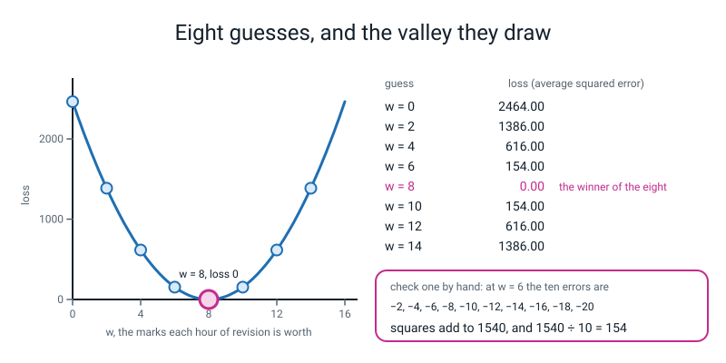
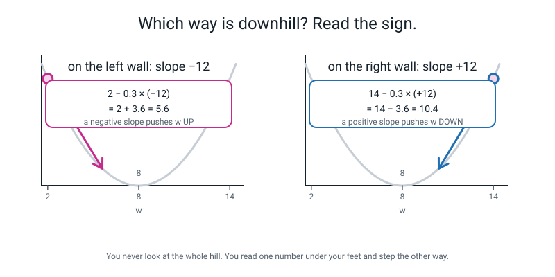
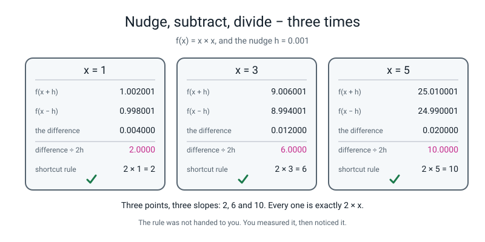
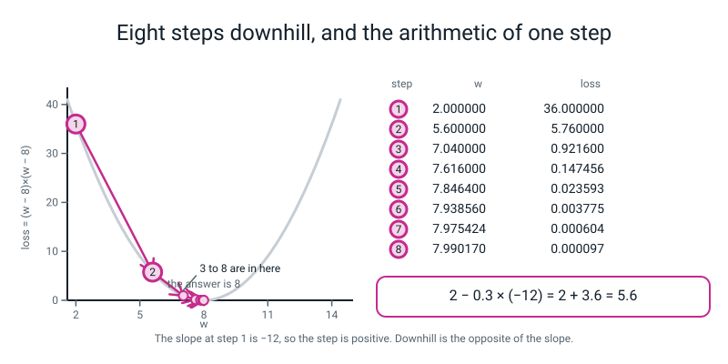
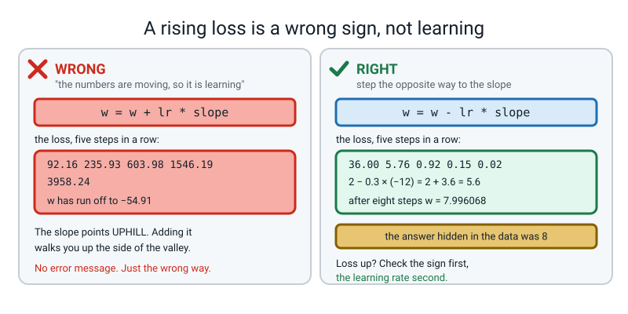
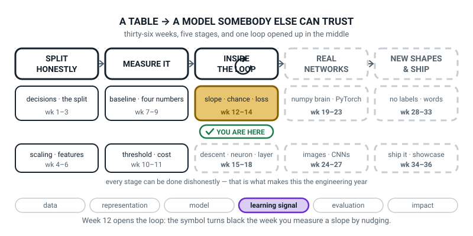
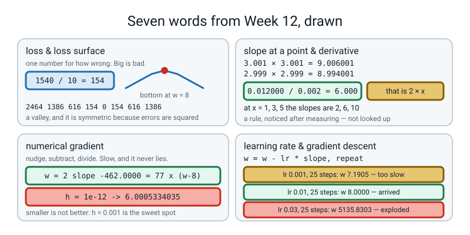

# Week 12 — How Steep Is the Hill Right Here?

[⬅ Week 11](week-11.md) · [Course Home](../README.md) · [Next ➡](week-13.md) · [Workbook](../workbook/week-12.md)

---

> ### This week in one sentence
> **Many models — logistic regression, and every neural network — find their best numbers by trying a value, asking "which way is downhill", and stepping, and `fit()` never showed you how. You can measure "downhill" with two subtractions and a division.**
>
> **By the end of this chapter you will be able to:**
> - **Turn a guess into a number** by computing the loss for eight candidate values of one weight, and sketch the resulting valley on graph paper
> - **Measure the slope of a curve at a single point** by nudging the input by 0.001 and dividing — and get exactly **6.0** at `x = 3` for `x × x`
> - **Show that the measured slopes 2, 6 and 10** at `x = 1, 3, 5` are exactly `2 × x`, and only *then* use the word derivative
> - **Use the sign of the slope to decide which way to step**, and walk eight steps downhill by hand to find the best weight
>
> **New maths:** the slope of a curve at **one** point, measured by nudging a tiny bit each way: `(f(w+h) − f(w−h)) ÷ 2h`. Computed by hand at `x = 1`, `3` and `5`, shown to equal `2 × x`, and named **only after** that.
>
> **New syntax:** `np.linspace(a, b, n)` · `np.argmin(arr)` · `ax.annotate("...", xy=(x, y))`
>
> **Reading time:** about 45 minutes. **Homework:** about 65 minutes, **all of it by hand.** **You will need three sheets of squared graph paper and a calculator.** Not a phone you will be tempted by — a calculator.

---

## 🪝 Start Here

Imagine the fog is so thick you cannot see further than the length of your own foot. You are somewhere on a hillside. You want to get to the bottom. **You cannot see the bottom.** You cannot see anything at all.

**What can you still do?**

You can feel the ground under your feet. That is the whole of it.

Put your left foot forward. Is the ground higher or lower than where you are standing? **Lower.** Put your right foot backwards. Higher or lower? **Higher.**

So forwards is down and backwards is up. **You did not need a map and you did not need to see the valley. You needed two feet and one comparison.** Take a step forwards. Then do it again.

Here is why that matters. Since Week 3 you have typed this, or something like it, about forty times:

```python
model.fit(X_train, y_train)
```

For logistic regression and for every neural network, something inside that one line does the following (a plain `LinearRegression` reaches its best line by algebra instead, and trees and nearest-neighbours work in other ways again, but this loop is the engine of everything from here on):

1. Picked a value for a weight. Any value. Zero, usually.
2. Worked out **how wrong** that value made the model.
3. Worked out **which direction would make it less wrong.**
4. Took a small step in that direction.
5. Went back to step 2, a few hundred times.

**Steps 2 and 4 are easy to describe. Step 3 is the one nobody has explained to you, and it is the whole of today.**

```text
   how wrong am I?              ->   a number.  we call it the LOSS.
   which way is downhill?       ->   ???        <- today
   step that way, a bit         ->   easy.
   go back to the top           ->   easy.
```

The answer to the `???` is **two subtractions and a division.** That is it. That is the whole secret, and you can check every step of it on a calculator — which is not a limitation of this chapter, it is the entire reason to trust it.

🍕 **The analogy.** Standing on a real staircase in the dark. You do not need to know how many steps there are, or where the bottom is, or what the building looks like. You need to know whether the ground in front of you is lower than the ground behind you. **That one comparison, repeated, gets you all the way down.**

---

## 🧠 The Big Idea

> **📌 About the code in this section.** These blocks are **illustrations, not files**. Each one carries on from the one above. **The three complete runnable files are in 💻 Type This.**

### 1. Step 2 first: turning "how wrong" into a number

> **loss** — one number saying how wrong a model currently is. Big is bad. Zero is perfect.

Here is the smallest honest example there is, and the whole chapter uses it.

**Ten students.** We know how many hours each revised and what they scored:

| hours | 1 | 2 | 3 | 4 | 5 | 6 | 7 | 8 | 9 | 10 |
|---|---|---|---|---|---|---|---|---|---|---|
| marks | 20 | 28 | 36 | 44 | 52 | 60 | 68 | 76 | 84 | 92 |

**Those marks sit exactly on a line, on purpose.** Every extra hour is worth exactly 8 marks, and a student who revised nothing at all would get 12. Check it: `8 × 1 + 12 = 20` ✅ and `8 × 10 + 12 = 92` ✅.

Suppose we already know the 12 — a student who does nothing scores 12, that is just how the exam is marked. **The one thing we do not know is how much an hour of revision is worth.** Call it `w`:

```text
predicted marks  =  w × hours  +  12
```

**One unknown number. `w` is the only knob.** And the answer, which we hid in the data on purpose, is **8**.

> **💡 Why hide an answer you already know?** Because then **you can tell whether the method found it.** Real data never does this. Every method in this course gets tested first on a problem whose answer is already known — and when the method says 7.996068, you know it worked.

**So how wrong is a guess?** Take `w = 6` — a guess that an hour of revision is worth 6 marks. Work out what the model predicts, subtract the truth, square it, average. **Ten subtractions you can do in your head:**

```text
w = 6:

  hours       1    2    3    4    5    6    7    8    9   10
  predicted  18   24   30   36   42   48   54   60   66   72        (6 × hours + 12)
  actual     20   28   36   44   52   60   68   76   84   92
  error      −2   −4   −6   −8  −10  −12  −14  −16  −18  −20        (predicted − actual)
  squared     4   16   36   64  100  144  196  256  324  400

  the squares add up to 1540
  1540 ÷ 10  =  154.0
```

**The loss at `w = 6` is 154.** One number. That is step 2, done, forever.

**Why square the errors?** Two reasons, both worth saying out loud. **First**, some errors are negative and some positive, and if you just added them up they would cancel out and a terrible model would look perfect. **Second**, squaring punishes big misses much harder than small ones — being out by 20 is not twice as bad as being out by 10, it is **four times** as bad. That is a choice somebody made, and it is a reasonable one for exam marks.

### 2. Eight guesses, and the shape they make

Do the same arithmetic for eight different guesses. Real output:

```text
candidates [ 0.  2.  4.  6.  8. 10. 12. 14.]
   w      loss
  0.0    2464.00
  2.0    1386.00
  4.0     616.00
  6.0     154.00
  8.0       0.00
 10.0     154.00
 12.0     616.00
 14.0    1386.00
np.argmin(losses) = 4
so the best of the eight is w = 8.0
```

Plot those eight points and you get a **valley.** Down, down, down, down to zero, then back up, symmetrically.

> **loss surface** — the shape you get by plotting the loss against the value of a weight. With one weight it is a curve. With two it is a landscape. With a hundred thousand it is a thing nobody can draw, and this course will never pretend otherwise.


*Figure 12.1 — Eight guesses, and the valley they draw. Every loss on the curve is an average of ten squared errors, and one of them is worked out in full so you can check it.*

**Two things to notice.**

**One — the valley is symmetric, and that is not a coincidence.** Guessing 6 (two too low) and guessing 10 (two too high) give **exactly the same loss, 154.** Being wrong in either direction by the same amount is equally bad, **because the errors get squared.** That is what makes the shape a valley rather than a slide.

**Two — eight guesses is a terrible method, and you should say so out loud.** It worked here *only* because 8 happened to be one of our eight candidates. If the answer had been 8.3 we would have missed it.

And it does not scale. Count it:

```text
1 weight,   8 candidates each  ->  8 guesses
2 weights,  8 candidates each  ->  8 × 8       =  64 guesses
3 weights,  8 candidates each  ->  8 × 8 × 8   = 512 guesses
```

A small neural network has a **hundred thousand** knobs. Eight to the power of a hundred thousand. **Guessing does not scale, and that is the entire motivation for the rest of this chapter.**

### 3. Which way is downhill? Read the sign.

Once you can measure the slope (next section does that), getting to the bottom is one look at a **sign.**

Here is the loss for the ten students again, with the slope measured at each of the eight candidates. Real output:

```text
w   0.0  loss   2464.00  slope   -616.00
w   2.0  loss   1386.00  slope   -462.00
w   4.0  loss    616.00  slope   -308.00
w   6.0  loss    154.00  slope   -154.00
w   8.0  loss      0.00  slope     -0.00
w  10.0  loss    154.00  slope    154.00
w  12.0  loss    616.00  slope    308.00
w  14.0  loss   1386.00  slope    462.00
```

**Read the sign column.** To the left of 8, every slope is **negative.** To the right of 8, every slope is **positive.** And **at** 8, the slope is **zero.**

| the slope is | the ground is | so you should |
|---|---|---|
| **negative** | going *down* as you go right | **go right** |
| **positive** | going *up* as you go right | **go left** |
| **zero** | flat | **stop — you are at the bottom** |

**And there is one arithmetic rule that handles both cases at once**, which is the elegant bit:

> **the gradient descent update rule:** `new w  =  old w  −  (learning rate) × slope`

> **learning rate** — how big a step to take. A small positive number. It is your stride length.

**The minus sign is the entire idea.** The slope points *uphill*, so you step the *opposite* way — and subtracting a negative number moves you right while subtracting a positive number moves you left. **One formula, both directions, no `if` statement anywhere.**

Work it both ways with real numbers, because nobody believes it the first time:

```text
standing at w = 2, where the slope is −12:
    2 − 0.3 × (−12)  =  2 + 3.6   =  5.6      moved RIGHT, towards 8

standing at w = 14, where the slope is +12:
   14 − 0.3 × (+12)  =  14 − 3.6  =  10.4     moved LEFT, towards 8
```


*Figure 12.2 — Which way is downhill? Read the sign. The same bowl twice, the same rule twice, and both arrows heading towards 8.*

> **gradient descent** — measure the slope, step the opposite way, repeat. That is the whole algorithm, and it is what sits inside `fit()` for logistic regression and for every neural network.

### 4. The learning rate is the most consequential number in the course

Real output, all on the ten-student loss, starting from `w = 2`, 25 steps each:

```text
lr = 0.001  after 25 steps  w =         7.1905   loss =          25.2260
lr = 0.01   after 25 steps  w =         8.0000   loss =           0.0000
lr = 0.026  after 25 steps  w =        14.3073   loss =        1531.6139
lr = 0.03   after 25 steps  w =      5135.8303   loss =  1012343768.1032
```

Read it like a doctor reading a chart:

| lr | diagnosis | what it looks like |
|---|---|---|
| **0.001** | nothing is broken, it is just **slow** | crawled from 2 to 7.19 and is still going |
| **0.01** | **arrived.** Extra steps cost time and buy nothing | `w = 8.0000`, loss 0 |
| **0.026** | **overshooting.** Every step lands slightly further out than it started | walking *away* from the answer, slowly |
| **0.03** | **catastrophe.** Each step leaps clean over the valley | `w = 5135` and a loss of a billion |

> **⚠️ Watch out:** `0.01` settles, `0.026` already does not (after 25 steps its loss, 1531, is *bigger* than the 1386 it started with), and `0.03` explodes. **There is a hard edge just below 0.026, not a gentle degradation.** So here is the rule of thumb for the rest of the course: *if your loss is going up instead of down, first check that the update subtracts the slope; if it does, your learning rate is too big — divide it by ten and try again.*

**And one more thing, which will save you confusion in Weeks 15 and 21.** Later in this chapter you walk eight steps on a **one-student** loss with `lr = 0.3`, and it works beautifully. Try that same `0.3` on the **ten-student** loss and:

```text
what one wrong step looks like: lr = 0.3 on the ten-student loss
  step 0  w           140.6000  loss            676936.2600
  step 1  w         -2922.4600  loss         330622438.7526
  step 2  w         64771.1660  loss      161479305330.3224
  step 3  w      -1431257.9630  loss    78868106891062.0312
```

**Same rule, same code, same starting point. One is fine and one is a disaster.** Why? Because the ten-student valley is **38.5 times steeper** — its slope at `w = 2` is −462, not −12.

**A stride length that suits one hillside will throw you off another one.** The learning rate has to be chosen for the problem. There is no formula, and nobody looks it up.

---

## 🔢 The Maths, Slowly

**This is the most important idea in the whole of Level 3. Take it slowly. There is no calculus in it: no limits, no proofs, no rules to memorise.** One subtraction, one division, and a number you can check on a calculator.

### Step 1 — the trick

In Week 10 you measured steepness **between two points** on the ROC curve: rise over run, both read off the paper. Today you want the steepness **at one point.**

But a slope needs two points. So here is the trick, and it is so simple it feels like cheating:

> **🔢 The maths, slowly:** you cannot measure a slope at a single point, because a slope needs two points. **So take two points that are almost the same one.** Nudge the input a tiny bit to the left, nudge it a tiny bit to the right, see how much the output changed, and divide by how far you nudged.

### Step 2 — do it, on the simplest curve there is

`f(x) = x × x`. **What is the slope at `x = 3`?**

Take a nudge of `h = 0.001` and work out the value just above and just below:

```text
f(3.001)  =  3.001 × 3.001  =  9.006001
f(2.999)  =  2.999 × 2.999  =  8.994001
```

> **💡 Try this yourself, with a calculator, right now.** Both multiplications. **Six decimal places.** These four lines are the whole lesson and they take about ninety seconds.

The output went **up** by:

```text
9.006001 − 8.994001  =  0.012000        <- the RISE
```

and to make that happen we moved **across** by:

```text
3.001 − 2.999  =  0.002                 <- the RUN
```

so the steepness is:

```text
0.012000 ÷ 0.002  =  6.000
```

**Six.** Two multiplications, one subtraction, one division. **No calculus in it anywhere.**


*Figure 12.3 — The slope at one point is a rise over a run. The same division, drawn with a nudge big enough to see — and it gives 6.000 as well, because for this curve the nudge size does not matter.*

> **slope at a point** — how steeply a curve is climbing or falling right where you are standing. Measured by nudging the input a tiny bit each way and dividing the change in output by the change in input.

> **numerical gradient** — the slope obtained by that nudge-and-divide method. It is slow, it needs no cleverness at all, **and it is honest, as long as the nudge is not absurdly small (Step 4 shows what goes wrong).** You will use it in Week 19 to check something far harder.

**Why nudge BOTH ways?** You could do `(f(3.001) − f(3)) ÷ 0.001` and get **6.001** — close, but not exact. Nudging symmetrically, one step each way, makes the errors from the two sides cancel and lands on **6.000** dead on. It is the same amount of work and it is more accurate, so we always do it that way.

### Step 3 — do it twice more, and notice something

Now the same measurement at `x = 1` and `x = 5`. Real output:

```text
f(x) = x * x,   h = 0.001
   x      f(x+h)       f(x-h)      difference   / (2h)   2 * x
 1.0     1.002001     0.998001     0.004000   2.0000     2.0
 3.0     9.006001     8.994001     0.012000   6.0000     6.0
 5.0    25.010001    24.990001     0.020000  10.0000    10.0
```

**Three slopes: 2, 6 and 10, at x = 1, 3 and 5.**

Write them down, carefully aligned, and look at them before you read on.

```text
    at x = 1  the slope is  2
    at x = 3  the slope is  6
    at x = 5  the slope is 10
```

**Two times one. Two times three. Two times five.**

The slope of `x × x` is `2 × x`, at every point, every time. **And now — only now — the word is allowed:**

> **derivative** — the slope of a curve at a point, as a rule you can use at every point. The derivative of `x × x` is `2 × x`. It is not a new kind of number and it is not a new operation; **it is the answer to the nudge-and-divide question, written down once instead of measured every time.**


*Figure 12.4 — Nudge, subtract, divide - three times. Three points, the same five lines of arithmetic each, and the shortcut rule confirmed three times out of three.*

**Is this real calculus? Yes. Completely.** The number a calculus class gets by applying a rule is the number you just got by nudging and dividing — and you got it **without being told the rule.** A calculus course teaches about twenty rules for getting there quickly, plus the machinery for proving they are right. You are skipping the rules and keeping the thing. From Week 20 a computer does the rules for you, so **the nudge is what you will actually use.**

### Step 4 — one honest warning about the nudge size

Smaller is **not** better, and this is a real trap. Real output:

```text
--- three sizes of nudge at x = 3 on x * x ---
h = 1            slope 6.0000000000
h = 0.1          slope 6.0000000000
h = 0.01         slope 6.0000000000
h = 0.001        slope 6.0000000000
h = 1e-06        slope 6.0000000008
h = 1e-12        slope 6.0005334035
```

Going down to a nudge of a millionth is fine. Going to a **millionth of a millionth** makes the answer **worse** — because you are subtracting two numbers that agree to fifteen digits, and the computer only stores about sixteen, so almost all your digits get thrown away.

**`h = 0.001` is the sweet spot and it is what this whole course uses.**

> **🧑‍🏫 If you are wondering why not use an infinitely small nudge:** that is exactly what calculus does, and it is exactly why calculus exists — it gets the answer for a nudge of literally zero, by reasoning instead of arithmetic. A computer cannot, so it uses 0.001 and checks. Setting `h = 0` in code gives you `ZeroDivisionError: float division by zero` (with plain Python numbers; numpy gives `nan` and a warning instead), which is the honest reason in one line.

### Step 5 — the same trick on the real loss

Nothing changes. Real output:

```text
--- now the real loss, same trick ---
   w     loss(w)   loss(w+h)   loss(w-h)     slope    77 x (w - 8)
  2.0 1386.0000 1385.538039 1386.462038  -462.0000       -462.0
  6.0  154.0000  153.846038  154.154039  -154.0000       -154.0
  8.0    0.0000    0.000038    0.000039    -0.0000          0.0
 12.0  616.0000  616.308038  615.692039   308.0000        308.0
```

Look at the last column: the measured slope is exactly `77 × (w − 8)`, every time. **You did not have to know that**, and you did not look anything up. You measured it, and then somebody noticed the pattern — which is the same order of events as `x × x → 2 × x`, and the same order of events as every rule in every calculus textbook ever written.

---

## 💻 Type This

**Three small files.** All three together run in **under one and a half seconds.**

### File one, step 1 — `valley.py`: the loss, and the eight guesses

```python
"""valley.py - eight guesses and a valley.  Week 12."""
import matplotlib
matplotlib.use("Agg")
import matplotlib.pyplot as plt
import numpy as np

hours = np.array([1, 2, 3, 4, 5, 6, 7, 8, 9, 10])
marks = np.array([20, 28, 36, 44, 52, 60, 68, 76, 84, 92])
print("hours", hours)
print("marks", marks)

def loss(w):
    guess = w * hours + 12
    return ((guess - marks) ** 2).mean()

print()
print("check by hand at w = 6:")
print("  guesses", 6 * hours + 12)
print("  errors ", 6 * hours + 12 - marks)
print("  squared", (6 * hours + 12 - marks) ** 2)
print("  mean   ", ((6 * hours + 12 - marks) ** 2).mean())
```

The four lines of `loss` are five operations on ten numbers each, and one number comes out:

| Piece | What it does to all ten at once |
|---|---|
| `w * hours` | multiplies **all ten** hour values by `w` |
| `+ 12` | adds 12 to all ten |
| `- marks` | subtracts the ten real marks, giving ten errors |
| `** 2` | squares all ten |
| `.mean()` | averages them into one number |

> **⚠️ Watch out:** `** 2` means "squared". **`^ 2` in Python does something completely different and does not error.** On the array `[−2, −4, −6]`, `** 2` gives `[4, 16, 36]` and `^ 2` gives `[−4, −2, −8]`. It is in the clinic below.

Real output:

```text
hours [ 1  2  3  4  5  6  7  8  9 10]
marks [20 28 36 44 52 60 68 76 84 92]

check by hand at w = 6:
  guesses [18 24 30 36 42 48 54 60 66 72]
  errors  [ -2  -4  -6  -8 -10 -12 -14 -16 -18 -20]
  squared [  4  16  36  64 100 144 196 256 324 400]
  mean    154.0
```

**That `154.0` is the number you worked out by hand five minutes ago.** Tick it off.

### File one, step 2 — eight candidates and the valley

```python
candidates = np.linspace(0, 14, 8)
print()
print("candidates", candidates)
losses = np.array([loss(w) for w in candidates])
print("   w      loss")
for i in range(len(candidates)):
    print("%5.1f  %9.2f" % (candidates[i], losses[i]))
print("np.argmin(losses) =", np.argmin(losses))
print("so the best of the eight is w =", candidates[np.argmin(losses)])
```

Two new things:

- **`np.linspace(a, b, n)`** gives `n` **evenly spaced** numbers from `a` to `b`, **including both ends.** So `np.linspace(0, 14, 8)` is `0, 2, 4, 6, 8, 10, 12, 14`. **The `8` is not optional** — leave it off and numpy silently gives you **50** numbers.
- **`np.argmin(arr)`** gives **the position of the smallest value, not the value.** On our eight losses it returns **4**, because the smallest loss is the fifth one in the list and Python counts from 0. To get the *value* use `np.min`. To get **the `w` that produced it** use `candidates[np.argmin(losses)]`. **Confusing those three is the most common numpy slip there is, and it produces no error at all.**

Real output:

```text
candidates [ 0.  2.  4.  6.  8. 10. 12. 14.]
   w      loss
  0.0    2464.00
  2.0    1386.00
  4.0     616.00
  6.0     154.00
  8.0       0.00
 10.0     154.00
 12.0     616.00
 14.0    1386.00
np.argmin(losses) = 4
so the best of the eight is w = 8.0
```

### File one, step 3 — draw the valley

```python
fine = np.linspace(0, 16, 161)
fig, ax = plt.subplots(figsize=(7, 5))
ax.plot(fine, [loss(w) for w in fine], color="tab:blue")
ax.scatter(candidates, losses, s=70, color="crimson", zorder=3)
ax.annotate("best of the eight: w = 8.0, loss 0.00", xy=(8.0, 0.0))
ax.set_xlabel("w (marks per hour of revision)")
ax.set_ylabel("loss (average squared error)")
ax.set_title("Eight guesses, one valley")
plt.tight_layout()
plt.savefig("valley.png")
print("saved valley.png")
```

**`ax.annotate("...", xy=(x, y))`** writes a label on a chart at an exact data position. `xy=(8.0, 0.0)` means *w = 8 across, loss = 0 up* — in the chart's own units, not pixels. **`xy` is not optional**; leave it off and you get `TypeError: Axes.annotate() missing 1 required positional argument: 'xy'`.

`fine` has 161 points so the blue curve is smooth; the eight red dots are the guesses you actually made.

```text
saved valley.png
```

**Open `valley.png`.** A smooth blue bowl, eight red dots sitting on it, and a label at the bottom. **That picture is Figure 12.1**, with the arithmetic printed on it.

### File two — `slope.py`: the nudge, three times, on three functions

```python
"""slope.py - measure how steep a curve is, at one point.  Week 12."""
import numpy as np

def f(x):
    return x * x

h = 0.001
print("f(x) = x * x,   h = %.3f" % h)
print("   x      f(x+h)       f(x-h)      difference   / (2h)   2 * x")
for x in [1.0, 3.0, 5.0]:
    up, down = f(x + h), f(x - h)
    print("%4.1f  %11.6f  %11.6f  %11.6f  %7.4f  %6.1f"
          % (x, up, down, up - down, (up - down) / (2 * h), 2 * x))
```

**`up, down = f(x + h), f(x - h)` puts two values into two names on one line.** And then `(up - down) / (2 * h)` is the whole of the new maths.

> **⚠️ Watch out — the brackets round `2 * h` are the single most important brackets in this chapter.** Without them, `/ 2 * h` divides by 2 and *then multiplies* by `h`, because Python works left to right. That gives an answer **a million times too small** and no error message.

Now the other two functions. Same five lines each:

```python
print()
def g(x):
    return x * x * x
print("g(x) = x * x * x")
print("   x      g(x+h)       g(x-h)      difference   / (2h)   3 * x * x")
for x in [1.0, 3.0, 5.0]:
    up, down = g(x + h), g(x - h)
    print("%4.1f  %11.6f  %11.6f  %11.6f  %9.6f  %9.4f"
          % (x, up, down, up - down, (up - down) / (2 * h), 3 * x * x))

print()
def k(x):
    return 5 * x
print("k(x) = 5 * x")
for x in [1.0, 3.0, 5.0]:
    up, down = k(x + h), k(x - h)
    print("x = %4.1f   slope %.6f   the rule says 5" % (x, (up - down) / (2 * h)))
```

Real output:

```text
f(x) = x * x,   h = 0.001
   x      f(x+h)       f(x-h)      difference   / (2h)   2 * x
 1.0     1.002001     0.998001     0.004000   2.0000     2.0
 3.0     9.006001     8.994001     0.012000   6.0000     6.0
 5.0    25.010001    24.990001     0.020000  10.0000    10.0

g(x) = x * x * x
   x      g(x+h)       g(x-h)      difference   / (2h)   3 * x * x
 1.0     1.003003     0.997003     0.006000   3.000001     3.0000
 3.0    27.027009    26.973009     0.054000  27.000001    27.0000
 5.0   125.075015   124.925015     0.150000  75.000001    75.0000

k(x) = 5 * x
x =  1.0   slope 5.000000   the rule says 5
x =  3.0   slope 5.000000   the rule says 5
x =  5.0   slope 5.000000   the rule says 5
```

**Three things worth a full minute each.**

**`x × x × x` comes out 3.000001, not 3.000000 — and that is correct.** The nudge is not infinitely small, so the measurement is off in the sixth decimal. **If you wrote 3.000000 you rounded**, and rounding is the one thing that will break this page.

**`5 × x` has the same slope everywhere.** Obvious once you see it: a straight line has one steepness. But it is the first hint that **some slopes depend on where you are standing and some do not.**

**And the pattern across the three functions.** `x²` → `2x`. `x³` → `3x²`. **What do you think `x⁴` gives?** Predict it, then check by nudging at `x = 2`: the prediction is `4 × 2³ = 32`, and the nudge gives **32.000008.** Predict, measure, check: a perfectly good way to discover a rule.

### File three — `walk.py`: eight steps downhill

For the by-hand walk we shrink the problem to **one student** — the first one, who revised 1 hour and got 20 marks — because then the loss is as simple as it is possible to be:

```text
loss(w)  =  (w × 1 + 12 − 20) ²  =  (w − 8) ²
```

**A parabola with its bottom exactly at 8.**

```python
"""walk.py - eight steps downhill, by nudging.  Week 12."""
import numpy as np

h, lr = 0.001, 0.3

def one_student_loss(w):
    return (w * 1 + 12 - 20) ** 2

print("--- one student: 1 hour, 20 marks.  loss(w) = (w - 8) squared ---")
print("step    w        loss      slope      lr x slope     new w")
w = 2.0
for step in range(8):
    L = one_student_loss(w)
    s = (one_student_loss(w + h) - one_student_loss(w - h)) / (2 * h)
    new = w - lr * s
    print("%4d %8.6f %11.6f %10.6f %13.6f %10.6f" % (step, w, L, s, lr * s, new))
    w = new
print("after eight steps w = %.6f    the answer we hid in the data was 8" % w)
```

`w = w - lr * s` is one step downhill: multiply the slope by the stride length and subtract.

Real output:

```text
--- one student: 1 hour, 20 marks.  loss(w) = (w - 8) squared ---
step    w        loss      slope      lr x slope     new w
   0 2.000000   36.000000 -12.000000     -3.600000   5.600000
   1 5.600000    5.760000  -4.800000     -1.440000   7.040000
   2 7.040000    0.921600  -1.920000     -0.576000   7.616000
   3 7.616000    0.147456  -0.768000     -0.230400   7.846400
   4 7.846400    0.023593  -0.307200     -0.092160   7.938560
   5 7.938560    0.003775  -0.122880     -0.036864   7.975424
   6 7.975424    0.000604  -0.049152     -0.014746   7.990170
   7 7.990170    0.000097  -0.019661     -0.005898   7.996068
after eight steps w = 7.996068    the answer we hid in the data was 8
```

**Read that table three times, because it contains everything.**

- **The `w` column marches towards 8** and never overshoots.
- **The loss column collapses:** 36 → 5.76 → 0.92 → 0.15 → 0.02 → 0.004 → 0.0006 → 0.0001.
- **The slope shrinks too:** −12 → −4.8 → −1.92 → −0.77 → −0.31 → −0.12 → −0.05 → −0.02. **A flattening slope means you are arriving.** That is the single most useful diagnostic in the entire rest of this course.
- **The steps get shorter** — 3.6, then 1.44, then 0.576 — **automatically, without anybody telling them to**, because the step is the slope times the stride and the slope is dying. **The algorithm slows down as it arrives, for free, out of one multiplication.**


*Figure 12.5 — Eight steps downhill, and the arithmetic of one step. All eight coordinates printed; the arrows get shorter every time because the ground gets flatter.*

**Row 0, longhand:**

```text
slope at w = 2:      2 × (2 − 8)  =  2 × (−6)  =  −12
the step:            0.3 × (−12)  =  −3.6
the new w:           2 − (−3.6)   =  2 + 3.6   =  5.6
```

> **💡 Try this — the shortcut that makes checking easy.** After two rows you will notice that **the gap to 8 gets multiplied by 0.4 every single step.** 6 → 2.4 → 0.96 → 0.384 → 0.1536 → 0.06144 → 0.024576 → 0.0098304 → 0.00393216. And `8 − 0.00393216 = 7.99606784`, which rounds to the **7.996068** the code printed. **Once you have seen that, you can predict every row without any arithmetic at all.**

**And the shortcut rule agrees with the nudge, three times out of three:**

```python
print()
print("--- and the shortcut rule agrees: slope of (w - 8) squared is 2 x (w - 8) ---")
for wv in [2.0, 5.6, 7.04]:
    print("w = %.2f  nudge %.6f   2 x (w - 8) = %.6f"
          % (wv, (one_student_loss(wv + h) - one_student_loss(wv - h)) / (2 * h),
             2 * (wv - 8)))
```

```text
--- and the shortcut rule agrees: slope of (w - 8) squared is 2 x (w - 8) ---
w = 2.00  nudge -12.000000   2 x (w - 8) = -12.000000
w = 5.60  nudge -4.800000   2 x (w - 8) = -4.800000
w = 7.04  nudge -1.920000   2 x (w - 8) = -1.920000
```

**A shortcut you have verified is a shortcut you are allowed to use.** That is the whole habit this term has been building — exactly like last week's `BY HAND | np.trapz` board, both halves saying 0.7000.

### The rest of `walk.py` — all ten students, and the learning rates

```python
print()
print("--- all ten students, lr = 0.01, twenty-five steps ---")
hours = np.arange(1, 11)
marks = 8 * hours + 12
def loss(w):
    return (((w * hours + 12) - marks) ** 2).mean()
w, lr2 = 2.0, 0.01
for step in range(26):
    s = (loss(w + h) - loss(w - h)) / (2 * h)
    if step in [0, 1, 2, 3, 4, 10, 25]:
        print("step %2d   w %.6f   loss %11.6f   slope %11.4f" % (step, w, loss(w), s))
    w = w - lr2 * s
print("final w %.6f" % w)

print()
print("--- what a learning rate that is too big does ---")
for lr3 in [0.001, 0.01, 0.026, 0.03]:
    w = 2.0
    for step in range(25):
        s = (loss(w + h) - loss(w - h)) / (2 * h)
        w = w - lr3 * s
    print("lr = %-6s after 25 steps  w = %14.4f   loss = %16.4f" % (lr3, w, loss(w)))
```

`np.arange(1, 11)` is `1, 2, … 10` — start included, stop excluded. `if step in [0, 1, 2, 3, 4, 10, 25]` prints only seven of the twenty-six rows, so the output stays readable.

Real output:

```text
--- all ten students, lr = 0.01, twenty-five steps ---
step  0   w 2.000000   loss 1386.000000   slope   -462.0000
step  1   w 6.620000   loss   73.319400   slope   -106.2600
step  2   w 7.682600   loss    3.878596   slope    -24.4398
step  3   w 7.926998   loss    0.205178   slope     -5.6212
step  4   w 7.983210   loss    0.010854   slope     -1.2929
step 10   w 7.999998   loss    0.000000   slope     -0.0002
step 25   w 8.000000   loss    0.000000   slope     -0.0000
final w 8.000000

--- what a learning rate that is too big does ---
lr = 0.001  after 25 steps  w =         7.1905   loss =          25.2260
lr = 0.01   after 25 steps  w =         8.0000   loss =           0.0000
lr = 0.026  after 25 steps  w =        14.3073   loss =        1531.6139
lr = 0.03   after 25 steps  w =      5135.8303   loss =  1012343768.1032
```

**`w = 8.000000` exactly, loss exactly 0.** The method found a number nobody told it, from ten exam results, using two subtractions and a division, twenty-five times.

**Total runtime for all three files: under one and a half seconds.** If `slope.py` does not print `6.0000` at `x = 3.0`, check the brackets round `2 * h`.

---

## 🔍 Worked Examples

This section works through three finished examples of the nudge method, so you can compare your own working with them.

### Worked Example 1 — Nine slopes, three functions, nine ticks

This is the homework, done for you once so you can see the shape of a full-marks page. **`h = 0.001`, so every division is by `0.002`.**

**Function one: `f(x) = x × x`. The rule is `2 × x`.**

| x | `f(x + h)` | `f(x − h)` | difference | `÷ 0.002` | rule `2 × x` | |
|---|---|---|---|---|---|---|
| 1 | 1.002001 | 0.998001 | 0.004000 | **2.0000** | 2 | ✅ |
| 3 | 9.006001 | 8.994001 | 0.012000 | **6.0000** | 6 | ✅ |
| 5 | 25.010001 | 24.990001 | 0.020000 | **10.0000** | 10 | ✅ |

**Function two: `g(x) = x × x × x`. The rule is `3 × x × x`.**

| x | `g(x + h)` | `g(x − h)` | difference | `÷ 0.002` | rule `3 × x²` | |
|---|---|---|---|---|---|---|
| 1 | 1.003003 | 0.997003 | 0.006000 | **3.000001** | 3 | ✅ out by a millionth |
| 3 | 27.027009 | 26.973009 | 0.054000 | **27.000001** | 27 | ✅ |
| 5 | 125.075015 | 124.925015 | 0.150000 | **75.000001** | 75 | ✅ |

**Function three: `k(x) = 5 × x`. The rule is just `5`.**

| x | `k(x + h)` | `k(x − h)` | difference | `÷ 0.002` | rule | |
|---|---|---|---|---|---|---|
| 1 | 5.005 | 4.995 | 0.010 | **5.000000** | 5 | ✅ |
| 3 | 15.005 | 14.995 | 0.010 | **5.000000** | 5 | ✅ |
| 5 | 25.005 | 24.995 | 0.010 | **5.000000** | 5 | ✅ |

**Nine for nine.**

**Three mistakes that lose marks on this page.**

**Dividing by 0.001 instead of 0.002.** Gives double: 4, 12, 20. **How far apart are 3.001 and 2.999?** 0.002. You moved a nudge each way, so you travelled *two* nudges in total.

**Rounding to three decimals.** `3.001 × 3.001 ≈ 9.006` and `2.999 × 2.999 ≈ 8.994` gives a difference of 0.012, which is **right by luck at x = 3** and **wrong at x = 5**, where you need the fourth, fifth and sixth decimals to see 0.020000 rather than 0.020. **Six decimal places, every single time.**

**Writing 3.000000 for `x³` at `x = 1`.** The real measurement is **3.000001**. Writing the rule's answer instead of the measurement means you did not measure it.

### Worked Example 2 — Six steps downhill on a different valley

New loss, same machinery. `loss(w) = (w − 4) × (w − 4)`. Slope `2 × (w − 4)`. Learning rate `0.3`. **Start at `w = 0`.**

| step | w | loss | slope | `0.3 × slope` | new w |
|---|---|---|---|---|---|
| 0 | 0.000000 | 16.000000 | −8.000000 | −2.400000 | **2.400000** |
| 1 | 2.400000 | 2.560000 | −3.200000 | −0.960000 | **3.360000** |
| 2 | 3.360000 | 0.409600 | −1.280000 | −0.384000 | **3.744000** |
| 3 | 3.744000 | 0.065536 | −0.512000 | −0.153600 | **3.897600** |
| 4 | 3.897600 | 0.010486 | −0.204800 | −0.061440 | **3.959040** |
| 5 | 3.959040 | 0.001678 | −0.081920 | −0.024576 | **3.983616** |

**Row 0, longhand:**

```text
slope at w = 0:      2 × (0 − 4)  =  2 × (−4)  =  −8
the step:            0.3 × (−8)   =  −2.4
the new w:           0 − (−2.4)   =  0 + 2.4   =  2.4
```

**Machine check** — real output from `walk.py`:

```text
--- homework shape: (w - 4) squared, lr 0.3, six steps from w = 0 ---
step 0  w 0.000000  loss 16.000000  slope -8.000000  ->  2.400000
step 1  w 2.400000  loss 2.560000  slope -3.200000  ->  3.360000
step 2  w 3.360000  loss 0.409600  slope -1.280000  ->  3.744000
step 3  w 3.744000  loss 0.065536  slope -0.512000  ->  3.897600
step 4  w 3.897600  loss 0.010486  slope -0.204800  ->  3.959040
step 5  w 3.959040  loss 0.001678  slope -0.081920  ->  3.983616
after six steps w = 3.983616, target 4
```

**After six steps, `w = 3.983616`. The target was 4. Why did it not land exactly?**

> **Full marks looks like this:** *"I got to 3.983616, which is 0.016 short of 4. **I did not land exactly on it because each step is proportional to the slope, and the slope gets smaller as I get closer**, so the steps get smaller too — 2.4, then 0.96, then 0.384. The gap gets multiplied by 0.4 every step, and multiplying by 0.4 never actually reaches zero. **More steps would get me closer, and no number of steps would get me there.**"*

**"I made a rounding error" is wrong and it loses the mark.** You did not. **The 0.016 is not an error, it is how the algorithm works**, and that distinction is the point of the question.

**Three common wrong answers on this table.**

- **Step 0 giving `w = −2.4`.** You **added** instead of subtracting. `0 − 0.3 × (−8) = 0 + 2.4`.
- **The gap not shrinking by a constant factor.** One arithmetic slip early, propagating. **Check: is `w − 4` being multiplied by 0.4 each row?** −4, −1.6, −0.64, −0.256, −0.1024, −0.04096, −0.016384. If one row breaks the pattern, that is the row.
- **Six identical steps of 2.4.** You used the slope from step 0 for all six rows. **The slope has to be re-measured at the new `w` every single time.** This is the most instructive mistake available on this page.

### Worked Example 3 — Same method, completely different problem: pizza

A delivery rider's time depends on distance. Six deliveries, distances in kilometres, times in minutes. **A rider takes 10 minutes no matter what — getting the pizza, parking, walking to the door — plus some number of minutes per kilometre.** We know the 10. We do not know the per-kilometre number.

```text
predicted minutes  =  w × km  +  10
```

**The answer hidden in the data is 3.** Nobody tells the method that.

```python
"""pizza.py - same method, different problem: minutes per kilometre.  Week 12."""
import numpy as np

km = np.array([1, 2, 3, 4, 5, 6])
minutes = np.array([13, 16, 19, 22, 25, 28])      # 3 x km + 10, exactly
print("km      ", km)
print("minutes ", minutes)

def loss(w):
    return (((w * km + 10) - minutes) ** 2).mean()

print()
print("--- eight guesses for w (minutes per km) ---")
print("   w      loss")
grid = np.linspace(0, 7, 8)
losses = np.array([loss(w) for w in grid])
for i in range(len(grid)):
    print("%5.1f  %9.4f" % (grid[i], losses[i]))
print("np.argmin(losses) =", np.argmin(losses),
      "  best of the eight w =", grid[np.argmin(losses)])

print()
print("--- the slope, by nudging, at three of those guesses ---")
h = 0.001
print("   w   loss(w+h)   loss(w-h)   difference    slope")
for w in [1.0, 3.0, 6.0]:
    up, down = loss(w + h), loss(w - h)
    print("%4.1f %11.6f %11.6f %12.6f %8.4f"
          % (w, up, down, up - down, (up - down) / (2 * h)))

print()
print("--- eight steps downhill from w = 0, lr = 0.02 ---")
print("step    w        loss      slope     lr x slope     new w")
w, lr = 0.0, 0.02
for step in range(8):
    s = (loss(w + h) - loss(w - h)) / (2 * h)
    print("%4d %8.6f %11.6f %10.4f %13.6f %10.6f"
          % (step, w, loss(w), s, lr * s, w - lr * s))
    w = w - lr * s
print("after eight steps w = %.6f    the answer hidden in the data was 3" % w)
```

Real output:

```text
km       [1 2 3 4 5 6]
minutes  [13 16 19 22 25 28]

--- eight guesses for w (minutes per km) ---
   w      loss
  0.0   136.5000
  1.0    60.6667
  2.0    15.1667
  3.0     0.0000
  4.0    15.1667
  5.0    60.6667
  6.0   136.5000
  7.0   242.6667
np.argmin(losses) = 3   best of the eight w = 3.0
```

**The valley is symmetric again** — `w = 2` and `w = 4` both give 15.1667, `w = 1` and `w = 5` both give 60.6667. Same reason: squared errors do not care which side you are wrong on.

```text
--- the slope, by nudging, at three of those guesses ---
   w   loss(w+h)   loss(w-h)   difference    slope
 1.0   60.606015   60.727348    -0.121333 -60.6667
 3.0    0.000015    0.000015     0.000000   0.0000
 6.0  136.591015  136.409015     0.182000  91.0000
```

**Read the three signs.** At `w = 1` the slope is **negative** → the bottom is to the right. At `w = 6` it is **positive** → the bottom is to the left. At `w = 3` it is **zero** → you are standing at the bottom. **That single column is the entire navigation system.**

```text
--- eight steps downhill from w = 0, lr = 0.02 ---
step    w        loss      slope     lr x slope     new w
   0 0.000000  136.500000   -91.0000     -1.820000   1.820000
   1 1.820000   21.118067   -35.7933     -0.715867   2.535867
   2 2.535867    3.267200   -14.0787     -0.281574   2.817441
   3 2.817441    0.505472    -5.5376     -0.110753   2.928193
   4 2.928193    0.078202    -2.1781     -0.043563   2.971756
   5 2.971756    0.012099    -0.8567     -0.017135   2.988891
   6 2.988891    0.001872    -0.3370     -0.006740   2.995630
   7 2.995630    0.000290    -0.1325     -0.002651   2.998281
after eight steps w = 2.998281    the answer hidden in the data was 3
```

**2.998281 against a hidden answer of 3.** Different data, different units, different learning rate — **identical arithmetic.** Loss collapses, slope flattens, steps shorten, `w` arrives and never overshoots.

**And notice the learning rate is 0.02, not 0.3.** Try `0.3` on this valley and it explodes, for exactly the reason in section 4: **this hillside has a slope of −91 at the start, and a stride of 0.3 would launch you to `w = 27.3`.** The stride belongs to the hill, not to you.

---

## 🐞 When It Breaks

Every message below came from really running a broken version of this week's code. **The two worst bugs this week produce no error at all** — which is why the first question to ask is never "did it crash?" but **"is that number roughly the size I expected?"**

### Break 1 — the missing brackets

```python
def f(x):
    return x * x
h = 0.001
print("%.6f" % ((f(3 + h) - f(3 - h)) / 2 * h))
```

```text
0.000006
```

**Nothing crashed.** And your answer is a **million** times too small.

**What happened.** `/ 2 * h` divides by 2 and *then multiplies* by `h`, because Python works strictly left to right. You meant *"divide by two lots of h"*.

**The fix.** `/ (2 * h)`.

> **🐞 The habit that catches this in one second:** the slope of `x × x` at 3 is about 6. **You knew that before you looked at the screen.** So `0.000006` is obviously wrong without reading a single line of code. **Work out roughly what the answer should be, on paper, before you run anything.**

### Break 2 — dividing by `h` instead of `2 * h`

```python
print("%.6f" % ((f(3 + h) - f(3 - h)) / h))
```

```text
12.000000
```

**Nothing crashed.** And your answer is **exactly twice** the right one.

**What happened.** You moved a nudge each way, so you travelled **two** nudges in total — 3.001 down to 2.999 is a distance of 0.002, not 0.001.

**The sanity check.** If your answer is *exactly* double what the shortcut rule says, you divided by half the distance you actually travelled.

### Break 3 — the plus sign, which is the one that teaches the whole idea

```python
w = 2.0
for s in range(5):
    sl = (L(w + 0.001) - L(w - 0.001)) / (2 * 0.001)
    w = w + 0.3 * sl          # + instead of -
    print("step %d  w %.4f  loss %.4f" % (s, w, L(w)))
```

```text
step 0  w -1.6000  loss 92.1600
step 1  w -7.3600  loss 235.9296
step 2  w -16.5760  loss 603.9798
step 3  w -31.3216  loss 1546.1882
step 4  w -54.9146  loss 3958.2419
```

**Nothing crashed. The loss is going UP, and fast.** And `w` has run off to −54.9.

**What happened.** **The slope points uphill.** Adding it walks you *up* the side of the valley, faster and faster, because the further up you go the steeper it gets.

**The fix.** `w = w - lr * s`.

**Make it a chant:** *"loss up, check the sign."* Sign first, learning rate second. No other diagnosis before those two.

### Break 4 — a plain Python list where numpy was expected

```python
hours = [1, 2, 3, 4, 5, 6, 7, 8, 9, 10]      # no np.array
w = 6
print(w * hours + 12)
```

```text
Traceback (most recent call last):
  File "…", line 4, in <module>
    print(w * hours + 12)
TypeError: can only concatenate list (not "int") to list
```

**What it means.** "You tried to add a number to a list, and lists do not do that."

**What actually happened is worse than the error suggests.** `w * hours` on a plain list does not multiply anything — **it repeats the list six times**, giving a list of sixty numbers. Then adding 12 to a list has no meaning at all, and *that* is what crashed.

**The fix.** `hours = np.array([1, 2, 3, ...])`. Then arithmetic happens to every element, which is what you wanted all along.

### Break 5 — the caret that is not a power

```python
import numpy as np
e = np.array([-2, -4, -6])
print("** 2 ->", e ** 2)
print("^  2 ->", e ^ 2)
```

```text
** 2 -> [ 4 16 36]
^  2 -> [-4 -2 -8]
```

**No error. No warning. Complete nonsense.**

`^` in Python is not "to the power of" — it is a bit-by-bit operation on whole numbers, and it happily produces **negative "squares"**. If every one of your squared errors comes out negative, this is why.

**The fix.** `** 2`, always.

### The whole clinic, for reference

| What you see | What it means | The fix |
|---|---|---|
| `TypeError: can only concatenate list (not "int") to list` | plain list instead of a numpy array | `np.array([...])` |
| `TypeError: Axes.annotate() missing 1 required positional argument: 'xy'` | you said what to write, not where | `ax.annotate("text", xy=(8.0, 0.0))` |
| `AttributeError: 'list' object has no attribute 'mean'` | plain lists cannot average themselves | `np.array(losses).mean()` |
| `IndexError: index 8 is out of bounds for axis 0 with size 8` | eight items are numbered 0 to 7 | `candidates[np.argmin(losses)]` |
| `ZeroDivisionError: float division by zero` | `h = 0` — a nudge of nothing | `h = 0.001`. **And this is the honest reason calculus exists** |
| `ValueError: x and y must have same first dimension … (161,) and (8,)` | plotting 8 losses against a 161-point grid | two separate `plot`/`scatter` calls |
| **no error**, slope is `0.000006` | brackets: `/ 2 * h` | `/ (2 * h)` |
| **no error**, slope is `12.000000` | divided by `h`, not `2 * h` | you travelled two nudges |
| **no error**, the loss goes **up** fast | `w = w + lr * s` | `w = w - lr * s` |
| **no error**, `w` becomes 5135.8303 and the loss a billion | learning rate too big | **divide it by ten** |
| **no error**, `np.argmin` says 4 and you write "best w = 4" | that is the **position**, not the value | `candidates[np.argmin(losses)]` → 8.0 |
| **no error**, `np.linspace(0, 14)` gives 50 rows | the third argument was left off | `np.linspace(0, 14, 8)` |
| **no error**, every squared error is negative | `^ 2` instead of `** 2` | `** 2` |

---

## 🎲 What We Did In Class

**The Foggy Hillside.** Two halves, both pencil-and-paper. If you missed it, you can do the entire thing at home with a calculator and three sheets of graph paper — and honestly the no-computer version is the better one, because nobody can suspect a machine of arranging the answer.

### Part 1 — three slopes, and a reveal

The class split into three groups. **Each group got exactly one number: 1, 3 or 5.** Then the same four instructions, in this order:

1. Work out `x` plus nought point nought nought one, **times itself.** Write down all six decimal places.
2. Work out `x` minus nought point nought nought one, times itself. **All six decimals.**
3. **Subtract** the second from the first.
4. **Divide** by nought point nought nought two.

**Nobody was allowed to say their answer out loud.** Each group wrote it on a card and put the card face down.

Doing it alone at home: **do all three, but write each on a separate card, face down, and turn all three over at the same time.** The simultaneous reveal is the point. Here is the working:

```text
   x = 1:   1.001 × 1.001  =   1.002001
            0.999 × 0.999  =   0.998001
            subtract       =   0.004000
            ÷ 0.002        =   2.000

   x = 3:   3.001 × 3.001  =   9.006001
            2.999 × 2.999  =   8.994001
            subtract       =   0.012000
            ÷ 0.002        =   6.000

   x = 5:   5.001 × 5.001  =  25.010001
            4.999 × 4.999  =  24.990001
            subtract       =   0.020000
            ÷ 0.002        =  10.000
```

All three cards over at once, in three columns:

```text
        x = 1        x = 3        x = 5
          2            6           10
```

Then silence, for ten seconds. **If nothing clicks, write `1  3  5` on the line above, carefully aligned, and look again.** Somebody always gets it within five seconds of the alignment.

**And only then** did the word **derivative** come out — it had been folded up in the teacher's pocket the whole lesson, on purpose, because hearing the word before measuring the thing makes half a room stop thinking and start trying to remember school.

### Part 2 — eight steps downhill

On the board:

```text
   loss(w) = (w − 8) × (w − 8)          <- one student: 1 hour, 20 marks

   the rule:   new w  =  old w  −  0.3 × slope

   start at    w = 2
```

*"You are on the foggy hillside. You are standing at 2. You cannot see the bottom. **Eight steps. Go.**"*

For each step: measure the slope by nudging — **or** use the shortcut you just discovered, `2 × (w − 8)`, if you trust it. Then multiply by 0.3, then subtract.

**Do the first two rows both ways**, nudge and shortcut, and check they match. They will. **That is the point of the whole term: a shortcut you have verified is a shortcut you may use.**

The full table is in **💻 Type This** above, and it ends at **7.996068.** Check row 0 before you do row 1: `slope −12`, `step −3.6`, `new w 5.6`. One slip in row 0 propagates through all eight.

Then the three questions the class was asked, in order:

1. **What is the `w` column doing?** Creeping up on 8, never going past it.
2. **What is the slope column doing?** Getting smaller: −12, −4.8, −1.92, −0.77, −0.31, −0.12, −0.05, −0.02. **A flattening slope means you are arriving. The hill tells you when to stop.**
3. **What are the steps doing?** Getting shorter — 3.6, 1.44, 0.576 — **and nobody told them to.**

**And the last question of the lesson:** *"your final `w` is 7.996068. What was hidden in the data?"*

**Eight.** You found a number you were never told, from ten exam results, using two subtractions and a division, eight times. **That is machine learning. There is nothing else in it.**

### The wrap, and the gap that got filled in

```text
   how wrong am I?              ->   a number.  the LOSS.
   which way is downhill?       ->   nudge, subtract, divide.  READ THE SIGN.
   step that way, a bit         ->   w = w − lr × slope
   go back to the top           ->   repeat.
```

**That is the engine inside `fit()`** for logistic regression and for every neural network. Every time you fitted one of those since Week 3, a loop like this ran, a few hundred times (a plain `LinearRegression` reaches its best line by algebra instead, and trees and nearest-neighbours work in other ways again, but you now know what the loop is). **And you are entitled to feel slightly annoyed that it took nine weeks.**

**Two things about what happens next.**

**A promise.** In Week 20 a machine called PyTorch will work out slopes for you, and it will not nudge and it will not divide — it uses a completely different method. The first thing you will do with it is ask for the slope of `x × x` at `x = 3`. **It is going to say six.** Not 5.9998. **Six.** And you will know it is right, **because you measured it yourself with a calculator in Week 12.** That is what today buys you: for the rest of this course, you can check the machine.

**A warning.** Today there was **one** knob. Next week you get a model whose answers have to come out between 0 and 1, because *"how likely is it that this is fraud"* cannot be 92 marks. After that, a loss that is right for probabilities instead of exam marks. And by Week 18 there will be a hundred knobs, all connected, and the question *"how much did each one contribute to the error"* becomes the hardest thing you do this year.

**All of it is today's arithmetic. Nudge, subtract, divide, read the sign, step. Nothing else ever gets added.**

---

## 💬 Talk About It

These questions are for discussing with a partner, a parent or your teacher. Say your answer out loud before you look anything up.

**1. We already knew the answer was 8. So what was the point?**

*Hint:* imagine you had started with real data instead. The method would have printed some number — and how would you have known whether it was right? **Every method in this course gets tested on a planted answer first.** The numpy network in Week 19 gets checked against a nudge; the PyTorch network in Week 23 gets checked against the numpy one. That habit is worth more than any single technique.

**2. Does the loss always reach zero? Should you keep training until it does?**

*Hint:* ours reached exactly zero **only because we planted a perfect line in the data.** Put a wobble on those ten students — real students, who sleep badly and forget things — and the best possible loss becomes **8.9106**, and no amount of stepping gets below it. **What is that 8.91?** Whatever it is, it is not a bug. Give it a name.

**3. Our valley has exactly one bottom. Does every valley?**

*Hint:* for squared error on a straight line, yes, provably — which is why today worked so cleanly. For a neural network, no: the surface has an enormous number of bottoms and gradient descent finds whichever one it happens to walk into. **The classical worry was that this would be a disaster. In practice it usually is not, and nobody fully agrees why.** Some say most bottoms in very high dimensions are about equally good; some say the real obstacles are flat regions rather than wrong bottoms; some say the randomness of mini-batch training shakes you out of the bad ones. **All partly true, none a complete answer.** This is a genuinely open research question and you have just asked it.

---

## ⚠️ Don't Get Tricked

This section is for spotting claims about loss, slope and learning that sound right and need checking.

### Trick 1 — "the loss is changing, so the model is learning"

❌ **Wrong.** *"The numbers are moving, something is happening, it must be working."*

✅ **Right.** **Which way** they are moving is the entire question. Down means learning. **Up means you have the sign wrong or your stride is too long**, and it will keep going up for as long as you let it, faster and faster.


*Figure 12.6 — A rising loss is a wrong sign, not learning. The same eight steps with a plus and with a minus, and the two very different columns of numbers they produce.*

### Trick 2 — "`2 × x` is a rule I need to memorise"

❌ **Wrong.** *"Add it to the list of formulas for the test."*

✅ **Right.** **You measured it.** Three groups, three cards, three numbers on a board. A rule you have measured is a rule you can check, and a rule you can check is one you never have to trust on faith. And **the skill is noticing rules, not knowing them** — which is why the homework makes you do `x × x × x` and `5 × x` too, and why predicting `x⁴` before measuring it (`4 × x³`, which at `x = 2` is 32, and the nudge gives 32.000008) is the most valuable five minutes available.

### Trick 3 — "you subtract the slope, so a positive slope is good"

❌ **Wrong.** *"The formula has a minus, so negative slopes must be the bad ones."*

✅ **Right.** The sign of the slope says **which way is uphill**, and you always step the other way. Both directions, with real numbers:

```text
at w = 2,  slope −12:    2 − 0.3 × (−12)  =  2 + 3.6   =   5.6    moved RIGHT
at w = 14, slope +12:   14 − 0.3 × (+12)  = 14 − 3.6   =  10.4    moved LEFT
```

**Both arrows point at 8.** One formula, both walls of the valley, no `if` statement. **Do not move on until you can explain out loud why subtracting a negative number moves you to the right.**

### Trick 4 — "a smaller nudge is a more accurate nudge"

❌ **Wrong.** *"So `h = 0.000000000001` must be the most accurate of all."*

✅ **Right.** It is the **worst** of the six we tried: `h = 1e-12` gives **6.0005334035** where `h = 0.001` gives **6.0000000000**. Subtracting two numbers that agree to fifteen digits throws away nearly all your digits, and the computer only has about sixteen. **`h = 0.001` is the sweet spot.** Smaller is not better, and "obviously better in theory" is not the same as "better on a machine that stores finitely many digits."

---

## 🌍 Where You've Seen This

This section connects today's nudge-and-step idea to things you already meet outside the classroom.

- **Every training progress bar you have ever seen.** The falling number beside it is a loss, and every tick of that bar is one round of nudge-and-step. When somebody says a model "trained for six hours", they mean this loop ran a very large number of times.
- **A thermostat.** Too cold, heat more. Too hot, heat less. Bigger difference, bigger correction. It is `w = w − lr × slope` built out of a bit of metal, and the "lr too big" failure mode is a house that oscillates between freezing and boiling.
- **Learning to throw at a target.** You throw, you see how far off you were, and **you adjust in proportion to how far off** — a small miss gets a small correction. Nobody taught you to do that; it is the update rule, running in a nervous system.
- **Satnav re-routing.** Not the same algorithm, but the same shape of idea: measure how bad the current plan is, change it slightly in the direction that improves it, repeat. Local information, no map of the whole answer.
- **Tuning a guitar by ear.** Pluck, compare, turn the peg a little. **Turn it too far and you go past the note** — and if you keep over-correcting in both directions you never land, which is `lr = 0.03` with strings on.
- **Auto-focus on a phone camera.** It moves the lens a tiny bit, measures whether the image got sharper or blurrier, and keeps going in whichever direction improved. **That is literally nudge-and-divide**, in hardware, several times a second.

---

## 🧭 Where This Fits

Look at the map. Two whole stages are behind you now, and a **third one has just gone solid** — you are
standing inside the training loop for the first time. And look at the little ↻ on stage three: it has
been grey since Week 1, and this is the week it turns black. That symbol is the loop, and the loop is
now open.



*Figure 12.0 — The pipeline in Week 12. Stage three is solid and its first tile — slope · chance ·
loss — is gold. The ↻ that has been grey for eleven weeks is black from today.*

| | |
|---|---|
| **The mental model you now own** | To find downhill, **nudge**: `(f(w + h) − f(w − h)) ÷ 2h`. Two things come out of that one division. The **sign** says which way to step, and the **size** says how steep the hill is right here. Then `w ← w − lr × slope` walks you to the bottom, one small step at a time. That is it. That is the engine. |
| **The one question it answers** | *"Which way is downhill from here?"* — and you can now answer it with a calculator, for any curve, at any point. |
| **What it plugs into** | Week 10's rise over run between **two** points on a curve. Shrink the gap between those two points to a hair — 0.001 — and what you have left is the slope at **one** point. Same division, smaller gap. |
| **What carries forward** | Week 15 takes a **step** with this slope. Weeks 16 and 17 build the thing the slope steers. Week 18 multiplies slopes along a chain. And in Week 20, PyTorch prints the identical number — which is how you will know `.backward()` is not magic. |
| **Spiral thread** | 🎯 **Learning signal** — lit alone, and it will be the loudest thread of the spring. Everything else about a model is decoration until something tells it which way to move; this week you built the something. |

> **🔑 If you remember one thing from Level 3, make it this.** Almost every neural network in use today — including
> the ones that write essays — is trained by measuring which way is downhill and taking a small step. The
> rest is scale. You can now do the part that matters on paper.

---

## 🔑 Remember This

The points to keep from this week.

- **A loss is one number for how wrong you are.** Big is bad, zero is perfect. Ours is the average of ten squared errors, and at `w = 6` it is `1540 ÷ 10 = 154`.
- **Guessing does not scale.** 8 candidates for one weight, 64 for two, 512 for three, and a small network has a hundred thousand knobs.
- **The slope at one point:** `(f(w+h) − f(w−h)) ÷ 2h`, with `h = 0.001`. Two multiplications, one subtraction, one division. **At `x = 3` on `x × x` it is exactly 6.000.**
- **Nudge both ways, not one way.** One-sided gives 6.001; symmetric gives 6.000 for the same amount of work.
- **The three measured slopes 2, 6, 10 at x = 1, 3, 5 are `2 × x`.** A rule you measured beats a rule you were handed.
- **Read the sign to find downhill:** negative → go right, positive → go left, zero → stop. And `w = w − lr × slope` does both directions with no `if`.
- **The slope flattening is how you know you have arrived**, and the steps shorten by themselves because the step is proportional to the slope.
- **If the loss goes up, check the sign first and the learning rate second.** If it explodes, divide the learning rate by ten.

### Syntax reminder card

```python
# ---- the loss: five operations, ten numbers each, one number out ------------
hours = np.array([1, 2, 3, 4, 5, 6, 7, 8, 9, 10])   # np.array, NOT a plain list
#      plain list -> TypeError: can only concatenate list (not "int") to list
def loss(w):
    return ((w * hours + 12 - marks) ** 2).mean()
#                                  ^^^^  "squared".  ^ 2 is NOT a power in Python
#                                  and on [-2,-4,-6] it gives [-4,-2,-8], silently

# ---- eight evenly spaced guesses ------------------------------------------
candidates = np.linspace(0, 14, 8)      # 0, 2, 4, 6, 8, 10, 12, 14
#                                8 <- NOT optional. Leave it off -> 50 numbers.

# ---- the position of the smallest, NOT the smallest ----------------------
np.argmin(losses)                # 4     <- a POSITION
np.min(losses)                   # 0.0   <- the value
candidates[np.argmin(losses)]    # 8.0   <- the w you actually wanted

# ---- label a chart at an exact data position -----------------------------
ax.annotate("best of the eight: w = 8.0, loss 0.00", xy=(8.0, 0.0))
#                                                    ^^ not optional ->
#   TypeError: Axes.annotate() missing 1 required positional argument: 'xy'

# ---- THE WHOLE OF THE NEW MATHS, IN ONE LINE ----------------------------
h = 0.001
s = (loss(w + h) - loss(w - h)) / (2 * h)
#                                 ^^^^^^^ THESE BRACKETS.
#   / 2 * h  -> 0.000006 instead of 6.000000.  No error. A million times out.
#   / h      -> 12.000000.  Exactly double: you travelled TWO nudges.

# ---- one step downhill --------------------------------------------------
w = w - lr * s
#       ^ MINUS. The slope points uphill, so step the other way.
#   w + lr * s -> loss goes 92, 236, 604, 1546, 3958.  Up. No error.
#   lr too big -> w = 5135.8303, loss = 1012343768.  Divide lr by ten.
```

### One-line maths reminder

> **The slope at one point = (the value a hair to the right − the value a hair to the left) ÷ twice the hair.** With `h = 0.001` that is a division by `0.002`, and on `x × x` at `x = 3` it comes out at exactly **6.000**, which is `2 × 3`.

---

## 📓 New Words

The words introduced this week, with a picture for each.


*Figure 12.7 — Seven words from Week 12, drawn. Every number on a tile came out of your own `valley.py`, `slope.py` or `walk.py` run.*

| Word | What it means | Example |
|---|---|---|
| **loss** | one number for how wrong the model is right now. Big is bad, zero is perfect | at `w = 6`: `1540 ÷ 10 = 154.00` |
| **loss surface** | the shape you get by plotting loss against a weight. One knob → a curve | `2464, 1386, 616, 154, 0, 154, 616, 1386` — a symmetric valley |
| **slope at a point** | how steeply the curve climbs or falls exactly where you are standing | `0.012000 ÷ 0.002 = 6.000` at `x = 3` |
| **derivative** | the slope at a point, written as a rule that works at every point | `x × x` → `2 × x`, **found by measuring** |
| **numerical gradient** | a slope measured by nudging each way and dividing. Slow, and honest while the nudge is sensible | `h = 0.001`; you use it again in Week 19 |
| **learning rate** | how big a step you take downhill. Your stride length | 0.3 on one valley, 0.02 on another, 0.03 explodes |
| **gradient descent** | measure the slope, step the opposite way, repeat | `w = w − lr × slope`, eight times, 2 → **7.996068** |

---

## 📤 Your Homework

Go to **[the Week 12 workbook](../workbook/week-12.md)**. About **65 minutes**, and **all of it is by hand.** There is code at the end, but the code is only there to mark you.

| Section | What to do | Time |
|---|---|---|
| **Nine slopes by hand** | Three functions, three points each, six decimals, with the shortcut rule and a **tick or a cross** beside every one | 25 min |
| **Six steps downhill** | `(w − 4)²`, start at `w = 0`, `lr = 0.3`, tabulated, then compared with 4 | 15 min |
| **Check yourself with code** | Type and run `valley.py`, `slope.py`, `walk.py`; tick every number that matches your handwriting | 15 min |
| **The eight losses** | The ten-student data, all eight candidates, checked against the code | 5 min |
| **One sentence** | What is a derivative — **no symbols, and without using the word** | 5 min |

**Three things are being marked, and the third is the real one.**

**Six decimal places, on every single multiplication.** `3.001 × 3.001 = 9.006001`, not `9.006`. Rounding to three decimals is right by luck at `x = 3` and **wrong at `x = 5`**, where you need the fourth, fifth and sixth decimals to see `0.020000` rather than `0.020`. **And I want to see crosses on your page.** Nine ticks with no working is a page nobody believes.

**Is your descent table re-measuring the slope every row?** The most instructive wrong answer available is six identical steps of 2.4 — which happens when you use the slope from step 0 all the way down. **Check: is `w − 4` being multiplied by 0.4 every row?** −4, −1.6, −0.64, −0.256, −0.1024, −0.04096, −0.016384. If one row breaks that pattern, that is the row with the slip in it.

**And the one that matters most, which is one sentence: in your own words, with no symbols at all, what is a derivative?** **If your sentence contains the word "derivative", start again.**

Full marks looks like any of these:

> *"How much the answer changes when you change the question by a tiny bit, divided by how tiny the bit was."*

> *"How steep a curve is at exactly the spot you are standing on, worked out by taking one small step each way and seeing how far up or down you went."*

> *"It is a rise over a run where the run is nearly nothing."*

> *"The number that tells you which way is downhill and how steeply, right here."*

**"The rate of change" scores zero.** It is technically true and it is a phrase you have memorised, not a sentence you mean. If you write it, the follow-up question is: *the rate of change of what, with respect to what, and how would you measure it with a calculator?* **"2x" also scores zero** — that is the answer for one particular curve, not what the thing is.

Write the sentence you would use to explain it to somebody two years younger than you, who has never heard the word. If they could follow it, you have understood this week.
