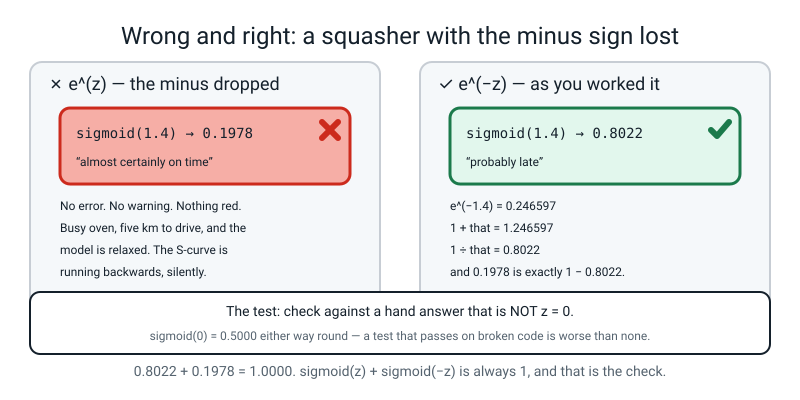
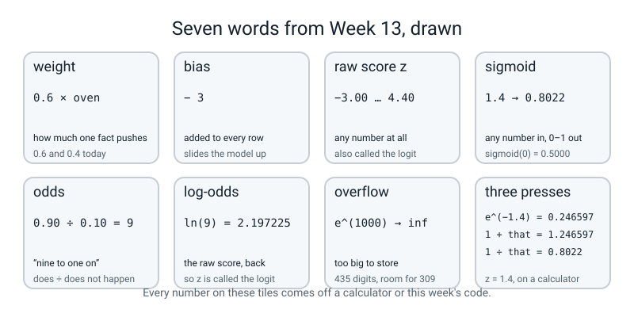

# Week 13 — From a Score to a Chance

[⬅ Week 12](week-12.md) · [Course Home](../README.md) · [Next ➡](week-14.md) · [Workbook](../workbook/week-13.md)

---

> ### This week in one sentence
> **A weighted sum can be any number at all. A probability has to sit between 0 and 1. The sigmoid is the squasher that gets you from one to the other.**
>
> **By the end of this chapter you will be able to:**
> - **Work out a raw score by hand** from two facts, two weights and a bias — for eight pizza orders, showing all three steps each time
> - **Press `e^x` on a calculator** for z = −2, 0, 1.4 and 3, and turn those four numbers into probabilities to four decimal places
> - **Say the three properties** that make the sigmoid the right squasher, including that `sigmoid(0)` is *exactly* 0.5
> - **Go backwards** from a probability to a raw score through the **odds** and the **log-odds**, and say why `z` is called the logit
>
> **New maths:** **the exponential `e^(−z)`** — one button on a calculator, pressed four times, then plotted.
>
> **New syntax:** `np.exp(x)` · `np.where(cond, a, b)`
>
> **Reading time:** about 35 minutes. **Homework:** about 60 minutes.

---

## 🪝 Start Here

A pizza shop wants to know, the moment an order comes in, whether it is going to be late. Somebody who has worked there for ten years writes their instinct down as arithmetic:

```
worry = 0.6 × (orders already in the oven) + 0.4 × (km the rider must drive) − 3
```

That is not a metaphor for a model. **That is a model, and it is the whole thing.** Three numbers: `0.6`, `0.4`, and minus 3. Nothing hidden anywhere.

An order comes in. **Four** things already in the oven, **five** kilometres to drive. Work it out:

```
0.6 × 4 = 2.4
0.4 × 5 = 2.0
2.4 + 2.0 − 3 = 1.4
```

So the worry is **1.4**.

Now the question that starts the week: **what is the chance this order is late?**

It is not 1.4. There is no such thing as a 140% chance. And it gets worse — try an order with **eight** in the oven and **twenty** kilometres to drive:

```
0.6 × 8 = 4.8
0.4 × 20 = 8.0
4.8 + 8.0 − 3 = 9.8
```

**A 980% chance of being late.**

So is the model rubbish? **No. Look at it again.** More things in the oven, more worry. Longer drive, more worry. Every instinct in that formula is right, and the *order* of the answers is perfect: the busy long-distance order really is more worrying than the quiet nearby one.

**The problem is the ruler.** A weighted sum can land anywhere on the number line — minus a thousand, plus a thousand. A probability has to sit between 0 and 1, and there is no arrangement of `0.6`, `0.4` and `−3` that can promise that.

So we need **one more step at the end**: something that takes any number at all and hands back a number between 0 and 1, without ever changing the order. Bigger worry must always mean bigger chance.


*Figure 13.1 — A weighted sum, then a squash. Two multiplications, one addition, then one division: 0.6 × 4 = 2.4, 0.4 × 5 = 2.0, 2.4 + 2.0 − 3 = 1.40, and the squash turns that into 0.8022.*

That last box has a name, it has a shape, and by the end of this chapter you will have drawn the shape yourself from numbers you worked out on a calculator.

And here is the part that makes today worth your attention. **You have typed `model.predict_proba(X)[:, 1]` dozens of times and got probabilities out of a box.** Today the box comes apart. By the end you can produce its exact numbers with a calculator — and we will check that on 200 rows, to twelve decimal places.

---

## 🧠 The Big Idea

> **📌 About the code in this section.** The blocks below are **illustrations, not files**. Each one carries on from the one above. **The complete runnable file is in 💻 Type This.**

### 1. Three numbers, two operations, and an answer that can be anything

**The plain explanation.** The model has exactly three numbers in it, and each one has a name.

> **weight** — a number saying how much one fact pushes the answer up or down. Here `0.6` and `0.4` are the weights.

> **bias** — a constant added every single time, whatever the facts are. It slides the whole model up or down. Here the bias is `−3`.

> **logit, or raw score, written `z`** — what comes out of the weighted sum, *before* anybody turns it into a probability. It can be any number at all: −8, 0, 0.37, 412.

Three names for one thing there: **raw score**, **`z`**, and **logit**. You will meet all three, and section 3 explains where the silly one comes from.

🍕 **The analogy.** The weights are how much you trust each piece of evidence, and the bias is your mood before any evidence arrives. A shop with a bias of `−3` starts off relaxed; a shop with a bias of `+3` starts off panicking. The evidence then pushes that starting mood up or down.

**A concrete example, with real values.** Here are the eight orders you will work through in class. Read them in pairs — order 5 had 5 things in the oven and 2 km to drive:

| Order | In the oven | Km to drive | `0.6 × oven` | `0.4 × km` | subtract 3 → `z` |
|:--:|:--:|:--:|:--:|:--:|:--:|
| 1 | 0 | 0 | 0.0 | 0.0 | **−3.00** |
| 2 | 1 | 1 | 0.6 | 0.4 | **−2.00** |
| 3 | 2 | 2 | 1.2 | 0.8 | **−1.00** |
| 4 | 3 | 3 | 1.8 | 1.2 | **0.00** |
| 5 | 5 | 2 | 3.0 | 0.8 | **0.80** |
| 6 | 4 | 5 | 2.4 | 2.0 | **1.40** |
| 7 | 6 | 6 | 3.6 | 2.4 | **3.00** |
| 8 | 7 | 8 | 4.2 | 3.2 | **4.40** |

**Look at the last column: `−3.00` and `4.40`.** Neither is a probability. This is the hook's problem, sitting in a table.

> **⚠️ Watch out:** a raw score is not a percentage, not a probability, and not a score out of ten. **If you are ever confused about which one you are holding, ask yourself whether it could be 4.4.** If it could, it is a raw score.

### 2. The squasher: any number in, a number between 0 and 1 out

**The plain explanation.** Here is the whole squasher. Three steps, and the middle one is the only new button on your calculator:

```
p = 1 ÷ (1 + e^(−z))
```

> **sigmoid** — the squasher `1 ÷ (1 + e^(−z))`. "Sigmoid" means "S-shaped", and the S is what you see when you plot it. Its other name is the **logistic function**, which is where **logistic regression** got its name — the model you have already used without knowing this was inside it.

🍕 **The analogy.** Think of a very wide funnel with a narrow neck. You can pour anything you like into the top — a trickle or a flood — and what comes out of the neck is always somewhere between empty and full. Nothing that goes in can make it more than full. And things come out **in the order they went in**: the bigger pour still gives the fuller glass.

**A concrete example, with real values.** Take the four raw scores −2, 0, 1.4 and 3, and put each one through the three steps:

```
z = −2 :   e^(−z) = 7.389056    1 + 7.389056 = 8.389056    1 ÷ 8.389056 = 0.1192
z =  0 :   e^(−z) = 1.000000    1 + 1.000000 = 2.000000    1 ÷ 2.000000 = 0.5000
z = 1.4:   e^(−z) = 0.246597    1 + 0.246597 = 1.246597    1 ÷ 1.246597 = 0.8022
z =  3 :   e^(−z) = 0.049787    1 + 0.049787 = 1.049787    1 ÷ 1.049787 = 0.9526
```

**Four numbers went in. Four numbers came out, and every one of them sits between 0 and 1** — and they came out in the same order they went in. Nothing was shuffled and nothing escaped.

**Three properties, and they are the reason this is the right tool rather than merely *a* tool:**

| Property | In plain words | The number that proves it |
|---|---|---|
| `sigmoid(0)` is **exactly** 0.5 | A raw score of zero means "no idea, coin flip" | `1 ÷ (1 + 1) = 0.5000`, with no rounding anywhere |
| Big positive `z` → close to 1 | Confidently yes | `sigmoid(3) = 0.9526` |
| Big negative `z` → close to 0 | Confidently no | `sigmoid(−2) = 0.1192` |

And a fourth that is easy to miss and matters enormously: **it never actually reaches 0 or 1.** `e^(−z)` is always a positive number, however tiny, so `1 + e^(−z)` is always a bit more than 1, so dividing 1 by it always lands a bit under 1. **It is a squash, not a cliff.** A logistic regression model can never tell you it is certain.


*Figure 13.2 — Any number in, a number between 0 and 1 out. Minus a thousand and plus a thousand both survive: −1000 comes out as 0.0000 and +1000 comes out as 1.0000.*

### 3. Backwards, through the odds — and where the word "logit" comes from

**The plain explanation.** Sometimes you have a probability and you want to know which raw score produced it. There are exactly two steps, and the first one is horse-racing language.

> **odds** — the chance a thing happens divided by the chance it does not. `odds = p ÷ (1 − p)`.

If `p = 0.90`, then:

```
odds = 0.90 ÷ 0.10 = 9
```

**Nine.** Say it the way a bookmaker would: *"nine to one on"* — nine times as likely to happen as not. A probability of 0.5 gives `0.5 ÷ 0.5 = 1`, which is "evens".

> **log-odds** — the natural logarithm of the odds, `ln(odds)`. And this number is exactly `z`.

```
z = ln(9) = 2.197225
```

On a calculator: type `9`, press `ln`. That is the whole second step. (`ln` is the button right next to `e^x`, and it undoes it. Next week that button is the star of the lesson.)

**Check it comes back**, because a conversion you cannot check is a conversion you cannot trust. Put `z = 2.197225` through the sigmoid:

```
e^(−2.197225) = 0.111111        1 ÷ 1.111111 = 0.900000
```

**Exactly the 0.90 we started with.** The two operations undo each other.

🍕 **The analogy.** Celsius to Fahrenheit and back. Nothing is lost, nothing is created; you are describing the same warmth in two languages. A raw score and a probability are the same confidence in two languages, and the odds are the halfway house between them.

**And that is where the name comes from.** `z` is the **log** of the odds, so it is called the **logit**. A slightly silly name for a genuinely useful quantity.


*Figure 13.3 — The same journey, both ways. Forwards is exponential-then-divide; backwards is divide-then-log. Top row: p = 0.90 → odds = 9 → z = 2.197225. Bottom row: z = 2.197225 → 0.111111 → p = 0.900000.*

> **🤔 Think about it:** why would anybody bother going backwards? Two real reasons. **One:** you can read a trained model's weights as *"each extra kilometre adds 0.4 to the log-odds"*, which is a sentence a delivery manager can act on. **Two:** next week's loss function is built out of logs, and it will be far less mysterious to somebody who has already typed `ln` into a calculator.

### 4. `overflow`: the obvious way to write the squasher breaks

**The plain explanation.** The obvious way to type the sigmoid is the way it appears on every website:

```python
def naive(z):
    return 1.0 / (1.0 + np.exp(-z))
```

Feed that a very negative raw score and something appears on your screen in yellow-ish text:

```text
RuntimeWarning: overflow encountered in exp
```

> **overflow** — when a calculation produces a number too big for the computer to store, so it stores "infinity" instead and prints a warning.

**Follow the arithmetic, because the warning is not a mystery.** `z` is `−1000`, so `−z` is `+1000`, so the machine has been asked for `e^1000`. **That number has 435 digits.** The biggest number this kind of decimal can hold has 309. So the machine gave up and wrote `inf`:

```text
what the naive way asks for at z = -1000:
   e^(-z) = e^(1000) = inf
   1 / (1 + inf)     = 0.0
```

**And notice: the final answer, `0.0`, is not wrong.** One divided by infinity really is zero-ish. So why care? Three honest reasons:

1. **The warning pollutes every run.** In two weeks you will run a training loop five hundred times. A screen full of warnings is a screen where you cannot see the real problem.
2. **You cannot tell a harmless warning from a fatal one at a glance**, so the only workable rule is *no warnings*.
3. **`inf` spreads.** Multiply infinity by zero and you get `nan` — "not a number" — and one `nan` poisons every average it touches. You meet that next week.

🍕 **The analogy.** A kitchen scale that reads up to 5 kg. Put a 200 kg sack of flour on it and the needle does not explode — it pins at the top and stays there. The reading is not *wrong* about the sack being heavy, but you have lost the number, and every calculation downstream that uses it is guessing.

**The fix is to do the same arithmetic a different way**, so the exponential is never asked for a positive power:

```text
what the safe way asks for at z = -1000:
   e^(-|z|) = e^(-1000) = 0.0
   that / (1 + that)   = 0.0
```

No warning. Same answer. Section 💻 Type This builds it in four lines.

> **⚠️ Watch out — be honest about what the fix does *not* fix.** At `z = −1000` the safe version also returns exactly `0.0`, because `e^(−1000)` is smaller than the smallest number a decimal can hold, so it rounds down to zero. **The sigmoid can never truly be 0, and the computer says 0 anyway.** That is a separate problem with a separate fix, and it is next week's, when a probability of exactly 0 walks into a logarithm.

---

## 🔢 The Maths, Slowly

**One new button. That is the entire new maths of this week.**

### Step 1 — find the button and press it four times

`e` is a fixed number, `2.71828...`, in the same way π is a fixed number `3.14159...`. **You do not need to know why it is that and not something else.** What you need to know is what `e^(−z)` *does*, and four presses show you.

Find the `e^x` key. On most calculators it is above the `ln` key, so you reach it with `SHIFT` or `2nd`. On a phone, rotate to landscape.

**The recipe for `e^(−z)`: type the number, press the sign-change key (`+/−` or `(−)`), then `e^x`.**

| Type this | Then this | You should see |
|---|---|---|
| `2`, `+/−` | `e^x` | `7.389056` |
| `0` | `e^x` | `1` |
| `1.4`, `+/−` | `e^x` | `0.246597` |
| `3`, `+/−` | `e^x` | `0.049787` |

**Do those four now, on a real calculator, before you read on.** This is the "check it yourself" step and the rest of the week rests on it.

### Step 2 — notice what the column is doing

```
z = −2     e^(−z) = 7.389056
z =  0     e^(−z) = 1.000000
z = 1.4    e^(−z) = 0.246597
z =  3     e^(−z) = 0.049787
```

Read down the right-hand column. As `z` gets bigger, `e^(−z)` gets **smaller, and fast** — from 7.389056 down to 0.049787 while `z` moved from −2 to 3. That is about **148 times smaller** over a span of 5.

Two facts to hold on to:

- **At `z = 0` it is exactly 1.** Anything to the power zero is 1.
- **It is never zero and never negative.** It shrinks and shrinks and never arrives.

### Step 3 — do the three-step squash on all four

Add 1 to each, then divide 1 by the answer:

```
z = −2 :   7.389056  →  8.389056  →  1 ÷ 8.389056 = 0.1192
z =  0 :   1.000000  →  2.000000  →  1 ÷ 2.000000 = 0.5000
z = 1.4:   0.246597  →  1.246597  →  1 ÷ 1.246597 = 0.8022
z =  3 :   0.049787  →  1.049787  →  1 ÷ 1.049787 = 0.9526
```

**Every division on a calculator, out loud, in order.** Those four numbers are the whole lesson, and the middle one is exactly a half — not approximately. `e^0 = 1`, `1 + 1 = 2`, `1 ÷ 2 = 0.5`. **There is no rounding anywhere in that sum.**

### Step 4 — now the name, and only now

```
sigmoid(z)  =  1 ÷ (1 + e^(−z))
```

That symbol-free line is a summary of arithmetic you have already done four times. If it had gone up first, the rest of the week would have been decoding somebody else's notation.

### Step 5 — plot your four points

Put `z` across from −6 to +6 and `p` up from 0 to 1, mark a dashed line at `p = 0.5`, and put your four points on. Then join them.


*Figure 13.4 — The S-curve, drawn through four points we worked out by hand. (−2, 0.1192), (0, 0.5000), (1.4, 0.8022) and (3, 0.9526), and the curve crosses the dashed halfway line exactly at z = 0.*

**Three things to read off your own drawing:**

1. **It crosses the halfway line at exactly `z = 0`.** That is the first property, in ink.
2. **The middle is steep and the ends are flat.** From `z = 0` to `z = 1` the probability climbs by 0.231. From `z = 6` to `z = 7` it climbs by 0.0016. **The same step of `z` bought 148 times as much in the middle.** Worked Example 3 measures that.
3. **It never touches the top or the bottom**, however far right you look.

> **🔢 The maths, slowly:** `e^(−z)` means `1 ÷ e^z` — a negative power means *divide*. So at `z = 3` you are asking for `1 ÷ (2.71828 × 2.71828 × 2.71828)` = `1 ÷ 20.0855` = `0.049787`. **You can check that on a calculator with three multiplications and one division**, and it is worth doing once so the `e^x` button stops feeling like magic.

---

## 💻 Type This

One file, `squash.py`, built in four steps. Then one short second file that checks our arithmetic against scikit-learn's.

### Step 1 — eight raw scores in one line

```python
import numpy as np

np.random.seed(0)

oven = np.array([0, 1, 2, 3, 5, 4, 6, 7])
km   = np.array([0, 1, 2, 3, 2, 5, 6, 8])

z = 0.6 * oven + 0.4 * km - 3.0
print("the eight raw scores:", z)
```

```text
the eight raw scores: [-3.  -2.  -1.   0.   0.8  1.4  3.   4.4]
```

**What the new lines do.**

- `np.random.seed(0)` fixes the dice. **Nothing today is random** — every number is typed — so it changes nothing. It is here because every file in this course sets its seed, and a habit with exceptions is not a habit.
- `np.array([...])` makes numpy's fast list type out of eight whole numbers. Read `oven` and `km` **down**, in pairs.
- `0.6 * oven + 0.4 * km - 3.0` does **all sixteen multiplications and all eight additions in one line.** In numpy, multiplying a list by a single number multiplies every item, and adding two lists adds them item by item.

**Check one against the table in section 1**: order 6 had 4 in the oven and 5 km, and `0.6 × 4 + 0.4 × 5 − 3 = 2.4 + 2.0 − 3 = 1.4`. It is the sixth number on the screen.

### Step 2 — the obvious squasher, and the mistake on purpose

Type the version that appears on every website:

```python
def squash(z):
    return 1.0 / (1.0 + np.exp(-z))


print(squash(z))
print("and one very negative order:", squash(-1000.0))
```

```text
RuntimeWarning: overflow encountered in exp
[0.04742587 0.11920292 0.26894142 0.5        0.68997448 0.80218389
 0.95257413 0.98787157]
and one very negative order: 0.0
```

**What the new lines do.** `def` starts a **function** — a named recipe you can reuse; everything indented under it is the recipe body. `np.exp(x)` is `e^x`, done to **every item** in the list at once. `return` hands the answer back.

**Now read the screen.** It did not crash. The eight answers are right — the fourth one is `0.5` and the sixth is `0.80218389`, which are your calculator answers. **And there is a warning above the numbers.**

> **🐞 If you see this error:** `RuntimeWarning: overflow encountered in exp` means *"you asked me for a number too big to store, so I stored infinity."* Ask yourself: **what is the biggest thing that went into `np.exp` in my program?** Here it is `−(−1000)`, which is `+1000`, and `e^1000` has 435 digits.

> **⚠️ Watch out:** the warning appears **above** the table, not below it, even though the warning happened later. Warnings go to a different output stream from `print`, so they are not interleaved in the order you would expect. This surprises everybody once.

### Step 3 — the squasher that cannot overflow

There are two ways to write the same division, and one of them never asks for a big power:

```python
def squash(z):
    """Any number in, a number strictly between 0 and 1 out."""
    z = np.asarray(z, dtype=float)
    negative_part = np.where(z >= 0, -z, z)     # always 0 or less
    e = np.exp(negative_part)                   # so e is never bigger than 1
    return np.where(z >= 0, 1.0 / (1.0 + e), e / (1.0 + e))
```

**What each new line does.**

- `np.asarray(z, dtype=float)` is insurance. Hand this function a plain number, or a list of whole numbers, and this line turns it into a numpy list of decimals so the rest of the lines behave.
- `np.where(condition, a, b)` is the week's second new piece of syntax, and it is one of the most useful lines in numpy. **Three things go in: a question, an answer for yes, an answer for no.** It asks the question of **every item** and picks per item. Read the middle line out loud: *"wherever `z` is zero or bigger, use minus z; everywhere else, leave z alone."* The result is that **every number is now zero or less** — the sign has been stripped off.
- `np.exp(negative_part)` therefore can never be bigger than 1. **It is not allowed to overflow.**
- The last line picks which of two divisions to use, per item. Both give the same answer, and each one only ever divides by something small.

**Both divisions give the same answer, and it is worth checking once on paper so you believe it:**

```
for z = 1.4 :   1 ÷ (1 + e^(−1.4)) = 1 ÷ 1.246597 = 0.802184
for z = −1.4:   e^(−1.4) ÷ (1 + e^(−1.4)) = 0.246597 ÷ 1.246597 = 0.197816
                and 1 ÷ (1 + e^(1.4)) = 1 ÷ 5.055200 = 0.197816   ← the same
```

Now print the whole table:

```python
p = squash(z)
late = np.where(p >= 0.5, "yes", "no ")

print("order  oven   km        z         p    late?")
for i in range(8):
    print("%5d %5d %4d %8.2f %9.4f      %s"
          % (i + 1, oven[i], km[i], z[i], p[i], late[i]))
```

```text
order  oven   km        z         p    late?
    1     0    0    -3.00    0.0474      no 
    2     1    1    -2.00    0.1192      no 
    3     2    2    -1.00    0.2689      no 
    4     3    3     0.00    0.5000      yes
    5     5    2     0.80    0.6900      yes
    6     4    5     1.40    0.8022      yes
    7     6    6     3.00    0.9526      yes
    8     7    8     4.40    0.9879      yes
```

**`np.where` again on the `late` line, and this time it produces words instead of numbers.** That is the threshold from Week 10, written in one line: anything at 0.5 or above counts as "late". The trailing space in `"no "` is only there so the columns line up.

**Find your four calculator answers in that table.** Rows 2, 4, 6 and 7: `0.1192`, `0.5000`, `0.8022`, `0.9526`.

### Step 4 — the second mistake on purpose: swap the two arms

The single easiest `np.where` mistake is to put the arms the wrong way round. Change the middle line to `np.where(z >= 0, z, -z)` and run:

```text
squash(1.4)  = 0.1978
squash(-2.0) = 0.8808
squash(3.0)  = 0.0474
squash(0.0)  = 0.5000
```

**Any error message? None.** And the answers are badly wrong — busy oven, long drive, and the model now says "almost certainly on time". **The S-curve is running backwards.**

**The only thing that caught this is that you already knew `sigmoid(1.4) = 0.8022`, because you worked it out on a calculator.** And notice which value would *not* have caught it: the last line. `z = 0` gives 0.5000 either way round. **A test that passes when the code is broken is worse than no test.**

Feed the broken version `−1000` and it does something new:

```text
RuntimeWarning: overflow encountered in exp
RuntimeWarning: invalid value encountered in scalar divide
squash(-1000.0) = nan
```

**There it is — `nan`, "not a number".** Infinity divided by infinity has no answer. This is the thing promised in section 4: `inf` spreads, and what it turns into is `nan`. **One `nan` in a list of five hundred losses makes the average of all five hundred `nan`.** Put the arms back the right way round.

### The complete file

**Runtime: 0.08 seconds. Nothing trains, nothing downloads.**

```python
"""squash.py - the Worry Meter, and the squasher that never overflows."""
import numpy as np

np.random.seed(0)

oven = np.array([0, 1, 2, 3, 5, 4, 6, 7])
km   = np.array([0, 1, 2, 3, 2, 5, 6, 8])

z = 0.6 * oven + 0.4 * km - 3.0
print("the eight raw scores:", z)
print()


def squash(z):
    """Any number in, a number strictly between 0 and 1 out."""
    z = np.asarray(z, dtype=float)
    negative_part = np.where(z >= 0, -z, z)     # always 0 or less
    e = np.exp(negative_part)                   # so e is never bigger than 1
    return np.where(z >= 0, 1.0 / (1.0 + e), e / (1.0 + e))


p = squash(z)
late = np.where(p >= 0.5, "yes", "no ")

print("order  oven   km        z         p    late?")
for i in range(8):
    print("%5d %5d %4d %8.2f %9.4f      %s"
          % (i + 1, oven[i], km[i], z[i], p[i], late[i]))
print()
print("squash(0)     = %.4f   <- exactly a half, every time" % squash(0.0))
print("squash(-1000) = %.4f   <- no warning, no infinity" % squash(-1000.0))
print("squash( 1000) = %.4f" % squash(1000.0))
```

**Real output:**

```text
the eight raw scores: [-3.  -2.  -1.   0.   0.8  1.4  3.   4.4]

order  oven   km        z         p    late?
    1     0    0    -3.00    0.0474      no 
    2     1    1    -2.00    0.1192      no 
    3     2    2    -1.00    0.2689      no 
    4     3    3     0.00    0.5000      yes
    5     5    2     0.80    0.6900      yes
    6     4    5     1.40    0.8022      yes
    7     6    6     3.00    0.9526      yes
    8     7    8     4.40    0.9879      yes

squash(0)     = 0.5000   <- exactly a half, every time
squash(-1000) = 0.0000   <- no warning, no infinity
squash( 1000) = 1.0000
```

### And the file that proves the point

This is the payoff. We ask scikit-learn to fit a logistic regression on 200 generated rows, **take its weights out, and do the arithmetic ourselves.**

```python
"""real_data.py - the same two lines of arithmetic, on 200 generated rows."""
import numpy as np
from sklearn.datasets import make_classification
from sklearn.linear_model import LogisticRegression

np.random.seed(0)

X, y = make_classification(n_samples=200, n_features=2, n_informative=2,
                           n_redundant=0, random_state=0)
print("X shape:", X.shape, "  y shape:", y.shape)
print("first three rows of X:")
print(np.round(X[:3], 4))
print("first ten labels:", y[:10])

model = LogisticRegression().fit(X, y)
w = model.coef_[0]
b = float(model.intercept_[0])
print()
print("w =", np.round(w, 4), "  b =", round(b, 4))


def squash(z):
    z = np.asarray(z, dtype=float)
    e = np.exp(np.where(z >= 0, -z, z))
    return np.where(z >= 0, 1.0 / (1.0 + e), e / (1.0 + e))


z = w[0] * X[:, 0] + w[1] * X[:, 1] + b
p_mine = squash(z)
p_sklearn = model.predict_proba(X)[:, 1]

print()
print(" row        x1        x2         z    p (mine)  p (sklearn)")
for i in range(5):
    print("%4d  %8.4f  %8.4f  %8.4f    %.6f    %.6f"
          % (i, X[i, 0], X[i, 1], z[i], p_mine[i], p_sklearn[i]))
print()
print("biggest disagreement over all 200 rows: %.12f"
      % float(np.max(np.abs(p_mine - p_sklearn))))
```

**Real output, runtime under a second:**

```text
X shape: (200, 2)   y shape: (200,)
first three rows of X:
[[ 0.617  -1.194 ]
 [ 0.0574 -0.5724]
 [-0.5589  0.7554]]
first ten labels: [1 0 0 1 1 0 1 1 0 0]

w = [ 3.6298 -0.5546]   b = -0.7127

 row        x1        x2         z    p (mine)  p (sklearn)
   0    0.6170   -1.1940    2.1891    0.899268    0.899268
   1    0.0574   -0.5724   -0.1868    0.453431    0.453431
   2   -0.5589    0.7554   -3.1603    0.040686    0.040686
   3    0.3681    0.0616    0.5892    0.643181    0.643181
   4    2.3275   -2.9286    9.3597    0.999914    0.999914

biggest disagreement over all 200 rows: 0.000000000000
```

**Twelve zeros. Not "close". Identical.**

`np.abs` strips the minus sign off every number, so `np.max(np.abs(...))` reads as *"the biggest disagreement, ignoring which way round it was"*.

**Check row 0 by hand, because it takes fifteen seconds and it is the point of the whole week:**

```
3.6298 × 0.6170     =  2.2395866
−0.5546 × (−1.1940) =  0.6621924
2.2395866 + 0.6621924 − 0.7127 = 2.1890790     ← the z column
e^(−2.1890790) = 0.1120199
1 ÷ 1.1120199 = 0.8992645                      ← the p column
```

The screen says `0.899268` and we got `0.8992645`. **Nobody is wrong.** The weights were rounded to four decimal places before multiplying, and that error travelled through the whole sum. **Round at the end, never in the middle.**

---

## 🔍 Worked Examples

Three complete programs, in three different worlds.

### Worked Example 1 — Spam texts (messages)

**The question:** a phone flags a text as spam from two facts: how many links it contains, and how many words are in CAPITALS. Somebody chose the weights `1.2` and `0.3` and the bias `−2.5`. Three texts arrive. What chance does each get?

| Text | Links | CAPS words |
|:--:|:--:|:--:|
| 1 | 0 | 1 |
| 2 | 1 | 4 |
| 3 | 3 | 9 |

**By hand first, all three raw scores:**

```
text 1:  1.2 × 0 = 0.0    0.3 × 1 = 0.3    0.0 + 0.3 − 2.5 = −2.20
text 2:  1.2 × 1 = 1.2    0.3 × 4 = 1.2    1.2 + 1.2 − 2.5 = −0.10
text 3:  1.2 × 3 = 3.6    0.3 × 9 = 2.7    3.6 + 2.7 − 2.5 =  3.80
```

**Then the squash on text 3, on a calculator:** `e^(−3.8) = 0.022371`, `1 + that = 1.022371`, `1 ÷ that = 0.9781`.

```python
"""we1_spam.py - the same squash, on three text messages."""
import numpy as np

np.random.seed(0)

links = np.array([0, 1, 3])
caps  = np.array([1, 4, 9])

z = 1.2 * links + 0.3 * caps - 2.5
print("raw scores:", z)


def squash(z):
    z = np.asarray(z, dtype=float)
    e = np.exp(np.where(z >= 0, -z, z))
    return np.where(z >= 0, 1.0 / (1.0 + e), e / (1.0 + e))


p = squash(z)
flag = np.where(p >= 0.5, "SPAM", "keep")
print()
print("text  links  CAPS       z         p    verdict")
for i in range(3):
    print("%4d %6d %5d %7.2f %9.4f      %s"
          % (i + 1, links[i], caps[i], z[i], p[i], flag[i]))
```

**Real output, instant:**

```text
raw scores: [-2.2 -0.1  3.8]

text  links  CAPS       z         p    verdict
   1      0     1   -2.20    0.0998      keep
   2      1     4   -0.10    0.4750      keep
   3      3     9    3.80    0.9781      SPAM
```

**Read text 2 carefully: `z = −0.10` gives `p = 0.4750`.** A raw score a hair below zero gives a probability a hair below a half. **The sign of `z` tells you which side of 0.5 you are on, always** — that is the whole reason `sigmoid(0) = 0.5` matters. And notice that the same three lines of code work on links and CAPITALS as happily as on ovens and kilometres. **The model does not know what a pizza is.**

### Worked Example 2 — Backwards, from a chance to a score (revision app)

**The question:** a revision app tells a student *"you have a 78% chance of passing"*. What raw score produced that? And what raw scores are behind 25%, 99.9% and 50%?

**By hand, for 0.78:**

```
odds = 0.78 ÷ 0.22 = 3.545455
z    = ln(3.545455) = 1.265666
check: e^(−1.265666) = 0.282051,  1 ÷ 1.282051 = 0.780000   ✅
```

```python
"""we2_back.py - from a probability back to a raw score."""
import numpy as np

for p in (0.78, 0.25, 0.999, 0.50):
    odds = p / (1 - p)
    z = np.log(odds)
    back = 1.0 / (1.0 + np.exp(-z))
    print("p = %.3f   odds = %10.6f   z = ln(odds) = %10.6f   back again = %.6f"
          % (p, odds, z, back))
```

**Real output, instant:**

```text
p = 0.780   odds =   3.545455   z = ln(odds) =   1.265666   back again = 0.780000
p = 0.250   odds =   0.333333   z = ln(odds) =  -1.098612   back again = 0.250000
p = 0.999   odds = 999.000000   z = ln(odds) =   6.906755   back again = 0.999000
p = 0.500   odds =   1.000000   z = ln(odds) =   0.000000   back again = 0.500000
```

**Four things in that printout, and the last two are the interesting ones.**

1. Every row comes back to where it started, to six decimal places. **The two operations undo each other.**
2. `p = 0.25` gives a **negative** raw score. Anything below a half does.
3. `p = 0.999` needs odds of **999** and a raw score of only `6.906755`. **To buy three nines of confidence you need a raw score of about 7** — and to buy four nines you would need about 9.2. Confidence gets expensive fast.
4. `p = 0.50` gives `odds = 1` and `z = 0` exactly. **Everything closes on the same number.**

### Worked Example 3 — Where the curve goes flat (a free-throw predictor)

**The question:** a basketball app predicts whether a free throw goes in. Somebody says *"if we push the raw score higher the model gets more confident, so let us push it as high as possible."* How much does one extra point of raw score actually buy?

```python
"""we3_sat.py - the flat ends of the S-curve."""
import numpy as np


def squash(z):
    z = np.asarray(z, dtype=float)
    e = np.exp(np.where(z >= 0, -z, z))
    return np.where(z >= 0, 1.0 / (1.0 + e), e / (1.0 + e))


middle = float(squash(1.0)) - float(squash(0.0))
end = float(squash(7.0)) - float(squash(6.0))
print("one step of z in the MIDDLE of the curve:")
print("   sigmoid(0) = %.6f    sigmoid(1) = %.6f    gained %.6f"
      % (squash(0.0), squash(1.0), middle))
print("one step of z at the END of the curve:")
print("   sigmoid(6) = %.6f    sigmoid(7) = %.6f    gained %.6f"
      % (squash(6.0), squash(7.0), end))
print("   the middle step bought %.1f times as much" % (middle / end))
print()
print("and where the computer runs out of room:")
print("   sigmoid(36.7) = %.17f   is it exactly 1.0 ? %s"
      % (squash(36.7), float(squash(36.7)) == 1.0))
print("   sigmoid(36.8) = %.17f   is it exactly 1.0 ? %s"
      % (squash(36.8), float(squash(36.8)) == 1.0))
```

**Real output, instant:**

```text
one step of z in the MIDDLE of the curve:
   sigmoid(0) = 0.500000    sigmoid(1) = 0.731059    gained 0.231059
one step of z at the END of the curve:
   sigmoid(6) = 0.997527    sigmoid(7) = 0.999089    gained 0.001562
   the middle step bought 148.0 times as much

and where the computer runs out of room:
   sigmoid(36.7) = 0.99999999999999978   is it exactly 1.0 ? False
   sigmoid(36.8) = 1.00000000000000000   is it exactly 1.0 ? True
```

**One step of `z` bought 0.231059 in the middle and 0.001562 out at the end — 148 times as much.** So pushing the raw score from 6 to 7 changes almost nothing about the prediction. **The middle of the curve is where the action is; the ends are squashed flat.**

Keep that sentence. In two weeks, when a model is learning by nudging its weights, the flat ends will turn out to be a place where learning almost stops — and you will have seen it here first, with a calculator.

**And the second half of the printout is genuinely unsettling.** At `z = 36.7` the probability is a hair under 1, and the machine can still tell. At `z = 36.8` it gives up and stores exactly `1.0`. **We proved earlier that the sigmoid can never reach 1, and here is a computer printing 1.** It is not lying; it has run out of room to tell the truth.

---

## 🐞 When It Breaks

Every message below came from really running a broken version of this week's code.

### Break 1 — the overflow warning

```python
def naive(z):
    return 1.0 / (1.0 + np.exp(-z))


print(naive(-1000.0))
```

```text
overflow.py:6: RuntimeWarning: overflow encountered in exp
  return 1.0 / (1.0 + np.exp(-z))
0.0
```

**What Python is telling you.** *"You asked me for a number too big to store, so I stored infinity."*

**How to find it.** Read the warning as arithmetic: some `e^something` was too big, so **print the biggest thing that goes into `np.exp`.** Here it is `+1000`.

**The fix.** The two-branch version, so the exponent is never positive: `np.where(z >= 0, -z, z)` before the `np.exp`.

### Break 2 — two informative features out of two total

```python
X, y = make_classification(n_samples=200, n_features=2, n_informative=2,
                           random_state=0)
```

```text
ValueError: Number of informative, redundant and repeated features must sum to less than the number of total features
```

**What Python is telling you.** *"You asked for 2 features, but also 2 informative ones and 2 redundant ones, and 2 + 2 is more than 2."*

The default for `n_redundant` is **2, not 0**, which is a genuinely surprising default.

**The fix.** `n_redundant=0`. **Read the message as arithmetic — it is telling you that 2 + 2 > 2.**

### Break 3 — a plain Python list where numpy was expected

```python
z = [1.0, 2.0]
print(np.exp(-z))
```

```text
Traceback (most recent call last):
  File "list.py", line 4, in <module>
    print(np.exp(-z))
TypeError: bad operand type for unary -: 'list'
```

**What Python is telling you.** *"You put a minus sign in front of a plain list, and lists cannot be negated."* `[1.0, 2.0] * 2` in plain Python makes a four-item list; `-[1.0, 2.0]` makes no sense at all.

**The fix.** `z = np.array([1.0, 2.0])`, or let `np.asarray(z, dtype=float)` at the top of `squash` do it for you. **That line exists for exactly this reason.**

### Break 4 — the one with no message

```python
    negative_part = np.where(z >= 0, z, -z)     # arms swapped
```

```text
squash(1.4)  = 0.1978
squash(0.0)  = 0.5000
```

**There is no error. That is the problem.** Every probability is `1 −` the right answer, and the model's advice is exactly backwards.

**What to do when there is no message.** Compare against a number you already trust — **and not `z = 0`**, which comes out at 0.5000 either way round. `sigmoid(1.4)` must be `0.8022`. If you see `0.1978`, the minus sign is lost, and `0.1978` is exactly `1 − 0.8022`.

### The whole clinic, for reference

| What you see | What it means | The fix |
|---|---|---|
| `RuntimeWarning: overflow encountered in exp` | "Too big to store, so I stored infinity" | Two-branch `squash`, so the exponent is never positive |
| `RuntimeWarning: invalid value encountered in scalar divide` then `nan` | "I divided infinity by infinity and there is no answer" | Fix the overflow, not the division |
| `ValueError: Number of informative, redundant and repeated features must sum to less than the number of total features` | "2 + 2 is more than 2" | `n_redundant=0` |
| `TypeError: bad operand type for unary -: 'list'` | "You negated a plain list" | `np.array([...])` |
| `ValueError: Expected 2D array, got 1D array instead: array=[1. 2.].` | "I need a table of rows and you handed me one row loose" | `model.predict_proba([[1.0, 2.0]])` — one row is still a table |
| `OverflowError: math range error` | The same overflow, but fatal | You used `math.exp` instead of `np.exp`. Plain Python **stops**; numpy **warns** and carries on |
| **No error.** Every probability is above 1 | Nothing crashed and every answer is impossible | The division is upside down. Say the recipe aloud: *"one, divided by, one plus the exponential"* |
| **No error.** The S-curve runs backwards | Every answer is `1 −` the right one | `e^(z)` where `e^(−z)` was meant. Check `sigmoid(1.4) = 0.8022`, never `sigmoid(0)` |
| **No error.** `p` prints as exactly `0.0` or `1.0` | Nothing crashed, and it is still a lie | `z` is beyond about ±36.8. Nothing to fix this week; **next week we clip** |

---

## 🎲 What We Did In Class

If you missed it, here is the whole lesson. You need a calculator with an `e^x` key and a sheet of graph paper.

**The hook.** The worry formula went on the board with nothing on the screen. Four in the oven, five km: somebody shouted `1.4`. Then: *"so what is the chance this order is late?"* Somebody said "1.4?" and then heard themselves. Then eight in the oven and twenty km — **9.8, a 980% chance** — and the point landed: *"the model is fine. The ruler is wrong."*

**Then a prediction, written down before any arithmetic:** *"what should the chance be when `z` is exactly zero? Not roughly. Exactly."* Most of the room said a half. It was held for eleven minutes and then checked.

**Four calculator presses, everybody.** `2 +/− e^x` → `7.389056`. `0 e^x` → `1`. `1.4 +/− e^x` → `0.246597`. `3 +/− e^x` → `0.049787`. Then the question *"what is this column doing as `z` gets bigger?"* — shrinking, and fast, about 148 times over a span of 5.

**Then the three-step squash, four times, on the board**, with every division read out from somebody's calculator:

```
z = −2 :   7.389056  →  8.389056  →  0.1192
z =  0 :   1.000000  →  2.000000  →  0.5000
z = 1.4:   0.246597  →  1.246597  →  0.8022
z =  3 :   0.049787  →  1.049787  →  0.9526
```

**Only then was it named.** Sigmoid. S-shaped. Also called the logistic function, which is where logistic regression got its name. Then the three properties, written down, plus the fourth: **it never reaches 0 or 1.**

**Backwards, on one number.** `p = 0.90` → `odds = 0.90 ÷ 0.10 = 9` → *"nine to one on"* → `z = ln(9) = 2.197225`. Then the check, on the calculator, out loud: `2.197225 +/− e^x` → `0.111111`, `+1` → `1.111111`, `1 ÷` → **`0.900000`**. Then: *"what are the odds when `p = 0.5`?"* — `1`, and `ln(1) = 0`, which agrees with `sigmoid(0) = 0.5`. **Everything closes.**

**Building `squash.py`, with two mistakes on purpose.**

| Mistake | What happened |
|---|---|
| The naive one-line squasher, fed `−1000` | **A warning, not a crash.** `RuntimeWarning: overflow encountered in exp`, and the answer `0.0` was right anyway |
| `np.where(z >= 0, z, -z)` — arms swapped | **Silent.** `squash(1.4)` returned `0.1978`. Then `−1000` produced `nan` |

Both went into the Bug Log, the second one as a **"no error message, wrong answer"** entry.

**Then the payoff.** `real_data.py`, 200 generated rows, scikit-learn's weights taken out and the arithmetic done by hand:

```text
w = [ 3.6298 -0.5546]   b = -0.7127
biggest disagreement over all 200 rows: 0.000000000000
```

Row 0 was checked on the board while it was on screen: `2.2395866 + 0.6621924 − 0.7127 = 2.1890790`, then `e^(−2.1890790) = 0.1120199`, then `1 ÷ 1.1120199 = 0.8992645` against the screen's `0.899268`. *"Who is wrong?"* **Neither** — the weights were rounded before multiplying. **Round at the end, never in the middle.**

**The Worry Meter.** Eight orders, one per student or pair. Everybody computed their own `z` and their own `sigmoid(z)` to four decimal places, **showing all three steps for each half**, checked with a neighbour, then walked to the board and marked one fat dot on a shared sheet of graph paper.

Nobody commented while it built. Around the fifth dot somebody said *"oh, it's an S"* without being asked. Then the person who said it was handed a pen and joined the dots.

**Three questions at the finished curve:**

1. *"Where does it cross the dashed halfway line?"* — At `z = 0`, exactly. Order 4.
2. *"Where would an order with `z = 20` go?"* — Hard against the top at `p = 0.9999999979`, and **not touching it.** Never.
3. *"Which two orders are furthest apart in `z`? And in `p`?"* — Orders 1 and 8 are **7.40** apart in `z` but only **0.9405** apart in `p`. Orders 3 and 5 are only **1.80** apart in `z` and already **0.4211** apart in `p`. **The middle is steep; the ends are flat.**

**The closing cliff.** *"Order 6 got 0.8022. Is that good? Is it a good prediction?"* And the honest answer: you cannot say, not because you are not clever enough, but **because we have not built the tool.** We have a machine that produces chances and no way at all of scoring them. That is next week — and next week's answer involves the button right next to `e^x`.

---

## 💬 Talk About It

**1. Why `e`? Why not 2, or 10?**

*Hint:* start by agreeing that any base works. You can build an S-curve out of `2^(−z)` — same shape, all outputs between 0 and 1, same ordering. So the choice is not forced by the shape. Then look for the reason further down the road: in two weeks you will need to know **how steep the sigmoid is at a point**, and with `e` that steepness turns out to be `p × (1 − p)` — a number you already have, needing no new arithmetic at all. Any other base gives you the same thing multiplied by an awkward constant that you then carry around for ever. **So `e` is not a law of nature here; it is the choice that makes the bill smaller later.** Finish on the honest bit: is "it makes later maths cleaner" a good enough reason to build a whole subject on one number?

**2. Is `predict_proba` really only those two lines?**

*Hint:* for logistic regression, yes — and you proved it to twelve decimal places on 200 rows. Then push outwards. A **decision tree**'s `predict_proba` counts what fraction of the training rows in that leaf were class 1. A **random forest** averages its trees' answers. A neural network (Week 22) does a much longer weighted sum and then this same squash. **None of them is magic; all of them are one page of arithmetic.** Then the sharp question: if it is all this simple, why did it feel like magic for two years? (Because nobody showed you the page.)

**3. The sigmoid can never reach 1, and the computer printed `1.0000`. Which is it?**

*Hint:* both, and being precise about the difference is the skill. Mathematically `sigmoid(1000)` is a number below 1 — smaller than 1 by an amount with 434 zeros in it. In a computer's decimals, the gap between 1 and the next number down is about `0.0000000000000001`, and our value is far closer to 1 than that, so **there is no way to store it other than as 1.0.** The machine is not lying; it has run out of room. Then argue about what to *do* about it. One camp says clip the probabilities into a safe range and move on. Another says never store probabilities at all, store the raw score `z`, and work in log-odds where there is no ceiling to hit. **The second camp is right and most code does the first**, because the first is one line and the second means rewriting your loss function. You will meet this exact argument again in Week 22.

---

## ⚠️ Don't Get Tricked

### Trick 1 — "the sigmoid decides yes or no"

| ❌ Wrong | ✅ Right |
|---|---|
| "`sigmoid(1.4) = 0.8022`, so the model says the order is late." | The sigmoid hands back a **chance**. **The threshold decides**, and the threshold is a separate choice you make — 0.5, or 0.3, or 0.9, depending on what a mistake costs. In `squash.py` the deciding happens on a completely different line: `np.where(p >= 0.5, "yes", "no ")`. |

Keep the two apart in your head. The model produces 0.8022 every time; **you** choose what to do about it.

### Trick 2 — "sigmoid(0) is about a half"

| ❌ Wrong | ✅ Right |
|---|---|
| "It's roughly 0.5, near enough." | It is **exactly** 0.5. `e^0 = 1`, `1 + 1 = 2`, `1 ÷ 2 = 0.5`. **There is no rounding anywhere in that sum.** |

This looks like trivia and it is not. Next week the number `0.6931` becomes the most useful diagnostic number in the whole course, **and its usefulness depends entirely on this one being exact.**

### Trick 3 — "no error message means the maths is right"


*Figure 13.5 — Wrong and right: a squasher with the minus sign lost. On the left, sigmoid(1.4) comes out as 0.1978 with no error at all; on the right it comes out as 0.8022, and 0.1978 is exactly 1 − 0.8022.*

| ❌ Wrong | ✅ Right |
|---|---|
| "It ran, it printed eight probabilities between 0 and 1, so it works." | Lose the minus sign and it still runs, still prints eight numbers between 0 and 1, and **every one of them is wrong in a way that reverses the model's advice.** The only thing that catches it is a hand answer to compare against — and it has to be one that is **not** `z = 0`. |

**The general rule, and it will serve you for years: a good test is one that fails when the code is wrong.** `sigmoid(0) = 0.5` passes on broken code, so it tests nothing.

### Trick 4 — "a bigger `z` means the model is more accurate"

| ❌ Wrong | ✅ Right |
|---|---|
| "Row 4 has `z = 9.36`, so it must be right." | A big `z` means the model is more **confident**. Confidence and correctness are different things. `p = 0.999914` with a true answer of "no" is a *disaster*, not a triumph — and the whole of next week exists to price that disaster properly. |

Write `p = 0.9999` and `truth = no` on a piece of paper and leave it where you can see it.

---

## 🌍 Where You've Seen This

1. **Every "chance of rain" on every weather app.** Some model produces a raw score for tomorrow and squashes it into a percentage. The squash is why you never see a 140% chance of rain.
2. **The spam folder.** A mail filter scores a message on dozens of features — links, sender history, words in capitals — sums them with weights, squashes the total, and compares it with a threshold. Worked Example 1 is a small version of a real thing.
3. **Medical risk scores.** *"A 12% chance of a heart problem in the next ten years."* Many of these are literally logistic regressions, chosen over fancier models **because a doctor can read the weights** — "smoking adds this much to the log-odds" is a sentence you can argue with.
4. **Credit and loan decisions.** Same reason: the law in many places requires a lender to explain a refusal, and log-odds are explainable in a way that a forest of trees is not.
5. **A phone's "is this a face?" box.** The last step of the network that draws that box is a squash into 0-to-1, then a threshold.
6. **Sports win probabilities on a live scoreboard.** They swing wildly during a game because the raw score is swinging, and the middle of the S-curve is steep — which is exactly Worked Example 3.

---

## 🔑 Remember This

- **A weighted sum can be any number at all.** `0.6 × oven + 0.4 × km − 3` gave `−3.00` for one order and `4.40` for another, and neither is a probability. The raw score has three names: **raw score**, **`z`**, **logit**.
- **The sigmoid is three steps on a calculator:** `e^(−z)`, add 1, divide 1 by it. `z = 1.4` → `0.246597` → `1.246597` → **`0.8022`**.
- **Three properties plus one.** `sigmoid(0)` is **exactly** 0.5; big positive `z` goes to nearly 1; big negative `z` goes to nearly 0; **and it never reaches either end.**
- **Backwards through the odds.** `p = 0.90` → `odds = 0.90 ÷ 0.10 = 9` → `z = ln(9) = 2.197225`. And forwards again gives `0.900000`. **That is why `z` is called the logit: it is the log of the odds.**
- **`predict_proba` is the two lines you wrote.** Weighted sum, then squash. We matched it on 200 rows with a disagreement of `0.000000000000`.
- **Overflow is a warning, not a crash, and it still matters.** `e^1000` has 435 digits and there is room for 309, so the machine stores `inf`. The two-branch squash never asks for a positive power.
- **The maths reminder:** `e^(−z)` shrinks fast and is **never zero**. That is the only reason the sigmoid can never reach 1.

### Syntax reminder card

```python
import numpy as np

# ---- the raw score: one line does every multiplication and addition ---------
oven = np.array([0, 1, 2, 3, 5, 4, 6, 7])
km   = np.array([0, 1, 2, 3, 2, 5, 6, 8])
z = 0.6 * oven + 0.4 * km - 3.0        # -> [-3. -2. -1. 0. 0.8 1.4 3. 4.4]

# ---- np.exp is e^x, on every item at once ----------------------------------
np.exp(0.0)        # 1.0
np.exp(-1.4)       # 0.2465969639416065
np.exp(1000.0)     # inf  + RuntimeWarning: overflow encountered in exp

# ---- np.where(question, answer-if-yes, answer-if-no), item by item ---------
np.where(z >= 0, "yes", "no ")          # words are fine too

# ---- the squasher that cannot overflow ------------------------------------
def squash(z):
    z = np.asarray(z, dtype=float)      # a plain list would break the next line
    e = np.exp(np.where(z >= 0, -z, z))  # the exponent is never positive
    return np.where(z >= 0, 1.0 / (1.0 + e), e / (1.0 + e))

# squash(0.0)     -> 0.5000   exactly, always
# squash(1.4)     -> 0.8022   check every squasher you write against this one
# squash(-1000.0) -> 0.0000   no warning

# ---- backwards: probability -> odds -> raw score --------------------------
p = 0.90
odds = p / (1 - p)        # 9.0
z = np.log(odds)          # 2.1972245773362196   <- the logit

# ---- and the check that catches a lost minus sign -------------------------
# squash(1.4) + squash(-1.4) == 1.0   ALWAYS. 0.8022 + 0.1978 = 1.0000
```

---

## 📓 New Words


*Figure 13.6 — Seven words from Week 13, drawn.*

| Word | What it means | Example |
|---|---|---|
| **weight** | How much one fact pushes the answer up or down | `0.6` on oven, `0.4` on km |
| **bias** | A constant added to every row, whatever the facts are | `−3` in the worry meter |
| **logit / raw score (`z`)** | What the weighted sum produces, before any squashing. Any number at all | `−3.00` … `4.40` for the eight orders |
| **sigmoid** | The squasher `1 ÷ (1 + e^(−z))`. Any number in, 0-to-1 out, in order | `sigmoid(1.4) = 0.8022` |
| **odds** | The chance it happens divided by the chance it does not | `0.90 ÷ 0.10 = 9`, "nine to one on" |
| **log-odds** | `ln(odds)` — and it is exactly the raw score again | `ln(9) = 2.197225` |
| **overflow** | A number too big to store, so the machine stores `inf` and warns | `e^1000` has 435 digits; there is room for 309 |

---

## 📤 Your Homework

Go to **[the Week 13 workbook](../workbook/week-13.md)**. About **60 minutes** in total.

| Section | What to do | Time |
|---|---|---|
| **Warm-Up** | Eight numbers: which could be a probability, and why not | 5 min |
| **Do the Maths by Hand** | **Eight sigmoid conversions to 4 dp**, all three steps in pen, with the numpy check beside each | 25 min |
| **Predict the Output** | Five snippets, including one that adds two sigmoids together | 8 min |
| **Practice A & B** | Reading questions, then **four conversions backwards** from `p` to `z` through the odds | 15 min |
| **Fix the Broken Program** | A squasher with a planted mistake that produces no error at all | 5 min |
| **Build It** | **The overflow experiment:** run the naive squasher on `−1000`, paste exactly what happens, then the two-branch version | 20 min |

**Three things are being marked, and the third is the real one.**

**Are all three intermediate steps there for each of the eight conversions?** A column of eight final answers is a column of eight numbers copied off a screen. **The `e^(−z)` column is the evidence that you did it by hand.**

**Is the warning pasted word for word?** `RuntimeWarning: overflow encountered in exp` is a result. *"It broke"* is not, and the difference is whether you can search for it in two years' time.

**Do your two sentences name the number?** Not *"the second one is safer"*. **Which number overflowed, and how big was it?** Full marks looks like: *"it was asked for e to the power of a thousand, which has 435 digits, and the biggest number this kind of decimal can hold has 309, so it stored infinity instead; the second version flips the sign first, so the exponent is never positive and the answer is never bigger than 1."*

> **💡 Try this:** find the order that would give a probability of exactly `0.75`. Go backwards: `odds = 0.75 ÷ 0.25 = 3`, `z = ln(3) = 1.098612`, so `0.6 × oven + 0.4 × km = 4.098612`. Then hunt for sensible whole numbers near it — 5 in the oven and 2.7 km, or 4 in the oven and 4.25 km. **That is going backwards with a real purpose.**

> **💡 Try this:** change the bias from `−3` to `−5` and re-run `squash.py`. Every probability drops and the whole curve slides right. **Say what that means in delivery terms** — the shop has become more optimistic, and it now takes a busier oven and a longer drive before it starts to worry.

---

[⬅ Week 12](week-12.md) · [Course Home](../README.md) · [Week 14 ➡](week-14.md) · [📓 Workbook — Week 13](../workbook/week-13.md) · [Glossary](../../glossary.md)
