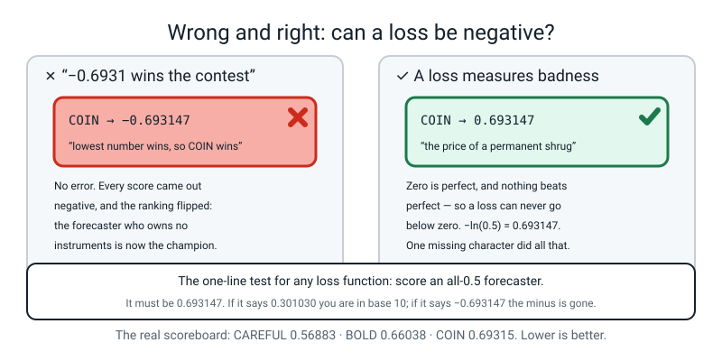
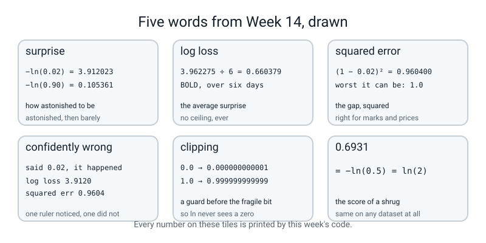

# Week 14 — Measuring How Wrong You Are

[⬅ Week 13](week-13.md) · [Course Home](../README.md) · [Next ➡](week-15.md) · [Workbook](../workbook/week-14.md)

---

> ### This week in one sentence
> **Squared error rates a confident disaster only 2.7 times worse than a near-miss. Log loss rates it 4.3 times worse and keeps going — which is why classifiers use log loss.**
>
> **By the end of this chapter you will be able to:**
> - **Press `ln` four times** and read `−ln(p)` for p = 0.9, 0.5, 0.1 and 0.02 out loud as four levels of **surprise**
> - **Score the same six predictions two ways** — log loss and squared error — and compute the ratio between a near-miss and a confident disaster under each
> - **Say in one sentence, using the word *surprise*,** why classification does not use squared error
> - **Recognise a loss stuck at `0.6931`** and say instantly what the model is doing
>
> **New maths:** **the natural logarithm `ln`, as a surprise meter.** One button, pressed four times, then read off a curve.
>
> **New syntax:** `np.log(x)` · `np.clip(p, 1e-12, 1 - 1e-12)` · `log_loss(y, prob)`
>
> **Reading time:** about 35 minutes. **Homework:** about 50 minutes.

---

## 🪝 Start Here

Last week ended badly on purpose.

A pizza order got a probability of **0.8022**. Somebody asked whether that was a good prediction, and the honest answer was *"you cannot tell yet."* This week that answer stops being acceptable.

So here is the question, twice.

**Version one.** You said there was an 80% chance the order would be late. **The order was late.** Good guess?

Most people say yes, and they are right.

**Version two.** You said there was an 80% chance the order would be late. **The order arrived on time.** Same prediction — the identical number, `0.8022`, produced by the identical arithmetic. Good guess?

Obviously not. And now the question that this whole chapter exists to answer:

> **How much worse? Give a number.**

Try it. Not "a lot worse", not "much worse" — **a number.** How many times worse is the second one than the first?

You cannot say. And it is not because you are missing something clever. **It is because nobody has built you the tool.** You own a machine that produces confidence and you own no way of pricing it.

> **loss function** — a formula that turns (what really happened, what you predicted) into a single number measuring how wrong you were. **Lower is better. Zero is perfect.**

That is what gets built this week. And by the end of the chapter you will be able to answer the question above exactly: `0.220397` for the first, `1.620499` for the second — **about 7.4 times worse**, and you will have worked both out on a calculator.

The tool is one curve, and the one new button on your calculator draws it.


*Figure 14.1 — The surprise meter. Four points worked out on a calculator, and a curve that never stops climbing.*

**Those four ringed points are four presses of one key.** You will do all four yourself in about twenty minutes, and everything else this week is built out of them.

And there is a fight coming. There are **two** perfectly reasonable ways to price a prediction, both arithmetically correct, and **they crown different winners.** Whichever one you pick, you are making a statement about what a mistake costs.

---

## 🧠 The Big Idea

> **📌 About the code in this section.** The blocks below are **illustrations, not files**. Each one carries on from the one above. **The complete runnable files are in 💻 Type This.**

### 1. Surprise: one button, and the only thing it measures

**The plain explanation.** Take the chance you gave the thing that **actually happened**, and take `ln` of it. Flip the sign. That number is how astonished you should be.

> **surprise** — how astonished you should be that a thing happened, given the chance you gave it. It is `−ln(p)`, where `p` is the chance you gave **the thing that actually happened**.

Four numbers make the whole idea:

| You said the chance was | It happened. Your surprise is | Read it out loud as |
|---|---|---|
| `0.9` | **0.105361** | "barely surprised — I said it would" |
| `0.5` | **0.693147** | "no information either way; a shrug" |
| `0.1` | **2.302585** | "genuinely surprised" |
| `0.02` | **3.912023** | "astonished; I said it basically wouldn't" |

🍕 **The analogy.** A fine for being wrong, and the size of the fine depends on **how loudly you claimed otherwise**. Say "it might rain, might not" and get it wrong and you pay almost nothing, because you never really committed. Stand on television and announce a 2% chance of rain on the day of the flood and you pay a great deal. The meter is not measuring whether you were wrong; **it is measuring how far you stuck your neck out.**

**Now look at the gaps, because the gaps are the point.**

```
from 0.9 down to 0.5 :  0.693147 − 0.105361 = 0.587786     (probability dropped by 0.40)
from 0.1 down to 0.02:  3.912023 − 2.302585 = 1.609438     (probability dropped by 0.08)
```

**The second gap is 2.7 times bigger on a probability change five times smaller.** The meter gets steeper and steeper the more confidently wrong you are.

And it **never stops**. There is no worst possible score:

```
−ln(0.001)     = 6.907755
−ln(0.0000001) = 16.118096
```

> **⚠️ Watch out:** `p` is **not** "what the model said". It is **the chance the model gave to the thing that actually happened.** If the model said 0.02 for rain and it did **not** rain, then the model gave 0.98 to the thing that happened, and the surprise is `−ln(0.98) = 0.020203` — tiny. Getting this backwards is the single most common mistake of the week, and it produces answers that look perfectly reasonable.

### 2. Log loss is that meter with an if-statement in front of it

**The plain explanation.** Section 1 assumed the thing happened. If it did **not** happen, then the chance you gave to what happened is `1 − p`. Same meter, different input. That is the whole of it:

```
if it happened:      loss = −ln(p)
if it did not:       loss = −ln(1 − p)
```

> **log loss**, also called **binary cross-entropy** or just **cross-entropy** — for one row: `−ln(p)` if the answer was yes, `−ln(1 − p)` if the answer was no. Then average over all the rows.

**In textbooks you will see it written as one line, and it looks much worse than it is:**

```
L = −[ y × ln(p) + (1 − y) × ln(1 − p) ]
```

**That is the if-statement above with the `if` hidden inside a multiplication.** Because `y` is only ever 0 or 1, one of the two halves is always multiplied by zero and disappears:

```
if y = 1:  the second half is (1 − 1) × ... = 0,  so L = −ln(p)
if y = 0:  the first half is  0 × ...       = 0,  so L = −ln(1 − p)
```

**Read the long version as the two short lines, every single time you see it.** That is not a shortcut; it is what the formula is. It is written that way only because a computer can do a multiplication faster than a branch.

**A concrete example, with real values.** Four rows, and the calculator does all four:

```
truth = YES, you said 0.90  →  −ln(0.90) = 0.105361      confident and right
truth =  no, you said 0.90  →  −ln(0.10) = 2.302585      confident and WRONG
truth = YES, you said 0.02  →  −ln(0.02) = 3.912023      confident and WRONG
truth =  no, you said 0.02  →  −ln(0.98) = 0.020203      confident and right
```

**Rows 1 and 4 are both tiny. Rows 2 and 3 are both huge.** What rows 2 and 3 have in common is not which answer they gave — one said yes and one said no. It is that **both were confident about the thing that did not happen.**

> **confidently wrong** — a prediction that was both far from 0.5 and on the wrong side. This is what log loss is built to punish, and it is the whole week.

### 3. Why not squared error? Because it has a ceiling

**The plain explanation.** You have used squared error since Level 2. Take the gap, square it.

> **squared error** — `(truth − prediction)²`. Averaged over the rows it is **mean squared error**, and it is the correct loss for **regression** — predicting house prices, predicting exam marks, anything on a continuous scale.

Every instinct says use it here too. It is small when you are right and large when you are wrong. So why not?

**Because of what it charges for a catastrophe.** Take a row where the answer was **YES**:

| Your prediction | What it is | Squared error | Log loss |
|---|---|---|---|
| `0.40` | mildly wrong — a near miss | `(1 − 0.40)² = 0.3600` | `−ln(0.40) = 0.9163` |
| `0.02` | 98% sure of the wrong answer | `(1 − 0.02)² = 0.9604` | `−ln(0.02) = 3.9120` |
| **ratio, disaster ÷ near-miss** | | **`0.9604 ÷ 0.3600 = 2.67×`** | **`3.9120 ÷ 0.9163 = 4.27×`** |

**Do those two divisions on your own calculator now.** They are the two numbers this week exists for.

Squared error says the catastrophe is under three times worse than the near-miss. **Nobody experiences it that way.** A hospital, a fraud team, a spam filter: being 98% sure of the wrong answer is not a slightly worse version of being unsure, it is a **different category of event**.

**And then there is the thing that ends the argument, and it is arithmetic, not opinion.**

> **Squared error has a ceiling. The worst it can ever charge for one row is `(1 − 0)² = 1`.**

Predict `0.02` when the answer is yes and you pay `0.9604`. Predict **one ten-millionth** and you pay `0.9999998`. **Squared error cannot tell those two apart** — they differ in the seventh decimal place. Log loss charges `3.912` for the first and `16.118` for the second.


*Figure 14.2 — The same mistake, priced two ways. One curve has a ceiling at 1 and the other does not: as p falls towards 0, the log loss curve climbs off the top of the picture while the squared error curve flattens against 1.*

🍕 **The analogy.** Two speeding fines. One says *"£50 for anything over the limit, however fast."* The other says *"£50 at 5 mph over, £500 at 30 mph over, £5,000 at 100 mph over, and it keeps going."* Both are real fine systems and both are arithmetic. **Only one of them makes you care about how fast you were going.**


*Figure 14.3 — Confident and wrong costs the most. Four predictions of the same true answer, priced twice. Log loss reads 0.1053, 0.9163, 2.3026 and 3.9120 and keeps growing; squared error reads 0.0100, 0.3600, 0.8100 and 0.9604 and is running out of room.*

> **⚠️ Watch out — do not conclude that squared error is *wrong*.** **Squared error is the correct loss for regression**, and log loss would be nonsense there — you cannot take `ln` of a house price. The claim this week makes is narrow: *for predicting probabilities*, log loss prices confident wrongness in a way squared error cannot. **Different jobs, different rulers.**

And there is one more reason, which you will **watch happen** next week rather than being told: when a model is confidently wrong, squared error's answer to "would nudging this weight help?" is almost *"no change at all"*. So the model gets no push and sits there being confidently wrong for ever. Log loss's answer is a shove.

### 4. `0.6931` — the most useful number in the rest of this course

**The plain explanation.** Here is a fact worth writing on your wall:

> **A model that answers 0.50 to every single row has a log loss of exactly `0.693147`.**

**Why:** every row's surprise is `−ln(0.5)`, **whichever way the truth went**, because the chance the model gave to the thing that happened was 0.5 either way. And `−ln(0.5) = 0.693147`, which is also `ln(2)`. Average a list of identical numbers and you get that number back.

**Two things make this the most diagnostic number in the course.**

**One: it does not depend on the data at all.** Here is the same all-0.5 model scored against a balanced dataset, and then against a dataset that is 90% class 1:

```text
log loss            : 0.693147
ln(2)               : 0.693147

and a model that answers 0.5 to a 90-percent-class-1 dataset:
log loss            : 0.693147
```

**Identical.** So if you ever see `0.6931`, you have learned something about the **model**, and nothing about the data.

**Two: it is exactly what a model looks like when it has learned nothing.** Next week every training run starts with all the weights set to zero, which makes every raw score zero, which makes every probability exactly 0.5 — Week 13's third property, doing real work. **So every training run in this course begins at `0.6931` and should immediately start falling.** If it sits there, the model is not learning.

**The three things to check, in this order:**

| If the loss is parked at 0.6931 | Print this | And if it is… |
|:--:|---|---|
| 1 | **the weights** | still all zero → nothing is being updated; the update step is missing or the learning rate is so small nothing moved |
| 2 | **the features** | all zero, or all identical → a scaler applied to the wrong thing, or a column selected that does not exist |
| 3 | **`np.unique(y)`** | one value only → a model cannot learn to separate one class from itself |


*Figure 14.4 — A loss parked at 0.6931. Five hundred steps and it has not moved, because the model answered 0.50 to every row and each row cost −ln(0.50) = 0.693147.*

> **🤔 Think about it:** is `0.6931` a bad score? It is **exactly average**, in the most literal sense — it is the score of guessing. On balanced data, anything below it means the model knows something (on skewed data a model that merely answers the base rate already scores lower: a dataset that is 90% class 1 gives `0.325` for a constant `0.9`). Anything **above** it means the model is actively worse than guessing, which is a real thing that happens, and you will see it next week with a loss of 7.8482.

---

## 🔢 The Maths, Slowly

**One new button, and it is the one directly below last week's.** That is the entire new maths of this week.

### Step 1 — find the button and press it four times

Find the `ln` key. On almost every calculator it is a **primary key** — you do not need `SHIFT` or `2nd`. It sits right where `e^x` was hiding last week, because the two are the same operation run backwards.

**The recipe: type the number, press `ln`.** That is it.

| Type this | Press | You should see |
|---|---|---|
| `0.9` | `ln` | `−0.105361` |
| `0.5` | `ln` | `−0.693147` |
| `0.1` | `ln` | `−2.302585` |
| `0.02` | `ln` | `−3.912023` |

**Do those four now, on a real calculator, before you read on.** This is the "check it yourself" step and the rest of the week rests on it.

> **⚠️ Watch out:** `log` and `ln` are **different keys and they sit next to each other.** If you get `−1.69897` instead of `−3.912023`, you pressed `log`, which is log base 10. Step 4 explains why they are cousins and why swapping them is the nastiest bug in this chapter.

### Step 2 — see that `ln` undoes `e^x`

This takes fifteen seconds and it is worth doing once, because after you have done it `ln` stops feeling like magic for ever.

```
press 0.02, then ln   →  −3.912023
now press e^x on that →   0.02
```

**There and back.** `ln(x)` answers the question *"what power do I raise `e` to, to get `x`?"* — so it is the exact undoing of last week's `e^x`, the way minus undoes plus.

You already used this, once, last week without much ceremony: `z = ln(odds)`. **This week that button becomes the whole lesson.**

### Step 3 — notice that every answer is negative, and why

Read the column from step 1. **Every single answer is negative.**

That is not a fault. `ln(1)` is exactly **0**, and `ln` of anything **below** 1 is below zero. And probabilities are always below 1. So this was always going to happen:

```
ln(1)    =  0
ln(0.9)  = −0.105361     just below 1, so just below 0
ln(0.02) = −3.912023     far below 1, so far below 0
```

**So we stick a minus sign on the front and they all flip positive.** That is the entire reason log loss is written with a minus out in front. It is not decoration; without it every loss would be negative, and a negative loss is meaningless.

### Step 4 — check it yourself: `ln` and `log` differ by one fixed number

```
ln(0.02)    = −3.912023
log10(0.02) = −1.698970
−3.912023 ÷ −1.698970 = 2.302585
```

**And `2.302585` is `ln(10)`.** Every single time. The two logarithms are the same idea measured in different units, like centimetres and inches — so dividing by a constant, which is what swapping them does, **never changes which prediction is worse than which.**

**That is exactly what makes the mix-up dangerous.** Your program will run, your rankings will all be right, and every number on the screen will be wrong. Section 💻 Type This makes it happen on purpose.

> **🔢 The maths, slowly:** why `ln` and not `log`? Because of what happens next week. To improve a model you need to know how much the loss changes when a weight is nudged — and because `ln` is the exact partner of `e^x`, and the sigmoid is built out of `e^x`, **the two cancel** and the answer turns out to be `prediction − truth`. Nothing else. With base 10 you would get the same thing divided by `2.302585` for ever (the whole loss is divided by it, so its slope is too). **`ln` is not a law of nature; it is the base that makes the sigmoid's mess cancel.**

### Step 5 — the three sums that make the whole week

Every number in this chapter comes out of these. Do all three:

```
1.  −ln(0.9)  and  −ln(0.02)                 the meter, at both ends
    0.105361            3.912023

2.  3.9120 ÷ 0.9163  =  4.27                 what log loss charges for a disaster
    0.9604 ÷ 0.3600  =  2.67                 what squared error charges for the same one

3.  −ln(0.5)  =  0.693147  =  ln(2)          the price of a permanent shrug
```

**Look back at Figure 14.1.** The four ringed points are your four calculator presses from step 1, and the curve just joins them up and keeps climbing off the top of the page. You drew that, with a calculator, before anybody typed any code.

---

## 💻 Type This

Three short files. `contest.py` is the main one, built in five steps, with two mistakes made on purpose. Then `guard.py`, which fixes something that was left broken last week, and `parked.py`, which proves the `0.6931` claim.

### Step 1 — six days, three forecasters, and one function

```python
import numpy as np

rained = np.array([1, 1, 0, 1, 0, 0])

bold    = np.array([0.99, 0.99, 0.01, 0.02, 0.01, 0.01])
careful = np.array([0.60, 0.55, 0.45, 0.55, 0.40, 0.45])
coin    = np.array([0.50, 0.50, 0.50, 0.50, 0.50, 0.50])


def surprise(y, p):
    return -(y * np.log(p) + (1 - y) * np.log(1 - p))


print("BOLD   :", np.round(surprise(rained, bold), 4))
print("CAREFUL:", np.round(surprise(rained, careful), 4))
print("COIN   :", np.round(surprise(rained, coin), 4))
```

```text
BOLD   : [0.0101 0.0101 0.0101 3.912  0.0101 0.0101]
CAREFUL: [0.5108 0.5978 0.5978 0.5978 0.5108 0.5978]
COIN   : [0.6931 0.6931 0.6931 0.6931 0.6931 0.6931]
```

**What the new lines do.**

- `rained` is the truth for six real days. `1` means it rained. It is only six numbers long so that you can check every one by hand.
- The three forecasters are three characters, and you can read the story off the numbers before any arithmetic. **BOLD** commits — 99% or 1%, nothing in between. **CAREFUL** never commits, but is on the right side of a half every single day. **COIN** does not own a barometer.
- `np.log(x)` is **`ln`**, done to every item in a list at once. **It is not log base 10** — that is `np.log10`, and mixing them up is step 3.
- The `surprise` function is section 2's formula, typed exactly as the textbook writes it. Because `y` is 0 or 1, one half always vanishes.

**Now read the first line of output and let it sit.** Five of BOLD's six days cost about a hundredth. **One costs 3.912.** That is day 4 — BOLD said a 2% chance of rain, and it rained.

**One day out of six is contributing more than three hundred times what any other day contributes.** Log loss is not just scoring the forecaster; **it is pointing at the exact day that went wrong.** When a loss is high, look for the rows carrying it.

**And read COIN's line:** six identical `0.6931`s. That is `−ln(0.5)`, six times over.

### Step 2 — the mistake on purpose: drop the minus sign

Delete the leading `-` from `surprise` and average the three:

```python
def surprise(y, p):
    return (y * np.log(p) + (1 - y) * np.log(1 - p))   # the minus sign is gone


for name, p in [("BOLD   ", bold), ("CAREFUL", careful), ("COIN   ", coin)]:
    print(name + ":", "%.6f" % float(np.mean(surprise(rained, p))))
```

```text
BOLD   : -0.660379
CAREFUL: -0.568833
COIN   : -0.693147
```

**Any error message? None.** And the damage is total.

**A loss can never be negative.** Zero means perfect, and there is nothing better than perfect. So a negative loss is not a bad score — **it is a broken score.**

**And look what happened to the ranking.** Lower is better, so the most negative number wins, so **COIN** — the forecaster who owns no instruments — is now the champion. One missing character flipped the entire result.

> **🐞 If you see this error:** there is no error. The rule that catches it is this: **a loss is never negative. If you see a minus, you have lost a minus.** It is the cheapest diagnostic in the whole course.

### Step 3 — the second mistake on purpose: `np.log10`

Put the minus back, then change both `np.log` calls to `np.log10`:

```python
def surprise(y, p):
    return -(y * np.log10(p) + (1 - y) * np.log10(1 - p))   # log10, not log


print("%-9s %12s %12s" % ("forecaster", "log loss", "squared err"))
for name, p in [("Bold", bold), ("Careful", careful), ("Coin", coin)]:
    ll = float(np.mean(surprise(rained, p)))
    se = float(np.mean((rained - p) ** 2))
    print("%-9s %12.5f %12.5f" % (name, ll, se))
```

```text
forecaster     log loss  squared err
Bold           0.28680      0.16015
Careful        0.24704      0.18833
Coin           0.30103      0.25000
```

**This is the most dangerous kind of bug in the whole course, and it is worth looking at properly.**

Nothing crashed. Every number is positive. **The ranking is exactly right** — CAREFUL beats BOLD beats COIN, same as the correct version. If you only cared who won, you would never notice.

But every value is wrong, all by the same factor:

```
0.693147 ÷ 0.301030 = 2.302584...       and  np.log(10) = 2.302585...
```

So how would you ever catch it? **With one number you already know.** COIN answers 0.5 to everything, so its true log loss is `0.693147`. The screen says `0.30103`. **You caught it because you knew one right answer in advance.**

> **💡 Try this:** whenever you write a loss function, score an all-0.5 forecaster with it before you trust it. It must come out at `0.693147`. That is a one-line test for a loss function and it will keep working for the next two years.

### Step 4 — the two scoreboards, and scikit-learn marking our homework

Put `np.log` back, then add the second ruler and the library check:

```python
from sklearn.metrics import log_loss

print("%-9s %12s %12s" % ("forecaster", "log loss", "squared err"))
for name, p in [("Bold", bold), ("Careful", careful), ("Coin", coin)]:
    ll = float(np.mean(surprise(rained, p)))
    se = float(np.mean((rained - p) ** 2))
    print("%-9s %12.5f %12.5f" % (name, ll, se))
print()
print("sklearn log_loss, Bold   :", "%.5f" % log_loss(rained, bold))
print("sklearn log_loss, Careful:", "%.5f" % log_loss(rained, careful))
print("sklearn log_loss, Coin   :", "%.5f" % log_loss(rained, coin))
```

```text
forecaster     log loss  squared err
Bold           0.66038      0.16015
Careful        0.56883      0.18833
Coin           0.69315      0.25000

sklearn log_loss, Bold   : 0.66038
sklearn log_loss, Careful: 0.56883
sklearn log_loss, Coin   : 0.69315
```

**What the new lines do.** `(rained - p) ** 2` subtracts item by item and squares each one — **that is squared error, in one line.** `np.mean` averages a list. `float(...)` turns numpy's answer into a plain number so the `%` formatting behaves. And `log_loss(y, prob)` is scikit-learn's own version, whose only job today is to agree with us.

**Look at the sklearn lines first: five decimal places, identical to ours.** Same move as last week, when we matched `predict_proba` to twelve decimals. **We marked the library's homework and it passed.**

**Now read down the two columns, slowly.**

| | Log loss says | Squared error says |
|---|---|---|
| Bold | 0.66038 | **0.16015 ← best** |
| Careful | **0.56883 ← best** | 0.18833 |
| Coin | 0.69315 | 0.25000 |

**Different winner. Same six days. Same three forecasters. Both columns computed correctly.**

**And the reason is one number.** Look at day 4:

```
                      BOLD's worst day     CAREFUL's whole week
log loss                  3.9120       >         3.4130
squared error             0.9604       <         1.1300
```

Under log loss, BOLD's single disaster costs **more than CAREFUL's entire six days put together**. Under squared error, the same disaster costs **less** than CAREFUL's week of hedging. **One catastrophe bigger than a whole scoreboard, or smaller than it, depending on which ruler you picked.**

### The complete file — `contest.py`

**Runtime: under a second. Nothing trains, nothing downloads.**

```python
"""contest.py - three forecasters, six days, two scoreboards."""
import numpy as np
from sklearn.metrics import log_loss

rained = np.array([1, 1, 0, 1, 0, 0])

bold    = np.array([0.99, 0.99, 0.01, 0.02, 0.01, 0.01])
careful = np.array([0.60, 0.55, 0.45, 0.55, 0.40, 0.45])
coin    = np.array([0.50, 0.50, 0.50, 0.50, 0.50, 0.50])


def surprise(y, p):
    return -(y * np.log(p) + (1 - y) * np.log(1 - p))


print("day  rained    Bold  surprise   Careful  surprise    Coin  surprise")
sb, sc, sk = surprise(rained, bold), surprise(rained, careful), surprise(rained, coin)
for i in range(6):
    print("%3d %7d  %6.2f %9.4f %9.2f %9.4f %7.2f %9.4f"
          % (i + 1, rained[i], bold[i], sb[i], careful[i], sc[i], coin[i], sk[i]))

print()
print("%-9s %12s %12s" % ("forecaster", "log loss", "squared err"))
for name, p in [("Bold", bold), ("Careful", careful), ("Coin", coin)]:
    ll = float(np.mean(surprise(rained, p)))
    se = float(np.mean((rained - p) ** 2))
    print("%-9s %12.5f %12.5f" % (name, ll, se))

print()
print("sklearn log_loss, Bold   :", "%.5f" % log_loss(rained, bold))
print("sklearn log_loss, Careful:", "%.5f" % log_loss(rained, careful))
print("sklearn log_loss, Coin   :", "%.5f" % log_loss(rained, coin))
```

**Real output:**

```text
day  rained    Bold  surprise   Careful  surprise    Coin  surprise
  1       1    0.99    0.0101      0.60    0.5108    0.50    0.6931
  2       1    0.99    0.0101      0.55    0.5978    0.50    0.6931
  3       0    0.01    0.0101      0.45    0.5978    0.50    0.6931
  4       1    0.02    3.9120      0.55    0.5978    0.50    0.6931
  5       0    0.01    0.0101      0.40    0.5108    0.50    0.6931
  6       0    0.01    0.0101      0.45    0.5978    0.50    0.6931

forecaster     log loss  squared err
Bold           0.66038      0.16015
Careful        0.56883      0.18833
Coin           0.69315      0.25000

sklearn log_loss, Bold   : 0.66038
sklearn log_loss, Careful: 0.56883
sklearn log_loss, Coin   : 0.69315
```

**Read day 3 in that table one more time, because it is the row that catches people.** It did **not** rain, and BOLD said `0.01`. So the chance BOLD gave the thing that happened was `0.99`, and the surprise is `0.0101` — **tiny, because BOLD was confidently right.** Anybody who writes `−ln(0.01) = 4.605` there has inverted the whole thing.

### Step 5 — the `nan` that was left waiting for you

Last week you were told: *"the sigmoid can never really be 0, and the computer says 0 anyway, and that bites next week."*

**This is next week.** Feed the loss two dead-certain predictions:

```python
y = np.array([1, 1, 0, 0])
p = np.array([0.9, 1.0, 0.0, 0.3])       # rows 2 and 3 are dead certain
raw = -(y * np.log(p) + (1 - y) * np.log(1 - p))
print("per row :", raw)
print("mean    :", raw.mean())
```

```text
guard.py:9: RuntimeWarning: divide by zero encountered in log
  raw = -(y * np.log(p) + (1 - y) * np.log(1 - p))
guard.py:9: RuntimeWarning: invalid value encountered in multiply
  raw = -(y * np.log(p) + (1 - y) * np.log(1 - p))
per row : [0.10536052        nan        nan 0.35667494]
mean    : nan
```

**Follow row 2 through, because it is stranger than it looks.** The truth was yes and the forecaster said `1.0` — **a perfect prediction.** The first half is `1 × ln(1) = 0`, which is fine. The second half is `(1 − 1) × ln(1 − 1)`, which is `0 × ln(0)`, which is **zero times minus infinity**.

**And there is no answer to that.** Not zero, not infinity — genuinely no answer. So numpy writes `nan`: **not a number.**

Then look at the mean. **`nan`.** Two poisoned rows out of four destroyed the average of all four. **This is how a training run dies at epoch 300 of 500 having worked perfectly for the first 299.**

**The fix is one line:**

```python
p_safe = np.clip(p, 1e-12, 1 - 1e-12)
```

> **clipping**, or a **numerical guard** — squashing every value into a safe range before it goes into something fragile. `np.clip(p, low, high)` replaces anything below `low` with `low` and anything above `high` with `high`.

`1e-12` is scientific notation for `0.000000000001`. So a probability of exactly 0 becomes `0.000000000001`, and exactly 1 becomes `0.999999999999`. **Neither is meaningfully different as a probability, and neither breaks `ln`.**

### The complete file — `guard.py`

**Runtime: under a second. Nothing trains, nothing downloads.**

```python
"""guard.py - what ln(0) does to a loss, and the one line that stops it."""
import numpy as np
from sklearn.metrics import log_loss

y = np.array([1, 1, 0, 0])
p = np.array([0.9, 1.0, 0.0, 0.3])       # rows 2 and 3 are dead certain

print("--- no guard ---")
raw = -(y * np.log(p) + (1 - y) * np.log(1 - p))
print("per row :", raw)
print("mean    :", raw.mean())

print()
print("--- with the guard ---")
p_safe = np.clip(p, 1e-12, 1 - 1e-12)
print("p after clip:", p_safe)
guarded = -(y * np.log(p_safe) + (1 - y) * np.log(1 - p_safe))
print("per row :", np.round(guarded, 6))
print("mean    : %.6f" % guarded.mean())

print()
print("sklearn log_loss:", "%.6f" % log_loss(y, p))
print("1 - p_safe[1]   :", 1 - p_safe[1])
```

**Real output:**

```text
guard.py:9: RuntimeWarning: divide by zero encountered in log
  raw = -(y * np.log(p) + (1 - y) * np.log(1 - p))
guard.py:9: RuntimeWarning: invalid value encountered in multiply
  raw = -(y * np.log(p) + (1 - y) * np.log(1 - p))
--- no guard ---
per row : [0.10536052        nan        nan 0.35667494]
mean    : nan

--- with the guard ---
p after clip: [9.e-01 1.e+00 1.e-12 3.e-01]
per row : [0.105361 0.       0.       0.356675]
mean    : 0.115509

sklearn log_loss: 0.115509
1 - p_safe[1]   : 9.999778782798785e-13
```

**Three things worth pointing at.**

1. **Row 2 now costs `0.000000`** — a perfect prediction, correctly priced at nothing. The loss was always right; it was the *route* to it that died.
2. **scikit-learn's `log_loss` gives exactly the same answer as our clipped version** — `0.115509`, not `nan`. **Because scikit-learn clips too.** Every real implementation does. We did not invent a hack; we did visibly what the library does invisibly.
3. **The clipped array prints `1.e+00` and looks unclipped.** It is not — numpy printed four significant figures of `0.999999999999`. The last line proves it: `1 - p_safe[1]` is `9.999778782798785e-13`. **Display versus value, the same trap as last week's rounded weights.**

### And the file that proves `0.6931` — `parked.py`

```python
"""parked.py - the loss of a model that answers 0.5 to everything."""
import numpy as np
from sklearn.datasets import make_classification
from sklearn.metrics import log_loss

np.random.seed(0)

X, y = make_classification(n_samples=200, n_features=2, n_informative=2,
                           n_redundant=0, random_state=0)

w = np.array([0.0, 0.0])
b = 0.0
z = w[0] * X[:, 0] + w[1] * X[:, 1] + b
p = 1.0 / (1.0 + np.exp(-z))

print("all 200 z values are:", np.unique(z))
print("all 200 p values are:", np.unique(p))
print("log loss            : %.6f" % log_loss(y, p))
print("ln(2)               : %.6f" % np.log(2.0))
print("sklearn agrees      :", abs(log_loss(y, p) - np.log(2.0)) < 1e-12)
print()
print("and a model that answers 0.5 to a 90-percent-class-1 dataset:")
y_skew = np.zeros(200, dtype=int)
y_skew[:180] = 1
print("log loss            : %.6f" % log_loss(y_skew, p))
```

**Real output, runtime under a second:**

```text
all 200 z values are: [0.]
all 200 p values are: [0.5]
log loss            : 0.693147
ln(2)               : 0.693147
sklearn agrees      : True

and a model that answers 0.5 to a 90-percent-class-1 dataset:
log loss            : 0.693147
```

**`np.unique` lists the distinct values in a list.** There is exactly **one** raw score across all 200 rows — zero, because both weights are zero — and exactly **one** probability, `0.5`, because `sigmoid(0)` is exactly a half.

**Then the two log losses.** Balanced dataset: `0.693147`. Ninety-per-cent-skewed dataset: `0.693147`. **The labels never enter the arithmetic**, because when `p = 0.5` both branches of the loss are the same number. That is why `0.6931` tells you about your model and nothing about your data.

---

## 🔍 Worked Examples

Three complete programs, in three different worlds.

### Worked Example 1 — Scoring a spam filter (three messages)

**The question:** a filter looked at three messages and gave each a probability of being spam. Two really were spam, one was not. **How badly did it do, and which message cost the most?**

| Message | Really spam? | Filter said |
|:--:|:--:|:--:|
| 1 | yes | 0.95 |
| 2 | no | 0.30 |
| 3 | yes | 0.10 |

**By hand first, and the middle column is the one that matters:**

```
msg 1: it WAS spam, filter gave spam 0.95   →  −ln(0.95) = 0.051293
msg 2: it was NOT spam, filter gave not-spam 0.70  →  −ln(0.70) = 0.356675
msg 3: it WAS spam, filter gave spam 0.10   →  −ln(0.10) = 2.302585
```

**Message 2 is the one to watch.** The filter *said* 0.30, but the thing that happened was "not spam", and the chance it gave to that was `1 − 0.30 = 0.70`. **Use `p` on message 2 and you get 1.203973, which is more than three times too big.**

```python
"""we1_spam.py - scoring a spam filter's three guesses."""
import numpy as np
from sklearn.metrics import log_loss

np.random.seed(0)

spam = np.array([1, 0, 1])                  # what the message really was
p    = np.array([0.95, 0.30, 0.10])         # what the filter said

chance_given_to_truth = np.where(spam == 1, p, 1 - p)
loss_per_row = -np.log(chance_given_to_truth)

print("msg  really spam?  filter said   chance given to truth   surprise")
for i in range(3):
    print("%3d %12d %13.2f %23.2f %10.6f"
          % (i + 1, spam[i], p[i], chance_given_to_truth[i], loss_per_row[i]))
print()
print("total surprise   : %.6f" % loss_per_row.sum())
print("log loss (mean)  : %.6f" % loss_per_row.mean())
print("sklearn log_loss : %.6f" % log_loss(spam, p))
print("squared error    : %.6f" % float(np.mean((spam - p) ** 2)))
```

**Real output, instant:**

```text
msg  really spam?  filter said   chance given to truth   surprise
  1            1          0.95                    0.95   0.051293
  2            0          0.30                    0.70   0.356675
  3            1          0.10                    0.10   2.302585

total surprise   : 2.710553
log loss (mean)  : 0.903518
sklearn log_loss : 0.903518
squared error    : 0.300833
```

**Two things.** `np.where(spam == 1, p, 1 - p)` — Week 13's syntax — builds the "chance given to the thing that happened" column explicitly, which is worth doing once so you can **see** the thing everybody gets wrong. And **message 3 alone carries `2.302585` of the `2.710553` total — 85% of it.** The whole score is one message. **Find that message and you have found your problem.**

### Worked Example 2 — How low can you go? (the ceiling, measured)

**The question:** the answer was **YES** every time. A model gives five different wrong-ish answers, getting steadily more confident about the wrong thing. **What does each ruler charge, and where does squared error give up?**

```python
"""we2_ceiling.py - the answer was YES. How low can you go, and what does it cost?"""
import numpy as np

np.random.seed(0)

guesses = np.array([0.40, 0.10, 0.02, 0.001, 0.0000001])

print("      guess     log loss   squared error")
for g in guesses:
    print("%11.7f %12.6f %15.7f" % (g, -np.log(g), (1 - g) ** 2))
print()
print("log loss,      worst / near-miss : %.6f / %.6f = %.2f"
      % (-np.log(0.0000001), -np.log(0.40), -np.log(0.0000001) / -np.log(0.40)))
print("squared error, worst / near-miss : %.6f / %.6f = %.2f"
      % ((1 - 0.0000001) ** 2, (1 - 0.40) ** 2, (1 - 0.0000001) ** 2 / (1 - 0.40) ** 2))
print()
print("the very worst squared error is  : %.6f" % (1 - 0.0) ** 2)
print("the very worst log loss is       : there isn't one")
```

**Real output, instant:**

```text
      guess     log loss   squared error
  0.4000000     0.916291       0.3600000
  0.1000000     2.302585       0.8100000
  0.0200000     3.912023       0.9604000
  0.0010000     6.907755       0.9980010
  0.0000001    16.118096       0.9999998

log loss,      worst / near-miss : 16.118096 / 0.916291 = 17.59
squared error, worst / near-miss : 1.000000 / 0.360000 = 2.78

the very worst squared error is  : 1.000000
the very worst log loss is       : there isn't one
```

**Read down the two columns.** Log loss goes `0.92 → 2.30 → 3.91 → 6.91 → 16.12` and shows no sign of stopping. Squared error goes `0.36 → 0.81 → 0.96 → 0.998 → 0.9999998` and is **visibly running out of room.**

**The two ratios are the punchline: `17.59×` against `2.78×`.** Same five predictions, same truth, both columns arithmetically perfect.

> **💡 Try this:** notice that the printed squared-error ratio says `1.000000 / 0.360000`. The real numerator is `0.9999998` — `%.6f` rounded it to six places and it became exactly 1. **That is not a display bug; it is the whole argument.** Squared error cannot tell a one-in-ten-million mistake from a total one, so a print statement cannot either.

### Worked Example 3 — Where the loss actually lives (a real trained model)

**The question:** last week you trained a real logistic regression on 200 generated rows. **What is its log loss, how does that compare with knowing nothing, and which single row is doing the damage?**

```python
"""we3_realmodel.py - scoring a real trained model, and finding its worst row."""
import numpy as np
from sklearn.datasets import make_classification
from sklearn.linear_model import LogisticRegression
from sklearn.metrics import log_loss

np.random.seed(0)

X, y = make_classification(n_samples=200, n_features=2, n_informative=2,
                           n_redundant=0, random_state=0)
model = LogisticRegression().fit(X, y)
p = model.predict_proba(X)[:, 1]

know_nothing = np.full(200, 0.5)

print("a model that answers 0.5 to everything : %.6f" % log_loss(y, know_nothing))
print("the trained model                      : %.6f" % log_loss(y, p))
print()

per_row = -(y * np.log(p) + (1 - y) * np.log(1 - p))
worst = int(np.argmax(per_row))
print("the single worst row is row", worst)
print("   truth was      :", y[worst])
print("   model said     : %.6f" % p[worst])
print("   its surprise   : %.6f" % per_row[worst])
print("   average row    : %.6f" % per_row.mean())
print("   so that one row is %.1f times an average row" % (per_row[worst] / per_row.mean()))
print()
print("rows costing more than 2.0 :", int((per_row > 2.0).sum()), "out of 200")
print("they carry %.1f%% of the whole loss"
      % (100.0 * per_row[per_row > 2.0].sum() / per_row.sum()))
```

**Real output, runtime under a second:**

```text
a model that answers 0.5 to everything : 0.693147
the trained model                      : 0.144590

the single worst row is row 178
   truth was      : 0
   model said     : 0.931105
   its surprise   : 2.675179
   average row    : 0.144590
   so that one row is 18.5 times an average row

rows costing more than 2.0 : 3 out of 200
they carry 25.4% of the whole loss
```

**Three things in that printout.**

1. **`0.693147` appears again**, and this time it is a *baseline* rather than a bug: the score to beat. The trained model gets `0.144590`, which is **4.8 times better than knowing nothing.** That comparison is the first thing to print about any classifier you ever train.
2. **`np.argmax` gives the position of the biggest item.** Row 178: the truth was **no**, and the model said **0.931105**. Confident, and wrong. It cost `2.675179` — **18.5 times what an average row costs.**
3. **Three rows out of two hundred carry a quarter of the entire loss.** That is the property from step 1 of Type This, on real data: **a log loss is not a flat average of equal mistakes. It is a handful of confident disasters and a lot of quiet agreement.** When your loss is worse than you expected, sort by `per_row` and read the top five.

---

## 🐞 When It Breaks

Every message below came from really running a broken version of this week's code.

### Break 1 — `divide by zero`, then `nan` everywhere

```python
y = np.array([1, 1, 0, 0])
p = np.array([0.9, 1.0, 0.0, 0.3])
print(-(y * np.log(p) + (1 - y) * np.log(1 - p)))
```

```text
guard.py:9: RuntimeWarning: divide by zero encountered in log
guard.py:9: RuntimeWarning: invalid value encountered in multiply
[0.10536052        nan        nan 0.35667494]
```

**What Python is telling you.** The first warning: *"you asked me for `ln(0)`, which is minus infinity."* The second: *"and then something multiplied that infinity by zero, and there is no answer to that."* **These two almost always arrive together.**

**How to find it.** Print `p.min()` and `p.max()`. If either is exactly `0.0` or exactly `1.0`, you have found it.

**The fix.** `p = np.clip(p, 1e-12, 1 - 1e-12)` **before** the log.

### Break 2 — raw scores handed to `log_loss`

```python
y = np.array([1, 0, 1])
z = np.array([1.2, -0.4, 2.8])       # raw scores, not probabilities
print(log_loss(y, z))
```

```text
ValueError: y_prob contains values greater than 1: 2.8
```

**What Python is telling you.** *"That is not a probability."* A `2.8` cannot be a chance of anything.

**How to find it.** The message hands you the culprit: `2.8`. **Ask yourself whether the thing you passed in could ever be 2.8.** If it could, it is a raw score.

**The fix.** Put the scores through the sigmoid first. **This is Week 13's entire lesson, arriving as an error message.**

### Break 3 — only one class in the truth column

```python
y = np.array([1, 1, 1])
p = np.array([0.9, 0.8, 0.7])
print(log_loss(y, p))
```

```text
ValueError: y_true contains only one label (1). Please provide the list of all expected class labels explicitly through the labels argument.
```

**What Python is telling you.** *"Every row has the same answer, so there is nothing to be right or wrong about."* And it is right to refuse — a loss compares two classes, and you gave it one.

**How to find it.** `print(np.unique(y))`. One value means one class.

**The fix.** Include both classes. You can pass `labels=[0, 1]` if you genuinely mean it, but in a real pipeline **this almost always means your split went wrong** and put every positive row on one side.

### Break 4 — a plain Python list where numpy was expected

```python
y = [1, 0, 1]
p = [0.9, 0.2, 0.7]
print(-(y * np.log(p) + (1 - y) * np.log(1 - p)))
```

```text
Traceback (most recent call last):
  File "e5.py", line 5, in <module>
    print(-(y * np.log(p) + (1 - y) * np.log(1 - p)))
TypeError: unsupported operand type(s) for -: 'int' and 'list'
```

**What Python is telling you.** *"You asked me for `1 − [1, 0, 1]`, and you cannot subtract a list from a number."* In plain Python a list is a sequence, not a vector — `[1, 0, 1] * 2` makes a six-item list, and `1 - [1, 0, 1]` makes no sense at all.

**The fix.** `y = np.array([1, 0, 1])`. **Every truth column and every probability column in this course is a numpy array, and this is why.**

### The whole clinic, for reference

| What you see | What it means | The fix |
|---|---|---|
| `RuntimeWarning: divide by zero encountered in log` | "You asked for `ln(0)`" | A probability was exactly 0 or 1. `np.clip(p, 1e-12, 1 - 1e-12)` |
| `RuntimeWarning: invalid value encountered in multiply` then `nan` | "Zero times infinity has no answer" | The same clip. These two arrive as a pair |
| `ValueError: y_prob contains values greater than 1: 1.2` | "That is not a probability" | Sigmoid the raw scores first |
| `ValueError: y_true contains only one label (1).` | "Nothing to be right or wrong about" | Include both classes, or pass `labels=[0, 1]` |
| `ValueError: Found input variables with inconsistent numbers of samples: [3, 4]` | "Four answers, three predictions" | `print(len(y), len(p))` — the cheapest check in the file |
| `TypeError: unsupported operand type(s) for -: 'int' and 'list'` | "You subtracted a list from a number" | `np.array([...])` |
| **No error.** Every loss is negative | Nothing crashed and every number is meaningless | **A loss is never negative.** The leading minus sign is missing |
| **No error.** Ranking right, every value 2.3026 times too small | Nothing crashed, the ordering is perfect, all the values are wrong | `np.log10` instead of `np.log`. **Catch it with the all-0.5 test: it must be 0.693147** |
| **No error.** Loss parked at exactly `0.6931` | The model is answering 0.50 to everything | Print the weights, then the features, then `np.unique(y)`. **In that order** |
| **No error.** A loss of `1.203973` where you expected `0.356675` | You used `p` where the truth was 0 | Use `1 − p` on rows where it did **not** happen |

---

## 🎲 What We Did In Class

If you missed it, here is the whole lesson. You need a calculator with an `ln` key, and a sheet of paper wide enough for a six-day table three times over.

**The hook.** Last week's `0.8022`, twice: once where the order was late, once where it was on time. *"How much worse is the second one? Give me a number."* Nobody could, and that was the point — **we own a machine that produces confidence and no way of pricing it.**

**Then the weather.** Six real days went on the board, truth only:

```
day       1     2     3     4     5     6
rained?  YES   YES    no   YES    no    no
```

Then three forecasters underneath, with their characters read out loud as they were written:

```
BOLD     0.99  0.99  0.01  0.02  0.01  0.01
CAREFUL  0.60  0.55  0.45  0.55  0.40  0.45
COIN     0.50  0.50  0.50  0.50  0.50  0.50
```

**Then a vote:** hands up for the best forecaster. The room split between BOLD and CAREFUL, somebody voted COIN as a joke, and **the counts were written on the board and left there.**

**Four calculator presses, everybody.** `0.9 ln` → `−0.105361`. `0.5 ln` → `−0.693147`. `0.1 ln` → `−2.302585`. `0.02 ln` → `−3.912023`. Then `e^x` on that last answer, which gave back `0.02` — **`ln` undoes `e^x`.** Then: *"every one is negative. Why?"* Because `ln(1) = 0` and every probability is below 1.

**Then the sentence, written large:**

```
−ln(p)  =  how SURPRISED you should be

     p = the chance you gave the thing that actually happened
```

**Then log loss, as an if-statement first:**

```
if it happened:      loss = −ln(p)
if it did not:       loss = −ln(1 − p)
```

and only afterwards the textbook one-liner underneath it, with the question *"`y` is 0 or 1 — what happens to each half?"* One half always vanishes. **It is the same if-statement with the `if` hidden in a multiplication.**

**Then four rows on the board**, class on calculators: `0.105361`, `2.302585`, `3.912023`, `0.020203`. *"Rows 2 and 3 are both huge. What do they have in common?"* — **confidently wrong.**

**Then squared error, and the two ratios**, every number computed by somebody's calculator:

```
                     squared error         log loss
said 0.40  →   (1 − 0.40)² = 0.3600    −ln(0.40) = 0.9163
said 0.02  →   (1 − 0.02)² = 0.9604    −ln(0.02) = 3.9120

ratio      →   2.67 ×                  4.27 ×
```

Then the ceiling: *"the very worst squared error can charge for one row is 1. Predict one ten-millionth and you pay 0.9999998. **It cannot tell those apart.** Log loss charges 3.9 and then 16.1."*

**Building `contest.py`, with two mistakes on purpose.**

| Mistake | What happened |
|---|---|
| The minus sign dropped from `surprise` | **No error.** Every loss negative, and **COIN became the champion** |
| `np.log10` instead of `np.log` | **No error, ranking perfect, every number 2.3026 times too small.** Caught only because COIN must score `0.693147` and the screen said `0.30103` |

Both went into the Bug Log, the second one as a brand-new category: **"no error, right ranking, wrong numbers."**

**The Weather Forecaster Contest.** Three teams, one card each — **BOLD**, **CAREFUL**, **COIN**. Each team totalled its own forecaster's six days by hand. For each day, two decisions and one calculator press: *did it rain? what chance did my forecaster give **that**? press `ln`, flip the sign.*

Here is the full sheet, so you can redo it at home:

| Day | Rained? | BOLD gave truth | `−ln` | CAREFUL gave truth | `−ln` | COIN gave truth | `−ln` |
|:--:|:--:|:--:|:--:|:--:|:--:|:--:|:--:|
| 1 | YES | 0.99 | 0.010050 | 0.60 | 0.510826 | 0.50 | 0.693147 |
| 2 | YES | 0.99 | 0.010050 | 0.55 | 0.597837 | 0.50 | 0.693147 |
| 3 | no | **0.99** | 0.010050 | **0.55** | 0.597837 | 0.50 | 0.693147 |
| 4 | YES | 0.02 | **3.912023** | 0.55 | 0.597837 | 0.50 | 0.693147 |
| 5 | no | **0.99** | 0.010050 | **0.60** | 0.510826 | 0.50 | 0.693147 |
| 6 | no | **0.99** | 0.010050 | **0.55** | 0.597837 | 0.50 | 0.693147 |
| | | **sum** | **3.962275** | **sum** | **3.412999** | **sum** | **4.158883** |
| | | **÷ 6** | **0.660379** | **÷ 6** | **0.568833** | **÷ 6** | **0.693147** |

**The bold numbers in the "gave truth" columns are days 3, 5 and 6, where it did not rain** — that is where every mistake in the room happened.

Cards went up. **CAREFUL won, at 0.568833.** Half the room had voted BOLD. Then the comparison that made it undeniable:

```
BOLD's single worst day    :  3.912023
CAREFUL's ENTIRE six days  :  3.412999
```

**One day. Worse than a whole week of hedging.** And COIN scored `0.6931` — *"where have you seen that number today?"*

**Then the twist.** Same six days, second column, squared error. **Everybody wrote down in pen who they thought would win, and the votes were counted before anybody computed anything.**

| Day | BOLD | CAREFUL | COIN |
|:--:|:--:|:--:|:--:|
| 1 | 0.000100 | 0.160000 | 0.250000 |
| 2 | 0.000100 | 0.202500 | 0.250000 |
| 3 | 0.000100 | 0.202500 | 0.250000 |
| 4 | **0.960400** | 0.202500 | 0.250000 |
| 5 | 0.000100 | 0.160000 | 0.250000 |
| 6 | 0.000100 | 0.202500 | 0.250000 |
| **sum** | **0.960900** | **1.130000** | **1.500000** |
| **÷ 6** | **0.160150** | **0.188333** | **0.250000** |

**BOLD won, at 0.160150.** Then the two comparisons, side by side, which is the whole explanation:

```
                      BOLD's worst day     CAREFUL's whole week
log loss                  3.9120       >         3.4130
squared error             0.9604       <         1.1300
```

*"Both columns are correct arithmetic. So which forecaster is actually better?"* **There is no answer**, and the argument ran for two minutes. Two questions steered it: *"if this was a flood warning for a town, which forecaster do you want?"* — CAREFUL, and everybody felt it. *"If it was guessing whether to bring a jacket?"* — BOLD, five days out of six.

**Then the `nan`**, live, and the one-line clip that fixed it — and the observation that **scikit-learn agrees with the clipped version**, because scikit-learn clips too.

**The closing point, pointing at the vote counts from the hook:** *"you were all right, and you were disagreeing about the price list, not about the weather. Probability-producing classifiers (logistic regression, neural networks) are trained on log loss. And now you know exactly what that choice is buying."*

**And the closing cliff.** We built a scoreboard. We can look at a model and say "your loss is 0.66" — **and then do absolutely nothing about it.** Nothing on the board makes a model better. Next week: measure the loss, ask each weight *"if I nudged you, would the loss go down?"* — which is Week 12's slope — nudge every weight the way that helps, repeat five hundred times. **That is what `.fit()` has been doing all along, and next week you write it.**

---

## 💬 Talk About It

**1. Is a lower loss always a better model?**

*Hint:* start with what the loss actually measures, which is **agreement with the labels you were given.** Then push on the labels. If they encode somebody's past decisions — who got a loan, who got flagged, who got promoted — then a loss of zero means **perfectly reproducing those decisions, including the unfair ones.** Nothing inside `−ln(p)` can notice that the labels are wrong; the formula cannot see anything except the numbers you handed it. You met this in Week 6 with leakage and in Week 9 with metrics, and it is the same lesson in a third coat. Then the harder half: **if the loss cannot tell you the labels are bad, what can?** (Somebody looking, on purpose, at what the labels mean and where they came from. There is no formula for it, which is exactly why it gets skipped.)

**2. Log loss has no ceiling. Is that a feature or a hazard?**

*Hint:* argue both sides properly, because both are real. **Feature:** a confidently wrong prediction *should* dominate your attention, and a ruler that lets one row out of two hundred carry a quarter of the total is pointing straight at your problem — you saw exactly that in Worked Example 3. **Hazard:** one mislabelled row can do the same thing. If row 178's label was simply typed in wrong, the model will contort itself to fit a mistake, and log loss will encourage it every step of the way. Both camps agree on the facts and disagree about what to do. One says clip the extremes and move on. Another says go and look at your worst hundred rows by hand before you touch the model. **The second is better advice and almost nobody follows it**, because the first is one line of code.

**3. Would it be better to train on the thing we actually care about — recall, or money?**

*Hint:* start by agreeing that log loss is almost never what anybody cares about. A fraud team cares about **recall at a precision they can staff**; a hospital cares about missed cases weighted by consequence. Nobody has ever been fired for a log loss of 0.31. So why train on it? **Because you have to be able to roll downhill on it, and you cannot roll downhill on recall.** Recall *counts* things — it jumps as predictions cross the threshold and is perfectly flat in between, and a flat surface has no downhill to follow. So everybody does a two-step: train on a smooth loss you can descend, then tune the threshold against the metric you care about — which is what you did in Week 10 without knowing it was a workaround. **Then the genuinely unresolved bit:** some people think that two-step leaves real performance on the table and we should build losses shaped like the business metric; others think metric-shaped losses are fragile and hard to train. Both camps have good results.

---

## ⚠️ Don't Get Tricked

### Trick 1 — "`p` is what the model said"

| ❌ Wrong | ✅ Right |
|---|---|
| "The model said 0.30, so the loss is `−ln(0.30) = 1.203973`." | **Only if the thing happened.** If it did not, the chance the model gave to what *did* happen is `1 − 0.30 = 0.70`, and the loss is `−ln(0.70) = 0.356675`. **That is 3.4 times smaller.** |

**The question to ask, every single time, out loud: "what chance did the model give to the thing that actually happened?"** In the contest, days 3, 5 and 6 are where this costs marks, because those are the days it did not rain.

### Trick 2 — "no error message means the loss is right"


*Figure 14.5 — Wrong and right: can a loss be negative? On the left, with the minus sign dropped, COIN scores −0.693147 and "lowest wins" crowns the forecaster who owns no instruments. On the right, with the minus sign in place, COIN scores +0.693147 and finishes last.*

| ❌ Wrong | ✅ Right |
|---|---|
| "It ran, it printed three numbers, the ranking looks sensible, so it works." | Drop the minus sign and it still runs, still prints three numbers, and **the ranking is exactly inverted.** Use `np.log10` and it still runs, the ranking is *perfect*, and every value is `2.3026` times too small. |

**Two facts catch almost every loss-function bug you will ever write:**

1. **A loss is never negative.** Zero is perfect; nothing beats perfect.
2. **An all-0.5 model scores exactly `0.693147`.** If yours does not, the base, the sign or the averaging is wrong.

### Trick 3 — "`0.6931` means the data is bad"

| ❌ Wrong | ✅ Right |
|---|---|
| "The loss is stuck at 0.6931, so the dataset is too hard." | `0.6931` **does not depend on the data at all.** `parked.py` gets `0.693147` from a balanced dataset and `0.693147` from a 90%-skewed one. It is a statement about the **model**: it is answering 0.50 to every row and has learned nothing. |

Print the weights, then the features, then `np.unique(y)`. **In that order.**

### Trick 4 — "log loss is better than squared error"

| ❌ Wrong | ✅ Right |
|---|---|
| "Squared error is the bad one." | **Squared error is the correct loss for regression.** House prices, exam marks, temperatures — you cannot take `ln` of a house price, and log loss would be nonsense there. The claim is narrow: **for probabilities**, log loss prices confident wrongness and squared error cannot, because it stops at 1 per row. |

**Different jobs, different rulers.** Which one you reach for is a statement about what a mistake costs.

---

## 🌍 Where You've Seen This

1. **Weather services, since the 1950s.** Forecasters have been scored on probability losses for seventy years. The squared-error version even has a name — the **Brier score**, after the meteorologist who proposed it in 1950 — and log loss is used alongside it. **The argument you just had in class is a real argument meteorologists have had**, because the two rules charge very differently for a confident miss, so they can rank the same pair of forecasters differently (both rules reward reporting your honest probability; they differ in how hard they punish being confidently wrong).
2. **Every spam filter's training run.** The number it is trying to make small, five hundred times a minute, is log loss over a pile of labelled messages.
3. **Medical risk models.** *"A 12% chance of a heart problem in ten years."* These are scored on log loss and on **calibration** — does the thing happen 12% of the time when the model says 12%? A model that says 0.99 and is wrong is not slightly bad; it is the reason somebody went home untreated.
4. **The autocomplete on your phone.** Its loss is the many-class cousin of this one — `−ln(p)` of the word you actually typed. The "surprise" reading is literal there: it is being fined for not expecting your word, and that fine has a name in information theory (**nats**, and its base-2 cousin, **bits**). You meet the multi-class version in Week 26.
5. **Credit scoring, under law.** Many countries require a lender to explain a refusal, which pushes them towards logistic regression — and logistic regression is trained on exactly the log loss in this chapter.
6. **Sports betting markets.** Odds are prices, and a bookmaker who is confidently wrong pays out enormously while one who is vaguely wrong barely notices. **That is `−ln(p)` with money attached**, and the payout structure is not a coincidence.

---

## 🧭 Where This Fits

This closes the tile. *Slope · chance · loss* was three weeks and three words: you measured the slope in
Week 12, turned a score into a chance in Week 13, and today you built the **loss** — so the gold box is
finished, and next week the badge drops down a row.


*Figure 14.0 — The pipeline in Week 14. Last of three weeks in the same gold tile; the loop symbol on
stage three is black, as it has been since Week 12.*

| | |
|---|---|
| **The mental model you now own** | A **loss** turns being wrong into **one number you can take the slope of** — and that is the whole reason it exists. `−ln(p)` barely notices a near miss and **screams** at a confident disaster: 4.3 times louder than squared error does, and still climbing after that. Which is why logistic regression and neural-network classifiers are trained on log loss and not on squared error. |
| **The one question it answers** | *"How wrong is wrong?"* — not "was I wrong", which you already had in Week 8. How wrong, as a number. |
| **What it plugs into** | Week 13's sigmoid output, which is literally the `p` in `−ln(p)`. And Week 9's rule that you choose the number you are judged by **on purpose**, before you see any scores — today you chose it again, and this time you can defend the choice with the ratio. |
| **What carries forward** | Week 15 takes the **slope of this loss** and that slope is the gradient. Week 22 replaces your hand-written version with `nn.BCEWithLogitsLoss`. Week 26 introduces its many-class cousin, cross-entropy. And `0.6931` goes on the wall, because a loss stuck there is a model that has learned nothing. |
| **Spiral thread** | 🎯 **Learning signal** and ⚖️ **Evaluation** — two threads, and this is the week they meet. A loss is both at once: it is the number you *report* and the number the model is *steered by*, and knowing that a single number does both jobs is most of what Level 3 is about. |

> **💡 Try this:** write `0.6931` in large digits somewhere you will see it. It is `−ln(0.5)`: the loss
> of a model that answers "fifty-fifty" to everything. From Week 15 to Week 27, any loss curve of yours
> that flattens out at that number means the model never learned anything at all.

---

## 🔑 Remember This

- **`−ln(p)` is surprise, and `p` is the chance you gave the thing that *actually happened*.** `0.9` → `0.105361`, `0.5` → `0.693147`, `0.1` → `2.302585`, `0.02` → `3.912023`.
- **Log loss is that meter with an if-statement in front of it.** `−ln(p)` if it happened, `−ln(1 − p)` if it did not, averaged over the rows. The textbook one-liner is the same thing with the `if` hidden inside a multiplication.
- **Squared error has a ceiling of 1 per row and log loss has none.** For the same disaster: `2.67×` a near-miss against `4.27×`. Predict one ten-millionth and squared error charges `0.9999998` while log loss charges `16.118096`.
- **Confidently wrong is the thing being punished** — far from 0.5 and on the wrong side. It is not "which answer you gave"; days 3 and 5 of the contest cost BOLD a hundredth each.
- **`0.6931` is the score of a permanent shrug**, it is `ln(2)`, and **it does not depend on the data at all.** Balanced dataset: `0.693147`. Ninety-per-cent-skewed: `0.693147`. If a training run parks there, print the weights, the features, then `np.unique(y)`.
- **A probability of exactly 0 or 1 kills a loss silently.** `0 × ln(0)` is `nan`, and one `nan` makes the average of five hundred rows `nan`. One line fixes it, and scikit-learn does the same thing invisibly.
- **The maths reminder:** `ln` undoes `e^x`, `ln(1) = 0`, and `ln` of anything below 1 is negative — **which is the only reason the loss has a minus sign out in front.**

### Syntax reminder card

```python
import numpy as np
from sklearn.metrics import log_loss

# ---- np.log is ln, NOT log base 10 -----------------------------------------
np.log(1)            # 0.0
np.log(np.e)         # 1.0
np.log(0.02)         # -3.912023005428146
np.log10(0.02)       # -1.6989700043360187   <- a different number entirely
np.log(0.02) / np.log10(0.02)   # 2.302585092994046  = ln(10), always

# ---- surprise: minus ln of the chance given to what HAPPENED --------------
-np.log([0.9, 0.5, 0.1, 0.02])  # [0.105361 0.693147 2.302585 3.912023]

# ---- log loss, the if-statement with the if hidden ------------------------
def surprise(y, p):
    return -(y * np.log(p) + (1 - y) * np.log(1 - p))

# ---- the guard, BEFORE the log, always ------------------------------------
p = np.clip(p, 1e-12, 1 - 1e-12)      # 0.0 -> 1e-12 and 1.0 -> 0.999999999999
# without it: RuntimeWarning: divide by zero encountered in log, then nan

# ---- squared error, one line ---------------------------------------------
se = np.mean((y - p) ** 2)            # the right loss for a NUMBER, not a chance

# ---- the library, marking your homework ----------------------------------
log_loss(y, p)                        # clips internally; agrees with the line above

# ---- the two tests that catch nearly every loss-function bug -------------
# 1. is it negative?            a loss is NEVER negative
# 2. score an all-0.5 model     it MUST be 0.693147
```

---

## 📓 New Words


*Figure 14.6 — Five words from Week 14, drawn.*

| Word | What it means | Example |
|---|---|---|
| **log loss / cross-entropy** | The average surprise over all the rows. `−ln(p)` if it happened, `−ln(1 − p)` if not | BOLD's six days: `3.962275 ÷ 6 = 0.660379` |
| **squared error** | `(truth − prediction)²`. The right loss for a number; it stops at 1 for a probability | `(1 − 0.02)² = 0.960400` |
| **surprise** | How astonished you should be, given the chance you gave the thing that happened | `−ln(0.02) = 3.912023` — astonished |
| **numerical guard / clipping** | Squashing values into a safe range before something fragile | `np.clip(p, 1e-12, 1 - 1e-12)`, so `ln` never sees 0 |
| **confidently wrong** | Far from 0.5, and on the wrong side. The thing log loss hunts | Day 4: BOLD said 0.02 and it rained — `3.912023` |

---

## 📤 Your Homework

Go to **[the Week 14 workbook](../workbook/week-14.md)**. About **50 minutes** in total.

| Section | What to do | Time |
|---|---|---|
| **Warm-Up** | Four presses of `ln`, and the there-and-back check with `e^x` | 5 min |
| **Do the Maths by Hand** | **Six predictions, two rulers** — log loss and squared error side by side, all the arithmetic in pen, both averages, then **both ratios** | 30 min |
| **Predict the Output** | Five snippets, including one where a clipped array looks unclipped | 8 min |
| **Practice A & B** | Reading questions, then the contest sheet checked against your own calculator | 10 min |
| **Fix the Broken Program** | A loss function with a planted mistake that produces no error at all | 5 min |
| **Build It** | **Three sentences about `0.6931`** — why it is that number, why it ignores the data, and what you would print first | 20 min |

**Three things are being marked, and the third is the real one.**

**Is the arithmetic shown, not just the answers?** `−ln(0.02) = 3.912023` with the calculator step beside it, not a bare `3.9120`. **And check rows 3 and 6, where the truth is 0 and you must use `1 − p`.** That is where the marks get lost.

**Are both ratios there, and do you say which is bigger?** `4.27` against `2.67`. A page with two averages and no ratios has missed the entire objective.

**Does sentence two actually explain the independence?** Not *"because it's always 0.5"* — that is halfway. Full marks looks like: *"because when `p = 0.5` both branches of the loss are the same number — if the answer was yes the cost is `−ln(0.5)` and if it was no the cost is `−ln(1 − 0.5)`, which is also `−ln(0.5)` — so the labels never enter the arithmetic at all, and a balanced dataset and a 90%-skewed one both score 0.693147."*

> **💡 Try this:** find the smallest change to **day 4 alone** that would have won BOLD the log-loss column. BOLD's five good days cost `5 × 0.010050 = 0.050252` between them, so day 4 must cost under `3.412999 − 0.050252 = 3.362747`, so its probability must be above `e^(−3.362747) = 0.034640`. **BOLD only had to say 3.46% instead of 2% to win the championship.** That number is genuinely startling, and working it out uses last week's button and this week's together.

> **💡 Try this:** invent a fourth forecaster who beats CAREFUL on log loss **and** BOLD on squared error. `[0.90, 0.85, 0.15, 0.80, 0.10, 0.15]` does it — log loss `0.153570` against CAREFUL's `0.568833`, squared error `0.021250` against BOLD's `0.160150`. **Confident but never certain wins both columns**, and that is exactly what a well-behaved model looks like.

---

[⬅ Week 13](week-13.md) · [Course Home](../README.md) · [Week 15 ➡](week-15.md) · [📓 Workbook — Week 14](../workbook/week-14.md) · [Glossary](../../glossary.md)
