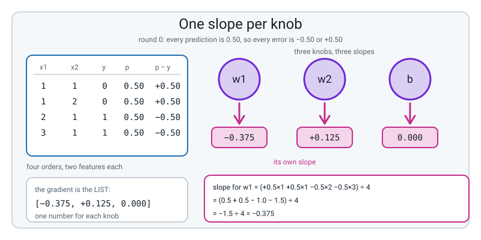
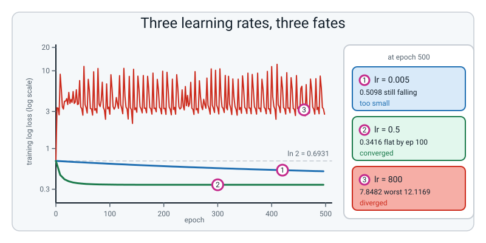
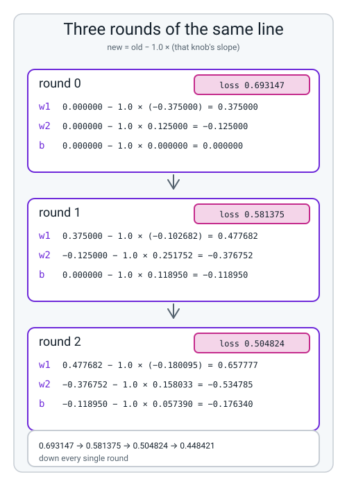
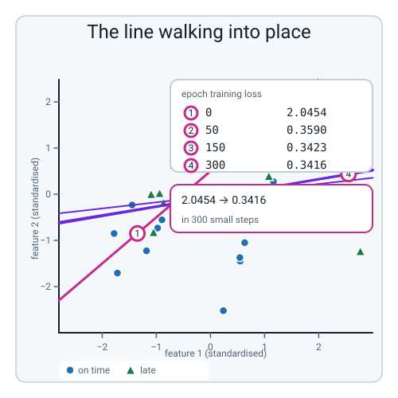
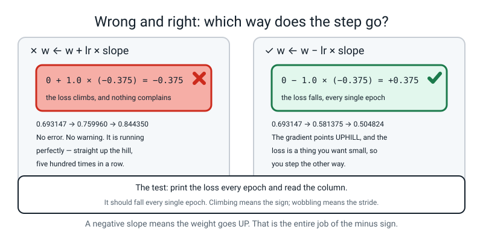
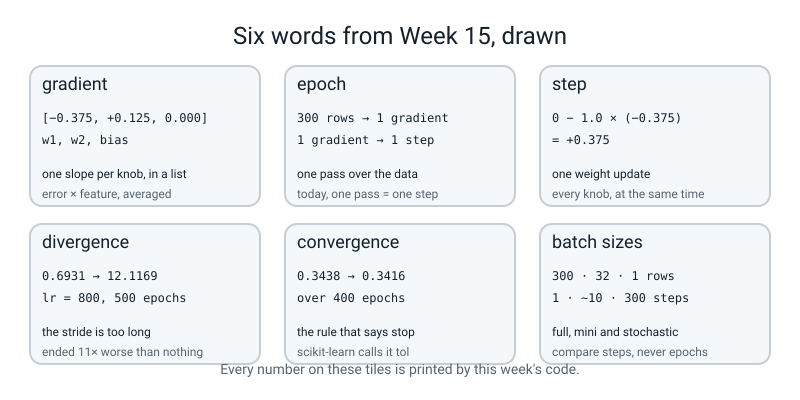

# Week 15 — Rolling Downhill: Descent From Scratch

[⬅ Week 14](week-14.md) · [Course Home](../README.md) · [Next ➡](week-16.md) · [Workbook](../workbook/week-15.md)

---

> ### This week in one sentence
> **Training is a loop: get the slope for every knob, step every knob a little way against its slope, repeat. That loop is what `fit()` was doing all along.**
>
> **By the end of this chapter you will be able to:**
> - **Write logistic regression trained by your own numpy gradient descent** in about 25 lines, with no framework anywhere near the training loop
> - **Apply `w ← w − lr × slope` to three knobs at once**, and show three rounds of every intermediate number on paper
> - **Put three learning rates on one loss curve** and match each to its name: **too small**, **converged**, **diverged**
> - **Match your own final weights against scikit-learn's** to three decimal places, and say what it means that they agree
>
> **New maths:** **the gradient** — one slope per knob, collected in a list — and the update `w ← w − lr × slope` applied to all of them at once. **Worked for three rounds on paper before any code.**
>
> **New syntax:** `(X * w).sum(axis=1)` · `w -= lr * grad` · `ax.set_yscale("log")`
>
> **Reading time:** about 40 minutes. **Homework:** about 60 minutes.

---

## 🪝 Start Here

Here is a line you have typed, at a guess, sixty times since Level 2:

```python
model.fit(X_train, y_train)
```

Every single time, the same thing happened. About a second of silence, and then an object came back that could predict.

**What happened in that second?**

"It learned." "It found the pattern." "It trained." **Every one of those is a name for the thing, not a description of it.** So here is the actual description, and it takes five lines:

```
1. start with every weight at zero
2. work out the probability for every row
3. work out the loss
4. work out, for each weight, which way is downhill
5. step each weight a little way downhill.  go to 2
```

**Now go through them and ask which ones you can already do.**

| Line | What it needs | Where you got it |
|:--:|---|---|
| 2 | the sigmoid | **Week 13.** You did it on a calculator. |
| 3 | log loss | **Week 14.** You did it on a calculator. |
| 4 | the slope of a curve | **Week 12.** You measured slopes by nudging. |
| 5 | subtraction | you have had this one a while |

**Four out of five.** You have been building this for a month without being told what it was for.

And the one that is left — line 4 — is the only new thing this week. **Here is what makes it a good week: it turns out to be easier than the other four.**


*Figure 15.1 — One slope per knob. Four rows, three knobs, three slopes, and the sum for w1 written out in full: (+0.5×1 +0.5×1 −0.5×2 −0.5×3) ÷ 4 = −1.5 ÷ 4 = −0.375.*

By the end of this chapter you will have written `model.fit` yourself, in about twenty-five lines of numpy, with scikit-learn nowhere near the loop. **And then you will check your answer against scikit-learn's, and your weights will match theirs to six decimal places.**

**One prediction before you start.** Line 1 says every weight starts at zero. So every raw score is zero. So every probability is exactly 0.5 — Week 13's third property. **So what is the loss on the very first step, before anything has been learned?**

`0.6931`. **Every training run in this chapter starts on last week's number.** Watch for it; it turns up four separate times.

---

## 🧠 The Big Idea

> **📌 About the code in this section.** The blocks below are **illustrations, not files**. Each one carries on from the one above. **The complete runnable files are in 💻 Type This.**

### 1. The gradient: one slope per knob

**The plain explanation.** Week 12 measured the slope of a curve with **one** input. Nudge it, see what happens, divide. Fine.

But our model has **three** knobs: `w1`, `w2` and the bias `b`. So "which way is downhill" is not one number. **It is three numbers — one per knob.**

> **gradient** — the collection of all the slopes, one per knob, kept together in a list. `[−0.375, +0.125, 0.000]` is a gradient. It answers *"if I nudge this knob, which way does the loss go?"* once for every knob.

🍕 **The analogy, and it carries the whole chapter.** You are standing on a foggy hillside and you cannot see the valley. But you can feel the ground under your feet. Step your left foot ten centimetres north: it goes **down** three centimetres. Step ten centimetres east: it goes **up** one centimetre. **So north is downhill and east is uphill.**

**You do not need a map of the hill. You only need the ground right under you — and you need it in every direction you could step.** The gradient is exactly that: one measurement per direction.

**A concrete example, with real values.** Four delivery orders. `x1` is how many orders are already in the oven, `x2` is how many riders are standing free, and `y = 1` means the order turned up late.

| Row | `x1` (in the oven) | `x2` (riders free) | `y` (late?) |
|:--:|:--:|:--:|:--:|
| 1 | 1 | 1 | 0 |
| 2 | 1 | 2 | 0 |
| 3 | 2 | 1 | 1 |
| 4 | 3 | 1 | 1 |

Start with all three knobs at zero. Every `z` is zero, so every `p` is `0.5`, so the gradient turns out to be `[−0.375, +0.125, 0.000]`. **Three numbers, not one.** Section 🔢 works out all three by hand.

> **⚠️ Watch out:** the bias is **not** in the list of weights. It is a knob, and it has a slope, but `w` holds the two weights and `b` sits on its own. If you write `w = np.array([0.0, 0.0, 0.0])` thinking the bias is the third one, you get `ValueError: operands could not be broadcast together with shapes (4,2) (3,)` the moment you multiply by a two-column table.

### 2. Each slope is "error times feature, averaged" — and where the logarithms went

**The plain explanation.** Here is the formula, and you should be suspicious of how short it is:

```
slope for a weight  =  average of  (prediction − truth) × (that feature)
slope for the bias  =  average of  (prediction − truth)
```

**That is it. Error times feature, averaged.** No exponentials. No logarithms. No sigmoid anywhere.

**Which should stop you dead.** Last week's loss was made of logarithms. The week before, the model was made of exponentials. **So where did they go?**

**They cancelled. All of them.** When you work out the slope of last week's loss applied to the week-before's sigmoid, an ugly term appears from the logarithm and an equally ugly term appears from the sigmoid, and **they are reciprocals of each other** — so they multiply to 1 and vanish. What survives is `prediction − truth`, times the feature, averaged over the rows.

> **🔢 The maths, slowly:** that cancellation is not luck and it is not a coincidence. **It is the reason sigmoid and log loss are always used together.** Somebody noticed, about a hundred years ago, that these two particular functions were built for each other, and every classifier since has used the pair. You do not need to see the cancellation and neither does anybody else in this room — **but you do need to know that it happened, and that it is why.** If you paired the sigmoid with squared error instead, nothing would cancel, and the mess left over is exactly why that pairing trains so badly.

**And the bias?** The bias is not multiplied by any feature — it is added to every row unchanged. So it is the same formula with the feature set to 1, which means there is nothing to multiply by.

🍕 **The analogy: it is a blame rule.** Read the formula as *"how much is this knob to blame?"*

- Model said `0.9`, truth was `1` → error is `−0.1`. **Small error, small push.**
- Model said `0.9`, truth was `0` → error is `+0.9`. **Big error, big push.**
- And that push is then multiplied by the feature, so **rows where the feature was large get corrected the most.** A row with 3 orders in the oven has three times as much say about `w1` as a row with 1.

**That last part is worth a second look, because it sounds unfair and it is not.** If a weight is attached to a feature that was large on a particular row, then that weight really is more responsible for whatever the model said about that row. **Big feature, big responsibility, big correction.**

### 3. The update rule, and the minus sign that is the whole algorithm

> **the update rule** — `w ← w − lr × (that knob's slope)`, done to every knob, then repeat.

> **learning rate (`lr`)** — how big a step to take. A small positive number, usually somewhere between 0.001 and 1.

**The minus sign is the entire idea, and you should stare at it.** The slope tells you which way is **uphill**. You want to go **down**. So you step the opposite way.

That is the algorithm. Everything else in this chapter is bookkeeping.

**Work one update out loud.** Suppose `w1 = 0.000000`, its slope is `−0.375000`, and `lr = 1.0`:

```
w1 ← 0.000000 − 1.0 × (−0.375000)
   = 0.000000 + 0.375000
   = 0.375000
```

**The slope was negative, so the weight went up.** Read that twice, because a sign confusion here breaks everything downstream. A negative slope means *"the loss goes down as this weight goes up"*, so **up is where you want to go.**

Say it as a sentence you can recite: *"a negative slope means the loss falls as the weight rises, and I want the loss to fall, so the weight rises."*

🍕 **Back on the hillside.** The gradient tells you which way is up. You turn a hundred and eighty degrees and take one step. **The learning rate is your stride length.** Baby steps and you are out there all night. Giant leaps and you bound clean across the valley and up the far slope, and then back, and then across again, for ever.

### 4. Three learning rates, three fates

**The plain explanation.** The learning rate is the one number you have to choose, and it has three distinct failure modes with three names. Here are all three, on the same 300 rows, for 500 epochs each:

```text
      lr   epoch 0 epoch 100     final     worst downhill?
   0.005    0.6931    0.6375    0.5098    0.6931      True
   0.500    0.6931    0.3438    0.3416    0.6931      True
 800.000    0.6931    2.7628    7.8482   12.1169     False
```

**Read that like a doctor reads a chart, before you read the table below it.**

| | What happened | Name | The fix |
|---|---|---|---|
| **`lr = 0.005`** | Nothing is broken. It is slow. Still falling at epoch 500, ended at `0.5098`, nowhere near the bottom. | **too small** | Turn it up, or run far more epochs. |
| **`lr = 0.5`** | Flat by epoch 100 and stayed there. `downhill? True` — it went down **every single epoch out of five hundred.** | **converged** | Nothing. Extra epochs cost time and buy nothing. |
| **`lr = 800`** | Shot from `0.69` to `12.1`, thrashed for the rest of the run, ended at `7.8482` — **eleven times worse than a model that knows nothing.** | **diverged** | Divide by 10 until the curve is monotone. |

**And look at the first column: every single run starts at `0.6931`.** All weights zero, all raw scores zero, all probabilities exactly 0.5, every row costing `−ln(0.5)`. **Last week's number, arriving in every training run there will ever be.**

> **The diagnostic rule to memorise, and it is exact rather than a guideline:** for this kind of training, **with a good learning rate the loss goes down every single epoch. Not "mostly". Every one.** If the curve wiggles upward, your learning rate is too big. Full stop.

**And here is why that rule has to be measured rather than eyeballed.** A curve that rises by `0.0001` somewhere in the middle of five hundred epochs looks perfectly flat to the human eye. So we measure it:

```python
downhill = bool(np.all(np.diff(h) <= 1e-12))
```

`np.diff` gives the gaps between consecutive losses. If every gap is zero or negative, the loss never went up. `np.all` asks *"was that true for all of them?"* **One line, `True` or `False`, no squinting at a picture.**

> **⚠️ Watch out:** `downhill? True` means **safe**, not **finished**. `lr = 0.005` scores `True` and never arrived — `0.5098` against `0.3416`. You need the final loss as well, and the two numbers answer different questions: *was it stable?* and *did it get anywhere?*


*Figure 15.2 — Three learning rates, three fates. A logarithmic vertical scale, because 0.34 and 12.1 will not share a linear axis: all three curves start at the dashed ln 2 line, one sags slowly and is still sagging at epoch 500, one dives and flattens just under 0.35, and one leaps over the top and thrashes between about 2 and 12.*

---

## 🔢 The Maths, Slowly

**One new idea: a list of slopes instead of one slope.** And the only way to learn it is to do it, so this section does three complete rounds on four rows, with every intermediate number written out. **Do these with a calculator before you read the code section. The whole chapter depends on it.**

The four rows again, and `lr = 1.0` throughout:

```
        x1 (oven)   x2 (riders free)   y (late?)
row 1       1              1               0
row 2       1              2               0
row 3       2              1               1
row 4       3              1               1
```

### Round 0, step 1 — every prediction is exactly a half

Start with `w1 = 0`, `w2 = 0`, `b = 0`. So for row 1:

```
z = 0 × 1 + 0 × 1 + 0 = 0
```

And for row 4:

```
z = 0 × 3 + 0 × 1 + 0 = 0
```

**Every `z` is zero, because everything is multiplied by zero.** So every `p` is `sigmoid(0)`, which is **exactly** 0.5 — no rounding, Week 13's third property.

```
loss = −ln(0.5), averaged over four rows = 0.693147
```

**There it is, before anything has happened.**

### Round 0, step 2 — the four errors

`error = prediction − truth`. **That order, always.**

```
row 1:  0.5 − 0 = +0.5
row 2:  0.5 − 0 = +0.5
row 3:  0.5 − 1 = −0.5
row 4:  0.5 − 1 = −0.5
```

**Rows 3 and 4 are negative because those two really were late and the model said "coin flip".**

### Round 0, step 3 — three slopes, one per knob

`w1`'s slope is error times **feature 1**, averaged. Write out every term:

```
slope w1 = ( +0.5×1  +0.5×1  −0.5×2  −0.5×3 ) ÷ 4
         = ( 0.5 + 0.5 − 1.0 − 1.5 ) ÷ 4
         = −1.5 ÷ 4
         = −0.375000
```

**Notice that row 4 contributes `−1.5`, the biggest term of the four**, because its feature is 3, the largest. That is the blame rule from section 2, visible in one line of arithmetic.

Now `w2`, which uses **feature 2**:

```
slope w2 = ( +0.5×1  +0.5×2  −0.5×1  −0.5×1 ) ÷ 4
         = ( 0.5 + 1.0 − 0.5 − 0.5 ) ÷ 4
         = +0.5 ÷ 4
         = +0.125000
```

And the bias, which has **no feature to multiply by**:

```
slope b  = ( +0.5  +0.5  −0.5  −0.5 ) ÷ 4
         =  0.0 ÷ 4
         =  0.000000
```

**The bias's slope is exactly zero, and it is worth knowing why.** Two rows were late and two were not, and every prediction was 0.5, so the four errors were `+0.5, +0.5, −0.5, −0.5` and **they cancelled perfectly.** The bias only moves when the *average* prediction is off from the *average* label — and right now it is dead on. That will not last.

### Round 0, step 4 — three updates, all at once

```
w1 ← 0.000000 − 1.0 × (−0.375000) = 0.000000 + 0.375000 = +0.375000
w2 ← 0.000000 − 1.0 × (+0.125000)                       = −0.125000
b  ← 0.000000 − 1.0 × ( 0.000000)                       =  0.000000
```

**One subtraction, three times over.** And `w1` went **up** because its slope was **negative** — the thing from section 3.

### Rounds 1, 2 and 3 — the same page again, three more times

**Round 1.** `w1 = 0.375`, `w2 = −0.125`, `b = 0`.

```
z: row1 = 0.375×1 − 0.125×1 = 0.250      p = 0.562177
   row2 = 0.375×1 − 0.125×2 = 0.125      p = 0.531209
   row3 = 0.375×2 − 0.125×1 = 0.625      p = 0.651355
   row4 = 0.375×3 − 0.125×1 = 1.000      p = 0.731059

loss = 0.581375          ← down from 0.693147

errors: +0.562177, +0.531209, −0.348645, −0.268941

slope w1 = −0.102682     slope w2 = +0.251752     slope b = +0.118950

w1 ←  0.375000 − 1.0 × (−0.102682) =  0.477682
w2 ← −0.125000 − 1.0 × (+0.251752) = −0.376752
b  ←  0.000000 − 1.0 × (+0.118950) = −0.118950
```

**The bias has moved off zero.** Why now and not before? Because the four predictions are no longer identical, so the errors no longer cancel.

**Round 2.** `w1 = 0.477682`, `w2 = −0.376752`, `b = −0.118950`.

```
z: −0.018020, −0.394772, +0.459662, +0.937344
p:  0.495495,  0.402569,  0.612934,  0.718563

loss = 0.504824          ← down again

errors: +0.495495, +0.402569, −0.387066, −0.281437

slope w1 = −0.180095     slope w2 = +0.158033     slope b = +0.057390

w1 ←  0.477682 − 1.0 × (−0.180095) =  0.657777
w2 ← −0.376752 − 1.0 × (+0.158033) = −0.534785
b  ← −0.118950 − 1.0 × (+0.057390) = −0.176340
```

**Round 3** gives `loss = 0.448421`, and after the step `w1 = 0.788956`, `w2 = −0.691502`, `b = −0.243791`.

### The four numbers that are the point of the whole page

```
0.693147  →  0.581375  →  0.504824  →  0.448421
```

**Down every single round.** That column of four numbers is the proof the algorithm works, and it is the thing to check your code against before you trust a single other number it prints.


*Figure 15.3 — Three rounds of the same line. The same subtraction, three knobs, three times over: round 0 has loss 0.693147 and takes w1 from 0.000000 to 0.375000 and w2 from 0.000000 to −0.125000, and by round 2 the loss is 0.504824.*

### Two things to notice that a student always spots

**One: `w2` is going more and more negative.** `0`, then `−0.125`, then `−0.377`, then `−0.535`, then `−0.692`.

`w2` is "riders standing free". **The model is working out — from four rows and four rounds of arithmetic — that more riders free means *less* likely to be late.** Nobody told it that. It found it in the errors.

**A negative weight is not a bug. It is the model disagreeing with a feature, out loud, in a number you can read.**

**Two: the improvements are shrinking.** `0.1118`, then `0.0766`, then `0.0564`. Why?

Because the slopes are shrinking as the weights get closer to the bottom of the bowl. **Flatter ground means smaller steps means smaller improvements.** That is what approaching a minimum looks like, and it is why a converged run goes *flat* rather than stopping dead at some particular epoch.

> **💡 Try this:** check any one of these numbers with Week 12's nudge instead of the formula. Compute the loss at `w1 = 0.375`, then at `0.3751` and `0.3749`, and divide the difference by `0.0002`. You should get `−0.102682` — **the round-1 slope, from a completely different method.** Worked Example 2 does exactly this and the two agree to nine decimal places.

---

## 💻 Type This

Two files. `three_rounds.py` first, because it prints the four numbers you just worked out by hand — **and until it does, nothing else in this chapter is trustworthy.** Then `descent.py`, which is the real thing on 400 rows.

### Step 1 — the forward pass, in one line

```python
import numpy as np

np.random.seed(0)

X = np.array([[1.0, 1.0],
              [1.0, 2.0],
              [2.0, 1.0],
              [3.0, 1.0]])
w = np.array([0.5, -0.25])

print(X * w)
print((X * w).sum(axis=1))
```

```text
[[ 0.5  -0.25]
 [ 0.5  -0.5 ]
 [ 1.   -0.25]
 [ 1.5  -0.25]]
[0.25 0.   0.75 1.25]
```

**What the new lines do, and this is the week's first new piece of syntax.**

- `X * w` multiplies **every row** by `w`, item by item. It **keeps the grid shape**: four rows in, four rows out, each one now `[x1 × w1, x2 × w2]`.
- `.sum(axis=1)` adds up **along each row**, collapsing each row to one number. Four rows in, four numbers out.

**`axis=1` means "squash the columns, keep the rows".** That is the single most confusing word in numpy and it is worth thirty seconds now rather than twenty minutes later:

| | What it does | What you get from a (4, 2) grid |
|---|---|---|
| `.sum(axis=0)` | goes **down** the columns | 2 numbers — one per column |
| `.sum(axis=1)` | goes **across** the rows | 4 numbers — one per row |
| `.sum()` | adds up **everything** | 1 number |

**We want one raw score per order, so it is `axis=1`.**

### Step 2 — 🐞 the mistake on purpose: forget the axis

```python
print((X * w).sum())
print(np.shape((X * w).sum()))
```

```text
2.25
()
```

**No error.** And you now have **one** number where you wanted four, with shape `()` — no rows at all.

**This is the bug that hides for three lines and then explodes** somewhere downstream, in a message that names a shape you have never heard of. `axis=1` keeps the rows.

> **💡 Try this:** whenever a shape confuses you, print it. `print(thing.shape)` costs nothing and it is the single most useful debugging line in this course.

### Step 3 — the four rounds, every number printed

```python
y = np.array([0.0, 0.0, 1.0, 1.0])

w = np.array([0.0, 0.0])
b = 0.0
lr = 1.0

for it in range(4):
    z = (X * w).sum(axis=1) + b
    p = 1.0 / (1.0 + np.exp(-z))
    loss = -np.mean(y * np.log(p) + (1 - y) * np.log(1 - p))
    err = p - y
    g1 = np.mean(err * X[:, 0])
    g2 = np.mean(err * X[:, 1])
    gb = np.mean(err)
    print("round %d  loss = %.6f  grad = [%.6f, %.6f]  grad_b = %.6f"
          % (it, loss, g1, g2, gb))
    grad = np.array([g1, g2])
    w = w - lr * grad
    b = b - lr * gb
```

```text
round 0  loss = 0.693147  grad = [-0.375000, 0.125000]  grad_b = 0.000000
round 1  loss = 0.581375  grad = [-0.102682, 0.251752]  grad_b = 0.118950
round 2  loss = 0.504824  grad = [-0.180095, 0.158033]  grad_b = 0.057390
round 3  loss = 0.448421  grad = [-0.131179, 0.156717]  grad_b = 0.067451
```

**What the new lines do.**

- `X[:, 0]` is "every row, column 0" — the first feature for all four rows. `X[:, 1]` is the second.
- `err * X[:, 0]` multiplies error by feature, row by row. `np.mean` averages. **That is "error times feature, averaged", typed out.**
- `np.array([g1, g2])` puts the two slopes into a list — **and that list is the gradient.**
- `w = w - lr * grad` does **both** subtractions at once, because `w` and `grad` are both lists of two.

**Now check the screen against your handwriting.** `0.693147`, `0.581375`, `0.504824`, `0.448421`. And the round-0 gradient: `−0.375000`, `+0.125000`, `0.000000`.

> **⚠️ Watch out — this is the most important thirty seconds of the chapter.** If those four losses do not appear, **stop and fix it before you go anywhere near 400 rows.** A loop that prints *a* number, with no hand-computed answer beside it, is a spell. A loop that prints these four is a transcription of something you already understand.

### The complete file — `three_rounds.py`

**Runtime: 0.08 seconds. Nothing trains for long, nothing downloads.**

```python
"""three_rounds.py - the four-order table, three rounds, every number printed."""
import numpy as np

X = np.array([[1.0, 1.0],
              [1.0, 2.0],
              [2.0, 1.0],
              [3.0, 1.0]])
y = np.array([0.0, 0.0, 1.0, 1.0])

w = np.array([0.0, 0.0])
b = 0.0
lr = 1.0

for it in range(4):
    z = (X * w).sum(axis=1) + b
    p = 1.0 / (1.0 + np.exp(-z))
    loss = -np.mean(y * np.log(p) + (1 - y) * np.log(1 - p))
    err = p - y
    g1 = np.mean(err * X[:, 0])
    g2 = np.mean(err * X[:, 1])
    gb = np.mean(err)
    print("round %d" % it)
    print("   w = [%.6f, %.6f]   b = %.6f   loss = %.6f" % (w[0], w[1], b, loss))
    print("   z   =", np.round(z, 6))
    print("   p   =", np.round(p, 6))
    print("   err =", np.round(err, 6))
    print("   grad = [%.6f, %.6f]   grad_b = %.6f" % (g1, g2, gb))
    grad = np.array([g1, g2])
    w = w - lr * grad
    b = b - lr * gb
    print("   after the step:  w = [%.6f, %.6f]   b = %.6f" % (w[0], w[1], b))
```

**Real output:**

```text
round 0
   w = [0.000000, 0.000000]   b = 0.000000   loss = 0.693147
   z   = [0. 0. 0. 0.]
   p   = [0.5 0.5 0.5 0.5]
   err = [ 0.5  0.5 -0.5 -0.5]
   grad = [-0.375000, 0.125000]   grad_b = 0.000000
   after the step:  w = [0.375000, -0.125000]   b = 0.000000
round 1
   w = [0.375000, -0.125000]   b = 0.000000   loss = 0.581375
   z   = [0.25  0.125 0.625 1.   ]
   p   = [0.562177 0.531209 0.651355 0.731059]
   err = [ 0.562177  0.531209 -0.348645 -0.268941]
   grad = [-0.102682, 0.251752]   grad_b = 0.118950
   after the step:  w = [0.477682, -0.376752]   b = -0.118950
round 2
   w = [0.477682, -0.376752]   b = -0.118950   loss = 0.504824
   z   = [-0.01802  -0.394772  0.459662  0.937344]
   p   = [0.495495 0.402569 0.612934 0.718563]
   err = [ 0.495495  0.402569 -0.387066 -0.281437]
   grad = [-0.180095, 0.158033]   grad_b = 0.057390
   after the step:  w = [0.657777, -0.534785]   b = -0.176340
round 3
   w = [0.657777, -0.534785]   b = -0.176340   loss = 0.448421
   z   = [-0.053348 -0.588133  0.604429  1.262206]
   p   = [0.486666 0.357063 0.646669 0.779406]
   err = [ 0.486666  0.357063 -0.353331 -0.220594]
   grad = [-0.131179, 0.156717]   grad_b = 0.067451
   after the step:  w = [0.788956, -0.691502]   b = -0.243791
```

**Check every number on that screen against your page, and put a tick or a cross beside each one.**

### Step 4 — 🐞 the mistake on purpose: whole numbers

Now scale up to 400 rows. Write the setup — all of it Weeks 1 to 4 — but type `w = np.array([0, 0])` with no decimal points:

```python
w = np.array([0, 0])
b = 0.0
for epoch in range(500):
    p = np.clip(squash((X_tr * w).sum(axis=1) + b), 1e-12, 1 - 1e-12)
    err = p - y_tr
    grad = np.array([np.mean(err * X_tr[:, 0]), np.mean(err * X_tr[:, 1])])
    w -= 0.5 * grad
    b -= 0.5 * np.mean(err)
```

```text
Traceback (most recent call last):
  File "descent.py", line 25, in <module>
    w -= 0.5 * grad
numpy.core._exceptions._UFuncOutputCastingError: Cannot cast ufunc 'subtract' output from dtype('float64') to dtype('int64') with casting rule 'same_kind'
```

**Read the last line slowly, because it is a very good error message.** `int64` is whole numbers. `float64` is decimals. **`np.array([0, 0])` — no decimal points — makes a box that only holds whole numbers.** Then we asked it to store `−0.1875` and it refused.

**And notice it did not round silently and it did not throw the decimals away. It stopped.** It named both types, it named the operation, and it pointed at the exact line. **Long error messages are usually the helpful kind.**

**The fix is two characters:**

```python
w = np.array([0.0, 0.0])
```

**A weight must be a decimal, because a step of `−lr × slope` almost never is.**

### Step 5 — 🐞 the mistake with no message: the wrong sign

Change `w -= 0.5 * grad` to `w += 0.5 * grad` and print the first five losses:

```text
epoch 0  loss = 0.693147
epoch 1  loss = 0.759960
epoch 2  loss = 0.844350
epoch 3  loss = 0.949854
epoch 4  loss = 1.079249
```

**No error at all. It is running perfectly.** It is running perfectly **in the wrong direction.**

**The gradient points uphill.** With a plus sign you are walking up the hill as fast as you can, deliberately, five hundred times.

And here is why this one is worth four minutes: **the only thing that catches it is knowing the loss should go down.** No message will tell you. No test fires. **You have to know what the number is supposed to do.**

Which gives you a rule for the rest of your career:

> **Print the loss every epoch, and look at it.** If it is going up, either your sign is wrong or your stride is too long, and those are the only two options.

### The complete file — `descent.py`

**Runtime: under 2 seconds for all 3,500 epochs.**

```python
"""descent.py - logistic regression trained by our own gradient descent."""
import numpy as np
from sklearn.datasets import make_classification
from sklearn.model_selection import train_test_split
from sklearn.preprocessing import StandardScaler

np.random.seed(0)

X, y = make_classification(n_samples=400, n_features=2, n_informative=2,
                           n_redundant=0, random_state=0)
X_tr, X_te, y_tr, y_te = train_test_split(X, y, test_size=0.25,
                                          stratify=y, random_state=0)
scaler = StandardScaler().fit(X_tr)
X_tr = scaler.transform(X_tr)
X_te = scaler.transform(X_te)


def squash(z):
    e = np.exp(np.where(z >= 0, -z, z))
    return np.where(z >= 0, 1.0 / (1.0 + e), e / (1.0 + e))


def train(X, y, lr, n_epochs):
    w = np.array([0.0, 0.0])
    b = 0.0
    history = []
    for epoch in range(n_epochs):
        p = squash((X * w).sum(axis=1) + b)
        p = np.clip(p, 1e-12, 1 - 1e-12)
        history.append(-np.mean(y * np.log(p) + (1 - y) * np.log(1 - p)))
        err = p - y
        grad = np.array([np.mean(err * X[:, 0]), np.mean(err * X[:, 1])])
        w -= lr * grad
        b -= lr * np.mean(err)
    return w, b, history


print("X_tr shape:", X_tr.shape, "  X_te shape:", X_te.shape)
print()
print("%8s %9s %9s %9s %9s %9s" % ("lr", "epoch 0", "epoch 100", "final",
                                   "worst", "downhill?"))
for lr in (0.005, 0.5, 800.0):
    w, b, h = train(X_tr, y_tr, lr, 500)
    h = np.array(h)
    downhill = bool(np.all(np.diff(h) <= 1e-12))
    print("%8.3f %9.4f %9.4f %9.4f %9.4f %9s"
          % (lr, h[0], h[100], h[-1], h.max(), str(downhill)))

w, b, h = train(X_tr, y_tr, 0.5, 2000)
pred = (squash((X_te * w).sum(axis=1) + b) >= 0.5).astype(int)
print()
print("lr = 0.5, 2000 epochs")
print("   my w =", np.round(w, 4), "  my b =", round(b, 4))
print("   final training loss = %.4f" % h[-1])
print("   test accuracy       = %.4f" % float((pred == y_te).mean()))
```

**Real output:**

```text
X_tr shape: (300, 2)   X_te shape: (100, 2)

      lr   epoch 0 epoch 100     final     worst downhill?
   0.005    0.6931    0.6375    0.5098    0.6931      True
   0.500    0.6931    0.3438    0.3416    0.6931      True
 800.000    0.6931    2.7628    7.8482   12.1169     False

lr = 0.5, 2000 epochs
   my w = [-0.6221  3.0924]   my b = 0.2271
   final training loss = 0.3416
   test accuracy       = 0.8200
```

**Count the lines inside `train`: thirteen, including the `def` and the `return`.** Add the three-line `squash` and you have sixteen. **That is the whole of `fit()`.** Every other line in the file generates data, splits it, scales it or prints a table — all of it Weeks 1 to 4.

**One note on `StandardScaler`, because it stopped being cosmetic today.** Week 4 taught it as a tidiness measure. This week it is load-bearing: if one feature ran 0 to 1 and another ran 0 to 100,000, the loss surface would be a long thin canyon rather than a bowl, and **there would be no single learning rate that worked for both features.** Any rate small enough to be stable in the steep direction would be hopelessly slow in the shallow one. **Fit the scaler on the training pile only, then transform both.**

### The second file — `curves.py`, and the one line that makes the plot honest

**Before you type it, predict the picture.** The `lr = 800` curve reaches `12.1`. The other two live between `0.34` and `0.69`. **What is a normal vertical axis going to do?** Squash both good curves into an unreadable smear along the bottom.

`ax.set_yscale("log")` is the week's third new piece of syntax and it is one line. **A log scale gives every *ratio* the same amount of room**, so the gap from `0.34` to `0.69` gets as much space as the gap from `6` to `12`. **It is the only way to get all three learning rates onto one honest picture.**

The right-hand panel plots the decision boundary itself at four moments, **starting deliberately from a badly wrong place** — `w = [2.0, −2.0]` and `b = 1.0`. The boundary line is `x2 = −(w1 × x1 + b) ÷ w2`, which comes straight from setting `z = 0`.

**Runtime: about 1.4 seconds, including both panels.**

```python
"""curves.py - three learning rates on one log-scale plot, and the boundary moving."""
import numpy as np
import matplotlib
matplotlib.use("Agg")
import matplotlib.pyplot as plt
from sklearn.datasets import make_classification
from sklearn.model_selection import train_test_split
from sklearn.preprocessing import StandardScaler

np.random.seed(0)

X, y = make_classification(n_samples=400, n_features=2, n_informative=2,
                           n_redundant=0, random_state=0)
X_tr, X_te, y_tr, y_te = train_test_split(X, y, test_size=0.25,
                                          stratify=y, random_state=0)
scaler = StandardScaler().fit(X_tr)
X_tr = scaler.transform(X_tr)


def squash(z):
    e = np.exp(np.where(z >= 0, -z, z))
    return np.where(z >= 0, 1.0 / (1.0 + e), e / (1.0 + e))


def train(X, y, lr, n_epochs, w0, b0):
    w = np.array(w0)
    b = b0
    history = []
    snapshots = []
    for epoch in range(n_epochs):
        p = np.clip(squash((X * w).sum(axis=1) + b), 1e-12, 1 - 1e-12)
        loss = -np.mean(y * np.log(p) + (1 - y) * np.log(1 - p))
        history.append(loss)
        if epoch in (0, 50, 150, 300):
            snapshots.append((epoch, w.copy(), b, loss))
        err = p - y
        w -= lr * np.array([np.mean(err * X[:, 0]), np.mean(err * X[:, 1])])
        b -= lr * np.mean(err)
    return w, b, history, snapshots


fig, (left, right) = plt.subplots(1, 2, figsize=(12, 4.5))

for lr in (0.005, 0.5, 800.0):
    _, _, h, _ = train(X_tr, y_tr, lr, 500, [0.0, 0.0], 0.0)
    left.plot(h, label="lr = %g" % lr)
left.axhline(np.log(2), color="grey", linestyle="--", linewidth=1,
             label="ln 2 = 0.6931")
left.set_yscale("log")
left.set_xlabel("epoch")
left.set_ylabel("training log loss (log scale)")
left.set_title("Three learning rates")
left.legend(fontsize=8)

_, _, _, snaps = train(X_tr, y_tr, 0.5, 301, [2.0, -2.0], 1.0)
right.scatter(X_tr[y_tr == 0, 0], X_tr[y_tr == 0, 1], s=12, marker="o",
              label="on time")
right.scatter(X_tr[y_tr == 1, 0], X_tr[y_tr == 1, 1], s=12, marker="^",
              label="late")
xs = np.linspace(-3.0, 3.0, 50)
print("epoch       w1        w2         b      loss")
for epoch, ww, bb, ll in snaps:
    print("%5d %9.4f %9.4f %9.4f %9.4f" % (epoch, ww[0], ww[1], bb, ll))
    right.plot(xs, -(ww[0] * xs + bb) / ww[1], linewidth=1.3,
               label="epoch %d" % epoch)
right.set_ylim(-3.2, 2.7)
right.set_xlim(-3.0, 3.2)
right.set_xlabel("feature 1 (standardised)")
right.set_ylabel("feature 2 (standardised)")
right.set_title("The boundary walking into place")
right.legend(fontsize=7)

plt.tight_layout()
plt.savefig("descent.png", dpi=120)
print("wrote descent.png")
```

**Real output:**

```text
epoch       w1        w2         b      loss
    0    2.0000   -2.0000    1.0000    2.0454
   50   -0.2798    2.1091    0.0902    0.3590
  150   -0.5478    2.8694    0.1883    0.3423
  300   -0.6110    3.0587    0.2211    0.3416
wrote descent.png
```

> **⚠️ Watch out:** `matplotlib.use("Agg")` **must come before** `import matplotlib.pyplot`. It tells matplotlib to draw into a file rather than trying to open a window, which is what stops the program appearing to hang on a machine with no display.

**What you should see in `descent.png`.** **Left panel:** three curves on a log vertical axis. The `lr = 0.5` curve dives almost vertically and flattens just under `0.35`. The `lr = 0.005` curve sags gently and is still sagging at epoch 500. The `lr = 800` curve leaps clean over the dashed `ln 2` line in a single epoch and then thrashes between about 2 and 12 for the remaining 499. **Right panel:** the epoch-0 line cuts steeply across the data at completely the wrong angle, and the other three lie almost on top of each other, nearly flat, with circles below and triangles above.


*Figure 15.4 — The line walking into place. Four snapshots with the loss beside each: at epoch 0 the weights 2.0 and −2.0 cut the data at completely the wrong angle for a loss of 2.0454, and by epoch 300 the boundary has swung round and the loss is 0.3416.*

**The interesting question is not why the line moved. It is this: the line is basically right by epoch 50, so why bother running another 250 epochs?**

**Because the loss was still falling** — `0.3590` to `0.3423` to `0.3416` — even though the picture barely changes. **A picture is not a measurement.**

### The third file — `match.py`, where you mark scikit-learn's homework

This is objective 4, and it is the point of the whole term so far. Train your own loop for 20,000 epochs, then fit `LogisticRegression` on the **identical arrays**, and print both sets of numbers in aligned columns.

**Two arguments to `LogisticRegression` matter and you must not leave them out.** `penalty=None` turns off **L2 regularisation** — by default scikit-learn deliberately handicaps the model by adding a penalty for large weights, so it cannot overfit by leaning hard on one feature. That shrinks its weights towards zero, and **a handicapped model will never match an unhandicapped one.** `max_iter=5000` just gives it room to finish.

**Runtime: about 1 second for 20,000 epochs.**

```python
"""match.py - my 25 lines against scikit-learn's."""
import numpy as np
from sklearn.datasets import make_classification
from sklearn.model_selection import train_test_split
from sklearn.preprocessing import StandardScaler
from sklearn.linear_model import LogisticRegression

np.random.seed(0)

X, y = make_classification(n_samples=400, n_features=2, n_informative=2,
                           n_redundant=0, random_state=0)
X_tr, X_te, y_tr, y_te = train_test_split(X, y, test_size=0.25,
                                          stratify=y, random_state=0)
scaler = StandardScaler().fit(X_tr)
X_tr, X_te = scaler.transform(X_tr), scaler.transform(X_te)


def squash(z):
    e = np.exp(np.where(z >= 0, -z, z))
    return np.where(z >= 0, 1.0 / (1.0 + e), e / (1.0 + e))


w = np.array([0.0, 0.0])
b = 0.0
lr = 0.5
for epoch in range(20000):
    p = np.clip(squash((X_tr * w).sum(axis=1) + b), 1e-12, 1 - 1e-12)
    err = p - y_tr
    w -= lr * np.array([np.mean(err * X_tr[:, 0]), np.mean(err * X_tr[:, 1])])
    b -= lr * np.mean(err)

loose = LogisticRegression(penalty=None, max_iter=5000).fit(X_tr, y_tr)
tight = LogisticRegression(penalty=None, max_iter=5000, tol=1e-8).fit(X_tr, y_tr)

print("                      weight 1    weight 2        bias")
print("mine (20000 epochs) %11.6f %11.6f %11.6f" % (w[0], w[1], b))
print("sklearn, default    %11.6f %11.6f %11.6f"
      % (loose.coef_[0][0], loose.coef_[0][1], float(loose.intercept_[0])))
print("sklearn, tol=1e-8   %11.6f %11.6f %11.6f"
      % (tight.coef_[0][0], tight.coef_[0][1], float(tight.intercept_[0])))
print()
print("biggest gap vs default   : %.6f" % float(np.max(np.abs(w - loose.coef_[0]))))
print("biggest gap vs tol=1e-8  : %.6f" % float(np.max(np.abs(w - tight.coef_[0]))))
```

**Real output:**

```text
                      weight 1    weight 2        bias
mine (20000 epochs)   -0.622142    3.092423    0.227114
sklearn, default      -0.621309    3.089931    0.226750
sklearn, tol=1e-8     -0.622142    3.092423    0.227114

biggest gap vs default   : 0.002492
biggest gap vs tol=1e-8  : 0.000000
```

**Read those three rows carefully, because there is a genuine subtlety in them and it is a gift.**

Against scikit-learn's **default** settings you agree to about `0.0025` — three decimal places, which is what objective 4 asked for. But that is not the interesting line.

Against scikit-learn with `tol=1e-8` you agree to **all six printed decimal places, exactly.**

**So the remaining `0.0025` was not your error. It was scikit-learn stopping early.** Its default rule is `tol=1e-4` — *"stop when the improvement gets small"* — and it stopped a little short of the bottom. Tighten the tolerance and it walks the rest of the way and lands exactly where you did.

**The question worth answering out loud: whose 0.0025 was it?** **Theirs.** And the evidence is that your loop never changed between the two lines — the only thing that changed was their stopping rule. **If the gap had been your error, tightening their tolerance would have made it worse, not zero.**

**Is scikit-learn wrong to stop early? No, and this is the honest answer.** Both versions score exactly `0.8200` on the test set, so the last `0.0025` of a weight changed no prediction at all, and chasing it costs time. **Stopping early trades an amount of precision that does not matter for time that does.** The valuable thing is not that they agree — **it is that you can now tell that they do not, and turn it off.**

**And two things about the match that are worth saying plainly.**

1. **This is not luck.** The loss for logistic regression is **convex** — one bowl, one bottom, no traps anywhere. So there is exactly **one** right answer, and any correct method has to find it. Twenty-five lines of numpy and a professionally engineered optimiser both got there because there was only one place to get to.
2. **`fit()` is not magic; it is this loop.** The only differences at industrial scale are more features, more rows, and somebody else's C code doing the arithmetic faster.

`np.abs` strips the minus sign off every number in a list, so `np.max(np.abs(...))` reads as *"the biggest disagreement, ignoring which way round it was"*. It is the only place it appears this week.

---

## 🔍 Worked Examples

Three complete programs, in three different worlds.

### Worked Example 1 — One slope, by hand (will they pass the exam?)

**The question:** a model predicts whether a student passes, from one feature: hours revised. Three students. **What is the slope for that weight, and which way does the weight move?**

| Student | Hours revised | Passed? | Model said |
|:--:|:--:|:--:|:--:|
| 1 | 2 | no | 0.30 |
| 2 | 6 | yes | 0.40 |
| 3 | 9 | yes | 0.80 |

**By hand, four columns and two arithmetic steps:**

```
student 1:  error = 0.30 − 0 = +0.30      +0.30 × 2 = +0.60
student 2:  error = 0.40 − 1 = −0.60      −0.60 × 6 = −3.60
student 3:  error = 0.80 − 1 = −0.20      −0.20 × 9 = −1.80

add up:  +0.60 − 3.60 − 1.80 = −4.80
÷ 3:     −1.600000                         ← the slope
```

```python
"""we1_slope.py - one slope by hand, for a pass-the-exam model."""
import numpy as np

np.random.seed(0)

hours = np.array([2.0, 6.0, 9.0])       # the one feature: hours revised
passed = np.array([0.0, 1.0, 1.0])      # the truth
p = np.array([0.30, 0.40, 0.80])        # what the model currently says

err = p - passed
print("row   hours   truth   model said   error = said - truth   error x hours")
for i in range(3):
    print("%3d %7.1f %7.1f %12.2f %22.2f %15.2f"
          % (i + 1, hours[i], passed[i], p[i], err[i], err[i] * hours[i]))
print()
print("add them up : %.4f" % float((err * hours).sum()))
print("divide by 3 : %.6f   <- the slope for the weight" % float(np.mean(err * hours)))
print("slope for b : %.6f   <- the same thing with no feature"
      % float(np.mean(err)))
print()
w = 0.5
lr = 0.1
print("w is %.4f, lr is %.1f" % (w, lr))
print("w <- %.4f - %.1f x (%.6f) = %.6f"
      % (w, lr, float(np.mean(err * hours)), w - lr * float(np.mean(err * hours))))
```

**Real output, instant:**

```text
row   hours   truth   model said   error = said - truth   error x hours
  1     2.0     0.0         0.30                   0.30            0.60
  2     6.0     1.0         0.40                  -0.60           -3.60
  3     9.0     1.0         0.80                  -0.20           -1.80

add them up : -4.8000
divide by 3 : -1.600000   <- the slope for the weight
slope for b : -0.166667   <- the same thing with no feature

w is 0.5000, lr is 0.1
w <- 0.5000 - 0.1 x (-1.600000) = 0.660000
```

**The slope is negative, so the weight goes up** — from `0.5` to `0.66`. And that is the right thing: the model is under-predicting the two students who passed, both of whom revised a lot, so **"hours revised" should count for more.**

**Notice student 2 dominates.** Its term is `−3.60`, three-quarters of the whole sum, because it has both a large error (`−0.60`) and a decent feature (`6`). **Big error times big feature is where the correction comes from.**

### Worked Example 2 — Checking a slope by nudging (the gradient check)

**The question:** the formula says `error × feature, averaged`. **How do you know the formula is right?** Week 12 measured slopes a completely different way: nudge the input a tiny bit each side and divide. **Do both and see if they agree.**

This checks round 1 from 🔢 The Maths, Slowly, where the formula gave `slope w1 = −0.102682`.

```python
"""we2_gradcheck.py - Week 12's nudge, checking Week 15's formula."""
import numpy as np

np.random.seed(0)

X = np.array([[1.0, 1.0], [1.0, 2.0], [2.0, 1.0], [3.0, 1.0]])
y = np.array([0.0, 0.0, 1.0, 1.0])


def loss_at(w1, w2, b):
    z = w1 * X[:, 0] + w2 * X[:, 1] + b
    p = 1.0 / (1.0 + np.exp(-z))
    return float(-np.mean(y * np.log(p) + (1 - y) * np.log(1 - p)))


w1, w2, b = 0.375, -0.125, 0.0
h = 0.0001

up = loss_at(w1 + h, w2, b)
down = loss_at(w1 - h, w2, b)
print("loss at w1 + 0.0001 : %.12f" % up)
print("loss at w1 - 0.0001 : %.12f" % down)
print("(up - down) / 0.0002: %.9f      <- Week 12's nudge" % ((up - down) / (2 * h)))

z = X[:, 0] * w1 + X[:, 1] * w2 + b
p = 1.0 / (1.0 + np.exp(-z))
formula = float(np.mean((p - y) * X[:, 0]))
print("error x feature, avg: %.9f      <- Week 15's formula" % formula)
print()
print("they differ by      : %.12f" % abs((up - down) / (2 * h) - formula))
```

**Real output, instant:**

```text
loss at w1 + 0.0001 : 0.581364940997
loss at w1 - 0.0001 : 0.581385477431
(up - down) / 0.0002: -0.102682166      <- Week 12's nudge
error x feature, avg: -0.102682165      <- Week 15's formula

they differ by      : 0.000000001271
```

**Two completely different methods, agreeing to nine decimal places.** One nudges the weight and watches the loss move. The other multiplies an error by a feature. **Neither one knows the other exists.**

**This technique has a name — a gradient check — and it is the most valuable thing in this worked example.** From here on, whenever you write a formula for a slope and you are not sure, you can *test* it: nudge, divide, compare. In Week 18 it becomes compulsory, because the network has more knobs than you can check by eye.

> **💡 Try this:** make `h` much smaller — `1e-10` — and watch the agreement get **worse**, not better. The two losses become so close that the computer's decimals cannot tell them apart, and the subtraction throws away most of the digits. `1e-5` to `1e-4` is the sweet spot, and finding that out yourself is worth five minutes.

### Worked Example 3 — The same 25 lines, on eight library loans

**The question:** does this loop only work on generated data? **Type out eight real-shaped rows and run the identical code.**

Eight library loans. Features: how many days the book was borrowed for, and how many times that person has been late before.

```python
"""we3_library.py - the same 25 lines, on eight hand-typed library loans."""
import numpy as np

np.random.seed(0)

#            days borrowed, times late before
X = np.array([[ 3.0, 0.0],
              [ 5.0, 0.0],
              [ 7.0, 1.0],
              [ 2.0, 0.0],
              [14.0, 2.0],
              [10.0, 3.0],
              [ 1.0, 0.0],
              [12.0, 1.0]])
y = np.array([0.0, 0.0, 0.0, 0.0, 1.0, 1.0, 0.0, 1.0])

mean = X.mean(axis=0)
sd = X.std(axis=0)
Xs = (X - mean) / sd
print("column means:", np.round(mean, 4), "  column sds:", np.round(sd, 4))


def squash(z):
    e = np.exp(np.where(z >= 0, -z, z))
    return np.where(z >= 0, 1.0 / (1.0 + e), e / (1.0 + e))


w = np.array([0.0, 0.0])
b = 0.0
lr = 0.5
history = []
for epoch in range(400):
    p = np.clip(squash((Xs * w).sum(axis=1) + b), 1e-12, 1 - 1e-12)
    history.append(-np.mean(y * np.log(p) + (1 - y) * np.log(1 - p)))
    err = p - y
    w -= lr * np.array([np.mean(err * Xs[:, 0]), np.mean(err * Xs[:, 1])])
    b -= lr * np.mean(err)

h = np.array(history)
print()
print("epoch   0 : %.6f" % h[0])
print("epoch   1 : %.6f" % h[1])
print("epoch  10 : %.6f" % h[10])
print("epoch 100 : %.6f" % h[100])
print("epoch 399 : %.6f" % h[-1])
print("downhill every epoch?", bool(np.all(np.diff(h) <= 1e-12)))
print()
print("trained w =", np.round(w, 4), "  b =", round(float(b), 4))
p = squash((Xs * w).sum(axis=1) + b)
print()
print("loan  days  late before  truth   p")
for i in range(8):
    print("%4d %5.0f %12.0f %6.0f   %.4f" % (i + 1, X[i, 0], X[i, 1], y[i], p[i]))
```

**Real output, runtime under a second:**

```text
column means: [6.75  0.875]   column sds: [4.5208 1.0533]

epoch   0 : 0.693147
epoch   1 : 0.530061
epoch  10 : 0.195006
epoch 100 : 0.056964
epoch 399 : 0.020734
downhill every epoch? True

trained w = [4.6416 2.1722]   b = -2.7407

loan  days  late before  truth   p
   1     3            0      0   0.0002
   2     5            0      0   0.0018
   3     7            1      0   0.0974
   4     2            0      0   0.0001
   5    14            2      1   0.9991
   6    10            3      1   0.9932
   7     1            0      0   0.0000
   8    12            1      1   0.9482
```

**Three things.**

1. **It starts at `0.693147`.** Eight hand-typed rows about library books, and the first loss is last week's number to six decimal places. **It always is.**
2. **`downhill every epoch? True`, and the loss reaches `0.020734`.** Eight rows and two features is an easy problem, so it gets very close to perfect — which is a warning as much as a triumph. With eight rows there is no held-out test set and **a loss of 0.02 on eight rows tells you nothing about the ninth.**
3. **Read the weights as English:** `w = [4.6416, 2.1722]`. Both positive, so **longer loans and a worse history both push towards "late"**, and the first one matters about twice as much as the second. That comparison is only legal because the two columns were scaled onto the same ruler first — **without that line, comparing the two weights would be meaningless.** Week 4, doing real work.

And notice loan 3: seven days, one previous lateness, and the model says `0.0974` — under the 0.5 threshold, so "on time", and it was on time. **The one row that looks borderline in the table is the one the model is least sure about.**

---

## 🐞 When It Breaks

Every message below came from really running a broken version of this week's code.

### Break 1 — the whole-number weights

```python
w = np.array([0, 0])
w -= 0.5 * np.array([0.1, 0.2])
```

```text
Traceback (most recent call last):
  File "p5.py", line 3, in <module>
    w -= 0.5 * np.array([0.1, 0.2])
numpy.core._exceptions._UFuncOutputCastingError: Cannot cast ufunc 'subtract' output from dtype('float64') to dtype('int64') with casting rule 'same_kind'
```

**What Python is telling you.** *"You asked me to put a decimal into a box that only holds whole numbers, and I will not do that silently."* `int64` is whole numbers; `float64` is decimals; your `w` is the `int64` one.

**How to find it.** `print(w.dtype)`. If it says `int64`, that is your bug.

**The fix.** `w = np.array([0.0, 0.0])`. **Two characters.** A weight must be a decimal, because `−lr × slope` almost never is.

### Break 2 — the gradient that is a grid

```python
grad = np.array([err * X[:, 0], err * X[:, 1]])     # np.mean forgotten
print('grad shape:', grad.shape)
w -= 1.0 * grad
```

```text
ValueError: operands could not be broadcast together with shapes (2,) (2,4) (2,)
grad shape: (2, 4)
```

**What Python is telling you.** *"Your `w` is a list of 2 and your gradient is a 2-by-4 grid, and I cannot subtract one from the other."*

**How to find it.** The message hands you the shapes: `(2,)` and `(2,4)`. **Print `grad.shape` and count.** `(2, 4)` means you kept all four rows' products instead of averaging them.

**The fix.** `np.array([np.mean(err * X[:, 0]), np.mean(err * X[:, 1])])`. **A gradient has one number per knob. Always. If yours has more, an average is missing.**

### Break 3 — the naive sigmoid meets a big learning rate

```python
p = 1.0 / (1.0 + np.exp(-((X_tr * w).sum(axis=1) + b)))     # the naive sigmoid
```

```text
e_naive.py:14: RuntimeWarning: overflow encountered in exp
e_naive.py:16: RuntimeWarning: divide by zero encountered in log
e_naive.py:16: RuntimeWarning: invalid value encountered in multiply
epoch 0  loss = 0.693147
epoch 1  loss = nan
epoch 2  loss = nan
epoch 3  loss = nan
```

**What Python is telling you.** Three warnings in a chain, and you can read the story off them. `lr = 800` sent the raw scores into the hundreds. The one-line sigmoid then asked for `e^(large positive)` and overflowed. That produced probabilities of exactly `0.0` and `1.0`. **And then `ln(0)` finished the job.**

**The fix.** Use Week 13's two-branch `squash`, and Week 14's `np.clip`. **And here is why it matters more than it looks:** with the safe sigmoid, `lr = 800` produces a beautiful, visible divergence to `12.1169` that you can plot and name. With the naive one it produces `nan` and there is nothing to see at all.

### Break 4 — the one with no message

```python
w = np.array([0.0, 0.0]); b = 0.0
for epoch in range(500):
    p = np.clip(squash((X_tr * w).sum(axis=1) + b), 1e-12, 1 - 1e-12)
    h.append(-np.mean(y_tr * np.log(p) + (1 - y_tr) * np.log(1 - p)))
    err = p - y_tr
    grad = np.array([np.mean(err * X_tr[:, 0]), np.mean(err * X_tr[:, 1])])
    # the two update lines are missing
```

```text
epoch   0 : 0.693147
epoch  10 : 0.693147
epoch 499 : 0.693147
w after 500 epochs: [0. 0.]   b: 0.0
```

**There is no error, and the program ran five hundred epochs perfectly.** It computed a gradient five hundred times and never used it.

**And you already know what this looks like.** `0.6931`, for ever, is last week's diagnostic arriving for real. **Print `w` after ten epochs** — if it is still `[0.0, 0.0]`, nothing is updating and the whole rest of the file is irrelevant. **Ten epochs is enough; you do not have to wait for five hundred.**

### The whole clinic, for reference

| What you see | What it means | The fix |
|---|---|---|
| `_UFuncOutputCastingError: Cannot cast ... float64 ... to dtype('int64')` | "A decimal will not fit in a whole-number box" | `np.array([0.0, 0.0])` |
| `ValueError: operands could not be broadcast together with shapes (300,2) (3,)` | "Three weights, two feature columns" | The bias is not in `w`. `print(X.shape, w.shape)` and count |
| `ValueError: operands could not be broadcast together with shapes (300,) (100,)` | "300 predictions, 100 truths" | `p - y_te` inside the training loop. Train against `y_tr` |
| `ValueError: operands could not be broadcast together with shapes (2,) (2,300) (2,)` | "Your gradient is a grid, not a list" | `np.mean` forgotten inside the gradient |
| `ValueError: Number of informative, redundant and repeated features must sum to less than the number of total features` | "2 + 2 is more than 2" | `n_redundant=0`. The default is **2** |
| `ValueError: 'logarithmic' is not a valid value for scale; supported values are 'linear', 'log', ...` | "Not a scale I know — here is the whole list" | `ax.set_yscale("log")`. **When a message lists the legal values, read the list** |
| `RuntimeWarning: overflow encountered in exp` then `nan` | "The raw scores got too big to exponentiate" | Week 13's two-branch `squash` |
| `RuntimeWarning: divide by zero encountered in log` then `nan` | "Some probability was exactly 0 or 1" | Week 14's `np.clip(p, 1e-12, 1 - 1e-12)` |
| **No error.** Loss climbs smoothly from 0.6931 | Walking uphill on purpose, 500 times | `w += lr * grad`. **Subtract.** `0.693147, 0.759960, 0.844350` climbing is this bug and nothing else |
| **No error.** Loss parked at exactly 0.6931 | Predicting 0.5 for everything, for ever | `print(w, b)` after ten epochs. All zeros means nothing is updating |
| **No error.** `z` is one number instead of 300 | `.sum()` without the axis | `.sum(axis=1)`. **`axis=1` keeps the rows** |
| **No error.** Your weights are nowhere near sklearn's | sklearn is handicapping its model on purpose | `LogisticRegression(penalty=None, max_iter=5000)` |
| **No error.** Your weights are *close* to sklearn's but not identical | **Nothing is wrong. This one is a gift** | Add `tol=1e-8` and watch the gap become `0.000000` |
| **No output, empty plot, looks hung** | Every loss is `nan`, and matplotlib draws nothing for `nan` | Print `h[0], h[1], h[2]`. **The empty plot is a symptom, not the bug** |

---

## 🎲 What We Did In Class

If you missed it, here is the whole lab. You need a calculator, a laptop, and the four-row table from 🔢 The Maths, Slowly.

**The hook.** `model.fit(X_train, y_train)` went on the board on its own. *"You have typed that sixty times. What happened in that second?"* Answers came back — "it learned", "it trained" — and went up without comment. Then the five lines of English, and the question: *"which of these can you already do?"* **Four of five.** Then the prediction: *"line 1 says all weights start at zero, so what is the loss on the first step?"* — `0.6931`, pointed at on the wall.

**Round 0, on the board, with the class doing every number.** `gradient = [ slope for w1, slope for w2, slope for b ]` went up first, then the foggy hillside, then the formula — and then the question *"where are the logarithms?"*, which is supposed to be confusing. **They cancelled.**

Then the four rows, and every number of round 0 out loud:

```
z = 0 for all four        p = 0.5 for all four        loss = 0.693147

errors:  +0.5  +0.5  −0.5  −0.5

slope w1 = ( +0.5×1  +0.5×1  −0.5×2  −0.5×3 ) ÷ 4 = −1.5 ÷ 4 = −0.375000
slope w2 = ( +0.5×1  +0.5×2  −0.5×1  −0.5×1 ) ÷ 4 = +0.5 ÷ 4 = +0.125000
slope b  = ( +0.5  +0.5  −0.5  −0.5 )         ÷ 4 =  0.0 ÷ 4 =  0.000000
```

Three questions at that board: *"why are rows 3 and 4 negative?"* — they were late and the model said 0.5. *"Why is row 4's contribution the biggest?"* — its feature is 3, the largest. *"Why is the bias slope **exactly** zero?"* — two late and two not, all predictions 0.5, so the errors cancel perfectly.

**Then `w ← w − lr × slope` went up in the biggest letters available, with a box drawn round the minus sign.** *"The slope points uphill. The loss is a thing we want small. So we go the other way. That is the entire algorithm."*

```
w1 ← 0.000000 − 1.0 × (−0.375000) = +0.375000
w2 ← 0.000000 − 1.0 × (+0.125000) = −0.125000
b  ← 0.000000 − 1.0 × ( 0.000000) =  0.000000
```

*"`w1`'s slope was negative and `w1` went up. Is that right?"* Yes — a negative slope means the loss falls as the weight rises.

Then round 1, fast, with the four `p` values handed out rather than computed: loss `0.581375`, slopes `−0.102682`, `+0.251752`, `+0.118950`. *"The bias has moved off zero. Why now?"* Because the predictions are no longer identical.

**And the favourite observation of the lesson:** `w2` going `0 → −0.125 → −0.377`. *"`w2` is 'riders standing about with nothing to do'. The model has worked out, from four rows and two rounds of arithmetic, that more riders free means less likely to be late. **Nobody told it that.**"*

**Building `descent.py`, with two mistakes on purpose.**

| Mistake | What happened |
|---|---|
| `w = np.array([0, 0])` with no decimal points | **A crash**, and a very good one: `_UFuncOutputCastingError`, naming both types and the exact line |
| `w += lr * grad` instead of `w -= lr * grad` | **No error at all.** `0.693147, 0.759960, 0.844350, 0.949854, 1.079249` — climbing, perfectly, in the wrong direction |

Both went into the Bug Log, the second as a **"no error message, loss goes up"** entry.

**Then three learning rates**, and the class named all three from the table before anybody said the words: `0.005` **too small** (still falling at 500), `0.5` **converged** (flat by 100, `downhill? True`), `800` **diverged** (`downhill? False`, worst `12.1169`, ended eleven times worse than knowing nothing). **Evidence required, not just the label.**

Then the plot, deliberately without `set_yscale("log")` first — two flat lines and a spike — and then with it.

**Then the payoff: the sklearn match.** 20,000 epochs at `lr = 0.5`, about a second, against `LogisticRegression(penalty=None, max_iter=5000)` on the identical arrays:

```text
                      weight 1    weight 2        bias
mine (20000 epochs)   -0.622142    3.092423    0.227114
sklearn, default      -0.621309    3.089931    0.226750
sklearn, tol=1e-8     -0.622142    3.092423    0.227114

biggest gap vs default   : 0.002492
biggest gap vs tol=1e-8  : 0.000000
```

The room got the `0.002492` first and was slightly disappointed. Then `tol=1e-8` went in and it became `0.000000`, to all six printed decimals. **And then the question: *"the gap was 0.0025 and now it is zero. Whose 0.0025 was it?"***

**scikit-learn's.** Our loop never changed between the two lines. Its default rule is *"stop when the improvement gets small"*, and it stopped a little short of the bottom on purpose — because the last `0.0025` of a weight changes no prediction at all. **Both versions score exactly `0.8200`.** The valuable thing is not that they agree; **it is that you can now tell that they do not, and turn it off.**

**Then the boundary walking into place**, four snapshots from a deliberately terrible start, with the loss beside each one.

**And the closing point, which was a complaint.** *"One number on that screen should annoy you. **Test accuracy: 0.8200.** You wrote a correct training loop. It converged. It matched a professional library exactly. And it gets eighty-two per cent — almost one order in five, wrong."*

*"That is not a bug in your loop and it is not a learning rate you could have picked better. **It is the model.** Your boundary is a straight line, and it is a straight line because the model predicts 'late' when `z ≥ 0`, and that is the equation of a straight line. There is no choice of `w1`, `w2` and `b` that bends it. And the data is not straight."*

*"So next week we start again, and build a model that can bend. It is made out of several of these stacked on top of each other — **and every single one of them is trained by the loop you wrote today.**"*

---

## 💬 Talk About It

**1. How does it know it is going the right way? It cannot see the bottom.**

*Hint:* it cannot, and that is the whole point of the foggy hillside. **It never knows where the bottom is. It only knows which way is down, right where it is standing.** That works because this particular loss is **convex** — one bowl, one bottom, no side dips — and on a bowl, "keep going downhill" gets you to the bottom eventually, however long it takes. Then push on it: **when does that stop working?** In Week 19, when the model has layers and the loss stops being a bowl. Then "keep going downhill" can land you in a shallow dip that is not the bottom, and there is genuinely nothing the algorithm can do about it. **Everyone lives with that.** So the exactness you got today is a property of *today's problem*, not of gradient descent — and it is worth deciding now that Week 19's inexactness will not be a failure.

**2. We matched scikit-learn exactly. Does that mean our 25 lines are as good as theirs?**

*Hint:* be precise about what was matched. **We matched the *answer*, not the *method*.** Ours took 20,000 steps; scikit-learn's default optimiser is called L-BFGS and takes a few dozen, because it builds up a picture of the *shape* of the bowl as it goes and uses it to take much better steps. We matched because the loss is convex, so there is exactly one right answer and any correct method has to find it. **What we proved is that our method is correct, not that it is efficient.** Then the footnote that turns the whole thing round: **neural networks do not use L-BFGS**, because it needs too much memory when there are millions of weights. They use variants of the loop you wrote today. **So these 25 lines are closer to how a real network trains than scikit-learn's optimiser is.**

**3. Could a computer just work out the right learning rate, instead of you guessing?**

*Hint:* start with what *is* known. For a convex bowl you can prove things: there is a largest stable learning rate, it depends on how curved the bowl is, and you can compute it. You can even find it by measurement — the stretch homework does, and the answer on this problem sits between 12 and 15. **That is real mathematics and it works.** For a neural network almost none of it survives: the loss is not a bowl, the curvature changes as you move, and the best rate at epoch 1 is usually far too big at epoch 100, which is why real training turns the rate down as it goes. **And here is the live disagreement.** There is a serious research effort building optimisers that need no learning rate at all — they measure the landscape and set their own stride — and some work impressively well. **And yet almost every large model in the world is still trained with a hand-picked learning rate**, because the automatic methods are less predictable when things go wrong, and when a training run costs real money, predictability beats elegance. **You are allowed to find that unsatisfying.**

---

## ⚠️ Don't Get Tricked

### Trick 1 — "the minus sign is just a convention"


*Figure 15.5 — Wrong and right: which way does the step go? On the left, 0 + 1.0 × (−0.375) = −0.375, with the loss column climbing 0.693147, 0.759960, 0.844350 and no error message at all. On the right, 0 − 1.0 × (−0.375) = +0.375, and the loss falls.*

| ❌ Wrong | ✅ Right |
|---|---|
| "Plus or minus, it goes somewhere and then settles." | **The gradient points uphill.** `w += lr * grad` climbs the hill deliberately, perfectly, five hundred times, **and produces no error message ever.** The loss column `0.693147, 0.759960, 0.844350, 0.949854, 1.079249` is this bug and nothing else. |

**The minus sign is not bookkeeping. It is the algorithm.**

### Trick 2 — "a bigger learning rate learns faster"

| ❌ Wrong | ✅ Right |
|---|---|
| "Turn it up and it gets there sooner." | Up to a point — and then it is **catastrophic, not merely slower.** `lr = 0.5` ends at `0.3416`. `lr = 800` ends at `7.8482`, **eleven times worse than knowing nothing.** The relationship is not "bigger is faster"; it is **"bigger is faster until it is broken", and the cliff is sudden.** |

### Trick 3 — "`downhill? True` means it worked"

| ❌ Wrong | ✅ Right |
|---|---|
| "It went down every epoch, so we are done." | **Monotone means safe, not finished.** `lr = 0.005` scores `True` and ended at `0.5098` while `lr = 0.5` reached `0.3416`. **Nothing is broken about it; it did not finish.** You need the final loss as well, and "still falling at the last epoch" is a diagnosis in its own right. |

**And the reverse trap is worse.** A curve can *look* converged and be alternating for ever between two values. Read consecutive epochs, not every fiftieth: `0.3557, 0.3591, 0.3557, 0.3591` is a run that never lands.

### Trick 4 — "82% means my loop is wrong"

| ❌ Wrong | ✅ Right |
|---|---|
| "I got 0.8200, so I must have made a mistake somewhere." | **Your loop is correct — it matched scikit-learn to six decimal places.** The 82% is the **model**. The boundary is a straight line because the model says "late" when `z ≥ 0`, and that is the equation of a straight line. There is no choice of `w1`, `w2`, `b` that bends it, and the data is not separable by a straight line. |

**Write `0.8200` down somewhere.** It is the entire argument for the next four weeks, and in Week 19 you will beat it with a boundary that curves.

---

## 🌍 Where You've Seen This

1. **Every `.fit()` you have ever called.** Not a metaphor for it — for logistic regression it is the same algorithm finding the same answer, which you proved to six decimal places.
2. **Every large language model ever trained.** They are trained by a descendant of the loop in this chapter: compute a loss, get one slope per weight, step every weight against its slope, repeat. The models have hundreds of billions of knobs instead of three, and the loop is the same five lines.
3. **A phone's camera deciding what a face is.** The network was trained by this loop, on somebody's cluster, months before your phone was made. **The training happened once; your phone only does the forward pass.**
4. **Recommendation systems that update overnight.** New clicks arrive, the loss changes, the weights take a few steps downhill, and tomorrow's suggestions are slightly different. **The "learning" in "machine learning" is this subtraction, repeated.**
5. **The learning rate is why training jobs fail.** A huge amount of professional machine-learning time goes into exactly the three shapes you named today. The first thing any engineer does when a run looks wrong is **plot the loss curve and look at its shape** — and they are looking for too small, converged, or diverged.
6. **Physics and engineering, long before any of this.** "Follow the steepest descent to find a minimum" is a nineteenth-century idea, used for fitting orbits and designing bridges. **Machine learning borrowed it; it did not invent it.**

---

## 🔑 Remember This

- **The gradient is one slope per knob, kept in a list.** Three knobs, three numbers: `[−0.375, +0.125, 0.000]`. Not one number — that is the mental shift of the week.
- **Each slope is `error times feature, averaged`.** `(prediction − truth) × (that feature)`, averaged over the rows. The bias is the same thing with no feature to multiply by. **The logarithms and exponentials cancelled, and that cancellation is why sigmoid and log loss are always paired.**
- **The update is `w ← w − lr × slope`, for every knob at once.** The gradient points **uphill**; you want to go **down**; so you subtract. `0 − 1.0 × (−0.375) = +0.375` — a negative slope makes a weight go **up**.
- **The four numbers that prove a loop works:** `0.693147 → 0.581375 → 0.504824 → 0.448421`. **Check these before you run anything on 400 rows.**
- **Three learning rates, three names.** `0.005` too small (`0.5098`, still falling). `0.5` converged (`0.3416`, `downhill? True`). `800` diverged (`7.8482`, `downhill? False`, worst `12.1169`). **Measure monotonicity, do not eyeball it.**
- **Every training run starts at `0.6931`.** If it is not falling by epoch 10, print `w`. If it is climbing, check the minus sign. If it is wobbling, divide the learning rate by ten.
- **You wrote `fit()` and it matched scikit-learn to six decimals — because this loss is convex.** One bowl, one bottom, one right answer, so any correct method must find it. **Today's exactness is a property of today's problem.**
- **The maths reminder:** a slope is a slope whichever way you get it. Week 12's nudge and Week 15's formula agree to nine decimal places, and that check is called a **gradient check**.

### Syntax reminder card

```python
import numpy as np

# ---- the forward pass, one line. axis=1 KEEPS THE ROWS ---------------------
z = (X * w).sum(axis=1) + b
#          ^^^^^^^^^^^^
#   axis=0 goes DOWN the columns  -> one number per column
#   axis=1 goes ACROSS the rows   -> one number per row     <- what you want
#   no axis at all                -> ONE number, shape (), and a bug 3 lines later

X[:, 0]          # every row, column 0 -- the first feature for all the rows

# ---- the gradient: one number per knob. ALWAYS ----------------------------
err = p - y                                        # prediction MINUS truth
grad = np.array([np.mean(err * X[:, 0]),           # error x feature, averaged
                 np.mean(err * X[:, 1])])
grad_b = np.mean(err)                              # the bias has no feature
# forget an np.mean and grad becomes a (2, 300) grid -> broadcast ValueError

# ---- the algorithm. Two lines. --------------------------------------------
w -= lr * grad            # shorthand for w = w - lr * grad; does BOTH at once
b -= lr * grad_b
# MINUS, because the gradient points uphill.  w += ... climbs, silently.

w = np.array([0.0, 0.0])  # DECIMAL POINTS. np.array([0, 0]) -> CastingError

# ---- did it actually go downhill? Measure it, do not look at it -----------
np.diff(h)                             # the gaps between consecutive losses
bool(np.all(np.diff(h) <= 1e-12))      # True = it never went up. Not "finished"

# ---- the plot that can hold 0.34 and 12.1 at the same time ----------------
import matplotlib
matplotlib.use("Agg")                  # BEFORE importing pyplot
import matplotlib.pyplot as plt
ax.set_yscale("log")                   # "logarithmic" is not a valid value
plt.savefig("descent.png", dpi=120)

# ---- matching sklearn: both sides must be unhandicapped -------------------
LogisticRegression(penalty=None, max_iter=5000, tol=1e-8)
#                  ^^^^^^^^^^^^                 ^^^^^^^^
#                  no L2 penalty                walk all the way to the bottom
```

---

## 📓 New Words


*Figure 15.6 — Six words from Week 15, drawn.*

| Word | What it means | Example |
|---|---|---|
| **gradient** | All the slopes, one per knob, in a list | `[−0.375, +0.125, 0.000]` for `w1`, `w2`, `b` |
| **epoch** | One complete pass over all the training data | 300 rows give one gradient, so today one epoch is one step |
| **step / iteration** | One weight update | `0 − 1.0 × (−0.375) = +0.375` |
| **divergence** | The loss goes **up** and stays up, because the steps are too long | `lr = 800`: `0.6931 → 12.1169 → 7.8482` |
| **convergence criterion** | The rule that tells you to stop | scikit-learn's `tol`: stop when the improvement drops below it |
| **batch / mini-batch / stochastic** | Whether one gradient uses all the rows, a chunk of 32, or one row | Today is full **batch**: all 300 rows, one step. Week 23 builds mini-batch |

> **🧑‍🏫 If a student asks** why all three batch words exist when today they make no difference: because the moment you stop using every row at once, one **epoch** stops being one **step**. With 300 rows taken 32 at a time, one epoch is about ten steps — so "100 epochs" of mini-batch is a thousand weight updates. **This is how people get fooled into thinking mini-batch is magic:** they compare by epochs. **Always compare by weight updates or by wall-clock time.** 🍕 And the analogy: salting a huge pot of curry. **Full batch** — blend the whole pot, taste one spoonful, salt once. **Stochastic** — taste one grain of rice, add a pinch, taste the next grain: fast and noisy. **Mini-batch** — taste a small bowl: almost as informed as the whole pot, almost as fast as one grain. **Everybody uses mini-batch.**

---

## 📤 Your Homework

Go to **[the Week 15 workbook](../workbook/week-15.md)**. About **60 minutes** in total.

| Section | What to do | Time |
|---|---|---|
| **Warm-Up** | Five weights and five slopes: up or down, and the new value | 5 min |
| **Do the Maths by Hand** | **Finish the four-round table** — rounds 2 and 3, every `z`, `p`, error, slope and update — then check against `three_rounds.py` and **tick or cross every single number** | 25 min |
| **Predict the Output** | Five snippets, including `.sum()` without an axis and a whole-number weight | 8 min |
| **Practice A** | Name the three learning rates from their curves, **with the evidence for each** | 10 min |
| **Build It (1)** | **Match scikit-learn**, printed side by side, then again with `tol=1e-8`. One sentence: **whose 0.0025 was it?** | 15 min |
| **Build It (2)** | **Diagnose four supplied loss curves** — name, evidence, and a one-line fix for each | 20 min |

**Three things are being marked, and the third is the real one.**

**Are all the intermediate numbers there, with ticks and crosses?** Three slopes and three updates per round is the minimum. A page with only the final weights has skipped the objective. **And watch the bias in round 0: its slope must be exactly `0.000000`.** If you wrote `0.0001`, there is an arithmetic slip worth finding.

**Does your sentence about `tol` say whose gap it was?** The answer is **scikit-learn's**, and the evidence is that *your loop never changed* — the only thing that changed was their stopping rule. A student who writes *"we were slightly less accurate"* has it backwards.

**Is your evidence actually evidence?** *"It looks wrong"* is not evidence. *"It rises between epoch 100 and 101"* is. And for the "too big" curve the evidence is that **consecutive epochs alternate** — `0.3557, 0.3591, 0.3557, 0.3591` — which you can only see by reading consecutive rows rather than every fiftieth. **Spotting that is the most useful debugging habit in the whole term.**

> **💡 Try this:** find the **largest** learning rate whose loss still falls every single epoch. Sweep `1, 3, 8, 10, 12, 15, 20, 30` and print `np.all(np.diff(h) <= 1e-12)` for each. **The boundary is between 12 and 15** — `lr = 12` is monotone and lands on `0.3416`, while `lr = 15` is not and oscillates between `0.3557` and `0.3591` for ever. Then the punchline: **`lr = 12` is essentially at the bottom by epoch 8, where `lr = 0.5` needs about 100.** Twenty-four times the stride bought about twelve times the speed, and it was still perfectly safe. **So why would anybody use 0.5?** Because on a problem where you do not already know the answer, you cannot tell 12 from 15 without trying, and 15 costs you a permanently worse final loss.

> **💡 Try this:** make the loss go down **without ever computing a gradient**. You can: pick a random direction, try a small step, keep it if the loss went down, otherwise try again. **It works, and it is unbelievably slow** — and measuring how much slower is the best possible argument for why anybody bothers with derivatives at all.

---

[⬅ Week 14](week-14.md) · [Course Home](../README.md) · [Week 16 ➡](week-16.md) · [📓 Workbook — Week 15](../workbook/week-15.md) · [Glossary](../../glossary.md)
