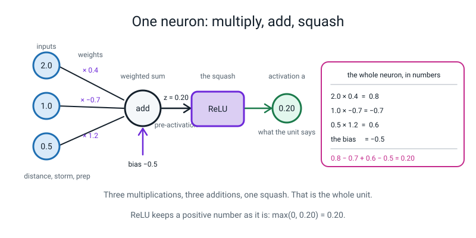
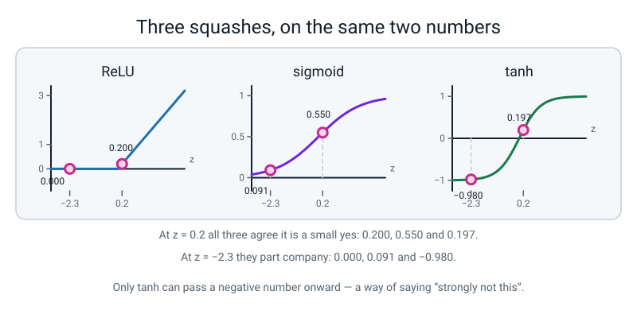
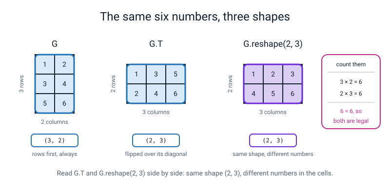
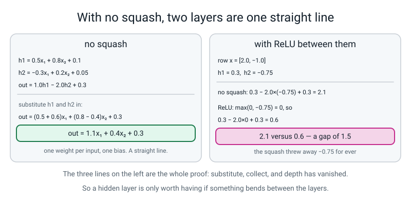
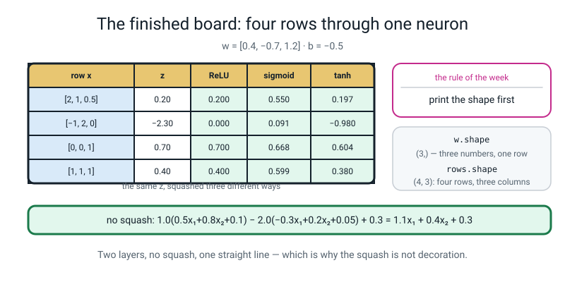
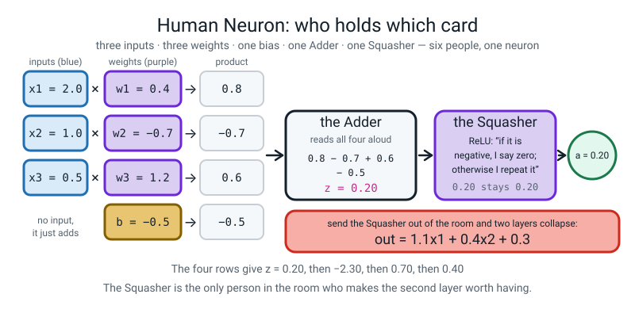
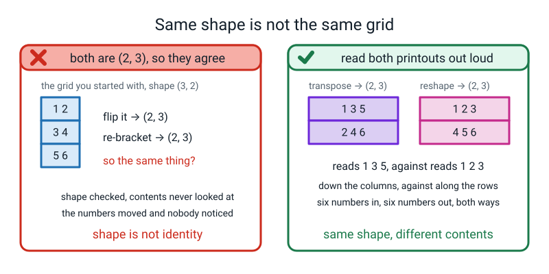
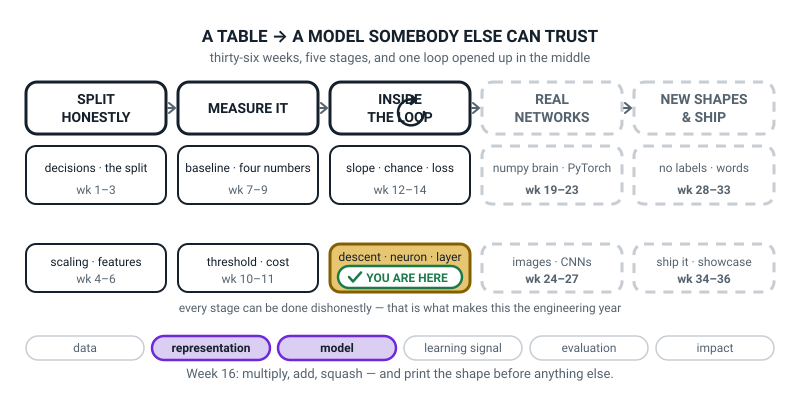
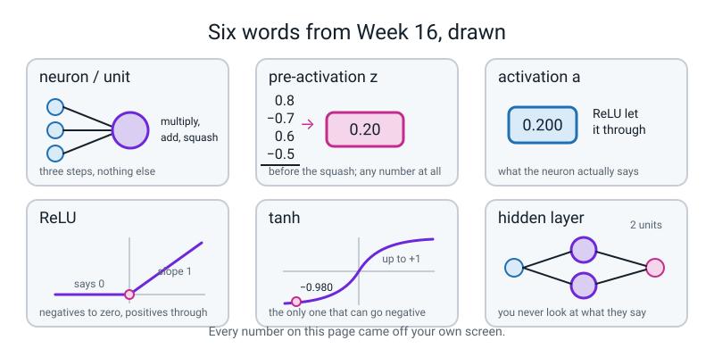

# Week 16 — One Neuron, By Hand

[⬅ Week 15](week-15.md) · [Course Home](../README.md) · [Next ➡](week-17.md) · [Workbook](../workbook/week-16.md)

---

> ### This week in one sentence
> **A neuron is three things you already do — multiply each input by a weight, add them up with a bias, then squash — and the squash is the only part that is new.**
>
> **By the end of this chapter you will be able to:**
> - **Compute one neuron's output by hand** from three inputs, three weights and a bias, for **ReLU, sigmoid and tanh** — and get the same three numbers numpy gets
> - **State the shape of an array before you run anything**, and be right eight times out of eight
> - **Prove in three lines of algebra** that two layers with no squash between them collapse into one straight line, and back it up with one row of numbers
> - **Say why ReLU is the default** hidden activation, using the number `0.25` as the reason
>
> **New maths:** **the shape of a grid of numbers** — rows × columns, written `(3, 2)`. That is the whole new idea, and it is counting.
>
> **New syntax:** `np.maximum(0, z)` · `np.tanh(z)` · `arr.reshape(r, c)` · `arr.T`
>
> **Reading time:** about 35 minutes. **Homework:** about 55 minutes.

---

## 🪝 Start Here

Picture a talent show with exactly one judge, and she has a very simple brain.

Every act gets three scores from the stage manager: **singing**, **dancing**, **stage presence**. The judge does not care about them equally. She likes singing a bit (`× 0.4`), she **hates** dancing (`× −0.7`), and she loves stage presence most of all (`× 1.2`). And she is permanently grumpy, so before she says anything at all she takes off half a point (`− 0.5`).

An act comes on. Singing `2.0`, dancing `1.0`, stage presence `0.5`. Do her arithmetic with her:

```
2.0 × 0.4    =  0.8
1.0 × (−0.7) = −0.7
0.5 × 1.2    =  0.6
the grumpiness = −0.5
```

Add them left to right, out loud: **`0.8 − 0.7 = 0.1`**, then **`+ 0.6 = 0.7`**, then **`− 0.5 = 0.20`**.

**`0.20`.** That is her private grumbling. It is not her verdict yet — she still has to turn a feeling into a public score, and *how* she does that is the only genuinely new thing this week.

The simplest kind of judge does this: **if I felt bad, I say nothing. If I felt good, I say exactly what I felt.** She felt `+0.20`, so she says `0.20`.

That judge has the ugliest name in the subject: **ReLU**. It stands for "rectified linear unit", which tells you nothing at all, so throw the words away and keep the rule: **negatives become zero, positives come through untouched.**

And the whole thing you just did — multiply each input by a weight, add them up, add the grumpiness, squash — has a name too.

**That is a neuron.** One. You just ran one with a pencil, and there was no calculus in it.

Every model in the news is millions of those. Not millions of *ideas* — millions of *that*.

---

## 🧠 The Big Idea

> **📌 About the code in this section.** The blocks below are **illustrations, not files**. Each one carries on from the one above, and the `import` lines are typed once, in the first block that needs them. **The complete runnable files are in 💻 Type This.** If you copy a block from this section on its own and Python says `NameError`, that is why, and nothing is broken.

### 1. Multiply, add, squash — and the two halves have names

**The plain explanation.** A neuron takes several numbers in, multiplies each one by its own weight, adds them all up, adds one extra number called the bias, and then passes the total through a squashing function. Three steps. That is the whole machine.

> **neuron** (also called a **unit**) — a tiny machine that multiplies each input by its own weight, adds the results plus a bias, and squashes the total.

You have been doing the first two steps since Week 15 — a weighted sum is exactly what `(X * w).sum(axis=1)` computed. **The only new part is the squash.**

The two halves of the answer have names, and both names appear in every error message and every book, so start using them today:

> **pre-activation** (written `z`) — the number you get *before* squashing: the weighted sum plus the bias. It can be any number at all: `−40`, `0`, `6000`.

> **activation** (written `a`) — the number you get *after* squashing. It is what the neuron actually says, and what it passes on.

**A concrete example, with real values.** Weights `w = [0.4, −0.7, 1.2]`, bias `b = −0.5`, row `x = [2.0, 1.0, 0.5]`. That is the judge from the hook, and her `z` was `0.20`. ReLU turns `z = 0.20` into `a = 0.200`.


*Figure 16.1 — One neuron: multiply, add, squash. `0.8 − 0.7 + 0.6 − 0.5 = 0.20`, and ReLU passes it through unchanged.*

**The bias is what lets a neuron be picky.** With `b = −0.5`, the three features have to earn at least `+0.5` between them before the neuron says a word. Set the bias to zero and the threshold is pinned at exactly zero for ever, which is one arbitrary choice out of infinitely many.

Here is that, measured. Take the row `x = [0, 0, 1]`:

```
with    b = −0.5:   z = 1.2 − 0.5 = 0.70    →  ReLU says 0.700
without b (b = 0):  z = 1.2       = 1.20    →  ReLU says 1.200
```

**Different judge, different opinion.** The bias is the neuron's **threshold**, and *threshold* is the word to write in your notes.

### 2. Three squashes, and only one of them can go negative

**The plain explanation.** There are three squashers you will meet everywhere. They all take one number and hand back one number, and they differ only in what range they are allowed to hand back.

| Squash | The rule, in words | Range it can return |
|---|---|---|
| **ReLU** | if it is negative, say zero; otherwise repeat it | `0` up to anything |
| **sigmoid** | squeeze everything into the gap between 0 and 1 | above `0`, below `1`, never either |
| **tanh** | squeeze everything into the gap between −1 and +1 | between `−1` and `+1` |

**🍕 The analogy.** Three judges on the same panel. ReLU is the one who says nothing when she is unhappy. Sigmoid is the diplomat — she will never say "definitely yes" or "definitely no", only "probably". Tanh is sigmoid's cousin who is allowed to say **"actively bad"**, because tanh can hand back a negative number and the other two cannot.

**A concrete example, with real values.** Two rows of the judge's data, and all three squashes on each. Every one of these numbers came off a real run:

| row | `z` | ReLU | sigmoid | tanh |
|---|---|---|---|---|
| `[2, 1, 0.5]` | **0.20** | 0.200 | 0.550 | 0.197 |
| `[−1, 2, 0]` | **−2.30** | 0.000 | 0.091 | **−0.980** |

Twelve numbers on that little table and exactly one of them is negative: **tanh's `−0.980`.** ReLU's floor is a hard zero; sigmoid's floor is zero but it never gets there; tanh is the only one of the three that can hand the next layer a negative number. That is genuinely useful sometimes, which is why tanh is still around.


*Figure 16.2 — Three squashes, on the same two numbers. Only tanh returns a negative number: `−0.980`.*

### 3. The shape of a grid, and why you print it first

**The plain explanation.** This is the one new piece of maths this week and it does not look like maths, because it is counting.

> **shape** — how many rows and how many columns a grid of numbers has, written as two numbers in brackets: **rows first, columns second.**

Here is a grid of six numbers:

```
[[1 2]
 [3 4]
 [5 6]]
```

Count the rows going **down**, with your finger: `1 2` is one, `3 4` is two, `5 6` is three. **Three rows.** Now count across any single row: `1`, `2`. **Two columns.** Shape `(3, 2)`. Say it out loud as **"three by two"**.

The brackets tell you the same thing if you look: there are three inner `[...]` groups, and two numbers inside each one.

**Now the promise, and it holds for the rest of the year: when something goes wrong, the first thing you print is the shape.** Not the values. The shape. Nine times out of ten those two numbers are the whole diagnosis.

**A concrete example.** Three things you can do to that grid, and all three are this week's syntax:

| Code | What it does | Shape before | Shape after |
|---|---|---|---|
| `G.T` | flip the grid on its diagonal — rows become columns | `(3, 2)` | `(2, 3)` |
| `G.reshape(2, 3)` | keep the same six numbers, re-lay them out | `(3, 2)` | `(2, 3)` |
| `np.maximum(0, G)` | squash every number, one at a time | `(3, 2)` | `(3, 2)` — unchanged |

**Look at rows one and two. Same shape out, and the numbers are in different places.** This is the misunderstanding of the week, so here it is with the real printouts side by side:

```
G.T =                   G.reshape(2, 3) =
[[1 3 5]                [[1 2 3]
 [2 4 6]]                [4 5 6]]
```

**`G.T` reads *down the columns* of the original. `G.reshape` reads *along the rows*.** Read them out loud, left to right: *"one, three, five"* against *"one, two, three"*. Both are `(2, 3)`. They are not the same grid.


*Figure 16.3 — The same six numbers, three shapes. `3 × 2 = 6` and `2 × 3 = 6`, so both grids hold the same six numbers.*

**And there is one shape that catches everybody.** A *flat* list of numbers has a shape with only **one** number in it, and a comma with nothing after it:

```python
a = np.array([1.0, 2.0, 3.0])
print(a.shape)      # (3,)
print(a.T.shape)    # (3,)   <- transposing it does NOTHING
```

`(3,)` means "three numbers, no rows and columns at all". **Transposing a flat list has no effect**, because there is nothing to flip. If you need a column, make it two-dimensional first: `a.reshape(1, 3).T` gives `(3, 1)`. The trailing comma in `(3,)` is not a typo and it is not a printing bug — it is Python saying *"this shape has exactly one number in it."*

One more word, because next week's code leans on it:

> **axis 0** goes **down the rows**. **axis 1** goes **across the columns**. Rows first, columns second — exactly the same order as the shape.

### 4. Layers, hidden layers, and the smallest network there is

**The plain explanation.** Three words to have *heard* this week. You will *use* them next week.

> **layer** — a row of neurons that all see the same inputs, each with their own weights and bias.

> **hidden layer** — a layer whose outputs you never look at directly. They exist only to feed the next layer. "Hidden" means hidden from *you*, not mysterious.

> **MLP** (multi-layer perceptron) — inputs, then one or more hidden layers, then an output layer, with every neuron connected to every neuron in the next layer. It is the plainest kind of neural network, and it is what you build in Week 19.

**A concrete example.** Here is the smallest interesting network there is — two inputs, **two** hidden units, one output. Nine numbers, all typed out:

```
h1 =  0.5·x₁ + 0.8·x₂ + 0.1
h2 = −0.3·x₁ + 0.2·x₂ + 0.05

out = 1.0·h1 − 2.0·h2 + 0.3
```

`h1` and `h2` are the hidden layer. Nobody ever reads what they say; they only report upwards to `out`. Hold on to those nine numbers — the next section takes them apart.

### 5. With no squash, two layers *are* one layer

**The plain explanation.** This is the point of the whole week, and it is why neural networks exist at all rather than being an expensive way to draw a straight line.

Look again at the network in section 4. **There is no squash anywhere in it.** `h1` and `h2` are plain weighted sums, and so is `out`. Now substitute the top two lines into the bottom one.

> **🔢 The maths, slowly.** One step at a time, and do not skip any.
>
> ```
> out = 1.0 × (0.5x₁ + 0.8x₂ + 0.1) − 2.0 × (−0.3x₁ + 0.2x₂ + 0.05) + 0.3
> ```
>
> Multiply out the first bracket: `0.5x₁ + 0.8x₂ + 0.1`.
>
> Multiply out the second, remembering that the `−2.0` flips every sign inside it:
> `−2.0 × (−0.3x₁) = +0.6x₁`, `−2.0 × (0.2x₂) = −0.4x₂`, `−2.0 × 0.05 = −0.1`.
>
> Now collect. The `x₁` terms: `0.5 + 0.6 = 1.1`. The `x₂` terms: `0.8 − 0.4 = 0.4`. The plain numbers: `0.1 − 0.1 + 0.3 = 0.3`.
>
> ```
> out = 1.1x₁ + 0.4x₂ + 0.3
> ```

**Count the layers in that answer. One.** There is no `h` anywhere in it: it is a single weighted sum of the two inputs, plus a single bias. The two-layer network did not *become* one layer — **it always was one, written out the long way.**

Ten layers with no squash would collapse the same way. A hundred would. **Depth without a squash buys exactly nothing.**

**A concrete example, because algebra convinces about half of people and a number convinces the rest.** Take `x = [2.0, −1.0]`:

```
h1 = 0.5(2.0) + 0.8(−1.0) + 0.1   =  1.0 − 0.8 + 0.1  =   0.30
h2 = −0.3(2.0) + 0.2(−1.0) + 0.05 = −0.6 − 0.2 + 0.05 =  −0.75

no squash:  out = 1.0(0.30) − 2.0(−0.75) + 0.3 = 0.30 + 1.50 + 0.30 = 2.10
one line:   out = 1.1(2.0) + 0.4(−1.0) + 0.3   = 2.20 − 0.40 + 0.30 = 2.10   ← same
```

**Now put a ReLU in the middle.** `h2` was `−0.75`, and ReLU turns that into `0`:

```
with ReLU:  out = 1.0(0.30) − 2.0(0) + 0.3 = 0.30 + 0 + 0.30 = 0.60
```

**`2.10` against `0.60`. A gap of exactly `1.50`, and no straight line can produce it.**

ReLU threw the `−0.75` in the bin. That is not damage — **that is the bend.** Throwing information away *for some rows and not others* is the only way a straight line becomes a curve.


*Figure 16.4 — With no squash, two layers are one straight line. With ReLU the `−0.75` becomes `0`, the answer drops from `2.1` to `0.6`, and the gap is `1.5`.*

---

## 🔢 The Maths, Slowly

**The new maths this week is the shape, and section 3 did it.** So this section spends its time on a *number* instead — the number that explains why almost everybody uses ReLU in the middle of a network and almost nobody uses sigmoid.

### Step 1 — measure how steep each squash is, with Week 12's nudge

You have been measuring steepness since Week 12. Pick a point. Step a thousandth above it and a thousandth below. Subtract the two answers. Divide by `0.002`. That is all "how steep is it here" means.

Do sigmoid at `z = 0` on a calculator, and check my arithmetic:

```
sigmoid(0.001) = 1 ÷ (1 + e^(−0.001)) = 1 ÷ 1.9990005 = 0.50025000
sigmoid(−0.001) = 1 ÷ (1 + e^(0.001)) = 1 ÷ 2.0010005 = 0.49975000

it moved:  0.50025000 − 0.49975000 = 0.00050000
we moved:  0.002

0.00050000 ÷ 0.002 = 0.250000
```

**Sigmoid's steepness at `z = 0` is `0.25`.**

### Step 2 — build the table, and read the sigmoid column out loud

Five values of `z`, three squashes, all measured by nudging. This is real output:

```text
     z sigmoid slope   tanh slope   ReLU slope
   0.0     0.250000     1.000000     0.500000
   1.0     0.196612     0.419974     1.000000
   2.0     0.104994     0.070651     1.000000
   5.0     0.006648     0.000182     1.000000
  10.0     0.000045     0.000000     1.000000
```

**Read down the sigmoid column.** `0.25`, `0.197`, `0.105`, `0.0066`, `0.000045`. The very steepest sigmoid ever gets is **`0.25`, in the middle**, and by `z = 5` it is essentially flat.

**Now read down the ReLU column.** `1.000000`, all the way, everywhere it fires.

### Step 3 — notice the pattern, and name it

Here is the fact you will meet properly in two weeks: **when you stack layers, their steepnesses multiply.** So five sigmoid layers, at sigmoid's absolute best:

```
0.25 × 0.25 × 0.25 × 0.25 × 0.25 = 0.0009765625
```

**One thousandth of the signal survives five layers.** Check it on a calculator: `0.25` to the power five.

And five ReLU layers:

```
1 × 1 × 1 × 1 × 1 = 1
```

**All of it.**

That multiplication is the entire reason ReLU is the default hidden activation. It is not a fashion and it is not an opinion — it is `0.25⁵` against `1⁵`, and it is why deep networks did not really work until people switched to ReLU around 2012. **You have just done, on a calculator, the arithmetic that unlocked the field.**

> **🧑‍🏫 If you are wondering why ReLU's slope says `0.500000` at `z = 0`:** because ReLU has a **corner** there, and a corner has no single steepness. Nudge up and the slope is 1. Nudge down and it is 0. A two-sided nudge splits the difference and reports `0.5`. **This is not a fact anybody discovered — it is a decision somebody made.** PyTorch, in Week 20, will tell you `0`. Both are defensible. Maths genuinely has a hole here and engineering filled it with a choice.

> **⚠️ Watch out:** tanh's slope at `z = 0` is `1.000000`, which is **four times steeper than sigmoid**. So why is tanh not the default? Because it flattens out *worse* further along — by `z = 5` tanh is `0.000182` against sigmoid's `0.006648`. Tanh is better in the middle and worse at the edges. **ReLU never flattens at all on the side that fires**, and that is the whole argument.

---

## 💻 Type This

Three small files. **Nothing trains, nothing downloads, and every one of them runs in well under a second.**

### Step 1 — the weights, and the shape reflex

Start a file called `neuron.py`:

```python
import numpy as np

np.random.seed(0)
np.set_printoptions(precision=6, suppress=True)

w = np.array([0.4, -0.7, 1.2])
b = -0.5

rows = np.array([[2.0, 1.0, 0.5],
                 [-1.0, 2.0, 0.0],
                 [0.0, 0.0, 1.0],
                 [1.0, 1.0, 1.0]])

print("w.shape    =", w.shape)
print("rows.shape =", rows.shape)
```

**What each new line does.** `np.random.seed(0)` fixes the dice — nothing here is random, but it is a habit worth having in every file. `np.set_printoptions(precision=6, suppress=True)` says "print six decimal places, and never use scientific notation like `1e-05`"; it changes printing only, never the maths. `np.array([...])` builds a grid from a list — `w` has no inner lists, so it is **flat**. `rows` is lists inside a list: four inner lists of three numbers each. And `.shape` is a **property**, not a function — no brackets.

```text
w.shape    = (3,)
rows.shape = (4, 3)
```

**`(3,)` has a comma and then nothing, and that is not a typo.** `w` is flat: three numbers, no rows and columns. `rows` is `(4, 3)` — **four rows, three columns.** Four acts, three scores each.

### Step 2 — the squashers, and a real error on purpose

Add this, with the wrong function on purpose:

```python
def relu(z):
    return max(0, z)

z_all = (rows * w).sum(axis=1) + b
print(relu(z_all))
```

```text
Traceback (most recent call last):
  File "neuron.py", line 17, in <module>
    print(relu(z_all))
  File "neuron.py", line 14, in relu
    return max(0, z)
ValueError: The truth value of an array with more than one element is ambiguous. Use a.any() or a.all()
```

**Read the last line before you read anything else.** Python's built-in `max` looks at two things and asks *"is this one bigger?"* — one question, one yes-or-no answer. You handed it **four numbers at once**, and *"is `[0.2, −2.3, 0.7, 0.4]` bigger than zero"* has no single answer. Some of them are.

**numpy's version asks the question once per number.** Fix it:

```python
def relu(z):
    return np.maximum(0, z)

def sigmoid(z):
    return 1.0 / (1.0 + np.exp(-z))

z_all = (rows * w).sum(axis=1) + b
print("z_all       =", z_all)
print("z_all.shape =", z_all.shape)
print("relu(z_all) =", relu(z_all))
```

```text
z_all       = [ 0.2 -2.3  0.7  0.4]
z_all.shape = (4,)
relu(z_all) = [0.2 0.  0.7 0.4]
```

**Write this sentence in your Bug Log: `max` asks one question; `np.maximum` asks one question per cell.** It is a difference you will meet a hundred more times — **built-in Python functions work on one thing; numpy functions work on every cell.**

### Step 3 — the loop, and the four-row table

```python
print("%-18s %8s %8s %9s %8s" % ("row", "z", "ReLU", "sigmoid", "tanh"))
for r in rows:
    z = (r * w).sum() + b
    print("%-18s %8.2f %8.3f %9.3f %8.3f"
          % (str(r), z, relu(z), sigmoid(z), np.tanh(z)))
```

**What each new line does.** `for r in rows:` means "do this once for each row, calling it `r`". `r * w` multiplies **matching positions** — first with first, second with second, third with third — giving three products. `.sum()` adds those three up, and `+ b` adds the bias. **That single line is "multiply, add".** The `%` string is a layout instruction: `%8.3f` means "a decimal, eight characters wide, three places after the point", so the columns line up. `np.tanh(z)` is the third squash, built into numpy.

```text
row                       z     ReLU   sigmoid     tanh
[2.  1.  0.5]          0.20    0.200     0.550    0.197
[-1.  2.  0.]         -2.30    0.000     0.091   -0.980
[0. 0. 1.]             0.70    0.700     0.668    0.604
[1. 1. 1.]             0.40    0.400     0.599    0.380
```

**Check one by mental arithmetic.** Row three is `[0, 0, 1]`. Nought times `0.4`, nought times `−0.7`, one times `1.2`, minus `0.5`. **`1.2 − 0.5 = 0.7`.** The screen says `0.70`. There is nothing in this program you cannot do with a pencil. It is just faster.

### Step 4 — the whole of `neuron.py`, in one block

```python
"""neuron.py - one neuron, by hand, checked in numpy."""
import numpy as np

np.random.seed(0)
np.set_printoptions(precision=6, suppress=True)

w = np.array([0.4, -0.7, 1.2])
b = -0.5

rows = np.array([[2.0, 1.0, 0.5],
                 [-1.0, 2.0, 0.0],
                 [0.0, 0.0, 1.0],
                 [1.0, 1.0, 1.0]])

print("w.shape    =", w.shape)
print("rows.shape =", rows.shape)
print()

def relu(z):
    return np.maximum(0, z)

def sigmoid(z):
    return 1.0 / (1.0 + np.exp(-z))

print("%-18s %8s %8s %9s %8s" % ("row", "z", "ReLU", "sigmoid", "tanh"))
for r in rows:
    z = (r * w).sum() + b
    print("%-18s %8.2f %8.3f %9.3f %8.3f"
          % (str(r), z, relu(z), sigmoid(z), np.tanh(z)))
```

```text
w.shape    = (3,)
rows.shape = (4, 3)

row                       z     ReLU   sigmoid     tanh
[2.  1.  0.5]          0.20    0.200     0.550    0.197
[-1.  2.  0.]         -2.30    0.000     0.091   -0.980
[0. 0. 1.]             0.70    0.700     0.668    0.604
[1. 1. 1.]             0.40    0.400     0.599    0.380
```

**Runtime: well under a second.**

### Step 5 — `shapes.py`, and a second error on purpose

New file. Type the reshape that cannot exist:

```python
import numpy as np
G = np.array([[1, 2], [3, 4], [5, 6]])
print("G.shape =", G.shape)
print(G.reshape(4, 2))
```

```text
G.shape = (3, 2)
Traceback (most recent call last):
  File "shapes.py", line 4, in <module>
    print(G.reshape(4, 2))
ValueError: cannot reshape array of size 6 into shape (4,2)
```

**That message names two numbers, and they are the diagnosis.** `size 6` is how many numbers exist. `(4, 2)` needs `4 × 2 = 8` cells. numpy will not invent two numbers and will not throw two away, so it stops. **Which shapes are legal for six numbers?** `(1, 6)`, `(2, 3)`, `(3, 2)`, `(6, 1)` — anything whose two numbers multiply to six.

Here is the whole working file:

```python
"""shapes.py - the shape is the first thing you print."""
import numpy as np

np.random.seed(0)

G = np.array([[1, 2],
              [3, 4],
              [5, 6]])

print("G ="); print(G)
print("G.shape           =", G.shape)
print()
print("G.T ="); print(G.T)
print("G.T.shape         =", G.T.shape)
print()
print("G.reshape(2, 3) ="); print(G.reshape(2, 3))
print("reshape(2,3).shape =", G.reshape(2, 3).shape)
print()
print("np.maximum(0, G.T).shape =", np.maximum(0, G.T).shape)
a = np.array([1.0, 2.0, 3.0])
print("a.shape                  =", a.shape)
print("a.T.shape                =", a.T.shape)
print("a.reshape(1, 3).T.shape  =", a.reshape(1, 3).T.shape)
```

```text
G =
[[1 2]
 [3 4]
 [5 6]]
G.shape           = (3, 2)

G.T =
[[1 3 5]
 [2 4 6]]
G.T.shape         = (2, 3)

G.reshape(2, 3) =
[[1 2 3]
 [4 5 6]]
reshape(2,3).shape = (2, 3)

np.maximum(0, G.T).shape = (2, 3)
a.shape                  = (3,)
a.T.shape                = (3,)
a.reshape(1, 3).T.shape  = (3, 1)
```

**Runtime: well under a second.** Look at the last three lines. `a.T` did **nothing at all** and there was no error — that is the silent one, and it will bite next week.

### Step 6 — `collapse.py`, the file that proves the point

```python
"""collapse.py - with no squash, two layers are one straight line."""
import numpy as np

np.random.seed(0)
np.set_printoptions(precision=6, suppress=True)

def two_layers_no_squash(x1, x2):
    h1 = 0.5 * x1 + 0.8 * x2 + 0.1
    h2 = -0.3 * x1 + 0.2 * x2 + 0.05
    return 1.0 * h1 - 2.0 * h2 + 0.3

def one_straight_line(x1, x2):
    return 1.1 * x1 + 0.4 * x2 + 0.3

def two_layers_with_relu(x1, x2):
    h1 = np.maximum(0, 0.5 * x1 + 0.8 * x2 + 0.1)
    h2 = np.maximum(0, -0.3 * x1 + 0.2 * x2 + 0.05)
    return 1.0 * h1 - 2.0 * h2 + 0.3

tests = [(2.0, -1.0), (1.0, 2.0), (0.0, 0.5), (-1.0, -1.0), (3.0, 3.0)]

print("%-14s %14s %14s %10s %14s" % ("(x1, x2)", "two layers", "one line", "gap", "with ReLU"))
for x1, x2 in tests:
    a = two_layers_no_squash(x1, x2)
    b = one_straight_line(x1, x2)
    c = two_layers_with_relu(x1, x2)
    print("%-14s %14.6f %14.6f %10.6f %14.6f"
          % ("(%.1f, %.1f)" % (x1, x2), a, b, abs(a - b), c))

gaps = [abs(two_layers_no_squash(a, b) - one_straight_line(a, b)) for a, b in tests]
print()
print("biggest disagreement between two layers and one line:", max(gaps))
```

```text
(x1, x2)           two layers       one line        gap      with ReLU
(2.0, -1.0)          2.100000       2.100000   0.000000       0.600000
(1.0, 2.0)           2.200000       2.200000   0.000000       2.200000
(0.0, 0.5)           0.500000       0.500000   0.000000       0.500000
(-1.0, -1.0)        -1.200000      -1.200000   0.000000       0.000000
(3.0, 3.0)           4.800000       4.800000   0.000000       4.300000

biggest disagreement between two layers and one line: 4.440892098500626e-16
```

**Runtime: well under a second.** Three things to look at.

The **`gap` column is `0.000000` on every single row.** The two-layer network and the single line are not "close" — they are the same function.

The **last line says the biggest disagreement anywhere is `4.44e-16`**, which is zero as far as a computer is concerned. It is the same rounding wobble that makes `0.1 + 0.2` print as `0.30000000000000004`.

And the **`with ReLU` column disagrees on three of the five rows** — `(2.0, −1.0)`, `(−1.0, −1.0)` and `(3.0, 3.0)`. That is precisely the network doing something a line cannot.

---

## 🔍 Worked Examples

### Worked Example 1 — A spam-filter neuron (three new weights)

A neuron that guesses whether a text is spam. Three inputs: **exclamation marks**, **links**, **all-caps words**. Weights `w = [0.9, 1.4, −0.6]`, bias `b = −1.5`.

**Step 1 — the shape, first, before anything else.** Three weights, three rows of three inputs:

```text
w.shape = (3,)  rows.shape = (3, 3)
```

**Step 2 — row one by hand.** `x = [2.0, 1.0, 0.0]` — two exclamation marks, one link, no shouting:

```
2.0 × 0.9    =  1.8
1.0 × 1.4    =  1.4
0.0 × (−0.6) =  0.0
the bias     = −1.5
                ----
z            =  1.70
```

**Step 3 — the three squashes on `z = 1.70`.** ReLU: positive, so `1.700`. Sigmoid: `e^(−1.7) = 0.182684`, so `1 ÷ 1.182684 = 0.845535` → `0.846`. Tanh, off the calculator's `tanh` key: `0.935409` → `0.935`.

**Step 4 — all three rows, checked in numpy.**

```text
w.shape = (3,)  rows.shape = (3, 3)
row                       z     ReLU   sigmoid     tanh
[2. 1. 0.]             1.70    1.700     0.846    0.935
[0. 0. 3.]            -3.30    0.000     0.036   -0.997
[1. 3. 1.]             3.00    3.000     0.953    0.995
```

**Read row two.** `[0, 0, 3]` — no exclamation marks, no links, three shouted words. `z = 3 × (−0.6) − 1.5 = −3.30`. **ReLU says `0.000` — silence. Sigmoid says `0.036`. Tanh says `−0.997`.** Three judges, three ways of saying "no". Only tanh actually says *"actively not spam"*.

### Worked Example 2 — Shapes on a real exam-marks table

Five students, three subjects. Real marks, typed by hand:

```text
M =
[[62 71 55]
 [48 39 80]
 [91 88 72]
 [70 70 70]
 [33 58 64]]
M.shape        = (5, 3)
```

**Step 1 — count it off with your finger.** Five rows down, three across. `(5, 3)` — **students first, subjects second.**

**Step 2 — transpose it, and say what it now means.**

```text
M.T.shape      = (3, 5)
M.T =
[[62 48 91 70 33]
 [71 39 88 70 58]
 [55 80 72 70 64]]
```

`(3, 5)` — now the rows are **subjects** and the columns are **students**. Row 0 is everybody's mark in subject 1. **Same fifteen numbers, a different question.**

**Step 3 — reshape it, and watch the meaning fall apart.**

```text
M.reshape(3,5) =
[[62 71 55 48 39]
 [80 91 88 72 70]
 [70 70 33 58 64]]
M.reshape(3,5).shape = (3, 5)
```

**Same shape as `M.T`, and completely different numbers.** Reshape just walked along the rows and re-drew the brackets, so row 0 is now *"student 1's three marks and then two of student 2's"*, which means nothing at all. **Reshape is a re-bracketing, not a rearrangement, and it is up to you to know whether the result means anything.**

**Step 4 — ask for a shape that cannot exist.**

```text
M.reshape(4,4) -> cannot reshape array of size 15 into shape (4,4)
```

`4 × 4 = 16` and there are 15 numbers. The legal shapes for 15 numbers are `(1,15)`, `(3,5)`, `(5,3)` and `(15,1)`.

**Step 5 — the flat one.**

```text
M[0] = [62 71 55]  shape (3,)  M[0].T.shape (3,)
M[0].reshape(1,3).T.shape = (3, 1)
```

One row pulled out of a 2-D grid is **flat**, `(3,)`. Transposing it does nothing. To stand it up as a column you must make it 2-D first.

### Worked Example 3 — The collapse again, with house prices

A different two-layer network, no squash, predicting a house price from **rooms** (`x₁`) and **distance to the station in km** (`x₂`):

```
h1 =  0.2·x₁ + 1.5·x₂ − 0.4
h2 =  0.6·x₁ − 0.9·x₂ + 0.2

out = 2.0·h1 + 1.0·h2 − 0.1
```

**Step 1 — substitute and collect.**

```
out = 2.0(0.2x₁ + 1.5x₂ − 0.4) + 1.0(0.6x₁ − 0.9x₂ + 0.2) − 0.1

x₁ terms:   0.4 + 0.6 = 1.0
x₂ terms:   3.0 − 0.9 = 2.1
numbers:   −0.8 + 0.2 − 0.1 = −0.7

out = 1.0·x₁ + 2.1·x₂ − 0.7
```

**One weighted sum, one bias, one straight line** — even though the middle numbers are completely different from section 5's.

**Step 2 — check it on four rows, in numpy.**

```text
(x1,x2)          two layers     one line        gap    with ReLU
(3.0, 2.0)         6.500000     6.500000   0.000000     6.500000
(1.0, 4.0)         8.700000     8.700000   0.000000    11.500000
(0.0, 0.0)        -0.700000    -0.700000   0.000000     0.100000
(5.0, 1.0)         6.400000     6.400000   0.000000     6.400000
```

**The `gap` column is zero on every row again.** Different weights, same collapse. This is not a coincidence about the numbers I chose — it is what "no squash" always means.

**Step 3 — find where ReLU changed the answer, and say why.** Look at row 2, `(1.0, 4.0)`:

```
h1 = 0.2(1.0) + 1.5(4.0) − 0.4 = 0.2 + 6.0 − 0.4 =  5.80
h2 = 0.6(1.0) − 0.9(4.0) + 0.2 = 0.6 − 3.6 + 0.2 = −2.80
```

`h2` is negative, so **ReLU sets it to 0** and its `1.0 × (−2.80) = −2.80` contribution vanishes. `8.700000 + 2.80 = 11.500000`. **The gap is exactly the number that got thrown away.** Row 3, `(0.0, 0.0)`, is the same story: `h1 = −0.4` gets binned, and `−0.700000 + 2 × 0.4 = 0.100000`.

---

## 🐞 When It Breaks

Errors are not failure. They are the fastest reading practice you will get all year.

### Break 1 — `max` where you meant `np.maximum`

```python
import numpy as np
z = np.array([-2.3, 0.2, 0.7])
print(max(0, z))
```

```text
Traceback (most recent call last):
  File "bad_max.py", line 3, in <module>
    print(max(0, z))
ValueError: The truth value of an array with more than one element is ambiguous. Use a.any() or a.all()
```

**What it means:** you asked one yes-or-no question about three numbers at once.
**The fix:** `np.maximum(0, z)` → `[0.  0.2 0.7]`. It asks the question once per cell.

> **🐞 If you see this error:** it almost always means a built-in Python function (`max`, `min`, or an `if` on a whole array) has been handed a grid. Reach for the `np.` version.

### Break 2 — a reshape that cannot exist

```python
import numpy as np
G = np.array([[1, 2], [3, 4], [5, 6]])
print(G.reshape(4, 2))
```

```text
Traceback (most recent call last):
  File "bad_reshape.py", line 3, in <module>
    print(G.reshape(4, 2))
ValueError: cannot reshape array of size 6 into shape (4,2)
```

**The two numbers:** `size 6` (what you have) against `(4,2)`, which needs `4 × 2 = 8` cells.
**The fix:** any shape whose two numbers multiply to 6 — `(2, 3)`, `(3, 2)`, `(1, 6)` or `(6, 1)`.

This is the friendliest error message you will get all year: it tells you the total it has *and* the total you asked for, and the fix is arithmetic.

### Break 3 — one weight too many

```python
import numpy as np
rows = np.array([[2.0, 1.0, 0.5], [-1.0, 2.0, 0.0]])
w = np.array([0.4, -0.7, 1.2, 0.9])
print((rows * w).sum(axis=1))
```

```text
Traceback (most recent call last):
  File "bad_bcast.py", line 4, in <module>
    print((rows * w).sum(axis=1))
ValueError: operands could not be broadcast together with shapes (2,3) (4,) 
```

**The two numbers:** the `3` in `(2,3)` — three columns of data — against the `4` in `(4,)` — four weights.
**The fix:** delete the fourth weight. **One weight per column, always.** And the diagnosis is `print(rows.shape, w.shape)`, which is this week's reflex.

### Break 4 — the one with no error at all

```python
import numpy as np
a = np.array([1.0, 2.0, 3.0])
print("a.shape   =", a.shape)
print("a.T.shape =", a.T.shape)
print("a.reshape(1, 3).T.shape =", a.reshape(1, 3).T.shape)
```

```text
a.shape   = (3,)
a.T.shape = (3,)
a.reshape(1, 3).T.shape = (3, 1)
```

**Nothing crashed and nothing happened.** Transposing a flat list does nothing, because a flat list has no rows and columns to swap. To get a column you must make it 2-D first. **This is the silent one, and it is the one that will bite in Week 17.**

### The whole clinic, for reference

| Message | What it means | The fix |
|---|---|---|
| `ValueError: The truth value of an array ... is ambiguous` | one yes-or-no question, many numbers | `np.maximum(0, z)`, or `(z > 0)` for a per-cell answer |
| `ValueError: cannot reshape array of size 6 into shape (4,2)` | six numbers cannot fill eight cells | pick a shape whose two numbers multiply to 6 |
| `ValueError: operands could not be broadcast together with shapes (2,3) (4,)` | three columns, four weights | one weight per column |
| `AttributeError: 'list' object has no attribute 'shape'` | a plain Python list has no shape | wrap it: `np.array([...])` |
| `TypeError: 'tuple' object is not callable` | `.shape` is a property, not a function | drop the brackets: `arr.shape` |
| `AttributeError: module 'numpy' has no attribute 'maxium'` | a typo | `np.maximum` — m-a-x-i-m-u-m. **Not** `np.max`, which is a different function |
| **no error**, `a.T` prints the same as `a` | `a` is flat, `(3,)` — nothing to flip | `a.reshape(1, 3).T` gives `(3, 1)` |
| **no error**, every sigmoid answer is `0.5` | every `z` is zero | print `z` before squashing; the multiply-and-add never happened |
| **no error**, all three squash columns identical | the same function got pasted into all three slots | read the print line back, slot by slot |
| **no error**, every answer off by exactly the bias | `+ b` is missing | this is the most common slip of the week |

---

## 🎲 What We Did In Class

**Human Neuron, and then we sent the Squasher out of the room.**

### Part 1 — six people became one neuron

Six index cards, written big: three inputs, three weights, one bias. Six jobs: **three Input holders** (read your number when pointed at), **one Weight holder**, **one Adder** (does the running total **out loud**), **one Squasher** (says the rule *before* the answer).


*Figure 16.5 — The finished board: four rows through one neuron. `w.shape` is `(3,)` and `rows.shape` is `(4, 3)`, and printing them is the first thing you do.*

The script, four times over. Input one: *"two point oh."* Weight one: *"times nought point four."* Product: *"nought point eight."* … then the bias: *"minus nought point five"* … then the Adder: *"nought point eight, minus nought point seven is nought point one, plus nought point six is nought point seven, minus nought point five is **nought point two**."* Then the Squasher: *"negatives become zero, positives come through. It is positive, so **nought point two**."*

The four rows, and the twelve squash answers we filled in with calculators:

| row | `z` | ReLU | sigmoid | tanh |
|---|---|---|---|---|
| `[2, 1, 0.5]` | **0.20** | 0.200 | 0.550 | 0.197 |
| `[−1, 2, 0]` | **−2.30** | 0.000 | 0.091 | −0.980 |
| `[0, 0, 1]` | **0.70** | 0.700 | 0.668 | 0.604 |
| `[1, 1, 1]` | **0.40** | 0.400 | 0.599 | 0.380 |

**If you missed the class, do this at home with a calculator and a piece of paper before you run `neuron.py`.** Doing it with your hands is why it sticks.

### Part 2 — the Squasher left the room

Then the two-layer network went on the board with **no ReLU anywhere in it**, and we substituted:

```
out = 1.0(0.5x₁ + 0.8x₂ + 0.1) − 2.0(−0.3x₁ + 0.2x₂ + 0.05) + 0.3

x₁ terms:  0.5 + 0.6 = 1.1
x₂ terms:  0.8 − 0.4 = 0.4
numbers:   0.1 − 0.1 + 0.3 = 0.3

out = 1.1·x₁ + 0.4·x₂ + 0.3
```

**Count the layers: one.** Then the row `x = [2.0, −1.0]`, run three ways: `2.10` with two layers and no squash, `2.10` with the single line, and `0.60` once ReLU was allowed back in.


*Figure 16.6 — Human Neuron: who holds which card. The Adder reads out `0.8 − 0.7 + 0.6 − 0.5` and gets `z = 0.20`.*

### The last ninety seconds

`moons.png` went up on the screen — 400 points, two features, two classes, 200 each:

```text
X.shape = (400, 2)
y.shape = (400,)
first three rows of X:
[[-0.49511301  0.96602758]
 [ 1.71424117 -0.49933902]
 [ 1.3702969  -0.37944818]]
first three labels  : [0 1 1]
class counts        : [200 200]
```

Two crescents, hooked into each other like links of a chain. **Try to separate them with one straight line. You cannot.** Everything you have built this term draws a straight line, so for the next four weeks the whole job is: **build something that can bend.** And you met the bend today. It is the squash.

---

## 💬 Talk About It

**1. The bias is one number out of four in this neuron. Is it really pulling its weight?**

*Hint:* start by working out what it *does*, not what it is worth. Run `[0, 0, 1]` with the bias (`z = 0.70`) and without (`z = 1.20`). Then ask the harder question: **is there any way to get the same effect using only the three weights?** Try it — you cannot, because the weights only ever get multiplied by the inputs, so when the inputs are all zero the weights can do nothing at all and the bias is the only thing left. **The bias is the only knob that has an opinion about an empty row.**

**2. `G.T` and `G.reshape(2, 3)` are both `(2, 3)`. Is one of them more "correct" than the other?**

*Hint:* neither, and that is the point — they answer different questions. Use Worked Example 2 as the test case. `M.T` turns a students-by-subjects table into a subjects-by-students table, and every number still means what it meant. `M.reshape(3, 5)` produces a grid whose rows mean nothing at all. **So the real answer is that numpy will happily give you a grid that is arithmetically fine and semantically nonsense, and only you can tell the difference.** Then the closer: which of the two would you *ever* use on a table of data?

**3. If two layers with no squash are just one layer, why not build networks with one enormous layer and skip the depth?**

*Hint:* be careful — this is a genuinely good question and the honest answer is not "depth is magic". Start with what one layer *plus* a squash can already do (quite a lot). Then think about the number of knobs: two layers of 16 units on 2 inputs is `2×16 + 16×1 = 48` weights, while one layer wide enough to draw the same shape needs far more. **Depth is a way of buying complicated shapes cheaply**, and Week 19 will let you count the hinges and see it. Nobody should leave this conversation thinking depth is mystical.

---

## ⚠️ Don't Get Tricked

### Trick 1 — "`.T` and `.reshape` are the same thing, they both gave `(2, 3)`"


*Figure 16.7 — Wrong and right: same shape is not the same grid. Transpose reads down the columns and gives `1 3 5`; reshape reads along the rows and gives `1 2 3`.*

| ❌ Wrong | ✅ Right |
|---|---|
| "Both answers are `(2, 3)`, so `.T` and `.reshape(2, 3)` do the same job." | **Same shape, different contents.** `G.T` is `[[1 3 5], [2 4 6]]` — it reads **down the columns**. `G.reshape(2, 3)` is `[[1 2 3], [4 5 6]]` — it reads **along the rows**. Shape is not identity. |

The check is to read both printouts out loud. *"One, three, five"* against *"one, two, three."* Your ears will catch what your eyes skipped.

### Trick 2 — "the bias is a rounding-off number, you could leave it out"

| ❌ Wrong | ✅ Right |
|---|---|
| "It is only `−0.5`. The weights are what matter." | The bias is the neuron's **threshold**. With `b = −0.5` the features must earn more than `0.5` before the neuron speaks. Set `b = 0` and the threshold is pinned at exactly zero for ever. **Measured:** row `[0, 0, 1]` gives `z = 0.70` with the bias and `z = 1.20` without. Two different judges. |

### Trick 3 — "the squash is there to keep the numbers tidy"

| ❌ Wrong | ✅ Right |
|---|---|
| "It stops the numbers getting silly. Nice, but cosmetic." | The squash is there **so the second layer is not a waste of money.** Without it, two layers *are* one layer — three lines of algebra prove it and the `gap` column of `collapse.py` is `0.000000` on every row. **Measured:** `2.10` without the squash against `0.60` with it. Tidiness is a side effect. |

If you leave this week believing the squash is cosmetic, the week has failed even if all eighteen of your homework numbers are right.

### Trick 4 — "tanh's slope at zero is 1.0 and sigmoid's is 0.25, so tanh must be the best"

| ❌ Wrong | ✅ Right |
|---|---|
| "Four times steeper in the middle. Tanh wins." | Tanh is better **in the middle** and worse **at the edges.** At `z = 5`, tanh's slope is `0.000182` and sigmoid's is `0.006648` — tanh is thirty-six times flatter. **ReLU is `1.000000` at `z = 1`, `2`, `5` and `10`, and never flattens at all on the side that fires.** That is the argument, and it is a column of a table, not an opinion. |

---

## 🌍 Where You've Seen This

1. **Your phone unlocking with your face.** A stack of layers of exactly this neuron, with a convolution in front of it. The neuron does not change between Week 16 and a phone — only how many of them there are.
2. **The "you might also like" row on a streaming app.** Weighted sums of things you watched, squashed, stacked, and turned into a score per title.
3. **Every spam filter you have ever benefited from.** Worked Example 1 is a small honest version of the real thing: features counted, weighted, summed, squashed.
4. **A hearing aid deciding what is speech and what is a fridge humming.** Small networks running on a chip in your ear, doing millions of multiply-add-squash a second.
5. **`np.maximum` and `torch.relu`.** The two most-called functions in machine learning, and both do exactly what the Squasher did with a piece of card.
6. **The `.shape` of things, everywhere.** Every array bug in every data job in the world is diagnosed by printing two numbers. This is not a school habit; it is the habit.

---

## 🧭 Where This Fits

Same gold box as last week — *descent · neuron · layer* is a four-week tile and this is the second of
the four. Last week you built the **descent**. This week you build the **neuron**, and it turns out to
be three things you could already do.



*Figure 16.0 — The pipeline in Week 16. Second week inside the same gold tile. Stage four, REAL
NETWORKS, is still dashed — you are building the part a network is made of, not the network.*

| | |
|---|---|
| **The mental model you now own** | A neuron is **three things**: multiply each input by a weight, add them up with a bias, **squash**. Stacking neurons is only interesting *because* of the squash — take it away and ten layers collapse back into one straight line, and you can prove that on paper in three lines. And print the **shape** first, every single time. |
| **The one question it answers** | *"What is actually inside one neuron?"* — answer: nothing you have not already done with a calculator. |
| **What it plugs into** | Week 15's weighted sum, which is a neuron **minus the squash**. And Week 13's sigmoid, which turns up today as one of the three squashes you try — this time not to make a probability, but to bend a line. |
| **What carries forward** | Week 17 runs a whole **layer** of these at once, with one matrix multiply. Week 18 differentiates *through* the squash. Week 19 wires two layers together into something that can learn a curve. And in Week 22 your hand-written `np.maximum(0, z)` becomes `nn.ReLU()`. |
| **Spiral thread** | 🏷️ **Representation** and 📦 **Model** — two threads, because the weights and bias are the model, and the squashed activation is a **new representation** of the row: the same delivery, re-described in the neuron's own numbers. |

> **💡 Try this:** before you run anything next week, write the shape you expect on paper first — `(3,)`,
> `(3, 2)`, `(400, 2)`. Eight out of eight is the target. Getting a shape wrong is the single most common
> way a neural network breaks, for the whole rest of the level, and the cure is a habit you start today.

---

## 🔑 Remember This

- **A neuron is multiply, add, squash.** `z` is multiply-and-add and can be any number at all. `a` is the squash and it is what the neuron says.
- **`(3, 2)` means three rows, two columns.** Rows first, columns second, and **printing the shape is the first thing you do when anything is confusing.**
- **`.T` rearranges, `.reshape` re-brackets.** Same shape out, different numbers inside. And `.T` on a flat `(3,)` does nothing at all, silently.
- **With no squash, two layers are one layer.** `out = 1.1x₁ + 0.4x₂ + 0.3`. The proof is three lines of algebra and the number is `2.10` against `0.60`.
- **ReLU is the default because its slope is `1`, everywhere it fires.** Sigmoid's steepest is `0.25`, and `0.25⁵ = 0.0009765625` — one thousandth of the signal survives five layers.
- **Tanh is the only one of the three that can hand back a negative number.** `−0.980`, from `z = −2.30`.

### Syntax reminder card

```python
import numpy as np

# ---- one neuron, one row: multiply, add ---------------------------------
w = np.array([0.4, -0.7, 1.2])       # FLAT, so w.shape is (3,) with a lone comma
b = -0.5                              # one ordinary number; it is the THRESHOLD
z = (r * w).sum() + b                 # r * w pairs matching positions, then add

# ---- the three squashes ------------------------------------------------
np.maximum(0, z)                      # ReLU. NOT max(0, z) -> ValueError on a grid
1.0 / (1.0 + np.exp(-z))              # sigmoid, from Week 13
np.tanh(z)                            # tanh, the only one that can go negative

# ---- shapes: the first thing you print --------------------------------
print(arr.shape)                      # a PROPERTY, no brackets. arr.shape() -> TypeError
G.T                                   # flip: (3,2) -> (2,3), reads DOWN the columns
G.reshape(2, 3)                       # re-bracket: (3,2) -> (2,3), reads ALONG the rows
G.reshape(4, 2)                       # -> ValueError: size 6 into shape (4,2). 4x2 = 8
a.T                                   # on a flat (3,) this does NOTHING, silently
a.reshape(1, 3).T                     # (3, 1) - how you actually get a column

# ---- the one-line maths reminder --------------------------------------
# 0.25 ** 5 = 0.0009765625   <- five sigmoid layers, at sigmoid's very best
# 1.00 ** 5 = 1.0            <- five ReLU layers
```

---

## 📓 New Words


*Figure 16.8 — Six words from Week 16, drawn.*

| Word | What it means | Example |
|---|---|---|
| **neuron / unit** | A machine that multiplies each input by a weight, adds them plus a bias, and squashes the total | `w = [0.4, −0.7, 1.2]`, `b = −0.5`, `x = [2, 1, 0.5]` → says `0.200` |
| **pre-activation `z`** | The number *before* the squash: the weighted sum plus the bias. Any number at all | `0.8 − 0.7 + 0.6 − 0.5 = 0.20` |
| **activation `a`** | The number *after* the squash. What the neuron actually says | ReLU turned `z = −2.30` into `a = 0.000` |
| **ReLU** | Negatives become zero, positives come through untouched. The default hidden squash | slope `1.000000` at `z = 1, 2, 5, 10` |
| **tanh** | A squash into the range −1 to +1. The only one of the three that can return a negative | `tanh(−2.30) = −0.980` |
| **layer** | A row of neurons that all see the same inputs, each with their own weights and bias | `h1` and `h2` together |
| **hidden layer** | A layer whose outputs you never look at. It exists only to feed the next layer | the two units in `out = 1.0·h1 − 2.0·h2 + 0.3` |
| **MLP** | Inputs, hidden layers, output layer, everything connected to everything. The plainest network | what you build in Week 19 |
| **shape** | Rows × columns, written `(3, 2)`. Rows first, always | `rows.shape = (4, 3)` — four rows, three columns |

---

## 📤 Your Homework

Go to **[the Week 16 workbook](../workbook/week-16.md)**. About **55 minutes** in total.

| Section | What to do | Time |
|---|---|---|
| **Warm-Up** | Five quick questions from Week 15's gradient descent | 5 min |
| **Do the Maths by Hand** | Six rows, three squashes, **eighteen numbers** — in pen, with a calculator | 25 min |
| **Predict the Output** | Eight shapes, **written in pen before you run anything** | 10 min |
| **Practice** | The collapse in three lines, plus the ReLU-versus-sigmoid slope question | 10 min |
| **When It Breaks** | Three real errors, run and read, with the two numbers named | 5 min |

**Two things are being marked, and the second is the real one.**

**Is `z` right on all six rows?** A wrong `z` makes all three squashes wrong, so do the `z` column first and check it before you touch a squash. And **I want to see crosses** on your eighteen numbers, not eighteen ticks. Eighteen ticks with no working is a page nobody believes.

**Do your shape sentences give a *reason*?** *"I put `(2, 3)` and it was `(3, 2)`"* is a correction, not a sentence. The one that earns full marks is *"I read the columns first — rows come first"*, or *"I forgot that transposing a flat list does nothing because there is nothing to flip."*

> **⚠️ Watch out:** write all eight shape predictions **in pen, before you run the script.** A prediction you can revise is not a prediction, and the whole value of the page is finding out which one you got wrong.

> **💡 Try this:** design a bias that makes this neuron say nothing at all on every one of the four class rows. The biggest `z` without a bias is `1.20`, so anything below `−1.20` does it — and `b = −1.3` gives `z = [−0.6, −3.1, −0.1, −0.4]`, so ReLU is `[0, 0, 0, 0]`. **A neuron that never speaks is a neuron you are paying for and not using.**

---

[⬅ Week 15](week-15.md) · [Course Home](../README.md) · [Week 17 ➡](week-17.md) · [📓 Workbook — Week 16](../workbook/week-16.md) · [Glossary](../../glossary.md)
