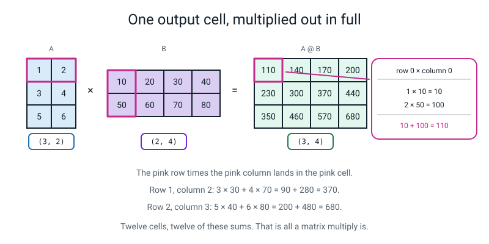
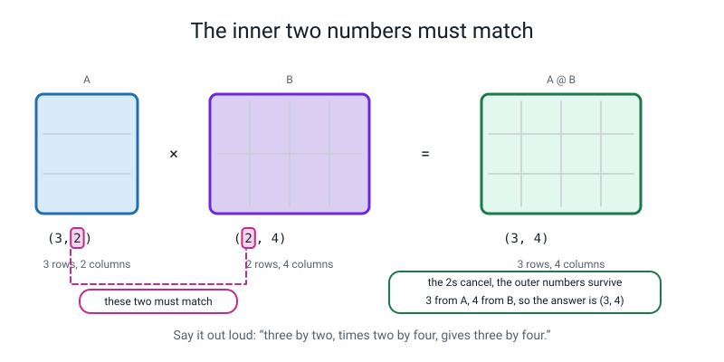
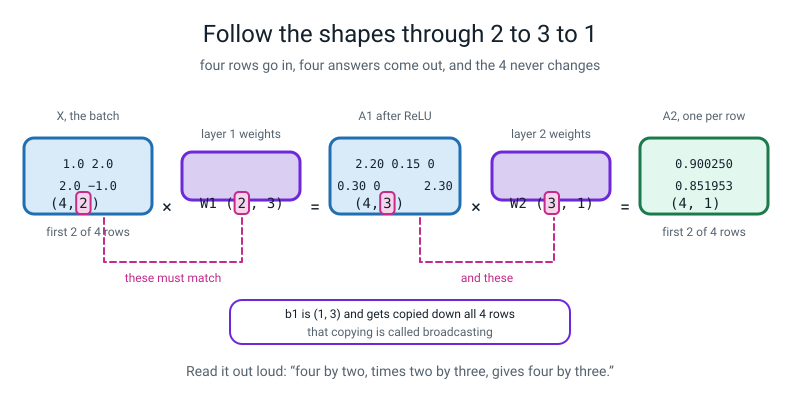
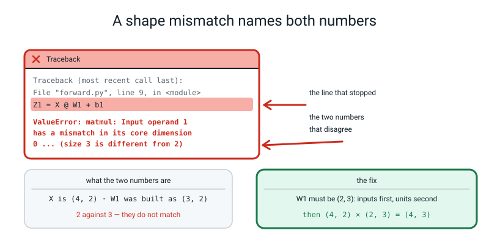
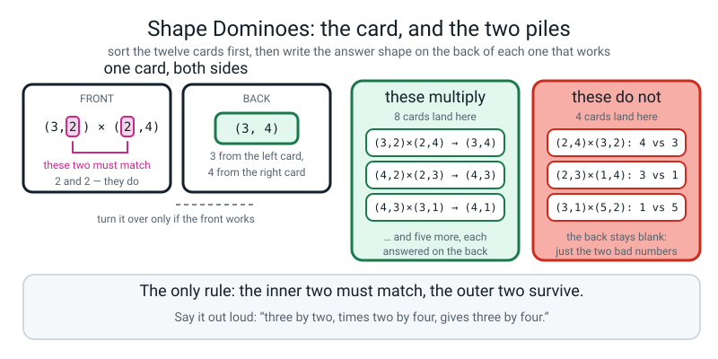
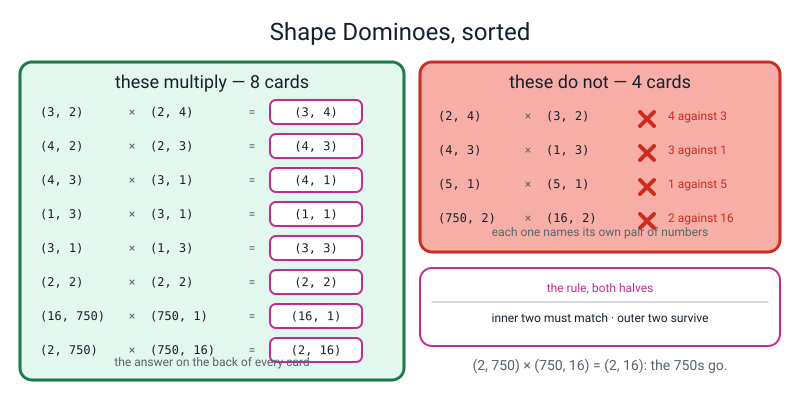
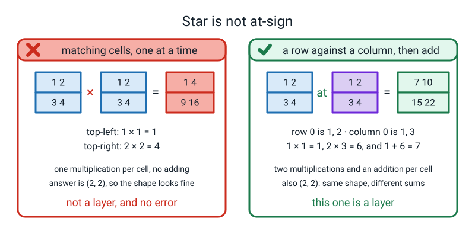
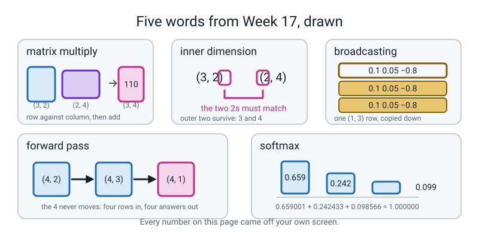

# Week 17 — A Layer Is a Grid Times a Grid

[⬅ Week 16](week-16.md) · [Course Home](../README.md) · [Next ➡](week-18.md) · [Workbook](../workbook/week-17.md)

---

> ### This week in one sentence
> **A whole layer for a whole batch is one operation — a grid times a grid — and it only works when the inner numbers of the two shapes match.**
>
> **By the end of this chapter you will be able to:**
> - **Multiply a `(3,2)` grid by a `(2,4)` grid by hand**, working out at least three of the twelve output cells, and check them against numpy
> - **State the shape rule in eight words** and use it to predict the output shape of twelve shape pairs
> - **Trace a full forward pass** for a batch of four rows through a 2 → 3 → 1 network, with every intermediate grid written out
> - **Read a real shape-mismatch error**, name the two numbers that failed to match, and fix it
>
> **New maths:** **multiplying two grids.** `(3,2) @ (2,4) → (3,4)`, the inner numbers must match, with row 0 column 0 done in longhand as `1×10 + 2×50 = 110`.
>
> **New syntax:** `A @ B` · `arr.sum(axis=1, keepdims=True)` · `np.allclose(a, b)`
>
> **Reading time:** about 35 minutes. **Homework:** about 55 minutes.

---

## 🪝 Start Here

Last week you computed **one** neuron for **one** row. Multiply, add, squash. With a calculator it took about forty seconds.

Now here is a small, ordinary hidden layer, and a small, ordinary batch of data:

```
750 rows of data
 16 neurons in the layer
```

**How many weighted sums is that?**

`750 × 16 = 12,000`. And each one is two multiplications and an addition if there are two features, so about **thirty-six thousand** little arithmetic operations — and that is **one** forward pass through **one** layer.

In Week 19 you will train a network for five hundred rounds, and each round has a backward pass as well as a forward one. So: twelve thousand, times five hundred, times two.

**Twelve million trips round a Python loop.**

Python loops are slow. Not a bit slow — roughly **a hundred times** slower than the same arithmetic done inside numpy. Twelve million of them would have you sitting there for a very long time.

So what would you *want* to be able to say to the computer instead? Something like *"do all of them at once."*

**There is a single symbol that does exactly that.** One character. It computes every neuron for every row in one go, and it runs in code that people have been optimising since before your parents were born.

The symbol is **`@`**, and it means **grid times grid**.

There is exactly one price. To use it, **you have to get the shapes right** — and when you get them wrong you get an error message you will see more times this year than any other. So today does two things: works out what `@` actually computes, by hand, on numbers small enough to check. And then breaks it on purpose five times, so that message stops being frightening.

Last week's reflex still comes first. **When something is confusing, print the shape.** Today it stops being a good habit and becomes the whole job.

---

## 🧠 The Big Idea

> **📌 About the code in this section.** The blocks below are **illustrations, not files**. Each one carries on from the one above, and the `import` lines are typed once, in the first block that needs them. **The complete runnable files are in 💻 Type This.** If you copy a block from this section on its own and Python says `NameError`, that is why, and nothing is broken.

### 1. What `A @ B` actually computes, one cell at a time

**The plain explanation.** One sentence, and everything else this week follows from it.

> **matrix multiply** — take a **row** from the left grid and a **column** from the right grid, multiply them position by position, and add up the products. That one number goes in the answer. Do it for every row-column pair.

**Here are the two grids for the whole week.** Small whole numbers, chosen so nothing needs a calculator:

```
A (3 rows, 2 columns)          B (2 rows, 4 columns)

[ 1  2 ]                       [ 10  20  30  40 ]
[ 3  4 ]                       [ 50  60  70  80 ]
[ 5  6 ]
```

> **🔢 The maths, slowly.** To get the number in the **top-left** of the answer, take the **first row of A** and the **first column of B**.
>
> First row of A: `1`, `2`. First column of B, reading **downwards**: `10`, `50`.
>
> Pair them up in order and multiply:
>
> ```
> 1 × 10 = 10
> 2 × 50 = 100
> ```
>
> Add the two products: **`10 + 100 = 110`**.
>
> That is one cell. It cost two multiplications and one addition. **Row 0, column 0 of the answer is `110`.**


*Figure 17.1 — One output cell, multiplied out in full. `1 × 10 = 10`, `2 × 50 = 100`, and `10 + 100 = 110`.*

**Do a second one, so the pattern is visible rather than guessed. Row 1, column 2.** Careful: computers count from zero, so row 1 is the **second** row of A (`3`, `4`) and column 2 is the **third** column of B (`30`, `70`):

```
3 × 30 =  90
4 × 70 = 280
          ---
          370
```

**And a third, from the far corner. Row 2, column 3.** Third row of A is `5`, `6`; fourth column of B is `40`, `80`:

```
5 × 40 = 200
6 × 80 = 480
          ---
          680
```

**The finished answer, all twelve cells:**

```
[ 110  140  170  200 ]
[ 230  300  370  440 ]
[ 350  460  570  680 ]
```

Three rows, four columns. **Shape `(3, 4)`.**

**Two things to notice, and say both out loud.** Each output cell needs exactly **two** multiplications, because A has two columns and B has two rows — that shared number is what gets consumed. And the answer has **three rows** (from A) and **four columns** (from B) — the two numbers that were *not* shared.

### 2. The shape rule, in eight words

**The plain explanation.** The observation at the end of section 1 *is* the rule.

> **inner dimension** — in `(3,2) @ (2,4)`, the two middle numbers: A's columns and B's rows. **They must be equal.**

```
(3, 2) @ (2, 4)  →  (3, 4)
    \____/
   these must match: 2 and 2

 \                \
  3 survives        4 survives
```

**The rule, in eight words: inner two must match, outer two survive.**


*Figure 17.2 — The inner two numbers must match. The two 2s cancel and the outer numbers survive: 3 from A and 4 from B.*

**And it is not an arbitrary rule.** It falls straight out of section 1. To make one output cell you pair up a row of A with a column of B, position by position. A row of A has as many numbers as A has **columns**. A column of B has as many numbers as B has **rows**. **If those two counts differ, one number in the row has nothing to pair with, and the operation does not mean anything.**

That is the whole explanation, and it is worth having, because somebody who knows *why* can rebuild the rule from scratch and somebody who memorised it cannot.

**Twelve shape pairs, with the answers.** This is the class activity and it is on your homework:

| Pair | Works? | Result, or why not |
|---|---|---|
| `(3,2) @ (2,4)` | ✅ | `(3, 4)` |
| `(4,2) @ (2,3)` | ✅ | `(4, 3)` |
| `(4,3) @ (3,1)` | ✅ | `(4, 1)` |
| `(1,3) @ (3,1)` | ✅ | `(1, 1)` — one row, one column, **one number** |
| `(3,1) @ (1,3)` | ✅ | `(3, 3)` — the same two grids the other way round, and nine numbers |
| `(2,2) @ (2,2)` | ✅ | `(2, 2)` |
| `(16,750) @ (750,1)` | ✅ | `(16, 1)` — the numbers can be huge; the rule does not care |
| `(2,750) @ (750,16)` | ✅ | `(2, 16)` |
| `(2,4) @ (3,2)` | ❌ | `4` against `3` |
| `(2,3) @ (1,4)` | ❌ | `3` against `1` |
| `(3,1) @ (5,2)` | ❌ | `1` against `5` |
| `(750,2) @ (16,1)` | ❌ | `2` against `16` |

**Spend a moment on rows 4 and 5.** `(1,3) @ (3,1)` gives a single number. `(3,1) @ (1,3)` gives a 3×3 grid of nine. **Same two grids, opposite order, and the answers are not even the same size.**

So write this down, because it is the surprising fact of the week: **`A @ B` and `B @ A` are not the same thing.** Usually only one of them is even legal, and when both are legal they give different answers. Grid multiplication is not like multiplying six by seven.

### 3. Broadcasting: how one bias serves four rows

**The plain explanation.** `X @ W1` gives four rows of three pre-activations. But there are only **three** biases — one per hidden unit — and they have to be added to **all four** rows.

> **broadcasting** — numpy silently copying a small grid to fit a bigger one, so that a `(1, 3)` row of biases can be added to a `(4, 3)` grid.

Written out, numpy behaves exactly as if the bias row were copied down:

```
X @ W1 (4, 3)                      b1, copied down (4, 3)
[  2.1    0.1   -0.2  ]            [ 0.1  0.05  -0.8 ]
[  0.2   -0.8    3.1  ]      +     [ 0.1  0.05  -0.8 ]
[  0.4    0.1   -0.35 ]            [ 0.1  0.05  -0.8 ]
[ -1.3    0.1   -0.5  ]            [ 0.1  0.05  -0.8 ]

=  Z1 (4, 3)
[  2.2    0.15  -1.0  ]
[  0.3   -0.75   2.3  ]
[  0.5    0.15  -1.15 ]
[ -1.2    0.15  -1.3  ]
```

**Check one cell out loud:** `2.1 + 0.1 = 2.2`. And another: `−0.2 + (−0.8) = −1.0`.

**🍕 The analogy.** A bias belongs to a **unit**, not to a **row of data**. Hidden unit 2 has one bias, and it uses that same bias for every single row that ever comes through it — like a referee's personal strictness, which does not change depending on which team is playing. So of course it gets copied down.

**The rule, in the only form you need it:** numpy lines the two shapes up **from the right-hand end** and, at each position, they must either be equal or one of them must be `1`. So `(4,3)` with `(1,3)` works — 3 matches 3, and the 1 stretches to 4. `(4,3)` with `(3,1)` does **not** — the 3 and the 1 are fine, but then 4 against 3 is not.

> **⚠️ Watch out:** if the bias is accidentally shaped `(4, 1)` instead of `(1, 3)`, broadcasting **still works** and hands you a `(4, 3)` answer **with no error at all** — but it has added one bias per **row** instead of one per **unit**, and every number is wrong. There is a full demonstration in 🐞 When It Breaks. **The dangerous shape bug is the one that does not crash.**

### 4. The forward pass, for a batch of four rows

**The plain explanation.** Push data through the network from inputs to output, layer by layer, keeping every intermediate grid.

> **forward pass** — pushing data through the network from inputs to output, layer by layer, and keeping the intermediate grids.

**Today's network: 2 inputs → 3 hidden units with ReLU → 1 output with sigmoid.** Every weight typed out:

```
X  (4, 2)              W1 (2, 3)                    b1 (1, 3)
[  1.0   2.0 ]         [ 0.5  -0.3   1.2 ]          [ 0.1  0.05  -0.8 ]
[  2.0  -1.0 ]         [ 0.8   0.2  -0.7 ]
[  0.0   0.5 ]
[ -1.0  -1.0 ]         W2 (3, 1)                    b2 (1, 1)
                       [  1.0 ]                     [ 0.3 ]
                       [ -2.0 ]
                       [  0.5 ]
```

**Read `W1` the right way round, because half the shape bugs in this course come from here.** `W1` is `(2, 3)`: **row `i` is input `i`, column `j` is hidden unit `j`.** So `W1[0][2] = 1.2` is the weight from input 1 to hidden unit 3. **Inputs down the side, units across the top. Always.**

> **🔢 The maths, slowly.** Row 0 of the batch is `x = [1.0, 2.0]`. Three hidden units, so three weighted sums, each using one **column** of `W1`:
>
> ```
> unit 1 (column 0):  1.0 × 0.5    + 2.0 × 0.8    + 0.1   =  0.5 + 1.6 + 0.1  =  2.20
> unit 2 (column 1):  1.0 × (−0.3) + 2.0 × 0.2    + 0.05  = −0.3 + 0.4 + 0.05 =  0.15
> unit 3 (column 2):  1.0 × 1.2    + 2.0 × (−0.7) − 0.8   =  1.2 − 1.4 − 0.8  = −1.00
> ```
>
> Now ReLU: `2.20` stays, `0.15` stays, **`−1.00` becomes `0`**. So `A1`'s first row is `[2.20, 0.15, 0]`.
>
> Then the output unit, using `W2`:
>
> ```
> Z2 = 2.20 × 1.0 + 0.15 × (−2.0) + 0 × 0.5 + 0.3 = 2.20 − 0.30 + 0 + 0.30 = 2.20
> A2 = sigmoid(2.20) = 1 ÷ (1 + e^(−2.20)) = 1 ÷ 1.110803 = 0.900250
> ```
>
> **The network says 90.02% for row 0.** Eleven multiplications, eight additions, and one exponential on the calculator.

**All four rows:**

| row | `Z1` | `A1` (after ReLU) | `Z2` | `A2` |
|---|---|---|---|---|
| `[1.0, 2.0]` | `2.20, 0.15, −1.00` | `2.20, 0.15, 0` | **2.20** | **0.900250** |
| `[2.0, −1.0]` | `0.30, −0.75, 2.30` | `0.30, 0, 2.30` | **1.75** | **0.851953** |
| `[0.0, 0.5]` | `0.50, 0.15, −1.15` | `0.50, 0.15, 0` | **0.50** | **0.622459** |
| `[−1.0, −1.0]` | `−1.20, 0.15, −1.30` | `0, 0.15, 0` | **0.00** | **0.500000** |

**And the shape ladder, which is the thing to pin to your wall:**

```
X      (4, 2)
W1     (2, 3)   →   X @ W1   (4, 3)
b1     (1, 3)   →   Z1       (4, 3)      [broadcast down all four rows]
A1     (4, 3)
W2     (3, 1)   →   A1 @ W2  (4, 1)
b2     (1, 1)   →   Z2       (4, 1)
A2     (4, 1)                             one probability per row
```

**Say it out loud as a sentence, twice:** *"four by two, times two by three, gives four by three. Four by three, times three by one, gives four by one."* If you cannot chant that, you cannot debug next week.


*Figure 17.3 — Follow the shapes through 2 to 3 to 1. `b1` is `(1, 3)` and gets copied down all four rows, which is called broadcasting.*

**Notice what stayed the same all the way through: the `4`.** Four rows went in, four probabilities came out, and every grid in between had four rows. **The batch size passes straight through a network untouched.** That is the first question to ask whenever a shape looks wrong: *"which of my two numbers is the batch size?"*

### 5. Softmax, for when there are more than two answers

**The plain explanation.** Sigmoid gives you one probability, which is right for "spam or not spam". For "cat, dog or bird" you need three numbers that between them account for all the certainty you have.

> **softmax** — the squash for the output layer when there are **more than two** classes. It turns several raw scores into several probabilities that add up to exactly 1.

It works in two steps: **exponentiate everything, then divide by the total.**

> **🔢 The maths, slowly.** Suppose the three output units produce raw scores `[2.0, 1.0, 0.1]`.
>
> **Step one — `e^x` on each.** On a calculator: `e^2.0 = 7.389056`, `e^1.0 = 2.718282`, `e^0.1 = 1.105171`.
>
> Why exponentiate at all? Two practical reasons. It makes every number **positive** (probabilities cannot be negative), and it **exaggerates** differences, so a clear winner becomes a clear winner.
>
> **Step two — add them up and divide.** The total is `7.389056 + 2.718282 + 1.105171 = 11.212509`. Now:
>
> ```
> 7.389056 ÷ 11.212509 = 0.659001
> 2.718282 ÷ 11.212509 = 0.242433
> 1.105171 ÷ 11.212509 = 0.098566
> ```
>
> **Add those three: `0.659001 + 0.242433 + 0.098566 = 1.000000`.** Three proper probabilities.

**And this is where `keepdims` earns its keep.** The total, `11.212509`, has to be divided into a row of three numbers. In code:

```python
E = np.exp(Z)
P = E / E.sum(axis=1, keepdims=True)
```

`axis=1` means "add across each row". `keepdims=True` means "keep the answer 2-D" — so the total comes back as shape `(1, 1)` rather than a flat `(1,)`, and it lines up cleanly against the `(1, 3)` row above it. **Drop `keepdims` and on a batch of several rows you get either a confusing error or a silently wrong answer**, which is exactly why the argument exists.

Today softmax is a fourth squash with one worked sum beside it. Week 26 uses it properly, on ten handwritten digits.

---

## 🔢 The Maths, Slowly

The new maths is section 1's grid multiply. This section does it **once more, all twelve cells**, so that `@` is something you have done rather than something you trust.

### Step 1 — the two grids, and the shape sentence first

```
A (3, 2)          B (2, 4)
[ 1  2 ]          [ 10  20  30  40 ]
[ 3  4 ]          [ 50  60  70  80 ]
[ 5  6 ]
```

Say it before you compute anything: **"three by two, times two by four, gives three by four."** Twelve cells to fill.

### Step 2 — all twelve cells, in longhand

Each cell is *one row of A, one column of B, multiply position by position, add.*

| cell | row of A | column of B | the arithmetic | answer |
|---|---|---|---|---|
| (0,0) | 1, 2 | 10, 50 | `1×10 + 2×50 = 10 + 100` | **110** |
| (0,1) | 1, 2 | 20, 60 | `1×20 + 2×60 = 20 + 120` | **140** |
| (0,2) | 1, 2 | 30, 70 | `1×30 + 2×70 = 30 + 140` | **170** |
| (0,3) | 1, 2 | 40, 80 | `1×40 + 2×80 = 40 + 160` | **200** |
| (1,0) | 3, 4 | 10, 50 | `3×10 + 4×50 = 30 + 200` | **230** |
| (1,1) | 3, 4 | 20, 60 | `3×20 + 4×60 = 60 + 240` | **300** |
| (1,2) | 3, 4 | 30, 70 | `3×30 + 4×70 = 90 + 280` | **370** |
| (1,3) | 3, 4 | 40, 80 | `3×40 + 4×80 = 120 + 320` | **440** |
| (2,0) | 5, 6 | 10, 50 | `5×10 + 6×50 = 50 + 300` | **350** |
| (2,1) | 5, 6 | 20, 60 | `5×20 + 6×60 = 100 + 360` | **460** |
| (2,2) | 5, 6 | 30, 70 | `5×30 + 6×70 = 150 + 420` | **570** |
| (2,3) | 5, 6 | 40, 80 | `5×40 + 6×80 = 200 + 480` | **680** |

**Twenty-four multiplications and twelve additions.** That is the entire content of the symbol `@`.

### Step 3 — notice the pattern, then check it on a calculator

Look down the first column of the answer: `110`, `230`, `350`. The gaps are `120` and `120`. Look along the first row: `110`, `140`, `170`, `200` — gaps of `30`. **The answer has structure, because A and B did.** You do not need that pattern for anything; noticing it is how you catch a slip.

**The calculator check you can actually do:** add up the whole answer grid. `110+140+170+200 = 620`. `230+300+370+440 = 1340`. `350+460+570+680 = 2060`. Total `620 + 1340 + 2060 = 4020`.

Now do it the other way. Every column of B gets multiplied by the total of a column of A. A's column totals are `1+3+5 = 9` and `2+4+6 = 12`. B's grand total by row: `10+20+30+40 = 100` and `50+60+70+80 = 260`. So the grand total of the answer is `9 × 100 + 12 × 260 = 900 + 3120 = 4020`. ✅

**Same number, two completely different routes.** That is the flavour of check this whole course runs on, and next week it becomes a proof.

---

## 💻 Type This

Two files, both tiny. **Nothing trains, nothing downloads, and each runs in well under a second.**

### Step 1 — `matmul.py`, and three ticks

```python
"""matmul.py - a grid times a grid, cell by cell."""
import numpy as np

np.random.seed(0)

A = np.array([[1, 2],
              [3, 4],
              [5, 6]])
B = np.array([[10, 20, 30, 40],
              [50, 60, 70, 80]])

print("A.shape =", A.shape, "  B.shape =", B.shape)
C = A @ B
print("C = A @ B")
print(C)
print("C.shape =", C.shape)
print()
print("row 0 col 0 by hand: 1*10 + 2*50 =", 1 * 10 + 2 * 50, " numpy:", C[0, 0])
print("row 1 col 2 by hand: 3*30 + 4*70 =", 3 * 30 + 4 * 70, " numpy:", C[1, 2])
print("row 2 col 3 by hand: 5*40 + 6*80 =", 5 * 40 + 6 * 80, " numpy:", C[2, 3])
```

**What each new line does.** `A @ B` is the matrix multiply — the whole subject of this week in one character. `C[0, 0]` reads a single cell out of a 2-D grid: **row first, column second**, exactly like the shape.

```text
A.shape = (3, 2)   B.shape = (2, 4)
C = A @ B
[[110 140 170 200]
 [230 300 370 440]
 [350 460 570 680]]
C.shape = (3, 4)

row 0 col 0 by hand: 1*10 + 2*50 = 110  numpy: 110
row 1 col 2 by hand: 3*30 + 4*70 = 370  numpy: 370
row 2 col 3 by hand: 5*40 + 6*80 = 680  numpy: 680
```

**Three of the twelve, done by hand, and numpy got the same three.** The other nine are the same arithmetic. **That is the difference between using `@` and trusting `@`.**

### Step 2 — start `forward.py`, and build `W1` the wrong way round on purpose

```python
import numpy as np

np.set_printoptions(precision=6, suppress=True)   # 6 decimals, no 1e-17 clutter

X = np.array([[1.0, 2.0], [2.0, -1.0], [0.0, 0.5], [-1.0, -1.0]])
W1 = np.array([[0.5, 0.8], [-0.3, 0.2], [1.2, -0.7]])   # (3, 2) -- wrong on purpose
b1 = np.array([[0.1, 0.05, -0.8]])

print("X ", X.shape, " W1", W1.shape)
Z1 = X @ W1 + b1
print(Z1)
```

```text
X  (4, 2)  W1 (3, 2)
Traceback (most recent call last):
  File "forward.py", line 8, in <module>
    Z1 = X @ W1 + b1
ValueError: matmul: Input operand 1 has a mismatch in its core dimension 0, with gufunc signature (n?,k),(k,m?)->(n?,m?) (size 3 is different from 2)
```

**Cover the middle of that message with your hand.** Leave only the very end visible: **`(size 3 is different from 2)`**.

**That is the entire message.** The `2` is `X`'s second number — two features. The `3` is `W1`'s first number — three rows. The inner numbers are 2 and 3, and they do not match.

Everything in the middle — `gufunc signature`, `core dimension 0`, all of it — is numpy telling you which internal machinery complained. **You are allowed not to read it.** Read the last line. Inside the last line, read the bracket at the end. Inside the bracket, read the two numbers. That is the diagnosis.

> **🐞 If you see this error:** **read error messages backwards.** Last line, last bracket, two numbers. It is the single most useful reading habit in programming and you will use it for the rest of the year.


*Figure 17.4 — A shape mismatch names both numbers. `size 3` is `W1`'s rows and `2` is `X`'s columns, and the fix is to build `W1` as `(2, 3)`.*

Fix it — `W1` must be `(2, 3)`: **inputs down the side, units across the top.**

### Step 3 — the shape ladder, printed

```python
W1 = np.array([[0.5, -0.3, 1.2],
               [0.8, 0.2, -0.7]])
W2 = np.array([[1.0], [-2.0], [0.5]])
b2 = np.array([[0.3]])
sigmoid = lambda z: 1.0 / (1.0 + np.exp(-z))

XW1 = X @ W1
print("X @ W1        ", XW1.shape)
Z1 = XW1 + b1
print("Z1            ", Z1.shape)
A1 = np.maximum(0, Z1)
print("A1            ", A1.shape)
Z2 = A1 @ W2 + b2
print("Z2            ", Z2.shape)
A2 = sigmoid(Z2)
print("A2            ", A2.shape)
print(A2)
```

**What each new line does.** `lambda` is a one-line way of writing a small named recipe: this says "`sigmoid` means, given `z`, hand back `1 ÷ (1 + e^(−z))`". It is Week 13's squasher, unchanged. `np.maximum(0, Z1)` is Week 16's ReLU, applied to all twelve cells at once.

```text
X @ W1         (4, 3)
Z1             (4, 3)
A1             (4, 3)
Z2             (4, 1)
A2             (4, 1)
[[0.90025 ]
 [0.851953]
 [0.622459]
 [0.5     ]]
```

**One number appears in every single shape on that list. The `4` — the batch size.** Four rows went in, four probabilities came out, and every grid in between had four rows.

And look at `A1`'s first row when you print it: `[2.2, 0.15, 0]`. **`2.2` and `0.15` are exactly last week's two hidden units** — same weights, same inputs, same numbers. All that changed is that numpy did all four rows and all three units in one line, in about a millionth of a second.

### Step 4 — the silent bias, on purpose

Change `b1` to a column of four numbers — shape `(4, 1)` — and re-run:

```python
Z1 = np.array([[2.1, 0.1, -0.2], [0.2, -0.8, 3.1], [0.4, 0.1, -0.35], [-1.3, 0.1, -0.5]])
good = np.array([[0.1, 0.05, -0.8]])              # (1, 3): one bias per unit
bad = np.array([[0.1], [0.05], [-0.8], [0.2]])    # (4, 1): one bias per ROW
print("with the right b1, shape", good.shape)
print(Z1 + good)
print("with b1 shape", bad.shape, "- no error at all:")
print(Z1 + bad)
print("shape of the wrong answer:", (Z1 + bad).shape)
```

```text
with the right b1, shape (1, 3)
[[ 2.2   0.15 -1.  ]
 [ 0.3  -0.75  2.3 ]
 [ 0.5   0.15 -1.15]
 [-1.2   0.15 -1.3 ]]
with b1 shape (4, 1) - no error at all:
[[ 2.2   0.2  -0.1 ]
 [ 0.25 -0.75  3.15]
 [-0.4  -0.7  -1.15]
 [-1.1   0.3  -0.3 ]]
shape of the wrong answer: (4, 3)
```

**It ran. The shape is right. Every number after the first is wrong.**

Hunt for the tell. Look at **column 1**: with the correct bias every entry gets `+0.05`. Here row 1 got `+0.05`, row 2 got `−0.8`, row 3 got `+0.2`. **It gave each *row* its own bias instead of each *unit* its own bias.**

**This is why you say the sentence out loud before you type the line.** *"Three biases, one per hidden unit, added to every row."* `(1, 3)`. If you say that first, you cannot type `(4, 1)`.

### Step 5 — the whole of `forward.py`, in one block

```python
"""forward.py - a batch of four rows through 2 -> 3 -> 1."""
import numpy as np

np.random.seed(0)
np.set_printoptions(precision=6, suppress=True)

X = np.array([[1.0, 2.0],
              [2.0, -1.0],
              [0.0, 0.5],
              [-1.0, -1.0]])

W1 = np.array([[0.5, -0.3, 1.2],
               [0.8, 0.2, -0.7]])
b1 = np.array([[0.1, 0.05, -0.8]])

W2 = np.array([[1.0],
               [-2.0],
               [0.5]])
b2 = np.array([[0.3]])

sigmoid = lambda z: 1.0 / (1.0 + np.exp(-z))

print("X  ", X.shape)
print("W1 ", W1.shape, "  b1", b1.shape)
print("W2 ", W2.shape, "  b2", b2.shape)
print()

XW1 = X @ W1
print("X @ W1        ", XW1.shape)
print(XW1)
Z1 = XW1 + b1
print("Z1 = X @ W1 + b1", Z1.shape)
print(Z1)
A1 = np.maximum(0, Z1)
print("A1 = ReLU(Z1) ", A1.shape)
print(A1)
Z2 = A1 @ W2 + b2
print("Z2 = A1 @ W2 + b2", Z2.shape)
print(Z2)
A2 = sigmoid(Z2)
print("A2 = sigmoid(Z2)", A2.shape)
print(A2)
```

```text
X   (4, 2)
W1  (2, 3)   b1 (1, 3)
W2  (3, 1)   b2 (1, 1)

X @ W1         (4, 3)
[[ 2.1   0.1  -0.2 ]
 [ 0.2  -0.8   3.1 ]
 [ 0.4   0.1  -0.35]
 [-1.3   0.1  -0.5 ]]
Z1 = X @ W1 + b1 (4, 3)
[[ 2.2   0.15 -1.  ]
 [ 0.3  -0.75  2.3 ]
 [ 0.5   0.15 -1.15]
 [-1.2   0.15 -1.3 ]]
A1 = ReLU(Z1)  (4, 3)
[[2.2  0.15 0.  ]
 [0.3  0.   2.3 ]
 [0.5  0.15 0.  ]
 [0.   0.15 0.  ]]
Z2 = A1 @ W2 + b2 (4, 1)
[[2.2 ]
 [1.75]
 [0.5 ]
 [0.  ]]
A2 = sigmoid(Z2) (4, 1)
[[0.90025 ]
 [0.851953]
 [0.622459]
 [0.5     ]]
```

**Runtime: under a second.** Four lines of arithmetic between `X` and `A2`. **That is a whole neural network's forward pass.**

**Count the zeros in `A1`: five of the twelve.** The third hidden unit fires on exactly one of the four rows, and unit 1 is silent on the last row. **That patchiness is the network bending** — it is Week 16's `2.10` versus `0.60`, happening in a grid.

### Step 6 — check your paper against numpy with `np.allclose`

```python
by_hand_Z1 = np.array([[2.20, 0.15, -1.00],
                       [0.30, -0.75, 2.30],
                       [0.50, 0.15, -1.15],
                       [-1.20, 0.15, -1.30]])
print("Z1 agrees with my paper? ", np.allclose(Z1, by_hand_Z1))

typo = np.array([[2.20], [1.70], [0.50], [0.00]])     # 1.70 typed instead of 1.75
print("with 1.70 typed instead of 1.75:", np.allclose(Z2, typo))
print("biggest gap:", np.abs(Z2 - typo).max())
```

**What each new line does.** `np.allclose(a, b)` asks *"are these two grids the same, allowing for tiny floating-point wobble?"* and hands back one `True` or `False`. **It exists because `a == b` on decimals is a trap** — `0.1 + 0.2` is not exactly `0.3` in binary, so an exact test can fail on two answers that are genuinely identical. `np.allclose` allows a difference of about one part in a hundred million.

```text
Z1 agrees with my paper?  True
with 1.70 typed instead of 1.75: False
biggest gap: 0.04999999999999982
```

**The second half is the teaching.** When `allclose` says `False`, `np.abs(a - b).max()` tells you the size of the disagreement, and the size tells you what kind of problem it is. **A gap of about `1e-16` is rounding. A gap of `0.05` is a wrong number.**

---

## 🔍 Worked Examples

### Worked Example 1 — Two pizzas, three ingredients, two shops

A pizzeria makes two pizzas. Each needs some number of units of cheese, tomato and basil. Two suppliers charge different prices per unit. **What does each pizza cost at each shop?**

**Step 1 — build the two grids and say the shape sentence.**

```
R (2 pizzas, 3 ingredients)      P (3 ingredients, 2 shops)

[ 2  1  3 ]                      [ 30  34 ]
[ 0  4  1 ]                      [ 50  45 ]
                                 [ 20  25 ]
```

*"Two by three, times three by two, gives two by two."* The inner numbers are both `3` — the number of ingredients, which is exactly the thing the two grids share.

**Step 2 — the top-left cell by hand.** Pizza 1's recipe (`2, 1, 3`) against shop A's prices (`30, 50, 20`):

```
2 × 30 = 60
1 × 50 = 50
3 × 20 = 60
         ---
         170
```

**Pizza 1 costs 170 at shop A.**

**Step 3 — all four cells, in numpy.**

```text
R.shape = (2, 3)   P.shape = (3, 2)
C = R @ P
[[170 188]
 [220 205]]
C.shape = (2, 2)
row 0 col 0 by hand: 2*30 + 1*50 + 3*20 = 170  numpy: 170
row 1 col 1 by hand: 0*34 + 4*45 + 1*25 = 205  numpy: 205
row 0 col 1 by hand: 2*34 + 1*45 + 3*25 = 188  numpy: 188
row 1 col 0 by hand: 0*30 + 4*50 + 1*20 = 220  numpy: 220
```

**Read the answer as English.** Pizza 1 is cheaper at shop A (`170` against `188`). Pizza 2 is cheaper at shop B (`205` against `220`). **You would buy from different shops depending on what you are making**, and that whole conclusion arrived in one `@`.

**Step 4 — now do it backwards, on purpose.** `P @ R` is `(3,2) @ (2,3)`, and the inner numbers are both `2`, so it is legal:

```text
P @ R  : (3, 2) @ (2, 3) -> (3, 3)
[[ 60 166 124]
 [100 230 195]
 [ 40 120  85]]
```

**Nine numbers, and not one of them means anything.** Cell `(0,0)` is `30 × 2 + 34 × 0 = 60` — the price of cheese at shop A times pizza 1's cheese, plus the price of cheese at shop B times pizza 2's cheese. That is not a quantity anybody wants. **`A @ B` and `B @ A` are different operations, and numpy will happily compute the meaningless one.**

### Worked Example 2 — A forward pass through 3 → 2 → 1

A different network: **three** features, **two** hidden units, one output, and a batch of **three** rows.

```
X  (3, 3)                W1 (3, 2)              b1 (1, 2)
[ 1.0  0.0  2.0 ]        [  0.4  -0.5 ]         [ 0.2  -0.6 ]
[ 0.0  3.0  1.0 ]        [  0.1   0.9 ]
[ 2.0  1.0  0.0 ]        [ -0.7   0.2 ]         W2 (2, 1)      b2 (1, 1)
                                                [  1.5 ]       [ 0.2 ]
                                                [ -1.0 ]
```

**Step 1 — the shape ladder, before any arithmetic.**

```text
X  (3, 3)  W1 (3, 2)  b1 (1, 2)  W2 (2, 1)  b2 (1, 1)
```

*"Three by three, times three by two, gives three by two. Three by two, times two by one, gives three by one."*

**Step 2 — `X @ W1` by hand for row 0.** `x = [1.0, 0.0, 2.0]`:

```
unit 1 (column 0 of W1):  1.0 × 0.4    + 0 × 0.1   + 2.0 × (−0.7) =  0.4 + 0 − 1.4 = −1.00
unit 2 (column 1 of W1):  1.0 × (−0.5) + 0 × 0.9   + 2.0 × 0.2    = −0.5 + 0 + 0.4 = −0.10
```

**Step 3 — all of it, in numpy.**

```text
X @ W1 (3, 2)
[[-1.  -0.1]
 [-0.4  2.9]
 [ 0.9 -0.1]]
Z1 (3, 2)
[[-0.8 -0.7]
 [-0.2  2.3]
 [ 1.1 -0.7]]
A1 (3, 2)
[[0.  0. ]
 [0.  2.3]
 [1.1 0. ]]
Z2 (3, 1)
[[ 0.2 ]
 [-2.1 ]
 [ 1.85]]
A2 (3, 1)
[[0.549834]
 [0.109097]
 [0.864127]]
```

**Step 4 — read row 0 out loud, because it is the interesting one.** After the bias, `Z1` row 0 is `[−0.8, −0.7]`. **Both negative, so ReLU silences both**, and `A1` row 0 is `[0, 0]`. So `Z2` for row 0 is `0 × 1.5 + 0 × (−1.0) + 0.2 = 0.2`, and sigmoid of `0.2` is `0.549834`.

**That row's answer came entirely from the output bias.** The hidden layer contributed nothing at all, because neither of its two units had anything to say about that input. **This is what a network with too few hidden units looks like from the inside**, and it is exactly why Week 19 uses sixteen.

### Worked Example 3 — Softmax on cat, dog, bird

Three output units, three raw scores. The network says `[0.5, 2.5, −1.0]`. **Which animal, and how sure?**

**Step 1 — exponentiate each one, on a calculator.**

```
e^0.5  = 1.648721
e^2.5  = 12.182494
e^(−1.0) = 0.367879
```

**Notice what `e^x` did to the negative score:** `−1.0` became `0.367879`, which is small but **positive**. That is half the reason softmax exponentiates.

**Step 2 — add them, then divide each by the total.**

```
total = 1.648721 + 12.182494 + 0.367879 = 14.199095

1.648721  ÷ 14.199095 = 0.116115
12.182494 ÷ 14.199095 = 0.857977
0.367879  ÷ 14.199095 = 0.025909
```

**Step 3 — check it in numpy, and check the row sums.**

```text
Z = [[ 0.5  2.5 -1. ]] (1, 3)
np.exp(Z) = [[ 1.648721 12.182494  0.367879]]
row total = [[14.199095]] (1, 1)
P = [[0.116115 0.857977 0.025909]]
row sums = [1.]
argmax   = [1]
```

**Step 4 — read it.** `0.857977` for dog, `0.116115` for cat, `0.025909` for bird. `argmax` says index `1`, which is dog. **And look at the sharpening:** the raw scores were `2.5` against `0.5`, five times bigger, but the probabilities are `0.858` against `0.116` — **seven times bigger.** `e^x` grows fast, so it turns a modest lead into a confident answer.

**Step 5 — see what happens when `keepdims` is dropped on a batch.** Three rows this time, so the batch is `(3, 3)`:

```text
with keepdims, row sums: [1. 1. 1.]
without keepdims, row sums: [0.707357 1.60917  0.646632]
without keepdims, the grid:
[[0.116115 0.54613  0.045112]
 [1.414565 0.044829 0.149776]
 [0.191441 0.121858 0.333333]]
```

**Look at the second row: `1.414565`.** That is a "probability" bigger than one, and there was **no error whatsoever**. Without `keepdims` the three row-totals came back as a flat `(3,)`, which numpy lined up against the three *columns* instead of the three rows, and quietly divided the wrong things by each other. **`keepdims=True` is insurance against a silent bug.**

---

## 🐞 When It Breaks

### Break 1 — `W2` built the wrong way round

```python
import numpy as np
A1 = np.array([[2.2, 0.15, 0.0], [0.3, 0.0, 2.3], [0.5, 0.15, 0.0], [0.0, 0.15, 0.0]])
W2 = np.array([[1.0, -2.0, 0.5]])     # (1, 3), should be (3, 1)
print("A1", A1.shape, " W2", W2.shape)
print(A1 @ W2)
```

```text
A1 (4, 3)  W2 (1, 3)
Traceback (most recent call last):
  File "b2.py", line 5, in <module>
    print(A1 @ W2)
ValueError: matmul: Input operand 1 has a mismatch in its core dimension 0, with gufunc signature (n?,k),(k,m?)->(n?,m?) (size 1 is different from 3)
```

**The two numbers:** `1` — `W2`'s rows — against `3` — `A1`'s columns.
**The fix:** `W2` must be `(3, 1)`. The rule never changes: **A's columns = B's rows.**

### Break 2 — the bias written as a column

```python
import numpy as np
Z1 = np.zeros((4, 3))
b1 = np.array([[0.1], [0.05], [-0.8]])    # (3, 1), should be (1, 3)
print("Z1", Z1.shape, " b1", b1.shape)
print(Z1 + b1)
```

```text
Z1 (4, 3)  b1 (3, 1)
Traceback (most recent call last):
  File "b3.py", line 5, in <module>
    print(Z1 + b1)
ValueError: operands could not be broadcast together with shapes (4,3) (3,1) 
```

**Notice this is a *different* message from Break 1.** That one was a `matmul` error; this is a **broadcasting** error, because the failing operation is `+`, not `@`. **The two numbers:** line the shapes up from the right — 3 against 1 is fine (the 1 stretches), then 4 against 3 is not.
**The fix:** `np.array([[0.1, 0.05, -0.8]])` — **two** sets of brackets, one row, three numbers.

### Break 3 — `keepdims` dropped, on a batch

```python
import numpy as np
E = np.exp(np.array([[0.5, 2.5, -1.0], [3.0, 0.0, 0.2]]))
print(E / E.sum(axis=1))
```

```text
Traceback (most recent call last):
  File "nokeepdims.py", line 3, in <module>
    print(E / E.sum(axis=1))
ValueError: operands could not be broadcast together with shapes (2,3) (2,) 
```

**The two numbers:** `(2,3)` against `(2,)`. Lining up from the right: 3 against 2. No.
**The fix:** `E / E.sum(axis=1, keepdims=True)`, which makes the totals `(2, 1)` instead of `(2,)`.

> **⚠️ Watch out:** this one was **lucky**. On a `(3, 3)` batch the same mistake makes no error at all, because 3 happens to match 3 — and you get probabilities like `1.414565`, as Worked Example 3 showed. **A square batch turns a crash into a silent lie.**

### Break 4 — the one that does not crash

Step 4 of 💻 Type This is the fourth break, and it is the important one. `b1` shaped `(4, 1)` instead of `(1, 3)`: **no error, right shape, wrong numbers.** The two sentences that would earn full marks in the homework:

*"It gave every row its own bias instead of giving every unit its own bias — row 0 got `+0.1` added to all three of its numbers, row 1 got `+0.05` added to all three, and so on."*

*"There was no error because `(4,3)` and `(4,1)` broadcast perfectly well — lining up from the right, 3 against 1 stretches, then 4 matches 4 — so numpy did exactly what I asked and what I asked was wrong."*

**And here is the detail that catches careless checking.** Cell `(0, 0)` is `2.2` in **both** the right answer and the wrong one, because the first row's wrong bias and the first unit's right bias are both `0.1`. **Check one number and you will miss this entirely.**

### The whole clinic, for reference

| Message | What it means | The fix |
|---|---|---|
| `matmul: ... (size 3 is different from 2)` | the inner two numbers do not match | `W1` must be `(2, 3)` — inputs down the side, units across |
| `matmul: ... (size 1 is different from 3)` | same problem, different pair | `W2` must be `(3, 1)` |
| `operands could not be broadcast together with shapes (4,3) (3,1)` | this is `+`, not `@` | the bias is a **row**: `(1, 3)` |
| `operands could not be broadcast together with shapes (4,3) (1,4)` | four biases for three units | one bias per unit — count `W1`'s columns |
| `TypeError: unsupported operand type(s) for @: 'list' and 'list'` | plain Python lists have no `@` | wrap both in `np.array(...)` |
| `AxisError: axis 1 is out of bounds for array of dimension 1` | you asked to add across the columns of something flat | make it 2-D, or use `axis=0` |
| **no error**, shape right, numbers wrong | the bias is `(4, 1)` — one per **row** | `b1.shape` must have the same second number as `W1`'s | 
| **no error**, softmax rows do not add to 1 | `keepdims=True` left off, or `axis=0` used | `E / E.sum(axis=1, keepdims=True)`, then check `P.sum(axis=1)` |
| `np.allclose` says `False` and nothing looks wrong | one arithmetic slip, usually a dropped bias or a sign | `print(np.abs(mine - theirs).max())`. About `0.05` is a typo; about `1e-16` means you compared the wrong pair |

---

## 🎲 What We Did In Class

**Shape Dominoes, then the board trace in blue.**

### Part 1 — twelve cards, two piles

Twelve index cards, shuffled, each with one shape pair on it and a blank back. Ninety seconds to sort them into **"these multiply"** and **"these do not"**, with nothing written down. Then: the answer shape on the back of every card in the first pile, and **the two numbers that failed to match** on the back of every card in the second.


*Figure 17.5 — Shape Dominoes: the card, and the two piles. Eight go in the pile that multiplies and four do not.*

The deck, and the verification we ran afterwards on a laptop:

```text
(3, 2)     @ (2, 4)     -> (3, 4)      works
(4, 2)     @ (2, 3)     -> (4, 3)      works
(4, 3)     @ (3, 1)     -> (4, 1)      works
(1, 3)     @ (3, 1)     -> (1, 1)      works
(3, 1)     @ (1, 3)     -> (3, 3)      works
(2, 2)     @ (2, 2)     -> (2, 2)      works
(16, 750)  @ (750, 1)   -> (16, 1)     works
(2, 750)   @ (750, 16)  -> (2, 16)     works
(2, 4)     @ (3, 2)     -> NO          size 3 is different from 4
(2, 3)     @ (1, 4)     -> NO          size 1 is different from 3
(3, 1)     @ (5, 2)     -> NO          size 5 is different from 1
(750, 2)   @ (16, 1)    -> NO          size 16 is different from 2
```

**Eight in the first pile, four in the second.** Two cards catch nearly everybody. `(3,1) × (1,3)` *looks* wrong because a 1 in the middle feels degenerate, but `1 = 1`, so it works and it produces a `(3, 3)` grid. And the huge cards are the **easiest**: `750 = 750`, so it works, and the answer is `(16, 1)`. **The rule does not care how big the numbers are.**


*Figure 17.6 — Shape Dominoes, sorted. Eight multiply, four do not, each crossed out with the failing pair named.*

### Part 2 — a brand-new network, traced on the board in blue

Not the one in the code, so it could not be copied: **four features in, three hidden units, two outputs, a batch of five rows.**

```
X (5, 4)  --[ W1 (4, 3) ]-->  Z1 (5, 3)  --ReLU-->  A1 (5, 3)
                              + b1 (1, 3)

A1 (5, 3) --[ W2 (3, 2) ]-->  Z2 (5, 2)  --softmax-->  A2 (5, 2)
                              + b2 (1, 2)
```

The questions, one shape at a time, and everybody had to say the whole sentence:

| Question | The answer, in full |
|---|---|
| What shape is `X`? | `(5, 4)` — five rows, four features |
| What shape must `W1` be? | `(4, 3)` — four inputs down the side, three units across |
| Say the multiplication. | *"five by four, times four by three, gives five by three"* |
| What shape is `b1`? | `(1, 3)` — one bias per unit |
| Does ReLU change the shape? | No — `(5, 3)` in, `(5, 3)` out |
| What shape must `W2` be? | `(3, 2)` — three inputs, two outputs |
| Say it. | *"five by three, times three by two, gives five by two"* |
| What is in one row of `A2`? | two probabilities that add to `1`, because the output squash is softmax |

The whole thing got a box round it labelled **FORWARD (blue)**, with room left underneath. **Next week goes the other way along exactly those wires, in red.**

### The last ninety seconds

Softmax, on the board, one worked sum:

```
three raw scores:   2.0     1.0     0.1

e^x:             7.389056  2.718282  1.105171     total 11.212509

divide:          0.659001  0.242433  0.098566     total  1.000000
```

**Sixty-six per cent, twenty-four, ten.** And then the question that sets up next week: *"there are twelve weights in that little network, and four biases. Sixteen knobs. Which of them would you change, and by how much?"*

---

## 💬 Talk About It

**1. `A @ B` and `B @ A` gave different-sized answers. So is matrix multiply broken, or is ordinary multiplication the weird one?**

*Hint:* neither. Start by noticing what `6 × 7 = 7 × 6` actually relies on: both are single numbers, so there is no "shape" to disagree about. Matrix multiply carries *structure* — a row of A means something different from a column of B — so swapping them asks a different question. Use Worked Example 1 as your evidence: `R @ P` is *"what does each pizza cost at each shop"* and `P @ R` is a grid of nine numbers nobody wants. **Then the real conclusion: an operation being non-commutative is not a defect, it is information.**

**2. The bias bug did not crash. Would you rather it had?**

*Hint:* argue both sides properly. For crashing: a crash costs you five minutes and a silent wrong answer can cost you a week, and you found this one only because the teacher pointed at column 1. Against crashing: broadcasting is genuinely useful — it is how one bias serves a thousand rows without copying anything — and a rule that refused `(4,1)` would have to refuse `(1,3)` too, by the same logic. **Then the practical closer: what habit protects you, given that numpy is never going to change?** (Saying the shape sentence out loud before typing the line.)

**3. `np.allclose` said `True` for grids that are not bitwise identical. Is that cheating?**

*Hint:* first establish the problem it solves. Ask Python for `0.1 + 0.2 == 0.3` and watch it say `False`. So an exact test on decimals fails on answers that are genuinely the same, which makes it useless for checking arithmetic. Then push on the other side: `allclose` will also say `True` for two answers that differ by `1e-9`, and there are jobs where `1e-9` matters. **So the honest answer is that `allclose` has a tolerance and you should know roughly what it is** — about one part in a hundred million — and `np.abs(a - b).max()` is how you look at the actual number rather than the verdict.

---

## ⚠️ Don't Get Tricked

### Trick 1 — "`A @ B` is the same as `A * B`"


*Figure 17.7 — Wrong and right: star is not at-sign. `A * B` gives `[[1, 4], [9, 16]]`; `A @ B` gives `[[7, 10], [15, 22]]`.*

| ❌ Wrong | ✅ Right |
|---|---|
| "They are both multiplication. `*` is just the older spelling." | `A * B` multiplies **matching cells** and needs the two shapes to be the same. `A @ B` pairs **rows against columns**, sums the products, and needs the inner numbers to match. **Measured on `[[1,2],[3,4]]` against itself:** `*` gives `[[1, 4], [9, 16]]`; `@` gives `[[7, 10], [15, 22]]`. |

**Both answers are `(2, 2)`, so the shape cannot tell you which one ran.** Only the numbers can.

### Trick 2 — "if the shapes do not match, transpose things until it runs"

| ❌ Wrong | ✅ Right |
|---|---|
| "Add a `.T` here. Still broken? Add one there. It ran — done." | Transposing at random **does** often make the error go away, and that is exactly the danger: you end up with a program that computes a confidently wrong number. **The cure is to say the sentence first:** *"four rows of two features, times two inputs by three units, gives four rows of three unit-outputs."* If the sentence makes sense, the shapes are right. If it does not, no transpose will save you. |

### Trick 3 — "the error message is unhelpful"

| ❌ Wrong | ✅ Right |
|---|---|
| "`gufunc signature (n?,k),(k,m?)->(n?,m?)` — this thing is useless." | The whole message is in the **last six characters of the last line**: `size 3 is different from 2`. Two numbers. That is the diagnosis. **Read the message backwards** — last line, then the bracket at the end of it, then the two numbers inside the bracket. Everything in the middle is numpy naming its own internal machinery, and you may ignore it. |

### Trick 4 — "the shape came out right, so the answer is right"

| ❌ Wrong | ✅ Right |
|---|---|
| "`(4, 3)` in, `(4, 3)` out, no error. Moving on." | The `(4, 1)` bias produces a `(4, 3)` answer with **no error at all** and eleven wrong numbers out of twelve. **A right shape is necessary and nowhere near sufficient.** And cell `(0,0)` is `2.2` in both versions, so checking one number proves nothing. Check a whole column, or use `np.allclose` against something you worked out on paper. |

---

## 🌍 Where You've Seen This

1. **Every graphics card ever sold.** A GPU is, at heart, a machine for doing `A @ B` extremely fast. The reason the same chip renders a game and trains a network is that both jobs are this one operation.
2. **Rotating an object in a 3-D game.** Each vertex is a row; the rotation is a small grid; the whole model turns in one matrix multiply.
3. **The autocomplete on your phone keyboard.** Layer after layer of `X @ W + b`, several hundred million knobs, and the shape rule holding at every single step.
4. **`nn.Linear` in PyTorch, `Dense` in Keras.** Open either one up and inside is `X @ W + b`. You have now built the thing everybody else imports.
5. **A spreadsheet's `SUMPRODUCT`.** One cell of a matrix multiply, spelled out for accountants. Worked Example 1 is a spreadsheet somebody would really build.
6. **Any "cost at each supplier" or "calories per meal plan" table.** Wherever two tables share one dimension — ingredients, months, students — a matrix multiply is the answer to *"combine these."*

---

## 🔑 Remember This

- **`@` means grid times grid.** A row from the left, a column from the right, multiply position by position, add. You did three of the twelve cells by hand and numpy agreed with all three.
- **Inner two must match, outer two survive.** `(4,2) @ (2,3)` gives `(4,3)`. **Say it out loud before you type the line, every time.**
- **`A @ B` and `B @ A` are different operations.** `(1,3) @ (3,1)` is one number; `(3,1) @ (1,3)` is nine.
- **A bias belongs to a unit, not to a row.** `(1, 3)`, broadcast down. Get it wrong in the direction that still runs and nothing will tell you.
- **When it breaks: last line, last bracket, two numbers.** You will read that message more times this year than any other sentence in English.
- **The batch size passes straight through untouched.** The `4` appears in every shape in the ladder. If it has moved to the second slot, something is the wrong way round.
- **`keepdims=True` keeps a total 2-D**, so it broadcasts along the axis you meant. Without it, a square batch will lie to you.

### Syntax reminder card

```python
import numpy as np

# ---- the line of the week ----------------------------------------------
C = A @ B              # (3,2) @ (2,4) -> (3,4). Inner two match, outer two survive.
                       # A * B is DIFFERENT: matching cells, no adding.
                       # lists instead of arrays -> TypeError: unsupported operand for @

# ---- a whole layer, for a whole batch ----------------------------------
Z1 = X @ W1 + b1       # (4,2) @ (2,3) -> (4,3), then + (1,3) broadcast down
A1 = np.maximum(0, Z1) # ReLU. Never changes a shape.
Z2 = A1 @ W2 + b2      # (4,3) @ (3,1) -> (4,1)
A2 = 1 / (1 + np.exp(-Z2))    # one probability per row

# ---- W1 is (inputs, units). Get this backwards and you get: -------------
# ValueError: matmul: ... (size 3 is different from 2)
#                            ^ W1's rows      ^ X's columns

# ---- softmax, and the argument that stops a silent bug ----------------
E = np.exp(Z)
P = E / E.sum(axis=1, keepdims=True)   # (1,1) not (1,), so it lines up
print(P.sum(axis=1))                   # must print [1.]

# ---- checking paper against numpy -------------------------------------
np.allclose(Z1, by_hand_Z1)   # True/False, tolerant of floating-point wobble
np.abs(mine - theirs).max()   # ~1e-16 = rounding. ~0.05 = a wrong number.

# ---- the one-line maths reminder --------------------------------------
# 1 x 10 + 2 x 50 = 110   <- one output cell of (3,2) @ (2,4), in full
```

---

## 📓 New Words


*Figure 17.8 — Five words from Week 17, drawn.*

| Word | What it means | Example |
|---|---|---|
| **matrix multiply** | Take a row from the left grid and a column from the right, multiply position by position, add. `A @ B` | `(3,2) @ (2,4) → (3,4)`, and cell `(0,0)` is `1×10 + 2×50 = 110` |
| **inner dimension** | The two middle numbers of a shape pair. They must be equal or the operation is not defined | in `(3,2) @ (2,4)` the inner numbers are `2` and `2` |
| **broadcasting** | numpy stretching a small grid to fit a bigger one, lining the shapes up from the right | `(4,3) + (1,3)` — three biases copied down four rows |
| **forward pass** | Pushing data through the network, inputs to output, keeping every intermediate grid | `(4,2) → (4,3) → (4,1)` |
| **softmax** | The output squash for more than two classes: exponentiate, then divide by the total | `[2.0, 1.0, 0.1] → [0.659001, 0.242433, 0.098566]`, summing to `1.000000` |

---

## 📤 Your Homework

Go to **[the Week 17 workbook](../workbook/week-17.md)**. About **55 minutes** in total.

| Section | What to do | Time |
|---|---|---|
| **Warm-Up** | Five quick questions on last week's neuron and shapes | 5 min |
| **Do the Maths by Hand** | `(3,2) @ (2,4)`: three cells in longhand, then all twelve | 10 min |
| **Predict the Output** | Twelve shape pairs — the Domino deck, on paper | 5 min |
| **Build It** | The **full forward pass** for `(4,2)` through 2 → 3 → 1, by hand, then in numpy, checked with `np.allclose` | 20 min |
| **When It Breaks** | **Five deliberate shape mismatches.** Predict, run, paste, circle the two numbers | 15 min |

**Three things are being marked, and the third is the real one.**

**Is there a shape written beside every intermediate grid?** A correct `A1` with no `(4, 3)` beside it is half a mark. **The shapes are the point of the page.**

**Are the error messages pasted verbatim, with the two failing numbers circled?** *"Shape error"* is not a result. `size 3 is different from 2`, with a ring round the `3` and the `2`, is.

**One of the five breakages produces no error at all.** It runs perfectly, the shape comes out exactly right, and every number is wrong. Your job on that one is to work out **which numbers are wrong and why**, in two sentences. The answer that earns full marks names the difference between a **unit** and a **row**.

> **⚠️ Watch out:** predict each of the five error messages **before** you run it — one sentence each, in pen. Four out of five is a real achievement, and getting one wrong tells you which part of the rule you have not got yet.

> **💡 Try this:** compute all twelve cells of `A @ B` by hand and check with `np.allclose`. It is twenty-four multiplications and about six minutes, and at the end of it `@` will not feel like magic ever again.

---

[⬅ Week 16](week-16.md) · [Course Home](../README.md) · [Week 18 ➡](week-18.md) · [📓 Workbook — Week 17](../workbook/week-17.md) · [Glossary](../../glossary.md)
