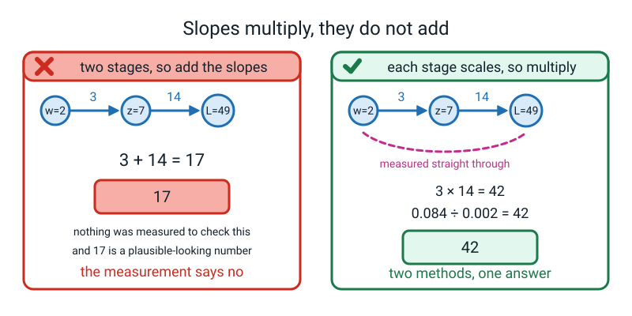
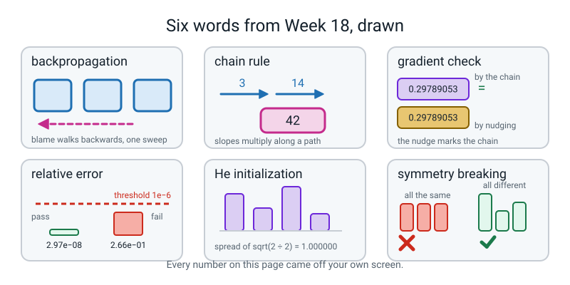

# Week 18 — Term 2 Checkpoint — How Much Did Each Knob Contribute?

[⬅ Week 17](week-17.md) · [Course Home](../README.md) · [Next ➡](week-19.md) · [Workbook](../workbook/week-18.md)

---

> ### This week in one sentence
> **Backpropagation is blame assignment: slopes multiply along a path, so one sweep backwards tells you how much every knob contributed to the error.**
>
> **By the end of this chapter you will be able to:**
> - **Measure the slope of each stage of a chain, multiply them, and show the product equals the slope measured straight through** — `3 × 14 = 42`, both ways
> - **Compute all four gradient arrays for a 2 → 2 → 1 network by hand**, with every intermediate grid written out
> - **Gradient-check every one of those arrays** against a numerical nudge and get a relative error below `1e-6`
> - **Explain why random starting weights are necessary**, and what happens to a network whose weights all start at zero
>
> **New maths:** **slopes multiply along a chain.** Nudging `w` moves `z` 3× as much; nudging `z` moves `L` 14× as much; so nudging `w` moves `L` **42×** as much — measured stage by stage *and* straight through, and shown to agree exactly.
>
> **New syntax:** `A.T @ dZ` · `(z > 0).astype(float)`
>
> **Reading time:** about 40 minutes. **Homework:** about 60 minutes.

---

## 🪝 Start Here

Last week you pushed four rows through a network and got four answers. One of them was ninety per cent, and it happened to be right.

Now suppose it had been badly wrong. **Which knob would you turn?**

Here is the obvious method, and it genuinely works. Take knob number one. Nudge it up a tiny bit, run the whole network, see what the loss did. Nudge it down, run the whole network again, see what the loss did. Divide. **That is the slope for knob one**, and you have known how to do it since Week 12.

Two runs per knob. Now scale it up to a real model:

```
16,000,000 knobs
one forward pass = 0.01 seconds
```

`2 × 16,000,000 = 32,000,000` runs, at a hundredth of a second each. That is `320,000` seconds.

**About 89 hours. Nearly four days. For *one* training step** — and a real model takes hundreds of thousands of steps.

So the obvious method is correct and useless. Today you learn the method that is actually used, and it gets **all sixteen million slopes in one sweep backwards**, for about the same cost as one forward pass.

It has a frightening name — **backpropagation** — and I want to tell you what it actually is before we start, because the name does it a disservice.

**It is one multiplication.**

That is it. Everything else today is bookkeeping: careful, checkable bookkeeping, but bookkeeping. By the end of this chapter you will have worked out how much each of **nine** knobs contributed to an error, and then you will have **proved you were right** using the slow nudging method on all nine — because nine knobs is small enough to afford it.

Sixteen million is not. **That is the only difference.**

---

## 🧠 The Big Idea

> **📌 About the code in this section.** The blocks below are **illustrations, not files**. Each one carries on from the one above, and the `import` lines are typed once, in the first block that needs them. **The complete runnable files are in 💻 Type This.** If you copy a block from this section on its own and Python says `NameError`, that is why, and nothing is broken.

### 1. Blame arrives, you keep your share, you pass the rest back

**The plain explanation.**

> **backpropagation** — working out how much every weight in a network contributed to the error, by starting at the error and walking backwards through the network, one layer at a time.

**🍕 The analogy, and it is the right one.** A parcel arrives three days late. You do not re-run the entire postal system sixteen million times to find out who to blame. You walk the chain backwards: *the courier was two days late; the courier was late because the depot held the parcel one day; the depot held it because the sorting machine jammed for four hours.*

**One walk backwards, and everybody's share of the blame falls out.** Each person only ever needs to know two things: **how much blame arrived at them**, and **how much they pass back to the person before them.**

That is backprop. **Blame arrives; you keep your share; you pass the rest back.** (One caution: the parcel's days add up, but in a network the blame is *multiplied* by each stage's slope, so a stage can shrink or amplify what it passes back. That is the next section.) Nothing in the chain needs to know anything about the rest of the chain.

### 2. Slopes multiply along a chain

**The plain explanation.** This is the whole week, and it takes ten minutes with a calculator.

**Set up a two-stage chain.** Stage 1 takes `w` and produces `z`. Stage 2 takes `z` and produces `L`.

```
w  ──[ stage 1: z = 3w + 1 ]──▶  z  ──[ stage 2: L = z × z ]──▶  L
```

Start at `w = 2`. Then `z = 3(2) + 1 = 7`, and `L = 7 × 7 = 49`.

Now measure how steep each stage is, using Week 12's nudge — a thousandth up, a thousandth down, subtract, divide by `0.002`.

> **🔢 The maths, slowly. Stage 1 on its own.** How much does `z` move when `w` moves?
>
> ```
> w = 2.001  →  z = 3(2.001) + 1 = 6.003 + 1 = 7.003
> w = 1.999  →  z = 3(1.999) + 1 = 5.997 + 1 = 6.997
>
> z moved:  7.003 − 6.997 = 0.006
> w moved:  2.001 − 1.999 = 0.002
>
> 0.006 ÷ 0.002 = 3
> ```
>
> **Stage 1's slope is 3.** Nudge `w` and `z` moves three times as much.

> **🔢 The maths, slowly. Stage 2 on its own.** How much does `L` move when `z` moves? We are standing at `z = 7`.
>
> ```
> z = 7.001  →  L = 7.001 × 7.001 = 49.014001
> z = 6.999  →  L = 6.999 × 6.999 = 48.986001
>
> L moved:  49.014001 − 48.986001 = 0.028
> z moved:  0.002
>
> 0.028 ÷ 0.002 = 14
> ```
>
> **Stage 2's slope is 14.** Nudge `z` and `L` moves fourteen times as much.

**Now stop and answer this before you read on. Nudging `w` moves `z` three times as much. Nudging `z` moves `L` fourteen times as much. How much does nudging `w` move `L`?**

Write your answer down. In the class, some people said **42** and some said **17**, and both are reasonable guesses.

> **🔢 The maths, slowly. Straight through, ignoring the middle.** Feed the nudged `w` all the way to `L`.
>
> ```
> w = 2.001  →  z = 7.003  →  L = 7.003 × 7.003 = 49.042009
> w = 1.999  →  z = 6.997  →  L = 6.997 × 6.997 = 48.958009
>
> L moved:  49.042009 − 48.958009 = 0.084
> w moved:  0.002
>
> 0.084 ÷ 0.002 = 42
> ```

**42. And `3 × 14 = 42`.**

Slopes **multiply** along a chain. Not add — multiply. And this was not somebody's word for it: two completely different measurements landed on the same number.

> **chain rule** — if `a` affects `b` and `b` affects `c`, then the slope from `a` to `c` is the slope from `a` to `b` **multiplied by** the slope from `b` to `c`. Slopes multiply along a path.


*Figure 18.1 — Slopes multiply along a chain. Stage by stage gives `3 × 14 = 42`; straight through gives `0.084 ÷ 0.002 = 42`.*

**🍕 The analogy for why they multiply.** One extra millimetre of rain puts **three** extra cars per minute on the road. Each extra car per minute adds **half a minute** to your journey. So one extra millimetre of rain costs you `3 × 0.5 = 1.5` minutes.

**You never had to model rain-to-minutes directly.** You chained two local facts, and the chaining is a multiplication because each stage *scales* whatever arrives at it. A photocopier that enlarges 3× followed by one that enlarges 14× turns 1 cm into 42 cm, not 17 cm.

**And that is why backprop is possible.** Every operation in a network is a stage: a multiply, an add, a ReLU, a sigmoid. Each one only has to answer one local question — *"given the slope coming back into my output, what is the slope going out of each of my inputs?"* Multiply those together as you walk backwards and you have the slope of the loss with respect to any weight anywhere. **No stage needs to know anything about the network it lives in.**

### 3. The five backward rules, as English sentences

**The plain explanation.** There are exactly five. They cover everything in this course, and each one is a sentence before it is a line of code.

| Forward step | Backward rule | The sentence |
|---|---|---|
| output sigmoid + log loss | `dZ2 = (A2 − y) / n` | "the blame at the output is simply how wrong the answer was, shared over the batch" |
| `Z = A @ W` | `dW = A.T @ dZ` | "each weight's blame is **its input** times **the blame that came out of it**" |
| `Z = A @ W + b` | `db = dZ.sum(axis=0, keepdims=True)` | "the bias is added to every row, so it collects blame from every row" |
| `Z = A @ W` | `dA = dZ @ W.T` | "send the blame backwards through the same weights it came forwards through" |
| `A = ReLU(Z)` | `dZ = dA * (Z > 0)` | "if the valve was shut going forwards, no blame comes back through it" |

**Rule one is not new.** You met `A2 − y` in Week 14: when a sigmoid output is scored with log loss, the messy-looking derivative cancels down to *"predicted minus actual"*. That is why those two are always paired. **Today it just arrives one layer earlier than it used to.**

**Rules two and four have transposes in them, and here is how you never memorise where they go.**

```
dW2 = A1.T @ dZ2          A1 is (4, 2), so A1.T is (2, 4)
                          dZ2 is (4, 1)
                          (2, 4) @ (4, 1) → (2, 1)     and W2 is (2, 1)  ✅

dA1 = dZ2 @ W2.T          dZ2 is (4, 1), W2.T is (1, 2)
                          (4, 1) @ (1, 2) → (4, 2)     and A1 is (4, 2)  ✅
```

> **The most useful sentence of the term: a gradient always has exactly the same shape as the thing it is the gradient of.**

`dW2` **must** be shaped like `W2`. `dA1` **must** be shaped like `A1`. So when you cannot remember where the `.T` goes, **write down the shape you need**, look at the shapes you have, and there is exactly one arrangement that produces it. **You do not memorise transposes. You let last week's rule do the work.**

**Rule five is worth a moment**, because `(Z > 0)` is a new kind of thing:

```python
Z1 = np.array([[2.2, 0.15], [0.3, -0.75], [0.5, 0.15], [-1.2, 0.15]])
print(Z1 > 0)
print((Z1 > 0).astype(float))
```

```text
[[ True  True]
 [ True False]
 [ True  True]
 [False  True]]
[[1. 1.]
 [1. 0.]
 [1. 1.]
 [0. 1.]]
```

`Z1 > 0` asks *"is this cell positive?"* **once per cell** and hands back a grid of `True`/`False`. `.astype(float)` turns those into `1.0` and `0.0`. Multiplying the incoming blame by that grid **zeroes the blame for every unit that did not fire on that row.**

It is ReLU's valve working in reverse: **no signal went forward, so no blame comes back.** Two of the eight cells above are zero, and those are exactly the two units that were silent.

### 4. Nine numbers, for one row

**The plain explanation.** Do the one-row version first, always. It has nine numbers instead of nine grids and it fits on a page.

**The network — last week's, with the third hidden unit removed:**

```
W1 = [ 0.5  -0.3 ]      b1 = [ 0.1   0.05 ]
     [ 0.8   0.2 ]

W2 = [  1.0 ]           b2 = [ 0.3 ]
     [ -2.0 ]

x = [1.0, 2.0]          y = 1
```

**Forward:**

```
z1 = 1.0(0.5) + 2.0(0.8) + 0.1   =  0.5 + 1.6 + 0.1   =  2.20
z2 = 1.0(−0.3) + 2.0(0.2) + 0.05 = −0.3 + 0.4 + 0.05  =  0.15

A1 = ReLU([2.20, 0.15]) = [2.20, 0.15]      both positive, both pass

Z2 = 2.20(1.0) + 0.15(−2.0) + 0.3 = 2.20 − 0.30 + 0.30 = 2.20

A2 = sigmoid(2.20) = 1 ÷ (1 + e^(−2.20)) = 1 ÷ 1.110803 = 0.90024951

loss = −ln(0.90024951) = 0.10508332
```

**Backward — nine numbers, every one a multiplication you can do on a calculator:**

```
step 1 — blame at the output:
   dZ2 = A2 − y = 0.90024951 − 1 = −0.09975049

step 2 — the output layer's weights (blame × the input that fed them):
   dW2[0] = 2.20 × (−0.09975049) = −0.21945108
   dW2[1] = 0.15 × (−0.09975049) = −0.01496257
   db2    = −0.09975049

step 3 — push the blame back to the hidden outputs (blame × the weight it travelled through):
   dA1[0] = (−0.09975049) × 1.0    = −0.09975049
   dA1[1] = (−0.09975049) × (−2.0) = +0.19950098

step 4 — through the ReLU valve. Both z were positive, so the mask is [1, 1]:
   dZ1 = [−0.09975049, +0.19950098]

step 5 — the hidden layer's weights (input × blame):
   dW1[0][0] = 1.0 × (−0.09975049) = −0.09975049
   dW1[0][1] = 1.0 × (+0.19950098) = +0.19950098
   dW1[1][0] = 2.0 × (−0.09975049) = −0.19950098
   dW1[1][1] = 2.0 × (+0.19950098) = +0.39900196
   db1       = [−0.09975049, +0.19950098]
```

**Three things to notice, and they are all readable straight off those numbers.**

**Hidden unit 1 was loud (`2.20`) so its weight gets a big correction (`−0.219`); hidden unit 2 was quiet (`0.15`) so its weight barely moves (`−0.015`).** **Loud units get blamed most.** Nobody imposed that rule — it falls out of "blame × input".

**`dA1[1]` came out positive** while everything else was negative. Unit 2's weight into the output is `−2.0`, so increasing unit 2 *decreases* the score, and we want the score *higher*. **The arithmetic did that reasoning for us.**

**`dW1` row 2 is exactly twice row 1.** Input 2 was `2.0` and input 1 was `1.0`, so the corrections are in the same ratio. **Big inputs earn big corrections.**


*Figure 18.2 — Forward in blue, backward in pink, over the same wires. `A2 − y = −0.09975`, shared over 4 rows to give `−0.024938`.*

### 5. Then a batch of four rows, which is what your homework uses

Same weights, same architecture, four rows and four labels:

```
X = [  1.0   2.0 ]        y = [ 1 ]
    [  2.0  -1.0 ]            [ 0 ]
    [  0.0   0.5 ]            [ 1 ]
    [ -1.0  -1.0 ]            [ 0 ]
```

**Forward, all four rows.** These are last week's numbers with the third hidden unit removed:

| row | `Z1` | `A1` | `Z2` | `A2` | this row's loss |
|---|---|---|---|---|---|
| `[1.0, 2.0]` | `2.20, 0.15` | `2.20, 0.15` | `2.20` | `0.900250` | `−ln(0.900250) = 0.105083` |
| `[2.0, −1.0]` | `0.30, −0.75` | `0.30, 0` | `0.60` | `0.645656` | `−ln(1 − 0.645656) = 1.037488` |
| `[0.0, 0.5]` | `0.50, 0.15` | `0.50, 0.15` | `0.50` | `0.622459` | `−ln(0.622459) = 0.474077` |
| `[−1.0, −1.0]` | `−1.20, 0.15` | `0, 0.15` | `0.00` | `0.500000` | `−ln(0.5) = 0.693147` |

**The batch loss is the average of those four:**

```
(0.105083 + 1.037488 + 0.474077 + 0.693147) ÷ 4 = 2.309796 ÷ 4 = 0.577449
```

**Row 2's loss of `1.037` is the worst**, because the network said 64.6% for something whose true label was 0 — confidently wrong. And row 4's `0.693147` is a number you have known since Week 14: **`−ln(0.5)`, the loss of a model that is guessing.**

**Backward, and the only change from the one-row version is the `÷ 4`:**

```
dZ2 = (A2 − y) ÷ 4

   row 1: (0.900250 − 1) ÷ 4 = −0.099750 ÷ 4 = −0.024938
   row 2: (0.645656 − 0) ÷ 4 =  0.645656 ÷ 4 =  0.161414
   row 3: (0.622459 − 1) ÷ 4 = −0.377541 ÷ 4 = −0.094385
   row 4: (0.500000 − 0) ÷ 4 =  0.500000 ÷ 4 =  0.125000
```

**Now `dW2 = A1.T @ dZ2`, and here is the first entry in full**, which is the arithmetic you must see:

```
dW2[0] = 2.2 × (−0.024938) + 0.3 × (0.161414) + 0.5 × (−0.094385) + 0.0 × (0.125000)
       = −0.054863    +    0.048424     +    (−0.047193)    +    0.000000
       = −0.053631
```

**The last term is zero**, because hidden unit 1 was silent on row 4. That row contributed nothing at all to that weight's blame, **and you can see the silence in the arithmetic.**

**All four gradient arrays:**

```
dW1 = [  0.297891   0.299875 ]        db1 = [ 0.042091  −0.011354 ]
      [ −0.258482   0.444136 ]

dW2 = [ −0.053631 ]                   db2 = [ 0.167091 ]
      [  0.000852 ]
```

**Nine knobs, nine slopes.** Four in `dW1`, two in `db1`, two in `dW2`, one in `db2`.


*Figure 18.3 — Blame arriving at each of the nine knobs. `dW2` entry 0 in full: `−0.054863 + 0.048424 − 0.047193 = −0.053631`.*

**And the shape check, which is the one thing to insist on:**

| knob | shape | its gradient | shape |
|---|---|---|---|
| `W1` | `(2, 2)` | `dW1` | `(2, 2)` ✅ |
| `b1` | `(1, 2)` | `db1` | `(1, 2)` ✅ |
| `W2` | `(2, 1)` | `dW2` | `(2, 1)` ✅ |
| `b2` | `(1, 1)` | `db2` | `(1, 1)` ✅ |

**Four for four.** That is your first check, it costs nothing, and you should do it every single time.

---

## 🔢 The Maths, Slowly

The chain rule was section 2. This section does the thing that makes the chain rule **checkable** — and it is the most professionally useful idea in the whole term.

### Step 1 — the idea: let something stupid mark something clever

> **gradient check** — nudge one weight by a tiny amount in both directions, recompute the loss both times, and see whether `(L₊ − L₋) ÷ 2ε` agrees with the gradient your chain produced.

**It works precisely because the nudge does not know anything.** It does not use the chain rule. It does not use transposes. It does not know what a ReLU is. It just changes one number, runs the whole network again, and looks at the loss.

**If your clever backwards sweep agrees with the dumb nudge, your clever sweep is right.**

### Step 2 — do it, by hand, on one knob

Check `dW1[0,0]`, which the chain said was `0.29789053`. Nudge that one weight by `ε = 0.000001` — a millionth — in each direction, and recompute the whole batch loss both times.

```
W1[0,0] = 0.500001  →  loss = 0.577449156639
W1[0,0] = 0.499999  →  loss = 0.577448560858

the loss moved:  0.577449156639 − 0.577448560858 = 0.000000595781
the knob moved:  0.500001       − 0.499999       = 0.000002

0.000000595781 ÷ 0.000002 = 0.29789050
```

**`0.29789050`, against the chain's `0.29789053`.** Those last two digits differ only because I rounded the two losses to twelve decimal places before subtracting — Python, working with all the digits it has, gets `0.29789053` exactly. **Six figures of agreement from a calculation that did not know what backpropagation is.**

> **⚠️ Watch out:** the loss only moved by about **six ten-millionths**, so to see many digits in the answer you have to keep many digits in the two losses. That is why the check is done in code rather than on a calculator, and it is also why `ε` cannot be made arbitrarily small — shrink it far enough and the two losses round to the *same* number and the answer becomes `0`.

### Step 3 — a fairer way to score the agreement

> **relative error** — how much two numbers disagree, as a *fraction* of their size: `|num − ana| ÷ (|num| + |ana|)`. **Below `1e-6` means "the same number".**

**Why relative and not just the difference?** Because a difference of `0.001` is catastrophic if the gradient is `0.002` and irrelevant if the gradient is `50,000`. Dividing by the size makes the threshold mean the same thing for every knob.

**Here is the real output for all nine knobs:**

```text
knob              by hand     by nudging relative error
dW1[0,0]       0.29789053     0.29789053       3.48e-11
dW1[0,1]       0.29987524     0.29987524       1.51e-10
dW1[1,0]      -0.25848190    -0.25848190       1.12e-10
dW1[1,1]       0.44413566     0.44413566       4.97e-11
db1[0,0]       0.04209129     0.04209129       1.20e-10
db1[0,1]      -0.01135442    -0.01135442       3.72e-09
dW2[0,0]      -0.05363113    -0.05363113       2.41e-12
dW2[1,0]       0.00085158     0.00085158       2.97e-08
db2[0,0]       0.16709129     0.16709129       1.88e-10
```

```text
worst relative error anywhere: 2.97e-08
all nine below 1e-6?  True
```

**The worst error, `2.97e-08`, is on `dW2[1,0]` — and that is the smallest gradient in the set, `0.00085158`.** That is not a coincidence: relative error divides by the size of the numbers, so **tiny gradients are where floating-point noise shows up most.** It is still about **thirty times better** than the threshold.


*Figure 18.4 — The gradient check: two numbers that have to agree. Worst relative error anywhere: `2.97e-08`, below `1e-6`.*

> **⚠️ Watch out:** the gradient check is **agonisingly slow** — two full forward passes per knob, so a million-knob network would need two million forward passes. **You never run it on a real model.** You run it on a tiny version, once, when you first write the backward pass, and then never again. It turns *"I think my arithmetic is right"* into *"I verified my arithmetic is right"*, and that is worth the ten minutes it costs.

> **🧑‍🏫 If you are wondering whether a passing check means your network works:** it does not. The gradient check proves your **backward pass agrees with your forward pass**. If your *forward* pass computes the wrong thing, the check will happily confirm that you are correctly differentiating the wrong network. **It is a check on the arithmetic, not on the architecture.**

---

## 💻 Type This

Three files. **Nothing trains this week — you compute the gradients and look at them.** Every file runs in well under a second.

### Step 1 — `chain.py`: measure both, then multiply

```python
"""chain.py - slopes multiply along a chain, measured two ways."""
import numpy as np

np.random.seed(0)

def stage1(w):
    return 3 * w + 1

def stage2(z):
    return z * z

h = 0.001
w = 2.0
z = stage1(w)
L = stage2(z)

print("w =", w, "  z = 3w + 1 =", z, "  L = z * z =", L)
print()

s1 = (stage1(w + h) - stage1(w - h)) / (2 * h)
print("stage 1: z(2.001) = %.6f" % stage1(w + h))
print("         z(1.999) = %.6f" % stage1(w - h))
print("         (%.6f - %.6f) / 0.002 = %.6f" % (stage1(w + h), stage1(w - h), s1))
print()

s2 = (stage2(z + h) - stage2(z - h)) / (2 * h)
print("stage 2: L(7.001) = %.6f" % stage2(z + h))
print("         L(6.999) = %.6f" % stage2(z - h))
print("         (%.6f - %.6f) / 0.002 = %.6f" % (stage2(z + h), stage2(z - h), s2))
print()

print("stage 1 x stage 2 = %.6f x %.6f = %.6f" % (s1, s2, s1 * s2))
print()

straight = (stage2(stage1(w + h)) - stage2(stage1(w - h))) / (2 * h)
print("straight through: L(w=2.001) = %.6f" % stage2(stage1(w + h)))
print("                  L(w=1.999) = %.6f" % stage2(stage1(w - h)))
print("                  (%.6f - %.6f) / 0.002 = %.6f"
      % (stage2(stage1(w + h)), stage2(stage1(w - h)), straight))
print()
print("difference between the two answers: %.10f" % abs(s1 * s2 - straight))
```

**What each new line does.** `stage2(stage1(w + h))` is the whole point of the file: it feeds the nudged `w` through **both** stages, so the middle is never looked at. `%.10f` prints ten decimal places, because the last line is the claim and you want to see it fully.

```text
w = 2.0   z = 3w + 1 = 7.0   L = z * z = 49.0

stage 1: z(2.001) = 7.003000
         z(1.999) = 6.997000
         (7.003000 - 6.997000) / 0.002 = 3.000000

stage 2: L(7.001) = 49.014001
         L(6.999) = 48.986001
         (49.014001 - 48.986001) / 0.002 = 14.000000

stage 1 x stage 2 = 3.000000 x 14.000000 = 42.000000

straight through: L(w=2.001) = 49.042009
                  L(w=1.999) = 48.958009
                  (49.042009 - 48.958009) / 0.002 = 42.000000

difference between the two answers: 0.0000000000
```

**Runtime: well under a second.** **The last line is the whole point.** The two methods do not merely agree "closely" — the difference, printed to ten decimal places, is `0.0000000000`.

### Step 2 — start `backprop.py`: the forward half, and the loss

```python
import numpy as np

np.random.seed(0)
np.set_printoptions(precision=6, suppress=True)

W1 = np.array([[0.5, -0.3], [0.8, 0.2]])
b1 = np.array([[0.1, 0.05]])
W2 = np.array([[1.0], [-2.0]])
b2 = np.array([[0.3]])

X = np.array([[1.0, 2.0], [2.0, -1.0], [0.0, 0.5], [-1.0, -1.0]])
y = np.array([[1.0], [0.0], [1.0], [0.0]])
n = X.shape[0]

sigmoid = lambda z: 1.0 / (1.0 + np.exp(-z))

Z1 = X @ W1 + b1
A1 = np.maximum(0, Z1)
Z2 = A1 @ W2 + b2
A2 = sigmoid(Z2)
loss = float(-(y * np.log(A2) + (1 - y) * np.log(1 - A2)).mean())

print("A2", A2.shape); print(A2)
print("loss = %.6f" % loss)
```

**What each new line does.** `n = X.shape[0]` takes the **first** number out of the pair `(4, 2)`, so `n` is `4` — the batch size. Writing it this way rather than typing `4` means the file still works if the batch changes size. The `loss` line is Week 14's log loss, unchanged, and `.mean()` averages over the four rows.

```text
A2 (4, 1)
[[0.90025 ]
 [0.645656]
 [0.622459]
 [0.5     ]]
loss = 0.577449
```

**Row 4 says exactly `0.5`, and `−ln(0.5) = 0.693147` — the guessing number from Week 14.** Its inputs are `−1` and `−1` and the network genuinely has no idea. Row 2 is worse in a different way: it said 64.6% for something whose real answer was zero, so it is confidently wrong and its loss is `1.037`.

**The average of the four is `0.577449`, and that is the number we are about to work out how to reduce.**

### Step 3 — the missing `.T`, on purpose

```python
dZ2 = (A2 - y) / n
dW2 = A1 @ dZ2
```

```text
A1 (4, 2)  dZ2 (4, 1)
Traceback (most recent call last):
  File "backprop.py", line 6, in <module>
    dW2 = A1 @ dZ2
ValueError: matmul: Input operand 1 has a mismatch in its core dimension 0, with gufunc signature (n?,k),(k,m?)->(n?,m?) (size 4 is different from 2)
```

**Four and two. But the more useful question is: what shape do I actually want?**

`dW2` has to be `(2, 1)`, because `W2` is `(2, 1)`. You have `A1` at `(4, 2)` and `dZ2` at `(4, 1)`. `A1` as it stands gives inner numbers 2 and 4 — no good. Flip `A1` to `(2, 4)`: now `(2,4) @ (4,1)` gives `(2,1)`. **There is only one way, and the shapes found it for you.**

> **🐞 If you see this error:** do not start guessing where a `.T` goes. **Write down the shape you need first.** A gradient has the shape of its knob, so there is exactly one legal arrangement.

### Step 4 — the mask, and the four arrays

```python
dW2 = A1.T @ dZ2
db2 = dZ2.sum(axis=0, keepdims=True)
dA1 = dZ2 @ W2.T
mask = (Z1 > 0).astype(float)
print("mask ="); print(mask)
dZ1 = dA1 * mask
dW1 = X.T @ dZ1
db1 = dZ1.sum(axis=0, keepdims=True)

print("dW1", dW1.shape); print(dW1)
print("db1", db1.shape); print(db1)
print("dW2", dW2.shape); print(dW2)
print("db2", db2.shape); print(db2)
```

**What each new line does.** `A1.T` flips `(4, 2)` to `(2, 4)`. `db2 = dZ2.sum(axis=0, keepdims=True)` adds **down the rows**, so four blames become one number, and `keepdims=True` keeps it 2-D as `(1, 1)` rather than collapsing to a flat `(1,)` — last week's argument, doing real work. `dA1 = dZ2 @ W2.T` sends the blame back through the same weights it came forward through. And `dZ1 = dA1 * mask` uses `*`, **cell by cell, not `@`** — it zeroes the blame wherever the valve was shut.

```text
mask =
[[1. 1.]
 [1. 0.]
 [1. 1.]
 [0. 1.]]
dW1 (2, 2)
[[ 0.297891  0.299875]
 [-0.258482  0.444136]]
db1 (1, 2)
[[ 0.042091 -0.011354]]
dW2 (2, 1)
[[-0.053631]
 [ 0.000852]]
db2 (1, 1)
[[0.167091]]
```

**Two of the eight cells in the mask are zero. Which two?** Row 2 unit 2 — its `z` was `−0.75`. Row 4 unit 1 — its `z` was `−1.20`. **Both were silenced by ReLU going forwards, so no blame comes back through them.**

**Now look at the four shapes on the right of those printouts.** `(2, 2)`, `(1, 2)`, `(2, 1)`, `(1, 1)`. Compare them to the four knobs: `W1` is `(2,2)`, `b1` is `(1,2)`, `W2` is `(2,1)`, `b2` is `(1,1)`. **Four for four.**

### Step 5 — one entry, worked out in full, in code

```python
for i in range(n):
    print("   %6.2f x %10.6f = %10.6f" % (A1[i, 0], dZ2[i, 0], A1[i, 0] * dZ2[i, 0]))
print("   total                = %10.6f" % dW2[0, 0])
```

```text
     2.20 x  -0.024938 =  -0.054863
     0.30 x   0.161414 =   0.048424
     0.50 x  -0.094385 =  -0.047193
     0.00 x   0.125000 =   0.000000
   total                =  -0.053631
```

**Four multiplications and an addition, and there is `dW2[0]`.** Look at the last line: **nought times nought point one two five is nothing.** Row 4's hidden unit 1 was silent, so row 4 had no opinion about that weight. **The arithmetic shows you the silence.**

### Step 6 — forget the ReLU mask, on purpose

Change `dZ1 = dA1 * mask` to `dZ1 = dA1`. Re-run.

**No error.** `dW1` comes out as:

```text
dW1 (2, 2)
[[ 0.172891 -0.345781]
 [-0.383482  0.766964]]
```

**It ran. The shapes are all still right. And every one of those four numbers is wrong.**

You cannot tell by looking. Nobody can. **This is the most dangerous class of bug in the subject: the silently wrong gradient.** Your network will still train. It will just train towards the wrong place, get a mediocre score, and nothing anywhere will tell you why.

**Which is exactly why the next thing we do is the gradient check. It is the only thing that catches this.** Put the mask back.

### Step 7 — the whole of `backprop.py`, in one block

```python
"""backprop.py - four gradient arrays for a 2 -> 2 -> 1 network, four rows."""
import numpy as np

np.random.seed(0)
np.set_printoptions(precision=6, suppress=True)

W1 = np.array([[0.5, -0.3],
               [0.8, 0.2]])
b1 = np.array([[0.1, 0.05]])
W2 = np.array([[1.0],
               [-2.0]])
b2 = np.array([[0.3]])

X = np.array([[1.0, 2.0],
              [2.0, -1.0],
              [0.0, 0.5],
              [-1.0, -1.0]])
y = np.array([[1.0], [0.0], [1.0], [0.0]])
n = X.shape[0]

sigmoid = lambda z: 1.0 / (1.0 + np.exp(-z))

# ---------------- forward ----------------
Z1 = X @ W1 + b1
A1 = np.maximum(0, Z1)
Z2 = A1 @ W2 + b2
A2 = sigmoid(Z2)
loss = float(-(y * np.log(A2) + (1 - y) * np.log(1 - A2)).mean())

print("Z1", Z1.shape); print(Z1)
print("A1", A1.shape); print(A1)
print("Z2", Z2.shape); print(Z2)
print("A2", A2.shape); print(A2)
print("loss = %.6f" % loss)
print()

# ---------------- backward ----------------
dZ2 = (A2 - y) / n
print("dZ2", dZ2.shape); print(dZ2)
dW2 = A1.T @ dZ2
db2 = dZ2.sum(axis=0, keepdims=True)
dA1 = dZ2 @ W2.T
mask = (Z1 > 0).astype(float)
print("mask = (Z1 > 0).astype(float)"); print(mask)
dZ1 = dA1 * mask
print("dZ1", dZ1.shape); print(dZ1)
dW1 = X.T @ dZ1
db1 = dZ1.sum(axis=0, keepdims=True)

print()
print("dW1", dW1.shape); print(dW1)
print("db1", db1.shape); print(db1)
print("dW2", dW2.shape); print(dW2)
print("db2", db2.shape); print(db2)
print()
print("dW2[0] worked out in full:")
for i in range(n):
    print("   %6.2f x %10.6f = %10.6f" % (A1[i, 0], dZ2[i, 0], A1[i, 0] * dZ2[i, 0]))
print("   total                = %10.6f" % dW2[0, 0])
```

```text
Z1 (4, 2)
[[ 2.2   0.15]
 [ 0.3  -0.75]
 [ 0.5   0.15]
 [-1.2   0.15]]
A1 (4, 2)
[[2.2  0.15]
 [0.3  0.  ]
 [0.5  0.15]
 [0.   0.15]]
Z2 (4, 1)
[[2.2]
 [0.6]
 [0.5]
 [0. ]]
A2 (4, 1)
[[0.90025 ]
 [0.645656]
 [0.622459]
 [0.5     ]]
loss = 0.577449

dZ2 (4, 1)
[[-0.024938]
 [ 0.161414]
 [-0.094385]
 [ 0.125   ]]
mask = (Z1 > 0).astype(float)
[[1. 1.]
 [1. 0.]
 [1. 1.]
 [0. 1.]]
dZ1 (4, 2)
[[-0.024938  0.049875]
 [ 0.161414 -0.      ]
 [-0.094385  0.18877 ]
 [ 0.       -0.25    ]]

dW1 (2, 2)
[[ 0.297891  0.299875]
 [-0.258482  0.444136]]
db1 (1, 2)
[[ 0.042091 -0.011354]]
dW2 (2, 1)
[[-0.053631]
 [ 0.000852]]
db2 (1, 1)
[[0.167091]]

dW2[0] worked out in full:
     2.20 x  -0.024938 =  -0.054863
     0.30 x   0.161414 =   0.048424
     0.50 x  -0.094385 =  -0.047193
     0.00 x   0.125000 =   0.000000
   total                =  -0.053631
```

**Runtime: well under a second.**

> **💡 Try this:** look at `dZ1` row 2. It prints `-0.` — **negative zero**, with a minus sign. That happens when a negative number is multiplied by `0.0`. It is exactly equal to zero for every purpose and it is not a bug, but it looks odd and somebody always notices.

---

## 🔍 Worked Examples

### Worked Example 1 — A three-stage chain, with a cube in it

The class did `3 × 14 = 42` on two stages. Here are **three** stages, with a shape that is not a square, so the numbers are less tidy — and that turns out to teach something.

```
w  ──[ z = 5w − 2 ]──▶  z  ──[ L = z × z × z ]──▶  L
```

**Step 1 — where are we standing?** At `w = 1`: `z = 5(1) − 2 = 3`, and `L = 3 × 3 × 3 = 27`.

**Step 2 — stage 1, by nudging.**

```
z(1.001) = 5(1.001) − 2 = 5.005 − 2 = 3.005000
z(0.999) = 5(0.999) − 2 = 4.995 − 2 = 2.995000

(3.005000 − 2.995000) ÷ 0.002 = 0.010 ÷ 0.002 = 5.000000
```

**Step 3 — stage 2, by nudging, standing at `z = 3`.**

```
L(3.001) = 3.001 × 3.001 × 3.001 = 27.027009001
L(2.999) = 2.999 × 2.999 × 2.999 = 26.973008999

(27.027009001 − 26.973008999) ÷ 0.002 = 0.054000002 ÷ 0.002 = 27.000001
```

**Look at that `.000002` on the end of the difference.** A cube is *curved*, so the nudge did not measure one exact slope — it measured the average steepness across a small stretch of curve. **Keep an eye on it, because it comes back in step 5.**

**Step 4 — multiply, and then measure straight through.**

```
multiplied:       5.000000 × 27.000001 = 135.000005

straight through: L(w=1.001) = 27.135225125
                  L(w=0.999) = 26.865224875
                  (27.135225125 − 26.865224875) ÷ 0.002 = 0.270000250 ÷ 0.002 = 135.000125

difference: 0.000120
```

**Step 5 — and now the honest bit.** `135.000005` against `135.000125`. **Those are not identical, and that is not a mistake.** A cube is *curved*, so a nudge of a thousandth is not quite small enough for the local slope to be exact — the nudge measured the average steepness across a small stretch of curve, not the steepness at one point.

Shrink the nudge to a millionth and watch it tighten up:

```
with h = 0.000001:
  stage slopes 5.000000 and 27.000000, product 135.000000 ; straight through 135.000000
```

**This is why the gradient check uses `ε = 1e-6` and not `0.001`.** Bigger and the nudge is not local; much smaller and floating-point noise swamps the difference. `1e-6` is the sweet spot, and now you know why there is a spot at all.

### Worked Example 2 — All nine gradients for a single row, `x = [0.0, 0.5]`

The same 2 → 2 → 1 network, but row **3** of the batch on its own — the one whose label is `1` and whose answer was `0.622459`.

**Step 1 — forward.**

```
z1 = 0.0(0.5) + 0.5(0.8) + 0.1   = 0 + 0.4 + 0.1  = 0.50
z2 = 0.0(−0.3) + 0.5(0.2) + 0.05 = 0 + 0.1 + 0.05 = 0.15

both positive, so A1 = [0.50, 0.15]

Z2 = 0.50(1.0) + 0.15(−2.0) + 0.3 = 0.50 − 0.30 + 0.30 = 0.50
A2 = sigmoid(0.50) = 1 ÷ (1 + e^(−0.50)) = 1 ÷ 1.606531 = 0.62245933
loss = −ln(0.62245933) = 0.47407698
```

**Step 2 — the blame at the output.** One row, so `n = 1` and there is no dividing:

```
dZ2 = A2 − y = 0.62245933 − 1 = −0.37754067
```

**Step 3 — backwards, all nine numbers, checked in numpy.**

```text
Z1 = [[0.5  0.15]]  A1 = [[0.5  0.15]]
Z2 = 0.50000000  A2 = 0.62245933  loss = 0.47407698
dZ2 = -0.37754067
dW2 =
[[-0.18877033]
 [-0.0566311 ]]
db2 =
[[-0.37754067]]
dA1 =
[[-0.37754067  0.75508134]]
mask =
[[1. 1.]]
dW1 =
[[ 0.          0.        ]
 [-0.18877033  0.37754067]]
db1 =
[[-0.37754067  0.75508134]]
```

**Step 4 — read the two most interesting facts off that.**

**`dW1`'s entire first row is zero.** Input 1 for this row was `0.0`, and a weight's blame is *its input × the blame coming out of it*. **Zero times anything is zero, so an input that was absent cannot be blamed for anything.** That is not a bug and it is not rounding — it is the arithmetic being fair.

**`dA1[1]` is `+0.75508134` — twice `dA1[0]`'s size and the opposite sign.** Unit 2's weight into the output is `−2.0`, so the blame gets multiplied by `−2.0` on its way back. **Doubling and flipping, in one multiplication.**

### Worked Example 3 — Gradient-check two knobs by hand

Take the four-row batch again. The chain says `db2 = 0.16709129` and `dW1[1,1] = 0.44413566`. **Check both with nothing but the loss function.**

**Step 1 — `db2`.** Nudge `b2` from `0.3` to `0.300001` and to `0.299999`, and recompute the whole batch loss:

```
b2 = 0.300001  →  loss = 0.577449025840
b2 = 0.299999  →  loss = 0.577448691657

the loss moved:  0.577449025840 − 0.577448691657 = 0.000000334183
the knob moved:  0.000002

0.000000334183 ÷ 0.000002 = 0.16709150
```

**`0.16709150`, and the chain said `0.16709129`.** Six figures agree; the last two drift because the losses were rounded to twelve places before subtracting. The script, in full precision, scores this one at a relative error of **`1.88e-10`**. ✅

**Step 2 — `dW1[1,1]`, which is four stages away from the loss.** From `0.2` to `0.200001` and `0.199999`:

```
W1[1,1] = 0.200001  →  loss = 0.577449302885
W1[1,1] = 0.199999  →  loss = 0.577448414613

the loss moved:  0.577449302885 − 0.577448414613 = 0.000000888271
the knob moved:  0.000002

0.000000888271 ÷ 0.000002 = 0.44413550
```

**`0.44413550`, and the chain said `0.44413566`.** Relative error in the real run: **`4.97e-11`**. ✅

**Notice that `W1[1,1]` is four stages away from the loss** — through a multiply, a ReLU, another multiply and a sigmoid — and the nudge still nails it. **The nudge does not care how long the chain is. It never looks inside.**

**Step 3 — and now break it on purpose, so you know what failure looks like.** Forget the ReLU mask and check the same four `dW1` knobs:

```text
knob           my answer    by nudging relative error
dW1[0,0]      0.17289053    0.29789053       2.66e-01   broken
dW1[0,0]      0.29789053    0.29789053       3.48e-11   correct
dW1[0,1]     -0.34578106    0.29987524       1.00e+00   broken
dW1[0,1]      0.29987524    0.29987524       1.51e-10   correct
dW1[1,0]     -0.38348190   -0.25848190       1.95e-01   broken
dW1[1,0]     -0.25848190   -0.25848190       1.12e-10   correct
dW1[1,1]      0.76696381    0.44413566       2.67e-01   broken
dW1[1,1]      0.44413566    0.44413566       4.97e-11   correct
```

**Read the broken rows out loud.** `2.66e-01`. `1.00e+00`. `1.95e-01`. `2.67e-01`. The threshold is `1e-6`, so these are between **two hundred thousand and a million times** too big.

**`dW1[0,1]` is the striking one: a relative error of exactly `1.00`.** That happens when the two numbers have **opposite signs** — the chain said `−0.346` and the nudge said `+0.300`. **The broken gradient does not just have the wrong size; it points the wrong way.** A network trained with it would move that weight in precisely the wrong direction.

**Step 4 — and here is the part that makes a failing check *useful* rather than just alarming.** Would `dW2` and `db2` also have failed? **No.** The mask sits between `dA1` and `dZ1`, which is *after* `dW2` and `db2` have already been computed. So the output layer passes at about `1e-12` while the hidden layer fails at about `1e-1`. **A check that fails on some layers and passes on others tells you where in the chain the bug is** — and that is exactly why you check every knob rather than one.

---

## 🐞 When It Breaks

### Break 1 — the missing `.T`

```python
import numpy as np
A1 = np.array([[2.2, 0.15], [0.3, 0.0], [0.5, 0.15], [0.0, 0.15]])
dZ2 = np.array([[-0.024938], [0.161414], [-0.094385], [0.125]])
print("A1", A1.shape, " dZ2", dZ2.shape)
dW2 = A1 @ dZ2
```

```text
A1 (4, 2)  dZ2 (4, 1)
Traceback (most recent call last):
  File "backprop.py", line 6, in <module>
    dW2 = A1 @ dZ2
ValueError: matmul: Input operand 1 has a mismatch in its core dimension 0, with gufunc signature (n?,k),(k,m?)->(n?,m?) (size 4 is different from 2)
```

**What it means:** the inner numbers are 2 and 4.
**The fix:** `A1.T @ dZ2`. And **do not find that by guessing** — find it by writing down that `dW2` must be `(2, 1)`.

### Break 2 — the mask transposed

```python
import numpy as np
Z1 = np.array([[2.2, 0.15], [0.3, -0.75], [0.5, 0.15], [-1.2, 0.15]])
dA1 = np.zeros((4, 2))
mask = (Z1 > 0).astype(float).T          # transposed by mistake
print("dA1", dA1.shape, " mask", mask.shape)
dZ1 = dA1 * mask
```

```text
dA1 (4, 2)  mask (2, 4)
Traceback (most recent call last):
  File "badmask.py", line 6, in <module>
    dZ1 = dA1 * mask
ValueError: operands could not be broadcast together with shapes (4,2) (2,4) 
```

**What it means:** `*` is cell-by-cell, so both grids must be the same shape (or broadcastable), and `(4,2)` against `(2,4)` is neither.
**The fix:** drop the `.T`. **The mask must be exactly the shape of `Z1`**, because it is answering a question about every cell of `Z1`.

### Break 3 — `keepdims` left off

```python
import numpy as np
np.set_printoptions(precision=6, suppress=True)
dZ1 = np.array([[-0.024938, 0.049875], [0.161414, 0.0], [-0.094385, 0.18877], [0.0, -0.25]])
b1 = np.array([[0.1, 0.05]])
print("without keepdims:", dZ1.sum(axis=0), dZ1.sum(axis=0).shape)
print("with keepdims   :", dZ1.sum(axis=0, keepdims=True), dZ1.sum(axis=0, keepdims=True).shape)
print("b1.shape        :", b1.shape)
```

```text
without keepdims: [ 0.042091 -0.011355] (2,)
with keepdims   : [[ 0.042091 -0.011355]] (1, 2)
b1.shape        : (1, 2)
```

**No error, and the numbers are identical.** But `db1` is now `(2,)` and `b1` is `(1, 2)`, so the two shapes no longer match — so it is a mismatch waiting to happen. The plain update `b1 -= lr * db1` would happen to broadcast harmlessly, but a flat `(2,)` behaves differently in other lines (`db1[0, 1]` raises an `IndexError`, and mixing it with a 2-D grid can silently stretch it the wrong way), so match the shapes now.
**The fix:** `keepdims=True`, always. **A gradient has the shape of its knob.**

### Break 4 — the `÷ n` forgotten

Drop the `/ n` from `dZ2 = (A2 - y) / n` and gradient-check:

```text
knob           my answer    by nudging relative error
dW1[0,0]      1.19156212    0.29789053       6.00e-01
dW1[0,1]      1.19950098    0.29987524       6.00e-01
dW1[1,0]     -1.03392762   -0.25848190       6.00e-01
dW1[1,1]      1.77654263    0.44413566       6.00e-01
```

**No error at all, and every gradient is exactly four times too big.** Look at the relative errors: **`6.00e-01` on all four, identically.** That is the signature — a `4×` overshoot gives a relative error of `3 ÷ 5 = 0.6` every time.

**Why it matters:** with a batch of four you would just be using a learning rate four times bigger than you thought. With a batch of a thousand, your gradients would be a thousand times too big and the whole thing would explode. **The `÷ n` is what makes a learning rate mean the same thing whatever your batch size is.**

### The whole clinic, for reference

| Message or symptom | What it means | The fix |
|---|---|---|
| `matmul: ... (size 4 is different from 2)` | a `.T` is missing or on the wrong grid | write down the shape you need — `dW2` must be `(2, 1)` — and there is one arrangement |
| `operands could not be broadcast together with shapes (4,2) (2,4)` | `dA1 * mask` with the mask transposed | the mask must be exactly `Z1`'s shape |
| `db1` comes out `(2,)` instead of `(1, 2)` | `keepdims=True` left off the `.sum(axis=0)` | put it back |
| gradient check fails at `0.2`–`1.0` on **`dW1` only** | **the ReLU mask has been forgotten.** `dW2` and `db2` still pass, which is why it is sneaky | `dZ1 = dA1 * (Z1 > 0).astype(float)` |
| gradient check fails at about `0.6` on **everything** | the `÷ n` is missing, so every gradient is 4× too big | `dZ2 = (A2 - y) / n` |
| gradient check gives about `1e-3` everywhere, not `1e-8` | `ε` is the wrong size | `1e-6`. Bigger and the nudge is not local; smaller and floating-point noise wins |
| `RuntimeWarning: divide by zero encountered in log` | `A2` hit exactly 0 or exactly 1 | `np.clip(A2, 1e-12, 1 - 1e-12)`, which is Week 14's fix |
| loss stuck at `0.693147` for ever | every weight started at zero | see ⚠️ Trick 4 — it is symmetry, and randomness is the only cure |

---

## 🎲 What We Did In Class

**The Blame Relay, then the Term 2 review circuit.**

### Part 1 — the Blame Relay, with three stages

The board was split down the middle: **STAGE BY STAGE** on the left, **STRAIGHT THROUGH** on the right. A **three**-stage chain this time:

```
w  ──[ z = 3w + 1 ]──▶  z  ──[ u = z × z ]──▶  u  ──[ L = u ÷ 7 ]──▶  L

start at w = 2:   z = 7,   u = 49,   L = 7
```

The left half of the room split into three groups, one stage each, and each group measured **only its own stage** — nudge your own input by a thousandth either way, see how far your own output moved, divide. The right half ignored the middle entirely and measured `w` against `L`.

**Nobody said their number out loud.** The real measurements:

| Who | Measures | Gets |
|---|---|---|
| left, group 1 | `z(2.001) = 7.003000`, `z(1.999) = 6.997000` | `0.006 ÷ 0.002 = ` **3.000000** |
| left, group 2 | `u(7.001) = 49.014001`, `u(6.999) = 48.986001` | `0.028 ÷ 0.002 = ` **14.000000** |
| left, group 3 | `L(49.001) = 7.000143`, `L(48.999) = 6.999857` | `0.000286 ÷ 0.002 = ` **0.142857** |
| right half | `L(w=2.001) = 7.006001`, `L(w=1.999) = 6.994001` | `0.012 ÷ 0.002 = ` **6.000000** |

Then, on three: the left half multiplied their three numbers and the right half read theirs out.

```text
multiplied:  3.000000 x 14.000000 x 0.142857 = 6.000000
straight through: (7.006001 - 6.994001) / 0.002 = 6.000000
difference: 0.0000000000
```

**Both halves shouted six.**

**Three stages, three separate measurements, and multiplying them answers a question that none of the three groups measured.** And `0.142857` is one seventh, because stage 3 divides by 7 — **a slope below 1 is not a problem, it is a stage that quietens things down.** Five of those in a row is exactly Week 16's `0.25⁵` argument.


*Figure 18.5 — The finished board: Blame Relay and Term 2 circuit. Three stage slopes multiply to `6.000000`, and measuring straight through gives `6.000000`.*

Then the red pen came out and the backward arrows were drawn **over last week's blue forward trace**, right to left, dashed, labelled with the five rules. **Two colours, two directions, one diagram.**

### Part 2 — the Term 2 review circuit, five stations

Two minutes each, calculators out. **If you missed the class, do all five now — everything on them was taught between Week 10 and today.**

**Station 1 — SLOPE (Week 12).** `f(w) = (w − 4) × (w − 4)`. Measure the slope at `w = 1` by nudging.

```
f(1.001) = (1.001 − 4)² = (−2.999)² = 8.994001
f(0.999) = (0.999 − 4)² = (−3.001)² = 9.006001

(8.994001 − 9.006001) ÷ 0.002 = −0.012 ÷ 0.002 = −6.000000
```

**Answer: `−6`.** And the shortcut rule agrees: `2(w − 4) = 2 × (1 − 4) = −6`. **Negative means uphill to the left**, so to reduce the loss you increase `w`.

**Station 2 — SIGMOID (Week 13).** `z = 1.4`. What is `sigmoid(z)` to four places?

```
e^(−1.4) = 0.246597
1 + 0.246597 = 1.246597
1 ÷ 1.246597 = 0.802184
```

**Answer: `0.8022`.**

**Station 3 — LOG LOSS (Week 14).** `p = 0.8022`. The loss if `y = 1`, and if `y = 0`.

```
y = 1:  −ln(0.802184) = 0.220417
y = 0:  −ln(1 − 0.802184) = −ln(0.197816) = 1.620417
```

**Answers: `0.2204` and `1.6204`.** **Seven times worse for being confidently wrong** — and the difference between the two is `1.620417 − 0.220417 = 1.400000`, which is exactly `z`. That is not a coincidence, and spotting it unprompted is a genuinely good catch.

**Station 4 — ONE GRADIENT STEP (Week 15).** `w = 3`, slope `= 6`, learning rate `= 0.1`.

```
new w = 3 − 0.1 × 6 = 3 − 0.6 = 2.4
loss before = 3 × 3 = 9.00
loss after  = 2.4 × 2.4 = 5.76
```

**Answers: `2.4`, and the loss falls `9.00 → 5.76`. Thirty-six per cent of the loss gone in one step.**

**Station 5 — SHAPES (Weeks 16–17).** `(4,2) @ (2,3)` = ? `(4,3) @ (3,1)` = ? And what shape is `b1`?

**Answers: `(4, 3)`, then `(4, 1)`, and `b1` is `(1, 3)` — one bias per unit.** If you wrote `(3, 1)`, say the broadcasting sentence out loud: *"three biases, one per hidden unit, added to every row."*

### The last ninety seconds — the all-zeros network

```text
Z1 =
[[0. 0. 0. 0.]
 [0. 0. 0. 0.]
 [0. 0. 0. 0.]
 [0. 0. 0. 0.]]
A2 =
[[0.5]
 [0.5]
 [0.5]
 [0.5]]
loss = 0.693147    (and -ln(0.5) = 0.693147)
mask = (Z1 > 0) =
[[0. 0. 0. 0.]
 [0. 0. 0. 0.]
 [0. 0. 0. 0.]
 [0. 0. 0. 0.]]
dW1 =
[[0. 0. 0. 0.]
 [0. 0. 0. 0.]]
dW2 =
[[0.]
 [0.]
 [0.]
 [0.]]
```

**In Week 15 you started every weight at zero and logistic regression trained perfectly. This network will never learn anything at all.**

Follow it down the screen. Every `z` is zero because every weight is zero. `ReLU(0) = 0`. The output score is zero, so every probability is `0.5`, so the loss is `−ln(0.5) = 0.693147` — the guessing number.

**And then the killer. Look at the mask.** `(Z1 > 0)` asks *is zero greater than zero?* **No.** So the mask is `False` everywhere, every hidden gradient is exactly zero, no weight ever moves, and the loss is `0.693147` for ever. (The mask is not even the only lock: `W2` is zero too, so `dA1 = dZ2 @ W2.T` is already zero before the mask is applied.) **It is not slow learning. It is no learning.**

---

## 💬 Talk About It

**1. The nudge method is correct and takes four days. Backprop takes a millisecond. Is backprop an approximation of it?**

*Hint:* be careful, because "faster" often does mean "rougher" and here it does not. Start with the evidence: nine knobs, nine relative errors, worst `2.97e-08`. That is agreement to about eight decimal places, so backprop is not a shortcut that loses accuracy. Then work out where the speed actually comes from — **the nudge recomputes the whole network from scratch for every knob, while backprop computes each stage's local slope once and reuses it for everything downstream.** It is not approximating; it is **not repeating itself.** Then the closer: which of the two would you rather have if you could only have one? (Both. That is the point of the week.)

**2. A gradient check that passes proves your backward pass matches your forward pass. Name something it cannot catch.**

*Hint:* work through what the check actually compares. It takes your loss function, nudges a knob, and compares against your chain. **So if your forward pass computes the wrong thing, the check confirms that you are correctly differentiating the wrong network.** Then hunt for concrete examples: a sigmoid where you wanted softmax, a feature column in the wrong place, a label column that is `y` for the loss but `1 − y` in reality. All of those pass a gradient check perfectly. **The honest summary: the check is a proof about arithmetic and it says nothing about meaning.**

**3. All-zero weights fail with ReLU because the mask is `False` everywhere. Would tanh fix it?**

*Hint:* it fixes the *symptom* and not the disease, and the reason is more interesting than the fix. `tanh(0) = 0` and tanh's slope at 0 is `1.000000`, so the *mask* problem disappears. **But the gradients are still exactly zero**: `W2` is zero, so `dA1 = dZ2 @ W2.T` is zero, and `A1 = tanh(0) = 0`, so `dW2 = A1.T @ dZ2` is zero too (only `b2` can move, and that cannot separate anything). **And even with an activation that does not start at zero, every hidden unit would receive an identical gradient, take an identical step, and remain identical to its neighbours for ever.** Sixteen units acting as one clone. Then the closer: **what is the smallest change that actually breaks the deadlock?** (Making the weights *different*. Not big, not clever — different. That is what "symmetry breaking" means, and it is the whole reason initialization is random.)

---

## ⚠️ Don't Get Tricked

### Trick 1 — "slopes add along a chain"


*Figure 18.6 — Wrong and right: slopes multiply, they do not add. `3 + 14 = 17` is a plausible-looking number; the measurement says `0.084 ÷ 0.002 = 42`.*

| ❌ Wrong | ✅ Right |
|---|---|
| "Stage 1 contributes 3 and stage 2 contributes 14, so together they contribute 17." | **`3 × 14 = 42`**, and the independent measurement straight through gives `0.084 ÷ 0.002 = 42`. Each stage **scales** what arrives at it, and scalings compose by multiplying. A photocopier that enlarges 3× followed by one that enlarges 14× turns 1 cm into **42** cm, not 17. |

**17 is not a silly answer** — it is what you get if you think of the stages as adding effort rather than scaling a signal. The reason to trust 42 is not that a book said so; it is that somebody measured it a completely different way.

### Trick 2 — "the transposes are magic and I will never remember them"

| ❌ Wrong | ✅ Right |
|---|---|
| "`A1.T @ dZ2` but `dZ2 @ W2.T` — I will just have to learn which is which." | **A gradient has exactly the same shape as the thing it is the gradient of.** `dW2` must be `(2, 1)`. You have `(4, 2)` and `(4, 1)`. There is **exactly one** arrangement that gives `(2, 1)`. Write the shape you need first and the transposes place themselves. |

The cure is not practice. **It is the sentence** — say it out loud every time a `.T` appears.

### Trick 3 — "the gradient check passed, so my network works"

| ❌ Wrong | ✅ Right |
|---|---|
| "Nine knobs, all below `1e-6`. The model is correct." | The check proves your **backward pass agrees with your forward pass**. If the *forward* pass computes the wrong thing, the check happily confirms that you are correctly differentiating the wrong network. **It is a check on the arithmetic, not on the architecture.** |

That distinction is what separates somebody who can debug from somebody who can only hope.

### Trick 4 — "starting every weight at zero is the neutral, unbiased choice"

| ❌ Wrong | ✅ Right |
|---|---|
| "Zero is fair. No weight gets an unearned advantage." | **Measured:** every `Z1` is `0`, `ReLU(0) = 0`, so the mask `(Z1 > 0)` is `False` everywhere, so every hidden gradient is exactly `0`, so the loss parks at `−ln(0.5) = 0.693147` **for ever.** Zero is not neutral; it is **dead.** And even with tanh instead of ReLU, all the units would stay identical clones. |

> **He initialization** — start each weight as a random number from a bell curve centred on zero, with a spread of `sqrt(2 ÷ n_inputs)`. Biases start at zero, which is fine because the weights already differ.

**Why that formula, in one paragraph.** Each unit adds up `n_inputs` products. If the weights had the same spread however many inputs there were, a wide layer would produce enormous sums and the sigmoid at the end would be pinned at 0 or 1, where its slope is almost nothing. Shrinking the spread as the number of inputs grows (it goes as `sqrt(2 ÷ n_inputs)`, so four times as many inputs means half the spread) keeps the typical size of `z` about the same however wide the layer is. **The factor of 2 is there because ReLU throws away half the values**, so you start with twice as much to end up in the right place.

For a two-input layer, `sqrt(2 ÷ 2) = 1.000000`, and this is what it produces:

```text
standard deviation asked for: sqrt(2 / 2) = 1.000000
W1 =
[[ 0.12573  -0.132105  0.640423  0.1049  ]
 [-0.535669  0.361595  1.304     0.947081]]
A1 =
[[0.       0.591085 3.248423 1.999062]
 [0.78713  0.       0.       0.      ]
 [0.       0.180798 0.652    0.47354 ]
 [0.409939 0.       0.       0.      ]]
every hidden column different?  True
```

**Read the first row of `A1`: `0`, `0.591085`, `3.248423`, `1.999062`.** Four units, four different opinions about the same input row — and the first one is silent on that row. **That patchiness is exactly what lets a network bend.**

---

## 🌍 Where You've Seen This

1. **Every model that has ever been trained.** `loss.backward()` in PyTorch, `GradientTape` in TensorFlow, JAX's `grad` — all of them are the five rules in this chapter, applied to a longer chain. **There is no second algorithm.**
2. **The self-driving car braking for a cyclist.** Trained by exactly this: a loss, a backward sweep, and millions of knobs each getting their share of the blame.
3. **A speech-recognition model learning your accent.** Same loop. The chain is hundreds of stages long and every stage still only answers one local question.
4. **Blame in any long process at all.** Supply chains, exam results, why a train was late. **Walking a chain backwards and multiplying local sensitivities is a way of thinking, not just a way of training networks.**
5. **`torch.autograd.gradcheck`.** A real, shipped function that does precisely what you did this week, and every serious library has one. **Professionals check their gradients.**
6. **Any time somebody says "small changes here have big effects there".** They are describing a chain of slopes whose product is large. Interest compounding, the shape of a lens, feedback in a microphone — all the same multiplication.

---

## 🧭 Where This Fits

Last week in the gold box — and the box that closes is the whole of **stage three**. Six weeks ago the
training loop was a grey ↻ you were not allowed to look inside. You have now measured a slope, turned a
number into a chance, scored a guess, walked downhill, built a neuron, run a layer, and today you work
out **whose fault the error was**. That is the loop, open, on the table, in pieces you made yourself.


*Figure 18.0 — The pipeline in Week 18. The gold tile closes and stage three is finished: both its
tiles are plain white. Stage four is dashed for one more week, and then the gold moves right.*

| | |
|---|---|
| **The mental model you now own** | **Backpropagation is blame assignment.** Slopes **multiply** along a path — nudge `w` and `z` moves 3× as much, nudge `z` and the loss moves 14× as much, so nudging `w` moves the loss 42× as much. One sweep backwards therefore tells you how much each of a hundred knobs contributed to the error. And you never have to trust it: **nudge the knob and check**, which is how nine relative errors all came out below `1e-6`. |
| **The one question it answers** | *"How much of the error was my fault, knob by knob?"* — asked of every weight and bias in the network, and answered in one pass instead of a hundred. |
| **What it plugs into** | Week 12's measured slope and Week 17's grid multiply — blame flows back through exactly those two ideas and nothing else. The gradient check is Week 12's nudge, promoted from a way of understanding a slope to a **test you run on your own arithmetic**. |
| **What carries forward** | Week 19 codes all four gradient arrays into a brain that runs and learns a curve. Week 20 gets the same four arrays free from `loss.backward()` and you check them against today's handwriting. And every framework you ever touch does exactly this underneath — `torch.autograd.gradcheck` is a real shipped function that does what you did today. |
| **Spiral thread** | 🎯 **Learning signal** and 📦 **Model** — two threads. The signal, because a gradient is the only thing in this course that tells a weight which way to move. The model, because after today you know the *shape* of every gradient without thinking: it is the shape of the thing it belongs to. |

> **💡 Try this:** it is the **Term 2 checkpoint**, so use the map as a revision sheet. Cover the labels
> on stage three and say what happened in each of its seven weeks from memory. If one of the seven is
> blank, that is your revision list — and page 18.1 is where to write it down.

---

## 🔑 Remember This

- **`3 × 14 = 42`.** Slopes **multiply** along a chain. Measured stage by stage and measured straight through, and the difference printed to ten decimal places was `0.0000000000`.
- **A gradient has exactly the same shape as the thing it is the gradient of.** `dW2` must be `(2, 1)` because `W2` is `(2, 1)`. **That one sentence places every transpose, for ever.**
- **Five backward rules and that is all there is.** Blame at the output is `A2 − y`. A weight's blame is its input times the blame coming out. A bias collects blame from every row. Blame travels back through the same weights. **And a shut valve passes nothing back.**
- **The gradient check is the only proof in the week.** Nine knobs, worst relative error `2.97e-08`, threshold `1e-6`. **You did not hope your arithmetic was right. You checked.**
- **A wrong gradient often does not crash.** Forget the ReLU mask and relative errors go from `1e-11` to between `0.2` and `1.0`, one of them pointing the wrong way entirely. **Nothing else catches that.**
- **All zeros never learns.** `−ln(0.5) = 0.693147`, for ever, because `(0 > 0)` is `False`. Symmetry has to be broken, and randomness is what breaks it.
- **Term 2 in five numbers:** `−6` (a slope), `0.8022` (a sigmoid), `0.2204` / `1.6204` (a log loss both ways), `9.00 → 5.76` (one gradient step), `(4, 3)` (a shape).

### Syntax reminder card

```python
import numpy as np

# ---- the forward half is Week 17, unchanged ----------------------------
n = X.shape[0]                        # 4. NOT the number 4 typed in.
Z1 = X @ W1 + b1                      # (4,2) @ (2,2) + (1,2) -> (4,2)
A1 = np.maximum(0, Z1)
A2 = 1 / (1 + np.exp(-(A1 @ W2 + b2)))
loss = float(-(y * np.log(A2) + (1 - y) * np.log(1 - A2)).mean())

# ---- the backward half: five lines, five rules ------------------------
dZ2 = (A2 - y) / n                    # blame = how wrong, shared over the batch
dW2 = A1.T @ dZ2                      # (2,4) @ (4,1) -> (2,1) = W2's shape
db2 = dZ2.sum(axis=0, keepdims=True)  # (1,1). Drop keepdims and you get (1,)
dA1 = dZ2 @ W2.T                      # (4,1) @ (1,2) -> (4,2) = A1's shape
mask = (Z1 > 0).astype(float)         # one True/False per CELL, then 1.0 / 0.0
dZ1 = dA1 * mask                      # STAR, not at-sign. Cell by cell.
dW1 = X.T @ dZ1                       # (2,4) @ (4,2) -> (2,2) = W1's shape
db1 = dZ1.sum(axis=0, keepdims=True)  # (1,2)

# ---- where the .T goes: never memorise, always derive -----------------
# dW2 must be (2,1).  A1 is (4,2), dZ2 is (4,1).  Only A1.T @ dZ2 gives (2,1).

# ---- the gradient check, on one knob ----------------------------------
eps = 1e-6                            # 1e-3 is not local; 1e-9 is all noise
up = W1.copy(); up[0, 0] += eps
dn = W1.copy(); dn[0, 0] -= eps
num = (loss_of(up, ...) - loss_of(dn, ...)) / (2 * eps)
rel = abs(num - ana) / (abs(num) + abs(ana))    # below 1e-6 = the same number

# ---- the one-line maths reminder --------------------------------------
# 3 x 14 = 42   and   0.084 / 0.002 = 42     <- two methods, one answer
```

---

## 📓 New Words


*Figure 18.7 — Six words from Week 18, drawn.*

| Word | What it means | Example |
|---|---|---|
| **backpropagation** | Working out every weight's share of the error by walking backwards from the loss, one layer at a time | nine knobs, nine slopes, in one sweep |
| **chain rule** | If `a` affects `b` and `b` affects `c`, the slope from `a` to `c` is the two slopes **multiplied** | `3 × 14 = 42`, and straight through gives `42` too |
| **gradient check** | Nudge one knob a millionth either way, recompute the loss, divide, and compare against your chain's answer | `0.00000060 ÷ 0.00000200 = 0.29789053` |
| **relative error** | How far apart two numbers are as a fraction of their size. Below `1e-6` means "the same number" | worst anywhere: `2.97e-08` |
| **He initialization** | Start each weight random from a bell curve with spread `sqrt(2 ÷ n_inputs)`; biases at zero | `sqrt(2 ÷ 2) = 1.000000` for a two-input layer |
| **symmetry breaking** | Making sure hidden units start out *different*, so they can learn different things | all zeros → loss stuck at `0.693147` for ever |

---

## 📤 Your Homework

Go to **[the Week 18 workbook](../workbook/week-18.md)**. About **60 minutes** in total, and the first page is not arithmetic.

| Section | What to do | Time |
|---|---|---|
| **Term 2 reflection sheet** | Four questions, looking back over Weeks 10–18. **Honest answers, not tidy ones** | 15 min |
| **Do the Maths by Hand** | The chain, measured two ways, and shown to agree | 5 min |
| **Build It** | **All four gradient arrays** for the 2 → 2 → 1 network, four rows, by hand — with every intermediate grid and a shape beside each one | 25 min |
| **The Gradient Check** | All **nine** knobs, nine relative errors, pasted from a real run | 15 min |

**Four things are being marked, and the last is the real one.**

**Is there a shape beside every intermediate grid?** A correct `dZ1` with no `(4, 2)` beside it is half a mark. **The shapes are how you will debug for the next ten weeks.**

**Is the ReLU mask actually written out as a grid of 1s and 0s?** If the mask is missing from the page, the two zeros in it are missing from your thinking, and `dW1` will be wrong.

**Are the nine relative errors pasted verbatim, in scientific notation?** *"They all passed"* is not a result. `2.97e-08` is.

**And if one of them is not below `1e-6` — do not report that it is broken. Find your own arithmetic slip and write down where it was.** A sentence like *"my `dZ1` row 2 second entry should have been 0 because that unit's `z` was `−0.75`; once I zeroed it the relative error went from `0.27` to `5e-11`"* is worth more than nine passing numbers, **because the entire point of the check is that it tells you where to look.**

> **⚠️ Watch out:** the reflection sheet is the page that gets skipped, and it is the one your teacher will actually read. The question that matters is the third one: **which week did you not really understand at the time, and do you understand it now?** Nobody has ever lost a mark for admitting something.

> **💡 Try this:** after you finish, break your own backward pass on purpose — delete the mask, or delete the `÷ n` — and look at what the gradient check says. **Forgetting the mask fails `dW1` at about `0.2` and leaves `dW2` passing at `1e-12`. Forgetting the `÷ n` fails everything at exactly `6.00e-01`.** Two different bugs, two different fingerprints, and now you can recognise both on sight.

---

[⬅ Week 17](week-17.md) · [Course Home](../README.md) · [Week 19 ➡](week-19.md) · [📓 Workbook — Week 18](../workbook/week-18.md) · [Glossary](../../glossary.md)
