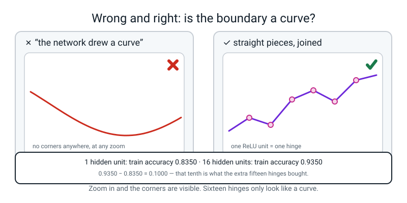
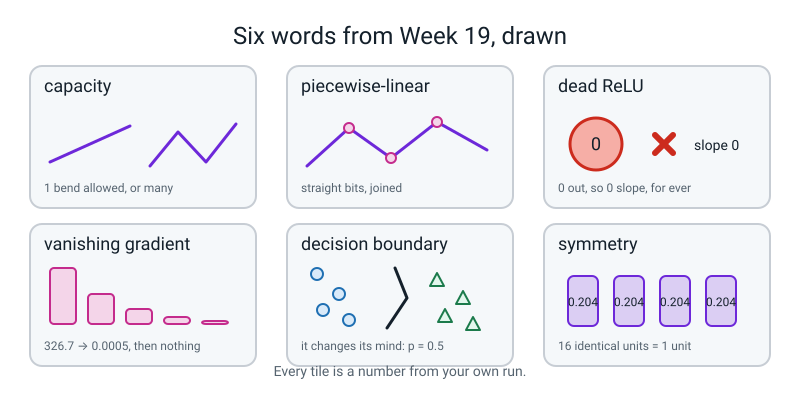

# Week 19 — NumPy Brain

[⬅ Week 18](week-18.md) · [Course Home](../README.md) · [Next ➡](week-20.md) · [Workbook](../workbook/week-19.md)

---

> ### This week in one sentence
> **Forty lines of numpy, no framework, sixty-five numbers — and a boundary that actually curves.**
>
> **By the end of this chapter you will be able to:**
> - **Build a 2 → 16 → 1 network in pure numpy** that scores **above 90%** on `make_moons`, with the gradient check still below `1e-6`
> - **Plot the decision boundary at epochs 0, 50 and 500** and put your finger on where it stops being a straight line
> - **Break the network on purpose three ways** — all-zero weights, learning rate 20, one hidden unit — and say why each one failed, in one sentence each
> - **Count the dead ReLUs** after a too-large learning rate, and say what a dead unit costs you
>
> **New maths:** **none.** Not one new idea. Everything today was taught in Weeks 12–18.
>
> **New syntax:** `make_moons(n_samples=400, noise=0.25, random_state=0)` · `np.meshgrid(xx, yy)` · `np.c_[a.ravel(), b.ravel()]` · `ax.contourf(XX, YY, Z)`
>
> **Reading time:** about 40 minutes. **Homework:** about 60 minutes.

---

## 🪝 Start Here

Draw two bananas hooked around each other. Fill one with circles and one with triangles. That is the shape of this week's data, and it is the shape that has been beating you for two years.

Here is the thing you have been able to do since Level 2: **draw one straight line and pick a side.** Try it on the bananas. Wherever you put the line, a fat handful of points ends up on the wrong side — the tips of the crescents always betray you.

That is not a failure of effort. It is a ceiling. We measured it: the best straight-line model on this exact data — `LogisticRegression`, which you trained back in Level 2 — scores **0.8950** on the test rows.

```text
straight line:  train 0.8350   test 0.8950
```

**0.8950 is the wall.**

Now count what you have built since Week 12.

| Week | What you built | In one phrase |
|---|---|---|
| 12 | measuring a slope by nudging | how steep is this hill right here |
| 13 | the sigmoid | turn a score into a chance |
| 14 | log loss | how surprised were you |
| 15 | gradient descent | step downhill, one knob at a time |
| 16 | one neuron | weighted inputs, summed, squashed |
| 17 | a layer | one grid times another grid |
| 18 | backpropagation | how much did each knob contribute |

Seven weeks. Seven separate exercises. **Today they become one file.** Forty lines. No library that knows anything at all about neural networks — numpy can multiply grids, and that is the entire amount of help you get.

And the deal is this: **when it works, your boundary will bend.** Nobody will tell it to bend. It will bend because bending makes the loss smaller.

By the end of this chapter your file will print this, and it will take under a second:

```text
gradient check (worst relative error): 4.792e-08
...
final test  acc 0.9350
```

**0.9350 against a wall of 0.8950.** Sixty-five numbers, and a curve.

---

## 🧠 The Big Idea

> **📌 About the code in this section.** The blocks below are **illustrations, not files**. Each one carries on from the one above, and the `import` lines are typed once, in the first block that needs them. **The complete runnable file is in 💻 Type This.** If you copy a block from this section on its own and Python says `NameError`, that is why, and nothing is broken.

### 1. Sixty-five knobs, and you know what every one of them is for

**The plain explanation.** A **neural network** is a stack of the neurons from Week 16. Multiply each input by a weight, add a bias, squash. Today you stack two layers of them: **sixteen neurons in the middle, one at the end.**

> **decision boundary** — the line, or curve, where the model changes its mind. On one side it says class 0, on the other class 1. On our plots it is the black line where the predicted probability is exactly 0.5.

Two inputs. Sixteen hidden units. One output. So count the knobs:

```
W1 is 2 rows by 16 columns   =  32 numbers
b1 is 1 row  by 16 columns   =  16 numbers
W2 is 16 rows by 1 column    =  16 numbers
b2 is 1 number               =   1 number
                               ─────────
                                 65 knobs
```

**32 + 16 + 16 + 1 = 65.** Say that out loud, because it makes the whole thing finite and knowable. Sixty-five numbers is fewer than the marks in a test paper. And every single one of them gets its own slope, every epoch, five hundred times over — **32,500 slopes this afternoon.** Last week you did nine of them by hand and it took twenty minutes. That is what a computer is for.


*Figure 19.1 — A 2 to 16 to 1 network, with every shape written on it. Read it out loud: 200 by 2, times 2 by 16, gives 200 by 16.*

**The analogy.** A mixing desk in a recording studio. Sixty-five sliders. Nobody knows the right setting for any of them, so you play the track, listen to how bad it sounds, work out for each slider *"which way would make it less bad"*, nudge all sixty-five a little in that direction, and play it again. Five hundred times.

**A concrete example, with real values.** Here are the actual starting values of the first two columns of `W1`, from `seed=0`:

```text
W1 first two columns:
[[ 0.1257 -0.1321]
 [-0.5443 -0.3163]]
```

Random. Small. Not special in any way. **By epoch 500 those four numbers have moved, and the movement is the learning.**

### 2. The shape ladder is your entire debugging tool

**The plain explanation.** A batch of 200 rows goes in the front. Follow the shapes all the way through and all the way back:

| Line | Shapes involved | Result |
|---|---|---|
| `Z1 = X @ W1 + b1` | `(200, 2) @ (2, 16)`, then add `(1, 16)` | `(200, 16)` |
| `A1 = relu(Z1)` | shape never changes | `(200, 16)` |
| `Z2 = A1 @ W2 + b2` | `(200, 16) @ (16, 1)`, then add `(1, 1)` | `(200, 1)` |
| `A2 = sigmoid(Z2)` | shape never changes | `(200, 1)` |
| `dZ2 = (A2 - y) / n` | `(200, 1)` minus `(200, 1)` | `(200, 1)` |
| `dW2 = A1.T @ dZ2` | `(16, 200) @ (200, 1)` | `(16, 1)` ← same shape as `W2` ✅ |
| `dW1 = X.T @ dZ1` | `(2, 200) @ (200, 16)` | `(2, 16)` ← same shape as `W1` ✅ |

Look at the two ticks. Then write this on your page and put a box round it:

> **Every gradient has exactly the same shape as the thing it is the gradient of.**

`dW1` **must** be `(2, 16)`, because `W1` is `(2, 16)`. If yours is not, you do not need to think about calculus. You need to find the `.T` you put in the wrong place.

**The analogy.** A `.T` is not ceremony and it is not maths. It is a **plug adaptor.** `(200, 16)` will not fit into something expecting a 16 on its left, so you turn it round and it becomes `(16, 200)`, and now it fits. That is the whole job of a transpose in this file.

**A concrete example.** Why does `A1` get transposed in `dW2 = A1.T @ dZ2`?

```
without the transpose:  (200, 16) @ (200, 1)   inner numbers 16 and 200  →  error
with the transpose:     (16, 200) @ (200, 1)   inner numbers 200 and 200 →  (16, 1) ✅
```

And `(16, 1)` is exactly `W2`'s shape. **The transpose exists to make the shapes meet. Nothing more mysterious than that.**

### 3. The gradient check is the only thing today that is a proof

**The plain explanation.** Suppose your backward pass has a bug. What happens?

**The loss still goes down.**

Not as far, not as fast — but down. So nothing looks wrong. You get a mediocre model and you never find out why. **A wrong backward pass does not crash. It quietly makes you worse.**

So before you train, you test the backward pass against something you cannot get wrong: **Week 12's nudge.**

```
take one knob
add a hair  (h = 0.000001)   →  what does the loss become?
take a hair away             →  what does the loss become?
subtract, divide by 2h       →  that is the slope
```

Then compare against what your `backward` function claimed. Do it for all sixty-five knobs and keep the worst disagreement.

```text
gradient check (worst relative error): 4.792e-08
```

`4.792e-08` is scientific notation for **0.00000004792**. Anything below `1e-6` means the backward pass is correct.

> **⚠️ Watch out:** this is not a hope, it is a **measurement**. It is the only number today that is a proof rather than an opinion. Nobody trains until their check prints something below `1e-6`.

**The analogy.** It is marking your own homework against the back of the book. The nudge is the back of the book: slow, stupid, and impossible to get wrong. Your `backward` function is fast and clever and therefore capable of being confidently wrong.

**A concrete example.** From Week 12: the slope of `x²` at `x = 3`.

```
(3.001² − 2.999²) ÷ 0.002 = (9.006001 − 8.994001) ÷ 0.002 = 0.012 ÷ 0.002 = 6.000
```

Six. **Two subtractions and a division, and no calculus at all.** That is the machinery the check runs sixty-five times.

### 4. Capacity: you get one hinge per unit

**The plain explanation.** ReLU is `max(0, z)` — two straight pieces meeting at a corner. Everything built out of ReLUs is therefore made of straight pieces.

> **piecewise-linear** — made of straight pieces joined at corners. A ReLU network's boundary is never a genuinely smooth curve. It is a lot of short straight segments — **one hinge per hidden unit.** Sixteen hinges *look* like a curve.

> **capacity** — how complicated a shape a model is able to draw. More hidden units, more capacity.

**A concrete example, and it is the whole lesson.** One hidden unit against sixteen, same data, same 500 epochs, same learning rate:

| | 1 hidden unit | 16 hidden units |
|---|---|---|
| train loss | 0.3693 | **0.1542** |
| train accuracy | 0.8350 | **0.9350** |
| test accuracy | 0.9000 | 0.9350 |
| knobs | 5 | 65 |


*Figure 19.2 — One hidden unit against sixteen hidden units. One hinge is nearly a straight line; sixteen hinges can curve.*

**And here is an honest thing, which you should notice yourself.** The *test* scores are close: 0.9000 against 0.9350. On 200 test rows that is seven points. The place capacity shows up unmistakably is the **training loss** — 0.3693 against 0.1542 — and the **shape of the boundary**. If you look at those two test numbers and think *"I am not sure I believe a difference that small"*, you are right, and that is Week 11's lesson arriving on its own.

**The analogy.** Capacity is **permission to bend, not an instruction to.** Our own sweep found that 1, 2 and 4 units all score exactly 0.8350 on train — four hinges are available and the network only bothers to use one or two, because the loss has nothing to gain from more.

### 5. Watching it learn: colour in the page and the line appears

**The plain explanation.** How do you draw a boundary? You do not. You ask the model about **every point on the page** — 40,000 of them — colour each one by its predicted probability, and the boundary appears where the colour changes.

Three snapshots, from a real run:

| epoch | train loss | test accuracy | what the boundary looks like |
|---|---|---|---|
| 0 | 0.8095 | 0.6450 | one straight line, in a nearly random place |
| 50 | 0.3104 | 0.9150 | one bend, and it has moved into the gap |
| 500 | 0.1542 | 0.9350 | follows the gap, curling at both ends |


*Figure 19.3 — The boundary at epoch 0, epoch 50 and epoch 500. Panel 1 is a straight line; panel 3 bends.*

**Most of the accuracy arrives in the first fifty epochs.** The remaining 450 buy 0.0200 of accuracy and a much lower loss, which is mostly the network becoming **more confident** about points it already had right.

### 6. Three ways to kill it, and the third one is not broken at all

**The plain explanation.** In class you sabotaged your own network three ways. Here is what happens and why.

**Sabotage 1 — every weight starts at zero.**

```text
epoch    0  train loss 0.6931
epoch  250  train loss 0.6931
epoch  500  train loss 0.6931
test acc 0.5000   dead units 16/16
```

Do the arithmetic and it is obvious. Every weight is zero, so every hidden unit computes `0 × x1 + 0 × x2 + 0 = 0`. ReLU leaves it at 0. The output is `0 × 0 + … + 0 = 0`. And `sigmoid(0) = 0.5`. **The network answers 0.5 to every single point**, and the loss of answering 0.5 is:

```
−ln(0.5) = 0.693147...
```

**0.6931 is the loss of a model that shrugs.** Memorise it. You will meet it again in Weeks 20–27, and if you ever see a training log parked on 0.6931, you now know exactly what the network is doing.

Why can it not learn its way out? Follow the chain: `dW1 = X.T @ dZ1`, and `dZ1` comes from `dA1 = dZ2 @ W2.T` — and `W2` is all zeros. So `dA1` is all zeros, so `dZ1` is all zeros, so **`dW1` is exactly zero.** There is no downhill. We checked:

```text
A2 first three: [0.5 0.5 0.5]   loss 0.6931
dW1 all zero? True   dW2 all zero? True
db2 = [[6.07153217e-18]]
```

> **symmetry** — when two units start with identical weights, they get identical gradients, so they stay identical for ever. Sixteen identical units are not sixteen units. They are one unit, copied.

**And symmetry bites even when the weights are not zero.** Start every weight at 0.5 instead:

```text
all-weights-equal init: loss 1.4117 -> 0.3697  test acc 0.9000
W1 after 500 epochs, first 4 columns:
[[ 0.20411   0.20411   0.20411   0.20411 ]
 [-0.342578 -0.342578 -0.342578 -0.342578]]
are all 16 hidden columns identical? True
```

It learns *something* — 0.9000 — but all sixteen hidden columns are the same number to six decimal places. **It is a one-unit network wearing a sixteen-unit costume**, and it scores exactly what one unit scores. **That is why initial weights are random. Randomness is not decoration; it is the only thing that makes the units different from each other.**

**Sabotage 2 — learning rate 20.**

```text
epoch    0  train loss 0.8095
epoch  250  train loss 0.6429
epoch  500  train loss 0.4493
test acc 0.8100   dead units 13/16
```

> **dead ReLU** — a hidden unit whose output is zero for *every* row in the data. It contributes nothing forward, so it receives no blame backward, so its slope is exactly zero, so it can never change again.

The mechanism, in numbers. One enormous step drove unit 0's bias to **−14.113**. Every row's weighted sum plus that bias comes out below zero, so `max(0, negative) = 0` for all 200 rows. ReLU's slope where it did not fire is **0**, so:

```
0 slope × any learning rate = 0 change.  Ever.
```


*Figure 19.4 — Thirteen dead units out of sixteen, counted. 13 crossed + 3 ticked = 16, and a dead unit's slope is zero for ever.*

> **vanishing gradient** — a slope so small that the knob effectively stops moving, however long you train. A dead ReLU is the extreme case: the slope is not small, it is exactly zero.

We tried to revive them. **2000 more epochs at a gentle `lr = 0.5`, and all thirteen were still dead**, with the test accuracy drifting to 0.8050. Three surviving units score 0.8100 where sixteen score 0.9350.

**Sabotage 3 — one hidden unit.**

```text
first loss 0.6628   last loss 0.3693
test acc 0.9000   dead units 0/1
```

**Nothing is broken here.** Nothing dies. The network simply cannot bend: one hinge, so a straight line with at most one kink in it, and the crescents need more bends than that. This one surprises people most, because 0.9000 sounds fine.

---

## 🔁 The Idea From Last Week, Used Harder

**There is no new maths this week. Not one idea.** That is the point of a project week: everything gets assembled and run.

But last week's idea — **slopes multiply along a chain** — gets used harder than you have used it, so here it is once more with the numbers of *this* file rather than last week's.

Last week you had a 2 → 2 → 1 network and four rows of input, and you worked out nine gradients with a pencil. This week you have a 2 → 16 → 1 network and two hundred rows, and there are **sixty-five gradients per epoch, five hundred epochs.** The chain is identical. Only the size changed.

**The chain, in words, for the very first knob in the file:**

```
nudge W1[0][0]        →  changes Z1 column 0
nudge Z1 column 0     →  changes A1 column 0   (unless the unit did not fire, in which case: nothing)
nudge A1 column 0     →  changes Z2
nudge Z2              →  changes A2
nudge A2              →  changes the loss
```

Five links. And the way you turn that into arithmetic is the same as last week: **multiply the amount each link passes on.** In code, that is eight lines:

```python
dZ2 = (cache["A2"] - y) / n
dW2 = cache["A1"].T @ dZ2
db2 = dZ2.sum(axis=0, keepdims=True)
dA1 = dZ2 @ P["W2"].T
dZ1 = dA1 * (cache["Z1"] > 0).astype(float)
dW1 = X.T @ dZ1
db1 = dZ1.sum(axis=0, keepdims=True)
```

The one line worth staring at is the fifth. `(cache["Z1"] > 0).astype(float)` is **ReLU's own slope**: `1` where the unit fired, `0` where it did not.

```python
>>> np.maximum(0, np.array([-3.0, 0.0, 2.2]))
array([0. , 0. , 2.2])
```

Where the output is 0, the slope is 0, and **that single fact is the whole explanation of a dead ReLU.** Everything in Sabotage 2 comes out of that one multiplication by zero.

> **🔢 The maths, slowly:** `.sum(axis=0, keepdims=True)` on line 3 adds up the **columns** — `axis=0` means "down the rows", from Week 16. Two hundred rows of blame collapse into one row of sixteen numbers, which is exactly `b1`'s shape, `(1, 16)`. The `keepdims=True` is what stops it collapsing all the way to a flat `(16,)` and breaking the shape rule.

---

## 💻 Type This

One file, built in seven steps. Then two more short files. Everything goes in the same folder.

### Step 1 — the data, and look at the shapes

New file, `numpy_brain.py`.

```python
"""numpy_brain.py - a 2 -> 16 -> 1 network in pure numpy. No framework."""
import numpy as np
from sklearn.datasets import make_moons
from sklearn.model_selection import train_test_split
from sklearn.preprocessing import StandardScaler

X, y = make_moons(n_samples=400, noise=0.25, random_state=0)
y = y.reshape(-1, 1).astype(float)
Xtr, Xte, ytr, yte = train_test_split(X, y, test_size=0.50,
                                      stratify=y, random_state=0)
sc = StandardScaler().fit(Xtr)
Xtr, Xte = sc.transform(Xtr), sc.transform(Xte)
print("Xtr", Xtr.shape, " ytr", ytr.shape, " Xte", Xte.shape)
```

```text
Xtr (200, 2)  ytr (200, 1)  Xte (200, 2)
```

**What the new lines do.** `make_moons(n_samples=400, noise=0.25, random_state=0)` **invents** 400 points arranged as two interleaving crescents, 200 in each class. It downloads nothing. `noise=0.25` scatters them so the crescents blur together at the tips — **the data is deliberately not perfectly separable**, so 100% is not on offer. `random_state=0` is the seed: same 400 points on your laptop as on mine.

**Two things to notice, and both are deliberate.**

`test_size=0.50` keeps **half** the data for testing, which is a lot. It is on purpose: 400 rows is small, and a test score computed on 40 rows would wobble five points on luck alone.

`y.reshape(-1, 1)` turns the answers from a flat line of 400 numbers, shape `(400,)`, into a **column**, `(400, 1)`. In sixty seconds you are going to delete that and see why it matters.

And `StandardScaler().fit(Xtr)` — fitted on the **training rows only**, then applied to both. That is Week 6's rule, and it still holds even though there is no pipeline object today.

### Step 2 — the two squashers, and the knobs

```python
def relu(z):
    return np.maximum(0, z)


def sigmoid(z):
    return 1.0 / (1.0 + np.exp(-z))


def init_params(n_in, n_hidden, seed=0):
    rng = np.random.default_rng(seed)
    return {
        "W1": rng.normal(0, np.sqrt(2.0 / n_in), size=(n_in, n_hidden)),
        "b1": np.zeros((1, n_hidden)),
        "W2": rng.normal(0, np.sqrt(2.0 / n_hidden), size=(n_hidden, 1)),
        "b2": np.zeros((1, 1)),
    }
```

**What the new lines do.** The `{ "name": value }` thing is a **dictionary** — a labelled box holding four grids of numbers. `rng.normal(0, spread, size=(rows, cols))` fills a grid of that shape with random numbers centred on zero.

The spread is the interesting bit:

```
layer 1:  sqrt(2 / 2)  = sqrt(1)      = 1.0
layer 2:  sqrt(2 / 16) = sqrt(0.125)  = 0.3536
```

*Spread = the square root of two divided by however many inputs the layer has.* That rule has a name — **He initialization** — and one job: **a layer with lots of inputs adds lots of numbers together, so each one should start smaller, or the sums come out enormous.** Sixteen inputs, so a smaller spread. Two inputs, so a bigger one.

Biases start at exactly zero, and that is fine. **It is the weights that must not start equal.**

```python
P = init_params(2, 16, seed=0)
for k in ("W1", "b1", "W2", "b2"):
    print(k, P[k].shape, P[k].size)
print("total knobs", sum(P[k].size for k in P))
```

```text
W1 (2, 16) 32
b1 (1, 16) 16
W2 (16, 1) 16
b2 (1, 1) 1
total knobs 65
```

**Sixty-five.** There it is, printed by your own file.

### Step 3 — the forward pass, and the loss

```python
def forward(P, X):
    Z1 = X @ P["W1"] + P["b1"]
    A1 = relu(Z1)
    Z2 = A1 @ P["W2"] + P["b2"]
    A2 = sigmoid(Z2)
    return {"Z1": Z1, "A1": A1, "Z2": Z2, "A2": A2}


def loss_fn(A2, y):
    p = np.clip(A2, 1e-12, 1 - 1e-12)
    return float(-np.mean(y * np.log(p) + (1 - y) * np.log(1 - p)))
```

**What the new lines do.** `P["W1"]` means "the grid labelled `W1` inside the box `P`". `@` is grid-times-grid, from Week 17. The four results come back together in another labelled box, because **the backward pass needs `Z1` and `A1` again** — that is what "cache" means: the numbers you kept from the way forward because you will need them on the way back.

`np.clip(A2, 1e-12, 1 - 1e-12)` drags any probability that has reached exactly 0 or exactly 1 a hair away from it, because `ln(0)` is not a number and would poison the whole average. `float(...)` turns a one-number grid into an ordinary number so it prints tidily.

**Four lines and one line. That is Week 17 and Week 14, unchanged.**

### Step 4 — the mistake we made on purpose

Now delete `.reshape(-1, 1)` from step 1, so the line reads `y = y.astype(float)`, and print the starting loss.

```python
print("y.shape:", ytr.shape)
print("loss with flat y: %.4f" % loss_fn(forward(P, Xtr)["A2"], ytr))
print("shape of A2 - yflat:", (forward(P, Xtr)["A2"] - ytr).shape)
```

**Predict before you run it.** Will it crash?

```text
y.shape: (200,)
loss with flat y: 0.9534
shape of A2 - yflat: (200, 200)
```

**Nothing complained.** And the loss is `0.9534` instead of `0.8095`.

Read the last line. **`A2 - y` came out `(200, 200)`.** Forty thousand numbers, out of a column of 200 minus a row of 200. Numpy did what numpy always does — it broadcast — and built a grid comparing every prediction against every answer, including the 199 answers belonging to other people.

The number it printed is a real number. It is just a real number about a question nobody asked.

> **⚠️ Watch out:** this is the shape bug of the year, and the cure is one line: **print the shape.** If `y.shape` says `(200,)` and not `(200, 1)`, stop and fix it before you do anything else. Put it in your Bug Log under *errors with no error message*, and in the message column write: **"no error, wrong answer."**

Put the reshape back. The loss returns to `0.8095`.

### Step 5 — the backward pass, and the second mistake on purpose

```python
def backward(P, cache, X, y):
    n = X.shape[0]
    dZ2 = (cache["A2"] - y) / n
    dW2 = cache["A1"].T @ dZ2
    db2 = dZ2.sum(axis=0, keepdims=True)
    dA1 = dZ2 @ P["W2"].T
    dZ1 = dA1 * (cache["Z1"] > 0).astype(float)
    dW1 = X @ dZ1                            # <-- the mistake: no .T
    db1 = dZ1.sum(axis=0, keepdims=True)
    return {"W1": dW1, "b1": db1, "W2": dW2, "b2": db2}
```

```text
Traceback (most recent call last):
  File "numpy_brain.py", line 46, in backward
    dW1 = X @ dZ1
ValueError: matmul: Input operand 1 has a mismatch in its core dimension 0, with gufunc signature (n?,k),(k,m?)->(n?,m?) (size 200 is different from 2)
```

**Read the last five words: `size 200 is different from 2`.**

`X` is `(200, 2)` and `dZ1` is `(200, 16)`, so the inner numbers are **2 and 200**, and they must match. Look at the ladder: we want `dW1` to come out `(2, 16)`, and the only way to get a 2 on the left is to turn `X` round. `X.T` is `(2, 200)`.

**This is the friendly kind of error.** It stops, and it names the two numbers that disagree. Fix it: `dW1 = X.T @ dZ1`.

### Step 6 — the gradient check, then train

```python
def gradient_check(P, X, y, h=1e-6):
    grads = backward(P, forward(P, X), X, y)
    worst = 0.0
    for name in ["W1", "b1", "W2", "b2"]:
        A = P[name]
        for i in range(A.shape[0]):
            for j in range(A.shape[1]):
                orig = A[i, j]
                A[i, j] = orig + h
                lp = loss_fn(forward(P, X)["A2"], y)
                A[i, j] = orig - h
                lm = loss_fn(forward(P, X)["A2"], y)
                A[i, j] = orig
                measured = (lp - lm) / (2 * h)
                mine = grads[name][i, j]
                bottom = max(1e-12, abs(measured) + abs(mine))
                worst = max(worst, abs(measured - mine) / bottom)
    return worst
```

**Read it as English.** *For every single knob — nudge it up a hair, see what the loss becomes; nudge it down a hair, see what the loss becomes; the difference divided by twice the hair is the slope. Then compare that against the slope my backward function claimed.*

Two lines deserve a note. `bottom` makes the comparison **relative**: being out by 0.0001 matters if the slope is 0.0002 and does not matter if the slope is 900. And `A[i, j] = orig` — **always put the weight back** — is the line people forget, and forgetting it silently ruins the network you are checking.

Then the training loop and the accuracy helper:

```python
def accuracy(P, X, y):
    pred = (forward(P, X)["A2"] >= 0.5).astype(int)
    return float((pred == y).mean())


def train(P, X, y, lr, epochs, Xte=None, yte=None, log_every=100):
    history = []
    for e in range(epochs + 1):
        cache = forward(P, X)
        L = loss_fn(cache["A2"], y)
        history.append(L)
        if log_every and e % log_every == 0:
            line = f"epoch {e:>4}  train loss {L:.4f}"
            if Xte is not None:
                line += f"  test acc {accuracy(P, Xte, yte):.4f}"
            print(line)
        if e == epochs:
            break
        g = backward(P, cache, X, y)
        for k in P:
            P[k] -= lr * g[k]
    return history
```

The last three lines are the whole of machine learning: **get the slopes, then move every knob a small step against its slope.**

### Step 7 — the whole file, and run it

Here is `numpy_brain.py` complete. Step 1 has become the function `get_data()` so the other files can import it.

```python
"""numpy_brain.py - a 2 -> 16 -> 1 network in pure numpy. No framework."""
import numpy as np
from sklearn.datasets import make_moons
from sklearn.model_selection import train_test_split
from sklearn.preprocessing import StandardScaler


def relu(z):
    return np.maximum(0, z)


def sigmoid(z):
    return 1.0 / (1.0 + np.exp(-z))


def init_params(n_in, n_hidden, seed=0):
    rng = np.random.default_rng(seed)
    return {
        "W1": rng.normal(0, np.sqrt(2.0 / n_in), size=(n_in, n_hidden)),
        "b1": np.zeros((1, n_hidden)),
        "W2": rng.normal(0, np.sqrt(2.0 / n_hidden), size=(n_hidden, 1)),
        "b2": np.zeros((1, 1)),
    }


def forward(P, X):
    Z1 = X @ P["W1"] + P["b1"]
    A1 = relu(Z1)
    Z2 = A1 @ P["W2"] + P["b2"]
    A2 = sigmoid(Z2)
    return {"Z1": Z1, "A1": A1, "Z2": Z2, "A2": A2}


def loss_fn(A2, y):
    p = np.clip(A2, 1e-12, 1 - 1e-12)
    return float(-np.mean(y * np.log(p) + (1 - y) * np.log(1 - p)))


def backward(P, cache, X, y):
    n = X.shape[0]
    dZ2 = (cache["A2"] - y) / n
    dW2 = cache["A1"].T @ dZ2
    db2 = dZ2.sum(axis=0, keepdims=True)
    dA1 = dZ2 @ P["W2"].T
    dZ1 = dA1 * (cache["Z1"] > 0).astype(float)
    dW1 = X.T @ dZ1
    db1 = dZ1.sum(axis=0, keepdims=True)
    return {"W1": dW1, "b1": db1, "W2": dW2, "b2": db2}


def gradient_check(P, X, y, h=1e-6):
    grads = backward(P, forward(P, X), X, y)
    worst = 0.0
    for name in ["W1", "b1", "W2", "b2"]:
        A = P[name]
        for i in range(A.shape[0]):
            for j in range(A.shape[1]):
                orig = A[i, j]
                A[i, j] = orig + h
                lp = loss_fn(forward(P, X)["A2"], y)
                A[i, j] = orig - h
                lm = loss_fn(forward(P, X)["A2"], y)
                A[i, j] = orig
                measured = (lp - lm) / (2 * h)
                mine = grads[name][i, j]
                bottom = max(1e-12, abs(measured) + abs(mine))
                worst = max(worst, abs(measured - mine) / bottom)
    return worst


def accuracy(P, X, y):
    pred = (forward(P, X)["A2"] >= 0.5).astype(int)
    return float((pred == y).mean())


def train(P, X, y, lr, epochs, Xte=None, yte=None, log_every=100):
    history = []
    for e in range(epochs + 1):
        cache = forward(P, X)
        L = loss_fn(cache["A2"], y)
        history.append(L)
        if log_every and e % log_every == 0:
            line = f"epoch {e:>4}  train loss {L:.4f}"
            if Xte is not None:
                line += f"  test acc {accuracy(P, Xte, yte):.4f}"
            print(line)
        if e == epochs:
            break
        g = backward(P, cache, X, y)
        for k in P:
            P[k] -= lr * g[k]
    return history


def get_data():
    X, y = make_moons(n_samples=400, noise=0.25, random_state=0)
    y = y.reshape(-1, 1).astype(float)
    Xtr, Xte, ytr, yte = train_test_split(X, y, test_size=0.50,
                                          stratify=y, random_state=0)
    sc = StandardScaler().fit(Xtr)
    return sc.transform(Xtr), sc.transform(Xte), ytr, yte


if __name__ == "__main__":
    Xtr, Xte, ytr, yte = get_data()
    print("Xtr", Xtr.shape, " ytr", ytr.shape, " Xte", Xte.shape)
    P = init_params(2, 16, seed=0)
    print("gradient check (worst relative error): %.3e"
          % gradient_check(P, Xtr[:20], ytr[:20]))
    print()
    train(P, Xtr, ytr, lr=0.5, epochs=500, Xte=Xte, yte=yte, log_every=100)
    print()
    print("final train acc %.4f" % accuracy(P, Xtr, ytr))
    print("final test  acc %.4f" % accuracy(P, Xte, yte))
```

**The real output. Runtime: under 1 second.**

```text
Xtr (200, 2)  ytr (200, 1)  Xte (200, 2)
gradient check (worst relative error): 4.792e-08

epoch    0  train loss 0.8095  test acc 0.6450
epoch  100  train loss 0.2612  test acc 0.9300
epoch  200  train loss 0.2015  test acc 0.9300
epoch  300  train loss 0.1740  test acc 0.9250
epoch  400  train loss 0.1604  test acc 0.9250
epoch  500  train loss 0.1542  test acc 0.9350

final train acc 0.9350
final test  acc 0.9350
```

**Four things to notice, and the fourth is the one people worry about.**

1. `4.792e-08`. Your backward pass is not *probably* right. It is **measured** right.
2. The loss falls fast then crawls: 0.8095 → 0.2612 in a hundred epochs, then only to 0.1542 over the next four hundred.
3. `test acc 0.9350`. Above 90%, and through the 0.8950 wall.
4. **Test accuracy is not monotone**: 0.9300, 0.9300, 0.9250, 0.9250, 0.9350. It goes *down* in the middle. That is normal. Accuracy counts whole points out of 200, so the smallest step it can take is `1 ÷ 200 = 0.005`. **The loss is smooth; the accuracy is lumpy.**

### Step 8 — draw the boundary

New file, `plot_boundary.py`. Four new lines do all the work.

```python
gx = np.linspace(-2.6, 2.6, 200)
gy = np.linspace(-2.4, 2.4, 200)
XX, YY = np.meshgrid(gx, gy)
grid = np.c_[XX.ravel(), YY.ravel()]
print("XX shape", XX.shape, " grid shape", grid.shape)
Z = forward(P, grid)["A2"].reshape(XX.shape)
```

```text
XX shape (200, 200)  grid shape (40000, 2)
```

**What the new lines do.**

- `np.linspace(a, b, n)` is Week 12: `n` evenly spaced numbers from `a` to `b`.
- `np.meshgrid(gx, gy)` takes those two lists of 200 and builds **two grids of 200 × 200 = 40,000 numbers**. `XX` holds the across-coordinate of every point on the page; `YY` holds the up-coordinate. Think of graph paper: `XX` is "which column am I in", `YY` is "which row".
- `.ravel()` unrolls a 200 × 200 grid into one long line of 40,000 numbers.
- `np.c_[a, b]` glues two of those lines together **side by side as columns**, giving `(40000, 2)` — which is exactly the shape `forward()` wants.
- `.reshape(XX.shape)` folds the 40,000 answers back into the grid they came from.

Then the drawing:

```python
ax.contourf(XX, YY, Z, levels=20, cmap="coolwarm", alpha=0.7)
ax.contour(XX, YY, Z, levels=[0.5], colors="black", linewidths=2)
```

`ax.contourf` fills the page with colour by value — blue where the probability is low, red where it is high. `ax.contour(..., levels=[0.5])` draws a single black line along the places where the probability is exactly 0.5. **That black line is the decision boundary.**

The complete `plot_boundary.py` trains from scratch and takes a snapshot at three epochs. **Runtime about 1.5 seconds.**

```python
"""plot_boundary.py - the boundary at epoch 0, epoch 50 and epoch 500."""
import matplotlib
matplotlib.use("Agg")
import matplotlib.pyplot as plt
import numpy as np

from numpy_brain import (accuracy, backward, forward, get_data, init_params,
                         loss_fn)

Xtr, Xte, ytr, yte = get_data()
P = init_params(2, 16, seed=0)

pad = 0.8
gx = np.linspace(Xtr[:, 0].min() - pad, Xtr[:, 0].max() + pad, 200)
gy = np.linspace(Xtr[:, 1].min() - pad, Xtr[:, 1].max() + pad, 200)
XX, YY = np.meshgrid(gx, gy)
grid = np.c_[XX.ravel(), YY.ravel()]
print("XX shape", XX.shape, " grid shape", grid.shape)

snapshots = {}
for e in range(501):
    cache = forward(P, Xtr)
    if e in (0, 50, 500):
        Z = forward(P, grid)["A2"].reshape(XX.shape)
        snapshots[e] = (Z, loss_fn(cache["A2"], ytr), accuracy(P, Xte, yte))
    if e == 500:
        break
    g = backward(P, cache, Xtr, ytr)
    for k in P:
        P[k] -= 0.5 * g[k]

fig, axes = plt.subplots(1, 3, figsize=(13, 4.2))
for ax, e in zip(axes, [0, 50, 500]):
    Z, L, acc = snapshots[e]
    ax.contourf(XX, YY, Z, levels=20, cmap="coolwarm", alpha=0.7)
    ax.contour(XX, YY, Z, levels=[0.5], colors="black", linewidths=2)
    ax.scatter(Xtr[ytr.ravel() == 0, 0], Xtr[ytr.ravel() == 0, 1],
               s=12, c="tab:blue", edgecolor="k", linewidth=0.3)
    ax.scatter(Xtr[ytr.ravel() == 1, 0], Xtr[ytr.ravel() == 1, 1],
               s=12, c="tab:red", edgecolor="k", linewidth=0.3)
    ax.set_title(f"epoch {e}  loss {L:.4f}  test acc {acc:.4f}")
    ax.set_xlabel("feature 1 (scaled)")
axes[0].set_ylabel("feature 2 (scaled)")
plt.tight_layout()
plt.savefig("boundary.png", dpi=120)
print("wrote boundary.png")
for e in (0, 50, 500):
    Z, L, acc = snapshots[e]
    print("epoch %3d  loss %.4f  test acc %.4f" % (e, L, acc))
```

```text
XX shape (200, 200)  grid shape (40000, 2)
wrote boundary.png
epoch   0  loss 0.8095  test acc 0.6450
epoch  50  loss 0.3104  test acc 0.9150
epoch 500  loss 0.1542  test acc 0.9350
```

**Open `boundary.png` and look at it for twenty seconds without talking.** Then find the place where it stops being a straight line.

---

## 🔍 Worked Examples

Three complete programs, in three different worlds. All three import from your finished `numpy_brain.py`.

### Worked Example 1 — Four units instead of sixteen (counting hinges)

**The question:** how many bends do these crescents actually need?

```python
"""we1.py - four hidden units instead of sixteen."""
import numpy as np
from numpy_brain import (accuracy, forward, get_data, init_params, train)

Xtr, Xte, ytr, yte = get_data()

for h in (4, 16):
    P = init_params(2, h, seed=0)
    hist = train(P, Xtr, ytr, lr=0.5, epochs=500, log_every=0)
    A1 = forward(P, Xtr)["A1"]
    dead = int(np.sum(np.all(A1 <= 0, axis=0)))
    knobs = 2 * h + h + h + 1
    print("%2d units: knobs %3d  train loss %.4f  train acc %.4f  test acc %.4f  dead %d/%d"
          % (h, knobs, hist[-1], accuracy(P, Xtr, ytr), accuracy(P, Xte, yte), dead, h))
```

Real output, runtime about 1 second:

```text
 4 units: knobs  17  train loss 0.3565  train acc 0.8350  test acc 0.9000  dead 1/4
16 units: knobs  65  train loss 0.1542  train acc 0.9350  test acc 0.9350  dead 0/16
```

**Three things worth pulling out.**

1. **Four units score the same 0.8350 on train as one unit does.** Four hinges were available; the network found a use for one or two. **Capacity is permission, not instruction.**
2. **One of the four units is dead**, at a perfectly sensible learning rate of 0.5. Dead units are not only caused by disasters — they happen, quietly, and it is worth counting them.
3. **17 knobs against 65.** Four times the knobs bought `0.3565 − 0.1542 = 0.2023` of training loss.

### Worked Example 2 — Four hand-typed points that no straight line can split

**The question:** what is the smallest possible problem that needs a hidden layer at all?

Answer: four points. Two features, each either −1 or +1, and the answer is *"were they different?"*

| feature 1 | feature 2 | answer |
|---|---|---|
| −1 | −1 | 0 |
| −1 | +1 | 1 |
| +1 | −1 | 1 |
| +1 | +1 | 0 |

Plot those four on paper. **No straight line separates the two 1s from the two 0s.** Try it; you cannot.

```python
"""we2.py - XOR: four hand-typed points that no straight line can split."""
import numpy as np
from sklearn.linear_model import LogisticRegression
from numpy_brain import (accuracy, forward, gradient_check, init_params, train)

X = np.array([[-1.0, -1.0],
              [-1.0,  1.0],
              [ 1.0, -1.0],
              [ 1.0,  1.0]])
y = np.array([[0.0], [1.0], [1.0], [0.0]])
print("X", X.shape, " y", y.shape)

lin = LogisticRegression(random_state=0).fit(X, y.ravel())
print("best straight line gets %.2f of 4 right" % lin.score(X, y.ravel()))

P = init_params(2, 4, seed=0)
print("gradient check: %.3e" % gradient_check(P, X, y))
train(P, X, y, lr=0.5, epochs=2000, log_every=500)
print("accuracy:", accuracy(P, X, y))
print("predictions:", np.round(forward(P, X)["A2"].ravel(), 4))
A1 = forward(P, X)["A1"]
print("dead units:", int(np.sum(np.all(A1 <= 0, axis=0))), "/ 4")
```

Real output, runtime well under a second:

```text
X (4, 2)  y (4, 1)
best straight line gets 0.50 of 4 right
gradient check: 3.711e-09
epoch    0  train loss 0.7205
epoch  500  train loss 0.0054
epoch 1000  train loss 0.0026
epoch 1500  train loss 0.0017
epoch 2000  train loss 0.0012
accuracy: 1.0
predictions: [2.000e-04 9.999e-01 9.956e-01 2.000e-04]
dead units: 0 / 4
```

**`0.50 of 4 right.` A straight line gets two out of four — the same as guessing.** Four hidden units get all four, and the predictions are 0.0002, 0.9999, 0.9956, 0.0002 — as certain as it is possible to be.

**Four rows of data. Four hidden units. Seventeen knobs.** This is the smallest honest demonstration in the whole level that a hidden layer buys you something a straight line cannot have.

### Worked Example 3 — Two real wine measurements

**The question:** does the network beat a straight line on real data too?

`load_wine()` ships inside scikit-learn — 178 wines, 13 measurements each, no download. Keep two classes and two of the measurements.

```python
"""we3.py - NumPy Brain on two real wine measurements."""
import numpy as np
from sklearn.datasets import load_wine
from sklearn.linear_model import LogisticRegression
from sklearn.model_selection import train_test_split
from sklearn.preprocessing import StandardScaler
from numpy_brain import accuracy, forward, gradient_check, init_params, train

wine = load_wine()
keep = wine.target < 2                       # classes 0 and 1 only
X = wine.data[keep][:, [0, 9]]               # alcohol, colour intensity
y = wine.target[keep].reshape(-1, 1).astype(float)
print("two features:", [wine.feature_names[i] for i in (0, 9)])
print("X", X.shape, " y", y.shape, " class balance", float(y.mean()))

Xtr, Xte, ytr, yte = train_test_split(X, y, test_size=0.40, stratify=y,
                                      random_state=0)
sc = StandardScaler().fit(Xtr)
Xtr, Xte = sc.transform(Xtr), sc.transform(Xte)
print("Xtr", Xtr.shape, " Xte", Xte.shape)

line = LogisticRegression(random_state=0).fit(Xtr, ytr.ravel())
print("straight line test acc %.4f" % line.score(Xte, yte.ravel()))

P = init_params(2, 16, seed=0)
print("gradient check: %.3e" % gradient_check(P, Xtr[:20], ytr[:20]))
train(P, Xtr, ytr, lr=0.5, epochs=500, Xte=Xte, yte=yte, log_every=250)
print("network  test acc %.4f" % accuracy(P, Xte, yte))
A1 = forward(P, Xtr)["A1"]
print("dead units:", int(np.sum(np.all(A1 <= 0, axis=0))), "/ 16")
```

Real output, runtime about 1 second:

```text
two features: ['alcohol', 'color_intensity']
X (130, 2)  y (130, 1)  class balance 0.5461538461538461
Xtr (78, 2)  Xte (52, 2)
straight line test acc 0.9038
gradient check: 6.769e-09
epoch    0  train loss 0.6234  test acc 0.5577
epoch  250  train loss 0.0970  test acc 0.8846
epoch  500  train loss 0.0854  test acc 0.9038
network  test acc 0.9038
dead units: 0 / 16
```

**Read that honestly: 0.9038 and 0.9038. A dead heat.**

Sixty-five knobs did not beat a straight line here, and that is a real result, not a bug. Alcohol and colour intensity separate these two kinds of wine **almost with a straight line already**. When the true shape is nearly a line, extra capacity has nothing to bend around, so it buys you nothing.

> **🤔 Think about it:** last worked example, capacity was worth 0.2023 of training loss. This one, it is worth nothing at all. So the useful question is never *"is my model powerful enough?"* — it is **"what shape is the answer?"**

---

## 🐞 When It Breaks

Every message below came from really running a broken version of this week's code. Your line numbers will differ. The last line will not.

> **The recipe for every shape error, and it never changes:** *what shape should it be?* Then, and only then, *what shape is it?* `print(dW1.shape)` tells you everything in eight characters.

### Break 1 — the reshape you forgot

```python
Z = forward(P, grid)["A2"]              # no .reshape(XX.shape)
ax.contourf(XX, YY, Z)
```

```text
TypeError: Input z must be at least a (2, 2) shaped array, but has shape (40000, 1)
```

**What Python is telling you.** *"You gave me a long thin column and I need a page."*

`contourf` wants a value for every square of graph paper, laid out as graph paper. You handed it 40,000 answers in a single column. It has no idea which of them is the top-left one.

**The fix.** `Z = forward(P, grid)["A2"].reshape(XX.shape)`. Fold the answers back into the shape they came from.

### Break 2 — `np.c_` without `.ravel()`

```python
grid = np.c_[XX, YY]                    # .ravel() forgotten
print("grid shape", grid.shape)
Z = forward(P, grid)["A2"]
```

```text
grid shape (200, 400)
ValueError: matmul: Input operand 1 has a mismatch in its core dimension 0, with gufunc signature (n?,k),(k,m?)->(n?,m?) (size 2 is different from 400)
```

**What Python is telling you.** *"Your rows are 400 numbers wide and my first weight grid expects 2."*

Without `.ravel()`, `np.c_` glued two whole 200 × 200 grids together **side by side**, giving a `(200, 400)` block instead of a `(40000, 2)` table.

**The fix.** `np.c_[XX.ravel(), YY.ravel()]`, and then **print `grid.shape` and check it says `(40000, 2)`** before you go anywhere near the model.

### Break 3 — a gradient check that fails for a reason that is not a bug

This one is the most interesting failure of the week, because your code is correct.

Take Worked Example 2 and write the four points as `0` and `1` instead of `−1` and `+1`:

```python
X = np.array([[0.0, 0.0],
              [0.0, 1.0],
              [1.0, 0.0],
              [1.0, 1.0]])
P = init_params(2, 4, seed=0)
print("gradient check: %.3e" % gradient_check(P, X, y))
print("smallest |Z1| anywhere:", np.abs(forward(P, X)["Z1"]).min())
```

```text
gradient check: 3.942e-01
smallest |Z1| anywhere: 0.0
```

**`3.942e-01` is 0.39. That is a catastrophic failure and there is nothing wrong with the code.**

**What is happening.** Row one is `[0.0, 0.0]`, and the biases all start at exactly zero, so that row's pre-activation is **exactly 0** — right on ReLU's corner. Nudge the knob up a hair and the unit fires; nudge it down a hair and it does not. The nudge is measuring the slope *across a corner*, where there is no single slope to measure.

**The fix, and the lesson.** Move the data off the corner — `−1` and `+1` instead of `0` and `1` — and the same code prints `3.711e-09`. The general habit: **if the gradient check fails, print the smallest absolute pre-activation before you assume it is your maths.** A `0.0` there means the check is asking an unanswerable question.

### Break 4 — a `RuntimeWarning` that is really a message about your learning rate

```text
numpy_brain.py:13: RuntimeWarning: overflow encountered in exp
  return 1.0 / (1.0 + np.exp(-z))
```

**What Python is telling you.** *"`e` to the power of a huge number is bigger than a computer can hold."*

This appears during the `lr = 20` sabotage, and it is a **warning**, not an error: the program keeps running and quietly produces `nan` values. `nan` then poisons everything downstream, **including the dead-unit count** — because `nan <= 0` is `False`, so `nan` units get counted as *alive*.

**The fix.** Turn the learning rate down. And the deeper lesson: **a broken measurement is worse than no measurement**, because it looks like a number.

### The whole clinic, for reference

| What you see | What it means | The fix |
|---|---|---|
| `ValueError: matmul: ... (size 200 is different from 2)` | "The two blocks do not fit. The inner numbers are 200 and 2." | A missing `.T`. `dW1 = X.T @ dZ1`, and check against the ladder: `dW1` must be `(2, 16)` |
| `ValueError: matmul: ... (size 16 is different from 2)` | Same complaint, different pair | `W1` was built `(16, 2)`. `size=(n_in, n_hidden)` — **inputs first, units second** |
| `TypeError: Input z must be at least a (2, 2) shaped array, but has shape (40000, 1)` | "I need a page and you gave me a column" | `.reshape(XX.shape)` |
| `KeyError: 'w1'` | "There is no box with that label" | Dictionary keys are case-sensitive. `g["W1"]` |
| `RuntimeWarning: overflow encountered in exp` then `nan` | "That number is too big to hold" | The learning rate is far too big. And `nan` breaks the dead-unit count silently |
| **No error.** Loss starts at `0.9534` instead of `0.8095` | Every number afterwards is about the wrong question | `y = y.reshape(-1, 1)`. **Print `y.shape` before you train, every time** |
| **No error.** Loss sits on exactly `0.6931` for 500 epochs | The network answers 0.5 to everything, for ever | Weights all started at zero or all equal. `0.6931` is `−ln(0.5)` |
| **No error.** The gradient check prints `3.4e-01` | Your backward pass is wrong | A transpose in the wrong place, a missing ReLU mask, or a forgotten `/ n`. Check `db2` first — if that one disagrees, the bug is at the output end |
| **No error.** The gradient check prints `nan` and the weights are strange afterwards | The check broke the network it was checking | `A[i, j] = orig` is missing. **Always put the weight back** |
| **No error.** Test accuracy is exactly `0.5000` | The network says the same thing about everything | Print `forward(P, Xte)["A2"][:5]`. All 0.5? See the zero-weights sabotage |

---

## 🎲 What We Did In Class

If you missed it, here is the whole lesson. You need a laptop, a pen, and three index cards.

**The hook.** Two interlocking crescents on the board, circles and triangles. *"Separate them with one straight line."* Two or three people tried, and every line left a fat handful of points on the wrong side, counted out loud. Then the honest number: **the best straight line scores 0.8950 on the test rows.** That is the wall.

**The parts list**, on the board, and five of the six were already ours:

```
forward   →  Week 17   (grid multiply, ReLU, grid multiply, squash)
loss      →  Week 14   (log loss: the surprise meter)
backward  →  Week 18   (four gradient arrays)
check     →  Week 12   (nudge, divide, compare)
update    →  Week 15   (w ← w − lr × slope)
draw      →  TODAY     (four new lines of plotting)
```

**Counting the knobs, then the shape ladder.** `2 × 16 + 16 + 16 × 1 + 1 = 65`. Then: *"how many slopes must the backward pass produce every epoch?"* Sixty-five — **four arrays holding 65 numbers**, 32,500 slopes over 500 epochs. Then the ladder, row by row, with the class calling out each result shape **before** it was written. It ended with the sentence in a box: **every gradient has the same shape as the thing it is the gradient of.**

**Two mistakes on purpose**, and they were a matched pair:

| Mistake | What happened |
|---|---|
| `y` left flat, shape `(200,)` | **Silent.** Loss `0.9534` instead of `0.8095`, and `A2 - y` was `(200, 200)` |
| `dW1 = X @ dZ1`, no transpose | **Loud.** `ValueError ... size 200 is different from 2` |

Both went in the Bug Log. For the first, the message column says: **"no error, wrong answer, print the shape."**

**Break It Three Ways.** Three index cards, **three predictions written in pen before anything was run.** Then the real numbers:

| | loss at the end | test accuracy | dead units |
|---|---|---|---|
| all weights zero | **0.6931** | **0.5000** | 16/16 |
| lr = 20 | 0.4493 | **0.8100** | **13/16** |
| one hidden unit | 0.3693 | **0.9000** | 0/1 |
| *(the working network)* | 0.1542 | 0.9350 | 0/16 |

Then each card was turned over and one sentence written on the back — **why**, not what. The dead-unit counter, typed slowly and read as English (*"for each column, was it zero or less every single time? count the yeses"*):

```python
A1 = forward(P, Xtr)["A1"]
dead = int(np.sum(np.all(A1 <= 0, axis=0)))
print("dead units", dead, "/ 16")
```

**The four numbers at the end:**

```
0.8950   the best a straight line can do on this data
0.9350   what sixty-five numbers and a bend did about it
0.6931   the loss of a network that answers 0.5 to everything: −ln(0.5)
13/16    how many hidden units one careless learning rate killed
```

---

## 💬 Talk About It

**1. A network with a wrong backward pass still trains, and its loss still goes down. So what exactly is the gradient check protecting you from?**

*Hint:* start by agreeing that the loss going down is genuinely evidence of *something*. Then ask what it is evidence *of*. If your slopes point in roughly-but-not-exactly the right direction, you still walk roughly downhill — you just arrive somewhere worse, slowly, and nothing tells you. So the thing being protected is not "does it run" but **"is the number I get at the end the best this model could do?"** Then the harder half: is there any other test you could run that would catch a wrong backward pass? *(You could compare against a second implementation, or against a library — which is next week. Nudging is the only one that needs nothing but the loss function.)*

**2. One hidden unit scored 0.9000 on test and sixteen scored 0.9350. Is that a real difference?**

*Hint:* work out what one test point is worth first. There are 200 test rows, so one point flipping is `1 ÷ 200 = 0.005`. So the gap between 0.9000 and 0.9350 is **seven points out of two hundred.** Now ask what would happen with a different `random_state` in the split — would those seven points survive? Then look for a place where the difference is much less arguable: the **train loss**, 0.3693 against 0.1542, which is not a count of anything and does not wobble. **A student who says "I don't trust a two-point difference on 200 rows" has understood Week 11 properly.**

**3. A dead ReLU can never come back. Is that a bug in ReLU, or a feature?**

*Hint:* first make sure the mechanism is solid — output zero for every row, so slope zero, so no update, whatever the learning rate. Then argue both sides. Against: losing 13 of 16 units to one careless number is a disaster, and there are activations with a small slope on the left specifically to prevent it. For: a unit that has switched itself off is a unit that has decided it is not needed, and ReLU's flat left half is exactly what makes it fast and what makes deep networks trainable at all. Then the honest closer: **ReLU won this trade-off in about 2012, and people still argue about it.** Nobody has to pretend the answer is settled.

---

## ⚠️ Don't Get Tricked

### Trick 1 — "the network drew a curve"


*Figure 19.5 — A curve, or sixteen straight pieces joined. Zoom in and the corners are visible.*

| ❌ Wrong | ✅ Right |
|---|---|
| "The boundary is a smooth curve, so the network has learned a curved rule." | It is up to **sixteen straight lines joined at corners.** ReLU is two straight pieces, so everything built from it is **piecewise-linear.** Zoom into the plot and you can count the segments. |

This matters because it explains capacity in one sentence: **you get one hinge per unit, so the number of units is the number of bends you are allowed.**

### Trick 2 — "more hidden units is always better"

| ❌ Wrong | ✅ Right |
|---|---|
| "Sixty-four units must beat sixteen. More knobs, more power." | **Measured:** 64 units score **0.9550 on train and 0.9150 on test.** Sixteen score 0.9350 and 0.9350. The big one learned the noise in the training crescents. That is Week 2's overfitting, with a new dial to turn. |

The tell is not the test score on its own. It is **the gap between train and test.** 0.9550 against 0.9150 is a 0.0400 gap; 0.9350 against 0.9350 is none.

### Trick 3 — "my loss went down, so my code is right"

| ❌ Wrong | ✅ Right |
|---|---|
| "The loss fell from 0.81 to 0.15, so the backward pass must be correct." | A wrong backward pass **also** makes the loss fall. The only thing that says your slopes are right is the gradient check printing below `1e-6` — and it is a *measurement*, not an opinion. **Run it before you train, every time.** |

### Trick 4 — "the units died because the weights got too big"

| ❌ Wrong | ✅ Right |
|---|---|
| "The learning rate was huge, so the weights exploded, so the units stopped working." | Close, but that is the story, not the mechanism. The mechanism is one multiplication: unit 0's bias reached **−14.113**, so its output is `max(0, negative) = 0` for all 200 rows, so **ReLU's slope there is 0**, so `0 × any learning rate = 0`. It cannot move again. We trained 2000 more gentle epochs to check: still 13 dead. |

If your sentence does not contain the word **slope** and the word **zero**, you have described the symptom.

---

## 🌍 Where You've Seen This

1. **Your phone's photo app grouping faces.** The same forward-and-backward loop you wrote today, with a few million knobs instead of sixty-five, and a convolution instead of a plain grid multiply. Weeks 24–27 add exactly that. **The loop does not change.**
2. **Every "is this spam?" filter.** The output layer is one sigmoid and the loss is log loss — the two things you wrote in Weeks 13 and 14 and used again today, unchanged.
3. **The autocomplete on your keyboard.** A stack of layers, a loss, and gradient descent. It is bigger by a factor of a billion and the physics is identical.
4. **Any game AI that "learns".** A network, a score, and a search for knob settings that make the score better. The search is usually a cousin of the one you wrote.
5. **`torch.nn.Linear`, `keras.layers.Dense`, and every other layer object in every framework.** Inside each one is `X @ W + b` and a gradient with the same shape as the weights. You have now built the thing everybody else imports.
6. **Weather forecasting and protein folding.** Both use networks whose training loop is this loop, and both matter enormously. **Nothing about the loop knows or cares what the numbers mean.**

---

## 🔑 Remember This

- **Sixty-five knobs.** `2 × 16 + 16 + 16 × 1 + 1 = 65`. Every one gets its own slope, every epoch, 500 times: **32,500 slopes.**
- **Every gradient has the same shape as the thing it is the gradient of.** `dW1` must be `(2, 16)` because `W1` is `(2, 16)`. This one sentence finds nearly every bug in the file.
- **The transpose exists to make the shapes meet.** It is a plug adaptor, not a piece of maths.
- **The gradient check is the only proof in the week.** Below `1e-6` and you may train. Above it, find the transpose — do not train a wrong backward pass, because it will still work badly and never tell you.
- **`0.6931` is `−ln(0.5)`** — the loss of a network answering 0.5 to everything. If a loss parks there and will not move, the weights started equal.
- **A dead unit has slope exactly zero, so no learning rate can ever move it again.** 13 of 16 died at `lr = 20`, and 2000 gentle epochs could not bring one back.
- **One hinge per hidden unit.** Sixteen hinges look like a curve. **Capacity is permission to bend, not an instruction to.**

### Syntax reminder card

```python
import numpy as np
from sklearn.datasets import make_moons

# ---- the data: invented on the spot, nothing downloads --------------------
X, y = make_moons(n_samples=400, noise=0.25, random_state=0)
y = y.reshape(-1, 1).astype(float)      # A COLUMN. (400,) will not error and will be wrong.

# ---- a grid over the whole page, so you can colour it in ------------------
gx = np.linspace(-2.6, 2.6, 200)        # 200 evenly spaced numbers
gy = np.linspace(-2.4, 2.4, 200)
XX, YY = np.meshgrid(gx, gy)            # two (200, 200) grids: across, and up
grid = np.c_[XX.ravel(), YY.ravel()]    # (40000, 2) - the shape forward() wants
print(grid.shape)                       # ALWAYS print this. (40000, 2)

# ---- ask the model about all 40,000, then fold the answers back -----------
Z = forward(P, grid)["A2"].reshape(XX.shape)     # (200, 200). Forget .reshape -> TypeError
ax.contourf(XX, YY, Z, levels=20, cmap="coolwarm", alpha=0.7)   # colour the page
ax.contour(XX, YY, Z, levels=[0.5], colors="black", linewidths=2)  # the boundary

# ---- counting dead units: one line, read it as English -------------------
A1 = forward(P, Xtr)["A1"]                       # (200, 16)
dead = int(np.sum(np.all(A1 <= 0, axis=0)))      # axis=0 = down the rows
# "for each column, was it <= 0 every single time? count the yeses."

# ---- the one-line maths reminder -----------------------------------------
# -ln(0.5) = 0.6931  <- the loss of a model that shrugs
```

---

## 📓 New Words


*Figure 19.6 — Six words from Week 19, drawn.*

| Word | What it means | Example |
|---|---|---|
| **capacity** | How complicated a shape a model is able to draw. More hidden units, more capacity | 1 unit: train acc 0.8350. 16 units: 0.9350 |
| **piecewise-linear** | Made of straight pieces joined at corners. A ReLU network's boundary always is | 16 hinges look like a curve but are not one |
| **dead ReLU** | A hidden unit whose output is zero for every row. Slope zero, so it can never change again | 13/16 after `lr = 20`; still 13 after 2000 more epochs |
| **vanishing gradient** | A slope so small the knob effectively stops moving. A dead ReLU is the extreme case | `dL/dw` drifting from 326.7 towards 0.0005 |
| **decision boundary** | The line or curve where the model changes its mind — where the probability is exactly 0.5 | the black line drawn by `ax.contour(..., levels=[0.5])` |
| **symmetry** | When units start with identical weights they get identical gradients and stay identical for ever | all weights 0.5 → all 16 hidden columns end up `0.20411` |

---

## 📤 Your Homework

Go to **[the Week 19 workbook](../workbook/week-19.md)**. About **60 minutes** in total.

| Section | What to do | Time |
|---|---|---|
| **Warm-Up** | Five quick questions from Week 18 | 5 min |
| **Do the Maths by Hand** | Four numeric exercises on last week's chain rule and this week's `−ln(0.5)` | 10 min |
| **Predict the Output** | Four snippets, including two shape predictions | 10 min |
| **Practice A & B** | Six reading questions, then five you write yourself | 15 min |
| **Fix the Broken Program** | A 2 → 4 → 1 network with three planted bugs — two loud, one silent | 8 min |
| **Build It** | Finish NumPy Brain to above 90%, plot the three panels, count the dead units | 12 min |

**Three things are being marked, and the third is the real one.**

**Is the gradient check pasted, and is it below `1e-6`?** A page with a training log and no check has skipped the only proof in the week. If yours is bigger than `1e-6`, **do not train it** — find the transpose.

**Do the three boundary panels have their numbers under them?** Loss and test accuracy under each panel, and an arrow on panel 3 pointing at the exact place it stops being a straight line. Three pictures with no numbers is an art project.

**Does your dead-unit sentence contain the word *slope*, and does it say *zero*?** A dead unit is not sleeping. It is disconnected from the loss, and zero times any learning rate you like is still zero. *"It stopped learning because it got too big"* has the story and not the mechanism.

> **⚠️ Watch out:** write your three predictions **in pen, before you run anything.** A prediction you can revise is not a prediction, and the whole value of Break It Three Ways is finding out which one you got wrong.

> **💡 Try this:** after you finish, run the capacity sweep on page 19.6 — 1, 2, 4, 8, 16 and 64 hidden units. Then look at the 64-unit row and name what you see. It is a word you learned in Level 2.

---

[⬅ Week 18](week-18.md) · [Course Home](../README.md) · [Week 20 ➡](week-20.md) · [📓 Workbook — Week 19](../workbook/week-19.md) · [Glossary](../../glossary.md)
