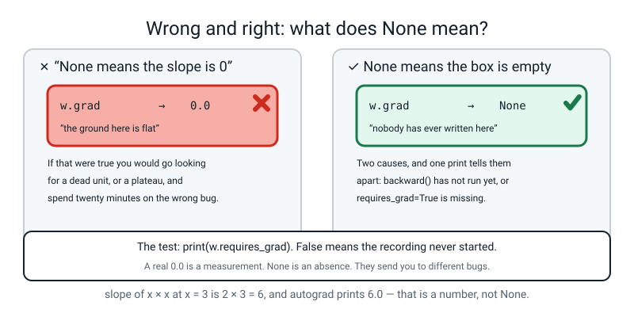
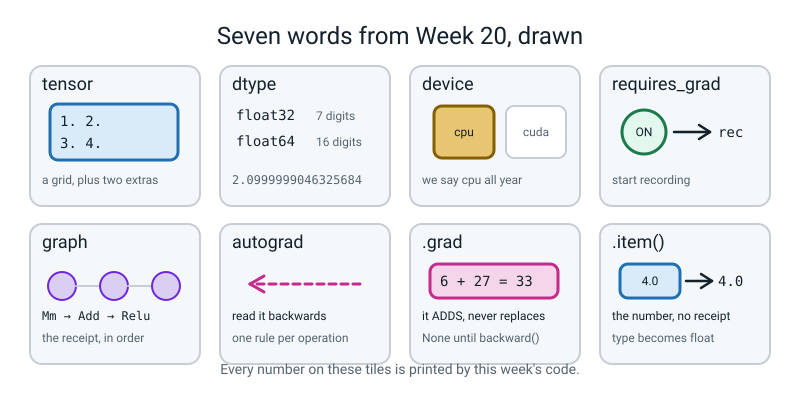

# Week 20 — A Machine That Does the Slopes For You

[⬅ Week 19](week-19.md) · [Course Home](../README.md) · [Next ➡](week-21.md) · [Workbook](../workbook/week-20.md)

---

> ### This week in one sentence
> **A tensor is a numpy array that remembers what was done to it — so it can hand you back every slope you spent last week computing by hand.**
>
> **By the end of this chapter you will be able to:**
> - **Create tensors** with a chosen dtype and shape, and name **two concrete ways** a tensor is not a numpy array
> - **Get a gradient out of autograd without deriving anything**, and check it against the number you worked out by hand in Week 18
> - **Explain `requires_grad` and the computation graph** using the recording metaphor and one printed `grad_fn`
> - **Use `.item()`** to pull a plain number out of a tensor, and show what goes wrong when you do not
>
> **New maths:** **none.** Every number on today's page was computed with a pencil last week. Today's job is to check them.
>
> **New syntax:** `torch.tensor([...], requires_grad=True)` · `loss.backward()` · `w.grad` · `t.item()`
>
> **Reading time:** about 35 minutes. **Homework:** about 55 minutes.

---

## 🪝 Start Here

Last week you did something genuinely hard. Over two lessons you worked out nine gradients for a 2 → 2 → 1 network, by hand, with a calculator, and you got them all right:

```
dW1 = [ −0.09975049   +0.19950098 ]      db1 = [ −0.09975049, +0.19950098 ]
      [ −0.19950098   +0.39900196 ]

dW2 = [ −0.21945108, −0.01496257 ]       db2 = −0.09975049
```

**Nine numbers. Two lessons.**

This week you meet the line of code that produces all nine of them. It is one line long.

```python
loss.backward()
```

Before you feel cheated, read this next bit properly, because it is the whole reason the course is in this order.

Somebody who meets `loss.backward()` first has learned a **spell**. It works, they cannot say what it does, and when it goes wrong they have nowhere to stand. You have written the eight lines that call replaces. So today, when you run it, you are not learning to trust a library.

**You are marking its homework.**

And here is the plan, which is a test rather than a demonstration: put your nine numbers in one column, PyTorch's nine numbers in the other, and subtract. Every difference should be zero to eight decimal places. By the end of this chapter your own file will print this:

```text
entry           by hand      autograd   difference
dW1[0,0]    -0.09975049   -0.09975049   0.00000000
...
biggest disagreement anywhere: 0.00000000
```

**Nine numbers, nine zeros.** You and a library thousands of engineers work on, agreeing exactly.

---

## 🧠 The Big Idea

> **📌 About the code in this section.** The blocks below are **illustrations, not files**. Each one carries on from the one above, and `import torch` is typed once. **The complete runnable file is in 💻 Type This.**

### 1. A tensor is an array with two things stapled to it

**The plain explanation.** PyTorch is a free library for building and training neural networks. It is what most of the models in the news were built with. When you install it you get two things: fast array arithmetic, and **automatic differentiation** — the ability to hand back the slope of every knob without anybody deriving anything.

> **tensor** — PyTorch's array type. A grid of numbers with a shape, exactly like a numpy array, plus two extra things stapled to it.

The two extras are:

1. **An address** — which piece of hardware the numbers physically live on. That is the **device**.
2. **A receipt** — a record of everything that was done to produce it. That is the **computation graph**.

🍕 **The analogy, and it carries the whole week.** A numpy array is a page of numbers in a notebook. A tensor is the same page with two things stapled to it: a label saying which machine it lives on, and **a till receipt listing every operation that produced it, in order.**

At the end you can read the receipt *backwards* to work out how much each original ingredient contributed to the final bill. Nobody wrote down any accounting rules. **The receipt did the remembering.**


*Figure 20.1 — A tensor carries its shape, its dtype and its recording. The arithmetic is 1.0 × 0.5 + 2.0 × 0.8 = 2.10, and .item() prints 2.0999999046325684.*

**A concrete example, with real values.**

```python
import torch

a = torch.tensor([[1.0, 2.0], [3.0, 4.0]])
print(a)
print("shape:", tuple(a.shape), " dtype:", a.dtype, " device:", a.device)
```

```text
tensor([[1., 2.],
        [3., 4.]])
shape: (2, 2)  dtype: torch.float32  device: cpu
```

Two rows, two columns. Same as numpy. Same `@`, same shapes, same broadcasting, and **`.shape` is still the first thing you print when anything is confusing.**

But two things numpy never prints:

> **device** — where the numbers physically live. `cpu` is the ordinary processor and always works. `cuda` is an NVIDIA graphics card; `mps` is Apple Silicon's graphics chip. **We use `cpu` all year and never mention the others again.** Our biggest job this year is 1,797 tiny pictures of digits; a graphics card would actually be *slower*, because getting the data over there costs more than the arithmetic saves.

> **dtype** — what kind of number is in the box. `torch.float32` is a decimal stored in 32 bits, keeping about **7** useful digits. `torch.float64` is a decimal in 64 bits, keeping about **16**. `torch.int64` is a whole number.

### 2. The two differences that actually cause bugs

**The plain explanation.** Ninety per cent of the time "a tensor is a numpy array" is a useful simplification. Here is the ten per cent that matters.

| | numpy | torch |
|---|---|---|
| default decimal type | `float64` — about 16 digits | **`float32`** — about 7 digits |
| does it remember what was done to it? | no | **yes, if you ask** (`requires_grad=True`) |

**A concrete example of the first one**, and you can check it on paper:

```python
print("torch.tensor([1, 2, 3]).dtype     :", torch.tensor([1, 2, 3]).dtype)
print("torch.tensor([1.0, 2.0]).dtype    :", torch.tensor([1.0, 2.0]).dtype)
print("torch.zeros(2, 3).dtype           :", torch.zeros(2, 3).dtype)
```

```text
torch.tensor([1, 2, 3]).dtype     : torch.int64
torch.tensor([1.0, 2.0]).dtype    : torch.float32
torch.zeros(2, 3).dtype           : torch.float32
```

**`np.array([1.0, 2.0])` would say `float64` here.** Same list of numbers, half the digits.

And this is what seven digits looks like when it runs out:

```
1.0 × 0.5 + 2.0 × 0.8 = 2.10          on paper
                        2.0999999046325684   printed by float32
```

**That is not a bug and it is not PyTorch being careless.** 2.1 cannot be written exactly in binary, the same way a third cannot be written exactly in decimal. float32 gets it right to seven digits and then stops.

> **💡 Try this:** the judgement that lasts all year — **`float32` is what you train with**, because it is faster and half the memory and gradients are noisy anyway. **`float64` is what you check with**, when you are comparing against arithmetic you did by hand. Today is a checking day.

Also notice: writing `[1, 2, 3]` instead of `[1.0, 2.0, 3.0]` gives you whole numbers, and **a knob has to be a decimal**, because a step of `−lr × slope` is almost never a whole number. Ask for gradients on a whole-number tensor and PyTorch refuses: `RuntimeError: Only Tensors of floating point and complex dtype can require gradients`.

### 3. `requires_grad` switches the recorder on, and you can see the recording

**The plain explanation.**

> **`requires_grad=True`** — a flag on a tensor meaning *"this is a knob I want the slope of, so start recording."*

> **computation graph** — the record PyTorch keeps as you do arithmetic on tracked tensors. Every operation adds one entry that knows how to hand its own slope backwards.

> **autograd** — PyTorch's name for the whole system: the recording, plus the machinery that reads it backwards.

> **`.grad`** — the place the slope lands. After `loss.backward()`, `w.grad` holds the slope of the loss with respect to `w`, and it has exactly the same shape as `w`.

**A concrete example, with real values.**

```python
w = torch.tensor([[0.5], [0.8]], requires_grad=True)
x = torch.tensor([[1.0, 2.0]])
print("w.requires_grad:", w.requires_grad, "  x.requires_grad:", x.requires_grad)
z = x @ w
print("z =", z)
print("w.grad before backward:", w.grad)
print("z.item() =", z.item())
```

```text
w.requires_grad: True   x.requires_grad: False
z = tensor([[2.1000]], grad_fn=<MmBackward0>)
w.grad before backward: None
z.item() = 2.0999999046325684
```

**Find `grad_fn=<MmBackward0>` on that second line and underline it.** That is the receipt, visible, and it is the only direct evidence of the graph you will ever see.

`z` is not just the number 2.1. **`z` knows that the last thing that happened to it was a matrix multiply**, and it knows which tensors went into it. `Mm` is matrix multiply; `Backward0` means *"and here is how to hand a slope back through it"*.

Look at the other two lines too:

- `w.requires_grad` is `True`, because we asked. `x.requires_grad` is `False`, because **the data is not a knob** — you cannot go and change last Tuesday's delivery, so its slope is of no use to anybody.
- `w.grad` is **`None`**. Not zero. **Nothing there yet.** Nobody has read the receipt.


*Figure 20.2 — The recording, being written as the numbers go forward. The first line the backward pass reads is 0.90024951 − 1 = −0.09975049.*

**The smallest possible demonstration of the whole idea**, and it is two lines you can check with Week 12's nudge:

```python
x = torch.tensor([3.0], requires_grad=True)
y = x * x
y.backward()
print("slope of x*x at x = 3 is", x.grad.item())
```

```text
slope of x*x at x = 3 is 6.0
```

The slope of `x × x` at `x = 3` is `2 × 3 = 6`. **You measured exactly this number in Week 12 by nudging:**

```
(3.001² − 2.999²) ÷ 0.002 = (9.006001 − 8.994001) ÷ 0.002 = 6.000
```

**Autograd printed it without being told any rule at all.** What happened, in four steps:

1. `torch.tensor([3.0], requires_grad=True)` creates the knob and switches the recorder on.
2. `y = x * x` does the multiplication **and** writes a line on the receipt.
3. `y.backward()` reads the receipt from the bottom up, working out how much each ingredient contributed.
4. The answer is deposited in `x.grad`.

### 4. `.grad` ADDS. Six plus twenty-seven is thirty-three

**The plain explanation.** This is the single most important sentence of the next two weeks, and it is easiest to believe as a number.

Take one knob and two different losses. The slope of `x²` at 3 is `2 × 3 = 6`. The slope of `x³` at 3 is `3 × 3² = 27`. **Predict what the second print says.**

```python
x = torch.tensor([3.0], requires_grad=True)
y = x ** 2
y.backward()
print("after x**2 :", x.grad.item())
y2 = x ** 3
y2.backward()
print("after x**3 :", x.grad.item())
```

```text
after x**2 : 6.0
after x**3 : 33.0
```

**Thirty-three. `6 + 27 = 33`.** PyTorch did not choose between them and it did not replace the 6. **It added.**

Write `6 + 27 = 33` in your notes and put a box round it.

**Why on earth would a library do that?** Because sometimes you genuinely want the sum. If a batch of data is too big to fit in memory, you can do it in four pieces, call `backward()` four times, and get the total — which is the gradient over the whole batch if each piece's loss was a sum (if it was a mean, divide the total by four). **That is the one real use, and it is why the default is what it is.**

The price of that convenience is that **everybody, for ever, must wipe `.grad` before each step.** Next week's very first line of code exists entirely because of this.

**Three facts about `.grad`, and each will bite somebody this week:**

- **Before `backward()`, `w.grad` is `None`.** Not zero. `None` means "nothing here yet".
- **`.grad` is only filled in for tensors you asked to track.** Intermediate values do not get one, and asking prints a long, polite warning.
- **`.grad` adds.** If a gradient looks twice as big as it should, you called `backward()` twice.

### 5. `.item()` gives you the number and throws the receipt away

**The plain explanation.** `.item()` takes a tensor holding **exactly one number** and hands back an ordinary Python number, with no receipt attached.

```python
print(z)              # tensor([[2.1000]], grad_fn=<MmBackward0>)
print(z.item())       # 2.0999999046325684
```

The first is a tensor carrying a whole history. The second is a number. **This matters most when you keep two hundred of them.**

**A concrete example, and it is objective 4.** Build a list of 200 losses the wrong way, then try to plot them:

```text
--- stored without .item() ---
how many: 200
wrong[0]   : tensor(0.1155, grad_fn=<NegBackward0>)
wrong[199] : tensor(0.1155, grad_fn=<NegBackward0>)
type       : <class 'torch.Tensor'>
plotting them: Can't call numpy() on Tensor that requires grad. Use tensor.detach().numpy() instead.
```

**Read the `grad_fn` in that printout. That is the proof.** Every one of those 200 values is still attached to the graph that made it. You did not store 200 numbers; you stored **200 recordings**.

The fix is one method call:

```python
right.append(loss.item())
```

```text
--- stored with .item() ---
how many: 200
right[0]   : 0.11551953107118607
right[199] : 0.11551953107118607
type       : <class 'float'>
plotting them: wrote item_experiment.png
```


*Figure 20.3 — Two hundred losses, with and without .item(). One list plots; the other one cannot.*

**And here is what it actually costs, measured.** Three hundred losses, each from a 400 × 200 matrix multiply, kept both ways:

```text
mode tensor   before:  159.2 MB
mode tensor   after :  258.1 MB   kept 300 items
mode item     before:  159.7 MB
mode item     after :  176.2 MB   kept 300 items
```

```
258.1 − 159.2 =  98.9 MB   for 300 tensors
176.2 − 159.7 =  16.5 MB   for 300 numbers
```

**About six times as much memory for the same 300 answers.** Your machine's absolute numbers will be different, and so will the ratio a little (we have seen 6 times and 7 times); it will stay several times, not just a few per cent. In a long training run this is how people run out of memory at epoch 400 of 500, having watched the first 399 work perfectly.

> **🧑‍🏫 If a student asks:** *"why is `wrong[0]` the same as `wrong[199]`?"* Because **nothing is being trained today.** The weights never change, so the loss is the same 200 times. We have all the slopes and we are deliberately not taking a step. That is next week.

---

## 🔁 The Idea From Last Week, Used Harder

**There is no new maths this week.** Instead, last week's nine gradients get used as a *test*, which is a harder job than computing them.

Here is the whole Week 18 network again, so you do not have to go back. **Two inputs, two hidden units with ReLU, one output with sigmoid.**

```
W1 = [ 0.5  -0.3 ]      b1 = [ 0.1   0.05 ]
     [ 0.8   0.2 ]

W2 = [  1.0 ]           b2 = [ 0.3 ]
     [ -2.0 ]

one row of input:  x = [1.0, 2.0]        its true label:  y = 1
```

**The forward pass, by hand.** Hidden unit 1 uses column 0 of `W1`; hidden unit 2 uses column 1.

```
z1 = 1.0 × 0.5 + 2.0 × 0.8 + 0.1      = 0.5 + 1.6 + 0.1   = 2.20
z2 = 1.0 × (−0.3) + 2.0 × 0.2 + 0.05  = −0.3 + 0.4 + 0.05 = 0.15

after ReLU:  both are positive, so A1 = [2.20, 0.15]

Z2 = 2.20 × 1.0 + 0.15 × (−2.0) + 0.3 = 2.20 − 0.30 + 0.30 = 2.20

A2 = sigmoid(2.20) = 1 / (1 + e^(−2.20)) = 1 / 1.110803 = 0.90024951

loss = −ln(0.90024951) = 0.10508332
```

> **🔢 The maths, slowly:** do the middle line on a real calculator, now, because you will be asked where `0.9002` came from. Type `2.2`, make it negative, press `e^x` → `0.110803`. Add 1 → `1.110803`. Press `1/x` → **`0.90024951`**. Then `ln` of that → `−0.10508332`, so the loss is `0.10508332`. **Three keypresses each.**

**The backward pass, by hand.** Nine numbers, and every one is a multiplication.

```
step 1 — blame at the output:
   dZ2 = A2 − y = 0.90024951 − 1 = −0.09975049

step 2 — the output layer's weights (blame × the input that fed them):
   dW2[0] = 2.20 × (−0.09975049) = −0.21945108
   dW2[1] = 0.15 × (−0.09975049) = −0.01496257
   db2    = −0.09975049

step 3 — push the blame back to the hidden outputs (blame × the weight it travelled through):
   dA1[0] = (−0.09975049) × 1.0    = −0.09975049
   dA1[1] = (−0.09975049) × (−2.0) = +0.19950098

step 4 — through the ReLU valve. Both z were positive, so the mask is [1, 1]:
   dZ1 = [−0.09975049, +0.19950098]

step 5 — the hidden layer's weights (input × blame):
   dW1[0][0] = 1.0 × (−0.09975049) = −0.09975049
   dW1[0][1] = 1.0 × (+0.19950098) = +0.19950098
   dW1[1][0] = 2.0 × (−0.09975049) = −0.19950098
   dW1[1][1] = 2.0 × (+0.19950098) = +0.39900196
   db1       = [−0.09975049, +0.19950098]
```

**Two things worth noticing while you read those out.** Hidden unit 1 was loud (2.20) so its weight gets a big correction (−0.219); hidden unit 2 was quiet (0.15) so its weight barely moves (−0.015). **Loud units get blamed most.** And the sign flips in `dA1[1]` because unit 2's weight into the output is *negative*: turning unit 2 up would push the score *down*, and we want the score up, so the slope points the other way.

**Those nine numbers are what PyTorch has to reproduce today.** Copy them onto your page before you write any code.

---

## 💻 Type This

One file, `match_test.py`, built in five steps.

First, prove PyTorch is on your machine. In a terminal:

```bash
python3 -c "import torch; print(torch.__version__)"
```

```text
2.2.1
```

Anything recent is fine. **If it errors, you cannot fix it yourself** — the school proxy blocks `pip` — so tell your teacher and share a working laptop.

### Step 1 — the four knobs, with a mistake on purpose

```python
"""match_test.py - autograd against the four gradients we worked out by hand."""
import torch

torch.manual_seed(0)

W1 = torch.tensor([[0.5, -0.3], [0.8, 0.2]], dtype=torch.float64)   # <-- mistake
b1 = torch.tensor([[0.1, 0.05]], dtype=torch.float64, requires_grad=True)
W2 = torch.tensor([[1.0], [-2.0]], dtype=torch.float64, requires_grad=True)
b2 = torch.tensor([[0.3]], dtype=torch.float64, requires_grad=True)

x = torch.tensor([[1.0, 2.0]], dtype=torch.float64)
y = torch.tensor([[1.0]], dtype=torch.float64)
```

**What the new lines do.** `torch.tensor([...])` builds a grid from a list of lists: the outer list is the rows, the inner lists are the numbers in each row. So `W1` is 2 rows by 2 columns.

`dtype=torch.float64` asks for the 16-digit kind of decimal, **because we are about to compare against hand arithmetic to eight decimal places and float32 would run out of digits at seven.**

`requires_grad=True` says: this is a knob, record what happens to it. **`x` and `y` deliberately do not get it** — the data is not a knob.

And `W1` deliberately does not get it either, for the next sixty seconds. Push it through the forward pass and ask for the gradient:

```python
Z1 = x @ W1 + b1
A1 = torch.relu(Z1)
Z2 = A1 @ W2 + b2
A2 = torch.sigmoid(Z2)
loss = -(y * torch.log(A2) + (1 - y) * torch.log(1 - A2)).mean()
loss.backward()
print("dW1 =", W1.grad)
```

**Predict before you run it.** Crash, or a number, or something else?

```text
dW1 = None
```

**It did not crash.** And `None` is not a number — it means the box is empty; nobody has ever written a slope into it.

Why? Because we never asked PyTorch to record what was happening to `W1`. When `backward()` walked the receipt, `W1` was not on it. It was treated like the data — a number that was *used*, not a knob to be *tuned*.

**In a real training run this is a nightmare bug: one layer silently never learns, your model is mediocre, and nothing anywhere says why.** The diagnosis is two prints:

```python
print("W1.requires_grad:", W1.requires_grad, "  loss.grad_fn:", type(loss.grad_fn).__name__)
```

```text
W1.requires_grad: False   loss.grad_fn: NegBackward0
```

`False` and a real `grad_fn` on the loss means: **the recording happened, but `W1` was not in it.** Add `requires_grad=True` to `W1` and re-run.

> **🐞 If you see this error:** put it in your Bug Log under *errors with no error message*, and in the message column write: **"`None` means nobody ever wrote a slope there."**

### Step 2 — the forward pass, and the receipt

```python
print("Z1   =", Z1)
print("A1   =", A1)
print("Z2   = %.8f" % Z2.item())
print("A2   = %.8f" % A2.item())
print("loss = %.8f" % loss.item())
```

```text
Z1   = tensor([[2.2000, 0.1500]], dtype=torch.float64, grad_fn=<AddBackward0>)
A1   = tensor([[2.2000, 0.1500]], dtype=torch.float64, grad_fn=<ReluBackward0>)
Z2   = 2.20000000
A2   = 0.90024951
loss = 0.10508332
```

**Three things in that printout.**

1. `2.2000` and `0.1500` on the first line. **Those are your two hand sums**: `1.0 × 0.5 + 2.0 × 0.8 + 0.1 = 2.20` and `1.0 × (−0.3) + 2.0 × 0.2 + 0.05 = 0.15`.
2. **`grad_fn=<AddBackward0>` on `Z1`, `grad_fn=<ReluBackward0>` on `A1`.** The receipt, twice. `Z1` remembers that the last thing done to it was an addition — the `+ b1`. `A1` remembers a ReLU.
3. `A2 = 0.90024951` and `loss = 0.10508332`. **Exactly last week's numbers.**

And look at your five forward lines: `@`, `torch.relu`, `@`, `torch.sigmoid`, log loss. **That is Week 19's `forward()` with `np.` swapped for `torch.`.** The forward pass has not changed at all.

### Step 3 — the one line, and the display trap

```python
loss.backward()
print("dW1 =", W1.grad)
print("db2 =", b2.grad)
```

```text
dW1 = tensor([[-0.0998,  0.1995],
        [-0.1995,  0.3990]], dtype=torch.float64)
db2 = tensor([[-0.0998]], dtype=torch.float64)
```

**Your page says `−0.09975049`. The screen says `−0.0998`. Do they disagree?**

No. **PyTorch prints four decimal places by default to keep the output readable.** Ask for eight and there they are:

```python
print("%.8f" % W1.grad[0, 0].item())
```

```text
-0.09975049
```

> **⚠️ Watch out:** this catches nearly everybody once. `−0.0998` and `−0.09975049` are the same number displayed two ways. **Display is not value.**

### Step 4 — the match table

```python
by_hand = [
    ("dW1[0,0]", -0.09975049, W1.grad[0, 0].item()),
    ("dW1[0,1]", 0.19950098, W1.grad[0, 1].item()),
    ("dW1[1,0]", -0.19950098, W1.grad[1, 0].item()),
    ("dW1[1,1]", 0.39900196, W1.grad[1, 1].item()),
    ("db1[0]", -0.09975049, b1.grad[0, 0].item()),
    ("db1[1]", 0.19950098, b1.grad[0, 1].item()),
    ("dW2[0]", -0.21945108, W2.grad[0, 0].item()),
    ("dW2[1]", -0.01496257, W2.grad[1, 0].item()),
    ("db2", -0.09975049, b2.grad[0, 0].item()),
]
print("%-9s %13s %13s %12s" % ("entry", "by hand", "autograd", "difference"))
worst = 0.0
for name, hand, auto in by_hand:
    gap = abs(hand - auto)
    worst = max(worst, gap)
    print("%-9s %13.8f %13.8f %12.8f" % (name, hand, auto, gap))
print()
print("biggest disagreement anywhere: %.8f" % worst)
```

**What the new lines do.** `W1.grad[0, 0]` picks one number out of the gradient grid — row 0, column 0 — and `.item()` turns that one-number tensor into an ordinary number so `%.8f` can format it. `%13.8f` means "13 characters wide, 8 decimal places", which is what makes the columns line up.

```text
entry           by hand      autograd   difference
dW1[0,0]    -0.09975049   -0.09975049   0.00000000
dW1[0,1]     0.19950098    0.19950098   0.00000000
dW1[1,0]    -0.19950098   -0.19950098   0.00000000
dW1[1,1]     0.39900196    0.39900196   0.00000000
db1[0]      -0.09975049   -0.09975049   0.00000000
db1[1]       0.19950098    0.19950098   0.00000000
dW2[0]      -0.21945108   -0.21945108   0.00000000
dW2[1]      -0.01496257   -0.01496257   0.00000000
db2         -0.09975049   -0.09975049   0.00000000

biggest disagreement anywhere: 0.00000000
```


*Figure 20.4 — Nine numbers by hand, nine numbers from autograd. Every difference reads 0.00000000.*

**Nine numbers. Nine zeros.** Not "close". Not "to within rounding". **Zero to eight decimal places, nine times out of nine.**

Sit with that for a second, because **it is the last time this year you will be able to check the machine by hand.** From next week the networks get too big to trace with a pencil. Today is the day you established that the thing is trustworthy, and you established it — you did not take somebody's word for it.

### Step 5 — the second mistake on purpose: drop the dtype

Take `dtype=torch.float64` off all six tensors and re-run.

```text
dW1[0,0]    -0.09975049   -0.09975046   0.00000003
dW1[0,1]     0.19950098    0.19950092   0.00000006
dW1[1,0]    -0.19950098   -0.19950092   0.00000006
dW1[1,1]     0.39900196    0.39900184   0.00000012
db1[0]      -0.09975049   -0.09975046   0.00000003
db1[1]       0.19950098    0.19950092   0.00000006
dW2[0]      -0.21945108   -0.21945100   0.00000008
dW2[1]      -0.01496257   -0.01496257   0.00000000
db2         -0.09975049   -0.09975046   0.00000003
biggest disagreement anywhere: 0.00000012
```

**Is this a bug? And which number is right?**

Neither is wrong. `float32` keeps about seven digits, so it is correct to seven and then it guesses. `float64` keeps sixteen. **This is a beautiful, harmless, teachable disagreement**, and it goes in the Bug Log as a new category: *"no error, small disagreement, and here is why."*

Put the dtype back.

### The complete file

**Runtime: instant, well under a second.**

```python
"""match_test.py - autograd against the four gradients we worked out by hand."""
import torch

torch.manual_seed(0)

W1 = torch.tensor([[0.5, -0.3], [0.8, 0.2]], dtype=torch.float64, requires_grad=True)
b1 = torch.tensor([[0.1, 0.05]], dtype=torch.float64, requires_grad=True)
W2 = torch.tensor([[1.0], [-2.0]], dtype=torch.float64, requires_grad=True)
b2 = torch.tensor([[0.3]], dtype=torch.float64, requires_grad=True)

x = torch.tensor([[1.0, 2.0]], dtype=torch.float64)
y = torch.tensor([[1.0]], dtype=torch.float64)

# ---------------- forward: four lines, exactly like the numpy ones ----------
Z1 = x @ W1 + b1
A1 = torch.relu(Z1)
Z2 = A1 @ W2 + b2
A2 = torch.sigmoid(Z2)
loss = -(y * torch.log(A2) + (1 - y) * torch.log(1 - A2)).mean()

print("Z1   =", Z1)
print("A1   =", A1)
print("Z2   = %.8f" % Z2.item())
print("A2   = %.8f" % A2.item())
print("loss = %.8f" % loss.item())

# ---------------- one line replaces the whole backward pass ----------------
loss.backward()

print()
print("dW1 =", W1.grad)
print("db1 =", b1.grad)
print("dW2 =", W2.grad)
print("db2 =", b2.grad)

# ---------------- the match test ------------------------------------------
by_hand = [
    ("dW1[0,0]", -0.09975049, W1.grad[0, 0].item()),
    ("dW1[0,1]", 0.19950098, W1.grad[0, 1].item()),
    ("dW1[1,0]", -0.19950098, W1.grad[1, 0].item()),
    ("dW1[1,1]", 0.39900196, W1.grad[1, 1].item()),
    ("db1[0]", -0.09975049, b1.grad[0, 0].item()),
    ("db1[1]", 0.19950098, b1.grad[0, 1].item()),
    ("dW2[0]", -0.21945108, W2.grad[0, 0].item()),
    ("dW2[1]", -0.01496257, W2.grad[1, 0].item()),
    ("db2", -0.09975049, b2.grad[0, 0].item()),
]
print()
print("%-9s %13s %13s %12s" % ("entry", "by hand", "autograd", "difference"))
worst = 0.0
for name, hand, auto in by_hand:
    gap = abs(hand - auto)
    worst = max(worst, gap)
    print("%-9s %13.8f %13.8f %12.8f" % (name, hand, auto, gap))
print()
print("biggest disagreement anywhere: %.8f" % worst)
```

---

## 🔍 Worked Examples

Three complete programs, in three different worlds.

### Worked Example 1 — A shopping receipt (money)

**The question:** if beans went up by 10p a tin, how much more would the shopping cost?

You can answer that without going shopping again, because the receipt tells you there were four tins. **That is a gradient, and this is autograd's entire idea in four lines.**

```python
"""receipt.py - a shopping receipt, and autograd reading it backwards."""
import torch

torch.manual_seed(0)

bread = torch.tensor([1.20], requires_grad=True)
milk = torch.tensor([0.90], requires_grad=True)
beans = torch.tensor([0.60], requires_grad=True)

total = bread + milk + 4 * beans
print("total    =", total)
print("total    = %.2f" % total.item())

total.backward()
print("d total / d bread =", bread.grad.item())
print("d total / d milk  =", milk.grad.item())
print("d total / d beans =", beans.grad.item())
```

Real output, instant:

```text
total    = tensor([4.5000], grad_fn=<AddBackward0>)
total    = 4.50
d total / d bread = 1.0
d total / d milk  = 1.0
d total / d beans = 4.0
```

**Check the total by hand:** `1.20 + 0.90 + 4 × 0.60 = 1.20 + 0.90 + 2.40 = 4.50`. ✅

**Now read the three slopes as English.** *"If bread goes up by £1, the total goes up by £1."* *"If beans go up by £1, the total goes up by £4 — because there are four tins."* And that is exactly why 10p a tin costs you 40p.

**Nobody told PyTorch that there were four tins.** The `4 *` in the total line put it on the receipt, and `backward()` read it off.

### Worked Example 2 — One neuron deciding if a text is spam

**The question:** two features — how many words are in CAPITALS, and how many links there are — and one neuron. It said 81.8% spam and it was right. What are the slopes?

```python
"""spam_neuron.py - one neuron, two features, checked by hand."""
import torch

torch.manual_seed(0)

x = torch.tensor([[3.0, 1.0]], dtype=torch.float64)     # 3 CAPS words, 1 link
y = torch.tensor([[1.0]], dtype=torch.float64)          # it really was spam
w = torch.tensor([[0.4], [-0.2]], dtype=torch.float64, requires_grad=True)
b = torch.tensor([0.5], dtype=torch.float64, requires_grad=True)

z = x @ w + b
p = torch.sigmoid(z)
loss = -torch.log(p)

print("z      = %.8f" % z.item())
print("p      = %.8f" % p.item())
print("loss   = %.8f" % loss.item())
print("z.grad_fn      :", type(z.grad_fn).__name__)
print("p.grad_fn      :", type(p.grad_fn).__name__)

loss.backward()
print("w.grad =", w.grad)
print("b.grad =", b.grad)
```

Real output, instant:

```text
z      = 1.50000000
p      = 0.81757448
loss   = 0.20141328
z.grad_fn      : AddBackward0
p.grad_fn      : SigmoidBackward0
w.grad = tensor([[-0.5473],
        [-0.1824]], dtype=torch.float64)
b.grad = tensor([-0.1824], dtype=torch.float64)
```

**Every number is checkable, and you should check all four.**

```
z    = 3.0 × 0.4 + 1.0 × (−0.2) + 0.5 = 1.2 − 0.2 + 0.5 = 1.50
p    = sigmoid(1.50) = 0.81757448
loss = −ln(0.81757448) = 0.20141328

blame at the output:  p − y = 0.81757448 − 1 = −0.18242552
      × x1 = 3.0   →  −0.54727657     (the screen shows −0.5473)
      × x2 = 1.0   →  −0.18242552     (the screen shows −0.1824)
      the bias multiplies 1, so its slope IS the blame: −0.18242552
```

**That is Week 18's chain, on a network so small you can hold it in your head.** And notice `SigmoidBackward0` on the second `grad_fn` — a different operation, a different receipt entry.

### Worked Example 3 — Two knobs at once, both checked by nudging (house prices)

**The question:** a model guesses a house price from its size. `price = w × size + b`, with `w = 2` (thousands per square metre) and `b = 50`. One real house: 80 m², sold for 240 thousand. What should `w` and `b` do?

```python
"""house_slopes.py - two knobs, two slopes, both checked by nudging."""
import torch

torch.manual_seed(0)

size = torch.tensor([[80.0]], dtype=torch.float64)     # square metres
price = torch.tensor([[240.0]], dtype=torch.float64)   # thousands

w = torch.tensor([[2.0]], dtype=torch.float64, requires_grad=True)
b = torch.tensor([50.0], dtype=torch.float64, requires_grad=True)

pred = size @ w + b
loss = ((pred - price) ** 2).mean()
print("pred = %.4f" % pred.item())
print("loss = %.4f" % loss.item())
loss.backward()
print("dL/dw = %.4f" % w.grad.item())
print("dL/db = %.4f" % b.grad.item())


def L(wv, bv):
    return (80.0 * wv + bv - 240.0) ** 2


h = 0.001
print()
print("nudge w: (L(2.001, 50) - L(1.999, 50)) / 0.002 = %.4f"
      % ((L(2.001, 50.0) - L(1.999, 50.0)) / (2 * h)))
print("nudge b: (L(2, 50.001) - L(2, 49.999)) / 0.002 = %.4f"
      % ((L(2.0, 50.001) - L(2.0, 49.999)) / (2 * h)))

print()
print("second backward without wiping:")
pred2 = size @ w + b
loss2 = ((pred2 - price) ** 2).mean()
loss2.backward()
print("dL/dw now = %.4f" % w.grad.item())
```

Real output, instant:

```text
pred = 210.0000
loss = 900.0000
dL/dw = -4800.0000
dL/db = -60.0000

nudge w: (L(2.001, 50) - L(1.999, 50)) / 0.002 = -4800.0000
nudge b: (L(2, 50.001) - L(2, 49.999)) / 0.002 = -60.0000

second backward without wiping:
dL/dw now = -9600.0000
```

**All of it by hand:**

```
pred  = 80 × 2 + 50 = 210
error = 210 − 240 = −30
loss  = (−30)² = 900
dL/dw = 2 × (−30) × 80 = −4800
dL/db = 2 × (−30) × 1  = −60
```

**And the nudge agrees exactly.** Autograd's `−4800` and Week 12's nudge `−4800`. Two completely different methods, the same number to four decimal places.

**Then the last line, which is the sting.** `−9600` is `−4800 + −4800`. **The second `backward()` added, and nobody warned us.** Everything you compute after that point is wrong by a factor of two, and there is no error message anywhere.

> **🤔 Think about it:** both slopes are large and negative. Negative means "increase this knob". `−4800` is eighty times `−60`, because `w` multiplies 80 and `b` multiplies 1. **Loud inputs get blamed most**, exactly as they did in the Week 18 network.

---

## 🐞 When It Breaks

Every message below came from really running a broken version of this week's code.

> **The recipe for every missing gradient, and it never changes:** `print(w.requires_grad, loss.grad_fn)`. Between them, those two values tell you whether the recording was ever started. It is this week's version of *"print the shape"*.

### Break 1 — `backward()` twice

```python
w = torch.tensor([2.0], requires_grad=True)
loss = (w * w).sum()
loss.backward()
print("first  backward: w.grad =", w.grad.item())
loss.backward()
```

```text
first  backward: w.grad = 4.0
RuntimeError: Trying to backward through the graph a second time (or directly access saved tensors after they have already been freed). Saved intermediate values of the graph are freed when you call .backward() or autograd.grad(). Specify retain_graph=True if you need to backward through the graph a second time or if you need to access saved tensors after calling backward.
```

**What Python is telling you.** *"The receipt was thrown away when I read it."*

PyTorch frees the intermediate values as it walks backwards, because keeping them would waste memory on every training step ever run. And `w.grad = 4.0` checks out: the slope of `w × w` at `w = 2` is `2 × 2 = 4`.

**The fix is NOT `retain_graph=True`**, even though the message suggests it. That is the message *guessing* at what you meant. **The fix is to do the forward pass again**, which is exactly what a training loop does anyway.

### Break 2 — `requires_grad` forgotten everywhere

```python
w2 = torch.tensor([2.0])
loss2 = (w2 * w2).sum()
print("loss2.requires_grad:", loss2.requires_grad, "  grad_fn:", loss2.grad_fn)
loss2.backward()
```

```text
loss2.requires_grad: False   grad_fn: None
RuntimeError: element 0 of tensors does not require grad and does not have a grad_fn
```

**What Python is telling you.** *"Nothing was recorded, so there is nothing to read backwards."*

**The two prints above the traceback are worth more than the traceback.** `requires_grad: False` and `grad_fn: None` mean the receipt was never started at all.

**The fix.** `requires_grad=True` on the knob.

> **🐞 If you see this error:** note the difference from step 1 of Type This. Missing on **one** tensor gives you a silent `None`; missing on **all** of them gives you this crash. **A crash is a friend. A silent `None` is not.**

### Break 3 — `.item()` on more than one number

```python
W = torch.tensor([[1.0, 2.0], [3.0, 4.0]])
print(W.item())
```

```text
RuntimeError: a Tensor with 4 elements cannot be converted to Scalar
```

**What Python is telling you.** *"`.item()` wants exactly one number and you gave me four."*

**The fix.** Index first, then `.item()`: `W[0, 1].item()`. Or print the whole tensor without `.item()` at all.

### Break 4 — asking a value in the middle of the recording for its gradient

```python
x = torch.tensor([3.0], requires_grad=True)
y = x * 2
z = (y * y).sum()
z.backward()
print("y.grad is", y.grad)
print("x.grad is", x.grad.item())
```

```text
UserWarning: The .grad attribute of a Tensor that is not a leaf Tensor is being accessed. Its .grad attribute won't be populated during autograd.backward(). If you indeed want the .grad field to be populated for a non-leaf Tensor, use .retain_grad() on the non-leaf Tensor. If you access the non-leaf Tensor by mistake, make sure you access the leaf Tensor instead.
y.grad is None
x.grad is 24.0
```

**What Python is telling you.** *"`y` is a value in the middle of the recording, not a knob. I only fill in `.grad` for knobs."*

**The fix.** Ask the knob. And check the answer by hand: `z = (2x)² = 4x²`, whose slope is `8x`, and `8 × 3 = 24`. ✅

### The whole clinic, for reference

| What you see | What it means | The fix |
|---|---|---|
| `RuntimeError: element 0 of tensors does not require grad and does not have a grad_fn` | "No recording, so nothing to read backwards" | `requires_grad=True`. Diagnose first with `print(w.requires_grad, loss.grad_fn)` |
| `RuntimeError: Trying to backward through the graph a second time ...` | "The receipt was thrown away when I read it" | Do the forward pass again. **Not** `retain_graph=True` |
| `RuntimeError: Only Tensors of floating point and complex dtype can require gradients` | "You cannot take the slope of a whole number" | `[[0.0]]`, not `[[0]]` |
| `RuntimeError: a Tensor with 2 elements cannot be converted to Scalar` | "`.item()` wants exactly one number" | Index first: `W1.grad[0, 0].item()` |
| `RuntimeError: expected m1 and m2 to have the same dtype, but got: double != float` | "One grid is 16-digit and the other 7-digit, and I will not guess" | Give every tensor in the file the same dtype |
| `RuntimeError: grad can be implicitly created only for scalar outputs` | "`backward()` needs ONE number to start from" | Reduce it: `.mean()` or `.sum()`. A loss is always one number |
| `RuntimeError: Can't call numpy() on Tensor that requires grad. Use tensor.detach().numpy() instead.` | "This value is still attached to a recording, so I cannot hand it to matplotlib" | `losses.append(loss.item())` |
| `UserWarning: The .grad attribute of a Tensor that is not a leaf Tensor ...` then `None` | "That is a value in the middle, not a knob" | Ask the knob: `x.grad` |
| **No error.** `w.grad` prints `None` | That knob is silently not learning | `backward()` has not run, or `requires_grad=True` is missing on **that** tensor |
| **No error.** The differences are `1e-8` instead of `0.00000000` | Nothing is wrong | `float32` keeps about seven digits. Ask for `float64` when you are checking |
| **No error.** `w.grad` is twice what it should be, and grows each run | **`.grad` adds.** Nothing wiped it | The slope of `x²` at 3 is 6. If you see 12, you called `backward()` twice |

---

## 🎲 What We Did In Class

If you missed it, here is the whole lesson. You need a calculator and a laptop with `torch`.

**The hook: eleven minutes versus one line.** Week 18's nine numbers were on the board under a sheet of paper. Three of them were asked for, out loud, and timed:

```
0.90024951 − 1               = −0.09975049      (about nine seconds)
2.20 × (−0.09975049)         = −0.21945108
2.0 × 0.19950098             = +0.39900196
```

Then the sheet came off. Nine numbers, two lessons of work. Then: *"today I am going to show you one line that produces all nine, and we are going to check it against yours, digit by digit."*

And the question before anything ran: **"what should the difference be?"** Zero.

**The tensor, live.** `torch.tensor([[1.0, 2.0], [3.0, 4.0]])`, then `.shape`, `.dtype`, `.device` — `(2, 2)`, `torch.float32`, `cpu`. Then the three dtype prints: `int64`, `float32`, `float32`, with the note that numpy would have said `float64`.

**The receipt, live.** `z = x @ w`, and `grad_fn=<MmBackward0>` in the printout, pointed at and underlined in the air. Then `w.grad` printing `None` — *"not zero. Nothing there yet."* Then `z.item()` printing `2.0999999046325684`, and *"is PyTorch wrong?"* No: float32, seven digits.

**`6 + 27 = 33`, live.** Slope of `x²` at 3 is 6. Slope of `x³` at 3 is 27. Most of the room predicted 27 for the second print. It said **33**, and `6 + 27 = 33` went on the board with a box round it.

**Building `match_test.py`, with two mistakes on purpose.**

| Mistake | What happened |
|---|---|
| `requires_grad=True` left off `W1` | **Silent.** `dW1 = None`, no error, everything else fine |
| `dtype=torch.float64` left off everything | **Silent.** Differences became about `1e-8` instead of `0.00000000` |

**The Match Test.** Nine rows, filled in by hand, and every difference cell reading `0.00000000`. Then: *"you did those nine with a pencil and PyTorch did them with a graph, and there is not one digit between you."*

**Break It Three Ways.** Predict first, in one sentence, then run:

| Break | What actually happens |
|---|---|
| `backward()` twice | **Crashes.** `Trying to backward through the graph a second time ...`, after the first call printed `w.grad = 4.0` |
| `requires_grad` missing on `W1` only | **No error.** `W1.grad` is `None`, everything else works |
| 200 losses stored without `.item()` | **No error until you use them.** They print as `tensor(0.1155, grad_fn=<NegBackward0>)`, their type is `torch.Tensor`, and plotting them raises `Can't call numpy() on Tensor that requires grad` |

Then: *"which of these three would you rather have happen to you?"* **The crash.**

**The four things on the board at the end:**

```
requires_grad=True   →  start recording
grad_fn              →  the receipt, visible
loss.backward()      →  read it backwards, fill in every .grad
.item()              →  give me the number, throw the receipt away
```

And the closing observation: *"today we computed nine slopes and then looked at them. We did not change a single weight. We have the direction of downhill and we did not take a step."*

---

## 💬 Talk About It

**1. So was last week a waste of time?**

*Hint:* answer it properly rather than defensively, and look for things you have that somebody who started at `loss.backward()` does not. **One:** you can read a shape error, because you know `dW1` must have the same shape as `W1`. **Two:** you know what a dead ReLU is and why training longer cannot fix it — that is a gradient fact, and `backward()` will never explain it to you. **Three:** when a loss sits at 0.6931 for ever you know what the network is doing, because you have seen `−ln(0.5)`. Then the fourth, which matters more over a lifetime: **you now know that it is checkable.** Most people never mark the library's homework, and it leaves them permanently unsure whether the thing works or they are lucky.

**2. `.grad` adding instead of replacing causes one of the most common bugs in the world. Was it the right default?**

*Hint:* find the one real use first — splitting a batch too big for memory into four pieces, calling `backward()` four times, and letting the gradients pile up to give the whole-batch gradient (for sum-losses; with mean-losses you divide by the number of pieces). That is genuinely useful. Then the cost: everybody, for ever, has to remember to wipe. Then argue it. **You are allowed to think the default is wrong** — plenty of experienced people do, and other frameworks chose differently. You still have to type the wiping line every time, which is a real and slightly annoying fact about a tool you did not design.

**3. Is autograd doing algebra?**

*Hint:* it is tempting to imagine PyTorch writing down `2x` somewhere. It does not. **Every operation ships with two pieces of code**: one that computes the output, and one that says *"given the slope coming back into my output, here is the slope going out of each of my inputs."* `backward()` walks the stored graph from the end to the beginning, calling those, multiplying as it goes. That multiplying-as-it-goes is **Week 18's chain, unchanged.** Then the interesting question: what could autograd *not* differentiate? *(Anything with a rounding or flooring step in it, where the slope is zero almost everywhere and tells you nothing; anything that leaves torch and goes through numpy in the middle, because the receipt only records torch operations. An `if` on a tensor's value is NOT a problem: autograd simply differentiates the branch that ran.)*

---

## ⚠️ Don't Get Tricked

### Trick 1 — "`None` means the slope is zero"


*Figure 20.5 — Wrong and right: what does None mean? A real 0.0 is a measurement; None is an absence.*

| ❌ Wrong | ✅ Right |
|---|---|
| "`w.grad` printed `None`, so the slope there is 0 — the ground must be flat." | **`None` is not a number.** It means nobody has ever written a slope into that box. Two causes: `backward()` has not run yet, or `requires_grad=True` is missing on that tensor. `print(w.requires_grad)` tells you which. |

**These send you to completely different bugs.** A student who reads `None` as zero will go hunting for a dead unit or a plateau and lose twenty minutes.

### Trick 2 — "`−0.0998` and `−0.09975049` are different numbers"

| ❌ Wrong | ✅ Right |
|---|---|
| "My hand answer was `−0.09975049` and PyTorch says `−0.0998`, so autograd disagrees with me." | **PyTorch prints four decimal places by default.** `print("%.8f" % W1.grad[0, 0].item())` gives `-0.09975049`. Display is not value. |

### Trick 3 — "a tensor is a numpy array with a fancier name"

| ❌ Wrong | ✅ Right |
|---|---|
| "It is the same thing. Nothing to learn here." | Two things you can point at on your own screen. **The default dtype is different** — `float32`, so `2.1` prints as `2.0999999046325684`. And **a tensor can be tracked**, which is the entire point of the library, and the visible evidence is `grad_fn` in the printout. |

If your answer is "it's faster" or "it works on GPUs", both are true and neither is visible on your screen today. **Point at the printout.**

### Trick 4 — "storing tensors instead of floats is just untidy"

| ❌ Wrong | ✅ Right |
|---|---|
| "`losses.append(loss)` and `losses.append(loss.item())` both give me a list of 200 things. Same thing, different type." | Each stored **tensor** is still carrying the recording of everything that made it — the `grad_fn` in the printout is that recording. So you kept **200 graphs**, not 200 numbers. We measured it: **98.9 MB against 16.5 MB**, and matplotlib refuses to plot the first list at all. |

*"They were tensors, not floats"* is the type. **The cost is the graph.**

---

## 🌍 Where You've Seen This

1. **Every model in the news.** GPT-style language models, image generators, the thing that transcribes your voice notes — almost all of them were trained by code whose backward pass is one call to `loss.backward()`. **You have now written the eight lines it replaces.**
2. **Spreadsheet "goal seek" and solver tools.** You say *"make cell B12 equal 1000 by changing B3"*, and something works out how B12 responds to B3. Same question, cruder machinery.
3. **Physics and engineering simulations.** Autograd is not about neural networks at all — it works on anything you can write as torch arithmetic. People use it for fluid simulations, circuit design, and fitting curves to laboratory data.
4. **A shopping receipt, genuinely.** Any time you answer *"how much more would this cost if…"* without re-adding the whole bill, you are reading a receipt backwards. That is the entire idea.
5. **Route planning apps recalculating your arrival time.** Not autograd, but the same shape of question: *"which part of the journey is my arrival time most sensitive to?"*
6. **The word `float32` in every graphics setting menu you have ever seen.** Games, video editors and phone cameras all trade digits for speed, exactly as PyTorch does by default.

---

## 🧭 Where This Fits

Same gold box as last week — `numpy brain · PyTorch` is a five-week tile and this is the second of the
five. Last week you wrote the brain. This week you meet the machine that does the hardest part of it
for you, and the only reason you are allowed to trust that machine is that **you already know the
answers it is supposed to give.**


*Figure 20.0 — The pipeline in Week 20. Second week inside the same gold tile. Stage three behind it
stays white: you are not replacing what you built there, you are checking a tool against it.*

| | |
|---|---|
| **The mental model you now own** | **A tensor is an array that remembers what was done to it.** Build the forward pass, call `backward()` once, read `.grad` — and the numbers that come back are the ones you computed by hand in Week 18, agreeing to **eight decimal places**. `grad_fn` is that memory made visible: `MmBackward0`, `AddBackward0`, `ReluBackward0`. |
| **The one question it answers** | *"Where did it get my gradients from?"* — from a receipt it kept while you were doing the arithmetic, read backwards. Not from magic, and not from anything you cannot check. |
| **What it plugs into** | Week 18's four hand-computed gradient arrays and Week 12's nudge. This is the week a machine agrees with **both** of them, which is the only order in which learning PyTorch is honest: your numbers first, on the wall, and then the library. |
| **What carries forward** | Week 21 wraps the update in an optimizer. Week 22 wraps the layers in `nn.Sequential`. Week 23 saves the weights. Every PyTorch line for the rest of the year — and the rest of your life with this stuff — rests on the one idea on this page. |
| **Spiral thread** | 🎯 **Learning signal** — lit alone. Nothing about the model changed today and nothing was measured: the *only* subject was where the signal comes from and how to get it without deriving it yourself. One thread, because this week has decided exactly what it is about. |

> **💡 Try this:** write `.grad ADDS` on a sticky note and put it on your laptop lid. `6 + 27 = 33` was
> a curiosity today; next week it is line 1 of the five-line loop, and it is the one missing line that
> produces **no error message at all**. You have been warned a week early — use it.

---

## 🔑 Remember This

- **A tensor is a numpy array with two things stapled on:** a **device** (where the numbers live) and a **computation graph** (a receipt of everything done to it).
- **Two differences that cause real bugs:** torch's default decimal is **`float32`** (about 7 digits, so `2.1` prints as `2.0999999046325684`) while numpy's is `float64`; and a tensor **remembers**, if you set `requires_grad=True`.
- **`grad_fn` is the receipt, visible.** `MmBackward0`, `AddBackward0`, `ReluBackward0`, `SigmoidBackward0`. Every value in a torch program carries a note saying where it came from.
- **`loss.backward()` reads the notes backwards** and fills in `.grad` on every knob. It replaced eight lines you wrote by hand and it agreed with all nine of your numbers to **eight decimal places**.
- **`.grad` starts as `None`, gets filled in by `backward()`, and then ADDS.** `6 + 27 = 33`. If a gradient looks twice as big as it should, you called `backward()` twice.
- **`None` is not zero.** `None` means nobody wrote there; `0.0` means the slope really is flat. They send you to different bugs.
- **`.item()` gives you the number and throws the receipt away.** Keep 200 losses without it and you keep 200 recordings: **98.9 MB against 16.5 MB**.
- **Train in `float32`. Check in `float64`.**

### Syntax reminder card

```python
import torch

# ---- make a tensor: outer list = rows, inner lists = the numbers in a row ---
a = torch.tensor([[1.0, 2.0], [3.0, 4.0]])
print(a.shape, a.dtype, a.device)        # (2, 2) torch.float32 cpu
# torch.tensor([1, 2, 3])   -> int64. A knob must be a DECIMAL.
# torch.tensor([[0]], requires_grad=True) -> RuntimeError: only floating point

# ---- a knob: switch the recorder on ---------------------------------------
w = torch.tensor([[0.5], [0.8]], dtype=torch.float64, requires_grad=True)
x = torch.tensor([[1.0, 2.0]], dtype=torch.float64)    # data is NOT a knob
print(w.grad)                            # None  <- nothing written there yet

# ---- do arithmetic; the receipt writes itself ------------------------------
z = x @ w
print(z)                                 # tensor([[2.1000]], grad_fn=<MmBackward0>)
loss = -torch.log(torch.sigmoid(z))      # one number

# ---- ONE line replaces the whole backward pass ----------------------------
loss.backward()                          # fills in .grad on every knob
print(w.grad)                            # same SHAPE as w, always
print("%.8f" % w.grad[0, 0].item())      # 4 decimals is only the DISPLAY

# ---- get a plain number out ----------------------------------------------
print(loss.item(), type(loss.item()))    # a float, with no receipt attached
# W.item() on a 2x2  ->  RuntimeError: a Tensor with 4 elements ...
# losses.append(loss)      -> 200 graphs kept alive. 98.9 MB.
# losses.append(loss.item())-> 200 numbers.           16.5 MB.

# ---- the one-line reminder ------------------------------------------------
# .grad ADDS.  6 + 27 = 33.  Wipe it before every step (next week's line 1).
```

---

## 📓 New Words


*Figure 20.6 — Seven words from Week 20, drawn.*

| Word | What it means | Example |
|---|---|---|
| **tensor** | PyTorch's array type: a grid of numbers with a shape, plus a device and a recording | `torch.tensor([[1.0, 2.0], [3.0, 4.0]])` |
| **dtype** | What kind of number is in the box. `float32` keeps ~7 digits, `float64` ~16 | `2.1` in float32 prints as `2.0999999046325684` |
| **device** | Where the numbers physically live. We use `cpu` all year | `device: cpu` |
| **`requires_grad`** | A flag meaning "this is a knob I want the slope of, so start recording" | `torch.tensor([3.0], requires_grad=True)` |
| **computation graph** | The record PyTorch keeps as you do arithmetic on tracked tensors | you see it as `grad_fn=<MmBackward0>` |
| **autograd** | The whole system: the recording, plus the machinery that reads it backwards | `loss.backward()` |
| **`.grad`** | Where the slope lands. `None` until `backward()`, same shape as the knob, and it **adds** | `x.grad.item()` → `6.0`, then `33.0` |

---

## 📤 Your Homework

Go to **[the Week 20 workbook](../workbook/week-20.md)**. About **55 minutes** in total.

| Section | What to do | Time |
|---|---|---|
| **Warm-Up** | Five quick questions from Week 19 | 5 min |
| **Do the Maths by Hand** | Four calculator exercises on the Week 18 chain | 10 min |
| **Predict the Output** | Four snippets, including two tensor-shape predictions | 10 min |
| **Practice A & B** | Six reading questions, then five you write yourself | 15 min |
| **Fix the Broken Program** | One neuron with three planted bugs — two loud, one silent | 8 min |
| **Build It** | Ten slopes with your hand answer beside each, then the `.item()` experiment | 7 min |

**Three things are being marked, and the third is the real one.**

**Is there a hand answer beside every one of the ten slopes, and at least one cross?** Ten unmarked ticks means the predictions were written after the run, which is the one thing that page exists to prevent. **I want to see the crosses.**

**Is the real error message pasted, verbatim, for the plotting attempt?** *"It didn't work"* is not a result. `Can't call numpy() on Tensor that requires grad` is, and the difference is whether you can search for it in two years' time.

**Does your closing sentence name the recording?** Full marks looks like: *"each tensor was still carrying the graph of everything that made it, so I was keeping 200 recordings instead of 200 numbers."* *"I was storing tensors not floats"* has the vocabulary and not the idea.

> **⚠️ Watch out:** write each hand answer **in pen before you run the four lines of torch.** Items 5 and 10 are the two that catch people — a negative slope, and a slope of exactly zero.

> **💡 Try this:** once you have finished, feed **four** rows of input to `match_test.py` instead of one, and print the shapes of all four gradients. They do not change: `(2, 2)`, `(1, 2)`, `(2, 1)`, `(1, 1)`. **A gradient has the shape of its knob, never the shape of the data** — Week 19's rule, restated in torch.

---

[⬅ Week 19](week-19.md) · [Course Home](../README.md) · [Week 21 ➡](week-21.md) · [📓 Workbook — Week 20](../workbook/week-20.md) · [Glossary](../../glossary.md)
