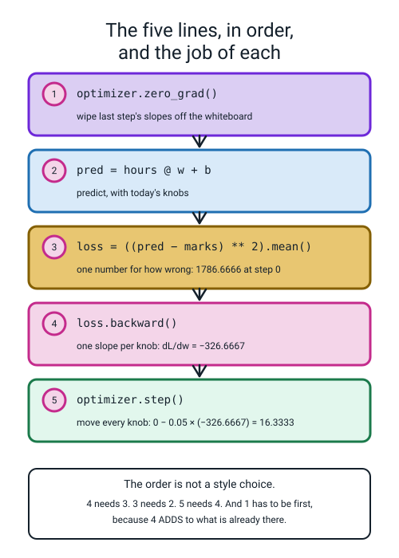
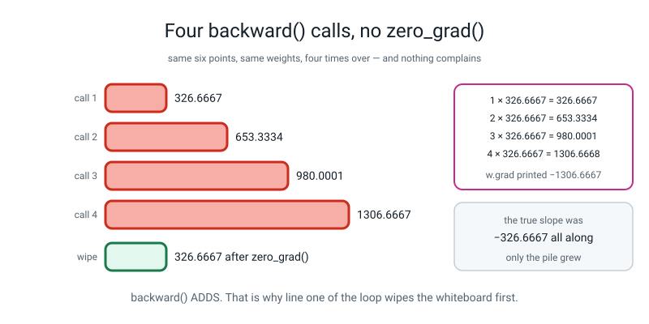
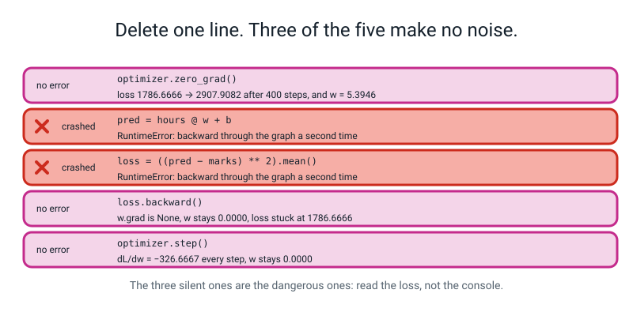
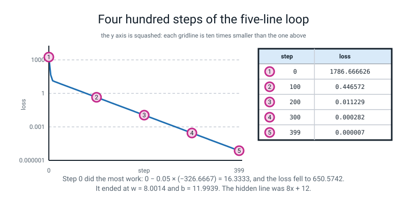
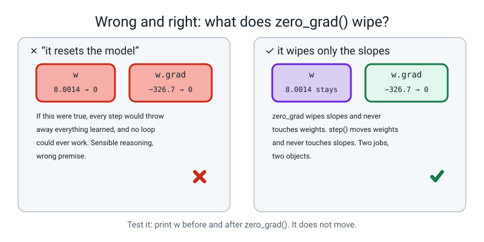
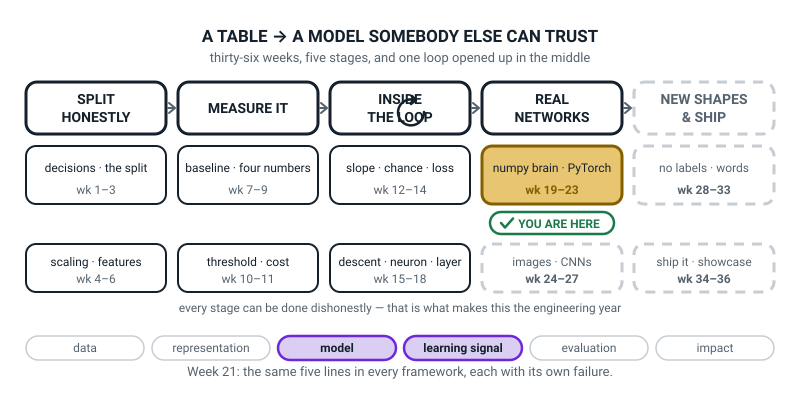
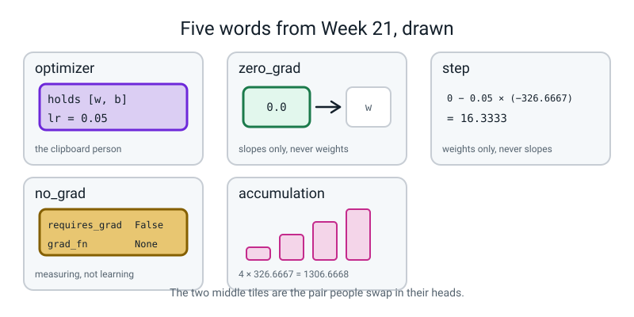

# Week 21 — The Five-Line Loop

[⬅ Week 20](week-20.md) · [Course Home](../README.md) · [Next ➡](week-22.md) · [Workbook](../workbook/week-21.md)

---

> ### This week in one sentence
> **Every training run in every framework is the same five lines in the same order — and each one has its own way of failing.**
>
> **By the end of this chapter you will be able to:**
> - **Write the canonical training loop from a blank file**: `zero_grad`, forward, loss, `backward`, `step`, in that order
> - **Delete each of the five lines in turn** and record exactly what happens — including the ones that produce **no error at all**
> - **Explain why gradients accumulate by default**, and read a run where the gradient refuses to shrink
> - **Use `torch.no_grad()`** when you are measuring rather than learning, and say what it saves
>
> **New maths:** **none.** There is one gradient and one step, and both are done by hand on six numbers before any code runs.
>
> **New syntax:** `torch.optim.SGD([w], lr=0.1)` · `optimizer.zero_grad()` · `optimizer.step()` · `with torch.no_grad():`
>
> **Reading time:** about 35 minutes. **Homework:** about 60 minutes.

---

## 🪝 Start Here

Six students, six revision sessions, six test results. You have met these numbers before — they are Week 12's.

```text
hours:  1    2    3    4    5    6
marks: 20   28   36   44   52   60
```

**There is a straight line hiding in there.** Do not guess: work it out. Every extra hour adds 8 marks, and at 0 hours you would be at 12. So the line is `marks = 8 × hours + 12`.

Now cover it up, because the interesting question is not what the line is. **It is whether a machine that starts by guessing `w = 0` and `b = 0` can walk its way to it, knowing nothing except those twelve numbers.**

Last week you got all the slopes and then did absolutely nothing with them. You knew which way was downhill and you stood still. That was on purpose.

**Today you step. And the whole of today is five lines of code.**

Not five lines for this problem. **Five lines for every problem.** The training loop for a network that sorts photographs, the loop for the thing that suggests what you watch next, the loop somebody ran last month on ten thousand computers to train a language model — it is these five lines, in this order. More data, more knobs, more machines. Same five lines.

```python
optimizer.zero_grad()                  # 1. wipe last step's slopes
pred = hours @ w + b                   # 2. predict with today's knobs
loss = ((pred - marks) ** 2).mean()    # 3. one number for how wrong
loss.backward()                        # 4. one slope per knob
optimizer.step()                       # 5. move every knob downhill
```

And here is the part that makes today worth a whole lesson: **every one of the five has its own way of failing, and three of the five fail silently.** No error. No warning. A log that looks fine. Working out which three is the second half of the chapter.

By the end, your own file will print this:

```text
found:  marks = 8.0014 x hours + 11.9939
wanted: marks = 8 x hours + 12
```

**Nobody told it either number.**

---

## 🧠 The Big Idea

> **📌 About the code in this section.** The blocks below are **illustrations, not files**. Each one carries on from the one above. **The complete runnable file is in 💻 Type This.**

### 1. An optimizer is the person holding the clipboard

**The plain explanation.**

> **optimizer** — an object that holds a list of your knobs and knows the rule for updating them. You hand it the knobs once, at the start. After that, `optimizer.step()` updates every one of them.

```python
optimizer = torch.optim.SGD([w, b], lr=0.05)
```

`SGD` stands for **stochastic gradient descent**, and the only part of that name worth explaining today is that it is **exactly the update rule from Week 15**:

```text
w ← w − lr × slope
```

`[w, b]` is the list of knobs. `lr=0.05` is the learning rate — the size of the step. **In this form the optimizer contains no cleverness at all.** It is a bookkeeper: it remembers which tensors are knobs, so one call can update all of them instead of you writing one line per knob.

🍕 **The analogy.** The optimizer is the person holding the clipboard with everybody's name on it. `backward()` works out who is to blame and by how much. `step()` is the clipboard person going down the list and adjusting each person by their own amount. `zero_grad()` is rubbing out yesterday's numbers before you start writing today's.

**Two words that sound interchangeable and are not:**

> **`zero_grad`** — wipe the slopes. **Does not touch the weights.**
>
> **`step`** — move the weights using the slopes. **Does not touch the slopes.**

**And here is the proof, in four printed lines.** Watch which of the two columns changes:

```python
loss = ((hours @ w + b - marks) ** 2).mean()
loss.backward()
print("after backward()   : w =", w.item(), " w.grad =", w.grad)
optimizer.zero_grad()
print("after zero_grad()  : w =", w.item(), " w.grad =", w.grad)
loss2 = ((hours @ w + b - marks) ** 2).mean()
loss2.backward()
print("after backward()   : w =", w.item(), " w.grad =", w.grad)
optimizer.step()
print("after step()       : w =", w.item(), " w.grad =", w.grad)
```

```text
after backward()   : w = 0.0  w.grad = tensor([[-326.6667]])
after zero_grad()  : w = 0.0  w.grad = None
after backward()   : w = 0.0  w.grad = tensor([[-326.6667]])
after step()       : w = 16.33333396911621  w.grad = tensor([[-326.6667]])
```

**Read the `w` column: 0.0, 0.0, 0.0, 16.33.** Only `step()` moved it. **Read the `w.grad` column:** `backward()` filled it, `zero_grad()` emptied it, `step()` left it exactly where it was.

> **⚠️ Watch out:** `zero_grad()` set `w.grad` to **`None`**, not to `tensor([[0.]])`. Modern PyTorch throws the box away rather than filling it with zero — it is slightly faster and it has the same effect on the next `backward()`, which adds into an empty box either way. But it means **`None` is a completely normal thing to see just after `zero_grad()`**, and last week's rule still holds: `None` means nobody has written there.

### 2. The order is forced, not a matter of taste

**The plain explanation.** Read the five lines and ask, for each one, *"what has to have happened already?"*


*Figure 21.1 — The five lines, in order, and the job of each. Line 5's arithmetic: 0 − 0.05 × (−326.6667) = 16.3333.*

- **4 needs 3.** `backward()` starts from a loss. Without line 3 there is nothing to walk back from.
- **3 needs 2.** The loss compares a prediction with the truth. Without line 2 there is no prediction — or worse, there is **last iteration's** prediction, which is a different and nastier bug.
- **5 needs 4.** `step()` applies the slopes. Without line 4 there are no new slopes.
- **1 has to be first**, because line 4 **adds** into `.grad` rather than overwriting it. That is last week's `6 + 27 = 33`, and it is the whole reason line 1 exists.

**The five lines are an order, not a set.** Put `step()` before `backward()`, or `zero_grad()` at the end, and the program still runs — and does something different from what you meant.

### 3. Gradients pile up, and nothing tells you

**The plain explanation.**

> **gradient accumulation** — the fact that `.grad` adds rather than replaces. It is deliberate: it lets you split a batch too big for memory into pieces and sum their gradients. The price is that you must wipe `.grad` yourself, every step, for ever.

**A concrete example, with real values.** Same weights, same six points, four `backward()` calls, and no wipe between them. **Predict the four numbers before you look.**

```python
w = torch.tensor([[0.0]], requires_grad=True)
b = torch.tensor([0.0], requires_grad=True)
for i in range(4):
    pred = hours @ w + b
    loss = ((pred - marks) ** 2).mean()
    loss.backward()
    print("after backward %d:  w.grad = %10.4f" % (i + 1, w.grad.item()))
```

```text
after backward 1:  w.grad =  -326.6667
after backward 2:  w.grad =  -653.3334
after backward 3:  w.grad =  -980.0001
after backward 4:  w.grad = -1306.6667
```

**`4 × 326.6667 = 1306.6668`.**

Nothing about the data changed. Nothing about the weights changed. **The true slope was `−326.6667` on all four occasions, and the pile grew.**


*Figure 21.2 — Four backward() calls, no zero_grad(). The four bars grow, and the fifth one is back to 326.6667 after the wipe.*

Now imagine that inside a loop that runs four hundred times, where each step also multiplies by the learning rate. Every step now carries all the old slopes along with the new one, so the steps stop being the size you asked for — and **nothing goes red.**

> **💡 Try this:** the last row differs from `4 × 326.6667` in the fourth decimal (`1306.6667` against `1306.6668`) because each addition happens in `float32`. **That is last week's seven-digit lesson, arriving unannounced in a place you were not looking.**

### 4. Three of the five failures make no noise at all

**The plain explanation.** Delete each line in turn. Two crash. **Three do not.**


*Figure 21.3 — Delete one line. Three of the five make no noise.*

**Drop line 1, `optimizer.zero_grad()` — no error, and the run is ruined.**

```text
  step   0  loss    1786.6666  dL/dw      -326.6667  w    16.3333
  step   1  loss     650.5742  dL/dw      -129.8889  w    22.8278
  step   2  loss    2737.1262  dL/dw       277.0704  w     8.9743
  step   3  loss      31.9444  dL/dw       244.9432  w    -3.2729
  step 399  loss    2907.9082  dL/dw      -247.1715  w     5.3946
w 5.3946  b 18.9274  loss 2907.908203
```

**Look at step 1 before you look at anything else.** The loss went **down**, 1786 → 650. It looks like it is working.

Then step 2: up to 2737. Step 3: down to 31.9. Step 399: **2907.9082** — **worse than the 1786.6666 it started at.** And `w` is 5.3946 when the answer is 8.

Read the gradient column: −326.7, then −129.9, then **+277.1**, then +244.9. **Those are piles, not slopes.** The true slope never had those values.

**Drop line 2, the forward line — crashes, and it is last week's message.** If `pred` is computed once *before* the loop, the first `backward()` consumes that graph and the second one finds it gone:

```text
  step 0 finished, loss 1786.6666
RuntimeError: Trying to backward through the graph a second time (or directly access saved tensors after they have already been freed). Saved intermediate values of the graph are freed when you call .backward() or autograd.grad(). Specify retain_graph=True if you need to backward through the graph a second time or if you need to access saved tensors after calling backward.
```

**Notice it completes step 0 first.** The crash is on step 1, which is the good detail: the loop is not *wrong*, it is **stale**.

**Drop line 3, the loss line — the same crash, for the same reason.** A loss computed once outside the loop is one graph, read once. **The forward pass and the loss are one thing, and both belong inside the loop.**

**Drop line 4, `loss.backward()` — no error, and nothing happens at all.**

```text
w 0.0000  b 0.0000  loss 1786.666626  w.grad None
```

`w.grad` is `None`, so `step()` has nothing to apply and skips those knobs silently. **Four hundred steps, zero learning, no complaint.**

**Drop line 5, `optimizer.step()` — no error, and nothing happens either.**

```text
w 0.0000  b 0.0000  loss 1786.666626  dL/dw -326.6667
```

The gradient is computed perfectly, every single step, and then thrown away by the next `zero_grad()`. **This is the saddest loop in the file: it does all the work and never acts on it.**

**And here is the question worth remembering, because those two look identical in the loss column:**

> **How do you tell a missing `backward` from a missing `step`? Look at `.grad`.** `None` means `backward()` never ran. `−326.6667` means `backward()` ran and `step()` did not.

### 5. `no_grad`: if you are not going to call `backward()`, wrap it

**The plain explanation.**

> **`torch.no_grad()`** — a block inside which PyTorch does not record anything. Use it whenever you are **measuring rather than learning**.

```python
with torch.no_grad():
    pred = hours @ w + b
    gap = (pred - marks).abs().mean()
```

The `with ... :` shape is a block that switches something on at the top and off again at the bottom. Inside it, nothing gets a `grad_fn`, so nothing is stored for a backward pass that is never going to happen.

**A concrete example, and it is the whole evidence.** The same arithmetic, twice:

```text
measuring WITH the recorder on:
  requires_grad: True   grad_fn: AddBackward0
measuring with torch.no_grad():
  requires_grad: False   grad_fn: None
  average miss: 0.0023 marks
```

The first one came back carrying a **receipt**. The second came back with nothing attached. **Same weights, same arithmetic, same answer to the last digit.**

**What it saves is memory and time**, and the reason is exactly last week's `.item()` lesson: recording means keeping every intermediate value in case a slope is needed. If no slope will ever be needed, that storage is pure waste. On six points it is invisible. On a validation pass over twenty thousand images it is the difference between fitting in memory and crashing.

> **Say the rule out loud: "if you are not going to call `backward()`, wrap it in `no_grad()`."** Every evaluation, every prediction on new data, every plot of a model's output.

And the answer itself: **0.0023 marks.** On a test out of 60, the line is wrong by about two thousandths of a mark. **That is what four hundred steps bought.**

---

## 🔁 The Idea From Last Week, Used Harder

**No new maths this week.** But last week's `6 + 27 = 33` is about to become the reason for a line of code, and Week 15's update rule is about to be done by a library — so both get worked by hand first, on the six real points, before anything runs.

**These marks sit exactly on a line, on purpose:** `marks = 8 × hours + 12`. Check two of them: `8 × 1 + 12 = 20` ✅, `8 × 6 + 12 = 60` ✅. **The point of hiding a known answer in the data is that you can tell whether the loop found it.** Real data never does this, and Week 22 goes back to data that wobbles.

**Both knobs start at zero**, so every prediction is 0, and every error is `0 − marks`:

```text
errors:  −20, −28, −36, −44, −52, −60
```

**The loss** is the mean of the squared errors:

```text
squared:  400 + 784 + 1296 + 1936 + 2704 + 3600  =  10720
10720 ÷ 6  =  1786.6667
```

**The screen will print `1786.6666`.** Same number; float32 shows six digits.

> **🔢 The maths, slowly:** **the slope for `w`.** From Week 15: the slope of a mean-squared error with respect to a weight is *twice the average of (error × the input that weight multiplies)*. `w` multiplies the hours, so multiply each error by its hours value and add them up.
>
> ```
> (−20 × 1) + (−28 × 2) + (−36 × 3) + (−44 × 4) + (−52 × 5) + (−60 × 6)
> = −20 − 56 − 108 − 176 − 260 − 360
> = −980
>
> slope for w  =  2 × (−980) ÷ 6  =  −1960 ÷ 6  =  −326.6667
> ```
>
> **You can check this on a calculator in about forty seconds, and you should.**

**The slope for `b`.** The bias multiplies 1 on every row, so it is just twice the average error — **no multiplication at all**, which is the bit people miss:

```text
(−20) + (−28) + (−36) + (−44) + (−52) + (−60)  =  −240
slope for b  =  2 × (−240) ÷ 6  =  −480 ÷ 6  =  −80.0
```

**Then one step, with `lr = 0.05`:**

```text
w ← 0 − 0.05 × (−326.6667)  =  0 + 16.3333  =  16.3333
b ← 0 − 0.05 × (−80.0)      =  0 + 4.0      =   4.0
```

**A negative slope means increase the knob.** That is Week 15, unchanged — the only difference this week is that `optimizer.step()` does the subtracting.

**So before you run anything, you already know the first line of output:**

```text
step   0  loss  1786.6666  w 16.3333  b  4.0000  dL/dw  -326.6667
```

**All three numbers, predicted.** If the screen says anything else, one of you has made a mistake.

> **⚠️ Watch out:** that line looks inconsistent and it is not. The printed `w` is the value **after** the step, because the print comes after `optimizer.step()`. The loss and the gradient on that line belong to the **old** `w`, which was 0. If you try to make `loss 1786.6666` agree with `w 16.3333` you will fail, for a good reason.

---

## 💻 Type This

In this section you build the loop yourself, step by step, in one file called `fit_line.py`. Then you write one more short file.

### Step 1 — the data and the knobs, with a mistake on purpose

```python
"""fit_line.py - the five-line loop, on six hours-vs-marks points."""
import torch

torch.manual_seed(0)

hours = torch.tensor([[1.0], [2.0], [3.0], [4.0], [5.0], [6.0]])
marks = torch.tensor([[20.0], [28.0], [36.0], [44.0], [52.0], [60.0]])
print("hours", tuple(hours.shape), " marks", tuple(marks.shape))

w = torch.tensor([[0.0]], requires_grad=True)
b = torch.tensor([0.0], requires_grad=True)
optimizer = torch.optim.SGD(w, lr=0.05)        # <-- the mistake
```

```text
hours (6, 1)  marks (6, 1)
Traceback (most recent call last):
  File "fit_line.py", line 12, in <module>
    optimizer = torch.optim.SGD(w, lr=0.05)
TypeError: params argument given to the optimizer should be an iterable of Tensors or dicts, but got torch.FloatTensor
```

**What Python is telling you.** *"I want an iterable of Tensors — a list — and you gave me one bare tensor."*

The optimizer takes a **list** of knobs, because a real model has hundreds and you hand them all over at once. **Even with one knob it wants the list.** We have two, so: `torch.optim.SGD([w, b], lr=0.05)`.

**And read the first line of output while you are here.** `(6, 1)` and `(6, 1)` — **columns, both of them.** If `marks` were a flat line of six numbers, `pred - marks` would quietly become a 6 × 6 grid and every number afterwards would be wrong with no error. That is Week 19's bug, and it does not announce itself.

**What the other new lines do.** `torch.manual_seed(0)` fixes PyTorch's random-number generator. **Nothing today is random** — the six points are typed and both knobs start at exactly 0 — so it changes nothing. It is there because every file in this course sets its seed, and **a habit with exceptions is not a habit.**

`w` is shape `(1, 1)` so that `hours @ w` works: `(6, 1) @ (1, 1)` gives `(6, 1)`. `b` is a single number added to all six rows by broadcasting.

### Step 2 — the five lines

```python
for step in range(400):
    optimizer.zero_grad()                    # 1. wipe last step's slopes
    pred = hours @ w + b                     # 2. forward
    loss = ((pred - marks) ** 2).mean()      # 3. how wrong
    loss.backward()                          # 4. fill in every slope
    optimizer.step()                         # 5. take one step downhill

    if step % 50 == 0 or step == 399:
        print("step %3d  loss %10.4f  w %7.4f  b %7.4f  dL/dw %10.4f"
              % (step, loss.item(), w.item(), b.item(), w.grad.item()))
```

**What each new line does.**

- `optimizer.zero_grad()` sets `w.grad` and `b.grad` back to empty. **Nothing else happens** — the weights are untouched.
- `pred = hours @ w + b` is the prediction for all six rows at once.
- `((pred - marks) ** 2).mean()` subtracts the truth, squares (so 5 under is as bad as 5 over, and 50 out is far worse than 5 out), then averages the six. **One number.** Give `backward()` six and you get `RuntimeError: grad can be implicitly created only for scalar outputs`.
- `loss.backward()` is last week's line. It reads the recording backwards and **adds** the slope into `w.grad` and `b.grad`.
- `optimizer.step()` does, for every knob in the list: `knob ← knob − 0.05 × its slope`. **That is the entire content of `SGD`.**
- `.item()` on all four printed values, exactly as last week — these are numbers going into a log, and there is no reason to keep 400 recordings alive to make a printout.

**Before you run it: the board says the first row will be loss 1786.6666, slope −326.6667, `w` 16.3333.**

```text
step   0  loss  1786.6666  w 16.3333  b  4.0000  dL/dw  -326.6667
step  50  loss     2.8163  w  8.8773  b  8.2442  dL/dw     0.3261
step 100  loss     0.4466  w  8.3493  b 10.5044  dL/dw     0.1299
step 150  loss     0.0708  w  8.1391  b 11.4044  dL/dw     0.0517
step 200  loss     0.0112  w  8.0554  b 11.7628  dL/dw     0.0206
step 250  loss     0.0018  w  8.0221  b 11.9056  dL/dw     0.0082
step 300  loss     0.0003  w  8.0088  b 11.9624  dL/dw     0.0033
step 350  loss     0.0000  w  8.0035  b 11.9850  dL/dw     0.0013
step 399  loss     0.0000  w  8.0014  b 11.9939  dL/dw     0.0005
```

**Five things in there, and the fifth is the objective.**

1. `loss 1786.6666` — the number you computed by hand.
2. `dL/dw −326.6667` and `w 16.3333` on the same line — also computed by hand: `0 − 0.05 × (−326.6667)`.
3. **The gradient shrinks as the loss falls**: −326.6667, then 0.3261, then 0.1299, down to 0.0005. **A flattening slope means you are near the bottom.** That is Week 12's picture, seen from inside a loop.
4. **`w` is nearly right long before `b` is.** At step 50, `w` is 8.88 and `b` is only 8.24. `b`'s slope started at −80 against `w`'s −326.7, so `w` moves four times as fast. **Different knobs learn at different speeds**, which is a real problem in real models and one of the reasons Week 26's optimizer exists.
5. And the last two lines:

```text
found:  marks = 8.0014 x hours + 11.9939
wanted: marks = 8 x hours + 12
```

**8.0014 and 11.9939.** It started at zero and zero and walked there in four hundred steps, using nothing but twelve numbers and the direction of downhill.

In exact arithmetic it never reaches exactly 8 and 12 — each step is proportional to the remaining slope, so the steps get smaller as you approach.


*Figure 21.4 — Four hundred steps of the five-line loop. Step 0 loss 1786.666626, step 399 loss 0.000007.*

### Step 3 — the second mistake on purpose: turn the learning rate up

Change `lr=0.05` to `lr=0.1` and run.

```text
step   0  loss  1786.6666  w 32.6667  b  8.0000  dL/dw  -326.6667
step  50  loss 26762685107439987340656851953213505536.0000  w 2768102711420256256.0000  b 646571867162804224.0000  dL/dw -40281413326085292032.0000
step 100  loss        inf  w 340482156895263333900541597585506304.0000  b 79529625672631113398087385067028480.0000  dL/dw -4954694134455749336546261015568842752.0000
step 150  loss        nan  w     nan  b     nan  dL/dw        nan
step 399  loss        nan  w     nan  b     nan  dL/dw        nan

found:  marks = nan x hours + nan
```

**Did it crash?** No. **Not one error message.**

**Read the three stages in that log, because they are three different things.** At step 50 the loss is a real number with 38 digits in it. At step 100 it is `inf` — bigger than a float32 can hold. At step 150 it is `nan`, because the arithmetic reached `inf` minus `inf`, which has no answer. **Overflow first, then nonsense.**

But `nan` is the funeral, not the story. **The story is the first four steps**, so shorten the loop and watch:

```text
  step  0 loss 1786.6666259765625 w 32.66666793823242
  step  1 loss 8553.408203125 w -39.355560302734375
  step  2 loss 41215.35546875 w 118.61631774902344
  step  3 loss 198849.859375 w -228.6627655029297
```

**Read the `w` column: 32.7, then −39.4, then +118.6, then −228.7.** It is leaping straight over the bottom of the valley and landing higher up the other side, every time. That is Week 15, panel three. The only difference is that a library is doing the leaping.

> **🐞 If you see this error:** you will not — that is the point. `nan` never raises anything. **If you see `nan`, do not look at the last step, look at the first four.** The cause is almost always a learning rate too large, and the first few steps show it clearly. `nan` is contagious: `nan` plus anything is `nan`, so once one weight becomes `nan`, every prediction, every loss and every gradient is `nan` for ever.

**One dial, two hundredths of a difference, and the whole run is dead. Nothing in the code was wrong.** Put it back to 0.05.

### Step 4 — measuring, with `no_grad`

```python
pred_recorded = hours @ w + b
print("recorder on :", pred_recorded.requires_grad,
      type(pred_recorded.grad_fn).__name__)

with torch.no_grad():
    pred_quiet = hours @ w + b
    gap = (pred_quiet - marks).abs().mean()
print("recorder off:", pred_quiet.requires_grad, pred_quiet.grad_fn)
print("average miss: %.4f marks" % gap.item())
```

```text
recorder on : True AddBackward0
recorder off: False None
average miss: 0.0023 marks
```

**What the new lines do.** `with torch.no_grad():` opens a block. Everything indented under it runs with the recorder off. `.abs()` makes every miss positive so that a +2 and a −2 do not cancel out; `.mean()` averages them.

**Same arithmetic, twice, and the difference is only in what was *stored*.** `requires_grad: False` and `grad_fn: None` inside the block is the whole evidence.

### The complete file

**Runtime: about 1 second for all 400 steps.**

```python
"""fit_line.py - the five-line loop, on six hours-vs-marks points."""
import torch

torch.manual_seed(0)

hours = torch.tensor([[1.0], [2.0], [3.0], [4.0], [5.0], [6.0]])
marks = torch.tensor([[20.0], [28.0], [36.0], [44.0], [52.0], [60.0]])

w = torch.tensor([[0.0]], requires_grad=True)
b = torch.tensor([0.0], requires_grad=True)
optimizer = torch.optim.SGD([w, b], lr=0.05)

for step in range(400):
    optimizer.zero_grad()                    # 1. wipe last step's slopes
    pred = hours @ w + b                     # 2. forward
    loss = ((pred - marks) ** 2).mean()      # 3. how wrong
    loss.backward()                          # 4. fill in every slope
    optimizer.step()                         # 5. take one step downhill

    if step % 50 == 0 or step == 399:
        print("step %3d  loss %10.4f  w %7.4f  b %7.4f  dL/dw %10.4f"
              % (step, loss.item(), w.item(), b.item(), w.grad.item()))

print()
print("found:  marks = %.4f x hours + %.4f" % (w.item(), b.item()))
print("wanted: marks = 8 x hours + 12")
```

### And the measuring file

```python
"""measure.py - measuring is not learning, so turn the recorder off."""
import matplotlib
matplotlib.use("Agg")
import matplotlib.pyplot as plt
import torch

torch.manual_seed(0)

hours = torch.tensor([[1.0], [2.0], [3.0], [4.0], [5.0], [6.0]])
marks = torch.tensor([[20.0], [28.0], [36.0], [44.0], [52.0], [60.0]])

w = torch.tensor([[0.0]], requires_grad=True)
b = torch.tensor([0.0], requires_grad=True)
optimizer = torch.optim.SGD([w, b], lr=0.05)

history = []
for step in range(400):
    optimizer.zero_grad()
    pred = hours @ w + b
    loss = ((pred - marks) ** 2).mean()
    loss.backward()
    optimizer.step()
    history.append(loss.item())

print("first loss %.4f   last loss %.6f" % (history[0], history[-1]))

pred_recorded = hours @ w + b
print()
print("measuring WITH the recorder on:")
print("  requires_grad:", pred_recorded.requires_grad,
      "  grad_fn:", type(pred_recorded.grad_fn).__name__)

with torch.no_grad():
    pred_quiet = hours @ w + b
    gap = (pred_quiet - marks).abs().mean()
print("measuring with torch.no_grad():")
print("  requires_grad:", pred_quiet.requires_grad, "  grad_fn:", pred_quiet.grad_fn)
print("  average miss: %.4f marks" % gap.item())

print()
print("predictions after training:")
with torch.no_grad():
    for i in range(6):
        print("  %d hours -> predicted %7.4f   real %5.1f"
              % (hours[i].item(), (hours[i] @ w + b).item(), marks[i].item()))

fig, ax = plt.subplots(figsize=(7, 4))
ax.plot(history)
ax.set_yscale("log")
ax.set_xlabel("step")
ax.set_ylabel("loss (log scale)")
ax.set_title("400 steps of the five-line loop")
plt.tight_layout()
plt.savefig("loss_curve.png", dpi=120)
print()
print("wrote loss_curve.png")
print("loss at steps 0, 100, 200, 300, 399: %.4f %.4f %.4f %.4f %.6f"
      % (history[0], history[100], history[200], history[300], history[399]))
```

**Real output, runtime about 1 second:**

```text
first loss 1786.6666   last loss 0.000007

measuring WITH the recorder on:
  requires_grad: True   grad_fn: AddBackward0
measuring with torch.no_grad():
  requires_grad: False   grad_fn: None
  average miss: 0.0023 marks

predictions after training:
  1 hours -> predicted 19.9953   real  20.0
  2 hours -> predicted 27.9968   real  28.0
  3 hours -> predicted 35.9982   real  36.0
  4 hours -> predicted 43.9996   real  44.0
  5 hours -> predicted 52.0010   real  52.0
  6 hours -> predicted 60.0024   real  60.0

wrote loss_curve.png
loss at steps 0, 100, 200, 300, 399: 1786.6666 0.4466 0.0112 0.0003 0.000007
```

**Read the six predictions out loud.** 19.9953 for 20. 60.0024 for 60. **`ax.set_yscale("log")` is Week 15's trick** — without it the curve is one vertical drop and then a flat line, and you cannot see the last three hundred steps at all.

---

## 🔍 Worked Examples

This section runs the same five lines on three further datasets. Each program is complete, with its real output.

### Worked Example 1 — Pizza delivery: find the hidden line again (food)

**The question:** five deliveries, distance in kilometres against minutes taken. There is a line hidden in it. Can the same five lines find a *different* one?

| km | minutes |
|---|---|
| 1 | 16 |
| 2 | 22 |
| 3 | 28 |
| 4 | 34 |
| 5 | 40 |

```python
"""pizza_fit.py - the same five lines, a different hidden line."""
import torch

torch.manual_seed(0)

km = torch.tensor([[1.0], [2.0], [3.0], [4.0], [5.0]])
minutes = torch.tensor([[16.0], [22.0], [28.0], [34.0], [40.0]])

w = torch.tensor([[0.0]], requires_grad=True)
b = torch.tensor([0.0], requires_grad=True)
optimizer = torch.optim.SGD([w, b], lr=0.05)

for step in range(600):
    optimizer.zero_grad()
    pred = km @ w + b
    loss = ((pred - minutes) ** 2).mean()
    loss.backward()
    optimizer.step()

    if step % 150 == 0 or step == 599:
        print("  step %3d  loss %9.4f  w %7.4f  b %7.4f  dL/dw %9.4f"
              % (step, loss.item(), w.item(), b.item(), w.grad.item()))

print()
print("found:  minutes = %.4f x km + %.4f" % (w.item(), b.item()))
```

Real output, runtime about 1 second:

```text
  step   0  loss  856.0000  w  9.6000  b  2.8000  dL/dw -192.0000
  step 150  loss    0.0656  w  6.1634  b  9.4099  dL/dw    0.0562
  step 300  loss    0.0004  w  6.0127  b  9.9543  dL/dw    0.0044
  step 450  loss    0.0000  w  6.0010  b  9.9965  dL/dw    0.0003
  step 599  loss    0.0000  w  6.0001  b  9.9997  dL/dw    0.0000

found:  minutes = 6.0001 x km + 9.9997
```

**`6.0001` and `9.9997`. The hidden line was `minutes = 6 × km + 10`** — six minutes of driving per kilometre and ten minutes of standing in the kitchen.

**And check step 0 by hand, exactly as you did for the marks.** Both knobs start at 0, so all five errors are `0 − minutes`:

```text
errors:   −16, −22, −28, −34, −40
squared:  256 + 484 + 784 + 1156 + 1600  =  4280
loss   =  4280 ÷ 5  =  856.0            ✅ the screen says 856.0000

each error × its km:  −16, −44, −84, −136, −200   sum = −480
dL/dw  =  2 × (−480) ÷ 5  =  −192.0                ✅
w      =  0 − 0.05 × (−192.0)  =  +9.6             ✅

sum of the errors: −140
dL/db  =  2 × (−140) ÷ 5  =  −56.0
b      =  0 − 0.05 × (−56.0)  =  +2.8              ✅ the screen says 2.8000
```

**Five numbers predicted, five numbers matched.** Different data, different answer, **identical five lines.**

### Worked Example 2 — The pile-up, on the pizza numbers

**The question:** what does "gradients add" look like when there are two knobs?

```python
"""pizza_pile.py - four backward() calls, nothing wiped."""
import torch

km = torch.tensor([[1.0], [2.0], [3.0], [4.0], [5.0]])
minutes = torch.tensor([[16.0], [22.0], [28.0], [34.0], [40.0]])
w = torch.tensor([[0.0]], requires_grad=True)
b = torch.tensor([0.0], requires_grad=True)

print("four backward() calls, nothing wiped:")
for i in range(4):
    pred = km @ w + b
    loss = ((pred - minutes) ** 2).mean()
    loss.backward()
    print("  after backward %d:  w.grad = %9.4f   b.grad = %8.4f"
          % (i + 1, w.grad.item(), b.grad.item()))

print()
print("now wipe it and do one more:")
w.grad.zero_()
b.grad.zero_()
pred = km @ w + b
loss = ((pred - minutes) ** 2).mean()
loss.backward()
print("  w.grad = %.4f   b.grad = %.4f" % (w.grad.item(), b.grad.item()))
```

Real output, instant:

```text
four backward() calls, nothing wiped:
  after backward 1:  w.grad = -192.0000   b.grad = -56.0000
  after backward 2:  w.grad = -384.0000   b.grad = -112.0000
  after backward 3:  w.grad = -576.0000   b.grad = -168.0000
  after backward 4:  w.grad = -768.0000   b.grad = -224.0000

now wipe it and do one more:
  w.grad = -192.0000   b.grad = -56.0000
```

**Both columns are exact multiples**, and they are easy to check in your head:

```text
w:  −192, −384, −576, −768        =  1, 2, 3, 4 times −192
b:  −56, −112, −168, −224         =  1, 2, 3, 4 times −56
```

**Two knobs, both piling up, at their own separate rates.** And then one call to `.zero_()` puts both back to their true one-step values.

> **⚠️ Watch out:** `w.grad.zero_()` with the underscore changes `w.grad` **in place**. It is not the same as `optimizer.zero_grad()`, which throws the box away — but it has the same effect on the next `backward()`. The underscore at the end of a torch method always means *"do it to this thing, do not hand me a copy."*

### Worked Example 3 — Data that does *not* sit on a line

**The question:** so far every dataset has had a perfect line hidden in it. What happens on data that does not?

Change one delivery: the 4 km one took **36** minutes instead of 34. Nothing else.

```python
"""pizza_wobble.py - one delivery ran late, and the loss cannot reach zero."""
import torch

torch.manual_seed(0)
d = torch.tensor([[1.0], [2.0], [3.0], [4.0], [5.0]])
m = torch.tensor([[16.0], [22.0], [28.0], [36.0], [40.0]])   # 34 changed to 36

w = torch.tensor([[0.0]], requires_grad=True)
b = torch.tensor([0.0], requires_grad=True)
optimizer = torch.optim.SGD([w, b], lr=0.05)

for step in range(600):
    optimizer.zero_grad()
    pred = d @ w + b
    loss = ((pred - m) ** 2).mean()
    loss.backward()
    optimizer.step()

print("found: minutes = %.4f x km + %.4f" % (w.item(), b.item()))
print("final loss %.6f   (it does NOT reach zero)" % loss.item())
print()
with torch.no_grad():
    pred = d @ w + b
    gap = (pred - m).abs().mean()
    print("recorder off: requires_grad", pred.requires_grad, " grad_fn", pred.grad_fn)
    print("average miss: %.4f minutes" % gap.item())
    print()
    for i in range(5):
        print("  %.0f km -> predicted %7.4f   real %5.1f   miss %+6.4f"
              % (d[i].item(), pred[i].item(), m[i].item(), pred[i].item() - m[i].item()))
```

Real output, runtime about 1 second:

```text
found: minutes = 6.2001 x km + 9.7997
final loss 0.560000   (it does NOT reach zero)

recorder off: requires_grad False  grad_fn None
average miss: 0.5600 minutes

  1 km -> predicted 15.9998   real  16.0   miss -0.0002
  2 km -> predicted 22.1999   real  22.0   miss +0.1999
  3 km -> predicted 28.4000   real  28.0   miss +0.4000
  4 km -> predicted 34.6000   real  36.0   miss -1.4000
  5 km -> predicted 40.8001   real  40.0   miss +0.8001
```

**The loss bottomed out at 0.560000 and stayed there.** Nothing is broken. **That leftover loss is the part of the data no straight line can explain**, and it is the honest normal case — Week 22 goes straight back to it.

Read the miss column. The 4 km delivery is out by **−1.4000** minutes, and every other point has been dragged slightly in its direction to compensate: `+0.1999`, `+0.4000`, `+0.8001`. **One odd row pulls the whole line, and the line splits the difference.**

> **🤔 Think about it:** the loss reached `0.000007` on the tidy data and `0.560000` here. Which of those two runs is the better *model*? **Neither number tells you** — you cannot tell from training loss alone, ever. You need data the model has not seen, and that is Week 22's whole lesson.

---

## 🐞 When It Breaks

Use this section when a run crashes or misbehaves. Every message below came from really running a broken version of this week's code.

> **The recipe for every silent training bug, and it never changes: read the gradient column, not the loss column.** A gradient that **refuses to shrink — it keeps swinging in size and flipping sign —** means the pile. A gradient of **`None`** means no `backward()`. A gradient that is **right while nothing moves** means no `step()`. One column, three different diagnoses.

### Break 1 — the optimizer without its brackets

```python
optimizer = torch.optim.SGD(w, lr=0.05)
```

```text
TypeError: params argument given to the optimizer should be an iterable of Tensors or dicts, but got torch.FloatTensor
```

**What Python is telling you.** *"I want a list of knobs and you gave me one bare tensor."*

**The fix.** `torch.optim.SGD([w, b], lr=0.05)`. Even a single knob goes in a list.

### Break 2 — the loss line without `.mean()`

```python
loss = ((pred - marks) ** 2)          # six numbers, not one
loss.backward()
```

```text
RuntimeError: grad can be implicitly created only for scalar outputs
```

**What Python is telling you.** *"`backward()` needs ONE number to start from, and you gave me six."*

Think about why. *"How much does the loss change if I nudge `w`?"* only makes sense if there is **one** loss. Six losses is six different questions.

**The fix.** `((pred - marks) ** 2).mean()`. A loss is always one number.

### Break 3 — the decimal points left off

```python
hours = torch.tensor([[1], [2], [3], [4], [5], [6]])
print(hours @ w)
```

```text
RuntimeError: expected m1 and m2 to have the same dtype, but got: long long != float
```

**What Python is telling you.** *"One grid holds whole numbers and the other holds decimals, and I will not guess."*

`[[1], [2], …]` is `int64`. `w` is `float32`. **The fix:** put the decimal points in — `[[1.0], [2.0], …]`.

### Break 4 — the one with no message, and the loss goes *up*

```python
for step in range(400):
    pred = hours @ w + b              # zero_grad() deleted
    loss = ((pred - marks) ** 2).mean()
    loss.backward()
    optimizer.step()
```

```text
  step   0  loss    1786.6666  dL/dw      -326.6667  w    16.3333
  step   1  loss     650.5742  dL/dw      -129.8889  w    22.8278
  step   2  loss    2737.1262  dL/dw       277.0704  w     8.9743
  step   3  loss      31.9444  dL/dw       244.9432  w    -3.2729
  step 399  loss    2907.9082  dL/dw      -247.1715  w     5.3946
```

**There is no error. That is the problem.** After 400 steps the model is **worse than it was before it trained** — 2907.9082 against 1786.6666 — and `w` is 5.3946 when the answer is 8.

**What to do when there is no message.** Two questions, in this order:

> **"What was the loss at the START, and what is it at the END?"**
>
> **"Is the gradient column shrinking towards zero, or swinging about?"**

Not *"is it going down"* — it goes down at step 1, which is exactly what makes this bug survive. **1786.6666 against 2907.9082** is the comparison that catches it, and a gradient column that never shrinks and keeps flipping sign is the confirmation. (Why it swings: `.grad` is now the running total of every slope so far, so `w` keeps being pushed by old slopes after it has passed the bottom — like a ball rolling with no friction. The sizes stay in the hundreds; they do not blow up.)

**The fix.** `optimizer.zero_grad()` at the top of the loop.

### The whole clinic, for reference

| What you see | What it means | The fix |
|---|---|---|
| `TypeError: params argument given to the optimizer should be an iterable of Tensors or dicts, but got torch.FloatTensor` | "I want a list of knobs" | `SGD([w, b], lr=0.05)` |
| `RuntimeError: Trying to backward through the graph a second time ...` | "The recording was freed when I read it, and you asked again" | The forward line or the loss line is **outside** the loop. **Every step needs a fresh forward pass** |
| `RuntimeError: grad can be implicitly created only for scalar outputs` | "`backward()` needs one number and you gave me six" | `.mean()` on the loss line |
| `RuntimeError: expected m1 and m2 to have the same dtype, but got: long long != float` | "Whole numbers on one side, decimals on the other" | Put the `.0` in: `[[1.0], [2.0], ...]` |
| `RuntimeError: Only Tensors of floating point and complex dtype can require gradients` | "You cannot ask for the slope of a whole number" | `[[0.0]]`, not `[[0]]` |
| **No error.** `w` and the loss are both `nan` by step 150 | The run is dead and every future prediction is `nan` | Learning rate too big. **Watch the first four steps, not the last one** |
| **No error.** The loss never moves off `1786.666626`, and `w.grad` is `None` | Nothing crashed and nothing learned | `loss.backward()` is missing. **`None` is the diagnosis** |
| **No error.** The loss never moves, and `w.grad` is `−326.6667` | Nothing crashed and nothing learned | `optimizer.step()` is missing. **The `.grad` value is how you tell this apart from the one above** |
| **No error.** The loss falls at first, then wanders, and ends higher than it started | The model is worse than when you began | `optimizer.zero_grad()` is missing. **The gradient column never shrinks and the signs flip** |
| **No error.** The loss is identical every step and never changes at all | — | The forward line is outside the loop **and** you added `retain_graph=True` to make the crash go away. Take it out. **The error was telling the truth** |

---

## 🎲 What We Did In Class

This section is a record of the lesson, for anyone who missed it. You need five index cards and a calculator.

**The hook.** Six pairs on the board, and **not** the line they came from. *"There is a straight line hiding in there. I know what it is and I am not telling you. In about twenty minutes a five-line program is going to find it."* Somebody spotted `8x + 12` in under a minute; it was written on a piece of paper, folded, and put under something.

**Five cards, one order.** The five lines went on the wall in a deliberately wrong order, and the class put them right **by argument, not memory**:

- *"Which of these cannot possibly go first?"* → `loss.backward()`, because it needs a loss to exist.
- *"And what does the loss card need?"* → a prediction, so the forward card goes before it.
- *"Where does `step()` go?"* → after `backward()`, because it applies the slopes.
- *"Last one — where does wiping the slopes go, and why?"* → and then the pointing at last week's `6 + 27 = 33` on the wall.

The honest answer to that last one: **putting `zero_grad` at the end also works**, as long as it happens once per trip. What does not work is leaving it out. We write it **first** because that is the only position where you can look at a loop and *know* the grads are clean before `backward()` runs.

**The step-0 arithmetic, on the board, before anything ran.** Errors, squares, sum, divide by six → **1786.6667**. Errors times hours, sum → −980, times 2 divided by 6 → **−326.6667**. Then `0 − 0.05 × (−326.6667)` → **+16.3333**. *"If the screen says anything else, one of us has made a mistake."*

**The pile-up, live.** Four `backward()` calls on unchanged weights:

```text
after backward 1:  w.grad =  -326.6667
after backward 2:  w.grad =  -653.3334
after backward 3:  w.grad =  -980.0001
after backward 4:  w.grad = -1306.6667
```

And `4 × 326.6667 = 1306.6668` written on the board beside the last row.

**Building `fit_line.py`, with two mistakes on purpose.**

| Mistake | What happened |
|---|---|
| `SGD(w, lr=0.05)`, no brackets | **Loud.** `TypeError: params argument ... should be an iterable of Tensors` |
| `lr=0.1` | **Silent.** Loss 1786 → 8553 → 41215 → 198849, then `inf`, then `nan`. No error at all |

Then the folded paper came out: **8 and 12**, against the program's **8.0014 and 11.9939**.

**The Drop-a-Line Clinic.** One card came down at a time. Everyone wrote a prediction — *crash or no crash* — then it was run, and the real result went on a slip under the card. **Card 1 was played last, on purpose.**

| Card removed | Error? | What happened |
|---|---|---|
| 2, `pred = ...` | **RuntimeError** | Completes step 0, crashes on step 1: *"backward through the graph a second time"* |
| 3, `loss = ...` | **RuntimeError** | Identical failure, identical message |
| 4, `loss.backward()` | **No error** | 400 steps, `w` never leaves 0.0000, `w.grad` is `None` |
| 5, `optimizer.step()` | **No error** | 400 steps, `w` never leaves 0.0000, `w.grad` is `−326.6667` |
| 1, `optimizer.zero_grad()` | **No error** | 1786.6666 → **2907.9082**. Worse than it started |

**Most of the room predicted a crash for card 1.** Then: *"whoever predicted a crash was reasoning sensibly. Missing something that important *should* be an error. It is not, and that is a fact about the tool you now know and most people find out the hard way."*

**`no_grad`, and the rule said back out loud.** `requires_grad: True` and `AddBackward0` outside the block; `False` and `None` inside it. **"If you are not going to call `backward()`, wrap it in `no_grad()`."**

**The closing observation.** *"Count the knobs in today's program. Two. Week 19's network had sixty-five. Are you going to type sixty-five tensors and list all sixty-five in the optimizer?"* Next week: `nn.Linear`. **And the five lines do not change. Not one of them.**

---

## 💬 Talk About It

Three questions to argue about with a friend or a teacher. Each has a hint underneath.

**1. Why doesn't PyTorch just zero the gradients for you?**

*Hint:* find the one real use first. A batch too big for memory: you want the gradient over 1,000 rows and only 250 fit at once, so you run four forward-and-backward passes, let the gradients pile up, and take one step. If each piece's loss is divided by 4 first (or you use a sum rather than a mean), the total is **exactly** the gradient over 1,000 rows, and you never held more than 250 rows at a time. Then the cost: the single most common PyTorch bug in the world, and hours lost by every beginner. Then argue it — **you are allowed to think the default is wrong.** Other frameworks chose differently. You still have to type line 1 every time. Finish on the honest closer: *is there any library decision you have met that was purely a win, with no cost?*

**2. We fitted a straight line. Couldn't scikit-learn have done this in one line?**

*Hint:* agree immediately and enthusiastically, because it is true and it would be *better*. `LinearRegression().fit(X, y)` finds `w = 8` and `b = 12` **exactly**, instantly, using algebra rather than four hundred steps — for a straight line there is a formula. Then the redirect: **we are not here for the line, we are here for the loop.** Once the model is a network with sixty-five knobs and a ReLU in the middle, there is no formula, and this loop is the only thing that works. Then the sharp bit: **why use a problem whose answer you already know?** Because it is the only way to find out whether the loop is correct. That is exactly why `8x + 12` was hidden in the data.

**3. Three of the five lines fail without saying a word. Is that a design flaw, or is it unavoidable?**

*Hint:* take them one at a time. A missing `step()` — could a library detect that? Possibly: it could notice that gradients were computed and never used. A missing `backward()` — same. A missing `zero_grad()` — much harder, because accumulating is sometimes exactly what you asked for, and the library cannot read your mind. Then the general point, which is bigger than PyTorch: **the failures that matter in this subject usually do not raise errors.** You find them by reading the numbers. Then the honest question: *what would you have to check, every run, for the rest of your life, to catch all three?* (First loss against last loss, and the gradient column.)

---

## ⚠️ Don't Get Tricked

Four wrong beliefs that are easy to pick up about the loop, each set beside the right version.

### Trick 1 — "`zero_grad()` resets the model"


*Figure 21.5 — Wrong and right: what does zero_grad() wipe? Print w before and after; it does not move.*

| ❌ Wrong | ✅ Right |
|---|---|
| "`zero_grad()` sets everything back to zero, including the weights, so the loop throws away what it learned every step." | It resets the **slopes**, not the weights. The knobs keep everything they have learned. **`zero_grad` wipes slopes and never touches weights; `step` moves weights and never touches slopes.** Two jobs, two objects. |

If you believe otherwise you will conclude the loop cannot possibly work — and you will be **reasoning correctly from a wrong premise**, which is the most frustrating way to be stuck. The cure is one demonstration: print `w` before and after and watch it not change.

### Trick 2 — "if the loss goes down, the loop is right"

| ❌ Wrong | ✅ Right |
|---|---|
| "Step 0 was 1786 and step 1 was 650, so it is learning." | The **dropped-`zero_grad`** run goes down at step 1 and is a wreck by step 399: **2907.9082**. The first few steps of a broken loop very often look fine. **Ask for the first loss and the last loss, always.** |

### Trick 3 — "the order doesn't matter as long as all five are there"

| ❌ Wrong | ✅ Right |
|---|---|
| "It's a set of five things the loop needs. Any order works." | Put `optimizer.step()` **before** `loss.backward()` with `zero_grad()` still at the top and you get: wipe, forward, loss, step on an empty gradient, backward. **Four hundred steps and `w` never leaves 0.0000, with no error whatsoever** — and `w.grad` holds a perfectly good `−326.6667` the whole time. **The five lines are an order, not a set.** |

### Trick 4 — "`no_grad` might make the model worse"

| ❌ Wrong | ✅ Right |
|---|---|
| "If it turns something off, the answers must be less accurate. I'll leave it out to be safe." | `no_grad` changes **nothing** about the numbers coming out — same weights, same arithmetic, same prediction to the last digit. It only stops PyTorch **storing** the bookkeeping it would need if you later asked for a slope. |

The only way it can hurt you is if you accidentally wrap your **training** step in it. Then nothing learns — and by now you know how to diagnose that: **`w.grad` is `None`.**

---

## 🌍 Where You've Seen This

The same loop shape turns up well outside this file. Here are six places.

1. **Every model you have ever heard of.** The training script for a language model running on ten thousand machines has these five lines in it, in this order. More data, more knobs, more machines, same loop.
2. **`model.fit(X, y)` in Keras, and `.fit()` on scikit-learn's neural-network models (such as `MLPClassifier`).** Those are one-line wrappers around a loop like this one. (Not every scikit-learn `.fit()` is a loop — `LinearRegression` uses algebra, as Talk About It 2 says.) **You are now looking at what is inside the wrapper.**
3. **A thermostat.** Measure how wrong the temperature is, work out which way to move, move a bit, measure again. No gradients, but the same shape: measure, decide, act, repeat.
4. **Learning to shoot a basketball.** Throw, see how far off you were, adjust, throw again. **The learning rate is how much you adjust** — too small and you never get there in one session, too big and you overcorrect wildly every time. That is `lr = 0.01` and `lr = 0.1`, on a court.
5. **Autofocus on a camera.** It nudges the lens, measures sharpness, and steps towards better. When it hunts back and forth without settling, that is a learning rate that is too large.
6. **Every "your model is not learning" question ever posted online.** A large share of them are one of the three silent failures on this page, and you can now name all three.

---

## 🧭 Where This Fits

Still the same gold box — third of the five weeks in `numpy brain · PyTorch`. Week 19 was the brain you
wrote by hand, Week 20 was the machine that produces the slopes, and this week is the **shape of every
training run you will ever write**: five lines, in one order, each with its own way of going wrong.



*Figure 21.0 — The pipeline in Week 21. Third week inside the same gold tile. Nothing moves, because
nothing new was invented today — the loop you built in Week 15 just got its final spelling.*

| | |
|---|---|
| **The mental model you now own** | Every training run in every framework is **the same five lines in the same order**: `zero_grad`, forward, loss, `backward`, `step`. The order is forced, not stylistic — 4 needs 3, 3 needs 2, 5 needs 4, and 1 goes first because 4 **adds**. Each line has a specific failure when you drop it, and **three of the five fail silently**. |
| **The one question it answers** | *"What happens if I delete this line?"* — and you can now answer it for all five, including the one whose answer is *"no error at all, and the loss ends higher than it started."* |
| **What it plugs into** | Week 15's `w -= lr * grad`, which is now `optimizer.step()`, and Week 20's `backward()`, which is now line four of five. Read the loop you wrote in Week 19 beside today's and it is line for line the same thing — that is the point. |
| **What carries forward** | Weeks 22, 23 and 26 all run these five lines completely unchanged, on real models and real images. For the rest of the year, when a training run misbehaves, **you check them in order** — and you look at the gradient column, not the loss column. |
| **Spiral thread** | 🎯 **Learning signal** and 📦 **Model** — two threads, because the five lines are precisely where the signal touches the model. Four of them compute; exactly one of them, `step()`, changes a weight. Knowing which one is which is how you debug a silent failure. |

> **💡 Try this:** write the five lines on the inside cover of your notebook, next to the five stage
> names you copied down in Week 1. You will type them from memory for the rest of the level, and in
> Week 36 the thing you ship will still have them in it, in this order.

---

## 🔑 Remember This

The points to keep from this week, followed by a card of the syntax.

- **Five lines, in this order, for every model in this course and every model you will ever use:** `optimizer.zero_grad()` · forward · loss · `loss.backward()` · `optimizer.step()`.
- **The order is forced.** 4 needs 3. 3 needs 2. 5 needs 4. And 1 goes first because **4 adds** to whatever is already in `.grad`.
- **`zero_grad` wipes slopes and never touches weights. `step` moves weights and never touches slopes.** Two jobs, two objects, and swapping them in your head produces a loop that looks right and learns nothing.
- **Three of the five failures produce no error at all.** Missing `zero_grad` → the loss ends **higher** than it started, 1786.6666 → 2907.9082. Missing `backward` → nothing moves and `w.grad` is `None`. Missing `step` → nothing moves and `w.grad` is `−326.6667`. **That `.grad` value is how you tell the last two apart.**
- **Read the gradient column, not the loss column.** Not shrinking (swinging, sign flips) means the pile. `None` means no `backward()`. Right-but-nothing-moving means no `step()`.
- **`nan` is contagious and never recovers.** If you see it, look at the **first four steps**, not the last one. The cause is almost always a learning rate too large.
- **If you are not going to call `backward()`, wrap it in `no_grad()`.** Same answer, far less stored.
- **The maths reminder:** `0 − 0.05 × (−326.6667) = 16.3333`. A negative slope means increase the knob. That is all `optimizer.step()` does.

### Syntax reminder card

```python
import torch

# ---- the knobs, and the clipboard that holds them --------------------------
w = torch.tensor([[0.0]], requires_grad=True)     # shape (1, 1) so hours @ w works
b = torch.tensor([0.0], requires_grad=True)
optimizer = torch.optim.SGD([w, b], lr=0.05)      # A LIST. Even for one knob.
# SGD(w, lr=0.05)  ->  TypeError: ... should be an iterable of Tensors

# ---- THE FIVE LINES. In this order. Every time. ---------------------------
for step in range(400):
    optimizer.zero_grad()                   # 1. wipe slopes. NOT weights.
    pred = hours @ w + b                    # 2. predict with today's knobs
    loss = ((pred - marks) ** 2).mean()     # 3. ONE number. .mean() is not optional:
    #                                          without it -> "grad can be implicitly
    #                                          created only for scalar outputs"
    loss.backward()                         # 4. one slope per knob. It ADDS.
    optimizer.step()                        # 5. knob <- knob - lr x slope

    print(loss.item(), w.item(), w.grad.item())   # .item() on everything you log

# ---- measuring is not learning -------------------------------------------
with torch.no_grad():                       # nothing gets a grad_fn in here
    pred = hours @ w + b                    # requires_grad False, grad_fn None
    gap = (pred - marks).abs().mean()       # identical numbers, nothing stored
print("average miss: %.4f" % gap.item())

# ---- what each missing line costs you ------------------------------------
#  no zero_grad  -> NO ERROR. loss 1786.6666 -> 2907.9082. gradient column never shrinks, signs flip.
#  no forward    -> RuntimeError: backward through the graph a second time
#  no loss       -> RuntimeError: backward through the graph a second time
#  no backward   -> NO ERROR. nothing moves. w.grad is None.
#  no step       -> NO ERROR. nothing moves. w.grad is -326.6667.
```

---

## 📓 New Words

Five words from this week, with an example of each.


*Figure 21.6 — Five words from Week 21, drawn.*

| Word | What it means | Example |
|---|---|---|
| **optimizer** | An object holding a list of your knobs and the rule for updating them | `torch.optim.SGD([w, b], lr=0.05)` |
| **`zero_grad`** | Wipe the slopes. Does **not** touch the weights | after it, `w.grad` is `None` and `w` is unchanged |
| **`step`** | Move the weights using the slopes. Does **not** touch the slopes | `0 − 0.05 × (−326.6667) = 16.3333` |
| **`no_grad`** | A block where nothing is recorded. For measuring, not learning | inside it, `requires_grad` is `False` and `grad_fn` is `None` |
| **gradient accumulation** | `.grad` adds rather than replaces — which is why line 1 exists | four backwards, no wipe: `4 × 326.6667 = 1306.6668` |

---

## 📤 Your Homework

Go to **[the Week 21 workbook](../workbook/week-21.md)**. About **60 minutes** in total.

| Section | What to do | Time |
|---|---|---|
| **Warm-Up** | Five quick questions from Week 20 | 5 min |
| **Do the Maths by Hand** | Four calculator exercises on the step-0 arithmetic | 10 min |
| **Predict the Output** | Four snippets, including one shape prediction and one genuine surprise | 10 min |
| **Practice A & B** | Six reading questions, then five you write yourself | 15 min |
| **Fix the Broken Program** | A five-point fit with three planted bugs — two loud, one silent | 8 min |
| **Build It** | Fit `8x + 12`, then delete each line in turn and fill in the five-row table | 12 min |

**Three things are being marked, and the third is the real one.**

**Are the predictions in pen, and clearly written before the results?** A table where every prediction matches every result exactly is a table that was filled in backwards.

**Are the error messages verbatim?** *"Trying to backward through the graph a second time"* is a result. *"It crashed"* is not, and the difference is whether you can search for it in two years' time. Copy the words, including the bit that says **"a second time"**, because that phrase is the clue.

**Does the `zero_grad` row explain the mechanism?** Full marks looks like: *"the gradients added up instead of being wiped, so each step carried every old slope along with it, so it kept overshooting and ended worse than it started — 1786.6666 to 2907.9082."* *"It broke"* has watched the failure without understanding it.

> **⚠️ Watch out:** **at least one of your five rows must say "no error, but wrong."** If you have three of them, you have done it properly.

> **💡 Try this:** find the learning rate where it breaks. Sweep `0.01`, `0.05`, `0.06`, `0.07`, `0.1`. Ours: `0.01` gets `w = 8.5199` after 400 steps (right direction, not finished), `0.05` gets `8.0014`, `0.06` gets `8.0003`, and `0.07` is already `nan`. **Then ask whether that boundary is a property of the optimizer or of the data.** It is both, which is exactly why Week 15 made you hunt for one by hand.

---

[⬅ Week 20](week-20.md) · [Course Home](../README.md) · [Week 22 ➡](week-22.md) · [📓 Workbook — Week 21](../workbook/week-21.md) · [Glossary](../../glossary.md)
