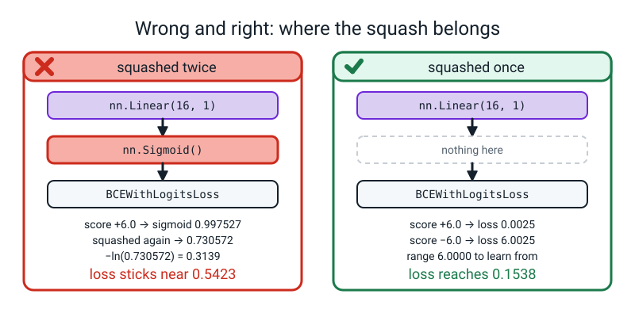
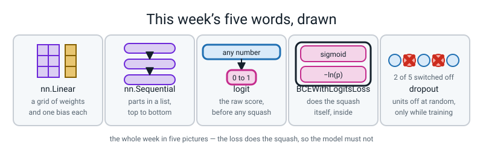

# Week 22 — Layers, Losses, and Watching It Overfit

[⬅ Week 21](week-21.md) · [Course Home](../README.md) · [Next ➡](week-23.md) · [Workbook](../workbook/week-22.md)

---

> ### This week in one sentence
> **`nn.Linear` is the grid multiply plus the bias you already wrote by hand — and a loss with "WithLogits" in its name does the squash for you, so your model must not do it too.**
>
> **By the end of this chapter you will be able to:**
> - **Build a network with `nn.Sequential`** and prove its four blocks of numbers are the same four blocks as your Week 19 numpy brain
> - **Count the learnable numbers in a 2 → 16 → 1 network by hand** — and get the same number PyTorch gets
> - **Explain why `BCEWithLogitsLoss` wants raw scores**, and what goes wrong if you squash twice (no error, and a loss that will not fall)
> - **Draw a train and a validation loss curve on one axis** and mark the epoch where validation stopped improving
>
> **New maths:** none. Every number this week is a multiply, an add, or a count.
>
> **New syntax:** `nn.Linear(n_in, n_out)` · `nn.ReLU()` · `nn.Sequential(...)` · `nn.BCEWithLogitsLoss()`
>
> **Reading time:** about 40 minutes. **Homework:** about 60 minutes.

---

## 🪝 Start Here

Three weeks ago you wrote a brain.

Not a metaphor — an actual working neural network, in numpy, from nothing. Two grids of weights, two lists of biases, a squash in the middle, four gradient arrays, and an update rule. It was about forty lines and it got over ninety per cent on the moons.

Here is that same network:

```python
model = nn.Sequential(
    nn.Linear(2, 16),
    nn.ReLU(),
    nn.Linear(16, 1),
)
```

Three lines. Two in, sixteen out. Squash. Sixteen in, one out.

**Now be suspicious.** A short piece of code that replaces a long one has to be hiding the long one somewhere. Your numpy brain had four blocks of learnable numbers — `W1`, `b1`, `W2`, `b2` — and you counted them in Week 19:

```text
2 × 16 = 32   weights in the first grid
              16   biases after it
16 × 1 = 16   weights in the second grid
               1   bias after that
              ---
              65
```

**Sixty-five.** So if those three lines really are the same network, they contain exactly sixty-five learnable numbers, and by the end of this chapter PyTorch is going to print that number and the two are going to match.

If they *don't* match, one of two things is true: either you typed the wrong network, or you counted wrong. **And that is what a parameter count is for.** It takes ten seconds and it catches the difference between the model you meant to build and the model you actually built. You will do it before every training run for the rest of this course.

The one sentence to keep from today:

> **`nn.Linear` is the grid multiply plus the bias. Nothing else is in there.**

---

## 🧠 The Big Idea

This section explains the parts of a PyTorch network, how to count their numbers, what a logit is, and what the two loss curves and dropout are. Read it before you type anything.

> **📌 About the code in this section.** The blocks below are **illustrations, not files**. Each one carries on from the one above, and the `import` lines are typed once, in the first block that needs them. **The complete runnable files are in 💻 Type This.** If you copy a block from here on its own and Python says `NameError`, that is why, and nothing is broken.

### 1. What `nn.Linear` actually holds

**The plain explanation.** In Week 17 you learned that a whole layer, for a whole batch, is one grid multiplied by another grid plus a bias. In Week 19 you wrote it out: `Z1 = X @ W1 + b1`.

> **`nn.Linear(n_in, n_out)`** — one layer. It holds a grid of weights and a list of biases. When you hand it a batch it multiplies and adds. **That is all it holds.**

**A concrete example, small enough to check on paper.** Say the layer is `nn.Linear(2, 3)` — two numbers in, three numbers out — and we set its numbers by hand:

```text
the grid                  the bias
 0.5   −0.3                 0.2
 0.8    0.2                 0.05
−1.0    1.5                −0.2
```

Six weights, three biases, **nine numbers, and I have written all nine down.** There is nothing else inside.

Now push in one row of input, `x = [1.0, 2.0]`. Three numbers come out, one per row of the grid:

```text
row 0:   1.0 × 0.5    +  2.0 × (−0.3)  +  0.2   =   0.5 − 0.6 + 0.2   =  0.10
row 1:   1.0 × 0.8    +  2.0 × 0.2     +  0.05  =   0.8 + 0.4 + 0.05  =  1.25
row 2:   1.0 × (−1.0) +  2.0 × 1.5     +  (−0.2) = −1.0 + 3.0 − 0.2   =  1.80
```

**Do those three sums yourself now, on paper, before you read on.** They are the whole layer.


*Figure 22.1 — `nn.Linear` is the grid multiply plus the bias. Six weights, three biases, nine numbers, and one of the three sums written out in full.*

**The analogy.** A layer is a set of scales in a kitchen. The weights say how much each ingredient counts towards the total. The bias is the weight of the empty bowl — added every time, whatever you put in.

**And now the one surprise, which everybody spots.** PyTorch stores that grid as shape **(3, 2)** — three rows because there are three *outputs*, two columns because there are two *inputs*. Your numpy `W1` for a 2 → 16 layer was the other way up, **(2, 16)**. PyTorch writes **(16, 2)**.

Both hold the same 32 numbers. PyTorch multiplies by the transpose — the `.T` you met in Week 16 — so the arithmetic is identical.

> **⚠️ Watch out:** when you print a weight shape and see `(16, 2)` where you expected `(2, 16)`, **nothing is broken.** Outputs come first. A student who thinks the shape is wrong can lose twenty minutes trying to fix something that is correct.

Two more parts, and they are short:

> **`nn.ReLU()`** — the squash from Week 16, as a part you can drop into a list. **It has no numbers of its own at all.** It replaces every negative with zero and leaves everything else alone.

> **`nn.Sequential(...)`** — a list of parts. A batch goes in the top and comes out the bottom, passing through each part in order.

### 2. Counting the learnable numbers, and why you must

**The plain explanation.** A parameter count is the cheapest possible check that the model you built is the model you meant to build. Ten seconds, and it catches a wrong layer width, a missing bias, and a typo in a size, all three.

Take `2 → 16 → 1`, the Week 19 architecture. **Four blocks of numbers, and no fifth:**

| Block | Shape | How many | Arithmetic |
|---|---|---|---|
| first grid | `(16, 2)` | 32 | 16 × 2 |
| first bias | `(16,)` | 16 | one per hidden unit |
| second grid | `(1, 16)` | 16 | 1 × 16 |
| second bias | `(1,)` | 1 | one per output |
| | | **65** | 32 + 16 + 16 + 1 |


*Figure 22.2 — Counting the learnable numbers by hand. 32 + 16 + 16 + 1 = 65, and PyTorch prints 65.*

**The bias is the bit everyone forgets**, because biases are boring. People count the two grids, get 48, and cannot see where PyTorch's 65 came from. **One bias per output unit.** Sixteen outputs, sixteen biases. One output, one bias.

**And here is the version of the count that keeps working when the network gets deeper:**

```text
one layer costs   (inputs × outputs)  +  outputs
```

For 2 → 16:  2 × 16 + 16 = 48.
For 16 → 1:  16 × 1 + 1 = 17.
And 48 + 17 = **65.** Same answer, grouped differently, and this grouping will still work next week on a 64 → 64 → 10 network.

> **💡 Try this:** price a photograph. A 64 × 64 greyscale picture, flattened, into a layer with 256 units. That is `nn.Linear(4096, 256)`, so 256 × 4096 + 256 = **1,048,832** learnable numbers — for one small grey picture. Hold that number. It is Week 24's whole hook.

### 3. A logit is a raw score, and `WithLogits` means "I will squash it myself"

**The plain explanation.** This is the hardest idea of the week, and it is not hard because of maths. It is hard because two things that sound the same are different.

> **logit** — the raw score coming out of the last layer, before any squash. It can be any number at all: −9.2, 0, +4,000.

You met this in Week 13 without the name: a weighted sum can be anything, a probability has to sit between 0 and 1, and the sigmoid is the squasher that gets you from one to the other. **A logit is the "anything" side.** Nothing new is happening — the word is just being made official.

> **`nn.BCEWithLogitsLoss()`** — the log loss you built by hand in Week 14, which **does the sigmoid squash itself, inside.** You hand it raw scores. You do **not** hand it probabilities.

Read the name backwards: it is a **Loss**, for **Logits**, of the **Binary Cross-Entropy** kind — which is log loss's other name.

**A concrete example on four numbers.** Four raw scores, four true answers:

```text
score   true answer   sigmoid(score)
 2.0        1           0.880797
−1.0        0           0.268941
 0.5        1           0.622459
−3.0        1           0.047426
```

Week 14's surprise meter is `−ln(p)` when the answer is 1, and `−ln(1 − p)` when the answer is 0:

```text
row 1   true 1, p = 0.880797  →  −ln(0.880797) = 0.126928
row 2   true 0, p = 0.268941  →  −ln(0.731059) = 0.313262
row 3   true 1, p = 0.622459  →  −ln(0.622459) = 0.474077
row 4   true 1, p = 0.047426  →  −ln(0.047426) = 3.048587
```

```text
0.126928 + 0.313262 + 0.474077 + 3.048587  =  3.962854
3.962854 ÷ 4  =  0.9907135
```

And `nn.BCEWithLogitsLoss()` on those exact four scores prints **0.9907134771347046**. Same number. **It did the two steps you just did.**

Look at row 4 one more time: 3.048587, **more than the other three added together.** The model said −3.0, meaning "almost certainly a zero", and the answer was 1. One confident wrong answer dominates the whole loss. That was Week 14's lesson and it is still true inside a library part.

**⚠️ Now the trap, and this is the paragraph to reread.** If you put `nn.Sigmoid()` on the end of your model **and** use `BCEWithLogitsLoss`, the numbers get squashed twice. **Nothing crashes.** Here is exactly what it costs, with the true answer 1 every time:

| raw score | loss, fed in raw | loss, squashed twice |
|---|---|---|
| −6.0 | 6.0025 | 0.6919 |
| −2.0 | 2.1269 | 0.6353 |
| 0.0 | 0.6931 | 0.4741 |
| +2.0 | 0.1269 | 0.3467 |
| +6.0 | 0.0025 | 0.3139 |

**Read the two columns.** Fed in raw, a catastrophic answer costs 6.0025 and a perfect answer costs 0.0025 — a range of six whole units. Squashed twice, the same five answers cost between 0.6919 and 0.3139:

```text
6.0025 − 0.0025 = 6.0000       fed in raw
0.6919 − 0.3139 = 0.3780       squashed twice
```

**About sixteen times smaller.** The loss can barely tell a disaster from a triumph, so the signal to learn from is much weaker and the loss number gets stuck high.


*Figure 22.3 — Squashing twice flattens the loss. Six units of range become 0.378, so a disaster and a triumph score nearly the same.*

**Why does it happen?** Because `sigmoid(−6.0) = 0.002473`, and if you hand *that* to `BCEWithLogitsLoss` it treats 0.002473 as a raw score and squashes it **again**: `sigmoid(0.002473) = 0.500618`, which is a coin flip.

At the other end, `sigmoid(6.0) = 0.997527` and `sigmoid(0.997527) = 0.730572`. **Every possible score, from a catastrophe to a triumph, gets crushed into the band 0.5006 to 0.7306.**

**The rule to write on the front of your notebook:**

> **The last part of your model is a bare `nn.Linear`. The loss does the squash.**

### 4. Two curves, and only one of them tells you anything about the future

**The plain explanation.** You met overfitting in Level 2 with decision trees: a model that memorises its training rows and then does badly on new ones. Today you see it as a picture, with numbers.

Here is a real run: 400 moons, 300 for training, 100 held back for validation, a 2 → 64 → 64 → 1 network with 4,417 learnable numbers, trained for 1,500 epochs.

```text
 epoch    train     val
     0   0.5529   0.5314
    39   0.1659   0.1568      ← validation's best, ever
   100   0.1320   0.1858
   200   0.1046   0.2445
   400   0.0819   0.2569
   800   0.0531   0.3680
  1499   0.0165   0.4347
```

**Read it as a story in two halves.** Up to epoch 39 both numbers fall together — the model is learning something true about moons.

After epoch 39 the train number keeps falling all the way to 0.0165, nearly perfect, while the validation number climbs back to 0.4347 — **nearly three times worse than its own best, and most of the way back to where it started at epoch 0 (0.5314).**

```text
at the end:   0.4347 − 0.0165  =  0.4182
```

**That gap is the whole diagnosis. A small train loss and a big validation loss is the signature of memorising.**


*Figure 22.4 — Train and validation loss pulling apart. Validation bottoms out at 0.1568 on epoch 39 and never gets that low again.*

**The analogy.** You have a book of 300 past exam questions with the answers in the back. Practise for a week and you get better at the real subject *and* better at those 300 questions. Practise for a year and you can recite all 300 answers perfectly — and you are now *worse* at the actual exam, because you have spent eleven months learning which answer goes with which question number.

Two words for what you do about it:

> **early stopping** — stop training at the epoch where the validation number stopped improving, and keep the weights from **that** epoch, not the last one.

> **patience** — how many epochs of no improvement you will sit through before you accept it has stopped. `patience = 20` means "wait twenty more epochs; if none of them beats the best, stop".

Patience exists because the validation curve is bumpy. Epoch 40 being worse than epoch 39 does not prove it is over — it might dip again at epoch 45. On our run it does not: from epoch 39 onwards, nothing ever beats 0.1568. **Patience is how you tell a wobble from a trend.** You are not coding it today; today you find the epoch by looking at the curve and marking it.

> **🤔 Think about it:** why train for 1,500 epochs if the answer was at epoch 39? Because **you cannot see epoch 39 until you have gone past it.** At epoch 39 all you know is that this epoch beat epoch 38. The only way to know it was the *best* is to keep going and watch nothing beat it.

### 5. Dropout: breaking the model on purpose

**The plain explanation.**

> **dropout** — during each training step, switch off a random fraction of the hidden units. They send nothing forward and they get no blame back. Next step, a different random set.

`nn.Dropout(0.3)` switches off about 3 in every 10. On a 64-unit layer that is `0.3 × 64 ≈ 19` units off, and a different 19 next step.


*Figure 22.5 — Dropout switches units off, one step at a time. Three of ten during a training step; all ten back on when you measure.*

🍕 **The analogy.** A football team that always practises with the same eleven players learns plays that only work if all eleven are on the pitch. A coach who benches three at random every practice forces the team to learn plays that work *anyway*. That is dropout: the network cannot lean on any one unit, because any one unit might be missing.

**And here are the real numbers** — same network, same seed, dropout added:

| | best validation loss | at epoch | validation loss at the end |
|---|---|---|---|
| no dropout | 0.1568 | 39 | **0.4347** |
| dropout 0.3 | 0.1443 | 43 | **0.2385** |

**Dropout did not stop the overfitting. It slowed it down.** Look at the last column: 0.2385 instead of 0.4347, so the punishment for training too long is about half as bad.

But the *best* score barely moved — 0.1443 against 0.1568, a difference of 0.0125, which is almost nothing.

**Be honest about that.** Dropout is a brake, not a cure. The cure is stopping at the right epoch.

> **⚠️ Watch out:** dropout has to be switched **off** when you measure anything, or your validation number is partly random noise. The line that does that is `model.eval()`, and it is already in this week's code. **Leave it there.** Next week is entirely about it, and it is worth the whole lesson.

---

## 🔁 The Idea From Last Week, Used Harder

There is no new maths this week. Instead, Week 14's surprise meter — `−ln(p)` — gets used inside a library part, and you are going to check the library with a calculator.

**Get a calculator that has an `ln` button.** Phone calculators have one; you may have to turn the phone sideways.

**Step 1 — the four probabilities.** These come from the sigmoid, and I am giving them to you so the calculator work stays on the logarithm:

| score | sigmoid(score) |
|---|---|
| 2.0 | 0.880797 |
| −1.0 | 0.268941 |
| 0.5 | 0.622459 |
| −3.0 | 0.047426 |

**Step 2 — the surprise of each row.** The rule from Week 14, unchanged:

- If the true answer is **1**, the surprise is `−ln(p)`.
- If the true answer is **0**, the surprise is `−ln(1 − p)`, because the chance the model gave to the thing that *actually happened* is `1 − p`.

**Type these into your calculator now.** `ln`, then change the sign:

```text
row 1   answer 1    −ln(0.880797)              = 0.126928
row 2   answer 0    −ln(1 − 0.268941) = −ln(0.731059) = 0.313262
row 3   answer 1    −ln(0.622459)              = 0.474077
row 4   answer 1    −ln(0.047426)              = 3.048587
```

**Step 3 — average them.** Four rows, so divide by four:

```text
0.126928 + 0.313262 + 0.474077 + 3.048587  =  3.962854
3.962854 ÷ 4                               =  0.9907135
```

**Step 4 — notice the pattern.** Look at the four surprises side by side:

| p the model gave to what happened | surprise |
|---|---|
| 0.880797 | 0.126928 |
| 0.731059 | 0.313262 |
| 0.622459 | 0.474077 |
| 0.047426 | **3.048587** |

**As the chance falls, the surprise climbs — slowly at first, then steeply as the chance gets close to zero.** Row 4's chance is about thirteen times smaller than row 3's, and its surprise is about six and a half times bigger, and bigger than the other three added together.

**Step 5 — the name and the check.** That average of surprises is what `nn.BCEWithLogitsLoss()` computes, and in 💻 Type This you will run it on those exact four scores and see:

```text
0.9907134771347046
```

Your calculator said 0.9907135. **They are the same number.** The library is doing your Week 14 arithmetic and nothing else.

---

## 💻 Type This

In this section you type and run two files, `layers.py` and `overfit.py`, in the same folder. Nothing here downloads anything.

### Step 1 — build it and count it

New file, `layers.py`.

```python
"""layers.py - what nn.Linear actually holds."""
import torch
import torch.nn as nn

torch.manual_seed(0)

model = nn.Sequential(
    nn.Linear(2, 16),
    nn.ReLU(),
    nn.Linear(16, 1),
)
print(model)
```

**What the new lines do.** `torch.nn` is the drawer inside torch that holds network parts; `as nn` is a nickname, exactly like `import numpy as np`. Then three parts in order: two in and sixteen out, squash, sixteen in and one out. `nn.Sequential(...)` glues them into one object.

**Note what is not there: no sigmoid at the end.** That is deliberate, and it is §3's trap.

```text
Sequential(
  (0): Linear(in_features=2, out_features=16, bias=True)
  (1): ReLU()
  (2): Linear(in_features=16, out_features=1, bias=True)
)
```

**Read `bias=True`.** PyTorch is telling you the biases are in there. If you ever write `bias=False`, the count drops from 65 to 48 — which is exactly the wrong answer most people give when counting by hand.

### Step 2 — the four blocks, and the total

```python
print()
for name, p in model.named_parameters():
    print("%-10s %-10s %d numbers" % (name, str(tuple(p.shape)), p.numel()))
print()
print("total learnable numbers:", sum(p.numel() for p in model.parameters()))
```

**What the new lines do.** `named_parameters()` hands back every block of learnable numbers with its name. `p.shape` is its shape, and `tuple(...)` just makes it print as `(16, 2)` instead of `torch.Size([16, 2])`. `p.numel()` is "number of elements" — how many numbers are in that block.

**Predict before you run it.** Four shapes and one total. Write them down.

```text
0.weight   (16, 2)    32 numbers
0.bias     (16,)      16 numbers
2.weight   (1, 16)    16 numbers
2.bias     (1,)       1 numbers

total learnable numbers: 65
```

**Three things in that output.**

**One: `(16, 2)`, not `(2, 16)`.** Outputs first. Nothing is broken.

**Two: where is part number 1?** There is `0.weight`, `0.bias`, then `2.weight`. **No `1`.** Part 1 is the `nn.ReLU()`, and it holds no learnable numbers, so it never appears here — but it keeps its slot, which is why the second `nn.Linear` is called `2`.

**Three: 65.** The number you counted in the hook. **Two ways of getting one number, and they agree.**

### Step 3 — check the loss against your calculator

Same file, carry on.

```python
logits = torch.tensor([[2.0], [-1.0], [0.5], [-3.0]])
y      = torch.tensor([[1.0], [0.0], [1.0], [1.0]])

loss_fn = nn.BCEWithLogitsLoss()
print("BCEWithLogitsLoss :", loss_fn(logits, y).item())

p = torch.sigmoid(logits)
print("probabilities     :", p.reshape(-1).tolist())
per_row = -(y * torch.log(p) + (1 - y) * torch.log(1 - p))
print("surprise per row  :", [round(v, 6) for v in per_row.reshape(-1).tolist()])
print("their average     :", per_row.mean().item())
```

**What the new lines do.** `loss_fn = nn.BCEWithLogitsLoss()` builds the loss once, like a scaler in Term 1. The line with `per_row` is Week 14's formula written out: when `y` is 1 it keeps `−log(p)`, and when `y` is 0 the `(1 - y)` part switches on instead and it keeps `−log(1 − p)`. **Scores first, answers second** — and yes, that is the opposite order from `confusion_matrix`, which takes truth first. It is annoying. It is also just how it is.

```text
BCEWithLogitsLoss : 0.9907134771347046
probabilities     : [0.8807970285415649, 0.2689414322376251, 0.622459352016449, 0.04742587357759476]
surprise per row  : [0.126928, 0.313262, 0.474077, 3.048587]
their average     : 0.9907134771347046
```

**0.9907134771347046 twice.** Top line, the library. Bottom line, your Week 14 arithmetic. **Identical to the last decimal place**, and identical to what your calculator gave you.

### Step 4 — the data, and the error everybody meets

New file, `overfit.py`.

```python
"""overfit.py - watch validation give up, and see what dropout does about it."""
import time
import torch
import torch.nn as nn
import matplotlib
matplotlib.use("Agg")
import matplotlib.pyplot as plt
from sklearn.datasets import make_moons
from sklearn.model_selection import train_test_split
from sklearn.preprocessing import StandardScaler

X, y = make_moons(n_samples=400, noise=0.25, random_state=0)
X_tr, X_va, y_tr, y_va = train_test_split(X, y, test_size=0.25,
                                          stratify=y, random_state=0)
scaler = StandardScaler().fit(X_tr)
X_tr_t = torch.from_numpy(scaler.transform(X_tr)).float()
X_va_t = torch.from_numpy(scaler.transform(X_va)).float()
y_tr_t = torch.from_numpy(y_tr).float()          # <-- deliberately wrong
```

**Try it wrong on purpose.** Add `loss_fn(model(X_tr_t), y_tr_t)` at the bottom and run it:

```text
ValueError: Target size (torch.Size([300])) must be the same as input size (torch.Size([300, 1]))
```

**This is the friendliest error message you will get all year, and it is friendly because it printed both shapes.** The model produced a grid with 300 rows and 1 column. You handed it a flat list of 300. Those are not the same shape and PyTorch refuses to guess.

Fix it:

```python
y_tr_t = torch.from_numpy(y_tr).float().reshape(-1, 1)
y_va_t = torch.from_numpy(y_va).float().reshape(-1, 1)
print("X_tr_t", tuple(X_tr_t.shape), " y_tr_t", tuple(y_tr_t.shape))
print("X_va_t", tuple(X_va_t.shape), " y_va_t", tuple(y_va_t.shape))
```

`.float()` makes the numbers 32-bit decimals, which is what `nn.Linear` insists on — numpy's default is 64-bit. `.reshape(-1, 1)` turns a flat list of 300 answers into a grid of 300 rows and 1 column, and the `-1` means "work that number out for me".

```text
X_tr_t (300, 2)  y_tr_t (300, 1)
X_va_t (100, 2)  y_va_t (100, 1)
```

### Step 5 — train it twice and watch it come apart

```python
loss_fn = nn.BCEWithLogitsLoss()
EPOCHS = 1500


def build(with_dropout):
    torch.manual_seed(0)
    if with_dropout:
        return nn.Sequential(
            nn.Linear(2, 64), nn.ReLU(), nn.Dropout(0.3),
            nn.Linear(64, 64), nn.ReLU(), nn.Dropout(0.3),
            nn.Linear(64, 1))
    return nn.Sequential(
        nn.Linear(2, 64), nn.ReLU(),
        nn.Linear(64, 64), nn.ReLU(),
        nn.Linear(64, 1))


def train(with_dropout):
    model = build(with_dropout)
    opt = torch.optim.Adam(model.parameters(), lr=0.01)
    train_hist, val_hist = [], []
    for epoch in range(EPOCHS):
        model.train()
        opt.zero_grad()
        loss = loss_fn(model(X_tr_t), y_tr_t)
        loss.backward()
        opt.step()
        model.eval()
        with torch.no_grad():
            train_hist.append(loss_fn(model(X_tr_t), y_tr_t).item())
            val_hist.append(loss_fn(model(X_va_t), y_va_t).item())
    best = val_hist.index(min(val_hist))
    return model, train_hist, val_hist, best
```

**What the new lines do.** `build` puts `torch.manual_seed(0)` *inside* it, so both networks start from the same random numbers and the comparison is fair. The five lines of the loop are Week 21's five lines, untouched.

`model.train()` and `model.eval()` switch dropout on and off; leave them alone until next week. `val_hist.index(min(val_hist))` finds the position of the smallest validation loss — the epoch we want.

**Predict before you run it.** Training loss and validation loss. Which one falls further after 1,500 epochs?

```python
t0 = time.time()
plain, tr_p, va_p, best_p = train(False)
drop,  tr_d, va_d, best_d = train(True)
print("\nlearnable numbers:", sum(p.numel() for p in plain.parameters()))
print("seconds:", round(time.time() - t0, 1))

print("\n epoch    train     val")
for ep in (0, 39, 100, 200, 400, 800, 1499):
    print("%6d   %.4f   %.4f" % (ep, tr_p[ep], va_p[ep]))

print("\nno dropout : best val loss %.4f at epoch %d, ended at %.4f"
      % (va_p[best_p], best_p, va_p[-1]))
print("dropout 0.3: best val loss %.4f at epoch %d, ended at %.4f"
      % (va_d[best_d], best_d, va_d[-1]))
```

```text
learnable numbers: 4417
seconds: 1.3

 epoch    train     val
     0   0.5529   0.5314
    39   0.1659   0.1568
   100   0.1320   0.1858
   200   0.1046   0.2445
   400   0.0819   0.2569
   800   0.0531   0.3680
  1499   0.0165   0.4347

no dropout : best val loss 0.1568 at epoch 39, ended at 0.4347
dropout 0.3: best val loss 0.1443 at epoch 43, ended at 0.2385
```

> **⚠️ Watch out:** the `seconds:` line is a stopwatch, not a result. Yours will differ and anything under about three seconds is fine. **Every other line must match exactly.** If your best epoch is not 39, a seed is missing: `torch.manual_seed(0)` inside `build`, and `random_state=0` in both `make_moons` and `train_test_split`.

### Step 6 — the plot, with the dashed line

```python
for name, model in (("no dropout", plain), ("dropout 0.3", drop)):
    model.eval()
    with torch.no_grad():
        acc = ((model(X_va_t) >= 0).float() == y_va_t).float().mean().item()
    print("%-12s validation accuracy %.4f" % (name, acc))

plt.figure(figsize=(7, 4.5))
plt.plot(tr_p, label="train loss")
plt.plot(va_p, label="validation loss")
plt.axvline(best_p, linestyle="--", color="grey")
plt.annotate("validation stopped improving\nat epoch %d" % best_p,
             xy=(best_p, va_p[best_p]), xytext=(300, 0.42),
             arrowprops={"arrowstyle": "->"})
plt.xlabel("epoch"); plt.ylabel("BCEWithLogits loss")
plt.title("2 to 64 to 64 to 1 on make_moons, no dropout")
plt.legend(); plt.grid(alpha=0.3); plt.tight_layout()
plt.savefig("overfit.png", dpi=120)

plt.figure(figsize=(7, 4.5))
plt.plot(va_p, label="validation, no dropout")
plt.plot(va_d, label="validation, dropout 0.3")
plt.xlabel("epoch"); plt.ylabel("BCEWithLogits loss")
plt.title("The same net twice")
plt.legend(); plt.grid(alpha=0.3); plt.tight_layout()
plt.savefig("dropout.png", dpi=120)
print("\nwrote overfit.png and dropout.png")
```

**What the new lines do.**

- `(model(X_va_t) >= 0)` turns raw scores into 0s and 1s. A score of 0 is exactly where the sigmoid gives 0.5, so "score at least zero" means "chance at least a half".
- `plt.axvline(best_p, linestyle="--")` is the dashed vertical line, and it goes at the **minimum of the validation curve**, not where the two curves cross.
- `matplotlib.use("Agg")` must sit **above** `import matplotlib.pyplot`, or a window opens and everything stops.

```text
no dropout   validation accuracy 0.9100
dropout 0.3  validation accuracy 0.9200

wrote overfit.png and dropout.png
```

**The complete `overfit.py`** is everything in Steps 4, 5 and 6, in that order, in one file. **It runs both 1,500-epoch trainings and writes both PNGs in about 1.3 seconds.** Open `overfit.png` and put a finger on the dashed line.

---

## 🔍 Worked Examples

Three complete programs, in three different worlds. Type each one and **predict the numbers before you run it.**

### Worked Example 1 — Is this text spam? (one layer, opened up)

Three features: how many links, how many WORDS IN CAPITALS, how many emoji. We set the layer's numbers by hand so we can check every one.

```python
"""we1.py - one nn.Linear opened up, on a spam-text example."""
import torch
import torch.nn as nn

torch.manual_seed(0)

layer = nn.Linear(3, 4)
layer.weight.data = torch.tensor([[ 0.5,  0.2, -0.1],
                                  [-0.3,  0.9,  0.4],
                                  [ 1.0, -1.0,  0.0],
                                  [ 0.1,  0.1,  0.1]])
layer.bias.data = torch.tensor([0.0, 0.5, -0.2, 1.0])

for name, p in layer.named_parameters():
    print("%-8s %-10s %d numbers" % (name, str(tuple(p.shape)), p.numel()))
print("total:", sum(p.numel() for p in layer.parameters()))

x = torch.tensor([[2.0, 1.0, 0.0]])     # 2 links, 1 CAPITAL word, 0 emoji
print("\ninput shape :", tuple(x.shape))
with torch.no_grad():
    out = layer(x)
print("output shape:", tuple(out.shape))
print("the four numbers:", [round(v, 4) for v in out.reshape(-1).tolist()])
```

`layer.weight.data = ...` reaches inside and overwrites the numbers. `.data` is how you get at them; without it PyTorch refuses, because `layer.weight` is not a plain tensor.

```text
weight   (4, 3)     12 numbers
bias     (4,)       4 numbers
total: 16

input shape : (1, 3)
output shape: (1, 4)
the four numbers: [1.2, 0.8, 0.8, 1.3]
```

**Now check all four by hand.** The input is `2.0, 1.0, 0.0`:

```text
row 0:  2.0 × 0.5    + 1.0 × 0.2    + 0.0 × (−0.1) + 0.0    =  1.0 + 0.2 + 0     =  1.2
row 1:  2.0 × (−0.3) + 1.0 × 0.9    + 0.0 × 0.4    + 0.5    = −0.6 + 0.9 + 0.5   =  0.8
row 2:  2.0 × 1.0    + 1.0 × (−1.0) + 0.0 × 0.0    + (−0.2) =  2.0 − 1.0 − 0.2   =  0.8
row 3:  2.0 × 0.1    + 1.0 × 0.1    + 0.0 × 0.1    + 1.0    =  0.2 + 0.1 + 1.0   =  1.3
```

**Four sums, four matches.** And notice the shapes: `(1, 3)` went in, `(1, 4)` came out. **The first number is how many rows you handed it; the layer only ever changes the second one.**

Now count a whole spam network, 3 → 8 → 1:

```python
spam = nn.Sequential(nn.Linear(3, 8), nn.ReLU(), nn.Linear(8, 1))
for name, p in spam.named_parameters():
    print("%-10s %-10s %d numbers" % (name, str(tuple(p.shape)), p.numel()))
print("total:", sum(p.numel() for p in spam.parameters()))
print("by hand: 8 x 3 + 8 + 1 x 8 + 1 =", 8 * 3 + 8 + 1 * 8 + 1)
```

```text
0.weight   (8, 3)     24 numbers
0.bias     (8,)       8 numbers
2.weight   (1, 8)     8 numbers
2.bias     (1,)       1 numbers
total: 41
by hand: 8 x 3 + 8 + 1 x 8 + 1 = 41
```

### Worked Example 2 — Overfitting on real medical data

`load_breast_cancer` ships inside scikit-learn: 569 real tumour measurements, 30 features each, and the answer is whether the tumour was harmless. **Nothing downloads.**

```python
"""we2.py - overfitting on real medical data, 30 features in, one answer out."""
import torch
import torch.nn as nn
import matplotlib
matplotlib.use("Agg")
import matplotlib.pyplot as plt
from sklearn.datasets import load_breast_cancer
from sklearn.model_selection import train_test_split
from sklearn.preprocessing import StandardScaler

X, y = load_breast_cancer(return_X_y=True)
print("rows", X.shape[0], " features", X.shape[1])

X_tr, X_va, y_tr, y_va = train_test_split(X, y, test_size=0.25,
                                          stratify=y, random_state=0)
scaler = StandardScaler().fit(X_tr)
X_tr_t = torch.from_numpy(scaler.transform(X_tr)).float()
X_va_t = torch.from_numpy(scaler.transform(X_va)).float()
y_tr_t = torch.from_numpy(y_tr).float().reshape(-1, 1)
y_va_t = torch.from_numpy(y_va).float().reshape(-1, 1)
print("X_tr_t", tuple(X_tr_t.shape), " y_tr_t", tuple(y_tr_t.shape))

torch.manual_seed(0)
model = nn.Sequential(nn.Linear(30, 16), nn.ReLU(), nn.Linear(16, 1))
print("by hand: 16 x 30 + 16 + 1 x 16 + 1 =", 16 * 30 + 16 + 16 + 1)
print("PyTorch :", sum(p.numel() for p in model.parameters()))

loss_fn = nn.BCEWithLogitsLoss()
opt = torch.optim.Adam(model.parameters(), lr=0.01)
tr_hist, va_hist = [], []
for epoch in range(800):
    opt.zero_grad()
    loss_fn(model(X_tr_t), y_tr_t).backward()
    opt.step()
    with torch.no_grad():
        tr_hist.append(loss_fn(model(X_tr_t), y_tr_t).item())
        va_hist.append(loss_fn(model(X_va_t), y_va_t).item())

best = va_hist.index(min(va_hist))
print("\n epoch    train     val")
for ep in (0, 50, best, 200, 400, 799):
    print("%6d   %.4f   %.4f" % (ep, tr_hist[ep], va_hist[ep]))
print("\nbest validation loss %.4f at epoch %d, ended at %.4f"
      % (va_hist[best], best, va_hist[-1]))
print("the gap at the end: %.4f - %.4f = %.4f"
      % (va_hist[-1], tr_hist[-1], va_hist[-1] - tr_hist[-1]))

plt.figure(figsize=(7, 4.5))
plt.plot(tr_hist, label="train loss")
plt.plot(va_hist, label="validation loss")
plt.axvline(best, linestyle="--", color="grey")
plt.xlabel("epoch"); plt.ylabel("BCEWithLogits loss")
plt.title("30 to 16 to 1 on load_breast_cancer")
plt.legend(); plt.grid(alpha=0.3); plt.tight_layout()
plt.savefig("cancer_overfit.png", dpi=120)
print("wrote cancer_overfit.png")
```

**Runtime: about 2 seconds.**

```text
rows 569  features 30
X_tr_t (426, 30)  y_tr_t (426, 1)
by hand: 16 x 30 + 16 + 1 x 16 + 1 = 513
PyTorch : 513

 epoch    train     val
     0   0.6543   0.6556
    50   0.0451   0.1123
   155   0.0154   0.1100
   200   0.0092   0.1164
   400   0.0029   0.1422
   799   0.0013   0.1651

best validation loss 0.1100 at epoch 155, ended at 0.1651
the gap at the end: 0.1651 - 0.0013 = 0.1637
wrote cancer_overfit.png

```

**Three things worth saying out loud.**

**513 and 513.** You counted it before PyTorch did.

**The best epoch is 155, not 39.** Different data, different answer — there is no magic epoch number, only a curve you have to look at.

**The train loss ended at 0.0013.** That is 30 real measurements per patient and a model that has essentially memorised all 426 training patients. Its validation loss is 127 times bigger. **If somebody asked how good this model is, the honest answer is about 0.11 at epoch 155**, and saying which epoch it came from is part of the answer. (It is a little optimistic, because we picked the epoch by looking at these same validation rows.)

### Worked Example 3 — Six weather forecasts, and three ways to score them

Six forecasts, hand-typed, with what actually happened. This example settles the double-squash question with numbers.

```python
"""we3.py - six weather forecasts, and three ways to score them."""
import torch
import torch.nn as nn

scores = torch.tensor([[ 2.2], [ 0.4], [-1.5], [ 3.0], [-0.2], [-4.0]])
rained = torch.tensor([[ 1.0], [ 1.0], [ 0.0], [ 1.0], [ 0.0], [ 1.0]])

p = torch.sigmoid(scores)
print("the six chances:", [round(v, 6) for v in p.reshape(-1).tolist()])

with_logits = nn.BCEWithLogitsLoss()
plain_bce = nn.BCELoss()

print("\nright  : BCEWithLogitsLoss(raw scores)   =", with_logits(scores, rained).item())
print("right  : BCELoss(sigmoid(raw scores))    =", plain_bce(p, rained).item())
print("WRONG  : BCEWithLogitsLoss(sigmoid(...)) =", with_logits(p, rained).item())

surprise = -(rained * torch.log(p) + (1 - rained) * torch.log(1 - p))
print("\nby hand, surprise per row:", [round(v, 6) for v in surprise.reshape(-1).tolist()])
print("their total  :", round(surprise.sum().item(), 6))
print("their average:", surprise.mean().item())
```

`nn.BCELoss()` is the version that takes **probabilities**. It exists, it is legal, and it is the partner of `nn.Sigmoid()`.

```text
the six chances: [0.90025, 0.598688, 0.182426, 0.952574, 0.450166, 0.017986]

right  : BCEWithLogitsLoss(raw scores)   = 0.9140646457672119
right  : BCELoss(sigmoid(raw scores))    = 0.9140646457672119
WRONG  : BCEWithLogitsLoss(sigmoid(...)) = 0.58688884973526

by hand, surprise per row: [0.105083, 0.513015, 0.201413, 0.048587, 0.598139, 4.01815]
their total  : 5.484388
their average: 0.9140646457672119
```

**Read the three middle lines.** The first two are **the same number to fourteen decimal places** — because `Sigmoid` + `BCELoss` and `BCEWithLogitsLoss` compute the same thing. The third is a different number entirely, and it is smaller, which is the dangerous part: **a wrong loss that looks *better* will not make you suspicious.**

**And check the by-hand line.** Row 6: the forecaster said −4.0, meaning a chance of 0.017986 — "it will definitely not rain". It rained.

```text
−ln(0.017986) = 4.01815
```

```text
0.105083 + 0.513015 + 0.201413 + 0.048587 + 0.598139 + 4.01815  =  5.484388
5.484388 ÷ 6                                                    =  0.9140646
```

**One row out of six contributes 73% of the total.** That is Week 14, still true, now inside a library part.

---

## 🐞 When It Breaks

Every message below came from really running a broken version of this week's code. Your line numbers will differ. The last line will not.

> **The recipe for every torch error this week:** *does the message name two shapes?* If yes, read both out loud before you touch anything. You have usually diagnosed it before you finish the sentence.

### Break 1 — the two shapes that must match

```python
y_tr_t = torch.from_numpy(y_tr).float()      # no reshape
loss_fn(model(X_tr_t), y_tr_t)
```

```text
Traceback (most recent call last):
  File "overfit.py", line 17, in <module>
    loss_fn(model(X_tr_t), y_tr_t)
  ... six more lines inside torch ...
  File ".../torch/nn/functional.py", line 3197, in binary_cross_entropy_with_logits
    raise ValueError(f"Target size ({target.size()}) must be the same as input size ({input.size()})")
ValueError: Target size (torch.Size([300])) must be the same as input size (torch.Size([300, 1]))
```

**What Python is telling you.** *"Your answers and your scores are different shapes."* And it printed both: `(300, 1)` is the model's output — 300 rows, one score each — and `(300,)` is your flat list of answers.

**The fix.** `torch.from_numpy(y_tr).float().reshape(-1, 1)`.

> **🐞 If you see this error:** say the two shapes out loud. *"Three hundred by one, and three hundred."* The one with fewer numbers in it is the one that needs reshaping.

### Break 2 — the inner numbers do not match

```python
model = nn.Sequential(nn.Linear(2, 16), nn.ReLU(), nn.Linear(8, 1))
model(torch.zeros(300, 2))
```

```text
  File ".../torch/nn/modules/linear.py", line 116, in forward
    return F.linear(input, self.weight, self.bias)
RuntimeError: mat1 and mat2 shapes cannot be multiplied (300x16 and 8x1)
```

**What Python is telling you.** *"The first layer produced 16 columns and the second one expects 8."* This is Week 17's inner-numbers rule, unchanged: the number a layer produces must be the number the next layer expects.

**The fix.** `nn.Linear(16, 1)`. Read your `nn.Sequential` down the page and check that every layer's second number is the next layer's first number.

### Break 3 — 64-bit numbers meeting 32-bit weights

```python
X = np.zeros((5, 2))
model(torch.from_numpy(X))       # no .float()
```

```text
RuntimeError: mat1 and mat2 must have the same dtype, but got Double and Float
```

**What Python is telling you.** *"Your numbers are 64-bit decimals and my weights are 32-bit."* numpy's default is float64; torch's is float32.

**The fix.** `torch.from_numpy(X).float()`. **Every tensor you build from numpy in this course gets `.float()`.**

### Break 4 — the one with no message at all

```python
"""squashed_twice.py - the same network trained with one squash and with two."""
import torch
import torch.nn as nn
from sklearn.datasets import make_moons
from sklearn.model_selection import train_test_split
from sklearn.preprocessing import StandardScaler

X, y = make_moons(n_samples=400, noise=0.25, random_state=0)
X_tr, X_va, y_tr, y_va = train_test_split(X, y, test_size=0.25,
                                          stratify=y, random_state=0)
scaler = StandardScaler().fit(X_tr)
X_tr_t = torch.from_numpy(scaler.transform(X_tr)).float()
y_tr_t = torch.from_numpy(y_tr).float().reshape(-1, 1)
loss_fn = nn.BCEWithLogitsLoss()


def run(label, with_sigmoid):
    torch.manual_seed(0)
    parts = [nn.Linear(2, 16), nn.ReLU(), nn.Linear(16, 1)]
    if with_sigmoid:
        parts.append(nn.Sigmoid())          # <-- the whole bug, one part
    model = nn.Sequential(*parts)
    opt = torch.optim.Adam(model.parameters(), lr=0.01)
    for epoch in range(600):
        opt.zero_grad()
        loss = loss_fn(model(X_tr_t), y_tr_t)
        loss.backward()
        opt.step()
        if epoch in (0, 100, 300, 599):
            with torch.no_grad():
                after = loss_fn(model(X_tr_t), y_tr_t).item()
            print("   %-12s epoch %3d  train loss %.4f" % (label, epoch, after))
    print()


run("one squash", False)
run("two squashes", True)
```

**Runtime: about 2 seconds.** The two runs differ by exactly one part.

```text
   one squash   epoch   0  train loss 0.6564
   one squash   epoch 100  train loss 0.3069
   one squash   epoch 300  train loss 0.1687
   one squash   epoch 599  train loss 0.1538

   two squashes epoch   0  train loss 0.7170
   two squashes epoch 100  train loss 0.5754
   two squashes epoch 300  train loss 0.5591
   two squashes epoch 599  train loss 0.5423
```

**There is no error.** Six hundred epochs of perfectly happy training, no warning, nothing red — and the loss is stuck at 0.54, while the same network with one squash reaches 0.15. (A model that answers "0.5" to everything scores 0.69.)

**What to do when there is no message.** One question:

> **"Is the last part of my model a bare `nn.Linear`?"**

If it isn't, that is your bug. **The fix is one deleted part.**

### The whole clinic, for reference

| What you see | What it means | The fix |
|---|---|---|
| `ValueError: Target size (torch.Size([300])) must be the same as input size (torch.Size([300, 1]))` | Your answers and your scores are different shapes | `.reshape(-1, 1)` on the answers. **Read both shapes first** |
| `RuntimeError: mat1 and mat2 shapes cannot be multiplied (300x16 and 8x1)` | One layer produces 16 and the next expects 8 | Make the inner numbers match |
| `RuntimeError: mat1 and mat2 must have the same dtype, but got Double and Float` | numpy made 64-bit decimals; torch wants 32-bit | `.float()` after `torch.from_numpy(...)` |
| `RuntimeError: mat1 and mat2 must have the same dtype, but got Long and Float` | You typed whole numbers with no decimal points | `[[1.0, 2.0]]`, or add `.float()` |
| `TypeError: linear(): argument 'input' (position 1) must be Tensor, not numpy.ndarray` | That is a numpy array, not a tensor | `model(torch.from_numpy(X).float())` |
| `RuntimeError: result type Float can't be cast to the desired output type Long` | Your answers are whole numbers and this loss needs decimals | `.float()` on the answers too. Both sides are float32 |
| `TypeError: list is not a Module subclass` | You handed `nn.Sequential` one list where it wanted several parts | Drop the square brackets: `nn.Sequential(nn.Linear(2,16), nn.ReLU())` |
| `TypeError: cannot assign 'torch.FloatTensor' as parameter 'weight'` | You tried to replace the parameter instead of the numbers in it | `layer.weight.data = ...`, with `.data` |
| **No error.** Loss stops falling at about 0.54 | Nothing crashed; the loss is stuck high and its probabilities are squeezed into a narrow band | `nn.Sigmoid()` is the last part **and** you used `BCEWithLogitsLoss`. Delete the sigmoid |
| **No error.** The total is 48 when you counted 65 | Nothing crashed; this is not the model you counted | Either `bias=False` somewhere, or you summed only the `weight` blocks. Print `named_parameters()` |
| **No error.** The validation loss jumps around every epoch | Nothing crashed; the measurement is not repeatable | Dropout is still on while measuring. `model.eval()` before you measure. **Next week is all about this** |
| A window opens and nothing else happens | `matplotlib.use("Agg")` is missing, or below the pyplot import | It must be **above** `import matplotlib.pyplot` |

---

## 🎲 What We Did In Class

If you missed it, here is the whole lesson. You need a pen, workbook page 22.1, and Week 19's `numpy_brain.py`.

**The reveal.** Week 19's numpy brain scrolled slowly up the screen — the two grid multiplies, the squash, the four gradient arrays, the update. Then three lines of PyTorch beside it, and one instruction: *"watch for the trick, because there isn't one."* Then two questions: *"name your four blocks of learnable numbers"* (`W1`, `b1`, `W2`, `b2`) and *"how many numbers in all four?"* — **65**, written up in the `by hand` column of a wall sheet.

**The layer, opened on the board.** A 3 × 2 grid and a bias column, all nine numbers written up, and the three sums done out loud: 0.10, 1.25, 1.80 — the ones in §1. Then the warning, said *before* it printed: **outputs first. `(16, 2)`, not `(2, 16)`. Nothing is broken.**

**The count, and the bias trap.** The four-row table filled in together: 32, **16**, 16, **1**, total **65**. Somebody said 48 — the most common answer — and the question that fixes it: *"how many biases does a layer with 16 outputs have?"* Then the rule that scales: **one layer costs (inputs × outputs) + outputs**, so 48 + 17 = 65.

**The logit, and the trap.** Four scores on the board with their sigmoid values given, the four `−ln` surprises worked out, and the average **0.9907135** — then the library printed **0.9907134771347046**. Then the boxed rule: **the last part of your model is a bare `nn.Linear`; the loss does the squash.** Then the two-column table, and one question: *"which column can tell a terrible answer from a perfect one?"* The raw one — range 6.0000 against 0.3780.

**Two deliberate mistakes, one loud and one silent.**

| Mistake | What happened |
|---|---|
| `nn.Sigmoid()` added on the end | **Silent.** No error. Train loss stuck at **0.5423** instead of 0.1538 |
| `.reshape(-1, 1)` left off the answers | **Loud.** `Target size (torch.Size([300])) must be the same as input size (torch.Size([300, 1]))` |

Both went in the Bug Log. For the first one, in the column where the error message goes, we wrote: **"no message at all — the loss stops falling around 0.54."**

**The Parameter Count Race.** Laptops **closed**. Four networks counted in pen — 2 → 16 → 1, 2 → 12 → 1, 2 → 64 → 1 and 64 → 64 → 10 — and once your total was written you could not change it. Then laptops open, six lines of code, and PyTorch printed all four:

```text
2 to 16 to 1 :  32 + 16 + 16 + 1 = 65
2 to 12 to 1 :  24 + 12 + 12 + 1 = 49
2 to 64 to 1 :  128 + 64 + 64 + 1 = 257
64 to 64 to 10: 4810
```

**Four pairs, four matches**, both columns filled in on the wall. (The full working is in the workbook answer key.)

**Dropout, both curves on one axis.** `no dropout: best 0.1568 at epoch 39, ended 0.4347` against `dropout 0.3: best 0.1443 at epoch 43, ended 0.2385`. Three questions: which line ends lower (dropout), which gets lowest at any point (dropout, but only just), and **did dropout fix the overfitting or slow it down?** Slowed it down — both curves still turn upward.

---

## 💬 Talk About It

Three questions to argue about with a partner or a parent. Each has a hint that shows where to start.

**1. Dropout barely improved the best score — 0.1443 against 0.1568 — but it halved how bad things got by the end. Is that a good tool or a bad one?**

*Hint:* start by agreeing that 0.0125 on 100 validation rows is not a real improvement, so any argument that dropout "made the model better" is standing on nothing. Then ask what it *did* change: the shape of the curve **after** the best epoch. Now the useful question — **who benefits from a gentler decline?** Somebody who knows exactly when to stop takes epoch 39 either way. Somebody who trains overnight and comes back in the morning lands on the far right of that curve, and 0.2385 is a much better place to land than 0.4347. So push further: is dropout a modelling tool or an insurance policy against your own carelessness — and is there anything wrong with the second one?

**2. The training loss fell to 0.0165 and the validation loss climbed to 0.4347. Which number is "the truth" about this model?**

*Hint:* refuse the question as asked — both numbers are true measurements of real things, so the argument cannot be about honesty. Say precisely **what each one measures**: how well the model has memorised 300 rows it has seen thousands of times, and how well it does on 100 rows it has never trained on. Which of those does anybody actually care about? Then the harder half — if you chose epoch 39 *by looking at* the validation loss, is that number still honest? (A little bit optimistic, and that is why Week 2 gave you a third pile.)

**3. `nn.ReLU()` has no learnable numbers in it at all. So what is it for?**

*Hint:* start with the arithmetic. Two grid multiplies with nothing between them — what is a grid times a grid? Another grid. So a 2 → 16 → 1 network with no squash can only draw the same shapes as a single 2 → 1 layer, however many layers you stack; that was Week 16. Then the evidence: the same 65 numbers, same seed, with and without the ReLU gave train losses of **0.1538 and 0.3424** and train accuracies of **0.9367 and 0.8500**. Then the twist worth arguing about — the model *without* the ReLU scored **higher** on validation, 0.9300 against 0.9100. Two rows out of 100. Can 100 rows tell those two models apart at all?

---

## ⚠️ Don't Get Tricked

Four wrong ideas that sound reasonable, each set beside the right one.

### Trick 1 — "the weight shape printed backwards, so something is broken"

| ❌ Wrong | ✅ Right |
|---|---|
| "I built `nn.Linear(2, 16)` and it printed `(16, 2)`. My numpy `W1` was `(2, 16)`. One of them is wrong." | **Neither is wrong.** PyTorch stores a layer's weights as **(outputs, inputs)** and multiplies by the transpose. Both hold the same 32 numbers, `numel()` is 32 either way, and the parameter total is unaffected. |

The test that settles it: **count the numbers, not the order.** 16 × 2 and 2 × 16 are both 32.

### Trick 2 — "a sigmoid at the end is more helpful, because probabilities are nicer than raw scores"


*Figure 22.6 — Wrong and right: where the squash belongs. On the left the numbers are squashed twice and the loss can no longer tell a disaster from a triumph; on the right nothing sits between the last `nn.Linear` and the loss.*

| ❌ Wrong | ✅ Right |
|---|---|
| "I'll add `nn.Sigmoid()` on the end so the model produces probabilities, and use `BCEWithLogitsLoss` as normal." | **`WithLogits` means the loss squashes for you.** Add a sigmoid and the numbers get squashed twice: no error, no warning, and the loss has a high floor: a correct answer of 1 can never cost less than about **0.3133**, and a correct answer of 0 can never cost less than **0.6931**, so on a two-class problem even a perfect model sits near 0.50. Ours stuck at **0.5423** instead of 0.1538. |

If you genuinely want probabilities out of the model, call `torch.sigmoid(scores)` **after** training, when you are making predictions. **Never inside the model that the loss sees.**

### Trick 3 — "48 learnable numbers, because 2 × 16 + 16 × 1 = 48"

| ❌ Wrong | ✅ Right |
|---|---|
| "Two grids: 32 numbers and 16 numbers. Forty-eight." | **65.** You have counted the two grids and skipped the two bias lists. `0.bias` holds 16 numbers, one per hidden unit, and `2.bias` holds 1. 32 + **16** + 16 + **1** = 65. |

The check: **every `nn.Linear` contributes two lines to `named_parameters()`**, a `weight` and a `bias`. If your count came from two lines when the printout has four, you are 17 short.

### Trick 4 — "the dashed line goes where the two curves cross"

| ❌ Wrong | ✅ Right |
|---|---|
| "The curves cross at about epoch 43, so that's where validation stopped improving." | **The line goes at the lowest point of the validation curve** — epoch 39 on our run. Where the curves cross is a different epoch and a different idea; it is just the moment the train loss became the smaller of the two, which tells you nothing about the future. |

The test: **cover the training curve with your hand.** Can you still find the epoch? You should be able to, because only the validation curve is involved in the answer.

---

## 🌍 Where You've Seen This

Six places in everyday life where this week's ideas show up.

1. **The "smart reply" buttons in a messaging app.** Behind those three little suggestions are raw scores for hundreds of candidate replies, and something picks the top three. Those raw scores are logits, and nothing turns them into anything human-readable until the last moment.
2. **A spam folder that lets one through and quarantines a real email.** The model produced one raw score per message and somebody chose the line to cut at. Move the line and you trade one kind of mistake for the other — Week 10's threshold dial, sitting on top of this week's logits.
3. **Autocorrect getting worse the longer you use a phone.** A model that has adapted very hard to *your* typing has a tiny training loss. When you type an unusual word for the first time, you are its validation set, and sometimes you can feel it lose.
4. **The word "epoch" in any training progress bar.** The number ticking up is epochs, and the two numbers beside it are almost always a training loss and a validation loss. You can now read that screen.
5. **A recommendation feed that only offers you things you have already watched.** Overfitting, in public: it has learned your history perfectly and learned nothing about what you might like next.
6. **"Early stopping" in the release notes of nearly every machine-learning library.** One of the oldest reliable tricks in the subject, and exactly what you did by hand today — find the lowest point of the validation curve and keep those weights.

---

## 🧭 Where This Fits

Same gold tile as the last three weeks — *numpy brain · PyTorch* is a five-week tile and this is the
fourth of the five. Nothing on the map moves, and that is the honest picture: you are still building the
same brain you built by hand in Week 19, except today the library hands you the parts you have already
proved you can write yourself.


*Figure 22.0 — The pipeline in Week 22. Fourth week inside the same gold tile. The ↻ on stage three is
black, as it has been since Week 12 — and this week you watch that loop run 1,500 times and learn where
to stop it.*

| | |
|---|---|
| **The mental model you now own** | `nn.Linear` is **your grid multiply plus the bias**, already initialised for you — the same four grids as Week 19's NumPy brain, one of them transposed. And a loss with **`WithLogits`** in its name does the squash **inside itself**, safely, which is why your model must hand it raw scores and never sigmoid first. Then: plot train and validation loss on one axis, and **the epoch where validation turns up is where you stop.** |
| **The one question it answers** | *"Is `nn.Linear` the same thing I wrote by hand?"* — yes, exactly, and you proved it by printing both parameter lists side by side and counting to 65 twice. |
| **What it plugs into** | Week 19's architecture, Week 17's grid multiply, and Weeks 13–14's sigmoid and log loss. All four now arrive as **objects you stack** instead of lines you type — and you can only tell that they are the same thing because you typed them once. |
| **What carries forward** | Week 23 puts this model in a class and saves it to a file. Week 26 stacks convolution layers exactly the same way. Week 27 watches this same curve again, this time under augmentation and a real early-stopping rule. The dashed vertical line you drew at epoch 39 is a habit, not a one-off. |
| **Spiral thread** | 📦 **Model** and 🎯 **Learning signal** — two threads. Model, because `nn.Sequential` is the architecture, written down as a thing. Learning signal, because `BCEWithLogitsLoss` is where the squash now lives, and the validation curve is the signal telling you the training loss has started lying. |

> **💡 Try this:** cover up the training-loss line on `overfit.png` with a strip of paper and look only at the
> validation line. That is the only curve that was ever about the future. Everything to the right of its
> lowest point is the model memorising 300 rows it has already seen.

---

## 🔑 Remember This

The key points of the week, then a syntax card to keep next to your keyboard.

- **`nn.Linear` is the grid multiply plus the bias.** Nothing else is inside it. `nn.ReLU()` has no numbers at all. `nn.Sequential(...)` is a list of parts, top to bottom.
- **A weight's shape is (outputs, inputs).** `nn.Linear(2, 16)` prints `(16, 2)`. That is not a bug and it does not need fixing.
- **Count the parameters before you train anything.** One layer costs `(inputs × outputs) + outputs`. For 2 → 16 → 1 that is 48 + 17 = **65**. The biases are what people forget.
- **A logit is a raw score, before any squash.** `BCEWithLogitsLoss` wants logits, because it does the squash itself. **The last part of your model is a bare `nn.Linear`.**
- **Squash twice and nothing goes red.** The loss's range collapses from 6.0000 to 0.3780 and the loss gets stuck high. The only symptom is a loss that will not fall below about 0.54.
- **Two curves, not one.** The training curve tells you what the model has memorised. **Only the validation curve tells you anything about the future**, and the epoch you want is its lowest point.
- **Dropout is a brake, not a cure.** Best score barely moved, 0.1443 against 0.1568; the end of the run improved a lot, 0.2385 against 0.4347.

### Syntax reminder card

```python
import torch
import torch.nn as nn                      # the drawer with the network parts in it

# ---- build a network: a list of parts, top to bottom -------------------
model = nn.Sequential(
    nn.Linear(2, 16),                      # 2 in, 16 out.  weight is (16, 2)
    nn.ReLU(),                             # no numbers of its own
    nn.Linear(16, 1),                      # 16 in, 1 out.  NO sigmoid after this
)
# nn.Sequential([...])  ->  TypeError: list is not a Module subclass. No brackets.
# nn.Linear(2,16) then nn.Linear(8,1)  ->  mat1 and mat2 shapes cannot be multiplied

# ---- count the learnable numbers. Do this EVERY time ------------------
for name, p in model.named_parameters():
    print(name, tuple(p.shape), p.numel())      # 4 lines: 2 weights, 2 biases
print(sum(p.numel() for p in model.parameters()))
# 2 -> 16 -> 1  is  (2 x 16 + 16) + (16 x 1 + 1)  =  48 + 17  =  65

# ---- reach inside a layer and set its numbers by hand ----------------
model[0].weight.data = torch.zeros(16, 2)       # .data, or TypeError
model[0].bias.data = torch.zeros(16)

# ---- the loss: hand it RAW SCORES ------------------------------------
loss_fn = nn.BCEWithLogitsLoss()                # does the sigmoid itself
loss = loss_fn(model(X_t), y_t)                 # scores FIRST, answers second
# nn.BCELoss() is the version that takes probabilities. Sigmoid + BCELoss is legal.
# Sigmoid + BCEWithLogitsLoss is squashing twice: no error, loss stuck near 0.54

# ---- numpy -> torch: two things, every single time --------------------
X_t = torch.from_numpy(X).float()               # .float() or Double vs Float
y_t = torch.from_numpy(y).float().reshape(-1, 1)   # (300,) -> (300, 1)
# forget the reshape -> Target size ([300]) must be the same as input size ([300, 1])

# ---- dropout, and finding the epoch ---------------------------------
nn.Dropout(0.3)                                 # ~3 units in 10 off, per step
best = val_hist.index(min(val_hist))            # the epoch you actually want
plt.axvline(best, linestyle="--", color="grey")  # at the MINIMUM, not the crossing
```

### One-line maths reminder

> **The loss is the average surprise.** Surprise is `−ln(p)` when the answer is 1 and `−ln(1 − p)` when it is 0, and one confident wrong answer can outweigh all the right ones: `−ln(0.047426) = 3.048587`.

---

## 📓 New Words

The words from this week, each with its meaning and an example.


*Figure 22.7 — This week's five words, drawn.*

| Word | What it means | Example |
|---|---|---|
| **`nn.Linear`** | One layer: a grid of weights and a list of biases, and nothing else | `nn.Linear(2, 16)` has a `(16, 2)` weight grid and 16 biases — 48 numbers |
| **`nn.Sequential`** | A list of parts. A batch goes in the top and comes out the bottom | `nn.Sequential(nn.Linear(2,16), nn.ReLU(), nn.Linear(16,1))` |
| **logit** | A raw score out of the last layer, before any squash. Any number at all | −9.2, 0 and +4,000 are all perfectly good logits |
| **`BCEWithLogitsLoss`** | Week 14's log loss, which does the sigmoid squash itself, inside | On the scores 2.0, −1.0, 0.5, −3.0 it prints 0.9907134771347046 |
| **dropout** | Switching off a random fraction of the hidden units on every training step | `nn.Dropout(0.3)` on a 64-unit layer switches off about 19, and a different 19 next step |
| **early stopping** | Stopping at the epoch where validation stopped improving, and keeping *those* weights | Our run's best was epoch 39; we carried on for another 1,460 and never beat it |
| **patience** | How many epochs of no improvement you sit through before accepting it has stopped | `patience = 20` on our run would have stopped at epoch 59 |

---

## 📤 Your Homework

Go to **[the Week 22 workbook](../workbook/week-22.md)**. About **60 minutes** in total.

| Section | What to do | Time |
|---|---|---|
| **Warm-Up** | Five quick questions from Week 21 | 5 min |
| **Do the Maths by Hand** | Four surprise-meter calculations with a calculator, no code | 10 min |
| **Predict the Output** | Four snippets, including two shape predictions | 10 min |
| **Practice A & B** | Six reading questions, then five you write yourself | 15 min |
| **Fix the Broken Program** | Three planted bugs — one dtype, one shape, one completely silent | 8 min |
| **Build It — Week 19's brain, rebuilt** | Both shape lists pasted, then the loss plot with the dashed line | 12 min |

**Three things are being marked, and the second is the real one.**

**Are both shape lists actually pasted?** Print the shape of `W1`, `b1`, `W2` and `b2` from your numpy brain, then print all four shapes from your `nn.Sequential`, and put the two lists one above the other. A page that says "they match" without the two lists has not done the task — the comparison *is* the task.

**Does the dashed line land at the right epoch, and can you justify it?** The good answer is *"epoch 39, because that is the lowest the validation loss ever gets"*. Putting the line where the two curves cross is a different place and a different idea.

**For the transposed pair, is your explanation right?** *"PyTorch stores it outputs-first and multiplies by the transpose, so `0.weight` holds exactly the 32 numbers that were in my `W1`"* is full marks. *"PyTorch is backwards"* is not — and the difference matters, because one of those two students will spend an hour next week trying to fix a model that works.

> **⚠️ Watch out:** count the parameters **before** you print them. Every week from here to Week 36 leans on that habit, and Week 24's entire hook is a parameter count.

> **💡 Try this:** after you finish, take the `nn.ReLU()` out of your network and train it again with the same seed. Same 65 numbers, and the training loss goes from **0.1538** to **0.3424**. Then look at the validation accuracy and be honestly confused for a minute — the answer is in Talk About It, question 3.

---

[⬅ Week 21](week-21.md) · [Course Home](../README.md) · [Week 23 ➡](week-23.md) · [📓 Workbook — Week 22](../workbook/week-22.md) · [Glossary](../../glossary.md)
