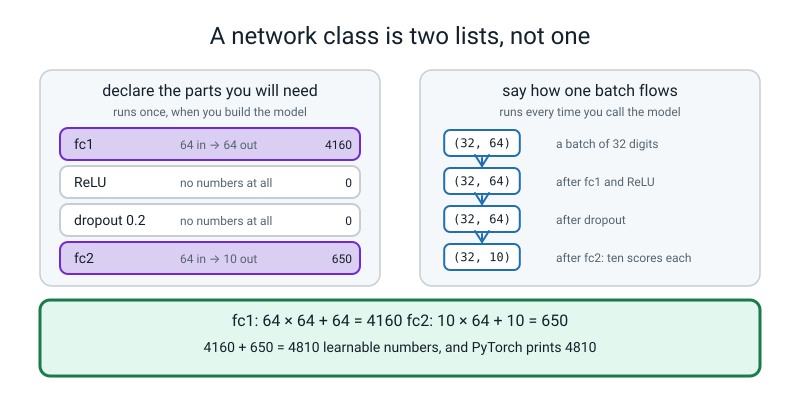
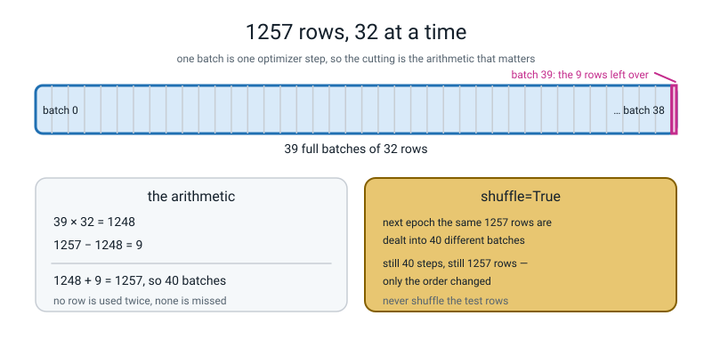
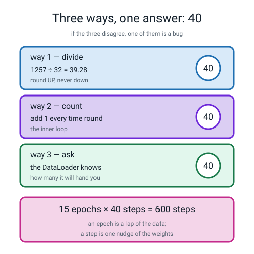
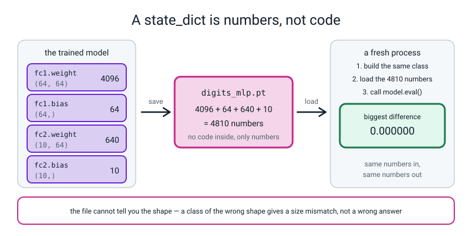
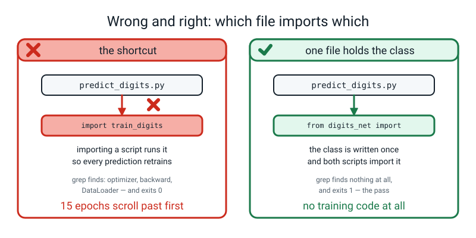
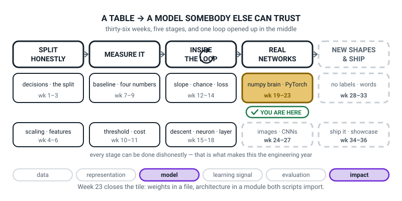
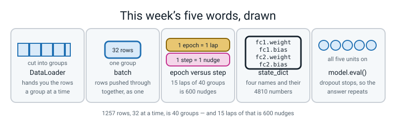

# Week 23 — Same Brain, Real Framework

[⬅ Week 22](week-22.md) · [Course Home](../README.md) · [Next ➡](week-24.md) · [Workbook](../workbook/week-23.md)

---

> ### This week in one sentence
> **A model you cannot reload in a fresh process is not finished — so the weights go in a file, the architecture goes in a module both scripts import, and `predict.py` has no training code in it at all.**
>
> **By the end of this chapter you will be able to:**
> - **Build a network as an `nn.Module` subclass** and show it is the *same* model as the `nn.Sequential` version — same shapes, same numbers, same answers
> - **Load data with `TensorDataset` and `DataLoader`**, and work out how many optimizer steps one epoch contains **three different ways**
> - **Train a 64 → 64 → 10 network on `load_digits` past 95%** and report the score *with the pile it came from*
> - **Save the weights, reload them in a fresh terminal, and ship a `predict.py`** that imports no training code — and prove it
>
> **New maths:** none. One division, rounded up, done three ways and made to agree.
>
> **New syntax:** `class Net(nn.Module)` with `super().__init__()` and `forward(self, x)` · `TensorDataset(X, y)` + `DataLoader(ds, batch_size=32, shuffle=True)` · `model.eval()` / `model.train()` · `torch.save(model.state_dict(), p)` + `model.load_state_dict(torch.load(p))`
>
> **Reading time:** about 40 minutes. **Homework:** about 60 minutes.

---

## 🪝 Start Here

Last week you trained a network with 4,417 learnable numbers for 1,500 epochs.

Now close the terminal.

**Gone.** All four thousand four hundred and seventeen of them. Every epoch of that training, deleted — because those numbers only ever existed inside the program that was making them.

And here is the uncomfortable part: **that has been true of every model you have built since Week 20.** You have never once kept one.

You solved this problem before. In Week 3, for a scikit-learn pipeline, you did the **Clean Room Test**: `joblib.dump` the fitted pipeline to a file, close everything, open a second script that does no fitting at all, and make a prediction. Week 3's rule has not changed:

> **The artifact is the deliverable.** A model that only exists in the terminal you trained it in is a demo, not a model.

So today you do it with torch. And you do it on something that will make you actually *want* to keep the model:

```text
.=@@@...
.@@@@-..
.*=-@-..
...=@-..
...@@...
..:@@.-.
..@@@@@.
.-@@@@@.
this is a 2
```

Squint at it. **That is a two**, written by hand by a real person, stored as an 8 × 8 grid of brightnesses — 64 numbers. There are 1,797 of them in a dataset that ships **inside scikit-learn**. Nothing downloads. It loads in the time it takes you to blink.

By the end of this chapter you will have a file on disk that reads handwriting, and a **second** program that opens that file, contains no training code at all, and tells you what the digit is. That second program is the thing you would actually give somebody.

And there are exactly three files, with the arrows pointing one way only:

```text
              digits_net.py
               (the class)
                ↗       ↖
   train_digits.py    predict_digits.py
     (trains,           (loads, predicts,
      saves)             no training code)
```

**There is one arrow that must not exist on that diagram.** Have a guess which, before you read on.

---

## 🧠 The Big Idea

> **📌 About the code in this section.** The blocks below are **illustrations, not files**. Each one carries on from the one above. **The complete runnable files are in 💻 Type This.** If you copy a block from here on its own and Python says `NameError`, that is why, and nothing is broken.

### 1. A network as a class: two halves, and one line you must never forget

**The plain explanation.** Last week's model was a list of parts:

```python
model = nn.Sequential(nn.Linear(2, 16), nn.ReLU(), nn.Linear(16, 1))
```

That is perfect for a straight line of parts. It stops being enough the moment you want anything that is *not* a straight line — a value used twice, a branch, a shape printed halfway through. So PyTorch offers a second way: you write a small class with two halves.

> **`nn.Module`** — the base class for anything with learnable numbers in it. You inherit from it and fill in two methods.

> **`__init__`** — "declare the parts you will need". Runs **once**, when the model is built.
> **`forward`** — "say how one batch flows through those parts". Runs **every time** you call the model.

Here is last week's network, written as a class. Read it first; the full files come later in 💻 Type This:

```python
class MoonNet(nn.Module):
    def __init__(self):
        super().__init__()                      # never forget this line
        self.fc1 = nn.Linear(2, 16)
        self.fc2 = nn.Linear(16, 1)

    def forward(self, x):
        return self.fc2(torch.relu(self.fc1(x)))
```

**Line by line.**

- `class MoonNet(nn.Module):` — "I am defining a new kind of thing called `MoonNet`, and it is a kind of `nn.Module`." **A class is a template**; `MoonNet()` builds one from it.
- `def __init__(self):` — the setup method. Python runs it when you write `MoonNet()`. `self` means "the particular model being built"; every method takes it first and you never pass it in yourself.
- `super().__init__()` — **"do `nn.Module`'s own setup first."** `super` means the class I inherited from.
- `self.fc1 = nn.Linear(2, 16)` — build a layer and hang it on the model under the name `fc1`. The name is yours to choose; `fc` is short for "fully connected", the older name for `nn.Linear`. **Because you assigned it to `self`, PyTorch now knows about its weights** and will hand them to the optimizer.
- `def forward(self, x):` — the method that does the work. `x` is one batch.
- `return self.fc2(torch.relu(self.fc1(x)))` — read it **inside out**: push `x` through `fc1`, squash with ReLU, push through `fc2`, hand the result back.


*Figure 23.1 — The two halves of a network class. Declare the parts on the left; say how a batch flows on the right; and 4160 + 650 = 4810 learnable numbers.*

**The analogy.** `__init__` is a **shopping list**: *"I will need a 64-to-64 layer, a squash, a dropout, and a 64-to-10 layer."* It says nothing about the order. `forward` is the **route**: *"a batch comes in, goes through fc1, gets squashed, gets dropped, goes through fc2, comes out."* It builds nothing; it only routes.

> **⚠️ Watch out:** write `model(x)`, **never** `model.forward(x)`. They look equivalent and they are not — `model(x)` does some bookkeeping first that some layers depend on. If you see `.forward(` on your screen, fix it.

**And the one rule about `super().__init__()`:** leaving it out does not produce a subtle bug. It produces this, immediately, on the very next line:

```text
AttributeError: cannot assign module before Module.__init__() call
```

That is one of the friendliest error messages in PyTorch. It names the thing you skipped and tells you it has to happen *before* what you did. **`super().__init__()` is the first line of every `__init__` you will ever write.**

### 2. The identity proof: it really is the same model

**The plain explanation.** Before trusting a new way of writing something, prove it produces the old thing. Set the seed, build one of each, compare everything.

```text
Sequential:
   0.weight   (16, 2)
   0.bias     (16,)
   2.weight   (1, 16)
   2.bias     (1,)
Module subclass:
   fc1.weight (16, 2)
   fc1.bias   (16,)
   fc2.weight (1, 16)
   fc2.bias   (1,)

Sequential parameters     : 65
Module subclass parameters: 65
weights byte-identical    : True
same output on the same input: True
that output: [0.059556588530540466, 0.0902349054813385]
```

**Only the names changed.** `nn.Sequential` names its children by **position** — 0, 1, 2, with the ReLU sitting in slot 1 and holding nothing. The class names them by the **attribute you chose** — `fc1`, `fc2`. Same four shapes, same 65 numbers, same answers to fourteen decimal places.

**They are not similar. They are the same model.**

> **🤔 Think about it:** if the two are identical, why bother with the class? Two reasons. **One:** the moment your route stops being a straight line, `nn.Sequential` cannot express it and the class can. **Two, and it bites sooner:** `nn.Sequential` names its layers by position, so **inserting a layer renames everything after it** and breaks every file you have saved. A class calls them `fc1` and `fc2` by the names *you* chose, and adding an `fc3` leaves the others alone.

And hold on to those names, because in §4 they are going to be the reason a file refuses to load.

### 3. Batches, epochs and steps — and the division you do three ways

**The plain explanation.** Until this week every training run pushed **all** the training rows through at once. That is fine for 300 moons. It is not how anything real is trained.

> **`TensorDataset(X, y)`** — pairs up a table of features with its answers, so that "row 7" means one `(features, answer)` pair.
> **`DataLoader(ds, batch_size=32, shuffle=True)`** — hands you the rows in shuffled groups of 32, one group at a time, in a `for` loop.
> **batch** — one group of rows, pushed through together.
> **epoch** — one full lap of the training data.
> **step** (or iteration) — one nudge of the weights. **One batch is one step.**

**A concrete example, on this week's real numbers.** Take 1,257 training digits, 32 at a time:

```text
1257 ÷ 32 = 39.28…                 →  round UP  →  40 batches
39 full batches × 32 rows = 1248
1257 − 1248 = 9                    →  the last batch has 9 rows
1248 + 9 = 1257                    ✅ every row used once, none twice
```

**Round up, never down.** Rounding down would throw away the last 9 digits, and the check `1248 + 9 = 1257` is what catches that.


*Figure 23.2 — A DataLoader cuts the rows into batches. 39 × 32 = 1248, and 1257 − 1248 = 9 rows in the last one.*

Then multiply by the number of epochs:

```text
15 epochs × 40 steps = 600 optimizer steps
```

**Why insist on three separate ways of getting 40?** Because the three ways fail differently.

| The way | What it checks |
|---|---|
| **divide and round up** | whether **you** understand it |
| **count the loop** | whether your **loop** is doing what you think |
| **ask the DataLoader** | whether the **object you built** is the object you meant |

If the three disagree, exactly one thing is wrong and you now know which.


*Figure 23.3 — One epoch, three ways to count the steps. Divide, count, ask — all three say 40, and 15 × 40 = 600.*

**And here is why it matters beyond today.** *"I trained for 15 epochs"* tells you almost nothing:

```text
15 epochs at batch size  32  →  15 × 40  =  600 weight updates
15 epochs at batch size 512  →  15 ×  3  =   45 weight updates
```

**More than thirteen times fewer.** Two people comparing "15 epochs" are comparing nothing at all unless they also say the batch size. **Say both, every time you report a run.**

**What `shuffle=True` actually does.** It reshuffles before every lap. Here it is on ten rows, four at a time, so you can see all of it:

```text
epoch 0:  [6, 7, 1, 4] [2, 0, 9, 8] [3, 5]
epoch 1:  [2, 4, 7, 0] [8, 9, 5, 3] [6, 1]
epoch 2:  [7, 4, 5, 1] [9, 3, 8, 2] [0, 6]

batches per epoch: 3  (10 rows, 4 at a time)
```

Three batches every epoch — 4, 4 and 2 — and every epoch the same ten rows land in different company.

> **⚠️ Watch out:** **shuffle the training loader; never shuffle the test loader.** You want the test rows in the same order every time so that the measurement repeats.

### 4. The artifact: a `state_dict` is a dictionary of names

**The plain explanation.**

> **`state_dict()`** — a plain dictionary of *name → block of numbers*. It is the model's **weights**, not the model's **code**.

For our digits network it holds exactly four entries. Each line gives a name and the shape of its block of numbers:

```text
   fc1.weight (64, 64)
   fc1.bias   (64,)
   fc2.weight (10, 64)
   fc2.bias   (10,)
```

Adding them up:

```text
4096 + 64 + 640 + 10 = 4810 numbers in the file
```

Two lines move the weights out to a file and back in:

```python
torch.save(model.state_dict(), "digits_mlp.pt")            # out
model.load_state_dict(torch.load("digits_mlp.pt"))         # back in
```


*Figure 23.4 — The weights go out to a file and come back. 4096 + 64 + 640 + 10 = 4810 numbers, and the biggest difference after reloading is 0.000000.*

🍕 **The analogy.** A `state_dict` is a set of **tuning-peg positions for a guitar.** Useless without a guitar. Exactly what you need if you already have one of the same shape.

**So you must build the same architecture first — and that is the entire reason the third file exists.** If `train_digits.py` declares the class and `predict_digits.py` declares it again, the two declarations will drift. Somebody changes 64 to 128 in one file and not the other, and the load fails — or worse, quietly succeeds into a differently-shaped thing.

```text
digits_net.py        holds the class.  Imported by both.
train_digits.py      imports it, trains, saves digits_mlp.pt
predict_digits.py    imports it, loads digits_mlp.pt, predicts.  No training code.
```

**The arrows only ever point one way: both scripts point at `digits_net.py`, and `predict_digits.py` never points at `train_digits.py`.** That is the forbidden arrow from the hook — and the reason is brutal: **importing a script runs it.** A prediction script that imports the trainer retrains the model every single time somebody uses it.

**And when the names do not match, the error is very good.** Load a subclass's weights into an `nn.Sequential`:

```text
RuntimeError: Error(s) in loading state_dict for Sequential:
	Missing key(s) in state_dict: "0.weight", "0.bias", "2.weight", "2.bias". 
	Unexpected key(s) in state_dict: "fc1.weight", "fc1.bias", "fc2.weight", "fc2.bias". 
```

Read it out loud: *"I wanted these four names and I found those four names."* **The shapes are perfect** — 64 by 64 and 10 by 64, exactly right. It is the *names* that are wrong, because a `state_dict` is a dictionary keyed by name.

Now load them into a class with the right names and the wrong widths:

```text
RuntimeError: Error(s) in loading state_dict for Net:
	size mismatch for fc1.weight: copying a param with shape torch.Size([64, 64]) from checkpoint, the shape in current model is torch.Size([32, 64]).
```

**Even better: it prints both shapes.** A file of numbers cannot tell you the architecture, so PyTorch checks it against the one you built and complains precisely.

> **💡 Try this:** every loading error you will ever meet is one of exactly two things — **a name that does not match, or a shape that does not match** — and the message tells you which. Learn to sort them in two seconds and this whole category of bug becomes boring.

### 5. `model.eval()` — the line whose absence is silent

**The plain explanation.** Last week `model.eval()` and `model.train()` were in your code and you were told to leave them alone. This is the week.

> **`model.eval()`** — switch the model into *measuring* mode. **Dropout stops dropping.**
> **`model.train()`** — switch it back into *learning* mode. Dropout resumes.
> **inference** — using a trained model to answer a question. No learning, no gradients, no dropout.

Our digits network has `nn.Dropout(0.2)` in it. Here is the same handwritten **9**, put through the model five times with dropout on, then five times with it off:

```text
row 37, true label 9

model.train()  - dropout is ON
   try 1: guess 5   score for 9 = -1.7783
   try 2: guess 9   score for 9 = +0.6095
   try 3: guess 3   score for 9 = -3.0162
   try 4: guess 9   score for 9 = -1.8427
   try 5: guess 5   score for 9 = -0.8994

model.eval()   - dropout is OFF
   try 1: guess 9   score for 9 = -1.6703
   try 2: guess 9   score for 9 = -1.6703
   try 3: guess 9   score for 9 = -1.6703
   try 4: guess 9   score for 9 = -1.6703
   try 5: guess 9   score for 9 = -1.6703
```

**Read the top block again.** The same image, the same weights, five goes: **5, 9, 3, 9, 5.** Three different answers to one question. And no error, no warning, nothing on the screen to tell you anything is wrong.

The bottom block: 9, 9, 9, 9, 9, and the score is `−1.6703` every single time to four decimal places.

**And it costs real accuracy too.** Measured over all 540 test digits with the same weights:

```text
dropout still ON, five passes over all 540 test digits:
   pass 1: accuracy 0.9519
   pass 2: accuracy 0.9444
   pass 3: accuracy 0.9463
   pass 4: accuracy 0.9481
   pass 5: accuracy 0.9500
after model.eval(), five passes:
   pass 1: accuracy 0.9667
   pass 2: accuracy 0.9667
   pass 3: accuracy 0.9667
   pass 4: accuracy 0.9667
   pass 5: accuracy 0.9667
```

**One forgotten line costs about two points — and, worse, costs you the ability to quote a single number at all.**

> **⚠️ Watch out:** `with torch.no_grad():` does a **different** job. It stops PyTorch recording the receipt from Week 20, which makes measuring faster and uses less memory. It does **not** turn off dropout. And `model.eval()` does **not** turn off recording. **You need both, and they are not substitutes:**

```python
model.eval()
with torch.no_grad():
    scores = model(X_te_t)
```

---

## 🔁 The Idea From Last Week, Used Harder

This section works through the parameter count and the batch division step by step.

There is no new maths this week. Instead, last week's **parameter count** gets used for a new job: **checking a file.**

Last week the count answered *"is the model I built the model I meant to build?"* This week it answers *"is the file I saved the file I meant to save?"* — and it is the same arithmetic.

**Step 1 — count the digits network by hand.** It is `64 → 64 → 10`. Use last week's rule, `(inputs × outputs) + outputs`:

```text
first layer,  64 → 64:   64 × 64 + 64  =  4096 + 64  =  4160
second layer, 64 → 10:   10 × 64 + 10  =   640 + 10  =   650
                                                        ----
                                                        4810
```

**Step 2 — check it against the other grouping**, the four-block one:

| Block | Shape | How many |
|---|---|---|
| `fc1.weight` | `(64, 64)` | 4096 |
| `fc1.bias` | `(64,)` | 64 |
| `fc2.weight` | `(10, 64)` | 640 |
| `fc2.bias` | `(10,)` | 10 |
| | | **4810** |

```text
4096 + 64 + 640 + 10 = 4810
```

**Two groupings, one answer.** You already met 4,810 last week, in the fourth row of the Parameter Count Race — that was this network, a week early.

**Step 3 — now count the file.** Open the saved `.pt` and add up the sizes of everything in it. The total must be 4,810 as well:

```python
print(sum(t.numel() for t in torch.load("digits_mlp.pt").values()))
```

```text
4810
```

**Step 4 — you can check this yourself, on paper.** `64 × 64` is `64 × 60 + 64 × 4 = 3840 + 256 = 4096`. Then `4096 + 64 = 4160`. Then `10 × 64 = 640`, plus 10 is 650. And `4160 + 650 = 4810`. **Three multiplications and three additions, and now you know exactly what is inside a file you cannot read.**

**Step 5 — and the second piece of arithmetic, which is today's actual sum.** One division, rounded up:

```text
1257 ÷ 32 = 39.28125       →  40 batches
39 × 32   = 1248
1257 − 1248 = 9            →  the last batch holds 9
1248 + 9  = 1257           ✅
15 × 40   = 600 steps
```

**Do the subtraction, not just the division.** `1248 + 9 = 1257` is the check that no row was thrown away, and it is the only one of these numbers that can catch `drop_last=True`.

---

## 💻 Type This

This section builds the week's project: train a digits network, save it, and load it in a separate program.

**Three files, all in the same folder.** Type them in this order, because the other two import the first.

### Step 1 — `digits_net.py`, the architecture, in one place

```python
"""digits_net.py - the architecture, in one place, imported by both scripts."""
import torch.nn as nn


class DigitNet(nn.Module):
    def __init__(self):
        super().__init__()                 # never forget this line
        self.fc1 = nn.Linear(64, 64)
        self.act = nn.ReLU()
        self.drop = nn.Dropout(0.2)
        self.fc2 = nn.Linear(64, 10)

    def forward(self, x):
        h = self.act(self.fc1(x))
        h = self.drop(h)
        return self.fc2(h)
```

**Fourteen lines, and that is the whole file.** No training, no printing, no data. It declares four parts and says how a batch flows through them.

**Note the last line: `return self.fc2(h)` — a bare `nn.Linear`.** No sigmoid, no softmax. Last week's rule has not changed.

**Try it wrong on purpose first.** Delete the `super().__init__()` line and run `python3 -c "from digits_net import DigitNet; DigitNet()"`:

```text
Traceback (most recent call last):
  File "<string>", line 1, in <module>
  File "/private/tmp/digits_net.py", line 7, in __init__
    self.fc1 = nn.Linear(64, 64)
  File ".../torch/nn/modules/module.py", line 1716, in __setattr__
    raise AttributeError(
AttributeError: cannot assign module before Module.__init__() call
```

Then put it back. **You now know what that message looks like**, which is worth thirty seconds.

### Step 2 — the data, and the two preparation details

New file, `train_digits.py`.

```python
"""train_digits.py - train the digits MLP and save its weights."""
import time
import numpy as np
import torch
import torch.nn as nn
from torch.utils.data import TensorDataset, DataLoader
from sklearn.datasets import load_digits
from sklearn.model_selection import train_test_split

from digits_net import DigitNet

torch.manual_seed(0)

digits = load_digits()
X = digits.data / 16.0
y = digits.target
X_tr, X_te, y_tr, y_te = train_test_split(X, y, test_size=0.30,
                                          stratify=y, random_state=0)
print("train rows %d   test rows %d   features %d" % (len(X_tr), len(X_te), X.shape[1]))

X_tr_t = torch.from_numpy(X_tr).float()
X_te_t = torch.from_numpy(X_te).float()
Y_tr_t = torch.from_numpy(np.eye(10)[y_tr]).float()
print("X_tr_t", tuple(X_tr_t.shape), "  Y_tr_t", tuple(Y_tr_t.shape))
```

**What the new lines do.**

`digits.data / 16.0` — every brightness is a whole number from 0 to 16, so dividing by 16 puts everything between 0 and 1. The same standardising instinct as Week 4, done the simplest possible way because we happen to know the maximum.

`np.eye(10)[y_tr]` — this one needs a sentence. Our loss is still `BCEWithLogitsLoss`, which compares a grid of scores against a grid of answers **of the same shape**. The network has 10 outputs, so it produces a `(1257, 10)` grid — and the answers have to be a `(1257, 10)` grid too. So each answer becomes a row of ten numbers with a single 1 in it:

```text
the digit 6  →  [0, 0, 0, 0, 0, 0, 1, 0, 0, 0]
```

`np.eye(10)` is a 10 × 10 grid with 1s down its diagonal, and indexing it by the answers picks out the right row for each one.

```text
train rows 1257   test rows 540   features 64
X_tr_t (1257, 64)   Y_tr_t (1257, 10)
```

**Check the split adds up: `1257 + 540 = 1797`.** ✅

> **🤔 Think about it:** isn't there a loss made for ten classes? **Yes** — `nn.CrossEntropyLoss`, and it takes one column of whole numbers instead of ten columns of 0s and 1s, which is tidier. It is **Week 26**. Today's ten-column trick works, reaches 96.67%, and uses only the loss you already understand.

### Step 3 — the DataLoader, and the number 40

```python
train_ds = TensorDataset(X_tr_t, Y_tr_t)
train_loader = DataLoader(train_ds, batch_size=32, shuffle=True)
print("rows in the dataset :", len(train_ds))
print("batches per epoch   :", len(train_loader))

model = DigitNet()
print("learnable numbers   :", sum(p.numel() for p in model.parameters()))
```

**Predict all three numbers before you run it.** You counted the last one in 🔁 above.

```text
rows in the dataset : 1257
batches per epoch   : 40
learnable numbers   : 4810
```

**Three numbers, all three predicted.** 1,257 is the split. 40 is `ceil(1257 ÷ 32)`. 4,810 is `4160 + 650`.

### Step 4 — the training loop, with a step counter

```python
loss_fn = nn.BCEWithLogitsLoss()
opt = torch.optim.Adam(model.parameters(), lr=0.005)

t0 = time.time()
steps = 0
for epoch in range(15):
    model.train()
    running = 0.0
    for xb, yb in train_loader:
        opt.zero_grad()
        loss = loss_fn(model(xb), yb)
        loss.backward()
        opt.step()
        running += loss.item()
        steps += 1
    model.eval()
    with torch.no_grad():
        scores = model(X_te_t).numpy()
    acc = (scores.argmax(axis=1) == y_te).mean()
    print("epoch %2d  steps %3d  train loss %.4f  test acc %.4f"
          % (epoch, steps, running / len(train_loader), acc))
```

**What the new lines do.** There are now **two** loops: the outer one counts epochs, the inner one walks the batches. **Week 21's five lines live in the inner loop, unchanged** — `zero_grad`, forward, loss, `backward`, `step`. `running += loss.item()` adds up the 40 batch losses so we can print their average. `steps += 1` is the counter that has to end up at 600.

`scores.argmax(axis=1)` reads the answer back out: `axis=1` means "across each row", so for every digit, which of its ten scores is largest. **The model has no opinion about which of its ten numbers is the answer — `argmax` is our rule, not its.**

```text
epoch  0  steps  40  train loss 0.3707  test acc 0.6833
epoch  1  steps  80  train loss 0.2386  test acc 0.8241
epoch  2  steps 120  train loss 0.1633  test acc 0.8796
epoch  3  steps 160  train loss 0.1204  test acc 0.8944
epoch  4  steps 200  train loss 0.0949  test acc 0.9352
epoch  5  steps 240  train loss 0.0811  test acc 0.9519
epoch  6  steps 280  train loss 0.0713  test acc 0.9463
epoch  7  steps 320  train loss 0.0609  test acc 0.9556
epoch  8  steps 360  train loss 0.0559  test acc 0.9519
epoch  9  steps 400  train loss 0.0492  test acc 0.9593
epoch 10  steps 440  train loss 0.0473  test acc 0.9648
epoch 11  steps 480  train loss 0.0444  test acc 0.9648
epoch 12  steps 520  train loss 0.0419  test acc 0.9611
epoch 13  steps 560  train loss 0.0383  test acc 0.9704
epoch 14  steps 600  train loss 0.0356  test acc 0.9667
```

**Read the `steps` column: 40, 80, 120 … 600.** Forty per epoch, exactly as the division said.

### Step 5 — the `FINAL:` line, and the file

```python
print("\nseconds: %.1f" % (time.time() - t0))
print("optimizer steps in total:", steps)
print("FINAL: test accuracy %.4f on %d held-out digits" % (acc, len(X_te)))

torch.save(model.state_dict(), "digits_mlp.pt")
print("saved digits_mlp.pt")
for name, tensor in torch.load("digits_mlp.pt").items():
    print("   %-10s %s" % (name, tuple(tensor.shape)))
```

```text
seconds: 0.2
optimizer steps in total: 600
FINAL: test accuracy 0.9667 on 540 held-out digits
saved digits_mlp.pt
   fc1.weight (64, 64)
   fc1.bias   (64,)
   fc2.weight (10, 64)
   fc2.bias   (10,)
```

**Read the shape of that `FINAL:` sentence, not just the number.** *"0.9667 on 540 held-out digits"* — **a score, and the pile it came from.** Somebody who reads *"96.67% accurate"* cannot tell whether you tested on your training data. Somebody who reads this can.

> **⚠️ Watch out:** the `seconds:` line is a stopwatch, not a result. **0.2 seconds of training**, plus about a second of imports. Yours will differ. Every other line above must match exactly; if your accuracy is not 0.9667, a seed is missing.

### Step 6 — `predict_digits.py`, which is the actual deliverable

New file. **This is the one somebody else would run.**

```python
"""predict_digits.py - classify three digits. No training code lives here."""
import numpy as np
import torch
from sklearn.datasets import load_digits

from digits_net import DigitNet

model = DigitNet()
model.load_state_dict(torch.load("digits_mlp.pt"))
model.eval()                      # dropout OFF - critical
print("loaded digits_mlp.pt, dropout is off")

digits = load_digits()
rng = np.random.default_rng(0)
picks = rng.integers(0, len(digits.data), size=3)
print("picked rows:", picks.tolist())

for i in picks:
    row = digits.data[i] / 16.0
    x = torch.from_numpy(row).float().reshape(1, 64)
    with torch.no_grad():
        scores = model(x)
    guess = int(scores.numpy().argmax(axis=1)[0])
    print()
    for r in range(8):
        print("   " + "".join(".:-=+*#@"[min(int(v), 7)] for v in digits.data[i].reshape(8, 8)[r]))
    print("   row %d   true %d   guessed %d   %s"
          % (i, digits.target[i], guess, "correct" if guess == digits.target[i] else "WRONG"))
```

**What the new lines do.** `DigitNet()` builds an **empty** model of the right shape; `load_state_dict` pours the saved numbers into it. `model.eval()` goes **immediately after**, and it is not optional. `.reshape(1, 64)` matters: **one row is still a batch — a batch of one** — and without it the output is `(10,)` with no rows, and `argmax(axis=1)` has no axis 1 to look along.

**Now the Clean Room Test.** Close your editor. Close every terminal. Open a new one and run `python3 predict_digits.py`:

```text
loaded digits_mlp.pt, dropout is off
picked rows: [1528, 1144, 918]

   .=@@@...
   .@@@@-..
   .*=-@-..
   ...=@-..
   ...@@...
   ..:@@.-.
   ..@@@@@.
   .-@@@@@.
   row 1528   true 2   guessed 2   correct

   ..@@@@-.
   .@@@@@=.
   .@@@....
   .@@@@...
   .@@@@+..
   ...:@*..
   ..-@@:..
   ..@@#...
   row 1144   true 5   guessed 5   correct

   ..@@@:..
   ..@=@+..
   ...*@-..
   ..-@@@..
   ....=@-.
   .+#..@@.
   .#@:*@=.
   ..@@@*..
   row 918   true 3   guessed 3   correct
```

**A two, a five and a three, in a fresh process, from a file.**

### Step 7 — prove there is no training code in it

```bash
grep -E "optimizer|loss_fn|backward|\.step\(\)|DataLoader|train_test_split" predict_digits.py ; echo "exit=$?"
```

```text
exit=1
```

**Nothing printed, and `exit=1` is the pass.** grep exits 1 when it finds no matches. Say that out loud before you run it, because an exit code of 1 looking like a failure and meaning success is exactly the sort of thing that wastes five minutes.

**Then run `predict_digits.py` a second time.** Same three digits, same three answers — because `model.eval()` is in there.

**Total runtime for all three files: under three seconds.**

---

## 🔍 Worked Examples

These three programs apply the week's ideas to new data.

Three complete programs. Type each one and **predict the numbers before you run it.**

### Worked Example 1 — A tiny class, and the identity proof on four hand-typed rows

Small enough to check everything.

```python
"""we1.py - a tiny class, and the identity proof on four hand-typed rows."""
import torch
import torch.nn as nn


class TinyNet(nn.Module):
    def __init__(self):
        super().__init__()
        self.fc1 = nn.Linear(2, 4)
        self.fc2 = nn.Linear(4, 1)

    def forward(self, x):
        return self.fc2(torch.relu(self.fc1(x)))


torch.manual_seed(0)
seq = nn.Sequential(nn.Linear(2, 4), nn.ReLU(), nn.Linear(4, 1))
torch.manual_seed(0)
net = TinyNet()

for name, p in net.named_parameters():
    print("%-10s %-8s %d" % (name, str(tuple(p.shape)), p.numel()))
print("total:", sum(p.numel() for p in net.parameters()))
print("by hand: 4 x 2 + 4 + 1 x 4 + 1 =", 4 * 2 + 4 + 1 * 4 + 1)

x = torch.tensor([[1.0, 2.0], [0.0, 0.0], [-1.0, 0.5], [3.0, -2.0]])
print("\nbatch shape:", tuple(x.shape))
with torch.no_grad():
    a, b = seq(x), net(x)
print("out shape  :", tuple(b.shape))
print("Sequential :", [round(v, 6) for v in a.reshape(-1).tolist()])
print("the class  :", [round(v, 6) for v in b.reshape(-1).tolist()])
print("identical  :", torch.equal(a, b))
```

**Note `torch.manual_seed(0)` twice** — once before each model. That is what makes the two start from the same random numbers, and without it the comparison proves nothing.

```text
fc1.weight (4, 2)   8
fc1.bias   (4,)     4
fc2.weight (1, 4)   4
fc2.bias   (1,)     1
total: 17
by hand: 4 x 2 + 4 + 1 x 4 + 1 = 17

batch shape: (4, 2)
out shape  : (4, 1)
Sequential : [-0.11428, 0.135708, -0.062751, 0.197668]
the class  : [-0.11428, 0.135708, -0.062751, 0.197668]
identical  : True
```

**Four numbers, four matches, and `identical: True`.** And notice the shapes: a `(4, 2)` batch became a `(4, 1)` output — four rows in, four scores out, one each.

### Worked Example 2 — The batching arithmetic on a different dataset

Same three ways, different numbers. **The point is that the method transfers and the numbers do not.**

```python
"""we2.py - the batching arithmetic on a different dataset, three ways."""
import math
import torch
from torch.utils.data import TensorDataset, DataLoader
from sklearn.datasets import load_breast_cancer
from sklearn.model_selection import train_test_split

X, y = load_breast_cancer(return_X_y=True)
X_tr, X_te, y_tr, y_te = train_test_split(X, y, test_size=0.25,
                                          stratify=y, random_state=0)
print("training rows:", len(X_tr))

X_tr_t = torch.from_numpy(X_tr).float()
y_tr_t = torch.from_numpy(y_tr).float().reshape(-1, 1)

torch.manual_seed(0)
loader = DataLoader(TensorDataset(X_tr_t, y_tr_t), batch_size=64, shuffle=True)

print("\nway 1 - divide and round up:", math.ceil(len(X_tr) / 64))
print("        6 x 64 = %d, and %d - %d = %d left over"
      % (6 * 64, len(X_tr), 6 * 64, len(X_tr) - 6 * 64))

sizes = [xb.shape[0] for xb, yb in loader]
print("way 2 - count the loop      :", len(sizes))
print("        every batch:", sizes)
print("        they add up to:", sum(sizes))

print("way 3 - ask the DataLoader  :", len(loader))
print("\n20 epochs x %d steps = %d optimizer steps" % (len(loader), 20 * len(loader)))

print("\nand with drop_last=True, which throws the leftovers away:")
dropped = DataLoader(TensorDataset(X_tr_t, y_tr_t), batch_size=64,
                     shuffle=True, drop_last=True)
sizes2 = [xb.shape[0] for xb, yb in dropped]
print("        batches:", len(sizes2), " rows used:", sum(sizes2),
      " rows thrown away:", len(X_tr) - sum(sizes2))
```

```text
training rows: 426

way 1 - divide and round up: 7
        6 x 64 = 384, and 426 - 384 = 42 left over
way 2 - count the loop      : 7
        every batch: [64, 64, 64, 64, 64, 64, 42]
        they add up to: 426
way 3 - ask the DataLoader  : 7

20 epochs x 7 steps = 140 optimizer steps

and with drop_last=True, which throws the leftovers away:
        batches: 6  rows used: 384  rows thrown away: 42
```

**Read the batch list: `[64, 64, 64, 64, 64, 64, 42]`.** Six full batches and one short one, and they add up to 426. Every row used exactly once.

**And read the last block, because it is the most useful thing on this page.** With `drop_last=True` there are **6** batches instead of 7, and **42 tumour records are silently thrown away** on every single epoch.

Notice what each check says: `len(loader)` reports 6 and the loop count reports 6 — they both ask the loader, so they agree with each other and never notice.

Way 1, divide and round up, says 7, so it disagrees with them, which is a warning that something is off but does not say what. **Only the sum, `384` instead of `426`, tells you which rows went missing.** And if the division had been rounded down (6.66 → 6) by mistake, all three ways would agree on 6 and be wrong together.

### Worked Example 3 — A shipped tumour classifier, in three files

This is the whole week's discipline, on real medical data, with a wrinkle the digits example did not have: **the scaler has to travel too.**

**File 1 — `tumour_net.py`.**

```python
"""tumour_net.py - the architecture, in one place, imported by both scripts."""
import torch
import torch.nn as nn


class TumourNet(nn.Module):
    def __init__(self):
        super().__init__()
        self.fc1 = nn.Linear(30, 16)
        self.act = nn.ReLU()
        self.drop = nn.Dropout(0.2)
        self.fc2 = nn.Linear(16, 1)

    def forward(self, x):
        h = self.drop(self.act(self.fc1(x)))
        return self.fc2(h)
```

**File 2 — `train_tumour.py`.**

```python
"""train_tumour.py - train it, save the weights, save the scaler numbers."""
import numpy as np
import torch
import torch.nn as nn
from torch.utils.data import TensorDataset, DataLoader
from sklearn.datasets import load_breast_cancer
from sklearn.model_selection import train_test_split
from sklearn.preprocessing import StandardScaler

from tumour_net import TumourNet

torch.manual_seed(0)

X, y = load_breast_cancer(return_X_y=True)
X_tr, X_te, y_tr, y_te = train_test_split(X, y, test_size=0.25,
                                          stratify=y, random_state=0)
scaler = StandardScaler().fit(X_tr)
X_tr_t = torch.from_numpy(scaler.transform(X_tr)).float()
X_te_t = torch.from_numpy(scaler.transform(X_te)).float()
y_tr_t = torch.from_numpy(y_tr).float().reshape(-1, 1)

loader = DataLoader(TensorDataset(X_tr_t, y_tr_t), batch_size=64, shuffle=True)
print("train rows %d   test rows %d   batches per epoch %d"
      % (len(X_tr), len(X_te), len(loader)))

model = TumourNet()
print("learnable numbers:", sum(p.numel() for p in model.parameters()))
loss_fn = nn.BCEWithLogitsLoss()
opt = torch.optim.Adam(model.parameters(), lr=0.01)

steps = 0
for epoch in range(20):
    model.train()
    for xb, yb in loader:
        opt.zero_grad()
        loss_fn(model(xb), yb).backward()
        opt.step()
        steps += 1

model.eval()
with torch.no_grad():
    pred = (model(X_te_t) >= 0).float().numpy().reshape(-1)
acc = (pred == y_te).mean()
print("optimizer steps:", steps)
print("FINAL: test accuracy %.4f on %d held-out tumours" % (acc, len(X_te)))

torch.save(model.state_dict(), "tumour.pt")
np.save("scaler_mean.npy", scaler.mean_)
np.save("scaler_scale.npy", scaler.scale_)
print("saved tumour.pt, scaler_mean.npy, scaler_scale.npy")
for name, tensor in torch.load("tumour.pt").items():
    print("   %-10s %s" % (name, tuple(tensor.shape)))
```

```text
train rows 426   test rows 143   batches per epoch 7
learnable numbers: 513
optimizer steps: 140
FINAL: test accuracy 0.9510 on 143 held-out tumours
saved tumour.pt, scaler_mean.npy, scaler_scale.npy
   fc1.weight (16, 30)
   fc1.bias   (16,)
   fc2.weight (1, 16)
   fc2.bias   (1,)
```

**513 learnable numbers — the same count you did in Week 22's Worked Example 2**, because it is the same architecture.

**File 3 — `predict_tumour.py`.**

```python
"""predict_tumour.py - three tumours, in a fresh process. No training code here."""
import numpy as np
import torch
from sklearn.datasets import load_breast_cancer

from tumour_net import TumourNet

model = TumourNet()
model.load_state_dict(torch.load("tumour.pt"))
model.eval()
mean = np.load("scaler_mean.npy")
scale = np.load("scaler_scale.npy")
print("loaded tumour.pt and the scaler numbers. Dropout is off.")
print("numbers in the weight file:", sum(t.numel() for t in torch.load("tumour.pt").values()))

data = load_breast_cancer()
rng = np.random.default_rng(2)
picks = rng.integers(0, len(data.data), size=3)
print("picked rows:", picks.tolist())

for i in picks:
    row = (data.data[i] - mean) / scale
    x = torch.from_numpy(row).float().reshape(1, 30)
    with torch.no_grad():
        score = model(x).item()
    guess = 1 if score >= 0 else 0
    print("   row %3d  score %+8.4f  chance %.4f  guessed %d  true %d  %s"
          % (i, score, torch.sigmoid(torch.tensor(score)).item(), guess,
             data.target[i], "correct" if guess == data.target[i] else "WRONG"))
```

```text
loaded tumour.pt and the scaler numbers. Dropout is off.
numbers in the weight file: 513
picked rows: [476, 148, 62]
   row 476  score  +1.5222  chance 0.8209  guessed 1  true 1  correct
   row 148  score  +2.7981  chance 0.9426  guessed 1  true 1  correct
   row  62  score -10.5572  chance 0.0000  guessed 0  true 0  correct
```

**Three things to notice.**

**The `.npy` files.** The model was trained on **scaled** numbers, so a fresh process has to scale its input the same way — with the **training set's** mean and spread, not new ones. `scaler_mean.npy` and `scaler_scale.npy` are part of the artifact. **Forget them and the model gets sensible-looking, completely wrong answers.** That is Week 3's lesson: *the preparation is part of the model.*

**The score column.** `+1.5222`, `+2.7981`, `−10.5572`. Those are **logits**. `torch.sigmoid` turns them into chances only because we asked, at the very end, outside the model.

**Row 62 scored −10.5572**, a chance of 0.0000 to four decimal places. The model is extremely confident, and it is right. A score of `−10.5572` is still fine done in two steps, but push the score out to about ±17 and squashing then taking the logarithm in two separate steps gives `log(0)` — which is Week 22's argument for `BCEWithLogitsLoss`: large scores like this one are on the road to that cliff.

**And run it twice.** Identical, both times, because `model.eval()` is there.

---

## 🐞 When It Breaks

This section shows four things that go wrong this week, what each message means, and how to fix it.

Every message below came from really running a broken version of this week's code.

> **The recipe for every loading error, and there are only two kinds:** *is it a **name** that does not match, or a **shape** that does not match?* The message always tells you which, and the two have completely different fixes.

### Break 1 — the missing first line

```python
class MoonNet(nn.Module):
    def __init__(self):
        self.fc1 = nn.Linear(2, 16)     # no super().__init__() above this
```

```text
Traceback (most recent call last):
  File "same_brain.py", line 13, in <module>
    MoonNet()
  File "same_brain.py", line 7, in __init__
    self.fc1 = nn.Linear(2, 16)
  File ".../torch/nn/modules/module.py", line 1716, in __setattr__
    raise AttributeError(
AttributeError: cannot assign module before Module.__init__() call
```

**What Python is telling you.** *"You hung a layer on a model that has not been set up yet."* It names the thing you skipped — `Module.__init__()` — and it tells you it has to happen **before** what you did.

**The fix.** `super().__init__()` as the **first line** of `__init__`.

> **🐞 If you see this error:** be pleased. PyTorch caught it for you on the very next line, instead of letting you build a model whose weights the optimizer would never see.

### Break 2 — right shapes, wrong names

```python
wrong = nn.Sequential(nn.Linear(64, 64), nn.ReLU(), nn.Linear(64, 10))
wrong.load_state_dict(torch.load("digits_mlp.pt"))
```

```text
RuntimeError: Error(s) in loading state_dict for Sequential:
	Missing key(s) in state_dict: "0.weight", "0.bias", "2.weight", "2.bias". 
	Unexpected key(s) in state_dict: "fc1.weight", "fc1.bias", "fc2.weight", "fc2.bias". 
```

**What Python is telling you.** *"I wanted these four names and the file had those four names."* **The shapes are perfect** — 64 by 64 and 10 by 64, exactly right. It is the names.

**The fix.** Build the **same class** the weights came from. Better: put the class in one file that both scripts import, and then **you cannot get the names wrong, because there is only one place the names are written.**

### Break 3 — right names, wrong widths

```python
class Net(nn.Module):
    def __init__(self):
        super().__init__()
        self.fc1 = nn.Linear(64, 32)     # was 64 when it was trained
        self.fc2 = nn.Linear(32, 10)
Net().load_state_dict(torch.load("digits_mlp.pt"))
```

```text
RuntimeError: Error(s) in loading state_dict for Net:
	size mismatch for fc1.weight: copying a param with shape torch.Size([64, 64]) from checkpoint, the shape in current model is torch.Size([32, 64]).
	size mismatch for fc1.bias: copying a param with shape torch.Size([64]) from checkpoint, the shape in current model is torch.Size([32]).
	size mismatch for fc2.weight: copying a param with shape torch.Size([10, 64]) from checkpoint, the shape in current model is torch.Size([10, 32]).
```

**What Python is telling you.** *"Right names, wrong widths"* — and **it prints both shapes**, the file's and yours, on every line. Somebody edited the class after training.

**The fix.** Make the class match the file, or retrain. There is no third option: **a file of numbers cannot be poured into a differently-shaped model.**

### Break 4 — the one with no message at all

```python
model = DigitNet()
model.load_state_dict(torch.load("digits_mlp.pt"))
# model.eval() left out
```

```text
row 37, true label 9
   try 1: guess 5
   try 2: guess 9
   try 3: guess 3
   try 4: guess 9
   try 5: guess 5
```

**There is no error.** The same picture, five times, and three different answers.

**What to do when there is no message.** One test, and it takes two seconds:

> **"Run it twice on the same input. Do I get the same answer?"**

If not, `model.eval()` is missing. **Make it the line immediately after `load_state_dict`.**

### The whole clinic, for reference

| What you see | What it means | The fix |
|---|---|---|
| `AttributeError: cannot assign module before Module.__init__() call` | You hung a layer on a model that is not set up yet | `super().__init__()` as the **first** line of `__init__` |
| `NotImplementedError: Module [Net] is missing the required "forward" function` | You told me the parts but not the route | Define `def forward(self, x):`. Spelling matters — `foward` gets no warning |
| `RuntimeError: Error(s) in loading state_dict …` `Missing key(s) … "0.weight"` `Unexpected key(s) … "fc1.weight"` | The file's four names are not this model's four names | Build the **same class** the weights came from |
| `RuntimeError: … size mismatch for fc1.weight: copying a param with shape torch.Size([64, 64]) … current model is torch.Size([32, 64])` | Right names, wrong widths | Read **both** shapes in the message; make the class match the file |
| `FileNotFoundError: [Errno 2] No such file or directory: 'digits_mlp.pt'` | There is no saved model here | Run the trainer first, then `ls` and check which folder you are in |
| `TypeError: 'int' object is not callable` from inside `dataset.py` | A confusing message with a simple cause: you put **numpy arrays** into `TensorDataset` | `torch.from_numpy(arr).float()` first. **`TensorDataset` takes tensors only** |
| `AssertionError: Size mismatch between tensors` | Your features and your answers have different numbers of rows | Print both shapes. `(1257, 64)` and `(1257, 10)` |
| `numpy.exceptions.AxisError: axis 1 is out of bounds for array of dimension 1` | You asked for the biggest in each row of something with no rows | `.reshape(1, 64)`. **One row is still a batch — a batch of one** |
| `ModuleNotFoundError: No module named 'digits_net'` | There is no `digits_net.py` where I am looking | `pwd`, `ls`. All three files live in one folder |
| **No error.** Different answer every run | Nothing crashed; the model is not repeatable | `model.eval()` right after `load_state_dict` |
| **No error.** `predict.py` prints fifteen epochs of training | Nothing crashed; the prediction script trained a model | `import train_digits` at the top. **Importing a script runs it.** Import from `digits_net` |
| **No error.** `batches per epoch` is 39, not 40 | Nothing crashed; nine digits are being silently discarded | `drop_last=True` on the DataLoader. Remove it, and check `39 × 32 = 1248` |

---

## 🎲 What We Did In Class

This section is a recap for anyone who missed the lesson.

If you missed it, here is the whole lesson. You need three empty files in one folder and last week's `overfit.py`.

**The hook.** Last week's `overfit.py` ran, the losses scrolled past, and then the terminal was **closed with the mouse, slowly, so everybody saw the click.** *"Gone. All four thousand four hundred and seventeen of them."* Then the question: *"In Week 3 we solved this exact problem for a scikit-learn pipeline. What did we do?"* — `joblib.dump`, then the Clean Room Test. Then the digit printed as text art, and the three-box diagram on the board with one question: **which arrow must not exist?**

**The two halves of a class**, drawn as two boxes side by side: `__init__` "declare the parts, runs once" and `forward` "say how a batch flows, runs every call". Then one question about the right-hand box: *"the shape is (32, 64) three times and then (32, 10). Where does the 32 come from and why does it never change?"* It is the batch size, and **a layer changes the second number of the shape, never the first.**

**The division, on the board.** `1257 training digits, 32 at a time. How many batches?` 39.28. *"So — 39 or 40?"* **40**, and then the whole check written out: `39 × 32 = 1248`, `1257 − 1248 = 9`, `1248 + 9 = 1257`. Then `15 × 40 = 600`, boxed.

**Two deliberate mistakes.**

| Mistake | What happened |
|---|---|
| `super().__init__()` left out | `AttributeError: cannot assign module before Module.__init__() call`, immediately |
| `digits_mlp.pt` loaded into an `nn.Sequential` | `Missing key(s) … "0.weight"` / `Unexpected key(s) … "fc1.weight"` — **the shapes were fine; the names were wrong** |

Both went in the Bug Log, and the words *"a `state_dict` is a dictionary of names"* went in with the second one.

**The identity proof**, run live: `65` and `65`, `weights byte-identical: True`, `same output on the same input: True`. *"They are not similar. They are the same model."*

**The arithmetic, three ways:**

```text
way 1 - divide and round up: 40
        39 x 32 = 1248, and 1257 - 1248 = 9 left over
way 2 - count the loop      : 40
        first batch 32 rows, last batch 9 rows, all rows 1257
way 3 - ask the DataLoader  : 40

15 epochs x 40 steps = 600 optimizer steps
```

**Build It and Ship It.** Three files, in the order `digits_net.py`, `train_digits.py`, `predict_digits.py`. Then `FINAL: test accuracy 0.9667 on 540 held-out digits` read out loud — **a score, and the pile it came from.** Then three questions: how many steps and how many epochs (600, 15, batch size 32 — all three or the answer is incomplete); which rows was 0.9667 measured on (the 540 held-out ones); and how many numbers went into the file (4,810).

**The Clean Room Test, run like a ritual.** Editor closed. Every terminal closed. One command. Three digits — a 2, a 5 and a 3, all correct. Then the grep, printing nothing and reporting `exit=1`, **which is the pass.** Then a second run, giving exactly the same three answers.

**And the closing sentence, which is next week's door:** *"You just got 96.67% on handwriting with a model that thinks a digit is a flat row of 64 numbers in no particular order. Shuffle those 64 columns — the same shuffle for every image — and it would train to just about the same score (we tried it: 96.5% to 96.7%). It would never notice."*

---

## 💬 Talk About It

Three questions to argue over with your teacher or a friend. Each hint shows how to start thinking, not the final word.

**1. Saving the whole model with `torch.save(model, "whole.pt")` is fewer lines than saving a `state_dict` and needs no class file at all. So why don't we?**

*Hint:* start by admitting it works and is genuinely more convenient. Then ask what "saving the whole model" has to *include* in order to work — the numbers, obviously, but also enough information to rebuild the code. And if loading a file rebuilds code, then **loading a file runs code.** Now the question: if somebody emailed you a `.pt` file, what would opening it be allowed to do to your laptop? (Anything a Python program can do.) A `state_dict` is 4,810 numbers and four names; loaded with `torch.load(path, weights_only=True)` the worst it can do is fail to load (a plain `torch.load` of any old-style `.pt` file is still pickle underneath, so only open files from people you trust). Then the secondary reasons, which are practical rather than dramatic: a numbers-only file is smaller, survives a PyTorch upgrade, and does not care what your folders are called.

**2. Epoch 13 scored 0.9704 and epoch 14 scored 0.9667. We saved epoch 14. Did we lose anything real?**

*Hint:* start with arithmetic, not opinion. The gap is 0.0037, and the test set has 540 rows — so work out how many digits that is. (About two.) Now: can a 540-row measurement tell those two models apart? Then the honest answer: **no**, and the difference is noise. But push one step further — if it *were* a real difference, what would you have wanted to do about it? (Keep epoch 13's weights, which is early stopping, and it is Week 34.) And the trap to notice: we picked epoch 13 out as "better" *by looking at the test set*, which is exactly the thing Week 2 told you not to do.

**3. `predict_digits.py` needs `digits_net.py` to work. Isn't that a design flaw? Wouldn't it be better if `digits_mlp.pt` were enough on its own?**

*Hint:* start by agreeing that the dependency is annoying and that shipping one file is nicer than shipping two. Then work out **why** the second file is needed: a `state_dict` is a bag of names and numbers, and it does not record that the network was 64 → 64 → 10. So the question becomes — **whose fault is that?** Not really the code's; it is a gap in what the file format chose to store. Then the interesting half: some model formats *do* store the shape alongside the numbers, and then the problem disappears. So the argument you will hear working engineers have — one shared class file versus pasting the class into the predictor — is not really about good style at all. **It is two different ways of patching the same gap in a file format.** Which one would you rather explain to somebody in a year's time?

---

## ⚠️ Don't Get Tricked

Four claims that sound right and are not. Each table puts the wrong belief next to the correct one.

### Trick 1 — "the prediction script can just import the trainer"


*Figure 23.5 — Wrong and right: which file imports which. On the left the prediction script imports the trainer, and importing a script runs it. On the right both scripts import the class from one file, and the grep finds nothing.*

| ❌ Wrong | ✅ Right |
|---|---|
| "`from train_digits import DigitNet` — the class is already defined in there, so why write a third file?" | **Importing a script runs it.** Your prediction script now trains a model for fifteen epochs before it answers a single question — every time, on anybody's laptop. Import from `digits_net.py`, which contains a class and nothing else. |

The test that settles it: **run it and read the first line it prints.** If the first line is `epoch 0`, you have retrained a model in order to use it. And the grep will find `optimizer` and exit 0.

### Trick 2 — "`epochs` is how long you trained for"

| ❌ Wrong | ✅ Right |
|---|---|
| "I trained for 15 epochs, so I did 15 lots of learning." | **An epoch is a lap; a step is a nudge of the weights.** 15 epochs at batch size 32 is `15 × 40 = 600` nudges. 15 epochs at batch size 512 is `15 × 3 = 45` — **more than thirteen times fewer.** "15 epochs" is not a fact about anything until you also say the batch size. |

Say both, every time: **"fifteen epochs, batch size 32, six hundred steps."**

### Trick 3 — "three step counts agreeing means the number is right"

| ❌ Wrong | ✅ Right |
|---|---|
| "Divide says 6, the loop says 6, `len(loader)` says 6. All three agree, so 6 is correct." | **Three methods can agree and all be wrong together.** The loop and `len(loader)` both ask the same loader, so with `drop_last=True` on 426 rows at batch size 64 they cheerfully report 6 — and if you rounded the division down too (6.66 → 6, instead of up to 7), all three agree on the wrong 6 while 42 rows are thrown away on every epoch. **The fourth check notices and says what is missing:** add up the batch sizes. 384, not 426. |

The rule: **agreement is not correctness.** A check that gets its information from the same place as the thing it is checking cannot catch that place being wrong.

### Trick 4 — "`torch.no_grad()` and `model.eval()` do the same job"

| ❌ Wrong | ✅ Right |
|---|---|
| "I wrapped my prediction in `with torch.no_grad():`, so dropout is off." | **They do different jobs and neither replaces the other.** `no_grad` stops PyTorch *recording* the receipt, which saves time and memory. `model.eval()` stops dropout *dropping*. Our `eval_test.py` had `no_grad` in **both** blocks and the top block still gave three different answers to one picture. |

Write both, every time you measure anything:

```python
model.eval()
with torch.no_grad():
    scores = model(X_te_t)
```

---

## 🌍 Where You've Seen This

Today's ideas show up outside the course too. Here are six places.

1. **Every app on your phone that recognises something without an internet connection** — face unlock, "hey" wake words, live photo captions. There is a weights file inside the app and an inference path that contains no training code at all. Exactly today's shape, at a much larger scale.
2. **A game that loads a save file.** The save holds your position, your inventory and your score — it does not hold the game. Load it into a *different* game and nothing sensible happens. That is a `state_dict` and a class.
3. **A downloaded model that "requires version 2.1 or later".** That warning exists because the file and the code have to agree about shapes, and somebody once changed a layer and broke everybody's saved weights.
4. **The word "batch" in a progress bar during a big export or upload.** Same idea, same reason: doing a thousand things in groups of thirty-two is easier on memory than doing all thousand at once.
5. **A model card or a README that says "94.2% on the held-out test set (n = 5,000)".** That is the `FINAL:` line, written properly — a score and the pile it came from. Once you have written one yourself, a paper that gives you a bare percentage starts to look shifty.
6. **Any warning about opening files from people you do not know.** `torch.save(model, ...)` saves code, so loading it runs code. This is not a machine-learning problem; it is the same problem as a macro in a spreadsheet, and it has the same answer.

---

## 🧭 Where This Fits

This is the **last** week inside the gold tile. *numpy brain · PyTorch* has taken five weeks — the maths,
the brain by hand, the tensors, the layers — and it closes today, with the same brain coming back to life
in a terminal that knows nothing about how it was trained.



*Figure 23.0 — The pipeline in Week 23. Fifth and final week in the gold tile; next week the box below it
opens. The ↻ on stage three is black, as it has been since Week 12.*

| | |
|---|---|
| **The mental model you now own** | **A model you cannot reload in a fresh process is not finished.** The architecture lives in a module that *both* scripts import, the weights live in a file, and `predict.py` contains **no training code at all** — you can prove that with a grep. |
| **The one question it answers** | *"Where do the weights actually live?"* — in a `state_dict`, in a file on disk, and they are useless without the class that knows their shape. |
| **What it plugs into** | Week 3's rule that **the artifact is the deliverable**, now applied to a network instead of a pipeline. And Week 22's `nn.Sequential` model, which today gets a name, a class, and a save format. |
| **What carries forward** | Week 26 loads digits through this same `DataLoader` and compares its CNN against this MLP on parameters, seconds and accuracy. Week 27 freezes part of a saved network and reuses it. Week 34 does this whole ritual one more time, as a capstone milestone with your name on it. |
| **Spiral thread** | 📦 **Model** and 🌍 **Impact** — two threads. Model, because today the network stops being a variable in your session and becomes a file with a life of its own. Impact, because `FINAL: test accuracy 0.9667 on 540 held-out digits` is written for somebody else to read, and a score without its pile named is not a result. |

> **💡 Try this:** open a brand-new terminal, run `predict_digits.py`, and then delete your training script
> entirely. If the prediction still works, you have shipped something. If it does not, you have not — and
> finding that out now is the cheapest it will ever be.

---

## 🔑 Remember This

The week's key points in one place, then a reminder card you can copy from.

- **A class has two halves.** `__init__` declares the parts and runs once. `forward` says how a batch flows and runs every call. **`super().__init__()` is the first line of `__init__`, always.**
- **A class and an `nn.Sequential` are the same model.** Same shapes, same 65 numbers, same output. **Only the names differ** — position numbers against your attribute names — and the names are what a `state_dict` is keyed by.
- **An epoch is a lap; a step is a nudge.** 1,257 rows at 32 a time is `ceil(1257 ÷ 32) = 40` steps, and `15 × 40 = 600`. **Report the batch size with the epochs or you have reported nothing.**
- **Get the step count three ways and make them agree** — divide, count the loop, ask the DataLoader. And know the fourth check: **add up the batch sizes.** Three agreeing answers can still be wrong.
- **A `state_dict` is a dictionary of names and numbers, not code.** Build the same architecture first, then pour the numbers in. Every loading error is either a **name** mismatch or a **shape** mismatch, and the message says which.
- **`model.eval()` right after `load_state_dict`.** Without it the same picture gets five answers and no error appears. `torch.no_grad()` is a **different** line doing a **different** job; use both.
- **One file holds the class; both scripts import it; `predict.py` contains no training code.** Prove it with a grep — and `exit=1` is the pass.
- **A score with no pile attached is not a result.** `0.9667 on 540 held-out digits`, every time.

### Syntax reminder card

```python
import torch
import torch.nn as nn
from torch.utils.data import TensorDataset, DataLoader

# ---- a network as a class: two halves ---------------------------------
class DigitNet(nn.Module):
    def __init__(self):
        super().__init__()                # FIRST line. Leave it out and you get
        self.fc1 = nn.Linear(64, 64)      # AttributeError: cannot assign module
        self.act = nn.ReLU()              #   before Module.__init__() call
        self.drop = nn.Dropout(0.2)
        self.fc2 = nn.Linear(64, 10)      # a bare Linear. The loss squashes.

    def forward(self, x):                 # runs on every call
        h = self.drop(self.act(self.fc1(x)))
        return self.fc2(h)

model = DigitNet()                        # __init__ runs here, once
scores = model(x)                         # forward runs here. NEVER model.forward(x)

# ---- data in batches -------------------------------------------------
ds = TensorDataset(X_t, Y_t)              # TENSORS only. numpy -> 'int' object is not callable
loader = DataLoader(ds, batch_size=32, shuffle=True)   # shuffle TRAIN, never TEST
print(len(ds), len(loader))               # 1257 rows, 40 batches

for epoch in range(15):                   # outer loop: laps
    model.train()
    for xb, yb in loader:                 # inner loop: 40 batches = 40 steps
        opt.zero_grad()                    # Week 21's five lines, unchanged
        loss = loss_fn(model(xb), yb)
        loss.backward()
        opt.step()
# ceil(1257 / 32) = 40    39 x 32 = 1248    1257 - 1248 = 9    15 x 40 = 600

# ---- measuring: BOTH lines, every time -------------------------------
model.eval()                              # dropout OFF. No error if you forget.
with torch.no_grad():                     # stop recording. A DIFFERENT job.
    scores = model(X_te_t).numpy()
pred = scores.argmax(axis=1)              # our rule, not the model's

# ---- the artifact ----------------------------------------------------
torch.save(model.state_dict(), "digits_mlp.pt")        # names + numbers, no code
model.load_state_dict(torch.load("digits_mlp.pt"))     # into the SAME class
print(sum(t.numel() for t in torch.load("digits_mlp.pt").values()))   # 4810
# wrong class  -> Missing key(s) / Unexpected key(s)   <- a NAME problem
# wrong widths -> size mismatch, with both shapes      <- a SHAPE problem
# torch.save(model, ...) saves CODE. Loading it RUNS code. Don't.

# ---- one row is still a batch ----------------------------------------
x = torch.from_numpy(row).float().reshape(1, 64)   # (64,) -> (1, 64)
# forget it -> AxisError: axis 1 is out of bounds for array of dimension 1
```

### One-line reminder

> **`ceil(rows ÷ batch_size)` batches per epoch, and `epochs × batches` steps.** For us: `ceil(1257 ÷ 32) = 40`, and `15 × 40 = 600`. Check it with `1248 + 9 = 1257`.

---

## 📓 New Words


*Figure 23.6 — This week's five words, drawn.*

| Word | What it means | Example |
|---|---|---|
| **`Dataset`** | A thing that pairs features with answers, so "row 7" means one `(features, answer)` pair | `TensorDataset(X_tr_t, Y_tr_t)` — and it takes **tensors**, not numpy arrays |
| **`DataLoader`** | Hands you the rows in groups, one group at a time, in a `for` loop | `DataLoader(ds, batch_size=32, shuffle=True)`, and `len(loader)` is 40 |
| **batch** | One group of rows, pushed through together | 39 batches of 32 and one of 9 makes 1,257 |
| **epoch versus step** | An epoch is one lap of the data; a step is one nudge of the weights | 15 epochs × 40 batches = **600 steps** |
| **`state_dict`** | A dictionary of *name → block of numbers*. The weights, not the code | Four entries, `4096 + 64 + 640 + 10 = 4810` numbers |
| **`model.eval()`** | Switch to measuring mode: dropout stops dropping, so the answer repeats | Five goes at the same 9: 5, 9, 3, 9, 5 before; 9, 9, 9, 9, 9 after |
| **inference** | Using a trained model to answer a question. No learning, no gradients, no dropout | `predict_digits.py` — and the grep proves it |

---

## 📤 Your Homework

Go to **[the Week 23 workbook](../workbook/week-23.md)**. About **60 minutes** in total.

| Section | What to do | Time |
|---|---|---|
| **Warm-Up** | Five quick questions from Week 22 | 5 min |
| **Do the Maths by Hand** | Four batching-and-counting exercises, calculator only | 10 min |
| **Predict the Output** | Four snippets, two of them shape predictions | 10 min |
| **Practice A & B** | Six reading questions, then five you write yourself | 15 min |
| **Fix the Broken Program** | Three planted bugs — one type, one missing line, one completely silent | 8 min |
| **Build It — ship the digits MLP** | The three files, the three step counts, and the `model.eval()` experiment | 12 min |

**Three things are being marked, and the third is the real one.**

**Does your `FINAL:` line name the pile?** *"0.9667 on 540 held-out digits"* is full marks. *"96.67% accurate"* is not, and it will cost you a line of feedback every week until it sticks.

**Are all three step counts actually pasted?** By dividing, by counting the loop, by asking the DataLoader. A page that says "they agree" without the three numbers has not done the task — the comparison *is* the task.

**Do your ten pasted predictions actually differ in the first block and match in the second?** Take one digit, push it through five times with `model.train()`, paste all five. Then call `model.eval()` and do it five more times. **If all ten are identical, something is wrong** — either `model.eval()` was called too early, or your class has no `nn.Dropout` in it — and it is worth chasing, because you have not yet seen the thing the page exists to show you.

> **⚠️ Watch out:** do not let `predict_digits.py` import `train_digits.py`. It is one line shorter and it works, which is exactly what makes it dangerous. The grep is not a formality — it is the deliverable.

> **💡 Try this:** after you finish, find a digit the model gets wrong. There are eighteen of them out of 540. Print the first five as text art and look at them properly. Some are genuinely ambiguous — a 3 that could be an 8, a 9 written like a 4. Some are not, and **those** are the interesting ones, because the model is failing at something you find easy. A big part of the reason is next week's whole lesson.

---

[⬅ Week 22](week-22.md) · [Course Home](../README.md) · [Week 24 ➡](week-24.md) · [📓 Workbook — Week 23](../workbook/week-23.md) · [Glossary](../../glossary.md)
