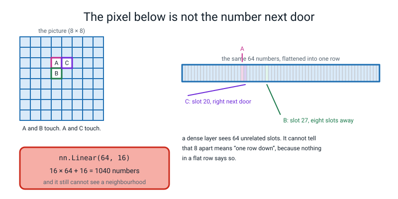
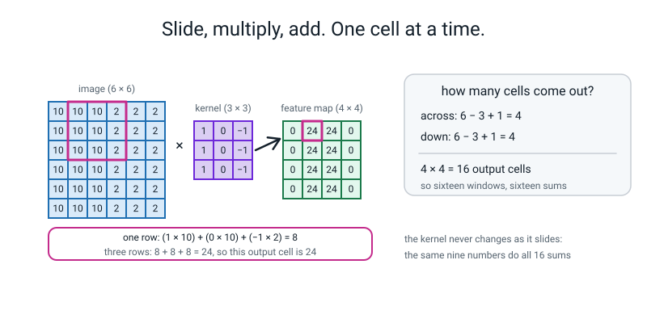
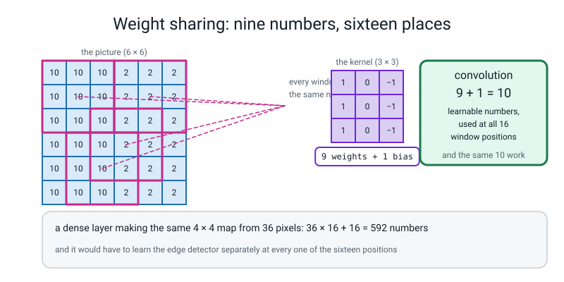
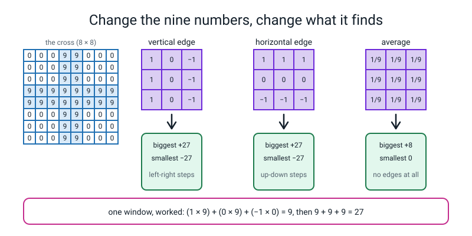
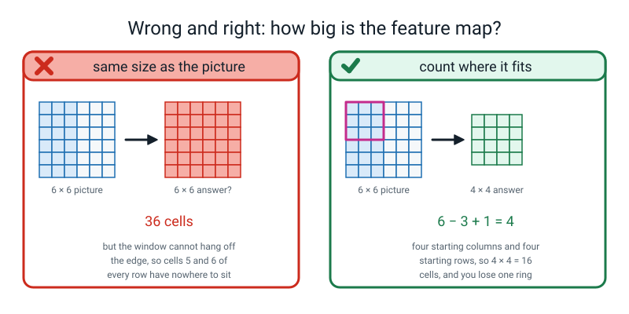
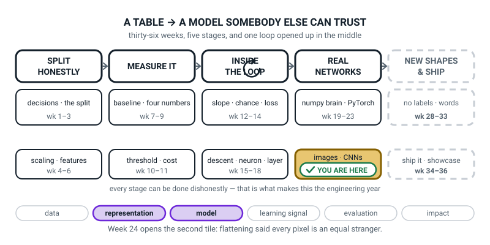
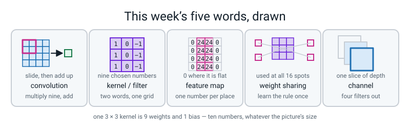

# Week 24 — Why Flattening a Picture Throws Away the Picture

[⬅ Week 23](week-23.md) · [Course Home](../README.md) · [Next ➡](week-25.md) · [Workbook](../workbook/week-24.md)

---

> ### This week in one sentence
> **Flattening a picture tells the model that the pixel directly above and a pixel across the room are equally related — and a convolution is a small grid of weights that slides, so it keeps the neighbourhood.**
>
> **By the end of this chapter you will be able to:**
> - **Price a dense layer and a convolution on the same 8 × 8 picture** — 1,040 against 10 — and say which one is throwing weights away
> - **Slide a 3 × 3 kernel over a 6 × 6 picture by hand** and fill in all sixteen output cells, then match every one against `nn.Conv2d`
> - **Explain weight sharing:** the same nine numbers applied at every position, and the two separate things that buys you
> - **Design a vertical-edge kernel and a horizontal-edge kernel**, and show each firing on the right picture and staying silent on the wrong one
>
> **New maths:** none. Sixteen sums of nine multiplications, all done by hand.
>
> **New syntax:** `torch.from_numpy(a).float()` · `t.unsqueeze(0)` · `nn.Conv2d(1, 4, kernel_size=3)` · `conv.weight.data = ...`
>
> **Reading time:** about 40 minutes. **Homework:** about 60 minutes. **You will need squared paper and a pencil with a rubber.**

---

## 🪝 Start Here

Last week you built a model that reads this as a two:

```text
.=@@@...
.@@@@-..
.*=-@-..
...=@-..
...@@...
..:@@.-.
..@@@@@.
.-@@@@@.
```

It got **96.67% on 540 digits it had never seen.** Good model. It is on disk, in a file, and you can open it in a fresh terminal.

Today it gets broken, in a way that should worry you.

**Here is the experiment.**

Take the 64 columns and **shuffle them** — not randomly per picture, one single shuffle worked out once and applied to all 1,797 pictures identically. Column 0 always goes where column 16 was, and so on. A person cannot read the result at all. It is not a picture any more; it is confetti.

Now train exactly the same network on the confetti. Same architecture, same 15 epochs, same seed.

**Predict the accuracy before you read on.** Write a number down.

```text
the new column order starts: [16, 36, 27, 8, 44, 23, 53, 4]
the pictures as they are     test accuracy 0.9667
the same 64 columns shuffled test accuracy 0.9704
```

**The confetti did better.**

By 0.0037, which on 540 digits is **two digits**, so honestly it is a tie. But a tie is the point: **the model cannot tell the difference between a picture and confetti.** And if it cannot tell the difference, then whatever it is doing, **it is not looking at a picture.**

Why can't it tell? Think about what `nn.Linear` actually holds. Every weight connects one *input slot* to one *output unit*. Slot 19 and slot 20 are next-door pixels in the real picture. Slot 19 and slot 27 are one directly above the other. **But nothing anywhere in the layer says so.** Draw eight boxes in a row and number them, and then ask: *which of these boxes is above box 3?* **There is no answer.** That is the problem, exactly.

🍕 **The analogy, and it is worth telling in full.** Somebody hands you 64 numbered envelopes. Each contains the brightness of one little square of a photograph, and they arrive in an order nobody will tell you. You *could* eventually learn "envelope 41 is usually bright on a seven". You would have to learn that separately for all sixty-four. And if somebody wrote the seven two squares to the left, **every single thing you learned would be wrong.**

Now instead somebody hands you a small magnifying glass and says: *slide this over the whole photo and tell me wherever you see a corner.* **One rule. Works everywhere on the page.**

That second thing has a name, and by the end of today you will have done sixteen of them in pencil.

> **locality** — what a pixel means is mostly decided by the pixels immediately around it. An edge is a *local* event. You do not need the top-left corner to understand the bottom-right one.

---

## 🧠 The Big Idea

This section explains what flattening throws away, then works a convolution through by hand and counts the numbers it needs.

> **📌 About the code in this section.** The blocks below are **illustrations, not files**. Each one carries on from the one above. **The complete runnable files are in 💻 Type This.**

### 1. What flattening threw away

**The plain explanation.** `nn.Linear` is a grid of weights joining every input slot to every output unit. It is a very good tool and it has one blind spot: **it has no way to represent "next to".**


*Figure 24.1 — Flattening throws the neighbourhood away. A touches C in slot 20, and A touches B eight slots away in slot 27, and a dense layer cannot tell which of those means "touching".*

**Read that figure carefully, because it is the whole week.**

On an 8 × 8 picture, pixel **A** at row 2 column 3 lands in slot 19 when you flatten it. The pixel **directly to its right** lands in slot 20 — right next door. The pixel **directly below it** lands in slot 27 — **eight slots away.** To you and me, "right" and "below" are equally close. To a flattened row of 64 numbers, one of them is a neighbour and the other is eight houses down the street, and **there is nothing in the layer that knows those two distances mean the same thing.**

> **⚠️ Watch out:** none of this means last week was wasted. Your digits model **works** — 96.67% is a real score on real held-out digits, and every piece of the engineering (the class, the batches, the file, the `predict.py`) is still exactly right and is used again in Week 26. What the shuffle test shows is that the model is **fragile in a specific way**: it learned which of 64 particular slots tend to be bright for each digit, and `load_digits` happens to be a very tidy dataset where every digit is centred. Move a digit two pixels left and it falls over. **Finding out how your model is fragile is most of engineering.**

### 2. The price, in numbers you can count

**The plain explanation.** This is the fastest way to make the argument land, because it is just arithmetic — and you have been counting parameters for two weeks.

An 8 × 8 picture, flattened to 64 numbers, into a dense layer with 16 units:

```text
weights = 16 × 64 = 1024
biases  =             16
                    ----
total   =           1040
```

A single 3 × 3 convolution over the same 8 × 8 picture:

```text
weights = 3 × 3 =  9
bias    =          1
                 ---
total   =         10
```

```text
1040 ÷ 10 = 104
```

**A hundred and four times fewer learnable numbers. And the smaller one is the one that knows what a neighbourhood is.** That is not a compromise. It is a tool with the right assumption built in, and it is also cheaper. (Honest caveat: this is not a like-for-like job. The dense layer makes 16 numbers; the convolution makes a whole 6 × 6 map. For the same 4 × 4 map later this week it is 592 against 10, about 59 times fewer. Still a big gap, just a fairer one.)

**And the gap grows fast, because a convolution's count does not depend on the size of the picture at all.** On a 64 × 64 photograph — still small, still grey:

```text
nn.Linear(4096, 256)              1,048,832 numbers
nn.Conv2d(1, 4, kernel_size=3)           40 numbers
```

**Over a million against forty.** Say those out loud; they are the argument.

> **💡 Try this:** you already met 1,048,832 in Week 22, in a "Try this" box, when you priced a 64 × 64 photo into a dense layer. That number has been waiting for this week.

### 3. The convolution itself, done by hand

**The plain explanation.** Three words, and then sixteen sums.

> **kernel** (also called a **filter**) — a small grid of numbers, usually 3 × 3, that slides across the picture. At every position you multiply each of its nine numbers by the picture number underneath it, and add up all nine.

> **feature map** — the grid of answers that comes out. One number per position where the kernel sat.

> **convolution** — the whole sliding-and-summing operation.

**Here is the entire thing on numbers you can check.** The picture is 6 × 6, bright left half, dark right half, every row identical:

```text
 10  10  10   2   2   2
 10  10  10   2   2   2
 10  10  10   2   2   2
 10  10  10   2   2   2
 10  10  10   2   2   2
 10  10  10   2   2   2
```

The kernel is a **vertical-edge finder** — plus down the left column, minus down the right, nothing in the middle:

```text
  1   0  −1
  1   0  −1
  1   0  −1
```

**Position (0, 0).** The window covers rows 0–2 and columns 0–2. Everything there is 10:

```text
window          kernel         products
10  10  10       1  0  −1      10   0  −10
10  10  10   ×   1  0  −1  =   10   0  −10
10  10  10       1  0  −1      10   0  −10
```

```text
row by row:  (10 + 0 − 10) + (10 + 0 − 10) + (10 + 0 − 10)  =  0 + 0 + 0  =  0
```

**Zero.** And that makes sense — look at the window. It is completely flat. **A kernel that reports zero is not broken; it is telling you it did not find its thing.**

**Position (0, 1).** Slide the window one column right. Now every row of the window reads `10, 10, 2`:

```text
one row:      (1 × 10)  +  (0 × 10)  +  (−1 × 2)   =   10 − 2   =   8
three rows:   8 + 8 + 8                            =   24
```

**Twenty-four.** The edge is inside the window and the filter **shouts**.


*Figure 24.2 — One output cell of the feature map, worked out in full. One row gives 8, three rows give 24, and 4 × 4 = 16 windows fit.*

**Position (0, 2).** Window reads `10, 2, 2` in every row:

```text
one row:      (1 × 10) + (0 × 2) + (−1 × 2)  =  10 − 2  =  8
three rows:   24
```

**Position (0, 3).** Window reads `2, 2, 2`. Flat again:

```text
one row:      2 − 2 = 0    →    total 0
```

**And then the rows.** Every row of this picture is identical, so every row of the answer must be identical too. All sixteen cells:

```text
   0   24   24    0
   0   24   24    0
   0   24   24    0
   0   24   24    0
```

**Zero where it is flat, 24 where the edge is. That is a detector.**

**Why sixteen cells?** Count the places the window can sit. A 3-wide window on a 6-wide picture can start at column 0, 1, 2 or 3 — **four places.** Same going down — four places.

```text
across:  6 − 3 + 1 = 4
down:    6 − 3 + 1 = 4
cells:   4 × 4 = 16
```

> **🤔 Think about it:** if you have already noticed that `6 − 3 + 1` looks like a general rule, hold that thought and write it in the margin. **It is next week's entire lesson**, and next week the window starts jumping two at a time and gluing rings of zeros round the edges, so the rule grows. **Today you count.**

> **⚠️ Watch out:** use the **mirrored** kernel — `−1, 0, 1` instead of `1, 0, −1` — and every 24 becomes a **−24**. Nothing is wrong. The filter is now looking for **dark-to-bright** instead of bright-to-dark. **A negative feature map is a filter firing at the opposite polarity, not a mistake.**

### 4. Weight sharing, and the two separate things it buys

**The plain explanation.**

> **weight sharing** — the same nine numbers are used at every position. You do not learn a fresh set of weights per place in the picture.

**How many times did the kernel change while it slid?** **Never.** That is weight sharing, and it buys you two completely different things which are worth naming separately.


*Figure 24.3 — The same nine numbers, used everywhere. 9 + 1 = 10 for the convolution against 36 × 16 + 16 = 592 for the dense layer.*

**The first thing is cheap.** Nine weights and a bias is ten numbers. A dense layer producing the same 4 × 4 answer grid out of those 36 pixels would need:

```text
36 × 16 + 16 = 592
```

**And the count does not grow when the picture does:**

```text
learnable numbers in this layer: 10
picture  6 x  6  ->  feature map  4 x  4  =   16 cells,   still 10 learnable numbers
picture  8 x  8  ->  feature map  6 x  6  =   36 cells,   still 10 learnable numbers
picture 16 x 16  ->  feature map 14 x 14  =  196 cells,   still 10 learnable numbers
picture 64 x 64  ->  feature map 62 x 62  = 3844 cells,   still 10 learnable numbers
```

**Same ten numbers, 3,844 output cells.** `nn.Linear` cannot say that about anything.

**The second thing is the one that actually matters.** A dense layer would have to learn *"there is an edge here"* **separately, sixteen times** — once for each position — and it would need training pictures with an edge in each of the sixteen places. **The convolution learns it once and gets all sixteen for free.**

That is why convolutions work on far less data than you would expect.

**And one last word, because the shapes need it:**

> **channel** — one slice of depth. Our digits are greyscale, so a picture has **one** channel. A colour photo has three: red, green, blue. And **after a convolution the channels are no longer colours** — they are whatever each filter found. Filter 0's channel might be "vertical edge"; filter 1's might be "horizontal edge".

That is why `nn.Conv2d(1, 4, kernel_size=3)` reads the way it does: **one channel in, four channels out** — four different filters, four feature maps, four learned ideas.

```text
nn.Conv2d(1, 4, kernel_size=3) - four filters
   weight   (4, 1, 3, 3)   36 numbers
   bias     (4,)           4 numbers
   total: 40
```

**Read that shape out loud, every time you see one: "four filters, each looking at one input channel, each three high and three wide."** 4 × 1 × 3 × 3 = 36, plus one bias per filter = 40. **Never say it as four digits.**

---

## 🔁 The Idea From Last Week, Used Harder

There is no new maths this week — there is multiplying and adding, sixteen times. So instead, here is **Week 22's parameter count, used to settle an argument**, done entirely with a calculator.

**Step 1 — count the dense layer.** `nn.Linear(64, 16)` on a flattened 8 × 8 picture. Week 22's rule is `(inputs × outputs) + outputs`:

```text
16 × 64  =  1024
plus 16 biases
            ----
            1040
```

**Do `16 × 64` on paper**: `16 × 60 = 960`, plus `16 × 4 = 64`, so **1024**. Then 1024 + 16 = **1040**.

**Step 2 — count the convolution.** A 3 × 3 kernel is nine weights, and one bias per filter:

```text
3 × 3  =  9
plus 1 bias
         ---
          10
```

**Step 3 — divide.**

```text
1040 ÷ 10 = 104
```

**Step 4 — now do it again on a bigger picture, and watch only one of the two numbers move.** A 64 × 64 greyscale photo has `64 × 64 = 4096` pixels. Into 256 units:

```text
256 × 4096  =  1,048,576
plus 256 biases
               ---------
               1,048,832
```

`256 × 4096` on paper: `256 × 4000 = 1,024,000`, plus `256 × 96 = 24,576`, giving **1,048,576**. Then add 256.

And the convolution, with four filters this time:

```text
4 × 1 × 3 × 3  =  36
plus 4 biases
                 ---
                  40
```

```text
1,048,832 ÷ 40 = 26,220.8
```

**Step 5 — notice the pattern, and then say what it means.** Put the four numbers in a table:

| Picture | dense layer | convolution |
|---|---|---|
| 8 × 8 | 1,040 | 10 |
| 64 × 64 | 1,048,832 | **40** |

**The dense layer's count grew by a factor of about a thousand. The convolution's count grew because we asked for four filters instead of one — and it would not have grown at all otherwise.**

**Step 6 — check it yourself with a calculator, and check it against PyTorch.** In 💻 Type This you will run `flatten_cost.py` and see:

```text
   nn.Linear(4096, 256) needs       1048832
   nn.Conv2d(1, 4, kernel_size=3) needs 40
```

**Your calculator and PyTorch agree.** And the one number that is not on the screen is the one that matters: **a convolution's count depends on the size of its kernel, and not on the size of the picture.**

---

## 💻 Type This

Two files. Nothing here downloads anything — **you write the pictures yourself**, which is better than a downloaded dataset today, because then you know exactly what went in.

### Step 1 — price both layers

New file, `flatten_cost.py`.

```python
"""flatten_cost.py - price a dense layer and a convolution on the same 8x8 picture."""
import torch.nn as nn

dense = nn.Linear(64, 16)
print("nn.Linear(64, 16) - the flattened 8x8 picture into 16 units")
for name, p in dense.named_parameters():
    print("   %-8s %-14s %d numbers" % (name, str(tuple(p.shape)), p.numel()))
print("   total:", sum(p.numel() for p in dense.parameters()))

print()
conv1 = nn.Conv2d(1, 1, kernel_size=3)
print("nn.Conv2d(1, 1, kernel_size=3) - one 3x3 filter on the same picture")
for name, p in conv1.named_parameters():
    print("   %-8s %-14s %d numbers" % (name, str(tuple(p.shape)), p.numel()))
print("   total:", sum(p.numel() for p in conv1.parameters()))
```

**Predict before you run it.** The conv layer's `weight` — what shape do you think prints? Most people say `(3, 3)`.

```text
nn.Linear(64, 16) - the flattened 8x8 picture into 16 units
   weight   (16, 64)       1024 numbers
   bias     (16,)          16 numbers
   total: 1040

nn.Conv2d(1, 1, kernel_size=3) - one 3x3 filter on the same picture
   weight   (1, 1, 3, 3)   9 numbers
   bias     (1,)           1 numbers
   total: 10
```

**1040 and 10, exactly as you counted.** And the shape is `(1, 1, 3, 3)` — **four numbers, and it is still nine weights.** Read them in order: **one filter, looking at one input channel, three high, three wide.** 1 × 1 × 3 × 3 = 9.

**Why four numbers instead of two?** Because next week pictures get channels, and the week after that we have thirty-two filters, and by then you want the layout to have been the same all along.

### Step 2 — four filters instead of one

```python
print()
conv4 = nn.Conv2d(1, 4, kernel_size=3)
print("nn.Conv2d(1, 4, kernel_size=3) - four filters")
for name, p in conv4.named_parameters():
    print("   %-8s %-14s %d numbers" % (name, str(tuple(p.shape)), p.numel()))
print("   total:", sum(p.numel() for p in conv4.parameters()))

print()
print("1040 divided by 10 =", 1040 // 10, "times fewer numbers")
print()
print("and on a 64x64 picture:")
print("   nn.Linear(4096, 256) needs      ",
      sum(p.numel() for p in nn.Linear(4096, 256).parameters()))
print("   nn.Conv2d(1, 4, kernel_size=3) needs",
      sum(p.numel() for p in nn.Conv2d(1, 4, kernel_size=3).parameters()))
```

```text
nn.Conv2d(1, 4, kernel_size=3) - four filters
   weight   (4, 1, 3, 3)   36 numbers
   bias     (4,)           4 numbers
   total: 40

1040 divided by 10 = 104 times fewer numbers

and on a 64x64 picture:
   nn.Linear(4096, 256) needs       1048832
   nn.Conv2d(1, 4, kernel_size=3) needs 40
```

**Four different detectors, forty numbers, and each one produces its own feature map.** Those output maps are the **channels**, and after a conv layer a channel is not a colour any more — it is whatever that filter found.

**Expected runtime: instant.** No seed needed, because nothing here is random — only counted.

### Step 3 — write the picture and the kernel yourself

New file, `by_hand.py`.

```python
"""by_hand.py - sixteen output cells by hand, then the same sixteen from nn.Conv2d."""
import numpy as np
import torch
import torch.nn as nn

bar = np.zeros((6, 6))
bar[:, 0:3] = 10.0
bar[:, 3:6] = 2.0
print("the picture (6 x 6): bright left half, dark right half")
print(bar)

kernel = np.array([[1.0, 0.0, -1.0],
                   [1.0, 0.0, -1.0],
                   [1.0, 0.0, -1.0]])
print("\nthe kernel (3 x 3): a vertical-edge finder")
print(kernel)
```

**What the new lines do.** `np.zeros((6, 6))` builds a 6 × 6 grid of zeros. `bar[:, 0:3] = 10.0` means *"every row, columns 0 up to but not including 3"* — the left half — and sets all of it to 10. Then the right half to 2. **Three lines, and you know every number in the picture.**

```text
the picture (6 x 6): bright left half, dark right half
[[10. 10. 10.  2.  2.  2.]
 [10. 10. 10.  2.  2.  2.]
 [10. 10. 10.  2.  2.  2.]
 [10. 10. 10.  2.  2.  2.]
 [10. 10. 10.  2.  2.  2.]
 [10. 10. 10.  2.  2.  2.]]

the kernel (3 x 3): a vertical-edge finder
[[ 1.  0. -1.]
 [ 1.  0. -1.]
 [ 1.  0. -1.]]
```

### Step 4 — the sixteen sums, in two loops and no library

```python
by_hand = np.zeros((4, 4))
for r in range(4):
    for c in range(4):
        window = bar[r:r + 3, c:c + 3]
        by_hand[r, c] = (window * kernel).sum()
print("\nby hand, sixteen windows, sixteen sums:")
print(by_hand)
```

**What the new lines do.** `bar[r:r+3, c:c+3]` cuts out a 3 × 3 window starting at row `r`, column `c`. `(window * kernel)` multiplies the nine pairs — **element by element, not a grid multiply** — and `.sum()` adds up all nine. Two loops, `4 × 4 = 16` windows, sixteen sums.

```text
by hand, sixteen windows, sixteen sums:
[[ 0. 24. 24.  0.]
 [ 0. 24. 24.  0.]
 [ 0. 24. 24.  0.]
 [ 0. 24. 24.  0.]]
```

**`0 24 24 0`, exactly what you got on paper. This is what `nn.Conv2d` does.** Nothing more.

### Step 5 — the error everybody meets, on purpose

```python
conv = nn.Conv2d(1, 1, kernel_size=3)
conv(torch.from_numpy(bar).float())
```

```text
RuntimeError: Expected 3D (unbatched) or 4D (batched) input to conv2d, but got input of size: [6, 6]
```

**It wants three or four numbers in the shape and we gave it two.** What could the other two possibly be?

**`nn.Conv2d` always wants four: how many pictures, how many channels each, how tall, how wide.** Every time in this course, in that order. (PyTorch will also accept three numbers, `(channels, height, width)`, for one unbatched picture — the error message above says "3D or 4D" — but we always use four.) Our one greyscale 6 × 6 picture is one picture with one channel, so it should be `(1, 1, 6, 6)`.

Fix it:

```python
t = torch.from_numpy(bar).float().unsqueeze(0).unsqueeze(0)
print("\nthe picture as a tensor:", tuple(t.shape))
```

```text
the picture as a tensor: (1, 1, 6, 6)
```

**Three steps, and the last one twice.** `torch.from_numpy(bar)` makes a tensor. `.float()` makes the numbers 32-bit decimals — numpy defaults to 64-bit and torch layers insist on 32. `.unsqueeze(0)` **adds a new dimension of size 1 at the front**, so `(6, 6)` becomes `(1, 6, 6)`; do it again and you get `(1, 1, 6, 6)`.

🍕 **The way to say `unsqueeze`:** you have one photo. `unsqueeze` puts it in an **envelope**, and then puts the envelope in a **box**. Nothing about the photo changed; it is now wrapped in the two layers of packaging the machine expects.

### Step 6 — load the kernel, and the second mistake, which is silent

```python
conv.weight.data = torch.from_numpy(kernel).float().reshape(1, 1, 3, 3)
with torch.no_grad():
    out = conv(t)
print(out[0][0].numpy())
```

```text
[[ 0.08820419 24.088203   24.088203    0.08820419]
 [ 0.08820419 24.088203   24.088203    0.08820419]
 [ 0.08820419 24.088203   24.088203    0.08820419]
 [ 0.08820419 24.088203   24.088203    0.08820419]]
```

**Nearly right.** And "nearly right with no error message" is the worst kind of wrong.

**One question settles it: is it the same amount in every cell?** It is — exactly 0.088204, sixteen times. **Rounding errors are not identical sixteen times.**

It is the **bias.** We set the nine weights and left the bias alone, so PyTorch's random starting value is still in there, being added to every window's answer. Today we are not training this thing, we are checking arithmetic, so the bias has to go:

```python
conv.bias.data = torch.zeros(1)
print("conv.weight shape      :", tuple(conv.weight.shape))
print("learnable numbers      :", sum(p.numel() for p in conv.parameters()))
with torch.no_grad():
    out = conv(t)
print("the output as a tensor :", tuple(out.shape))
print("\nfrom nn.Conv2d:")
print(out[0][0].numpy())
print("\nall sixteen cells agree?", np.allclose(by_hand, out[0][0].numpy()))
```

**What the new lines do.** `conv.weight` is the block of learnable numbers; `.data` is how you reach in and overwrite them. The `.reshape(1, 1, 3, 3)` matters: your kernel is a flat `(3, 3)` grid and the layer wants `(filters, in_channels, height, width)`. Leave the reshape out and you get `RuntimeError: weight should have at least three dimensions`.

```text
conv.weight shape      : (1, 1, 3, 3)
learnable numbers      : 10
the output as a tensor : (1, 1, 4, 4)

from nn.Conv2d:
[[ 0. 24. 24.  0.]
 [ 0. 24. 24.  0.]
 [ 0. 24. 24.  0.]
 [ 0. 24. 24.  0.]]

all sixteen cells agree? True
```

**`all sixteen cells agree? True`.** Sixteen sums you did on paper, sixteen from a loop, and sixteen from a PyTorch layer, and every one matches.

**The complete `by_hand.py`** is Steps 3, 4 and 6 in one file (with `conv.bias.data = torch.zeros(1)` in place from the start). **Expected runtime: instant.**

> **⚠️ Watch out:** put `torch.manual_seed(0)` at the top of the file if you want the 0.088204 to be reproducible. Without a seed the bias is a *different* random number every run — still identical in all sixteen cells, still wrong, but a different amount of wrong.

**`nn.Conv2d` is not doing anything you cannot do with a pencil.** It is doing it 3,844 times on a 64 × 64 picture instead of sixteen times, fast enough to be useful — and starting in Week 26 it will learn the nine numbers for itself. But it is **this**.

> **💡 When you have internet:** `pip install torchvision` gives you CIFAR-10 — 60,000 colour photos, 32 × 32, in ten classes — with `torchvision.datasets.CIFAR10(root="./data", download=True)`. It is the classic dataset for this material and the filters a network learns on it are genuinely beautiful to look at. **Nothing in this course needs it**, no exercise depends on it, and the pictures you write with numpy are actually better for learning what a kernel does, because you can see exactly what went in. Treat it as a holiday project.

---

## 🔍 Worked Examples

Three complete programs. **Predict at least one cell of every feature map before you run it.**

### Worked Example 1 — A letter T, and two detectors

A capital T, written with numpy: a bar across the top and a stem down the middle.

```python
"""we1.py - a letter T, written with numpy, and two detectors run over it."""
import numpy as np
import torch
import torch.nn as nn

torch.manual_seed(0)

letter = np.zeros((8, 8))
letter[1:3, 1:7] = 9.0        # the bar across the top
letter[3:7, 3:5] = 9.0        # the stem down the middle
print("the letter (8 x 8):")
print(letter)

vertical = np.array([[1., 0., -1.], [1., 0., -1.], [1., 0., -1.]])
horizontal = np.array([[1., 1., 1.], [0., 0., 0.], [-1., -1., -1.]])

t = torch.from_numpy(letter).float().unsqueeze(0).unsqueeze(0)
print("\nas a tensor:", tuple(t.shape))

conv = nn.Conv2d(1, 2, kernel_size=3)
conv.weight.data = torch.from_numpy(np.stack([vertical, horizontal])).float().reshape(2, 1, 3, 3)
conv.bias.data = torch.zeros(2)
print("conv.weight shape:", tuple(conv.weight.shape))
print("learnable numbers:", sum(p.numel() for p in conv.parameters()))

with torch.no_grad():
    maps = conv(t)
print("output shape     :", tuple(maps.shape))

print("\nvertical-edge feature map (6 x 6):")
print(maps[0][0].numpy())
print("\nhorizontal-edge feature map (6 x 6):")
print(maps[0][1].numpy())
```

`np.stack([vertical, horizontal])` piles the two 3 × 3 kernels into one `(2, 3, 3)` block, and the reshape turns that into the `(2, 1, 3, 3)` the layer wants: **two filters, one channel in, three by three.**

```text
the letter (8 x 8):
[[0. 0. 0. 0. 0. 0. 0. 0.]
 [0. 9. 9. 9. 9. 9. 9. 0.]
 [0. 9. 9. 9. 9. 9. 9. 0.]
 [0. 0. 0. 9. 9. 0. 0. 0.]
 [0. 0. 0. 9. 9. 0. 0. 0.]
 [0. 0. 0. 9. 9. 0. 0. 0.]
 [0. 0. 0. 9. 9. 0. 0. 0.]
 [0. 0. 0. 0. 0. 0. 0. 0.]]

as a tensor: (1, 1, 8, 8)
conv.weight shape: (2, 1, 3, 3)
learnable numbers: 20
output shape     : (1, 2, 6, 6)

vertical-edge feature map (6 x 6):
[[-18.   0.   0.   0.   0.  18.]
 [-18.  -9.  -9.   9.   9.  18.]
 [ -9. -18. -18.  18.  18.   9.]
 [  0. -27. -27.  27.  27.   0.]
 [  0. -27. -27.  27.  27.   0.]
 [  0. -18. -18.  18.  18.   0.]]

horizontal-edge feature map (6 x 6):
[[-18. -27. -27. -27. -27. -18.]
 [ 18.  18.   9.   9.  18.  18.]
 [ 18.  18.   9.   9.  18.  18.]
 [  0.   0.   0.   0.   0.   0.]
 [  0.   0.   0.   0.   0.   0.]
 [  0.   9.  18.  18.   9.   0.]]
```

**Check the top-left cell of the vertical map by hand.** The window is rows 0–2, columns 0–2:

```text
window          kernel        products
0   0   0        1  0  −1      0   0    0
0   9   9    ×   1  0  −1  =   0   0   −9
0   9   9        1  0  −1      0   0   −9
```

```text
0 + (−9) + (−9)  =  −18
```

**−18, and the printout says −18.** ✅ Negative, because at the left edge of the T the picture goes **dark to bright** — the mirror of the case in §3.

**Now read the two maps as pictures of what was found.**

The **vertical** map has a wall of numbers down columns 1–2 (negative) and 3–4 (positive) in the bottom rows: that is the **stem** of the T, its left edge and its right edge, reported with opposite signs. Rows 3 and 4 reach ±27 — the strongest response — because the stem is 9s against 0s with nothing else in the window.

The **horizontal** map has its strongest numbers in **row 0** (−27) and **rows 1–2** (+18): that is the **bar** across the top, its top edge and its bottom edge. And rows 3 and 4 of the horizontal map are **exactly 0.00** — because down there the picture is a vertical stem with nothing changing up-or-down. **A detector that stays silent on the wrong thing is a working detector.**

### Worked Example 2 — Ten numbers, four picture sizes

**The point of this one is the number that does not change.**

```python
"""we2.py - the same ten numbers on four picture sizes, and what a dense layer would cost."""
import numpy as np
import torch
import torch.nn as nn

torch.manual_seed(0)

kernel = np.array([[1., 0., -1.], [1., 0., -1.], [1., 0., -1.]])
conv = nn.Conv2d(1, 1, kernel_size=3)
conv.weight.data = torch.from_numpy(kernel).float().reshape(1, 1, 3, 3)
conv.bias.data = torch.zeros(1)
print("learnable numbers in this layer:", sum(p.numel() for p in conv.parameters()))

for n in (6, 8, 16, 64):
    img = np.zeros((n, n))
    img[:, : n // 2] = 10.0
    img[:, n // 2:] = 2.0
    t = torch.from_numpy(img).float().unsqueeze(0).unsqueeze(0)
    with torch.no_grad():
        out = conv(t)
    h = out.shape[2]
    print("picture %2d x %2d  ->  feature map %2d x %2d  = %4d cells,   still %d learnable numbers"
          % (n, n, h, h, h * h, sum(p.numel() for p in conv.parameters())))

print()
print("and what a dense layer would need for that last row:")
print("   3844 outputs from 4096 pixels: 3844 x 4096 + 3844 =", 3844 * 4096 + 3844)
print("   the convolution:", sum(p.numel() for p in conv.parameters()))
print("   that is", (3844 * 4096 + 3844) // 10, "times more")
```

```text
learnable numbers in this layer: 10
picture  6 x  6  ->  feature map  4 x  4  =   16 cells,   still 10 learnable numbers
picture  8 x  8  ->  feature map  6 x  6  =   36 cells,   still 10 learnable numbers
picture 16 x 16  ->  feature map 14 x 14  =  196 cells,   still 10 learnable numbers
picture 64 x 64  ->  feature map 62 x 62  = 3844 cells,   still 10 learnable numbers

and what a dense layer would need for that last row:
   3844 outputs from 4096 pixels: 3844 x 4096 + 3844 = 15748868
   the convolution: 10
   that is 1574886 times more
```

**Read the right-hand column of the loop: 10, 10, 10, 10.** The pictures got 113 times bigger in area and the layer did not change at all. **The same conv object handled all four sizes without being rebuilt**, which no `nn.Linear` can do — a dense layer's first number *is* the picture size, so a new picture size means a new layer.

**And the last block: 15,748,868 against 10.** Over fifteen and a half million learnable numbers to do, badly, the job that ten numbers do well.

### Worked Example 3 — Three hand-written kernels on one real handwritten digit

Now on real data — the two from last week's Clean Room Test.

```python
"""we3.py - three hand-written kernels run over one real handwritten digit."""
import numpy as np
import torch
import torch.nn as nn
from sklearn.datasets import load_digits

torch.manual_seed(0)

digits = load_digits()
row = 1528
img = digits.data[row].reshape(8, 8)
print("row %d of load_digits, true label %d" % (row, digits.target[row]))
print(img)
print("\nas text art:")
for r in range(8):
    print("   " + "".join(".:-=+*#@"[min(int(v), 7)] for v in img[r]))

vertical = np.array([[1., 0., -1.], [1., 0., -1.], [1., 0., -1.]])
horizontal = np.array([[1., 1., 1.], [0., 0., 0.], [-1., -1., -1.]])
average = np.full((3, 3), 1.0 / 9.0)

conv = nn.Conv2d(1, 3, kernel_size=3)
conv.weight.data = torch.from_numpy(
    np.stack([vertical, horizontal, average])).float().reshape(3, 1, 3, 3)
conv.bias.data = torch.zeros(3)
print("\nconv.weight shape:", tuple(conv.weight.shape))
print("learnable numbers:", sum(p.numel() for p in conv.parameters()))

t = torch.from_numpy(img).float().unsqueeze(0).unsqueeze(0)
print("input shape :", tuple(t.shape))
with torch.no_grad():
    maps = conv(t)
print("output shape:", tuple(maps.shape))

for i, name in enumerate(("vertical edge", "horizontal edge", "average")):
    m = maps[0][i].numpy()
    print("\n%s   biggest %+.2f   smallest %+.2f" % (name, m.max(), m.min()))
    print(np.round(m, 2))
```

**`digits.data[row].reshape(8, 8)` is the important line.** Last week the digit was a flat row of 64 numbers because that is what `nn.Linear` wanted. **This week we fold it back into a picture**, and it is the moment the two halves of the term join up.

```text
row 1528 of load_digits, true label 2
[[ 0.  3. 15. 16.  8.  0.  0.  0.]
 [ 0. 14. 13. 10. 16.  2.  0.  0.]
 [ 0.  5.  3.  2. 16.  2.  0.  0.]
 [ 0.  0.  0.  3. 16.  2.  0.  0.]
 [ 0.  0.  0.  9. 12.  0.  0.  0.]
 [ 0.  0.  1. 16.  8.  0.  2.  0.]
 [ 0.  0.  8. 16. 14. 16. 15.  0.]
 [ 0.  2. 16. 16. 15. 12.  9.  0.]]

as text art:
   .=@@@...
   .@@@@-..
   .*=-@-..
   ...=@-..
   ...@@...
   ..:@@.-.
   ..@@@@@.
   .-@@@@@.

conv.weight shape: (3, 1, 3, 3)
learnable numbers: 30
input shape : (1, 1, 8, 8)
output shape: (1, 3, 6, 6)

vertical edge   biggest +48.00   smallest -46.00
[[-31.  -6.  -9.  24.  40.   4.]
 [-16.   4. -32.   9.  48.   6.]
 [ -3.  -9. -41.  10.  44.   4.]
 [ -1. -28. -35.  26.  34.   2.]
 [ -9. -41. -25.  25.  17.  16.]
 [-25. -46. -12.  20.  11.  28.]]

horizontal edge   biggest +34.00   smallest -33.00
[[ 10.  24.  18.   4. -10.  -2.]
 [ 27.  34.  20.   7.   0.   0.]
 [  8.   1.   0.  -1.   6.   2.]
 [ -1. -14.  -6.  -3.   8.   0.]
 [ -8. -15. -17. -25. -33. -31.]
 [-17. -17. -22. -19. -26. -19.]]

average   biggest +12.56   smallest +0.11
[[ 5.89  9.   11.    8.    4.89  0.44]
 [ 3.89  5.56  8.78  7.67  6.    0.67]
 [ 0.89  2.44  6.78  6.89  5.33  0.44]
 [ 0.11  3.22  7.22  7.33  4.44  0.44]
 [ 1.    5.56  9.33 10.11  7.44  3.67]
 [ 3.    8.33 12.22 12.56 10.11  6.  ]]
```

**Check the top-left cell of the vertical map.** The window is rows 0–2, columns 0–2 of the digit:

```text
window            kernel        one row at a time
 0   3  15         1  0  −1     (1×0) + (0×3)  + (−1×15) = −15
 0  14  13    ×    1  0  −1  =  (1×0) + (0×14) + (−1×13) = −13
 0   5   3         1  0  −1     (1×0) + (0×5)  + (−1×3)  =  −3
```

```text
−15 + (−13) + (−3)  =  −31
```

**−31, and the printout says −31.** ✅ On a real photograph, with a calculator.

**Three things to read off these three maps.**

**The vertical map's column 4 is a wall of big positives** — 40, 48, 44, 34, 17, 11. Look at the picture: column 4 is where the bright stroke of the two ends and the background begins, all the way down. **The kernel found the right-hand edge of the two.**

**The horizontal map's rows 4 and 5 are strongly negative** — down to −33. That is the flat bottom bar of the two: bright below, dark above, so the up-to-down step is the other way round.

**The average map has no negatives at all** — its smallest value is **+0.11**. It cannot produce a negative, because all nine of its weights are positive: it is replacing every pixel with the average of its nine neighbours. **That is a blur.** It found no edges and it was never going to; it is a smoother, not a detector.


*Figure 24.4 — Three kernels, three different things found. Vertical and horizontal both reach ±27 on the cross; the averager reaches +8 and finds no edges at all.*

> **🤔 Think about it:** the vertical kernel reached ±48 on the digit and only ±24 on the bar picture in §3. Is the digit's edge "sharper"? **No.** The step across the digit's edge is 16 (3 x 16 = 48) and across the bar's edge only 8 (3 x 8 = 24), so every row of the digit's window contributes more. **The number depends on the contrast of the picture, not on how edge-like the edge is** — which is exactly why real networks standardise their inputs. Week 4, in a new costume.

---

## 🐞 When It Breaks

Every message below came from really running a broken version of this week's code.

> **The recipe for every conv error this week:** *how many numbers are in the shape, and what is each one?* **Four: pictures, channels, height, width.** A student who can say all four out loud has fixed most of this week's errors before they finish the sentence.

### Break 1 — a flat grid handed to a layer that wants four numbers

```python
conv(torch.from_numpy(bar).float())
```

```text
  File ".../torch/nn/modules/conv.py", line 456, in _conv_forward
    return F.conv2d(input, weight, bias, self.stride,
RuntimeError: Expected 3D (unbatched) or 4D (batched) input to conv2d, but got input of size: [6, 6]
```

**What Python is telling you.** *"You gave me a flat grid. I need to know how many pictures and how many channels."*

**The fix.** `torch.from_numpy(bar).float().unsqueeze(0).unsqueeze(0)` → `(1, 1, 6, 6)`.

### Break 2 — 64-bit pictures meeting 32-bit weights

```python
conv(torch.from_numpy(bar).unsqueeze(0).unsqueeze(0))     # no .float()
```

```text
RuntimeError: Input type (double) and bias type (float) should be the same
```

**What Python is telling you.** *"Your picture is 64-bit decimals and my weights are 32-bit."* numpy's default is float64; torch's is float32.

**The fix.** Add `.float()`. **Every tensor you build from numpy in this course gets it.**

> **🐞 If you see this error:** notice which of the two words is yours. `double` is what you handed in; `float` is what the layer holds. The one you can change is `double`.

### Break 3 — a kernel with only two dimensions

```python
conv.weight.data = torch.from_numpy(kernel).float()       # no reshape
```

```text
RuntimeError: weight should have at least three dimensions
```

**What Python is telling you.** *"The nine numbers you handed me are a flat 3 × 3, and a kernel needs four dimensions."*

**The fix.** `.reshape(1, 1, 3, 3)` — **filters, in_channels, height, width.**

**And its cousin, when the kernel is typed wrong:**

```text
RuntimeError: shape '[1, 1, 3, 3]' is invalid for input of size 6
```

*"You asked me to fold six numbers into a shape that needs nine."* **Count the numbers in your kernel. A 3 × 3 has nine.**

### Break 4 — the one with no message at all

```python
conv.weight.data = torch.from_numpy(kernel).float().reshape(1, 1, 3, 3)
# conv.bias.data = torch.zeros(1)   <- left out
```

```text
[[ 0.08820419 24.088203   24.088203    0.08820419]
 [ 0.08820419 24.088203   24.088203    0.08820419]
 [ 0.08820419 24.088203   24.088203    0.08820419]
 [ 0.08820419 24.088203   24.088203    0.08820419]]
```

**There is no error, and the answer is nearly right — which is worse.** "My answer is 24 and the computer says 24.088" is exactly the kind of near-miss that makes people distrust their own arithmetic.

**What to do when there is no message.** One question:

> **"Is the error the same amount in every cell, or different?"**

**Identical in every cell means a bias.** Different in every cell means the arithmetic. Here it is 0.088204 in all sixteen, exactly, so it is the bias — and `conv.bias.data = torch.zeros(1)` fixes it.

### The whole clinic, for reference

| What you see | What it means | The fix |
|---|---|---|
| `RuntimeError: Expected 3D (unbatched) or 4D (batched) input to conv2d, but got input of size: [6, 6]` | A flat grid, and I need pictures and channels too | `.unsqueeze(0).unsqueeze(0)` → `(1, 1, 6, 6)` |
| `RuntimeError: Input type (double) and bias type (float) should be the same` | Your picture is 64-bit and my weights are 32-bit | `.float()` after `torch.from_numpy(...)` |
| `TypeError: conv2d() received an invalid combination of arguments - got (numpy.ndarray, Parameter, Parameter, ...)` | That is a numpy array, not a tensor | `torch.from_numpy(img).float().unsqueeze(0).unsqueeze(0)` |
| `RuntimeError: weight should have at least three dimensions` | Your kernel is a flat 3 × 3 | `.reshape(1, 1, 3, 3)` |
| `RuntimeError: shape '[1, 1, 3, 3]' is invalid for input of size 6` | Six numbers will not fold into a shape needing nine | Count your kernel. A 3 × 3 has nine numbers |
| `TypeError: cannot assign 'torch.FloatTensor' as parameter 'weight' (torch.nn.Parameter or None expected)` | You replaced the parameter instead of the numbers in it | `conv.weight.data = ...`, with `.data` |
| `RuntimeError: Given groups=1, weight of size [1, 4, 3, 3], expected input[1, 1, 6, 6] to have 4 channels, but got 1 channels instead` | I was built expecting four channels in and your picture has one | The two numbers are the wrong way round. **Channels in first, filters out second** |
| `RuntimeError: Calculated padded input size per channel: (6 x 6). Kernel size: (9 x 9). Kernel size can't be greater than actual input size` | Your magnifying glass is bigger than the page | The kernel has to fit. On a 6 × 6, everyone uses 3 |
| **No error.** Every cell is 24.088203 instead of 24 | All sixteen answers are off by the same amount | The bias was never zeroed. **The tell is that it is identical in all sixteen cells** |
| **No error.** Every 24 is a −24 | The filter is looking for the opposite thing | The kernel is mirrored: `−1, 0, 1` instead of `1, 0, −1`. **Nothing to fix if that is what you wanted** |
| **No error.** The feature map is 6 × 6 when you predicted 4 × 4 | The picture is not the size you thought | It is 8 × 8. Count the positions: `8 − 3 + 1 = 6`. **Print the picture's shape before you predict the output's** |
| **No error.** One pencil cell disagrees with the printout | The most important bug of the week | One of three things: the window slid down instead of right, a kernel row got skipped, or the kernel is mirrored. **Re-do that one window out loud, nine products at a time** |

---

## 🎲 What We Did In Class

If you missed it, here is the whole lesson. **You need squared paper and a pencil with a rubber.**

**The hook.** Last week's digit on the screen as text art, then one line on the board: *"one shuffle of the 64 columns, the same shuffle for every picture."* Three predictions taken and written up — most of the room said between 20% and 60%. Then the run: **0.9667 unshuffled, 0.9704 shuffled.** Five seconds of silence. *"The confetti did better."* Then the envelopes analogy, and one sentence on the board for the rest of the lesson:

> **locality** — what a pixel means is decided by its neighbours. Flattening throws the neighbours away.

**The price.** `16 × 64 = ?` on the board and the class did it: 1024, plus 16, **1040**. Then the convolution: 9 plus 1, **10**. Then *"how many times smaller?"* — **104** — and both numbers went on the PARAMETER COUNT wall sheet. Then the 64 × 64 version: **1,048,832 against 40**, with the note that the 40 does not change when the picture grows.

**One cell, on the board.** The 6 × 6 picture drawn big with its 10s and 2s, the 3 × 3 kernel beside it, a blank 4 × 4 to the right. The top-left window circled and all nine products written out: `10 0 −10` three times, adding to **0**. Then the circle rubbed out and drawn one column right: each row now reads `10, 10, 2`, so `10 − 2 = 8` per row and **24** for three rows. Then two more slides, out loud: 24 and 0. **First row of the answer: `0 24 24 0`.**

Then *"how many cells altogether?"* — count the window positions, `6 − 3 + 1 = 4` across and 4 down, **16**. And a firm instruction: **do not turn that into a general formula, that is next week.**

**Weight sharing.** *"How many times did I change the kernel while I was sliding it?"* **Never.** Then the two benefits, named separately: ten numbers against 592, and — the one that matters — the dense layer would have to learn "there is an edge here" **sixteen separate times** and would need training pictures with an edge in each of the sixteen places.

**Two deliberate mistakes.**

| Mistake | What happened |
|---|---|
| The 6 × 6 tensor fed in with no `unsqueeze` | `RuntimeError: Expected 3D (unbatched) or 4D (batched) input to conv2d, but got input of size: [6, 6]` |
| The weights set, the bias left alone | **No error.** Every cell read 24.088203 instead of 24 |

Both went in the Bug Log. The words *"batch, channels, height, width"* went in with the first, and *"a bias is added to every cell of the feature map"* with the second.

**Kernel on Graph Paper.** Laptops **closed**. Ten minutes, sixteen cells, in pencil. Most people finished in five once they noticed that every row of the picture is identical — **and that noticing got praised out loud**, because it is exactly the reasoning that makes convolutions efficient.

Then laptops open, twelve lines of code, and the printout compared **cell by cell, read out loud**: zero, twenty-four, twenty-four, zero. And the rule stated before anybody started comparing: **if one cell disagrees, we stop and find it. Not later — now.**

Then part 3, three minutes: *"you have a kernel that finds up-and-down edges. Make one that finds left-and-right edges. Nine numbers."* The answer is the same kernel rotated a quarter turn:

```text
  1   1   1
  0   0   0
 −1  −1  −1
```

And one check: *"run it on the bar picture — the one with the vertical edge. What will it say?"* **Nothing. Zero everywhere.**

```text
bar     -> feature maps (3, 6, 6)
   vertical edge    biggest  +24.00   smallest   +0.00
   horizontal edge  biggest   +0.00   smallest   +0.00
```

**A detector that fires at everything is not a detector.**

---

## 💬 Talk About It

These three questions are for discussion. Each has a hint, and the hints are there to start an argument rather than end it.

**1. The shuffled model scored 0.9704 and the normal one scored 0.9667. Have we just proved that shuffling pixels helps?**

*Hint:* start with the arithmetic, not the opinion. 0.0037 of 540 rows is how many digits? (About two.) So the question is whether a 540-row measurement can tell those two models apart — and the honest answer is no. Then push on what *has* been proved, because something has: **this measurement cannot distinguish them**, which is a smaller and much more useful claim than either "shuffling helps" or "shuffling makes no difference". Then the finishing move: what would you *do* to find out for real? (Run it with several different seeds and look at the spread. Or use a much bigger test set. Or — better still — work out why a tie is what you should *expect*: a dense layer treats its 64 inputs as an unordered bag, so shuffling the columns just renames which weight sits where, and the two networks are the same kind of model. Any gap between them is luck of the starting weights. Shifting every digit two pixels left is a good test too, but of dense against convolutional — next week's job — because **both** of these models will fall over equally.) This is Week 11's lesson about small denominators, in a new costume.

**2. If the nine numbers in a kernel are just chosen by a person, where does the intelligence live?**

*Hint:* start by agreeing that today's kernels are hand-chosen and that this was genuinely how computer vision worked for about thirty years — people designed filters, published them, and gave them names. Then ask what changed in 2012, when a network called AlexNet won an image competition by an embarrassing margin: its trick was almost rude — **don't design the nine numbers, make them weights and let gradient descent find them.** Now the genuinely interesting part: when researchers drew the *learned* first-layer filters as little pictures, they looked like edge detectors and colour blobs — **the same things people had been hand-drawing all along.** So did the network discover anything? Argue both sides. (It rediscovered the first layer and discovered the next twenty, which nobody had been able to hand-design.) And note where you are: you are choosing them by hand *this week* precisely so that you will recognise the trained ones in Week 26.

**3. Is a convolution always better than flattening?**

*Hint:* everybody agrees on the small-data case, so start there: on 1,797 digits, or 50,000 photos, the convolution wins and it is not close. The reason is worth stating precisely — **the assumption baked into a conv layer, that nearby pixels are related, is true of pictures, and it is free.** You get it without spending any training data on learning it. Then the twist, which has won some very large arguments since about 2020: with hundreds of millions of images, a model *without* that assumption can learn something better than the assumption, because our assumption is only approximately right — objects have parts that relate across the whole image, and insisting on locality is a limit as well as a gift. Then the framing that makes sense of both camps: **every assumption you build in is a loan against your dataset.** If your data is small, take the loan gratefully. If it is enormous, you can afford to buy the truth outright. What should *you* do, on your laptop, with your data?

---

## ⚠️ Don't Get Tricked

These are four wrong ideas that are easy to pick up this week, each set beside the right one.

### Trick 1 — "the feature map is the same size as the picture"


*Figure 24.5 — Wrong and right: how big is the feature map? The window cannot hang off the edge, so a 3-wide window on a 6-wide picture has four places to start, not six.*

| ❌ Wrong | ✅ Right |
|---|---|
| "A 3 × 3 kernel on a 6 × 6 picture gives a 6 × 6 answer — one number per pixel, 36 cells." | **4 × 4, sixteen cells.** The window cannot hang off the edge, so it can only start at column 0, 1, 2 or 3: `6 − 3 + 1 = 4`. You **lose one ring of cells all the way round.** |

And there is a consequence people find unfair when it is pointed out: the **corner** pixel of your picture takes part in exactly **one** of the sixteen sums, while a middle pixel takes part in **nine**. The model gets nine times less evidence about corners. There is a fix — glue a ring of zeros round the edge before you slide — and it is **next week**.

### Trick 2 — "my answer is 24 and the computer says 24.088, so I made an arithmetic mistake"

| ❌ Wrong | ✅ Right |
|---|---|
| "The computer says 24.088203 and I got 24. I must have added something up wrong." | **You did not.** The error is **exactly 0.088204 in all sixteen cells**, and an arithmetic mistake is wrong differently in different cells. It is the **bias**: you set the nine weights and left PyTorch's random starting bias in place, and a bias is added to every cell of the feature map. |

The one question that settles it, every time: **"is the error the same amount everywhere, or different?"**

### Trick 3 — "a negative feature map means something went wrong"

| ❌ Wrong | ✅ Right |
|---|---|
| "My detector printed −24. Detectors are supposed to detect things, so a negative must be a bug." | **A negative is a correct answer to a different question.** `1, 0, −1` fires positively on **bright-to-dark** and negatively on **dark-to-bright**. Our stripe picture (dark left, bright right) gives −24 where the bar picture gives +24. Same edge, opposite polarity, and the sign is the useful part. |

Check by reading your kernel's top row out loud. If it is `−1 0 1` rather than `1 0 −1`, your arithmetic is fine and your filter is mirrored.

### Trick 4 — "`(4, 1, 3, 3)` is four numbers to memorise"

| ❌ Wrong | ✅ Right |
|---|---|
| "The conv weight shape is four-one-three-three. I'll remember that." | **Read it as words, every single time: four filters, one channel in, three high, three wide.** Then `4 × 1 × 3 × 3 = 36` is obvious, and so is the fact that there are 4 biases and not 36. A student who knows what the numbers *mean* fixes their own shape errors; one who has memorised a string of digits cannot. |

Same for the input: `(1, 1, 6, 6)` is **"one picture, one channel, six high, six wide"** — never "one-one-six-six".

---

## 🌍 Where You've Seen This

Sliding a small grid of weights across a picture is not only a machine-learning idea. Here are six places it already appears.

1. **Every filter in a photo-editing app.** Blur, sharpen, edge-detect, emboss — those are all 3 × 3 or 5 × 5 kernels slid across the picture, exactly as you did with a pencil. Our third kernel, nine copies of one-ninth, **is** a blur. The image-editing people got here decades before machine learning did.
2. **A phone camera's "portrait mode" outline.** Something has to decide where the person ends and the background begins, which is an edge-detection problem, which is a stack of kernels.
3. **Document scanning that straightens a page.** Find the long straight edges of the paper, work out the angle, rotate. The first step is a kernel very like your vertical-edge one.
4. **Reading a barcode or a QR code.** A barcode is a picture of nothing but vertical edges, and finding them is precisely what `1, 0, −1` does.
5. **"Sharpen" on a TV.** A kernel that boosts the middle pixel and subtracts its neighbours, applied sixty times a second to two million pixels. Weight sharing is what makes that affordable.
6. **The word "convolution" in the name of almost every image model you will read about.** ResNet, VGG, U-Net, EfficientNet — all of them are stacks of the thing you did in pencil today, with the nine numbers learned instead of chosen.

---

## 🧭 Where This Fits

The map moves this week. *numpy brain · PyTorch* is finished and plain white, and the box underneath it —
*images · CNNs* — turns gold for the first time. Four weeks in here, and they all start from one
complaint about `Flatten`.



*Figure 24.0 — The pipeline in Week 24. A tile finished, and the one below it opened. The ↻ on stage three
is black, as it has been since Week 12; you are still inside the same training loop, just feeding it a
different kind of layer.*

| | |
|---|---|
| **The mental model you now own** | Flattening a picture tells the model that **the pixel directly above and a pixel across the room are equally related** — it throws the neighbourhood away before learning starts. A small grid of weights that **slides** keeps the neighbourhood, and uses far fewer numbers to do it: 1,040 against 10, on the same 8 × 8 picture. |
| **The one question it answers** | *"Why is flattening a picture a bad idea?"* — because `row[0]` and `row[8]` were touching, and after the flatten nothing in the model can ever know that. |
| **What it plugs into** | Week 17's grid multiply — a convolution **is** a grid multiply, on a sliding window. And Week 5's invented features, except now the network invents them for itself and does not tell you their names. |
| **What carries forward** | Week 25 sizes these layers on paper before running them. Week 26 stacks them into a digit reader and then renders the filters it learned. Week 27 freezes those filters and reuses them on digits they have never seen. |
| **Spiral thread** | 🏷️ **Representation** and 📦 **Model** — two threads. Representation, because a feature map is a **new description of the picture**, written in the kernel's own language. Model, because those nine numbers are weights: exactly the kind of thing gradient descent has been moving since Week 15. |

> **💡 Try this:** take your vertical-edge kernel and turn it 90°. Write down, before you run it, which of
> your four test pictures it should now go quiet on. Being able to predict a kernel's behaviour from its
> nine numbers is the whole skill of this tile, and it is much easier in pencil than in code.

---

## 🔑 Remember This

The eight points to keep from this week, then a card of the syntax you used.

- **Flattening throws away which pixels are next to which.** The evidence: shuffle the 64 columns of `load_digits` and the same model still scores 0.9704 against 0.9667. **It was never using the arrangement.**
- **A convolution is nine multiplications and one addition, done over and over.** Multiply each of the kernel's nine numbers by the picture number underneath, add up all nine, write the answer in one cell of the feature map. Then slide.
- **A dense layer on an 8 × 8 picture costs 1,040 numbers; one 3 × 3 convolution costs 10.** A hundred and four times fewer (not a like-for-like job; the fairer figure is 592 against 10), **and the small one is the one that keeps the neighbourhood.**
- **Weight sharing buys two things.** It is cheap — 10 numbers against 592, and the 10 do not grow when the picture does. And it only has to learn "this is an edge" **once**, instead of separately for all sixteen positions.
- **The feature map is smaller than the picture**, because the window cannot hang off the edge. `6 − 3 + 1 = 4` across and 4 down, so 16 cells. **Count the positions; the general rule is next week.**
- **`nn.Conv2d` always wants four numbers in the shape: pictures, channels, height, width.** `unsqueeze(0)` is how you wrap one photo in the two layers of packaging it expects.
- **Two silent failures, and one question each.** A feature map off by the *same* amount everywhere has a **bias** in it. A feature map with the wrong *sign* has a **mirrored kernel**. Neither produces an error message.
- **The size of the response depends on the picture's contrast, not on how edge-like the edge is.** 24 on a picture of 10s and 2s, 48 on a digit whose brightnesses go to 16. That is why real inputs get standardised.

### Syntax reminder card

```python
import numpy as np
import torch
import torch.nn as nn

# ---- write your own picture. Three lines, and you know every number ----
bar = np.zeros((6, 6))
bar[:, 0:3] = 10.0            # every row, columns 0 1 2  -> the left half
bar[:, 3:6] = 2.0             # every row, columns 3 4 5  -> the right half

# ---- write your own kernel --------------------------------------------
vertical   = np.array([[1., 0., -1.], [1., 0., -1.], [1., 0., -1.]])   # up-down edges
horizontal = np.array([[1., 1., 1.], [0., 0., 0.], [-1., -1., -1.]])   # left-right edges
average    = np.full((3, 3), 1.0 / 9.0)                                # a blur

# ---- ONE cell, by hand, with no library at all ------------------------
window = bar[0:3, 1:4]                 # rows 0-2, columns 1-3
print((window * vertical).sum())        # 8 + 8 + 8 = 24.0

# ---- the picture as a tensor: FOUR numbers in the shape ---------------
t = torch.from_numpy(bar).float().unsqueeze(0).unsqueeze(0)
#                     ^^^^^^^^^   ^^^^^^^^^^^^^^^^^^^^^^^^
#          64-bit -> 32-bit       (6,6) -> (1,6,6) -> (1,1,6,6)
#                                 pictures, channels, height, width
# no unsqueeze -> Expected 3D (unbatched) or 4D (batched) input ... size: [6, 6]
# no .float()  -> Input type (double) and bias type (float) should be the same

# ---- the layer, and setting its numbers by hand ----------------------
conv = nn.Conv2d(1, 1, kernel_size=3)   # 1 channel IN, 1 filter OUT, 3x3
conv.weight.data = torch.from_numpy(vertical).float().reshape(1, 1, 3, 3)
conv.bias.data = torch.zeros(1)         # NOT optional today, or every cell is off
# no .data    -> TypeError: cannot assign 'torch.FloatTensor' as parameter 'weight'
# no .reshape -> RuntimeError: weight should have at least three dimensions

with torch.no_grad():
    out = conv(t)
print(tuple(out.shape))                 # (1, 1, 4, 4)  because 6 - 3 + 1 = 4
print(out[0][0].numpy())                # the first picture's first channel

# ---- counting -------------------------------------------------------
nn.Linear(64, 16)               #  16 x 64 + 16      = 1040
nn.Conv2d(1, 1, kernel_size=3)  #  weight (1,1,3,3)  =   10   (9 + 1)
nn.Conv2d(1, 4, kernel_size=3)  #  weight (4,1,3,3)  =   40   (36 + 4)
# say the shape as WORDS: "four filters, one channel in, three high, three wide"
```

### One-line reminder

> **A convolution cell is nine products added up. The feature map from a 3 × 3 kernel on an `n × n` picture is `(n − 3 + 1) × (n − 3 + 1)`, because the window cannot hang off the edge.**

---

## 📓 New Words


*Figure 24.6 — This week's five words, drawn.*

| Word | What it means | Example |
|---|---|---|
| **convolution** | Sliding a small grid of weights over a picture: nine multiplies and one add at every position | Sixteen windows on a 6 × 6 picture gives `0 24 24 0` four times |
| **kernel / filter** | The small grid of numbers that slides. Two words, same thing | `1 0 −1` in every row finds up-and-down edges |
| **feature map** | The grid of answers that comes out — one number per position the kernel sat in | A 3 × 3 kernel on a 6 × 6 picture gives a 4 × 4 feature map, 16 cells |
| **weight sharing** | The same nine numbers used at every position, instead of a fresh set per place | 10 numbers on a 6 × 6 and **still 10** on a 64 × 64 with 3,844 output cells |
| **locality** | What a pixel means is mostly decided by the pixels around it | An edge is a local event; you do not need the far corner to see it |
| **channel** | One slice of depth. Grey is one channel; red-green-blue is three | `nn.Conv2d(1, 4, ...)` is one channel in, four out — and the four are *found things*, not colours |

---

## 📤 Your Homework

Go to **[the Week 24 workbook](../workbook/week-24.md)**. About **60 minutes** in total.

| Section | What to do | Time |
|---|---|---|
| **Warm-Up** | Five quick questions from Week 23 | 5 min |
| **Do the Maths by Hand** | Four exercises: window counting, nine products, parameter counts | 10 min |
| **Predict the Output** | Four snippets, three of them shape predictions | 10 min |
| **Practice A & B** | Six reading questions, then five you write yourself | 15 min |
| **Fix the Broken Program** | Three planted bugs — one dtype, one shape, one completely silent | 8 min |
| **Build It — four pictures, three kernels, twelve maps** | One labelled figure, and the parameter-count verdict | 12 min |

**Three things are being marked, and the first is the real one.**

**Do your twelve feature maps have labels, and does each sentence say what the kernel *found* rather than what it is called?** *"The vertical-edge kernel finds vertical edges"* scores nothing. *"It lit up in a bright stripe down the middle of the bar picture and stayed at exactly 0 on the flat left and right thirds, so it is reporting where brightness steps sideways"* is full marks.

**Is your parameter verdict a sentence with a reason in it?** *"1,040 against 10, so conv is smaller"* is half. *"1,040 against 10, a hundred and four times fewer, and the small one is also the one that knows which pixels are neighbours"* is full.

**On the by-hand cell, are all nine products written down?** The answer on its own is worth nothing — **nine products, a row sum, and a total** is the answer.

> **⚠️ Watch out:** if one of your pencil cells disagrees with the printout, **stop and find it before you do anything else.** It will be one of three things every time: the window slid down instead of right, a row of the kernel got skipped, or the kernel is mirrored and everything is −24. **Finding it is the lesson.** Waving it through is the one thing that makes Weeks 25, 26 and 27 impossible.

> **💡 Try this:** design a kernel that does **nothing at all** — `0 0 0 / 0 1 0 / 0 0 0` — and run it on the bar picture. The feature map is the middle of the picture, unchanged. Then ask yourself the question that answer raises: **why is the output smaller if the kernel does nothing?** Because the *window* still cannot hang off the edge, whatever is in it. **That is next week's padding, arrived at from exactly the right direction.**

---

[⬅ Week 23](week-23.md) · [Course Home](../README.md) · [Week 25 ➡](week-25.md) · [📓 Workbook — Week 24](../workbook/week-24.md) · [Glossary](../../glossary.md)
