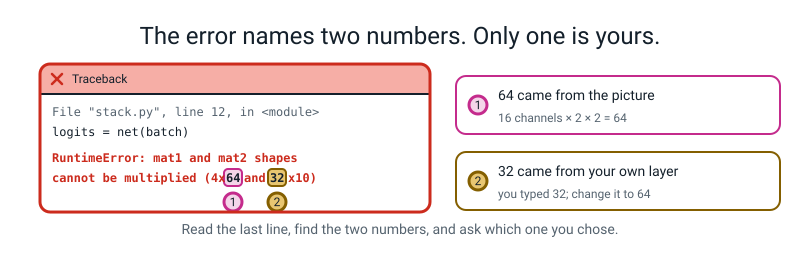
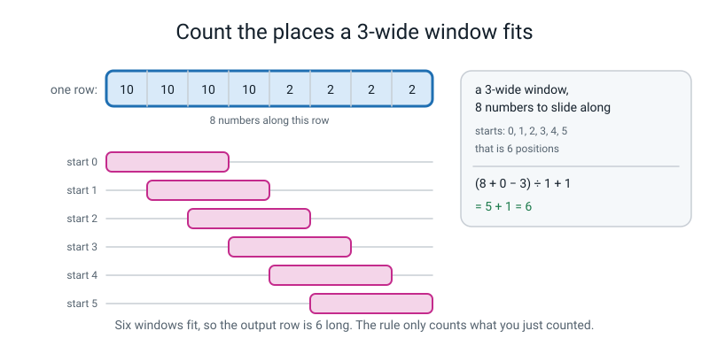
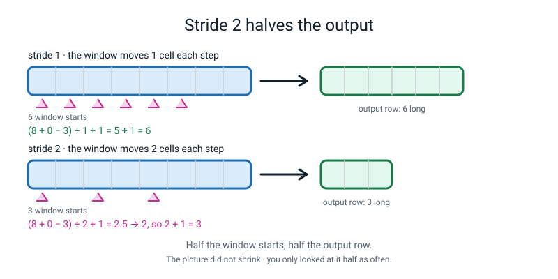
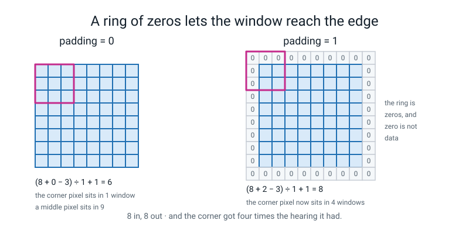
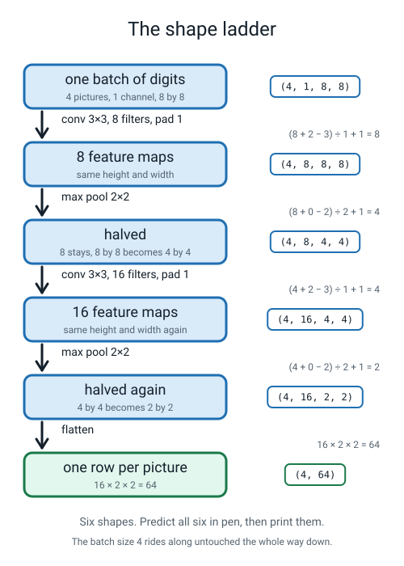
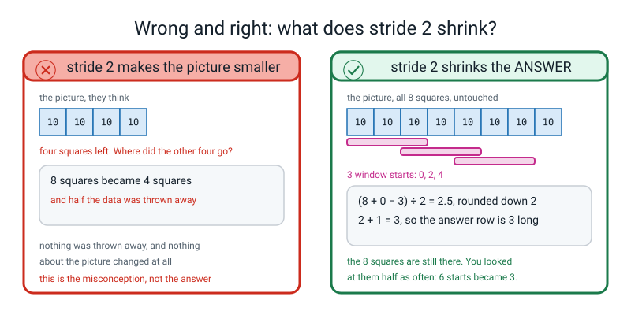
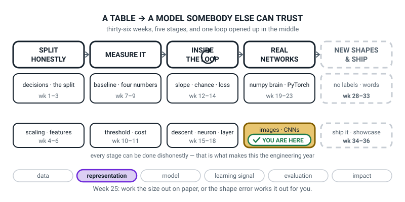
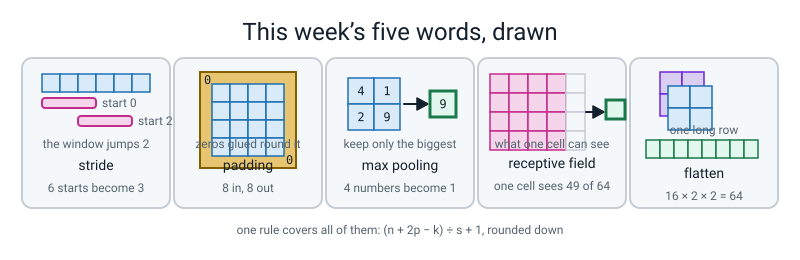

# Week 25 — Work Out the Size Before You Run It

[⬅ Week 24](week-24.md) · [Course Home](../README.md) · [Next ➡](week-26.md) · [Workbook](../workbook/week-25.md)

---

> ### This week in one sentence
> **Every conv and pool layer changes height and width by one division you can do on paper — and if you cannot do it on paper, the shape error will find you and print two numbers, one of which you typed yourself.**
>
> **By the end of this chapter you will be able to:**
> - **Count the window positions** of a 3-wide window on 8 squares by sliding a card, and then **derive the rule from what you counted**
> - **Apply `(n + 2p − k) ÷ s + 1`, rounded down**, to twelve layer settings and match every shape PyTorch prints
> - **Predict all six shapes** through an 8×8 → conv → pool → conv → pool → flatten stack **before running it**, and read the real error when one prediction is wrong
> - **Explain what padding is for and what stride 2 costs you**, each in one sentence with a number in it
>
> **New maths:** one division. `(n + 2p − k) ÷ s + 1`, rounded down — and you are going to count it with a piece of card before anybody writes it down.
>
> **New syntax:** `nn.Conv2d(..., stride=2, padding=1)` · `nn.MaxPool2d(2)` · `nn.Flatten()` · `t.view(t.size(0), -1)`
>
> **Reading time:** about 40 minutes. **Homework:** about 55 minutes.

---

## 🪝 Start Here

Here is the error message you are going to see most often for the rest of this course.

```text
RuntimeError: mat1 and mat2 shapes cannot be multiplied (4x64 and 32x10)
```

Not a typo. Not a misspelt variable. **This one.** It is what a network says when its plumbing does not line up.

Look at it properly. There are **four numbers** in it: 4, 64, 32 and 10. And before you know anything else about it, notice this:

**Two of those numbers a person typed. Two of them came out of the picture.**

The `10` is a choice — ten digits, ten answers. The `4` is a choice — four pictures in the batch. So the argument is between the `64` and the `32`, and exactly one of them was typed wrong.


*Figure 25.1 — The error names two numbers. Only one is yours. The 64 came out of the picture; the 32 was typed by hand, so the 32 is the one to change.*

Until you can tell which is which, this error costs you twenty minutes. Once you can, it costs you ten seconds.

**And the whole difference is one division.** Two minutes of arithmetic, which you are going to work out yourself with a strip of card on squared paper before anybody writes a formula down.

The one sentence to keep from today:

> **A shape error is arithmetic you did not do. It is never bad luck, and it never happens differently twice.**

---

## 🧠 The Big Idea

This section builds the size rule from a strip of card, one idea at a time: window positions, stride, padding, max pooling and flatten.

> **📌 About the code in this section.** The blocks below are **illustrations, not files**. Each one carries on from the one above, and the `import` lines are typed once. **The complete runnable files are in 💻 Type This.** If you copy a block from here on its own and Python says `NameError`, that is why, and nothing is broken.

### 1. Counting the places a window fits

**The plain explanation.** Last week you slid a 3×3 kernel over a 6×6 picture and got a 4×4 answer. You may not have noticed that **6 became 4**. This week the sizes start to compound, so you have to be able to predict them.

Get squared paper. Draw a row of **8 squares** and number them **0 to 7**. Cut a strip of card **3 squares wide**. That is the whole mathematical apparatus for this lesson.

Put the card at the far left. It covers 0, 1, 2 — that is **one** position. Slide it right one square: 1, 2, 3 — **two**. Keep going, and **say the leftmost square out loud each time**:

```text
start 0  covers 0 1 2
start 1  covers 1 2 3
start 2  covers 2 3 4
start 3  covers 3 4 5
start 4  covers 4 5 6
start 5  covers 5 6 7
```

Now the card is hanging off the end. **Six positions.** You did not calculate that. You counted it.


*Figure 25.2 — Count the places a 3-wide window fits. Six positions, counted; the rule is a shortcut for that count.*

🍕 **The analogy.** A 10-metre fence with a post every metre needs **eleven** posts, not ten, because there is one at the very start. Six window starts, and the last one is number five, for exactly the same reason.

> **⚠️ Watch out:** the answer is **6**, not 5. Say the start numbers out loud — "zero, one, two, three, four, five" — then ask yourself how many you said. Six. And what was the last one? Five. **The gap between five and six is the only thing in this lesson people get wrong.**

### 2. Stride — how far the window jumps

> **stride** — how far the window moves between one position and the next. So far it moved 1 square at a time.

**Make it jump two.** Slide your card from square 0, then straight to 2, then to 4 — and now it is off the end. **Three positions, not six.**

```text
starts with stride 1:  0  1  2  3  4  5     six
starts with stride 2:  0     2     4        three
```


*Figure 25.3 — Stride 2 halves the output. Six starts become three; the picture did not shrink, you just looked at it half as often.*

**And here is the sentence to get right, because almost everybody gets it wrong the first time.** The picture did **not** get smaller. All eight squares are still sitting there on your paper. **What got smaller is the answer**, because you skipped every other window. You looked at the same picture half as often.

> **💡 Try this:** cover the answer row in Figure 25.3 with your thumb. The row of eight squares is identical in both halves of the figure. Only the number of windows changed.

### 3. Padding — a ring of zeros glued round the outside

> **padding** — extra squares of zero glued around the outside of the picture before anything slides over it. One ring adds one square on the **left** and one on the **right**, so the width grows by **two**.

Draw one extra square on each end of your row of eight and write `0` in both. You now have ten squares. Slide the 3-wide card from the leftmost new square: starts 0, 1, 2, 3, 4, 5, 6, 7 — **eight positions.**

**Eight in, eight out.** Which is the whole point:

```text
without padding:  8 squares in, 6 out    the picture quietly shrinks
with one ring:    8 squares in, 8 out    you can stack layers for ever
```

**That is why almost every real network uses window 3, jump 1, one ring of zeros.** You can stack ten conv layers and the picture never evaporates.


*Figure 25.4 — A ring of zeros lets the window reach the edge. Same size in, same size out, and the corner gets four times the hearing it had.*

**And there is a second reason for padding, which is better than the first.** Count how many windows a **corner** pixel of an 8×8 sits inside, with no padding. Just one — the window that starts in the corner. Now count for a pixel in the **middle**: nine.

```text
padding 0:  corner pixel is in 1 window,  middle pixel is in 9
padding 1:  corner pixel is in 4 windows, middle pixel is in 9
```

**The model gets nine times more evidence about the middle of a picture than about the corners.** One ring of zeros takes the corner from 1 window to 4. Still not nine. Four times better than one.

> **🧑‍🏫 If a student asks:** *"isn't gluing on fake zeros cheating?"* **Yes, a bit, and it is worth being straight about it.** The zeros are not measurements — nobody photographed them. Every answer along the border of a feature map is partly computed from numbers somebody made up, which is why you sometimes see a faint frame effect round the edge of a feature map. The trade is: invented zeros at the border, or the border barely counted at all. **Almost everybody takes the zeros. Nobody claims it is free.**

### 4. Max pooling — keep the biggest and throw the rest away

> **max pooling** — slide a small window (almost always 2×2, jumping 2) and keep **only the biggest number** in each window. It has **no weights at all**: nothing to learn, nothing to train.

Here is the whole idea on sixteen numbers. Take this 4×4 and cut it into four blocks of four.

```text
  4   1  |  0   2
  2   9  |  3   1
 --------+--------
  0   0  |  7   5
  1   3  |  6   8
```

Keep the biggest number in each block: **9, 3, 3, 8**. Written as a small grid:

```text
  9   3
  3   8
```

**Sixteen numbers became four, and the two loudest — the 9 and the 8 — both survived.** That is the deal. You throw away *exactly where* the strong response was and keep *that there was one*. It costs you position and buys you two things:

- The tensor gets four times smaller, so the next layer is four times cheaper.
- The network cares less about exactly where inside a block an edge was: pixel 4 or pixel 5 gives the same answer, as long as both sit in the same 2×2 block.

**And the size check uses the same rule as a conv.** A 2-wide window jumping 2 on 4 squares: `(4 + 0 − 2) ÷ 2 + 1 = 1 + 1 = 2`. Say that out loud once — people expect pooling to have a rule of its own, and it does not.

### 5. Flatten, and the one number this whole week is for

At the end of a conv stack the data is a small block: `(4, 16, 2, 2)` — four pictures, sixteen feature maps each, two by two. But `nn.Linear`, which you have known since Week 22, wants **one flat row per example**.

> **flatten** — squash every dimension except the batch into one long row. `(4, 16, 2, 2)` becomes `(4, 64)`, because `16 × 2 × 2 = 64`.


*Figure 25.5 — The shape ladder. Six shapes, each with the arithmetic that produced it, and the batch size 4 riding along untouched all the way down.*

**That `64` is the number the whole lesson is for.** It is the number you must write into `nn.Linear(64, 10)`. Get it wrong and you get Figure 25.1.

There are two ways to write a flatten and they do exactly the same thing:

```python
nn.Flatten()                 # a layer you drop into the stack
t.view(t.size(0), -1)        # a method you call on the tensor
```

`t.size(0)` means "however many rows are in this batch — look, don't ask me". `-1` means "you work the rest out, keeping the total count of numbers the same". Sixty-four is the only number that fits, so it computes 64 for you.

**One more word, and it is a word this week and never a formula:**

> **receptive field** — how much of the *original* picture one cell of a later feature map can see.

One cell of the first conv's output looked at a 3×3 patch. After a pool, each cell covers a 2×2 area of those, so it depends on about 4×4 of the original. After a second conv, about 8×8. After a second pool, about 10×10 — **bigger than the whole 8×8 picture.** You do not need a formula for this and you are not going to be given one. You are going to *measure* it, in the workbook, by switching on one pixel at a time.

---

## 🔢 The Maths, Slowly

This section turns your card counting into arithmetic, one step at a time. The one new piece of maths is a division, and **you already did it with a card.**

### Step 1 — write down what you counted

Fill this in from your squared paper. **Count, do not calculate.**

| squares (n) | window (k) | jump (s) | rings (p) | positions you counted |
|---:|---:|---:|---:|---:|
| 8 | 3 | 1 | 0 | 6 |
| 8 | 3 | 2 | 0 | 3 |
| 8 | 3 | 1 | 1 | 8 |

### Step 2 — find the last legal start, then add one for the start at zero

Ask why the card cannot start at square 6. Because it is 3 wide, so from start 6 it would need squares 6, 7 **and 8** — and there is no square 8. So the last legal start is `8 − 3 = 5`. And the starts run 0, 1, 2, 3, 4, 5, which is **six** numbers even though the biggest is five:

```text
8 − 3 = 5        the last place a 3-wide window can start on 8 squares
5 + 1 = 6        six starts, because you counted the one at zero
```

**That `+ 1` is not a fudge factor.** It is the eleventh fence post. It is there because counting began at zero.

### Step 3 — put the jump in, and round down

With stride 2 you do not use every start; you use every second one. So take the distance you have to travel, `5`, and see how many jumps of 2 fit inside it:

```text
8 − 3 = 5        the last place it could start
5 ÷ 2 = 2.5      how many 2-square jumps fit into that
round down → 2   you cannot take half a jump
2 + 1 = 3        three positions, counting the one at zero
```

**Rounding down is not a subtlety. It is the point.** Two and a half jumps puts the card half off the end of the paper. Try it with the card and it takes about four seconds to be convinced.

### Step 4 — put the padding in

One ring adds one square on each side, so the row is `8 + 2 = 10` long:

```text
(8 + 2) − 3 = 7      note the 2: one ring adds a square on EACH side
7 ÷ 1 = 7
7 + 1 = 8            the answer comes out the same size as the picture
```

### Step 5 — the name, and the symbols

Now, and only now, here is the whole thing in one line:

> **The output-size rule.** For a picture `n` squares across, a window `k` wide, jumping `s` at a time, with `p` rings of zeros round the outside:
>
> ```
> out = (n + 2p − k) ÷ s + 1,  rounded down
> ```
>
> Apply it to the **height** and to the **width** separately. **It is the same rule for a convolution and for a pool.**

Four letters, and you have already used all four:

| Letter | Plain English | On our stack |
|---|---|---|
| `n` | how many squares across the picture is | 8 |
| `p` | how many rings of zeros you glued round it | 1 |
| `k` | how many squares wide the window is | 3 |
| `s` | how far the window jumps each step | 1 |

### Step 6 — check it yourself with a calculator

**Four rows, ten seconds each. Do them now, before you read on.** These four cover almost everything you will ever meet.

| n | k | s | p | Type this into a calculator | out |
|---:|---:|---:|---:|---|---:|
| 8 | 3 | 1 | 0 | (8 + 0 − 3) ÷ 1 = 5, then 5 + 1 | **6** |
| 8 | 3 | 1 | 1 | (8 + 2 − 3) ÷ 1 = 7, then 7 + 1 | **8** ← same size in, same size out |
| 8 | 2 | 2 | 0 | (8 + 0 − 2) ÷ 2 = 3, then 3 + 1 | **4** ← halved |
| 8 | 3 | 2 | 1 | (8 + 2 − 3) ÷ 2 = **3.5 → 3**, then 3 + 1 | **4** ← also halved |

**Row four is the one that separates people who counted from people who memorised.** `7 ÷ 2` is 3.5, which rounds **down** to 3, and then you add one. If you got 5, you rounded up.

> **🔢 The maths, slowly:** in Python the rounding-down divide is written `//`. `5 // 1` is 5 and `5 // 2` is 2, not 2.5. That is the "rounded down" in the rule, spelled as two slashes.

**And the observation worth having:** rows 3 and 4 both give 4. **There are two different ways to halve a picture** — pool it, or use a stride-2 conv. Worked Example 2 measures the difference.

---

## 💻 Type This

In this section you type one file, `shapes.py`, in four steps. Nothing here downloads anything, and nothing trains.

### Step 1 — one picture, typed by hand

Create a new file, `shapes.py`, and type this.

```python
"""shapes.py - work out the size before you run it."""
import numpy as np
import torch
import torch.nn as nn

torch.manual_seed(0)
np.random.seed(0)

img = np.zeros((8, 8), dtype=np.float32)
img[:, 0:4] = 10.0
img[:, 4:8] = 2.0
print("--- the picture ---")
print(img.astype(int))
print("numpy shape :", img.shape)

x = torch.from_numpy(img).float().unsqueeze(0).unsqueeze(0)
print("torch shape :", tuple(x.shape))
```

**What the new lines do.** `img[:, 0:4] = 10.0` means "every row, columns 0 to 3, set to 10" — a bright left half. `.unsqueeze(0)` adds a new dimension of size 1 at the front; doing it twice adds two.

**Predict before you run it.** `img.shape` will print `(8, 8)`. What will `x.shape` print?

```text
--- the picture ---
[[10 10 10 10  2  2  2  2]
 [10 10 10 10  2  2  2  2]
 [10 10 10 10  2  2  2  2]
 [10 10 10 10  2  2  2  2]
 [10 10 10 10  2  2  2  2]
 [10 10 10 10  2  2  2  2]
 [10 10 10 10  2  2  2  2]
 [10 10 10 10  2  2  2  2]]
numpy shape : (8, 8)
torch shape : (1, 1, 8, 8)
```

**Four numbers, not two.** Read them right to left: **8 wide, 8 tall, 1 channel, 1 picture in the batch.** `Conv2d` refuses to look at anything that is not shaped `(batch, channels, height, width)` — always four numbers, always in that order. Not one pixel value changed; only the box round them.

### Step 2 — the count, confirmed by the machine

Add this to the end of `shapes.py` and run it.

```python
print()
print("--- how many places does a 3-wide window fit on 8 numbers? ---")
starts = [s for s in range(8) if s + 3 <= 8]
print("start columns:", starts)
print("that is", len(starts), "positions")
print("the rule    : (8 + 0 - 3) // 1 + 1 =", (8 + 0 - 3) // 1 + 1)
print("Conv2d(1, 1, 3) says:", tuple(nn.Conv2d(1, 1, 3)(x).shape))
```

**What the new lines do.** The list comprehension keeps every start `s` from 0 to 7 where the window's last square, `s + 2`, still fits — which is the condition `s + 3 <= 8`. `//` is the rounding-down divide.

```text
--- how many places does a 3-wide window fit on 8 numbers? ---
start columns: [0, 1, 2, 3, 4, 5]
that is 6 positions
the rule    : (8 + 0 - 3) // 1 + 1 = 6
Conv2d(1, 1, 3) says: (1, 1, 6, 6)
```

**Three ways of getting the same 6 on one screen: your card, the rule, and PyTorch.** And look at `[0, 1, 2, 3, 4, 5]` — that is literally the list you chanted.

In `(1, 1, 6, 6)`: the batch stayed 1, the channels stayed 1, and **both** 8s became 6s — because the rule is applied to height and width separately, and they happened to be equal.

### Step 3 — the shape ladder

Add this to the end of `shapes.py`. It pushes four blank pictures through the whole stack and prints the shape after every layer.

```python
print()
print("--- the shape ladder: four pictures through the stack ---")
batch = torch.zeros(4, 1, 8, 8)
stack = [("input", None),
         ("Conv2d(1, 8, 3, padding=1)", nn.Conv2d(1, 8, 3, padding=1)),
         ("ReLU()", nn.ReLU()),
         ("MaxPool2d(2)", nn.MaxPool2d(2)),
         ("Conv2d(8, 16, 3, padding=1)", nn.Conv2d(8, 16, 3, padding=1)),
         ("ReLU()", nn.ReLU()),
         ("MaxPool2d(2)", nn.MaxPool2d(2)),
         ("Flatten()", nn.Flatten())]
h = batch
for name, layer in stack:
    if layer is not None:
        h = layer(h)
    print("%-28s %s" % (name, tuple(h.shape)))
```

**What the new lines do.** `stack` is a list of pairs — a name and a layer. The `input` row has `None` for its layer so nothing is applied and the starting shape gets printed. `%-28s` pads the name to 28 characters so the shapes line up in a column.

**Write your six shapes down in pen before you run this.** Four numbers each, except the last one.

```text
--- the shape ladder: four pictures through the stack ---
input                        (4, 1, 8, 8)
Conv2d(1, 8, 3, padding=1)   (4, 8, 8, 8)
ReLU()                       (4, 8, 8, 8)
MaxPool2d(2)                 (4, 8, 4, 4)
Conv2d(8, 16, 3, padding=1)  (4, 16, 4, 4)
ReLU()                       (4, 16, 4, 4)
MaxPool2d(2)                 (4, 16, 2, 2)
Flatten()                    (4, 64)
```

**Line by line.**

**Line 1.** `(4, 1, 8, 8)`. Four pictures, one channel, eight by eight.

**Line 2.** `(4, 8, 8, 8)`. Two things changed and one thing did not. Channels went **1 → 8**, because you asked for 8 filters and each filter makes its own answer grid. Height and width stayed **8**, because `(8 + 2 − 3) ÷ 1 + 1 = 8`.

**Line 3.** `ReLU()` changed **nothing at all.** It walked through every number and replaced the negatives with zero. **A squash never changes a shape.** Say that once out loud; it saves you an hour later.

**Line 4.** `(4, 8, 4, 4)`. The 8 channels are untouched — pooling never mixes channels. The 8 by 8 became 4 by 4: `(8 + 0 − 2) ÷ 2 + 1 = 4`.

**Line 5.** `(4, 16, 4, 4)`. Channels 8 → 16 because 16 filters. Height and width unchanged again, same padding.

**Line 7.** `(4, 16, 2, 2)`. Halved again. `(4 + 0 − 2) ÷ 2 + 1 = 2`.

**Line 8.** `(4, 64)`. **This is the line the lesson is for.** Sixteen channels of two by two is `16 × 2 × 2 = 64` numbers per picture, laid out flat in one row.

**And which number is the same on every single line?** The **4**. The batch size rides along untouched from top to bottom. Nothing you do to a picture changes how many pictures you have. If the first number ever changes, something is badly wrong.

### Step 4 — the two ways to flatten

Add this to the end of `shapes.py`. It flattens the same tensor `h` a second way.

```python
print()
print("t.view(t.size(0), -1) gives the same thing:",
      tuple(h.view(h.size(0), -1).shape))
```

```text
t.view(t.size(0), -1) gives the same thing: (4, 64)
```

**Two spellings, one operation.** `nn.Flatten()` is a layer you drop into a stack; `t.view(t.size(0), -1)` is a method you call inside a `forward`. Use whichever, but know they are the same thing.

### The complete `shapes.py`

Everything in Steps 1 to 4, in that order, in one file. **It runs in under one second and nothing trains.** Every number it printed was a zero, and the eight filters in the first conv layer are whatever random numbers PyTorch invented when you built the layer. **That is deliberate.** Shapes are a plumbing problem you can solve completely, on paper, before you own any data. Next week the plumbing gets water in it.

---

## 🔍 Worked Examples

This section gives three complete programs that use the size rule on bigger stacks. **Predict every shape before you run each one.**

### Worked Example 1 — A minesweeper board, three blocks deep

Not a digit. A 12×12 board with a 6×6 patch of mines in the middle, pushed through three conv-pool blocks.

```python
"""we1.py - a 12x12 minesweeper board through a three-block stack."""
import numpy as np
import torch
import torch.nn as nn

torch.manual_seed(0)
np.random.seed(0)

board = np.zeros((12, 12), dtype=np.float32)
board[3:9, 3:9] = 1.0          # a 6x6 block of mines in the middle
print("the board, as whole numbers:")
print(board.astype(int))

x = torch.from_numpy(board).float().unsqueeze(0).unsqueeze(0)
print("torch shape:", tuple(x.shape))

stack = [("input", None),
         ("Conv2d(1, 4, 3, padding=1)", nn.Conv2d(1, 4, 3, padding=1)),
         ("MaxPool2d(2)", nn.MaxPool2d(2)),
         ("Conv2d(4, 8, 3, padding=1)", nn.Conv2d(4, 8, 3, padding=1)),
         ("MaxPool2d(2)", nn.MaxPool2d(2)),
         ("Conv2d(8, 16, 3, padding=1)", nn.Conv2d(8, 16, 3, padding=1)),
         ("MaxPool2d(2)", nn.MaxPool2d(2)),
         ("Flatten()", nn.Flatten())]
h = x
for name, layer in stack:
    if layer is not None:
        h = layer(h)
    print("%-28s %s" % (name, tuple(h.shape)))
```

```text
the board, as whole numbers:
[[0 0 0 0 0 0 0 0 0 0 0 0]
 [0 0 0 0 0 0 0 0 0 0 0 0]
 [0 0 0 0 0 0 0 0 0 0 0 0]
 [0 0 0 1 1 1 1 1 1 0 0 0]
 [0 0 0 1 1 1 1 1 1 0 0 0]
 [0 0 0 1 1 1 1 1 1 0 0 0]
 [0 0 0 1 1 1 1 1 1 0 0 0]
 [0 0 0 1 1 1 1 1 1 0 0 0]
 [0 0 0 1 1 1 1 1 1 0 0 0]
 [0 0 0 0 0 0 0 0 0 0 0 0]
 [0 0 0 0 0 0 0 0 0 0 0 0]
 [0 0 0 0 0 0 0 0 0 0 0 0]]
torch shape: (1, 1, 12, 12)
input                        (1, 1, 12, 12)
Conv2d(1, 4, 3, padding=1)   (1, 4, 12, 12)
MaxPool2d(2)                 (1, 4, 6, 6)
Conv2d(4, 8, 3, padding=1)   (1, 8, 6, 6)
MaxPool2d(2)                 (1, 8, 3, 3)
Conv2d(8, 16, 3, padding=1)  (1, 16, 3, 3)
MaxPool2d(2)                 (1, 16, 1, 1)
Flatten()                    (1, 16)
```

**The arithmetic, spelled out.** Every padded conv keeps the size: `(12 + 2 − 3) ÷ 1 + 1 = 12`. Every pool halves it, rounding down:

```text
pool 1:  (12 + 0 − 2) ÷ 2 + 1 = 5 + 1 = 6
pool 2:  ( 6 + 0 − 2) ÷ 2 + 1 = 2 + 1 = 3
pool 3:  ( 3 + 0 − 2) ÷ 2 + 1 = 0 + 1 = 1      <- (3 - 2) ÷ 2 = 0.5, rounds DOWN to 0
```

**Pool 3 is the interesting one.** A 3 does not halve evenly. `(3 − 2) ÷ 2 = 0.5`, rounds down to 0, plus 1 gives **1**. So a 3×3 pools to 1×1, and **the last row and last column of that 3×3 are simply dropped.** Worth knowing before it happens to somebody's data.

And the flatten: `16 × 1 × 1 = 16`, so `nn.Linear` after this stack must start at **16**, not 64.

### Worked Example 2 — Two ways to halve a picture, and they are not the same thing

Route A: a padded conv, then a pool. Route B: one conv that jumps two at a time.

```python
"""we2.py - two ways to halve a picture, and they are not the same thing."""
import torch
import torch.nn as nn

torch.manual_seed(0)
x = torch.zeros(4, 8, 8, 8)          # 4 pictures, 8 channels, 8 by 8

convA = nn.Conv2d(8, 16, 3, padding=1)
poolA = nn.MaxPool2d(2)
a = poolA(convA(x))

convB = nn.Conv2d(8, 16, 3, stride=2, padding=1)
b = convB(x)

print("route A  conv pad 1 then pool 2 :", tuple(a.shape))
print("route B  conv stride 2 pad 1    :", tuple(b.shape))
print("same shape?", a.shape == b.shape)
print()
print("route A weights:", sum(p.numel() for p in convA.parameters()),
      "+ pool has", sum(p.numel() for p in poolA.parameters()))
print("route B weights:", sum(p.numel() for p in convB.parameters()))
print()
print("the arithmetic, height and width, done separately:")
print("  A conv : (8 + 2 - 3) // 1 + 1 =", (8 + 2 - 3) // 1 + 1)
print("  A pool : (8 + 0 - 2) // 2 + 1 =", (8 + 0 - 2) // 2 + 1)
print("  B conv : (8 + 2 - 3) // 2 + 1 =", (8 + 2 - 3) // 2 + 1)
```

```text
route A  conv pad 1 then pool 2 : (4, 16, 4, 4)
route B  conv stride 2 pad 1    : (4, 16, 4, 4)
same shape? True

route A weights: 1168 + pool has 0
route B weights: 1168

the arithmetic, height and width, done separately:
  A conv : (8 + 2 - 3) // 1 + 1 = 8
  A pool : (8 + 0 - 2) // 2 + 1 = 4
  B conv : (8 + 2 - 3) // 2 + 1 = 4
```

**Identical shapes, identical weight counts, two layers versus one.** So what is different?

**The pool throws information away according to a rule *you* chose, before the network had any say: keep the biggest.** A stride-2 conv has weights, so it can **learn** what to keep.

**Which is better?** Genuinely unsettled, and it has moved twice in the last fifteen years. Pooling has no weights, so it adds nothing to overfit with and costs nothing to store; it was in a famous network in 1998 and it is still in half the networks people build. Stride-2 convs let the network decide, and several influential papers around 2015 argued the pool was an unnecessary hand-designed step and got fine results without it. **Nobody can show you a decisive experiment.** When two designs give the same shapes and comparable results, the choice is an engineering preference, and the honest thing is to say so in your write-up rather than pretend it was forced.

### Worked Example 3 — Working backwards, and running out of picture

**Part one: make the flatten give exactly 100 numbers, starting from an 8×8.**

```python
"""we3a.py - work backwards to a flatten of exactly 100."""
import torch
import torch.nn as nn

torch.manual_seed(0)
x = torch.zeros(1, 1, 8, 8)

net = nn.Sequential(
    nn.Conv2d(1, 8, 3, padding=1), nn.ReLU(), nn.MaxPool2d(2),
    nn.Conv2d(8, 25, 3, padding=1), nn.ReLU(), nn.MaxPool2d(2),
    nn.Flatten())
print("25 channels of 2 by 2 :", tuple(net(x).shape))
print("and by hand: 25 x 2 x 2 =", 25 * 2 * 2)
```

```text
25 channels of 2 by 2 : (1, 100)
and by hand: 25 x 2 x 2 = 100
```

**How you find that without guessing.** Two pads keep 8 at 8; two pools take 8 → 4 → 2. So the flatten is `channels × 2 × 2`, which is `channels × 4`. You want 100, and `100 ÷ 4 = 25`, so ask the second conv for **25 filters**. There are other answers — 100 filters and three pools gives `100 × 1 × 1` — and all of them are checkable by running it.

**Part two: what happens without any padding at all.**

```python
"""we3b.py - the same stack with every padding=1 removed."""
import torch
import torch.nn as nn

torch.manual_seed(0)
h = torch.zeros(1, 1, 8, 8)
print("%-20s %s" % ("input", tuple(h.shape)))
for name, layer in [("Conv2d(1, 8, 3)", nn.Conv2d(1, 8, 3)),
                    ("MaxPool2d(2)", nn.MaxPool2d(2)),
                    ("Conv2d(8, 16, 3)", nn.Conv2d(8, 16, 3))]:
    h = layer(h)
    print("%-20s %s" % (name, tuple(h.shape)))
print("one more pool:")
print(tuple(nn.MaxPool2d(2)(h).shape))
```

```text
input                (1, 1, 8, 8)
Conv2d(1, 8, 3)      (1, 8, 6, 6)
MaxPool2d(2)         (1, 8, 3, 3)
Conv2d(8, 16, 3)     (1, 16, 1, 1)
one more pool:
```

and then, on the next line:

```text
RuntimeError: Given input size: (16x1x1). Calculated output size: (16x0x0). Output size is too small
```

**`8 → 6 → 3 → 1 → stop.`** So **an 8×8 picture supports only one complete pad-free conv-pool block: the second conv still fits (it leaves a 1×1), but the pool after it has nothing to work on.** That is the arithmetical reason padding exists: without it, the picture evaporates and the network cannot be deep.

---

## 🐞 When It Breaks

This section shows the shape errors you are most likely to meet and how to read them. Every message below came from really running a broken version of this week's code. Your line numbers will differ. The last line will not.

> **The recipe for every shape error this week:** read **only the last line**, find the two numbers in it, and ask **"which one did I type?"** That one is the one you change.

### Break 1 — the picture arrived without its box

```python
print(nn.Conv2d(1, 1, 3)(torch.from_numpy(img)).shape)
```

```text
Traceback (most recent call last):
  File "e1.py", line 6, in <module>
    print(nn.Conv2d(1, 1, 3)(torch.from_numpy(img)).shape)
  ... four more lines inside torch ...
  File ".../torch/nn/modules/conv.py", line 456, in _conv_forward
    return F.conv2d(input, weight, bias, self.stride,
RuntimeError: Expected 3D (unbatched) or 4D (batched) input to conv2d, but got input of size: [8, 8]
```

**What Python is telling you.** *"I want three or four numbers in the shape and you gave me two."* And it printed the shape it got: `[8, 8]`.

**This is the friendliest error in the whole level, because it prints your shape back at you.** Almost every torch shape error does. Get in the habit: when you see one, the shape you need to look at is already on the screen.

**The fix.** `x = t.unsqueeze(0).unsqueeze(0)`, or `t.view(1, 1, 8, 8)`. The order is always **(batch, channels, height, width)**.

### Break 2 — the two numbers, and only one is yours

```python
net = nn.Sequential(
    nn.Conv2d(1, 8, 3, padding=1), nn.ReLU(), nn.MaxPool2d(2),
    nn.Conv2d(8, 16, 3, padding=1), nn.ReLU(), nn.MaxPool2d(2),
    nn.Flatten(),
    nn.Linear(32, 10))          # <-- wrong on purpose: should be 64
print(tuple(net(torch.zeros(4, 1, 8, 8)).shape))
```

```text
  File ".../torch/nn/modules/linear.py", line 116, in forward
    return F.linear(input, self.weight, self.bias)
RuntimeError: mat1 and mat2 shapes cannot be multiplied (4x64 and 32x10)
```

**What Python is telling you.** *"The flatten produced 64 numbers per picture and your `Linear` layer was expecting 32."*

**The 64 came out of the picture** — `16 × 2 × 2`, and you cannot change it without changing the stack. **The 32 you typed.** So the 32 is what you change.

**And notice this is Week 17 all over again**: a grid times a grid, and the two **inner** numbers must match. `(4x64 and 32x10)` — the 64 and the 32 are the inner pair. Nothing new has happened; it just has pictures in it now.

**The fix.** `nn.Linear(64, 10)`, which prints `(4, 10)`. Or, faster next time: `print(h.shape)` on the line before the flatten.

### Break 3 — one pool too many

```python
print(tuple(nn.MaxPool2d(2)(torch.zeros(4, 16, 1, 1)).shape))
```

```text
RuntimeError: Given input size: (16x1x1). Calculated output size: (16x0x0). Output size is too small
```

**What Python is telling you.** *"You asked me to pool a 1×1 and there is nothing left to pool."*

**Count your pools.** Each 2×2 pool halves the size, rounding down. From 8 you get `8 → 4 → 2 → 1` and then you are finished — **exactly three pools, and our stack uses two.** That is not an accident; it is why the stack has two blocks and not four. **The size of the picture puts a hard ceiling on how deep the network can go.**

### The whole clinic, for reference

| What you see | What it means | The fix |
|---|---|---|
| `RuntimeError: mat1 and mat2 shapes cannot be multiplied (4x64 and 32x10)` | Flatten gave 64 per picture, `Linear` expected 32 | `nn.Linear(64, 10)`. **The first of the two inner numbers is the picture's; the second is yours** |
| `RuntimeError: Expected 3D (unbatched) or 4D (batched) input to conv2d, but got input of size: [8, 8]` | Conv wants four numbers in the shape, got two | `.unsqueeze(0)` twice, or `t.view(1, 1, 8, 8)` |
| `RuntimeError: Given groups=1, weight of size [16, 1, 3, 3], expected input[4, 8, 8, 8] to have 1 channels, but got 8 channels instead` | This layer was built for 1 input channel and got 8 | **The first number of `Conv2d` must equal the channel count coming in** — the second number of the shape above it |
| `RuntimeError: Calculated padded input size per channel: (4 x 4). Kernel size: (5 x 5). Kernel size can't be greater than actual input size` | The window is bigger than what is left of the picture | Smaller window, or more padding, or one fewer pool. **The ladder on paper shows this coming three layers early** |
| `RuntimeError: Given input size: (16x1x1). Calculated output size: (16x0x0). Output size is too small` | One pool too many | Count your halvings. From 8 you get exactly three |
| `RuntimeError: shape '[4, 32]' is invalid for input of size 256` | You asked for 4 × 32 = 128 numbers and it has 256 | `t.view(t.size(0), -1)`. **`-1` cannot be wrong; a number you typed can** |
| `RuntimeError: Input type (double) and bias type (float) should be the same` | Your numbers are 64-bit and the layer's are 32-bit | `.float()` right after `torch.from_numpy`, every single time |
| `TypeError: conv2d() received an invalid combination of arguments - got (numpy.ndarray, Parameter, Parameter, ...)` | That is a numpy array, not a tensor | `torch.from_numpy(a).float()`. The clue is the words `numpy.ndarray` in the first line |
| **No error.** Every conv output is 2 smaller than you expected | Your ladder is right; your code is not | `padding=1` was left off. **And the trap: `nn.Conv2d(1, 8, 3, 1)` does NOT set padding — the fourth positional argument is `stride`.** Always name it |
| **No error.** The shapes are right but the network is far bigger than you expected | The flatten happened before the pools instead of after | Print the shape on the line before `Flatten()`. **The ladder is not decoration; it is the audit** |

---

## 🎲 What We Did In Class

This section is a record of the lesson, for anyone who missed it. You need squared paper, a strip of card exactly **3 squares wide**, and a **pen** — not a pencil.

**The hook.** One line on the screen and nothing else: `RuntimeError: mat1 and mat2 shapes cannot be multiplied (4x64 and 32x10)`. Then four numbers on the board with the right-hand side blank, and one question: *"which of these did a person choose?"* The 10 (ten digits) and the 4 (four pictures). **So the argument is between the 64 and the 32.**

**The card slide.** Everybody drew 8 squares numbered from zero, put the card at the far left, and chanted the start numbers together — *"zero, one, two, three, four, five"* — then stopped because the card was hanging off the end. Two questions: *"how many did you say?"* Six. *"And what was the last one?"* Five. **6** got circled on every sheet.

**Then the arithmetic, and only then.** `8 − 3 = 5`, the last legal start. `5 + 1 = 6`, six starts because you counted the one at zero. Then the fence posts. Then the two knobs, still with the card: stride 2 gives starts 0, 2, 4 — three, because `5 ÷ 2 = 2.5` rounds **down** to 2 — and one ring of padding gives eight, because `(8 + 2 − 3) ÷ 1 + 1 = 8`. **Eight in, eight out.**

**Then the rule went on the board and got boxed** — `out = (n + 2p − k) ÷ s + 1`, rounded down — with the note that if you ever forget it, you get a card. Then the window counts, for the "but why padding?" question: `padding 0: corner in 1 window, middle in 9. padding 1: corner in 4, middle in 9.`

**Two deliberate mistakes.**

| Mistake | What happened |
|---|---|
| The plain 8×8 handed straight to a conv | **Loud.** `Expected 3D (unbatched) or 4D (batched) input to conv2d, but got input of size: [8, 8]` |
| `nn.Linear(32, 10)` after the flatten, with the wrong arithmetic said out loud | **Loud.** `mat1 and mat2 shapes cannot be multiplied (4x64 and 32x10)` — the exact line from the hook |

Both went in the Bug Log. The second entry has two sentences in it: *"the first number of the pair comes from the picture"* and *"the second one is the one I typed."*

**THE SHAPE LADDER, on the wall.** Everybody wrote six shapes in pen on paper, with no laptop open, and then every prediction went up on the wall sheet before anything ran — disagreements included, uncorrected. Then it ran:

```text
input                        (4, 1, 8, 8)
Conv2d(1, 8, 3, padding=1)   (4, 8, 8, 8)
MaxPool2d(2)                 (4, 8, 4, 4)
Conv2d(8, 16, 3, padding=1)  (4, 16, 4, 4)
MaxPool2d(2)                 (4, 16, 2, 2)
Flatten()                    (4, 64)
```

Then the most interesting miss — somebody's **32** on the last line — got built into a real program on purpose, and the traceback got read out loud with two numbers circled on the board and labelled **picture** and **mine**.

**The wrap.** Two sentences, each with a number in it. *Padding:* one ring keeps an 8 at 8 instead of dropping it to 6, and takes the corner pixel from 1 window to 4. *Stride 2:* six starts become three, so the answer halves, and it costs you the three windows you skipped — **the picture did not shrink, you looked at it half as often.**

---

## 💬 Talk About It

Three questions to argue over with a partner or a parent. Each has a hint underneath.

**1. A stride-2 conv and a conv-then-pool give exactly the same shape and have exactly the same number of weights. So is one of them pointless?**

*Hint:* the shapes really are identical — Worked Example 2 measured it, `(4, 16, 4, 4)` both ways — so the argument cannot be about size. Ask instead what each one does to the *numbers*: the pool applies a rule **you** chose before the network saw any data, and the strided conv has weights, so it can learn what to keep. Then the harder half: is "the network can learn it" always better, or is a sensible rule chosen in advance an advantage when there is not much data? And finish honestly — nobody has a decisive experiment, so what do you write in a report when you had to pick one?

**2. Padding glues on zeros that nobody measured. Is that dishonest?**

*Hint:* get both costs on the table before answering. **Padding costs you:** every border answer is partly computed from invented numbers, which is why you sometimes see a faint frame effect. **No padding costs you:** the corner pixel is in 1 window against a middle pixel's 9, and after one pad-free block and one more conv an 8×8 is down to a single pixel. Which would you rather pay — and does the answer change if the interesting part of your picture is at the edge? Then the sharpest version: there *is* a third option (pad by repeating the edge pixel, or by mirroring), it is marginally better, and almost nobody uses it. Why?

**3. Every number in this week's code was a zero and every filter was random noise. So what was actually learned today?**

*Hint:* list what a shape does **not** depend on — pixel values, filter weights, whether the model is any good, whether it has been trained at all. Then list what it does: `n`, `k`, `s`, `p` and the filter count. That split is the answer. Then push: is there anything you *cannot* work out on paper before running? (Yes — how long it takes, how much memory it needs, and what the numbers turn out to be.) And why is it worth separating a problem you can solve exactly from one you can only measure?

---

## ⚠️ Don't Get Tricked

Four tempting wrong ideas from this week, each next to the right one.

### Trick 1 — "stride 2 shrinks the picture"


*Figure 25.6 — Wrong and right: what does stride 2 shrink? The eight squares are untouched; six window starts became three, so the answer row is 3 long.*

| ❌ Wrong | ✅ Right |
|---|---|
| "Stride 2 halves the picture, so 8 squares become 4 and half the data is thrown away." | **The picture is exactly the same picture.** All 8 squares are still there and nothing was thrown away. **Stride 2 halves the ANSWER**, because you only used the starts 0, 2 and 4 instead of 0 to 5. Six windows became three; you looked at the same picture half as often. |

The test that settles it: **cover the output row with your hand.** The row of eight squares is identical in both bands of Figure 25.3.

### Trick 2 — "the `+ 1` is a fudge factor"

| ❌ Wrong | ✅ Right |
|---|---|
| "`8 − 3` is 5, so five windows fit. The `+ 1` is something people add to make the answer come out right." | **The last start is 5 and there are 6 starts**, because the starts are 0, 1, 2, 3, 4, 5 and you counted the one at zero. It is the eleventh post in a ten-metre fence. Slide the card and say the numbers out loud: you say six numbers and the biggest is five. |

The check: if you drop the `+ 1`, then `k = 3, p = 1, s = 1` on an 8 gives 7 instead of 8 — and you already know from the card that same padding gives the size back unchanged. **A rule that contradicts something you counted is a wrong rule.**

### Trick 3 — "`nn.Conv2d(1, 8, 3, 1)` sets padding to 1"

| ❌ Wrong | ✅ Right |
|---|---|
| "`Conv2d(in, out, kernel, padding)`, so `nn.Conv2d(1, 8, 3, 1)` is a padded conv." | **The fourth positional argument is `stride`, not `padding`.** `nn.Conv2d(1, 4, 3, 1)` on an 8×8 gives `(1, 4, 6, 6)` — no padding, no error, no warning at all, and every shape below it is wrong. `nn.Conv2d(1, 4, 3, padding=1)` gives `(1, 4, 8, 8)`. |

The rule: **always write `padding=1` and `stride=2` with the name on.** This one is silent, it costs the whole ladder, and it is the single commonest typo of the week.

### Trick 4 — "`ReLU` must change something, it is a whole layer"

| ❌ Wrong | ✅ Right |
|---|---|
| "There is a `ReLU()` between the conv and the pool, so the shape must change there too." | **`ReLU` never changes a shape. Not once, in any network, ever.** It walks through every number and replaces the negatives with zero. Same count of numbers, same arrangement, same shape: `(4, 8, 8, 8)` in, `(4, 8, 8, 8)` out. |

The same is true of every squash — sigmoid, tanh, ReLU. They are **element-by-element**, which is a phrase worth learning: one number in, one number out, nothing mixes. **Shapes only change when numbers get combined or rearranged** — a conv, a pool, a flatten, a matrix multiply.

---

## 🌍 Where You've Seen This

The same size arithmetic shows up in everyday technology.

1. **A photo app that says "this image is too small for this filter."** Somebody's stack needed a picture at least *n* pixels across, and *n* came out of exactly this division.
2. **The "downsampling" line in a video call's settings.** Sending every other pixel is stride 2 on a picture — the picture is not smaller, you are looking at it half as often, which is why moving detail goes blocky first.
3. **Pixelated thumbnails in a file browser.** Pooling by another name (thumbnails usually average each block; max pooling keeps the biggest): one number per block, the rest thrown away. That is why you can still tell a beach from a face at 32 pixels.
4. **A game console upscaling an old game.** Padding, in public: the edges of the frame have no neighbours, so something has to be invented there, and you can often *see* the frame effect on the outer few pixels.
5. **"Input shape mismatch" in any machine-learning log at work.** Grown-up engineers get Figure 25.1 weekly, and they ask exactly your question: which of those two numbers did a person type?
6. **The number of layers in a published network.** A 224×224 photo supports seven halvings; a 32×32 one supports five. A diagram with exactly five downsampling steps is not a taste decision — it is this division running out.

---

## 🧭 Where This Fits

Same gold tile as last week — *images · CNNs* is a four-week tile and this is the second of the four.
Nothing on the map moves, because nothing trains today. This is the week you learn to work out, in pen,
what shape comes out of a layer before you let a computer tell you.



*Figure 25.0 — The pipeline in Week 25. Second week inside the same gold tile, and the quietest week in
the stage: no training, one division. The ↻ on stage three is black, as it has been since Week 12.*

| | |
|---|---|
| **The mental model you now own** | Work the size out **before** you run it: **`(n + 2p − k) ÷ s + 1`, rounded down**, layer by layer, until you reach the one number the `Linear` after `Flatten` needs. If you cannot do it on paper, the shape error will do it for you — and it will print two numbers, one of which you typed yourself. |
| **The one question it answers** | *"What number does the `Linear` layer want?"* — channels × height × width, after every conv and every pool has had its turn. |
| **What it plugs into** | Weeks 16–17's shape discipline — **print the shape first, every time** — and Week 24's kernel, which is the `k` in the rule. The rule is not new maths; it is the count you already did with a card on squared paper, written shorter. |
| **What carries forward** | Week 26 cannot build its classifier head without this number. Week 27's frozen backbone reuses exactly these sizes, layer for layer. And for the rest of the level, "predict the shape, then check it" is how you read any architecture diagram you meet. |
| **Spiral thread** | 🏷️ **Representation** — lit alone. One thread, because the only thing that changed today is **the shape the picture is written in** as it moves down the stack. No weights moved, no score was measured, nothing was trained. |

> **💡 Try this:** write your favourite six-layer stack on one side of a card and the six shapes it produces
> on the other. Test yourself on it next week before `digits_cnn.py` runs. Getting all six right from
> memory means the commonest error in this whole level can no longer stop you for more than a minute.

---

## 🔑 Remember This

The key points of the week, then a syntax card and a one-line maths reminder.

- **A window's count, not its size, is what the rule gives you.** `out = (n + 2p − k) ÷ s + 1`, rounded down, applied to height and width **separately**, and it is the same rule for a conv and for a pool.
- **The `+ 1` is a fence post.** Six starts, last start five, because counting began at zero. Chant them if you doubt it.
- **`k=3, s=1, p=1` keeps the size exactly the same.** That is why nearly every real network uses it, and it is your quickest check that you have the formula the right way round: it must give 8 back from 8.
- **Stride 2 halves the answer, not the picture.** Six starts become three. You looked at the same picture half as often, and it cost you the three windows you skipped.
- **Max pooling has no weights.** Sixteen numbers become four; you keep *that* there was a strong response and lose *where*.
- **The flatten length is `channels × height × width`**, and it is the number that goes into `nn.Linear`. `16 × 2 × 2 = 64`. Get it wrong and you get two numbers in an error message, one of which is yours.
- **The batch size never changes.** If the first number of a shape moves, something is badly wrong.

### Syntax reminder card

Keep this card beside you while you work. It is a reference, not a file to run.

```python
import torch
import torch.nn as nn

# ---- a picture needs FOUR numbers: (batch, channels, height, width) ------
x = torch.from_numpy(img).float().unsqueeze(0).unsqueeze(0)     # (1, 1, 8, 8)
# forget .float()      -> Input type (double) and bias type (float) should be the same
# forget the unsqueeze -> Expected 3D (unbatched) or 4D (batched) input to conv2d

# ---- conv: name the keywords, ALWAYS -----------------------------------
nn.Conv2d(1, 8, 3, padding=1)          # 1 in, 8 out, window 3, one ring: 8 -> 8
nn.Conv2d(8, 16, 3, stride=2, padding=1)   # jumps 2: 8 -> 4
# nn.Conv2d(1, 8, 3, 1) sets STRIDE, not padding. Silent. 8 -> 6.

# ---- pool: no weights at all, same size rule ---------------------------
nn.MaxPool2d(2)                        # 8 -> 4 -> 2 -> 1, and then it errors

# ---- flatten: two spellings, one operation ----------------------------
nn.Flatten()                           # (4, 16, 2, 2) -> (4, 64)
t.view(t.size(0), -1)                  # the same thing, inside a forward
# t.view(4, 32) on 256 numbers -> shape '[4, 32]' is invalid for input of size 256

# ---- the audit that ends every argument -------------------------------
print(tuple(h.shape))                  # on the line before the one that broke
```

### One-line maths reminder

> **`out = (n + 2p − k) ÷ s + 1`, rounded down.** Check it on something you know: `(8 + 2 − 3) ÷ 1 + 1 = 8`, because window 3 with one ring of zeros must give the size back unchanged. If your version does not do that, your version is wrong.

---

## 📓 New Words

The five words introduced this week, with an example of each.


*Figure 25.7 — This week's five words, drawn.*

| Word | What it means | Example |
|---|---|---|
| **stride** | How far the window jumps between one position and the next | Stride 2 on 8 squares with a 3-wide window gives 3 starts instead of 6 |
| **padding** | Rings of zeros glued round the outside before anything slides | One ring on an 8×8 makes it 10×10, so a window-3 conv gives 8 back instead of 6 |
| **max pooling** | Slide a small window and keep only the biggest number in it. No weights | A 2×2 pool on the block `4 1 / 2 9` keeps just the **9**: four numbers become one |
| **receptive field** | How much of the *original* picture one cell of a later feature map can see | After conv, pool, conv, pool, the top-left cell of the final 2×2 map sees **49 of the 64** pixels |
| **flatten** | Squash every dimension except the batch into one long row | `(4, 16, 2, 2)` becomes `(4, 64)`, because `16 × 2 × 2 = 64` |

---

## 📤 Your Homework

Go to **[the Week 25 workbook](../workbook/week-25.md)**. About **55 minutes** in total.

| Section | What to do | Time |
|---|---|---|
| **Warm-Up** | Five quick questions from Week 24 | 5 min |
| **Do the Maths by Hand** | Four output sizes with a calculator, no code, working shown | 10 min |
| **Predict the Output** | Four snippets, three of them tensor shapes | 10 min |
| **Practice A & B** | Six reading questions, then five you write yourself | 15 min |
| **Fix the Broken Program** | Three planted bugs — one dtype, one shape, one completely silent | 8 min |
| **Build It — twelve sizes, then break it on purpose** | The twelve-row table, then a real traceback with both numbers labelled | 12 min |

**Three things are being marked, and the second is the real one.**

1. **Is the arithmetic written out, or just the answers?** Twelve correct numbers with no working is a page that might have been produced by pattern-matching, and the first stride-2 layer you meet next week will find out. Write the subtraction, the division, the rounding and the plus one.

2. **Does your traceback have both numbers labelled?** Circle the one that came from the picture and write *picture*. Circle the one you typed and write *mine*. **This page decides whether every shape bug for the rest of the course costs you ten seconds or twenty minutes**, and it is worth doing properly once.

3. **Do both of your sentences have a number in one?** "Padding stops the image shrinking" is true and useless. "Padding keeps an 8 at 8 instead of 6, and takes the corner pixel from 1 window to 4" is the same idea with the evidence attached. **A rule you can only state in words is a rule you cannot check. A rule you can state in numbers checks itself.**

> **⚠️ Watch out:** do the six predictions **in pen**, before you open a laptop. The point of pen is that you cannot quietly fix a wrong prediction, and the wrong ones are the useful ones.

> **💡 Try this:** after you finish, delete every `padding=1` from your stack and run the ladder again. `8 → 6 → 3 → 1`, and then the pool fails. Then answer the question that makes padding arithmetical rather than decorative: **how many pad-free conv-pool blocks does an 8×8 picture support?**

---

[⬅ Week 24](week-24.md) · [Course Home](../README.md) · [Week 26 ➡](week-26.md) · [📓 Workbook — Week 25](../workbook/week-25.md) · [Glossary](../../glossary.md)
