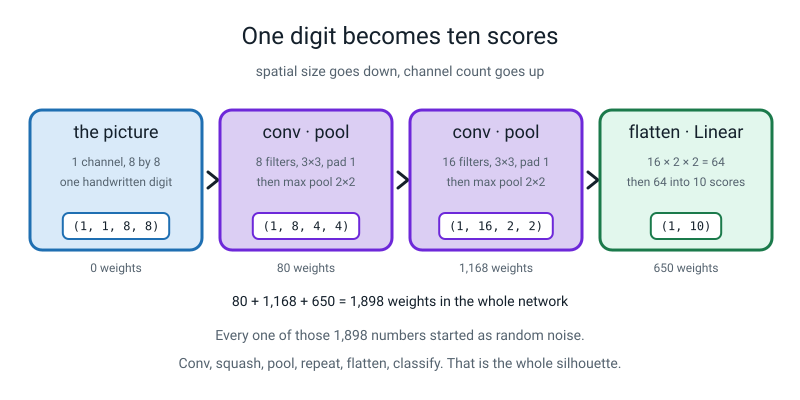
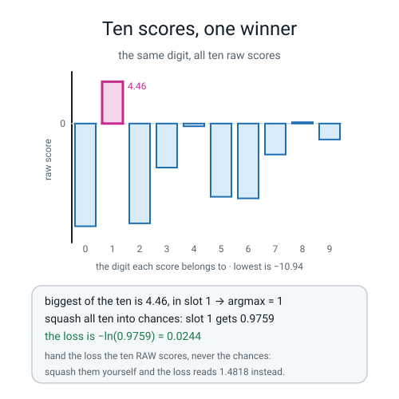
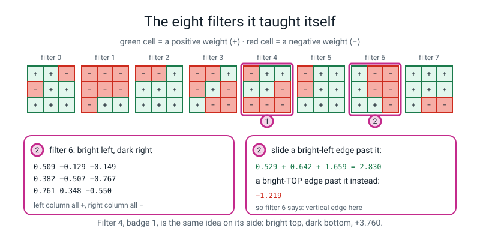
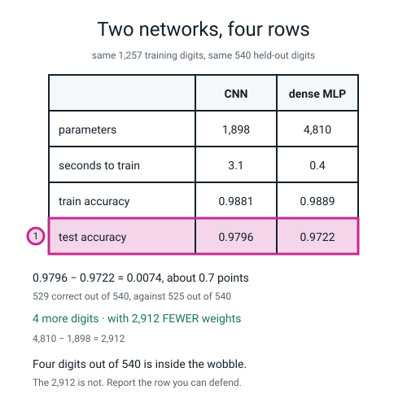
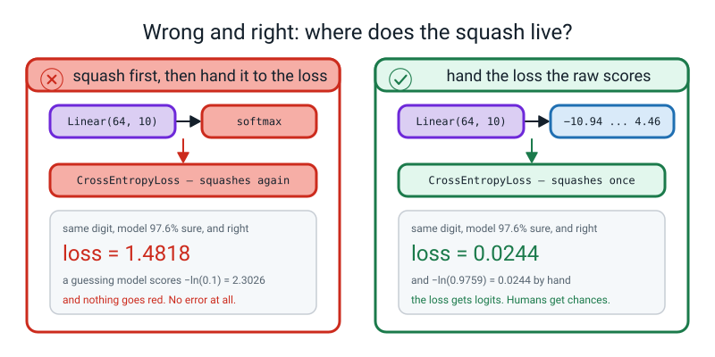
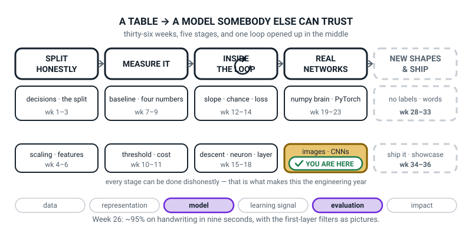
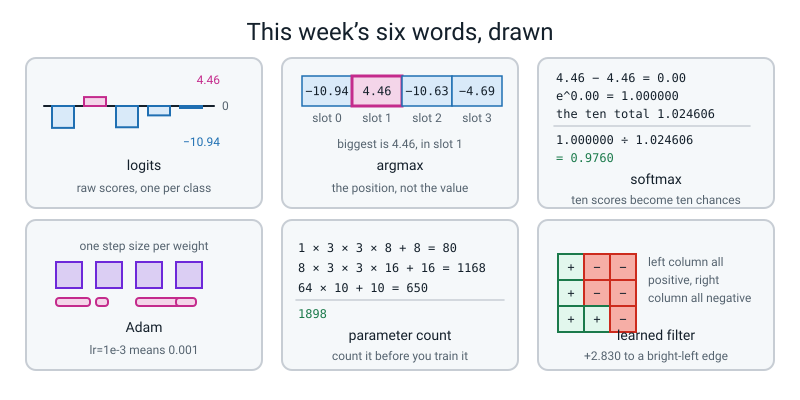

# Week 26 — A Network That Reads Digits

[⬅ Week 25](week-25.md) · [Course Home](../README.md) · [Next ➡](week-27.md) · [Workbook](../workbook/week-26.md)

---

> ### This week in one sentence
> **Once shapes stop being a mystery a CNN is a short stack — conv, squash, pool, repeat, flatten, classify — and after three seconds of training its first-layer filters are pictures you can look at.**
>
> **By the end of this chapter you will be able to:**
> - **Train a CNN on `load_digits` to about 98% test accuracy in under fifteen seconds**, and report the number **with the split named**
> - **Explain why `CrossEntropyLoss` takes ten raw scores rather than ten probabilities**, and say exactly where the softmax went — with the two loss numbers as evidence
> - **Render the eight learned first-layer filters as pictures** and describe at least two of them **with a number**
> - **Compare the CNN against Week 23's dense network** on parameters, seconds, train accuracy and test accuracy, and say which of those four comparisons actually matters
>
> **New maths:** none. Everything today is a multiply, an add, a count, and one logarithm you met in Week 14.
>
> **New syntax:** `nn.CrossEntropyLoss()` · `logits.argmax(dim=1)` · `torch.optim.Adam(model.parameters(), lr=1e-3)` · `sum(p.numel() for p in model.parameters())`
>
> **Reading time:** about 40 minutes. **Homework:** about 60 minutes.

---

## 🪝 Start Here

Last week you filled in six shapes: `(4, 1, 8, 8)` down to `(4, 64)`, all of them out of one division you worked out with a strip of card.

And at the end there was a sentence you might have skipped past. **Every number you pushed through that stack was a zero, and the eight filters in the first layer were random noise.** PyTorch invented them when you built the layer. They had never seen a digit and they did nothing useful at all.

Today those numbers get chosen. And before anything chooses them, we are going to count how many there are.

> **A conv layer's weight count:**
> ```
> (in_channels × k × k × out_channels)  +  out_channels
>                                          └── one bias per filter
> ```

Three sums. Do them on paper now.

```text
conv1  Conv2d(1, 8, 3)   :  1 × 3 × 3 × 8  + 8  =    72 + 8  =    80
conv2  Conv2d(8, 16, 3)  :  8 × 3 × 3 × 16 + 16 =  1152 + 16 =  1168
fc     Linear(64, 10)    :         64 × 10 + 10 =   640 + 10 =   650
                                                             -------
total                                                           1898
```

**One thousand, eight hundred and ninety-eight numbers.** Week 23's dense network on these exact same digits was **4,810**. So the CNN does the same job with **2,912 fewer weights**, and not because we cut a corner — because a conv layer reuses its nine numbers at every position instead of learning a fresh weight for every pixel.

Now here is the claim, and you get to check it in about twenty minutes:

> **Those 1,898 numbers are random noise right now. In about three seconds of training, on 1,257 real handwritten digits, they get good enough to read 529 out of 540 digits they have never seen.**

And then the part that actually matters. **We are going to draw the eight filters in the first layer as pictures and look at what the network decided to look for.** Nobody hand-designs an edge detector. It works out that edges are worth measuring, from nothing but 1,257 digits and a slope.

**Before you read on, write down what you think a useful 3×3 filter looks like.** In pen. You will want to check.

---

## 🧠 The Big Idea

> **📌 About the code in this section.** The blocks below are **illustrations, not files**. Each one carries on from the one above. **The complete runnable files are in 💻 Type This.**

### 1. The whole network, in one picture, with every number on it

The stack is the one you predicted the shapes for last week. Nothing about it is new except that the numbers inside it are now going to change.


*Figure 26.1 — One digit becomes ten scores. Spatial size goes down, channel count goes up, and 80 + 1,168 + 650 = 1,898 weights in the whole network.*

**And here is the thing worth saying out loud twice: the conv weight counts do not contain the picture size anywhere.**

Look at `1 × 3 × 3 × 8 + 8`. There is no 8×8 in it. **The same 80 weights would work unchanged on a 200×200 photograph.** A conv layer's size depends on its window, its input channels and its filter count, and on nothing else at all.

**The `Linear` layer is the only part of this network that cares how big the picture was — and it cares completely.** `nn.Linear(64, 10)` has the `64` welded into it, and the `64` came out of last week's arithmetic: `16 × 2 × 2`. That is exactly why last week mattered.

> **💡 Try this:** price the same shaped conv layers for a 32×32 colour photo instead. `Conv2d(3, 8, 3)` becomes `3 × 3 × 3 × 8 + 8 = 224` — it grew, because the picture has 3 channels instead of 1. And `Conv2d(8, 16, 3)` is `8 × 3 × 3 × 16 + 16 = 1168`, **exactly the same as before**, because nothing about it touches the picture. Worked Example 3 runs this.

### 2. Ten logits, and what they are not

The last layer is `nn.Linear(64, 10)`. So for each picture it produces **ten numbers**. Not ten probabilities — ten plain numbers, positive or negative, of any size at all.

> **logits** — the raw, unsquashed scores a network produces, one per class. There are ten of them here, one per digit. **They are not probabilities:** they do not add up to 1 and they can be negative.

Here are the real ten for one held-out digit, straight off the screen:

```text
[-10.94   4.46 -10.63  -4.69  -0.29  -7.80  -7.97  -3.30   0.14  -1.70]
```

**Which digit does this network think it is?** The biggest of the ten is `4.46`, and it is in slot 1, so the answer is **the digit one**. (It is a one.)

And notice what you did to get there: **you did not care what the number was, you cared which slot it was in.** That has a name.

> **argmax** — not the biggest number, but **the position** of the biggest number. Here the biggest is 4.46 and it sits in slot 1, so `argmax` is **1**.

**Are those ten numbers probabilities?** No. There is a **−10.94** in there. A probability cannot be negative, and these do not add to 1.


*Figure 26.2 — Ten scores, one winner. The biggest of the ten is 4.46 in slot 1; squashed it becomes a chance of 0.9759, and the loss is −ln(0.9759) = 0.0244.*

### 3. Softmax, and where it went

We do want probabilities eventually, because *"the model says 1"* is less useful than *"the model says 1, and it is 97.6% sure"*. There is a step that turns ten scores into ten chances.

> **softmax** — the step that turns ten raw scores into ten chances that add up to 1. Bigger score → bigger chance, and the biggest score always gets the biggest chance, so **softmax never changes the argmax.**

**Here is the whole thing, done by hand on those exact ten numbers.** Three steps, and you have every tool you need.

**Step one — subtract the biggest score from all of them.** It changes nothing about which is biggest, and it stops the arithmetic exploding when you exponentiate. The biggest is 4.46:

```text
biggest = 4.46
slot 1:   4.46 − 4.46 =   0.00
slot 8:   0.14 − 4.46 =  −4.32
slot 4:  −0.29 − 4.46 =  −4.75
slot 9:  −1.70 − 4.46 =  −6.16
slot 7:  −3.30 − 4.46 =  −7.76
slot 3:  −4.69 − 4.46 =  −9.15
...and the other four are all below −12
```

**Step two — put each one through `e` to the power of.** The same button you used in Week 13 for the S-curve.

```text
e^0.00   = 1.000000
e^−4.32  = 0.013300
e^−4.75  = 0.008652
e^−6.16  = 0.002112
e^−7.76  = 0.000426
e^−9.15  = 0.000106
the other four add up to about 0.000009
           ---------
    total   1.024606
```

**Step three — divide each one by the total.** For the winner:

```text
chance of digit 1  =  1.000000 ÷ 1.024606  =  0.9760
```

**97.6% sure it is a one.** And the remaining 2.4% is spread over the other nine, mostly on 8 (`0.0130`) and 4 (`0.0084`) — which, when you think about what a badly-written 1 looks like at eight pixels across, is not stupid.

**And then the loss, which is Week 14's surprise meter, unchanged.** Minus the natural log of the chance you gave to the answer that actually happened:

```text
loss  =  −ln(0.9760)  =  0.0243
```

Now the part that matters.

> **`nn.CrossEntropyLoss` does the softmax itself, inside, and then takes the log.** So you hand it the **ten raw scores**. If you softmax them first, you have squashed twice, and the numbers are wrong.

**Here is the evidence, and it is the most important pair of numbers this week:**

```text
loss on the RAW scores      : 0.0244      ← correct
loss on the squashed numbers: 1.4818      ← wrong, and nothing warns you
```

**No error. No warning. Nothing red.** The loss just sits at about 1.48 for an answer the model got completely right, so every gradient is wrong, and the network trains badly for a reason that is invisible.

**And why is it 1.4818 rather than something obviously silly?** Because after one softmax the ten numbers are all between 0 and 1 — quite close together. Squash *those* and you get ten numbers all near 0.1, which is what a **guessing** model looks like: `−ln(0.1) = 2.3026`. **The bug makes a confident model look like a guessing model.** That is exactly why it is so hard to spot: it does not crash, it just makes everything mediocre.

**The rule to write on the front of your notebook:**

> **The loss gets logits. Humans get probabilities.**

> **🧑‍🏫 If a student asks:** *"if the softmax is inside the loss, how do I ever get probabilities out?"* You call it yourself, at the end, when you want to *show* somebody a chance: `torch.softmax(logits, dim=1)`. **Just never on the way into the loss.**

### 4. Adam, in one honest paragraph

Since Week 21 you have used `torch.optim.SGD`, which does exactly what you wrote by hand in Week 15: `w ← w − lr × slope`, the same learning rate for every weight, for ever.

> **Adam** — an optimiser that keeps a separate, automatically-adjusted step size for **each individual weight**, based on how that weight's slopes have been behaving recently. Weights whose slopes have been small and steady get bigger steps; weights whose slopes have been large and jumpy get smaller, more careful ones.

**Three things about it, and then we move on.**

**It is the same five-line loop.** `zero_grad`, forward, loss, `backward`, `step`. Nothing about the loop changes. One word changes.

**`lr=1e-3` means `0.001`.** It is written that way because everybody writes it that way, and you will see it like that in every example you ever read.

**It converges much faster on this problem**, which is the whole reason we swap. 40 epochs of Adam gets to 98%; plain SGD at the same learning rate would still be crawling.

**And one honest caveat, because it matters.** Adam is not automatically better. It keeps two extra numbers per weight, so it uses about three times the memory, and on some large problems a carefully tuned plain SGD ends up slightly better on the test set. **Nobody fully agrees about why.** Most people use Adam most of the time and that is a reasonable default, not a proof.

**How it actually works — the running averages — is a level above this one, and I would rather say that than give you a sentence that sounds like an explanation and is not.**

### 5. The learned filters, and how to talk about them honestly

This is the payoff, and it is also where it is easiest to say something untrue.

After training, `model[0].weight` holds the eight 3×3 filters. Rendered as pictures, light cells are positive weights and dark cells are negative.


*Figure 26.3 — The eight filters it taught itself. Filter 6's left column is all positive and its right column all negative; a bright-left edge scores +2.830 and a bright-top edge −1.219.*

**Filter 6, all nine numbers:**

```text
  0.509  −0.129  −0.149
  0.382  −0.507  −0.767
  0.761   0.348  −0.550
```

**Left column: all three positive. Right column: all three negative.** So it adds up what is on the left and subtracts what is on the right. Slide it over a place where the picture is bright on the left and dark on the right and it produces a big positive number; slide it over a flat region and the pluses and minuses cancel. **That is a vertical edge detector, and nobody wrote it. Gradient descent found it.**

**And here is how to make that a measurement rather than a story.** Build two test patches — one bright on the left, one bright on the top — and multiply them against each filter. The real numbers:

| filter | answer to a bright-LEFT edge | answer to a bright-TOP edge | what that suggests |
|---:|---:|---:|---|
| 0 | +0.750 | −1.651 | mildly prefers left-bright; dislikes top-bright |
| 1 | −1.887 | −3.428 | **negative to everything** — it fires on blank paper, not ink |
| 2 | −0.956 | −0.032 | likes ink but not a left-right split |
| 3 | +0.543 | +0.158 | weak, no clear preference |
| **4** | +0.503 | **+3.760** | **a horizontal edge detector: bright above, dark below** |
| 5 | −0.876 | +0.212 | weak; mostly positive weights, so ink-like, with a mild dislike of bright-left |
| **6** | **+2.830** | −1.219 | **a vertical edge detector: bright left, dark right** |
| 7 | +2.916 | +3.041 | likes both equally — best read as an **ink-total** measurer, not a clear corner detector |

**Here is filter 6's `+2.830`, worked out in full so it is not magic.** The bright-left patch is `1 1 −1` in every row:

```text
row 0:  0.509 × 1  +  (−0.129) × 1  +  (−0.149) × (−1)  =  0.509 − 0.129 + 0.149  =  +0.529
row 1:  0.382 × 1  +  (−0.507) × 1  +  (−0.767) × (−1)  =  0.382 − 0.507 + 0.767  =  +0.642
row 2:  0.761 × 1  +    0.348  × 1  +  (−0.550) × (−1)  =  0.761 + 0.348 + 0.550  =  +1.659
                                                                                    -------
                                                                                     +2.830
```

**And now the honest version, which is better than the tidy version.**

Two of the eight are clearly edge detectors and you can prove it with a number. One of them — filter 1 — is negative almost everywhere: **it responds to the *absence* of ink**, which is a perfectly sensible thing to measure and not what anybody would have thought to hand-design. And **three or four of them are weak and cannot be described.** Filter 3 answers +0.543 and +0.158, which is nearly nothing to both patches, and if somebody tells you a confident story about filter 3 they are making it up.

**A 3×3 filter is nine numbers. Some of them mean something clear. Some do not, and pretending otherwise teaches you that interpretation is storytelling.**

---

## 🔁 The Idea From Last Week, Used Harder

This section reuses two old ideas, last week's size rule and an older logarithm. There is no new maths this week. Instead **last week's division gets used to price a layer**, and Week 14's logarithm gets used inside a library part.

### Last week's division, doing a job

The `64` in `nn.Linear(64, 10)` is not a number anybody looked up. It is the flatten length, and the flatten length is the ladder:

```text
input                        (1, 1, 8, 8)     given
Conv2d(1, 8, 3, padding=1)   (1, 8, 8, 8)     (8 + 2 − 3) ÷ 1 + 1 = 8
MaxPool2d(2)                 (1, 8, 4, 4)     (8 + 0 − 2) ÷ 2 + 1 = 4
Conv2d(8, 16, 3, padding=1)  (1, 16, 4, 4)    (4 + 2 − 3) ÷ 1 + 1 = 4
MaxPool2d(2)                 (1, 16, 2, 2)    (4 + 0 − 2) ÷ 2 + 1 = 2
Flatten()                    (1, 64)          16 × 2 × 2 = 64
```

**And now that number does two jobs, not one.** It decides whether the program runs *and* it decides how many weights the last layer has: `64 × 10 + 10 = 650`. Get the ladder wrong by one pool and the `Linear` layer is four times bigger and you never notice, because nothing errors.

### Week 14's logarithm, inside a library part

The surprise meter from Week 14 was `−ln(p)`, where `p` is the chance you gave to the thing that actually happened. **`CrossEntropyLoss` is that, with a softmax in front of it, averaged over the batch.** Nothing else.

**Get a calculator with an `ln` button and check this now.**

| the chance the model gave the true answer | `−ln(p)` |
|---:|---:|
| 0.9760 | **0.0243** |
| 0.5000 | **0.6931** |
| 0.1000 | **2.3026** |
| 0.0200 | **3.9120** |

**Read that middle row.** `−ln(0.1) = 2.3026` is what a model scores when it spreads its confidence evenly over ten options — a pure guess. **Hold on to 2.3026.** It is the number a fresh ten-class network starts at, and you are going to see `2.2796` printed on your own screen in about ten minutes.

**That is a free sanity check, and it is worth installing as a permanent habit:**

> **A fresh ten-class network's first loss should be close to 2.30.** If it starts at 0.4, something has leaked. If it starts at 8, something is broken.

---

## 💻 Type This

One file. `load_digits()` ships inside scikit-learn, so **nothing downloads.**

> **💡 When you have internet:** the grown-up version of this lesson uses colour photographs — `pip install torchvision`, then `torchvision.datasets.CIFAR10(root=".", download=True)`, 60,000 pictures of 32×32 in ten classes. Everything you learn today transfers unchanged except that the first conv takes 3 input channels instead of 1. **It is optional and nothing in this week needs it.**

### Step 1 — the pictures, and the one preprocessing step

Create a new file, `digits_cnn.py`, and type this block into it.

```python
"""digits_cnn.py - a network that reads digits."""
import time

import numpy as np
import torch
import torch.nn as nn
from sklearn.datasets import load_digits
from sklearn.model_selection import train_test_split
from torch.utils.data import DataLoader, TensorDataset

torch.manual_seed(0)
np.random.seed(0)

digits = load_digits()
X = digits.images / 16.0
y = digits.target
print("pictures:", X.shape, "  labels:", y.shape)
print("darkest pixel:", X.min(), "  brightest pixel:", X.max())

X_train, X_test, y_train, y_test = train_test_split(
    X, y, test_size=0.30, random_state=0, stratify=y)
print("train rows:", len(X_train), "  test rows:", len(X_test))

Xtr = torch.from_numpy(X_train).float().unsqueeze(1)
Xte = torch.from_numpy(X_test).float().unsqueeze(1)
ytr = torch.from_numpy(y_train).long()
yte = torch.from_numpy(y_test).long()
print("train tensor:", tuple(Xtr.shape), "  test tensor:", tuple(Xte.shape))
```

**What the new lines do.** `digits.images` is the *square* version of the data; `digits.data`, which Week 23 used, is the flattened one. `/ 16.0` scales brightness from 0–16 to 0–1. `.unsqueeze(1)` inserts the channel dimension at position **1**, because the batch dimension is already there.

**Predict before you run it.** Week 23 used `digits.data`, which was `(1797, 64)`. What shape is `digits.images`?

```text
pictures: (1797, 8, 8)   labels: (1797,)
darkest pixel: 0.0   brightest pixel: 1.0
train rows: 1257   test rows: 540
train tensor: (1257, 1, 8, 8)   test tensor: (540, 1, 8, 8)
```

**Three things worth stopping on.**

**`digits.images` is `(1797, 8, 8)` and `digits.data` is `(1797, 64)`.** Same numbers. Same 1,797 digits. One has been flattened and one has not. **Week 23 used the flat one because a dense layer wants a row; we want the square one because a conv layer wants a picture.** Same data, two shapes, and the shape is the whole difference between the two networks.

**`/ 16.0` is this entire week's preprocessing** — Week 4's scaling idea, in one character. It is not compulsory; the network trains without it, just worse and slower.

**`.long()` on the labels, `.float()` on the pictures.** Say the rule out loud once: **pictures are floats, labels are whole numbers.** `.float()` on the labels gets you `expected scalar type Long but found Float`.

### Step 2 — the model, and the number you already computed

Add this block to `digits_cnn.py`. It builds the network and prints its parameter count.

```python
model = nn.Sequential(
    nn.Conv2d(1, 8, 3, padding=1),
    nn.ReLU(),
    nn.MaxPool2d(2),
    nn.Conv2d(8, 16, 3, padding=1),
    nn.ReLU(),
    nn.MaxPool2d(2),
    nn.Flatten(),
    nn.Linear(64, 10),
)
print("parameters:", sum(p.numel() for p in model.parameters()))
```

**What the new line does.** Read it inside out. `model.parameters()` hands back every block of learnable numbers in the network, one block at a time — the conv weights, the conv biases, the linear weights, the linear bias. `p.numel()` is "**num**ber of **el**ements": how many individual numbers are in this block. `sum(...)` adds them all up.

**Predict before you run it.** You did this on paper in Start Here.

```text
parameters: 1898
```

**1,898, and you knew it before the machine did.** That is the whole reason for doing the arithmetic on paper first: **the machine is confirming you, not informing you.** And look at where the `64` in `nn.Linear(64, 10)` came from — last week, `16 × 2 × 2`. Write 32 there and this line never runs.

### Step 3 — the loop, which is Week 21's five lines

Add this block next. It trains the model and times it.

```python
loader = DataLoader(TensorDataset(Xtr, ytr), batch_size=32, shuffle=True)
loss_fn = nn.CrossEntropyLoss()
opt = torch.optim.Adam(model.parameters(), lr=1e-3)
print("steps per epoch:", len(loader))

t0 = time.perf_counter()
for epoch in range(1, 41):
    model.train()
    total = 0.0
    for xb, yb in loader:
        opt.zero_grad()
        loss = loss_fn(model(xb), yb)
        loss.backward()
        opt.step()
        total += loss.item() * len(yb)
    if epoch % 10 == 0 or epoch == 1:
        print("epoch %2d  train loss %.4f" % (epoch, total / len(ytr)))
seconds = time.perf_counter() - t0
```

**What the new lines do.** `nn.CrossEntropyLoss()` is the ten-class loss: hand it the ten raw scores and a whole number from 0 to 9. `torch.optim.Adam(model.parameters(), lr=1e-3)` is the same shape as Week 21's `SGD([w], lr=0.1)` — you hand it the things it is allowed to change and how big a step to take. `total += loss.item() * len(yb)` weights each batch's loss by how many rows were in it, so the last short batch does not count as much as a full one.

**Two predictions before you run it.** 1,257 rows at 32 at a time — **how many steps per epoch?** And **what will the loss be at the very start, before it has learned anything?**

```text
steps per epoch: 40
epoch  1  train loss 2.2796
epoch 10  train loss 0.3488
epoch 20  train loss 0.1467
epoch 30  train loss 0.0922
epoch 40  train loss 0.0663
```

**`1257 ÷ 32 = 39.28`**, so 39 full batches of 32 and one last batch of 9: **40 steps.**

**And `2.2796`.** You predicted 2.30, which is `−ln(0.1)` — the score of a model picking one of ten at random. **It should be barely better than random**, because at the start of epoch 1 the eight filters are exactly the noise Week 25 ended on.

Then 0.35, 0.15, 0.09, 0.066: **falling and flattening.** And the five lines in the middle are the five lines from Week 21, untouched. Only what is inside the model changed.

> **⚠️ Watch out:** the training loss is printed every ten epochs and the test set is looked at **once**, at the end. **40 epochs was not chosen by looking at the test number** — it was chosen because the training loss had stopped falling much. Running it at 30, 40 and 50 and keeping whichever gave the best *test* number is the thing Weeks 2 and 9 told you never to do. **Say what you chose and how you chose it, every time.**

### Step 4 — the accuracies, both of them, with counts

Add this block. It scores the model on the training rows and on the test rows.

```python
model.eval()
with torch.no_grad():
    tr_acc = (model(Xtr).argmax(dim=1) == ytr).float().mean().item()
    te_pred = model(Xte).argmax(dim=1)
    te_acc = (te_pred == yte).float().mean().item()
print()
print("seconds        : %.1f" % seconds)
print("train accuracy : %.4f  (%d of %d train rows)"
      % (tr_acc, int((model(Xtr).argmax(1) == ytr).sum()), len(ytr)))
print("test accuracy  : %.4f  (%d of %d test rows)"
      % (te_acc, int((te_pred == yte).sum()), len(yte)))
```

**What the new lines do.** `logits.argmax(dim=1)` turns `(540, 10)` into `(540,)`: `dim=1` runs **along the row**, across the ten scores for one picture, and returns the position of the biggest. `.float()` before `.mean()` turns Trues into 1.0 — you cannot average Booleans.

```text
seconds        : 2.3
train accuracy : 0.9881  (1242 of 1257 train rows)
test accuracy  : 0.9796  (529 of 540 test rows)
```

**Under three seconds.** 1,898 numbers that were random noise when you started can now read **529 of 540** handwritten digits they have never seen.

**Two accuracies, and always both.** 0.9881 at home, 0.9796 on the exam — a gap of about one point. That is Week 22's overfitting gap, and **one point is a small, healthy gap**: 1,242 of 1,257 on its own homework and 529 of 540 on the test. The model has not memorised; it has learned something.

**And the counts.** `529 of 540`. **Always print the counts beside the ratio**, because `0.9796` looks precise to four decimal places and it is not: one more correct answer takes it to 0.9815. **The fourth decimal is noise.**

> **⚠️ Watch out:** the `seconds:` line is a stopwatch, not a result. Yours will differ and anything from 2 to 15 seconds is normal. **Every other line should match exactly (or within the last digit on a different machine).** If your test accuracy is not `0.9796`, a seed is missing: `torch.manual_seed(0)` **before the model is built**, and `random_state=0, stratify=y` in the split. Both matter.

**Eleven wrong. Which eleven?** Best question available, and it is the whole first half of next week.

### Step 5 — the ten scores, and the trap door

Add this block. It prints the ten raw scores for the first test picture and computes the loss three ways.

```python
with torch.no_grad():
    logits = model(Xte[:1])
print()
print("the ten raw scores for test picture 0:")
print(np.round(logits.numpy()[0], 2))
print("argmax  :", logits.argmax(dim=1).item(), "   true label:", yte[0].item())
probs = torch.softmax(logits, dim=1)
print("squashed:", np.round(probs.numpy()[0], 4))
print("they add up to:", round(probs.sum().item(), 6))
print("loss on the RAW scores      : %.4f" % loss_fn(logits, yte[:1]).item())
print("loss on the squashed numbers: %.4f" % loss_fn(probs, yte[:1]).item())
print("minus ln of the true chance : %.4f"
      % (-torch.log(probs[0, yte[0]])).item())
```

```text
the ten raw scores for test picture 0:
[-10.94   4.46 -10.63  -4.69  -0.29  -7.8   -7.97  -3.3    0.14  -1.7 ]
argmax  : 1    true label: 1
squashed: [0.000e+00 9.759e-01 0.000e+00 1.000e-04 8.400e-03 0.000e+00 0.000e+00
 4.000e-04 1.300e-02 2.100e-03]
they add up to: 1.0
loss on the RAW scores      : 0.0244
loss on the squashed numbers: 1.4818
minus ln of the true chance : 0.0244
```

**Four things in that block.**

**`argmax : 1    true label: 1`.** Right answer, and the ten chances add to exactly `1.0`.

**`0.0244` twice.** Top: the library. Bottom: `−ln(0.9759)`, which is Week 14's surprise meter computed by hand. **Identical.** The library is doing your arithmetic and nothing else.

**`1.4818`.** Same model, same picture, same correct answer — and a completely different loss, because the numbers got squashed twice. **Nothing went red.** No error, no warning, no hint of any kind.

**And your paper answer was `0.9760` and `0.0243`, where the machine says `0.9759` and `0.0244`.** That gap is in the fourth decimal place and it is entirely because you rounded the ten scores to two decimals before you started. **Your paper agrees with the machine to three decimals; the fourth is the two decimals you threw away.**

### Step 6 — one character, and no error

Add this block. It runs `argmax` along two different dimensions and prints the shapes.

```python
with torch.no_grad():
    all_logits = model(Xte)
print("shape of all the scores:", tuple(all_logits.shape))
print("argmax(dim=1) gives:", tuple(all_logits.argmax(dim=1).shape))
print("argmax(dim=0) gives:", tuple(all_logits.argmax(dim=0).shape))
```

```text
shape of all the scores: (540, 10)
argmax(dim=1) gives: (540,)
argmax(dim=0) gives: (10,)
```

**540 pictures went in. Which of those two answers is one-per-picture?**

`dim=1` runs **along the row** — across the ten scores for one picture — and gives 540 answers. Correct.

`dim=0` runs **down the column** — across all 540 pictures for one digit — and answers *"which picture had the highest score for digit 3?"* Ten numbers. **Completely useless, and no error whatsoever.**

**The way to remember it:** `dim=1` is the dimension you want to get **rid of**. You have `(540, 10)` and you want `(540,)`. And the check that catches it every time: **count the answers. There must be one per picture.**

### The complete `digits_cnn.py`

Everything in Steps 1 to 6, in that order, in one file. **It runs in about three seconds on a laptop CPU** — up to about twelve on a slow one — and it trains 40 epochs of 40 steps on 1,257 real handwritten digits.

---

## 🔍 Worked Examples

Three complete programs, three different worlds. **Predict the numbers before you run each one.**

### Worked Example 1 — Three song genres, and the softmax by hand

Three classes, not ten, so the arithmetic is small enough to check on a calculator all the way through. Save this as `we1.py` and run it.

```python
"""we1.py - three song-genre scores, one argmax, one softmax by hand."""
import numpy as np
import torch
import torch.nn as nn

torch.manual_seed(0)

genres = ["rock", "pop", "jazz"]
scores = torch.tensor([[1.20, 3.10, -0.40]])
true = torch.tensor([1])                      # it really is pop

print("scores :", scores.numpy()[0])
print("argmax :", scores.argmax(dim=1).item(), "->", genres[scores.argmax(dim=1).item()])

chances = torch.softmax(scores, dim=1)
print("chances:", np.round(chances.numpy()[0], 6))
print("they add up to:", round(chances.sum().item(), 6))

loss_fn = nn.CrossEntropyLoss()
print()
print("loss on the RAW scores      : %.6f" % loss_fn(scores, true).item())
print("loss on the squashed numbers: %.6f" % loss_fn(chances, true).item())
print("minus ln of the true chance : %.6f"
      % (-torch.log(chances[0, 1])).item())
print()
print("and the exponentials, for checking by hand:")
for i, s in enumerate(scores.numpy()[0]):
    print("  %-5s e^(%.2f - 3.10) = e^%.2f = %.6f"
          % (genres[i], s, s - 3.10, np.exp(s - 3.10)))
print("  total = %.6f" % np.exp(scores.numpy()[0] - 3.10).sum())
```

```text
scores : [ 1.2  3.1 -0.4]
argmax : 1 -> pop
chances: [0.126778 0.847626 0.025596]
they add up to: 1.0

loss on the RAW scores      : 0.165316
loss on the squashed numbers: 0.655382
minus ln of the true chance : 0.165316

and the exponentials, for checking by hand:
  rock  e^(1.20 - 3.10) = e^-1.90 = 0.149569
  pop   e^(3.10 - 3.10) = e^-0.00 = 1.000000
  jazz  e^(-0.40 - 3.10) = e^-3.50 = 0.030197
  total = 1.179766
```

**Now check every line with a calculator.** Three exponentials, one addition, three divisions, one logarithm:

```text
e^−1.90 = 0.149569        0.149569 ÷ 1.179766 = 0.126778
e^ 0.00 = 1.000000        1.000000 ÷ 1.179766 = 0.847626
e^−3.50 = 0.030197        0.030197 ÷ 1.179766 = 0.025596
          --------                              --------
   total  1.179766                       total  1.000000
```

```text
−ln(0.847626) = 0.165316
```

**Both the loss lines match to six decimal places.** And notice the wrong one: `0.655382` instead of `0.165316`, on a model that was right and 84.8% sure. **Four times bigger, and nothing complained.**

### Worked Example 2 — Five kinds of weather, four days, and the `dim` trap

Save this as `we2.py` and run it. Predict the shapes and the two losses first.

```python
"""we2.py - five weather kinds, four days, and the dim trap."""
import numpy as np
import torch
import torch.nn as nn

torch.manual_seed(0)

kinds = ["sun", "cloud", "rain", "snow", "fog"]
scores = torch.tensor([[ 4.0,  1.0, -2.0, -5.0,  0.5],
                       [-1.0,  2.5,  3.0, -4.0,  1.0],
                       [ 0.0,  0.2,  0.1,  0.0, -0.1],
                       [-3.0, -1.0,  6.0, -2.0, -1.5]])
truth = torch.tensor([0, 2, 1, 2])            # what actually happened

print("scores shape:", tuple(scores.shape))
pred = scores.argmax(dim=1)
print("argmax(dim=1):", pred.tolist(), "->", [kinds[i] for i in pred.tolist()])
print("argmax(dim=1) shape:", tuple(pred.shape), " one answer per day")
print("argmax(dim=0) shape:", tuple(scores.argmax(dim=0).shape),
      " one answer per WEATHER KIND - useless")
print()
print("right on", int((pred == truth).sum()), "of", len(truth), "days")
print("accuracy:", (pred == truth).float().mean().item())
print()
chances = torch.softmax(scores, dim=1)
print("day 0 chances:", np.round(chances.numpy()[0], 4))
print("day 2 chances:", np.round(chances.numpy()[2], 4))
loss_fn = nn.CrossEntropyLoss()
print()
print("loss on the RAW scores      : %.4f" % loss_fn(scores, truth).item())
print("loss on the squashed numbers: %.4f" % loss_fn(chances, truth).item())
print("a model guessing 1 in 5 would score -ln(0.2) = %.4f" % -np.log(0.2))
```

```text
scores shape: (4, 5)
argmax(dim=1): [0, 2, 1, 2] -> ['sun', 'rain', 'cloud', 'rain']
argmax(dim=1) shape: (4,)  one answer per day
argmax(dim=0) shape: (5,)  one answer per WEATHER KIND - useless

right on 4 of 4 days
accuracy: 1.0

day 0 chances: [9.237e-01 4.600e-02 2.300e-03 1.000e-04 2.790e-02]
day 2 chances: [0.1912 0.2335 0.2113 0.1912 0.173 ]

loss on the RAW scores      : 0.5255
loss on the squashed numbers: 1.1782
a model guessing 1 in 5 would score -ln(0.2) = 1.6094
```

**Four out of four days right, and the loss is still 0.5255.** Why is it not near zero?

**Look at day 2.** Its five chances are `0.1912, 0.2335, 0.2113, 0.1912, 0.173` — almost flat. The model got that day right, but only just, and only by luck: 0.2335 barely beats 0.2113. **Accuracy said "right". The loss said "you were guessing."** That is the whole reason we watch a loss and not only an accuracy.

**And notice `argmax(dim=0)` gave 5 answers for 4 days.** Not an error. Not a warning. **Count the answers: there must be one per day.**

### Worked Example 3 — Price a network for a colour photo, twice

The point of this one is a single fact: **a conv layer's weight count does not know how big the picture is.** Save this as `we3.py` and run it.

```python
"""we3.py - price a network for a colour photo, twice."""
import torch
import torch.nn as nn

torch.manual_seed(0)

photo = torch.zeros(1, 3, 32, 32)          # a 32 x 32 colour photo: 3 channels

conv_net = nn.Sequential(
    nn.Conv2d(3, 8, 3, padding=1), nn.ReLU(), nn.MaxPool2d(2),
    nn.Conv2d(8, 16, 3, padding=1), nn.ReLU(), nn.MaxPool2d(2),
    nn.Flatten(), nn.Linear(16 * 8 * 8, 10))
print("conv net on 32x32x3 :", tuple(conv_net(photo).shape))
for i, layer in enumerate(conv_net):
    n = sum(p.numel() for p in layer.parameters())
    if n:
        print("  layer %d %-8s %8d" % (i, type(layer).__name__, n))
print("  total %19d" % sum(p.numel() for p in conv_net.parameters()))

dense_net = nn.Sequential(nn.Flatten(), nn.Linear(3 * 32 * 32, 64), nn.ReLU(),
                          nn.Linear(64, 10))
print()
print("dense net on 32x32x3:", tuple(dense_net(photo).shape))
for i, layer in enumerate(dense_net):
    n = sum(p.numel() for p in layer.parameters())
    if n:
        print("  layer %d %-8s %8d" % (i, type(layer).__name__, n))
print("  total %19d" % sum(p.numel() for p in dense_net.parameters()))

print()
print("the two conv layers on the 8x8 digits were 80 and 1168.")
print("on a 32x32 colour photo the same shaped layers are:")
print("  Conv2d(3, 8, 3)  : 3 x 3 x 3 x 8 + 8   =", 3 * 3 * 3 * 8 + 8)
print("  Conv2d(8, 16, 3) : 8 x 3 x 3 x 16 + 16 =", 8 * 3 * 3 * 16 + 16)
print("the first one grew (1 channel became 3); the second did not change at all.")
```

```text
conv net on 32x32x3 : (1, 10)
  layer 0 Conv2d        224
  layer 3 Conv2d       1168
  layer 7 Linear      10250
  total               11642

dense net on 32x32x3: (1, 10)
  layer 1 Linear     196672
  layer 3 Linear        650
  total              197322

the two conv layers on the 8x8 digits were 80 and 1168.
on a 32x32 colour photo the same shaped layers are:
  Conv2d(3, 8, 3)  : 3 x 3 x 3 x 8 + 8   = 224
  Conv2d(8, 16, 3) : 8 x 3 x 3 x 16 + 16 = 1168
the first one grew (1 channel became 3); the second did not change at all.
```

**11,642 against 197,322. Seventeen times smaller.**

**And read the two conv rows carefully.** `Conv2d(8, 16, 3)` is **1,168 numbers on both problems** — on a 64-pixel digit and on a 3,072-pixel colour photo. It did not grow at all, because nothing about a conv layer's count touches the picture size. The first conv grew from 80 to 224, and only because the picture has 3 channels instead of 1.

**Where did all of the dense network's weight go?** Into one layer: `nn.Linear(3072, 64)` is `3072 × 64 + 64 = 196,672` — **99.7% of the whole network.** That is what "welded to one input size" means, and it is the difference between a network that fits on a phone and one that does not.

---

## 🐞 When It Breaks

This section is for the moment something goes wrong. Every message below came from really running a broken version of this week's code.

> **The two worst bugs this week produce no message at all.** One makes a good model look mediocre; the other makes a broken model look fine. **Both are caught by two numbers you can predict in advance: the loss should start near 2.30, and there should be one answer per picture.**

### Break 1 — the labels are the wrong kind of number

This version builds the labels as decimals.

```python
ytr = torch.from_numpy(y_train).float()      # should be .long()
loss = nn.CrossEntropyLoss()(model(xb), yb)
```

```text
Traceback (most recent call last):
  File "broken26.py", line 33, in <module>
    loss = loss_fn(model(xb), yb)
  ... four more lines inside torch ...
  File ".../torch/nn/functional.py", line 3059, in cross_entropy
    return torch._C._nn.cross_entropy_loss(input, target, weight, _Reduction.get_enum(reduction), ignore_index, label_smoothing)
RuntimeError: expected scalar type Long but found Float
```

**What Python is telling you.** *"The labels have to be whole numbers and yours are decimals."*

**The fix.** `torch.from_numpy(y_train).long()`, and the rule out loud: **`.float()` for the pictures, `.long()` for the labels.** `CrossEntropyLoss` wants **the digit itself** — a `(32,)` tensor of whole numbers 0–9. **Not one-hot. There is no one-hot anywhere in PyTorch.**

### Break 2 — the optimiser got the model instead of its weights

This version hands Adam the whole model.

```python
opt = torch.optim.Adam(model, lr=1e-3)       # should be model.parameters()
```

```text
  File ".../torch/optim/optimizer.py", line 883, in add_param_group
    raise TypeError("optimizer can only optimize Tensors, "
TypeError: optimizer can only optimize Tensors, but one of the params is torch.nn.modules.conv.Conv2d
```

**What Python is telling you.** *"You handed me layers where I wanted blocks of numbers."*

**The fix.** `torch.optim.Adam(model.parameters(), lr=1e-3)`. **The `()` on `parameters` is doing real work** — without it you hand over the layers themselves.

### Break 3 — the one with no message at all

```python
loss = loss_fn(torch.softmax(model(xb), dim=1), yb)      # squashed twice
```

Train that for 20 epochs beside the right version, printing the **last batch's** loss in each epoch, and this is what you get:

```text
   squashed twice   epoch  1  loss 2.3015
   squashed twice   epoch 10  loss 2.0198
   squashed twice   epoch 20  loss 1.6438
   squashed twice   test accuracy: 0.9370

   raw scores       epoch  1  loss 2.2768
   raw scores       epoch 10  loss 0.6186
   raw scores       epoch 20  loss 0.4013
   raw scores       test accuracy: 0.9611
```

**There is no error.** Twenty epochs of perfectly happy training, no warning, nothing red — and the loss is stuck at 1.64 where it should be 0.40.

**And look at what it did to the accuracy: 0.9370 against 0.9611.** Two and a half points, which looks like a slightly worse architecture rather than a bug. **This is the most expensive kind of bug there is: it does not crash, it just makes everything mediocre**, and you can lose an afternoon adding layers and changing learning rates while the architecture was fine all along.

**What to do when there is no message.** Two questions:

> **"What should the loss be before it has learned anything?"** For ten classes, `−ln(0.1) = 2.30`. Ours starts at **2.3015** (squashed twice) and **2.2768** (raw scores), both near 2.30, so that check does not catch this one — but it catches three other bugs and it costs nothing.
>
> **"Am I handing the loss raw scores?"** If there is a `softmax`, a `sigmoid` or a `Softmax()` layer anywhere between your last `Linear` and your loss, **that is your bug.**

### The whole clinic, for reference

| What you see | What it means | The fix |
|---|---|---|
| `RuntimeError: expected scalar type Long but found Float` | Labels must be whole numbers, yours are decimals | `.long()` on the labels. **`.float()` for X, `.long()` for y** |
| `RuntimeError: Expected floating point type for target with class probabilities, got Long` | You gave a grid of 0s and 1s where a list of digits was wanted | Labels are a `(32,)` tensor of digits 0–9. **No one-hot** |
| `RuntimeError: 0D or 1D target tensor expected, multi-target not supported` | Labels are `(32, 1)` and it wants `(32,)` | `yb.squeeze()`, or do not unsqueeze the labels. **Only pictures need extra dimensions** |
| `IndexError: Target 10 is out of bounds.` | You said 10 classes and handed it a label of 10 | Labels must run 0 to 9. Check `y.min()` and `y.max()` |
| `TypeError: optimizer can only optimize Tensors, but one of the params is torch.nn.modules.conv.Conv2d` | You handed the optimiser the model, not its weights | `model.parameters()` |
| `RuntimeError: mean(): could not infer output dtype ... Got: Bool` | You averaged a list of Trues and Falses | `(pred == y).float().mean()` |
| `RuntimeError: mat1 and mat2 shapes cannot be multiplied (32x64 and 32x10)` | Last week's error, back again | `nn.Linear(64, 10)`. The 64 came from `16 × 2 × 2`; the 32 you typed |
| `RuntimeError: Can't call numpy() on Tensor that requires grad` | You asked for the numbers of something still carrying gradient bookkeeping | `.detach().numpy()`, or wrap it in `with torch.no_grad():` |
| **No error.** Loss starts near 2.30 and ends near 1.6; accuracy is a couple of points low | Every gradient came from a double-squashed number | **Hand the loss the raw logits.** The loss gets logits; humans get probabilities |
| **No error.** `argmax` returns 10 numbers instead of 540 | Your accuracy is computed from nonsense | `dim=1`. **Then count the answers: one per picture** |
| **No error.** Accuracy is about 0.10 (chance) and the loss never moves off 2.30 | Nothing learned at all | `opt.step()` (or `loss.backward()`) is missing. Then `print(len(list(model.parameters())))` — this network has **6** blocks |
| **No error.** Train accuracy 0.988 and test accuracy 0.34 | The test tensor was built from the training rows, or the split ran twice with different seeds | One split, one seed, and print all four counts. **1257 + 540 = 1797** |
| A window opens and nothing else happens | `matplotlib.use("Agg")` is missing, or below the pyplot import | It must be **above** `import matplotlib.pyplot` |

---

## 🎲 What We Did In Class

This section is a record of the lesson, for anyone who missed it. You need workbook pages 26.1 to 26.3 and a pen.

**The hook, at the wall sheets.** THE SHAPE LADDER from Week 25 was still up. Nothing on the screen. Then the conv weight formula on the board — `(in × k × k × out) + out`, with an arrow to the words *one bias per filter* — and three questions in a row: *"one channel in, eight filters, 3 by 3?"* `1 × 3 × 3 × 8 = 72`, **plus 8 biases**, so **80**. *"Eight in, sixteen filters?"* **1,168.** *"Sixty-four in, ten out?"* **650.** Somebody said 72 first, and the question that fixes it is *"how many filters? So how many biases?"*

Then the addition, big:

```text
   80
 1168
  650
------
 1898
```

Then a walk to the **PARAMETER COUNT** sheet from Week 22, and one new row written in: `CNN on digits: 1,898`, right underneath `64 → 64 → 10: 4,810`. **Less than half.**

**The claim, before anything ran.** *"Those 1,898 numbers are noise. In three seconds they will read 529 of 540 digits they have never seen. And then we draw the eight filters and look at what they decided to look for."*

**Ten scores on the board, exactly:**

```text
digit:      0      1      2      3      4      5      6      7      8      9
score:  −10.94  4.46 −10.63  −4.69  −0.29  −7.80  −7.97  −3.30   0.14  −1.70
```

Two questions: *"what does this think the digit is?"* A one. *"How did you decide?"* It is the biggest. **"And notice you cared about its position, not its value — that is `argmax`."** Then: *"are those probabilities?"* Somebody said yes, and the reply was to point at the `−10.94` and say nothing.

**The softmax by hand, three steps, on the board.** Subtract 4.46 from all ten. Exponentiate. Total `1.024606`. Divide: `1.000000 ÷ 1.024606 = 0.9760`. **97.6% sure.** Then `−ln(0.9760) = 0.0243`, and *"if we had said 0.10 — a pure guess out of ten — the loss would be `−ln(0.10) = 2.30`. Hold on to that."*

**The trap door.** Two lines on the board with the second one left blank, and a vote: bigger, smaller, or an error? Most of the room said error. **No error.** Then the gap got filled with **1.4818**, and the explanation of why that particular number is so nasty: after one softmax the ten numbers are all between 0 and 1, so squashing them again pushes them all towards 0.1, and `−ln(0.1)` is 2.30. **The bug makes a confident model look like a guessing model.** Then the rule went on the board and stayed there all lesson: **the loss gets logits, humans get probabilities.**

**Adam, in ninety seconds.** Same five-line loop. `SGD` becomes `Adam`. `lr=1e-3` is `0.001`. It keeps a separate step size per weight and adjusts them as it goes, and *how* is a level above this one.

**Two deliberate mistakes, both silent.**

| Mistake | What happened |
|---|---|
| `loss_fn(torch.softmax(logits, dim=1), yte[:1])` | **Silent.** No error, no warning. `1.4818` instead of `0.0244` |
| `logits.argmax(dim=0)` on 540 pictures | **Silent.** Ten answers instead of 540, and no complaint |

Both went in the Bug Log. In the column where the error message goes, both entries say **"no message at all."**

**The Filter Vote.** The eight filters were rendered at eight times magnification and put on the wall in eight numbered boxes, and then there were **four minutes of silence** while everybody wrote down what they thought each one was looking for — with *"no idea"* allowed and encouraged. Every guess went in the boxes, disagreements included, before anybody said a word. Then the two test patches, and the eight pairs of numbers from §5 of this chapter.

**Filter 6: `+2.830` and `−1.219`. A vertical edge detector.** Whoever voted "light on the left" was right, and the number proves it. **Filter 4: `+3.760`. The same idea, rotated.** **Filter 1: negative to everything — it fires on blank paper.** And then the sentence that mattered most: *"three and five answer less than one unit to either patch, with no clear preference, which is nearly nothing. **I cannot tell you a story about them, and if I did I would be making it up.**"*

**The wrap: four rows on the board.**

| | CNN | dense MLP (Week 23) |
|---|---:|---:|
| parameters | 1,898 | 4,810 |
| seconds to train | 2.3 | 0.3 |
| train accuracy | 0.9881 | 0.9889 |
| test accuracy | **0.9796** | **0.9722** |


*Figure 26.4 — Two networks, four rows. 529 of 540 against 525 of 540, with 2,912 fewer weights — and four digits out of 540 is inside the wobble.*

Two questions: *"which row would you put in a report?"* **Test accuracy** — the only row measured on digits the model has never seen. *"And which is the least honest?"* **Train accuracy** — the model's mark on its own homework, and both networks score about 0.988 on it, which tells you nothing.

And then the sentence the whole wrap was for: **529 against 525 is four digits out of 540, which is inside the run-to-run wobble. 1,898 against 4,810 is 2,912 and is exact.** So the honest claim is not *"the CNN is more accurate"* — it is *"the CNN matched it, four digits better, which is inside noise, at less than half the size."*

---

## 💬 Talk About It

These are three questions to argue about with a partner or a parent. Each has a hint.

**1. `CrossEntropyLoss` hides the softmax inside itself, and that hiding is what causes the week's nastiest bug. So why is it built that way?**

*Hint:* there are two reasons and only the second is a real defence. The weak one: if all you want is the answer, the argmax of the raw scores equals the argmax of the chances, so squashing is wasted work at prediction time. The strong one is arithmetic — look at the `−10.94` in our ten scores, and think about what happens on a bigger network where scores reach ±100. `e^100` is too big for the computer's number format and becomes `inf`, and a chance as tiny as `e^−110` rounds to exactly zero, so `ln(0)` is minus infinity, and your training run fills with `nan`. (`e^−40` is tiny but the computer still holds it; it is around ±90 to ±100 that things break.) Doing the squash and the log **together**, inside, lets the library rearrange the arithmetic so that never happens. Now the real question: is a library allowed to hide something dangerous in order to be safer, and what should it have called itself instead? (`BCEWithLogitsLoss` says it in the name. `CrossEntropyLoss` does not. Is that a design mistake?)

**2. The CNN got 529 of 540 and the dense network got 525. Would you put "the CNN is more accurate" in a report?**

*Hint:* start by converting both to counts, because 0.9796 and 0.9722 look like a bigger difference than 529 and 525 do. Four digits. Then ask what would have to be true for four digits to be a finding — how much does the number move if a single picture flips, and what would a different `torch.manual_seed` do? Then design the experiment that would settle it: run both networks with five seeds each and look at whether the two ranges overlap. **You have everything you need to do that and it takes four minutes of compute.** And finish on the row that is not in doubt: 1,898 against 4,810 is exactly reproducible and it is not inside anybody's noise.

**3. Two of the eight filters are clearly edge detectors. Three of them cannot be described at all. Is a model you can only half-explain good enough to use?**

*Hint:* refuse the question in general and make it specific — good enough **for what?** A hobby project reading your own notebook, and eleven mistakes in 540 is fine. A form that decides somebody's benefits, and it is not. Then the sharper half: notice that "I cannot describe filter 3" is not the same as "filter 3 is doing nothing" — it contributes to a model that gets 98%. So what *would* you write in a report about it? And the level-5 question: layer 1 is the only layer that renders into something a human can read at all. **Second-layer filters look like nothing to anybody.** Does that mean the interpretation you *can* do is worth much, or is it a comfortable illusion?

---

## ⚠️ Don't Get Tricked

Four wrong ideas that sound reasonable, each with the right version beside it.

### Trick 1 — "put a softmax on the end of the model, so it outputs probabilities"


*Figure 26.5 — Wrong and right: where does the squash live? Same model, same correct digit, and two losses: 1.4818 against 0.0244.*

| ❌ Wrong | ✅ Right |
|---|---|
| "I'll add a `softmax` on the end so the model gives me probabilities, then use `CrossEntropyLoss` as normal." | **`CrossEntropyLoss` squashes for you, inside.** Add your own and the numbers get squashed twice: no error, no warning, and the loss goes from **0.0244** to **1.4818** on a digit the model got right with 97.6% confidence. |

If you genuinely want probabilities out, call `torch.softmax(logits, dim=1)` **after** training, when you are showing a number to a person. **Never between the last `Linear` and the loss.**

### Trick 2 — "the model outputs probabilities, so the biggest one is the answer"

| ❌ Wrong | ✅ Right |
|---|---|
| "The ten numbers are probabilities and the biggest one is the answer." | **Half right.** The biggest one *is* the answer, and `softmax` never changes which one is biggest. But the ten numbers are **not** probabilities — one of ours is **−10.94**, and they do not add to 1. **A probability cannot be −10.94.** |

Why the distinction matters: somebody who believes the model outputs probabilities will hand probabilities to the loss, and then Trick 1 happens to them silently.

### Trick 3 — "`8 × 3 × 3 × 16 = 1,152` weights, so the layer holds 1,152 numbers"

| ❌ Wrong | ✅ Right |
|---|---|
| "Sixteen filters, each 8 channels of 3×3. That is 1,152 numbers." | **1,168.** You counted the weights and skipped the **biases**: one bias per filter, so sixteen more. A total short by exactly `8 + 16 + 10 = 34` is the missing-biases error, and it is the same one Week 22 flagged. |

The check: `print(len(list(model.parameters())))` on this network gives **6** — two convs and one linear, each contributing a `weight` block and a `bias` block. **If your count came from three numbers when the model has six blocks, you are 34 short.**

### Trick 4 — "`argmax` needs no `dim`, it will work it out"

| ❌ Wrong | ✅ Right |
|---|---|
| "`logits.argmax()` gives me the answers." | **`logits.argmax()` with no `dim` flattens the whole tensor and returns ONE number** — the position of the biggest score anywhere in the batch. `argmax(dim=0)` gives ten numbers, one per digit class. **Only `argmax(dim=1)` gives one answer per picture.** None of the three errors. |

The check that catches it every time: **count the answers.** 540 pictures went in, so 540 answers must come out. `dim=1` is the dimension you want to get rid of.

---

## 🌍 Where You've Seen This

This section connects today's ideas to things you already use.

1. **A photo app sorting your pictures into "beach", "food", "people".** Ten or a hundred raw scores per picture, then one `argmax`. The confidence percentage it sometimes shows you is a softmax, computed at the last moment for a human to read.
2. **Handwriting recognition on a delivery form or a cheque.** Exactly this problem, with more pixels. Real postal sorters run several nines rather than two, and the extra nines come mostly from more pixels and vastly more training data — not from a cleverer stack.
3. **"Confidence: 87%" under an app's suggestion.** That is a softmax output. Somebody chose to show it, and somebody chose the threshold below which the app says "not sure" instead — Week 10's threshold dial, sitting on top of this week's logits.
4. **The word `Adam` in nearly every training log you will ever read.** It is the default in most tutorials, most papers and most production code, and now you know exactly what it changes and what it does not.
5. **A model that runs on your phone at all.** 1,898 weights against 4,810 was a small win here. On a real photograph the same argument is 11,642 against 197,322 — Worked Example 3 — and that is the difference between shipping and not shipping.
6. **The pictures of "what a neural network sees" in science journalism.** Those are almost always **first-layer filters**, rendered exactly the way you rendered yours, because layer 1 is the only layer that renders into something a person can read. Be suspicious of anybody claiming more.

---

## 🧭 Where This Fits

Still the same gold tile — *images · CNNs*, third of its four weeks. Week 24 gave you the convolution,
Week 25 gave you the sizes, and today the two go together into the shortest real network in this course:
one that reads handwriting.



*Figure 26.0 — The pipeline in Week 26. Third week inside the same gold tile, and the first week it
produces something that works. The ↻ on stage three is black, as it has been since Week 12 — and today
that loop runs 1,600 times in about three seconds.*

| | |
|---|---|
| **The mental model you now own** | A CNN is a **short stack**: conv, squash, pool, repeat, flatten, classify. **Nothing in it is new** — every line came from Weeks 14, 21, 22, 23 and 25. And because the first layer looks straight at the pixels, **its filters are pictures**, so you can look at what the network decided to notice. Nobody drew them. |
| **The one question it answers** | *"What is that filter looking for?"* — and the honest answer has a number in it: "+2.830 to a bright-left edge, −1.219 to a bright-top one", not "it looks edgy". |
| **What it plugs into** | Weeks 24–25's convolutions and size rule, Week 21's five-line training loop, Week 14's log loss (now cross-entropy, over ten scores instead of one), and Week 23's `DataLoader` and saved artifact. |
| **What carries forward** | Week 27 augments this network's data and transfers its frozen filters to digits it has never seen. And Week 23's dense MLP is the row you compare against: 1,898 parameters against 4,810, with one of those four comparisons being the only one you would put in a report. |
| **Spiral thread** | 📦 **Model** and ⚖️ **Evaluation** — two threads. Model, because the stack and its 1,898 numbers are the model. Evaluation, because `0.9796 on 540 held-out rows, trained on 1,257` is a score with its pile named, and the four-row comparison against Week 23 is you deciding which number actually means something. |

> **💡 Try this:** before you look at `filters.png`, sketch on paper the eight 3 × 3 grids you *expect* a
> digit reader to have learned. Then compare. You will be wrong about most of them, and being wrong here is
> the most interesting thing that happens all week — it is what "the network invented its own features"
> actually feels like.

---

## 🔑 Remember This

The eight things to keep from this week, then a code card and a one-line maths reminder.

- **A conv layer costs `(in × k × k × out) + out`.** The `+ out` is one bias per filter and it is the bit everybody forgets. `1 × 3 × 3 × 8 + 8 = 80`; `8 × 3 × 3 × 16 + 16 = 1168`; `64 × 10 + 10 = 650`; **total 1,898.**
- **A conv layer's weight count does not contain the picture size.** The same 80 first-layer weights work on an 8×8 digit and a 200×200 photo. **Only the `Linear` after the flatten is welded to one input size.**
- **Ten logits, not ten probabilities.** They can be negative, they do not add to 1, and one of ours is −10.94.
- **`argmax` is a position, not a value**, and it needs `dim=1`. **Count the answers: one per picture.**
- **`CrossEntropyLoss` does the softmax itself. The loss gets logits. Humans get probabilities.** Squash twice and nothing goes red: 0.0244 becomes 1.4818 on a correct, confident answer.
- **A fresh ten-class network's first loss should be near 2.30**, because `−ln(0.1) = 2.3026`. Ours printed 2.2796. This check is free and it catches three different bugs.
- **Report accuracy with the counts and the split named.** Not "98%". *"0.9796 on 540 held-out rows, trained on 1,257."* One more correct answer moves 0.9796 to 0.9815, so the fourth decimal is not real.
- **Two of the eight filters are edge detectors and you can prove it with a number.** Three of them cannot be described, and saying so is better teaching than a story.

### Syntax reminder card

Keep this block beside you while you do the workbook.

```python
import torch
import torch.nn as nn

# ---- count the numbers BEFORE you train anything ----------------------
print(sum(p.numel() for p in model.parameters()))     # 1898
# a conv layer : (in x k x k x out) + out       <- one bias per filter
# a linear     : (in x out) + out
# print(len(list(model.parameters()))) -> 6 blocks: 3 weights, 3 biases

# ---- ten classes: the loss takes RAW scores and WHOLE-NUMBER labels ---
loss_fn = nn.CrossEntropyLoss()
loss = loss_fn(model(xb), yb)          # xb float32, yb long, shape (32,)
# .float() on yb -> expected scalar type Long but found Float
# a softmax before this -> NO ERROR, loss 1.4818 instead of 0.0244

# ---- ten scores into one answer --------------------------------------
pred = logits.argmax(dim=1)            # (540, 10) -> (540,)
# dim=0 gives (10,) and no error at all. Count the answers.

# ---- probabilities, for humans only ---------------------------------
chances = torch.softmax(logits, dim=1)     # AFTER training, never before the loss

# ---- the optimiser: hand it the WEIGHTS, not the model ---------------
opt = torch.optim.Adam(model.parameters(), lr=1e-3)     # 1e-3 means 0.001
# Adam(model, ...) -> optimizer can only optimize Tensors, but one of the
#                     params is torch.nn.modules.conv.Conv2d

# ---- look inside the first layer ------------------------------------
w = model[0].weight.detach().numpy()[:, 0]     # (8, 1, 3, 3) -> (8, 3, 3)
# forget .detach() -> Can't call numpy() on Tensor that requires grad

# ---- accuracy, with the counts --------------------------------------
(pred == yte).float().mean().item()    # .float() first, or Bool cannot be averaged
```

### One-line maths reminder

> **The loss is still Week 14's surprise meter.** `−ln(p)` where `p` is the chance you gave the answer that happened: `−ln(0.9760) = 0.0243`, and `−ln(0.1) = 2.3026`, which is what guessing between ten options scores. **A ten-class network that does not start near 2.30 has a bug.**

---

## 📓 New Words

The six words this week introduced.


*Figure 26.6 — This week's six words, drawn.*

| Word | What it means | Example |
|---|---|---|
| **logits** | The raw, unsquashed scores out of the last layer, one per class | `[-10.94, 4.46, -10.63, ...]` — negative, and they do not add to 1 |
| **argmax** | The **position** of the biggest number, not its value | The biggest of our ten is 4.46, in slot 1, so `argmax` is **1** and the answer is the digit one |
| **softmax** | The step that turns raw scores into chances that add to 1 | `1.000000 ÷ 1.024606 = 0.9760` — 97.6% sure it is a one |
| **Adam** | An optimiser that keeps a separate, self-adjusting step size for every weight | `torch.optim.Adam(model.parameters(), lr=1e-3)`, and `1e-3` means `0.001` |
| **parameter count** | How many learnable numbers a network holds, biases included | `80 + 1168 + 650 = 1898`, against Week 23's dense network at 4,810 |
| **learned filter** | A 3×3 grid of nine weights that gradient descent chose, not a person | Filter 6 answers **+2.830** to a bright-left edge and **−1.219** to a bright-top one |

---

## 📤 Your Homework

Go to **[the Week 26 workbook](../workbook/week-26.md)**. About **60 minutes** in total.

| Section | What to do | Time |
|---|---|---|
| **Warm-Up** | Five quick questions from Week 25 | 5 min |
| **Do the Maths by Hand** | Four calculator exercises — three parameter counts and one softmax | 10 min |
| **Predict the Output** | Four snippets, including one shape prediction and one real error | 10 min |
| **Practice A & B** | Six reading questions, then five you write yourself | 15 min |
| **Fix the Broken Program** | Three planted bugs — one dtype, one runtime, one completely silent | 8 min |
| **Build It — train it, look inside it, compare it** | The full run, the filter grid, and the four-row table | 12 min |

**Three things are being marked, and the third is the real one.**

**Are the row counts named on both accuracies?** "98%" is not a result. *"0.9881 on 1,257 training rows and 0.9796 on 540 held-out rows"* is. Same feedback as Week 8, and it should be nearly automatic by now. **And the seconds must be your own, not this chapter's.**

**Does each filter description have a number attached?** "It looks like an edge detector" is a guess. "It answers +2.830 to a bright-left edge and −1.219 to a bright-top one" is a measurement. **And pick one filter you cannot describe and say so honestly — that earns marks.**

**Does your sentence on the comparison table pick the parameter count, or the accuracy?** There is a wrong answer that looks right, so **work out how big each difference actually is before you write it.** The accuracy difference is four digits out of 540. The parameter difference is 2,912 and is exact.

> **⚠️ Watch out:** do the three parameter sums **in pen, before you run anything.** `parameters: 1898` is only worth printing if it confirms a number you already own. Printed first, it is trivia.

> **💡 Try this:** after you finish, change the first conv to `nn.Conv2d(1, 16, 3, padding=1)` and the second to `nn.Conv2d(16, 16, 3, padding=1)`. **Predict the new parameter count before you print it** — `160 + 2320 + 650` — then measure whether the test accuracy actually improves. It goes from **529 of 540 to 527 of 540**, and finding that out is worth more than an improvement would have been.

---

[⬅ Week 25](week-25.md) · [Course Home](../README.md) · [Week 27 ➡](week-27.md) · [📓 Workbook — Week 26](../workbook/week-26.md) · [Glossary](../../glossary.md)
