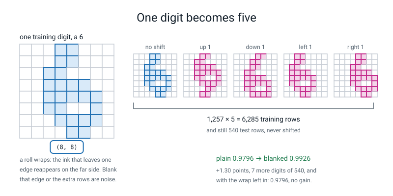
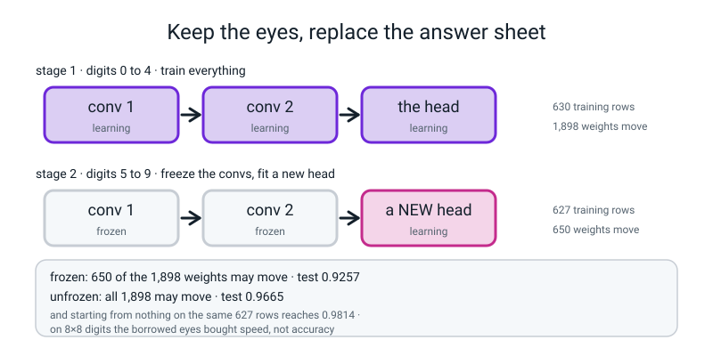
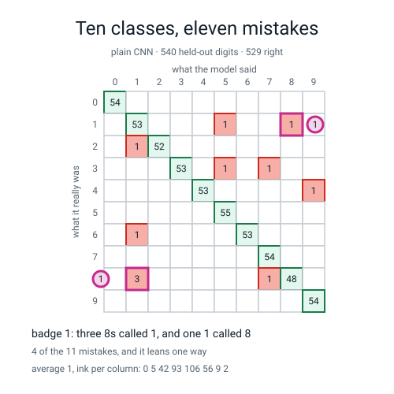
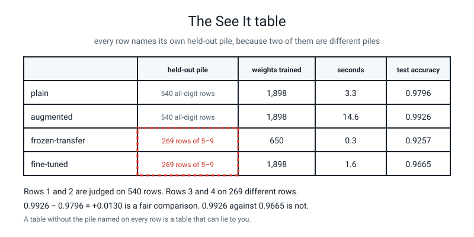
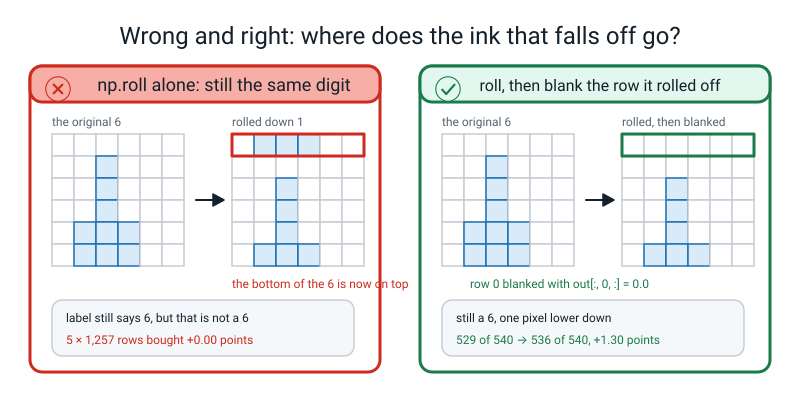
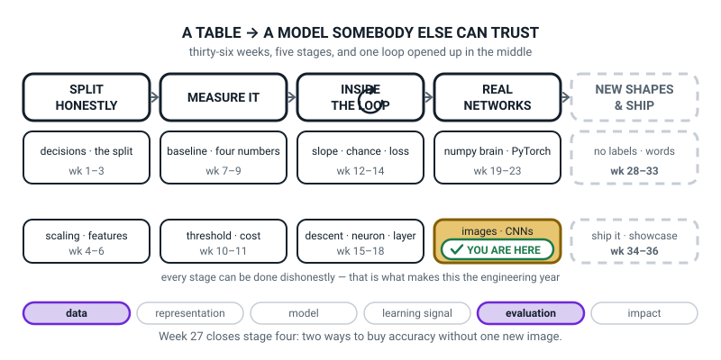
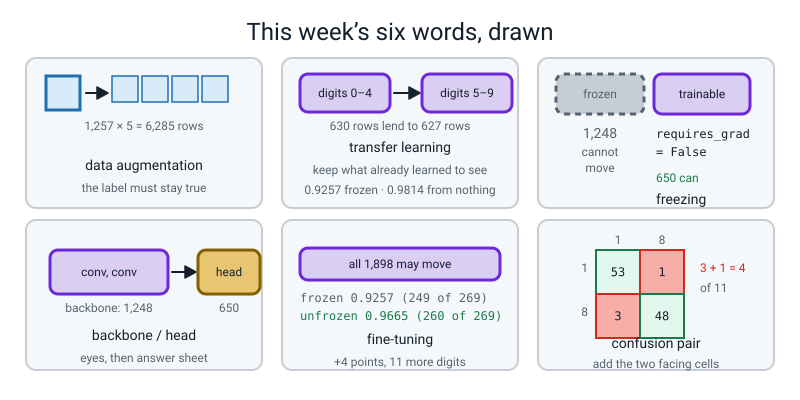

# Week 27 — Term 3 Checkpoint: See It

[⬅ Week 26](week-26.md) · [Course Home](../README.md) · [Next ➡](week-28.md) · [Workbook](../workbook/week-27.md)

---

> ### This week in one sentence
> **You can buy accuracy two ways without collecting a single new picture — make more training pictures out of the ones you have, and reuse a network that already learned to see — and one of the two works here while the other one does not, and saying which is the skill.**
>
> **By the end of this chapter you will be able to:**
> - **Augment the training set offline** with `np.roll`, and report how many accuracy points it bought — including the honest finding that, in our seed-0 run, the naive version buys **+0.00** and the fixed version buys **+1.30**
> - **Freeze a convolutional backbone** trained on digits 0–4 and retrain only the head on digits 5–9, **reporting the from-scratch control alongside it**
> - **Read a ten-class confusion matrix**, name the worst confusion pair, and give a **physical** reason why those two digits look alike at 8×8
> - **Produce a four-row results table with the held-out pile named on every row**, and say which two rows may honestly be compared
>
> **New maths:** none. Counting, one subtraction of two accuracies, and reading a grid.
>
> **New syntax:** `np.roll(img, shift, axis=0)` · `p.requires_grad = False` · `ConfusionMatrixDisplay.from_predictions(y, pred)` · `torch.cat([a, b])`
>
> **Reading time:** about 40 minutes. **Homework:** about 60 minutes.

---

## 🪝 Start Here

Last week your network read **529 of 540** handwritten digits it had never seen, in about three seconds, with 1,898 numbers that started as noise. That is a good result and you should be pleased with it.

And **eleven** of them came back wrong. Last week the question was *which eleven?* Here they are.

The ten-by-ten grid below counts every prediction the model made on the held-out digits:

```text
[[54  0  0  0  0  0  0  0  0  0]
 [ 0 53  0  0  0  1  0  0  1  0]
 [ 0  1 52  0  0  0  0  0  0  0]
 [ 0  0  0 53  0  1  0  1  0  0]
 [ 0  0  0  0 53  0  0  0  0  1]
 [ 0  0  0  0  0 55  0  0  0  0]
 [ 0  1  0  0  0  0 53  0  0  0]
 [ 0  0  0  0  0  0  0 54  0  0]
 [ 0  3  0  0  0  0  0  1 48  0]
 [ 0  0  0  0  0  0  0  0  0 54]]
```

Week 8's two-by-two, grown up. **Rows are what the digit really was. Columns are what the model said.** So the number in row 8, column 1 is *"real eights that the model called a one"*.

**Add up the diagonal: 529. Add up everything not on the diagonal: 11. And 529 + 11 = 540**, which is the number of held-out rows. **Do that check every single time you look at one of these** — Week 8's rule, unchanged.

**Now find the biggest number that is not on the diagonal.** Row 8, column 1: **three**. So three real 8s were called 1. **And its mirror, row 1 column 8?** One.

**Three eights called one, one one called eight. Four mistakes out of eleven, from one pair of digits out of the forty-five possible pairs.** More than a third of every mistake the model made.

That has a name, and finding it is the difference between *"the model is 98% accurate"* and *"the model cannot reliably tell an 8 from a 1"*. **One of those two sentences you can act on.**

So: eleven wrong, four of them from one pair, and here is the constraint. **You may not collect any new pictures.** No downloads, no scanner. The 1,257 digits you have are all the digits there will ever be.

Two things you can still do:

1. Make more pictures out of the ones you already own.
2. Borrow a network that already learned to see, and only teach it the last bit.

Today you do both — and **one of them works and one of them does not.** Finding out which is the whole lesson.

---

## 🧠 The Big Idea

This section explains the two ways to buy accuracy without new pictures, and how to read a ten-class confusion matrix and a results table.

> **📌 About the code in this section.** The blocks below are **illustrations, not files**. Each one carries on from the one above. **The complete runnable file is in 💻 Type This.**

### 1. Data augmentation, and the trap that makes it useless

Here is a fact about a handwritten 6. Slide it one pixel to the left and **it is still a 6.** You know that. Your network does not — it has to learn it, and learning it costs training rows.

Unless you just tell it.

> **data augmentation** — making extra training examples out of the ones you have, by changing them in ways that **do not change the label**. A digit shifted one pixel left is still the same digit, so you get a free extra training row.

Every digit, four extra copies: one pixel up, one down, one left, one right. **1,257 rows becomes 6,285.** Five times the data, and you collected nothing.

The tool is one numpy function. These two calls slide a picture down and right:

```python
np.roll(img, 1, axis=0)     # slide every row down by one
np.roll(img, 1, axis=1)     # slide every column right by one
```

**And there is exactly one thing you have to know about it: `np.roll` wraps.** Whatever falls off one edge comes back on the other.

Here is the real evidence from one 8×8 digit in the dataset (the first two numbers are its top row, before and after rolling):

```text
original      : [0.   0.   0.   0.5  0.44 0.   0.   0.  ]      ← row 0
rolled down 1 : [0.   0.   0.   0.31 0.88 1.   0.25 0.  ]      ← the new row 0
the top row of the rolled copy is the BOTTOM row of the original:
original row 7: [0.   0.   0.   0.31 0.88 1.   0.25 0.  ]
```

**Look at those two identical rows.** The bottom row of the digit has reappeared at the top. On a big photograph with a dark border you would never notice — the border wraps onto the border and nothing changes. **On an 8×8 digit that fills the frame, you have just put the bottom of a 6 above its own top, and that picture is not a 6 any more.**

**The label still says 6.** So you have manufactured a training row with a wrong label, and you have done it 1,257 times.

**And here is what it costs, measured:**

```text
plain                2.4s  movable 1898  train 0.9881  test 0.9796  (529 of 540)
augmented (wrap)    11.4s  movable 1898  train 0.9774  test 0.9796  (529 of 540)
augmented (blank)   11.3s  movable 1898  train 0.9893  test 0.9926  (536 of 540)

wrap-around augmentation bought +0.00 points
blanked-edge  augmentation bought +1.30 points
```

**Read the two `529 of 540`s.** Five times the training data. Five times the training time. **Exactly nothing, this time** — the identical 529 out of 540. (That exact tie is a seed-0 coincidence: over five seeds the wrapped version sometimes gained a little and sometimes tied, so read it as "no reliable benefit", not "never anything".)

**The fix is three lines**, and it is the whole point of this half of the lesson: after you roll, blank the edge the ink rolled off. This function does it for all four directions:

```python
def shift(stack, dr, dc):
    """Shift every picture in the stack, and blank the edge it rolled off."""
    out = np.roll(np.roll(stack, dr, axis=1), dc, axis=2).copy()
    if dr == 1:
        out[:, 0, :] = 0.0      # rolled down, so the top row is wrapped junk
    if dr == -1:
        out[:, -1, :] = 0.0     # rolled up, so the bottom row is wrapped junk
    if dc == 1:
        out[:, :, 0] = 0.0      # rolled right, so the left column is junk
    if dc == -1:
        out[:, :, -1] = 0.0     # rolled left, so the right column is junk
    return out
```

With that, the same experiment buys **+1.30 accuracy points: 529 of 540 becomes 536 of 540.** **Seven more digits read correctly, from no new data at all.** (One seed, one test split: across seeds 0 to 4 the blanked version beat plain in four and was slightly worse in one, and the augmented runs also take five times as many training steps, so part of the gain may simply be more updates.)


*Figure 27.1 — One digit becomes five. 1,257 × 5 = 6,285 training rows, and still 540 test rows that were never shifted. Plain 0.9796 becomes 0.9926 once the rolled-off edge is blanked; leave the wrap in and it buys nothing.*

**And look at the training accuracies, because they tell the story.** Plain trained to `0.9881`. The wrapped one only got to `0.9774` — **worse on its own training data**, because some of that data was unlearnable nonsense. The blanked one got to `0.9893` on five times as many rows.

> **⚠️ Watch out:** a **training** accuracy that goes *down* when you add data is a hint that the added data may be wrong or harder to fit (not a proof: the two scores are measured on different rows, and legitimate extra variety can also lower it). Here it was wrong: wrapped rows carry labels that no longer describe the picture.

**So this is what augmentation actually is.** It is not *"more data is better"*. It is **"more data is better if the label is still true"**, and the whole engineering skill is knowing when it stops being true. Flip a photo of a cat: still a cat. **Flip a photo of a 2: not a 2 any more.** Mirror a road sign with writing on it: nonsense. **There is no universal list. You have to think about your data.**

**And one rule that is never negotiable: augment the TRAINING set only. Never the test set.** Two reasons and both matter. Evaluation must be repeatable — a number that changes when nothing changed is not a measurement. And augmentation makes pictures harder, so an augmented test set would report a *worse* accuracy than your model actually achieves. **This is Week 6's fit-on-train-only discipline in a new costume.**

### 2. The axis bug, and the alarm you should install for life

The pictures are stacked. `X_train` is `(1257, 8, 8)`. So:

- **`axis=0` is which picture.** Rolling that shuffles the *pictures* while the labels stay put.
- **`axis=1` is the rows of each picture.**
- **`axis=2` is the columns of each picture.**

Here is what `axis=0` does, on four tiny 2×2 pictures, so you can see it:

```text
a stack of 4 tiny 2x2 pictures:
[[[ 0  1]     [[ 4  5]     [[ 8  9]     [[12 13]
  [ 2  3]]      [ 6  7]]     [10 11]]     [14 15]]

np.roll(X, 1, axis=0) rolls the STACK:
[[[12 13]     [[ 0  1]     [[ 4  5]     [[ 8  9]
  [14 15]]      [ 2  3]]     [ 6  7]]     [10 11]]

np.roll(X, 1, axis=1) rolls each picture's ROWS:
[[[ 2  3]     [[ 6  7]     [[10 11]     [[14 15]
  [ 0  1]]      [ 4  5]]     [ 8  9]]     [12 13]]
```

**Get the axis wrong and there is no error whatsoever.** The model trains on pictures paired with other pictures' labels. Here is the measured result of rolling the wrong axis:

```text
trained on the WRONG axis: train 0.5968  test 0.8574  (463 of 540)
```

**Read those two numbers again. The test accuracy is HIGHER than the training accuracy.**

**That should be impossible.** A model has *seen* its training data, so it normally does at least as well on it. It happens here because two fifths of the *training* rows had scrambled labels and were unlearnable (the other three fifths were correctly labelled, which is why training accuracy sits near 0.6), while the test set was untouched.

> **Install this as a permanent alarm: if your test accuracy is higher than your training accuracy, your training labels are wrong.**

It is very rarely a lucky run. **It is very often a labelling bug**, so check the labels first; it is the fastest diagnosis available in this whole course. (Other causes exist: dropout or augmentation on the training path, or a small or easy test split.)

### 3. Transfer learning, done honestly

> **transfer learning** — take a network that already learned to see something, keep the part that does the seeing, and retrain only the part that does the answering.
>
> **backbone** — the conv layers. They turn a picture into features.
>
> **head** — the small dense bit at the end. It turns features into an answer.
>
> **freezing** — telling PyTorch that a block of weights is not allowed to change: `p.requires_grad = False`.
>
> **fine-tuning** — unfreezing the backbone as well, and letting it adjust.

**Why would you ever borrow?** Look back at last week's filters. Two of them were edge detectors. Now ask: is *"there is a vertical edge here"* useful for reading a 3? A 7? A letter? **A face?**

**Yes to all of them. Edges are not about digits. They are about pictures.** So if somebody has already paid for a network that learned to find edges, why would you start from noise?

**We have no internet and nobody has handed us a network trained on a million photos.** So we make our own two-stage problem — which is honestly a better teaching device, because you can see both stages:

- **Stage 1.** Train the whole network on **digits 0 to 4 only** — 630 training rows. It reaches **0.9926** on its 271 held-out rows of 0–4.
- **Stage 2.** Now a *new* problem: **digits 5 to 9** — 627 training rows, and shapes it has genuinely never seen. Keep the conv layers from stage 1, throw the head away, bolt on a fresh `nn.Linear(64, 10)`, and train.


*Figure 27.2 — Keep the eyes, replace the answer sheet. Frozen: 650 of the 1,898 weights may move, test 0.9257. Unfrozen: all 1,898 may move, 0.9665. From nothing on the same 627 rows: 0.9814.*

**And here is the question that turns this from a demonstration into an experiment.** Write it down before you run anything:

> **What would training from scratch on the 5-to-9 rows have given?**

**If you do not measure that, you cannot claim anything.** If the frozen version gets 92% and you have nothing to compare it to, **92% is a number, not a result.** That third run is called a **control** and it is not optional.

**The three real numbers** (seconds, movable weights, train and test accuracy, and digits right out of the total):

```text
frozen-transfer      0.2s  movable  650  train 0.9330  test 0.9257  (249 of 269)
fine-tuned           1.1s  movable 1898  train 0.9841  test 0.9665  (260 of 269)
scratch on 5-9       1.1s  movable 1898  train 0.9729  test 0.9814  (264 of 269)
```

**Read the third row again. Training from scratch beat both transfer versions.**

**This is the result, and it must not be softened.** Here is the honest explanation, and it is a genuinely good one.

**Transfer learning pays when the source problem is enormous and the target problem is tiny.** The version people use at work borrows a backbone trained on **1.2 million photographs** and applies it to a few thousand pictures of something else. **Ours borrowed a backbone trained on 630 pictures of five digits, and applied it to 627 pictures of five different digits.** The source was not bigger than the target. It was **the same size**, and it was *specialised* — those eight filters were tuned to the shapes of 0, 1, 2, 3 and 4, and a 5 is not a 3.

**And what the frozen version DID buy is real.** It trained **650 weights instead of 1,898** in **0.2 seconds instead of 1.1**, and it still got to **92.6%**. A third of the weights, a fifth of the time, six points behind. **On a problem where the backbone came from a million photographs and your target set is fifty pictures rather than 627, that trade is the difference between a working model and no model at all. Here it is not.**

**So the sentence for your write-up is not "transfer learning does not work".** It is:

> *"Transfer learning bought a fifth of the training time and a third of the weights, and cost 5.6 accuracy points; a likely reason is that the borrowed backbone was trained on no more data than we already had (a hypothesis: we varied neither the source size nor the seed, and the mismatch between digits 0-4 and 5-9 or the fresh head's learning rate could matter as much)."*

**That sentence is worth more than a triumph would have been.**

**And one thing about the mechanics.** Freezing fails **silently** if you point it at the wrong layers, so print the proof:

```python
movable = [p for p in model.parameters() if p.requires_grad]
print("movable weights:", sum(p.numel() for p in movable))
```

It must print **650**, not 1,898 and not 0. **A freeze you have not counted is a freeze you have not done.**

### 4. The confusion matrix, and how to diagnose a pair physically

Ranked by count, here is **every** mistake the plain model made (count, then real digit, then predicted digit):

```text
  3   8 -> 1
  1   8 -> 7
  1   6 -> 1
  1   4 -> 9
  1   3 -> 7
  1   3 -> 5
  1   2 -> 1
  1   1 -> 8
  1   1 -> 5
```

> **confusion pair** — two classes the model mixes up **with each other, in both directions**. You find it by adding the two cells that face each other across the diagonal.

**Here it is 1 and 8: `8 → 1` three times and `1 → 8` once, so 4 of the 11 mistakes.**


*Figure 27.3 — Ten classes, eleven mistakes. Three real 8s were called 1 and one real 1 was called 8: 4 of the 11 mistakes, leaning towards calling an 8 a 1.*

**Now the physical diagnosis, and this is the part people get wrong by restating the number instead of explaining it.**

Average all the 1s in the dataset and all the 8s, and add up the ink in each column. Here are the two profiles, column by column:

```text
average 1, ink per column: [  0   5  42  93 106  56   9   2]
average 8, ink per column: [  0   9  71  87  86  66  11   0]
```

**Both pile their ink into columns 2 to 5, and both peak in the middle.** A 1 peaks at 106 in column 4; an 8 peaks at 87 and 86 in columns 3 and 4. **The two profiles are almost the same shape.**

**And the reason is the resolution.** An 8 is two loops stacked. At 8×8, each loop is about three pixels tall and four wide — **too small to have a visible hole.** A hole needs a ring of ink around a gap, and three pixels is not enough to have both. So the loops fill in with grey, and what survives the fill-in is **a bright vertical bar down the middle columns. Which is exactly what a 1 is.**

**And the direction makes sense too.** It is `8 → 1` three times but `1 → 8` only once, and although 3 against 1 is too few mistakes to be certain it is not chance, it is what you would expect: **an 8 can lose its holes and become a bar, but a bar cannot grow holes.** The information loss goes one way.

**Say the good version and the bad version to yourself so you can hear the difference:**

- ❌ *"The worst pair is 1 and 8, with 4 mistakes out of 11."* — **That is the number restated. It is not a diagnosis.**
- ✅ *"1 and 8, 4 of 11, leaning towards calling an 8 a 1. At 8×8 an 8's two loops are three pixels tall, too small to hold a hole, so they fill in and leave a bright bar down the middle columns — and the average 1 and the average 8 both pile their ink into columns 2 to 5. The loss goes one way: an 8 can lose its holes, a 1 cannot grow them. The fix is not a better optimiser. It is more pixels."*

### 5. The results table, and why it is dangerous

Here is the four-row table, with the real numbers:

| row | held-out pile | weights trained | seconds | test accuracy |
|---|---|---:|---:|---:|
| plain | 540 all-digit rows | 1,898 | 2.4 | 0.9796 |
| augmented | 540 all-digit rows | 1,898 | 11.3 | **0.9926** |
| frozen-transfer | **269 rows of 5–9** | 650 | 0.2 | 0.9257 |
| fine-tuned | **269 rows of 5–9** | 1,898 | 1.1 | 0.9665 |


*Figure 27.4 — The See It table. Rows 1 and 2 are judged on 540 rows; rows 3 and 4 on 269 different rows. 0.9926 − 0.9796 = +0.0130 is a fair comparison. 0.9926 against 0.9665 is not.*

**The best number on that table is 0.9926 and the worst is 0.9257. Can you say augmentation is 6.7 points better than frozen transfer?**

**No.** Rows 1 and 2 were judged on **540 digits, all ten classes.** Rows 3 and 4 were judged on **269 digits, five classes** — and five classes is an easier problem than ten. **Those are two different exams and you cannot compare marks across them.**

The three subtractions, written out:

```text
0.9926 − 0.9796 = +0.0130     FAIR: same 540 rows, one thing changed
0.9665 − 0.9257 = +0.0408     FAIR: same 269 rows, one thing changed
0.9926  against  0.9665       NOT A COMPARISON AT ALL
```

**Which is why the pile goes on every single row.** Not because it is tidy. **Because a table without it lets you make that mistake, and lets your reader make it too, and you will not be there to stop them.**

---

## 🔁 The Idea From Last Week, Used Harder

This section reuses last week's parameter count as a check on a freeze.

There is no new maths this week. Instead, **last week's parameter count stops being a check and becomes a proof of intention.**

Last week `sum(p.numel() for p in model.parameters())` printed **1,898**, and its whole job was to agree with a number you had already worked out on paper. This week the same line, with four extra words, becomes the only evidence that a thing you asked for actually happened:

```python
sum(p.numel() for p in model.parameters() if p.requires_grad)
```

**Work out what it must print, by hand, before you run it.** You froze the two conv layers, so their weights cannot move:

```text
conv1  Conv2d(1, 8, 3)   frozen      80
conv2  Conv2d(8, 16, 3)  frozen    1168
                                   ----
                          frozen   1248

fc     Linear(64, 10)    movable    650

check:  1248 + 650  =  1898     ✅ all of them accounted for
```

**So the line must print 650.** And if it prints 1,898, **nothing is frozen** — `requires_grad = False` fails silently when you point it at the wrong layer, and this one line is the only thing that catches it.

**Three counting checks, and none of them costs anything.** Get all three into your fingers this week, because Weeks 33 to 36 lean on them hard:

| Check | The line | What it catches |
|---|---|---|
| **How many rows?** | `X_aug.shape[0]` and `y_aug.shape[0]` | Pictures and labels no longer matching. Both must be `5 × 1257 = 6285` |
| **How many weights may move?** | `sum(p.numel() for p in model.parameters() if p.requires_grad)` | A freeze that did nothing. Must be **650**, not 1,898 |
| **Do the cells add up?** | the diagonal, the off-diagonal, and the total | An arithmetic mistake in a confusion matrix. `529 + 11 = 540` |

**And the two accuracy checks from earlier weeks, still running:** a fresh ten-class network's first loss should be near **2.30**, and **the test score should be below the train score.** Between them those five checks catch every silent bug in this term.

---

## 💻 Type This

This section builds `see_it.py` step by step, so you can run every experiment from this week yourself.

One file, and it is the longest of the term because it trains **six** networks. `load_digits()` ships inside scikit-learn, so **nothing downloads.**

> **💡 When you have internet:** the real version of transfer learning downloads a backbone that somebody else trained on 1.2 million photographs — `pip install torchvision`, then `torchvision.models.resnet18(weights="DEFAULT")` — and freezes it exactly the way you are about to freeze yours. **The mechanism is identical and the numbers here are honest. Nothing this week needs it.**

You already wrote `make_cnn`, `train` and `acc` in Weeks 23 and 26, so those come for free — but they are printed in full below so this file runs on its own.

### Step 1 — the data, the helpers, and one picture five ways

Create a new file, `see_it.py`, and type the imports, the split and the tensor conversion:

```python
"""see_it.py - Term 3 checkpoint: augmentation and transfer, entirely offline."""
import time

import matplotlib
matplotlib.use("Agg")
import matplotlib.pyplot as plt
import numpy as np
import torch
import torch.nn as nn
from sklearn.datasets import load_digits
from sklearn.metrics import ConfusionMatrixDisplay, confusion_matrix
from sklearn.model_selection import train_test_split
from torch.utils.data import DataLoader, TensorDataset

np.random.seed(0)

digits = load_digits()
X_train, X_test, y_train, y_test = train_test_split(
    digits.images / 16.0, digits.target, test_size=0.30, random_state=0,
    stratify=digits.target)
print("train rows:", len(X_train), "  test rows:", len(X_test))


def t4(a):
    return torch.from_numpy(np.asarray(a)).float().unsqueeze(1)


Xtr = t4(X_train)
ytr = torch.from_numpy(y_train).long()
Xte = t4(X_test)
yte = torch.from_numpy(y_test).long()
```

**And the five helpers, all of them yours from earlier weeks except the last two:**

```python
def make_cnn():
    return nn.Sequential(
        nn.Conv2d(1, 8, 3, padding=1), nn.ReLU(), nn.MaxPool2d(2),
        nn.Conv2d(8, 16, 3, padding=1), nn.ReLU(), nn.MaxPool2d(2),
        nn.Flatten(), nn.Linear(64, 10))


def train(model, X, y, epochs=40, lr=1e-3):
    movable = [p for p in model.parameters() if p.requires_grad]
    loader = DataLoader(TensorDataset(X, y), batch_size=32, shuffle=True)
    loss_fn = nn.CrossEntropyLoss()
    opt = torch.optim.Adam(movable, lr=lr)
    t0 = time.perf_counter()
    for _ in range(epochs):
        model.train()
        for xb, yb in loader:
            opt.zero_grad()
            loss_fn(model(xb), yb).backward()
            opt.step()
    return time.perf_counter() - t0


def acc(model, X, y):
    model.eval()
    with torch.no_grad():
        return (model(X).argmax(1) == y).float().mean().item()


def n_movable(model):
    return sum(p.numel() for p in model.parameters() if p.requires_grad)


def report(tag, secs, model, Xa, ya, Xb, yb):
    a, b = acc(model, Xa, ya), acc(model, Xb, yb)
    print("%-18s %5.1fs  movable %4d  train %.4f  test %.4f  (%d of %d)"
          % (tag, secs, n_movable(model), a, b, round(b * len(yb)), len(yb)))
    return b
```

**Three of those five are Week 23 and Week 26, unchanged.** The two new things are tiny: **`n_movable` counts only the weights that are allowed to move**, and **`train` builds its optimiser from that same filtered list** rather than from `model.parameters()`. Those two lines are the whole difference between a freeze that works and a freeze that only looks like it worked.

**Now one picture, rolled once.** Add this to the file:

```python
one = X_train[0]
print()
print("--- np.roll on one 8x8 picture, top two rows ---")
print("original      :", np.round(one[0], 2), np.round(one[1], 2))
print("rolled down 1 :", np.round(np.roll(one, 1, axis=0)[0], 2),
      np.round(np.roll(one, 1, axis=0)[1], 2))
print("the top row of the rolled copy is the BOTTOM row of the original:")
print("original row 7:", np.round(one[7], 2))
```

**What the new lines do.** `t4` is a one-line helper that turns any stack of 8×8 pictures into the four-number shape a conv layer wants — **build every tensor the same way and none of them can be wrong differently.** `np.roll(one, 1, axis=0)` slides this single picture's rows down by one; on a single 8×8, `axis=0` **is** the rows.

```text
train rows: 1257   test rows: 540

--- np.roll on one 8x8 picture, top two rows ---
original      : [0.   0.   0.   0.5  0.44 0.   0.   0.  ] [0.   0.   0.25 1.   0.69 0.   0.   0.  ]
rolled down 1 : [0.   0.   0.   0.31 0.88 1.   0.25 0.  ] [0.   0.   0.   0.5  0.44 0.   0.   0.  ]
the top row of the rolled copy is the BOTTOM row of the original:
original row 7: [0.   0.   0.   0.31 0.88 1.   0.25 0.  ]
```

**Line two and line four are identical.** The bottom row of the digit is now the top row. That is the wrap, on real data, and it is the reason for the next three lines.

### Step 2 — the shift function, and the axis that matters

Add the `shift` function, which rolls a whole stack of pictures and blanks the edge:

```python
def shift(stack, dr, dc):
    """Shift every picture in the stack, and blank the edge it rolled off."""
    out = np.roll(np.roll(stack, dr, axis=1), dc, axis=2).copy()
    if dr == 1:
        out[:, 0, :] = 0.0
    if dr == -1:
        out[:, -1, :] = 0.0
    if dc == 1:
        out[:, :, 0] = 0.0
    if dc == -1:
        out[:, :, -1] = 0.0
    return out
```

**Read the axes carefully.** `stack` is 1,257 pictures of 8 by 8, so it is `(1257, 8, 8)`. **`axis=1` is the rows of each picture. `axis=2` is the columns.** And `axis=0` is *which picture*, which is the horror story in §2 above.

**`out[:, 0, :] = 0.0` means: every picture, row 0, all columns — set to zero.** If you rolled down, the top row is the wrapped junk, so blank it. **Write it as `out[0, :, :] = 0.0` by mistake and you blank picture 0 entirely, with no error at all.**

**And `.copy()` is belt and braces.** On this version of numpy `np.roll` already hands you a fresh array — you can check with `np.shares_memory(a, np.roll(a, 1, axis=1))`, which prints `False`. But `a.T` and `a[1:]` **do** hand back views of the original, and blanking a view blanks your real training data. **`.copy()` costs nothing and means you never have to remember which numpy functions return views and which return fresh arrays.**

### Step 3 — five copies, glued

Build the wrapped and blanked training sets, five copies each, and print their shapes:

```python
shifts = [(0, 0), (-1, 0), (1, 0), (0, -1), (0, 1)]
X_wrap = torch.cat([t4(np.roll(np.roll(X_train, dr, axis=1), dc, axis=2))
                    for dr, dc in shifts])
X_aug = torch.cat([t4(shift(X_train, dr, dc)) for dr, dc in shifts])
y_aug = torch.cat([ytr] * 5)
print()
print("augmented train tensor:", tuple(X_aug.shape), "=", len(X_train), "x 5")
print("test tensor: still", tuple(Xte.shape), "- never shifted")
```

**What the new lines do.** `torch.cat` glues a list of tensors together along their **first** dimension — the batch dimension, the one Week 25 said always rides along untouched. `[ytr] * 5` makes a list of the same label tensor five times, so the labels get glued the same number of times in the same order, and row 3,000 of `X_aug` still belongs with row 3,000 of `y_aug`.

**Predict the shape before you run it.** 1,257 rows, five copies.

```text
augmented train tensor: (6285, 1, 8, 8) = 1257 x 5
test tensor: still (540, 1, 8, 8) - never shifted
```

**6,285.** And **the check to make out loud, every single time you build or glue a dataset: are there as many labels as pictures?** 6,285 and 6,285. **If those two numbers differ, everything after it is nonsense and nothing will tell you.**

**And look at the second line.** The test tensor is still 540 and it was **never shifted.**

### Step 4 — run all three, and the honest surprise

Train the plain, wrapped and blanked networks, each from the same starting weights:

```python
torch.manual_seed(0)
plain = make_cnn()
s = train(plain, Xtr, ytr)
a_plain = report("plain", s, plain, Xtr, ytr, Xte, yte)

torch.manual_seed(0)
wrapped = make_cnn()
s = train(wrapped, X_wrap, y_aug)
a_wrap = report("augmented (wrap)", s, wrapped, X_wrap, y_aug, Xte, yte)

torch.manual_seed(0)
aug = make_cnn()
s = train(aug, X_aug, y_aug)
a_aug = report("augmented (blank)", s, aug, X_aug, y_aug, Xte, yte)

print()
print("wrap-around augmentation bought %+.2f points" % (100 * (a_wrap - a_plain)))
print("blanked-edge  augmentation bought %+.2f points" % (100 * (a_aug - a_plain)))
```

**Write your three predictions in pen before you run this.** Will the wrapped version beat the plain one? Will the blanked one? By how much?

```text
plain                2.4s  movable 1898  train 0.9881  test 0.9796  (529 of 540)
augmented (wrap)    11.4s  movable 1898  train 0.9774  test 0.9796  (529 of 540)
augmented (blank)   11.3s  movable 1898  train 0.9893  test 0.9926  (536 of 540)

wrap-around augmentation bought +0.00 points
blanked-edge  augmentation bought +1.30 points
```

**Five times the data. Five times the wait. Nothing, in this run.** And notice `torch.manual_seed(0)` appears **before every single `make_cnn()`** — all three networks start from identical random weights, so the only thing that differs between the runs is the training data. That is what makes it a comparison rather than three numbers.

> **⚠️ Watch out:** the **seconds** are a stopwatch, not a result. Mine were 2.4, 11.4 and 11.3 on one run and 2.2, 13.0 and 14.2 on the next, on the same laptop. **Every other number on those three lines must match exactly.** If `blanked-edge augmentation bought +1.30 points` does not appear, a seed is missing: `np.random.seed(0)` at the top, `random_state=0, stratify=y` in the split, and `torch.manual_seed(0)` before **every** `make_cnn()`. All three matter.

### Step 5 — freeze it, count it, and the error that catches you first

Split the digits into two groups, train the first network on the low digits, and save a copy of its weights:

```python
lo_tr, lo_te = y_train <= 4, y_test <= 4
hi_tr, hi_te = y_train >= 5, y_test >= 5
print()
print("digits 0-4: train %d  test %d" % (lo_tr.sum(), lo_te.sum()))
print("digits 5-9: train %d  test %d" % (hi_tr.sum(), hi_te.sum()))

torch.manual_seed(0)
first = make_cnn()
s = train(first, Xtr[lo_tr], ytr[lo_tr])
print("stage 1, digits 0-4 only: %5.1fs  test %.4f"
      % (s, acc(first, Xte[lo_te], yte[lo_te])))
backbone = {k: v.clone() for k, v in first.state_dict().items()}
```

**What the new lines do.** `y_train <= 4` produces a mask of Trues and Falses, and `Xtr[lo_tr]` keeps only the rows where it is True — Level 2's boolean masking, applied to a tensor. `first.state_dict()` is Week 23's dictionary of every weight block by name, and `.clone()` takes a copy so training the next network cannot change it.

```text
digits 0-4: train 630  test 271
digits 5-9: train 627  test 269
stage 1, digits 0-4 only:   1.2s  test 0.9926
```

**0.9926 on five classes, against 0.9796 on ten last week. Is this network better than last week's?**

**No.** Five classes is an easier problem — a model guessing at random gets 20% here and 10% there. **You cannot compare those two numbers, and that is the whole reason today's results table has the pile written on every row.**

**Now the order that matters.** Do it wrong on purpose first:

```python
torch.manual_seed(0)
frozen = make_cnn()
frozen[7] = nn.Linear(64, 5)           # <-- the mistake: head swapped FIRST
frozen.load_state_dict(backbone)
```

```text
RuntimeError: Error(s) in loading state_dict for Sequential:
	size mismatch for 7.weight: copying a param with shape torch.Size([10, 64]) from checkpoint, the shape in current model is torch.Size([5, 64]).
	size mismatch for 7.bias: copying a param with shape torch.Size([10]) from checkpoint, the shape in current model is torch.Size([5]).
```

**Read the last two lines.** It names **both** shapes — `[10, 64]` and `[5, 64]` — and Week 25's question still applies: **which one did you type?** The `[5, 64]`.

**Load the whole saved network first, then throw the head away.** Then freeze:

```python
torch.manual_seed(0)
frozen = make_cnn()
frozen.load_state_dict(backbone)
frozen[7] = nn.Linear(64, 10)
for layer in (frozen[0], frozen[3]):
    for p in layer.parameters():
        p.requires_grad = False
print("movable weights:", sum(p.numel() for p in frozen.parameters()
                              if p.requires_grad))
```

```text
movable weights: 650
```

**650, not 1,898.** That line is not decoration — **it is the only proof that the freezing actually worked.**

> **⚠️ Watch out:** if you hand **all** the parameters to Adam, including the frozen ones, **there is no error.** The frozen ones simply have no slope and never move. It works, and it hides what you meant. So build the list yourself: `[p for p in model.parameters() if p.requires_grad]`.

### Step 6 — the three transfer runs, including the control

Run the frozen, fine-tuned and from-scratch networks on the high digits. The frozen network reuses the `frozen` model from the step before:

```python
s = train(frozen, Xtr[hi_tr], ytr[hi_tr])
report("frozen-transfer", s, frozen, Xtr[hi_tr], ytr[hi_tr], Xte[hi_te], yte[hi_te])

torch.manual_seed(0)
fine = make_cnn()
fine.load_state_dict(backbone)
fine[7] = nn.Linear(64, 10)
s = train(fine, Xtr[hi_tr], ytr[hi_tr])
report("fine-tuned", s, fine, Xtr[hi_tr], ytr[hi_tr], Xte[hi_te], yte[hi_te])

torch.manual_seed(0)
scratch = make_cnn()
s = train(scratch, Xtr[hi_tr], ytr[hi_tr])
report("scratch on 5-9", s, scratch, Xtr[hi_tr], ytr[hi_tr], Xte[hi_te], yte[hi_te])
```

```text
frozen-transfer      0.2s  movable  650  train 0.9330  test 0.9257  (249 of 269)
fine-tuned           1.1s  movable 1898  train 0.9841  test 0.9665  (260 of 269)
scratch on 5-9       1.1s  movable 1898  train 0.9729  test 0.9814  (264 of 269)
```

**Frozen 0.9257, unfrozen 0.9665. By how many digits?** **Eleven: 260 against 249, out of 269.** Four accuracy points. We re-ran seeds 0 to 4, and frozen came out lowest in all five, so this gap is unlikely to be noise — letting the conv layers adjust to the new digit shapes probably helped, which makes sense because 5, 6, 7, 8 and 9 are different shapes from 0, 1, 2, 3 and 4.

**And then the control won.**

### Step 7 — the confusion matrix, and why the pair collides

Build the confusion matrix for the plain network, save it as a picture, and print the ink profiles of two average digits:

```python
with torch.no_grad():
    pred = plain(Xte).argmax(1).numpy()
cm = confusion_matrix(y_test, pred)
print("ten-class confusion matrix, plain CNN, 540 test rows:")
print(cm)
print("mistakes in total:", int(cm.sum() - np.trace(cm)), "out of", int(cm.sum()))

ConfusionMatrixDisplay.from_predictions(y_test, pred, cmap="Blues",
                                        colorbar=False)
plt.title("plain CNN, 540 held-out digits")
plt.tight_layout()
plt.savefig("confusion.png", dpi=110)
plt.close()
print("saved confusion.png")

print()
print("--- why 1 and 8 collide at 8x8 ---")
for lab in (1, 8):
    m = digits.images[digits.target == lab].mean(axis=0)
    print("average %d, ink per column:" % lab, m.sum(axis=0).round(0).astype(int))
```

**What the new lines do.** `ConfusionMatrixDisplay.from_predictions(y_test, pred, ...)` draws the whole ten-by-ten grid with the counts written in. **Truth first, predictions second** — the same argument order as Week 8's `confusion_matrix`, and swapping them transposes the whole thing **silently**. `np.trace(cm)` adds up the diagonal. `digits.images[digits.target == lab].mean(axis=0)` averages every picture of one digit into one average picture, and `.sum(axis=0)` then adds up the ink down each column of it.

```text
ten-class confusion matrix, plain CNN, 540 test rows:
[[54  0  0  0  0  0  0  0  0  0]
 [ 0 53  0  0  0  1  0  0  1  0]
 [ 0  1 52  0  0  0  0  0  0  0]
 [ 0  0  0 53  0  1  0  1  0  0]
 [ 0  0  0  0 53  0  0  0  0  1]
 [ 0  0  0  0  0 55  0  0  0  0]
 [ 0  1  0  0  0  0 53  0  0  0]
 [ 0  0  0  0  0  0  0 54  0  0]
 [ 0  3  0  0  0  0  0  1 48  0]
 [ 0  0  0  0  0  0  0  0  0 54]]
mistakes in total: 11 out of 540
saved confusion.png

--- why 1 and 8 collide at 8x8 ---
average 1, ink per column: [  0   5  42  93 106  56   9   2]
average 8, ink per column: [ 0  9 71 87 86 66 11  0]
```

### The complete `see_it.py`

Everything in Steps 1 to 7, in that order, plus the `make_cnn`, `train`, `acc`, `n_movable` and `report` helpers. **It trains six networks and takes about thirty seconds on a laptop CPU** — the two augmented runs are about eleven seconds each and everything else is under three. On a slow laptop the whole thing can take three minutes, so **start it and read the confusion matrix while it works.** That is what a real engineer does.

---

## 🔍 Worked Examples

This section gives you three small complete programs to run on your own. **Predict every number before you run them.**

### Worked Example 1 — Shift an arrow, and watch it teleport

Here is a 6×6 arrow pointing up, drawn by hand, with its tail touching the bottom row. The program rolls it with and without blanking:

```python
"""we1.py - shift a hand-typed arrow, with and without blanking."""
import numpy as np

np.random.seed(0)

img = np.zeros((6, 6), dtype=int)
img[1, 2] = 9
img[2, 1:4] = 9
img[3, 2] = 9
img[4, 2] = 9
img[5, 2] = 9            # an arrow pointing up, touching the bottom row
print("the original:")
print(img)

print()
print("np.roll(img, 1, axis=0)  - slide the ROWS down by one:")
rolled = np.roll(img, 1, axis=0)
print(rolled)
print("row 0 of the rolled copy:", rolled[0])
print("row 5 of the original   :", img[5], "  <- the same numbers")

print()
print("the same shift, with the wrapped row blanked:")
fixed = np.roll(img, 1, axis=0).copy()
fixed[0, :] = 0
print(fixed)
print("ink in the original:", img.sum(), "  ink after blanking:", fixed.sum())
```

```text
the original:
[[0 0 0 0 0 0]
 [0 0 9 0 0 0]
 [0 9 9 9 0 0]
 [0 0 9 0 0 0]
 [0 0 9 0 0 0]
 [0 0 9 0 0 0]]

np.roll(img, 1, axis=0)  - slide the ROWS down by one:
[[0 0 9 0 0 0]
 [0 0 0 0 0 0]
 [0 0 9 0 0 0]
 [0 9 9 9 0 0]
 [0 0 9 0 0 0]
 [0 0 9 0 0 0]]

the same shift, with the wrapped row blanked:
[[0 0 0 0 0 0]
 [0 0 0 0 0 0]
 [0 0 9 0 0 0]
 [0 9 9 9 0 0]
 [0 0 9 0 0 0]
 [0 0 9 0 0 0]]
```

```text
ink in the original: 63   ink after blanking: 54
```

**Look at the middle grid.** There is now a **stray 9 in the top row**, floating above a blank row, above the arrow. That is the arrow's tail, teleported to the other end of the picture. **A picture with a detached dot above it is not an arrow pointing up.**

**And the bottom grid is what you wanted:** the same arrow, one row lower, with nothing in the sky.

**The ink count is the honest cost: `63 → 54`.** Blanking the wrapped row **did** throw away nine units of real ink — the arrow's tail. **You lose a row of your picture every time you shift, and you get a true label in exchange.** That is a trade, not a free lunch, and it is why two-pixel shifts on an 8×8 usually hurt: you would be throwing away a quarter of the picture.

### Worked Example 2 — Three axes on a stack of four pictures

This program rolls a stack of four tiny pictures along each axis in turn, then glues five copies with `torch.cat`:

```python
"""we2.py - three axes on a stack of four tiny pictures."""
import numpy as np
import torch

np.random.seed(0)

X = np.arange(16).reshape(4, 2, 2)
labels = np.array([10, 20, 30, 40])
print("a stack of 4 tiny 2x2 pictures, with a label each:")
for i in range(4):
    print("  picture", i, "=", X[i].tolist(), " label", labels[i])

print()
print("np.roll(X, 1, axis=0) - rolls the STACK (this is the bug):")
for i, p in enumerate(np.roll(X, 1, axis=0)):
    print("  slot", i, "now holds", p.tolist(), " but the label is still", labels[i])

print()
print("np.roll(X, 1, axis=1) - rolls each picture's ROWS (this is what you want):")
for i, p in enumerate(np.roll(X, 1, axis=1)):
    print("  picture", i, "=", p.tolist(), " label", labels[i])

print()
print("np.roll(X, 1, axis=2) - rolls each picture's COLUMNS:")
for i, p in enumerate(np.roll(X, 1, axis=2)):
    print("  picture", i, "=", p.tolist(), " label", labels[i])

print()
Xt = torch.from_numpy(X).float().unsqueeze(1)
yt = torch.from_numpy(labels).long()
big_X = torch.cat([Xt] * 5)
big_y = torch.cat([yt] * 5)
print("torch.cat five copies:", tuple(big_X.shape), "pictures and",
      tuple(big_y.shape), "labels")
print("do they match?", big_X.shape[0] == big_y.shape[0], "  4 x 5 =", 4 * 5)
```

```text
a stack of 4 tiny 2x2 pictures, with a label each:
  picture 0 = [[0, 1], [2, 3]]  label 10
  picture 1 = [[4, 5], [6, 7]]  label 20
  picture 2 = [[8, 9], [10, 11]]  label 30
  picture 3 = [[12, 13], [14, 15]]  label 40

np.roll(X, 1, axis=0) - rolls the STACK (this is the bug):
  slot 0 now holds [[12, 13], [14, 15]]  but the label is still 10
  slot 1 now holds [[0, 1], [2, 3]]  but the label is still 20
  slot 2 now holds [[4, 5], [6, 7]]  but the label is still 30
  slot 3 now holds [[8, 9], [10, 11]]  but the label is still 40

np.roll(X, 1, axis=1) - rolls each picture's ROWS (this is what you want):
  picture 0 = [[2, 3], [0, 1]]  label 10
  picture 1 = [[6, 7], [4, 5]]  label 20
  picture 2 = [[10, 11], [8, 9]]  label 30
  picture 3 = [[14, 15], [12, 13]]  label 40

np.roll(X, 1, axis=2) - rolls each picture's COLUMNS:
  picture 0 = [[1, 0], [3, 2]]  label 10
  picture 1 = [[5, 4], [7, 6]]  label 20
  picture 2 = [[9, 8], [11, 10]]  label 30
  picture 3 = [[13, 12], [15, 14]]  label 40

torch.cat five copies: (20, 1, 2, 2) pictures and (20,) labels
do they match? True   4 x 5 = 20
```

**The second block is the bug, in four lines you can read.** Slot 0 now holds picture 3's numbers, and its label still says 10. **Every single picture is paired with the wrong label**, and nothing errored.

**And the difference between `axis=1` and `axis=2` is worth reading twice.** `axis=1` swapped each picture's two **rows**; `axis=2` swapped each picture's two **columns**. Same function, same shift, completely different move — and only the picture itself changed, never which picture it was.

**And the last two lines are the check you make every time you glue a dataset.** 20 pictures, 20 labels, `4 × 5 = 20`. **Say it out loud.**

### Worked Example 3 — Freeze one layer instead of two

If freezing both convs costs 5.6 points against the control and freezing neither costs 1.5, **what does freezing exactly one cost?** Predict before you look. The program below trains three versions and prints the movable count and test score of each.

```python
"""we3.py - freeze one conv layer instead of two, and count the movable weights."""
# Everything above the loop is Step 1 of see_it.py, unchanged: the imports, the
# split, t4, Xtr / ytr / Xte / yte, and the five helpers make_cnn, train, acc,
# n_movable and report. Plus the two masks from Step 5:
#     lo_tr, hi_tr, hi_te = y_train <= 4, y_train >= 5, y_test >= 5

torch.manual_seed(0)
first = make_cnn()
train(first, Xtr[lo_tr], ytr[lo_tr])
backbone = {k: v.clone() for k, v in first.state_dict().items()}

for tag, freeze in [("freeze both convs", (0, 3)),
                    ("freeze conv1 only", (0,)),
                    ("freeze nothing", ())]:
    torch.manual_seed(0)
    m = make_cnn()
    m.load_state_dict(backbone)
    m[7] = nn.Linear(64, 10)
    for idx in freeze:
        for p in m[idx].parameters():
            p.requires_grad = False
    mv = sum(p.numel() for p in m.parameters() if p.requires_grad)
    s = train(m, Xtr[hi_tr], ytr[hi_tr])
    a = acc(m, Xte[hi_te], yte[hi_te])
    print("%-19s movable %4d  %4.1fs  test %.4f  (%d of 269)"
          % (tag, mv, s, a, round(a * 269)))
```

```text
freeze both convs   movable  650   0.2s  test 0.9257  (249 of 269)
freeze conv1 only   movable 1818   0.6s  test 0.9517  (256 of 269)
freeze nothing      movable 1898   1.1s  test 0.9665  (260 of 269)
```

**Check the middle row's movable count before you read on.** Freezing conv1 alone locks its `80` numbers, so `1898 − 80 = ` **1818**. And freezing both convs locks `80 + 1168 = 1248`, so `1898 − 1248 = ` **650**. **Three rows, three counts, and every one of them is a subtraction you can do in your head.** That is what the movable count is for: it is not a curiosity, it is the receipt.

**And now the result, which in this seed-0 run is beautifully orderly:**

```text
freeze both convs :  650 movable,  0.2s,  0.9257   (249 of 269)
freeze conv1 only : 1818 movable,  0.6s,  0.9517   (256 of 269)
freeze nothing    : 1898 movable,  1.1s,  0.9665   (260 of 269)
```

**In this run, the less you freeze, the better it does, and the ordering is monotone.** 249, then 256, then 260 digits out of 269. **Freezing everything was the worst in all five seeds we tried** because the new digits need different filters from the old ones — but the order of the other two rows is not stable: freezing conv1 only beat freezing nothing in 3 of the 5 seeds. One seed and 269 test rows cannot settle which of those two is better.

**And every weight you freeze buys speed: 0.2 seconds against 1.1.** That is the whole trade, stated as six numbers, and it is exactly the trade you would be making on a real problem — **except that on a real problem the borrowed backbone knows a million pictures' worth more than you do, and then the ordering can flip.**

> **💡 Try this:** predict the middle row **before** you run it. Frozen is 0.9257 and unfrozen is 0.9665, so freezing exactly one conv should land somewhere between them. It does: **0.9517**, almost exactly halfway. A prediction like that, written down and then checked, is worth more than the number.

---

## 🐞 When It Breaks

This section shows the three worst bugs of the week and a table of every error you may meet. Every message below came from really running a broken version of this week's code.

> **The three most expensive bugs of Term 3 produced no error message at all:** the double softmax, the wrong roll axis, and a freeze that did not freeze. **All three are caught by printing one number you can predict in advance** — the starting loss should be 2.30, the test score should be below the train score, and the movable weight count should be the number you meant.

### Break 1 — the head was swapped before the load

This code swaps the head and then loads the saved weights:
```python
frozen = make_cnn()
frozen[7] = nn.Linear(64, 5)           # head replaced FIRST
frozen.load_state_dict(backbone)
```

```text
Traceback (most recent call last):
  File "loaderr.py", line 21, in <module>
    frozen.load_state_dict(backbone)
  File ".../torch/nn/modules/module.py", line 2153, in load_state_dict
    raise RuntimeError('Error(s) in loading state_dict for {}:\n\t{}'.format(
RuntimeError: Error(s) in loading state_dict for Sequential:
	size mismatch for 7.weight: copying a param with shape torch.Size([10, 64]) from checkpoint, the shape in current model is torch.Size([5, 64]).
	size mismatch for 7.bias: copying a param with shape torch.Size([10]) from checkpoint, the shape in current model is torch.Size([5]).
```

**What Python is telling you.** *"The saved head and the head in this model are different sizes."* And it named both: `[10, 64]` in the file, `[5, 64]` in the model you just built.

**The fix.** **Load the whole saved network first, then swap the head.** And Week 25's question still applies: **which of those two shapes did you type?** The `[5, 64]`.

### Break 2 — everything got frozen, head included

This code freezes every parameter and then builds the optimiser:
```python
for p in model.parameters():
    p.requires_grad = False
movable = [p for p in model.parameters() if p.requires_grad]
opt = torch.optim.Adam(movable, lr=1e-3)
```

```text
  File ".../torch/optim/optimizer.py", line 273, in __init__
    raise ValueError("optimizer got an empty parameter list")
ValueError: optimizer got an empty parameter list
```

**What Python is telling you.** *"You told me to train nothing."*

**The fix.** Freeze the **conv layers only** — `frozen[0]` and `frozen[3]` — and then check with the one line that proves it: `sum(p.numel() for p in model.parameters() if p.requires_grad)` must print **650**, not 0 and not 1,898.

**And notice this error is a gift.** The opposite mistake — freezing nothing when you meant to freeze — produces **no error at all.**

### Break 3 — the one with no message at all

This code builds the augmented set with the wrong axes:
```python
X_bad = torch.cat([t4(np.roll(np.roll(X_train, dr, axis=0), dc, axis=1))
                   for dr, dc in shifts])
```

```text
wrong axis          13.6s  movable 1898  train 0.5968  test 0.8574  (463 of 540)
```

**There is no error.** Thirteen seconds of training, no warning, and a plausible-looking 85.7%.

**What is impossible about those two numbers?** **The test accuracy is higher than the training accuracy.**

**What actually happened.** `axis=0` on a stack of 1,257 pictures is not the rows of a picture — **it is which picture.** The pictures got shuffled round while the labels stayed exactly where they were, so two fifths of the training rows (the up and down copies) are pictures paired with somebody else's label. **Unlearnable.**

The other three fifths still have the right labels (the left and right copies roll each picture's rows, which is a wrapped shift, not a shuffle). So the model scored 0.5968 on its own partly scrambled homework, close to the 0.6 that three correct fifths allow, and 0.8574 on the untouched test set.

**Take one alarm away from this week and make it this one:**

> **If your test accuracy is higher than your training accuracy, suspect your training labels first.** It is very rarely a lucky run.

### The whole clinic, for reference

Every error above, plus the silent ones, in one table:
| What you see | What it means | The fix |
|---|---|---|
| `RuntimeError: Error(s) in loading state_dict ... size mismatch for 7.weight: copying a param with shape torch.Size([10, 64]) ... current model is torch.Size([5, 64])` | The saved head and this model's head are different sizes | **Load first, then swap the head.** And it names both shapes — which did you type? |
| `ValueError: optimizer got an empty parameter list` | You told it to train nothing | Freeze the conv layers only. Then check the movable count says **650** |
| `RuntimeError: Tensors must have same number of dimensions: got 4 and 3` | You are gluing a batch of pictures to something that is not one | One copy missed its `.unsqueeze(1)`. **Put every copy through the same helper** |
| `TypeError: expected Tensor as element 1 in argument 0, but got numpy.ndarray` | That is a numpy array, not a tensor | `torch.from_numpy(a).float()` on each copy. **`torch.cat` only glues tensors; `np.concatenate` only glues arrays. Never mix them** |
| `ValueError: Found input variables with inconsistent numbers of samples: [540, 269]` | You gave 540 truths and 269 predictions | Predict on the **same rows** you are scoring. **Print both lengths before you call it** |
| `ValueError: could not broadcast input array from shape (1257,) into shape (8,8)` | You tried to blank a row and hit the wrong axis | `out[:, 0, :] = 0.0`. **The first slot is always which picture** |
| `RuntimeError: mean(): could not infer output dtype ... Got: Bool` | You averaged a list of Trues and Falses | `(pred == y).float().mean()` |
| **No error.** Augmentation buys exactly 0.00 points | Five times the data, no benefit | The rolled-off edge was never blanked. **And the tell: the augmented model's *training* accuracy is lower than plain's, 0.9774 against 0.9881** |
| **No error.** Test accuracy is HIGHER than training accuracy | Your training labels are wrong | `axis=1` is rows, `axis=2` is columns, on a stack of pictures |
| **No error.** The frozen model scores the same as the unfrozen one | The freezing did nothing | `print(sum(p.numel() for p in model.parameters() if p.requires_grad))`. **If it says 1,898, nothing is frozen.** Freeze first, build the optimiser second |
| **No error.** 6,285 pictures and 1,257 labels | The `DataLoader` will error later with something confusing | `y_aug = torch.cat([ytr] * 5)`. **Print both lengths every time you build a dataset** |
| **No error, but the plain run's numbers change when you rerun the file** | A shifted copy was built from a slice or `.T` (which are views, unlike `np.roll`'s fresh array) and then blanked, so the blanking hit the real training data | Keep the `.copy()`, which makes `shift` safe whichever way it is written. **The symptom is genuinely baffling and the fix is one word** |

---

## 🎲 What We Did In Class

This section is the whole lesson for anyone who missed it. You need workbook pages 27.1 to 27.3, a pen, and last week's `digits_cnn.py` still working.

**The hook.** Two numbers on the board: `529 of 540 right`, `11 wrong`. Then the ten-by-ten confusion matrix, drawn by writing only the non-zero cells. Then four questions in a row:

1. *"Add up the diagonal"* (529).
2. *"Add up everything not on it"* (11).
3. *"What must those two add to?"* (540).
4. *"Find the biggest number that is NOT on the diagonal"* (row 8, column 1: three).

Then *"so what happened three times?"* A real 8 was called a 1. Then *"anything in the mirror position?"* One.

**Four mistakes out of eleven, from one pair out of forty-five.** And then the constraint: **no new pictures, ever.** Two things you can still do, and *"one of them works and one of them does not."*

**Augmentation, on the board first.** An 8×8 grid with a rough digit shaded into the bottom row, then the shifted version beside it. *"The bottom row slid off the edge. Where did it go?"* Most of the room said "it's gone" or "it's blank". **`np.roll` brings it round to the top.** Then the three real rows of numbers from the file, with row 0 of the rolled copy identical to row 7 of the original. *"Is it still a 6?"* No. **"And the label still says 6."**

Then one line stayed on the board all lesson:

```text
np.roll wraps.  BLANK the edge it rolled off.
```

**Backbone and head, and the question that makes it an experiment.** *"Two of your eight filters were edge detectors. Is 'there is a vertical edge here' useful for reading a 3? A 7? A face?"* Yes to all. **Edges are about pictures, not about digits.** Then freezing, `requires_grad = False` — Week 20's flag, turned off for the first time — and then, big, on the board:

```text
what would training from scratch on the 5-to-9 rows have given?
```

*"If you do not measure that, you cannot claim anything. That third run is called a control and it is not optional."*

**Three predictions, in pen, before anything ran:** will wrapped beat plain, will blanked beat plain, and which of frozen / fine-tuned / scratch wins. Then all the votes went on the board.

**Then it ran, and there were five seconds of silence.** This is what came out:

```text
plain                2.4s  movable 1898  train 0.9881  test 0.9796  (529 of 540)
augmented (wrap)    11.4s  movable 1898  train 0.9774  test 0.9796  (529 of 540)
augmented (blank)   11.3s  movable 1898  train 0.9893  test 0.9926  (536 of 540)

wrap-around augmentation bought +0.00 points
blanked-edge  augmentation bought +1.30 points
```

**Two deliberate mistakes.**

| Mistake | What happened |
|---|---|
| `axis=0` and `axis=1` instead of `axis=1` and `axis=2` | **Silent.** `train 0.5968  test 0.8574` — and the test score is higher, which is impossible |
| `frozen[7] = nn.Linear(64, 5)` **before** `load_state_dict` | **Loud.** `size mismatch for 7.weight: ... torch.Size([10, 64]) ... torch.Size([5, 64])` |

Both went in the Bug Log. The first entry says, in the column where the error message goes, **"no message"** — and it has an extra line: *"alarm: test above train means the training labels are wrong."*

**The showcase circuit, twelve minutes, six stations.** One per thing built this term, two minutes each, and at each one exactly two things: show it, and **say one number out loud.**

| # | Station | The number said out loud |
|---|---|---|
| 1 | W20 — the machine that does the slopes | *"`w.grad` matched the slope I worked out by hand in Week 18."* |
| 2 | W21 — the five-line loop | *"Five lines, and I have not changed them since."* |
| 3 | W22 — layers, and watching it overfit | *"`2 → 16 → 1` is 65 parameters and I counted them by hand."* |
| 4 | W23 — the same brain, real framework | *"1,257 digits, 32 at a time, is 40 steps per epoch."* |
| 5 | W24 / W25 — the picture, and the shapes | *"`16 × 2 × 2 = 64`, and that is the number in my `Linear` layer."* |
| 6 | W26 — a network that reads digits | *"529 of 540 held-out digits, with 1,898 weights, in about three seconds."* |

**Then the honest transfer experiment**, eight minutes, three runs onto a three-column wall sheet — and somebody noticed the third column, headed **FROM SCRATCH**, being added before anything ran. The sheet at the end:

```text
                        movable weights   seconds   test accuracy
frozen backbone                    650       0.2          0.9257
unfrozen (fine-tuned)            1,898       1.1          0.9665
from scratch, no borrowing       1,898       1.1          0.9814
```

*"Where did the other 1,248 weights go?"* Frozen — conv1's 80 plus conv2's 1,168. **`80 + 1,168 + 650 = 1,898`**, and the addition got made out loud.

*"Which column won?"* **From scratch, in this run.** Then five seconds of silence, and *"so what did borrowing buy us?"* A third of the weights, a fifth of the time, and it cost 5.6 accuracy points. Then *"why might it not have worked? Think about what we borrowed FROM."* **One likely suspect: we borrowed from an equal, 630 pictures against 627. We did not test that, so hold it as a hypothesis.**

**The wrap: the four-row table with the pile written on every row**, and one illegal comparison offered out loud for the room to catch. *"Can I say augmentation is 6.7 points better than frozen transfer?"* **No — different piles, and five classes is easier than ten.**

**And then the two wall sheets came down.** THE SHAPE LADDER from Week 25 — *"you filled that in with a piece of card and a division, and you will not need it on the wall again."* And PARAMETER COUNT, which started in Week 22 with `2 → 16 → 1 = 65` and finished with `CNN on digits: 1,898`. **Every network priced by hand before it was run. Almost nobody does that.**

---

## 💬 Talk About It

Three questions to argue about with a partner or a parent, using the numbers on the page.

**1. Wrapped augmentation gave the model five times the data and bought nothing in our run. Does that mean "more data" is bad advice?**

*Hint:* start with the two identical numbers, `529 of 540` and `529 of 540`, and then look at the *training* accuracies, `0.9881` against `0.9774`. The wrapped model got **worse at its own homework** — which is only possible if some of that homework contradicts itself. So the advice is not wrong, it is incomplete: **more data is better if the label is still true.** Then the harder half, which has no clean answer: how would you *check* that a label is still true, at scale, without looking at 6,285 pictures by hand? (You cannot look at all of them. So what would you look at? A sample? The training accuracy? The class balance?) And the sharpest version: flipping a cat is a cat, flipping a 2 is not a 2, and mirroring a road sign with writing on it is nonsense. **Nobody can give you a universal list. Is that a gap in the field or a fact about data?**

**2. Training from scratch beat both transfer versions. Should the lesson have used a better example?**

*Hint:* first be clear about what did and did not work: the **machinery** worked perfectly — a backbone was frozen, the movable count went from 1,898 to 650, the training time dropped fivefold, and the model landed within six points. What failed was the **condition**: the source knew 630 pictures and the target had 627. Then the real question: is an experiment that measures the *price* of a technique less valuable than one that shows the technique winning? Which of those two would you rather have read before starting a project? And then the uncomfortable half — a lesson that only ever showed techniques working would teach you that an experiment's job is to confirm what the teacher said. **What would that cost you in Week 34, when you are the one writing the report?**

**3. The 1/8 confusion pair could be attacked by training harder on 1s and 8s. Should you?**

*Hint:* agree first that it would probably work — those four mistakes would likely move. Then ask what you would be doing: **attacking the symptom.** The cause is that at 8×8 an 8's loops are three pixels tall and cannot hold a hole, so no amount of extra training makes 64 pixels contain information they do not contain. Then the check that separates a good experiment from a hopeful one: **did the other digits get worse?** Adding extra copies of two classes changes the balance of the whole training set. And finally the genuinely interesting one: a hand-designed feature that counts enclosed regions in the picture would nail this pair instantly, and would have been written in about 1985. **The CNN wins overall and needed nobody to think of hole-counting. Both of those are true. Does either one cancel the other?**

---

## ⚠️ Don't Get Tricked

Four tempting wrong answers from this week, each paired with the right one.

### Trick 1 — "`np.roll` shifts the picture, so a rolled digit is the same digit"


*Figure 27.5 — Wrong and right: where does the ink that falls off go? Left, it wraps round to the top and the label is now a lie. Right, the wrapped row is blanked: 529 of 540 becomes 536.*

| ❌ Wrong | ✅ Right |
|---|---|
| "`np.roll(img, 1, axis=0)` slides the digit down one pixel, so it is still the same digit and the label is still correct." | **`np.roll` wraps.** Whatever falls off the bottom comes back on the top. On an 8×8 digit that fills the frame, the bottom of a 6 ends up above its own top and the picture is not a 6 any more — **but the label still says 6.** Blank the wrapped row and augmentation buys **+1.30 points**; leave it and it buys **+0.00**. |

The evidence that settles it: `row 0 of the rolled copy` and `row 7 of the original` print **identical numbers.**

### Trick 2 — "0.9257 is a good score for a frozen backbone"

| ❌ Wrong | ✅ Right |
|---|---|
| "The frozen model got 92.6% on digits it had never seen, so transfer learning worked." | **You cannot tell without a control.** Training from scratch on the same 627 rows got **0.9814**, so 0.9257 is actually **5.6 points worse**. What borrowing bought was 650 movable weights instead of 1,898 and 0.2 seconds instead of 1.1. **The only correct first move when somebody shows you a number is "compared to what?"** |

The test: **any answer that evaluates a single accuracy on its own is wrong**, whether it says "yes, 93% is good" or "no, that's low".

### Trick 3 — "0.9926 beats 0.9665, so augmentation beat fine-tuning"

| ❌ Wrong | ✅ Right |
|---|---|
| "Augmented scored 0.9926 and fine-tuned scored 0.9665, so augmentation is 2.6 points better." | **Those are two different exams.** 0.9926 is on **540 held-out digits across all ten classes.** 0.9665 is on **269 held-out digits of just 5 to 9** — and five classes is an easier problem than ten. **The difference is not 2.6 points. It is not a difference at all.** The fair comparisons are `0.9926 − 0.9796` (same 540 rows) and `0.9665 − 0.9257` (same 269 rows). |

The habit that makes this mistake impossible: **write the held-out pile on every row of every table you ever produce.**

### Trick 4 — "`requires_grad = False` obviously worked, the code ran"

| ❌ Wrong | ✅ Right |
|---|---|
| "I set `requires_grad = False` on the backbone and the program ran fine, so it is frozen." | **A freeze fails silently.** Point it at the wrong layer, set it after the optimiser was built with everything, or hand `model.parameters()` to Adam with some frozen — **no error in any of those cases.** The only proof is the count: `sum(p.numel() for p in model.parameters() if p.requires_grad)` must print **650**. If it prints 1,898, nothing is frozen. |

And the arithmetic that tells you 650 is the right number: `80 + 1,168 = 1,248` frozen, `1,248 + 650 = 1,898`. **A freeze you have not counted is a freeze you have not done.**

---

## 🌍 Where You've Seen This

Augmentation, fine-tuning, confusion pairs and controls all turn up outside this course. Here are six places.

1. **A photo app that gets better at recognising your friends without you uploading anything new.** Some of that is augmentation: the same photos, shifted, rotated and re-brightened, used as extra training rows — with somebody having thought hard about which changes keep the label true.
2. **"Fine-tuning" in the release notes of nearly every AI product.** That is exactly this week's second half: somebody took a huge pretrained network, threw away its head, bolted on a new one, and trained only the new part — **and their source really did know a million pictures' worth more than their target.**
3. **A voice assistant that mishears two similar words in one direction but not the other.** That is a confusion pair with a lopsided count, and the physical diagnosis is the same shape as ours: one of the two loses information that the other never had.
4. **A model card or report that quotes an accuracy with no denominator.** You now know exactly what question to ask, and it is *"on how many rows, and which ones?"*
5. **The word "control" in any experiment, anywhere.** Medicine, farming, A/B tests on a website. **A number with nothing to compare it to is not a result**, and this week you measured that rather than being told it.
6. **"Test accuracy higher than training accuracy" in a forum post asking why.** It is almost always a labelling bug, occasionally a tiny validation set, and never good news. You can now answer that question.

---

## 🧭 Where This Fits

This section places this week on the course map and says what it connects to.

Fourth week in the same box, and the last one. The tile marked *images · CNNs* covers Weeks 24 to 27, and
today closes it — and it closes on a question you can ask about any model you will ever build: **can I
get better without collecting more data?** Next week the gold jumps into the final stage.



*Figure 27.0 — The pipeline in Week 27. Stage four closes: four stages solid, seven tiles black and the
eighth one gold. Only stage five is still dashed, and it opens next week. The ↻ on stage three is black,
as it has been since Week 12.*

| | |
|---|---|
| **The mental model you now own** | There are two ways to buy accuracy **without collecting one new image**: manufacture more training examples out of the ones you already have, or reuse a network that already learned to see. Both of them are **training-set moves**, and neither of them may touch validation. |
| **The one question it answers** | *"Can I get better without more data?"* — and the honest answer today was *sometimes*. In our seed-0 run blanked-edge augmentation bought **+1.30** points and naive `np.roll` bought **+0.00**; and the frozen backbone (`0.9257`) and the fine-tuned one (`0.9665`) both came out **behind the from-scratch control** at `0.9814`. |
| **What it plugs into** | Week 6's leakage rules, which is exactly why **only the training set gets augmented** — five copies of a validation picture would be five chances to memorise the same answer. And Week 26's CNN, which today is both the **baseline** you are trying to beat and the **donor** whose eyes you borrow. |
| **What carries forward** | Weeks 30 and 33 read grids with the same instinct you used on the confusion matrix: go straight for the **worst pair** and ask what it is about those two things physically. Week 35 reports subgroup numbers for exactly the same reason — one average always hides the pair that is failing. |
| **Spiral thread** | 📊 **Data** and ⚖️ **Evaluation** — data, because for the first time you *manufactured* rows rather than collecting them. Evaluation, because every single claim today came with a control beside it and a denominator underneath it. |

> **💡 Try this:** count the tiles on the map. Seven are black, the eighth turns black tonight, and
> everything black on that picture is work you can do yourself. Write the four numbers from today's
> results table in the
> margin next to stage four — `plain`, `augmented`, `frozen`, `fine-tuned` — and beside them write which
> two rows may honestly be compared. That one note is Term 3 in a sentence.

---

## 🔑 Remember This

These are the points to keep from the week, followed by a syntax card you can copy from.

- **Augmentation works only while the label stays true.** `np.roll` wraps, so the ink that falls off one edge reappears on the other. Blank the edge and it bought **+1.30 points, 529 → 536 of 540** in our seed-0 run (other seeds gave similar gains in most cases, not all). Leave the wrap in and it bought **+0.00** here, five times over.
- **On a stack of pictures, `axis=0` is which picture, `axis=1` is rows, `axis=2` is columns.** Getting it wrong shuffles pictures away from their labels with no error at all.
- **If test beats train, suspect your training labels first.** `train 0.5968, test 0.8574` is very rarely a lucky run.
- **Never augment the test set.** Evaluation must be repeatable, and augmented pictures are harder, so the number would come out too low. Week 6's rule in a new costume.
- **Transfer learning needs the source to know far more than the target.** Ours knew 630 pictures and the target had 627 — **we may have borrowed from an equal** (a hypothesis we did not test), and the control beat both versions: **0.9814 against 0.9665 and 0.9257.** What it bought was real: a third of the weights and a fifth of the time.
- **A freeze fails silently.** `sum(p.numel() for p in model.parameters() if p.requires_grad)` must print **650**, and `80 + 1,168 + 650 = 1,898`.
- **A confusion pair is the two cells that face each other across the diagonal.** 1 and 8, `3 + 1 = 4` of the 11 mistakes, leaning one way — and the *diagnosis* is physical: at 8×8 an 8's loops are three pixels tall, too small to hold a hole, so they fill in and leave a bar down the middle columns.
- **Two accuracies measured on different piles are not comparable, however close together you print them.** Write the held-out pile on **every row** of every table.

### Syntax reminder card

The new constructs from this week in one place:

```python
import numpy as np
import torch
import torch.nn as nn
from sklearn.metrics import ConfusionMatrixDisplay, confusion_matrix

# ---- shift a stack of pictures: axis 1 is rows, axis 2 is columns ------
out = np.roll(np.roll(stack, dr, axis=1), dc, axis=2).copy()
out[:, 0, :] = 0.0        # rolled DOWN, so blank row 0 of every picture
out[:, :, 0] = 0.0        # rolled RIGHT, so blank column 0 of every picture
# axis=0 shuffles the PICTURES. No error. Test then beats train.
# out[0, :, :] = 0.0 blanks picture 0 entirely. Also no error.

# ---- glue copies together, pictures AND labels ------------------------
X_aug = torch.cat([t4(shift(X_train, dr, dc)) for dr, dc in shifts])
y_aug = torch.cat([ytr] * 5)
assert X_aug.shape[0] == y_aug.shape[0]        # 5 x 1257 = 6285, both of them

# ---- freeze a backbone: load FIRST, swap the head SECOND --------------
m = make_cnn()
m.load_state_dict(backbone)                    # whole thing first
m[7] = nn.Linear(64, 10)                       # then replace the head
for layer in (m[0], m[3]):
    for p in layer.parameters():
        p.requires_grad = False
print(sum(p.numel() for p in m.parameters() if p.requires_grad))    # must be 650
opt = torch.optim.Adam([p for p in m.parameters() if p.requires_grad], lr=1e-3)
# freeze EVERYTHING -> ValueError: optimizer got an empty parameter list
# swap the head first -> size mismatch for 7.weight: [10, 64] vs [5, 64]

# ---- the confusion matrix: TRUTH first, predictions second ------------
cm = confusion_matrix(y_test, pred)            # rows = truth, columns = said
print(int(np.trace(cm)), int(cm.sum() - np.trace(cm)), int(cm.sum()))   # 529 11 540
ConfusionMatrixDisplay.from_predictions(y_test, pred, cmap="Blues",
                                        colorbar=False)
plt.savefig("confusion.png", dpi=110)          # matplotlib.use("Agg") at the top
# swap the two arguments and the whole grid transposes, silently
```

### One-line maths reminder

> **Two accuracies are only comparable if they were measured on the same pile.** `0.9926 − 0.9796 = +0.0130` on the same 540 rows is a result. `0.9926` against `0.9665` on 540 rows and 269 rows is not a subtraction anybody is allowed to do.

---

## 📓 New Words

This section lists the six words from this week, with a picture and an example for each.


*Figure 27.6 — This week's six words, drawn.*

| Word | What it means | Example |
|---|---|---|
| **data augmentation** | Extra training rows made from the ones you have, by changes that **do not change the label** | Four shifted copies of every digit: `1,257 × 5 = 6,285` rows, and it bought **+1.30 points** in our seed-0 run |
| **transfer learning** | Keep the part of a network that learned to see; retrain only the part that answers | Trained on digits 0–4, then moved to 5–9 with a fresh head |
| **freezing** | Telling PyTorch a block of weights may not change | `p.requires_grad = False`, and the proof is that **650** may move, not 1,898 |
| **backbone / head** | The conv layers that make features; the small dense bit that makes an answer | Backbone **1,248** weights, head **650**, and `1,248 + 650 = 1,898` |
| **fine-tuning** | Unfreezing the backbone as well, so it can adjust to the new job | Frozen **0.9257**, fine-tuned **0.9665** — eleven more digits out of 269 |
| **confusion pair** | Two classes the model mixes up in both directions; add the two cells facing across the diagonal | 1 and 8: `8 → 1` three times, `1 → 8` once, so **4 of the 11 mistakes** |

---

## 📤 Your Homework

This section sends you to the workbook and says what will be marked.

Go to **[the Week 27 workbook](../workbook/week-27.md)**. About **60 minutes** in total.

| Section | What to do | Time |
|---|---|---|
| **Warm-Up** | Five quick questions from Week 26 | 5 min |
| **Do the Maths by Hand** | Four counting exercises — accuracy points, movable weights, and a matrix that adds up | 10 min |
| **Predict the Output** | Four snippets, including one shape prediction and one silent bug | 10 min |
| **Practice A & B** | Six reading questions, then five you write yourself | 15 min |
| **Fix the Broken Program** | Three planted bugs — one type error, one runtime, one completely silent | 8 min |
| **Build It — the See It table, the diagnosis, the reflection** | Four rows with the pile on every one, then the 1/8 write-up | 12 min |

**Three things are being marked, and the second is the real one.**

1. **Is the held-out pile on every row of the table?** A table with `540` on rows 1 and 2 and `269` on rows 3 and 4 is a table that cannot mislead anybody, including you in six months. **A table with the piles missing is the single most common way a real report tells a lie without anybody meaning to.**
2. **Is your diagnosis of the 1/8 pair physical?** The bar is one question: **did you say something about what 64 pixels can and cannot show?** *"An 8's loops are about three pixels across, too small to hold a hole, so they fill in and leave a bright bar down the middle — and a 1 is a bright bar down the middle"* is a diagnosis. *"The model confused 1 and 8 four times"* is a location. **A page that restates the count in different words scores nothing.**
3. **Does every line of the reflection have a number in it?** Six lines, Weeks 20 to 26, six numbers. Not *"I learned about convolution"*. *"I can work out a conv layer's output size on paper: 8 becomes 8 with padding 1, and 4 without."*

> **⚠️ Watch out:** the three predictions on the augmentation and transfer runs go in **pen, before anything runs.** Nearly everybody gets two of the three wrong, and that is the design. **A prediction with a reason attached earns credit even when it is wrong** — a blank page means the experiment was a demonstration.

> **💡 Try this:** the stretch page cuts the digits-5-to-9 training set to **100 rows** and reruns all three. The whole argument for transfer learning is that it wins when you have almost no data — so this should be where it finally wins. **It does not** — frozen `0.8848`, fine-tuned `0.9257`, from scratch `0.9628`. Run it, and then answer the question that makes it worth doing: **why not?**

---

[⬅ Week 26](week-26.md) · [Course Home](../README.md) · [Week 28 ➡](week-28.md) · [📓 Workbook — Week 27](../workbook/week-27.md) · [Glossary](../../glossary.md)
