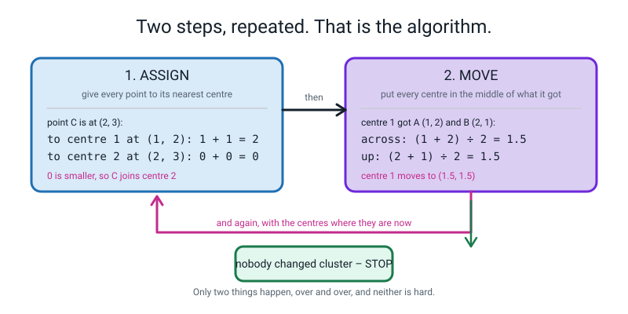
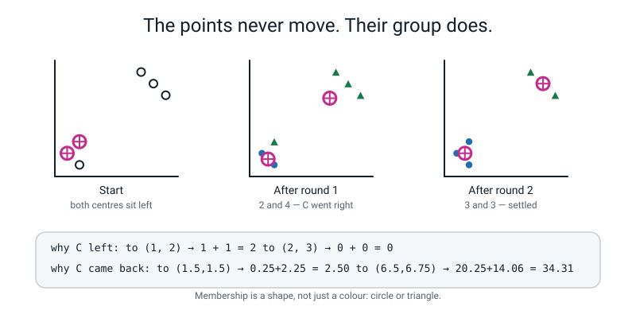
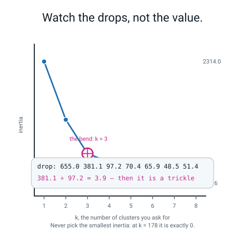
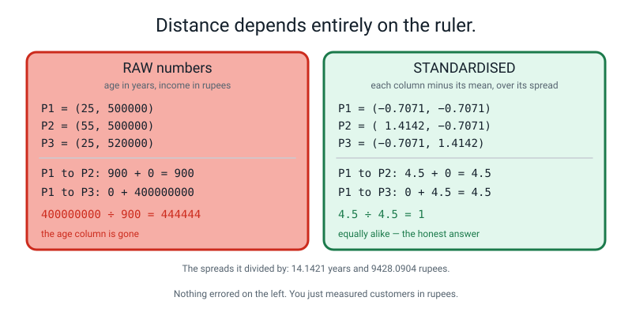
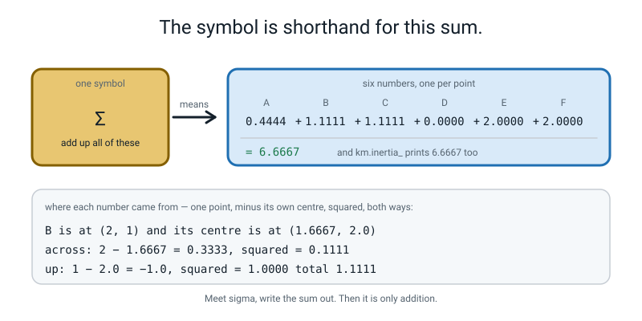
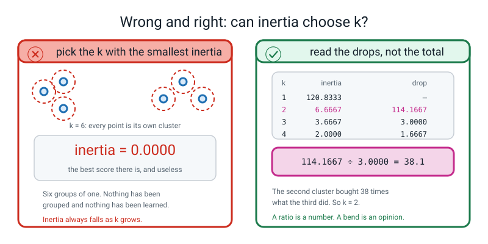
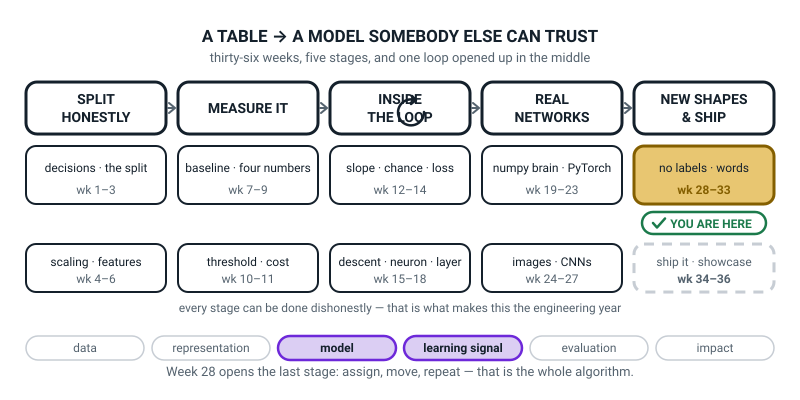
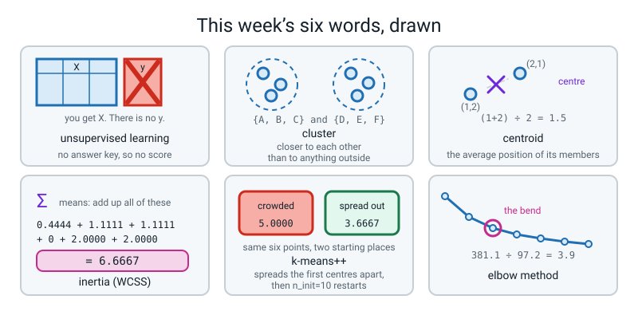

# Week 28 — Sorting With No Answer Key

[⬅ Week 27](week-27.md) · [Course Home](../README.md) · [Next ➡](week-29.md) · [Workbook](../workbook/week-28.md)

---

> ### This week in one sentence
> **Two steps, repeated: give every point to its nearest centre, then move every centre to the middle of what it got — and because there is no answer key any more, a result is only worth as much as your argument for it.**
>
> **By the end of this chapter you will be able to:**
> - **Run two full rounds of k-means by hand** on six 2-D points, writing out every one of the twenty-four squared distances and both sets of new centroids
> - **Read `Σ` as "add up all of these"** and write the expanded sum beside it — six numbers adding to **6.6667**, which is exactly what `km.inertia_` prints
> - **Compute inertia by hand** for a clustering, say what a smaller value means, and explain why the smallest inertia is **never** the right `k`
> - **Show a numeric example where scaling flips the answer** — `400,000,000 ÷ 900 = 444,444` becomes `4.5 ÷ 4.5 = 1` — and name the column that took over on the wine data, with its spread
>
> **New maths:** `Σ` (sigma) as shorthand for "add up all of these", with the full sum written out beside it, every single time.
>
> **New syntax:** `KMeans(n_clusters=3, n_init=10, random_state=0)` · `km.labels_` · `km.cluster_centers_` · `km.inertia_`
>
> **Reading time:** about 35 minutes. **Homework:** about 60 minutes.

---

## 🪝 Start Here

For twenty-seven weeks, everything you have built has had two halves.

```
        WEEKS 1 to 27              TODAY
        X   (the table)            X   (the table)
        y   (the answers)
```

A table of measurements, and a column of right answers. Pizza deliveries and whether they were late. Digits and which digit they were. Fraud and whether it was fraud.

And *every* number you used to say whether you were any good — accuracy, precision, recall, AUC, log loss, every single one — worked by comparing your guess to the right answer.

**This week the right answers go away. Permanently.** That second column stays empty for the rest of the term.

**So what breaks?** All of it. There is no accuracy, because accuracy is a comparison. There is no overfitting, or at least it is very hard to even say what overfitting would *mean*. There is no right answer for any individual row.

What you can still do is **find structure**. That is what this term is about.

🍕 **Here is the shape of the problem.** Somebody hands you a shoebox with five hundred mixed Lego bricks in it and says: *sort these.*

By colour? By size? By shape? By which set they came out of?

**None of those is the right answer and all of them are valid sortings.** There is no key at the back of the book. What you *can* do is defend your choice: *"I sorted by shape, because the piles came out about even, the bricks inside each pile really do look alike, and shape is what matters if you want to build something."*

**Notice what that is.** It is not a score. **It is an argument.** For the rest of this term, when you finish a job like this, the thing you hand in is an argument with numbers in it.

Now here is all the data there is:

```
A = (1, 2)      D = (8, 8)
B = (2, 1)      E = (9, 7)
C = (2, 3)      F = (7, 9)
```

Split them into two groups.

You did that in about a second and a half, by eye: **{A, B, C} and {D, E, F}.** Obvious.

**Now you need an algorithm that does it**, because your eye does not work on 178 wines with thirteen chemical measurements each, and it really does not work on forty thousand supermarket customers.

The algorithm has **two steps**. Two. And you are going to do both of them with a pen before you write any code.

---

## 🧠 The Big Idea

> **📌 About the code in this section.** The blocks below are **illustrations, not files**. Each one carries on from the one above. **The complete runnable file is in 💻 Type This.**

### 1. Unsupervised means no `y`, and therefore no score

> **Supervised learning** — you have a table of features `X` **and** a column of right answers `y`. The model learns to go from one to the other, and you score it by comparing its guesses to the real `y`.

> **Unsupervised learning** — you have **only** `X`. There is no `y`. The algorithm finds structure in the table, and **there is nothing to compare it against.**

That second sentence sounds mild. It is not. Here is exactly what it costs you:

| Question you could always answer before | Supervised | Unsupervised |
|---|---|---|
| Is my model any good? | compare to the held-out `y` — one number | **no held-out truth exists** |
| Did I overfit? | train score much better than test score | **hard even to define** |
| Is this row's answer right? | yes or no | **there is no right answer for a row** |
| What can I measure at all? | accuracy, precision, recall, AUC, log loss | internal tidiness, and whether it survives being jiggled |

**So the deliverable changes. In supervised learning you ship a score. In unsupervised learning you ship an argument.** Week 30's whole lesson is about building that argument. It starts here.

### 2. The whole algorithm, in four lines

> **Cluster** — a group of points that are more like each other than like anything outside the group.

> **Centroid** — the average position of everything currently in a cluster. Its centre of gravity. If a cluster holds the points (1,2) and (2,1), its centroid is at ((1+2) ÷ 2, (2+1) ÷ 2) = (1.5, 1.5).

Here is the entire algorithm. All of it.

```
1. Put down k centres, anywhere.
2. ASSIGN : give every point to its nearest centre.
3. MOVE   : put every centre in the middle of the points it just got.
4. Go back to 2. Stop when nobody changed cluster.
```

Steps 2 and 3 take turns, and **each of them can only make the clusters tighter, never looser** — which is why the thing always stops on its own.


*Figure 28.1 — Two steps, repeated: assign, then move. C measures 1 + 1 = 2 to one centre and 0 + 0 = 0 to the other, so it goes to the second one. Then centre 1 moves to the middle of A and B: (1+2) ÷ 2 = 1.5 and (2+1) ÷ 2 = 1.5.*

🍕 **The analogy for the two steps.** Three food trucks park in a big park full of picnickers. **Round 1:** every picnicker walks to whichever truck is nearest. **Round 2:** each truck looks at where its own customers ended up sitting and drives to the middle of them. **Round 3:** some picnickers notice a different truck is now closer and switch over, and the trucks move again. After a few rounds nobody switches, the trucks stop, and you have three neighbourhoods that nobody designed.

**`k` is your decision, not the algorithm's.** Ask for three clusters and you get three. Ask for seven and you get seven. Nothing inside k-means has an opinion about how many groups your data really has.

### 3. Two rounds by hand, and the point that comes home

Six points, `k = 2`, and the two starting centres put **deliberately badly** — both of them in the left-hand bunch, one sitting exactly on top of A and one exactly on top of C:

```
centre 1 = (1, 2)        centre 2 = (2, 3)
```

**We use squared distance throughout, and never take a square root.** Squaring does not change which centre is nearer, and it saves you an enormous amount of arithmetic. *"How far, squared"* means: the across-gap squared, plus the up-gap squared.

**ROUND 1, assign.** Twelve squared distances, all small whole numbers.

| point | to centre 1 = (1,2) | to centre 2 = (2,3) | nearer |
|---|---|---|---|
| A (1,2) | 0 + 0 = **0** | 1 + 1 = 2 | **centre 1** |
| B (2,1) | 1 + 1 = **2** | 0 + 4 = 4 | **centre 1** |
| C (2,3) | 1 + 1 = 2 | 0 + 0 = **0** | **centre 2** |
| D (8,8) | 49 + 36 = 85 | 36 + 25 = **61** | **centre 2** |
| E (9,7) | 64 + 25 = 89 | 49 + 16 = **65** | **centre 2** |
| F (7,9) | 36 + 49 = 85 | 25 + 36 = **61** | **centre 2** |

Groups: **centre 1 got {A, B}** and **centre 2 got {C, D, E, F}**.

**Look at how bad that is.** C is sitting right next to A and B, and it has been filed with three points seven units away. For one reason only: **centre 2 happened to be standing on top of it, so its distance was 0.** That is not the algorithm being stupid. It is the algorithm doing exactly what it was told, from a bad starting position.

**ROUND 1, move.**

```
centre 1 = middle of {A, B} = ( (1+2) ÷ 2 , (2+1) ÷ 2 ) = ( 1.5 , 1.5 )

centre 2 = middle of {C, D, E, F}
         = ( (2+8+9+7) ÷ 4 , (3+8+7+9) ÷ 4 )
         = ( 26 ÷ 4 , 27 ÷ 4 )
         = ( 6.5 , 6.75 )
```

**Centre 2 had one nearby point and three distant ones, and the average lands out among the distant ones. It got dragged.**

**ROUND 2, assign.** Twelve more squared distances, now against the moved centres.

| point | to centre 1 = (1.5, 1.5) | to centre 2 = (6.5, 6.75) | nearer |
|---|---|---|---|
| A (1,2) | 0.25 + 0.25 = **0.50** | 30.25 + 22.5625 = 52.8125 | **centre 1** |
| B (2,1) | 0.25 + 0.25 = **0.50** | 20.25 + 33.0625 = 53.3125 | **centre 1** |
| C (2,3) | 0.25 + 2.25 = **2.50** | 20.25 + 14.0625 = 34.3125 | **centre 1 ← switched!** |
| D (8,8) | 42.25 + 42.25 = 84.50 | 2.25 + 1.5625 = **3.8125** | **centre 2** |
| E (9,7) | 56.25 + 30.25 = 86.50 | 6.25 + 0.0625 = **6.3125** | **centre 2** |
| F (7,9) | 30.25 + 56.25 = 86.50 | 0.25 + 5.0625 = **5.3125** | **centre 2** |

Groups: **{A, B, C}** and **{D, E, F}**. **C came home.** The bad start repaired itself in exactly one round.

**ROUND 2, move.**

```
centre 1 = ( (1+2+2) ÷ 3 , (2+1+3) ÷ 3 ) = ( 5÷3 , 6÷3 ) = ( 1.6667 , 2.0 )
centre 2 = ( (8+9+7) ÷ 3 , (8+7+9) ÷ 3 ) = ( 24÷3 , 24÷3 ) = ( 8.0 , 8.0 )
```

**Round 3 would change nothing** — A, B and C are obviously nearer (1.67, 2) than (8, 8), and D, E and F the other way round. Nobody switches, so we stop. **Converged in two rounds.**


*Figure 28.2 — The same six points, recoloured three times. The points never move; only their group and the centres do. 2 and 4 after round 1, then 3 and 3.*

> **⚠️ Watch out:** the points **never move.** Only the centres move. Every single time somebody gets confused about k-means, it is because they have started imagining the data sliding about.

### 4. Inertia, and why it can never choose `k`

You now have two clusters. **How good are they?** There is no `y` to check against, so the only honest thing you can measure is *tightness*: how far is every point from its own centre?

> **Inertia**, also called **WCSS** (within-cluster sum of squares) — add up the squared distance from every point to **its own** centre. **Smaller means tighter clusters.**

Worked all the way out, with the final centres (1.6667, 2.0) and (8, 8):

```
A (1,2) to (1.6667, 2.0) :  0.4444 + 0.0000 = 0.4444
B (2,1) to (1.6667, 2.0) :  0.1111 + 1.0000 = 1.1111
C (2,3) to (1.6667, 2.0) :  0.1111 + 1.0000 = 1.1111
D (8,8) to (8.0,    8.0) :  0.0000 + 0.0000 = 0.0000
E (9,7) to (8.0,    8.0) :  1.0000 + 1.0000 = 2.0000
F (7,9) to (8.0,    8.0) :  1.0000 + 1.0000 = 2.0000
                                     inertia = 6.6667
```

**Check B yourself right now.** B is at (2, 1) and its centre is at (1.6667, 2.0). Across: 2 − 1.6667 = 0.3333, squared = **0.1111**. Up: 1 − 2.0 = −1.0, squared = **1.0000**. Total **1.1111**. ✅

**And here is the trap that catches almost everybody.** Inertia is the number k-means is trying to make small, and **it always falls when you ask for more clusters.** Here is the real table for our six points:

```text
k=1 inertia   120.8333  drop -
k=2 inertia     6.6667  drop 114.1667
k=3 inertia     3.6667  drop 3.0000
k=4 inertia     2.0000  drop 1.6667
k=5 inertia     1.0000  drop 1.0000
k=6 inertia     0.0000  drop 1.0000
```

**At `k = 6` — one cluster per point — inertia is exactly 0.** The perfect score, and it has grouped nothing.

> **⚠️ Watch out:** you can **never** choose `k` by picking the smallest inertia. The smallest is always "one cluster per point". This is the single most common mistake in the whole subject.

So what do you do instead? The usual first move is the **elbow method**.

> **Elbow method** — plot inertia against `k`, and look for the bend: the `k` after which extra clusters stop buying you much.

Here is the real table for the 178 **scaled** wines:

```text
  k   inertia     drop
  1    2314.0        -
  2    1659.0    655.0
  3    1277.9    381.1
  4    1180.7     97.2
  5    1110.4     70.4
  6    1044.5     65.9
  7     996.0     48.5
  8     944.6     51.4
```

**Read the drop column, not the inertia column.** Going 1→2 bought 655. Going 2→3 bought 381. Going 3→4 bought **97**. That is where the cliff is:

```
381.1 ÷ 97.2 = 3.9
```

**The last cluster that was nearly four times as useful as the next one is the third.** After that it is a trickle: 70, 66, 48, 51.


*Figure 28.3 — The elbow is where the drop stops paying. Inertia falls from 2314.0 to 944.6, and the drops are 655.0, 381.1, then a collapse to 97.2. The ratio 381.1 ÷ 97.2 = 3.9 is the finding; the picture is only a hint.*

**Be honest about this tool.** Elbows are frequently not obvious, two sensible people read the same curve differently, and on plenty of real datasets there is no bend at all — just a smooth arc. **Report the drop ratio, which is a number, rather than pointing at a picture.** Week 30 brings a second, independent piece of evidence, which is the actual fix.

### 5. The thing that decides the answer, and it is not the algorithm

**k-means measures distance. Distance adds up squared gaps across every column. So the column with the biggest numbers wins.** Not "has more influence". **Wins.**

Three customers, two columns — age in years, income in rupees:

```
P1 = (25, 500000)
P2 = (55, 500000)
P3 = (25, 520000)
```

Squared distances on the raw numbers:

```
P1 to P2 : (25−55)² + (500000−500000)² =    900 +           0 =         900
P1 to P3 : (25−25)² + (500000−520000)² =      0 + 400,000,000 = 400,000,000

400000000 ÷ 900 = 444444
```

**Raw k-means believes P1 and P2 are 444,444 times more alike than P1 and P3** — even though P1 and P2 are thirty years apart in age, and P1 and P3 differ only by a 4% pay rise. **The age column has not been weakened. It has been deleted.** 900 against 400 million is not a contribution; it is a rounding error.

Now standardise each column — subtract its mean, divide by its spread, exactly as in Week 4:

```
age:    mean 35,          spread    14.1421  →  −0.7071, +1.4142, −0.7071
income: mean 506666.67,   spread  9428.0904  →  −0.7071, −0.7071, +1.4142

P1 to P2 : (−0.7071 − 1.4142)² + 0 = 4.5
P1 to P3 : 0 + (−0.7071 − 1.4142)² = 4.5
```

**Exactly equal. And that is the honest answer:** each pair differs by the same amount in one standardised column and not at all in the other. Same three customers, same algorithm, opposite conclusion.


*Figure 28.4 — The same three customers, two different rulers. 400,000,000 ÷ 900 = 444,444 on the raw numbers; 4.5 ÷ 4.5 = 1 once both columns are on the same ruler.*

**And here is the same failure on real data.** Cluster the 178 wines on their raw 13 columns, then look at what the clusters actually are:

```text
cluster 0: n= 69  proline  278 to  590   alcohol 11.03 to 14.13
cluster 1: n= 47  proline  970 to 1680   alcohol 12.85 to 14.83
cluster 2: n= 62  proline  600 to  937   alcohol 11.45 to 14.34
```

**Read the proline column: 278–590, 600–937, 970–1680. Three bands that do not overlap by a single unit.** Read the alcohol column: 11.03–14.13, 12.85–14.83, 11.45–14.34 — they overlap almost completely.

**The "clustering" of thirteen chemical measurements is a sorting of one column into three bands.** And you could have predicted it before running anything, from one printout of the column spreads: `proline` is **314.91**, `flavanoids` is **1.00**. Squared, that is a ratio of about 99,000 to 1. **Twelve of the thirteen columns were never consulted.**

> **Always scale before k-means.** Standardising is the default, and the only exception is when every column is already in the same natural unit and you genuinely *want* the wider-ranging one to count more.

---

## 🔢 The Maths, Slowly

**This week's only new notation is one Greek letter, and it means less than it looks like.**

You have just added up six numbers to get an inertia of 6.6667. In a book, that job is written like this:

```
inertia  =  Σ  (distance from a point to its own centre)²
```

> **🔢 The maths, slowly:** **`Σ` is the Greek capital letter S, and it stands for "Sum". It means, in full: "add up all of these."** That is the entire content of the symbol. It is an instruction to add, and nothing more. It does not multiply. It does not do anything clever. **There is no hidden step inside it.**

**The rule for this course, and it is not negotiable for the next four weeks: every time that symbol appears, write the sum out in full beside it.**

```
Σ (distance)²   means   0.4444 + 1.1111 + 1.1111 + 0.0000 + 2.0000 + 2.0000
                      = 6.6667
```


*Figure 28.5 — The sigma symbol means add up all of these. One symbol on the left; the six numbers it is short for on the right, adding to 6.6667 — which is exactly what `km.inertia_` prints.*

**You can check this yourself with a calculator, and you should.** Type these six numbers in, in any order:

```
0.4444 + 1.1111 + 1.1111 + 0 + 2 + 2
```

Your calculator says **6.6666**. Python says **6.6667**. **Neither of you is wrong** — the printout rounded each term to four decimal places before you typed it, and six rounded-down terms add up to slightly less than the real total.

**Here is the same sum with exact fractions**, which is worth doing once because it is the only way to see where the 7 comes from:

```
A :  4/9                    =  0.4444...
B :  1/9  +  1              =  1.1111...
C :  1/9  +  1              =  1.1111...
D :  0                      =  0
E :  1    +  1              =  2
F :  1    +  1              =  2

the ninths :  4/9 + 1/9 + 1/9  =  6/9  =  0.6666...
the whole numbers :  1 + 1 + 2 + 2  =  6
                                     6.6666...  which rounds to 6.6667
```

**That is the point of writing the sum out.** You can see exactly which terms are exact and which are recurring, and you can never be surprised by a last digit again.

**Why does the symbol exist at all?** With six points you would just write the six numbers. With 178 wines you would not, and with 40,000 supermarket customers you certainly would not. **`Σ` is shorthand for a list too long to write.** It is a labour-saving device, not a piece of cleverness.

| The symbol says | Which means, in full | Which comes to |
|---|---|---|
| `Σ (d)²` over 6 points | 0.4444 + 1.1111 + 1.1111 + 0 + 2 + 2 | **6.6667** |
| `Σ (d)²` over 178 wines | 178 numbers, added up | **1277.9** (scaled) |
| `Σ x` over 3 numbers | 4 + 6 + 8 | **18** |
| `Σ x` ÷ n over 3 numbers | (4 + 6 + 8) ÷ 3 | **6** — that is just a mean |

**That last row is worth sitting with. Every average you have ever computed was a sigma with a division on the end.** You have been using this symbol without its name since Level 2.

---

## 💻 Type This

Open a new file called `no_answer_key.py`. You will build it in six pieces.

### Step 1 — the six points, started exactly where we started by hand

```python
import numpy as np
from sklearn.cluster import KMeans

np.random.seed(0)

X = np.array([[1., 2.], [2., 1.], [2., 3.],
              [8., 8.], [9., 7.], [7., 9.]])
names = ["A", "B", "C", "D", "E", "F"]
init = np.array([[1., 2.], [2., 3.]])       # centre 1 on A, centre 2 on C

km = KMeans(n_clusters=2, init=init, n_init=1, random_state=0).fit(X)
print("labels        :", km.labels_)
print("centres       :", np.round(km.cluster_centers_, 4).tolist())
print("inertia       :", round(km.inertia_, 4))
print("rounds counted:", km.n_iter_)
```

**What each new line does.**

- `KMeans(n_clusters=2, ...)` **builds** a clusterer but does not run it. It is an empty machine with its dials set.
- `n_clusters=2` is how many groups you are asking for.
- `init=init` hands it **our** two starting centres instead of letting it choose. `n_init=1` says *"do not restart, I want this one run."* **Without both of those the trace will not match what you did by hand.**
- `random_state=0` fixes the dice so your numbers and mine are identical.
- `.fit(X)` **runs it** on the table `X`, stores the result inside `km`, and hands `km` back — which is why you can chain it on the end like that.
- `km.labels_` is one whole number per row of `X`, in row order.
- `km.cluster_centers_` is a small table: one row per cluster, one column per feature.
- `km.inertia_` is the single number from §4.

```text
labels        : [0 0 0 1 1 1]
centres       : [[1.6667, 2.0], [8.0, 8.0]]
inertia       : 6.6667
rounds counted: 3
```

**Compare all four lines against your pen-and-paper work.** Centres (1.6667, 2.0) and (8, 8) — the same. Inertia 6.6667 — the same.

**Rounds: you counted 2 and it says 3.** You are both right. You counted the rounds that *changed something*. It also counts the final pass, the one that checked and found nothing had changed. **When a library's counter is one off from yours, check whether it is counting the check.**

> **⚠️ Watch out:** **the trailing underscore is not decoration.** In scikit-learn, a name ending in `_` means *"this did not exist until `.fit` was called"*. `labels_`, `cluster_centers_`, `inertia_` — every one.

**And say this out loud twice: `0`, `1` and `2` are names, not measurements.** Group 0 is not smaller, better or first. Re-run with a different seed and the same three groups can come back numbered differently. **Never do arithmetic on a cluster number.**

### Step 2 — inertia, added up one point at a time

```python
print()
print("--- inertia: add up all six squared distances ---")
total = 0.0
for nm, p, lab in zip(names, X, km.labels_):
    c = km.cluster_centers_[lab]
    dx2, dy2 = (p[0] - c[0]) ** 2, (p[1] - c[1]) ** 2
    total += dx2 + dy2
    print("  %s (%g,%g) to centre %d (%.4f,%.4f): %.4f + %.4f = %.4f"
          % (nm, p[0], p[1], lab, c[0], c[1], dx2, dy2, dx2 + dy2))
print("  all six added up:", round(total, 4))
print("  km.inertia_     :", round(km.inertia_, 4))
```

`km.cluster_centers_[lab]` picks out the row of the centres table belonging to this point's own cluster. Then it is two subtractions, two squares and an add.

```text
--- inertia: add up all six squared distances ---
  A (1,2) to centre 0 (1.6667,2.0000): 0.4444 + 0.0000 = 0.4444
  B (2,1) to centre 0 (1.6667,2.0000): 0.1111 + 1.0000 = 1.1111
  C (2,3) to centre 0 (1.6667,2.0000): 0.1111 + 1.0000 = 1.1111
  D (8,8) to centre 1 (8.0000,8.0000): 0.0000 + 0.0000 = 0.0000
  E (9,7) to centre 1 (8.0000,8.0000): 1.0000 + 1.0000 = 2.0000
  F (7,9) to centre 1 (8.0000,8.0000): 1.0000 + 1.0000 = 2.0000
  all six added up: 6.6667
  km.inertia_     : 6.6667
```

**Those six lines are the sigma.** That is the whole symbol, printed one term at a time. And the last two lines are the same number twice — yours and the library's.

### Step 3 — where you start matters

```python
print()
print("--- same six points, k=3, two different starting places ---")
crowded = np.array([[1., 2.], [2., 1.], [2., 3.]])
k_bad = KMeans(n_clusters=3, init=crowded, n_init=1, random_state=0).fit(X)
k_pp = KMeans(n_clusters=3, init="k-means++", n_init=10, random_state=0).fit(X)
print("all 3 centres in the left bunch : labels", k_bad.labels_,
      " inertia", round(k_bad.inertia_, 4))
print("k-means++ with n_init=10        : labels", k_pp.labels_,
      " inertia", round(k_pp.inertia_, 4))
```

```text
--- same six points, k=3, two different starting places ---
all 3 centres in the left bunch : labels [0 1 0 2 2 2]  inertia 5.0
k-means++ with n_init=10        : labels [1 1 1 0 2 0]  inertia 3.6667
```

> **k-means++** — a smarter way of choosing the starting centres, which spreads them out instead of letting them land on top of each other.

> **`n_init=10`** — run the whole algorithm ten times from ten different starts, and keep whichever run finished with the lowest inertia.

**scikit-learn does both of these by default.** Which is why you will rarely see a really bad clustering — but you should know it is being *handled for you* rather than believing the algorithm is start-proof.

### Step 4 — the ruler problem, on three customers

```python
from sklearn.preprocessing import StandardScaler

print()
print("--- three customers: (age in years, income in rupees) ---")
P = np.array([[25., 500000.], [55., 500000.], [25., 520000.]])


def sq(a, b):
    return float(np.sum((a - b) ** 2))


print("RAW    d(P1,P2)^2 = %.1f" % sq(P[0], P[1]))
print("RAW    d(P1,P3)^2 = %.1f" % sq(P[0], P[2]))
print("so raw says P1 and P2 are %.0f times more alike"
      % (sq(P[0], P[2]) / sq(P[0], P[1])))
scaler = StandardScaler()
Z = scaler.fit_transform(P)
print("means used   :", np.round(scaler.mean_, 4))
print("spreads used :", np.round(scaler.scale_, 4))
print("standardised :\n", np.round(Z, 4))
print("SCALED d(P1,P2)^2 = %.4f" % sq(Z[0], Z[1]))
print("SCALED d(P1,P3)^2 = %.4f" % sq(Z[0], Z[2]))
```

```text
--- three customers: (age in years, income in rupees) ---
RAW    d(P1,P2)^2 = 900.0
RAW    d(P1,P3)^2 = 400000000.0
so raw says P1 and P2 are 444444 times more alike
means used   : [3.50000000e+01 5.06666667e+05]
spreads used : [  14.1421 9428.0904]
standardised :
 [[-0.7071 -0.7071]
 [ 1.4142 -0.7071]
 [-0.7071  1.4142]]
SCALED d(P1,P2)^2 = 4.5000
SCALED d(P1,P3)^2 = 4.5000
```

`3.50000000e+01` is scientific notation for **35**, and `5.06666667e+05` is **506666.667**. numpy switches to that format when one number in an array is very large.

### Step 5 — 178 wines, with their labels locked in a drawer

```python
import pandas as pd
from sklearn.datasets import load_wine

print()
wine = load_wine()
X_raw = pd.DataFrame(wine.data, columns=wine.feature_names)
y_secret = wine.target                       # not used until the very last line
print("wine table:", X_raw.shape)
print("the spread of each column, biggest first:")
print(X_raw.std().sort_values(ascending=False).round(2).to_string())

km_raw = KMeans(n_clusters=3, n_init=10, random_state=0).fit(X_raw)
Xs = StandardScaler().fit_transform(X_raw)
km_sc = KMeans(n_clusters=3, n_init=10, random_state=0).fit(Xs)
print()
print("UNSCALED  sizes", np.bincount(km_raw.labels_),
      " inertia %.1f" % km_raw.inertia_)
print("SCALED    sizes", np.bincount(km_sc.labels_),
      " inertia %.1f" % km_sc.inertia_)

print()
print("--- what the UNSCALED clusters actually are ---")
pro = X_raw["proline"].values
alc = X_raw["alcohol"].values
for c in range(3):
    m = km_raw.labels_ == c
    print("cluster %d: n=%3d  proline %4.0f to %4.0f   alcohol %.2f to %.2f"
          % (c, m.sum(), pro[m].min(), pro[m].max(), alc[m].min(), alc[m].max()))
```

`load_wine()` ships inside scikit-learn. **Nothing is downloaded.** `np.bincount(labels)` counts how many rows landed in each cluster.

```text
wine table: (178, 13)
the spread of each column, biggest first:
proline                         314.91
magnesium                        14.28
alcalinity_of_ash                 3.34
color_intensity                   2.32
malic_acid                        1.12
flavanoids                        1.00
alcohol                           0.81
od280/od315_of_diluted_wines      0.71
total_phenols                     0.63
proanthocyanins                   0.57
ash                               0.27
hue                               0.23
nonflavanoid_phenols              0.12

UNSCALED  sizes [69 47 62]  inertia 2370689.7
SCALED    sizes [65 51 62]  inertia 1277.9

--- what the UNSCALED clusters actually are ---
cluster 0: n= 69  proline  278 to  590   alcohol 11.03 to 14.13
cluster 1: n= 47  proline  970 to 1680   alcohol 12.85 to 14.83
cluster 2: n= 62  proline  600 to  937   alcohol 11.45 to 14.34
```

> **⚠️ Watch out:** the inertia went from **2,370,689.7** to **1,277.9**. That is **not** a clustering that got 1,850 times better. **You changed the ruler, so you changed the number.** Inertia is in whatever units your table is in. You may compare two inertias from the same table measured the same way. **You may never compare an inertia across a change of units.** This is Week 27's rule about naming the pile, wearing a different hat.

### Step 6 — the elbow, then open the drawer

```python
from sklearn.metrics import confusion_matrix

print()
print("--- the elbow, on the scaled wines ---")
prev = KMeans(n_clusters=1, n_init=10, random_state=0).fit(Xs).inertia_
print("  k   inertia     drop")
print("  1  %8.1f        -" % prev)
for k in range(2, 9):
    inr = KMeans(n_clusters=k, n_init=10, random_state=0).fit(Xs).inertia_
    print("  %d  %8.1f  %7.1f" % (k, inr, prev - inr))
    prev = inr

print()
print("rows = the real grape variety, columns = the cluster we found")
print("UNSCALED\n", confusion_matrix(y_secret, km_raw.labels_))
print("SCALED\n", confusion_matrix(y_secret, km_sc.labels_))
```

```text
--- the elbow, on the scaled wines ---
  k   inertia     drop
  1    2314.0        -
  2    1659.0    655.0
  3    1277.9    381.1
  4    1180.7     97.2
  5    1110.4     70.4
  6    1044.5     65.9
  7     996.0     48.5
  8     944.6     51.4

rows = the real grape variety, columns = the cluster we found
UNSCALED
 [[ 0 46 13]
 [50  1 20]
 [19  0 29]]
SCALED
 [[ 0  0 59]
 [65  3  3]
 [ 0 48  0]]
```

**Read the SCALED grid.** Row 0 is 59 wines of variety 0, and **all 59** landed in our cluster 2. Row 1 is 68 wines of variety 1, and **65** of them landed in our cluster 0. Row 2 is 48 wines of variety 2, and **all 48** landed in our cluster 1.

**172 of 178 wines grouped with their own grape variety, by an algorithm that never saw a variety.** The UNSCALED grid is a mess: 46 and 13 in one row, 50 and 20 in another.

**And here is the honest sentence about that.** You only got to check because *this* dataset happens to have answers hidden in it. **Normally you do not get to check. That is the whole problem, and it is why Week 30 exists.**

### The complete `no_answer_key.py`

Put the six steps together, in order, with all the imports at the top. **Expected runtime: about 1.5 seconds.** It fits more than a dozen k-means models and you will not notice.

---

## 🔍 Worked Examples

### Worked Example 1 — A bad start that does *not* repair itself

Round 2 rescued C. That was lucky. **With `k = 3` you can get stuck somewhere worse and stay there.**

```python
import numpy as np
from sklearn.cluster import KMeans
X = np.array([[1., 2.], [2., 1.], [2., 3.],
              [8., 8.], [9., 7.], [7., 9.]])

crowded = np.array([[1., 2.], [2., 1.], [2., 3.]])   # all three on the LEFT bunch
k_bad = KMeans(n_clusters=3, init=crowded, n_init=1, random_state=0).fit(X)
k_pp = KMeans(n_clusters=3, init="k-means++", n_init=10, random_state=0).fit(X)
print("crowded labels", k_bad.labels_, "centres",
      np.round(k_bad.cluster_centers_, 4).tolist(), "inertia", round(k_bad.inertia_, 4))
print("kpp     labels", k_pp.labels_, "centres",
      np.round(k_pp.cluster_centers_, 4).tolist(), "inertia", round(k_pp.inertia_, 4))
```

```text
crowded labels [0 1 0 2 2 2] centres [[1.5, 2.5], [2.0, 1.0], [8.0, 8.0]] inertia 5.0
kpp     labels [1 1 1 0 2 0] centres [[7.5, 8.5], [1.6667, 2.0], [9.0, 7.0]] inertia 3.6667
```

**Read the two label arrays.**

- Crowded start: `{A, C}`, `{B}`, `{D, E, F}` — inertia **5.0**. B is sitting all by itself in a cluster of one, one step away from both its neighbours.
- k-means++ with ten restarts: `{A, B, C}`, `{D, F}`, `{E}` — inertia **3.6667**.

**3.6667 is lower, so by the only measure k-means has, the second answer is better.** And notice what it actually did: **it kept the left bunch whole and split the right-hand bunch in half.** That is almost certainly not what you would have drawn with a pencil.

**Both of those facts are true at once.** Lower inertia means *tighter*. It does not mean *"the grouping a human wanted"*. **Do not let the word "better" smuggle in a claim the number does not make.**

### Worked Example 2 — One outlier spends a whole cluster on itself

Add a seventh point, miles away from everything, and ask for two clusters again.

```python
X7 = np.vstack([X, [20., 20.]])
k = KMeans(n_clusters=2, n_init=10, random_state=0).fit(X7)
print("labels ", k.labels_)
print("centres", np.round(k.cluster_centers_, 4).tolist())
print("inertia", round(k.inertia_, 4))
```

`np.vstack` stacks arrays on top of each other, so `(6, 2)` plus one row becomes `(7, 2)`.

```text
labels  [0 0 0 0 0 0 1]
centres [[4.8333, 5.0], [20.0, 20.0]]
inertia 120.8333
```

**Read that carefully, because it is the ugliest thing k-means does.**

- **Cluster 1 contains exactly one point**, (20, 20), and its centre is sitting on top of it.
- **Cluster 0 contains all six of the original points** — the two obvious blobs have been **merged into one**, with a centre at (4.8333, 5.0), which is in the empty space between them.
- The inertia is **120.8333**, which is exactly the `k=1` inertia of the original six points. Of course it is: they are all in one cluster now.

**k-means has no "none of the above".** Every point must belong to some cluster, so one extreme point can take an entire cluster for itself and wreck the grouping of everything else.

**What you do about it:** check for outliers before you cluster, not after. One row printed in the wrong place will not error, and it will quietly destroy your answer.

### Worked Example 3 — The elbow on six points, by hand, and what a *real* elbow looks like

The wine elbow gave a drop ratio of 3.9, which is a soft bend. **Here is a sharp one, on data you can check on paper.**

```python
prev = None
for k in range(1, 7):
    m = KMeans(n_clusters=k, n_init=10, random_state=0).fit(X)
    d = "-" if prev is None else "%.4f" % (prev - m.inertia_)
    print("k=%d inertia %10.4f  drop %s" % (k, m.inertia_, d))
    prev = m.inertia_
```

```text
k=1 inertia   120.8333  drop -
k=2 inertia     6.6667  drop 114.1667
k=3 inertia     3.6667  drop 3.0000
k=4 inertia     2.0000  drop 1.6667
k=5 inertia     1.0000  drop 1.0000
k=6 inertia     0.0000  drop 1.0000
```

**Now check `k=1` by hand.** One cluster means one centre, at the middle of all six points:

```
across : (1 + 2 + 2 + 8 + 9 + 7) ÷ 6 = 29 ÷ 6 = 4.8333
up     : (2 + 1 + 3 + 8 + 7 + 9) ÷ 6 = 30 ÷ 6 = 5.0
```

And the drop ratio:

```
114.1667 ÷ 3.0000 = 38.06
```

**Thirty-eight.** Compare that with the wine data's **3.9**. Both say "the bend is here", but one of them is shouting and the other is muttering.

**And read the bottom of the table for the reason you can never trust inertia alone.** `k=5` drops 1.0000 and `k=6` drops 1.0000 — identical. **The curve has gone completely flat, and it is still going down.** At `k=6` it reaches 0.0000, which is the best possible score and also useless: six groups of one.

**The habit to take from this:** print the drops, divide the big one by the next one, and write that ratio in your report. **A number somebody can argue with beats an arrow pointing at a picture.**

---

## 🐞 When It Breaks

Every message below came from really running a broken version of this week's code.

### Break 1 — you built the machine and never switched it on

```python
km = KMeans(n_clusters=2, n_init=10, random_state=0)
print(km.labels_)
```

```text
AttributeError: 'KMeans' object has no attribute 'labels_'
```

**What it means.** *"You never ran it."* `KMeans(...)` builds a clusterer with its dials set; it does not look at any data. `labels_` cannot exist until it has.

**The fix.** Add `.fit(X)`.

```python
km = KMeans(n_clusters=2, n_init=10, random_state=0).fit(X)
```

> **🐞 If you see this error:** an `AttributeError` about a name ending in `_` almost always means a missing `.fit`. **In scikit-learn, a trailing underscore is a promise about *when* the thing appears, not decoration.** This will be the answer about a third of the time this term.

### Break 2 — a list of numbers is not a table

```python
KMeans(n_clusters=2, n_init=10, random_state=0).fit(np.array([1., 2., 3., 8., 9., 7.]))
```

```text
ValueError: Expected 2D array, got 1D array instead:
array=[1. 2. 3. 8. 9. 7.].
Reshape your data either using array.reshape(-1, 1) if your data has a single feature or array.reshape(1, -1) if it contains a single sample.
```

**What it means.** *"You gave me a flat list of numbers, not a table of rows and columns."* `X` must always be rows-by-columns — a list of `[x, y]` pairs, not a list of numbers.

**The fix.** The message tells you which reshape you want. If each number is its own row with one feature:

```python
flat = np.array([1., 2., 3., 8., 9., 7.])
KMeans(n_clusters=2, n_init=10, random_state=0).fit(flat.reshape(-1, 1))
```

**And the Week 16 habit that prevents it: print `X.shape` before you fit.** `(6,)` is a list. `(6, 2)` is a table.

### Break 3 — more groups than things

```python
KMeans(n_clusters=8, n_init=10, random_state=0).fit(X)
```

```text
ValueError: n_samples=6 should be >= n_clusters=8.
```

**What it means.** *"You asked for eight groups and gave me six things."* Usually a typo in `n_clusters`.

**The fix.** `n_clusters` can never exceed the number of rows. **And the deeper lesson is in the boundary case:** at `n_clusters` = number of rows, it *does* run, gives you inertia exactly 0.0000, and has told you nothing at all.

### Three more you will meet, without a demo

| Message | What it means | The fix |
|---|---|---|
| `ValueError: could not convert string to float: 'cheese'` | One of your columns is words. | k-means measures distance, and there is no distance between `'cheese'` and `'olive'`. Drop the column, or one-hot encode it as in Week 4. |
| `ValueError: Input X contains NaN.` `KMeans does not accept missing values encoded as NaN natively.` | There is a hole in your table. | `SimpleImputer(strategy="median")` from Week 6, inside a pipeline. **There is no distance to a hole.** |
| `InvalidParameterError: The 'n_clusters' parameter of KMeans must be an int in the range [1, inf). Got '3' instead.` | You gave it the *text* three, not the number three. | Drop the quotes. **Read the last two words: it prints `'3'` with quotes round it, which is the clue.** |

**And the two that never error at all, which are far more dangerous:**

- **No scaling.** Nothing crashes. Your clusters are bands of your widest column. **The check that finds it: print the per-cluster minimum and maximum of your widest column. Non-overlapping bands is the fingerprint.**
- **Cluster 0 means something different every time you re-run.** Nothing crashes. Cluster numbers are arbitrary names. **Compare *groupings*, not numbers** — Week 30 gives you a tool for exactly that.

---

## 🎲 What We Did In Class

If you missed it, here is the whole lesson. You need workbook pages 28.1 to 28.3, three colours of pen, and squared paper.

**The hook.** Two columns on the board: `WEEKS 1 to 27` with `X` and `y` under it, and `TODAY` with only `X`. Then: *"what breaks?"* Everything that was a comparison. Then the shoebox of five hundred Lego bricks and *"sort these"* — by colour, size, shape, or which set they came from — and *"which of those is right?"* **None and all of them.** Then the six points on the floor, split by eye in a second and a half, and *"now I want an algorithm, because your eye does not work on 178 wines."*

**The four lines, boxed, and they stayed up all lesson:**

```
1. Put down k centres, anywhere.
2. ASSIGN : give every point to its nearest centre.
3. MOVE   : put every centre in the middle of the points it just got.
4. Go back to 2. Stop when nobody changed cluster.
```

**Then sigma**, introduced as nothing more than the instruction "add up all of these", with the six-term sum written out beside the symbol and the rule that it always will be.

**k-Means on the Floor, twenty minutes.** Six crosses taped to the floor with letter cards beside them, `A` through `F`, laid out like this:

```
      y
   9  |                           F
   8  |                              D
   7  |                                 E
      |
   3  |     C
   2  |  A
   1  |     B
      +-----------------------------------  x
         1  2                  7  8  9
```

Two volunteers held CENTRE 1 and CENTRE 2 cards. **CENTRE 1 stood on A. CENTRE 2 stood on C.** Both centres in the left bunch, one standing on top of a point — a bad start, on purpose. **One rule, repeated: the six points never move. Only the centres move.**

**Round 1, assign.** Twelve squared distances, computed by the room, written on the board and on page 28.3 in pen colour one:

```
A (1,2):  to (1,2) -> 0 + 0 = 0       to (2,3) -> 1 + 1 = 2       centre 1
B (2,1):  to (1,2) -> 1 + 1 = 2       to (2,3) -> 0 + 4 = 4       centre 1
C (2,3):  to (1,2) -> 1 + 1 = 2       to (2,3) -> 0 + 0 = 0       centre 2
D (8,8):  to (1,2) -> 49 + 36 = 85    to (2,3) -> 36 + 25 = 61    centre 2
E (9,7):  to (1,2) -> 64 + 25 = 89    to (2,3) -> 49 + 16 = 65    centre 2
F (7,9):  to (1,2) -> 36 + 49 = 85    to (2,3) -> 25 + 36 = 61    centre 2
```

*"C is one step from A and B. Why is it with the far group?"* **Because centre 2 is standing on it, so its distance is zero.**

**Round 1, move.** Centre 1 took half a step to (1.5, 1.5). Centre 2 had to **walk five metres** across the room to (6.5, 6.75), and everybody watched. *"Why did you just have to walk that far?"* **Because three of my four points were over there.** One nearby point, three distant ones, and the average lands out among the distant ones. **The centre got dragged.**

**Round 2, and C did it first, for the drama:**

```
C (2,3):  to (1.5, 1.5)  -> 0.25 + 2.25   = 2.50
          to (6.5, 6.75) -> 20.25 + 14.06 = 34.31        centre 1  -- SWITCHED
```

**C physically swapped its card in front of everybody.** Then the other five: A 0.50 vs 52.81, B 0.50 vs 53.31, D 84.50 vs 3.81, E 86.50 vs 6.31, F 86.50 vs 5.31. Then the move to (1.6667, 2.0) and (8.0, 8.0). *"Round three — would anybody switch?"* **No. So we stop. Two rounds. And the algorithm fixed its own bad start without being told anything.**

**Then inertia**, six squared distances added up as one sum beside a `Σ`:

```
0.4444 + 1.1111 + 1.1111 + 0.0000 + 2.0000 + 2.0000  =  6.6667
```

**And then the machine ran with the identical starting centres**, and it printed `[0 0 0 1 1 1] [[1.6667, 2.0], [8.0, 8.0]] 6.6667` — line for line what was on the board.

**Two deliberate mistakes in the live-code.**

| Mistake | What happened |
|---|---|
| `print(km.labels_)` with no `.fit` | **Loud.** `AttributeError: 'KMeans' object has no attribute 'labels_'` — and the trailing-underscore rule went in the Bug Log |
| clustering the wine on its raw 13 columns | **Silent.** `sizes [69 47 62]  inertia 2370689.7`, which looked nicely balanced — until the proline ranges came out as `278–590`, `600–937`, `970–1680` |

*"278 to 590. 600 to 937. 970 to 1680. What do you notice?"* **They do not overlap at all.** *"So what have our thirteen-column clusters actually sorted the wine by?"* **Proline. One column.** Then `X_raw.std()` printed, `proline 314.91` against `flavanoids 1.00`, and *"we could have known before we ran anything."*

**The wrap.** The three customers on the board, `900` against `400,000,000`, then `4.5` against `4.5`. And the line that stayed up:

```
The algorithm is the easy part.
What you measure distance with decides the answer.
```

---

## 💬 Talk About It

**1. You got three clusters out of the wine data, and 172 of 178 bottles matched their real grape variety. Does that mean k-means "works"?**

*Hint:* start by being precise about what happened. **The scaled run got 172 of 178; the unscaled run on the identical data got a mess.** Same algorithm, same `k`, same 178 rows — so "k-means works" cannot be the whole story, because one of those two runs is nearly perfect and the other is nearly worthless. Then the harder half: **you only found out it was 172 of 178 because this particular dataset has a hidden answer column.** Real unsupervised work does not. So what would you have concluded about the unscaled run if the varieties had genuinely not existed? (You would have had three tidy, balanced clusters and a plausible story about them.) And the sharpest version: **is a technique that can be either brilliant or worthless depending on one preprocessing step a reliable technique, or a sharp tool?** There is no comfortable answer.

**2. k-means always returns exactly the number of clusters you ask for, even from pure random numbers. Is that a bug?**

*Hint:* it is not a bug, it is the specification — so the interesting question is what it costs you. Run the wine pipeline on 178 rows of pure noise and you get three clusters with sizes `[62 44 72]`, nicely balanced, no warnings. **You could then write a report about them and invent names.** Somebody would believe it. Then ask: what *would* an algorithm that refuses to answer look like? (What would it need to know that k-means does not?) And then the uncomfortable half: **plenty of real published work reports clusters with no check of any kind against a no-structure baseline.** Is that dishonesty, or is it just that nobody was taught to run the check?

**3. The crowded `k=3` start put B alone in a cluster of one and scored 5.0. k-means++ split the right-hand bunch and scored 3.6667. Which answer is better?**

*Hint:* first separate two questions that sound like one. **Which has lower inertia?** The second, clearly — 3.6667 against 5.0, and inertia is the only thing k-means is trying to minimise. **Which grouping would you have drawn?** Almost certainly neither: you would have drawn `{A, B, C}` and `{D, E, F}` and refused to make a third group at all. So the second answer is better *by the measure* and still not what you wanted. Then the real question: **if the number you are optimising and the answer you want disagree, which one is wrong?** And what would you have to add to the problem to make them agree — a different `k`, a different distance, or a different algorithm entirely?

---

## ⚠️ Don't Get Tricked

### Trick 1 — "Pick the `k` with the smallest inertia"


*Figure 28.6 — Wrong and right: can inertia choose k? Left, k = 6 gives inertia 0.0000 and groups nothing. Right, the drops are 114.1667 then 3.0000, and 114.1667 ÷ 3.0000 = 38.1 puts the bend at k = 2.*

| ❌ Wrong | ✅ Right |
|---|---|
| "Inertia measures how tight the clusters are, and smaller is tighter, so sweep `k` and keep whichever gives the smallest inertia." | **Inertia always falls as `k` grows, so the smallest is always "one cluster per point".** On the six points: `k=6` gives **0.0000**, the best score there is, and it has grouped nothing. Read the **drops** instead: 114.1667, then 3.0000 — a ratio of **38** — and report the ratio, not the picture. |

The test: **any rule that could be satisfied by putting every row in its own cluster is not a rule.**

### Trick 2 — "The inertia went from 2,370,689.7 to 1,277.9, so scaling made it 1,850 times better"

| ❌ Wrong | ✅ Right |
|---|---|
| "Before scaling the inertia was 2,370,689.7 and after scaling it was 1,277.9, so scaling improved the clustering enormously." | **You changed the ruler, so you changed the number.** Inertia is measured in whatever units your table is in — the unscaled one is in squared rupee-sized units dominated by proline, the scaled one is in squared standard deviations. **They are not the same quantity.** You may compare two inertias from the same table, measured the same way. You may never compare one across a change of units. |

Same rule as Week 27's *"name the held-out pile on every row"*, in different clothes: **two numbers are only comparable if they measured the same thing.**

### Trick 3 — "Cluster 0 is the first group, so it is the biggest / the most important / comes first"

| ❌ Wrong | ✅ Right |
|---|---|
| "`labels_` came back `[0 0 0 1 1 1]`, so cluster 0 is the first and main group and cluster 1 is the secondary one. And cluster 1 minus cluster 0 is 1, so they are one apart." | **`0`, `1` and `2` are names, like "Mumbai".** They carry no order, no size and no importance. Re-run with a different seed and the exact same three groups can come back numbered differently — our `k=3` run numbered the left bunch `2` in one version and `1` in another. **Never do arithmetic on a cluster number, and never one-hot it as though it were a measurement.** |

The habit: the moment you write down a cluster number, write down what is *in* it too.

### Trick 4 — "We scale before k-means because scaling is good practice"

| ❌ Wrong | ✅ Right |
|---|---|
| "You should always standardise your features before clustering. It is good practice." | **That is a slogan, and it will not help you the day it matters.** You scale because otherwise the widest column decides every single distance. Name the column and quote the number: **`proline`'s spread is 314.91 and `flavanoids`' is 1.00**, so squared, proline contributes about **99,000 times more** to every distance. **The evidence is the bands:** `278–590`, `600–937`, `970–1680`, not overlapping by one unit. |

The bar for a real explanation: **did you name a column, quote its spread, and show the bands?** If not, you have restated the rule rather than understood it.

---

## 🌍 Where You've Seen This

1. **A photo app that quietly groups pictures by who is in them**, without you ever tagging anybody. The faces get turned into rows of numbers and then clustered — and the app asks *you* to supply the names, because the algorithm cannot know them.
2. **"Customers who bought this also bought…"** — one common ingredient is clustering shoppers into segments from what is in their baskets, with nobody ever having labelled a shopper as a "type".
3. **Marketing segments with names like "Young Urban Professionals"**, on somebody's slide. **A human invented that name from a table of cluster means.** The algorithm produced cluster 2, and nothing else.
4. **Anomaly detection on a network or a bank account.** Cluster the normal behaviour, then flag anything sitting far from every centre. The outlier in Worked Example 2 is exactly the shape of that.
5. **Compressing a picture down to sixteen colours.** That really is k-means, with `k = 16`, run on the pixels' colour values.
6. **Any time somebody shows you groups with no labels anywhere.** You now know the first two questions: *"how many did you ask for, and did you scale?"*

---

## 🧭 Where This Fits

Term 4 opens, and so does the last stage on the map. The gold has jumped all the way across into *no
labels · words* — a six-week tile, of which this is week one. And the thing that changes today is not the
algorithm, it is that **the answer column is gone**, so nothing you do can be marked right or wrong.



*Figure 28.0 — The pipeline in Week 28. Every stage is solid now and there is exactly **one** dashed box
left on the whole map. The ↻ on stage three is black, as it has been since Week 12.*

| | |
|---|---|
| **The mental model you now own** | Two steps, repeated: **give every point to its nearest centre, then move every centre to the middle of what it got.** The total squared distance can only ever go down, which is why the thing stops on its own — and there is no answer key anywhere in that description. |
| **The one question it answers** | *"How can it learn anything with no answers?"* — because "nearest" is a fact about the numbers, not about a label. Nobody had to tell the six points on the floor which group they were in. |
| **What it plugs into** | Week 4's scaling, and this is the week it stops being hygiene and becomes the whole answer: on unscaled wine, `proline` with a spread of **314.91** simply takes over every distance, and the clustering becomes a report on one column. And Week 12's picture of a quantity that only ever goes downhill — inertia is one of those. |
| **What carries forward** | Week 29 gives you two axes to actually *draw* the clusters on. Week 30 makes you name them and defend the names from a table. Week 32 measures distances between pieces of text with the same instinct — different ruler, identical idea. |
| **Spiral thread** | 📦 **Model** and 🎯 **Learning signal** — model, because the `k` centres *are* the fitted model, the same way weights were. Learning signal, because inertia is what tells the centres where to move, and it does that with no `y` anywhere in the room. |

> **💡 Try this:** write `6.6667` in the margin beside stage five, and next to it the six squared
> distances you added up to get there. In every week from Week 12 onwards there has been one number the
> algorithm was pushing downhill. Today's is that one — and unlike a loss, **you can never use it to
> choose `k`**, because it always falls. Add that second sentence too.

---

## 🔑 Remember This

- **The whole algorithm is two steps, repeated.** Assign every point to its nearest centre; move every centre to the middle of what it got. Stop when nobody switches. **On six points it converged in two rounds, from a deliberately terrible start.**
- **The points never move. Only the centres move.** Every confusion about k-means starts with forgetting that.
- **A centroid is an average, not a middle-ish guess.** `{(1,2), (2,1)}` has centroid `(1.5, 1.5)`, and `{C, D, E, F}` has centroid `(6.5, 6.75)` because `26 ÷ 4` and `27 ÷ 4`.
- **Inertia is the squared distance from every point to its OWN centre, added up.** `6.6667` for the six points, hand-checked against `km.inertia_`. **Smaller means tighter, and nothing more than that.**
- **Inertia can never choose `k`, because it always falls as `k` grows.** At `k` = the number of rows it is exactly 0.0000. **Read the drops, divide the big one by the next one, and report that ratio:** `114.1667 ÷ 3.0000 = 38.1` on the six points, `381.1 ÷ 97.2 = 3.9` on the wine.
- **The ruler decides the answer.** Raw, k-means thinks P1 and P2 are `400,000,000 ÷ 900 = 444,444` times more alike than P1 and P3; scaled, they are exactly equal. On the wine, `proline` has a spread of `314.91` against `flavanoids`' `1.00`, and the three unscaled clusters are three non-overlapping proline bands. **Twelve of thirteen columns were never consulted, and nothing errored.**
- **Cluster numbers are names, not measurements.** Never do arithmetic on them.
- **k-means always gives you exactly the number of clusters you ask for**, including from 178 rows of pure noise, where it returns sizes `[62 44 72]`. **Getting clusters is not evidence that there are clusters.**

### Syntax reminder card

```python
import numpy as np
import pandas as pd
from sklearn.cluster import KMeans
from sklearn.preprocessing import StandardScaler

# ---- ALWAYS scale first, unless every column is already in the same unit ----
Xs = StandardScaler().fit_transform(X_raw)

# ---- build, then RUN. Nothing with a trailing _ exists until .fit ----------
km = KMeans(n_clusters=3, n_init=10, random_state=0).fit(Xs)
#          how many groups   10 restarts,   fixed dice
#          (your decision)   keep the best

km.labels_              # one whole number per row, in row order: [0 0 0 1 1 1]
km.cluster_centers_     # (n_clusters, n_features) - IN THE UNITS OF Xs
km.inertia_             # one number: every point's squared distance to its own centre
km.n_iter_              # rounds, counting the final pass that confirmed nothing moved

# ---- start it exactly where you started by hand ---------------------------
init = np.array([[1., 2.], [2., 3.]])          # must be (n_clusters, n_features)
km = KMeans(n_clusters=2, init=init, n_init=1, random_state=0).fit(X)

# ---- how big is each cluster? --------------------------------------------
np.bincount(km.labels_)                        # [65 51 62]

# ---- the elbow: print the DROPS, not just the inertias -------------------
prev = KMeans(n_clusters=1, n_init=10, random_state=0).fit(Xs).inertia_
for k in range(2, 9):
    inr = KMeans(n_clusters=k, n_init=10, random_state=0).fit(Xs).inertia_
    print(k, round(inr, 1), round(prev - inr, 1))
    prev = inr

# no .fit               -> AttributeError: 'KMeans' object has no attribute 'labels_'
# a flat 1-D array      -> ValueError: Expected 2D array, got 1D array instead
# n_clusters > n rows   -> ValueError: n_samples=6 should be >= n_clusters=8.
# n_clusters="3"        -> InvalidParameterError: ... Got '3' instead.
# no scaling            -> NO ERROR. Your clusters are bands of your widest column.
```

### One-line maths reminder

> **`Σ` means "add up all of these", and nothing else.** `Σ (distance to own centre)²` over our six points means, written out in full, `0.4444 + 1.1111 + 1.1111 + 0.0000 + 2.0000 + 2.0000 = 6.6667`. **Write the sum out beside the symbol, every single time.**

---

## 📓 New Words


*Figure 28.7 — This week's six words, drawn.*

| Word | What it means | Example |
|---|---|---|
| **unsupervised learning** | Finding structure in a table that has **no answer column**. There is nothing to compare your result against, so no score exists | 178 wines, 13 chemical columns, and the grape variety locked in a drawer |
| **cluster** | A group of points more like each other than like anything outside the group | `{A, B, C}` and `{D, E, F}` — and 65, 51, 62 wines |
| **centroid** | The **average position** of everything currently in a cluster | `{(1,2), (2,1)}` → `(1.5, 1.5)`; `{C, D, E, F}` → `(26÷4, 27÷4) = (6.5, 6.75)` |
| **inertia (WCSS)** | Add up the squared distance from every point to **its own** centre. Smaller means tighter | `0.4444 + 1.1111 + 1.1111 + 0 + 2 + 2 = 6.6667`, matching `km.inertia_` exactly |
| **k-means++** | A smarter way of choosing the starting centres, which **spreads them out** instead of letting them land on top of each other. scikit-learn's default | crowded start `5.0` against k-means++ `3.6667` on the same six points |
| **elbow method** | Plot inertia against `k` and look for **the bend** — the `k` after which extra clusters stop buying much. A hint, never a verdict | `381.1 ÷ 97.2 = 3.9` on the wine; `114.1667 ÷ 3.0000 = 38.1` on the six points |

---

## 📤 Your Homework

Go to **[the Week 28 workbook](../workbook/week-28.md)**. About **60 minutes** in total.

| Section | What to do | Time |
|---|---|---|
| **Warm-Up** | Five quick questions from Week 27 | 5 min |
| **Two rounds by hand on eight points** | All sixteen squared distances in round 1, all sixteen in round 2, both sets of centroids, and the name of the point that switched | 25 min |
| **Inertia, with the sigma written out** | Eight numbers, one addition, beside the symbol — then checked against `km.inertia_` to four decimal places | 10 min |
| **The scaling experiment on `load_wine`** | Cluster twice, raw and scaled; report both sets of sizes; find the column that took over and **prove it with bands** | 25 min |
| **Stretch (optional)** | Three clusters from 178 rows of pure random numbers | 15 min |

**Three things are being marked, and the third is the real one.**

**Are all thirty-two squared distances there?** A page with only the *winning* distances has not done the assign step, it has guessed it. **The whole value of the exercise is that a point can be nearly equidistant, and you only see that when you have written both numbers down.** There is one point that switches and it is not the obvious one.

**Is the sigma written out?** Eight terms and an addition, beside the symbol. **If you write the symbol and then write a total with nothing in between, the page comes back to you** — that is exactly the habit this course is trying to prevent, and it is much easier to prevent now than in Week 32.

**Is your scaling explanation mechanical, or is it a slogan?** The bar: **did you name a column, quote its spread, and show the bands?**

> *"proline, spread 314.91, and the three unscaled clusters have proline ranges 278–590, 600–937 and 970–1680, which do not overlap by a single unit"* — that is an explanation.
>
> *"You have to scale before k-means"* — that is a slogan you could have written before the lesson, and it scores nothing.

> **⚠️ Watch out:** the four predictions on page 28.2 go in **pen, before anything runs.** Nearly everybody gets the last one wrong, and that is the design. **A prediction with a reason attached earns credit even when it is wrong** — a blank page means the lesson was a demonstration rather than an experiment.

> **💡 Try this:** the stretch page runs your entire wine pipeline, unchanged, on 178 rows of pure random numbers from `np.random.default_rng(0).normal(size=(178, 13))`. It gives you **three clusters, sizes `[62 44 72]`**, no errors, no warnings. **Then try to name them.** You will manage it — and *that* is the finding. Hold on to it, because it is where Week 30 starts.

---

[⬅ Week 27](week-27.md) · [Course Home](../README.md) · [Week 29 ➡](week-29.md) · [📓 Workbook — Week 28](../workbook/week-28.md) · [Glossary](../../glossary.md)
