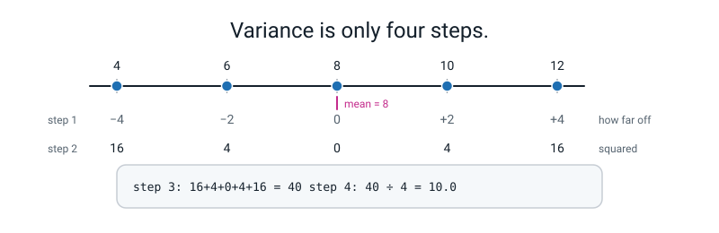
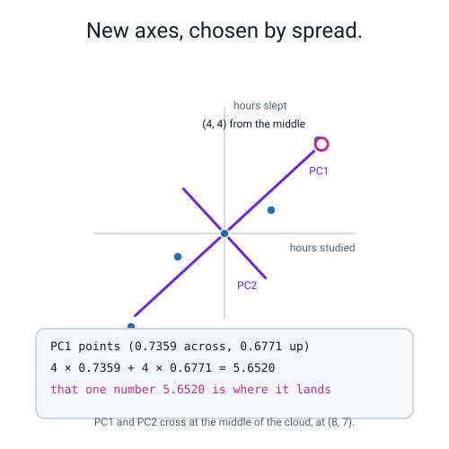
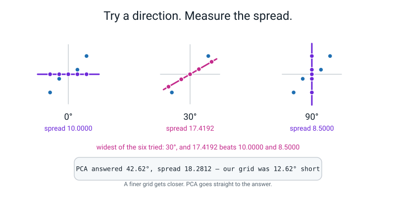
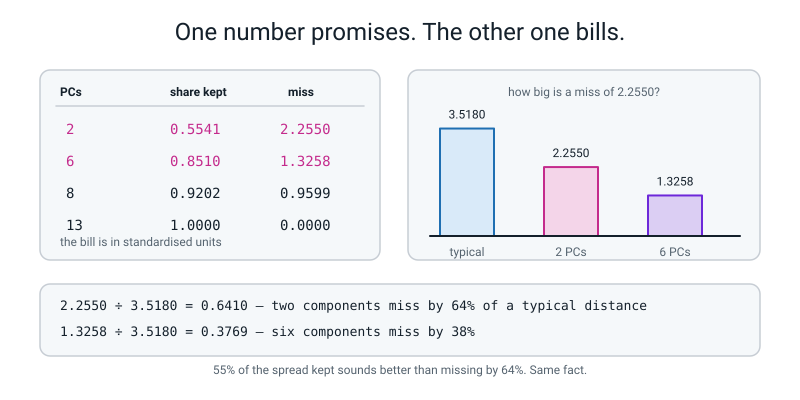
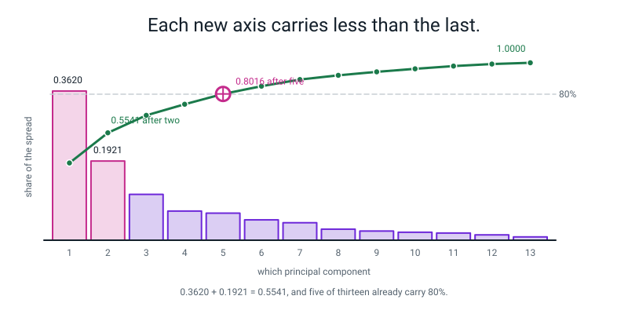
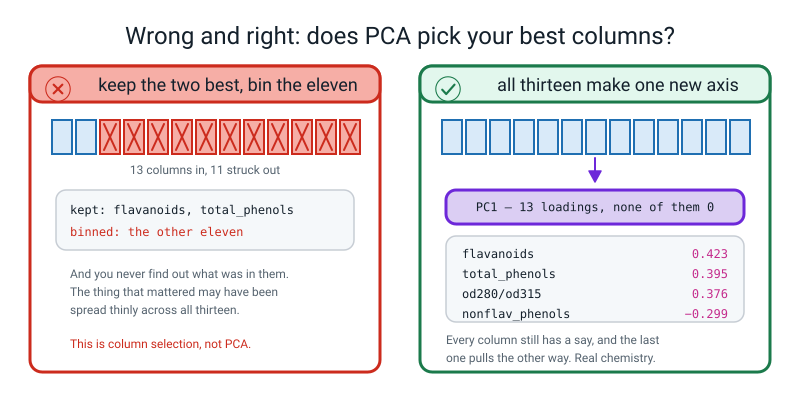
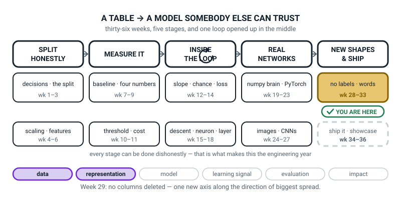
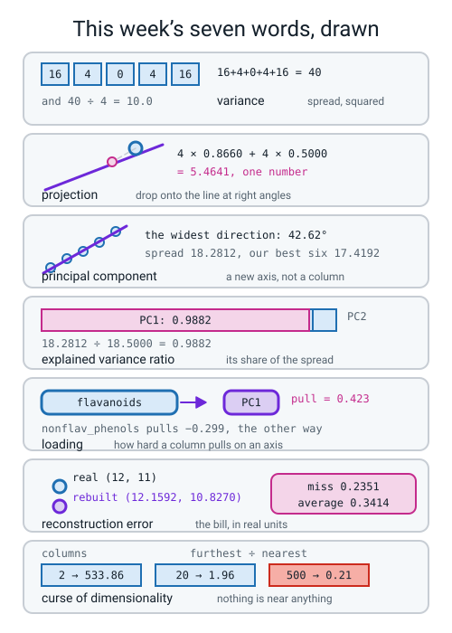

# Week 29 — A New Pair of Axes

[⬅ Week 28](week-28.md) · [Course Home](../README.md) · [Next ➡](week-30.md) · [Workbook](../workbook/week-29.md)

---

> ### This week in one sentence
> **PCA does not delete any of your columns — it draws a brand new axis along the direction your data is most spread out, measures everything against that instead, and then hands you the bill for what you threw away.**
>
> **By the end of this chapter you will be able to:**
> - **Compute the variance of a small column by hand** in four steps, as the average squared distance from the mean — `16 + 4 + 0 + 4 + 16 = 40`, and `40 ÷ 4 = 10.0`
> - **Find a principal component with a protractor** by trying six angles 30° apart, projecting five points onto each by hand, and keeping the widest — **30° wins with 17.4192, and PCA's exact answer is 42.62° with 18.2812**
> - **Read `explained_variance_ratio_`** and say how many components you need to keep 80% of the spread — on the wine data it is **5**, read straight off a running total
> - **Rebuild the data from a few components and price what you lost, in the original units** — `2.2550 ÷ 3.5180 = 0.6410`, so a two-component wine is wrong by 64% of a typical wine's distance from the middle
>
> **New maths:** variance as the average squared distance from the mean, and "the direction of biggest spread" found by trying candidate angles and keeping the widest — both computed by hand on five points before PCA is named.
>
> **New syntax:** `PCA(n_components=2)` · `pca.explained_variance_ratio_` · `pca.components_` · `pca.inverse_transform(Z)`
>
> **Reading time:** about 40 minutes. **Homework:** about 60 minutes.

---

## 🪝 Start Here

Last week you clustered 178 bottles of wine on thirteen chemical measurements each, and it worked — 172 of 178 bottles landed with their own grape variety.

**And there is one thing you never did. You never looked at them.**

So: draw thirteen dimensions.

You could draw every pair of columns against every other pair. **That is seventy-eight scatter plots**, and nobody is reading seventy-eight of anything.

So you have to throw something away, and the obvious idea is: **pick the two best columns and plot those.** Which is a problem, because **eleven columns go in the bin and you have no idea whether what mattered was in them.**

Here is the other idea.

🍕 **A long thin cloud of midges hangs over a garden, and you want to photograph it.**

**Camera one** — stand at one end and shoot along the cloud's length. You get a **blob**. Every midge on top of every other midge. You have lost almost everything.

**Camera two** — stand off to the side. You get a long **streak**. You can see the whole shape, and you can tell which midge is which.

**Which photo is better, and why?** The streak — **because it keeps the differences.**

And that is the whole idea of this week. **Spread is where the information is.** A column where every row has the same number tells you nothing at all. A column where the rows are miles apart tells you a lot.

So instead of picking two of your thirteen columns, you go looking for **the angle that gives you the longest streak.** You make a brand new axis, pointing whichever way the data is most spread out, and you measure everything against that instead.

```
PCA does not delete columns.
It draws a new axis along the direction the data is most spread out.
```

**And there is one more reason to care, and it is about last week.** k-means makes every single decision by asking *"which centre is nearest?"*. In lots of columns, **everything is about the same distance from everything.** Here is that measured, on 150 random points in a cube:

```text
   d       min      mean       max   (max-min)/min
   2    0.0025    0.5393    1.3580        533.8576
   5    0.0873    0.8485    1.6953         18.4217
  20    0.9006    1.8105    2.6697          1.9645
 100    3.1520    4.0624    5.3787          0.7065
 500    8.1944    9.1212    9.8894          0.2068
```

**Read the last column**, which is the *contrast*: how much further apart the furthest pair is than the closest pair. At 2 columns the furthest pair is **534 times** further apart than the closest. At 500 columns, **the most distant pair of points in your whole dataset is only 21% further apart than the two closest points.**

**Nothing is near anything. So k-means goes blind, and so does kNN.** Cutting thirteen columns down to two is not just so you can draw it. **It is so distance means something again.**

By the end of today you will have found a principal component with a protractor.

---

## 🧠 The Big Idea

> **📌 About the code in this section.** The blocks below are **illustrations, not files**. Each one carries on from the one above. **The complete runnable file is in 💻 Type This.**

### 1. Why too many columns is a real problem, not just an awkward one

> **Curse of dimensionality** — as you add columns, every point drifts away from every other point until they are all **roughly the same distance apart** — and then anything that works by comparing distances stops meaning anything.

🍕 **The analogy.** In a corridor, your nearest neighbour is obviously the person standing next to you. In a field, still obvious. **In a five-hundred-dimensional world, every single person is standing at almost exactly the same distance from you, and none of them is meaningfully "near".**

The contrast table above is the measurement. At `d = 20` the contrast is already down to **1.96** — the furthest pair is under twice as far apart as the nearest. **At 13 columns you are already on that slope**, which is one honest reason the wine clustering was not cleaner than it was.

**The practical response: cut the number of columns before you cluster.** Which is what PCA is for. It is not only a drawing tool.

### 2. Variance: the average squared distance from the mean

Everything in PCA is built on one quantity, and you already know three quarters of it from Week 4's standard deviation.

> **Variance** — take every value's distance from the mean, square it, and average. That is all. **It is the standard deviation before you take the square root.**

Four steps, on five numbers:

```
the numbers            :   4     6     8    10    12
the mean               :   (4+6+8+10+12) ÷ 5 = 40 ÷ 5 = 8

step 1: how far off    :  −4    −2     0    +2    +4
step 2: squared        :  16     4     0     4    16
step 3: add them up    :  16 + 4 + 0 + 4 + 16 = 40
step 4: average        :  40 ÷ 4 = 10.0
```


*Figure 29.1 — Variance is the average squared distance from the mean. Distances −4, −2, 0, 2, 4; squares 16, 4, 0, 4, 16; total 40; and 40 ÷ 4 = 10.0.*

**Two questions you should be asking, and both have real answers.**

**"Why square them?"** Because without squaring they cancel. `−4 + −2 + 0 + 2 + 4 = 0`, **every single time, for any set of numbers** — the mean is exactly the place where the distances cancel out. **Squaring throws away the minus signs so the total stops being zero.** (Taking absolute values would work too, and gives a different, less convenient measure that real statisticians do sometimes use.)

**"Why divide by 4 when there are five numbers?"** Because there are two conventions and they disagree:

| Divide by | What it is | Answer |
|---|---|---|
| **5** (the count) | the variance *of these five numbers*, full stop | **8.0** |
| **4** (one less) | the estimate you use when the five numbers are a *sample* from something bigger. It comes out slightly larger to allow for the fact that you measured the mean from the same five numbers | **10.0** |

**scikit-learn's `PCA` divides by n − 1. scikit-learn's `StandardScaler` divides by n.** That is a real inconsistency inside one library, and it shows up exactly once: the thirteen `explained_variance_` numbers for the scaled wine data add up to **13.0734**, not 13.0000. And `13 × 178 ÷ 177 = 13.0734` exactly. **Nothing is broken. Two parts of the same library chose different conventions.**

**And the one sentence that makes variance matter today:** a column with a big variance is a column where the rows differ. **A column with variance zero is the same value in every row and tells you nothing.** PCA is a machine for chasing spread, because spread is where the information is.

### 3. Centre it first, then project

Five points. Five students, `(hours studied, hours slept)` per week:

```
(4, 3)   (6, 6)   (8, 7)   (10, 8)   (12, 11)
```

**Step one, always: move the middle to (0, 0).** PCA is about how spread out the cloud is, not about where it sits.

```
mean across = (4 + 6 + 8 + 10 + 12) ÷ 5 = 40 ÷ 5 = 8
mean up     = (3 + 6 + 7 +  8 + 11) ÷ 5 = 35 ÷ 5 = 7

centred:  (−4, −4)   (−2, −1)   (0, 0)   (2, 1)   (4, 4)
```

Now pick a direction. **A direction is just a pair of numbers saying how far across and how far up you go for one step**, chosen so one step is exactly one unit long. At 30°, one step is:

```
across = 0.86603        up = 0.50000
```

> **Projection** — sliding a point sideways onto a line, at right angles, and reading off how far along the line it landed. The number you read off is the point's **score** on that axis.

**And the arithmetic is one multiply-and-add per coordinate** — exactly the matrix-multiply cell you did by hand in Week 17:

```
the point (4, 4), on the 30° direction:
    4 × 0.86603  +  4 × 0.50000
  = 3.46410      +  2.00000
  = 5.46410
```

**That single number 5.46410 is the whole of that point, as far as this axis is concerned. Two numbers became one.**

Do all five:

```
(−4, −4) → −5.46410
(−2, −1) → −2.23205
( 0,  0) →  0.00000
( 2,  1) →  2.23205
( 4,  4) →  5.46410
```

And now the variance of *those five scores*, by the four steps from §2 — their mean is already 0, which is why centring first was worth doing:

```
squares :  29.85641   4.98205   0.00000   4.98205   29.85641
add up  :  69.67691
÷ 4     :  17.41923
```

**17.41923 is the spread of the cloud along the 30° direction.**


*Figure 29.2 — The same cloud, measured against two new axes. The old axes stay on the page in grey. The top point, 4 across and 4 up from the middle, drops onto PC1 at right angles: 4 × 0.7359 + 4 × 0.6771 = 5.6520.*

### 4. Trying angles, and keeping the widest

> **Principal component** — a direction through the data, chosen so the spread of the projected scores is as wide as possible. **PC1** is the widest direction there is. **PC2** is the widest of what is left, at right angles to PC1.

So how do you find the widest direction? **You try some.** Here are all six candidates at 30° steps, every number real:

```text
 angle   direction (across, up)     the five scores along it              spread
   0°   ( 1.0000,  0.0000)   [-4.000 -2.000  0.000  2.000  4.000]  10.0000
  30°   ( 0.8660,  0.5000)   [-5.464 -2.232  0.000  2.232  5.464]  17.4192
  60°   ( 0.5000,  0.8660)   [-5.464 -1.866  0.000  1.866  5.464]  16.6692
  90°   ( 0.0000,  1.0000)   [-4.000 -1.000  0.000  1.000  4.000]   8.5000
 120°   (-0.5000,  0.8660)   [-1.464  0.134  0.000 -0.134  1.464]   1.0808
 150°   (-0.8660,  0.5000)   [ 1.464  1.232  0.000 -1.232 -1.464]   1.8308
widest of the six: 30° with spread 17.4192
```

**Three things to notice, and all three matter.**

**One: 0° and 90° are your original columns.** At 0° the scores are just the centred "hours studied" values and the spread is `10.0`, which is the variance of `hours studied`. At 90° it is `8.5` = the variance of `hours slept`. **The original columns are simply two of the candidate directions, and neither of them wins.** That is the whole idea of PCA in one observation.

**Two: 120° and 150° are terrible** — spreads of 1.08 and 1.83. Those directions look *across* the cloud rather than along it, and everything squashes into a blob. **That is camera one, shooting down the length of the midge cloud.** 1.08 against 17.42 is **sixteen times less spread from the same five points, purely by standing somewhere else.**

**Three: 30° wins with 17.4192, and PCA's exact answer is 42.62° with 18.2812.** Our grid was **12.62 degrees short**, and it cost us `18.2812 − 17.4192 = 0.8620` of spread.


*Figure 29.3 — Try angles, keep the widest. 10.0000 at 0°, 17.4192 at 30°, 8.5000 at 90°. And PCA's exact answer: 42.62°, spread 18.2812.*

**And the fix is not cleverness, it is a finer grid.** Try every whole degree from 0 to 179 and the best is **43°, with a spread of 18.2804** — within a thousandth of the exact answer. **sklearn has a formula that goes straight there; it needs maths you will meet at university, and it arrives at the same place your protractor does.**

Here is what comes back from the library:

```text
pca.components_:
[[ 0.7359  0.6771]
 [-0.6771  0.7359]]
PC1's angle: 42.62°
pca.explained_variance_      : [18.2812  0.2188]
pca.explained_variance_ratio_: [0.9882 0.0118]
the two spreads add to: 18.5 = 10.0 + 8.5, the spread of the two original columns
```

**`pca.components_` is the directions, one per row.** Row 0 is PC1: go 0.7359 across and 0.6771 up. Row 1 is PC2: −0.6771 across and 0.7359 up. **Notice the two numbers are the same pair, swapped over with one sign flipped** — which is what "at right angles" looks like in two dimensions.

**And now the check that ties the whole thing together:**

```
18.2812 + 0.2188 = 18.5000
var(hours studied) + var(hours slept) = 10.0 + 8.5 = 18.5
```

**The total spread has not changed. It has been redistributed.** PCA did not create or destroy anything; it **rotated the axes** so nearly all the spread piled onto the first one. **That is the difference between PCA as magic and PCA as a rotation.**

> **Explained variance ratio** — each component's spread divided by the total. `18.2812 ÷ 18.5 = 0.9882`. **"PC1 explains 98.82% of the spread"** means: keep only PC1 and you keep 98.82% of the differences between these five students.

### 5. Explained variance is the brochure. Reconstruction error is the invoice.

`explained_variance_ratio_` is the optimistic framing. Here is the honest one.

> **Reconstruction error** — squash the data down to a few components, then push it back up to the original columns, and measure how far each rebuilt point is from the real one. **That distance is the information you threw away, expressed in the original units.**

Squash the five students down to **one** number each, then rebuild:

```text
one number per student: [-5.652  -2.1489  0.      2.1489  5.652 ]
rebuilt from that one number:
[[ 3.8408  3.173 ]
 [ 6.4187  5.545 ]
 [ 8.      7.    ]
 [ 9.5813  8.455 ]
 [12.1592 10.827 ]]
the real points:
[[ 4.  3.]
 [ 6.  6.]
 [ 8.  7.]
 [10.  8.]
 [12. 11.]]
how far each rebuilt point is from the real one: [0.2351 0.6183 0.     0.6183 0.2351]
average miss: 0.3414 hours
```

**Read the last student: real (12, 11), rebuilt (12.1592, 10.827).** Out by 0.16 of an hour studying and 0.17 of an hour sleeping. **Two numbers became one, and it cost a fifth of an hour.** That is what "98.82% of the spread" actually feels like, in hours.

**And the middle student came back exactly right — (8, 7) rebuilt as (8, 7), miss 0.0000.** That is the one sitting at the mean, **and the mean is the one point a single component can always place perfectly**, because it is where the new axis crosses.

**On the wine data the bill is much bigger, and this is the number your homework is built on:**

```text
  how many PCs   running share   average rebuild miss
       1           0.3620            2.7527
       2           0.5541            2.2550
       3           0.6653            1.9581
       5           0.8016            1.5303
       6           0.8510            1.3258
       8           0.9202            0.9599
      13           1.0000            0.0000
for scale: a typical wine sits 3.5180 away from the middle
```

Two components keep **55.4%** of the spread, which sounds respectable. But the miss is **2.2550**, and a typical wine only sits **3.5180** from the middle of the cloud. So:

```
2.2550 ÷ 3.5180 = 0.6410
```

**Your rebuilt wine is wrong by 64% of a typical wine's whole distance from the middle.** With six components it is `1.3258 ÷ 3.5180 = 0.3769`, or 38%. **Thirteen components rebuild perfectly — 0.0000 — because you threw nothing away.**


*Figure 29.4 — Explained variance is the promise, rebuild error is the bill. 2 components: 0.5541 kept, 2.2550 missed. 6 components: 0.8510 kept, 1.3258 missed. And 2.2550 ÷ 3.5180 = 0.6410.*

> **Report both numbers, always.** *"PC1 and PC2 keep 55% of the variance"* is the sales brochure. *"Rebuilding from two components misses a typical wine by 64% of its distance from the middle"* is the invoice. **Both are true about the same run.**

**And here is the full thirteen-row table, which answers "how many do I need?" directly:**

```text
PC   its share   running total
 1     0.3620       0.3620
 2     0.1921       0.5541
 3     0.1112       0.6653
 4     0.0707       0.7360
 5     0.0656       0.8016
 6     0.0494       0.8510
 7     0.0424       0.8934
 8     0.0268       0.9202
 9     0.0222       0.9424
10     0.0193       0.9617
11     0.0174       0.9791
12     0.0130       0.9920
13     0.0080       1.0000
```


*Figure 29.5 — Thirteen shares, and the running total. 0.3620 + 0.1921 = 0.5541 after two, and the total crosses 80% at the fifth component with 0.8016.*

**Two numbers to say out loud.** `PC1 + PC2 = 0.5541` — **just over half the story in two dimensions**, which is what makes a 2-D picture of 13 columns worth drawing and also what makes it dangerous. And **`0.8016` at PC5** — five components out of thirteen carry 80% of the spread. **That is one integer, read straight off the running total.**

> **⚠️ Watch out:** two wines that look like they are sitting on top of each other on a 2-D PCA plot **can be miles apart in the other 44.6%.** So here is a habit that is not optional: **put the explained-variance percentage in every axis label, every single time.** Not because it is tidy. Because a picture is convincing, and this one is only 55% true, and your reader cannot tell unless you tell them.

**Finally, what a component is made of.**

> **Loading** — how hard one original column pulls on one component. A big positive loading means that column and the component go up together.

```text
PC1: which original columns pull hardest
flavanoids                      0.423
total_phenols                   0.395
od280/od315_of_diluted_wines    0.376
proanthocyanins                 0.313
nonflavanoid_phenols           -0.299
```

**Every one of the top four is a phenolic compound, and all four pull the same way.** So PC1 is fairly read as **"total phenolic richness"** — one end of the axis is chemically rich wine, the other end is thin wine. `nonflavanoid_phenols` is negative, meaning it goes the *other* way from the rest, which is a real chemical fact about wine and not a bug.

```text
PC2: which original columns pull hardest
color_intensity    0.530
alcohol            0.484
proline            0.365
ash                0.316
magnesium          0.300
```

PC2 is colour, alcohol and proline together — fairly read as **"body and depth"**. **Naming your components from their loadings is a real professional skill**, and it is the difference between a plot with "PC1" on the axis and a plot somebody can act on.

**Two warnings about loadings, and both come up.**

**The signs are arbitrary.** `(0.7359, 0.6771)` and `(−0.7359, −0.6771)` describe the *same axis*, just labelled from opposite ends, and different library versions hand you either one. **If your plot comes out mirrored compared with a friend's, nothing is wrong.** What is never arbitrary is the *relative* signs within one component — flavanoids and nonflavanoid_phenols pulling opposite ways is real.

**PCA has never seen your target column.** It chases spread, and **spread is not the same thing as usefulness.** Imagine a medical table where 95% of the spread is patients' height and weight, and the diagnosis lives in one small blood-test ratio: **PCA to two components will keep the body-size axis and bin the diagnosis.** The only way to know is to test it — which is exactly what Week 30 does.

---

## 🔢 The Maths, Slowly

**There are two new pieces of maths this week and they are the same piece twice.**

### Piece one — variance, in four steps, on numbers you can check

Here is the whole thing as a table, so you can see that every column is one operation:

| the number | minus the mean (8) | squared |
|---:|---:|---:|
| 4 | −4 | 16 |
| 6 | −2 | 4 |
| 8 | 0 | 0 |
| 10 | +2 | 4 |
| 12 | +4 | 16 |
| | **sum: 0** | **sum: 40** |

**Look at the middle column's total: exactly 0.** That is not a coincidence about these five numbers; **it happens for every set of numbers, because the mean is defined as the place where the distances cancel.** That is why you square.

Then: `40 ÷ 4 = 10.0`.

**Check it with a calculator right now.** Type `(16+4+0+4+16)/4`. You get **10**. Then type `(16+4+0+4+16)/5` and you get **8**. **Both are real answers to slightly different questions**, and sklearn's `PCA` gives you the first one.

**And here is the same four steps with the mean *not* subtracted, so you can see why centring matters:**

| the number | squared, uncentred |
|---:|---:|
| 4 | 16 |
| 6 | 36 |
| 8 | 64 |
| 10 | 100 |
| 12 | 144 |
| | **sum: 360**, and 360 ÷ 4 = **90.0** |

**90.0 instead of 10.0.** Nine times too big, and the extra has nothing to do with how spread out the numbers are — it is entirely about the fact that they all sit near 8 rather than near 0. **Skip the centring step and every angle gives you a huge number that measures where your cloud is, not how big it is.** That is the single most common mistake of this week, and the fingerprint is that all your spreads come out enormous.

### Piece two — "the direction of biggest spread", found by trying angles

**There is no formula here that you need. There is a search.**

Here is the whole method in five lines of English:

```
1. Move the cloud so its middle is at (0, 0).
2. Pick a direction — a pair of numbers (across, up), one unit long.
3. Project every point onto it: across × its across, plus up × its up.
4. Compute the variance of those projected numbers, in four steps.
5. Do 2 to 4 for lots of directions. The widest one wins.
```

**And step 3 is worth staring at, because it is Week 17's matrix multiply doing a different job.** One row of numbers times one column of numbers, multiplied pairwise and added:

```
point (−2, −1)   direction (0.8660, 0.5000)

  −2 × 0.8660  =  −1.7321
  −1 × 0.5000  =  −0.5000
                 ---------
                  −2.2321
```

**Check it on a calculator.** `-2 * 0.866 = -1.732`, `-1 * 0.5 = -0.5`, and `-1.732 + -0.5 = -2.232`. ✅ That matches the `-2.232` printed in the 30° row of the six-angle table.

**Now the finer search, and this is the part that makes it obviously a search rather than a trick.** Try angles one degree apart around 43° and watch what happens:

| angle | spread |
|---:|---:|
| 40° | 18.2435 |
| 41° | 18.2668 |
| 42° | 18.2791 |
| **43°** | **18.2804** |
| 44° | 18.2707 |
| 45° | 18.2500 |
| 50° | 17.9830 |

**It rises, peaks at 43°, and then falls again.** That shape has a name and you met it in Week 12: **it is a hill, and you are standing on top of it.** The exact answer sits at 42.62° with 18.2812, and 43° gets you within **0.0008** of it.

**So: PCA is a search for the top of a hill, and sklearn has a formula that jumps straight there.** That formula needs maths you will meet at university. **Your protractor arrives at the same place, only slower, and it is the same answer.**

---

## 💻 Type This

Open a new file called `new_axes.py`. Six pieces.

### Step 1 — variance, four printed lines, and centring

```python
import matplotlib
matplotlib.use("Agg")
import matplotlib.pyplot as plt
import numpy as np

np.random.seed(0)
np.set_printoptions(suppress=True)

v = np.array([4., 6., 8., 10., 12.])
print("five numbers:", v, "  mean =", v.mean())
print("distance from the mean :", v - v.mean())
print("each one squared       :", (v - v.mean()) ** 2)
print("added up               :", ((v - v.mean()) ** 2).sum())
print("divided by 5           :", ((v - v.mean()) ** 2).sum() / 5)
print("divided by 4 (what sklearn does):", ((v - v.mean()) ** 2).sum() / 4)

D = np.array([[4., 3.], [6., 6.], [8., 7.], [10., 8.], [12., 11.]])
print()
print("five students (hours studied, hours slept):", D.tolist())
print("the middle of the cloud:", D.mean(axis=0))
C = D - D.mean(axis=0)
print("moved so the middle is (0,0):", C.tolist())
```

**What each new line does.**

- `matplotlib.use("Agg")` before importing `pyplot` forces matplotlib to write to a file instead of opening a window. **Always, in this course.**
- `np.set_printoptions(suppress=True)` stops numpy printing things like `5.0e-16` for numbers that are really zero.
- `D.mean(axis=0)` averages **down the columns**, giving one mean per column. `axis=0` has meant "down the rows" since Week 16.
- `D - D.mean(axis=0)` subtracts a 2-number row from every row of a (5, 2) table. numpy stretches the small thing to fit — that is broadcasting, from Week 17.

```text
five numbers: [ 4.  6.  8. 10. 12.]   mean = 8.0
distance from the mean : [-4. -2.  0.  2.  4.]
each one squared       : [16.  4.  0.  4. 16.]
added up               : 40.0
divided by 5           : 8.0
divided by 4 (what sklearn does): 10.0

five students (hours studied, hours slept): [[4.0, 3.0], [6.0, 6.0], [8.0, 7.0], [10.0, 8.0], [12.0, 11.0]]
the middle of the cloud: [8. 7.]
moved so the middle is (0,0): [[-4.0, -4.0], [-2.0, -1.0], [0.0, 0.0], [2.0, 1.0], [4.0, 4.0]]
```

**Those four printed lines are the four steps from the table, in order. Nothing has been hidden.**

### Step 2 — the six candidate angles

```python
print()
print("--- six candidate axes, 30 degrees apart ---")
print(" angle   direction (across, up)     the five scores along it              spread")
best_angle, best_spread = None, -1.0
for a in range(0, 180, 30):
    u = np.array([np.cos(np.radians(a)), np.sin(np.radians(a))])
    scores = C @ u
    spread = (scores ** 2).sum() / 4
    print(" %3d°   (%7.4f, %7.4f)   %s  %7.4f"
          % (a, u[0], u[1], np.array2string(np.round(scores, 3), precision=3,
                                            floatmode="fixed"), spread))
    if spread > best_spread:
        best_angle, best_spread = a, spread
print("widest of the six: %d° with spread %.4f" % (best_angle, best_spread))
```

- `np.radians(a)` converts degrees to the units `cos` and `sin` want.
- `np.cos` and `np.sin` of an angle give you exactly the (across, up) pair for a one-unit step at that angle.
- **`C @ u` is Week 17's matrix multiply**, and it is doing all five projections at once: `(5, 2) @ (2,) → (5,)`. One number per point.
- `(scores ** 2).sum() / 4` is the four variance steps, since the scores already have mean 0.

```text
--- six candidate axes, 30 degrees apart ---
 angle   direction (across, up)     the five scores along it              spread
   0°   ( 1.0000,  0.0000)   [-4.000 -2.000  0.000  2.000  4.000]  10.0000
  30°   ( 0.8660,  0.5000)   [-5.464 -2.232  0.000  2.232  5.464]  17.4192
  60°   ( 0.5000,  0.8660)   [-5.464 -1.866  0.000  1.866  5.464]  16.6692
  90°   ( 0.0000,  1.0000)   [-4.000 -1.000  0.000  1.000  4.000]   8.5000
 120°   (-0.5000,  0.8660)   [-1.464  0.134  0.000 -0.134  1.464]   1.0808
 150°   (-0.8660,  0.5000)   [ 1.464  1.232  0.000 -1.232 -1.464]   1.8308
widest of the six: 30° with spread 17.4192
```

### Step 3 — what PCA says, and the check that it is a rotation

```python
from sklearn.decomposition import PCA

pca = PCA().fit(D)
print()
print("pca.components_:")
print(np.round(pca.components_, 4))
print("PC1's angle: %.2f°" % np.degrees(np.arctan2(pca.components_[0][1],
                                                    pca.components_[0][0])))
print("pca.explained_variance_      :", np.round(pca.explained_variance_, 4))
print("pca.explained_variance_ratio_:", np.round(pca.explained_variance_ratio_, 4))
print("the two spreads add to:", round(pca.explained_variance_.sum(), 4),
      "= 10.0 + 8.5, the spread of the two original columns")
```

- `PCA()` with no arguments keeps **all** the components, which is what you want when printing the whole table.
- `.fit(D)` **finds the directions.** Nothing has been squashed yet.
- `np.arctan2(up, across)` turns a direction back into an angle, and `np.degrees` converts it from radians.

```text
pca.components_:
[[ 0.7359  0.6771]
 [-0.6771  0.7359]]
PC1's angle: 42.62°
pca.explained_variance_      : [18.2812  0.2188]
pca.explained_variance_ratio_: [0.9882 0.0118]
the two spreads add to: 18.5 = 10.0 + 8.5, the spread of the two original columns
```

**You said 30° with 17.4192. It says 42.62° with 18.2812. You were not wrong — you were coarse**, by 12.62 degrees and 0.8620 of spread.

> **⚠️ Watch out:** `explained_variance_` and `explained_variance_ratio_` are two different things with almost the same name. **The first holds actual spreads and adds to roughly the number of columns; the second holds shares and adds to 1.** Printing the wrong one is this week's most common silent error.

### Step 4 — squash to one number, then rebuild, and the price

```python
p1 = PCA(n_components=1).fit(D)
Z = p1.transform(D)
back = p1.inverse_transform(Z)
print()
print("one number per student:", np.round(Z.ravel(), 4))
print("rebuilt from that one number:")
print(np.round(back, 4))
print("the real points:")
print(D)
err = np.sqrt(((D - back) ** 2).sum(axis=1))
print("how far each rebuilt point is from the real one:", np.round(err, 4))
print("average miss: %.4f hours" % err.mean())
```

- `p1.transform(D)` does the projection: `(5, 2)` becomes `(5, 1)`.
- `p1.inverse_transform(Z)` pushes those back out to `(5, 2)`. **What comes back is an approximation, not the original.**
- `err` reads inside out: subtract, square, **add across the columns** (`axis=1` is along a row), square-root to get one distance per row.

```text
one number per student: [-5.652  -2.1489  0.      2.1489  5.652 ]
rebuilt from that one number:
[[ 3.8408  3.173 ]
 [ 6.4187  5.545 ]
 [ 8.      7.    ]
 [ 9.5813  8.455 ]
 [12.1592 10.827 ]]
the real points:
[[ 4.  3.]
 [ 6.  6.]
 [ 8.  7.]
 [10.  8.]
 [12. 11.]]
how far each rebuilt point is from the real one: [0.2351 0.6183 0.     0.6183 0.2351]
average miss: 0.3414 hours
```

> **⚠️ Watch out:** `inverse_transform` must be handed the **squashed** table, not the original. **The rule to say out loud: `transform` narrows, `inverse_transform` widens, so whatever came out of one goes into the other.**

### Step 5 — thirteen wine columns, their shares, and their loadings

```python
import pandas as pd
from sklearn.datasets import load_wine
from sklearn.preprocessing import StandardScaler

print()
wine = load_wine()
X_raw = pd.DataFrame(wine.data, columns=wine.feature_names)
X = StandardScaler().fit_transform(X_raw)
full = PCA().fit(X)
evr = full.explained_variance_ratio_
print("PC   its share   running total")
for i, share in enumerate(evr, start=1):
    print("%2d     %.4f       %.4f" % (i, share, evr[:i].sum()))

p2 = PCA(n_components=2).fit(X)
print()
pull1 = pd.Series(p2.components_[0], index=wine.feature_names)
print("PC1: which original columns pull hardest")
print(pull1.reindex(pull1.abs().sort_values(ascending=False).index)
      .round(3).head(5).to_string())
pull2 = pd.Series(p2.components_[1], index=wine.feature_names)
print()
print("PC2: which original columns pull hardest")
print(pull2.reindex(pull2.abs().sort_values(ascending=False).index)
      .round(3).head(5).to_string())
```

- `StandardScaler().fit_transform(X_raw)` puts all thirteen columns on the same ruler — **exactly as last week, and for exactly the same reason.**
- `evr[:i].sum()` adds up the first `i` shares, which is the running total.
- `pull1.reindex(pull1.abs().sort_values(ascending=False).index)` sorts by **size ignoring the sign**, so a big negative loading is not hidden at the bottom.

```text
PC   its share   running total
 1     0.3620       0.3620
 2     0.1921       0.5541
 3     0.1112       0.6653
 4     0.0707       0.7360
 5     0.0656       0.8016
 6     0.0494       0.8510
 7     0.0424       0.8934
 8     0.0268       0.9202
 9     0.0222       0.9424
10     0.0193       0.9617
11     0.0174       0.9791
12     0.0130       0.9920
13     0.0080       1.0000

PC1: which original columns pull hardest
flavanoids                      0.423
total_phenols                   0.395
od280/od315_of_diluted_wines    0.376
proanthocyanins                 0.313
nonflavanoid_phenols           -0.299

PC2: which original columns pull hardest
color_intensity    0.530
alcohol            0.484
proline            0.365
ash                0.316
magnesium          0.300
```

> **💡 Try this:** you can hand `n_components` a **fraction** instead of a count. `PCA(n_components=0.80)` means *"keep however many components I need for 80% of the spread"*, and on the wine data `pf.n_components_` prints **5** — the same answer the running-total table gives by eye.

### Step 6 — the bill, and the map

```python
print()
print("  how many PCs   running share   average rebuild miss")
for m in (1, 2, 3, 5, 6, 8, 13):
    p = PCA(n_components=m).fit(X)
    Xh = p.inverse_transform(p.transform(X))
    miss = np.sqrt(((X - Xh) ** 2).sum(axis=1)).mean()
    print("      %2d           %.4f            %.4f"
          % (m, p.explained_variance_ratio_.sum(), miss))
print("for scale: a typical wine sits %.4f away from the middle"
      % np.sqrt((X ** 2).sum(axis=1)).mean())

Z2 = p2.transform(X)
plt.figure(figsize=(6.5, 5))
plt.scatter(Z2[:, 0], Z2[:, 1], s=30, alpha=0.85)
plt.xlabel("PC1 (%.1f%% of the spread)" % (evr[0] * 100))
plt.ylabel("PC2 (%.1f%% of the spread)" % (evr[1] * 100))
plt.title("178 wines, 13 columns squashed to 2")
plt.tight_layout()
plt.savefig("wine_2d.png", dpi=110)
plt.close()
print("saved wine_2d.png")
```

**`np.sqrt((X ** 2).sum(axis=1)).mean()` is the yardstick**, and it is the whole reason the last number is a *finding* rather than just a number: it is the average distance from a scaled wine to the middle of the cloud. **A miss is only big or small compared to something.**

**And look at the two axis labels.** The percentage goes in, every time.

```text
  how many PCs   running share   average rebuild miss
       1           0.3620            2.7527
       2           0.5541            2.2550
       3           0.6653            1.9581
       5           0.8016            1.5303
       6           0.8510            1.3258
       8           0.9202            0.9599
      13           1.0000            0.0000
for scale: a typical wine sits 3.5180 away from the middle
saved wine_2d.png
```

**Open `wine_2d.png` and look at it.** It is **one elongated blob with no visible gaps in it.** There are three grape varieties in there and you cannot see any of them. **Hold on to that, because next week the identical plot, coloured by cluster, shows three clean groups.** The structure was there all along and the picture could not show it.

### The complete `new_axes.py`

Put the six steps together with all the imports at the top. **Expected runtime: about 1.7 seconds**, including saving the PNG.

---

## 🔍 Worked Examples

### Worked Example 1 — Climb the hill by hand, one degree at a time

You found 30° with a protractor. PCA found 42.62°. **Close the gap yourself, without any new maths.**

```python
import numpy as np
D = np.array([[4., 3.], [6., 6.], [8., 7.], [10., 8.], [12., 11.]])
C = D - D.mean(axis=0)

for a in (40, 41, 42, 43, 44, 45, 50):
    u = np.array([np.cos(np.radians(a)), np.sin(np.radians(a))])
    print("  %d deg -> %.4f" % (a, ((C @ u) ** 2).sum() / 4))
```

```text
  40 deg -> 18.2435
  41 deg -> 18.2668
  42 deg -> 18.2791
  43 deg -> 18.2804
  44 deg -> 18.2707
  45 deg -> 18.2500
  50 deg -> 17.9830
```

**Read it as a walk.** 18.2435, then up, up, up to **18.2804 at 43°** — and then **down** to 18.2707, 18.2500, 17.9830.

**You have walked over the top of a hill.** That is exactly the shape you met in Week 12: values rising, a peak, values falling. And the exact answer, 42.62° with 18.2812, sits between your 42° and your 43°.

**How close did the whole-degree search get?**

```
18.2812 − 18.2804 = 0.0008
```

**Eight ten-thousandths.** So here is the honest summary of what sklearn's formula buys you: **it goes straight to the top of the hill instead of walking up it.** It gets the same answer. It needs maths you will meet at university. **Nothing has been hidden from you and nothing is being taken on faith.**

**One more thing that is worth checking.** PC2 must be at right angles to PC1, so it should be at `42.62 + 90 = 132.62°`:

```python
from sklearn.decomposition import PCA
pa = PCA().fit(D)
print("PC2 dir", np.round(pa.components_[1], 4),
      "angle %.2f" % np.degrees(np.arctan2(pa.components_[1][1], pa.components_[1][0])))
print("ev", np.round(pa.explained_variance_, 4))
```

```text
PC2 dir [-0.6771  0.7359] angle 132.62
ev [18.2812  0.2188]
```

**132.62 exactly, and `18.2812 + 0.2188 = 18.5000 = 10.0 + 8.5`.** The rotation conserved every bit of the spread.

### Worked Example 2 — Rebuild one student from one number, on paper

`inverse_transform` gave the last student back as `(12.1592, 10.827)`. **Do that yourself, with three multiplications and two additions.**

The last student's score on PC1 is **5.6520**. PC1's direction is **(0.7359, 0.6771)**. The cloud's middle is **(8, 7)**.

```
step 1: walk 5.6520 units along PC1 from the middle

    across :  5.6520 × 0.7359  =  4.1593
    up     :  5.6520 × 0.6771  =  3.8270

step 2: add the middle back on

    across :  4.1593 + 8  =  12.1593
    up     :  3.8270 + 7  =  10.8270

step 3: how far is that from the real point (12, 11)?

    across gap :  12 − 12.1593  =  −0.1593
    up     gap :  11 − 10.8270  =  +0.1730

    miss = √( 0.1593² + 0.1730² )
         = √( 0.02538 + 0.02993 )
         = √( 0.05531 )
         = 0.2352
```

**And the library's answer:**

```python
p1 = PCA(n_components=1).fit(D)
back = p1.inverse_transform(p1.transform(D))
print("rebuilt last student:", np.round(back[-1], 4))
print("miss:", round(float(np.sqrt(((D[-1] - back[-1]) ** 2).sum())), 4))
```

```text
rebuilt last student: [12.1592 10.827 ]
miss: 0.2351
```

**0.2352 by hand against 0.2351 from the library, and the difference is entirely because you used 5.6520 and 0.7359 instead of 5.651967102869413 and 0.73588229.** Round less and the two agree exactly.

**What you have just proved to yourself:** `inverse_transform` is not doing anything mysterious. **It multiplies one number by a direction and adds the mean back on.** Squashing threw away *how far off the axis* each point sat, and that is the entire content of the miss.

### Worked Example 3 — PCA on unscaled wine: a 99.81% that means nothing

**PCA maximises variance, and variance depends on your units.** Measure a length in millimetres instead of metres and its variance goes up by a factor of a million — so PC1 will point straight along it, whether or not it matters.

```python
import pandas as pd
from sklearn.datasets import load_wine
from sklearn.decomposition import PCA
import numpy as np
np.set_printoptions(suppress=True)

wine = load_wine()
X_raw = pd.DataFrame(wine.data, columns=wine.feature_names)
pu = PCA().fit(X_raw)                     # NOT scaled
print("first three shares:", np.round(pu.explained_variance_ratio_[:3], 4))
```

```text
first three shares: [0.9981 0.0017 0.0001]
```

**99.81% of thirteen columns of wine chemistry, captured in a single number.** You have squashed thirteen columns into one and apparently lost almost nothing. **Be suspicious. Look at what PC1 actually is.**

```python
s = pd.Series(pu.components_[0], index=wine.feature_names)
print(s.reindex(s.abs().sort_values(ascending=False).index).round(4).head(4).to_string())
```

```text
proline              0.9998
magnesium            0.0179
alcalinity_of_ash   -0.0047
color_intensity      0.0023
```

**It is proline. 0.9998 of proline and a rounding error.**

Twelve chemical measurements were handed in and twelve were discarded, **silently, with no error message, and a magnificent-looking 99.81% on the front.**

**And you saw this exact failure last week.** Unscaled k-means sorted the wine into proline bands. Unscaled PCA made proline its first axis. **Same cause — one column with a spread of 314.91 while the rest are around 1 — same fix.** Scale first. Always, unless every column is genuinely in the same unit.

**The check that catches it in three seconds:** print `pca.components_[0]` with the column names attached. **If one loading is 0.9998 and the rest are under 0.02, you have made an expensive copy of one column.**

---

## 🐞 When It Breaks

Every message below came from really running a broken version of this week's code.

### Break 1 — you handed the widener a wide table

```python
p1 = PCA(n_components=1).fit(D)
Z = p1.transform(D)
back = p1.inverse_transform(D)          # <- D, not Z
```

```text
ValueError: matmul: Input operand 1 has a mismatch in its core dimension 0, with gufunc signature (n?,k),(k,m?)->(n?,m?) (size 1 is different from 2)
```

**What it means.** Read the last three words: **"1 is different from 2"**. The **1** is how many components you kept. The **2** is how many columns your data has. **It is a shape mismatch, and you have been reading these since Week 25.**

**The fix.** `inverse_transform` **widens** — it expects the squashed table and hands back the wide one. You gave it the wide one.

```python
back = p1.inverse_transform(Z)
```

> **🐞 If you see this error:** `transform` narrows, `inverse_transform` widens, so **whatever came out of one goes into the other.** On the wine data the same mistake prints `size 2 is different from 13`, and those two numbers are your component count and your column count. **Read them.**

### Break 2 — there is no fourteenth direction in a thirteen-column table

```python
PCA(n_components=14).fit(X)
```

```text
ValueError: n_components=14 must be between 0 and min(n_samples, n_features)=13 with svd_solver='covariance_eigh'
```

**What it means.** You asked for more axes than the data can possibly have. **Thirteen columns give you at most thirteen directions**, and if you had fewer rows than columns, the limit would be the row count instead — which is what `min(n_samples, n_features)` in the message is telling you.

**The fix.** `n_components` can never exceed `min(rows, columns)`. And if you want *all* of them, leave the argument out: `PCA()`.

### Break 3 — you never ran it

```python
p = PCA(n_components=2)
print(p.components_)
```

```text
AttributeError: 'PCA' object has no attribute 'components_'
```

**What it means.** *"You built the squasher and never showed it any data."*

**The fix.** Add `.fit(X)`. **This is Week 28's rule and it has not changed: a scikit-learn name ending in `_` does not exist until `.fit` has run.**

You get the **identical** message from `PCA(n_components=2).transform(X)` with no fit, which reads oddly at first — you asked to *transform*, and it complains about `components_`. **That is the machine being precise: `transform` needs directions, and fitting is what finds them.** Use `.fit_transform(X)`, or `.fit(X)` then `.transform(X)`.

### Three more, without a demo

| What you see | What it means | The fix |
|---|---|---|
| `ValueError: could not convert string to float: 'a'` | One of your columns is words. | PCA does arithmetic on every column. Drop it, or encode it as in Week 4. |
| `ValueError: Expected 2D array, got 1D array instead: array=[1. 2. 3. 4.].` | You gave it a list, not a table. | `X` must be rows-by-columns. **There are no directions to find in a single column — the answer would be "along it".** |
| **No error. Your plot is mirrored compared with a friend's.** | The sign of a component is arbitrary. | **Nothing to fix.** `(0.7359, 0.6771)` and `(−0.7359, −0.6771)` are the same axis read from opposite ends. What *is* meaningful is the signs *within* one component, relative to each other. |

**And the two silent ones that will cost you the most:**

- **You forgot to centre.** No error. **Every angle gives a huge number**, because you are measuring where the cloud sits rather than how big it is — 90.0 instead of 10.0 on the five numbers. **The fingerprint is that all your spreads are enormous and they barely differ between angles.**
- **You divided by the wrong thing.** No error, and your numbers are all slightly wrong. **The diagnostic: if your spread is exactly 5/4 of sklearn's, you divided by 5 where it divides by 4.** With five points, divide the sum of squares by **4**.

---

## 🎲 What We Did In Class

If you missed it, here is the whole lesson. You need workbook pages 29.1 to 29.3, **graph paper, a ruler and a protractor**, and a pen.

**The hook.** One line on the screen: `wine table: (178, 13)`. Then: *"last week we clustered these and it worked, and there is one thing we never did — we never looked at them. So draw me thirteen dimensions."* Somebody suggested lots of scatter plots. **Seventy-eight of them.** Then *"so pick the two best columns"* — and *"what is wrong with that?"* **Eleven columns in the bin, and you have no idea whether what mattered was in them.**

Then the midge cloud on the board: a long thin diagonal scatter of about twelve dots, with two viewing arrows drawn on it. **Camera one, along the length: a blob.** **Camera two, from the side: a streak.** *"Which is better?"* The streak, **because it keeps the differences.** And the line that stayed up all lesson:

```
PCA does not delete columns.
It draws a new axis along the direction the data is most spread out.
```

**Then the concept, with the SPREAD sheet on the wall** — a blank number line from 0 to 20. Five numbers written at the top: `4 6 8 10 12`. The four variance steps done together: distances −4, −2, 0, 2, 4; squares 16, 4, 0, 4, 16; total 40; `40 ÷ 4 = 10.0`. Then *"why square them?"* **Because otherwise they add to zero, every time.**

**The Spaghetti Cloud, twenty minutes.** Five points plotted on graph paper, with the cloud's middle at the centre of the sheet:

```
      up (hours slept)
  11  |                        *
   8  |                  *
   7  |             *
   6  |        *
   3  |   *
      +---------------------------- across (hours studied)
          4    6    8   10   12
```

**Everybody centred the cloud first** — mean across 8, mean up 7, giving `(−4, −4) (−2, −1) (0, 0) (2, 1) (4, 4)`. *"If anybody's spread comes out enormous later, this is the step you skipped."*

Then six slips of paper went out, **one angle each**, and the six directions were already on the board so nobody was looking up cosines:

```
  0° : (1.0000, 0.0000)         90° : (0.0000, 1.0000)
 30° : (0.8660, 0.5000)        120° : (−0.5000, 0.8660)
 60° : (0.5000, 0.8660)        150° : (−0.8660, 0.5000)
```

Everybody drew **their own** angle through the origin with a protractor, right across the paper in both directions. Then **projected all five points two ways, and both ways had to agree:**

- **By ruler** — drop a perpendicular from each point onto the line, measure along the line from the origin in grid squares, positive one way and negative the other.
- **By arithmetic** — across-value times the direction's first number, plus up-value times its second.

```
for the 30° axis, direction (0.8660, 0.5000):

(−4, −4):  −4 × 0.8660  +  −4 × 0.5000  =  −3.4641 + −2.0000  =  −5.4641
(−2, −1):  −2 × 0.8660  +  −1 × 0.5000  =  −1.7321 + −0.5000  =  −2.2321
( 0,  0):   0           +   0           =   0.0000
( 2,  1):   2 × 0.8660  +   1 × 0.5000  =   1.7321 +  0.5000  =   2.2321
( 4,  4):   4 × 0.8660  +   4 × 0.5000  =   3.4641 +  2.0000  =   5.4641
```

*"The ruler and the arithmetic should agree to about a tenth. If they disagree by a lot, your protractor line is wrong, not your arithmetic."*

Then the four variance steps on those five scores: squares 29.8564, 4.9821, 0, 4.9821, 29.8564; total 69.6769; `÷ 4 = 17.4192`.

**Then everybody brought one number to the SPREAD sheet and put a dot on it, one at a time.** The six real answers:

| angle | spread |
|---|---:|
| 0° | 10.0000 |
| 30° | **17.4192** |
| 60° | 16.6692 |
| 90° | 8.5000 |
| 120° | 1.0808 |
| 150° | 1.8308 |

*"Look at 120 and 150 — 1.08 and 1.83. What are those directions doing?"* **Looking across the cloud instead of along it. They are camera one.** *"And 0° gave 10.0, 90° gave 8.5. What are those two numbers?"* **The variances of the two original columns** — so **every single candidate beat "hours slept" on its own, and two of them beat "hours studied".** There was a better axis available than either column anybody was handed.

**Then the machine ran**, and it said `[0.7359 0.6771]`, angle **42.62 degrees**, spread **18.2812**. *"Ours was 30 with 17.4192. Who is right?"* **Both — ours was the best of six.** *"So what would you do about it?"* **Try more angles.** Every whole degree gives 43° with **18.2804**, within a thousandth.

**Then the check that mattered most**, written big on the board:

```
18.2812 + 0.2188 = 18.5000
    10.0 +   8.5 = 18.5000
```

**The total spread did not change. It got redistributed.** PCA rotated the axes so 98.82% of the spread piled onto the first one.

**Two deliberate mistakes.**

| Mistake | What happened |
|---|---|
| `p1.inverse_transform(D)` instead of `(Z)` | **Loud.** `ValueError: ... size 1 is different from 2` — and the 1 and the 2 got named out loud |
| `PCA().fit(X_raw)` with no scaling | **Silent.** `first three shares: [0.9981 0.0017 0.0001]`, which looked like a triumph — until `proline 0.9998` printed |

**The wrap.** The thirteen-row running total on the screen, and *"if I want 80% of the spread, how many components?"* **Five — 0.8016 at PC5.** *"And to draw a picture?"* **Two.** *"How much of the wine data is on that picture?"* `0.3620 + 0.1921 = 0.5541` — **just over half**, so **44.6% of these wines is not on the page.** Hence the habit: **the percentage goes in the axis label, every single time.**

And then both numbers side by side:

```
2 components:   share kept 0.5541      average miss 2.2550
a typical wine sits 3.5180 from the middle
2.2550 ÷ 3.5180 = 0.6410
```

*"'We kept 55% of the spread' and 'our rebuilt wine is wrong by 64% of a typical distance'. Which sentence is true?"* **Both. Same run, same two numbers, opposite feelings — and the one people put in their report is always the first one. So report both.**

---

## 💬 Talk About It

**1. Your protractor found 30° and sklearn found 42.62°. Was the twenty minutes with the protractor wasted?**

*Hint:* start with what the numbers actually say. **17.4192 against 18.2812 — you were 0.8620 of spread short, which is about 4.7% of the answer.** Then note that a finer search closes it: 43° gives 18.2804, within 0.0008. So the *method* was right and only the *resolution* was coarse. Then the more interesting question: what would you have understood about PCA if the lesson had only ever printed `pca.components_`? (Would you know that PC1 is a direction rather than a column? Would you know why 120° is bad?) And then the uncomfortable half: **the formula sklearn uses is genuinely beyond you today, and you have been told so plainly rather than given a fake explanation.** Is being told "there is a formula, it needs maths you have not met, and it gives the same answer as a fine grid" a satisfying answer or an unsatisfying one — and does it matter which, if it is true?

**2. PCA keeps the directions with the most spread. Is spread the same thing as usefulness?**

*Hint:* find the case where they come apart. Imagine a medical table where 95% of the spread is patients' height and weight, and the diagnosis lives in one small blood-test ratio. **PCA to two components keeps the body-size axis and bins the diagnosis — and its `explained_variance_ratio_` will look excellent while it does so.** Then notice what PCA never sees: **there is no `y` anywhere in this week's code.** It cannot possibly know what matters. Then the practical question: if spread is not usefulness, why is PCA used so much? (What is it actually good at — drawing, speed, the curse of dimensionality, removing redundancy between columns that say nearly the same thing?) And the sharpest version: **how would you find out, for your data, whether PCA kept the useful part?** You would have to test it. That is next week.

**3. "PC1 is total phenolic richness." Who decided that, and should they be allowed to?**

*Hint:* be precise about what the data gave you and what a person added. **The data gave you thirteen numbers: flavanoids 0.423, total_phenols 0.395, od280/od315 0.376, proanthocyanins 0.313, nonflavanoid_phenols −0.299.** A person read those and noticed that the top four are all phenolic measures pulling the same way. **The name is a human claim about a numeric pattern.** Then the test that separates a good name from decoration: *do the printed loadings support it?* "Total phenolic richness" survives that test; **"wine quality" does not, because nothing in the loadings mentions quality.** And then the genuinely open half: a name makes a component usable by people who will never see the loadings — and it also makes it easy to forget the loadings exist. **Is that a fair trade, and what would you put on the slide beside the name?**

---

## ⚠️ Don't Get Tricked

### Trick 1 — "PCA picks my best columns"


*Figure 29.6 — Wrong and right: does PCA pick your best columns? Left, two kept and eleven struck out. Right, all thirteen blended into one new axis with thirteen non-zero loadings — flavanoids 0.423, total_phenols 0.395, od280/od315 0.376, nonflavanoid_phenols −0.299.*

| ❌ Wrong | ✅ Right |
|---|---|
| "`PCA(n_components=2)` keeps my two most useful columns and throws away the other eleven." | **PCA does not pick columns at all.** Every component is a **blend of all thirteen**, and `pca.components_[0]` has thirteen non-zero numbers in it — count the zeros and there are none. `flavanoids` pulls 0.423, `nonflavanoid_phenols` pulls **−0.299 the other way**, and every other column has a say too. **Nothing is discarded. The axes are replaced.** |

The check: print `pca.components_[0]` with the column names attached and look for a zero. **There isn't one.**

### Trick 2 — "98.82% means almost nothing was lost"

| ❌ Wrong | ✅ Right |
|---|---|
| "PC1 explains 98.82% of the variance, so keeping only PC1 loses about 1% of the information." | **98.82% of the *spread*, which is not the same as 98.82% of everything.** Rebuild the last student from PC1 alone and you get `(12.1592, 10.827)` where the truth is `(12, 11)`. On the wine data, two components keep 55.41% and the rebuild misses a typical wine by **2.2550**, against a typical distance-from-middle of **3.5180** — so `2.2550 ÷ 3.5180 = 0.6410`, **64% of a typical wine's whole distance from the middle.** A respectable-sounding share can come with a very ugly bill. |

The habit: **report the ratio and the reconstruction error together, always.** One is the brochure and one is the invoice.

### Trick 3 — "`explained_variance_` doesn't add to 1, so something is broken"

| ❌ Wrong | ✅ Right |
|---|---|
| "I printed `explained_variance_` and got `[4.7324 2.5111]`, and the thirteen of them add to 13.0734. That should be 1, so my PCA is wrong." | **You printed the wrong one of two nearly-identical names.** `explained_variance_` holds **actual spreads** and adds to roughly the number of columns. `explained_variance_ratio_` holds **shares** and adds to 1. `[4.7324 2.5111]` against `[0.3620 0.1921]` — print both once and keep the difference. **And the 13.0734 rather than 13.0000 is real too:** `PCA` divides by n − 1 while `StandardScaler` divides by n, and `13 × 178 ÷ 177 = 13.0734` exactly. |

**Nothing is broken. Two parts of the same library chose different conventions, and it does not affect anything you do this week.**

### Trick 4 — "0.9981 on the first component is a brilliant result"

| ❌ Wrong | ✅ Right |
|---|---|
| "I ran PCA on the wine data and PC1 explained 99.81% of the spread. Thirteen columns down to one, almost nothing lost." | **You forgot to scale, and PC1 is one column with a rounding error attached.** Print the loadings: `proline 0.9998`, `magnesium 0.0179`, `alcalinity_of_ash −0.0047`. **It is proline.** Twelve chemical measurements were handed in and twelve were silently discarded. Scale first and the honest answer is `0.3620` for PC1 — a much less impressive number about a much more useful axis. |

**This is last week's k-means failure in different clothing.** Unscaled k-means sorted the wine into proline bands; unscaled PCA made proline its first axis. **Same cause, same fix, different algorithm.**

---

## 🌍 Where You've Seen This

1. **"Loading a smaller preview first" on any photo or video site.** Keeping the big-picture structure and dropping the fine detail is the same trade PCA makes: most of the spread in the first few components, and the rest thrown away on purpose.
2. **A face-recognition system from before deep learning.** Faces were squashed with PCA into a few dozen numbers each, and the components were called "eigenfaces" — literally a set of new axes through a cloud of face pictures.
3. **Two columns in a dataset that say almost the same thing** — height in cm and height in inches, or total price and price-plus-tax. **PCA notices that immediately**, because the second one adds almost no new spread, and squashes them into one axis without anybody having to spot it.
4. **Anything described as "the first two dimensions" in a science paper's scatter plot**, with axis labels like `PC1 (36.2%)`. You can now read that plot properly, and you know the first question to ask: **what happened to the other 44.6%?**
5. **A recommender that describes you with a handful of taste numbers** instead of your whole history. The taste numbers are new axes through a cloud of what people watched, and nobody chose what they mean.
6. **Any time somebody says a model "has too many features".** The curse-of-dimensionality table is the reason: at 500 columns, the furthest pair of points in your dataset is only **21% further apart** than the closest pair, so distance stops meaning anything.

---

## 🧭 Where This Fits

Same gold box as last week — *no labels · words* is a six-week tile and this is the second of the six.
Last week you sorted rows into groups with no answer key. This week you deal with the opposite problem:
**thirteen columns is too many to look at**, and you want two you can draw.



*Figure 29.0 — The pipeline in Week 29. Second week inside the same gold tile; nothing on the map moves,
because one tile is six weeks wide. The ↻ on stage three is black, as it has been since Week 12.*

| | |
|---|---|
| **The mental model you now own** | **PCA deletes no columns.** It draws a *new* axis along the direction the data is most spread out, measures everything against that instead, and then tells you what fraction of the total spread each new axis kept. Thirteen columns become two numbers per row — and the price of that is measurable, in the original units. |
| **The one question it answers** | *"Which way is the data most spread out?"* — and you answered it the honest way, by trying six directions 30° apart and keeping the widest. Your grid got **17.4192**; PCA's exact answer was **18.2812**, so the grid was about twelve degrees short. |
| **What it plugs into** | Week 4's standard deviation, which turns up here as **variance** — the same quantity before you take the square root, and the thing PCA is maximising. And Week 28's problem of never quite knowing whether the clusters were real, because now you can look at them. |
| **What carries forward** | Week 30 plots clusters on these axes *and* feeds two components back in as features. Week 33 plots reviews on them. And the **loadings** are how an axis gets a human name — which is the skill the whole of next week rests on. |
| **Spiral thread** | 🏷️ **Representation** and 📊 **Data** — representation, because a row got re-described in two numbers that were not in the file. Data, because the honest half of this week is the **invoice**: two components keep 55.4% of the spread and miss a typical wine by `2.2550`, when a typical wine sits only `3.5180` from the middle. |

> **💡 Try this:** write `PC1` and `PC2` in the margin next to stage five, and under each one write the
> two or three original columns with the biggest loadings. Now try to give each axis a name in **three
> words of English**. If you cannot, that is not a failure — it is the honest state of the axis, and next
> week you will meet a table that makes naming possible.

---

## 🔑 Remember This

- **Variance is the average squared distance from the mean**, in four steps: distances, squares, total, divide. `16 + 4 + 0 + 4 + 16 = 40`, and `40 ÷ 4 = 10.0`. **You square because otherwise the distances add to exactly zero, every time.**
- **Centre the cloud first, always.** Skip it and every spread comes out enormous — 90.0 instead of 10.0 — because you are measuring *where* the cloud sits, not how big it is.
- **A direction is a pair of numbers, and projecting is one multiply-and-add per coordinate.** `4 × 0.8660 + 4 × 0.5000 = 5.4641`. Two numbers became one.
- **PCA is a search for the widest direction.** Six angles gave 30° with **17.4192**; every whole degree gives 43° with **18.2804**; the exact answer is 42.62° with **18.2812**. **Your protractor and sklearn's formula arrive at the same place.**
- **0° and 90° are just your original columns** — spreads 10.0 and 8.5 — **and neither of them wins.** That is the whole idea of PCA in one observation.
- **PCA is a rotation, not a compression.** `18.2812 + 0.2188 = 18.5000 = 10.0 + 8.5`. **The total spread is conserved and redistributed.**
- **PCA never deletes a column.** `pca.components_[0]` on the wine data has **thirteen non-zero loadings**, and one of them pulls the other way.
- **Explained variance is the brochure; reconstruction error is the invoice.** Two wine components keep **0.5541** of the spread and miss a typical wine by **2.2550**, against a typical distance of **3.5180** — so `2.2550 ÷ 3.5180 = 0.6410`. **Report both.**
- **How many components for 80%? Five.** Read straight off the running total at `0.8016`. That is one integer, not "about five or six".
- **Put the percentage in every axis label.** `36.2 + 19.2 = 55.4`, so 44.6% of the wine is not on the page and two adjacent-looking bottles may not be alike.
- **Scale first, or PC1 becomes your widest column.** Unscaled, PC1 is `0.9998 × proline` and reports a magnificent 99.81%.

### Syntax reminder card

```python
import numpy as np
import pandas as pd
from sklearn.decomposition import PCA
from sklearn.preprocessing import StandardScaler

# ---- ALWAYS scale first, for exactly Week 28's reason ---------------------
X = StandardScaler().fit_transform(X_raw)

# ---- fit FINDS the directions. Nothing is squashed yet. -------------------
pca = PCA(n_components=2).fit(X)       # a count ...
pca = PCA(n_components=0.80).fit(X)    # ... or a share. On the wine: keeps 5.
pca = PCA().fit(X)                     # all of them, for the full table

pca.components_                # (n_components, n_features) - one ROW per component
                               # row 0 is PC1's loadings. None of them is zero.
pca.explained_variance_        # actual spreads: [4.7324 2.5111]. Add to ~n_columns.
pca.explained_variance_ratio_  # shares:         [0.3620 0.1921]. Add to 1.

# ---- narrow, then widen. Whatever came out of one goes into the other. ----
Z      = pca.transform(X)              # (178, 13) -> (178, 2)
X_back = pca.inverse_transform(Z)      # (178, 2)  -> (178, 13), APPROXIMATELY

# ---- the bill, in the original units -------------------------------------
miss = np.sqrt(((X - X_back) ** 2).sum(axis=1)).mean()      # 2.2550
yard = np.sqrt((X ** 2).sum(axis=1)).mean()                  # 3.5180
print(round(miss / yard, 4))                                  # 0.6410

# ---- name a component from its loadings ---------------------------------
s = pd.Series(pca.components_[0], index=cols)
print(s.reindex(s.abs().sort_values(ascending=False).index).round(3).head(5))

# ---- the percentage goes in the label. Every time. ----------------------
plt.xlabel("PC1 (%.1f%% of the spread)" % (pca.explained_variance_ratio_[0] * 100))

# inverse_transform(X) not (Z) -> ValueError: ... size 2 is different from 13
# n_components=14 on 13 cols   -> ValueError: n_components=14 must be between 0 and 13
# no .fit                      -> AttributeError: 'PCA' object has no attribute 'components_'
# no scaling                   -> NO ERROR. evr[0] = 0.9981 and PC1 is one column.
# no centring, by hand         -> NO ERROR. Every spread comes out enormous.
```

### One-line maths reminder

> **Variance = (add up the squared distances from the mean) ÷ (one less than the count).** `(16 + 4 + 0 + 4 + 16) ÷ 4 = 10.0`. **And a principal component is not a formula — it is the direction, out of all the directions you tried, whose projected scores had the biggest variance.**

---

## 📓 New Words


*Figure 29.7 — This week's seven words, drawn.*

| Word | What it means | Example |
|---|---|---|
| **variance** | The average squared distance from the mean. The standard deviation before the square root | `(16 + 4 + 0 + 4 + 16) ÷ 4 = 10.0` for 4, 6, 8, 10, 12 |
| **projection** | Sliding a point onto a line at right angles, and reading off how far along it landed | `4 × 0.8660 + 4 × 0.5000 = 5.4641` — two numbers became one |
| **principal component** | A direction through the data chosen so the projected scores are as spread out as possible. PC2 is the widest of what is left, at right angles to PC1 | PC1 at **42.62°**, spread **18.2812**; PC2 at **132.62°**, spread **0.2188** |
| **explained variance ratio** | One component's spread divided by the total spread | `18.2812 ÷ 18.5 = 0.9882`; on the wine, `0.3620` and `0.1921` |
| **loading** | How hard one original column pulls on one component | `flavanoids 0.423` on PC1, and `nonflavanoid_phenols −0.299` the other way |
| **reconstruction error** | Squash, rebuild, and measure how far the rebuilt point is from the real one — in the original units | `(12, 11)` came back as `(12.1592, 10.827)`, a miss of **0.2351**; on the wine, **2.2550** at 2 components |
| **curse of dimensionality** | Add columns and every point drifts to roughly the same distance from every other, so anything built on distance goes blind | contrast **533.86** at 2 columns, **1.96** at 20, **0.21** at 500 |

---

## 📤 Your Homework

Go to **[the Week 29 workbook](../workbook/week-29.md)**. About **60 minutes** in total, in four parts that build on each other.

| Section | What to do | Time |
|---|---|---|
| **The explained variance table** | All thirteen components with a running-total column; circle the row where it first passes 80% and write the number beside it | 10 min |
| **The 2-D projection plot** | 178 wines squashed to two components, scattered — **with the percentage in both axis labels** | 15 min |
| **PC1's loadings, and a name** | The three columns that pull hardest, with their numbers, then a human name you invented and one sentence justifying it | 15 min |
| **Reconstruction error at 2 against 6** | Two numbers, and one sentence on what the difference cost — **compared against something** | 20 min |
| **Stretch (optional)** | The curse of dimensionality, measured: find the column count where contrast first drops below 1.0 | 20 min |

**Four things are being marked, and the fourth is the real one.**

**Is there a single integer answering "how many for 80%"?** It is **5**, read off the running total at `0.8016`. **A page that says "about five or six" has not read the table.**

**Are the percentages in the axis labels?** Both of them. **A plot with bare `PC1` and `PC2` on it comes back to you**, because a picture that is 55% true and does not say so is worse than no picture at all.

**Is the component's name justified by the loadings, or is it decoration?** The bar: **do the three numbers you printed actually support the name you chose?**

> *"Total phenolic richness, because flavanoids 0.423, total_phenols 0.395 and od280/od315 0.376 are all phenolic measures and all pull the same way"* — justified.
>
> *"Wine quality"* — not justified, because **nothing in the loadings mentions quality.**

**And if you disagree with the name in this chapter, say so and give yours.** That is a better answer than agreeing.

**Does the reconstruction sentence contain a comparison?** `2.2550` against `1.3258` is two numbers. `2.2550 ÷ 3.5180 = 0.6410` is a **judgement**. **Only the second one is an answer**, and it is the same "compared to what?" discipline as Week 27's control and Week 9's baseline. **A sentence that just says "the error was bigger with two components" scores nothing, because everybody already knew that.**

> **⚠️ Watch out:** if your own reconstruction numbers come out very different from `2.2550` and `1.3258`, check the scaling first. **A miss measured on raw wine data is in units of proline and will be in the hundreds.**

> **💡 Try this:** PCA works on anything with columns, including the 8×8 digits from Term 3. `load_digits()` has **64** columns, and `PCA(n_components=0.80)` on the scaled digits keeps **21** of them. Then reshape `pca.components_[0]` to 8×8 and draw it as an image: **it is a recognisable blob of "where digits have ink".** Two lines, nothing new, and genuinely beautiful.

---

[⬅ Week 28](week-28.md) · [Course Home](../README.md) · [Week 30 ➡](week-30.md) · [📓 Workbook — Week 29](../workbook/week-29.md) · [Glossary](../../glossary.md)
