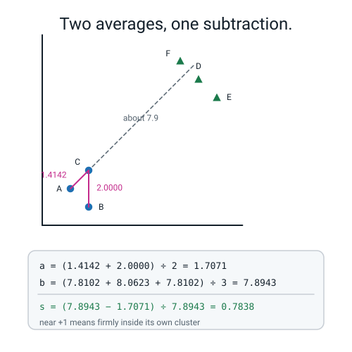
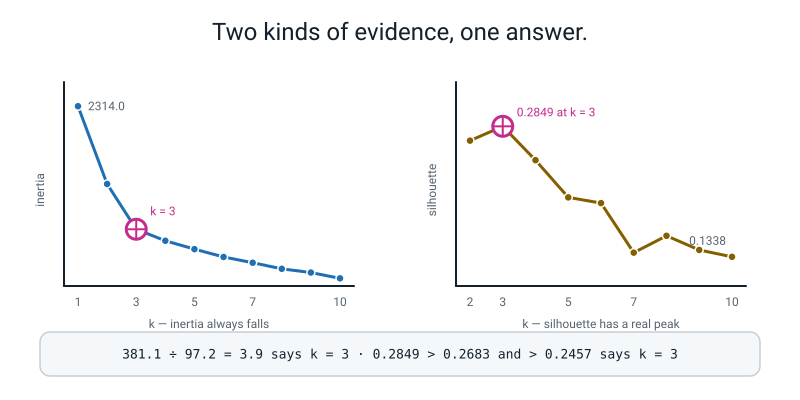
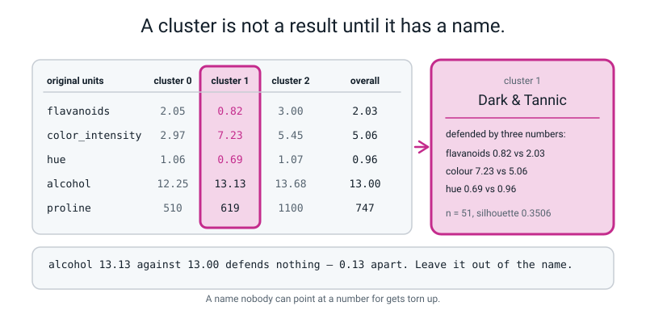
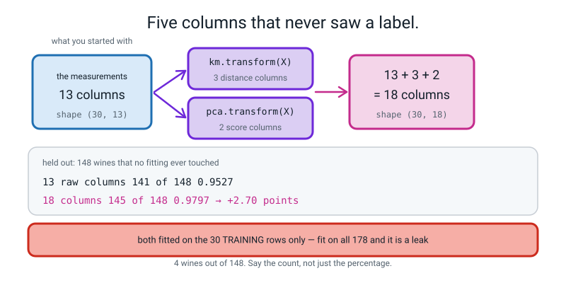
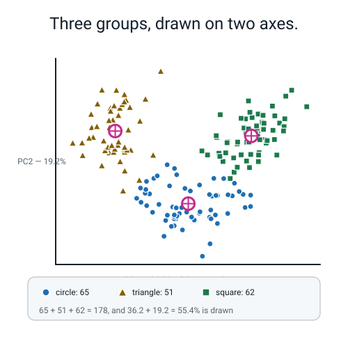
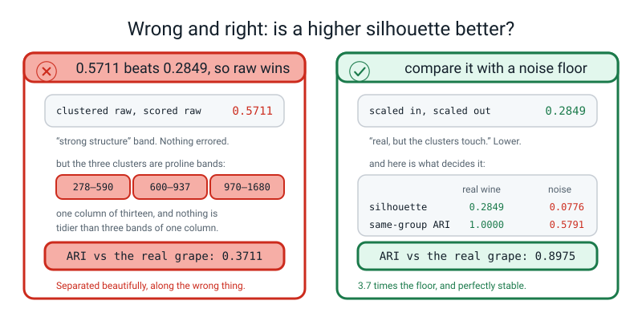
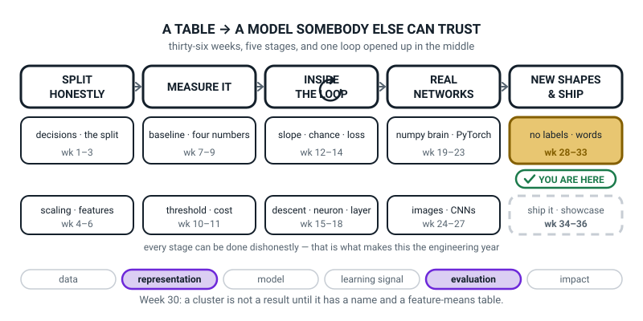
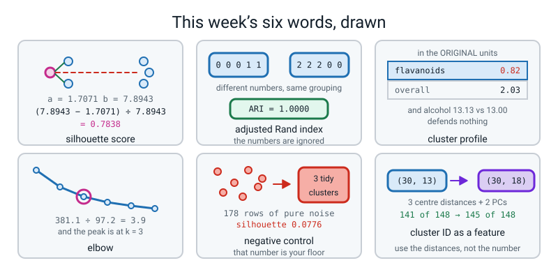

# Week 30 — Cluster Cartography

[⬅ Week 29](week-29.md) · [Course Home](../README.md) · [Next ➡](week-31.md) · [Workbook](../workbook/week-30.md)

---

> ### This week in one sentence
> **A cluster is not a result until it has a human name backed by a feature-means table, two independent pieces of evidence for how many clusters there are, and a noise floor to measure itself against — because k-means hands you three tidy clusters whether or not there are any.**
>
> **By the end of this chapter you will be able to:**
> - **Choose `k` from two independent votes** — the inertia drop ratio `381.1 ÷ 97.2 = 3.9` and the silhouette peak `0.2849`, both at `k = 3` — and say what to do when they disagree
> - **Explain why the elbow alone can never be trusted**, using the fact that inertia always falls as `k` grows
> - **Give every cluster a human name and defend it from a feature-means table in the original units** — including naming your **weakest** cluster out loud
> - **Turn cluster IDs and principal components into features for a supervised model** and report whether they helped, with the number and the held-out pile named: **141 of 148 becomes 145 of 148**
>
> **New maths:** none new. You use Week 28's squared distances (now with square roots), Week 28's inertia and Week 29's variance, all harder.
>
> **New syntax:** `silhouette_score(X, labels)` · `silhouette_samples(X, labels)` · `adjusted_rand_score(a, b)` · `km.transform(X)`
>
> **Reading time:** about 40 minutes. **Homework:** about 60 minutes.

---

## 🪝 Start Here

Here is a real run. Three clusters. Sixty-two, forty-four and seventy-two. Nicely balanced, no errors, no warnings.

```text
sizes [62 44 72]   silhouette 0.0776
```

**That is not the wine data.**

That is **178 rows of thirteen columns of pure random numbers**, generated with numpy about eleven seconds before k-means ran on them. **There is no structure in there at all, and it gave back three tidy groups.**

And here are two of their column means:

```text
cluster 0 means, first four columns: [-0.444 -0.259  0.296 -0.041]
cluster 1 means, first four columns: [ 0.522 -0.029  0.096  0.910]
```

**Cluster 0 is low on column 1 and cluster 1 is high on it. Cluster 1 is high on column 4 and cluster 0 is not.**

Could you write a report about those two groups? **Yes.** Could you give them names? **Yes.** Would somebody believe it? **Yes.**

**And there is nothing in there. Not a thing.**

```text
Getting clusters is not evidence that there are clusters.
```

So here is your position. **k-means will hand you clusters whatever you feed it.** Getting clusters back is not evidence of anything at all. **The burden of proof is entirely on you**, and today you build the proof.

**A proof has five pieces, and you will have all five by the end of this chapter.**

1. **Two independent reasons for the number of clusters.** Not one. Two, and they have to be measuring different things.
2. **A number that says how tight the groups are** — and, crucially, **what that number would have been on noise**, so you know what a floor looks like.
3. **Does it survive being jiggled?** A different starting seed, and eighty per cent of the rows. If the groups vanish when you shake the data, they were never there.
4. **A name for each group that a human being can act on, with numbers behind it.** Not "cluster 0". A name.
5. **Does it actually buy anything?** Turn the clusters into columns, feed them to a model that *does* have right answers, and see whether the score moves.

**Five pieces. Today's deliverable is not a score. It is an argument — and it is the first one in this whole course.**

---

## 🧠 The Big Idea

> **📌 About the code in this section.** The blocks below are **illustrations, not files**. Each one carries on from the one above. **The complete runnable file is in 💻 Type This.**

### 1. The silhouette score: two averages and a subtraction

Week 28 left a hole on purpose. **Inertia always falls as `k` grows, so it can never choose `k`.** Here is a number that can.

> **Silhouette score, for one point** — how much closer that point is to its own clustermates than to the nearest other cluster, scaled to run from −1 to +1.
>
> `a` = the average distance from the point to the **other** members of its own cluster
> `b` = the average distance from the point to **every** member of the nearest other cluster
> `s = (b − a) ÷ whichever of a and b is bigger`

**And here it is worked all the way out, on point C from Week 28's six points.** The final clusters were `{A, B, C}` and `{D, E, F}` — and **this time you do need real distances, not squared ones**, so there are square roots.

```text
a(C) — distance to the other members of my own cluster:
    C(2,3) to A(1,2):  √(1² + 1²) = √2 = 1.4142
    C(2,3) to B(2,1):  √(0² + 2²) = √4 = 2.0000
    a = (1.4142 + 2.0000) ÷ 2 = 1.7071

b(C) — distance to every member of the other cluster:
    C(2,3) to D(8,8):  √(36 + 25) = √61 = 7.8102
    C(2,3) to E(9,7):  √(49 + 16) = √65 = 8.0623
    C(2,3) to F(7,9):  √(25 + 36) = √61 = 7.8102
    b = (7.8102 + 8.0623 + 7.8102) ÷ 3 = 7.8943

s(C) = (7.8943 − 1.7071) ÷ 7.8943
     = 6.1872 ÷ 7.8943
     = 0.7838
```


*Figure 30.1 — One point's silhouette is two averages and a subtraction. a = 1.7071 from C's own clustermates, b = 7.8943 from the other cluster, and (7.8943 − 1.7071) ÷ 7.8943 = 0.7838.*

**And `silhouette_samples` on those six points prints, in order:**

```text
[0.8478 0.8163 0.7838 0.8384 0.7618 0.7595]
```

**The third number is 0.7838. Exactly what you computed by hand.**

**How to read the number:**

| s | what it means |
|---|---|
| near **+1** | comfortably inside its own cluster, far from the others |
| near **0** | sitting on the border between two clusters |
| **negative** | **probably in the wrong cluster** — it is closer to a different one |

**And here is the demonstration that makes "negative" concrete.** Take those same six points and group them deliberately stupidly — put B in with D, E and F:

```text
a deliberately silly grouping [0 1 0 1 1 1] -> silhouette 0.3751
per point: [ 0.8068 -0.8163  0.7797  0.5284  0.487   0.4646]
```

**B scores −0.8163.** The number is telling you, **without ever having been shown a right answer**, that that point is in the wrong place. That is genuinely the most impressive thing in this week, and it takes four lines of code.

> **Silhouette score, for a whole clustering** — the average of `s` over every point. `silhouette_score(X, labels)` gives it to you directly. For the good grouping of six points: **0.8012**. For the silly one: **0.3751**.

**The crucial property, and the reason this thing exists:** unlike inertia, **the silhouette does not automatically improve as `k` grows.** It has a genuine peak, so you can pick the `k` that maximises it. **That is what makes it a second, independent vote.**

**And the field guide, quoted honestly rather than generously:**

| silhouette | honest description |
|---|---|
| above 0.5 | strong structure |
| 0.25 to 0.5 | **real, but the clusters touch** |
| below 0.25 | mostly a convenient fiction |

**Real tabular data lands in the 0.25–0.4 band most of the time, and the wine data lands at 0.2849.** That is *"real but overlapping"*, and **saying so is the finding.** It is not a disappointment.

### 2. Two votes for `k`, and what to do when they disagree

Here is the real sweep on the 178 scaled wines:

```text
   k    inertia      drop   silhouette
   1     2314.0         -            -
   2     1659.0     655.0       0.2683
   3     1277.9     381.1       0.2849
   4     1180.7      97.2       0.2457
   5     1110.4      70.4       0.2026
   6     1044.5      65.9       0.1960
   7      996.0      48.5       0.1386
   8      944.6      51.4       0.1581
   9      913.2      31.4       0.1417
  10      864.6      48.6       0.1338
```

**Read the two evidence columns separately, then together.**

**The elbow.** The drops go 655, 381, then a cliff to 97, then a trickle: 70, 66, 48, 51, 31, 49. The quantity to report is the **ratio**, not the picture:

```text
381.1 ÷ 97.2 = 3.9
```

The third cluster bought nearly four times what the fourth did. **After that, the extra clusters are all worth about the same as each other, which is what "no more structure to find" looks like in numbers.**

**The silhouette.** It rises from 0.2683 at `k=2` to **0.2849 at `k=3`**, then falls away steadily. **It has a peak, and the peak is at 3.**


*Figure 30.2 — Two pieces of evidence, and they agree. Inertia falls from 2314.0 to 864.6 with a cliff at k = 3; the silhouette peaks at 0.2849 at k = 3 and falls to 0.1338 by k = 10.*

**Both say 3, and that agreement is the thing you cite.** Not *"the graph bends at 3"*. Instead: *"the drop ratio is 3.9 and the silhouette peaks at 0.2849, both at k = 3."*

> **⚠️ Watch out:** look at `k = 8`. The silhouette goes 0.1386, then **back up** to 0.1581. That is **noise, not structure**, and the giveaway is that it does not come anywhere near the `k=3` value. **A bump that does not beat the maximum is not a finding** — and it is exactly the kind of thing somebody picks out of a table when they want a particular answer.

**And now the part the objectives care about most: what to do when the two votes disagree.** They will, often. **The honest position is that the two tools fail in different directions, so a disagreement is itself information.**

- **The elbow tends to over-count** when clusters are unequal in size, because splitting a big loose cluster always buys a lot of inertia.
- **The silhouette tends to under-count** when clusters touch. When two neighbouring groups overlap, the points near the border have `a` almost equal to `b`, so their individual scores collapse towards 0 and drag the average down. **Merging the two removes that border and its low-scoring points, so the average goes up.** The silhouette has a built-in preference for fewer, fatter clusters exactly when clusters are adjacent.

**So: a silhouette pulling lower than the elbow is the signature of overlapping clusters**, and that sentence belongs in your write-up.

And there is a third consideration that outranks both:

> **Domain sense wins.** If the elbow says 4, the silhouette says 2, and the marketing team can only run three campaigns, the answer is **3**. Clustering is a tool for making decisions, and the number of decisions you can act on is a real constraint. **Say so in the write-up rather than pretending the maths decided.**

### 3. The profile table, and naming a cluster you can defend

**A cluster ID is worth nothing to a human being. A name with three numbers behind it is a decision somebody can act on.**

> **Cluster profile** — a table of every feature's mean, per cluster, **in the original units**, with an **overall** column beside it to compare against.

**Two non-negotiable rules for that table.**

**One: original units, never z-scores.** Nobody can read *"alcohol = 0.83"*. Everybody can read *"alcohol = 13.68 against an overall average of 13.00"*. **You cluster in the scaled world and you report in the real one. Two different jobs.**

**Two: an overall column.** A cluster mean on its own means nothing. `flavanoids = 0.82` is only interesting because the overall mean is `2.03`. **This is the "compared to what?" discipline from Week 27, applied to a table instead of a score.**

Here is the real thing:

```text
feature means by cluster, in the ORIGINAL units:
cluster                            0       1        2  overall
alcohol                        12.25   13.13    13.68    13.00
malic_acid                      1.90    3.31     2.00     2.34
ash                             2.23    2.42     2.47     2.37
alcalinity_of_ash              20.06   21.24    17.46    19.49
magnesium                      92.74   98.67   107.97    99.74
total_phenols                   2.25    1.68     2.85     2.30
flavanoids                      2.05    0.82     3.00     2.03
nonflavanoid_phenols            0.36    0.45     0.29     0.36
proanthocyanins                 1.62    1.15     1.92     1.59
color_intensity                 2.97    7.23     5.45     5.06
hue                             1.06    0.69     1.07     0.96
od280/od315_of_diluted_wines    2.80    1.70     3.16     2.61
proline                       510.17  619.06  1100.23   746.89
```

**And the three names, each with its evidence:**

| cluster | n | the numbers that justify it | the name |
|---|---:|---|---|
| **2** | 62 | highest alcohol (13.68 vs 13.00), highest flavanoids (3.00 vs 2.03), highest proline (1100 vs 747), highest phenols (2.85 vs 2.30) | **Bold Reserve** |
| **1** | 51 | lowest flavanoids (0.82 vs 2.03), highest colour intensity (7.23 vs 5.06), lowest hue (0.69 vs 0.96), highest malic acid (3.31 vs 2.34) | **Dark & Tart** |
| **0** | 65 | lowest alcohol (12.25 vs 13.00), lowest colour intensity (2.97 vs 5.06), lowest proline (510 vs 747), lowest magnesium (92.7 vs 99.7) | **Light & Pale** |


*Figure 30.3 — A name you can defend from the table. Cluster 1: flavanoids 0.82 against 2.03 overall, colour 7.23 against 5.06, hue 0.69 against 0.96. And alcohol 13.13 against 13.00 defends nothing.*

**Now the trap in that table, and it is the one that gets marked hardest.** Look at cluster 1's `alcohol`: **13.13 against an overall 13.00.**

It is "above average", so it is tempting to put it in the justification. **It is 0.13 above average and it defends nothing.** A number only defends a name if it is *far* from the overall mean — and "far" here can be judged by eye against how far the other rows move. Compare it with cluster 1's flavanoids, **0.82 against 2.03: less than half.** *That* is a difference you can build a name on.

**And the honest finding about cluster 0, which is the hardest part of this objective:**

```text
cluster 0: n= 65   own silhouette 0.1774   worst point -0.0228   points below 0: 7
cluster 1: n= 51   own silhouette 0.3506   worst point 0.0611    points below 0: 0
cluster 2: n= 62   own silhouette 0.3434   worst point 0.0352    points below 0: 0
```

**Cluster 0's own silhouette is 0.1774 — half of the other two — and seven of its sixty-five bottles score below zero**, which means they are closer to a different cluster than to their own.

**And look at *why*, in the profile table: cluster 0 is lowest on almost everything and highest on nothing.** *"Low on things"* is a much weaker basis for a group than *"high on a specific thing"*.

> **A cluster defined mainly by absence is often a sign that `k` is too small, or that the real structure is two strong groups plus a continuum of leftovers.** **Say that in your write-up.** Do not hide the weak cluster, and do not pretend the three names are equally good.

### 4. Stability, and the negative control almost nobody runs

You cannot check clusters against a right answer. **But you can check two other things, and both are real evidence.**

> **Adjusted Rand index (ARI)** — how much two groupings of the same rows agree, corrected for the agreement you would get by luck. **1.0 means identical grouping. 0.0 means no better than random.**

**The crucial thing about ARI is that it ignores the cluster numbers entirely.** It compares *which rows are together*, not what those groups are called. **So it is exactly the tool for Week 28's complaint that "cluster 0 means something different every run".**

**Check one: does it survive a different seed?**

```text
five different seeds, ARI against our run: [1. 1. 1. 1. 1.]  mean 1.0000
```

**Perfectly stable.** Five different starting positions, five identical groupings.

**Check two: does it survive losing a fifth of the data?**

```text
five 80% subsamples, ARI     : [0.9775 0.9565 0.9775 0.9168 1.    ]  mean 0.9657
```

**Mean 0.9657.** Take away 36 of the 178 bottles and the grouping barely moves.

> **The rule of thumb: a mean subsample ARI below about 0.7 means your structure is fragile and you must say so.** 0.9657 is strong.

**And now the thing that makes this whole subject honest.**

> **Negative control** — run your entire pipeline, unchanged, on data you *know* has no structure in it. **Whatever it reports is your floor.**

```text
--- the negative control: 178 rows of 13 columns of pure noise ---
sizes [62 44 72]   silhouette 0.0776
noise, five seeds, ARI: [0.6407 0.4069 0.61   0.6072 0.6308]  mean 0.5791
```

**Read both numbers against the real ones.**

| | real wine | pure noise |
|---|---:|---:|
| silhouette at k = 3 | **0.2849** | **0.0776** |
| seed-to-seed ARI | **1.0000** | **0.5791** |

**The silhouette is 3.7 times higher on the real data, and the stability is perfect against only moderate agreement on noise (0.58, far below 1.0).**

***That*** **is the argument that the wine structure is real.** Not *"0.2849 is a good score"* — it is not a good score — but *"0.2849 against a noise floor of 0.0776, with a seed-to-seed ARI of 1.0000 against 0.5791."*

**And the sting: the noise data still produced three tidy clusters with visibly different column means**, so you could have written a profile table and invented names for them. **The negative control is the only thing standing between "I found three customer types" and "my algorithm returns three of whatever I ask it for".** Almost no published clustering write-up includes one.

**And because the wine data happens to have hidden labels, you get one bonus check nobody normally gets:**

```text
adjusted_rand_score against the real grape variety: 0.8975
rows = real variety, columns = our cluster
[[ 0  0 59]
 [65  3  3]
 [ 0 48  0]]
```

**ARI 0.8975, with only 6 of 178 bottles misplaced** — and notice that the cluster numbers do not match the variety numbers at all: cluster 2 is variety 0, cluster 0 is variety 1, cluster 1 is variety 2. **ARI does not care, which is exactly the point of it.**

For scale, here are the two ends of the ARI ruler on this same grouping:

```python
print("all in one cluster : %.4f" % adjusted_rand_score(labels, np.zeros(178)))
print("a random grouping  : %.4f"
      % adjusted_rand_score(labels, np.random.default_rng(0).integers(0, 3, 178)))
```

```text
all in one cluster : 0.0000
a random grouping  : -0.0080
```

**Exactly 0.0000 for the do-nothing grouping, and very slightly negative for a random one** — because ARI has subtracted off the agreement you would get by pure luck, and a random draw can land a shade below that.

### 5. Do the new columns earn their keep? "It depends on the row count."

Both `KMeans` and `PCA` produce columns you can feed to a supervised model.

> **`km.transform(X)`** — not the labels, but **the distance from every row to every centre.** With 3 clusters that is 3 new numeric columns per row. **Better than the cluster ID**, because it keeps *how strongly* a row belongs instead of throwing that away.

```text
km.transform(X) shape: (178, 3) - one distance per centre
first three wines, distance to each of the three centres:
[[4.9629 6.2931 2.0634]
 [3.8452 5.6853 2.74  ]
 [4.1901 5.6186 2.0042]]
nearest centre: [2 2 2]  and labels_ says [2 2 2]
```

**The smallest number in each row is the cluster it was assigned to.** `km.transform(X).argmin(axis=1)` is `km.labels_`, every single time. **That one sentence makes the whole thing obvious.**

> **⚠️ Watch out:** **never feed a cluster ID in as a number.** `0`, `1` and `2` are names — a model that adds 1 to a name is learning nonsense. If you must use the ID, one-hot it as in Week 4. **But the three distances are strictly more informative and they are one function call.**

**Now the experiment. Split the wine into 124 training rows and 54 held-out rows, fit the scaler, the k-means and the PCA on the training rows only, and build an 18-column table: the 13 scaled columns, plus 3 centre-distances, plus 2 principal components.**

```text
--- 124 labelled training rows: is there room to improve? ---
train rows: 124   held-out rows: 54
  13 raw columns        1.0000  (54 of 54 held-out wines)
  13 + 3 dists + 2 PCs  1.0000  (54 of 54 held-out wines)
  the 5 new ones ALONE  1.0000  (54 of 54 held-out wines)
```

**All three get 54 of 54. Did the five new columns help? No. Does that mean they are useless?**

**No, and this is the trap.** Look at the first row: **54 of 54. The problem was already completely solved before anything was added.** There was no room to improve, so nothing could improve it.

> **That is a ceiling, and recognising one is a real skill.** The right conclusion is not *"the features don't help"* — it is **"this experiment cannot answer the question."**

**So make the problem hard.** Keep only **30** labelled training rows, and hold out the other 148:

```text
--- now only 30 labelled training rows, 148 held out ---
  13 raw columns        0.9527  (141 of 148 held-out wines)
  13 + 3 dists + 2 PCs  0.9797  (145 of 148 held-out wines)
  the 5 new ones ALONE  0.9865  (146 of 148 held-out wines)
```

**Three findings, and all three are worth saying.**

**One: the five new columns bought four wines.** 141 → 145, which is `+2.70` accuracy points. **Say it as a count, not only a percentage** — Week 27's discipline.

**Two, and this is the striking one: the five new columns *on their own* beat all thirteen original ones.** 146 against 141. **Five numbers built without ever looking at a single label did better than thirteen carefully measured chemical properties.** The reason is the row count: with 30 training rows, a 13-column logistic regression has 42 coefficients to estimate and nowhere near enough rows to do it, while **k-means got to use the geometry of all 30 rows with no labels at all**, and then handed over three numbers that already knew where the groups were. **Be exact about what this shows:** k-means and PCA were fitted on those same 30 labelled rows, so no extra unlabelled rows were used; the gain is most likely from squeezing 13 inputs down to 5 (fewer coefficients to pin down), not yet from unlabelled data.

**That is not a trick. It points at something unsupervised learning can do: it works on unlabelled data, and labels are often the expensive part.** (Here it only hints at that, because we never gave k-means any extra unlabelled rows.)

**Three, and you must include it: is +4 wines real, or a lucky split?** The honest check is to repeat the split. Over ten different splits:

```text
13 raw        mean 0.9642  std 0.0125
18 cols       mean 0.9757  std 0.0075
5 unsup only  mean 0.9716  std 0.0095
mean gain from adding the five columns: +0.0115
times the 18-column model was better/equal/worse: 8 2 0
```

**The average gain is +1.15 points, which is smaller than the single split suggested and about the same size as the baseline's own split-to-split wobble of 0.0125.** On size alone you could not call it.

**But the 18-column model won 8 times, tied twice, and never once lost.** ***That*** **is the evidence: not the size of the gain, but that it never went the other way.** This is exactly Week 11's *"is this difference real?"* move, and it is the last time you practise it before the capstone.


*Figure 30.4 — Five new columns, made without ever looking at the answers. (30, 13) becomes (30, 18), and 141 of 148 becomes 145 of 148 — all five new columns fitted on the 30 training rows only.*

> **⚠️ Watch out:** `StandardScaler`, `KMeans` and `PCA` **all fit** — they learn means, centres and directions from data. **Fit any of them on all 178 rows before splitting and information from your held-out wines has leaked into your training columns.** Fit all three on the training rows only. **This is Week 6's leakage in an unsupervised costume, and it is the last new costume this course will show you.**

### 6. The map, and why the picture needed a number

Last week's plot, coloured by cluster. **Two rules it has to obey, and both are habits from Week 29.**

**The percentage goes in both axis labels.** `PC1 (36.2% of the spread)` and `PC2 (19.2%)`. And `36.2 + 19.2 = 55.4`, so **44.6% of the wine's spread is not on the page**, and two bottles that look adjacent may be far apart.

**Cluster membership gets a shape as well as a colour** — circle, triangle, square — so the map still works photocopied.


*Figure 30.5 — The map: 178 wines, three clusters, two axes. 65 circles, 51 triangles, 62 squares, three centres marked with crosses, and 36.2 + 19.2 = 55.4% of the spread drawn.*

**And here is the payoff for last week, which is worth doing with both files open.** The uncoloured version of this plot, `wine_2d.png` from Week 29, was **one elongated blob with no visible gaps.** Coloured by cluster, three groups appear cleanly.

**The structure was there all along and the picture could not show it.** Your eye found nothing in that first plot. **The silhouette found 0.2849 and the elbow found a drop ratio of 3.9, and both of them were right.** That is the best argument anybody can give you for why you need a number and not a picture.

---

## 🔁 The Idea From Last Week, Used Harder

**There is no new maths this week. There is old maths doing a harder job, and two of the three old ideas come back with a twist.**

### Twist one — Week 28's squared distance grows a square root

For two weeks you have been told: **never take the square root, squaring does not change which centre is nearer, and it saves you arithmetic.** That was true for k-means, and it is **wrong for the silhouette.**

**Here is why, and it is worth doing both ways so you see it break.**

The silhouette for point C compares `a` (the average distance to your own group) with `b` (the average distance to the nearest other group), and then divides. **That division only means something if both numbers are on the same ruler as each other *and* proportional to real distance.** Squared distances are not.

With **real** distances:

```text
a(C) = (1.4142 + 2.0000) ÷ 2 = 1.7071
b(C) = (7.8102 + 8.0623 + 7.8102) ÷ 3 = 7.8943
s(C) = (7.8943 − 1.7071) ÷ 7.8943 = 0.7838      ✅ matches silhouette_samples
```

With **squared** distances, the same three steps:

```text
a(C) = (2 + 4) ÷ 2 = 3.0
b(C) = (61 + 65 + 61) ÷ 3 = 62.3333
s(C) = (62.3333 − 3.0) ÷ 62.3333 = 0.9519
```

**0.9519 instead of 0.7838.** And here is what makes that dangerous: **it is not obviously wrong.** It is between −1 and +1, it is positive, it says "comfortably inside its own cluster", and it is on exactly the scale you expect. **A plausible-looking number from the wrong method is worse than a crash.**

> **The rule: k-means may use squared distance because it only ever compares "which is smaller". The silhouette may not, because it divides.** Anything that divides two distances needs real distances.

### Twist two — Week 28's inertia is still useless on its own, and now you can prove it

You already know inertia always falls as `k` grows, and that at `k` = the number of rows it is exactly 0. **The silhouette does not do that**, and comparing the two columns of the sweep is the cleanest way to see it:

| | inertia | silhouette |
|---|---|---|
| `k = 2` | 1659.0 | 0.2683 |
| `k = 3` | **1277.9** | **0.2849** ← peak |
| `k = 4` | 1180.7 | 0.2457 |
| `k = 10` | 864.6 | 0.1338 |
| direction as `k` grows | **always down** | **up, then down** |
| can it pick a `k`? | **no** | **yes — the peak** |

**And the silhouette has one limit inertia does not: it cannot score `k = 1` at all.** Ask for it and you get a real error, because `b` is "the distance to the nearest *other* cluster" and **with one cluster there is no other cluster. The quantity does not exist.**

### Twist three — Week 29's PCA gets a job instead of a picture

Last week PCA produced a scatter plot. **This week two of its components become columns in a table that a supervised model is scored on** — and that immediately drags in Week 6's leakage rule, because `PCA` learns its directions from data.

```python
sc = StandardScaler().fit(a)                 # 'a' is the 30 TRAINING rows only
Za, Zb = sc.transform(a), sc.transform(b)
k3 = KMeans(n_clusters=3, n_init=10, random_state=0).fit(Za)
pc = PCA(n_components=2).fit(Za)
Aa = np.c_[Za, k3.transform(Za), pc.transform(Za)]     # (30, 18)
Ab = np.c_[Zb, k3.transform(Zb), pc.transform(Zb)]     # (148, 18)
```

**Three objects, three `.fit` calls, and every single one of them saw only `a`.** Then all three `transform` both piles. `np.c_` glues columns side by side, from Week 19.

**Say the count out loud: `13 + 3 + 2 = 18`.** If your table is 19 columns wide you have added the cluster ID as well, and it does not belong there.

---

## 💻 Type This

You already have `no_answer_key.py` from Week 28 and `new_axes.py` from Week 29, and this file reuses both. Open a new one called `cartography.py`. Seven pieces.

### Step 1 — the imports, the data, and the two-vote sweep

```python
import matplotlib
matplotlib.use("Agg")
import matplotlib.pyplot as plt
import numpy as np
import pandas as pd
from sklearn.cluster import KMeans
from sklearn.datasets import load_wine
from sklearn.decomposition import PCA
from sklearn.linear_model import LogisticRegression
from sklearn.metrics import (adjusted_rand_score, confusion_matrix,
                             silhouette_samples, silhouette_score)
from sklearn.model_selection import train_test_split
from sklearn.preprocessing import StandardScaler

np.random.seed(0)
pd.set_option("display.width", 130)

wine = load_wine()
X_raw = pd.DataFrame(wine.data, columns=wine.feature_names)
y_secret = wine.target                      # stays in the drawer until step 6
X = StandardScaler().fit_transform(X_raw)
print("wine table:", X_raw.shape)

print()
print("   k    inertia      drop   silhouette")
prev = KMeans(n_clusters=1, n_init=10, random_state=0).fit(X).inertia_
print("   1   %8.1f         -            -" % prev)
ks, inertias, sils = [], [], []
for k in range(2, 11):
    km = KMeans(n_clusters=k, n_init=10, random_state=0).fit(X)
    s = silhouette_score(X, km.labels_)
    print("  %2d   %8.1f   %7.1f       %.4f" % (k, km.inertia_, prev - km.inertia_, s))
    ks.append(k); inertias.append(km.inertia_); sils.append(s)
    prev = km.inertia_
```

**What each new line does.**

- `silhouette_score(X, labels)` takes **the table you clustered** and **the labels you got**, and gives back one number between −1 and +1. **Note what is not in there: no `y`, no right answer.** It measures the *shape* of the grouping, not its correctness.
- `pd.set_option("display.width", 130)` stops pandas wrapping the wide profile table later.
- **The loop starts at `k = 2`, not 1, and that is not a style choice.** `silhouette_score` with one cluster is an error.

```text
wine table: (178, 13)

   k    inertia      drop   silhouette
   1     2314.0         -            -
   2     1659.0     655.0       0.2683
   3     1277.9     381.1       0.2849
   4     1180.7      97.2       0.2457
   5     1110.4      70.4       0.2026
   6     1044.5      65.9       0.1960
   7      996.0      48.5       0.1386
   8      944.6      51.4       0.1581
   9      913.2      31.4       0.1417
  10      864.6      48.6       0.1338
```

### Step 2 — the two plots, side by side

```python
fig, ax = plt.subplots(1, 2, figsize=(11, 4))
ax[0].plot([1] + ks, [2314.0] + inertias, "o-")
ax[0].set_xlabel("k"); ax[0].set_ylabel("inertia"); ax[0].set_title("Elbow")
ax[1].plot(ks, sils, "o-", color="darkorange")
ax[1].set_xlabel("k"); ax[1].set_ylabel("mean silhouette")
ax[1].set_title("Silhouette")
plt.tight_layout(); plt.savefig("choose_k.png", dpi=110); plt.close()
print("saved choose_k.png")
```

`plt.subplots(1, 2)` makes one figure with two panels, and `ax` is a list of the two of them. **The silhouette panel starts at `k = 2` because there is no `k = 1` value to plot.**

```text
saved choose_k.png
```

**Open it.** The left panel falls and flattens. The right panel rises to a point and comes back down. **Those are two different shapes of evidence, and that is the whole reason both are here.**

### Step 3 — cluster at `k = 3`, and look at each cluster honestly

```python
km = KMeans(n_clusters=3, n_init=10, random_state=0).fit(X)
labels = km.labels_
sil = silhouette_samples(X, labels)
print()
print("cluster sizes:", np.bincount(labels))
for c in range(3):
    m = labels == c
    print("  cluster %d: n=%3d   own silhouette %.4f   worst point %.4f   points below 0: %d"
          % (c, m.sum(), sil[m].mean(), sil[m].min(), int((sil[m] < 0).sum())))
print("  whole-set silhouette: %.4f" % silhouette_score(X, labels))
```

`silhouette_samples(X, labels)` gives **one number per row** instead of one overall. **This is the line that finds the weak cluster**, because you can average it *within* each cluster and compare.

```text
cluster sizes: [65 51 62]
  cluster 0: n= 65   own silhouette 0.1774   worst point -0.0228   points below 0: 7
  cluster 1: n= 51   own silhouette 0.3506   worst point 0.0611   points below 0: 0
  cluster 2: n= 62   own silhouette 0.3434   worst point 0.0352   points below 0: 0
  whole-set silhouette: 0.2849
```

> **💡 Try this:** `silhouette_samples(X, labels).mean()` equals `silhouette_score(X, labels)` **exactly** — both print `0.2848589192` to ten places. Worth checking once, because it tells you precisely what the average is over: **every row, weighted equally.**

### Step 4 — the profile table, in units a person can read

```python
print()
prof = X_raw.copy()
prof["cluster"] = labels
means = prof.groupby("cluster").mean().T
means["overall"] = X_raw.mean()
print("feature means by cluster, in the ORIGINAL units:")
print(means.round(2).to_string())
```

- `prof = X_raw.copy()` — **`X_raw`, not `X`.** You clustered on the scaled table and you report on the raw one.
- `prof["cluster"] = labels` adds the labels as a real column, which is better practice than grouping by a loose array because the table now *records* which cluster each row was in.
- `.groupby("cluster").mean().T` averages every column within each cluster, and `.T` flips it so features run down the page and clusters run across.
- `means["overall"] = X_raw.mean()` bolts on the comparison column. **Without this the table is unfalsifiable.**

```text
feature means by cluster, in the ORIGINAL units:
cluster                            0       1        2  overall
alcohol                        12.25   13.13    13.68    13.00
malic_acid                      1.90    3.31     2.00     2.34
ash                             2.23    2.42     2.47     2.37
alcalinity_of_ash              20.06   21.24    17.46    19.49
magnesium                      92.74   98.67   107.97    99.74
total_phenols                   2.25    1.68     2.85     2.30
flavanoids                      2.05    0.82     3.00     2.03
nonflavanoid_phenols            0.36    0.45     0.29     0.36
proanthocyanins                 1.62    1.15     1.92     1.59
color_intensity                 2.97    7.23     5.45     5.06
hue                             1.06    0.69     1.07     0.96
od280/od315_of_diluted_wines    2.80    1.70     3.16     2.61
proline                       510.17  619.06  1100.23   746.89
```

### Step 5 — the map, with the percentages and the shapes

```python
pca = PCA(n_components=2).fit(X)
Z = pca.transform(X)
evr = pca.explained_variance_ratio_
names = {0: "Light & Pale", 1: "Dark & Tart", 2: "Bold Reserve"}
marks = {0: "o", 1: "^", 2: "s"}
plt.figure(figsize=(7, 5.5))
for c in range(3):
    m = labels == c
    plt.scatter(Z[m, 0], Z[m, 1], s=34, alpha=0.85, marker=marks[c],
                label="%d: %s (n=%d)" % (c, names[c], m.sum()))
cen = pca.transform(km.cluster_centers_)
plt.scatter(cen[:, 0], cen[:, 1], marker="X", s=240, c="black", label="centres")
plt.xlabel("PC1 (%.1f%% of the spread)" % (evr[0] * 100))
plt.ylabel("PC2 (%.1f%% of the spread)" % (evr[1] * 100))
plt.title("178 wines, coloured by cluster")
plt.legend(); plt.tight_layout(); plt.savefig("wine_map.png", dpi=110); plt.close()
print("saved wine_map.png")
```

- `marker=marks[c]` gives each cluster a **shape** — `"o"` circle, `"^"` triangle, `"s"` square — so colour is never the only thing carrying the meaning.
- `pca.transform(km.cluster_centers_)` projects the three centres onto the same two axes, so they land in the right place on the map.
- **And the percentages go in the axis labels.** Every time.

```text
saved wine_map.png
```

**Open `wine_map.png` and Week 29's `wine_2d.png` side by side, in that order.** Same points, same axes, same percentages. **One is a blob and one has three groups in it.**

### Step 6 — `km.transform`, stability, the noise floor, and the drawer

```python
print()
d = km.transform(X)
print("km.transform(X) shape:", d.shape, "- one distance per centre")
print("first three wines, distance to each of the three centres:")
print(np.round(d[:3], 4))
print("nearest centre:", d[:3].argmin(axis=1), " and labels_ says", labels[:3])

print()
ref = labels
seeds = [adjusted_rand_score(ref, KMeans(n_clusters=3, n_init=10,
                                         random_state=s).fit(X).labels_)
         for s in (1, 2, 3, 4, 5)]
print("five different seeds, ARI against our run:", np.round(seeds, 4),
      " mean %.4f" % np.mean(seeds))
rng = np.random.default_rng(0)
subs = []
for _ in range(5):
    idx = rng.choice(178, 142, replace=False)
    subs.append(adjusted_rand_score(ref[idx],
                KMeans(n_clusters=3, n_init=10, random_state=0).fit(X[idx]).labels_))
print("five 80% subsamples, ARI     :", np.round(subs, 4),
      " mean %.4f" % np.mean(subs))

print()
print("--- the negative control: 178 rows of 13 columns of pure noise ---")
noise = np.random.default_rng(0).normal(size=(178, 13))
kmn = KMeans(n_clusters=3, n_init=10, random_state=0).fit(noise)
print("sizes", np.bincount(kmn.labels_),
      "  silhouette %.4f" % silhouette_score(noise, kmn.labels_))
nseeds = [adjusted_rand_score(kmn.labels_, KMeans(n_clusters=3, n_init=10,
                                                 random_state=s).fit(noise).labels_)
          for s in (1, 2, 3, 4, 5)]
print("noise, five seeds, ARI:", np.round(nseeds, 4), " mean %.4f" % np.mean(nseeds))

print()
print("adjusted_rand_score against the real grape variety: %.4f"
      % adjusted_rand_score(y_secret, labels))
print("rows = real variety, columns = our cluster")
print(confusion_matrix(y_secret, labels))
```

- `km.transform(X)` gives **one column per centre**, holding each row's distance to it. `(178, 3)` for the wine.
- `adjusted_rand_score(a, b)` takes two labellings of **the same rows**. **Argument order does not matter** — `adjusted_rand_score(a, b)` equals `adjusted_rand_score(b, a)`, which is unusual and worth knowing, because almost every other two-argument metric in this course cares deeply.
- `rng.choice(178, 142, replace=False)` picks 142 different row numbers out of 178 — 80% of them. **`ref[idx]` and `X[idx]` must be indexed the same way**, or you get a length mismatch.

```text
km.transform(X) shape: (178, 3) - one distance per centre
first three wines, distance to each of the three centres:
[[4.9629 6.2931 2.0634]
 [3.8452 5.6853 2.74  ]
 [4.1901 5.6186 2.0042]]
nearest centre: [2 2 2]  and labels_ says [2 2 2]

five different seeds, ARI against our run: [1. 1. 1. 1. 1.]  mean 1.0000
five 80% subsamples, ARI     : [0.9775 0.9565 0.9775 0.9168 1.    ]  mean 0.9657

--- the negative control: 178 rows of 13 columns of pure noise ---
sizes [62 44 72]   silhouette 0.0776
noise, five seeds, ARI: [0.6407 0.4069 0.61   0.6072 0.6308]  mean 0.5791

adjusted_rand_score against the real grape variety: 0.8975
rows = real variety, columns = our cluster
[[ 0  0 59]
 [65  3  3]
 [ 0 48  0]]
```

### Step 7 — do the new columns earn their keep?

```python
print()
print("--- 124 labelled training rows: is there room to improve? ---")
Xtr, Xte, ytr, yte = train_test_split(X_raw, y_secret, test_size=0.30,
                                      random_state=0, stratify=y_secret)
print("train rows:", len(Xtr), "  held-out rows:", len(Xte))


def run(n_train, state=0):
    a, b, ya, yb = train_test_split(X_raw, y_secret, train_size=n_train,
                                    random_state=state, stratify=y_secret)
    sc = StandardScaler().fit(a)                 # fitted on the TRAIN rows only
    Za, Zb = sc.transform(a), sc.transform(b)
    k3 = KMeans(n_clusters=3, n_init=10, random_state=0).fit(Za)
    pc = PCA(n_components=2).fit(Za)
    Aa = np.c_[Za, k3.transform(Za), pc.transform(Za)]
    Ab = np.c_[Zb, k3.transform(Zb), pc.transform(Zb)]
    Ua, Ub = np.c_[k3.transform(Za), pc.transform(Za)], np.c_[k3.transform(Zb), pc.transform(Zb)]
    out = []
    for tag, p, q in [("13 raw columns      ", Za, Zb),
                      ("13 + 3 dists + 2 PCs", Aa, Ab),
                      ("the 5 new ones ALONE", Ua, Ub)]:
        acc = LogisticRegression(max_iter=5000).fit(p, ya).score(q, yb)
        out.append(acc)
        print("  %s  %.4f  (%d of %d held-out wines)"
              % (tag, acc, round(acc * len(yb)), len(yb)))
    return out


run(124)
print()
print("--- now only 30 labelled training rows, 148 held out ---")
run(30)
```

**Read the three `.fit` lines inside `run` out loud: `sc`, `k3` and `pc` all fitted on `a`, which is the training rows.** That is the whole leakage discipline, visible in three lines instead of hidden inside a pipeline.

`np.c_[...]` glues columns side by side: 13 + 3 + 2 = **18**.

```text
--- 124 labelled training rows: is there room to improve? ---
train rows: 124   held-out rows: 54
  13 raw columns        1.0000  (54 of 54 held-out wines)
  13 + 3 dists + 2 PCs  1.0000  (54 of 54 held-out wines)
  the 5 new ones ALONE  1.0000  (54 of 54 held-out wines)

--- now only 30 labelled training rows, 148 held out ---
  13 raw columns        0.9527  (141 of 148 held-out wines)
  13 + 3 dists + 2 PCs  0.9797  (145 of 148 held-out wines)
  the 5 new ones ALONE  0.9865  (146 of 148 held-out wines)
```

### The complete `cartography.py`

Put the seven steps together with all the imports at the top. **Expected runtime: about 2 seconds**, including two saved PNGs. **It fits more than twenty k-means models and you will not notice.**

---

## 🔍 Worked Examples

Three worked examples, done by hand and then checked against the code. Work each one on paper before you read the answer line.

### Worked Example 1 — The silhouette catches a point in the wrong cluster

Six points, and a grouping you know is wrong: put B in with the far bunch.

```python
import numpy as np
from sklearn.metrics import silhouette_samples, silhouette_score
S = np.array([[1., 2.], [2., 1.], [2., 3.], [8., 8.], [9., 7.], [7., 9.]])

good  = np.array([0, 0, 0, 1, 1, 1])
silly = np.array([0, 1, 0, 1, 1, 1])          # B thrown in with D, E, F

for name, lab in (("good ", good), ("silly", silly)):
    print(name, "whole %.4f" % silhouette_score(S, lab),
          " per point", np.round(silhouette_samples(S, lab), 4))
```

```text
good  whole 0.8012  per point [0.8478 0.8163 0.7838 0.8384 0.7618 0.7595]
silly whole 0.3751  per point [ 0.8068 -0.8163  0.7797  0.5284  0.487   0.4646]
```

**Three things in those two lines, and the second one is remarkable.**

**One: the whole-set score dropped from 0.8012 to 0.3751.** So the silhouette can tell a good grouping from a bad one, with no answer key anywhere.

**Two: B scored −0.8163.** Not just low — **negative**, which means B's nearest other cluster is closer than its own. **The number has pointed at the exact row that is wrong**, and it did so having never been shown a correct grouping.

**Three: look at what happened to D, E and F** — 0.8384, 0.7618, 0.7595 became 0.5284, 0.4870, 0.4646. **They all got worse too**, because they now have a distant stranger in their group dragging their `a` up. **One misplaced row damages everybody around it.**

**Now check B's real score by hand, because you can.** With the *good* grouping, B is at (2, 1) in `{A, B, C}`:

```text
a(B) — to my own clustermates:
    B(2,1) to A(1,2):  √(1 + 1) = √2  = 1.4142
    B(2,1) to C(2,3):  √(0 + 4) = √4  = 2.0000
    a = (1.4142 + 2.0000) ÷ 2 = 1.7071

b(B) — to every member of the other cluster:
    B(2,1) to D(8,8):  √(36 + 49) = √85 = 9.2195
    B(2,1) to E(9,7):  √(49 + 36) = √85 = 9.2195
    B(2,1) to F(7,9):  √(25 + 64) = √89 = 9.4340
    b = (9.2195 + 9.2195 + 9.4340) ÷ 3 = 9.2910

s(B) = (9.2910 − 1.7071) ÷ 9.2910 = 7.5839 ÷ 9.2910 = 0.8163
```

**0.8163, and `silhouette_samples` printed exactly 0.8163.** ✅

**And notice the coincidence worth not being fooled by:** `a(B) = 1.7071` is the *same* as `a(C) = 1.7071`. B and C really are the same average distance from their two clustermates. **It is a coincidence about these six points, not a property of anything.**

### Worked Example 2 — Name the noise clusters, on purpose

The hook said you could write a report about three clusters of pure random numbers. **Do it, deliberately, because it takes ninety seconds and it changes how you read every clustering result for the rest of your life.**

```python
import numpy as np, pandas as pd
from sklearn.cluster import KMeans
from sklearn.metrics import silhouette_score

noise = np.random.default_rng(0).normal(size=(178, 13))
kmn = KMeans(n_clusters=3, n_init=10, random_state=0).fit(noise)
print("sizes", np.bincount(kmn.labels_),
      "  silhouette %.4f" % silhouette_score(noise, kmn.labels_))
df = pd.DataFrame(noise, columns=["c%d" % i for i in range(13)])
df["cluster"] = kmn.labels_
print(df.groupby("cluster").mean().T.round(3).head(4).to_string())
print("overall, first four columns:", np.round(noise.mean(axis=0)[:4], 3))
```

```text
sizes [62 44 72]   silhouette 0.0776
cluster      0      1      2
c0      -0.444  0.522  0.336
c1      -0.259 -0.029 -0.070
c2       0.296  0.096 -0.506
c3      -0.041  0.910 -0.557
overall, first four columns: [ 0.11  -0.125 -0.078 -0.015]
```

**Now write the report.**

> *"Three segments emerged. **Segment 1** (n=44) is high on c0 (+0.52 against an overall 0.11) and dramatically high on c3 (+0.91 against −0.02) — call it the **High-Engagement** group. **Segment 0** (n=62) is the mirror image on c0, at −0.44, and also low on c1 (−0.26 against −0.13) — the **Dormant** group. **Segment 2** (n=72), the largest, is above average on c0 but the lowest of the three on both c2 (−0.51) and c3 (−0.56) — the **Narrow-Interest** group."*

**Every number in that paragraph is real. Every one of those groups is a fiction.** There is no structure in `noise`. There cannot be. It came out of a random number generator.

**So what is the difference between that paragraph and the wine write-up? Exactly two numbers.**

| | real wine | pure noise |
|---|---:|---:|
| silhouette at k = 3 | **0.2849** | **0.0776** |
| seed-to-seed ARI | **1.0000** | **0.5791** |

**0.2849 is 3.7 times the floor, and 1.0000 against 0.5791 is perfect stability against moderate, far-from-perfect agreement. That is the entire difference.** Not the plausibility of the names, not the balance of the cluster sizes, not the fact that the column means differ. **Those are all present in the noise version too.**

**And this is the piece that almost nobody in the world bothers with.** A student who runs their whole pipeline on noise and reports the floor beside their result has produced a **more trustworthy document than most published clustering work.**

### Worked Example 3 — Find the seven unsure bottles and decide what to do with them

Cluster 0 had seven bottles scoring below zero. **Who are they, and does it matter?**

```python
from sklearn.datasets import load_wine
from sklearn.preprocessing import StandardScaler
from sklearn.metrics import silhouette_samples

wine = load_wine()
X_raw = pd.DataFrame(wine.data, columns=wine.feature_names)
X = StandardScaler().fit_transform(X_raw)
km = KMeans(n_clusters=3, n_init=10, random_state=0).fit(X)
labels = km.labels_
sil = silhouette_samples(X, labels)

print("indices      :", np.where(sil < 0)[0].tolist())
print("their scores :", np.round(sil[sil < 0], 4))
print("their cluster:", labels[sil < 0])
print("their variety:", wine.target[sil < 0].tolist())
```

```text
indices      : [68, 69, 70, 71, 74, 78, 98]
their scores : [-0.0145 -0.005  -0.0179 -0.0228 -0.0045 -0.009  -0.0225]
their cluster: [0 0 0 0 0 0 0]
their variety: [1, 1, 1, 1, 1, 1, 1]
```

**Read three things in that output.**

**One: all seven are in cluster 0** — the weak one, the one with the 0.1774 own-silhouette. **The per-point numbers and the per-cluster numbers are telling the same story.**

**Two: all seven are grape variety 1**, which is the variety cluster 0 mostly captured — 65 of that variety's 71 bottles. **Cluster 0 is the cluster defined by being *low* on things**, so it is exactly where you would expect the unsure bottles to be. **That is reassuring rather than alarming:** the weak cluster and the unsure rows are the same finding, seen twice. (You only get to check this because the wine data has hidden labels. **Normally this line of the output does not exist.**)

**Three: none of them is dramatically negative.** The worst is **−0.0228**. Compare that with the silly grouping's **−0.8163** in Worked Example 1. **These are border cases, not misfiled rows.** Print each one's two smallest centre distances and you can see exactly how close it was:

```python
d = km.transform(X)
for i in np.where(sil < 0)[0]:
    s = np.sort(d[i])
    print("  row %3d  own %.4f  next %.4f  gap %.4f" % (i, s[0], s[1], s[1] - s[0]))
```

```text
  row  68  own 3.8544  next 4.0790  gap 0.2246
  row  69  own 5.3964  next 5.6180  gap 0.2215
  row  70  own 2.9773  next 3.2594  gap 0.2821
  row  71  own 3.8318  next 4.0122  gap 0.1804
  row  74  own 3.0917  next 3.4394  gap 0.3477
  row  78  own 4.3442  next 4.6007  gap 0.2565
  row  98  own 3.1788  next 3.3931  gap 0.2143
```

**Every gap is under 0.35, on distances of three to five.** Row 71 is **0.1804** closer to its own centre than to a different one. **It got assigned, definitely, with no error and no warning, on a margin of under five per cent.**

**And now the design question, which no algorithm can answer for you.** In a deployed system, what would you do with a row the clustering is unsure about?

You could force it into its nearest cluster and say nothing — which is what the code above does. You could tag it as `unsure` and **route it to a human**. You could refuse to make a recommendation for it at all. **Seven rows out of 178 is 3.9%**, so whichever you choose is cheap.

**But the decision is yours, it goes in the model card, and the number that makes it a decision rather than a guess is that 3.9%.**

---

## 🐞 When It Breaks

Every message below came from really running a broken version of this week's code.

### Break 1 — a silhouette needs at least two clusters

```python
print(silhouette_score(X, np.zeros(178)))
```

```text
ValueError: Number of labels is 1. Valid values are 2 to n_samples - 1 (inclusive)
```

**What it means.** *"You asked for a silhouette with only one cluster."*

**And this is not the library being fussy — it is the definition.** `b` is "the average distance to the nearest **other** cluster", and with one cluster **there is no other cluster.** The quantity does not exist.

**The fix.** Start your sweep at `k = 2`.

```python
for k in range(2, 11):          # not range(1, 11)
```

**And the consequence worth remembering: the silhouette cannot compare `k=1` against `k=3`, because `k=1` has no score at all.** If somebody asks you whether the data might be one single group, the silhouette cannot answer that question. **Only the inertia curve and your judgement can.**

### Break 2 — the k-means only knows the columns it was fitted on

```python
A = np.c_[X, km.transform(X), PCA(n_components=2).fit_transform(X)]   # 18 columns
km.transform(A)
```

```text
ValueError: X has 18 features, but KMeans is expecting 13 features as input.
```

**What it means.** You fitted the k-means on 13 columns and are now asking it about 18.

**The fix.** **Build the 18-column table *from* the k-means' output; never feed it back in.** The augmented table exists to be handed to the *supervised* model, and nothing else.

```python
A = np.c_[X, km.transform(X), pca.transform(X)]     # build it once
LogisticRegression(max_iter=5000).fit(A, y)          # and only the classifier sees it
```

**And the habit that catches it before it happens: print the two shapes.** `X.shape` is `(178, 13)`. `A.shape` is `(178, 18)`. **`13 + 3 + 2 = 18`, said out loud** — Week 25's discipline, still paying.

### Break 3 — you indexed one thing and not the other

```python
idx = rng.choice(178, 142, replace=False)
sub = KMeans(n_clusters=3, n_init=10, random_state=0).fit(X[idx]).labels_
adjusted_rand_score(labels, sub)                     # 178 labels vs 142 labels
```

```text
ValueError: Found input variables with inconsistent numbers of samples: [178, 142]
```

**What it means.** *"You gave me 178 labels and 142 labels, and I cannot pair them up."* The subsample run produced 142 labels; the reference run has 178.

**The fix.** Index both the same way.

```python
adjusted_rand_score(labels[idx], sub)
```

**And Week 27's habit: print both lengths before you call it.** `len(labels[idx])` and `len(sub)` must be the same number, and if they are not, the mistake is upstream.

### Two that never error, and cost far more

| What happens | Why | The fix |
|---|---|---|
| **The silhouette is 0.5711 and you are delighted.** | You clustered without scaling, and three bands of one column score beautifully on separation. | **A higher silhouette is not a better clustering.** That grouping scores ARI **0.3711** against the real varieties where the scaled one scores **0.8975**. **And separately: score in the same space you clustered in** — scoring scaled labels on the raw table gives a third, equally meaningless number, **0.1943**. |
| **Your profile table is full of numbers like 0.83 and −1.21.** | You profiled the scaled table, not the raw one. | **Cluster on scaled, report in original units.** Nobody can act on `alcohol = 0.83`. It is `X_raw` in the `groupby`, not `X`. |
| **Your accuracy is suspiciously high and adding features changes nothing.** | Either a ceiling (54 of 54), or something was fitted on all the rows before the split. | **Name the ceiling, then make the problem harder.** And ask of the scaler, the k-means and the PCA **separately**: *which rows did that learn from?* **Three objects, three answers, and all three must be "the training rows."** |

> **⚠️ Watch out:** here is the uncomfortable thing about that last one. **Fit the scaler, the k-means and the PCA on all 178 rows before splitting, and on this dataset the accuracy barely moves — both the honest and the leaky 18-column runs at 30 training rows score 0.9797.** So **you cannot catch this leak by noticing a suspiciously good score. You have to catch it by reading the code.**

---

## 🎲 What We Did In Class

If you missed it, here is the whole lesson. You need workbook pages 30.1 to 30.4, **your Week 28 `no_answer_key.py` and Week 29 `new_axes.py` both working**, three index cards and a thick marker.

**The hook.** One line on the screen: `sizes [62 44 72]   silhouette 0.0776`. Then: *"that is not the wine data — that is 178 rows of thirteen columns of pure random numbers, generated eleven seconds before I ran k-means on them."* Then two rows of cluster means, and *"could you write a report about those two groups? Could you give them names?"* **Yes to both, uncomfortably.** And the line that stayed up all lesson:

```text
Getting clusters is not evidence that there are clusters.
```

Then the five pieces of a proof, read out one at a time — two independent reasons for `k`, a tightness number **with its noise floor**, a jiggle test, a defensible name per group, and *"does it buy anything?"* — and *"today's deliverable is not a score. It is an argument."*

Then an index card and a marker held up: *"if you cannot defend the name out loud from the numbers, I tear the card up and you write another one."*

**Silhouette by hand, at the SIX POINTS sheet from Week 28.** *"Two weeks ago you left me with a problem: inertia always falls as `k` goes up. So what `k` gives the smallest inertia?"* **k = 6, and it is 0.0000, and it is useless.**

Then `a` and `b` for point C, on the sheet, **with square roots this time** — `a = 1.7071` from two clustermates, `b = 7.8943` from three strangers, and `(7.8943 − 1.7071) ÷ 7.8943 = 0.7838`. Then `silhouette_samples` printed `[0.8478 0.8163 0.7838 0.8384 0.7618 0.7595]` and **the third number was 0.7838.**

Then the silly grouping `[0 1 0 1 1 1]` — B thrown in with the far bunch — and **B scored −0.8163.** *"That number found the wrong row without ever being shown a right answer."*

**Live-code, with the imports and the `run()` helper handed out already typed** — because everybody wrote those in Weeks 28 and 29. **The new lines were the sweep, the profile table and the negative control.**

*"Look at `k = 8`. The silhouette goes 0.1386 then back up to 0.1581. Is eight better than seven?"* **It is higher than its neighbour and less than half the peak. A bump that does not beat the maximum is not a finding, it is noise.**

**Two deliberate mistakes.**

| Mistake | What happened |
|---|---|
| `silhouette_score(X, np.zeros(178))` | **Loud.** `ValueError: Number of labels is 1.` — and *"why can it not do one cluster?"* **Because there is no `b`.** |
| clustering the wine raw and scoring it raw | **Silent.** `0.5711` — twice the scaled score, squarely in the "strong structure" band, and **far worse** |

**The second one is the sharpest moment of the whole week.** *"0.5711 against 0.2849. Which clustering is better?"* Most of the room said the first. **Then the drawer opened:**

```text
ARI against the real grape variety, raw    : 0.3711
ARI against the real grape variety, scaled : 0.8975
```

*"Now which one is better?"* **The clustering with double the silhouette is the one that got the grape varieties wrong.** And it makes complete sense once you say what the unscaled clusters *are*: **three non-overlapping bands of proline, 278–590, 600–937, 970–1680.** Nothing on earth is tidier than three bands of one column, so of course they score beautifully on separation. **They are just separated along the wrong thing.**

> **The silhouette measures the shape of your grouping in the space you measured it in. It does not measure whether your grouping is right.** 0.5711 is a completely true number about a question nobody asked.

**Then the two-by-two on the board:**

```text
                    real wine     pure noise
silhouette            0.2849        0.0776
seed-to-seed ARI      1.0000        0.5791
```

*"Is 0.2849 a good score?"* **Compared to what.** *"Yes. Against the field guide it is 'real but overlapping'. Against the noise floor of 0.0776 it is 3.7 times higher, and our grouping is perfectly stable where the noise grouping agrees with itself only moderately (0.58, where 0 would be pure chance). That pair of comparisons is your argument."*

**The Naming Ceremony, twelve minutes.** The feature-means table printed one per student, in original units with the overall column, and the per-cluster silhouettes on the board:

```text
cluster 0:  n = 65    own silhouette 0.1774    7 points below zero
cluster 1:  n = 51    own silhouette 0.3506    0 points below zero
cluster 2:  n = 62    own silhouette 0.3434    0 points below zero
```

**Step one: three standouts per cluster** — the three rows where that cluster sits furthest from the overall column. *"Three. Not five, not one."*

| cluster | its three biggest standouts |
|---|---|
| **0** | colour intensity **2.97 vs 5.06** · proline **510 vs 747** · alcohol **12.25 vs 13.00** |
| **1** | flavanoids **0.82 vs 2.03** · colour intensity **7.23 vs 5.06** · hue **0.69 vs 0.96** |
| **2** | proline **1100 vs 747** · flavanoids **3.00 vs 2.03** · total phenols **2.85 vs 2.30** |

**Anybody writing down `alcohol 13.13 vs 13.00` for cluster 1 got asked *"how far from the overall is that?"* immediately.** 0.13 is not a standout.

**Step two: three or four words, in marker, on a card.** *"'Cluster 1' is not a name. 'Dark & Tart' is a name."*

**Step three: the ceremony.** Hold up the card, say the name, then the three numbers. A good defence sounded like this:

> *"**Dark & Tart.** Flavanoids 0.82 against an overall 2.03 — less than half. Colour intensity 7.23 against 5.06 — much darker. Hue 0.69 against 0.96 — the lowest of the three. Malic acid 3.31 against 2.34 — the highest, which is the sharp part. So: deeply coloured, sharp, and short of the soft phenols. 51 bottles, and its own silhouette is 0.3506, the best of the three."*

**A card got torn up if** the defence used no numbers, or a number not compared to the overall, or a number that was not actually a standout, or a name claiming something not in the table at all ("Expensive", "Old", "Award-Winning").

**And the hard one, which was not rescued:**

> *"**Light & Pale.** Colour intensity 2.97 against 5.06, proline 510 against 747, alcohol 12.25 against 13.00 — it is the lowest of the three on almost everything and the highest on nothing. 65 bottles, and its own silhouette is only 0.1774, half of the other two, with seven bottles scoring below zero. **So this is my weakest name**, and the reason is that 'low on things' is a much weaker basis for a group than 'high on a specific thing'."*

*"And that goes in the write-up, not in the bin."*

**Do They Earn Their Keep, eight minutes.** `run(124)` first: **1.0000, 1.0000, 1.0000 — 54 of 54 three times.** *"Did the five new columns help?"* No. *"Is that the same as saying they are useless?"* **No, and this is the trap. The problem was already completely solved. That is a ceiling, and the right conclusion is 'this experiment cannot answer the question.'** *"So what do we do?"* **Make the problem harder.**

`run(30)`: **141 of 148, 145 of 148, 146 of 148.** *"How many more wines?"* **Four.** *"Now look at the third row. What just happened?"* **The five new columns on their own beat all thirteen original ones** — 146 against 141 — because with 30 training rows a thirteen-column model has 42 coefficients to estimate and nowhere near enough rows, **while k-means got to use the geometry of all 30 rows with no labels at all.**

*"Four wines out of 148. Real, or a lucky split?"* **Somebody suggested doing it again**, so it was done ten times: mean gain **+0.0115**, and **8 better, 2 equal, 0 worse.** *"The gain is smaller than the single split suggested and about the size of the baseline's own wobble. But it never once lost. That is the evidence."*

**The wrap.** Week 29's `wine_2d.png` and today's `wine_map.png` side by side. *"How many groups in the first one?"* One blob. *"Same points, same axes. How many now?"* **Three, clearly.** **The structure was there the whole time and the picture could not show it.**

Then the whole argument, written out as five lines:

```text
1. how many clusters   drop ratio 381.1 ÷ 97.2 = 3.9   AND   silhouette peak 0.2849
                       both say k = 3

2. how tight           silhouette 0.2849  ("real, but they touch")
                       against a NOISE FLOOR of 0.0776  -  3.7x

3. does it survive     5 seeds:      ARI 1.0000
                       5 subsamples: ARI 0.9657
                       noise, 5 seeds: 0.5791

4. what are they       Bold Reserve (62)  Dark & Tart (51)  Light & Pale (65)
                       and cluster 0 is the weak one: silhouette 0.1774, 7 points below 0

5. does it buy         30 training rows: 141 of 148  ->  145 of 148
                       held out: 148 wines, never touched by any fitting
```

*"Which line of that is a score?"* **None. There is no score anywhere in it, because there was no answer key. Every single line is a comparison against something. That is what an argument looks like.**

**And then the SIX POINTS sheet came down**, deliberately, after three weeks. *"On that sheet you have done two full rounds of k-means with twenty-four squared distances, an inertia of 6.6667 added up by hand and matched to the library, and today a silhouette of 0.7838 from five square roots and a subtraction — and the library agreed to four decimal places. **Six points. No labels. And you have measured everything about them that can be measured.**"*

---

## 💬 Talk About It

**1. The unscaled clustering scored a silhouette of 0.5711 and the scaled one scored 0.2849. If a higher silhouette can mean a worse clustering, what is the silhouette actually for?**

*Hint:* be precise about what each number is true of. **0.5711 is a completely correct statement that the unscaled clusters are well separated — in a space where twelve of the thirteen columns have been squashed to nothing.** It is a true answer to a question nobody asked. So the silhouette measures **the shape of a grouping in the space you measured it in**, and it has no way of knowing whether that space was the right one. Then the useful half: what *is* it good for? (Comparing two values of `k` on the same table, measured the same way. Finding a weak cluster. Finding an individual misplaced row.) And then the uncomfortable half: **every metric in this course has this property.** Accuracy is true about the pile you measured it on. AUC is true about the thresholds you swept. **Is "a number is only true about the thing it measured" a warning about metrics, or is it just what a measurement is?**

**2. The noise data gave three balanced clusters with different column means, and you wrote a believable report about them. Should clustering come with a warning label?**

*Hint:* start by working out what the warning would have to say, because "clustering can find structure that is not there" is too vague to act on. **The actionable version is a procedure: run your pipeline on noise and report the floor.** It costs four lines. Then ask why almost nobody does it. (Is it that people do not know? That the result is unflattering? That nobody asks for it?) Then the sharper question: **the noise run and the wine run differed by exactly two numbers — 0.2849 against 0.0776, and 1.0000 against 0.5791.** Neither of those is in a standard clustering tutorial. **If the check is that cheap and that decisive, whose job is it to make it standard — the library's, the textbook's, or yours?** And the ethical version, which is the one that matters: **what happens when the rows are people rather than bottles, and somebody acts on a segment that does not exist?**

**3. Five columns built without a single label beat thirteen carefully measured chemical properties. Does that mean labels are overrated?**

*Hint:* first be exact about when it happened. **At 30 training rows: 146 of 148 against 141 of 148. At 124 training rows: 54 of 54 against 54 of 54 — no difference at all, because there was nothing left to win.** So the finding is not "unsupervised beats supervised", it is **"unsupervised features helped most when labels were scarce"**, and that is a claim with a condition attached (and this run cannot tell shrinking 13 columns to 5 apart from using unlabelled data). Then the mechanism, which is the interesting part: with 30 rows a 13-column logistic regression has 42 coefficients and not enough rows to pin them down, while k-means used the geometry of those same 30 rows **without needing any labels**. Then the practical question: **labels are the expensive part of almost every real project.** If unlabelled data is nearly free and labels cost money, what does that suggest about where to spend your effort first? And then the door this opens, which has a name you have not met: **what if you clustered a million unlabelled rows and only labelled thirty of them?** If you think that sounds like a good idea, you have had an excellent idea, and it is a whole field.

---

## ⚠️ Don't Get Tricked

Four claims that sound reasonable. Each trick below sets the claim beside the numbers from this week.

### Trick 1 — "0.5711 beats 0.2849, so the unscaled clustering is better"


*Figure 30.6 — Wrong and right: is a higher silhouette better? Left, silhouette 0.5711 on three proline bands and ARI 0.3711 against the real grape. Right, silhouette 0.2849 against a noise floor of 0.0776, and ARI 0.8975.*

| ❌ Wrong | ✅ Right |
|---|---|
| "Clustering the raw wine gives a silhouette of 0.5711, which is in the 'strong structure' band, and scaling drops it to 0.2849. So scaling is making my clusters worse." | **The clustering with double the silhouette is the one that got the grape varieties wrong.** ARI **0.3711** against **0.8975**. The unscaled clusters are three non-overlapping bands of `proline` — 278–590, 600–937, 970–1680 — and **nothing on earth is tidier than three bands of one column**, so of course they separate beautifully. **They are separated along the wrong thing.** |

**And a second rule hiding in the same mistake: score in the same space you clustered in.** Scoring the scaled labels on the raw table gives a third, equally meaningless number: **0.1943.**

### Trick 2 — "The cluster features didn't help, so they are useless"

| ❌ Wrong | ✅ Right |
|---|---|
| "I added three centre-distances and two principal components and the accuracy stayed at 1.0000. The unsupervised features add nothing." | **Read your own first row: 54 of 54.** The problem was **already completely solved** before you added anything, so nothing could improve it. **That is a ceiling, and the right conclusion is not "the features don't help" — it is "this experiment cannot answer the question."** Make it harder: at 30 training rows, `141 of 148` becomes `145 of 148`, and the five new columns **on their own** get `146 of 148`. |

The question is never *"does this feature help"*. It is **"help with what, on how many rows?"**

### Trick 3 — "0.2849 is a bad score"

| ❌ Wrong | ✅ Right |
|---|---|
| "The silhouette guide says above 0.5 is strong structure. We got 0.2849, so our clusters are not real and the whole thing failed." | **Compared to what?** Run the identical pipeline on 178 rows of pure noise and the silhouette is **0.0776**. Yours is **3.7 times the floor.** And seed-to-seed it is perfectly stable — ARI **1.0000** — where the noise grouping manages **0.5791**. **The honest description of 0.2849 is "real, but the clusters touch", and that description plus the floor is a finding, not a failure.** |

**The claim you are allowed to make is never "we got a good score". It is "we got 3.7 times the floor, with perfect stability against 0.58."**

### Trick 4 — "We named the clusters, so the groups exist"

| ❌ Wrong | ✅ Right |
|---|---|
| "We produced a feature-means table, found three standouts per cluster, wrote defensible names, and everybody in the room agreed. So the three groups are real." | **You can do every one of those things to pure noise, and it takes ninety seconds.** `sizes [62 44 72]`, column means that differ, three plausible names, a report somebody would believe. **A name is a description of a statistical boundary, and names are sticky.** What separates your wine names from the noise names is **not the naming process** — it is `0.2849 / 0.0776` and `1.0000 / 0.5791`, and nothing else. |

And the version that actually matters: **if these were people rather than bottles, somebody would be acting on that segment.** The negative control is the only thing standing between *"I found three customer types"* and *"my algorithm returns three of whatever I ask it for."*

---

## 🌍 Where You've Seen This

This section connects the week's ideas to things you meet outside class.

1. **"Your top genres this year"** on a music app. Somebody clustered listening histories, and somebody else — a person — looked at a feature-means table and decided that cluster 4 would be called "Bedroom Pop". **The algorithm produced cluster 4 and nothing else.**
2. **Marketing segments on a slide with names like "Cautious Upgraders".** You now know the three questions to ask: *how many clusters did you ask for, what was the silhouette, and what would it have been on noise?* **The third one is the question nobody expects.**
3. **A/B test results that "look like" an improvement.** The 8-better / 2-equal / 0-worse count over ten splits is exactly the same move: **the gain was smaller than the noise, and the fact that it never went the other way was the evidence.**
4. **Any dashboard that groups users into tiers.** If the tiers were drawn by a clustering rather than by a business rule, somebody chose `k`, and the tier boundaries are statistical rather than meaningful. **Rows near a boundary get treated very differently for very little reason** — those are your seven bottles with negative silhouettes.
5. **"Similar documents" or "related products" built on distances.** `km.transform(X)` is exactly that shape: not which group you are in, but **how far you are from each group's centre**, which is strictly more information.
6. **A control group in medicine, farming, or a website experiment.** The negative control is the same idea pointed at a pipeline instead of a treatment: **run it on something you know has no effect, and whatever it reports is your floor.**
7. **Any report that contains only good news.** You have now written one that contains `0.1774` and "seven bottles below zero" **on purpose**, and you know why that makes the document more trustworthy rather than less.

---

## 🧭 Where This Fits

Third week in the same gold box. Week 28 gave you clusters, Week 29 gave you axes to draw them on, and
this week the two get pointed at one job: **deciding whether the groups are real, and then saying what
they are** in words a person can argue with.



*Figure 30.0 — The pipeline in Week 30. Third week inside the same gold tile. Look how much of the map is
black now: everything today's argument leans on, you built yourself. The ↻ on stage three is black, as it
has been since Week 12.*

| | |
|---|---|
| **The mental model you now own** | **A cluster is a claim, not a result.** Before it counts, it needs three things: two *independent* pieces of evidence for how many clusters there are, a feature-means table in the original units, and a human name you can say out loud and defend from that table. A cluster number is not a name. |
| **The one question it answers** | *"How do I know there are three clusters and not four?"* — you do not know from one number. The elbow said `381.1 ÷ 97.2 = 3.9` and the silhouette peaked at `0.2849` at `k = 3`: two votes, agreeing, and the modest score is the honest one — the clusters are real **and** they touch. |
| **What it plugs into** | Weeks 28 and 29's k-means and PCA, both doing a job today instead of a demonstration. And Week 7's ablation discipline: adding the cluster ID as a feature is **one change, one measurement, one row** — which is how you found out it bought `54 of 54` (nothing) on 124 training rows and `141 → 145 of 148` on 30. |
| **What carries forward** | Week 33 reuses the PCA scatter on reviews instead of wines. And Week 34's contract has to state, in writing, what a cluster label may and may not be used for — because by then somebody else is reading your names. |
| **Spiral thread** | ⚖️ **Evaluation** and 🏷️ **Representation** — evaluation, because the negative control on pure noise (`0.0776`) is the only reason `0.2849` means anything at all. Representation, because a cluster ID and two components are **five new columns**, and this week you made them earn their place. |

> **💡 Try this:** write your three cluster names in the margin beside stage five, and under each one the
> three numbers from the feature-means table that justify it. Then cover the names and read only the
> numbers to somebody. If they can guess the name, it was a good name. If they cannot, the name was
> decoration — and this week's rule is that a name nobody can defend from the table gets torn up.

---

## 🔑 Remember This

The key points of the week, followed by a syntax card you can copy from.

- **The silhouette for one point is two averages and a subtraction, with real distances.** `a = 1.7071`, `b = 7.8943`, `(7.8943 − 1.7071) ÷ 7.8943 = 0.7838` — and `silhouette_samples` prints exactly 0.7838. **Use squared distances instead and you get a plausible-looking 0.9519, which is wrong.**
- **A negative silhouette means that row is probably in the wrong cluster.** B scored **−0.8163** in a grouping nobody had told the machine was wrong.
- **Unlike inertia, the silhouette has a peak, so it can choose `k`.** Inertia always falls. **Cite both as numbers: `381.1 ÷ 97.2 = 3.9` and `0.2849`, both at `k = 3`.**
- **A silhouette cannot score `k = 1`**, because `b` would be the distance to a cluster that does not exist. **Start every sweep at `k = 2`.**
- **A higher silhouette is not a better clustering.** Unscaled wine scores **0.5711** and gets ARI **0.3711** against the real varieties; scaled scores **0.2849** and gets **0.8975**. **And always score in the same space you clustered in.**
- **The elbow over-counts when clusters are unequal; the silhouette under-counts when clusters touch.** So a silhouette pulling lower than the elbow is the **signature of overlapping clusters** — and if the two disagree, domain sense outranks both. **Say so rather than pretending the maths decided.**
- **Cluster on the scaled table; report in the original units, with an overall column.** `flavanoids 0.82 against 2.03` is evidence. `flavanoids 0.82` is not, and `alcohol 13.13 against 13.00` **defends nothing.**
- **Name your weakest cluster out loud.** Cluster 0: own silhouette **0.1774**, seven bottles below zero, **lowest on almost everything and highest on nothing.** A cluster defined by absence often means `k` is too small.
- **ARI compares groupings and ignores the numbers.** Five seeds gave **1.0000**; five 80% subsamples gave **0.9657**. **Below about 0.7 means fragile, and you must say so.**
- **Run the negative control.** Pure noise gives `sizes [62 44 72]`, silhouette **0.0776**, seed ARI **0.5791**. **Your numbers only mean something beside those.** `0.2849 ÷ 0.0776 = 3.7`.
- **`km.transform(X)` gives distances, not labels**, and `argmin(axis=1)` of it **is** `labels_`. Use the distances as features; never the cluster ID as a number.
- **A feature can only help where there is headroom.** 54 of 54 is a ceiling. At 30 training rows: **141 → 145 of 148**, and the five unsupervised columns alone get **146**. And over ten splits: **8 better, 2 equal, 0 worse.**
- **`StandardScaler`, `KMeans` and `PCA` all learn from data, so all three leak.** Fit every one of them on the training rows only — **and note that on this dataset leaking barely moves the number, so you cannot catch it by noticing a good score. You catch it by reading the code.**

### Syntax reminder card

```python
import numpy as np
import pandas as pd
from sklearn.cluster import KMeans
from sklearn.decomposition import PCA
from sklearn.metrics import (adjusted_rand_score, silhouette_samples,
                             silhouette_score)
from sklearn.preprocessing import StandardScaler

X = StandardScaler().fit_transform(X_raw)      # cluster on THIS

# ---- vote 1: the inertia drop ratio.  vote 2: the silhouette peak --------
for k in range(2, 11):                          # 2, NOT 1
    km = KMeans(n_clusters=k, n_init=10, random_state=0).fit(X)
    print(k, round(km.inertia_, 1), round(silhouette_score(X, km.labels_), 4))
# k=1 -> ValueError: Number of labels is 1. Valid values are 2 to n_samples - 1

# ---- one number per POINT: this is what finds the weak cluster ----------
sil = silhouette_samples(X, labels)
for c in range(3):
    m = labels == c
    print(c, m.sum(), round(sil[m].mean(), 4), int((sil[m] < 0).sum()))
# sil.mean() == silhouette_score(X, labels), exactly

# ---- do two groupings agree?  Numbers ignored.  Order does not matter. ---
adjusted_rand_score(a, b)      # 1.0 identical grouping, 0.0 chance, can go negative
# lengths must match -> ValueError: Found input variables with inconsistent
#                       numbers of samples: [178, 142]

# ---- the profile table: X_raw, plus an overall column -------------------
prof = X_raw.copy()
prof["cluster"] = labels
means = prof.groupby("cluster").mean().T
means["overall"] = X_raw.mean()
print(means.round(2).to_string())

# ---- distances to every centre, NOT the cluster id ---------------------
d = km.transform(X)                       # (178, 3)
assert (d.argmin(axis=1) == km.labels_).all()
# km.transform on an 18-column table -> ValueError: X has 18 features,
#                                       but KMeans is expecting 13

# ---- new columns, all three things fitted on the TRAIN rows only -------
sc = StandardScaler().fit(a)
Za, Zb = sc.transform(a), sc.transform(b)
k3 = KMeans(n_clusters=3, n_init=10, random_state=0).fit(Za)
pc = PCA(n_components=2).fit(Za)
Aa = np.c_[Za, k3.transform(Za), pc.transform(Za)]     # 13 + 3 + 2 = 18
Ab = np.c_[Zb, k3.transform(Zb), pc.transform(Zb)]

# ---- THE NOISE FLOOR. Four lines. Never skip it. ----------------------
noise = np.random.default_rng(0).normal(size=X.shape)
kmn = KMeans(n_clusters=3, n_init=10, random_state=0).fit(noise)
print(np.bincount(kmn.labels_), round(silhouette_score(noise, kmn.labels_), 4))
# [62 44 72] 0.0776   <- your floor
```

### One-line maths reminder

> **A silhouette is `(b − a) ÷ the bigger of the two`, with REAL distances** — `(7.8943 − 1.7071) ÷ 7.8943 = 0.7838`. **And no number in unsupervised learning means anything until you have put a second number beside it:** `0.2849` beside `0.0776`, `1.0000` beside `0.5791`, `145 of 148` beside `141 of 148`.

---

## 📓 New Words


*Figure 30.7 — This week's six words, drawn.*

| Word | What it means | Example |
|---|---|---|
| **silhouette score** | How much closer a point is to its own clustermates than to the nearest other cluster: `(b − a) ÷ the bigger one`, from −1 to +1. Averaged over every point for a whole clustering | Point C: `(7.8943 − 1.7071) ÷ 7.8943 = 0.7838`. Whole wine set at `k=3`: **0.2849** |
| **adjusted Rand index (ARI)** | How much two groupings of the same rows agree, corrected for luck. **1.0 identical, 0.0 chance.** It ignores the cluster numbers completely | Five seeds: **1.0000**. Five 80% subsamples: **0.9657**. Against the real grape variety: **0.8975** |
| **cluster profile** | Every feature's mean per cluster, **in the original units**, with an **overall** column to compare against | `flavanoids 0.82 against 2.03` names a cluster; `alcohol 13.13 against 13.00` defends nothing |
| **elbow** | The `k` after which extra clusters stop buying much inertia. Report the **drop ratio**, never an arrow at a bend | `381.1 ÷ 97.2 = 3.9`, and the silhouette peaks at the same `k = 3` |
| **negative control** | Run your whole pipeline, unchanged, on data you know has no structure. **Whatever it reports is your floor** | 178 rows of pure noise: `sizes [62 44 72]`, silhouette **0.0776**, seed ARI **0.5791** |
| **cluster ID as a feature** | Feeding the clustering's output into a supervised model — as **centre distances**, never as the ID number | `(30, 13)` becomes `(30, 18)`, and **141 of 148 becomes 145 of 148** |

---

## 📤 Your Homework

Go to **[the Week 30 workbook](../workbook/week-30.md)**. About **60 minutes** in total.

**This is one document with five pieces in it, and it is the first thing you have handed in all year that is an argument rather than a score.** Your capstone in five weeks' time is the same shape, so treat this as a rehearsal.

| Piece | What to do | Time |
|---|---|---|
| **1 — the two votes** | The elbow plot and the silhouette plot side by side, **and both numbers written under them**: the drop ratio as a division, and the silhouette peak as a value | 15 min |
| **2 — the map and the profile** | PCA scatter coloured by cluster with **percentages in both axis labels**, and the feature-means table **in original units with an overall column** | 20 min |
| **3 — three defended names** | Each name gets three numbers, **each compared to the overall** — plus one sentence naming your **weakest** cluster and why | 10 min |
| **4 — do they earn their keep** | Add centre distances and two PCs to a supervised model. Before number, after number, **the held-out pile named on both**, the count as well as the percentage, and whether you think the difference is real | 15 min |
| **5 — the noise floor** | Run your **entire pipeline, unchanged**, on 178 rows of pure random numbers. Put its silhouette and its seed-to-seed ARI next to your real ones, **as a two-by-two table** | 15 min |

**Five things are being marked, and the fifth is the one that separates a report from a sales brochure.**

**Are both votes numbers?** `381.1 ÷ 97.2 = 3.9` and `0.2849`. **An arrow pointing at a bend is not a vote.**

**Is the profile table in original units with an overall column?** Both halves. **A table in z-scores is unreadable; a table with no overall column is unfalsifiable.** If `alcohol = 0.83` appears anywhere, the page comes back to you.

**Does every name have three comparisons behind it?** And check your own work for `alcohol 13.13 vs 13.00`, which is the standard false positive. **The skill being marked is telling a standout from a coincidence.**

**Is the pile named on both accuracy rows?** Week 27's rule. **It will be the difference between a capstone report that misleads and one that does not.**

**Is the noise-floor table there, with four numbers in it?** `0.2849 / 0.0776` and `1.0000 / 0.5791`.

> **This is the piece to spend your last fifteen minutes on, because it is the piece almost nobody in the world bothers with.** A write-up without it is a write-up nobody can check — including you, in six months.

> **⚠️ Watch out:** your prediction on page 30.1 — **which `k`, and will the two methods agree** — goes in **pen, before anything runs.**

> **💡 Try this:** two stretches, and the second one is the most important thing on this page. **One:** find the seven bottles with negative silhouettes, look at their rows, and decide what a deployed system should do with a row the clustering is unsure about. **Two: leak on purpose and measure it.** Fit the `StandardScaler`, the `KMeans` and the `PCA` on all 178 rows *before* splitting, and compare with the honest version. **The uncomfortable finding is that on this dataset the leak barely moves the number at all — both score 0.9797 — which means you cannot catch it by noticing a suspiciously good score. You have to catch it by reading the code.**

---

[⬅ Week 29](week-29.md) · [Course Home](../README.md) · [Week 31 ➡](week-31.md) · [📓 Workbook — Week 30](../workbook/week-30.md) · [Glossary](../../glossary.md)
