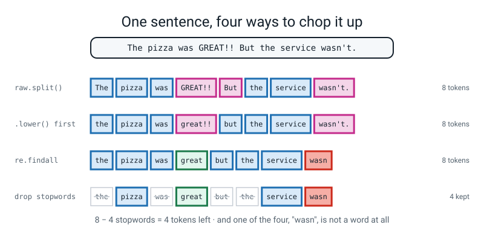
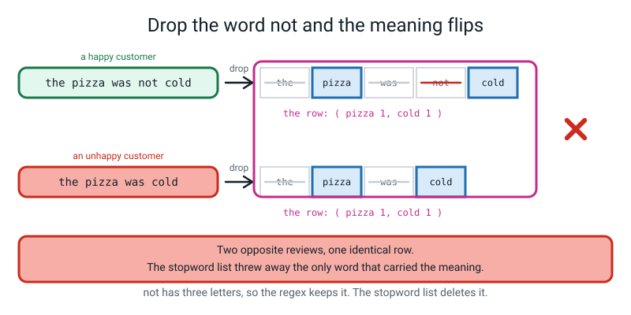
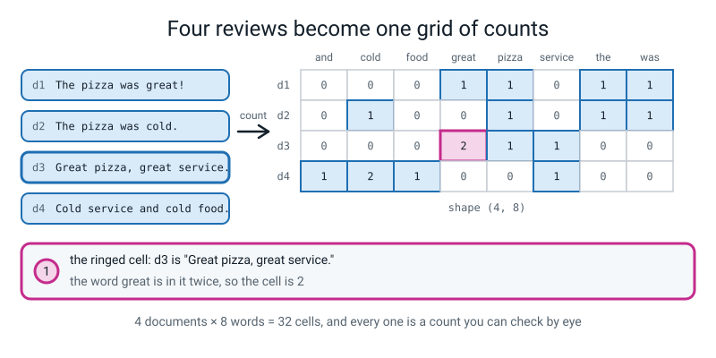
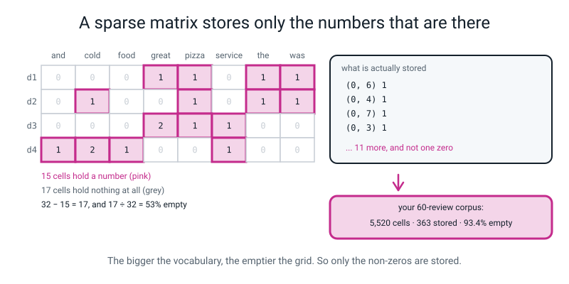
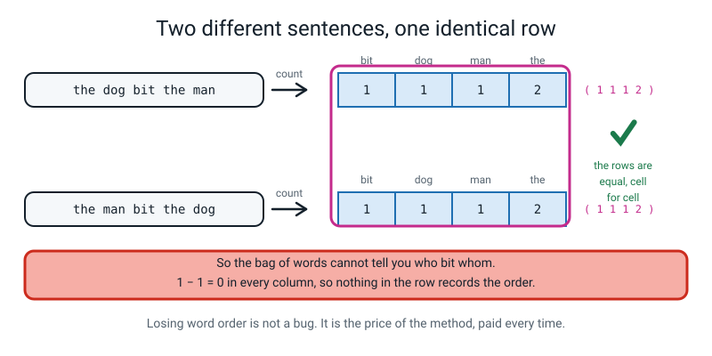
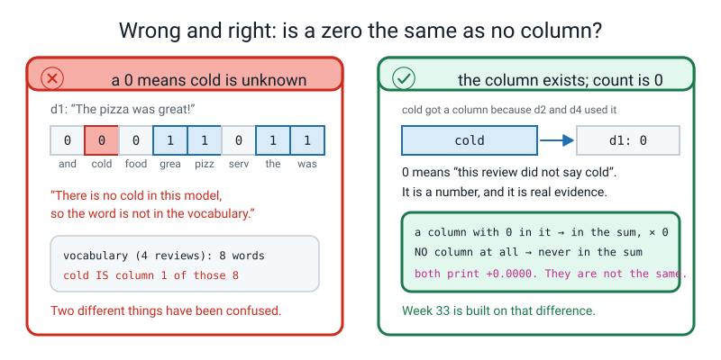
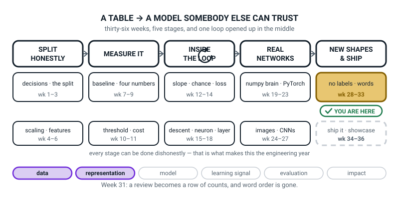
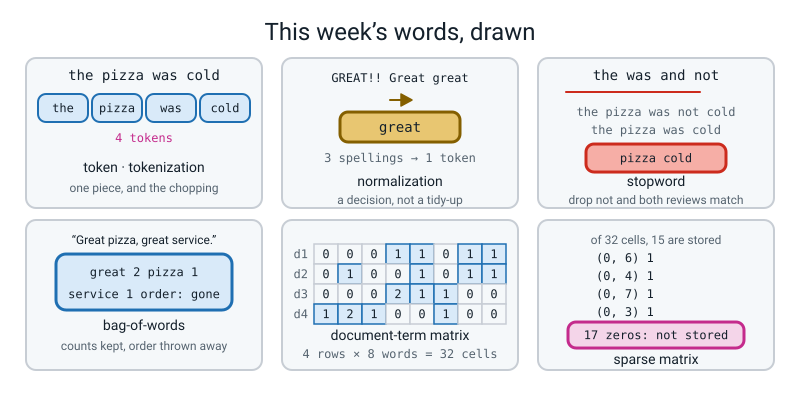

# Week 31 — Words Into Columns

[⬅ Week 30](week-30.md) · [Course Home](../README.md) · [Next ➡](week-32.md) · [Workbook](../workbook/week-31.md)

---

> ### This week in one sentence
> **A model only eats numbers, so a review becomes a row of word counts — and the moment you do that, word order is gone, and `"the dog bit the man"` and `"the man bit the dog"` come out as the identical row.**
>
> **By the end of this chapter you will be able to:**
> - **Chop a piece of text into tokens** four different ways — `.split()`, `.lower().split()`, a regular expression, and then with the common words dropped — and **list every place two of them disagree**
> - **Build a 4×8 document-term matrix by hand** for four short reviews and **check every one of the 32 cells** against `CountVectorizer`
> - **Prove that word order is gone**, with the printed line `are the two rows identical? True`
> - **Defend one normalization choice against a case where it is wrong** — starting with the sentence pair `the pizza was not cold` and `the pizza was cold`, which become the identical row
>
> **New maths:** none. This week is counting and checking. It leans on Week 4's fit/transform contract, Week 16's "print the shape", and Week 30's "a number needs a second number beside it".
>
> **New syntax:** `re.findall(r"\b\w\w+\b", text)` · `text.lower()` · `CountVectorizer()` · `vec.get_feature_names_out()`
>
> **Reading time:** about 40 minutes. **Homework:** about 60 minutes.

---

## 🪝 Start Here

Here is a review of a pizza place. One line, four words.

```text
the pizza was cold
```

You have spent thirty weeks feeding things to models. A table of pizza deliveries — distance in kilometres, minutes on the road, number of items. `load_digits()` — sixty-four pixel brightnesses per picture. `load_wine()` — thirteen chemical measurements. Every single one of them was **numbers**.

So here is the question, and it is a completely fair question with an uncomfortable answer.

**What number is `cold`?**

Not "is `cold` good or bad". **What number *is* it.** Because `LogisticRegression` will not accept the word `cold`. It wants a float, and there is no float that `cold` is.

Sit with that for ten seconds. You cannot average a sentence. You cannot scale it. You cannot subtract one review from another. Everything you have learned to do to a column of numbers, you cannot do to a string.

So somebody had to invent an answer, and the answer they invented in the 1950s is so simple it feels like cheating:

```text
the = 1     pizza = 1     was = 1     cold = 1
... and every other word in English = 0
```

**Count the words.** That is it. Forget grammar. Forget which word came first. Forget everything an English teacher ever told you about how a sentence works. **Just count.**

And now it is a row of numbers, so a model will eat it.

Two things are true about this idea and you have to hold both at once.

**It cannot possibly work.** It cannot tell `"the dog bit the man"` from `"the man bit the dog"` — same words, same counts, identical row. You will prove that yourself before the end of this chapter, and it will annoy you.

**And it ran the world.** Counting words ran spam filters and search engines for thirty years. On a small problem today — a hundred reviews, no internet, a laptop — it will still beat a system with a hundred billion numbers in it.

Holding both of those at the same time **is** this week.

---

## 🧠 The Big Idea

### 1. Tokenizing: you have to decide what a word is

Before you can count words, you have to cut the string into pieces. That has a name.

> **Token** — one unit of text. Usually a word; sometimes a punctuation mark or a piece of a word.
>
> **Tokenization** — cutting a string into tokens.

Take one messy, realistic review:

```text
The pizza was GREAT!!  But the service wasn't.
```

The obvious rule is Python's `.split()`, which cuts at every space. Eight pieces:

```text
['The', 'pizza', 'was', 'GREAT!!', 'But', 'the', 'service', "wasn't."]
```

Now read that list **the way a computer reads it** — which is to say, as eight unrelated strings with no meanings attached.

- `'The'` and `'the'` are two different tokens. To the computer they are as unrelated as `the` and `hydraulics`. **Your commonest word has just been split in half, and each half carries half the evidence.**
- `'GREAT!!'` is a different token from `'GREAT!'`, from `'Great'`, and from `'great'`. **Four spellings of one word, four separate columns, a quarter of the evidence each.**

That is why you tidy up first. And tidying up has a name too.

> **Normalization** — tidying tokens so that different spellings of the same thing become the same token.

The cheapest normalization is `.lower()`:

```text
['the', 'pizza', 'was', 'great!!', 'but', 'the', 'service', "wasn't."]
```

`The` and `the` are now one token. But `great!!` still drags its exclamation marks along. So instead of cutting at spaces, go and **fetch the runs of letters and digits**:

```text
['the', 'pizza', 'was', 'great', 'but', 'the', 'service', 'wasn']
```

Clean — and **look at the last token.** `wasn't` has become `wasn`. The apostrophe split the word in two and the leftover `t` was thrown away for being one letter long.

That matters more than it looks. `wasn't` was the **negative**. It was the single word that made the second half of the review a complaint. It is now a nonsense token called `wasn`, and the complaint has evaporated.


*Figure 31.1 — One sentence, four ways to chop it up. 8 tokens, then 8, then 8, then 4 once the stopwords go. And `wasn` is not a word at all.*

### 2. The regular expression, read out in English

Here is the one line of pattern-matching you learn this year.

```python
re.findall(r"\b\w\w+\b", text)
```

**You do not need to learn regular expressions.** You need to know what these five pieces do, and then you need to be able to read the whole thing out loud in English.

| Piece | What it means, in plain English |
|---|---|
| `re` | a toolbox that comes with Python for finding patterns in text. Nothing to install. |
| `findall` | "give me a list of every place this pattern matches" |
| `r"..."` | a **raw string**. The `r` tells Python: *do not touch the backslashes, hand them to the pattern exactly as I typed them.* |
| `\w` | one **w**ord character — a letter, a digit, or an underscore. **Not** a space, **not** punctuation. |
| `\w\w+` | one word character, then **one or more** more. So: **two characters or longer.** |
| `\b` | a **b**oundary — the edge of a word, so the pattern cannot grab half of a longer word. |

Out loud, the whole thing is: **"find me every run of two or more letters or digits."**

> **⚠️ Watch out:** `\w\w+` means **two or more**, so **every single-letter token is thrown away in silence.** In the sixty-review corpus, `i` and `a` both vanish — `print("i" in set(vocab))` prints `False`. That is not a bug in scikit-learn; it is `CountVectorizer`'s documented default. It is usually harmless. On maths text, where every `x` disappears, it is a disaster.

> **🐞 If you see this error:** you will not see an error. If you forget the `r` — `re.findall("\b\w\w+\b", text)` — Python reads `\b` as the **backspace character**, the pattern hunts for a literal backspace, finds none, and honestly hands you back `[]`. No error, no warning, no red. **An empty list from a pattern is almost always a missing `r`.**

### 3. Normalization is a set of decisions, and every one can be wrong

Here is the part of this week that separates "I ran the code" from "I understand what I did". Every tidying step helps in some situations and destroys the data in others.

| Normalization | What it does | When it is right | When it is **wrong** |
|---|---|---|---|
| **Lowercasing** | `Great → great` | almost always, for topic or sentiment | `US` the country versus `us` the pronoun; `Apple` the company versus `apple` the fruit; ALL-CAPS SHOUTING is real evidence in abuse detection |
| **Strip punctuation** | `great!! → great` | most classification jobs | `!!!` and `?!` carry feeling; `$4.99` becomes `4` and `99`; `:-(` disappears completely, and on a sentiment job that was the clearest signal in the sentence |
| **Remove stopwords** | drop `the, is, a, of` | topic classification, search | **negation.** Dropping `not` is a disaster. Also authorship: the little words *are* the fingerprint. |
| **Stemming** | `running, ran, runs → run` | when you have very little data | `better → good` loses the intensity; a keen stemmer turns `university` and `universe` both into `univers` |

> **Stopword** — an extremely common word (`the`, `is`, `and`) that carries almost no information about the topic on its own.

**Now the killer case.** Take a stopword list containing `the`, `was` and `not`. That is a completely ordinary list; `not` is on most of them. Tidy these two reviews:

```text
'the pizza was not cold' -> ['pizza', 'cold']
'the pizza was cold'     -> ['pizza', 'cold']
```

**Identical.** One happy customer, one furious customer, and after your tidying they are the same row of numbers: `pizza 1, cold 1`.


*Figure 31.5 — Drop the word `not` and the meaning flips. Two opposite reviews, one identical row, because the stopword list deleted the only word that carried the meaning.*

🍕 **The analogy.** Normalizing is **tidying a room before you count what is in it.** Putting all the pens in one drawer genuinely makes counting easier. Throwing out everything small makes it easier still — right up to the moment you realise you have thrown out the house keys.

**`not` is a house key.** And nobody can hand you a list of which words are house keys, because it depends on what you are doing. If you want to know what a review is *about*, `not` is noise. If you want to know how the writer *felt*, `not` is the whole thing.

### 4. The document-term matrix: one row per review, one column per word

> **Bag-of-words** — representing a document as a list of word counts, ignoring order entirely. A *bag*, because you tipped all the words in and shook it.
>
> **Document-term matrix** — a table with **one row per document** and **one column per vocabulary word**. The cell at row *i*, column *j* is how many times word *j* appears in document *i*.

The four reviews this week is built on:

```text
d1: "The pizza was great!"
d2: "The pizza was cold."
d3: "Great pizza, great service."
d4: "Cold service and cold food."
```

**Step one — the vocabulary.** Tokenize all four, gather every different token, sort them alphabetically. **Eight** terms:

```text
and, cold, food, great, pizza, service, the, was
```

**Step two — fill in the grid.** Eight columns, four rows, 32 cells:

| | and | cold | food | great | pizza | service | the | was |
|---|---:|---:|---:|---:|---:|---:|---:|---:|
| **d1** | 0 | 0 | 0 | 1 | 1 | 0 | 1 | 1 |
| **d2** | 0 | 1 | 0 | 0 | 1 | 0 | 1 | 1 |
| **d3** | 0 | 0 | 0 | **2** | 1 | 1 | 0 | 0 |
| **d4** | 1 | **2** | 1 | 0 | 0 | 1 | 0 | 0 |

**Only two cells are not a 1 or a 0, and they are the two to stare at.** d3 is `"Great pizza, great service."` and `great` is in it **twice**, so that cell is 2. d4 has `cold` twice. Every other cell is a 1 where the word is present and a 0 where it is not — which is exactly why a whole class can check all 32 cells in eight minutes.


*Figure 31.2 — Four reviews become one grid of counts. 4 documents × 8 words = 32 cells, and every one is a count you can check by eye.*

**And that grid is now an ordinary numeric feature matrix.** It has a shape — `(4, 8)` — exactly like Week 1's `X`. Every model you own will eat it without complaint. **That is the whole trick, and it is why this week exists.**

A useful self-check: **the row totals must equal the number of tokens in the review.** d1, d2 and d3 have 4 tokens each; d4 has 5. So the rows sum to **4, 4, 4, 5**. If yours do not, you have miscounted and you can find it yourself.

### 5. Sparsity: nearly all of the grid is empty

Count the zeros in that table. **Seventeen of the 32 cells.** More than half the grid is nothing, on a four-document corpus with an eight-word vocabulary.

Now scale up to the sixty reviews you typed:

```text
documents        : 60
vocabulary size  : 92
cells in the grid: 5520
non-zero cells   : 363
zero cells       : 5157 = 93.4% of the grid
```

**Ninety-three point four per cent empty.** And here is the part that should bother you: **it gets emptier as you add reviews, not fuller.** Every new review brings a few new words, and every new word adds a whole column of zeros for every review that came before it.

> **Sparse matrix** — a grid stored as a list of *(row, column, value)* triples for the non-zero cells only. Scikit-learn's vectorizers hand you one of these by default, which is why `print(X)` shows coordinates instead of a table.

This is what `print(counts)` actually shows — the first four of the fifteen things it keeps:

```text
  (0, 6)	1
  (0, 4)	1
  (0, 7)	1
  (0, 3)	1
```

Read `(0, 6) 1` as: **"row 0, column 6, holds 1."** Row 0 is d1, column 6 is `the`, and d1 contains `the` once. **And nowhere in that list is there a line saying "row 0 column 0 holds 0", because storing a zero would be storing nothing.**


*Figure 31.4 — A sparse matrix stores only the numbers that are there. 32 − 15 = 17 empty cells on the toy corpus; 5,520 cells and 363 stored on your own 60.*

🍕 **The analogy.** A bag-of-words row is **a supermarket receipt with a line for every product the shop sells.** Yours says `milk: 2, bread: 1` — and forty thousand other lines all say zero. **Obviously you do not print those.** You print the two lines that matter. That is a sparse matrix.

A real corpus — twenty thousand news articles, fifty thousand different words — is a **billion** cells with maybe a million numbers in it. Stored as a grid that is about eight gigabytes. Stored as a list of the non-zeros it is about eight megabytes. **That is the difference between "runs on your laptop" and "does not run at all."**

The one practical consequence: **to see an actual grid you have to ask for one, with `.toarray()`.** Hand a sparse matrix straight to `pd.DataFrame` and you get a confusing `ValueError`. It is in 🐞 below, and you will meet it.

### 6. What counting words throws away, written down honestly

Keep this list. Week 32 tries to fix the second problem and fails. Week 33 measures exactly what the first one costs.

| Thrown away | Example | Why the row cannot tell |
|---|---|---|
| **Word order** | `"the dog bit the man"` vs `"the man bit the dog"` | identical rows, cell for cell |
| **Negation scope** | `"good"` vs `"not good"` | both rows contain `good` |
| **Which word modifies which** | `"cheap phone, great camera"` vs `"great phone, cheap camera"` | identical rows |
| **Grammar entirely** | — | there is no place in a row of counts to put it |

The first row of that table takes eleven seconds to prove and is completely unarguable:

```text
vocabulary: ['bit' 'dog' 'man' 'the']
             bit  dog  man  the
dog bit man    1    1    1    2
man bit dog    1    1    1    2
are the two rows identical? True
```


*Figure 31.3 — Two different sentences, one identical row. Subtract them and every column gives 0, so nothing anywhere in the row records the order.*

**And be precise about what kind of problem that is.** It is **not a bug.** Nobody is going to fix it in a later version of scikit-learn. It is not a limitation of `CountVectorizer`; it is a limitation of **counting words**, and it applies to every bag-of-words model ever built.

**It is the price of the method, and you pay it every single time you use it. The skill is knowing exactly what you paid.**

---

## 🔁 The Idea From Last Week, Used Harder

There is no new maths this week. Instead, three things you already own get pointed at text, and all three behave slightly differently when they get there.

### Twist one — Week 4's transformer, except the learned thing is a list of words

`CountVectorizer` is a **transformer**, exactly like `StandardScaler` from Week 4. Same three methods, same contract, same discipline:

| Method | `StandardScaler` | `CountVectorizer` |
|---|---|---|
| `.fit(X)` | learns the mean and the spread of every column | **learns the vocabulary** — which words get columns, and in what order |
| `.transform(X)` | subtracts and divides, using what it learned | **counts**, using the vocabulary it already has |
| `.fit_transform(X)` | both, **training rows only** | both, **training documents only** |

**The learned thing is a list of words.** That is the only new part. And Week 6's leakage rule applies exactly as before: `fit_transform` on the training documents, `transform` on everything else. Fit on all of your documents and you have let the test set choose your columns.

**Which means a word that only ever appears in a held-out review has no column at all.** Not a zero — *nothing*. Hold that thought; in Week 33 it is the whole lesson.

### Twist two — Week 16's "print the shape", now on a table made of text

Week 16 gave you the rule: **when something is confusing, print the shape.** It has never been more useful than it is here, because with text you cannot see what you have got.

```python
print("shape      :", counts.shape)
print("matrix type:", type(counts).__name__)
print("stored     :", counts.nnz)
```

```text
shape      : (4, 8)
matrix type: csr_matrix
stored     : 15
```

**Three lines and you know everything.** Four rows, so four documents. Eight columns, so eight words. `csr_matrix`, so it is sparse and you will need `.toarray()`. Fifteen stored, so seventeen cells are missing on purpose.

### Twist three — Week 30's rule: a number needs a second number beside it

Last week the rule was that `0.2849` means nothing until `0.0776` is written next to it. The same rule applies to sparsity, and it is why `363` on its own is useless.

```text
non-zero cells   : 363
cells in the grid: 5520          <- the second number
93.4% empty
```

**`363` is not a big number or a small number until you know it is 363 out of 5,520.** And `60 × 92 = 5,520` is arithmetic you should do on paper before you print it, because it is the check that your shape is what you think it is.

---

## 💻 Type This

Two files, in the same folder. Neither downloads anything.

### Step 0 — `reviews.py`, the corpus you typed yourself

This is data and nothing else, and it is the file everything else imports. **Every printed number in this chapter came from running the code against exactly these sixty reviews**, so if you typed your own, expect different numbers and the same *shapes*.

```python
"""reviews.py - the corpus, typed by hand. No downloads, no data files."""

POS = [
    "the pizza arrived hot and the base was perfect",
    "quick delivery and a friendly driver",
    "delicious food and a generous portion",
    "the salad was fresh and crisp",
    "great value and a lovely warm welcome",
    "excellent service from a polite driver",
    "the chips were hot and crisp",
    "a tasty curry and a generous helping of rice",
    "fresh bread and a delicious dip",
    "the delivery was quick and the food was hot",
    "lovely staff and a perfect order",
    "friendly, polite and on time",
    "the sauce was tasty and the cheese was lovely",
    "generous portions and excellent prices",
    "the burger was hot and the salad was fresh",
    "delicious dessert and a friendly note in the bag",
    "a perfect meal and a quick refund on the drink",
    "great chips, crisp and properly salted",
    "the coffee was hot and the cake was fresh",
    "polite driver and a warm, tasty pizza",
    "excellent noodles with fresh vegetables",
    "a lovely evening and a delicious meal",
    "quick, friendly and generous",
    "the fish was fresh and the batter was crisp",
    "perfect timing and a hot bag",
    "tasty wrap, generous salad and a great price",
    "the naan was warm and lovely",
    "friendly manager and a quick, fair refund",
    "a delicious pizza, hot and perfect",
    "excellent, fresh food and a polite driver",
]

NEG = [
    "the pizza arrived cold and the base was soggy",
    "slow delivery and a rude driver",
    "awful food and a mean portion",
    "the salad was stale and limp",
    "poor value and a cold, rude welcome",
    "terrible service from a rude driver",
    "the chips were cold and soggy",
    "an awful curry and a mean helping of rice",
    "stale bread and a greasy dip",
    "the delivery was slow and the food was cold",
    "rude staff and a wrong order",
    "rude, slow and very late",
    "the sauce was bitter and the cheese was greasy",
    "mean portions and terrible prices",
    "the burger was cold and the salad was limp",
    "awful dessert and a rude note in the bag",
    "a wrong meal and a slow refund on the drink",
    "soggy chips, cold and completely unsalted",
    "the coffee was cold and the cake was stale",
    "rude driver and a cold, greasy pizza",
    "terrible noodles with limp vegetables",
    "i would not order from here again",
    "slow, rude and mean",
    "the fish was stale and the batter was soggy",
    "late again and a cold bag",
    "greasy wrap, limp salad and a terrible price",
    "the naan was cold and stale",
    "rude manager and a slow, unfair refund",
    "an awful pizza, cold and soggy",
    "terrible, stale food and a rude driver",
]

CORPUS_60 = POS + NEG
LABELS_60 = [1] * 30 + [0] * 30
```

### Step 1 — four tokenizers on one sentence

New file, `bag.py`, same folder.

```python
import re

raw = "The pizza was GREAT!!  But the service wasn't."
print("raw text          :", raw)
naive = raw.split()
print("raw.split()   (%2d):" % len(naive), naive)
lowered = raw.lower().split()
print("lower + split (%2d):" % len(lowered), lowered)
regex = re.findall(r"\b\w\w+\b", raw.lower())
print("lower + regex (%2d):" % len(regex), regex)
STOP = {"the", "but", "was", "and", "of", "to", "is"}
kept = [t for t in regex if t not in STOP]
print("minus stopwords(%2d):" % len(kept), kept)
```

**What each new line does.**

- `raw.split()` cuts at every run of whitespace. It is the honest stand-in for "how a person chunks a sentence".
- `raw.lower()` hands back a **new** string with every capital turned small. It does not change `raw`.
- `re.findall(r"\b\w\w+\b", ...)` fetches every run of two or more letters or digits. **The `r` is not decoration.**
- `"%2d" % n` prints the number in a two-character-wide slot so the four lists line up under each other.

```text
raw text          : The pizza was GREAT!!  But the service wasn't.
raw.split()   ( 8): ['The', 'pizza', 'was', 'GREAT!!', 'But', 'the', 'service', "wasn't."]
lower + split ( 8): ['the', 'pizza', 'was', 'great!!', 'but', 'the', 'service', "wasn't."]
lower + regex ( 8): ['the', 'pizza', 'was', 'great', 'but', 'the', 'service', 'wasn']
minus stopwords( 4): ['pizza', 'great', 'service', 'wasn']
```

**Read the last token of each line: `wasn't.`, then `wasn't.`, then `wasn`.** By line three the negation has become a nonsense word.

### Step 2 — the counter, and what it learned

```python
import pandas as pd
from sklearn.feature_extraction.text import CountVectorizer

docs = ["The pizza was great!",
        "The pizza was cold.",
        "Great pizza, great service.",
        "Cold service and cold food."]

cv = CountVectorizer()
counts = cv.fit_transform(docs)
terms = cv.get_feature_names_out()
print("vocabulary :", terms)
print("shape      :", counts.shape)
print("matrix type:", type(counts).__name__)
print("stored     :", counts.nnz, "non-zero cells of", 4 * 8)
```

- `CountVectorizer()` with no arguments has **already** decided to lowercase your text and to throw away every one-letter word. Its defaults are decisions somebody else made for you.
- `cv.get_feature_names_out()` hands back the vocabulary **in column order**. It is the only way to know what column 6 means — a matrix of numbers does not remember its column names unless you ask.
- `counts.nnz` is "number of non-zeros": how many cells are actually stored.

```text
vocabulary : ['and' 'cold' 'food' 'great' 'pizza' 'service' 'the' 'was']
shape      : (4, 8)
matrix type: csr_matrix
stored     : 15 non-zero cells of 32
```

**Alphabetical, and `CountVectorizer` chose that, not you.** Which means **column 3 means `great` and nothing else**, for the rest of this term.

> **⚠️ Watch out:** `fit_transform` wants **a list of documents**, not one document. `cv.fit_transform("the pizza was great")` raises an error — see 🐞 Break 1. Always a list, even for one review.

### Step 3 — the grid, and why `.toarray()` has to exist

```python
print(pd.DataFrame(counts.toarray(), index=["d1", "d2", "d3", "d4"],
                   columns=terms))
```

`.toarray()` builds the full rectangle of numbers, zeros included. **Never call it on a real corpus with fifty thousand columns** — that is where eight megabytes becomes eight gigabytes. On a 4 × 8 grid it is free.

```text
    and  cold  food  great  pizza  service  the  was
d1    0     0     0      1      1        0    1    1
d2    0     1     0      0      1        0    1    1
d3    0     0     0      2      1        1    0    0
d4    1     2     1      0      0        1    0    0
```

**That is the grid you built by hand.** Check the row totals: 4, 4, 4, 5.

### Step 4 — what the sparse matrix is really holding

```python
for line in str(counts).splitlines()[:4]:
    print(line)
print("   ... 11 more, and NOT ONE of the 17 zeros")
```

```text
  (0, 6)	1
  (0, 4)	1
  (0, 7)	1
  (0, 3)	1
   ... 11 more, and NOT ONE of the 17 zeros
```

Fifteen lines for thirty-two cells. **The other seventeen do not exist as far as the computer is concerned.**

### Step 5 — the order demo

```python
pair = ["the dog bit the man", "the man bit the dog"]
cv2 = CountVectorizer()
P = cv2.fit_transform(pair).toarray()
print("vocabulary:", cv2.get_feature_names_out())
print(pd.DataFrame(P, index=["dog bit man", "man bit dog"],
                   columns=cv2.get_feature_names_out()))
print("are the two rows identical?", bool((P[0] == P[1]).all()))
```

`(P[0] == P[1])` compares the two rows cell by cell and gives four True/False values; `.all()` asks whether every one of them is True. `bool(...)` turns numpy's answer into a plain Python `True`.

```text
vocabulary: ['bit' 'dog' 'man' 'the']
             bit  dog  man  the
dog bit man    1    1    1    2
man bit dog    1    1    1    2
are the two rows identical? True
```

**`the` is a 2 because it appears twice in each sentence.** Subtract one row from the other and you get zero in all four columns. **There is nowhere in either row that records who did the biting.**

### Step 6 — your own sixty reviews

```python
import numpy as np
from reviews import CORPUS_60

cv3 = CountVectorizer()
X = cv3.fit_transform(CORPUS_60)
vocab = cv3.get_feature_names_out()
cells = X.shape[0] * X.shape[1]
print("documents        :", X.shape[0])
print("vocabulary size  :", X.shape[1])
print("cells in the grid:", cells)
print("non-zero cells   :", X.nnz)
print("zero cells       :", cells - X.nnz,
      "= %.1f%% of the grid" % (100 * (cells - X.nnz) / cells))

total = np.asarray(X.sum(axis=0)).ravel()
order = np.argsort(total)[::-1]
print()
print("the ten commonest words in the corpus:")
for i in order[:10]:
    print("   %-10s %d" % (vocab[i], total[i]))
```

- `X.sum(axis=0)` adds **down** each column, giving the total count of every word across all sixty reviews. `np.asarray(...).ravel()` flattens the result from a `(1, 92)` grid into a flat list of 92 numbers.
- `np.argsort(total)[::-1]` is Week 19's move: sort the **positions**, then read them backwards, biggest first.

```text
documents        : 60
vocabulary size  : 92
cells in the grid: 5520
non-zero cells   : 363
zero cells       : 5157 = 93.4% of the grid

the ten commonest words in the corpus:
   and        55
   the        34
   was        26
   cold       11
   rude       10
   driver     8
   fresh      7
   hot        7
   pizza      6
   food       6
```

**Read those ten and then read them again.** `and` fifty-five times, `the` thirty-four, `was` twenty-six. Then `cold` eleven and `rude` ten.

**Right now the grid treats `and` and `rude` exactly the same way: a number in a column.** And `and` tells you absolutely nothing about a review, while `rude` tells you everything. **That is next week's entire lesson, and you have just found it yourself.**

### The complete `bag.py`

```python
"""bag.py - Week 31: a sentence becomes a row of numbers."""
import re

import numpy as np
import pandas as pd
from sklearn.feature_extraction.text import CountVectorizer

from reviews import CORPUS_60

# ---------- 1. four ways to chop up one sentence ----------
raw = "The pizza was GREAT!!  But the service wasn't."

print("--- one sentence, four tokenizers ---")
print("raw text          :", raw)
naive = raw.split()
print("raw.split()   (%2d):" % len(naive), naive)
lowered = raw.lower().split()
print("lower + split (%2d):" % len(lowered), lowered)
regex = re.findall(r"\b\w\w+\b", raw.lower())
print("lower + regex (%2d):" % len(regex), regex)
STOP = {"the", "but", "was", "and", "of", "to", "is"}
kept = [t for t in regex if t not in STOP]
print("minus stopwords(%2d):" % len(kept), kept)

# ---------- 2. the four whiteboard reviews ----------
docs = ["The pizza was great!",
        "The pizza was cold.",
        "Great pizza, great service.",
        "Cold service and cold food."]

cv = CountVectorizer()
counts = cv.fit_transform(docs)
terms = cv.get_feature_names_out()

print()
print("--- the document-term matrix ---")
print("vocabulary :", terms)
print("shape      :", counts.shape, "=", counts.shape[0], "documents x",
      counts.shape[1], "words")
print("matrix type:", type(counts).__name__)
print("stored     :", counts.nnz, "non-zero cells of",
      counts.shape[0] * counts.shape[1])
print()
print(pd.DataFrame(counts.toarray(), index=["d1", "d2", "d3", "d4"],
                   columns=terms))

# ---------- 3. what a sparse matrix actually holds ----------
print()
print("--- the first four things the sparse matrix stores ---")
for line in str(counts).splitlines()[:4]:
    print(line)
print("   ... 11 more, and NOT ONE of the 17 zeros")

# ---------- 4. the order demo ----------
pair = ["the dog bit the man", "the man bit the dog"]
cv2 = CountVectorizer()
P = cv2.fit_transform(pair).toarray()
print()
print("--- the order demo ---")
print("vocabulary:", cv2.get_feature_names_out())
print(pd.DataFrame(P, index=["dog bit man", "man bit dog"],
                   columns=cv2.get_feature_names_out()))
print("are the two rows identical?", bool((P[0] == P[1]).all()))

# ---------- 5. the sixty reviews you typed ----------
cv3 = CountVectorizer()
X = cv3.fit_transform(CORPUS_60)
vocab = cv3.get_feature_names_out()
cells = X.shape[0] * X.shape[1]
print()
print("--- your 60-review corpus ---")
print("documents        :", X.shape[0])
print("vocabulary size  :", X.shape[1])
print("cells in the grid:", cells)
print("non-zero cells   :", X.nnz)
print("zero cells       :", cells - X.nnz,
      "= %.1f%% of the grid" % (100 * (cells - X.nnz) / cells))

total = np.asarray(X.sum(axis=0)).ravel()
order = np.argsort(total)[::-1]
print()
print("the ten commonest words in the corpus:")
for i in order[:10]:
    print("   %-10s %d" % (vocab[i], total[i]))

print()
print("is 'i' in the vocabulary?  ", "i" in set(vocab))
print("is 'a' in the vocabulary?  ", "a" in set(vocab))
print("words of one letter kept:  ",
      sum(1 for w in vocab if len(w) == 1))
```

The last three lines print:

```text
is 'i' in the vocabulary?   False
is 'a' in the vocabulary?   False
words of one letter kept:   0
```

**Runtime: about 1 second.** There is no training anywhere in this file. If it takes more than five seconds, something is wrong with your install, not with your code. **The slow part of this week is you, counting 32 cells by hand, and that is deliberate.**

---

## 🔍 Worked Examples

### Worked Example 1 — Three song titles, a 3×10 grid

**The job:** you want to sort songs into moods from their titles. Three titles, and you need a feature matrix.

```python
songs = ["Dancing in the summer rain",
         "Summer nights, summer days",
         "Rain on the empty street"]
cv = CountVectorizer()
S = cv.fit_transform(songs)
print("vocabulary:", cv.get_feature_names_out())
print("shape     :", S.shape, " stored:", S.nnz, "of", S.shape[0] * S.shape[1])
print(pd.DataFrame(S.toarray(), index=["s1", "s2", "s3"],
                   columns=cv.get_feature_names_out()))
print("row totals   :", S.toarray().sum(axis=1))
print("column totals:", S.toarray().sum(axis=0))
```

```text
vocabulary: ['dancing' 'days' 'empty' 'in' 'nights' 'on' 'rain' 'street' 'summer'
 'the']
shape     : (3, 10)  stored: 13 of 30
    dancing  days  empty  in  nights  on  rain  street  summer  the
s1        1     0      0   1       0   0     1       0       1    1
s2        0     1      0   0       1   0     0       0       2    0
s3        0     0      1   0       0   1     1       1       0    1
row totals   : [5 4 5]
column totals: [1 1 1 1 1 1 2 1 3 2]
```

**Three things to check, in order.**

1. **Ten columns for three short titles.** Count the distinct words yourself: `dancing, in, the, summer, rain` from s1, then `nights, days` are new in s2 (`summer` is not), then `on, empty, street` are new in s3 (`rain` and `the` are not). 5 + 2 + 3 = **10.** ✓
2. **s2's `summer` cell is 2** — `"Summer nights, summer days"` — and s2's row total is 4, which is right because s2 has four tokens with one of them repeated. Row totals `[5 4 5]` match the token counts of the three titles. ✓
3. **17 of the 30 cells are empty** — 13 stored — and this is three titles. **The sparsity was already 57% before the corpus got interesting.**

**And the thing to notice:** `summer` has a column total of 3, the biggest in the corpus, so on counts alone it is the most "important" word here. That is fine for these three titles. Ask yourself what happens when you add a thousand more and the biggest column total is `the`.

### Worked Example 2 — Adding a fifth review, and a review made of unknown words

**Part A. Predict before you run.** You add `"The service was great!"` to the four reviews. **Does the shape become `(5, 8)` or `(5, 9)`?**

Write your answer down. Now:

```python
five = docs + ["The service was great!"]
cv5 = CountVectorizer()
F = cv5.fit_transform(five)
print("vocabulary:", cv5.get_feature_names_out())
print("shape     :", F.shape)
print(pd.DataFrame(F.toarray(), index=["d1", "d2", "d3", "d4", "d5"],
                   columns=cv5.get_feature_names_out()))
cells = F.shape[0] * F.shape[1]
print("cells:", cells, " stored:", F.nnz, " empty: %.1f%%" % (100 * (cells - F.nnz) / cells))
```

```text
vocabulary: ['and' 'cold' 'food' 'great' 'pizza' 'service' 'the' 'was']
shape     : (5, 8)
    and  cold  food  great  pizza  service  the  was
d1    0     0     0      1      1        0    1    1
d2    0     1     0      0      1        0    1    1
d3    0     0     0      2      1        1    0    0
d4    1     2     1      0      0        1    0    0
d5    0     0     0      1      0        1    1    1
cells: 40  stored: 19  empty: 52.5%
```

**`(5, 8)`.** A new document only adds a **row**. It adds a **column** only if it contains a word nobody has used before, and `the`, `service`, `was` and `great` were all already there. **Predicting that correctly is a real piece of understanding, not a guess.**

**Part B. Now the alarming one.** The vocabulary came from the four original reviews. What happens to a review that shares no words with any of them?

```python
cv4 = CountVectorizer().fit(docs)
new = cv4.transform(["nobody answered my phone calls"])
print("unknown review row:", new.toarray()[0], " stored:", new.nnz)
```

```text
unknown review row: [0 0 0 0 0 0 0 0]  stored: 0
```

**Eight zeros, and nothing stored at all.** Five perfectly clear English words went in and the row that came out is indistinguishable from an empty review.

**And here is the part that should worry you: no error was raised.** A model handed that row would still produce a confident prediction, based on absolutely nothing. `transform` **never** invents a column for an unknown word; it silently drops it. **In Week 33 that exact behaviour is going to make a model 98% certain about a review it read backwards.**

### Worked Example 3 — The regex meets real internet text

**The job:** you are tokenizing actual reviews off a website, not tidy sentences.

```python
s = "WOW!! Best 5.50 milkshake I've EVER had :-D"
print("raw.split()   (%d):" % len(s.split()), s.split())
r = re.findall(r"\b\w\w+\b", s.lower())
print("lower + regex (%d):" % len(r), r)
```

```text
raw.split()   (8): ['WOW!!', 'Best', '5.50', 'milkshake', "I've", 'EVER', 'had', ':-D']
lower + regex (7): ['wow', 'best', '50', 'milkshake', 've', 'ever', 'had']
```

**Eight tokens became seven. Five separate things changed.** Go through them one at a time, and give each one a verdict — *which version is right, and for what job?*

| What changed | Verdict |
|---|---|
| `WOW!!` → `wow`, and `EVER` → `ever` | **Fine for topic. Wrong for anything that cares about intensity.** The capitals and the `!!` were the enthusiasm and they are gone. |
| `5.50` → `50`, and the `5` is **dropped entirely** | **Wrong.** The price was five pounds fifty. The regex kept `50`, threw away `5` for being one character, and lost the decimal point. The surviving number is not just imprecise, it is *misleading*. |
| `I've` → `ve` | **Wrong, and sneaky.** `ve` is not a word, and every contraction in your corpus will now produce one of these nonsense tokens: `ve`, `ll`, `re`, `don`, `wasn`. |
| `:-D` → **nothing at all** | **Fatal for sentiment.** That emoticon was the single clearest signal in the sentence, and it is not in the data any more. Not as a zero — it does not exist. |
| `had` and `best` survive unchanged | **Correct**, and worth saying, because most tokens *are* fine. |

**The general skill being practised here** is not "the regex is bad". It is: **for every disagreement, say which version you want and for which job.** `"the regex is wrong"` is worth nothing. `"the regex is wrong for sentiment because it deleted the emoticon, and fine for topic because the topic is milkshakes either way"` is worth everything.

---

## 🐞 When It Breaks

Every message below came from actually running a broken version of this week's code. **Errors are curriculum here, not failure.**

### Break 1 — one document or many?

```python
CountVectorizer().fit_transform("the pizza was great")
```

```text
Traceback (most recent call last):
  File "err31.py", line 7, in <module>
    CountVectorizer().fit_transform("the pizza was great")
  File ".../sklearn/feature_extraction/text.py", line 1354, in fit_transform
    raise ValueError(
ValueError: Iterable over raw text documents expected, string object received.
```

**What it means.** "You gave me one document. I wanted a collection of them."

**Why it even matters.** To `CountVectorizer`, one document means one row of the answer. If you hand it a bare string, should it make one row — or one row per *letter*? **It refuses to guess, and it is right to refuse.**

**The fix.** Square brackets. `CountVectorizer().fit_transform(["the pizza was great"])`. **Always a list, even for a single review.**

### Break 2 — a sparse matrix is not a grid

```python
print(pd.DataFrame(counts, index=["d1", "d2", "d3", "d4"], columns=terms))
```

```text
Traceback (most recent call last):
  File "err31.py", line 14, in <module>
    print(pd.DataFrame(counts, index=["d1","d2","d3","d4"], columns=cv.get_feature_names_out()))
  File ".../pandas/core/internals/construction.py", line 420, in _check_values_indices_shape_match
    raise ValueError(f"Shape of passed values is {passed}, indices imply {implied}")
ValueError: Shape of passed values is (4, 1), indices imply (4, 8)
```

**What it means.** "I can see four rows and **one** column. You promised me eight column names."

**Why one?** Because `counts` is not a grid. It is a `csr_matrix`, and pandas cannot see inside it — it looks like a single object per row.

**The fix.** `pd.DataFrame(counts.toarray(), ...)`. **A sparse matrix is not a grid until you ask it to become one.**

### Break 3 — no error at all, and an empty list

```python
print("lower + regex :", re.findall("\b\w\w+\b", raw.lower()))
```

```text
lower + regex : []
```

**No traceback. No warning. No red. An empty list.**

**What happened.** Without the `r`, Python looks at `\b` and says *"that is the backspace character"* — the thing the backspace key sends. So the pattern went hunting for a literal backspace character inside the review, found none, and honestly reported none.

**The fix.** `r"\b\w\w+\b"`. **One letter, and no error if you leave it out.** This is the worst kind of bug there is: if it were line 4 of a two-hundred-line program you could spend an hour looking in the wrong place. **Put it in your Bug Log with the alarm: *an empty list from a pattern is almost always a missing `r`.***

### Two more you will meet, with no traceback needed

| What you did | What you get | The fix |
|---|---|---|
| `cv.get_feature_names_out()` **before** any `fit` | `sklearn.exceptions.NotFittedError: Vocabulary not fitted or provided` | `cv.fit(docs)` first. **The vocabulary is the learned thing, and there is nothing to report before it is learned.** |
| `cv.fit_transform([d.lower().split() for d in docs])` — tokenizing *before* handing it over | `AttributeError: 'list' object has no attribute 'lower'` | Hand it the **raw strings**. It does its own lowercasing and its own tokenizing. **Doing the job twice breaks it.** |

---

## 🎲 What We Did In Class

Two activities. If you missed the lesson, both work perfectly at a kitchen table with squared paper and two coloured pens.

### Part A — The Thirty-Two Cells (12 minutes)

You need squared paper, landscape, and **two pens of different colours.**

**1. Rule the grid.** Eight columns, four rows, headings in the order `CountVectorizer` chose:

```text
        and  cold  food  great  pizza  service  the  was
  d1
  d2
  d3
  d4
```

**2. Fill in all thirty-two cells, in pen.** One rule, and it is not negotiable:

> **Every cell is: how many times does this word appear in this review? If it does not appear, write 0. Do not leave it blank.**

A blank is not a number. **The computer does not have blanks.**

**The cell the whole room argued about** was d3's `great`. The review is `"Great pizza, great service."` The argument is whether a repeated word counts twice. **It does. That cell is 2.** That argument was the most useful ninety seconds of the lesson.

**Self-check before you go any further:** write the row totals down the side. They must be **4, 4, 4, 5**, because that is how many tokens are in each review. If a row total is wrong, that row has a miscount in it and **you can find it yourself without being told which cell.**

**3. Second pass, in the other colour.** Now run the code and reveal the printout:

```text
    and  cold  food  great  pizza  service  the  was
d1    0     0     0      1      1        0    1    1
d2    0     1     0      0      1        0    1    1
d3    0     0     0      2      1        1    0    0
d4    1     2     1      0      0        1    0    0
```

**Thirty-two ticks, one per cell, in the second colour.** Not a glance and a shrug — a cell at a time, left to right, top to bottom. If one disagrees, **do not change your number.** Circle it and find out why, because there are two possible explanations and one of them is that the tick you have not made yet is the wrong one.

**Why this is worth twelve minutes of a seventy-minute lesson:** next week asks you to trust a weight of `0.841002`, and the week after that a coefficient of `−3.0641`. **You cannot check those by feel.** The only reason to trust them is that the last time you *could* check the library by hand, you did, and it agreed with you. **This is that time, and it does not come again this year.**

### Part B — The Order Demo (8 minutes)

**1. Predict, in pen.** Two sentences on the board:

```text
the dog bit the man
the man bit the dog
```

How many different words are in those two sentences altogether? **Four: `bit`, `dog`, `man`, `the`.** Now write out both rows — **and before you do, commit in pen: will the two rows be the same or different?**

Most of the class said **different**, because the sentences obviously mean different things.

**2. Run it.**

```text
vocabulary: ['bit' 'dog' 'man' 'the']
             bit  dog  man  the
dog bit man    1    1    1    2
man bit dog    1    1    1    2
are the two rows identical? True
```

**3. The three questions that followed.**

- *Why is `the` a 2?* Because it appears twice in each sentence.
- *Subtract one row from the other. What do you get?* **Zero in all four columns.**
- *So where, in either row, is the information about who did the biting?* **Nowhere. It is not stored anywhere. It is gone.**

And it did not get lost by accident. **It was thrown away on purpose, the moment we decided to count words instead of read them.**

Then the honest question, and the one that should be in your workbook: **does that matter?** If you are sorting reviews into *about the food* and *about the delivery* — it does not matter at all; both sentences are about a biting incident. If you are working out who to prosecute — it matters completely.

**There is no general answer. There is only: what is this for?**

### The bill, written on the board at the end

```text
WHAT COUNTING WORDS THROWS AWAY
  1. word order          "dog bit man" = "man bit dog"
  2. negation            "good" and "not good" both contain good
  3. what modifies what  "cheap phone, great camera" = "great phone, cheap camera"
```

Somebody in the room suggested counting **pairs** of words instead of single words. **That is exactly the patch, it is called an n-gram, and you have just invented it.** Hold that until Week 33, where we measure whether it works — and the answer is more interesting than yes.

---

## 💬 Talk About It

**1. Counting words cannot tell `"the dog bit the man"` from `"the man bit the dog"`. Is that a bug?**

*Hint:* start by being precise about what a bug is. **A bug is behaviour that differs from what the thing was built to do.** So: what was `CountVectorizer` built to do? Count words. Did it count them correctly? Yes, perfectly, in both sentences. **So it is not a bug** — and that means nobody will ever fix it, which is a much more serious situation than a bug. Then the harder half: if it is not a bug, what is it? It is a **price**, paid in exchange for something. What did you buy with it? (A row of numbers. A model that trains in one second. A vocabulary you can read.) **And then the question that matters: is there any method anywhere that does not have a price like this — or is "knowing what you paid" just what engineering is?**

**2. `CountVectorizer`'s default pattern silently deletes every one-letter word, so `i` and `a` are not in your vocabulary. Should the default be different?**

*Hint:* work out first whether the default is actually *wrong*, which means finding a job where it hurts. For restaurant reviews, losing `i` and `a` costs nothing measurable. For algebra homework, where every `x` and `y` vanishes, it is total destruction. For analysing poetry, where `I` is the whole subject, it is bad. **So the default is right for the job somebody had in 1990 and has been inherited ever since.** Then the real question: **a library has to choose *some* default, and every default is right for somebody and wrong for somebody else.** Is the fault in the choice, or in the fact that it is invisible? What would you rather have — a different default, or a library that printed *"heads up: I deleted 2 one-letter words"* the first time you used it?

**3. You could fix the `not` problem by taking `not` off your stopword list. Why is that not a general solution?**

*Hint:* it does fix the two-review case, so start by granting that. Then go looking for the next one. `never`, `no`, `hardly`, `barely`, `without`, `cannot` — write them down; you will get bored before you finish. Then the harder version: **which of those words are house keys depends on what you are doing.** For authorship detection the little words *are* the fingerprint, so you would not remove any of them. For search you would remove all of them. **So the list you want is not a property of English; it is a property of your task.** And then the uncomfortable close: **you cannot write that list correctly before you have built the thing and measured it.** Which means every normalization choice is a guess you must go back and check — and the checking is Week 33.

---

## ⚠️ Don't Get Tricked

### Trick 1 — "d1 has a 0 for `cold`, so the model doesn't know the word `cold`"


*Figure 31.6 — Wrong and right: is a zero the same as no column? Left, a 0 in d1's `cold` cell read as "cold is unknown". Right, the column exists because d2 and d4 used it, and the 0 is real information.*

| ❌ Wrong | ✅ Right |
|---|---|
| "d1 is `'The pizza was great!'` and its `cold` cell is 0. So `cold` isn't part of this model — the word is unknown to it." | **`cold` has a column**, because d2 and d4 used it, and the vocabulary comes from **the whole corpus**, not from one review. d1's cell is 0 because **d1 did not say it.** The column exists; the count is zero, and that zero is real evidence — it means *this review did not mention cold.* |

**Why this is the most important distinction in the next three weeks.** A word with a column and a zero gets multiplied by zero in the model's sum — it contributes nothing **on purpose**. A word with **no column at all** is deleted before the arithmetic starts. **Both print `+0.0000`, and they are not the same thing.** In Week 33 that difference is the whole lesson.

### Trick 2 — "removing stopwords is just tidying, so it's always good"

| ❌ Wrong | ✅ Right |
|---|---|
| "Dropping `the`, `is`, `a` and `of` removes useless columns and makes everything cleaner and faster. There's no downside." | **Run it on `the pizza was not cold`.** With an ordinary stopword list — one that contains `not`, as most do — you get `['pizza', 'cold']`. Now run it on `the pizza was cold`. You get `['pizza', 'cold']`. **A happy customer and a furious customer, identical rows.** The tidying threw out the house keys. |

The honest version of the rule: **stopword removal is right for topic and search, and dangerous for sentiment and authorship.** It is a task-dependent decision, not housekeeping.

### Trick 3 — "the vectorizer understands the review now"

| ❌ Wrong | ✅ Right |
|---|---|
| "It read the review, worked out the vocabulary, and produced a row of numbers. So it has understood the sentence and a model can now reason about it." | **It has a row of counts, and nothing else.** Ask it the one question that settles it: `"the dog bit the man"` against `"the man bit the dog"`. **`are the two rows identical? True`.** Something that cannot tell those two apart is not reading English. It is counting. |

**Counting is genuinely useful** — it ran spam filters for thirty years. But "useful" and "understands" are different claims and this week you can prove which one you have.

### Trick 4 — "93.4% empty means something has gone wrong"

| ❌ Wrong | ✅ Right |
|---|---|
| "5,157 of my 5,520 cells are zero. That's an almost completely empty matrix — the data must be broken, or I should cut the vocabulary down until it fills up." | **93.4% empty is normal and it gets worse, on purpose.** Every review you add brings a few new words, and every new word adds a whole column of zeros for all the earlier reviews. A real corpus of 20,000 articles is about **one in a thousand** full. **That is why sparse storage exists**: eight megabytes instead of eight gigabytes. **Nothing is broken. Text is like this.** |

**And notice what the right answer required:** the second number. `363` means nothing without `5,520` beside it.

---

## 🌍 Where You've Seen This

1. **Your email spam folder.** The original spam filters were exactly this: count the words in the message, look up a weight for each one, add them up. `viagra` gets a big weight; `the` gets almost none. Word counts, a row at a time, and it worked well enough to change the internet.
2. **The search box on any website.** Typing `cold pizza refund` into a shop's help page turns your query into a row of counts and compares it against a row of counts for every help article. **That is a document-term matrix with one row per article** — and next week you learn how the comparison is actually done.
3. **"Trending words" and word clouds.** A word cloud is a column-totals bar chart with the bars removed. Which is why a badly-made one is always dominated by `the` and `and` — **exactly your top three** — and why every good one quietly removes stopwords first.
4. **The "see more like this" row on a shopping site.** Product descriptions become rows of counts; similar rows mean similar products. It is why searching for a phone case sometimes shows you a phone: the descriptions share a lot of words.
5. **Autocomplete refusing to help with an unusual word.** A vocabulary was fixed at build time, your word is not in it, and it is dropped in silence — exactly your `"nobody answered my phone calls"` row of eight zeros. **No error, no warning, no columns.**
6. **Any progress bar that says "indexing…" on a big folder of documents.** It is building a vocabulary and a sparse matrix. The reason it can index a hundred thousand files on a laptop at all is that it never stores the zeros.

---

## 🧭 Where This Fits

Still the same gold box — *no labels · words*, and this is the week the **words** half of that label
finally arrives. A model only ever eats numbers, so before anything can read a review, the review has to
become a row. Today you do that by hand, thirty-two cells of it, and then check the library's arithmetic
against your own.



*Figure 31.0 — The pipeline in Week 31. Fourth week inside the same gold tile, and a new kind of data
enters a map that has not changed shape since Week 1. The ↻ on stage three is black, as it has been since
Week 12.*

| | |
|---|---|
| **The mental model you now own** | A document becomes a row of numbers in three moves: **choose the token rule, build the vocabulary, count.** And the moment you do that, **word order is gone** — `"the dog bit the man"` and `"the man bit the dog"` come out as the identical row, and your own code printed `True` to prove it. That was your choice, not an accident. |
| **The one question it answers** | *"How does a model read a sentence?"* — it does not. It reads a row of counts that somebody, namely you, decided how to produce. Four different tokenizers on one sentence gave four different answers, and none of them was wrong by accident. |
| **What it plugs into** | Week 4's one-hot encoder — this is the same idea for language, except the categories are *learned from the text* rather than listed. And Week 3's `Pipeline`, which the vectorizer joins as a step, so the vocabulary is built on the **training reviews only**. A vocabulary fitted on everything is leakage with a friendly face. |
| **What carries forward** | Week 32 weights these counts by how rare each word is. Week 33 trains a real classifier on them — and the review Week 33 gets wrong is wrong **because of exactly what you threw away today**. |
| **Spiral thread** | 🏷️ **Representation** and 📊 **Data** — representation, because nothing was modelled or scored today; only the **form** of the data changed. Data, because `92` words, `5,520` cells and `363` actually stored is a fact about your dataset, and it is why a sparse matrix has to exist. |

> **💡 Try this:** write the three moves in the margin next to stage five — **chop · tidy · count** — and
> under them the one sentence pair from your own corpus where a normalization choice destroyed a real
> difference. Keep that pair. In Week 33 you will find a misclassified review with exactly that shape,
> and you will already know why.

---

## 🔑 Remember This

- **A model eats numbers, so a document becomes a row of word counts.** That is bag-of-words, and it is from the 1950s, and it still works. **`the pizza was cold` → `the 1, pizza 1, was 1, cold 1`, and everything else 0.**
- **Tokenizing is a decision and normalizing is a decision, and every one of them can be wrong.** `.split()` gives you `'The'` and `'the'` as two tokens. `.lower()` fixes that and leaves `great!!`. The regex fixes that and turns `wasn't` into **`wasn`**, which is not a word, and which was carrying the negation.
- **`re.findall(r"\b\w\w+\b", text)` means "every run of two or more letters or digits".** Read it in English, not in symbols. **Forget the `r` and you get `[]` with no error at all.** And `\w\w+` deletes every one-letter word: `"i" in set(vocab)` is `False`.
- **`CountVectorizer` is a transformer like `StandardScaler`, and the thing it learns is the vocabulary.** `fit` on training documents only. **Alphabetical order, chosen by the library — column 3 is `great` and you found that out with `get_feature_names_out()`.**
- **A column with a 0 in it is not the same as no column at all.** d1's `cold` is 0 because d1 did not say it; `cold` still has a column because d2 and d4 did. **Both contribute nothing, and they are different situations.** Week 33 is built on this.
- **Text matrices are sparse, and it gets worse as you add data.** 4 reviews: 15 stored of 32. 60 reviews: **363 stored of 5,520 = 93.4% empty.** `.toarray()` to see a grid; never on a real corpus.
- **Counting words throws away word order, negation scope and what-modifies-what, and it is not a bug.** `dog bit man` and `man bit dog` give `1 1 1 2` twice and `are the two rows identical? True`. **It is the price of the method. The skill is knowing what you paid.**
- **Check by hand once, while you still can.** 32 cells, 32 ticks, row totals 4, 4, 4, 5. **Next week's numbers cannot be checked by feel and the only reason to trust them is that you checked these.**

### Syntax reminder card

```python
import re
import numpy as np
import pandas as pd
from sklearn.feature_extraction.text import CountVectorizer

# ---- tokenizing: four policies, four different answers ------------------
raw.split()                          # cuts at spaces. 'The' and 'the' are 2 tokens
raw.lower().split()                  # one token for 'the'; 'great!!' still has its !!
re.findall(r"\b\w\w+\b", raw.lower())    # runs of 2+ letters/digits. "wasn't" -> 'wasn'
# re.findall("\b\w\w+\b", raw)  ->  []   NO ERROR. The missing r means backspace.

# ---- the counter: a transformer, and the learned thing is a word list ---
cv = CountVectorizer()
counts = cv.fit_transform(docs)      # docs is a LIST of strings, always
terms  = cv.get_feature_names_out()  # the vocabulary, IN COLUMN ORDER
# cv.fit_transform("one review")
#   -> ValueError: Iterable over raw text documents expected, string object received.
# cv.get_feature_names_out() before fit
#   -> NotFittedError: Vocabulary not fitted or provided

# ---- print the shape. Three lines, and you know what you have -----------
print(counts.shape)                  # (4, 8)   rows = documents, cols = words
print(type(counts).__name__)         # csr_matrix  -> it is SPARSE
print(counts.nnz)                    # 15 stored of 32 cells; 17 zeros do not exist

# ---- to see a grid you must ask. Never on 50,000 columns ---------------
pd.DataFrame(counts.toarray(), index=["d1","d2","d3","d4"], columns=terms)
# pd.DataFrame(counts, ...)
#   -> ValueError: Shape of passed values is (4, 1), indices imply (4, 8)

# ---- column totals: which words are commonest across the whole corpus --
total = np.asarray(X.sum(axis=0)).ravel()      # one number per word
for i in np.argsort(total)[::-1][:10]:          # biggest first
    print(vocab[i], total[i])                   # and 55, the 34, was 26, cold 11 ...

# ---- the proof that order is gone. Eleven seconds. Never skip it -------
P = CountVectorizer().fit_transform(
        ["the dog bit the man", "the man bit the dog"]).toarray()
print(bool((P[0] == P[1]).all()))               # True
```

### One-line reminder

> **A document-term matrix is a grid with a shape, `(4, 8)` — 4 documents by 8 words — and a cell is a count you can check by eye. `363` non-zero cells means nothing until you write `5,520` next to it.**

---

## 📓 New Words


*Figure 31.7 — This week’s words, drawn.*

| Word | What it means | Example |
|---|---|---|
| **token** | One unit of text — usually a word, sometimes a punctuation mark or a piece of a word | `the pizza was cold` is **4 tokens**. `wasn't` becomes the single token `wasn`, and the `t` is dropped |
| **tokenization** | Cutting a string into tokens | `.split()`, `.lower().split()` and `re.findall(r"\b\w\w+\b", ...)` are three different tokenizations of one sentence, giving `8`, `8` and `8` tokens that are **not the same eight** |
| **normalization** | Tidying tokens so different spellings of the same thing become one token | `GREAT!!`, `Great` and `great` all become `great`. **Every normalization is a decision and can be wrong** |
| **stopword** | An extremely common word (`the`, `is`, `and`) that carries almost no topic information on its own | Drop `not` as a stopword and `the pizza was not cold` and `the pizza was cold` become the **identical row** |
| **bag-of-words** | A document as a list of word counts, with order ignored entirely | `"Great pizza, great service."` → `great 2, pizza 1, service 1`. **The order is not stored anywhere** |
| **document-term matrix** | One row per document, one column per vocabulary word, each cell a count | 4 reviews × 8 words = **32 cells**, row totals `4, 4, 4, 5`, and `(4, 8)` is an ordinary feature matrix |
| **sparse matrix** | A grid stored as a list of *(row, column, value)* triples for the non-zeros only | `(0, 6) 1` means row 0, column 6, holds 1. **15 stored of 32 on the toy corpus; 363 of 5,520 on your sixty** |

---

## 📤 Your Homework

Go to **[the Week 31 workbook](../workbook/week-31.md)**. About **60 minutes** in total, three pages, and the third one is marked hardest.

| Piece | What to do | Time |
|---|---|---|
| **1 — six sentences, twice each** | Tokenize each of six messy sentences **by hand**, then with `re.findall(r"\b\w\w+\b", s.lower())`. Two lists per sentence. **Then list every place they disagree and put a verdict next to each one** | 20 min |
| **2 — five reviews, fifty cells** | Rule the grid, fill in **every** cell in pen, then check every cell against `CountVectorizer` in a second colour. **Row totals and column totals as well** | 25 min |
| **3 — one normalization choice that would be wrong** | Find a normalization choice that is **wrong for your own sixty reviews**, and prove it with a sentence pair **out of your own corpus** | 15 min |

**What is actually being marked.**

**On page 31.4, the verdicts — not the token lists.** For every disagreement you need *which version is right* **and** *for what task*. **"The regex is wrong" scores nothing. "The regex is wrong for sentiment because `wasn't` became `wasn`, and fine for topic because the topic is pizza either way" scores everything.**

**On page 31.5, fifty digits and fifty ticks.** No blanks — a blank cell is the misconception, not a slip. **And your row totals must match the token counts of the reviews.** If they do not, the grid has a miscount in it and you can find it yourself.

**On page 31.6, an actual sentence pair from your own corpus.** The bar is: **two reviews, written out in full, that mean opposite things and produce the same row.** Both reviews, both token lists, both rows, and one sentence saying what was lost. **A page that says "stopwords can be bad" with no sentence attached scores nothing.**

> **💡 Try this:** the obvious route to page 31.6 is `not`, because you have already seen it work. **Finding a second one is genuinely harder and worth more** — try shouting (`TERRIBLE` versus `terrible` in an abuse filter), a price (`$4.99` → `4` and `99`), a hyphenated word, or `US` the country against `us` the pronoun.

> **⚠️ Watch out:** page 31.2's and 31.3's predictions go in **pen, before anything runs.** A prediction you wrote after seeing the answer is not evidence of anything.

> **💡 Stretch (page 31.7):** what happens to a review made **entirely** of words your vocabulary has never seen? You have seen the answer in Worked Example 2 — eight zeros and nothing stored. **The question that matters is the next one: what would a model predict for that row, and would it tell you?**

---

[⬅ Week 30](week-30.md) · [Course Home](../README.md) · [Week 32 ➡](week-32.md) · [📓 Workbook — Week 31](../workbook/week-31.md) · [Glossary](../../glossary.md)
