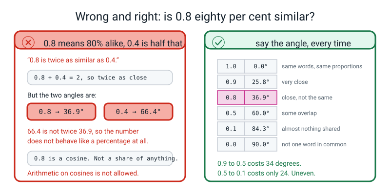
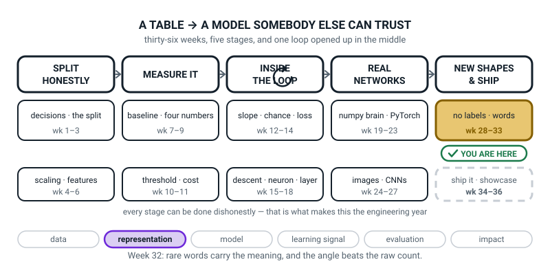
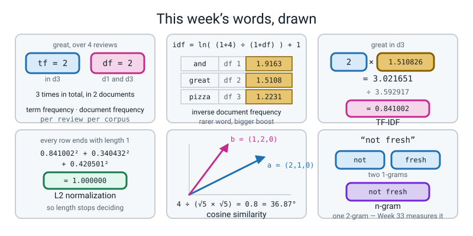

# Week 32 — Rare Words Matter More

[⬅ Week 31](week-31.md) · [Course Home](../README.md) · [Next ➡](week-33.md) · [Workbook](../workbook/week-32.md)

---

> ### This week in one sentence
> **`and` appeared 55 times in your corpus and tells you nothing, so TF-IDF multiplies how often a word appears *here* by how rare it is *everywhere else* — and then two documents are compared by the angle between their rows, not by how long they are.**
>
> **By the end of this chapter you will be able to:**
> - **Compute a TF-IDF weight by hand with the exact formula scikit-learn uses**, including the L2 normalization, and **match it to four decimal places**: `tf = 2`, `idf = ln(5 ÷ 3) + 1 = 1.510826`, product `3.021651`, divided by `3.592917`, giving **`0.841002`**
> - **Compute cosine similarity by hand for two three-number lists** and say what the answer means **as an angle**: `4 ÷ 5 = 0.8`, which is `36.87` degrees — not "80 per cent"
> - **Show with one example pair that raw counts rank the wrong document first** and cosine fixes it: `2` against `4` by counts, `1.0000` against `0.4216` by cosine
> - **Explain why a rare word gets a bigger IDF**, using document frequencies you counted yourself: `pizza` is in 3 of 4 reviews and scores `1.2231`; `and` is in 1 of 4 and scores `1.9163`
>
> **New maths:** **cosine similarity** — the dot product of two lists divided by both their lengths, read as an **angle**. Plus the natural logarithm from Week 14, back in a new job as a rarity meter.
>
> **New syntax:** `TfidfVectorizer()` · `cosine_similarity(A, B)` · `X.toarray()` · `normalize(v)`
>
> **Reading time:** about 45 minutes. **Homework:** about 60 minutes. **You need a calculator with an `ln` button and a `cos⁻¹` button.**

---

## 🪝 Start Here

Two numbers off your own corpus from last week.

```text
and    55
rude   10
```

Here is a game. I am going to read you **one word** out of a review, and you tell me whether the customer was happy or angry. Ready.

The word is: **`and`**.

You cannot tell. Nobody can tell. `and` turns up in a delighted review and a furious review with exactly the same enthusiasm.

Next word: **`rude`**.

**Angry.** Instantly, no hesitation, no doubt at all.

So one of those two words told you everything and the other told you nothing. **And in the grid you built last week, `and` gets five and a half times as much say as `rude`, because it appears five and a half times as often.**

That is not slightly backwards. It is completely backwards. **The word carrying the information has a fifth of the weight of the word carrying none.**

So: what do you do about it? There are two families of answer and they are genuinely different.

**One — delete the common words.** That is last week's stopword list, and you already know what it costs: you dropped `not`, and a happy customer and a furious customer became the same row. **Deleting is irreversible, and you are guessing which words to delete.**

**Two — keep every word, and turn its volume down.** That is what you do today. It is reversible, and it is not a guess: **how far a word's volume goes down comes out of the data, from counting how many of your documents contain it.**

It takes **one multiplication** — how often the word appears here, times how rare it is elsewhere — and **one division**, which stops long reviews winning everything by being long.

And then the second half of today is a completely different question. Once every review is a row of numbers: **how do you measure whether two reviews are alike?** You are going to find out that the obvious answer is wrong, and then you are going to measure the distance between two reviews as an **angle** — which will sound strange for about four minutes and then will not.

🍕 **The analogy for the whole week.** You find a lost exercise book and you want to know whose subject it is. **Every exercise book in the school contains the word "the", so seeing "the" tells you nothing at all.** This one contains "photosynthesis" three times. **Now you know it is Biology.** TF-IDF is that instinct, written down as arithmetic.

---

## 🧠 The Big Idea

### 1. Two different kinds of counting: `tf` and `df`

> **Term frequency (`tf`)** — how many times a term appears in **this** document. It is exactly the count you built last week.
>
> **Document frequency (`df`)** — how many **documents** contain the term at least once. Not how many times in total. **How many documents.**

**The difference between those two is the single commonest confusion of the week**, so do it once with real numbers and never be confused again. The same four reviews:

```text
d1: "The pizza was great!"
d2: "The pizza was cold."
d3: "Great pizza, great service."
d4: "Cold service and cold food."
```

Take the word `great`. **How many times does it appear in total?** Three — once in d1, twice in d3. **How many documents contain it?** **Two** — d1 and d3.

So `great` has **`tf = 1` in d1** and **`tf = 2` in d3** — `tf` is per document, one number per document. And **`df = 2`** — `df` is one number for the whole corpus.

Here is the full `df` count for all eight words:

```text
and     : 1   (d4 only)
cold    : 2   (d2, d4)
food    : 1   (d4 only)
great   : 2   (d1, d3)
pizza   : 3   (d1, d2, d3)
service : 2   (d3, d4)
the     : 2   (d1, d2)
was     : 2   (d1, d2)
```

> **⚠️ Watch out:** `cold` appears **three times in total** — once in d2, twice in d4 — but its `df` is **2**, because only two documents contain it. **If you wrote 3 you counted occurrences instead of documents.** Say the word "documents" out loud every single time you say "df" this week.

### 2. Inverse document frequency: the exact formula, evaluated

Here is the formula scikit-learn actually uses, with its default settings.

```text
idf(t) = ln( (1 + n) / (1 + df(t)) ) + 1

    n     = how many documents there are        (here, 4)
    df(t) = how many documents contain term t
```

**A formula nobody has evaluated is a decoration**, so before anything else, three details and then the arithmetic on real numbers.

- **The two `+1`s are smoothing.** They pretend there is one extra document containing every term. Without them a term with `df = 0` would divide by zero. With `n = 4`, the top of the fraction is always `5`.
- **The trailing `+ 1`, outside the logarithm, stops idf ever being zero.** A word in every single document gets `ln(1) + 1 = 0 + 1 = 1`, so it is knocked down to a plain count rather than deleted. **That is a design choice and a good one: "worthless" and "delete it" are not the same instruction.**
- **`ln` is the natural logarithm** — the same one from Week 14, where `−ln(p)` was your surprise meter. **On a calculator it is the `ln` button, not `log`.**

**Now the arithmetic. Get your calculator out and do the second row with me.**

| term | df | (1 + 4) ÷ (1 + df) | ln(that) | **idf = ln + 1** |
|---|---:|---|---:|---:|
| and | 1 | 5 ÷ 2 = 2.5000 | 0.916291 | **1.916291** |
| cold | 2 | 5 ÷ 3 = 1.6667 | 0.510826 | **1.510826** |
| food | 1 | 2.5000 | 0.916291 | **1.916291** |
| great | 2 | 1.6667 | 0.510826 | **1.510826** |
| pizza | 3 | 5 ÷ 4 = 1.2500 | 0.223144 | **1.223144** |
| service | 2 | 1.6667 | 0.510826 | **1.510826** |
| the | 2 | 1.6667 | 0.510826 | **1.510826** |
| was | 2 | 1.6667 | 0.510826 | **1.510826** |

**You can check this yourself right now.** Type `5 ÷ 3` into a calculator, press `ln`, then add 1. **You must get `1.510826...`** If you get `1.221849`, your calculator is on `log` base 10 and you have found the single most common way to wreck this week. **Find the `ln` button.**

**Now read the last column out loud.** `pizza` is in three of the four reviews, so it gets the **smallest** weight, `1.2231`. `and` and `food` are in one review each, so they get the **biggest**, `1.9163`. **The word that is everywhere gets discounted and the distinctive word gets boosted. That is IDF doing its one job.**


*Figure 32.2 — The rarer the word, the bigger its boost. `and` is in 1 review of 4 and scores `ln(5 ÷ 2) + 1 = 1.9163`; `pizza` is in 3 of 4 and scores `ln(5 ÷ 4) + 1 = 1.2231`.*

> **🔢 The maths, slowly:** the fraction `(1 + n) / (1 + df)` is *how many documents there are, divided by how many contain the word* — roughly, **"one in how many"**. A word in 1 of 4 documents gives 2.5, so it is a "one in two-and-a-half" word. A word in 3 of 4 gives 1.25, so it is nearly everywhere. **The logarithm's only job is to stop that number growing too fast.** Without it, a word appearing in 1 document out of 20,000 would get a weight of 10,000 and would drown out everything else in the corpus. `ln` turns 10,000 into about **9.2**. That is the entire reason a logarithm is in this formula — otherwise it looks like decoration, and it is not.

### 3. L2 normalization: the step everybody forgets

**TF-IDF is not finished when you multiply.** Scikit-learn does one more thing, and if you skip it your hand arithmetic will not match the library and you will not know why.

> **L2 normalization** — divide every number in a row by the row's **length**, so the row's length becomes exactly 1.
>
> The **length** of a row is `sqrt(` each number squared, added up `)`. It is Pythagoras, in as many dimensions as you have columns.

**Here it is, all the way, for the word `great` in d3.** Know this cold; it is the thing you did on the board in class.

d3 is `"Great pizza, great service."` It has three different words in it, so its row has three non-zero numbers.

**Step 1 — the raw products, `tf × idf`:**

```text
great   : tf 2 x idf 1.510826 = 3.021651
pizza   : tf 1 x idf 1.223144 = 1.223144
service : tf 1 x idf 1.510826 = 1.510826
```

**Step 2 — square each one and add them up:**

```text
3.021651 squared = 9.130376
1.223144 squared = 1.496080
1.510826 squared = 2.282594
                   ---------
            total   12.909050
```

**Step 3 — the row's length is the square root of that:**

```text
sqrt(12.909050) = 3.592917
```

**Step 4 — divide every number in the row by 3.592917:**

```text
great   = 3.021651 / 3.592917 = 0.841002
pizza   = 1.223144 / 3.592917 = 0.340432
service = 1.510826 / 3.592917 = 0.420501
```

**And `0.841002` is exactly what scikit-learn prints.** Three squares, one addition, one square root, one division, and you have reproduced a library's number to six decimal places.


*Figure 32.1 — How often, times how rare, then shrink the row. `tf = 2`, `idf = 1.510826`, product `3.021651`, divided by the row length `3.592917`, giving `0.841002` — and `TfidfVectorizer` prints `0.841002`.*

> **⚠️ Watch out:** **carry all six decimal places and round only at the very end.** If you round `1.510826` to `1.51` at step 1, the error gets multiplied, squared, added and square-rooted, and you come out at `0.841200` instead of `0.841002` — wrong at the fourth decimal place, and you will not be able to tell whether you made an arithmetic slip or a rounding slip. **Rounding in the middle of a chain is where it costs.**

**Why normalize at all?** Because otherwise a long review beats a short one at everything simply by being long. A 200-word review has bigger numbers in its columns than a 10-word review on the same subject. **Dividing by the length asks "what is this review made of?" instead of "how much of it is there?"**

And it has a very convenient consequence that the next section uses:

> **Because every TF-IDF row has length exactly 1, comparing two of them by cosine similarity is just multiplying them together and adding up. The dividing has already been done.**

### 4. Cosine similarity: the angle between two lists

**This is the week's one new piece of maths, and it is taught on two lists of three numbers before the word "document" appears anywhere.**

Two people order pizza toppings. Each order is three numbers — portions of cheese, pepperoni, olives:

```text
Ravi : (2 cheese, 1 pepperoni, 0 olives)   ->  a = (2, 1, 0)
Sam  : (1 cheese, 2 pepperoni, 0 olives)   ->  b = (1, 2, 0)
```

**Are those similar orders?** They *feel* quite similar — same two toppings, different emphasis. Here is how you turn that feeling into a number, in three steps, all arithmetic.

**Step 1 — the dot product. Multiply matching positions, add up.**

```text
2 x 1  +  1 x 2  +  0 x 0  =  2 + 2 + 0  =  4
```

**Step 2 — each list's length. Square, add, square root.** Same Pythagoras as §3.

```text
length of a = sqrt(2² + 1² + 0²) = sqrt(4 + 1 + 0) = sqrt(5) = 2.236068
length of b = sqrt(1² + 2² + 0²) = sqrt(1 + 4 + 0) = sqrt(5) = 2.236068
```

**Step 3 — divide the dot product by both lengths.**

```text
4 / (2.236068 x 2.236068) = 4 / 5 = 0.8
```

> **Cosine similarity** — the dot product of two lists divided by both their lengths. It measures the **angle** between them and completely ignores how long they are.

**And now the part that makes it click.** Draw it. Two arrows from the same corner of a piece of graph paper: `a` goes 2 across and 1 up; `b` goes 1 across and 2 up. They point in slightly different directions, **and `0.8` is the cosine of the angle between them.** Put `0.8` into the `cos⁻¹` button — sometimes called `acos` or `arccos` — and you get:

```text
angle = 36.87 degrees
```

**Measure it with a protractor.** It comes out at about 37 degrees, and measuring it yourself is worth more than being told.


*Figure 32.3 — Cosine is the angle between two lists. `a = (2, 1, 0)`, `b = (1, 2, 0)`, dot product 4, both lengths `sqrt(5)`, so `4 ÷ 5 = 0.8` — an angle of `36.87` degrees.*

**Three landmarks worth memorising:**

| cosine | angle | means |
|---:|---:|---|
| **1.0** | 0 degrees | pointing exactly the same way — same words in the same proportions |
| **0.8** | 36.87 degrees | close, but not the same |
| **0.0** | 90 degrees | at right angles — **not one word in common** |

> **⚠️ Watch out:** **`0.8` is not 80 per cent of anything.** The relationship between the number and the angle is not straight, so the number does not behave like a percentage. `0.9` is 25.8 degrees and `0.5` is 60 degrees, so going from 0.9 down to 0.5 costs you 34 degrees — while going from 0.5 down to 0.1 (84.3 degrees) costs you only 24. **Say "degrees" out loud for at least this week.** It stops you from saying "0.8 is twice as similar as 0.4", which is wrong: 0.4 is 66.4 degrees, and 66.4 is not twice 36.87.

### 5. Why the dot product alone is a trap

**This takes ninety seconds to prove and it is the reason the division at the end of TF-IDF exists.**

```text
d1      = "the pizza was great"                      (4 words)
d1_long = "the pizza was great the pizza was great"   (the same text, twice)
```

Their count rows over the four-word vocabulary are `[1 1 1 1]` and `[2 2 2 2]`. Now:

```text
dot(short, short) = 4.0
dot(short, long ) = 8.0
```

**By dot product, the doubled document is twice as similar to d1 as d1 is to itself.** That is not a small inaccuracy. It is nonsense. **Length is drowning out content.**

Redo it with cosine:

```text
cos(short, short) = 1.0000
cos(short, long ) = 1.0000
```

**Both exactly 1.0, which is right** — the two documents contain the same words in the same proportions, so they point in the same direction.

🍕 **The analogy.** Two people describe the same pizza. One says "cheesy, tomatoey, hot". The other says the same three things but repeats each of them five times because they are excited. **They are describing the same pizza.** Cosine asks *"are they pointing the same way?"* The dot product asks *"who talked longer?"*

**Now the version that is a genuine ranking failure — a search engine getting the wrong answer.**

```text
query : cold pizza
doc A : cold pizza
doc B : the pizza was hot and the pizza was fresh and the pizza was lovely
        but the chips were cold
```

**Which should come first?** A. Obviously, unanimously. **A *is* the query.** Now count the shared words with the query:

```text
doc A: 1 shared pizza + 1 shared cold = 2
doc B: 3 shared pizza + 1 shared cold = 4
```

**Raw counting puts B first, with twice the score, and B is wrong.** Doc B mentions `pizza` three times and `cold` once, so it collects four points **by bulk**.

Cosine divides that back out:

```text
raw count dot product   A: 2   B: 4
cosine similarity       A: 1.0000   B: 0.4216
length of A's row = 1.4142, length of B's row = 6.7082
```

**And the right answer comes first.** Where does `6.7082` come from? B's counts are `the` 4, `pizza` 3, `was` 3, `and` 2, and seven words once each (`but`, `chips`, `cold`, `fresh`, `hot`, `lovely`, `were`). So:

```text
16 + 9 + 9 + 4 + 1 + 1 + 1 + 1 + 1 + 1 + 1 = 45
sqrt(45) = 6.7082
```

**That is B's punishment for being long, and it is exactly the right size of punishment.**


*Figure 32.4 — Length fools the counts. It does not fool the angle. `4 ÷ (1.4142 × 6.7082) = 0.4216`, and doc A's `1.0000` wins.*

**The sentence to be able to write, because it is the homework's marking bar:** *"the property of raw counts that caused the mistake is that a longer document has bigger numbers in it, so it collects more points just by being longer, regardless of whether it is more relevant."*

### 6. The honest result on your own corpus

**And now the best and most uncomfortable thing in the week.** Run cosine similarity over all sixty of your reviews and ask which two are the most alike.

```text
the two most similar reviews in the corpus, cosine 0.7981 (37.1 degrees):
   [18] the coffee was hot and the cake was fresh
   [48] the coffee was cold and the cake was stale
```

**Read those two reviews.** One is a happy customer and one is a furious customer, and **TF-IDF says they are the two most similar documents in the entire corpus.**

Here is exactly why, multiplied out. Their rows share five words, and each shared word contributes:

```text
and      0.1156 x 0.1166 = 0.0135
cake     0.4274 x 0.4310 = 0.1842
coffee   0.4274 x 0.4310 = 0.1842
the      0.4209 x 0.4244 = 0.1786
was      0.4853 x 0.4894 = 0.2375
                   total = 0.7981
```

**And the four words that carry the entire meaning — `hot`, `fresh`, `cold`, `stale` — contribute exactly nothing**, because they are not shared, and **cosine similarity only ever adds up shared terms.**


*Figure 32.5 — The closest pair in the corpus is one happy and one sad. Five shared words add to 0.7981; the four words that carry the meaning add 0.*

**This is not the method being stupid.** It is the method being exactly correct about the question it was asked, which was *"how much vocabulary do these two documents share?"*

**So here is the honest summary of today, and Week 33 is built on this sentence:**

> **TF-IDF measures what a document is ABOUT. It does not measure how the writer FELT. It is very good at topic and bad at sentiment.**

And it is bad at sentiment **for a structural reason, not because you did it wrong.** Next week you are going to build a sentiment model out of exactly this anyway — because *"bad at"* is not a number, and next week you get the number.

---

## 🔢 The Maths, Slowly

One new object this week: the **angle between two lists**. Build it from nothing, the way you built a slope in Week 12.

### Start with two numbers, not three

Forget documents. Two people, and how many hours each spent this week on two things: maths homework and football.

| | maths (hours) | football (hours) |
|---|---:|---:|
| **Ama** | 3 | 1 |
| **Ben** | 1 | 3 |
| **Cleo** | 6 | 2 |

**Look at that table before doing any arithmetic.** Ama and Ben spend their time in *opposite* proportions. Ama and Cleo spend it in *exactly the same* proportions — Cleo just does twice as much of everything.

Now here is the point. **Any method that measures "alike" by the size of the numbers is going to say Cleo is the odd one out**, because her numbers are twice as big. And that is the wrong answer to the question "who spends their time the same way?"

### The three steps, on Ama and Ben

**Step 1 — the dot product.** Multiply matching positions, add them up:

```text
3 x 1  +  1 x 3  =  3 + 3  =  6
```

**Step 2 — each list's length.** Square, add, square root:

```text
length of Ama = sqrt(3² + 1²) = sqrt(9 + 1) = sqrt(10) = 3.162278
length of Ben = sqrt(1² + 3²) = sqrt(1 + 9) = sqrt(10) = 3.162278
```

**Step 3 — divide by both lengths:**

```text
6 ÷ (3.162278 × 3.162278) = 6 ÷ 10 = 0.6
```

**And 0.6 as an angle:** `cos⁻¹(0.6) = 53.13 degrees`.

### Now Ama and Cleo, which is the test that matters

```text
dot            = 3 x 6 + 1 x 2 = 18 + 2 = 20
length of Ama  = sqrt(10)           = 3.162278
length of Cleo = sqrt(36 + 4) = sqrt(40) = 6.324555
cosine         = 20 ÷ (3.162278 × 6.324555) = 20 ÷ 20 = 1.0
angle          = 0.00 degrees
```

**Exactly 1.0. Exactly zero degrees.** Cleo does twice as much of everything as Ama, and cosine similarity says they are **identical**, because it is measuring the *direction* they point, not how far they go. **Notice that the dot product on its own would have said Ama-and-Cleo scored 20 while Ama-and-Ben scored 6 — three times as much — which is only true because Cleo's numbers are bigger.**

Here is the real run, so you can check every figure:

```python
import numpy as np
a = np.array([3.0, 1.0])
b = np.array([1.0, 3.0])
c = np.array([6.0, 2.0])
for n1, v1, n2, v2 in [("Ama", a, "Ben", b), ("Ama", a, "Cleo", c)]:
    dot = float(v1 @ v2)
    l1 = np.sqrt((v1 ** 2).sum())
    l2 = np.sqrt((v2 ** 2).sum())
    cos = dot / (l1 * l2)
    print("%s vs %-4s dot %.0f  lengths %.6f and %.6f  cosine %.4f  angle %.2f deg"
          % (n1, n2, dot, l1, l2, cos, np.degrees(np.arccos(min(cos, 1.0)))))
```

```text
Ama vs Ben  dot 6  lengths 3.162278 and 3.162278  cosine 0.6000  angle 53.13 deg
Ama vs Cleo dot 20  lengths 3.162278 and 6.324555  cosine 1.0000  angle 0.00 deg
```

### The pattern, and then the name

You did it with **two** numbers per person and it worked. In §4 you did it with **three** numbers and nothing changed except that there was one more thing to multiply and add. **And that is the whole trick: the arithmetic does not care how many numbers are in the lists.**

So with **92** numbers per review, you do the same thing 92 times instead of twice, and divide by the two lengths, and you get a number between −1 and 1 which is the cosine of an angle. **You cannot picture a 92-dimensional angle and you should not try.** The arithmetic works the same; that is the honest answer, and it is enough.

> **You can check this yourself with a calculator.** `cos⁻¹(0.6)` must read `53.13`. `cos⁻¹(0.8)` must read `36.87`. `cos⁻¹(0.0)` must read `90`. **If your calculator says 0.9273 for the first one, it is answering in radians — find the DEG setting.**

### One number, and what it is not

| cosine | angle | the temptation | the truth |
|---:|---:|---|---|
| 1.0 | 0.0° | "100% similar" | same **proportions**. Not the same length, not the same document |
| 0.9 | 25.8° | "90% similar" | very close in direction |
| 0.8 | 36.87° | "80% similar" | **no.** It is a cosine |
| 0.5 | 60.0° | "half as similar as 1.0" | **no.** Halving the cosine adds 60 degrees, not half the angle |
| 0.4 | 66.4° | "half of 0.8" | **no.** 66.4 is not twice 36.87 |
| 0.0 | 90.0° | "no similarity" | **this one is fair.** Not one word in common |

**The gap from 0.9 to 0.5 is 34 degrees. The gap from 0.5 to 0.1 is 24 degrees.** Unequal steps, so it is not a percentage and it never was.

---

## 💻 Type This

One new file, `tfidf.py`, in the same folder as last week's `reviews.py`. Nothing downloads.

### Step 1 — `df` and `idf`, by hand and by library, side by side

```python
import numpy as np
import pandas as pd
from sklearn.feature_extraction.text import CountVectorizer, TfidfVectorizer

pd.set_option("display.width", 250)
pd.set_option("display.max_columns", 50)

docs = ["The pizza was great!",
        "The pizza was cold.",
        "Great pizza, great service.",
        "Cold service and cold food."]
names = ["d1", "d2", "d3", "d4"]

cv = CountVectorizer()
C = cv.fit_transform(docs).toarray()
terms = cv.get_feature_names_out()
n = len(docs)
df = (C > 0).sum(axis=0)

print("--- idf, by hand, n = 4 ---")
print("%-9s %3s  %-10s %-10s %s" % ("term", "df", "(1+n)/(1+df)", "ln(that)", "idf = ln + 1"))
for t, d in zip(terms, df):
    ratio = (1 + n) / (1 + d)
    print("%-9s %3d  %-12.4f %-10.6f %.6f" % (t, d, ratio, np.log(ratio),
                                              np.log(ratio) + 1))
```

**What each new line does.**

- `(C > 0)` turns the count grid into True/False — *did this word appear at all?* — and `.sum(axis=0)` adds **down** each column. **True counts as 1, so the sum is the number of documents containing the word.** That is `df`, in one line, and it is exactly what you counted by hand.
- `np.log(x)` is the **natural** logarithm. `np.log10` would be base 10 and would silently give you the wrong answer.
- `zip(terms, df)` walks two lists together, handing you one word and its `df` at a time.

```text
--- idf, by hand, n = 4 ---
term       df  (1+n)/(1+df) ln(that)   idf = ln + 1
and         1  2.5000       0.916291   1.916291
cold        2  1.6667       0.510826   1.510826
food        1  2.5000       0.916291   1.916291
great       2  1.6667       0.510826   1.510826
pizza       3  1.2500       0.223144   1.223144
service     2  1.6667       0.510826   1.510826
the         2  1.6667       0.510826   1.510826
was         2  1.6667       0.510826   1.510826
```

Now ask the library for the same eight numbers:

```python
tv = TfidfVectorizer()
X = tv.fit_transform(docs)
print("--- idf, from TfidfVectorizer ---")
for t, v in zip(tv.get_feature_names_out(), tv.idf_):
    print("   %-9s %.6f" % (t, v))
```

`tv.idf_` is the learned idf values, in column order. **The trailing underscore is scikit-learn's mark for "this was learned during `fit`"**, exactly like Week 4's `scaler.mean_`. Ask for it before fitting and you get a `NotFittedError`.

```text
--- idf, from TfidfVectorizer ---
   and       1.916291
   cold      1.510826
   food      1.916291
   great     1.510826
   pizza     1.223144
   service   1.510826
   the       1.510826
   was       1.510826
```

**Eight numbers, six decimal places, identical to yours.**

### Step 2 — one word, all the way through

```python
print("--- 'great' in d3, all the way ---")
tf = 2
idf = np.log(5 / 3) + 1
raw = tf * idf
print("tf('great', d3)            =", tf)
print("idf('great')               = ln(5/3) + 1 = %.6f" % idf)
print("tf x idf                   = 2 x %.6f = %.6f" % (idf, raw))
parts = np.array([2 * (np.log(5 / 3) + 1),          # great
                  1 * (np.log(5 / 4) + 1),          # pizza
                  1 * (np.log(5 / 3) + 1)])         # service
print("the three raw weights in d3:", np.round(parts, 6))
print("squares                    :", np.round(parts ** 2, 6))
print("sum of squares             = %.6f" % (parts ** 2).sum())
norm = np.sqrt((parts ** 2).sum())
print("L2 length of the row       = sqrt(%.6f) = %.6f" % ((parts ** 2).sum(), norm))
print("great, normalized          = %.6f / %.6f = %.6f" % (raw, norm, raw / norm))
print("sklearn's number for it    = %.6f" % X.toarray()[2, list(terms).index("great")])
```

- `parts ** 2` squares **every** number in the array at once — no loop needed.
- `X.toarray()[2, list(terms).index("great")]` is row 2 (which is d3, counting from zero) and the column whose name is `great`. **`list(terms).index("great")` is how you turn a word into a column number.**

```text
--- 'great' in d3, all the way ---
tf('great', d3)            = 2
idf('great')               = ln(5/3) + 1 = 1.510826
tf x idf                   = 2 x 1.510826 = 3.021651
the three raw weights in d3: [3.021651 1.223144 1.510826]
squares                    : [9.130376 1.49608  2.282594]
sum of squares             = 12.909050
L2 length of the row       = sqrt(12.909050) = 3.592917
great, normalized          = 3.021651 / 3.592917 = 0.841002
sklearn's number for it    = 0.841002
```

**Two lines, two identical numbers, six decimal places.** That is the whole point of the lesson and everything after it is consequences.

### Step 3 — the whole matrix, and the proof that every row has length 1

```python
print(pd.DataFrame(np.round(X.toarray(), 6), index=names, columns=terms))
print("length of every row:", np.round(np.sqrt((X.toarray() ** 2).sum(axis=1)), 6))
```

`.sum(axis=1)` adds **across** each row, so `sqrt(row of squares summed)` is the length of each row.

```text
         and      cold      food     great     pizza   service       the       was
d1  0.000000  0.000000  0.000000  0.523035  0.423442  0.000000  0.523035  0.523035
d2  0.000000  0.523035  0.000000  0.000000  0.423442  0.000000  0.523035  0.523035
d3  0.000000  0.000000  0.000000  0.841002  0.340432  0.420501  0.000000  0.000000
d4  0.442462  0.697684  0.442462  0.000000  0.000000  0.348842  0.000000  0.000000
length of every row: [1. 1. 1. 1.]
```

**Four ones.** Every row has been shrunk until its length is exactly 1.

### Step 4 — cosine, on two three-number lists

```python
from sklearn.metrics.pairwise import cosine_similarity

a = np.array([2.0, 1.0, 0.0])
b = np.array([1.0, 2.0, 0.0])
print("a =", a, "   b =", b)
print("dot           = 2x1 + 1x2 + 0x0 =", float(a @ b))
print("length of a   = sqrt(4 + 1 + 0) = sqrt(5) = %.6f" % np.sqrt(5))
print("length of b   = sqrt(1 + 4 + 0) = sqrt(5) = %.6f" % np.sqrt(5))
print("cosine        = 4 / 5 = %.4f" % (a @ b / (np.sqrt(5) * np.sqrt(5))))
print("angle         = %.2f degrees" % np.degrees(np.arccos(0.8)))
```

- `a @ b` is the dot product — Week 17's `@`, with two flat lists instead of two grids.
- `np.arccos(x)` is the `cos⁻¹` button. It answers in **radians**, so `np.degrees(...)` converts.

```text
a = [2. 1. 0.]    b = [1. 2. 0.]
dot           = 2x1 + 1x2 + 0x0 = 4.0
length of a   = sqrt(4 + 1 + 0) = sqrt(5) = 2.236068
length of b   = sqrt(1 + 4 + 0) = sqrt(5) = 2.236068
cosine        = 4 / 5 = 0.8000
angle         = 36.87 degrees
```

### Step 5 — the four reviews, measured as angles

```python
S = cosine_similarity(X)
print(pd.DataFrame(np.round(S, 4), index=names, columns=names))
print("cos(d1, d2) = %.4f, which is an angle of %.1f degrees"
      % (S[0, 1], np.degrees(np.arccos(S[0, 1]))))
print("cos(d1, d4) = %.4f, which is an angle of %.1f degrees"
      % (S[0, 3], np.degrees(np.arccos(S[0, 3]))))
```

`cosine_similarity(X)` with **one** matrix gives you every row against every other row — a 4 × 4 table.

```text
        d1      d2      d3      d4
d1  1.0000  0.7264  0.5840  0.0000
d2  0.7264  1.0000  0.1442  0.3649
d3  0.5840  0.1442  1.0000  0.1467
d4  0.0000  0.3649  0.1467  1.0000

cos(d1, d2) = 0.7264, which is an angle of 43.4 degrees
cos(d1, d4) = 0.0000, which is an angle of 90.0 degrees
```

**The diagonal is all 1.0000** because every review is identical to itself — zero degrees. **The biggest number that is not on the diagonal is `0.7264` — d1 against d2.** Read them: `"The pizza was great!"` and `"The pizza was cold."` **The happiest review and the unhappiest review, 43.4 degrees apart, and the closest pair in the corpus.**

And `cos(d1, d4) = 0.0000` — **exactly zero, a right angle.** d1 is `"The pizza was great!"` and d4 is `"Cold service and cold food."` They have literally no word in common, so the method says they have nothing to do with each other — **true about the words, false about the world**, because both are somebody's opinion about the same restaurant.

### Step 6 — length fools the counts, then the ranking failure

```python
pair = ["the pizza was great", "the pizza was great the pizza was great"]
P = CountVectorizer().fit_transform(pair).toarray().astype(float)
print("count rows:", P[0], P[1])
print("dot(short, short) =", float(P[0] @ P[0]))
print("dot(short, long ) =", float(P[0] @ P[1]))
print("cos(short, short) = %.4f" % cosine_similarity([P[0]], [P[0]])[0, 0])
print("cos(short, long ) = %.4f" % cosine_similarity([P[0]], [P[1]])[0, 0])
```

> **⚠️ Watch out:** `cosine_similarity` wants **2-D** input, always. `cosine_similarity(P[0], P[1])` on two flat rows raises `ValueError: Expected 2D array, got 1D array instead`. **The fix is square brackets: `cosine_similarity([P[0]], [P[1]])`.** This is the commonest error of the week.

```text
count rows: [1. 1. 1. 1.] [2. 2. 2. 2.]
dot(short, short) = 4.0
dot(short, long ) = 8.0
cos(short, short) = 1.0000
cos(short, long ) = 1.0000
```

Now the search-engine failure:

```python
query = "cold pizza"
A = "cold pizza"
B = ("the pizza was hot and the pizza was fresh and the pizza was lovely "
     "but the chips were cold")
cv2 = CountVectorizer()
M = cv2.fit_transform([query, A, B]).toarray().astype(float)
q, ra, rb = M[0], M[1], M[2]
print("raw count dot product   A: %.0f   B: %.0f" % (q @ ra, q @ rb))
print("cosine similarity       A: %.4f   B: %.4f"
      % (cosine_similarity([q], [ra])[0, 0], cosine_similarity([q], [rb])[0, 0]))
print("length of A's row = %.4f, length of B's row = %.4f"
      % (np.sqrt((ra ** 2).sum()), np.sqrt((rb ** 2).sum())))
```

**All three documents go through ONE vectorizer**, so column 3 means the same word in all three rows. Two separate vectorizers would give you two different column orders and a meaningless comparison.

```text
raw count dot product   A: 2   B: 4
cosine similarity       A: 1.0000   B: 0.4216
length of A's row = 1.4142, length of B's row = 6.7082
```

### Step 7 — `normalize`, then a plain dot product, IS cosine

```python
from sklearn.preprocessing import normalize

Nrm = normalize(M)
print("normalize(query row) =", np.round(Nrm[0], 4))
print("its length           = %.4f" % np.sqrt((Nrm[0] ** 2).sum()))
print("dot of the normalized rows, A: %.4f   B: %.4f"
      % (Nrm[0] @ Nrm[1], Nrm[0] @ Nrm[2]))
```

`normalize(M)` divides every row of `M` by that row's own length. **It is the last step of TF-IDF, available on its own.**

```text
normalize(query row) = [0.     0.     0.     0.7071 0.     0.     0.     0.7071 0.     0.
 0.    ]
its length           = 1.0000
dot of the normalized rows, A: 1.0000   B: 0.4216
```

**Normalize first, then take a plain dot product, and you get the cosine similarity exactly.** `0.7071` is `1 ÷ sqrt(2)` — what you get when you divide a row of two 1s by its length of `1.4142`. And check it: `0.7071² + 0.7071² = 0.5 + 0.5 = 1`. **Cosine similarity is not magic. It is a division you can do first.**

### Step 8 — your own sixty reviews

```python
from reviews import CORPUS_60

tv60 = TfidfVectorizer()
X60 = tv60.fit_transform(CORPUS_60)
v60 = tv60.get_feature_names_out()
o = np.argsort(tv60.idf_)
print("vocabulary size:", len(v60))
print("the five LOWEST idf words (they are everywhere, so they are worth least):")
for i in o[:5]:
    print("   %-10s idf %.4f" % (v60[i], tv60.idf_[i]))
print("the highest idf is %.4f, and %d of the %d words share it"
      % (tv60.idf_.max(), int((tv60.idf_ == tv60.idf_.max()).sum()), len(v60)))

S60 = cosine_similarity(X60)
np.fill_diagonal(S60, 0.0)
i, j = np.unravel_index(np.argmax(S60), S60.shape)
print()
print("the two most similar reviews in the corpus, cosine %.4f (%.1f degrees):"
      % (S60[i, j], np.degrees(np.arccos(S60[i, j]))))
print("   [%d] %s" % (i, CORPUS_60[i]))
print("   [%d] %s" % (j, CORPUS_60[j]))
```

- `np.fill_diagonal(S60, 0.0)` wipes out the 1.0000s down the diagonal. **Without it, `argmax` finds a review compared with itself, which is not news.**
- `np.unravel_index(np.argmax(S60), S60.shape)` turns "position 1128 of the flattened grid" into "row 18, column 48".

```text
vocabulary size: 92
the five LOWEST idf words (they are everywhere, so they are worth least):
   and        idf 1.0855
   the        idf 1.9754
   was        idf 2.2777
   cold       idf 2.6260
   rude       idf 2.7130
the highest idf is 4.4177, and 15 of the 92 words share it

the two most similar reviews in the corpus, cosine 0.7981 (37.1 degrees):
   [18] the coffee was hot and the cake was fresh
   [48] the coffee was cold and the cake was stale
```

**Look at the five lowest idf words: `and`, `the`, `was`, `cold`, `rude`.** `and` is at `1.0855`, barely above the floor of 1 — its volume has been turned right down. But **`cold` and `rude` are in there too**, at `2.6260` and `2.7130`, because in a corpus where half the reviews are complaints, `cold` and `rude` are simply not rare. **IDF turns down the volume of common words. It has no idea which of them mean anything.**

And the highest idf is `4.4177`, shared by **15** words. Those are the words appearing in exactly one review: `ln(61 ÷ 2) + 1 = ln(30.5) + 1 = 4.4177`. **Then the question that matters: is a word in one review out of sixty useful evidence, or a coincidence?** Hold that; it is the first thing Week 33 asks.

**Runtime for the whole file: under 1 second.** There is no training in this lesson at all. **The time in this week goes on arithmetic done by hand, and that is the design.**

---

## 🔍 Worked Examples

### Worked Example 1 — `pizza` in d1, all four stages

**The job:** reproduce a different cell of the matrix, one where `tf = 1`, so the multiplication is trivial and the L2 step is all the work.

d1 is `"The pizza was great!"` — four distinct words: `great`, `pizza`, `the`, `was`.

**Stage 1 — the idf of each.** From the table in §2: `great`, `the` and `was` all have `df = 2`, so all three get `1.510826`. `pizza` has `df = 3`, so it gets `1.223144`.

**Stage 2 — the raw products.** Every `tf` here is 1, so the products *are* the idfs:

```text
great   : 1 x 1.510826 = 1.510826
pizza   : 1 x 1.223144 = 1.223144
the     : 1 x 1.510826 = 1.510826
was     : 1 x 1.510826 = 1.510826
```

**Stage 3 — the row length.** Three copies of `1.510826²` plus one `1.223144²`:

```text
1.510826 squared = 2.282594   (three times)
1.223144 squared = 1.496080
3 x 2.282594 + 1.496080 = 6.847782 + 1.496080 = 8.343862
sqrt(8.343862) = 2.888574
```

**Stage 4 — divide.**

```text
pizza = 1.223144 / 2.888574 = 0.423442
great = 1.510826 / 2.888574 = 0.523035
```

Now check against the library:

```python
idf_o = np.log(5 / 3) + 1          # great, the, was  -> df = 2
idf_p = np.log(5 / 4) + 1          # pizza            -> df = 3
parts1 = np.array([idf_o, idf_p, idf_o, idf_o])     # great, pizza, the, was
L1 = np.sqrt((parts1 ** 2).sum())
print("row length = sqrt(%.6f) = %.6f" % ((parts1 ** 2).sum(), L1))
print("pizza normalized = %.6f / %.6f = %.6f" % (idf_p, L1, idf_p / L1))
print("great normalized = %.6f / %.6f = %.6f" % (idf_o, L1, idf_o / L1))
print("sklearn d1 row:", np.round(X.toarray()[0], 6))
print("check length of d1 row: %.6f" % np.sqrt((X.toarray()[0] ** 2).sum()))
```

```text
row length = sqrt(8.343862) = 2.888574
pizza normalized = 1.223144 / 2.888574 = 0.423442
great normalized = 1.510826 / 2.888574 = 0.523035
sklearn d1 row: [0.       0.       0.       0.523035 0.423442 0.       0.523035 0.523035]
check length of d1 row: 1.000000
```

**Both match.** And notice the shape of d1's row: **three identical numbers and one smaller one.** The smaller one is `pizza`, and it is smaller **because `pizza` is the least distinctive word in the review** — it is in three of the four documents.

> **💡 Try this:** work out **d2's** row without doing a single new logarithm. d2 is `"The pizza was cold."` — four distinct words, three with `idf 1.510826` and one with `1.223144`. **Exactly the same shape as d1.** So its length is identical, `2.888574`, and its numbers are d1's with `cold` where `great` was. **Spotting that and not recomputing is real mathematical maturity.** Check it against Step 3's printout: d2's row is `0, 0.523035, 0, 0, 0.423442, 0, 0.523035, 0.523035`. ✓

### Worked Example 2 — Proving a row's length really is 1

**The job:** every TF-IDF row is supposed to have length exactly 1. Do not take that on trust — check it on d3, by hand, with a calculator.

d3's row has three non-zero numbers: `great 0.841002`, `pizza 0.340432`, `service 0.420501`.

```text
0.841002 squared = 0.707284
0.340432 squared = 0.115894
0.420501 squared = 0.176821
                   --------
            total   0.999999
```

```python
print("d3 squares add to: %.6f + %.6f + %.6f = %.6f"
      % (0.841002 ** 2, 0.340432 ** 2, 0.420501 ** 2,
         0.841002 ** 2 + 0.340432 ** 2 + 0.420501 ** 2))
```

```text
d3 squares add to: 0.707284 + 0.115894 + 0.176821 = 0.999999
```

**`0.999999`, not `1.000000`.** And that is **not** an error in your arithmetic — it is because you fed the calculation the *rounded* six-decimal numbers off the screen. The real numbers in memory have more digits, and Step 3's printout shows `length of every row: [1. 1. 1. 1.]` exactly.

**This is worth ninety seconds of your attention, because it is the shape of a thousand future confusions.** When your hand answer and the machine answer differ in the sixth decimal place, **the difference is almost always rounding, not a mistake.** When they differ in the *first* decimal place, it is a mistake. **Learning to tell those two apart is most of what "checking your work" means.**

And the useful consequence: **because every row has length 1, the cosine between two TF-IDF rows is just multiply-and-add.** Both lengths are 1, so dividing by them does nothing. That is why the closest-pair breakdown in §6 is five multiplications and an addition, and no division anywhere.

### Worked Example 3 — Raw counts rank the wrong review first, on your own corpus

**The job:** somebody types `rude driver` into the shop's help search. Two candidate documents. Which comes first, and by which method?

```text
query : rude driver
doc A : rude driver and a cold pizza
doc B : the driver was slow and the driver was late and the driver had the wrong order
```

**Predict first, in pen. Which *should* come first?** A — it contains both query words. **Which will raw counts put first?**

```python
query = "rude driver"
A = "rude driver and a cold pizza"
B = "the driver was slow and the driver was late and the driver had the wrong order"
cv3 = CountVectorizer()
M3 = cv3.fit_transform([query, A, B]).toarray().astype(float)
q3, ra3, rb3 = M3
print("vocabulary:", cv3.get_feature_names_out())
print("query row :", q3.astype(int))
print("A row     :", ra3.astype(int))
print("B row     :", rb3.astype(int))
print("raw count dot   A: %.0f   B: %.0f" % (q3 @ ra3, q3 @ rb3))
print("A sum of squares:", int((ra3 ** 2).sum()), " B sum of squares:", int((rb3 ** 2).sum()))
print("row lengths     A: %.4f   B: %.4f"
      % (np.sqrt((ra3 ** 2).sum()), np.sqrt((rb3 ** 2).sum())))
ca = cosine_similarity([q3], [ra3])[0, 0]
cb = cosine_similarity([q3], [rb3])[0, 0]
print("cosine          A: %.4f   B: %.4f" % (ca, cb))
print("angle           A: %.1f deg   B: %.1f deg"
      % (np.degrees(np.arccos(ca)), np.degrees(np.arccos(cb))))
```

```text
vocabulary: ['and' 'cold' 'driver' 'had' 'late' 'order' 'pizza' 'rude' 'slow' 'the'
 'was' 'wrong']
query row : [0 0 1 0 0 0 0 1 0 0 0 0]
A row     : [1 1 1 0 0 0 1 1 0 0 0 0]
B row     : [2 0 3 1 1 1 0 0 1 4 2 1]
raw count dot   A: 2   B: 3
A sum of squares: 5  B sum of squares: 38
row lengths     A: 2.2361   B: 6.1644
cosine          A: 0.6325   B: 0.3441
angle           A: 50.8 deg   B: 69.9 deg
```

**Walk it through, number by number.**

1. **Raw counts: A scores 2, B scores 3.** B wins, and B is wrong. B does not contain the word `rude` **at all** — its `rude` cell is 0. It collects 3 points purely because it says `driver` three times.
2. **The row lengths explain everything.** A's sum of squares is `1 + 1 + 1 + 1 + 1 = 5`, so its length is `2.2361`. B's is `4 + 9 + 1 + 1 + 1 + 1 + 16 + 4 + 1 = 38`, so its length is `6.1644`. **B is nearly three times as long as A in the only sense that matters here.**
3. **Cosine divides that out.** `A: 2 ÷ (1.4142 × 2.2361) = 0.6325`. `B: 3 ÷ (1.4142 × 6.1644) = 0.3441`. **A comes first, and by a clear margin — 50.8 degrees against 69.9.**
4. **Neither cosine is high**, and that is honest too. A is only 50.8 degrees from the query because A is about a cold pizza as well as a rude driver. **Cosine does not flatter anybody.**

**The one sentence the homework wants:** *raw counts put the wrong document first because a longer document has bigger numbers in more columns, so it collects more points just for being long — B said `driver` three times and never said `rude` once.*

---

## 🐞 When It Breaks

All four came from actually running a broken version of this week's code. **Two of them do not raise an error at all, and those are the dangerous ones.**

### Break 1 — cosine wants rows, and you gave it a flat list

```python
cosine_similarity(a, b)      # a and b are the two three-number lists
```

```text
Traceback (most recent call last):
  File "err32.py", line 9, in <module>
    cosine_similarity(a, b)
  File ".../sklearn/utils/validation.py", line 1091, in check_array
    raise ValueError(msg)
ValueError: Expected 2D array, got 1D array instead:
array=[2. 1. 0.].
Reshape your data either using array.reshape(-1, 1) if your data has a single feature or array.reshape(1, -1) if it contains a single sample.
```

**What it means.** "I compare **rows** against **rows**. You handed me a flat list, and I cannot tell whether that is one row of three numbers or three rows of one number."

**Read the last sentence carefully — it offers you two fixes and one of them is wrong for you.** You have **one sample with three features**, so it is `reshape(1, -1)`, not `reshape(-1, 1)`. Or, much more simply:

**The fix.** Square brackets. `cosine_similarity([a], [b])`. And the same applies to `normalize`: `normalize(a)` raises the identical error, and `normalize([a])` fixes it. **Every scikit-learn function that expects rows expects 2-D.**

### Break 2 — two vectorizers means two different column orders

```python
X8 = TfidfVectorizer().fit_transform(docs)                          # 8 columns
Y3 = TfidfVectorizer().fit_transform(["cold pizza", "hot pizza", "rude driver"])
cosine_similarity(X8, Y3)
```

```text
Traceback (most recent call last):
  File "err32.py", line 16, in <module>
    cosine_similarity(X8, Y3)
  File ".../sklearn/metrics/pairwise.py", line 229, in check_pairwise_arrays
    raise ValueError(
ValueError: Incompatible dimension for X and Y matrices: X.shape[1] == 8 while Y.shape[1] == 5
```

**What it means.** "These two grids have different numbers of columns, so I cannot pair them up."

**Why it happened.** Two separate vectorizers built two separate vocabularies — 8 words from one set of documents, 5 from the other. **Even if the counts had matched, column 3 would have meant a different word in each grid**, so the comparison would have been meaningless.

**The fix.** **One vectorizer.** `fit_transform` on your training documents, `transform` on everything else — including queries. **This is Week 6's leakage discipline, and it is about to matter enormously in Week 33.**

### Break 3 — no error, and every idf wrong in the same way

```python
print("idf(great) with log10 = %.6f" % (np.log10(5 / 3) + 1))
print("idf(great) with ln    = %.6f" % (np.log(5 / 3) + 1))
print("ratio ln/log10 = %.6f" % (np.log(5 / 3) / np.log10(5 / 3)))
```

```text
idf(great) with log10 = 1.221849
idf(great) with ln    = 1.510826
ratio ln/log10 = 2.302585
```

**Nothing crashed. No warning. And `1.221849` looks completely plausible.** This is the exact mistake a student with a calculator set to `log` will make, and the exact mistake `np.log10` makes in code.

**How to catch it, and this is the most transferable debugging move of the week:** **ask whether *one* number is wrong or *every* number is wrong.**

- **One wrong number** → you miscounted something. Go and recount the `df`.
- **Every number wrong in the same way** → the **formula** is wrong. Here the logarithm part of every idf (the idf minus its trailing `+ 1`) is out by the same factor, `2.302585`, which is `ln(10)`. (The finished idfs are out by different ratios, because the `+ 1` is not scaled: `1.510826 ÷ 1.221849` is only `1.2365`.) **The pattern of the wrongness tells you where to look.**

**The fix.** `np.log`, and the `ln` button.

### Break 4 — no error, and you stopped one step early

```text
your answer:   3.021651
sklearn says:  0.841002
```

**Nothing crashed.** Your `tf × idf` is perfectly correct. **You just never did the L2 normalization.** Divide by the row's length: `3.021651 ÷ 3.592917 = 0.841002`.

**This is the single commonest mismatch of the week**, and it is why the in-class activity is called *All The Way*.

And its close cousin, which is a completely different problem with a similar look:

```python
i = round(np.log(5 / 3) + 1, 2)      # rounded to 2 dp too early
p = round(np.log(5 / 4) + 1, 2)
parts = np.array([2 * i, 1 * p, 1 * i])
print("2 dp idf -> %.6f" % (parts[0] / np.sqrt((parts ** 2).sum())))
```

```text
2 dp idf -> 0.841200
```

**`0.841200` instead of `0.841002`** — wrong at the fourth decimal place, from rounding *once*, at the start, before three more operations got to multiply the error. Round to three places and you get `0.841025`; to four places, `0.841004`. **Carry six digits all the way and round only the final answer.**

| What you see | What it means | The fix |
|---|---|---|
| `NotFittedError: TfidfVectorizer is not fitted yet.` | "I have not read any documents, so I have no idf values." | `tv.fit(docs)` first. **`idf_` ends in an underscore, which is the mark for "learned during fit".** |
| `ValueError: Shape of passed values is (4, 1), indices imply (4, 8)` | "I see four rows and one column." | `pd.DataFrame(X.toarray(), ...)`. **Same as last week, and it will happen again.** |
| `TypeError: expected string or bytes-like object` | "That is not text." | A `NaN` or a number got into your list of documents. **A missing value in a text column arrives as a float.** |
| **The two most similar reviews are a happy one and an angry one.** | **This is the correct output and the lesson of the week.** | **Nothing. Report it.** Cosine adds up only the words two documents **share**. The fix is not available at this level. |

---

## 🎲 What We Did In Class

### Part A — TF-IDF By Hand, All The Way (12 minutes)

**One word, in one document, through all four stages on paper.** Then `TfidfVectorizer` prints its number and **the two are compared digit by digit. Nobody moved on until they matched.**

The word is `great` and the document is d3, `"Great pizza, great service."`

**Box 1 — the term frequency.** How many times is `great` in d3? **`tf = 2`.** That is a count and you did it last week.

**Box 2 — the idf.** How many **documents** contain `great`? **Two** — d1 and d3. So:

```text
idf = ln(5 / (1 + 2)) + 1 = ln(5/3) + 1 = ln(1.666667) + 1
    = 0.510826 + 1
    = 1.510826
```

Everybody on their calculator: `5 ÷ 3`, then `ln`, then `+ 1`. **Six decimal places in the box.** (This is where the `log` button ruins somebody's lesson. `1.221849` means base ten.)

**Box 3 — multiply.** `2 × 1.510826 = 3.021651`. *"And that is the TF-IDF weight — except it is not finished, and the next step is the one everybody forgets."*

**Box 4 — the L2 divide.** This is the long one, and it needs **the whole row, not just one word.** d3 contains three distinct words, so:

```text
great   : 2 x 1.510826 = 3.021651
pizza   : 1 x 1.223144 = 1.223144
service : 1 x 1.510826 = 1.510826

3.021651 squared = 9.130376
1.223144 squared = 1.496080
1.510826 squared = 2.282594
                   ---------
            total = 12.909050

sqrt(12.909050) = 3.592917

3.021651 / 3.592917 = 0.841002
```

**Then the screen was revealed:**

```text
great, normalized          = 3.021651 / 3.592917 = 0.841002
sklearn's number for it    = 0.841002
```

**Digit by digit. Zero point eight four one zero zero two.** Read yours out loud, one digit at a time, and check each one.

**Why this was worth twelve minutes of a seventy-minute lesson:** because **this is the last week of the year in which a library's number can be reproduced by hand in four steps.** Next week's numbers — a coefficient of `−3.0641` — cannot be checked by hand at all, and the only reason to believe them will be the memory of having checked these.

### Part B — Counts Rank the Wrong Document First (8 minutes)

**1. Predict, in pen.**

```text
query:  cold pizza

doc A:  cold pizza
doc B:  the pizza was hot and the pizza was fresh and the pizza
        was lovely but the chips were cold
```

*Which document should come first?* **A.** Unanimously, immediately. A **is** the query.

*Now count the shared words with the query, raw counts, multiplied and added.*

```text
doc A: 1 shared pizza + 1 shared cold = 2
doc B: 3 shared pizza + 1 shared cold = 4
```

*So which does raw counting put first?* **B. With twice the score.**

**2. Run it.**

```text
raw count dot product   A: 2   B: 4
cosine similarity       A: 1.0000   B: 0.4216
length of A's row = 1.4142, length of B's row = 6.7082
```

**3. The arithmetic, on the board.**

```text
        4
-----------------  =   4 / 9.4868  =  0.4216
1.4142 x 6.7082
```

*Where does `6.7082` come from?* **B's counts squared and added.** `the` 4, `pizza` 3, `was` 3, `and` 2, and seven words once each: `16 + 9 + 9 + 4 + 7 = 45`, and `sqrt(45) = 6.7082`.

**4. The sentence.** *Which property of raw counts caused the mistake?* **Length.** Not relevance, not topic, not vocabulary. **Length.** A longer document has bigger numbers in more columns, so it scores more on any query, whether or not it is a better answer.

### The wrap: the closest pair, on their own sixty

```text
the two most similar reviews in the corpus, cosine 0.7981 (37.1 degrees):
   [18] the coffee was hot and the cake was fresh
   [48] the coffee was cold and the cake was stale
```

Then the five shared words, on the board, with their products adding to `0.7981` — **and the question: where are `hot`, `fresh`, `cold` and `stale` in that sum?**

**Nowhere. They are not shared, so cosine never touches them.**

And the sentence the whole of next week is built on:

> **TF-IDF measures what a document is ABOUT. It does not measure how the writer FELT.**

*"So why would you build a sentiment model out of it?"* **Because "bad at" is not a number, and next week you get the number.** It will be startlingly good on ordinary reviews and **worse than a coin toss, with 98% confidence, on twelve carefully-chosen sentences.** And all twelve will be some version of the thing you found last week: `not`.

---

## 💬 Talk About It

**1. IDF turned `and` down to `1.0855` — but it also gave `cold` only `2.6260`, because half your corpus is complaints. Is IDF measuring "usefulness"?**

*Hint:* start by saying exactly what IDF measures, in one sentence, with no adjectives: **how many of your documents contain the word.** That is all. It has no opinion about meaning, sentiment, grammar or importance. So the fact that `cold` scores low is not IDF failing — **it is IDF succeeding at a job that is not quite the one you wanted.** Then the interesting half: `and` is useless **in every corpus that has ever existed**, whereas `cold` is uninformative *in this corpus* because complaints are half of it. **Those two facts have the same IDF signature and completely different causes.** So: could any formula based only on counting documents tell them apart? (No.) **What would you need instead?** (Labels. Which is exactly Week 33.)

**2. Cosine similarity said a delighted review and a furious review were the two most similar documents in the corpus. Is that a wrong answer?**

*Hint:* be precise about which question was asked. Cosine answered *"how much vocabulary do these two documents share, in what proportions?"* — and its answer, `0.7981`, is **exactly right**. The question you *wanted* answered was *"do these two people feel the same way?"* **A correct answer to the wrong question is a particular kind of failure and it needs its own name.** Then the sharper version: you can see, from the five-line breakdown, that `coffee` and `cake` contributed `0.3684` between them and `hot`/`cold`/`fresh`/`stale` contributed **zero**. **Would you rather have a method that got it wrong for reasons you cannot inspect, or one that gets it wrong for reasons you can multiply out on paper?** And the honest close: **if you cannot tell which question a number answered, the number is dangerous no matter how accurate it is.**

**3. Fifteen of your ninety-two words have the highest possible IDF, `4.4177`, because each appears in exactly one review. Should you trust those fifteen the most, or the least?**

*Hint:* IDF says trust them most — they are the most distinctive words in the corpus, by its own measure. Now ask what "distinctive" is standing in for. It is standing in for **evidence**, and a word that appeared once is not evidence of anything; it is a coincidence with a decimal point. **So here is a real conflict: the formula's most confident words are your least reliable ones.** Then work out what you would do about it. (Insist a word appears in at least 3 documents before you believe it — `min_df`. Write more reviews. Report the document frequency next to every weight you quote.) **And then notice that you cannot decide any of this from the formula.** You have to look at the corpus. **Week 33 prints the document frequency beside every coefficient for exactly this reason, and almost no tutorial on the internet does.**

---

## ⚠️ Don't Get Tricked

### Trick 1 — "a cosine of 0.8 means 80 per cent similar"


*Figure 32.6 — Wrong and right: is 0.8 eighty per cent similar? Left, 0.8 read as a percentage and 0.4 as half of it. Right, the six landmark angles, and the uneven steps between them.*

| ❌ Wrong | ✅ Right |
|---|---|
| "cos = 0.8 means the two documents are 80% alike, so 0.4 means they're half as alike, and 1.0 is a perfect 100%." | **`0.8` is a cosine, not a share of anything.** As angles: `0.8` is **36.9°** and `0.4` is **66.4°**, and 66.4 is not twice 36.9. Worse, the scale is uneven: `0.9 → 0.5` costs **34 degrees** while `0.5 → 0.1` costs only **24**. **Say the angle. Every time, for at least this week.** |

**The one landmark that *is* fair:** `0.0` really does mean no similarity at all — 90 degrees, a right angle, **not one word in common.** And `1.0` means the same words in the same **proportions** — not the same document, and not the same length.

### Trick 2 — "`cold` appears three times, so `df` is 3"

| ❌ Wrong | ✅ Right |
|---|---|
| "`cold` is in d2 once and in d4 twice. Three appearances, so `df = 3`, so `idf = ln(5 ÷ 4) + 1 = 1.2231`." | **`df` counts documents, not appearances.** `cold` appears **3 times** but in only **2 documents**, so `df = 2` and `idf = ln(5 ÷ 3) + 1 = **1.5108**`. **The repeat inside d4 is already recorded — in d4's `tf`, which is 2.** Counting it twice would count it twice. |

**Say the word "documents" out loud every single time you say "df".** The two numbers for `cold` are: **occurrences 3, documents 2.**

### Trick 3 — "TF-IDF fixed last week's problem"

| ❌ Wrong | ✅ Right |
|---|---|
| "Last week's problem was that `and` got more weight than `rude`. TF-IDF weights rare words higher, so that's solved and the bag-of-words method now works." | **It fixed one part of one problem.** `and` is down to `1.0855` and that is genuine progress. **It did absolutely nothing about word order or negation.** Proof, on your own data: the closest pair in the corpus is a happy review and a furious one, 37.1 degrees apart. **`the dog bit the man` and `the man bit the dog` still produce identical TF-IDF rows, because they produce identical count rows.** |

**Every improvement in this course fixes a specific thing.** Being able to say **which** thing — and which things it left alone — is the difference between using a tool and being used by one.

### Trick 4 — "the L2 normalization is a detail I can skip"

| ❌ Wrong | ✅ Right |
|---|---|
| "TF-IDF is `tf × idf`. The dividing at the end is just tidying up, so I can leave it out and compare `3.021651` against sklearn's number later." | **Without it you are not computing TF-IDF, you are computing something else.** Your number will be `3.021651` and sklearn's will be `0.841002` — **wrong by a factor of 3.59** — and there is no error message to tell you. **And the division is not tidying: it is the entire defence against long documents winning everything.** `dot(short, long) = 8.0` against `dot(short, short) = 4.0` is the price of skipping it. |

**Two numbers that disagree by a constant factor are a formula bug, not an arithmetic slip.** Divide yours by theirs — `3.021651 ÷ 0.841002 = 3.5929` — and you have just found your missing row length.

---

## 🌍 Where You've Seen This

1. **Every search box you have ever typed into.** Your query becomes a short row, each document becomes a row, and the results are ranked by the angle between them. **The reason a 4,000-word article does not automatically beat a perfect two-line answer is the division at the end of TF-IDF.**
2. **"Related articles" and "you might also like".** One cosine similarity call over a matrix of documents, `argmax` down each row, skip the diagonal. **You wrote that exact code in Step 8.**
3. **Plagiarism checkers.** Two documents, one cosine. Length-invariance matters: **the same essay pasted twice, or a copy with every sentence repeated, still points the same way as the original.** (A copied paragraph buried inside a long essay is harder: the rest of the essay pulls the angle away, so real checkers compare pieces of text, not whole documents.)
4. **Search engine ranking, historically.** TF-IDF-style weighting was a core ingredient of search ranking for a long time. The row-length division you did by hand stops a long page winning just because it is long and repeats a query word. **It is not a complete spam defence** — a short page made only of the query words still scores a perfect `1.0000`, which is why real search engines use many more signals.
5. **The word cloud that is *not* dominated by `the`.** Somebody weighted by rarity instead of by raw count. **Same `and 55, the 34` problem, same fix.**
6. **Support-ticket routing.** A new ticket arrives, gets vectorized, and the cosine against each team's past tickets decides where it goes. **And now you know its exact failure mode: it routes on topic, so an angry ticket and a delighted ticket about the same product go to the same place.**
7. **Duplicate-question detection on a Q&A site.** "This question may already have an answer" is a cosine threshold. **And the false positives are often pairs that share topic words and mean opposite things** — which is Figure 32.5, in production.

---

## 🧭 Where This Fits

Same gold box as last week — *no labels · words* — and this is the fifth of its six weeks. Last week a
review became a row of counts, and the biggest number in the whole corpus was `and`, 55 times. This week
you fix that twice over: once by weighting each word by how rare it is, and once by comparing two
documents by the **angle** between their rows instead of by how long they are.



*Figure 32.0 — The pipeline in Week 32. Fifth week inside the same gold tile, and one box left dashed. The
↻ on stage three is black, as it has been since Week 12.*

| | |
|---|---|
| **The mental model you now own** | Weight every word by **how often it appears here times how rare it is everywhere else**, then divide the row by its own length. `tf = 2`, `idf = 1.510826`, product `3.021651`, ÷ `3.592917` = **`0.841002`**. After that division every row has length exactly 1, so two documents can be compared by the **angle** between them rather than by their size — and **a long document stops winning just for being long**. |
| **The one question it answers** | *"Which words actually carry the meaning?"* — the rare ones. `and` is in every review and tells you nothing; a word in 1 review of 20 tells you a lot, and `ln` is what keeps that from turning into a weight of 20. |
| **What it plugs into** | Week 31's count matrix, which is exactly what TF-IDF starts from — the counts are the `tf`. And Week 4's habit of putting rows and columns on a comparable scale **before** comparing them: the L2 divide is a z-score's cousin, doing the same job for the same reason. |
| **What carries forward** | Week 33 trains a real classifier on these weights and then reads out its **fifteen most-trusted words** — which is only possible because each column is one word. And Week 30's "how far apart are two rows" thinking now has a text-shaped version: cosine, in degrees. |
| **Spiral thread** | 🏷️ **Representation** — lit alone. Nothing was trained and nothing was scored this week. The only thing that changed is the **form** of the numbers, and `A: 2, B: 4` flipping to `A: 1.0000, B: 0.4216` is what a change of form can do to an answer. |

> **💡 Try this:** in the margin next to stage five, write the chain — **count · × rarity · ÷ length ·
> compare by angle** — and beside it the one pair from your own corpus with the highest cosine. Keep that
> pair. Next week your classifier reads a sentence like it and gets it wrong, and the reason will be
> sitting in your margin already.

---

## 🔑 Remember This

- **TF-IDF is one multiplication and one division: how often the word appears *here*, times how rare it is *everywhere*, then divided by the row's length.** `tf = 2`, `idf = 1.510826`, product `3.021651`, ÷ `3.592917` = **`0.841002`**, and `TfidfVectorizer` prints `0.841002`.
- **`df` counts DOCUMENTS, not appearances.** `cold` appears 3 times in 2 documents, so `df = 2`. **Say "documents" out loud every time.**
- **`idf(t) = ln((1 + n) ÷ (1 + df(t))) + 1`**, and the pieces all have reasons: the `+1`s stop a division by zero, the trailing `+1` stops any word's weight reaching zero, and **the logarithm exists to stop a word in 1 document of 20,000 getting a weight of 10,000** — `ln` turns that into about 9.2.
- **It must be `ln`, not `log`.** `ln(5 ÷ 3) = 0.510826`; `log₁₀(5 ÷ 3) = 0.221849`. **If the logarithm part of every idf is out by the same factor of `2.302585`, it is the log base. If one idf is wrong, you miscounted.**
- **The L2 normalization is not optional and it is the step everybody forgets.** Skip it and your answer is `3.021651` instead of `0.841002`, with no error message. **Every finished TF-IDF row has length exactly 1** — check it: `0.841002² + 0.340432² + 0.420501² = 1`.
- **Carry six decimal places and round only at the end.** Rounding `idf` to 2 dp gives `0.841200`; to 3 dp, `0.841025`; to 4 dp, `0.841004`. **Rounding in the middle of a chain is where it costs.**
- **Cosine similarity is the dot product divided by both lengths, and it is an ANGLE.** `(2,1,0)` against `(1,2,0)`: dot 4, lengths `sqrt(5)` and `sqrt(5)`, so `4 ÷ 5 = 0.8` = **36.87 degrees**. **It is not 80 per cent of anything.**
- **Cosine ignores length completely, and that is the whole point.** `(3,1)` against `(6,2)` gives **1.0000, zero degrees**, because they point the same way. The dot product would have said 20 against 6 and been fooled.
- **Raw counts rank the wrong document first because longer documents collect more points just for being long.** Query `cold pizza`: counts say `A: 2, B: 4`; cosine says `A: 1.0000, B: 0.4216`, because B's row length is `6.7082`.
- **Because every TF-IDF row has length 1, cosine between two of them is just multiply-and-add** — and **only shared words contribute anything.**
- **TF-IDF measures what a document is ABOUT, not how the writer FELT.** The closest pair in your corpus is `"the coffee was hot and the cake was fresh"` and `"the coffee was cold and the cake was stale"` at `0.7981` / 37.1°, because five shared words add to `0.7981` and `hot, fresh, cold, stale` add **zero**.
- **The most distinctive words are often the least reliable.** 15 of your 92 words share the top idf of `4.4177` because each appears in exactly **one** review. **A weight from one review is a coincidence with a decimal point.**

### Syntax reminder card

```python
import numpy as np
import pandas as pd
from sklearn.feature_extraction.text import CountVectorizer, TfidfVectorizer
from sklearn.metrics.pairwise import cosine_similarity
from sklearn.preprocessing import normalize

# ---- df by hand: "did it appear at all" summed DOWN the columns ---------
C  = CountVectorizer().fit_transform(docs).toarray()
df = (C > 0).sum(axis=0)             # documents containing each word. NOT counts.

# ---- the exact formula sklearn uses. ln, never log10 --------------------
idf = np.log((1 + n) / (1 + df)) + 1
# np.log10 instead -> every log term wrong by a factor of 2.302585, NO error

# ---- the vectorizer, and the learned idf values ------------------------
tv = TfidfVectorizer()
X  = tv.fit_transform(docs)          # tf x idf, then each row / its length
tv.idf_                              # trailing _ = learned during fit
# tv.idf_ before fit -> NotFittedError: TfidfVectorizer is not fitted yet

# ---- all four stages by hand, for ONE cell -----------------------------
parts = np.array([2 * 1.510826, 1 * 1.223144, 1 * 1.510826])   # tf x idf
L = np.sqrt((parts ** 2).sum())                                 # 3.592917
parts[0] / L                                                    # 0.841002
print(np.sqrt((X.toarray() ** 2).sum(axis=1)))                  # [1. 1. 1. 1.]

# ---- cosine: dot, divided by both lengths, read as an ANGLE ------------
cosine_similarity([a], [b])                  # 2-D ALWAYS. Square brackets.
# cosine_similarity(a, b) -> ValueError: Expected 2D array, got 1D array
np.degrees(np.arccos(0.8))                   # 36.87  <- say this, not "80%"
cosine_similarity(X)                         # every row vs every other row

# ---- normalize, then a plain dot product, IS cosine -------------------
Nrm = normalize(M)                           # every row divided by its length
Nrm[0] @ Nrm[1]                              # == cosine_similarity([M[0]],[M[1]])

# ---- the closest pair in a corpus. Wipe the diagonal first ------------
S = cosine_similarity(X60)
np.fill_diagonal(S, 0.0)                     # or argmax finds a row vs itself
i, j = np.unravel_index(np.argmax(S), S.shape)

# ---- one vectorizer for everything, or the columns mean different words
# cosine_similarity(X_from_vec1, Y_from_vec2)
#   -> ValueError: Incompatible dimension for X and Y matrices:
#      X.shape[1] == 8 while Y.shape[1] == 5
```

### One-line maths reminder

> **TF-IDF is `tf × ln((1+n)÷(1+df)) + tf`, then the whole row divided by its length** — `2 × 1.510826 = 3.021651`, `÷ 3.592917 = 0.841002`. **And cosine similarity is `dot ÷ (length × length)`, which is a COSINE, so `0.8` means `36.87 degrees` and nothing else.**

---

## 📓 New Words


*Figure 32.7 — This week’s words, drawn.*

| Word | What it means | Example |
|---|---|---|
| **term frequency (tf)** | How many times a word appears in **this** document. One number per document | `great` has `tf = 1` in d1 and `tf = 2` in d3 |
| **document frequency (df)** | How many **documents** contain the word at least once. One number for the whole corpus | `cold` appears **3 times** but in **2 documents**, so `df = 2`, not 3 |
| **inverse document frequency (idf)** | `ln((1 + n) ÷ (1 + df)) + 1` — how rare the word is, with a logarithm to stop it running away | `pizza` in 3 of 4: **1.2231**. `and` in 1 of 4: **1.9163**. A word in every document: exactly **1** |
| **TF-IDF** | `tf × idf`, then the whole row divided by its length. One number per word per document | `great` in d3: `2 × 1.510826 = 3.021651`, `÷ 3.592917 = ` **`0.841002`** |
| **L2 normalization** | Divide every number in a row by the row's length — `sqrt(` squares added `)` — so the length becomes 1 | `sqrt(9.130376 + 1.496080 + 2.282594) = 3.592917`, and afterwards `0.841002² + 0.340432² + 0.420501² = 1` |
| **cosine similarity** | The dot product of two lists divided by both their lengths. It is an **angle**, and it ignores length completely | `(2,1,0)` and `(1,2,0)`: `4 ÷ (√5 × √5) = 0.8` = **36.87 degrees**. `(3,1)` and `(6,2)`: **1.0000, 0 degrees** |
| **n-gram** | A run of `n` words next to each other, treated as one token | `fresh` is a 1-gram; `not fresh` is a 2-gram. **Week 33 measures whether 2-grams rescue negation. They do not** |

---

## 📤 Your Homework

Go to **[the Week 32 workbook](../workbook/week-32.md)**. About **60 minutes**, three pages, and the third one is marked hardest. **You need a calculator with `ln` and `cos⁻¹`.**

| Piece | What to do | Time |
|---|---|---|
| **1 — four TF-IDF weights, matched to 4 dp** | All four non-zero weights of `e2`, `"Cold pizza and cold chips."` — `and`, `chips`, `cold`, `pizza`. **The working, not the answers**: four `df`s, four `idf`s to six decimals, four raw products, four squares, the sum, the square root, four divisions. Then print sklearn's matrix and compare **digit by digit** | 25 min |
| **2 — three cosine similarities by hand** | `cos(e1, e2)`, `cos(e2, e3)` and `cos(e1, e4)`. **Quicker than they look**, because every TF-IDF row already has length 1, so cosine is just multiply-and-add — and only shared words contribute. **Each answer as an angle as well as a number** | 15 min |
| **3 — raw counts rank the wrong document first** | One query, two documents, where counts get it wrong and cosine fixes it. Both rankings, both row lengths, the division written out, **and one sentence naming the property of raw counts that caused it** | 20 min |

**What is actually being marked.**

**Is the working there on page 32.4, or only the answers?** Four `df`s, four `idf`s, four products, four squares, a sum, a square root, four divisions. **A page with four correct numbers and no arithmetic has been copied off a screen**, and the whole objective is *matching sklearn* — you cannot match something you did not compute. **And if one of your four disagrees at the fourth decimal place, say which and say why. "I rounded early" is a completely acceptable answer if it is the true one.**

**Are the cosines given as angles as well as numbers?** `0.4611` **and** `62.5 degrees`. The angle is where the misconception lives, and asking for it every single time is how you kill it.

**Does page 32.6 name the property?** The bar is one sentence containing the idea *"a longer document has bigger numbers, so it collects more points just for being long."* **"Cosine is better" scores nothing. "Cosine divides by the length" is half marks** — it says what the fix does, not what the disease was.

> **💡 Try this:** build your ranking example out of **your own sixty reviews** rather than inventing one. It is harder, because you have to go looking for a long review that happens to repeat a query word — and it is worth more, for exactly that reason.

> **⚠️ Watch out:** the L2 step is where four out of five wrong answers come from. **If your number is exactly 3.59 times sklearn's, you stopped one step early.** Divide by the row length.

> **💡 Stretch (page 32.7):** find the closest pair in your **own** sixty reviews, and write out the shared-word products that add up to it. **Mine turned out to be one happy review and one furious one, at `0.7981` and 37.1 degrees. I want to know whether yours does too** — and if it does not, which words saved you.

---

[⬅ Week 31](week-31.md) · [Course Home](../README.md) · [Week 33 ➡](week-33.md) · [📓 Workbook — Week 32](../workbook/week-32.md) · [Glossary](../../glossary.md)
