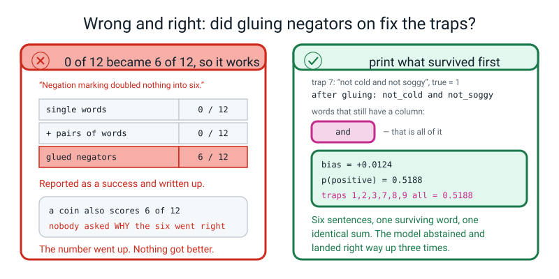
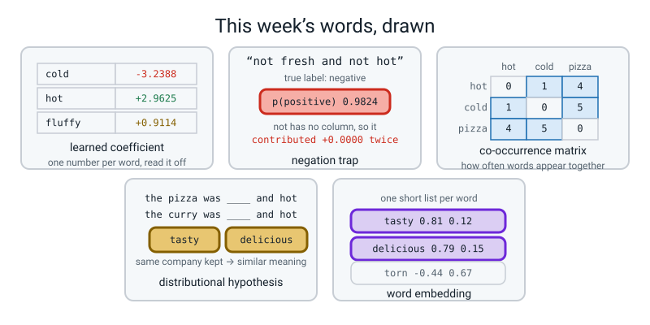

# Week 33 — Sentiment Engine

[⬅ Week 32](week-32.md) · [Course Home](../README.md) · [Next ➡](week-34.md) · [Workbook](../workbook/week-33.md)

---

> ### This week in one sentence
> **A TF-IDF classifier will tell you the fifteen words it learned to trust — and the review it gets wrong will be the one where word order was the whole meaning: `1.0000` on twenty ordinary held-out reviews, and `0 out of 12` on twelve sentences containing the word `not`.**
>
> **By the end of this chapter you will be able to:**
> - **Build a TF-IDF plus logistic regression classifier inside one `Pipeline`**, so the vocabulary can only ever come from training rows — `(60, 97)` in, `97 + 1 = 98` learned numbers out
> - **Report per-class precision and recall against a baseline**, and **list the fifteen most positive and fifteen most negative learned words** with the number of training reviews each one rests on
> - **Measure whether bigrams recover the negation traps** — the answer is **zero of twelve**, the vocabulary grows from `97` to `318` columns, and `"not fresh"` is not one of them
> - **Write a post-mortem of one wrong prediction that names word order as the mechanism**, not just the symptom
>
> **New maths:** none. Everything here is a multiply, a sum, and Week 13's `1 ÷ (1 + e^−z)`. **This week's difficulty is honesty, not algebra.**
>
> **New syntax:** `TfidfVectorizer(ngram_range=(1, 2))` · `make_pipeline(vec, clf)` · `clf.coef_[0]` · `np.argsort(coefs)[:15]`
>
> **Reading time:** about 45 minutes. **Homework:** about 65 minutes.

---

## 🪝 Start Here

**Before you read any further, and before you run a single line of code, do this.**

Here are twelve reviews. In pen — pen, not pencil, and not in your head — write down for each one what you think **the model you are about to build** will say: positive or negative.

**Not what the review means. What the model will say.** Those are different questions today, and the difference between them is the whole of this chapter.

```text
 1  not fresh and not hot
 2  not tasty and not generous
 3  never polite and never quick
 4  the pizza was not perfect and the salad was not crisp
 5  no warm welcome and no friendly driver
 6  hardly a delicious meal
 7  not cold and not soggy
 8  not rude and not slow
 9  never stale and never greasy
10  the base was not limp and the chips were not awful
11  no mean portions and no wrong order
12  hardly a terrible meal
```

Twelve of them, twenty seconds each. **Do not agonise. Commit.**

Done? Good. Here is what you now own.

Numbers 1 to 6 are complaints. Numbers 7 to 12 are compliments. **You read them in about ninety seconds and got all twelve right without thinking about it**, because you speak English.

And here is what is about to happen. **The model you build in the next twenty minutes will score twenty out of twenty on twenty held-out reviews.** A hundred per cent. Perfect. **And then it will meet these twelve and score zero.**

Not "some difficulty with negation". **Zero out of twelve.** A coin would have got six. And the worst of them will be wrong at **98% confidence**.

Pen down. Those predictions are evidence, and they are not changing.

**Two weeks ago you decided to count words and throw away their order.** You knew at the time that it cost something — you did the dog and the man, and the two identical rows. **Today you find out what it costs in customers.**

---

## 🧠 The Big Idea

### 1. A sentiment engine is six lines, and you already own all of it

A **sentiment engine** reads a review and says *happy* or *angry*. That is the whole job, and by this week every part of it is already yours:

| Piece | Where you got it |
|---|---|
| a sentence becomes a row of word counts | **Week 31** |
| rare words count for more, and every row has length 1 | **Week 32** |
| a score becomes a chance, with `1 ÷ (1 + e^−z)` | **Week 13** |
| the weights are found by rolling downhill | **Week 15** |
| precision, recall, and why one number is never enough | **Weeks 8 and 9** |
| the whole chain sealed inside one object so the test set cannot leak in | **Week 3** |

**This week is assembly, not invention.** Six lines of code produce a working classifier. **The other sixty minutes are spent finding out what it knows and what it cannot know**, and that is the actual skill.

> **Learned coefficient** — one number per word, which the model worked out from the training reviews. **Positive pushes towards *happy*, negative pushes towards *angry*, and the size says how hard.**


*Figure 33.1 — One pipeline: words in, a probability out. Four stages, and the vocabulary can only ever come from the 60 training rows.*

**Four boxes and you own all four.**

**Box one** is sixty reviews as plain text. Strings, not numbers. **Box two** is Week 32's `TfidfVectorizer`: it reads those sixty, builds a vocabulary, hands out a grid. **Box three** is the logistic regression: one weight per column, plus one extra number called the **bias**, multiplied and added. **Box four** is a probability, because of Week 13's squash.

**And the reason all four live inside one object is Week 3.** The vocabulary is allowed to come from box one and from **nowhere else.** If a word only ever appears in the held-out pile, it gets no column at all, and it is thrown away when that review arrives. **That is not a defect. It is the honesty rule.**

### 2. What the model actually does, on one real review

**This fits on a board and it is the whole lesson.**

The review is `"not fresh and not hot"`. Its true label is **negative** — the customer is complaining.

Week 31's regex chops it into five tokens: `not`, `fresh`, `and`, `not`, `hot`. Now the model looks up one weight per token and adds. **Three of the five tokens have a column in the vocabulary. Two do not.**

```text
token    tf-idf value   learned coefficient      contribution
-----    ------------   -------------------      ------------
and          0.2461   ×          +0.0629    =         +0.0155
fresh        0.6716   ×          +2.8648    =         +1.9241
hot          0.6988   ×          +2.9625    =         +2.0701
not             ---     no column at all     =         +0.0000     (twice)
bias                                         =         +0.0124
                                                ------------
                                        total        +4.0222
```

**Do those three multiplications on your phone.** `0.6716 × 2.8648 = 1.9241`. Add them up with the bias: `0.0155 + 1.9241 + 2.0701 + 0.0124 = 4.0221`, and the extra thousandth is rounding in the printed pieces.

Then Week 13's squash:

```text
chance of positive = 1 / (1 + e^-4.0222) = 0.9824
```

**The model says positive, and it is 98% sure.** The review said `not fresh and not hot`.


*Figure 33.3 — The trap: a word it cannot see. Five tokens go in, three have columns, and the two that carry the meaning contribute `+0.0000`.*

**Read that table one more time and notice what is not happening.** The model is not confused. It is not struggling. It is not making a close call and getting it slightly wrong. **It is doing exactly the sum it was built to do, on exactly the tokens it was given, and it is extremely sure.**

**The word `not` appears twice in a five-word sentence and contributes exactly nothing**, because it never appeared in a single training review, so the vocabulary has no column for it, so at prediction time it is deleted before the arithmetic starts.

**The mistake is not in the model. The mistake was made two weeks ago, by you, when you decided that a review is a bag of words.**

### 3. Why "no column" is not the same as "a column with a zero in it"

**This distinction is the hinge of the whole week, and Week 31 planted it on purpose.**

Take the word `cold`. It **has** a column, because lots of training reviews used it. In the review `"the salad was fresh"`, `cold`'s cell is **0** — and **that zero is real information.** It means *this review did not mention cold*, and the model's weight for `cold` is multiplied by that zero, so `cold` contributes nothing **on purpose**.

Now take the word `not`. It has **no column at all.** Not a zero — nothing. The word is deleted before the model ever sees the row.

**And from the outside the two situations look identical: both contribute `+0.0000`.**

Here is the part that should make you sit up. **Suppose you were sloppy and built the vocabulary from all 80 reviews instead of just the 60 training rows.** Then `not` *does* get a column, because one of the held-out reviews is `"i would not order from here again"`. **Does that teach the model what `not` means?**

```text
leaked vocabulary size: 107   honest vocabulary size: 97
is 'not' a column now? True
coefficient of 'not' = 0.0000
'not' appears in 0 of the 60 TRAINING reviews
```

**The coefficient is exactly zero.** The column exists, but no training review put a number in it, so the model has no evidence and the weight stays at nothing. **Leaking the test set into the vocabulary did not teach the model anything. It just gave it an empty shelf.**

It did do one thing, and it is subtle and worth knowing — see Worked Example 2 for the full arithmetic. **The leak made the model look more humble without making it any more right.**

### 4. The good news: this model tells you what it learned

**`clf.coef_[0]` hands back one number per column, in the same order as `get_feature_names_out()`.** Sort it and you are reading the model's mind. **You cannot do this with the digits CNN from Week 26** — it has thousands of numbers and not one of them is "the weight for the word `rude`".

Here is the real output, with a third column that most tutorials leave out:

```text
15 words that push hardest towards NEGATIVE
   -3.2388   cold         in  9 of 60 reviews
   -3.2033   rude         in 11 of 60 reviews
   -2.3327   slow         in  7 of 60 reviews
   -2.3024   mean         in  7 of 60 reviews
   -2.2553   terrible     in  5 of 60 reviews
   -2.1383   awful        in  5 of 60 reviews
   -2.0372   limp         in  4 of 60 reviews
   -2.0247   stale        in  5 of 60 reviews
   -1.8736   greasy       in  3 of 60 reviews
   -1.7020   wrong        in  3 of 60 reviews
   -1.4902   bitter       in  2 of 60 reviews
   -1.1954   soggy        in  3 of 60 reviews
   -0.9621   lumpy        in  1 of 60 reviews
   -0.8295   poor         in  2 of 60 reviews
   -0.7625   torn         in  1 of 60 reviews
```

**Almost every one of those is a word you would have picked yourself.** That is genuinely impressive: the model was handed sixty rows of numbers and no dictionary, and it worked out that `rude` and `cold` are complaints.

**Now the three entries that should worry you, and the reason the third column exists:**

| word | coefficient | rests on | the problem |
|---|---:|---:|---|
| `lumpy` | `−0.9621` | **1 review** | One review said the rice was lumpy and it happened to be negative. **That is not a finding; it is a coincidence with a decimal point.** |
| `torn` | `−0.7625` | **1 review** | Same. One torn bag. |
| `fluffy` | `+0.9114` | **1 review** | One fluffy rice. It is fifteenth on the positive list purely because nothing else is left. |

**The rule to write down, because it applies to every model you will ever build:**

> **Print the document frequency next to every coefficient you plan to quote. A weight learned from one review is a coincidence with a decimal point.**


*Figure 33.2 — The words it learned to trust. Thirty learned coefficients with the number of training reviews each rests on. The three ringed in pink rest on one review apiece.*

**Which of the thirty would you actually trust?** The ones resting on 4 or more: `cold` (9), `rude` (11), `hot` (7), `fresh` (8), `slow` (7), `mean` (7). **Roughly the top eight of each list, and no further.**

### 5. Why 100% is bad news

`classification_report` on the twenty held-out reviews:

```text
              precision    recall  f1-score   support

    negative      1.000     1.000     1.000        10
    positive      1.000     1.000     1.000        10

    accuracy                          1.000        20
```

**Twenty out of twenty.** And the baseline that always guesses *negative* gets `0.500`. So you beat the baseline by fifty points.

**And that tells you almost nothing, for three reasons.**

1. **Twenty reviews is a tiny test set.** One mistake would have been `0.9500`. **The number has no resolution** — it cannot move in steps smaller than five points, so it cannot detect a small improvement or a small regression.
2. **All eighty reviews were typed by one person in matched pairs**, using roughly forty sentiment words over and over. `"the coffee was hot and the cake was fresh"` and `"the coffee was cold and the cake was stale"` differ in exactly two words, and **both of those words are on the top-fifteen list.** The test set is not a fresh sample of the world. **It is the same sentences, reshuffled.**
3. **Not one of the twenty is hard.** No sarcasm, no "the food was great but the driver was rude", no `not`. **Every one is unambiguously one thing.** Real reviews are not like that.

**So the honest sentence, and it is the one to write down:**

> **It gets 100% on reviews that look like its training reviews, and 0% on reviews that do not.**

### 6. Bigrams: the obvious fix, and the one line that proves it fails

Everybody's first instinct — including every adult's — is: **count pairs of words as well as single words, then `not fresh` becomes one thing and the problem goes away.**

> **n-gram** — a run of `n` words next to each other, treated as one token. `fresh` is a 1-gram (a unigram); `not fresh` is a 2-gram (a bigram).

`TfidfVectorizer(ngram_range=(1, 2))` does exactly that. Here is what it buys:

```text
columns with single words only  : 97
columns with pairs added        : 318
extra columns bigrams bought    : 221

held-out 20, single words: 1.0
held-out 20, with pairs  : 1.0
traps, single words: 0 of 12
traps, with pairs  : 0 of 12
traps whose answer changed at all: 0
```

**Two hundred and twenty-one new columns, and not one of the twelve answers changed.** Not improved, not worsened — **identical**.

And here is exactly why, in two lines:

```text
   'not fresh'          False
   'not hot'            False
   'never quick'        False
   'hardly delicious'   False
   'not cold'           False
   'was cold'           True
   'the pizza'          True
```

**`"was cold"` is a column**, because a training review contained those two words in that order. **`"not fresh"` is not a column**, because **no training review contains the words `not fresh` next to each other.** And a bigram that is not in the vocabulary is thrown away at prediction time just as silently as a unigram that is not in the vocabulary.

**The general principle, and it is the most important sentence of this lab:**

> **A feature can only help you if the training data contained it. Adding a feature *type* does not add features; adding *data* does.**

That is not an obvious idea and it is not a comfortable one. **It is also the reason "just add bigrams" appears in a hundred tutorials and fixes nothing in any of them.**

### 7. The repair that works — and why five of its six wins are fake

There is a repair that does work, and it costs no new data at all. **Glue a negator onto the word after it, before you count anything:**

```text
"not fresh and not hot"    →    "not_fresh and not_hot"
"hardly a delicious meal"  →    "hardly_delicious meal"
```

Now `not_fresh` is a single token, so it is a single column, so it can have its own weight. Run all five configurations:

```text
1 single words                   cols=97    held-out=1.0000  traps=0/12
2 + pairs of words               cols=318   held-out=1.0000  traps=0/12
3 + pairs + 8 negation rows      cols=337   held-out=0.9500  traps=0/12
4 marked, no new data            cols=97    held-out=0.9500  traps=6/12
5 marked + 8 negation rows       cols=104   held-out=0.9500  traps=7/12
```

**Zero, zero, zero, six, seven.** Row 3 added 240 extra columns **and** eight new reviews and fixed nothing. **Row 4 added neither and fixed six.** Be pleased. You have ninety seconds.


*Figure 33.5 — Five tries at the twelve traps. Five configurations, one bar of twelve boxes each. More columns fixed nothing. More rows fixed nothing.*

**Now the ninety seconds that turn a wrong lesson into a right one.** Look at *how* it got those six right:

```text
bias: 0.0124

 #  p(pos)  pred true  words that still have a column
 1  0.5188    1    0   ['and']
 2  0.5188    1    0   ['and']
 3  0.5188    1    0   ['and']
 4  0.5348    1    0   ['the', 'pizza', 'was', 'and', 'the', 'salad', 'was']
 5  0.4461    0    0   ['welcome', 'and', 'driver']
 6  0.5781    1    0   ['meal']
 7  0.5188    1    1   ['and']
 8  0.5188    1    1   ['and']
 9  0.5188    1    1   ['and']
10  0.6112    1    1   ['the', 'base', 'was', 'and', 'the', 'chips', 'were']
11  0.3724    0    1   ['portions', 'and', 'order']
12  0.5781    1    1   ['meal']
```

**Traps 7, 8 and 9 came out "right" at a probability of `0.5188`, with the single word `and` as their only surviving evidence.**

`not_cold` is not a column either — the training reviews never said `not cold` — **so gluing did not reverse the evidence. It deleted it.** The sentence arrived at the classifier as, effectively, the word `and`, the model was left with the bias of `+0.0124` plus the near-zero weight of `and` (`+0.0629`), which together lean very slightly positive (`0.5188`), and the positive traps happened to want *positive*.

**Six out of twelve, and five of the six are coin flips that landed the right way up.** Rows 1, 2, 3, 7, 8 and 9 all read `0.5188` — **the identical number, six times, because they all reduce to the identical surviving evidence.**

**That is a completely different claim from "gluing negators fixes negation", and telling the difference is the skill.**

> **⚠️ Watch out:** if you stop at the `6/12` line you will have taught yourself that negation marking works. **It does not work; it abstains.** The only trap where real evidence survived is number 5 — `welcome`, `and`, `driver` — and even that is `0.4461`, a whisker under the line. **Of six apparent fixes, one is arguably real and five are the model shrugging.**

### 8. And the door this opens, which is next year

**Why does fixing `not fresh` not help with `hardly wonderful`?**

Because this model has 97 columns and **each one is one word, unrelated to every other word.** `delicious` and `tasty` are as unrelated in this model as `delicious` and `torn`. There is no notion anywhere that they mean nearly the same thing.

Three words for that idea, and then we stop until Level 4.

> **Distributional hypothesis** — the idea that words used in the same contexts tend to mean similar things. *"You shall know a word by the company it keeps."*
>
> **Co-occurrence matrix** — a grid counting how often each word appears near each other word. **That is how you measure the company a word keeps, and you already know how to build a grid of counts.**
>
> **Word embedding** — a short list of numbers standing for a word, arranged so that words used in similar ways get similar lists.

**An embedding fixes exactly that problem** (unrelated words), by giving `delicious` and `tasty` lists of numbers that sit close together. **It does not, on its own, fix negation; reading words in order does that too. Both are Level 4.**

**And the boring answer that works today: more data.** Write forty reviews that use the word `not`, and the model will learn what `not_fresh` means, because it will have seen it. **Not a clever feature. Rows.**

---

## 🔁 The Idea From Last Week, Used Harder

No new maths. Three things from earlier weeks get pushed until they bend.

### Twist one — Week 13's squash, on a number you computed by hand

Week 13 gave you `1 ÷ (1 + e^−z)` and you plotted it from four points. This week it turns `+4.0222` into `0.9824`, and **you should do it on a calculator rather than read the answer.**

```text
e^-4.0222 = 0.017913
1 ÷ (1 + 0.017913) = 1 ÷ 1.017913 = 0.98240
```

**Two buttons: `e^x` and `1/x`.** Forty seconds. And what is new is not the arithmetic — it is that **a confident-looking `0.9824` is now traceable, by you, back to three multiplications, one of which should never have been in the sum.** A probability is not a verdict. It is the end of a sum you can inspect.

### Twist two — Week 3's pipeline, where the leak would be invisible

Week 3's rule was: seal the preprocessing and the model into one object so the test set cannot leak in. **You could not see what leakage cost you then, and you can now.**

Fit the vectorizer on all 80 reviews instead of the 60 training rows and **the held-out score barely moves.** What moves is that `not` acquires a column with a coefficient of exactly `0.0000`, and `fresh`'s tf-idf value in trap 1 falls from `0.6716` to `0.2966` because the row now has two `not`s taking up space and still has to have length 1.

**So the leak made the model look *more humble* — `0.8537` instead of `0.9824` — without making it any more right.** Which is the single most dangerous kind of leak: **one you cannot catch by noticing a suspiciously good score. You catch it by reading the code.**

### Twist three — Week 30's rule, pointed at a coefficient

Last week's rule: **a number means nothing until you put a second number beside it.**

```text
   -0.9621   lumpy        in  1 of 60 reviews
   -3.2033   rude         in 11 of 60 reviews
```

**`−0.9621` and `−3.2033` look like the same kind of claim and they are not remotely the same claim.** One rests on eleven reviews, one on a single sentence somebody typed on a Tuesday. **The second number is the document frequency, and every top-fifteen list on the internet leaves it out.**

And the same rule saves you from `6/12`: `6` means nothing until `0.5188` is written beside it.

---

## 💻 Type This

Four files in one folder. Nothing downloads. **Every run in this chapter finishes in about a second.**

### Step 0 — `reviews80.py`, the whole dataset

This is Week 31's corpus with ten more of each label, plus the twelve traps. **About twelve minutes to type, and everything else imports it.**

```python
"""reviews80.py - Week 33. Eighty reviews and twelve traps, all typed by hand."""

POS_40 = [
    "the pizza arrived hot and the base was perfect",
    "quick delivery and a friendly driver",
    "delicious food and a generous portion",
    "the salad was fresh and crisp",
    "great value and a lovely warm welcome",
    "excellent service from a polite driver",
    "the chips were hot and crisp",
    "a tasty curry and a generous helping of rice",
    "fresh bread and a delicious dip",
    "the delivery was quick and the food was hot",
    "lovely staff and a perfect order",
    "friendly, polite and on time",
    "the sauce was tasty and the cheese was lovely",
    "generous portions and excellent prices",
    "the burger was hot and the salad was fresh",
    "delicious dessert and a friendly note in the bag",
    "a perfect meal and a quick refund on the drink",
    "great chips, crisp and properly salted",
    "the coffee was hot and the cake was fresh",
    "polite driver and a warm, tasty pizza",
    "excellent noodles with fresh vegetables",
    "a lovely evening and a delicious meal",
    "quick, friendly and generous",
    "the fish was fresh and the batter was crisp",
    "perfect timing and a hot bag",
    "tasty wrap, generous salad and a great price",
    "the naan was warm and lovely",
    "friendly manager and a quick, fair refund",
    "a delicious pizza, hot and perfect",
    "excellent, fresh food and a polite driver",
    # --- the ten you typed this week ---
    "helpful driver and a hot, tasty pizza",
    "the bread was warm and the dip was delicious",
    "generous portions and a friendly welcome",
    "quick service and an excellent, fresh garden salad",
    "a lovely handwritten note and a perfect, crisp base",
    "great coffee and a moist, tasty cake",
    "the curry was hot and the rice was fluffy",
    "polite staff and a generous, speedy refund",
    "fresh vegetables and a delicious, rich sauce",
    "quick, warm and lovely throughout",
]

NEG_40 = [
    "the pizza arrived cold and the base was soggy",
    "slow delivery and a rude driver",
    "awful food and a mean portion",
    "the salad was stale and limp",
    "poor value and a cold, rude welcome",
    "terrible service from a rude driver",
    "the chips were cold and soggy",
    "an awful curry and a mean helping of rice",
    "stale bread and a greasy dip",
    "the delivery was slow and the food was cold",
    "rude staff and a wrong order",
    "rude, slow and very late",
    "the sauce was bitter and the cheese was greasy",
    "mean portions and terrible prices",
    "the burger was cold and the salad was limp",
    "awful dessert and a rude note in the bag",
    "a wrong meal and a slow refund on the drink",
    "soggy chips, cold and completely unsalted",
    "the coffee was cold and the cake was stale",
    "rude driver and a cold, greasy pizza",
    "terrible noodles with limp vegetables",
    "i would not order from here again",
    "slow, rude and mean",
    "the fish was stale and the batter was soggy",
    "late again and a cold bag",
    "greasy wrap, limp salad and a terrible price",
    "the naan was cold and stale",
    "rude manager and a slow, unfair refund",
    "an awful pizza, cold and soggy",
    "terrible, stale food and a rude driver",
    # --- the ten you typed this week ---
    "the bag was torn and the pizza was stone cold",
    "the bread was stale and the dip was greasy",
    "mean portions and a rude welcome",
    "slow service and an awful, stale salad",
    "a wrong note and a soggy, limp base",
    "poor watery coffee and a dry, bitter cake",
    "the curry was cold and the rice was lumpy",
    "rude staff and a mean, sluggish refund",
    "limp vegetables and a greasy, thin sauce",
    "slow, cold and mean throughout",
]

CORPUS_80 = POS_40 + NEG_40
LABELS_80 = [1] * 40 + [0] * 40

# The twelve negation traps. These are NEVER trained on.
TRAPS = [
    ("not fresh and not hot",                                 0),
    ("not tasty and not generous",                            0),
    ("never polite and never quick",                          0),
    ("the pizza was not perfect and the salad was not crisp",  0),
    ("no warm welcome and no friendly driver",                 0),
    ("hardly a delicious meal",                               0),
    ("not cold and not soggy",                                1),
    ("not rude and not slow",                                 1),
    ("never stale and never greasy",                          1),
    ("the base was not limp and the chips were not awful",      1),
    ("no mean portions and no wrong order",                   1),
    ("hardly a terrible meal",                                1),
]
TRAP_TEXTS  = [t for t, _ in TRAPS]
TRAP_LABELS = [y for _, y in TRAPS]

if __name__ == "__main__":
    print("positive reviews:", len(POS_40))
    print("negative reviews:", len(NEG_40))
    print("total           :", len(CORPUS_80))
    print("traps           :", len(TRAPS))
```

```text
positive reviews: 40
negative reviews: 40
total           : 80
traps           : 12
```

### Step 1 — split first, before anything looks at a word

New file, `sentiment.py`.

```python
import numpy as np
from sklearn.model_selection import train_test_split
from sklearn.feature_extraction.text import TfidfVectorizer
from sklearn.linear_model import LogisticRegression
from sklearn.pipeline import make_pipeline
from sklearn.dummy import DummyClassifier
from sklearn.metrics import classification_report

from reviews80 import CORPUS_80, LABELS_80

X_train, X_test, y_train, y_test = train_test_split(
    CORPUS_80, LABELS_80, test_size=20, random_state=0, stratify=LABELS_80)
print("train reviews:", len(X_train), " positives:", sum(y_train))
print("held out     :", len(X_test), " positives:", sum(y_test))
```

```text
train reviews: 60  positives: 30
held out     : 20  positives: 10
```

**This is the first line of the file, before a single word has been counted.** `stratify=LABELS_80` is why it came out thirty–thirty and ten–ten rather than some lopsided accident. **This is Week 2's three-piles discipline, and it is the only line in the file that can quietly ruin everything.**

### Step 2 — one pipeline, and a `KeyError` you should meet on purpose

```python
pipe = make_pipeline(
    TfidfVectorizer(),
    LogisticRegression(C=10, max_iter=2000, random_state=0),
)
pipe.fit(X_train, y_train)
vec = pipe.named_steps["tfidf"]        # <-- WRONG ON PURPOSE
```

**What each new line does.**

- `make_pipeline(...)` takes the steps and returns **one object that behaves like a single model.** `pipe.fit(X, y)` runs `fit_transform` on the vectorizer then `fit` on the classifier. `pipe.predict(X)` runs `transform` — **transform, never fit** — then `predict`.
- **Week 3 built the same thing with `Pipeline(steps=[("prep", ...), ("clf", ...)])`, where you chose the names.** `make_pipeline` is the shortcut, and the price of the shortcut is that **it picks the names for you.**
- `C=10` is Week 22's dial: how much the model is allowed to trust any one word. `max_iter=2000` is how many downhill steps it may take. `random_state=0` is the seed.

```text
Traceback (most recent call last):
  File "sentiment.py", line 15, in <module>
    vec = pipe.named_steps["tfidf"]        # <-- WRONG ON PURPOSE
  File ".../sklearn/utils/_bunch.py", line 42, in __getitem__
    return super().__getitem__(key)
KeyError: 'tfidf'
```

**A `KeyError` with a name you chose in it.** There is no step called `tfidf`. So what *is* it called? **Do not guess — ask:**

```python
print(pipe.named_steps.keys())
```

```text
dict_keys(['tfidfvectorizer', 'logisticregression'])
```

**`make_pipeline` names each step after its class, in lowercase.** Fix it, and print the shapes:

```python
vec = pipe.named_steps["tfidfvectorizer"]
clf = pipe.named_steps["logisticregression"]
words = vec.get_feature_names_out()
print("vocabulary built from the training rows only:", len(words), "words")
print("matrix handed to the classifier:", vec.transform(X_train).shape)
print("numbers the classifier learned :", len(clf.coef_[0]), "+ 1 intercept")
```

```text
vocabulary built from the training rows only: 97 words
matrix handed to the classifier: (60, 97)
numbers the classifier learned : 97 + 1 intercept
```

**Ninety-seven columns from sixty reviews.** Last week sixty reviews gave ninety-two — the twenty new reviews brought new words (`helpful`, `torn`, `fluffy`, `lumpy`, `garden`, `stone`) and some of them landed in the training sixty. **And some of last week's 92 words are now in the held-out pile instead, so it is not simply 92 plus 5.**

### Step 3 — score it, with a baseline beside it

```python
print("--- the model, on the 20 held-out reviews ---")
print(classification_report(y_test, pipe.predict(X_test),
                            target_names=["negative", "positive"], digits=3))

dummy = DummyClassifier(strategy="most_frequent", random_state=0)
dummy.fit(X_train, y_train)
print("--- the baseline that always says 'negative' ---")
print(classification_report(y_test, dummy.predict(X_test),
                            target_names=["negative", "positive"],
                            digits=3, zero_division=0))
```

`zero_division=0` tells sklearn to print `0.000` rather than warn, when a class is never predicted at all — which is exactly what a `most_frequent` baseline does.

```text
--- the model, on the 20 held-out reviews ---
              precision    recall  f1-score   support

    negative      1.000     1.000     1.000        10
    positive      1.000     1.000     1.000        10

    accuracy                          1.000        20
   macro avg      1.000     1.000     1.000        20
weighted avg      1.000     1.000     1.000        20

--- the baseline that always says 'negative' ---
              precision    recall  f1-score   support

    negative      0.500     1.000     0.667        10
    positive      0.000     0.000     0.000        10

    accuracy                          0.500        20
   macro avg      0.250     0.500     0.333        20
weighted avg      0.250     0.500     0.333        20
```

**Twenty out of twenty against the baseline's ten.** Feel good for four seconds, then read §5 again.

### Step 4 — open the model up, and an `IndexError` about something else entirely

```python
coefs = clf.coef_                    # <-- MISSING THE [0] ON PURPOSE
order = np.argsort(coefs)
for i in order[:15]:
    print(f"   {coefs[i]:+.4f}   {words[i]}")
```

```text
Traceback (most recent call last):
  File "sentiment.py", line 19, in <module>
    print(f"   {coefs[i]:+.4f}   {words[i]}")
IndexError: index 12 is out of bounds for axis 0 with size 1
```

**"axis 0 with size 1"? You have ninety-seven words.** Week 16's rule: **when something is confusing, print the shape.**

```python
print("coefs.shape:", clf.coef_.shape)
print("order.shape:", order.shape)
print("what one loop step gives me:", order[0].shape)
```

```text
coefs.shape: (1, 97)
order.shape: (1, 97)
what one loop step gives me: (97,)
```

**`coef_` comes back as a grid with one row per class**, even when there are only two classes and therefore only one row. So it is **1 by 97, not 97.** `argsort` of a 1-by-97 grid is a 1-by-97 grid of positions. So `order[:15]` is **the whole thing** — because the first axis has only one thing in it, and fifteen of one thing is one thing. Then the loop runs **once**, `i` is all ninety-seven positions at once, and `coefs[i]` tries to take row twelve out of a grid with one row.

**Three shapes and the whole thing is obvious. `clf.coef_[0]` is the fix.**

```python
coefs = clf.coef_[0]
counts = (vec.transform(X_train) > 0).sum(axis=0).A1
order = np.argsort(coefs)          # smallest (most negative) first

print("15 words that push hardest towards NEGATIVE")
for i in order[:15]:
    print(f"   {coefs[i]:+.4f}   {words[i]:<12} in {counts[i]:>2} of 60 reviews")

print("\n15 words that push hardest towards POSITIVE")
for i in order[::-1][:15]:
    print(f"   {coefs[i]:+.4f}   {words[i]:<12} in {counts[i]:>2} of 60 reviews")

print(f"\nintercept: {clf.intercept_[0]:+.4f}")
```

- `np.sort` gives the numbers in order; **`np.argsort` gives the *positions* of those numbers in order** — and positions are what you need, because position 43 in the coefficient list is the same word as position 43 in the vocabulary list.
- `order[:15]` is the fifteen **smallest** — the angriest. `order[::-1][:15]` reverses the whole order and takes fifteen, giving the fifteen **largest**. **Read `[::-1]` out loud as "backwards".**
- `(vec.transform(X_train) > 0).sum(axis=0)` is Week 32's `df` trick: *did this word appear at all*, summed down the columns. `.A1` flattens the sparse result into a plain list of 97 numbers.

The negative fifteen are printed in §4. Here is the positive half and the bias:

```text
15 words that push hardest towards POSITIVE
   +2.9625   hot          in  7 of 60 reviews
   +2.8648   fresh        in  8 of 60 reviews
   +2.4595   generous     in  6 of 60 reviews
   +2.2803   quick        in  6 of 60 reviews
   +2.2796   delicious    in  5 of 60 reviews
   +2.1873   tasty        in  5 of 60 reviews
   +2.1066   excellent    in  5 of 60 reviews
   +2.0669   lovely       in  4 of 60 reviews
   +1.7633   friendly     in  4 of 60 reviews
   +1.6854   polite       in  4 of 60 reviews
   +1.6798   crisp        in  4 of 60 reviews
   +1.5712   perfect      in  3 of 60 reviews
   +1.2042   warm         in  2 of 60 reviews
   +1.0037   great        in  2 of 60 reviews
   +0.9114   fluffy       in  1 of 60 reviews

intercept: +0.0124
```

### Step 5 — the gauntlet

```python
from reviews80 import TRAP_TEXTS, TRAP_LABELS

pred = pipe.predict(TRAP_TEXTS)
prob = pipe.predict_proba(TRAP_TEXTS)[:, 1]
print(" #  true pred  p(positive)  verdict  review")
for k in range(12):
    ok = "right" if pred[k] == TRAP_LABELS[k] else "WRONG"
    print(f"{k+1:>2}    {TRAP_LABELS[k]}    {pred[k]}     {prob[k]:.4f}     {ok}   {TRAP_TEXTS[k]}")
print(f"\nscore on the twelve traps: {int((pred == np.array(TRAP_LABELS)).sum())} out of 12")
```

**Before you press enter, look at your twelve predictions in pen.**

```text
 #  true pred  p(positive)  verdict  review
 1    0    1     0.9824     WRONG   not fresh and not hot
 2    0    1     0.9616     WRONG   not tasty and not generous
 3    0    1     0.9392     WRONG   never polite and never quick
 4    0    1     0.7931     WRONG   the pizza was not perfect and the salad was not crisp
 5    0    1     0.7943     WRONG   no warm welcome and no friendly driver
 6    0    1     0.8526     WRONG   hardly a delicious meal
 7    1    0     0.0571     WRONG   not cold and not soggy
 8    1    0     0.0241     WRONG   not rude and not slow
 9    1    0     0.0654     WRONG   never stale and never greasy
10    1    0     0.2622     WRONG   the base was not limp and the chips were not awful
11    1    0     0.1038     WRONG   no mean portions and no wrong order
12    1    0     0.2206     WRONG   hardly a terrible meal
```

```text
score on the twelve traps: 0 out of 12
```

**Zero out of twelve. A coin scores six.** The model that just got a hundred per cent scored **worse than a coin**, and it did it with confidence: row one is 98% sure and wrong.

### Step 6 — open trap 1 and add up the evidence

```python
s = TRAP_TEXTS[0]
row = vec.transform([s]).toarray()[0]
print(f"--- inside {s!r} ---")
total = 0.0
for i in np.nonzero(row)[0]:
    piece = row[i] * coefs[i]
    total += piece
    print(f"   {words[i]:<8} tfidf {row[i]:.4f}  x  coef {coefs[i]:+.4f}  =  {piece:+.4f}")
print(f"   {'not':<8} no column at all            =  +0.0000   (twice)")
total += clf.intercept_[0]
print(f"   {'bias':<8}                             = {clf.intercept_[0]:+.4f}")
print(f"   {'TOTAL':<8}                             = {total:+.4f}")
print(f"   chance of positive = 1 / (1 + e^-{total:.4f}) = {1/(1+np.exp(-total)):.4f}")
print("   is 'not' in the vocabulary?", "not" in set(words))
```

`np.nonzero(row)[0]` gives the positions of the cells that actually hold a number — **so the loop visits only the words that are in this review**, which is three of them.

```text
--- inside 'not fresh and not hot' ---
   and      tfidf 0.2461  x  coef +0.0629  =  +0.0155
   fresh    tfidf 0.6716  x  coef +2.8648  =  +1.9241
   hot      tfidf 0.6988  x  coef +2.9625  =  +2.0701
   not      no column at all            =  +0.0000   (twice)
   bias                                 = +0.0124
   TOTAL                                = +4.0222
   chance of positive = 1 / (1 + e^-4.0222) = 0.9824
   is 'not' in the vocabulary? False
```

**`is 'not' in the vocabulary? False`.** Let that sit on the screen for a moment. **There is no confusion anywhere in this system. There is a deletion.**

### Step 7 — five tries at the twelve traps

New file, `five_tries.py`. **It fits five models and still finishes in under a second.**

```python
"""five_tries.py - Week 33. Five attempts at the twelve traps."""
import re
import numpy as np
from sklearn.model_selection import train_test_split
from sklearn.feature_extraction.text import TfidfVectorizer
from sklearn.linear_model import LogisticRegression
from sklearn.pipeline import make_pipeline

from reviews80 import CORPUS_80, LABELS_80, TRAP_TEXTS, TRAP_LABELS

NEGATORS = {"not", "never", "no", "hardly"}

def mark_negation(text):
    """Glue a negator onto the word after it: 'not fresh' -> 'not_fresh'."""
    words = re.findall(r"\b\w\w+\b", text.lower())
    out, i = [], 0
    while i < len(words):
        if words[i] in NEGATORS and i + 1 < len(words):
            out.append(words[i] + "_" + words[i + 1])
            i += 2
        else:
            out.append(words[i])
            i += 1
    return " ".join(out)

# eight short negation reviews, four of each label, none of them a trap
AUG_TEXTS = [
    "the order was not late",
    "never a wrong order",
    "no soggy chips",
    "hardly any greasy food",
    "the order was not quick",
    "never a generous portion",
    "no fresh bread",
    "hardly any tasty food",
]
AUG_LABELS = [1, 1, 1, 1, 0, 0, 0, 0]

X_train, X_test, y_train, y_test = train_test_split(
    CORPUS_80, LABELS_80, test_size=20, random_state=0, stratify=LABELS_80)

def try_it(name, ngram=(1, 1), add_rows=False, mark=False):
    train, labels, test, traps = list(X_train), list(y_train), list(X_test), list(TRAP_TEXTS)
    if add_rows:
        train = train + AUG_TEXTS
        labels = labels + AUG_LABELS
    if mark:
        train = [mark_negation(t) for t in train]
        test = [mark_negation(t) for t in test]
        traps = [mark_negation(t) for t in traps]
    p = make_pipeline(TfidfVectorizer(ngram_range=ngram),
                      LogisticRegression(C=10, max_iter=2000, random_state=0))
    p.fit(train, labels)
    guesses = p.predict(traps)
    fixed = int((guesses == np.array(TRAP_LABELS)).sum())
    n = len(p.named_steps["tfidfvectorizer"].get_feature_names_out())
    print(f"{name:<32} cols={n:<5} held-out={p.score(test, y_test):.4f}  traps={fixed}/12")
    return guesses

print("mark_negation('not fresh and not hot') ->", repr(mark_negation("not fresh and not hot")))
print("mark_negation('hardly a delicious meal') ->", repr(mark_negation("hardly a delicious meal")))
print()
g1 = try_it("1 single words", (1, 1))
g2 = try_it("2 + pairs of words", (1, 2))
g3 = try_it("3 + pairs + 8 negation rows", (1, 2), add_rows=True)
g4 = try_it("4 marked, no new data", (1, 1), mark=True)
g5 = try_it("5 marked + 8 negation rows", (1, 1), add_rows=True, mark=True)

print("\n #  1 2 3 4 5   true  review")
for k in range(12):
    row = " ".join("Y" if g[k] == TRAP_LABELS[k] else "." for g in (g1, g2, g3, g4, g5))
    print(f"{k+1:>2}  {row}    {TRAP_LABELS[k]}    {TRAP_TEXTS[k]}")
```

**The one function worth reading twice** is `mark_negation`. It tokenizes with Week 31's regex, then walks the list: if a word is a negator **and there is a word after it**, glue the two together and skip forward two; otherwise keep the word and step forward one. `ngram_range=(1, 2)` means "a column for every run of 1 word **and** every run of 2 words" — `(1, 1)` is the default.

```text
mark_negation('not fresh and not hot') -> 'not_fresh and not_hot'
mark_negation('hardly a delicious meal') -> 'hardly_delicious meal'

1 single words                   cols=97    held-out=1.0000  traps=0/12
2 + pairs of words               cols=318   held-out=1.0000  traps=0/12
3 + pairs + 8 negation rows      cols=337   held-out=0.9500  traps=0/12
4 marked, no new data            cols=97    held-out=0.9500  traps=6/12
5 marked + 8 negation rows       cols=104   held-out=0.9500  traps=7/12

 #  1 2 3 4 5   true  review
 1  . . . . .    0    not fresh and not hot
 2  . . . . .    0    not tasty and not generous
 3  . . . . .    0    never polite and never quick
 4  . . . . .    0    the pizza was not perfect and the salad was not crisp
 5  . . . Y Y    0    no warm welcome and no friendly driver
 6  . . . . .    0    hardly a delicious meal
 7  . . . Y Y    1    not cold and not soggy
 8  . . . Y Y    1    not rude and not slow
 9  . . . Y Y    1    never stale and never greasy
10  . . . Y Y    1    the base was not limp and the chips were not awful
11  . . . . Y    1    no mean portions and no wrong order
12  . . . Y Y    1    hardly a terrible meal
```

**Notice `hardly a delicious meal` → `hardly_delicious meal`.** Week 31's regex throws away the one-letter word `a`, **which is lucky**: had it kept `a`, we would have glued `hardly` onto `a` and achieved nothing at all.

**And notice the held-out score went *down*, from `1.0000` to `0.9500`, in rows 3, 4 and 5.** One held-out review out of twenty is now wrong. **Look at which review it is:** `"i would not order from here again"`, the only held-out review that contains `not`. Row 1 got it right only because `order` (coefficient `-0.50`) survives, at `p(positive) = 0.415`; once `not order` is glued into one unseen token, `order` is deleted along with it and the review lands at about `0.5`. **A repair that deletes unseen tokens can cost you evidence you had. Name that trade rather than hiding it.**

### Step 8 — was that a fix, or an abstention?

```python
p4 = make_pipeline(TfidfVectorizer(),
                   LogisticRegression(C=10, max_iter=2000, random_state=0))
p4.fit([mark_negation(t) for t in X_train], y_train)
vocab = set(p4.named_steps["tfidfvectorizer"].get_feature_names_out())
marked = [mark_negation(t) for t in TRAP_TEXTS]
prob = p4.predict_proba(marked)[:, 1]
print("bias:", round(p4.named_steps["logisticregression"].intercept_[0], 4))
print()
print(" #  p(pos)  pred true  words that still have a column")
for k in range(12):
    kept = [w for w in marked[k].split() if w in vocab]
    print(f"{k+1:>2}  {prob[k]:.4f}    {int(prob[k]>=0.5)}    {TRAP_LABELS[k]}   {kept}")
print()
print("is 'not_fresh' a column?", "not_fresh" in vocab)
print("is 'not_cold'   a column?", "not_cold" in vocab)
print("columns after marking:", len(vocab))
```

`[w for w in marked[k].split() if w in vocab]` keeps only the tokens that have a column at all. **That list is what the classifier actually had in front of it.**

```text
bias: 0.0124

 #  p(pos)  pred true  words that still have a column
 1  0.5188    1    0   ['and']
 2  0.5188    1    0   ['and']
 3  0.5188    1    0   ['and']
 4  0.5348    1    0   ['the', 'pizza', 'was', 'and', 'the', 'salad', 'was']
 5  0.4461    0    0   ['welcome', 'and', 'driver']
 6  0.5781    1    0   ['meal']
 7  0.5188    1    1   ['and']
 8  0.5188    1    1   ['and']
 9  0.5188    1    1   ['and']
10  0.6112    1    1   ['the', 'base', 'was', 'and', 'the', 'chips', 'were']
11  0.3724    0    1   ['portions', 'and', 'order']
12  0.5781    1    1   ['meal']

is 'not_fresh' a column? False
is 'not_cold'   a column? False
columns after marking: 97
```

**`not_fresh` is not a column. `not_cold` is not a column.** Gluing produced tokens nothing in training had ever seen, so they were deleted — **exactly as `not` was.** Six traps came out right, but only three of them (7, 8 and 9) because the sentence arrived as the single word `and` and the model returned `0.5188`; the other three (5, 10 and 12) were decided by a few weak words, at `0.4461`, `0.6112` and `0.5781`.

**Six out of twelve, and one of them is arguably real.**

### The complete `sentiment.py`

Everything from Steps 1 to 6, with both deliberate mistakes fixed:

```python
"""sentiment.py - Week 33. One pipeline: words in, a label out."""
import numpy as np
from sklearn.model_selection import train_test_split
from sklearn.feature_extraction.text import TfidfVectorizer
from sklearn.linear_model import LogisticRegression
from sklearn.pipeline import make_pipeline
from sklearn.dummy import DummyClassifier
from sklearn.metrics import classification_report

from reviews80 import CORPUS_80, LABELS_80, TRAP_TEXTS, TRAP_LABELS

# ---------- 1. split FIRST, before anything looks at a word ----------
X_train, X_test, y_train, y_test = train_test_split(
    CORPUS_80, LABELS_80, test_size=20, random_state=0, stratify=LABELS_80)
print("train reviews:", len(X_train), " positives:", sum(y_train))
print("held out     :", len(X_test), " positives:", sum(y_test))

# ---------- 2. one pipeline: vectorizer, then classifier ----------
pipe = make_pipeline(
    TfidfVectorizer(),
    LogisticRegression(C=10, max_iter=2000, random_state=0),
)
pipe.fit(X_train, y_train)

vec = pipe.named_steps["tfidfvectorizer"]
clf = pipe.named_steps["logisticregression"]
words = vec.get_feature_names_out()
coefs = clf.coef_[0]
print("\nvocabulary built from the training rows only:", len(words), "words")
print("matrix handed to the classifier:", vec.transform(X_train).shape)
print("numbers the classifier learned :", len(coefs), "+ 1 intercept")

# ---------- 3. score it, with a baseline beside it ----------
print("\n--- the model, on the 20 held-out reviews ---")
print(classification_report(y_test, pipe.predict(X_test),
                            target_names=["negative", "positive"], digits=3))
dummy = DummyClassifier(strategy="most_frequent", random_state=0)
dummy.fit(X_train, y_train)
print("--- the baseline that always says 'negative' ---")
print(classification_report(y_test, dummy.predict(X_test),
                            target_names=["negative", "positive"],
                            digits=3, zero_division=0))

# ---------- 4. read the model's mind ----------
counts = (vec.transform(X_train) > 0).sum(axis=0).A1
order = np.argsort(coefs)
print("15 words that push hardest towards NEGATIVE")
for i in order[:15]:
    print(f"   {coefs[i]:+.4f}   {words[i]:<12} in {counts[i]:>2} of 60 reviews")
print("\n15 words that push hardest towards POSITIVE")
for i in order[::-1][:15]:
    print(f"   {coefs[i]:+.4f}   {words[i]:<12} in {counts[i]:>2} of 60 reviews")
print(f"\nintercept: {clf.intercept_[0]:+.4f}")

# ---------- 5. the twelve traps ----------
pred = pipe.predict(TRAP_TEXTS)
prob = pipe.predict_proba(TRAP_TEXTS)[:, 1]
print("\n #  true pred  p(positive)  verdict  review")
for k in range(12):
    ok = "right" if pred[k] == TRAP_LABELS[k] else "WRONG"
    print(f"{k+1:>2}    {TRAP_LABELS[k]}    {pred[k]}     {prob[k]:.4f}     {ok}   {TRAP_TEXTS[k]}")
print(f"\nscore on the twelve traps: {int((pred == np.array(TRAP_LABELS)).sum())} out of 12")

# ---------- 6. open trap 1 and add up the evidence ----------
s = TRAP_TEXTS[0]
row = vec.transform([s]).toarray()[0]
print(f"\n--- inside {s!r} ---")
total = 0.0
for i in np.nonzero(row)[0]:
    piece = row[i] * coefs[i]
    total += piece
    print(f"   {words[i]:<8} tfidf {row[i]:.4f}  x  coef {coefs[i]:+.4f}  =  {piece:+.4f}")
print(f"   {'not':<8} no column at all            =  +0.0000   (twice)")
total += clf.intercept_[0]
print(f"   {'bias':<8}                             = {clf.intercept_[0]:+.4f}")
print(f"   {'TOTAL':<8}                             = {total:+.4f}")
print(f"   chance of positive = 1 / (1 + e^-{total:.4f}) = {1/(1+np.exp(-total)):.4f}")
print("   is 'not' in the vocabulary?", "not" in set(words))
```

**Runtime: 1 second.** `five_tries.py` fits five models in under a second. **Nothing in this week takes longer than a breath, which means there is no excuse for not running it four times.**

### Step 9 — the picture, and the percentage it threw away

New file, `picture.py`. This is Week 29's PCA, pointed at text.

```python
"""picture.py - Week 33. Squash 97 columns down to 2 and look."""
import numpy as np
import matplotlib
matplotlib.use("Agg")
import matplotlib.pyplot as plt
from sklearn.model_selection import train_test_split
from sklearn.feature_extraction.text import TfidfVectorizer
from sklearn.decomposition import PCA

from reviews80 import CORPUS_80, LABELS_80

X_train, X_test, y_train, y_test = train_test_split(
    CORPUS_80, LABELS_80, test_size=20, random_state=0, stratify=LABELS_80)

vec = TfidfVectorizer()
vec.fit(X_train)                        # vocabulary from training rows ONLY
Z = vec.transform(CORPUS_80).toarray()  # all 80 rows, 97 columns
print("rows to draw:", Z.shape)

pca = PCA(n_components=2, random_state=0)
P = pca.fit_transform(Z)
r = pca.explained_variance_ratio_
print(f"axis 1 holds {r[0]*100:.2f}% of the spread")
print(f"axis 2 holds {r[1]*100:.2f}% of the spread")
print(f"kept in the picture: {r.sum()*100:.2f}%   thrown away: {(1-r.sum())*100:.2f}%")

y = np.array(LABELS_80)
fig, ax = plt.subplots(figsize=(6, 6))
ax.scatter(P[y == 1, 0], P[y == 1, 1], marker="o", label="positive")
ax.scatter(P[y == 0, 0], P[y == 0, 1], marker="s", label="negative")
ax.set_xlabel(f"axis 1  ({r[0]*100:.2f}% of the spread)")
ax.set_ylabel(f"axis 2  ({r[1]*100:.2f}% of the spread)")
ax.set_title("80 reviews, 97 columns squashed to 2")
ax.legend()
plt.savefig("reviews_pca.png", dpi=110, bbox_inches="tight")
print("saved reviews_pca.png")
```

**`vec.fit(X_train)` then `vec.transform(CORPUS_80)`.** Drawing all eighty is fine; **fitting on all eighty would not be.**

```text
rows to draw: (80, 97)
axis 1 holds 10.58% of the spread
axis 2 holds 4.49% of the spread
kept in the picture: 15.07%   thrown away: 84.93%
saved reviews_pca.png
```


*Figure 33.4 — Eighty reviews, flattened onto two axes. They are thoroughly mixed, and `84.93%` of the structure is not in this picture.*

**Open the picture. The two classes look thoroughly mixed** — and the classifier gets twenty out of twenty on exactly these reviews. **Both of those are true.** `10.58 + 4.49 = 15.07`, so **84.93% of the structure is missing from the picture.** The classifier separates them using **all ninety-seven columns.**

**A two-dimensional plot of ninety-seven-dimensional data is a shadow, and things that do not touch can have overlapping shadows.** The plot is a statement about the projection, not about the classifier.

---

## 🔍 Worked Examples

### Worked Example 1 — A post-mortem of trap 8, from scratch

**The job:** write the post-mortem the homework asks for, on a trap that is **not** number one, because number one is the worked example everybody uses.

Trap 8 is `"not rude and not slow"`. **Its true label is 1 — positive.** The customer is saying the driver was *not* rude and the service was *not* slow. That is a compliment.

```python
def open_up(s):
    row = vec.transform([s]).toarray()[0]
    print("--- inside %r ---" % s)
    total = 0.0
    for i in np.nonzero(row)[0]:
        piece = row[i] * coefs[i]
        total += piece
        print("   %-8s tfidf %.4f  x  coef %+.4f  =  %+.4f" % (words[i], row[i], coefs[i], piece))
    missing = [w for w in re.findall(r"\b\w\w+\b", s.lower()) if w not in set(words)]
    print("   words with no column at all:", missing)
    total += clf.intercept_[0]
    print("   bias                                 = %+.4f" % clf.intercept_[0])
    print("   TOTAL                                = %+.4f" % total)
    print("   p(positive) = 1 / (1 + e^-(%.4f)) = %.4f" % (total, 1 / (1 + np.exp(-total))))

open_up(TRAP_TEXTS[7])
print("true label:", TRAP_LABELS[7], " model says:", int(pipe.predict([TRAP_TEXTS[7]])[0]))
```

```text
--- inside 'not rude and not slow' ---
   and      tfidf 0.2573  x  coef +0.0629  =  +0.0162
   rude     tfidf 0.6327  x  coef -3.2033  =  -2.0268
   slow     tfidf 0.7304  x  coef -2.3327  =  -1.7038
   words with no column at all: ['not', 'not']
   bias                                 = +0.0124
   TOTAL                                = -3.7019
   p(positive) = 1 / (1 + e^-(-3.7019)) = 0.0241
true label: 1  model says: 0
```

**The four things a post-mortem needs, in order.**

1. **The review and the truth.** `"not rude and not slow"`, true label **positive**.
2. **What the model said and how sure it was.** **Negative, at `p(positive) = 0.0241`** — so it is 97.6% certain the customer is furious. **That is the second most confidently wrong of the twelve, after trap 1 at 98.2%.**
3. **The arithmetic.** Three tokens have columns. `rude` contributes `−2.0268`, `slow` contributes `−1.7038`, `and` contributes `+0.0162`, the bias adds `+0.0124`, total `−3.7019`, squashed to `0.0241`. **Check the sum yourself: `0.0162 − 2.0268 − 1.7038 + 0.0124 = −3.7020`, and the last digit is rounding in the printed pieces.**
4. **The mechanism.** `not` appears **twice** and has **no column at all** — `words with no column at all: ['not', 'not']`. So the two words that reverse the meaning of the sentence were deleted before the arithmetic began, and the model was handed the two strongest negative words in its entire vocabulary: `rude` at `−3.2033` (the second-biggest weight it has) and `slow` at `−2.3327`. **It did not misread the sentence. It never received the sentence.**

**And the smallest change that would fix it.** Not a neural network. **About forty training reviews that use the word `not`**, so that `not_rude` and `not_slow` become tokens the model has actually seen. **A feature can only help if the training data contained it.**

> **⚠️ Watch out:** "the model was wrong" is not a mechanism. "The model does not understand English" is not a mechanism. **A mechanism names the step where the information was lost, and there is only one candidate: box two, the vectorizer.**

### Worked Example 2 — What leaking the test set into the vocabulary actually does

**The job:** find out whether the honesty rule from Week 3 is doing real work here, by breaking it on purpose and measuring.

The sloppy version fits the vectorizer on **all eighty** reviews, so `not` gets a column — one of the held-out reviews is `"i would not order from here again"`.

```python
leaky_vec = TfidfVectorizer().fit(CORPUS_80)      # WRONG: all 80
Zl = leaky_vec.transform(X_train)
lclf = LogisticRegression(C=10, max_iter=2000, random_state=0).fit(Zl, y_train)
lw = leaky_vec.get_feature_names_out()
lc = lclf.coef_[0]
print("leaked vocabulary size:", len(lw), "  honest vocabulary size:", len(words))
print("is 'not' a column now?", "not" in set(lw))
ni = list(lw).index("not")
print("coefficient of 'not' = %.4f" % lc[ni])
print("'not' appears in", int((leaky_vec.transform(X_train)[:, ni] > 0).sum()),
      "of the 60 TRAINING reviews")
row = leaky_vec.transform([TRAP_TEXTS[0]]).toarray()[0]
tot = 0.0
for i in np.nonzero(row)[0]:
    piece = row[i] * lc[i]
    tot += piece
    print("   %-8s tfidf %.4f coef %+.4f -> %+.4f" % (lw[i], row[i], lc[i], piece))
tot += lclf.intercept_[0]
print("   bias %.4f TOTAL %.4f p(pos) %.4f" % (lclf.intercept_[0], tot, 1 / (1 + np.exp(-tot))))
```

```text
leaked vocabulary size: 107   honest vocabulary size: 97
is 'not' a column now? True
coefficient of 'not' = 0.0000
'not' appears in 0 of the 60 TRAINING reviews
   and      tfidf 0.1020 coef +0.0762 -> +0.0078
   fresh    tfidf 0.2966 coef +2.8950 -> +0.8587
   hot      tfidf 0.2966 coef +2.9443 -> +0.8733
   not      tfidf 0.9020 coef +0.0000 -> +0.0000
   bias 0.0245 TOTAL 1.7642 p(pos) 0.8537
```

**Three findings, and the third is the interesting one.**

1. **The vocabulary grew from 97 to 107 words** — ten words that exist only in the held-out reviews got columns they should never have had.
2. **`not`'s coefficient is exactly `0.0000`**, because `not` appears in **0 of the 60 training reviews.** The column exists and nothing ever put a number in it, so gradient descent had no reason to move its weight off zero. **Leaking did not teach the model what `not` means. It gave it an empty shelf.**
3. **But look at `fresh`.** Its tf-idf value fell from `0.6716` (honest) to `0.2966` (leaked). **Why?** Because the leaked row now contains `not` with a value of `0.9020` — and the whole row must still have length 1, so everything else got squeezed. `fresh` and `hot` each contribute about `0.86` instead of about `1.92`, the total drops from `+4.0222` to `+1.7642`, and the confidence drops from `0.9824` to **`0.8537`**.

**So the leak made the model look more humble without making it any more right.** It is still wrong about trap 1, just less loudly.

**And that is the most dangerous kind of leak there is.** You cannot catch it by noticing a suspiciously good score — the score barely moved. **You catch it by reading the code and asking: which rows did `fit` see?**

### Worked Example 3 — Auditing the 221 bigrams

**The job:** the bigram experiment fixed zero of twelve. Do not take the explanation on trust — go and look at what the 221 new columns actually are.

```python
bi = make_pipeline(TfidfVectorizer(ngram_range=(1, 2)),
                   LogisticRegression(C=10, max_iter=2000, random_state=0)).fit(X_train, y_train)
vb = bi.named_steps["tfidfvectorizer"].get_feature_names_out()
pairs = [v for v in vb if " " in v]
NEG = {"not", "never", "no", "hardly"}
starts = [v for v in pairs if v.split()[0] in NEG]
print("total columns:", len(vb), " single words:", len(vb) - len(pairs), " pairs:", len(pairs))
print("pairs beginning with a negator:", len(starts), starts)
for p in ["not fresh", "not hot", "never quick", "hardly delicious",
          "not cold", "was cold", "the pizza"]:
    print("   %-20r %s" % (p, p in set(vb)))
```

`[v for v in vb if " " in v]` picks out the bigrams, because a bigram's name contains a space and a unigram's does not.

```text
total columns: 318  single words: 97  pairs: 221
pairs beginning with a negator: 0 []
   'not fresh'          False
   'not hot'            False
   'never quick'        False
   'hardly delicious'   False
   'not cold'           False
   'was cold'           True
   'the pizza'          True
```

**`pairs beginning with a negator: 0`.** Not "few". **Zero. The list is empty.**

**That is the whole explanation, and it is better than the explanation.** There are 221 bigram columns and **not one of them starts with `not`, `never`, `no` or `hardly`** — because no training review contains a negator followed by anything. There *is* a negator in the corpus: `"i would not order from here again"`, which would have given `not order`. **But that review is in the held-out twenty, so the training rows genuinely have none.**

So `'was cold'` is a column because a training review said those two words in that order, and `'not fresh'` is not, and **a bigram with no column is thrown away at prediction time exactly as silently as a unigram with no column.**

**221 extra columns, zero of them the one you needed.** *Adding a feature type does not add features. Adding data adds features.*

---

## 🐞 When It Breaks

All four are real, from real runs. **The last one is the worst kind: no error at all.**

### Break 1 — `make_pipeline` chose the names, not you

```python
vec = pipe.named_steps["tfidf"]
```

```text
Traceback (most recent call last):
  File "err33.py", line 12, in <module>
    vec = pipe.named_steps["tfidf"]
  File ".../sklearn/utils/_bunch.py", line 42, in __getitem__
    return super().__getitem__(key)
KeyError: 'tfidf'
```

**What it means.** "There is no step with that name." And notice the name in the error is **the one you typed**, which is the clue: you invented it.

**Why.** `make_pipeline` names each step after its **class, in lowercase**: `tfidfvectorizer` and `logisticregression`. **Week 3's `Pipeline(steps=[("prep", ...)])` let you choose; `make_pipeline` is the shortcut and this is what the shortcut costs.**

**The fix.** Ask rather than guess: `print(pipe.named_steps.keys())` → `dict_keys(['tfidfvectorizer', 'logisticregression'])`.

### Break 2 — an `IndexError` that is really a shape error

```python
coefs = clf.coef_          # missing the [0]
order = np.argsort(coefs)
for i in order[:15]:
    print(coefs[i], words[i])
```

```text
Traceback (most recent call last):
  File "err33.py", line 21, in <module>
    print("   %+.4f   %s" % (coefs[i], words[i]))
IndexError: index 12 is out of bounds for axis 0 with size 1
```

**What it sounds like:** something about indexing 12 things. **What it is:** a shape problem.

```text
coefs.shape: (1, 97)
order.shape: (1, 97)
one loop step: (97,)
```

**`clf.coef_` is a grid with one row per class**, so with two classes it is `(1, 97)`. `order[:15]` takes the first fifteen **rows** of a one-row grid, which is the whole grid. The loop runs once, `i` is all 97 positions at once, and `coefs[i]` asks for row 12 of a one-row grid.

**The fix.** `clf.coef_[0]`. **And the general move: three `print(x.shape)` lines beat twenty minutes of staring.**

### Break 3 — you asked for the weights before there were any

```python
LogisticRegression().coef_
```

```text
Traceback (most recent call last):
  File "err33.py", line 25, in <module>
    LogisticRegression().coef_
AttributeError: 'LogisticRegression' object has no attribute 'coef_'
```

**What it means.** "I have not learned anything yet, so I have no weights."

**The trailing underscore in `coef_` is scikit-learn's mark for "learned during `fit`"** — the same convention as `scaler.mean_` and `tv.idf_`. **An attribute ending in `_` does not exist before fitting, and that is a feature, not a rough edge.**

**The fix.** Fit it first.

### Break 4 — the pipeline wants a list, even for one review

```python
pipe.predict("not fresh and not hot")
```

```text
Traceback (most recent call last):
  File "err33.py", line 28, in <module>
    pipe.predict("not fresh and not hot")
  File ".../sklearn/pipeline.py", line 788, in predict
    Xt = transform.transform(Xt)
  File ".../sklearn/feature_extraction/text.py", line 1415, in transform
    raise ValueError(
ValueError: Iterable over raw text documents expected, string object received.
```

**Week 31's error, arriving through a pipeline** — and notice the traceback shows it happening inside the **vectorizer's** `transform`, two frames down. **When a pipeline fails, read the traceback to find out which box it was in.**

**The fix.** `pipe.predict(["not fresh and not hot"])`. **Always a list.**

### And the one that does not raise anything at all

| What you see | What it means | What to do |
|---|---|---|
| **`traps=6/12` after gluing negators on** | **Nothing crashed, and this is the correct output.** But 6 is not a fix — traps 1, 2, 3, 7, 8 and 9 all come out at exactly `0.5188` with `['and']` as their only surviving evidence, which is the bias `+0.0124` plus the tiny weight of `and`, squashed. | **Print what survived.** `[w for w in marked[k].split() if w in vocab]`. **Six identical probabilities is the fingerprint of an abstention, not a fix.** |
| **`held-out = 1.0000`** | Nothing crashed. **This is also the correct output, and it is not good news.** 20 reviews means the score cannot move in steps smaller than 5 points, and the test reviews were typed by the same person out of the same forty adjectives. | **Put a baseline next to it** (`0.5000`) **and then go and find twelve hard cases.** That is what the traps are. |
| **A coefficient of `−0.9621` for `lumpy`** | Nothing crashed. It rests on **1 review of 60.** | **Print the document frequency next to every coefficient you quote.** A weight from one review is a coincidence with a decimal point. |

---

## 🎲 What We Did In Class

### The hook: twelve predictions, in pen (7 minutes)

THE TWELVE TRAPS wall sheet went up with the twelve reviews written out and three empty columns: `my prediction`, `single words`, `glued negators`. **Pens, and the word "pen" was said out loud.**

The question was **not** "what does this review mean" but **"what will the model say"**. Most of the room predicted the model would agree with the meaning. One or two, who had been paying close attention for two weeks, hedged. **Both answers went on the sheet and neither was corrected.**

### The concept: the contribution table, filled in live (18 minutes)

The four boxes of the pipeline went on the board first — **text in, vectorizer, weights and bias, probability out** — and then the table for trap 1 with the right-hand column **blank**:

```text
token        tf-idf     coefficient     contribution
-----        ------     -----------     ------------
and          0.2461        +0.0629
fresh        0.6716        +2.8648
hot          0.6988        +2.9625
not            ---      no column
bias                                       +0.0124
```

**Calculators out. Multiply across each row.** `+0.0155`, `+1.9241`, `+2.0701`.

Then the question that mattered: *"the two `not`s — why does having no column mean zero? I want the mechanism, not 'because it has no column'."*

**The answer:** the model's sum is (value × weight) for every column, and **if there is no column the word is not in the sum at all.** It was deleted before the arithmetic started. **If you said "because its weight is zero" you were corrected, carefully — there is no weight, because there is no column to have a weight.**

Then `1 ÷ (1 + e^−4.0222)` on calculators: `e^-4.0222 = 0.017913`, `1 ÷ 1.017913 = 0.9824`.

Then the top-fifteen lists, thirty seconds of silence to read them, and: *"which of these would a human not have chosen?"* **`lumpy`, `torn`, `fluffy`.** *"What do those three have in common?"* **Each appears in exactly one of the sixty training reviews.**

### The gauntlet: three rounds (20 minutes)

**Round 1 — bigrams (6 min).** One argument changed: `TfidfVectorizer(ngram_range=(1, 2))`. **221 new columns. Zero of twelve answers changed.** Then the two-line proof: `'was cold'` is a column, `'not fresh'` is not, **because no training review has those two words next to each other.**

The sentence that went on the page: **a feature can only help you if the training data contained it. Adding a feature *type* does not add features; adding *data* does.**

**Round 2 — glue the negator on (8 min).** `mark_negation` typed out and read before being run. Two demonstration lines, then all five configurations:

```text
1 single words                   cols=97    held-out=1.0000  traps=0/12
2 + pairs of words               cols=318   held-out=1.0000  traps=0/12
3 + pairs + 8 negation rows      cols=337   held-out=0.9500  traps=0/12
4 marked, no new data            cols=97    held-out=0.9500  traps=6/12
5 marked + 8 negation rows       cols=104   held-out=0.9500  traps=7/12
```

*"Row four. How many columns?"* **Ninety-seven. The same as row one.** No extra columns, no extra data, six more traps right. **"Be pleased. You have ninety seconds."**

**Round 3 — was that a fix? (6 min).** Print, for each trap, **which of its words still have a column at all** — and the probability. The `['and']` at `0.5188`, six times over, with the bias at `+0.0124`.

*"Trap seven came out right. What did the model have to go on?"* **The single word `and`.** *"And the probability?"* **`0.5188`.** *"Why are rows one, two, three, seven, eight and nine all identical?"* **Because after gluing, all six reduce to the same surviving evidence, so the model computes the same sum every time and lands on its bias — which leans very slightly positive. The three that were truly positive came out right and the three that were truly negative came out wrong, by exactly the same arithmetic.**

**The teacher walked the room all twenty minutes with one question: *"is that a fix or an abstention?"***

### The wrap (7 minutes)

*"Why did the model get trap one wrong? And I do not want 'because of `not`'. I want the mechanism."*

**The answer being fished for:** `not` never appeared in any of the sixty training reviews, so the vocabulary has no column for it, so when the review arrived the word was thrown away **before** the arithmetic started. The model added up `fresh` and `hot`, both strongly positive, and said positive.

*"Because the model doesn't understand English"* — **true and useless.** *"Point at one of the four boxes."* **Box two. The vectorizer.**

*"Because bag-of-words ignores order"* — **correct, and one level short.** Ignoring order is why `not fresh` and `fresh not` look the same. But `not fresh` and `fresh` **also** look nearly the same here — because `not` has no column at all, so the bag does not even contain it.

Then the three words on the vocabulary sheet: **distributional hypothesis**, **co-occurrence matrix**, **word embedding** — and then we stopped.

**The sentence to take away, and the one your post-mortem needs:**

> **A bag-of-words model cannot be wrong about word order, because it was never told about word order. It can only be wrong about what you asked it to be right about.**

---

## 💬 Talk About It

**1. The model scored `1.0000` on the held-out twenty and `0` on the twelve traps. Which number describes the model?**

*Hint:* both do, and that is the problem, so start by asking what each one is a statement **about**. `1.0000` is a true statement about twenty reviews written by one person out of forty adjectives in matched pairs. `0/12` is a true statement about twelve sentences deliberately built around a word the training data never used. **Neither is a statement about "reviews".** Then the practical question: if you were shipping this to a real pizza shop, which number would you put on the slide, and which would you put in the appendix — and **which one would you want to have been told, if you were the shop?** Then the sharp version: **you chose the twelve traps.** You went looking for the failure and you found it. **Is a test set you designed to break your model a fair test, or the only fair test?**

**2. Negation marking got 6 of 12, and five of those six were decided by the bias and a few weak words. Should the write-up say "6/12"?**

*Hint:* start with what a reader does with the number `6`. They compare it with `0` and conclude the method works. **So the number, on its own, is misleading — even though it is correct.** Then work out the smallest honest report: *"6 of 12, but five of the six had only the word `and` surviving and all landed on `0.5188`, which is the bias; the only trap with real surviving evidence was number 5."* **That is two sentences and it costs nothing.** Then the harder question: **almost nobody prints the surviving-words table.** It is nine lines of code. **If a check is that cheap and that decisive, why is it not standard — and whose job is it to make it standard?** And then the uncomfortable one: **how many published "improvements" are abstentions that landed right way up?**

**3. `fluffy` has a coefficient of `+0.9114` based on one review. What would you actually have to do to find out whether `fluffy` is a positive word?**

*Hint:* there is a correct answer and it involves typing. Work out how many reviews you would need before you believed it — and notice you cannot answer that from the number `+0.9114` alone; **you need the document frequency, which is why it is printed.** Then the alternatives: you could set `min_df=3` so no word with fewer than three documents gets a column at all — **what does that cost you?** (Every genuinely rare and genuinely informative word.) You could just not quote weights below a threshold. **Or you could write ten reviews containing `fluffy`, half of them negative, and watch what happens to the coefficient.** Then the general lesson worth arguing about: **every model in this course has weights that rest on tiny amounts of evidence, and a linear model on text is one of the few that lets you read off directly which ones.** Is a model you can interrogate but which is worse, better than one which is stronger and silent?

---

## ⚠️ Don't Get Tricked

### Trick 1 — "gluing negators on fixed the traps: 0 of 12 became 6 of 12"


*Figure 33.6 — Wrong and right: did gluing negators on fix the traps? Left, `6/12` reported as a success. Right, trap 7 with `['and']` as its only surviving evidence, at `0.5188`, and a bias of `+0.0124`.*

| ❌ Wrong | ✅ Right |
|---|---|
| "Single words: 0 of 12. Plus bigrams: 0 of 12. Glued negators: **6 of 12**, with no extra data and no extra columns. Negation marking works." | **A coin also scores 6 of 12.** Print what survived and it becomes obvious: traps 1, 2, 3, 7, 8 and 9 all come out at **exactly `0.5188`** (7, 8 and 9 are the three that count as right) with `['and']` as their only evidence, because `not_cold` and `not_fresh` are not columns either — **gluing did not reverse the evidence, it deleted it.** `0.5188` is the bias `+0.0124` plus `and`'s `+0.0629`, squashed. **Of six apparent fixes, at most one (trap 5) rests on more than a few weak words.** |

**The distinction — a fix versus an abstention — is the most professional thing in this lab.** A number going up is not evidence that something got better. **You have to look at *how* it went up.**

### Trick 2 — "the model is confused by the word `not`"

| ❌ Wrong | ✅ Right |
|---|---|
| "The review says `not fresh` and the model says positive. It has been thrown off by the negation — it is confused about what `not` means." | **It is not confused. It never received the word.** `is 'not' in the vocabulary? **False**.` `not` appeared in **zero** of the sixty training reviews, so there is no column, so it was deleted before any arithmetic happened. **There is no confusion anywhere in this system. There is a deletion.** |

**And the sneaky corollary:** even if you leak the test set in so that `not` *does* get a column, **its coefficient is exactly `0.0000`**, because no training review put a number in it. **A column with no evidence in it is not knowledge.**

### Trick 3 — "adding bigrams gives the model the phrase `not fresh`"

| ❌ Wrong | ✅ Right |
|---|---|
| "`ngram_range=(1, 2)` makes a column for every pair of words, so now `not fresh` is one token with its own weight and the negation problem is solved." | **It makes a column for every pair that occurred in *training*, and `not fresh` was not one of them.** The audit is unambiguous: 221 bigram columns, and **`pairs beginning with a negator: 0`** — an empty list. `'was cold'` is `True`; `'not fresh'`, `'not hot'`, `'never quick'`, `'hardly delicious'` and `'not cold'` are all `False`. **Zero of twelve answers changed.** |

**The rule: a feature can only help you if the training data contained it. Adding a feature *type* does not add features; adding *data* does.**

### Trick 4 — "the PCA plot shows the classes can't really be separated"

| ❌ Wrong | ✅ Right |
|---|---|
| "I plotted all eighty reviews with PCA and the positives and negatives are completely mixed up. So the model can't really be separating them — the `1.0000` must be a fluke." | **Read the axis labels.** `10.58%` and `4.49%`, so `15.07%` kept and **`84.93%` thrown away.** The classifier separates these same eighty reviews using **all ninety-seven columns**, and gets every one right. **A 2-D plot of 97-D data is a shadow, and things that do not touch can have overlapping shadows.** The plot is a statement about the projection. **The classifier's score is the statement about the classifier.** |

**Full marks on this needs the percentage.** "PCA loses information" is the right shape of answer with the evidence missing. **Week 29 established that `explained_variance_ratio_` is the number you quote, and this is the week it earns its keep.**

---

## 🌍 Where You've Seen This

1. **"Was this review helpful?" and automatic star-rating guesses.** A shop that guesses sentiment from review text is running something with this shape, and **its failure mode is exactly yours**: the review that says "not the disaster I expected" gets read backwards.
2. **Support-ticket triage that routes an angry message to the wrong queue.** The words `refund`, `order` and `delivery` decided the routing. `not`, `never` and `hardly` never got a column. **You have now seen the arithmetic that produces that mistake.**
3. **Comment moderation that flags a quoted insult.** `"nobody should ever say you are worthless"` contains every word a bag-of-words filter is looking for. **The row cannot tell "said" from "should never say".**
4. **Any product that shows you "the words that made us decide".** That feature exists **because** a linear model on text will hand you `clf.coef_[0]` and a vocabulary. **You cannot build that screen out of the Week 26 digits CNN.**
5. **Model cards and "known limitations" sections.** Your twelve traps, with their `0/12` and their `0.5188`, are exactly what belongs in one — **and Week 35 asks you to write one.**
6. **"Our accuracy is 99%" in a press release.** You now know the three questions: **how big was the test set, who wrote it, and is there a single hard case in it?** Twenty reviews cannot move in steps smaller than five points.
7. **Autocorrect and predictive text getting worse on unusual phrasing.** A vocabulary fixed at build time, and anything outside it silently dropped. **Same mechanism, same silence.**

---

## 🧭 Where This Fits

This is the sixth week inside the same gold box, and the week it **closes**. Weeks 28 to 30 were the *no
labels* half; Weeks 31 to 33 were the *words* half. Today the vectorizer you built finally gets a
classifier bolted onto it — and then you spend the rest of the lesson finding out exactly where it breaks,
and being able to name why.


*Figure 33.0 — The pipeline in Week 33. Last week inside the gold tile, and one box left dashed: shipping.
The ↻ on stage three is black, as it has been since Week 12.*

| | |
|---|---|
| **The mental model you now own** | **A linear model on TF-IDF is readable.** Sort its coefficients and it hands you its own mind: `cold −3.2388`, `rude −3.2033`, `hot +2.9625`, `fresh +2.8648`. And the reviews it gets wrong are the ones where **word order was the whole meaning** — `0 out of 12` traps, the worst of them wrong at `0.9824` — which you can trace to one fact: `is 'not' in the vocabulary? False`. |
| **The one question it answers** | *"Why did it get that review wrong?"* — not *"is it any good?"* You answer it with arithmetic: `not` has no column, so it contributed `+0.0000`, the model added `+1.9241 + 2.0701` and said positive. **"Has no column" is the sentence.** |
| **What it plugs into** | Weeks 31 and 32's vectorizers, which become step one of the pipeline. Week 9's per-class precision and recall, now on text. Week 29's PCA scatter, used to look at 97 columns on a flat page. And Week 2's dummy baseline — because `1.0000` on 20 held-out reviews means nothing until you know what a coin scores. |
| **What carries forward** | Weeks 34 and 35 ship a model shaped **exactly like this one**: a contract, a frozen artifact, a service, a log and a card. Your twelve traps and their `0/12` are not a failure to hide — they are the "known limitations" section of a document you are about to write. |
| **Spiral thread** | ⚖️ **Evaluation** and 🌍 **Impact** — evaluation, because the whole week is about not believing a `1.0000`. Impact, because the ticket routed to the wrong queue and the flagged quoted insult are this exact arithmetic, running on somebody's real messages. |

> **💡 Try this:** write one sentence under stage five that a stranger could understand: *"it gets 100% on
> reviews that look like its training reviews, and 0 out of 12 on sentences containing `not`."* Learn it.
> In Week 36 somebody asks you where your model breaks, and that sentence — with both numbers in it — is
> the answer.

---

## 🔑 Remember This

- **A sentiment engine is `make_pipeline(TfidfVectorizer(), LogisticRegression(...))`, and you already owned every part of it.** `(60, 97)` in, `97 + 1 = 98` learned numbers out. **The vocabulary may come from the training rows and nowhere else.**
- **`make_pipeline` names the steps after their classes, in lowercase.** `pipe.named_steps["tfidf"]` raises `KeyError: 'tfidf'`; the name is `tfidfvectorizer`. **Ask with `pipe.named_steps.keys()` rather than guessing.**
- **`clf.coef_` is a grid with one row per class, so it is `(1, 97)`, not `(97,)`.** Forget the `[0]` and you get `IndexError: index 12 is out of bounds for axis 0 with size 1`, which sounds like a different problem entirely. **Print the shape.**
- **A linear model on text will tell you its mind.** `cold −3.2388`, `rude −3.2033`, `hot +2.9625`, `fresh +2.8648`, bias `+0.0124`. **You cannot do this with a CNN.**
- **Print the document frequency next to every coefficient you quote.** `lumpy −0.9621` rests on **1 review of 60**; `rude −3.2033` rests on **11**. **A weight learned from one review is a coincidence with a decimal point.**
- **`1.0000` on 20 held-out reviews is not good news.** The score cannot move in steps smaller than 5 points, the test reviews came out of the same forty adjectives as the training reviews, and not one of them is hard. **"It gets 100% on reviews that look like its training reviews."**
- **The traps score `0 out of 12`, and a coin scores 6.** The worst is wrong at `0.9824`. **This is not a bug — it is the exact price of Week 31's decision to count words.**
- **"No column" is not "a column with a zero in it", and both print `+0.0000`.** `is 'not' in the vocabulary? False`. And leak the test set in and `not`'s coefficient is exactly `0.0000`, because **0 of the 60 training reviews used it.**
- **Bigrams buy 221 columns and fix nothing.** `97 → 318`, `0/12 → 0/12`, **`traps whose answer changed at all: 0`**, and **`pairs beginning with a negator: 0`** — an empty list. `'was cold'` is a column; `'not fresh'` is not.
- **A feature can only help you if the training data contained it. Adding a feature *type* does not add features; adding *data* does.**
- **Negation marking reaches `6/12` and it is an abstention, not a fix.** Six traps (1, 2, 3, 7, 8, 9) land on **exactly `0.5188`** with `['and']` as their only surviving evidence — the bias of `+0.0124` plus `and`'s `+0.0629`, squashed. Only 7, 8 and 9 count as right. **A number going up is not evidence that something got better.**
- **Every repair cost one held-out review:** `1.0000 → 0.9500` in rows 3, 4 and 5, and it is always `"i would not order from here again"`, the one held-out review containing `not`. **Name the trade rather than hiding it.**
- **A 2-D PCA plot of 97-D text is a shadow.** `10.58% + 4.49% = 15.07%` kept, **`84.93%` thrown away**. Mixed shadows do not mean overlapping classes.
- **A post-mortem needs four things: the review, what the model said and how sure, the arithmetic token by token, and the mechanism.** *"The model was wrong"* is not a mechanism. **The mechanism names the missing column or word order, and the smallest fix is forty reviews that use `not` — not a neural network.**

### Syntax reminder card

```python
import numpy as np
from sklearn.model_selection import train_test_split
from sklearn.feature_extraction.text import TfidfVectorizer
from sklearn.linear_model import LogisticRegression
from sklearn.pipeline import make_pipeline
from sklearn.dummy import DummyClassifier
from sklearn.metrics import classification_report

# ---- split FIRST. stratify, or the piles come out lopsided -------------
X_train, X_test, y_train, y_test = train_test_split(
    CORPUS_80, LABELS_80, test_size=20, random_state=0, stratify=LABELS_80)

# ---- two steps, one object. The vocabulary sees TRAIN ROWS ONLY --------
pipe = make_pipeline(TfidfVectorizer(),
                     LogisticRegression(C=10, max_iter=2000, random_state=0))
pipe.fit(X_train, y_train)          # fit_transform on vec, then fit on clf
pipe.predict(X_test)                # transform on vec  -- NEVER fit
# pipe.predict("one review")
#   -> ValueError: Iterable over raw text documents expected, string object received

# ---- getting the pieces back out. It named them, not you ---------------
print(pipe.named_steps.keys())      # dict_keys(['tfidfvectorizer','logisticregression'])
vec = pipe.named_steps["tfidfvectorizer"]
clf = pipe.named_steps["logisticregression"]
# pipe.named_steps["tfidf"] -> KeyError: 'tfidf'

# ---- the weights. coef_ is (1, 97). The [0] is not optional -----------
words = vec.get_feature_names_out()
coefs = clf.coef_[0]                          # 97 numbers
bias  = clf.intercept_[0]                     # +0.0124
# np.argsort(clf.coef_)[:15] -> IndexError: index 12 is out of bounds
#                               for axis 0 with size 1
# LogisticRegression().coef_ -> AttributeError: no attribute 'coef_'

# ---- positions, not values. And how much evidence each rests on -------
counts = (vec.transform(X_train) > 0).sum(axis=0).A1     # documents per word
order  = np.argsort(coefs)                 # most NEGATIVE first
for i in order[:15]:       print(coefs[i], words[i], counts[i])   # angriest 15
for i in order[::-1][:15]: print(coefs[i], words[i], counts[i])   # happiest 15

# ---- always a baseline beside the score -------------------------------
DummyClassifier(strategy="most_frequent", random_state=0)   # 0.5000 here
classification_report(y_test, pred, target_names=["negative","positive"],
                      digits=3, zero_division=0)

# ---- open ONE prediction up. This is the post-mortem ------------------
row = vec.transform([text]).toarray()[0]
for i in np.nonzero(row)[0]:                  # only the words that are present
    print(words[i], row[i], coefs[i], row[i] * coefs[i])
total = row @ coefs + bias
print(1 / (1 + np.exp(-total)))               # Week 13's squash
print("not" in set(words))                    # False  <- no column at all

# ---- bigrams: one argument, 221 columns, zero traps fixed -------------
TfidfVectorizer(ngram_range=(1, 2))           # 97 -> 318 columns
vb = set(bi.named_steps["tfidfvectorizer"].get_feature_names_out())
"was cold" in vb    # True   - a training review said those two words
"not fresh" in vb   # False  - none did, so there is no column

# ---- and ALWAYS ask: was that a fix, or an abstention? ----------------
[w for w in marked_review.split() if w in vocab]     # ['and']  at 0.5188
```

### One-line reminder

> **A prediction is `sum(tf-idf × coefficient) + bias`, squashed by `1 ÷ (1 + e^−z)`** — `0.0155 + 1.9241 + 2.0701 + 0.0124 = +4.0222 → 0.9824`. **And a word with no column contributes `+0.0000`, which looks exactly like a word with a zero, and is not the same thing at all.**

---

## 📓 New Words


*Figure 33.7 — This week’s words, drawn.*

| Word | What it means | Example |
|---|---|---|
| **learned coefficient** | One number per word, worked out from the training reviews. Positive pushes towards *happy*, negative towards *angry*, and the size says how hard | `cold −3.2388` · `rude −3.2033` · `hot +2.9625` · `fresh +2.8648`, plus a bias of `+0.0124` |
| **negation trap** | A sentence whose meaning is flipped by a small word like `not`, `never`, `no` or `hardly`, so a bag-of-words model reads it backwards | `"not fresh and not hot"` → **positive at 0.9824**. Twelve traps, **0 out of 12**, and a coin gets 6 |
| **word embedding** | A short list of numbers standing for a word, arranged so words used in similar ways get similar lists | The repair for today's problem, and **Level 4**. Today `delicious` and `tasty` are as unrelated as `delicious` and `torn` |
| **distributional hypothesis** | Words used in the same contexts tend to mean similar things — *"you shall know a word by the company it keeps"* | `the pizza was ___ and hot` is filled by both `tasty` and `delicious`, so they keep the same company |
| **co-occurrence matrix** | A grid counting how often each word appears near each other word. **It is how you measure the company a word keeps** | You already know how to build a grid of counts — this one has words down the side **and** along the top |

---

## 📤 Your Homework

Go to **[the Week 33 workbook](../workbook/week-33.md)**. About **65 minutes**, four pages, and the fourth is marked hardest.

| Piece | What to do | Time |
|---|---|---|
| **1 — the report and the baseline** | Per-class precision and recall for your model **and** for `DummyClassifier(strategy="most_frequent")`, printed side by side. Then **one sentence saying why your score is not as impressive as it looks** | 10 min |
| **2 — the fifteen and the fifteen** | Both lists **with the document-frequency column**. Then **ring every word resting on one or two of the sixty reviews and count them** — mine has seven. Then one sentence: what would you have to do to find out whether `fluffy` really is a positive word? | 15 min |
| **3 — the unigram-versus-bigram table** | Five rows, three columns: features, held-out score, trap score. **Then, for the row that scored best on the traps, print which words still had a column and say whether it was a fix or an abstention** | 20 min |
| **4 — the post-mortem** | **One** wrong prediction. Four things: the review, what the model said and how confident, **the arithmetic token by token adding to the total**, and **the mechanism**. Then the last line: the **smallest** change that would fix it | 20 min |

**What is actually being marked.**

**Is the baseline actually printed, or just mentioned?** A score with no baseline beside it is not a measurement, and **this is the fourth term running that has been true.**

**Is the document-frequency column there?** A top-fifteen list without it is the thing every tutorial on the internet prints, **and it is the thing this week exists to improve on.**

**Does page 33.5 distinguish a fix from an abstention?** The bar is the surviving-words printout **and one sentence.** **A page that reports `6/12` as a success gets handed back with one question written on it: *"what words did the model have in front of it?"*** Full marks needs the word **abstain**, **shrug**, **bias**, **guessed** or **deleted the evidence**.

**Does the post-mortem name a mechanism?** It must name **either the missing column or word order**, with the arithmetic above it. **"The model was wrong" is not a mechanism. "The model does not understand English" is not a mechanism.** And **"use a neural network" is not the smallest change and scores nothing.**

**The strongest possible post-mortem, and mark yourself against it:** *"`not` has no column, so its two appearances contributed `+0.0000`; the model summed `fresh` at `+1.9241` and `hot` at `+2.0701`, added the bias of `+0.0124` for a total of `+4.0222`, and said positive at `0.9824`; the smallest fix is roughly forty training reviews that use `not`, because a feature can only help if the training data contained it."*

> **💡 Try this:** pick a trap **other than number one** for your post-mortem. Number one is the worked example in the lesson; **choosing a different one means you did the arithmetic yourself**, and it is worth saying so. Worked Example 1 above does trap 8 — so pick a third.

> **⚠️ Watch out:** your twelve predictions go in **pen, before anything runs**, and they do not get edited afterwards. **A prediction written after seeing the answer is not evidence of anything.**

> **💡 Quick one (page 33.6):** the PCA plot, and the two percentages. **`10.58` and `4.49`.** Then one sentence on why the classes look mixed when the classifier gets 20 out of 20 — **and the sentence needs the number `84.93%` in it.**

> **💡 Stretch (page 33.7), and it is the best question in the set:** six of the twelve traps came out right at probabilities of `0.5188`, `0.5188`, `0.5188`, `0.5781`, `0.6112` and `0.4461`. **What would have happened to those six if your training set had been forty negative reviews and twenty positive ones?** Work out what moves, and then run it.

---

[⬅ Week 32](week-32.md) · [Course Home](../README.md) · [Week 34 ➡](week-34.md) · [📓 Workbook — Week 33](../workbook/week-33.md) · [Glossary](../../glossary.md)
